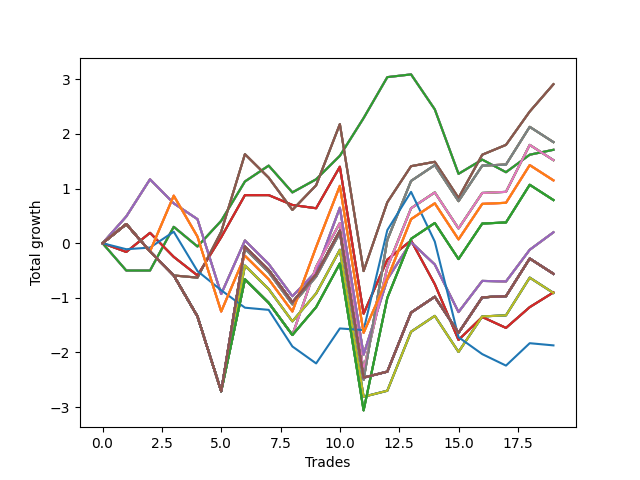

# Long Pointer 011 
- Symbol: NVDA_Unlimited
- Date Range: 02/08/2022 - 07/08/2022
- Trading Period: 7:20-12:30
- Number of Trades: 19



| Name | Win Percent | Profit | Avg Profit / Trade | Avg Time / Trade |      | Name | Win Percent | Profit | Avg Profit / Trade | Avg Time / Trade |
| ---- | ----------- | ------ | ------------------ | ---------------- | ---- | ---- | ----------- | ------ | ------------------ | ---------------- |
| Sorted By <br> Profit | | | | | | Sorted By <br> Win Percentage ||||
| Sixty-Seven | 63.16 | 1455.00 | 76.58 | 23:04 |     | Sixty-Four | 68.42 | 855.00 | 45.00 | 09:42 |
| Fifty-Nine | 63.16 | 1455.00 | 76.58 | 23:04 |     | Fifty-Six | 68.42 | 855.00 | 45.00 | 09:42 |
| Fifty-One | 63.16 | 1455.00 | 76.58 | 23:04 |     | Forty-Eight | 68.42 | 855.00 | 45.00 | 09:42 |
| Forty-Three | 63.16 | 1455.00 | 76.58 | 23:04 |     | Forty | 68.42 | 855.00 | 45.00 | 09:42 |
| Three | 63.16 | 1455.00 | 76.58 | 23:04 |     | Zero | 68.42 | 855.00 | 45.00 | 09:42 |
| Sixty-Nine | 52.63 | 925.00 | 48.68 | 28:59 |     | Sixty-Seven | 63.16 | 1455.00 | 76.58 | 23:04 |
| Sixty-One | 52.63 | 925.00 | 48.68 | 28:59 |     | Fifty-Nine | 63.16 | 1455.00 | 76.58 | 23:04 |
| Fifty-Three | 52.63 | 925.00 | 48.68 | 28:59 |     | Fifty-One | 63.16 | 1455.00 | 76.58 | 23:04 |
| Forty-Five | 52.63 | 925.00 | 48.68 | 28:59 |     | Forty-Three | 63.16 | 1455.00 | 76.58 | 23:04 |
| Five | 52.63 | 925.00 | 48.68 | 28:59 |     | Three | 63.16 | 1455.00 | 76.58 | 23:04 |
| Sixty-Four | 68.42 | 855.00 | 45.00 | 09:42 |     | One Hundred Twenty-Six | 57.89 | 575.00 | 30.26 | 24:39 |
| Fifty-Six | 68.42 | 855.00 | 45.00 | 09:42 |     | One Hundred Twenty-One | 57.89 | 575.00 | 30.26 | 24:39 |
| Forty-Eight | 68.42 | 855.00 | 45.00 | 09:42 |     | One Hundred Sixteen | 57.89 | 575.00 | 30.26 | 24:39 |
| Forty | 68.42 | 855.00 | 45.00 | 09:42 |     | One Hundred Eleven | 57.89 | 575.00 | 30.26 | 24:39 |
| Zero | 68.42 | 855.00 | 45.00 | 09:42 |     | Eighty-One | 57.89 | 575.00 | 30.26 | 24:39 |
| Sixty-Eight | 52.63 | 760.00 | 40.00 | 28:19 |     | Sixty-Nine | 52.63 | 925.00 | 48.68 | 28:59 |
| Sixty | 52.63 | 760.00 | 40.00 | 28:19 |     | Sixty-One | 52.63 | 925.00 | 48.68 | 28:59 |
| Fifty-Two | 52.63 | 760.00 | 40.00 | 28:19 |     | Fifty-Three | 52.63 | 925.00 | 48.68 | 28:59 |
| Forty-Four | 52.63 | 760.00 | 40.00 | 28:19 |     | Forty-Five | 52.63 | 925.00 | 48.68 | 28:59 |
| Four | 52.63 | 760.00 | 40.00 | 28:19 |     | Five | 52.63 | 925.00 | 48.68 | 28:59 |
| One Hundred Twenty-Six | 57.89 | 575.00 | 30.26 | 24:39 |     | Sixty-Eight | 52.63 | 760.00 | 40.00 | 28:19 |
| One Hundred Twenty-One | 57.89 | 575.00 | 30.26 | 24:39 |     | Sixty | 52.63 | 760.00 | 40.00 | 28:19 |
| One Hundred Sixteen | 57.89 | 575.00 | 30.26 | 24:39 |     | Fifty-Two | 52.63 | 760.00 | 40.00 | 28:19 |
| One Hundred Eleven | 57.89 | 575.00 | 30.26 | 24:39 |     | Forty-Four | 52.63 | 760.00 | 40.00 | 28:19 |
| Eighty-One | 57.89 | 575.00 | 30.26 | 24:39 |     | Four | 52.63 | 760.00 | 40.00 | 28:19 |
| One Hundred Twenty-Seven | 52.63 | 395.00 | 20.79 | 28:34 |     | One Hundred Twenty-Seven | 52.63 | 395.00 | 20.79 | 28:34 |
| One Hundred Twenty-Two | 52.63 | 395.00 | 20.79 | 28:34 |     | One Hundred Twenty-Two | 52.63 | 395.00 | 20.79 | 28:34 |
| One Hundred Seventeen | 52.63 | 395.00 | 20.79 | 28:34 |     | One Hundred Seventeen | 52.63 | 395.00 | 20.79 | 28:34 |
| One Hundred Twelve | 52.63 | 395.00 | 20.79 | 28:34 |     | One Hundred Twelve | 52.63 | 395.00 | 20.79 | 28:34 |
| Eighty-Two | 52.63 | 395.00 | 20.79 | 28:34 |     | Eighty-Two | 52.63 | 395.00 | 20.79 | 28:34 |
| Sixty-Six | 52.63 | 100.00 | 5.26 | 21:41 |     | Sixty-Six | 52.63 | 100.00 | 5.26 | 21:41 |
| Fifty-Eight | 52.63 | 100.00 | 5.26 | 21:41 |     | Fifty-Eight | 52.63 | 100.00 | 5.26 | 21:41 |
| Fifty | 52.63 | 100.00 | 5.26 | 21:41 |     | Fifty | 52.63 | 100.00 | 5.26 | 21:41 |
| Forty-Two | 52.63 | 100.00 | 5.26 | 21:41 |     | Forty-Two | 52.63 | 100.00 | 5.26 | 21:41 |
| Two | 52.63 | 100.00 | 5.26 | 21:41 |     | Two | 52.63 | 100.00 | 5.26 | 21:41 |
| One Hundred Thirty | 52.63 | -280.00 | -14.74 | 29:55 |     | One Hundred Thirty | 52.63 | -280.00 | -14.74 | 29:55 |
| One Hundred Twenty-Nine | 52.63 | -280.00 | -14.74 | 29:55 |     | One Hundred Twenty-Nine | 52.63 | -280.00 | -14.74 | 29:55 |
| One Hundred Twenty-Eight | 52.63 | -280.00 | -14.74 | 29:55 |     | One Hundred Twenty-Eight | 52.63 | -280.00 | -14.74 | 29:55 |
| One Hundred Twenty-Five | 52.63 | -280.00 | -14.74 | 29:55 |     | One Hundred Twenty-Five | 52.63 | -280.00 | -14.74 | 29:55 |
| One Hundred Twenty-Four | 52.63 | -280.00 | -14.74 | 29:55 |     | One Hundred Twenty-Four | 52.63 | -280.00 | -14.74 | 29:55 |
| One Hundred Twenty-Three | 52.63 | -280.00 | -14.74 | 29:55 |     | One Hundred Twenty-Three | 52.63 | -280.00 | -14.74 | 29:55 |
| One Hundred Twenty | 52.63 | -280.00 | -14.74 | 29:55 |     | One Hundred Twenty | 52.63 | -280.00 | -14.74 | 29:55 |
| One Hundred Ninteen | 52.63 | -280.00 | -14.74 | 29:55 |     | One Hundred Ninteen | 52.63 | -280.00 | -14.74 | 29:55 |
| One Hundred Eighteen | 52.63 | -280.00 | -14.74 | 29:55 |     | One Hundred Eighteen | 52.63 | -280.00 | -14.74 | 29:55 |
| One Hundred Fifteen | 52.63 | -280.00 | -14.74 | 29:55 |     | One Hundred Fifteen | 52.63 | -280.00 | -14.74 | 29:55 |
| One Hundred Fourteen | 52.63 | -280.00 | -14.74 | 29:55 |     | One Hundred Fourteen | 52.63 | -280.00 | -14.74 | 29:55 |
| One Hundred Thirteen | 52.63 | -280.00 | -14.74 | 29:55 |     | One Hundred Thirteen | 52.63 | -280.00 | -14.74 | 29:55 |
| Eighty-Five | 52.63 | -280.00 | -14.74 | 29:55 |     | Eighty-Five | 52.63 | -280.00 | -14.74 | 29:55 |
| Eighty-Four | 52.63 | -280.00 | -14.74 | 29:55 |     | Eighty-Four | 52.63 | -280.00 | -14.74 | 29:55 |
| Eighty-Three | 52.63 | -280.00 | -14.74 | 29:55 |     | Eighty-Three | 52.63 | -280.00 | -14.74 | 29:55 |
| Seventy-One | 52.63 | -280.00 | -14.74 | 29:55 |     | Seventy-One | 52.63 | -280.00 | -14.74 | 29:55 |
| Sixty-Three | 52.63 | -280.00 | -14.74 | 29:55 |     | Sixty-Three | 52.63 | -280.00 | -14.74 | 29:55 |
| Fifty-Five | 52.63 | -280.00 | -14.74 | 29:55 |     | Fifty-Five | 52.63 | -280.00 | -14.74 | 29:55 |
| Forty-Seven | 52.63 | -280.00 | -14.74 | 29:55 |     | Forty-Seven | 52.63 | -280.00 | -14.74 | 29:55 |
| Seven | 52.63 | -280.00 | -14.74 | 29:55 |     | Seven | 52.63 | -280.00 | -14.74 | 29:55 |
| Sixty-Five | 52.63 | -450.00 | -23.68 | 17:30 |     | Sixty-Five | 52.63 | -450.00 | -23.68 | 17:30 |
| Fifty-Seven | 52.63 | -450.00 | -23.68 | 17:30 |     | Fifty-Seven | 52.63 | -450.00 | -23.68 | 17:30 |
| Forty-Nine | 52.63 | -450.00 | -23.68 | 17:30 |     | Forty-Nine | 52.63 | -450.00 | -23.68 | 17:30 |
| Forty-One | 52.63 | -450.00 | -23.68 | 17:30 |     | Forty-One | 52.63 | -450.00 | -23.68 | 17:30 |
| One | 52.63 | -450.00 | -23.68 | 17:30 |     | One | 52.63 | -450.00 | -23.68 | 17:30 |
| Seventy | 52.63 | -455.00 | -23.95 | 29:47 |     | Seventy | 52.63 | -455.00 | -23.95 | 29:47 |
| Sixty-Two | 52.63 | -455.00 | -23.95 | 29:47 |     | Sixty-Two | 52.63 | -455.00 | -23.95 | 29:47 |
| Fifty-Four | 52.63 | -455.00 | -23.95 | 29:47 |     | Fifty-Four | 52.63 | -455.00 | -23.95 | 29:47 |
| Forty-Six | 52.63 | -455.00 | -23.95 | 29:47 |     | Forty-Six | 52.63 | -455.00 | -23.95 | 29:47 |
| Six | 52.63 | -455.00 | -23.95 | 29:47 |     | Six | 52.63 | -455.00 | -23.95 | 29:47 |
| Seventy-Three | 31.58 | -935.00 | -49.21 | 12:05 |     | Seventy-Three | 31.58 | -935.00 | -49.21 | 12:05 |

## NO STOPLOSS

### Test Zero
* Sell when price hits the middle line of the 20p bollinger
* No Stoploss
* Results:
```
Total Trades: 19
Percent Up: 68.42
Percent Down: 31.58
Total Points Moved Up: 1.71
Potential Profit: 855.00
Total Points Ups: 5.11 Count Ups: 13
Total Points Downs: -3.40 Count Downs: 6
```

<details><summary>Trades</summary>

<code>In: 2022-02-23 10:17:00		Out: 2022-02-23 10:36:10		Total Position Time: 19:10		Total Move Up: -0.50		Total to Date: -0.50</code> <br />
<code>In: 2022-02-23 12:15:00		Out: 2022-02-23 12:25:55		Total Position Time: 10:55		Total Move Up: 0.00		Total to Date: -0.50</code> <br />
<code>In: 2022-02-28 11:12:00		Out: 2022-02-28 11:19:45		Total Position Time: 07:45		Total Move Up: 0.80		Total to Date: 0.30</code> <br />
<code>In: 2022-03-03 12:06:00		Out: 2022-03-03 12:18:20		Total Position Time: 12:20		Total Move Up: -0.36		Total to Date: -0.06</code> <br />
<code>In: 2022-03-14 09:37:00		Out: 2022-03-14 09:40:45		Total Position Time: 03:45		Total Move Up: 0.47		Total to Date: 0.41</code> <br />
<code>In: 2022-03-17 07:56:00		Out: 2022-03-17 07:59:20		Total Position Time: 03:20		Total Move Up: 0.72		Total to Date: 1.13</code> <br />
<code>In: 2022-03-28 08:39:00		Out: 2022-03-28 08:45:05		Total Position Time: 06:05		Total Move Up: 0.29		Total to Date: 1.42</code> <br />
<code>In: 2022-03-30 08:03:00		Out: 2022-03-30 08:14:35		Total Position Time: 11:35		Total Move Up: -0.49		Total to Date: 0.93</code> <br />
<code>In: 2022-03-30 12:07:00		Out: 2022-03-30 12:14:15		Total Position Time: 07:15		Total Move Up: 0.24		Total to Date: 1.17</code> <br />
<code>In: 2022-03-31 10:18:00		Out: 2022-03-31 10:26:20		Total Position Time: 08:20		Total Move Up: 0.43		Total to Date: 1.60</code> <br />
<code>In: 2022-04-07 08:36:00		Out: 2022-04-07 08:40:45		Total Position Time: 04:45		Total Move Up: 0.69		Total to Date: 2.29</code> <br />
<code>In: 2022-05-02 10:51:00		Out: 2022-05-02 10:55:45		Total Position Time: 04:45		Total Move Up: 0.75		Total to Date: 3.04</code> <br />
<code>In: 2022-06-01 09:06:00		Out: 2022-06-01 09:16:00		Total Position Time: 10:00		Total Move Up: 0.05		Total to Date: 3.09</code> <br />
<code>In: 2022-06-03 08:05:00		Out: 2022-06-03 08:21:10		Total Position Time: 16:10		Total Move Up: -0.64		Total to Date: 2.45</code> <br />
<code>In: 2022-06-08 09:30:00		Out: 2022-06-08 09:50:15		Total Position Time: 20:15		Total Move Up: -1.18		Total to Date: 1.27</code> <br />
<code>In: 2022-06-08 09:42:00		Out: 2022-06-08 09:50:15		Total Position Time: 08:15		Total Move Up: 0.26		Total to Date: 1.53</code> <br />
<code>In: 2022-06-09 08:10:00		Out: 2022-06-09 08:24:20		Total Position Time: 14:20		Total Move Up: -0.23		Total to Date: 1.30</code> <br />
<code>In: 2022-06-09 10:47:00		Out: 2022-06-09 10:51:05		Total Position Time: 04:05		Total Move Up: 0.32		Total to Date: 1.62</code> <br />
<code>In: 2022-06-23 09:07:00		Out: 2022-06-23 09:18:25		Total Position Time: 11:25		Total Move Up: 0.09		Total to Date: 1.71</code> <br />


</details>

### Test One
* Sell when the price hits the upper line of the 20p 1std bollinger
* No Stoploss
* Results:
```
Total Trades: 19
Percent Up: 52.63
Percent Down: 47.37
Total Points Moved Up: -0.90
Potential Profit: -450.00
Total Points Ups: 4.99 Count Ups: 10
Total Points Downs: -5.89 Count Downs: 9
```

<details><summary>Trades</summary>

<code>In: 2022-02-23 10:17:00		Out: 2022-02-23 10:39:05		Total Position Time: 22:05		Total Move Up: -0.16		Total to Date: -0.16</code> <br />
<code>In: 2022-02-23 12:15:00		Out: 2022-02-23 12:27:05		Total Position Time: 12:05		Total Move Up: 0.35		Total to Date: 0.19</code> <br />
<code>In: 2022-02-28 11:12:00		Out: 2022-02-28 11:41:55		Total Position Time: 29:55		Total Move Up: -0.44		Total to Date: -0.25</code> <br />
<code>In: 2022-03-03 12:06:00		Out: 2022-03-03 12:26:05		Total Position Time: 20:05		Total Move Up: -0.34		Total to Date: -0.59</code> <br />
<code>In: 2022-03-14 09:37:00		Out: 2022-03-14 09:42:00		Total Position Time: 05:00		Total Move Up: 0.70		Total to Date: 0.11</code> <br />
<code>In: 2022-03-17 07:56:00		Out: 2022-03-17 08:08:20		Total Position Time: 12:20		Total Move Up: 0.77		Total to Date: 0.88</code> <br />
<code>In: 2022-03-28 08:39:00		Out: 2022-03-28 09:01:50		Total Position Time: 22:50		Total Move Up: 0.00		Total to Date: 0.88</code> <br />
<code>In: 2022-03-30 08:03:00		Out: 2022-03-30 08:19:15		Total Position Time: 16:15		Total Move Up: -0.18		Total to Date: 0.70</code> <br />
<code>In: 2022-03-30 12:07:00		Out: 2022-03-30 12:30:45		Total Position Time: 23:45		Total Move Up: -0.06		Total to Date: 0.64</code> <br />
<code>In: 2022-03-31 10:18:00		Out: 2022-03-31 10:29:05		Total Position Time: 11:05		Total Move Up: 0.76		Total to Date: 1.40</code> <br />
<code>In: 2022-04-07 08:36:00		Out: 2022-04-07 09:05:55		Total Position Time: 29:55		Total Move Up: -2.69		Total to Date: -1.29</code> <br />
<code>In: 2022-05-02 10:51:00		Out: 2022-05-02 10:58:20		Total Position Time: 07:20		Total Move Up: 0.99		Total to Date: -0.30</code> <br />
<code>In: 2022-06-01 09:06:00		Out: 2022-06-01 09:19:50		Total Position Time: 13:50		Total Move Up: 0.35		Total to Date: 0.05</code> <br />
<code>In: 2022-06-03 08:05:00		Out: 2022-06-03 08:29:30		Total Position Time: 24:30		Total Move Up: -0.80		Total to Date: -0.75</code> <br />
<code>In: 2022-06-08 09:30:00		Out: 2022-06-08 09:54:00		Total Position Time: 24:00		Total Move Up: -1.02		Total to Date: -1.77</code> <br />
<code>In: 2022-06-08 09:42:00		Out: 2022-06-08 09:54:00		Total Position Time: 12:00		Total Move Up: 0.42		Total to Date: -1.35</code> <br />
<code>In: 2022-06-09 08:10:00		Out: 2022-06-09 08:33:15		Total Position Time: 23:15		Total Move Up: -0.20		Total to Date: -1.55</code> <br />
<code>In: 2022-06-09 10:47:00		Out: 2022-06-09 10:57:10		Total Position Time: 10:10		Total Move Up: 0.38		Total to Date: -1.17</code> <br />
<code>In: 2022-06-23 09:07:00		Out: 2022-06-23 09:19:05		Total Position Time: 12:05		Total Move Up: 0.27		Total to Date: -0.90</code> <br />


</details>

### Test Two
* Sell when the price hits the upper line of the 20p 2std bollinger
* No Stoploss
* Results:
```
Total Trades: 19
Percent Up: 52.63
Percent Down: 47.37
Total Points Moved Up: 0.20
Potential Profit: 100.00
Total Points Ups: 7.30 Count Ups: 10
Total Points Downs: -7.10 Count Downs: 9
```

<details><summary>Trades</summary>

<code>In: 2022-02-23 10:17:00		Out: 2022-02-23 10:42:50		Total Position Time: 25:50		Total Move Up: 0.49		Total to Date: 0.49</code> <br />
<code>In: 2022-02-23 12:15:00		Out: 2022-02-23 12:31:10		Total Position Time: 16:10		Total Move Up: 0.68		Total to Date: 1.17</code> <br />
<code>In: 2022-02-28 11:12:00		Out: 2022-02-28 11:41:55		Total Position Time: 29:55		Total Move Up: -0.44		Total to Date: 0.73</code> <br />
<code>In: 2022-03-03 12:06:00		Out: 2022-03-03 12:27:10		Total Position Time: 21:10		Total Move Up: -0.29		Total to Date: 0.44</code> <br />
<code>In: 2022-03-14 09:37:00		Out: 2022-03-14 10:06:55		Total Position Time: 29:55		Total Move Up: -1.37		Total to Date: -0.93</code> <br />
<code>In: 2022-03-17 07:56:00		Out: 2022-03-17 08:10:10		Total Position Time: 14:10		Total Move Up: 0.98		Total to Date: 0.05</code> <br />
<code>In: 2022-03-28 08:39:00		Out: 2022-03-28 09:08:55		Total Position Time: 29:55		Total Move Up: -0.43		Total to Date: -0.38</code> <br />
<code>In: 2022-03-30 08:03:00		Out: 2022-03-30 08:32:55		Total Position Time: 29:55		Total Move Up: -0.59		Total to Date: -0.97</code> <br />
<code>In: 2022-03-30 12:07:00		Out: 2022-03-30 12:31:35		Total Position Time: 24:35		Total Move Up: 0.45		Total to Date: -0.52</code> <br />
<code>In: 2022-03-31 10:18:00		Out: 2022-03-31 10:31:20		Total Position Time: 13:20		Total Move Up: 1.17		Total to Date: 0.65</code> <br />
<code>In: 2022-04-07 08:36:00		Out: 2022-04-07 09:05:55		Total Position Time: 29:55		Total Move Up: -2.69		Total to Date: -2.04</code> <br />
<code>In: 2022-05-02 10:51:00		Out: 2022-05-02 10:59:55		Total Position Time: 08:55		Total Move Up: 1.38		Total to Date: -0.66</code> <br />
<code>In: 2022-06-01 09:06:00		Out: 2022-06-01 09:20:40		Total Position Time: 14:40		Total Move Up: 0.68		Total to Date: 0.02</code> <br />
<code>In: 2022-06-03 08:05:00		Out: 2022-06-03 08:30:25		Total Position Time: 25:25		Total Move Up: -0.41		Total to Date: -0.39</code> <br />
<code>In: 2022-06-08 09:30:00		Out: 2022-06-08 09:56:45		Total Position Time: 26:45		Total Move Up: -0.87		Total to Date: -1.26</code> <br />
<code>In: 2022-06-08 09:42:00		Out: 2022-06-08 09:56:45		Total Position Time: 14:45		Total Move Up: 0.57		Total to Date: -0.69</code> <br />
<code>In: 2022-06-09 08:10:00		Out: 2022-06-09 08:33:35		Total Position Time: 23:35		Total Move Up: -0.01		Total to Date: -0.70</code> <br />
<code>In: 2022-06-09 10:47:00		Out: 2022-06-09 10:59:30		Total Position Time: 12:30		Total Move Up: 0.58		Total to Date: -0.12</code> <br />
<code>In: 2022-06-23 09:07:00		Out: 2022-06-23 09:27:35		Total Position Time: 20:35		Total Move Up: 0.32		Total to Date: 0.20</code> <br />


</details>

### Test Three
* Sell when price hits the middle line of the 50p bollinger
* No Stoploss
* Results:
```
Total Trades: 19
Percent Up: 63.16
Percent Down: 36.84
Total Points Moved Up: 2.91
Potential Profit: 1455.00
Total Points Ups: 8.26 Count Ups: 12
Total Points Downs: -5.35 Count Downs: 7
```

<details><summary>Trades</summary>

<code>In: 2022-02-23 10:17:00		Out: 2022-02-23 10:46:55		Total Position Time: 29:55		Total Move Up: 0.35		Total to Date: 0.35</code> <br />
<code>In: 2022-02-23 12:15:00		Out: 2022-02-23 12:44:55		Total Position Time: 29:55		Total Move Up: -0.50		Total to Date: -0.15</code> <br />
<code>In: 2022-02-28 11:12:00		Out: 2022-02-28 11:41:55		Total Position Time: 29:55		Total Move Up: -0.44		Total to Date: -0.59</code> <br />
<code>In: 2022-03-03 12:06:00		Out: 2022-03-03 12:28:05		Total Position Time: 22:05		Total Move Up: -0.04		Total to Date: -0.63</code> <br />
<code>In: 2022-03-14 09:37:00		Out: 2022-03-14 09:42:05		Total Position Time: 05:05		Total Move Up: 0.84		Total to Date: 0.21</code> <br />
<code>In: 2022-03-17 07:56:00		Out: 2022-03-17 08:11:05		Total Position Time: 15:05		Total Move Up: 1.42		Total to Date: 1.63</code> <br />
<code>In: 2022-03-28 08:39:00		Out: 2022-03-28 09:08:55		Total Position Time: 29:55		Total Move Up: -0.43		Total to Date: 1.20</code> <br />
<code>In: 2022-03-30 08:03:00		Out: 2022-03-30 08:32:55		Total Position Time: 29:55		Total Move Up: -0.59		Total to Date: 0.61</code> <br />
<code>In: 2022-03-30 12:07:00		Out: 2022-03-30 12:31:35		Total Position Time: 24:35		Total Move Up: 0.45		Total to Date: 1.06</code> <br />
<code>In: 2022-03-31 10:18:00		Out: 2022-03-31 10:29:40		Total Position Time: 11:40		Total Move Up: 1.12		Total to Date: 2.18</code> <br />
<code>In: 2022-04-07 08:36:00		Out: 2022-04-07 09:05:55		Total Position Time: 29:55		Total Move Up: -2.69		Total to Date: -0.51</code> <br />
<code>In: 2022-05-02 10:51:00		Out: 2022-05-02 10:59:50		Total Position Time: 08:50		Total Move Up: 1.26		Total to Date: 0.75</code> <br />
<code>In: 2022-06-01 09:06:00		Out: 2022-06-01 09:31:05		Total Position Time: 25:05		Total Move Up: 0.66		Total to Date: 1.41</code> <br />
<code>In: 2022-06-03 08:05:00		Out: 2022-06-03 08:32:10		Total Position Time: 27:10		Total Move Up: 0.08		Total to Date: 1.49</code> <br />
<code>In: 2022-06-08 09:30:00		Out: 2022-06-08 09:59:55		Total Position Time: 29:55		Total Move Up: -0.66		Total to Date: 0.83</code> <br />
<code>In: 2022-06-08 09:42:00		Out: 2022-06-08 10:04:30		Total Position Time: 22:30		Total Move Up: 0.79		Total to Date: 1.62</code> <br />
<code>In: 2022-06-09 08:10:00		Out: 2022-06-09 08:35:55		Total Position Time: 25:55		Total Move Up: 0.18		Total to Date: 1.80</code> <br />
<code>In: 2022-06-09 10:47:00		Out: 2022-06-09 11:07:05		Total Position Time: 20:05		Total Move Up: 0.61		Total to Date: 2.41</code> <br />
<code>In: 2022-06-23 09:07:00		Out: 2022-06-23 09:27:55		Total Position Time: 20:55		Total Move Up: 0.50		Total to Date: 2.91</code> <br />


</details>

### Test Four
* Sell when the price hits the upper line of the 50p 1std bollinger
* No Stoploss
* Results:
```
Total Trades: 19
Percent Up: 52.63
Percent Down: 47.37
Total Points Moved Up: 1.52
Potential Profit: 760.00
Total Points Ups: 9.23 Count Ups: 10
Total Points Downs: -7.71 Count Downs: 9
```

<details><summary>Trades</summary>

<code>In: 2022-02-23 10:17:00		Out: 2022-02-23 10:46:55		Total Position Time: 29:55		Total Move Up: 0.35		Total to Date: 0.35</code> <br />
<code>In: 2022-02-23 12:15:00		Out: 2022-02-23 12:44:55		Total Position Time: 29:55		Total Move Up: -0.50		Total to Date: -0.15</code> <br />
<code>In: 2022-02-28 11:12:00		Out: 2022-02-28 11:41:55		Total Position Time: 29:55		Total Move Up: -0.44		Total to Date: -0.59</code> <br />
<code>In: 2022-03-03 12:06:00		Out: 2022-03-03 12:35:55		Total Position Time: 29:55		Total Move Up: -0.75		Total to Date: -1.34</code> <br />
<code>In: 2022-03-14 09:37:00		Out: 2022-03-14 10:06:55		Total Position Time: 29:55		Total Move Up: -1.37		Total to Date: -2.71</code> <br />
<code>In: 2022-03-17 07:56:00		Out: 2022-03-17 08:18:30		Total Position Time: 22:30		Total Move Up: 2.05		Total to Date: -0.66</code> <br />
<code>In: 2022-03-28 08:39:00		Out: 2022-03-28 09:08:55		Total Position Time: 29:55		Total Move Up: -0.43		Total to Date: -1.09</code> <br />
<code>In: 2022-03-30 08:03:00		Out: 2022-03-30 08:32:55		Total Position Time: 29:55		Total Move Up: -0.59		Total to Date: -1.68</code> <br />
<code>In: 2022-03-30 12:07:00		Out: 2022-03-30 12:33:45		Total Position Time: 26:45		Total Move Up: 1.25		Total to Date: -0.43</code> <br />
<code>In: 2022-03-31 10:18:00		Out: 2022-03-31 10:47:55		Total Position Time: 29:55		Total Move Up: 0.80		Total to Date: 0.37</code> <br />
<code>In: 2022-04-07 08:36:00		Out: 2022-04-07 09:05:55		Total Position Time: 29:55		Total Move Up: -2.69		Total to Date: -2.32</code> <br />
<code>In: 2022-05-02 10:51:00		Out: 2022-05-02 11:02:25		Total Position Time: 11:25		Total Move Up: 1.88		Total to Date: -0.44</code> <br />
<code>In: 2022-06-01 09:06:00		Out: 2022-06-01 09:35:55		Total Position Time: 29:55		Total Move Up: 1.08		Total to Date: 0.64</code> <br />
<code>In: 2022-06-03 08:05:00		Out: 2022-06-03 08:34:55		Total Position Time: 29:55		Total Move Up: 0.29		Total to Date: 0.93</code> <br />
<code>In: 2022-06-08 09:30:00		Out: 2022-06-08 09:59:55		Total Position Time: 29:55		Total Move Up: -0.66		Total to Date: 0.27</code> <br />
<code>In: 2022-06-08 09:42:00		Out: 2022-06-08 10:11:55		Total Position Time: 29:55		Total Move Up: 0.65		Total to Date: 0.92</code> <br />
<code>In: 2022-06-09 08:10:00		Out: 2022-06-09 08:39:55		Total Position Time: 29:55		Total Move Up: 0.02		Total to Date: 0.94</code> <br />
<code>In: 2022-06-09 10:47:00		Out: 2022-06-09 11:15:50		Total Position Time: 28:50		Total Move Up: 0.86		Total to Date: 1.80</code> <br />
<code>In: 2022-06-23 09:07:00		Out: 2022-06-23 09:36:55		Total Position Time: 29:55		Total Move Up: -0.28		Total to Date: 1.52</code> <br />


</details>

### Test Five
* Sell when the price hits the upper line of the 50p 2std bollinger
* No Stoploss
* Results:
```
Total Trades: 19
Percent Up: 52.63
Percent Down: 47.37
Total Points Moved Up: 1.85
Potential Profit: 925.00
Total Points Ups: 9.56 Count Ups: 10
Total Points Downs: -7.71 Count Downs: 9
```

<details><summary>Trades</summary>

<code>In: 2022-02-23 10:17:00		Out: 2022-02-23 10:46:55		Total Position Time: 29:55		Total Move Up: 0.35		Total to Date: 0.35</code> <br />
<code>In: 2022-02-23 12:15:00		Out: 2022-02-23 12:44:55		Total Position Time: 29:55		Total Move Up: -0.50		Total to Date: -0.15</code> <br />
<code>In: 2022-02-28 11:12:00		Out: 2022-02-28 11:41:55		Total Position Time: 29:55		Total Move Up: -0.44		Total to Date: -0.59</code> <br />
<code>In: 2022-03-03 12:06:00		Out: 2022-03-03 12:35:55		Total Position Time: 29:55		Total Move Up: -0.75		Total to Date: -1.34</code> <br />
<code>In: 2022-03-14 09:37:00		Out: 2022-03-14 10:06:55		Total Position Time: 29:55		Total Move Up: -1.37		Total to Date: -2.71</code> <br />
<code>In: 2022-03-17 07:56:00		Out: 2022-03-17 08:24:10		Total Position Time: 28:10		Total Move Up: 2.61		Total to Date: -0.10</code> <br />
<code>In: 2022-03-28 08:39:00		Out: 2022-03-28 09:08:55		Total Position Time: 29:55		Total Move Up: -0.43		Total to Date: -0.53</code> <br />
<code>In: 2022-03-30 08:03:00		Out: 2022-03-30 08:32:55		Total Position Time: 29:55		Total Move Up: -0.59		Total to Date: -1.12</code> <br />
<code>In: 2022-03-30 12:07:00		Out: 2022-03-30 12:36:55		Total Position Time: 29:55		Total Move Up: 0.51		Total to Date: -0.61</code> <br />
<code>In: 2022-03-31 10:18:00		Out: 2022-03-31 10:47:55		Total Position Time: 29:55		Total Move Up: 0.80		Total to Date: 0.19</code> <br />
<code>In: 2022-04-07 08:36:00		Out: 2022-04-07 09:05:55		Total Position Time: 29:55		Total Move Up: -2.69		Total to Date: -2.50</code> <br />
<code>In: 2022-05-02 10:51:00		Out: 2022-05-02 11:05:00		Total Position Time: 14:00		Total Move Up: 2.56		Total to Date: 0.06</code> <br />
<code>In: 2022-06-01 09:06:00		Out: 2022-06-01 09:35:55		Total Position Time: 29:55		Total Move Up: 1.08		Total to Date: 1.14</code> <br />
<code>In: 2022-06-03 08:05:00		Out: 2022-06-03 08:34:55		Total Position Time: 29:55		Total Move Up: 0.29		Total to Date: 1.43</code> <br />
<code>In: 2022-06-08 09:30:00		Out: 2022-06-08 09:59:55		Total Position Time: 29:55		Total Move Up: -0.66		Total to Date: 0.77</code> <br />
<code>In: 2022-06-08 09:42:00		Out: 2022-06-08 10:11:55		Total Position Time: 29:55		Total Move Up: 0.65		Total to Date: 1.42</code> <br />
<code>In: 2022-06-09 08:10:00		Out: 2022-06-09 08:39:55		Total Position Time: 29:55		Total Move Up: 0.02		Total to Date: 1.44</code> <br />
<code>In: 2022-06-09 10:47:00		Out: 2022-06-09 11:16:55		Total Position Time: 29:55		Total Move Up: 0.69		Total to Date: 2.13</code> <br />
<code>In: 2022-06-23 09:07:00		Out: 2022-06-23 09:36:55		Total Position Time: 29:55		Total Move Up: -0.28		Total to Date: 1.85</code> <br />


</details>

### Test Six
* Sell when the price hits the middle line of the 1std VWAP
* No Stoploss
* Results:
```
Total Trades: 19
Percent Up: 52.63
Percent Down: 47.37
Total Points Moved Up: -0.91
Potential Profit: -455.00
Total Points Ups: 6.80 Count Ups: 10
Total Points Downs: -7.71 Count Downs: 9
```

<details><summary>Trades</summary>

<code>In: 2022-02-23 10:17:00		Out: 2022-02-23 10:46:55		Total Position Time: 29:55		Total Move Up: 0.35		Total to Date: 0.35</code> <br />
<code>In: 2022-02-23 12:15:00		Out: 2022-02-23 12:44:55		Total Position Time: 29:55		Total Move Up: -0.50		Total to Date: -0.15</code> <br />
<code>In: 2022-02-28 11:12:00		Out: 2022-02-28 11:41:55		Total Position Time: 29:55		Total Move Up: -0.44		Total to Date: -0.59</code> <br />
<code>In: 2022-03-03 12:06:00		Out: 2022-03-03 12:35:55		Total Position Time: 29:55		Total Move Up: -0.75		Total to Date: -1.34</code> <br />
<code>In: 2022-03-14 09:37:00		Out: 2022-03-14 10:06:55		Total Position Time: 29:55		Total Move Up: -1.37		Total to Date: -2.71</code> <br />
<code>In: 2022-03-17 07:56:00		Out: 2022-03-17 08:23:30		Total Position Time: 27:30		Total Move Up: 2.30		Total to Date: -0.41</code> <br />
<code>In: 2022-03-28 08:39:00		Out: 2022-03-28 09:08:55		Total Position Time: 29:55		Total Move Up: -0.43		Total to Date: -0.84</code> <br />
<code>In: 2022-03-30 08:03:00		Out: 2022-03-30 08:32:55		Total Position Time: 29:55		Total Move Up: -0.59		Total to Date: -1.43</code> <br />
<code>In: 2022-03-30 12:07:00		Out: 2022-03-30 12:36:55		Total Position Time: 29:55		Total Move Up: 0.51		Total to Date: -0.92</code> <br />
<code>In: 2022-03-31 10:18:00		Out: 2022-03-31 10:47:55		Total Position Time: 29:55		Total Move Up: 0.80		Total to Date: -0.12</code> <br />
<code>In: 2022-04-07 08:36:00		Out: 2022-04-07 09:05:55		Total Position Time: 29:55		Total Move Up: -2.69		Total to Date: -2.81</code> <br />
<code>In: 2022-05-02 10:51:00		Out: 2022-05-02 11:20:55		Total Position Time: 29:55		Total Move Up: 0.11		Total to Date: -2.70</code> <br />
<code>In: 2022-06-01 09:06:00		Out: 2022-06-01 09:35:55		Total Position Time: 29:55		Total Move Up: 1.08		Total to Date: -1.62</code> <br />
<code>In: 2022-06-03 08:05:00		Out: 2022-06-03 08:34:55		Total Position Time: 29:55		Total Move Up: 0.29		Total to Date: -1.33</code> <br />
<code>In: 2022-06-08 09:30:00		Out: 2022-06-08 09:59:55		Total Position Time: 29:55		Total Move Up: -0.66		Total to Date: -1.99</code> <br />
<code>In: 2022-06-08 09:42:00		Out: 2022-06-08 10:11:55		Total Position Time: 29:55		Total Move Up: 0.65		Total to Date: -1.34</code> <br />
<code>In: 2022-06-09 08:10:00		Out: 2022-06-09 08:39:55		Total Position Time: 29:55		Total Move Up: 0.02		Total to Date: -1.32</code> <br />
<code>In: 2022-06-09 10:47:00		Out: 2022-06-09 11:16:55		Total Position Time: 29:55		Total Move Up: 0.69		Total to Date: -0.63</code> <br />
<code>In: 2022-06-23 09:07:00		Out: 2022-06-23 09:36:55		Total Position Time: 29:55		Total Move Up: -0.28		Total to Date: -0.91</code> <br />


</details>

### Test Seven
* Sell when the price hits the upper line of the 1std VWAP
* No Stoploss
* Results:
```
Total Trades: 19
Percent Up: 52.63
Percent Down: 47.37
Total Points Moved Up: -0.56
Potential Profit: -280.00
Total Points Ups: 7.15 Count Ups: 10
Total Points Downs: -7.71 Count Downs: 9
```

<details><summary>Trades</summary>

<code>In: 2022-02-23 10:17:00		Out: 2022-02-23 10:46:55		Total Position Time: 29:55		Total Move Up: 0.35		Total to Date: 0.35</code> <br />
<code>In: 2022-02-23 12:15:00		Out: 2022-02-23 12:44:55		Total Position Time: 29:55		Total Move Up: -0.50		Total to Date: -0.15</code> <br />
<code>In: 2022-02-28 11:12:00		Out: 2022-02-28 11:41:55		Total Position Time: 29:55		Total Move Up: -0.44		Total to Date: -0.59</code> <br />
<code>In: 2022-03-03 12:06:00		Out: 2022-03-03 12:35:55		Total Position Time: 29:55		Total Move Up: -0.75		Total to Date: -1.34</code> <br />
<code>In: 2022-03-14 09:37:00		Out: 2022-03-14 10:06:55		Total Position Time: 29:55		Total Move Up: -1.37		Total to Date: -2.71</code> <br />
<code>In: 2022-03-17 07:56:00		Out: 2022-03-17 08:25:55		Total Position Time: 29:55		Total Move Up: 2.65		Total to Date: -0.06</code> <br />
<code>In: 2022-03-28 08:39:00		Out: 2022-03-28 09:08:55		Total Position Time: 29:55		Total Move Up: -0.43		Total to Date: -0.49</code> <br />
<code>In: 2022-03-30 08:03:00		Out: 2022-03-30 08:32:55		Total Position Time: 29:55		Total Move Up: -0.59		Total to Date: -1.08</code> <br />
<code>In: 2022-03-30 12:07:00		Out: 2022-03-30 12:36:55		Total Position Time: 29:55		Total Move Up: 0.51		Total to Date: -0.57</code> <br />
<code>In: 2022-03-31 10:18:00		Out: 2022-03-31 10:47:55		Total Position Time: 29:55		Total Move Up: 0.80		Total to Date: 0.23</code> <br />
<code>In: 2022-04-07 08:36:00		Out: 2022-04-07 09:05:55		Total Position Time: 29:55		Total Move Up: -2.69		Total to Date: -2.46</code> <br />
<code>In: 2022-05-02 10:51:00		Out: 2022-05-02 11:20:55		Total Position Time: 29:55		Total Move Up: 0.11		Total to Date: -2.35</code> <br />
<code>In: 2022-06-01 09:06:00		Out: 2022-06-01 09:35:55		Total Position Time: 29:55		Total Move Up: 1.08		Total to Date: -1.27</code> <br />
<code>In: 2022-06-03 08:05:00		Out: 2022-06-03 08:34:55		Total Position Time: 29:55		Total Move Up: 0.29		Total to Date: -0.98</code> <br />
<code>In: 2022-06-08 09:30:00		Out: 2022-06-08 09:59:55		Total Position Time: 29:55		Total Move Up: -0.66		Total to Date: -1.64</code> <br />
<code>In: 2022-06-08 09:42:00		Out: 2022-06-08 10:11:55		Total Position Time: 29:55		Total Move Up: 0.65		Total to Date: -0.99</code> <br />
<code>In: 2022-06-09 08:10:00		Out: 2022-06-09 08:39:55		Total Position Time: 29:55		Total Move Up: 0.02		Total to Date: -0.97</code> <br />
<code>In: 2022-06-09 10:47:00		Out: 2022-06-09 11:16:55		Total Position Time: 29:55		Total Move Up: 0.69		Total to Date: -0.28</code> <br />
<code>In: 2022-06-23 09:07:00		Out: 2022-06-23 09:36:55		Total Position Time: 29:55		Total Move Up: -0.28		Total to Date: -0.56</code> <br />


</details>

## STOPLOSS OF 5

### Test Forty
* Sell when price hits the middle line of the 20p bollinger
* Stoploss is 5 points
* Results:
```
Total Trades: 19
Percent Up: 68.42
Percent Down: 31.58
Total Points Moved Up: 1.71
Potential Profit: 855.00
Total Points Ups: 5.11 Count Ups: 13
Total Points Downs: -3.40 Count Downs: 6
```

<details><summary>Trades</summary>

<code>In: 2022-02-23 10:17:00		Out: 2022-02-23 10:36:10		Total Position Time: 19:10		Total Move Up: -0.50		Total to Date: -0.50</code> <br />
<code>In: 2022-02-23 12:15:00		Out: 2022-02-23 12:25:55		Total Position Time: 10:55		Total Move Up: 0.00		Total to Date: -0.50</code> <br />
<code>In: 2022-02-28 11:12:00		Out: 2022-02-28 11:19:45		Total Position Time: 07:45		Total Move Up: 0.80		Total to Date: 0.30</code> <br />
<code>In: 2022-03-03 12:06:00		Out: 2022-03-03 12:18:20		Total Position Time: 12:20		Total Move Up: -0.36		Total to Date: -0.06</code> <br />
<code>In: 2022-03-14 09:37:00		Out: 2022-03-14 09:40:45		Total Position Time: 03:45		Total Move Up: 0.47		Total to Date: 0.41</code> <br />
<code>In: 2022-03-17 07:56:00		Out: 2022-03-17 07:59:20		Total Position Time: 03:20		Total Move Up: 0.72		Total to Date: 1.13</code> <br />
<code>In: 2022-03-28 08:39:00		Out: 2022-03-28 08:45:05		Total Position Time: 06:05		Total Move Up: 0.29		Total to Date: 1.42</code> <br />
<code>In: 2022-03-30 08:03:00		Out: 2022-03-30 08:14:35		Total Position Time: 11:35		Total Move Up: -0.49		Total to Date: 0.93</code> <br />
<code>In: 2022-03-30 12:07:00		Out: 2022-03-30 12:14:15		Total Position Time: 07:15		Total Move Up: 0.24		Total to Date: 1.17</code> <br />
<code>In: 2022-03-31 10:18:00		Out: 2022-03-31 10:26:20		Total Position Time: 08:20		Total Move Up: 0.43		Total to Date: 1.60</code> <br />
<code>In: 2022-04-07 08:36:00		Out: 2022-04-07 08:40:45		Total Position Time: 04:45		Total Move Up: 0.69		Total to Date: 2.29</code> <br />
<code>In: 2022-05-02 10:51:00		Out: 2022-05-02 10:55:45		Total Position Time: 04:45		Total Move Up: 0.75		Total to Date: 3.04</code> <br />
<code>In: 2022-06-01 09:06:00		Out: 2022-06-01 09:16:00		Total Position Time: 10:00		Total Move Up: 0.05		Total to Date: 3.09</code> <br />
<code>In: 2022-06-03 08:05:00		Out: 2022-06-03 08:21:10		Total Position Time: 16:10		Total Move Up: -0.64		Total to Date: 2.45</code> <br />
<code>In: 2022-06-08 09:30:00		Out: 2022-06-08 09:50:15		Total Position Time: 20:15		Total Move Up: -1.18		Total to Date: 1.27</code> <br />
<code>In: 2022-06-08 09:42:00		Out: 2022-06-08 09:50:15		Total Position Time: 08:15		Total Move Up: 0.26		Total to Date: 1.53</code> <br />
<code>In: 2022-06-09 08:10:00		Out: 2022-06-09 08:24:20		Total Position Time: 14:20		Total Move Up: -0.23		Total to Date: 1.30</code> <br />
<code>In: 2022-06-09 10:47:00		Out: 2022-06-09 10:51:05		Total Position Time: 04:05		Total Move Up: 0.32		Total to Date: 1.62</code> <br />
<code>In: 2022-06-23 09:07:00		Out: 2022-06-23 09:18:25		Total Position Time: 11:25		Total Move Up: 0.09		Total to Date: 1.71</code> <br />


</details>

### Test Forty-One
* Sell when the price hits the upper line of the 20p 1std bollinger
* Stoploss is 5 points
* Results:
```
Total Trades: 19
Percent Up: 52.63
Percent Down: 47.37
Total Points Moved Up: -0.90
Potential Profit: -450.00
Total Points Ups: 4.99 Count Ups: 10
Total Points Downs: -5.89 Count Downs: 9
```

<details><summary>Trades</summary>

<code>In: 2022-02-23 10:17:00		Out: 2022-02-23 10:39:05		Total Position Time: 22:05		Total Move Up: -0.16		Total to Date: -0.16</code> <br />
<code>In: 2022-02-23 12:15:00		Out: 2022-02-23 12:27:05		Total Position Time: 12:05		Total Move Up: 0.35		Total to Date: 0.19</code> <br />
<code>In: 2022-02-28 11:12:00		Out: 2022-02-28 11:41:55		Total Position Time: 29:55		Total Move Up: -0.44		Total to Date: -0.25</code> <br />
<code>In: 2022-03-03 12:06:00		Out: 2022-03-03 12:26:05		Total Position Time: 20:05		Total Move Up: -0.34		Total to Date: -0.59</code> <br />
<code>In: 2022-03-14 09:37:00		Out: 2022-03-14 09:42:00		Total Position Time: 05:00		Total Move Up: 0.70		Total to Date: 0.11</code> <br />
<code>In: 2022-03-17 07:56:00		Out: 2022-03-17 08:08:20		Total Position Time: 12:20		Total Move Up: 0.77		Total to Date: 0.88</code> <br />
<code>In: 2022-03-28 08:39:00		Out: 2022-03-28 09:01:50		Total Position Time: 22:50		Total Move Up: 0.00		Total to Date: 0.88</code> <br />
<code>In: 2022-03-30 08:03:00		Out: 2022-03-30 08:19:15		Total Position Time: 16:15		Total Move Up: -0.18		Total to Date: 0.70</code> <br />
<code>In: 2022-03-30 12:07:00		Out: 2022-03-30 12:30:45		Total Position Time: 23:45		Total Move Up: -0.06		Total to Date: 0.64</code> <br />
<code>In: 2022-03-31 10:18:00		Out: 2022-03-31 10:29:05		Total Position Time: 11:05		Total Move Up: 0.76		Total to Date: 1.40</code> <br />
<code>In: 2022-04-07 08:36:00		Out: 2022-04-07 09:05:55		Total Position Time: 29:55		Total Move Up: -2.69		Total to Date: -1.29</code> <br />
<code>In: 2022-05-02 10:51:00		Out: 2022-05-02 10:58:20		Total Position Time: 07:20		Total Move Up: 0.99		Total to Date: -0.30</code> <br />
<code>In: 2022-06-01 09:06:00		Out: 2022-06-01 09:19:50		Total Position Time: 13:50		Total Move Up: 0.35		Total to Date: 0.05</code> <br />
<code>In: 2022-06-03 08:05:00		Out: 2022-06-03 08:29:30		Total Position Time: 24:30		Total Move Up: -0.80		Total to Date: -0.75</code> <br />
<code>In: 2022-06-08 09:30:00		Out: 2022-06-08 09:54:00		Total Position Time: 24:00		Total Move Up: -1.02		Total to Date: -1.77</code> <br />
<code>In: 2022-06-08 09:42:00		Out: 2022-06-08 09:54:00		Total Position Time: 12:00		Total Move Up: 0.42		Total to Date: -1.35</code> <br />
<code>In: 2022-06-09 08:10:00		Out: 2022-06-09 08:33:15		Total Position Time: 23:15		Total Move Up: -0.20		Total to Date: -1.55</code> <br />
<code>In: 2022-06-09 10:47:00		Out: 2022-06-09 10:57:10		Total Position Time: 10:10		Total Move Up: 0.38		Total to Date: -1.17</code> <br />
<code>In: 2022-06-23 09:07:00		Out: 2022-06-23 09:19:05		Total Position Time: 12:05		Total Move Up: 0.27		Total to Date: -0.90</code> <br />


</details>

### Test Forty-Two
* Sell when the price hits the upper line of the 20p 2std bollinger
* Stoploss is 5 points
* Results:
```
Total Trades: 19
Percent Up: 52.63
Percent Down: 47.37
Total Points Moved Up: 0.20
Potential Profit: 100.00
Total Points Ups: 7.30 Count Ups: 10
Total Points Downs: -7.10 Count Downs: 9
```

<details><summary>Trades</summary>

<code>In: 2022-02-23 10:17:00		Out: 2022-02-23 10:42:50		Total Position Time: 25:50		Total Move Up: 0.49		Total to Date: 0.49</code> <br />
<code>In: 2022-02-23 12:15:00		Out: 2022-02-23 12:31:10		Total Position Time: 16:10		Total Move Up: 0.68		Total to Date: 1.17</code> <br />
<code>In: 2022-02-28 11:12:00		Out: 2022-02-28 11:41:55		Total Position Time: 29:55		Total Move Up: -0.44		Total to Date: 0.73</code> <br />
<code>In: 2022-03-03 12:06:00		Out: 2022-03-03 12:27:10		Total Position Time: 21:10		Total Move Up: -0.29		Total to Date: 0.44</code> <br />
<code>In: 2022-03-14 09:37:00		Out: 2022-03-14 10:06:55		Total Position Time: 29:55		Total Move Up: -1.37		Total to Date: -0.93</code> <br />
<code>In: 2022-03-17 07:56:00		Out: 2022-03-17 08:10:10		Total Position Time: 14:10		Total Move Up: 0.98		Total to Date: 0.05</code> <br />
<code>In: 2022-03-28 08:39:00		Out: 2022-03-28 09:08:55		Total Position Time: 29:55		Total Move Up: -0.43		Total to Date: -0.38</code> <br />
<code>In: 2022-03-30 08:03:00		Out: 2022-03-30 08:32:55		Total Position Time: 29:55		Total Move Up: -0.59		Total to Date: -0.97</code> <br />
<code>In: 2022-03-30 12:07:00		Out: 2022-03-30 12:31:35		Total Position Time: 24:35		Total Move Up: 0.45		Total to Date: -0.52</code> <br />
<code>In: 2022-03-31 10:18:00		Out: 2022-03-31 10:31:20		Total Position Time: 13:20		Total Move Up: 1.17		Total to Date: 0.65</code> <br />
<code>In: 2022-04-07 08:36:00		Out: 2022-04-07 09:05:55		Total Position Time: 29:55		Total Move Up: -2.69		Total to Date: -2.04</code> <br />
<code>In: 2022-05-02 10:51:00		Out: 2022-05-02 10:59:55		Total Position Time: 08:55		Total Move Up: 1.38		Total to Date: -0.66</code> <br />
<code>In: 2022-06-01 09:06:00		Out: 2022-06-01 09:20:40		Total Position Time: 14:40		Total Move Up: 0.68		Total to Date: 0.02</code> <br />
<code>In: 2022-06-03 08:05:00		Out: 2022-06-03 08:30:25		Total Position Time: 25:25		Total Move Up: -0.41		Total to Date: -0.39</code> <br />
<code>In: 2022-06-08 09:30:00		Out: 2022-06-08 09:56:45		Total Position Time: 26:45		Total Move Up: -0.87		Total to Date: -1.26</code> <br />
<code>In: 2022-06-08 09:42:00		Out: 2022-06-08 09:56:45		Total Position Time: 14:45		Total Move Up: 0.57		Total to Date: -0.69</code> <br />
<code>In: 2022-06-09 08:10:00		Out: 2022-06-09 08:33:35		Total Position Time: 23:35		Total Move Up: -0.01		Total to Date: -0.70</code> <br />
<code>In: 2022-06-09 10:47:00		Out: 2022-06-09 10:59:30		Total Position Time: 12:30		Total Move Up: 0.58		Total to Date: -0.12</code> <br />
<code>In: 2022-06-23 09:07:00		Out: 2022-06-23 09:27:35		Total Position Time: 20:35		Total Move Up: 0.32		Total to Date: 0.20</code> <br />


</details>

### Test Forty-Three
* Sell when price hits the middle line of the 50p bollinger
* Stoploss is 5 points
* Results:
```
Total Trades: 19
Percent Up: 63.16
Percent Down: 36.84
Total Points Moved Up: 2.91
Potential Profit: 1455.00
Total Points Ups: 8.26 Count Ups: 12
Total Points Downs: -5.35 Count Downs: 7
```

<details><summary>Trades</summary>

<code>In: 2022-02-23 10:17:00		Out: 2022-02-23 10:46:55		Total Position Time: 29:55		Total Move Up: 0.35		Total to Date: 0.35</code> <br />
<code>In: 2022-02-23 12:15:00		Out: 2022-02-23 12:44:55		Total Position Time: 29:55		Total Move Up: -0.50		Total to Date: -0.15</code> <br />
<code>In: 2022-02-28 11:12:00		Out: 2022-02-28 11:41:55		Total Position Time: 29:55		Total Move Up: -0.44		Total to Date: -0.59</code> <br />
<code>In: 2022-03-03 12:06:00		Out: 2022-03-03 12:28:05		Total Position Time: 22:05		Total Move Up: -0.04		Total to Date: -0.63</code> <br />
<code>In: 2022-03-14 09:37:00		Out: 2022-03-14 09:42:05		Total Position Time: 05:05		Total Move Up: 0.84		Total to Date: 0.21</code> <br />
<code>In: 2022-03-17 07:56:00		Out: 2022-03-17 08:11:05		Total Position Time: 15:05		Total Move Up: 1.42		Total to Date: 1.63</code> <br />
<code>In: 2022-03-28 08:39:00		Out: 2022-03-28 09:08:55		Total Position Time: 29:55		Total Move Up: -0.43		Total to Date: 1.20</code> <br />
<code>In: 2022-03-30 08:03:00		Out: 2022-03-30 08:32:55		Total Position Time: 29:55		Total Move Up: -0.59		Total to Date: 0.61</code> <br />
<code>In: 2022-03-30 12:07:00		Out: 2022-03-30 12:31:35		Total Position Time: 24:35		Total Move Up: 0.45		Total to Date: 1.06</code> <br />
<code>In: 2022-03-31 10:18:00		Out: 2022-03-31 10:29:40		Total Position Time: 11:40		Total Move Up: 1.12		Total to Date: 2.18</code> <br />
<code>In: 2022-04-07 08:36:00		Out: 2022-04-07 09:05:55		Total Position Time: 29:55		Total Move Up: -2.69		Total to Date: -0.51</code> <br />
<code>In: 2022-05-02 10:51:00		Out: 2022-05-02 10:59:50		Total Position Time: 08:50		Total Move Up: 1.26		Total to Date: 0.75</code> <br />
<code>In: 2022-06-01 09:06:00		Out: 2022-06-01 09:31:05		Total Position Time: 25:05		Total Move Up: 0.66		Total to Date: 1.41</code> <br />
<code>In: 2022-06-03 08:05:00		Out: 2022-06-03 08:32:10		Total Position Time: 27:10		Total Move Up: 0.08		Total to Date: 1.49</code> <br />
<code>In: 2022-06-08 09:30:00		Out: 2022-06-08 09:59:55		Total Position Time: 29:55		Total Move Up: -0.66		Total to Date: 0.83</code> <br />
<code>In: 2022-06-08 09:42:00		Out: 2022-06-08 10:04:30		Total Position Time: 22:30		Total Move Up: 0.79		Total to Date: 1.62</code> <br />
<code>In: 2022-06-09 08:10:00		Out: 2022-06-09 08:35:55		Total Position Time: 25:55		Total Move Up: 0.18		Total to Date: 1.80</code> <br />
<code>In: 2022-06-09 10:47:00		Out: 2022-06-09 11:07:05		Total Position Time: 20:05		Total Move Up: 0.61		Total to Date: 2.41</code> <br />
<code>In: 2022-06-23 09:07:00		Out: 2022-06-23 09:27:55		Total Position Time: 20:55		Total Move Up: 0.50		Total to Date: 2.91</code> <br />


</details>

### Test Forty-Four
* Sell when the price hits the upper line of the 50p 1std bollinger
* Stoploss is 5 points
* Results:
```
Total Trades: 19
Percent Up: 52.63
Percent Down: 47.37
Total Points Moved Up: 1.52
Potential Profit: 760.00
Total Points Ups: 9.23 Count Ups: 10
Total Points Downs: -7.71 Count Downs: 9
```

<details><summary>Trades</summary>

<code>In: 2022-02-23 10:17:00		Out: 2022-02-23 10:46:55		Total Position Time: 29:55		Total Move Up: 0.35		Total to Date: 0.35</code> <br />
<code>In: 2022-02-23 12:15:00		Out: 2022-02-23 12:44:55		Total Position Time: 29:55		Total Move Up: -0.50		Total to Date: -0.15</code> <br />
<code>In: 2022-02-28 11:12:00		Out: 2022-02-28 11:41:55		Total Position Time: 29:55		Total Move Up: -0.44		Total to Date: -0.59</code> <br />
<code>In: 2022-03-03 12:06:00		Out: 2022-03-03 12:35:55		Total Position Time: 29:55		Total Move Up: -0.75		Total to Date: -1.34</code> <br />
<code>In: 2022-03-14 09:37:00		Out: 2022-03-14 10:06:55		Total Position Time: 29:55		Total Move Up: -1.37		Total to Date: -2.71</code> <br />
<code>In: 2022-03-17 07:56:00		Out: 2022-03-17 08:18:30		Total Position Time: 22:30		Total Move Up: 2.05		Total to Date: -0.66</code> <br />
<code>In: 2022-03-28 08:39:00		Out: 2022-03-28 09:08:55		Total Position Time: 29:55		Total Move Up: -0.43		Total to Date: -1.09</code> <br />
<code>In: 2022-03-30 08:03:00		Out: 2022-03-30 08:32:55		Total Position Time: 29:55		Total Move Up: -0.59		Total to Date: -1.68</code> <br />
<code>In: 2022-03-30 12:07:00		Out: 2022-03-30 12:33:45		Total Position Time: 26:45		Total Move Up: 1.25		Total to Date: -0.43</code> <br />
<code>In: 2022-03-31 10:18:00		Out: 2022-03-31 10:47:55		Total Position Time: 29:55		Total Move Up: 0.80		Total to Date: 0.37</code> <br />
<code>In: 2022-04-07 08:36:00		Out: 2022-04-07 09:05:55		Total Position Time: 29:55		Total Move Up: -2.69		Total to Date: -2.32</code> <br />
<code>In: 2022-05-02 10:51:00		Out: 2022-05-02 11:02:25		Total Position Time: 11:25		Total Move Up: 1.88		Total to Date: -0.44</code> <br />
<code>In: 2022-06-01 09:06:00		Out: 2022-06-01 09:35:55		Total Position Time: 29:55		Total Move Up: 1.08		Total to Date: 0.64</code> <br />
<code>In: 2022-06-03 08:05:00		Out: 2022-06-03 08:34:55		Total Position Time: 29:55		Total Move Up: 0.29		Total to Date: 0.93</code> <br />
<code>In: 2022-06-08 09:30:00		Out: 2022-06-08 09:59:55		Total Position Time: 29:55		Total Move Up: -0.66		Total to Date: 0.27</code> <br />
<code>In: 2022-06-08 09:42:00		Out: 2022-06-08 10:11:55		Total Position Time: 29:55		Total Move Up: 0.65		Total to Date: 0.92</code> <br />
<code>In: 2022-06-09 08:10:00		Out: 2022-06-09 08:39:55		Total Position Time: 29:55		Total Move Up: 0.02		Total to Date: 0.94</code> <br />
<code>In: 2022-06-09 10:47:00		Out: 2022-06-09 11:15:50		Total Position Time: 28:50		Total Move Up: 0.86		Total to Date: 1.80</code> <br />
<code>In: 2022-06-23 09:07:00		Out: 2022-06-23 09:36:55		Total Position Time: 29:55		Total Move Up: -0.28		Total to Date: 1.52</code> <br />


</details>

### Test Forty-Five
* Sell when the price hits the upper line of the 50p 2std bollinger
* Stoploss is 5 points
* Results:
```
Total Trades: 19
Percent Up: 52.63
Percent Down: 47.37
Total Points Moved Up: 1.85
Potential Profit: 925.00
Total Points Ups: 9.56 Count Ups: 10
Total Points Downs: -7.71 Count Downs: 9
```

<details><summary>Trades</summary>

<code>In: 2022-02-23 10:17:00		Out: 2022-02-23 10:46:55		Total Position Time: 29:55		Total Move Up: 0.35		Total to Date: 0.35</code> <br />
<code>In: 2022-02-23 12:15:00		Out: 2022-02-23 12:44:55		Total Position Time: 29:55		Total Move Up: -0.50		Total to Date: -0.15</code> <br />
<code>In: 2022-02-28 11:12:00		Out: 2022-02-28 11:41:55		Total Position Time: 29:55		Total Move Up: -0.44		Total to Date: -0.59</code> <br />
<code>In: 2022-03-03 12:06:00		Out: 2022-03-03 12:35:55		Total Position Time: 29:55		Total Move Up: -0.75		Total to Date: -1.34</code> <br />
<code>In: 2022-03-14 09:37:00		Out: 2022-03-14 10:06:55		Total Position Time: 29:55		Total Move Up: -1.37		Total to Date: -2.71</code> <br />
<code>In: 2022-03-17 07:56:00		Out: 2022-03-17 08:24:10		Total Position Time: 28:10		Total Move Up: 2.61		Total to Date: -0.10</code> <br />
<code>In: 2022-03-28 08:39:00		Out: 2022-03-28 09:08:55		Total Position Time: 29:55		Total Move Up: -0.43		Total to Date: -0.53</code> <br />
<code>In: 2022-03-30 08:03:00		Out: 2022-03-30 08:32:55		Total Position Time: 29:55		Total Move Up: -0.59		Total to Date: -1.12</code> <br />
<code>In: 2022-03-30 12:07:00		Out: 2022-03-30 12:36:55		Total Position Time: 29:55		Total Move Up: 0.51		Total to Date: -0.61</code> <br />
<code>In: 2022-03-31 10:18:00		Out: 2022-03-31 10:47:55		Total Position Time: 29:55		Total Move Up: 0.80		Total to Date: 0.19</code> <br />
<code>In: 2022-04-07 08:36:00		Out: 2022-04-07 09:05:55		Total Position Time: 29:55		Total Move Up: -2.69		Total to Date: -2.50</code> <br />
<code>In: 2022-05-02 10:51:00		Out: 2022-05-02 11:05:00		Total Position Time: 14:00		Total Move Up: 2.56		Total to Date: 0.06</code> <br />
<code>In: 2022-06-01 09:06:00		Out: 2022-06-01 09:35:55		Total Position Time: 29:55		Total Move Up: 1.08		Total to Date: 1.14</code> <br />
<code>In: 2022-06-03 08:05:00		Out: 2022-06-03 08:34:55		Total Position Time: 29:55		Total Move Up: 0.29		Total to Date: 1.43</code> <br />
<code>In: 2022-06-08 09:30:00		Out: 2022-06-08 09:59:55		Total Position Time: 29:55		Total Move Up: -0.66		Total to Date: 0.77</code> <br />
<code>In: 2022-06-08 09:42:00		Out: 2022-06-08 10:11:55		Total Position Time: 29:55		Total Move Up: 0.65		Total to Date: 1.42</code> <br />
<code>In: 2022-06-09 08:10:00		Out: 2022-06-09 08:39:55		Total Position Time: 29:55		Total Move Up: 0.02		Total to Date: 1.44</code> <br />
<code>In: 2022-06-09 10:47:00		Out: 2022-06-09 11:16:55		Total Position Time: 29:55		Total Move Up: 0.69		Total to Date: 2.13</code> <br />
<code>In: 2022-06-23 09:07:00		Out: 2022-06-23 09:36:55		Total Position Time: 29:55		Total Move Up: -0.28		Total to Date: 1.85</code> <br />


</details>

### Test Forty-Six
* Sell when the price hits the middle line of the 1std VWAP
* Stoploss is 5 points
* Results:
```
Total Trades: 19
Percent Up: 52.63
Percent Down: 47.37
Total Points Moved Up: -0.91
Potential Profit: -455.00
Total Points Ups: 6.80 Count Ups: 10
Total Points Downs: -7.71 Count Downs: 9
```

<details><summary>Trades</summary>

<code>In: 2022-02-23 10:17:00		Out: 2022-02-23 10:46:55		Total Position Time: 29:55		Total Move Up: 0.35		Total to Date: 0.35</code> <br />
<code>In: 2022-02-23 12:15:00		Out: 2022-02-23 12:44:55		Total Position Time: 29:55		Total Move Up: -0.50		Total to Date: -0.15</code> <br />
<code>In: 2022-02-28 11:12:00		Out: 2022-02-28 11:41:55		Total Position Time: 29:55		Total Move Up: -0.44		Total to Date: -0.59</code> <br />
<code>In: 2022-03-03 12:06:00		Out: 2022-03-03 12:35:55		Total Position Time: 29:55		Total Move Up: -0.75		Total to Date: -1.34</code> <br />
<code>In: 2022-03-14 09:37:00		Out: 2022-03-14 10:06:55		Total Position Time: 29:55		Total Move Up: -1.37		Total to Date: -2.71</code> <br />
<code>In: 2022-03-17 07:56:00		Out: 2022-03-17 08:23:30		Total Position Time: 27:30		Total Move Up: 2.30		Total to Date: -0.41</code> <br />
<code>In: 2022-03-28 08:39:00		Out: 2022-03-28 09:08:55		Total Position Time: 29:55		Total Move Up: -0.43		Total to Date: -0.84</code> <br />
<code>In: 2022-03-30 08:03:00		Out: 2022-03-30 08:32:55		Total Position Time: 29:55		Total Move Up: -0.59		Total to Date: -1.43</code> <br />
<code>In: 2022-03-30 12:07:00		Out: 2022-03-30 12:36:55		Total Position Time: 29:55		Total Move Up: 0.51		Total to Date: -0.92</code> <br />
<code>In: 2022-03-31 10:18:00		Out: 2022-03-31 10:47:55		Total Position Time: 29:55		Total Move Up: 0.80		Total to Date: -0.12</code> <br />
<code>In: 2022-04-07 08:36:00		Out: 2022-04-07 09:05:55		Total Position Time: 29:55		Total Move Up: -2.69		Total to Date: -2.81</code> <br />
<code>In: 2022-05-02 10:51:00		Out: 2022-05-02 11:20:55		Total Position Time: 29:55		Total Move Up: 0.11		Total to Date: -2.70</code> <br />
<code>In: 2022-06-01 09:06:00		Out: 2022-06-01 09:35:55		Total Position Time: 29:55		Total Move Up: 1.08		Total to Date: -1.62</code> <br />
<code>In: 2022-06-03 08:05:00		Out: 2022-06-03 08:34:55		Total Position Time: 29:55		Total Move Up: 0.29		Total to Date: -1.33</code> <br />
<code>In: 2022-06-08 09:30:00		Out: 2022-06-08 09:59:55		Total Position Time: 29:55		Total Move Up: -0.66		Total to Date: -1.99</code> <br />
<code>In: 2022-06-08 09:42:00		Out: 2022-06-08 10:11:55		Total Position Time: 29:55		Total Move Up: 0.65		Total to Date: -1.34</code> <br />
<code>In: 2022-06-09 08:10:00		Out: 2022-06-09 08:39:55		Total Position Time: 29:55		Total Move Up: 0.02		Total to Date: -1.32</code> <br />
<code>In: 2022-06-09 10:47:00		Out: 2022-06-09 11:16:55		Total Position Time: 29:55		Total Move Up: 0.69		Total to Date: -0.63</code> <br />
<code>In: 2022-06-23 09:07:00		Out: 2022-06-23 09:36:55		Total Position Time: 29:55		Total Move Up: -0.28		Total to Date: -0.91</code> <br />


</details>

### Test Forty-Seven
* Sell when the price hits the upper line of the 1std VWAP
* Stoploss is 5 points
* Results:
```
Total Trades: 19
Percent Up: 52.63
Percent Down: 47.37
Total Points Moved Up: -0.56
Potential Profit: -280.00
Total Points Ups: 7.15 Count Ups: 10
Total Points Downs: -7.71 Count Downs: 9
```

<details><summary>Trades</summary>

<code>In: 2022-02-23 10:17:00		Out: 2022-02-23 10:46:55		Total Position Time: 29:55		Total Move Up: 0.35		Total to Date: 0.35</code> <br />
<code>In: 2022-02-23 12:15:00		Out: 2022-02-23 12:44:55		Total Position Time: 29:55		Total Move Up: -0.50		Total to Date: -0.15</code> <br />
<code>In: 2022-02-28 11:12:00		Out: 2022-02-28 11:41:55		Total Position Time: 29:55		Total Move Up: -0.44		Total to Date: -0.59</code> <br />
<code>In: 2022-03-03 12:06:00		Out: 2022-03-03 12:35:55		Total Position Time: 29:55		Total Move Up: -0.75		Total to Date: -1.34</code> <br />
<code>In: 2022-03-14 09:37:00		Out: 2022-03-14 10:06:55		Total Position Time: 29:55		Total Move Up: -1.37		Total to Date: -2.71</code> <br />
<code>In: 2022-03-17 07:56:00		Out: 2022-03-17 08:25:55		Total Position Time: 29:55		Total Move Up: 2.65		Total to Date: -0.06</code> <br />
<code>In: 2022-03-28 08:39:00		Out: 2022-03-28 09:08:55		Total Position Time: 29:55		Total Move Up: -0.43		Total to Date: -0.49</code> <br />
<code>In: 2022-03-30 08:03:00		Out: 2022-03-30 08:32:55		Total Position Time: 29:55		Total Move Up: -0.59		Total to Date: -1.08</code> <br />
<code>In: 2022-03-30 12:07:00		Out: 2022-03-30 12:36:55		Total Position Time: 29:55		Total Move Up: 0.51		Total to Date: -0.57</code> <br />
<code>In: 2022-03-31 10:18:00		Out: 2022-03-31 10:47:55		Total Position Time: 29:55		Total Move Up: 0.80		Total to Date: 0.23</code> <br />
<code>In: 2022-04-07 08:36:00		Out: 2022-04-07 09:05:55		Total Position Time: 29:55		Total Move Up: -2.69		Total to Date: -2.46</code> <br />
<code>In: 2022-05-02 10:51:00		Out: 2022-05-02 11:20:55		Total Position Time: 29:55		Total Move Up: 0.11		Total to Date: -2.35</code> <br />
<code>In: 2022-06-01 09:06:00		Out: 2022-06-01 09:35:55		Total Position Time: 29:55		Total Move Up: 1.08		Total to Date: -1.27</code> <br />
<code>In: 2022-06-03 08:05:00		Out: 2022-06-03 08:34:55		Total Position Time: 29:55		Total Move Up: 0.29		Total to Date: -0.98</code> <br />
<code>In: 2022-06-08 09:30:00		Out: 2022-06-08 09:59:55		Total Position Time: 29:55		Total Move Up: -0.66		Total to Date: -1.64</code> <br />
<code>In: 2022-06-08 09:42:00		Out: 2022-06-08 10:11:55		Total Position Time: 29:55		Total Move Up: 0.65		Total to Date: -0.99</code> <br />
<code>In: 2022-06-09 08:10:00		Out: 2022-06-09 08:39:55		Total Position Time: 29:55		Total Move Up: 0.02		Total to Date: -0.97</code> <br />
<code>In: 2022-06-09 10:47:00		Out: 2022-06-09 11:16:55		Total Position Time: 29:55		Total Move Up: 0.69		Total to Date: -0.28</code> <br />
<code>In: 2022-06-23 09:07:00		Out: 2022-06-23 09:36:55		Total Position Time: 29:55		Total Move Up: -0.28		Total to Date: -0.56</code> <br />


</details>

## TRAIL STOP OF 5

### Test Forty-Eight
* Sell when price hits the middle line of the 20p bollinger
* Trailing Stop is 5 points
* Results:
```
Total Trades: 19
Percent Up: 68.42
Percent Down: 31.58
Total Points Moved Up: 1.71
Potential Profit: 855.00
Total Points Ups: 5.11 Count Ups: 13
Total Points Downs: -3.40 Count Downs: 6
```

<details><summary>Trades</summary>

<code>In: 2022-02-23 10:17:00		Out: 2022-02-23 10:36:10		Total Position Time: 19:10		Total Move Up: -0.50		Total to Date: -0.50</code> <br />
<code>In: 2022-02-23 12:15:00		Out: 2022-02-23 12:25:55		Total Position Time: 10:55		Total Move Up: 0.00		Total to Date: -0.50</code> <br />
<code>In: 2022-02-28 11:12:00		Out: 2022-02-28 11:19:45		Total Position Time: 07:45		Total Move Up: 0.80		Total to Date: 0.30</code> <br />
<code>In: 2022-03-03 12:06:00		Out: 2022-03-03 12:18:20		Total Position Time: 12:20		Total Move Up: -0.36		Total to Date: -0.06</code> <br />
<code>In: 2022-03-14 09:37:00		Out: 2022-03-14 09:40:45		Total Position Time: 03:45		Total Move Up: 0.47		Total to Date: 0.41</code> <br />
<code>In: 2022-03-17 07:56:00		Out: 2022-03-17 07:59:20		Total Position Time: 03:20		Total Move Up: 0.72		Total to Date: 1.13</code> <br />
<code>In: 2022-03-28 08:39:00		Out: 2022-03-28 08:45:05		Total Position Time: 06:05		Total Move Up: 0.29		Total to Date: 1.42</code> <br />
<code>In: 2022-03-30 08:03:00		Out: 2022-03-30 08:14:35		Total Position Time: 11:35		Total Move Up: -0.49		Total to Date: 0.93</code> <br />
<code>In: 2022-03-30 12:07:00		Out: 2022-03-30 12:14:15		Total Position Time: 07:15		Total Move Up: 0.24		Total to Date: 1.17</code> <br />
<code>In: 2022-03-31 10:18:00		Out: 2022-03-31 10:26:20		Total Position Time: 08:20		Total Move Up: 0.43		Total to Date: 1.60</code> <br />
<code>In: 2022-04-07 08:36:00		Out: 2022-04-07 08:40:45		Total Position Time: 04:45		Total Move Up: 0.69		Total to Date: 2.29</code> <br />
<code>In: 2022-05-02 10:51:00		Out: 2022-05-02 10:55:45		Total Position Time: 04:45		Total Move Up: 0.75		Total to Date: 3.04</code> <br />
<code>In: 2022-06-01 09:06:00		Out: 2022-06-01 09:16:00		Total Position Time: 10:00		Total Move Up: 0.05		Total to Date: 3.09</code> <br />
<code>In: 2022-06-03 08:05:00		Out: 2022-06-03 08:21:10		Total Position Time: 16:10		Total Move Up: -0.64		Total to Date: 2.45</code> <br />
<code>In: 2022-06-08 09:30:00		Out: 2022-06-08 09:50:15		Total Position Time: 20:15		Total Move Up: -1.18		Total to Date: 1.27</code> <br />
<code>In: 2022-06-08 09:42:00		Out: 2022-06-08 09:50:15		Total Position Time: 08:15		Total Move Up: 0.26		Total to Date: 1.53</code> <br />
<code>In: 2022-06-09 08:10:00		Out: 2022-06-09 08:24:20		Total Position Time: 14:20		Total Move Up: -0.23		Total to Date: 1.30</code> <br />
<code>In: 2022-06-09 10:47:00		Out: 2022-06-09 10:51:05		Total Position Time: 04:05		Total Move Up: 0.32		Total to Date: 1.62</code> <br />
<code>In: 2022-06-23 09:07:00		Out: 2022-06-23 09:18:25		Total Position Time: 11:25		Total Move Up: 0.09		Total to Date: 1.71</code> <br />


</details>

### Test Forty-Nine
* Sell when the price hits the upper line of the 20p 1std bollinger
* Trailing Stop is 5 points
* Results:
```
Total Trades: 19
Percent Up: 52.63
Percent Down: 47.37
Total Points Moved Up: -0.90
Potential Profit: -450.00
Total Points Ups: 4.99 Count Ups: 10
Total Points Downs: -5.89 Count Downs: 9
```

<details><summary>Trades</summary>

<code>In: 2022-02-23 10:17:00		Out: 2022-02-23 10:39:05		Total Position Time: 22:05		Total Move Up: -0.16		Total to Date: -0.16</code> <br />
<code>In: 2022-02-23 12:15:00		Out: 2022-02-23 12:27:05		Total Position Time: 12:05		Total Move Up: 0.35		Total to Date: 0.19</code> <br />
<code>In: 2022-02-28 11:12:00		Out: 2022-02-28 11:41:55		Total Position Time: 29:55		Total Move Up: -0.44		Total to Date: -0.25</code> <br />
<code>In: 2022-03-03 12:06:00		Out: 2022-03-03 12:26:05		Total Position Time: 20:05		Total Move Up: -0.34		Total to Date: -0.59</code> <br />
<code>In: 2022-03-14 09:37:00		Out: 2022-03-14 09:42:00		Total Position Time: 05:00		Total Move Up: 0.70		Total to Date: 0.11</code> <br />
<code>In: 2022-03-17 07:56:00		Out: 2022-03-17 08:08:20		Total Position Time: 12:20		Total Move Up: 0.77		Total to Date: 0.88</code> <br />
<code>In: 2022-03-28 08:39:00		Out: 2022-03-28 09:01:50		Total Position Time: 22:50		Total Move Up: 0.00		Total to Date: 0.88</code> <br />
<code>In: 2022-03-30 08:03:00		Out: 2022-03-30 08:19:15		Total Position Time: 16:15		Total Move Up: -0.18		Total to Date: 0.70</code> <br />
<code>In: 2022-03-30 12:07:00		Out: 2022-03-30 12:30:45		Total Position Time: 23:45		Total Move Up: -0.06		Total to Date: 0.64</code> <br />
<code>In: 2022-03-31 10:18:00		Out: 2022-03-31 10:29:05		Total Position Time: 11:05		Total Move Up: 0.76		Total to Date: 1.40</code> <br />
<code>In: 2022-04-07 08:36:00		Out: 2022-04-07 09:05:55		Total Position Time: 29:55		Total Move Up: -2.69		Total to Date: -1.29</code> <br />
<code>In: 2022-05-02 10:51:00		Out: 2022-05-02 10:58:20		Total Position Time: 07:20		Total Move Up: 0.99		Total to Date: -0.30</code> <br />
<code>In: 2022-06-01 09:06:00		Out: 2022-06-01 09:19:50		Total Position Time: 13:50		Total Move Up: 0.35		Total to Date: 0.05</code> <br />
<code>In: 2022-06-03 08:05:00		Out: 2022-06-03 08:29:30		Total Position Time: 24:30		Total Move Up: -0.80		Total to Date: -0.75</code> <br />
<code>In: 2022-06-08 09:30:00		Out: 2022-06-08 09:54:00		Total Position Time: 24:00		Total Move Up: -1.02		Total to Date: -1.77</code> <br />
<code>In: 2022-06-08 09:42:00		Out: 2022-06-08 09:54:00		Total Position Time: 12:00		Total Move Up: 0.42		Total to Date: -1.35</code> <br />
<code>In: 2022-06-09 08:10:00		Out: 2022-06-09 08:33:15		Total Position Time: 23:15		Total Move Up: -0.20		Total to Date: -1.55</code> <br />
<code>In: 2022-06-09 10:47:00		Out: 2022-06-09 10:57:10		Total Position Time: 10:10		Total Move Up: 0.38		Total to Date: -1.17</code> <br />
<code>In: 2022-06-23 09:07:00		Out: 2022-06-23 09:19:05		Total Position Time: 12:05		Total Move Up: 0.27		Total to Date: -0.90</code> <br />


</details>

### Test Fifty
* Sell when the price hits the upper line of the 20p 2std bollinger
* Trailing Stop is 5 points
* Results:
```
Total Trades: 19
Percent Up: 52.63
Percent Down: 47.37
Total Points Moved Up: 0.20
Potential Profit: 100.00
Total Points Ups: 7.30 Count Ups: 10
Total Points Downs: -7.10 Count Downs: 9
```

<details><summary>Trades</summary>

<code>In: 2022-02-23 10:17:00		Out: 2022-02-23 10:42:50		Total Position Time: 25:50		Total Move Up: 0.49		Total to Date: 0.49</code> <br />
<code>In: 2022-02-23 12:15:00		Out: 2022-02-23 12:31:10		Total Position Time: 16:10		Total Move Up: 0.68		Total to Date: 1.17</code> <br />
<code>In: 2022-02-28 11:12:00		Out: 2022-02-28 11:41:55		Total Position Time: 29:55		Total Move Up: -0.44		Total to Date: 0.73</code> <br />
<code>In: 2022-03-03 12:06:00		Out: 2022-03-03 12:27:10		Total Position Time: 21:10		Total Move Up: -0.29		Total to Date: 0.44</code> <br />
<code>In: 2022-03-14 09:37:00		Out: 2022-03-14 10:06:55		Total Position Time: 29:55		Total Move Up: -1.37		Total to Date: -0.93</code> <br />
<code>In: 2022-03-17 07:56:00		Out: 2022-03-17 08:10:10		Total Position Time: 14:10		Total Move Up: 0.98		Total to Date: 0.05</code> <br />
<code>In: 2022-03-28 08:39:00		Out: 2022-03-28 09:08:55		Total Position Time: 29:55		Total Move Up: -0.43		Total to Date: -0.38</code> <br />
<code>In: 2022-03-30 08:03:00		Out: 2022-03-30 08:32:55		Total Position Time: 29:55		Total Move Up: -0.59		Total to Date: -0.97</code> <br />
<code>In: 2022-03-30 12:07:00		Out: 2022-03-30 12:31:35		Total Position Time: 24:35		Total Move Up: 0.45		Total to Date: -0.52</code> <br />
<code>In: 2022-03-31 10:18:00		Out: 2022-03-31 10:31:20		Total Position Time: 13:20		Total Move Up: 1.17		Total to Date: 0.65</code> <br />
<code>In: 2022-04-07 08:36:00		Out: 2022-04-07 09:05:55		Total Position Time: 29:55		Total Move Up: -2.69		Total to Date: -2.04</code> <br />
<code>In: 2022-05-02 10:51:00		Out: 2022-05-02 10:59:55		Total Position Time: 08:55		Total Move Up: 1.38		Total to Date: -0.66</code> <br />
<code>In: 2022-06-01 09:06:00		Out: 2022-06-01 09:20:40		Total Position Time: 14:40		Total Move Up: 0.68		Total to Date: 0.02</code> <br />
<code>In: 2022-06-03 08:05:00		Out: 2022-06-03 08:30:25		Total Position Time: 25:25		Total Move Up: -0.41		Total to Date: -0.39</code> <br />
<code>In: 2022-06-08 09:30:00		Out: 2022-06-08 09:56:45		Total Position Time: 26:45		Total Move Up: -0.87		Total to Date: -1.26</code> <br />
<code>In: 2022-06-08 09:42:00		Out: 2022-06-08 09:56:45		Total Position Time: 14:45		Total Move Up: 0.57		Total to Date: -0.69</code> <br />
<code>In: 2022-06-09 08:10:00		Out: 2022-06-09 08:33:35		Total Position Time: 23:35		Total Move Up: -0.01		Total to Date: -0.70</code> <br />
<code>In: 2022-06-09 10:47:00		Out: 2022-06-09 10:59:30		Total Position Time: 12:30		Total Move Up: 0.58		Total to Date: -0.12</code> <br />
<code>In: 2022-06-23 09:07:00		Out: 2022-06-23 09:27:35		Total Position Time: 20:35		Total Move Up: 0.32		Total to Date: 0.20</code> <br />


</details>

### Test Fifty-One
* Sell when price hits the middle line of the 50p bollinger
* Trailing Stop is 5 points
* Results:
```
Total Trades: 19
Percent Up: 63.16
Percent Down: 36.84
Total Points Moved Up: 2.91
Potential Profit: 1455.00
Total Points Ups: 8.26 Count Ups: 12
Total Points Downs: -5.35 Count Downs: 7
```

<details><summary>Trades</summary>

<code>In: 2022-02-23 10:17:00		Out: 2022-02-23 10:46:55		Total Position Time: 29:55		Total Move Up: 0.35		Total to Date: 0.35</code> <br />
<code>In: 2022-02-23 12:15:00		Out: 2022-02-23 12:44:55		Total Position Time: 29:55		Total Move Up: -0.50		Total to Date: -0.15</code> <br />
<code>In: 2022-02-28 11:12:00		Out: 2022-02-28 11:41:55		Total Position Time: 29:55		Total Move Up: -0.44		Total to Date: -0.59</code> <br />
<code>In: 2022-03-03 12:06:00		Out: 2022-03-03 12:28:05		Total Position Time: 22:05		Total Move Up: -0.04		Total to Date: -0.63</code> <br />
<code>In: 2022-03-14 09:37:00		Out: 2022-03-14 09:42:05		Total Position Time: 05:05		Total Move Up: 0.84		Total to Date: 0.21</code> <br />
<code>In: 2022-03-17 07:56:00		Out: 2022-03-17 08:11:05		Total Position Time: 15:05		Total Move Up: 1.42		Total to Date: 1.63</code> <br />
<code>In: 2022-03-28 08:39:00		Out: 2022-03-28 09:08:55		Total Position Time: 29:55		Total Move Up: -0.43		Total to Date: 1.20</code> <br />
<code>In: 2022-03-30 08:03:00		Out: 2022-03-30 08:32:55		Total Position Time: 29:55		Total Move Up: -0.59		Total to Date: 0.61</code> <br />
<code>In: 2022-03-30 12:07:00		Out: 2022-03-30 12:31:35		Total Position Time: 24:35		Total Move Up: 0.45		Total to Date: 1.06</code> <br />
<code>In: 2022-03-31 10:18:00		Out: 2022-03-31 10:29:40		Total Position Time: 11:40		Total Move Up: 1.12		Total to Date: 2.18</code> <br />
<code>In: 2022-04-07 08:36:00		Out: 2022-04-07 09:05:55		Total Position Time: 29:55		Total Move Up: -2.69		Total to Date: -0.51</code> <br />
<code>In: 2022-05-02 10:51:00		Out: 2022-05-02 10:59:50		Total Position Time: 08:50		Total Move Up: 1.26		Total to Date: 0.75</code> <br />
<code>In: 2022-06-01 09:06:00		Out: 2022-06-01 09:31:05		Total Position Time: 25:05		Total Move Up: 0.66		Total to Date: 1.41</code> <br />
<code>In: 2022-06-03 08:05:00		Out: 2022-06-03 08:32:10		Total Position Time: 27:10		Total Move Up: 0.08		Total to Date: 1.49</code> <br />
<code>In: 2022-06-08 09:30:00		Out: 2022-06-08 09:59:55		Total Position Time: 29:55		Total Move Up: -0.66		Total to Date: 0.83</code> <br />
<code>In: 2022-06-08 09:42:00		Out: 2022-06-08 10:04:30		Total Position Time: 22:30		Total Move Up: 0.79		Total to Date: 1.62</code> <br />
<code>In: 2022-06-09 08:10:00		Out: 2022-06-09 08:35:55		Total Position Time: 25:55		Total Move Up: 0.18		Total to Date: 1.80</code> <br />
<code>In: 2022-06-09 10:47:00		Out: 2022-06-09 11:07:05		Total Position Time: 20:05		Total Move Up: 0.61		Total to Date: 2.41</code> <br />
<code>In: 2022-06-23 09:07:00		Out: 2022-06-23 09:27:55		Total Position Time: 20:55		Total Move Up: 0.50		Total to Date: 2.91</code> <br />


</details>

### Test Fifty-Two
* Sell when the price hits the upper line of the 50p 1std bollinger
* Trailing Stop is 5 points
* Results:
```
Total Trades: 19
Percent Up: 52.63
Percent Down: 47.37
Total Points Moved Up: 1.52
Potential Profit: 760.00
Total Points Ups: 9.23 Count Ups: 10
Total Points Downs: -7.71 Count Downs: 9
```

<details><summary>Trades</summary>

<code>In: 2022-02-23 10:17:00		Out: 2022-02-23 10:46:55		Total Position Time: 29:55		Total Move Up: 0.35		Total to Date: 0.35</code> <br />
<code>In: 2022-02-23 12:15:00		Out: 2022-02-23 12:44:55		Total Position Time: 29:55		Total Move Up: -0.50		Total to Date: -0.15</code> <br />
<code>In: 2022-02-28 11:12:00		Out: 2022-02-28 11:41:55		Total Position Time: 29:55		Total Move Up: -0.44		Total to Date: -0.59</code> <br />
<code>In: 2022-03-03 12:06:00		Out: 2022-03-03 12:35:55		Total Position Time: 29:55		Total Move Up: -0.75		Total to Date: -1.34</code> <br />
<code>In: 2022-03-14 09:37:00		Out: 2022-03-14 10:06:55		Total Position Time: 29:55		Total Move Up: -1.37		Total to Date: -2.71</code> <br />
<code>In: 2022-03-17 07:56:00		Out: 2022-03-17 08:18:30		Total Position Time: 22:30		Total Move Up: 2.05		Total to Date: -0.66</code> <br />
<code>In: 2022-03-28 08:39:00		Out: 2022-03-28 09:08:55		Total Position Time: 29:55		Total Move Up: -0.43		Total to Date: -1.09</code> <br />
<code>In: 2022-03-30 08:03:00		Out: 2022-03-30 08:32:55		Total Position Time: 29:55		Total Move Up: -0.59		Total to Date: -1.68</code> <br />
<code>In: 2022-03-30 12:07:00		Out: 2022-03-30 12:33:45		Total Position Time: 26:45		Total Move Up: 1.25		Total to Date: -0.43</code> <br />
<code>In: 2022-03-31 10:18:00		Out: 2022-03-31 10:47:55		Total Position Time: 29:55		Total Move Up: 0.80		Total to Date: 0.37</code> <br />
<code>In: 2022-04-07 08:36:00		Out: 2022-04-07 09:05:55		Total Position Time: 29:55		Total Move Up: -2.69		Total to Date: -2.32</code> <br />
<code>In: 2022-05-02 10:51:00		Out: 2022-05-02 11:02:25		Total Position Time: 11:25		Total Move Up: 1.88		Total to Date: -0.44</code> <br />
<code>In: 2022-06-01 09:06:00		Out: 2022-06-01 09:35:55		Total Position Time: 29:55		Total Move Up: 1.08		Total to Date: 0.64</code> <br />
<code>In: 2022-06-03 08:05:00		Out: 2022-06-03 08:34:55		Total Position Time: 29:55		Total Move Up: 0.29		Total to Date: 0.93</code> <br />
<code>In: 2022-06-08 09:30:00		Out: 2022-06-08 09:59:55		Total Position Time: 29:55		Total Move Up: -0.66		Total to Date: 0.27</code> <br />
<code>In: 2022-06-08 09:42:00		Out: 2022-06-08 10:11:55		Total Position Time: 29:55		Total Move Up: 0.65		Total to Date: 0.92</code> <br />
<code>In: 2022-06-09 08:10:00		Out: 2022-06-09 08:39:55		Total Position Time: 29:55		Total Move Up: 0.02		Total to Date: 0.94</code> <br />
<code>In: 2022-06-09 10:47:00		Out: 2022-06-09 11:15:50		Total Position Time: 28:50		Total Move Up: 0.86		Total to Date: 1.80</code> <br />
<code>In: 2022-06-23 09:07:00		Out: 2022-06-23 09:36:55		Total Position Time: 29:55		Total Move Up: -0.28		Total to Date: 1.52</code> <br />


</details>

### Test Fifty-Three
* Sell when the price hits the upper line of the 50p 2std bollinger
* Trailing Stop is 5 points
* Results:
```
Total Trades: 19
Percent Up: 52.63
Percent Down: 47.37
Total Points Moved Up: 1.85
Potential Profit: 925.00
Total Points Ups: 9.56 Count Ups: 10
Total Points Downs: -7.71 Count Downs: 9
```

<details><summary>Trades</summary>

<code>In: 2022-02-23 10:17:00		Out: 2022-02-23 10:46:55		Total Position Time: 29:55		Total Move Up: 0.35		Total to Date: 0.35</code> <br />
<code>In: 2022-02-23 12:15:00		Out: 2022-02-23 12:44:55		Total Position Time: 29:55		Total Move Up: -0.50		Total to Date: -0.15</code> <br />
<code>In: 2022-02-28 11:12:00		Out: 2022-02-28 11:41:55		Total Position Time: 29:55		Total Move Up: -0.44		Total to Date: -0.59</code> <br />
<code>In: 2022-03-03 12:06:00		Out: 2022-03-03 12:35:55		Total Position Time: 29:55		Total Move Up: -0.75		Total to Date: -1.34</code> <br />
<code>In: 2022-03-14 09:37:00		Out: 2022-03-14 10:06:55		Total Position Time: 29:55		Total Move Up: -1.37		Total to Date: -2.71</code> <br />
<code>In: 2022-03-17 07:56:00		Out: 2022-03-17 08:24:10		Total Position Time: 28:10		Total Move Up: 2.61		Total to Date: -0.10</code> <br />
<code>In: 2022-03-28 08:39:00		Out: 2022-03-28 09:08:55		Total Position Time: 29:55		Total Move Up: -0.43		Total to Date: -0.53</code> <br />
<code>In: 2022-03-30 08:03:00		Out: 2022-03-30 08:32:55		Total Position Time: 29:55		Total Move Up: -0.59		Total to Date: -1.12</code> <br />
<code>In: 2022-03-30 12:07:00		Out: 2022-03-30 12:36:55		Total Position Time: 29:55		Total Move Up: 0.51		Total to Date: -0.61</code> <br />
<code>In: 2022-03-31 10:18:00		Out: 2022-03-31 10:47:55		Total Position Time: 29:55		Total Move Up: 0.80		Total to Date: 0.19</code> <br />
<code>In: 2022-04-07 08:36:00		Out: 2022-04-07 09:05:55		Total Position Time: 29:55		Total Move Up: -2.69		Total to Date: -2.50</code> <br />
<code>In: 2022-05-02 10:51:00		Out: 2022-05-02 11:05:00		Total Position Time: 14:00		Total Move Up: 2.56		Total to Date: 0.06</code> <br />
<code>In: 2022-06-01 09:06:00		Out: 2022-06-01 09:35:55		Total Position Time: 29:55		Total Move Up: 1.08		Total to Date: 1.14</code> <br />
<code>In: 2022-06-03 08:05:00		Out: 2022-06-03 08:34:55		Total Position Time: 29:55		Total Move Up: 0.29		Total to Date: 1.43</code> <br />
<code>In: 2022-06-08 09:30:00		Out: 2022-06-08 09:59:55		Total Position Time: 29:55		Total Move Up: -0.66		Total to Date: 0.77</code> <br />
<code>In: 2022-06-08 09:42:00		Out: 2022-06-08 10:11:55		Total Position Time: 29:55		Total Move Up: 0.65		Total to Date: 1.42</code> <br />
<code>In: 2022-06-09 08:10:00		Out: 2022-06-09 08:39:55		Total Position Time: 29:55		Total Move Up: 0.02		Total to Date: 1.44</code> <br />
<code>In: 2022-06-09 10:47:00		Out: 2022-06-09 11:16:55		Total Position Time: 29:55		Total Move Up: 0.69		Total to Date: 2.13</code> <br />
<code>In: 2022-06-23 09:07:00		Out: 2022-06-23 09:36:55		Total Position Time: 29:55		Total Move Up: -0.28		Total to Date: 1.85</code> <br />


</details>

### Test Fifty-Four
* Sell when the price hits the middle line of the 1std VWAP
* Trailing Stop is 5 points
* Results:
```
Total Trades: 19
Percent Up: 52.63
Percent Down: 47.37
Total Points Moved Up: -0.91
Potential Profit: -455.00
Total Points Ups: 6.80 Count Ups: 10
Total Points Downs: -7.71 Count Downs: 9
```

<details><summary>Trades</summary>

<code>In: 2022-02-23 10:17:00		Out: 2022-02-23 10:46:55		Total Position Time: 29:55		Total Move Up: 0.35		Total to Date: 0.35</code> <br />
<code>In: 2022-02-23 12:15:00		Out: 2022-02-23 12:44:55		Total Position Time: 29:55		Total Move Up: -0.50		Total to Date: -0.15</code> <br />
<code>In: 2022-02-28 11:12:00		Out: 2022-02-28 11:41:55		Total Position Time: 29:55		Total Move Up: -0.44		Total to Date: -0.59</code> <br />
<code>In: 2022-03-03 12:06:00		Out: 2022-03-03 12:35:55		Total Position Time: 29:55		Total Move Up: -0.75		Total to Date: -1.34</code> <br />
<code>In: 2022-03-14 09:37:00		Out: 2022-03-14 10:06:55		Total Position Time: 29:55		Total Move Up: -1.37		Total to Date: -2.71</code> <br />
<code>In: 2022-03-17 07:56:00		Out: 2022-03-17 08:23:30		Total Position Time: 27:30		Total Move Up: 2.30		Total to Date: -0.41</code> <br />
<code>In: 2022-03-28 08:39:00		Out: 2022-03-28 09:08:55		Total Position Time: 29:55		Total Move Up: -0.43		Total to Date: -0.84</code> <br />
<code>In: 2022-03-30 08:03:00		Out: 2022-03-30 08:32:55		Total Position Time: 29:55		Total Move Up: -0.59		Total to Date: -1.43</code> <br />
<code>In: 2022-03-30 12:07:00		Out: 2022-03-30 12:36:55		Total Position Time: 29:55		Total Move Up: 0.51		Total to Date: -0.92</code> <br />
<code>In: 2022-03-31 10:18:00		Out: 2022-03-31 10:47:55		Total Position Time: 29:55		Total Move Up: 0.80		Total to Date: -0.12</code> <br />
<code>In: 2022-04-07 08:36:00		Out: 2022-04-07 09:05:55		Total Position Time: 29:55		Total Move Up: -2.69		Total to Date: -2.81</code> <br />
<code>In: 2022-05-02 10:51:00		Out: 2022-05-02 11:20:55		Total Position Time: 29:55		Total Move Up: 0.11		Total to Date: -2.70</code> <br />
<code>In: 2022-06-01 09:06:00		Out: 2022-06-01 09:35:55		Total Position Time: 29:55		Total Move Up: 1.08		Total to Date: -1.62</code> <br />
<code>In: 2022-06-03 08:05:00		Out: 2022-06-03 08:34:55		Total Position Time: 29:55		Total Move Up: 0.29		Total to Date: -1.33</code> <br />
<code>In: 2022-06-08 09:30:00		Out: 2022-06-08 09:59:55		Total Position Time: 29:55		Total Move Up: -0.66		Total to Date: -1.99</code> <br />
<code>In: 2022-06-08 09:42:00		Out: 2022-06-08 10:11:55		Total Position Time: 29:55		Total Move Up: 0.65		Total to Date: -1.34</code> <br />
<code>In: 2022-06-09 08:10:00		Out: 2022-06-09 08:39:55		Total Position Time: 29:55		Total Move Up: 0.02		Total to Date: -1.32</code> <br />
<code>In: 2022-06-09 10:47:00		Out: 2022-06-09 11:16:55		Total Position Time: 29:55		Total Move Up: 0.69		Total to Date: -0.63</code> <br />
<code>In: 2022-06-23 09:07:00		Out: 2022-06-23 09:36:55		Total Position Time: 29:55		Total Move Up: -0.28		Total to Date: -0.91</code> <br />


</details>

### Test Fifty-Five
* Sell when the price hits the upper line of the 1std VWAP
* Trailing Stop is 5 points
* Results:
```
Total Trades: 19
Percent Up: 52.63
Percent Down: 47.37
Total Points Moved Up: -0.56
Potential Profit: -280.00
Total Points Ups: 7.15 Count Ups: 10
Total Points Downs: -7.71 Count Downs: 9
```

<details><summary>Trades</summary>

<code>In: 2022-02-23 10:17:00		Out: 2022-02-23 10:46:55		Total Position Time: 29:55		Total Move Up: 0.35		Total to Date: 0.35</code> <br />
<code>In: 2022-02-23 12:15:00		Out: 2022-02-23 12:44:55		Total Position Time: 29:55		Total Move Up: -0.50		Total to Date: -0.15</code> <br />
<code>In: 2022-02-28 11:12:00		Out: 2022-02-28 11:41:55		Total Position Time: 29:55		Total Move Up: -0.44		Total to Date: -0.59</code> <br />
<code>In: 2022-03-03 12:06:00		Out: 2022-03-03 12:35:55		Total Position Time: 29:55		Total Move Up: -0.75		Total to Date: -1.34</code> <br />
<code>In: 2022-03-14 09:37:00		Out: 2022-03-14 10:06:55		Total Position Time: 29:55		Total Move Up: -1.37		Total to Date: -2.71</code> <br />
<code>In: 2022-03-17 07:56:00		Out: 2022-03-17 08:25:55		Total Position Time: 29:55		Total Move Up: 2.65		Total to Date: -0.06</code> <br />
<code>In: 2022-03-28 08:39:00		Out: 2022-03-28 09:08:55		Total Position Time: 29:55		Total Move Up: -0.43		Total to Date: -0.49</code> <br />
<code>In: 2022-03-30 08:03:00		Out: 2022-03-30 08:32:55		Total Position Time: 29:55		Total Move Up: -0.59		Total to Date: -1.08</code> <br />
<code>In: 2022-03-30 12:07:00		Out: 2022-03-30 12:36:55		Total Position Time: 29:55		Total Move Up: 0.51		Total to Date: -0.57</code> <br />
<code>In: 2022-03-31 10:18:00		Out: 2022-03-31 10:47:55		Total Position Time: 29:55		Total Move Up: 0.80		Total to Date: 0.23</code> <br />
<code>In: 2022-04-07 08:36:00		Out: 2022-04-07 09:05:55		Total Position Time: 29:55		Total Move Up: -2.69		Total to Date: -2.46</code> <br />
<code>In: 2022-05-02 10:51:00		Out: 2022-05-02 11:20:55		Total Position Time: 29:55		Total Move Up: 0.11		Total to Date: -2.35</code> <br />
<code>In: 2022-06-01 09:06:00		Out: 2022-06-01 09:35:55		Total Position Time: 29:55		Total Move Up: 1.08		Total to Date: -1.27</code> <br />
<code>In: 2022-06-03 08:05:00		Out: 2022-06-03 08:34:55		Total Position Time: 29:55		Total Move Up: 0.29		Total to Date: -0.98</code> <br />
<code>In: 2022-06-08 09:30:00		Out: 2022-06-08 09:59:55		Total Position Time: 29:55		Total Move Up: -0.66		Total to Date: -1.64</code> <br />
<code>In: 2022-06-08 09:42:00		Out: 2022-06-08 10:11:55		Total Position Time: 29:55		Total Move Up: 0.65		Total to Date: -0.99</code> <br />
<code>In: 2022-06-09 08:10:00		Out: 2022-06-09 08:39:55		Total Position Time: 29:55		Total Move Up: 0.02		Total to Date: -0.97</code> <br />
<code>In: 2022-06-09 10:47:00		Out: 2022-06-09 11:16:55		Total Position Time: 29:55		Total Move Up: 0.69		Total to Date: -0.28</code> <br />
<code>In: 2022-06-23 09:07:00		Out: 2022-06-23 09:36:55		Total Position Time: 29:55		Total Move Up: -0.28		Total to Date: -0.56</code> <br />


</details>

## STOPLOSS OF 10

### Test Fifty-Six
* Sell when price hits the middle line of the 20p bollinger
* Stoploss is 10 points
* Results:
```
Total Trades: 19
Percent Up: 68.42
Percent Down: 31.58
Total Points Moved Up: 1.71
Potential Profit: 855.00
Total Points Ups: 5.11 Count Ups: 13
Total Points Downs: -3.40 Count Downs: 6
```

<details><summary>Trades</summary>

<code>In: 2022-02-23 10:17:00		Out: 2022-02-23 10:36:10		Total Position Time: 19:10		Total Move Up: -0.50		Total to Date: -0.50</code> <br />
<code>In: 2022-02-23 12:15:00		Out: 2022-02-23 12:25:55		Total Position Time: 10:55		Total Move Up: 0.00		Total to Date: -0.50</code> <br />
<code>In: 2022-02-28 11:12:00		Out: 2022-02-28 11:19:45		Total Position Time: 07:45		Total Move Up: 0.80		Total to Date: 0.30</code> <br />
<code>In: 2022-03-03 12:06:00		Out: 2022-03-03 12:18:20		Total Position Time: 12:20		Total Move Up: -0.36		Total to Date: -0.06</code> <br />
<code>In: 2022-03-14 09:37:00		Out: 2022-03-14 09:40:45		Total Position Time: 03:45		Total Move Up: 0.47		Total to Date: 0.41</code> <br />
<code>In: 2022-03-17 07:56:00		Out: 2022-03-17 07:59:20		Total Position Time: 03:20		Total Move Up: 0.72		Total to Date: 1.13</code> <br />
<code>In: 2022-03-28 08:39:00		Out: 2022-03-28 08:45:05		Total Position Time: 06:05		Total Move Up: 0.29		Total to Date: 1.42</code> <br />
<code>In: 2022-03-30 08:03:00		Out: 2022-03-30 08:14:35		Total Position Time: 11:35		Total Move Up: -0.49		Total to Date: 0.93</code> <br />
<code>In: 2022-03-30 12:07:00		Out: 2022-03-30 12:14:15		Total Position Time: 07:15		Total Move Up: 0.24		Total to Date: 1.17</code> <br />
<code>In: 2022-03-31 10:18:00		Out: 2022-03-31 10:26:20		Total Position Time: 08:20		Total Move Up: 0.43		Total to Date: 1.60</code> <br />
<code>In: 2022-04-07 08:36:00		Out: 2022-04-07 08:40:45		Total Position Time: 04:45		Total Move Up: 0.69		Total to Date: 2.29</code> <br />
<code>In: 2022-05-02 10:51:00		Out: 2022-05-02 10:55:45		Total Position Time: 04:45		Total Move Up: 0.75		Total to Date: 3.04</code> <br />
<code>In: 2022-06-01 09:06:00		Out: 2022-06-01 09:16:00		Total Position Time: 10:00		Total Move Up: 0.05		Total to Date: 3.09</code> <br />
<code>In: 2022-06-03 08:05:00		Out: 2022-06-03 08:21:10		Total Position Time: 16:10		Total Move Up: -0.64		Total to Date: 2.45</code> <br />
<code>In: 2022-06-08 09:30:00		Out: 2022-06-08 09:50:15		Total Position Time: 20:15		Total Move Up: -1.18		Total to Date: 1.27</code> <br />
<code>In: 2022-06-08 09:42:00		Out: 2022-06-08 09:50:15		Total Position Time: 08:15		Total Move Up: 0.26		Total to Date: 1.53</code> <br />
<code>In: 2022-06-09 08:10:00		Out: 2022-06-09 08:24:20		Total Position Time: 14:20		Total Move Up: -0.23		Total to Date: 1.30</code> <br />
<code>In: 2022-06-09 10:47:00		Out: 2022-06-09 10:51:05		Total Position Time: 04:05		Total Move Up: 0.32		Total to Date: 1.62</code> <br />
<code>In: 2022-06-23 09:07:00		Out: 2022-06-23 09:18:25		Total Position Time: 11:25		Total Move Up: 0.09		Total to Date: 1.71</code> <br />


</details>

### Test Fifty-Seven
* Sell when the price hits the upper line of the 20p 1std bollinger
* Stoploss is 10 points
* Results:
```
Total Trades: 19
Percent Up: 52.63
Percent Down: 47.37
Total Points Moved Up: -0.90
Potential Profit: -450.00
Total Points Ups: 4.99 Count Ups: 10
Total Points Downs: -5.89 Count Downs: 9
```

<details><summary>Trades</summary>

<code>In: 2022-02-23 10:17:00		Out: 2022-02-23 10:39:05		Total Position Time: 22:05		Total Move Up: -0.16		Total to Date: -0.16</code> <br />
<code>In: 2022-02-23 12:15:00		Out: 2022-02-23 12:27:05		Total Position Time: 12:05		Total Move Up: 0.35		Total to Date: 0.19</code> <br />
<code>In: 2022-02-28 11:12:00		Out: 2022-02-28 11:41:55		Total Position Time: 29:55		Total Move Up: -0.44		Total to Date: -0.25</code> <br />
<code>In: 2022-03-03 12:06:00		Out: 2022-03-03 12:26:05		Total Position Time: 20:05		Total Move Up: -0.34		Total to Date: -0.59</code> <br />
<code>In: 2022-03-14 09:37:00		Out: 2022-03-14 09:42:00		Total Position Time: 05:00		Total Move Up: 0.70		Total to Date: 0.11</code> <br />
<code>In: 2022-03-17 07:56:00		Out: 2022-03-17 08:08:20		Total Position Time: 12:20		Total Move Up: 0.77		Total to Date: 0.88</code> <br />
<code>In: 2022-03-28 08:39:00		Out: 2022-03-28 09:01:50		Total Position Time: 22:50		Total Move Up: 0.00		Total to Date: 0.88</code> <br />
<code>In: 2022-03-30 08:03:00		Out: 2022-03-30 08:19:15		Total Position Time: 16:15		Total Move Up: -0.18		Total to Date: 0.70</code> <br />
<code>In: 2022-03-30 12:07:00		Out: 2022-03-30 12:30:45		Total Position Time: 23:45		Total Move Up: -0.06		Total to Date: 0.64</code> <br />
<code>In: 2022-03-31 10:18:00		Out: 2022-03-31 10:29:05		Total Position Time: 11:05		Total Move Up: 0.76		Total to Date: 1.40</code> <br />
<code>In: 2022-04-07 08:36:00		Out: 2022-04-07 09:05:55		Total Position Time: 29:55		Total Move Up: -2.69		Total to Date: -1.29</code> <br />
<code>In: 2022-05-02 10:51:00		Out: 2022-05-02 10:58:20		Total Position Time: 07:20		Total Move Up: 0.99		Total to Date: -0.30</code> <br />
<code>In: 2022-06-01 09:06:00		Out: 2022-06-01 09:19:50		Total Position Time: 13:50		Total Move Up: 0.35		Total to Date: 0.05</code> <br />
<code>In: 2022-06-03 08:05:00		Out: 2022-06-03 08:29:30		Total Position Time: 24:30		Total Move Up: -0.80		Total to Date: -0.75</code> <br />
<code>In: 2022-06-08 09:30:00		Out: 2022-06-08 09:54:00		Total Position Time: 24:00		Total Move Up: -1.02		Total to Date: -1.77</code> <br />
<code>In: 2022-06-08 09:42:00		Out: 2022-06-08 09:54:00		Total Position Time: 12:00		Total Move Up: 0.42		Total to Date: -1.35</code> <br />
<code>In: 2022-06-09 08:10:00		Out: 2022-06-09 08:33:15		Total Position Time: 23:15		Total Move Up: -0.20		Total to Date: -1.55</code> <br />
<code>In: 2022-06-09 10:47:00		Out: 2022-06-09 10:57:10		Total Position Time: 10:10		Total Move Up: 0.38		Total to Date: -1.17</code> <br />
<code>In: 2022-06-23 09:07:00		Out: 2022-06-23 09:19:05		Total Position Time: 12:05		Total Move Up: 0.27		Total to Date: -0.90</code> <br />


</details>

### Test Fifty-Eight
* Sell when the price hits the upper line of the 20p 2std bollinger
* Stoploss is 10 points
* Results:
```
Total Trades: 19
Percent Up: 52.63
Percent Down: 47.37
Total Points Moved Up: 0.20
Potential Profit: 100.00
Total Points Ups: 7.30 Count Ups: 10
Total Points Downs: -7.10 Count Downs: 9
```

<details><summary>Trades</summary>

<code>In: 2022-02-23 10:17:00		Out: 2022-02-23 10:42:50		Total Position Time: 25:50		Total Move Up: 0.49		Total to Date: 0.49</code> <br />
<code>In: 2022-02-23 12:15:00		Out: 2022-02-23 12:31:10		Total Position Time: 16:10		Total Move Up: 0.68		Total to Date: 1.17</code> <br />
<code>In: 2022-02-28 11:12:00		Out: 2022-02-28 11:41:55		Total Position Time: 29:55		Total Move Up: -0.44		Total to Date: 0.73</code> <br />
<code>In: 2022-03-03 12:06:00		Out: 2022-03-03 12:27:10		Total Position Time: 21:10		Total Move Up: -0.29		Total to Date: 0.44</code> <br />
<code>In: 2022-03-14 09:37:00		Out: 2022-03-14 10:06:55		Total Position Time: 29:55		Total Move Up: -1.37		Total to Date: -0.93</code> <br />
<code>In: 2022-03-17 07:56:00		Out: 2022-03-17 08:10:10		Total Position Time: 14:10		Total Move Up: 0.98		Total to Date: 0.05</code> <br />
<code>In: 2022-03-28 08:39:00		Out: 2022-03-28 09:08:55		Total Position Time: 29:55		Total Move Up: -0.43		Total to Date: -0.38</code> <br />
<code>In: 2022-03-30 08:03:00		Out: 2022-03-30 08:32:55		Total Position Time: 29:55		Total Move Up: -0.59		Total to Date: -0.97</code> <br />
<code>In: 2022-03-30 12:07:00		Out: 2022-03-30 12:31:35		Total Position Time: 24:35		Total Move Up: 0.45		Total to Date: -0.52</code> <br />
<code>In: 2022-03-31 10:18:00		Out: 2022-03-31 10:31:20		Total Position Time: 13:20		Total Move Up: 1.17		Total to Date: 0.65</code> <br />
<code>In: 2022-04-07 08:36:00		Out: 2022-04-07 09:05:55		Total Position Time: 29:55		Total Move Up: -2.69		Total to Date: -2.04</code> <br />
<code>In: 2022-05-02 10:51:00		Out: 2022-05-02 10:59:55		Total Position Time: 08:55		Total Move Up: 1.38		Total to Date: -0.66</code> <br />
<code>In: 2022-06-01 09:06:00		Out: 2022-06-01 09:20:40		Total Position Time: 14:40		Total Move Up: 0.68		Total to Date: 0.02</code> <br />
<code>In: 2022-06-03 08:05:00		Out: 2022-06-03 08:30:25		Total Position Time: 25:25		Total Move Up: -0.41		Total to Date: -0.39</code> <br />
<code>In: 2022-06-08 09:30:00		Out: 2022-06-08 09:56:45		Total Position Time: 26:45		Total Move Up: -0.87		Total to Date: -1.26</code> <br />
<code>In: 2022-06-08 09:42:00		Out: 2022-06-08 09:56:45		Total Position Time: 14:45		Total Move Up: 0.57		Total to Date: -0.69</code> <br />
<code>In: 2022-06-09 08:10:00		Out: 2022-06-09 08:33:35		Total Position Time: 23:35		Total Move Up: -0.01		Total to Date: -0.70</code> <br />
<code>In: 2022-06-09 10:47:00		Out: 2022-06-09 10:59:30		Total Position Time: 12:30		Total Move Up: 0.58		Total to Date: -0.12</code> <br />
<code>In: 2022-06-23 09:07:00		Out: 2022-06-23 09:27:35		Total Position Time: 20:35		Total Move Up: 0.32		Total to Date: 0.20</code> <br />


</details>

### Test Fifty-Nine
* Sell when price hits the middle line of the 50p bollinger
* Stoploss is 10 points
* Results:
```
Total Trades: 19
Percent Up: 63.16
Percent Down: 36.84
Total Points Moved Up: 2.91
Potential Profit: 1455.00
Total Points Ups: 8.26 Count Ups: 12
Total Points Downs: -5.35 Count Downs: 7
```

<details><summary>Trades</summary>

<code>In: 2022-02-23 10:17:00		Out: 2022-02-23 10:46:55		Total Position Time: 29:55		Total Move Up: 0.35		Total to Date: 0.35</code> <br />
<code>In: 2022-02-23 12:15:00		Out: 2022-02-23 12:44:55		Total Position Time: 29:55		Total Move Up: -0.50		Total to Date: -0.15</code> <br />
<code>In: 2022-02-28 11:12:00		Out: 2022-02-28 11:41:55		Total Position Time: 29:55		Total Move Up: -0.44		Total to Date: -0.59</code> <br />
<code>In: 2022-03-03 12:06:00		Out: 2022-03-03 12:28:05		Total Position Time: 22:05		Total Move Up: -0.04		Total to Date: -0.63</code> <br />
<code>In: 2022-03-14 09:37:00		Out: 2022-03-14 09:42:05		Total Position Time: 05:05		Total Move Up: 0.84		Total to Date: 0.21</code> <br />
<code>In: 2022-03-17 07:56:00		Out: 2022-03-17 08:11:05		Total Position Time: 15:05		Total Move Up: 1.42		Total to Date: 1.63</code> <br />
<code>In: 2022-03-28 08:39:00		Out: 2022-03-28 09:08:55		Total Position Time: 29:55		Total Move Up: -0.43		Total to Date: 1.20</code> <br />
<code>In: 2022-03-30 08:03:00		Out: 2022-03-30 08:32:55		Total Position Time: 29:55		Total Move Up: -0.59		Total to Date: 0.61</code> <br />
<code>In: 2022-03-30 12:07:00		Out: 2022-03-30 12:31:35		Total Position Time: 24:35		Total Move Up: 0.45		Total to Date: 1.06</code> <br />
<code>In: 2022-03-31 10:18:00		Out: 2022-03-31 10:29:40		Total Position Time: 11:40		Total Move Up: 1.12		Total to Date: 2.18</code> <br />
<code>In: 2022-04-07 08:36:00		Out: 2022-04-07 09:05:55		Total Position Time: 29:55		Total Move Up: -2.69		Total to Date: -0.51</code> <br />
<code>In: 2022-05-02 10:51:00		Out: 2022-05-02 10:59:50		Total Position Time: 08:50		Total Move Up: 1.26		Total to Date: 0.75</code> <br />
<code>In: 2022-06-01 09:06:00		Out: 2022-06-01 09:31:05		Total Position Time: 25:05		Total Move Up: 0.66		Total to Date: 1.41</code> <br />
<code>In: 2022-06-03 08:05:00		Out: 2022-06-03 08:32:10		Total Position Time: 27:10		Total Move Up: 0.08		Total to Date: 1.49</code> <br />
<code>In: 2022-06-08 09:30:00		Out: 2022-06-08 09:59:55		Total Position Time: 29:55		Total Move Up: -0.66		Total to Date: 0.83</code> <br />
<code>In: 2022-06-08 09:42:00		Out: 2022-06-08 10:04:30		Total Position Time: 22:30		Total Move Up: 0.79		Total to Date: 1.62</code> <br />
<code>In: 2022-06-09 08:10:00		Out: 2022-06-09 08:35:55		Total Position Time: 25:55		Total Move Up: 0.18		Total to Date: 1.80</code> <br />
<code>In: 2022-06-09 10:47:00		Out: 2022-06-09 11:07:05		Total Position Time: 20:05		Total Move Up: 0.61		Total to Date: 2.41</code> <br />
<code>In: 2022-06-23 09:07:00		Out: 2022-06-23 09:27:55		Total Position Time: 20:55		Total Move Up: 0.50		Total to Date: 2.91</code> <br />


</details>

### Test Sixty
* Sell when the price hits the upper line of the 50p 1std bollinger
* Stoploss is 10 points
* Results:
```
Total Trades: 19
Percent Up: 52.63
Percent Down: 47.37
Total Points Moved Up: 1.52
Potential Profit: 760.00
Total Points Ups: 9.23 Count Ups: 10
Total Points Downs: -7.71 Count Downs: 9
```

<details><summary>Trades</summary>

<code>In: 2022-02-23 10:17:00		Out: 2022-02-23 10:46:55		Total Position Time: 29:55		Total Move Up: 0.35		Total to Date: 0.35</code> <br />
<code>In: 2022-02-23 12:15:00		Out: 2022-02-23 12:44:55		Total Position Time: 29:55		Total Move Up: -0.50		Total to Date: -0.15</code> <br />
<code>In: 2022-02-28 11:12:00		Out: 2022-02-28 11:41:55		Total Position Time: 29:55		Total Move Up: -0.44		Total to Date: -0.59</code> <br />
<code>In: 2022-03-03 12:06:00		Out: 2022-03-03 12:35:55		Total Position Time: 29:55		Total Move Up: -0.75		Total to Date: -1.34</code> <br />
<code>In: 2022-03-14 09:37:00		Out: 2022-03-14 10:06:55		Total Position Time: 29:55		Total Move Up: -1.37		Total to Date: -2.71</code> <br />
<code>In: 2022-03-17 07:56:00		Out: 2022-03-17 08:18:30		Total Position Time: 22:30		Total Move Up: 2.05		Total to Date: -0.66</code> <br />
<code>In: 2022-03-28 08:39:00		Out: 2022-03-28 09:08:55		Total Position Time: 29:55		Total Move Up: -0.43		Total to Date: -1.09</code> <br />
<code>In: 2022-03-30 08:03:00		Out: 2022-03-30 08:32:55		Total Position Time: 29:55		Total Move Up: -0.59		Total to Date: -1.68</code> <br />
<code>In: 2022-03-30 12:07:00		Out: 2022-03-30 12:33:45		Total Position Time: 26:45		Total Move Up: 1.25		Total to Date: -0.43</code> <br />
<code>In: 2022-03-31 10:18:00		Out: 2022-03-31 10:47:55		Total Position Time: 29:55		Total Move Up: 0.80		Total to Date: 0.37</code> <br />
<code>In: 2022-04-07 08:36:00		Out: 2022-04-07 09:05:55		Total Position Time: 29:55		Total Move Up: -2.69		Total to Date: -2.32</code> <br />
<code>In: 2022-05-02 10:51:00		Out: 2022-05-02 11:02:25		Total Position Time: 11:25		Total Move Up: 1.88		Total to Date: -0.44</code> <br />
<code>In: 2022-06-01 09:06:00		Out: 2022-06-01 09:35:55		Total Position Time: 29:55		Total Move Up: 1.08		Total to Date: 0.64</code> <br />
<code>In: 2022-06-03 08:05:00		Out: 2022-06-03 08:34:55		Total Position Time: 29:55		Total Move Up: 0.29		Total to Date: 0.93</code> <br />
<code>In: 2022-06-08 09:30:00		Out: 2022-06-08 09:59:55		Total Position Time: 29:55		Total Move Up: -0.66		Total to Date: 0.27</code> <br />
<code>In: 2022-06-08 09:42:00		Out: 2022-06-08 10:11:55		Total Position Time: 29:55		Total Move Up: 0.65		Total to Date: 0.92</code> <br />
<code>In: 2022-06-09 08:10:00		Out: 2022-06-09 08:39:55		Total Position Time: 29:55		Total Move Up: 0.02		Total to Date: 0.94</code> <br />
<code>In: 2022-06-09 10:47:00		Out: 2022-06-09 11:15:50		Total Position Time: 28:50		Total Move Up: 0.86		Total to Date: 1.80</code> <br />
<code>In: 2022-06-23 09:07:00		Out: 2022-06-23 09:36:55		Total Position Time: 29:55		Total Move Up: -0.28		Total to Date: 1.52</code> <br />


</details>

### Test Sixty-One
* Sell when the price hits the upper line of the 50p 2std bollinger
* Stoploss is 10 points
* Results:
```
Total Trades: 19
Percent Up: 52.63
Percent Down: 47.37
Total Points Moved Up: 1.85
Potential Profit: 925.00
Total Points Ups: 9.56 Count Ups: 10
Total Points Downs: -7.71 Count Downs: 9
```

<details><summary>Trades</summary>

<code>In: 2022-02-23 10:17:00		Out: 2022-02-23 10:46:55		Total Position Time: 29:55		Total Move Up: 0.35		Total to Date: 0.35</code> <br />
<code>In: 2022-02-23 12:15:00		Out: 2022-02-23 12:44:55		Total Position Time: 29:55		Total Move Up: -0.50		Total to Date: -0.15</code> <br />
<code>In: 2022-02-28 11:12:00		Out: 2022-02-28 11:41:55		Total Position Time: 29:55		Total Move Up: -0.44		Total to Date: -0.59</code> <br />
<code>In: 2022-03-03 12:06:00		Out: 2022-03-03 12:35:55		Total Position Time: 29:55		Total Move Up: -0.75		Total to Date: -1.34</code> <br />
<code>In: 2022-03-14 09:37:00		Out: 2022-03-14 10:06:55		Total Position Time: 29:55		Total Move Up: -1.37		Total to Date: -2.71</code> <br />
<code>In: 2022-03-17 07:56:00		Out: 2022-03-17 08:24:10		Total Position Time: 28:10		Total Move Up: 2.61		Total to Date: -0.10</code> <br />
<code>In: 2022-03-28 08:39:00		Out: 2022-03-28 09:08:55		Total Position Time: 29:55		Total Move Up: -0.43		Total to Date: -0.53</code> <br />
<code>In: 2022-03-30 08:03:00		Out: 2022-03-30 08:32:55		Total Position Time: 29:55		Total Move Up: -0.59		Total to Date: -1.12</code> <br />
<code>In: 2022-03-30 12:07:00		Out: 2022-03-30 12:36:55		Total Position Time: 29:55		Total Move Up: 0.51		Total to Date: -0.61</code> <br />
<code>In: 2022-03-31 10:18:00		Out: 2022-03-31 10:47:55		Total Position Time: 29:55		Total Move Up: 0.80		Total to Date: 0.19</code> <br />
<code>In: 2022-04-07 08:36:00		Out: 2022-04-07 09:05:55		Total Position Time: 29:55		Total Move Up: -2.69		Total to Date: -2.50</code> <br />
<code>In: 2022-05-02 10:51:00		Out: 2022-05-02 11:05:00		Total Position Time: 14:00		Total Move Up: 2.56		Total to Date: 0.06</code> <br />
<code>In: 2022-06-01 09:06:00		Out: 2022-06-01 09:35:55		Total Position Time: 29:55		Total Move Up: 1.08		Total to Date: 1.14</code> <br />
<code>In: 2022-06-03 08:05:00		Out: 2022-06-03 08:34:55		Total Position Time: 29:55		Total Move Up: 0.29		Total to Date: 1.43</code> <br />
<code>In: 2022-06-08 09:30:00		Out: 2022-06-08 09:59:55		Total Position Time: 29:55		Total Move Up: -0.66		Total to Date: 0.77</code> <br />
<code>In: 2022-06-08 09:42:00		Out: 2022-06-08 10:11:55		Total Position Time: 29:55		Total Move Up: 0.65		Total to Date: 1.42</code> <br />
<code>In: 2022-06-09 08:10:00		Out: 2022-06-09 08:39:55		Total Position Time: 29:55		Total Move Up: 0.02		Total to Date: 1.44</code> <br />
<code>In: 2022-06-09 10:47:00		Out: 2022-06-09 11:16:55		Total Position Time: 29:55		Total Move Up: 0.69		Total to Date: 2.13</code> <br />
<code>In: 2022-06-23 09:07:00		Out: 2022-06-23 09:36:55		Total Position Time: 29:55		Total Move Up: -0.28		Total to Date: 1.85</code> <br />


</details>

### Test Sixty-Two
* Sell when the price hits the middle line of the 1std VWAP
* Stoploss is 10 points
* Results:
```
Total Trades: 19
Percent Up: 52.63
Percent Down: 47.37
Total Points Moved Up: -0.91
Potential Profit: -455.00
Total Points Ups: 6.80 Count Ups: 10
Total Points Downs: -7.71 Count Downs: 9
```

<details><summary>Trades</summary>

<code>In: 2022-02-23 10:17:00		Out: 2022-02-23 10:46:55		Total Position Time: 29:55		Total Move Up: 0.35		Total to Date: 0.35</code> <br />
<code>In: 2022-02-23 12:15:00		Out: 2022-02-23 12:44:55		Total Position Time: 29:55		Total Move Up: -0.50		Total to Date: -0.15</code> <br />
<code>In: 2022-02-28 11:12:00		Out: 2022-02-28 11:41:55		Total Position Time: 29:55		Total Move Up: -0.44		Total to Date: -0.59</code> <br />
<code>In: 2022-03-03 12:06:00		Out: 2022-03-03 12:35:55		Total Position Time: 29:55		Total Move Up: -0.75		Total to Date: -1.34</code> <br />
<code>In: 2022-03-14 09:37:00		Out: 2022-03-14 10:06:55		Total Position Time: 29:55		Total Move Up: -1.37		Total to Date: -2.71</code> <br />
<code>In: 2022-03-17 07:56:00		Out: 2022-03-17 08:23:30		Total Position Time: 27:30		Total Move Up: 2.30		Total to Date: -0.41</code> <br />
<code>In: 2022-03-28 08:39:00		Out: 2022-03-28 09:08:55		Total Position Time: 29:55		Total Move Up: -0.43		Total to Date: -0.84</code> <br />
<code>In: 2022-03-30 08:03:00		Out: 2022-03-30 08:32:55		Total Position Time: 29:55		Total Move Up: -0.59		Total to Date: -1.43</code> <br />
<code>In: 2022-03-30 12:07:00		Out: 2022-03-30 12:36:55		Total Position Time: 29:55		Total Move Up: 0.51		Total to Date: -0.92</code> <br />
<code>In: 2022-03-31 10:18:00		Out: 2022-03-31 10:47:55		Total Position Time: 29:55		Total Move Up: 0.80		Total to Date: -0.12</code> <br />
<code>In: 2022-04-07 08:36:00		Out: 2022-04-07 09:05:55		Total Position Time: 29:55		Total Move Up: -2.69		Total to Date: -2.81</code> <br />
<code>In: 2022-05-02 10:51:00		Out: 2022-05-02 11:20:55		Total Position Time: 29:55		Total Move Up: 0.11		Total to Date: -2.70</code> <br />
<code>In: 2022-06-01 09:06:00		Out: 2022-06-01 09:35:55		Total Position Time: 29:55		Total Move Up: 1.08		Total to Date: -1.62</code> <br />
<code>In: 2022-06-03 08:05:00		Out: 2022-06-03 08:34:55		Total Position Time: 29:55		Total Move Up: 0.29		Total to Date: -1.33</code> <br />
<code>In: 2022-06-08 09:30:00		Out: 2022-06-08 09:59:55		Total Position Time: 29:55		Total Move Up: -0.66		Total to Date: -1.99</code> <br />
<code>In: 2022-06-08 09:42:00		Out: 2022-06-08 10:11:55		Total Position Time: 29:55		Total Move Up: 0.65		Total to Date: -1.34</code> <br />
<code>In: 2022-06-09 08:10:00		Out: 2022-06-09 08:39:55		Total Position Time: 29:55		Total Move Up: 0.02		Total to Date: -1.32</code> <br />
<code>In: 2022-06-09 10:47:00		Out: 2022-06-09 11:16:55		Total Position Time: 29:55		Total Move Up: 0.69		Total to Date: -0.63</code> <br />
<code>In: 2022-06-23 09:07:00		Out: 2022-06-23 09:36:55		Total Position Time: 29:55		Total Move Up: -0.28		Total to Date: -0.91</code> <br />


</details>

### Test Sixty-Three
* Sell when the price hits the upper line of the 1std VWAP
* Stoploss is 10 points
* Results:
```
Total Trades: 19
Percent Up: 52.63
Percent Down: 47.37
Total Points Moved Up: -0.56
Potential Profit: -280.00
Total Points Ups: 7.15 Count Ups: 10
Total Points Downs: -7.71 Count Downs: 9
```

<details><summary>Trades</summary>

<code>In: 2022-02-23 10:17:00		Out: 2022-02-23 10:46:55		Total Position Time: 29:55		Total Move Up: 0.35		Total to Date: 0.35</code> <br />
<code>In: 2022-02-23 12:15:00		Out: 2022-02-23 12:44:55		Total Position Time: 29:55		Total Move Up: -0.50		Total to Date: -0.15</code> <br />
<code>In: 2022-02-28 11:12:00		Out: 2022-02-28 11:41:55		Total Position Time: 29:55		Total Move Up: -0.44		Total to Date: -0.59</code> <br />
<code>In: 2022-03-03 12:06:00		Out: 2022-03-03 12:35:55		Total Position Time: 29:55		Total Move Up: -0.75		Total to Date: -1.34</code> <br />
<code>In: 2022-03-14 09:37:00		Out: 2022-03-14 10:06:55		Total Position Time: 29:55		Total Move Up: -1.37		Total to Date: -2.71</code> <br />
<code>In: 2022-03-17 07:56:00		Out: 2022-03-17 08:25:55		Total Position Time: 29:55		Total Move Up: 2.65		Total to Date: -0.06</code> <br />
<code>In: 2022-03-28 08:39:00		Out: 2022-03-28 09:08:55		Total Position Time: 29:55		Total Move Up: -0.43		Total to Date: -0.49</code> <br />
<code>In: 2022-03-30 08:03:00		Out: 2022-03-30 08:32:55		Total Position Time: 29:55		Total Move Up: -0.59		Total to Date: -1.08</code> <br />
<code>In: 2022-03-30 12:07:00		Out: 2022-03-30 12:36:55		Total Position Time: 29:55		Total Move Up: 0.51		Total to Date: -0.57</code> <br />
<code>In: 2022-03-31 10:18:00		Out: 2022-03-31 10:47:55		Total Position Time: 29:55		Total Move Up: 0.80		Total to Date: 0.23</code> <br />
<code>In: 2022-04-07 08:36:00		Out: 2022-04-07 09:05:55		Total Position Time: 29:55		Total Move Up: -2.69		Total to Date: -2.46</code> <br />
<code>In: 2022-05-02 10:51:00		Out: 2022-05-02 11:20:55		Total Position Time: 29:55		Total Move Up: 0.11		Total to Date: -2.35</code> <br />
<code>In: 2022-06-01 09:06:00		Out: 2022-06-01 09:35:55		Total Position Time: 29:55		Total Move Up: 1.08		Total to Date: -1.27</code> <br />
<code>In: 2022-06-03 08:05:00		Out: 2022-06-03 08:34:55		Total Position Time: 29:55		Total Move Up: 0.29		Total to Date: -0.98</code> <br />
<code>In: 2022-06-08 09:30:00		Out: 2022-06-08 09:59:55		Total Position Time: 29:55		Total Move Up: -0.66		Total to Date: -1.64</code> <br />
<code>In: 2022-06-08 09:42:00		Out: 2022-06-08 10:11:55		Total Position Time: 29:55		Total Move Up: 0.65		Total to Date: -0.99</code> <br />
<code>In: 2022-06-09 08:10:00		Out: 2022-06-09 08:39:55		Total Position Time: 29:55		Total Move Up: 0.02		Total to Date: -0.97</code> <br />
<code>In: 2022-06-09 10:47:00		Out: 2022-06-09 11:16:55		Total Position Time: 29:55		Total Move Up: 0.69		Total to Date: -0.28</code> <br />
<code>In: 2022-06-23 09:07:00		Out: 2022-06-23 09:36:55		Total Position Time: 29:55		Total Move Up: -0.28		Total to Date: -0.56</code> <br />


</details>

## TRAIL STOP OF 10

### Test Sixty-Four
* Sell when price hits the middle line of the 20p bollinger
* Trailing Stop is 10 points
* Results:
```
Total Trades: 19
Percent Up: 68.42
Percent Down: 31.58
Total Points Moved Up: 1.71
Potential Profit: 855.00
Total Points Ups: 5.11 Count Ups: 13
Total Points Downs: -3.40 Count Downs: 6
```

<details><summary>Trades</summary>

<code>In: 2022-02-23 10:17:00		Out: 2022-02-23 10:36:10		Total Position Time: 19:10		Total Move Up: -0.50		Total to Date: -0.50</code> <br />
<code>In: 2022-02-23 12:15:00		Out: 2022-02-23 12:25:55		Total Position Time: 10:55		Total Move Up: 0.00		Total to Date: -0.50</code> <br />
<code>In: 2022-02-28 11:12:00		Out: 2022-02-28 11:19:45		Total Position Time: 07:45		Total Move Up: 0.80		Total to Date: 0.30</code> <br />
<code>In: 2022-03-03 12:06:00		Out: 2022-03-03 12:18:20		Total Position Time: 12:20		Total Move Up: -0.36		Total to Date: -0.06</code> <br />
<code>In: 2022-03-14 09:37:00		Out: 2022-03-14 09:40:45		Total Position Time: 03:45		Total Move Up: 0.47		Total to Date: 0.41</code> <br />
<code>In: 2022-03-17 07:56:00		Out: 2022-03-17 07:59:20		Total Position Time: 03:20		Total Move Up: 0.72		Total to Date: 1.13</code> <br />
<code>In: 2022-03-28 08:39:00		Out: 2022-03-28 08:45:05		Total Position Time: 06:05		Total Move Up: 0.29		Total to Date: 1.42</code> <br />
<code>In: 2022-03-30 08:03:00		Out: 2022-03-30 08:14:35		Total Position Time: 11:35		Total Move Up: -0.49		Total to Date: 0.93</code> <br />
<code>In: 2022-03-30 12:07:00		Out: 2022-03-30 12:14:15		Total Position Time: 07:15		Total Move Up: 0.24		Total to Date: 1.17</code> <br />
<code>In: 2022-03-31 10:18:00		Out: 2022-03-31 10:26:20		Total Position Time: 08:20		Total Move Up: 0.43		Total to Date: 1.60</code> <br />
<code>In: 2022-04-07 08:36:00		Out: 2022-04-07 08:40:45		Total Position Time: 04:45		Total Move Up: 0.69		Total to Date: 2.29</code> <br />
<code>In: 2022-05-02 10:51:00		Out: 2022-05-02 10:55:45		Total Position Time: 04:45		Total Move Up: 0.75		Total to Date: 3.04</code> <br />
<code>In: 2022-06-01 09:06:00		Out: 2022-06-01 09:16:00		Total Position Time: 10:00		Total Move Up: 0.05		Total to Date: 3.09</code> <br />
<code>In: 2022-06-03 08:05:00		Out: 2022-06-03 08:21:10		Total Position Time: 16:10		Total Move Up: -0.64		Total to Date: 2.45</code> <br />
<code>In: 2022-06-08 09:30:00		Out: 2022-06-08 09:50:15		Total Position Time: 20:15		Total Move Up: -1.18		Total to Date: 1.27</code> <br />
<code>In: 2022-06-08 09:42:00		Out: 2022-06-08 09:50:15		Total Position Time: 08:15		Total Move Up: 0.26		Total to Date: 1.53</code> <br />
<code>In: 2022-06-09 08:10:00		Out: 2022-06-09 08:24:20		Total Position Time: 14:20		Total Move Up: -0.23		Total to Date: 1.30</code> <br />
<code>In: 2022-06-09 10:47:00		Out: 2022-06-09 10:51:05		Total Position Time: 04:05		Total Move Up: 0.32		Total to Date: 1.62</code> <br />
<code>In: 2022-06-23 09:07:00		Out: 2022-06-23 09:18:25		Total Position Time: 11:25		Total Move Up: 0.09		Total to Date: 1.71</code> <br />


</details>

### Test Sixty-Five
* Sell when the price hits the upper line of the 20p 1std bollinger
* Trailing Stop is 10 points
* Results:
```
Total Trades: 19
Percent Up: 52.63
Percent Down: 47.37
Total Points Moved Up: -0.90
Potential Profit: -450.00
Total Points Ups: 4.99 Count Ups: 10
Total Points Downs: -5.89 Count Downs: 9
```

<details><summary>Trades</summary>

<code>In: 2022-02-23 10:17:00		Out: 2022-02-23 10:39:05		Total Position Time: 22:05		Total Move Up: -0.16		Total to Date: -0.16</code> <br />
<code>In: 2022-02-23 12:15:00		Out: 2022-02-23 12:27:05		Total Position Time: 12:05		Total Move Up: 0.35		Total to Date: 0.19</code> <br />
<code>In: 2022-02-28 11:12:00		Out: 2022-02-28 11:41:55		Total Position Time: 29:55		Total Move Up: -0.44		Total to Date: -0.25</code> <br />
<code>In: 2022-03-03 12:06:00		Out: 2022-03-03 12:26:05		Total Position Time: 20:05		Total Move Up: -0.34		Total to Date: -0.59</code> <br />
<code>In: 2022-03-14 09:37:00		Out: 2022-03-14 09:42:00		Total Position Time: 05:00		Total Move Up: 0.70		Total to Date: 0.11</code> <br />
<code>In: 2022-03-17 07:56:00		Out: 2022-03-17 08:08:20		Total Position Time: 12:20		Total Move Up: 0.77		Total to Date: 0.88</code> <br />
<code>In: 2022-03-28 08:39:00		Out: 2022-03-28 09:01:50		Total Position Time: 22:50		Total Move Up: 0.00		Total to Date: 0.88</code> <br />
<code>In: 2022-03-30 08:03:00		Out: 2022-03-30 08:19:15		Total Position Time: 16:15		Total Move Up: -0.18		Total to Date: 0.70</code> <br />
<code>In: 2022-03-30 12:07:00		Out: 2022-03-30 12:30:45		Total Position Time: 23:45		Total Move Up: -0.06		Total to Date: 0.64</code> <br />
<code>In: 2022-03-31 10:18:00		Out: 2022-03-31 10:29:05		Total Position Time: 11:05		Total Move Up: 0.76		Total to Date: 1.40</code> <br />
<code>In: 2022-04-07 08:36:00		Out: 2022-04-07 09:05:55		Total Position Time: 29:55		Total Move Up: -2.69		Total to Date: -1.29</code> <br />
<code>In: 2022-05-02 10:51:00		Out: 2022-05-02 10:58:20		Total Position Time: 07:20		Total Move Up: 0.99		Total to Date: -0.30</code> <br />
<code>In: 2022-06-01 09:06:00		Out: 2022-06-01 09:19:50		Total Position Time: 13:50		Total Move Up: 0.35		Total to Date: 0.05</code> <br />
<code>In: 2022-06-03 08:05:00		Out: 2022-06-03 08:29:30		Total Position Time: 24:30		Total Move Up: -0.80		Total to Date: -0.75</code> <br />
<code>In: 2022-06-08 09:30:00		Out: 2022-06-08 09:54:00		Total Position Time: 24:00		Total Move Up: -1.02		Total to Date: -1.77</code> <br />
<code>In: 2022-06-08 09:42:00		Out: 2022-06-08 09:54:00		Total Position Time: 12:00		Total Move Up: 0.42		Total to Date: -1.35</code> <br />
<code>In: 2022-06-09 08:10:00		Out: 2022-06-09 08:33:15		Total Position Time: 23:15		Total Move Up: -0.20		Total to Date: -1.55</code> <br />
<code>In: 2022-06-09 10:47:00		Out: 2022-06-09 10:57:10		Total Position Time: 10:10		Total Move Up: 0.38		Total to Date: -1.17</code> <br />
<code>In: 2022-06-23 09:07:00		Out: 2022-06-23 09:19:05		Total Position Time: 12:05		Total Move Up: 0.27		Total to Date: -0.90</code> <br />


</details>

### Test Sixty-Six
* Sell when the price hits the upper line of the 20p 2std bollinger
* Trailing Stop is 10 points
* Results:
```
Total Trades: 19
Percent Up: 52.63
Percent Down: 47.37
Total Points Moved Up: 0.20
Potential Profit: 100.00
Total Points Ups: 7.30 Count Ups: 10
Total Points Downs: -7.10 Count Downs: 9
```

<details><summary>Trades</summary>

<code>In: 2022-02-23 10:17:00		Out: 2022-02-23 10:42:50		Total Position Time: 25:50		Total Move Up: 0.49		Total to Date: 0.49</code> <br />
<code>In: 2022-02-23 12:15:00		Out: 2022-02-23 12:31:10		Total Position Time: 16:10		Total Move Up: 0.68		Total to Date: 1.17</code> <br />
<code>In: 2022-02-28 11:12:00		Out: 2022-02-28 11:41:55		Total Position Time: 29:55		Total Move Up: -0.44		Total to Date: 0.73</code> <br />
<code>In: 2022-03-03 12:06:00		Out: 2022-03-03 12:27:10		Total Position Time: 21:10		Total Move Up: -0.29		Total to Date: 0.44</code> <br />
<code>In: 2022-03-14 09:37:00		Out: 2022-03-14 10:06:55		Total Position Time: 29:55		Total Move Up: -1.37		Total to Date: -0.93</code> <br />
<code>In: 2022-03-17 07:56:00		Out: 2022-03-17 08:10:10		Total Position Time: 14:10		Total Move Up: 0.98		Total to Date: 0.05</code> <br />
<code>In: 2022-03-28 08:39:00		Out: 2022-03-28 09:08:55		Total Position Time: 29:55		Total Move Up: -0.43		Total to Date: -0.38</code> <br />
<code>In: 2022-03-30 08:03:00		Out: 2022-03-30 08:32:55		Total Position Time: 29:55		Total Move Up: -0.59		Total to Date: -0.97</code> <br />
<code>In: 2022-03-30 12:07:00		Out: 2022-03-30 12:31:35		Total Position Time: 24:35		Total Move Up: 0.45		Total to Date: -0.52</code> <br />
<code>In: 2022-03-31 10:18:00		Out: 2022-03-31 10:31:20		Total Position Time: 13:20		Total Move Up: 1.17		Total to Date: 0.65</code> <br />
<code>In: 2022-04-07 08:36:00		Out: 2022-04-07 09:05:55		Total Position Time: 29:55		Total Move Up: -2.69		Total to Date: -2.04</code> <br />
<code>In: 2022-05-02 10:51:00		Out: 2022-05-02 10:59:55		Total Position Time: 08:55		Total Move Up: 1.38		Total to Date: -0.66</code> <br />
<code>In: 2022-06-01 09:06:00		Out: 2022-06-01 09:20:40		Total Position Time: 14:40		Total Move Up: 0.68		Total to Date: 0.02</code> <br />
<code>In: 2022-06-03 08:05:00		Out: 2022-06-03 08:30:25		Total Position Time: 25:25		Total Move Up: -0.41		Total to Date: -0.39</code> <br />
<code>In: 2022-06-08 09:30:00		Out: 2022-06-08 09:56:45		Total Position Time: 26:45		Total Move Up: -0.87		Total to Date: -1.26</code> <br />
<code>In: 2022-06-08 09:42:00		Out: 2022-06-08 09:56:45		Total Position Time: 14:45		Total Move Up: 0.57		Total to Date: -0.69</code> <br />
<code>In: 2022-06-09 08:10:00		Out: 2022-06-09 08:33:35		Total Position Time: 23:35		Total Move Up: -0.01		Total to Date: -0.70</code> <br />
<code>In: 2022-06-09 10:47:00		Out: 2022-06-09 10:59:30		Total Position Time: 12:30		Total Move Up: 0.58		Total to Date: -0.12</code> <br />
<code>In: 2022-06-23 09:07:00		Out: 2022-06-23 09:27:35		Total Position Time: 20:35		Total Move Up: 0.32		Total to Date: 0.20</code> <br />


</details>

### Test Sixty-Seven
* Sell when price hits the middle line of the 50p bollinger
* Trailing Stop is 10 points
* Results:
```
Total Trades: 19
Percent Up: 63.16
Percent Down: 36.84
Total Points Moved Up: 2.91
Potential Profit: 1455.00
Total Points Ups: 8.26 Count Ups: 12
Total Points Downs: -5.35 Count Downs: 7
```

<details><summary>Trades</summary>

<code>In: 2022-02-23 10:17:00		Out: 2022-02-23 10:46:55		Total Position Time: 29:55		Total Move Up: 0.35		Total to Date: 0.35</code> <br />
<code>In: 2022-02-23 12:15:00		Out: 2022-02-23 12:44:55		Total Position Time: 29:55		Total Move Up: -0.50		Total to Date: -0.15</code> <br />
<code>In: 2022-02-28 11:12:00		Out: 2022-02-28 11:41:55		Total Position Time: 29:55		Total Move Up: -0.44		Total to Date: -0.59</code> <br />
<code>In: 2022-03-03 12:06:00		Out: 2022-03-03 12:28:05		Total Position Time: 22:05		Total Move Up: -0.04		Total to Date: -0.63</code> <br />
<code>In: 2022-03-14 09:37:00		Out: 2022-03-14 09:42:05		Total Position Time: 05:05		Total Move Up: 0.84		Total to Date: 0.21</code> <br />
<code>In: 2022-03-17 07:56:00		Out: 2022-03-17 08:11:05		Total Position Time: 15:05		Total Move Up: 1.42		Total to Date: 1.63</code> <br />
<code>In: 2022-03-28 08:39:00		Out: 2022-03-28 09:08:55		Total Position Time: 29:55		Total Move Up: -0.43		Total to Date: 1.20</code> <br />
<code>In: 2022-03-30 08:03:00		Out: 2022-03-30 08:32:55		Total Position Time: 29:55		Total Move Up: -0.59		Total to Date: 0.61</code> <br />
<code>In: 2022-03-30 12:07:00		Out: 2022-03-30 12:31:35		Total Position Time: 24:35		Total Move Up: 0.45		Total to Date: 1.06</code> <br />
<code>In: 2022-03-31 10:18:00		Out: 2022-03-31 10:29:40		Total Position Time: 11:40		Total Move Up: 1.12		Total to Date: 2.18</code> <br />
<code>In: 2022-04-07 08:36:00		Out: 2022-04-07 09:05:55		Total Position Time: 29:55		Total Move Up: -2.69		Total to Date: -0.51</code> <br />
<code>In: 2022-05-02 10:51:00		Out: 2022-05-02 10:59:50		Total Position Time: 08:50		Total Move Up: 1.26		Total to Date: 0.75</code> <br />
<code>In: 2022-06-01 09:06:00		Out: 2022-06-01 09:31:05		Total Position Time: 25:05		Total Move Up: 0.66		Total to Date: 1.41</code> <br />
<code>In: 2022-06-03 08:05:00		Out: 2022-06-03 08:32:10		Total Position Time: 27:10		Total Move Up: 0.08		Total to Date: 1.49</code> <br />
<code>In: 2022-06-08 09:30:00		Out: 2022-06-08 09:59:55		Total Position Time: 29:55		Total Move Up: -0.66		Total to Date: 0.83</code> <br />
<code>In: 2022-06-08 09:42:00		Out: 2022-06-08 10:04:30		Total Position Time: 22:30		Total Move Up: 0.79		Total to Date: 1.62</code> <br />
<code>In: 2022-06-09 08:10:00		Out: 2022-06-09 08:35:55		Total Position Time: 25:55		Total Move Up: 0.18		Total to Date: 1.80</code> <br />
<code>In: 2022-06-09 10:47:00		Out: 2022-06-09 11:07:05		Total Position Time: 20:05		Total Move Up: 0.61		Total to Date: 2.41</code> <br />
<code>In: 2022-06-23 09:07:00		Out: 2022-06-23 09:27:55		Total Position Time: 20:55		Total Move Up: 0.50		Total to Date: 2.91</code> <br />


</details>

### Test Sixty-Eight
* Sell when the price hits the upper line of the 50p 1std bollinger
* Trailing Stop is 10 points
* Results:
```
Total Trades: 19
Percent Up: 52.63
Percent Down: 47.37
Total Points Moved Up: 1.52
Potential Profit: 760.00
Total Points Ups: 9.23 Count Ups: 10
Total Points Downs: -7.71 Count Downs: 9
```

<details><summary>Trades</summary>

<code>In: 2022-02-23 10:17:00		Out: 2022-02-23 10:46:55		Total Position Time: 29:55		Total Move Up: 0.35		Total to Date: 0.35</code> <br />
<code>In: 2022-02-23 12:15:00		Out: 2022-02-23 12:44:55		Total Position Time: 29:55		Total Move Up: -0.50		Total to Date: -0.15</code> <br />
<code>In: 2022-02-28 11:12:00		Out: 2022-02-28 11:41:55		Total Position Time: 29:55		Total Move Up: -0.44		Total to Date: -0.59</code> <br />
<code>In: 2022-03-03 12:06:00		Out: 2022-03-03 12:35:55		Total Position Time: 29:55		Total Move Up: -0.75		Total to Date: -1.34</code> <br />
<code>In: 2022-03-14 09:37:00		Out: 2022-03-14 10:06:55		Total Position Time: 29:55		Total Move Up: -1.37		Total to Date: -2.71</code> <br />
<code>In: 2022-03-17 07:56:00		Out: 2022-03-17 08:18:30		Total Position Time: 22:30		Total Move Up: 2.05		Total to Date: -0.66</code> <br />
<code>In: 2022-03-28 08:39:00		Out: 2022-03-28 09:08:55		Total Position Time: 29:55		Total Move Up: -0.43		Total to Date: -1.09</code> <br />
<code>In: 2022-03-30 08:03:00		Out: 2022-03-30 08:32:55		Total Position Time: 29:55		Total Move Up: -0.59		Total to Date: -1.68</code> <br />
<code>In: 2022-03-30 12:07:00		Out: 2022-03-30 12:33:45		Total Position Time: 26:45		Total Move Up: 1.25		Total to Date: -0.43</code> <br />
<code>In: 2022-03-31 10:18:00		Out: 2022-03-31 10:47:55		Total Position Time: 29:55		Total Move Up: 0.80		Total to Date: 0.37</code> <br />
<code>In: 2022-04-07 08:36:00		Out: 2022-04-07 09:05:55		Total Position Time: 29:55		Total Move Up: -2.69		Total to Date: -2.32</code> <br />
<code>In: 2022-05-02 10:51:00		Out: 2022-05-02 11:02:25		Total Position Time: 11:25		Total Move Up: 1.88		Total to Date: -0.44</code> <br />
<code>In: 2022-06-01 09:06:00		Out: 2022-06-01 09:35:55		Total Position Time: 29:55		Total Move Up: 1.08		Total to Date: 0.64</code> <br />
<code>In: 2022-06-03 08:05:00		Out: 2022-06-03 08:34:55		Total Position Time: 29:55		Total Move Up: 0.29		Total to Date: 0.93</code> <br />
<code>In: 2022-06-08 09:30:00		Out: 2022-06-08 09:59:55		Total Position Time: 29:55		Total Move Up: -0.66		Total to Date: 0.27</code> <br />
<code>In: 2022-06-08 09:42:00		Out: 2022-06-08 10:11:55		Total Position Time: 29:55		Total Move Up: 0.65		Total to Date: 0.92</code> <br />
<code>In: 2022-06-09 08:10:00		Out: 2022-06-09 08:39:55		Total Position Time: 29:55		Total Move Up: 0.02		Total to Date: 0.94</code> <br />
<code>In: 2022-06-09 10:47:00		Out: 2022-06-09 11:15:50		Total Position Time: 28:50		Total Move Up: 0.86		Total to Date: 1.80</code> <br />
<code>In: 2022-06-23 09:07:00		Out: 2022-06-23 09:36:55		Total Position Time: 29:55		Total Move Up: -0.28		Total to Date: 1.52</code> <br />


</details>

### Test Sixty-Nine
* Sell when the price hits the upper line of the 50p 2std bollinger
* Trailing Stop is 10 points
* Results:
```
Total Trades: 19
Percent Up: 52.63
Percent Down: 47.37
Total Points Moved Up: 1.85
Potential Profit: 925.00
Total Points Ups: 9.56 Count Ups: 10
Total Points Downs: -7.71 Count Downs: 9
```

<details><summary>Trades</summary>

<code>In: 2022-02-23 10:17:00		Out: 2022-02-23 10:46:55		Total Position Time: 29:55		Total Move Up: 0.35		Total to Date: 0.35</code> <br />
<code>In: 2022-02-23 12:15:00		Out: 2022-02-23 12:44:55		Total Position Time: 29:55		Total Move Up: -0.50		Total to Date: -0.15</code> <br />
<code>In: 2022-02-28 11:12:00		Out: 2022-02-28 11:41:55		Total Position Time: 29:55		Total Move Up: -0.44		Total to Date: -0.59</code> <br />
<code>In: 2022-03-03 12:06:00		Out: 2022-03-03 12:35:55		Total Position Time: 29:55		Total Move Up: -0.75		Total to Date: -1.34</code> <br />
<code>In: 2022-03-14 09:37:00		Out: 2022-03-14 10:06:55		Total Position Time: 29:55		Total Move Up: -1.37		Total to Date: -2.71</code> <br />
<code>In: 2022-03-17 07:56:00		Out: 2022-03-17 08:24:10		Total Position Time: 28:10		Total Move Up: 2.61		Total to Date: -0.10</code> <br />
<code>In: 2022-03-28 08:39:00		Out: 2022-03-28 09:08:55		Total Position Time: 29:55		Total Move Up: -0.43		Total to Date: -0.53</code> <br />
<code>In: 2022-03-30 08:03:00		Out: 2022-03-30 08:32:55		Total Position Time: 29:55		Total Move Up: -0.59		Total to Date: -1.12</code> <br />
<code>In: 2022-03-30 12:07:00		Out: 2022-03-30 12:36:55		Total Position Time: 29:55		Total Move Up: 0.51		Total to Date: -0.61</code> <br />
<code>In: 2022-03-31 10:18:00		Out: 2022-03-31 10:47:55		Total Position Time: 29:55		Total Move Up: 0.80		Total to Date: 0.19</code> <br />
<code>In: 2022-04-07 08:36:00		Out: 2022-04-07 09:05:55		Total Position Time: 29:55		Total Move Up: -2.69		Total to Date: -2.50</code> <br />
<code>In: 2022-05-02 10:51:00		Out: 2022-05-02 11:05:00		Total Position Time: 14:00		Total Move Up: 2.56		Total to Date: 0.06</code> <br />
<code>In: 2022-06-01 09:06:00		Out: 2022-06-01 09:35:55		Total Position Time: 29:55		Total Move Up: 1.08		Total to Date: 1.14</code> <br />
<code>In: 2022-06-03 08:05:00		Out: 2022-06-03 08:34:55		Total Position Time: 29:55		Total Move Up: 0.29		Total to Date: 1.43</code> <br />
<code>In: 2022-06-08 09:30:00		Out: 2022-06-08 09:59:55		Total Position Time: 29:55		Total Move Up: -0.66		Total to Date: 0.77</code> <br />
<code>In: 2022-06-08 09:42:00		Out: 2022-06-08 10:11:55		Total Position Time: 29:55		Total Move Up: 0.65		Total to Date: 1.42</code> <br />
<code>In: 2022-06-09 08:10:00		Out: 2022-06-09 08:39:55		Total Position Time: 29:55		Total Move Up: 0.02		Total to Date: 1.44</code> <br />
<code>In: 2022-06-09 10:47:00		Out: 2022-06-09 11:16:55		Total Position Time: 29:55		Total Move Up: 0.69		Total to Date: 2.13</code> <br />
<code>In: 2022-06-23 09:07:00		Out: 2022-06-23 09:36:55		Total Position Time: 29:55		Total Move Up: -0.28		Total to Date: 1.85</code> <br />


</details>

### Test Seventy
* Sell when the price hits the middle line of the 1std VWAP
* Trailing Stop is 10 points
* Results:
```
Total Trades: 19
Percent Up: 52.63
Percent Down: 47.37
Total Points Moved Up: -0.91
Potential Profit: -455.00
Total Points Ups: 6.80 Count Ups: 10
Total Points Downs: -7.71 Count Downs: 9
```

<details><summary>Trades</summary>

<code>In: 2022-02-23 10:17:00		Out: 2022-02-23 10:46:55		Total Position Time: 29:55		Total Move Up: 0.35		Total to Date: 0.35</code> <br />
<code>In: 2022-02-23 12:15:00		Out: 2022-02-23 12:44:55		Total Position Time: 29:55		Total Move Up: -0.50		Total to Date: -0.15</code> <br />
<code>In: 2022-02-28 11:12:00		Out: 2022-02-28 11:41:55		Total Position Time: 29:55		Total Move Up: -0.44		Total to Date: -0.59</code> <br />
<code>In: 2022-03-03 12:06:00		Out: 2022-03-03 12:35:55		Total Position Time: 29:55		Total Move Up: -0.75		Total to Date: -1.34</code> <br />
<code>In: 2022-03-14 09:37:00		Out: 2022-03-14 10:06:55		Total Position Time: 29:55		Total Move Up: -1.37		Total to Date: -2.71</code> <br />
<code>In: 2022-03-17 07:56:00		Out: 2022-03-17 08:23:30		Total Position Time: 27:30		Total Move Up: 2.30		Total to Date: -0.41</code> <br />
<code>In: 2022-03-28 08:39:00		Out: 2022-03-28 09:08:55		Total Position Time: 29:55		Total Move Up: -0.43		Total to Date: -0.84</code> <br />
<code>In: 2022-03-30 08:03:00		Out: 2022-03-30 08:32:55		Total Position Time: 29:55		Total Move Up: -0.59		Total to Date: -1.43</code> <br />
<code>In: 2022-03-30 12:07:00		Out: 2022-03-30 12:36:55		Total Position Time: 29:55		Total Move Up: 0.51		Total to Date: -0.92</code> <br />
<code>In: 2022-03-31 10:18:00		Out: 2022-03-31 10:47:55		Total Position Time: 29:55		Total Move Up: 0.80		Total to Date: -0.12</code> <br />
<code>In: 2022-04-07 08:36:00		Out: 2022-04-07 09:05:55		Total Position Time: 29:55		Total Move Up: -2.69		Total to Date: -2.81</code> <br />
<code>In: 2022-05-02 10:51:00		Out: 2022-05-02 11:20:55		Total Position Time: 29:55		Total Move Up: 0.11		Total to Date: -2.70</code> <br />
<code>In: 2022-06-01 09:06:00		Out: 2022-06-01 09:35:55		Total Position Time: 29:55		Total Move Up: 1.08		Total to Date: -1.62</code> <br />
<code>In: 2022-06-03 08:05:00		Out: 2022-06-03 08:34:55		Total Position Time: 29:55		Total Move Up: 0.29		Total to Date: -1.33</code> <br />
<code>In: 2022-06-08 09:30:00		Out: 2022-06-08 09:59:55		Total Position Time: 29:55		Total Move Up: -0.66		Total to Date: -1.99</code> <br />
<code>In: 2022-06-08 09:42:00		Out: 2022-06-08 10:11:55		Total Position Time: 29:55		Total Move Up: 0.65		Total to Date: -1.34</code> <br />
<code>In: 2022-06-09 08:10:00		Out: 2022-06-09 08:39:55		Total Position Time: 29:55		Total Move Up: 0.02		Total to Date: -1.32</code> <br />
<code>In: 2022-06-09 10:47:00		Out: 2022-06-09 11:16:55		Total Position Time: 29:55		Total Move Up: 0.69		Total to Date: -0.63</code> <br />
<code>In: 2022-06-23 09:07:00		Out: 2022-06-23 09:36:55		Total Position Time: 29:55		Total Move Up: -0.28		Total to Date: -0.91</code> <br />


</details>

### Test Seventy-One
* Sell when the price hits the upper line of the 1std VWAP
* Trailing Stop is 10 points
* Results:
```
Total Trades: 19
Percent Up: 52.63
Percent Down: 47.37
Total Points Moved Up: -0.56
Potential Profit: -280.00
Total Points Ups: 7.15 Count Ups: 10
Total Points Downs: -7.71 Count Downs: 9
```

<details><summary>Trades</summary>

<code>In: 2022-02-23 10:17:00		Out: 2022-02-23 10:46:55		Total Position Time: 29:55		Total Move Up: 0.35		Total to Date: 0.35</code> <br />
<code>In: 2022-02-23 12:15:00		Out: 2022-02-23 12:44:55		Total Position Time: 29:55		Total Move Up: -0.50		Total to Date: -0.15</code> <br />
<code>In: 2022-02-28 11:12:00		Out: 2022-02-28 11:41:55		Total Position Time: 29:55		Total Move Up: -0.44		Total to Date: -0.59</code> <br />
<code>In: 2022-03-03 12:06:00		Out: 2022-03-03 12:35:55		Total Position Time: 29:55		Total Move Up: -0.75		Total to Date: -1.34</code> <br />
<code>In: 2022-03-14 09:37:00		Out: 2022-03-14 10:06:55		Total Position Time: 29:55		Total Move Up: -1.37		Total to Date: -2.71</code> <br />
<code>In: 2022-03-17 07:56:00		Out: 2022-03-17 08:25:55		Total Position Time: 29:55		Total Move Up: 2.65		Total to Date: -0.06</code> <br />
<code>In: 2022-03-28 08:39:00		Out: 2022-03-28 09:08:55		Total Position Time: 29:55		Total Move Up: -0.43		Total to Date: -0.49</code> <br />
<code>In: 2022-03-30 08:03:00		Out: 2022-03-30 08:32:55		Total Position Time: 29:55		Total Move Up: -0.59		Total to Date: -1.08</code> <br />
<code>In: 2022-03-30 12:07:00		Out: 2022-03-30 12:36:55		Total Position Time: 29:55		Total Move Up: 0.51		Total to Date: -0.57</code> <br />
<code>In: 2022-03-31 10:18:00		Out: 2022-03-31 10:47:55		Total Position Time: 29:55		Total Move Up: 0.80		Total to Date: 0.23</code> <br />
<code>In: 2022-04-07 08:36:00		Out: 2022-04-07 09:05:55		Total Position Time: 29:55		Total Move Up: -2.69		Total to Date: -2.46</code> <br />
<code>In: 2022-05-02 10:51:00		Out: 2022-05-02 11:20:55		Total Position Time: 29:55		Total Move Up: 0.11		Total to Date: -2.35</code> <br />
<code>In: 2022-06-01 09:06:00		Out: 2022-06-01 09:35:55		Total Position Time: 29:55		Total Move Up: 1.08		Total to Date: -1.27</code> <br />
<code>In: 2022-06-03 08:05:00		Out: 2022-06-03 08:34:55		Total Position Time: 29:55		Total Move Up: 0.29		Total to Date: -0.98</code> <br />
<code>In: 2022-06-08 09:30:00		Out: 2022-06-08 09:59:55		Total Position Time: 29:55		Total Move Up: -0.66		Total to Date: -1.64</code> <br />
<code>In: 2022-06-08 09:42:00		Out: 2022-06-08 10:11:55		Total Position Time: 29:55		Total Move Up: 0.65		Total to Date: -0.99</code> <br />
<code>In: 2022-06-09 08:10:00		Out: 2022-06-09 08:39:55		Total Position Time: 29:55		Total Move Up: 0.02		Total to Date: -0.97</code> <br />
<code>In: 2022-06-09 10:47:00		Out: 2022-06-09 11:16:55		Total Position Time: 29:55		Total Move Up: 0.69		Total to Date: -0.28</code> <br />
<code>In: 2022-06-23 09:07:00		Out: 2022-06-23 09:36:55		Total Position Time: 29:55		Total Move Up: -0.28		Total to Date: -0.56</code> <br />


</details>

## SPECIAL EXIT CONDITIONS 

### Test Seventy-Three
* Sell when the linear regression slope changes to negative
* No Stoploss
* Results:
```
Total Trades: 19
Percent Up: 31.58
Percent Down: 68.42
Total Points Moved Up: -1.87
Potential Profit: -935.00
Total Points Ups: 3.90 Count Ups: 6
Total Points Downs: -5.77 Count Downs: 13
```

<details><summary>Trades</summary>

<code>In: 2022-02-23 10:17:00		Out: 2022-02-23 10:20:05		Total Position Time: 03:05		Total Move Up: -0.11		Total to Date: -0.11</code> <br />
<code>In: 2022-02-23 12:15:00		Out: 2022-02-23 12:19:05		Total Position Time: 04:05		Total Move Up: 0.03		Total to Date: -0.08</code> <br />
<code>In: 2022-02-28 11:12:00		Out: 2022-02-28 11:23:05		Total Position Time: 11:05		Total Move Up: 0.29		Total to Date: 0.21</code> <br />
<code>In: 2022-03-03 12:06:00		Out: 2022-03-03 12:22:05		Total Position Time: 16:05		Total Move Up: -0.72		Total to Date: -0.51</code> <br />
<code>In: 2022-03-14 09:37:00		Out: 2022-03-14 09:46:05		Total Position Time: 09:05		Total Move Up: -0.35		Total to Date: -0.86</code> <br />
<code>In: 2022-03-17 07:56:00		Out: 2022-03-17 08:02:05		Total Position Time: 06:05		Total Move Up: -0.32		Total to Date: -1.18</code> <br />
<code>In: 2022-03-28 08:39:00		Out: 2022-03-28 08:49:05		Total Position Time: 10:05		Total Move Up: -0.04		Total to Date: -1.22</code> <br />
<code>In: 2022-03-30 08:03:00		Out: 2022-03-30 08:23:05		Total Position Time: 20:05		Total Move Up: -0.67		Total to Date: -1.89</code> <br />
<code>In: 2022-03-30 12:07:00		Out: 2022-03-30 12:17:05		Total Position Time: 10:05		Total Move Up: -0.31		Total to Date: -2.20</code> <br />
<code>In: 2022-03-31 10:18:00		Out: 2022-03-31 10:36:05		Total Position Time: 18:05		Total Move Up: 0.64		Total to Date: -1.56</code> <br />
<code>In: 2022-04-07 08:36:00		Out: 2022-04-07 08:45:05		Total Position Time: 09:05		Total Move Up: -0.03		Total to Date: -1.59</code> <br />
<code>In: 2022-05-02 10:51:00		Out: 2022-05-02 11:09:05		Total Position Time: 18:05		Total Move Up: 1.83		Total to Date: 0.24</code> <br />
<code>In: 2022-06-01 09:06:00		Out: 2022-06-01 09:27:05		Total Position Time: 21:05		Total Move Up: 0.70		Total to Date: 0.94</code> <br />
<code>In: 2022-06-03 08:05:00		Out: 2022-06-03 08:26:05		Total Position Time: 21:05		Total Move Up: -0.91		Total to Date: 0.03</code> <br />
<code>In: 2022-06-08 09:30:00		Out: 2022-06-08 09:45:05		Total Position Time: 15:05		Total Move Up: -1.75		Total to Date: -1.72</code> <br />
<code>In: 2022-06-08 09:42:00		Out: 2022-06-08 09:45:05		Total Position Time: 03:05		Total Move Up: -0.31		Total to Date: -2.03</code> <br />
<code>In: 2022-06-09 08:10:00		Out: 2022-06-09 08:13:05		Total Position Time: 03:05		Total Move Up: -0.21		Total to Date: -2.24</code> <br />
<code>In: 2022-06-09 10:47:00		Out: 2022-06-09 11:01:05		Total Position Time: 14:05		Total Move Up: 0.41		Total to Date: -1.83</code> <br />
<code>In: 2022-06-23 09:07:00		Out: 2022-06-23 09:24:05		Total Position Time: 17:05		Total Move Up: -0.04		Total to Date: -1.87</code> <br />


</details>

## TAKE PROFIT

### Test Eighty-One
* Take Profit of 1 Point
* No Stoploss
* Results:
```
Total Trades: 19
Percent Up: 57.89
Percent Down: 42.11
Total Points Moved Up: 1.15
Potential Profit: 575.00
Total Points Ups: 8.42 Count Ups: 11
Total Points Downs: -7.27 Count Downs: 8
```

<details><summary>Trades</summary>

<code>In: 2022-02-23 10:17:00		Out: 2022-02-23 10:46:55		Total Position Time: 29:55		Total Move Up: 0.35		Total to Date: 0.35</code> <br />
<code>In: 2022-02-23 12:15:00		Out: 2022-02-23 12:44:55		Total Position Time: 29:55		Total Move Up: -0.50		Total to Date: -0.15</code> <br />
<code>In: 2022-02-28 11:12:00		Out: 2022-02-28 11:15:20		Total Position Time: 03:20		Total Move Up: 1.02		Total to Date: 0.87</code> <br />
<code>In: 2022-03-03 12:06:00		Out: 2022-03-03 12:35:55		Total Position Time: 29:55		Total Move Up: -0.75		Total to Date: 0.12</code> <br />
<code>In: 2022-03-14 09:37:00		Out: 2022-03-14 10:06:55		Total Position Time: 29:55		Total Move Up: -1.37		Total to Date: -1.25</code> <br />
<code>In: 2022-03-17 07:56:00		Out: 2022-03-17 07:59:40		Total Position Time: 03:40		Total Move Up: 1.02		Total to Date: -0.23</code> <br />
<code>In: 2022-03-28 08:39:00		Out: 2022-03-28 09:08:55		Total Position Time: 29:55		Total Move Up: -0.43		Total to Date: -0.66</code> <br />
<code>In: 2022-03-30 08:03:00		Out: 2022-03-30 08:32:55		Total Position Time: 29:55		Total Move Up: -0.59		Total to Date: -1.25</code> <br />
<code>In: 2022-03-30 12:07:00		Out: 2022-03-30 12:33:40		Total Position Time: 26:40		Total Move Up: 1.18		Total to Date: -0.07</code> <br />
<code>In: 2022-03-31 10:18:00		Out: 2022-03-31 10:29:40		Total Position Time: 11:40		Total Move Up: 1.12		Total to Date: 1.05</code> <br />
<code>In: 2022-04-07 08:36:00		Out: 2022-04-07 09:05:55		Total Position Time: 29:55		Total Move Up: -2.69		Total to Date: -1.64</code> <br />
<code>In: 2022-05-02 10:51:00		Out: 2022-05-02 10:58:20		Total Position Time: 07:20		Total Move Up: 0.99		Total to Date: -0.65</code> <br />
<code>In: 2022-06-01 09:06:00		Out: 2022-06-01 09:33:00		Total Position Time: 27:00		Total Move Up: 1.09		Total to Date: 0.44</code> <br />
<code>In: 2022-06-03 08:05:00		Out: 2022-06-03 08:34:55		Total Position Time: 29:55		Total Move Up: 0.29		Total to Date: 0.73</code> <br />
<code>In: 2022-06-08 09:30:00		Out: 2022-06-08 09:59:55		Total Position Time: 29:55		Total Move Up: -0.66		Total to Date: 0.07</code> <br />
<code>In: 2022-06-08 09:42:00		Out: 2022-06-08 10:11:55		Total Position Time: 29:55		Total Move Up: 0.65		Total to Date: 0.72</code> <br />
<code>In: 2022-06-09 08:10:00		Out: 2022-06-09 08:39:55		Total Position Time: 29:55		Total Move Up: 0.02		Total to Date: 0.74</code> <br />
<code>In: 2022-06-09 10:47:00		Out: 2022-06-09 11:16:55		Total Position Time: 29:55		Total Move Up: 0.69		Total to Date: 1.43</code> <br />
<code>In: 2022-06-23 09:07:00		Out: 2022-06-23 09:36:55		Total Position Time: 29:55		Total Move Up: -0.28		Total to Date: 1.15</code> <br />


</details>

### Test Eighty-Two
* Take Profit of 2 Point
* No Stoploss
* Results:
```
Total Trades: 19
Percent Up: 52.63
Percent Down: 47.37
Total Points Moved Up: 0.79
Potential Profit: 395.00
Total Points Ups: 8.50 Count Ups: 10
Total Points Downs: -7.71 Count Downs: 9
```

<details><summary>Trades</summary>

<code>In: 2022-02-23 10:17:00		Out: 2022-02-23 10:46:55		Total Position Time: 29:55		Total Move Up: 0.35		Total to Date: 0.35</code> <br />
<code>In: 2022-02-23 12:15:00		Out: 2022-02-23 12:44:55		Total Position Time: 29:55		Total Move Up: -0.50		Total to Date: -0.15</code> <br />
<code>In: 2022-02-28 11:12:00		Out: 2022-02-28 11:41:55		Total Position Time: 29:55		Total Move Up: -0.44		Total to Date: -0.59</code> <br />
<code>In: 2022-03-03 12:06:00		Out: 2022-03-03 12:35:55		Total Position Time: 29:55		Total Move Up: -0.75		Total to Date: -1.34</code> <br />
<code>In: 2022-03-14 09:37:00		Out: 2022-03-14 10:06:55		Total Position Time: 29:55		Total Move Up: -1.37		Total to Date: -2.71</code> <br />
<code>In: 2022-03-17 07:56:00		Out: 2022-03-17 08:18:30		Total Position Time: 22:30		Total Move Up: 2.05		Total to Date: -0.66</code> <br />
<code>In: 2022-03-28 08:39:00		Out: 2022-03-28 09:08:55		Total Position Time: 29:55		Total Move Up: -0.43		Total to Date: -1.09</code> <br />
<code>In: 2022-03-30 08:03:00		Out: 2022-03-30 08:32:55		Total Position Time: 29:55		Total Move Up: -0.59		Total to Date: -1.68</code> <br />
<code>In: 2022-03-30 12:07:00		Out: 2022-03-30 12:36:55		Total Position Time: 29:55		Total Move Up: 0.51		Total to Date: -1.17</code> <br />
<code>In: 2022-03-31 10:18:00		Out: 2022-03-31 10:47:55		Total Position Time: 29:55		Total Move Up: 0.80		Total to Date: -0.37</code> <br />
<code>In: 2022-04-07 08:36:00		Out: 2022-04-07 09:05:55		Total Position Time: 29:55		Total Move Up: -2.69		Total to Date: -3.06</code> <br />
<code>In: 2022-05-02 10:51:00		Out: 2022-05-02 11:02:55		Total Position Time: 11:55		Total Move Up: 2.06		Total to Date: -1.00</code> <br />
<code>In: 2022-06-01 09:06:00		Out: 2022-06-01 09:35:55		Total Position Time: 29:55		Total Move Up: 1.08		Total to Date: 0.08</code> <br />
<code>In: 2022-06-03 08:05:00		Out: 2022-06-03 08:34:55		Total Position Time: 29:55		Total Move Up: 0.29		Total to Date: 0.37</code> <br />
<code>In: 2022-06-08 09:30:00		Out: 2022-06-08 09:59:55		Total Position Time: 29:55		Total Move Up: -0.66		Total to Date: -0.29</code> <br />
<code>In: 2022-06-08 09:42:00		Out: 2022-06-08 10:11:55		Total Position Time: 29:55		Total Move Up: 0.65		Total to Date: 0.36</code> <br />
<code>In: 2022-06-09 08:10:00		Out: 2022-06-09 08:39:55		Total Position Time: 29:55		Total Move Up: 0.02		Total to Date: 0.38</code> <br />
<code>In: 2022-06-09 10:47:00		Out: 2022-06-09 11:16:55		Total Position Time: 29:55		Total Move Up: 0.69		Total to Date: 1.07</code> <br />
<code>In: 2022-06-23 09:07:00		Out: 2022-06-23 09:36:55		Total Position Time: 29:55		Total Move Up: -0.28		Total to Date: 0.79</code> <br />


</details>

### Test Eighty-Three
* Take Profit of 3 Point
* No Stoploss
* Results:
```
Total Trades: 19
Percent Up: 52.63
Percent Down: 47.37
Total Points Moved Up: -0.56
Potential Profit: -280.00
Total Points Ups: 7.15 Count Ups: 10
Total Points Downs: -7.71 Count Downs: 9
```

<details><summary>Trades</summary>

<code>In: 2022-02-23 10:17:00		Out: 2022-02-23 10:46:55		Total Position Time: 29:55		Total Move Up: 0.35		Total to Date: 0.35</code> <br />
<code>In: 2022-02-23 12:15:00		Out: 2022-02-23 12:44:55		Total Position Time: 29:55		Total Move Up: -0.50		Total to Date: -0.15</code> <br />
<code>In: 2022-02-28 11:12:00		Out: 2022-02-28 11:41:55		Total Position Time: 29:55		Total Move Up: -0.44		Total to Date: -0.59</code> <br />
<code>In: 2022-03-03 12:06:00		Out: 2022-03-03 12:35:55		Total Position Time: 29:55		Total Move Up: -0.75		Total to Date: -1.34</code> <br />
<code>In: 2022-03-14 09:37:00		Out: 2022-03-14 10:06:55		Total Position Time: 29:55		Total Move Up: -1.37		Total to Date: -2.71</code> <br />
<code>In: 2022-03-17 07:56:00		Out: 2022-03-17 08:25:55		Total Position Time: 29:55		Total Move Up: 2.65		Total to Date: -0.06</code> <br />
<code>In: 2022-03-28 08:39:00		Out: 2022-03-28 09:08:55		Total Position Time: 29:55		Total Move Up: -0.43		Total to Date: -0.49</code> <br />
<code>In: 2022-03-30 08:03:00		Out: 2022-03-30 08:32:55		Total Position Time: 29:55		Total Move Up: -0.59		Total to Date: -1.08</code> <br />
<code>In: 2022-03-30 12:07:00		Out: 2022-03-30 12:36:55		Total Position Time: 29:55		Total Move Up: 0.51		Total to Date: -0.57</code> <br />
<code>In: 2022-03-31 10:18:00		Out: 2022-03-31 10:47:55		Total Position Time: 29:55		Total Move Up: 0.80		Total to Date: 0.23</code> <br />
<code>In: 2022-04-07 08:36:00		Out: 2022-04-07 09:05:55		Total Position Time: 29:55		Total Move Up: -2.69		Total to Date: -2.46</code> <br />
<code>In: 2022-05-02 10:51:00		Out: 2022-05-02 11:20:55		Total Position Time: 29:55		Total Move Up: 0.11		Total to Date: -2.35</code> <br />
<code>In: 2022-06-01 09:06:00		Out: 2022-06-01 09:35:55		Total Position Time: 29:55		Total Move Up: 1.08		Total to Date: -1.27</code> <br />
<code>In: 2022-06-03 08:05:00		Out: 2022-06-03 08:34:55		Total Position Time: 29:55		Total Move Up: 0.29		Total to Date: -0.98</code> <br />
<code>In: 2022-06-08 09:30:00		Out: 2022-06-08 09:59:55		Total Position Time: 29:55		Total Move Up: -0.66		Total to Date: -1.64</code> <br />
<code>In: 2022-06-08 09:42:00		Out: 2022-06-08 10:11:55		Total Position Time: 29:55		Total Move Up: 0.65		Total to Date: -0.99</code> <br />
<code>In: 2022-06-09 08:10:00		Out: 2022-06-09 08:39:55		Total Position Time: 29:55		Total Move Up: 0.02		Total to Date: -0.97</code> <br />
<code>In: 2022-06-09 10:47:00		Out: 2022-06-09 11:16:55		Total Position Time: 29:55		Total Move Up: 0.69		Total to Date: -0.28</code> <br />
<code>In: 2022-06-23 09:07:00		Out: 2022-06-23 09:36:55		Total Position Time: 29:55		Total Move Up: -0.28		Total to Date: -0.56</code> <br />


</details>

### Test Eighty-Four
* Take Profit of 4 Point
* No Stoploss
* Results:
```
Total Trades: 19
Percent Up: 52.63
Percent Down: 47.37
Total Points Moved Up: -0.56
Potential Profit: -280.00
Total Points Ups: 7.15 Count Ups: 10
Total Points Downs: -7.71 Count Downs: 9
```

<details><summary>Trades</summary>

<code>In: 2022-02-23 10:17:00		Out: 2022-02-23 10:46:55		Total Position Time: 29:55		Total Move Up: 0.35		Total to Date: 0.35</code> <br />
<code>In: 2022-02-23 12:15:00		Out: 2022-02-23 12:44:55		Total Position Time: 29:55		Total Move Up: -0.50		Total to Date: -0.15</code> <br />
<code>In: 2022-02-28 11:12:00		Out: 2022-02-28 11:41:55		Total Position Time: 29:55		Total Move Up: -0.44		Total to Date: -0.59</code> <br />
<code>In: 2022-03-03 12:06:00		Out: 2022-03-03 12:35:55		Total Position Time: 29:55		Total Move Up: -0.75		Total to Date: -1.34</code> <br />
<code>In: 2022-03-14 09:37:00		Out: 2022-03-14 10:06:55		Total Position Time: 29:55		Total Move Up: -1.37		Total to Date: -2.71</code> <br />
<code>In: 2022-03-17 07:56:00		Out: 2022-03-17 08:25:55		Total Position Time: 29:55		Total Move Up: 2.65		Total to Date: -0.06</code> <br />
<code>In: 2022-03-28 08:39:00		Out: 2022-03-28 09:08:55		Total Position Time: 29:55		Total Move Up: -0.43		Total to Date: -0.49</code> <br />
<code>In: 2022-03-30 08:03:00		Out: 2022-03-30 08:32:55		Total Position Time: 29:55		Total Move Up: -0.59		Total to Date: -1.08</code> <br />
<code>In: 2022-03-30 12:07:00		Out: 2022-03-30 12:36:55		Total Position Time: 29:55		Total Move Up: 0.51		Total to Date: -0.57</code> <br />
<code>In: 2022-03-31 10:18:00		Out: 2022-03-31 10:47:55		Total Position Time: 29:55		Total Move Up: 0.80		Total to Date: 0.23</code> <br />
<code>In: 2022-04-07 08:36:00		Out: 2022-04-07 09:05:55		Total Position Time: 29:55		Total Move Up: -2.69		Total to Date: -2.46</code> <br />
<code>In: 2022-05-02 10:51:00		Out: 2022-05-02 11:20:55		Total Position Time: 29:55		Total Move Up: 0.11		Total to Date: -2.35</code> <br />
<code>In: 2022-06-01 09:06:00		Out: 2022-06-01 09:35:55		Total Position Time: 29:55		Total Move Up: 1.08		Total to Date: -1.27</code> <br />
<code>In: 2022-06-03 08:05:00		Out: 2022-06-03 08:34:55		Total Position Time: 29:55		Total Move Up: 0.29		Total to Date: -0.98</code> <br />
<code>In: 2022-06-08 09:30:00		Out: 2022-06-08 09:59:55		Total Position Time: 29:55		Total Move Up: -0.66		Total to Date: -1.64</code> <br />
<code>In: 2022-06-08 09:42:00		Out: 2022-06-08 10:11:55		Total Position Time: 29:55		Total Move Up: 0.65		Total to Date: -0.99</code> <br />
<code>In: 2022-06-09 08:10:00		Out: 2022-06-09 08:39:55		Total Position Time: 29:55		Total Move Up: 0.02		Total to Date: -0.97</code> <br />
<code>In: 2022-06-09 10:47:00		Out: 2022-06-09 11:16:55		Total Position Time: 29:55		Total Move Up: 0.69		Total to Date: -0.28</code> <br />
<code>In: 2022-06-23 09:07:00		Out: 2022-06-23 09:36:55		Total Position Time: 29:55		Total Move Up: -0.28		Total to Date: -0.56</code> <br />


</details>

### Test Eighty-Five
* Take Profit of 5 Point
* No Stoploss
* Results:
```
Total Trades: 19
Percent Up: 52.63
Percent Down: 47.37
Total Points Moved Up: -0.56
Potential Profit: -280.00
Total Points Ups: 7.15 Count Ups: 10
Total Points Downs: -7.71 Count Downs: 9
```

<details><summary>Trades</summary>

<code>In: 2022-02-23 10:17:00		Out: 2022-02-23 10:46:55		Total Position Time: 29:55		Total Move Up: 0.35		Total to Date: 0.35</code> <br />
<code>In: 2022-02-23 12:15:00		Out: 2022-02-23 12:44:55		Total Position Time: 29:55		Total Move Up: -0.50		Total to Date: -0.15</code> <br />
<code>In: 2022-02-28 11:12:00		Out: 2022-02-28 11:41:55		Total Position Time: 29:55		Total Move Up: -0.44		Total to Date: -0.59</code> <br />
<code>In: 2022-03-03 12:06:00		Out: 2022-03-03 12:35:55		Total Position Time: 29:55		Total Move Up: -0.75		Total to Date: -1.34</code> <br />
<code>In: 2022-03-14 09:37:00		Out: 2022-03-14 10:06:55		Total Position Time: 29:55		Total Move Up: -1.37		Total to Date: -2.71</code> <br />
<code>In: 2022-03-17 07:56:00		Out: 2022-03-17 08:25:55		Total Position Time: 29:55		Total Move Up: 2.65		Total to Date: -0.06</code> <br />
<code>In: 2022-03-28 08:39:00		Out: 2022-03-28 09:08:55		Total Position Time: 29:55		Total Move Up: -0.43		Total to Date: -0.49</code> <br />
<code>In: 2022-03-30 08:03:00		Out: 2022-03-30 08:32:55		Total Position Time: 29:55		Total Move Up: -0.59		Total to Date: -1.08</code> <br />
<code>In: 2022-03-30 12:07:00		Out: 2022-03-30 12:36:55		Total Position Time: 29:55		Total Move Up: 0.51		Total to Date: -0.57</code> <br />
<code>In: 2022-03-31 10:18:00		Out: 2022-03-31 10:47:55		Total Position Time: 29:55		Total Move Up: 0.80		Total to Date: 0.23</code> <br />
<code>In: 2022-04-07 08:36:00		Out: 2022-04-07 09:05:55		Total Position Time: 29:55		Total Move Up: -2.69		Total to Date: -2.46</code> <br />
<code>In: 2022-05-02 10:51:00		Out: 2022-05-02 11:20:55		Total Position Time: 29:55		Total Move Up: 0.11		Total to Date: -2.35</code> <br />
<code>In: 2022-06-01 09:06:00		Out: 2022-06-01 09:35:55		Total Position Time: 29:55		Total Move Up: 1.08		Total to Date: -1.27</code> <br />
<code>In: 2022-06-03 08:05:00		Out: 2022-06-03 08:34:55		Total Position Time: 29:55		Total Move Up: 0.29		Total to Date: -0.98</code> <br />
<code>In: 2022-06-08 09:30:00		Out: 2022-06-08 09:59:55		Total Position Time: 29:55		Total Move Up: -0.66		Total to Date: -1.64</code> <br />
<code>In: 2022-06-08 09:42:00		Out: 2022-06-08 10:11:55		Total Position Time: 29:55		Total Move Up: 0.65		Total to Date: -0.99</code> <br />
<code>In: 2022-06-09 08:10:00		Out: 2022-06-09 08:39:55		Total Position Time: 29:55		Total Move Up: 0.02		Total to Date: -0.97</code> <br />
<code>In: 2022-06-09 10:47:00		Out: 2022-06-09 11:16:55		Total Position Time: 29:55		Total Move Up: 0.69		Total to Date: -0.28</code> <br />
<code>In: 2022-06-23 09:07:00		Out: 2022-06-23 09:36:55		Total Position Time: 29:55		Total Move Up: -0.28		Total to Date: -0.56</code> <br />


</details>

## TAKE PROFIT Stoploss of Five

### Test One Hundred Eleven
* Take Profit of 1 Point
* Stoploss is 5 points
* Results:
```
Total Trades: 19
Percent Up: 57.89
Percent Down: 42.11
Total Points Moved Up: 1.15
Potential Profit: 575.00
Total Points Ups: 8.42 Count Ups: 11
Total Points Downs: -7.27 Count Downs: 8
```

<details><summary>Trades</summary>

<code>In: 2022-02-23 10:17:00		Out: 2022-02-23 10:46:55		Total Position Time: 29:55		Total Move Up: 0.35		Total to Date: 0.35</code> <br />
<code>In: 2022-02-23 12:15:00		Out: 2022-02-23 12:44:55		Total Position Time: 29:55		Total Move Up: -0.50		Total to Date: -0.15</code> <br />
<code>In: 2022-02-28 11:12:00		Out: 2022-02-28 11:15:20		Total Position Time: 03:20		Total Move Up: 1.02		Total to Date: 0.87</code> <br />
<code>In: 2022-03-03 12:06:00		Out: 2022-03-03 12:35:55		Total Position Time: 29:55		Total Move Up: -0.75		Total to Date: 0.12</code> <br />
<code>In: 2022-03-14 09:37:00		Out: 2022-03-14 10:06:55		Total Position Time: 29:55		Total Move Up: -1.37		Total to Date: -1.25</code> <br />
<code>In: 2022-03-17 07:56:00		Out: 2022-03-17 07:59:40		Total Position Time: 03:40		Total Move Up: 1.02		Total to Date: -0.23</code> <br />
<code>In: 2022-03-28 08:39:00		Out: 2022-03-28 09:08:55		Total Position Time: 29:55		Total Move Up: -0.43		Total to Date: -0.66</code> <br />
<code>In: 2022-03-30 08:03:00		Out: 2022-03-30 08:32:55		Total Position Time: 29:55		Total Move Up: -0.59		Total to Date: -1.25</code> <br />
<code>In: 2022-03-30 12:07:00		Out: 2022-03-30 12:33:40		Total Position Time: 26:40		Total Move Up: 1.18		Total to Date: -0.07</code> <br />
<code>In: 2022-03-31 10:18:00		Out: 2022-03-31 10:29:40		Total Position Time: 11:40		Total Move Up: 1.12		Total to Date: 1.05</code> <br />
<code>In: 2022-04-07 08:36:00		Out: 2022-04-07 09:05:55		Total Position Time: 29:55		Total Move Up: -2.69		Total to Date: -1.64</code> <br />
<code>In: 2022-05-02 10:51:00		Out: 2022-05-02 10:58:20		Total Position Time: 07:20		Total Move Up: 0.99		Total to Date: -0.65</code> <br />
<code>In: 2022-06-01 09:06:00		Out: 2022-06-01 09:33:00		Total Position Time: 27:00		Total Move Up: 1.09		Total to Date: 0.44</code> <br />
<code>In: 2022-06-03 08:05:00		Out: 2022-06-03 08:34:55		Total Position Time: 29:55		Total Move Up: 0.29		Total to Date: 0.73</code> <br />
<code>In: 2022-06-08 09:30:00		Out: 2022-06-08 09:59:55		Total Position Time: 29:55		Total Move Up: -0.66		Total to Date: 0.07</code> <br />
<code>In: 2022-06-08 09:42:00		Out: 2022-06-08 10:11:55		Total Position Time: 29:55		Total Move Up: 0.65		Total to Date: 0.72</code> <br />
<code>In: 2022-06-09 08:10:00		Out: 2022-06-09 08:39:55		Total Position Time: 29:55		Total Move Up: 0.02		Total to Date: 0.74</code> <br />
<code>In: 2022-06-09 10:47:00		Out: 2022-06-09 11:16:55		Total Position Time: 29:55		Total Move Up: 0.69		Total to Date: 1.43</code> <br />
<code>In: 2022-06-23 09:07:00		Out: 2022-06-23 09:36:55		Total Position Time: 29:55		Total Move Up: -0.28		Total to Date: 1.15</code> <br />


</details>

### Test One Hundred Twelve
* Take Profit of 2 Point
* Stoploss is 5 points
* Results:
```
Total Trades: 19
Percent Up: 52.63
Percent Down: 47.37
Total Points Moved Up: 0.79
Potential Profit: 395.00
Total Points Ups: 8.50 Count Ups: 10
Total Points Downs: -7.71 Count Downs: 9
```

<details><summary>Trades</summary>

<code>In: 2022-02-23 10:17:00		Out: 2022-02-23 10:46:55		Total Position Time: 29:55		Total Move Up: 0.35		Total to Date: 0.35</code> <br />
<code>In: 2022-02-23 12:15:00		Out: 2022-02-23 12:44:55		Total Position Time: 29:55		Total Move Up: -0.50		Total to Date: -0.15</code> <br />
<code>In: 2022-02-28 11:12:00		Out: 2022-02-28 11:41:55		Total Position Time: 29:55		Total Move Up: -0.44		Total to Date: -0.59</code> <br />
<code>In: 2022-03-03 12:06:00		Out: 2022-03-03 12:35:55		Total Position Time: 29:55		Total Move Up: -0.75		Total to Date: -1.34</code> <br />
<code>In: 2022-03-14 09:37:00		Out: 2022-03-14 10:06:55		Total Position Time: 29:55		Total Move Up: -1.37		Total to Date: -2.71</code> <br />
<code>In: 2022-03-17 07:56:00		Out: 2022-03-17 08:18:30		Total Position Time: 22:30		Total Move Up: 2.05		Total to Date: -0.66</code> <br />
<code>In: 2022-03-28 08:39:00		Out: 2022-03-28 09:08:55		Total Position Time: 29:55		Total Move Up: -0.43		Total to Date: -1.09</code> <br />
<code>In: 2022-03-30 08:03:00		Out: 2022-03-30 08:32:55		Total Position Time: 29:55		Total Move Up: -0.59		Total to Date: -1.68</code> <br />
<code>In: 2022-03-30 12:07:00		Out: 2022-03-30 12:36:55		Total Position Time: 29:55		Total Move Up: 0.51		Total to Date: -1.17</code> <br />
<code>In: 2022-03-31 10:18:00		Out: 2022-03-31 10:47:55		Total Position Time: 29:55		Total Move Up: 0.80		Total to Date: -0.37</code> <br />
<code>In: 2022-04-07 08:36:00		Out: 2022-04-07 09:05:55		Total Position Time: 29:55		Total Move Up: -2.69		Total to Date: -3.06</code> <br />
<code>In: 2022-05-02 10:51:00		Out: 2022-05-02 11:02:55		Total Position Time: 11:55		Total Move Up: 2.06		Total to Date: -1.00</code> <br />
<code>In: 2022-06-01 09:06:00		Out: 2022-06-01 09:35:55		Total Position Time: 29:55		Total Move Up: 1.08		Total to Date: 0.08</code> <br />
<code>In: 2022-06-03 08:05:00		Out: 2022-06-03 08:34:55		Total Position Time: 29:55		Total Move Up: 0.29		Total to Date: 0.37</code> <br />
<code>In: 2022-06-08 09:30:00		Out: 2022-06-08 09:59:55		Total Position Time: 29:55		Total Move Up: -0.66		Total to Date: -0.29</code> <br />
<code>In: 2022-06-08 09:42:00		Out: 2022-06-08 10:11:55		Total Position Time: 29:55		Total Move Up: 0.65		Total to Date: 0.36</code> <br />
<code>In: 2022-06-09 08:10:00		Out: 2022-06-09 08:39:55		Total Position Time: 29:55		Total Move Up: 0.02		Total to Date: 0.38</code> <br />
<code>In: 2022-06-09 10:47:00		Out: 2022-06-09 11:16:55		Total Position Time: 29:55		Total Move Up: 0.69		Total to Date: 1.07</code> <br />
<code>In: 2022-06-23 09:07:00		Out: 2022-06-23 09:36:55		Total Position Time: 29:55		Total Move Up: -0.28		Total to Date: 0.79</code> <br />


</details>

### Test One Hundred Thirteen
* Take Profit of 3 Point
* Stoploss is 5 points
* Results:
```
Total Trades: 19
Percent Up: 52.63
Percent Down: 47.37
Total Points Moved Up: -0.56
Potential Profit: -280.00
Total Points Ups: 7.15 Count Ups: 10
Total Points Downs: -7.71 Count Downs: 9
```

<details><summary>Trades</summary>

<code>In: 2022-02-23 10:17:00		Out: 2022-02-23 10:46:55		Total Position Time: 29:55		Total Move Up: 0.35		Total to Date: 0.35</code> <br />
<code>In: 2022-02-23 12:15:00		Out: 2022-02-23 12:44:55		Total Position Time: 29:55		Total Move Up: -0.50		Total to Date: -0.15</code> <br />
<code>In: 2022-02-28 11:12:00		Out: 2022-02-28 11:41:55		Total Position Time: 29:55		Total Move Up: -0.44		Total to Date: -0.59</code> <br />
<code>In: 2022-03-03 12:06:00		Out: 2022-03-03 12:35:55		Total Position Time: 29:55		Total Move Up: -0.75		Total to Date: -1.34</code> <br />
<code>In: 2022-03-14 09:37:00		Out: 2022-03-14 10:06:55		Total Position Time: 29:55		Total Move Up: -1.37		Total to Date: -2.71</code> <br />
<code>In: 2022-03-17 07:56:00		Out: 2022-03-17 08:25:55		Total Position Time: 29:55		Total Move Up: 2.65		Total to Date: -0.06</code> <br />
<code>In: 2022-03-28 08:39:00		Out: 2022-03-28 09:08:55		Total Position Time: 29:55		Total Move Up: -0.43		Total to Date: -0.49</code> <br />
<code>In: 2022-03-30 08:03:00		Out: 2022-03-30 08:32:55		Total Position Time: 29:55		Total Move Up: -0.59		Total to Date: -1.08</code> <br />
<code>In: 2022-03-30 12:07:00		Out: 2022-03-30 12:36:55		Total Position Time: 29:55		Total Move Up: 0.51		Total to Date: -0.57</code> <br />
<code>In: 2022-03-31 10:18:00		Out: 2022-03-31 10:47:55		Total Position Time: 29:55		Total Move Up: 0.80		Total to Date: 0.23</code> <br />
<code>In: 2022-04-07 08:36:00		Out: 2022-04-07 09:05:55		Total Position Time: 29:55		Total Move Up: -2.69		Total to Date: -2.46</code> <br />
<code>In: 2022-05-02 10:51:00		Out: 2022-05-02 11:20:55		Total Position Time: 29:55		Total Move Up: 0.11		Total to Date: -2.35</code> <br />
<code>In: 2022-06-01 09:06:00		Out: 2022-06-01 09:35:55		Total Position Time: 29:55		Total Move Up: 1.08		Total to Date: -1.27</code> <br />
<code>In: 2022-06-03 08:05:00		Out: 2022-06-03 08:34:55		Total Position Time: 29:55		Total Move Up: 0.29		Total to Date: -0.98</code> <br />
<code>In: 2022-06-08 09:30:00		Out: 2022-06-08 09:59:55		Total Position Time: 29:55		Total Move Up: -0.66		Total to Date: -1.64</code> <br />
<code>In: 2022-06-08 09:42:00		Out: 2022-06-08 10:11:55		Total Position Time: 29:55		Total Move Up: 0.65		Total to Date: -0.99</code> <br />
<code>In: 2022-06-09 08:10:00		Out: 2022-06-09 08:39:55		Total Position Time: 29:55		Total Move Up: 0.02		Total to Date: -0.97</code> <br />
<code>In: 2022-06-09 10:47:00		Out: 2022-06-09 11:16:55		Total Position Time: 29:55		Total Move Up: 0.69		Total to Date: -0.28</code> <br />
<code>In: 2022-06-23 09:07:00		Out: 2022-06-23 09:36:55		Total Position Time: 29:55		Total Move Up: -0.28		Total to Date: -0.56</code> <br />


</details>

### Test One Hundred Fourteen
* Take Profit of 4 Point
* Stoploss is 5 points
* Results:
```
Total Trades: 19
Percent Up: 52.63
Percent Down: 47.37
Total Points Moved Up: -0.56
Potential Profit: -280.00
Total Points Ups: 7.15 Count Ups: 10
Total Points Downs: -7.71 Count Downs: 9
```

<details><summary>Trades</summary>

<code>In: 2022-02-23 10:17:00		Out: 2022-02-23 10:46:55		Total Position Time: 29:55		Total Move Up: 0.35		Total to Date: 0.35</code> <br />
<code>In: 2022-02-23 12:15:00		Out: 2022-02-23 12:44:55		Total Position Time: 29:55		Total Move Up: -0.50		Total to Date: -0.15</code> <br />
<code>In: 2022-02-28 11:12:00		Out: 2022-02-28 11:41:55		Total Position Time: 29:55		Total Move Up: -0.44		Total to Date: -0.59</code> <br />
<code>In: 2022-03-03 12:06:00		Out: 2022-03-03 12:35:55		Total Position Time: 29:55		Total Move Up: -0.75		Total to Date: -1.34</code> <br />
<code>In: 2022-03-14 09:37:00		Out: 2022-03-14 10:06:55		Total Position Time: 29:55		Total Move Up: -1.37		Total to Date: -2.71</code> <br />
<code>In: 2022-03-17 07:56:00		Out: 2022-03-17 08:25:55		Total Position Time: 29:55		Total Move Up: 2.65		Total to Date: -0.06</code> <br />
<code>In: 2022-03-28 08:39:00		Out: 2022-03-28 09:08:55		Total Position Time: 29:55		Total Move Up: -0.43		Total to Date: -0.49</code> <br />
<code>In: 2022-03-30 08:03:00		Out: 2022-03-30 08:32:55		Total Position Time: 29:55		Total Move Up: -0.59		Total to Date: -1.08</code> <br />
<code>In: 2022-03-30 12:07:00		Out: 2022-03-30 12:36:55		Total Position Time: 29:55		Total Move Up: 0.51		Total to Date: -0.57</code> <br />
<code>In: 2022-03-31 10:18:00		Out: 2022-03-31 10:47:55		Total Position Time: 29:55		Total Move Up: 0.80		Total to Date: 0.23</code> <br />
<code>In: 2022-04-07 08:36:00		Out: 2022-04-07 09:05:55		Total Position Time: 29:55		Total Move Up: -2.69		Total to Date: -2.46</code> <br />
<code>In: 2022-05-02 10:51:00		Out: 2022-05-02 11:20:55		Total Position Time: 29:55		Total Move Up: 0.11		Total to Date: -2.35</code> <br />
<code>In: 2022-06-01 09:06:00		Out: 2022-06-01 09:35:55		Total Position Time: 29:55		Total Move Up: 1.08		Total to Date: -1.27</code> <br />
<code>In: 2022-06-03 08:05:00		Out: 2022-06-03 08:34:55		Total Position Time: 29:55		Total Move Up: 0.29		Total to Date: -0.98</code> <br />
<code>In: 2022-06-08 09:30:00		Out: 2022-06-08 09:59:55		Total Position Time: 29:55		Total Move Up: -0.66		Total to Date: -1.64</code> <br />
<code>In: 2022-06-08 09:42:00		Out: 2022-06-08 10:11:55		Total Position Time: 29:55		Total Move Up: 0.65		Total to Date: -0.99</code> <br />
<code>In: 2022-06-09 08:10:00		Out: 2022-06-09 08:39:55		Total Position Time: 29:55		Total Move Up: 0.02		Total to Date: -0.97</code> <br />
<code>In: 2022-06-09 10:47:00		Out: 2022-06-09 11:16:55		Total Position Time: 29:55		Total Move Up: 0.69		Total to Date: -0.28</code> <br />
<code>In: 2022-06-23 09:07:00		Out: 2022-06-23 09:36:55		Total Position Time: 29:55		Total Move Up: -0.28		Total to Date: -0.56</code> <br />


</details>

### Test One Hundred Fifteen
* Take Profit of 5 Point
* Stoploss is 5 points
* Results:
```
Total Trades: 19
Percent Up: 52.63
Percent Down: 47.37
Total Points Moved Up: -0.56
Potential Profit: -280.00
Total Points Ups: 7.15 Count Ups: 10
Total Points Downs: -7.71 Count Downs: 9
```

<details><summary>Trades</summary>

<code>In: 2022-02-23 10:17:00		Out: 2022-02-23 10:46:55		Total Position Time: 29:55		Total Move Up: 0.35		Total to Date: 0.35</code> <br />
<code>In: 2022-02-23 12:15:00		Out: 2022-02-23 12:44:55		Total Position Time: 29:55		Total Move Up: -0.50		Total to Date: -0.15</code> <br />
<code>In: 2022-02-28 11:12:00		Out: 2022-02-28 11:41:55		Total Position Time: 29:55		Total Move Up: -0.44		Total to Date: -0.59</code> <br />
<code>In: 2022-03-03 12:06:00		Out: 2022-03-03 12:35:55		Total Position Time: 29:55		Total Move Up: -0.75		Total to Date: -1.34</code> <br />
<code>In: 2022-03-14 09:37:00		Out: 2022-03-14 10:06:55		Total Position Time: 29:55		Total Move Up: -1.37		Total to Date: -2.71</code> <br />
<code>In: 2022-03-17 07:56:00		Out: 2022-03-17 08:25:55		Total Position Time: 29:55		Total Move Up: 2.65		Total to Date: -0.06</code> <br />
<code>In: 2022-03-28 08:39:00		Out: 2022-03-28 09:08:55		Total Position Time: 29:55		Total Move Up: -0.43		Total to Date: -0.49</code> <br />
<code>In: 2022-03-30 08:03:00		Out: 2022-03-30 08:32:55		Total Position Time: 29:55		Total Move Up: -0.59		Total to Date: -1.08</code> <br />
<code>In: 2022-03-30 12:07:00		Out: 2022-03-30 12:36:55		Total Position Time: 29:55		Total Move Up: 0.51		Total to Date: -0.57</code> <br />
<code>In: 2022-03-31 10:18:00		Out: 2022-03-31 10:47:55		Total Position Time: 29:55		Total Move Up: 0.80		Total to Date: 0.23</code> <br />
<code>In: 2022-04-07 08:36:00		Out: 2022-04-07 09:05:55		Total Position Time: 29:55		Total Move Up: -2.69		Total to Date: -2.46</code> <br />
<code>In: 2022-05-02 10:51:00		Out: 2022-05-02 11:20:55		Total Position Time: 29:55		Total Move Up: 0.11		Total to Date: -2.35</code> <br />
<code>In: 2022-06-01 09:06:00		Out: 2022-06-01 09:35:55		Total Position Time: 29:55		Total Move Up: 1.08		Total to Date: -1.27</code> <br />
<code>In: 2022-06-03 08:05:00		Out: 2022-06-03 08:34:55		Total Position Time: 29:55		Total Move Up: 0.29		Total to Date: -0.98</code> <br />
<code>In: 2022-06-08 09:30:00		Out: 2022-06-08 09:59:55		Total Position Time: 29:55		Total Move Up: -0.66		Total to Date: -1.64</code> <br />
<code>In: 2022-06-08 09:42:00		Out: 2022-06-08 10:11:55		Total Position Time: 29:55		Total Move Up: 0.65		Total to Date: -0.99</code> <br />
<code>In: 2022-06-09 08:10:00		Out: 2022-06-09 08:39:55		Total Position Time: 29:55		Total Move Up: 0.02		Total to Date: -0.97</code> <br />
<code>In: 2022-06-09 10:47:00		Out: 2022-06-09 11:16:55		Total Position Time: 29:55		Total Move Up: 0.69		Total to Date: -0.28</code> <br />
<code>In: 2022-06-23 09:07:00		Out: 2022-06-23 09:36:55		Total Position Time: 29:55		Total Move Up: -0.28		Total to Date: -0.56</code> <br />


</details>

## TAKE PROFIT Trailstop of Five

### Test One Hundred Sixteen
* Take Profit of 1 Point
* Trailing stop is 5 points
* Results:
```
Total Trades: 19
Percent Up: 57.89
Percent Down: 42.11
Total Points Moved Up: 1.15
Potential Profit: 575.00
Total Points Ups: 8.42 Count Ups: 11
Total Points Downs: -7.27 Count Downs: 8
```

<details><summary>Trades</summary>

<code>In: 2022-02-23 10:17:00		Out: 2022-02-23 10:46:55		Total Position Time: 29:55		Total Move Up: 0.35		Total to Date: 0.35</code> <br />
<code>In: 2022-02-23 12:15:00		Out: 2022-02-23 12:44:55		Total Position Time: 29:55		Total Move Up: -0.50		Total to Date: -0.15</code> <br />
<code>In: 2022-02-28 11:12:00		Out: 2022-02-28 11:15:20		Total Position Time: 03:20		Total Move Up: 1.02		Total to Date: 0.87</code> <br />
<code>In: 2022-03-03 12:06:00		Out: 2022-03-03 12:35:55		Total Position Time: 29:55		Total Move Up: -0.75		Total to Date: 0.12</code> <br />
<code>In: 2022-03-14 09:37:00		Out: 2022-03-14 10:06:55		Total Position Time: 29:55		Total Move Up: -1.37		Total to Date: -1.25</code> <br />
<code>In: 2022-03-17 07:56:00		Out: 2022-03-17 07:59:40		Total Position Time: 03:40		Total Move Up: 1.02		Total to Date: -0.23</code> <br />
<code>In: 2022-03-28 08:39:00		Out: 2022-03-28 09:08:55		Total Position Time: 29:55		Total Move Up: -0.43		Total to Date: -0.66</code> <br />
<code>In: 2022-03-30 08:03:00		Out: 2022-03-30 08:32:55		Total Position Time: 29:55		Total Move Up: -0.59		Total to Date: -1.25</code> <br />
<code>In: 2022-03-30 12:07:00		Out: 2022-03-30 12:33:40		Total Position Time: 26:40		Total Move Up: 1.18		Total to Date: -0.07</code> <br />
<code>In: 2022-03-31 10:18:00		Out: 2022-03-31 10:29:40		Total Position Time: 11:40		Total Move Up: 1.12		Total to Date: 1.05</code> <br />
<code>In: 2022-04-07 08:36:00		Out: 2022-04-07 09:05:55		Total Position Time: 29:55		Total Move Up: -2.69		Total to Date: -1.64</code> <br />
<code>In: 2022-05-02 10:51:00		Out: 2022-05-02 10:58:20		Total Position Time: 07:20		Total Move Up: 0.99		Total to Date: -0.65</code> <br />
<code>In: 2022-06-01 09:06:00		Out: 2022-06-01 09:33:00		Total Position Time: 27:00		Total Move Up: 1.09		Total to Date: 0.44</code> <br />
<code>In: 2022-06-03 08:05:00		Out: 2022-06-03 08:34:55		Total Position Time: 29:55		Total Move Up: 0.29		Total to Date: 0.73</code> <br />
<code>In: 2022-06-08 09:30:00		Out: 2022-06-08 09:59:55		Total Position Time: 29:55		Total Move Up: -0.66		Total to Date: 0.07</code> <br />
<code>In: 2022-06-08 09:42:00		Out: 2022-06-08 10:11:55		Total Position Time: 29:55		Total Move Up: 0.65		Total to Date: 0.72</code> <br />
<code>In: 2022-06-09 08:10:00		Out: 2022-06-09 08:39:55		Total Position Time: 29:55		Total Move Up: 0.02		Total to Date: 0.74</code> <br />
<code>In: 2022-06-09 10:47:00		Out: 2022-06-09 11:16:55		Total Position Time: 29:55		Total Move Up: 0.69		Total to Date: 1.43</code> <br />
<code>In: 2022-06-23 09:07:00		Out: 2022-06-23 09:36:55		Total Position Time: 29:55		Total Move Up: -0.28		Total to Date: 1.15</code> <br />


</details>

### Test One Hundred Seventeen
* Take Profit of 2 Point
* Trailing stop is 5 points
* Results:
```
Total Trades: 19
Percent Up: 52.63
Percent Down: 47.37
Total Points Moved Up: 0.79
Potential Profit: 395.00
Total Points Ups: 8.50 Count Ups: 10
Total Points Downs: -7.71 Count Downs: 9
```

<details><summary>Trades</summary>

<code>In: 2022-02-23 10:17:00		Out: 2022-02-23 10:46:55		Total Position Time: 29:55		Total Move Up: 0.35		Total to Date: 0.35</code> <br />
<code>In: 2022-02-23 12:15:00		Out: 2022-02-23 12:44:55		Total Position Time: 29:55		Total Move Up: -0.50		Total to Date: -0.15</code> <br />
<code>In: 2022-02-28 11:12:00		Out: 2022-02-28 11:41:55		Total Position Time: 29:55		Total Move Up: -0.44		Total to Date: -0.59</code> <br />
<code>In: 2022-03-03 12:06:00		Out: 2022-03-03 12:35:55		Total Position Time: 29:55		Total Move Up: -0.75		Total to Date: -1.34</code> <br />
<code>In: 2022-03-14 09:37:00		Out: 2022-03-14 10:06:55		Total Position Time: 29:55		Total Move Up: -1.37		Total to Date: -2.71</code> <br />
<code>In: 2022-03-17 07:56:00		Out: 2022-03-17 08:18:30		Total Position Time: 22:30		Total Move Up: 2.05		Total to Date: -0.66</code> <br />
<code>In: 2022-03-28 08:39:00		Out: 2022-03-28 09:08:55		Total Position Time: 29:55		Total Move Up: -0.43		Total to Date: -1.09</code> <br />
<code>In: 2022-03-30 08:03:00		Out: 2022-03-30 08:32:55		Total Position Time: 29:55		Total Move Up: -0.59		Total to Date: -1.68</code> <br />
<code>In: 2022-03-30 12:07:00		Out: 2022-03-30 12:36:55		Total Position Time: 29:55		Total Move Up: 0.51		Total to Date: -1.17</code> <br />
<code>In: 2022-03-31 10:18:00		Out: 2022-03-31 10:47:55		Total Position Time: 29:55		Total Move Up: 0.80		Total to Date: -0.37</code> <br />
<code>In: 2022-04-07 08:36:00		Out: 2022-04-07 09:05:55		Total Position Time: 29:55		Total Move Up: -2.69		Total to Date: -3.06</code> <br />
<code>In: 2022-05-02 10:51:00		Out: 2022-05-02 11:02:55		Total Position Time: 11:55		Total Move Up: 2.06		Total to Date: -1.00</code> <br />
<code>In: 2022-06-01 09:06:00		Out: 2022-06-01 09:35:55		Total Position Time: 29:55		Total Move Up: 1.08		Total to Date: 0.08</code> <br />
<code>In: 2022-06-03 08:05:00		Out: 2022-06-03 08:34:55		Total Position Time: 29:55		Total Move Up: 0.29		Total to Date: 0.37</code> <br />
<code>In: 2022-06-08 09:30:00		Out: 2022-06-08 09:59:55		Total Position Time: 29:55		Total Move Up: -0.66		Total to Date: -0.29</code> <br />
<code>In: 2022-06-08 09:42:00		Out: 2022-06-08 10:11:55		Total Position Time: 29:55		Total Move Up: 0.65		Total to Date: 0.36</code> <br />
<code>In: 2022-06-09 08:10:00		Out: 2022-06-09 08:39:55		Total Position Time: 29:55		Total Move Up: 0.02		Total to Date: 0.38</code> <br />
<code>In: 2022-06-09 10:47:00		Out: 2022-06-09 11:16:55		Total Position Time: 29:55		Total Move Up: 0.69		Total to Date: 1.07</code> <br />
<code>In: 2022-06-23 09:07:00		Out: 2022-06-23 09:36:55		Total Position Time: 29:55		Total Move Up: -0.28		Total to Date: 0.79</code> <br />


</details>

### Test One Hundred Eighteen
* Take Profit of 3 Point
* Trailing stop is 5 points
* Results:
```
Total Trades: 19
Percent Up: 52.63
Percent Down: 47.37
Total Points Moved Up: -0.56
Potential Profit: -280.00
Total Points Ups: 7.15 Count Ups: 10
Total Points Downs: -7.71 Count Downs: 9
```

<details><summary>Trades</summary>

<code>In: 2022-02-23 10:17:00		Out: 2022-02-23 10:46:55		Total Position Time: 29:55		Total Move Up: 0.35		Total to Date: 0.35</code> <br />
<code>In: 2022-02-23 12:15:00		Out: 2022-02-23 12:44:55		Total Position Time: 29:55		Total Move Up: -0.50		Total to Date: -0.15</code> <br />
<code>In: 2022-02-28 11:12:00		Out: 2022-02-28 11:41:55		Total Position Time: 29:55		Total Move Up: -0.44		Total to Date: -0.59</code> <br />
<code>In: 2022-03-03 12:06:00		Out: 2022-03-03 12:35:55		Total Position Time: 29:55		Total Move Up: -0.75		Total to Date: -1.34</code> <br />
<code>In: 2022-03-14 09:37:00		Out: 2022-03-14 10:06:55		Total Position Time: 29:55		Total Move Up: -1.37		Total to Date: -2.71</code> <br />
<code>In: 2022-03-17 07:56:00		Out: 2022-03-17 08:25:55		Total Position Time: 29:55		Total Move Up: 2.65		Total to Date: -0.06</code> <br />
<code>In: 2022-03-28 08:39:00		Out: 2022-03-28 09:08:55		Total Position Time: 29:55		Total Move Up: -0.43		Total to Date: -0.49</code> <br />
<code>In: 2022-03-30 08:03:00		Out: 2022-03-30 08:32:55		Total Position Time: 29:55		Total Move Up: -0.59		Total to Date: -1.08</code> <br />
<code>In: 2022-03-30 12:07:00		Out: 2022-03-30 12:36:55		Total Position Time: 29:55		Total Move Up: 0.51		Total to Date: -0.57</code> <br />
<code>In: 2022-03-31 10:18:00		Out: 2022-03-31 10:47:55		Total Position Time: 29:55		Total Move Up: 0.80		Total to Date: 0.23</code> <br />
<code>In: 2022-04-07 08:36:00		Out: 2022-04-07 09:05:55		Total Position Time: 29:55		Total Move Up: -2.69		Total to Date: -2.46</code> <br />
<code>In: 2022-05-02 10:51:00		Out: 2022-05-02 11:20:55		Total Position Time: 29:55		Total Move Up: 0.11		Total to Date: -2.35</code> <br />
<code>In: 2022-06-01 09:06:00		Out: 2022-06-01 09:35:55		Total Position Time: 29:55		Total Move Up: 1.08		Total to Date: -1.27</code> <br />
<code>In: 2022-06-03 08:05:00		Out: 2022-06-03 08:34:55		Total Position Time: 29:55		Total Move Up: 0.29		Total to Date: -0.98</code> <br />
<code>In: 2022-06-08 09:30:00		Out: 2022-06-08 09:59:55		Total Position Time: 29:55		Total Move Up: -0.66		Total to Date: -1.64</code> <br />
<code>In: 2022-06-08 09:42:00		Out: 2022-06-08 10:11:55		Total Position Time: 29:55		Total Move Up: 0.65		Total to Date: -0.99</code> <br />
<code>In: 2022-06-09 08:10:00		Out: 2022-06-09 08:39:55		Total Position Time: 29:55		Total Move Up: 0.02		Total to Date: -0.97</code> <br />
<code>In: 2022-06-09 10:47:00		Out: 2022-06-09 11:16:55		Total Position Time: 29:55		Total Move Up: 0.69		Total to Date: -0.28</code> <br />
<code>In: 2022-06-23 09:07:00		Out: 2022-06-23 09:36:55		Total Position Time: 29:55		Total Move Up: -0.28		Total to Date: -0.56</code> <br />


</details>

### Test One Hundred Ninteen
* Take Profit of 4 Point
* Trailing stop is 5 points
* Results:
```
Total Trades: 19
Percent Up: 52.63
Percent Down: 47.37
Total Points Moved Up: -0.56
Potential Profit: -280.00
Total Points Ups: 7.15 Count Ups: 10
Total Points Downs: -7.71 Count Downs: 9
```

<details><summary>Trades</summary>

<code>In: 2022-02-23 10:17:00		Out: 2022-02-23 10:46:55		Total Position Time: 29:55		Total Move Up: 0.35		Total to Date: 0.35</code> <br />
<code>In: 2022-02-23 12:15:00		Out: 2022-02-23 12:44:55		Total Position Time: 29:55		Total Move Up: -0.50		Total to Date: -0.15</code> <br />
<code>In: 2022-02-28 11:12:00		Out: 2022-02-28 11:41:55		Total Position Time: 29:55		Total Move Up: -0.44		Total to Date: -0.59</code> <br />
<code>In: 2022-03-03 12:06:00		Out: 2022-03-03 12:35:55		Total Position Time: 29:55		Total Move Up: -0.75		Total to Date: -1.34</code> <br />
<code>In: 2022-03-14 09:37:00		Out: 2022-03-14 10:06:55		Total Position Time: 29:55		Total Move Up: -1.37		Total to Date: -2.71</code> <br />
<code>In: 2022-03-17 07:56:00		Out: 2022-03-17 08:25:55		Total Position Time: 29:55		Total Move Up: 2.65		Total to Date: -0.06</code> <br />
<code>In: 2022-03-28 08:39:00		Out: 2022-03-28 09:08:55		Total Position Time: 29:55		Total Move Up: -0.43		Total to Date: -0.49</code> <br />
<code>In: 2022-03-30 08:03:00		Out: 2022-03-30 08:32:55		Total Position Time: 29:55		Total Move Up: -0.59		Total to Date: -1.08</code> <br />
<code>In: 2022-03-30 12:07:00		Out: 2022-03-30 12:36:55		Total Position Time: 29:55		Total Move Up: 0.51		Total to Date: -0.57</code> <br />
<code>In: 2022-03-31 10:18:00		Out: 2022-03-31 10:47:55		Total Position Time: 29:55		Total Move Up: 0.80		Total to Date: 0.23</code> <br />
<code>In: 2022-04-07 08:36:00		Out: 2022-04-07 09:05:55		Total Position Time: 29:55		Total Move Up: -2.69		Total to Date: -2.46</code> <br />
<code>In: 2022-05-02 10:51:00		Out: 2022-05-02 11:20:55		Total Position Time: 29:55		Total Move Up: 0.11		Total to Date: -2.35</code> <br />
<code>In: 2022-06-01 09:06:00		Out: 2022-06-01 09:35:55		Total Position Time: 29:55		Total Move Up: 1.08		Total to Date: -1.27</code> <br />
<code>In: 2022-06-03 08:05:00		Out: 2022-06-03 08:34:55		Total Position Time: 29:55		Total Move Up: 0.29		Total to Date: -0.98</code> <br />
<code>In: 2022-06-08 09:30:00		Out: 2022-06-08 09:59:55		Total Position Time: 29:55		Total Move Up: -0.66		Total to Date: -1.64</code> <br />
<code>In: 2022-06-08 09:42:00		Out: 2022-06-08 10:11:55		Total Position Time: 29:55		Total Move Up: 0.65		Total to Date: -0.99</code> <br />
<code>In: 2022-06-09 08:10:00		Out: 2022-06-09 08:39:55		Total Position Time: 29:55		Total Move Up: 0.02		Total to Date: -0.97</code> <br />
<code>In: 2022-06-09 10:47:00		Out: 2022-06-09 11:16:55		Total Position Time: 29:55		Total Move Up: 0.69		Total to Date: -0.28</code> <br />
<code>In: 2022-06-23 09:07:00		Out: 2022-06-23 09:36:55		Total Position Time: 29:55		Total Move Up: -0.28		Total to Date: -0.56</code> <br />


</details>

### Test One Hundred Twenty
* Take Profit of 5 Point
* Trailing stop is 5 points
* Results:
```
Total Trades: 19
Percent Up: 52.63
Percent Down: 47.37
Total Points Moved Up: -0.56
Potential Profit: -280.00
Total Points Ups: 7.15 Count Ups: 10
Total Points Downs: -7.71 Count Downs: 9
```

<details><summary>Trades</summary>

<code>In: 2022-02-23 10:17:00		Out: 2022-02-23 10:46:55		Total Position Time: 29:55		Total Move Up: 0.35		Total to Date: 0.35</code> <br />
<code>In: 2022-02-23 12:15:00		Out: 2022-02-23 12:44:55		Total Position Time: 29:55		Total Move Up: -0.50		Total to Date: -0.15</code> <br />
<code>In: 2022-02-28 11:12:00		Out: 2022-02-28 11:41:55		Total Position Time: 29:55		Total Move Up: -0.44		Total to Date: -0.59</code> <br />
<code>In: 2022-03-03 12:06:00		Out: 2022-03-03 12:35:55		Total Position Time: 29:55		Total Move Up: -0.75		Total to Date: -1.34</code> <br />
<code>In: 2022-03-14 09:37:00		Out: 2022-03-14 10:06:55		Total Position Time: 29:55		Total Move Up: -1.37		Total to Date: -2.71</code> <br />
<code>In: 2022-03-17 07:56:00		Out: 2022-03-17 08:25:55		Total Position Time: 29:55		Total Move Up: 2.65		Total to Date: -0.06</code> <br />
<code>In: 2022-03-28 08:39:00		Out: 2022-03-28 09:08:55		Total Position Time: 29:55		Total Move Up: -0.43		Total to Date: -0.49</code> <br />
<code>In: 2022-03-30 08:03:00		Out: 2022-03-30 08:32:55		Total Position Time: 29:55		Total Move Up: -0.59		Total to Date: -1.08</code> <br />
<code>In: 2022-03-30 12:07:00		Out: 2022-03-30 12:36:55		Total Position Time: 29:55		Total Move Up: 0.51		Total to Date: -0.57</code> <br />
<code>In: 2022-03-31 10:18:00		Out: 2022-03-31 10:47:55		Total Position Time: 29:55		Total Move Up: 0.80		Total to Date: 0.23</code> <br />
<code>In: 2022-04-07 08:36:00		Out: 2022-04-07 09:05:55		Total Position Time: 29:55		Total Move Up: -2.69		Total to Date: -2.46</code> <br />
<code>In: 2022-05-02 10:51:00		Out: 2022-05-02 11:20:55		Total Position Time: 29:55		Total Move Up: 0.11		Total to Date: -2.35</code> <br />
<code>In: 2022-06-01 09:06:00		Out: 2022-06-01 09:35:55		Total Position Time: 29:55		Total Move Up: 1.08		Total to Date: -1.27</code> <br />
<code>In: 2022-06-03 08:05:00		Out: 2022-06-03 08:34:55		Total Position Time: 29:55		Total Move Up: 0.29		Total to Date: -0.98</code> <br />
<code>In: 2022-06-08 09:30:00		Out: 2022-06-08 09:59:55		Total Position Time: 29:55		Total Move Up: -0.66		Total to Date: -1.64</code> <br />
<code>In: 2022-06-08 09:42:00		Out: 2022-06-08 10:11:55		Total Position Time: 29:55		Total Move Up: 0.65		Total to Date: -0.99</code> <br />
<code>In: 2022-06-09 08:10:00		Out: 2022-06-09 08:39:55		Total Position Time: 29:55		Total Move Up: 0.02		Total to Date: -0.97</code> <br />
<code>In: 2022-06-09 10:47:00		Out: 2022-06-09 11:16:55		Total Position Time: 29:55		Total Move Up: 0.69		Total to Date: -0.28</code> <br />
<code>In: 2022-06-23 09:07:00		Out: 2022-06-23 09:36:55		Total Position Time: 29:55		Total Move Up: -0.28		Total to Date: -0.56</code> <br />


</details>

## TAKE PROFIT Stoploss of Ten

### Test One Hundred Twenty-One
* Take Profit of 1 Point
* Stoploss is 10 points
* Results:
```
Total Trades: 19
Percent Up: 57.89
Percent Down: 42.11
Total Points Moved Up: 1.15
Potential Profit: 575.00
Total Points Ups: 8.42 Count Ups: 11
Total Points Downs: -7.27 Count Downs: 8
```

<details><summary>Trades</summary>

<code>In: 2022-02-23 10:17:00		Out: 2022-02-23 10:46:55		Total Position Time: 29:55		Total Move Up: 0.35		Total to Date: 0.35</code> <br />
<code>In: 2022-02-23 12:15:00		Out: 2022-02-23 12:44:55		Total Position Time: 29:55		Total Move Up: -0.50		Total to Date: -0.15</code> <br />
<code>In: 2022-02-28 11:12:00		Out: 2022-02-28 11:15:20		Total Position Time: 03:20		Total Move Up: 1.02		Total to Date: 0.87</code> <br />
<code>In: 2022-03-03 12:06:00		Out: 2022-03-03 12:35:55		Total Position Time: 29:55		Total Move Up: -0.75		Total to Date: 0.12</code> <br />
<code>In: 2022-03-14 09:37:00		Out: 2022-03-14 10:06:55		Total Position Time: 29:55		Total Move Up: -1.37		Total to Date: -1.25</code> <br />
<code>In: 2022-03-17 07:56:00		Out: 2022-03-17 07:59:40		Total Position Time: 03:40		Total Move Up: 1.02		Total to Date: -0.23</code> <br />
<code>In: 2022-03-28 08:39:00		Out: 2022-03-28 09:08:55		Total Position Time: 29:55		Total Move Up: -0.43		Total to Date: -0.66</code> <br />
<code>In: 2022-03-30 08:03:00		Out: 2022-03-30 08:32:55		Total Position Time: 29:55		Total Move Up: -0.59		Total to Date: -1.25</code> <br />
<code>In: 2022-03-30 12:07:00		Out: 2022-03-30 12:33:40		Total Position Time: 26:40		Total Move Up: 1.18		Total to Date: -0.07</code> <br />
<code>In: 2022-03-31 10:18:00		Out: 2022-03-31 10:29:40		Total Position Time: 11:40		Total Move Up: 1.12		Total to Date: 1.05</code> <br />
<code>In: 2022-04-07 08:36:00		Out: 2022-04-07 09:05:55		Total Position Time: 29:55		Total Move Up: -2.69		Total to Date: -1.64</code> <br />
<code>In: 2022-05-02 10:51:00		Out: 2022-05-02 10:58:20		Total Position Time: 07:20		Total Move Up: 0.99		Total to Date: -0.65</code> <br />
<code>In: 2022-06-01 09:06:00		Out: 2022-06-01 09:33:00		Total Position Time: 27:00		Total Move Up: 1.09		Total to Date: 0.44</code> <br />
<code>In: 2022-06-03 08:05:00		Out: 2022-06-03 08:34:55		Total Position Time: 29:55		Total Move Up: 0.29		Total to Date: 0.73</code> <br />
<code>In: 2022-06-08 09:30:00		Out: 2022-06-08 09:59:55		Total Position Time: 29:55		Total Move Up: -0.66		Total to Date: 0.07</code> <br />
<code>In: 2022-06-08 09:42:00		Out: 2022-06-08 10:11:55		Total Position Time: 29:55		Total Move Up: 0.65		Total to Date: 0.72</code> <br />
<code>In: 2022-06-09 08:10:00		Out: 2022-06-09 08:39:55		Total Position Time: 29:55		Total Move Up: 0.02		Total to Date: 0.74</code> <br />
<code>In: 2022-06-09 10:47:00		Out: 2022-06-09 11:16:55		Total Position Time: 29:55		Total Move Up: 0.69		Total to Date: 1.43</code> <br />
<code>In: 2022-06-23 09:07:00		Out: 2022-06-23 09:36:55		Total Position Time: 29:55		Total Move Up: -0.28		Total to Date: 1.15</code> <br />


</details>

### Test One Hundred Twenty-Two
* Take Profit of 2 Point
* Stoploss is 10 points
* Results:
```
Total Trades: 19
Percent Up: 52.63
Percent Down: 47.37
Total Points Moved Up: 0.79
Potential Profit: 395.00
Total Points Ups: 8.50 Count Ups: 10
Total Points Downs: -7.71 Count Downs: 9
```

<details><summary>Trades</summary>

<code>In: 2022-02-23 10:17:00		Out: 2022-02-23 10:46:55		Total Position Time: 29:55		Total Move Up: 0.35		Total to Date: 0.35</code> <br />
<code>In: 2022-02-23 12:15:00		Out: 2022-02-23 12:44:55		Total Position Time: 29:55		Total Move Up: -0.50		Total to Date: -0.15</code> <br />
<code>In: 2022-02-28 11:12:00		Out: 2022-02-28 11:41:55		Total Position Time: 29:55		Total Move Up: -0.44		Total to Date: -0.59</code> <br />
<code>In: 2022-03-03 12:06:00		Out: 2022-03-03 12:35:55		Total Position Time: 29:55		Total Move Up: -0.75		Total to Date: -1.34</code> <br />
<code>In: 2022-03-14 09:37:00		Out: 2022-03-14 10:06:55		Total Position Time: 29:55		Total Move Up: -1.37		Total to Date: -2.71</code> <br />
<code>In: 2022-03-17 07:56:00		Out: 2022-03-17 08:18:30		Total Position Time: 22:30		Total Move Up: 2.05		Total to Date: -0.66</code> <br />
<code>In: 2022-03-28 08:39:00		Out: 2022-03-28 09:08:55		Total Position Time: 29:55		Total Move Up: -0.43		Total to Date: -1.09</code> <br />
<code>In: 2022-03-30 08:03:00		Out: 2022-03-30 08:32:55		Total Position Time: 29:55		Total Move Up: -0.59		Total to Date: -1.68</code> <br />
<code>In: 2022-03-30 12:07:00		Out: 2022-03-30 12:36:55		Total Position Time: 29:55		Total Move Up: 0.51		Total to Date: -1.17</code> <br />
<code>In: 2022-03-31 10:18:00		Out: 2022-03-31 10:47:55		Total Position Time: 29:55		Total Move Up: 0.80		Total to Date: -0.37</code> <br />
<code>In: 2022-04-07 08:36:00		Out: 2022-04-07 09:05:55		Total Position Time: 29:55		Total Move Up: -2.69		Total to Date: -3.06</code> <br />
<code>In: 2022-05-02 10:51:00		Out: 2022-05-02 11:02:55		Total Position Time: 11:55		Total Move Up: 2.06		Total to Date: -1.00</code> <br />
<code>In: 2022-06-01 09:06:00		Out: 2022-06-01 09:35:55		Total Position Time: 29:55		Total Move Up: 1.08		Total to Date: 0.08</code> <br />
<code>In: 2022-06-03 08:05:00		Out: 2022-06-03 08:34:55		Total Position Time: 29:55		Total Move Up: 0.29		Total to Date: 0.37</code> <br />
<code>In: 2022-06-08 09:30:00		Out: 2022-06-08 09:59:55		Total Position Time: 29:55		Total Move Up: -0.66		Total to Date: -0.29</code> <br />
<code>In: 2022-06-08 09:42:00		Out: 2022-06-08 10:11:55		Total Position Time: 29:55		Total Move Up: 0.65		Total to Date: 0.36</code> <br />
<code>In: 2022-06-09 08:10:00		Out: 2022-06-09 08:39:55		Total Position Time: 29:55		Total Move Up: 0.02		Total to Date: 0.38</code> <br />
<code>In: 2022-06-09 10:47:00		Out: 2022-06-09 11:16:55		Total Position Time: 29:55		Total Move Up: 0.69		Total to Date: 1.07</code> <br />
<code>In: 2022-06-23 09:07:00		Out: 2022-06-23 09:36:55		Total Position Time: 29:55		Total Move Up: -0.28		Total to Date: 0.79</code> <br />


</details>

### Test One Hundred Twenty-Three
* Take Profit of 3 Point
* Stoploss is 10 points
* Results:
```
Total Trades: 19
Percent Up: 52.63
Percent Down: 47.37
Total Points Moved Up: -0.56
Potential Profit: -280.00
Total Points Ups: 7.15 Count Ups: 10
Total Points Downs: -7.71 Count Downs: 9
```

<details><summary>Trades</summary>

<code>In: 2022-02-23 10:17:00		Out: 2022-02-23 10:46:55		Total Position Time: 29:55		Total Move Up: 0.35		Total to Date: 0.35</code> <br />
<code>In: 2022-02-23 12:15:00		Out: 2022-02-23 12:44:55		Total Position Time: 29:55		Total Move Up: -0.50		Total to Date: -0.15</code> <br />
<code>In: 2022-02-28 11:12:00		Out: 2022-02-28 11:41:55		Total Position Time: 29:55		Total Move Up: -0.44		Total to Date: -0.59</code> <br />
<code>In: 2022-03-03 12:06:00		Out: 2022-03-03 12:35:55		Total Position Time: 29:55		Total Move Up: -0.75		Total to Date: -1.34</code> <br />
<code>In: 2022-03-14 09:37:00		Out: 2022-03-14 10:06:55		Total Position Time: 29:55		Total Move Up: -1.37		Total to Date: -2.71</code> <br />
<code>In: 2022-03-17 07:56:00		Out: 2022-03-17 08:25:55		Total Position Time: 29:55		Total Move Up: 2.65		Total to Date: -0.06</code> <br />
<code>In: 2022-03-28 08:39:00		Out: 2022-03-28 09:08:55		Total Position Time: 29:55		Total Move Up: -0.43		Total to Date: -0.49</code> <br />
<code>In: 2022-03-30 08:03:00		Out: 2022-03-30 08:32:55		Total Position Time: 29:55		Total Move Up: -0.59		Total to Date: -1.08</code> <br />
<code>In: 2022-03-30 12:07:00		Out: 2022-03-30 12:36:55		Total Position Time: 29:55		Total Move Up: 0.51		Total to Date: -0.57</code> <br />
<code>In: 2022-03-31 10:18:00		Out: 2022-03-31 10:47:55		Total Position Time: 29:55		Total Move Up: 0.80		Total to Date: 0.23</code> <br />
<code>In: 2022-04-07 08:36:00		Out: 2022-04-07 09:05:55		Total Position Time: 29:55		Total Move Up: -2.69		Total to Date: -2.46</code> <br />
<code>In: 2022-05-02 10:51:00		Out: 2022-05-02 11:20:55		Total Position Time: 29:55		Total Move Up: 0.11		Total to Date: -2.35</code> <br />
<code>In: 2022-06-01 09:06:00		Out: 2022-06-01 09:35:55		Total Position Time: 29:55		Total Move Up: 1.08		Total to Date: -1.27</code> <br />
<code>In: 2022-06-03 08:05:00		Out: 2022-06-03 08:34:55		Total Position Time: 29:55		Total Move Up: 0.29		Total to Date: -0.98</code> <br />
<code>In: 2022-06-08 09:30:00		Out: 2022-06-08 09:59:55		Total Position Time: 29:55		Total Move Up: -0.66		Total to Date: -1.64</code> <br />
<code>In: 2022-06-08 09:42:00		Out: 2022-06-08 10:11:55		Total Position Time: 29:55		Total Move Up: 0.65		Total to Date: -0.99</code> <br />
<code>In: 2022-06-09 08:10:00		Out: 2022-06-09 08:39:55		Total Position Time: 29:55		Total Move Up: 0.02		Total to Date: -0.97</code> <br />
<code>In: 2022-06-09 10:47:00		Out: 2022-06-09 11:16:55		Total Position Time: 29:55		Total Move Up: 0.69		Total to Date: -0.28</code> <br />
<code>In: 2022-06-23 09:07:00		Out: 2022-06-23 09:36:55		Total Position Time: 29:55		Total Move Up: -0.28		Total to Date: -0.56</code> <br />


</details>

### Test One Hundred Twenty-Four
* Take Profit of 4 Point
* Stoploss is 10 points
* Results:
```
Total Trades: 19
Percent Up: 52.63
Percent Down: 47.37
Total Points Moved Up: -0.56
Potential Profit: -280.00
Total Points Ups: 7.15 Count Ups: 10
Total Points Downs: -7.71 Count Downs: 9
```

<details><summary>Trades</summary>

<code>In: 2022-02-23 10:17:00		Out: 2022-02-23 10:46:55		Total Position Time: 29:55		Total Move Up: 0.35		Total to Date: 0.35</code> <br />
<code>In: 2022-02-23 12:15:00		Out: 2022-02-23 12:44:55		Total Position Time: 29:55		Total Move Up: -0.50		Total to Date: -0.15</code> <br />
<code>In: 2022-02-28 11:12:00		Out: 2022-02-28 11:41:55		Total Position Time: 29:55		Total Move Up: -0.44		Total to Date: -0.59</code> <br />
<code>In: 2022-03-03 12:06:00		Out: 2022-03-03 12:35:55		Total Position Time: 29:55		Total Move Up: -0.75		Total to Date: -1.34</code> <br />
<code>In: 2022-03-14 09:37:00		Out: 2022-03-14 10:06:55		Total Position Time: 29:55		Total Move Up: -1.37		Total to Date: -2.71</code> <br />
<code>In: 2022-03-17 07:56:00		Out: 2022-03-17 08:25:55		Total Position Time: 29:55		Total Move Up: 2.65		Total to Date: -0.06</code> <br />
<code>In: 2022-03-28 08:39:00		Out: 2022-03-28 09:08:55		Total Position Time: 29:55		Total Move Up: -0.43		Total to Date: -0.49</code> <br />
<code>In: 2022-03-30 08:03:00		Out: 2022-03-30 08:32:55		Total Position Time: 29:55		Total Move Up: -0.59		Total to Date: -1.08</code> <br />
<code>In: 2022-03-30 12:07:00		Out: 2022-03-30 12:36:55		Total Position Time: 29:55		Total Move Up: 0.51		Total to Date: -0.57</code> <br />
<code>In: 2022-03-31 10:18:00		Out: 2022-03-31 10:47:55		Total Position Time: 29:55		Total Move Up: 0.80		Total to Date: 0.23</code> <br />
<code>In: 2022-04-07 08:36:00		Out: 2022-04-07 09:05:55		Total Position Time: 29:55		Total Move Up: -2.69		Total to Date: -2.46</code> <br />
<code>In: 2022-05-02 10:51:00		Out: 2022-05-02 11:20:55		Total Position Time: 29:55		Total Move Up: 0.11		Total to Date: -2.35</code> <br />
<code>In: 2022-06-01 09:06:00		Out: 2022-06-01 09:35:55		Total Position Time: 29:55		Total Move Up: 1.08		Total to Date: -1.27</code> <br />
<code>In: 2022-06-03 08:05:00		Out: 2022-06-03 08:34:55		Total Position Time: 29:55		Total Move Up: 0.29		Total to Date: -0.98</code> <br />
<code>In: 2022-06-08 09:30:00		Out: 2022-06-08 09:59:55		Total Position Time: 29:55		Total Move Up: -0.66		Total to Date: -1.64</code> <br />
<code>In: 2022-06-08 09:42:00		Out: 2022-06-08 10:11:55		Total Position Time: 29:55		Total Move Up: 0.65		Total to Date: -0.99</code> <br />
<code>In: 2022-06-09 08:10:00		Out: 2022-06-09 08:39:55		Total Position Time: 29:55		Total Move Up: 0.02		Total to Date: -0.97</code> <br />
<code>In: 2022-06-09 10:47:00		Out: 2022-06-09 11:16:55		Total Position Time: 29:55		Total Move Up: 0.69		Total to Date: -0.28</code> <br />
<code>In: 2022-06-23 09:07:00		Out: 2022-06-23 09:36:55		Total Position Time: 29:55		Total Move Up: -0.28		Total to Date: -0.56</code> <br />


</details>

### Test One Hundred Twenty-Five
* Take Profit of 5 Point
* Stoploss is 10 points
* Results:
```
Total Trades: 19
Percent Up: 52.63
Percent Down: 47.37
Total Points Moved Up: -0.56
Potential Profit: -280.00
Total Points Ups: 7.15 Count Ups: 10
Total Points Downs: -7.71 Count Downs: 9
```

<details><summary>Trades</summary>

<code>In: 2022-02-23 10:17:00		Out: 2022-02-23 10:46:55		Total Position Time: 29:55		Total Move Up: 0.35		Total to Date: 0.35</code> <br />
<code>In: 2022-02-23 12:15:00		Out: 2022-02-23 12:44:55		Total Position Time: 29:55		Total Move Up: -0.50		Total to Date: -0.15</code> <br />
<code>In: 2022-02-28 11:12:00		Out: 2022-02-28 11:41:55		Total Position Time: 29:55		Total Move Up: -0.44		Total to Date: -0.59</code> <br />
<code>In: 2022-03-03 12:06:00		Out: 2022-03-03 12:35:55		Total Position Time: 29:55		Total Move Up: -0.75		Total to Date: -1.34</code> <br />
<code>In: 2022-03-14 09:37:00		Out: 2022-03-14 10:06:55		Total Position Time: 29:55		Total Move Up: -1.37		Total to Date: -2.71</code> <br />
<code>In: 2022-03-17 07:56:00		Out: 2022-03-17 08:25:55		Total Position Time: 29:55		Total Move Up: 2.65		Total to Date: -0.06</code> <br />
<code>In: 2022-03-28 08:39:00		Out: 2022-03-28 09:08:55		Total Position Time: 29:55		Total Move Up: -0.43		Total to Date: -0.49</code> <br />
<code>In: 2022-03-30 08:03:00		Out: 2022-03-30 08:32:55		Total Position Time: 29:55		Total Move Up: -0.59		Total to Date: -1.08</code> <br />
<code>In: 2022-03-30 12:07:00		Out: 2022-03-30 12:36:55		Total Position Time: 29:55		Total Move Up: 0.51		Total to Date: -0.57</code> <br />
<code>In: 2022-03-31 10:18:00		Out: 2022-03-31 10:47:55		Total Position Time: 29:55		Total Move Up: 0.80		Total to Date: 0.23</code> <br />
<code>In: 2022-04-07 08:36:00		Out: 2022-04-07 09:05:55		Total Position Time: 29:55		Total Move Up: -2.69		Total to Date: -2.46</code> <br />
<code>In: 2022-05-02 10:51:00		Out: 2022-05-02 11:20:55		Total Position Time: 29:55		Total Move Up: 0.11		Total to Date: -2.35</code> <br />
<code>In: 2022-06-01 09:06:00		Out: 2022-06-01 09:35:55		Total Position Time: 29:55		Total Move Up: 1.08		Total to Date: -1.27</code> <br />
<code>In: 2022-06-03 08:05:00		Out: 2022-06-03 08:34:55		Total Position Time: 29:55		Total Move Up: 0.29		Total to Date: -0.98</code> <br />
<code>In: 2022-06-08 09:30:00		Out: 2022-06-08 09:59:55		Total Position Time: 29:55		Total Move Up: -0.66		Total to Date: -1.64</code> <br />
<code>In: 2022-06-08 09:42:00		Out: 2022-06-08 10:11:55		Total Position Time: 29:55		Total Move Up: 0.65		Total to Date: -0.99</code> <br />
<code>In: 2022-06-09 08:10:00		Out: 2022-06-09 08:39:55		Total Position Time: 29:55		Total Move Up: 0.02		Total to Date: -0.97</code> <br />
<code>In: 2022-06-09 10:47:00		Out: 2022-06-09 11:16:55		Total Position Time: 29:55		Total Move Up: 0.69		Total to Date: -0.28</code> <br />
<code>In: 2022-06-23 09:07:00		Out: 2022-06-23 09:36:55		Total Position Time: 29:55		Total Move Up: -0.28		Total to Date: -0.56</code> <br />


</details>

## TAKE PROFIT Trailstop of Ten

### Test One Hundred Twenty-Six
* Take Profit of 1 Point
* Trailing stop is 10 points
* Results:
```
Total Trades: 19
Percent Up: 57.89
Percent Down: 42.11
Total Points Moved Up: 1.15
Potential Profit: 575.00
Total Points Ups: 8.42 Count Ups: 11
Total Points Downs: -7.27 Count Downs: 8
```

<details><summary>Trades</summary>

<code>In: 2022-02-23 10:17:00		Out: 2022-02-23 10:46:55		Total Position Time: 29:55		Total Move Up: 0.35		Total to Date: 0.35</code> <br />
<code>In: 2022-02-23 12:15:00		Out: 2022-02-23 12:44:55		Total Position Time: 29:55		Total Move Up: -0.50		Total to Date: -0.15</code> <br />
<code>In: 2022-02-28 11:12:00		Out: 2022-02-28 11:15:20		Total Position Time: 03:20		Total Move Up: 1.02		Total to Date: 0.87</code> <br />
<code>In: 2022-03-03 12:06:00		Out: 2022-03-03 12:35:55		Total Position Time: 29:55		Total Move Up: -0.75		Total to Date: 0.12</code> <br />
<code>In: 2022-03-14 09:37:00		Out: 2022-03-14 10:06:55		Total Position Time: 29:55		Total Move Up: -1.37		Total to Date: -1.25</code> <br />
<code>In: 2022-03-17 07:56:00		Out: 2022-03-17 07:59:40		Total Position Time: 03:40		Total Move Up: 1.02		Total to Date: -0.23</code> <br />
<code>In: 2022-03-28 08:39:00		Out: 2022-03-28 09:08:55		Total Position Time: 29:55		Total Move Up: -0.43		Total to Date: -0.66</code> <br />
<code>In: 2022-03-30 08:03:00		Out: 2022-03-30 08:32:55		Total Position Time: 29:55		Total Move Up: -0.59		Total to Date: -1.25</code> <br />
<code>In: 2022-03-30 12:07:00		Out: 2022-03-30 12:33:40		Total Position Time: 26:40		Total Move Up: 1.18		Total to Date: -0.07</code> <br />
<code>In: 2022-03-31 10:18:00		Out: 2022-03-31 10:29:40		Total Position Time: 11:40		Total Move Up: 1.12		Total to Date: 1.05</code> <br />
<code>In: 2022-04-07 08:36:00		Out: 2022-04-07 09:05:55		Total Position Time: 29:55		Total Move Up: -2.69		Total to Date: -1.64</code> <br />
<code>In: 2022-05-02 10:51:00		Out: 2022-05-02 10:58:20		Total Position Time: 07:20		Total Move Up: 0.99		Total to Date: -0.65</code> <br />
<code>In: 2022-06-01 09:06:00		Out: 2022-06-01 09:33:00		Total Position Time: 27:00		Total Move Up: 1.09		Total to Date: 0.44</code> <br />
<code>In: 2022-06-03 08:05:00		Out: 2022-06-03 08:34:55		Total Position Time: 29:55		Total Move Up: 0.29		Total to Date: 0.73</code> <br />
<code>In: 2022-06-08 09:30:00		Out: 2022-06-08 09:59:55		Total Position Time: 29:55		Total Move Up: -0.66		Total to Date: 0.07</code> <br />
<code>In: 2022-06-08 09:42:00		Out: 2022-06-08 10:11:55		Total Position Time: 29:55		Total Move Up: 0.65		Total to Date: 0.72</code> <br />
<code>In: 2022-06-09 08:10:00		Out: 2022-06-09 08:39:55		Total Position Time: 29:55		Total Move Up: 0.02		Total to Date: 0.74</code> <br />
<code>In: 2022-06-09 10:47:00		Out: 2022-06-09 11:16:55		Total Position Time: 29:55		Total Move Up: 0.69		Total to Date: 1.43</code> <br />
<code>In: 2022-06-23 09:07:00		Out: 2022-06-23 09:36:55		Total Position Time: 29:55		Total Move Up: -0.28		Total to Date: 1.15</code> <br />


</details>

### Test One Hundred Twenty-Seven
* Take Profit of 2 Point
* Trailing stop is 10 points
* Results:
```
Total Trades: 19
Percent Up: 52.63
Percent Down: 47.37
Total Points Moved Up: 0.79
Potential Profit: 395.00
Total Points Ups: 8.50 Count Ups: 10
Total Points Downs: -7.71 Count Downs: 9
```

<details><summary>Trades</summary>

<code>In: 2022-02-23 10:17:00		Out: 2022-02-23 10:46:55		Total Position Time: 29:55		Total Move Up: 0.35		Total to Date: 0.35</code> <br />
<code>In: 2022-02-23 12:15:00		Out: 2022-02-23 12:44:55		Total Position Time: 29:55		Total Move Up: -0.50		Total to Date: -0.15</code> <br />
<code>In: 2022-02-28 11:12:00		Out: 2022-02-28 11:41:55		Total Position Time: 29:55		Total Move Up: -0.44		Total to Date: -0.59</code> <br />
<code>In: 2022-03-03 12:06:00		Out: 2022-03-03 12:35:55		Total Position Time: 29:55		Total Move Up: -0.75		Total to Date: -1.34</code> <br />
<code>In: 2022-03-14 09:37:00		Out: 2022-03-14 10:06:55		Total Position Time: 29:55		Total Move Up: -1.37		Total to Date: -2.71</code> <br />
<code>In: 2022-03-17 07:56:00		Out: 2022-03-17 08:18:30		Total Position Time: 22:30		Total Move Up: 2.05		Total to Date: -0.66</code> <br />
<code>In: 2022-03-28 08:39:00		Out: 2022-03-28 09:08:55		Total Position Time: 29:55		Total Move Up: -0.43		Total to Date: -1.09</code> <br />
<code>In: 2022-03-30 08:03:00		Out: 2022-03-30 08:32:55		Total Position Time: 29:55		Total Move Up: -0.59		Total to Date: -1.68</code> <br />
<code>In: 2022-03-30 12:07:00		Out: 2022-03-30 12:36:55		Total Position Time: 29:55		Total Move Up: 0.51		Total to Date: -1.17</code> <br />
<code>In: 2022-03-31 10:18:00		Out: 2022-03-31 10:47:55		Total Position Time: 29:55		Total Move Up: 0.80		Total to Date: -0.37</code> <br />
<code>In: 2022-04-07 08:36:00		Out: 2022-04-07 09:05:55		Total Position Time: 29:55		Total Move Up: -2.69		Total to Date: -3.06</code> <br />
<code>In: 2022-05-02 10:51:00		Out: 2022-05-02 11:02:55		Total Position Time: 11:55		Total Move Up: 2.06		Total to Date: -1.00</code> <br />
<code>In: 2022-06-01 09:06:00		Out: 2022-06-01 09:35:55		Total Position Time: 29:55		Total Move Up: 1.08		Total to Date: 0.08</code> <br />
<code>In: 2022-06-03 08:05:00		Out: 2022-06-03 08:34:55		Total Position Time: 29:55		Total Move Up: 0.29		Total to Date: 0.37</code> <br />
<code>In: 2022-06-08 09:30:00		Out: 2022-06-08 09:59:55		Total Position Time: 29:55		Total Move Up: -0.66		Total to Date: -0.29</code> <br />
<code>In: 2022-06-08 09:42:00		Out: 2022-06-08 10:11:55		Total Position Time: 29:55		Total Move Up: 0.65		Total to Date: 0.36</code> <br />
<code>In: 2022-06-09 08:10:00		Out: 2022-06-09 08:39:55		Total Position Time: 29:55		Total Move Up: 0.02		Total to Date: 0.38</code> <br />
<code>In: 2022-06-09 10:47:00		Out: 2022-06-09 11:16:55		Total Position Time: 29:55		Total Move Up: 0.69		Total to Date: 1.07</code> <br />
<code>In: 2022-06-23 09:07:00		Out: 2022-06-23 09:36:55		Total Position Time: 29:55		Total Move Up: -0.28		Total to Date: 0.79</code> <br />


</details>

### Test One Hundred Twenty-Eight
* Take Profit of 3 Point
* Trailing stop is 10 points
* Results:
```
Total Trades: 19
Percent Up: 52.63
Percent Down: 47.37
Total Points Moved Up: -0.56
Potential Profit: -280.00
Total Points Ups: 7.15 Count Ups: 10
Total Points Downs: -7.71 Count Downs: 9
```

<details><summary>Trades</summary>

<code>In: 2022-02-23 10:17:00		Out: 2022-02-23 10:46:55		Total Position Time: 29:55		Total Move Up: 0.35		Total to Date: 0.35</code> <br />
<code>In: 2022-02-23 12:15:00		Out: 2022-02-23 12:44:55		Total Position Time: 29:55		Total Move Up: -0.50		Total to Date: -0.15</code> <br />
<code>In: 2022-02-28 11:12:00		Out: 2022-02-28 11:41:55		Total Position Time: 29:55		Total Move Up: -0.44		Total to Date: -0.59</code> <br />
<code>In: 2022-03-03 12:06:00		Out: 2022-03-03 12:35:55		Total Position Time: 29:55		Total Move Up: -0.75		Total to Date: -1.34</code> <br />
<code>In: 2022-03-14 09:37:00		Out: 2022-03-14 10:06:55		Total Position Time: 29:55		Total Move Up: -1.37		Total to Date: -2.71</code> <br />
<code>In: 2022-03-17 07:56:00		Out: 2022-03-17 08:25:55		Total Position Time: 29:55		Total Move Up: 2.65		Total to Date: -0.06</code> <br />
<code>In: 2022-03-28 08:39:00		Out: 2022-03-28 09:08:55		Total Position Time: 29:55		Total Move Up: -0.43		Total to Date: -0.49</code> <br />
<code>In: 2022-03-30 08:03:00		Out: 2022-03-30 08:32:55		Total Position Time: 29:55		Total Move Up: -0.59		Total to Date: -1.08</code> <br />
<code>In: 2022-03-30 12:07:00		Out: 2022-03-30 12:36:55		Total Position Time: 29:55		Total Move Up: 0.51		Total to Date: -0.57</code> <br />
<code>In: 2022-03-31 10:18:00		Out: 2022-03-31 10:47:55		Total Position Time: 29:55		Total Move Up: 0.80		Total to Date: 0.23</code> <br />
<code>In: 2022-04-07 08:36:00		Out: 2022-04-07 09:05:55		Total Position Time: 29:55		Total Move Up: -2.69		Total to Date: -2.46</code> <br />
<code>In: 2022-05-02 10:51:00		Out: 2022-05-02 11:20:55		Total Position Time: 29:55		Total Move Up: 0.11		Total to Date: -2.35</code> <br />
<code>In: 2022-06-01 09:06:00		Out: 2022-06-01 09:35:55		Total Position Time: 29:55		Total Move Up: 1.08		Total to Date: -1.27</code> <br />
<code>In: 2022-06-03 08:05:00		Out: 2022-06-03 08:34:55		Total Position Time: 29:55		Total Move Up: 0.29		Total to Date: -0.98</code> <br />
<code>In: 2022-06-08 09:30:00		Out: 2022-06-08 09:59:55		Total Position Time: 29:55		Total Move Up: -0.66		Total to Date: -1.64</code> <br />
<code>In: 2022-06-08 09:42:00		Out: 2022-06-08 10:11:55		Total Position Time: 29:55		Total Move Up: 0.65		Total to Date: -0.99</code> <br />
<code>In: 2022-06-09 08:10:00		Out: 2022-06-09 08:39:55		Total Position Time: 29:55		Total Move Up: 0.02		Total to Date: -0.97</code> <br />
<code>In: 2022-06-09 10:47:00		Out: 2022-06-09 11:16:55		Total Position Time: 29:55		Total Move Up: 0.69		Total to Date: -0.28</code> <br />
<code>In: 2022-06-23 09:07:00		Out: 2022-06-23 09:36:55		Total Position Time: 29:55		Total Move Up: -0.28		Total to Date: -0.56</code> <br />


</details>

### Test One Hundred Twenty-Nine
* Take Profit of 4 Point
* Trailing stop is 10 points
* Results:
```
Total Trades: 19
Percent Up: 52.63
Percent Down: 47.37
Total Points Moved Up: -0.56
Potential Profit: -280.00
Total Points Ups: 7.15 Count Ups: 10
Total Points Downs: -7.71 Count Downs: 9
```

<details><summary>Trades</summary>

<code>In: 2022-02-23 10:17:00		Out: 2022-02-23 10:46:55		Total Position Time: 29:55		Total Move Up: 0.35		Total to Date: 0.35</code> <br />
<code>In: 2022-02-23 12:15:00		Out: 2022-02-23 12:44:55		Total Position Time: 29:55		Total Move Up: -0.50		Total to Date: -0.15</code> <br />
<code>In: 2022-02-28 11:12:00		Out: 2022-02-28 11:41:55		Total Position Time: 29:55		Total Move Up: -0.44		Total to Date: -0.59</code> <br />
<code>In: 2022-03-03 12:06:00		Out: 2022-03-03 12:35:55		Total Position Time: 29:55		Total Move Up: -0.75		Total to Date: -1.34</code> <br />
<code>In: 2022-03-14 09:37:00		Out: 2022-03-14 10:06:55		Total Position Time: 29:55		Total Move Up: -1.37		Total to Date: -2.71</code> <br />
<code>In: 2022-03-17 07:56:00		Out: 2022-03-17 08:25:55		Total Position Time: 29:55		Total Move Up: 2.65		Total to Date: -0.06</code> <br />
<code>In: 2022-03-28 08:39:00		Out: 2022-03-28 09:08:55		Total Position Time: 29:55		Total Move Up: -0.43		Total to Date: -0.49</code> <br />
<code>In: 2022-03-30 08:03:00		Out: 2022-03-30 08:32:55		Total Position Time: 29:55		Total Move Up: -0.59		Total to Date: -1.08</code> <br />
<code>In: 2022-03-30 12:07:00		Out: 2022-03-30 12:36:55		Total Position Time: 29:55		Total Move Up: 0.51		Total to Date: -0.57</code> <br />
<code>In: 2022-03-31 10:18:00		Out: 2022-03-31 10:47:55		Total Position Time: 29:55		Total Move Up: 0.80		Total to Date: 0.23</code> <br />
<code>In: 2022-04-07 08:36:00		Out: 2022-04-07 09:05:55		Total Position Time: 29:55		Total Move Up: -2.69		Total to Date: -2.46</code> <br />
<code>In: 2022-05-02 10:51:00		Out: 2022-05-02 11:20:55		Total Position Time: 29:55		Total Move Up: 0.11		Total to Date: -2.35</code> <br />
<code>In: 2022-06-01 09:06:00		Out: 2022-06-01 09:35:55		Total Position Time: 29:55		Total Move Up: 1.08		Total to Date: -1.27</code> <br />
<code>In: 2022-06-03 08:05:00		Out: 2022-06-03 08:34:55		Total Position Time: 29:55		Total Move Up: 0.29		Total to Date: -0.98</code> <br />
<code>In: 2022-06-08 09:30:00		Out: 2022-06-08 09:59:55		Total Position Time: 29:55		Total Move Up: -0.66		Total to Date: -1.64</code> <br />
<code>In: 2022-06-08 09:42:00		Out: 2022-06-08 10:11:55		Total Position Time: 29:55		Total Move Up: 0.65		Total to Date: -0.99</code> <br />
<code>In: 2022-06-09 08:10:00		Out: 2022-06-09 08:39:55		Total Position Time: 29:55		Total Move Up: 0.02		Total to Date: -0.97</code> <br />
<code>In: 2022-06-09 10:47:00		Out: 2022-06-09 11:16:55		Total Position Time: 29:55		Total Move Up: 0.69		Total to Date: -0.28</code> <br />
<code>In: 2022-06-23 09:07:00		Out: 2022-06-23 09:36:55		Total Position Time: 29:55		Total Move Up: -0.28		Total to Date: -0.56</code> <br />


</details>

### Test One Hundred Thirty
* Take Profit of 5 Point
* Trailing stop is 10 points
* Results:
```
Total Trades: 19
Percent Up: 52.63
Percent Down: 47.37
Total Points Moved Up: -0.56
Potential Profit: -280.00
Total Points Ups: 7.15 Count Ups: 10
Total Points Downs: -7.71 Count Downs: 9
```

<details><summary>Trades</summary>

<code>In: 2022-02-23 10:17:00		Out: 2022-02-23 10:46:55		Total Position Time: 29:55		Total Move Up: 0.35		Total to Date: 0.35</code> <br />
<code>In: 2022-02-23 12:15:00		Out: 2022-02-23 12:44:55		Total Position Time: 29:55		Total Move Up: -0.50		Total to Date: -0.15</code> <br />
<code>In: 2022-02-28 11:12:00		Out: 2022-02-28 11:41:55		Total Position Time: 29:55		Total Move Up: -0.44		Total to Date: -0.59</code> <br />
<code>In: 2022-03-03 12:06:00		Out: 2022-03-03 12:35:55		Total Position Time: 29:55		Total Move Up: -0.75		Total to Date: -1.34</code> <br />
<code>In: 2022-03-14 09:37:00		Out: 2022-03-14 10:06:55		Total Position Time: 29:55		Total Move Up: -1.37		Total to Date: -2.71</code> <br />
<code>In: 2022-03-17 07:56:00		Out: 2022-03-17 08:25:55		Total Position Time: 29:55		Total Move Up: 2.65		Total to Date: -0.06</code> <br />
<code>In: 2022-03-28 08:39:00		Out: 2022-03-28 09:08:55		Total Position Time: 29:55		Total Move Up: -0.43		Total to Date: -0.49</code> <br />
<code>In: 2022-03-30 08:03:00		Out: 2022-03-30 08:32:55		Total Position Time: 29:55		Total Move Up: -0.59		Total to Date: -1.08</code> <br />
<code>In: 2022-03-30 12:07:00		Out: 2022-03-30 12:36:55		Total Position Time: 29:55		Total Move Up: 0.51		Total to Date: -0.57</code> <br />
<code>In: 2022-03-31 10:18:00		Out: 2022-03-31 10:47:55		Total Position Time: 29:55		Total Move Up: 0.80		Total to Date: 0.23</code> <br />
<code>In: 2022-04-07 08:36:00		Out: 2022-04-07 09:05:55		Total Position Time: 29:55		Total Move Up: -2.69		Total to Date: -2.46</code> <br />
<code>In: 2022-05-02 10:51:00		Out: 2022-05-02 11:20:55		Total Position Time: 29:55		Total Move Up: 0.11		Total to Date: -2.35</code> <br />
<code>In: 2022-06-01 09:06:00		Out: 2022-06-01 09:35:55		Total Position Time: 29:55		Total Move Up: 1.08		Total to Date: -1.27</code> <br />
<code>In: 2022-06-03 08:05:00		Out: 2022-06-03 08:34:55		Total Position Time: 29:55		Total Move Up: 0.29		Total to Date: -0.98</code> <br />
<code>In: 2022-06-08 09:30:00		Out: 2022-06-08 09:59:55		Total Position Time: 29:55		Total Move Up: -0.66		Total to Date: -1.64</code> <br />
<code>In: 2022-06-08 09:42:00		Out: 2022-06-08 10:11:55		Total Position Time: 29:55		Total Move Up: 0.65		Total to Date: -0.99</code> <br />
<code>In: 2022-06-09 08:10:00		Out: 2022-06-09 08:39:55		Total Position Time: 29:55		Total Move Up: 0.02		Total to Date: -0.97</code> <br />
<code>In: 2022-06-09 10:47:00		Out: 2022-06-09 11:16:55		Total Position Time: 29:55		Total Move Up: 0.69		Total to Date: -0.28</code> <br />
<code>In: 2022-06-23 09:07:00		Out: 2022-06-23 09:36:55		Total Position Time: 29:55		Total Move Up: -0.28		Total to Date: -0.56</code> <br />


</details>