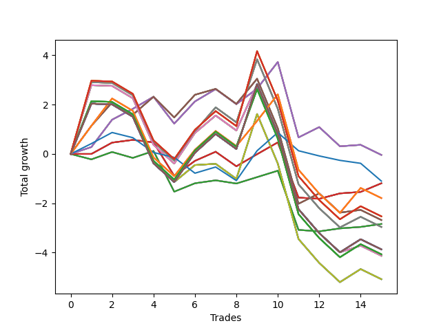

# Long Shepard 001 
- Symbol: NVDA_Unlimited
- Date Range: 02/08/2022 - 07/08/2022
- Trading Period: 7:20-12:30
- Number of Trades: 15



| Name | Win Percent | Profit | Avg Profit / Trade | Avg Time / Trade |      | Name | Win Percent | Profit | Avg Profit / Trade | Avg Time / Trade |
| ---- | ----------- | ------ | ------------------ | ---------------- | ---- | ---- | ----------- | ------ | ------------------ | ---------------- |
| Sorted By <br> Profit | | | | | | Sorted By <br> Win Percentage ||||
| Sixty-Six | 66.67 | -20.00 | -1.33 | 14:38 |     | Sixty-Six | 66.67 | -20.00 | -1.33 | 14:38 |
| Fifty-Eight | 66.67 | -20.00 | -1.33 | 14:38 |     | Fifty-Eight | 66.67 | -20.00 | -1.33 | 14:38 |
| Fifty | 66.67 | -20.00 | -1.33 | 14:38 |     | Fifty | 66.67 | -20.00 | -1.33 | 14:38 |
| Forty-Two | 66.67 | -20.00 | -1.33 | 14:38 |     | Forty-Two | 66.67 | -20.00 | -1.33 | 14:38 |
| Two | 66.67 | -20.00 | -1.33 | 14:38 |     | Two | 66.67 | -20.00 | -1.33 | 14:38 |
| Seventy-Three | 33.33 | -550.00 | -36.67 | 07:29 |     | Sixty-Five | 66.67 | -595.00 | -39.67 | 09:18 |
| Sixty-Five | 66.67 | -595.00 | -39.67 | 09:18 |     | Fifty-Seven | 66.67 | -595.00 | -39.67 | 09:18 |
| Fifty-Seven | 66.67 | -595.00 | -39.67 | 09:18 |     | Forty-Nine | 66.67 | -595.00 | -39.67 | 09:18 |
| Forty-Nine | 66.67 | -595.00 | -39.67 | 09:18 |     | Forty-One | 66.67 | -595.00 | -39.67 | 09:18 |
| Forty-One | 66.67 | -595.00 | -39.67 | 09:18 |     | One | 66.67 | -595.00 | -39.67 | 09:18 |
| One | 66.67 | -595.00 | -39.67 | 09:18 |     | Sixty-Four | 60.00 | -1420.00 | -94.67 | 04:42 |
| One Hundred Twenty-Six | 46.67 | -895.00 | -59.67 | 21:57 |     | Fifty-Six | 60.00 | -1420.00 | -94.67 | 04:42 |
| One Hundred Twenty-One | 46.67 | -895.00 | -59.67 | 21:57 |     | Forty-Eight | 60.00 | -1420.00 | -94.67 | 04:42 |
| One Hundred Sixteen | 46.67 | -895.00 | -59.67 | 21:57 |     | Forty | 60.00 | -1420.00 | -94.67 | 04:42 |
| One Hundred Eleven | 46.67 | -895.00 | -59.67 | 21:57 |     | Zero | 60.00 | -1420.00 | -94.67 | 04:42 |
| Eighty-One | 46.67 | -895.00 | -59.67 | 21:57 |     | Sixty-Seven | 53.33 | -1340.00 | -89.33 | 20:52 |
| One Hundred Twenty-Eight | 33.33 | -1265.00 | -84.33 | 29:09 |     | Fifty-Nine | 53.33 | -1340.00 | -89.33 | 20:52 |
| One Hundred Twenty-Three | 33.33 | -1265.00 | -84.33 | 29:09 |     | Fifty-One | 53.33 | -1340.00 | -89.33 | 20:52 |
| One Hundred Eighteen | 33.33 | -1265.00 | -84.33 | 29:09 |     | Forty-Three | 53.33 | -1340.00 | -89.33 | 20:52 |
| One Hundred Thirteen | 33.33 | -1265.00 | -84.33 | 29:09 |     | Three | 53.33 | -1340.00 | -89.33 | 20:52 |
| Eighty-Three | 33.33 | -1265.00 | -84.33 | 29:09 |     | One Hundred Twenty-Six | 46.67 | -895.00 | -59.67 | 21:57 |
| Sixty-Seven | 53.33 | -1340.00 | -89.33 | 20:52 |     | One Hundred Twenty-One | 46.67 | -895.00 | -59.67 | 21:57 |
| Fifty-Nine | 53.33 | -1340.00 | -89.33 | 20:52 |     | One Hundred Sixteen | 46.67 | -895.00 | -59.67 | 21:57 |
| Fifty-One | 53.33 | -1340.00 | -89.33 | 20:52 |     | One Hundred Eleven | 46.67 | -895.00 | -59.67 | 21:57 |
| Forty-Three | 53.33 | -1340.00 | -89.33 | 20:52 |     | Eighty-One | 46.67 | -895.00 | -59.67 | 21:57 |
| Three | 53.33 | -1340.00 | -89.33 | 20:52 |     | Seventy-Three | 33.33 | -550.00 | -36.67 | 07:29 |
| Sixty-Four | 60.00 | -1420.00 | -94.67 | 04:42 |     | One Hundred Twenty-Eight | 33.33 | -1265.00 | -84.33 | 29:09 |
| Fifty-Six | 60.00 | -1420.00 | -94.67 | 04:42 |     | One Hundred Twenty-Three | 33.33 | -1265.00 | -84.33 | 29:09 |
| Forty-Eight | 60.00 | -1420.00 | -94.67 | 04:42 |     | One Hundred Eighteen | 33.33 | -1265.00 | -84.33 | 29:09 |
| Forty | 60.00 | -1420.00 | -94.67 | 04:42 |     | One Hundred Thirteen | 33.33 | -1265.00 | -84.33 | 29:09 |
| Zero | 60.00 | -1420.00 | -94.67 | 04:42 |     | Eighty-Three | 33.33 | -1265.00 | -84.33 | 29:09 |
| Sixty-Nine | 33.33 | -1480.00 | -98.67 | 28:00 |     | Sixty-Nine | 33.33 | -1480.00 | -98.67 | 28:00 |
| Sixty-One | 33.33 | -1480.00 | -98.67 | 28:00 |     | Sixty-One | 33.33 | -1480.00 | -98.67 | 28:00 |
| Fifty-Three | 33.33 | -1480.00 | -98.67 | 28:00 |     | Fifty-Three | 33.33 | -1480.00 | -98.67 | 28:00 |
| Forty-Five | 33.33 | -1480.00 | -98.67 | 28:00 |     | Forty-Five | 33.33 | -1480.00 | -98.67 | 28:00 |
| Five | 33.33 | -1480.00 | -98.67 | 28:00 |     | Five | 33.33 | -1480.00 | -98.67 | 28:00 |
| One Hundred Thirty | 33.33 | -1935.00 | -129.00 | 29:23 |     | One Hundred Thirty | 33.33 | -1935.00 | -129.00 | 29:23 |
| One Hundred Twenty-Nine | 33.33 | -1935.00 | -129.00 | 29:23 |     | One Hundred Twenty-Nine | 33.33 | -1935.00 | -129.00 | 29:23 |
| One Hundred Twenty-Five | 33.33 | -1935.00 | -129.00 | 29:23 |     | One Hundred Twenty-Five | 33.33 | -1935.00 | -129.00 | 29:23 |
| One Hundred Twenty-Four | 33.33 | -1935.00 | -129.00 | 29:23 |     | One Hundred Twenty-Four | 33.33 | -1935.00 | -129.00 | 29:23 |
| One Hundred Twenty | 33.33 | -1935.00 | -129.00 | 29:23 |     | One Hundred Twenty | 33.33 | -1935.00 | -129.00 | 29:23 |
| One Hundred Ninteen | 33.33 | -1935.00 | -129.00 | 29:23 |     | One Hundred Ninteen | 33.33 | -1935.00 | -129.00 | 29:23 |
| One Hundred Fifteen | 33.33 | -1935.00 | -129.00 | 29:23 |     | One Hundred Fifteen | 33.33 | -1935.00 | -129.00 | 29:23 |
| One Hundred Fourteen | 33.33 | -1935.00 | -129.00 | 29:23 |     | One Hundred Fourteen | 33.33 | -1935.00 | -129.00 | 29:23 |
| Eighty-Five | 33.33 | -1935.00 | -129.00 | 29:23 |     | Eighty-Five | 33.33 | -1935.00 | -129.00 | 29:23 |
| Eighty-Four | 33.33 | -1935.00 | -129.00 | 29:23 |     | Eighty-Four | 33.33 | -1935.00 | -129.00 | 29:23 |
| Seventy-One | 33.33 | -1935.00 | -129.00 | 29:23 |     | Seventy-One | 33.33 | -1935.00 | -129.00 | 29:23 |
| Sixty-Three | 33.33 | -1935.00 | -129.00 | 29:23 |     | Sixty-Three | 33.33 | -1935.00 | -129.00 | 29:23 |
| Fifty-Five | 33.33 | -1935.00 | -129.00 | 29:23 |     | Fifty-Five | 33.33 | -1935.00 | -129.00 | 29:23 |
| Forty-Seven | 33.33 | -1935.00 | -129.00 | 29:23 |     | Forty-Seven | 33.33 | -1935.00 | -129.00 | 29:23 |
| Seven | 33.33 | -1935.00 | -129.00 | 29:23 |     | Seven | 33.33 | -1935.00 | -129.00 | 29:23 |
| One Hundred Twenty-Seven | 33.33 | -2035.00 | -135.67 | 27:49 |     | One Hundred Twenty-Seven | 33.33 | -2035.00 | -135.67 | 27:49 |
| One Hundred Twenty-Two | 33.33 | -2035.00 | -135.67 | 27:49 |     | One Hundred Twenty-Two | 33.33 | -2035.00 | -135.67 | 27:49 |
| One Hundred Seventeen | 33.33 | -2035.00 | -135.67 | 27:49 |     | One Hundred Seventeen | 33.33 | -2035.00 | -135.67 | 27:49 |
| One Hundred Twelve | 33.33 | -2035.00 | -135.67 | 27:49 |     | One Hundred Twelve | 33.33 | -2035.00 | -135.67 | 27:49 |
| Eighty-Two | 33.33 | -2035.00 | -135.67 | 27:49 |     | Eighty-Two | 33.33 | -2035.00 | -135.67 | 27:49 |
| Sixty-Eight | 33.33 | -2065.00 | -137.67 | 26:25 |     | Sixty-Eight | 33.33 | -2065.00 | -137.67 | 26:25 |
| Sixty | 33.33 | -2065.00 | -137.67 | 26:25 |     | Sixty | 33.33 | -2065.00 | -137.67 | 26:25 |
| Fifty-Two | 33.33 | -2065.00 | -137.67 | 26:25 |     | Fifty-Two | 33.33 | -2065.00 | -137.67 | 26:25 |
| Forty-Four | 33.33 | -2065.00 | -137.67 | 26:25 |     | Forty-Four | 33.33 | -2065.00 | -137.67 | 26:25 |
| Four | 33.33 | -2065.00 | -137.67 | 26:25 |     | Four | 33.33 | -2065.00 | -137.67 | 26:25 |
| Seventy | 33.33 | -2540.00 | -169.33 | 25:39 |     | Seventy | 33.33 | -2540.00 | -169.33 | 25:39 |
| Sixty-Two | 33.33 | -2540.00 | -169.33 | 25:39 |     | Sixty-Two | 33.33 | -2540.00 | -169.33 | 25:39 |
| Fifty-Four | 33.33 | -2540.00 | -169.33 | 25:39 |     | Fifty-Four | 33.33 | -2540.00 | -169.33 | 25:39 |
| Forty-Six | 33.33 | -2540.00 | -169.33 | 25:39 |     | Forty-Six | 33.33 | -2540.00 | -169.33 | 25:39 |
| Six | 33.33 | -2540.00 | -169.33 | 25:39 |     | Six | 33.33 | -2540.00 | -169.33 | 25:39 |

## NO STOPLOSS

### Test Zero
* Sell when price hits the middle line of the 20p bollinger
* No Stoploss
* Results:
```
Total Trades: 15
Percent Up: 60.00
Percent Down: 40.00
Total Points Moved Up: -2.84
Potential Profit: -1420.00
Total Points Ups: 1.86 Count Ups: 9
Total Points Downs: -4.70 Count Downs: 6
```

<details><summary>Trades</summary>

<code>In: 2022-02-14 11:13:00		Out: 2022-02-14 11:13:10		Total Position Time: 00:10		Total Move Up: -0.22		Total to Date: -0.22</code> <br />
<code>In: 2022-02-23 10:37:00		Out: 2022-02-23 10:37:10		Total Position Time: 00:10		Total Move Up: 0.30		Total to Date: 0.08</code> <br />
<code>In: 2022-02-23 12:16:00		Out: 2022-02-23 12:25:55		Total Position Time: 09:55		Total Move Up: -0.24		Total to Date: -0.16</code> <br />
<code>In: 2022-03-04 07:23:00		Out: 2022-03-04 07:25:10		Total Position Time: 02:10		Total Move Up: 0.28		Total to Date: 0.12</code> <br />
<code>In: 2022-03-07 11:57:00		Out: 2022-03-07 12:21:10		Total Position Time: 24:10		Total Move Up: -1.65		Total to Date: -1.53</code> <br />
<code>In: 2022-03-09 08:15:00		Out: 2022-03-09 08:18:15		Total Position Time: 03:15		Total Move Up: 0.34		Total to Date: -1.19</code> <br />
<code>In: 2022-04-04 10:18:00		Out: 2022-04-04 10:18:20		Total Position Time: 00:20		Total Move Up: 0.12		Total to Date: -1.07</code> <br />
<code>In: 2022-04-05 12:24:00		Out: 2022-04-05 12:24:15		Total Position Time: 00:15		Total Move Up: -0.13		Total to Date: -1.20</code> <br />
<code>In: 2022-04-07 09:52:00		Out: 2022-04-07 09:52:20		Total Position Time: 00:20		Total Move Up: 0.26		Total to Date: -0.94</code> <br />
<code>In: 2022-04-21 07:24:00		Out: 2022-04-21 07:25:50		Total Position Time: 01:50		Total Move Up: 0.26		Total to Date: -0.68</code> <br />
<code>In: 2022-04-21 08:54:00		Out: 2022-04-21 09:18:45		Total Position Time: 24:45		Total Move Up: -2.40		Total to Date: -3.08</code> <br />
<code>In: 2022-04-22 09:14:00		Out: 2022-04-22 09:14:10		Total Position Time: 00:10		Total Move Up: -0.06		Total to Date: -3.14</code> <br />
<code>In: 2022-05-06 11:12:00		Out: 2022-05-06 11:12:15		Total Position Time: 00:15		Total Move Up: 0.12		Total to Date: -3.02</code> <br />
<code>In: 2022-06-03 11:04:00		Out: 2022-06-03 11:04:10		Total Position Time: 00:10		Total Move Up: 0.06		Total to Date: -2.96</code> <br />
<code>In: 2022-06-06 11:44:00		Out: 2022-06-06 11:46:45		Total Position Time: 02:45		Total Move Up: 0.12		Total to Date: -2.84</code> <br />


</details>

### Test One
* Sell when the price hits the upper line of the 20p 1std bollinger
* No Stoploss
* Results:
```
Total Trades: 15
Percent Up: 66.67
Percent Down: 33.33
Total Points Moved Up: -1.19
Potential Profit: -595.00
Total Points Ups: 3.15 Count Ups: 10
Total Points Downs: -4.34 Count Downs: 5
```

<details><summary>Trades</summary>

<code>In: 2022-02-14 11:13:00		Out: 2022-02-14 11:17:05		Total Position Time: 04:05		Total Move Up: 0.00		Total to Date: 0.00</code> <br />
<code>In: 2022-02-23 10:37:00		Out: 2022-02-23 10:39:05		Total Position Time: 02:05		Total Move Up: 0.46		Total to Date: 0.46</code> <br />
<code>In: 2022-02-23 12:16:00		Out: 2022-02-23 12:27:05		Total Position Time: 11:05		Total Move Up: 0.11		Total to Date: 0.57</code> <br />
<code>In: 2022-03-04 07:23:00		Out: 2022-03-04 07:36:55		Total Position Time: 13:55		Total Move Up: -0.10		Total to Date: 0.47</code> <br />
<code>In: 2022-03-07 11:57:00		Out: 2022-03-07 12:25:10		Total Position Time: 28:10		Total Move Up: -1.36		Total to Date: -0.89</code> <br />
<code>In: 2022-03-09 08:15:00		Out: 2022-03-09 08:20:05		Total Position Time: 05:05		Total Move Up: 0.61		Total to Date: -0.28</code> <br />
<code>In: 2022-04-04 10:18:00		Out: 2022-04-04 10:20:30		Total Position Time: 02:30		Total Move Up: 0.37		Total to Date: 0.09</code> <br />
<code>In: 2022-04-05 12:24:00		Out: 2022-04-05 12:45:30		Total Position Time: 21:30		Total Move Up: -0.59		Total to Date: -0.50</code> <br />
<code>In: 2022-04-07 09:52:00		Out: 2022-04-07 09:56:10		Total Position Time: 04:10		Total Move Up: 0.49		Total to Date: -0.01</code> <br />
<code>In: 2022-04-21 07:24:00		Out: 2022-04-21 07:27:15		Total Position Time: 03:15		Total Move Up: 0.48		Total to Date: 0.47</code> <br />
<code>In: 2022-04-21 08:54:00		Out: 2022-04-21 09:19:05		Total Position Time: 25:05		Total Move Up: -2.24		Total to Date: -1.77</code> <br />
<code>In: 2022-04-22 09:14:00		Out: 2022-04-22 09:25:50		Total Position Time: 11:50		Total Move Up: -0.05		Total to Date: -1.82</code> <br />
<code>In: 2022-05-06 11:12:00		Out: 2022-05-06 11:15:05		Total Position Time: 03:05		Total Move Up: 0.22		Total to Date: -1.60</code> <br />
<code>In: 2022-06-03 11:04:00		Out: 2022-06-03 11:04:10		Total Position Time: 00:10		Total Move Up: 0.06		Total to Date: -1.54</code> <br />
<code>In: 2022-06-06 11:44:00		Out: 2022-06-06 11:47:40		Total Position Time: 03:40		Total Move Up: 0.35		Total to Date: -1.19</code> <br />


</details>

### Test Two
* Sell when the price hits the upper line of the 20p 2std bollinger
* No Stoploss
* Results:
```
Total Trades: 15
Percent Up: 66.67
Percent Down: 33.33
Total Points Moved Up: -0.04
Potential Profit: -20.00
Total Points Ups: 5.91 Count Ups: 10
Total Points Downs: -5.95 Count Downs: 5
```

<details><summary>Trades</summary>

<code>In: 2022-02-14 11:13:00		Out: 2022-02-14 11:18:05		Total Position Time: 05:05		Total Move Up: 0.28		Total to Date: 0.28</code> <br />
<code>In: 2022-02-23 10:37:00		Out: 2022-02-23 10:42:50		Total Position Time: 05:50		Total Move Up: 1.11		Total to Date: 1.39</code> <br />
<code>In: 2022-02-23 12:16:00		Out: 2022-02-23 12:31:10		Total Position Time: 15:10		Total Move Up: 0.44		Total to Date: 1.83</code> <br />
<code>In: 2022-03-04 07:23:00		Out: 2022-03-04 07:37:05		Total Position Time: 14:05		Total Move Up: 0.49		Total to Date: 2.32</code> <br />
<code>In: 2022-03-07 11:57:00		Out: 2022-03-07 12:26:15		Total Position Time: 29:15		Total Move Up: -1.09		Total to Date: 1.23</code> <br />
<code>In: 2022-03-09 08:15:00		Out: 2022-03-09 08:23:05		Total Position Time: 08:05		Total Move Up: 0.90		Total to Date: 2.13</code> <br />
<code>In: 2022-04-04 10:18:00		Out: 2022-04-04 10:24:45		Total Position Time: 06:45		Total Move Up: 0.50		Total to Date: 2.63</code> <br />
<code>In: 2022-04-05 12:24:00		Out: 2022-04-05 12:46:00		Total Position Time: 22:00		Total Move Up: -0.61		Total to Date: 2.02</code> <br />
<code>In: 2022-04-07 09:52:00		Out: 2022-04-07 09:59:10		Total Position Time: 07:10		Total Move Up: 0.63		Total to Date: 2.65</code> <br />
<code>In: 2022-04-21 07:24:00		Out: 2022-04-21 07:28:15		Total Position Time: 04:15		Total Move Up: 1.08		Total to Date: 3.73</code> <br />
<code>In: 2022-04-21 08:54:00		Out: 2022-04-21 09:23:55		Total Position Time: 29:55		Total Move Up: -3.06		Total to Date: 0.67</code> <br />
<code>In: 2022-04-22 09:14:00		Out: 2022-04-22 09:26:00		Total Position Time: 12:00		Total Move Up: 0.42		Total to Date: 1.09</code> <br />
<code>In: 2022-05-06 11:12:00		Out: 2022-05-06 11:41:55		Total Position Time: 29:55		Total Move Up: -0.78		Total to Date: 0.31</code> <br />
<code>In: 2022-06-03 11:04:00		Out: 2022-06-03 11:04:10		Total Position Time: 00:10		Total Move Up: 0.06		Total to Date: 0.37</code> <br />
<code>In: 2022-06-06 11:44:00		Out: 2022-06-06 12:13:55		Total Position Time: 29:55		Total Move Up: -0.41		Total to Date: -0.04</code> <br />


</details>

### Test Three
* Sell when price hits the middle line of the 50p bollinger
* No Stoploss
* Results:
```
Total Trades: 15
Percent Up: 53.33
Percent Down: 46.67
Total Points Moved Up: -2.68
Potential Profit: -1340.00
Total Points Ups: 5.53 Count Ups: 8
Total Points Downs: -8.21 Count Downs: 7
```

<details><summary>Trades</summary>

<code>In: 2022-02-14 11:13:00		Out: 2022-02-14 11:28:50		Total Position Time: 15:50		Total Move Up: 1.14		Total to Date: 1.14</code> <br />
<code>In: 2022-02-23 10:37:00		Out: 2022-02-23 10:47:05		Total Position Time: 10:05		Total Move Up: 0.95		Total to Date: 2.09</code> <br />
<code>In: 2022-02-23 12:16:00		Out: 2022-02-23 12:45:55		Total Position Time: 29:55		Total Move Up: -0.50		Total to Date: 1.59</code> <br />
<code>In: 2022-03-04 07:23:00		Out: 2022-03-04 07:38:05		Total Position Time: 15:05		Total Move Up: 0.73		Total to Date: 2.32</code> <br />
<code>In: 2022-03-07 11:57:00		Out: 2022-03-07 12:26:40		Total Position Time: 29:40		Total Move Up: -0.84		Total to Date: 1.48</code> <br />
<code>In: 2022-03-09 08:15:00		Out: 2022-03-09 08:35:00		Total Position Time: 20:00		Total Move Up: 0.92		Total to Date: 2.40</code> <br />
<code>In: 2022-04-04 10:18:00		Out: 2022-04-04 10:43:30		Total Position Time: 25:30		Total Move Up: 0.24		Total to Date: 2.64</code> <br />
<code>In: 2022-04-05 12:24:00		Out: 2022-04-05 12:46:00		Total Position Time: 22:00		Total Move Up: -0.61		Total to Date: 2.03</code> <br />
<code>In: 2022-04-07 09:52:00		Out: 2022-04-07 10:02:40		Total Position Time: 10:40		Total Move Up: 1.02		Total to Date: 3.05</code> <br />
<code>In: 2022-04-21 07:24:00		Out: 2022-04-21 07:53:55		Total Position Time: 29:55		Total Move Up: -2.01		Total to Date: 1.04</code> <br />
<code>In: 2022-04-21 08:54:00		Out: 2022-04-21 09:23:55		Total Position Time: 29:55		Total Move Up: -3.06		Total to Date: -2.02</code> <br />
<code>In: 2022-04-22 09:14:00		Out: 2022-04-22 09:26:00		Total Position Time: 12:00		Total Move Up: 0.42		Total to Date: -1.60</code> <br />
<code>In: 2022-05-06 11:12:00		Out: 2022-05-06 11:41:55		Total Position Time: 29:55		Total Move Up: -0.78		Total to Date: -2.38</code> <br />
<code>In: 2022-06-03 11:04:00		Out: 2022-06-03 11:06:45		Total Position Time: 02:45		Total Move Up: 0.11		Total to Date: -2.27</code> <br />
<code>In: 2022-06-06 11:44:00		Out: 2022-06-06 12:13:55		Total Position Time: 29:55		Total Move Up: -0.41		Total to Date: -2.68</code> <br />


</details>

### Test Four
* Sell when the price hits the upper line of the 50p 1std bollinger
* No Stoploss
* Results:
```
Total Trades: 15
Percent Up: 33.33
Percent Down: 66.67
Total Points Moved Up: -4.13
Potential Profit: -2065.00
Total Points Ups: 6.89 Count Ups: 5
Total Points Downs: -11.02 Count Downs: 10
```

<details><summary>Trades</summary>

<code>In: 2022-02-14 11:13:00		Out: 2022-02-14 11:29:15		Total Position Time: 16:15		Total Move Up: 2.79		Total to Date: 2.79</code> <br />
<code>In: 2022-02-23 10:37:00		Out: 2022-02-23 11:06:55		Total Position Time: 29:55		Total Move Up: -0.03		Total to Date: 2.76</code> <br />
<code>In: 2022-02-23 12:16:00		Out: 2022-02-23 12:45:55		Total Position Time: 29:55		Total Move Up: -0.50		Total to Date: 2.26</code> <br />
<code>In: 2022-03-04 07:23:00		Out: 2022-03-04 07:52:55		Total Position Time: 29:55		Total Move Up: -1.89		Total to Date: 0.37</code> <br />
<code>In: 2022-03-07 11:57:00		Out: 2022-03-07 12:26:55		Total Position Time: 29:55		Total Move Up: -0.76		Total to Date: -0.39</code> <br />
<code>In: 2022-03-09 08:15:00		Out: 2022-03-09 08:42:05		Total Position Time: 27:05		Total Move Up: 1.24		Total to Date: 0.85</code> <br />
<code>In: 2022-04-04 10:18:00		Out: 2022-04-04 10:44:45		Total Position Time: 26:45		Total Move Up: 0.71		Total to Date: 1.56</code> <br />
<code>In: 2022-04-05 12:24:00		Out: 2022-04-05 12:46:00		Total Position Time: 22:00		Total Move Up: -0.61		Total to Date: 0.95</code> <br />
<code>In: 2022-04-07 09:52:00		Out: 2022-04-07 10:12:10		Total Position Time: 20:10		Total Move Up: 1.88		Total to Date: 2.83</code> <br />
<code>In: 2022-04-21 07:24:00		Out: 2022-04-21 07:53:55		Total Position Time: 29:55		Total Move Up: -2.01		Total to Date: 0.82</code> <br />
<code>In: 2022-04-21 08:54:00		Out: 2022-04-21 09:23:55		Total Position Time: 29:55		Total Move Up: -3.06		Total to Date: -2.24</code> <br />
<code>In: 2022-04-22 09:14:00		Out: 2022-04-22 09:43:55		Total Position Time: 29:55		Total Move Up: -0.97		Total to Date: -3.21</code> <br />
<code>In: 2022-05-06 11:12:00		Out: 2022-05-06 11:41:55		Total Position Time: 29:55		Total Move Up: -0.78		Total to Date: -3.99</code> <br />
<code>In: 2022-06-03 11:04:00		Out: 2022-06-03 11:18:45		Total Position Time: 14:45		Total Move Up: 0.27		Total to Date: -3.72</code> <br />
<code>In: 2022-06-06 11:44:00		Out: 2022-06-06 12:13:55		Total Position Time: 29:55		Total Move Up: -0.41		Total to Date: -4.13</code> <br />


</details>

### Test Five
* Sell when the price hits the upper line of the 50p 2std bollinger
* No Stoploss
* Results:
```
Total Trades: 15
Percent Up: 33.33
Percent Down: 66.67
Total Points Moved Up: -2.96
Potential Profit: -1480.00
Total Points Ups: 8.06 Count Ups: 5
Total Points Downs: -11.02 Count Downs: 10
```

<details><summary>Trades</summary>

<code>In: 2022-02-14 11:13:00		Out: 2022-02-14 11:40:40		Total Position Time: 27:40		Total Move Up: 2.91		Total to Date: 2.91</code> <br />
<code>In: 2022-02-23 10:37:00		Out: 2022-02-23 11:06:55		Total Position Time: 29:55		Total Move Up: -0.03		Total to Date: 2.88</code> <br />
<code>In: 2022-02-23 12:16:00		Out: 2022-02-23 12:45:55		Total Position Time: 29:55		Total Move Up: -0.50		Total to Date: 2.38</code> <br />
<code>In: 2022-03-04 07:23:00		Out: 2022-03-04 07:52:55		Total Position Time: 29:55		Total Move Up: -1.89		Total to Date: 0.49</code> <br />
<code>In: 2022-03-07 11:57:00		Out: 2022-03-07 12:26:55		Total Position Time: 29:55		Total Move Up: -0.76		Total to Date: -0.27</code> <br />
<code>In: 2022-03-09 08:15:00		Out: 2022-03-09 08:44:55		Total Position Time: 29:55		Total Move Up: 1.19		Total to Date: 0.92</code> <br />
<code>In: 2022-04-04 10:18:00		Out: 2022-04-04 10:46:20		Total Position Time: 28:20		Total Move Up: 0.97		Total to Date: 1.89</code> <br />
<code>In: 2022-04-05 12:24:00		Out: 2022-04-05 12:46:00		Total Position Time: 22:00		Total Move Up: -0.61		Total to Date: 1.28</code> <br />
<code>In: 2022-04-07 09:52:00		Out: 2022-04-07 10:13:00		Total Position Time: 21:00		Total Move Up: 2.56		Total to Date: 3.84</code> <br />
<code>In: 2022-04-21 07:24:00		Out: 2022-04-21 07:53:55		Total Position Time: 29:55		Total Move Up: -2.01		Total to Date: 1.83</code> <br />
<code>In: 2022-04-21 08:54:00		Out: 2022-04-21 09:23:55		Total Position Time: 29:55		Total Move Up: -3.06		Total to Date: -1.23</code> <br />
<code>In: 2022-04-22 09:14:00		Out: 2022-04-22 09:43:55		Total Position Time: 29:55		Total Move Up: -0.97		Total to Date: -2.20</code> <br />
<code>In: 2022-05-06 11:12:00		Out: 2022-05-06 11:41:55		Total Position Time: 29:55		Total Move Up: -0.78		Total to Date: -2.98</code> <br />
<code>In: 2022-06-03 11:04:00		Out: 2022-06-03 11:25:55		Total Position Time: 21:55		Total Move Up: 0.43		Total to Date: -2.55</code> <br />
<code>In: 2022-06-06 11:44:00		Out: 2022-06-06 12:13:55		Total Position Time: 29:55		Total Move Up: -0.41		Total to Date: -2.96</code> <br />


</details>

### Test Six
* Sell when the price hits the middle line of the 1std VWAP
* No Stoploss
* Results:
```
Total Trades: 15
Percent Up: 33.33
Percent Down: 66.67
Total Points Moved Up: -5.08
Potential Profit: -2540.00
Total Points Ups: 5.94 Count Ups: 5
Total Points Downs: -11.02 Count Downs: 10
```

<details><summary>Trades</summary>

<code>In: 2022-02-14 11:13:00		Out: 2022-02-14 11:42:55		Total Position Time: 29:55		Total Move Up: 2.04		Total to Date: 2.04</code> <br />
<code>In: 2022-02-23 10:37:00		Out: 2022-02-23 11:06:55		Total Position Time: 29:55		Total Move Up: -0.03		Total to Date: 2.01</code> <br />
<code>In: 2022-02-23 12:16:00		Out: 2022-02-23 12:45:55		Total Position Time: 29:55		Total Move Up: -0.50		Total to Date: 1.51</code> <br />
<code>In: 2022-03-04 07:23:00		Out: 2022-03-04 07:52:55		Total Position Time: 29:55		Total Move Up: -1.89		Total to Date: -0.38</code> <br />
<code>In: 2022-03-07 11:57:00		Out: 2022-03-07 12:26:55		Total Position Time: 29:55		Total Move Up: -0.76		Total to Date: -1.14</code> <br />
<code>In: 2022-03-09 08:15:00		Out: 2022-03-09 08:18:35		Total Position Time: 03:35		Total Move Up: 0.69		Total to Date: -0.45</code> <br />
<code>In: 2022-04-04 10:18:00		Out: 2022-04-04 10:18:10		Total Position Time: 00:10		Total Move Up: 0.05		Total to Date: -0.40</code> <br />
<code>In: 2022-04-05 12:24:00		Out: 2022-04-05 12:46:00		Total Position Time: 22:00		Total Move Up: -0.61		Total to Date: -1.01</code> <br />
<code>In: 2022-04-07 09:52:00		Out: 2022-04-07 10:21:55		Total Position Time: 29:55		Total Move Up: 2.63		Total to Date: 1.62</code> <br />
<code>In: 2022-04-21 07:24:00		Out: 2022-04-21 07:53:55		Total Position Time: 29:55		Total Move Up: -2.01		Total to Date: -0.39</code> <br />
<code>In: 2022-04-21 08:54:00		Out: 2022-04-21 09:23:55		Total Position Time: 29:55		Total Move Up: -3.06		Total to Date: -3.45</code> <br />
<code>In: 2022-04-22 09:14:00		Out: 2022-04-22 09:43:55		Total Position Time: 29:55		Total Move Up: -0.97		Total to Date: -4.42</code> <br />
<code>In: 2022-05-06 11:12:00		Out: 2022-05-06 11:41:55		Total Position Time: 29:55		Total Move Up: -0.78		Total to Date: -5.20</code> <br />
<code>In: 2022-06-03 11:04:00		Out: 2022-06-03 11:33:55		Total Position Time: 29:55		Total Move Up: 0.53		Total to Date: -4.67</code> <br />
<code>In: 2022-06-06 11:44:00		Out: 2022-06-06 12:13:55		Total Position Time: 29:55		Total Move Up: -0.41		Total to Date: -5.08</code> <br />


</details>

### Test Seven
* Sell when the price hits the upper line of the 1std VWAP
* No Stoploss
* Results:
```
Total Trades: 15
Percent Up: 33.33
Percent Down: 66.67
Total Points Moved Up: -3.87
Potential Profit: -1935.00
Total Points Ups: 7.15 Count Ups: 5
Total Points Downs: -11.02 Count Downs: 10
```

<details><summary>Trades</summary>

<code>In: 2022-02-14 11:13:00		Out: 2022-02-14 11:42:55		Total Position Time: 29:55		Total Move Up: 2.04		Total to Date: 2.04</code> <br />
<code>In: 2022-02-23 10:37:00		Out: 2022-02-23 11:06:55		Total Position Time: 29:55		Total Move Up: -0.03		Total to Date: 2.01</code> <br />
<code>In: 2022-02-23 12:16:00		Out: 2022-02-23 12:45:55		Total Position Time: 29:55		Total Move Up: -0.50		Total to Date: 1.51</code> <br />
<code>In: 2022-03-04 07:23:00		Out: 2022-03-04 07:52:55		Total Position Time: 29:55		Total Move Up: -1.89		Total to Date: -0.38</code> <br />
<code>In: 2022-03-07 11:57:00		Out: 2022-03-07 12:26:55		Total Position Time: 29:55		Total Move Up: -0.76		Total to Date: -1.14</code> <br />
<code>In: 2022-03-09 08:15:00		Out: 2022-03-09 08:44:55		Total Position Time: 29:55		Total Move Up: 1.19		Total to Date: 0.05</code> <br />
<code>In: 2022-04-04 10:18:00		Out: 2022-04-04 10:47:55		Total Position Time: 29:55		Total Move Up: 0.76		Total to Date: 0.81</code> <br />
<code>In: 2022-04-05 12:24:00		Out: 2022-04-05 12:46:00		Total Position Time: 22:00		Total Move Up: -0.61		Total to Date: 0.20</code> <br />
<code>In: 2022-04-07 09:52:00		Out: 2022-04-07 10:21:55		Total Position Time: 29:55		Total Move Up: 2.63		Total to Date: 2.83</code> <br />
<code>In: 2022-04-21 07:24:00		Out: 2022-04-21 07:53:55		Total Position Time: 29:55		Total Move Up: -2.01		Total to Date: 0.82</code> <br />
<code>In: 2022-04-21 08:54:00		Out: 2022-04-21 09:23:55		Total Position Time: 29:55		Total Move Up: -3.06		Total to Date: -2.24</code> <br />
<code>In: 2022-04-22 09:14:00		Out: 2022-04-22 09:43:55		Total Position Time: 29:55		Total Move Up: -0.97		Total to Date: -3.21</code> <br />
<code>In: 2022-05-06 11:12:00		Out: 2022-05-06 11:41:55		Total Position Time: 29:55		Total Move Up: -0.78		Total to Date: -3.99</code> <br />
<code>In: 2022-06-03 11:04:00		Out: 2022-06-03 11:33:55		Total Position Time: 29:55		Total Move Up: 0.53		Total to Date: -3.46</code> <br />
<code>In: 2022-06-06 11:44:00		Out: 2022-06-06 12:13:55		Total Position Time: 29:55		Total Move Up: -0.41		Total to Date: -3.87</code> <br />


</details>

## STOPLOSS OF 5

### Test Forty
* Sell when price hits the middle line of the 20p bollinger
* Stoploss is 5 points
* Results:
```
Total Trades: 15
Percent Up: 60.00
Percent Down: 40.00
Total Points Moved Up: -2.84
Potential Profit: -1420.00
Total Points Ups: 1.86 Count Ups: 9
Total Points Downs: -4.70 Count Downs: 6
```

<details><summary>Trades</summary>

<code>In: 2022-02-14 11:13:00		Out: 2022-02-14 11:13:10		Total Position Time: 00:10		Total Move Up: -0.22		Total to Date: -0.22</code> <br />
<code>In: 2022-02-23 10:37:00		Out: 2022-02-23 10:37:10		Total Position Time: 00:10		Total Move Up: 0.30		Total to Date: 0.08</code> <br />
<code>In: 2022-02-23 12:16:00		Out: 2022-02-23 12:25:55		Total Position Time: 09:55		Total Move Up: -0.24		Total to Date: -0.16</code> <br />
<code>In: 2022-03-04 07:23:00		Out: 2022-03-04 07:25:10		Total Position Time: 02:10		Total Move Up: 0.28		Total to Date: 0.12</code> <br />
<code>In: 2022-03-07 11:57:00		Out: 2022-03-07 12:21:10		Total Position Time: 24:10		Total Move Up: -1.65		Total to Date: -1.53</code> <br />
<code>In: 2022-03-09 08:15:00		Out: 2022-03-09 08:18:15		Total Position Time: 03:15		Total Move Up: 0.34		Total to Date: -1.19</code> <br />
<code>In: 2022-04-04 10:18:00		Out: 2022-04-04 10:18:20		Total Position Time: 00:20		Total Move Up: 0.12		Total to Date: -1.07</code> <br />
<code>In: 2022-04-05 12:24:00		Out: 2022-04-05 12:24:15		Total Position Time: 00:15		Total Move Up: -0.13		Total to Date: -1.20</code> <br />
<code>In: 2022-04-07 09:52:00		Out: 2022-04-07 09:52:20		Total Position Time: 00:20		Total Move Up: 0.26		Total to Date: -0.94</code> <br />
<code>In: 2022-04-21 07:24:00		Out: 2022-04-21 07:25:50		Total Position Time: 01:50		Total Move Up: 0.26		Total to Date: -0.68</code> <br />
<code>In: 2022-04-21 08:54:00		Out: 2022-04-21 09:18:45		Total Position Time: 24:45		Total Move Up: -2.40		Total to Date: -3.08</code> <br />
<code>In: 2022-04-22 09:14:00		Out: 2022-04-22 09:14:10		Total Position Time: 00:10		Total Move Up: -0.06		Total to Date: -3.14</code> <br />
<code>In: 2022-05-06 11:12:00		Out: 2022-05-06 11:12:15		Total Position Time: 00:15		Total Move Up: 0.12		Total to Date: -3.02</code> <br />
<code>In: 2022-06-03 11:04:00		Out: 2022-06-03 11:04:10		Total Position Time: 00:10		Total Move Up: 0.06		Total to Date: -2.96</code> <br />
<code>In: 2022-06-06 11:44:00		Out: 2022-06-06 11:46:45		Total Position Time: 02:45		Total Move Up: 0.12		Total to Date: -2.84</code> <br />


</details>

### Test Forty-One
* Sell when the price hits the upper line of the 20p 1std bollinger
* Stoploss is 5 points
* Results:
```
Total Trades: 15
Percent Up: 66.67
Percent Down: 33.33
Total Points Moved Up: -1.19
Potential Profit: -595.00
Total Points Ups: 3.15 Count Ups: 10
Total Points Downs: -4.34 Count Downs: 5
```

<details><summary>Trades</summary>

<code>In: 2022-02-14 11:13:00		Out: 2022-02-14 11:17:05		Total Position Time: 04:05		Total Move Up: 0.00		Total to Date: 0.00</code> <br />
<code>In: 2022-02-23 10:37:00		Out: 2022-02-23 10:39:05		Total Position Time: 02:05		Total Move Up: 0.46		Total to Date: 0.46</code> <br />
<code>In: 2022-02-23 12:16:00		Out: 2022-02-23 12:27:05		Total Position Time: 11:05		Total Move Up: 0.11		Total to Date: 0.57</code> <br />
<code>In: 2022-03-04 07:23:00		Out: 2022-03-04 07:36:55		Total Position Time: 13:55		Total Move Up: -0.10		Total to Date: 0.47</code> <br />
<code>In: 2022-03-07 11:57:00		Out: 2022-03-07 12:25:10		Total Position Time: 28:10		Total Move Up: -1.36		Total to Date: -0.89</code> <br />
<code>In: 2022-03-09 08:15:00		Out: 2022-03-09 08:20:05		Total Position Time: 05:05		Total Move Up: 0.61		Total to Date: -0.28</code> <br />
<code>In: 2022-04-04 10:18:00		Out: 2022-04-04 10:20:30		Total Position Time: 02:30		Total Move Up: 0.37		Total to Date: 0.09</code> <br />
<code>In: 2022-04-05 12:24:00		Out: 2022-04-05 12:45:30		Total Position Time: 21:30		Total Move Up: -0.59		Total to Date: -0.50</code> <br />
<code>In: 2022-04-07 09:52:00		Out: 2022-04-07 09:56:10		Total Position Time: 04:10		Total Move Up: 0.49		Total to Date: -0.01</code> <br />
<code>In: 2022-04-21 07:24:00		Out: 2022-04-21 07:27:15		Total Position Time: 03:15		Total Move Up: 0.48		Total to Date: 0.47</code> <br />
<code>In: 2022-04-21 08:54:00		Out: 2022-04-21 09:19:05		Total Position Time: 25:05		Total Move Up: -2.24		Total to Date: -1.77</code> <br />
<code>In: 2022-04-22 09:14:00		Out: 2022-04-22 09:25:50		Total Position Time: 11:50		Total Move Up: -0.05		Total to Date: -1.82</code> <br />
<code>In: 2022-05-06 11:12:00		Out: 2022-05-06 11:15:05		Total Position Time: 03:05		Total Move Up: 0.22		Total to Date: -1.60</code> <br />
<code>In: 2022-06-03 11:04:00		Out: 2022-06-03 11:04:10		Total Position Time: 00:10		Total Move Up: 0.06		Total to Date: -1.54</code> <br />
<code>In: 2022-06-06 11:44:00		Out: 2022-06-06 11:47:40		Total Position Time: 03:40		Total Move Up: 0.35		Total to Date: -1.19</code> <br />


</details>

### Test Forty-Two
* Sell when the price hits the upper line of the 20p 2std bollinger
* Stoploss is 5 points
* Results:
```
Total Trades: 15
Percent Up: 66.67
Percent Down: 33.33
Total Points Moved Up: -0.04
Potential Profit: -20.00
Total Points Ups: 5.91 Count Ups: 10
Total Points Downs: -5.95 Count Downs: 5
```

<details><summary>Trades</summary>

<code>In: 2022-02-14 11:13:00		Out: 2022-02-14 11:18:05		Total Position Time: 05:05		Total Move Up: 0.28		Total to Date: 0.28</code> <br />
<code>In: 2022-02-23 10:37:00		Out: 2022-02-23 10:42:50		Total Position Time: 05:50		Total Move Up: 1.11		Total to Date: 1.39</code> <br />
<code>In: 2022-02-23 12:16:00		Out: 2022-02-23 12:31:10		Total Position Time: 15:10		Total Move Up: 0.44		Total to Date: 1.83</code> <br />
<code>In: 2022-03-04 07:23:00		Out: 2022-03-04 07:37:05		Total Position Time: 14:05		Total Move Up: 0.49		Total to Date: 2.32</code> <br />
<code>In: 2022-03-07 11:57:00		Out: 2022-03-07 12:26:15		Total Position Time: 29:15		Total Move Up: -1.09		Total to Date: 1.23</code> <br />
<code>In: 2022-03-09 08:15:00		Out: 2022-03-09 08:23:05		Total Position Time: 08:05		Total Move Up: 0.90		Total to Date: 2.13</code> <br />
<code>In: 2022-04-04 10:18:00		Out: 2022-04-04 10:24:45		Total Position Time: 06:45		Total Move Up: 0.50		Total to Date: 2.63</code> <br />
<code>In: 2022-04-05 12:24:00		Out: 2022-04-05 12:46:00		Total Position Time: 22:00		Total Move Up: -0.61		Total to Date: 2.02</code> <br />
<code>In: 2022-04-07 09:52:00		Out: 2022-04-07 09:59:10		Total Position Time: 07:10		Total Move Up: 0.63		Total to Date: 2.65</code> <br />
<code>In: 2022-04-21 07:24:00		Out: 2022-04-21 07:28:15		Total Position Time: 04:15		Total Move Up: 1.08		Total to Date: 3.73</code> <br />
<code>In: 2022-04-21 08:54:00		Out: 2022-04-21 09:23:55		Total Position Time: 29:55		Total Move Up: -3.06		Total to Date: 0.67</code> <br />
<code>In: 2022-04-22 09:14:00		Out: 2022-04-22 09:26:00		Total Position Time: 12:00		Total Move Up: 0.42		Total to Date: 1.09</code> <br />
<code>In: 2022-05-06 11:12:00		Out: 2022-05-06 11:41:55		Total Position Time: 29:55		Total Move Up: -0.78		Total to Date: 0.31</code> <br />
<code>In: 2022-06-03 11:04:00		Out: 2022-06-03 11:04:10		Total Position Time: 00:10		Total Move Up: 0.06		Total to Date: 0.37</code> <br />
<code>In: 2022-06-06 11:44:00		Out: 2022-06-06 12:13:55		Total Position Time: 29:55		Total Move Up: -0.41		Total to Date: -0.04</code> <br />


</details>

### Test Forty-Three
* Sell when price hits the middle line of the 50p bollinger
* Stoploss is 5 points
* Results:
```
Total Trades: 15
Percent Up: 53.33
Percent Down: 46.67
Total Points Moved Up: -2.68
Potential Profit: -1340.00
Total Points Ups: 5.53 Count Ups: 8
Total Points Downs: -8.21 Count Downs: 7
```

<details><summary>Trades</summary>

<code>In: 2022-02-14 11:13:00		Out: 2022-02-14 11:28:50		Total Position Time: 15:50		Total Move Up: 1.14		Total to Date: 1.14</code> <br />
<code>In: 2022-02-23 10:37:00		Out: 2022-02-23 10:47:05		Total Position Time: 10:05		Total Move Up: 0.95		Total to Date: 2.09</code> <br />
<code>In: 2022-02-23 12:16:00		Out: 2022-02-23 12:45:55		Total Position Time: 29:55		Total Move Up: -0.50		Total to Date: 1.59</code> <br />
<code>In: 2022-03-04 07:23:00		Out: 2022-03-04 07:38:05		Total Position Time: 15:05		Total Move Up: 0.73		Total to Date: 2.32</code> <br />
<code>In: 2022-03-07 11:57:00		Out: 2022-03-07 12:26:40		Total Position Time: 29:40		Total Move Up: -0.84		Total to Date: 1.48</code> <br />
<code>In: 2022-03-09 08:15:00		Out: 2022-03-09 08:35:00		Total Position Time: 20:00		Total Move Up: 0.92		Total to Date: 2.40</code> <br />
<code>In: 2022-04-04 10:18:00		Out: 2022-04-04 10:43:30		Total Position Time: 25:30		Total Move Up: 0.24		Total to Date: 2.64</code> <br />
<code>In: 2022-04-05 12:24:00		Out: 2022-04-05 12:46:00		Total Position Time: 22:00		Total Move Up: -0.61		Total to Date: 2.03</code> <br />
<code>In: 2022-04-07 09:52:00		Out: 2022-04-07 10:02:40		Total Position Time: 10:40		Total Move Up: 1.02		Total to Date: 3.05</code> <br />
<code>In: 2022-04-21 07:24:00		Out: 2022-04-21 07:53:55		Total Position Time: 29:55		Total Move Up: -2.01		Total to Date: 1.04</code> <br />
<code>In: 2022-04-21 08:54:00		Out: 2022-04-21 09:23:55		Total Position Time: 29:55		Total Move Up: -3.06		Total to Date: -2.02</code> <br />
<code>In: 2022-04-22 09:14:00		Out: 2022-04-22 09:26:00		Total Position Time: 12:00		Total Move Up: 0.42		Total to Date: -1.60</code> <br />
<code>In: 2022-05-06 11:12:00		Out: 2022-05-06 11:41:55		Total Position Time: 29:55		Total Move Up: -0.78		Total to Date: -2.38</code> <br />
<code>In: 2022-06-03 11:04:00		Out: 2022-06-03 11:06:45		Total Position Time: 02:45		Total Move Up: 0.11		Total to Date: -2.27</code> <br />
<code>In: 2022-06-06 11:44:00		Out: 2022-06-06 12:13:55		Total Position Time: 29:55		Total Move Up: -0.41		Total to Date: -2.68</code> <br />


</details>

### Test Forty-Four
* Sell when the price hits the upper line of the 50p 1std bollinger
* Stoploss is 5 points
* Results:
```
Total Trades: 15
Percent Up: 33.33
Percent Down: 66.67
Total Points Moved Up: -4.13
Potential Profit: -2065.00
Total Points Ups: 6.89 Count Ups: 5
Total Points Downs: -11.02 Count Downs: 10
```

<details><summary>Trades</summary>

<code>In: 2022-02-14 11:13:00		Out: 2022-02-14 11:29:15		Total Position Time: 16:15		Total Move Up: 2.79		Total to Date: 2.79</code> <br />
<code>In: 2022-02-23 10:37:00		Out: 2022-02-23 11:06:55		Total Position Time: 29:55		Total Move Up: -0.03		Total to Date: 2.76</code> <br />
<code>In: 2022-02-23 12:16:00		Out: 2022-02-23 12:45:55		Total Position Time: 29:55		Total Move Up: -0.50		Total to Date: 2.26</code> <br />
<code>In: 2022-03-04 07:23:00		Out: 2022-03-04 07:52:55		Total Position Time: 29:55		Total Move Up: -1.89		Total to Date: 0.37</code> <br />
<code>In: 2022-03-07 11:57:00		Out: 2022-03-07 12:26:55		Total Position Time: 29:55		Total Move Up: -0.76		Total to Date: -0.39</code> <br />
<code>In: 2022-03-09 08:15:00		Out: 2022-03-09 08:42:05		Total Position Time: 27:05		Total Move Up: 1.24		Total to Date: 0.85</code> <br />
<code>In: 2022-04-04 10:18:00		Out: 2022-04-04 10:44:45		Total Position Time: 26:45		Total Move Up: 0.71		Total to Date: 1.56</code> <br />
<code>In: 2022-04-05 12:24:00		Out: 2022-04-05 12:46:00		Total Position Time: 22:00		Total Move Up: -0.61		Total to Date: 0.95</code> <br />
<code>In: 2022-04-07 09:52:00		Out: 2022-04-07 10:12:10		Total Position Time: 20:10		Total Move Up: 1.88		Total to Date: 2.83</code> <br />
<code>In: 2022-04-21 07:24:00		Out: 2022-04-21 07:53:55		Total Position Time: 29:55		Total Move Up: -2.01		Total to Date: 0.82</code> <br />
<code>In: 2022-04-21 08:54:00		Out: 2022-04-21 09:23:55		Total Position Time: 29:55		Total Move Up: -3.06		Total to Date: -2.24</code> <br />
<code>In: 2022-04-22 09:14:00		Out: 2022-04-22 09:43:55		Total Position Time: 29:55		Total Move Up: -0.97		Total to Date: -3.21</code> <br />
<code>In: 2022-05-06 11:12:00		Out: 2022-05-06 11:41:55		Total Position Time: 29:55		Total Move Up: -0.78		Total to Date: -3.99</code> <br />
<code>In: 2022-06-03 11:04:00		Out: 2022-06-03 11:18:45		Total Position Time: 14:45		Total Move Up: 0.27		Total to Date: -3.72</code> <br />
<code>In: 2022-06-06 11:44:00		Out: 2022-06-06 12:13:55		Total Position Time: 29:55		Total Move Up: -0.41		Total to Date: -4.13</code> <br />


</details>

### Test Forty-Five
* Sell when the price hits the upper line of the 50p 2std bollinger
* Stoploss is 5 points
* Results:
```
Total Trades: 15
Percent Up: 33.33
Percent Down: 66.67
Total Points Moved Up: -2.96
Potential Profit: -1480.00
Total Points Ups: 8.06 Count Ups: 5
Total Points Downs: -11.02 Count Downs: 10
```

<details><summary>Trades</summary>

<code>In: 2022-02-14 11:13:00		Out: 2022-02-14 11:40:40		Total Position Time: 27:40		Total Move Up: 2.91		Total to Date: 2.91</code> <br />
<code>In: 2022-02-23 10:37:00		Out: 2022-02-23 11:06:55		Total Position Time: 29:55		Total Move Up: -0.03		Total to Date: 2.88</code> <br />
<code>In: 2022-02-23 12:16:00		Out: 2022-02-23 12:45:55		Total Position Time: 29:55		Total Move Up: -0.50		Total to Date: 2.38</code> <br />
<code>In: 2022-03-04 07:23:00		Out: 2022-03-04 07:52:55		Total Position Time: 29:55		Total Move Up: -1.89		Total to Date: 0.49</code> <br />
<code>In: 2022-03-07 11:57:00		Out: 2022-03-07 12:26:55		Total Position Time: 29:55		Total Move Up: -0.76		Total to Date: -0.27</code> <br />
<code>In: 2022-03-09 08:15:00		Out: 2022-03-09 08:44:55		Total Position Time: 29:55		Total Move Up: 1.19		Total to Date: 0.92</code> <br />
<code>In: 2022-04-04 10:18:00		Out: 2022-04-04 10:46:20		Total Position Time: 28:20		Total Move Up: 0.97		Total to Date: 1.89</code> <br />
<code>In: 2022-04-05 12:24:00		Out: 2022-04-05 12:46:00		Total Position Time: 22:00		Total Move Up: -0.61		Total to Date: 1.28</code> <br />
<code>In: 2022-04-07 09:52:00		Out: 2022-04-07 10:13:00		Total Position Time: 21:00		Total Move Up: 2.56		Total to Date: 3.84</code> <br />
<code>In: 2022-04-21 07:24:00		Out: 2022-04-21 07:53:55		Total Position Time: 29:55		Total Move Up: -2.01		Total to Date: 1.83</code> <br />
<code>In: 2022-04-21 08:54:00		Out: 2022-04-21 09:23:55		Total Position Time: 29:55		Total Move Up: -3.06		Total to Date: -1.23</code> <br />
<code>In: 2022-04-22 09:14:00		Out: 2022-04-22 09:43:55		Total Position Time: 29:55		Total Move Up: -0.97		Total to Date: -2.20</code> <br />
<code>In: 2022-05-06 11:12:00		Out: 2022-05-06 11:41:55		Total Position Time: 29:55		Total Move Up: -0.78		Total to Date: -2.98</code> <br />
<code>In: 2022-06-03 11:04:00		Out: 2022-06-03 11:25:55		Total Position Time: 21:55		Total Move Up: 0.43		Total to Date: -2.55</code> <br />
<code>In: 2022-06-06 11:44:00		Out: 2022-06-06 12:13:55		Total Position Time: 29:55		Total Move Up: -0.41		Total to Date: -2.96</code> <br />


</details>

### Test Forty-Six
* Sell when the price hits the middle line of the 1std VWAP
* Stoploss is 5 points
* Results:
```
Total Trades: 15
Percent Up: 33.33
Percent Down: 66.67
Total Points Moved Up: -5.08
Potential Profit: -2540.00
Total Points Ups: 5.94 Count Ups: 5
Total Points Downs: -11.02 Count Downs: 10
```

<details><summary>Trades</summary>

<code>In: 2022-02-14 11:13:00		Out: 2022-02-14 11:42:55		Total Position Time: 29:55		Total Move Up: 2.04		Total to Date: 2.04</code> <br />
<code>In: 2022-02-23 10:37:00		Out: 2022-02-23 11:06:55		Total Position Time: 29:55		Total Move Up: -0.03		Total to Date: 2.01</code> <br />
<code>In: 2022-02-23 12:16:00		Out: 2022-02-23 12:45:55		Total Position Time: 29:55		Total Move Up: -0.50		Total to Date: 1.51</code> <br />
<code>In: 2022-03-04 07:23:00		Out: 2022-03-04 07:52:55		Total Position Time: 29:55		Total Move Up: -1.89		Total to Date: -0.38</code> <br />
<code>In: 2022-03-07 11:57:00		Out: 2022-03-07 12:26:55		Total Position Time: 29:55		Total Move Up: -0.76		Total to Date: -1.14</code> <br />
<code>In: 2022-03-09 08:15:00		Out: 2022-03-09 08:18:35		Total Position Time: 03:35		Total Move Up: 0.69		Total to Date: -0.45</code> <br />
<code>In: 2022-04-04 10:18:00		Out: 2022-04-04 10:18:10		Total Position Time: 00:10		Total Move Up: 0.05		Total to Date: -0.40</code> <br />
<code>In: 2022-04-05 12:24:00		Out: 2022-04-05 12:46:00		Total Position Time: 22:00		Total Move Up: -0.61		Total to Date: -1.01</code> <br />
<code>In: 2022-04-07 09:52:00		Out: 2022-04-07 10:21:55		Total Position Time: 29:55		Total Move Up: 2.63		Total to Date: 1.62</code> <br />
<code>In: 2022-04-21 07:24:00		Out: 2022-04-21 07:53:55		Total Position Time: 29:55		Total Move Up: -2.01		Total to Date: -0.39</code> <br />
<code>In: 2022-04-21 08:54:00		Out: 2022-04-21 09:23:55		Total Position Time: 29:55		Total Move Up: -3.06		Total to Date: -3.45</code> <br />
<code>In: 2022-04-22 09:14:00		Out: 2022-04-22 09:43:55		Total Position Time: 29:55		Total Move Up: -0.97		Total to Date: -4.42</code> <br />
<code>In: 2022-05-06 11:12:00		Out: 2022-05-06 11:41:55		Total Position Time: 29:55		Total Move Up: -0.78		Total to Date: -5.20</code> <br />
<code>In: 2022-06-03 11:04:00		Out: 2022-06-03 11:33:55		Total Position Time: 29:55		Total Move Up: 0.53		Total to Date: -4.67</code> <br />
<code>In: 2022-06-06 11:44:00		Out: 2022-06-06 12:13:55		Total Position Time: 29:55		Total Move Up: -0.41		Total to Date: -5.08</code> <br />


</details>

### Test Forty-Seven
* Sell when the price hits the upper line of the 1std VWAP
* Stoploss is 5 points
* Results:
```
Total Trades: 15
Percent Up: 33.33
Percent Down: 66.67
Total Points Moved Up: -3.87
Potential Profit: -1935.00
Total Points Ups: 7.15 Count Ups: 5
Total Points Downs: -11.02 Count Downs: 10
```

<details><summary>Trades</summary>

<code>In: 2022-02-14 11:13:00		Out: 2022-02-14 11:42:55		Total Position Time: 29:55		Total Move Up: 2.04		Total to Date: 2.04</code> <br />
<code>In: 2022-02-23 10:37:00		Out: 2022-02-23 11:06:55		Total Position Time: 29:55		Total Move Up: -0.03		Total to Date: 2.01</code> <br />
<code>In: 2022-02-23 12:16:00		Out: 2022-02-23 12:45:55		Total Position Time: 29:55		Total Move Up: -0.50		Total to Date: 1.51</code> <br />
<code>In: 2022-03-04 07:23:00		Out: 2022-03-04 07:52:55		Total Position Time: 29:55		Total Move Up: -1.89		Total to Date: -0.38</code> <br />
<code>In: 2022-03-07 11:57:00		Out: 2022-03-07 12:26:55		Total Position Time: 29:55		Total Move Up: -0.76		Total to Date: -1.14</code> <br />
<code>In: 2022-03-09 08:15:00		Out: 2022-03-09 08:44:55		Total Position Time: 29:55		Total Move Up: 1.19		Total to Date: 0.05</code> <br />
<code>In: 2022-04-04 10:18:00		Out: 2022-04-04 10:47:55		Total Position Time: 29:55		Total Move Up: 0.76		Total to Date: 0.81</code> <br />
<code>In: 2022-04-05 12:24:00		Out: 2022-04-05 12:46:00		Total Position Time: 22:00		Total Move Up: -0.61		Total to Date: 0.20</code> <br />
<code>In: 2022-04-07 09:52:00		Out: 2022-04-07 10:21:55		Total Position Time: 29:55		Total Move Up: 2.63		Total to Date: 2.83</code> <br />
<code>In: 2022-04-21 07:24:00		Out: 2022-04-21 07:53:55		Total Position Time: 29:55		Total Move Up: -2.01		Total to Date: 0.82</code> <br />
<code>In: 2022-04-21 08:54:00		Out: 2022-04-21 09:23:55		Total Position Time: 29:55		Total Move Up: -3.06		Total to Date: -2.24</code> <br />
<code>In: 2022-04-22 09:14:00		Out: 2022-04-22 09:43:55		Total Position Time: 29:55		Total Move Up: -0.97		Total to Date: -3.21</code> <br />
<code>In: 2022-05-06 11:12:00		Out: 2022-05-06 11:41:55		Total Position Time: 29:55		Total Move Up: -0.78		Total to Date: -3.99</code> <br />
<code>In: 2022-06-03 11:04:00		Out: 2022-06-03 11:33:55		Total Position Time: 29:55		Total Move Up: 0.53		Total to Date: -3.46</code> <br />
<code>In: 2022-06-06 11:44:00		Out: 2022-06-06 12:13:55		Total Position Time: 29:55		Total Move Up: -0.41		Total to Date: -3.87</code> <br />


</details>

## TRAIL STOP OF 5

### Test Forty-Eight
* Sell when price hits the middle line of the 20p bollinger
* Trailing Stop is 5 points
* Results:
```
Total Trades: 15
Percent Up: 60.00
Percent Down: 40.00
Total Points Moved Up: -2.84
Potential Profit: -1420.00
Total Points Ups: 1.86 Count Ups: 9
Total Points Downs: -4.70 Count Downs: 6
```

<details><summary>Trades</summary>

<code>In: 2022-02-14 11:13:00		Out: 2022-02-14 11:13:10		Total Position Time: 00:10		Total Move Up: -0.22		Total to Date: -0.22</code> <br />
<code>In: 2022-02-23 10:37:00		Out: 2022-02-23 10:37:10		Total Position Time: 00:10		Total Move Up: 0.30		Total to Date: 0.08</code> <br />
<code>In: 2022-02-23 12:16:00		Out: 2022-02-23 12:25:55		Total Position Time: 09:55		Total Move Up: -0.24		Total to Date: -0.16</code> <br />
<code>In: 2022-03-04 07:23:00		Out: 2022-03-04 07:25:10		Total Position Time: 02:10		Total Move Up: 0.28		Total to Date: 0.12</code> <br />
<code>In: 2022-03-07 11:57:00		Out: 2022-03-07 12:21:10		Total Position Time: 24:10		Total Move Up: -1.65		Total to Date: -1.53</code> <br />
<code>In: 2022-03-09 08:15:00		Out: 2022-03-09 08:18:15		Total Position Time: 03:15		Total Move Up: 0.34		Total to Date: -1.19</code> <br />
<code>In: 2022-04-04 10:18:00		Out: 2022-04-04 10:18:20		Total Position Time: 00:20		Total Move Up: 0.12		Total to Date: -1.07</code> <br />
<code>In: 2022-04-05 12:24:00		Out: 2022-04-05 12:24:15		Total Position Time: 00:15		Total Move Up: -0.13		Total to Date: -1.20</code> <br />
<code>In: 2022-04-07 09:52:00		Out: 2022-04-07 09:52:20		Total Position Time: 00:20		Total Move Up: 0.26		Total to Date: -0.94</code> <br />
<code>In: 2022-04-21 07:24:00		Out: 2022-04-21 07:25:50		Total Position Time: 01:50		Total Move Up: 0.26		Total to Date: -0.68</code> <br />
<code>In: 2022-04-21 08:54:00		Out: 2022-04-21 09:18:45		Total Position Time: 24:45		Total Move Up: -2.40		Total to Date: -3.08</code> <br />
<code>In: 2022-04-22 09:14:00		Out: 2022-04-22 09:14:10		Total Position Time: 00:10		Total Move Up: -0.06		Total to Date: -3.14</code> <br />
<code>In: 2022-05-06 11:12:00		Out: 2022-05-06 11:12:15		Total Position Time: 00:15		Total Move Up: 0.12		Total to Date: -3.02</code> <br />
<code>In: 2022-06-03 11:04:00		Out: 2022-06-03 11:04:10		Total Position Time: 00:10		Total Move Up: 0.06		Total to Date: -2.96</code> <br />
<code>In: 2022-06-06 11:44:00		Out: 2022-06-06 11:46:45		Total Position Time: 02:45		Total Move Up: 0.12		Total to Date: -2.84</code> <br />


</details>

### Test Forty-Nine
* Sell when the price hits the upper line of the 20p 1std bollinger
* Trailing Stop is 5 points
* Results:
```
Total Trades: 15
Percent Up: 66.67
Percent Down: 33.33
Total Points Moved Up: -1.19
Potential Profit: -595.00
Total Points Ups: 3.15 Count Ups: 10
Total Points Downs: -4.34 Count Downs: 5
```

<details><summary>Trades</summary>

<code>In: 2022-02-14 11:13:00		Out: 2022-02-14 11:17:05		Total Position Time: 04:05		Total Move Up: 0.00		Total to Date: 0.00</code> <br />
<code>In: 2022-02-23 10:37:00		Out: 2022-02-23 10:39:05		Total Position Time: 02:05		Total Move Up: 0.46		Total to Date: 0.46</code> <br />
<code>In: 2022-02-23 12:16:00		Out: 2022-02-23 12:27:05		Total Position Time: 11:05		Total Move Up: 0.11		Total to Date: 0.57</code> <br />
<code>In: 2022-03-04 07:23:00		Out: 2022-03-04 07:36:55		Total Position Time: 13:55		Total Move Up: -0.10		Total to Date: 0.47</code> <br />
<code>In: 2022-03-07 11:57:00		Out: 2022-03-07 12:25:10		Total Position Time: 28:10		Total Move Up: -1.36		Total to Date: -0.89</code> <br />
<code>In: 2022-03-09 08:15:00		Out: 2022-03-09 08:20:05		Total Position Time: 05:05		Total Move Up: 0.61		Total to Date: -0.28</code> <br />
<code>In: 2022-04-04 10:18:00		Out: 2022-04-04 10:20:30		Total Position Time: 02:30		Total Move Up: 0.37		Total to Date: 0.09</code> <br />
<code>In: 2022-04-05 12:24:00		Out: 2022-04-05 12:45:30		Total Position Time: 21:30		Total Move Up: -0.59		Total to Date: -0.50</code> <br />
<code>In: 2022-04-07 09:52:00		Out: 2022-04-07 09:56:10		Total Position Time: 04:10		Total Move Up: 0.49		Total to Date: -0.01</code> <br />
<code>In: 2022-04-21 07:24:00		Out: 2022-04-21 07:27:15		Total Position Time: 03:15		Total Move Up: 0.48		Total to Date: 0.47</code> <br />
<code>In: 2022-04-21 08:54:00		Out: 2022-04-21 09:19:05		Total Position Time: 25:05		Total Move Up: -2.24		Total to Date: -1.77</code> <br />
<code>In: 2022-04-22 09:14:00		Out: 2022-04-22 09:25:50		Total Position Time: 11:50		Total Move Up: -0.05		Total to Date: -1.82</code> <br />
<code>In: 2022-05-06 11:12:00		Out: 2022-05-06 11:15:05		Total Position Time: 03:05		Total Move Up: 0.22		Total to Date: -1.60</code> <br />
<code>In: 2022-06-03 11:04:00		Out: 2022-06-03 11:04:10		Total Position Time: 00:10		Total Move Up: 0.06		Total to Date: -1.54</code> <br />
<code>In: 2022-06-06 11:44:00		Out: 2022-06-06 11:47:40		Total Position Time: 03:40		Total Move Up: 0.35		Total to Date: -1.19</code> <br />


</details>

### Test Fifty
* Sell when the price hits the upper line of the 20p 2std bollinger
* Trailing Stop is 5 points
* Results:
```
Total Trades: 15
Percent Up: 66.67
Percent Down: 33.33
Total Points Moved Up: -0.04
Potential Profit: -20.00
Total Points Ups: 5.91 Count Ups: 10
Total Points Downs: -5.95 Count Downs: 5
```

<details><summary>Trades</summary>

<code>In: 2022-02-14 11:13:00		Out: 2022-02-14 11:18:05		Total Position Time: 05:05		Total Move Up: 0.28		Total to Date: 0.28</code> <br />
<code>In: 2022-02-23 10:37:00		Out: 2022-02-23 10:42:50		Total Position Time: 05:50		Total Move Up: 1.11		Total to Date: 1.39</code> <br />
<code>In: 2022-02-23 12:16:00		Out: 2022-02-23 12:31:10		Total Position Time: 15:10		Total Move Up: 0.44		Total to Date: 1.83</code> <br />
<code>In: 2022-03-04 07:23:00		Out: 2022-03-04 07:37:05		Total Position Time: 14:05		Total Move Up: 0.49		Total to Date: 2.32</code> <br />
<code>In: 2022-03-07 11:57:00		Out: 2022-03-07 12:26:15		Total Position Time: 29:15		Total Move Up: -1.09		Total to Date: 1.23</code> <br />
<code>In: 2022-03-09 08:15:00		Out: 2022-03-09 08:23:05		Total Position Time: 08:05		Total Move Up: 0.90		Total to Date: 2.13</code> <br />
<code>In: 2022-04-04 10:18:00		Out: 2022-04-04 10:24:45		Total Position Time: 06:45		Total Move Up: 0.50		Total to Date: 2.63</code> <br />
<code>In: 2022-04-05 12:24:00		Out: 2022-04-05 12:46:00		Total Position Time: 22:00		Total Move Up: -0.61		Total to Date: 2.02</code> <br />
<code>In: 2022-04-07 09:52:00		Out: 2022-04-07 09:59:10		Total Position Time: 07:10		Total Move Up: 0.63		Total to Date: 2.65</code> <br />
<code>In: 2022-04-21 07:24:00		Out: 2022-04-21 07:28:15		Total Position Time: 04:15		Total Move Up: 1.08		Total to Date: 3.73</code> <br />
<code>In: 2022-04-21 08:54:00		Out: 2022-04-21 09:23:55		Total Position Time: 29:55		Total Move Up: -3.06		Total to Date: 0.67</code> <br />
<code>In: 2022-04-22 09:14:00		Out: 2022-04-22 09:26:00		Total Position Time: 12:00		Total Move Up: 0.42		Total to Date: 1.09</code> <br />
<code>In: 2022-05-06 11:12:00		Out: 2022-05-06 11:41:55		Total Position Time: 29:55		Total Move Up: -0.78		Total to Date: 0.31</code> <br />
<code>In: 2022-06-03 11:04:00		Out: 2022-06-03 11:04:10		Total Position Time: 00:10		Total Move Up: 0.06		Total to Date: 0.37</code> <br />
<code>In: 2022-06-06 11:44:00		Out: 2022-06-06 12:13:55		Total Position Time: 29:55		Total Move Up: -0.41		Total to Date: -0.04</code> <br />


</details>

### Test Fifty-One
* Sell when price hits the middle line of the 50p bollinger
* Trailing Stop is 5 points
* Results:
```
Total Trades: 15
Percent Up: 53.33
Percent Down: 46.67
Total Points Moved Up: -2.68
Potential Profit: -1340.00
Total Points Ups: 5.53 Count Ups: 8
Total Points Downs: -8.21 Count Downs: 7
```

<details><summary>Trades</summary>

<code>In: 2022-02-14 11:13:00		Out: 2022-02-14 11:28:50		Total Position Time: 15:50		Total Move Up: 1.14		Total to Date: 1.14</code> <br />
<code>In: 2022-02-23 10:37:00		Out: 2022-02-23 10:47:05		Total Position Time: 10:05		Total Move Up: 0.95		Total to Date: 2.09</code> <br />
<code>In: 2022-02-23 12:16:00		Out: 2022-02-23 12:45:55		Total Position Time: 29:55		Total Move Up: -0.50		Total to Date: 1.59</code> <br />
<code>In: 2022-03-04 07:23:00		Out: 2022-03-04 07:38:05		Total Position Time: 15:05		Total Move Up: 0.73		Total to Date: 2.32</code> <br />
<code>In: 2022-03-07 11:57:00		Out: 2022-03-07 12:26:40		Total Position Time: 29:40		Total Move Up: -0.84		Total to Date: 1.48</code> <br />
<code>In: 2022-03-09 08:15:00		Out: 2022-03-09 08:35:00		Total Position Time: 20:00		Total Move Up: 0.92		Total to Date: 2.40</code> <br />
<code>In: 2022-04-04 10:18:00		Out: 2022-04-04 10:43:30		Total Position Time: 25:30		Total Move Up: 0.24		Total to Date: 2.64</code> <br />
<code>In: 2022-04-05 12:24:00		Out: 2022-04-05 12:46:00		Total Position Time: 22:00		Total Move Up: -0.61		Total to Date: 2.03</code> <br />
<code>In: 2022-04-07 09:52:00		Out: 2022-04-07 10:02:40		Total Position Time: 10:40		Total Move Up: 1.02		Total to Date: 3.05</code> <br />
<code>In: 2022-04-21 07:24:00		Out: 2022-04-21 07:53:55		Total Position Time: 29:55		Total Move Up: -2.01		Total to Date: 1.04</code> <br />
<code>In: 2022-04-21 08:54:00		Out: 2022-04-21 09:23:55		Total Position Time: 29:55		Total Move Up: -3.06		Total to Date: -2.02</code> <br />
<code>In: 2022-04-22 09:14:00		Out: 2022-04-22 09:26:00		Total Position Time: 12:00		Total Move Up: 0.42		Total to Date: -1.60</code> <br />
<code>In: 2022-05-06 11:12:00		Out: 2022-05-06 11:41:55		Total Position Time: 29:55		Total Move Up: -0.78		Total to Date: -2.38</code> <br />
<code>In: 2022-06-03 11:04:00		Out: 2022-06-03 11:06:45		Total Position Time: 02:45		Total Move Up: 0.11		Total to Date: -2.27</code> <br />
<code>In: 2022-06-06 11:44:00		Out: 2022-06-06 12:13:55		Total Position Time: 29:55		Total Move Up: -0.41		Total to Date: -2.68</code> <br />


</details>

### Test Fifty-Two
* Sell when the price hits the upper line of the 50p 1std bollinger
* Trailing Stop is 5 points
* Results:
```
Total Trades: 15
Percent Up: 33.33
Percent Down: 66.67
Total Points Moved Up: -4.13
Potential Profit: -2065.00
Total Points Ups: 6.89 Count Ups: 5
Total Points Downs: -11.02 Count Downs: 10
```

<details><summary>Trades</summary>

<code>In: 2022-02-14 11:13:00		Out: 2022-02-14 11:29:15		Total Position Time: 16:15		Total Move Up: 2.79		Total to Date: 2.79</code> <br />
<code>In: 2022-02-23 10:37:00		Out: 2022-02-23 11:06:55		Total Position Time: 29:55		Total Move Up: -0.03		Total to Date: 2.76</code> <br />
<code>In: 2022-02-23 12:16:00		Out: 2022-02-23 12:45:55		Total Position Time: 29:55		Total Move Up: -0.50		Total to Date: 2.26</code> <br />
<code>In: 2022-03-04 07:23:00		Out: 2022-03-04 07:52:55		Total Position Time: 29:55		Total Move Up: -1.89		Total to Date: 0.37</code> <br />
<code>In: 2022-03-07 11:57:00		Out: 2022-03-07 12:26:55		Total Position Time: 29:55		Total Move Up: -0.76		Total to Date: -0.39</code> <br />
<code>In: 2022-03-09 08:15:00		Out: 2022-03-09 08:42:05		Total Position Time: 27:05		Total Move Up: 1.24		Total to Date: 0.85</code> <br />
<code>In: 2022-04-04 10:18:00		Out: 2022-04-04 10:44:45		Total Position Time: 26:45		Total Move Up: 0.71		Total to Date: 1.56</code> <br />
<code>In: 2022-04-05 12:24:00		Out: 2022-04-05 12:46:00		Total Position Time: 22:00		Total Move Up: -0.61		Total to Date: 0.95</code> <br />
<code>In: 2022-04-07 09:52:00		Out: 2022-04-07 10:12:10		Total Position Time: 20:10		Total Move Up: 1.88		Total to Date: 2.83</code> <br />
<code>In: 2022-04-21 07:24:00		Out: 2022-04-21 07:53:55		Total Position Time: 29:55		Total Move Up: -2.01		Total to Date: 0.82</code> <br />
<code>In: 2022-04-21 08:54:00		Out: 2022-04-21 09:23:55		Total Position Time: 29:55		Total Move Up: -3.06		Total to Date: -2.24</code> <br />
<code>In: 2022-04-22 09:14:00		Out: 2022-04-22 09:43:55		Total Position Time: 29:55		Total Move Up: -0.97		Total to Date: -3.21</code> <br />
<code>In: 2022-05-06 11:12:00		Out: 2022-05-06 11:41:55		Total Position Time: 29:55		Total Move Up: -0.78		Total to Date: -3.99</code> <br />
<code>In: 2022-06-03 11:04:00		Out: 2022-06-03 11:18:45		Total Position Time: 14:45		Total Move Up: 0.27		Total to Date: -3.72</code> <br />
<code>In: 2022-06-06 11:44:00		Out: 2022-06-06 12:13:55		Total Position Time: 29:55		Total Move Up: -0.41		Total to Date: -4.13</code> <br />


</details>

### Test Fifty-Three
* Sell when the price hits the upper line of the 50p 2std bollinger
* Trailing Stop is 5 points
* Results:
```
Total Trades: 15
Percent Up: 33.33
Percent Down: 66.67
Total Points Moved Up: -2.96
Potential Profit: -1480.00
Total Points Ups: 8.06 Count Ups: 5
Total Points Downs: -11.02 Count Downs: 10
```

<details><summary>Trades</summary>

<code>In: 2022-02-14 11:13:00		Out: 2022-02-14 11:40:40		Total Position Time: 27:40		Total Move Up: 2.91		Total to Date: 2.91</code> <br />
<code>In: 2022-02-23 10:37:00		Out: 2022-02-23 11:06:55		Total Position Time: 29:55		Total Move Up: -0.03		Total to Date: 2.88</code> <br />
<code>In: 2022-02-23 12:16:00		Out: 2022-02-23 12:45:55		Total Position Time: 29:55		Total Move Up: -0.50		Total to Date: 2.38</code> <br />
<code>In: 2022-03-04 07:23:00		Out: 2022-03-04 07:52:55		Total Position Time: 29:55		Total Move Up: -1.89		Total to Date: 0.49</code> <br />
<code>In: 2022-03-07 11:57:00		Out: 2022-03-07 12:26:55		Total Position Time: 29:55		Total Move Up: -0.76		Total to Date: -0.27</code> <br />
<code>In: 2022-03-09 08:15:00		Out: 2022-03-09 08:44:55		Total Position Time: 29:55		Total Move Up: 1.19		Total to Date: 0.92</code> <br />
<code>In: 2022-04-04 10:18:00		Out: 2022-04-04 10:46:20		Total Position Time: 28:20		Total Move Up: 0.97		Total to Date: 1.89</code> <br />
<code>In: 2022-04-05 12:24:00		Out: 2022-04-05 12:46:00		Total Position Time: 22:00		Total Move Up: -0.61		Total to Date: 1.28</code> <br />
<code>In: 2022-04-07 09:52:00		Out: 2022-04-07 10:13:00		Total Position Time: 21:00		Total Move Up: 2.56		Total to Date: 3.84</code> <br />
<code>In: 2022-04-21 07:24:00		Out: 2022-04-21 07:53:55		Total Position Time: 29:55		Total Move Up: -2.01		Total to Date: 1.83</code> <br />
<code>In: 2022-04-21 08:54:00		Out: 2022-04-21 09:23:55		Total Position Time: 29:55		Total Move Up: -3.06		Total to Date: -1.23</code> <br />
<code>In: 2022-04-22 09:14:00		Out: 2022-04-22 09:43:55		Total Position Time: 29:55		Total Move Up: -0.97		Total to Date: -2.20</code> <br />
<code>In: 2022-05-06 11:12:00		Out: 2022-05-06 11:41:55		Total Position Time: 29:55		Total Move Up: -0.78		Total to Date: -2.98</code> <br />
<code>In: 2022-06-03 11:04:00		Out: 2022-06-03 11:25:55		Total Position Time: 21:55		Total Move Up: 0.43		Total to Date: -2.55</code> <br />
<code>In: 2022-06-06 11:44:00		Out: 2022-06-06 12:13:55		Total Position Time: 29:55		Total Move Up: -0.41		Total to Date: -2.96</code> <br />


</details>

### Test Fifty-Four
* Sell when the price hits the middle line of the 1std VWAP
* Trailing Stop is 5 points
* Results:
```
Total Trades: 15
Percent Up: 33.33
Percent Down: 66.67
Total Points Moved Up: -5.08
Potential Profit: -2540.00
Total Points Ups: 5.94 Count Ups: 5
Total Points Downs: -11.02 Count Downs: 10
```

<details><summary>Trades</summary>

<code>In: 2022-02-14 11:13:00		Out: 2022-02-14 11:42:55		Total Position Time: 29:55		Total Move Up: 2.04		Total to Date: 2.04</code> <br />
<code>In: 2022-02-23 10:37:00		Out: 2022-02-23 11:06:55		Total Position Time: 29:55		Total Move Up: -0.03		Total to Date: 2.01</code> <br />
<code>In: 2022-02-23 12:16:00		Out: 2022-02-23 12:45:55		Total Position Time: 29:55		Total Move Up: -0.50		Total to Date: 1.51</code> <br />
<code>In: 2022-03-04 07:23:00		Out: 2022-03-04 07:52:55		Total Position Time: 29:55		Total Move Up: -1.89		Total to Date: -0.38</code> <br />
<code>In: 2022-03-07 11:57:00		Out: 2022-03-07 12:26:55		Total Position Time: 29:55		Total Move Up: -0.76		Total to Date: -1.14</code> <br />
<code>In: 2022-03-09 08:15:00		Out: 2022-03-09 08:18:35		Total Position Time: 03:35		Total Move Up: 0.69		Total to Date: -0.45</code> <br />
<code>In: 2022-04-04 10:18:00		Out: 2022-04-04 10:18:10		Total Position Time: 00:10		Total Move Up: 0.05		Total to Date: -0.40</code> <br />
<code>In: 2022-04-05 12:24:00		Out: 2022-04-05 12:46:00		Total Position Time: 22:00		Total Move Up: -0.61		Total to Date: -1.01</code> <br />
<code>In: 2022-04-07 09:52:00		Out: 2022-04-07 10:21:55		Total Position Time: 29:55		Total Move Up: 2.63		Total to Date: 1.62</code> <br />
<code>In: 2022-04-21 07:24:00		Out: 2022-04-21 07:53:55		Total Position Time: 29:55		Total Move Up: -2.01		Total to Date: -0.39</code> <br />
<code>In: 2022-04-21 08:54:00		Out: 2022-04-21 09:23:55		Total Position Time: 29:55		Total Move Up: -3.06		Total to Date: -3.45</code> <br />
<code>In: 2022-04-22 09:14:00		Out: 2022-04-22 09:43:55		Total Position Time: 29:55		Total Move Up: -0.97		Total to Date: -4.42</code> <br />
<code>In: 2022-05-06 11:12:00		Out: 2022-05-06 11:41:55		Total Position Time: 29:55		Total Move Up: -0.78		Total to Date: -5.20</code> <br />
<code>In: 2022-06-03 11:04:00		Out: 2022-06-03 11:33:55		Total Position Time: 29:55		Total Move Up: 0.53		Total to Date: -4.67</code> <br />
<code>In: 2022-06-06 11:44:00		Out: 2022-06-06 12:13:55		Total Position Time: 29:55		Total Move Up: -0.41		Total to Date: -5.08</code> <br />


</details>

### Test Fifty-Five
* Sell when the price hits the upper line of the 1std VWAP
* Trailing Stop is 5 points
* Results:
```
Total Trades: 15
Percent Up: 33.33
Percent Down: 66.67
Total Points Moved Up: -3.87
Potential Profit: -1935.00
Total Points Ups: 7.15 Count Ups: 5
Total Points Downs: -11.02 Count Downs: 10
```

<details><summary>Trades</summary>

<code>In: 2022-02-14 11:13:00		Out: 2022-02-14 11:42:55		Total Position Time: 29:55		Total Move Up: 2.04		Total to Date: 2.04</code> <br />
<code>In: 2022-02-23 10:37:00		Out: 2022-02-23 11:06:55		Total Position Time: 29:55		Total Move Up: -0.03		Total to Date: 2.01</code> <br />
<code>In: 2022-02-23 12:16:00		Out: 2022-02-23 12:45:55		Total Position Time: 29:55		Total Move Up: -0.50		Total to Date: 1.51</code> <br />
<code>In: 2022-03-04 07:23:00		Out: 2022-03-04 07:52:55		Total Position Time: 29:55		Total Move Up: -1.89		Total to Date: -0.38</code> <br />
<code>In: 2022-03-07 11:57:00		Out: 2022-03-07 12:26:55		Total Position Time: 29:55		Total Move Up: -0.76		Total to Date: -1.14</code> <br />
<code>In: 2022-03-09 08:15:00		Out: 2022-03-09 08:44:55		Total Position Time: 29:55		Total Move Up: 1.19		Total to Date: 0.05</code> <br />
<code>In: 2022-04-04 10:18:00		Out: 2022-04-04 10:47:55		Total Position Time: 29:55		Total Move Up: 0.76		Total to Date: 0.81</code> <br />
<code>In: 2022-04-05 12:24:00		Out: 2022-04-05 12:46:00		Total Position Time: 22:00		Total Move Up: -0.61		Total to Date: 0.20</code> <br />
<code>In: 2022-04-07 09:52:00		Out: 2022-04-07 10:21:55		Total Position Time: 29:55		Total Move Up: 2.63		Total to Date: 2.83</code> <br />
<code>In: 2022-04-21 07:24:00		Out: 2022-04-21 07:53:55		Total Position Time: 29:55		Total Move Up: -2.01		Total to Date: 0.82</code> <br />
<code>In: 2022-04-21 08:54:00		Out: 2022-04-21 09:23:55		Total Position Time: 29:55		Total Move Up: -3.06		Total to Date: -2.24</code> <br />
<code>In: 2022-04-22 09:14:00		Out: 2022-04-22 09:43:55		Total Position Time: 29:55		Total Move Up: -0.97		Total to Date: -3.21</code> <br />
<code>In: 2022-05-06 11:12:00		Out: 2022-05-06 11:41:55		Total Position Time: 29:55		Total Move Up: -0.78		Total to Date: -3.99</code> <br />
<code>In: 2022-06-03 11:04:00		Out: 2022-06-03 11:33:55		Total Position Time: 29:55		Total Move Up: 0.53		Total to Date: -3.46</code> <br />
<code>In: 2022-06-06 11:44:00		Out: 2022-06-06 12:13:55		Total Position Time: 29:55		Total Move Up: -0.41		Total to Date: -3.87</code> <br />


</details>

## STOPLOSS OF 10

### Test Fifty-Six
* Sell when price hits the middle line of the 20p bollinger
* Stoploss is 10 points
* Results:
```
Total Trades: 15
Percent Up: 60.00
Percent Down: 40.00
Total Points Moved Up: -2.84
Potential Profit: -1420.00
Total Points Ups: 1.86 Count Ups: 9
Total Points Downs: -4.70 Count Downs: 6
```

<details><summary>Trades</summary>

<code>In: 2022-02-14 11:13:00		Out: 2022-02-14 11:13:10		Total Position Time: 00:10		Total Move Up: -0.22		Total to Date: -0.22</code> <br />
<code>In: 2022-02-23 10:37:00		Out: 2022-02-23 10:37:10		Total Position Time: 00:10		Total Move Up: 0.30		Total to Date: 0.08</code> <br />
<code>In: 2022-02-23 12:16:00		Out: 2022-02-23 12:25:55		Total Position Time: 09:55		Total Move Up: -0.24		Total to Date: -0.16</code> <br />
<code>In: 2022-03-04 07:23:00		Out: 2022-03-04 07:25:10		Total Position Time: 02:10		Total Move Up: 0.28		Total to Date: 0.12</code> <br />
<code>In: 2022-03-07 11:57:00		Out: 2022-03-07 12:21:10		Total Position Time: 24:10		Total Move Up: -1.65		Total to Date: -1.53</code> <br />
<code>In: 2022-03-09 08:15:00		Out: 2022-03-09 08:18:15		Total Position Time: 03:15		Total Move Up: 0.34		Total to Date: -1.19</code> <br />
<code>In: 2022-04-04 10:18:00		Out: 2022-04-04 10:18:20		Total Position Time: 00:20		Total Move Up: 0.12		Total to Date: -1.07</code> <br />
<code>In: 2022-04-05 12:24:00		Out: 2022-04-05 12:24:15		Total Position Time: 00:15		Total Move Up: -0.13		Total to Date: -1.20</code> <br />
<code>In: 2022-04-07 09:52:00		Out: 2022-04-07 09:52:20		Total Position Time: 00:20		Total Move Up: 0.26		Total to Date: -0.94</code> <br />
<code>In: 2022-04-21 07:24:00		Out: 2022-04-21 07:25:50		Total Position Time: 01:50		Total Move Up: 0.26		Total to Date: -0.68</code> <br />
<code>In: 2022-04-21 08:54:00		Out: 2022-04-21 09:18:45		Total Position Time: 24:45		Total Move Up: -2.40		Total to Date: -3.08</code> <br />
<code>In: 2022-04-22 09:14:00		Out: 2022-04-22 09:14:10		Total Position Time: 00:10		Total Move Up: -0.06		Total to Date: -3.14</code> <br />
<code>In: 2022-05-06 11:12:00		Out: 2022-05-06 11:12:15		Total Position Time: 00:15		Total Move Up: 0.12		Total to Date: -3.02</code> <br />
<code>In: 2022-06-03 11:04:00		Out: 2022-06-03 11:04:10		Total Position Time: 00:10		Total Move Up: 0.06		Total to Date: -2.96</code> <br />
<code>In: 2022-06-06 11:44:00		Out: 2022-06-06 11:46:45		Total Position Time: 02:45		Total Move Up: 0.12		Total to Date: -2.84</code> <br />


</details>

### Test Fifty-Seven
* Sell when the price hits the upper line of the 20p 1std bollinger
* Stoploss is 10 points
* Results:
```
Total Trades: 15
Percent Up: 66.67
Percent Down: 33.33
Total Points Moved Up: -1.19
Potential Profit: -595.00
Total Points Ups: 3.15 Count Ups: 10
Total Points Downs: -4.34 Count Downs: 5
```

<details><summary>Trades</summary>

<code>In: 2022-02-14 11:13:00		Out: 2022-02-14 11:17:05		Total Position Time: 04:05		Total Move Up: 0.00		Total to Date: 0.00</code> <br />
<code>In: 2022-02-23 10:37:00		Out: 2022-02-23 10:39:05		Total Position Time: 02:05		Total Move Up: 0.46		Total to Date: 0.46</code> <br />
<code>In: 2022-02-23 12:16:00		Out: 2022-02-23 12:27:05		Total Position Time: 11:05		Total Move Up: 0.11		Total to Date: 0.57</code> <br />
<code>In: 2022-03-04 07:23:00		Out: 2022-03-04 07:36:55		Total Position Time: 13:55		Total Move Up: -0.10		Total to Date: 0.47</code> <br />
<code>In: 2022-03-07 11:57:00		Out: 2022-03-07 12:25:10		Total Position Time: 28:10		Total Move Up: -1.36		Total to Date: -0.89</code> <br />
<code>In: 2022-03-09 08:15:00		Out: 2022-03-09 08:20:05		Total Position Time: 05:05		Total Move Up: 0.61		Total to Date: -0.28</code> <br />
<code>In: 2022-04-04 10:18:00		Out: 2022-04-04 10:20:30		Total Position Time: 02:30		Total Move Up: 0.37		Total to Date: 0.09</code> <br />
<code>In: 2022-04-05 12:24:00		Out: 2022-04-05 12:45:30		Total Position Time: 21:30		Total Move Up: -0.59		Total to Date: -0.50</code> <br />
<code>In: 2022-04-07 09:52:00		Out: 2022-04-07 09:56:10		Total Position Time: 04:10		Total Move Up: 0.49		Total to Date: -0.01</code> <br />
<code>In: 2022-04-21 07:24:00		Out: 2022-04-21 07:27:15		Total Position Time: 03:15		Total Move Up: 0.48		Total to Date: 0.47</code> <br />
<code>In: 2022-04-21 08:54:00		Out: 2022-04-21 09:19:05		Total Position Time: 25:05		Total Move Up: -2.24		Total to Date: -1.77</code> <br />
<code>In: 2022-04-22 09:14:00		Out: 2022-04-22 09:25:50		Total Position Time: 11:50		Total Move Up: -0.05		Total to Date: -1.82</code> <br />
<code>In: 2022-05-06 11:12:00		Out: 2022-05-06 11:15:05		Total Position Time: 03:05		Total Move Up: 0.22		Total to Date: -1.60</code> <br />
<code>In: 2022-06-03 11:04:00		Out: 2022-06-03 11:04:10		Total Position Time: 00:10		Total Move Up: 0.06		Total to Date: -1.54</code> <br />
<code>In: 2022-06-06 11:44:00		Out: 2022-06-06 11:47:40		Total Position Time: 03:40		Total Move Up: 0.35		Total to Date: -1.19</code> <br />


</details>

### Test Fifty-Eight
* Sell when the price hits the upper line of the 20p 2std bollinger
* Stoploss is 10 points
* Results:
```
Total Trades: 15
Percent Up: 66.67
Percent Down: 33.33
Total Points Moved Up: -0.04
Potential Profit: -20.00
Total Points Ups: 5.91 Count Ups: 10
Total Points Downs: -5.95 Count Downs: 5
```

<details><summary>Trades</summary>

<code>In: 2022-02-14 11:13:00		Out: 2022-02-14 11:18:05		Total Position Time: 05:05		Total Move Up: 0.28		Total to Date: 0.28</code> <br />
<code>In: 2022-02-23 10:37:00		Out: 2022-02-23 10:42:50		Total Position Time: 05:50		Total Move Up: 1.11		Total to Date: 1.39</code> <br />
<code>In: 2022-02-23 12:16:00		Out: 2022-02-23 12:31:10		Total Position Time: 15:10		Total Move Up: 0.44		Total to Date: 1.83</code> <br />
<code>In: 2022-03-04 07:23:00		Out: 2022-03-04 07:37:05		Total Position Time: 14:05		Total Move Up: 0.49		Total to Date: 2.32</code> <br />
<code>In: 2022-03-07 11:57:00		Out: 2022-03-07 12:26:15		Total Position Time: 29:15		Total Move Up: -1.09		Total to Date: 1.23</code> <br />
<code>In: 2022-03-09 08:15:00		Out: 2022-03-09 08:23:05		Total Position Time: 08:05		Total Move Up: 0.90		Total to Date: 2.13</code> <br />
<code>In: 2022-04-04 10:18:00		Out: 2022-04-04 10:24:45		Total Position Time: 06:45		Total Move Up: 0.50		Total to Date: 2.63</code> <br />
<code>In: 2022-04-05 12:24:00		Out: 2022-04-05 12:46:00		Total Position Time: 22:00		Total Move Up: -0.61		Total to Date: 2.02</code> <br />
<code>In: 2022-04-07 09:52:00		Out: 2022-04-07 09:59:10		Total Position Time: 07:10		Total Move Up: 0.63		Total to Date: 2.65</code> <br />
<code>In: 2022-04-21 07:24:00		Out: 2022-04-21 07:28:15		Total Position Time: 04:15		Total Move Up: 1.08		Total to Date: 3.73</code> <br />
<code>In: 2022-04-21 08:54:00		Out: 2022-04-21 09:23:55		Total Position Time: 29:55		Total Move Up: -3.06		Total to Date: 0.67</code> <br />
<code>In: 2022-04-22 09:14:00		Out: 2022-04-22 09:26:00		Total Position Time: 12:00		Total Move Up: 0.42		Total to Date: 1.09</code> <br />
<code>In: 2022-05-06 11:12:00		Out: 2022-05-06 11:41:55		Total Position Time: 29:55		Total Move Up: -0.78		Total to Date: 0.31</code> <br />
<code>In: 2022-06-03 11:04:00		Out: 2022-06-03 11:04:10		Total Position Time: 00:10		Total Move Up: 0.06		Total to Date: 0.37</code> <br />
<code>In: 2022-06-06 11:44:00		Out: 2022-06-06 12:13:55		Total Position Time: 29:55		Total Move Up: -0.41		Total to Date: -0.04</code> <br />


</details>

### Test Fifty-Nine
* Sell when price hits the middle line of the 50p bollinger
* Stoploss is 10 points
* Results:
```
Total Trades: 15
Percent Up: 53.33
Percent Down: 46.67
Total Points Moved Up: -2.68
Potential Profit: -1340.00
Total Points Ups: 5.53 Count Ups: 8
Total Points Downs: -8.21 Count Downs: 7
```

<details><summary>Trades</summary>

<code>In: 2022-02-14 11:13:00		Out: 2022-02-14 11:28:50		Total Position Time: 15:50		Total Move Up: 1.14		Total to Date: 1.14</code> <br />
<code>In: 2022-02-23 10:37:00		Out: 2022-02-23 10:47:05		Total Position Time: 10:05		Total Move Up: 0.95		Total to Date: 2.09</code> <br />
<code>In: 2022-02-23 12:16:00		Out: 2022-02-23 12:45:55		Total Position Time: 29:55		Total Move Up: -0.50		Total to Date: 1.59</code> <br />
<code>In: 2022-03-04 07:23:00		Out: 2022-03-04 07:38:05		Total Position Time: 15:05		Total Move Up: 0.73		Total to Date: 2.32</code> <br />
<code>In: 2022-03-07 11:57:00		Out: 2022-03-07 12:26:40		Total Position Time: 29:40		Total Move Up: -0.84		Total to Date: 1.48</code> <br />
<code>In: 2022-03-09 08:15:00		Out: 2022-03-09 08:35:00		Total Position Time: 20:00		Total Move Up: 0.92		Total to Date: 2.40</code> <br />
<code>In: 2022-04-04 10:18:00		Out: 2022-04-04 10:43:30		Total Position Time: 25:30		Total Move Up: 0.24		Total to Date: 2.64</code> <br />
<code>In: 2022-04-05 12:24:00		Out: 2022-04-05 12:46:00		Total Position Time: 22:00		Total Move Up: -0.61		Total to Date: 2.03</code> <br />
<code>In: 2022-04-07 09:52:00		Out: 2022-04-07 10:02:40		Total Position Time: 10:40		Total Move Up: 1.02		Total to Date: 3.05</code> <br />
<code>In: 2022-04-21 07:24:00		Out: 2022-04-21 07:53:55		Total Position Time: 29:55		Total Move Up: -2.01		Total to Date: 1.04</code> <br />
<code>In: 2022-04-21 08:54:00		Out: 2022-04-21 09:23:55		Total Position Time: 29:55		Total Move Up: -3.06		Total to Date: -2.02</code> <br />
<code>In: 2022-04-22 09:14:00		Out: 2022-04-22 09:26:00		Total Position Time: 12:00		Total Move Up: 0.42		Total to Date: -1.60</code> <br />
<code>In: 2022-05-06 11:12:00		Out: 2022-05-06 11:41:55		Total Position Time: 29:55		Total Move Up: -0.78		Total to Date: -2.38</code> <br />
<code>In: 2022-06-03 11:04:00		Out: 2022-06-03 11:06:45		Total Position Time: 02:45		Total Move Up: 0.11		Total to Date: -2.27</code> <br />
<code>In: 2022-06-06 11:44:00		Out: 2022-06-06 12:13:55		Total Position Time: 29:55		Total Move Up: -0.41		Total to Date: -2.68</code> <br />


</details>

### Test Sixty
* Sell when the price hits the upper line of the 50p 1std bollinger
* Stoploss is 10 points
* Results:
```
Total Trades: 15
Percent Up: 33.33
Percent Down: 66.67
Total Points Moved Up: -4.13
Potential Profit: -2065.00
Total Points Ups: 6.89 Count Ups: 5
Total Points Downs: -11.02 Count Downs: 10
```

<details><summary>Trades</summary>

<code>In: 2022-02-14 11:13:00		Out: 2022-02-14 11:29:15		Total Position Time: 16:15		Total Move Up: 2.79		Total to Date: 2.79</code> <br />
<code>In: 2022-02-23 10:37:00		Out: 2022-02-23 11:06:55		Total Position Time: 29:55		Total Move Up: -0.03		Total to Date: 2.76</code> <br />
<code>In: 2022-02-23 12:16:00		Out: 2022-02-23 12:45:55		Total Position Time: 29:55		Total Move Up: -0.50		Total to Date: 2.26</code> <br />
<code>In: 2022-03-04 07:23:00		Out: 2022-03-04 07:52:55		Total Position Time: 29:55		Total Move Up: -1.89		Total to Date: 0.37</code> <br />
<code>In: 2022-03-07 11:57:00		Out: 2022-03-07 12:26:55		Total Position Time: 29:55		Total Move Up: -0.76		Total to Date: -0.39</code> <br />
<code>In: 2022-03-09 08:15:00		Out: 2022-03-09 08:42:05		Total Position Time: 27:05		Total Move Up: 1.24		Total to Date: 0.85</code> <br />
<code>In: 2022-04-04 10:18:00		Out: 2022-04-04 10:44:45		Total Position Time: 26:45		Total Move Up: 0.71		Total to Date: 1.56</code> <br />
<code>In: 2022-04-05 12:24:00		Out: 2022-04-05 12:46:00		Total Position Time: 22:00		Total Move Up: -0.61		Total to Date: 0.95</code> <br />
<code>In: 2022-04-07 09:52:00		Out: 2022-04-07 10:12:10		Total Position Time: 20:10		Total Move Up: 1.88		Total to Date: 2.83</code> <br />
<code>In: 2022-04-21 07:24:00		Out: 2022-04-21 07:53:55		Total Position Time: 29:55		Total Move Up: -2.01		Total to Date: 0.82</code> <br />
<code>In: 2022-04-21 08:54:00		Out: 2022-04-21 09:23:55		Total Position Time: 29:55		Total Move Up: -3.06		Total to Date: -2.24</code> <br />
<code>In: 2022-04-22 09:14:00		Out: 2022-04-22 09:43:55		Total Position Time: 29:55		Total Move Up: -0.97		Total to Date: -3.21</code> <br />
<code>In: 2022-05-06 11:12:00		Out: 2022-05-06 11:41:55		Total Position Time: 29:55		Total Move Up: -0.78		Total to Date: -3.99</code> <br />
<code>In: 2022-06-03 11:04:00		Out: 2022-06-03 11:18:45		Total Position Time: 14:45		Total Move Up: 0.27		Total to Date: -3.72</code> <br />
<code>In: 2022-06-06 11:44:00		Out: 2022-06-06 12:13:55		Total Position Time: 29:55		Total Move Up: -0.41		Total to Date: -4.13</code> <br />


</details>

### Test Sixty-One
* Sell when the price hits the upper line of the 50p 2std bollinger
* Stoploss is 10 points
* Results:
```
Total Trades: 15
Percent Up: 33.33
Percent Down: 66.67
Total Points Moved Up: -2.96
Potential Profit: -1480.00
Total Points Ups: 8.06 Count Ups: 5
Total Points Downs: -11.02 Count Downs: 10
```

<details><summary>Trades</summary>

<code>In: 2022-02-14 11:13:00		Out: 2022-02-14 11:40:40		Total Position Time: 27:40		Total Move Up: 2.91		Total to Date: 2.91</code> <br />
<code>In: 2022-02-23 10:37:00		Out: 2022-02-23 11:06:55		Total Position Time: 29:55		Total Move Up: -0.03		Total to Date: 2.88</code> <br />
<code>In: 2022-02-23 12:16:00		Out: 2022-02-23 12:45:55		Total Position Time: 29:55		Total Move Up: -0.50		Total to Date: 2.38</code> <br />
<code>In: 2022-03-04 07:23:00		Out: 2022-03-04 07:52:55		Total Position Time: 29:55		Total Move Up: -1.89		Total to Date: 0.49</code> <br />
<code>In: 2022-03-07 11:57:00		Out: 2022-03-07 12:26:55		Total Position Time: 29:55		Total Move Up: -0.76		Total to Date: -0.27</code> <br />
<code>In: 2022-03-09 08:15:00		Out: 2022-03-09 08:44:55		Total Position Time: 29:55		Total Move Up: 1.19		Total to Date: 0.92</code> <br />
<code>In: 2022-04-04 10:18:00		Out: 2022-04-04 10:46:20		Total Position Time: 28:20		Total Move Up: 0.97		Total to Date: 1.89</code> <br />
<code>In: 2022-04-05 12:24:00		Out: 2022-04-05 12:46:00		Total Position Time: 22:00		Total Move Up: -0.61		Total to Date: 1.28</code> <br />
<code>In: 2022-04-07 09:52:00		Out: 2022-04-07 10:13:00		Total Position Time: 21:00		Total Move Up: 2.56		Total to Date: 3.84</code> <br />
<code>In: 2022-04-21 07:24:00		Out: 2022-04-21 07:53:55		Total Position Time: 29:55		Total Move Up: -2.01		Total to Date: 1.83</code> <br />
<code>In: 2022-04-21 08:54:00		Out: 2022-04-21 09:23:55		Total Position Time: 29:55		Total Move Up: -3.06		Total to Date: -1.23</code> <br />
<code>In: 2022-04-22 09:14:00		Out: 2022-04-22 09:43:55		Total Position Time: 29:55		Total Move Up: -0.97		Total to Date: -2.20</code> <br />
<code>In: 2022-05-06 11:12:00		Out: 2022-05-06 11:41:55		Total Position Time: 29:55		Total Move Up: -0.78		Total to Date: -2.98</code> <br />
<code>In: 2022-06-03 11:04:00		Out: 2022-06-03 11:25:55		Total Position Time: 21:55		Total Move Up: 0.43		Total to Date: -2.55</code> <br />
<code>In: 2022-06-06 11:44:00		Out: 2022-06-06 12:13:55		Total Position Time: 29:55		Total Move Up: -0.41		Total to Date: -2.96</code> <br />


</details>

### Test Sixty-Two
* Sell when the price hits the middle line of the 1std VWAP
* Stoploss is 10 points
* Results:
```
Total Trades: 15
Percent Up: 33.33
Percent Down: 66.67
Total Points Moved Up: -5.08
Potential Profit: -2540.00
Total Points Ups: 5.94 Count Ups: 5
Total Points Downs: -11.02 Count Downs: 10
```

<details><summary>Trades</summary>

<code>In: 2022-02-14 11:13:00		Out: 2022-02-14 11:42:55		Total Position Time: 29:55		Total Move Up: 2.04		Total to Date: 2.04</code> <br />
<code>In: 2022-02-23 10:37:00		Out: 2022-02-23 11:06:55		Total Position Time: 29:55		Total Move Up: -0.03		Total to Date: 2.01</code> <br />
<code>In: 2022-02-23 12:16:00		Out: 2022-02-23 12:45:55		Total Position Time: 29:55		Total Move Up: -0.50		Total to Date: 1.51</code> <br />
<code>In: 2022-03-04 07:23:00		Out: 2022-03-04 07:52:55		Total Position Time: 29:55		Total Move Up: -1.89		Total to Date: -0.38</code> <br />
<code>In: 2022-03-07 11:57:00		Out: 2022-03-07 12:26:55		Total Position Time: 29:55		Total Move Up: -0.76		Total to Date: -1.14</code> <br />
<code>In: 2022-03-09 08:15:00		Out: 2022-03-09 08:18:35		Total Position Time: 03:35		Total Move Up: 0.69		Total to Date: -0.45</code> <br />
<code>In: 2022-04-04 10:18:00		Out: 2022-04-04 10:18:10		Total Position Time: 00:10		Total Move Up: 0.05		Total to Date: -0.40</code> <br />
<code>In: 2022-04-05 12:24:00		Out: 2022-04-05 12:46:00		Total Position Time: 22:00		Total Move Up: -0.61		Total to Date: -1.01</code> <br />
<code>In: 2022-04-07 09:52:00		Out: 2022-04-07 10:21:55		Total Position Time: 29:55		Total Move Up: 2.63		Total to Date: 1.62</code> <br />
<code>In: 2022-04-21 07:24:00		Out: 2022-04-21 07:53:55		Total Position Time: 29:55		Total Move Up: -2.01		Total to Date: -0.39</code> <br />
<code>In: 2022-04-21 08:54:00		Out: 2022-04-21 09:23:55		Total Position Time: 29:55		Total Move Up: -3.06		Total to Date: -3.45</code> <br />
<code>In: 2022-04-22 09:14:00		Out: 2022-04-22 09:43:55		Total Position Time: 29:55		Total Move Up: -0.97		Total to Date: -4.42</code> <br />
<code>In: 2022-05-06 11:12:00		Out: 2022-05-06 11:41:55		Total Position Time: 29:55		Total Move Up: -0.78		Total to Date: -5.20</code> <br />
<code>In: 2022-06-03 11:04:00		Out: 2022-06-03 11:33:55		Total Position Time: 29:55		Total Move Up: 0.53		Total to Date: -4.67</code> <br />
<code>In: 2022-06-06 11:44:00		Out: 2022-06-06 12:13:55		Total Position Time: 29:55		Total Move Up: -0.41		Total to Date: -5.08</code> <br />


</details>

### Test Sixty-Three
* Sell when the price hits the upper line of the 1std VWAP
* Stoploss is 10 points
* Results:
```
Total Trades: 15
Percent Up: 33.33
Percent Down: 66.67
Total Points Moved Up: -3.87
Potential Profit: -1935.00
Total Points Ups: 7.15 Count Ups: 5
Total Points Downs: -11.02 Count Downs: 10
```

<details><summary>Trades</summary>

<code>In: 2022-02-14 11:13:00		Out: 2022-02-14 11:42:55		Total Position Time: 29:55		Total Move Up: 2.04		Total to Date: 2.04</code> <br />
<code>In: 2022-02-23 10:37:00		Out: 2022-02-23 11:06:55		Total Position Time: 29:55		Total Move Up: -0.03		Total to Date: 2.01</code> <br />
<code>In: 2022-02-23 12:16:00		Out: 2022-02-23 12:45:55		Total Position Time: 29:55		Total Move Up: -0.50		Total to Date: 1.51</code> <br />
<code>In: 2022-03-04 07:23:00		Out: 2022-03-04 07:52:55		Total Position Time: 29:55		Total Move Up: -1.89		Total to Date: -0.38</code> <br />
<code>In: 2022-03-07 11:57:00		Out: 2022-03-07 12:26:55		Total Position Time: 29:55		Total Move Up: -0.76		Total to Date: -1.14</code> <br />
<code>In: 2022-03-09 08:15:00		Out: 2022-03-09 08:44:55		Total Position Time: 29:55		Total Move Up: 1.19		Total to Date: 0.05</code> <br />
<code>In: 2022-04-04 10:18:00		Out: 2022-04-04 10:47:55		Total Position Time: 29:55		Total Move Up: 0.76		Total to Date: 0.81</code> <br />
<code>In: 2022-04-05 12:24:00		Out: 2022-04-05 12:46:00		Total Position Time: 22:00		Total Move Up: -0.61		Total to Date: 0.20</code> <br />
<code>In: 2022-04-07 09:52:00		Out: 2022-04-07 10:21:55		Total Position Time: 29:55		Total Move Up: 2.63		Total to Date: 2.83</code> <br />
<code>In: 2022-04-21 07:24:00		Out: 2022-04-21 07:53:55		Total Position Time: 29:55		Total Move Up: -2.01		Total to Date: 0.82</code> <br />
<code>In: 2022-04-21 08:54:00		Out: 2022-04-21 09:23:55		Total Position Time: 29:55		Total Move Up: -3.06		Total to Date: -2.24</code> <br />
<code>In: 2022-04-22 09:14:00		Out: 2022-04-22 09:43:55		Total Position Time: 29:55		Total Move Up: -0.97		Total to Date: -3.21</code> <br />
<code>In: 2022-05-06 11:12:00		Out: 2022-05-06 11:41:55		Total Position Time: 29:55		Total Move Up: -0.78		Total to Date: -3.99</code> <br />
<code>In: 2022-06-03 11:04:00		Out: 2022-06-03 11:33:55		Total Position Time: 29:55		Total Move Up: 0.53		Total to Date: -3.46</code> <br />
<code>In: 2022-06-06 11:44:00		Out: 2022-06-06 12:13:55		Total Position Time: 29:55		Total Move Up: -0.41		Total to Date: -3.87</code> <br />


</details>

## TRAIL STOP OF 10

### Test Sixty-Four
* Sell when price hits the middle line of the 20p bollinger
* Trailing Stop is 10 points
* Results:
```
Total Trades: 15
Percent Up: 60.00
Percent Down: 40.00
Total Points Moved Up: -2.84
Potential Profit: -1420.00
Total Points Ups: 1.86 Count Ups: 9
Total Points Downs: -4.70 Count Downs: 6
```

<details><summary>Trades</summary>

<code>In: 2022-02-14 11:13:00		Out: 2022-02-14 11:13:10		Total Position Time: 00:10		Total Move Up: -0.22		Total to Date: -0.22</code> <br />
<code>In: 2022-02-23 10:37:00		Out: 2022-02-23 10:37:10		Total Position Time: 00:10		Total Move Up: 0.30		Total to Date: 0.08</code> <br />
<code>In: 2022-02-23 12:16:00		Out: 2022-02-23 12:25:55		Total Position Time: 09:55		Total Move Up: -0.24		Total to Date: -0.16</code> <br />
<code>In: 2022-03-04 07:23:00		Out: 2022-03-04 07:25:10		Total Position Time: 02:10		Total Move Up: 0.28		Total to Date: 0.12</code> <br />
<code>In: 2022-03-07 11:57:00		Out: 2022-03-07 12:21:10		Total Position Time: 24:10		Total Move Up: -1.65		Total to Date: -1.53</code> <br />
<code>In: 2022-03-09 08:15:00		Out: 2022-03-09 08:18:15		Total Position Time: 03:15		Total Move Up: 0.34		Total to Date: -1.19</code> <br />
<code>In: 2022-04-04 10:18:00		Out: 2022-04-04 10:18:20		Total Position Time: 00:20		Total Move Up: 0.12		Total to Date: -1.07</code> <br />
<code>In: 2022-04-05 12:24:00		Out: 2022-04-05 12:24:15		Total Position Time: 00:15		Total Move Up: -0.13		Total to Date: -1.20</code> <br />
<code>In: 2022-04-07 09:52:00		Out: 2022-04-07 09:52:20		Total Position Time: 00:20		Total Move Up: 0.26		Total to Date: -0.94</code> <br />
<code>In: 2022-04-21 07:24:00		Out: 2022-04-21 07:25:50		Total Position Time: 01:50		Total Move Up: 0.26		Total to Date: -0.68</code> <br />
<code>In: 2022-04-21 08:54:00		Out: 2022-04-21 09:18:45		Total Position Time: 24:45		Total Move Up: -2.40		Total to Date: -3.08</code> <br />
<code>In: 2022-04-22 09:14:00		Out: 2022-04-22 09:14:10		Total Position Time: 00:10		Total Move Up: -0.06		Total to Date: -3.14</code> <br />
<code>In: 2022-05-06 11:12:00		Out: 2022-05-06 11:12:15		Total Position Time: 00:15		Total Move Up: 0.12		Total to Date: -3.02</code> <br />
<code>In: 2022-06-03 11:04:00		Out: 2022-06-03 11:04:10		Total Position Time: 00:10		Total Move Up: 0.06		Total to Date: -2.96</code> <br />
<code>In: 2022-06-06 11:44:00		Out: 2022-06-06 11:46:45		Total Position Time: 02:45		Total Move Up: 0.12		Total to Date: -2.84</code> <br />


</details>

### Test Sixty-Five
* Sell when the price hits the upper line of the 20p 1std bollinger
* Trailing Stop is 10 points
* Results:
```
Total Trades: 15
Percent Up: 66.67
Percent Down: 33.33
Total Points Moved Up: -1.19
Potential Profit: -595.00
Total Points Ups: 3.15 Count Ups: 10
Total Points Downs: -4.34 Count Downs: 5
```

<details><summary>Trades</summary>

<code>In: 2022-02-14 11:13:00		Out: 2022-02-14 11:17:05		Total Position Time: 04:05		Total Move Up: 0.00		Total to Date: 0.00</code> <br />
<code>In: 2022-02-23 10:37:00		Out: 2022-02-23 10:39:05		Total Position Time: 02:05		Total Move Up: 0.46		Total to Date: 0.46</code> <br />
<code>In: 2022-02-23 12:16:00		Out: 2022-02-23 12:27:05		Total Position Time: 11:05		Total Move Up: 0.11		Total to Date: 0.57</code> <br />
<code>In: 2022-03-04 07:23:00		Out: 2022-03-04 07:36:55		Total Position Time: 13:55		Total Move Up: -0.10		Total to Date: 0.47</code> <br />
<code>In: 2022-03-07 11:57:00		Out: 2022-03-07 12:25:10		Total Position Time: 28:10		Total Move Up: -1.36		Total to Date: -0.89</code> <br />
<code>In: 2022-03-09 08:15:00		Out: 2022-03-09 08:20:05		Total Position Time: 05:05		Total Move Up: 0.61		Total to Date: -0.28</code> <br />
<code>In: 2022-04-04 10:18:00		Out: 2022-04-04 10:20:30		Total Position Time: 02:30		Total Move Up: 0.37		Total to Date: 0.09</code> <br />
<code>In: 2022-04-05 12:24:00		Out: 2022-04-05 12:45:30		Total Position Time: 21:30		Total Move Up: -0.59		Total to Date: -0.50</code> <br />
<code>In: 2022-04-07 09:52:00		Out: 2022-04-07 09:56:10		Total Position Time: 04:10		Total Move Up: 0.49		Total to Date: -0.01</code> <br />
<code>In: 2022-04-21 07:24:00		Out: 2022-04-21 07:27:15		Total Position Time: 03:15		Total Move Up: 0.48		Total to Date: 0.47</code> <br />
<code>In: 2022-04-21 08:54:00		Out: 2022-04-21 09:19:05		Total Position Time: 25:05		Total Move Up: -2.24		Total to Date: -1.77</code> <br />
<code>In: 2022-04-22 09:14:00		Out: 2022-04-22 09:25:50		Total Position Time: 11:50		Total Move Up: -0.05		Total to Date: -1.82</code> <br />
<code>In: 2022-05-06 11:12:00		Out: 2022-05-06 11:15:05		Total Position Time: 03:05		Total Move Up: 0.22		Total to Date: -1.60</code> <br />
<code>In: 2022-06-03 11:04:00		Out: 2022-06-03 11:04:10		Total Position Time: 00:10		Total Move Up: 0.06		Total to Date: -1.54</code> <br />
<code>In: 2022-06-06 11:44:00		Out: 2022-06-06 11:47:40		Total Position Time: 03:40		Total Move Up: 0.35		Total to Date: -1.19</code> <br />


</details>

### Test Sixty-Six
* Sell when the price hits the upper line of the 20p 2std bollinger
* Trailing Stop is 10 points
* Results:
```
Total Trades: 15
Percent Up: 66.67
Percent Down: 33.33
Total Points Moved Up: -0.04
Potential Profit: -20.00
Total Points Ups: 5.91 Count Ups: 10
Total Points Downs: -5.95 Count Downs: 5
```

<details><summary>Trades</summary>

<code>In: 2022-02-14 11:13:00		Out: 2022-02-14 11:18:05		Total Position Time: 05:05		Total Move Up: 0.28		Total to Date: 0.28</code> <br />
<code>In: 2022-02-23 10:37:00		Out: 2022-02-23 10:42:50		Total Position Time: 05:50		Total Move Up: 1.11		Total to Date: 1.39</code> <br />
<code>In: 2022-02-23 12:16:00		Out: 2022-02-23 12:31:10		Total Position Time: 15:10		Total Move Up: 0.44		Total to Date: 1.83</code> <br />
<code>In: 2022-03-04 07:23:00		Out: 2022-03-04 07:37:05		Total Position Time: 14:05		Total Move Up: 0.49		Total to Date: 2.32</code> <br />
<code>In: 2022-03-07 11:57:00		Out: 2022-03-07 12:26:15		Total Position Time: 29:15		Total Move Up: -1.09		Total to Date: 1.23</code> <br />
<code>In: 2022-03-09 08:15:00		Out: 2022-03-09 08:23:05		Total Position Time: 08:05		Total Move Up: 0.90		Total to Date: 2.13</code> <br />
<code>In: 2022-04-04 10:18:00		Out: 2022-04-04 10:24:45		Total Position Time: 06:45		Total Move Up: 0.50		Total to Date: 2.63</code> <br />
<code>In: 2022-04-05 12:24:00		Out: 2022-04-05 12:46:00		Total Position Time: 22:00		Total Move Up: -0.61		Total to Date: 2.02</code> <br />
<code>In: 2022-04-07 09:52:00		Out: 2022-04-07 09:59:10		Total Position Time: 07:10		Total Move Up: 0.63		Total to Date: 2.65</code> <br />
<code>In: 2022-04-21 07:24:00		Out: 2022-04-21 07:28:15		Total Position Time: 04:15		Total Move Up: 1.08		Total to Date: 3.73</code> <br />
<code>In: 2022-04-21 08:54:00		Out: 2022-04-21 09:23:55		Total Position Time: 29:55		Total Move Up: -3.06		Total to Date: 0.67</code> <br />
<code>In: 2022-04-22 09:14:00		Out: 2022-04-22 09:26:00		Total Position Time: 12:00		Total Move Up: 0.42		Total to Date: 1.09</code> <br />
<code>In: 2022-05-06 11:12:00		Out: 2022-05-06 11:41:55		Total Position Time: 29:55		Total Move Up: -0.78		Total to Date: 0.31</code> <br />
<code>In: 2022-06-03 11:04:00		Out: 2022-06-03 11:04:10		Total Position Time: 00:10		Total Move Up: 0.06		Total to Date: 0.37</code> <br />
<code>In: 2022-06-06 11:44:00		Out: 2022-06-06 12:13:55		Total Position Time: 29:55		Total Move Up: -0.41		Total to Date: -0.04</code> <br />


</details>

### Test Sixty-Seven
* Sell when price hits the middle line of the 50p bollinger
* Trailing Stop is 10 points
* Results:
```
Total Trades: 15
Percent Up: 53.33
Percent Down: 46.67
Total Points Moved Up: -2.68
Potential Profit: -1340.00
Total Points Ups: 5.53 Count Ups: 8
Total Points Downs: -8.21 Count Downs: 7
```

<details><summary>Trades</summary>

<code>In: 2022-02-14 11:13:00		Out: 2022-02-14 11:28:50		Total Position Time: 15:50		Total Move Up: 1.14		Total to Date: 1.14</code> <br />
<code>In: 2022-02-23 10:37:00		Out: 2022-02-23 10:47:05		Total Position Time: 10:05		Total Move Up: 0.95		Total to Date: 2.09</code> <br />
<code>In: 2022-02-23 12:16:00		Out: 2022-02-23 12:45:55		Total Position Time: 29:55		Total Move Up: -0.50		Total to Date: 1.59</code> <br />
<code>In: 2022-03-04 07:23:00		Out: 2022-03-04 07:38:05		Total Position Time: 15:05		Total Move Up: 0.73		Total to Date: 2.32</code> <br />
<code>In: 2022-03-07 11:57:00		Out: 2022-03-07 12:26:40		Total Position Time: 29:40		Total Move Up: -0.84		Total to Date: 1.48</code> <br />
<code>In: 2022-03-09 08:15:00		Out: 2022-03-09 08:35:00		Total Position Time: 20:00		Total Move Up: 0.92		Total to Date: 2.40</code> <br />
<code>In: 2022-04-04 10:18:00		Out: 2022-04-04 10:43:30		Total Position Time: 25:30		Total Move Up: 0.24		Total to Date: 2.64</code> <br />
<code>In: 2022-04-05 12:24:00		Out: 2022-04-05 12:46:00		Total Position Time: 22:00		Total Move Up: -0.61		Total to Date: 2.03</code> <br />
<code>In: 2022-04-07 09:52:00		Out: 2022-04-07 10:02:40		Total Position Time: 10:40		Total Move Up: 1.02		Total to Date: 3.05</code> <br />
<code>In: 2022-04-21 07:24:00		Out: 2022-04-21 07:53:55		Total Position Time: 29:55		Total Move Up: -2.01		Total to Date: 1.04</code> <br />
<code>In: 2022-04-21 08:54:00		Out: 2022-04-21 09:23:55		Total Position Time: 29:55		Total Move Up: -3.06		Total to Date: -2.02</code> <br />
<code>In: 2022-04-22 09:14:00		Out: 2022-04-22 09:26:00		Total Position Time: 12:00		Total Move Up: 0.42		Total to Date: -1.60</code> <br />
<code>In: 2022-05-06 11:12:00		Out: 2022-05-06 11:41:55		Total Position Time: 29:55		Total Move Up: -0.78		Total to Date: -2.38</code> <br />
<code>In: 2022-06-03 11:04:00		Out: 2022-06-03 11:06:45		Total Position Time: 02:45		Total Move Up: 0.11		Total to Date: -2.27</code> <br />
<code>In: 2022-06-06 11:44:00		Out: 2022-06-06 12:13:55		Total Position Time: 29:55		Total Move Up: -0.41		Total to Date: -2.68</code> <br />


</details>

### Test Sixty-Eight
* Sell when the price hits the upper line of the 50p 1std bollinger
* Trailing Stop is 10 points
* Results:
```
Total Trades: 15
Percent Up: 33.33
Percent Down: 66.67
Total Points Moved Up: -4.13
Potential Profit: -2065.00
Total Points Ups: 6.89 Count Ups: 5
Total Points Downs: -11.02 Count Downs: 10
```

<details><summary>Trades</summary>

<code>In: 2022-02-14 11:13:00		Out: 2022-02-14 11:29:15		Total Position Time: 16:15		Total Move Up: 2.79		Total to Date: 2.79</code> <br />
<code>In: 2022-02-23 10:37:00		Out: 2022-02-23 11:06:55		Total Position Time: 29:55		Total Move Up: -0.03		Total to Date: 2.76</code> <br />
<code>In: 2022-02-23 12:16:00		Out: 2022-02-23 12:45:55		Total Position Time: 29:55		Total Move Up: -0.50		Total to Date: 2.26</code> <br />
<code>In: 2022-03-04 07:23:00		Out: 2022-03-04 07:52:55		Total Position Time: 29:55		Total Move Up: -1.89		Total to Date: 0.37</code> <br />
<code>In: 2022-03-07 11:57:00		Out: 2022-03-07 12:26:55		Total Position Time: 29:55		Total Move Up: -0.76		Total to Date: -0.39</code> <br />
<code>In: 2022-03-09 08:15:00		Out: 2022-03-09 08:42:05		Total Position Time: 27:05		Total Move Up: 1.24		Total to Date: 0.85</code> <br />
<code>In: 2022-04-04 10:18:00		Out: 2022-04-04 10:44:45		Total Position Time: 26:45		Total Move Up: 0.71		Total to Date: 1.56</code> <br />
<code>In: 2022-04-05 12:24:00		Out: 2022-04-05 12:46:00		Total Position Time: 22:00		Total Move Up: -0.61		Total to Date: 0.95</code> <br />
<code>In: 2022-04-07 09:52:00		Out: 2022-04-07 10:12:10		Total Position Time: 20:10		Total Move Up: 1.88		Total to Date: 2.83</code> <br />
<code>In: 2022-04-21 07:24:00		Out: 2022-04-21 07:53:55		Total Position Time: 29:55		Total Move Up: -2.01		Total to Date: 0.82</code> <br />
<code>In: 2022-04-21 08:54:00		Out: 2022-04-21 09:23:55		Total Position Time: 29:55		Total Move Up: -3.06		Total to Date: -2.24</code> <br />
<code>In: 2022-04-22 09:14:00		Out: 2022-04-22 09:43:55		Total Position Time: 29:55		Total Move Up: -0.97		Total to Date: -3.21</code> <br />
<code>In: 2022-05-06 11:12:00		Out: 2022-05-06 11:41:55		Total Position Time: 29:55		Total Move Up: -0.78		Total to Date: -3.99</code> <br />
<code>In: 2022-06-03 11:04:00		Out: 2022-06-03 11:18:45		Total Position Time: 14:45		Total Move Up: 0.27		Total to Date: -3.72</code> <br />
<code>In: 2022-06-06 11:44:00		Out: 2022-06-06 12:13:55		Total Position Time: 29:55		Total Move Up: -0.41		Total to Date: -4.13</code> <br />


</details>

### Test Sixty-Nine
* Sell when the price hits the upper line of the 50p 2std bollinger
* Trailing Stop is 10 points
* Results:
```
Total Trades: 15
Percent Up: 33.33
Percent Down: 66.67
Total Points Moved Up: -2.96
Potential Profit: -1480.00
Total Points Ups: 8.06 Count Ups: 5
Total Points Downs: -11.02 Count Downs: 10
```

<details><summary>Trades</summary>

<code>In: 2022-02-14 11:13:00		Out: 2022-02-14 11:40:40		Total Position Time: 27:40		Total Move Up: 2.91		Total to Date: 2.91</code> <br />
<code>In: 2022-02-23 10:37:00		Out: 2022-02-23 11:06:55		Total Position Time: 29:55		Total Move Up: -0.03		Total to Date: 2.88</code> <br />
<code>In: 2022-02-23 12:16:00		Out: 2022-02-23 12:45:55		Total Position Time: 29:55		Total Move Up: -0.50		Total to Date: 2.38</code> <br />
<code>In: 2022-03-04 07:23:00		Out: 2022-03-04 07:52:55		Total Position Time: 29:55		Total Move Up: -1.89		Total to Date: 0.49</code> <br />
<code>In: 2022-03-07 11:57:00		Out: 2022-03-07 12:26:55		Total Position Time: 29:55		Total Move Up: -0.76		Total to Date: -0.27</code> <br />
<code>In: 2022-03-09 08:15:00		Out: 2022-03-09 08:44:55		Total Position Time: 29:55		Total Move Up: 1.19		Total to Date: 0.92</code> <br />
<code>In: 2022-04-04 10:18:00		Out: 2022-04-04 10:46:20		Total Position Time: 28:20		Total Move Up: 0.97		Total to Date: 1.89</code> <br />
<code>In: 2022-04-05 12:24:00		Out: 2022-04-05 12:46:00		Total Position Time: 22:00		Total Move Up: -0.61		Total to Date: 1.28</code> <br />
<code>In: 2022-04-07 09:52:00		Out: 2022-04-07 10:13:00		Total Position Time: 21:00		Total Move Up: 2.56		Total to Date: 3.84</code> <br />
<code>In: 2022-04-21 07:24:00		Out: 2022-04-21 07:53:55		Total Position Time: 29:55		Total Move Up: -2.01		Total to Date: 1.83</code> <br />
<code>In: 2022-04-21 08:54:00		Out: 2022-04-21 09:23:55		Total Position Time: 29:55		Total Move Up: -3.06		Total to Date: -1.23</code> <br />
<code>In: 2022-04-22 09:14:00		Out: 2022-04-22 09:43:55		Total Position Time: 29:55		Total Move Up: -0.97		Total to Date: -2.20</code> <br />
<code>In: 2022-05-06 11:12:00		Out: 2022-05-06 11:41:55		Total Position Time: 29:55		Total Move Up: -0.78		Total to Date: -2.98</code> <br />
<code>In: 2022-06-03 11:04:00		Out: 2022-06-03 11:25:55		Total Position Time: 21:55		Total Move Up: 0.43		Total to Date: -2.55</code> <br />
<code>In: 2022-06-06 11:44:00		Out: 2022-06-06 12:13:55		Total Position Time: 29:55		Total Move Up: -0.41		Total to Date: -2.96</code> <br />


</details>

### Test Seventy
* Sell when the price hits the middle line of the 1std VWAP
* Trailing Stop is 10 points
* Results:
```
Total Trades: 15
Percent Up: 33.33
Percent Down: 66.67
Total Points Moved Up: -5.08
Potential Profit: -2540.00
Total Points Ups: 5.94 Count Ups: 5
Total Points Downs: -11.02 Count Downs: 10
```

<details><summary>Trades</summary>

<code>In: 2022-02-14 11:13:00		Out: 2022-02-14 11:42:55		Total Position Time: 29:55		Total Move Up: 2.04		Total to Date: 2.04</code> <br />
<code>In: 2022-02-23 10:37:00		Out: 2022-02-23 11:06:55		Total Position Time: 29:55		Total Move Up: -0.03		Total to Date: 2.01</code> <br />
<code>In: 2022-02-23 12:16:00		Out: 2022-02-23 12:45:55		Total Position Time: 29:55		Total Move Up: -0.50		Total to Date: 1.51</code> <br />
<code>In: 2022-03-04 07:23:00		Out: 2022-03-04 07:52:55		Total Position Time: 29:55		Total Move Up: -1.89		Total to Date: -0.38</code> <br />
<code>In: 2022-03-07 11:57:00		Out: 2022-03-07 12:26:55		Total Position Time: 29:55		Total Move Up: -0.76		Total to Date: -1.14</code> <br />
<code>In: 2022-03-09 08:15:00		Out: 2022-03-09 08:18:35		Total Position Time: 03:35		Total Move Up: 0.69		Total to Date: -0.45</code> <br />
<code>In: 2022-04-04 10:18:00		Out: 2022-04-04 10:18:10		Total Position Time: 00:10		Total Move Up: 0.05		Total to Date: -0.40</code> <br />
<code>In: 2022-04-05 12:24:00		Out: 2022-04-05 12:46:00		Total Position Time: 22:00		Total Move Up: -0.61		Total to Date: -1.01</code> <br />
<code>In: 2022-04-07 09:52:00		Out: 2022-04-07 10:21:55		Total Position Time: 29:55		Total Move Up: 2.63		Total to Date: 1.62</code> <br />
<code>In: 2022-04-21 07:24:00		Out: 2022-04-21 07:53:55		Total Position Time: 29:55		Total Move Up: -2.01		Total to Date: -0.39</code> <br />
<code>In: 2022-04-21 08:54:00		Out: 2022-04-21 09:23:55		Total Position Time: 29:55		Total Move Up: -3.06		Total to Date: -3.45</code> <br />
<code>In: 2022-04-22 09:14:00		Out: 2022-04-22 09:43:55		Total Position Time: 29:55		Total Move Up: -0.97		Total to Date: -4.42</code> <br />
<code>In: 2022-05-06 11:12:00		Out: 2022-05-06 11:41:55		Total Position Time: 29:55		Total Move Up: -0.78		Total to Date: -5.20</code> <br />
<code>In: 2022-06-03 11:04:00		Out: 2022-06-03 11:33:55		Total Position Time: 29:55		Total Move Up: 0.53		Total to Date: -4.67</code> <br />
<code>In: 2022-06-06 11:44:00		Out: 2022-06-06 12:13:55		Total Position Time: 29:55		Total Move Up: -0.41		Total to Date: -5.08</code> <br />


</details>

### Test Seventy-One
* Sell when the price hits the upper line of the 1std VWAP
* Trailing Stop is 10 points
* Results:
```
Total Trades: 15
Percent Up: 33.33
Percent Down: 66.67
Total Points Moved Up: -3.87
Potential Profit: -1935.00
Total Points Ups: 7.15 Count Ups: 5
Total Points Downs: -11.02 Count Downs: 10
```

<details><summary>Trades</summary>

<code>In: 2022-02-14 11:13:00		Out: 2022-02-14 11:42:55		Total Position Time: 29:55		Total Move Up: 2.04		Total to Date: 2.04</code> <br />
<code>In: 2022-02-23 10:37:00		Out: 2022-02-23 11:06:55		Total Position Time: 29:55		Total Move Up: -0.03		Total to Date: 2.01</code> <br />
<code>In: 2022-02-23 12:16:00		Out: 2022-02-23 12:45:55		Total Position Time: 29:55		Total Move Up: -0.50		Total to Date: 1.51</code> <br />
<code>In: 2022-03-04 07:23:00		Out: 2022-03-04 07:52:55		Total Position Time: 29:55		Total Move Up: -1.89		Total to Date: -0.38</code> <br />
<code>In: 2022-03-07 11:57:00		Out: 2022-03-07 12:26:55		Total Position Time: 29:55		Total Move Up: -0.76		Total to Date: -1.14</code> <br />
<code>In: 2022-03-09 08:15:00		Out: 2022-03-09 08:44:55		Total Position Time: 29:55		Total Move Up: 1.19		Total to Date: 0.05</code> <br />
<code>In: 2022-04-04 10:18:00		Out: 2022-04-04 10:47:55		Total Position Time: 29:55		Total Move Up: 0.76		Total to Date: 0.81</code> <br />
<code>In: 2022-04-05 12:24:00		Out: 2022-04-05 12:46:00		Total Position Time: 22:00		Total Move Up: -0.61		Total to Date: 0.20</code> <br />
<code>In: 2022-04-07 09:52:00		Out: 2022-04-07 10:21:55		Total Position Time: 29:55		Total Move Up: 2.63		Total to Date: 2.83</code> <br />
<code>In: 2022-04-21 07:24:00		Out: 2022-04-21 07:53:55		Total Position Time: 29:55		Total Move Up: -2.01		Total to Date: 0.82</code> <br />
<code>In: 2022-04-21 08:54:00		Out: 2022-04-21 09:23:55		Total Position Time: 29:55		Total Move Up: -3.06		Total to Date: -2.24</code> <br />
<code>In: 2022-04-22 09:14:00		Out: 2022-04-22 09:43:55		Total Position Time: 29:55		Total Move Up: -0.97		Total to Date: -3.21</code> <br />
<code>In: 2022-05-06 11:12:00		Out: 2022-05-06 11:41:55		Total Position Time: 29:55		Total Move Up: -0.78		Total to Date: -3.99</code> <br />
<code>In: 2022-06-03 11:04:00		Out: 2022-06-03 11:33:55		Total Position Time: 29:55		Total Move Up: 0.53		Total to Date: -3.46</code> <br />
<code>In: 2022-06-06 11:44:00		Out: 2022-06-06 12:13:55		Total Position Time: 29:55		Total Move Up: -0.41		Total to Date: -3.87</code> <br />


</details>

## SPECIAL EXIT CONDITIONS 

### Test Seventy-Three
* Sell when the linear regression slope changes to negative
* No Stoploss
* Results:
```
Total Trades: 15
Percent Up: 33.33
Percent Down: 66.67
Total Points Moved Up: -1.10
Potential Profit: -550.00
Total Points Ups: 3.07 Count Ups: 5
Total Points Downs: -4.17 Count Downs: 10
```

<details><summary>Trades</summary>

<code>In: 2022-02-14 11:13:00		Out: 2022-02-14 11:24:05		Total Position Time: 11:05		Total Move Up: 0.42		Total to Date: 0.42</code> <br />
<code>In: 2022-02-23 10:37:00		Out: 2022-02-23 10:46:05		Total Position Time: 09:05		Total Move Up: 0.45		Total to Date: 0.87</code> <br />
<code>In: 2022-02-23 12:16:00		Out: 2022-02-23 12:19:05		Total Position Time: 03:05		Total Move Up: -0.21		Total to Date: 0.66</code> <br />
<code>In: 2022-03-04 07:23:00		Out: 2022-03-04 07:29:05		Total Position Time: 06:05		Total Move Up: -0.60		Total to Date: 0.06</code> <br />
<code>In: 2022-03-07 11:57:00		Out: 2022-03-07 11:59:05		Total Position Time: 02:05		Total Move Up: -0.20		Total to Date: -0.14</code> <br />
<code>In: 2022-03-09 08:15:00		Out: 2022-03-09 08:16:05		Total Position Time: 01:05		Total Move Up: -0.64		Total to Date: -0.78</code> <br />
<code>In: 2022-04-04 10:18:00		Out: 2022-04-04 10:30:05		Total Position Time: 12:05		Total Move Up: 0.25		Total to Date: -0.53</code> <br />
<code>In: 2022-04-05 12:24:00		Out: 2022-04-05 12:27:05		Total Position Time: 03:05		Total Move Up: -0.55		Total to Date: -1.08</code> <br />
<code>In: 2022-04-07 09:52:00		Out: 2022-04-07 10:11:05		Total Position Time: 19:05		Total Move Up: 1.21		Total to Date: 0.13</code> <br />
<code>In: 2022-04-21 07:24:00		Out: 2022-04-21 07:37:05		Total Position Time: 13:05		Total Move Up: 0.74		Total to Date: 0.87</code> <br />
<code>In: 2022-04-21 08:54:00		Out: 2022-04-21 08:56:05		Total Position Time: 02:05		Total Move Up: -0.74		Total to Date: 0.13</code> <br />
<code>In: 2022-04-22 09:14:00		Out: 2022-04-22 09:17:05		Total Position Time: 03:05		Total Move Up: -0.21		Total to Date: -0.08</code> <br />
<code>In: 2022-05-06 11:12:00		Out: 2022-05-06 11:20:05		Total Position Time: 08:05		Total Move Up: -0.18		Total to Date: -0.26</code> <br />
<code>In: 2022-06-03 11:04:00		Out: 2022-06-03 11:16:05		Total Position Time: 12:05		Total Move Up: -0.12		Total to Date: -0.38</code> <br />
<code>In: 2022-06-06 11:44:00		Out: 2022-06-06 11:51:05		Total Position Time: 07:05		Total Move Up: -0.72		Total to Date: -1.10</code> <br />


</details>

## TAKE PROFIT

### Test Eighty-One
* Take Profit of 1 Point
* No Stoploss
* Results:
```
Total Trades: 15
Percent Up: 46.67
Percent Down: 53.33
Total Points Moved Up: -1.79
Potential Profit: -895.00
Total Points Ups: 7.19 Count Ups: 7
Total Points Downs: -8.98 Count Downs: 8
```

<details><summary>Trades</summary>

<code>In: 2022-02-14 11:13:00		Out: 2022-02-14 11:28:50		Total Position Time: 15:50		Total Move Up: 1.14		Total to Date: 1.14</code> <br />
<code>In: 2022-02-23 10:37:00		Out: 2022-02-23 10:42:50		Total Position Time: 05:50		Total Move Up: 1.11		Total to Date: 2.25</code> <br />
<code>In: 2022-02-23 12:16:00		Out: 2022-02-23 12:45:55		Total Position Time: 29:55		Total Move Up: -0.50		Total to Date: 1.75</code> <br />
<code>In: 2022-03-04 07:23:00		Out: 2022-03-04 07:52:55		Total Position Time: 29:55		Total Move Up: -1.89		Total to Date: -0.14</code> <br />
<code>In: 2022-03-07 11:57:00		Out: 2022-03-07 12:26:55		Total Position Time: 29:55		Total Move Up: -0.76		Total to Date: -0.90</code> <br />
<code>In: 2022-03-09 08:15:00		Out: 2022-03-09 08:20:35		Total Position Time: 05:35		Total Move Up: 1.07		Total to Date: 0.17</code> <br />
<code>In: 2022-04-04 10:18:00		Out: 2022-04-04 10:47:55		Total Position Time: 29:55		Total Move Up: 0.76		Total to Date: 0.93</code> <br />
<code>In: 2022-04-05 12:24:00		Out: 2022-04-05 12:46:00		Total Position Time: 22:00		Total Move Up: -0.61		Total to Date: 0.32</code> <br />
<code>In: 2022-04-07 09:52:00		Out: 2022-04-07 10:02:35		Total Position Time: 10:35		Total Move Up: 1.02		Total to Date: 1.34</code> <br />
<code>In: 2022-04-21 07:24:00		Out: 2022-04-21 07:28:15		Total Position Time: 04:15		Total Move Up: 1.08		Total to Date: 2.42</code> <br />
<code>In: 2022-04-21 08:54:00		Out: 2022-04-21 09:23:55		Total Position Time: 29:55		Total Move Up: -3.06		Total to Date: -0.64</code> <br />
<code>In: 2022-04-22 09:14:00		Out: 2022-04-22 09:43:55		Total Position Time: 29:55		Total Move Up: -0.97		Total to Date: -1.61</code> <br />
<code>In: 2022-05-06 11:12:00		Out: 2022-05-06 11:41:55		Total Position Time: 29:55		Total Move Up: -0.78		Total to Date: -2.39</code> <br />
<code>In: 2022-06-03 11:04:00		Out: 2022-06-03 11:29:55		Total Position Time: 25:55		Total Move Up: 1.01		Total to Date: -1.38</code> <br />
<code>In: 2022-06-06 11:44:00		Out: 2022-06-06 12:13:55		Total Position Time: 29:55		Total Move Up: -0.41		Total to Date: -1.79</code> <br />


</details>

### Test Eighty-Two
* Take Profit of 2 Point
* No Stoploss
* Results:
```
Total Trades: 15
Percent Up: 33.33
Percent Down: 66.67
Total Points Moved Up: -4.07
Potential Profit: -2035.00
Total Points Ups: 6.95 Count Ups: 5
Total Points Downs: -11.02 Count Downs: 10
```

<details><summary>Trades</summary>

<code>In: 2022-02-14 11:13:00		Out: 2022-02-14 11:29:05		Total Position Time: 16:05		Total Move Up: 2.14		Total to Date: 2.14</code> <br />
<code>In: 2022-02-23 10:37:00		Out: 2022-02-23 11:06:55		Total Position Time: 29:55		Total Move Up: -0.03		Total to Date: 2.11</code> <br />
<code>In: 2022-02-23 12:16:00		Out: 2022-02-23 12:45:55		Total Position Time: 29:55		Total Move Up: -0.50		Total to Date: 1.61</code> <br />
<code>In: 2022-03-04 07:23:00		Out: 2022-03-04 07:52:55		Total Position Time: 29:55		Total Move Up: -1.89		Total to Date: -0.28</code> <br />
<code>In: 2022-03-07 11:57:00		Out: 2022-03-07 12:26:55		Total Position Time: 29:55		Total Move Up: -0.76		Total to Date: -1.04</code> <br />
<code>In: 2022-03-09 08:15:00		Out: 2022-03-09 08:44:55		Total Position Time: 29:55		Total Move Up: 1.19		Total to Date: 0.15</code> <br />
<code>In: 2022-04-04 10:18:00		Out: 2022-04-04 10:47:55		Total Position Time: 29:55		Total Move Up: 0.76		Total to Date: 0.91</code> <br />
<code>In: 2022-04-05 12:24:00		Out: 2022-04-05 12:46:00		Total Position Time: 22:00		Total Move Up: -0.61		Total to Date: 0.30</code> <br />
<code>In: 2022-04-07 09:52:00		Out: 2022-04-07 10:12:15		Total Position Time: 20:15		Total Move Up: 2.33		Total to Date: 2.63</code> <br />
<code>In: 2022-04-21 07:24:00		Out: 2022-04-21 07:53:55		Total Position Time: 29:55		Total Move Up: -2.01		Total to Date: 0.62</code> <br />
<code>In: 2022-04-21 08:54:00		Out: 2022-04-21 09:23:55		Total Position Time: 29:55		Total Move Up: -3.06		Total to Date: -2.44</code> <br />
<code>In: 2022-04-22 09:14:00		Out: 2022-04-22 09:43:55		Total Position Time: 29:55		Total Move Up: -0.97		Total to Date: -3.41</code> <br />
<code>In: 2022-05-06 11:12:00		Out: 2022-05-06 11:41:55		Total Position Time: 29:55		Total Move Up: -0.78		Total to Date: -4.19</code> <br />
<code>In: 2022-06-03 11:04:00		Out: 2022-06-03 11:33:55		Total Position Time: 29:55		Total Move Up: 0.53		Total to Date: -3.66</code> <br />
<code>In: 2022-06-06 11:44:00		Out: 2022-06-06 12:13:55		Total Position Time: 29:55		Total Move Up: -0.41		Total to Date: -4.07</code> <br />


</details>

### Test Eighty-Three
* Take Profit of 3 Point
* No Stoploss
* Results:
```
Total Trades: 15
Percent Up: 33.33
Percent Down: 66.67
Total Points Moved Up: -2.53
Potential Profit: -1265.00
Total Points Ups: 8.49 Count Ups: 5
Total Points Downs: -11.02 Count Downs: 10
```

<details><summary>Trades</summary>

<code>In: 2022-02-14 11:13:00		Out: 2022-02-14 11:41:00		Total Position Time: 28:00		Total Move Up: 2.97		Total to Date: 2.97</code> <br />
<code>In: 2022-02-23 10:37:00		Out: 2022-02-23 11:06:55		Total Position Time: 29:55		Total Move Up: -0.03		Total to Date: 2.94</code> <br />
<code>In: 2022-02-23 12:16:00		Out: 2022-02-23 12:45:55		Total Position Time: 29:55		Total Move Up: -0.50		Total to Date: 2.44</code> <br />
<code>In: 2022-03-04 07:23:00		Out: 2022-03-04 07:52:55		Total Position Time: 29:55		Total Move Up: -1.89		Total to Date: 0.55</code> <br />
<code>In: 2022-03-07 11:57:00		Out: 2022-03-07 12:26:55		Total Position Time: 29:55		Total Move Up: -0.76		Total to Date: -0.21</code> <br />
<code>In: 2022-03-09 08:15:00		Out: 2022-03-09 08:44:55		Total Position Time: 29:55		Total Move Up: 1.19		Total to Date: 0.98</code> <br />
<code>In: 2022-04-04 10:18:00		Out: 2022-04-04 10:47:55		Total Position Time: 29:55		Total Move Up: 0.76		Total to Date: 1.74</code> <br />
<code>In: 2022-04-05 12:24:00		Out: 2022-04-05 12:46:00		Total Position Time: 22:00		Total Move Up: -0.61		Total to Date: 1.13</code> <br />
<code>In: 2022-04-07 09:52:00		Out: 2022-04-07 10:20:20		Total Position Time: 28:20		Total Move Up: 3.04		Total to Date: 4.17</code> <br />
<code>In: 2022-04-21 07:24:00		Out: 2022-04-21 07:53:55		Total Position Time: 29:55		Total Move Up: -2.01		Total to Date: 2.16</code> <br />
<code>In: 2022-04-21 08:54:00		Out: 2022-04-21 09:23:55		Total Position Time: 29:55		Total Move Up: -3.06		Total to Date: -0.90</code> <br />
<code>In: 2022-04-22 09:14:00		Out: 2022-04-22 09:43:55		Total Position Time: 29:55		Total Move Up: -0.97		Total to Date: -1.87</code> <br />
<code>In: 2022-05-06 11:12:00		Out: 2022-05-06 11:41:55		Total Position Time: 29:55		Total Move Up: -0.78		Total to Date: -2.65</code> <br />
<code>In: 2022-06-03 11:04:00		Out: 2022-06-03 11:33:55		Total Position Time: 29:55		Total Move Up: 0.53		Total to Date: -2.12</code> <br />
<code>In: 2022-06-06 11:44:00		Out: 2022-06-06 12:13:55		Total Position Time: 29:55		Total Move Up: -0.41		Total to Date: -2.53</code> <br />


</details>

### Test Eighty-Four
* Take Profit of 4 Point
* No Stoploss
* Results:
```
Total Trades: 15
Percent Up: 33.33
Percent Down: 66.67
Total Points Moved Up: -3.87
Potential Profit: -1935.00
Total Points Ups: 7.15 Count Ups: 5
Total Points Downs: -11.02 Count Downs: 10
```

<details><summary>Trades</summary>

<code>In: 2022-02-14 11:13:00		Out: 2022-02-14 11:42:55		Total Position Time: 29:55		Total Move Up: 2.04		Total to Date: 2.04</code> <br />
<code>In: 2022-02-23 10:37:00		Out: 2022-02-23 11:06:55		Total Position Time: 29:55		Total Move Up: -0.03		Total to Date: 2.01</code> <br />
<code>In: 2022-02-23 12:16:00		Out: 2022-02-23 12:45:55		Total Position Time: 29:55		Total Move Up: -0.50		Total to Date: 1.51</code> <br />
<code>In: 2022-03-04 07:23:00		Out: 2022-03-04 07:52:55		Total Position Time: 29:55		Total Move Up: -1.89		Total to Date: -0.38</code> <br />
<code>In: 2022-03-07 11:57:00		Out: 2022-03-07 12:26:55		Total Position Time: 29:55		Total Move Up: -0.76		Total to Date: -1.14</code> <br />
<code>In: 2022-03-09 08:15:00		Out: 2022-03-09 08:44:55		Total Position Time: 29:55		Total Move Up: 1.19		Total to Date: 0.05</code> <br />
<code>In: 2022-04-04 10:18:00		Out: 2022-04-04 10:47:55		Total Position Time: 29:55		Total Move Up: 0.76		Total to Date: 0.81</code> <br />
<code>In: 2022-04-05 12:24:00		Out: 2022-04-05 12:46:00		Total Position Time: 22:00		Total Move Up: -0.61		Total to Date: 0.20</code> <br />
<code>In: 2022-04-07 09:52:00		Out: 2022-04-07 10:21:55		Total Position Time: 29:55		Total Move Up: 2.63		Total to Date: 2.83</code> <br />
<code>In: 2022-04-21 07:24:00		Out: 2022-04-21 07:53:55		Total Position Time: 29:55		Total Move Up: -2.01		Total to Date: 0.82</code> <br />
<code>In: 2022-04-21 08:54:00		Out: 2022-04-21 09:23:55		Total Position Time: 29:55		Total Move Up: -3.06		Total to Date: -2.24</code> <br />
<code>In: 2022-04-22 09:14:00		Out: 2022-04-22 09:43:55		Total Position Time: 29:55		Total Move Up: -0.97		Total to Date: -3.21</code> <br />
<code>In: 2022-05-06 11:12:00		Out: 2022-05-06 11:41:55		Total Position Time: 29:55		Total Move Up: -0.78		Total to Date: -3.99</code> <br />
<code>In: 2022-06-03 11:04:00		Out: 2022-06-03 11:33:55		Total Position Time: 29:55		Total Move Up: 0.53		Total to Date: -3.46</code> <br />
<code>In: 2022-06-06 11:44:00		Out: 2022-06-06 12:13:55		Total Position Time: 29:55		Total Move Up: -0.41		Total to Date: -3.87</code> <br />


</details>

### Test Eighty-Five
* Take Profit of 5 Point
* No Stoploss
* Results:
```
Total Trades: 15
Percent Up: 33.33
Percent Down: 66.67
Total Points Moved Up: -3.87
Potential Profit: -1935.00
Total Points Ups: 7.15 Count Ups: 5
Total Points Downs: -11.02 Count Downs: 10
```

<details><summary>Trades</summary>

<code>In: 2022-02-14 11:13:00		Out: 2022-02-14 11:42:55		Total Position Time: 29:55		Total Move Up: 2.04		Total to Date: 2.04</code> <br />
<code>In: 2022-02-23 10:37:00		Out: 2022-02-23 11:06:55		Total Position Time: 29:55		Total Move Up: -0.03		Total to Date: 2.01</code> <br />
<code>In: 2022-02-23 12:16:00		Out: 2022-02-23 12:45:55		Total Position Time: 29:55		Total Move Up: -0.50		Total to Date: 1.51</code> <br />
<code>In: 2022-03-04 07:23:00		Out: 2022-03-04 07:52:55		Total Position Time: 29:55		Total Move Up: -1.89		Total to Date: -0.38</code> <br />
<code>In: 2022-03-07 11:57:00		Out: 2022-03-07 12:26:55		Total Position Time: 29:55		Total Move Up: -0.76		Total to Date: -1.14</code> <br />
<code>In: 2022-03-09 08:15:00		Out: 2022-03-09 08:44:55		Total Position Time: 29:55		Total Move Up: 1.19		Total to Date: 0.05</code> <br />
<code>In: 2022-04-04 10:18:00		Out: 2022-04-04 10:47:55		Total Position Time: 29:55		Total Move Up: 0.76		Total to Date: 0.81</code> <br />
<code>In: 2022-04-05 12:24:00		Out: 2022-04-05 12:46:00		Total Position Time: 22:00		Total Move Up: -0.61		Total to Date: 0.20</code> <br />
<code>In: 2022-04-07 09:52:00		Out: 2022-04-07 10:21:55		Total Position Time: 29:55		Total Move Up: 2.63		Total to Date: 2.83</code> <br />
<code>In: 2022-04-21 07:24:00		Out: 2022-04-21 07:53:55		Total Position Time: 29:55		Total Move Up: -2.01		Total to Date: 0.82</code> <br />
<code>In: 2022-04-21 08:54:00		Out: 2022-04-21 09:23:55		Total Position Time: 29:55		Total Move Up: -3.06		Total to Date: -2.24</code> <br />
<code>In: 2022-04-22 09:14:00		Out: 2022-04-22 09:43:55		Total Position Time: 29:55		Total Move Up: -0.97		Total to Date: -3.21</code> <br />
<code>In: 2022-05-06 11:12:00		Out: 2022-05-06 11:41:55		Total Position Time: 29:55		Total Move Up: -0.78		Total to Date: -3.99</code> <br />
<code>In: 2022-06-03 11:04:00		Out: 2022-06-03 11:33:55		Total Position Time: 29:55		Total Move Up: 0.53		Total to Date: -3.46</code> <br />
<code>In: 2022-06-06 11:44:00		Out: 2022-06-06 12:13:55		Total Position Time: 29:55		Total Move Up: -0.41		Total to Date: -3.87</code> <br />


</details>

## TAKE PROFIT Stoploss of Five

### Test One Hundred Eleven
* Take Profit of 1 Point
* Stoploss is 5 points
* Results:
```
Total Trades: 15
Percent Up: 46.67
Percent Down: 53.33
Total Points Moved Up: -1.79
Potential Profit: -895.00
Total Points Ups: 7.19 Count Ups: 7
Total Points Downs: -8.98 Count Downs: 8
```

<details><summary>Trades</summary>

<code>In: 2022-02-14 11:13:00		Out: 2022-02-14 11:28:50		Total Position Time: 15:50		Total Move Up: 1.14		Total to Date: 1.14</code> <br />
<code>In: 2022-02-23 10:37:00		Out: 2022-02-23 10:42:50		Total Position Time: 05:50		Total Move Up: 1.11		Total to Date: 2.25</code> <br />
<code>In: 2022-02-23 12:16:00		Out: 2022-02-23 12:45:55		Total Position Time: 29:55		Total Move Up: -0.50		Total to Date: 1.75</code> <br />
<code>In: 2022-03-04 07:23:00		Out: 2022-03-04 07:52:55		Total Position Time: 29:55		Total Move Up: -1.89		Total to Date: -0.14</code> <br />
<code>In: 2022-03-07 11:57:00		Out: 2022-03-07 12:26:55		Total Position Time: 29:55		Total Move Up: -0.76		Total to Date: -0.90</code> <br />
<code>In: 2022-03-09 08:15:00		Out: 2022-03-09 08:20:35		Total Position Time: 05:35		Total Move Up: 1.07		Total to Date: 0.17</code> <br />
<code>In: 2022-04-04 10:18:00		Out: 2022-04-04 10:47:55		Total Position Time: 29:55		Total Move Up: 0.76		Total to Date: 0.93</code> <br />
<code>In: 2022-04-05 12:24:00		Out: 2022-04-05 12:46:00		Total Position Time: 22:00		Total Move Up: -0.61		Total to Date: 0.32</code> <br />
<code>In: 2022-04-07 09:52:00		Out: 2022-04-07 10:02:35		Total Position Time: 10:35		Total Move Up: 1.02		Total to Date: 1.34</code> <br />
<code>In: 2022-04-21 07:24:00		Out: 2022-04-21 07:28:15		Total Position Time: 04:15		Total Move Up: 1.08		Total to Date: 2.42</code> <br />
<code>In: 2022-04-21 08:54:00		Out: 2022-04-21 09:23:55		Total Position Time: 29:55		Total Move Up: -3.06		Total to Date: -0.64</code> <br />
<code>In: 2022-04-22 09:14:00		Out: 2022-04-22 09:43:55		Total Position Time: 29:55		Total Move Up: -0.97		Total to Date: -1.61</code> <br />
<code>In: 2022-05-06 11:12:00		Out: 2022-05-06 11:41:55		Total Position Time: 29:55		Total Move Up: -0.78		Total to Date: -2.39</code> <br />
<code>In: 2022-06-03 11:04:00		Out: 2022-06-03 11:29:55		Total Position Time: 25:55		Total Move Up: 1.01		Total to Date: -1.38</code> <br />
<code>In: 2022-06-06 11:44:00		Out: 2022-06-06 12:13:55		Total Position Time: 29:55		Total Move Up: -0.41		Total to Date: -1.79</code> <br />


</details>

### Test One Hundred Twelve
* Take Profit of 2 Point
* Stoploss is 5 points
* Results:
```
Total Trades: 15
Percent Up: 33.33
Percent Down: 66.67
Total Points Moved Up: -4.07
Potential Profit: -2035.00
Total Points Ups: 6.95 Count Ups: 5
Total Points Downs: -11.02 Count Downs: 10
```

<details><summary>Trades</summary>

<code>In: 2022-02-14 11:13:00		Out: 2022-02-14 11:29:05		Total Position Time: 16:05		Total Move Up: 2.14		Total to Date: 2.14</code> <br />
<code>In: 2022-02-23 10:37:00		Out: 2022-02-23 11:06:55		Total Position Time: 29:55		Total Move Up: -0.03		Total to Date: 2.11</code> <br />
<code>In: 2022-02-23 12:16:00		Out: 2022-02-23 12:45:55		Total Position Time: 29:55		Total Move Up: -0.50		Total to Date: 1.61</code> <br />
<code>In: 2022-03-04 07:23:00		Out: 2022-03-04 07:52:55		Total Position Time: 29:55		Total Move Up: -1.89		Total to Date: -0.28</code> <br />
<code>In: 2022-03-07 11:57:00		Out: 2022-03-07 12:26:55		Total Position Time: 29:55		Total Move Up: -0.76		Total to Date: -1.04</code> <br />
<code>In: 2022-03-09 08:15:00		Out: 2022-03-09 08:44:55		Total Position Time: 29:55		Total Move Up: 1.19		Total to Date: 0.15</code> <br />
<code>In: 2022-04-04 10:18:00		Out: 2022-04-04 10:47:55		Total Position Time: 29:55		Total Move Up: 0.76		Total to Date: 0.91</code> <br />
<code>In: 2022-04-05 12:24:00		Out: 2022-04-05 12:46:00		Total Position Time: 22:00		Total Move Up: -0.61		Total to Date: 0.30</code> <br />
<code>In: 2022-04-07 09:52:00		Out: 2022-04-07 10:12:15		Total Position Time: 20:15		Total Move Up: 2.33		Total to Date: 2.63</code> <br />
<code>In: 2022-04-21 07:24:00		Out: 2022-04-21 07:53:55		Total Position Time: 29:55		Total Move Up: -2.01		Total to Date: 0.62</code> <br />
<code>In: 2022-04-21 08:54:00		Out: 2022-04-21 09:23:55		Total Position Time: 29:55		Total Move Up: -3.06		Total to Date: -2.44</code> <br />
<code>In: 2022-04-22 09:14:00		Out: 2022-04-22 09:43:55		Total Position Time: 29:55		Total Move Up: -0.97		Total to Date: -3.41</code> <br />
<code>In: 2022-05-06 11:12:00		Out: 2022-05-06 11:41:55		Total Position Time: 29:55		Total Move Up: -0.78		Total to Date: -4.19</code> <br />
<code>In: 2022-06-03 11:04:00		Out: 2022-06-03 11:33:55		Total Position Time: 29:55		Total Move Up: 0.53		Total to Date: -3.66</code> <br />
<code>In: 2022-06-06 11:44:00		Out: 2022-06-06 12:13:55		Total Position Time: 29:55		Total Move Up: -0.41		Total to Date: -4.07</code> <br />


</details>

### Test One Hundred Thirteen
* Take Profit of 3 Point
* Stoploss is 5 points
* Results:
```
Total Trades: 15
Percent Up: 33.33
Percent Down: 66.67
Total Points Moved Up: -2.53
Potential Profit: -1265.00
Total Points Ups: 8.49 Count Ups: 5
Total Points Downs: -11.02 Count Downs: 10
```

<details><summary>Trades</summary>

<code>In: 2022-02-14 11:13:00		Out: 2022-02-14 11:41:00		Total Position Time: 28:00		Total Move Up: 2.97		Total to Date: 2.97</code> <br />
<code>In: 2022-02-23 10:37:00		Out: 2022-02-23 11:06:55		Total Position Time: 29:55		Total Move Up: -0.03		Total to Date: 2.94</code> <br />
<code>In: 2022-02-23 12:16:00		Out: 2022-02-23 12:45:55		Total Position Time: 29:55		Total Move Up: -0.50		Total to Date: 2.44</code> <br />
<code>In: 2022-03-04 07:23:00		Out: 2022-03-04 07:52:55		Total Position Time: 29:55		Total Move Up: -1.89		Total to Date: 0.55</code> <br />
<code>In: 2022-03-07 11:57:00		Out: 2022-03-07 12:26:55		Total Position Time: 29:55		Total Move Up: -0.76		Total to Date: -0.21</code> <br />
<code>In: 2022-03-09 08:15:00		Out: 2022-03-09 08:44:55		Total Position Time: 29:55		Total Move Up: 1.19		Total to Date: 0.98</code> <br />
<code>In: 2022-04-04 10:18:00		Out: 2022-04-04 10:47:55		Total Position Time: 29:55		Total Move Up: 0.76		Total to Date: 1.74</code> <br />
<code>In: 2022-04-05 12:24:00		Out: 2022-04-05 12:46:00		Total Position Time: 22:00		Total Move Up: -0.61		Total to Date: 1.13</code> <br />
<code>In: 2022-04-07 09:52:00		Out: 2022-04-07 10:20:20		Total Position Time: 28:20		Total Move Up: 3.04		Total to Date: 4.17</code> <br />
<code>In: 2022-04-21 07:24:00		Out: 2022-04-21 07:53:55		Total Position Time: 29:55		Total Move Up: -2.01		Total to Date: 2.16</code> <br />
<code>In: 2022-04-21 08:54:00		Out: 2022-04-21 09:23:55		Total Position Time: 29:55		Total Move Up: -3.06		Total to Date: -0.90</code> <br />
<code>In: 2022-04-22 09:14:00		Out: 2022-04-22 09:43:55		Total Position Time: 29:55		Total Move Up: -0.97		Total to Date: -1.87</code> <br />
<code>In: 2022-05-06 11:12:00		Out: 2022-05-06 11:41:55		Total Position Time: 29:55		Total Move Up: -0.78		Total to Date: -2.65</code> <br />
<code>In: 2022-06-03 11:04:00		Out: 2022-06-03 11:33:55		Total Position Time: 29:55		Total Move Up: 0.53		Total to Date: -2.12</code> <br />
<code>In: 2022-06-06 11:44:00		Out: 2022-06-06 12:13:55		Total Position Time: 29:55		Total Move Up: -0.41		Total to Date: -2.53</code> <br />


</details>

### Test One Hundred Fourteen
* Take Profit of 4 Point
* Stoploss is 5 points
* Results:
```
Total Trades: 15
Percent Up: 33.33
Percent Down: 66.67
Total Points Moved Up: -3.87
Potential Profit: -1935.00
Total Points Ups: 7.15 Count Ups: 5
Total Points Downs: -11.02 Count Downs: 10
```

<details><summary>Trades</summary>

<code>In: 2022-02-14 11:13:00		Out: 2022-02-14 11:42:55		Total Position Time: 29:55		Total Move Up: 2.04		Total to Date: 2.04</code> <br />
<code>In: 2022-02-23 10:37:00		Out: 2022-02-23 11:06:55		Total Position Time: 29:55		Total Move Up: -0.03		Total to Date: 2.01</code> <br />
<code>In: 2022-02-23 12:16:00		Out: 2022-02-23 12:45:55		Total Position Time: 29:55		Total Move Up: -0.50		Total to Date: 1.51</code> <br />
<code>In: 2022-03-04 07:23:00		Out: 2022-03-04 07:52:55		Total Position Time: 29:55		Total Move Up: -1.89		Total to Date: -0.38</code> <br />
<code>In: 2022-03-07 11:57:00		Out: 2022-03-07 12:26:55		Total Position Time: 29:55		Total Move Up: -0.76		Total to Date: -1.14</code> <br />
<code>In: 2022-03-09 08:15:00		Out: 2022-03-09 08:44:55		Total Position Time: 29:55		Total Move Up: 1.19		Total to Date: 0.05</code> <br />
<code>In: 2022-04-04 10:18:00		Out: 2022-04-04 10:47:55		Total Position Time: 29:55		Total Move Up: 0.76		Total to Date: 0.81</code> <br />
<code>In: 2022-04-05 12:24:00		Out: 2022-04-05 12:46:00		Total Position Time: 22:00		Total Move Up: -0.61		Total to Date: 0.20</code> <br />
<code>In: 2022-04-07 09:52:00		Out: 2022-04-07 10:21:55		Total Position Time: 29:55		Total Move Up: 2.63		Total to Date: 2.83</code> <br />
<code>In: 2022-04-21 07:24:00		Out: 2022-04-21 07:53:55		Total Position Time: 29:55		Total Move Up: -2.01		Total to Date: 0.82</code> <br />
<code>In: 2022-04-21 08:54:00		Out: 2022-04-21 09:23:55		Total Position Time: 29:55		Total Move Up: -3.06		Total to Date: -2.24</code> <br />
<code>In: 2022-04-22 09:14:00		Out: 2022-04-22 09:43:55		Total Position Time: 29:55		Total Move Up: -0.97		Total to Date: -3.21</code> <br />
<code>In: 2022-05-06 11:12:00		Out: 2022-05-06 11:41:55		Total Position Time: 29:55		Total Move Up: -0.78		Total to Date: -3.99</code> <br />
<code>In: 2022-06-03 11:04:00		Out: 2022-06-03 11:33:55		Total Position Time: 29:55		Total Move Up: 0.53		Total to Date: -3.46</code> <br />
<code>In: 2022-06-06 11:44:00		Out: 2022-06-06 12:13:55		Total Position Time: 29:55		Total Move Up: -0.41		Total to Date: -3.87</code> <br />


</details>

### Test One Hundred Fifteen
* Take Profit of 5 Point
* Stoploss is 5 points
* Results:
```
Total Trades: 15
Percent Up: 33.33
Percent Down: 66.67
Total Points Moved Up: -3.87
Potential Profit: -1935.00
Total Points Ups: 7.15 Count Ups: 5
Total Points Downs: -11.02 Count Downs: 10
```

<details><summary>Trades</summary>

<code>In: 2022-02-14 11:13:00		Out: 2022-02-14 11:42:55		Total Position Time: 29:55		Total Move Up: 2.04		Total to Date: 2.04</code> <br />
<code>In: 2022-02-23 10:37:00		Out: 2022-02-23 11:06:55		Total Position Time: 29:55		Total Move Up: -0.03		Total to Date: 2.01</code> <br />
<code>In: 2022-02-23 12:16:00		Out: 2022-02-23 12:45:55		Total Position Time: 29:55		Total Move Up: -0.50		Total to Date: 1.51</code> <br />
<code>In: 2022-03-04 07:23:00		Out: 2022-03-04 07:52:55		Total Position Time: 29:55		Total Move Up: -1.89		Total to Date: -0.38</code> <br />
<code>In: 2022-03-07 11:57:00		Out: 2022-03-07 12:26:55		Total Position Time: 29:55		Total Move Up: -0.76		Total to Date: -1.14</code> <br />
<code>In: 2022-03-09 08:15:00		Out: 2022-03-09 08:44:55		Total Position Time: 29:55		Total Move Up: 1.19		Total to Date: 0.05</code> <br />
<code>In: 2022-04-04 10:18:00		Out: 2022-04-04 10:47:55		Total Position Time: 29:55		Total Move Up: 0.76		Total to Date: 0.81</code> <br />
<code>In: 2022-04-05 12:24:00		Out: 2022-04-05 12:46:00		Total Position Time: 22:00		Total Move Up: -0.61		Total to Date: 0.20</code> <br />
<code>In: 2022-04-07 09:52:00		Out: 2022-04-07 10:21:55		Total Position Time: 29:55		Total Move Up: 2.63		Total to Date: 2.83</code> <br />
<code>In: 2022-04-21 07:24:00		Out: 2022-04-21 07:53:55		Total Position Time: 29:55		Total Move Up: -2.01		Total to Date: 0.82</code> <br />
<code>In: 2022-04-21 08:54:00		Out: 2022-04-21 09:23:55		Total Position Time: 29:55		Total Move Up: -3.06		Total to Date: -2.24</code> <br />
<code>In: 2022-04-22 09:14:00		Out: 2022-04-22 09:43:55		Total Position Time: 29:55		Total Move Up: -0.97		Total to Date: -3.21</code> <br />
<code>In: 2022-05-06 11:12:00		Out: 2022-05-06 11:41:55		Total Position Time: 29:55		Total Move Up: -0.78		Total to Date: -3.99</code> <br />
<code>In: 2022-06-03 11:04:00		Out: 2022-06-03 11:33:55		Total Position Time: 29:55		Total Move Up: 0.53		Total to Date: -3.46</code> <br />
<code>In: 2022-06-06 11:44:00		Out: 2022-06-06 12:13:55		Total Position Time: 29:55		Total Move Up: -0.41		Total to Date: -3.87</code> <br />


</details>

## TAKE PROFIT Trailstop of Five

### Test One Hundred Sixteen
* Take Profit of 1 Point
* Trailing stop is 5 points
* Results:
```
Total Trades: 15
Percent Up: 46.67
Percent Down: 53.33
Total Points Moved Up: -1.79
Potential Profit: -895.00
Total Points Ups: 7.19 Count Ups: 7
Total Points Downs: -8.98 Count Downs: 8
```

<details><summary>Trades</summary>

<code>In: 2022-02-14 11:13:00		Out: 2022-02-14 11:28:50		Total Position Time: 15:50		Total Move Up: 1.14		Total to Date: 1.14</code> <br />
<code>In: 2022-02-23 10:37:00		Out: 2022-02-23 10:42:50		Total Position Time: 05:50		Total Move Up: 1.11		Total to Date: 2.25</code> <br />
<code>In: 2022-02-23 12:16:00		Out: 2022-02-23 12:45:55		Total Position Time: 29:55		Total Move Up: -0.50		Total to Date: 1.75</code> <br />
<code>In: 2022-03-04 07:23:00		Out: 2022-03-04 07:52:55		Total Position Time: 29:55		Total Move Up: -1.89		Total to Date: -0.14</code> <br />
<code>In: 2022-03-07 11:57:00		Out: 2022-03-07 12:26:55		Total Position Time: 29:55		Total Move Up: -0.76		Total to Date: -0.90</code> <br />
<code>In: 2022-03-09 08:15:00		Out: 2022-03-09 08:20:35		Total Position Time: 05:35		Total Move Up: 1.07		Total to Date: 0.17</code> <br />
<code>In: 2022-04-04 10:18:00		Out: 2022-04-04 10:47:55		Total Position Time: 29:55		Total Move Up: 0.76		Total to Date: 0.93</code> <br />
<code>In: 2022-04-05 12:24:00		Out: 2022-04-05 12:46:00		Total Position Time: 22:00		Total Move Up: -0.61		Total to Date: 0.32</code> <br />
<code>In: 2022-04-07 09:52:00		Out: 2022-04-07 10:02:35		Total Position Time: 10:35		Total Move Up: 1.02		Total to Date: 1.34</code> <br />
<code>In: 2022-04-21 07:24:00		Out: 2022-04-21 07:28:15		Total Position Time: 04:15		Total Move Up: 1.08		Total to Date: 2.42</code> <br />
<code>In: 2022-04-21 08:54:00		Out: 2022-04-21 09:23:55		Total Position Time: 29:55		Total Move Up: -3.06		Total to Date: -0.64</code> <br />
<code>In: 2022-04-22 09:14:00		Out: 2022-04-22 09:43:55		Total Position Time: 29:55		Total Move Up: -0.97		Total to Date: -1.61</code> <br />
<code>In: 2022-05-06 11:12:00		Out: 2022-05-06 11:41:55		Total Position Time: 29:55		Total Move Up: -0.78		Total to Date: -2.39</code> <br />
<code>In: 2022-06-03 11:04:00		Out: 2022-06-03 11:29:55		Total Position Time: 25:55		Total Move Up: 1.01		Total to Date: -1.38</code> <br />
<code>In: 2022-06-06 11:44:00		Out: 2022-06-06 12:13:55		Total Position Time: 29:55		Total Move Up: -0.41		Total to Date: -1.79</code> <br />


</details>

### Test One Hundred Seventeen
* Take Profit of 2 Point
* Trailing stop is 5 points
* Results:
```
Total Trades: 15
Percent Up: 33.33
Percent Down: 66.67
Total Points Moved Up: -4.07
Potential Profit: -2035.00
Total Points Ups: 6.95 Count Ups: 5
Total Points Downs: -11.02 Count Downs: 10
```

<details><summary>Trades</summary>

<code>In: 2022-02-14 11:13:00		Out: 2022-02-14 11:29:05		Total Position Time: 16:05		Total Move Up: 2.14		Total to Date: 2.14</code> <br />
<code>In: 2022-02-23 10:37:00		Out: 2022-02-23 11:06:55		Total Position Time: 29:55		Total Move Up: -0.03		Total to Date: 2.11</code> <br />
<code>In: 2022-02-23 12:16:00		Out: 2022-02-23 12:45:55		Total Position Time: 29:55		Total Move Up: -0.50		Total to Date: 1.61</code> <br />
<code>In: 2022-03-04 07:23:00		Out: 2022-03-04 07:52:55		Total Position Time: 29:55		Total Move Up: -1.89		Total to Date: -0.28</code> <br />
<code>In: 2022-03-07 11:57:00		Out: 2022-03-07 12:26:55		Total Position Time: 29:55		Total Move Up: -0.76		Total to Date: -1.04</code> <br />
<code>In: 2022-03-09 08:15:00		Out: 2022-03-09 08:44:55		Total Position Time: 29:55		Total Move Up: 1.19		Total to Date: 0.15</code> <br />
<code>In: 2022-04-04 10:18:00		Out: 2022-04-04 10:47:55		Total Position Time: 29:55		Total Move Up: 0.76		Total to Date: 0.91</code> <br />
<code>In: 2022-04-05 12:24:00		Out: 2022-04-05 12:46:00		Total Position Time: 22:00		Total Move Up: -0.61		Total to Date: 0.30</code> <br />
<code>In: 2022-04-07 09:52:00		Out: 2022-04-07 10:12:15		Total Position Time: 20:15		Total Move Up: 2.33		Total to Date: 2.63</code> <br />
<code>In: 2022-04-21 07:24:00		Out: 2022-04-21 07:53:55		Total Position Time: 29:55		Total Move Up: -2.01		Total to Date: 0.62</code> <br />
<code>In: 2022-04-21 08:54:00		Out: 2022-04-21 09:23:55		Total Position Time: 29:55		Total Move Up: -3.06		Total to Date: -2.44</code> <br />
<code>In: 2022-04-22 09:14:00		Out: 2022-04-22 09:43:55		Total Position Time: 29:55		Total Move Up: -0.97		Total to Date: -3.41</code> <br />
<code>In: 2022-05-06 11:12:00		Out: 2022-05-06 11:41:55		Total Position Time: 29:55		Total Move Up: -0.78		Total to Date: -4.19</code> <br />
<code>In: 2022-06-03 11:04:00		Out: 2022-06-03 11:33:55		Total Position Time: 29:55		Total Move Up: 0.53		Total to Date: -3.66</code> <br />
<code>In: 2022-06-06 11:44:00		Out: 2022-06-06 12:13:55		Total Position Time: 29:55		Total Move Up: -0.41		Total to Date: -4.07</code> <br />


</details>

### Test One Hundred Eighteen
* Take Profit of 3 Point
* Trailing stop is 5 points
* Results:
```
Total Trades: 15
Percent Up: 33.33
Percent Down: 66.67
Total Points Moved Up: -2.53
Potential Profit: -1265.00
Total Points Ups: 8.49 Count Ups: 5
Total Points Downs: -11.02 Count Downs: 10
```

<details><summary>Trades</summary>

<code>In: 2022-02-14 11:13:00		Out: 2022-02-14 11:41:00		Total Position Time: 28:00		Total Move Up: 2.97		Total to Date: 2.97</code> <br />
<code>In: 2022-02-23 10:37:00		Out: 2022-02-23 11:06:55		Total Position Time: 29:55		Total Move Up: -0.03		Total to Date: 2.94</code> <br />
<code>In: 2022-02-23 12:16:00		Out: 2022-02-23 12:45:55		Total Position Time: 29:55		Total Move Up: -0.50		Total to Date: 2.44</code> <br />
<code>In: 2022-03-04 07:23:00		Out: 2022-03-04 07:52:55		Total Position Time: 29:55		Total Move Up: -1.89		Total to Date: 0.55</code> <br />
<code>In: 2022-03-07 11:57:00		Out: 2022-03-07 12:26:55		Total Position Time: 29:55		Total Move Up: -0.76		Total to Date: -0.21</code> <br />
<code>In: 2022-03-09 08:15:00		Out: 2022-03-09 08:44:55		Total Position Time: 29:55		Total Move Up: 1.19		Total to Date: 0.98</code> <br />
<code>In: 2022-04-04 10:18:00		Out: 2022-04-04 10:47:55		Total Position Time: 29:55		Total Move Up: 0.76		Total to Date: 1.74</code> <br />
<code>In: 2022-04-05 12:24:00		Out: 2022-04-05 12:46:00		Total Position Time: 22:00		Total Move Up: -0.61		Total to Date: 1.13</code> <br />
<code>In: 2022-04-07 09:52:00		Out: 2022-04-07 10:20:20		Total Position Time: 28:20		Total Move Up: 3.04		Total to Date: 4.17</code> <br />
<code>In: 2022-04-21 07:24:00		Out: 2022-04-21 07:53:55		Total Position Time: 29:55		Total Move Up: -2.01		Total to Date: 2.16</code> <br />
<code>In: 2022-04-21 08:54:00		Out: 2022-04-21 09:23:55		Total Position Time: 29:55		Total Move Up: -3.06		Total to Date: -0.90</code> <br />
<code>In: 2022-04-22 09:14:00		Out: 2022-04-22 09:43:55		Total Position Time: 29:55		Total Move Up: -0.97		Total to Date: -1.87</code> <br />
<code>In: 2022-05-06 11:12:00		Out: 2022-05-06 11:41:55		Total Position Time: 29:55		Total Move Up: -0.78		Total to Date: -2.65</code> <br />
<code>In: 2022-06-03 11:04:00		Out: 2022-06-03 11:33:55		Total Position Time: 29:55		Total Move Up: 0.53		Total to Date: -2.12</code> <br />
<code>In: 2022-06-06 11:44:00		Out: 2022-06-06 12:13:55		Total Position Time: 29:55		Total Move Up: -0.41		Total to Date: -2.53</code> <br />


</details>

### Test One Hundred Ninteen
* Take Profit of 4 Point
* Trailing stop is 5 points
* Results:
```
Total Trades: 15
Percent Up: 33.33
Percent Down: 66.67
Total Points Moved Up: -3.87
Potential Profit: -1935.00
Total Points Ups: 7.15 Count Ups: 5
Total Points Downs: -11.02 Count Downs: 10
```

<details><summary>Trades</summary>

<code>In: 2022-02-14 11:13:00		Out: 2022-02-14 11:42:55		Total Position Time: 29:55		Total Move Up: 2.04		Total to Date: 2.04</code> <br />
<code>In: 2022-02-23 10:37:00		Out: 2022-02-23 11:06:55		Total Position Time: 29:55		Total Move Up: -0.03		Total to Date: 2.01</code> <br />
<code>In: 2022-02-23 12:16:00		Out: 2022-02-23 12:45:55		Total Position Time: 29:55		Total Move Up: -0.50		Total to Date: 1.51</code> <br />
<code>In: 2022-03-04 07:23:00		Out: 2022-03-04 07:52:55		Total Position Time: 29:55		Total Move Up: -1.89		Total to Date: -0.38</code> <br />
<code>In: 2022-03-07 11:57:00		Out: 2022-03-07 12:26:55		Total Position Time: 29:55		Total Move Up: -0.76		Total to Date: -1.14</code> <br />
<code>In: 2022-03-09 08:15:00		Out: 2022-03-09 08:44:55		Total Position Time: 29:55		Total Move Up: 1.19		Total to Date: 0.05</code> <br />
<code>In: 2022-04-04 10:18:00		Out: 2022-04-04 10:47:55		Total Position Time: 29:55		Total Move Up: 0.76		Total to Date: 0.81</code> <br />
<code>In: 2022-04-05 12:24:00		Out: 2022-04-05 12:46:00		Total Position Time: 22:00		Total Move Up: -0.61		Total to Date: 0.20</code> <br />
<code>In: 2022-04-07 09:52:00		Out: 2022-04-07 10:21:55		Total Position Time: 29:55		Total Move Up: 2.63		Total to Date: 2.83</code> <br />
<code>In: 2022-04-21 07:24:00		Out: 2022-04-21 07:53:55		Total Position Time: 29:55		Total Move Up: -2.01		Total to Date: 0.82</code> <br />
<code>In: 2022-04-21 08:54:00		Out: 2022-04-21 09:23:55		Total Position Time: 29:55		Total Move Up: -3.06		Total to Date: -2.24</code> <br />
<code>In: 2022-04-22 09:14:00		Out: 2022-04-22 09:43:55		Total Position Time: 29:55		Total Move Up: -0.97		Total to Date: -3.21</code> <br />
<code>In: 2022-05-06 11:12:00		Out: 2022-05-06 11:41:55		Total Position Time: 29:55		Total Move Up: -0.78		Total to Date: -3.99</code> <br />
<code>In: 2022-06-03 11:04:00		Out: 2022-06-03 11:33:55		Total Position Time: 29:55		Total Move Up: 0.53		Total to Date: -3.46</code> <br />
<code>In: 2022-06-06 11:44:00		Out: 2022-06-06 12:13:55		Total Position Time: 29:55		Total Move Up: -0.41		Total to Date: -3.87</code> <br />


</details>

### Test One Hundred Twenty
* Take Profit of 5 Point
* Trailing stop is 5 points
* Results:
```
Total Trades: 15
Percent Up: 33.33
Percent Down: 66.67
Total Points Moved Up: -3.87
Potential Profit: -1935.00
Total Points Ups: 7.15 Count Ups: 5
Total Points Downs: -11.02 Count Downs: 10
```

<details><summary>Trades</summary>

<code>In: 2022-02-14 11:13:00		Out: 2022-02-14 11:42:55		Total Position Time: 29:55		Total Move Up: 2.04		Total to Date: 2.04</code> <br />
<code>In: 2022-02-23 10:37:00		Out: 2022-02-23 11:06:55		Total Position Time: 29:55		Total Move Up: -0.03		Total to Date: 2.01</code> <br />
<code>In: 2022-02-23 12:16:00		Out: 2022-02-23 12:45:55		Total Position Time: 29:55		Total Move Up: -0.50		Total to Date: 1.51</code> <br />
<code>In: 2022-03-04 07:23:00		Out: 2022-03-04 07:52:55		Total Position Time: 29:55		Total Move Up: -1.89		Total to Date: -0.38</code> <br />
<code>In: 2022-03-07 11:57:00		Out: 2022-03-07 12:26:55		Total Position Time: 29:55		Total Move Up: -0.76		Total to Date: -1.14</code> <br />
<code>In: 2022-03-09 08:15:00		Out: 2022-03-09 08:44:55		Total Position Time: 29:55		Total Move Up: 1.19		Total to Date: 0.05</code> <br />
<code>In: 2022-04-04 10:18:00		Out: 2022-04-04 10:47:55		Total Position Time: 29:55		Total Move Up: 0.76		Total to Date: 0.81</code> <br />
<code>In: 2022-04-05 12:24:00		Out: 2022-04-05 12:46:00		Total Position Time: 22:00		Total Move Up: -0.61		Total to Date: 0.20</code> <br />
<code>In: 2022-04-07 09:52:00		Out: 2022-04-07 10:21:55		Total Position Time: 29:55		Total Move Up: 2.63		Total to Date: 2.83</code> <br />
<code>In: 2022-04-21 07:24:00		Out: 2022-04-21 07:53:55		Total Position Time: 29:55		Total Move Up: -2.01		Total to Date: 0.82</code> <br />
<code>In: 2022-04-21 08:54:00		Out: 2022-04-21 09:23:55		Total Position Time: 29:55		Total Move Up: -3.06		Total to Date: -2.24</code> <br />
<code>In: 2022-04-22 09:14:00		Out: 2022-04-22 09:43:55		Total Position Time: 29:55		Total Move Up: -0.97		Total to Date: -3.21</code> <br />
<code>In: 2022-05-06 11:12:00		Out: 2022-05-06 11:41:55		Total Position Time: 29:55		Total Move Up: -0.78		Total to Date: -3.99</code> <br />
<code>In: 2022-06-03 11:04:00		Out: 2022-06-03 11:33:55		Total Position Time: 29:55		Total Move Up: 0.53		Total to Date: -3.46</code> <br />
<code>In: 2022-06-06 11:44:00		Out: 2022-06-06 12:13:55		Total Position Time: 29:55		Total Move Up: -0.41		Total to Date: -3.87</code> <br />


</details>

## TAKE PROFIT Stoploss of Ten

### Test One Hundred Twenty-One
* Take Profit of 1 Point
* Stoploss is 10 points
* Results:
```
Total Trades: 15
Percent Up: 46.67
Percent Down: 53.33
Total Points Moved Up: -1.79
Potential Profit: -895.00
Total Points Ups: 7.19 Count Ups: 7
Total Points Downs: -8.98 Count Downs: 8
```

<details><summary>Trades</summary>

<code>In: 2022-02-14 11:13:00		Out: 2022-02-14 11:28:50		Total Position Time: 15:50		Total Move Up: 1.14		Total to Date: 1.14</code> <br />
<code>In: 2022-02-23 10:37:00		Out: 2022-02-23 10:42:50		Total Position Time: 05:50		Total Move Up: 1.11		Total to Date: 2.25</code> <br />
<code>In: 2022-02-23 12:16:00		Out: 2022-02-23 12:45:55		Total Position Time: 29:55		Total Move Up: -0.50		Total to Date: 1.75</code> <br />
<code>In: 2022-03-04 07:23:00		Out: 2022-03-04 07:52:55		Total Position Time: 29:55		Total Move Up: -1.89		Total to Date: -0.14</code> <br />
<code>In: 2022-03-07 11:57:00		Out: 2022-03-07 12:26:55		Total Position Time: 29:55		Total Move Up: -0.76		Total to Date: -0.90</code> <br />
<code>In: 2022-03-09 08:15:00		Out: 2022-03-09 08:20:35		Total Position Time: 05:35		Total Move Up: 1.07		Total to Date: 0.17</code> <br />
<code>In: 2022-04-04 10:18:00		Out: 2022-04-04 10:47:55		Total Position Time: 29:55		Total Move Up: 0.76		Total to Date: 0.93</code> <br />
<code>In: 2022-04-05 12:24:00		Out: 2022-04-05 12:46:00		Total Position Time: 22:00		Total Move Up: -0.61		Total to Date: 0.32</code> <br />
<code>In: 2022-04-07 09:52:00		Out: 2022-04-07 10:02:35		Total Position Time: 10:35		Total Move Up: 1.02		Total to Date: 1.34</code> <br />
<code>In: 2022-04-21 07:24:00		Out: 2022-04-21 07:28:15		Total Position Time: 04:15		Total Move Up: 1.08		Total to Date: 2.42</code> <br />
<code>In: 2022-04-21 08:54:00		Out: 2022-04-21 09:23:55		Total Position Time: 29:55		Total Move Up: -3.06		Total to Date: -0.64</code> <br />
<code>In: 2022-04-22 09:14:00		Out: 2022-04-22 09:43:55		Total Position Time: 29:55		Total Move Up: -0.97		Total to Date: -1.61</code> <br />
<code>In: 2022-05-06 11:12:00		Out: 2022-05-06 11:41:55		Total Position Time: 29:55		Total Move Up: -0.78		Total to Date: -2.39</code> <br />
<code>In: 2022-06-03 11:04:00		Out: 2022-06-03 11:29:55		Total Position Time: 25:55		Total Move Up: 1.01		Total to Date: -1.38</code> <br />
<code>In: 2022-06-06 11:44:00		Out: 2022-06-06 12:13:55		Total Position Time: 29:55		Total Move Up: -0.41		Total to Date: -1.79</code> <br />


</details>

### Test One Hundred Twenty-Two
* Take Profit of 2 Point
* Stoploss is 10 points
* Results:
```
Total Trades: 15
Percent Up: 33.33
Percent Down: 66.67
Total Points Moved Up: -4.07
Potential Profit: -2035.00
Total Points Ups: 6.95 Count Ups: 5
Total Points Downs: -11.02 Count Downs: 10
```

<details><summary>Trades</summary>

<code>In: 2022-02-14 11:13:00		Out: 2022-02-14 11:29:05		Total Position Time: 16:05		Total Move Up: 2.14		Total to Date: 2.14</code> <br />
<code>In: 2022-02-23 10:37:00		Out: 2022-02-23 11:06:55		Total Position Time: 29:55		Total Move Up: -0.03		Total to Date: 2.11</code> <br />
<code>In: 2022-02-23 12:16:00		Out: 2022-02-23 12:45:55		Total Position Time: 29:55		Total Move Up: -0.50		Total to Date: 1.61</code> <br />
<code>In: 2022-03-04 07:23:00		Out: 2022-03-04 07:52:55		Total Position Time: 29:55		Total Move Up: -1.89		Total to Date: -0.28</code> <br />
<code>In: 2022-03-07 11:57:00		Out: 2022-03-07 12:26:55		Total Position Time: 29:55		Total Move Up: -0.76		Total to Date: -1.04</code> <br />
<code>In: 2022-03-09 08:15:00		Out: 2022-03-09 08:44:55		Total Position Time: 29:55		Total Move Up: 1.19		Total to Date: 0.15</code> <br />
<code>In: 2022-04-04 10:18:00		Out: 2022-04-04 10:47:55		Total Position Time: 29:55		Total Move Up: 0.76		Total to Date: 0.91</code> <br />
<code>In: 2022-04-05 12:24:00		Out: 2022-04-05 12:46:00		Total Position Time: 22:00		Total Move Up: -0.61		Total to Date: 0.30</code> <br />
<code>In: 2022-04-07 09:52:00		Out: 2022-04-07 10:12:15		Total Position Time: 20:15		Total Move Up: 2.33		Total to Date: 2.63</code> <br />
<code>In: 2022-04-21 07:24:00		Out: 2022-04-21 07:53:55		Total Position Time: 29:55		Total Move Up: -2.01		Total to Date: 0.62</code> <br />
<code>In: 2022-04-21 08:54:00		Out: 2022-04-21 09:23:55		Total Position Time: 29:55		Total Move Up: -3.06		Total to Date: -2.44</code> <br />
<code>In: 2022-04-22 09:14:00		Out: 2022-04-22 09:43:55		Total Position Time: 29:55		Total Move Up: -0.97		Total to Date: -3.41</code> <br />
<code>In: 2022-05-06 11:12:00		Out: 2022-05-06 11:41:55		Total Position Time: 29:55		Total Move Up: -0.78		Total to Date: -4.19</code> <br />
<code>In: 2022-06-03 11:04:00		Out: 2022-06-03 11:33:55		Total Position Time: 29:55		Total Move Up: 0.53		Total to Date: -3.66</code> <br />
<code>In: 2022-06-06 11:44:00		Out: 2022-06-06 12:13:55		Total Position Time: 29:55		Total Move Up: -0.41		Total to Date: -4.07</code> <br />


</details>

### Test One Hundred Twenty-Three
* Take Profit of 3 Point
* Stoploss is 10 points
* Results:
```
Total Trades: 15
Percent Up: 33.33
Percent Down: 66.67
Total Points Moved Up: -2.53
Potential Profit: -1265.00
Total Points Ups: 8.49 Count Ups: 5
Total Points Downs: -11.02 Count Downs: 10
```

<details><summary>Trades</summary>

<code>In: 2022-02-14 11:13:00		Out: 2022-02-14 11:41:00		Total Position Time: 28:00		Total Move Up: 2.97		Total to Date: 2.97</code> <br />
<code>In: 2022-02-23 10:37:00		Out: 2022-02-23 11:06:55		Total Position Time: 29:55		Total Move Up: -0.03		Total to Date: 2.94</code> <br />
<code>In: 2022-02-23 12:16:00		Out: 2022-02-23 12:45:55		Total Position Time: 29:55		Total Move Up: -0.50		Total to Date: 2.44</code> <br />
<code>In: 2022-03-04 07:23:00		Out: 2022-03-04 07:52:55		Total Position Time: 29:55		Total Move Up: -1.89		Total to Date: 0.55</code> <br />
<code>In: 2022-03-07 11:57:00		Out: 2022-03-07 12:26:55		Total Position Time: 29:55		Total Move Up: -0.76		Total to Date: -0.21</code> <br />
<code>In: 2022-03-09 08:15:00		Out: 2022-03-09 08:44:55		Total Position Time: 29:55		Total Move Up: 1.19		Total to Date: 0.98</code> <br />
<code>In: 2022-04-04 10:18:00		Out: 2022-04-04 10:47:55		Total Position Time: 29:55		Total Move Up: 0.76		Total to Date: 1.74</code> <br />
<code>In: 2022-04-05 12:24:00		Out: 2022-04-05 12:46:00		Total Position Time: 22:00		Total Move Up: -0.61		Total to Date: 1.13</code> <br />
<code>In: 2022-04-07 09:52:00		Out: 2022-04-07 10:20:20		Total Position Time: 28:20		Total Move Up: 3.04		Total to Date: 4.17</code> <br />
<code>In: 2022-04-21 07:24:00		Out: 2022-04-21 07:53:55		Total Position Time: 29:55		Total Move Up: -2.01		Total to Date: 2.16</code> <br />
<code>In: 2022-04-21 08:54:00		Out: 2022-04-21 09:23:55		Total Position Time: 29:55		Total Move Up: -3.06		Total to Date: -0.90</code> <br />
<code>In: 2022-04-22 09:14:00		Out: 2022-04-22 09:43:55		Total Position Time: 29:55		Total Move Up: -0.97		Total to Date: -1.87</code> <br />
<code>In: 2022-05-06 11:12:00		Out: 2022-05-06 11:41:55		Total Position Time: 29:55		Total Move Up: -0.78		Total to Date: -2.65</code> <br />
<code>In: 2022-06-03 11:04:00		Out: 2022-06-03 11:33:55		Total Position Time: 29:55		Total Move Up: 0.53		Total to Date: -2.12</code> <br />
<code>In: 2022-06-06 11:44:00		Out: 2022-06-06 12:13:55		Total Position Time: 29:55		Total Move Up: -0.41		Total to Date: -2.53</code> <br />


</details>

### Test One Hundred Twenty-Four
* Take Profit of 4 Point
* Stoploss is 10 points
* Results:
```
Total Trades: 15
Percent Up: 33.33
Percent Down: 66.67
Total Points Moved Up: -3.87
Potential Profit: -1935.00
Total Points Ups: 7.15 Count Ups: 5
Total Points Downs: -11.02 Count Downs: 10
```

<details><summary>Trades</summary>

<code>In: 2022-02-14 11:13:00		Out: 2022-02-14 11:42:55		Total Position Time: 29:55		Total Move Up: 2.04		Total to Date: 2.04</code> <br />
<code>In: 2022-02-23 10:37:00		Out: 2022-02-23 11:06:55		Total Position Time: 29:55		Total Move Up: -0.03		Total to Date: 2.01</code> <br />
<code>In: 2022-02-23 12:16:00		Out: 2022-02-23 12:45:55		Total Position Time: 29:55		Total Move Up: -0.50		Total to Date: 1.51</code> <br />
<code>In: 2022-03-04 07:23:00		Out: 2022-03-04 07:52:55		Total Position Time: 29:55		Total Move Up: -1.89		Total to Date: -0.38</code> <br />
<code>In: 2022-03-07 11:57:00		Out: 2022-03-07 12:26:55		Total Position Time: 29:55		Total Move Up: -0.76		Total to Date: -1.14</code> <br />
<code>In: 2022-03-09 08:15:00		Out: 2022-03-09 08:44:55		Total Position Time: 29:55		Total Move Up: 1.19		Total to Date: 0.05</code> <br />
<code>In: 2022-04-04 10:18:00		Out: 2022-04-04 10:47:55		Total Position Time: 29:55		Total Move Up: 0.76		Total to Date: 0.81</code> <br />
<code>In: 2022-04-05 12:24:00		Out: 2022-04-05 12:46:00		Total Position Time: 22:00		Total Move Up: -0.61		Total to Date: 0.20</code> <br />
<code>In: 2022-04-07 09:52:00		Out: 2022-04-07 10:21:55		Total Position Time: 29:55		Total Move Up: 2.63		Total to Date: 2.83</code> <br />
<code>In: 2022-04-21 07:24:00		Out: 2022-04-21 07:53:55		Total Position Time: 29:55		Total Move Up: -2.01		Total to Date: 0.82</code> <br />
<code>In: 2022-04-21 08:54:00		Out: 2022-04-21 09:23:55		Total Position Time: 29:55		Total Move Up: -3.06		Total to Date: -2.24</code> <br />
<code>In: 2022-04-22 09:14:00		Out: 2022-04-22 09:43:55		Total Position Time: 29:55		Total Move Up: -0.97		Total to Date: -3.21</code> <br />
<code>In: 2022-05-06 11:12:00		Out: 2022-05-06 11:41:55		Total Position Time: 29:55		Total Move Up: -0.78		Total to Date: -3.99</code> <br />
<code>In: 2022-06-03 11:04:00		Out: 2022-06-03 11:33:55		Total Position Time: 29:55		Total Move Up: 0.53		Total to Date: -3.46</code> <br />
<code>In: 2022-06-06 11:44:00		Out: 2022-06-06 12:13:55		Total Position Time: 29:55		Total Move Up: -0.41		Total to Date: -3.87</code> <br />


</details>

### Test One Hundred Twenty-Five
* Take Profit of 5 Point
* Stoploss is 10 points
* Results:
```
Total Trades: 15
Percent Up: 33.33
Percent Down: 66.67
Total Points Moved Up: -3.87
Potential Profit: -1935.00
Total Points Ups: 7.15 Count Ups: 5
Total Points Downs: -11.02 Count Downs: 10
```

<details><summary>Trades</summary>

<code>In: 2022-02-14 11:13:00		Out: 2022-02-14 11:42:55		Total Position Time: 29:55		Total Move Up: 2.04		Total to Date: 2.04</code> <br />
<code>In: 2022-02-23 10:37:00		Out: 2022-02-23 11:06:55		Total Position Time: 29:55		Total Move Up: -0.03		Total to Date: 2.01</code> <br />
<code>In: 2022-02-23 12:16:00		Out: 2022-02-23 12:45:55		Total Position Time: 29:55		Total Move Up: -0.50		Total to Date: 1.51</code> <br />
<code>In: 2022-03-04 07:23:00		Out: 2022-03-04 07:52:55		Total Position Time: 29:55		Total Move Up: -1.89		Total to Date: -0.38</code> <br />
<code>In: 2022-03-07 11:57:00		Out: 2022-03-07 12:26:55		Total Position Time: 29:55		Total Move Up: -0.76		Total to Date: -1.14</code> <br />
<code>In: 2022-03-09 08:15:00		Out: 2022-03-09 08:44:55		Total Position Time: 29:55		Total Move Up: 1.19		Total to Date: 0.05</code> <br />
<code>In: 2022-04-04 10:18:00		Out: 2022-04-04 10:47:55		Total Position Time: 29:55		Total Move Up: 0.76		Total to Date: 0.81</code> <br />
<code>In: 2022-04-05 12:24:00		Out: 2022-04-05 12:46:00		Total Position Time: 22:00		Total Move Up: -0.61		Total to Date: 0.20</code> <br />
<code>In: 2022-04-07 09:52:00		Out: 2022-04-07 10:21:55		Total Position Time: 29:55		Total Move Up: 2.63		Total to Date: 2.83</code> <br />
<code>In: 2022-04-21 07:24:00		Out: 2022-04-21 07:53:55		Total Position Time: 29:55		Total Move Up: -2.01		Total to Date: 0.82</code> <br />
<code>In: 2022-04-21 08:54:00		Out: 2022-04-21 09:23:55		Total Position Time: 29:55		Total Move Up: -3.06		Total to Date: -2.24</code> <br />
<code>In: 2022-04-22 09:14:00		Out: 2022-04-22 09:43:55		Total Position Time: 29:55		Total Move Up: -0.97		Total to Date: -3.21</code> <br />
<code>In: 2022-05-06 11:12:00		Out: 2022-05-06 11:41:55		Total Position Time: 29:55		Total Move Up: -0.78		Total to Date: -3.99</code> <br />
<code>In: 2022-06-03 11:04:00		Out: 2022-06-03 11:33:55		Total Position Time: 29:55		Total Move Up: 0.53		Total to Date: -3.46</code> <br />
<code>In: 2022-06-06 11:44:00		Out: 2022-06-06 12:13:55		Total Position Time: 29:55		Total Move Up: -0.41		Total to Date: -3.87</code> <br />


</details>

## TAKE PROFIT Trailstop of Ten

### Test One Hundred Twenty-Six
* Take Profit of 1 Point
* Trailing stop is 10 points
* Results:
```
Total Trades: 15
Percent Up: 46.67
Percent Down: 53.33
Total Points Moved Up: -1.79
Potential Profit: -895.00
Total Points Ups: 7.19 Count Ups: 7
Total Points Downs: -8.98 Count Downs: 8
```

<details><summary>Trades</summary>

<code>In: 2022-02-14 11:13:00		Out: 2022-02-14 11:28:50		Total Position Time: 15:50		Total Move Up: 1.14		Total to Date: 1.14</code> <br />
<code>In: 2022-02-23 10:37:00		Out: 2022-02-23 10:42:50		Total Position Time: 05:50		Total Move Up: 1.11		Total to Date: 2.25</code> <br />
<code>In: 2022-02-23 12:16:00		Out: 2022-02-23 12:45:55		Total Position Time: 29:55		Total Move Up: -0.50		Total to Date: 1.75</code> <br />
<code>In: 2022-03-04 07:23:00		Out: 2022-03-04 07:52:55		Total Position Time: 29:55		Total Move Up: -1.89		Total to Date: -0.14</code> <br />
<code>In: 2022-03-07 11:57:00		Out: 2022-03-07 12:26:55		Total Position Time: 29:55		Total Move Up: -0.76		Total to Date: -0.90</code> <br />
<code>In: 2022-03-09 08:15:00		Out: 2022-03-09 08:20:35		Total Position Time: 05:35		Total Move Up: 1.07		Total to Date: 0.17</code> <br />
<code>In: 2022-04-04 10:18:00		Out: 2022-04-04 10:47:55		Total Position Time: 29:55		Total Move Up: 0.76		Total to Date: 0.93</code> <br />
<code>In: 2022-04-05 12:24:00		Out: 2022-04-05 12:46:00		Total Position Time: 22:00		Total Move Up: -0.61		Total to Date: 0.32</code> <br />
<code>In: 2022-04-07 09:52:00		Out: 2022-04-07 10:02:35		Total Position Time: 10:35		Total Move Up: 1.02		Total to Date: 1.34</code> <br />
<code>In: 2022-04-21 07:24:00		Out: 2022-04-21 07:28:15		Total Position Time: 04:15		Total Move Up: 1.08		Total to Date: 2.42</code> <br />
<code>In: 2022-04-21 08:54:00		Out: 2022-04-21 09:23:55		Total Position Time: 29:55		Total Move Up: -3.06		Total to Date: -0.64</code> <br />
<code>In: 2022-04-22 09:14:00		Out: 2022-04-22 09:43:55		Total Position Time: 29:55		Total Move Up: -0.97		Total to Date: -1.61</code> <br />
<code>In: 2022-05-06 11:12:00		Out: 2022-05-06 11:41:55		Total Position Time: 29:55		Total Move Up: -0.78		Total to Date: -2.39</code> <br />
<code>In: 2022-06-03 11:04:00		Out: 2022-06-03 11:29:55		Total Position Time: 25:55		Total Move Up: 1.01		Total to Date: -1.38</code> <br />
<code>In: 2022-06-06 11:44:00		Out: 2022-06-06 12:13:55		Total Position Time: 29:55		Total Move Up: -0.41		Total to Date: -1.79</code> <br />


</details>

### Test One Hundred Twenty-Seven
* Take Profit of 2 Point
* Trailing stop is 10 points
* Results:
```
Total Trades: 15
Percent Up: 33.33
Percent Down: 66.67
Total Points Moved Up: -4.07
Potential Profit: -2035.00
Total Points Ups: 6.95 Count Ups: 5
Total Points Downs: -11.02 Count Downs: 10
```

<details><summary>Trades</summary>

<code>In: 2022-02-14 11:13:00		Out: 2022-02-14 11:29:05		Total Position Time: 16:05		Total Move Up: 2.14		Total to Date: 2.14</code> <br />
<code>In: 2022-02-23 10:37:00		Out: 2022-02-23 11:06:55		Total Position Time: 29:55		Total Move Up: -0.03		Total to Date: 2.11</code> <br />
<code>In: 2022-02-23 12:16:00		Out: 2022-02-23 12:45:55		Total Position Time: 29:55		Total Move Up: -0.50		Total to Date: 1.61</code> <br />
<code>In: 2022-03-04 07:23:00		Out: 2022-03-04 07:52:55		Total Position Time: 29:55		Total Move Up: -1.89		Total to Date: -0.28</code> <br />
<code>In: 2022-03-07 11:57:00		Out: 2022-03-07 12:26:55		Total Position Time: 29:55		Total Move Up: -0.76		Total to Date: -1.04</code> <br />
<code>In: 2022-03-09 08:15:00		Out: 2022-03-09 08:44:55		Total Position Time: 29:55		Total Move Up: 1.19		Total to Date: 0.15</code> <br />
<code>In: 2022-04-04 10:18:00		Out: 2022-04-04 10:47:55		Total Position Time: 29:55		Total Move Up: 0.76		Total to Date: 0.91</code> <br />
<code>In: 2022-04-05 12:24:00		Out: 2022-04-05 12:46:00		Total Position Time: 22:00		Total Move Up: -0.61		Total to Date: 0.30</code> <br />
<code>In: 2022-04-07 09:52:00		Out: 2022-04-07 10:12:15		Total Position Time: 20:15		Total Move Up: 2.33		Total to Date: 2.63</code> <br />
<code>In: 2022-04-21 07:24:00		Out: 2022-04-21 07:53:55		Total Position Time: 29:55		Total Move Up: -2.01		Total to Date: 0.62</code> <br />
<code>In: 2022-04-21 08:54:00		Out: 2022-04-21 09:23:55		Total Position Time: 29:55		Total Move Up: -3.06		Total to Date: -2.44</code> <br />
<code>In: 2022-04-22 09:14:00		Out: 2022-04-22 09:43:55		Total Position Time: 29:55		Total Move Up: -0.97		Total to Date: -3.41</code> <br />
<code>In: 2022-05-06 11:12:00		Out: 2022-05-06 11:41:55		Total Position Time: 29:55		Total Move Up: -0.78		Total to Date: -4.19</code> <br />
<code>In: 2022-06-03 11:04:00		Out: 2022-06-03 11:33:55		Total Position Time: 29:55		Total Move Up: 0.53		Total to Date: -3.66</code> <br />
<code>In: 2022-06-06 11:44:00		Out: 2022-06-06 12:13:55		Total Position Time: 29:55		Total Move Up: -0.41		Total to Date: -4.07</code> <br />


</details>

### Test One Hundred Twenty-Eight
* Take Profit of 3 Point
* Trailing stop is 10 points
* Results:
```
Total Trades: 15
Percent Up: 33.33
Percent Down: 66.67
Total Points Moved Up: -2.53
Potential Profit: -1265.00
Total Points Ups: 8.49 Count Ups: 5
Total Points Downs: -11.02 Count Downs: 10
```

<details><summary>Trades</summary>

<code>In: 2022-02-14 11:13:00		Out: 2022-02-14 11:41:00		Total Position Time: 28:00		Total Move Up: 2.97		Total to Date: 2.97</code> <br />
<code>In: 2022-02-23 10:37:00		Out: 2022-02-23 11:06:55		Total Position Time: 29:55		Total Move Up: -0.03		Total to Date: 2.94</code> <br />
<code>In: 2022-02-23 12:16:00		Out: 2022-02-23 12:45:55		Total Position Time: 29:55		Total Move Up: -0.50		Total to Date: 2.44</code> <br />
<code>In: 2022-03-04 07:23:00		Out: 2022-03-04 07:52:55		Total Position Time: 29:55		Total Move Up: -1.89		Total to Date: 0.55</code> <br />
<code>In: 2022-03-07 11:57:00		Out: 2022-03-07 12:26:55		Total Position Time: 29:55		Total Move Up: -0.76		Total to Date: -0.21</code> <br />
<code>In: 2022-03-09 08:15:00		Out: 2022-03-09 08:44:55		Total Position Time: 29:55		Total Move Up: 1.19		Total to Date: 0.98</code> <br />
<code>In: 2022-04-04 10:18:00		Out: 2022-04-04 10:47:55		Total Position Time: 29:55		Total Move Up: 0.76		Total to Date: 1.74</code> <br />
<code>In: 2022-04-05 12:24:00		Out: 2022-04-05 12:46:00		Total Position Time: 22:00		Total Move Up: -0.61		Total to Date: 1.13</code> <br />
<code>In: 2022-04-07 09:52:00		Out: 2022-04-07 10:20:20		Total Position Time: 28:20		Total Move Up: 3.04		Total to Date: 4.17</code> <br />
<code>In: 2022-04-21 07:24:00		Out: 2022-04-21 07:53:55		Total Position Time: 29:55		Total Move Up: -2.01		Total to Date: 2.16</code> <br />
<code>In: 2022-04-21 08:54:00		Out: 2022-04-21 09:23:55		Total Position Time: 29:55		Total Move Up: -3.06		Total to Date: -0.90</code> <br />
<code>In: 2022-04-22 09:14:00		Out: 2022-04-22 09:43:55		Total Position Time: 29:55		Total Move Up: -0.97		Total to Date: -1.87</code> <br />
<code>In: 2022-05-06 11:12:00		Out: 2022-05-06 11:41:55		Total Position Time: 29:55		Total Move Up: -0.78		Total to Date: -2.65</code> <br />
<code>In: 2022-06-03 11:04:00		Out: 2022-06-03 11:33:55		Total Position Time: 29:55		Total Move Up: 0.53		Total to Date: -2.12</code> <br />
<code>In: 2022-06-06 11:44:00		Out: 2022-06-06 12:13:55		Total Position Time: 29:55		Total Move Up: -0.41		Total to Date: -2.53</code> <br />


</details>

### Test One Hundred Twenty-Nine
* Take Profit of 4 Point
* Trailing stop is 10 points
* Results:
```
Total Trades: 15
Percent Up: 33.33
Percent Down: 66.67
Total Points Moved Up: -3.87
Potential Profit: -1935.00
Total Points Ups: 7.15 Count Ups: 5
Total Points Downs: -11.02 Count Downs: 10
```

<details><summary>Trades</summary>

<code>In: 2022-02-14 11:13:00		Out: 2022-02-14 11:42:55		Total Position Time: 29:55		Total Move Up: 2.04		Total to Date: 2.04</code> <br />
<code>In: 2022-02-23 10:37:00		Out: 2022-02-23 11:06:55		Total Position Time: 29:55		Total Move Up: -0.03		Total to Date: 2.01</code> <br />
<code>In: 2022-02-23 12:16:00		Out: 2022-02-23 12:45:55		Total Position Time: 29:55		Total Move Up: -0.50		Total to Date: 1.51</code> <br />
<code>In: 2022-03-04 07:23:00		Out: 2022-03-04 07:52:55		Total Position Time: 29:55		Total Move Up: -1.89		Total to Date: -0.38</code> <br />
<code>In: 2022-03-07 11:57:00		Out: 2022-03-07 12:26:55		Total Position Time: 29:55		Total Move Up: -0.76		Total to Date: -1.14</code> <br />
<code>In: 2022-03-09 08:15:00		Out: 2022-03-09 08:44:55		Total Position Time: 29:55		Total Move Up: 1.19		Total to Date: 0.05</code> <br />
<code>In: 2022-04-04 10:18:00		Out: 2022-04-04 10:47:55		Total Position Time: 29:55		Total Move Up: 0.76		Total to Date: 0.81</code> <br />
<code>In: 2022-04-05 12:24:00		Out: 2022-04-05 12:46:00		Total Position Time: 22:00		Total Move Up: -0.61		Total to Date: 0.20</code> <br />
<code>In: 2022-04-07 09:52:00		Out: 2022-04-07 10:21:55		Total Position Time: 29:55		Total Move Up: 2.63		Total to Date: 2.83</code> <br />
<code>In: 2022-04-21 07:24:00		Out: 2022-04-21 07:53:55		Total Position Time: 29:55		Total Move Up: -2.01		Total to Date: 0.82</code> <br />
<code>In: 2022-04-21 08:54:00		Out: 2022-04-21 09:23:55		Total Position Time: 29:55		Total Move Up: -3.06		Total to Date: -2.24</code> <br />
<code>In: 2022-04-22 09:14:00		Out: 2022-04-22 09:43:55		Total Position Time: 29:55		Total Move Up: -0.97		Total to Date: -3.21</code> <br />
<code>In: 2022-05-06 11:12:00		Out: 2022-05-06 11:41:55		Total Position Time: 29:55		Total Move Up: -0.78		Total to Date: -3.99</code> <br />
<code>In: 2022-06-03 11:04:00		Out: 2022-06-03 11:33:55		Total Position Time: 29:55		Total Move Up: 0.53		Total to Date: -3.46</code> <br />
<code>In: 2022-06-06 11:44:00		Out: 2022-06-06 12:13:55		Total Position Time: 29:55		Total Move Up: -0.41		Total to Date: -3.87</code> <br />


</details>

### Test One Hundred Thirty
* Take Profit of 5 Point
* Trailing stop is 10 points
* Results:
```
Total Trades: 15
Percent Up: 33.33
Percent Down: 66.67
Total Points Moved Up: -3.87
Potential Profit: -1935.00
Total Points Ups: 7.15 Count Ups: 5
Total Points Downs: -11.02 Count Downs: 10
```

<details><summary>Trades</summary>

<code>In: 2022-02-14 11:13:00		Out: 2022-02-14 11:42:55		Total Position Time: 29:55		Total Move Up: 2.04		Total to Date: 2.04</code> <br />
<code>In: 2022-02-23 10:37:00		Out: 2022-02-23 11:06:55		Total Position Time: 29:55		Total Move Up: -0.03		Total to Date: 2.01</code> <br />
<code>In: 2022-02-23 12:16:00		Out: 2022-02-23 12:45:55		Total Position Time: 29:55		Total Move Up: -0.50		Total to Date: 1.51</code> <br />
<code>In: 2022-03-04 07:23:00		Out: 2022-03-04 07:52:55		Total Position Time: 29:55		Total Move Up: -1.89		Total to Date: -0.38</code> <br />
<code>In: 2022-03-07 11:57:00		Out: 2022-03-07 12:26:55		Total Position Time: 29:55		Total Move Up: -0.76		Total to Date: -1.14</code> <br />
<code>In: 2022-03-09 08:15:00		Out: 2022-03-09 08:44:55		Total Position Time: 29:55		Total Move Up: 1.19		Total to Date: 0.05</code> <br />
<code>In: 2022-04-04 10:18:00		Out: 2022-04-04 10:47:55		Total Position Time: 29:55		Total Move Up: 0.76		Total to Date: 0.81</code> <br />
<code>In: 2022-04-05 12:24:00		Out: 2022-04-05 12:46:00		Total Position Time: 22:00		Total Move Up: -0.61		Total to Date: 0.20</code> <br />
<code>In: 2022-04-07 09:52:00		Out: 2022-04-07 10:21:55		Total Position Time: 29:55		Total Move Up: 2.63		Total to Date: 2.83</code> <br />
<code>In: 2022-04-21 07:24:00		Out: 2022-04-21 07:53:55		Total Position Time: 29:55		Total Move Up: -2.01		Total to Date: 0.82</code> <br />
<code>In: 2022-04-21 08:54:00		Out: 2022-04-21 09:23:55		Total Position Time: 29:55		Total Move Up: -3.06		Total to Date: -2.24</code> <br />
<code>In: 2022-04-22 09:14:00		Out: 2022-04-22 09:43:55		Total Position Time: 29:55		Total Move Up: -0.97		Total to Date: -3.21</code> <br />
<code>In: 2022-05-06 11:12:00		Out: 2022-05-06 11:41:55		Total Position Time: 29:55		Total Move Up: -0.78		Total to Date: -3.99</code> <br />
<code>In: 2022-06-03 11:04:00		Out: 2022-06-03 11:33:55		Total Position Time: 29:55		Total Move Up: 0.53		Total to Date: -3.46</code> <br />
<code>In: 2022-06-06 11:44:00		Out: 2022-06-06 12:13:55		Total Position Time: 29:55		Total Move Up: -0.41		Total to Date: -3.87</code> <br />


</details>