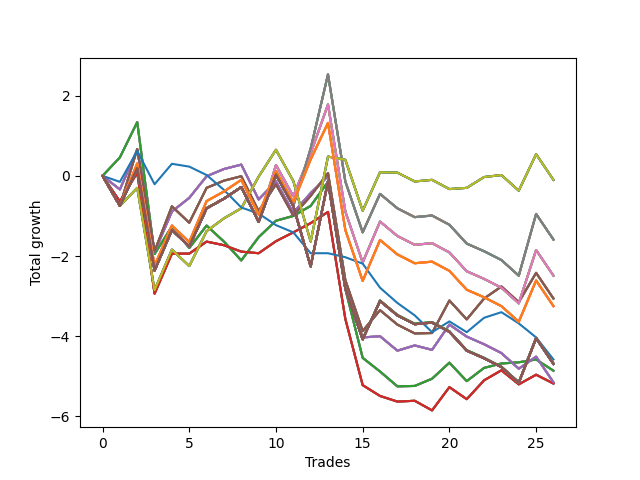

# Long Shepard 002 
- Symbol: NVDA_Unlimited
- Date Range: 02/08/2022 - 07/08/2022
- Trading Period: 7:20-12:30
- Number of Trades: 26



| Name | Win Percent | Profit | Avg Profit / Trade | Avg Time / Trade |      | Name | Win Percent | Profit | Avg Profit / Trade | Avg Time / Trade |
| ---- | ----------- | ------ | ------------------ | ---------------- | ---- | ---- | ----------- | ------ | ------------------ | ---------------- |
| Sorted By <br> Profit | | | | | | Sorted By <br> Win Percentage ||||
| Seventy | 53.85 | -50.00 | -1.92 | 19:56 |     | Sixty-Four | 61.54 | -2430.00 | -93.46 | 08:36 |
| Sixty-Two | 53.85 | -50.00 | -1.92 | 19:56 |     | Fifty-Six | 61.54 | -2430.00 | -93.46 | 08:36 |
| Fifty-Four | 53.85 | -50.00 | -1.92 | 19:56 |     | Forty-Eight | 61.54 | -2430.00 | -93.46 | 08:36 |
| Forty-Six | 53.85 | -50.00 | -1.92 | 19:56 |     | Forty | 61.54 | -2430.00 | -93.46 | 08:36 |
| Six | 53.85 | -50.00 | -1.92 | 19:56 |     | Zero | 61.54 | -2430.00 | -93.46 | 08:36 |
| Sixty-Nine | 42.31 | -795.00 | -30.58 | 28:50 |     | Seventy | 53.85 | -50.00 | -1.92 | 19:56 |
| Sixty-One | 42.31 | -795.00 | -30.58 | 28:50 |     | Sixty-Two | 53.85 | -50.00 | -1.92 | 19:56 |
| Fifty-Three | 42.31 | -795.00 | -30.58 | 28:50 |     | Fifty-Four | 53.85 | -50.00 | -1.92 | 19:56 |
| Forty-Five | 42.31 | -795.00 | -30.58 | 28:50 |     | Forty-Six | 53.85 | -50.00 | -1.92 | 19:56 |
| Five | 42.31 | -795.00 | -30.58 | 28:50 |     | Six | 53.85 | -50.00 | -1.92 | 19:56 |
| Sixty-Eight | 42.31 | -1245.00 | -47.88 | 27:49 |     | Sixty-Seven | 53.85 | -1530.00 | -58.85 | 21:58 |
| Sixty | 42.31 | -1245.00 | -47.88 | 27:49 |     | Fifty-Nine | 53.85 | -1530.00 | -58.85 | 21:58 |
| Fifty-Two | 42.31 | -1245.00 | -47.88 | 27:49 |     | Fifty-One | 53.85 | -1530.00 | -58.85 | 21:58 |
| Forty-Four | 42.31 | -1245.00 | -47.88 | 27:49 |     | Forty-Three | 53.85 | -1530.00 | -58.85 | 21:58 |
| Four | 42.31 | -1245.00 | -47.88 | 27:49 |     | Three | 53.85 | -1530.00 | -58.85 | 21:58 |
| Sixty-Seven | 53.85 | -1530.00 | -58.85 | 21:58 |     | Sixty-Six | 50.00 | -2575.00 | -99.04 | 22:37 |
| Fifty-Nine | 53.85 | -1530.00 | -58.85 | 21:58 |     | Fifty-Eight | 50.00 | -2575.00 | -99.04 | 22:37 |
| Fifty-One | 53.85 | -1530.00 | -58.85 | 21:58 |     | Fifty | 50.00 | -2575.00 | -99.04 | 22:37 |
| Forty-Three | 53.85 | -1530.00 | -58.85 | 21:58 |     | Forty-Two | 50.00 | -2575.00 | -99.04 | 22:37 |
| Three | 53.85 | -1530.00 | -58.85 | 21:58 |     | Two | 50.00 | -2575.00 | -99.04 | 22:37 |
| One Hundred Twenty-Six | 42.31 | -1625.00 | -62.50 | 24:55 |     | Sixty-Five | 50.00 | -2590.00 | -99.62 | 16:00 |
| One Hundred Twenty-One | 42.31 | -1625.00 | -62.50 | 24:55 |     | Fifty-Seven | 50.00 | -2590.00 | -99.62 | 16:00 |
| One Hundred Sixteen | 42.31 | -1625.00 | -62.50 | 24:55 |     | Forty-Nine | 50.00 | -2590.00 | -99.62 | 16:00 |
| One Hundred Eleven | 42.31 | -1625.00 | -62.50 | 24:55 |     | Forty-One | 50.00 | -2590.00 | -99.62 | 16:00 |
| Eighty-One | 42.31 | -1625.00 | -62.50 | 24:55 |     | One | 50.00 | -2590.00 | -99.62 | 16:00 |
| Seventy-Three | 23.08 | -2290.00 | -88.08 | 04:48 |     | Sixty-Nine | 42.31 | -795.00 | -30.58 | 28:50 |
| One Hundred Twenty-Seven | 38.46 | -2340.00 | -90.00 | 29:48 |     | Sixty-One | 42.31 | -795.00 | -30.58 | 28:50 |
| One Hundred Twenty-Two | 38.46 | -2340.00 | -90.00 | 29:48 |     | Fifty-Three | 42.31 | -795.00 | -30.58 | 28:50 |
| One Hundred Seventeen | 38.46 | -2340.00 | -90.00 | 29:48 |     | Forty-Five | 42.31 | -795.00 | -30.58 | 28:50 |
| One Hundred Twelve | 38.46 | -2340.00 | -90.00 | 29:48 |     | Five | 42.31 | -795.00 | -30.58 | 28:50 |
| Eighty-Two | 38.46 | -2340.00 | -90.00 | 29:48 |     | Sixty-Eight | 42.31 | -1245.00 | -47.88 | 27:49 |
| One Hundred Thirty | 38.46 | -2345.00 | -90.19 | 29:55 |     | Sixty | 42.31 | -1245.00 | -47.88 | 27:49 |
| One Hundred Twenty-Nine | 38.46 | -2345.00 | -90.19 | 29:55 |     | Fifty-Two | 42.31 | -1245.00 | -47.88 | 27:49 |
| One Hundred Twenty-Eight | 38.46 | -2345.00 | -90.19 | 29:55 |     | Forty-Four | 42.31 | -1245.00 | -47.88 | 27:49 |
| One Hundred Twenty-Five | 38.46 | -2345.00 | -90.19 | 29:55 |     | Four | 42.31 | -1245.00 | -47.88 | 27:49 |
| One Hundred Twenty-Four | 38.46 | -2345.00 | -90.19 | 29:55 |     | One Hundred Twenty-Six | 42.31 | -1625.00 | -62.50 | 24:55 |
| One Hundred Twenty-Three | 38.46 | -2345.00 | -90.19 | 29:55 |     | One Hundred Twenty-One | 42.31 | -1625.00 | -62.50 | 24:55 |
| One Hundred Twenty | 38.46 | -2345.00 | -90.19 | 29:55 |     | One Hundred Sixteen | 42.31 | -1625.00 | -62.50 | 24:55 |
| One Hundred Ninteen | 38.46 | -2345.00 | -90.19 | 29:55 |     | One Hundred Eleven | 42.31 | -1625.00 | -62.50 | 24:55 |
| One Hundred Eighteen | 38.46 | -2345.00 | -90.19 | 29:55 |     | Eighty-One | 42.31 | -1625.00 | -62.50 | 24:55 |
| One Hundred Fifteen | 38.46 | -2345.00 | -90.19 | 29:55 |     | One Hundred Twenty-Seven | 38.46 | -2340.00 | -90.00 | 29:48 |
| One Hundred Fourteen | 38.46 | -2345.00 | -90.19 | 29:55 |     | One Hundred Twenty-Two | 38.46 | -2340.00 | -90.00 | 29:48 |
| One Hundred Thirteen | 38.46 | -2345.00 | -90.19 | 29:55 |     | One Hundred Seventeen | 38.46 | -2340.00 | -90.00 | 29:48 |
| Eighty-Five | 38.46 | -2345.00 | -90.19 | 29:55 |     | One Hundred Twelve | 38.46 | -2340.00 | -90.00 | 29:48 |
| Eighty-Four | 38.46 | -2345.00 | -90.19 | 29:55 |     | Eighty-Two | 38.46 | -2340.00 | -90.00 | 29:48 |
| Eighty-Three | 38.46 | -2345.00 | -90.19 | 29:55 |     | One Hundred Thirty | 38.46 | -2345.00 | -90.19 | 29:55 |
| Seventy-One | 38.46 | -2345.00 | -90.19 | 29:55 |     | One Hundred Twenty-Nine | 38.46 | -2345.00 | -90.19 | 29:55 |
| Sixty-Three | 38.46 | -2345.00 | -90.19 | 29:55 |     | One Hundred Twenty-Eight | 38.46 | -2345.00 | -90.19 | 29:55 |
| Fifty-Five | 38.46 | -2345.00 | -90.19 | 29:55 |     | One Hundred Twenty-Five | 38.46 | -2345.00 | -90.19 | 29:55 |
| Forty-Seven | 38.46 | -2345.00 | -90.19 | 29:55 |     | One Hundred Twenty-Four | 38.46 | -2345.00 | -90.19 | 29:55 |
| Seven | 38.46 | -2345.00 | -90.19 | 29:55 |     | One Hundred Twenty-Three | 38.46 | -2345.00 | -90.19 | 29:55 |
| Sixty-Four | 61.54 | -2430.00 | -93.46 | 08:36 |     | One Hundred Twenty | 38.46 | -2345.00 | -90.19 | 29:55 |
| Fifty-Six | 61.54 | -2430.00 | -93.46 | 08:36 |     | One Hundred Ninteen | 38.46 | -2345.00 | -90.19 | 29:55 |
| Forty-Eight | 61.54 | -2430.00 | -93.46 | 08:36 |     | One Hundred Eighteen | 38.46 | -2345.00 | -90.19 | 29:55 |
| Forty | 61.54 | -2430.00 | -93.46 | 08:36 |     | One Hundred Fifteen | 38.46 | -2345.00 | -90.19 | 29:55 |
| Zero | 61.54 | -2430.00 | -93.46 | 08:36 |     | One Hundred Fourteen | 38.46 | -2345.00 | -90.19 | 29:55 |
| Sixty-Six | 50.00 | -2575.00 | -99.04 | 22:37 |     | One Hundred Thirteen | 38.46 | -2345.00 | -90.19 | 29:55 |
| Fifty-Eight | 50.00 | -2575.00 | -99.04 | 22:37 |     | Eighty-Five | 38.46 | -2345.00 | -90.19 | 29:55 |
| Fifty | 50.00 | -2575.00 | -99.04 | 22:37 |     | Eighty-Four | 38.46 | -2345.00 | -90.19 | 29:55 |
| Forty-Two | 50.00 | -2575.00 | -99.04 | 22:37 |     | Eighty-Three | 38.46 | -2345.00 | -90.19 | 29:55 |
| Two | 50.00 | -2575.00 | -99.04 | 22:37 |     | Seventy-One | 38.46 | -2345.00 | -90.19 | 29:55 |
| Sixty-Five | 50.00 | -2590.00 | -99.62 | 16:00 |     | Sixty-Three | 38.46 | -2345.00 | -90.19 | 29:55 |
| Fifty-Seven | 50.00 | -2590.00 | -99.62 | 16:00 |     | Fifty-Five | 38.46 | -2345.00 | -90.19 | 29:55 |
| Forty-Nine | 50.00 | -2590.00 | -99.62 | 16:00 |     | Forty-Seven | 38.46 | -2345.00 | -90.19 | 29:55 |
| Forty-One | 50.00 | -2590.00 | -99.62 | 16:00 |     | Seven | 38.46 | -2345.00 | -90.19 | 29:55 |
| One | 50.00 | -2590.00 | -99.62 | 16:00 |     | Seventy-Three | 23.08 | -2290.00 | -88.08 | 04:48 |

## NO STOPLOSS

### Test Zero
* Sell when price hits the middle line of the 20p bollinger
* No Stoploss
* Results:
```
Total Trades: 26
Percent Up: 61.54
Percent Down: 38.46
Total Points Moved Up: -4.86
Potential Profit: -2430.00
Total Points Ups: 5.68 Count Ups: 16
Total Points Downs: -10.54 Count Downs: 10
```

<details><summary>Trades</summary>

<code>In: 2022-02-16 09:23:00		Out: 2022-02-16 09:27:40		Total Position Time: 04:40		Total Move Up: 0.46		Total to Date: 0.46</code> <br />
<code>In: 2022-02-25 09:59:00		Out: 2022-02-25 10:00:05		Total Position Time: 01:05		Total Move Up: 0.88		Total to Date: 1.34</code> <br />
<code>In: 2022-03-16 10:00:00		Out: 2022-03-16 10:27:20		Total Position Time: 27:20		Total Move Up: -3.29		Total to Date: -1.95</code> <br />
<code>In: 2022-03-30 08:13:00		Out: 2022-03-30 08:14:35		Total Position Time: 01:35		Total Move Up: 0.69		Total to Date: -1.26</code> <br />
<code>In: 2022-03-31 09:16:00		Out: 2022-03-31 09:28:40		Total Position Time: 12:40		Total Move Up: -0.54		Total to Date: -1.80</code> <br />
<code>In: 2022-04-04 11:15:00		Out: 2022-04-04 11:20:55		Total Position Time: 05:55		Total Move Up: 0.56		Total to Date: -1.24</code> <br />
<code>In: 2022-04-13 10:45:00		Out: 2022-04-13 10:59:15		Total Position Time: 14:15		Total Move Up: -0.40		Total to Date: -1.64</code> <br />
<code>In: 2022-04-13 10:46:00		Out: 2022-04-13 10:59:15		Total Position Time: 13:15		Total Move Up: -0.47		Total to Date: -2.11</code> <br />
<code>In: 2022-05-02 10:08:00		Out: 2022-05-02 10:08:20		Total Position Time: 00:20		Total Move Up: 0.58		Total to Date: -1.53</code> <br />
<code>In: 2022-05-03 07:49:00		Out: 2022-05-03 07:54:05		Total Position Time: 05:05		Total Move Up: 0.41		Total to Date: -1.12</code> <br />
<code>In: 2022-05-06 11:12:00		Out: 2022-05-06 11:12:15		Total Position Time: 00:15		Total Move Up: 0.12		Total to Date: -1.00</code> <br />
<code>In: 2022-05-06 11:41:00		Out: 2022-05-06 11:41:10		Total Position Time: 00:10		Total Move Up: 0.25		Total to Date: -0.75</code> <br />
<code>In: 2022-05-06 12:12:00		Out: 2022-05-06 12:15:20		Total Position Time: 03:20		Total Move Up: 0.60		Total to Date: -0.15</code> <br />
<code>In: 2022-05-31 11:31:00		Out: 2022-05-31 12:00:55		Total Position Time: 29:55		Total Move Up: -2.67		Total to Date: -2.82</code> <br />
<code>In: 2022-05-31 11:39:00		Out: 2022-05-31 12:01:15		Total Position Time: 22:15		Total Move Up: -1.72		Total to Date: -4.54</code> <br />
<code>In: 2022-05-31 11:52:00		Out: 2022-05-31 12:01:15		Total Position Time: 09:15		Total Move Up: -0.34		Total to Date: -4.88</code> <br />
<code>In: 2022-06-21 08:58:00		Out: 2022-06-21 09:14:45		Total Position Time: 16:45		Total Move Up: -0.37		Total to Date: -5.25</code> <br />
<code>In: 2022-06-21 11:11:00		Out: 2022-06-21 11:18:05		Total Position Time: 07:05		Total Move Up: 0.01		Total to Date: -5.24</code> <br />
<code>In: 2022-06-22 09:01:00		Out: 2022-06-22 09:03:30		Total Position Time: 02:30		Total Move Up: 0.18		Total to Date: -5.06</code> <br />
<code>In: 2022-06-23 09:13:00		Out: 2022-06-23 09:18:25		Total Position Time: 05:25		Total Move Up: 0.40		Total to Date: -4.66</code> <br />
<code>In: 2022-06-27 10:39:00		Out: 2022-06-27 10:54:25		Total Position Time: 15:25		Total Move Up: -0.46		Total to Date: -5.12</code> <br />
<code>In: 2022-06-27 12:11:00		Out: 2022-06-27 12:12:10		Total Position Time: 01:10		Total Move Up: 0.33		Total to Date: -4.79</code> <br />
<code>In: 2022-06-27 12:12:00		Out: 2022-06-27 12:12:10		Total Position Time: 00:10		Total Move Up: 0.11		Total to Date: -4.68</code> <br />
<code>In: 2022-06-29 09:16:00		Out: 2022-06-29 09:20:30		Total Position Time: 04:30		Total Move Up: 0.03		Total to Date: -4.65</code> <br />
<code>In: 2022-06-30 12:15:00		Out: 2022-06-30 12:21:45		Total Position Time: 06:45		Total Move Up: 0.07		Total to Date: -4.58</code> <br />
<code>In: 2022-07-08 09:36:00		Out: 2022-07-08 09:48:35		Total Position Time: 12:35		Total Move Up: -0.28		Total to Date: -4.86</code> <br />


</details>

### Test One
* Sell when the price hits the upper line of the 20p 1std bollinger
* No Stoploss
* Results:
```
Total Trades: 26
Percent Up: 50.00
Percent Down: 50.00
Total Points Moved Up: -5.18
Potential Profit: -2590.00
Total Points Ups: 4.61 Count Ups: 13
Total Points Downs: -9.79 Count Downs: 13
```

<details><summary>Trades</summary>

<code>In: 2022-02-16 09:23:00		Out: 2022-02-16 09:48:20		Total Position Time: 25:20		Total Move Up: -0.64		Total to Date: -0.64</code> <br />
<code>In: 2022-02-25 09:59:00		Out: 2022-02-25 10:24:45		Total Position Time: 25:45		Total Move Up: 0.72		Total to Date: 0.08</code> <br />
<code>In: 2022-03-16 10:00:00		Out: 2022-03-16 10:28:35		Total Position Time: 28:35		Total Move Up: -3.02		Total to Date: -2.94</code> <br />
<code>In: 2022-03-30 08:13:00		Out: 2022-03-30 08:19:15		Total Position Time: 06:15		Total Move Up: 1.00		Total to Date: -1.94</code> <br />
<code>In: 2022-03-31 09:16:00		Out: 2022-03-31 09:30:00		Total Position Time: 14:00		Total Move Up: 0.00		Total to Date: -1.94</code> <br />
<code>In: 2022-04-04 11:15:00		Out: 2022-04-04 11:26:50		Total Position Time: 11:50		Total Move Up: 0.30		Total to Date: -1.64</code> <br />
<code>In: 2022-04-13 10:45:00		Out: 2022-04-13 11:03:35		Total Position Time: 18:35		Total Move Up: -0.09		Total to Date: -1.73</code> <br />
<code>In: 2022-04-13 10:46:00		Out: 2022-04-13 11:03:35		Total Position Time: 17:35		Total Move Up: -0.16		Total to Date: -1.89</code> <br />
<code>In: 2022-05-02 10:08:00		Out: 2022-05-02 10:31:10		Total Position Time: 23:10		Total Move Up: -0.04		Total to Date: -1.93</code> <br />
<code>In: 2022-05-03 07:49:00		Out: 2022-05-03 07:59:10		Total Position Time: 10:10		Total Move Up: 0.30		Total to Date: -1.63</code> <br />
<code>In: 2022-05-06 11:12:00		Out: 2022-05-06 11:15:05		Total Position Time: 03:05		Total Move Up: 0.22		Total to Date: -1.41</code> <br />
<code>In: 2022-05-06 11:41:00		Out: 2022-05-06 11:49:10		Total Position Time: 08:10		Total Move Up: 0.23		Total to Date: -1.18</code> <br />
<code>In: 2022-05-06 12:12:00		Out: 2022-05-06 12:20:05		Total Position Time: 08:05		Total Move Up: 0.28		Total to Date: -0.90</code> <br />
<code>In: 2022-05-31 11:31:00		Out: 2022-05-31 12:00:55		Total Position Time: 29:55		Total Move Up: -2.67		Total to Date: -3.57</code> <br />
<code>In: 2022-05-31 11:39:00		Out: 2022-05-31 12:07:00		Total Position Time: 28:00		Total Move Up: -1.65		Total to Date: -5.22</code> <br />
<code>In: 2022-05-31 11:52:00		Out: 2022-05-31 12:07:00		Total Position Time: 15:00		Total Move Up: -0.27		Total to Date: -5.49</code> <br />
<code>In: 2022-06-21 08:58:00		Out: 2022-06-21 09:16:00		Total Position Time: 18:00		Total Move Up: -0.14		Total to Date: -5.63</code> <br />
<code>In: 2022-06-21 11:11:00		Out: 2022-06-21 11:23:05		Total Position Time: 12:05		Total Move Up: 0.02		Total to Date: -5.61</code> <br />
<code>In: 2022-06-22 09:01:00		Out: 2022-06-22 09:21:25		Total Position Time: 20:25		Total Move Up: -0.24		Total to Date: -5.85</code> <br />
<code>In: 2022-06-23 09:13:00		Out: 2022-06-23 09:19:05		Total Position Time: 06:05		Total Move Up: 0.58		Total to Date: -5.27</code> <br />
<code>In: 2022-06-27 10:39:00		Out: 2022-06-27 11:01:20		Total Position Time: 22:20		Total Move Up: -0.30		Total to Date: -5.57</code> <br />
<code>In: 2022-06-27 12:11:00		Out: 2022-06-27 12:17:50		Total Position Time: 06:50		Total Move Up: 0.47		Total to Date: -5.10</code> <br />
<code>In: 2022-06-27 12:12:00		Out: 2022-06-27 12:17:50		Total Position Time: 05:50		Total Move Up: 0.25		Total to Date: -4.85</code> <br />
<code>In: 2022-06-29 09:16:00		Out: 2022-06-29 09:38:35		Total Position Time: 22:35		Total Move Up: -0.35		Total to Date: -5.20</code> <br />
<code>In: 2022-06-30 12:15:00		Out: 2022-06-30 12:24:10		Total Position Time: 09:10		Total Move Up: 0.24		Total to Date: -4.96</code> <br />
<code>In: 2022-07-08 09:36:00		Out: 2022-07-08 09:55:35		Total Position Time: 19:35		Total Move Up: -0.22		Total to Date: -5.18</code> <br />


</details>

### Test Two
* Sell when the price hits the upper line of the 20p 2std bollinger
* No Stoploss
* Results:
```
Total Trades: 26
Percent Up: 50.00
Percent Down: 50.00
Total Points Moved Up: -5.15
Potential Profit: -2575.00
Total Points Ups: 5.62 Count Ups: 13
Total Points Downs: -10.77 Count Downs: 13
```

<details><summary>Trades</summary>

<code>In: 2022-02-16 09:23:00		Out: 2022-02-16 09:50:05		Total Position Time: 27:05		Total Move Up: -0.34		Total to Date: -0.34</code> <br />
<code>In: 2022-02-25 09:59:00		Out: 2022-02-25 10:26:45		Total Position Time: 27:45		Total Move Up: 0.99		Total to Date: 0.65</code> <br />
<code>In: 2022-03-16 10:00:00		Out: 2022-03-16 10:29:55		Total Position Time: 29:55		Total Move Up: -2.55		Total to Date: -1.90</code> <br />
<code>In: 2022-03-30 08:13:00		Out: 2022-03-30 08:42:55		Total Position Time: 29:55		Total Move Up: 1.01		Total to Date: -0.89</code> <br />
<code>In: 2022-03-31 09:16:00		Out: 2022-03-31 09:30:25		Total Position Time: 14:25		Total Move Up: 0.34		Total to Date: -0.55</code> <br />
<code>In: 2022-04-04 11:15:00		Out: 2022-04-04 11:27:30		Total Position Time: 12:30		Total Move Up: 0.54		Total to Date: -0.01</code> <br />
<code>In: 2022-04-13 10:45:00		Out: 2022-04-13 11:06:15		Total Position Time: 21:15		Total Move Up: 0.18		Total to Date: 0.17</code> <br />
<code>In: 2022-04-13 10:46:00		Out: 2022-04-13 11:06:15		Total Position Time: 20:15		Total Move Up: 0.11		Total to Date: 0.28</code> <br />
<code>In: 2022-05-02 10:08:00		Out: 2022-05-02 10:37:55		Total Position Time: 29:55		Total Move Up: -0.87		Total to Date: -0.59</code> <br />
<code>In: 2022-05-03 07:49:00		Out: 2022-05-03 08:05:00		Total Position Time: 16:00		Total Move Up: 0.45		Total to Date: -0.14</code> <br />
<code>In: 2022-05-06 11:12:00		Out: 2022-05-06 11:41:55		Total Position Time: 29:55		Total Move Up: -0.78		Total to Date: -0.92</code> <br />
<code>In: 2022-05-06 11:41:00		Out: 2022-05-06 11:49:25		Total Position Time: 08:25		Total Move Up: 0.49		Total to Date: -0.43</code> <br />
<code>In: 2022-05-06 12:12:00		Out: 2022-05-06 12:28:05		Total Position Time: 16:05		Total Move Up: 0.42		Total to Date: -0.01</code> <br />
<code>In: 2022-05-31 11:31:00		Out: 2022-05-31 12:00:55		Total Position Time: 29:55		Total Move Up: -2.67		Total to Date: -2.68</code> <br />
<code>In: 2022-05-31 11:39:00		Out: 2022-05-31 12:07:45		Total Position Time: 28:45		Total Move Up: -1.35		Total to Date: -4.03</code> <br />
<code>In: 2022-05-31 11:52:00		Out: 2022-05-31 12:07:45		Total Position Time: 15:45		Total Move Up: 0.03		Total to Date: -4.00</code> <br />
<code>In: 2022-06-21 08:58:00		Out: 2022-06-21 09:27:55		Total Position Time: 29:55		Total Move Up: -0.36		Total to Date: -4.36</code> <br />
<code>In: 2022-06-21 11:11:00		Out: 2022-06-21 11:23:10		Total Position Time: 12:10		Total Move Up: 0.13		Total to Date: -4.23</code> <br />
<code>In: 2022-06-22 09:01:00		Out: 2022-06-22 09:22:25		Total Position Time: 21:25		Total Move Up: -0.11		Total to Date: -4.34</code> <br />
<code>In: 2022-06-23 09:13:00		Out: 2022-06-23 09:27:35		Total Position Time: 14:35		Total Move Up: 0.63		Total to Date: -3.71</code> <br />
<code>In: 2022-06-27 10:39:00		Out: 2022-06-27 11:01:20		Total Position Time: 22:20		Total Move Up: -0.30		Total to Date: -4.01</code> <br />
<code>In: 2022-06-27 12:11:00		Out: 2022-06-27 12:40:55		Total Position Time: 29:55		Total Move Up: -0.19		Total to Date: -4.20</code> <br />
<code>In: 2022-06-27 12:12:00		Out: 2022-06-27 12:41:55		Total Position Time: 29:55		Total Move Up: -0.22		Total to Date: -4.42</code> <br />
<code>In: 2022-06-29 09:16:00		Out: 2022-06-29 09:45:55		Total Position Time: 29:55		Total Move Up: -0.39		Total to Date: -4.81</code> <br />
<code>In: 2022-06-30 12:15:00		Out: 2022-06-30 12:25:10		Total Position Time: 10:10		Total Move Up: 0.30		Total to Date: -4.51</code> <br />
<code>In: 2022-07-08 09:36:00		Out: 2022-07-08 10:05:55		Total Position Time: 29:55		Total Move Up: -0.64		Total to Date: -5.15</code> <br />


</details>

### Test Three
* Sell when price hits the middle line of the 50p bollinger
* No Stoploss
* Results:
```
Total Trades: 26
Percent Up: 53.85
Percent Down: 46.15
Total Points Moved Up: -3.06
Potential Profit: -1530.00
Total Points Ups: 8.32 Count Ups: 14
Total Points Downs: -11.38 Count Downs: 12
```

<details><summary>Trades</summary>

<code>In: 2022-02-16 09:23:00		Out: 2022-02-16 09:52:55		Total Position Time: 29:55		Total Move Up: -0.75		Total to Date: -0.75</code> <br />
<code>In: 2022-02-25 09:59:00		Out: 2022-02-25 10:01:20		Total Position Time: 02:20		Total Move Up: 1.42		Total to Date: 0.67</code> <br />
<code>In: 2022-03-16 10:00:00		Out: 2022-03-16 10:29:55		Total Position Time: 29:55		Total Move Up: -2.55		Total to Date: -1.88</code> <br />
<code>In: 2022-03-30 08:13:00		Out: 2022-03-30 08:34:40		Total Position Time: 21:40		Total Move Up: 1.12		Total to Date: -0.76</code> <br />
<code>In: 2022-03-31 09:16:00		Out: 2022-03-31 09:45:55		Total Position Time: 29:55		Total Move Up: -0.41		Total to Date: -1.17</code> <br />
<code>In: 2022-04-04 11:15:00		Out: 2022-04-04 11:33:35		Total Position Time: 18:35		Total Move Up: 0.87		Total to Date: -0.30</code> <br />
<code>In: 2022-04-13 10:45:00		Out: 2022-04-13 11:05:25		Total Position Time: 20:25		Total Move Up: 0.18		Total to Date: -0.12</code> <br />
<code>In: 2022-04-13 10:46:00		Out: 2022-04-13 11:05:25		Total Position Time: 19:25		Total Move Up: 0.11		Total to Date: -0.01</code> <br />
<code>In: 2022-05-02 10:08:00		Out: 2022-05-02 10:37:55		Total Position Time: 29:55		Total Move Up: -0.87		Total to Date: -0.88</code> <br />
<code>In: 2022-05-03 07:49:00		Out: 2022-05-03 08:05:05		Total Position Time: 16:05		Total Move Up: 0.67		Total to Date: -0.21</code> <br />
<code>In: 2022-05-06 11:12:00		Out: 2022-05-06 11:41:55		Total Position Time: 29:55		Total Move Up: -0.78		Total to Date: -0.99</code> <br />
<code>In: 2022-05-06 11:41:00		Out: 2022-05-06 11:49:25		Total Position Time: 08:25		Total Move Up: 0.49		Total to Date: -0.50</code> <br />
<code>In: 2022-05-06 12:12:00		Out: 2022-05-06 12:28:10		Total Position Time: 16:10		Total Move Up: 0.57		Total to Date: 0.07</code> <br />
<code>In: 2022-05-31 11:31:00		Out: 2022-05-31 12:00:55		Total Position Time: 29:55		Total Move Up: -2.67		Total to Date: -2.60</code> <br />
<code>In: 2022-05-31 11:39:00		Out: 2022-05-31 12:08:55		Total Position Time: 29:55		Total Move Up: -1.27		Total to Date: -3.87</code> <br />
<code>In: 2022-05-31 11:52:00		Out: 2022-05-31 12:09:55		Total Position Time: 17:55		Total Move Up: 0.52		Total to Date: -3.35</code> <br />
<code>In: 2022-06-21 08:58:00		Out: 2022-06-21 09:27:55		Total Position Time: 29:55		Total Move Up: -0.36		Total to Date: -3.71</code> <br />
<code>In: 2022-06-21 11:11:00		Out: 2022-06-21 11:40:55		Total Position Time: 29:55		Total Move Up: -0.22		Total to Date: -3.93</code> <br />
<code>In: 2022-06-22 09:01:00		Out: 2022-06-22 09:28:05		Total Position Time: 27:05		Total Move Up: 0.01		Total to Date: -3.92</code> <br />
<code>In: 2022-06-23 09:13:00		Out: 2022-06-23 09:27:55		Total Position Time: 14:55		Total Move Up: 0.81		Total to Date: -3.11</code> <br />
<code>In: 2022-06-27 10:39:00		Out: 2022-06-27 11:08:55		Total Position Time: 29:55		Total Move Up: -0.47		Total to Date: -3.58</code> <br />
<code>In: 2022-06-27 12:11:00		Out: 2022-06-27 12:19:50		Total Position Time: 08:50		Total Move Up: 0.52		Total to Date: -3.06</code> <br />
<code>In: 2022-06-27 12:12:00		Out: 2022-06-27 12:19:50		Total Position Time: 07:50		Total Move Up: 0.30		Total to Date: -2.76</code> <br />
<code>In: 2022-06-29 09:16:00		Out: 2022-06-29 09:45:55		Total Position Time: 29:55		Total Move Up: -0.39		Total to Date: -3.15</code> <br />
<code>In: 2022-06-30 12:15:00		Out: 2022-06-30 12:27:50		Total Position Time: 12:50		Total Move Up: 0.73		Total to Date: -2.42</code> <br />
<code>In: 2022-07-08 09:36:00		Out: 2022-07-08 10:05:55		Total Position Time: 29:55		Total Move Up: -0.64		Total to Date: -3.06</code> <br />


</details>

### Test Four
* Sell when the price hits the upper line of the 50p 1std bollinger
* No Stoploss
* Results:
```
Total Trades: 26
Percent Up: 42.31
Percent Down: 57.69
Total Points Moved Up: -2.49
Potential Profit: -1245.00
Total Points Ups: 9.53 Count Ups: 11
Total Points Downs: -12.02 Count Downs: 15
```

<details><summary>Trades</summary>

<code>In: 2022-02-16 09:23:00		Out: 2022-02-16 09:52:55		Total Position Time: 29:55		Total Move Up: -0.75		Total to Date: -0.75</code> <br />
<code>In: 2022-02-25 09:59:00		Out: 2022-02-25 10:28:55		Total Position Time: 29:55		Total Move Up: 0.94		Total to Date: 0.19</code> <br />
<code>In: 2022-03-16 10:00:00		Out: 2022-03-16 10:29:55		Total Position Time: 29:55		Total Move Up: -2.55		Total to Date: -2.36</code> <br />
<code>In: 2022-03-30 08:13:00		Out: 2022-03-30 08:42:55		Total Position Time: 29:55		Total Move Up: 1.01		Total to Date: -1.35</code> <br />
<code>In: 2022-03-31 09:16:00		Out: 2022-03-31 09:45:55		Total Position Time: 29:55		Total Move Up: -0.41		Total to Date: -1.76</code> <br />
<code>In: 2022-04-04 11:15:00		Out: 2022-04-04 11:44:55		Total Position Time: 29:55		Total Move Up: 0.95		Total to Date: -0.81</code> <br />
<code>In: 2022-04-13 10:45:00		Out: 2022-04-13 11:14:55		Total Position Time: 29:55		Total Move Up: 0.24		Total to Date: -0.57</code> <br />
<code>In: 2022-04-13 10:46:00		Out: 2022-04-13 11:15:55		Total Position Time: 29:55		Total Move Up: 0.29		Total to Date: -0.28</code> <br />
<code>In: 2022-05-02 10:08:00		Out: 2022-05-02 10:37:55		Total Position Time: 29:55		Total Move Up: -0.87		Total to Date: -1.15</code> <br />
<code>In: 2022-05-03 07:49:00		Out: 2022-05-03 08:08:50		Total Position Time: 19:50		Total Move Up: 1.42		Total to Date: 0.27</code> <br />
<code>In: 2022-05-06 11:12:00		Out: 2022-05-06 11:41:55		Total Position Time: 29:55		Total Move Up: -0.78		Total to Date: -0.51</code> <br />
<code>In: 2022-05-06 11:41:00		Out: 2022-05-06 11:50:10		Total Position Time: 09:10		Total Move Up: 1.07		Total to Date: 0.56</code> <br />
<code>In: 2022-05-06 12:12:00		Out: 2022-05-06 12:37:25		Total Position Time: 25:25		Total Move Up: 1.22		Total to Date: 1.78</code> <br />
<code>In: 2022-05-31 11:31:00		Out: 2022-05-31 12:00:55		Total Position Time: 29:55		Total Move Up: -2.67		Total to Date: -0.89</code> <br />
<code>In: 2022-05-31 11:39:00		Out: 2022-05-31 12:08:55		Total Position Time: 29:55		Total Move Up: -1.27		Total to Date: -2.16</code> <br />
<code>In: 2022-05-31 11:52:00		Out: 2022-05-31 12:16:25		Total Position Time: 24:25		Total Move Up: 1.02		Total to Date: -1.14</code> <br />
<code>In: 2022-06-21 08:58:00		Out: 2022-06-21 09:27:55		Total Position Time: 29:55		Total Move Up: -0.36		Total to Date: -1.50</code> <br />
<code>In: 2022-06-21 11:11:00		Out: 2022-06-21 11:40:55		Total Position Time: 29:55		Total Move Up: -0.22		Total to Date: -1.72</code> <br />
<code>In: 2022-06-22 09:01:00		Out: 2022-06-22 09:30:55		Total Position Time: 29:55		Total Move Up: 0.04		Total to Date: -1.68</code> <br />
<code>In: 2022-06-23 09:13:00		Out: 2022-06-23 09:42:55		Total Position Time: 29:55		Total Move Up: -0.23		Total to Date: -1.91</code> <br />
<code>In: 2022-06-27 10:39:00		Out: 2022-06-27 11:08:55		Total Position Time: 29:55		Total Move Up: -0.47		Total to Date: -2.38</code> <br />
<code>In: 2022-06-27 12:11:00		Out: 2022-06-27 12:40:55		Total Position Time: 29:55		Total Move Up: -0.19		Total to Date: -2.57</code> <br />
<code>In: 2022-06-27 12:12:00		Out: 2022-06-27 12:41:55		Total Position Time: 29:55		Total Move Up: -0.22		Total to Date: -2.79</code> <br />
<code>In: 2022-06-29 09:16:00		Out: 2022-06-29 09:45:55		Total Position Time: 29:55		Total Move Up: -0.39		Total to Date: -3.18</code> <br />
<code>In: 2022-06-30 12:15:00		Out: 2022-06-30 12:31:25		Total Position Time: 16:25		Total Move Up: 1.33		Total to Date: -1.85</code> <br />
<code>In: 2022-07-08 09:36:00		Out: 2022-07-08 10:05:55		Total Position Time: 29:55		Total Move Up: -0.64		Total to Date: -2.49</code> <br />


</details>

### Test Five
* Sell when the price hits the upper line of the 50p 2std bollinger
* No Stoploss
* Results:
```
Total Trades: 26
Percent Up: 42.31
Percent Down: 57.69
Total Points Moved Up: -1.59
Potential Profit: -795.00
Total Points Ups: 10.43 Count Ups: 11
Total Points Downs: -12.02 Count Downs: 15
```

<details><summary>Trades</summary>

<code>In: 2022-02-16 09:23:00		Out: 2022-02-16 09:52:55		Total Position Time: 29:55		Total Move Up: -0.75		Total to Date: -0.75</code> <br />
<code>In: 2022-02-25 09:59:00		Out: 2022-02-25 10:28:55		Total Position Time: 29:55		Total Move Up: 0.94		Total to Date: 0.19</code> <br />
<code>In: 2022-03-16 10:00:00		Out: 2022-03-16 10:29:55		Total Position Time: 29:55		Total Move Up: -2.55		Total to Date: -2.36</code> <br />
<code>In: 2022-03-30 08:13:00		Out: 2022-03-30 08:42:55		Total Position Time: 29:55		Total Move Up: 1.01		Total to Date: -1.35</code> <br />
<code>In: 2022-03-31 09:16:00		Out: 2022-03-31 09:45:55		Total Position Time: 29:55		Total Move Up: -0.41		Total to Date: -1.76</code> <br />
<code>In: 2022-04-04 11:15:00		Out: 2022-04-04 11:44:55		Total Position Time: 29:55		Total Move Up: 0.95		Total to Date: -0.81</code> <br />
<code>In: 2022-04-13 10:45:00		Out: 2022-04-13 11:14:55		Total Position Time: 29:55		Total Move Up: 0.24		Total to Date: -0.57</code> <br />
<code>In: 2022-04-13 10:46:00		Out: 2022-04-13 11:15:55		Total Position Time: 29:55		Total Move Up: 0.29		Total to Date: -0.28</code> <br />
<code>In: 2022-05-02 10:08:00		Out: 2022-05-02 10:37:55		Total Position Time: 29:55		Total Move Up: -0.87		Total to Date: -1.15</code> <br />
<code>In: 2022-05-03 07:49:00		Out: 2022-05-03 08:18:55		Total Position Time: 29:55		Total Move Up: 1.18		Total to Date: 0.03</code> <br />
<code>In: 2022-05-06 11:12:00		Out: 2022-05-06 11:41:55		Total Position Time: 29:55		Total Move Up: -0.78		Total to Date: -0.75</code> <br />
<code>In: 2022-05-06 11:41:00		Out: 2022-05-06 11:50:35		Total Position Time: 09:35		Total Move Up: 1.43		Total to Date: 0.68</code> <br />
<code>In: 2022-05-06 12:12:00		Out: 2022-05-06 12:38:40		Total Position Time: 26:40		Total Move Up: 1.85		Total to Date: 2.53</code> <br />
<code>In: 2022-05-31 11:31:00		Out: 2022-05-31 12:00:55		Total Position Time: 29:55		Total Move Up: -2.67		Total to Date: -0.14</code> <br />
<code>In: 2022-05-31 11:39:00		Out: 2022-05-31 12:08:55		Total Position Time: 29:55		Total Move Up: -1.27		Total to Date: -1.41</code> <br />
<code>In: 2022-05-31 11:52:00		Out: 2022-05-31 12:21:55		Total Position Time: 29:55		Total Move Up: 0.96		Total to Date: -0.45</code> <br />
<code>In: 2022-06-21 08:58:00		Out: 2022-06-21 09:27:55		Total Position Time: 29:55		Total Move Up: -0.36		Total to Date: -0.81</code> <br />
<code>In: 2022-06-21 11:11:00		Out: 2022-06-21 11:40:55		Total Position Time: 29:55		Total Move Up: -0.22		Total to Date: -1.03</code> <br />
<code>In: 2022-06-22 09:01:00		Out: 2022-06-22 09:30:55		Total Position Time: 29:55		Total Move Up: 0.04		Total to Date: -0.99</code> <br />
<code>In: 2022-06-23 09:13:00		Out: 2022-06-23 09:42:55		Total Position Time: 29:55		Total Move Up: -0.23		Total to Date: -1.22</code> <br />
<code>In: 2022-06-27 10:39:00		Out: 2022-06-27 11:08:55		Total Position Time: 29:55		Total Move Up: -0.47		Total to Date: -1.69</code> <br />
<code>In: 2022-06-27 12:11:00		Out: 2022-06-27 12:40:55		Total Position Time: 29:55		Total Move Up: -0.19		Total to Date: -1.88</code> <br />
<code>In: 2022-06-27 12:12:00		Out: 2022-06-27 12:41:55		Total Position Time: 29:55		Total Move Up: -0.22		Total to Date: -2.10</code> <br />
<code>In: 2022-06-29 09:16:00		Out: 2022-06-29 09:45:55		Total Position Time: 29:55		Total Move Up: -0.39		Total to Date: -2.49</code> <br />
<code>In: 2022-06-30 12:15:00		Out: 2022-06-30 12:40:30		Total Position Time: 25:30		Total Move Up: 1.54		Total to Date: -0.95</code> <br />
<code>In: 2022-07-08 09:36:00		Out: 2022-07-08 10:05:55		Total Position Time: 29:55		Total Move Up: -0.64		Total to Date: -1.59</code> <br />


</details>

### Test Six
* Sell when the price hits the middle line of the 1std VWAP
* No Stoploss
* Results:
```
Total Trades: 26
Percent Up: 53.85
Percent Down: 46.15
Total Points Moved Up: -0.10
Potential Profit: -50.00
Total Points Ups: 8.74 Count Ups: 14
Total Points Downs: -8.84 Count Downs: 12
```

<details><summary>Trades</summary>

<code>In: 2022-02-16 09:23:00		Out: 2022-02-16 09:52:55		Total Position Time: 29:55		Total Move Up: -0.75		Total to Date: -0.75</code> <br />
<code>In: 2022-02-25 09:59:00		Out: 2022-02-25 09:59:35		Total Position Time: 00:35		Total Move Up: 0.45		Total to Date: -0.30</code> <br />
<code>In: 2022-03-16 10:00:00		Out: 2022-03-16 10:29:55		Total Position Time: 29:55		Total Move Up: -2.55		Total to Date: -2.85</code> <br />
<code>In: 2022-03-30 08:13:00		Out: 2022-03-30 08:42:55		Total Position Time: 29:55		Total Move Up: 1.01		Total to Date: -1.84</code> <br />
<code>In: 2022-03-31 09:16:00		Out: 2022-03-31 09:45:55		Total Position Time: 29:55		Total Move Up: -0.41		Total to Date: -2.25</code> <br />
<code>In: 2022-04-04 11:15:00		Out: 2022-04-04 11:33:35		Total Position Time: 18:35		Total Move Up: 0.87		Total to Date: -1.38</code> <br />
<code>In: 2022-04-13 10:45:00		Out: 2022-04-13 11:06:20		Total Position Time: 21:20		Total Move Up: 0.32		Total to Date: -1.06</code> <br />
<code>In: 2022-04-13 10:46:00		Out: 2022-04-13 11:06:20		Total Position Time: 20:20		Total Move Up: 0.25		Total to Date: -0.81</code> <br />
<code>In: 2022-05-02 10:08:00		Out: 2022-05-02 10:10:50		Total Position Time: 02:50		Total Move Up: 0.79		Total to Date: -0.02</code> <br />
<code>In: 2022-05-03 07:49:00		Out: 2022-05-03 08:05:05		Total Position Time: 16:05		Total Move Up: 0.67		Total to Date: 0.65</code> <br />
<code>In: 2022-05-06 11:12:00		Out: 2022-05-06 11:41:55		Total Position Time: 29:55		Total Move Up: -0.78		Total to Date: -0.13</code> <br />
<code>In: 2022-05-06 11:41:00		Out: 2022-05-06 12:10:55		Total Position Time: 29:55		Total Move Up: -1.51		Total to Date: -1.64</code> <br />
<code>In: 2022-05-06 12:12:00		Out: 2022-05-06 12:41:55		Total Position Time: 29:55		Total Move Up: 2.12		Total to Date: 0.48</code> <br />
<code>In: 2022-05-31 11:31:00		Out: 2022-05-31 11:31:10		Total Position Time: 00:10		Total Move Up: -0.08		Total to Date: 0.40</code> <br />
<code>In: 2022-05-31 11:39:00		Out: 2022-05-31 12:08:55		Total Position Time: 29:55		Total Move Up: -1.27		Total to Date: -0.87</code> <br />
<code>In: 2022-05-31 11:52:00		Out: 2022-05-31 12:21:55		Total Position Time: 29:55		Total Move Up: 0.96		Total to Date: 0.09</code> <br />
<code>In: 2022-06-21 08:58:00		Out: 2022-06-21 09:02:30		Total Position Time: 04:30		Total Move Up: -0.01		Total to Date: 0.08</code> <br />
<code>In: 2022-06-21 11:11:00		Out: 2022-06-21 11:40:55		Total Position Time: 29:55		Total Move Up: -0.22		Total to Date: -0.14</code> <br />
<code>In: 2022-06-22 09:01:00		Out: 2022-06-22 09:30:55		Total Position Time: 29:55		Total Move Up: 0.04		Total to Date: -0.10</code> <br />
<code>In: 2022-06-23 09:13:00		Out: 2022-06-23 09:42:55		Total Position Time: 29:55		Total Move Up: -0.23		Total to Date: -0.33</code> <br />
<code>In: 2022-06-27 10:39:00		Out: 2022-06-27 10:39:10		Total Position Time: 00:10		Total Move Up: 0.03		Total to Date: -0.30</code> <br />
<code>In: 2022-06-27 12:11:00		Out: 2022-06-27 12:12:15		Total Position Time: 01:15		Total Move Up: 0.27		Total to Date: -0.03</code> <br />
<code>In: 2022-06-27 12:12:00		Out: 2022-06-27 12:12:15		Total Position Time: 00:15		Total Move Up: 0.05		Total to Date: 0.02</code> <br />
<code>In: 2022-06-29 09:16:00		Out: 2022-06-29 09:45:55		Total Position Time: 29:55		Total Move Up: -0.39		Total to Date: -0.37</code> <br />
<code>In: 2022-06-30 12:15:00		Out: 2022-06-30 12:28:25		Total Position Time: 13:25		Total Move Up: 0.91		Total to Date: 0.54</code> <br />
<code>In: 2022-07-08 09:36:00		Out: 2022-07-08 10:05:55		Total Position Time: 29:55		Total Move Up: -0.64		Total to Date: -0.10</code> <br />


</details>

### Test Seven
* Sell when the price hits the upper line of the 1std VWAP
* No Stoploss
* Results:
```
Total Trades: 26
Percent Up: 38.46
Percent Down: 61.54
Total Points Moved Up: -4.69
Potential Profit: -2345.00
Total Points Ups: 8.84 Count Ups: 10
Total Points Downs: -13.53 Count Downs: 16
```

<details><summary>Trades</summary>

<code>In: 2022-02-16 09:23:00		Out: 2022-02-16 09:52:55		Total Position Time: 29:55		Total Move Up: -0.75		Total to Date: -0.75</code> <br />
<code>In: 2022-02-25 09:59:00		Out: 2022-02-25 10:28:55		Total Position Time: 29:55		Total Move Up: 0.94		Total to Date: 0.19</code> <br />
<code>In: 2022-03-16 10:00:00		Out: 2022-03-16 10:29:55		Total Position Time: 29:55		Total Move Up: -2.55		Total to Date: -2.36</code> <br />
<code>In: 2022-03-30 08:13:00		Out: 2022-03-30 08:42:55		Total Position Time: 29:55		Total Move Up: 1.01		Total to Date: -1.35</code> <br />
<code>In: 2022-03-31 09:16:00		Out: 2022-03-31 09:45:55		Total Position Time: 29:55		Total Move Up: -0.41		Total to Date: -1.76</code> <br />
<code>In: 2022-04-04 11:15:00		Out: 2022-04-04 11:44:55		Total Position Time: 29:55		Total Move Up: 0.95		Total to Date: -0.81</code> <br />
<code>In: 2022-04-13 10:45:00		Out: 2022-04-13 11:14:55		Total Position Time: 29:55		Total Move Up: 0.24		Total to Date: -0.57</code> <br />
<code>In: 2022-04-13 10:46:00		Out: 2022-04-13 11:15:55		Total Position Time: 29:55		Total Move Up: 0.29		Total to Date: -0.28</code> <br />
<code>In: 2022-05-02 10:08:00		Out: 2022-05-02 10:37:55		Total Position Time: 29:55		Total Move Up: -0.87		Total to Date: -1.15</code> <br />
<code>In: 2022-05-03 07:49:00		Out: 2022-05-03 08:18:55		Total Position Time: 29:55		Total Move Up: 1.18		Total to Date: 0.03</code> <br />
<code>In: 2022-05-06 11:12:00		Out: 2022-05-06 11:41:55		Total Position Time: 29:55		Total Move Up: -0.78		Total to Date: -0.75</code> <br />
<code>In: 2022-05-06 11:41:00		Out: 2022-05-06 12:10:55		Total Position Time: 29:55		Total Move Up: -1.51		Total to Date: -2.26</code> <br />
<code>In: 2022-05-06 12:12:00		Out: 2022-05-06 12:41:55		Total Position Time: 29:55		Total Move Up: 2.12		Total to Date: -0.14</code> <br />
<code>In: 2022-05-31 11:31:00		Out: 2022-05-31 12:00:55		Total Position Time: 29:55		Total Move Up: -2.67		Total to Date: -2.81</code> <br />
<code>In: 2022-05-31 11:39:00		Out: 2022-05-31 12:08:55		Total Position Time: 29:55		Total Move Up: -1.27		Total to Date: -4.08</code> <br />
<code>In: 2022-05-31 11:52:00		Out: 2022-05-31 12:21:55		Total Position Time: 29:55		Total Move Up: 0.96		Total to Date: -3.12</code> <br />
<code>In: 2022-06-21 08:58:00		Out: 2022-06-21 09:27:55		Total Position Time: 29:55		Total Move Up: -0.36		Total to Date: -3.48</code> <br />
<code>In: 2022-06-21 11:11:00		Out: 2022-06-21 11:40:55		Total Position Time: 29:55		Total Move Up: -0.22		Total to Date: -3.70</code> <br />
<code>In: 2022-06-22 09:01:00		Out: 2022-06-22 09:30:55		Total Position Time: 29:55		Total Move Up: 0.04		Total to Date: -3.66</code> <br />
<code>In: 2022-06-23 09:13:00		Out: 2022-06-23 09:42:55		Total Position Time: 29:55		Total Move Up: -0.23		Total to Date: -3.89</code> <br />
<code>In: 2022-06-27 10:39:00		Out: 2022-06-27 11:08:55		Total Position Time: 29:55		Total Move Up: -0.47		Total to Date: -4.36</code> <br />
<code>In: 2022-06-27 12:11:00		Out: 2022-06-27 12:40:55		Total Position Time: 29:55		Total Move Up: -0.19		Total to Date: -4.55</code> <br />
<code>In: 2022-06-27 12:12:00		Out: 2022-06-27 12:41:55		Total Position Time: 29:55		Total Move Up: -0.22		Total to Date: -4.77</code> <br />
<code>In: 2022-06-29 09:16:00		Out: 2022-06-29 09:45:55		Total Position Time: 29:55		Total Move Up: -0.39		Total to Date: -5.16</code> <br />
<code>In: 2022-06-30 12:15:00		Out: 2022-06-30 12:44:55		Total Position Time: 29:55		Total Move Up: 1.11		Total to Date: -4.05</code> <br />
<code>In: 2022-07-08 09:36:00		Out: 2022-07-08 10:05:55		Total Position Time: 29:55		Total Move Up: -0.64		Total to Date: -4.69</code> <br />


</details>

## STOPLOSS OF 5

### Test Forty
* Sell when price hits the middle line of the 20p bollinger
* Stoploss is 5 points
* Results:
```
Total Trades: 26
Percent Up: 61.54
Percent Down: 38.46
Total Points Moved Up: -4.86
Potential Profit: -2430.00
Total Points Ups: 5.68 Count Ups: 16
Total Points Downs: -10.54 Count Downs: 10
```

<details><summary>Trades</summary>

<code>In: 2022-02-16 09:23:00		Out: 2022-02-16 09:27:40		Total Position Time: 04:40		Total Move Up: 0.46		Total to Date: 0.46</code> <br />
<code>In: 2022-02-25 09:59:00		Out: 2022-02-25 10:00:05		Total Position Time: 01:05		Total Move Up: 0.88		Total to Date: 1.34</code> <br />
<code>In: 2022-03-16 10:00:00		Out: 2022-03-16 10:27:20		Total Position Time: 27:20		Total Move Up: -3.29		Total to Date: -1.95</code> <br />
<code>In: 2022-03-30 08:13:00		Out: 2022-03-30 08:14:35		Total Position Time: 01:35		Total Move Up: 0.69		Total to Date: -1.26</code> <br />
<code>In: 2022-03-31 09:16:00		Out: 2022-03-31 09:28:40		Total Position Time: 12:40		Total Move Up: -0.54		Total to Date: -1.80</code> <br />
<code>In: 2022-04-04 11:15:00		Out: 2022-04-04 11:20:55		Total Position Time: 05:55		Total Move Up: 0.56		Total to Date: -1.24</code> <br />
<code>In: 2022-04-13 10:45:00		Out: 2022-04-13 10:59:15		Total Position Time: 14:15		Total Move Up: -0.40		Total to Date: -1.64</code> <br />
<code>In: 2022-04-13 10:46:00		Out: 2022-04-13 10:59:15		Total Position Time: 13:15		Total Move Up: -0.47		Total to Date: -2.11</code> <br />
<code>In: 2022-05-02 10:08:00		Out: 2022-05-02 10:08:20		Total Position Time: 00:20		Total Move Up: 0.58		Total to Date: -1.53</code> <br />
<code>In: 2022-05-03 07:49:00		Out: 2022-05-03 07:54:05		Total Position Time: 05:05		Total Move Up: 0.41		Total to Date: -1.12</code> <br />
<code>In: 2022-05-06 11:12:00		Out: 2022-05-06 11:12:15		Total Position Time: 00:15		Total Move Up: 0.12		Total to Date: -1.00</code> <br />
<code>In: 2022-05-06 11:41:00		Out: 2022-05-06 11:41:10		Total Position Time: 00:10		Total Move Up: 0.25		Total to Date: -0.75</code> <br />
<code>In: 2022-05-06 12:12:00		Out: 2022-05-06 12:15:20		Total Position Time: 03:20		Total Move Up: 0.60		Total to Date: -0.15</code> <br />
<code>In: 2022-05-31 11:31:00		Out: 2022-05-31 12:00:55		Total Position Time: 29:55		Total Move Up: -2.67		Total to Date: -2.82</code> <br />
<code>In: 2022-05-31 11:39:00		Out: 2022-05-31 12:01:15		Total Position Time: 22:15		Total Move Up: -1.72		Total to Date: -4.54</code> <br />
<code>In: 2022-05-31 11:52:00		Out: 2022-05-31 12:01:15		Total Position Time: 09:15		Total Move Up: -0.34		Total to Date: -4.88</code> <br />
<code>In: 2022-06-21 08:58:00		Out: 2022-06-21 09:14:45		Total Position Time: 16:45		Total Move Up: -0.37		Total to Date: -5.25</code> <br />
<code>In: 2022-06-21 11:11:00		Out: 2022-06-21 11:18:05		Total Position Time: 07:05		Total Move Up: 0.01		Total to Date: -5.24</code> <br />
<code>In: 2022-06-22 09:01:00		Out: 2022-06-22 09:03:30		Total Position Time: 02:30		Total Move Up: 0.18		Total to Date: -5.06</code> <br />
<code>In: 2022-06-23 09:13:00		Out: 2022-06-23 09:18:25		Total Position Time: 05:25		Total Move Up: 0.40		Total to Date: -4.66</code> <br />
<code>In: 2022-06-27 10:39:00		Out: 2022-06-27 10:54:25		Total Position Time: 15:25		Total Move Up: -0.46		Total to Date: -5.12</code> <br />
<code>In: 2022-06-27 12:11:00		Out: 2022-06-27 12:12:10		Total Position Time: 01:10		Total Move Up: 0.33		Total to Date: -4.79</code> <br />
<code>In: 2022-06-27 12:12:00		Out: 2022-06-27 12:12:10		Total Position Time: 00:10		Total Move Up: 0.11		Total to Date: -4.68</code> <br />
<code>In: 2022-06-29 09:16:00		Out: 2022-06-29 09:20:30		Total Position Time: 04:30		Total Move Up: 0.03		Total to Date: -4.65</code> <br />
<code>In: 2022-06-30 12:15:00		Out: 2022-06-30 12:21:45		Total Position Time: 06:45		Total Move Up: 0.07		Total to Date: -4.58</code> <br />
<code>In: 2022-07-08 09:36:00		Out: 2022-07-08 09:48:35		Total Position Time: 12:35		Total Move Up: -0.28		Total to Date: -4.86</code> <br />


</details>

### Test Forty-One
* Sell when the price hits the upper line of the 20p 1std bollinger
* Stoploss is 5 points
* Results:
```
Total Trades: 26
Percent Up: 50.00
Percent Down: 50.00
Total Points Moved Up: -5.18
Potential Profit: -2590.00
Total Points Ups: 4.61 Count Ups: 13
Total Points Downs: -9.79 Count Downs: 13
```

<details><summary>Trades</summary>

<code>In: 2022-02-16 09:23:00		Out: 2022-02-16 09:48:20		Total Position Time: 25:20		Total Move Up: -0.64		Total to Date: -0.64</code> <br />
<code>In: 2022-02-25 09:59:00		Out: 2022-02-25 10:24:45		Total Position Time: 25:45		Total Move Up: 0.72		Total to Date: 0.08</code> <br />
<code>In: 2022-03-16 10:00:00		Out: 2022-03-16 10:28:35		Total Position Time: 28:35		Total Move Up: -3.02		Total to Date: -2.94</code> <br />
<code>In: 2022-03-30 08:13:00		Out: 2022-03-30 08:19:15		Total Position Time: 06:15		Total Move Up: 1.00		Total to Date: -1.94</code> <br />
<code>In: 2022-03-31 09:16:00		Out: 2022-03-31 09:30:00		Total Position Time: 14:00		Total Move Up: 0.00		Total to Date: -1.94</code> <br />
<code>In: 2022-04-04 11:15:00		Out: 2022-04-04 11:26:50		Total Position Time: 11:50		Total Move Up: 0.30		Total to Date: -1.64</code> <br />
<code>In: 2022-04-13 10:45:00		Out: 2022-04-13 11:03:35		Total Position Time: 18:35		Total Move Up: -0.09		Total to Date: -1.73</code> <br />
<code>In: 2022-04-13 10:46:00		Out: 2022-04-13 11:03:35		Total Position Time: 17:35		Total Move Up: -0.16		Total to Date: -1.89</code> <br />
<code>In: 2022-05-02 10:08:00		Out: 2022-05-02 10:31:10		Total Position Time: 23:10		Total Move Up: -0.04		Total to Date: -1.93</code> <br />
<code>In: 2022-05-03 07:49:00		Out: 2022-05-03 07:59:10		Total Position Time: 10:10		Total Move Up: 0.30		Total to Date: -1.63</code> <br />
<code>In: 2022-05-06 11:12:00		Out: 2022-05-06 11:15:05		Total Position Time: 03:05		Total Move Up: 0.22		Total to Date: -1.41</code> <br />
<code>In: 2022-05-06 11:41:00		Out: 2022-05-06 11:49:10		Total Position Time: 08:10		Total Move Up: 0.23		Total to Date: -1.18</code> <br />
<code>In: 2022-05-06 12:12:00		Out: 2022-05-06 12:20:05		Total Position Time: 08:05		Total Move Up: 0.28		Total to Date: -0.90</code> <br />
<code>In: 2022-05-31 11:31:00		Out: 2022-05-31 12:00:55		Total Position Time: 29:55		Total Move Up: -2.67		Total to Date: -3.57</code> <br />
<code>In: 2022-05-31 11:39:00		Out: 2022-05-31 12:07:00		Total Position Time: 28:00		Total Move Up: -1.65		Total to Date: -5.22</code> <br />
<code>In: 2022-05-31 11:52:00		Out: 2022-05-31 12:07:00		Total Position Time: 15:00		Total Move Up: -0.27		Total to Date: -5.49</code> <br />
<code>In: 2022-06-21 08:58:00		Out: 2022-06-21 09:16:00		Total Position Time: 18:00		Total Move Up: -0.14		Total to Date: -5.63</code> <br />
<code>In: 2022-06-21 11:11:00		Out: 2022-06-21 11:23:05		Total Position Time: 12:05		Total Move Up: 0.02		Total to Date: -5.61</code> <br />
<code>In: 2022-06-22 09:01:00		Out: 2022-06-22 09:21:25		Total Position Time: 20:25		Total Move Up: -0.24		Total to Date: -5.85</code> <br />
<code>In: 2022-06-23 09:13:00		Out: 2022-06-23 09:19:05		Total Position Time: 06:05		Total Move Up: 0.58		Total to Date: -5.27</code> <br />
<code>In: 2022-06-27 10:39:00		Out: 2022-06-27 11:01:20		Total Position Time: 22:20		Total Move Up: -0.30		Total to Date: -5.57</code> <br />
<code>In: 2022-06-27 12:11:00		Out: 2022-06-27 12:17:50		Total Position Time: 06:50		Total Move Up: 0.47		Total to Date: -5.10</code> <br />
<code>In: 2022-06-27 12:12:00		Out: 2022-06-27 12:17:50		Total Position Time: 05:50		Total Move Up: 0.25		Total to Date: -4.85</code> <br />
<code>In: 2022-06-29 09:16:00		Out: 2022-06-29 09:38:35		Total Position Time: 22:35		Total Move Up: -0.35		Total to Date: -5.20</code> <br />
<code>In: 2022-06-30 12:15:00		Out: 2022-06-30 12:24:10		Total Position Time: 09:10		Total Move Up: 0.24		Total to Date: -4.96</code> <br />
<code>In: 2022-07-08 09:36:00		Out: 2022-07-08 09:55:35		Total Position Time: 19:35		Total Move Up: -0.22		Total to Date: -5.18</code> <br />


</details>

### Test Forty-Two
* Sell when the price hits the upper line of the 20p 2std bollinger
* Stoploss is 5 points
* Results:
```
Total Trades: 26
Percent Up: 50.00
Percent Down: 50.00
Total Points Moved Up: -5.15
Potential Profit: -2575.00
Total Points Ups: 5.62 Count Ups: 13
Total Points Downs: -10.77 Count Downs: 13
```

<details><summary>Trades</summary>

<code>In: 2022-02-16 09:23:00		Out: 2022-02-16 09:50:05		Total Position Time: 27:05		Total Move Up: -0.34		Total to Date: -0.34</code> <br />
<code>In: 2022-02-25 09:59:00		Out: 2022-02-25 10:26:45		Total Position Time: 27:45		Total Move Up: 0.99		Total to Date: 0.65</code> <br />
<code>In: 2022-03-16 10:00:00		Out: 2022-03-16 10:29:55		Total Position Time: 29:55		Total Move Up: -2.55		Total to Date: -1.90</code> <br />
<code>In: 2022-03-30 08:13:00		Out: 2022-03-30 08:42:55		Total Position Time: 29:55		Total Move Up: 1.01		Total to Date: -0.89</code> <br />
<code>In: 2022-03-31 09:16:00		Out: 2022-03-31 09:30:25		Total Position Time: 14:25		Total Move Up: 0.34		Total to Date: -0.55</code> <br />
<code>In: 2022-04-04 11:15:00		Out: 2022-04-04 11:27:30		Total Position Time: 12:30		Total Move Up: 0.54		Total to Date: -0.01</code> <br />
<code>In: 2022-04-13 10:45:00		Out: 2022-04-13 11:06:15		Total Position Time: 21:15		Total Move Up: 0.18		Total to Date: 0.17</code> <br />
<code>In: 2022-04-13 10:46:00		Out: 2022-04-13 11:06:15		Total Position Time: 20:15		Total Move Up: 0.11		Total to Date: 0.28</code> <br />
<code>In: 2022-05-02 10:08:00		Out: 2022-05-02 10:37:55		Total Position Time: 29:55		Total Move Up: -0.87		Total to Date: -0.59</code> <br />
<code>In: 2022-05-03 07:49:00		Out: 2022-05-03 08:05:00		Total Position Time: 16:00		Total Move Up: 0.45		Total to Date: -0.14</code> <br />
<code>In: 2022-05-06 11:12:00		Out: 2022-05-06 11:41:55		Total Position Time: 29:55		Total Move Up: -0.78		Total to Date: -0.92</code> <br />
<code>In: 2022-05-06 11:41:00		Out: 2022-05-06 11:49:25		Total Position Time: 08:25		Total Move Up: 0.49		Total to Date: -0.43</code> <br />
<code>In: 2022-05-06 12:12:00		Out: 2022-05-06 12:28:05		Total Position Time: 16:05		Total Move Up: 0.42		Total to Date: -0.01</code> <br />
<code>In: 2022-05-31 11:31:00		Out: 2022-05-31 12:00:55		Total Position Time: 29:55		Total Move Up: -2.67		Total to Date: -2.68</code> <br />
<code>In: 2022-05-31 11:39:00		Out: 2022-05-31 12:07:45		Total Position Time: 28:45		Total Move Up: -1.35		Total to Date: -4.03</code> <br />
<code>In: 2022-05-31 11:52:00		Out: 2022-05-31 12:07:45		Total Position Time: 15:45		Total Move Up: 0.03		Total to Date: -4.00</code> <br />
<code>In: 2022-06-21 08:58:00		Out: 2022-06-21 09:27:55		Total Position Time: 29:55		Total Move Up: -0.36		Total to Date: -4.36</code> <br />
<code>In: 2022-06-21 11:11:00		Out: 2022-06-21 11:23:10		Total Position Time: 12:10		Total Move Up: 0.13		Total to Date: -4.23</code> <br />
<code>In: 2022-06-22 09:01:00		Out: 2022-06-22 09:22:25		Total Position Time: 21:25		Total Move Up: -0.11		Total to Date: -4.34</code> <br />
<code>In: 2022-06-23 09:13:00		Out: 2022-06-23 09:27:35		Total Position Time: 14:35		Total Move Up: 0.63		Total to Date: -3.71</code> <br />
<code>In: 2022-06-27 10:39:00		Out: 2022-06-27 11:01:20		Total Position Time: 22:20		Total Move Up: -0.30		Total to Date: -4.01</code> <br />
<code>In: 2022-06-27 12:11:00		Out: 2022-06-27 12:40:55		Total Position Time: 29:55		Total Move Up: -0.19		Total to Date: -4.20</code> <br />
<code>In: 2022-06-27 12:12:00		Out: 2022-06-27 12:41:55		Total Position Time: 29:55		Total Move Up: -0.22		Total to Date: -4.42</code> <br />
<code>In: 2022-06-29 09:16:00		Out: 2022-06-29 09:45:55		Total Position Time: 29:55		Total Move Up: -0.39		Total to Date: -4.81</code> <br />
<code>In: 2022-06-30 12:15:00		Out: 2022-06-30 12:25:10		Total Position Time: 10:10		Total Move Up: 0.30		Total to Date: -4.51</code> <br />
<code>In: 2022-07-08 09:36:00		Out: 2022-07-08 10:05:55		Total Position Time: 29:55		Total Move Up: -0.64		Total to Date: -5.15</code> <br />


</details>

### Test Forty-Three
* Sell when price hits the middle line of the 50p bollinger
* Stoploss is 5 points
* Results:
```
Total Trades: 26
Percent Up: 53.85
Percent Down: 46.15
Total Points Moved Up: -3.06
Potential Profit: -1530.00
Total Points Ups: 8.32 Count Ups: 14
Total Points Downs: -11.38 Count Downs: 12
```

<details><summary>Trades</summary>

<code>In: 2022-02-16 09:23:00		Out: 2022-02-16 09:52:55		Total Position Time: 29:55		Total Move Up: -0.75		Total to Date: -0.75</code> <br />
<code>In: 2022-02-25 09:59:00		Out: 2022-02-25 10:01:20		Total Position Time: 02:20		Total Move Up: 1.42		Total to Date: 0.67</code> <br />
<code>In: 2022-03-16 10:00:00		Out: 2022-03-16 10:29:55		Total Position Time: 29:55		Total Move Up: -2.55		Total to Date: -1.88</code> <br />
<code>In: 2022-03-30 08:13:00		Out: 2022-03-30 08:34:40		Total Position Time: 21:40		Total Move Up: 1.12		Total to Date: -0.76</code> <br />
<code>In: 2022-03-31 09:16:00		Out: 2022-03-31 09:45:55		Total Position Time: 29:55		Total Move Up: -0.41		Total to Date: -1.17</code> <br />
<code>In: 2022-04-04 11:15:00		Out: 2022-04-04 11:33:35		Total Position Time: 18:35		Total Move Up: 0.87		Total to Date: -0.30</code> <br />
<code>In: 2022-04-13 10:45:00		Out: 2022-04-13 11:05:25		Total Position Time: 20:25		Total Move Up: 0.18		Total to Date: -0.12</code> <br />
<code>In: 2022-04-13 10:46:00		Out: 2022-04-13 11:05:25		Total Position Time: 19:25		Total Move Up: 0.11		Total to Date: -0.01</code> <br />
<code>In: 2022-05-02 10:08:00		Out: 2022-05-02 10:37:55		Total Position Time: 29:55		Total Move Up: -0.87		Total to Date: -0.88</code> <br />
<code>In: 2022-05-03 07:49:00		Out: 2022-05-03 08:05:05		Total Position Time: 16:05		Total Move Up: 0.67		Total to Date: -0.21</code> <br />
<code>In: 2022-05-06 11:12:00		Out: 2022-05-06 11:41:55		Total Position Time: 29:55		Total Move Up: -0.78		Total to Date: -0.99</code> <br />
<code>In: 2022-05-06 11:41:00		Out: 2022-05-06 11:49:25		Total Position Time: 08:25		Total Move Up: 0.49		Total to Date: -0.50</code> <br />
<code>In: 2022-05-06 12:12:00		Out: 2022-05-06 12:28:10		Total Position Time: 16:10		Total Move Up: 0.57		Total to Date: 0.07</code> <br />
<code>In: 2022-05-31 11:31:00		Out: 2022-05-31 12:00:55		Total Position Time: 29:55		Total Move Up: -2.67		Total to Date: -2.60</code> <br />
<code>In: 2022-05-31 11:39:00		Out: 2022-05-31 12:08:55		Total Position Time: 29:55		Total Move Up: -1.27		Total to Date: -3.87</code> <br />
<code>In: 2022-05-31 11:52:00		Out: 2022-05-31 12:09:55		Total Position Time: 17:55		Total Move Up: 0.52		Total to Date: -3.35</code> <br />
<code>In: 2022-06-21 08:58:00		Out: 2022-06-21 09:27:55		Total Position Time: 29:55		Total Move Up: -0.36		Total to Date: -3.71</code> <br />
<code>In: 2022-06-21 11:11:00		Out: 2022-06-21 11:40:55		Total Position Time: 29:55		Total Move Up: -0.22		Total to Date: -3.93</code> <br />
<code>In: 2022-06-22 09:01:00		Out: 2022-06-22 09:28:05		Total Position Time: 27:05		Total Move Up: 0.01		Total to Date: -3.92</code> <br />
<code>In: 2022-06-23 09:13:00		Out: 2022-06-23 09:27:55		Total Position Time: 14:55		Total Move Up: 0.81		Total to Date: -3.11</code> <br />
<code>In: 2022-06-27 10:39:00		Out: 2022-06-27 11:08:55		Total Position Time: 29:55		Total Move Up: -0.47		Total to Date: -3.58</code> <br />
<code>In: 2022-06-27 12:11:00		Out: 2022-06-27 12:19:50		Total Position Time: 08:50		Total Move Up: 0.52		Total to Date: -3.06</code> <br />
<code>In: 2022-06-27 12:12:00		Out: 2022-06-27 12:19:50		Total Position Time: 07:50		Total Move Up: 0.30		Total to Date: -2.76</code> <br />
<code>In: 2022-06-29 09:16:00		Out: 2022-06-29 09:45:55		Total Position Time: 29:55		Total Move Up: -0.39		Total to Date: -3.15</code> <br />
<code>In: 2022-06-30 12:15:00		Out: 2022-06-30 12:27:50		Total Position Time: 12:50		Total Move Up: 0.73		Total to Date: -2.42</code> <br />
<code>In: 2022-07-08 09:36:00		Out: 2022-07-08 10:05:55		Total Position Time: 29:55		Total Move Up: -0.64		Total to Date: -3.06</code> <br />


</details>

### Test Forty-Four
* Sell when the price hits the upper line of the 50p 1std bollinger
* Stoploss is 5 points
* Results:
```
Total Trades: 26
Percent Up: 42.31
Percent Down: 57.69
Total Points Moved Up: -2.49
Potential Profit: -1245.00
Total Points Ups: 9.53 Count Ups: 11
Total Points Downs: -12.02 Count Downs: 15
```

<details><summary>Trades</summary>

<code>In: 2022-02-16 09:23:00		Out: 2022-02-16 09:52:55		Total Position Time: 29:55		Total Move Up: -0.75		Total to Date: -0.75</code> <br />
<code>In: 2022-02-25 09:59:00		Out: 2022-02-25 10:28:55		Total Position Time: 29:55		Total Move Up: 0.94		Total to Date: 0.19</code> <br />
<code>In: 2022-03-16 10:00:00		Out: 2022-03-16 10:29:55		Total Position Time: 29:55		Total Move Up: -2.55		Total to Date: -2.36</code> <br />
<code>In: 2022-03-30 08:13:00		Out: 2022-03-30 08:42:55		Total Position Time: 29:55		Total Move Up: 1.01		Total to Date: -1.35</code> <br />
<code>In: 2022-03-31 09:16:00		Out: 2022-03-31 09:45:55		Total Position Time: 29:55		Total Move Up: -0.41		Total to Date: -1.76</code> <br />
<code>In: 2022-04-04 11:15:00		Out: 2022-04-04 11:44:55		Total Position Time: 29:55		Total Move Up: 0.95		Total to Date: -0.81</code> <br />
<code>In: 2022-04-13 10:45:00		Out: 2022-04-13 11:14:55		Total Position Time: 29:55		Total Move Up: 0.24		Total to Date: -0.57</code> <br />
<code>In: 2022-04-13 10:46:00		Out: 2022-04-13 11:15:55		Total Position Time: 29:55		Total Move Up: 0.29		Total to Date: -0.28</code> <br />
<code>In: 2022-05-02 10:08:00		Out: 2022-05-02 10:37:55		Total Position Time: 29:55		Total Move Up: -0.87		Total to Date: -1.15</code> <br />
<code>In: 2022-05-03 07:49:00		Out: 2022-05-03 08:08:50		Total Position Time: 19:50		Total Move Up: 1.42		Total to Date: 0.27</code> <br />
<code>In: 2022-05-06 11:12:00		Out: 2022-05-06 11:41:55		Total Position Time: 29:55		Total Move Up: -0.78		Total to Date: -0.51</code> <br />
<code>In: 2022-05-06 11:41:00		Out: 2022-05-06 11:50:10		Total Position Time: 09:10		Total Move Up: 1.07		Total to Date: 0.56</code> <br />
<code>In: 2022-05-06 12:12:00		Out: 2022-05-06 12:37:25		Total Position Time: 25:25		Total Move Up: 1.22		Total to Date: 1.78</code> <br />
<code>In: 2022-05-31 11:31:00		Out: 2022-05-31 12:00:55		Total Position Time: 29:55		Total Move Up: -2.67		Total to Date: -0.89</code> <br />
<code>In: 2022-05-31 11:39:00		Out: 2022-05-31 12:08:55		Total Position Time: 29:55		Total Move Up: -1.27		Total to Date: -2.16</code> <br />
<code>In: 2022-05-31 11:52:00		Out: 2022-05-31 12:16:25		Total Position Time: 24:25		Total Move Up: 1.02		Total to Date: -1.14</code> <br />
<code>In: 2022-06-21 08:58:00		Out: 2022-06-21 09:27:55		Total Position Time: 29:55		Total Move Up: -0.36		Total to Date: -1.50</code> <br />
<code>In: 2022-06-21 11:11:00		Out: 2022-06-21 11:40:55		Total Position Time: 29:55		Total Move Up: -0.22		Total to Date: -1.72</code> <br />
<code>In: 2022-06-22 09:01:00		Out: 2022-06-22 09:30:55		Total Position Time: 29:55		Total Move Up: 0.04		Total to Date: -1.68</code> <br />
<code>In: 2022-06-23 09:13:00		Out: 2022-06-23 09:42:55		Total Position Time: 29:55		Total Move Up: -0.23		Total to Date: -1.91</code> <br />
<code>In: 2022-06-27 10:39:00		Out: 2022-06-27 11:08:55		Total Position Time: 29:55		Total Move Up: -0.47		Total to Date: -2.38</code> <br />
<code>In: 2022-06-27 12:11:00		Out: 2022-06-27 12:40:55		Total Position Time: 29:55		Total Move Up: -0.19		Total to Date: -2.57</code> <br />
<code>In: 2022-06-27 12:12:00		Out: 2022-06-27 12:41:55		Total Position Time: 29:55		Total Move Up: -0.22		Total to Date: -2.79</code> <br />
<code>In: 2022-06-29 09:16:00		Out: 2022-06-29 09:45:55		Total Position Time: 29:55		Total Move Up: -0.39		Total to Date: -3.18</code> <br />
<code>In: 2022-06-30 12:15:00		Out: 2022-06-30 12:31:25		Total Position Time: 16:25		Total Move Up: 1.33		Total to Date: -1.85</code> <br />
<code>In: 2022-07-08 09:36:00		Out: 2022-07-08 10:05:55		Total Position Time: 29:55		Total Move Up: -0.64		Total to Date: -2.49</code> <br />


</details>

### Test Forty-Five
* Sell when the price hits the upper line of the 50p 2std bollinger
* Stoploss is 5 points
* Results:
```
Total Trades: 26
Percent Up: 42.31
Percent Down: 57.69
Total Points Moved Up: -1.59
Potential Profit: -795.00
Total Points Ups: 10.43 Count Ups: 11
Total Points Downs: -12.02 Count Downs: 15
```

<details><summary>Trades</summary>

<code>In: 2022-02-16 09:23:00		Out: 2022-02-16 09:52:55		Total Position Time: 29:55		Total Move Up: -0.75		Total to Date: -0.75</code> <br />
<code>In: 2022-02-25 09:59:00		Out: 2022-02-25 10:28:55		Total Position Time: 29:55		Total Move Up: 0.94		Total to Date: 0.19</code> <br />
<code>In: 2022-03-16 10:00:00		Out: 2022-03-16 10:29:55		Total Position Time: 29:55		Total Move Up: -2.55		Total to Date: -2.36</code> <br />
<code>In: 2022-03-30 08:13:00		Out: 2022-03-30 08:42:55		Total Position Time: 29:55		Total Move Up: 1.01		Total to Date: -1.35</code> <br />
<code>In: 2022-03-31 09:16:00		Out: 2022-03-31 09:45:55		Total Position Time: 29:55		Total Move Up: -0.41		Total to Date: -1.76</code> <br />
<code>In: 2022-04-04 11:15:00		Out: 2022-04-04 11:44:55		Total Position Time: 29:55		Total Move Up: 0.95		Total to Date: -0.81</code> <br />
<code>In: 2022-04-13 10:45:00		Out: 2022-04-13 11:14:55		Total Position Time: 29:55		Total Move Up: 0.24		Total to Date: -0.57</code> <br />
<code>In: 2022-04-13 10:46:00		Out: 2022-04-13 11:15:55		Total Position Time: 29:55		Total Move Up: 0.29		Total to Date: -0.28</code> <br />
<code>In: 2022-05-02 10:08:00		Out: 2022-05-02 10:37:55		Total Position Time: 29:55		Total Move Up: -0.87		Total to Date: -1.15</code> <br />
<code>In: 2022-05-03 07:49:00		Out: 2022-05-03 08:18:55		Total Position Time: 29:55		Total Move Up: 1.18		Total to Date: 0.03</code> <br />
<code>In: 2022-05-06 11:12:00		Out: 2022-05-06 11:41:55		Total Position Time: 29:55		Total Move Up: -0.78		Total to Date: -0.75</code> <br />
<code>In: 2022-05-06 11:41:00		Out: 2022-05-06 11:50:35		Total Position Time: 09:35		Total Move Up: 1.43		Total to Date: 0.68</code> <br />
<code>In: 2022-05-06 12:12:00		Out: 2022-05-06 12:38:40		Total Position Time: 26:40		Total Move Up: 1.85		Total to Date: 2.53</code> <br />
<code>In: 2022-05-31 11:31:00		Out: 2022-05-31 12:00:55		Total Position Time: 29:55		Total Move Up: -2.67		Total to Date: -0.14</code> <br />
<code>In: 2022-05-31 11:39:00		Out: 2022-05-31 12:08:55		Total Position Time: 29:55		Total Move Up: -1.27		Total to Date: -1.41</code> <br />
<code>In: 2022-05-31 11:52:00		Out: 2022-05-31 12:21:55		Total Position Time: 29:55		Total Move Up: 0.96		Total to Date: -0.45</code> <br />
<code>In: 2022-06-21 08:58:00		Out: 2022-06-21 09:27:55		Total Position Time: 29:55		Total Move Up: -0.36		Total to Date: -0.81</code> <br />
<code>In: 2022-06-21 11:11:00		Out: 2022-06-21 11:40:55		Total Position Time: 29:55		Total Move Up: -0.22		Total to Date: -1.03</code> <br />
<code>In: 2022-06-22 09:01:00		Out: 2022-06-22 09:30:55		Total Position Time: 29:55		Total Move Up: 0.04		Total to Date: -0.99</code> <br />
<code>In: 2022-06-23 09:13:00		Out: 2022-06-23 09:42:55		Total Position Time: 29:55		Total Move Up: -0.23		Total to Date: -1.22</code> <br />
<code>In: 2022-06-27 10:39:00		Out: 2022-06-27 11:08:55		Total Position Time: 29:55		Total Move Up: -0.47		Total to Date: -1.69</code> <br />
<code>In: 2022-06-27 12:11:00		Out: 2022-06-27 12:40:55		Total Position Time: 29:55		Total Move Up: -0.19		Total to Date: -1.88</code> <br />
<code>In: 2022-06-27 12:12:00		Out: 2022-06-27 12:41:55		Total Position Time: 29:55		Total Move Up: -0.22		Total to Date: -2.10</code> <br />
<code>In: 2022-06-29 09:16:00		Out: 2022-06-29 09:45:55		Total Position Time: 29:55		Total Move Up: -0.39		Total to Date: -2.49</code> <br />
<code>In: 2022-06-30 12:15:00		Out: 2022-06-30 12:40:30		Total Position Time: 25:30		Total Move Up: 1.54		Total to Date: -0.95</code> <br />
<code>In: 2022-07-08 09:36:00		Out: 2022-07-08 10:05:55		Total Position Time: 29:55		Total Move Up: -0.64		Total to Date: -1.59</code> <br />


</details>

### Test Forty-Six
* Sell when the price hits the middle line of the 1std VWAP
* Stoploss is 5 points
* Results:
```
Total Trades: 26
Percent Up: 53.85
Percent Down: 46.15
Total Points Moved Up: -0.10
Potential Profit: -50.00
Total Points Ups: 8.74 Count Ups: 14
Total Points Downs: -8.84 Count Downs: 12
```

<details><summary>Trades</summary>

<code>In: 2022-02-16 09:23:00		Out: 2022-02-16 09:52:55		Total Position Time: 29:55		Total Move Up: -0.75		Total to Date: -0.75</code> <br />
<code>In: 2022-02-25 09:59:00		Out: 2022-02-25 09:59:35		Total Position Time: 00:35		Total Move Up: 0.45		Total to Date: -0.30</code> <br />
<code>In: 2022-03-16 10:00:00		Out: 2022-03-16 10:29:55		Total Position Time: 29:55		Total Move Up: -2.55		Total to Date: -2.85</code> <br />
<code>In: 2022-03-30 08:13:00		Out: 2022-03-30 08:42:55		Total Position Time: 29:55		Total Move Up: 1.01		Total to Date: -1.84</code> <br />
<code>In: 2022-03-31 09:16:00		Out: 2022-03-31 09:45:55		Total Position Time: 29:55		Total Move Up: -0.41		Total to Date: -2.25</code> <br />
<code>In: 2022-04-04 11:15:00		Out: 2022-04-04 11:33:35		Total Position Time: 18:35		Total Move Up: 0.87		Total to Date: -1.38</code> <br />
<code>In: 2022-04-13 10:45:00		Out: 2022-04-13 11:06:20		Total Position Time: 21:20		Total Move Up: 0.32		Total to Date: -1.06</code> <br />
<code>In: 2022-04-13 10:46:00		Out: 2022-04-13 11:06:20		Total Position Time: 20:20		Total Move Up: 0.25		Total to Date: -0.81</code> <br />
<code>In: 2022-05-02 10:08:00		Out: 2022-05-02 10:10:50		Total Position Time: 02:50		Total Move Up: 0.79		Total to Date: -0.02</code> <br />
<code>In: 2022-05-03 07:49:00		Out: 2022-05-03 08:05:05		Total Position Time: 16:05		Total Move Up: 0.67		Total to Date: 0.65</code> <br />
<code>In: 2022-05-06 11:12:00		Out: 2022-05-06 11:41:55		Total Position Time: 29:55		Total Move Up: -0.78		Total to Date: -0.13</code> <br />
<code>In: 2022-05-06 11:41:00		Out: 2022-05-06 12:10:55		Total Position Time: 29:55		Total Move Up: -1.51		Total to Date: -1.64</code> <br />
<code>In: 2022-05-06 12:12:00		Out: 2022-05-06 12:41:55		Total Position Time: 29:55		Total Move Up: 2.12		Total to Date: 0.48</code> <br />
<code>In: 2022-05-31 11:31:00		Out: 2022-05-31 11:31:10		Total Position Time: 00:10		Total Move Up: -0.08		Total to Date: 0.40</code> <br />
<code>In: 2022-05-31 11:39:00		Out: 2022-05-31 12:08:55		Total Position Time: 29:55		Total Move Up: -1.27		Total to Date: -0.87</code> <br />
<code>In: 2022-05-31 11:52:00		Out: 2022-05-31 12:21:55		Total Position Time: 29:55		Total Move Up: 0.96		Total to Date: 0.09</code> <br />
<code>In: 2022-06-21 08:58:00		Out: 2022-06-21 09:02:30		Total Position Time: 04:30		Total Move Up: -0.01		Total to Date: 0.08</code> <br />
<code>In: 2022-06-21 11:11:00		Out: 2022-06-21 11:40:55		Total Position Time: 29:55		Total Move Up: -0.22		Total to Date: -0.14</code> <br />
<code>In: 2022-06-22 09:01:00		Out: 2022-06-22 09:30:55		Total Position Time: 29:55		Total Move Up: 0.04		Total to Date: -0.10</code> <br />
<code>In: 2022-06-23 09:13:00		Out: 2022-06-23 09:42:55		Total Position Time: 29:55		Total Move Up: -0.23		Total to Date: -0.33</code> <br />
<code>In: 2022-06-27 10:39:00		Out: 2022-06-27 10:39:10		Total Position Time: 00:10		Total Move Up: 0.03		Total to Date: -0.30</code> <br />
<code>In: 2022-06-27 12:11:00		Out: 2022-06-27 12:12:15		Total Position Time: 01:15		Total Move Up: 0.27		Total to Date: -0.03</code> <br />
<code>In: 2022-06-27 12:12:00		Out: 2022-06-27 12:12:15		Total Position Time: 00:15		Total Move Up: 0.05		Total to Date: 0.02</code> <br />
<code>In: 2022-06-29 09:16:00		Out: 2022-06-29 09:45:55		Total Position Time: 29:55		Total Move Up: -0.39		Total to Date: -0.37</code> <br />
<code>In: 2022-06-30 12:15:00		Out: 2022-06-30 12:28:25		Total Position Time: 13:25		Total Move Up: 0.91		Total to Date: 0.54</code> <br />
<code>In: 2022-07-08 09:36:00		Out: 2022-07-08 10:05:55		Total Position Time: 29:55		Total Move Up: -0.64		Total to Date: -0.10</code> <br />


</details>

### Test Forty-Seven
* Sell when the price hits the upper line of the 1std VWAP
* Stoploss is 5 points
* Results:
```
Total Trades: 26
Percent Up: 38.46
Percent Down: 61.54
Total Points Moved Up: -4.69
Potential Profit: -2345.00
Total Points Ups: 8.84 Count Ups: 10
Total Points Downs: -13.53 Count Downs: 16
```

<details><summary>Trades</summary>

<code>In: 2022-02-16 09:23:00		Out: 2022-02-16 09:52:55		Total Position Time: 29:55		Total Move Up: -0.75		Total to Date: -0.75</code> <br />
<code>In: 2022-02-25 09:59:00		Out: 2022-02-25 10:28:55		Total Position Time: 29:55		Total Move Up: 0.94		Total to Date: 0.19</code> <br />
<code>In: 2022-03-16 10:00:00		Out: 2022-03-16 10:29:55		Total Position Time: 29:55		Total Move Up: -2.55		Total to Date: -2.36</code> <br />
<code>In: 2022-03-30 08:13:00		Out: 2022-03-30 08:42:55		Total Position Time: 29:55		Total Move Up: 1.01		Total to Date: -1.35</code> <br />
<code>In: 2022-03-31 09:16:00		Out: 2022-03-31 09:45:55		Total Position Time: 29:55		Total Move Up: -0.41		Total to Date: -1.76</code> <br />
<code>In: 2022-04-04 11:15:00		Out: 2022-04-04 11:44:55		Total Position Time: 29:55		Total Move Up: 0.95		Total to Date: -0.81</code> <br />
<code>In: 2022-04-13 10:45:00		Out: 2022-04-13 11:14:55		Total Position Time: 29:55		Total Move Up: 0.24		Total to Date: -0.57</code> <br />
<code>In: 2022-04-13 10:46:00		Out: 2022-04-13 11:15:55		Total Position Time: 29:55		Total Move Up: 0.29		Total to Date: -0.28</code> <br />
<code>In: 2022-05-02 10:08:00		Out: 2022-05-02 10:37:55		Total Position Time: 29:55		Total Move Up: -0.87		Total to Date: -1.15</code> <br />
<code>In: 2022-05-03 07:49:00		Out: 2022-05-03 08:18:55		Total Position Time: 29:55		Total Move Up: 1.18		Total to Date: 0.03</code> <br />
<code>In: 2022-05-06 11:12:00		Out: 2022-05-06 11:41:55		Total Position Time: 29:55		Total Move Up: -0.78		Total to Date: -0.75</code> <br />
<code>In: 2022-05-06 11:41:00		Out: 2022-05-06 12:10:55		Total Position Time: 29:55		Total Move Up: -1.51		Total to Date: -2.26</code> <br />
<code>In: 2022-05-06 12:12:00		Out: 2022-05-06 12:41:55		Total Position Time: 29:55		Total Move Up: 2.12		Total to Date: -0.14</code> <br />
<code>In: 2022-05-31 11:31:00		Out: 2022-05-31 12:00:55		Total Position Time: 29:55		Total Move Up: -2.67		Total to Date: -2.81</code> <br />
<code>In: 2022-05-31 11:39:00		Out: 2022-05-31 12:08:55		Total Position Time: 29:55		Total Move Up: -1.27		Total to Date: -4.08</code> <br />
<code>In: 2022-05-31 11:52:00		Out: 2022-05-31 12:21:55		Total Position Time: 29:55		Total Move Up: 0.96		Total to Date: -3.12</code> <br />
<code>In: 2022-06-21 08:58:00		Out: 2022-06-21 09:27:55		Total Position Time: 29:55		Total Move Up: -0.36		Total to Date: -3.48</code> <br />
<code>In: 2022-06-21 11:11:00		Out: 2022-06-21 11:40:55		Total Position Time: 29:55		Total Move Up: -0.22		Total to Date: -3.70</code> <br />
<code>In: 2022-06-22 09:01:00		Out: 2022-06-22 09:30:55		Total Position Time: 29:55		Total Move Up: 0.04		Total to Date: -3.66</code> <br />
<code>In: 2022-06-23 09:13:00		Out: 2022-06-23 09:42:55		Total Position Time: 29:55		Total Move Up: -0.23		Total to Date: -3.89</code> <br />
<code>In: 2022-06-27 10:39:00		Out: 2022-06-27 11:08:55		Total Position Time: 29:55		Total Move Up: -0.47		Total to Date: -4.36</code> <br />
<code>In: 2022-06-27 12:11:00		Out: 2022-06-27 12:40:55		Total Position Time: 29:55		Total Move Up: -0.19		Total to Date: -4.55</code> <br />
<code>In: 2022-06-27 12:12:00		Out: 2022-06-27 12:41:55		Total Position Time: 29:55		Total Move Up: -0.22		Total to Date: -4.77</code> <br />
<code>In: 2022-06-29 09:16:00		Out: 2022-06-29 09:45:55		Total Position Time: 29:55		Total Move Up: -0.39		Total to Date: -5.16</code> <br />
<code>In: 2022-06-30 12:15:00		Out: 2022-06-30 12:44:55		Total Position Time: 29:55		Total Move Up: 1.11		Total to Date: -4.05</code> <br />
<code>In: 2022-07-08 09:36:00		Out: 2022-07-08 10:05:55		Total Position Time: 29:55		Total Move Up: -0.64		Total to Date: -4.69</code> <br />


</details>

## TRAIL STOP OF 5

### Test Forty-Eight
* Sell when price hits the middle line of the 20p bollinger
* Trailing Stop is 5 points
* Results:
```
Total Trades: 26
Percent Up: 61.54
Percent Down: 38.46
Total Points Moved Up: -4.86
Potential Profit: -2430.00
Total Points Ups: 5.68 Count Ups: 16
Total Points Downs: -10.54 Count Downs: 10
```

<details><summary>Trades</summary>

<code>In: 2022-02-16 09:23:00		Out: 2022-02-16 09:27:40		Total Position Time: 04:40		Total Move Up: 0.46		Total to Date: 0.46</code> <br />
<code>In: 2022-02-25 09:59:00		Out: 2022-02-25 10:00:05		Total Position Time: 01:05		Total Move Up: 0.88		Total to Date: 1.34</code> <br />
<code>In: 2022-03-16 10:00:00		Out: 2022-03-16 10:27:20		Total Position Time: 27:20		Total Move Up: -3.29		Total to Date: -1.95</code> <br />
<code>In: 2022-03-30 08:13:00		Out: 2022-03-30 08:14:35		Total Position Time: 01:35		Total Move Up: 0.69		Total to Date: -1.26</code> <br />
<code>In: 2022-03-31 09:16:00		Out: 2022-03-31 09:28:40		Total Position Time: 12:40		Total Move Up: -0.54		Total to Date: -1.80</code> <br />
<code>In: 2022-04-04 11:15:00		Out: 2022-04-04 11:20:55		Total Position Time: 05:55		Total Move Up: 0.56		Total to Date: -1.24</code> <br />
<code>In: 2022-04-13 10:45:00		Out: 2022-04-13 10:59:15		Total Position Time: 14:15		Total Move Up: -0.40		Total to Date: -1.64</code> <br />
<code>In: 2022-04-13 10:46:00		Out: 2022-04-13 10:59:15		Total Position Time: 13:15		Total Move Up: -0.47		Total to Date: -2.11</code> <br />
<code>In: 2022-05-02 10:08:00		Out: 2022-05-02 10:08:20		Total Position Time: 00:20		Total Move Up: 0.58		Total to Date: -1.53</code> <br />
<code>In: 2022-05-03 07:49:00		Out: 2022-05-03 07:54:05		Total Position Time: 05:05		Total Move Up: 0.41		Total to Date: -1.12</code> <br />
<code>In: 2022-05-06 11:12:00		Out: 2022-05-06 11:12:15		Total Position Time: 00:15		Total Move Up: 0.12		Total to Date: -1.00</code> <br />
<code>In: 2022-05-06 11:41:00		Out: 2022-05-06 11:41:10		Total Position Time: 00:10		Total Move Up: 0.25		Total to Date: -0.75</code> <br />
<code>In: 2022-05-06 12:12:00		Out: 2022-05-06 12:15:20		Total Position Time: 03:20		Total Move Up: 0.60		Total to Date: -0.15</code> <br />
<code>In: 2022-05-31 11:31:00		Out: 2022-05-31 12:00:55		Total Position Time: 29:55		Total Move Up: -2.67		Total to Date: -2.82</code> <br />
<code>In: 2022-05-31 11:39:00		Out: 2022-05-31 12:01:15		Total Position Time: 22:15		Total Move Up: -1.72		Total to Date: -4.54</code> <br />
<code>In: 2022-05-31 11:52:00		Out: 2022-05-31 12:01:15		Total Position Time: 09:15		Total Move Up: -0.34		Total to Date: -4.88</code> <br />
<code>In: 2022-06-21 08:58:00		Out: 2022-06-21 09:14:45		Total Position Time: 16:45		Total Move Up: -0.37		Total to Date: -5.25</code> <br />
<code>In: 2022-06-21 11:11:00		Out: 2022-06-21 11:18:05		Total Position Time: 07:05		Total Move Up: 0.01		Total to Date: -5.24</code> <br />
<code>In: 2022-06-22 09:01:00		Out: 2022-06-22 09:03:30		Total Position Time: 02:30		Total Move Up: 0.18		Total to Date: -5.06</code> <br />
<code>In: 2022-06-23 09:13:00		Out: 2022-06-23 09:18:25		Total Position Time: 05:25		Total Move Up: 0.40		Total to Date: -4.66</code> <br />
<code>In: 2022-06-27 10:39:00		Out: 2022-06-27 10:54:25		Total Position Time: 15:25		Total Move Up: -0.46		Total to Date: -5.12</code> <br />
<code>In: 2022-06-27 12:11:00		Out: 2022-06-27 12:12:10		Total Position Time: 01:10		Total Move Up: 0.33		Total to Date: -4.79</code> <br />
<code>In: 2022-06-27 12:12:00		Out: 2022-06-27 12:12:10		Total Position Time: 00:10		Total Move Up: 0.11		Total to Date: -4.68</code> <br />
<code>In: 2022-06-29 09:16:00		Out: 2022-06-29 09:20:30		Total Position Time: 04:30		Total Move Up: 0.03		Total to Date: -4.65</code> <br />
<code>In: 2022-06-30 12:15:00		Out: 2022-06-30 12:21:45		Total Position Time: 06:45		Total Move Up: 0.07		Total to Date: -4.58</code> <br />
<code>In: 2022-07-08 09:36:00		Out: 2022-07-08 09:48:35		Total Position Time: 12:35		Total Move Up: -0.28		Total to Date: -4.86</code> <br />


</details>

### Test Forty-Nine
* Sell when the price hits the upper line of the 20p 1std bollinger
* Trailing Stop is 5 points
* Results:
```
Total Trades: 26
Percent Up: 50.00
Percent Down: 50.00
Total Points Moved Up: -5.18
Potential Profit: -2590.00
Total Points Ups: 4.61 Count Ups: 13
Total Points Downs: -9.79 Count Downs: 13
```

<details><summary>Trades</summary>

<code>In: 2022-02-16 09:23:00		Out: 2022-02-16 09:48:20		Total Position Time: 25:20		Total Move Up: -0.64		Total to Date: -0.64</code> <br />
<code>In: 2022-02-25 09:59:00		Out: 2022-02-25 10:24:45		Total Position Time: 25:45		Total Move Up: 0.72		Total to Date: 0.08</code> <br />
<code>In: 2022-03-16 10:00:00		Out: 2022-03-16 10:28:35		Total Position Time: 28:35		Total Move Up: -3.02		Total to Date: -2.94</code> <br />
<code>In: 2022-03-30 08:13:00		Out: 2022-03-30 08:19:15		Total Position Time: 06:15		Total Move Up: 1.00		Total to Date: -1.94</code> <br />
<code>In: 2022-03-31 09:16:00		Out: 2022-03-31 09:30:00		Total Position Time: 14:00		Total Move Up: 0.00		Total to Date: -1.94</code> <br />
<code>In: 2022-04-04 11:15:00		Out: 2022-04-04 11:26:50		Total Position Time: 11:50		Total Move Up: 0.30		Total to Date: -1.64</code> <br />
<code>In: 2022-04-13 10:45:00		Out: 2022-04-13 11:03:35		Total Position Time: 18:35		Total Move Up: -0.09		Total to Date: -1.73</code> <br />
<code>In: 2022-04-13 10:46:00		Out: 2022-04-13 11:03:35		Total Position Time: 17:35		Total Move Up: -0.16		Total to Date: -1.89</code> <br />
<code>In: 2022-05-02 10:08:00		Out: 2022-05-02 10:31:10		Total Position Time: 23:10		Total Move Up: -0.04		Total to Date: -1.93</code> <br />
<code>In: 2022-05-03 07:49:00		Out: 2022-05-03 07:59:10		Total Position Time: 10:10		Total Move Up: 0.30		Total to Date: -1.63</code> <br />
<code>In: 2022-05-06 11:12:00		Out: 2022-05-06 11:15:05		Total Position Time: 03:05		Total Move Up: 0.22		Total to Date: -1.41</code> <br />
<code>In: 2022-05-06 11:41:00		Out: 2022-05-06 11:49:10		Total Position Time: 08:10		Total Move Up: 0.23		Total to Date: -1.18</code> <br />
<code>In: 2022-05-06 12:12:00		Out: 2022-05-06 12:20:05		Total Position Time: 08:05		Total Move Up: 0.28		Total to Date: -0.90</code> <br />
<code>In: 2022-05-31 11:31:00		Out: 2022-05-31 12:00:55		Total Position Time: 29:55		Total Move Up: -2.67		Total to Date: -3.57</code> <br />
<code>In: 2022-05-31 11:39:00		Out: 2022-05-31 12:07:00		Total Position Time: 28:00		Total Move Up: -1.65		Total to Date: -5.22</code> <br />
<code>In: 2022-05-31 11:52:00		Out: 2022-05-31 12:07:00		Total Position Time: 15:00		Total Move Up: -0.27		Total to Date: -5.49</code> <br />
<code>In: 2022-06-21 08:58:00		Out: 2022-06-21 09:16:00		Total Position Time: 18:00		Total Move Up: -0.14		Total to Date: -5.63</code> <br />
<code>In: 2022-06-21 11:11:00		Out: 2022-06-21 11:23:05		Total Position Time: 12:05		Total Move Up: 0.02		Total to Date: -5.61</code> <br />
<code>In: 2022-06-22 09:01:00		Out: 2022-06-22 09:21:25		Total Position Time: 20:25		Total Move Up: -0.24		Total to Date: -5.85</code> <br />
<code>In: 2022-06-23 09:13:00		Out: 2022-06-23 09:19:05		Total Position Time: 06:05		Total Move Up: 0.58		Total to Date: -5.27</code> <br />
<code>In: 2022-06-27 10:39:00		Out: 2022-06-27 11:01:20		Total Position Time: 22:20		Total Move Up: -0.30		Total to Date: -5.57</code> <br />
<code>In: 2022-06-27 12:11:00		Out: 2022-06-27 12:17:50		Total Position Time: 06:50		Total Move Up: 0.47		Total to Date: -5.10</code> <br />
<code>In: 2022-06-27 12:12:00		Out: 2022-06-27 12:17:50		Total Position Time: 05:50		Total Move Up: 0.25		Total to Date: -4.85</code> <br />
<code>In: 2022-06-29 09:16:00		Out: 2022-06-29 09:38:35		Total Position Time: 22:35		Total Move Up: -0.35		Total to Date: -5.20</code> <br />
<code>In: 2022-06-30 12:15:00		Out: 2022-06-30 12:24:10		Total Position Time: 09:10		Total Move Up: 0.24		Total to Date: -4.96</code> <br />
<code>In: 2022-07-08 09:36:00		Out: 2022-07-08 09:55:35		Total Position Time: 19:35		Total Move Up: -0.22		Total to Date: -5.18</code> <br />


</details>

### Test Fifty
* Sell when the price hits the upper line of the 20p 2std bollinger
* Trailing Stop is 5 points
* Results:
```
Total Trades: 26
Percent Up: 50.00
Percent Down: 50.00
Total Points Moved Up: -5.15
Potential Profit: -2575.00
Total Points Ups: 5.62 Count Ups: 13
Total Points Downs: -10.77 Count Downs: 13
```

<details><summary>Trades</summary>

<code>In: 2022-02-16 09:23:00		Out: 2022-02-16 09:50:05		Total Position Time: 27:05		Total Move Up: -0.34		Total to Date: -0.34</code> <br />
<code>In: 2022-02-25 09:59:00		Out: 2022-02-25 10:26:45		Total Position Time: 27:45		Total Move Up: 0.99		Total to Date: 0.65</code> <br />
<code>In: 2022-03-16 10:00:00		Out: 2022-03-16 10:29:55		Total Position Time: 29:55		Total Move Up: -2.55		Total to Date: -1.90</code> <br />
<code>In: 2022-03-30 08:13:00		Out: 2022-03-30 08:42:55		Total Position Time: 29:55		Total Move Up: 1.01		Total to Date: -0.89</code> <br />
<code>In: 2022-03-31 09:16:00		Out: 2022-03-31 09:30:25		Total Position Time: 14:25		Total Move Up: 0.34		Total to Date: -0.55</code> <br />
<code>In: 2022-04-04 11:15:00		Out: 2022-04-04 11:27:30		Total Position Time: 12:30		Total Move Up: 0.54		Total to Date: -0.01</code> <br />
<code>In: 2022-04-13 10:45:00		Out: 2022-04-13 11:06:15		Total Position Time: 21:15		Total Move Up: 0.18		Total to Date: 0.17</code> <br />
<code>In: 2022-04-13 10:46:00		Out: 2022-04-13 11:06:15		Total Position Time: 20:15		Total Move Up: 0.11		Total to Date: 0.28</code> <br />
<code>In: 2022-05-02 10:08:00		Out: 2022-05-02 10:37:55		Total Position Time: 29:55		Total Move Up: -0.87		Total to Date: -0.59</code> <br />
<code>In: 2022-05-03 07:49:00		Out: 2022-05-03 08:05:00		Total Position Time: 16:00		Total Move Up: 0.45		Total to Date: -0.14</code> <br />
<code>In: 2022-05-06 11:12:00		Out: 2022-05-06 11:41:55		Total Position Time: 29:55		Total Move Up: -0.78		Total to Date: -0.92</code> <br />
<code>In: 2022-05-06 11:41:00		Out: 2022-05-06 11:49:25		Total Position Time: 08:25		Total Move Up: 0.49		Total to Date: -0.43</code> <br />
<code>In: 2022-05-06 12:12:00		Out: 2022-05-06 12:28:05		Total Position Time: 16:05		Total Move Up: 0.42		Total to Date: -0.01</code> <br />
<code>In: 2022-05-31 11:31:00		Out: 2022-05-31 12:00:55		Total Position Time: 29:55		Total Move Up: -2.67		Total to Date: -2.68</code> <br />
<code>In: 2022-05-31 11:39:00		Out: 2022-05-31 12:07:45		Total Position Time: 28:45		Total Move Up: -1.35		Total to Date: -4.03</code> <br />
<code>In: 2022-05-31 11:52:00		Out: 2022-05-31 12:07:45		Total Position Time: 15:45		Total Move Up: 0.03		Total to Date: -4.00</code> <br />
<code>In: 2022-06-21 08:58:00		Out: 2022-06-21 09:27:55		Total Position Time: 29:55		Total Move Up: -0.36		Total to Date: -4.36</code> <br />
<code>In: 2022-06-21 11:11:00		Out: 2022-06-21 11:23:10		Total Position Time: 12:10		Total Move Up: 0.13		Total to Date: -4.23</code> <br />
<code>In: 2022-06-22 09:01:00		Out: 2022-06-22 09:22:25		Total Position Time: 21:25		Total Move Up: -0.11		Total to Date: -4.34</code> <br />
<code>In: 2022-06-23 09:13:00		Out: 2022-06-23 09:27:35		Total Position Time: 14:35		Total Move Up: 0.63		Total to Date: -3.71</code> <br />
<code>In: 2022-06-27 10:39:00		Out: 2022-06-27 11:01:20		Total Position Time: 22:20		Total Move Up: -0.30		Total to Date: -4.01</code> <br />
<code>In: 2022-06-27 12:11:00		Out: 2022-06-27 12:40:55		Total Position Time: 29:55		Total Move Up: -0.19		Total to Date: -4.20</code> <br />
<code>In: 2022-06-27 12:12:00		Out: 2022-06-27 12:41:55		Total Position Time: 29:55		Total Move Up: -0.22		Total to Date: -4.42</code> <br />
<code>In: 2022-06-29 09:16:00		Out: 2022-06-29 09:45:55		Total Position Time: 29:55		Total Move Up: -0.39		Total to Date: -4.81</code> <br />
<code>In: 2022-06-30 12:15:00		Out: 2022-06-30 12:25:10		Total Position Time: 10:10		Total Move Up: 0.30		Total to Date: -4.51</code> <br />
<code>In: 2022-07-08 09:36:00		Out: 2022-07-08 10:05:55		Total Position Time: 29:55		Total Move Up: -0.64		Total to Date: -5.15</code> <br />


</details>

### Test Fifty-One
* Sell when price hits the middle line of the 50p bollinger
* Trailing Stop is 5 points
* Results:
```
Total Trades: 26
Percent Up: 53.85
Percent Down: 46.15
Total Points Moved Up: -3.06
Potential Profit: -1530.00
Total Points Ups: 8.32 Count Ups: 14
Total Points Downs: -11.38 Count Downs: 12
```

<details><summary>Trades</summary>

<code>In: 2022-02-16 09:23:00		Out: 2022-02-16 09:52:55		Total Position Time: 29:55		Total Move Up: -0.75		Total to Date: -0.75</code> <br />
<code>In: 2022-02-25 09:59:00		Out: 2022-02-25 10:01:20		Total Position Time: 02:20		Total Move Up: 1.42		Total to Date: 0.67</code> <br />
<code>In: 2022-03-16 10:00:00		Out: 2022-03-16 10:29:55		Total Position Time: 29:55		Total Move Up: -2.55		Total to Date: -1.88</code> <br />
<code>In: 2022-03-30 08:13:00		Out: 2022-03-30 08:34:40		Total Position Time: 21:40		Total Move Up: 1.12		Total to Date: -0.76</code> <br />
<code>In: 2022-03-31 09:16:00		Out: 2022-03-31 09:45:55		Total Position Time: 29:55		Total Move Up: -0.41		Total to Date: -1.17</code> <br />
<code>In: 2022-04-04 11:15:00		Out: 2022-04-04 11:33:35		Total Position Time: 18:35		Total Move Up: 0.87		Total to Date: -0.30</code> <br />
<code>In: 2022-04-13 10:45:00		Out: 2022-04-13 11:05:25		Total Position Time: 20:25		Total Move Up: 0.18		Total to Date: -0.12</code> <br />
<code>In: 2022-04-13 10:46:00		Out: 2022-04-13 11:05:25		Total Position Time: 19:25		Total Move Up: 0.11		Total to Date: -0.01</code> <br />
<code>In: 2022-05-02 10:08:00		Out: 2022-05-02 10:37:55		Total Position Time: 29:55		Total Move Up: -0.87		Total to Date: -0.88</code> <br />
<code>In: 2022-05-03 07:49:00		Out: 2022-05-03 08:05:05		Total Position Time: 16:05		Total Move Up: 0.67		Total to Date: -0.21</code> <br />
<code>In: 2022-05-06 11:12:00		Out: 2022-05-06 11:41:55		Total Position Time: 29:55		Total Move Up: -0.78		Total to Date: -0.99</code> <br />
<code>In: 2022-05-06 11:41:00		Out: 2022-05-06 11:49:25		Total Position Time: 08:25		Total Move Up: 0.49		Total to Date: -0.50</code> <br />
<code>In: 2022-05-06 12:12:00		Out: 2022-05-06 12:28:10		Total Position Time: 16:10		Total Move Up: 0.57		Total to Date: 0.07</code> <br />
<code>In: 2022-05-31 11:31:00		Out: 2022-05-31 12:00:55		Total Position Time: 29:55		Total Move Up: -2.67		Total to Date: -2.60</code> <br />
<code>In: 2022-05-31 11:39:00		Out: 2022-05-31 12:08:55		Total Position Time: 29:55		Total Move Up: -1.27		Total to Date: -3.87</code> <br />
<code>In: 2022-05-31 11:52:00		Out: 2022-05-31 12:09:55		Total Position Time: 17:55		Total Move Up: 0.52		Total to Date: -3.35</code> <br />
<code>In: 2022-06-21 08:58:00		Out: 2022-06-21 09:27:55		Total Position Time: 29:55		Total Move Up: -0.36		Total to Date: -3.71</code> <br />
<code>In: 2022-06-21 11:11:00		Out: 2022-06-21 11:40:55		Total Position Time: 29:55		Total Move Up: -0.22		Total to Date: -3.93</code> <br />
<code>In: 2022-06-22 09:01:00		Out: 2022-06-22 09:28:05		Total Position Time: 27:05		Total Move Up: 0.01		Total to Date: -3.92</code> <br />
<code>In: 2022-06-23 09:13:00		Out: 2022-06-23 09:27:55		Total Position Time: 14:55		Total Move Up: 0.81		Total to Date: -3.11</code> <br />
<code>In: 2022-06-27 10:39:00		Out: 2022-06-27 11:08:55		Total Position Time: 29:55		Total Move Up: -0.47		Total to Date: -3.58</code> <br />
<code>In: 2022-06-27 12:11:00		Out: 2022-06-27 12:19:50		Total Position Time: 08:50		Total Move Up: 0.52		Total to Date: -3.06</code> <br />
<code>In: 2022-06-27 12:12:00		Out: 2022-06-27 12:19:50		Total Position Time: 07:50		Total Move Up: 0.30		Total to Date: -2.76</code> <br />
<code>In: 2022-06-29 09:16:00		Out: 2022-06-29 09:45:55		Total Position Time: 29:55		Total Move Up: -0.39		Total to Date: -3.15</code> <br />
<code>In: 2022-06-30 12:15:00		Out: 2022-06-30 12:27:50		Total Position Time: 12:50		Total Move Up: 0.73		Total to Date: -2.42</code> <br />
<code>In: 2022-07-08 09:36:00		Out: 2022-07-08 10:05:55		Total Position Time: 29:55		Total Move Up: -0.64		Total to Date: -3.06</code> <br />


</details>

### Test Fifty-Two
* Sell when the price hits the upper line of the 50p 1std bollinger
* Trailing Stop is 5 points
* Results:
```
Total Trades: 26
Percent Up: 42.31
Percent Down: 57.69
Total Points Moved Up: -2.49
Potential Profit: -1245.00
Total Points Ups: 9.53 Count Ups: 11
Total Points Downs: -12.02 Count Downs: 15
```

<details><summary>Trades</summary>

<code>In: 2022-02-16 09:23:00		Out: 2022-02-16 09:52:55		Total Position Time: 29:55		Total Move Up: -0.75		Total to Date: -0.75</code> <br />
<code>In: 2022-02-25 09:59:00		Out: 2022-02-25 10:28:55		Total Position Time: 29:55		Total Move Up: 0.94		Total to Date: 0.19</code> <br />
<code>In: 2022-03-16 10:00:00		Out: 2022-03-16 10:29:55		Total Position Time: 29:55		Total Move Up: -2.55		Total to Date: -2.36</code> <br />
<code>In: 2022-03-30 08:13:00		Out: 2022-03-30 08:42:55		Total Position Time: 29:55		Total Move Up: 1.01		Total to Date: -1.35</code> <br />
<code>In: 2022-03-31 09:16:00		Out: 2022-03-31 09:45:55		Total Position Time: 29:55		Total Move Up: -0.41		Total to Date: -1.76</code> <br />
<code>In: 2022-04-04 11:15:00		Out: 2022-04-04 11:44:55		Total Position Time: 29:55		Total Move Up: 0.95		Total to Date: -0.81</code> <br />
<code>In: 2022-04-13 10:45:00		Out: 2022-04-13 11:14:55		Total Position Time: 29:55		Total Move Up: 0.24		Total to Date: -0.57</code> <br />
<code>In: 2022-04-13 10:46:00		Out: 2022-04-13 11:15:55		Total Position Time: 29:55		Total Move Up: 0.29		Total to Date: -0.28</code> <br />
<code>In: 2022-05-02 10:08:00		Out: 2022-05-02 10:37:55		Total Position Time: 29:55		Total Move Up: -0.87		Total to Date: -1.15</code> <br />
<code>In: 2022-05-03 07:49:00		Out: 2022-05-03 08:08:50		Total Position Time: 19:50		Total Move Up: 1.42		Total to Date: 0.27</code> <br />
<code>In: 2022-05-06 11:12:00		Out: 2022-05-06 11:41:55		Total Position Time: 29:55		Total Move Up: -0.78		Total to Date: -0.51</code> <br />
<code>In: 2022-05-06 11:41:00		Out: 2022-05-06 11:50:10		Total Position Time: 09:10		Total Move Up: 1.07		Total to Date: 0.56</code> <br />
<code>In: 2022-05-06 12:12:00		Out: 2022-05-06 12:37:25		Total Position Time: 25:25		Total Move Up: 1.22		Total to Date: 1.78</code> <br />
<code>In: 2022-05-31 11:31:00		Out: 2022-05-31 12:00:55		Total Position Time: 29:55		Total Move Up: -2.67		Total to Date: -0.89</code> <br />
<code>In: 2022-05-31 11:39:00		Out: 2022-05-31 12:08:55		Total Position Time: 29:55		Total Move Up: -1.27		Total to Date: -2.16</code> <br />
<code>In: 2022-05-31 11:52:00		Out: 2022-05-31 12:16:25		Total Position Time: 24:25		Total Move Up: 1.02		Total to Date: -1.14</code> <br />
<code>In: 2022-06-21 08:58:00		Out: 2022-06-21 09:27:55		Total Position Time: 29:55		Total Move Up: -0.36		Total to Date: -1.50</code> <br />
<code>In: 2022-06-21 11:11:00		Out: 2022-06-21 11:40:55		Total Position Time: 29:55		Total Move Up: -0.22		Total to Date: -1.72</code> <br />
<code>In: 2022-06-22 09:01:00		Out: 2022-06-22 09:30:55		Total Position Time: 29:55		Total Move Up: 0.04		Total to Date: -1.68</code> <br />
<code>In: 2022-06-23 09:13:00		Out: 2022-06-23 09:42:55		Total Position Time: 29:55		Total Move Up: -0.23		Total to Date: -1.91</code> <br />
<code>In: 2022-06-27 10:39:00		Out: 2022-06-27 11:08:55		Total Position Time: 29:55		Total Move Up: -0.47		Total to Date: -2.38</code> <br />
<code>In: 2022-06-27 12:11:00		Out: 2022-06-27 12:40:55		Total Position Time: 29:55		Total Move Up: -0.19		Total to Date: -2.57</code> <br />
<code>In: 2022-06-27 12:12:00		Out: 2022-06-27 12:41:55		Total Position Time: 29:55		Total Move Up: -0.22		Total to Date: -2.79</code> <br />
<code>In: 2022-06-29 09:16:00		Out: 2022-06-29 09:45:55		Total Position Time: 29:55		Total Move Up: -0.39		Total to Date: -3.18</code> <br />
<code>In: 2022-06-30 12:15:00		Out: 2022-06-30 12:31:25		Total Position Time: 16:25		Total Move Up: 1.33		Total to Date: -1.85</code> <br />
<code>In: 2022-07-08 09:36:00		Out: 2022-07-08 10:05:55		Total Position Time: 29:55		Total Move Up: -0.64		Total to Date: -2.49</code> <br />


</details>

### Test Fifty-Three
* Sell when the price hits the upper line of the 50p 2std bollinger
* Trailing Stop is 5 points
* Results:
```
Total Trades: 26
Percent Up: 42.31
Percent Down: 57.69
Total Points Moved Up: -1.59
Potential Profit: -795.00
Total Points Ups: 10.43 Count Ups: 11
Total Points Downs: -12.02 Count Downs: 15
```

<details><summary>Trades</summary>

<code>In: 2022-02-16 09:23:00		Out: 2022-02-16 09:52:55		Total Position Time: 29:55		Total Move Up: -0.75		Total to Date: -0.75</code> <br />
<code>In: 2022-02-25 09:59:00		Out: 2022-02-25 10:28:55		Total Position Time: 29:55		Total Move Up: 0.94		Total to Date: 0.19</code> <br />
<code>In: 2022-03-16 10:00:00		Out: 2022-03-16 10:29:55		Total Position Time: 29:55		Total Move Up: -2.55		Total to Date: -2.36</code> <br />
<code>In: 2022-03-30 08:13:00		Out: 2022-03-30 08:42:55		Total Position Time: 29:55		Total Move Up: 1.01		Total to Date: -1.35</code> <br />
<code>In: 2022-03-31 09:16:00		Out: 2022-03-31 09:45:55		Total Position Time: 29:55		Total Move Up: -0.41		Total to Date: -1.76</code> <br />
<code>In: 2022-04-04 11:15:00		Out: 2022-04-04 11:44:55		Total Position Time: 29:55		Total Move Up: 0.95		Total to Date: -0.81</code> <br />
<code>In: 2022-04-13 10:45:00		Out: 2022-04-13 11:14:55		Total Position Time: 29:55		Total Move Up: 0.24		Total to Date: -0.57</code> <br />
<code>In: 2022-04-13 10:46:00		Out: 2022-04-13 11:15:55		Total Position Time: 29:55		Total Move Up: 0.29		Total to Date: -0.28</code> <br />
<code>In: 2022-05-02 10:08:00		Out: 2022-05-02 10:37:55		Total Position Time: 29:55		Total Move Up: -0.87		Total to Date: -1.15</code> <br />
<code>In: 2022-05-03 07:49:00		Out: 2022-05-03 08:18:55		Total Position Time: 29:55		Total Move Up: 1.18		Total to Date: 0.03</code> <br />
<code>In: 2022-05-06 11:12:00		Out: 2022-05-06 11:41:55		Total Position Time: 29:55		Total Move Up: -0.78		Total to Date: -0.75</code> <br />
<code>In: 2022-05-06 11:41:00		Out: 2022-05-06 11:50:35		Total Position Time: 09:35		Total Move Up: 1.43		Total to Date: 0.68</code> <br />
<code>In: 2022-05-06 12:12:00		Out: 2022-05-06 12:38:40		Total Position Time: 26:40		Total Move Up: 1.85		Total to Date: 2.53</code> <br />
<code>In: 2022-05-31 11:31:00		Out: 2022-05-31 12:00:55		Total Position Time: 29:55		Total Move Up: -2.67		Total to Date: -0.14</code> <br />
<code>In: 2022-05-31 11:39:00		Out: 2022-05-31 12:08:55		Total Position Time: 29:55		Total Move Up: -1.27		Total to Date: -1.41</code> <br />
<code>In: 2022-05-31 11:52:00		Out: 2022-05-31 12:21:55		Total Position Time: 29:55		Total Move Up: 0.96		Total to Date: -0.45</code> <br />
<code>In: 2022-06-21 08:58:00		Out: 2022-06-21 09:27:55		Total Position Time: 29:55		Total Move Up: -0.36		Total to Date: -0.81</code> <br />
<code>In: 2022-06-21 11:11:00		Out: 2022-06-21 11:40:55		Total Position Time: 29:55		Total Move Up: -0.22		Total to Date: -1.03</code> <br />
<code>In: 2022-06-22 09:01:00		Out: 2022-06-22 09:30:55		Total Position Time: 29:55		Total Move Up: 0.04		Total to Date: -0.99</code> <br />
<code>In: 2022-06-23 09:13:00		Out: 2022-06-23 09:42:55		Total Position Time: 29:55		Total Move Up: -0.23		Total to Date: -1.22</code> <br />
<code>In: 2022-06-27 10:39:00		Out: 2022-06-27 11:08:55		Total Position Time: 29:55		Total Move Up: -0.47		Total to Date: -1.69</code> <br />
<code>In: 2022-06-27 12:11:00		Out: 2022-06-27 12:40:55		Total Position Time: 29:55		Total Move Up: -0.19		Total to Date: -1.88</code> <br />
<code>In: 2022-06-27 12:12:00		Out: 2022-06-27 12:41:55		Total Position Time: 29:55		Total Move Up: -0.22		Total to Date: -2.10</code> <br />
<code>In: 2022-06-29 09:16:00		Out: 2022-06-29 09:45:55		Total Position Time: 29:55		Total Move Up: -0.39		Total to Date: -2.49</code> <br />
<code>In: 2022-06-30 12:15:00		Out: 2022-06-30 12:40:30		Total Position Time: 25:30		Total Move Up: 1.54		Total to Date: -0.95</code> <br />
<code>In: 2022-07-08 09:36:00		Out: 2022-07-08 10:05:55		Total Position Time: 29:55		Total Move Up: -0.64		Total to Date: -1.59</code> <br />


</details>

### Test Fifty-Four
* Sell when the price hits the middle line of the 1std VWAP
* Trailing Stop is 5 points
* Results:
```
Total Trades: 26
Percent Up: 53.85
Percent Down: 46.15
Total Points Moved Up: -0.10
Potential Profit: -50.00
Total Points Ups: 8.74 Count Ups: 14
Total Points Downs: -8.84 Count Downs: 12
```

<details><summary>Trades</summary>

<code>In: 2022-02-16 09:23:00		Out: 2022-02-16 09:52:55		Total Position Time: 29:55		Total Move Up: -0.75		Total to Date: -0.75</code> <br />
<code>In: 2022-02-25 09:59:00		Out: 2022-02-25 09:59:35		Total Position Time: 00:35		Total Move Up: 0.45		Total to Date: -0.30</code> <br />
<code>In: 2022-03-16 10:00:00		Out: 2022-03-16 10:29:55		Total Position Time: 29:55		Total Move Up: -2.55		Total to Date: -2.85</code> <br />
<code>In: 2022-03-30 08:13:00		Out: 2022-03-30 08:42:55		Total Position Time: 29:55		Total Move Up: 1.01		Total to Date: -1.84</code> <br />
<code>In: 2022-03-31 09:16:00		Out: 2022-03-31 09:45:55		Total Position Time: 29:55		Total Move Up: -0.41		Total to Date: -2.25</code> <br />
<code>In: 2022-04-04 11:15:00		Out: 2022-04-04 11:33:35		Total Position Time: 18:35		Total Move Up: 0.87		Total to Date: -1.38</code> <br />
<code>In: 2022-04-13 10:45:00		Out: 2022-04-13 11:06:20		Total Position Time: 21:20		Total Move Up: 0.32		Total to Date: -1.06</code> <br />
<code>In: 2022-04-13 10:46:00		Out: 2022-04-13 11:06:20		Total Position Time: 20:20		Total Move Up: 0.25		Total to Date: -0.81</code> <br />
<code>In: 2022-05-02 10:08:00		Out: 2022-05-02 10:10:50		Total Position Time: 02:50		Total Move Up: 0.79		Total to Date: -0.02</code> <br />
<code>In: 2022-05-03 07:49:00		Out: 2022-05-03 08:05:05		Total Position Time: 16:05		Total Move Up: 0.67		Total to Date: 0.65</code> <br />
<code>In: 2022-05-06 11:12:00		Out: 2022-05-06 11:41:55		Total Position Time: 29:55		Total Move Up: -0.78		Total to Date: -0.13</code> <br />
<code>In: 2022-05-06 11:41:00		Out: 2022-05-06 12:10:55		Total Position Time: 29:55		Total Move Up: -1.51		Total to Date: -1.64</code> <br />
<code>In: 2022-05-06 12:12:00		Out: 2022-05-06 12:41:55		Total Position Time: 29:55		Total Move Up: 2.12		Total to Date: 0.48</code> <br />
<code>In: 2022-05-31 11:31:00		Out: 2022-05-31 11:31:10		Total Position Time: 00:10		Total Move Up: -0.08		Total to Date: 0.40</code> <br />
<code>In: 2022-05-31 11:39:00		Out: 2022-05-31 12:08:55		Total Position Time: 29:55		Total Move Up: -1.27		Total to Date: -0.87</code> <br />
<code>In: 2022-05-31 11:52:00		Out: 2022-05-31 12:21:55		Total Position Time: 29:55		Total Move Up: 0.96		Total to Date: 0.09</code> <br />
<code>In: 2022-06-21 08:58:00		Out: 2022-06-21 09:02:30		Total Position Time: 04:30		Total Move Up: -0.01		Total to Date: 0.08</code> <br />
<code>In: 2022-06-21 11:11:00		Out: 2022-06-21 11:40:55		Total Position Time: 29:55		Total Move Up: -0.22		Total to Date: -0.14</code> <br />
<code>In: 2022-06-22 09:01:00		Out: 2022-06-22 09:30:55		Total Position Time: 29:55		Total Move Up: 0.04		Total to Date: -0.10</code> <br />
<code>In: 2022-06-23 09:13:00		Out: 2022-06-23 09:42:55		Total Position Time: 29:55		Total Move Up: -0.23		Total to Date: -0.33</code> <br />
<code>In: 2022-06-27 10:39:00		Out: 2022-06-27 10:39:10		Total Position Time: 00:10		Total Move Up: 0.03		Total to Date: -0.30</code> <br />
<code>In: 2022-06-27 12:11:00		Out: 2022-06-27 12:12:15		Total Position Time: 01:15		Total Move Up: 0.27		Total to Date: -0.03</code> <br />
<code>In: 2022-06-27 12:12:00		Out: 2022-06-27 12:12:15		Total Position Time: 00:15		Total Move Up: 0.05		Total to Date: 0.02</code> <br />
<code>In: 2022-06-29 09:16:00		Out: 2022-06-29 09:45:55		Total Position Time: 29:55		Total Move Up: -0.39		Total to Date: -0.37</code> <br />
<code>In: 2022-06-30 12:15:00		Out: 2022-06-30 12:28:25		Total Position Time: 13:25		Total Move Up: 0.91		Total to Date: 0.54</code> <br />
<code>In: 2022-07-08 09:36:00		Out: 2022-07-08 10:05:55		Total Position Time: 29:55		Total Move Up: -0.64		Total to Date: -0.10</code> <br />


</details>

### Test Fifty-Five
* Sell when the price hits the upper line of the 1std VWAP
* Trailing Stop is 5 points
* Results:
```
Total Trades: 26
Percent Up: 38.46
Percent Down: 61.54
Total Points Moved Up: -4.69
Potential Profit: -2345.00
Total Points Ups: 8.84 Count Ups: 10
Total Points Downs: -13.53 Count Downs: 16
```

<details><summary>Trades</summary>

<code>In: 2022-02-16 09:23:00		Out: 2022-02-16 09:52:55		Total Position Time: 29:55		Total Move Up: -0.75		Total to Date: -0.75</code> <br />
<code>In: 2022-02-25 09:59:00		Out: 2022-02-25 10:28:55		Total Position Time: 29:55		Total Move Up: 0.94		Total to Date: 0.19</code> <br />
<code>In: 2022-03-16 10:00:00		Out: 2022-03-16 10:29:55		Total Position Time: 29:55		Total Move Up: -2.55		Total to Date: -2.36</code> <br />
<code>In: 2022-03-30 08:13:00		Out: 2022-03-30 08:42:55		Total Position Time: 29:55		Total Move Up: 1.01		Total to Date: -1.35</code> <br />
<code>In: 2022-03-31 09:16:00		Out: 2022-03-31 09:45:55		Total Position Time: 29:55		Total Move Up: -0.41		Total to Date: -1.76</code> <br />
<code>In: 2022-04-04 11:15:00		Out: 2022-04-04 11:44:55		Total Position Time: 29:55		Total Move Up: 0.95		Total to Date: -0.81</code> <br />
<code>In: 2022-04-13 10:45:00		Out: 2022-04-13 11:14:55		Total Position Time: 29:55		Total Move Up: 0.24		Total to Date: -0.57</code> <br />
<code>In: 2022-04-13 10:46:00		Out: 2022-04-13 11:15:55		Total Position Time: 29:55		Total Move Up: 0.29		Total to Date: -0.28</code> <br />
<code>In: 2022-05-02 10:08:00		Out: 2022-05-02 10:37:55		Total Position Time: 29:55		Total Move Up: -0.87		Total to Date: -1.15</code> <br />
<code>In: 2022-05-03 07:49:00		Out: 2022-05-03 08:18:55		Total Position Time: 29:55		Total Move Up: 1.18		Total to Date: 0.03</code> <br />
<code>In: 2022-05-06 11:12:00		Out: 2022-05-06 11:41:55		Total Position Time: 29:55		Total Move Up: -0.78		Total to Date: -0.75</code> <br />
<code>In: 2022-05-06 11:41:00		Out: 2022-05-06 12:10:55		Total Position Time: 29:55		Total Move Up: -1.51		Total to Date: -2.26</code> <br />
<code>In: 2022-05-06 12:12:00		Out: 2022-05-06 12:41:55		Total Position Time: 29:55		Total Move Up: 2.12		Total to Date: -0.14</code> <br />
<code>In: 2022-05-31 11:31:00		Out: 2022-05-31 12:00:55		Total Position Time: 29:55		Total Move Up: -2.67		Total to Date: -2.81</code> <br />
<code>In: 2022-05-31 11:39:00		Out: 2022-05-31 12:08:55		Total Position Time: 29:55		Total Move Up: -1.27		Total to Date: -4.08</code> <br />
<code>In: 2022-05-31 11:52:00		Out: 2022-05-31 12:21:55		Total Position Time: 29:55		Total Move Up: 0.96		Total to Date: -3.12</code> <br />
<code>In: 2022-06-21 08:58:00		Out: 2022-06-21 09:27:55		Total Position Time: 29:55		Total Move Up: -0.36		Total to Date: -3.48</code> <br />
<code>In: 2022-06-21 11:11:00		Out: 2022-06-21 11:40:55		Total Position Time: 29:55		Total Move Up: -0.22		Total to Date: -3.70</code> <br />
<code>In: 2022-06-22 09:01:00		Out: 2022-06-22 09:30:55		Total Position Time: 29:55		Total Move Up: 0.04		Total to Date: -3.66</code> <br />
<code>In: 2022-06-23 09:13:00		Out: 2022-06-23 09:42:55		Total Position Time: 29:55		Total Move Up: -0.23		Total to Date: -3.89</code> <br />
<code>In: 2022-06-27 10:39:00		Out: 2022-06-27 11:08:55		Total Position Time: 29:55		Total Move Up: -0.47		Total to Date: -4.36</code> <br />
<code>In: 2022-06-27 12:11:00		Out: 2022-06-27 12:40:55		Total Position Time: 29:55		Total Move Up: -0.19		Total to Date: -4.55</code> <br />
<code>In: 2022-06-27 12:12:00		Out: 2022-06-27 12:41:55		Total Position Time: 29:55		Total Move Up: -0.22		Total to Date: -4.77</code> <br />
<code>In: 2022-06-29 09:16:00		Out: 2022-06-29 09:45:55		Total Position Time: 29:55		Total Move Up: -0.39		Total to Date: -5.16</code> <br />
<code>In: 2022-06-30 12:15:00		Out: 2022-06-30 12:44:55		Total Position Time: 29:55		Total Move Up: 1.11		Total to Date: -4.05</code> <br />
<code>In: 2022-07-08 09:36:00		Out: 2022-07-08 10:05:55		Total Position Time: 29:55		Total Move Up: -0.64		Total to Date: -4.69</code> <br />


</details>

## STOPLOSS OF 10

### Test Fifty-Six
* Sell when price hits the middle line of the 20p bollinger
* Stoploss is 10 points
* Results:
```
Total Trades: 26
Percent Up: 61.54
Percent Down: 38.46
Total Points Moved Up: -4.86
Potential Profit: -2430.00
Total Points Ups: 5.68 Count Ups: 16
Total Points Downs: -10.54 Count Downs: 10
```

<details><summary>Trades</summary>

<code>In: 2022-02-16 09:23:00		Out: 2022-02-16 09:27:40		Total Position Time: 04:40		Total Move Up: 0.46		Total to Date: 0.46</code> <br />
<code>In: 2022-02-25 09:59:00		Out: 2022-02-25 10:00:05		Total Position Time: 01:05		Total Move Up: 0.88		Total to Date: 1.34</code> <br />
<code>In: 2022-03-16 10:00:00		Out: 2022-03-16 10:27:20		Total Position Time: 27:20		Total Move Up: -3.29		Total to Date: -1.95</code> <br />
<code>In: 2022-03-30 08:13:00		Out: 2022-03-30 08:14:35		Total Position Time: 01:35		Total Move Up: 0.69		Total to Date: -1.26</code> <br />
<code>In: 2022-03-31 09:16:00		Out: 2022-03-31 09:28:40		Total Position Time: 12:40		Total Move Up: -0.54		Total to Date: -1.80</code> <br />
<code>In: 2022-04-04 11:15:00		Out: 2022-04-04 11:20:55		Total Position Time: 05:55		Total Move Up: 0.56		Total to Date: -1.24</code> <br />
<code>In: 2022-04-13 10:45:00		Out: 2022-04-13 10:59:15		Total Position Time: 14:15		Total Move Up: -0.40		Total to Date: -1.64</code> <br />
<code>In: 2022-04-13 10:46:00		Out: 2022-04-13 10:59:15		Total Position Time: 13:15		Total Move Up: -0.47		Total to Date: -2.11</code> <br />
<code>In: 2022-05-02 10:08:00		Out: 2022-05-02 10:08:20		Total Position Time: 00:20		Total Move Up: 0.58		Total to Date: -1.53</code> <br />
<code>In: 2022-05-03 07:49:00		Out: 2022-05-03 07:54:05		Total Position Time: 05:05		Total Move Up: 0.41		Total to Date: -1.12</code> <br />
<code>In: 2022-05-06 11:12:00		Out: 2022-05-06 11:12:15		Total Position Time: 00:15		Total Move Up: 0.12		Total to Date: -1.00</code> <br />
<code>In: 2022-05-06 11:41:00		Out: 2022-05-06 11:41:10		Total Position Time: 00:10		Total Move Up: 0.25		Total to Date: -0.75</code> <br />
<code>In: 2022-05-06 12:12:00		Out: 2022-05-06 12:15:20		Total Position Time: 03:20		Total Move Up: 0.60		Total to Date: -0.15</code> <br />
<code>In: 2022-05-31 11:31:00		Out: 2022-05-31 12:00:55		Total Position Time: 29:55		Total Move Up: -2.67		Total to Date: -2.82</code> <br />
<code>In: 2022-05-31 11:39:00		Out: 2022-05-31 12:01:15		Total Position Time: 22:15		Total Move Up: -1.72		Total to Date: -4.54</code> <br />
<code>In: 2022-05-31 11:52:00		Out: 2022-05-31 12:01:15		Total Position Time: 09:15		Total Move Up: -0.34		Total to Date: -4.88</code> <br />
<code>In: 2022-06-21 08:58:00		Out: 2022-06-21 09:14:45		Total Position Time: 16:45		Total Move Up: -0.37		Total to Date: -5.25</code> <br />
<code>In: 2022-06-21 11:11:00		Out: 2022-06-21 11:18:05		Total Position Time: 07:05		Total Move Up: 0.01		Total to Date: -5.24</code> <br />
<code>In: 2022-06-22 09:01:00		Out: 2022-06-22 09:03:30		Total Position Time: 02:30		Total Move Up: 0.18		Total to Date: -5.06</code> <br />
<code>In: 2022-06-23 09:13:00		Out: 2022-06-23 09:18:25		Total Position Time: 05:25		Total Move Up: 0.40		Total to Date: -4.66</code> <br />
<code>In: 2022-06-27 10:39:00		Out: 2022-06-27 10:54:25		Total Position Time: 15:25		Total Move Up: -0.46		Total to Date: -5.12</code> <br />
<code>In: 2022-06-27 12:11:00		Out: 2022-06-27 12:12:10		Total Position Time: 01:10		Total Move Up: 0.33		Total to Date: -4.79</code> <br />
<code>In: 2022-06-27 12:12:00		Out: 2022-06-27 12:12:10		Total Position Time: 00:10		Total Move Up: 0.11		Total to Date: -4.68</code> <br />
<code>In: 2022-06-29 09:16:00		Out: 2022-06-29 09:20:30		Total Position Time: 04:30		Total Move Up: 0.03		Total to Date: -4.65</code> <br />
<code>In: 2022-06-30 12:15:00		Out: 2022-06-30 12:21:45		Total Position Time: 06:45		Total Move Up: 0.07		Total to Date: -4.58</code> <br />
<code>In: 2022-07-08 09:36:00		Out: 2022-07-08 09:48:35		Total Position Time: 12:35		Total Move Up: -0.28		Total to Date: -4.86</code> <br />


</details>

### Test Fifty-Seven
* Sell when the price hits the upper line of the 20p 1std bollinger
* Stoploss is 10 points
* Results:
```
Total Trades: 26
Percent Up: 50.00
Percent Down: 50.00
Total Points Moved Up: -5.18
Potential Profit: -2590.00
Total Points Ups: 4.61 Count Ups: 13
Total Points Downs: -9.79 Count Downs: 13
```

<details><summary>Trades</summary>

<code>In: 2022-02-16 09:23:00		Out: 2022-02-16 09:48:20		Total Position Time: 25:20		Total Move Up: -0.64		Total to Date: -0.64</code> <br />
<code>In: 2022-02-25 09:59:00		Out: 2022-02-25 10:24:45		Total Position Time: 25:45		Total Move Up: 0.72		Total to Date: 0.08</code> <br />
<code>In: 2022-03-16 10:00:00		Out: 2022-03-16 10:28:35		Total Position Time: 28:35		Total Move Up: -3.02		Total to Date: -2.94</code> <br />
<code>In: 2022-03-30 08:13:00		Out: 2022-03-30 08:19:15		Total Position Time: 06:15		Total Move Up: 1.00		Total to Date: -1.94</code> <br />
<code>In: 2022-03-31 09:16:00		Out: 2022-03-31 09:30:00		Total Position Time: 14:00		Total Move Up: 0.00		Total to Date: -1.94</code> <br />
<code>In: 2022-04-04 11:15:00		Out: 2022-04-04 11:26:50		Total Position Time: 11:50		Total Move Up: 0.30		Total to Date: -1.64</code> <br />
<code>In: 2022-04-13 10:45:00		Out: 2022-04-13 11:03:35		Total Position Time: 18:35		Total Move Up: -0.09		Total to Date: -1.73</code> <br />
<code>In: 2022-04-13 10:46:00		Out: 2022-04-13 11:03:35		Total Position Time: 17:35		Total Move Up: -0.16		Total to Date: -1.89</code> <br />
<code>In: 2022-05-02 10:08:00		Out: 2022-05-02 10:31:10		Total Position Time: 23:10		Total Move Up: -0.04		Total to Date: -1.93</code> <br />
<code>In: 2022-05-03 07:49:00		Out: 2022-05-03 07:59:10		Total Position Time: 10:10		Total Move Up: 0.30		Total to Date: -1.63</code> <br />
<code>In: 2022-05-06 11:12:00		Out: 2022-05-06 11:15:05		Total Position Time: 03:05		Total Move Up: 0.22		Total to Date: -1.41</code> <br />
<code>In: 2022-05-06 11:41:00		Out: 2022-05-06 11:49:10		Total Position Time: 08:10		Total Move Up: 0.23		Total to Date: -1.18</code> <br />
<code>In: 2022-05-06 12:12:00		Out: 2022-05-06 12:20:05		Total Position Time: 08:05		Total Move Up: 0.28		Total to Date: -0.90</code> <br />
<code>In: 2022-05-31 11:31:00		Out: 2022-05-31 12:00:55		Total Position Time: 29:55		Total Move Up: -2.67		Total to Date: -3.57</code> <br />
<code>In: 2022-05-31 11:39:00		Out: 2022-05-31 12:07:00		Total Position Time: 28:00		Total Move Up: -1.65		Total to Date: -5.22</code> <br />
<code>In: 2022-05-31 11:52:00		Out: 2022-05-31 12:07:00		Total Position Time: 15:00		Total Move Up: -0.27		Total to Date: -5.49</code> <br />
<code>In: 2022-06-21 08:58:00		Out: 2022-06-21 09:16:00		Total Position Time: 18:00		Total Move Up: -0.14		Total to Date: -5.63</code> <br />
<code>In: 2022-06-21 11:11:00		Out: 2022-06-21 11:23:05		Total Position Time: 12:05		Total Move Up: 0.02		Total to Date: -5.61</code> <br />
<code>In: 2022-06-22 09:01:00		Out: 2022-06-22 09:21:25		Total Position Time: 20:25		Total Move Up: -0.24		Total to Date: -5.85</code> <br />
<code>In: 2022-06-23 09:13:00		Out: 2022-06-23 09:19:05		Total Position Time: 06:05		Total Move Up: 0.58		Total to Date: -5.27</code> <br />
<code>In: 2022-06-27 10:39:00		Out: 2022-06-27 11:01:20		Total Position Time: 22:20		Total Move Up: -0.30		Total to Date: -5.57</code> <br />
<code>In: 2022-06-27 12:11:00		Out: 2022-06-27 12:17:50		Total Position Time: 06:50		Total Move Up: 0.47		Total to Date: -5.10</code> <br />
<code>In: 2022-06-27 12:12:00		Out: 2022-06-27 12:17:50		Total Position Time: 05:50		Total Move Up: 0.25		Total to Date: -4.85</code> <br />
<code>In: 2022-06-29 09:16:00		Out: 2022-06-29 09:38:35		Total Position Time: 22:35		Total Move Up: -0.35		Total to Date: -5.20</code> <br />
<code>In: 2022-06-30 12:15:00		Out: 2022-06-30 12:24:10		Total Position Time: 09:10		Total Move Up: 0.24		Total to Date: -4.96</code> <br />
<code>In: 2022-07-08 09:36:00		Out: 2022-07-08 09:55:35		Total Position Time: 19:35		Total Move Up: -0.22		Total to Date: -5.18</code> <br />


</details>

### Test Fifty-Eight
* Sell when the price hits the upper line of the 20p 2std bollinger
* Stoploss is 10 points
* Results:
```
Total Trades: 26
Percent Up: 50.00
Percent Down: 50.00
Total Points Moved Up: -5.15
Potential Profit: -2575.00
Total Points Ups: 5.62 Count Ups: 13
Total Points Downs: -10.77 Count Downs: 13
```

<details><summary>Trades</summary>

<code>In: 2022-02-16 09:23:00		Out: 2022-02-16 09:50:05		Total Position Time: 27:05		Total Move Up: -0.34		Total to Date: -0.34</code> <br />
<code>In: 2022-02-25 09:59:00		Out: 2022-02-25 10:26:45		Total Position Time: 27:45		Total Move Up: 0.99		Total to Date: 0.65</code> <br />
<code>In: 2022-03-16 10:00:00		Out: 2022-03-16 10:29:55		Total Position Time: 29:55		Total Move Up: -2.55		Total to Date: -1.90</code> <br />
<code>In: 2022-03-30 08:13:00		Out: 2022-03-30 08:42:55		Total Position Time: 29:55		Total Move Up: 1.01		Total to Date: -0.89</code> <br />
<code>In: 2022-03-31 09:16:00		Out: 2022-03-31 09:30:25		Total Position Time: 14:25		Total Move Up: 0.34		Total to Date: -0.55</code> <br />
<code>In: 2022-04-04 11:15:00		Out: 2022-04-04 11:27:30		Total Position Time: 12:30		Total Move Up: 0.54		Total to Date: -0.01</code> <br />
<code>In: 2022-04-13 10:45:00		Out: 2022-04-13 11:06:15		Total Position Time: 21:15		Total Move Up: 0.18		Total to Date: 0.17</code> <br />
<code>In: 2022-04-13 10:46:00		Out: 2022-04-13 11:06:15		Total Position Time: 20:15		Total Move Up: 0.11		Total to Date: 0.28</code> <br />
<code>In: 2022-05-02 10:08:00		Out: 2022-05-02 10:37:55		Total Position Time: 29:55		Total Move Up: -0.87		Total to Date: -0.59</code> <br />
<code>In: 2022-05-03 07:49:00		Out: 2022-05-03 08:05:00		Total Position Time: 16:00		Total Move Up: 0.45		Total to Date: -0.14</code> <br />
<code>In: 2022-05-06 11:12:00		Out: 2022-05-06 11:41:55		Total Position Time: 29:55		Total Move Up: -0.78		Total to Date: -0.92</code> <br />
<code>In: 2022-05-06 11:41:00		Out: 2022-05-06 11:49:25		Total Position Time: 08:25		Total Move Up: 0.49		Total to Date: -0.43</code> <br />
<code>In: 2022-05-06 12:12:00		Out: 2022-05-06 12:28:05		Total Position Time: 16:05		Total Move Up: 0.42		Total to Date: -0.01</code> <br />
<code>In: 2022-05-31 11:31:00		Out: 2022-05-31 12:00:55		Total Position Time: 29:55		Total Move Up: -2.67		Total to Date: -2.68</code> <br />
<code>In: 2022-05-31 11:39:00		Out: 2022-05-31 12:07:45		Total Position Time: 28:45		Total Move Up: -1.35		Total to Date: -4.03</code> <br />
<code>In: 2022-05-31 11:52:00		Out: 2022-05-31 12:07:45		Total Position Time: 15:45		Total Move Up: 0.03		Total to Date: -4.00</code> <br />
<code>In: 2022-06-21 08:58:00		Out: 2022-06-21 09:27:55		Total Position Time: 29:55		Total Move Up: -0.36		Total to Date: -4.36</code> <br />
<code>In: 2022-06-21 11:11:00		Out: 2022-06-21 11:23:10		Total Position Time: 12:10		Total Move Up: 0.13		Total to Date: -4.23</code> <br />
<code>In: 2022-06-22 09:01:00		Out: 2022-06-22 09:22:25		Total Position Time: 21:25		Total Move Up: -0.11		Total to Date: -4.34</code> <br />
<code>In: 2022-06-23 09:13:00		Out: 2022-06-23 09:27:35		Total Position Time: 14:35		Total Move Up: 0.63		Total to Date: -3.71</code> <br />
<code>In: 2022-06-27 10:39:00		Out: 2022-06-27 11:01:20		Total Position Time: 22:20		Total Move Up: -0.30		Total to Date: -4.01</code> <br />
<code>In: 2022-06-27 12:11:00		Out: 2022-06-27 12:40:55		Total Position Time: 29:55		Total Move Up: -0.19		Total to Date: -4.20</code> <br />
<code>In: 2022-06-27 12:12:00		Out: 2022-06-27 12:41:55		Total Position Time: 29:55		Total Move Up: -0.22		Total to Date: -4.42</code> <br />
<code>In: 2022-06-29 09:16:00		Out: 2022-06-29 09:45:55		Total Position Time: 29:55		Total Move Up: -0.39		Total to Date: -4.81</code> <br />
<code>In: 2022-06-30 12:15:00		Out: 2022-06-30 12:25:10		Total Position Time: 10:10		Total Move Up: 0.30		Total to Date: -4.51</code> <br />
<code>In: 2022-07-08 09:36:00		Out: 2022-07-08 10:05:55		Total Position Time: 29:55		Total Move Up: -0.64		Total to Date: -5.15</code> <br />


</details>

### Test Fifty-Nine
* Sell when price hits the middle line of the 50p bollinger
* Stoploss is 10 points
* Results:
```
Total Trades: 26
Percent Up: 53.85
Percent Down: 46.15
Total Points Moved Up: -3.06
Potential Profit: -1530.00
Total Points Ups: 8.32 Count Ups: 14
Total Points Downs: -11.38 Count Downs: 12
```

<details><summary>Trades</summary>

<code>In: 2022-02-16 09:23:00		Out: 2022-02-16 09:52:55		Total Position Time: 29:55		Total Move Up: -0.75		Total to Date: -0.75</code> <br />
<code>In: 2022-02-25 09:59:00		Out: 2022-02-25 10:01:20		Total Position Time: 02:20		Total Move Up: 1.42		Total to Date: 0.67</code> <br />
<code>In: 2022-03-16 10:00:00		Out: 2022-03-16 10:29:55		Total Position Time: 29:55		Total Move Up: -2.55		Total to Date: -1.88</code> <br />
<code>In: 2022-03-30 08:13:00		Out: 2022-03-30 08:34:40		Total Position Time: 21:40		Total Move Up: 1.12		Total to Date: -0.76</code> <br />
<code>In: 2022-03-31 09:16:00		Out: 2022-03-31 09:45:55		Total Position Time: 29:55		Total Move Up: -0.41		Total to Date: -1.17</code> <br />
<code>In: 2022-04-04 11:15:00		Out: 2022-04-04 11:33:35		Total Position Time: 18:35		Total Move Up: 0.87		Total to Date: -0.30</code> <br />
<code>In: 2022-04-13 10:45:00		Out: 2022-04-13 11:05:25		Total Position Time: 20:25		Total Move Up: 0.18		Total to Date: -0.12</code> <br />
<code>In: 2022-04-13 10:46:00		Out: 2022-04-13 11:05:25		Total Position Time: 19:25		Total Move Up: 0.11		Total to Date: -0.01</code> <br />
<code>In: 2022-05-02 10:08:00		Out: 2022-05-02 10:37:55		Total Position Time: 29:55		Total Move Up: -0.87		Total to Date: -0.88</code> <br />
<code>In: 2022-05-03 07:49:00		Out: 2022-05-03 08:05:05		Total Position Time: 16:05		Total Move Up: 0.67		Total to Date: -0.21</code> <br />
<code>In: 2022-05-06 11:12:00		Out: 2022-05-06 11:41:55		Total Position Time: 29:55		Total Move Up: -0.78		Total to Date: -0.99</code> <br />
<code>In: 2022-05-06 11:41:00		Out: 2022-05-06 11:49:25		Total Position Time: 08:25		Total Move Up: 0.49		Total to Date: -0.50</code> <br />
<code>In: 2022-05-06 12:12:00		Out: 2022-05-06 12:28:10		Total Position Time: 16:10		Total Move Up: 0.57		Total to Date: 0.07</code> <br />
<code>In: 2022-05-31 11:31:00		Out: 2022-05-31 12:00:55		Total Position Time: 29:55		Total Move Up: -2.67		Total to Date: -2.60</code> <br />
<code>In: 2022-05-31 11:39:00		Out: 2022-05-31 12:08:55		Total Position Time: 29:55		Total Move Up: -1.27		Total to Date: -3.87</code> <br />
<code>In: 2022-05-31 11:52:00		Out: 2022-05-31 12:09:55		Total Position Time: 17:55		Total Move Up: 0.52		Total to Date: -3.35</code> <br />
<code>In: 2022-06-21 08:58:00		Out: 2022-06-21 09:27:55		Total Position Time: 29:55		Total Move Up: -0.36		Total to Date: -3.71</code> <br />
<code>In: 2022-06-21 11:11:00		Out: 2022-06-21 11:40:55		Total Position Time: 29:55		Total Move Up: -0.22		Total to Date: -3.93</code> <br />
<code>In: 2022-06-22 09:01:00		Out: 2022-06-22 09:28:05		Total Position Time: 27:05		Total Move Up: 0.01		Total to Date: -3.92</code> <br />
<code>In: 2022-06-23 09:13:00		Out: 2022-06-23 09:27:55		Total Position Time: 14:55		Total Move Up: 0.81		Total to Date: -3.11</code> <br />
<code>In: 2022-06-27 10:39:00		Out: 2022-06-27 11:08:55		Total Position Time: 29:55		Total Move Up: -0.47		Total to Date: -3.58</code> <br />
<code>In: 2022-06-27 12:11:00		Out: 2022-06-27 12:19:50		Total Position Time: 08:50		Total Move Up: 0.52		Total to Date: -3.06</code> <br />
<code>In: 2022-06-27 12:12:00		Out: 2022-06-27 12:19:50		Total Position Time: 07:50		Total Move Up: 0.30		Total to Date: -2.76</code> <br />
<code>In: 2022-06-29 09:16:00		Out: 2022-06-29 09:45:55		Total Position Time: 29:55		Total Move Up: -0.39		Total to Date: -3.15</code> <br />
<code>In: 2022-06-30 12:15:00		Out: 2022-06-30 12:27:50		Total Position Time: 12:50		Total Move Up: 0.73		Total to Date: -2.42</code> <br />
<code>In: 2022-07-08 09:36:00		Out: 2022-07-08 10:05:55		Total Position Time: 29:55		Total Move Up: -0.64		Total to Date: -3.06</code> <br />


</details>

### Test Sixty
* Sell when the price hits the upper line of the 50p 1std bollinger
* Stoploss is 10 points
* Results:
```
Total Trades: 26
Percent Up: 42.31
Percent Down: 57.69
Total Points Moved Up: -2.49
Potential Profit: -1245.00
Total Points Ups: 9.53 Count Ups: 11
Total Points Downs: -12.02 Count Downs: 15
```

<details><summary>Trades</summary>

<code>In: 2022-02-16 09:23:00		Out: 2022-02-16 09:52:55		Total Position Time: 29:55		Total Move Up: -0.75		Total to Date: -0.75</code> <br />
<code>In: 2022-02-25 09:59:00		Out: 2022-02-25 10:28:55		Total Position Time: 29:55		Total Move Up: 0.94		Total to Date: 0.19</code> <br />
<code>In: 2022-03-16 10:00:00		Out: 2022-03-16 10:29:55		Total Position Time: 29:55		Total Move Up: -2.55		Total to Date: -2.36</code> <br />
<code>In: 2022-03-30 08:13:00		Out: 2022-03-30 08:42:55		Total Position Time: 29:55		Total Move Up: 1.01		Total to Date: -1.35</code> <br />
<code>In: 2022-03-31 09:16:00		Out: 2022-03-31 09:45:55		Total Position Time: 29:55		Total Move Up: -0.41		Total to Date: -1.76</code> <br />
<code>In: 2022-04-04 11:15:00		Out: 2022-04-04 11:44:55		Total Position Time: 29:55		Total Move Up: 0.95		Total to Date: -0.81</code> <br />
<code>In: 2022-04-13 10:45:00		Out: 2022-04-13 11:14:55		Total Position Time: 29:55		Total Move Up: 0.24		Total to Date: -0.57</code> <br />
<code>In: 2022-04-13 10:46:00		Out: 2022-04-13 11:15:55		Total Position Time: 29:55		Total Move Up: 0.29		Total to Date: -0.28</code> <br />
<code>In: 2022-05-02 10:08:00		Out: 2022-05-02 10:37:55		Total Position Time: 29:55		Total Move Up: -0.87		Total to Date: -1.15</code> <br />
<code>In: 2022-05-03 07:49:00		Out: 2022-05-03 08:08:50		Total Position Time: 19:50		Total Move Up: 1.42		Total to Date: 0.27</code> <br />
<code>In: 2022-05-06 11:12:00		Out: 2022-05-06 11:41:55		Total Position Time: 29:55		Total Move Up: -0.78		Total to Date: -0.51</code> <br />
<code>In: 2022-05-06 11:41:00		Out: 2022-05-06 11:50:10		Total Position Time: 09:10		Total Move Up: 1.07		Total to Date: 0.56</code> <br />
<code>In: 2022-05-06 12:12:00		Out: 2022-05-06 12:37:25		Total Position Time: 25:25		Total Move Up: 1.22		Total to Date: 1.78</code> <br />
<code>In: 2022-05-31 11:31:00		Out: 2022-05-31 12:00:55		Total Position Time: 29:55		Total Move Up: -2.67		Total to Date: -0.89</code> <br />
<code>In: 2022-05-31 11:39:00		Out: 2022-05-31 12:08:55		Total Position Time: 29:55		Total Move Up: -1.27		Total to Date: -2.16</code> <br />
<code>In: 2022-05-31 11:52:00		Out: 2022-05-31 12:16:25		Total Position Time: 24:25		Total Move Up: 1.02		Total to Date: -1.14</code> <br />
<code>In: 2022-06-21 08:58:00		Out: 2022-06-21 09:27:55		Total Position Time: 29:55		Total Move Up: -0.36		Total to Date: -1.50</code> <br />
<code>In: 2022-06-21 11:11:00		Out: 2022-06-21 11:40:55		Total Position Time: 29:55		Total Move Up: -0.22		Total to Date: -1.72</code> <br />
<code>In: 2022-06-22 09:01:00		Out: 2022-06-22 09:30:55		Total Position Time: 29:55		Total Move Up: 0.04		Total to Date: -1.68</code> <br />
<code>In: 2022-06-23 09:13:00		Out: 2022-06-23 09:42:55		Total Position Time: 29:55		Total Move Up: -0.23		Total to Date: -1.91</code> <br />
<code>In: 2022-06-27 10:39:00		Out: 2022-06-27 11:08:55		Total Position Time: 29:55		Total Move Up: -0.47		Total to Date: -2.38</code> <br />
<code>In: 2022-06-27 12:11:00		Out: 2022-06-27 12:40:55		Total Position Time: 29:55		Total Move Up: -0.19		Total to Date: -2.57</code> <br />
<code>In: 2022-06-27 12:12:00		Out: 2022-06-27 12:41:55		Total Position Time: 29:55		Total Move Up: -0.22		Total to Date: -2.79</code> <br />
<code>In: 2022-06-29 09:16:00		Out: 2022-06-29 09:45:55		Total Position Time: 29:55		Total Move Up: -0.39		Total to Date: -3.18</code> <br />
<code>In: 2022-06-30 12:15:00		Out: 2022-06-30 12:31:25		Total Position Time: 16:25		Total Move Up: 1.33		Total to Date: -1.85</code> <br />
<code>In: 2022-07-08 09:36:00		Out: 2022-07-08 10:05:55		Total Position Time: 29:55		Total Move Up: -0.64		Total to Date: -2.49</code> <br />


</details>

### Test Sixty-One
* Sell when the price hits the upper line of the 50p 2std bollinger
* Stoploss is 10 points
* Results:
```
Total Trades: 26
Percent Up: 42.31
Percent Down: 57.69
Total Points Moved Up: -1.59
Potential Profit: -795.00
Total Points Ups: 10.43 Count Ups: 11
Total Points Downs: -12.02 Count Downs: 15
```

<details><summary>Trades</summary>

<code>In: 2022-02-16 09:23:00		Out: 2022-02-16 09:52:55		Total Position Time: 29:55		Total Move Up: -0.75		Total to Date: -0.75</code> <br />
<code>In: 2022-02-25 09:59:00		Out: 2022-02-25 10:28:55		Total Position Time: 29:55		Total Move Up: 0.94		Total to Date: 0.19</code> <br />
<code>In: 2022-03-16 10:00:00		Out: 2022-03-16 10:29:55		Total Position Time: 29:55		Total Move Up: -2.55		Total to Date: -2.36</code> <br />
<code>In: 2022-03-30 08:13:00		Out: 2022-03-30 08:42:55		Total Position Time: 29:55		Total Move Up: 1.01		Total to Date: -1.35</code> <br />
<code>In: 2022-03-31 09:16:00		Out: 2022-03-31 09:45:55		Total Position Time: 29:55		Total Move Up: -0.41		Total to Date: -1.76</code> <br />
<code>In: 2022-04-04 11:15:00		Out: 2022-04-04 11:44:55		Total Position Time: 29:55		Total Move Up: 0.95		Total to Date: -0.81</code> <br />
<code>In: 2022-04-13 10:45:00		Out: 2022-04-13 11:14:55		Total Position Time: 29:55		Total Move Up: 0.24		Total to Date: -0.57</code> <br />
<code>In: 2022-04-13 10:46:00		Out: 2022-04-13 11:15:55		Total Position Time: 29:55		Total Move Up: 0.29		Total to Date: -0.28</code> <br />
<code>In: 2022-05-02 10:08:00		Out: 2022-05-02 10:37:55		Total Position Time: 29:55		Total Move Up: -0.87		Total to Date: -1.15</code> <br />
<code>In: 2022-05-03 07:49:00		Out: 2022-05-03 08:18:55		Total Position Time: 29:55		Total Move Up: 1.18		Total to Date: 0.03</code> <br />
<code>In: 2022-05-06 11:12:00		Out: 2022-05-06 11:41:55		Total Position Time: 29:55		Total Move Up: -0.78		Total to Date: -0.75</code> <br />
<code>In: 2022-05-06 11:41:00		Out: 2022-05-06 11:50:35		Total Position Time: 09:35		Total Move Up: 1.43		Total to Date: 0.68</code> <br />
<code>In: 2022-05-06 12:12:00		Out: 2022-05-06 12:38:40		Total Position Time: 26:40		Total Move Up: 1.85		Total to Date: 2.53</code> <br />
<code>In: 2022-05-31 11:31:00		Out: 2022-05-31 12:00:55		Total Position Time: 29:55		Total Move Up: -2.67		Total to Date: -0.14</code> <br />
<code>In: 2022-05-31 11:39:00		Out: 2022-05-31 12:08:55		Total Position Time: 29:55		Total Move Up: -1.27		Total to Date: -1.41</code> <br />
<code>In: 2022-05-31 11:52:00		Out: 2022-05-31 12:21:55		Total Position Time: 29:55		Total Move Up: 0.96		Total to Date: -0.45</code> <br />
<code>In: 2022-06-21 08:58:00		Out: 2022-06-21 09:27:55		Total Position Time: 29:55		Total Move Up: -0.36		Total to Date: -0.81</code> <br />
<code>In: 2022-06-21 11:11:00		Out: 2022-06-21 11:40:55		Total Position Time: 29:55		Total Move Up: -0.22		Total to Date: -1.03</code> <br />
<code>In: 2022-06-22 09:01:00		Out: 2022-06-22 09:30:55		Total Position Time: 29:55		Total Move Up: 0.04		Total to Date: -0.99</code> <br />
<code>In: 2022-06-23 09:13:00		Out: 2022-06-23 09:42:55		Total Position Time: 29:55		Total Move Up: -0.23		Total to Date: -1.22</code> <br />
<code>In: 2022-06-27 10:39:00		Out: 2022-06-27 11:08:55		Total Position Time: 29:55		Total Move Up: -0.47		Total to Date: -1.69</code> <br />
<code>In: 2022-06-27 12:11:00		Out: 2022-06-27 12:40:55		Total Position Time: 29:55		Total Move Up: -0.19		Total to Date: -1.88</code> <br />
<code>In: 2022-06-27 12:12:00		Out: 2022-06-27 12:41:55		Total Position Time: 29:55		Total Move Up: -0.22		Total to Date: -2.10</code> <br />
<code>In: 2022-06-29 09:16:00		Out: 2022-06-29 09:45:55		Total Position Time: 29:55		Total Move Up: -0.39		Total to Date: -2.49</code> <br />
<code>In: 2022-06-30 12:15:00		Out: 2022-06-30 12:40:30		Total Position Time: 25:30		Total Move Up: 1.54		Total to Date: -0.95</code> <br />
<code>In: 2022-07-08 09:36:00		Out: 2022-07-08 10:05:55		Total Position Time: 29:55		Total Move Up: -0.64		Total to Date: -1.59</code> <br />


</details>

### Test Sixty-Two
* Sell when the price hits the middle line of the 1std VWAP
* Stoploss is 10 points
* Results:
```
Total Trades: 26
Percent Up: 53.85
Percent Down: 46.15
Total Points Moved Up: -0.10
Potential Profit: -50.00
Total Points Ups: 8.74 Count Ups: 14
Total Points Downs: -8.84 Count Downs: 12
```

<details><summary>Trades</summary>

<code>In: 2022-02-16 09:23:00		Out: 2022-02-16 09:52:55		Total Position Time: 29:55		Total Move Up: -0.75		Total to Date: -0.75</code> <br />
<code>In: 2022-02-25 09:59:00		Out: 2022-02-25 09:59:35		Total Position Time: 00:35		Total Move Up: 0.45		Total to Date: -0.30</code> <br />
<code>In: 2022-03-16 10:00:00		Out: 2022-03-16 10:29:55		Total Position Time: 29:55		Total Move Up: -2.55		Total to Date: -2.85</code> <br />
<code>In: 2022-03-30 08:13:00		Out: 2022-03-30 08:42:55		Total Position Time: 29:55		Total Move Up: 1.01		Total to Date: -1.84</code> <br />
<code>In: 2022-03-31 09:16:00		Out: 2022-03-31 09:45:55		Total Position Time: 29:55		Total Move Up: -0.41		Total to Date: -2.25</code> <br />
<code>In: 2022-04-04 11:15:00		Out: 2022-04-04 11:33:35		Total Position Time: 18:35		Total Move Up: 0.87		Total to Date: -1.38</code> <br />
<code>In: 2022-04-13 10:45:00		Out: 2022-04-13 11:06:20		Total Position Time: 21:20		Total Move Up: 0.32		Total to Date: -1.06</code> <br />
<code>In: 2022-04-13 10:46:00		Out: 2022-04-13 11:06:20		Total Position Time: 20:20		Total Move Up: 0.25		Total to Date: -0.81</code> <br />
<code>In: 2022-05-02 10:08:00		Out: 2022-05-02 10:10:50		Total Position Time: 02:50		Total Move Up: 0.79		Total to Date: -0.02</code> <br />
<code>In: 2022-05-03 07:49:00		Out: 2022-05-03 08:05:05		Total Position Time: 16:05		Total Move Up: 0.67		Total to Date: 0.65</code> <br />
<code>In: 2022-05-06 11:12:00		Out: 2022-05-06 11:41:55		Total Position Time: 29:55		Total Move Up: -0.78		Total to Date: -0.13</code> <br />
<code>In: 2022-05-06 11:41:00		Out: 2022-05-06 12:10:55		Total Position Time: 29:55		Total Move Up: -1.51		Total to Date: -1.64</code> <br />
<code>In: 2022-05-06 12:12:00		Out: 2022-05-06 12:41:55		Total Position Time: 29:55		Total Move Up: 2.12		Total to Date: 0.48</code> <br />
<code>In: 2022-05-31 11:31:00		Out: 2022-05-31 11:31:10		Total Position Time: 00:10		Total Move Up: -0.08		Total to Date: 0.40</code> <br />
<code>In: 2022-05-31 11:39:00		Out: 2022-05-31 12:08:55		Total Position Time: 29:55		Total Move Up: -1.27		Total to Date: -0.87</code> <br />
<code>In: 2022-05-31 11:52:00		Out: 2022-05-31 12:21:55		Total Position Time: 29:55		Total Move Up: 0.96		Total to Date: 0.09</code> <br />
<code>In: 2022-06-21 08:58:00		Out: 2022-06-21 09:02:30		Total Position Time: 04:30		Total Move Up: -0.01		Total to Date: 0.08</code> <br />
<code>In: 2022-06-21 11:11:00		Out: 2022-06-21 11:40:55		Total Position Time: 29:55		Total Move Up: -0.22		Total to Date: -0.14</code> <br />
<code>In: 2022-06-22 09:01:00		Out: 2022-06-22 09:30:55		Total Position Time: 29:55		Total Move Up: 0.04		Total to Date: -0.10</code> <br />
<code>In: 2022-06-23 09:13:00		Out: 2022-06-23 09:42:55		Total Position Time: 29:55		Total Move Up: -0.23		Total to Date: -0.33</code> <br />
<code>In: 2022-06-27 10:39:00		Out: 2022-06-27 10:39:10		Total Position Time: 00:10		Total Move Up: 0.03		Total to Date: -0.30</code> <br />
<code>In: 2022-06-27 12:11:00		Out: 2022-06-27 12:12:15		Total Position Time: 01:15		Total Move Up: 0.27		Total to Date: -0.03</code> <br />
<code>In: 2022-06-27 12:12:00		Out: 2022-06-27 12:12:15		Total Position Time: 00:15		Total Move Up: 0.05		Total to Date: 0.02</code> <br />
<code>In: 2022-06-29 09:16:00		Out: 2022-06-29 09:45:55		Total Position Time: 29:55		Total Move Up: -0.39		Total to Date: -0.37</code> <br />
<code>In: 2022-06-30 12:15:00		Out: 2022-06-30 12:28:25		Total Position Time: 13:25		Total Move Up: 0.91		Total to Date: 0.54</code> <br />
<code>In: 2022-07-08 09:36:00		Out: 2022-07-08 10:05:55		Total Position Time: 29:55		Total Move Up: -0.64		Total to Date: -0.10</code> <br />


</details>

### Test Sixty-Three
* Sell when the price hits the upper line of the 1std VWAP
* Stoploss is 10 points
* Results:
```
Total Trades: 26
Percent Up: 38.46
Percent Down: 61.54
Total Points Moved Up: -4.69
Potential Profit: -2345.00
Total Points Ups: 8.84 Count Ups: 10
Total Points Downs: -13.53 Count Downs: 16
```

<details><summary>Trades</summary>

<code>In: 2022-02-16 09:23:00		Out: 2022-02-16 09:52:55		Total Position Time: 29:55		Total Move Up: -0.75		Total to Date: -0.75</code> <br />
<code>In: 2022-02-25 09:59:00		Out: 2022-02-25 10:28:55		Total Position Time: 29:55		Total Move Up: 0.94		Total to Date: 0.19</code> <br />
<code>In: 2022-03-16 10:00:00		Out: 2022-03-16 10:29:55		Total Position Time: 29:55		Total Move Up: -2.55		Total to Date: -2.36</code> <br />
<code>In: 2022-03-30 08:13:00		Out: 2022-03-30 08:42:55		Total Position Time: 29:55		Total Move Up: 1.01		Total to Date: -1.35</code> <br />
<code>In: 2022-03-31 09:16:00		Out: 2022-03-31 09:45:55		Total Position Time: 29:55		Total Move Up: -0.41		Total to Date: -1.76</code> <br />
<code>In: 2022-04-04 11:15:00		Out: 2022-04-04 11:44:55		Total Position Time: 29:55		Total Move Up: 0.95		Total to Date: -0.81</code> <br />
<code>In: 2022-04-13 10:45:00		Out: 2022-04-13 11:14:55		Total Position Time: 29:55		Total Move Up: 0.24		Total to Date: -0.57</code> <br />
<code>In: 2022-04-13 10:46:00		Out: 2022-04-13 11:15:55		Total Position Time: 29:55		Total Move Up: 0.29		Total to Date: -0.28</code> <br />
<code>In: 2022-05-02 10:08:00		Out: 2022-05-02 10:37:55		Total Position Time: 29:55		Total Move Up: -0.87		Total to Date: -1.15</code> <br />
<code>In: 2022-05-03 07:49:00		Out: 2022-05-03 08:18:55		Total Position Time: 29:55		Total Move Up: 1.18		Total to Date: 0.03</code> <br />
<code>In: 2022-05-06 11:12:00		Out: 2022-05-06 11:41:55		Total Position Time: 29:55		Total Move Up: -0.78		Total to Date: -0.75</code> <br />
<code>In: 2022-05-06 11:41:00		Out: 2022-05-06 12:10:55		Total Position Time: 29:55		Total Move Up: -1.51		Total to Date: -2.26</code> <br />
<code>In: 2022-05-06 12:12:00		Out: 2022-05-06 12:41:55		Total Position Time: 29:55		Total Move Up: 2.12		Total to Date: -0.14</code> <br />
<code>In: 2022-05-31 11:31:00		Out: 2022-05-31 12:00:55		Total Position Time: 29:55		Total Move Up: -2.67		Total to Date: -2.81</code> <br />
<code>In: 2022-05-31 11:39:00		Out: 2022-05-31 12:08:55		Total Position Time: 29:55		Total Move Up: -1.27		Total to Date: -4.08</code> <br />
<code>In: 2022-05-31 11:52:00		Out: 2022-05-31 12:21:55		Total Position Time: 29:55		Total Move Up: 0.96		Total to Date: -3.12</code> <br />
<code>In: 2022-06-21 08:58:00		Out: 2022-06-21 09:27:55		Total Position Time: 29:55		Total Move Up: -0.36		Total to Date: -3.48</code> <br />
<code>In: 2022-06-21 11:11:00		Out: 2022-06-21 11:40:55		Total Position Time: 29:55		Total Move Up: -0.22		Total to Date: -3.70</code> <br />
<code>In: 2022-06-22 09:01:00		Out: 2022-06-22 09:30:55		Total Position Time: 29:55		Total Move Up: 0.04		Total to Date: -3.66</code> <br />
<code>In: 2022-06-23 09:13:00		Out: 2022-06-23 09:42:55		Total Position Time: 29:55		Total Move Up: -0.23		Total to Date: -3.89</code> <br />
<code>In: 2022-06-27 10:39:00		Out: 2022-06-27 11:08:55		Total Position Time: 29:55		Total Move Up: -0.47		Total to Date: -4.36</code> <br />
<code>In: 2022-06-27 12:11:00		Out: 2022-06-27 12:40:55		Total Position Time: 29:55		Total Move Up: -0.19		Total to Date: -4.55</code> <br />
<code>In: 2022-06-27 12:12:00		Out: 2022-06-27 12:41:55		Total Position Time: 29:55		Total Move Up: -0.22		Total to Date: -4.77</code> <br />
<code>In: 2022-06-29 09:16:00		Out: 2022-06-29 09:45:55		Total Position Time: 29:55		Total Move Up: -0.39		Total to Date: -5.16</code> <br />
<code>In: 2022-06-30 12:15:00		Out: 2022-06-30 12:44:55		Total Position Time: 29:55		Total Move Up: 1.11		Total to Date: -4.05</code> <br />
<code>In: 2022-07-08 09:36:00		Out: 2022-07-08 10:05:55		Total Position Time: 29:55		Total Move Up: -0.64		Total to Date: -4.69</code> <br />


</details>

## TRAIL STOP OF 10

### Test Sixty-Four
* Sell when price hits the middle line of the 20p bollinger
* Trailing Stop is 10 points
* Results:
```
Total Trades: 26
Percent Up: 61.54
Percent Down: 38.46
Total Points Moved Up: -4.86
Potential Profit: -2430.00
Total Points Ups: 5.68 Count Ups: 16
Total Points Downs: -10.54 Count Downs: 10
```

<details><summary>Trades</summary>

<code>In: 2022-02-16 09:23:00		Out: 2022-02-16 09:27:40		Total Position Time: 04:40		Total Move Up: 0.46		Total to Date: 0.46</code> <br />
<code>In: 2022-02-25 09:59:00		Out: 2022-02-25 10:00:05		Total Position Time: 01:05		Total Move Up: 0.88		Total to Date: 1.34</code> <br />
<code>In: 2022-03-16 10:00:00		Out: 2022-03-16 10:27:20		Total Position Time: 27:20		Total Move Up: -3.29		Total to Date: -1.95</code> <br />
<code>In: 2022-03-30 08:13:00		Out: 2022-03-30 08:14:35		Total Position Time: 01:35		Total Move Up: 0.69		Total to Date: -1.26</code> <br />
<code>In: 2022-03-31 09:16:00		Out: 2022-03-31 09:28:40		Total Position Time: 12:40		Total Move Up: -0.54		Total to Date: -1.80</code> <br />
<code>In: 2022-04-04 11:15:00		Out: 2022-04-04 11:20:55		Total Position Time: 05:55		Total Move Up: 0.56		Total to Date: -1.24</code> <br />
<code>In: 2022-04-13 10:45:00		Out: 2022-04-13 10:59:15		Total Position Time: 14:15		Total Move Up: -0.40		Total to Date: -1.64</code> <br />
<code>In: 2022-04-13 10:46:00		Out: 2022-04-13 10:59:15		Total Position Time: 13:15		Total Move Up: -0.47		Total to Date: -2.11</code> <br />
<code>In: 2022-05-02 10:08:00		Out: 2022-05-02 10:08:20		Total Position Time: 00:20		Total Move Up: 0.58		Total to Date: -1.53</code> <br />
<code>In: 2022-05-03 07:49:00		Out: 2022-05-03 07:54:05		Total Position Time: 05:05		Total Move Up: 0.41		Total to Date: -1.12</code> <br />
<code>In: 2022-05-06 11:12:00		Out: 2022-05-06 11:12:15		Total Position Time: 00:15		Total Move Up: 0.12		Total to Date: -1.00</code> <br />
<code>In: 2022-05-06 11:41:00		Out: 2022-05-06 11:41:10		Total Position Time: 00:10		Total Move Up: 0.25		Total to Date: -0.75</code> <br />
<code>In: 2022-05-06 12:12:00		Out: 2022-05-06 12:15:20		Total Position Time: 03:20		Total Move Up: 0.60		Total to Date: -0.15</code> <br />
<code>In: 2022-05-31 11:31:00		Out: 2022-05-31 12:00:55		Total Position Time: 29:55		Total Move Up: -2.67		Total to Date: -2.82</code> <br />
<code>In: 2022-05-31 11:39:00		Out: 2022-05-31 12:01:15		Total Position Time: 22:15		Total Move Up: -1.72		Total to Date: -4.54</code> <br />
<code>In: 2022-05-31 11:52:00		Out: 2022-05-31 12:01:15		Total Position Time: 09:15		Total Move Up: -0.34		Total to Date: -4.88</code> <br />
<code>In: 2022-06-21 08:58:00		Out: 2022-06-21 09:14:45		Total Position Time: 16:45		Total Move Up: -0.37		Total to Date: -5.25</code> <br />
<code>In: 2022-06-21 11:11:00		Out: 2022-06-21 11:18:05		Total Position Time: 07:05		Total Move Up: 0.01		Total to Date: -5.24</code> <br />
<code>In: 2022-06-22 09:01:00		Out: 2022-06-22 09:03:30		Total Position Time: 02:30		Total Move Up: 0.18		Total to Date: -5.06</code> <br />
<code>In: 2022-06-23 09:13:00		Out: 2022-06-23 09:18:25		Total Position Time: 05:25		Total Move Up: 0.40		Total to Date: -4.66</code> <br />
<code>In: 2022-06-27 10:39:00		Out: 2022-06-27 10:54:25		Total Position Time: 15:25		Total Move Up: -0.46		Total to Date: -5.12</code> <br />
<code>In: 2022-06-27 12:11:00		Out: 2022-06-27 12:12:10		Total Position Time: 01:10		Total Move Up: 0.33		Total to Date: -4.79</code> <br />
<code>In: 2022-06-27 12:12:00		Out: 2022-06-27 12:12:10		Total Position Time: 00:10		Total Move Up: 0.11		Total to Date: -4.68</code> <br />
<code>In: 2022-06-29 09:16:00		Out: 2022-06-29 09:20:30		Total Position Time: 04:30		Total Move Up: 0.03		Total to Date: -4.65</code> <br />
<code>In: 2022-06-30 12:15:00		Out: 2022-06-30 12:21:45		Total Position Time: 06:45		Total Move Up: 0.07		Total to Date: -4.58</code> <br />
<code>In: 2022-07-08 09:36:00		Out: 2022-07-08 09:48:35		Total Position Time: 12:35		Total Move Up: -0.28		Total to Date: -4.86</code> <br />


</details>

### Test Sixty-Five
* Sell when the price hits the upper line of the 20p 1std bollinger
* Trailing Stop is 10 points
* Results:
```
Total Trades: 26
Percent Up: 50.00
Percent Down: 50.00
Total Points Moved Up: -5.18
Potential Profit: -2590.00
Total Points Ups: 4.61 Count Ups: 13
Total Points Downs: -9.79 Count Downs: 13
```

<details><summary>Trades</summary>

<code>In: 2022-02-16 09:23:00		Out: 2022-02-16 09:48:20		Total Position Time: 25:20		Total Move Up: -0.64		Total to Date: -0.64</code> <br />
<code>In: 2022-02-25 09:59:00		Out: 2022-02-25 10:24:45		Total Position Time: 25:45		Total Move Up: 0.72		Total to Date: 0.08</code> <br />
<code>In: 2022-03-16 10:00:00		Out: 2022-03-16 10:28:35		Total Position Time: 28:35		Total Move Up: -3.02		Total to Date: -2.94</code> <br />
<code>In: 2022-03-30 08:13:00		Out: 2022-03-30 08:19:15		Total Position Time: 06:15		Total Move Up: 1.00		Total to Date: -1.94</code> <br />
<code>In: 2022-03-31 09:16:00		Out: 2022-03-31 09:30:00		Total Position Time: 14:00		Total Move Up: 0.00		Total to Date: -1.94</code> <br />
<code>In: 2022-04-04 11:15:00		Out: 2022-04-04 11:26:50		Total Position Time: 11:50		Total Move Up: 0.30		Total to Date: -1.64</code> <br />
<code>In: 2022-04-13 10:45:00		Out: 2022-04-13 11:03:35		Total Position Time: 18:35		Total Move Up: -0.09		Total to Date: -1.73</code> <br />
<code>In: 2022-04-13 10:46:00		Out: 2022-04-13 11:03:35		Total Position Time: 17:35		Total Move Up: -0.16		Total to Date: -1.89</code> <br />
<code>In: 2022-05-02 10:08:00		Out: 2022-05-02 10:31:10		Total Position Time: 23:10		Total Move Up: -0.04		Total to Date: -1.93</code> <br />
<code>In: 2022-05-03 07:49:00		Out: 2022-05-03 07:59:10		Total Position Time: 10:10		Total Move Up: 0.30		Total to Date: -1.63</code> <br />
<code>In: 2022-05-06 11:12:00		Out: 2022-05-06 11:15:05		Total Position Time: 03:05		Total Move Up: 0.22		Total to Date: -1.41</code> <br />
<code>In: 2022-05-06 11:41:00		Out: 2022-05-06 11:49:10		Total Position Time: 08:10		Total Move Up: 0.23		Total to Date: -1.18</code> <br />
<code>In: 2022-05-06 12:12:00		Out: 2022-05-06 12:20:05		Total Position Time: 08:05		Total Move Up: 0.28		Total to Date: -0.90</code> <br />
<code>In: 2022-05-31 11:31:00		Out: 2022-05-31 12:00:55		Total Position Time: 29:55		Total Move Up: -2.67		Total to Date: -3.57</code> <br />
<code>In: 2022-05-31 11:39:00		Out: 2022-05-31 12:07:00		Total Position Time: 28:00		Total Move Up: -1.65		Total to Date: -5.22</code> <br />
<code>In: 2022-05-31 11:52:00		Out: 2022-05-31 12:07:00		Total Position Time: 15:00		Total Move Up: -0.27		Total to Date: -5.49</code> <br />
<code>In: 2022-06-21 08:58:00		Out: 2022-06-21 09:16:00		Total Position Time: 18:00		Total Move Up: -0.14		Total to Date: -5.63</code> <br />
<code>In: 2022-06-21 11:11:00		Out: 2022-06-21 11:23:05		Total Position Time: 12:05		Total Move Up: 0.02		Total to Date: -5.61</code> <br />
<code>In: 2022-06-22 09:01:00		Out: 2022-06-22 09:21:25		Total Position Time: 20:25		Total Move Up: -0.24		Total to Date: -5.85</code> <br />
<code>In: 2022-06-23 09:13:00		Out: 2022-06-23 09:19:05		Total Position Time: 06:05		Total Move Up: 0.58		Total to Date: -5.27</code> <br />
<code>In: 2022-06-27 10:39:00		Out: 2022-06-27 11:01:20		Total Position Time: 22:20		Total Move Up: -0.30		Total to Date: -5.57</code> <br />
<code>In: 2022-06-27 12:11:00		Out: 2022-06-27 12:17:50		Total Position Time: 06:50		Total Move Up: 0.47		Total to Date: -5.10</code> <br />
<code>In: 2022-06-27 12:12:00		Out: 2022-06-27 12:17:50		Total Position Time: 05:50		Total Move Up: 0.25		Total to Date: -4.85</code> <br />
<code>In: 2022-06-29 09:16:00		Out: 2022-06-29 09:38:35		Total Position Time: 22:35		Total Move Up: -0.35		Total to Date: -5.20</code> <br />
<code>In: 2022-06-30 12:15:00		Out: 2022-06-30 12:24:10		Total Position Time: 09:10		Total Move Up: 0.24		Total to Date: -4.96</code> <br />
<code>In: 2022-07-08 09:36:00		Out: 2022-07-08 09:55:35		Total Position Time: 19:35		Total Move Up: -0.22		Total to Date: -5.18</code> <br />


</details>

### Test Sixty-Six
* Sell when the price hits the upper line of the 20p 2std bollinger
* Trailing Stop is 10 points
* Results:
```
Total Trades: 26
Percent Up: 50.00
Percent Down: 50.00
Total Points Moved Up: -5.15
Potential Profit: -2575.00
Total Points Ups: 5.62 Count Ups: 13
Total Points Downs: -10.77 Count Downs: 13
```

<details><summary>Trades</summary>

<code>In: 2022-02-16 09:23:00		Out: 2022-02-16 09:50:05		Total Position Time: 27:05		Total Move Up: -0.34		Total to Date: -0.34</code> <br />
<code>In: 2022-02-25 09:59:00		Out: 2022-02-25 10:26:45		Total Position Time: 27:45		Total Move Up: 0.99		Total to Date: 0.65</code> <br />
<code>In: 2022-03-16 10:00:00		Out: 2022-03-16 10:29:55		Total Position Time: 29:55		Total Move Up: -2.55		Total to Date: -1.90</code> <br />
<code>In: 2022-03-30 08:13:00		Out: 2022-03-30 08:42:55		Total Position Time: 29:55		Total Move Up: 1.01		Total to Date: -0.89</code> <br />
<code>In: 2022-03-31 09:16:00		Out: 2022-03-31 09:30:25		Total Position Time: 14:25		Total Move Up: 0.34		Total to Date: -0.55</code> <br />
<code>In: 2022-04-04 11:15:00		Out: 2022-04-04 11:27:30		Total Position Time: 12:30		Total Move Up: 0.54		Total to Date: -0.01</code> <br />
<code>In: 2022-04-13 10:45:00		Out: 2022-04-13 11:06:15		Total Position Time: 21:15		Total Move Up: 0.18		Total to Date: 0.17</code> <br />
<code>In: 2022-04-13 10:46:00		Out: 2022-04-13 11:06:15		Total Position Time: 20:15		Total Move Up: 0.11		Total to Date: 0.28</code> <br />
<code>In: 2022-05-02 10:08:00		Out: 2022-05-02 10:37:55		Total Position Time: 29:55		Total Move Up: -0.87		Total to Date: -0.59</code> <br />
<code>In: 2022-05-03 07:49:00		Out: 2022-05-03 08:05:00		Total Position Time: 16:00		Total Move Up: 0.45		Total to Date: -0.14</code> <br />
<code>In: 2022-05-06 11:12:00		Out: 2022-05-06 11:41:55		Total Position Time: 29:55		Total Move Up: -0.78		Total to Date: -0.92</code> <br />
<code>In: 2022-05-06 11:41:00		Out: 2022-05-06 11:49:25		Total Position Time: 08:25		Total Move Up: 0.49		Total to Date: -0.43</code> <br />
<code>In: 2022-05-06 12:12:00		Out: 2022-05-06 12:28:05		Total Position Time: 16:05		Total Move Up: 0.42		Total to Date: -0.01</code> <br />
<code>In: 2022-05-31 11:31:00		Out: 2022-05-31 12:00:55		Total Position Time: 29:55		Total Move Up: -2.67		Total to Date: -2.68</code> <br />
<code>In: 2022-05-31 11:39:00		Out: 2022-05-31 12:07:45		Total Position Time: 28:45		Total Move Up: -1.35		Total to Date: -4.03</code> <br />
<code>In: 2022-05-31 11:52:00		Out: 2022-05-31 12:07:45		Total Position Time: 15:45		Total Move Up: 0.03		Total to Date: -4.00</code> <br />
<code>In: 2022-06-21 08:58:00		Out: 2022-06-21 09:27:55		Total Position Time: 29:55		Total Move Up: -0.36		Total to Date: -4.36</code> <br />
<code>In: 2022-06-21 11:11:00		Out: 2022-06-21 11:23:10		Total Position Time: 12:10		Total Move Up: 0.13		Total to Date: -4.23</code> <br />
<code>In: 2022-06-22 09:01:00		Out: 2022-06-22 09:22:25		Total Position Time: 21:25		Total Move Up: -0.11		Total to Date: -4.34</code> <br />
<code>In: 2022-06-23 09:13:00		Out: 2022-06-23 09:27:35		Total Position Time: 14:35		Total Move Up: 0.63		Total to Date: -3.71</code> <br />
<code>In: 2022-06-27 10:39:00		Out: 2022-06-27 11:01:20		Total Position Time: 22:20		Total Move Up: -0.30		Total to Date: -4.01</code> <br />
<code>In: 2022-06-27 12:11:00		Out: 2022-06-27 12:40:55		Total Position Time: 29:55		Total Move Up: -0.19		Total to Date: -4.20</code> <br />
<code>In: 2022-06-27 12:12:00		Out: 2022-06-27 12:41:55		Total Position Time: 29:55		Total Move Up: -0.22		Total to Date: -4.42</code> <br />
<code>In: 2022-06-29 09:16:00		Out: 2022-06-29 09:45:55		Total Position Time: 29:55		Total Move Up: -0.39		Total to Date: -4.81</code> <br />
<code>In: 2022-06-30 12:15:00		Out: 2022-06-30 12:25:10		Total Position Time: 10:10		Total Move Up: 0.30		Total to Date: -4.51</code> <br />
<code>In: 2022-07-08 09:36:00		Out: 2022-07-08 10:05:55		Total Position Time: 29:55		Total Move Up: -0.64		Total to Date: -5.15</code> <br />


</details>

### Test Sixty-Seven
* Sell when price hits the middle line of the 50p bollinger
* Trailing Stop is 10 points
* Results:
```
Total Trades: 26
Percent Up: 53.85
Percent Down: 46.15
Total Points Moved Up: -3.06
Potential Profit: -1530.00
Total Points Ups: 8.32 Count Ups: 14
Total Points Downs: -11.38 Count Downs: 12
```

<details><summary>Trades</summary>

<code>In: 2022-02-16 09:23:00		Out: 2022-02-16 09:52:55		Total Position Time: 29:55		Total Move Up: -0.75		Total to Date: -0.75</code> <br />
<code>In: 2022-02-25 09:59:00		Out: 2022-02-25 10:01:20		Total Position Time: 02:20		Total Move Up: 1.42		Total to Date: 0.67</code> <br />
<code>In: 2022-03-16 10:00:00		Out: 2022-03-16 10:29:55		Total Position Time: 29:55		Total Move Up: -2.55		Total to Date: -1.88</code> <br />
<code>In: 2022-03-30 08:13:00		Out: 2022-03-30 08:34:40		Total Position Time: 21:40		Total Move Up: 1.12		Total to Date: -0.76</code> <br />
<code>In: 2022-03-31 09:16:00		Out: 2022-03-31 09:45:55		Total Position Time: 29:55		Total Move Up: -0.41		Total to Date: -1.17</code> <br />
<code>In: 2022-04-04 11:15:00		Out: 2022-04-04 11:33:35		Total Position Time: 18:35		Total Move Up: 0.87		Total to Date: -0.30</code> <br />
<code>In: 2022-04-13 10:45:00		Out: 2022-04-13 11:05:25		Total Position Time: 20:25		Total Move Up: 0.18		Total to Date: -0.12</code> <br />
<code>In: 2022-04-13 10:46:00		Out: 2022-04-13 11:05:25		Total Position Time: 19:25		Total Move Up: 0.11		Total to Date: -0.01</code> <br />
<code>In: 2022-05-02 10:08:00		Out: 2022-05-02 10:37:55		Total Position Time: 29:55		Total Move Up: -0.87		Total to Date: -0.88</code> <br />
<code>In: 2022-05-03 07:49:00		Out: 2022-05-03 08:05:05		Total Position Time: 16:05		Total Move Up: 0.67		Total to Date: -0.21</code> <br />
<code>In: 2022-05-06 11:12:00		Out: 2022-05-06 11:41:55		Total Position Time: 29:55		Total Move Up: -0.78		Total to Date: -0.99</code> <br />
<code>In: 2022-05-06 11:41:00		Out: 2022-05-06 11:49:25		Total Position Time: 08:25		Total Move Up: 0.49		Total to Date: -0.50</code> <br />
<code>In: 2022-05-06 12:12:00		Out: 2022-05-06 12:28:10		Total Position Time: 16:10		Total Move Up: 0.57		Total to Date: 0.07</code> <br />
<code>In: 2022-05-31 11:31:00		Out: 2022-05-31 12:00:55		Total Position Time: 29:55		Total Move Up: -2.67		Total to Date: -2.60</code> <br />
<code>In: 2022-05-31 11:39:00		Out: 2022-05-31 12:08:55		Total Position Time: 29:55		Total Move Up: -1.27		Total to Date: -3.87</code> <br />
<code>In: 2022-05-31 11:52:00		Out: 2022-05-31 12:09:55		Total Position Time: 17:55		Total Move Up: 0.52		Total to Date: -3.35</code> <br />
<code>In: 2022-06-21 08:58:00		Out: 2022-06-21 09:27:55		Total Position Time: 29:55		Total Move Up: -0.36		Total to Date: -3.71</code> <br />
<code>In: 2022-06-21 11:11:00		Out: 2022-06-21 11:40:55		Total Position Time: 29:55		Total Move Up: -0.22		Total to Date: -3.93</code> <br />
<code>In: 2022-06-22 09:01:00		Out: 2022-06-22 09:28:05		Total Position Time: 27:05		Total Move Up: 0.01		Total to Date: -3.92</code> <br />
<code>In: 2022-06-23 09:13:00		Out: 2022-06-23 09:27:55		Total Position Time: 14:55		Total Move Up: 0.81		Total to Date: -3.11</code> <br />
<code>In: 2022-06-27 10:39:00		Out: 2022-06-27 11:08:55		Total Position Time: 29:55		Total Move Up: -0.47		Total to Date: -3.58</code> <br />
<code>In: 2022-06-27 12:11:00		Out: 2022-06-27 12:19:50		Total Position Time: 08:50		Total Move Up: 0.52		Total to Date: -3.06</code> <br />
<code>In: 2022-06-27 12:12:00		Out: 2022-06-27 12:19:50		Total Position Time: 07:50		Total Move Up: 0.30		Total to Date: -2.76</code> <br />
<code>In: 2022-06-29 09:16:00		Out: 2022-06-29 09:45:55		Total Position Time: 29:55		Total Move Up: -0.39		Total to Date: -3.15</code> <br />
<code>In: 2022-06-30 12:15:00		Out: 2022-06-30 12:27:50		Total Position Time: 12:50		Total Move Up: 0.73		Total to Date: -2.42</code> <br />
<code>In: 2022-07-08 09:36:00		Out: 2022-07-08 10:05:55		Total Position Time: 29:55		Total Move Up: -0.64		Total to Date: -3.06</code> <br />


</details>

### Test Sixty-Eight
* Sell when the price hits the upper line of the 50p 1std bollinger
* Trailing Stop is 10 points
* Results:
```
Total Trades: 26
Percent Up: 42.31
Percent Down: 57.69
Total Points Moved Up: -2.49
Potential Profit: -1245.00
Total Points Ups: 9.53 Count Ups: 11
Total Points Downs: -12.02 Count Downs: 15
```

<details><summary>Trades</summary>

<code>In: 2022-02-16 09:23:00		Out: 2022-02-16 09:52:55		Total Position Time: 29:55		Total Move Up: -0.75		Total to Date: -0.75</code> <br />
<code>In: 2022-02-25 09:59:00		Out: 2022-02-25 10:28:55		Total Position Time: 29:55		Total Move Up: 0.94		Total to Date: 0.19</code> <br />
<code>In: 2022-03-16 10:00:00		Out: 2022-03-16 10:29:55		Total Position Time: 29:55		Total Move Up: -2.55		Total to Date: -2.36</code> <br />
<code>In: 2022-03-30 08:13:00		Out: 2022-03-30 08:42:55		Total Position Time: 29:55		Total Move Up: 1.01		Total to Date: -1.35</code> <br />
<code>In: 2022-03-31 09:16:00		Out: 2022-03-31 09:45:55		Total Position Time: 29:55		Total Move Up: -0.41		Total to Date: -1.76</code> <br />
<code>In: 2022-04-04 11:15:00		Out: 2022-04-04 11:44:55		Total Position Time: 29:55		Total Move Up: 0.95		Total to Date: -0.81</code> <br />
<code>In: 2022-04-13 10:45:00		Out: 2022-04-13 11:14:55		Total Position Time: 29:55		Total Move Up: 0.24		Total to Date: -0.57</code> <br />
<code>In: 2022-04-13 10:46:00		Out: 2022-04-13 11:15:55		Total Position Time: 29:55		Total Move Up: 0.29		Total to Date: -0.28</code> <br />
<code>In: 2022-05-02 10:08:00		Out: 2022-05-02 10:37:55		Total Position Time: 29:55		Total Move Up: -0.87		Total to Date: -1.15</code> <br />
<code>In: 2022-05-03 07:49:00		Out: 2022-05-03 08:08:50		Total Position Time: 19:50		Total Move Up: 1.42		Total to Date: 0.27</code> <br />
<code>In: 2022-05-06 11:12:00		Out: 2022-05-06 11:41:55		Total Position Time: 29:55		Total Move Up: -0.78		Total to Date: -0.51</code> <br />
<code>In: 2022-05-06 11:41:00		Out: 2022-05-06 11:50:10		Total Position Time: 09:10		Total Move Up: 1.07		Total to Date: 0.56</code> <br />
<code>In: 2022-05-06 12:12:00		Out: 2022-05-06 12:37:25		Total Position Time: 25:25		Total Move Up: 1.22		Total to Date: 1.78</code> <br />
<code>In: 2022-05-31 11:31:00		Out: 2022-05-31 12:00:55		Total Position Time: 29:55		Total Move Up: -2.67		Total to Date: -0.89</code> <br />
<code>In: 2022-05-31 11:39:00		Out: 2022-05-31 12:08:55		Total Position Time: 29:55		Total Move Up: -1.27		Total to Date: -2.16</code> <br />
<code>In: 2022-05-31 11:52:00		Out: 2022-05-31 12:16:25		Total Position Time: 24:25		Total Move Up: 1.02		Total to Date: -1.14</code> <br />
<code>In: 2022-06-21 08:58:00		Out: 2022-06-21 09:27:55		Total Position Time: 29:55		Total Move Up: -0.36		Total to Date: -1.50</code> <br />
<code>In: 2022-06-21 11:11:00		Out: 2022-06-21 11:40:55		Total Position Time: 29:55		Total Move Up: -0.22		Total to Date: -1.72</code> <br />
<code>In: 2022-06-22 09:01:00		Out: 2022-06-22 09:30:55		Total Position Time: 29:55		Total Move Up: 0.04		Total to Date: -1.68</code> <br />
<code>In: 2022-06-23 09:13:00		Out: 2022-06-23 09:42:55		Total Position Time: 29:55		Total Move Up: -0.23		Total to Date: -1.91</code> <br />
<code>In: 2022-06-27 10:39:00		Out: 2022-06-27 11:08:55		Total Position Time: 29:55		Total Move Up: -0.47		Total to Date: -2.38</code> <br />
<code>In: 2022-06-27 12:11:00		Out: 2022-06-27 12:40:55		Total Position Time: 29:55		Total Move Up: -0.19		Total to Date: -2.57</code> <br />
<code>In: 2022-06-27 12:12:00		Out: 2022-06-27 12:41:55		Total Position Time: 29:55		Total Move Up: -0.22		Total to Date: -2.79</code> <br />
<code>In: 2022-06-29 09:16:00		Out: 2022-06-29 09:45:55		Total Position Time: 29:55		Total Move Up: -0.39		Total to Date: -3.18</code> <br />
<code>In: 2022-06-30 12:15:00		Out: 2022-06-30 12:31:25		Total Position Time: 16:25		Total Move Up: 1.33		Total to Date: -1.85</code> <br />
<code>In: 2022-07-08 09:36:00		Out: 2022-07-08 10:05:55		Total Position Time: 29:55		Total Move Up: -0.64		Total to Date: -2.49</code> <br />


</details>

### Test Sixty-Nine
* Sell when the price hits the upper line of the 50p 2std bollinger
* Trailing Stop is 10 points
* Results:
```
Total Trades: 26
Percent Up: 42.31
Percent Down: 57.69
Total Points Moved Up: -1.59
Potential Profit: -795.00
Total Points Ups: 10.43 Count Ups: 11
Total Points Downs: -12.02 Count Downs: 15
```

<details><summary>Trades</summary>

<code>In: 2022-02-16 09:23:00		Out: 2022-02-16 09:52:55		Total Position Time: 29:55		Total Move Up: -0.75		Total to Date: -0.75</code> <br />
<code>In: 2022-02-25 09:59:00		Out: 2022-02-25 10:28:55		Total Position Time: 29:55		Total Move Up: 0.94		Total to Date: 0.19</code> <br />
<code>In: 2022-03-16 10:00:00		Out: 2022-03-16 10:29:55		Total Position Time: 29:55		Total Move Up: -2.55		Total to Date: -2.36</code> <br />
<code>In: 2022-03-30 08:13:00		Out: 2022-03-30 08:42:55		Total Position Time: 29:55		Total Move Up: 1.01		Total to Date: -1.35</code> <br />
<code>In: 2022-03-31 09:16:00		Out: 2022-03-31 09:45:55		Total Position Time: 29:55		Total Move Up: -0.41		Total to Date: -1.76</code> <br />
<code>In: 2022-04-04 11:15:00		Out: 2022-04-04 11:44:55		Total Position Time: 29:55		Total Move Up: 0.95		Total to Date: -0.81</code> <br />
<code>In: 2022-04-13 10:45:00		Out: 2022-04-13 11:14:55		Total Position Time: 29:55		Total Move Up: 0.24		Total to Date: -0.57</code> <br />
<code>In: 2022-04-13 10:46:00		Out: 2022-04-13 11:15:55		Total Position Time: 29:55		Total Move Up: 0.29		Total to Date: -0.28</code> <br />
<code>In: 2022-05-02 10:08:00		Out: 2022-05-02 10:37:55		Total Position Time: 29:55		Total Move Up: -0.87		Total to Date: -1.15</code> <br />
<code>In: 2022-05-03 07:49:00		Out: 2022-05-03 08:18:55		Total Position Time: 29:55		Total Move Up: 1.18		Total to Date: 0.03</code> <br />
<code>In: 2022-05-06 11:12:00		Out: 2022-05-06 11:41:55		Total Position Time: 29:55		Total Move Up: -0.78		Total to Date: -0.75</code> <br />
<code>In: 2022-05-06 11:41:00		Out: 2022-05-06 11:50:35		Total Position Time: 09:35		Total Move Up: 1.43		Total to Date: 0.68</code> <br />
<code>In: 2022-05-06 12:12:00		Out: 2022-05-06 12:38:40		Total Position Time: 26:40		Total Move Up: 1.85		Total to Date: 2.53</code> <br />
<code>In: 2022-05-31 11:31:00		Out: 2022-05-31 12:00:55		Total Position Time: 29:55		Total Move Up: -2.67		Total to Date: -0.14</code> <br />
<code>In: 2022-05-31 11:39:00		Out: 2022-05-31 12:08:55		Total Position Time: 29:55		Total Move Up: -1.27		Total to Date: -1.41</code> <br />
<code>In: 2022-05-31 11:52:00		Out: 2022-05-31 12:21:55		Total Position Time: 29:55		Total Move Up: 0.96		Total to Date: -0.45</code> <br />
<code>In: 2022-06-21 08:58:00		Out: 2022-06-21 09:27:55		Total Position Time: 29:55		Total Move Up: -0.36		Total to Date: -0.81</code> <br />
<code>In: 2022-06-21 11:11:00		Out: 2022-06-21 11:40:55		Total Position Time: 29:55		Total Move Up: -0.22		Total to Date: -1.03</code> <br />
<code>In: 2022-06-22 09:01:00		Out: 2022-06-22 09:30:55		Total Position Time: 29:55		Total Move Up: 0.04		Total to Date: -0.99</code> <br />
<code>In: 2022-06-23 09:13:00		Out: 2022-06-23 09:42:55		Total Position Time: 29:55		Total Move Up: -0.23		Total to Date: -1.22</code> <br />
<code>In: 2022-06-27 10:39:00		Out: 2022-06-27 11:08:55		Total Position Time: 29:55		Total Move Up: -0.47		Total to Date: -1.69</code> <br />
<code>In: 2022-06-27 12:11:00		Out: 2022-06-27 12:40:55		Total Position Time: 29:55		Total Move Up: -0.19		Total to Date: -1.88</code> <br />
<code>In: 2022-06-27 12:12:00		Out: 2022-06-27 12:41:55		Total Position Time: 29:55		Total Move Up: -0.22		Total to Date: -2.10</code> <br />
<code>In: 2022-06-29 09:16:00		Out: 2022-06-29 09:45:55		Total Position Time: 29:55		Total Move Up: -0.39		Total to Date: -2.49</code> <br />
<code>In: 2022-06-30 12:15:00		Out: 2022-06-30 12:40:30		Total Position Time: 25:30		Total Move Up: 1.54		Total to Date: -0.95</code> <br />
<code>In: 2022-07-08 09:36:00		Out: 2022-07-08 10:05:55		Total Position Time: 29:55		Total Move Up: -0.64		Total to Date: -1.59</code> <br />


</details>

### Test Seventy
* Sell when the price hits the middle line of the 1std VWAP
* Trailing Stop is 10 points
* Results:
```
Total Trades: 26
Percent Up: 53.85
Percent Down: 46.15
Total Points Moved Up: -0.10
Potential Profit: -50.00
Total Points Ups: 8.74 Count Ups: 14
Total Points Downs: -8.84 Count Downs: 12
```

<details><summary>Trades</summary>

<code>In: 2022-02-16 09:23:00		Out: 2022-02-16 09:52:55		Total Position Time: 29:55		Total Move Up: -0.75		Total to Date: -0.75</code> <br />
<code>In: 2022-02-25 09:59:00		Out: 2022-02-25 09:59:35		Total Position Time: 00:35		Total Move Up: 0.45		Total to Date: -0.30</code> <br />
<code>In: 2022-03-16 10:00:00		Out: 2022-03-16 10:29:55		Total Position Time: 29:55		Total Move Up: -2.55		Total to Date: -2.85</code> <br />
<code>In: 2022-03-30 08:13:00		Out: 2022-03-30 08:42:55		Total Position Time: 29:55		Total Move Up: 1.01		Total to Date: -1.84</code> <br />
<code>In: 2022-03-31 09:16:00		Out: 2022-03-31 09:45:55		Total Position Time: 29:55		Total Move Up: -0.41		Total to Date: -2.25</code> <br />
<code>In: 2022-04-04 11:15:00		Out: 2022-04-04 11:33:35		Total Position Time: 18:35		Total Move Up: 0.87		Total to Date: -1.38</code> <br />
<code>In: 2022-04-13 10:45:00		Out: 2022-04-13 11:06:20		Total Position Time: 21:20		Total Move Up: 0.32		Total to Date: -1.06</code> <br />
<code>In: 2022-04-13 10:46:00		Out: 2022-04-13 11:06:20		Total Position Time: 20:20		Total Move Up: 0.25		Total to Date: -0.81</code> <br />
<code>In: 2022-05-02 10:08:00		Out: 2022-05-02 10:10:50		Total Position Time: 02:50		Total Move Up: 0.79		Total to Date: -0.02</code> <br />
<code>In: 2022-05-03 07:49:00		Out: 2022-05-03 08:05:05		Total Position Time: 16:05		Total Move Up: 0.67		Total to Date: 0.65</code> <br />
<code>In: 2022-05-06 11:12:00		Out: 2022-05-06 11:41:55		Total Position Time: 29:55		Total Move Up: -0.78		Total to Date: -0.13</code> <br />
<code>In: 2022-05-06 11:41:00		Out: 2022-05-06 12:10:55		Total Position Time: 29:55		Total Move Up: -1.51		Total to Date: -1.64</code> <br />
<code>In: 2022-05-06 12:12:00		Out: 2022-05-06 12:41:55		Total Position Time: 29:55		Total Move Up: 2.12		Total to Date: 0.48</code> <br />
<code>In: 2022-05-31 11:31:00		Out: 2022-05-31 11:31:10		Total Position Time: 00:10		Total Move Up: -0.08		Total to Date: 0.40</code> <br />
<code>In: 2022-05-31 11:39:00		Out: 2022-05-31 12:08:55		Total Position Time: 29:55		Total Move Up: -1.27		Total to Date: -0.87</code> <br />
<code>In: 2022-05-31 11:52:00		Out: 2022-05-31 12:21:55		Total Position Time: 29:55		Total Move Up: 0.96		Total to Date: 0.09</code> <br />
<code>In: 2022-06-21 08:58:00		Out: 2022-06-21 09:02:30		Total Position Time: 04:30		Total Move Up: -0.01		Total to Date: 0.08</code> <br />
<code>In: 2022-06-21 11:11:00		Out: 2022-06-21 11:40:55		Total Position Time: 29:55		Total Move Up: -0.22		Total to Date: -0.14</code> <br />
<code>In: 2022-06-22 09:01:00		Out: 2022-06-22 09:30:55		Total Position Time: 29:55		Total Move Up: 0.04		Total to Date: -0.10</code> <br />
<code>In: 2022-06-23 09:13:00		Out: 2022-06-23 09:42:55		Total Position Time: 29:55		Total Move Up: -0.23		Total to Date: -0.33</code> <br />
<code>In: 2022-06-27 10:39:00		Out: 2022-06-27 10:39:10		Total Position Time: 00:10		Total Move Up: 0.03		Total to Date: -0.30</code> <br />
<code>In: 2022-06-27 12:11:00		Out: 2022-06-27 12:12:15		Total Position Time: 01:15		Total Move Up: 0.27		Total to Date: -0.03</code> <br />
<code>In: 2022-06-27 12:12:00		Out: 2022-06-27 12:12:15		Total Position Time: 00:15		Total Move Up: 0.05		Total to Date: 0.02</code> <br />
<code>In: 2022-06-29 09:16:00		Out: 2022-06-29 09:45:55		Total Position Time: 29:55		Total Move Up: -0.39		Total to Date: -0.37</code> <br />
<code>In: 2022-06-30 12:15:00		Out: 2022-06-30 12:28:25		Total Position Time: 13:25		Total Move Up: 0.91		Total to Date: 0.54</code> <br />
<code>In: 2022-07-08 09:36:00		Out: 2022-07-08 10:05:55		Total Position Time: 29:55		Total Move Up: -0.64		Total to Date: -0.10</code> <br />


</details>

### Test Seventy-One
* Sell when the price hits the upper line of the 1std VWAP
* Trailing Stop is 10 points
* Results:
```
Total Trades: 26
Percent Up: 38.46
Percent Down: 61.54
Total Points Moved Up: -4.69
Potential Profit: -2345.00
Total Points Ups: 8.84 Count Ups: 10
Total Points Downs: -13.53 Count Downs: 16
```

<details><summary>Trades</summary>

<code>In: 2022-02-16 09:23:00		Out: 2022-02-16 09:52:55		Total Position Time: 29:55		Total Move Up: -0.75		Total to Date: -0.75</code> <br />
<code>In: 2022-02-25 09:59:00		Out: 2022-02-25 10:28:55		Total Position Time: 29:55		Total Move Up: 0.94		Total to Date: 0.19</code> <br />
<code>In: 2022-03-16 10:00:00		Out: 2022-03-16 10:29:55		Total Position Time: 29:55		Total Move Up: -2.55		Total to Date: -2.36</code> <br />
<code>In: 2022-03-30 08:13:00		Out: 2022-03-30 08:42:55		Total Position Time: 29:55		Total Move Up: 1.01		Total to Date: -1.35</code> <br />
<code>In: 2022-03-31 09:16:00		Out: 2022-03-31 09:45:55		Total Position Time: 29:55		Total Move Up: -0.41		Total to Date: -1.76</code> <br />
<code>In: 2022-04-04 11:15:00		Out: 2022-04-04 11:44:55		Total Position Time: 29:55		Total Move Up: 0.95		Total to Date: -0.81</code> <br />
<code>In: 2022-04-13 10:45:00		Out: 2022-04-13 11:14:55		Total Position Time: 29:55		Total Move Up: 0.24		Total to Date: -0.57</code> <br />
<code>In: 2022-04-13 10:46:00		Out: 2022-04-13 11:15:55		Total Position Time: 29:55		Total Move Up: 0.29		Total to Date: -0.28</code> <br />
<code>In: 2022-05-02 10:08:00		Out: 2022-05-02 10:37:55		Total Position Time: 29:55		Total Move Up: -0.87		Total to Date: -1.15</code> <br />
<code>In: 2022-05-03 07:49:00		Out: 2022-05-03 08:18:55		Total Position Time: 29:55		Total Move Up: 1.18		Total to Date: 0.03</code> <br />
<code>In: 2022-05-06 11:12:00		Out: 2022-05-06 11:41:55		Total Position Time: 29:55		Total Move Up: -0.78		Total to Date: -0.75</code> <br />
<code>In: 2022-05-06 11:41:00		Out: 2022-05-06 12:10:55		Total Position Time: 29:55		Total Move Up: -1.51		Total to Date: -2.26</code> <br />
<code>In: 2022-05-06 12:12:00		Out: 2022-05-06 12:41:55		Total Position Time: 29:55		Total Move Up: 2.12		Total to Date: -0.14</code> <br />
<code>In: 2022-05-31 11:31:00		Out: 2022-05-31 12:00:55		Total Position Time: 29:55		Total Move Up: -2.67		Total to Date: -2.81</code> <br />
<code>In: 2022-05-31 11:39:00		Out: 2022-05-31 12:08:55		Total Position Time: 29:55		Total Move Up: -1.27		Total to Date: -4.08</code> <br />
<code>In: 2022-05-31 11:52:00		Out: 2022-05-31 12:21:55		Total Position Time: 29:55		Total Move Up: 0.96		Total to Date: -3.12</code> <br />
<code>In: 2022-06-21 08:58:00		Out: 2022-06-21 09:27:55		Total Position Time: 29:55		Total Move Up: -0.36		Total to Date: -3.48</code> <br />
<code>In: 2022-06-21 11:11:00		Out: 2022-06-21 11:40:55		Total Position Time: 29:55		Total Move Up: -0.22		Total to Date: -3.70</code> <br />
<code>In: 2022-06-22 09:01:00		Out: 2022-06-22 09:30:55		Total Position Time: 29:55		Total Move Up: 0.04		Total to Date: -3.66</code> <br />
<code>In: 2022-06-23 09:13:00		Out: 2022-06-23 09:42:55		Total Position Time: 29:55		Total Move Up: -0.23		Total to Date: -3.89</code> <br />
<code>In: 2022-06-27 10:39:00		Out: 2022-06-27 11:08:55		Total Position Time: 29:55		Total Move Up: -0.47		Total to Date: -4.36</code> <br />
<code>In: 2022-06-27 12:11:00		Out: 2022-06-27 12:40:55		Total Position Time: 29:55		Total Move Up: -0.19		Total to Date: -4.55</code> <br />
<code>In: 2022-06-27 12:12:00		Out: 2022-06-27 12:41:55		Total Position Time: 29:55		Total Move Up: -0.22		Total to Date: -4.77</code> <br />
<code>In: 2022-06-29 09:16:00		Out: 2022-06-29 09:45:55		Total Position Time: 29:55		Total Move Up: -0.39		Total to Date: -5.16</code> <br />
<code>In: 2022-06-30 12:15:00		Out: 2022-06-30 12:44:55		Total Position Time: 29:55		Total Move Up: 1.11		Total to Date: -4.05</code> <br />
<code>In: 2022-07-08 09:36:00		Out: 2022-07-08 10:05:55		Total Position Time: 29:55		Total Move Up: -0.64		Total to Date: -4.69</code> <br />


</details>

## SPECIAL EXIT CONDITIONS 

### Test Seventy-Three
* Sell when the linear regression slope changes to negative
* No Stoploss
* Results:
```
Total Trades: 26
Percent Up: 23.08
Percent Down: 76.92
Total Points Moved Up: -4.58
Potential Profit: -2290.00
Total Points Ups: 2.05 Count Ups: 6
Total Points Downs: -6.63 Count Downs: 20
```

<details><summary>Trades</summary>

<code>In: 2022-02-16 09:23:00		Out: 2022-02-16 09:25:05		Total Position Time: 02:05		Total Move Up: -0.15		Total to Date: -0.15</code> <br />
<code>In: 2022-02-25 09:59:00		Out: 2022-02-25 10:07:05		Total Position Time: 08:05		Total Move Up: 0.77		Total to Date: 0.62</code> <br />
<code>In: 2022-03-16 10:00:00		Out: 2022-03-16 10:03:05		Total Position Time: 03:05		Total Move Up: -0.83		Total to Date: -0.21</code> <br />
<code>In: 2022-03-30 08:13:00		Out: 2022-03-30 08:23:05		Total Position Time: 10:05		Total Move Up: 0.51		Total to Date: 0.30</code> <br />
<code>In: 2022-03-31 09:16:00		Out: 2022-03-31 09:17:05		Total Position Time: 01:05		Total Move Up: -0.07		Total to Date: 0.23</code> <br />
<code>In: 2022-04-04 11:15:00		Out: 2022-04-04 11:23:05		Total Position Time: 08:05		Total Move Up: -0.21		Total to Date: 0.02</code> <br />
<code>In: 2022-04-13 10:45:00		Out: 2022-04-13 10:49:05		Total Position Time: 04:05		Total Move Up: -0.37		Total to Date: -0.35</code> <br />
<code>In: 2022-04-13 10:46:00		Out: 2022-04-13 10:49:05		Total Position Time: 03:05		Total Move Up: -0.44		Total to Date: -0.79</code> <br />
<code>In: 2022-05-02 10:08:00		Out: 2022-05-02 10:13:05		Total Position Time: 05:05		Total Move Up: -0.15		Total to Date: -0.94</code> <br />
<code>In: 2022-05-03 07:49:00		Out: 2022-05-03 07:56:05		Total Position Time: 07:05		Total Move Up: -0.29		Total to Date: -1.23</code> <br />
<code>In: 2022-05-06 11:12:00		Out: 2022-05-06 11:20:05		Total Position Time: 08:05		Total Move Up: -0.18		Total to Date: -1.41</code> <br />
<code>In: 2022-05-06 11:41:00		Out: 2022-05-06 11:45:05		Total Position Time: 04:05		Total Move Up: -0.52		Total to Date: -1.93</code> <br />
<code>In: 2022-05-06 12:12:00		Out: 2022-05-06 12:18:05		Total Position Time: 06:05		Total Move Up: 0.00		Total to Date: -1.93</code> <br />
<code>In: 2022-05-31 11:31:00		Out: 2022-05-31 11:32:05		Total Position Time: 01:05		Total Move Up: -0.10		Total to Date: -2.03</code> <br />
<code>In: 2022-05-31 11:39:00		Out: 2022-05-31 11:40:05		Total Position Time: 01:05		Total Move Up: -0.16		Total to Date: -2.19</code> <br />
<code>In: 2022-05-31 11:52:00		Out: 2022-05-31 11:53:05		Total Position Time: 01:05		Total Move Up: -0.60		Total to Date: -2.79</code> <br />
<code>In: 2022-06-21 08:58:00		Out: 2022-06-21 08:59:05		Total Position Time: 01:05		Total Move Up: -0.38		Total to Date: -3.17</code> <br />
<code>In: 2022-06-21 11:11:00		Out: 2022-06-21 11:14:05		Total Position Time: 03:05		Total Move Up: -0.31		Total to Date: -3.48</code> <br />
<code>In: 2022-06-22 09:01:00		Out: 2022-06-22 09:05:05		Total Position Time: 04:05		Total Move Up: -0.42		Total to Date: -3.90</code> <br />
<code>In: 2022-06-23 09:13:00		Out: 2022-06-23 09:24:05		Total Position Time: 11:05		Total Move Up: 0.27		Total to Date: -3.63</code> <br />
<code>In: 2022-06-27 10:39:00		Out: 2022-06-27 10:41:05		Total Position Time: 02:05		Total Move Up: -0.27		Total to Date: -3.90</code> <br />
<code>In: 2022-06-27 12:11:00		Out: 2022-06-27 12:21:05		Total Position Time: 10:05		Total Move Up: 0.36		Total to Date: -3.54</code> <br />
<code>In: 2022-06-27 12:12:00		Out: 2022-06-27 12:21:05		Total Position Time: 09:05		Total Move Up: 0.14		Total to Date: -3.40</code> <br />
<code>In: 2022-06-29 09:16:00		Out: 2022-06-29 09:23:05		Total Position Time: 07:05		Total Move Up: -0.28		Total to Date: -3.68</code> <br />
<code>In: 2022-06-30 12:15:00		Out: 2022-06-30 12:16:05		Total Position Time: 01:05		Total Move Up: -0.35		Total to Date: -4.03</code> <br />
<code>In: 2022-07-08 09:36:00		Out: 2022-07-08 09:39:05		Total Position Time: 03:05		Total Move Up: -0.55		Total to Date: -4.58</code> <br />


</details>

## TAKE PROFIT

### Test Eighty-One
* Take Profit of 1 Point
* No Stoploss
* Results:
```
Total Trades: 26
Percent Up: 42.31
Percent Down: 57.69
Total Points Moved Up: -3.25
Potential Profit: -1625.00
Total Points Ups: 8.77 Count Ups: 11
Total Points Downs: -12.02 Count Downs: 15
```

<details><summary>Trades</summary>

<code>In: 2022-02-16 09:23:00		Out: 2022-02-16 09:52:55		Total Position Time: 29:55		Total Move Up: -0.75		Total to Date: -0.75</code> <br />
<code>In: 2022-02-25 09:59:00		Out: 2022-02-25 10:00:20		Total Position Time: 01:20		Total Move Up: 1.06		Total to Date: 0.31</code> <br />
<code>In: 2022-03-16 10:00:00		Out: 2022-03-16 10:29:55		Total Position Time: 29:55		Total Move Up: -2.55		Total to Date: -2.24</code> <br />
<code>In: 2022-03-30 08:13:00		Out: 2022-03-30 08:16:40		Total Position Time: 03:40		Total Move Up: 1.00		Total to Date: -1.24</code> <br />
<code>In: 2022-03-31 09:16:00		Out: 2022-03-31 09:45:55		Total Position Time: 29:55		Total Move Up: -0.41		Total to Date: -1.65</code> <br />
<code>In: 2022-04-04 11:15:00		Out: 2022-04-04 11:35:00		Total Position Time: 20:00		Total Move Up: 1.02		Total to Date: -0.63</code> <br />
<code>In: 2022-04-13 10:45:00		Out: 2022-04-13 11:14:55		Total Position Time: 29:55		Total Move Up: 0.24		Total to Date: -0.39</code> <br />
<code>In: 2022-04-13 10:46:00		Out: 2022-04-13 11:15:55		Total Position Time: 29:55		Total Move Up: 0.29		Total to Date: -0.10</code> <br />
<code>In: 2022-05-02 10:08:00		Out: 2022-05-02 10:37:55		Total Position Time: 29:55		Total Move Up: -0.87		Total to Date: -0.97</code> <br />
<code>In: 2022-05-03 07:49:00		Out: 2022-05-03 08:07:50		Total Position Time: 18:50		Total Move Up: 1.09		Total to Date: 0.12</code> <br />
<code>In: 2022-05-06 11:12:00		Out: 2022-05-06 11:41:55		Total Position Time: 29:55		Total Move Up: -0.78		Total to Date: -0.66</code> <br />
<code>In: 2022-05-06 11:41:00		Out: 2022-05-06 11:50:10		Total Position Time: 09:10		Total Move Up: 1.07		Total to Date: 0.41</code> <br />
<code>In: 2022-05-06 12:12:00		Out: 2022-05-06 12:30:30		Total Position Time: 18:30		Total Move Up: 0.91		Total to Date: 1.32</code> <br />
<code>In: 2022-05-31 11:31:00		Out: 2022-05-31 12:00:55		Total Position Time: 29:55		Total Move Up: -2.67		Total to Date: -1.35</code> <br />
<code>In: 2022-05-31 11:39:00		Out: 2022-05-31 12:08:55		Total Position Time: 29:55		Total Move Up: -1.27		Total to Date: -2.62</code> <br />
<code>In: 2022-05-31 11:52:00		Out: 2022-05-31 12:16:15		Total Position Time: 24:15		Total Move Up: 1.02		Total to Date: -1.60</code> <br />
<code>In: 2022-06-21 08:58:00		Out: 2022-06-21 09:27:55		Total Position Time: 29:55		Total Move Up: -0.36		Total to Date: -1.96</code> <br />
<code>In: 2022-06-21 11:11:00		Out: 2022-06-21 11:40:55		Total Position Time: 29:55		Total Move Up: -0.22		Total to Date: -2.18</code> <br />
<code>In: 2022-06-22 09:01:00		Out: 2022-06-22 09:30:55		Total Position Time: 29:55		Total Move Up: 0.04		Total to Date: -2.14</code> <br />
<code>In: 2022-06-23 09:13:00		Out: 2022-06-23 09:42:55		Total Position Time: 29:55		Total Move Up: -0.23		Total to Date: -2.37</code> <br />
<code>In: 2022-06-27 10:39:00		Out: 2022-06-27 11:08:55		Total Position Time: 29:55		Total Move Up: -0.47		Total to Date: -2.84</code> <br />
<code>In: 2022-06-27 12:11:00		Out: 2022-06-27 12:40:55		Total Position Time: 29:55		Total Move Up: -0.19		Total to Date: -3.03</code> <br />
<code>In: 2022-06-27 12:12:00		Out: 2022-06-27 12:41:55		Total Position Time: 29:55		Total Move Up: -0.22		Total to Date: -3.25</code> <br />
<code>In: 2022-06-29 09:16:00		Out: 2022-06-29 09:45:55		Total Position Time: 29:55		Total Move Up: -0.39		Total to Date: -3.64</code> <br />
<code>In: 2022-06-30 12:15:00		Out: 2022-06-30 12:28:45		Total Position Time: 13:45		Total Move Up: 1.03		Total to Date: -2.61</code> <br />
<code>In: 2022-07-08 09:36:00		Out: 2022-07-08 10:05:55		Total Position Time: 29:55		Total Move Up: -0.64		Total to Date: -3.25</code> <br />


</details>

### Test Eighty-Two
* Take Profit of 2 Point
* No Stoploss
* Results:
```
Total Trades: 26
Percent Up: 38.46
Percent Down: 61.54
Total Points Moved Up: -4.68
Potential Profit: -2340.00
Total Points Ups: 8.85 Count Ups: 10
Total Points Downs: -13.53 Count Downs: 16
```

<details><summary>Trades</summary>

<code>In: 2022-02-16 09:23:00		Out: 2022-02-16 09:52:55		Total Position Time: 29:55		Total Move Up: -0.75		Total to Date: -0.75</code> <br />
<code>In: 2022-02-25 09:59:00		Out: 2022-02-25 10:28:55		Total Position Time: 29:55		Total Move Up: 0.94		Total to Date: 0.19</code> <br />
<code>In: 2022-03-16 10:00:00		Out: 2022-03-16 10:29:55		Total Position Time: 29:55		Total Move Up: -2.55		Total to Date: -2.36</code> <br />
<code>In: 2022-03-30 08:13:00		Out: 2022-03-30 08:42:55		Total Position Time: 29:55		Total Move Up: 1.01		Total to Date: -1.35</code> <br />
<code>In: 2022-03-31 09:16:00		Out: 2022-03-31 09:45:55		Total Position Time: 29:55		Total Move Up: -0.41		Total to Date: -1.76</code> <br />
<code>In: 2022-04-04 11:15:00		Out: 2022-04-04 11:44:55		Total Position Time: 29:55		Total Move Up: 0.95		Total to Date: -0.81</code> <br />
<code>In: 2022-04-13 10:45:00		Out: 2022-04-13 11:14:55		Total Position Time: 29:55		Total Move Up: 0.24		Total to Date: -0.57</code> <br />
<code>In: 2022-04-13 10:46:00		Out: 2022-04-13 11:15:55		Total Position Time: 29:55		Total Move Up: 0.29		Total to Date: -0.28</code> <br />
<code>In: 2022-05-02 10:08:00		Out: 2022-05-02 10:37:55		Total Position Time: 29:55		Total Move Up: -0.87		Total to Date: -1.15</code> <br />
<code>In: 2022-05-03 07:49:00		Out: 2022-05-03 08:18:55		Total Position Time: 29:55		Total Move Up: 1.18		Total to Date: 0.03</code> <br />
<code>In: 2022-05-06 11:12:00		Out: 2022-05-06 11:41:55		Total Position Time: 29:55		Total Move Up: -0.78		Total to Date: -0.75</code> <br />
<code>In: 2022-05-06 11:41:00		Out: 2022-05-06 12:10:55		Total Position Time: 29:55		Total Move Up: -1.51		Total to Date: -2.26</code> <br />
<code>In: 2022-05-06 12:12:00		Out: 2022-05-06 12:39:05		Total Position Time: 27:05		Total Move Up: 2.13		Total to Date: -0.13</code> <br />
<code>In: 2022-05-31 11:31:00		Out: 2022-05-31 12:00:55		Total Position Time: 29:55		Total Move Up: -2.67		Total to Date: -2.80</code> <br />
<code>In: 2022-05-31 11:39:00		Out: 2022-05-31 12:08:55		Total Position Time: 29:55		Total Move Up: -1.27		Total to Date: -4.07</code> <br />
<code>In: 2022-05-31 11:52:00		Out: 2022-05-31 12:21:55		Total Position Time: 29:55		Total Move Up: 0.96		Total to Date: -3.11</code> <br />
<code>In: 2022-06-21 08:58:00		Out: 2022-06-21 09:27:55		Total Position Time: 29:55		Total Move Up: -0.36		Total to Date: -3.47</code> <br />
<code>In: 2022-06-21 11:11:00		Out: 2022-06-21 11:40:55		Total Position Time: 29:55		Total Move Up: -0.22		Total to Date: -3.69</code> <br />
<code>In: 2022-06-22 09:01:00		Out: 2022-06-22 09:30:55		Total Position Time: 29:55		Total Move Up: 0.04		Total to Date: -3.65</code> <br />
<code>In: 2022-06-23 09:13:00		Out: 2022-06-23 09:42:55		Total Position Time: 29:55		Total Move Up: -0.23		Total to Date: -3.88</code> <br />
<code>In: 2022-06-27 10:39:00		Out: 2022-06-27 11:08:55		Total Position Time: 29:55		Total Move Up: -0.47		Total to Date: -4.35</code> <br />
<code>In: 2022-06-27 12:11:00		Out: 2022-06-27 12:40:55		Total Position Time: 29:55		Total Move Up: -0.19		Total to Date: -4.54</code> <br />
<code>In: 2022-06-27 12:12:00		Out: 2022-06-27 12:41:55		Total Position Time: 29:55		Total Move Up: -0.22		Total to Date: -4.76</code> <br />
<code>In: 2022-06-29 09:16:00		Out: 2022-06-29 09:45:55		Total Position Time: 29:55		Total Move Up: -0.39		Total to Date: -5.15</code> <br />
<code>In: 2022-06-30 12:15:00		Out: 2022-06-30 12:44:55		Total Position Time: 29:55		Total Move Up: 1.11		Total to Date: -4.04</code> <br />
<code>In: 2022-07-08 09:36:00		Out: 2022-07-08 10:05:55		Total Position Time: 29:55		Total Move Up: -0.64		Total to Date: -4.68</code> <br />


</details>

### Test Eighty-Three
* Take Profit of 3 Point
* No Stoploss
* Results:
```
Total Trades: 26
Percent Up: 38.46
Percent Down: 61.54
Total Points Moved Up: -4.69
Potential Profit: -2345.00
Total Points Ups: 8.84 Count Ups: 10
Total Points Downs: -13.53 Count Downs: 16
```

<details><summary>Trades</summary>

<code>In: 2022-02-16 09:23:00		Out: 2022-02-16 09:52:55		Total Position Time: 29:55		Total Move Up: -0.75		Total to Date: -0.75</code> <br />
<code>In: 2022-02-25 09:59:00		Out: 2022-02-25 10:28:55		Total Position Time: 29:55		Total Move Up: 0.94		Total to Date: 0.19</code> <br />
<code>In: 2022-03-16 10:00:00		Out: 2022-03-16 10:29:55		Total Position Time: 29:55		Total Move Up: -2.55		Total to Date: -2.36</code> <br />
<code>In: 2022-03-30 08:13:00		Out: 2022-03-30 08:42:55		Total Position Time: 29:55		Total Move Up: 1.01		Total to Date: -1.35</code> <br />
<code>In: 2022-03-31 09:16:00		Out: 2022-03-31 09:45:55		Total Position Time: 29:55		Total Move Up: -0.41		Total to Date: -1.76</code> <br />
<code>In: 2022-04-04 11:15:00		Out: 2022-04-04 11:44:55		Total Position Time: 29:55		Total Move Up: 0.95		Total to Date: -0.81</code> <br />
<code>In: 2022-04-13 10:45:00		Out: 2022-04-13 11:14:55		Total Position Time: 29:55		Total Move Up: 0.24		Total to Date: -0.57</code> <br />
<code>In: 2022-04-13 10:46:00		Out: 2022-04-13 11:15:55		Total Position Time: 29:55		Total Move Up: 0.29		Total to Date: -0.28</code> <br />
<code>In: 2022-05-02 10:08:00		Out: 2022-05-02 10:37:55		Total Position Time: 29:55		Total Move Up: -0.87		Total to Date: -1.15</code> <br />
<code>In: 2022-05-03 07:49:00		Out: 2022-05-03 08:18:55		Total Position Time: 29:55		Total Move Up: 1.18		Total to Date: 0.03</code> <br />
<code>In: 2022-05-06 11:12:00		Out: 2022-05-06 11:41:55		Total Position Time: 29:55		Total Move Up: -0.78		Total to Date: -0.75</code> <br />
<code>In: 2022-05-06 11:41:00		Out: 2022-05-06 12:10:55		Total Position Time: 29:55		Total Move Up: -1.51		Total to Date: -2.26</code> <br />
<code>In: 2022-05-06 12:12:00		Out: 2022-05-06 12:41:55		Total Position Time: 29:55		Total Move Up: 2.12		Total to Date: -0.14</code> <br />
<code>In: 2022-05-31 11:31:00		Out: 2022-05-31 12:00:55		Total Position Time: 29:55		Total Move Up: -2.67		Total to Date: -2.81</code> <br />
<code>In: 2022-05-31 11:39:00		Out: 2022-05-31 12:08:55		Total Position Time: 29:55		Total Move Up: -1.27		Total to Date: -4.08</code> <br />
<code>In: 2022-05-31 11:52:00		Out: 2022-05-31 12:21:55		Total Position Time: 29:55		Total Move Up: 0.96		Total to Date: -3.12</code> <br />
<code>In: 2022-06-21 08:58:00		Out: 2022-06-21 09:27:55		Total Position Time: 29:55		Total Move Up: -0.36		Total to Date: -3.48</code> <br />
<code>In: 2022-06-21 11:11:00		Out: 2022-06-21 11:40:55		Total Position Time: 29:55		Total Move Up: -0.22		Total to Date: -3.70</code> <br />
<code>In: 2022-06-22 09:01:00		Out: 2022-06-22 09:30:55		Total Position Time: 29:55		Total Move Up: 0.04		Total to Date: -3.66</code> <br />
<code>In: 2022-06-23 09:13:00		Out: 2022-06-23 09:42:55		Total Position Time: 29:55		Total Move Up: -0.23		Total to Date: -3.89</code> <br />
<code>In: 2022-06-27 10:39:00		Out: 2022-06-27 11:08:55		Total Position Time: 29:55		Total Move Up: -0.47		Total to Date: -4.36</code> <br />
<code>In: 2022-06-27 12:11:00		Out: 2022-06-27 12:40:55		Total Position Time: 29:55		Total Move Up: -0.19		Total to Date: -4.55</code> <br />
<code>In: 2022-06-27 12:12:00		Out: 2022-06-27 12:41:55		Total Position Time: 29:55		Total Move Up: -0.22		Total to Date: -4.77</code> <br />
<code>In: 2022-06-29 09:16:00		Out: 2022-06-29 09:45:55		Total Position Time: 29:55		Total Move Up: -0.39		Total to Date: -5.16</code> <br />
<code>In: 2022-06-30 12:15:00		Out: 2022-06-30 12:44:55		Total Position Time: 29:55		Total Move Up: 1.11		Total to Date: -4.05</code> <br />
<code>In: 2022-07-08 09:36:00		Out: 2022-07-08 10:05:55		Total Position Time: 29:55		Total Move Up: -0.64		Total to Date: -4.69</code> <br />


</details>

### Test Eighty-Four
* Take Profit of 4 Point
* No Stoploss
* Results:
```
Total Trades: 26
Percent Up: 38.46
Percent Down: 61.54
Total Points Moved Up: -4.69
Potential Profit: -2345.00
Total Points Ups: 8.84 Count Ups: 10
Total Points Downs: -13.53 Count Downs: 16
```

<details><summary>Trades</summary>

<code>In: 2022-02-16 09:23:00		Out: 2022-02-16 09:52:55		Total Position Time: 29:55		Total Move Up: -0.75		Total to Date: -0.75</code> <br />
<code>In: 2022-02-25 09:59:00		Out: 2022-02-25 10:28:55		Total Position Time: 29:55		Total Move Up: 0.94		Total to Date: 0.19</code> <br />
<code>In: 2022-03-16 10:00:00		Out: 2022-03-16 10:29:55		Total Position Time: 29:55		Total Move Up: -2.55		Total to Date: -2.36</code> <br />
<code>In: 2022-03-30 08:13:00		Out: 2022-03-30 08:42:55		Total Position Time: 29:55		Total Move Up: 1.01		Total to Date: -1.35</code> <br />
<code>In: 2022-03-31 09:16:00		Out: 2022-03-31 09:45:55		Total Position Time: 29:55		Total Move Up: -0.41		Total to Date: -1.76</code> <br />
<code>In: 2022-04-04 11:15:00		Out: 2022-04-04 11:44:55		Total Position Time: 29:55		Total Move Up: 0.95		Total to Date: -0.81</code> <br />
<code>In: 2022-04-13 10:45:00		Out: 2022-04-13 11:14:55		Total Position Time: 29:55		Total Move Up: 0.24		Total to Date: -0.57</code> <br />
<code>In: 2022-04-13 10:46:00		Out: 2022-04-13 11:15:55		Total Position Time: 29:55		Total Move Up: 0.29		Total to Date: -0.28</code> <br />
<code>In: 2022-05-02 10:08:00		Out: 2022-05-02 10:37:55		Total Position Time: 29:55		Total Move Up: -0.87		Total to Date: -1.15</code> <br />
<code>In: 2022-05-03 07:49:00		Out: 2022-05-03 08:18:55		Total Position Time: 29:55		Total Move Up: 1.18		Total to Date: 0.03</code> <br />
<code>In: 2022-05-06 11:12:00		Out: 2022-05-06 11:41:55		Total Position Time: 29:55		Total Move Up: -0.78		Total to Date: -0.75</code> <br />
<code>In: 2022-05-06 11:41:00		Out: 2022-05-06 12:10:55		Total Position Time: 29:55		Total Move Up: -1.51		Total to Date: -2.26</code> <br />
<code>In: 2022-05-06 12:12:00		Out: 2022-05-06 12:41:55		Total Position Time: 29:55		Total Move Up: 2.12		Total to Date: -0.14</code> <br />
<code>In: 2022-05-31 11:31:00		Out: 2022-05-31 12:00:55		Total Position Time: 29:55		Total Move Up: -2.67		Total to Date: -2.81</code> <br />
<code>In: 2022-05-31 11:39:00		Out: 2022-05-31 12:08:55		Total Position Time: 29:55		Total Move Up: -1.27		Total to Date: -4.08</code> <br />
<code>In: 2022-05-31 11:52:00		Out: 2022-05-31 12:21:55		Total Position Time: 29:55		Total Move Up: 0.96		Total to Date: -3.12</code> <br />
<code>In: 2022-06-21 08:58:00		Out: 2022-06-21 09:27:55		Total Position Time: 29:55		Total Move Up: -0.36		Total to Date: -3.48</code> <br />
<code>In: 2022-06-21 11:11:00		Out: 2022-06-21 11:40:55		Total Position Time: 29:55		Total Move Up: -0.22		Total to Date: -3.70</code> <br />
<code>In: 2022-06-22 09:01:00		Out: 2022-06-22 09:30:55		Total Position Time: 29:55		Total Move Up: 0.04		Total to Date: -3.66</code> <br />
<code>In: 2022-06-23 09:13:00		Out: 2022-06-23 09:42:55		Total Position Time: 29:55		Total Move Up: -0.23		Total to Date: -3.89</code> <br />
<code>In: 2022-06-27 10:39:00		Out: 2022-06-27 11:08:55		Total Position Time: 29:55		Total Move Up: -0.47		Total to Date: -4.36</code> <br />
<code>In: 2022-06-27 12:11:00		Out: 2022-06-27 12:40:55		Total Position Time: 29:55		Total Move Up: -0.19		Total to Date: -4.55</code> <br />
<code>In: 2022-06-27 12:12:00		Out: 2022-06-27 12:41:55		Total Position Time: 29:55		Total Move Up: -0.22		Total to Date: -4.77</code> <br />
<code>In: 2022-06-29 09:16:00		Out: 2022-06-29 09:45:55		Total Position Time: 29:55		Total Move Up: -0.39		Total to Date: -5.16</code> <br />
<code>In: 2022-06-30 12:15:00		Out: 2022-06-30 12:44:55		Total Position Time: 29:55		Total Move Up: 1.11		Total to Date: -4.05</code> <br />
<code>In: 2022-07-08 09:36:00		Out: 2022-07-08 10:05:55		Total Position Time: 29:55		Total Move Up: -0.64		Total to Date: -4.69</code> <br />


</details>

### Test Eighty-Five
* Take Profit of 5 Point
* No Stoploss
* Results:
```
Total Trades: 26
Percent Up: 38.46
Percent Down: 61.54
Total Points Moved Up: -4.69
Potential Profit: -2345.00
Total Points Ups: 8.84 Count Ups: 10
Total Points Downs: -13.53 Count Downs: 16
```

<details><summary>Trades</summary>

<code>In: 2022-02-16 09:23:00		Out: 2022-02-16 09:52:55		Total Position Time: 29:55		Total Move Up: -0.75		Total to Date: -0.75</code> <br />
<code>In: 2022-02-25 09:59:00		Out: 2022-02-25 10:28:55		Total Position Time: 29:55		Total Move Up: 0.94		Total to Date: 0.19</code> <br />
<code>In: 2022-03-16 10:00:00		Out: 2022-03-16 10:29:55		Total Position Time: 29:55		Total Move Up: -2.55		Total to Date: -2.36</code> <br />
<code>In: 2022-03-30 08:13:00		Out: 2022-03-30 08:42:55		Total Position Time: 29:55		Total Move Up: 1.01		Total to Date: -1.35</code> <br />
<code>In: 2022-03-31 09:16:00		Out: 2022-03-31 09:45:55		Total Position Time: 29:55		Total Move Up: -0.41		Total to Date: -1.76</code> <br />
<code>In: 2022-04-04 11:15:00		Out: 2022-04-04 11:44:55		Total Position Time: 29:55		Total Move Up: 0.95		Total to Date: -0.81</code> <br />
<code>In: 2022-04-13 10:45:00		Out: 2022-04-13 11:14:55		Total Position Time: 29:55		Total Move Up: 0.24		Total to Date: -0.57</code> <br />
<code>In: 2022-04-13 10:46:00		Out: 2022-04-13 11:15:55		Total Position Time: 29:55		Total Move Up: 0.29		Total to Date: -0.28</code> <br />
<code>In: 2022-05-02 10:08:00		Out: 2022-05-02 10:37:55		Total Position Time: 29:55		Total Move Up: -0.87		Total to Date: -1.15</code> <br />
<code>In: 2022-05-03 07:49:00		Out: 2022-05-03 08:18:55		Total Position Time: 29:55		Total Move Up: 1.18		Total to Date: 0.03</code> <br />
<code>In: 2022-05-06 11:12:00		Out: 2022-05-06 11:41:55		Total Position Time: 29:55		Total Move Up: -0.78		Total to Date: -0.75</code> <br />
<code>In: 2022-05-06 11:41:00		Out: 2022-05-06 12:10:55		Total Position Time: 29:55		Total Move Up: -1.51		Total to Date: -2.26</code> <br />
<code>In: 2022-05-06 12:12:00		Out: 2022-05-06 12:41:55		Total Position Time: 29:55		Total Move Up: 2.12		Total to Date: -0.14</code> <br />
<code>In: 2022-05-31 11:31:00		Out: 2022-05-31 12:00:55		Total Position Time: 29:55		Total Move Up: -2.67		Total to Date: -2.81</code> <br />
<code>In: 2022-05-31 11:39:00		Out: 2022-05-31 12:08:55		Total Position Time: 29:55		Total Move Up: -1.27		Total to Date: -4.08</code> <br />
<code>In: 2022-05-31 11:52:00		Out: 2022-05-31 12:21:55		Total Position Time: 29:55		Total Move Up: 0.96		Total to Date: -3.12</code> <br />
<code>In: 2022-06-21 08:58:00		Out: 2022-06-21 09:27:55		Total Position Time: 29:55		Total Move Up: -0.36		Total to Date: -3.48</code> <br />
<code>In: 2022-06-21 11:11:00		Out: 2022-06-21 11:40:55		Total Position Time: 29:55		Total Move Up: -0.22		Total to Date: -3.70</code> <br />
<code>In: 2022-06-22 09:01:00		Out: 2022-06-22 09:30:55		Total Position Time: 29:55		Total Move Up: 0.04		Total to Date: -3.66</code> <br />
<code>In: 2022-06-23 09:13:00		Out: 2022-06-23 09:42:55		Total Position Time: 29:55		Total Move Up: -0.23		Total to Date: -3.89</code> <br />
<code>In: 2022-06-27 10:39:00		Out: 2022-06-27 11:08:55		Total Position Time: 29:55		Total Move Up: -0.47		Total to Date: -4.36</code> <br />
<code>In: 2022-06-27 12:11:00		Out: 2022-06-27 12:40:55		Total Position Time: 29:55		Total Move Up: -0.19		Total to Date: -4.55</code> <br />
<code>In: 2022-06-27 12:12:00		Out: 2022-06-27 12:41:55		Total Position Time: 29:55		Total Move Up: -0.22		Total to Date: -4.77</code> <br />
<code>In: 2022-06-29 09:16:00		Out: 2022-06-29 09:45:55		Total Position Time: 29:55		Total Move Up: -0.39		Total to Date: -5.16</code> <br />
<code>In: 2022-06-30 12:15:00		Out: 2022-06-30 12:44:55		Total Position Time: 29:55		Total Move Up: 1.11		Total to Date: -4.05</code> <br />
<code>In: 2022-07-08 09:36:00		Out: 2022-07-08 10:05:55		Total Position Time: 29:55		Total Move Up: -0.64		Total to Date: -4.69</code> <br />


</details>

## TAKE PROFIT Stoploss of Five

### Test One Hundred Eleven
* Take Profit of 1 Point
* Stoploss is 5 points
* Results:
```
Total Trades: 26
Percent Up: 42.31
Percent Down: 57.69
Total Points Moved Up: -3.25
Potential Profit: -1625.00
Total Points Ups: 8.77 Count Ups: 11
Total Points Downs: -12.02 Count Downs: 15
```

<details><summary>Trades</summary>

<code>In: 2022-02-16 09:23:00		Out: 2022-02-16 09:52:55		Total Position Time: 29:55		Total Move Up: -0.75		Total to Date: -0.75</code> <br />
<code>In: 2022-02-25 09:59:00		Out: 2022-02-25 10:00:20		Total Position Time: 01:20		Total Move Up: 1.06		Total to Date: 0.31</code> <br />
<code>In: 2022-03-16 10:00:00		Out: 2022-03-16 10:29:55		Total Position Time: 29:55		Total Move Up: -2.55		Total to Date: -2.24</code> <br />
<code>In: 2022-03-30 08:13:00		Out: 2022-03-30 08:16:40		Total Position Time: 03:40		Total Move Up: 1.00		Total to Date: -1.24</code> <br />
<code>In: 2022-03-31 09:16:00		Out: 2022-03-31 09:45:55		Total Position Time: 29:55		Total Move Up: -0.41		Total to Date: -1.65</code> <br />
<code>In: 2022-04-04 11:15:00		Out: 2022-04-04 11:35:00		Total Position Time: 20:00		Total Move Up: 1.02		Total to Date: -0.63</code> <br />
<code>In: 2022-04-13 10:45:00		Out: 2022-04-13 11:14:55		Total Position Time: 29:55		Total Move Up: 0.24		Total to Date: -0.39</code> <br />
<code>In: 2022-04-13 10:46:00		Out: 2022-04-13 11:15:55		Total Position Time: 29:55		Total Move Up: 0.29		Total to Date: -0.10</code> <br />
<code>In: 2022-05-02 10:08:00		Out: 2022-05-02 10:37:55		Total Position Time: 29:55		Total Move Up: -0.87		Total to Date: -0.97</code> <br />
<code>In: 2022-05-03 07:49:00		Out: 2022-05-03 08:07:50		Total Position Time: 18:50		Total Move Up: 1.09		Total to Date: 0.12</code> <br />
<code>In: 2022-05-06 11:12:00		Out: 2022-05-06 11:41:55		Total Position Time: 29:55		Total Move Up: -0.78		Total to Date: -0.66</code> <br />
<code>In: 2022-05-06 11:41:00		Out: 2022-05-06 11:50:10		Total Position Time: 09:10		Total Move Up: 1.07		Total to Date: 0.41</code> <br />
<code>In: 2022-05-06 12:12:00		Out: 2022-05-06 12:30:30		Total Position Time: 18:30		Total Move Up: 0.91		Total to Date: 1.32</code> <br />
<code>In: 2022-05-31 11:31:00		Out: 2022-05-31 12:00:55		Total Position Time: 29:55		Total Move Up: -2.67		Total to Date: -1.35</code> <br />
<code>In: 2022-05-31 11:39:00		Out: 2022-05-31 12:08:55		Total Position Time: 29:55		Total Move Up: -1.27		Total to Date: -2.62</code> <br />
<code>In: 2022-05-31 11:52:00		Out: 2022-05-31 12:16:15		Total Position Time: 24:15		Total Move Up: 1.02		Total to Date: -1.60</code> <br />
<code>In: 2022-06-21 08:58:00		Out: 2022-06-21 09:27:55		Total Position Time: 29:55		Total Move Up: -0.36		Total to Date: -1.96</code> <br />
<code>In: 2022-06-21 11:11:00		Out: 2022-06-21 11:40:55		Total Position Time: 29:55		Total Move Up: -0.22		Total to Date: -2.18</code> <br />
<code>In: 2022-06-22 09:01:00		Out: 2022-06-22 09:30:55		Total Position Time: 29:55		Total Move Up: 0.04		Total to Date: -2.14</code> <br />
<code>In: 2022-06-23 09:13:00		Out: 2022-06-23 09:42:55		Total Position Time: 29:55		Total Move Up: -0.23		Total to Date: -2.37</code> <br />
<code>In: 2022-06-27 10:39:00		Out: 2022-06-27 11:08:55		Total Position Time: 29:55		Total Move Up: -0.47		Total to Date: -2.84</code> <br />
<code>In: 2022-06-27 12:11:00		Out: 2022-06-27 12:40:55		Total Position Time: 29:55		Total Move Up: -0.19		Total to Date: -3.03</code> <br />
<code>In: 2022-06-27 12:12:00		Out: 2022-06-27 12:41:55		Total Position Time: 29:55		Total Move Up: -0.22		Total to Date: -3.25</code> <br />
<code>In: 2022-06-29 09:16:00		Out: 2022-06-29 09:45:55		Total Position Time: 29:55		Total Move Up: -0.39		Total to Date: -3.64</code> <br />
<code>In: 2022-06-30 12:15:00		Out: 2022-06-30 12:28:45		Total Position Time: 13:45		Total Move Up: 1.03		Total to Date: -2.61</code> <br />
<code>In: 2022-07-08 09:36:00		Out: 2022-07-08 10:05:55		Total Position Time: 29:55		Total Move Up: -0.64		Total to Date: -3.25</code> <br />


</details>

### Test One Hundred Twelve
* Take Profit of 2 Point
* Stoploss is 5 points
* Results:
```
Total Trades: 26
Percent Up: 38.46
Percent Down: 61.54
Total Points Moved Up: -4.68
Potential Profit: -2340.00
Total Points Ups: 8.85 Count Ups: 10
Total Points Downs: -13.53 Count Downs: 16
```

<details><summary>Trades</summary>

<code>In: 2022-02-16 09:23:00		Out: 2022-02-16 09:52:55		Total Position Time: 29:55		Total Move Up: -0.75		Total to Date: -0.75</code> <br />
<code>In: 2022-02-25 09:59:00		Out: 2022-02-25 10:28:55		Total Position Time: 29:55		Total Move Up: 0.94		Total to Date: 0.19</code> <br />
<code>In: 2022-03-16 10:00:00		Out: 2022-03-16 10:29:55		Total Position Time: 29:55		Total Move Up: -2.55		Total to Date: -2.36</code> <br />
<code>In: 2022-03-30 08:13:00		Out: 2022-03-30 08:42:55		Total Position Time: 29:55		Total Move Up: 1.01		Total to Date: -1.35</code> <br />
<code>In: 2022-03-31 09:16:00		Out: 2022-03-31 09:45:55		Total Position Time: 29:55		Total Move Up: -0.41		Total to Date: -1.76</code> <br />
<code>In: 2022-04-04 11:15:00		Out: 2022-04-04 11:44:55		Total Position Time: 29:55		Total Move Up: 0.95		Total to Date: -0.81</code> <br />
<code>In: 2022-04-13 10:45:00		Out: 2022-04-13 11:14:55		Total Position Time: 29:55		Total Move Up: 0.24		Total to Date: -0.57</code> <br />
<code>In: 2022-04-13 10:46:00		Out: 2022-04-13 11:15:55		Total Position Time: 29:55		Total Move Up: 0.29		Total to Date: -0.28</code> <br />
<code>In: 2022-05-02 10:08:00		Out: 2022-05-02 10:37:55		Total Position Time: 29:55		Total Move Up: -0.87		Total to Date: -1.15</code> <br />
<code>In: 2022-05-03 07:49:00		Out: 2022-05-03 08:18:55		Total Position Time: 29:55		Total Move Up: 1.18		Total to Date: 0.03</code> <br />
<code>In: 2022-05-06 11:12:00		Out: 2022-05-06 11:41:55		Total Position Time: 29:55		Total Move Up: -0.78		Total to Date: -0.75</code> <br />
<code>In: 2022-05-06 11:41:00		Out: 2022-05-06 12:10:55		Total Position Time: 29:55		Total Move Up: -1.51		Total to Date: -2.26</code> <br />
<code>In: 2022-05-06 12:12:00		Out: 2022-05-06 12:39:05		Total Position Time: 27:05		Total Move Up: 2.13		Total to Date: -0.13</code> <br />
<code>In: 2022-05-31 11:31:00		Out: 2022-05-31 12:00:55		Total Position Time: 29:55		Total Move Up: -2.67		Total to Date: -2.80</code> <br />
<code>In: 2022-05-31 11:39:00		Out: 2022-05-31 12:08:55		Total Position Time: 29:55		Total Move Up: -1.27		Total to Date: -4.07</code> <br />
<code>In: 2022-05-31 11:52:00		Out: 2022-05-31 12:21:55		Total Position Time: 29:55		Total Move Up: 0.96		Total to Date: -3.11</code> <br />
<code>In: 2022-06-21 08:58:00		Out: 2022-06-21 09:27:55		Total Position Time: 29:55		Total Move Up: -0.36		Total to Date: -3.47</code> <br />
<code>In: 2022-06-21 11:11:00		Out: 2022-06-21 11:40:55		Total Position Time: 29:55		Total Move Up: -0.22		Total to Date: -3.69</code> <br />
<code>In: 2022-06-22 09:01:00		Out: 2022-06-22 09:30:55		Total Position Time: 29:55		Total Move Up: 0.04		Total to Date: -3.65</code> <br />
<code>In: 2022-06-23 09:13:00		Out: 2022-06-23 09:42:55		Total Position Time: 29:55		Total Move Up: -0.23		Total to Date: -3.88</code> <br />
<code>In: 2022-06-27 10:39:00		Out: 2022-06-27 11:08:55		Total Position Time: 29:55		Total Move Up: -0.47		Total to Date: -4.35</code> <br />
<code>In: 2022-06-27 12:11:00		Out: 2022-06-27 12:40:55		Total Position Time: 29:55		Total Move Up: -0.19		Total to Date: -4.54</code> <br />
<code>In: 2022-06-27 12:12:00		Out: 2022-06-27 12:41:55		Total Position Time: 29:55		Total Move Up: -0.22		Total to Date: -4.76</code> <br />
<code>In: 2022-06-29 09:16:00		Out: 2022-06-29 09:45:55		Total Position Time: 29:55		Total Move Up: -0.39		Total to Date: -5.15</code> <br />
<code>In: 2022-06-30 12:15:00		Out: 2022-06-30 12:44:55		Total Position Time: 29:55		Total Move Up: 1.11		Total to Date: -4.04</code> <br />
<code>In: 2022-07-08 09:36:00		Out: 2022-07-08 10:05:55		Total Position Time: 29:55		Total Move Up: -0.64		Total to Date: -4.68</code> <br />


</details>

### Test One Hundred Thirteen
* Take Profit of 3 Point
* Stoploss is 5 points
* Results:
```
Total Trades: 26
Percent Up: 38.46
Percent Down: 61.54
Total Points Moved Up: -4.69
Potential Profit: -2345.00
Total Points Ups: 8.84 Count Ups: 10
Total Points Downs: -13.53 Count Downs: 16
```

<details><summary>Trades</summary>

<code>In: 2022-02-16 09:23:00		Out: 2022-02-16 09:52:55		Total Position Time: 29:55		Total Move Up: -0.75		Total to Date: -0.75</code> <br />
<code>In: 2022-02-25 09:59:00		Out: 2022-02-25 10:28:55		Total Position Time: 29:55		Total Move Up: 0.94		Total to Date: 0.19</code> <br />
<code>In: 2022-03-16 10:00:00		Out: 2022-03-16 10:29:55		Total Position Time: 29:55		Total Move Up: -2.55		Total to Date: -2.36</code> <br />
<code>In: 2022-03-30 08:13:00		Out: 2022-03-30 08:42:55		Total Position Time: 29:55		Total Move Up: 1.01		Total to Date: -1.35</code> <br />
<code>In: 2022-03-31 09:16:00		Out: 2022-03-31 09:45:55		Total Position Time: 29:55		Total Move Up: -0.41		Total to Date: -1.76</code> <br />
<code>In: 2022-04-04 11:15:00		Out: 2022-04-04 11:44:55		Total Position Time: 29:55		Total Move Up: 0.95		Total to Date: -0.81</code> <br />
<code>In: 2022-04-13 10:45:00		Out: 2022-04-13 11:14:55		Total Position Time: 29:55		Total Move Up: 0.24		Total to Date: -0.57</code> <br />
<code>In: 2022-04-13 10:46:00		Out: 2022-04-13 11:15:55		Total Position Time: 29:55		Total Move Up: 0.29		Total to Date: -0.28</code> <br />
<code>In: 2022-05-02 10:08:00		Out: 2022-05-02 10:37:55		Total Position Time: 29:55		Total Move Up: -0.87		Total to Date: -1.15</code> <br />
<code>In: 2022-05-03 07:49:00		Out: 2022-05-03 08:18:55		Total Position Time: 29:55		Total Move Up: 1.18		Total to Date: 0.03</code> <br />
<code>In: 2022-05-06 11:12:00		Out: 2022-05-06 11:41:55		Total Position Time: 29:55		Total Move Up: -0.78		Total to Date: -0.75</code> <br />
<code>In: 2022-05-06 11:41:00		Out: 2022-05-06 12:10:55		Total Position Time: 29:55		Total Move Up: -1.51		Total to Date: -2.26</code> <br />
<code>In: 2022-05-06 12:12:00		Out: 2022-05-06 12:41:55		Total Position Time: 29:55		Total Move Up: 2.12		Total to Date: -0.14</code> <br />
<code>In: 2022-05-31 11:31:00		Out: 2022-05-31 12:00:55		Total Position Time: 29:55		Total Move Up: -2.67		Total to Date: -2.81</code> <br />
<code>In: 2022-05-31 11:39:00		Out: 2022-05-31 12:08:55		Total Position Time: 29:55		Total Move Up: -1.27		Total to Date: -4.08</code> <br />
<code>In: 2022-05-31 11:52:00		Out: 2022-05-31 12:21:55		Total Position Time: 29:55		Total Move Up: 0.96		Total to Date: -3.12</code> <br />
<code>In: 2022-06-21 08:58:00		Out: 2022-06-21 09:27:55		Total Position Time: 29:55		Total Move Up: -0.36		Total to Date: -3.48</code> <br />
<code>In: 2022-06-21 11:11:00		Out: 2022-06-21 11:40:55		Total Position Time: 29:55		Total Move Up: -0.22		Total to Date: -3.70</code> <br />
<code>In: 2022-06-22 09:01:00		Out: 2022-06-22 09:30:55		Total Position Time: 29:55		Total Move Up: 0.04		Total to Date: -3.66</code> <br />
<code>In: 2022-06-23 09:13:00		Out: 2022-06-23 09:42:55		Total Position Time: 29:55		Total Move Up: -0.23		Total to Date: -3.89</code> <br />
<code>In: 2022-06-27 10:39:00		Out: 2022-06-27 11:08:55		Total Position Time: 29:55		Total Move Up: -0.47		Total to Date: -4.36</code> <br />
<code>In: 2022-06-27 12:11:00		Out: 2022-06-27 12:40:55		Total Position Time: 29:55		Total Move Up: -0.19		Total to Date: -4.55</code> <br />
<code>In: 2022-06-27 12:12:00		Out: 2022-06-27 12:41:55		Total Position Time: 29:55		Total Move Up: -0.22		Total to Date: -4.77</code> <br />
<code>In: 2022-06-29 09:16:00		Out: 2022-06-29 09:45:55		Total Position Time: 29:55		Total Move Up: -0.39		Total to Date: -5.16</code> <br />
<code>In: 2022-06-30 12:15:00		Out: 2022-06-30 12:44:55		Total Position Time: 29:55		Total Move Up: 1.11		Total to Date: -4.05</code> <br />
<code>In: 2022-07-08 09:36:00		Out: 2022-07-08 10:05:55		Total Position Time: 29:55		Total Move Up: -0.64		Total to Date: -4.69</code> <br />


</details>

### Test One Hundred Fourteen
* Take Profit of 4 Point
* Stoploss is 5 points
* Results:
```
Total Trades: 26
Percent Up: 38.46
Percent Down: 61.54
Total Points Moved Up: -4.69
Potential Profit: -2345.00
Total Points Ups: 8.84 Count Ups: 10
Total Points Downs: -13.53 Count Downs: 16
```

<details><summary>Trades</summary>

<code>In: 2022-02-16 09:23:00		Out: 2022-02-16 09:52:55		Total Position Time: 29:55		Total Move Up: -0.75		Total to Date: -0.75</code> <br />
<code>In: 2022-02-25 09:59:00		Out: 2022-02-25 10:28:55		Total Position Time: 29:55		Total Move Up: 0.94		Total to Date: 0.19</code> <br />
<code>In: 2022-03-16 10:00:00		Out: 2022-03-16 10:29:55		Total Position Time: 29:55		Total Move Up: -2.55		Total to Date: -2.36</code> <br />
<code>In: 2022-03-30 08:13:00		Out: 2022-03-30 08:42:55		Total Position Time: 29:55		Total Move Up: 1.01		Total to Date: -1.35</code> <br />
<code>In: 2022-03-31 09:16:00		Out: 2022-03-31 09:45:55		Total Position Time: 29:55		Total Move Up: -0.41		Total to Date: -1.76</code> <br />
<code>In: 2022-04-04 11:15:00		Out: 2022-04-04 11:44:55		Total Position Time: 29:55		Total Move Up: 0.95		Total to Date: -0.81</code> <br />
<code>In: 2022-04-13 10:45:00		Out: 2022-04-13 11:14:55		Total Position Time: 29:55		Total Move Up: 0.24		Total to Date: -0.57</code> <br />
<code>In: 2022-04-13 10:46:00		Out: 2022-04-13 11:15:55		Total Position Time: 29:55		Total Move Up: 0.29		Total to Date: -0.28</code> <br />
<code>In: 2022-05-02 10:08:00		Out: 2022-05-02 10:37:55		Total Position Time: 29:55		Total Move Up: -0.87		Total to Date: -1.15</code> <br />
<code>In: 2022-05-03 07:49:00		Out: 2022-05-03 08:18:55		Total Position Time: 29:55		Total Move Up: 1.18		Total to Date: 0.03</code> <br />
<code>In: 2022-05-06 11:12:00		Out: 2022-05-06 11:41:55		Total Position Time: 29:55		Total Move Up: -0.78		Total to Date: -0.75</code> <br />
<code>In: 2022-05-06 11:41:00		Out: 2022-05-06 12:10:55		Total Position Time: 29:55		Total Move Up: -1.51		Total to Date: -2.26</code> <br />
<code>In: 2022-05-06 12:12:00		Out: 2022-05-06 12:41:55		Total Position Time: 29:55		Total Move Up: 2.12		Total to Date: -0.14</code> <br />
<code>In: 2022-05-31 11:31:00		Out: 2022-05-31 12:00:55		Total Position Time: 29:55		Total Move Up: -2.67		Total to Date: -2.81</code> <br />
<code>In: 2022-05-31 11:39:00		Out: 2022-05-31 12:08:55		Total Position Time: 29:55		Total Move Up: -1.27		Total to Date: -4.08</code> <br />
<code>In: 2022-05-31 11:52:00		Out: 2022-05-31 12:21:55		Total Position Time: 29:55		Total Move Up: 0.96		Total to Date: -3.12</code> <br />
<code>In: 2022-06-21 08:58:00		Out: 2022-06-21 09:27:55		Total Position Time: 29:55		Total Move Up: -0.36		Total to Date: -3.48</code> <br />
<code>In: 2022-06-21 11:11:00		Out: 2022-06-21 11:40:55		Total Position Time: 29:55		Total Move Up: -0.22		Total to Date: -3.70</code> <br />
<code>In: 2022-06-22 09:01:00		Out: 2022-06-22 09:30:55		Total Position Time: 29:55		Total Move Up: 0.04		Total to Date: -3.66</code> <br />
<code>In: 2022-06-23 09:13:00		Out: 2022-06-23 09:42:55		Total Position Time: 29:55		Total Move Up: -0.23		Total to Date: -3.89</code> <br />
<code>In: 2022-06-27 10:39:00		Out: 2022-06-27 11:08:55		Total Position Time: 29:55		Total Move Up: -0.47		Total to Date: -4.36</code> <br />
<code>In: 2022-06-27 12:11:00		Out: 2022-06-27 12:40:55		Total Position Time: 29:55		Total Move Up: -0.19		Total to Date: -4.55</code> <br />
<code>In: 2022-06-27 12:12:00		Out: 2022-06-27 12:41:55		Total Position Time: 29:55		Total Move Up: -0.22		Total to Date: -4.77</code> <br />
<code>In: 2022-06-29 09:16:00		Out: 2022-06-29 09:45:55		Total Position Time: 29:55		Total Move Up: -0.39		Total to Date: -5.16</code> <br />
<code>In: 2022-06-30 12:15:00		Out: 2022-06-30 12:44:55		Total Position Time: 29:55		Total Move Up: 1.11		Total to Date: -4.05</code> <br />
<code>In: 2022-07-08 09:36:00		Out: 2022-07-08 10:05:55		Total Position Time: 29:55		Total Move Up: -0.64		Total to Date: -4.69</code> <br />


</details>

### Test One Hundred Fifteen
* Take Profit of 5 Point
* Stoploss is 5 points
* Results:
```
Total Trades: 26
Percent Up: 38.46
Percent Down: 61.54
Total Points Moved Up: -4.69
Potential Profit: -2345.00
Total Points Ups: 8.84 Count Ups: 10
Total Points Downs: -13.53 Count Downs: 16
```

<details><summary>Trades</summary>

<code>In: 2022-02-16 09:23:00		Out: 2022-02-16 09:52:55		Total Position Time: 29:55		Total Move Up: -0.75		Total to Date: -0.75</code> <br />
<code>In: 2022-02-25 09:59:00		Out: 2022-02-25 10:28:55		Total Position Time: 29:55		Total Move Up: 0.94		Total to Date: 0.19</code> <br />
<code>In: 2022-03-16 10:00:00		Out: 2022-03-16 10:29:55		Total Position Time: 29:55		Total Move Up: -2.55		Total to Date: -2.36</code> <br />
<code>In: 2022-03-30 08:13:00		Out: 2022-03-30 08:42:55		Total Position Time: 29:55		Total Move Up: 1.01		Total to Date: -1.35</code> <br />
<code>In: 2022-03-31 09:16:00		Out: 2022-03-31 09:45:55		Total Position Time: 29:55		Total Move Up: -0.41		Total to Date: -1.76</code> <br />
<code>In: 2022-04-04 11:15:00		Out: 2022-04-04 11:44:55		Total Position Time: 29:55		Total Move Up: 0.95		Total to Date: -0.81</code> <br />
<code>In: 2022-04-13 10:45:00		Out: 2022-04-13 11:14:55		Total Position Time: 29:55		Total Move Up: 0.24		Total to Date: -0.57</code> <br />
<code>In: 2022-04-13 10:46:00		Out: 2022-04-13 11:15:55		Total Position Time: 29:55		Total Move Up: 0.29		Total to Date: -0.28</code> <br />
<code>In: 2022-05-02 10:08:00		Out: 2022-05-02 10:37:55		Total Position Time: 29:55		Total Move Up: -0.87		Total to Date: -1.15</code> <br />
<code>In: 2022-05-03 07:49:00		Out: 2022-05-03 08:18:55		Total Position Time: 29:55		Total Move Up: 1.18		Total to Date: 0.03</code> <br />
<code>In: 2022-05-06 11:12:00		Out: 2022-05-06 11:41:55		Total Position Time: 29:55		Total Move Up: -0.78		Total to Date: -0.75</code> <br />
<code>In: 2022-05-06 11:41:00		Out: 2022-05-06 12:10:55		Total Position Time: 29:55		Total Move Up: -1.51		Total to Date: -2.26</code> <br />
<code>In: 2022-05-06 12:12:00		Out: 2022-05-06 12:41:55		Total Position Time: 29:55		Total Move Up: 2.12		Total to Date: -0.14</code> <br />
<code>In: 2022-05-31 11:31:00		Out: 2022-05-31 12:00:55		Total Position Time: 29:55		Total Move Up: -2.67		Total to Date: -2.81</code> <br />
<code>In: 2022-05-31 11:39:00		Out: 2022-05-31 12:08:55		Total Position Time: 29:55		Total Move Up: -1.27		Total to Date: -4.08</code> <br />
<code>In: 2022-05-31 11:52:00		Out: 2022-05-31 12:21:55		Total Position Time: 29:55		Total Move Up: 0.96		Total to Date: -3.12</code> <br />
<code>In: 2022-06-21 08:58:00		Out: 2022-06-21 09:27:55		Total Position Time: 29:55		Total Move Up: -0.36		Total to Date: -3.48</code> <br />
<code>In: 2022-06-21 11:11:00		Out: 2022-06-21 11:40:55		Total Position Time: 29:55		Total Move Up: -0.22		Total to Date: -3.70</code> <br />
<code>In: 2022-06-22 09:01:00		Out: 2022-06-22 09:30:55		Total Position Time: 29:55		Total Move Up: 0.04		Total to Date: -3.66</code> <br />
<code>In: 2022-06-23 09:13:00		Out: 2022-06-23 09:42:55		Total Position Time: 29:55		Total Move Up: -0.23		Total to Date: -3.89</code> <br />
<code>In: 2022-06-27 10:39:00		Out: 2022-06-27 11:08:55		Total Position Time: 29:55		Total Move Up: -0.47		Total to Date: -4.36</code> <br />
<code>In: 2022-06-27 12:11:00		Out: 2022-06-27 12:40:55		Total Position Time: 29:55		Total Move Up: -0.19		Total to Date: -4.55</code> <br />
<code>In: 2022-06-27 12:12:00		Out: 2022-06-27 12:41:55		Total Position Time: 29:55		Total Move Up: -0.22		Total to Date: -4.77</code> <br />
<code>In: 2022-06-29 09:16:00		Out: 2022-06-29 09:45:55		Total Position Time: 29:55		Total Move Up: -0.39		Total to Date: -5.16</code> <br />
<code>In: 2022-06-30 12:15:00		Out: 2022-06-30 12:44:55		Total Position Time: 29:55		Total Move Up: 1.11		Total to Date: -4.05</code> <br />
<code>In: 2022-07-08 09:36:00		Out: 2022-07-08 10:05:55		Total Position Time: 29:55		Total Move Up: -0.64		Total to Date: -4.69</code> <br />


</details>

## TAKE PROFIT Trailstop of Five

### Test One Hundred Sixteen
* Take Profit of 1 Point
* Trailing stop is 5 points
* Results:
```
Total Trades: 26
Percent Up: 42.31
Percent Down: 57.69
Total Points Moved Up: -3.25
Potential Profit: -1625.00
Total Points Ups: 8.77 Count Ups: 11
Total Points Downs: -12.02 Count Downs: 15
```

<details><summary>Trades</summary>

<code>In: 2022-02-16 09:23:00		Out: 2022-02-16 09:52:55		Total Position Time: 29:55		Total Move Up: -0.75		Total to Date: -0.75</code> <br />
<code>In: 2022-02-25 09:59:00		Out: 2022-02-25 10:00:20		Total Position Time: 01:20		Total Move Up: 1.06		Total to Date: 0.31</code> <br />
<code>In: 2022-03-16 10:00:00		Out: 2022-03-16 10:29:55		Total Position Time: 29:55		Total Move Up: -2.55		Total to Date: -2.24</code> <br />
<code>In: 2022-03-30 08:13:00		Out: 2022-03-30 08:16:40		Total Position Time: 03:40		Total Move Up: 1.00		Total to Date: -1.24</code> <br />
<code>In: 2022-03-31 09:16:00		Out: 2022-03-31 09:45:55		Total Position Time: 29:55		Total Move Up: -0.41		Total to Date: -1.65</code> <br />
<code>In: 2022-04-04 11:15:00		Out: 2022-04-04 11:35:00		Total Position Time: 20:00		Total Move Up: 1.02		Total to Date: -0.63</code> <br />
<code>In: 2022-04-13 10:45:00		Out: 2022-04-13 11:14:55		Total Position Time: 29:55		Total Move Up: 0.24		Total to Date: -0.39</code> <br />
<code>In: 2022-04-13 10:46:00		Out: 2022-04-13 11:15:55		Total Position Time: 29:55		Total Move Up: 0.29		Total to Date: -0.10</code> <br />
<code>In: 2022-05-02 10:08:00		Out: 2022-05-02 10:37:55		Total Position Time: 29:55		Total Move Up: -0.87		Total to Date: -0.97</code> <br />
<code>In: 2022-05-03 07:49:00		Out: 2022-05-03 08:07:50		Total Position Time: 18:50		Total Move Up: 1.09		Total to Date: 0.12</code> <br />
<code>In: 2022-05-06 11:12:00		Out: 2022-05-06 11:41:55		Total Position Time: 29:55		Total Move Up: -0.78		Total to Date: -0.66</code> <br />
<code>In: 2022-05-06 11:41:00		Out: 2022-05-06 11:50:10		Total Position Time: 09:10		Total Move Up: 1.07		Total to Date: 0.41</code> <br />
<code>In: 2022-05-06 12:12:00		Out: 2022-05-06 12:30:30		Total Position Time: 18:30		Total Move Up: 0.91		Total to Date: 1.32</code> <br />
<code>In: 2022-05-31 11:31:00		Out: 2022-05-31 12:00:55		Total Position Time: 29:55		Total Move Up: -2.67		Total to Date: -1.35</code> <br />
<code>In: 2022-05-31 11:39:00		Out: 2022-05-31 12:08:55		Total Position Time: 29:55		Total Move Up: -1.27		Total to Date: -2.62</code> <br />
<code>In: 2022-05-31 11:52:00		Out: 2022-05-31 12:16:15		Total Position Time: 24:15		Total Move Up: 1.02		Total to Date: -1.60</code> <br />
<code>In: 2022-06-21 08:58:00		Out: 2022-06-21 09:27:55		Total Position Time: 29:55		Total Move Up: -0.36		Total to Date: -1.96</code> <br />
<code>In: 2022-06-21 11:11:00		Out: 2022-06-21 11:40:55		Total Position Time: 29:55		Total Move Up: -0.22		Total to Date: -2.18</code> <br />
<code>In: 2022-06-22 09:01:00		Out: 2022-06-22 09:30:55		Total Position Time: 29:55		Total Move Up: 0.04		Total to Date: -2.14</code> <br />
<code>In: 2022-06-23 09:13:00		Out: 2022-06-23 09:42:55		Total Position Time: 29:55		Total Move Up: -0.23		Total to Date: -2.37</code> <br />
<code>In: 2022-06-27 10:39:00		Out: 2022-06-27 11:08:55		Total Position Time: 29:55		Total Move Up: -0.47		Total to Date: -2.84</code> <br />
<code>In: 2022-06-27 12:11:00		Out: 2022-06-27 12:40:55		Total Position Time: 29:55		Total Move Up: -0.19		Total to Date: -3.03</code> <br />
<code>In: 2022-06-27 12:12:00		Out: 2022-06-27 12:41:55		Total Position Time: 29:55		Total Move Up: -0.22		Total to Date: -3.25</code> <br />
<code>In: 2022-06-29 09:16:00		Out: 2022-06-29 09:45:55		Total Position Time: 29:55		Total Move Up: -0.39		Total to Date: -3.64</code> <br />
<code>In: 2022-06-30 12:15:00		Out: 2022-06-30 12:28:45		Total Position Time: 13:45		Total Move Up: 1.03		Total to Date: -2.61</code> <br />
<code>In: 2022-07-08 09:36:00		Out: 2022-07-08 10:05:55		Total Position Time: 29:55		Total Move Up: -0.64		Total to Date: -3.25</code> <br />


</details>

### Test One Hundred Seventeen
* Take Profit of 2 Point
* Trailing stop is 5 points
* Results:
```
Total Trades: 26
Percent Up: 38.46
Percent Down: 61.54
Total Points Moved Up: -4.68
Potential Profit: -2340.00
Total Points Ups: 8.85 Count Ups: 10
Total Points Downs: -13.53 Count Downs: 16
```

<details><summary>Trades</summary>

<code>In: 2022-02-16 09:23:00		Out: 2022-02-16 09:52:55		Total Position Time: 29:55		Total Move Up: -0.75		Total to Date: -0.75</code> <br />
<code>In: 2022-02-25 09:59:00		Out: 2022-02-25 10:28:55		Total Position Time: 29:55		Total Move Up: 0.94		Total to Date: 0.19</code> <br />
<code>In: 2022-03-16 10:00:00		Out: 2022-03-16 10:29:55		Total Position Time: 29:55		Total Move Up: -2.55		Total to Date: -2.36</code> <br />
<code>In: 2022-03-30 08:13:00		Out: 2022-03-30 08:42:55		Total Position Time: 29:55		Total Move Up: 1.01		Total to Date: -1.35</code> <br />
<code>In: 2022-03-31 09:16:00		Out: 2022-03-31 09:45:55		Total Position Time: 29:55		Total Move Up: -0.41		Total to Date: -1.76</code> <br />
<code>In: 2022-04-04 11:15:00		Out: 2022-04-04 11:44:55		Total Position Time: 29:55		Total Move Up: 0.95		Total to Date: -0.81</code> <br />
<code>In: 2022-04-13 10:45:00		Out: 2022-04-13 11:14:55		Total Position Time: 29:55		Total Move Up: 0.24		Total to Date: -0.57</code> <br />
<code>In: 2022-04-13 10:46:00		Out: 2022-04-13 11:15:55		Total Position Time: 29:55		Total Move Up: 0.29		Total to Date: -0.28</code> <br />
<code>In: 2022-05-02 10:08:00		Out: 2022-05-02 10:37:55		Total Position Time: 29:55		Total Move Up: -0.87		Total to Date: -1.15</code> <br />
<code>In: 2022-05-03 07:49:00		Out: 2022-05-03 08:18:55		Total Position Time: 29:55		Total Move Up: 1.18		Total to Date: 0.03</code> <br />
<code>In: 2022-05-06 11:12:00		Out: 2022-05-06 11:41:55		Total Position Time: 29:55		Total Move Up: -0.78		Total to Date: -0.75</code> <br />
<code>In: 2022-05-06 11:41:00		Out: 2022-05-06 12:10:55		Total Position Time: 29:55		Total Move Up: -1.51		Total to Date: -2.26</code> <br />
<code>In: 2022-05-06 12:12:00		Out: 2022-05-06 12:39:05		Total Position Time: 27:05		Total Move Up: 2.13		Total to Date: -0.13</code> <br />
<code>In: 2022-05-31 11:31:00		Out: 2022-05-31 12:00:55		Total Position Time: 29:55		Total Move Up: -2.67		Total to Date: -2.80</code> <br />
<code>In: 2022-05-31 11:39:00		Out: 2022-05-31 12:08:55		Total Position Time: 29:55		Total Move Up: -1.27		Total to Date: -4.07</code> <br />
<code>In: 2022-05-31 11:52:00		Out: 2022-05-31 12:21:55		Total Position Time: 29:55		Total Move Up: 0.96		Total to Date: -3.11</code> <br />
<code>In: 2022-06-21 08:58:00		Out: 2022-06-21 09:27:55		Total Position Time: 29:55		Total Move Up: -0.36		Total to Date: -3.47</code> <br />
<code>In: 2022-06-21 11:11:00		Out: 2022-06-21 11:40:55		Total Position Time: 29:55		Total Move Up: -0.22		Total to Date: -3.69</code> <br />
<code>In: 2022-06-22 09:01:00		Out: 2022-06-22 09:30:55		Total Position Time: 29:55		Total Move Up: 0.04		Total to Date: -3.65</code> <br />
<code>In: 2022-06-23 09:13:00		Out: 2022-06-23 09:42:55		Total Position Time: 29:55		Total Move Up: -0.23		Total to Date: -3.88</code> <br />
<code>In: 2022-06-27 10:39:00		Out: 2022-06-27 11:08:55		Total Position Time: 29:55		Total Move Up: -0.47		Total to Date: -4.35</code> <br />
<code>In: 2022-06-27 12:11:00		Out: 2022-06-27 12:40:55		Total Position Time: 29:55		Total Move Up: -0.19		Total to Date: -4.54</code> <br />
<code>In: 2022-06-27 12:12:00		Out: 2022-06-27 12:41:55		Total Position Time: 29:55		Total Move Up: -0.22		Total to Date: -4.76</code> <br />
<code>In: 2022-06-29 09:16:00		Out: 2022-06-29 09:45:55		Total Position Time: 29:55		Total Move Up: -0.39		Total to Date: -5.15</code> <br />
<code>In: 2022-06-30 12:15:00		Out: 2022-06-30 12:44:55		Total Position Time: 29:55		Total Move Up: 1.11		Total to Date: -4.04</code> <br />
<code>In: 2022-07-08 09:36:00		Out: 2022-07-08 10:05:55		Total Position Time: 29:55		Total Move Up: -0.64		Total to Date: -4.68</code> <br />


</details>

### Test One Hundred Eighteen
* Take Profit of 3 Point
* Trailing stop is 5 points
* Results:
```
Total Trades: 26
Percent Up: 38.46
Percent Down: 61.54
Total Points Moved Up: -4.69
Potential Profit: -2345.00
Total Points Ups: 8.84 Count Ups: 10
Total Points Downs: -13.53 Count Downs: 16
```

<details><summary>Trades</summary>

<code>In: 2022-02-16 09:23:00		Out: 2022-02-16 09:52:55		Total Position Time: 29:55		Total Move Up: -0.75		Total to Date: -0.75</code> <br />
<code>In: 2022-02-25 09:59:00		Out: 2022-02-25 10:28:55		Total Position Time: 29:55		Total Move Up: 0.94		Total to Date: 0.19</code> <br />
<code>In: 2022-03-16 10:00:00		Out: 2022-03-16 10:29:55		Total Position Time: 29:55		Total Move Up: -2.55		Total to Date: -2.36</code> <br />
<code>In: 2022-03-30 08:13:00		Out: 2022-03-30 08:42:55		Total Position Time: 29:55		Total Move Up: 1.01		Total to Date: -1.35</code> <br />
<code>In: 2022-03-31 09:16:00		Out: 2022-03-31 09:45:55		Total Position Time: 29:55		Total Move Up: -0.41		Total to Date: -1.76</code> <br />
<code>In: 2022-04-04 11:15:00		Out: 2022-04-04 11:44:55		Total Position Time: 29:55		Total Move Up: 0.95		Total to Date: -0.81</code> <br />
<code>In: 2022-04-13 10:45:00		Out: 2022-04-13 11:14:55		Total Position Time: 29:55		Total Move Up: 0.24		Total to Date: -0.57</code> <br />
<code>In: 2022-04-13 10:46:00		Out: 2022-04-13 11:15:55		Total Position Time: 29:55		Total Move Up: 0.29		Total to Date: -0.28</code> <br />
<code>In: 2022-05-02 10:08:00		Out: 2022-05-02 10:37:55		Total Position Time: 29:55		Total Move Up: -0.87		Total to Date: -1.15</code> <br />
<code>In: 2022-05-03 07:49:00		Out: 2022-05-03 08:18:55		Total Position Time: 29:55		Total Move Up: 1.18		Total to Date: 0.03</code> <br />
<code>In: 2022-05-06 11:12:00		Out: 2022-05-06 11:41:55		Total Position Time: 29:55		Total Move Up: -0.78		Total to Date: -0.75</code> <br />
<code>In: 2022-05-06 11:41:00		Out: 2022-05-06 12:10:55		Total Position Time: 29:55		Total Move Up: -1.51		Total to Date: -2.26</code> <br />
<code>In: 2022-05-06 12:12:00		Out: 2022-05-06 12:41:55		Total Position Time: 29:55		Total Move Up: 2.12		Total to Date: -0.14</code> <br />
<code>In: 2022-05-31 11:31:00		Out: 2022-05-31 12:00:55		Total Position Time: 29:55		Total Move Up: -2.67		Total to Date: -2.81</code> <br />
<code>In: 2022-05-31 11:39:00		Out: 2022-05-31 12:08:55		Total Position Time: 29:55		Total Move Up: -1.27		Total to Date: -4.08</code> <br />
<code>In: 2022-05-31 11:52:00		Out: 2022-05-31 12:21:55		Total Position Time: 29:55		Total Move Up: 0.96		Total to Date: -3.12</code> <br />
<code>In: 2022-06-21 08:58:00		Out: 2022-06-21 09:27:55		Total Position Time: 29:55		Total Move Up: -0.36		Total to Date: -3.48</code> <br />
<code>In: 2022-06-21 11:11:00		Out: 2022-06-21 11:40:55		Total Position Time: 29:55		Total Move Up: -0.22		Total to Date: -3.70</code> <br />
<code>In: 2022-06-22 09:01:00		Out: 2022-06-22 09:30:55		Total Position Time: 29:55		Total Move Up: 0.04		Total to Date: -3.66</code> <br />
<code>In: 2022-06-23 09:13:00		Out: 2022-06-23 09:42:55		Total Position Time: 29:55		Total Move Up: -0.23		Total to Date: -3.89</code> <br />
<code>In: 2022-06-27 10:39:00		Out: 2022-06-27 11:08:55		Total Position Time: 29:55		Total Move Up: -0.47		Total to Date: -4.36</code> <br />
<code>In: 2022-06-27 12:11:00		Out: 2022-06-27 12:40:55		Total Position Time: 29:55		Total Move Up: -0.19		Total to Date: -4.55</code> <br />
<code>In: 2022-06-27 12:12:00		Out: 2022-06-27 12:41:55		Total Position Time: 29:55		Total Move Up: -0.22		Total to Date: -4.77</code> <br />
<code>In: 2022-06-29 09:16:00		Out: 2022-06-29 09:45:55		Total Position Time: 29:55		Total Move Up: -0.39		Total to Date: -5.16</code> <br />
<code>In: 2022-06-30 12:15:00		Out: 2022-06-30 12:44:55		Total Position Time: 29:55		Total Move Up: 1.11		Total to Date: -4.05</code> <br />
<code>In: 2022-07-08 09:36:00		Out: 2022-07-08 10:05:55		Total Position Time: 29:55		Total Move Up: -0.64		Total to Date: -4.69</code> <br />


</details>

### Test One Hundred Ninteen
* Take Profit of 4 Point
* Trailing stop is 5 points
* Results:
```
Total Trades: 26
Percent Up: 38.46
Percent Down: 61.54
Total Points Moved Up: -4.69
Potential Profit: -2345.00
Total Points Ups: 8.84 Count Ups: 10
Total Points Downs: -13.53 Count Downs: 16
```

<details><summary>Trades</summary>

<code>In: 2022-02-16 09:23:00		Out: 2022-02-16 09:52:55		Total Position Time: 29:55		Total Move Up: -0.75		Total to Date: -0.75</code> <br />
<code>In: 2022-02-25 09:59:00		Out: 2022-02-25 10:28:55		Total Position Time: 29:55		Total Move Up: 0.94		Total to Date: 0.19</code> <br />
<code>In: 2022-03-16 10:00:00		Out: 2022-03-16 10:29:55		Total Position Time: 29:55		Total Move Up: -2.55		Total to Date: -2.36</code> <br />
<code>In: 2022-03-30 08:13:00		Out: 2022-03-30 08:42:55		Total Position Time: 29:55		Total Move Up: 1.01		Total to Date: -1.35</code> <br />
<code>In: 2022-03-31 09:16:00		Out: 2022-03-31 09:45:55		Total Position Time: 29:55		Total Move Up: -0.41		Total to Date: -1.76</code> <br />
<code>In: 2022-04-04 11:15:00		Out: 2022-04-04 11:44:55		Total Position Time: 29:55		Total Move Up: 0.95		Total to Date: -0.81</code> <br />
<code>In: 2022-04-13 10:45:00		Out: 2022-04-13 11:14:55		Total Position Time: 29:55		Total Move Up: 0.24		Total to Date: -0.57</code> <br />
<code>In: 2022-04-13 10:46:00		Out: 2022-04-13 11:15:55		Total Position Time: 29:55		Total Move Up: 0.29		Total to Date: -0.28</code> <br />
<code>In: 2022-05-02 10:08:00		Out: 2022-05-02 10:37:55		Total Position Time: 29:55		Total Move Up: -0.87		Total to Date: -1.15</code> <br />
<code>In: 2022-05-03 07:49:00		Out: 2022-05-03 08:18:55		Total Position Time: 29:55		Total Move Up: 1.18		Total to Date: 0.03</code> <br />
<code>In: 2022-05-06 11:12:00		Out: 2022-05-06 11:41:55		Total Position Time: 29:55		Total Move Up: -0.78		Total to Date: -0.75</code> <br />
<code>In: 2022-05-06 11:41:00		Out: 2022-05-06 12:10:55		Total Position Time: 29:55		Total Move Up: -1.51		Total to Date: -2.26</code> <br />
<code>In: 2022-05-06 12:12:00		Out: 2022-05-06 12:41:55		Total Position Time: 29:55		Total Move Up: 2.12		Total to Date: -0.14</code> <br />
<code>In: 2022-05-31 11:31:00		Out: 2022-05-31 12:00:55		Total Position Time: 29:55		Total Move Up: -2.67		Total to Date: -2.81</code> <br />
<code>In: 2022-05-31 11:39:00		Out: 2022-05-31 12:08:55		Total Position Time: 29:55		Total Move Up: -1.27		Total to Date: -4.08</code> <br />
<code>In: 2022-05-31 11:52:00		Out: 2022-05-31 12:21:55		Total Position Time: 29:55		Total Move Up: 0.96		Total to Date: -3.12</code> <br />
<code>In: 2022-06-21 08:58:00		Out: 2022-06-21 09:27:55		Total Position Time: 29:55		Total Move Up: -0.36		Total to Date: -3.48</code> <br />
<code>In: 2022-06-21 11:11:00		Out: 2022-06-21 11:40:55		Total Position Time: 29:55		Total Move Up: -0.22		Total to Date: -3.70</code> <br />
<code>In: 2022-06-22 09:01:00		Out: 2022-06-22 09:30:55		Total Position Time: 29:55		Total Move Up: 0.04		Total to Date: -3.66</code> <br />
<code>In: 2022-06-23 09:13:00		Out: 2022-06-23 09:42:55		Total Position Time: 29:55		Total Move Up: -0.23		Total to Date: -3.89</code> <br />
<code>In: 2022-06-27 10:39:00		Out: 2022-06-27 11:08:55		Total Position Time: 29:55		Total Move Up: -0.47		Total to Date: -4.36</code> <br />
<code>In: 2022-06-27 12:11:00		Out: 2022-06-27 12:40:55		Total Position Time: 29:55		Total Move Up: -0.19		Total to Date: -4.55</code> <br />
<code>In: 2022-06-27 12:12:00		Out: 2022-06-27 12:41:55		Total Position Time: 29:55		Total Move Up: -0.22		Total to Date: -4.77</code> <br />
<code>In: 2022-06-29 09:16:00		Out: 2022-06-29 09:45:55		Total Position Time: 29:55		Total Move Up: -0.39		Total to Date: -5.16</code> <br />
<code>In: 2022-06-30 12:15:00		Out: 2022-06-30 12:44:55		Total Position Time: 29:55		Total Move Up: 1.11		Total to Date: -4.05</code> <br />
<code>In: 2022-07-08 09:36:00		Out: 2022-07-08 10:05:55		Total Position Time: 29:55		Total Move Up: -0.64		Total to Date: -4.69</code> <br />


</details>

### Test One Hundred Twenty
* Take Profit of 5 Point
* Trailing stop is 5 points
* Results:
```
Total Trades: 26
Percent Up: 38.46
Percent Down: 61.54
Total Points Moved Up: -4.69
Potential Profit: -2345.00
Total Points Ups: 8.84 Count Ups: 10
Total Points Downs: -13.53 Count Downs: 16
```

<details><summary>Trades</summary>

<code>In: 2022-02-16 09:23:00		Out: 2022-02-16 09:52:55		Total Position Time: 29:55		Total Move Up: -0.75		Total to Date: -0.75</code> <br />
<code>In: 2022-02-25 09:59:00		Out: 2022-02-25 10:28:55		Total Position Time: 29:55		Total Move Up: 0.94		Total to Date: 0.19</code> <br />
<code>In: 2022-03-16 10:00:00		Out: 2022-03-16 10:29:55		Total Position Time: 29:55		Total Move Up: -2.55		Total to Date: -2.36</code> <br />
<code>In: 2022-03-30 08:13:00		Out: 2022-03-30 08:42:55		Total Position Time: 29:55		Total Move Up: 1.01		Total to Date: -1.35</code> <br />
<code>In: 2022-03-31 09:16:00		Out: 2022-03-31 09:45:55		Total Position Time: 29:55		Total Move Up: -0.41		Total to Date: -1.76</code> <br />
<code>In: 2022-04-04 11:15:00		Out: 2022-04-04 11:44:55		Total Position Time: 29:55		Total Move Up: 0.95		Total to Date: -0.81</code> <br />
<code>In: 2022-04-13 10:45:00		Out: 2022-04-13 11:14:55		Total Position Time: 29:55		Total Move Up: 0.24		Total to Date: -0.57</code> <br />
<code>In: 2022-04-13 10:46:00		Out: 2022-04-13 11:15:55		Total Position Time: 29:55		Total Move Up: 0.29		Total to Date: -0.28</code> <br />
<code>In: 2022-05-02 10:08:00		Out: 2022-05-02 10:37:55		Total Position Time: 29:55		Total Move Up: -0.87		Total to Date: -1.15</code> <br />
<code>In: 2022-05-03 07:49:00		Out: 2022-05-03 08:18:55		Total Position Time: 29:55		Total Move Up: 1.18		Total to Date: 0.03</code> <br />
<code>In: 2022-05-06 11:12:00		Out: 2022-05-06 11:41:55		Total Position Time: 29:55		Total Move Up: -0.78		Total to Date: -0.75</code> <br />
<code>In: 2022-05-06 11:41:00		Out: 2022-05-06 12:10:55		Total Position Time: 29:55		Total Move Up: -1.51		Total to Date: -2.26</code> <br />
<code>In: 2022-05-06 12:12:00		Out: 2022-05-06 12:41:55		Total Position Time: 29:55		Total Move Up: 2.12		Total to Date: -0.14</code> <br />
<code>In: 2022-05-31 11:31:00		Out: 2022-05-31 12:00:55		Total Position Time: 29:55		Total Move Up: -2.67		Total to Date: -2.81</code> <br />
<code>In: 2022-05-31 11:39:00		Out: 2022-05-31 12:08:55		Total Position Time: 29:55		Total Move Up: -1.27		Total to Date: -4.08</code> <br />
<code>In: 2022-05-31 11:52:00		Out: 2022-05-31 12:21:55		Total Position Time: 29:55		Total Move Up: 0.96		Total to Date: -3.12</code> <br />
<code>In: 2022-06-21 08:58:00		Out: 2022-06-21 09:27:55		Total Position Time: 29:55		Total Move Up: -0.36		Total to Date: -3.48</code> <br />
<code>In: 2022-06-21 11:11:00		Out: 2022-06-21 11:40:55		Total Position Time: 29:55		Total Move Up: -0.22		Total to Date: -3.70</code> <br />
<code>In: 2022-06-22 09:01:00		Out: 2022-06-22 09:30:55		Total Position Time: 29:55		Total Move Up: 0.04		Total to Date: -3.66</code> <br />
<code>In: 2022-06-23 09:13:00		Out: 2022-06-23 09:42:55		Total Position Time: 29:55		Total Move Up: -0.23		Total to Date: -3.89</code> <br />
<code>In: 2022-06-27 10:39:00		Out: 2022-06-27 11:08:55		Total Position Time: 29:55		Total Move Up: -0.47		Total to Date: -4.36</code> <br />
<code>In: 2022-06-27 12:11:00		Out: 2022-06-27 12:40:55		Total Position Time: 29:55		Total Move Up: -0.19		Total to Date: -4.55</code> <br />
<code>In: 2022-06-27 12:12:00		Out: 2022-06-27 12:41:55		Total Position Time: 29:55		Total Move Up: -0.22		Total to Date: -4.77</code> <br />
<code>In: 2022-06-29 09:16:00		Out: 2022-06-29 09:45:55		Total Position Time: 29:55		Total Move Up: -0.39		Total to Date: -5.16</code> <br />
<code>In: 2022-06-30 12:15:00		Out: 2022-06-30 12:44:55		Total Position Time: 29:55		Total Move Up: 1.11		Total to Date: -4.05</code> <br />
<code>In: 2022-07-08 09:36:00		Out: 2022-07-08 10:05:55		Total Position Time: 29:55		Total Move Up: -0.64		Total to Date: -4.69</code> <br />


</details>

## TAKE PROFIT Stoploss of Ten

### Test One Hundred Twenty-One
* Take Profit of 1 Point
* Stoploss is 10 points
* Results:
```
Total Trades: 26
Percent Up: 42.31
Percent Down: 57.69
Total Points Moved Up: -3.25
Potential Profit: -1625.00
Total Points Ups: 8.77 Count Ups: 11
Total Points Downs: -12.02 Count Downs: 15
```

<details><summary>Trades</summary>

<code>In: 2022-02-16 09:23:00		Out: 2022-02-16 09:52:55		Total Position Time: 29:55		Total Move Up: -0.75		Total to Date: -0.75</code> <br />
<code>In: 2022-02-25 09:59:00		Out: 2022-02-25 10:00:20		Total Position Time: 01:20		Total Move Up: 1.06		Total to Date: 0.31</code> <br />
<code>In: 2022-03-16 10:00:00		Out: 2022-03-16 10:29:55		Total Position Time: 29:55		Total Move Up: -2.55		Total to Date: -2.24</code> <br />
<code>In: 2022-03-30 08:13:00		Out: 2022-03-30 08:16:40		Total Position Time: 03:40		Total Move Up: 1.00		Total to Date: -1.24</code> <br />
<code>In: 2022-03-31 09:16:00		Out: 2022-03-31 09:45:55		Total Position Time: 29:55		Total Move Up: -0.41		Total to Date: -1.65</code> <br />
<code>In: 2022-04-04 11:15:00		Out: 2022-04-04 11:35:00		Total Position Time: 20:00		Total Move Up: 1.02		Total to Date: -0.63</code> <br />
<code>In: 2022-04-13 10:45:00		Out: 2022-04-13 11:14:55		Total Position Time: 29:55		Total Move Up: 0.24		Total to Date: -0.39</code> <br />
<code>In: 2022-04-13 10:46:00		Out: 2022-04-13 11:15:55		Total Position Time: 29:55		Total Move Up: 0.29		Total to Date: -0.10</code> <br />
<code>In: 2022-05-02 10:08:00		Out: 2022-05-02 10:37:55		Total Position Time: 29:55		Total Move Up: -0.87		Total to Date: -0.97</code> <br />
<code>In: 2022-05-03 07:49:00		Out: 2022-05-03 08:07:50		Total Position Time: 18:50		Total Move Up: 1.09		Total to Date: 0.12</code> <br />
<code>In: 2022-05-06 11:12:00		Out: 2022-05-06 11:41:55		Total Position Time: 29:55		Total Move Up: -0.78		Total to Date: -0.66</code> <br />
<code>In: 2022-05-06 11:41:00		Out: 2022-05-06 11:50:10		Total Position Time: 09:10		Total Move Up: 1.07		Total to Date: 0.41</code> <br />
<code>In: 2022-05-06 12:12:00		Out: 2022-05-06 12:30:30		Total Position Time: 18:30		Total Move Up: 0.91		Total to Date: 1.32</code> <br />
<code>In: 2022-05-31 11:31:00		Out: 2022-05-31 12:00:55		Total Position Time: 29:55		Total Move Up: -2.67		Total to Date: -1.35</code> <br />
<code>In: 2022-05-31 11:39:00		Out: 2022-05-31 12:08:55		Total Position Time: 29:55		Total Move Up: -1.27		Total to Date: -2.62</code> <br />
<code>In: 2022-05-31 11:52:00		Out: 2022-05-31 12:16:15		Total Position Time: 24:15		Total Move Up: 1.02		Total to Date: -1.60</code> <br />
<code>In: 2022-06-21 08:58:00		Out: 2022-06-21 09:27:55		Total Position Time: 29:55		Total Move Up: -0.36		Total to Date: -1.96</code> <br />
<code>In: 2022-06-21 11:11:00		Out: 2022-06-21 11:40:55		Total Position Time: 29:55		Total Move Up: -0.22		Total to Date: -2.18</code> <br />
<code>In: 2022-06-22 09:01:00		Out: 2022-06-22 09:30:55		Total Position Time: 29:55		Total Move Up: 0.04		Total to Date: -2.14</code> <br />
<code>In: 2022-06-23 09:13:00		Out: 2022-06-23 09:42:55		Total Position Time: 29:55		Total Move Up: -0.23		Total to Date: -2.37</code> <br />
<code>In: 2022-06-27 10:39:00		Out: 2022-06-27 11:08:55		Total Position Time: 29:55		Total Move Up: -0.47		Total to Date: -2.84</code> <br />
<code>In: 2022-06-27 12:11:00		Out: 2022-06-27 12:40:55		Total Position Time: 29:55		Total Move Up: -0.19		Total to Date: -3.03</code> <br />
<code>In: 2022-06-27 12:12:00		Out: 2022-06-27 12:41:55		Total Position Time: 29:55		Total Move Up: -0.22		Total to Date: -3.25</code> <br />
<code>In: 2022-06-29 09:16:00		Out: 2022-06-29 09:45:55		Total Position Time: 29:55		Total Move Up: -0.39		Total to Date: -3.64</code> <br />
<code>In: 2022-06-30 12:15:00		Out: 2022-06-30 12:28:45		Total Position Time: 13:45		Total Move Up: 1.03		Total to Date: -2.61</code> <br />
<code>In: 2022-07-08 09:36:00		Out: 2022-07-08 10:05:55		Total Position Time: 29:55		Total Move Up: -0.64		Total to Date: -3.25</code> <br />


</details>

### Test One Hundred Twenty-Two
* Take Profit of 2 Point
* Stoploss is 10 points
* Results:
```
Total Trades: 26
Percent Up: 38.46
Percent Down: 61.54
Total Points Moved Up: -4.68
Potential Profit: -2340.00
Total Points Ups: 8.85 Count Ups: 10
Total Points Downs: -13.53 Count Downs: 16
```

<details><summary>Trades</summary>

<code>In: 2022-02-16 09:23:00		Out: 2022-02-16 09:52:55		Total Position Time: 29:55		Total Move Up: -0.75		Total to Date: -0.75</code> <br />
<code>In: 2022-02-25 09:59:00		Out: 2022-02-25 10:28:55		Total Position Time: 29:55		Total Move Up: 0.94		Total to Date: 0.19</code> <br />
<code>In: 2022-03-16 10:00:00		Out: 2022-03-16 10:29:55		Total Position Time: 29:55		Total Move Up: -2.55		Total to Date: -2.36</code> <br />
<code>In: 2022-03-30 08:13:00		Out: 2022-03-30 08:42:55		Total Position Time: 29:55		Total Move Up: 1.01		Total to Date: -1.35</code> <br />
<code>In: 2022-03-31 09:16:00		Out: 2022-03-31 09:45:55		Total Position Time: 29:55		Total Move Up: -0.41		Total to Date: -1.76</code> <br />
<code>In: 2022-04-04 11:15:00		Out: 2022-04-04 11:44:55		Total Position Time: 29:55		Total Move Up: 0.95		Total to Date: -0.81</code> <br />
<code>In: 2022-04-13 10:45:00		Out: 2022-04-13 11:14:55		Total Position Time: 29:55		Total Move Up: 0.24		Total to Date: -0.57</code> <br />
<code>In: 2022-04-13 10:46:00		Out: 2022-04-13 11:15:55		Total Position Time: 29:55		Total Move Up: 0.29		Total to Date: -0.28</code> <br />
<code>In: 2022-05-02 10:08:00		Out: 2022-05-02 10:37:55		Total Position Time: 29:55		Total Move Up: -0.87		Total to Date: -1.15</code> <br />
<code>In: 2022-05-03 07:49:00		Out: 2022-05-03 08:18:55		Total Position Time: 29:55		Total Move Up: 1.18		Total to Date: 0.03</code> <br />
<code>In: 2022-05-06 11:12:00		Out: 2022-05-06 11:41:55		Total Position Time: 29:55		Total Move Up: -0.78		Total to Date: -0.75</code> <br />
<code>In: 2022-05-06 11:41:00		Out: 2022-05-06 12:10:55		Total Position Time: 29:55		Total Move Up: -1.51		Total to Date: -2.26</code> <br />
<code>In: 2022-05-06 12:12:00		Out: 2022-05-06 12:39:05		Total Position Time: 27:05		Total Move Up: 2.13		Total to Date: -0.13</code> <br />
<code>In: 2022-05-31 11:31:00		Out: 2022-05-31 12:00:55		Total Position Time: 29:55		Total Move Up: -2.67		Total to Date: -2.80</code> <br />
<code>In: 2022-05-31 11:39:00		Out: 2022-05-31 12:08:55		Total Position Time: 29:55		Total Move Up: -1.27		Total to Date: -4.07</code> <br />
<code>In: 2022-05-31 11:52:00		Out: 2022-05-31 12:21:55		Total Position Time: 29:55		Total Move Up: 0.96		Total to Date: -3.11</code> <br />
<code>In: 2022-06-21 08:58:00		Out: 2022-06-21 09:27:55		Total Position Time: 29:55		Total Move Up: -0.36		Total to Date: -3.47</code> <br />
<code>In: 2022-06-21 11:11:00		Out: 2022-06-21 11:40:55		Total Position Time: 29:55		Total Move Up: -0.22		Total to Date: -3.69</code> <br />
<code>In: 2022-06-22 09:01:00		Out: 2022-06-22 09:30:55		Total Position Time: 29:55		Total Move Up: 0.04		Total to Date: -3.65</code> <br />
<code>In: 2022-06-23 09:13:00		Out: 2022-06-23 09:42:55		Total Position Time: 29:55		Total Move Up: -0.23		Total to Date: -3.88</code> <br />
<code>In: 2022-06-27 10:39:00		Out: 2022-06-27 11:08:55		Total Position Time: 29:55		Total Move Up: -0.47		Total to Date: -4.35</code> <br />
<code>In: 2022-06-27 12:11:00		Out: 2022-06-27 12:40:55		Total Position Time: 29:55		Total Move Up: -0.19		Total to Date: -4.54</code> <br />
<code>In: 2022-06-27 12:12:00		Out: 2022-06-27 12:41:55		Total Position Time: 29:55		Total Move Up: -0.22		Total to Date: -4.76</code> <br />
<code>In: 2022-06-29 09:16:00		Out: 2022-06-29 09:45:55		Total Position Time: 29:55		Total Move Up: -0.39		Total to Date: -5.15</code> <br />
<code>In: 2022-06-30 12:15:00		Out: 2022-06-30 12:44:55		Total Position Time: 29:55		Total Move Up: 1.11		Total to Date: -4.04</code> <br />
<code>In: 2022-07-08 09:36:00		Out: 2022-07-08 10:05:55		Total Position Time: 29:55		Total Move Up: -0.64		Total to Date: -4.68</code> <br />


</details>

### Test One Hundred Twenty-Three
* Take Profit of 3 Point
* Stoploss is 10 points
* Results:
```
Total Trades: 26
Percent Up: 38.46
Percent Down: 61.54
Total Points Moved Up: -4.69
Potential Profit: -2345.00
Total Points Ups: 8.84 Count Ups: 10
Total Points Downs: -13.53 Count Downs: 16
```

<details><summary>Trades</summary>

<code>In: 2022-02-16 09:23:00		Out: 2022-02-16 09:52:55		Total Position Time: 29:55		Total Move Up: -0.75		Total to Date: -0.75</code> <br />
<code>In: 2022-02-25 09:59:00		Out: 2022-02-25 10:28:55		Total Position Time: 29:55		Total Move Up: 0.94		Total to Date: 0.19</code> <br />
<code>In: 2022-03-16 10:00:00		Out: 2022-03-16 10:29:55		Total Position Time: 29:55		Total Move Up: -2.55		Total to Date: -2.36</code> <br />
<code>In: 2022-03-30 08:13:00		Out: 2022-03-30 08:42:55		Total Position Time: 29:55		Total Move Up: 1.01		Total to Date: -1.35</code> <br />
<code>In: 2022-03-31 09:16:00		Out: 2022-03-31 09:45:55		Total Position Time: 29:55		Total Move Up: -0.41		Total to Date: -1.76</code> <br />
<code>In: 2022-04-04 11:15:00		Out: 2022-04-04 11:44:55		Total Position Time: 29:55		Total Move Up: 0.95		Total to Date: -0.81</code> <br />
<code>In: 2022-04-13 10:45:00		Out: 2022-04-13 11:14:55		Total Position Time: 29:55		Total Move Up: 0.24		Total to Date: -0.57</code> <br />
<code>In: 2022-04-13 10:46:00		Out: 2022-04-13 11:15:55		Total Position Time: 29:55		Total Move Up: 0.29		Total to Date: -0.28</code> <br />
<code>In: 2022-05-02 10:08:00		Out: 2022-05-02 10:37:55		Total Position Time: 29:55		Total Move Up: -0.87		Total to Date: -1.15</code> <br />
<code>In: 2022-05-03 07:49:00		Out: 2022-05-03 08:18:55		Total Position Time: 29:55		Total Move Up: 1.18		Total to Date: 0.03</code> <br />
<code>In: 2022-05-06 11:12:00		Out: 2022-05-06 11:41:55		Total Position Time: 29:55		Total Move Up: -0.78		Total to Date: -0.75</code> <br />
<code>In: 2022-05-06 11:41:00		Out: 2022-05-06 12:10:55		Total Position Time: 29:55		Total Move Up: -1.51		Total to Date: -2.26</code> <br />
<code>In: 2022-05-06 12:12:00		Out: 2022-05-06 12:41:55		Total Position Time: 29:55		Total Move Up: 2.12		Total to Date: -0.14</code> <br />
<code>In: 2022-05-31 11:31:00		Out: 2022-05-31 12:00:55		Total Position Time: 29:55		Total Move Up: -2.67		Total to Date: -2.81</code> <br />
<code>In: 2022-05-31 11:39:00		Out: 2022-05-31 12:08:55		Total Position Time: 29:55		Total Move Up: -1.27		Total to Date: -4.08</code> <br />
<code>In: 2022-05-31 11:52:00		Out: 2022-05-31 12:21:55		Total Position Time: 29:55		Total Move Up: 0.96		Total to Date: -3.12</code> <br />
<code>In: 2022-06-21 08:58:00		Out: 2022-06-21 09:27:55		Total Position Time: 29:55		Total Move Up: -0.36		Total to Date: -3.48</code> <br />
<code>In: 2022-06-21 11:11:00		Out: 2022-06-21 11:40:55		Total Position Time: 29:55		Total Move Up: -0.22		Total to Date: -3.70</code> <br />
<code>In: 2022-06-22 09:01:00		Out: 2022-06-22 09:30:55		Total Position Time: 29:55		Total Move Up: 0.04		Total to Date: -3.66</code> <br />
<code>In: 2022-06-23 09:13:00		Out: 2022-06-23 09:42:55		Total Position Time: 29:55		Total Move Up: -0.23		Total to Date: -3.89</code> <br />
<code>In: 2022-06-27 10:39:00		Out: 2022-06-27 11:08:55		Total Position Time: 29:55		Total Move Up: -0.47		Total to Date: -4.36</code> <br />
<code>In: 2022-06-27 12:11:00		Out: 2022-06-27 12:40:55		Total Position Time: 29:55		Total Move Up: -0.19		Total to Date: -4.55</code> <br />
<code>In: 2022-06-27 12:12:00		Out: 2022-06-27 12:41:55		Total Position Time: 29:55		Total Move Up: -0.22		Total to Date: -4.77</code> <br />
<code>In: 2022-06-29 09:16:00		Out: 2022-06-29 09:45:55		Total Position Time: 29:55		Total Move Up: -0.39		Total to Date: -5.16</code> <br />
<code>In: 2022-06-30 12:15:00		Out: 2022-06-30 12:44:55		Total Position Time: 29:55		Total Move Up: 1.11		Total to Date: -4.05</code> <br />
<code>In: 2022-07-08 09:36:00		Out: 2022-07-08 10:05:55		Total Position Time: 29:55		Total Move Up: -0.64		Total to Date: -4.69</code> <br />


</details>

### Test One Hundred Twenty-Four
* Take Profit of 4 Point
* Stoploss is 10 points
* Results:
```
Total Trades: 26
Percent Up: 38.46
Percent Down: 61.54
Total Points Moved Up: -4.69
Potential Profit: -2345.00
Total Points Ups: 8.84 Count Ups: 10
Total Points Downs: -13.53 Count Downs: 16
```

<details><summary>Trades</summary>

<code>In: 2022-02-16 09:23:00		Out: 2022-02-16 09:52:55		Total Position Time: 29:55		Total Move Up: -0.75		Total to Date: -0.75</code> <br />
<code>In: 2022-02-25 09:59:00		Out: 2022-02-25 10:28:55		Total Position Time: 29:55		Total Move Up: 0.94		Total to Date: 0.19</code> <br />
<code>In: 2022-03-16 10:00:00		Out: 2022-03-16 10:29:55		Total Position Time: 29:55		Total Move Up: -2.55		Total to Date: -2.36</code> <br />
<code>In: 2022-03-30 08:13:00		Out: 2022-03-30 08:42:55		Total Position Time: 29:55		Total Move Up: 1.01		Total to Date: -1.35</code> <br />
<code>In: 2022-03-31 09:16:00		Out: 2022-03-31 09:45:55		Total Position Time: 29:55		Total Move Up: -0.41		Total to Date: -1.76</code> <br />
<code>In: 2022-04-04 11:15:00		Out: 2022-04-04 11:44:55		Total Position Time: 29:55		Total Move Up: 0.95		Total to Date: -0.81</code> <br />
<code>In: 2022-04-13 10:45:00		Out: 2022-04-13 11:14:55		Total Position Time: 29:55		Total Move Up: 0.24		Total to Date: -0.57</code> <br />
<code>In: 2022-04-13 10:46:00		Out: 2022-04-13 11:15:55		Total Position Time: 29:55		Total Move Up: 0.29		Total to Date: -0.28</code> <br />
<code>In: 2022-05-02 10:08:00		Out: 2022-05-02 10:37:55		Total Position Time: 29:55		Total Move Up: -0.87		Total to Date: -1.15</code> <br />
<code>In: 2022-05-03 07:49:00		Out: 2022-05-03 08:18:55		Total Position Time: 29:55		Total Move Up: 1.18		Total to Date: 0.03</code> <br />
<code>In: 2022-05-06 11:12:00		Out: 2022-05-06 11:41:55		Total Position Time: 29:55		Total Move Up: -0.78		Total to Date: -0.75</code> <br />
<code>In: 2022-05-06 11:41:00		Out: 2022-05-06 12:10:55		Total Position Time: 29:55		Total Move Up: -1.51		Total to Date: -2.26</code> <br />
<code>In: 2022-05-06 12:12:00		Out: 2022-05-06 12:41:55		Total Position Time: 29:55		Total Move Up: 2.12		Total to Date: -0.14</code> <br />
<code>In: 2022-05-31 11:31:00		Out: 2022-05-31 12:00:55		Total Position Time: 29:55		Total Move Up: -2.67		Total to Date: -2.81</code> <br />
<code>In: 2022-05-31 11:39:00		Out: 2022-05-31 12:08:55		Total Position Time: 29:55		Total Move Up: -1.27		Total to Date: -4.08</code> <br />
<code>In: 2022-05-31 11:52:00		Out: 2022-05-31 12:21:55		Total Position Time: 29:55		Total Move Up: 0.96		Total to Date: -3.12</code> <br />
<code>In: 2022-06-21 08:58:00		Out: 2022-06-21 09:27:55		Total Position Time: 29:55		Total Move Up: -0.36		Total to Date: -3.48</code> <br />
<code>In: 2022-06-21 11:11:00		Out: 2022-06-21 11:40:55		Total Position Time: 29:55		Total Move Up: -0.22		Total to Date: -3.70</code> <br />
<code>In: 2022-06-22 09:01:00		Out: 2022-06-22 09:30:55		Total Position Time: 29:55		Total Move Up: 0.04		Total to Date: -3.66</code> <br />
<code>In: 2022-06-23 09:13:00		Out: 2022-06-23 09:42:55		Total Position Time: 29:55		Total Move Up: -0.23		Total to Date: -3.89</code> <br />
<code>In: 2022-06-27 10:39:00		Out: 2022-06-27 11:08:55		Total Position Time: 29:55		Total Move Up: -0.47		Total to Date: -4.36</code> <br />
<code>In: 2022-06-27 12:11:00		Out: 2022-06-27 12:40:55		Total Position Time: 29:55		Total Move Up: -0.19		Total to Date: -4.55</code> <br />
<code>In: 2022-06-27 12:12:00		Out: 2022-06-27 12:41:55		Total Position Time: 29:55		Total Move Up: -0.22		Total to Date: -4.77</code> <br />
<code>In: 2022-06-29 09:16:00		Out: 2022-06-29 09:45:55		Total Position Time: 29:55		Total Move Up: -0.39		Total to Date: -5.16</code> <br />
<code>In: 2022-06-30 12:15:00		Out: 2022-06-30 12:44:55		Total Position Time: 29:55		Total Move Up: 1.11		Total to Date: -4.05</code> <br />
<code>In: 2022-07-08 09:36:00		Out: 2022-07-08 10:05:55		Total Position Time: 29:55		Total Move Up: -0.64		Total to Date: -4.69</code> <br />


</details>

### Test One Hundred Twenty-Five
* Take Profit of 5 Point
* Stoploss is 10 points
* Results:
```
Total Trades: 26
Percent Up: 38.46
Percent Down: 61.54
Total Points Moved Up: -4.69
Potential Profit: -2345.00
Total Points Ups: 8.84 Count Ups: 10
Total Points Downs: -13.53 Count Downs: 16
```

<details><summary>Trades</summary>

<code>In: 2022-02-16 09:23:00		Out: 2022-02-16 09:52:55		Total Position Time: 29:55		Total Move Up: -0.75		Total to Date: -0.75</code> <br />
<code>In: 2022-02-25 09:59:00		Out: 2022-02-25 10:28:55		Total Position Time: 29:55		Total Move Up: 0.94		Total to Date: 0.19</code> <br />
<code>In: 2022-03-16 10:00:00		Out: 2022-03-16 10:29:55		Total Position Time: 29:55		Total Move Up: -2.55		Total to Date: -2.36</code> <br />
<code>In: 2022-03-30 08:13:00		Out: 2022-03-30 08:42:55		Total Position Time: 29:55		Total Move Up: 1.01		Total to Date: -1.35</code> <br />
<code>In: 2022-03-31 09:16:00		Out: 2022-03-31 09:45:55		Total Position Time: 29:55		Total Move Up: -0.41		Total to Date: -1.76</code> <br />
<code>In: 2022-04-04 11:15:00		Out: 2022-04-04 11:44:55		Total Position Time: 29:55		Total Move Up: 0.95		Total to Date: -0.81</code> <br />
<code>In: 2022-04-13 10:45:00		Out: 2022-04-13 11:14:55		Total Position Time: 29:55		Total Move Up: 0.24		Total to Date: -0.57</code> <br />
<code>In: 2022-04-13 10:46:00		Out: 2022-04-13 11:15:55		Total Position Time: 29:55		Total Move Up: 0.29		Total to Date: -0.28</code> <br />
<code>In: 2022-05-02 10:08:00		Out: 2022-05-02 10:37:55		Total Position Time: 29:55		Total Move Up: -0.87		Total to Date: -1.15</code> <br />
<code>In: 2022-05-03 07:49:00		Out: 2022-05-03 08:18:55		Total Position Time: 29:55		Total Move Up: 1.18		Total to Date: 0.03</code> <br />
<code>In: 2022-05-06 11:12:00		Out: 2022-05-06 11:41:55		Total Position Time: 29:55		Total Move Up: -0.78		Total to Date: -0.75</code> <br />
<code>In: 2022-05-06 11:41:00		Out: 2022-05-06 12:10:55		Total Position Time: 29:55		Total Move Up: -1.51		Total to Date: -2.26</code> <br />
<code>In: 2022-05-06 12:12:00		Out: 2022-05-06 12:41:55		Total Position Time: 29:55		Total Move Up: 2.12		Total to Date: -0.14</code> <br />
<code>In: 2022-05-31 11:31:00		Out: 2022-05-31 12:00:55		Total Position Time: 29:55		Total Move Up: -2.67		Total to Date: -2.81</code> <br />
<code>In: 2022-05-31 11:39:00		Out: 2022-05-31 12:08:55		Total Position Time: 29:55		Total Move Up: -1.27		Total to Date: -4.08</code> <br />
<code>In: 2022-05-31 11:52:00		Out: 2022-05-31 12:21:55		Total Position Time: 29:55		Total Move Up: 0.96		Total to Date: -3.12</code> <br />
<code>In: 2022-06-21 08:58:00		Out: 2022-06-21 09:27:55		Total Position Time: 29:55		Total Move Up: -0.36		Total to Date: -3.48</code> <br />
<code>In: 2022-06-21 11:11:00		Out: 2022-06-21 11:40:55		Total Position Time: 29:55		Total Move Up: -0.22		Total to Date: -3.70</code> <br />
<code>In: 2022-06-22 09:01:00		Out: 2022-06-22 09:30:55		Total Position Time: 29:55		Total Move Up: 0.04		Total to Date: -3.66</code> <br />
<code>In: 2022-06-23 09:13:00		Out: 2022-06-23 09:42:55		Total Position Time: 29:55		Total Move Up: -0.23		Total to Date: -3.89</code> <br />
<code>In: 2022-06-27 10:39:00		Out: 2022-06-27 11:08:55		Total Position Time: 29:55		Total Move Up: -0.47		Total to Date: -4.36</code> <br />
<code>In: 2022-06-27 12:11:00		Out: 2022-06-27 12:40:55		Total Position Time: 29:55		Total Move Up: -0.19		Total to Date: -4.55</code> <br />
<code>In: 2022-06-27 12:12:00		Out: 2022-06-27 12:41:55		Total Position Time: 29:55		Total Move Up: -0.22		Total to Date: -4.77</code> <br />
<code>In: 2022-06-29 09:16:00		Out: 2022-06-29 09:45:55		Total Position Time: 29:55		Total Move Up: -0.39		Total to Date: -5.16</code> <br />
<code>In: 2022-06-30 12:15:00		Out: 2022-06-30 12:44:55		Total Position Time: 29:55		Total Move Up: 1.11		Total to Date: -4.05</code> <br />
<code>In: 2022-07-08 09:36:00		Out: 2022-07-08 10:05:55		Total Position Time: 29:55		Total Move Up: -0.64		Total to Date: -4.69</code> <br />


</details>

## TAKE PROFIT Trailstop of Ten

### Test One Hundred Twenty-Six
* Take Profit of 1 Point
* Trailing stop is 10 points
* Results:
```
Total Trades: 26
Percent Up: 42.31
Percent Down: 57.69
Total Points Moved Up: -3.25
Potential Profit: -1625.00
Total Points Ups: 8.77 Count Ups: 11
Total Points Downs: -12.02 Count Downs: 15
```

<details><summary>Trades</summary>

<code>In: 2022-02-16 09:23:00		Out: 2022-02-16 09:52:55		Total Position Time: 29:55		Total Move Up: -0.75		Total to Date: -0.75</code> <br />
<code>In: 2022-02-25 09:59:00		Out: 2022-02-25 10:00:20		Total Position Time: 01:20		Total Move Up: 1.06		Total to Date: 0.31</code> <br />
<code>In: 2022-03-16 10:00:00		Out: 2022-03-16 10:29:55		Total Position Time: 29:55		Total Move Up: -2.55		Total to Date: -2.24</code> <br />
<code>In: 2022-03-30 08:13:00		Out: 2022-03-30 08:16:40		Total Position Time: 03:40		Total Move Up: 1.00		Total to Date: -1.24</code> <br />
<code>In: 2022-03-31 09:16:00		Out: 2022-03-31 09:45:55		Total Position Time: 29:55		Total Move Up: -0.41		Total to Date: -1.65</code> <br />
<code>In: 2022-04-04 11:15:00		Out: 2022-04-04 11:35:00		Total Position Time: 20:00		Total Move Up: 1.02		Total to Date: -0.63</code> <br />
<code>In: 2022-04-13 10:45:00		Out: 2022-04-13 11:14:55		Total Position Time: 29:55		Total Move Up: 0.24		Total to Date: -0.39</code> <br />
<code>In: 2022-04-13 10:46:00		Out: 2022-04-13 11:15:55		Total Position Time: 29:55		Total Move Up: 0.29		Total to Date: -0.10</code> <br />
<code>In: 2022-05-02 10:08:00		Out: 2022-05-02 10:37:55		Total Position Time: 29:55		Total Move Up: -0.87		Total to Date: -0.97</code> <br />
<code>In: 2022-05-03 07:49:00		Out: 2022-05-03 08:07:50		Total Position Time: 18:50		Total Move Up: 1.09		Total to Date: 0.12</code> <br />
<code>In: 2022-05-06 11:12:00		Out: 2022-05-06 11:41:55		Total Position Time: 29:55		Total Move Up: -0.78		Total to Date: -0.66</code> <br />
<code>In: 2022-05-06 11:41:00		Out: 2022-05-06 11:50:10		Total Position Time: 09:10		Total Move Up: 1.07		Total to Date: 0.41</code> <br />
<code>In: 2022-05-06 12:12:00		Out: 2022-05-06 12:30:30		Total Position Time: 18:30		Total Move Up: 0.91		Total to Date: 1.32</code> <br />
<code>In: 2022-05-31 11:31:00		Out: 2022-05-31 12:00:55		Total Position Time: 29:55		Total Move Up: -2.67		Total to Date: -1.35</code> <br />
<code>In: 2022-05-31 11:39:00		Out: 2022-05-31 12:08:55		Total Position Time: 29:55		Total Move Up: -1.27		Total to Date: -2.62</code> <br />
<code>In: 2022-05-31 11:52:00		Out: 2022-05-31 12:16:15		Total Position Time: 24:15		Total Move Up: 1.02		Total to Date: -1.60</code> <br />
<code>In: 2022-06-21 08:58:00		Out: 2022-06-21 09:27:55		Total Position Time: 29:55		Total Move Up: -0.36		Total to Date: -1.96</code> <br />
<code>In: 2022-06-21 11:11:00		Out: 2022-06-21 11:40:55		Total Position Time: 29:55		Total Move Up: -0.22		Total to Date: -2.18</code> <br />
<code>In: 2022-06-22 09:01:00		Out: 2022-06-22 09:30:55		Total Position Time: 29:55		Total Move Up: 0.04		Total to Date: -2.14</code> <br />
<code>In: 2022-06-23 09:13:00		Out: 2022-06-23 09:42:55		Total Position Time: 29:55		Total Move Up: -0.23		Total to Date: -2.37</code> <br />
<code>In: 2022-06-27 10:39:00		Out: 2022-06-27 11:08:55		Total Position Time: 29:55		Total Move Up: -0.47		Total to Date: -2.84</code> <br />
<code>In: 2022-06-27 12:11:00		Out: 2022-06-27 12:40:55		Total Position Time: 29:55		Total Move Up: -0.19		Total to Date: -3.03</code> <br />
<code>In: 2022-06-27 12:12:00		Out: 2022-06-27 12:41:55		Total Position Time: 29:55		Total Move Up: -0.22		Total to Date: -3.25</code> <br />
<code>In: 2022-06-29 09:16:00		Out: 2022-06-29 09:45:55		Total Position Time: 29:55		Total Move Up: -0.39		Total to Date: -3.64</code> <br />
<code>In: 2022-06-30 12:15:00		Out: 2022-06-30 12:28:45		Total Position Time: 13:45		Total Move Up: 1.03		Total to Date: -2.61</code> <br />
<code>In: 2022-07-08 09:36:00		Out: 2022-07-08 10:05:55		Total Position Time: 29:55		Total Move Up: -0.64		Total to Date: -3.25</code> <br />


</details>

### Test One Hundred Twenty-Seven
* Take Profit of 2 Point
* Trailing stop is 10 points
* Results:
```
Total Trades: 26
Percent Up: 38.46
Percent Down: 61.54
Total Points Moved Up: -4.68
Potential Profit: -2340.00
Total Points Ups: 8.85 Count Ups: 10
Total Points Downs: -13.53 Count Downs: 16
```

<details><summary>Trades</summary>

<code>In: 2022-02-16 09:23:00		Out: 2022-02-16 09:52:55		Total Position Time: 29:55		Total Move Up: -0.75		Total to Date: -0.75</code> <br />
<code>In: 2022-02-25 09:59:00		Out: 2022-02-25 10:28:55		Total Position Time: 29:55		Total Move Up: 0.94		Total to Date: 0.19</code> <br />
<code>In: 2022-03-16 10:00:00		Out: 2022-03-16 10:29:55		Total Position Time: 29:55		Total Move Up: -2.55		Total to Date: -2.36</code> <br />
<code>In: 2022-03-30 08:13:00		Out: 2022-03-30 08:42:55		Total Position Time: 29:55		Total Move Up: 1.01		Total to Date: -1.35</code> <br />
<code>In: 2022-03-31 09:16:00		Out: 2022-03-31 09:45:55		Total Position Time: 29:55		Total Move Up: -0.41		Total to Date: -1.76</code> <br />
<code>In: 2022-04-04 11:15:00		Out: 2022-04-04 11:44:55		Total Position Time: 29:55		Total Move Up: 0.95		Total to Date: -0.81</code> <br />
<code>In: 2022-04-13 10:45:00		Out: 2022-04-13 11:14:55		Total Position Time: 29:55		Total Move Up: 0.24		Total to Date: -0.57</code> <br />
<code>In: 2022-04-13 10:46:00		Out: 2022-04-13 11:15:55		Total Position Time: 29:55		Total Move Up: 0.29		Total to Date: -0.28</code> <br />
<code>In: 2022-05-02 10:08:00		Out: 2022-05-02 10:37:55		Total Position Time: 29:55		Total Move Up: -0.87		Total to Date: -1.15</code> <br />
<code>In: 2022-05-03 07:49:00		Out: 2022-05-03 08:18:55		Total Position Time: 29:55		Total Move Up: 1.18		Total to Date: 0.03</code> <br />
<code>In: 2022-05-06 11:12:00		Out: 2022-05-06 11:41:55		Total Position Time: 29:55		Total Move Up: -0.78		Total to Date: -0.75</code> <br />
<code>In: 2022-05-06 11:41:00		Out: 2022-05-06 12:10:55		Total Position Time: 29:55		Total Move Up: -1.51		Total to Date: -2.26</code> <br />
<code>In: 2022-05-06 12:12:00		Out: 2022-05-06 12:39:05		Total Position Time: 27:05		Total Move Up: 2.13		Total to Date: -0.13</code> <br />
<code>In: 2022-05-31 11:31:00		Out: 2022-05-31 12:00:55		Total Position Time: 29:55		Total Move Up: -2.67		Total to Date: -2.80</code> <br />
<code>In: 2022-05-31 11:39:00		Out: 2022-05-31 12:08:55		Total Position Time: 29:55		Total Move Up: -1.27		Total to Date: -4.07</code> <br />
<code>In: 2022-05-31 11:52:00		Out: 2022-05-31 12:21:55		Total Position Time: 29:55		Total Move Up: 0.96		Total to Date: -3.11</code> <br />
<code>In: 2022-06-21 08:58:00		Out: 2022-06-21 09:27:55		Total Position Time: 29:55		Total Move Up: -0.36		Total to Date: -3.47</code> <br />
<code>In: 2022-06-21 11:11:00		Out: 2022-06-21 11:40:55		Total Position Time: 29:55		Total Move Up: -0.22		Total to Date: -3.69</code> <br />
<code>In: 2022-06-22 09:01:00		Out: 2022-06-22 09:30:55		Total Position Time: 29:55		Total Move Up: 0.04		Total to Date: -3.65</code> <br />
<code>In: 2022-06-23 09:13:00		Out: 2022-06-23 09:42:55		Total Position Time: 29:55		Total Move Up: -0.23		Total to Date: -3.88</code> <br />
<code>In: 2022-06-27 10:39:00		Out: 2022-06-27 11:08:55		Total Position Time: 29:55		Total Move Up: -0.47		Total to Date: -4.35</code> <br />
<code>In: 2022-06-27 12:11:00		Out: 2022-06-27 12:40:55		Total Position Time: 29:55		Total Move Up: -0.19		Total to Date: -4.54</code> <br />
<code>In: 2022-06-27 12:12:00		Out: 2022-06-27 12:41:55		Total Position Time: 29:55		Total Move Up: -0.22		Total to Date: -4.76</code> <br />
<code>In: 2022-06-29 09:16:00		Out: 2022-06-29 09:45:55		Total Position Time: 29:55		Total Move Up: -0.39		Total to Date: -5.15</code> <br />
<code>In: 2022-06-30 12:15:00		Out: 2022-06-30 12:44:55		Total Position Time: 29:55		Total Move Up: 1.11		Total to Date: -4.04</code> <br />
<code>In: 2022-07-08 09:36:00		Out: 2022-07-08 10:05:55		Total Position Time: 29:55		Total Move Up: -0.64		Total to Date: -4.68</code> <br />


</details>

### Test One Hundred Twenty-Eight
* Take Profit of 3 Point
* Trailing stop is 10 points
* Results:
```
Total Trades: 26
Percent Up: 38.46
Percent Down: 61.54
Total Points Moved Up: -4.69
Potential Profit: -2345.00
Total Points Ups: 8.84 Count Ups: 10
Total Points Downs: -13.53 Count Downs: 16
```

<details><summary>Trades</summary>

<code>In: 2022-02-16 09:23:00		Out: 2022-02-16 09:52:55		Total Position Time: 29:55		Total Move Up: -0.75		Total to Date: -0.75</code> <br />
<code>In: 2022-02-25 09:59:00		Out: 2022-02-25 10:28:55		Total Position Time: 29:55		Total Move Up: 0.94		Total to Date: 0.19</code> <br />
<code>In: 2022-03-16 10:00:00		Out: 2022-03-16 10:29:55		Total Position Time: 29:55		Total Move Up: -2.55		Total to Date: -2.36</code> <br />
<code>In: 2022-03-30 08:13:00		Out: 2022-03-30 08:42:55		Total Position Time: 29:55		Total Move Up: 1.01		Total to Date: -1.35</code> <br />
<code>In: 2022-03-31 09:16:00		Out: 2022-03-31 09:45:55		Total Position Time: 29:55		Total Move Up: -0.41		Total to Date: -1.76</code> <br />
<code>In: 2022-04-04 11:15:00		Out: 2022-04-04 11:44:55		Total Position Time: 29:55		Total Move Up: 0.95		Total to Date: -0.81</code> <br />
<code>In: 2022-04-13 10:45:00		Out: 2022-04-13 11:14:55		Total Position Time: 29:55		Total Move Up: 0.24		Total to Date: -0.57</code> <br />
<code>In: 2022-04-13 10:46:00		Out: 2022-04-13 11:15:55		Total Position Time: 29:55		Total Move Up: 0.29		Total to Date: -0.28</code> <br />
<code>In: 2022-05-02 10:08:00		Out: 2022-05-02 10:37:55		Total Position Time: 29:55		Total Move Up: -0.87		Total to Date: -1.15</code> <br />
<code>In: 2022-05-03 07:49:00		Out: 2022-05-03 08:18:55		Total Position Time: 29:55		Total Move Up: 1.18		Total to Date: 0.03</code> <br />
<code>In: 2022-05-06 11:12:00		Out: 2022-05-06 11:41:55		Total Position Time: 29:55		Total Move Up: -0.78		Total to Date: -0.75</code> <br />
<code>In: 2022-05-06 11:41:00		Out: 2022-05-06 12:10:55		Total Position Time: 29:55		Total Move Up: -1.51		Total to Date: -2.26</code> <br />
<code>In: 2022-05-06 12:12:00		Out: 2022-05-06 12:41:55		Total Position Time: 29:55		Total Move Up: 2.12		Total to Date: -0.14</code> <br />
<code>In: 2022-05-31 11:31:00		Out: 2022-05-31 12:00:55		Total Position Time: 29:55		Total Move Up: -2.67		Total to Date: -2.81</code> <br />
<code>In: 2022-05-31 11:39:00		Out: 2022-05-31 12:08:55		Total Position Time: 29:55		Total Move Up: -1.27		Total to Date: -4.08</code> <br />
<code>In: 2022-05-31 11:52:00		Out: 2022-05-31 12:21:55		Total Position Time: 29:55		Total Move Up: 0.96		Total to Date: -3.12</code> <br />
<code>In: 2022-06-21 08:58:00		Out: 2022-06-21 09:27:55		Total Position Time: 29:55		Total Move Up: -0.36		Total to Date: -3.48</code> <br />
<code>In: 2022-06-21 11:11:00		Out: 2022-06-21 11:40:55		Total Position Time: 29:55		Total Move Up: -0.22		Total to Date: -3.70</code> <br />
<code>In: 2022-06-22 09:01:00		Out: 2022-06-22 09:30:55		Total Position Time: 29:55		Total Move Up: 0.04		Total to Date: -3.66</code> <br />
<code>In: 2022-06-23 09:13:00		Out: 2022-06-23 09:42:55		Total Position Time: 29:55		Total Move Up: -0.23		Total to Date: -3.89</code> <br />
<code>In: 2022-06-27 10:39:00		Out: 2022-06-27 11:08:55		Total Position Time: 29:55		Total Move Up: -0.47		Total to Date: -4.36</code> <br />
<code>In: 2022-06-27 12:11:00		Out: 2022-06-27 12:40:55		Total Position Time: 29:55		Total Move Up: -0.19		Total to Date: -4.55</code> <br />
<code>In: 2022-06-27 12:12:00		Out: 2022-06-27 12:41:55		Total Position Time: 29:55		Total Move Up: -0.22		Total to Date: -4.77</code> <br />
<code>In: 2022-06-29 09:16:00		Out: 2022-06-29 09:45:55		Total Position Time: 29:55		Total Move Up: -0.39		Total to Date: -5.16</code> <br />
<code>In: 2022-06-30 12:15:00		Out: 2022-06-30 12:44:55		Total Position Time: 29:55		Total Move Up: 1.11		Total to Date: -4.05</code> <br />
<code>In: 2022-07-08 09:36:00		Out: 2022-07-08 10:05:55		Total Position Time: 29:55		Total Move Up: -0.64		Total to Date: -4.69</code> <br />


</details>

### Test One Hundred Twenty-Nine
* Take Profit of 4 Point
* Trailing stop is 10 points
* Results:
```
Total Trades: 26
Percent Up: 38.46
Percent Down: 61.54
Total Points Moved Up: -4.69
Potential Profit: -2345.00
Total Points Ups: 8.84 Count Ups: 10
Total Points Downs: -13.53 Count Downs: 16
```

<details><summary>Trades</summary>

<code>In: 2022-02-16 09:23:00		Out: 2022-02-16 09:52:55		Total Position Time: 29:55		Total Move Up: -0.75		Total to Date: -0.75</code> <br />
<code>In: 2022-02-25 09:59:00		Out: 2022-02-25 10:28:55		Total Position Time: 29:55		Total Move Up: 0.94		Total to Date: 0.19</code> <br />
<code>In: 2022-03-16 10:00:00		Out: 2022-03-16 10:29:55		Total Position Time: 29:55		Total Move Up: -2.55		Total to Date: -2.36</code> <br />
<code>In: 2022-03-30 08:13:00		Out: 2022-03-30 08:42:55		Total Position Time: 29:55		Total Move Up: 1.01		Total to Date: -1.35</code> <br />
<code>In: 2022-03-31 09:16:00		Out: 2022-03-31 09:45:55		Total Position Time: 29:55		Total Move Up: -0.41		Total to Date: -1.76</code> <br />
<code>In: 2022-04-04 11:15:00		Out: 2022-04-04 11:44:55		Total Position Time: 29:55		Total Move Up: 0.95		Total to Date: -0.81</code> <br />
<code>In: 2022-04-13 10:45:00		Out: 2022-04-13 11:14:55		Total Position Time: 29:55		Total Move Up: 0.24		Total to Date: -0.57</code> <br />
<code>In: 2022-04-13 10:46:00		Out: 2022-04-13 11:15:55		Total Position Time: 29:55		Total Move Up: 0.29		Total to Date: -0.28</code> <br />
<code>In: 2022-05-02 10:08:00		Out: 2022-05-02 10:37:55		Total Position Time: 29:55		Total Move Up: -0.87		Total to Date: -1.15</code> <br />
<code>In: 2022-05-03 07:49:00		Out: 2022-05-03 08:18:55		Total Position Time: 29:55		Total Move Up: 1.18		Total to Date: 0.03</code> <br />
<code>In: 2022-05-06 11:12:00		Out: 2022-05-06 11:41:55		Total Position Time: 29:55		Total Move Up: -0.78		Total to Date: -0.75</code> <br />
<code>In: 2022-05-06 11:41:00		Out: 2022-05-06 12:10:55		Total Position Time: 29:55		Total Move Up: -1.51		Total to Date: -2.26</code> <br />
<code>In: 2022-05-06 12:12:00		Out: 2022-05-06 12:41:55		Total Position Time: 29:55		Total Move Up: 2.12		Total to Date: -0.14</code> <br />
<code>In: 2022-05-31 11:31:00		Out: 2022-05-31 12:00:55		Total Position Time: 29:55		Total Move Up: -2.67		Total to Date: -2.81</code> <br />
<code>In: 2022-05-31 11:39:00		Out: 2022-05-31 12:08:55		Total Position Time: 29:55		Total Move Up: -1.27		Total to Date: -4.08</code> <br />
<code>In: 2022-05-31 11:52:00		Out: 2022-05-31 12:21:55		Total Position Time: 29:55		Total Move Up: 0.96		Total to Date: -3.12</code> <br />
<code>In: 2022-06-21 08:58:00		Out: 2022-06-21 09:27:55		Total Position Time: 29:55		Total Move Up: -0.36		Total to Date: -3.48</code> <br />
<code>In: 2022-06-21 11:11:00		Out: 2022-06-21 11:40:55		Total Position Time: 29:55		Total Move Up: -0.22		Total to Date: -3.70</code> <br />
<code>In: 2022-06-22 09:01:00		Out: 2022-06-22 09:30:55		Total Position Time: 29:55		Total Move Up: 0.04		Total to Date: -3.66</code> <br />
<code>In: 2022-06-23 09:13:00		Out: 2022-06-23 09:42:55		Total Position Time: 29:55		Total Move Up: -0.23		Total to Date: -3.89</code> <br />
<code>In: 2022-06-27 10:39:00		Out: 2022-06-27 11:08:55		Total Position Time: 29:55		Total Move Up: -0.47		Total to Date: -4.36</code> <br />
<code>In: 2022-06-27 12:11:00		Out: 2022-06-27 12:40:55		Total Position Time: 29:55		Total Move Up: -0.19		Total to Date: -4.55</code> <br />
<code>In: 2022-06-27 12:12:00		Out: 2022-06-27 12:41:55		Total Position Time: 29:55		Total Move Up: -0.22		Total to Date: -4.77</code> <br />
<code>In: 2022-06-29 09:16:00		Out: 2022-06-29 09:45:55		Total Position Time: 29:55		Total Move Up: -0.39		Total to Date: -5.16</code> <br />
<code>In: 2022-06-30 12:15:00		Out: 2022-06-30 12:44:55		Total Position Time: 29:55		Total Move Up: 1.11		Total to Date: -4.05</code> <br />
<code>In: 2022-07-08 09:36:00		Out: 2022-07-08 10:05:55		Total Position Time: 29:55		Total Move Up: -0.64		Total to Date: -4.69</code> <br />


</details>

### Test One Hundred Thirty
* Take Profit of 5 Point
* Trailing stop is 10 points
* Results:
```
Total Trades: 26
Percent Up: 38.46
Percent Down: 61.54
Total Points Moved Up: -4.69
Potential Profit: -2345.00
Total Points Ups: 8.84 Count Ups: 10
Total Points Downs: -13.53 Count Downs: 16
```

<details><summary>Trades</summary>

<code>In: 2022-02-16 09:23:00		Out: 2022-02-16 09:52:55		Total Position Time: 29:55		Total Move Up: -0.75		Total to Date: -0.75</code> <br />
<code>In: 2022-02-25 09:59:00		Out: 2022-02-25 10:28:55		Total Position Time: 29:55		Total Move Up: 0.94		Total to Date: 0.19</code> <br />
<code>In: 2022-03-16 10:00:00		Out: 2022-03-16 10:29:55		Total Position Time: 29:55		Total Move Up: -2.55		Total to Date: -2.36</code> <br />
<code>In: 2022-03-30 08:13:00		Out: 2022-03-30 08:42:55		Total Position Time: 29:55		Total Move Up: 1.01		Total to Date: -1.35</code> <br />
<code>In: 2022-03-31 09:16:00		Out: 2022-03-31 09:45:55		Total Position Time: 29:55		Total Move Up: -0.41		Total to Date: -1.76</code> <br />
<code>In: 2022-04-04 11:15:00		Out: 2022-04-04 11:44:55		Total Position Time: 29:55		Total Move Up: 0.95		Total to Date: -0.81</code> <br />
<code>In: 2022-04-13 10:45:00		Out: 2022-04-13 11:14:55		Total Position Time: 29:55		Total Move Up: 0.24		Total to Date: -0.57</code> <br />
<code>In: 2022-04-13 10:46:00		Out: 2022-04-13 11:15:55		Total Position Time: 29:55		Total Move Up: 0.29		Total to Date: -0.28</code> <br />
<code>In: 2022-05-02 10:08:00		Out: 2022-05-02 10:37:55		Total Position Time: 29:55		Total Move Up: -0.87		Total to Date: -1.15</code> <br />
<code>In: 2022-05-03 07:49:00		Out: 2022-05-03 08:18:55		Total Position Time: 29:55		Total Move Up: 1.18		Total to Date: 0.03</code> <br />
<code>In: 2022-05-06 11:12:00		Out: 2022-05-06 11:41:55		Total Position Time: 29:55		Total Move Up: -0.78		Total to Date: -0.75</code> <br />
<code>In: 2022-05-06 11:41:00		Out: 2022-05-06 12:10:55		Total Position Time: 29:55		Total Move Up: -1.51		Total to Date: -2.26</code> <br />
<code>In: 2022-05-06 12:12:00		Out: 2022-05-06 12:41:55		Total Position Time: 29:55		Total Move Up: 2.12		Total to Date: -0.14</code> <br />
<code>In: 2022-05-31 11:31:00		Out: 2022-05-31 12:00:55		Total Position Time: 29:55		Total Move Up: -2.67		Total to Date: -2.81</code> <br />
<code>In: 2022-05-31 11:39:00		Out: 2022-05-31 12:08:55		Total Position Time: 29:55		Total Move Up: -1.27		Total to Date: -4.08</code> <br />
<code>In: 2022-05-31 11:52:00		Out: 2022-05-31 12:21:55		Total Position Time: 29:55		Total Move Up: 0.96		Total to Date: -3.12</code> <br />
<code>In: 2022-06-21 08:58:00		Out: 2022-06-21 09:27:55		Total Position Time: 29:55		Total Move Up: -0.36		Total to Date: -3.48</code> <br />
<code>In: 2022-06-21 11:11:00		Out: 2022-06-21 11:40:55		Total Position Time: 29:55		Total Move Up: -0.22		Total to Date: -3.70</code> <br />
<code>In: 2022-06-22 09:01:00		Out: 2022-06-22 09:30:55		Total Position Time: 29:55		Total Move Up: 0.04		Total to Date: -3.66</code> <br />
<code>In: 2022-06-23 09:13:00		Out: 2022-06-23 09:42:55		Total Position Time: 29:55		Total Move Up: -0.23		Total to Date: -3.89</code> <br />
<code>In: 2022-06-27 10:39:00		Out: 2022-06-27 11:08:55		Total Position Time: 29:55		Total Move Up: -0.47		Total to Date: -4.36</code> <br />
<code>In: 2022-06-27 12:11:00		Out: 2022-06-27 12:40:55		Total Position Time: 29:55		Total Move Up: -0.19		Total to Date: -4.55</code> <br />
<code>In: 2022-06-27 12:12:00		Out: 2022-06-27 12:41:55		Total Position Time: 29:55		Total Move Up: -0.22		Total to Date: -4.77</code> <br />
<code>In: 2022-06-29 09:16:00		Out: 2022-06-29 09:45:55		Total Position Time: 29:55		Total Move Up: -0.39		Total to Date: -5.16</code> <br />
<code>In: 2022-06-30 12:15:00		Out: 2022-06-30 12:44:55		Total Position Time: 29:55		Total Move Up: 1.11		Total to Date: -4.05</code> <br />
<code>In: 2022-07-08 09:36:00		Out: 2022-07-08 10:05:55		Total Position Time: 29:55		Total Move Up: -0.64		Total to Date: -4.69</code> <br />


</details>