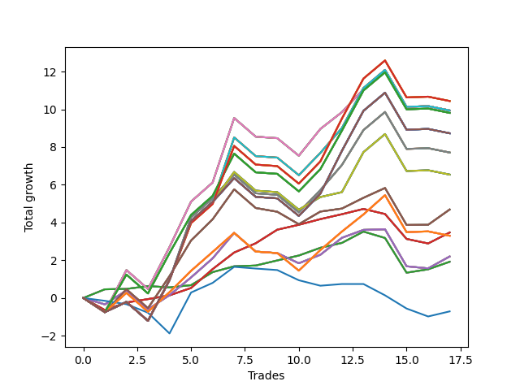

# Long Shepard 003 
- Symbol: NVDA_Unlimited
- Date Range: 02/08/2022 - 07/08/2022
- Trading Period: 7:20-12:30
- Number of Trades: 17



| Name | Win Percent | Profit | Avg Profit / Trade | Avg Time / Trade |      | Name | Win Percent | Profit | Avg Profit / Trade | Avg Time / Trade |
| ---- | ----------- | ------ | ------------------ | ---------------- | ---- | ---- | ----------- | ------ | ------------------ | ---------------- |
| Sorted By <br> Profit | | | | | | Sorted By <br> Win Percentage ||||
| One Hundred Twenty-Eight | 58.82 | 5220.00 | 307.06 | 29:16 |     | Sixty-Four | 82.35 | 960.00 | 56.47 | 05:24 |
| One Hundred Twenty-Three | 58.82 | 5220.00 | 307.06 | 29:16 |     | Fifty-Six | 82.35 | 960.00 | 56.47 | 05:24 |
| One Hundred Eighteen | 58.82 | 5220.00 | 307.06 | 29:16 |     | Forty-Eight | 82.35 | 960.00 | 56.47 | 05:24 |
| One Hundred Thirteen | 58.82 | 5220.00 | 307.06 | 29:16 |     | Forty | 82.35 | 960.00 | 56.47 | 05:24 |
| Eighty-Three | 58.82 | 5220.00 | 307.06 | 29:16 |     | Zero | 82.35 | 960.00 | 56.47 | 05:24 |
| Seventy-One | 58.82 | 4970.00 | 292.35 | 28:25 |     | Sixty-Five | 76.47 | 1735.00 | 102.06 | 09:39 |
| Sixty-Eight | 58.82 | 4970.00 | 292.35 | 25:51 |     | Fifty-Seven | 76.47 | 1735.00 | 102.06 | 09:39 |
| Sixty-Three | 58.82 | 4970.00 | 292.35 | 28:25 |     | Forty-Nine | 76.47 | 1735.00 | 102.06 | 09:39 |
| Sixty | 58.82 | 4970.00 | 292.35 | 25:51 |     | Forty-One | 76.47 | 1735.00 | 102.06 | 09:39 |
| Fifty-Five | 58.82 | 4970.00 | 292.35 | 28:25 |     | One | 76.47 | 1735.00 | 102.06 | 09:39 |
| Fifty-Two | 58.82 | 4970.00 | 292.35 | 25:51 |     | Sixty-Seven | 64.71 | 2345.00 | 137.94 | 20:00 |
| Forty-Seven | 58.82 | 4970.00 | 292.35 | 28:25 |     | Fifty-Nine | 64.71 | 2345.00 | 137.94 | 20:00 |
| Forty-Four | 58.82 | 4970.00 | 292.35 | 25:51 |     | Fifty-One | 64.71 | 2345.00 | 137.94 | 20:00 |
| Seven | 58.82 | 4970.00 | 292.35 | 28:25 |     | Forty-Three | 64.71 | 2345.00 | 137.94 | 20:00 |
| Four | 58.82 | 4970.00 | 292.35 | 25:51 |     | Three | 64.71 | 2345.00 | 137.94 | 20:00 |
| One Hundred Twenty-Seven | 58.82 | 4905.00 | 288.53 | 25:37 |     | One Hundred Twenty-Eight | 58.82 | 5220.00 | 307.06 | 29:16 |
| One Hundred Twenty-Two | 58.82 | 4905.00 | 288.53 | 25:37 |     | One Hundred Twenty-Three | 58.82 | 5220.00 | 307.06 | 29:16 |
| One Hundred Seventeen | 58.82 | 4905.00 | 288.53 | 25:37 |     | One Hundred Eighteen | 58.82 | 5220.00 | 307.06 | 29:16 |
| One Hundred Twelve | 58.82 | 4905.00 | 288.53 | 25:37 |     | One Hundred Thirteen | 58.82 | 5220.00 | 307.06 | 29:16 |
| Eighty-Two | 58.82 | 4905.00 | 288.53 | 25:37 |     | Eighty-Three | 58.82 | 5220.00 | 307.06 | 29:16 |
| One Hundred Thirty | 58.82 | 4365.00 | 256.76 | 29:55 |     | Seventy-One | 58.82 | 4970.00 | 292.35 | 28:25 |
| One Hundred Twenty-Nine | 58.82 | 4365.00 | 256.76 | 29:55 |     | Sixty-Eight | 58.82 | 4970.00 | 292.35 | 25:51 |
| One Hundred Twenty-Five | 58.82 | 4365.00 | 256.76 | 29:55 |     | Sixty-Three | 58.82 | 4970.00 | 292.35 | 28:25 |
| One Hundred Twenty-Four | 58.82 | 4365.00 | 256.76 | 29:55 |     | Sixty | 58.82 | 4970.00 | 292.35 | 25:51 |
| One Hundred Twenty | 58.82 | 4365.00 | 256.76 | 29:55 |     | Fifty-Five | 58.82 | 4970.00 | 292.35 | 28:25 |
| One Hundred Ninteen | 58.82 | 4365.00 | 256.76 | 29:55 |     | Fifty-Two | 58.82 | 4970.00 | 292.35 | 25:51 |
| One Hundred Fifteen | 58.82 | 4365.00 | 256.76 | 29:55 |     | Forty-Seven | 58.82 | 4970.00 | 292.35 | 28:25 |
| One Hundred Fourteen | 58.82 | 4365.00 | 256.76 | 29:55 |     | Forty-Four | 58.82 | 4970.00 | 292.35 | 25:51 |
| Eighty-Five | 58.82 | 4365.00 | 256.76 | 29:55 |     | Seven | 58.82 | 4970.00 | 292.35 | 28:25 |
| Eighty-Four | 58.82 | 4365.00 | 256.76 | 29:55 |     | Four | 58.82 | 4970.00 | 292.35 | 25:51 |
| Sixty-Nine | 58.82 | 3855.00 | 226.76 | 28:45 |     | One Hundred Twenty-Seven | 58.82 | 4905.00 | 288.53 | 25:37 |
| Sixty-One | 58.82 | 3855.00 | 226.76 | 28:45 |     | One Hundred Twenty-Two | 58.82 | 4905.00 | 288.53 | 25:37 |
| Fifty-Three | 58.82 | 3855.00 | 226.76 | 28:45 |     | One Hundred Seventeen | 58.82 | 4905.00 | 288.53 | 25:37 |
| Forty-Five | 58.82 | 3855.00 | 226.76 | 28:45 |     | One Hundred Twelve | 58.82 | 4905.00 | 288.53 | 25:37 |
| Five | 58.82 | 3855.00 | 226.76 | 28:45 |     | Eighty-Two | 58.82 | 4905.00 | 288.53 | 25:37 |
| Seventy | 58.82 | 3270.00 | 192.35 | 26:08 |     | One Hundred Thirty | 58.82 | 4365.00 | 256.76 | 29:55 |
| Sixty-Two | 58.82 | 3270.00 | 192.35 | 26:08 |     | One Hundred Twenty-Nine | 58.82 | 4365.00 | 256.76 | 29:55 |
| Fifty-Four | 58.82 | 3270.00 | 192.35 | 26:08 |     | One Hundred Twenty-Five | 58.82 | 4365.00 | 256.76 | 29:55 |
| Forty-Six | 58.82 | 3270.00 | 192.35 | 26:08 |     | One Hundred Twenty-Four | 58.82 | 4365.00 | 256.76 | 29:55 |
| Six | 58.82 | 3270.00 | 192.35 | 26:08 |     | One Hundred Twenty | 58.82 | 4365.00 | 256.76 | 29:55 |
| Sixty-Seven | 64.71 | 2345.00 | 137.94 | 20:00 |     | One Hundred Ninteen | 58.82 | 4365.00 | 256.76 | 29:55 |
| Fifty-Nine | 64.71 | 2345.00 | 137.94 | 20:00 |     | One Hundred Fifteen | 58.82 | 4365.00 | 256.76 | 29:55 |
| Fifty-One | 64.71 | 2345.00 | 137.94 | 20:00 |     | One Hundred Fourteen | 58.82 | 4365.00 | 256.76 | 29:55 |
| Forty-Three | 64.71 | 2345.00 | 137.94 | 20:00 |     | Eighty-Five | 58.82 | 4365.00 | 256.76 | 29:55 |
| Three | 64.71 | 2345.00 | 137.94 | 20:00 |     | Eighty-Four | 58.82 | 4365.00 | 256.76 | 29:55 |
| Sixty-Five | 76.47 | 1735.00 | 102.06 | 09:39 |     | Sixty-Nine | 58.82 | 3855.00 | 226.76 | 28:45 |
| Fifty-Seven | 76.47 | 1735.00 | 102.06 | 09:39 |     | Sixty-One | 58.82 | 3855.00 | 226.76 | 28:45 |
| Forty-Nine | 76.47 | 1735.00 | 102.06 | 09:39 |     | Fifty-Three | 58.82 | 3855.00 | 226.76 | 28:45 |
| Forty-One | 76.47 | 1735.00 | 102.06 | 09:39 |     | Forty-Five | 58.82 | 3855.00 | 226.76 | 28:45 |
| One | 76.47 | 1735.00 | 102.06 | 09:39 |     | Five | 58.82 | 3855.00 | 226.76 | 28:45 |
| One Hundred Twenty-Six | 58.82 | 1650.00 | 97.06 | 20:38 |     | Seventy | 58.82 | 3270.00 | 192.35 | 26:08 |
| One Hundred Twenty-One | 58.82 | 1650.00 | 97.06 | 20:38 |     | Sixty-Two | 58.82 | 3270.00 | 192.35 | 26:08 |
| One Hundred Sixteen | 58.82 | 1650.00 | 97.06 | 20:38 |     | Fifty-Four | 58.82 | 3270.00 | 192.35 | 26:08 |
| One Hundred Eleven | 58.82 | 1650.00 | 97.06 | 20:38 |     | Forty-Six | 58.82 | 3270.00 | 192.35 | 26:08 |
| Eighty-One | 58.82 | 1650.00 | 97.06 | 20:38 |     | Six | 58.82 | 3270.00 | 192.35 | 26:08 |
| Sixty-Six | 58.82 | 1100.00 | 64.71 | 19:37 |     | One Hundred Twenty-Six | 58.82 | 1650.00 | 97.06 | 20:38 |
| Fifty-Eight | 58.82 | 1100.00 | 64.71 | 19:37 |     | One Hundred Twenty-One | 58.82 | 1650.00 | 97.06 | 20:38 |
| Fifty | 58.82 | 1100.00 | 64.71 | 19:37 |     | One Hundred Sixteen | 58.82 | 1650.00 | 97.06 | 20:38 |
| Forty-Two | 58.82 | 1100.00 | 64.71 | 19:37 |     | One Hundred Eleven | 58.82 | 1650.00 | 97.06 | 20:38 |
| Two | 58.82 | 1100.00 | 64.71 | 19:37 |     | Eighty-One | 58.82 | 1650.00 | 97.06 | 20:38 |
| Sixty-Four | 82.35 | 960.00 | 56.47 | 05:24 |     | Sixty-Six | 58.82 | 1100.00 | 64.71 | 19:37 |
| Fifty-Six | 82.35 | 960.00 | 56.47 | 05:24 |     | Fifty-Eight | 58.82 | 1100.00 | 64.71 | 19:37 |
| Forty-Eight | 82.35 | 960.00 | 56.47 | 05:24 |     | Fifty | 58.82 | 1100.00 | 64.71 | 19:37 |
| Forty | 82.35 | 960.00 | 56.47 | 05:24 |     | Forty-Two | 58.82 | 1100.00 | 64.71 | 19:37 |
| Zero | 82.35 | 960.00 | 56.47 | 05:24 |     | Two | 58.82 | 1100.00 | 64.71 | 19:37 |
| Seventy-Three | 35.29 | -355.00 | -20.88 | 06:05 |     | Seventy-Three | 35.29 | -355.00 | -20.88 | 06:05 |

## NO STOPLOSS

### Test Zero
* Sell when price hits the middle line of the 20p bollinger
* No Stoploss
* Results:
```
Total Trades: 17
Percent Up: 82.35
Percent Down: 17.65
Total Points Moved Up: 1.92
Potential Profit: 960.00
Total Points Ups: 4.17 Count Ups: 14
Total Points Downs: -2.25 Count Downs: 3
```

<details><summary>Trades</summary>

<code>In: 2022-02-16 09:23:00		Out: 2022-02-16 09:27:40		Total Position Time: 04:40		Total Move Up: 0.46		Total to Date: 0.46</code> <br />
<code>In: 2022-02-28 09:50:00		Out: 2022-02-28 09:57:40		Total Position Time: 07:40		Total Move Up: 0.02		Total to Date: 0.48</code> <br />
<code>In: 2022-03-14 08:51:00		Out: 2022-03-14 08:58:20		Total Position Time: 07:20		Total Move Up: 0.15		Total to Date: 0.63</code> <br />
<code>In: 2022-03-16 10:19:00		Out: 2022-03-16 10:27:20		Total Position Time: 08:20		Total Move Up: -0.07		Total to Date: 0.56</code> <br />
<code>In: 2022-03-16 10:25:00		Out: 2022-03-16 10:27:20		Total Position Time: 02:20		Total Move Up: 0.12		Total to Date: 0.68</code> <br />
<code>In: 2022-03-30 08:13:00		Out: 2022-03-30 08:14:35		Total Position Time: 01:35		Total Move Up: 0.69		Total to Date: 1.37</code> <br />
<code>In: 2022-04-22 07:27:00		Out: 2022-04-22 07:34:00		Total Position Time: 07:00		Total Move Up: 0.31		Total to Date: 1.68</code> <br />
<code>In: 2022-05-02 10:26:00		Out: 2022-05-02 10:30:40		Total Position Time: 04:40		Total Move Up: 0.04		Total to Date: 1.72</code> <br />
<code>In: 2022-05-02 10:30:00		Out: 2022-05-02 10:30:40		Total Position Time: 00:40		Total Move Up: 0.27		Total to Date: 1.99</code> <br />
<code>In: 2022-05-02 10:31:00		Out: 2022-05-02 10:31:10		Total Position Time: 00:10		Total Move Up: 0.26		Total to Date: 2.25</code> <br />
<code>In: 2022-05-03 07:49:00		Out: 2022-05-03 07:54:05		Total Position Time: 05:05		Total Move Up: 0.41		Total to Date: 2.66</code> <br />
<code>In: 2022-05-03 11:45:00		Out: 2022-05-03 11:45:10		Total Position Time: 00:10		Total Move Up: 0.26		Total to Date: 2.92</code> <br />
<code>In: 2022-05-06 12:12:00		Out: 2022-05-06 12:15:20		Total Position Time: 03:20		Total Move Up: 0.60		Total to Date: 3.52</code> <br />
<code>In: 2022-05-31 11:52:00		Out: 2022-05-31 12:01:15		Total Position Time: 09:15		Total Move Up: -0.34		Total to Date: 3.18</code> <br />
<code>In: 2022-06-03 07:23:00		Out: 2022-06-03 07:44:45		Total Position Time: 21:45		Total Move Up: -1.84		Total to Date: 1.34</code> <br />
<code>In: 2022-06-22 09:01:00		Out: 2022-06-22 09:03:30		Total Position Time: 02:30		Total Move Up: 0.18		Total to Date: 1.52</code> <br />
<code>In: 2022-06-23 09:13:00		Out: 2022-06-23 09:18:25		Total Position Time: 05:25		Total Move Up: 0.40		Total to Date: 1.92</code> <br />


</details>

### Test One
* Sell when the price hits the upper line of the 20p 1std bollinger
* No Stoploss
* Results:
```
Total Trades: 17
Percent Up: 76.47
Percent Down: 23.53
Total Points Moved Up: 3.47
Potential Profit: 1735.00
Total Points Ups: 5.94 Count Ups: 13
Total Points Downs: -2.47 Count Downs: 4
```

<details><summary>Trades</summary>

<code>In: 2022-02-16 09:23:00		Out: 2022-02-16 09:48:20		Total Position Time: 25:20		Total Move Up: -0.64		Total to Date: -0.64</code> <br />
<code>In: 2022-02-28 09:50:00		Out: 2022-02-28 09:59:10		Total Position Time: 09:10		Total Move Up: 0.40		Total to Date: -0.24</code> <br />
<code>In: 2022-03-14 08:51:00		Out: 2022-03-14 09:02:15		Total Position Time: 11:15		Total Move Up: 0.18		Total to Date: -0.06</code> <br />
<code>In: 2022-03-16 10:19:00		Out: 2022-03-16 10:28:35		Total Position Time: 09:35		Total Move Up: 0.20		Total to Date: 0.14</code> <br />
<code>In: 2022-03-16 10:25:00		Out: 2022-03-16 10:28:35		Total Position Time: 03:35		Total Move Up: 0.39		Total to Date: 0.53</code> <br />
<code>In: 2022-03-30 08:13:00		Out: 2022-03-30 08:19:15		Total Position Time: 06:15		Total Move Up: 1.00		Total to Date: 1.53</code> <br />
<code>In: 2022-04-22 07:27:00		Out: 2022-04-22 07:36:05		Total Position Time: 09:05		Total Move Up: 0.88		Total to Date: 2.41</code> <br />
<code>In: 2022-05-02 10:26:00		Out: 2022-05-02 10:31:10		Total Position Time: 05:10		Total Move Up: 0.49		Total to Date: 2.90</code> <br />
<code>In: 2022-05-02 10:30:00		Out: 2022-05-02 10:31:10		Total Position Time: 01:10		Total Move Up: 0.72		Total to Date: 3.62</code> <br />
<code>In: 2022-05-02 10:31:00		Out: 2022-05-02 10:31:10		Total Position Time: 00:10		Total Move Up: 0.26		Total to Date: 3.88</code> <br />
<code>In: 2022-05-03 07:49:00		Out: 2022-05-03 07:59:10		Total Position Time: 10:10		Total Move Up: 0.30		Total to Date: 4.18</code> <br />
<code>In: 2022-05-03 11:45:00		Out: 2022-05-03 11:45:10		Total Position Time: 00:10		Total Move Up: 0.26		Total to Date: 4.44</code> <br />
<code>In: 2022-05-06 12:12:00		Out: 2022-05-06 12:20:05		Total Position Time: 08:05		Total Move Up: 0.28		Total to Date: 4.72</code> <br />
<code>In: 2022-05-31 11:52:00		Out: 2022-05-31 12:07:00		Total Position Time: 15:00		Total Move Up: -0.27		Total to Date: 4.45</code> <br />
<code>In: 2022-06-03 07:23:00		Out: 2022-06-03 07:46:30		Total Position Time: 23:30		Total Move Up: -1.32		Total to Date: 3.13</code> <br />
<code>In: 2022-06-22 09:01:00		Out: 2022-06-22 09:21:25		Total Position Time: 20:25		Total Move Up: -0.24		Total to Date: 2.89</code> <br />
<code>In: 2022-06-23 09:13:00		Out: 2022-06-23 09:19:05		Total Position Time: 06:05		Total Move Up: 0.58		Total to Date: 3.47</code> <br />


</details>

### Test Two
* Sell when the price hits the upper line of the 20p 2std bollinger
* No Stoploss
* Results:
```
Total Trades: 17
Percent Up: 58.82
Percent Down: 41.18
Total Points Moved Up: 2.20
Potential Profit: 1100.00
Total Points Ups: 7.22 Count Ups: 10
Total Points Downs: -5.02 Count Downs: 7
```

<details><summary>Trades</summary>

<code>In: 2022-02-16 09:23:00		Out: 2022-02-16 09:50:05		Total Position Time: 27:05		Total Move Up: -0.34		Total to Date: -0.34</code> <br />
<code>In: 2022-02-28 09:50:00		Out: 2022-02-28 10:01:10		Total Position Time: 11:10		Total Move Up: 0.74		Total to Date: 0.40</code> <br />
<code>In: 2022-03-14 08:51:00		Out: 2022-03-14 09:20:55		Total Position Time: 29:55		Total Move Up: -1.00		Total to Date: -0.60</code> <br />
<code>In: 2022-03-16 10:19:00		Out: 2022-03-16 10:30:10		Total Position Time: 11:10		Total Move Up: 0.75		Total to Date: 0.15</code> <br />
<code>In: 2022-03-16 10:25:00		Out: 2022-03-16 10:30:10		Total Position Time: 05:10		Total Move Up: 0.94		Total to Date: 1.09</code> <br />
<code>In: 2022-03-30 08:13:00		Out: 2022-03-30 08:42:55		Total Position Time: 29:55		Total Move Up: 1.01		Total to Date: 2.10</code> <br />
<code>In: 2022-04-22 07:27:00		Out: 2022-04-22 07:36:20		Total Position Time: 09:20		Total Move Up: 1.35		Total to Date: 3.45</code> <br />
<code>In: 2022-05-02 10:26:00		Out: 2022-05-02 10:55:55		Total Position Time: 29:55		Total Move Up: -0.99		Total to Date: 2.46</code> <br />
<code>In: 2022-05-02 10:30:00		Out: 2022-05-02 10:59:55		Total Position Time: 29:55		Total Move Up: -0.08		Total to Date: 2.38</code> <br />
<code>In: 2022-05-02 10:31:00		Out: 2022-05-02 10:59:55		Total Position Time: 28:55		Total Move Up: -0.54		Total to Date: 1.84</code> <br />
<code>In: 2022-05-03 07:49:00		Out: 2022-05-03 08:05:00		Total Position Time: 16:00		Total Move Up: 0.45		Total to Date: 2.29</code> <br />
<code>In: 2022-05-03 11:45:00		Out: 2022-05-03 11:52:20		Total Position Time: 07:20		Total Move Up: 0.90		Total to Date: 3.19</code> <br />
<code>In: 2022-05-06 12:12:00		Out: 2022-05-06 12:28:05		Total Position Time: 16:05		Total Move Up: 0.42		Total to Date: 3.61</code> <br />
<code>In: 2022-05-31 11:52:00		Out: 2022-05-31 12:07:45		Total Position Time: 15:45		Total Move Up: 0.03		Total to Date: 3.64</code> <br />
<code>In: 2022-06-03 07:23:00		Out: 2022-06-03 07:52:55		Total Position Time: 29:55		Total Move Up: -1.96		Total to Date: 1.68</code> <br />
<code>In: 2022-06-22 09:01:00		Out: 2022-06-22 09:22:25		Total Position Time: 21:25		Total Move Up: -0.11		Total to Date: 1.57</code> <br />
<code>In: 2022-06-23 09:13:00		Out: 2022-06-23 09:27:35		Total Position Time: 14:35		Total Move Up: 0.63		Total to Date: 2.20</code> <br />


</details>

### Test Three
* Sell when price hits the middle line of the 50p bollinger
* No Stoploss
* Results:
```
Total Trades: 17
Percent Up: 64.71
Percent Down: 35.29
Total Points Moved Up: 4.69
Potential Profit: 2345.00
Total Points Ups: 10.25 Count Ups: 11
Total Points Downs: -5.56 Count Downs: 6
```

<details><summary>Trades</summary>

<code>In: 2022-02-16 09:23:00		Out: 2022-02-16 09:52:55		Total Position Time: 29:55		Total Move Up: -0.75		Total to Date: -0.75</code> <br />
<code>In: 2022-02-28 09:50:00		Out: 2022-02-28 10:02:35		Total Position Time: 12:35		Total Move Up: 1.21		Total to Date: 0.46</code> <br />
<code>In: 2022-03-14 08:51:00		Out: 2022-03-14 09:20:55		Total Position Time: 29:55		Total Move Up: -1.00		Total to Date: -0.54</code> <br />
<code>In: 2022-03-16 10:19:00		Out: 2022-03-16 10:34:55		Total Position Time: 15:55		Total Move Up: 1.70		Total to Date: 1.16</code> <br />
<code>In: 2022-03-16 10:25:00		Out: 2022-03-16 10:34:55		Total Position Time: 09:55		Total Move Up: 1.89		Total to Date: 3.05</code> <br />
<code>In: 2022-03-30 08:13:00		Out: 2022-03-30 08:34:40		Total Position Time: 21:40		Total Move Up: 1.12		Total to Date: 4.17</code> <br />
<code>In: 2022-04-22 07:27:00		Out: 2022-04-22 07:36:25		Total Position Time: 09:25		Total Move Up: 1.59		Total to Date: 5.76</code> <br />
<code>In: 2022-05-02 10:26:00		Out: 2022-05-02 10:55:55		Total Position Time: 29:55		Total Move Up: -0.99		Total to Date: 4.77</code> <br />
<code>In: 2022-05-02 10:30:00		Out: 2022-05-02 10:59:50		Total Position Time: 29:50		Total Move Up: -0.20		Total to Date: 4.57</code> <br />
<code>In: 2022-05-02 10:31:00		Out: 2022-05-02 10:59:50		Total Position Time: 28:50		Total Move Up: -0.66		Total to Date: 3.91</code> <br />
<code>In: 2022-05-03 07:49:00		Out: 2022-05-03 08:05:05		Total Position Time: 16:05		Total Move Up: 0.67		Total to Date: 4.58</code> <br />
<code>In: 2022-05-03 11:45:00		Out: 2022-05-03 11:45:15		Total Position Time: 00:15		Total Move Up: 0.16		Total to Date: 4.74</code> <br />
<code>In: 2022-05-06 12:12:00		Out: 2022-05-06 12:28:10		Total Position Time: 16:10		Total Move Up: 0.57		Total to Date: 5.31</code> <br />
<code>In: 2022-05-31 11:52:00		Out: 2022-05-31 12:09:55		Total Position Time: 17:55		Total Move Up: 0.52		Total to Date: 5.83</code> <br />
<code>In: 2022-06-03 07:23:00		Out: 2022-06-03 07:52:55		Total Position Time: 29:55		Total Move Up: -1.96		Total to Date: 3.87</code> <br />
<code>In: 2022-06-22 09:01:00		Out: 2022-06-22 09:28:05		Total Position Time: 27:05		Total Move Up: 0.01		Total to Date: 3.88</code> <br />
<code>In: 2022-06-23 09:13:00		Out: 2022-06-23 09:27:55		Total Position Time: 14:55		Total Move Up: 0.81		Total to Date: 4.69</code> <br />


</details>

### Test Four
* Sell when the price hits the upper line of the 50p 1std bollinger
* No Stoploss
* Results:
```
Total Trades: 17
Percent Up: 58.82
Percent Down: 41.18
Total Points Moved Up: 9.94
Potential Profit: 4970.00
Total Points Ups: 15.88 Count Ups: 10
Total Points Downs: -5.94 Count Downs: 7
```

<details><summary>Trades</summary>

<code>In: 2022-02-16 09:23:00		Out: 2022-02-16 09:52:55		Total Position Time: 29:55		Total Move Up: -0.75		Total to Date: -0.75</code> <br />
<code>In: 2022-02-28 09:50:00		Out: 2022-02-28 10:09:30		Total Position Time: 19:30		Total Move Up: 2.23		Total to Date: 1.48</code> <br />
<code>In: 2022-03-14 08:51:00		Out: 2022-03-14 09:20:55		Total Position Time: 29:55		Total Move Up: -1.00		Total to Date: 0.48</code> <br />
<code>In: 2022-03-16 10:19:00		Out: 2022-03-16 10:48:50		Total Position Time: 29:50		Total Move Up: 2.22		Total to Date: 2.70</code> <br />
<code>In: 2022-03-16 10:25:00		Out: 2022-03-16 10:48:50		Total Position Time: 23:50		Total Move Up: 2.41		Total to Date: 5.11</code> <br />
<code>In: 2022-03-30 08:13:00		Out: 2022-03-30 08:42:55		Total Position Time: 29:55		Total Move Up: 1.01		Total to Date: 6.12</code> <br />
<code>In: 2022-04-22 07:27:00		Out: 2022-04-22 07:47:20		Total Position Time: 20:20		Total Move Up: 3.42		Total to Date: 9.54</code> <br />
<code>In: 2022-05-02 10:26:00		Out: 2022-05-02 10:55:55		Total Position Time: 29:55		Total Move Up: -0.99		Total to Date: 8.55</code> <br />
<code>In: 2022-05-02 10:30:00		Out: 2022-05-02 10:59:55		Total Position Time: 29:55		Total Move Up: -0.08		Total to Date: 8.47</code> <br />
<code>In: 2022-05-02 10:31:00		Out: 2022-05-02 11:00:55		Total Position Time: 29:55		Total Move Up: -0.93		Total to Date: 7.54</code> <br />
<code>In: 2022-05-03 07:49:00		Out: 2022-05-03 08:08:50		Total Position Time: 19:50		Total Move Up: 1.42		Total to Date: 8.96</code> <br />
<code>In: 2022-05-03 11:45:00		Out: 2022-05-03 11:52:05		Total Position Time: 07:05		Total Move Up: 0.89		Total to Date: 9.85</code> <br />
<code>In: 2022-05-06 12:12:00		Out: 2022-05-06 12:37:25		Total Position Time: 25:25		Total Move Up: 1.22		Total to Date: 11.07</code> <br />
<code>In: 2022-05-31 11:52:00		Out: 2022-05-31 12:16:25		Total Position Time: 24:25		Total Move Up: 1.02		Total to Date: 12.09</code> <br />
<code>In: 2022-06-03 07:23:00		Out: 2022-06-03 07:52:55		Total Position Time: 29:55		Total Move Up: -1.96		Total to Date: 10.13</code> <br />
<code>In: 2022-06-22 09:01:00		Out: 2022-06-22 09:30:55		Total Position Time: 29:55		Total Move Up: 0.04		Total to Date: 10.17</code> <br />
<code>In: 2022-06-23 09:13:00		Out: 2022-06-23 09:42:55		Total Position Time: 29:55		Total Move Up: -0.23		Total to Date: 9.94</code> <br />


</details>

### Test Five
* Sell when the price hits the upper line of the 50p 2std bollinger
* No Stoploss
* Results:
```
Total Trades: 17
Percent Up: 58.82
Percent Down: 41.18
Total Points Moved Up: 7.71
Potential Profit: 3855.00
Total Points Ups: 13.65 Count Ups: 10
Total Points Downs: -5.94 Count Downs: 7
```

<details><summary>Trades</summary>

<code>In: 2022-02-16 09:23:00		Out: 2022-02-16 09:52:55		Total Position Time: 29:55		Total Move Up: -0.75		Total to Date: -0.75</code> <br />
<code>In: 2022-02-28 09:50:00		Out: 2022-02-28 10:19:55		Total Position Time: 29:55		Total Move Up: 0.54		Total to Date: -0.21</code> <br />
<code>In: 2022-03-14 08:51:00		Out: 2022-03-14 09:20:55		Total Position Time: 29:55		Total Move Up: -1.00		Total to Date: -1.21</code> <br />
<code>In: 2022-03-16 10:19:00		Out: 2022-03-16 10:48:55		Total Position Time: 29:55		Total Move Up: 2.16		Total to Date: 0.95</code> <br />
<code>In: 2022-03-16 10:25:00		Out: 2022-03-16 10:54:20		Total Position Time: 29:20		Total Move Up: 3.32		Total to Date: 4.27</code> <br />
<code>In: 2022-03-30 08:13:00		Out: 2022-03-30 08:42:55		Total Position Time: 29:55		Total Move Up: 1.01		Total to Date: 5.28</code> <br />
<code>In: 2022-04-22 07:27:00		Out: 2022-04-22 07:56:55		Total Position Time: 29:55		Total Move Up: 1.26		Total to Date: 6.54</code> <br />
<code>In: 2022-05-02 10:26:00		Out: 2022-05-02 10:55:55		Total Position Time: 29:55		Total Move Up: -0.99		Total to Date: 5.55</code> <br />
<code>In: 2022-05-02 10:30:00		Out: 2022-05-02 10:59:55		Total Position Time: 29:55		Total Move Up: -0.08		Total to Date: 5.47</code> <br />
<code>In: 2022-05-02 10:31:00		Out: 2022-05-02 11:00:55		Total Position Time: 29:55		Total Move Up: -0.93		Total to Date: 4.54</code> <br />
<code>In: 2022-05-03 07:49:00		Out: 2022-05-03 08:18:55		Total Position Time: 29:55		Total Move Up: 1.18		Total to Date: 5.72</code> <br />
<code>In: 2022-05-03 11:45:00		Out: 2022-05-03 11:59:05		Total Position Time: 14:05		Total Move Up: 1.33		Total to Date: 7.05</code> <br />
<code>In: 2022-05-06 12:12:00		Out: 2022-05-06 12:38:40		Total Position Time: 26:40		Total Move Up: 1.85		Total to Date: 8.90</code> <br />
<code>In: 2022-05-31 11:52:00		Out: 2022-05-31 12:21:55		Total Position Time: 29:55		Total Move Up: 0.96		Total to Date: 9.86</code> <br />
<code>In: 2022-06-03 07:23:00		Out: 2022-06-03 07:52:55		Total Position Time: 29:55		Total Move Up: -1.96		Total to Date: 7.90</code> <br />
<code>In: 2022-06-22 09:01:00		Out: 2022-06-22 09:30:55		Total Position Time: 29:55		Total Move Up: 0.04		Total to Date: 7.94</code> <br />
<code>In: 2022-06-23 09:13:00		Out: 2022-06-23 09:42:55		Total Position Time: 29:55		Total Move Up: -0.23		Total to Date: 7.71</code> <br />


</details>

### Test Six
* Sell when the price hits the middle line of the 1std VWAP
* No Stoploss
* Results:
```
Total Trades: 17
Percent Up: 58.82
Percent Down: 41.18
Total Points Moved Up: 6.54
Potential Profit: 3270.00
Total Points Ups: 12.48 Count Ups: 10
Total Points Downs: -5.94 Count Downs: 7
```

<details><summary>Trades</summary>

<code>In: 2022-02-16 09:23:00		Out: 2022-02-16 09:52:55		Total Position Time: 29:55		Total Move Up: -0.75		Total to Date: -0.75</code> <br />
<code>In: 2022-02-28 09:50:00		Out: 2022-02-28 10:19:55		Total Position Time: 29:55		Total Move Up: 0.54		Total to Date: -0.21</code> <br />
<code>In: 2022-03-14 08:51:00		Out: 2022-03-14 09:20:55		Total Position Time: 29:55		Total Move Up: -1.00		Total to Date: -1.21</code> <br />
<code>In: 2022-03-16 10:19:00		Out: 2022-03-16 10:48:55		Total Position Time: 29:55		Total Move Up: 2.16		Total to Date: 0.95</code> <br />
<code>In: 2022-03-16 10:25:00		Out: 2022-03-16 10:54:55		Total Position Time: 29:55		Total Move Up: 3.13		Total to Date: 4.08</code> <br />
<code>In: 2022-03-30 08:13:00		Out: 2022-03-30 08:42:55		Total Position Time: 29:55		Total Move Up: 1.01		Total to Date: 5.09</code> <br />
<code>In: 2022-04-22 07:27:00		Out: 2022-04-22 07:36:25		Total Position Time: 09:25		Total Move Up: 1.59		Total to Date: 6.68</code> <br />
<code>In: 2022-05-02 10:26:00		Out: 2022-05-02 10:55:55		Total Position Time: 29:55		Total Move Up: -0.99		Total to Date: 5.69</code> <br />
<code>In: 2022-05-02 10:30:00		Out: 2022-05-02 10:59:55		Total Position Time: 29:55		Total Move Up: -0.08		Total to Date: 5.61</code> <br />
<code>In: 2022-05-02 10:31:00		Out: 2022-05-02 11:00:55		Total Position Time: 29:55		Total Move Up: -0.93		Total to Date: 4.68</code> <br />
<code>In: 2022-05-03 07:49:00		Out: 2022-05-03 08:05:05		Total Position Time: 16:05		Total Move Up: 0.67		Total to Date: 5.35</code> <br />
<code>In: 2022-05-03 11:45:00		Out: 2022-05-03 11:45:10		Total Position Time: 00:10		Total Move Up: 0.26		Total to Date: 5.61</code> <br />
<code>In: 2022-05-06 12:12:00		Out: 2022-05-06 12:41:55		Total Position Time: 29:55		Total Move Up: 2.12		Total to Date: 7.73</code> <br />
<code>In: 2022-05-31 11:52:00		Out: 2022-05-31 12:21:55		Total Position Time: 29:55		Total Move Up: 0.96		Total to Date: 8.69</code> <br />
<code>In: 2022-06-03 07:23:00		Out: 2022-06-03 07:52:55		Total Position Time: 29:55		Total Move Up: -1.96		Total to Date: 6.73</code> <br />
<code>In: 2022-06-22 09:01:00		Out: 2022-06-22 09:30:55		Total Position Time: 29:55		Total Move Up: 0.04		Total to Date: 6.77</code> <br />
<code>In: 2022-06-23 09:13:00		Out: 2022-06-23 09:42:55		Total Position Time: 29:55		Total Move Up: -0.23		Total to Date: 6.54</code> <br />


</details>

### Test Seven
* Sell when the price hits the upper line of the 1std VWAP
* No Stoploss
* Results:
```
Total Trades: 17
Percent Up: 58.82
Percent Down: 41.18
Total Points Moved Up: 9.94
Potential Profit: 4970.00
Total Points Ups: 15.88 Count Ups: 10
Total Points Downs: -5.94 Count Downs: 7
```

<details><summary>Trades</summary>

<code>In: 2022-02-16 09:23:00		Out: 2022-02-16 09:52:55		Total Position Time: 29:55		Total Move Up: -0.75		Total to Date: -0.75</code> <br />
<code>In: 2022-02-28 09:50:00		Out: 2022-02-28 10:19:55		Total Position Time: 29:55		Total Move Up: 0.54		Total to Date: -0.21</code> <br />
<code>In: 2022-03-14 08:51:00		Out: 2022-03-14 09:20:55		Total Position Time: 29:55		Total Move Up: -1.00		Total to Date: -1.21</code> <br />
<code>In: 2022-03-16 10:19:00		Out: 2022-03-16 10:48:55		Total Position Time: 29:55		Total Move Up: 2.16		Total to Date: 0.95</code> <br />
<code>In: 2022-03-16 10:25:00		Out: 2022-03-16 10:54:55		Total Position Time: 29:55		Total Move Up: 3.13		Total to Date: 4.08</code> <br />
<code>In: 2022-03-30 08:13:00		Out: 2022-03-30 08:42:55		Total Position Time: 29:55		Total Move Up: 1.01		Total to Date: 5.09</code> <br />
<code>In: 2022-04-22 07:27:00		Out: 2022-04-22 07:47:20		Total Position Time: 20:20		Total Move Up: 3.42		Total to Date: 8.51</code> <br />
<code>In: 2022-05-02 10:26:00		Out: 2022-05-02 10:55:55		Total Position Time: 29:55		Total Move Up: -0.99		Total to Date: 7.52</code> <br />
<code>In: 2022-05-02 10:30:00		Out: 2022-05-02 10:59:55		Total Position Time: 29:55		Total Move Up: -0.08		Total to Date: 7.44</code> <br />
<code>In: 2022-05-02 10:31:00		Out: 2022-05-02 11:00:55		Total Position Time: 29:55		Total Move Up: -0.93		Total to Date: 6.51</code> <br />
<code>In: 2022-05-03 07:49:00		Out: 2022-05-03 08:18:55		Total Position Time: 29:55		Total Move Up: 1.18		Total to Date: 7.69</code> <br />
<code>In: 2022-05-03 11:45:00		Out: 2022-05-03 11:59:10		Total Position Time: 14:10		Total Move Up: 1.32		Total to Date: 9.01</code> <br />
<code>In: 2022-05-06 12:12:00		Out: 2022-05-06 12:41:55		Total Position Time: 29:55		Total Move Up: 2.12		Total to Date: 11.13</code> <br />
<code>In: 2022-05-31 11:52:00		Out: 2022-05-31 12:21:55		Total Position Time: 29:55		Total Move Up: 0.96		Total to Date: 12.09</code> <br />
<code>In: 2022-06-03 07:23:00		Out: 2022-06-03 07:52:55		Total Position Time: 29:55		Total Move Up: -1.96		Total to Date: 10.13</code> <br />
<code>In: 2022-06-22 09:01:00		Out: 2022-06-22 09:30:55		Total Position Time: 29:55		Total Move Up: 0.04		Total to Date: 10.17</code> <br />
<code>In: 2022-06-23 09:13:00		Out: 2022-06-23 09:42:55		Total Position Time: 29:55		Total Move Up: -0.23		Total to Date: 9.94</code> <br />


</details>

## STOPLOSS OF 5

### Test Forty
* Sell when price hits the middle line of the 20p bollinger
* Stoploss is 5 points
* Results:
```
Total Trades: 17
Percent Up: 82.35
Percent Down: 17.65
Total Points Moved Up: 1.92
Potential Profit: 960.00
Total Points Ups: 4.17 Count Ups: 14
Total Points Downs: -2.25 Count Downs: 3
```

<details><summary>Trades</summary>

<code>In: 2022-02-16 09:23:00		Out: 2022-02-16 09:27:40		Total Position Time: 04:40		Total Move Up: 0.46		Total to Date: 0.46</code> <br />
<code>In: 2022-02-28 09:50:00		Out: 2022-02-28 09:57:40		Total Position Time: 07:40		Total Move Up: 0.02		Total to Date: 0.48</code> <br />
<code>In: 2022-03-14 08:51:00		Out: 2022-03-14 08:58:20		Total Position Time: 07:20		Total Move Up: 0.15		Total to Date: 0.63</code> <br />
<code>In: 2022-03-16 10:19:00		Out: 2022-03-16 10:27:20		Total Position Time: 08:20		Total Move Up: -0.07		Total to Date: 0.56</code> <br />
<code>In: 2022-03-16 10:25:00		Out: 2022-03-16 10:27:20		Total Position Time: 02:20		Total Move Up: 0.12		Total to Date: 0.68</code> <br />
<code>In: 2022-03-30 08:13:00		Out: 2022-03-30 08:14:35		Total Position Time: 01:35		Total Move Up: 0.69		Total to Date: 1.37</code> <br />
<code>In: 2022-04-22 07:27:00		Out: 2022-04-22 07:34:00		Total Position Time: 07:00		Total Move Up: 0.31		Total to Date: 1.68</code> <br />
<code>In: 2022-05-02 10:26:00		Out: 2022-05-02 10:30:40		Total Position Time: 04:40		Total Move Up: 0.04		Total to Date: 1.72</code> <br />
<code>In: 2022-05-02 10:30:00		Out: 2022-05-02 10:30:40		Total Position Time: 00:40		Total Move Up: 0.27		Total to Date: 1.99</code> <br />
<code>In: 2022-05-02 10:31:00		Out: 2022-05-02 10:31:10		Total Position Time: 00:10		Total Move Up: 0.26		Total to Date: 2.25</code> <br />
<code>In: 2022-05-03 07:49:00		Out: 2022-05-03 07:54:05		Total Position Time: 05:05		Total Move Up: 0.41		Total to Date: 2.66</code> <br />
<code>In: 2022-05-03 11:45:00		Out: 2022-05-03 11:45:10		Total Position Time: 00:10		Total Move Up: 0.26		Total to Date: 2.92</code> <br />
<code>In: 2022-05-06 12:12:00		Out: 2022-05-06 12:15:20		Total Position Time: 03:20		Total Move Up: 0.60		Total to Date: 3.52</code> <br />
<code>In: 2022-05-31 11:52:00		Out: 2022-05-31 12:01:15		Total Position Time: 09:15		Total Move Up: -0.34		Total to Date: 3.18</code> <br />
<code>In: 2022-06-03 07:23:00		Out: 2022-06-03 07:44:45		Total Position Time: 21:45		Total Move Up: -1.84		Total to Date: 1.34</code> <br />
<code>In: 2022-06-22 09:01:00		Out: 2022-06-22 09:03:30		Total Position Time: 02:30		Total Move Up: 0.18		Total to Date: 1.52</code> <br />
<code>In: 2022-06-23 09:13:00		Out: 2022-06-23 09:18:25		Total Position Time: 05:25		Total Move Up: 0.40		Total to Date: 1.92</code> <br />


</details>

### Test Forty-One
* Sell when the price hits the upper line of the 20p 1std bollinger
* Stoploss is 5 points
* Results:
```
Total Trades: 17
Percent Up: 76.47
Percent Down: 23.53
Total Points Moved Up: 3.47
Potential Profit: 1735.00
Total Points Ups: 5.94 Count Ups: 13
Total Points Downs: -2.47 Count Downs: 4
```

<details><summary>Trades</summary>

<code>In: 2022-02-16 09:23:00		Out: 2022-02-16 09:48:20		Total Position Time: 25:20		Total Move Up: -0.64		Total to Date: -0.64</code> <br />
<code>In: 2022-02-28 09:50:00		Out: 2022-02-28 09:59:10		Total Position Time: 09:10		Total Move Up: 0.40		Total to Date: -0.24</code> <br />
<code>In: 2022-03-14 08:51:00		Out: 2022-03-14 09:02:15		Total Position Time: 11:15		Total Move Up: 0.18		Total to Date: -0.06</code> <br />
<code>In: 2022-03-16 10:19:00		Out: 2022-03-16 10:28:35		Total Position Time: 09:35		Total Move Up: 0.20		Total to Date: 0.14</code> <br />
<code>In: 2022-03-16 10:25:00		Out: 2022-03-16 10:28:35		Total Position Time: 03:35		Total Move Up: 0.39		Total to Date: 0.53</code> <br />
<code>In: 2022-03-30 08:13:00		Out: 2022-03-30 08:19:15		Total Position Time: 06:15		Total Move Up: 1.00		Total to Date: 1.53</code> <br />
<code>In: 2022-04-22 07:27:00		Out: 2022-04-22 07:36:05		Total Position Time: 09:05		Total Move Up: 0.88		Total to Date: 2.41</code> <br />
<code>In: 2022-05-02 10:26:00		Out: 2022-05-02 10:31:10		Total Position Time: 05:10		Total Move Up: 0.49		Total to Date: 2.90</code> <br />
<code>In: 2022-05-02 10:30:00		Out: 2022-05-02 10:31:10		Total Position Time: 01:10		Total Move Up: 0.72		Total to Date: 3.62</code> <br />
<code>In: 2022-05-02 10:31:00		Out: 2022-05-02 10:31:10		Total Position Time: 00:10		Total Move Up: 0.26		Total to Date: 3.88</code> <br />
<code>In: 2022-05-03 07:49:00		Out: 2022-05-03 07:59:10		Total Position Time: 10:10		Total Move Up: 0.30		Total to Date: 4.18</code> <br />
<code>In: 2022-05-03 11:45:00		Out: 2022-05-03 11:45:10		Total Position Time: 00:10		Total Move Up: 0.26		Total to Date: 4.44</code> <br />
<code>In: 2022-05-06 12:12:00		Out: 2022-05-06 12:20:05		Total Position Time: 08:05		Total Move Up: 0.28		Total to Date: 4.72</code> <br />
<code>In: 2022-05-31 11:52:00		Out: 2022-05-31 12:07:00		Total Position Time: 15:00		Total Move Up: -0.27		Total to Date: 4.45</code> <br />
<code>In: 2022-06-03 07:23:00		Out: 2022-06-03 07:46:30		Total Position Time: 23:30		Total Move Up: -1.32		Total to Date: 3.13</code> <br />
<code>In: 2022-06-22 09:01:00		Out: 2022-06-22 09:21:25		Total Position Time: 20:25		Total Move Up: -0.24		Total to Date: 2.89</code> <br />
<code>In: 2022-06-23 09:13:00		Out: 2022-06-23 09:19:05		Total Position Time: 06:05		Total Move Up: 0.58		Total to Date: 3.47</code> <br />


</details>

### Test Forty-Two
* Sell when the price hits the upper line of the 20p 2std bollinger
* Stoploss is 5 points
* Results:
```
Total Trades: 17
Percent Up: 58.82
Percent Down: 41.18
Total Points Moved Up: 2.20
Potential Profit: 1100.00
Total Points Ups: 7.22 Count Ups: 10
Total Points Downs: -5.02 Count Downs: 7
```

<details><summary>Trades</summary>

<code>In: 2022-02-16 09:23:00		Out: 2022-02-16 09:50:05		Total Position Time: 27:05		Total Move Up: -0.34		Total to Date: -0.34</code> <br />
<code>In: 2022-02-28 09:50:00		Out: 2022-02-28 10:01:10		Total Position Time: 11:10		Total Move Up: 0.74		Total to Date: 0.40</code> <br />
<code>In: 2022-03-14 08:51:00		Out: 2022-03-14 09:20:55		Total Position Time: 29:55		Total Move Up: -1.00		Total to Date: -0.60</code> <br />
<code>In: 2022-03-16 10:19:00		Out: 2022-03-16 10:30:10		Total Position Time: 11:10		Total Move Up: 0.75		Total to Date: 0.15</code> <br />
<code>In: 2022-03-16 10:25:00		Out: 2022-03-16 10:30:10		Total Position Time: 05:10		Total Move Up: 0.94		Total to Date: 1.09</code> <br />
<code>In: 2022-03-30 08:13:00		Out: 2022-03-30 08:42:55		Total Position Time: 29:55		Total Move Up: 1.01		Total to Date: 2.10</code> <br />
<code>In: 2022-04-22 07:27:00		Out: 2022-04-22 07:36:20		Total Position Time: 09:20		Total Move Up: 1.35		Total to Date: 3.45</code> <br />
<code>In: 2022-05-02 10:26:00		Out: 2022-05-02 10:55:55		Total Position Time: 29:55		Total Move Up: -0.99		Total to Date: 2.46</code> <br />
<code>In: 2022-05-02 10:30:00		Out: 2022-05-02 10:59:55		Total Position Time: 29:55		Total Move Up: -0.08		Total to Date: 2.38</code> <br />
<code>In: 2022-05-02 10:31:00		Out: 2022-05-02 10:59:55		Total Position Time: 28:55		Total Move Up: -0.54		Total to Date: 1.84</code> <br />
<code>In: 2022-05-03 07:49:00		Out: 2022-05-03 08:05:00		Total Position Time: 16:00		Total Move Up: 0.45		Total to Date: 2.29</code> <br />
<code>In: 2022-05-03 11:45:00		Out: 2022-05-03 11:52:20		Total Position Time: 07:20		Total Move Up: 0.90		Total to Date: 3.19</code> <br />
<code>In: 2022-05-06 12:12:00		Out: 2022-05-06 12:28:05		Total Position Time: 16:05		Total Move Up: 0.42		Total to Date: 3.61</code> <br />
<code>In: 2022-05-31 11:52:00		Out: 2022-05-31 12:07:45		Total Position Time: 15:45		Total Move Up: 0.03		Total to Date: 3.64</code> <br />
<code>In: 2022-06-03 07:23:00		Out: 2022-06-03 07:52:55		Total Position Time: 29:55		Total Move Up: -1.96		Total to Date: 1.68</code> <br />
<code>In: 2022-06-22 09:01:00		Out: 2022-06-22 09:22:25		Total Position Time: 21:25		Total Move Up: -0.11		Total to Date: 1.57</code> <br />
<code>In: 2022-06-23 09:13:00		Out: 2022-06-23 09:27:35		Total Position Time: 14:35		Total Move Up: 0.63		Total to Date: 2.20</code> <br />


</details>

### Test Forty-Three
* Sell when price hits the middle line of the 50p bollinger
* Stoploss is 5 points
* Results:
```
Total Trades: 17
Percent Up: 64.71
Percent Down: 35.29
Total Points Moved Up: 4.69
Potential Profit: 2345.00
Total Points Ups: 10.25 Count Ups: 11
Total Points Downs: -5.56 Count Downs: 6
```

<details><summary>Trades</summary>

<code>In: 2022-02-16 09:23:00		Out: 2022-02-16 09:52:55		Total Position Time: 29:55		Total Move Up: -0.75		Total to Date: -0.75</code> <br />
<code>In: 2022-02-28 09:50:00		Out: 2022-02-28 10:02:35		Total Position Time: 12:35		Total Move Up: 1.21		Total to Date: 0.46</code> <br />
<code>In: 2022-03-14 08:51:00		Out: 2022-03-14 09:20:55		Total Position Time: 29:55		Total Move Up: -1.00		Total to Date: -0.54</code> <br />
<code>In: 2022-03-16 10:19:00		Out: 2022-03-16 10:34:55		Total Position Time: 15:55		Total Move Up: 1.70		Total to Date: 1.16</code> <br />
<code>In: 2022-03-16 10:25:00		Out: 2022-03-16 10:34:55		Total Position Time: 09:55		Total Move Up: 1.89		Total to Date: 3.05</code> <br />
<code>In: 2022-03-30 08:13:00		Out: 2022-03-30 08:34:40		Total Position Time: 21:40		Total Move Up: 1.12		Total to Date: 4.17</code> <br />
<code>In: 2022-04-22 07:27:00		Out: 2022-04-22 07:36:25		Total Position Time: 09:25		Total Move Up: 1.59		Total to Date: 5.76</code> <br />
<code>In: 2022-05-02 10:26:00		Out: 2022-05-02 10:55:55		Total Position Time: 29:55		Total Move Up: -0.99		Total to Date: 4.77</code> <br />
<code>In: 2022-05-02 10:30:00		Out: 2022-05-02 10:59:50		Total Position Time: 29:50		Total Move Up: -0.20		Total to Date: 4.57</code> <br />
<code>In: 2022-05-02 10:31:00		Out: 2022-05-02 10:59:50		Total Position Time: 28:50		Total Move Up: -0.66		Total to Date: 3.91</code> <br />
<code>In: 2022-05-03 07:49:00		Out: 2022-05-03 08:05:05		Total Position Time: 16:05		Total Move Up: 0.67		Total to Date: 4.58</code> <br />
<code>In: 2022-05-03 11:45:00		Out: 2022-05-03 11:45:15		Total Position Time: 00:15		Total Move Up: 0.16		Total to Date: 4.74</code> <br />
<code>In: 2022-05-06 12:12:00		Out: 2022-05-06 12:28:10		Total Position Time: 16:10		Total Move Up: 0.57		Total to Date: 5.31</code> <br />
<code>In: 2022-05-31 11:52:00		Out: 2022-05-31 12:09:55		Total Position Time: 17:55		Total Move Up: 0.52		Total to Date: 5.83</code> <br />
<code>In: 2022-06-03 07:23:00		Out: 2022-06-03 07:52:55		Total Position Time: 29:55		Total Move Up: -1.96		Total to Date: 3.87</code> <br />
<code>In: 2022-06-22 09:01:00		Out: 2022-06-22 09:28:05		Total Position Time: 27:05		Total Move Up: 0.01		Total to Date: 3.88</code> <br />
<code>In: 2022-06-23 09:13:00		Out: 2022-06-23 09:27:55		Total Position Time: 14:55		Total Move Up: 0.81		Total to Date: 4.69</code> <br />


</details>

### Test Forty-Four
* Sell when the price hits the upper line of the 50p 1std bollinger
* Stoploss is 5 points
* Results:
```
Total Trades: 17
Percent Up: 58.82
Percent Down: 41.18
Total Points Moved Up: 9.94
Potential Profit: 4970.00
Total Points Ups: 15.88 Count Ups: 10
Total Points Downs: -5.94 Count Downs: 7
```

<details><summary>Trades</summary>

<code>In: 2022-02-16 09:23:00		Out: 2022-02-16 09:52:55		Total Position Time: 29:55		Total Move Up: -0.75		Total to Date: -0.75</code> <br />
<code>In: 2022-02-28 09:50:00		Out: 2022-02-28 10:09:30		Total Position Time: 19:30		Total Move Up: 2.23		Total to Date: 1.48</code> <br />
<code>In: 2022-03-14 08:51:00		Out: 2022-03-14 09:20:55		Total Position Time: 29:55		Total Move Up: -1.00		Total to Date: 0.48</code> <br />
<code>In: 2022-03-16 10:19:00		Out: 2022-03-16 10:48:50		Total Position Time: 29:50		Total Move Up: 2.22		Total to Date: 2.70</code> <br />
<code>In: 2022-03-16 10:25:00		Out: 2022-03-16 10:48:50		Total Position Time: 23:50		Total Move Up: 2.41		Total to Date: 5.11</code> <br />
<code>In: 2022-03-30 08:13:00		Out: 2022-03-30 08:42:55		Total Position Time: 29:55		Total Move Up: 1.01		Total to Date: 6.12</code> <br />
<code>In: 2022-04-22 07:27:00		Out: 2022-04-22 07:47:20		Total Position Time: 20:20		Total Move Up: 3.42		Total to Date: 9.54</code> <br />
<code>In: 2022-05-02 10:26:00		Out: 2022-05-02 10:55:55		Total Position Time: 29:55		Total Move Up: -0.99		Total to Date: 8.55</code> <br />
<code>In: 2022-05-02 10:30:00		Out: 2022-05-02 10:59:55		Total Position Time: 29:55		Total Move Up: -0.08		Total to Date: 8.47</code> <br />
<code>In: 2022-05-02 10:31:00		Out: 2022-05-02 11:00:55		Total Position Time: 29:55		Total Move Up: -0.93		Total to Date: 7.54</code> <br />
<code>In: 2022-05-03 07:49:00		Out: 2022-05-03 08:08:50		Total Position Time: 19:50		Total Move Up: 1.42		Total to Date: 8.96</code> <br />
<code>In: 2022-05-03 11:45:00		Out: 2022-05-03 11:52:05		Total Position Time: 07:05		Total Move Up: 0.89		Total to Date: 9.85</code> <br />
<code>In: 2022-05-06 12:12:00		Out: 2022-05-06 12:37:25		Total Position Time: 25:25		Total Move Up: 1.22		Total to Date: 11.07</code> <br />
<code>In: 2022-05-31 11:52:00		Out: 2022-05-31 12:16:25		Total Position Time: 24:25		Total Move Up: 1.02		Total to Date: 12.09</code> <br />
<code>In: 2022-06-03 07:23:00		Out: 2022-06-03 07:52:55		Total Position Time: 29:55		Total Move Up: -1.96		Total to Date: 10.13</code> <br />
<code>In: 2022-06-22 09:01:00		Out: 2022-06-22 09:30:55		Total Position Time: 29:55		Total Move Up: 0.04		Total to Date: 10.17</code> <br />
<code>In: 2022-06-23 09:13:00		Out: 2022-06-23 09:42:55		Total Position Time: 29:55		Total Move Up: -0.23		Total to Date: 9.94</code> <br />


</details>

### Test Forty-Five
* Sell when the price hits the upper line of the 50p 2std bollinger
* Stoploss is 5 points
* Results:
```
Total Trades: 17
Percent Up: 58.82
Percent Down: 41.18
Total Points Moved Up: 7.71
Potential Profit: 3855.00
Total Points Ups: 13.65 Count Ups: 10
Total Points Downs: -5.94 Count Downs: 7
```

<details><summary>Trades</summary>

<code>In: 2022-02-16 09:23:00		Out: 2022-02-16 09:52:55		Total Position Time: 29:55		Total Move Up: -0.75		Total to Date: -0.75</code> <br />
<code>In: 2022-02-28 09:50:00		Out: 2022-02-28 10:19:55		Total Position Time: 29:55		Total Move Up: 0.54		Total to Date: -0.21</code> <br />
<code>In: 2022-03-14 08:51:00		Out: 2022-03-14 09:20:55		Total Position Time: 29:55		Total Move Up: -1.00		Total to Date: -1.21</code> <br />
<code>In: 2022-03-16 10:19:00		Out: 2022-03-16 10:48:55		Total Position Time: 29:55		Total Move Up: 2.16		Total to Date: 0.95</code> <br />
<code>In: 2022-03-16 10:25:00		Out: 2022-03-16 10:54:20		Total Position Time: 29:20		Total Move Up: 3.32		Total to Date: 4.27</code> <br />
<code>In: 2022-03-30 08:13:00		Out: 2022-03-30 08:42:55		Total Position Time: 29:55		Total Move Up: 1.01		Total to Date: 5.28</code> <br />
<code>In: 2022-04-22 07:27:00		Out: 2022-04-22 07:56:55		Total Position Time: 29:55		Total Move Up: 1.26		Total to Date: 6.54</code> <br />
<code>In: 2022-05-02 10:26:00		Out: 2022-05-02 10:55:55		Total Position Time: 29:55		Total Move Up: -0.99		Total to Date: 5.55</code> <br />
<code>In: 2022-05-02 10:30:00		Out: 2022-05-02 10:59:55		Total Position Time: 29:55		Total Move Up: -0.08		Total to Date: 5.47</code> <br />
<code>In: 2022-05-02 10:31:00		Out: 2022-05-02 11:00:55		Total Position Time: 29:55		Total Move Up: -0.93		Total to Date: 4.54</code> <br />
<code>In: 2022-05-03 07:49:00		Out: 2022-05-03 08:18:55		Total Position Time: 29:55		Total Move Up: 1.18		Total to Date: 5.72</code> <br />
<code>In: 2022-05-03 11:45:00		Out: 2022-05-03 11:59:05		Total Position Time: 14:05		Total Move Up: 1.33		Total to Date: 7.05</code> <br />
<code>In: 2022-05-06 12:12:00		Out: 2022-05-06 12:38:40		Total Position Time: 26:40		Total Move Up: 1.85		Total to Date: 8.90</code> <br />
<code>In: 2022-05-31 11:52:00		Out: 2022-05-31 12:21:55		Total Position Time: 29:55		Total Move Up: 0.96		Total to Date: 9.86</code> <br />
<code>In: 2022-06-03 07:23:00		Out: 2022-06-03 07:52:55		Total Position Time: 29:55		Total Move Up: -1.96		Total to Date: 7.90</code> <br />
<code>In: 2022-06-22 09:01:00		Out: 2022-06-22 09:30:55		Total Position Time: 29:55		Total Move Up: 0.04		Total to Date: 7.94</code> <br />
<code>In: 2022-06-23 09:13:00		Out: 2022-06-23 09:42:55		Total Position Time: 29:55		Total Move Up: -0.23		Total to Date: 7.71</code> <br />


</details>

### Test Forty-Six
* Sell when the price hits the middle line of the 1std VWAP
* Stoploss is 5 points
* Results:
```
Total Trades: 17
Percent Up: 58.82
Percent Down: 41.18
Total Points Moved Up: 6.54
Potential Profit: 3270.00
Total Points Ups: 12.48 Count Ups: 10
Total Points Downs: -5.94 Count Downs: 7
```

<details><summary>Trades</summary>

<code>In: 2022-02-16 09:23:00		Out: 2022-02-16 09:52:55		Total Position Time: 29:55		Total Move Up: -0.75		Total to Date: -0.75</code> <br />
<code>In: 2022-02-28 09:50:00		Out: 2022-02-28 10:19:55		Total Position Time: 29:55		Total Move Up: 0.54		Total to Date: -0.21</code> <br />
<code>In: 2022-03-14 08:51:00		Out: 2022-03-14 09:20:55		Total Position Time: 29:55		Total Move Up: -1.00		Total to Date: -1.21</code> <br />
<code>In: 2022-03-16 10:19:00		Out: 2022-03-16 10:48:55		Total Position Time: 29:55		Total Move Up: 2.16		Total to Date: 0.95</code> <br />
<code>In: 2022-03-16 10:25:00		Out: 2022-03-16 10:54:55		Total Position Time: 29:55		Total Move Up: 3.13		Total to Date: 4.08</code> <br />
<code>In: 2022-03-30 08:13:00		Out: 2022-03-30 08:42:55		Total Position Time: 29:55		Total Move Up: 1.01		Total to Date: 5.09</code> <br />
<code>In: 2022-04-22 07:27:00		Out: 2022-04-22 07:36:25		Total Position Time: 09:25		Total Move Up: 1.59		Total to Date: 6.68</code> <br />
<code>In: 2022-05-02 10:26:00		Out: 2022-05-02 10:55:55		Total Position Time: 29:55		Total Move Up: -0.99		Total to Date: 5.69</code> <br />
<code>In: 2022-05-02 10:30:00		Out: 2022-05-02 10:59:55		Total Position Time: 29:55		Total Move Up: -0.08		Total to Date: 5.61</code> <br />
<code>In: 2022-05-02 10:31:00		Out: 2022-05-02 11:00:55		Total Position Time: 29:55		Total Move Up: -0.93		Total to Date: 4.68</code> <br />
<code>In: 2022-05-03 07:49:00		Out: 2022-05-03 08:05:05		Total Position Time: 16:05		Total Move Up: 0.67		Total to Date: 5.35</code> <br />
<code>In: 2022-05-03 11:45:00		Out: 2022-05-03 11:45:10		Total Position Time: 00:10		Total Move Up: 0.26		Total to Date: 5.61</code> <br />
<code>In: 2022-05-06 12:12:00		Out: 2022-05-06 12:41:55		Total Position Time: 29:55		Total Move Up: 2.12		Total to Date: 7.73</code> <br />
<code>In: 2022-05-31 11:52:00		Out: 2022-05-31 12:21:55		Total Position Time: 29:55		Total Move Up: 0.96		Total to Date: 8.69</code> <br />
<code>In: 2022-06-03 07:23:00		Out: 2022-06-03 07:52:55		Total Position Time: 29:55		Total Move Up: -1.96		Total to Date: 6.73</code> <br />
<code>In: 2022-06-22 09:01:00		Out: 2022-06-22 09:30:55		Total Position Time: 29:55		Total Move Up: 0.04		Total to Date: 6.77</code> <br />
<code>In: 2022-06-23 09:13:00		Out: 2022-06-23 09:42:55		Total Position Time: 29:55		Total Move Up: -0.23		Total to Date: 6.54</code> <br />


</details>

### Test Forty-Seven
* Sell when the price hits the upper line of the 1std VWAP
* Stoploss is 5 points
* Results:
```
Total Trades: 17
Percent Up: 58.82
Percent Down: 41.18
Total Points Moved Up: 9.94
Potential Profit: 4970.00
Total Points Ups: 15.88 Count Ups: 10
Total Points Downs: -5.94 Count Downs: 7
```

<details><summary>Trades</summary>

<code>In: 2022-02-16 09:23:00		Out: 2022-02-16 09:52:55		Total Position Time: 29:55		Total Move Up: -0.75		Total to Date: -0.75</code> <br />
<code>In: 2022-02-28 09:50:00		Out: 2022-02-28 10:19:55		Total Position Time: 29:55		Total Move Up: 0.54		Total to Date: -0.21</code> <br />
<code>In: 2022-03-14 08:51:00		Out: 2022-03-14 09:20:55		Total Position Time: 29:55		Total Move Up: -1.00		Total to Date: -1.21</code> <br />
<code>In: 2022-03-16 10:19:00		Out: 2022-03-16 10:48:55		Total Position Time: 29:55		Total Move Up: 2.16		Total to Date: 0.95</code> <br />
<code>In: 2022-03-16 10:25:00		Out: 2022-03-16 10:54:55		Total Position Time: 29:55		Total Move Up: 3.13		Total to Date: 4.08</code> <br />
<code>In: 2022-03-30 08:13:00		Out: 2022-03-30 08:42:55		Total Position Time: 29:55		Total Move Up: 1.01		Total to Date: 5.09</code> <br />
<code>In: 2022-04-22 07:27:00		Out: 2022-04-22 07:47:20		Total Position Time: 20:20		Total Move Up: 3.42		Total to Date: 8.51</code> <br />
<code>In: 2022-05-02 10:26:00		Out: 2022-05-02 10:55:55		Total Position Time: 29:55		Total Move Up: -0.99		Total to Date: 7.52</code> <br />
<code>In: 2022-05-02 10:30:00		Out: 2022-05-02 10:59:55		Total Position Time: 29:55		Total Move Up: -0.08		Total to Date: 7.44</code> <br />
<code>In: 2022-05-02 10:31:00		Out: 2022-05-02 11:00:55		Total Position Time: 29:55		Total Move Up: -0.93		Total to Date: 6.51</code> <br />
<code>In: 2022-05-03 07:49:00		Out: 2022-05-03 08:18:55		Total Position Time: 29:55		Total Move Up: 1.18		Total to Date: 7.69</code> <br />
<code>In: 2022-05-03 11:45:00		Out: 2022-05-03 11:59:10		Total Position Time: 14:10		Total Move Up: 1.32		Total to Date: 9.01</code> <br />
<code>In: 2022-05-06 12:12:00		Out: 2022-05-06 12:41:55		Total Position Time: 29:55		Total Move Up: 2.12		Total to Date: 11.13</code> <br />
<code>In: 2022-05-31 11:52:00		Out: 2022-05-31 12:21:55		Total Position Time: 29:55		Total Move Up: 0.96		Total to Date: 12.09</code> <br />
<code>In: 2022-06-03 07:23:00		Out: 2022-06-03 07:52:55		Total Position Time: 29:55		Total Move Up: -1.96		Total to Date: 10.13</code> <br />
<code>In: 2022-06-22 09:01:00		Out: 2022-06-22 09:30:55		Total Position Time: 29:55		Total Move Up: 0.04		Total to Date: 10.17</code> <br />
<code>In: 2022-06-23 09:13:00		Out: 2022-06-23 09:42:55		Total Position Time: 29:55		Total Move Up: -0.23		Total to Date: 9.94</code> <br />


</details>

## TRAIL STOP OF 5

### Test Forty-Eight
* Sell when price hits the middle line of the 20p bollinger
* Trailing Stop is 5 points
* Results:
```
Total Trades: 17
Percent Up: 82.35
Percent Down: 17.65
Total Points Moved Up: 1.92
Potential Profit: 960.00
Total Points Ups: 4.17 Count Ups: 14
Total Points Downs: -2.25 Count Downs: 3
```

<details><summary>Trades</summary>

<code>In: 2022-02-16 09:23:00		Out: 2022-02-16 09:27:40		Total Position Time: 04:40		Total Move Up: 0.46		Total to Date: 0.46</code> <br />
<code>In: 2022-02-28 09:50:00		Out: 2022-02-28 09:57:40		Total Position Time: 07:40		Total Move Up: 0.02		Total to Date: 0.48</code> <br />
<code>In: 2022-03-14 08:51:00		Out: 2022-03-14 08:58:20		Total Position Time: 07:20		Total Move Up: 0.15		Total to Date: 0.63</code> <br />
<code>In: 2022-03-16 10:19:00		Out: 2022-03-16 10:27:20		Total Position Time: 08:20		Total Move Up: -0.07		Total to Date: 0.56</code> <br />
<code>In: 2022-03-16 10:25:00		Out: 2022-03-16 10:27:20		Total Position Time: 02:20		Total Move Up: 0.12		Total to Date: 0.68</code> <br />
<code>In: 2022-03-30 08:13:00		Out: 2022-03-30 08:14:35		Total Position Time: 01:35		Total Move Up: 0.69		Total to Date: 1.37</code> <br />
<code>In: 2022-04-22 07:27:00		Out: 2022-04-22 07:34:00		Total Position Time: 07:00		Total Move Up: 0.31		Total to Date: 1.68</code> <br />
<code>In: 2022-05-02 10:26:00		Out: 2022-05-02 10:30:40		Total Position Time: 04:40		Total Move Up: 0.04		Total to Date: 1.72</code> <br />
<code>In: 2022-05-02 10:30:00		Out: 2022-05-02 10:30:40		Total Position Time: 00:40		Total Move Up: 0.27		Total to Date: 1.99</code> <br />
<code>In: 2022-05-02 10:31:00		Out: 2022-05-02 10:31:10		Total Position Time: 00:10		Total Move Up: 0.26		Total to Date: 2.25</code> <br />
<code>In: 2022-05-03 07:49:00		Out: 2022-05-03 07:54:05		Total Position Time: 05:05		Total Move Up: 0.41		Total to Date: 2.66</code> <br />
<code>In: 2022-05-03 11:45:00		Out: 2022-05-03 11:45:10		Total Position Time: 00:10		Total Move Up: 0.26		Total to Date: 2.92</code> <br />
<code>In: 2022-05-06 12:12:00		Out: 2022-05-06 12:15:20		Total Position Time: 03:20		Total Move Up: 0.60		Total to Date: 3.52</code> <br />
<code>In: 2022-05-31 11:52:00		Out: 2022-05-31 12:01:15		Total Position Time: 09:15		Total Move Up: -0.34		Total to Date: 3.18</code> <br />
<code>In: 2022-06-03 07:23:00		Out: 2022-06-03 07:44:45		Total Position Time: 21:45		Total Move Up: -1.84		Total to Date: 1.34</code> <br />
<code>In: 2022-06-22 09:01:00		Out: 2022-06-22 09:03:30		Total Position Time: 02:30		Total Move Up: 0.18		Total to Date: 1.52</code> <br />
<code>In: 2022-06-23 09:13:00		Out: 2022-06-23 09:18:25		Total Position Time: 05:25		Total Move Up: 0.40		Total to Date: 1.92</code> <br />


</details>

### Test Forty-Nine
* Sell when the price hits the upper line of the 20p 1std bollinger
* Trailing Stop is 5 points
* Results:
```
Total Trades: 17
Percent Up: 76.47
Percent Down: 23.53
Total Points Moved Up: 3.47
Potential Profit: 1735.00
Total Points Ups: 5.94 Count Ups: 13
Total Points Downs: -2.47 Count Downs: 4
```

<details><summary>Trades</summary>

<code>In: 2022-02-16 09:23:00		Out: 2022-02-16 09:48:20		Total Position Time: 25:20		Total Move Up: -0.64		Total to Date: -0.64</code> <br />
<code>In: 2022-02-28 09:50:00		Out: 2022-02-28 09:59:10		Total Position Time: 09:10		Total Move Up: 0.40		Total to Date: -0.24</code> <br />
<code>In: 2022-03-14 08:51:00		Out: 2022-03-14 09:02:15		Total Position Time: 11:15		Total Move Up: 0.18		Total to Date: -0.06</code> <br />
<code>In: 2022-03-16 10:19:00		Out: 2022-03-16 10:28:35		Total Position Time: 09:35		Total Move Up: 0.20		Total to Date: 0.14</code> <br />
<code>In: 2022-03-16 10:25:00		Out: 2022-03-16 10:28:35		Total Position Time: 03:35		Total Move Up: 0.39		Total to Date: 0.53</code> <br />
<code>In: 2022-03-30 08:13:00		Out: 2022-03-30 08:19:15		Total Position Time: 06:15		Total Move Up: 1.00		Total to Date: 1.53</code> <br />
<code>In: 2022-04-22 07:27:00		Out: 2022-04-22 07:36:05		Total Position Time: 09:05		Total Move Up: 0.88		Total to Date: 2.41</code> <br />
<code>In: 2022-05-02 10:26:00		Out: 2022-05-02 10:31:10		Total Position Time: 05:10		Total Move Up: 0.49		Total to Date: 2.90</code> <br />
<code>In: 2022-05-02 10:30:00		Out: 2022-05-02 10:31:10		Total Position Time: 01:10		Total Move Up: 0.72		Total to Date: 3.62</code> <br />
<code>In: 2022-05-02 10:31:00		Out: 2022-05-02 10:31:10		Total Position Time: 00:10		Total Move Up: 0.26		Total to Date: 3.88</code> <br />
<code>In: 2022-05-03 07:49:00		Out: 2022-05-03 07:59:10		Total Position Time: 10:10		Total Move Up: 0.30		Total to Date: 4.18</code> <br />
<code>In: 2022-05-03 11:45:00		Out: 2022-05-03 11:45:10		Total Position Time: 00:10		Total Move Up: 0.26		Total to Date: 4.44</code> <br />
<code>In: 2022-05-06 12:12:00		Out: 2022-05-06 12:20:05		Total Position Time: 08:05		Total Move Up: 0.28		Total to Date: 4.72</code> <br />
<code>In: 2022-05-31 11:52:00		Out: 2022-05-31 12:07:00		Total Position Time: 15:00		Total Move Up: -0.27		Total to Date: 4.45</code> <br />
<code>In: 2022-06-03 07:23:00		Out: 2022-06-03 07:46:30		Total Position Time: 23:30		Total Move Up: -1.32		Total to Date: 3.13</code> <br />
<code>In: 2022-06-22 09:01:00		Out: 2022-06-22 09:21:25		Total Position Time: 20:25		Total Move Up: -0.24		Total to Date: 2.89</code> <br />
<code>In: 2022-06-23 09:13:00		Out: 2022-06-23 09:19:05		Total Position Time: 06:05		Total Move Up: 0.58		Total to Date: 3.47</code> <br />


</details>

### Test Fifty
* Sell when the price hits the upper line of the 20p 2std bollinger
* Trailing Stop is 5 points
* Results:
```
Total Trades: 17
Percent Up: 58.82
Percent Down: 41.18
Total Points Moved Up: 2.20
Potential Profit: 1100.00
Total Points Ups: 7.22 Count Ups: 10
Total Points Downs: -5.02 Count Downs: 7
```

<details><summary>Trades</summary>

<code>In: 2022-02-16 09:23:00		Out: 2022-02-16 09:50:05		Total Position Time: 27:05		Total Move Up: -0.34		Total to Date: -0.34</code> <br />
<code>In: 2022-02-28 09:50:00		Out: 2022-02-28 10:01:10		Total Position Time: 11:10		Total Move Up: 0.74		Total to Date: 0.40</code> <br />
<code>In: 2022-03-14 08:51:00		Out: 2022-03-14 09:20:55		Total Position Time: 29:55		Total Move Up: -1.00		Total to Date: -0.60</code> <br />
<code>In: 2022-03-16 10:19:00		Out: 2022-03-16 10:30:10		Total Position Time: 11:10		Total Move Up: 0.75		Total to Date: 0.15</code> <br />
<code>In: 2022-03-16 10:25:00		Out: 2022-03-16 10:30:10		Total Position Time: 05:10		Total Move Up: 0.94		Total to Date: 1.09</code> <br />
<code>In: 2022-03-30 08:13:00		Out: 2022-03-30 08:42:55		Total Position Time: 29:55		Total Move Up: 1.01		Total to Date: 2.10</code> <br />
<code>In: 2022-04-22 07:27:00		Out: 2022-04-22 07:36:20		Total Position Time: 09:20		Total Move Up: 1.35		Total to Date: 3.45</code> <br />
<code>In: 2022-05-02 10:26:00		Out: 2022-05-02 10:55:55		Total Position Time: 29:55		Total Move Up: -0.99		Total to Date: 2.46</code> <br />
<code>In: 2022-05-02 10:30:00		Out: 2022-05-02 10:59:55		Total Position Time: 29:55		Total Move Up: -0.08		Total to Date: 2.38</code> <br />
<code>In: 2022-05-02 10:31:00		Out: 2022-05-02 10:59:55		Total Position Time: 28:55		Total Move Up: -0.54		Total to Date: 1.84</code> <br />
<code>In: 2022-05-03 07:49:00		Out: 2022-05-03 08:05:00		Total Position Time: 16:00		Total Move Up: 0.45		Total to Date: 2.29</code> <br />
<code>In: 2022-05-03 11:45:00		Out: 2022-05-03 11:52:20		Total Position Time: 07:20		Total Move Up: 0.90		Total to Date: 3.19</code> <br />
<code>In: 2022-05-06 12:12:00		Out: 2022-05-06 12:28:05		Total Position Time: 16:05		Total Move Up: 0.42		Total to Date: 3.61</code> <br />
<code>In: 2022-05-31 11:52:00		Out: 2022-05-31 12:07:45		Total Position Time: 15:45		Total Move Up: 0.03		Total to Date: 3.64</code> <br />
<code>In: 2022-06-03 07:23:00		Out: 2022-06-03 07:52:55		Total Position Time: 29:55		Total Move Up: -1.96		Total to Date: 1.68</code> <br />
<code>In: 2022-06-22 09:01:00		Out: 2022-06-22 09:22:25		Total Position Time: 21:25		Total Move Up: -0.11		Total to Date: 1.57</code> <br />
<code>In: 2022-06-23 09:13:00		Out: 2022-06-23 09:27:35		Total Position Time: 14:35		Total Move Up: 0.63		Total to Date: 2.20</code> <br />


</details>

### Test Fifty-One
* Sell when price hits the middle line of the 50p bollinger
* Trailing Stop is 5 points
* Results:
```
Total Trades: 17
Percent Up: 64.71
Percent Down: 35.29
Total Points Moved Up: 4.69
Potential Profit: 2345.00
Total Points Ups: 10.25 Count Ups: 11
Total Points Downs: -5.56 Count Downs: 6
```

<details><summary>Trades</summary>

<code>In: 2022-02-16 09:23:00		Out: 2022-02-16 09:52:55		Total Position Time: 29:55		Total Move Up: -0.75		Total to Date: -0.75</code> <br />
<code>In: 2022-02-28 09:50:00		Out: 2022-02-28 10:02:35		Total Position Time: 12:35		Total Move Up: 1.21		Total to Date: 0.46</code> <br />
<code>In: 2022-03-14 08:51:00		Out: 2022-03-14 09:20:55		Total Position Time: 29:55		Total Move Up: -1.00		Total to Date: -0.54</code> <br />
<code>In: 2022-03-16 10:19:00		Out: 2022-03-16 10:34:55		Total Position Time: 15:55		Total Move Up: 1.70		Total to Date: 1.16</code> <br />
<code>In: 2022-03-16 10:25:00		Out: 2022-03-16 10:34:55		Total Position Time: 09:55		Total Move Up: 1.89		Total to Date: 3.05</code> <br />
<code>In: 2022-03-30 08:13:00		Out: 2022-03-30 08:34:40		Total Position Time: 21:40		Total Move Up: 1.12		Total to Date: 4.17</code> <br />
<code>In: 2022-04-22 07:27:00		Out: 2022-04-22 07:36:25		Total Position Time: 09:25		Total Move Up: 1.59		Total to Date: 5.76</code> <br />
<code>In: 2022-05-02 10:26:00		Out: 2022-05-02 10:55:55		Total Position Time: 29:55		Total Move Up: -0.99		Total to Date: 4.77</code> <br />
<code>In: 2022-05-02 10:30:00		Out: 2022-05-02 10:59:50		Total Position Time: 29:50		Total Move Up: -0.20		Total to Date: 4.57</code> <br />
<code>In: 2022-05-02 10:31:00		Out: 2022-05-02 10:59:50		Total Position Time: 28:50		Total Move Up: -0.66		Total to Date: 3.91</code> <br />
<code>In: 2022-05-03 07:49:00		Out: 2022-05-03 08:05:05		Total Position Time: 16:05		Total Move Up: 0.67		Total to Date: 4.58</code> <br />
<code>In: 2022-05-03 11:45:00		Out: 2022-05-03 11:45:15		Total Position Time: 00:15		Total Move Up: 0.16		Total to Date: 4.74</code> <br />
<code>In: 2022-05-06 12:12:00		Out: 2022-05-06 12:28:10		Total Position Time: 16:10		Total Move Up: 0.57		Total to Date: 5.31</code> <br />
<code>In: 2022-05-31 11:52:00		Out: 2022-05-31 12:09:55		Total Position Time: 17:55		Total Move Up: 0.52		Total to Date: 5.83</code> <br />
<code>In: 2022-06-03 07:23:00		Out: 2022-06-03 07:52:55		Total Position Time: 29:55		Total Move Up: -1.96		Total to Date: 3.87</code> <br />
<code>In: 2022-06-22 09:01:00		Out: 2022-06-22 09:28:05		Total Position Time: 27:05		Total Move Up: 0.01		Total to Date: 3.88</code> <br />
<code>In: 2022-06-23 09:13:00		Out: 2022-06-23 09:27:55		Total Position Time: 14:55		Total Move Up: 0.81		Total to Date: 4.69</code> <br />


</details>

### Test Fifty-Two
* Sell when the price hits the upper line of the 50p 1std bollinger
* Trailing Stop is 5 points
* Results:
```
Total Trades: 17
Percent Up: 58.82
Percent Down: 41.18
Total Points Moved Up: 9.94
Potential Profit: 4970.00
Total Points Ups: 15.88 Count Ups: 10
Total Points Downs: -5.94 Count Downs: 7
```

<details><summary>Trades</summary>

<code>In: 2022-02-16 09:23:00		Out: 2022-02-16 09:52:55		Total Position Time: 29:55		Total Move Up: -0.75		Total to Date: -0.75</code> <br />
<code>In: 2022-02-28 09:50:00		Out: 2022-02-28 10:09:30		Total Position Time: 19:30		Total Move Up: 2.23		Total to Date: 1.48</code> <br />
<code>In: 2022-03-14 08:51:00		Out: 2022-03-14 09:20:55		Total Position Time: 29:55		Total Move Up: -1.00		Total to Date: 0.48</code> <br />
<code>In: 2022-03-16 10:19:00		Out: 2022-03-16 10:48:50		Total Position Time: 29:50		Total Move Up: 2.22		Total to Date: 2.70</code> <br />
<code>In: 2022-03-16 10:25:00		Out: 2022-03-16 10:48:50		Total Position Time: 23:50		Total Move Up: 2.41		Total to Date: 5.11</code> <br />
<code>In: 2022-03-30 08:13:00		Out: 2022-03-30 08:42:55		Total Position Time: 29:55		Total Move Up: 1.01		Total to Date: 6.12</code> <br />
<code>In: 2022-04-22 07:27:00		Out: 2022-04-22 07:47:20		Total Position Time: 20:20		Total Move Up: 3.42		Total to Date: 9.54</code> <br />
<code>In: 2022-05-02 10:26:00		Out: 2022-05-02 10:55:55		Total Position Time: 29:55		Total Move Up: -0.99		Total to Date: 8.55</code> <br />
<code>In: 2022-05-02 10:30:00		Out: 2022-05-02 10:59:55		Total Position Time: 29:55		Total Move Up: -0.08		Total to Date: 8.47</code> <br />
<code>In: 2022-05-02 10:31:00		Out: 2022-05-02 11:00:55		Total Position Time: 29:55		Total Move Up: -0.93		Total to Date: 7.54</code> <br />
<code>In: 2022-05-03 07:49:00		Out: 2022-05-03 08:08:50		Total Position Time: 19:50		Total Move Up: 1.42		Total to Date: 8.96</code> <br />
<code>In: 2022-05-03 11:45:00		Out: 2022-05-03 11:52:05		Total Position Time: 07:05		Total Move Up: 0.89		Total to Date: 9.85</code> <br />
<code>In: 2022-05-06 12:12:00		Out: 2022-05-06 12:37:25		Total Position Time: 25:25		Total Move Up: 1.22		Total to Date: 11.07</code> <br />
<code>In: 2022-05-31 11:52:00		Out: 2022-05-31 12:16:25		Total Position Time: 24:25		Total Move Up: 1.02		Total to Date: 12.09</code> <br />
<code>In: 2022-06-03 07:23:00		Out: 2022-06-03 07:52:55		Total Position Time: 29:55		Total Move Up: -1.96		Total to Date: 10.13</code> <br />
<code>In: 2022-06-22 09:01:00		Out: 2022-06-22 09:30:55		Total Position Time: 29:55		Total Move Up: 0.04		Total to Date: 10.17</code> <br />
<code>In: 2022-06-23 09:13:00		Out: 2022-06-23 09:42:55		Total Position Time: 29:55		Total Move Up: -0.23		Total to Date: 9.94</code> <br />


</details>

### Test Fifty-Three
* Sell when the price hits the upper line of the 50p 2std bollinger
* Trailing Stop is 5 points
* Results:
```
Total Trades: 17
Percent Up: 58.82
Percent Down: 41.18
Total Points Moved Up: 7.71
Potential Profit: 3855.00
Total Points Ups: 13.65 Count Ups: 10
Total Points Downs: -5.94 Count Downs: 7
```

<details><summary>Trades</summary>

<code>In: 2022-02-16 09:23:00		Out: 2022-02-16 09:52:55		Total Position Time: 29:55		Total Move Up: -0.75		Total to Date: -0.75</code> <br />
<code>In: 2022-02-28 09:50:00		Out: 2022-02-28 10:19:55		Total Position Time: 29:55		Total Move Up: 0.54		Total to Date: -0.21</code> <br />
<code>In: 2022-03-14 08:51:00		Out: 2022-03-14 09:20:55		Total Position Time: 29:55		Total Move Up: -1.00		Total to Date: -1.21</code> <br />
<code>In: 2022-03-16 10:19:00		Out: 2022-03-16 10:48:55		Total Position Time: 29:55		Total Move Up: 2.16		Total to Date: 0.95</code> <br />
<code>In: 2022-03-16 10:25:00		Out: 2022-03-16 10:54:20		Total Position Time: 29:20		Total Move Up: 3.32		Total to Date: 4.27</code> <br />
<code>In: 2022-03-30 08:13:00		Out: 2022-03-30 08:42:55		Total Position Time: 29:55		Total Move Up: 1.01		Total to Date: 5.28</code> <br />
<code>In: 2022-04-22 07:27:00		Out: 2022-04-22 07:56:55		Total Position Time: 29:55		Total Move Up: 1.26		Total to Date: 6.54</code> <br />
<code>In: 2022-05-02 10:26:00		Out: 2022-05-02 10:55:55		Total Position Time: 29:55		Total Move Up: -0.99		Total to Date: 5.55</code> <br />
<code>In: 2022-05-02 10:30:00		Out: 2022-05-02 10:59:55		Total Position Time: 29:55		Total Move Up: -0.08		Total to Date: 5.47</code> <br />
<code>In: 2022-05-02 10:31:00		Out: 2022-05-02 11:00:55		Total Position Time: 29:55		Total Move Up: -0.93		Total to Date: 4.54</code> <br />
<code>In: 2022-05-03 07:49:00		Out: 2022-05-03 08:18:55		Total Position Time: 29:55		Total Move Up: 1.18		Total to Date: 5.72</code> <br />
<code>In: 2022-05-03 11:45:00		Out: 2022-05-03 11:59:05		Total Position Time: 14:05		Total Move Up: 1.33		Total to Date: 7.05</code> <br />
<code>In: 2022-05-06 12:12:00		Out: 2022-05-06 12:38:40		Total Position Time: 26:40		Total Move Up: 1.85		Total to Date: 8.90</code> <br />
<code>In: 2022-05-31 11:52:00		Out: 2022-05-31 12:21:55		Total Position Time: 29:55		Total Move Up: 0.96		Total to Date: 9.86</code> <br />
<code>In: 2022-06-03 07:23:00		Out: 2022-06-03 07:52:55		Total Position Time: 29:55		Total Move Up: -1.96		Total to Date: 7.90</code> <br />
<code>In: 2022-06-22 09:01:00		Out: 2022-06-22 09:30:55		Total Position Time: 29:55		Total Move Up: 0.04		Total to Date: 7.94</code> <br />
<code>In: 2022-06-23 09:13:00		Out: 2022-06-23 09:42:55		Total Position Time: 29:55		Total Move Up: -0.23		Total to Date: 7.71</code> <br />


</details>

### Test Fifty-Four
* Sell when the price hits the middle line of the 1std VWAP
* Trailing Stop is 5 points
* Results:
```
Total Trades: 17
Percent Up: 58.82
Percent Down: 41.18
Total Points Moved Up: 6.54
Potential Profit: 3270.00
Total Points Ups: 12.48 Count Ups: 10
Total Points Downs: -5.94 Count Downs: 7
```

<details><summary>Trades</summary>

<code>In: 2022-02-16 09:23:00		Out: 2022-02-16 09:52:55		Total Position Time: 29:55		Total Move Up: -0.75		Total to Date: -0.75</code> <br />
<code>In: 2022-02-28 09:50:00		Out: 2022-02-28 10:19:55		Total Position Time: 29:55		Total Move Up: 0.54		Total to Date: -0.21</code> <br />
<code>In: 2022-03-14 08:51:00		Out: 2022-03-14 09:20:55		Total Position Time: 29:55		Total Move Up: -1.00		Total to Date: -1.21</code> <br />
<code>In: 2022-03-16 10:19:00		Out: 2022-03-16 10:48:55		Total Position Time: 29:55		Total Move Up: 2.16		Total to Date: 0.95</code> <br />
<code>In: 2022-03-16 10:25:00		Out: 2022-03-16 10:54:55		Total Position Time: 29:55		Total Move Up: 3.13		Total to Date: 4.08</code> <br />
<code>In: 2022-03-30 08:13:00		Out: 2022-03-30 08:42:55		Total Position Time: 29:55		Total Move Up: 1.01		Total to Date: 5.09</code> <br />
<code>In: 2022-04-22 07:27:00		Out: 2022-04-22 07:36:25		Total Position Time: 09:25		Total Move Up: 1.59		Total to Date: 6.68</code> <br />
<code>In: 2022-05-02 10:26:00		Out: 2022-05-02 10:55:55		Total Position Time: 29:55		Total Move Up: -0.99		Total to Date: 5.69</code> <br />
<code>In: 2022-05-02 10:30:00		Out: 2022-05-02 10:59:55		Total Position Time: 29:55		Total Move Up: -0.08		Total to Date: 5.61</code> <br />
<code>In: 2022-05-02 10:31:00		Out: 2022-05-02 11:00:55		Total Position Time: 29:55		Total Move Up: -0.93		Total to Date: 4.68</code> <br />
<code>In: 2022-05-03 07:49:00		Out: 2022-05-03 08:05:05		Total Position Time: 16:05		Total Move Up: 0.67		Total to Date: 5.35</code> <br />
<code>In: 2022-05-03 11:45:00		Out: 2022-05-03 11:45:10		Total Position Time: 00:10		Total Move Up: 0.26		Total to Date: 5.61</code> <br />
<code>In: 2022-05-06 12:12:00		Out: 2022-05-06 12:41:55		Total Position Time: 29:55		Total Move Up: 2.12		Total to Date: 7.73</code> <br />
<code>In: 2022-05-31 11:52:00		Out: 2022-05-31 12:21:55		Total Position Time: 29:55		Total Move Up: 0.96		Total to Date: 8.69</code> <br />
<code>In: 2022-06-03 07:23:00		Out: 2022-06-03 07:52:55		Total Position Time: 29:55		Total Move Up: -1.96		Total to Date: 6.73</code> <br />
<code>In: 2022-06-22 09:01:00		Out: 2022-06-22 09:30:55		Total Position Time: 29:55		Total Move Up: 0.04		Total to Date: 6.77</code> <br />
<code>In: 2022-06-23 09:13:00		Out: 2022-06-23 09:42:55		Total Position Time: 29:55		Total Move Up: -0.23		Total to Date: 6.54</code> <br />


</details>

### Test Fifty-Five
* Sell when the price hits the upper line of the 1std VWAP
* Trailing Stop is 5 points
* Results:
```
Total Trades: 17
Percent Up: 58.82
Percent Down: 41.18
Total Points Moved Up: 9.94
Potential Profit: 4970.00
Total Points Ups: 15.88 Count Ups: 10
Total Points Downs: -5.94 Count Downs: 7
```

<details><summary>Trades</summary>

<code>In: 2022-02-16 09:23:00		Out: 2022-02-16 09:52:55		Total Position Time: 29:55		Total Move Up: -0.75		Total to Date: -0.75</code> <br />
<code>In: 2022-02-28 09:50:00		Out: 2022-02-28 10:19:55		Total Position Time: 29:55		Total Move Up: 0.54		Total to Date: -0.21</code> <br />
<code>In: 2022-03-14 08:51:00		Out: 2022-03-14 09:20:55		Total Position Time: 29:55		Total Move Up: -1.00		Total to Date: -1.21</code> <br />
<code>In: 2022-03-16 10:19:00		Out: 2022-03-16 10:48:55		Total Position Time: 29:55		Total Move Up: 2.16		Total to Date: 0.95</code> <br />
<code>In: 2022-03-16 10:25:00		Out: 2022-03-16 10:54:55		Total Position Time: 29:55		Total Move Up: 3.13		Total to Date: 4.08</code> <br />
<code>In: 2022-03-30 08:13:00		Out: 2022-03-30 08:42:55		Total Position Time: 29:55		Total Move Up: 1.01		Total to Date: 5.09</code> <br />
<code>In: 2022-04-22 07:27:00		Out: 2022-04-22 07:47:20		Total Position Time: 20:20		Total Move Up: 3.42		Total to Date: 8.51</code> <br />
<code>In: 2022-05-02 10:26:00		Out: 2022-05-02 10:55:55		Total Position Time: 29:55		Total Move Up: -0.99		Total to Date: 7.52</code> <br />
<code>In: 2022-05-02 10:30:00		Out: 2022-05-02 10:59:55		Total Position Time: 29:55		Total Move Up: -0.08		Total to Date: 7.44</code> <br />
<code>In: 2022-05-02 10:31:00		Out: 2022-05-02 11:00:55		Total Position Time: 29:55		Total Move Up: -0.93		Total to Date: 6.51</code> <br />
<code>In: 2022-05-03 07:49:00		Out: 2022-05-03 08:18:55		Total Position Time: 29:55		Total Move Up: 1.18		Total to Date: 7.69</code> <br />
<code>In: 2022-05-03 11:45:00		Out: 2022-05-03 11:59:10		Total Position Time: 14:10		Total Move Up: 1.32		Total to Date: 9.01</code> <br />
<code>In: 2022-05-06 12:12:00		Out: 2022-05-06 12:41:55		Total Position Time: 29:55		Total Move Up: 2.12		Total to Date: 11.13</code> <br />
<code>In: 2022-05-31 11:52:00		Out: 2022-05-31 12:21:55		Total Position Time: 29:55		Total Move Up: 0.96		Total to Date: 12.09</code> <br />
<code>In: 2022-06-03 07:23:00		Out: 2022-06-03 07:52:55		Total Position Time: 29:55		Total Move Up: -1.96		Total to Date: 10.13</code> <br />
<code>In: 2022-06-22 09:01:00		Out: 2022-06-22 09:30:55		Total Position Time: 29:55		Total Move Up: 0.04		Total to Date: 10.17</code> <br />
<code>In: 2022-06-23 09:13:00		Out: 2022-06-23 09:42:55		Total Position Time: 29:55		Total Move Up: -0.23		Total to Date: 9.94</code> <br />


</details>

## STOPLOSS OF 10

### Test Fifty-Six
* Sell when price hits the middle line of the 20p bollinger
* Stoploss is 10 points
* Results:
```
Total Trades: 17
Percent Up: 82.35
Percent Down: 17.65
Total Points Moved Up: 1.92
Potential Profit: 960.00
Total Points Ups: 4.17 Count Ups: 14
Total Points Downs: -2.25 Count Downs: 3
```

<details><summary>Trades</summary>

<code>In: 2022-02-16 09:23:00		Out: 2022-02-16 09:27:40		Total Position Time: 04:40		Total Move Up: 0.46		Total to Date: 0.46</code> <br />
<code>In: 2022-02-28 09:50:00		Out: 2022-02-28 09:57:40		Total Position Time: 07:40		Total Move Up: 0.02		Total to Date: 0.48</code> <br />
<code>In: 2022-03-14 08:51:00		Out: 2022-03-14 08:58:20		Total Position Time: 07:20		Total Move Up: 0.15		Total to Date: 0.63</code> <br />
<code>In: 2022-03-16 10:19:00		Out: 2022-03-16 10:27:20		Total Position Time: 08:20		Total Move Up: -0.07		Total to Date: 0.56</code> <br />
<code>In: 2022-03-16 10:25:00		Out: 2022-03-16 10:27:20		Total Position Time: 02:20		Total Move Up: 0.12		Total to Date: 0.68</code> <br />
<code>In: 2022-03-30 08:13:00		Out: 2022-03-30 08:14:35		Total Position Time: 01:35		Total Move Up: 0.69		Total to Date: 1.37</code> <br />
<code>In: 2022-04-22 07:27:00		Out: 2022-04-22 07:34:00		Total Position Time: 07:00		Total Move Up: 0.31		Total to Date: 1.68</code> <br />
<code>In: 2022-05-02 10:26:00		Out: 2022-05-02 10:30:40		Total Position Time: 04:40		Total Move Up: 0.04		Total to Date: 1.72</code> <br />
<code>In: 2022-05-02 10:30:00		Out: 2022-05-02 10:30:40		Total Position Time: 00:40		Total Move Up: 0.27		Total to Date: 1.99</code> <br />
<code>In: 2022-05-02 10:31:00		Out: 2022-05-02 10:31:10		Total Position Time: 00:10		Total Move Up: 0.26		Total to Date: 2.25</code> <br />
<code>In: 2022-05-03 07:49:00		Out: 2022-05-03 07:54:05		Total Position Time: 05:05		Total Move Up: 0.41		Total to Date: 2.66</code> <br />
<code>In: 2022-05-03 11:45:00		Out: 2022-05-03 11:45:10		Total Position Time: 00:10		Total Move Up: 0.26		Total to Date: 2.92</code> <br />
<code>In: 2022-05-06 12:12:00		Out: 2022-05-06 12:15:20		Total Position Time: 03:20		Total Move Up: 0.60		Total to Date: 3.52</code> <br />
<code>In: 2022-05-31 11:52:00		Out: 2022-05-31 12:01:15		Total Position Time: 09:15		Total Move Up: -0.34		Total to Date: 3.18</code> <br />
<code>In: 2022-06-03 07:23:00		Out: 2022-06-03 07:44:45		Total Position Time: 21:45		Total Move Up: -1.84		Total to Date: 1.34</code> <br />
<code>In: 2022-06-22 09:01:00		Out: 2022-06-22 09:03:30		Total Position Time: 02:30		Total Move Up: 0.18		Total to Date: 1.52</code> <br />
<code>In: 2022-06-23 09:13:00		Out: 2022-06-23 09:18:25		Total Position Time: 05:25		Total Move Up: 0.40		Total to Date: 1.92</code> <br />


</details>

### Test Fifty-Seven
* Sell when the price hits the upper line of the 20p 1std bollinger
* Stoploss is 10 points
* Results:
```
Total Trades: 17
Percent Up: 76.47
Percent Down: 23.53
Total Points Moved Up: 3.47
Potential Profit: 1735.00
Total Points Ups: 5.94 Count Ups: 13
Total Points Downs: -2.47 Count Downs: 4
```

<details><summary>Trades</summary>

<code>In: 2022-02-16 09:23:00		Out: 2022-02-16 09:48:20		Total Position Time: 25:20		Total Move Up: -0.64		Total to Date: -0.64</code> <br />
<code>In: 2022-02-28 09:50:00		Out: 2022-02-28 09:59:10		Total Position Time: 09:10		Total Move Up: 0.40		Total to Date: -0.24</code> <br />
<code>In: 2022-03-14 08:51:00		Out: 2022-03-14 09:02:15		Total Position Time: 11:15		Total Move Up: 0.18		Total to Date: -0.06</code> <br />
<code>In: 2022-03-16 10:19:00		Out: 2022-03-16 10:28:35		Total Position Time: 09:35		Total Move Up: 0.20		Total to Date: 0.14</code> <br />
<code>In: 2022-03-16 10:25:00		Out: 2022-03-16 10:28:35		Total Position Time: 03:35		Total Move Up: 0.39		Total to Date: 0.53</code> <br />
<code>In: 2022-03-30 08:13:00		Out: 2022-03-30 08:19:15		Total Position Time: 06:15		Total Move Up: 1.00		Total to Date: 1.53</code> <br />
<code>In: 2022-04-22 07:27:00		Out: 2022-04-22 07:36:05		Total Position Time: 09:05		Total Move Up: 0.88		Total to Date: 2.41</code> <br />
<code>In: 2022-05-02 10:26:00		Out: 2022-05-02 10:31:10		Total Position Time: 05:10		Total Move Up: 0.49		Total to Date: 2.90</code> <br />
<code>In: 2022-05-02 10:30:00		Out: 2022-05-02 10:31:10		Total Position Time: 01:10		Total Move Up: 0.72		Total to Date: 3.62</code> <br />
<code>In: 2022-05-02 10:31:00		Out: 2022-05-02 10:31:10		Total Position Time: 00:10		Total Move Up: 0.26		Total to Date: 3.88</code> <br />
<code>In: 2022-05-03 07:49:00		Out: 2022-05-03 07:59:10		Total Position Time: 10:10		Total Move Up: 0.30		Total to Date: 4.18</code> <br />
<code>In: 2022-05-03 11:45:00		Out: 2022-05-03 11:45:10		Total Position Time: 00:10		Total Move Up: 0.26		Total to Date: 4.44</code> <br />
<code>In: 2022-05-06 12:12:00		Out: 2022-05-06 12:20:05		Total Position Time: 08:05		Total Move Up: 0.28		Total to Date: 4.72</code> <br />
<code>In: 2022-05-31 11:52:00		Out: 2022-05-31 12:07:00		Total Position Time: 15:00		Total Move Up: -0.27		Total to Date: 4.45</code> <br />
<code>In: 2022-06-03 07:23:00		Out: 2022-06-03 07:46:30		Total Position Time: 23:30		Total Move Up: -1.32		Total to Date: 3.13</code> <br />
<code>In: 2022-06-22 09:01:00		Out: 2022-06-22 09:21:25		Total Position Time: 20:25		Total Move Up: -0.24		Total to Date: 2.89</code> <br />
<code>In: 2022-06-23 09:13:00		Out: 2022-06-23 09:19:05		Total Position Time: 06:05		Total Move Up: 0.58		Total to Date: 3.47</code> <br />


</details>

### Test Fifty-Eight
* Sell when the price hits the upper line of the 20p 2std bollinger
* Stoploss is 10 points
* Results:
```
Total Trades: 17
Percent Up: 58.82
Percent Down: 41.18
Total Points Moved Up: 2.20
Potential Profit: 1100.00
Total Points Ups: 7.22 Count Ups: 10
Total Points Downs: -5.02 Count Downs: 7
```

<details><summary>Trades</summary>

<code>In: 2022-02-16 09:23:00		Out: 2022-02-16 09:50:05		Total Position Time: 27:05		Total Move Up: -0.34		Total to Date: -0.34</code> <br />
<code>In: 2022-02-28 09:50:00		Out: 2022-02-28 10:01:10		Total Position Time: 11:10		Total Move Up: 0.74		Total to Date: 0.40</code> <br />
<code>In: 2022-03-14 08:51:00		Out: 2022-03-14 09:20:55		Total Position Time: 29:55		Total Move Up: -1.00		Total to Date: -0.60</code> <br />
<code>In: 2022-03-16 10:19:00		Out: 2022-03-16 10:30:10		Total Position Time: 11:10		Total Move Up: 0.75		Total to Date: 0.15</code> <br />
<code>In: 2022-03-16 10:25:00		Out: 2022-03-16 10:30:10		Total Position Time: 05:10		Total Move Up: 0.94		Total to Date: 1.09</code> <br />
<code>In: 2022-03-30 08:13:00		Out: 2022-03-30 08:42:55		Total Position Time: 29:55		Total Move Up: 1.01		Total to Date: 2.10</code> <br />
<code>In: 2022-04-22 07:27:00		Out: 2022-04-22 07:36:20		Total Position Time: 09:20		Total Move Up: 1.35		Total to Date: 3.45</code> <br />
<code>In: 2022-05-02 10:26:00		Out: 2022-05-02 10:55:55		Total Position Time: 29:55		Total Move Up: -0.99		Total to Date: 2.46</code> <br />
<code>In: 2022-05-02 10:30:00		Out: 2022-05-02 10:59:55		Total Position Time: 29:55		Total Move Up: -0.08		Total to Date: 2.38</code> <br />
<code>In: 2022-05-02 10:31:00		Out: 2022-05-02 10:59:55		Total Position Time: 28:55		Total Move Up: -0.54		Total to Date: 1.84</code> <br />
<code>In: 2022-05-03 07:49:00		Out: 2022-05-03 08:05:00		Total Position Time: 16:00		Total Move Up: 0.45		Total to Date: 2.29</code> <br />
<code>In: 2022-05-03 11:45:00		Out: 2022-05-03 11:52:20		Total Position Time: 07:20		Total Move Up: 0.90		Total to Date: 3.19</code> <br />
<code>In: 2022-05-06 12:12:00		Out: 2022-05-06 12:28:05		Total Position Time: 16:05		Total Move Up: 0.42		Total to Date: 3.61</code> <br />
<code>In: 2022-05-31 11:52:00		Out: 2022-05-31 12:07:45		Total Position Time: 15:45		Total Move Up: 0.03		Total to Date: 3.64</code> <br />
<code>In: 2022-06-03 07:23:00		Out: 2022-06-03 07:52:55		Total Position Time: 29:55		Total Move Up: -1.96		Total to Date: 1.68</code> <br />
<code>In: 2022-06-22 09:01:00		Out: 2022-06-22 09:22:25		Total Position Time: 21:25		Total Move Up: -0.11		Total to Date: 1.57</code> <br />
<code>In: 2022-06-23 09:13:00		Out: 2022-06-23 09:27:35		Total Position Time: 14:35		Total Move Up: 0.63		Total to Date: 2.20</code> <br />


</details>

### Test Fifty-Nine
* Sell when price hits the middle line of the 50p bollinger
* Stoploss is 10 points
* Results:
```
Total Trades: 17
Percent Up: 64.71
Percent Down: 35.29
Total Points Moved Up: 4.69
Potential Profit: 2345.00
Total Points Ups: 10.25 Count Ups: 11
Total Points Downs: -5.56 Count Downs: 6
```

<details><summary>Trades</summary>

<code>In: 2022-02-16 09:23:00		Out: 2022-02-16 09:52:55		Total Position Time: 29:55		Total Move Up: -0.75		Total to Date: -0.75</code> <br />
<code>In: 2022-02-28 09:50:00		Out: 2022-02-28 10:02:35		Total Position Time: 12:35		Total Move Up: 1.21		Total to Date: 0.46</code> <br />
<code>In: 2022-03-14 08:51:00		Out: 2022-03-14 09:20:55		Total Position Time: 29:55		Total Move Up: -1.00		Total to Date: -0.54</code> <br />
<code>In: 2022-03-16 10:19:00		Out: 2022-03-16 10:34:55		Total Position Time: 15:55		Total Move Up: 1.70		Total to Date: 1.16</code> <br />
<code>In: 2022-03-16 10:25:00		Out: 2022-03-16 10:34:55		Total Position Time: 09:55		Total Move Up: 1.89		Total to Date: 3.05</code> <br />
<code>In: 2022-03-30 08:13:00		Out: 2022-03-30 08:34:40		Total Position Time: 21:40		Total Move Up: 1.12		Total to Date: 4.17</code> <br />
<code>In: 2022-04-22 07:27:00		Out: 2022-04-22 07:36:25		Total Position Time: 09:25		Total Move Up: 1.59		Total to Date: 5.76</code> <br />
<code>In: 2022-05-02 10:26:00		Out: 2022-05-02 10:55:55		Total Position Time: 29:55		Total Move Up: -0.99		Total to Date: 4.77</code> <br />
<code>In: 2022-05-02 10:30:00		Out: 2022-05-02 10:59:50		Total Position Time: 29:50		Total Move Up: -0.20		Total to Date: 4.57</code> <br />
<code>In: 2022-05-02 10:31:00		Out: 2022-05-02 10:59:50		Total Position Time: 28:50		Total Move Up: -0.66		Total to Date: 3.91</code> <br />
<code>In: 2022-05-03 07:49:00		Out: 2022-05-03 08:05:05		Total Position Time: 16:05		Total Move Up: 0.67		Total to Date: 4.58</code> <br />
<code>In: 2022-05-03 11:45:00		Out: 2022-05-03 11:45:15		Total Position Time: 00:15		Total Move Up: 0.16		Total to Date: 4.74</code> <br />
<code>In: 2022-05-06 12:12:00		Out: 2022-05-06 12:28:10		Total Position Time: 16:10		Total Move Up: 0.57		Total to Date: 5.31</code> <br />
<code>In: 2022-05-31 11:52:00		Out: 2022-05-31 12:09:55		Total Position Time: 17:55		Total Move Up: 0.52		Total to Date: 5.83</code> <br />
<code>In: 2022-06-03 07:23:00		Out: 2022-06-03 07:52:55		Total Position Time: 29:55		Total Move Up: -1.96		Total to Date: 3.87</code> <br />
<code>In: 2022-06-22 09:01:00		Out: 2022-06-22 09:28:05		Total Position Time: 27:05		Total Move Up: 0.01		Total to Date: 3.88</code> <br />
<code>In: 2022-06-23 09:13:00		Out: 2022-06-23 09:27:55		Total Position Time: 14:55		Total Move Up: 0.81		Total to Date: 4.69</code> <br />


</details>

### Test Sixty
* Sell when the price hits the upper line of the 50p 1std bollinger
* Stoploss is 10 points
* Results:
```
Total Trades: 17
Percent Up: 58.82
Percent Down: 41.18
Total Points Moved Up: 9.94
Potential Profit: 4970.00
Total Points Ups: 15.88 Count Ups: 10
Total Points Downs: -5.94 Count Downs: 7
```

<details><summary>Trades</summary>

<code>In: 2022-02-16 09:23:00		Out: 2022-02-16 09:52:55		Total Position Time: 29:55		Total Move Up: -0.75		Total to Date: -0.75</code> <br />
<code>In: 2022-02-28 09:50:00		Out: 2022-02-28 10:09:30		Total Position Time: 19:30		Total Move Up: 2.23		Total to Date: 1.48</code> <br />
<code>In: 2022-03-14 08:51:00		Out: 2022-03-14 09:20:55		Total Position Time: 29:55		Total Move Up: -1.00		Total to Date: 0.48</code> <br />
<code>In: 2022-03-16 10:19:00		Out: 2022-03-16 10:48:50		Total Position Time: 29:50		Total Move Up: 2.22		Total to Date: 2.70</code> <br />
<code>In: 2022-03-16 10:25:00		Out: 2022-03-16 10:48:50		Total Position Time: 23:50		Total Move Up: 2.41		Total to Date: 5.11</code> <br />
<code>In: 2022-03-30 08:13:00		Out: 2022-03-30 08:42:55		Total Position Time: 29:55		Total Move Up: 1.01		Total to Date: 6.12</code> <br />
<code>In: 2022-04-22 07:27:00		Out: 2022-04-22 07:47:20		Total Position Time: 20:20		Total Move Up: 3.42		Total to Date: 9.54</code> <br />
<code>In: 2022-05-02 10:26:00		Out: 2022-05-02 10:55:55		Total Position Time: 29:55		Total Move Up: -0.99		Total to Date: 8.55</code> <br />
<code>In: 2022-05-02 10:30:00		Out: 2022-05-02 10:59:55		Total Position Time: 29:55		Total Move Up: -0.08		Total to Date: 8.47</code> <br />
<code>In: 2022-05-02 10:31:00		Out: 2022-05-02 11:00:55		Total Position Time: 29:55		Total Move Up: -0.93		Total to Date: 7.54</code> <br />
<code>In: 2022-05-03 07:49:00		Out: 2022-05-03 08:08:50		Total Position Time: 19:50		Total Move Up: 1.42		Total to Date: 8.96</code> <br />
<code>In: 2022-05-03 11:45:00		Out: 2022-05-03 11:52:05		Total Position Time: 07:05		Total Move Up: 0.89		Total to Date: 9.85</code> <br />
<code>In: 2022-05-06 12:12:00		Out: 2022-05-06 12:37:25		Total Position Time: 25:25		Total Move Up: 1.22		Total to Date: 11.07</code> <br />
<code>In: 2022-05-31 11:52:00		Out: 2022-05-31 12:16:25		Total Position Time: 24:25		Total Move Up: 1.02		Total to Date: 12.09</code> <br />
<code>In: 2022-06-03 07:23:00		Out: 2022-06-03 07:52:55		Total Position Time: 29:55		Total Move Up: -1.96		Total to Date: 10.13</code> <br />
<code>In: 2022-06-22 09:01:00		Out: 2022-06-22 09:30:55		Total Position Time: 29:55		Total Move Up: 0.04		Total to Date: 10.17</code> <br />
<code>In: 2022-06-23 09:13:00		Out: 2022-06-23 09:42:55		Total Position Time: 29:55		Total Move Up: -0.23		Total to Date: 9.94</code> <br />


</details>

### Test Sixty-One
* Sell when the price hits the upper line of the 50p 2std bollinger
* Stoploss is 10 points
* Results:
```
Total Trades: 17
Percent Up: 58.82
Percent Down: 41.18
Total Points Moved Up: 7.71
Potential Profit: 3855.00
Total Points Ups: 13.65 Count Ups: 10
Total Points Downs: -5.94 Count Downs: 7
```

<details><summary>Trades</summary>

<code>In: 2022-02-16 09:23:00		Out: 2022-02-16 09:52:55		Total Position Time: 29:55		Total Move Up: -0.75		Total to Date: -0.75</code> <br />
<code>In: 2022-02-28 09:50:00		Out: 2022-02-28 10:19:55		Total Position Time: 29:55		Total Move Up: 0.54		Total to Date: -0.21</code> <br />
<code>In: 2022-03-14 08:51:00		Out: 2022-03-14 09:20:55		Total Position Time: 29:55		Total Move Up: -1.00		Total to Date: -1.21</code> <br />
<code>In: 2022-03-16 10:19:00		Out: 2022-03-16 10:48:55		Total Position Time: 29:55		Total Move Up: 2.16		Total to Date: 0.95</code> <br />
<code>In: 2022-03-16 10:25:00		Out: 2022-03-16 10:54:20		Total Position Time: 29:20		Total Move Up: 3.32		Total to Date: 4.27</code> <br />
<code>In: 2022-03-30 08:13:00		Out: 2022-03-30 08:42:55		Total Position Time: 29:55		Total Move Up: 1.01		Total to Date: 5.28</code> <br />
<code>In: 2022-04-22 07:27:00		Out: 2022-04-22 07:56:55		Total Position Time: 29:55		Total Move Up: 1.26		Total to Date: 6.54</code> <br />
<code>In: 2022-05-02 10:26:00		Out: 2022-05-02 10:55:55		Total Position Time: 29:55		Total Move Up: -0.99		Total to Date: 5.55</code> <br />
<code>In: 2022-05-02 10:30:00		Out: 2022-05-02 10:59:55		Total Position Time: 29:55		Total Move Up: -0.08		Total to Date: 5.47</code> <br />
<code>In: 2022-05-02 10:31:00		Out: 2022-05-02 11:00:55		Total Position Time: 29:55		Total Move Up: -0.93		Total to Date: 4.54</code> <br />
<code>In: 2022-05-03 07:49:00		Out: 2022-05-03 08:18:55		Total Position Time: 29:55		Total Move Up: 1.18		Total to Date: 5.72</code> <br />
<code>In: 2022-05-03 11:45:00		Out: 2022-05-03 11:59:05		Total Position Time: 14:05		Total Move Up: 1.33		Total to Date: 7.05</code> <br />
<code>In: 2022-05-06 12:12:00		Out: 2022-05-06 12:38:40		Total Position Time: 26:40		Total Move Up: 1.85		Total to Date: 8.90</code> <br />
<code>In: 2022-05-31 11:52:00		Out: 2022-05-31 12:21:55		Total Position Time: 29:55		Total Move Up: 0.96		Total to Date: 9.86</code> <br />
<code>In: 2022-06-03 07:23:00		Out: 2022-06-03 07:52:55		Total Position Time: 29:55		Total Move Up: -1.96		Total to Date: 7.90</code> <br />
<code>In: 2022-06-22 09:01:00		Out: 2022-06-22 09:30:55		Total Position Time: 29:55		Total Move Up: 0.04		Total to Date: 7.94</code> <br />
<code>In: 2022-06-23 09:13:00		Out: 2022-06-23 09:42:55		Total Position Time: 29:55		Total Move Up: -0.23		Total to Date: 7.71</code> <br />


</details>

### Test Sixty-Two
* Sell when the price hits the middle line of the 1std VWAP
* Stoploss is 10 points
* Results:
```
Total Trades: 17
Percent Up: 58.82
Percent Down: 41.18
Total Points Moved Up: 6.54
Potential Profit: 3270.00
Total Points Ups: 12.48 Count Ups: 10
Total Points Downs: -5.94 Count Downs: 7
```

<details><summary>Trades</summary>

<code>In: 2022-02-16 09:23:00		Out: 2022-02-16 09:52:55		Total Position Time: 29:55		Total Move Up: -0.75		Total to Date: -0.75</code> <br />
<code>In: 2022-02-28 09:50:00		Out: 2022-02-28 10:19:55		Total Position Time: 29:55		Total Move Up: 0.54		Total to Date: -0.21</code> <br />
<code>In: 2022-03-14 08:51:00		Out: 2022-03-14 09:20:55		Total Position Time: 29:55		Total Move Up: -1.00		Total to Date: -1.21</code> <br />
<code>In: 2022-03-16 10:19:00		Out: 2022-03-16 10:48:55		Total Position Time: 29:55		Total Move Up: 2.16		Total to Date: 0.95</code> <br />
<code>In: 2022-03-16 10:25:00		Out: 2022-03-16 10:54:55		Total Position Time: 29:55		Total Move Up: 3.13		Total to Date: 4.08</code> <br />
<code>In: 2022-03-30 08:13:00		Out: 2022-03-30 08:42:55		Total Position Time: 29:55		Total Move Up: 1.01		Total to Date: 5.09</code> <br />
<code>In: 2022-04-22 07:27:00		Out: 2022-04-22 07:36:25		Total Position Time: 09:25		Total Move Up: 1.59		Total to Date: 6.68</code> <br />
<code>In: 2022-05-02 10:26:00		Out: 2022-05-02 10:55:55		Total Position Time: 29:55		Total Move Up: -0.99		Total to Date: 5.69</code> <br />
<code>In: 2022-05-02 10:30:00		Out: 2022-05-02 10:59:55		Total Position Time: 29:55		Total Move Up: -0.08		Total to Date: 5.61</code> <br />
<code>In: 2022-05-02 10:31:00		Out: 2022-05-02 11:00:55		Total Position Time: 29:55		Total Move Up: -0.93		Total to Date: 4.68</code> <br />
<code>In: 2022-05-03 07:49:00		Out: 2022-05-03 08:05:05		Total Position Time: 16:05		Total Move Up: 0.67		Total to Date: 5.35</code> <br />
<code>In: 2022-05-03 11:45:00		Out: 2022-05-03 11:45:10		Total Position Time: 00:10		Total Move Up: 0.26		Total to Date: 5.61</code> <br />
<code>In: 2022-05-06 12:12:00		Out: 2022-05-06 12:41:55		Total Position Time: 29:55		Total Move Up: 2.12		Total to Date: 7.73</code> <br />
<code>In: 2022-05-31 11:52:00		Out: 2022-05-31 12:21:55		Total Position Time: 29:55		Total Move Up: 0.96		Total to Date: 8.69</code> <br />
<code>In: 2022-06-03 07:23:00		Out: 2022-06-03 07:52:55		Total Position Time: 29:55		Total Move Up: -1.96		Total to Date: 6.73</code> <br />
<code>In: 2022-06-22 09:01:00		Out: 2022-06-22 09:30:55		Total Position Time: 29:55		Total Move Up: 0.04		Total to Date: 6.77</code> <br />
<code>In: 2022-06-23 09:13:00		Out: 2022-06-23 09:42:55		Total Position Time: 29:55		Total Move Up: -0.23		Total to Date: 6.54</code> <br />


</details>

### Test Sixty-Three
* Sell when the price hits the upper line of the 1std VWAP
* Stoploss is 10 points
* Results:
```
Total Trades: 17
Percent Up: 58.82
Percent Down: 41.18
Total Points Moved Up: 9.94
Potential Profit: 4970.00
Total Points Ups: 15.88 Count Ups: 10
Total Points Downs: -5.94 Count Downs: 7
```

<details><summary>Trades</summary>

<code>In: 2022-02-16 09:23:00		Out: 2022-02-16 09:52:55		Total Position Time: 29:55		Total Move Up: -0.75		Total to Date: -0.75</code> <br />
<code>In: 2022-02-28 09:50:00		Out: 2022-02-28 10:19:55		Total Position Time: 29:55		Total Move Up: 0.54		Total to Date: -0.21</code> <br />
<code>In: 2022-03-14 08:51:00		Out: 2022-03-14 09:20:55		Total Position Time: 29:55		Total Move Up: -1.00		Total to Date: -1.21</code> <br />
<code>In: 2022-03-16 10:19:00		Out: 2022-03-16 10:48:55		Total Position Time: 29:55		Total Move Up: 2.16		Total to Date: 0.95</code> <br />
<code>In: 2022-03-16 10:25:00		Out: 2022-03-16 10:54:55		Total Position Time: 29:55		Total Move Up: 3.13		Total to Date: 4.08</code> <br />
<code>In: 2022-03-30 08:13:00		Out: 2022-03-30 08:42:55		Total Position Time: 29:55		Total Move Up: 1.01		Total to Date: 5.09</code> <br />
<code>In: 2022-04-22 07:27:00		Out: 2022-04-22 07:47:20		Total Position Time: 20:20		Total Move Up: 3.42		Total to Date: 8.51</code> <br />
<code>In: 2022-05-02 10:26:00		Out: 2022-05-02 10:55:55		Total Position Time: 29:55		Total Move Up: -0.99		Total to Date: 7.52</code> <br />
<code>In: 2022-05-02 10:30:00		Out: 2022-05-02 10:59:55		Total Position Time: 29:55		Total Move Up: -0.08		Total to Date: 7.44</code> <br />
<code>In: 2022-05-02 10:31:00		Out: 2022-05-02 11:00:55		Total Position Time: 29:55		Total Move Up: -0.93		Total to Date: 6.51</code> <br />
<code>In: 2022-05-03 07:49:00		Out: 2022-05-03 08:18:55		Total Position Time: 29:55		Total Move Up: 1.18		Total to Date: 7.69</code> <br />
<code>In: 2022-05-03 11:45:00		Out: 2022-05-03 11:59:10		Total Position Time: 14:10		Total Move Up: 1.32		Total to Date: 9.01</code> <br />
<code>In: 2022-05-06 12:12:00		Out: 2022-05-06 12:41:55		Total Position Time: 29:55		Total Move Up: 2.12		Total to Date: 11.13</code> <br />
<code>In: 2022-05-31 11:52:00		Out: 2022-05-31 12:21:55		Total Position Time: 29:55		Total Move Up: 0.96		Total to Date: 12.09</code> <br />
<code>In: 2022-06-03 07:23:00		Out: 2022-06-03 07:52:55		Total Position Time: 29:55		Total Move Up: -1.96		Total to Date: 10.13</code> <br />
<code>In: 2022-06-22 09:01:00		Out: 2022-06-22 09:30:55		Total Position Time: 29:55		Total Move Up: 0.04		Total to Date: 10.17</code> <br />
<code>In: 2022-06-23 09:13:00		Out: 2022-06-23 09:42:55		Total Position Time: 29:55		Total Move Up: -0.23		Total to Date: 9.94</code> <br />


</details>

## TRAIL STOP OF 10

### Test Sixty-Four
* Sell when price hits the middle line of the 20p bollinger
* Trailing Stop is 10 points
* Results:
```
Total Trades: 17
Percent Up: 82.35
Percent Down: 17.65
Total Points Moved Up: 1.92
Potential Profit: 960.00
Total Points Ups: 4.17 Count Ups: 14
Total Points Downs: -2.25 Count Downs: 3
```

<details><summary>Trades</summary>

<code>In: 2022-02-16 09:23:00		Out: 2022-02-16 09:27:40		Total Position Time: 04:40		Total Move Up: 0.46		Total to Date: 0.46</code> <br />
<code>In: 2022-02-28 09:50:00		Out: 2022-02-28 09:57:40		Total Position Time: 07:40		Total Move Up: 0.02		Total to Date: 0.48</code> <br />
<code>In: 2022-03-14 08:51:00		Out: 2022-03-14 08:58:20		Total Position Time: 07:20		Total Move Up: 0.15		Total to Date: 0.63</code> <br />
<code>In: 2022-03-16 10:19:00		Out: 2022-03-16 10:27:20		Total Position Time: 08:20		Total Move Up: -0.07		Total to Date: 0.56</code> <br />
<code>In: 2022-03-16 10:25:00		Out: 2022-03-16 10:27:20		Total Position Time: 02:20		Total Move Up: 0.12		Total to Date: 0.68</code> <br />
<code>In: 2022-03-30 08:13:00		Out: 2022-03-30 08:14:35		Total Position Time: 01:35		Total Move Up: 0.69		Total to Date: 1.37</code> <br />
<code>In: 2022-04-22 07:27:00		Out: 2022-04-22 07:34:00		Total Position Time: 07:00		Total Move Up: 0.31		Total to Date: 1.68</code> <br />
<code>In: 2022-05-02 10:26:00		Out: 2022-05-02 10:30:40		Total Position Time: 04:40		Total Move Up: 0.04		Total to Date: 1.72</code> <br />
<code>In: 2022-05-02 10:30:00		Out: 2022-05-02 10:30:40		Total Position Time: 00:40		Total Move Up: 0.27		Total to Date: 1.99</code> <br />
<code>In: 2022-05-02 10:31:00		Out: 2022-05-02 10:31:10		Total Position Time: 00:10		Total Move Up: 0.26		Total to Date: 2.25</code> <br />
<code>In: 2022-05-03 07:49:00		Out: 2022-05-03 07:54:05		Total Position Time: 05:05		Total Move Up: 0.41		Total to Date: 2.66</code> <br />
<code>In: 2022-05-03 11:45:00		Out: 2022-05-03 11:45:10		Total Position Time: 00:10		Total Move Up: 0.26		Total to Date: 2.92</code> <br />
<code>In: 2022-05-06 12:12:00		Out: 2022-05-06 12:15:20		Total Position Time: 03:20		Total Move Up: 0.60		Total to Date: 3.52</code> <br />
<code>In: 2022-05-31 11:52:00		Out: 2022-05-31 12:01:15		Total Position Time: 09:15		Total Move Up: -0.34		Total to Date: 3.18</code> <br />
<code>In: 2022-06-03 07:23:00		Out: 2022-06-03 07:44:45		Total Position Time: 21:45		Total Move Up: -1.84		Total to Date: 1.34</code> <br />
<code>In: 2022-06-22 09:01:00		Out: 2022-06-22 09:03:30		Total Position Time: 02:30		Total Move Up: 0.18		Total to Date: 1.52</code> <br />
<code>In: 2022-06-23 09:13:00		Out: 2022-06-23 09:18:25		Total Position Time: 05:25		Total Move Up: 0.40		Total to Date: 1.92</code> <br />


</details>

### Test Sixty-Five
* Sell when the price hits the upper line of the 20p 1std bollinger
* Trailing Stop is 10 points
* Results:
```
Total Trades: 17
Percent Up: 76.47
Percent Down: 23.53
Total Points Moved Up: 3.47
Potential Profit: 1735.00
Total Points Ups: 5.94 Count Ups: 13
Total Points Downs: -2.47 Count Downs: 4
```

<details><summary>Trades</summary>

<code>In: 2022-02-16 09:23:00		Out: 2022-02-16 09:48:20		Total Position Time: 25:20		Total Move Up: -0.64		Total to Date: -0.64</code> <br />
<code>In: 2022-02-28 09:50:00		Out: 2022-02-28 09:59:10		Total Position Time: 09:10		Total Move Up: 0.40		Total to Date: -0.24</code> <br />
<code>In: 2022-03-14 08:51:00		Out: 2022-03-14 09:02:15		Total Position Time: 11:15		Total Move Up: 0.18		Total to Date: -0.06</code> <br />
<code>In: 2022-03-16 10:19:00		Out: 2022-03-16 10:28:35		Total Position Time: 09:35		Total Move Up: 0.20		Total to Date: 0.14</code> <br />
<code>In: 2022-03-16 10:25:00		Out: 2022-03-16 10:28:35		Total Position Time: 03:35		Total Move Up: 0.39		Total to Date: 0.53</code> <br />
<code>In: 2022-03-30 08:13:00		Out: 2022-03-30 08:19:15		Total Position Time: 06:15		Total Move Up: 1.00		Total to Date: 1.53</code> <br />
<code>In: 2022-04-22 07:27:00		Out: 2022-04-22 07:36:05		Total Position Time: 09:05		Total Move Up: 0.88		Total to Date: 2.41</code> <br />
<code>In: 2022-05-02 10:26:00		Out: 2022-05-02 10:31:10		Total Position Time: 05:10		Total Move Up: 0.49		Total to Date: 2.90</code> <br />
<code>In: 2022-05-02 10:30:00		Out: 2022-05-02 10:31:10		Total Position Time: 01:10		Total Move Up: 0.72		Total to Date: 3.62</code> <br />
<code>In: 2022-05-02 10:31:00		Out: 2022-05-02 10:31:10		Total Position Time: 00:10		Total Move Up: 0.26		Total to Date: 3.88</code> <br />
<code>In: 2022-05-03 07:49:00		Out: 2022-05-03 07:59:10		Total Position Time: 10:10		Total Move Up: 0.30		Total to Date: 4.18</code> <br />
<code>In: 2022-05-03 11:45:00		Out: 2022-05-03 11:45:10		Total Position Time: 00:10		Total Move Up: 0.26		Total to Date: 4.44</code> <br />
<code>In: 2022-05-06 12:12:00		Out: 2022-05-06 12:20:05		Total Position Time: 08:05		Total Move Up: 0.28		Total to Date: 4.72</code> <br />
<code>In: 2022-05-31 11:52:00		Out: 2022-05-31 12:07:00		Total Position Time: 15:00		Total Move Up: -0.27		Total to Date: 4.45</code> <br />
<code>In: 2022-06-03 07:23:00		Out: 2022-06-03 07:46:30		Total Position Time: 23:30		Total Move Up: -1.32		Total to Date: 3.13</code> <br />
<code>In: 2022-06-22 09:01:00		Out: 2022-06-22 09:21:25		Total Position Time: 20:25		Total Move Up: -0.24		Total to Date: 2.89</code> <br />
<code>In: 2022-06-23 09:13:00		Out: 2022-06-23 09:19:05		Total Position Time: 06:05		Total Move Up: 0.58		Total to Date: 3.47</code> <br />


</details>

### Test Sixty-Six
* Sell when the price hits the upper line of the 20p 2std bollinger
* Trailing Stop is 10 points
* Results:
```
Total Trades: 17
Percent Up: 58.82
Percent Down: 41.18
Total Points Moved Up: 2.20
Potential Profit: 1100.00
Total Points Ups: 7.22 Count Ups: 10
Total Points Downs: -5.02 Count Downs: 7
```

<details><summary>Trades</summary>

<code>In: 2022-02-16 09:23:00		Out: 2022-02-16 09:50:05		Total Position Time: 27:05		Total Move Up: -0.34		Total to Date: -0.34</code> <br />
<code>In: 2022-02-28 09:50:00		Out: 2022-02-28 10:01:10		Total Position Time: 11:10		Total Move Up: 0.74		Total to Date: 0.40</code> <br />
<code>In: 2022-03-14 08:51:00		Out: 2022-03-14 09:20:55		Total Position Time: 29:55		Total Move Up: -1.00		Total to Date: -0.60</code> <br />
<code>In: 2022-03-16 10:19:00		Out: 2022-03-16 10:30:10		Total Position Time: 11:10		Total Move Up: 0.75		Total to Date: 0.15</code> <br />
<code>In: 2022-03-16 10:25:00		Out: 2022-03-16 10:30:10		Total Position Time: 05:10		Total Move Up: 0.94		Total to Date: 1.09</code> <br />
<code>In: 2022-03-30 08:13:00		Out: 2022-03-30 08:42:55		Total Position Time: 29:55		Total Move Up: 1.01		Total to Date: 2.10</code> <br />
<code>In: 2022-04-22 07:27:00		Out: 2022-04-22 07:36:20		Total Position Time: 09:20		Total Move Up: 1.35		Total to Date: 3.45</code> <br />
<code>In: 2022-05-02 10:26:00		Out: 2022-05-02 10:55:55		Total Position Time: 29:55		Total Move Up: -0.99		Total to Date: 2.46</code> <br />
<code>In: 2022-05-02 10:30:00		Out: 2022-05-02 10:59:55		Total Position Time: 29:55		Total Move Up: -0.08		Total to Date: 2.38</code> <br />
<code>In: 2022-05-02 10:31:00		Out: 2022-05-02 10:59:55		Total Position Time: 28:55		Total Move Up: -0.54		Total to Date: 1.84</code> <br />
<code>In: 2022-05-03 07:49:00		Out: 2022-05-03 08:05:00		Total Position Time: 16:00		Total Move Up: 0.45		Total to Date: 2.29</code> <br />
<code>In: 2022-05-03 11:45:00		Out: 2022-05-03 11:52:20		Total Position Time: 07:20		Total Move Up: 0.90		Total to Date: 3.19</code> <br />
<code>In: 2022-05-06 12:12:00		Out: 2022-05-06 12:28:05		Total Position Time: 16:05		Total Move Up: 0.42		Total to Date: 3.61</code> <br />
<code>In: 2022-05-31 11:52:00		Out: 2022-05-31 12:07:45		Total Position Time: 15:45		Total Move Up: 0.03		Total to Date: 3.64</code> <br />
<code>In: 2022-06-03 07:23:00		Out: 2022-06-03 07:52:55		Total Position Time: 29:55		Total Move Up: -1.96		Total to Date: 1.68</code> <br />
<code>In: 2022-06-22 09:01:00		Out: 2022-06-22 09:22:25		Total Position Time: 21:25		Total Move Up: -0.11		Total to Date: 1.57</code> <br />
<code>In: 2022-06-23 09:13:00		Out: 2022-06-23 09:27:35		Total Position Time: 14:35		Total Move Up: 0.63		Total to Date: 2.20</code> <br />


</details>

### Test Sixty-Seven
* Sell when price hits the middle line of the 50p bollinger
* Trailing Stop is 10 points
* Results:
```
Total Trades: 17
Percent Up: 64.71
Percent Down: 35.29
Total Points Moved Up: 4.69
Potential Profit: 2345.00
Total Points Ups: 10.25 Count Ups: 11
Total Points Downs: -5.56 Count Downs: 6
```

<details><summary>Trades</summary>

<code>In: 2022-02-16 09:23:00		Out: 2022-02-16 09:52:55		Total Position Time: 29:55		Total Move Up: -0.75		Total to Date: -0.75</code> <br />
<code>In: 2022-02-28 09:50:00		Out: 2022-02-28 10:02:35		Total Position Time: 12:35		Total Move Up: 1.21		Total to Date: 0.46</code> <br />
<code>In: 2022-03-14 08:51:00		Out: 2022-03-14 09:20:55		Total Position Time: 29:55		Total Move Up: -1.00		Total to Date: -0.54</code> <br />
<code>In: 2022-03-16 10:19:00		Out: 2022-03-16 10:34:55		Total Position Time: 15:55		Total Move Up: 1.70		Total to Date: 1.16</code> <br />
<code>In: 2022-03-16 10:25:00		Out: 2022-03-16 10:34:55		Total Position Time: 09:55		Total Move Up: 1.89		Total to Date: 3.05</code> <br />
<code>In: 2022-03-30 08:13:00		Out: 2022-03-30 08:34:40		Total Position Time: 21:40		Total Move Up: 1.12		Total to Date: 4.17</code> <br />
<code>In: 2022-04-22 07:27:00		Out: 2022-04-22 07:36:25		Total Position Time: 09:25		Total Move Up: 1.59		Total to Date: 5.76</code> <br />
<code>In: 2022-05-02 10:26:00		Out: 2022-05-02 10:55:55		Total Position Time: 29:55		Total Move Up: -0.99		Total to Date: 4.77</code> <br />
<code>In: 2022-05-02 10:30:00		Out: 2022-05-02 10:59:50		Total Position Time: 29:50		Total Move Up: -0.20		Total to Date: 4.57</code> <br />
<code>In: 2022-05-02 10:31:00		Out: 2022-05-02 10:59:50		Total Position Time: 28:50		Total Move Up: -0.66		Total to Date: 3.91</code> <br />
<code>In: 2022-05-03 07:49:00		Out: 2022-05-03 08:05:05		Total Position Time: 16:05		Total Move Up: 0.67		Total to Date: 4.58</code> <br />
<code>In: 2022-05-03 11:45:00		Out: 2022-05-03 11:45:15		Total Position Time: 00:15		Total Move Up: 0.16		Total to Date: 4.74</code> <br />
<code>In: 2022-05-06 12:12:00		Out: 2022-05-06 12:28:10		Total Position Time: 16:10		Total Move Up: 0.57		Total to Date: 5.31</code> <br />
<code>In: 2022-05-31 11:52:00		Out: 2022-05-31 12:09:55		Total Position Time: 17:55		Total Move Up: 0.52		Total to Date: 5.83</code> <br />
<code>In: 2022-06-03 07:23:00		Out: 2022-06-03 07:52:55		Total Position Time: 29:55		Total Move Up: -1.96		Total to Date: 3.87</code> <br />
<code>In: 2022-06-22 09:01:00		Out: 2022-06-22 09:28:05		Total Position Time: 27:05		Total Move Up: 0.01		Total to Date: 3.88</code> <br />
<code>In: 2022-06-23 09:13:00		Out: 2022-06-23 09:27:55		Total Position Time: 14:55		Total Move Up: 0.81		Total to Date: 4.69</code> <br />


</details>

### Test Sixty-Eight
* Sell when the price hits the upper line of the 50p 1std bollinger
* Trailing Stop is 10 points
* Results:
```
Total Trades: 17
Percent Up: 58.82
Percent Down: 41.18
Total Points Moved Up: 9.94
Potential Profit: 4970.00
Total Points Ups: 15.88 Count Ups: 10
Total Points Downs: -5.94 Count Downs: 7
```

<details><summary>Trades</summary>

<code>In: 2022-02-16 09:23:00		Out: 2022-02-16 09:52:55		Total Position Time: 29:55		Total Move Up: -0.75		Total to Date: -0.75</code> <br />
<code>In: 2022-02-28 09:50:00		Out: 2022-02-28 10:09:30		Total Position Time: 19:30		Total Move Up: 2.23		Total to Date: 1.48</code> <br />
<code>In: 2022-03-14 08:51:00		Out: 2022-03-14 09:20:55		Total Position Time: 29:55		Total Move Up: -1.00		Total to Date: 0.48</code> <br />
<code>In: 2022-03-16 10:19:00		Out: 2022-03-16 10:48:50		Total Position Time: 29:50		Total Move Up: 2.22		Total to Date: 2.70</code> <br />
<code>In: 2022-03-16 10:25:00		Out: 2022-03-16 10:48:50		Total Position Time: 23:50		Total Move Up: 2.41		Total to Date: 5.11</code> <br />
<code>In: 2022-03-30 08:13:00		Out: 2022-03-30 08:42:55		Total Position Time: 29:55		Total Move Up: 1.01		Total to Date: 6.12</code> <br />
<code>In: 2022-04-22 07:27:00		Out: 2022-04-22 07:47:20		Total Position Time: 20:20		Total Move Up: 3.42		Total to Date: 9.54</code> <br />
<code>In: 2022-05-02 10:26:00		Out: 2022-05-02 10:55:55		Total Position Time: 29:55		Total Move Up: -0.99		Total to Date: 8.55</code> <br />
<code>In: 2022-05-02 10:30:00		Out: 2022-05-02 10:59:55		Total Position Time: 29:55		Total Move Up: -0.08		Total to Date: 8.47</code> <br />
<code>In: 2022-05-02 10:31:00		Out: 2022-05-02 11:00:55		Total Position Time: 29:55		Total Move Up: -0.93		Total to Date: 7.54</code> <br />
<code>In: 2022-05-03 07:49:00		Out: 2022-05-03 08:08:50		Total Position Time: 19:50		Total Move Up: 1.42		Total to Date: 8.96</code> <br />
<code>In: 2022-05-03 11:45:00		Out: 2022-05-03 11:52:05		Total Position Time: 07:05		Total Move Up: 0.89		Total to Date: 9.85</code> <br />
<code>In: 2022-05-06 12:12:00		Out: 2022-05-06 12:37:25		Total Position Time: 25:25		Total Move Up: 1.22		Total to Date: 11.07</code> <br />
<code>In: 2022-05-31 11:52:00		Out: 2022-05-31 12:16:25		Total Position Time: 24:25		Total Move Up: 1.02		Total to Date: 12.09</code> <br />
<code>In: 2022-06-03 07:23:00		Out: 2022-06-03 07:52:55		Total Position Time: 29:55		Total Move Up: -1.96		Total to Date: 10.13</code> <br />
<code>In: 2022-06-22 09:01:00		Out: 2022-06-22 09:30:55		Total Position Time: 29:55		Total Move Up: 0.04		Total to Date: 10.17</code> <br />
<code>In: 2022-06-23 09:13:00		Out: 2022-06-23 09:42:55		Total Position Time: 29:55		Total Move Up: -0.23		Total to Date: 9.94</code> <br />


</details>

### Test Sixty-Nine
* Sell when the price hits the upper line of the 50p 2std bollinger
* Trailing Stop is 10 points
* Results:
```
Total Trades: 17
Percent Up: 58.82
Percent Down: 41.18
Total Points Moved Up: 7.71
Potential Profit: 3855.00
Total Points Ups: 13.65 Count Ups: 10
Total Points Downs: -5.94 Count Downs: 7
```

<details><summary>Trades</summary>

<code>In: 2022-02-16 09:23:00		Out: 2022-02-16 09:52:55		Total Position Time: 29:55		Total Move Up: -0.75		Total to Date: -0.75</code> <br />
<code>In: 2022-02-28 09:50:00		Out: 2022-02-28 10:19:55		Total Position Time: 29:55		Total Move Up: 0.54		Total to Date: -0.21</code> <br />
<code>In: 2022-03-14 08:51:00		Out: 2022-03-14 09:20:55		Total Position Time: 29:55		Total Move Up: -1.00		Total to Date: -1.21</code> <br />
<code>In: 2022-03-16 10:19:00		Out: 2022-03-16 10:48:55		Total Position Time: 29:55		Total Move Up: 2.16		Total to Date: 0.95</code> <br />
<code>In: 2022-03-16 10:25:00		Out: 2022-03-16 10:54:20		Total Position Time: 29:20		Total Move Up: 3.32		Total to Date: 4.27</code> <br />
<code>In: 2022-03-30 08:13:00		Out: 2022-03-30 08:42:55		Total Position Time: 29:55		Total Move Up: 1.01		Total to Date: 5.28</code> <br />
<code>In: 2022-04-22 07:27:00		Out: 2022-04-22 07:56:55		Total Position Time: 29:55		Total Move Up: 1.26		Total to Date: 6.54</code> <br />
<code>In: 2022-05-02 10:26:00		Out: 2022-05-02 10:55:55		Total Position Time: 29:55		Total Move Up: -0.99		Total to Date: 5.55</code> <br />
<code>In: 2022-05-02 10:30:00		Out: 2022-05-02 10:59:55		Total Position Time: 29:55		Total Move Up: -0.08		Total to Date: 5.47</code> <br />
<code>In: 2022-05-02 10:31:00		Out: 2022-05-02 11:00:55		Total Position Time: 29:55		Total Move Up: -0.93		Total to Date: 4.54</code> <br />
<code>In: 2022-05-03 07:49:00		Out: 2022-05-03 08:18:55		Total Position Time: 29:55		Total Move Up: 1.18		Total to Date: 5.72</code> <br />
<code>In: 2022-05-03 11:45:00		Out: 2022-05-03 11:59:05		Total Position Time: 14:05		Total Move Up: 1.33		Total to Date: 7.05</code> <br />
<code>In: 2022-05-06 12:12:00		Out: 2022-05-06 12:38:40		Total Position Time: 26:40		Total Move Up: 1.85		Total to Date: 8.90</code> <br />
<code>In: 2022-05-31 11:52:00		Out: 2022-05-31 12:21:55		Total Position Time: 29:55		Total Move Up: 0.96		Total to Date: 9.86</code> <br />
<code>In: 2022-06-03 07:23:00		Out: 2022-06-03 07:52:55		Total Position Time: 29:55		Total Move Up: -1.96		Total to Date: 7.90</code> <br />
<code>In: 2022-06-22 09:01:00		Out: 2022-06-22 09:30:55		Total Position Time: 29:55		Total Move Up: 0.04		Total to Date: 7.94</code> <br />
<code>In: 2022-06-23 09:13:00		Out: 2022-06-23 09:42:55		Total Position Time: 29:55		Total Move Up: -0.23		Total to Date: 7.71</code> <br />


</details>

### Test Seventy
* Sell when the price hits the middle line of the 1std VWAP
* Trailing Stop is 10 points
* Results:
```
Total Trades: 17
Percent Up: 58.82
Percent Down: 41.18
Total Points Moved Up: 6.54
Potential Profit: 3270.00
Total Points Ups: 12.48 Count Ups: 10
Total Points Downs: -5.94 Count Downs: 7
```

<details><summary>Trades</summary>

<code>In: 2022-02-16 09:23:00		Out: 2022-02-16 09:52:55		Total Position Time: 29:55		Total Move Up: -0.75		Total to Date: -0.75</code> <br />
<code>In: 2022-02-28 09:50:00		Out: 2022-02-28 10:19:55		Total Position Time: 29:55		Total Move Up: 0.54		Total to Date: -0.21</code> <br />
<code>In: 2022-03-14 08:51:00		Out: 2022-03-14 09:20:55		Total Position Time: 29:55		Total Move Up: -1.00		Total to Date: -1.21</code> <br />
<code>In: 2022-03-16 10:19:00		Out: 2022-03-16 10:48:55		Total Position Time: 29:55		Total Move Up: 2.16		Total to Date: 0.95</code> <br />
<code>In: 2022-03-16 10:25:00		Out: 2022-03-16 10:54:55		Total Position Time: 29:55		Total Move Up: 3.13		Total to Date: 4.08</code> <br />
<code>In: 2022-03-30 08:13:00		Out: 2022-03-30 08:42:55		Total Position Time: 29:55		Total Move Up: 1.01		Total to Date: 5.09</code> <br />
<code>In: 2022-04-22 07:27:00		Out: 2022-04-22 07:36:25		Total Position Time: 09:25		Total Move Up: 1.59		Total to Date: 6.68</code> <br />
<code>In: 2022-05-02 10:26:00		Out: 2022-05-02 10:55:55		Total Position Time: 29:55		Total Move Up: -0.99		Total to Date: 5.69</code> <br />
<code>In: 2022-05-02 10:30:00		Out: 2022-05-02 10:59:55		Total Position Time: 29:55		Total Move Up: -0.08		Total to Date: 5.61</code> <br />
<code>In: 2022-05-02 10:31:00		Out: 2022-05-02 11:00:55		Total Position Time: 29:55		Total Move Up: -0.93		Total to Date: 4.68</code> <br />
<code>In: 2022-05-03 07:49:00		Out: 2022-05-03 08:05:05		Total Position Time: 16:05		Total Move Up: 0.67		Total to Date: 5.35</code> <br />
<code>In: 2022-05-03 11:45:00		Out: 2022-05-03 11:45:10		Total Position Time: 00:10		Total Move Up: 0.26		Total to Date: 5.61</code> <br />
<code>In: 2022-05-06 12:12:00		Out: 2022-05-06 12:41:55		Total Position Time: 29:55		Total Move Up: 2.12		Total to Date: 7.73</code> <br />
<code>In: 2022-05-31 11:52:00		Out: 2022-05-31 12:21:55		Total Position Time: 29:55		Total Move Up: 0.96		Total to Date: 8.69</code> <br />
<code>In: 2022-06-03 07:23:00		Out: 2022-06-03 07:52:55		Total Position Time: 29:55		Total Move Up: -1.96		Total to Date: 6.73</code> <br />
<code>In: 2022-06-22 09:01:00		Out: 2022-06-22 09:30:55		Total Position Time: 29:55		Total Move Up: 0.04		Total to Date: 6.77</code> <br />
<code>In: 2022-06-23 09:13:00		Out: 2022-06-23 09:42:55		Total Position Time: 29:55		Total Move Up: -0.23		Total to Date: 6.54</code> <br />


</details>

### Test Seventy-One
* Sell when the price hits the upper line of the 1std VWAP
* Trailing Stop is 10 points
* Results:
```
Total Trades: 17
Percent Up: 58.82
Percent Down: 41.18
Total Points Moved Up: 9.94
Potential Profit: 4970.00
Total Points Ups: 15.88 Count Ups: 10
Total Points Downs: -5.94 Count Downs: 7
```

<details><summary>Trades</summary>

<code>In: 2022-02-16 09:23:00		Out: 2022-02-16 09:52:55		Total Position Time: 29:55		Total Move Up: -0.75		Total to Date: -0.75</code> <br />
<code>In: 2022-02-28 09:50:00		Out: 2022-02-28 10:19:55		Total Position Time: 29:55		Total Move Up: 0.54		Total to Date: -0.21</code> <br />
<code>In: 2022-03-14 08:51:00		Out: 2022-03-14 09:20:55		Total Position Time: 29:55		Total Move Up: -1.00		Total to Date: -1.21</code> <br />
<code>In: 2022-03-16 10:19:00		Out: 2022-03-16 10:48:55		Total Position Time: 29:55		Total Move Up: 2.16		Total to Date: 0.95</code> <br />
<code>In: 2022-03-16 10:25:00		Out: 2022-03-16 10:54:55		Total Position Time: 29:55		Total Move Up: 3.13		Total to Date: 4.08</code> <br />
<code>In: 2022-03-30 08:13:00		Out: 2022-03-30 08:42:55		Total Position Time: 29:55		Total Move Up: 1.01		Total to Date: 5.09</code> <br />
<code>In: 2022-04-22 07:27:00		Out: 2022-04-22 07:47:20		Total Position Time: 20:20		Total Move Up: 3.42		Total to Date: 8.51</code> <br />
<code>In: 2022-05-02 10:26:00		Out: 2022-05-02 10:55:55		Total Position Time: 29:55		Total Move Up: -0.99		Total to Date: 7.52</code> <br />
<code>In: 2022-05-02 10:30:00		Out: 2022-05-02 10:59:55		Total Position Time: 29:55		Total Move Up: -0.08		Total to Date: 7.44</code> <br />
<code>In: 2022-05-02 10:31:00		Out: 2022-05-02 11:00:55		Total Position Time: 29:55		Total Move Up: -0.93		Total to Date: 6.51</code> <br />
<code>In: 2022-05-03 07:49:00		Out: 2022-05-03 08:18:55		Total Position Time: 29:55		Total Move Up: 1.18		Total to Date: 7.69</code> <br />
<code>In: 2022-05-03 11:45:00		Out: 2022-05-03 11:59:10		Total Position Time: 14:10		Total Move Up: 1.32		Total to Date: 9.01</code> <br />
<code>In: 2022-05-06 12:12:00		Out: 2022-05-06 12:41:55		Total Position Time: 29:55		Total Move Up: 2.12		Total to Date: 11.13</code> <br />
<code>In: 2022-05-31 11:52:00		Out: 2022-05-31 12:21:55		Total Position Time: 29:55		Total Move Up: 0.96		Total to Date: 12.09</code> <br />
<code>In: 2022-06-03 07:23:00		Out: 2022-06-03 07:52:55		Total Position Time: 29:55		Total Move Up: -1.96		Total to Date: 10.13</code> <br />
<code>In: 2022-06-22 09:01:00		Out: 2022-06-22 09:30:55		Total Position Time: 29:55		Total Move Up: 0.04		Total to Date: 10.17</code> <br />
<code>In: 2022-06-23 09:13:00		Out: 2022-06-23 09:42:55		Total Position Time: 29:55		Total Move Up: -0.23		Total to Date: 9.94</code> <br />


</details>

## SPECIAL EXIT CONDITIONS 

### Test Seventy-Three
* Sell when the linear regression slope changes to negative
* No Stoploss
* Results:
```
Total Trades: 17
Percent Up: 35.29
Percent Down: 64.71
Total Points Moved Up: -0.71
Potential Profit: -355.00
Total Points Ups: 3.89 Count Ups: 6
Total Points Downs: -4.60 Count Downs: 11
```

<details><summary>Trades</summary>

<code>In: 2022-02-16 09:23:00		Out: 2022-02-16 09:25:05		Total Position Time: 02:05		Total Move Up: -0.15		Total to Date: -0.15</code> <br />
<code>In: 2022-02-28 09:50:00		Out: 2022-02-28 09:56:05		Total Position Time: 06:05		Total Move Up: -0.18		Total to Date: -0.33</code> <br />
<code>In: 2022-03-14 08:51:00		Out: 2022-03-14 08:56:05		Total Position Time: 05:05		Total Move Up: -0.45		Total to Date: -0.78</code> <br />
<code>In: 2022-03-16 10:19:00		Out: 2022-03-16 10:22:05		Total Position Time: 03:05		Total Move Up: -1.10		Total to Date: -1.88</code> <br />
<code>In: 2022-03-16 10:25:00		Out: 2022-03-16 10:41:05		Total Position Time: 16:05		Total Move Up: 2.17		Total to Date: 0.29</code> <br />
<code>In: 2022-03-30 08:13:00		Out: 2022-03-30 08:23:05		Total Position Time: 10:05		Total Move Up: 0.51		Total to Date: 0.80</code> <br />
<code>In: 2022-04-22 07:27:00		Out: 2022-04-22 07:42:05		Total Position Time: 15:05		Total Move Up: 0.85		Total to Date: 1.65</code> <br />
<code>In: 2022-05-02 10:26:00		Out: 2022-05-02 10:27:05		Total Position Time: 01:05		Total Move Up: -0.09		Total to Date: 1.56</code> <br />
<code>In: 2022-05-02 10:30:00		Out: 2022-05-02 10:36:05		Total Position Time: 06:05		Total Move Up: -0.08		Total to Date: 1.48</code> <br />
<code>In: 2022-05-02 10:31:00		Out: 2022-05-02 10:36:05		Total Position Time: 05:05		Total Move Up: -0.54		Total to Date: 0.94</code> <br />
<code>In: 2022-05-03 07:49:00		Out: 2022-05-03 07:56:05		Total Position Time: 07:05		Total Move Up: -0.29		Total to Date: 0.65</code> <br />
<code>In: 2022-05-03 11:45:00		Out: 2022-05-03 11:47:05		Total Position Time: 02:05		Total Move Up: 0.09		Total to Date: 0.74</code> <br />
<code>In: 2022-05-06 12:12:00		Out: 2022-05-06 12:18:05		Total Position Time: 06:05		Total Move Up: 0.00		Total to Date: 0.74</code> <br />
<code>In: 2022-05-31 11:52:00		Out: 2022-05-31 11:53:05		Total Position Time: 01:05		Total Move Up: -0.60		Total to Date: 0.14</code> <br />
<code>In: 2022-06-03 07:23:00		Out: 2022-06-03 07:25:05		Total Position Time: 02:05		Total Move Up: -0.70		Total to Date: -0.56</code> <br />
<code>In: 2022-06-22 09:01:00		Out: 2022-06-22 09:05:05		Total Position Time: 04:05		Total Move Up: -0.42		Total to Date: -0.98</code> <br />
<code>In: 2022-06-23 09:13:00		Out: 2022-06-23 09:24:05		Total Position Time: 11:05		Total Move Up: 0.27		Total to Date: -0.71</code> <br />


</details>

## TAKE PROFIT

### Test Eighty-One
* Take Profit of 1 Point
* No Stoploss
* Results:
```
Total Trades: 17
Percent Up: 58.82
Percent Down: 41.18
Total Points Moved Up: 3.30
Potential Profit: 1650.00
Total Points Ups: 9.24 Count Ups: 10
Total Points Downs: -5.94 Count Downs: 7
```

<details><summary>Trades</summary>

<code>In: 2022-02-16 09:23:00		Out: 2022-02-16 09:52:55		Total Position Time: 29:55		Total Move Up: -0.75		Total to Date: -0.75</code> <br />
<code>In: 2022-02-28 09:50:00		Out: 2022-02-28 10:01:55		Total Position Time: 11:55		Total Move Up: 1.02		Total to Date: 0.27</code> <br />
<code>In: 2022-03-14 08:51:00		Out: 2022-03-14 09:20:55		Total Position Time: 29:55		Total Move Up: -1.00		Total to Date: -0.73</code> <br />
<code>In: 2022-03-16 10:19:00		Out: 2022-03-16 10:31:00		Total Position Time: 12:00		Total Move Up: 1.04		Total to Date: 0.31</code> <br />
<code>In: 2022-03-16 10:25:00		Out: 2022-03-16 10:30:50		Total Position Time: 05:50		Total Move Up: 1.13		Total to Date: 1.44</code> <br />
<code>In: 2022-03-30 08:13:00		Out: 2022-03-30 08:16:40		Total Position Time: 03:40		Total Move Up: 1.00		Total to Date: 2.44</code> <br />
<code>In: 2022-04-22 07:27:00		Out: 2022-04-22 07:36:15		Total Position Time: 09:15		Total Move Up: 1.01		Total to Date: 3.45</code> <br />
<code>In: 2022-05-02 10:26:00		Out: 2022-05-02 10:55:55		Total Position Time: 29:55		Total Move Up: -0.99		Total to Date: 2.46</code> <br />
<code>In: 2022-05-02 10:30:00		Out: 2022-05-02 10:59:55		Total Position Time: 29:55		Total Move Up: -0.08		Total to Date: 2.38</code> <br />
<code>In: 2022-05-02 10:31:00		Out: 2022-05-02 11:00:55		Total Position Time: 29:55		Total Move Up: -0.93		Total to Date: 1.45</code> <br />
<code>In: 2022-05-03 07:49:00		Out: 2022-05-03 08:07:50		Total Position Time: 18:50		Total Move Up: 1.09		Total to Date: 2.54</code> <br />
<code>In: 2022-05-03 11:45:00		Out: 2022-05-03 11:52:15		Total Position Time: 07:15		Total Move Up: 0.98		Total to Date: 3.52</code> <br />
<code>In: 2022-05-06 12:12:00		Out: 2022-05-06 12:30:30		Total Position Time: 18:30		Total Move Up: 0.91		Total to Date: 4.43</code> <br />
<code>In: 2022-05-31 11:52:00		Out: 2022-05-31 12:16:15		Total Position Time: 24:15		Total Move Up: 1.02		Total to Date: 5.45</code> <br />
<code>In: 2022-06-03 07:23:00		Out: 2022-06-03 07:52:55		Total Position Time: 29:55		Total Move Up: -1.96		Total to Date: 3.49</code> <br />
<code>In: 2022-06-22 09:01:00		Out: 2022-06-22 09:30:55		Total Position Time: 29:55		Total Move Up: 0.04		Total to Date: 3.53</code> <br />
<code>In: 2022-06-23 09:13:00		Out: 2022-06-23 09:42:55		Total Position Time: 29:55		Total Move Up: -0.23		Total to Date: 3.30</code> <br />


</details>

### Test Eighty-Two
* Take Profit of 2 Point
* No Stoploss
* Results:
```
Total Trades: 17
Percent Up: 58.82
Percent Down: 41.18
Total Points Moved Up: 9.81
Potential Profit: 4905.00
Total Points Ups: 15.75 Count Ups: 10
Total Points Downs: -5.94 Count Downs: 7
```

<details><summary>Trades</summary>

<code>In: 2022-02-16 09:23:00		Out: 2022-02-16 09:52:55		Total Position Time: 29:55		Total Move Up: -0.75		Total to Date: -0.75</code> <br />
<code>In: 2022-02-28 09:50:00		Out: 2022-02-28 10:08:05		Total Position Time: 18:05		Total Move Up: 1.99		Total to Date: 1.24</code> <br />
<code>In: 2022-03-14 08:51:00		Out: 2022-03-14 09:20:55		Total Position Time: 29:55		Total Move Up: -1.00		Total to Date: 0.24</code> <br />
<code>In: 2022-03-16 10:19:00		Out: 2022-03-16 10:36:40		Total Position Time: 17:40		Total Move Up: 2.14		Total to Date: 2.38</code> <br />
<code>In: 2022-03-16 10:25:00		Out: 2022-03-16 10:36:20		Total Position Time: 11:20		Total Move Up: 2.02		Total to Date: 4.40</code> <br />
<code>In: 2022-03-30 08:13:00		Out: 2022-03-30 08:42:55		Total Position Time: 29:55		Total Move Up: 1.01		Total to Date: 5.41</code> <br />
<code>In: 2022-04-22 07:27:00		Out: 2022-04-22 07:36:30		Total Position Time: 09:30		Total Move Up: 2.24		Total to Date: 7.65</code> <br />
<code>In: 2022-05-02 10:26:00		Out: 2022-05-02 10:55:55		Total Position Time: 29:55		Total Move Up: -0.99		Total to Date: 6.66</code> <br />
<code>In: 2022-05-02 10:30:00		Out: 2022-05-02 10:59:55		Total Position Time: 29:55		Total Move Up: -0.08		Total to Date: 6.58</code> <br />
<code>In: 2022-05-02 10:31:00		Out: 2022-05-02 11:00:55		Total Position Time: 29:55		Total Move Up: -0.93		Total to Date: 5.65</code> <br />
<code>In: 2022-05-03 07:49:00		Out: 2022-05-03 08:18:55		Total Position Time: 29:55		Total Move Up: 1.18		Total to Date: 6.83</code> <br />
<code>In: 2022-05-03 11:45:00		Out: 2022-05-03 12:08:00		Total Position Time: 23:00		Total Move Up: 2.04		Total to Date: 8.87</code> <br />
<code>In: 2022-05-06 12:12:00		Out: 2022-05-06 12:39:05		Total Position Time: 27:05		Total Move Up: 2.13		Total to Date: 11.00</code> <br />
<code>In: 2022-05-31 11:52:00		Out: 2022-05-31 12:21:55		Total Position Time: 29:55		Total Move Up: 0.96		Total to Date: 11.96</code> <br />
<code>In: 2022-06-03 07:23:00		Out: 2022-06-03 07:52:55		Total Position Time: 29:55		Total Move Up: -1.96		Total to Date: 10.00</code> <br />
<code>In: 2022-06-22 09:01:00		Out: 2022-06-22 09:30:55		Total Position Time: 29:55		Total Move Up: 0.04		Total to Date: 10.04</code> <br />
<code>In: 2022-06-23 09:13:00		Out: 2022-06-23 09:42:55		Total Position Time: 29:55		Total Move Up: -0.23		Total to Date: 9.81</code> <br />


</details>

### Test Eighty-Three
* Take Profit of 3 Point
* No Stoploss
* Results:
```
Total Trades: 17
Percent Up: 58.82
Percent Down: 41.18
Total Points Moved Up: 10.44
Potential Profit: 5220.00
Total Points Ups: 16.38 Count Ups: 10
Total Points Downs: -5.94 Count Downs: 7
```

<details><summary>Trades</summary>

<code>In: 2022-02-16 09:23:00		Out: 2022-02-16 09:52:55		Total Position Time: 29:55		Total Move Up: -0.75		Total to Date: -0.75</code> <br />
<code>In: 2022-02-28 09:50:00		Out: 2022-02-28 10:19:55		Total Position Time: 29:55		Total Move Up: 0.54		Total to Date: -0.21</code> <br />
<code>In: 2022-03-14 08:51:00		Out: 2022-03-14 09:20:55		Total Position Time: 29:55		Total Move Up: -1.00		Total to Date: -1.21</code> <br />
<code>In: 2022-03-16 10:19:00		Out: 2022-03-16 10:48:55		Total Position Time: 29:55		Total Move Up: 2.16		Total to Date: 0.95</code> <br />
<code>In: 2022-03-16 10:25:00		Out: 2022-03-16 10:53:45		Total Position Time: 28:45		Total Move Up: 3.02		Total to Date: 3.97</code> <br />
<code>In: 2022-03-30 08:13:00		Out: 2022-03-30 08:42:55		Total Position Time: 29:55		Total Move Up: 1.01		Total to Date: 4.98</code> <br />
<code>In: 2022-04-22 07:27:00		Out: 2022-04-22 07:47:15		Total Position Time: 20:15		Total Move Up: 3.08		Total to Date: 8.06</code> <br />
<code>In: 2022-05-02 10:26:00		Out: 2022-05-02 10:55:55		Total Position Time: 29:55		Total Move Up: -0.99		Total to Date: 7.07</code> <br />
<code>In: 2022-05-02 10:30:00		Out: 2022-05-02 10:59:55		Total Position Time: 29:55		Total Move Up: -0.08		Total to Date: 6.99</code> <br />
<code>In: 2022-05-02 10:31:00		Out: 2022-05-02 11:00:55		Total Position Time: 29:55		Total Move Up: -0.93		Total to Date: 6.06</code> <br />
<code>In: 2022-05-03 07:49:00		Out: 2022-05-03 08:18:55		Total Position Time: 29:55		Total Move Up: 1.18		Total to Date: 7.24</code> <br />
<code>In: 2022-05-03 11:45:00		Out: 2022-05-03 12:14:55		Total Position Time: 29:55		Total Move Up: 2.27		Total to Date: 9.51</code> <br />
<code>In: 2022-05-06 12:12:00		Out: 2022-05-06 12:41:55		Total Position Time: 29:55		Total Move Up: 2.12		Total to Date: 11.63</code> <br />
<code>In: 2022-05-31 11:52:00		Out: 2022-05-31 12:21:55		Total Position Time: 29:55		Total Move Up: 0.96		Total to Date: 12.59</code> <br />
<code>In: 2022-06-03 07:23:00		Out: 2022-06-03 07:52:55		Total Position Time: 29:55		Total Move Up: -1.96		Total to Date: 10.63</code> <br />
<code>In: 2022-06-22 09:01:00		Out: 2022-06-22 09:30:55		Total Position Time: 29:55		Total Move Up: 0.04		Total to Date: 10.67</code> <br />
<code>In: 2022-06-23 09:13:00		Out: 2022-06-23 09:42:55		Total Position Time: 29:55		Total Move Up: -0.23		Total to Date: 10.44</code> <br />


</details>

### Test Eighty-Four
* Take Profit of 4 Point
* No Stoploss
* Results:
```
Total Trades: 17
Percent Up: 58.82
Percent Down: 41.18
Total Points Moved Up: 8.73
Potential Profit: 4365.00
Total Points Ups: 14.67 Count Ups: 10
Total Points Downs: -5.94 Count Downs: 7
```

<details><summary>Trades</summary>

<code>In: 2022-02-16 09:23:00		Out: 2022-02-16 09:52:55		Total Position Time: 29:55		Total Move Up: -0.75		Total to Date: -0.75</code> <br />
<code>In: 2022-02-28 09:50:00		Out: 2022-02-28 10:19:55		Total Position Time: 29:55		Total Move Up: 0.54		Total to Date: -0.21</code> <br />
<code>In: 2022-03-14 08:51:00		Out: 2022-03-14 09:20:55		Total Position Time: 29:55		Total Move Up: -1.00		Total to Date: -1.21</code> <br />
<code>In: 2022-03-16 10:19:00		Out: 2022-03-16 10:48:55		Total Position Time: 29:55		Total Move Up: 2.16		Total to Date: 0.95</code> <br />
<code>In: 2022-03-16 10:25:00		Out: 2022-03-16 10:54:55		Total Position Time: 29:55		Total Move Up: 3.13		Total to Date: 4.08</code> <br />
<code>In: 2022-03-30 08:13:00		Out: 2022-03-30 08:42:55		Total Position Time: 29:55		Total Move Up: 1.01		Total to Date: 5.09</code> <br />
<code>In: 2022-04-22 07:27:00		Out: 2022-04-22 07:56:55		Total Position Time: 29:55		Total Move Up: 1.26		Total to Date: 6.35</code> <br />
<code>In: 2022-05-02 10:26:00		Out: 2022-05-02 10:55:55		Total Position Time: 29:55		Total Move Up: -0.99		Total to Date: 5.36</code> <br />
<code>In: 2022-05-02 10:30:00		Out: 2022-05-02 10:59:55		Total Position Time: 29:55		Total Move Up: -0.08		Total to Date: 5.28</code> <br />
<code>In: 2022-05-02 10:31:00		Out: 2022-05-02 11:00:55		Total Position Time: 29:55		Total Move Up: -0.93		Total to Date: 4.35</code> <br />
<code>In: 2022-05-03 07:49:00		Out: 2022-05-03 08:18:55		Total Position Time: 29:55		Total Move Up: 1.18		Total to Date: 5.53</code> <br />
<code>In: 2022-05-03 11:45:00		Out: 2022-05-03 12:14:55		Total Position Time: 29:55		Total Move Up: 2.27		Total to Date: 7.80</code> <br />
<code>In: 2022-05-06 12:12:00		Out: 2022-05-06 12:41:55		Total Position Time: 29:55		Total Move Up: 2.12		Total to Date: 9.92</code> <br />
<code>In: 2022-05-31 11:52:00		Out: 2022-05-31 12:21:55		Total Position Time: 29:55		Total Move Up: 0.96		Total to Date: 10.88</code> <br />
<code>In: 2022-06-03 07:23:00		Out: 2022-06-03 07:52:55		Total Position Time: 29:55		Total Move Up: -1.96		Total to Date: 8.92</code> <br />
<code>In: 2022-06-22 09:01:00		Out: 2022-06-22 09:30:55		Total Position Time: 29:55		Total Move Up: 0.04		Total to Date: 8.96</code> <br />
<code>In: 2022-06-23 09:13:00		Out: 2022-06-23 09:42:55		Total Position Time: 29:55		Total Move Up: -0.23		Total to Date: 8.73</code> <br />


</details>

### Test Eighty-Five
* Take Profit of 5 Point
* No Stoploss
* Results:
```
Total Trades: 17
Percent Up: 58.82
Percent Down: 41.18
Total Points Moved Up: 8.73
Potential Profit: 4365.00
Total Points Ups: 14.67 Count Ups: 10
Total Points Downs: -5.94 Count Downs: 7
```

<details><summary>Trades</summary>

<code>In: 2022-02-16 09:23:00		Out: 2022-02-16 09:52:55		Total Position Time: 29:55		Total Move Up: -0.75		Total to Date: -0.75</code> <br />
<code>In: 2022-02-28 09:50:00		Out: 2022-02-28 10:19:55		Total Position Time: 29:55		Total Move Up: 0.54		Total to Date: -0.21</code> <br />
<code>In: 2022-03-14 08:51:00		Out: 2022-03-14 09:20:55		Total Position Time: 29:55		Total Move Up: -1.00		Total to Date: -1.21</code> <br />
<code>In: 2022-03-16 10:19:00		Out: 2022-03-16 10:48:55		Total Position Time: 29:55		Total Move Up: 2.16		Total to Date: 0.95</code> <br />
<code>In: 2022-03-16 10:25:00		Out: 2022-03-16 10:54:55		Total Position Time: 29:55		Total Move Up: 3.13		Total to Date: 4.08</code> <br />
<code>In: 2022-03-30 08:13:00		Out: 2022-03-30 08:42:55		Total Position Time: 29:55		Total Move Up: 1.01		Total to Date: 5.09</code> <br />
<code>In: 2022-04-22 07:27:00		Out: 2022-04-22 07:56:55		Total Position Time: 29:55		Total Move Up: 1.26		Total to Date: 6.35</code> <br />
<code>In: 2022-05-02 10:26:00		Out: 2022-05-02 10:55:55		Total Position Time: 29:55		Total Move Up: -0.99		Total to Date: 5.36</code> <br />
<code>In: 2022-05-02 10:30:00		Out: 2022-05-02 10:59:55		Total Position Time: 29:55		Total Move Up: -0.08		Total to Date: 5.28</code> <br />
<code>In: 2022-05-02 10:31:00		Out: 2022-05-02 11:00:55		Total Position Time: 29:55		Total Move Up: -0.93		Total to Date: 4.35</code> <br />
<code>In: 2022-05-03 07:49:00		Out: 2022-05-03 08:18:55		Total Position Time: 29:55		Total Move Up: 1.18		Total to Date: 5.53</code> <br />
<code>In: 2022-05-03 11:45:00		Out: 2022-05-03 12:14:55		Total Position Time: 29:55		Total Move Up: 2.27		Total to Date: 7.80</code> <br />
<code>In: 2022-05-06 12:12:00		Out: 2022-05-06 12:41:55		Total Position Time: 29:55		Total Move Up: 2.12		Total to Date: 9.92</code> <br />
<code>In: 2022-05-31 11:52:00		Out: 2022-05-31 12:21:55		Total Position Time: 29:55		Total Move Up: 0.96		Total to Date: 10.88</code> <br />
<code>In: 2022-06-03 07:23:00		Out: 2022-06-03 07:52:55		Total Position Time: 29:55		Total Move Up: -1.96		Total to Date: 8.92</code> <br />
<code>In: 2022-06-22 09:01:00		Out: 2022-06-22 09:30:55		Total Position Time: 29:55		Total Move Up: 0.04		Total to Date: 8.96</code> <br />
<code>In: 2022-06-23 09:13:00		Out: 2022-06-23 09:42:55		Total Position Time: 29:55		Total Move Up: -0.23		Total to Date: 8.73</code> <br />


</details>

## TAKE PROFIT Stoploss of Five

### Test One Hundred Eleven
* Take Profit of 1 Point
* Stoploss is 5 points
* Results:
```
Total Trades: 17
Percent Up: 58.82
Percent Down: 41.18
Total Points Moved Up: 3.30
Potential Profit: 1650.00
Total Points Ups: 9.24 Count Ups: 10
Total Points Downs: -5.94 Count Downs: 7
```

<details><summary>Trades</summary>

<code>In: 2022-02-16 09:23:00		Out: 2022-02-16 09:52:55		Total Position Time: 29:55		Total Move Up: -0.75		Total to Date: -0.75</code> <br />
<code>In: 2022-02-28 09:50:00		Out: 2022-02-28 10:01:55		Total Position Time: 11:55		Total Move Up: 1.02		Total to Date: 0.27</code> <br />
<code>In: 2022-03-14 08:51:00		Out: 2022-03-14 09:20:55		Total Position Time: 29:55		Total Move Up: -1.00		Total to Date: -0.73</code> <br />
<code>In: 2022-03-16 10:19:00		Out: 2022-03-16 10:31:00		Total Position Time: 12:00		Total Move Up: 1.04		Total to Date: 0.31</code> <br />
<code>In: 2022-03-16 10:25:00		Out: 2022-03-16 10:30:50		Total Position Time: 05:50		Total Move Up: 1.13		Total to Date: 1.44</code> <br />
<code>In: 2022-03-30 08:13:00		Out: 2022-03-30 08:16:40		Total Position Time: 03:40		Total Move Up: 1.00		Total to Date: 2.44</code> <br />
<code>In: 2022-04-22 07:27:00		Out: 2022-04-22 07:36:15		Total Position Time: 09:15		Total Move Up: 1.01		Total to Date: 3.45</code> <br />
<code>In: 2022-05-02 10:26:00		Out: 2022-05-02 10:55:55		Total Position Time: 29:55		Total Move Up: -0.99		Total to Date: 2.46</code> <br />
<code>In: 2022-05-02 10:30:00		Out: 2022-05-02 10:59:55		Total Position Time: 29:55		Total Move Up: -0.08		Total to Date: 2.38</code> <br />
<code>In: 2022-05-02 10:31:00		Out: 2022-05-02 11:00:55		Total Position Time: 29:55		Total Move Up: -0.93		Total to Date: 1.45</code> <br />
<code>In: 2022-05-03 07:49:00		Out: 2022-05-03 08:07:50		Total Position Time: 18:50		Total Move Up: 1.09		Total to Date: 2.54</code> <br />
<code>In: 2022-05-03 11:45:00		Out: 2022-05-03 11:52:15		Total Position Time: 07:15		Total Move Up: 0.98		Total to Date: 3.52</code> <br />
<code>In: 2022-05-06 12:12:00		Out: 2022-05-06 12:30:30		Total Position Time: 18:30		Total Move Up: 0.91		Total to Date: 4.43</code> <br />
<code>In: 2022-05-31 11:52:00		Out: 2022-05-31 12:16:15		Total Position Time: 24:15		Total Move Up: 1.02		Total to Date: 5.45</code> <br />
<code>In: 2022-06-03 07:23:00		Out: 2022-06-03 07:52:55		Total Position Time: 29:55		Total Move Up: -1.96		Total to Date: 3.49</code> <br />
<code>In: 2022-06-22 09:01:00		Out: 2022-06-22 09:30:55		Total Position Time: 29:55		Total Move Up: 0.04		Total to Date: 3.53</code> <br />
<code>In: 2022-06-23 09:13:00		Out: 2022-06-23 09:42:55		Total Position Time: 29:55		Total Move Up: -0.23		Total to Date: 3.30</code> <br />


</details>

### Test One Hundred Twelve
* Take Profit of 2 Point
* Stoploss is 5 points
* Results:
```
Total Trades: 17
Percent Up: 58.82
Percent Down: 41.18
Total Points Moved Up: 9.81
Potential Profit: 4905.00
Total Points Ups: 15.75 Count Ups: 10
Total Points Downs: -5.94 Count Downs: 7
```

<details><summary>Trades</summary>

<code>In: 2022-02-16 09:23:00		Out: 2022-02-16 09:52:55		Total Position Time: 29:55		Total Move Up: -0.75		Total to Date: -0.75</code> <br />
<code>In: 2022-02-28 09:50:00		Out: 2022-02-28 10:08:05		Total Position Time: 18:05		Total Move Up: 1.99		Total to Date: 1.24</code> <br />
<code>In: 2022-03-14 08:51:00		Out: 2022-03-14 09:20:55		Total Position Time: 29:55		Total Move Up: -1.00		Total to Date: 0.24</code> <br />
<code>In: 2022-03-16 10:19:00		Out: 2022-03-16 10:36:40		Total Position Time: 17:40		Total Move Up: 2.14		Total to Date: 2.38</code> <br />
<code>In: 2022-03-16 10:25:00		Out: 2022-03-16 10:36:20		Total Position Time: 11:20		Total Move Up: 2.02		Total to Date: 4.40</code> <br />
<code>In: 2022-03-30 08:13:00		Out: 2022-03-30 08:42:55		Total Position Time: 29:55		Total Move Up: 1.01		Total to Date: 5.41</code> <br />
<code>In: 2022-04-22 07:27:00		Out: 2022-04-22 07:36:30		Total Position Time: 09:30		Total Move Up: 2.24		Total to Date: 7.65</code> <br />
<code>In: 2022-05-02 10:26:00		Out: 2022-05-02 10:55:55		Total Position Time: 29:55		Total Move Up: -0.99		Total to Date: 6.66</code> <br />
<code>In: 2022-05-02 10:30:00		Out: 2022-05-02 10:59:55		Total Position Time: 29:55		Total Move Up: -0.08		Total to Date: 6.58</code> <br />
<code>In: 2022-05-02 10:31:00		Out: 2022-05-02 11:00:55		Total Position Time: 29:55		Total Move Up: -0.93		Total to Date: 5.65</code> <br />
<code>In: 2022-05-03 07:49:00		Out: 2022-05-03 08:18:55		Total Position Time: 29:55		Total Move Up: 1.18		Total to Date: 6.83</code> <br />
<code>In: 2022-05-03 11:45:00		Out: 2022-05-03 12:08:00		Total Position Time: 23:00		Total Move Up: 2.04		Total to Date: 8.87</code> <br />
<code>In: 2022-05-06 12:12:00		Out: 2022-05-06 12:39:05		Total Position Time: 27:05		Total Move Up: 2.13		Total to Date: 11.00</code> <br />
<code>In: 2022-05-31 11:52:00		Out: 2022-05-31 12:21:55		Total Position Time: 29:55		Total Move Up: 0.96		Total to Date: 11.96</code> <br />
<code>In: 2022-06-03 07:23:00		Out: 2022-06-03 07:52:55		Total Position Time: 29:55		Total Move Up: -1.96		Total to Date: 10.00</code> <br />
<code>In: 2022-06-22 09:01:00		Out: 2022-06-22 09:30:55		Total Position Time: 29:55		Total Move Up: 0.04		Total to Date: 10.04</code> <br />
<code>In: 2022-06-23 09:13:00		Out: 2022-06-23 09:42:55		Total Position Time: 29:55		Total Move Up: -0.23		Total to Date: 9.81</code> <br />


</details>

### Test One Hundred Thirteen
* Take Profit of 3 Point
* Stoploss is 5 points
* Results:
```
Total Trades: 17
Percent Up: 58.82
Percent Down: 41.18
Total Points Moved Up: 10.44
Potential Profit: 5220.00
Total Points Ups: 16.38 Count Ups: 10
Total Points Downs: -5.94 Count Downs: 7
```

<details><summary>Trades</summary>

<code>In: 2022-02-16 09:23:00		Out: 2022-02-16 09:52:55		Total Position Time: 29:55		Total Move Up: -0.75		Total to Date: -0.75</code> <br />
<code>In: 2022-02-28 09:50:00		Out: 2022-02-28 10:19:55		Total Position Time: 29:55		Total Move Up: 0.54		Total to Date: -0.21</code> <br />
<code>In: 2022-03-14 08:51:00		Out: 2022-03-14 09:20:55		Total Position Time: 29:55		Total Move Up: -1.00		Total to Date: -1.21</code> <br />
<code>In: 2022-03-16 10:19:00		Out: 2022-03-16 10:48:55		Total Position Time: 29:55		Total Move Up: 2.16		Total to Date: 0.95</code> <br />
<code>In: 2022-03-16 10:25:00		Out: 2022-03-16 10:53:45		Total Position Time: 28:45		Total Move Up: 3.02		Total to Date: 3.97</code> <br />
<code>In: 2022-03-30 08:13:00		Out: 2022-03-30 08:42:55		Total Position Time: 29:55		Total Move Up: 1.01		Total to Date: 4.98</code> <br />
<code>In: 2022-04-22 07:27:00		Out: 2022-04-22 07:47:15		Total Position Time: 20:15		Total Move Up: 3.08		Total to Date: 8.06</code> <br />
<code>In: 2022-05-02 10:26:00		Out: 2022-05-02 10:55:55		Total Position Time: 29:55		Total Move Up: -0.99		Total to Date: 7.07</code> <br />
<code>In: 2022-05-02 10:30:00		Out: 2022-05-02 10:59:55		Total Position Time: 29:55		Total Move Up: -0.08		Total to Date: 6.99</code> <br />
<code>In: 2022-05-02 10:31:00		Out: 2022-05-02 11:00:55		Total Position Time: 29:55		Total Move Up: -0.93		Total to Date: 6.06</code> <br />
<code>In: 2022-05-03 07:49:00		Out: 2022-05-03 08:18:55		Total Position Time: 29:55		Total Move Up: 1.18		Total to Date: 7.24</code> <br />
<code>In: 2022-05-03 11:45:00		Out: 2022-05-03 12:14:55		Total Position Time: 29:55		Total Move Up: 2.27		Total to Date: 9.51</code> <br />
<code>In: 2022-05-06 12:12:00		Out: 2022-05-06 12:41:55		Total Position Time: 29:55		Total Move Up: 2.12		Total to Date: 11.63</code> <br />
<code>In: 2022-05-31 11:52:00		Out: 2022-05-31 12:21:55		Total Position Time: 29:55		Total Move Up: 0.96		Total to Date: 12.59</code> <br />
<code>In: 2022-06-03 07:23:00		Out: 2022-06-03 07:52:55		Total Position Time: 29:55		Total Move Up: -1.96		Total to Date: 10.63</code> <br />
<code>In: 2022-06-22 09:01:00		Out: 2022-06-22 09:30:55		Total Position Time: 29:55		Total Move Up: 0.04		Total to Date: 10.67</code> <br />
<code>In: 2022-06-23 09:13:00		Out: 2022-06-23 09:42:55		Total Position Time: 29:55		Total Move Up: -0.23		Total to Date: 10.44</code> <br />


</details>

### Test One Hundred Fourteen
* Take Profit of 4 Point
* Stoploss is 5 points
* Results:
```
Total Trades: 17
Percent Up: 58.82
Percent Down: 41.18
Total Points Moved Up: 8.73
Potential Profit: 4365.00
Total Points Ups: 14.67 Count Ups: 10
Total Points Downs: -5.94 Count Downs: 7
```

<details><summary>Trades</summary>

<code>In: 2022-02-16 09:23:00		Out: 2022-02-16 09:52:55		Total Position Time: 29:55		Total Move Up: -0.75		Total to Date: -0.75</code> <br />
<code>In: 2022-02-28 09:50:00		Out: 2022-02-28 10:19:55		Total Position Time: 29:55		Total Move Up: 0.54		Total to Date: -0.21</code> <br />
<code>In: 2022-03-14 08:51:00		Out: 2022-03-14 09:20:55		Total Position Time: 29:55		Total Move Up: -1.00		Total to Date: -1.21</code> <br />
<code>In: 2022-03-16 10:19:00		Out: 2022-03-16 10:48:55		Total Position Time: 29:55		Total Move Up: 2.16		Total to Date: 0.95</code> <br />
<code>In: 2022-03-16 10:25:00		Out: 2022-03-16 10:54:55		Total Position Time: 29:55		Total Move Up: 3.13		Total to Date: 4.08</code> <br />
<code>In: 2022-03-30 08:13:00		Out: 2022-03-30 08:42:55		Total Position Time: 29:55		Total Move Up: 1.01		Total to Date: 5.09</code> <br />
<code>In: 2022-04-22 07:27:00		Out: 2022-04-22 07:56:55		Total Position Time: 29:55		Total Move Up: 1.26		Total to Date: 6.35</code> <br />
<code>In: 2022-05-02 10:26:00		Out: 2022-05-02 10:55:55		Total Position Time: 29:55		Total Move Up: -0.99		Total to Date: 5.36</code> <br />
<code>In: 2022-05-02 10:30:00		Out: 2022-05-02 10:59:55		Total Position Time: 29:55		Total Move Up: -0.08		Total to Date: 5.28</code> <br />
<code>In: 2022-05-02 10:31:00		Out: 2022-05-02 11:00:55		Total Position Time: 29:55		Total Move Up: -0.93		Total to Date: 4.35</code> <br />
<code>In: 2022-05-03 07:49:00		Out: 2022-05-03 08:18:55		Total Position Time: 29:55		Total Move Up: 1.18		Total to Date: 5.53</code> <br />
<code>In: 2022-05-03 11:45:00		Out: 2022-05-03 12:14:55		Total Position Time: 29:55		Total Move Up: 2.27		Total to Date: 7.80</code> <br />
<code>In: 2022-05-06 12:12:00		Out: 2022-05-06 12:41:55		Total Position Time: 29:55		Total Move Up: 2.12		Total to Date: 9.92</code> <br />
<code>In: 2022-05-31 11:52:00		Out: 2022-05-31 12:21:55		Total Position Time: 29:55		Total Move Up: 0.96		Total to Date: 10.88</code> <br />
<code>In: 2022-06-03 07:23:00		Out: 2022-06-03 07:52:55		Total Position Time: 29:55		Total Move Up: -1.96		Total to Date: 8.92</code> <br />
<code>In: 2022-06-22 09:01:00		Out: 2022-06-22 09:30:55		Total Position Time: 29:55		Total Move Up: 0.04		Total to Date: 8.96</code> <br />
<code>In: 2022-06-23 09:13:00		Out: 2022-06-23 09:42:55		Total Position Time: 29:55		Total Move Up: -0.23		Total to Date: 8.73</code> <br />


</details>

### Test One Hundred Fifteen
* Take Profit of 5 Point
* Stoploss is 5 points
* Results:
```
Total Trades: 17
Percent Up: 58.82
Percent Down: 41.18
Total Points Moved Up: 8.73
Potential Profit: 4365.00
Total Points Ups: 14.67 Count Ups: 10
Total Points Downs: -5.94 Count Downs: 7
```

<details><summary>Trades</summary>

<code>In: 2022-02-16 09:23:00		Out: 2022-02-16 09:52:55		Total Position Time: 29:55		Total Move Up: -0.75		Total to Date: -0.75</code> <br />
<code>In: 2022-02-28 09:50:00		Out: 2022-02-28 10:19:55		Total Position Time: 29:55		Total Move Up: 0.54		Total to Date: -0.21</code> <br />
<code>In: 2022-03-14 08:51:00		Out: 2022-03-14 09:20:55		Total Position Time: 29:55		Total Move Up: -1.00		Total to Date: -1.21</code> <br />
<code>In: 2022-03-16 10:19:00		Out: 2022-03-16 10:48:55		Total Position Time: 29:55		Total Move Up: 2.16		Total to Date: 0.95</code> <br />
<code>In: 2022-03-16 10:25:00		Out: 2022-03-16 10:54:55		Total Position Time: 29:55		Total Move Up: 3.13		Total to Date: 4.08</code> <br />
<code>In: 2022-03-30 08:13:00		Out: 2022-03-30 08:42:55		Total Position Time: 29:55		Total Move Up: 1.01		Total to Date: 5.09</code> <br />
<code>In: 2022-04-22 07:27:00		Out: 2022-04-22 07:56:55		Total Position Time: 29:55		Total Move Up: 1.26		Total to Date: 6.35</code> <br />
<code>In: 2022-05-02 10:26:00		Out: 2022-05-02 10:55:55		Total Position Time: 29:55		Total Move Up: -0.99		Total to Date: 5.36</code> <br />
<code>In: 2022-05-02 10:30:00		Out: 2022-05-02 10:59:55		Total Position Time: 29:55		Total Move Up: -0.08		Total to Date: 5.28</code> <br />
<code>In: 2022-05-02 10:31:00		Out: 2022-05-02 11:00:55		Total Position Time: 29:55		Total Move Up: -0.93		Total to Date: 4.35</code> <br />
<code>In: 2022-05-03 07:49:00		Out: 2022-05-03 08:18:55		Total Position Time: 29:55		Total Move Up: 1.18		Total to Date: 5.53</code> <br />
<code>In: 2022-05-03 11:45:00		Out: 2022-05-03 12:14:55		Total Position Time: 29:55		Total Move Up: 2.27		Total to Date: 7.80</code> <br />
<code>In: 2022-05-06 12:12:00		Out: 2022-05-06 12:41:55		Total Position Time: 29:55		Total Move Up: 2.12		Total to Date: 9.92</code> <br />
<code>In: 2022-05-31 11:52:00		Out: 2022-05-31 12:21:55		Total Position Time: 29:55		Total Move Up: 0.96		Total to Date: 10.88</code> <br />
<code>In: 2022-06-03 07:23:00		Out: 2022-06-03 07:52:55		Total Position Time: 29:55		Total Move Up: -1.96		Total to Date: 8.92</code> <br />
<code>In: 2022-06-22 09:01:00		Out: 2022-06-22 09:30:55		Total Position Time: 29:55		Total Move Up: 0.04		Total to Date: 8.96</code> <br />
<code>In: 2022-06-23 09:13:00		Out: 2022-06-23 09:42:55		Total Position Time: 29:55		Total Move Up: -0.23		Total to Date: 8.73</code> <br />


</details>

## TAKE PROFIT Trailstop of Five

### Test One Hundred Sixteen
* Take Profit of 1 Point
* Trailing stop is 5 points
* Results:
```
Total Trades: 17
Percent Up: 58.82
Percent Down: 41.18
Total Points Moved Up: 3.30
Potential Profit: 1650.00
Total Points Ups: 9.24 Count Ups: 10
Total Points Downs: -5.94 Count Downs: 7
```

<details><summary>Trades</summary>

<code>In: 2022-02-16 09:23:00		Out: 2022-02-16 09:52:55		Total Position Time: 29:55		Total Move Up: -0.75		Total to Date: -0.75</code> <br />
<code>In: 2022-02-28 09:50:00		Out: 2022-02-28 10:01:55		Total Position Time: 11:55		Total Move Up: 1.02		Total to Date: 0.27</code> <br />
<code>In: 2022-03-14 08:51:00		Out: 2022-03-14 09:20:55		Total Position Time: 29:55		Total Move Up: -1.00		Total to Date: -0.73</code> <br />
<code>In: 2022-03-16 10:19:00		Out: 2022-03-16 10:31:00		Total Position Time: 12:00		Total Move Up: 1.04		Total to Date: 0.31</code> <br />
<code>In: 2022-03-16 10:25:00		Out: 2022-03-16 10:30:50		Total Position Time: 05:50		Total Move Up: 1.13		Total to Date: 1.44</code> <br />
<code>In: 2022-03-30 08:13:00		Out: 2022-03-30 08:16:40		Total Position Time: 03:40		Total Move Up: 1.00		Total to Date: 2.44</code> <br />
<code>In: 2022-04-22 07:27:00		Out: 2022-04-22 07:36:15		Total Position Time: 09:15		Total Move Up: 1.01		Total to Date: 3.45</code> <br />
<code>In: 2022-05-02 10:26:00		Out: 2022-05-02 10:55:55		Total Position Time: 29:55		Total Move Up: -0.99		Total to Date: 2.46</code> <br />
<code>In: 2022-05-02 10:30:00		Out: 2022-05-02 10:59:55		Total Position Time: 29:55		Total Move Up: -0.08		Total to Date: 2.38</code> <br />
<code>In: 2022-05-02 10:31:00		Out: 2022-05-02 11:00:55		Total Position Time: 29:55		Total Move Up: -0.93		Total to Date: 1.45</code> <br />
<code>In: 2022-05-03 07:49:00		Out: 2022-05-03 08:07:50		Total Position Time: 18:50		Total Move Up: 1.09		Total to Date: 2.54</code> <br />
<code>In: 2022-05-03 11:45:00		Out: 2022-05-03 11:52:15		Total Position Time: 07:15		Total Move Up: 0.98		Total to Date: 3.52</code> <br />
<code>In: 2022-05-06 12:12:00		Out: 2022-05-06 12:30:30		Total Position Time: 18:30		Total Move Up: 0.91		Total to Date: 4.43</code> <br />
<code>In: 2022-05-31 11:52:00		Out: 2022-05-31 12:16:15		Total Position Time: 24:15		Total Move Up: 1.02		Total to Date: 5.45</code> <br />
<code>In: 2022-06-03 07:23:00		Out: 2022-06-03 07:52:55		Total Position Time: 29:55		Total Move Up: -1.96		Total to Date: 3.49</code> <br />
<code>In: 2022-06-22 09:01:00		Out: 2022-06-22 09:30:55		Total Position Time: 29:55		Total Move Up: 0.04		Total to Date: 3.53</code> <br />
<code>In: 2022-06-23 09:13:00		Out: 2022-06-23 09:42:55		Total Position Time: 29:55		Total Move Up: -0.23		Total to Date: 3.30</code> <br />


</details>

### Test One Hundred Seventeen
* Take Profit of 2 Point
* Trailing stop is 5 points
* Results:
```
Total Trades: 17
Percent Up: 58.82
Percent Down: 41.18
Total Points Moved Up: 9.81
Potential Profit: 4905.00
Total Points Ups: 15.75 Count Ups: 10
Total Points Downs: -5.94 Count Downs: 7
```

<details><summary>Trades</summary>

<code>In: 2022-02-16 09:23:00		Out: 2022-02-16 09:52:55		Total Position Time: 29:55		Total Move Up: -0.75		Total to Date: -0.75</code> <br />
<code>In: 2022-02-28 09:50:00		Out: 2022-02-28 10:08:05		Total Position Time: 18:05		Total Move Up: 1.99		Total to Date: 1.24</code> <br />
<code>In: 2022-03-14 08:51:00		Out: 2022-03-14 09:20:55		Total Position Time: 29:55		Total Move Up: -1.00		Total to Date: 0.24</code> <br />
<code>In: 2022-03-16 10:19:00		Out: 2022-03-16 10:36:40		Total Position Time: 17:40		Total Move Up: 2.14		Total to Date: 2.38</code> <br />
<code>In: 2022-03-16 10:25:00		Out: 2022-03-16 10:36:20		Total Position Time: 11:20		Total Move Up: 2.02		Total to Date: 4.40</code> <br />
<code>In: 2022-03-30 08:13:00		Out: 2022-03-30 08:42:55		Total Position Time: 29:55		Total Move Up: 1.01		Total to Date: 5.41</code> <br />
<code>In: 2022-04-22 07:27:00		Out: 2022-04-22 07:36:30		Total Position Time: 09:30		Total Move Up: 2.24		Total to Date: 7.65</code> <br />
<code>In: 2022-05-02 10:26:00		Out: 2022-05-02 10:55:55		Total Position Time: 29:55		Total Move Up: -0.99		Total to Date: 6.66</code> <br />
<code>In: 2022-05-02 10:30:00		Out: 2022-05-02 10:59:55		Total Position Time: 29:55		Total Move Up: -0.08		Total to Date: 6.58</code> <br />
<code>In: 2022-05-02 10:31:00		Out: 2022-05-02 11:00:55		Total Position Time: 29:55		Total Move Up: -0.93		Total to Date: 5.65</code> <br />
<code>In: 2022-05-03 07:49:00		Out: 2022-05-03 08:18:55		Total Position Time: 29:55		Total Move Up: 1.18		Total to Date: 6.83</code> <br />
<code>In: 2022-05-03 11:45:00		Out: 2022-05-03 12:08:00		Total Position Time: 23:00		Total Move Up: 2.04		Total to Date: 8.87</code> <br />
<code>In: 2022-05-06 12:12:00		Out: 2022-05-06 12:39:05		Total Position Time: 27:05		Total Move Up: 2.13		Total to Date: 11.00</code> <br />
<code>In: 2022-05-31 11:52:00		Out: 2022-05-31 12:21:55		Total Position Time: 29:55		Total Move Up: 0.96		Total to Date: 11.96</code> <br />
<code>In: 2022-06-03 07:23:00		Out: 2022-06-03 07:52:55		Total Position Time: 29:55		Total Move Up: -1.96		Total to Date: 10.00</code> <br />
<code>In: 2022-06-22 09:01:00		Out: 2022-06-22 09:30:55		Total Position Time: 29:55		Total Move Up: 0.04		Total to Date: 10.04</code> <br />
<code>In: 2022-06-23 09:13:00		Out: 2022-06-23 09:42:55		Total Position Time: 29:55		Total Move Up: -0.23		Total to Date: 9.81</code> <br />


</details>

### Test One Hundred Eighteen
* Take Profit of 3 Point
* Trailing stop is 5 points
* Results:
```
Total Trades: 17
Percent Up: 58.82
Percent Down: 41.18
Total Points Moved Up: 10.44
Potential Profit: 5220.00
Total Points Ups: 16.38 Count Ups: 10
Total Points Downs: -5.94 Count Downs: 7
```

<details><summary>Trades</summary>

<code>In: 2022-02-16 09:23:00		Out: 2022-02-16 09:52:55		Total Position Time: 29:55		Total Move Up: -0.75		Total to Date: -0.75</code> <br />
<code>In: 2022-02-28 09:50:00		Out: 2022-02-28 10:19:55		Total Position Time: 29:55		Total Move Up: 0.54		Total to Date: -0.21</code> <br />
<code>In: 2022-03-14 08:51:00		Out: 2022-03-14 09:20:55		Total Position Time: 29:55		Total Move Up: -1.00		Total to Date: -1.21</code> <br />
<code>In: 2022-03-16 10:19:00		Out: 2022-03-16 10:48:55		Total Position Time: 29:55		Total Move Up: 2.16		Total to Date: 0.95</code> <br />
<code>In: 2022-03-16 10:25:00		Out: 2022-03-16 10:53:45		Total Position Time: 28:45		Total Move Up: 3.02		Total to Date: 3.97</code> <br />
<code>In: 2022-03-30 08:13:00		Out: 2022-03-30 08:42:55		Total Position Time: 29:55		Total Move Up: 1.01		Total to Date: 4.98</code> <br />
<code>In: 2022-04-22 07:27:00		Out: 2022-04-22 07:47:15		Total Position Time: 20:15		Total Move Up: 3.08		Total to Date: 8.06</code> <br />
<code>In: 2022-05-02 10:26:00		Out: 2022-05-02 10:55:55		Total Position Time: 29:55		Total Move Up: -0.99		Total to Date: 7.07</code> <br />
<code>In: 2022-05-02 10:30:00		Out: 2022-05-02 10:59:55		Total Position Time: 29:55		Total Move Up: -0.08		Total to Date: 6.99</code> <br />
<code>In: 2022-05-02 10:31:00		Out: 2022-05-02 11:00:55		Total Position Time: 29:55		Total Move Up: -0.93		Total to Date: 6.06</code> <br />
<code>In: 2022-05-03 07:49:00		Out: 2022-05-03 08:18:55		Total Position Time: 29:55		Total Move Up: 1.18		Total to Date: 7.24</code> <br />
<code>In: 2022-05-03 11:45:00		Out: 2022-05-03 12:14:55		Total Position Time: 29:55		Total Move Up: 2.27		Total to Date: 9.51</code> <br />
<code>In: 2022-05-06 12:12:00		Out: 2022-05-06 12:41:55		Total Position Time: 29:55		Total Move Up: 2.12		Total to Date: 11.63</code> <br />
<code>In: 2022-05-31 11:52:00		Out: 2022-05-31 12:21:55		Total Position Time: 29:55		Total Move Up: 0.96		Total to Date: 12.59</code> <br />
<code>In: 2022-06-03 07:23:00		Out: 2022-06-03 07:52:55		Total Position Time: 29:55		Total Move Up: -1.96		Total to Date: 10.63</code> <br />
<code>In: 2022-06-22 09:01:00		Out: 2022-06-22 09:30:55		Total Position Time: 29:55		Total Move Up: 0.04		Total to Date: 10.67</code> <br />
<code>In: 2022-06-23 09:13:00		Out: 2022-06-23 09:42:55		Total Position Time: 29:55		Total Move Up: -0.23		Total to Date: 10.44</code> <br />


</details>

### Test One Hundred Ninteen
* Take Profit of 4 Point
* Trailing stop is 5 points
* Results:
```
Total Trades: 17
Percent Up: 58.82
Percent Down: 41.18
Total Points Moved Up: 8.73
Potential Profit: 4365.00
Total Points Ups: 14.67 Count Ups: 10
Total Points Downs: -5.94 Count Downs: 7
```

<details><summary>Trades</summary>

<code>In: 2022-02-16 09:23:00		Out: 2022-02-16 09:52:55		Total Position Time: 29:55		Total Move Up: -0.75		Total to Date: -0.75</code> <br />
<code>In: 2022-02-28 09:50:00		Out: 2022-02-28 10:19:55		Total Position Time: 29:55		Total Move Up: 0.54		Total to Date: -0.21</code> <br />
<code>In: 2022-03-14 08:51:00		Out: 2022-03-14 09:20:55		Total Position Time: 29:55		Total Move Up: -1.00		Total to Date: -1.21</code> <br />
<code>In: 2022-03-16 10:19:00		Out: 2022-03-16 10:48:55		Total Position Time: 29:55		Total Move Up: 2.16		Total to Date: 0.95</code> <br />
<code>In: 2022-03-16 10:25:00		Out: 2022-03-16 10:54:55		Total Position Time: 29:55		Total Move Up: 3.13		Total to Date: 4.08</code> <br />
<code>In: 2022-03-30 08:13:00		Out: 2022-03-30 08:42:55		Total Position Time: 29:55		Total Move Up: 1.01		Total to Date: 5.09</code> <br />
<code>In: 2022-04-22 07:27:00		Out: 2022-04-22 07:56:55		Total Position Time: 29:55		Total Move Up: 1.26		Total to Date: 6.35</code> <br />
<code>In: 2022-05-02 10:26:00		Out: 2022-05-02 10:55:55		Total Position Time: 29:55		Total Move Up: -0.99		Total to Date: 5.36</code> <br />
<code>In: 2022-05-02 10:30:00		Out: 2022-05-02 10:59:55		Total Position Time: 29:55		Total Move Up: -0.08		Total to Date: 5.28</code> <br />
<code>In: 2022-05-02 10:31:00		Out: 2022-05-02 11:00:55		Total Position Time: 29:55		Total Move Up: -0.93		Total to Date: 4.35</code> <br />
<code>In: 2022-05-03 07:49:00		Out: 2022-05-03 08:18:55		Total Position Time: 29:55		Total Move Up: 1.18		Total to Date: 5.53</code> <br />
<code>In: 2022-05-03 11:45:00		Out: 2022-05-03 12:14:55		Total Position Time: 29:55		Total Move Up: 2.27		Total to Date: 7.80</code> <br />
<code>In: 2022-05-06 12:12:00		Out: 2022-05-06 12:41:55		Total Position Time: 29:55		Total Move Up: 2.12		Total to Date: 9.92</code> <br />
<code>In: 2022-05-31 11:52:00		Out: 2022-05-31 12:21:55		Total Position Time: 29:55		Total Move Up: 0.96		Total to Date: 10.88</code> <br />
<code>In: 2022-06-03 07:23:00		Out: 2022-06-03 07:52:55		Total Position Time: 29:55		Total Move Up: -1.96		Total to Date: 8.92</code> <br />
<code>In: 2022-06-22 09:01:00		Out: 2022-06-22 09:30:55		Total Position Time: 29:55		Total Move Up: 0.04		Total to Date: 8.96</code> <br />
<code>In: 2022-06-23 09:13:00		Out: 2022-06-23 09:42:55		Total Position Time: 29:55		Total Move Up: -0.23		Total to Date: 8.73</code> <br />


</details>

### Test One Hundred Twenty
* Take Profit of 5 Point
* Trailing stop is 5 points
* Results:
```
Total Trades: 17
Percent Up: 58.82
Percent Down: 41.18
Total Points Moved Up: 8.73
Potential Profit: 4365.00
Total Points Ups: 14.67 Count Ups: 10
Total Points Downs: -5.94 Count Downs: 7
```

<details><summary>Trades</summary>

<code>In: 2022-02-16 09:23:00		Out: 2022-02-16 09:52:55		Total Position Time: 29:55		Total Move Up: -0.75		Total to Date: -0.75</code> <br />
<code>In: 2022-02-28 09:50:00		Out: 2022-02-28 10:19:55		Total Position Time: 29:55		Total Move Up: 0.54		Total to Date: -0.21</code> <br />
<code>In: 2022-03-14 08:51:00		Out: 2022-03-14 09:20:55		Total Position Time: 29:55		Total Move Up: -1.00		Total to Date: -1.21</code> <br />
<code>In: 2022-03-16 10:19:00		Out: 2022-03-16 10:48:55		Total Position Time: 29:55		Total Move Up: 2.16		Total to Date: 0.95</code> <br />
<code>In: 2022-03-16 10:25:00		Out: 2022-03-16 10:54:55		Total Position Time: 29:55		Total Move Up: 3.13		Total to Date: 4.08</code> <br />
<code>In: 2022-03-30 08:13:00		Out: 2022-03-30 08:42:55		Total Position Time: 29:55		Total Move Up: 1.01		Total to Date: 5.09</code> <br />
<code>In: 2022-04-22 07:27:00		Out: 2022-04-22 07:56:55		Total Position Time: 29:55		Total Move Up: 1.26		Total to Date: 6.35</code> <br />
<code>In: 2022-05-02 10:26:00		Out: 2022-05-02 10:55:55		Total Position Time: 29:55		Total Move Up: -0.99		Total to Date: 5.36</code> <br />
<code>In: 2022-05-02 10:30:00		Out: 2022-05-02 10:59:55		Total Position Time: 29:55		Total Move Up: -0.08		Total to Date: 5.28</code> <br />
<code>In: 2022-05-02 10:31:00		Out: 2022-05-02 11:00:55		Total Position Time: 29:55		Total Move Up: -0.93		Total to Date: 4.35</code> <br />
<code>In: 2022-05-03 07:49:00		Out: 2022-05-03 08:18:55		Total Position Time: 29:55		Total Move Up: 1.18		Total to Date: 5.53</code> <br />
<code>In: 2022-05-03 11:45:00		Out: 2022-05-03 12:14:55		Total Position Time: 29:55		Total Move Up: 2.27		Total to Date: 7.80</code> <br />
<code>In: 2022-05-06 12:12:00		Out: 2022-05-06 12:41:55		Total Position Time: 29:55		Total Move Up: 2.12		Total to Date: 9.92</code> <br />
<code>In: 2022-05-31 11:52:00		Out: 2022-05-31 12:21:55		Total Position Time: 29:55		Total Move Up: 0.96		Total to Date: 10.88</code> <br />
<code>In: 2022-06-03 07:23:00		Out: 2022-06-03 07:52:55		Total Position Time: 29:55		Total Move Up: -1.96		Total to Date: 8.92</code> <br />
<code>In: 2022-06-22 09:01:00		Out: 2022-06-22 09:30:55		Total Position Time: 29:55		Total Move Up: 0.04		Total to Date: 8.96</code> <br />
<code>In: 2022-06-23 09:13:00		Out: 2022-06-23 09:42:55		Total Position Time: 29:55		Total Move Up: -0.23		Total to Date: 8.73</code> <br />


</details>

## TAKE PROFIT Stoploss of Ten

### Test One Hundred Twenty-One
* Take Profit of 1 Point
* Stoploss is 10 points
* Results:
```
Total Trades: 17
Percent Up: 58.82
Percent Down: 41.18
Total Points Moved Up: 3.30
Potential Profit: 1650.00
Total Points Ups: 9.24 Count Ups: 10
Total Points Downs: -5.94 Count Downs: 7
```

<details><summary>Trades</summary>

<code>In: 2022-02-16 09:23:00		Out: 2022-02-16 09:52:55		Total Position Time: 29:55		Total Move Up: -0.75		Total to Date: -0.75</code> <br />
<code>In: 2022-02-28 09:50:00		Out: 2022-02-28 10:01:55		Total Position Time: 11:55		Total Move Up: 1.02		Total to Date: 0.27</code> <br />
<code>In: 2022-03-14 08:51:00		Out: 2022-03-14 09:20:55		Total Position Time: 29:55		Total Move Up: -1.00		Total to Date: -0.73</code> <br />
<code>In: 2022-03-16 10:19:00		Out: 2022-03-16 10:31:00		Total Position Time: 12:00		Total Move Up: 1.04		Total to Date: 0.31</code> <br />
<code>In: 2022-03-16 10:25:00		Out: 2022-03-16 10:30:50		Total Position Time: 05:50		Total Move Up: 1.13		Total to Date: 1.44</code> <br />
<code>In: 2022-03-30 08:13:00		Out: 2022-03-30 08:16:40		Total Position Time: 03:40		Total Move Up: 1.00		Total to Date: 2.44</code> <br />
<code>In: 2022-04-22 07:27:00		Out: 2022-04-22 07:36:15		Total Position Time: 09:15		Total Move Up: 1.01		Total to Date: 3.45</code> <br />
<code>In: 2022-05-02 10:26:00		Out: 2022-05-02 10:55:55		Total Position Time: 29:55		Total Move Up: -0.99		Total to Date: 2.46</code> <br />
<code>In: 2022-05-02 10:30:00		Out: 2022-05-02 10:59:55		Total Position Time: 29:55		Total Move Up: -0.08		Total to Date: 2.38</code> <br />
<code>In: 2022-05-02 10:31:00		Out: 2022-05-02 11:00:55		Total Position Time: 29:55		Total Move Up: -0.93		Total to Date: 1.45</code> <br />
<code>In: 2022-05-03 07:49:00		Out: 2022-05-03 08:07:50		Total Position Time: 18:50		Total Move Up: 1.09		Total to Date: 2.54</code> <br />
<code>In: 2022-05-03 11:45:00		Out: 2022-05-03 11:52:15		Total Position Time: 07:15		Total Move Up: 0.98		Total to Date: 3.52</code> <br />
<code>In: 2022-05-06 12:12:00		Out: 2022-05-06 12:30:30		Total Position Time: 18:30		Total Move Up: 0.91		Total to Date: 4.43</code> <br />
<code>In: 2022-05-31 11:52:00		Out: 2022-05-31 12:16:15		Total Position Time: 24:15		Total Move Up: 1.02		Total to Date: 5.45</code> <br />
<code>In: 2022-06-03 07:23:00		Out: 2022-06-03 07:52:55		Total Position Time: 29:55		Total Move Up: -1.96		Total to Date: 3.49</code> <br />
<code>In: 2022-06-22 09:01:00		Out: 2022-06-22 09:30:55		Total Position Time: 29:55		Total Move Up: 0.04		Total to Date: 3.53</code> <br />
<code>In: 2022-06-23 09:13:00		Out: 2022-06-23 09:42:55		Total Position Time: 29:55		Total Move Up: -0.23		Total to Date: 3.30</code> <br />


</details>

### Test One Hundred Twenty-Two
* Take Profit of 2 Point
* Stoploss is 10 points
* Results:
```
Total Trades: 17
Percent Up: 58.82
Percent Down: 41.18
Total Points Moved Up: 9.81
Potential Profit: 4905.00
Total Points Ups: 15.75 Count Ups: 10
Total Points Downs: -5.94 Count Downs: 7
```

<details><summary>Trades</summary>

<code>In: 2022-02-16 09:23:00		Out: 2022-02-16 09:52:55		Total Position Time: 29:55		Total Move Up: -0.75		Total to Date: -0.75</code> <br />
<code>In: 2022-02-28 09:50:00		Out: 2022-02-28 10:08:05		Total Position Time: 18:05		Total Move Up: 1.99		Total to Date: 1.24</code> <br />
<code>In: 2022-03-14 08:51:00		Out: 2022-03-14 09:20:55		Total Position Time: 29:55		Total Move Up: -1.00		Total to Date: 0.24</code> <br />
<code>In: 2022-03-16 10:19:00		Out: 2022-03-16 10:36:40		Total Position Time: 17:40		Total Move Up: 2.14		Total to Date: 2.38</code> <br />
<code>In: 2022-03-16 10:25:00		Out: 2022-03-16 10:36:20		Total Position Time: 11:20		Total Move Up: 2.02		Total to Date: 4.40</code> <br />
<code>In: 2022-03-30 08:13:00		Out: 2022-03-30 08:42:55		Total Position Time: 29:55		Total Move Up: 1.01		Total to Date: 5.41</code> <br />
<code>In: 2022-04-22 07:27:00		Out: 2022-04-22 07:36:30		Total Position Time: 09:30		Total Move Up: 2.24		Total to Date: 7.65</code> <br />
<code>In: 2022-05-02 10:26:00		Out: 2022-05-02 10:55:55		Total Position Time: 29:55		Total Move Up: -0.99		Total to Date: 6.66</code> <br />
<code>In: 2022-05-02 10:30:00		Out: 2022-05-02 10:59:55		Total Position Time: 29:55		Total Move Up: -0.08		Total to Date: 6.58</code> <br />
<code>In: 2022-05-02 10:31:00		Out: 2022-05-02 11:00:55		Total Position Time: 29:55		Total Move Up: -0.93		Total to Date: 5.65</code> <br />
<code>In: 2022-05-03 07:49:00		Out: 2022-05-03 08:18:55		Total Position Time: 29:55		Total Move Up: 1.18		Total to Date: 6.83</code> <br />
<code>In: 2022-05-03 11:45:00		Out: 2022-05-03 12:08:00		Total Position Time: 23:00		Total Move Up: 2.04		Total to Date: 8.87</code> <br />
<code>In: 2022-05-06 12:12:00		Out: 2022-05-06 12:39:05		Total Position Time: 27:05		Total Move Up: 2.13		Total to Date: 11.00</code> <br />
<code>In: 2022-05-31 11:52:00		Out: 2022-05-31 12:21:55		Total Position Time: 29:55		Total Move Up: 0.96		Total to Date: 11.96</code> <br />
<code>In: 2022-06-03 07:23:00		Out: 2022-06-03 07:52:55		Total Position Time: 29:55		Total Move Up: -1.96		Total to Date: 10.00</code> <br />
<code>In: 2022-06-22 09:01:00		Out: 2022-06-22 09:30:55		Total Position Time: 29:55		Total Move Up: 0.04		Total to Date: 10.04</code> <br />
<code>In: 2022-06-23 09:13:00		Out: 2022-06-23 09:42:55		Total Position Time: 29:55		Total Move Up: -0.23		Total to Date: 9.81</code> <br />


</details>

### Test One Hundred Twenty-Three
* Take Profit of 3 Point
* Stoploss is 10 points
* Results:
```
Total Trades: 17
Percent Up: 58.82
Percent Down: 41.18
Total Points Moved Up: 10.44
Potential Profit: 5220.00
Total Points Ups: 16.38 Count Ups: 10
Total Points Downs: -5.94 Count Downs: 7
```

<details><summary>Trades</summary>

<code>In: 2022-02-16 09:23:00		Out: 2022-02-16 09:52:55		Total Position Time: 29:55		Total Move Up: -0.75		Total to Date: -0.75</code> <br />
<code>In: 2022-02-28 09:50:00		Out: 2022-02-28 10:19:55		Total Position Time: 29:55		Total Move Up: 0.54		Total to Date: -0.21</code> <br />
<code>In: 2022-03-14 08:51:00		Out: 2022-03-14 09:20:55		Total Position Time: 29:55		Total Move Up: -1.00		Total to Date: -1.21</code> <br />
<code>In: 2022-03-16 10:19:00		Out: 2022-03-16 10:48:55		Total Position Time: 29:55		Total Move Up: 2.16		Total to Date: 0.95</code> <br />
<code>In: 2022-03-16 10:25:00		Out: 2022-03-16 10:53:45		Total Position Time: 28:45		Total Move Up: 3.02		Total to Date: 3.97</code> <br />
<code>In: 2022-03-30 08:13:00		Out: 2022-03-30 08:42:55		Total Position Time: 29:55		Total Move Up: 1.01		Total to Date: 4.98</code> <br />
<code>In: 2022-04-22 07:27:00		Out: 2022-04-22 07:47:15		Total Position Time: 20:15		Total Move Up: 3.08		Total to Date: 8.06</code> <br />
<code>In: 2022-05-02 10:26:00		Out: 2022-05-02 10:55:55		Total Position Time: 29:55		Total Move Up: -0.99		Total to Date: 7.07</code> <br />
<code>In: 2022-05-02 10:30:00		Out: 2022-05-02 10:59:55		Total Position Time: 29:55		Total Move Up: -0.08		Total to Date: 6.99</code> <br />
<code>In: 2022-05-02 10:31:00		Out: 2022-05-02 11:00:55		Total Position Time: 29:55		Total Move Up: -0.93		Total to Date: 6.06</code> <br />
<code>In: 2022-05-03 07:49:00		Out: 2022-05-03 08:18:55		Total Position Time: 29:55		Total Move Up: 1.18		Total to Date: 7.24</code> <br />
<code>In: 2022-05-03 11:45:00		Out: 2022-05-03 12:14:55		Total Position Time: 29:55		Total Move Up: 2.27		Total to Date: 9.51</code> <br />
<code>In: 2022-05-06 12:12:00		Out: 2022-05-06 12:41:55		Total Position Time: 29:55		Total Move Up: 2.12		Total to Date: 11.63</code> <br />
<code>In: 2022-05-31 11:52:00		Out: 2022-05-31 12:21:55		Total Position Time: 29:55		Total Move Up: 0.96		Total to Date: 12.59</code> <br />
<code>In: 2022-06-03 07:23:00		Out: 2022-06-03 07:52:55		Total Position Time: 29:55		Total Move Up: -1.96		Total to Date: 10.63</code> <br />
<code>In: 2022-06-22 09:01:00		Out: 2022-06-22 09:30:55		Total Position Time: 29:55		Total Move Up: 0.04		Total to Date: 10.67</code> <br />
<code>In: 2022-06-23 09:13:00		Out: 2022-06-23 09:42:55		Total Position Time: 29:55		Total Move Up: -0.23		Total to Date: 10.44</code> <br />


</details>

### Test One Hundred Twenty-Four
* Take Profit of 4 Point
* Stoploss is 10 points
* Results:
```
Total Trades: 17
Percent Up: 58.82
Percent Down: 41.18
Total Points Moved Up: 8.73
Potential Profit: 4365.00
Total Points Ups: 14.67 Count Ups: 10
Total Points Downs: -5.94 Count Downs: 7
```

<details><summary>Trades</summary>

<code>In: 2022-02-16 09:23:00		Out: 2022-02-16 09:52:55		Total Position Time: 29:55		Total Move Up: -0.75		Total to Date: -0.75</code> <br />
<code>In: 2022-02-28 09:50:00		Out: 2022-02-28 10:19:55		Total Position Time: 29:55		Total Move Up: 0.54		Total to Date: -0.21</code> <br />
<code>In: 2022-03-14 08:51:00		Out: 2022-03-14 09:20:55		Total Position Time: 29:55		Total Move Up: -1.00		Total to Date: -1.21</code> <br />
<code>In: 2022-03-16 10:19:00		Out: 2022-03-16 10:48:55		Total Position Time: 29:55		Total Move Up: 2.16		Total to Date: 0.95</code> <br />
<code>In: 2022-03-16 10:25:00		Out: 2022-03-16 10:54:55		Total Position Time: 29:55		Total Move Up: 3.13		Total to Date: 4.08</code> <br />
<code>In: 2022-03-30 08:13:00		Out: 2022-03-30 08:42:55		Total Position Time: 29:55		Total Move Up: 1.01		Total to Date: 5.09</code> <br />
<code>In: 2022-04-22 07:27:00		Out: 2022-04-22 07:56:55		Total Position Time: 29:55		Total Move Up: 1.26		Total to Date: 6.35</code> <br />
<code>In: 2022-05-02 10:26:00		Out: 2022-05-02 10:55:55		Total Position Time: 29:55		Total Move Up: -0.99		Total to Date: 5.36</code> <br />
<code>In: 2022-05-02 10:30:00		Out: 2022-05-02 10:59:55		Total Position Time: 29:55		Total Move Up: -0.08		Total to Date: 5.28</code> <br />
<code>In: 2022-05-02 10:31:00		Out: 2022-05-02 11:00:55		Total Position Time: 29:55		Total Move Up: -0.93		Total to Date: 4.35</code> <br />
<code>In: 2022-05-03 07:49:00		Out: 2022-05-03 08:18:55		Total Position Time: 29:55		Total Move Up: 1.18		Total to Date: 5.53</code> <br />
<code>In: 2022-05-03 11:45:00		Out: 2022-05-03 12:14:55		Total Position Time: 29:55		Total Move Up: 2.27		Total to Date: 7.80</code> <br />
<code>In: 2022-05-06 12:12:00		Out: 2022-05-06 12:41:55		Total Position Time: 29:55		Total Move Up: 2.12		Total to Date: 9.92</code> <br />
<code>In: 2022-05-31 11:52:00		Out: 2022-05-31 12:21:55		Total Position Time: 29:55		Total Move Up: 0.96		Total to Date: 10.88</code> <br />
<code>In: 2022-06-03 07:23:00		Out: 2022-06-03 07:52:55		Total Position Time: 29:55		Total Move Up: -1.96		Total to Date: 8.92</code> <br />
<code>In: 2022-06-22 09:01:00		Out: 2022-06-22 09:30:55		Total Position Time: 29:55		Total Move Up: 0.04		Total to Date: 8.96</code> <br />
<code>In: 2022-06-23 09:13:00		Out: 2022-06-23 09:42:55		Total Position Time: 29:55		Total Move Up: -0.23		Total to Date: 8.73</code> <br />


</details>

### Test One Hundred Twenty-Five
* Take Profit of 5 Point
* Stoploss is 10 points
* Results:
```
Total Trades: 17
Percent Up: 58.82
Percent Down: 41.18
Total Points Moved Up: 8.73
Potential Profit: 4365.00
Total Points Ups: 14.67 Count Ups: 10
Total Points Downs: -5.94 Count Downs: 7
```

<details><summary>Trades</summary>

<code>In: 2022-02-16 09:23:00		Out: 2022-02-16 09:52:55		Total Position Time: 29:55		Total Move Up: -0.75		Total to Date: -0.75</code> <br />
<code>In: 2022-02-28 09:50:00		Out: 2022-02-28 10:19:55		Total Position Time: 29:55		Total Move Up: 0.54		Total to Date: -0.21</code> <br />
<code>In: 2022-03-14 08:51:00		Out: 2022-03-14 09:20:55		Total Position Time: 29:55		Total Move Up: -1.00		Total to Date: -1.21</code> <br />
<code>In: 2022-03-16 10:19:00		Out: 2022-03-16 10:48:55		Total Position Time: 29:55		Total Move Up: 2.16		Total to Date: 0.95</code> <br />
<code>In: 2022-03-16 10:25:00		Out: 2022-03-16 10:54:55		Total Position Time: 29:55		Total Move Up: 3.13		Total to Date: 4.08</code> <br />
<code>In: 2022-03-30 08:13:00		Out: 2022-03-30 08:42:55		Total Position Time: 29:55		Total Move Up: 1.01		Total to Date: 5.09</code> <br />
<code>In: 2022-04-22 07:27:00		Out: 2022-04-22 07:56:55		Total Position Time: 29:55		Total Move Up: 1.26		Total to Date: 6.35</code> <br />
<code>In: 2022-05-02 10:26:00		Out: 2022-05-02 10:55:55		Total Position Time: 29:55		Total Move Up: -0.99		Total to Date: 5.36</code> <br />
<code>In: 2022-05-02 10:30:00		Out: 2022-05-02 10:59:55		Total Position Time: 29:55		Total Move Up: -0.08		Total to Date: 5.28</code> <br />
<code>In: 2022-05-02 10:31:00		Out: 2022-05-02 11:00:55		Total Position Time: 29:55		Total Move Up: -0.93		Total to Date: 4.35</code> <br />
<code>In: 2022-05-03 07:49:00		Out: 2022-05-03 08:18:55		Total Position Time: 29:55		Total Move Up: 1.18		Total to Date: 5.53</code> <br />
<code>In: 2022-05-03 11:45:00		Out: 2022-05-03 12:14:55		Total Position Time: 29:55		Total Move Up: 2.27		Total to Date: 7.80</code> <br />
<code>In: 2022-05-06 12:12:00		Out: 2022-05-06 12:41:55		Total Position Time: 29:55		Total Move Up: 2.12		Total to Date: 9.92</code> <br />
<code>In: 2022-05-31 11:52:00		Out: 2022-05-31 12:21:55		Total Position Time: 29:55		Total Move Up: 0.96		Total to Date: 10.88</code> <br />
<code>In: 2022-06-03 07:23:00		Out: 2022-06-03 07:52:55		Total Position Time: 29:55		Total Move Up: -1.96		Total to Date: 8.92</code> <br />
<code>In: 2022-06-22 09:01:00		Out: 2022-06-22 09:30:55		Total Position Time: 29:55		Total Move Up: 0.04		Total to Date: 8.96</code> <br />
<code>In: 2022-06-23 09:13:00		Out: 2022-06-23 09:42:55		Total Position Time: 29:55		Total Move Up: -0.23		Total to Date: 8.73</code> <br />


</details>

## TAKE PROFIT Trailstop of Ten

### Test One Hundred Twenty-Six
* Take Profit of 1 Point
* Trailing stop is 10 points
* Results:
```
Total Trades: 17
Percent Up: 58.82
Percent Down: 41.18
Total Points Moved Up: 3.30
Potential Profit: 1650.00
Total Points Ups: 9.24 Count Ups: 10
Total Points Downs: -5.94 Count Downs: 7
```

<details><summary>Trades</summary>

<code>In: 2022-02-16 09:23:00		Out: 2022-02-16 09:52:55		Total Position Time: 29:55		Total Move Up: -0.75		Total to Date: -0.75</code> <br />
<code>In: 2022-02-28 09:50:00		Out: 2022-02-28 10:01:55		Total Position Time: 11:55		Total Move Up: 1.02		Total to Date: 0.27</code> <br />
<code>In: 2022-03-14 08:51:00		Out: 2022-03-14 09:20:55		Total Position Time: 29:55		Total Move Up: -1.00		Total to Date: -0.73</code> <br />
<code>In: 2022-03-16 10:19:00		Out: 2022-03-16 10:31:00		Total Position Time: 12:00		Total Move Up: 1.04		Total to Date: 0.31</code> <br />
<code>In: 2022-03-16 10:25:00		Out: 2022-03-16 10:30:50		Total Position Time: 05:50		Total Move Up: 1.13		Total to Date: 1.44</code> <br />
<code>In: 2022-03-30 08:13:00		Out: 2022-03-30 08:16:40		Total Position Time: 03:40		Total Move Up: 1.00		Total to Date: 2.44</code> <br />
<code>In: 2022-04-22 07:27:00		Out: 2022-04-22 07:36:15		Total Position Time: 09:15		Total Move Up: 1.01		Total to Date: 3.45</code> <br />
<code>In: 2022-05-02 10:26:00		Out: 2022-05-02 10:55:55		Total Position Time: 29:55		Total Move Up: -0.99		Total to Date: 2.46</code> <br />
<code>In: 2022-05-02 10:30:00		Out: 2022-05-02 10:59:55		Total Position Time: 29:55		Total Move Up: -0.08		Total to Date: 2.38</code> <br />
<code>In: 2022-05-02 10:31:00		Out: 2022-05-02 11:00:55		Total Position Time: 29:55		Total Move Up: -0.93		Total to Date: 1.45</code> <br />
<code>In: 2022-05-03 07:49:00		Out: 2022-05-03 08:07:50		Total Position Time: 18:50		Total Move Up: 1.09		Total to Date: 2.54</code> <br />
<code>In: 2022-05-03 11:45:00		Out: 2022-05-03 11:52:15		Total Position Time: 07:15		Total Move Up: 0.98		Total to Date: 3.52</code> <br />
<code>In: 2022-05-06 12:12:00		Out: 2022-05-06 12:30:30		Total Position Time: 18:30		Total Move Up: 0.91		Total to Date: 4.43</code> <br />
<code>In: 2022-05-31 11:52:00		Out: 2022-05-31 12:16:15		Total Position Time: 24:15		Total Move Up: 1.02		Total to Date: 5.45</code> <br />
<code>In: 2022-06-03 07:23:00		Out: 2022-06-03 07:52:55		Total Position Time: 29:55		Total Move Up: -1.96		Total to Date: 3.49</code> <br />
<code>In: 2022-06-22 09:01:00		Out: 2022-06-22 09:30:55		Total Position Time: 29:55		Total Move Up: 0.04		Total to Date: 3.53</code> <br />
<code>In: 2022-06-23 09:13:00		Out: 2022-06-23 09:42:55		Total Position Time: 29:55		Total Move Up: -0.23		Total to Date: 3.30</code> <br />


</details>

### Test One Hundred Twenty-Seven
* Take Profit of 2 Point
* Trailing stop is 10 points
* Results:
```
Total Trades: 17
Percent Up: 58.82
Percent Down: 41.18
Total Points Moved Up: 9.81
Potential Profit: 4905.00
Total Points Ups: 15.75 Count Ups: 10
Total Points Downs: -5.94 Count Downs: 7
```

<details><summary>Trades</summary>

<code>In: 2022-02-16 09:23:00		Out: 2022-02-16 09:52:55		Total Position Time: 29:55		Total Move Up: -0.75		Total to Date: -0.75</code> <br />
<code>In: 2022-02-28 09:50:00		Out: 2022-02-28 10:08:05		Total Position Time: 18:05		Total Move Up: 1.99		Total to Date: 1.24</code> <br />
<code>In: 2022-03-14 08:51:00		Out: 2022-03-14 09:20:55		Total Position Time: 29:55		Total Move Up: -1.00		Total to Date: 0.24</code> <br />
<code>In: 2022-03-16 10:19:00		Out: 2022-03-16 10:36:40		Total Position Time: 17:40		Total Move Up: 2.14		Total to Date: 2.38</code> <br />
<code>In: 2022-03-16 10:25:00		Out: 2022-03-16 10:36:20		Total Position Time: 11:20		Total Move Up: 2.02		Total to Date: 4.40</code> <br />
<code>In: 2022-03-30 08:13:00		Out: 2022-03-30 08:42:55		Total Position Time: 29:55		Total Move Up: 1.01		Total to Date: 5.41</code> <br />
<code>In: 2022-04-22 07:27:00		Out: 2022-04-22 07:36:30		Total Position Time: 09:30		Total Move Up: 2.24		Total to Date: 7.65</code> <br />
<code>In: 2022-05-02 10:26:00		Out: 2022-05-02 10:55:55		Total Position Time: 29:55		Total Move Up: -0.99		Total to Date: 6.66</code> <br />
<code>In: 2022-05-02 10:30:00		Out: 2022-05-02 10:59:55		Total Position Time: 29:55		Total Move Up: -0.08		Total to Date: 6.58</code> <br />
<code>In: 2022-05-02 10:31:00		Out: 2022-05-02 11:00:55		Total Position Time: 29:55		Total Move Up: -0.93		Total to Date: 5.65</code> <br />
<code>In: 2022-05-03 07:49:00		Out: 2022-05-03 08:18:55		Total Position Time: 29:55		Total Move Up: 1.18		Total to Date: 6.83</code> <br />
<code>In: 2022-05-03 11:45:00		Out: 2022-05-03 12:08:00		Total Position Time: 23:00		Total Move Up: 2.04		Total to Date: 8.87</code> <br />
<code>In: 2022-05-06 12:12:00		Out: 2022-05-06 12:39:05		Total Position Time: 27:05		Total Move Up: 2.13		Total to Date: 11.00</code> <br />
<code>In: 2022-05-31 11:52:00		Out: 2022-05-31 12:21:55		Total Position Time: 29:55		Total Move Up: 0.96		Total to Date: 11.96</code> <br />
<code>In: 2022-06-03 07:23:00		Out: 2022-06-03 07:52:55		Total Position Time: 29:55		Total Move Up: -1.96		Total to Date: 10.00</code> <br />
<code>In: 2022-06-22 09:01:00		Out: 2022-06-22 09:30:55		Total Position Time: 29:55		Total Move Up: 0.04		Total to Date: 10.04</code> <br />
<code>In: 2022-06-23 09:13:00		Out: 2022-06-23 09:42:55		Total Position Time: 29:55		Total Move Up: -0.23		Total to Date: 9.81</code> <br />


</details>

### Test One Hundred Twenty-Eight
* Take Profit of 3 Point
* Trailing stop is 10 points
* Results:
```
Total Trades: 17
Percent Up: 58.82
Percent Down: 41.18
Total Points Moved Up: 10.44
Potential Profit: 5220.00
Total Points Ups: 16.38 Count Ups: 10
Total Points Downs: -5.94 Count Downs: 7
```

<details><summary>Trades</summary>

<code>In: 2022-02-16 09:23:00		Out: 2022-02-16 09:52:55		Total Position Time: 29:55		Total Move Up: -0.75		Total to Date: -0.75</code> <br />
<code>In: 2022-02-28 09:50:00		Out: 2022-02-28 10:19:55		Total Position Time: 29:55		Total Move Up: 0.54		Total to Date: -0.21</code> <br />
<code>In: 2022-03-14 08:51:00		Out: 2022-03-14 09:20:55		Total Position Time: 29:55		Total Move Up: -1.00		Total to Date: -1.21</code> <br />
<code>In: 2022-03-16 10:19:00		Out: 2022-03-16 10:48:55		Total Position Time: 29:55		Total Move Up: 2.16		Total to Date: 0.95</code> <br />
<code>In: 2022-03-16 10:25:00		Out: 2022-03-16 10:53:45		Total Position Time: 28:45		Total Move Up: 3.02		Total to Date: 3.97</code> <br />
<code>In: 2022-03-30 08:13:00		Out: 2022-03-30 08:42:55		Total Position Time: 29:55		Total Move Up: 1.01		Total to Date: 4.98</code> <br />
<code>In: 2022-04-22 07:27:00		Out: 2022-04-22 07:47:15		Total Position Time: 20:15		Total Move Up: 3.08		Total to Date: 8.06</code> <br />
<code>In: 2022-05-02 10:26:00		Out: 2022-05-02 10:55:55		Total Position Time: 29:55		Total Move Up: -0.99		Total to Date: 7.07</code> <br />
<code>In: 2022-05-02 10:30:00		Out: 2022-05-02 10:59:55		Total Position Time: 29:55		Total Move Up: -0.08		Total to Date: 6.99</code> <br />
<code>In: 2022-05-02 10:31:00		Out: 2022-05-02 11:00:55		Total Position Time: 29:55		Total Move Up: -0.93		Total to Date: 6.06</code> <br />
<code>In: 2022-05-03 07:49:00		Out: 2022-05-03 08:18:55		Total Position Time: 29:55		Total Move Up: 1.18		Total to Date: 7.24</code> <br />
<code>In: 2022-05-03 11:45:00		Out: 2022-05-03 12:14:55		Total Position Time: 29:55		Total Move Up: 2.27		Total to Date: 9.51</code> <br />
<code>In: 2022-05-06 12:12:00		Out: 2022-05-06 12:41:55		Total Position Time: 29:55		Total Move Up: 2.12		Total to Date: 11.63</code> <br />
<code>In: 2022-05-31 11:52:00		Out: 2022-05-31 12:21:55		Total Position Time: 29:55		Total Move Up: 0.96		Total to Date: 12.59</code> <br />
<code>In: 2022-06-03 07:23:00		Out: 2022-06-03 07:52:55		Total Position Time: 29:55		Total Move Up: -1.96		Total to Date: 10.63</code> <br />
<code>In: 2022-06-22 09:01:00		Out: 2022-06-22 09:30:55		Total Position Time: 29:55		Total Move Up: 0.04		Total to Date: 10.67</code> <br />
<code>In: 2022-06-23 09:13:00		Out: 2022-06-23 09:42:55		Total Position Time: 29:55		Total Move Up: -0.23		Total to Date: 10.44</code> <br />


</details>

### Test One Hundred Twenty-Nine
* Take Profit of 4 Point
* Trailing stop is 10 points
* Results:
```
Total Trades: 17
Percent Up: 58.82
Percent Down: 41.18
Total Points Moved Up: 8.73
Potential Profit: 4365.00
Total Points Ups: 14.67 Count Ups: 10
Total Points Downs: -5.94 Count Downs: 7
```

<details><summary>Trades</summary>

<code>In: 2022-02-16 09:23:00		Out: 2022-02-16 09:52:55		Total Position Time: 29:55		Total Move Up: -0.75		Total to Date: -0.75</code> <br />
<code>In: 2022-02-28 09:50:00		Out: 2022-02-28 10:19:55		Total Position Time: 29:55		Total Move Up: 0.54		Total to Date: -0.21</code> <br />
<code>In: 2022-03-14 08:51:00		Out: 2022-03-14 09:20:55		Total Position Time: 29:55		Total Move Up: -1.00		Total to Date: -1.21</code> <br />
<code>In: 2022-03-16 10:19:00		Out: 2022-03-16 10:48:55		Total Position Time: 29:55		Total Move Up: 2.16		Total to Date: 0.95</code> <br />
<code>In: 2022-03-16 10:25:00		Out: 2022-03-16 10:54:55		Total Position Time: 29:55		Total Move Up: 3.13		Total to Date: 4.08</code> <br />
<code>In: 2022-03-30 08:13:00		Out: 2022-03-30 08:42:55		Total Position Time: 29:55		Total Move Up: 1.01		Total to Date: 5.09</code> <br />
<code>In: 2022-04-22 07:27:00		Out: 2022-04-22 07:56:55		Total Position Time: 29:55		Total Move Up: 1.26		Total to Date: 6.35</code> <br />
<code>In: 2022-05-02 10:26:00		Out: 2022-05-02 10:55:55		Total Position Time: 29:55		Total Move Up: -0.99		Total to Date: 5.36</code> <br />
<code>In: 2022-05-02 10:30:00		Out: 2022-05-02 10:59:55		Total Position Time: 29:55		Total Move Up: -0.08		Total to Date: 5.28</code> <br />
<code>In: 2022-05-02 10:31:00		Out: 2022-05-02 11:00:55		Total Position Time: 29:55		Total Move Up: -0.93		Total to Date: 4.35</code> <br />
<code>In: 2022-05-03 07:49:00		Out: 2022-05-03 08:18:55		Total Position Time: 29:55		Total Move Up: 1.18		Total to Date: 5.53</code> <br />
<code>In: 2022-05-03 11:45:00		Out: 2022-05-03 12:14:55		Total Position Time: 29:55		Total Move Up: 2.27		Total to Date: 7.80</code> <br />
<code>In: 2022-05-06 12:12:00		Out: 2022-05-06 12:41:55		Total Position Time: 29:55		Total Move Up: 2.12		Total to Date: 9.92</code> <br />
<code>In: 2022-05-31 11:52:00		Out: 2022-05-31 12:21:55		Total Position Time: 29:55		Total Move Up: 0.96		Total to Date: 10.88</code> <br />
<code>In: 2022-06-03 07:23:00		Out: 2022-06-03 07:52:55		Total Position Time: 29:55		Total Move Up: -1.96		Total to Date: 8.92</code> <br />
<code>In: 2022-06-22 09:01:00		Out: 2022-06-22 09:30:55		Total Position Time: 29:55		Total Move Up: 0.04		Total to Date: 8.96</code> <br />
<code>In: 2022-06-23 09:13:00		Out: 2022-06-23 09:42:55		Total Position Time: 29:55		Total Move Up: -0.23		Total to Date: 8.73</code> <br />


</details>

### Test One Hundred Thirty
* Take Profit of 5 Point
* Trailing stop is 10 points
* Results:
```
Total Trades: 17
Percent Up: 58.82
Percent Down: 41.18
Total Points Moved Up: 8.73
Potential Profit: 4365.00
Total Points Ups: 14.67 Count Ups: 10
Total Points Downs: -5.94 Count Downs: 7
```

<details><summary>Trades</summary>

<code>In: 2022-02-16 09:23:00		Out: 2022-02-16 09:52:55		Total Position Time: 29:55		Total Move Up: -0.75		Total to Date: -0.75</code> <br />
<code>In: 2022-02-28 09:50:00		Out: 2022-02-28 10:19:55		Total Position Time: 29:55		Total Move Up: 0.54		Total to Date: -0.21</code> <br />
<code>In: 2022-03-14 08:51:00		Out: 2022-03-14 09:20:55		Total Position Time: 29:55		Total Move Up: -1.00		Total to Date: -1.21</code> <br />
<code>In: 2022-03-16 10:19:00		Out: 2022-03-16 10:48:55		Total Position Time: 29:55		Total Move Up: 2.16		Total to Date: 0.95</code> <br />
<code>In: 2022-03-16 10:25:00		Out: 2022-03-16 10:54:55		Total Position Time: 29:55		Total Move Up: 3.13		Total to Date: 4.08</code> <br />
<code>In: 2022-03-30 08:13:00		Out: 2022-03-30 08:42:55		Total Position Time: 29:55		Total Move Up: 1.01		Total to Date: 5.09</code> <br />
<code>In: 2022-04-22 07:27:00		Out: 2022-04-22 07:56:55		Total Position Time: 29:55		Total Move Up: 1.26		Total to Date: 6.35</code> <br />
<code>In: 2022-05-02 10:26:00		Out: 2022-05-02 10:55:55		Total Position Time: 29:55		Total Move Up: -0.99		Total to Date: 5.36</code> <br />
<code>In: 2022-05-02 10:30:00		Out: 2022-05-02 10:59:55		Total Position Time: 29:55		Total Move Up: -0.08		Total to Date: 5.28</code> <br />
<code>In: 2022-05-02 10:31:00		Out: 2022-05-02 11:00:55		Total Position Time: 29:55		Total Move Up: -0.93		Total to Date: 4.35</code> <br />
<code>In: 2022-05-03 07:49:00		Out: 2022-05-03 08:18:55		Total Position Time: 29:55		Total Move Up: 1.18		Total to Date: 5.53</code> <br />
<code>In: 2022-05-03 11:45:00		Out: 2022-05-03 12:14:55		Total Position Time: 29:55		Total Move Up: 2.27		Total to Date: 7.80</code> <br />
<code>In: 2022-05-06 12:12:00		Out: 2022-05-06 12:41:55		Total Position Time: 29:55		Total Move Up: 2.12		Total to Date: 9.92</code> <br />
<code>In: 2022-05-31 11:52:00		Out: 2022-05-31 12:21:55		Total Position Time: 29:55		Total Move Up: 0.96		Total to Date: 10.88</code> <br />
<code>In: 2022-06-03 07:23:00		Out: 2022-06-03 07:52:55		Total Position Time: 29:55		Total Move Up: -1.96		Total to Date: 8.92</code> <br />
<code>In: 2022-06-22 09:01:00		Out: 2022-06-22 09:30:55		Total Position Time: 29:55		Total Move Up: 0.04		Total to Date: 8.96</code> <br />
<code>In: 2022-06-23 09:13:00		Out: 2022-06-23 09:42:55		Total Position Time: 29:55		Total Move Up: -0.23		Total to Date: 8.73</code> <br />


</details>