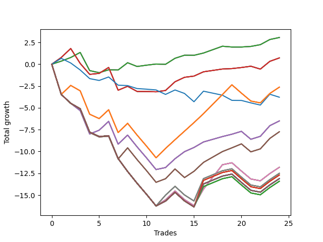

# Long Shepard 004 
- Symbol: NVDA_Unlimited
- Date Range: 02/08/2022 - 07/08/2022
- Trading Period: 7:20-12:30
- Number of Trades: 24



| Name | Win Percent | Profit | Avg Profit / Trade | Avg Time / Trade |      | Name | Win Percent | Profit | Avg Profit / Trade | Avg Time / Trade |
| ---- | ----------- | ------ | ------------------ | ---------------- | ---- | ---- | ----------- | ------ | ------------------ | ---------------- |
| Sorted By <br> Profit | | | | | | Sorted By <br> Win Percentage ||||
| Sixty-Four | 70.83 | 1530.00 | 63.75 | 05:07 |     | Sixty-Four | 70.83 | 1530.00 | 63.75 | 05:07 |
| Fifty-Six | 70.83 | 1530.00 | 63.75 | 05:07 |     | Fifty-Six | 70.83 | 1530.00 | 63.75 | 05:07 |
| Forty-Eight | 70.83 | 1530.00 | 63.75 | 05:07 |     | Forty-Eight | 70.83 | 1530.00 | 63.75 | 05:07 |
| Forty | 70.83 | 1530.00 | 63.75 | 05:07 |     | Forty | 70.83 | 1530.00 | 63.75 | 05:07 |
| Zero | 70.83 | 1530.00 | 63.75 | 05:07 |     | Zero | 70.83 | 1530.00 | 63.75 | 05:07 |
| Sixty-Five | 70.83 | 360.00 | 15.00 | 11:45 |     | Sixty-Five | 70.83 | 360.00 | 15.00 | 11:45 |
| Fifty-Seven | 70.83 | 360.00 | 15.00 | 11:45 |     | Fifty-Seven | 70.83 | 360.00 | 15.00 | 11:45 |
| Forty-Nine | 70.83 | 360.00 | 15.00 | 11:45 |     | Forty-Nine | 70.83 | 360.00 | 15.00 | 11:45 |
| Forty-One | 70.83 | 360.00 | 15.00 | 11:45 |     | Forty-One | 70.83 | 360.00 | 15.00 | 11:45 |
| One | 70.83 | 360.00 | 15.00 | 11:45 |     | One | 70.83 | 360.00 | 15.00 | 11:45 |
| One Hundred Twenty-Six | 54.17 | -1315.00 | -54.79 | 20:03 |     | Sixty-Six | 62.50 | -3250.00 | -135.42 | 19:03 |
| One Hundred Twenty-One | 54.17 | -1315.00 | -54.79 | 20:03 |     | Fifty-Eight | 62.50 | -3250.00 | -135.42 | 19:03 |
| One Hundred Sixteen | 54.17 | -1315.00 | -54.79 | 20:03 |     | Fifty | 62.50 | -3250.00 | -135.42 | 19:03 |
| One Hundred Eleven | 54.17 | -1315.00 | -54.79 | 20:03 |     | Forty-Two | 62.50 | -3250.00 | -135.42 | 19:03 |
| Eighty-One | 54.17 | -1315.00 | -54.79 | 20:03 |     | Two | 62.50 | -3250.00 | -135.42 | 19:03 |
| Seventy-Three | 20.83 | -1890.00 | -78.75 | 06:10 |     | One Hundred Twenty-Six | 54.17 | -1315.00 | -54.79 | 20:03 |
| Sixty-Six | 62.50 | -3250.00 | -135.42 | 19:03 |     | One Hundred Twenty-One | 54.17 | -1315.00 | -54.79 | 20:03 |
| Fifty-Eight | 62.50 | -3250.00 | -135.42 | 19:03 |     | One Hundred Sixteen | 54.17 | -1315.00 | -54.79 | 20:03 |
| Fifty | 62.50 | -3250.00 | -135.42 | 19:03 |     | One Hundred Eleven | 54.17 | -1315.00 | -54.79 | 20:03 |
| Forty-Two | 62.50 | -3250.00 | -135.42 | 19:03 |     | Eighty-One | 54.17 | -1315.00 | -54.79 | 20:03 |
| Two | 62.50 | -3250.00 | -135.42 | 19:03 |     | Sixty-Seven | 54.17 | -3870.00 | -161.25 | 22:23 |
| Sixty-Seven | 54.17 | -3870.00 | -161.25 | 22:23 |     | Fifty-Nine | 54.17 | -3870.00 | -161.25 | 22:23 |
| Fifty-Nine | 54.17 | -3870.00 | -161.25 | 22:23 |     | Fifty-One | 54.17 | -3870.00 | -161.25 | 22:23 |
| Fifty-One | 54.17 | -3870.00 | -161.25 | 22:23 |     | Forty-Three | 54.17 | -3870.00 | -161.25 | 22:23 |
| Forty-Three | 54.17 | -3870.00 | -161.25 | 22:23 |     | Three | 54.17 | -3870.00 | -161.25 | 22:23 |
| Three | 54.17 | -3870.00 | -161.25 | 22:23 |     | Sixty-Eight | 37.50 | -5905.00 | -246.04 | 27:07 |
| Sixty-Eight | 37.50 | -5905.00 | -246.04 | 27:07 |     | Sixty | 37.50 | -5905.00 | -246.04 | 27:07 |
| Sixty | 37.50 | -5905.00 | -246.04 | 27:07 |     | Fifty-Two | 37.50 | -5905.00 | -246.04 | 27:07 |
| Fifty-Two | 37.50 | -5905.00 | -246.04 | 27:07 |     | Forty-Four | 37.50 | -5905.00 | -246.04 | 27:07 |
| Forty-Four | 37.50 | -5905.00 | -246.04 | 27:07 |     | Four | 37.50 | -5905.00 | -246.04 | 27:07 |
| Four | 37.50 | -5905.00 | -246.04 | 27:07 |     | Sixty-Nine | 37.50 | -6250.00 | -260.42 | 28:26 |
| Sixty-Nine | 37.50 | -6250.00 | -260.42 | 28:26 |     | Sixty-One | 37.50 | -6250.00 | -260.42 | 28:26 |
| Sixty-One | 37.50 | -6250.00 | -260.42 | 28:26 |     | Fifty-Three | 37.50 | -6250.00 | -260.42 | 28:26 |
| Fifty-Three | 37.50 | -6250.00 | -260.42 | 28:26 |     | Forty-Five | 37.50 | -6250.00 | -260.42 | 28:26 |
| Forty-Five | 37.50 | -6250.00 | -260.42 | 28:26 |     | Five | 37.50 | -6250.00 | -260.42 | 28:26 |
| Five | 37.50 | -6250.00 | -260.42 | 28:26 |     | One Hundred Twenty-Eight | 37.50 | -6350.00 | -264.58 | 29:28 |
| One Hundred Twenty-Eight | 37.50 | -6350.00 | -264.58 | 29:28 |     | One Hundred Twenty-Three | 37.50 | -6350.00 | -264.58 | 29:28 |
| One Hundred Twenty-Three | 37.50 | -6350.00 | -264.58 | 29:28 |     | One Hundred Eighteen | 37.50 | -6350.00 | -264.58 | 29:28 |
| One Hundred Eighteen | 37.50 | -6350.00 | -264.58 | 29:28 |     | One Hundred Thirteen | 37.50 | -6350.00 | -264.58 | 29:28 |
| One Hundred Thirteen | 37.50 | -6350.00 | -264.58 | 29:28 |     | Eighty-Three | 37.50 | -6350.00 | -264.58 | 29:28 |
| Eighty-Three | 37.50 | -6350.00 | -264.58 | 29:28 |     | One Hundred Thirty | 37.50 | -6555.00 | -273.13 | 29:32 |
| One Hundred Thirty | 37.50 | -6555.00 | -273.13 | 29:32 |     | One Hundred Twenty-Nine | 37.50 | -6555.00 | -273.13 | 29:32 |
| One Hundred Twenty-Nine | 37.50 | -6555.00 | -273.13 | 29:32 |     | One Hundred Twenty-Five | 37.50 | -6555.00 | -273.13 | 29:32 |
| One Hundred Twenty-Five | 37.50 | -6555.00 | -273.13 | 29:32 |     | One Hundred Twenty-Four | 37.50 | -6555.00 | -273.13 | 29:32 |
| One Hundred Twenty-Four | 37.50 | -6555.00 | -273.13 | 29:32 |     | One Hundred Twenty | 37.50 | -6555.00 | -273.13 | 29:32 |
| One Hundred Twenty | 37.50 | -6555.00 | -273.13 | 29:32 |     | One Hundred Ninteen | 37.50 | -6555.00 | -273.13 | 29:32 |
| One Hundred Ninteen | 37.50 | -6555.00 | -273.13 | 29:32 |     | One Hundred Fifteen | 37.50 | -6555.00 | -273.13 | 29:32 |
| One Hundred Fifteen | 37.50 | -6555.00 | -273.13 | 29:32 |     | One Hundred Fourteen | 37.50 | -6555.00 | -273.13 | 29:32 |
| One Hundred Fourteen | 37.50 | -6555.00 | -273.13 | 29:32 |     | Eighty-Five | 37.50 | -6555.00 | -273.13 | 29:32 |
| Eighty-Five | 37.50 | -6555.00 | -273.13 | 29:32 |     | Eighty-Four | 37.50 | -6555.00 | -273.13 | 29:32 |
| Eighty-Four | 37.50 | -6555.00 | -273.13 | 29:32 |     | Seventy-One | 37.50 | -6555.00 | -273.13 | 29:32 |
| Seventy-One | 37.50 | -6555.00 | -273.13 | 29:32 |     | Seventy | 37.50 | -6555.00 | -273.13 | 29:32 |
| Seventy | 37.50 | -6555.00 | -273.13 | 29:32 |     | Sixty-Three | 37.50 | -6555.00 | -273.13 | 29:32 |
| Sixty-Three | 37.50 | -6555.00 | -273.13 | 29:32 |     | Sixty-Two | 37.50 | -6555.00 | -273.13 | 29:32 |
| Sixty-Two | 37.50 | -6555.00 | -273.13 | 29:32 |     | Fifty-Five | 37.50 | -6555.00 | -273.13 | 29:32 |
| Fifty-Five | 37.50 | -6555.00 | -273.13 | 29:32 |     | Fifty-Four | 37.50 | -6555.00 | -273.13 | 29:32 |
| Fifty-Four | 37.50 | -6555.00 | -273.13 | 29:32 |     | Forty-Seven | 37.50 | -6555.00 | -273.13 | 29:32 |
| Forty-Seven | 37.50 | -6555.00 | -273.13 | 29:32 |     | Forty-Six | 37.50 | -6555.00 | -273.13 | 29:32 |
| Forty-Six | 37.50 | -6555.00 | -273.13 | 29:32 |     | Seven | 37.50 | -6555.00 | -273.13 | 29:32 |
| Seven | 37.50 | -6555.00 | -273.13 | 29:32 |     | Six | 37.50 | -6555.00 | -273.13 | 29:32 |
| Six | 37.50 | -6555.00 | -273.13 | 29:32 |     | One Hundred Twenty-Seven | 37.50 | -6705.00 | -279.38 | 29:08 |
| One Hundred Twenty-Seven | 37.50 | -6705.00 | -279.38 | 29:08 |     | One Hundred Twenty-Two | 37.50 | -6705.00 | -279.38 | 29:08 |
| One Hundred Twenty-Two | 37.50 | -6705.00 | -279.38 | 29:08 |     | One Hundred Seventeen | 37.50 | -6705.00 | -279.38 | 29:08 |
| One Hundred Seventeen | 37.50 | -6705.00 | -279.38 | 29:08 |     | One Hundred Twelve | 37.50 | -6705.00 | -279.38 | 29:08 |
| One Hundred Twelve | 37.50 | -6705.00 | -279.38 | 29:08 |     | Eighty-Two | 37.50 | -6705.00 | -279.38 | 29:08 |
| Eighty-Two | 37.50 | -6705.00 | -279.38 | 29:08 |     | Seventy-Three | 20.83 | -1890.00 | -78.75 | 06:10 |

## NO STOPLOSS

### Test Zero
* Sell when price hits the middle line of the 20p bollinger
* No Stoploss
* Results:
```
Total Trades: 24
Percent Up: 70.83
Percent Down: 29.17
Total Points Moved Up: 3.06
Potential Profit: 1530.00
Total Points Ups: 5.96 Count Ups: 17
Total Points Downs: -2.90 Count Downs: 7
```

<details><summary>Trades</summary>

<code>In: 2022-02-10 12:05:00		Out: 2022-02-10 12:09:25		Total Position Time: 04:25		Total Move Up: 0.35		Total to Date: 0.35</code> <br />
<code>In: 2022-02-11 10:48:00		Out: 2022-02-11 10:52:10		Total Position Time: 04:10		Total Move Up: 0.42		Total to Date: 0.77</code> <br />
<code>In: 2022-02-11 11:34:00		Out: 2022-02-11 11:34:20		Total Position Time: 00:20		Total Move Up: 0.58		Total to Date: 1.35</code> <br />
<code>In: 2022-02-18 07:21:00		Out: 2022-02-18 07:43:30		Total Position Time: 22:30		Total Move Up: -2.08		Total to Date: -0.73</code> <br />
<code>In: 2022-02-23 12:16:00		Out: 2022-02-23 12:25:55		Total Position Time: 09:55		Total Move Up: -0.24		Total to Date: -0.97</code> <br />
<code>In: 2022-02-23 12:25:00		Out: 2022-02-23 12:25:55		Total Position Time: 00:55		Total Move Up: 0.33		Total to Date: -0.64</code> <br />
<code>In: 2022-03-01 08:41:00		Out: 2022-03-01 08:50:05		Total Position Time: 09:05		Total Move Up: -0.02		Total to Date: -0.66</code> <br />
<code>In: 2022-03-04 07:22:00		Out: 2022-03-04 07:25:10		Total Position Time: 03:10		Total Move Up: 0.83		Total to Date: 0.17</code> <br />
<code>In: 2022-03-14 09:58:00		Out: 2022-03-14 10:12:10		Total Position Time: 14:10		Total Move Up: -0.43		Total to Date: -0.26</code> <br />
<code>In: 2022-03-14 10:06:00		Out: 2022-03-14 10:12:10		Total Position Time: 06:10		Total Move Up: 0.15		Total to Date: -0.11</code> <br />
<code>In: 2022-03-14 10:07:00		Out: 2022-03-14 10:12:10		Total Position Time: 05:10		Total Move Up: 0.13		Total to Date: 0.02</code> <br />
<code>In: 2022-03-14 10:40:00		Out: 2022-03-14 10:43:45		Total Position Time: 03:45		Total Move Up: -0.03		Total to Date: -0.01</code> <br />
<code>In: 2022-03-30 08:13:00		Out: 2022-03-30 08:14:35		Total Position Time: 01:35		Total Move Up: 0.69		Total to Date: 0.68</code> <br />
<code>In: 2022-04-07 07:51:00		Out: 2022-04-07 07:56:05		Total Position Time: 05:05		Total Move Up: 0.35		Total to Date: 1.03</code> <br />
<code>In: 2022-04-07 09:00:00		Out: 2022-04-07 09:09:05		Total Position Time: 09:05		Total Move Up: -0.01		Total to Date: 1.02</code> <br />
<code>In: 2022-04-07 09:52:00		Out: 2022-04-07 09:52:20		Total Position Time: 00:20		Total Move Up: 0.26		Total to Date: 1.28</code> <br />
<code>In: 2022-04-08 11:38:00		Out: 2022-04-08 11:39:40		Total Position Time: 01:40		Total Move Up: 0.39		Total to Date: 1.67</code> <br />
<code>In: 2022-04-08 11:38:00		Out: 2022-04-08 11:39:40		Total Position Time: 01:40		Total Move Up: 0.39		Total to Date: 2.06</code> <br />
<code>In: 2022-04-12 11:32:00		Out: 2022-04-12 11:35:55		Total Position Time: 03:55		Total Move Up: -0.09		Total to Date: 1.97</code> <br />
<code>In: 2022-04-22 10:06:00		Out: 2022-04-22 10:08:50		Total Position Time: 02:50		Total Move Up: 0.00		Total to Date: 1.97</code> <br />
<code>In: 2022-04-22 10:43:00		Out: 2022-04-22 10:43:10		Total Position Time: 00:10		Total Move Up: 0.07		Total to Date: 2.04</code> <br />
<code>In: 2022-06-01 07:21:00		Out: 2022-06-01 07:25:45		Total Position Time: 04:45		Total Move Up: 0.20		Total to Date: 2.24</code> <br />
<code>In: 2022-06-01 09:14:00		Out: 2022-06-01 09:16:00		Total Position Time: 02:00		Total Move Up: 0.59		Total to Date: 2.83</code> <br />
<code>In: 2022-06-08 09:44:00		Out: 2022-06-08 09:50:15		Total Position Time: 06:15		Total Move Up: 0.23		Total to Date: 3.06</code> <br />


</details>

### Test One
* Sell when the price hits the upper line of the 20p 1std bollinger
* No Stoploss
* Results:
```
Total Trades: 24
Percent Up: 70.83
Percent Down: 29.17
Total Points Moved Up: 0.72
Potential Profit: 360.00
Total Points Ups: 7.25 Count Ups: 17
Total Points Downs: -6.53 Count Downs: 7
```

<details><summary>Trades</summary>

<code>In: 2022-02-10 12:05:00		Out: 2022-02-10 12:12:40		Total Position Time: 07:40		Total Move Up: 0.77		Total to Date: 0.77</code> <br />
<code>In: 2022-02-11 10:48:00		Out: 2022-02-11 10:52:50		Total Position Time: 04:50		Total Move Up: 1.03		Total to Date: 1.80</code> <br />
<code>In: 2022-02-11 11:34:00		Out: 2022-02-11 12:02:45		Total Position Time: 28:45		Total Move Up: -1.71		Total to Date: 0.09</code> <br />
<code>In: 2022-02-18 07:21:00		Out: 2022-02-18 07:46:05		Total Position Time: 25:05		Total Move Up: -1.25		Total to Date: -1.16</code> <br />
<code>In: 2022-02-23 12:16:00		Out: 2022-02-23 12:27:05		Total Position Time: 11:05		Total Move Up: 0.11		Total to Date: -1.05</code> <br />
<code>In: 2022-02-23 12:25:00		Out: 2022-02-23 12:27:05		Total Position Time: 02:05		Total Move Up: 0.68		Total to Date: -0.37</code> <br />
<code>In: 2022-03-01 08:41:00		Out: 2022-03-01 09:10:55		Total Position Time: 29:55		Total Move Up: -2.61		Total to Date: -2.98</code> <br />
<code>In: 2022-03-04 07:22:00		Out: 2022-03-04 07:36:55		Total Position Time: 14:55		Total Move Up: 0.45		Total to Date: -2.53</code> <br />
<code>In: 2022-03-14 09:58:00		Out: 2022-03-14 10:19:45		Total Position Time: 21:45		Total Move Up: -0.59		Total to Date: -3.12</code> <br />
<code>In: 2022-03-14 10:06:00		Out: 2022-03-14 10:19:45		Total Position Time: 13:45		Total Move Up: -0.01		Total to Date: -3.13</code> <br />
<code>In: 2022-03-14 10:07:00		Out: 2022-03-14 10:19:45		Total Position Time: 12:45		Total Move Up: -0.03		Total to Date: -3.16</code> <br />
<code>In: 2022-03-14 10:40:00		Out: 2022-03-14 10:45:30		Total Position Time: 05:30		Total Move Up: 0.15		Total to Date: -3.01</code> <br />
<code>In: 2022-03-30 08:13:00		Out: 2022-03-30 08:19:15		Total Position Time: 06:15		Total Move Up: 1.00		Total to Date: -2.01</code> <br />
<code>In: 2022-04-07 07:51:00		Out: 2022-04-07 08:00:05		Total Position Time: 09:05		Total Move Up: 0.51		Total to Date: -1.50</code> <br />
<code>In: 2022-04-07 09:00:00		Out: 2022-04-07 09:10:15		Total Position Time: 10:15		Total Move Up: 0.14		Total to Date: -1.36</code> <br />
<code>In: 2022-04-07 09:52:00		Out: 2022-04-07 09:56:10		Total Position Time: 04:10		Total Move Up: 0.49		Total to Date: -0.87</code> <br />
<code>In: 2022-04-08 11:38:00		Out: 2022-04-08 11:47:10		Total Position Time: 09:10		Total Move Up: 0.16		Total to Date: -0.71</code> <br />
<code>In: 2022-04-08 11:38:00		Out: 2022-04-08 11:47:10		Total Position Time: 09:10		Total Move Up: 0.16		Total to Date: -0.55</code> <br />
<code>In: 2022-04-12 11:32:00		Out: 2022-04-12 11:41:25		Total Position Time: 09:25		Total Move Up: 0.05		Total to Date: -0.50</code> <br />
<code>In: 2022-04-22 10:06:00		Out: 2022-04-22 10:11:45		Total Position Time: 05:45		Total Move Up: 0.12		Total to Date: -0.38</code> <br />
<code>In: 2022-04-22 10:43:00		Out: 2022-04-22 10:45:25		Total Position Time: 02:25		Total Move Up: 0.15		Total to Date: -0.23</code> <br />
<code>In: 2022-06-01 07:21:00		Out: 2022-06-01 07:43:25		Total Position Time: 22:25		Total Move Up: -0.33		Total to Date: -0.56</code> <br />
<code>In: 2022-06-01 09:14:00		Out: 2022-06-01 09:19:50		Total Position Time: 05:50		Total Move Up: 0.89		Total to Date: 0.33</code> <br />
<code>In: 2022-06-08 09:44:00		Out: 2022-06-08 09:54:00		Total Position Time: 10:00		Total Move Up: 0.39		Total to Date: 0.72</code> <br />


</details>

### Test Two
* Sell when the price hits the upper line of the 20p 2std bollinger
* No Stoploss
* Results:
```
Total Trades: 24
Percent Up: 62.50
Percent Down: 37.50
Total Points Moved Up: -6.50
Potential Profit: -3250.00
Total Points Ups: 8.97 Count Ups: 15
Total Points Downs: -15.47 Count Downs: 9
```

<details><summary>Trades</summary>

<code>In: 2022-02-10 12:05:00		Out: 2022-02-10 12:34:55		Total Position Time: 29:55		Total Move Up: -3.46		Total to Date: -3.46</code> <br />
<code>In: 2022-02-11 10:48:00		Out: 2022-02-11 11:17:55		Total Position Time: 29:55		Total Move Up: -1.02		Total to Date: -4.48</code> <br />
<code>In: 2022-02-11 11:34:00		Out: 2022-02-11 12:03:40		Total Position Time: 29:40		Total Move Up: -0.84		Total to Date: -5.32</code> <br />
<code>In: 2022-02-18 07:21:00		Out: 2022-02-18 07:50:55		Total Position Time: 29:55		Total Move Up: -2.68		Total to Date: -8.00</code> <br />
<code>In: 2022-02-23 12:16:00		Out: 2022-02-23 12:31:10		Total Position Time: 15:10		Total Move Up: 0.44		Total to Date: -7.56</code> <br />
<code>In: 2022-02-23 12:25:00		Out: 2022-02-23 12:31:10		Total Position Time: 06:10		Total Move Up: 1.01		Total to Date: -6.55</code> <br />
<code>In: 2022-03-01 08:41:00		Out: 2022-03-01 09:10:55		Total Position Time: 29:55		Total Move Up: -2.61		Total to Date: -9.16</code> <br />
<code>In: 2022-03-04 07:22:00		Out: 2022-03-04 07:37:05		Total Position Time: 15:05		Total Move Up: 1.04		Total to Date: -8.12</code> <br />
<code>In: 2022-03-14 09:58:00		Out: 2022-03-14 10:27:55		Total Position Time: 29:55		Total Move Up: -1.35		Total to Date: -9.47</code> <br />
<code>In: 2022-03-14 10:06:00		Out: 2022-03-14 10:35:55		Total Position Time: 29:55		Total Move Up: -1.27		Total to Date: -10.74</code> <br />
<code>In: 2022-03-14 10:07:00		Out: 2022-03-14 10:36:55		Total Position Time: 29:55		Total Move Up: -1.33		Total to Date: -12.07</code> <br />
<code>In: 2022-03-14 10:40:00		Out: 2022-03-14 10:50:15		Total Position Time: 10:15		Total Move Up: 0.23		Total to Date: -11.84</code> <br />
<code>In: 2022-03-30 08:13:00		Out: 2022-03-30 08:42:55		Total Position Time: 29:55		Total Move Up: 1.01		Total to Date: -10.83</code> <br />
<code>In: 2022-04-07 07:51:00		Out: 2022-04-07 08:00:10		Total Position Time: 09:10		Total Move Up: 0.81		Total to Date: -10.02</code> <br />
<code>In: 2022-04-07 09:00:00		Out: 2022-04-07 09:15:30		Total Position Time: 15:30		Total Move Up: 0.48		Total to Date: -9.54</code> <br />
<code>In: 2022-04-07 09:52:00		Out: 2022-04-07 09:59:10		Total Position Time: 07:10		Total Move Up: 0.63		Total to Date: -8.91</code> <br />
<code>In: 2022-04-08 11:38:00		Out: 2022-04-08 11:47:45		Total Position Time: 09:45		Total Move Up: 0.31		Total to Date: -8.60</code> <br />
<code>In: 2022-04-08 11:38:00		Out: 2022-04-08 11:47:45		Total Position Time: 09:45		Total Move Up: 0.31		Total to Date: -8.29</code> <br />
<code>In: 2022-04-12 11:32:00		Out: 2022-04-12 11:42:05		Total Position Time: 10:05		Total Move Up: 0.27		Total to Date: -8.02</code> <br />
<code>In: 2022-04-22 10:06:00		Out: 2022-04-22 10:13:00		Total Position Time: 07:00		Total Move Up: 0.33		Total to Date: -7.69</code> <br />
<code>In: 2022-04-22 10:43:00		Out: 2022-04-22 11:12:55		Total Position Time: 29:55		Total Move Up: -0.91		Total to Date: -8.60</code> <br />
<code>In: 2022-06-01 07:21:00		Out: 2022-06-01 07:45:05		Total Position Time: 24:05		Total Move Up: 0.34		Total to Date: -8.26</code> <br />
<code>In: 2022-06-01 09:14:00		Out: 2022-06-01 09:20:40		Total Position Time: 06:40		Total Move Up: 1.22		Total to Date: -7.04</code> <br />
<code>In: 2022-06-08 09:44:00		Out: 2022-06-08 09:56:45		Total Position Time: 12:45		Total Move Up: 0.54		Total to Date: -6.50</code> <br />


</details>

### Test Three
* Sell when price hits the middle line of the 50p bollinger
* No Stoploss
* Results:
```
Total Trades: 24
Percent Up: 54.17
Percent Down: 45.83
Total Points Moved Up: -7.74
Potential Profit: -3870.00
Total Points Ups: 9.05 Count Ups: 13
Total Points Downs: -16.79 Count Downs: 11
```

<details><summary>Trades</summary>

<code>In: 2022-02-10 12:05:00		Out: 2022-02-10 12:34:55		Total Position Time: 29:55		Total Move Up: -3.46		Total to Date: -3.46</code> <br />
<code>In: 2022-02-11 10:48:00		Out: 2022-02-11 11:17:55		Total Position Time: 29:55		Total Move Up: -1.02		Total to Date: -4.48</code> <br />
<code>In: 2022-02-11 11:34:00		Out: 2022-02-11 12:03:45		Total Position Time: 29:45		Total Move Up: -0.67		Total to Date: -5.15</code> <br />
<code>In: 2022-02-18 07:21:00		Out: 2022-02-18 07:50:55		Total Position Time: 29:55		Total Move Up: -2.68		Total to Date: -7.83</code> <br />
<code>In: 2022-02-23 12:16:00		Out: 2022-02-23 12:45:55		Total Position Time: 29:55		Total Move Up: -0.50		Total to Date: -8.33</code> <br />
<code>In: 2022-02-23 12:25:00		Out: 2022-02-23 12:46:00		Total Position Time: 21:00		Total Move Up: 0.08		Total to Date: -8.25</code> <br />
<code>In: 2022-03-01 08:41:00		Out: 2022-03-01 09:10:55		Total Position Time: 29:55		Total Move Up: -2.61		Total to Date: -10.86</code> <br />
<code>In: 2022-03-04 07:22:00		Out: 2022-03-04 07:38:05		Total Position Time: 16:05		Total Move Up: 1.28		Total to Date: -9.58</code> <br />
<code>In: 2022-03-14 09:58:00		Out: 2022-03-14 10:27:55		Total Position Time: 29:55		Total Move Up: -1.35		Total to Date: -10.93</code> <br />
<code>In: 2022-03-14 10:06:00		Out: 2022-03-14 10:35:55		Total Position Time: 29:55		Total Move Up: -1.27		Total to Date: -12.20</code> <br />
<code>In: 2022-03-14 10:07:00		Out: 2022-03-14 10:36:55		Total Position Time: 29:55		Total Move Up: -1.33		Total to Date: -13.53</code> <br />
<code>In: 2022-03-14 10:40:00		Out: 2022-03-14 10:50:25		Total Position Time: 10:25		Total Move Up: 0.41		Total to Date: -13.12</code> <br />
<code>In: 2022-03-30 08:13:00		Out: 2022-03-30 08:34:40		Total Position Time: 21:40		Total Move Up: 1.12		Total to Date: -12.00</code> <br />
<code>In: 2022-04-07 07:51:00		Out: 2022-04-07 08:20:55		Total Position Time: 29:55		Total Move Up: -0.99		Total to Date: -12.99</code> <br />
<code>In: 2022-04-07 09:00:00		Out: 2022-04-07 09:21:00		Total Position Time: 21:00		Total Move Up: 0.72		Total to Date: -12.27</code> <br />
<code>In: 2022-04-07 09:52:00		Out: 2022-04-07 10:02:40		Total Position Time: 10:40		Total Move Up: 1.02		Total to Date: -11.25</code> <br />
<code>In: 2022-04-08 11:38:00		Out: 2022-04-08 11:49:10		Total Position Time: 11:10		Total Move Up: 0.62		Total to Date: -10.63</code> <br />
<code>In: 2022-04-08 11:38:00		Out: 2022-04-08 11:49:10		Total Position Time: 11:10		Total Move Up: 0.62		Total to Date: -10.01</code> <br />
<code>In: 2022-04-12 11:32:00		Out: 2022-04-12 11:45:10		Total Position Time: 13:10		Total Move Up: 0.43		Total to Date: -9.58</code> <br />
<code>In: 2022-04-22 10:06:00		Out: 2022-04-22 10:16:20		Total Position Time: 10:20		Total Move Up: 0.45		Total to Date: -9.13</code> <br />
<code>In: 2022-04-22 10:43:00		Out: 2022-04-22 11:12:55		Total Position Time: 29:55		Total Move Up: -0.91		Total to Date: -10.04</code> <br />
<code>In: 2022-06-01 07:21:00		Out: 2022-06-01 07:45:05		Total Position Time: 24:05		Total Move Up: 0.34		Total to Date: -9.70</code> <br />
<code>In: 2022-06-01 09:14:00		Out: 2022-06-01 09:31:05		Total Position Time: 17:05		Total Move Up: 1.20		Total to Date: -8.50</code> <br />
<code>In: 2022-06-08 09:44:00		Out: 2022-06-08 10:04:30		Total Position Time: 20:30		Total Move Up: 0.76		Total to Date: -7.74</code> <br />


</details>

### Test Four
* Sell when the price hits the upper line of the 50p 1std bollinger
* No Stoploss
* Results:
```
Total Trades: 24
Percent Up: 37.50
Percent Down: 62.50
Total Points Moved Up: -11.81
Potential Profit: -5905.00
Total Points Ups: 8.26 Count Ups: 9
Total Points Downs: -20.07 Count Downs: 15
```

<details><summary>Trades</summary>

<code>In: 2022-02-10 12:05:00		Out: 2022-02-10 12:34:55		Total Position Time: 29:55		Total Move Up: -3.46		Total to Date: -3.46</code> <br />
<code>In: 2022-02-11 10:48:00		Out: 2022-02-11 11:17:55		Total Position Time: 29:55		Total Move Up: -1.02		Total to Date: -4.48</code> <br />
<code>In: 2022-02-11 11:34:00		Out: 2022-02-11 12:03:55		Total Position Time: 29:55		Total Move Up: -0.62		Total to Date: -5.10</code> <br />
<code>In: 2022-02-18 07:21:00		Out: 2022-02-18 07:50:55		Total Position Time: 29:55		Total Move Up: -2.68		Total to Date: -7.78</code> <br />
<code>In: 2022-02-23 12:16:00		Out: 2022-02-23 12:45:55		Total Position Time: 29:55		Total Move Up: -0.50		Total to Date: -8.28</code> <br />
<code>In: 2022-02-23 12:25:00		Out: 2022-02-23 12:46:00		Total Position Time: 21:00		Total Move Up: 0.08		Total to Date: -8.20</code> <br />
<code>In: 2022-03-01 08:41:00		Out: 2022-03-01 09:10:55		Total Position Time: 29:55		Total Move Up: -2.61		Total to Date: -10.81</code> <br />
<code>In: 2022-03-04 07:22:00		Out: 2022-03-04 07:51:55		Total Position Time: 29:55		Total Move Up: -1.48		Total to Date: -12.29</code> <br />
<code>In: 2022-03-14 09:58:00		Out: 2022-03-14 10:27:55		Total Position Time: 29:55		Total Move Up: -1.35		Total to Date: -13.64</code> <br />
<code>In: 2022-03-14 10:06:00		Out: 2022-03-14 10:35:55		Total Position Time: 29:55		Total Move Up: -1.27		Total to Date: -14.91</code> <br />
<code>In: 2022-03-14 10:07:00		Out: 2022-03-14 10:36:55		Total Position Time: 29:55		Total Move Up: -1.33		Total to Date: -16.24</code> <br />
<code>In: 2022-03-14 10:40:00		Out: 2022-03-14 10:50:45		Total Position Time: 10:45		Total Move Up: 0.71		Total to Date: -15.53</code> <br />
<code>In: 2022-03-30 08:13:00		Out: 2022-03-30 08:42:55		Total Position Time: 29:55		Total Move Up: 1.01		Total to Date: -14.52</code> <br />
<code>In: 2022-04-07 07:51:00		Out: 2022-04-07 08:20:55		Total Position Time: 29:55		Total Move Up: -0.99		Total to Date: -15.51</code> <br />
<code>In: 2022-04-07 09:00:00		Out: 2022-04-07 09:29:55		Total Position Time: 29:55		Total Move Up: -0.69		Total to Date: -16.20</code> <br />
<code>In: 2022-04-07 09:52:00		Out: 2022-04-07 10:12:10		Total Position Time: 20:10		Total Move Up: 1.88		Total to Date: -14.32</code> <br />
<code>In: 2022-04-08 11:38:00		Out: 2022-04-08 11:53:15		Total Position Time: 15:15		Total Move Up: 1.40		Total to Date: -12.92</code> <br />
<code>In: 2022-04-08 11:38:00		Out: 2022-04-08 11:53:15		Total Position Time: 15:15		Total Move Up: 1.40		Total to Date: -11.52</code> <br />
<code>In: 2022-04-12 11:32:00		Out: 2022-04-12 12:01:55		Total Position Time: 29:55		Total Move Up: 0.23		Total to Date: -11.29</code> <br />
<code>In: 2022-04-22 10:06:00		Out: 2022-04-22 10:35:55		Total Position Time: 29:55		Total Move Up: -0.95		Total to Date: -12.24</code> <br />
<code>In: 2022-04-22 10:43:00		Out: 2022-04-22 11:12:55		Total Position Time: 29:55		Total Move Up: -0.91		Total to Date: -13.15</code> <br />
<code>In: 2022-06-01 07:21:00		Out: 2022-06-01 07:50:55		Total Position Time: 29:55		Total Move Up: -0.21		Total to Date: -13.36</code> <br />
<code>In: 2022-06-01 09:14:00		Out: 2022-06-01 09:43:55		Total Position Time: 29:55		Total Move Up: 0.83		Total to Date: -12.53</code> <br />
<code>In: 2022-06-08 09:44:00		Out: 2022-06-08 10:13:55		Total Position Time: 29:55		Total Move Up: 0.72		Total to Date: -11.81</code> <br />


</details>

### Test Five
* Sell when the price hits the upper line of the 50p 2std bollinger
* No Stoploss
* Results:
```
Total Trades: 24
Percent Up: 37.50
Percent Down: 62.50
Total Points Moved Up: -12.50
Potential Profit: -6250.00
Total Points Ups: 7.57 Count Ups: 9
Total Points Downs: -20.07 Count Downs: 15
```

<details><summary>Trades</summary>

<code>In: 2022-02-10 12:05:00		Out: 2022-02-10 12:34:55		Total Position Time: 29:55		Total Move Up: -3.46		Total to Date: -3.46</code> <br />
<code>In: 2022-02-11 10:48:00		Out: 2022-02-11 11:17:55		Total Position Time: 29:55		Total Move Up: -1.02		Total to Date: -4.48</code> <br />
<code>In: 2022-02-11 11:34:00		Out: 2022-02-11 12:03:55		Total Position Time: 29:55		Total Move Up: -0.62		Total to Date: -5.10</code> <br />
<code>In: 2022-02-18 07:21:00		Out: 2022-02-18 07:50:55		Total Position Time: 29:55		Total Move Up: -2.68		Total to Date: -7.78</code> <br />
<code>In: 2022-02-23 12:16:00		Out: 2022-02-23 12:45:55		Total Position Time: 29:55		Total Move Up: -0.50		Total to Date: -8.28</code> <br />
<code>In: 2022-02-23 12:25:00		Out: 2022-02-23 12:46:00		Total Position Time: 21:00		Total Move Up: 0.08		Total to Date: -8.20</code> <br />
<code>In: 2022-03-01 08:41:00		Out: 2022-03-01 09:10:55		Total Position Time: 29:55		Total Move Up: -2.61		Total to Date: -10.81</code> <br />
<code>In: 2022-03-04 07:22:00		Out: 2022-03-04 07:51:55		Total Position Time: 29:55		Total Move Up: -1.48		Total to Date: -12.29</code> <br />
<code>In: 2022-03-14 09:58:00		Out: 2022-03-14 10:27:55		Total Position Time: 29:55		Total Move Up: -1.35		Total to Date: -13.64</code> <br />
<code>In: 2022-03-14 10:06:00		Out: 2022-03-14 10:35:55		Total Position Time: 29:55		Total Move Up: -1.27		Total to Date: -14.91</code> <br />
<code>In: 2022-03-14 10:07:00		Out: 2022-03-14 10:36:55		Total Position Time: 29:55		Total Move Up: -1.33		Total to Date: -16.24</code> <br />
<code>In: 2022-03-14 10:40:00		Out: 2022-03-14 10:52:20		Total Position Time: 12:20		Total Move Up: 1.24		Total to Date: -15.00</code> <br />
<code>In: 2022-03-30 08:13:00		Out: 2022-03-30 08:42:55		Total Position Time: 29:55		Total Move Up: 1.01		Total to Date: -13.99</code> <br />
<code>In: 2022-04-07 07:51:00		Out: 2022-04-07 08:20:55		Total Position Time: 29:55		Total Move Up: -0.99		Total to Date: -14.98</code> <br />
<code>In: 2022-04-07 09:00:00		Out: 2022-04-07 09:29:55		Total Position Time: 29:55		Total Move Up: -0.69		Total to Date: -15.67</code> <br />
<code>In: 2022-04-07 09:52:00		Out: 2022-04-07 10:13:00		Total Position Time: 21:00		Total Move Up: 2.56		Total to Date: -13.11</code> <br />
<code>In: 2022-04-08 11:38:00		Out: 2022-04-08 12:07:55		Total Position Time: 29:55		Total Move Up: 0.45		Total to Date: -12.66</code> <br />
<code>In: 2022-04-08 11:38:00		Out: 2022-04-08 12:07:55		Total Position Time: 29:55		Total Move Up: 0.45		Total to Date: -12.21</code> <br />
<code>In: 2022-04-12 11:32:00		Out: 2022-04-12 12:01:55		Total Position Time: 29:55		Total Move Up: 0.23		Total to Date: -11.98</code> <br />
<code>In: 2022-04-22 10:06:00		Out: 2022-04-22 10:35:55		Total Position Time: 29:55		Total Move Up: -0.95		Total to Date: -12.93</code> <br />
<code>In: 2022-04-22 10:43:00		Out: 2022-04-22 11:12:55		Total Position Time: 29:55		Total Move Up: -0.91		Total to Date: -13.84</code> <br />
<code>In: 2022-06-01 07:21:00		Out: 2022-06-01 07:50:55		Total Position Time: 29:55		Total Move Up: -0.21		Total to Date: -14.05</code> <br />
<code>In: 2022-06-01 09:14:00		Out: 2022-06-01 09:43:55		Total Position Time: 29:55		Total Move Up: 0.83		Total to Date: -13.22</code> <br />
<code>In: 2022-06-08 09:44:00		Out: 2022-06-08 10:13:55		Total Position Time: 29:55		Total Move Up: 0.72		Total to Date: -12.50</code> <br />


</details>

### Test Six
* Sell when the price hits the middle line of the 1std VWAP
* No Stoploss
* Results:
```
Total Trades: 24
Percent Up: 37.50
Percent Down: 62.50
Total Points Moved Up: -13.11
Potential Profit: -6555.00
Total Points Ups: 6.96 Count Ups: 9
Total Points Downs: -20.07 Count Downs: 15
```

<details><summary>Trades</summary>

<code>In: 2022-02-10 12:05:00		Out: 2022-02-10 12:34:55		Total Position Time: 29:55		Total Move Up: -3.46		Total to Date: -3.46</code> <br />
<code>In: 2022-02-11 10:48:00		Out: 2022-02-11 11:17:55		Total Position Time: 29:55		Total Move Up: -1.02		Total to Date: -4.48</code> <br />
<code>In: 2022-02-11 11:34:00		Out: 2022-02-11 12:03:55		Total Position Time: 29:55		Total Move Up: -0.62		Total to Date: -5.10</code> <br />
<code>In: 2022-02-18 07:21:00		Out: 2022-02-18 07:50:55		Total Position Time: 29:55		Total Move Up: -2.68		Total to Date: -7.78</code> <br />
<code>In: 2022-02-23 12:16:00		Out: 2022-02-23 12:45:55		Total Position Time: 29:55		Total Move Up: -0.50		Total to Date: -8.28</code> <br />
<code>In: 2022-02-23 12:25:00		Out: 2022-02-23 12:46:00		Total Position Time: 21:00		Total Move Up: 0.08		Total to Date: -8.20</code> <br />
<code>In: 2022-03-01 08:41:00		Out: 2022-03-01 09:10:55		Total Position Time: 29:55		Total Move Up: -2.61		Total to Date: -10.81</code> <br />
<code>In: 2022-03-04 07:22:00		Out: 2022-03-04 07:51:55		Total Position Time: 29:55		Total Move Up: -1.48		Total to Date: -12.29</code> <br />
<code>In: 2022-03-14 09:58:00		Out: 2022-03-14 10:27:55		Total Position Time: 29:55		Total Move Up: -1.35		Total to Date: -13.64</code> <br />
<code>In: 2022-03-14 10:06:00		Out: 2022-03-14 10:35:55		Total Position Time: 29:55		Total Move Up: -1.27		Total to Date: -14.91</code> <br />
<code>In: 2022-03-14 10:07:00		Out: 2022-03-14 10:36:55		Total Position Time: 29:55		Total Move Up: -1.33		Total to Date: -16.24</code> <br />
<code>In: 2022-03-14 10:40:00		Out: 2022-03-14 11:09:55		Total Position Time: 29:55		Total Move Up: 0.56		Total to Date: -15.68</code> <br />
<code>In: 2022-03-30 08:13:00		Out: 2022-03-30 08:42:55		Total Position Time: 29:55		Total Move Up: 1.01		Total to Date: -14.67</code> <br />
<code>In: 2022-04-07 07:51:00		Out: 2022-04-07 08:20:55		Total Position Time: 29:55		Total Move Up: -0.99		Total to Date: -15.66</code> <br />
<code>In: 2022-04-07 09:00:00		Out: 2022-04-07 09:29:55		Total Position Time: 29:55		Total Move Up: -0.69		Total to Date: -16.35</code> <br />
<code>In: 2022-04-07 09:52:00		Out: 2022-04-07 10:21:55		Total Position Time: 29:55		Total Move Up: 2.63		Total to Date: -13.72</code> <br />
<code>In: 2022-04-08 11:38:00		Out: 2022-04-08 12:07:55		Total Position Time: 29:55		Total Move Up: 0.45		Total to Date: -13.27</code> <br />
<code>In: 2022-04-08 11:38:00		Out: 2022-04-08 12:07:55		Total Position Time: 29:55		Total Move Up: 0.45		Total to Date: -12.82</code> <br />
<code>In: 2022-04-12 11:32:00		Out: 2022-04-12 12:01:55		Total Position Time: 29:55		Total Move Up: 0.23		Total to Date: -12.59</code> <br />
<code>In: 2022-04-22 10:06:00		Out: 2022-04-22 10:35:55		Total Position Time: 29:55		Total Move Up: -0.95		Total to Date: -13.54</code> <br />
<code>In: 2022-04-22 10:43:00		Out: 2022-04-22 11:12:55		Total Position Time: 29:55		Total Move Up: -0.91		Total to Date: -14.45</code> <br />
<code>In: 2022-06-01 07:21:00		Out: 2022-06-01 07:50:55		Total Position Time: 29:55		Total Move Up: -0.21		Total to Date: -14.66</code> <br />
<code>In: 2022-06-01 09:14:00		Out: 2022-06-01 09:43:55		Total Position Time: 29:55		Total Move Up: 0.83		Total to Date: -13.83</code> <br />
<code>In: 2022-06-08 09:44:00		Out: 2022-06-08 10:13:55		Total Position Time: 29:55		Total Move Up: 0.72		Total to Date: -13.11</code> <br />


</details>

### Test Seven
* Sell when the price hits the upper line of the 1std VWAP
* No Stoploss
* Results:
```
Total Trades: 24
Percent Up: 37.50
Percent Down: 62.50
Total Points Moved Up: -13.11
Potential Profit: -6555.00
Total Points Ups: 6.96 Count Ups: 9
Total Points Downs: -20.07 Count Downs: 15
```

<details><summary>Trades</summary>

<code>In: 2022-02-10 12:05:00		Out: 2022-02-10 12:34:55		Total Position Time: 29:55		Total Move Up: -3.46		Total to Date: -3.46</code> <br />
<code>In: 2022-02-11 10:48:00		Out: 2022-02-11 11:17:55		Total Position Time: 29:55		Total Move Up: -1.02		Total to Date: -4.48</code> <br />
<code>In: 2022-02-11 11:34:00		Out: 2022-02-11 12:03:55		Total Position Time: 29:55		Total Move Up: -0.62		Total to Date: -5.10</code> <br />
<code>In: 2022-02-18 07:21:00		Out: 2022-02-18 07:50:55		Total Position Time: 29:55		Total Move Up: -2.68		Total to Date: -7.78</code> <br />
<code>In: 2022-02-23 12:16:00		Out: 2022-02-23 12:45:55		Total Position Time: 29:55		Total Move Up: -0.50		Total to Date: -8.28</code> <br />
<code>In: 2022-02-23 12:25:00		Out: 2022-02-23 12:46:00		Total Position Time: 21:00		Total Move Up: 0.08		Total to Date: -8.20</code> <br />
<code>In: 2022-03-01 08:41:00		Out: 2022-03-01 09:10:55		Total Position Time: 29:55		Total Move Up: -2.61		Total to Date: -10.81</code> <br />
<code>In: 2022-03-04 07:22:00		Out: 2022-03-04 07:51:55		Total Position Time: 29:55		Total Move Up: -1.48		Total to Date: -12.29</code> <br />
<code>In: 2022-03-14 09:58:00		Out: 2022-03-14 10:27:55		Total Position Time: 29:55		Total Move Up: -1.35		Total to Date: -13.64</code> <br />
<code>In: 2022-03-14 10:06:00		Out: 2022-03-14 10:35:55		Total Position Time: 29:55		Total Move Up: -1.27		Total to Date: -14.91</code> <br />
<code>In: 2022-03-14 10:07:00		Out: 2022-03-14 10:36:55		Total Position Time: 29:55		Total Move Up: -1.33		Total to Date: -16.24</code> <br />
<code>In: 2022-03-14 10:40:00		Out: 2022-03-14 11:09:55		Total Position Time: 29:55		Total Move Up: 0.56		Total to Date: -15.68</code> <br />
<code>In: 2022-03-30 08:13:00		Out: 2022-03-30 08:42:55		Total Position Time: 29:55		Total Move Up: 1.01		Total to Date: -14.67</code> <br />
<code>In: 2022-04-07 07:51:00		Out: 2022-04-07 08:20:55		Total Position Time: 29:55		Total Move Up: -0.99		Total to Date: -15.66</code> <br />
<code>In: 2022-04-07 09:00:00		Out: 2022-04-07 09:29:55		Total Position Time: 29:55		Total Move Up: -0.69		Total to Date: -16.35</code> <br />
<code>In: 2022-04-07 09:52:00		Out: 2022-04-07 10:21:55		Total Position Time: 29:55		Total Move Up: 2.63		Total to Date: -13.72</code> <br />
<code>In: 2022-04-08 11:38:00		Out: 2022-04-08 12:07:55		Total Position Time: 29:55		Total Move Up: 0.45		Total to Date: -13.27</code> <br />
<code>In: 2022-04-08 11:38:00		Out: 2022-04-08 12:07:55		Total Position Time: 29:55		Total Move Up: 0.45		Total to Date: -12.82</code> <br />
<code>In: 2022-04-12 11:32:00		Out: 2022-04-12 12:01:55		Total Position Time: 29:55		Total Move Up: 0.23		Total to Date: -12.59</code> <br />
<code>In: 2022-04-22 10:06:00		Out: 2022-04-22 10:35:55		Total Position Time: 29:55		Total Move Up: -0.95		Total to Date: -13.54</code> <br />
<code>In: 2022-04-22 10:43:00		Out: 2022-04-22 11:12:55		Total Position Time: 29:55		Total Move Up: -0.91		Total to Date: -14.45</code> <br />
<code>In: 2022-06-01 07:21:00		Out: 2022-06-01 07:50:55		Total Position Time: 29:55		Total Move Up: -0.21		Total to Date: -14.66</code> <br />
<code>In: 2022-06-01 09:14:00		Out: 2022-06-01 09:43:55		Total Position Time: 29:55		Total Move Up: 0.83		Total to Date: -13.83</code> <br />
<code>In: 2022-06-08 09:44:00		Out: 2022-06-08 10:13:55		Total Position Time: 29:55		Total Move Up: 0.72		Total to Date: -13.11</code> <br />


</details>

## STOPLOSS OF 5

### Test Forty
* Sell when price hits the middle line of the 20p bollinger
* Stoploss is 5 points
* Results:
```
Total Trades: 24
Percent Up: 70.83
Percent Down: 29.17
Total Points Moved Up: 3.06
Potential Profit: 1530.00
Total Points Ups: 5.96 Count Ups: 17
Total Points Downs: -2.90 Count Downs: 7
```

<details><summary>Trades</summary>

<code>In: 2022-02-10 12:05:00		Out: 2022-02-10 12:09:25		Total Position Time: 04:25		Total Move Up: 0.35		Total to Date: 0.35</code> <br />
<code>In: 2022-02-11 10:48:00		Out: 2022-02-11 10:52:10		Total Position Time: 04:10		Total Move Up: 0.42		Total to Date: 0.77</code> <br />
<code>In: 2022-02-11 11:34:00		Out: 2022-02-11 11:34:20		Total Position Time: 00:20		Total Move Up: 0.58		Total to Date: 1.35</code> <br />
<code>In: 2022-02-18 07:21:00		Out: 2022-02-18 07:43:30		Total Position Time: 22:30		Total Move Up: -2.08		Total to Date: -0.73</code> <br />
<code>In: 2022-02-23 12:16:00		Out: 2022-02-23 12:25:55		Total Position Time: 09:55		Total Move Up: -0.24		Total to Date: -0.97</code> <br />
<code>In: 2022-02-23 12:25:00		Out: 2022-02-23 12:25:55		Total Position Time: 00:55		Total Move Up: 0.33		Total to Date: -0.64</code> <br />
<code>In: 2022-03-01 08:41:00		Out: 2022-03-01 08:50:05		Total Position Time: 09:05		Total Move Up: -0.02		Total to Date: -0.66</code> <br />
<code>In: 2022-03-04 07:22:00		Out: 2022-03-04 07:25:10		Total Position Time: 03:10		Total Move Up: 0.83		Total to Date: 0.17</code> <br />
<code>In: 2022-03-14 09:58:00		Out: 2022-03-14 10:12:10		Total Position Time: 14:10		Total Move Up: -0.43		Total to Date: -0.26</code> <br />
<code>In: 2022-03-14 10:06:00		Out: 2022-03-14 10:12:10		Total Position Time: 06:10		Total Move Up: 0.15		Total to Date: -0.11</code> <br />
<code>In: 2022-03-14 10:07:00		Out: 2022-03-14 10:12:10		Total Position Time: 05:10		Total Move Up: 0.13		Total to Date: 0.02</code> <br />
<code>In: 2022-03-14 10:40:00		Out: 2022-03-14 10:43:45		Total Position Time: 03:45		Total Move Up: -0.03		Total to Date: -0.01</code> <br />
<code>In: 2022-03-30 08:13:00		Out: 2022-03-30 08:14:35		Total Position Time: 01:35		Total Move Up: 0.69		Total to Date: 0.68</code> <br />
<code>In: 2022-04-07 07:51:00		Out: 2022-04-07 07:56:05		Total Position Time: 05:05		Total Move Up: 0.35		Total to Date: 1.03</code> <br />
<code>In: 2022-04-07 09:00:00		Out: 2022-04-07 09:09:05		Total Position Time: 09:05		Total Move Up: -0.01		Total to Date: 1.02</code> <br />
<code>In: 2022-04-07 09:52:00		Out: 2022-04-07 09:52:20		Total Position Time: 00:20		Total Move Up: 0.26		Total to Date: 1.28</code> <br />
<code>In: 2022-04-08 11:38:00		Out: 2022-04-08 11:39:40		Total Position Time: 01:40		Total Move Up: 0.39		Total to Date: 1.67</code> <br />
<code>In: 2022-04-08 11:38:00		Out: 2022-04-08 11:39:40		Total Position Time: 01:40		Total Move Up: 0.39		Total to Date: 2.06</code> <br />
<code>In: 2022-04-12 11:32:00		Out: 2022-04-12 11:35:55		Total Position Time: 03:55		Total Move Up: -0.09		Total to Date: 1.97</code> <br />
<code>In: 2022-04-22 10:06:00		Out: 2022-04-22 10:08:50		Total Position Time: 02:50		Total Move Up: 0.00		Total to Date: 1.97</code> <br />
<code>In: 2022-04-22 10:43:00		Out: 2022-04-22 10:43:10		Total Position Time: 00:10		Total Move Up: 0.07		Total to Date: 2.04</code> <br />
<code>In: 2022-06-01 07:21:00		Out: 2022-06-01 07:25:45		Total Position Time: 04:45		Total Move Up: 0.20		Total to Date: 2.24</code> <br />
<code>In: 2022-06-01 09:14:00		Out: 2022-06-01 09:16:00		Total Position Time: 02:00		Total Move Up: 0.59		Total to Date: 2.83</code> <br />
<code>In: 2022-06-08 09:44:00		Out: 2022-06-08 09:50:15		Total Position Time: 06:15		Total Move Up: 0.23		Total to Date: 3.06</code> <br />


</details>

### Test Forty-One
* Sell when the price hits the upper line of the 20p 1std bollinger
* Stoploss is 5 points
* Results:
```
Total Trades: 24
Percent Up: 70.83
Percent Down: 29.17
Total Points Moved Up: 0.72
Potential Profit: 360.00
Total Points Ups: 7.25 Count Ups: 17
Total Points Downs: -6.53 Count Downs: 7
```

<details><summary>Trades</summary>

<code>In: 2022-02-10 12:05:00		Out: 2022-02-10 12:12:40		Total Position Time: 07:40		Total Move Up: 0.77		Total to Date: 0.77</code> <br />
<code>In: 2022-02-11 10:48:00		Out: 2022-02-11 10:52:50		Total Position Time: 04:50		Total Move Up: 1.03		Total to Date: 1.80</code> <br />
<code>In: 2022-02-11 11:34:00		Out: 2022-02-11 12:02:45		Total Position Time: 28:45		Total Move Up: -1.71		Total to Date: 0.09</code> <br />
<code>In: 2022-02-18 07:21:00		Out: 2022-02-18 07:46:05		Total Position Time: 25:05		Total Move Up: -1.25		Total to Date: -1.16</code> <br />
<code>In: 2022-02-23 12:16:00		Out: 2022-02-23 12:27:05		Total Position Time: 11:05		Total Move Up: 0.11		Total to Date: -1.05</code> <br />
<code>In: 2022-02-23 12:25:00		Out: 2022-02-23 12:27:05		Total Position Time: 02:05		Total Move Up: 0.68		Total to Date: -0.37</code> <br />
<code>In: 2022-03-01 08:41:00		Out: 2022-03-01 09:10:55		Total Position Time: 29:55		Total Move Up: -2.61		Total to Date: -2.98</code> <br />
<code>In: 2022-03-04 07:22:00		Out: 2022-03-04 07:36:55		Total Position Time: 14:55		Total Move Up: 0.45		Total to Date: -2.53</code> <br />
<code>In: 2022-03-14 09:58:00		Out: 2022-03-14 10:19:45		Total Position Time: 21:45		Total Move Up: -0.59		Total to Date: -3.12</code> <br />
<code>In: 2022-03-14 10:06:00		Out: 2022-03-14 10:19:45		Total Position Time: 13:45		Total Move Up: -0.01		Total to Date: -3.13</code> <br />
<code>In: 2022-03-14 10:07:00		Out: 2022-03-14 10:19:45		Total Position Time: 12:45		Total Move Up: -0.03		Total to Date: -3.16</code> <br />
<code>In: 2022-03-14 10:40:00		Out: 2022-03-14 10:45:30		Total Position Time: 05:30		Total Move Up: 0.15		Total to Date: -3.01</code> <br />
<code>In: 2022-03-30 08:13:00		Out: 2022-03-30 08:19:15		Total Position Time: 06:15		Total Move Up: 1.00		Total to Date: -2.01</code> <br />
<code>In: 2022-04-07 07:51:00		Out: 2022-04-07 08:00:05		Total Position Time: 09:05		Total Move Up: 0.51		Total to Date: -1.50</code> <br />
<code>In: 2022-04-07 09:00:00		Out: 2022-04-07 09:10:15		Total Position Time: 10:15		Total Move Up: 0.14		Total to Date: -1.36</code> <br />
<code>In: 2022-04-07 09:52:00		Out: 2022-04-07 09:56:10		Total Position Time: 04:10		Total Move Up: 0.49		Total to Date: -0.87</code> <br />
<code>In: 2022-04-08 11:38:00		Out: 2022-04-08 11:47:10		Total Position Time: 09:10		Total Move Up: 0.16		Total to Date: -0.71</code> <br />
<code>In: 2022-04-08 11:38:00		Out: 2022-04-08 11:47:10		Total Position Time: 09:10		Total Move Up: 0.16		Total to Date: -0.55</code> <br />
<code>In: 2022-04-12 11:32:00		Out: 2022-04-12 11:41:25		Total Position Time: 09:25		Total Move Up: 0.05		Total to Date: -0.50</code> <br />
<code>In: 2022-04-22 10:06:00		Out: 2022-04-22 10:11:45		Total Position Time: 05:45		Total Move Up: 0.12		Total to Date: -0.38</code> <br />
<code>In: 2022-04-22 10:43:00		Out: 2022-04-22 10:45:25		Total Position Time: 02:25		Total Move Up: 0.15		Total to Date: -0.23</code> <br />
<code>In: 2022-06-01 07:21:00		Out: 2022-06-01 07:43:25		Total Position Time: 22:25		Total Move Up: -0.33		Total to Date: -0.56</code> <br />
<code>In: 2022-06-01 09:14:00		Out: 2022-06-01 09:19:50		Total Position Time: 05:50		Total Move Up: 0.89		Total to Date: 0.33</code> <br />
<code>In: 2022-06-08 09:44:00		Out: 2022-06-08 09:54:00		Total Position Time: 10:00		Total Move Up: 0.39		Total to Date: 0.72</code> <br />


</details>

### Test Forty-Two
* Sell when the price hits the upper line of the 20p 2std bollinger
* Stoploss is 5 points
* Results:
```
Total Trades: 24
Percent Up: 62.50
Percent Down: 37.50
Total Points Moved Up: -6.50
Potential Profit: -3250.00
Total Points Ups: 8.97 Count Ups: 15
Total Points Downs: -15.47 Count Downs: 9
```

<details><summary>Trades</summary>

<code>In: 2022-02-10 12:05:00		Out: 2022-02-10 12:34:55		Total Position Time: 29:55		Total Move Up: -3.46		Total to Date: -3.46</code> <br />
<code>In: 2022-02-11 10:48:00		Out: 2022-02-11 11:17:55		Total Position Time: 29:55		Total Move Up: -1.02		Total to Date: -4.48</code> <br />
<code>In: 2022-02-11 11:34:00		Out: 2022-02-11 12:03:40		Total Position Time: 29:40		Total Move Up: -0.84		Total to Date: -5.32</code> <br />
<code>In: 2022-02-18 07:21:00		Out: 2022-02-18 07:50:55		Total Position Time: 29:55		Total Move Up: -2.68		Total to Date: -8.00</code> <br />
<code>In: 2022-02-23 12:16:00		Out: 2022-02-23 12:31:10		Total Position Time: 15:10		Total Move Up: 0.44		Total to Date: -7.56</code> <br />
<code>In: 2022-02-23 12:25:00		Out: 2022-02-23 12:31:10		Total Position Time: 06:10		Total Move Up: 1.01		Total to Date: -6.55</code> <br />
<code>In: 2022-03-01 08:41:00		Out: 2022-03-01 09:10:55		Total Position Time: 29:55		Total Move Up: -2.61		Total to Date: -9.16</code> <br />
<code>In: 2022-03-04 07:22:00		Out: 2022-03-04 07:37:05		Total Position Time: 15:05		Total Move Up: 1.04		Total to Date: -8.12</code> <br />
<code>In: 2022-03-14 09:58:00		Out: 2022-03-14 10:27:55		Total Position Time: 29:55		Total Move Up: -1.35		Total to Date: -9.47</code> <br />
<code>In: 2022-03-14 10:06:00		Out: 2022-03-14 10:35:55		Total Position Time: 29:55		Total Move Up: -1.27		Total to Date: -10.74</code> <br />
<code>In: 2022-03-14 10:07:00		Out: 2022-03-14 10:36:55		Total Position Time: 29:55		Total Move Up: -1.33		Total to Date: -12.07</code> <br />
<code>In: 2022-03-14 10:40:00		Out: 2022-03-14 10:50:15		Total Position Time: 10:15		Total Move Up: 0.23		Total to Date: -11.84</code> <br />
<code>In: 2022-03-30 08:13:00		Out: 2022-03-30 08:42:55		Total Position Time: 29:55		Total Move Up: 1.01		Total to Date: -10.83</code> <br />
<code>In: 2022-04-07 07:51:00		Out: 2022-04-07 08:00:10		Total Position Time: 09:10		Total Move Up: 0.81		Total to Date: -10.02</code> <br />
<code>In: 2022-04-07 09:00:00		Out: 2022-04-07 09:15:30		Total Position Time: 15:30		Total Move Up: 0.48		Total to Date: -9.54</code> <br />
<code>In: 2022-04-07 09:52:00		Out: 2022-04-07 09:59:10		Total Position Time: 07:10		Total Move Up: 0.63		Total to Date: -8.91</code> <br />
<code>In: 2022-04-08 11:38:00		Out: 2022-04-08 11:47:45		Total Position Time: 09:45		Total Move Up: 0.31		Total to Date: -8.60</code> <br />
<code>In: 2022-04-08 11:38:00		Out: 2022-04-08 11:47:45		Total Position Time: 09:45		Total Move Up: 0.31		Total to Date: -8.29</code> <br />
<code>In: 2022-04-12 11:32:00		Out: 2022-04-12 11:42:05		Total Position Time: 10:05		Total Move Up: 0.27		Total to Date: -8.02</code> <br />
<code>In: 2022-04-22 10:06:00		Out: 2022-04-22 10:13:00		Total Position Time: 07:00		Total Move Up: 0.33		Total to Date: -7.69</code> <br />
<code>In: 2022-04-22 10:43:00		Out: 2022-04-22 11:12:55		Total Position Time: 29:55		Total Move Up: -0.91		Total to Date: -8.60</code> <br />
<code>In: 2022-06-01 07:21:00		Out: 2022-06-01 07:45:05		Total Position Time: 24:05		Total Move Up: 0.34		Total to Date: -8.26</code> <br />
<code>In: 2022-06-01 09:14:00		Out: 2022-06-01 09:20:40		Total Position Time: 06:40		Total Move Up: 1.22		Total to Date: -7.04</code> <br />
<code>In: 2022-06-08 09:44:00		Out: 2022-06-08 09:56:45		Total Position Time: 12:45		Total Move Up: 0.54		Total to Date: -6.50</code> <br />


</details>

### Test Forty-Three
* Sell when price hits the middle line of the 50p bollinger
* Stoploss is 5 points
* Results:
```
Total Trades: 24
Percent Up: 54.17
Percent Down: 45.83
Total Points Moved Up: -7.74
Potential Profit: -3870.00
Total Points Ups: 9.05 Count Ups: 13
Total Points Downs: -16.79 Count Downs: 11
```

<details><summary>Trades</summary>

<code>In: 2022-02-10 12:05:00		Out: 2022-02-10 12:34:55		Total Position Time: 29:55		Total Move Up: -3.46		Total to Date: -3.46</code> <br />
<code>In: 2022-02-11 10:48:00		Out: 2022-02-11 11:17:55		Total Position Time: 29:55		Total Move Up: -1.02		Total to Date: -4.48</code> <br />
<code>In: 2022-02-11 11:34:00		Out: 2022-02-11 12:03:45		Total Position Time: 29:45		Total Move Up: -0.67		Total to Date: -5.15</code> <br />
<code>In: 2022-02-18 07:21:00		Out: 2022-02-18 07:50:55		Total Position Time: 29:55		Total Move Up: -2.68		Total to Date: -7.83</code> <br />
<code>In: 2022-02-23 12:16:00		Out: 2022-02-23 12:45:55		Total Position Time: 29:55		Total Move Up: -0.50		Total to Date: -8.33</code> <br />
<code>In: 2022-02-23 12:25:00		Out: 2022-02-23 12:46:00		Total Position Time: 21:00		Total Move Up: 0.08		Total to Date: -8.25</code> <br />
<code>In: 2022-03-01 08:41:00		Out: 2022-03-01 09:10:55		Total Position Time: 29:55		Total Move Up: -2.61		Total to Date: -10.86</code> <br />
<code>In: 2022-03-04 07:22:00		Out: 2022-03-04 07:38:05		Total Position Time: 16:05		Total Move Up: 1.28		Total to Date: -9.58</code> <br />
<code>In: 2022-03-14 09:58:00		Out: 2022-03-14 10:27:55		Total Position Time: 29:55		Total Move Up: -1.35		Total to Date: -10.93</code> <br />
<code>In: 2022-03-14 10:06:00		Out: 2022-03-14 10:35:55		Total Position Time: 29:55		Total Move Up: -1.27		Total to Date: -12.20</code> <br />
<code>In: 2022-03-14 10:07:00		Out: 2022-03-14 10:36:55		Total Position Time: 29:55		Total Move Up: -1.33		Total to Date: -13.53</code> <br />
<code>In: 2022-03-14 10:40:00		Out: 2022-03-14 10:50:25		Total Position Time: 10:25		Total Move Up: 0.41		Total to Date: -13.12</code> <br />
<code>In: 2022-03-30 08:13:00		Out: 2022-03-30 08:34:40		Total Position Time: 21:40		Total Move Up: 1.12		Total to Date: -12.00</code> <br />
<code>In: 2022-04-07 07:51:00		Out: 2022-04-07 08:20:55		Total Position Time: 29:55		Total Move Up: -0.99		Total to Date: -12.99</code> <br />
<code>In: 2022-04-07 09:00:00		Out: 2022-04-07 09:21:00		Total Position Time: 21:00		Total Move Up: 0.72		Total to Date: -12.27</code> <br />
<code>In: 2022-04-07 09:52:00		Out: 2022-04-07 10:02:40		Total Position Time: 10:40		Total Move Up: 1.02		Total to Date: -11.25</code> <br />
<code>In: 2022-04-08 11:38:00		Out: 2022-04-08 11:49:10		Total Position Time: 11:10		Total Move Up: 0.62		Total to Date: -10.63</code> <br />
<code>In: 2022-04-08 11:38:00		Out: 2022-04-08 11:49:10		Total Position Time: 11:10		Total Move Up: 0.62		Total to Date: -10.01</code> <br />
<code>In: 2022-04-12 11:32:00		Out: 2022-04-12 11:45:10		Total Position Time: 13:10		Total Move Up: 0.43		Total to Date: -9.58</code> <br />
<code>In: 2022-04-22 10:06:00		Out: 2022-04-22 10:16:20		Total Position Time: 10:20		Total Move Up: 0.45		Total to Date: -9.13</code> <br />
<code>In: 2022-04-22 10:43:00		Out: 2022-04-22 11:12:55		Total Position Time: 29:55		Total Move Up: -0.91		Total to Date: -10.04</code> <br />
<code>In: 2022-06-01 07:21:00		Out: 2022-06-01 07:45:05		Total Position Time: 24:05		Total Move Up: 0.34		Total to Date: -9.70</code> <br />
<code>In: 2022-06-01 09:14:00		Out: 2022-06-01 09:31:05		Total Position Time: 17:05		Total Move Up: 1.20		Total to Date: -8.50</code> <br />
<code>In: 2022-06-08 09:44:00		Out: 2022-06-08 10:04:30		Total Position Time: 20:30		Total Move Up: 0.76		Total to Date: -7.74</code> <br />


</details>

### Test Forty-Four
* Sell when the price hits the upper line of the 50p 1std bollinger
* Stoploss is 5 points
* Results:
```
Total Trades: 24
Percent Up: 37.50
Percent Down: 62.50
Total Points Moved Up: -11.81
Potential Profit: -5905.00
Total Points Ups: 8.26 Count Ups: 9
Total Points Downs: -20.07 Count Downs: 15
```

<details><summary>Trades</summary>

<code>In: 2022-02-10 12:05:00		Out: 2022-02-10 12:34:55		Total Position Time: 29:55		Total Move Up: -3.46		Total to Date: -3.46</code> <br />
<code>In: 2022-02-11 10:48:00		Out: 2022-02-11 11:17:55		Total Position Time: 29:55		Total Move Up: -1.02		Total to Date: -4.48</code> <br />
<code>In: 2022-02-11 11:34:00		Out: 2022-02-11 12:03:55		Total Position Time: 29:55		Total Move Up: -0.62		Total to Date: -5.10</code> <br />
<code>In: 2022-02-18 07:21:00		Out: 2022-02-18 07:50:55		Total Position Time: 29:55		Total Move Up: -2.68		Total to Date: -7.78</code> <br />
<code>In: 2022-02-23 12:16:00		Out: 2022-02-23 12:45:55		Total Position Time: 29:55		Total Move Up: -0.50		Total to Date: -8.28</code> <br />
<code>In: 2022-02-23 12:25:00		Out: 2022-02-23 12:46:00		Total Position Time: 21:00		Total Move Up: 0.08		Total to Date: -8.20</code> <br />
<code>In: 2022-03-01 08:41:00		Out: 2022-03-01 09:10:55		Total Position Time: 29:55		Total Move Up: -2.61		Total to Date: -10.81</code> <br />
<code>In: 2022-03-04 07:22:00		Out: 2022-03-04 07:51:55		Total Position Time: 29:55		Total Move Up: -1.48		Total to Date: -12.29</code> <br />
<code>In: 2022-03-14 09:58:00		Out: 2022-03-14 10:27:55		Total Position Time: 29:55		Total Move Up: -1.35		Total to Date: -13.64</code> <br />
<code>In: 2022-03-14 10:06:00		Out: 2022-03-14 10:35:55		Total Position Time: 29:55		Total Move Up: -1.27		Total to Date: -14.91</code> <br />
<code>In: 2022-03-14 10:07:00		Out: 2022-03-14 10:36:55		Total Position Time: 29:55		Total Move Up: -1.33		Total to Date: -16.24</code> <br />
<code>In: 2022-03-14 10:40:00		Out: 2022-03-14 10:50:45		Total Position Time: 10:45		Total Move Up: 0.71		Total to Date: -15.53</code> <br />
<code>In: 2022-03-30 08:13:00		Out: 2022-03-30 08:42:55		Total Position Time: 29:55		Total Move Up: 1.01		Total to Date: -14.52</code> <br />
<code>In: 2022-04-07 07:51:00		Out: 2022-04-07 08:20:55		Total Position Time: 29:55		Total Move Up: -0.99		Total to Date: -15.51</code> <br />
<code>In: 2022-04-07 09:00:00		Out: 2022-04-07 09:29:55		Total Position Time: 29:55		Total Move Up: -0.69		Total to Date: -16.20</code> <br />
<code>In: 2022-04-07 09:52:00		Out: 2022-04-07 10:12:10		Total Position Time: 20:10		Total Move Up: 1.88		Total to Date: -14.32</code> <br />
<code>In: 2022-04-08 11:38:00		Out: 2022-04-08 11:53:15		Total Position Time: 15:15		Total Move Up: 1.40		Total to Date: -12.92</code> <br />
<code>In: 2022-04-08 11:38:00		Out: 2022-04-08 11:53:15		Total Position Time: 15:15		Total Move Up: 1.40		Total to Date: -11.52</code> <br />
<code>In: 2022-04-12 11:32:00		Out: 2022-04-12 12:01:55		Total Position Time: 29:55		Total Move Up: 0.23		Total to Date: -11.29</code> <br />
<code>In: 2022-04-22 10:06:00		Out: 2022-04-22 10:35:55		Total Position Time: 29:55		Total Move Up: -0.95		Total to Date: -12.24</code> <br />
<code>In: 2022-04-22 10:43:00		Out: 2022-04-22 11:12:55		Total Position Time: 29:55		Total Move Up: -0.91		Total to Date: -13.15</code> <br />
<code>In: 2022-06-01 07:21:00		Out: 2022-06-01 07:50:55		Total Position Time: 29:55		Total Move Up: -0.21		Total to Date: -13.36</code> <br />
<code>In: 2022-06-01 09:14:00		Out: 2022-06-01 09:43:55		Total Position Time: 29:55		Total Move Up: 0.83		Total to Date: -12.53</code> <br />
<code>In: 2022-06-08 09:44:00		Out: 2022-06-08 10:13:55		Total Position Time: 29:55		Total Move Up: 0.72		Total to Date: -11.81</code> <br />


</details>

### Test Forty-Five
* Sell when the price hits the upper line of the 50p 2std bollinger
* Stoploss is 5 points
* Results:
```
Total Trades: 24
Percent Up: 37.50
Percent Down: 62.50
Total Points Moved Up: -12.50
Potential Profit: -6250.00
Total Points Ups: 7.57 Count Ups: 9
Total Points Downs: -20.07 Count Downs: 15
```

<details><summary>Trades</summary>

<code>In: 2022-02-10 12:05:00		Out: 2022-02-10 12:34:55		Total Position Time: 29:55		Total Move Up: -3.46		Total to Date: -3.46</code> <br />
<code>In: 2022-02-11 10:48:00		Out: 2022-02-11 11:17:55		Total Position Time: 29:55		Total Move Up: -1.02		Total to Date: -4.48</code> <br />
<code>In: 2022-02-11 11:34:00		Out: 2022-02-11 12:03:55		Total Position Time: 29:55		Total Move Up: -0.62		Total to Date: -5.10</code> <br />
<code>In: 2022-02-18 07:21:00		Out: 2022-02-18 07:50:55		Total Position Time: 29:55		Total Move Up: -2.68		Total to Date: -7.78</code> <br />
<code>In: 2022-02-23 12:16:00		Out: 2022-02-23 12:45:55		Total Position Time: 29:55		Total Move Up: -0.50		Total to Date: -8.28</code> <br />
<code>In: 2022-02-23 12:25:00		Out: 2022-02-23 12:46:00		Total Position Time: 21:00		Total Move Up: 0.08		Total to Date: -8.20</code> <br />
<code>In: 2022-03-01 08:41:00		Out: 2022-03-01 09:10:55		Total Position Time: 29:55		Total Move Up: -2.61		Total to Date: -10.81</code> <br />
<code>In: 2022-03-04 07:22:00		Out: 2022-03-04 07:51:55		Total Position Time: 29:55		Total Move Up: -1.48		Total to Date: -12.29</code> <br />
<code>In: 2022-03-14 09:58:00		Out: 2022-03-14 10:27:55		Total Position Time: 29:55		Total Move Up: -1.35		Total to Date: -13.64</code> <br />
<code>In: 2022-03-14 10:06:00		Out: 2022-03-14 10:35:55		Total Position Time: 29:55		Total Move Up: -1.27		Total to Date: -14.91</code> <br />
<code>In: 2022-03-14 10:07:00		Out: 2022-03-14 10:36:55		Total Position Time: 29:55		Total Move Up: -1.33		Total to Date: -16.24</code> <br />
<code>In: 2022-03-14 10:40:00		Out: 2022-03-14 10:52:20		Total Position Time: 12:20		Total Move Up: 1.24		Total to Date: -15.00</code> <br />
<code>In: 2022-03-30 08:13:00		Out: 2022-03-30 08:42:55		Total Position Time: 29:55		Total Move Up: 1.01		Total to Date: -13.99</code> <br />
<code>In: 2022-04-07 07:51:00		Out: 2022-04-07 08:20:55		Total Position Time: 29:55		Total Move Up: -0.99		Total to Date: -14.98</code> <br />
<code>In: 2022-04-07 09:00:00		Out: 2022-04-07 09:29:55		Total Position Time: 29:55		Total Move Up: -0.69		Total to Date: -15.67</code> <br />
<code>In: 2022-04-07 09:52:00		Out: 2022-04-07 10:13:00		Total Position Time: 21:00		Total Move Up: 2.56		Total to Date: -13.11</code> <br />
<code>In: 2022-04-08 11:38:00		Out: 2022-04-08 12:07:55		Total Position Time: 29:55		Total Move Up: 0.45		Total to Date: -12.66</code> <br />
<code>In: 2022-04-08 11:38:00		Out: 2022-04-08 12:07:55		Total Position Time: 29:55		Total Move Up: 0.45		Total to Date: -12.21</code> <br />
<code>In: 2022-04-12 11:32:00		Out: 2022-04-12 12:01:55		Total Position Time: 29:55		Total Move Up: 0.23		Total to Date: -11.98</code> <br />
<code>In: 2022-04-22 10:06:00		Out: 2022-04-22 10:35:55		Total Position Time: 29:55		Total Move Up: -0.95		Total to Date: -12.93</code> <br />
<code>In: 2022-04-22 10:43:00		Out: 2022-04-22 11:12:55		Total Position Time: 29:55		Total Move Up: -0.91		Total to Date: -13.84</code> <br />
<code>In: 2022-06-01 07:21:00		Out: 2022-06-01 07:50:55		Total Position Time: 29:55		Total Move Up: -0.21		Total to Date: -14.05</code> <br />
<code>In: 2022-06-01 09:14:00		Out: 2022-06-01 09:43:55		Total Position Time: 29:55		Total Move Up: 0.83		Total to Date: -13.22</code> <br />
<code>In: 2022-06-08 09:44:00		Out: 2022-06-08 10:13:55		Total Position Time: 29:55		Total Move Up: 0.72		Total to Date: -12.50</code> <br />


</details>

### Test Forty-Six
* Sell when the price hits the middle line of the 1std VWAP
* Stoploss is 5 points
* Results:
```
Total Trades: 24
Percent Up: 37.50
Percent Down: 62.50
Total Points Moved Up: -13.11
Potential Profit: -6555.00
Total Points Ups: 6.96 Count Ups: 9
Total Points Downs: -20.07 Count Downs: 15
```

<details><summary>Trades</summary>

<code>In: 2022-02-10 12:05:00		Out: 2022-02-10 12:34:55		Total Position Time: 29:55		Total Move Up: -3.46		Total to Date: -3.46</code> <br />
<code>In: 2022-02-11 10:48:00		Out: 2022-02-11 11:17:55		Total Position Time: 29:55		Total Move Up: -1.02		Total to Date: -4.48</code> <br />
<code>In: 2022-02-11 11:34:00		Out: 2022-02-11 12:03:55		Total Position Time: 29:55		Total Move Up: -0.62		Total to Date: -5.10</code> <br />
<code>In: 2022-02-18 07:21:00		Out: 2022-02-18 07:50:55		Total Position Time: 29:55		Total Move Up: -2.68		Total to Date: -7.78</code> <br />
<code>In: 2022-02-23 12:16:00		Out: 2022-02-23 12:45:55		Total Position Time: 29:55		Total Move Up: -0.50		Total to Date: -8.28</code> <br />
<code>In: 2022-02-23 12:25:00		Out: 2022-02-23 12:46:00		Total Position Time: 21:00		Total Move Up: 0.08		Total to Date: -8.20</code> <br />
<code>In: 2022-03-01 08:41:00		Out: 2022-03-01 09:10:55		Total Position Time: 29:55		Total Move Up: -2.61		Total to Date: -10.81</code> <br />
<code>In: 2022-03-04 07:22:00		Out: 2022-03-04 07:51:55		Total Position Time: 29:55		Total Move Up: -1.48		Total to Date: -12.29</code> <br />
<code>In: 2022-03-14 09:58:00		Out: 2022-03-14 10:27:55		Total Position Time: 29:55		Total Move Up: -1.35		Total to Date: -13.64</code> <br />
<code>In: 2022-03-14 10:06:00		Out: 2022-03-14 10:35:55		Total Position Time: 29:55		Total Move Up: -1.27		Total to Date: -14.91</code> <br />
<code>In: 2022-03-14 10:07:00		Out: 2022-03-14 10:36:55		Total Position Time: 29:55		Total Move Up: -1.33		Total to Date: -16.24</code> <br />
<code>In: 2022-03-14 10:40:00		Out: 2022-03-14 11:09:55		Total Position Time: 29:55		Total Move Up: 0.56		Total to Date: -15.68</code> <br />
<code>In: 2022-03-30 08:13:00		Out: 2022-03-30 08:42:55		Total Position Time: 29:55		Total Move Up: 1.01		Total to Date: -14.67</code> <br />
<code>In: 2022-04-07 07:51:00		Out: 2022-04-07 08:20:55		Total Position Time: 29:55		Total Move Up: -0.99		Total to Date: -15.66</code> <br />
<code>In: 2022-04-07 09:00:00		Out: 2022-04-07 09:29:55		Total Position Time: 29:55		Total Move Up: -0.69		Total to Date: -16.35</code> <br />
<code>In: 2022-04-07 09:52:00		Out: 2022-04-07 10:21:55		Total Position Time: 29:55		Total Move Up: 2.63		Total to Date: -13.72</code> <br />
<code>In: 2022-04-08 11:38:00		Out: 2022-04-08 12:07:55		Total Position Time: 29:55		Total Move Up: 0.45		Total to Date: -13.27</code> <br />
<code>In: 2022-04-08 11:38:00		Out: 2022-04-08 12:07:55		Total Position Time: 29:55		Total Move Up: 0.45		Total to Date: -12.82</code> <br />
<code>In: 2022-04-12 11:32:00		Out: 2022-04-12 12:01:55		Total Position Time: 29:55		Total Move Up: 0.23		Total to Date: -12.59</code> <br />
<code>In: 2022-04-22 10:06:00		Out: 2022-04-22 10:35:55		Total Position Time: 29:55		Total Move Up: -0.95		Total to Date: -13.54</code> <br />
<code>In: 2022-04-22 10:43:00		Out: 2022-04-22 11:12:55		Total Position Time: 29:55		Total Move Up: -0.91		Total to Date: -14.45</code> <br />
<code>In: 2022-06-01 07:21:00		Out: 2022-06-01 07:50:55		Total Position Time: 29:55		Total Move Up: -0.21		Total to Date: -14.66</code> <br />
<code>In: 2022-06-01 09:14:00		Out: 2022-06-01 09:43:55		Total Position Time: 29:55		Total Move Up: 0.83		Total to Date: -13.83</code> <br />
<code>In: 2022-06-08 09:44:00		Out: 2022-06-08 10:13:55		Total Position Time: 29:55		Total Move Up: 0.72		Total to Date: -13.11</code> <br />


</details>

### Test Forty-Seven
* Sell when the price hits the upper line of the 1std VWAP
* Stoploss is 5 points
* Results:
```
Total Trades: 24
Percent Up: 37.50
Percent Down: 62.50
Total Points Moved Up: -13.11
Potential Profit: -6555.00
Total Points Ups: 6.96 Count Ups: 9
Total Points Downs: -20.07 Count Downs: 15
```

<details><summary>Trades</summary>

<code>In: 2022-02-10 12:05:00		Out: 2022-02-10 12:34:55		Total Position Time: 29:55		Total Move Up: -3.46		Total to Date: -3.46</code> <br />
<code>In: 2022-02-11 10:48:00		Out: 2022-02-11 11:17:55		Total Position Time: 29:55		Total Move Up: -1.02		Total to Date: -4.48</code> <br />
<code>In: 2022-02-11 11:34:00		Out: 2022-02-11 12:03:55		Total Position Time: 29:55		Total Move Up: -0.62		Total to Date: -5.10</code> <br />
<code>In: 2022-02-18 07:21:00		Out: 2022-02-18 07:50:55		Total Position Time: 29:55		Total Move Up: -2.68		Total to Date: -7.78</code> <br />
<code>In: 2022-02-23 12:16:00		Out: 2022-02-23 12:45:55		Total Position Time: 29:55		Total Move Up: -0.50		Total to Date: -8.28</code> <br />
<code>In: 2022-02-23 12:25:00		Out: 2022-02-23 12:46:00		Total Position Time: 21:00		Total Move Up: 0.08		Total to Date: -8.20</code> <br />
<code>In: 2022-03-01 08:41:00		Out: 2022-03-01 09:10:55		Total Position Time: 29:55		Total Move Up: -2.61		Total to Date: -10.81</code> <br />
<code>In: 2022-03-04 07:22:00		Out: 2022-03-04 07:51:55		Total Position Time: 29:55		Total Move Up: -1.48		Total to Date: -12.29</code> <br />
<code>In: 2022-03-14 09:58:00		Out: 2022-03-14 10:27:55		Total Position Time: 29:55		Total Move Up: -1.35		Total to Date: -13.64</code> <br />
<code>In: 2022-03-14 10:06:00		Out: 2022-03-14 10:35:55		Total Position Time: 29:55		Total Move Up: -1.27		Total to Date: -14.91</code> <br />
<code>In: 2022-03-14 10:07:00		Out: 2022-03-14 10:36:55		Total Position Time: 29:55		Total Move Up: -1.33		Total to Date: -16.24</code> <br />
<code>In: 2022-03-14 10:40:00		Out: 2022-03-14 11:09:55		Total Position Time: 29:55		Total Move Up: 0.56		Total to Date: -15.68</code> <br />
<code>In: 2022-03-30 08:13:00		Out: 2022-03-30 08:42:55		Total Position Time: 29:55		Total Move Up: 1.01		Total to Date: -14.67</code> <br />
<code>In: 2022-04-07 07:51:00		Out: 2022-04-07 08:20:55		Total Position Time: 29:55		Total Move Up: -0.99		Total to Date: -15.66</code> <br />
<code>In: 2022-04-07 09:00:00		Out: 2022-04-07 09:29:55		Total Position Time: 29:55		Total Move Up: -0.69		Total to Date: -16.35</code> <br />
<code>In: 2022-04-07 09:52:00		Out: 2022-04-07 10:21:55		Total Position Time: 29:55		Total Move Up: 2.63		Total to Date: -13.72</code> <br />
<code>In: 2022-04-08 11:38:00		Out: 2022-04-08 12:07:55		Total Position Time: 29:55		Total Move Up: 0.45		Total to Date: -13.27</code> <br />
<code>In: 2022-04-08 11:38:00		Out: 2022-04-08 12:07:55		Total Position Time: 29:55		Total Move Up: 0.45		Total to Date: -12.82</code> <br />
<code>In: 2022-04-12 11:32:00		Out: 2022-04-12 12:01:55		Total Position Time: 29:55		Total Move Up: 0.23		Total to Date: -12.59</code> <br />
<code>In: 2022-04-22 10:06:00		Out: 2022-04-22 10:35:55		Total Position Time: 29:55		Total Move Up: -0.95		Total to Date: -13.54</code> <br />
<code>In: 2022-04-22 10:43:00		Out: 2022-04-22 11:12:55		Total Position Time: 29:55		Total Move Up: -0.91		Total to Date: -14.45</code> <br />
<code>In: 2022-06-01 07:21:00		Out: 2022-06-01 07:50:55		Total Position Time: 29:55		Total Move Up: -0.21		Total to Date: -14.66</code> <br />
<code>In: 2022-06-01 09:14:00		Out: 2022-06-01 09:43:55		Total Position Time: 29:55		Total Move Up: 0.83		Total to Date: -13.83</code> <br />
<code>In: 2022-06-08 09:44:00		Out: 2022-06-08 10:13:55		Total Position Time: 29:55		Total Move Up: 0.72		Total to Date: -13.11</code> <br />


</details>

## TRAIL STOP OF 5

### Test Forty-Eight
* Sell when price hits the middle line of the 20p bollinger
* Trailing Stop is 5 points
* Results:
```
Total Trades: 24
Percent Up: 70.83
Percent Down: 29.17
Total Points Moved Up: 3.06
Potential Profit: 1530.00
Total Points Ups: 5.96 Count Ups: 17
Total Points Downs: -2.90 Count Downs: 7
```

<details><summary>Trades</summary>

<code>In: 2022-02-10 12:05:00		Out: 2022-02-10 12:09:25		Total Position Time: 04:25		Total Move Up: 0.35		Total to Date: 0.35</code> <br />
<code>In: 2022-02-11 10:48:00		Out: 2022-02-11 10:52:10		Total Position Time: 04:10		Total Move Up: 0.42		Total to Date: 0.77</code> <br />
<code>In: 2022-02-11 11:34:00		Out: 2022-02-11 11:34:20		Total Position Time: 00:20		Total Move Up: 0.58		Total to Date: 1.35</code> <br />
<code>In: 2022-02-18 07:21:00		Out: 2022-02-18 07:43:30		Total Position Time: 22:30		Total Move Up: -2.08		Total to Date: -0.73</code> <br />
<code>In: 2022-02-23 12:16:00		Out: 2022-02-23 12:25:55		Total Position Time: 09:55		Total Move Up: -0.24		Total to Date: -0.97</code> <br />
<code>In: 2022-02-23 12:25:00		Out: 2022-02-23 12:25:55		Total Position Time: 00:55		Total Move Up: 0.33		Total to Date: -0.64</code> <br />
<code>In: 2022-03-01 08:41:00		Out: 2022-03-01 08:50:05		Total Position Time: 09:05		Total Move Up: -0.02		Total to Date: -0.66</code> <br />
<code>In: 2022-03-04 07:22:00		Out: 2022-03-04 07:25:10		Total Position Time: 03:10		Total Move Up: 0.83		Total to Date: 0.17</code> <br />
<code>In: 2022-03-14 09:58:00		Out: 2022-03-14 10:12:10		Total Position Time: 14:10		Total Move Up: -0.43		Total to Date: -0.26</code> <br />
<code>In: 2022-03-14 10:06:00		Out: 2022-03-14 10:12:10		Total Position Time: 06:10		Total Move Up: 0.15		Total to Date: -0.11</code> <br />
<code>In: 2022-03-14 10:07:00		Out: 2022-03-14 10:12:10		Total Position Time: 05:10		Total Move Up: 0.13		Total to Date: 0.02</code> <br />
<code>In: 2022-03-14 10:40:00		Out: 2022-03-14 10:43:45		Total Position Time: 03:45		Total Move Up: -0.03		Total to Date: -0.01</code> <br />
<code>In: 2022-03-30 08:13:00		Out: 2022-03-30 08:14:35		Total Position Time: 01:35		Total Move Up: 0.69		Total to Date: 0.68</code> <br />
<code>In: 2022-04-07 07:51:00		Out: 2022-04-07 07:56:05		Total Position Time: 05:05		Total Move Up: 0.35		Total to Date: 1.03</code> <br />
<code>In: 2022-04-07 09:00:00		Out: 2022-04-07 09:09:05		Total Position Time: 09:05		Total Move Up: -0.01		Total to Date: 1.02</code> <br />
<code>In: 2022-04-07 09:52:00		Out: 2022-04-07 09:52:20		Total Position Time: 00:20		Total Move Up: 0.26		Total to Date: 1.28</code> <br />
<code>In: 2022-04-08 11:38:00		Out: 2022-04-08 11:39:40		Total Position Time: 01:40		Total Move Up: 0.39		Total to Date: 1.67</code> <br />
<code>In: 2022-04-08 11:38:00		Out: 2022-04-08 11:39:40		Total Position Time: 01:40		Total Move Up: 0.39		Total to Date: 2.06</code> <br />
<code>In: 2022-04-12 11:32:00		Out: 2022-04-12 11:35:55		Total Position Time: 03:55		Total Move Up: -0.09		Total to Date: 1.97</code> <br />
<code>In: 2022-04-22 10:06:00		Out: 2022-04-22 10:08:50		Total Position Time: 02:50		Total Move Up: 0.00		Total to Date: 1.97</code> <br />
<code>In: 2022-04-22 10:43:00		Out: 2022-04-22 10:43:10		Total Position Time: 00:10		Total Move Up: 0.07		Total to Date: 2.04</code> <br />
<code>In: 2022-06-01 07:21:00		Out: 2022-06-01 07:25:45		Total Position Time: 04:45		Total Move Up: 0.20		Total to Date: 2.24</code> <br />
<code>In: 2022-06-01 09:14:00		Out: 2022-06-01 09:16:00		Total Position Time: 02:00		Total Move Up: 0.59		Total to Date: 2.83</code> <br />
<code>In: 2022-06-08 09:44:00		Out: 2022-06-08 09:50:15		Total Position Time: 06:15		Total Move Up: 0.23		Total to Date: 3.06</code> <br />


</details>

### Test Forty-Nine
* Sell when the price hits the upper line of the 20p 1std bollinger
* Trailing Stop is 5 points
* Results:
```
Total Trades: 24
Percent Up: 70.83
Percent Down: 29.17
Total Points Moved Up: 0.72
Potential Profit: 360.00
Total Points Ups: 7.25 Count Ups: 17
Total Points Downs: -6.53 Count Downs: 7
```

<details><summary>Trades</summary>

<code>In: 2022-02-10 12:05:00		Out: 2022-02-10 12:12:40		Total Position Time: 07:40		Total Move Up: 0.77		Total to Date: 0.77</code> <br />
<code>In: 2022-02-11 10:48:00		Out: 2022-02-11 10:52:50		Total Position Time: 04:50		Total Move Up: 1.03		Total to Date: 1.80</code> <br />
<code>In: 2022-02-11 11:34:00		Out: 2022-02-11 12:02:45		Total Position Time: 28:45		Total Move Up: -1.71		Total to Date: 0.09</code> <br />
<code>In: 2022-02-18 07:21:00		Out: 2022-02-18 07:46:05		Total Position Time: 25:05		Total Move Up: -1.25		Total to Date: -1.16</code> <br />
<code>In: 2022-02-23 12:16:00		Out: 2022-02-23 12:27:05		Total Position Time: 11:05		Total Move Up: 0.11		Total to Date: -1.05</code> <br />
<code>In: 2022-02-23 12:25:00		Out: 2022-02-23 12:27:05		Total Position Time: 02:05		Total Move Up: 0.68		Total to Date: -0.37</code> <br />
<code>In: 2022-03-01 08:41:00		Out: 2022-03-01 09:10:55		Total Position Time: 29:55		Total Move Up: -2.61		Total to Date: -2.98</code> <br />
<code>In: 2022-03-04 07:22:00		Out: 2022-03-04 07:36:55		Total Position Time: 14:55		Total Move Up: 0.45		Total to Date: -2.53</code> <br />
<code>In: 2022-03-14 09:58:00		Out: 2022-03-14 10:19:45		Total Position Time: 21:45		Total Move Up: -0.59		Total to Date: -3.12</code> <br />
<code>In: 2022-03-14 10:06:00		Out: 2022-03-14 10:19:45		Total Position Time: 13:45		Total Move Up: -0.01		Total to Date: -3.13</code> <br />
<code>In: 2022-03-14 10:07:00		Out: 2022-03-14 10:19:45		Total Position Time: 12:45		Total Move Up: -0.03		Total to Date: -3.16</code> <br />
<code>In: 2022-03-14 10:40:00		Out: 2022-03-14 10:45:30		Total Position Time: 05:30		Total Move Up: 0.15		Total to Date: -3.01</code> <br />
<code>In: 2022-03-30 08:13:00		Out: 2022-03-30 08:19:15		Total Position Time: 06:15		Total Move Up: 1.00		Total to Date: -2.01</code> <br />
<code>In: 2022-04-07 07:51:00		Out: 2022-04-07 08:00:05		Total Position Time: 09:05		Total Move Up: 0.51		Total to Date: -1.50</code> <br />
<code>In: 2022-04-07 09:00:00		Out: 2022-04-07 09:10:15		Total Position Time: 10:15		Total Move Up: 0.14		Total to Date: -1.36</code> <br />
<code>In: 2022-04-07 09:52:00		Out: 2022-04-07 09:56:10		Total Position Time: 04:10		Total Move Up: 0.49		Total to Date: -0.87</code> <br />
<code>In: 2022-04-08 11:38:00		Out: 2022-04-08 11:47:10		Total Position Time: 09:10		Total Move Up: 0.16		Total to Date: -0.71</code> <br />
<code>In: 2022-04-08 11:38:00		Out: 2022-04-08 11:47:10		Total Position Time: 09:10		Total Move Up: 0.16		Total to Date: -0.55</code> <br />
<code>In: 2022-04-12 11:32:00		Out: 2022-04-12 11:41:25		Total Position Time: 09:25		Total Move Up: 0.05		Total to Date: -0.50</code> <br />
<code>In: 2022-04-22 10:06:00		Out: 2022-04-22 10:11:45		Total Position Time: 05:45		Total Move Up: 0.12		Total to Date: -0.38</code> <br />
<code>In: 2022-04-22 10:43:00		Out: 2022-04-22 10:45:25		Total Position Time: 02:25		Total Move Up: 0.15		Total to Date: -0.23</code> <br />
<code>In: 2022-06-01 07:21:00		Out: 2022-06-01 07:43:25		Total Position Time: 22:25		Total Move Up: -0.33		Total to Date: -0.56</code> <br />
<code>In: 2022-06-01 09:14:00		Out: 2022-06-01 09:19:50		Total Position Time: 05:50		Total Move Up: 0.89		Total to Date: 0.33</code> <br />
<code>In: 2022-06-08 09:44:00		Out: 2022-06-08 09:54:00		Total Position Time: 10:00		Total Move Up: 0.39		Total to Date: 0.72</code> <br />


</details>

### Test Fifty
* Sell when the price hits the upper line of the 20p 2std bollinger
* Trailing Stop is 5 points
* Results:
```
Total Trades: 24
Percent Up: 62.50
Percent Down: 37.50
Total Points Moved Up: -6.50
Potential Profit: -3250.00
Total Points Ups: 8.97 Count Ups: 15
Total Points Downs: -15.47 Count Downs: 9
```

<details><summary>Trades</summary>

<code>In: 2022-02-10 12:05:00		Out: 2022-02-10 12:34:55		Total Position Time: 29:55		Total Move Up: -3.46		Total to Date: -3.46</code> <br />
<code>In: 2022-02-11 10:48:00		Out: 2022-02-11 11:17:55		Total Position Time: 29:55		Total Move Up: -1.02		Total to Date: -4.48</code> <br />
<code>In: 2022-02-11 11:34:00		Out: 2022-02-11 12:03:40		Total Position Time: 29:40		Total Move Up: -0.84		Total to Date: -5.32</code> <br />
<code>In: 2022-02-18 07:21:00		Out: 2022-02-18 07:50:55		Total Position Time: 29:55		Total Move Up: -2.68		Total to Date: -8.00</code> <br />
<code>In: 2022-02-23 12:16:00		Out: 2022-02-23 12:31:10		Total Position Time: 15:10		Total Move Up: 0.44		Total to Date: -7.56</code> <br />
<code>In: 2022-02-23 12:25:00		Out: 2022-02-23 12:31:10		Total Position Time: 06:10		Total Move Up: 1.01		Total to Date: -6.55</code> <br />
<code>In: 2022-03-01 08:41:00		Out: 2022-03-01 09:10:55		Total Position Time: 29:55		Total Move Up: -2.61		Total to Date: -9.16</code> <br />
<code>In: 2022-03-04 07:22:00		Out: 2022-03-04 07:37:05		Total Position Time: 15:05		Total Move Up: 1.04		Total to Date: -8.12</code> <br />
<code>In: 2022-03-14 09:58:00		Out: 2022-03-14 10:27:55		Total Position Time: 29:55		Total Move Up: -1.35		Total to Date: -9.47</code> <br />
<code>In: 2022-03-14 10:06:00		Out: 2022-03-14 10:35:55		Total Position Time: 29:55		Total Move Up: -1.27		Total to Date: -10.74</code> <br />
<code>In: 2022-03-14 10:07:00		Out: 2022-03-14 10:36:55		Total Position Time: 29:55		Total Move Up: -1.33		Total to Date: -12.07</code> <br />
<code>In: 2022-03-14 10:40:00		Out: 2022-03-14 10:50:15		Total Position Time: 10:15		Total Move Up: 0.23		Total to Date: -11.84</code> <br />
<code>In: 2022-03-30 08:13:00		Out: 2022-03-30 08:42:55		Total Position Time: 29:55		Total Move Up: 1.01		Total to Date: -10.83</code> <br />
<code>In: 2022-04-07 07:51:00		Out: 2022-04-07 08:00:10		Total Position Time: 09:10		Total Move Up: 0.81		Total to Date: -10.02</code> <br />
<code>In: 2022-04-07 09:00:00		Out: 2022-04-07 09:15:30		Total Position Time: 15:30		Total Move Up: 0.48		Total to Date: -9.54</code> <br />
<code>In: 2022-04-07 09:52:00		Out: 2022-04-07 09:59:10		Total Position Time: 07:10		Total Move Up: 0.63		Total to Date: -8.91</code> <br />
<code>In: 2022-04-08 11:38:00		Out: 2022-04-08 11:47:45		Total Position Time: 09:45		Total Move Up: 0.31		Total to Date: -8.60</code> <br />
<code>In: 2022-04-08 11:38:00		Out: 2022-04-08 11:47:45		Total Position Time: 09:45		Total Move Up: 0.31		Total to Date: -8.29</code> <br />
<code>In: 2022-04-12 11:32:00		Out: 2022-04-12 11:42:05		Total Position Time: 10:05		Total Move Up: 0.27		Total to Date: -8.02</code> <br />
<code>In: 2022-04-22 10:06:00		Out: 2022-04-22 10:13:00		Total Position Time: 07:00		Total Move Up: 0.33		Total to Date: -7.69</code> <br />
<code>In: 2022-04-22 10:43:00		Out: 2022-04-22 11:12:55		Total Position Time: 29:55		Total Move Up: -0.91		Total to Date: -8.60</code> <br />
<code>In: 2022-06-01 07:21:00		Out: 2022-06-01 07:45:05		Total Position Time: 24:05		Total Move Up: 0.34		Total to Date: -8.26</code> <br />
<code>In: 2022-06-01 09:14:00		Out: 2022-06-01 09:20:40		Total Position Time: 06:40		Total Move Up: 1.22		Total to Date: -7.04</code> <br />
<code>In: 2022-06-08 09:44:00		Out: 2022-06-08 09:56:45		Total Position Time: 12:45		Total Move Up: 0.54		Total to Date: -6.50</code> <br />


</details>

### Test Fifty-One
* Sell when price hits the middle line of the 50p bollinger
* Trailing Stop is 5 points
* Results:
```
Total Trades: 24
Percent Up: 54.17
Percent Down: 45.83
Total Points Moved Up: -7.74
Potential Profit: -3870.00
Total Points Ups: 9.05 Count Ups: 13
Total Points Downs: -16.79 Count Downs: 11
```

<details><summary>Trades</summary>

<code>In: 2022-02-10 12:05:00		Out: 2022-02-10 12:34:55		Total Position Time: 29:55		Total Move Up: -3.46		Total to Date: -3.46</code> <br />
<code>In: 2022-02-11 10:48:00		Out: 2022-02-11 11:17:55		Total Position Time: 29:55		Total Move Up: -1.02		Total to Date: -4.48</code> <br />
<code>In: 2022-02-11 11:34:00		Out: 2022-02-11 12:03:45		Total Position Time: 29:45		Total Move Up: -0.67		Total to Date: -5.15</code> <br />
<code>In: 2022-02-18 07:21:00		Out: 2022-02-18 07:50:55		Total Position Time: 29:55		Total Move Up: -2.68		Total to Date: -7.83</code> <br />
<code>In: 2022-02-23 12:16:00		Out: 2022-02-23 12:45:55		Total Position Time: 29:55		Total Move Up: -0.50		Total to Date: -8.33</code> <br />
<code>In: 2022-02-23 12:25:00		Out: 2022-02-23 12:46:00		Total Position Time: 21:00		Total Move Up: 0.08		Total to Date: -8.25</code> <br />
<code>In: 2022-03-01 08:41:00		Out: 2022-03-01 09:10:55		Total Position Time: 29:55		Total Move Up: -2.61		Total to Date: -10.86</code> <br />
<code>In: 2022-03-04 07:22:00		Out: 2022-03-04 07:38:05		Total Position Time: 16:05		Total Move Up: 1.28		Total to Date: -9.58</code> <br />
<code>In: 2022-03-14 09:58:00		Out: 2022-03-14 10:27:55		Total Position Time: 29:55		Total Move Up: -1.35		Total to Date: -10.93</code> <br />
<code>In: 2022-03-14 10:06:00		Out: 2022-03-14 10:35:55		Total Position Time: 29:55		Total Move Up: -1.27		Total to Date: -12.20</code> <br />
<code>In: 2022-03-14 10:07:00		Out: 2022-03-14 10:36:55		Total Position Time: 29:55		Total Move Up: -1.33		Total to Date: -13.53</code> <br />
<code>In: 2022-03-14 10:40:00		Out: 2022-03-14 10:50:25		Total Position Time: 10:25		Total Move Up: 0.41		Total to Date: -13.12</code> <br />
<code>In: 2022-03-30 08:13:00		Out: 2022-03-30 08:34:40		Total Position Time: 21:40		Total Move Up: 1.12		Total to Date: -12.00</code> <br />
<code>In: 2022-04-07 07:51:00		Out: 2022-04-07 08:20:55		Total Position Time: 29:55		Total Move Up: -0.99		Total to Date: -12.99</code> <br />
<code>In: 2022-04-07 09:00:00		Out: 2022-04-07 09:21:00		Total Position Time: 21:00		Total Move Up: 0.72		Total to Date: -12.27</code> <br />
<code>In: 2022-04-07 09:52:00		Out: 2022-04-07 10:02:40		Total Position Time: 10:40		Total Move Up: 1.02		Total to Date: -11.25</code> <br />
<code>In: 2022-04-08 11:38:00		Out: 2022-04-08 11:49:10		Total Position Time: 11:10		Total Move Up: 0.62		Total to Date: -10.63</code> <br />
<code>In: 2022-04-08 11:38:00		Out: 2022-04-08 11:49:10		Total Position Time: 11:10		Total Move Up: 0.62		Total to Date: -10.01</code> <br />
<code>In: 2022-04-12 11:32:00		Out: 2022-04-12 11:45:10		Total Position Time: 13:10		Total Move Up: 0.43		Total to Date: -9.58</code> <br />
<code>In: 2022-04-22 10:06:00		Out: 2022-04-22 10:16:20		Total Position Time: 10:20		Total Move Up: 0.45		Total to Date: -9.13</code> <br />
<code>In: 2022-04-22 10:43:00		Out: 2022-04-22 11:12:55		Total Position Time: 29:55		Total Move Up: -0.91		Total to Date: -10.04</code> <br />
<code>In: 2022-06-01 07:21:00		Out: 2022-06-01 07:45:05		Total Position Time: 24:05		Total Move Up: 0.34		Total to Date: -9.70</code> <br />
<code>In: 2022-06-01 09:14:00		Out: 2022-06-01 09:31:05		Total Position Time: 17:05		Total Move Up: 1.20		Total to Date: -8.50</code> <br />
<code>In: 2022-06-08 09:44:00		Out: 2022-06-08 10:04:30		Total Position Time: 20:30		Total Move Up: 0.76		Total to Date: -7.74</code> <br />


</details>

### Test Fifty-Two
* Sell when the price hits the upper line of the 50p 1std bollinger
* Trailing Stop is 5 points
* Results:
```
Total Trades: 24
Percent Up: 37.50
Percent Down: 62.50
Total Points Moved Up: -11.81
Potential Profit: -5905.00
Total Points Ups: 8.26 Count Ups: 9
Total Points Downs: -20.07 Count Downs: 15
```

<details><summary>Trades</summary>

<code>In: 2022-02-10 12:05:00		Out: 2022-02-10 12:34:55		Total Position Time: 29:55		Total Move Up: -3.46		Total to Date: -3.46</code> <br />
<code>In: 2022-02-11 10:48:00		Out: 2022-02-11 11:17:55		Total Position Time: 29:55		Total Move Up: -1.02		Total to Date: -4.48</code> <br />
<code>In: 2022-02-11 11:34:00		Out: 2022-02-11 12:03:55		Total Position Time: 29:55		Total Move Up: -0.62		Total to Date: -5.10</code> <br />
<code>In: 2022-02-18 07:21:00		Out: 2022-02-18 07:50:55		Total Position Time: 29:55		Total Move Up: -2.68		Total to Date: -7.78</code> <br />
<code>In: 2022-02-23 12:16:00		Out: 2022-02-23 12:45:55		Total Position Time: 29:55		Total Move Up: -0.50		Total to Date: -8.28</code> <br />
<code>In: 2022-02-23 12:25:00		Out: 2022-02-23 12:46:00		Total Position Time: 21:00		Total Move Up: 0.08		Total to Date: -8.20</code> <br />
<code>In: 2022-03-01 08:41:00		Out: 2022-03-01 09:10:55		Total Position Time: 29:55		Total Move Up: -2.61		Total to Date: -10.81</code> <br />
<code>In: 2022-03-04 07:22:00		Out: 2022-03-04 07:51:55		Total Position Time: 29:55		Total Move Up: -1.48		Total to Date: -12.29</code> <br />
<code>In: 2022-03-14 09:58:00		Out: 2022-03-14 10:27:55		Total Position Time: 29:55		Total Move Up: -1.35		Total to Date: -13.64</code> <br />
<code>In: 2022-03-14 10:06:00		Out: 2022-03-14 10:35:55		Total Position Time: 29:55		Total Move Up: -1.27		Total to Date: -14.91</code> <br />
<code>In: 2022-03-14 10:07:00		Out: 2022-03-14 10:36:55		Total Position Time: 29:55		Total Move Up: -1.33		Total to Date: -16.24</code> <br />
<code>In: 2022-03-14 10:40:00		Out: 2022-03-14 10:50:45		Total Position Time: 10:45		Total Move Up: 0.71		Total to Date: -15.53</code> <br />
<code>In: 2022-03-30 08:13:00		Out: 2022-03-30 08:42:55		Total Position Time: 29:55		Total Move Up: 1.01		Total to Date: -14.52</code> <br />
<code>In: 2022-04-07 07:51:00		Out: 2022-04-07 08:20:55		Total Position Time: 29:55		Total Move Up: -0.99		Total to Date: -15.51</code> <br />
<code>In: 2022-04-07 09:00:00		Out: 2022-04-07 09:29:55		Total Position Time: 29:55		Total Move Up: -0.69		Total to Date: -16.20</code> <br />
<code>In: 2022-04-07 09:52:00		Out: 2022-04-07 10:12:10		Total Position Time: 20:10		Total Move Up: 1.88		Total to Date: -14.32</code> <br />
<code>In: 2022-04-08 11:38:00		Out: 2022-04-08 11:53:15		Total Position Time: 15:15		Total Move Up: 1.40		Total to Date: -12.92</code> <br />
<code>In: 2022-04-08 11:38:00		Out: 2022-04-08 11:53:15		Total Position Time: 15:15		Total Move Up: 1.40		Total to Date: -11.52</code> <br />
<code>In: 2022-04-12 11:32:00		Out: 2022-04-12 12:01:55		Total Position Time: 29:55		Total Move Up: 0.23		Total to Date: -11.29</code> <br />
<code>In: 2022-04-22 10:06:00		Out: 2022-04-22 10:35:55		Total Position Time: 29:55		Total Move Up: -0.95		Total to Date: -12.24</code> <br />
<code>In: 2022-04-22 10:43:00		Out: 2022-04-22 11:12:55		Total Position Time: 29:55		Total Move Up: -0.91		Total to Date: -13.15</code> <br />
<code>In: 2022-06-01 07:21:00		Out: 2022-06-01 07:50:55		Total Position Time: 29:55		Total Move Up: -0.21		Total to Date: -13.36</code> <br />
<code>In: 2022-06-01 09:14:00		Out: 2022-06-01 09:43:55		Total Position Time: 29:55		Total Move Up: 0.83		Total to Date: -12.53</code> <br />
<code>In: 2022-06-08 09:44:00		Out: 2022-06-08 10:13:55		Total Position Time: 29:55		Total Move Up: 0.72		Total to Date: -11.81</code> <br />


</details>

### Test Fifty-Three
* Sell when the price hits the upper line of the 50p 2std bollinger
* Trailing Stop is 5 points
* Results:
```
Total Trades: 24
Percent Up: 37.50
Percent Down: 62.50
Total Points Moved Up: -12.50
Potential Profit: -6250.00
Total Points Ups: 7.57 Count Ups: 9
Total Points Downs: -20.07 Count Downs: 15
```

<details><summary>Trades</summary>

<code>In: 2022-02-10 12:05:00		Out: 2022-02-10 12:34:55		Total Position Time: 29:55		Total Move Up: -3.46		Total to Date: -3.46</code> <br />
<code>In: 2022-02-11 10:48:00		Out: 2022-02-11 11:17:55		Total Position Time: 29:55		Total Move Up: -1.02		Total to Date: -4.48</code> <br />
<code>In: 2022-02-11 11:34:00		Out: 2022-02-11 12:03:55		Total Position Time: 29:55		Total Move Up: -0.62		Total to Date: -5.10</code> <br />
<code>In: 2022-02-18 07:21:00		Out: 2022-02-18 07:50:55		Total Position Time: 29:55		Total Move Up: -2.68		Total to Date: -7.78</code> <br />
<code>In: 2022-02-23 12:16:00		Out: 2022-02-23 12:45:55		Total Position Time: 29:55		Total Move Up: -0.50		Total to Date: -8.28</code> <br />
<code>In: 2022-02-23 12:25:00		Out: 2022-02-23 12:46:00		Total Position Time: 21:00		Total Move Up: 0.08		Total to Date: -8.20</code> <br />
<code>In: 2022-03-01 08:41:00		Out: 2022-03-01 09:10:55		Total Position Time: 29:55		Total Move Up: -2.61		Total to Date: -10.81</code> <br />
<code>In: 2022-03-04 07:22:00		Out: 2022-03-04 07:51:55		Total Position Time: 29:55		Total Move Up: -1.48		Total to Date: -12.29</code> <br />
<code>In: 2022-03-14 09:58:00		Out: 2022-03-14 10:27:55		Total Position Time: 29:55		Total Move Up: -1.35		Total to Date: -13.64</code> <br />
<code>In: 2022-03-14 10:06:00		Out: 2022-03-14 10:35:55		Total Position Time: 29:55		Total Move Up: -1.27		Total to Date: -14.91</code> <br />
<code>In: 2022-03-14 10:07:00		Out: 2022-03-14 10:36:55		Total Position Time: 29:55		Total Move Up: -1.33		Total to Date: -16.24</code> <br />
<code>In: 2022-03-14 10:40:00		Out: 2022-03-14 10:52:20		Total Position Time: 12:20		Total Move Up: 1.24		Total to Date: -15.00</code> <br />
<code>In: 2022-03-30 08:13:00		Out: 2022-03-30 08:42:55		Total Position Time: 29:55		Total Move Up: 1.01		Total to Date: -13.99</code> <br />
<code>In: 2022-04-07 07:51:00		Out: 2022-04-07 08:20:55		Total Position Time: 29:55		Total Move Up: -0.99		Total to Date: -14.98</code> <br />
<code>In: 2022-04-07 09:00:00		Out: 2022-04-07 09:29:55		Total Position Time: 29:55		Total Move Up: -0.69		Total to Date: -15.67</code> <br />
<code>In: 2022-04-07 09:52:00		Out: 2022-04-07 10:13:00		Total Position Time: 21:00		Total Move Up: 2.56		Total to Date: -13.11</code> <br />
<code>In: 2022-04-08 11:38:00		Out: 2022-04-08 12:07:55		Total Position Time: 29:55		Total Move Up: 0.45		Total to Date: -12.66</code> <br />
<code>In: 2022-04-08 11:38:00		Out: 2022-04-08 12:07:55		Total Position Time: 29:55		Total Move Up: 0.45		Total to Date: -12.21</code> <br />
<code>In: 2022-04-12 11:32:00		Out: 2022-04-12 12:01:55		Total Position Time: 29:55		Total Move Up: 0.23		Total to Date: -11.98</code> <br />
<code>In: 2022-04-22 10:06:00		Out: 2022-04-22 10:35:55		Total Position Time: 29:55		Total Move Up: -0.95		Total to Date: -12.93</code> <br />
<code>In: 2022-04-22 10:43:00		Out: 2022-04-22 11:12:55		Total Position Time: 29:55		Total Move Up: -0.91		Total to Date: -13.84</code> <br />
<code>In: 2022-06-01 07:21:00		Out: 2022-06-01 07:50:55		Total Position Time: 29:55		Total Move Up: -0.21		Total to Date: -14.05</code> <br />
<code>In: 2022-06-01 09:14:00		Out: 2022-06-01 09:43:55		Total Position Time: 29:55		Total Move Up: 0.83		Total to Date: -13.22</code> <br />
<code>In: 2022-06-08 09:44:00		Out: 2022-06-08 10:13:55		Total Position Time: 29:55		Total Move Up: 0.72		Total to Date: -12.50</code> <br />


</details>

### Test Fifty-Four
* Sell when the price hits the middle line of the 1std VWAP
* Trailing Stop is 5 points
* Results:
```
Total Trades: 24
Percent Up: 37.50
Percent Down: 62.50
Total Points Moved Up: -13.11
Potential Profit: -6555.00
Total Points Ups: 6.96 Count Ups: 9
Total Points Downs: -20.07 Count Downs: 15
```

<details><summary>Trades</summary>

<code>In: 2022-02-10 12:05:00		Out: 2022-02-10 12:34:55		Total Position Time: 29:55		Total Move Up: -3.46		Total to Date: -3.46</code> <br />
<code>In: 2022-02-11 10:48:00		Out: 2022-02-11 11:17:55		Total Position Time: 29:55		Total Move Up: -1.02		Total to Date: -4.48</code> <br />
<code>In: 2022-02-11 11:34:00		Out: 2022-02-11 12:03:55		Total Position Time: 29:55		Total Move Up: -0.62		Total to Date: -5.10</code> <br />
<code>In: 2022-02-18 07:21:00		Out: 2022-02-18 07:50:55		Total Position Time: 29:55		Total Move Up: -2.68		Total to Date: -7.78</code> <br />
<code>In: 2022-02-23 12:16:00		Out: 2022-02-23 12:45:55		Total Position Time: 29:55		Total Move Up: -0.50		Total to Date: -8.28</code> <br />
<code>In: 2022-02-23 12:25:00		Out: 2022-02-23 12:46:00		Total Position Time: 21:00		Total Move Up: 0.08		Total to Date: -8.20</code> <br />
<code>In: 2022-03-01 08:41:00		Out: 2022-03-01 09:10:55		Total Position Time: 29:55		Total Move Up: -2.61		Total to Date: -10.81</code> <br />
<code>In: 2022-03-04 07:22:00		Out: 2022-03-04 07:51:55		Total Position Time: 29:55		Total Move Up: -1.48		Total to Date: -12.29</code> <br />
<code>In: 2022-03-14 09:58:00		Out: 2022-03-14 10:27:55		Total Position Time: 29:55		Total Move Up: -1.35		Total to Date: -13.64</code> <br />
<code>In: 2022-03-14 10:06:00		Out: 2022-03-14 10:35:55		Total Position Time: 29:55		Total Move Up: -1.27		Total to Date: -14.91</code> <br />
<code>In: 2022-03-14 10:07:00		Out: 2022-03-14 10:36:55		Total Position Time: 29:55		Total Move Up: -1.33		Total to Date: -16.24</code> <br />
<code>In: 2022-03-14 10:40:00		Out: 2022-03-14 11:09:55		Total Position Time: 29:55		Total Move Up: 0.56		Total to Date: -15.68</code> <br />
<code>In: 2022-03-30 08:13:00		Out: 2022-03-30 08:42:55		Total Position Time: 29:55		Total Move Up: 1.01		Total to Date: -14.67</code> <br />
<code>In: 2022-04-07 07:51:00		Out: 2022-04-07 08:20:55		Total Position Time: 29:55		Total Move Up: -0.99		Total to Date: -15.66</code> <br />
<code>In: 2022-04-07 09:00:00		Out: 2022-04-07 09:29:55		Total Position Time: 29:55		Total Move Up: -0.69		Total to Date: -16.35</code> <br />
<code>In: 2022-04-07 09:52:00		Out: 2022-04-07 10:21:55		Total Position Time: 29:55		Total Move Up: 2.63		Total to Date: -13.72</code> <br />
<code>In: 2022-04-08 11:38:00		Out: 2022-04-08 12:07:55		Total Position Time: 29:55		Total Move Up: 0.45		Total to Date: -13.27</code> <br />
<code>In: 2022-04-08 11:38:00		Out: 2022-04-08 12:07:55		Total Position Time: 29:55		Total Move Up: 0.45		Total to Date: -12.82</code> <br />
<code>In: 2022-04-12 11:32:00		Out: 2022-04-12 12:01:55		Total Position Time: 29:55		Total Move Up: 0.23		Total to Date: -12.59</code> <br />
<code>In: 2022-04-22 10:06:00		Out: 2022-04-22 10:35:55		Total Position Time: 29:55		Total Move Up: -0.95		Total to Date: -13.54</code> <br />
<code>In: 2022-04-22 10:43:00		Out: 2022-04-22 11:12:55		Total Position Time: 29:55		Total Move Up: -0.91		Total to Date: -14.45</code> <br />
<code>In: 2022-06-01 07:21:00		Out: 2022-06-01 07:50:55		Total Position Time: 29:55		Total Move Up: -0.21		Total to Date: -14.66</code> <br />
<code>In: 2022-06-01 09:14:00		Out: 2022-06-01 09:43:55		Total Position Time: 29:55		Total Move Up: 0.83		Total to Date: -13.83</code> <br />
<code>In: 2022-06-08 09:44:00		Out: 2022-06-08 10:13:55		Total Position Time: 29:55		Total Move Up: 0.72		Total to Date: -13.11</code> <br />


</details>

### Test Fifty-Five
* Sell when the price hits the upper line of the 1std VWAP
* Trailing Stop is 5 points
* Results:
```
Total Trades: 24
Percent Up: 37.50
Percent Down: 62.50
Total Points Moved Up: -13.11
Potential Profit: -6555.00
Total Points Ups: 6.96 Count Ups: 9
Total Points Downs: -20.07 Count Downs: 15
```

<details><summary>Trades</summary>

<code>In: 2022-02-10 12:05:00		Out: 2022-02-10 12:34:55		Total Position Time: 29:55		Total Move Up: -3.46		Total to Date: -3.46</code> <br />
<code>In: 2022-02-11 10:48:00		Out: 2022-02-11 11:17:55		Total Position Time: 29:55		Total Move Up: -1.02		Total to Date: -4.48</code> <br />
<code>In: 2022-02-11 11:34:00		Out: 2022-02-11 12:03:55		Total Position Time: 29:55		Total Move Up: -0.62		Total to Date: -5.10</code> <br />
<code>In: 2022-02-18 07:21:00		Out: 2022-02-18 07:50:55		Total Position Time: 29:55		Total Move Up: -2.68		Total to Date: -7.78</code> <br />
<code>In: 2022-02-23 12:16:00		Out: 2022-02-23 12:45:55		Total Position Time: 29:55		Total Move Up: -0.50		Total to Date: -8.28</code> <br />
<code>In: 2022-02-23 12:25:00		Out: 2022-02-23 12:46:00		Total Position Time: 21:00		Total Move Up: 0.08		Total to Date: -8.20</code> <br />
<code>In: 2022-03-01 08:41:00		Out: 2022-03-01 09:10:55		Total Position Time: 29:55		Total Move Up: -2.61		Total to Date: -10.81</code> <br />
<code>In: 2022-03-04 07:22:00		Out: 2022-03-04 07:51:55		Total Position Time: 29:55		Total Move Up: -1.48		Total to Date: -12.29</code> <br />
<code>In: 2022-03-14 09:58:00		Out: 2022-03-14 10:27:55		Total Position Time: 29:55		Total Move Up: -1.35		Total to Date: -13.64</code> <br />
<code>In: 2022-03-14 10:06:00		Out: 2022-03-14 10:35:55		Total Position Time: 29:55		Total Move Up: -1.27		Total to Date: -14.91</code> <br />
<code>In: 2022-03-14 10:07:00		Out: 2022-03-14 10:36:55		Total Position Time: 29:55		Total Move Up: -1.33		Total to Date: -16.24</code> <br />
<code>In: 2022-03-14 10:40:00		Out: 2022-03-14 11:09:55		Total Position Time: 29:55		Total Move Up: 0.56		Total to Date: -15.68</code> <br />
<code>In: 2022-03-30 08:13:00		Out: 2022-03-30 08:42:55		Total Position Time: 29:55		Total Move Up: 1.01		Total to Date: -14.67</code> <br />
<code>In: 2022-04-07 07:51:00		Out: 2022-04-07 08:20:55		Total Position Time: 29:55		Total Move Up: -0.99		Total to Date: -15.66</code> <br />
<code>In: 2022-04-07 09:00:00		Out: 2022-04-07 09:29:55		Total Position Time: 29:55		Total Move Up: -0.69		Total to Date: -16.35</code> <br />
<code>In: 2022-04-07 09:52:00		Out: 2022-04-07 10:21:55		Total Position Time: 29:55		Total Move Up: 2.63		Total to Date: -13.72</code> <br />
<code>In: 2022-04-08 11:38:00		Out: 2022-04-08 12:07:55		Total Position Time: 29:55		Total Move Up: 0.45		Total to Date: -13.27</code> <br />
<code>In: 2022-04-08 11:38:00		Out: 2022-04-08 12:07:55		Total Position Time: 29:55		Total Move Up: 0.45		Total to Date: -12.82</code> <br />
<code>In: 2022-04-12 11:32:00		Out: 2022-04-12 12:01:55		Total Position Time: 29:55		Total Move Up: 0.23		Total to Date: -12.59</code> <br />
<code>In: 2022-04-22 10:06:00		Out: 2022-04-22 10:35:55		Total Position Time: 29:55		Total Move Up: -0.95		Total to Date: -13.54</code> <br />
<code>In: 2022-04-22 10:43:00		Out: 2022-04-22 11:12:55		Total Position Time: 29:55		Total Move Up: -0.91		Total to Date: -14.45</code> <br />
<code>In: 2022-06-01 07:21:00		Out: 2022-06-01 07:50:55		Total Position Time: 29:55		Total Move Up: -0.21		Total to Date: -14.66</code> <br />
<code>In: 2022-06-01 09:14:00		Out: 2022-06-01 09:43:55		Total Position Time: 29:55		Total Move Up: 0.83		Total to Date: -13.83</code> <br />
<code>In: 2022-06-08 09:44:00		Out: 2022-06-08 10:13:55		Total Position Time: 29:55		Total Move Up: 0.72		Total to Date: -13.11</code> <br />


</details>

## STOPLOSS OF 10

### Test Fifty-Six
* Sell when price hits the middle line of the 20p bollinger
* Stoploss is 10 points
* Results:
```
Total Trades: 24
Percent Up: 70.83
Percent Down: 29.17
Total Points Moved Up: 3.06
Potential Profit: 1530.00
Total Points Ups: 5.96 Count Ups: 17
Total Points Downs: -2.90 Count Downs: 7
```

<details><summary>Trades</summary>

<code>In: 2022-02-10 12:05:00		Out: 2022-02-10 12:09:25		Total Position Time: 04:25		Total Move Up: 0.35		Total to Date: 0.35</code> <br />
<code>In: 2022-02-11 10:48:00		Out: 2022-02-11 10:52:10		Total Position Time: 04:10		Total Move Up: 0.42		Total to Date: 0.77</code> <br />
<code>In: 2022-02-11 11:34:00		Out: 2022-02-11 11:34:20		Total Position Time: 00:20		Total Move Up: 0.58		Total to Date: 1.35</code> <br />
<code>In: 2022-02-18 07:21:00		Out: 2022-02-18 07:43:30		Total Position Time: 22:30		Total Move Up: -2.08		Total to Date: -0.73</code> <br />
<code>In: 2022-02-23 12:16:00		Out: 2022-02-23 12:25:55		Total Position Time: 09:55		Total Move Up: -0.24		Total to Date: -0.97</code> <br />
<code>In: 2022-02-23 12:25:00		Out: 2022-02-23 12:25:55		Total Position Time: 00:55		Total Move Up: 0.33		Total to Date: -0.64</code> <br />
<code>In: 2022-03-01 08:41:00		Out: 2022-03-01 08:50:05		Total Position Time: 09:05		Total Move Up: -0.02		Total to Date: -0.66</code> <br />
<code>In: 2022-03-04 07:22:00		Out: 2022-03-04 07:25:10		Total Position Time: 03:10		Total Move Up: 0.83		Total to Date: 0.17</code> <br />
<code>In: 2022-03-14 09:58:00		Out: 2022-03-14 10:12:10		Total Position Time: 14:10		Total Move Up: -0.43		Total to Date: -0.26</code> <br />
<code>In: 2022-03-14 10:06:00		Out: 2022-03-14 10:12:10		Total Position Time: 06:10		Total Move Up: 0.15		Total to Date: -0.11</code> <br />
<code>In: 2022-03-14 10:07:00		Out: 2022-03-14 10:12:10		Total Position Time: 05:10		Total Move Up: 0.13		Total to Date: 0.02</code> <br />
<code>In: 2022-03-14 10:40:00		Out: 2022-03-14 10:43:45		Total Position Time: 03:45		Total Move Up: -0.03		Total to Date: -0.01</code> <br />
<code>In: 2022-03-30 08:13:00		Out: 2022-03-30 08:14:35		Total Position Time: 01:35		Total Move Up: 0.69		Total to Date: 0.68</code> <br />
<code>In: 2022-04-07 07:51:00		Out: 2022-04-07 07:56:05		Total Position Time: 05:05		Total Move Up: 0.35		Total to Date: 1.03</code> <br />
<code>In: 2022-04-07 09:00:00		Out: 2022-04-07 09:09:05		Total Position Time: 09:05		Total Move Up: -0.01		Total to Date: 1.02</code> <br />
<code>In: 2022-04-07 09:52:00		Out: 2022-04-07 09:52:20		Total Position Time: 00:20		Total Move Up: 0.26		Total to Date: 1.28</code> <br />
<code>In: 2022-04-08 11:38:00		Out: 2022-04-08 11:39:40		Total Position Time: 01:40		Total Move Up: 0.39		Total to Date: 1.67</code> <br />
<code>In: 2022-04-08 11:38:00		Out: 2022-04-08 11:39:40		Total Position Time: 01:40		Total Move Up: 0.39		Total to Date: 2.06</code> <br />
<code>In: 2022-04-12 11:32:00		Out: 2022-04-12 11:35:55		Total Position Time: 03:55		Total Move Up: -0.09		Total to Date: 1.97</code> <br />
<code>In: 2022-04-22 10:06:00		Out: 2022-04-22 10:08:50		Total Position Time: 02:50		Total Move Up: 0.00		Total to Date: 1.97</code> <br />
<code>In: 2022-04-22 10:43:00		Out: 2022-04-22 10:43:10		Total Position Time: 00:10		Total Move Up: 0.07		Total to Date: 2.04</code> <br />
<code>In: 2022-06-01 07:21:00		Out: 2022-06-01 07:25:45		Total Position Time: 04:45		Total Move Up: 0.20		Total to Date: 2.24</code> <br />
<code>In: 2022-06-01 09:14:00		Out: 2022-06-01 09:16:00		Total Position Time: 02:00		Total Move Up: 0.59		Total to Date: 2.83</code> <br />
<code>In: 2022-06-08 09:44:00		Out: 2022-06-08 09:50:15		Total Position Time: 06:15		Total Move Up: 0.23		Total to Date: 3.06</code> <br />


</details>

### Test Fifty-Seven
* Sell when the price hits the upper line of the 20p 1std bollinger
* Stoploss is 10 points
* Results:
```
Total Trades: 24
Percent Up: 70.83
Percent Down: 29.17
Total Points Moved Up: 0.72
Potential Profit: 360.00
Total Points Ups: 7.25 Count Ups: 17
Total Points Downs: -6.53 Count Downs: 7
```

<details><summary>Trades</summary>

<code>In: 2022-02-10 12:05:00		Out: 2022-02-10 12:12:40		Total Position Time: 07:40		Total Move Up: 0.77		Total to Date: 0.77</code> <br />
<code>In: 2022-02-11 10:48:00		Out: 2022-02-11 10:52:50		Total Position Time: 04:50		Total Move Up: 1.03		Total to Date: 1.80</code> <br />
<code>In: 2022-02-11 11:34:00		Out: 2022-02-11 12:02:45		Total Position Time: 28:45		Total Move Up: -1.71		Total to Date: 0.09</code> <br />
<code>In: 2022-02-18 07:21:00		Out: 2022-02-18 07:46:05		Total Position Time: 25:05		Total Move Up: -1.25		Total to Date: -1.16</code> <br />
<code>In: 2022-02-23 12:16:00		Out: 2022-02-23 12:27:05		Total Position Time: 11:05		Total Move Up: 0.11		Total to Date: -1.05</code> <br />
<code>In: 2022-02-23 12:25:00		Out: 2022-02-23 12:27:05		Total Position Time: 02:05		Total Move Up: 0.68		Total to Date: -0.37</code> <br />
<code>In: 2022-03-01 08:41:00		Out: 2022-03-01 09:10:55		Total Position Time: 29:55		Total Move Up: -2.61		Total to Date: -2.98</code> <br />
<code>In: 2022-03-04 07:22:00		Out: 2022-03-04 07:36:55		Total Position Time: 14:55		Total Move Up: 0.45		Total to Date: -2.53</code> <br />
<code>In: 2022-03-14 09:58:00		Out: 2022-03-14 10:19:45		Total Position Time: 21:45		Total Move Up: -0.59		Total to Date: -3.12</code> <br />
<code>In: 2022-03-14 10:06:00		Out: 2022-03-14 10:19:45		Total Position Time: 13:45		Total Move Up: -0.01		Total to Date: -3.13</code> <br />
<code>In: 2022-03-14 10:07:00		Out: 2022-03-14 10:19:45		Total Position Time: 12:45		Total Move Up: -0.03		Total to Date: -3.16</code> <br />
<code>In: 2022-03-14 10:40:00		Out: 2022-03-14 10:45:30		Total Position Time: 05:30		Total Move Up: 0.15		Total to Date: -3.01</code> <br />
<code>In: 2022-03-30 08:13:00		Out: 2022-03-30 08:19:15		Total Position Time: 06:15		Total Move Up: 1.00		Total to Date: -2.01</code> <br />
<code>In: 2022-04-07 07:51:00		Out: 2022-04-07 08:00:05		Total Position Time: 09:05		Total Move Up: 0.51		Total to Date: -1.50</code> <br />
<code>In: 2022-04-07 09:00:00		Out: 2022-04-07 09:10:15		Total Position Time: 10:15		Total Move Up: 0.14		Total to Date: -1.36</code> <br />
<code>In: 2022-04-07 09:52:00		Out: 2022-04-07 09:56:10		Total Position Time: 04:10		Total Move Up: 0.49		Total to Date: -0.87</code> <br />
<code>In: 2022-04-08 11:38:00		Out: 2022-04-08 11:47:10		Total Position Time: 09:10		Total Move Up: 0.16		Total to Date: -0.71</code> <br />
<code>In: 2022-04-08 11:38:00		Out: 2022-04-08 11:47:10		Total Position Time: 09:10		Total Move Up: 0.16		Total to Date: -0.55</code> <br />
<code>In: 2022-04-12 11:32:00		Out: 2022-04-12 11:41:25		Total Position Time: 09:25		Total Move Up: 0.05		Total to Date: -0.50</code> <br />
<code>In: 2022-04-22 10:06:00		Out: 2022-04-22 10:11:45		Total Position Time: 05:45		Total Move Up: 0.12		Total to Date: -0.38</code> <br />
<code>In: 2022-04-22 10:43:00		Out: 2022-04-22 10:45:25		Total Position Time: 02:25		Total Move Up: 0.15		Total to Date: -0.23</code> <br />
<code>In: 2022-06-01 07:21:00		Out: 2022-06-01 07:43:25		Total Position Time: 22:25		Total Move Up: -0.33		Total to Date: -0.56</code> <br />
<code>In: 2022-06-01 09:14:00		Out: 2022-06-01 09:19:50		Total Position Time: 05:50		Total Move Up: 0.89		Total to Date: 0.33</code> <br />
<code>In: 2022-06-08 09:44:00		Out: 2022-06-08 09:54:00		Total Position Time: 10:00		Total Move Up: 0.39		Total to Date: 0.72</code> <br />


</details>

### Test Fifty-Eight
* Sell when the price hits the upper line of the 20p 2std bollinger
* Stoploss is 10 points
* Results:
```
Total Trades: 24
Percent Up: 62.50
Percent Down: 37.50
Total Points Moved Up: -6.50
Potential Profit: -3250.00
Total Points Ups: 8.97 Count Ups: 15
Total Points Downs: -15.47 Count Downs: 9
```

<details><summary>Trades</summary>

<code>In: 2022-02-10 12:05:00		Out: 2022-02-10 12:34:55		Total Position Time: 29:55		Total Move Up: -3.46		Total to Date: -3.46</code> <br />
<code>In: 2022-02-11 10:48:00		Out: 2022-02-11 11:17:55		Total Position Time: 29:55		Total Move Up: -1.02		Total to Date: -4.48</code> <br />
<code>In: 2022-02-11 11:34:00		Out: 2022-02-11 12:03:40		Total Position Time: 29:40		Total Move Up: -0.84		Total to Date: -5.32</code> <br />
<code>In: 2022-02-18 07:21:00		Out: 2022-02-18 07:50:55		Total Position Time: 29:55		Total Move Up: -2.68		Total to Date: -8.00</code> <br />
<code>In: 2022-02-23 12:16:00		Out: 2022-02-23 12:31:10		Total Position Time: 15:10		Total Move Up: 0.44		Total to Date: -7.56</code> <br />
<code>In: 2022-02-23 12:25:00		Out: 2022-02-23 12:31:10		Total Position Time: 06:10		Total Move Up: 1.01		Total to Date: -6.55</code> <br />
<code>In: 2022-03-01 08:41:00		Out: 2022-03-01 09:10:55		Total Position Time: 29:55		Total Move Up: -2.61		Total to Date: -9.16</code> <br />
<code>In: 2022-03-04 07:22:00		Out: 2022-03-04 07:37:05		Total Position Time: 15:05		Total Move Up: 1.04		Total to Date: -8.12</code> <br />
<code>In: 2022-03-14 09:58:00		Out: 2022-03-14 10:27:55		Total Position Time: 29:55		Total Move Up: -1.35		Total to Date: -9.47</code> <br />
<code>In: 2022-03-14 10:06:00		Out: 2022-03-14 10:35:55		Total Position Time: 29:55		Total Move Up: -1.27		Total to Date: -10.74</code> <br />
<code>In: 2022-03-14 10:07:00		Out: 2022-03-14 10:36:55		Total Position Time: 29:55		Total Move Up: -1.33		Total to Date: -12.07</code> <br />
<code>In: 2022-03-14 10:40:00		Out: 2022-03-14 10:50:15		Total Position Time: 10:15		Total Move Up: 0.23		Total to Date: -11.84</code> <br />
<code>In: 2022-03-30 08:13:00		Out: 2022-03-30 08:42:55		Total Position Time: 29:55		Total Move Up: 1.01		Total to Date: -10.83</code> <br />
<code>In: 2022-04-07 07:51:00		Out: 2022-04-07 08:00:10		Total Position Time: 09:10		Total Move Up: 0.81		Total to Date: -10.02</code> <br />
<code>In: 2022-04-07 09:00:00		Out: 2022-04-07 09:15:30		Total Position Time: 15:30		Total Move Up: 0.48		Total to Date: -9.54</code> <br />
<code>In: 2022-04-07 09:52:00		Out: 2022-04-07 09:59:10		Total Position Time: 07:10		Total Move Up: 0.63		Total to Date: -8.91</code> <br />
<code>In: 2022-04-08 11:38:00		Out: 2022-04-08 11:47:45		Total Position Time: 09:45		Total Move Up: 0.31		Total to Date: -8.60</code> <br />
<code>In: 2022-04-08 11:38:00		Out: 2022-04-08 11:47:45		Total Position Time: 09:45		Total Move Up: 0.31		Total to Date: -8.29</code> <br />
<code>In: 2022-04-12 11:32:00		Out: 2022-04-12 11:42:05		Total Position Time: 10:05		Total Move Up: 0.27		Total to Date: -8.02</code> <br />
<code>In: 2022-04-22 10:06:00		Out: 2022-04-22 10:13:00		Total Position Time: 07:00		Total Move Up: 0.33		Total to Date: -7.69</code> <br />
<code>In: 2022-04-22 10:43:00		Out: 2022-04-22 11:12:55		Total Position Time: 29:55		Total Move Up: -0.91		Total to Date: -8.60</code> <br />
<code>In: 2022-06-01 07:21:00		Out: 2022-06-01 07:45:05		Total Position Time: 24:05		Total Move Up: 0.34		Total to Date: -8.26</code> <br />
<code>In: 2022-06-01 09:14:00		Out: 2022-06-01 09:20:40		Total Position Time: 06:40		Total Move Up: 1.22		Total to Date: -7.04</code> <br />
<code>In: 2022-06-08 09:44:00		Out: 2022-06-08 09:56:45		Total Position Time: 12:45		Total Move Up: 0.54		Total to Date: -6.50</code> <br />


</details>

### Test Fifty-Nine
* Sell when price hits the middle line of the 50p bollinger
* Stoploss is 10 points
* Results:
```
Total Trades: 24
Percent Up: 54.17
Percent Down: 45.83
Total Points Moved Up: -7.74
Potential Profit: -3870.00
Total Points Ups: 9.05 Count Ups: 13
Total Points Downs: -16.79 Count Downs: 11
```

<details><summary>Trades</summary>

<code>In: 2022-02-10 12:05:00		Out: 2022-02-10 12:34:55		Total Position Time: 29:55		Total Move Up: -3.46		Total to Date: -3.46</code> <br />
<code>In: 2022-02-11 10:48:00		Out: 2022-02-11 11:17:55		Total Position Time: 29:55		Total Move Up: -1.02		Total to Date: -4.48</code> <br />
<code>In: 2022-02-11 11:34:00		Out: 2022-02-11 12:03:45		Total Position Time: 29:45		Total Move Up: -0.67		Total to Date: -5.15</code> <br />
<code>In: 2022-02-18 07:21:00		Out: 2022-02-18 07:50:55		Total Position Time: 29:55		Total Move Up: -2.68		Total to Date: -7.83</code> <br />
<code>In: 2022-02-23 12:16:00		Out: 2022-02-23 12:45:55		Total Position Time: 29:55		Total Move Up: -0.50		Total to Date: -8.33</code> <br />
<code>In: 2022-02-23 12:25:00		Out: 2022-02-23 12:46:00		Total Position Time: 21:00		Total Move Up: 0.08		Total to Date: -8.25</code> <br />
<code>In: 2022-03-01 08:41:00		Out: 2022-03-01 09:10:55		Total Position Time: 29:55		Total Move Up: -2.61		Total to Date: -10.86</code> <br />
<code>In: 2022-03-04 07:22:00		Out: 2022-03-04 07:38:05		Total Position Time: 16:05		Total Move Up: 1.28		Total to Date: -9.58</code> <br />
<code>In: 2022-03-14 09:58:00		Out: 2022-03-14 10:27:55		Total Position Time: 29:55		Total Move Up: -1.35		Total to Date: -10.93</code> <br />
<code>In: 2022-03-14 10:06:00		Out: 2022-03-14 10:35:55		Total Position Time: 29:55		Total Move Up: -1.27		Total to Date: -12.20</code> <br />
<code>In: 2022-03-14 10:07:00		Out: 2022-03-14 10:36:55		Total Position Time: 29:55		Total Move Up: -1.33		Total to Date: -13.53</code> <br />
<code>In: 2022-03-14 10:40:00		Out: 2022-03-14 10:50:25		Total Position Time: 10:25		Total Move Up: 0.41		Total to Date: -13.12</code> <br />
<code>In: 2022-03-30 08:13:00		Out: 2022-03-30 08:34:40		Total Position Time: 21:40		Total Move Up: 1.12		Total to Date: -12.00</code> <br />
<code>In: 2022-04-07 07:51:00		Out: 2022-04-07 08:20:55		Total Position Time: 29:55		Total Move Up: -0.99		Total to Date: -12.99</code> <br />
<code>In: 2022-04-07 09:00:00		Out: 2022-04-07 09:21:00		Total Position Time: 21:00		Total Move Up: 0.72		Total to Date: -12.27</code> <br />
<code>In: 2022-04-07 09:52:00		Out: 2022-04-07 10:02:40		Total Position Time: 10:40		Total Move Up: 1.02		Total to Date: -11.25</code> <br />
<code>In: 2022-04-08 11:38:00		Out: 2022-04-08 11:49:10		Total Position Time: 11:10		Total Move Up: 0.62		Total to Date: -10.63</code> <br />
<code>In: 2022-04-08 11:38:00		Out: 2022-04-08 11:49:10		Total Position Time: 11:10		Total Move Up: 0.62		Total to Date: -10.01</code> <br />
<code>In: 2022-04-12 11:32:00		Out: 2022-04-12 11:45:10		Total Position Time: 13:10		Total Move Up: 0.43		Total to Date: -9.58</code> <br />
<code>In: 2022-04-22 10:06:00		Out: 2022-04-22 10:16:20		Total Position Time: 10:20		Total Move Up: 0.45		Total to Date: -9.13</code> <br />
<code>In: 2022-04-22 10:43:00		Out: 2022-04-22 11:12:55		Total Position Time: 29:55		Total Move Up: -0.91		Total to Date: -10.04</code> <br />
<code>In: 2022-06-01 07:21:00		Out: 2022-06-01 07:45:05		Total Position Time: 24:05		Total Move Up: 0.34		Total to Date: -9.70</code> <br />
<code>In: 2022-06-01 09:14:00		Out: 2022-06-01 09:31:05		Total Position Time: 17:05		Total Move Up: 1.20		Total to Date: -8.50</code> <br />
<code>In: 2022-06-08 09:44:00		Out: 2022-06-08 10:04:30		Total Position Time: 20:30		Total Move Up: 0.76		Total to Date: -7.74</code> <br />


</details>

### Test Sixty
* Sell when the price hits the upper line of the 50p 1std bollinger
* Stoploss is 10 points
* Results:
```
Total Trades: 24
Percent Up: 37.50
Percent Down: 62.50
Total Points Moved Up: -11.81
Potential Profit: -5905.00
Total Points Ups: 8.26 Count Ups: 9
Total Points Downs: -20.07 Count Downs: 15
```

<details><summary>Trades</summary>

<code>In: 2022-02-10 12:05:00		Out: 2022-02-10 12:34:55		Total Position Time: 29:55		Total Move Up: -3.46		Total to Date: -3.46</code> <br />
<code>In: 2022-02-11 10:48:00		Out: 2022-02-11 11:17:55		Total Position Time: 29:55		Total Move Up: -1.02		Total to Date: -4.48</code> <br />
<code>In: 2022-02-11 11:34:00		Out: 2022-02-11 12:03:55		Total Position Time: 29:55		Total Move Up: -0.62		Total to Date: -5.10</code> <br />
<code>In: 2022-02-18 07:21:00		Out: 2022-02-18 07:50:55		Total Position Time: 29:55		Total Move Up: -2.68		Total to Date: -7.78</code> <br />
<code>In: 2022-02-23 12:16:00		Out: 2022-02-23 12:45:55		Total Position Time: 29:55		Total Move Up: -0.50		Total to Date: -8.28</code> <br />
<code>In: 2022-02-23 12:25:00		Out: 2022-02-23 12:46:00		Total Position Time: 21:00		Total Move Up: 0.08		Total to Date: -8.20</code> <br />
<code>In: 2022-03-01 08:41:00		Out: 2022-03-01 09:10:55		Total Position Time: 29:55		Total Move Up: -2.61		Total to Date: -10.81</code> <br />
<code>In: 2022-03-04 07:22:00		Out: 2022-03-04 07:51:55		Total Position Time: 29:55		Total Move Up: -1.48		Total to Date: -12.29</code> <br />
<code>In: 2022-03-14 09:58:00		Out: 2022-03-14 10:27:55		Total Position Time: 29:55		Total Move Up: -1.35		Total to Date: -13.64</code> <br />
<code>In: 2022-03-14 10:06:00		Out: 2022-03-14 10:35:55		Total Position Time: 29:55		Total Move Up: -1.27		Total to Date: -14.91</code> <br />
<code>In: 2022-03-14 10:07:00		Out: 2022-03-14 10:36:55		Total Position Time: 29:55		Total Move Up: -1.33		Total to Date: -16.24</code> <br />
<code>In: 2022-03-14 10:40:00		Out: 2022-03-14 10:50:45		Total Position Time: 10:45		Total Move Up: 0.71		Total to Date: -15.53</code> <br />
<code>In: 2022-03-30 08:13:00		Out: 2022-03-30 08:42:55		Total Position Time: 29:55		Total Move Up: 1.01		Total to Date: -14.52</code> <br />
<code>In: 2022-04-07 07:51:00		Out: 2022-04-07 08:20:55		Total Position Time: 29:55		Total Move Up: -0.99		Total to Date: -15.51</code> <br />
<code>In: 2022-04-07 09:00:00		Out: 2022-04-07 09:29:55		Total Position Time: 29:55		Total Move Up: -0.69		Total to Date: -16.20</code> <br />
<code>In: 2022-04-07 09:52:00		Out: 2022-04-07 10:12:10		Total Position Time: 20:10		Total Move Up: 1.88		Total to Date: -14.32</code> <br />
<code>In: 2022-04-08 11:38:00		Out: 2022-04-08 11:53:15		Total Position Time: 15:15		Total Move Up: 1.40		Total to Date: -12.92</code> <br />
<code>In: 2022-04-08 11:38:00		Out: 2022-04-08 11:53:15		Total Position Time: 15:15		Total Move Up: 1.40		Total to Date: -11.52</code> <br />
<code>In: 2022-04-12 11:32:00		Out: 2022-04-12 12:01:55		Total Position Time: 29:55		Total Move Up: 0.23		Total to Date: -11.29</code> <br />
<code>In: 2022-04-22 10:06:00		Out: 2022-04-22 10:35:55		Total Position Time: 29:55		Total Move Up: -0.95		Total to Date: -12.24</code> <br />
<code>In: 2022-04-22 10:43:00		Out: 2022-04-22 11:12:55		Total Position Time: 29:55		Total Move Up: -0.91		Total to Date: -13.15</code> <br />
<code>In: 2022-06-01 07:21:00		Out: 2022-06-01 07:50:55		Total Position Time: 29:55		Total Move Up: -0.21		Total to Date: -13.36</code> <br />
<code>In: 2022-06-01 09:14:00		Out: 2022-06-01 09:43:55		Total Position Time: 29:55		Total Move Up: 0.83		Total to Date: -12.53</code> <br />
<code>In: 2022-06-08 09:44:00		Out: 2022-06-08 10:13:55		Total Position Time: 29:55		Total Move Up: 0.72		Total to Date: -11.81</code> <br />


</details>

### Test Sixty-One
* Sell when the price hits the upper line of the 50p 2std bollinger
* Stoploss is 10 points
* Results:
```
Total Trades: 24
Percent Up: 37.50
Percent Down: 62.50
Total Points Moved Up: -12.50
Potential Profit: -6250.00
Total Points Ups: 7.57 Count Ups: 9
Total Points Downs: -20.07 Count Downs: 15
```

<details><summary>Trades</summary>

<code>In: 2022-02-10 12:05:00		Out: 2022-02-10 12:34:55		Total Position Time: 29:55		Total Move Up: -3.46		Total to Date: -3.46</code> <br />
<code>In: 2022-02-11 10:48:00		Out: 2022-02-11 11:17:55		Total Position Time: 29:55		Total Move Up: -1.02		Total to Date: -4.48</code> <br />
<code>In: 2022-02-11 11:34:00		Out: 2022-02-11 12:03:55		Total Position Time: 29:55		Total Move Up: -0.62		Total to Date: -5.10</code> <br />
<code>In: 2022-02-18 07:21:00		Out: 2022-02-18 07:50:55		Total Position Time: 29:55		Total Move Up: -2.68		Total to Date: -7.78</code> <br />
<code>In: 2022-02-23 12:16:00		Out: 2022-02-23 12:45:55		Total Position Time: 29:55		Total Move Up: -0.50		Total to Date: -8.28</code> <br />
<code>In: 2022-02-23 12:25:00		Out: 2022-02-23 12:46:00		Total Position Time: 21:00		Total Move Up: 0.08		Total to Date: -8.20</code> <br />
<code>In: 2022-03-01 08:41:00		Out: 2022-03-01 09:10:55		Total Position Time: 29:55		Total Move Up: -2.61		Total to Date: -10.81</code> <br />
<code>In: 2022-03-04 07:22:00		Out: 2022-03-04 07:51:55		Total Position Time: 29:55		Total Move Up: -1.48		Total to Date: -12.29</code> <br />
<code>In: 2022-03-14 09:58:00		Out: 2022-03-14 10:27:55		Total Position Time: 29:55		Total Move Up: -1.35		Total to Date: -13.64</code> <br />
<code>In: 2022-03-14 10:06:00		Out: 2022-03-14 10:35:55		Total Position Time: 29:55		Total Move Up: -1.27		Total to Date: -14.91</code> <br />
<code>In: 2022-03-14 10:07:00		Out: 2022-03-14 10:36:55		Total Position Time: 29:55		Total Move Up: -1.33		Total to Date: -16.24</code> <br />
<code>In: 2022-03-14 10:40:00		Out: 2022-03-14 10:52:20		Total Position Time: 12:20		Total Move Up: 1.24		Total to Date: -15.00</code> <br />
<code>In: 2022-03-30 08:13:00		Out: 2022-03-30 08:42:55		Total Position Time: 29:55		Total Move Up: 1.01		Total to Date: -13.99</code> <br />
<code>In: 2022-04-07 07:51:00		Out: 2022-04-07 08:20:55		Total Position Time: 29:55		Total Move Up: -0.99		Total to Date: -14.98</code> <br />
<code>In: 2022-04-07 09:00:00		Out: 2022-04-07 09:29:55		Total Position Time: 29:55		Total Move Up: -0.69		Total to Date: -15.67</code> <br />
<code>In: 2022-04-07 09:52:00		Out: 2022-04-07 10:13:00		Total Position Time: 21:00		Total Move Up: 2.56		Total to Date: -13.11</code> <br />
<code>In: 2022-04-08 11:38:00		Out: 2022-04-08 12:07:55		Total Position Time: 29:55		Total Move Up: 0.45		Total to Date: -12.66</code> <br />
<code>In: 2022-04-08 11:38:00		Out: 2022-04-08 12:07:55		Total Position Time: 29:55		Total Move Up: 0.45		Total to Date: -12.21</code> <br />
<code>In: 2022-04-12 11:32:00		Out: 2022-04-12 12:01:55		Total Position Time: 29:55		Total Move Up: 0.23		Total to Date: -11.98</code> <br />
<code>In: 2022-04-22 10:06:00		Out: 2022-04-22 10:35:55		Total Position Time: 29:55		Total Move Up: -0.95		Total to Date: -12.93</code> <br />
<code>In: 2022-04-22 10:43:00		Out: 2022-04-22 11:12:55		Total Position Time: 29:55		Total Move Up: -0.91		Total to Date: -13.84</code> <br />
<code>In: 2022-06-01 07:21:00		Out: 2022-06-01 07:50:55		Total Position Time: 29:55		Total Move Up: -0.21		Total to Date: -14.05</code> <br />
<code>In: 2022-06-01 09:14:00		Out: 2022-06-01 09:43:55		Total Position Time: 29:55		Total Move Up: 0.83		Total to Date: -13.22</code> <br />
<code>In: 2022-06-08 09:44:00		Out: 2022-06-08 10:13:55		Total Position Time: 29:55		Total Move Up: 0.72		Total to Date: -12.50</code> <br />


</details>

### Test Sixty-Two
* Sell when the price hits the middle line of the 1std VWAP
* Stoploss is 10 points
* Results:
```
Total Trades: 24
Percent Up: 37.50
Percent Down: 62.50
Total Points Moved Up: -13.11
Potential Profit: -6555.00
Total Points Ups: 6.96 Count Ups: 9
Total Points Downs: -20.07 Count Downs: 15
```

<details><summary>Trades</summary>

<code>In: 2022-02-10 12:05:00		Out: 2022-02-10 12:34:55		Total Position Time: 29:55		Total Move Up: -3.46		Total to Date: -3.46</code> <br />
<code>In: 2022-02-11 10:48:00		Out: 2022-02-11 11:17:55		Total Position Time: 29:55		Total Move Up: -1.02		Total to Date: -4.48</code> <br />
<code>In: 2022-02-11 11:34:00		Out: 2022-02-11 12:03:55		Total Position Time: 29:55		Total Move Up: -0.62		Total to Date: -5.10</code> <br />
<code>In: 2022-02-18 07:21:00		Out: 2022-02-18 07:50:55		Total Position Time: 29:55		Total Move Up: -2.68		Total to Date: -7.78</code> <br />
<code>In: 2022-02-23 12:16:00		Out: 2022-02-23 12:45:55		Total Position Time: 29:55		Total Move Up: -0.50		Total to Date: -8.28</code> <br />
<code>In: 2022-02-23 12:25:00		Out: 2022-02-23 12:46:00		Total Position Time: 21:00		Total Move Up: 0.08		Total to Date: -8.20</code> <br />
<code>In: 2022-03-01 08:41:00		Out: 2022-03-01 09:10:55		Total Position Time: 29:55		Total Move Up: -2.61		Total to Date: -10.81</code> <br />
<code>In: 2022-03-04 07:22:00		Out: 2022-03-04 07:51:55		Total Position Time: 29:55		Total Move Up: -1.48		Total to Date: -12.29</code> <br />
<code>In: 2022-03-14 09:58:00		Out: 2022-03-14 10:27:55		Total Position Time: 29:55		Total Move Up: -1.35		Total to Date: -13.64</code> <br />
<code>In: 2022-03-14 10:06:00		Out: 2022-03-14 10:35:55		Total Position Time: 29:55		Total Move Up: -1.27		Total to Date: -14.91</code> <br />
<code>In: 2022-03-14 10:07:00		Out: 2022-03-14 10:36:55		Total Position Time: 29:55		Total Move Up: -1.33		Total to Date: -16.24</code> <br />
<code>In: 2022-03-14 10:40:00		Out: 2022-03-14 11:09:55		Total Position Time: 29:55		Total Move Up: 0.56		Total to Date: -15.68</code> <br />
<code>In: 2022-03-30 08:13:00		Out: 2022-03-30 08:42:55		Total Position Time: 29:55		Total Move Up: 1.01		Total to Date: -14.67</code> <br />
<code>In: 2022-04-07 07:51:00		Out: 2022-04-07 08:20:55		Total Position Time: 29:55		Total Move Up: -0.99		Total to Date: -15.66</code> <br />
<code>In: 2022-04-07 09:00:00		Out: 2022-04-07 09:29:55		Total Position Time: 29:55		Total Move Up: -0.69		Total to Date: -16.35</code> <br />
<code>In: 2022-04-07 09:52:00		Out: 2022-04-07 10:21:55		Total Position Time: 29:55		Total Move Up: 2.63		Total to Date: -13.72</code> <br />
<code>In: 2022-04-08 11:38:00		Out: 2022-04-08 12:07:55		Total Position Time: 29:55		Total Move Up: 0.45		Total to Date: -13.27</code> <br />
<code>In: 2022-04-08 11:38:00		Out: 2022-04-08 12:07:55		Total Position Time: 29:55		Total Move Up: 0.45		Total to Date: -12.82</code> <br />
<code>In: 2022-04-12 11:32:00		Out: 2022-04-12 12:01:55		Total Position Time: 29:55		Total Move Up: 0.23		Total to Date: -12.59</code> <br />
<code>In: 2022-04-22 10:06:00		Out: 2022-04-22 10:35:55		Total Position Time: 29:55		Total Move Up: -0.95		Total to Date: -13.54</code> <br />
<code>In: 2022-04-22 10:43:00		Out: 2022-04-22 11:12:55		Total Position Time: 29:55		Total Move Up: -0.91		Total to Date: -14.45</code> <br />
<code>In: 2022-06-01 07:21:00		Out: 2022-06-01 07:50:55		Total Position Time: 29:55		Total Move Up: -0.21		Total to Date: -14.66</code> <br />
<code>In: 2022-06-01 09:14:00		Out: 2022-06-01 09:43:55		Total Position Time: 29:55		Total Move Up: 0.83		Total to Date: -13.83</code> <br />
<code>In: 2022-06-08 09:44:00		Out: 2022-06-08 10:13:55		Total Position Time: 29:55		Total Move Up: 0.72		Total to Date: -13.11</code> <br />


</details>

### Test Sixty-Three
* Sell when the price hits the upper line of the 1std VWAP
* Stoploss is 10 points
* Results:
```
Total Trades: 24
Percent Up: 37.50
Percent Down: 62.50
Total Points Moved Up: -13.11
Potential Profit: -6555.00
Total Points Ups: 6.96 Count Ups: 9
Total Points Downs: -20.07 Count Downs: 15
```

<details><summary>Trades</summary>

<code>In: 2022-02-10 12:05:00		Out: 2022-02-10 12:34:55		Total Position Time: 29:55		Total Move Up: -3.46		Total to Date: -3.46</code> <br />
<code>In: 2022-02-11 10:48:00		Out: 2022-02-11 11:17:55		Total Position Time: 29:55		Total Move Up: -1.02		Total to Date: -4.48</code> <br />
<code>In: 2022-02-11 11:34:00		Out: 2022-02-11 12:03:55		Total Position Time: 29:55		Total Move Up: -0.62		Total to Date: -5.10</code> <br />
<code>In: 2022-02-18 07:21:00		Out: 2022-02-18 07:50:55		Total Position Time: 29:55		Total Move Up: -2.68		Total to Date: -7.78</code> <br />
<code>In: 2022-02-23 12:16:00		Out: 2022-02-23 12:45:55		Total Position Time: 29:55		Total Move Up: -0.50		Total to Date: -8.28</code> <br />
<code>In: 2022-02-23 12:25:00		Out: 2022-02-23 12:46:00		Total Position Time: 21:00		Total Move Up: 0.08		Total to Date: -8.20</code> <br />
<code>In: 2022-03-01 08:41:00		Out: 2022-03-01 09:10:55		Total Position Time: 29:55		Total Move Up: -2.61		Total to Date: -10.81</code> <br />
<code>In: 2022-03-04 07:22:00		Out: 2022-03-04 07:51:55		Total Position Time: 29:55		Total Move Up: -1.48		Total to Date: -12.29</code> <br />
<code>In: 2022-03-14 09:58:00		Out: 2022-03-14 10:27:55		Total Position Time: 29:55		Total Move Up: -1.35		Total to Date: -13.64</code> <br />
<code>In: 2022-03-14 10:06:00		Out: 2022-03-14 10:35:55		Total Position Time: 29:55		Total Move Up: -1.27		Total to Date: -14.91</code> <br />
<code>In: 2022-03-14 10:07:00		Out: 2022-03-14 10:36:55		Total Position Time: 29:55		Total Move Up: -1.33		Total to Date: -16.24</code> <br />
<code>In: 2022-03-14 10:40:00		Out: 2022-03-14 11:09:55		Total Position Time: 29:55		Total Move Up: 0.56		Total to Date: -15.68</code> <br />
<code>In: 2022-03-30 08:13:00		Out: 2022-03-30 08:42:55		Total Position Time: 29:55		Total Move Up: 1.01		Total to Date: -14.67</code> <br />
<code>In: 2022-04-07 07:51:00		Out: 2022-04-07 08:20:55		Total Position Time: 29:55		Total Move Up: -0.99		Total to Date: -15.66</code> <br />
<code>In: 2022-04-07 09:00:00		Out: 2022-04-07 09:29:55		Total Position Time: 29:55		Total Move Up: -0.69		Total to Date: -16.35</code> <br />
<code>In: 2022-04-07 09:52:00		Out: 2022-04-07 10:21:55		Total Position Time: 29:55		Total Move Up: 2.63		Total to Date: -13.72</code> <br />
<code>In: 2022-04-08 11:38:00		Out: 2022-04-08 12:07:55		Total Position Time: 29:55		Total Move Up: 0.45		Total to Date: -13.27</code> <br />
<code>In: 2022-04-08 11:38:00		Out: 2022-04-08 12:07:55		Total Position Time: 29:55		Total Move Up: 0.45		Total to Date: -12.82</code> <br />
<code>In: 2022-04-12 11:32:00		Out: 2022-04-12 12:01:55		Total Position Time: 29:55		Total Move Up: 0.23		Total to Date: -12.59</code> <br />
<code>In: 2022-04-22 10:06:00		Out: 2022-04-22 10:35:55		Total Position Time: 29:55		Total Move Up: -0.95		Total to Date: -13.54</code> <br />
<code>In: 2022-04-22 10:43:00		Out: 2022-04-22 11:12:55		Total Position Time: 29:55		Total Move Up: -0.91		Total to Date: -14.45</code> <br />
<code>In: 2022-06-01 07:21:00		Out: 2022-06-01 07:50:55		Total Position Time: 29:55		Total Move Up: -0.21		Total to Date: -14.66</code> <br />
<code>In: 2022-06-01 09:14:00		Out: 2022-06-01 09:43:55		Total Position Time: 29:55		Total Move Up: 0.83		Total to Date: -13.83</code> <br />
<code>In: 2022-06-08 09:44:00		Out: 2022-06-08 10:13:55		Total Position Time: 29:55		Total Move Up: 0.72		Total to Date: -13.11</code> <br />


</details>

## TRAIL STOP OF 10

### Test Sixty-Four
* Sell when price hits the middle line of the 20p bollinger
* Trailing Stop is 10 points
* Results:
```
Total Trades: 24
Percent Up: 70.83
Percent Down: 29.17
Total Points Moved Up: 3.06
Potential Profit: 1530.00
Total Points Ups: 5.96 Count Ups: 17
Total Points Downs: -2.90 Count Downs: 7
```

<details><summary>Trades</summary>

<code>In: 2022-02-10 12:05:00		Out: 2022-02-10 12:09:25		Total Position Time: 04:25		Total Move Up: 0.35		Total to Date: 0.35</code> <br />
<code>In: 2022-02-11 10:48:00		Out: 2022-02-11 10:52:10		Total Position Time: 04:10		Total Move Up: 0.42		Total to Date: 0.77</code> <br />
<code>In: 2022-02-11 11:34:00		Out: 2022-02-11 11:34:20		Total Position Time: 00:20		Total Move Up: 0.58		Total to Date: 1.35</code> <br />
<code>In: 2022-02-18 07:21:00		Out: 2022-02-18 07:43:30		Total Position Time: 22:30		Total Move Up: -2.08		Total to Date: -0.73</code> <br />
<code>In: 2022-02-23 12:16:00		Out: 2022-02-23 12:25:55		Total Position Time: 09:55		Total Move Up: -0.24		Total to Date: -0.97</code> <br />
<code>In: 2022-02-23 12:25:00		Out: 2022-02-23 12:25:55		Total Position Time: 00:55		Total Move Up: 0.33		Total to Date: -0.64</code> <br />
<code>In: 2022-03-01 08:41:00		Out: 2022-03-01 08:50:05		Total Position Time: 09:05		Total Move Up: -0.02		Total to Date: -0.66</code> <br />
<code>In: 2022-03-04 07:22:00		Out: 2022-03-04 07:25:10		Total Position Time: 03:10		Total Move Up: 0.83		Total to Date: 0.17</code> <br />
<code>In: 2022-03-14 09:58:00		Out: 2022-03-14 10:12:10		Total Position Time: 14:10		Total Move Up: -0.43		Total to Date: -0.26</code> <br />
<code>In: 2022-03-14 10:06:00		Out: 2022-03-14 10:12:10		Total Position Time: 06:10		Total Move Up: 0.15		Total to Date: -0.11</code> <br />
<code>In: 2022-03-14 10:07:00		Out: 2022-03-14 10:12:10		Total Position Time: 05:10		Total Move Up: 0.13		Total to Date: 0.02</code> <br />
<code>In: 2022-03-14 10:40:00		Out: 2022-03-14 10:43:45		Total Position Time: 03:45		Total Move Up: -0.03		Total to Date: -0.01</code> <br />
<code>In: 2022-03-30 08:13:00		Out: 2022-03-30 08:14:35		Total Position Time: 01:35		Total Move Up: 0.69		Total to Date: 0.68</code> <br />
<code>In: 2022-04-07 07:51:00		Out: 2022-04-07 07:56:05		Total Position Time: 05:05		Total Move Up: 0.35		Total to Date: 1.03</code> <br />
<code>In: 2022-04-07 09:00:00		Out: 2022-04-07 09:09:05		Total Position Time: 09:05		Total Move Up: -0.01		Total to Date: 1.02</code> <br />
<code>In: 2022-04-07 09:52:00		Out: 2022-04-07 09:52:20		Total Position Time: 00:20		Total Move Up: 0.26		Total to Date: 1.28</code> <br />
<code>In: 2022-04-08 11:38:00		Out: 2022-04-08 11:39:40		Total Position Time: 01:40		Total Move Up: 0.39		Total to Date: 1.67</code> <br />
<code>In: 2022-04-08 11:38:00		Out: 2022-04-08 11:39:40		Total Position Time: 01:40		Total Move Up: 0.39		Total to Date: 2.06</code> <br />
<code>In: 2022-04-12 11:32:00		Out: 2022-04-12 11:35:55		Total Position Time: 03:55		Total Move Up: -0.09		Total to Date: 1.97</code> <br />
<code>In: 2022-04-22 10:06:00		Out: 2022-04-22 10:08:50		Total Position Time: 02:50		Total Move Up: 0.00		Total to Date: 1.97</code> <br />
<code>In: 2022-04-22 10:43:00		Out: 2022-04-22 10:43:10		Total Position Time: 00:10		Total Move Up: 0.07		Total to Date: 2.04</code> <br />
<code>In: 2022-06-01 07:21:00		Out: 2022-06-01 07:25:45		Total Position Time: 04:45		Total Move Up: 0.20		Total to Date: 2.24</code> <br />
<code>In: 2022-06-01 09:14:00		Out: 2022-06-01 09:16:00		Total Position Time: 02:00		Total Move Up: 0.59		Total to Date: 2.83</code> <br />
<code>In: 2022-06-08 09:44:00		Out: 2022-06-08 09:50:15		Total Position Time: 06:15		Total Move Up: 0.23		Total to Date: 3.06</code> <br />


</details>

### Test Sixty-Five
* Sell when the price hits the upper line of the 20p 1std bollinger
* Trailing Stop is 10 points
* Results:
```
Total Trades: 24
Percent Up: 70.83
Percent Down: 29.17
Total Points Moved Up: 0.72
Potential Profit: 360.00
Total Points Ups: 7.25 Count Ups: 17
Total Points Downs: -6.53 Count Downs: 7
```

<details><summary>Trades</summary>

<code>In: 2022-02-10 12:05:00		Out: 2022-02-10 12:12:40		Total Position Time: 07:40		Total Move Up: 0.77		Total to Date: 0.77</code> <br />
<code>In: 2022-02-11 10:48:00		Out: 2022-02-11 10:52:50		Total Position Time: 04:50		Total Move Up: 1.03		Total to Date: 1.80</code> <br />
<code>In: 2022-02-11 11:34:00		Out: 2022-02-11 12:02:45		Total Position Time: 28:45		Total Move Up: -1.71		Total to Date: 0.09</code> <br />
<code>In: 2022-02-18 07:21:00		Out: 2022-02-18 07:46:05		Total Position Time: 25:05		Total Move Up: -1.25		Total to Date: -1.16</code> <br />
<code>In: 2022-02-23 12:16:00		Out: 2022-02-23 12:27:05		Total Position Time: 11:05		Total Move Up: 0.11		Total to Date: -1.05</code> <br />
<code>In: 2022-02-23 12:25:00		Out: 2022-02-23 12:27:05		Total Position Time: 02:05		Total Move Up: 0.68		Total to Date: -0.37</code> <br />
<code>In: 2022-03-01 08:41:00		Out: 2022-03-01 09:10:55		Total Position Time: 29:55		Total Move Up: -2.61		Total to Date: -2.98</code> <br />
<code>In: 2022-03-04 07:22:00		Out: 2022-03-04 07:36:55		Total Position Time: 14:55		Total Move Up: 0.45		Total to Date: -2.53</code> <br />
<code>In: 2022-03-14 09:58:00		Out: 2022-03-14 10:19:45		Total Position Time: 21:45		Total Move Up: -0.59		Total to Date: -3.12</code> <br />
<code>In: 2022-03-14 10:06:00		Out: 2022-03-14 10:19:45		Total Position Time: 13:45		Total Move Up: -0.01		Total to Date: -3.13</code> <br />
<code>In: 2022-03-14 10:07:00		Out: 2022-03-14 10:19:45		Total Position Time: 12:45		Total Move Up: -0.03		Total to Date: -3.16</code> <br />
<code>In: 2022-03-14 10:40:00		Out: 2022-03-14 10:45:30		Total Position Time: 05:30		Total Move Up: 0.15		Total to Date: -3.01</code> <br />
<code>In: 2022-03-30 08:13:00		Out: 2022-03-30 08:19:15		Total Position Time: 06:15		Total Move Up: 1.00		Total to Date: -2.01</code> <br />
<code>In: 2022-04-07 07:51:00		Out: 2022-04-07 08:00:05		Total Position Time: 09:05		Total Move Up: 0.51		Total to Date: -1.50</code> <br />
<code>In: 2022-04-07 09:00:00		Out: 2022-04-07 09:10:15		Total Position Time: 10:15		Total Move Up: 0.14		Total to Date: -1.36</code> <br />
<code>In: 2022-04-07 09:52:00		Out: 2022-04-07 09:56:10		Total Position Time: 04:10		Total Move Up: 0.49		Total to Date: -0.87</code> <br />
<code>In: 2022-04-08 11:38:00		Out: 2022-04-08 11:47:10		Total Position Time: 09:10		Total Move Up: 0.16		Total to Date: -0.71</code> <br />
<code>In: 2022-04-08 11:38:00		Out: 2022-04-08 11:47:10		Total Position Time: 09:10		Total Move Up: 0.16		Total to Date: -0.55</code> <br />
<code>In: 2022-04-12 11:32:00		Out: 2022-04-12 11:41:25		Total Position Time: 09:25		Total Move Up: 0.05		Total to Date: -0.50</code> <br />
<code>In: 2022-04-22 10:06:00		Out: 2022-04-22 10:11:45		Total Position Time: 05:45		Total Move Up: 0.12		Total to Date: -0.38</code> <br />
<code>In: 2022-04-22 10:43:00		Out: 2022-04-22 10:45:25		Total Position Time: 02:25		Total Move Up: 0.15		Total to Date: -0.23</code> <br />
<code>In: 2022-06-01 07:21:00		Out: 2022-06-01 07:43:25		Total Position Time: 22:25		Total Move Up: -0.33		Total to Date: -0.56</code> <br />
<code>In: 2022-06-01 09:14:00		Out: 2022-06-01 09:19:50		Total Position Time: 05:50		Total Move Up: 0.89		Total to Date: 0.33</code> <br />
<code>In: 2022-06-08 09:44:00		Out: 2022-06-08 09:54:00		Total Position Time: 10:00		Total Move Up: 0.39		Total to Date: 0.72</code> <br />


</details>

### Test Sixty-Six
* Sell when the price hits the upper line of the 20p 2std bollinger
* Trailing Stop is 10 points
* Results:
```
Total Trades: 24
Percent Up: 62.50
Percent Down: 37.50
Total Points Moved Up: -6.50
Potential Profit: -3250.00
Total Points Ups: 8.97 Count Ups: 15
Total Points Downs: -15.47 Count Downs: 9
```

<details><summary>Trades</summary>

<code>In: 2022-02-10 12:05:00		Out: 2022-02-10 12:34:55		Total Position Time: 29:55		Total Move Up: -3.46		Total to Date: -3.46</code> <br />
<code>In: 2022-02-11 10:48:00		Out: 2022-02-11 11:17:55		Total Position Time: 29:55		Total Move Up: -1.02		Total to Date: -4.48</code> <br />
<code>In: 2022-02-11 11:34:00		Out: 2022-02-11 12:03:40		Total Position Time: 29:40		Total Move Up: -0.84		Total to Date: -5.32</code> <br />
<code>In: 2022-02-18 07:21:00		Out: 2022-02-18 07:50:55		Total Position Time: 29:55		Total Move Up: -2.68		Total to Date: -8.00</code> <br />
<code>In: 2022-02-23 12:16:00		Out: 2022-02-23 12:31:10		Total Position Time: 15:10		Total Move Up: 0.44		Total to Date: -7.56</code> <br />
<code>In: 2022-02-23 12:25:00		Out: 2022-02-23 12:31:10		Total Position Time: 06:10		Total Move Up: 1.01		Total to Date: -6.55</code> <br />
<code>In: 2022-03-01 08:41:00		Out: 2022-03-01 09:10:55		Total Position Time: 29:55		Total Move Up: -2.61		Total to Date: -9.16</code> <br />
<code>In: 2022-03-04 07:22:00		Out: 2022-03-04 07:37:05		Total Position Time: 15:05		Total Move Up: 1.04		Total to Date: -8.12</code> <br />
<code>In: 2022-03-14 09:58:00		Out: 2022-03-14 10:27:55		Total Position Time: 29:55		Total Move Up: -1.35		Total to Date: -9.47</code> <br />
<code>In: 2022-03-14 10:06:00		Out: 2022-03-14 10:35:55		Total Position Time: 29:55		Total Move Up: -1.27		Total to Date: -10.74</code> <br />
<code>In: 2022-03-14 10:07:00		Out: 2022-03-14 10:36:55		Total Position Time: 29:55		Total Move Up: -1.33		Total to Date: -12.07</code> <br />
<code>In: 2022-03-14 10:40:00		Out: 2022-03-14 10:50:15		Total Position Time: 10:15		Total Move Up: 0.23		Total to Date: -11.84</code> <br />
<code>In: 2022-03-30 08:13:00		Out: 2022-03-30 08:42:55		Total Position Time: 29:55		Total Move Up: 1.01		Total to Date: -10.83</code> <br />
<code>In: 2022-04-07 07:51:00		Out: 2022-04-07 08:00:10		Total Position Time: 09:10		Total Move Up: 0.81		Total to Date: -10.02</code> <br />
<code>In: 2022-04-07 09:00:00		Out: 2022-04-07 09:15:30		Total Position Time: 15:30		Total Move Up: 0.48		Total to Date: -9.54</code> <br />
<code>In: 2022-04-07 09:52:00		Out: 2022-04-07 09:59:10		Total Position Time: 07:10		Total Move Up: 0.63		Total to Date: -8.91</code> <br />
<code>In: 2022-04-08 11:38:00		Out: 2022-04-08 11:47:45		Total Position Time: 09:45		Total Move Up: 0.31		Total to Date: -8.60</code> <br />
<code>In: 2022-04-08 11:38:00		Out: 2022-04-08 11:47:45		Total Position Time: 09:45		Total Move Up: 0.31		Total to Date: -8.29</code> <br />
<code>In: 2022-04-12 11:32:00		Out: 2022-04-12 11:42:05		Total Position Time: 10:05		Total Move Up: 0.27		Total to Date: -8.02</code> <br />
<code>In: 2022-04-22 10:06:00		Out: 2022-04-22 10:13:00		Total Position Time: 07:00		Total Move Up: 0.33		Total to Date: -7.69</code> <br />
<code>In: 2022-04-22 10:43:00		Out: 2022-04-22 11:12:55		Total Position Time: 29:55		Total Move Up: -0.91		Total to Date: -8.60</code> <br />
<code>In: 2022-06-01 07:21:00		Out: 2022-06-01 07:45:05		Total Position Time: 24:05		Total Move Up: 0.34		Total to Date: -8.26</code> <br />
<code>In: 2022-06-01 09:14:00		Out: 2022-06-01 09:20:40		Total Position Time: 06:40		Total Move Up: 1.22		Total to Date: -7.04</code> <br />
<code>In: 2022-06-08 09:44:00		Out: 2022-06-08 09:56:45		Total Position Time: 12:45		Total Move Up: 0.54		Total to Date: -6.50</code> <br />


</details>

### Test Sixty-Seven
* Sell when price hits the middle line of the 50p bollinger
* Trailing Stop is 10 points
* Results:
```
Total Trades: 24
Percent Up: 54.17
Percent Down: 45.83
Total Points Moved Up: -7.74
Potential Profit: -3870.00
Total Points Ups: 9.05 Count Ups: 13
Total Points Downs: -16.79 Count Downs: 11
```

<details><summary>Trades</summary>

<code>In: 2022-02-10 12:05:00		Out: 2022-02-10 12:34:55		Total Position Time: 29:55		Total Move Up: -3.46		Total to Date: -3.46</code> <br />
<code>In: 2022-02-11 10:48:00		Out: 2022-02-11 11:17:55		Total Position Time: 29:55		Total Move Up: -1.02		Total to Date: -4.48</code> <br />
<code>In: 2022-02-11 11:34:00		Out: 2022-02-11 12:03:45		Total Position Time: 29:45		Total Move Up: -0.67		Total to Date: -5.15</code> <br />
<code>In: 2022-02-18 07:21:00		Out: 2022-02-18 07:50:55		Total Position Time: 29:55		Total Move Up: -2.68		Total to Date: -7.83</code> <br />
<code>In: 2022-02-23 12:16:00		Out: 2022-02-23 12:45:55		Total Position Time: 29:55		Total Move Up: -0.50		Total to Date: -8.33</code> <br />
<code>In: 2022-02-23 12:25:00		Out: 2022-02-23 12:46:00		Total Position Time: 21:00		Total Move Up: 0.08		Total to Date: -8.25</code> <br />
<code>In: 2022-03-01 08:41:00		Out: 2022-03-01 09:10:55		Total Position Time: 29:55		Total Move Up: -2.61		Total to Date: -10.86</code> <br />
<code>In: 2022-03-04 07:22:00		Out: 2022-03-04 07:38:05		Total Position Time: 16:05		Total Move Up: 1.28		Total to Date: -9.58</code> <br />
<code>In: 2022-03-14 09:58:00		Out: 2022-03-14 10:27:55		Total Position Time: 29:55		Total Move Up: -1.35		Total to Date: -10.93</code> <br />
<code>In: 2022-03-14 10:06:00		Out: 2022-03-14 10:35:55		Total Position Time: 29:55		Total Move Up: -1.27		Total to Date: -12.20</code> <br />
<code>In: 2022-03-14 10:07:00		Out: 2022-03-14 10:36:55		Total Position Time: 29:55		Total Move Up: -1.33		Total to Date: -13.53</code> <br />
<code>In: 2022-03-14 10:40:00		Out: 2022-03-14 10:50:25		Total Position Time: 10:25		Total Move Up: 0.41		Total to Date: -13.12</code> <br />
<code>In: 2022-03-30 08:13:00		Out: 2022-03-30 08:34:40		Total Position Time: 21:40		Total Move Up: 1.12		Total to Date: -12.00</code> <br />
<code>In: 2022-04-07 07:51:00		Out: 2022-04-07 08:20:55		Total Position Time: 29:55		Total Move Up: -0.99		Total to Date: -12.99</code> <br />
<code>In: 2022-04-07 09:00:00		Out: 2022-04-07 09:21:00		Total Position Time: 21:00		Total Move Up: 0.72		Total to Date: -12.27</code> <br />
<code>In: 2022-04-07 09:52:00		Out: 2022-04-07 10:02:40		Total Position Time: 10:40		Total Move Up: 1.02		Total to Date: -11.25</code> <br />
<code>In: 2022-04-08 11:38:00		Out: 2022-04-08 11:49:10		Total Position Time: 11:10		Total Move Up: 0.62		Total to Date: -10.63</code> <br />
<code>In: 2022-04-08 11:38:00		Out: 2022-04-08 11:49:10		Total Position Time: 11:10		Total Move Up: 0.62		Total to Date: -10.01</code> <br />
<code>In: 2022-04-12 11:32:00		Out: 2022-04-12 11:45:10		Total Position Time: 13:10		Total Move Up: 0.43		Total to Date: -9.58</code> <br />
<code>In: 2022-04-22 10:06:00		Out: 2022-04-22 10:16:20		Total Position Time: 10:20		Total Move Up: 0.45		Total to Date: -9.13</code> <br />
<code>In: 2022-04-22 10:43:00		Out: 2022-04-22 11:12:55		Total Position Time: 29:55		Total Move Up: -0.91		Total to Date: -10.04</code> <br />
<code>In: 2022-06-01 07:21:00		Out: 2022-06-01 07:45:05		Total Position Time: 24:05		Total Move Up: 0.34		Total to Date: -9.70</code> <br />
<code>In: 2022-06-01 09:14:00		Out: 2022-06-01 09:31:05		Total Position Time: 17:05		Total Move Up: 1.20		Total to Date: -8.50</code> <br />
<code>In: 2022-06-08 09:44:00		Out: 2022-06-08 10:04:30		Total Position Time: 20:30		Total Move Up: 0.76		Total to Date: -7.74</code> <br />


</details>

### Test Sixty-Eight
* Sell when the price hits the upper line of the 50p 1std bollinger
* Trailing Stop is 10 points
* Results:
```
Total Trades: 24
Percent Up: 37.50
Percent Down: 62.50
Total Points Moved Up: -11.81
Potential Profit: -5905.00
Total Points Ups: 8.26 Count Ups: 9
Total Points Downs: -20.07 Count Downs: 15
```

<details><summary>Trades</summary>

<code>In: 2022-02-10 12:05:00		Out: 2022-02-10 12:34:55		Total Position Time: 29:55		Total Move Up: -3.46		Total to Date: -3.46</code> <br />
<code>In: 2022-02-11 10:48:00		Out: 2022-02-11 11:17:55		Total Position Time: 29:55		Total Move Up: -1.02		Total to Date: -4.48</code> <br />
<code>In: 2022-02-11 11:34:00		Out: 2022-02-11 12:03:55		Total Position Time: 29:55		Total Move Up: -0.62		Total to Date: -5.10</code> <br />
<code>In: 2022-02-18 07:21:00		Out: 2022-02-18 07:50:55		Total Position Time: 29:55		Total Move Up: -2.68		Total to Date: -7.78</code> <br />
<code>In: 2022-02-23 12:16:00		Out: 2022-02-23 12:45:55		Total Position Time: 29:55		Total Move Up: -0.50		Total to Date: -8.28</code> <br />
<code>In: 2022-02-23 12:25:00		Out: 2022-02-23 12:46:00		Total Position Time: 21:00		Total Move Up: 0.08		Total to Date: -8.20</code> <br />
<code>In: 2022-03-01 08:41:00		Out: 2022-03-01 09:10:55		Total Position Time: 29:55		Total Move Up: -2.61		Total to Date: -10.81</code> <br />
<code>In: 2022-03-04 07:22:00		Out: 2022-03-04 07:51:55		Total Position Time: 29:55		Total Move Up: -1.48		Total to Date: -12.29</code> <br />
<code>In: 2022-03-14 09:58:00		Out: 2022-03-14 10:27:55		Total Position Time: 29:55		Total Move Up: -1.35		Total to Date: -13.64</code> <br />
<code>In: 2022-03-14 10:06:00		Out: 2022-03-14 10:35:55		Total Position Time: 29:55		Total Move Up: -1.27		Total to Date: -14.91</code> <br />
<code>In: 2022-03-14 10:07:00		Out: 2022-03-14 10:36:55		Total Position Time: 29:55		Total Move Up: -1.33		Total to Date: -16.24</code> <br />
<code>In: 2022-03-14 10:40:00		Out: 2022-03-14 10:50:45		Total Position Time: 10:45		Total Move Up: 0.71		Total to Date: -15.53</code> <br />
<code>In: 2022-03-30 08:13:00		Out: 2022-03-30 08:42:55		Total Position Time: 29:55		Total Move Up: 1.01		Total to Date: -14.52</code> <br />
<code>In: 2022-04-07 07:51:00		Out: 2022-04-07 08:20:55		Total Position Time: 29:55		Total Move Up: -0.99		Total to Date: -15.51</code> <br />
<code>In: 2022-04-07 09:00:00		Out: 2022-04-07 09:29:55		Total Position Time: 29:55		Total Move Up: -0.69		Total to Date: -16.20</code> <br />
<code>In: 2022-04-07 09:52:00		Out: 2022-04-07 10:12:10		Total Position Time: 20:10		Total Move Up: 1.88		Total to Date: -14.32</code> <br />
<code>In: 2022-04-08 11:38:00		Out: 2022-04-08 11:53:15		Total Position Time: 15:15		Total Move Up: 1.40		Total to Date: -12.92</code> <br />
<code>In: 2022-04-08 11:38:00		Out: 2022-04-08 11:53:15		Total Position Time: 15:15		Total Move Up: 1.40		Total to Date: -11.52</code> <br />
<code>In: 2022-04-12 11:32:00		Out: 2022-04-12 12:01:55		Total Position Time: 29:55		Total Move Up: 0.23		Total to Date: -11.29</code> <br />
<code>In: 2022-04-22 10:06:00		Out: 2022-04-22 10:35:55		Total Position Time: 29:55		Total Move Up: -0.95		Total to Date: -12.24</code> <br />
<code>In: 2022-04-22 10:43:00		Out: 2022-04-22 11:12:55		Total Position Time: 29:55		Total Move Up: -0.91		Total to Date: -13.15</code> <br />
<code>In: 2022-06-01 07:21:00		Out: 2022-06-01 07:50:55		Total Position Time: 29:55		Total Move Up: -0.21		Total to Date: -13.36</code> <br />
<code>In: 2022-06-01 09:14:00		Out: 2022-06-01 09:43:55		Total Position Time: 29:55		Total Move Up: 0.83		Total to Date: -12.53</code> <br />
<code>In: 2022-06-08 09:44:00		Out: 2022-06-08 10:13:55		Total Position Time: 29:55		Total Move Up: 0.72		Total to Date: -11.81</code> <br />


</details>

### Test Sixty-Nine
* Sell when the price hits the upper line of the 50p 2std bollinger
* Trailing Stop is 10 points
* Results:
```
Total Trades: 24
Percent Up: 37.50
Percent Down: 62.50
Total Points Moved Up: -12.50
Potential Profit: -6250.00
Total Points Ups: 7.57 Count Ups: 9
Total Points Downs: -20.07 Count Downs: 15
```

<details><summary>Trades</summary>

<code>In: 2022-02-10 12:05:00		Out: 2022-02-10 12:34:55		Total Position Time: 29:55		Total Move Up: -3.46		Total to Date: -3.46</code> <br />
<code>In: 2022-02-11 10:48:00		Out: 2022-02-11 11:17:55		Total Position Time: 29:55		Total Move Up: -1.02		Total to Date: -4.48</code> <br />
<code>In: 2022-02-11 11:34:00		Out: 2022-02-11 12:03:55		Total Position Time: 29:55		Total Move Up: -0.62		Total to Date: -5.10</code> <br />
<code>In: 2022-02-18 07:21:00		Out: 2022-02-18 07:50:55		Total Position Time: 29:55		Total Move Up: -2.68		Total to Date: -7.78</code> <br />
<code>In: 2022-02-23 12:16:00		Out: 2022-02-23 12:45:55		Total Position Time: 29:55		Total Move Up: -0.50		Total to Date: -8.28</code> <br />
<code>In: 2022-02-23 12:25:00		Out: 2022-02-23 12:46:00		Total Position Time: 21:00		Total Move Up: 0.08		Total to Date: -8.20</code> <br />
<code>In: 2022-03-01 08:41:00		Out: 2022-03-01 09:10:55		Total Position Time: 29:55		Total Move Up: -2.61		Total to Date: -10.81</code> <br />
<code>In: 2022-03-04 07:22:00		Out: 2022-03-04 07:51:55		Total Position Time: 29:55		Total Move Up: -1.48		Total to Date: -12.29</code> <br />
<code>In: 2022-03-14 09:58:00		Out: 2022-03-14 10:27:55		Total Position Time: 29:55		Total Move Up: -1.35		Total to Date: -13.64</code> <br />
<code>In: 2022-03-14 10:06:00		Out: 2022-03-14 10:35:55		Total Position Time: 29:55		Total Move Up: -1.27		Total to Date: -14.91</code> <br />
<code>In: 2022-03-14 10:07:00		Out: 2022-03-14 10:36:55		Total Position Time: 29:55		Total Move Up: -1.33		Total to Date: -16.24</code> <br />
<code>In: 2022-03-14 10:40:00		Out: 2022-03-14 10:52:20		Total Position Time: 12:20		Total Move Up: 1.24		Total to Date: -15.00</code> <br />
<code>In: 2022-03-30 08:13:00		Out: 2022-03-30 08:42:55		Total Position Time: 29:55		Total Move Up: 1.01		Total to Date: -13.99</code> <br />
<code>In: 2022-04-07 07:51:00		Out: 2022-04-07 08:20:55		Total Position Time: 29:55		Total Move Up: -0.99		Total to Date: -14.98</code> <br />
<code>In: 2022-04-07 09:00:00		Out: 2022-04-07 09:29:55		Total Position Time: 29:55		Total Move Up: -0.69		Total to Date: -15.67</code> <br />
<code>In: 2022-04-07 09:52:00		Out: 2022-04-07 10:13:00		Total Position Time: 21:00		Total Move Up: 2.56		Total to Date: -13.11</code> <br />
<code>In: 2022-04-08 11:38:00		Out: 2022-04-08 12:07:55		Total Position Time: 29:55		Total Move Up: 0.45		Total to Date: -12.66</code> <br />
<code>In: 2022-04-08 11:38:00		Out: 2022-04-08 12:07:55		Total Position Time: 29:55		Total Move Up: 0.45		Total to Date: -12.21</code> <br />
<code>In: 2022-04-12 11:32:00		Out: 2022-04-12 12:01:55		Total Position Time: 29:55		Total Move Up: 0.23		Total to Date: -11.98</code> <br />
<code>In: 2022-04-22 10:06:00		Out: 2022-04-22 10:35:55		Total Position Time: 29:55		Total Move Up: -0.95		Total to Date: -12.93</code> <br />
<code>In: 2022-04-22 10:43:00		Out: 2022-04-22 11:12:55		Total Position Time: 29:55		Total Move Up: -0.91		Total to Date: -13.84</code> <br />
<code>In: 2022-06-01 07:21:00		Out: 2022-06-01 07:50:55		Total Position Time: 29:55		Total Move Up: -0.21		Total to Date: -14.05</code> <br />
<code>In: 2022-06-01 09:14:00		Out: 2022-06-01 09:43:55		Total Position Time: 29:55		Total Move Up: 0.83		Total to Date: -13.22</code> <br />
<code>In: 2022-06-08 09:44:00		Out: 2022-06-08 10:13:55		Total Position Time: 29:55		Total Move Up: 0.72		Total to Date: -12.50</code> <br />


</details>

### Test Seventy
* Sell when the price hits the middle line of the 1std VWAP
* Trailing Stop is 10 points
* Results:
```
Total Trades: 24
Percent Up: 37.50
Percent Down: 62.50
Total Points Moved Up: -13.11
Potential Profit: -6555.00
Total Points Ups: 6.96 Count Ups: 9
Total Points Downs: -20.07 Count Downs: 15
```

<details><summary>Trades</summary>

<code>In: 2022-02-10 12:05:00		Out: 2022-02-10 12:34:55		Total Position Time: 29:55		Total Move Up: -3.46		Total to Date: -3.46</code> <br />
<code>In: 2022-02-11 10:48:00		Out: 2022-02-11 11:17:55		Total Position Time: 29:55		Total Move Up: -1.02		Total to Date: -4.48</code> <br />
<code>In: 2022-02-11 11:34:00		Out: 2022-02-11 12:03:55		Total Position Time: 29:55		Total Move Up: -0.62		Total to Date: -5.10</code> <br />
<code>In: 2022-02-18 07:21:00		Out: 2022-02-18 07:50:55		Total Position Time: 29:55		Total Move Up: -2.68		Total to Date: -7.78</code> <br />
<code>In: 2022-02-23 12:16:00		Out: 2022-02-23 12:45:55		Total Position Time: 29:55		Total Move Up: -0.50		Total to Date: -8.28</code> <br />
<code>In: 2022-02-23 12:25:00		Out: 2022-02-23 12:46:00		Total Position Time: 21:00		Total Move Up: 0.08		Total to Date: -8.20</code> <br />
<code>In: 2022-03-01 08:41:00		Out: 2022-03-01 09:10:55		Total Position Time: 29:55		Total Move Up: -2.61		Total to Date: -10.81</code> <br />
<code>In: 2022-03-04 07:22:00		Out: 2022-03-04 07:51:55		Total Position Time: 29:55		Total Move Up: -1.48		Total to Date: -12.29</code> <br />
<code>In: 2022-03-14 09:58:00		Out: 2022-03-14 10:27:55		Total Position Time: 29:55		Total Move Up: -1.35		Total to Date: -13.64</code> <br />
<code>In: 2022-03-14 10:06:00		Out: 2022-03-14 10:35:55		Total Position Time: 29:55		Total Move Up: -1.27		Total to Date: -14.91</code> <br />
<code>In: 2022-03-14 10:07:00		Out: 2022-03-14 10:36:55		Total Position Time: 29:55		Total Move Up: -1.33		Total to Date: -16.24</code> <br />
<code>In: 2022-03-14 10:40:00		Out: 2022-03-14 11:09:55		Total Position Time: 29:55		Total Move Up: 0.56		Total to Date: -15.68</code> <br />
<code>In: 2022-03-30 08:13:00		Out: 2022-03-30 08:42:55		Total Position Time: 29:55		Total Move Up: 1.01		Total to Date: -14.67</code> <br />
<code>In: 2022-04-07 07:51:00		Out: 2022-04-07 08:20:55		Total Position Time: 29:55		Total Move Up: -0.99		Total to Date: -15.66</code> <br />
<code>In: 2022-04-07 09:00:00		Out: 2022-04-07 09:29:55		Total Position Time: 29:55		Total Move Up: -0.69		Total to Date: -16.35</code> <br />
<code>In: 2022-04-07 09:52:00		Out: 2022-04-07 10:21:55		Total Position Time: 29:55		Total Move Up: 2.63		Total to Date: -13.72</code> <br />
<code>In: 2022-04-08 11:38:00		Out: 2022-04-08 12:07:55		Total Position Time: 29:55		Total Move Up: 0.45		Total to Date: -13.27</code> <br />
<code>In: 2022-04-08 11:38:00		Out: 2022-04-08 12:07:55		Total Position Time: 29:55		Total Move Up: 0.45		Total to Date: -12.82</code> <br />
<code>In: 2022-04-12 11:32:00		Out: 2022-04-12 12:01:55		Total Position Time: 29:55		Total Move Up: 0.23		Total to Date: -12.59</code> <br />
<code>In: 2022-04-22 10:06:00		Out: 2022-04-22 10:35:55		Total Position Time: 29:55		Total Move Up: -0.95		Total to Date: -13.54</code> <br />
<code>In: 2022-04-22 10:43:00		Out: 2022-04-22 11:12:55		Total Position Time: 29:55		Total Move Up: -0.91		Total to Date: -14.45</code> <br />
<code>In: 2022-06-01 07:21:00		Out: 2022-06-01 07:50:55		Total Position Time: 29:55		Total Move Up: -0.21		Total to Date: -14.66</code> <br />
<code>In: 2022-06-01 09:14:00		Out: 2022-06-01 09:43:55		Total Position Time: 29:55		Total Move Up: 0.83		Total to Date: -13.83</code> <br />
<code>In: 2022-06-08 09:44:00		Out: 2022-06-08 10:13:55		Total Position Time: 29:55		Total Move Up: 0.72		Total to Date: -13.11</code> <br />


</details>

### Test Seventy-One
* Sell when the price hits the upper line of the 1std VWAP
* Trailing Stop is 10 points
* Results:
```
Total Trades: 24
Percent Up: 37.50
Percent Down: 62.50
Total Points Moved Up: -13.11
Potential Profit: -6555.00
Total Points Ups: 6.96 Count Ups: 9
Total Points Downs: -20.07 Count Downs: 15
```

<details><summary>Trades</summary>

<code>In: 2022-02-10 12:05:00		Out: 2022-02-10 12:34:55		Total Position Time: 29:55		Total Move Up: -3.46		Total to Date: -3.46</code> <br />
<code>In: 2022-02-11 10:48:00		Out: 2022-02-11 11:17:55		Total Position Time: 29:55		Total Move Up: -1.02		Total to Date: -4.48</code> <br />
<code>In: 2022-02-11 11:34:00		Out: 2022-02-11 12:03:55		Total Position Time: 29:55		Total Move Up: -0.62		Total to Date: -5.10</code> <br />
<code>In: 2022-02-18 07:21:00		Out: 2022-02-18 07:50:55		Total Position Time: 29:55		Total Move Up: -2.68		Total to Date: -7.78</code> <br />
<code>In: 2022-02-23 12:16:00		Out: 2022-02-23 12:45:55		Total Position Time: 29:55		Total Move Up: -0.50		Total to Date: -8.28</code> <br />
<code>In: 2022-02-23 12:25:00		Out: 2022-02-23 12:46:00		Total Position Time: 21:00		Total Move Up: 0.08		Total to Date: -8.20</code> <br />
<code>In: 2022-03-01 08:41:00		Out: 2022-03-01 09:10:55		Total Position Time: 29:55		Total Move Up: -2.61		Total to Date: -10.81</code> <br />
<code>In: 2022-03-04 07:22:00		Out: 2022-03-04 07:51:55		Total Position Time: 29:55		Total Move Up: -1.48		Total to Date: -12.29</code> <br />
<code>In: 2022-03-14 09:58:00		Out: 2022-03-14 10:27:55		Total Position Time: 29:55		Total Move Up: -1.35		Total to Date: -13.64</code> <br />
<code>In: 2022-03-14 10:06:00		Out: 2022-03-14 10:35:55		Total Position Time: 29:55		Total Move Up: -1.27		Total to Date: -14.91</code> <br />
<code>In: 2022-03-14 10:07:00		Out: 2022-03-14 10:36:55		Total Position Time: 29:55		Total Move Up: -1.33		Total to Date: -16.24</code> <br />
<code>In: 2022-03-14 10:40:00		Out: 2022-03-14 11:09:55		Total Position Time: 29:55		Total Move Up: 0.56		Total to Date: -15.68</code> <br />
<code>In: 2022-03-30 08:13:00		Out: 2022-03-30 08:42:55		Total Position Time: 29:55		Total Move Up: 1.01		Total to Date: -14.67</code> <br />
<code>In: 2022-04-07 07:51:00		Out: 2022-04-07 08:20:55		Total Position Time: 29:55		Total Move Up: -0.99		Total to Date: -15.66</code> <br />
<code>In: 2022-04-07 09:00:00		Out: 2022-04-07 09:29:55		Total Position Time: 29:55		Total Move Up: -0.69		Total to Date: -16.35</code> <br />
<code>In: 2022-04-07 09:52:00		Out: 2022-04-07 10:21:55		Total Position Time: 29:55		Total Move Up: 2.63		Total to Date: -13.72</code> <br />
<code>In: 2022-04-08 11:38:00		Out: 2022-04-08 12:07:55		Total Position Time: 29:55		Total Move Up: 0.45		Total to Date: -13.27</code> <br />
<code>In: 2022-04-08 11:38:00		Out: 2022-04-08 12:07:55		Total Position Time: 29:55		Total Move Up: 0.45		Total to Date: -12.82</code> <br />
<code>In: 2022-04-12 11:32:00		Out: 2022-04-12 12:01:55		Total Position Time: 29:55		Total Move Up: 0.23		Total to Date: -12.59</code> <br />
<code>In: 2022-04-22 10:06:00		Out: 2022-04-22 10:35:55		Total Position Time: 29:55		Total Move Up: -0.95		Total to Date: -13.54</code> <br />
<code>In: 2022-04-22 10:43:00		Out: 2022-04-22 11:12:55		Total Position Time: 29:55		Total Move Up: -0.91		Total to Date: -14.45</code> <br />
<code>In: 2022-06-01 07:21:00		Out: 2022-06-01 07:50:55		Total Position Time: 29:55		Total Move Up: -0.21		Total to Date: -14.66</code> <br />
<code>In: 2022-06-01 09:14:00		Out: 2022-06-01 09:43:55		Total Position Time: 29:55		Total Move Up: 0.83		Total to Date: -13.83</code> <br />
<code>In: 2022-06-08 09:44:00		Out: 2022-06-08 10:13:55		Total Position Time: 29:55		Total Move Up: 0.72		Total to Date: -13.11</code> <br />


</details>

## SPECIAL EXIT CONDITIONS 

### Test Seventy-Three
* Sell when the linear regression slope changes to negative
* No Stoploss
* Results:
```
Total Trades: 24
Percent Up: 20.83
Percent Down: 79.17
Total Points Moved Up: -3.78
Potential Profit: -1890.00
Total Points Ups: 4.03 Count Ups: 5
Total Points Downs: -7.81 Count Downs: 19
```

<details><summary>Trades</summary>

<code>In: 2022-02-10 12:05:00		Out: 2022-02-10 12:16:05		Total Position Time: 11:05		Total Move Up: 0.67		Total to Date: 0.67</code> <br />
<code>In: 2022-02-11 10:48:00		Out: 2022-02-11 10:57:05		Total Position Time: 09:05		Total Move Up: -0.53		Total to Date: 0.14</code> <br />
<code>In: 2022-02-11 11:34:00		Out: 2022-02-11 11:40:05		Total Position Time: 06:05		Total Move Up: -0.80		Total to Date: -0.66</code> <br />
<code>In: 2022-02-18 07:21:00		Out: 2022-02-18 07:22:05		Total Position Time: 01:05		Total Move Up: -0.99		Total to Date: -1.65</code> <br />
<code>In: 2022-02-23 12:16:00		Out: 2022-02-23 12:19:05		Total Position Time: 03:05		Total Move Up: -0.21		Total to Date: -1.86</code> <br />
<code>In: 2022-02-23 12:25:00		Out: 2022-02-23 12:28:05		Total Position Time: 03:05		Total Move Up: 0.40		Total to Date: -1.46</code> <br />
<code>In: 2022-03-01 08:41:00		Out: 2022-03-01 08:47:05		Total Position Time: 06:05		Total Move Up: -0.94		Total to Date: -2.40</code> <br />
<code>In: 2022-03-04 07:22:00		Out: 2022-03-04 07:29:05		Total Position Time: 07:05		Total Move Up: -0.05		Total to Date: -2.45</code> <br />
<code>In: 2022-03-14 09:58:00		Out: 2022-03-14 10:00:05		Total Position Time: 02:05		Total Move Up: -0.34		Total to Date: -2.79</code> <br />
<code>In: 2022-03-14 10:06:00		Out: 2022-03-14 10:08:05		Total Position Time: 02:05		Total Move Up: -0.07		Total to Date: -2.86</code> <br />
<code>In: 2022-03-14 10:07:00		Out: 2022-03-14 10:08:05		Total Position Time: 01:05		Total Move Up: -0.09		Total to Date: -2.95</code> <br />
<code>In: 2022-03-14 10:40:00		Out: 2022-03-14 10:41:05		Total Position Time: 01:05		Total Move Up: -0.51		Total to Date: -3.46</code> <br />
<code>In: 2022-03-30 08:13:00		Out: 2022-03-30 08:23:05		Total Position Time: 10:05		Total Move Up: 0.51		Total to Date: -2.95</code> <br />
<code>In: 2022-04-07 07:51:00		Out: 2022-04-07 07:59:05		Total Position Time: 08:05		Total Move Up: -0.40		Total to Date: -3.35</code> <br />
<code>In: 2022-04-07 09:00:00		Out: 2022-04-07 09:05:05		Total Position Time: 05:05		Total Move Up: -0.95		Total to Date: -4.30</code> <br />
<code>In: 2022-04-07 09:52:00		Out: 2022-04-07 10:11:05		Total Position Time: 19:05		Total Move Up: 1.21		Total to Date: -3.09</code> <br />
<code>In: 2022-04-08 11:38:00		Out: 2022-04-08 11:43:05		Total Position Time: 05:05		Total Move Up: -0.23		Total to Date: -3.32</code> <br />
<code>In: 2022-04-08 11:38:00		Out: 2022-04-08 11:43:05		Total Position Time: 05:05		Total Move Up: -0.23		Total to Date: -3.55</code> <br />
<code>In: 2022-04-12 11:32:00		Out: 2022-04-12 11:33:05		Total Position Time: 01:05		Total Move Up: -0.59		Total to Date: -4.14</code> <br />
<code>In: 2022-04-22 10:06:00		Out: 2022-04-22 10:21:05		Total Position Time: 15:05		Total Move Up: -0.01		Total to Date: -4.15</code> <br />
<code>In: 2022-04-22 10:43:00		Out: 2022-04-22 10:53:05		Total Position Time: 10:05		Total Move Up: -0.28		Total to Date: -4.43</code> <br />
<code>In: 2022-06-01 07:21:00		Out: 2022-06-01 07:23:05		Total Position Time: 02:05		Total Move Up: -0.25		Total to Date: -4.68</code> <br />
<code>In: 2022-06-01 09:14:00		Out: 2022-06-01 09:27:05		Total Position Time: 13:05		Total Move Up: 1.24		Total to Date: -3.44</code> <br />
<code>In: 2022-06-08 09:44:00		Out: 2022-06-08 09:45:05		Total Position Time: 01:05		Total Move Up: -0.34		Total to Date: -3.78</code> <br />


</details>

## TAKE PROFIT

### Test Eighty-One
* Take Profit of 1 Point
* No Stoploss
* Results:
```
Total Trades: 24
Percent Up: 54.17
Percent Down: 45.83
Total Points Moved Up: -2.63
Potential Profit: -1315.00
Total Points Ups: 13.26 Count Ups: 13
Total Points Downs: -15.89 Count Downs: 11
```

<details><summary>Trades</summary>

<code>In: 2022-02-10 12:05:00		Out: 2022-02-10 12:34:55		Total Position Time: 29:55		Total Move Up: -3.46		Total to Date: -3.46</code> <br />
<code>In: 2022-02-11 10:48:00		Out: 2022-02-11 10:52:50		Total Position Time: 04:50		Total Move Up: 1.03		Total to Date: -2.43</code> <br />
<code>In: 2022-02-11 11:34:00		Out: 2022-02-11 12:03:55		Total Position Time: 29:55		Total Move Up: -0.62		Total to Date: -3.05</code> <br />
<code>In: 2022-02-18 07:21:00		Out: 2022-02-18 07:50:55		Total Position Time: 29:55		Total Move Up: -2.68		Total to Date: -5.73</code> <br />
<code>In: 2022-02-23 12:16:00		Out: 2022-02-23 12:45:55		Total Position Time: 29:55		Total Move Up: -0.50		Total to Date: -6.23</code> <br />
<code>In: 2022-02-23 12:25:00		Out: 2022-02-23 12:31:10		Total Position Time: 06:10		Total Move Up: 1.01		Total to Date: -5.22</code> <br />
<code>In: 2022-03-01 08:41:00		Out: 2022-03-01 09:10:55		Total Position Time: 29:55		Total Move Up: -2.61		Total to Date: -7.83</code> <br />
<code>In: 2022-03-04 07:22:00		Out: 2022-03-04 07:25:20		Total Position Time: 03:20		Total Move Up: 1.06		Total to Date: -6.77</code> <br />
<code>In: 2022-03-14 09:58:00		Out: 2022-03-14 10:27:55		Total Position Time: 29:55		Total Move Up: -1.35		Total to Date: -8.12</code> <br />
<code>In: 2022-03-14 10:06:00		Out: 2022-03-14 10:35:55		Total Position Time: 29:55		Total Move Up: -1.27		Total to Date: -9.39</code> <br />
<code>In: 2022-03-14 10:07:00		Out: 2022-03-14 10:36:55		Total Position Time: 29:55		Total Move Up: -1.33		Total to Date: -10.72</code> <br />
<code>In: 2022-03-14 10:40:00		Out: 2022-03-14 10:52:10		Total Position Time: 12:10		Total Move Up: 1.07		Total to Date: -9.65</code> <br />
<code>In: 2022-03-30 08:13:00		Out: 2022-03-30 08:16:40		Total Position Time: 03:40		Total Move Up: 1.00		Total to Date: -8.65</code> <br />
<code>In: 2022-04-07 07:51:00		Out: 2022-04-07 08:01:10		Total Position Time: 10:10		Total Move Up: 0.98		Total to Date: -7.67</code> <br />
<code>In: 2022-04-07 09:00:00		Out: 2022-04-07 09:21:35		Total Position Time: 21:35		Total Move Up: 0.98		Total to Date: -6.69</code> <br />
<code>In: 2022-04-07 09:52:00		Out: 2022-04-07 10:02:35		Total Position Time: 10:35		Total Move Up: 1.02		Total to Date: -5.67</code> <br />
<code>In: 2022-04-08 11:38:00		Out: 2022-04-08 11:52:15		Total Position Time: 14:15		Total Move Up: 1.10		Total to Date: -4.57</code> <br />
<code>In: 2022-04-08 11:38:00		Out: 2022-04-08 11:52:15		Total Position Time: 14:15		Total Move Up: 1.10		Total to Date: -3.47</code> <br />
<code>In: 2022-04-12 11:32:00		Out: 2022-04-12 11:47:15		Total Position Time: 15:15		Total Move Up: 1.11		Total to Date: -2.36</code> <br />
<code>In: 2022-04-22 10:06:00		Out: 2022-04-22 10:35:55		Total Position Time: 29:55		Total Move Up: -0.95		Total to Date: -3.31</code> <br />
<code>In: 2022-04-22 10:43:00		Out: 2022-04-22 11:12:55		Total Position Time: 29:55		Total Move Up: -0.91		Total to Date: -4.22</code> <br />
<code>In: 2022-06-01 07:21:00		Out: 2022-06-01 07:50:55		Total Position Time: 29:55		Total Move Up: -0.21		Total to Date: -4.43</code> <br />
<code>In: 2022-06-01 09:14:00		Out: 2022-06-01 09:20:10		Total Position Time: 06:10		Total Move Up: 1.08		Total to Date: -3.35</code> <br />
<code>In: 2022-06-08 09:44:00		Out: 2022-06-08 10:13:55		Total Position Time: 29:55		Total Move Up: 0.72		Total to Date: -2.63</code> <br />


</details>

### Test Eighty-Two
* Take Profit of 2 Point
* No Stoploss
* Results:
```
Total Trades: 24
Percent Up: 37.50
Percent Down: 62.50
Total Points Moved Up: -13.41
Potential Profit: -6705.00
Total Points Ups: 6.66 Count Ups: 9
Total Points Downs: -20.07 Count Downs: 15
```

<details><summary>Trades</summary>

<code>In: 2022-02-10 12:05:00		Out: 2022-02-10 12:34:55		Total Position Time: 29:55		Total Move Up: -3.46		Total to Date: -3.46</code> <br />
<code>In: 2022-02-11 10:48:00		Out: 2022-02-11 11:17:55		Total Position Time: 29:55		Total Move Up: -1.02		Total to Date: -4.48</code> <br />
<code>In: 2022-02-11 11:34:00		Out: 2022-02-11 12:03:55		Total Position Time: 29:55		Total Move Up: -0.62		Total to Date: -5.10</code> <br />
<code>In: 2022-02-18 07:21:00		Out: 2022-02-18 07:50:55		Total Position Time: 29:55		Total Move Up: -2.68		Total to Date: -7.78</code> <br />
<code>In: 2022-02-23 12:16:00		Out: 2022-02-23 12:45:55		Total Position Time: 29:55		Total Move Up: -0.50		Total to Date: -8.28</code> <br />
<code>In: 2022-02-23 12:25:00		Out: 2022-02-23 12:46:00		Total Position Time: 21:00		Total Move Up: 0.08		Total to Date: -8.20</code> <br />
<code>In: 2022-03-01 08:41:00		Out: 2022-03-01 09:10:55		Total Position Time: 29:55		Total Move Up: -2.61		Total to Date: -10.81</code> <br />
<code>In: 2022-03-04 07:22:00		Out: 2022-03-04 07:51:55		Total Position Time: 29:55		Total Move Up: -1.48		Total to Date: -12.29</code> <br />
<code>In: 2022-03-14 09:58:00		Out: 2022-03-14 10:27:55		Total Position Time: 29:55		Total Move Up: -1.35		Total to Date: -13.64</code> <br />
<code>In: 2022-03-14 10:06:00		Out: 2022-03-14 10:35:55		Total Position Time: 29:55		Total Move Up: -1.27		Total to Date: -14.91</code> <br />
<code>In: 2022-03-14 10:07:00		Out: 2022-03-14 10:36:55		Total Position Time: 29:55		Total Move Up: -1.33		Total to Date: -16.24</code> <br />
<code>In: 2022-03-14 10:40:00		Out: 2022-03-14 11:09:55		Total Position Time: 29:55		Total Move Up: 0.56		Total to Date: -15.68</code> <br />
<code>In: 2022-03-30 08:13:00		Out: 2022-03-30 08:42:55		Total Position Time: 29:55		Total Move Up: 1.01		Total to Date: -14.67</code> <br />
<code>In: 2022-04-07 07:51:00		Out: 2022-04-07 08:20:55		Total Position Time: 29:55		Total Move Up: -0.99		Total to Date: -15.66</code> <br />
<code>In: 2022-04-07 09:00:00		Out: 2022-04-07 09:29:55		Total Position Time: 29:55		Total Move Up: -0.69		Total to Date: -16.35</code> <br />
<code>In: 2022-04-07 09:52:00		Out: 2022-04-07 10:12:15		Total Position Time: 20:15		Total Move Up: 2.33		Total to Date: -14.02</code> <br />
<code>In: 2022-04-08 11:38:00		Out: 2022-04-08 12:07:55		Total Position Time: 29:55		Total Move Up: 0.45		Total to Date: -13.57</code> <br />
<code>In: 2022-04-08 11:38:00		Out: 2022-04-08 12:07:55		Total Position Time: 29:55		Total Move Up: 0.45		Total to Date: -13.12</code> <br />
<code>In: 2022-04-12 11:32:00		Out: 2022-04-12 12:01:55		Total Position Time: 29:55		Total Move Up: 0.23		Total to Date: -12.89</code> <br />
<code>In: 2022-04-22 10:06:00		Out: 2022-04-22 10:35:55		Total Position Time: 29:55		Total Move Up: -0.95		Total to Date: -13.84</code> <br />
<code>In: 2022-04-22 10:43:00		Out: 2022-04-22 11:12:55		Total Position Time: 29:55		Total Move Up: -0.91		Total to Date: -14.75</code> <br />
<code>In: 2022-06-01 07:21:00		Out: 2022-06-01 07:50:55		Total Position Time: 29:55		Total Move Up: -0.21		Total to Date: -14.96</code> <br />
<code>In: 2022-06-01 09:14:00		Out: 2022-06-01 09:43:55		Total Position Time: 29:55		Total Move Up: 0.83		Total to Date: -14.13</code> <br />
<code>In: 2022-06-08 09:44:00		Out: 2022-06-08 10:13:55		Total Position Time: 29:55		Total Move Up: 0.72		Total to Date: -13.41</code> <br />


</details>

### Test Eighty-Three
* Take Profit of 3 Point
* No Stoploss
* Results:
```
Total Trades: 24
Percent Up: 37.50
Percent Down: 62.50
Total Points Moved Up: -12.70
Potential Profit: -6350.00
Total Points Ups: 7.37 Count Ups: 9
Total Points Downs: -20.07 Count Downs: 15
```

<details><summary>Trades</summary>

<code>In: 2022-02-10 12:05:00		Out: 2022-02-10 12:34:55		Total Position Time: 29:55		Total Move Up: -3.46		Total to Date: -3.46</code> <br />
<code>In: 2022-02-11 10:48:00		Out: 2022-02-11 11:17:55		Total Position Time: 29:55		Total Move Up: -1.02		Total to Date: -4.48</code> <br />
<code>In: 2022-02-11 11:34:00		Out: 2022-02-11 12:03:55		Total Position Time: 29:55		Total Move Up: -0.62		Total to Date: -5.10</code> <br />
<code>In: 2022-02-18 07:21:00		Out: 2022-02-18 07:50:55		Total Position Time: 29:55		Total Move Up: -2.68		Total to Date: -7.78</code> <br />
<code>In: 2022-02-23 12:16:00		Out: 2022-02-23 12:45:55		Total Position Time: 29:55		Total Move Up: -0.50		Total to Date: -8.28</code> <br />
<code>In: 2022-02-23 12:25:00		Out: 2022-02-23 12:46:00		Total Position Time: 21:00		Total Move Up: 0.08		Total to Date: -8.20</code> <br />
<code>In: 2022-03-01 08:41:00		Out: 2022-03-01 09:10:55		Total Position Time: 29:55		Total Move Up: -2.61		Total to Date: -10.81</code> <br />
<code>In: 2022-03-04 07:22:00		Out: 2022-03-04 07:51:55		Total Position Time: 29:55		Total Move Up: -1.48		Total to Date: -12.29</code> <br />
<code>In: 2022-03-14 09:58:00		Out: 2022-03-14 10:27:55		Total Position Time: 29:55		Total Move Up: -1.35		Total to Date: -13.64</code> <br />
<code>In: 2022-03-14 10:06:00		Out: 2022-03-14 10:35:55		Total Position Time: 29:55		Total Move Up: -1.27		Total to Date: -14.91</code> <br />
<code>In: 2022-03-14 10:07:00		Out: 2022-03-14 10:36:55		Total Position Time: 29:55		Total Move Up: -1.33		Total to Date: -16.24</code> <br />
<code>In: 2022-03-14 10:40:00		Out: 2022-03-14 11:09:55		Total Position Time: 29:55		Total Move Up: 0.56		Total to Date: -15.68</code> <br />
<code>In: 2022-03-30 08:13:00		Out: 2022-03-30 08:42:55		Total Position Time: 29:55		Total Move Up: 1.01		Total to Date: -14.67</code> <br />
<code>In: 2022-04-07 07:51:00		Out: 2022-04-07 08:20:55		Total Position Time: 29:55		Total Move Up: -0.99		Total to Date: -15.66</code> <br />
<code>In: 2022-04-07 09:00:00		Out: 2022-04-07 09:29:55		Total Position Time: 29:55		Total Move Up: -0.69		Total to Date: -16.35</code> <br />
<code>In: 2022-04-07 09:52:00		Out: 2022-04-07 10:20:20		Total Position Time: 28:20		Total Move Up: 3.04		Total to Date: -13.31</code> <br />
<code>In: 2022-04-08 11:38:00		Out: 2022-04-08 12:07:55		Total Position Time: 29:55		Total Move Up: 0.45		Total to Date: -12.86</code> <br />
<code>In: 2022-04-08 11:38:00		Out: 2022-04-08 12:07:55		Total Position Time: 29:55		Total Move Up: 0.45		Total to Date: -12.41</code> <br />
<code>In: 2022-04-12 11:32:00		Out: 2022-04-12 12:01:55		Total Position Time: 29:55		Total Move Up: 0.23		Total to Date: -12.18</code> <br />
<code>In: 2022-04-22 10:06:00		Out: 2022-04-22 10:35:55		Total Position Time: 29:55		Total Move Up: -0.95		Total to Date: -13.13</code> <br />
<code>In: 2022-04-22 10:43:00		Out: 2022-04-22 11:12:55		Total Position Time: 29:55		Total Move Up: -0.91		Total to Date: -14.04</code> <br />
<code>In: 2022-06-01 07:21:00		Out: 2022-06-01 07:50:55		Total Position Time: 29:55		Total Move Up: -0.21		Total to Date: -14.25</code> <br />
<code>In: 2022-06-01 09:14:00		Out: 2022-06-01 09:43:55		Total Position Time: 29:55		Total Move Up: 0.83		Total to Date: -13.42</code> <br />
<code>In: 2022-06-08 09:44:00		Out: 2022-06-08 10:13:55		Total Position Time: 29:55		Total Move Up: 0.72		Total to Date: -12.70</code> <br />


</details>

### Test Eighty-Four
* Take Profit of 4 Point
* No Stoploss
* Results:
```
Total Trades: 24
Percent Up: 37.50
Percent Down: 62.50
Total Points Moved Up: -13.11
Potential Profit: -6555.00
Total Points Ups: 6.96 Count Ups: 9
Total Points Downs: -20.07 Count Downs: 15
```

<details><summary>Trades</summary>

<code>In: 2022-02-10 12:05:00		Out: 2022-02-10 12:34:55		Total Position Time: 29:55		Total Move Up: -3.46		Total to Date: -3.46</code> <br />
<code>In: 2022-02-11 10:48:00		Out: 2022-02-11 11:17:55		Total Position Time: 29:55		Total Move Up: -1.02		Total to Date: -4.48</code> <br />
<code>In: 2022-02-11 11:34:00		Out: 2022-02-11 12:03:55		Total Position Time: 29:55		Total Move Up: -0.62		Total to Date: -5.10</code> <br />
<code>In: 2022-02-18 07:21:00		Out: 2022-02-18 07:50:55		Total Position Time: 29:55		Total Move Up: -2.68		Total to Date: -7.78</code> <br />
<code>In: 2022-02-23 12:16:00		Out: 2022-02-23 12:45:55		Total Position Time: 29:55		Total Move Up: -0.50		Total to Date: -8.28</code> <br />
<code>In: 2022-02-23 12:25:00		Out: 2022-02-23 12:46:00		Total Position Time: 21:00		Total Move Up: 0.08		Total to Date: -8.20</code> <br />
<code>In: 2022-03-01 08:41:00		Out: 2022-03-01 09:10:55		Total Position Time: 29:55		Total Move Up: -2.61		Total to Date: -10.81</code> <br />
<code>In: 2022-03-04 07:22:00		Out: 2022-03-04 07:51:55		Total Position Time: 29:55		Total Move Up: -1.48		Total to Date: -12.29</code> <br />
<code>In: 2022-03-14 09:58:00		Out: 2022-03-14 10:27:55		Total Position Time: 29:55		Total Move Up: -1.35		Total to Date: -13.64</code> <br />
<code>In: 2022-03-14 10:06:00		Out: 2022-03-14 10:35:55		Total Position Time: 29:55		Total Move Up: -1.27		Total to Date: -14.91</code> <br />
<code>In: 2022-03-14 10:07:00		Out: 2022-03-14 10:36:55		Total Position Time: 29:55		Total Move Up: -1.33		Total to Date: -16.24</code> <br />
<code>In: 2022-03-14 10:40:00		Out: 2022-03-14 11:09:55		Total Position Time: 29:55		Total Move Up: 0.56		Total to Date: -15.68</code> <br />
<code>In: 2022-03-30 08:13:00		Out: 2022-03-30 08:42:55		Total Position Time: 29:55		Total Move Up: 1.01		Total to Date: -14.67</code> <br />
<code>In: 2022-04-07 07:51:00		Out: 2022-04-07 08:20:55		Total Position Time: 29:55		Total Move Up: -0.99		Total to Date: -15.66</code> <br />
<code>In: 2022-04-07 09:00:00		Out: 2022-04-07 09:29:55		Total Position Time: 29:55		Total Move Up: -0.69		Total to Date: -16.35</code> <br />
<code>In: 2022-04-07 09:52:00		Out: 2022-04-07 10:21:55		Total Position Time: 29:55		Total Move Up: 2.63		Total to Date: -13.72</code> <br />
<code>In: 2022-04-08 11:38:00		Out: 2022-04-08 12:07:55		Total Position Time: 29:55		Total Move Up: 0.45		Total to Date: -13.27</code> <br />
<code>In: 2022-04-08 11:38:00		Out: 2022-04-08 12:07:55		Total Position Time: 29:55		Total Move Up: 0.45		Total to Date: -12.82</code> <br />
<code>In: 2022-04-12 11:32:00		Out: 2022-04-12 12:01:55		Total Position Time: 29:55		Total Move Up: 0.23		Total to Date: -12.59</code> <br />
<code>In: 2022-04-22 10:06:00		Out: 2022-04-22 10:35:55		Total Position Time: 29:55		Total Move Up: -0.95		Total to Date: -13.54</code> <br />
<code>In: 2022-04-22 10:43:00		Out: 2022-04-22 11:12:55		Total Position Time: 29:55		Total Move Up: -0.91		Total to Date: -14.45</code> <br />
<code>In: 2022-06-01 07:21:00		Out: 2022-06-01 07:50:55		Total Position Time: 29:55		Total Move Up: -0.21		Total to Date: -14.66</code> <br />
<code>In: 2022-06-01 09:14:00		Out: 2022-06-01 09:43:55		Total Position Time: 29:55		Total Move Up: 0.83		Total to Date: -13.83</code> <br />
<code>In: 2022-06-08 09:44:00		Out: 2022-06-08 10:13:55		Total Position Time: 29:55		Total Move Up: 0.72		Total to Date: -13.11</code> <br />


</details>

### Test Eighty-Five
* Take Profit of 5 Point
* No Stoploss
* Results:
```
Total Trades: 24
Percent Up: 37.50
Percent Down: 62.50
Total Points Moved Up: -13.11
Potential Profit: -6555.00
Total Points Ups: 6.96 Count Ups: 9
Total Points Downs: -20.07 Count Downs: 15
```

<details><summary>Trades</summary>

<code>In: 2022-02-10 12:05:00		Out: 2022-02-10 12:34:55		Total Position Time: 29:55		Total Move Up: -3.46		Total to Date: -3.46</code> <br />
<code>In: 2022-02-11 10:48:00		Out: 2022-02-11 11:17:55		Total Position Time: 29:55		Total Move Up: -1.02		Total to Date: -4.48</code> <br />
<code>In: 2022-02-11 11:34:00		Out: 2022-02-11 12:03:55		Total Position Time: 29:55		Total Move Up: -0.62		Total to Date: -5.10</code> <br />
<code>In: 2022-02-18 07:21:00		Out: 2022-02-18 07:50:55		Total Position Time: 29:55		Total Move Up: -2.68		Total to Date: -7.78</code> <br />
<code>In: 2022-02-23 12:16:00		Out: 2022-02-23 12:45:55		Total Position Time: 29:55		Total Move Up: -0.50		Total to Date: -8.28</code> <br />
<code>In: 2022-02-23 12:25:00		Out: 2022-02-23 12:46:00		Total Position Time: 21:00		Total Move Up: 0.08		Total to Date: -8.20</code> <br />
<code>In: 2022-03-01 08:41:00		Out: 2022-03-01 09:10:55		Total Position Time: 29:55		Total Move Up: -2.61		Total to Date: -10.81</code> <br />
<code>In: 2022-03-04 07:22:00		Out: 2022-03-04 07:51:55		Total Position Time: 29:55		Total Move Up: -1.48		Total to Date: -12.29</code> <br />
<code>In: 2022-03-14 09:58:00		Out: 2022-03-14 10:27:55		Total Position Time: 29:55		Total Move Up: -1.35		Total to Date: -13.64</code> <br />
<code>In: 2022-03-14 10:06:00		Out: 2022-03-14 10:35:55		Total Position Time: 29:55		Total Move Up: -1.27		Total to Date: -14.91</code> <br />
<code>In: 2022-03-14 10:07:00		Out: 2022-03-14 10:36:55		Total Position Time: 29:55		Total Move Up: -1.33		Total to Date: -16.24</code> <br />
<code>In: 2022-03-14 10:40:00		Out: 2022-03-14 11:09:55		Total Position Time: 29:55		Total Move Up: 0.56		Total to Date: -15.68</code> <br />
<code>In: 2022-03-30 08:13:00		Out: 2022-03-30 08:42:55		Total Position Time: 29:55		Total Move Up: 1.01		Total to Date: -14.67</code> <br />
<code>In: 2022-04-07 07:51:00		Out: 2022-04-07 08:20:55		Total Position Time: 29:55		Total Move Up: -0.99		Total to Date: -15.66</code> <br />
<code>In: 2022-04-07 09:00:00		Out: 2022-04-07 09:29:55		Total Position Time: 29:55		Total Move Up: -0.69		Total to Date: -16.35</code> <br />
<code>In: 2022-04-07 09:52:00		Out: 2022-04-07 10:21:55		Total Position Time: 29:55		Total Move Up: 2.63		Total to Date: -13.72</code> <br />
<code>In: 2022-04-08 11:38:00		Out: 2022-04-08 12:07:55		Total Position Time: 29:55		Total Move Up: 0.45		Total to Date: -13.27</code> <br />
<code>In: 2022-04-08 11:38:00		Out: 2022-04-08 12:07:55		Total Position Time: 29:55		Total Move Up: 0.45		Total to Date: -12.82</code> <br />
<code>In: 2022-04-12 11:32:00		Out: 2022-04-12 12:01:55		Total Position Time: 29:55		Total Move Up: 0.23		Total to Date: -12.59</code> <br />
<code>In: 2022-04-22 10:06:00		Out: 2022-04-22 10:35:55		Total Position Time: 29:55		Total Move Up: -0.95		Total to Date: -13.54</code> <br />
<code>In: 2022-04-22 10:43:00		Out: 2022-04-22 11:12:55		Total Position Time: 29:55		Total Move Up: -0.91		Total to Date: -14.45</code> <br />
<code>In: 2022-06-01 07:21:00		Out: 2022-06-01 07:50:55		Total Position Time: 29:55		Total Move Up: -0.21		Total to Date: -14.66</code> <br />
<code>In: 2022-06-01 09:14:00		Out: 2022-06-01 09:43:55		Total Position Time: 29:55		Total Move Up: 0.83		Total to Date: -13.83</code> <br />
<code>In: 2022-06-08 09:44:00		Out: 2022-06-08 10:13:55		Total Position Time: 29:55		Total Move Up: 0.72		Total to Date: -13.11</code> <br />


</details>

## TAKE PROFIT Stoploss of Five

### Test One Hundred Eleven
* Take Profit of 1 Point
* Stoploss is 5 points
* Results:
```
Total Trades: 24
Percent Up: 54.17
Percent Down: 45.83
Total Points Moved Up: -2.63
Potential Profit: -1315.00
Total Points Ups: 13.26 Count Ups: 13
Total Points Downs: -15.89 Count Downs: 11
```

<details><summary>Trades</summary>

<code>In: 2022-02-10 12:05:00		Out: 2022-02-10 12:34:55		Total Position Time: 29:55		Total Move Up: -3.46		Total to Date: -3.46</code> <br />
<code>In: 2022-02-11 10:48:00		Out: 2022-02-11 10:52:50		Total Position Time: 04:50		Total Move Up: 1.03		Total to Date: -2.43</code> <br />
<code>In: 2022-02-11 11:34:00		Out: 2022-02-11 12:03:55		Total Position Time: 29:55		Total Move Up: -0.62		Total to Date: -3.05</code> <br />
<code>In: 2022-02-18 07:21:00		Out: 2022-02-18 07:50:55		Total Position Time: 29:55		Total Move Up: -2.68		Total to Date: -5.73</code> <br />
<code>In: 2022-02-23 12:16:00		Out: 2022-02-23 12:45:55		Total Position Time: 29:55		Total Move Up: -0.50		Total to Date: -6.23</code> <br />
<code>In: 2022-02-23 12:25:00		Out: 2022-02-23 12:31:10		Total Position Time: 06:10		Total Move Up: 1.01		Total to Date: -5.22</code> <br />
<code>In: 2022-03-01 08:41:00		Out: 2022-03-01 09:10:55		Total Position Time: 29:55		Total Move Up: -2.61		Total to Date: -7.83</code> <br />
<code>In: 2022-03-04 07:22:00		Out: 2022-03-04 07:25:20		Total Position Time: 03:20		Total Move Up: 1.06		Total to Date: -6.77</code> <br />
<code>In: 2022-03-14 09:58:00		Out: 2022-03-14 10:27:55		Total Position Time: 29:55		Total Move Up: -1.35		Total to Date: -8.12</code> <br />
<code>In: 2022-03-14 10:06:00		Out: 2022-03-14 10:35:55		Total Position Time: 29:55		Total Move Up: -1.27		Total to Date: -9.39</code> <br />
<code>In: 2022-03-14 10:07:00		Out: 2022-03-14 10:36:55		Total Position Time: 29:55		Total Move Up: -1.33		Total to Date: -10.72</code> <br />
<code>In: 2022-03-14 10:40:00		Out: 2022-03-14 10:52:10		Total Position Time: 12:10		Total Move Up: 1.07		Total to Date: -9.65</code> <br />
<code>In: 2022-03-30 08:13:00		Out: 2022-03-30 08:16:40		Total Position Time: 03:40		Total Move Up: 1.00		Total to Date: -8.65</code> <br />
<code>In: 2022-04-07 07:51:00		Out: 2022-04-07 08:01:10		Total Position Time: 10:10		Total Move Up: 0.98		Total to Date: -7.67</code> <br />
<code>In: 2022-04-07 09:00:00		Out: 2022-04-07 09:21:35		Total Position Time: 21:35		Total Move Up: 0.98		Total to Date: -6.69</code> <br />
<code>In: 2022-04-07 09:52:00		Out: 2022-04-07 10:02:35		Total Position Time: 10:35		Total Move Up: 1.02		Total to Date: -5.67</code> <br />
<code>In: 2022-04-08 11:38:00		Out: 2022-04-08 11:52:15		Total Position Time: 14:15		Total Move Up: 1.10		Total to Date: -4.57</code> <br />
<code>In: 2022-04-08 11:38:00		Out: 2022-04-08 11:52:15		Total Position Time: 14:15		Total Move Up: 1.10		Total to Date: -3.47</code> <br />
<code>In: 2022-04-12 11:32:00		Out: 2022-04-12 11:47:15		Total Position Time: 15:15		Total Move Up: 1.11		Total to Date: -2.36</code> <br />
<code>In: 2022-04-22 10:06:00		Out: 2022-04-22 10:35:55		Total Position Time: 29:55		Total Move Up: -0.95		Total to Date: -3.31</code> <br />
<code>In: 2022-04-22 10:43:00		Out: 2022-04-22 11:12:55		Total Position Time: 29:55		Total Move Up: -0.91		Total to Date: -4.22</code> <br />
<code>In: 2022-06-01 07:21:00		Out: 2022-06-01 07:50:55		Total Position Time: 29:55		Total Move Up: -0.21		Total to Date: -4.43</code> <br />
<code>In: 2022-06-01 09:14:00		Out: 2022-06-01 09:20:10		Total Position Time: 06:10		Total Move Up: 1.08		Total to Date: -3.35</code> <br />
<code>In: 2022-06-08 09:44:00		Out: 2022-06-08 10:13:55		Total Position Time: 29:55		Total Move Up: 0.72		Total to Date: -2.63</code> <br />


</details>

### Test One Hundred Twelve
* Take Profit of 2 Point
* Stoploss is 5 points
* Results:
```
Total Trades: 24
Percent Up: 37.50
Percent Down: 62.50
Total Points Moved Up: -13.41
Potential Profit: -6705.00
Total Points Ups: 6.66 Count Ups: 9
Total Points Downs: -20.07 Count Downs: 15
```

<details><summary>Trades</summary>

<code>In: 2022-02-10 12:05:00		Out: 2022-02-10 12:34:55		Total Position Time: 29:55		Total Move Up: -3.46		Total to Date: -3.46</code> <br />
<code>In: 2022-02-11 10:48:00		Out: 2022-02-11 11:17:55		Total Position Time: 29:55		Total Move Up: -1.02		Total to Date: -4.48</code> <br />
<code>In: 2022-02-11 11:34:00		Out: 2022-02-11 12:03:55		Total Position Time: 29:55		Total Move Up: -0.62		Total to Date: -5.10</code> <br />
<code>In: 2022-02-18 07:21:00		Out: 2022-02-18 07:50:55		Total Position Time: 29:55		Total Move Up: -2.68		Total to Date: -7.78</code> <br />
<code>In: 2022-02-23 12:16:00		Out: 2022-02-23 12:45:55		Total Position Time: 29:55		Total Move Up: -0.50		Total to Date: -8.28</code> <br />
<code>In: 2022-02-23 12:25:00		Out: 2022-02-23 12:46:00		Total Position Time: 21:00		Total Move Up: 0.08		Total to Date: -8.20</code> <br />
<code>In: 2022-03-01 08:41:00		Out: 2022-03-01 09:10:55		Total Position Time: 29:55		Total Move Up: -2.61		Total to Date: -10.81</code> <br />
<code>In: 2022-03-04 07:22:00		Out: 2022-03-04 07:51:55		Total Position Time: 29:55		Total Move Up: -1.48		Total to Date: -12.29</code> <br />
<code>In: 2022-03-14 09:58:00		Out: 2022-03-14 10:27:55		Total Position Time: 29:55		Total Move Up: -1.35		Total to Date: -13.64</code> <br />
<code>In: 2022-03-14 10:06:00		Out: 2022-03-14 10:35:55		Total Position Time: 29:55		Total Move Up: -1.27		Total to Date: -14.91</code> <br />
<code>In: 2022-03-14 10:07:00		Out: 2022-03-14 10:36:55		Total Position Time: 29:55		Total Move Up: -1.33		Total to Date: -16.24</code> <br />
<code>In: 2022-03-14 10:40:00		Out: 2022-03-14 11:09:55		Total Position Time: 29:55		Total Move Up: 0.56		Total to Date: -15.68</code> <br />
<code>In: 2022-03-30 08:13:00		Out: 2022-03-30 08:42:55		Total Position Time: 29:55		Total Move Up: 1.01		Total to Date: -14.67</code> <br />
<code>In: 2022-04-07 07:51:00		Out: 2022-04-07 08:20:55		Total Position Time: 29:55		Total Move Up: -0.99		Total to Date: -15.66</code> <br />
<code>In: 2022-04-07 09:00:00		Out: 2022-04-07 09:29:55		Total Position Time: 29:55		Total Move Up: -0.69		Total to Date: -16.35</code> <br />
<code>In: 2022-04-07 09:52:00		Out: 2022-04-07 10:12:15		Total Position Time: 20:15		Total Move Up: 2.33		Total to Date: -14.02</code> <br />
<code>In: 2022-04-08 11:38:00		Out: 2022-04-08 12:07:55		Total Position Time: 29:55		Total Move Up: 0.45		Total to Date: -13.57</code> <br />
<code>In: 2022-04-08 11:38:00		Out: 2022-04-08 12:07:55		Total Position Time: 29:55		Total Move Up: 0.45		Total to Date: -13.12</code> <br />
<code>In: 2022-04-12 11:32:00		Out: 2022-04-12 12:01:55		Total Position Time: 29:55		Total Move Up: 0.23		Total to Date: -12.89</code> <br />
<code>In: 2022-04-22 10:06:00		Out: 2022-04-22 10:35:55		Total Position Time: 29:55		Total Move Up: -0.95		Total to Date: -13.84</code> <br />
<code>In: 2022-04-22 10:43:00		Out: 2022-04-22 11:12:55		Total Position Time: 29:55		Total Move Up: -0.91		Total to Date: -14.75</code> <br />
<code>In: 2022-06-01 07:21:00		Out: 2022-06-01 07:50:55		Total Position Time: 29:55		Total Move Up: -0.21		Total to Date: -14.96</code> <br />
<code>In: 2022-06-01 09:14:00		Out: 2022-06-01 09:43:55		Total Position Time: 29:55		Total Move Up: 0.83		Total to Date: -14.13</code> <br />
<code>In: 2022-06-08 09:44:00		Out: 2022-06-08 10:13:55		Total Position Time: 29:55		Total Move Up: 0.72		Total to Date: -13.41</code> <br />


</details>

### Test One Hundred Thirteen
* Take Profit of 3 Point
* Stoploss is 5 points
* Results:
```
Total Trades: 24
Percent Up: 37.50
Percent Down: 62.50
Total Points Moved Up: -12.70
Potential Profit: -6350.00
Total Points Ups: 7.37 Count Ups: 9
Total Points Downs: -20.07 Count Downs: 15
```

<details><summary>Trades</summary>

<code>In: 2022-02-10 12:05:00		Out: 2022-02-10 12:34:55		Total Position Time: 29:55		Total Move Up: -3.46		Total to Date: -3.46</code> <br />
<code>In: 2022-02-11 10:48:00		Out: 2022-02-11 11:17:55		Total Position Time: 29:55		Total Move Up: -1.02		Total to Date: -4.48</code> <br />
<code>In: 2022-02-11 11:34:00		Out: 2022-02-11 12:03:55		Total Position Time: 29:55		Total Move Up: -0.62		Total to Date: -5.10</code> <br />
<code>In: 2022-02-18 07:21:00		Out: 2022-02-18 07:50:55		Total Position Time: 29:55		Total Move Up: -2.68		Total to Date: -7.78</code> <br />
<code>In: 2022-02-23 12:16:00		Out: 2022-02-23 12:45:55		Total Position Time: 29:55		Total Move Up: -0.50		Total to Date: -8.28</code> <br />
<code>In: 2022-02-23 12:25:00		Out: 2022-02-23 12:46:00		Total Position Time: 21:00		Total Move Up: 0.08		Total to Date: -8.20</code> <br />
<code>In: 2022-03-01 08:41:00		Out: 2022-03-01 09:10:55		Total Position Time: 29:55		Total Move Up: -2.61		Total to Date: -10.81</code> <br />
<code>In: 2022-03-04 07:22:00		Out: 2022-03-04 07:51:55		Total Position Time: 29:55		Total Move Up: -1.48		Total to Date: -12.29</code> <br />
<code>In: 2022-03-14 09:58:00		Out: 2022-03-14 10:27:55		Total Position Time: 29:55		Total Move Up: -1.35		Total to Date: -13.64</code> <br />
<code>In: 2022-03-14 10:06:00		Out: 2022-03-14 10:35:55		Total Position Time: 29:55		Total Move Up: -1.27		Total to Date: -14.91</code> <br />
<code>In: 2022-03-14 10:07:00		Out: 2022-03-14 10:36:55		Total Position Time: 29:55		Total Move Up: -1.33		Total to Date: -16.24</code> <br />
<code>In: 2022-03-14 10:40:00		Out: 2022-03-14 11:09:55		Total Position Time: 29:55		Total Move Up: 0.56		Total to Date: -15.68</code> <br />
<code>In: 2022-03-30 08:13:00		Out: 2022-03-30 08:42:55		Total Position Time: 29:55		Total Move Up: 1.01		Total to Date: -14.67</code> <br />
<code>In: 2022-04-07 07:51:00		Out: 2022-04-07 08:20:55		Total Position Time: 29:55		Total Move Up: -0.99		Total to Date: -15.66</code> <br />
<code>In: 2022-04-07 09:00:00		Out: 2022-04-07 09:29:55		Total Position Time: 29:55		Total Move Up: -0.69		Total to Date: -16.35</code> <br />
<code>In: 2022-04-07 09:52:00		Out: 2022-04-07 10:20:20		Total Position Time: 28:20		Total Move Up: 3.04		Total to Date: -13.31</code> <br />
<code>In: 2022-04-08 11:38:00		Out: 2022-04-08 12:07:55		Total Position Time: 29:55		Total Move Up: 0.45		Total to Date: -12.86</code> <br />
<code>In: 2022-04-08 11:38:00		Out: 2022-04-08 12:07:55		Total Position Time: 29:55		Total Move Up: 0.45		Total to Date: -12.41</code> <br />
<code>In: 2022-04-12 11:32:00		Out: 2022-04-12 12:01:55		Total Position Time: 29:55		Total Move Up: 0.23		Total to Date: -12.18</code> <br />
<code>In: 2022-04-22 10:06:00		Out: 2022-04-22 10:35:55		Total Position Time: 29:55		Total Move Up: -0.95		Total to Date: -13.13</code> <br />
<code>In: 2022-04-22 10:43:00		Out: 2022-04-22 11:12:55		Total Position Time: 29:55		Total Move Up: -0.91		Total to Date: -14.04</code> <br />
<code>In: 2022-06-01 07:21:00		Out: 2022-06-01 07:50:55		Total Position Time: 29:55		Total Move Up: -0.21		Total to Date: -14.25</code> <br />
<code>In: 2022-06-01 09:14:00		Out: 2022-06-01 09:43:55		Total Position Time: 29:55		Total Move Up: 0.83		Total to Date: -13.42</code> <br />
<code>In: 2022-06-08 09:44:00		Out: 2022-06-08 10:13:55		Total Position Time: 29:55		Total Move Up: 0.72		Total to Date: -12.70</code> <br />


</details>

### Test One Hundred Fourteen
* Take Profit of 4 Point
* Stoploss is 5 points
* Results:
```
Total Trades: 24
Percent Up: 37.50
Percent Down: 62.50
Total Points Moved Up: -13.11
Potential Profit: -6555.00
Total Points Ups: 6.96 Count Ups: 9
Total Points Downs: -20.07 Count Downs: 15
```

<details><summary>Trades</summary>

<code>In: 2022-02-10 12:05:00		Out: 2022-02-10 12:34:55		Total Position Time: 29:55		Total Move Up: -3.46		Total to Date: -3.46</code> <br />
<code>In: 2022-02-11 10:48:00		Out: 2022-02-11 11:17:55		Total Position Time: 29:55		Total Move Up: -1.02		Total to Date: -4.48</code> <br />
<code>In: 2022-02-11 11:34:00		Out: 2022-02-11 12:03:55		Total Position Time: 29:55		Total Move Up: -0.62		Total to Date: -5.10</code> <br />
<code>In: 2022-02-18 07:21:00		Out: 2022-02-18 07:50:55		Total Position Time: 29:55		Total Move Up: -2.68		Total to Date: -7.78</code> <br />
<code>In: 2022-02-23 12:16:00		Out: 2022-02-23 12:45:55		Total Position Time: 29:55		Total Move Up: -0.50		Total to Date: -8.28</code> <br />
<code>In: 2022-02-23 12:25:00		Out: 2022-02-23 12:46:00		Total Position Time: 21:00		Total Move Up: 0.08		Total to Date: -8.20</code> <br />
<code>In: 2022-03-01 08:41:00		Out: 2022-03-01 09:10:55		Total Position Time: 29:55		Total Move Up: -2.61		Total to Date: -10.81</code> <br />
<code>In: 2022-03-04 07:22:00		Out: 2022-03-04 07:51:55		Total Position Time: 29:55		Total Move Up: -1.48		Total to Date: -12.29</code> <br />
<code>In: 2022-03-14 09:58:00		Out: 2022-03-14 10:27:55		Total Position Time: 29:55		Total Move Up: -1.35		Total to Date: -13.64</code> <br />
<code>In: 2022-03-14 10:06:00		Out: 2022-03-14 10:35:55		Total Position Time: 29:55		Total Move Up: -1.27		Total to Date: -14.91</code> <br />
<code>In: 2022-03-14 10:07:00		Out: 2022-03-14 10:36:55		Total Position Time: 29:55		Total Move Up: -1.33		Total to Date: -16.24</code> <br />
<code>In: 2022-03-14 10:40:00		Out: 2022-03-14 11:09:55		Total Position Time: 29:55		Total Move Up: 0.56		Total to Date: -15.68</code> <br />
<code>In: 2022-03-30 08:13:00		Out: 2022-03-30 08:42:55		Total Position Time: 29:55		Total Move Up: 1.01		Total to Date: -14.67</code> <br />
<code>In: 2022-04-07 07:51:00		Out: 2022-04-07 08:20:55		Total Position Time: 29:55		Total Move Up: -0.99		Total to Date: -15.66</code> <br />
<code>In: 2022-04-07 09:00:00		Out: 2022-04-07 09:29:55		Total Position Time: 29:55		Total Move Up: -0.69		Total to Date: -16.35</code> <br />
<code>In: 2022-04-07 09:52:00		Out: 2022-04-07 10:21:55		Total Position Time: 29:55		Total Move Up: 2.63		Total to Date: -13.72</code> <br />
<code>In: 2022-04-08 11:38:00		Out: 2022-04-08 12:07:55		Total Position Time: 29:55		Total Move Up: 0.45		Total to Date: -13.27</code> <br />
<code>In: 2022-04-08 11:38:00		Out: 2022-04-08 12:07:55		Total Position Time: 29:55		Total Move Up: 0.45		Total to Date: -12.82</code> <br />
<code>In: 2022-04-12 11:32:00		Out: 2022-04-12 12:01:55		Total Position Time: 29:55		Total Move Up: 0.23		Total to Date: -12.59</code> <br />
<code>In: 2022-04-22 10:06:00		Out: 2022-04-22 10:35:55		Total Position Time: 29:55		Total Move Up: -0.95		Total to Date: -13.54</code> <br />
<code>In: 2022-04-22 10:43:00		Out: 2022-04-22 11:12:55		Total Position Time: 29:55		Total Move Up: -0.91		Total to Date: -14.45</code> <br />
<code>In: 2022-06-01 07:21:00		Out: 2022-06-01 07:50:55		Total Position Time: 29:55		Total Move Up: -0.21		Total to Date: -14.66</code> <br />
<code>In: 2022-06-01 09:14:00		Out: 2022-06-01 09:43:55		Total Position Time: 29:55		Total Move Up: 0.83		Total to Date: -13.83</code> <br />
<code>In: 2022-06-08 09:44:00		Out: 2022-06-08 10:13:55		Total Position Time: 29:55		Total Move Up: 0.72		Total to Date: -13.11</code> <br />


</details>

### Test One Hundred Fifteen
* Take Profit of 5 Point
* Stoploss is 5 points
* Results:
```
Total Trades: 24
Percent Up: 37.50
Percent Down: 62.50
Total Points Moved Up: -13.11
Potential Profit: -6555.00
Total Points Ups: 6.96 Count Ups: 9
Total Points Downs: -20.07 Count Downs: 15
```

<details><summary>Trades</summary>

<code>In: 2022-02-10 12:05:00		Out: 2022-02-10 12:34:55		Total Position Time: 29:55		Total Move Up: -3.46		Total to Date: -3.46</code> <br />
<code>In: 2022-02-11 10:48:00		Out: 2022-02-11 11:17:55		Total Position Time: 29:55		Total Move Up: -1.02		Total to Date: -4.48</code> <br />
<code>In: 2022-02-11 11:34:00		Out: 2022-02-11 12:03:55		Total Position Time: 29:55		Total Move Up: -0.62		Total to Date: -5.10</code> <br />
<code>In: 2022-02-18 07:21:00		Out: 2022-02-18 07:50:55		Total Position Time: 29:55		Total Move Up: -2.68		Total to Date: -7.78</code> <br />
<code>In: 2022-02-23 12:16:00		Out: 2022-02-23 12:45:55		Total Position Time: 29:55		Total Move Up: -0.50		Total to Date: -8.28</code> <br />
<code>In: 2022-02-23 12:25:00		Out: 2022-02-23 12:46:00		Total Position Time: 21:00		Total Move Up: 0.08		Total to Date: -8.20</code> <br />
<code>In: 2022-03-01 08:41:00		Out: 2022-03-01 09:10:55		Total Position Time: 29:55		Total Move Up: -2.61		Total to Date: -10.81</code> <br />
<code>In: 2022-03-04 07:22:00		Out: 2022-03-04 07:51:55		Total Position Time: 29:55		Total Move Up: -1.48		Total to Date: -12.29</code> <br />
<code>In: 2022-03-14 09:58:00		Out: 2022-03-14 10:27:55		Total Position Time: 29:55		Total Move Up: -1.35		Total to Date: -13.64</code> <br />
<code>In: 2022-03-14 10:06:00		Out: 2022-03-14 10:35:55		Total Position Time: 29:55		Total Move Up: -1.27		Total to Date: -14.91</code> <br />
<code>In: 2022-03-14 10:07:00		Out: 2022-03-14 10:36:55		Total Position Time: 29:55		Total Move Up: -1.33		Total to Date: -16.24</code> <br />
<code>In: 2022-03-14 10:40:00		Out: 2022-03-14 11:09:55		Total Position Time: 29:55		Total Move Up: 0.56		Total to Date: -15.68</code> <br />
<code>In: 2022-03-30 08:13:00		Out: 2022-03-30 08:42:55		Total Position Time: 29:55		Total Move Up: 1.01		Total to Date: -14.67</code> <br />
<code>In: 2022-04-07 07:51:00		Out: 2022-04-07 08:20:55		Total Position Time: 29:55		Total Move Up: -0.99		Total to Date: -15.66</code> <br />
<code>In: 2022-04-07 09:00:00		Out: 2022-04-07 09:29:55		Total Position Time: 29:55		Total Move Up: -0.69		Total to Date: -16.35</code> <br />
<code>In: 2022-04-07 09:52:00		Out: 2022-04-07 10:21:55		Total Position Time: 29:55		Total Move Up: 2.63		Total to Date: -13.72</code> <br />
<code>In: 2022-04-08 11:38:00		Out: 2022-04-08 12:07:55		Total Position Time: 29:55		Total Move Up: 0.45		Total to Date: -13.27</code> <br />
<code>In: 2022-04-08 11:38:00		Out: 2022-04-08 12:07:55		Total Position Time: 29:55		Total Move Up: 0.45		Total to Date: -12.82</code> <br />
<code>In: 2022-04-12 11:32:00		Out: 2022-04-12 12:01:55		Total Position Time: 29:55		Total Move Up: 0.23		Total to Date: -12.59</code> <br />
<code>In: 2022-04-22 10:06:00		Out: 2022-04-22 10:35:55		Total Position Time: 29:55		Total Move Up: -0.95		Total to Date: -13.54</code> <br />
<code>In: 2022-04-22 10:43:00		Out: 2022-04-22 11:12:55		Total Position Time: 29:55		Total Move Up: -0.91		Total to Date: -14.45</code> <br />
<code>In: 2022-06-01 07:21:00		Out: 2022-06-01 07:50:55		Total Position Time: 29:55		Total Move Up: -0.21		Total to Date: -14.66</code> <br />
<code>In: 2022-06-01 09:14:00		Out: 2022-06-01 09:43:55		Total Position Time: 29:55		Total Move Up: 0.83		Total to Date: -13.83</code> <br />
<code>In: 2022-06-08 09:44:00		Out: 2022-06-08 10:13:55		Total Position Time: 29:55		Total Move Up: 0.72		Total to Date: -13.11</code> <br />


</details>

## TAKE PROFIT Trailstop of Five

### Test One Hundred Sixteen
* Take Profit of 1 Point
* Trailing stop is 5 points
* Results:
```
Total Trades: 24
Percent Up: 54.17
Percent Down: 45.83
Total Points Moved Up: -2.63
Potential Profit: -1315.00
Total Points Ups: 13.26 Count Ups: 13
Total Points Downs: -15.89 Count Downs: 11
```

<details><summary>Trades</summary>

<code>In: 2022-02-10 12:05:00		Out: 2022-02-10 12:34:55		Total Position Time: 29:55		Total Move Up: -3.46		Total to Date: -3.46</code> <br />
<code>In: 2022-02-11 10:48:00		Out: 2022-02-11 10:52:50		Total Position Time: 04:50		Total Move Up: 1.03		Total to Date: -2.43</code> <br />
<code>In: 2022-02-11 11:34:00		Out: 2022-02-11 12:03:55		Total Position Time: 29:55		Total Move Up: -0.62		Total to Date: -3.05</code> <br />
<code>In: 2022-02-18 07:21:00		Out: 2022-02-18 07:50:55		Total Position Time: 29:55		Total Move Up: -2.68		Total to Date: -5.73</code> <br />
<code>In: 2022-02-23 12:16:00		Out: 2022-02-23 12:45:55		Total Position Time: 29:55		Total Move Up: -0.50		Total to Date: -6.23</code> <br />
<code>In: 2022-02-23 12:25:00		Out: 2022-02-23 12:31:10		Total Position Time: 06:10		Total Move Up: 1.01		Total to Date: -5.22</code> <br />
<code>In: 2022-03-01 08:41:00		Out: 2022-03-01 09:10:55		Total Position Time: 29:55		Total Move Up: -2.61		Total to Date: -7.83</code> <br />
<code>In: 2022-03-04 07:22:00		Out: 2022-03-04 07:25:20		Total Position Time: 03:20		Total Move Up: 1.06		Total to Date: -6.77</code> <br />
<code>In: 2022-03-14 09:58:00		Out: 2022-03-14 10:27:55		Total Position Time: 29:55		Total Move Up: -1.35		Total to Date: -8.12</code> <br />
<code>In: 2022-03-14 10:06:00		Out: 2022-03-14 10:35:55		Total Position Time: 29:55		Total Move Up: -1.27		Total to Date: -9.39</code> <br />
<code>In: 2022-03-14 10:07:00		Out: 2022-03-14 10:36:55		Total Position Time: 29:55		Total Move Up: -1.33		Total to Date: -10.72</code> <br />
<code>In: 2022-03-14 10:40:00		Out: 2022-03-14 10:52:10		Total Position Time: 12:10		Total Move Up: 1.07		Total to Date: -9.65</code> <br />
<code>In: 2022-03-30 08:13:00		Out: 2022-03-30 08:16:40		Total Position Time: 03:40		Total Move Up: 1.00		Total to Date: -8.65</code> <br />
<code>In: 2022-04-07 07:51:00		Out: 2022-04-07 08:01:10		Total Position Time: 10:10		Total Move Up: 0.98		Total to Date: -7.67</code> <br />
<code>In: 2022-04-07 09:00:00		Out: 2022-04-07 09:21:35		Total Position Time: 21:35		Total Move Up: 0.98		Total to Date: -6.69</code> <br />
<code>In: 2022-04-07 09:52:00		Out: 2022-04-07 10:02:35		Total Position Time: 10:35		Total Move Up: 1.02		Total to Date: -5.67</code> <br />
<code>In: 2022-04-08 11:38:00		Out: 2022-04-08 11:52:15		Total Position Time: 14:15		Total Move Up: 1.10		Total to Date: -4.57</code> <br />
<code>In: 2022-04-08 11:38:00		Out: 2022-04-08 11:52:15		Total Position Time: 14:15		Total Move Up: 1.10		Total to Date: -3.47</code> <br />
<code>In: 2022-04-12 11:32:00		Out: 2022-04-12 11:47:15		Total Position Time: 15:15		Total Move Up: 1.11		Total to Date: -2.36</code> <br />
<code>In: 2022-04-22 10:06:00		Out: 2022-04-22 10:35:55		Total Position Time: 29:55		Total Move Up: -0.95		Total to Date: -3.31</code> <br />
<code>In: 2022-04-22 10:43:00		Out: 2022-04-22 11:12:55		Total Position Time: 29:55		Total Move Up: -0.91		Total to Date: -4.22</code> <br />
<code>In: 2022-06-01 07:21:00		Out: 2022-06-01 07:50:55		Total Position Time: 29:55		Total Move Up: -0.21		Total to Date: -4.43</code> <br />
<code>In: 2022-06-01 09:14:00		Out: 2022-06-01 09:20:10		Total Position Time: 06:10		Total Move Up: 1.08		Total to Date: -3.35</code> <br />
<code>In: 2022-06-08 09:44:00		Out: 2022-06-08 10:13:55		Total Position Time: 29:55		Total Move Up: 0.72		Total to Date: -2.63</code> <br />


</details>

### Test One Hundred Seventeen
* Take Profit of 2 Point
* Trailing stop is 5 points
* Results:
```
Total Trades: 24
Percent Up: 37.50
Percent Down: 62.50
Total Points Moved Up: -13.41
Potential Profit: -6705.00
Total Points Ups: 6.66 Count Ups: 9
Total Points Downs: -20.07 Count Downs: 15
```

<details><summary>Trades</summary>

<code>In: 2022-02-10 12:05:00		Out: 2022-02-10 12:34:55		Total Position Time: 29:55		Total Move Up: -3.46		Total to Date: -3.46</code> <br />
<code>In: 2022-02-11 10:48:00		Out: 2022-02-11 11:17:55		Total Position Time: 29:55		Total Move Up: -1.02		Total to Date: -4.48</code> <br />
<code>In: 2022-02-11 11:34:00		Out: 2022-02-11 12:03:55		Total Position Time: 29:55		Total Move Up: -0.62		Total to Date: -5.10</code> <br />
<code>In: 2022-02-18 07:21:00		Out: 2022-02-18 07:50:55		Total Position Time: 29:55		Total Move Up: -2.68		Total to Date: -7.78</code> <br />
<code>In: 2022-02-23 12:16:00		Out: 2022-02-23 12:45:55		Total Position Time: 29:55		Total Move Up: -0.50		Total to Date: -8.28</code> <br />
<code>In: 2022-02-23 12:25:00		Out: 2022-02-23 12:46:00		Total Position Time: 21:00		Total Move Up: 0.08		Total to Date: -8.20</code> <br />
<code>In: 2022-03-01 08:41:00		Out: 2022-03-01 09:10:55		Total Position Time: 29:55		Total Move Up: -2.61		Total to Date: -10.81</code> <br />
<code>In: 2022-03-04 07:22:00		Out: 2022-03-04 07:51:55		Total Position Time: 29:55		Total Move Up: -1.48		Total to Date: -12.29</code> <br />
<code>In: 2022-03-14 09:58:00		Out: 2022-03-14 10:27:55		Total Position Time: 29:55		Total Move Up: -1.35		Total to Date: -13.64</code> <br />
<code>In: 2022-03-14 10:06:00		Out: 2022-03-14 10:35:55		Total Position Time: 29:55		Total Move Up: -1.27		Total to Date: -14.91</code> <br />
<code>In: 2022-03-14 10:07:00		Out: 2022-03-14 10:36:55		Total Position Time: 29:55		Total Move Up: -1.33		Total to Date: -16.24</code> <br />
<code>In: 2022-03-14 10:40:00		Out: 2022-03-14 11:09:55		Total Position Time: 29:55		Total Move Up: 0.56		Total to Date: -15.68</code> <br />
<code>In: 2022-03-30 08:13:00		Out: 2022-03-30 08:42:55		Total Position Time: 29:55		Total Move Up: 1.01		Total to Date: -14.67</code> <br />
<code>In: 2022-04-07 07:51:00		Out: 2022-04-07 08:20:55		Total Position Time: 29:55		Total Move Up: -0.99		Total to Date: -15.66</code> <br />
<code>In: 2022-04-07 09:00:00		Out: 2022-04-07 09:29:55		Total Position Time: 29:55		Total Move Up: -0.69		Total to Date: -16.35</code> <br />
<code>In: 2022-04-07 09:52:00		Out: 2022-04-07 10:12:15		Total Position Time: 20:15		Total Move Up: 2.33		Total to Date: -14.02</code> <br />
<code>In: 2022-04-08 11:38:00		Out: 2022-04-08 12:07:55		Total Position Time: 29:55		Total Move Up: 0.45		Total to Date: -13.57</code> <br />
<code>In: 2022-04-08 11:38:00		Out: 2022-04-08 12:07:55		Total Position Time: 29:55		Total Move Up: 0.45		Total to Date: -13.12</code> <br />
<code>In: 2022-04-12 11:32:00		Out: 2022-04-12 12:01:55		Total Position Time: 29:55		Total Move Up: 0.23		Total to Date: -12.89</code> <br />
<code>In: 2022-04-22 10:06:00		Out: 2022-04-22 10:35:55		Total Position Time: 29:55		Total Move Up: -0.95		Total to Date: -13.84</code> <br />
<code>In: 2022-04-22 10:43:00		Out: 2022-04-22 11:12:55		Total Position Time: 29:55		Total Move Up: -0.91		Total to Date: -14.75</code> <br />
<code>In: 2022-06-01 07:21:00		Out: 2022-06-01 07:50:55		Total Position Time: 29:55		Total Move Up: -0.21		Total to Date: -14.96</code> <br />
<code>In: 2022-06-01 09:14:00		Out: 2022-06-01 09:43:55		Total Position Time: 29:55		Total Move Up: 0.83		Total to Date: -14.13</code> <br />
<code>In: 2022-06-08 09:44:00		Out: 2022-06-08 10:13:55		Total Position Time: 29:55		Total Move Up: 0.72		Total to Date: -13.41</code> <br />


</details>

### Test One Hundred Eighteen
* Take Profit of 3 Point
* Trailing stop is 5 points
* Results:
```
Total Trades: 24
Percent Up: 37.50
Percent Down: 62.50
Total Points Moved Up: -12.70
Potential Profit: -6350.00
Total Points Ups: 7.37 Count Ups: 9
Total Points Downs: -20.07 Count Downs: 15
```

<details><summary>Trades</summary>

<code>In: 2022-02-10 12:05:00		Out: 2022-02-10 12:34:55		Total Position Time: 29:55		Total Move Up: -3.46		Total to Date: -3.46</code> <br />
<code>In: 2022-02-11 10:48:00		Out: 2022-02-11 11:17:55		Total Position Time: 29:55		Total Move Up: -1.02		Total to Date: -4.48</code> <br />
<code>In: 2022-02-11 11:34:00		Out: 2022-02-11 12:03:55		Total Position Time: 29:55		Total Move Up: -0.62		Total to Date: -5.10</code> <br />
<code>In: 2022-02-18 07:21:00		Out: 2022-02-18 07:50:55		Total Position Time: 29:55		Total Move Up: -2.68		Total to Date: -7.78</code> <br />
<code>In: 2022-02-23 12:16:00		Out: 2022-02-23 12:45:55		Total Position Time: 29:55		Total Move Up: -0.50		Total to Date: -8.28</code> <br />
<code>In: 2022-02-23 12:25:00		Out: 2022-02-23 12:46:00		Total Position Time: 21:00		Total Move Up: 0.08		Total to Date: -8.20</code> <br />
<code>In: 2022-03-01 08:41:00		Out: 2022-03-01 09:10:55		Total Position Time: 29:55		Total Move Up: -2.61		Total to Date: -10.81</code> <br />
<code>In: 2022-03-04 07:22:00		Out: 2022-03-04 07:51:55		Total Position Time: 29:55		Total Move Up: -1.48		Total to Date: -12.29</code> <br />
<code>In: 2022-03-14 09:58:00		Out: 2022-03-14 10:27:55		Total Position Time: 29:55		Total Move Up: -1.35		Total to Date: -13.64</code> <br />
<code>In: 2022-03-14 10:06:00		Out: 2022-03-14 10:35:55		Total Position Time: 29:55		Total Move Up: -1.27		Total to Date: -14.91</code> <br />
<code>In: 2022-03-14 10:07:00		Out: 2022-03-14 10:36:55		Total Position Time: 29:55		Total Move Up: -1.33		Total to Date: -16.24</code> <br />
<code>In: 2022-03-14 10:40:00		Out: 2022-03-14 11:09:55		Total Position Time: 29:55		Total Move Up: 0.56		Total to Date: -15.68</code> <br />
<code>In: 2022-03-30 08:13:00		Out: 2022-03-30 08:42:55		Total Position Time: 29:55		Total Move Up: 1.01		Total to Date: -14.67</code> <br />
<code>In: 2022-04-07 07:51:00		Out: 2022-04-07 08:20:55		Total Position Time: 29:55		Total Move Up: -0.99		Total to Date: -15.66</code> <br />
<code>In: 2022-04-07 09:00:00		Out: 2022-04-07 09:29:55		Total Position Time: 29:55		Total Move Up: -0.69		Total to Date: -16.35</code> <br />
<code>In: 2022-04-07 09:52:00		Out: 2022-04-07 10:20:20		Total Position Time: 28:20		Total Move Up: 3.04		Total to Date: -13.31</code> <br />
<code>In: 2022-04-08 11:38:00		Out: 2022-04-08 12:07:55		Total Position Time: 29:55		Total Move Up: 0.45		Total to Date: -12.86</code> <br />
<code>In: 2022-04-08 11:38:00		Out: 2022-04-08 12:07:55		Total Position Time: 29:55		Total Move Up: 0.45		Total to Date: -12.41</code> <br />
<code>In: 2022-04-12 11:32:00		Out: 2022-04-12 12:01:55		Total Position Time: 29:55		Total Move Up: 0.23		Total to Date: -12.18</code> <br />
<code>In: 2022-04-22 10:06:00		Out: 2022-04-22 10:35:55		Total Position Time: 29:55		Total Move Up: -0.95		Total to Date: -13.13</code> <br />
<code>In: 2022-04-22 10:43:00		Out: 2022-04-22 11:12:55		Total Position Time: 29:55		Total Move Up: -0.91		Total to Date: -14.04</code> <br />
<code>In: 2022-06-01 07:21:00		Out: 2022-06-01 07:50:55		Total Position Time: 29:55		Total Move Up: -0.21		Total to Date: -14.25</code> <br />
<code>In: 2022-06-01 09:14:00		Out: 2022-06-01 09:43:55		Total Position Time: 29:55		Total Move Up: 0.83		Total to Date: -13.42</code> <br />
<code>In: 2022-06-08 09:44:00		Out: 2022-06-08 10:13:55		Total Position Time: 29:55		Total Move Up: 0.72		Total to Date: -12.70</code> <br />


</details>

### Test One Hundred Ninteen
* Take Profit of 4 Point
* Trailing stop is 5 points
* Results:
```
Total Trades: 24
Percent Up: 37.50
Percent Down: 62.50
Total Points Moved Up: -13.11
Potential Profit: -6555.00
Total Points Ups: 6.96 Count Ups: 9
Total Points Downs: -20.07 Count Downs: 15
```

<details><summary>Trades</summary>

<code>In: 2022-02-10 12:05:00		Out: 2022-02-10 12:34:55		Total Position Time: 29:55		Total Move Up: -3.46		Total to Date: -3.46</code> <br />
<code>In: 2022-02-11 10:48:00		Out: 2022-02-11 11:17:55		Total Position Time: 29:55		Total Move Up: -1.02		Total to Date: -4.48</code> <br />
<code>In: 2022-02-11 11:34:00		Out: 2022-02-11 12:03:55		Total Position Time: 29:55		Total Move Up: -0.62		Total to Date: -5.10</code> <br />
<code>In: 2022-02-18 07:21:00		Out: 2022-02-18 07:50:55		Total Position Time: 29:55		Total Move Up: -2.68		Total to Date: -7.78</code> <br />
<code>In: 2022-02-23 12:16:00		Out: 2022-02-23 12:45:55		Total Position Time: 29:55		Total Move Up: -0.50		Total to Date: -8.28</code> <br />
<code>In: 2022-02-23 12:25:00		Out: 2022-02-23 12:46:00		Total Position Time: 21:00		Total Move Up: 0.08		Total to Date: -8.20</code> <br />
<code>In: 2022-03-01 08:41:00		Out: 2022-03-01 09:10:55		Total Position Time: 29:55		Total Move Up: -2.61		Total to Date: -10.81</code> <br />
<code>In: 2022-03-04 07:22:00		Out: 2022-03-04 07:51:55		Total Position Time: 29:55		Total Move Up: -1.48		Total to Date: -12.29</code> <br />
<code>In: 2022-03-14 09:58:00		Out: 2022-03-14 10:27:55		Total Position Time: 29:55		Total Move Up: -1.35		Total to Date: -13.64</code> <br />
<code>In: 2022-03-14 10:06:00		Out: 2022-03-14 10:35:55		Total Position Time: 29:55		Total Move Up: -1.27		Total to Date: -14.91</code> <br />
<code>In: 2022-03-14 10:07:00		Out: 2022-03-14 10:36:55		Total Position Time: 29:55		Total Move Up: -1.33		Total to Date: -16.24</code> <br />
<code>In: 2022-03-14 10:40:00		Out: 2022-03-14 11:09:55		Total Position Time: 29:55		Total Move Up: 0.56		Total to Date: -15.68</code> <br />
<code>In: 2022-03-30 08:13:00		Out: 2022-03-30 08:42:55		Total Position Time: 29:55		Total Move Up: 1.01		Total to Date: -14.67</code> <br />
<code>In: 2022-04-07 07:51:00		Out: 2022-04-07 08:20:55		Total Position Time: 29:55		Total Move Up: -0.99		Total to Date: -15.66</code> <br />
<code>In: 2022-04-07 09:00:00		Out: 2022-04-07 09:29:55		Total Position Time: 29:55		Total Move Up: -0.69		Total to Date: -16.35</code> <br />
<code>In: 2022-04-07 09:52:00		Out: 2022-04-07 10:21:55		Total Position Time: 29:55		Total Move Up: 2.63		Total to Date: -13.72</code> <br />
<code>In: 2022-04-08 11:38:00		Out: 2022-04-08 12:07:55		Total Position Time: 29:55		Total Move Up: 0.45		Total to Date: -13.27</code> <br />
<code>In: 2022-04-08 11:38:00		Out: 2022-04-08 12:07:55		Total Position Time: 29:55		Total Move Up: 0.45		Total to Date: -12.82</code> <br />
<code>In: 2022-04-12 11:32:00		Out: 2022-04-12 12:01:55		Total Position Time: 29:55		Total Move Up: 0.23		Total to Date: -12.59</code> <br />
<code>In: 2022-04-22 10:06:00		Out: 2022-04-22 10:35:55		Total Position Time: 29:55		Total Move Up: -0.95		Total to Date: -13.54</code> <br />
<code>In: 2022-04-22 10:43:00		Out: 2022-04-22 11:12:55		Total Position Time: 29:55		Total Move Up: -0.91		Total to Date: -14.45</code> <br />
<code>In: 2022-06-01 07:21:00		Out: 2022-06-01 07:50:55		Total Position Time: 29:55		Total Move Up: -0.21		Total to Date: -14.66</code> <br />
<code>In: 2022-06-01 09:14:00		Out: 2022-06-01 09:43:55		Total Position Time: 29:55		Total Move Up: 0.83		Total to Date: -13.83</code> <br />
<code>In: 2022-06-08 09:44:00		Out: 2022-06-08 10:13:55		Total Position Time: 29:55		Total Move Up: 0.72		Total to Date: -13.11</code> <br />


</details>

### Test One Hundred Twenty
* Take Profit of 5 Point
* Trailing stop is 5 points
* Results:
```
Total Trades: 24
Percent Up: 37.50
Percent Down: 62.50
Total Points Moved Up: -13.11
Potential Profit: -6555.00
Total Points Ups: 6.96 Count Ups: 9
Total Points Downs: -20.07 Count Downs: 15
```

<details><summary>Trades</summary>

<code>In: 2022-02-10 12:05:00		Out: 2022-02-10 12:34:55		Total Position Time: 29:55		Total Move Up: -3.46		Total to Date: -3.46</code> <br />
<code>In: 2022-02-11 10:48:00		Out: 2022-02-11 11:17:55		Total Position Time: 29:55		Total Move Up: -1.02		Total to Date: -4.48</code> <br />
<code>In: 2022-02-11 11:34:00		Out: 2022-02-11 12:03:55		Total Position Time: 29:55		Total Move Up: -0.62		Total to Date: -5.10</code> <br />
<code>In: 2022-02-18 07:21:00		Out: 2022-02-18 07:50:55		Total Position Time: 29:55		Total Move Up: -2.68		Total to Date: -7.78</code> <br />
<code>In: 2022-02-23 12:16:00		Out: 2022-02-23 12:45:55		Total Position Time: 29:55		Total Move Up: -0.50		Total to Date: -8.28</code> <br />
<code>In: 2022-02-23 12:25:00		Out: 2022-02-23 12:46:00		Total Position Time: 21:00		Total Move Up: 0.08		Total to Date: -8.20</code> <br />
<code>In: 2022-03-01 08:41:00		Out: 2022-03-01 09:10:55		Total Position Time: 29:55		Total Move Up: -2.61		Total to Date: -10.81</code> <br />
<code>In: 2022-03-04 07:22:00		Out: 2022-03-04 07:51:55		Total Position Time: 29:55		Total Move Up: -1.48		Total to Date: -12.29</code> <br />
<code>In: 2022-03-14 09:58:00		Out: 2022-03-14 10:27:55		Total Position Time: 29:55		Total Move Up: -1.35		Total to Date: -13.64</code> <br />
<code>In: 2022-03-14 10:06:00		Out: 2022-03-14 10:35:55		Total Position Time: 29:55		Total Move Up: -1.27		Total to Date: -14.91</code> <br />
<code>In: 2022-03-14 10:07:00		Out: 2022-03-14 10:36:55		Total Position Time: 29:55		Total Move Up: -1.33		Total to Date: -16.24</code> <br />
<code>In: 2022-03-14 10:40:00		Out: 2022-03-14 11:09:55		Total Position Time: 29:55		Total Move Up: 0.56		Total to Date: -15.68</code> <br />
<code>In: 2022-03-30 08:13:00		Out: 2022-03-30 08:42:55		Total Position Time: 29:55		Total Move Up: 1.01		Total to Date: -14.67</code> <br />
<code>In: 2022-04-07 07:51:00		Out: 2022-04-07 08:20:55		Total Position Time: 29:55		Total Move Up: -0.99		Total to Date: -15.66</code> <br />
<code>In: 2022-04-07 09:00:00		Out: 2022-04-07 09:29:55		Total Position Time: 29:55		Total Move Up: -0.69		Total to Date: -16.35</code> <br />
<code>In: 2022-04-07 09:52:00		Out: 2022-04-07 10:21:55		Total Position Time: 29:55		Total Move Up: 2.63		Total to Date: -13.72</code> <br />
<code>In: 2022-04-08 11:38:00		Out: 2022-04-08 12:07:55		Total Position Time: 29:55		Total Move Up: 0.45		Total to Date: -13.27</code> <br />
<code>In: 2022-04-08 11:38:00		Out: 2022-04-08 12:07:55		Total Position Time: 29:55		Total Move Up: 0.45		Total to Date: -12.82</code> <br />
<code>In: 2022-04-12 11:32:00		Out: 2022-04-12 12:01:55		Total Position Time: 29:55		Total Move Up: 0.23		Total to Date: -12.59</code> <br />
<code>In: 2022-04-22 10:06:00		Out: 2022-04-22 10:35:55		Total Position Time: 29:55		Total Move Up: -0.95		Total to Date: -13.54</code> <br />
<code>In: 2022-04-22 10:43:00		Out: 2022-04-22 11:12:55		Total Position Time: 29:55		Total Move Up: -0.91		Total to Date: -14.45</code> <br />
<code>In: 2022-06-01 07:21:00		Out: 2022-06-01 07:50:55		Total Position Time: 29:55		Total Move Up: -0.21		Total to Date: -14.66</code> <br />
<code>In: 2022-06-01 09:14:00		Out: 2022-06-01 09:43:55		Total Position Time: 29:55		Total Move Up: 0.83		Total to Date: -13.83</code> <br />
<code>In: 2022-06-08 09:44:00		Out: 2022-06-08 10:13:55		Total Position Time: 29:55		Total Move Up: 0.72		Total to Date: -13.11</code> <br />


</details>

## TAKE PROFIT Stoploss of Ten

### Test One Hundred Twenty-One
* Take Profit of 1 Point
* Stoploss is 10 points
* Results:
```
Total Trades: 24
Percent Up: 54.17
Percent Down: 45.83
Total Points Moved Up: -2.63
Potential Profit: -1315.00
Total Points Ups: 13.26 Count Ups: 13
Total Points Downs: -15.89 Count Downs: 11
```

<details><summary>Trades</summary>

<code>In: 2022-02-10 12:05:00		Out: 2022-02-10 12:34:55		Total Position Time: 29:55		Total Move Up: -3.46		Total to Date: -3.46</code> <br />
<code>In: 2022-02-11 10:48:00		Out: 2022-02-11 10:52:50		Total Position Time: 04:50		Total Move Up: 1.03		Total to Date: -2.43</code> <br />
<code>In: 2022-02-11 11:34:00		Out: 2022-02-11 12:03:55		Total Position Time: 29:55		Total Move Up: -0.62		Total to Date: -3.05</code> <br />
<code>In: 2022-02-18 07:21:00		Out: 2022-02-18 07:50:55		Total Position Time: 29:55		Total Move Up: -2.68		Total to Date: -5.73</code> <br />
<code>In: 2022-02-23 12:16:00		Out: 2022-02-23 12:45:55		Total Position Time: 29:55		Total Move Up: -0.50		Total to Date: -6.23</code> <br />
<code>In: 2022-02-23 12:25:00		Out: 2022-02-23 12:31:10		Total Position Time: 06:10		Total Move Up: 1.01		Total to Date: -5.22</code> <br />
<code>In: 2022-03-01 08:41:00		Out: 2022-03-01 09:10:55		Total Position Time: 29:55		Total Move Up: -2.61		Total to Date: -7.83</code> <br />
<code>In: 2022-03-04 07:22:00		Out: 2022-03-04 07:25:20		Total Position Time: 03:20		Total Move Up: 1.06		Total to Date: -6.77</code> <br />
<code>In: 2022-03-14 09:58:00		Out: 2022-03-14 10:27:55		Total Position Time: 29:55		Total Move Up: -1.35		Total to Date: -8.12</code> <br />
<code>In: 2022-03-14 10:06:00		Out: 2022-03-14 10:35:55		Total Position Time: 29:55		Total Move Up: -1.27		Total to Date: -9.39</code> <br />
<code>In: 2022-03-14 10:07:00		Out: 2022-03-14 10:36:55		Total Position Time: 29:55		Total Move Up: -1.33		Total to Date: -10.72</code> <br />
<code>In: 2022-03-14 10:40:00		Out: 2022-03-14 10:52:10		Total Position Time: 12:10		Total Move Up: 1.07		Total to Date: -9.65</code> <br />
<code>In: 2022-03-30 08:13:00		Out: 2022-03-30 08:16:40		Total Position Time: 03:40		Total Move Up: 1.00		Total to Date: -8.65</code> <br />
<code>In: 2022-04-07 07:51:00		Out: 2022-04-07 08:01:10		Total Position Time: 10:10		Total Move Up: 0.98		Total to Date: -7.67</code> <br />
<code>In: 2022-04-07 09:00:00		Out: 2022-04-07 09:21:35		Total Position Time: 21:35		Total Move Up: 0.98		Total to Date: -6.69</code> <br />
<code>In: 2022-04-07 09:52:00		Out: 2022-04-07 10:02:35		Total Position Time: 10:35		Total Move Up: 1.02		Total to Date: -5.67</code> <br />
<code>In: 2022-04-08 11:38:00		Out: 2022-04-08 11:52:15		Total Position Time: 14:15		Total Move Up: 1.10		Total to Date: -4.57</code> <br />
<code>In: 2022-04-08 11:38:00		Out: 2022-04-08 11:52:15		Total Position Time: 14:15		Total Move Up: 1.10		Total to Date: -3.47</code> <br />
<code>In: 2022-04-12 11:32:00		Out: 2022-04-12 11:47:15		Total Position Time: 15:15		Total Move Up: 1.11		Total to Date: -2.36</code> <br />
<code>In: 2022-04-22 10:06:00		Out: 2022-04-22 10:35:55		Total Position Time: 29:55		Total Move Up: -0.95		Total to Date: -3.31</code> <br />
<code>In: 2022-04-22 10:43:00		Out: 2022-04-22 11:12:55		Total Position Time: 29:55		Total Move Up: -0.91		Total to Date: -4.22</code> <br />
<code>In: 2022-06-01 07:21:00		Out: 2022-06-01 07:50:55		Total Position Time: 29:55		Total Move Up: -0.21		Total to Date: -4.43</code> <br />
<code>In: 2022-06-01 09:14:00		Out: 2022-06-01 09:20:10		Total Position Time: 06:10		Total Move Up: 1.08		Total to Date: -3.35</code> <br />
<code>In: 2022-06-08 09:44:00		Out: 2022-06-08 10:13:55		Total Position Time: 29:55		Total Move Up: 0.72		Total to Date: -2.63</code> <br />


</details>

### Test One Hundred Twenty-Two
* Take Profit of 2 Point
* Stoploss is 10 points
* Results:
```
Total Trades: 24
Percent Up: 37.50
Percent Down: 62.50
Total Points Moved Up: -13.41
Potential Profit: -6705.00
Total Points Ups: 6.66 Count Ups: 9
Total Points Downs: -20.07 Count Downs: 15
```

<details><summary>Trades</summary>

<code>In: 2022-02-10 12:05:00		Out: 2022-02-10 12:34:55		Total Position Time: 29:55		Total Move Up: -3.46		Total to Date: -3.46</code> <br />
<code>In: 2022-02-11 10:48:00		Out: 2022-02-11 11:17:55		Total Position Time: 29:55		Total Move Up: -1.02		Total to Date: -4.48</code> <br />
<code>In: 2022-02-11 11:34:00		Out: 2022-02-11 12:03:55		Total Position Time: 29:55		Total Move Up: -0.62		Total to Date: -5.10</code> <br />
<code>In: 2022-02-18 07:21:00		Out: 2022-02-18 07:50:55		Total Position Time: 29:55		Total Move Up: -2.68		Total to Date: -7.78</code> <br />
<code>In: 2022-02-23 12:16:00		Out: 2022-02-23 12:45:55		Total Position Time: 29:55		Total Move Up: -0.50		Total to Date: -8.28</code> <br />
<code>In: 2022-02-23 12:25:00		Out: 2022-02-23 12:46:00		Total Position Time: 21:00		Total Move Up: 0.08		Total to Date: -8.20</code> <br />
<code>In: 2022-03-01 08:41:00		Out: 2022-03-01 09:10:55		Total Position Time: 29:55		Total Move Up: -2.61		Total to Date: -10.81</code> <br />
<code>In: 2022-03-04 07:22:00		Out: 2022-03-04 07:51:55		Total Position Time: 29:55		Total Move Up: -1.48		Total to Date: -12.29</code> <br />
<code>In: 2022-03-14 09:58:00		Out: 2022-03-14 10:27:55		Total Position Time: 29:55		Total Move Up: -1.35		Total to Date: -13.64</code> <br />
<code>In: 2022-03-14 10:06:00		Out: 2022-03-14 10:35:55		Total Position Time: 29:55		Total Move Up: -1.27		Total to Date: -14.91</code> <br />
<code>In: 2022-03-14 10:07:00		Out: 2022-03-14 10:36:55		Total Position Time: 29:55		Total Move Up: -1.33		Total to Date: -16.24</code> <br />
<code>In: 2022-03-14 10:40:00		Out: 2022-03-14 11:09:55		Total Position Time: 29:55		Total Move Up: 0.56		Total to Date: -15.68</code> <br />
<code>In: 2022-03-30 08:13:00		Out: 2022-03-30 08:42:55		Total Position Time: 29:55		Total Move Up: 1.01		Total to Date: -14.67</code> <br />
<code>In: 2022-04-07 07:51:00		Out: 2022-04-07 08:20:55		Total Position Time: 29:55		Total Move Up: -0.99		Total to Date: -15.66</code> <br />
<code>In: 2022-04-07 09:00:00		Out: 2022-04-07 09:29:55		Total Position Time: 29:55		Total Move Up: -0.69		Total to Date: -16.35</code> <br />
<code>In: 2022-04-07 09:52:00		Out: 2022-04-07 10:12:15		Total Position Time: 20:15		Total Move Up: 2.33		Total to Date: -14.02</code> <br />
<code>In: 2022-04-08 11:38:00		Out: 2022-04-08 12:07:55		Total Position Time: 29:55		Total Move Up: 0.45		Total to Date: -13.57</code> <br />
<code>In: 2022-04-08 11:38:00		Out: 2022-04-08 12:07:55		Total Position Time: 29:55		Total Move Up: 0.45		Total to Date: -13.12</code> <br />
<code>In: 2022-04-12 11:32:00		Out: 2022-04-12 12:01:55		Total Position Time: 29:55		Total Move Up: 0.23		Total to Date: -12.89</code> <br />
<code>In: 2022-04-22 10:06:00		Out: 2022-04-22 10:35:55		Total Position Time: 29:55		Total Move Up: -0.95		Total to Date: -13.84</code> <br />
<code>In: 2022-04-22 10:43:00		Out: 2022-04-22 11:12:55		Total Position Time: 29:55		Total Move Up: -0.91		Total to Date: -14.75</code> <br />
<code>In: 2022-06-01 07:21:00		Out: 2022-06-01 07:50:55		Total Position Time: 29:55		Total Move Up: -0.21		Total to Date: -14.96</code> <br />
<code>In: 2022-06-01 09:14:00		Out: 2022-06-01 09:43:55		Total Position Time: 29:55		Total Move Up: 0.83		Total to Date: -14.13</code> <br />
<code>In: 2022-06-08 09:44:00		Out: 2022-06-08 10:13:55		Total Position Time: 29:55		Total Move Up: 0.72		Total to Date: -13.41</code> <br />


</details>

### Test One Hundred Twenty-Three
* Take Profit of 3 Point
* Stoploss is 10 points
* Results:
```
Total Trades: 24
Percent Up: 37.50
Percent Down: 62.50
Total Points Moved Up: -12.70
Potential Profit: -6350.00
Total Points Ups: 7.37 Count Ups: 9
Total Points Downs: -20.07 Count Downs: 15
```

<details><summary>Trades</summary>

<code>In: 2022-02-10 12:05:00		Out: 2022-02-10 12:34:55		Total Position Time: 29:55		Total Move Up: -3.46		Total to Date: -3.46</code> <br />
<code>In: 2022-02-11 10:48:00		Out: 2022-02-11 11:17:55		Total Position Time: 29:55		Total Move Up: -1.02		Total to Date: -4.48</code> <br />
<code>In: 2022-02-11 11:34:00		Out: 2022-02-11 12:03:55		Total Position Time: 29:55		Total Move Up: -0.62		Total to Date: -5.10</code> <br />
<code>In: 2022-02-18 07:21:00		Out: 2022-02-18 07:50:55		Total Position Time: 29:55		Total Move Up: -2.68		Total to Date: -7.78</code> <br />
<code>In: 2022-02-23 12:16:00		Out: 2022-02-23 12:45:55		Total Position Time: 29:55		Total Move Up: -0.50		Total to Date: -8.28</code> <br />
<code>In: 2022-02-23 12:25:00		Out: 2022-02-23 12:46:00		Total Position Time: 21:00		Total Move Up: 0.08		Total to Date: -8.20</code> <br />
<code>In: 2022-03-01 08:41:00		Out: 2022-03-01 09:10:55		Total Position Time: 29:55		Total Move Up: -2.61		Total to Date: -10.81</code> <br />
<code>In: 2022-03-04 07:22:00		Out: 2022-03-04 07:51:55		Total Position Time: 29:55		Total Move Up: -1.48		Total to Date: -12.29</code> <br />
<code>In: 2022-03-14 09:58:00		Out: 2022-03-14 10:27:55		Total Position Time: 29:55		Total Move Up: -1.35		Total to Date: -13.64</code> <br />
<code>In: 2022-03-14 10:06:00		Out: 2022-03-14 10:35:55		Total Position Time: 29:55		Total Move Up: -1.27		Total to Date: -14.91</code> <br />
<code>In: 2022-03-14 10:07:00		Out: 2022-03-14 10:36:55		Total Position Time: 29:55		Total Move Up: -1.33		Total to Date: -16.24</code> <br />
<code>In: 2022-03-14 10:40:00		Out: 2022-03-14 11:09:55		Total Position Time: 29:55		Total Move Up: 0.56		Total to Date: -15.68</code> <br />
<code>In: 2022-03-30 08:13:00		Out: 2022-03-30 08:42:55		Total Position Time: 29:55		Total Move Up: 1.01		Total to Date: -14.67</code> <br />
<code>In: 2022-04-07 07:51:00		Out: 2022-04-07 08:20:55		Total Position Time: 29:55		Total Move Up: -0.99		Total to Date: -15.66</code> <br />
<code>In: 2022-04-07 09:00:00		Out: 2022-04-07 09:29:55		Total Position Time: 29:55		Total Move Up: -0.69		Total to Date: -16.35</code> <br />
<code>In: 2022-04-07 09:52:00		Out: 2022-04-07 10:20:20		Total Position Time: 28:20		Total Move Up: 3.04		Total to Date: -13.31</code> <br />
<code>In: 2022-04-08 11:38:00		Out: 2022-04-08 12:07:55		Total Position Time: 29:55		Total Move Up: 0.45		Total to Date: -12.86</code> <br />
<code>In: 2022-04-08 11:38:00		Out: 2022-04-08 12:07:55		Total Position Time: 29:55		Total Move Up: 0.45		Total to Date: -12.41</code> <br />
<code>In: 2022-04-12 11:32:00		Out: 2022-04-12 12:01:55		Total Position Time: 29:55		Total Move Up: 0.23		Total to Date: -12.18</code> <br />
<code>In: 2022-04-22 10:06:00		Out: 2022-04-22 10:35:55		Total Position Time: 29:55		Total Move Up: -0.95		Total to Date: -13.13</code> <br />
<code>In: 2022-04-22 10:43:00		Out: 2022-04-22 11:12:55		Total Position Time: 29:55		Total Move Up: -0.91		Total to Date: -14.04</code> <br />
<code>In: 2022-06-01 07:21:00		Out: 2022-06-01 07:50:55		Total Position Time: 29:55		Total Move Up: -0.21		Total to Date: -14.25</code> <br />
<code>In: 2022-06-01 09:14:00		Out: 2022-06-01 09:43:55		Total Position Time: 29:55		Total Move Up: 0.83		Total to Date: -13.42</code> <br />
<code>In: 2022-06-08 09:44:00		Out: 2022-06-08 10:13:55		Total Position Time: 29:55		Total Move Up: 0.72		Total to Date: -12.70</code> <br />


</details>

### Test One Hundred Twenty-Four
* Take Profit of 4 Point
* Stoploss is 10 points
* Results:
```
Total Trades: 24
Percent Up: 37.50
Percent Down: 62.50
Total Points Moved Up: -13.11
Potential Profit: -6555.00
Total Points Ups: 6.96 Count Ups: 9
Total Points Downs: -20.07 Count Downs: 15
```

<details><summary>Trades</summary>

<code>In: 2022-02-10 12:05:00		Out: 2022-02-10 12:34:55		Total Position Time: 29:55		Total Move Up: -3.46		Total to Date: -3.46</code> <br />
<code>In: 2022-02-11 10:48:00		Out: 2022-02-11 11:17:55		Total Position Time: 29:55		Total Move Up: -1.02		Total to Date: -4.48</code> <br />
<code>In: 2022-02-11 11:34:00		Out: 2022-02-11 12:03:55		Total Position Time: 29:55		Total Move Up: -0.62		Total to Date: -5.10</code> <br />
<code>In: 2022-02-18 07:21:00		Out: 2022-02-18 07:50:55		Total Position Time: 29:55		Total Move Up: -2.68		Total to Date: -7.78</code> <br />
<code>In: 2022-02-23 12:16:00		Out: 2022-02-23 12:45:55		Total Position Time: 29:55		Total Move Up: -0.50		Total to Date: -8.28</code> <br />
<code>In: 2022-02-23 12:25:00		Out: 2022-02-23 12:46:00		Total Position Time: 21:00		Total Move Up: 0.08		Total to Date: -8.20</code> <br />
<code>In: 2022-03-01 08:41:00		Out: 2022-03-01 09:10:55		Total Position Time: 29:55		Total Move Up: -2.61		Total to Date: -10.81</code> <br />
<code>In: 2022-03-04 07:22:00		Out: 2022-03-04 07:51:55		Total Position Time: 29:55		Total Move Up: -1.48		Total to Date: -12.29</code> <br />
<code>In: 2022-03-14 09:58:00		Out: 2022-03-14 10:27:55		Total Position Time: 29:55		Total Move Up: -1.35		Total to Date: -13.64</code> <br />
<code>In: 2022-03-14 10:06:00		Out: 2022-03-14 10:35:55		Total Position Time: 29:55		Total Move Up: -1.27		Total to Date: -14.91</code> <br />
<code>In: 2022-03-14 10:07:00		Out: 2022-03-14 10:36:55		Total Position Time: 29:55		Total Move Up: -1.33		Total to Date: -16.24</code> <br />
<code>In: 2022-03-14 10:40:00		Out: 2022-03-14 11:09:55		Total Position Time: 29:55		Total Move Up: 0.56		Total to Date: -15.68</code> <br />
<code>In: 2022-03-30 08:13:00		Out: 2022-03-30 08:42:55		Total Position Time: 29:55		Total Move Up: 1.01		Total to Date: -14.67</code> <br />
<code>In: 2022-04-07 07:51:00		Out: 2022-04-07 08:20:55		Total Position Time: 29:55		Total Move Up: -0.99		Total to Date: -15.66</code> <br />
<code>In: 2022-04-07 09:00:00		Out: 2022-04-07 09:29:55		Total Position Time: 29:55		Total Move Up: -0.69		Total to Date: -16.35</code> <br />
<code>In: 2022-04-07 09:52:00		Out: 2022-04-07 10:21:55		Total Position Time: 29:55		Total Move Up: 2.63		Total to Date: -13.72</code> <br />
<code>In: 2022-04-08 11:38:00		Out: 2022-04-08 12:07:55		Total Position Time: 29:55		Total Move Up: 0.45		Total to Date: -13.27</code> <br />
<code>In: 2022-04-08 11:38:00		Out: 2022-04-08 12:07:55		Total Position Time: 29:55		Total Move Up: 0.45		Total to Date: -12.82</code> <br />
<code>In: 2022-04-12 11:32:00		Out: 2022-04-12 12:01:55		Total Position Time: 29:55		Total Move Up: 0.23		Total to Date: -12.59</code> <br />
<code>In: 2022-04-22 10:06:00		Out: 2022-04-22 10:35:55		Total Position Time: 29:55		Total Move Up: -0.95		Total to Date: -13.54</code> <br />
<code>In: 2022-04-22 10:43:00		Out: 2022-04-22 11:12:55		Total Position Time: 29:55		Total Move Up: -0.91		Total to Date: -14.45</code> <br />
<code>In: 2022-06-01 07:21:00		Out: 2022-06-01 07:50:55		Total Position Time: 29:55		Total Move Up: -0.21		Total to Date: -14.66</code> <br />
<code>In: 2022-06-01 09:14:00		Out: 2022-06-01 09:43:55		Total Position Time: 29:55		Total Move Up: 0.83		Total to Date: -13.83</code> <br />
<code>In: 2022-06-08 09:44:00		Out: 2022-06-08 10:13:55		Total Position Time: 29:55		Total Move Up: 0.72		Total to Date: -13.11</code> <br />


</details>

### Test One Hundred Twenty-Five
* Take Profit of 5 Point
* Stoploss is 10 points
* Results:
```
Total Trades: 24
Percent Up: 37.50
Percent Down: 62.50
Total Points Moved Up: -13.11
Potential Profit: -6555.00
Total Points Ups: 6.96 Count Ups: 9
Total Points Downs: -20.07 Count Downs: 15
```

<details><summary>Trades</summary>

<code>In: 2022-02-10 12:05:00		Out: 2022-02-10 12:34:55		Total Position Time: 29:55		Total Move Up: -3.46		Total to Date: -3.46</code> <br />
<code>In: 2022-02-11 10:48:00		Out: 2022-02-11 11:17:55		Total Position Time: 29:55		Total Move Up: -1.02		Total to Date: -4.48</code> <br />
<code>In: 2022-02-11 11:34:00		Out: 2022-02-11 12:03:55		Total Position Time: 29:55		Total Move Up: -0.62		Total to Date: -5.10</code> <br />
<code>In: 2022-02-18 07:21:00		Out: 2022-02-18 07:50:55		Total Position Time: 29:55		Total Move Up: -2.68		Total to Date: -7.78</code> <br />
<code>In: 2022-02-23 12:16:00		Out: 2022-02-23 12:45:55		Total Position Time: 29:55		Total Move Up: -0.50		Total to Date: -8.28</code> <br />
<code>In: 2022-02-23 12:25:00		Out: 2022-02-23 12:46:00		Total Position Time: 21:00		Total Move Up: 0.08		Total to Date: -8.20</code> <br />
<code>In: 2022-03-01 08:41:00		Out: 2022-03-01 09:10:55		Total Position Time: 29:55		Total Move Up: -2.61		Total to Date: -10.81</code> <br />
<code>In: 2022-03-04 07:22:00		Out: 2022-03-04 07:51:55		Total Position Time: 29:55		Total Move Up: -1.48		Total to Date: -12.29</code> <br />
<code>In: 2022-03-14 09:58:00		Out: 2022-03-14 10:27:55		Total Position Time: 29:55		Total Move Up: -1.35		Total to Date: -13.64</code> <br />
<code>In: 2022-03-14 10:06:00		Out: 2022-03-14 10:35:55		Total Position Time: 29:55		Total Move Up: -1.27		Total to Date: -14.91</code> <br />
<code>In: 2022-03-14 10:07:00		Out: 2022-03-14 10:36:55		Total Position Time: 29:55		Total Move Up: -1.33		Total to Date: -16.24</code> <br />
<code>In: 2022-03-14 10:40:00		Out: 2022-03-14 11:09:55		Total Position Time: 29:55		Total Move Up: 0.56		Total to Date: -15.68</code> <br />
<code>In: 2022-03-30 08:13:00		Out: 2022-03-30 08:42:55		Total Position Time: 29:55		Total Move Up: 1.01		Total to Date: -14.67</code> <br />
<code>In: 2022-04-07 07:51:00		Out: 2022-04-07 08:20:55		Total Position Time: 29:55		Total Move Up: -0.99		Total to Date: -15.66</code> <br />
<code>In: 2022-04-07 09:00:00		Out: 2022-04-07 09:29:55		Total Position Time: 29:55		Total Move Up: -0.69		Total to Date: -16.35</code> <br />
<code>In: 2022-04-07 09:52:00		Out: 2022-04-07 10:21:55		Total Position Time: 29:55		Total Move Up: 2.63		Total to Date: -13.72</code> <br />
<code>In: 2022-04-08 11:38:00		Out: 2022-04-08 12:07:55		Total Position Time: 29:55		Total Move Up: 0.45		Total to Date: -13.27</code> <br />
<code>In: 2022-04-08 11:38:00		Out: 2022-04-08 12:07:55		Total Position Time: 29:55		Total Move Up: 0.45		Total to Date: -12.82</code> <br />
<code>In: 2022-04-12 11:32:00		Out: 2022-04-12 12:01:55		Total Position Time: 29:55		Total Move Up: 0.23		Total to Date: -12.59</code> <br />
<code>In: 2022-04-22 10:06:00		Out: 2022-04-22 10:35:55		Total Position Time: 29:55		Total Move Up: -0.95		Total to Date: -13.54</code> <br />
<code>In: 2022-04-22 10:43:00		Out: 2022-04-22 11:12:55		Total Position Time: 29:55		Total Move Up: -0.91		Total to Date: -14.45</code> <br />
<code>In: 2022-06-01 07:21:00		Out: 2022-06-01 07:50:55		Total Position Time: 29:55		Total Move Up: -0.21		Total to Date: -14.66</code> <br />
<code>In: 2022-06-01 09:14:00		Out: 2022-06-01 09:43:55		Total Position Time: 29:55		Total Move Up: 0.83		Total to Date: -13.83</code> <br />
<code>In: 2022-06-08 09:44:00		Out: 2022-06-08 10:13:55		Total Position Time: 29:55		Total Move Up: 0.72		Total to Date: -13.11</code> <br />


</details>

## TAKE PROFIT Trailstop of Ten

### Test One Hundred Twenty-Six
* Take Profit of 1 Point
* Trailing stop is 10 points
* Results:
```
Total Trades: 24
Percent Up: 54.17
Percent Down: 45.83
Total Points Moved Up: -2.63
Potential Profit: -1315.00
Total Points Ups: 13.26 Count Ups: 13
Total Points Downs: -15.89 Count Downs: 11
```

<details><summary>Trades</summary>

<code>In: 2022-02-10 12:05:00		Out: 2022-02-10 12:34:55		Total Position Time: 29:55		Total Move Up: -3.46		Total to Date: -3.46</code> <br />
<code>In: 2022-02-11 10:48:00		Out: 2022-02-11 10:52:50		Total Position Time: 04:50		Total Move Up: 1.03		Total to Date: -2.43</code> <br />
<code>In: 2022-02-11 11:34:00		Out: 2022-02-11 12:03:55		Total Position Time: 29:55		Total Move Up: -0.62		Total to Date: -3.05</code> <br />
<code>In: 2022-02-18 07:21:00		Out: 2022-02-18 07:50:55		Total Position Time: 29:55		Total Move Up: -2.68		Total to Date: -5.73</code> <br />
<code>In: 2022-02-23 12:16:00		Out: 2022-02-23 12:45:55		Total Position Time: 29:55		Total Move Up: -0.50		Total to Date: -6.23</code> <br />
<code>In: 2022-02-23 12:25:00		Out: 2022-02-23 12:31:10		Total Position Time: 06:10		Total Move Up: 1.01		Total to Date: -5.22</code> <br />
<code>In: 2022-03-01 08:41:00		Out: 2022-03-01 09:10:55		Total Position Time: 29:55		Total Move Up: -2.61		Total to Date: -7.83</code> <br />
<code>In: 2022-03-04 07:22:00		Out: 2022-03-04 07:25:20		Total Position Time: 03:20		Total Move Up: 1.06		Total to Date: -6.77</code> <br />
<code>In: 2022-03-14 09:58:00		Out: 2022-03-14 10:27:55		Total Position Time: 29:55		Total Move Up: -1.35		Total to Date: -8.12</code> <br />
<code>In: 2022-03-14 10:06:00		Out: 2022-03-14 10:35:55		Total Position Time: 29:55		Total Move Up: -1.27		Total to Date: -9.39</code> <br />
<code>In: 2022-03-14 10:07:00		Out: 2022-03-14 10:36:55		Total Position Time: 29:55		Total Move Up: -1.33		Total to Date: -10.72</code> <br />
<code>In: 2022-03-14 10:40:00		Out: 2022-03-14 10:52:10		Total Position Time: 12:10		Total Move Up: 1.07		Total to Date: -9.65</code> <br />
<code>In: 2022-03-30 08:13:00		Out: 2022-03-30 08:16:40		Total Position Time: 03:40		Total Move Up: 1.00		Total to Date: -8.65</code> <br />
<code>In: 2022-04-07 07:51:00		Out: 2022-04-07 08:01:10		Total Position Time: 10:10		Total Move Up: 0.98		Total to Date: -7.67</code> <br />
<code>In: 2022-04-07 09:00:00		Out: 2022-04-07 09:21:35		Total Position Time: 21:35		Total Move Up: 0.98		Total to Date: -6.69</code> <br />
<code>In: 2022-04-07 09:52:00		Out: 2022-04-07 10:02:35		Total Position Time: 10:35		Total Move Up: 1.02		Total to Date: -5.67</code> <br />
<code>In: 2022-04-08 11:38:00		Out: 2022-04-08 11:52:15		Total Position Time: 14:15		Total Move Up: 1.10		Total to Date: -4.57</code> <br />
<code>In: 2022-04-08 11:38:00		Out: 2022-04-08 11:52:15		Total Position Time: 14:15		Total Move Up: 1.10		Total to Date: -3.47</code> <br />
<code>In: 2022-04-12 11:32:00		Out: 2022-04-12 11:47:15		Total Position Time: 15:15		Total Move Up: 1.11		Total to Date: -2.36</code> <br />
<code>In: 2022-04-22 10:06:00		Out: 2022-04-22 10:35:55		Total Position Time: 29:55		Total Move Up: -0.95		Total to Date: -3.31</code> <br />
<code>In: 2022-04-22 10:43:00		Out: 2022-04-22 11:12:55		Total Position Time: 29:55		Total Move Up: -0.91		Total to Date: -4.22</code> <br />
<code>In: 2022-06-01 07:21:00		Out: 2022-06-01 07:50:55		Total Position Time: 29:55		Total Move Up: -0.21		Total to Date: -4.43</code> <br />
<code>In: 2022-06-01 09:14:00		Out: 2022-06-01 09:20:10		Total Position Time: 06:10		Total Move Up: 1.08		Total to Date: -3.35</code> <br />
<code>In: 2022-06-08 09:44:00		Out: 2022-06-08 10:13:55		Total Position Time: 29:55		Total Move Up: 0.72		Total to Date: -2.63</code> <br />


</details>

### Test One Hundred Twenty-Seven
* Take Profit of 2 Point
* Trailing stop is 10 points
* Results:
```
Total Trades: 24
Percent Up: 37.50
Percent Down: 62.50
Total Points Moved Up: -13.41
Potential Profit: -6705.00
Total Points Ups: 6.66 Count Ups: 9
Total Points Downs: -20.07 Count Downs: 15
```

<details><summary>Trades</summary>

<code>In: 2022-02-10 12:05:00		Out: 2022-02-10 12:34:55		Total Position Time: 29:55		Total Move Up: -3.46		Total to Date: -3.46</code> <br />
<code>In: 2022-02-11 10:48:00		Out: 2022-02-11 11:17:55		Total Position Time: 29:55		Total Move Up: -1.02		Total to Date: -4.48</code> <br />
<code>In: 2022-02-11 11:34:00		Out: 2022-02-11 12:03:55		Total Position Time: 29:55		Total Move Up: -0.62		Total to Date: -5.10</code> <br />
<code>In: 2022-02-18 07:21:00		Out: 2022-02-18 07:50:55		Total Position Time: 29:55		Total Move Up: -2.68		Total to Date: -7.78</code> <br />
<code>In: 2022-02-23 12:16:00		Out: 2022-02-23 12:45:55		Total Position Time: 29:55		Total Move Up: -0.50		Total to Date: -8.28</code> <br />
<code>In: 2022-02-23 12:25:00		Out: 2022-02-23 12:46:00		Total Position Time: 21:00		Total Move Up: 0.08		Total to Date: -8.20</code> <br />
<code>In: 2022-03-01 08:41:00		Out: 2022-03-01 09:10:55		Total Position Time: 29:55		Total Move Up: -2.61		Total to Date: -10.81</code> <br />
<code>In: 2022-03-04 07:22:00		Out: 2022-03-04 07:51:55		Total Position Time: 29:55		Total Move Up: -1.48		Total to Date: -12.29</code> <br />
<code>In: 2022-03-14 09:58:00		Out: 2022-03-14 10:27:55		Total Position Time: 29:55		Total Move Up: -1.35		Total to Date: -13.64</code> <br />
<code>In: 2022-03-14 10:06:00		Out: 2022-03-14 10:35:55		Total Position Time: 29:55		Total Move Up: -1.27		Total to Date: -14.91</code> <br />
<code>In: 2022-03-14 10:07:00		Out: 2022-03-14 10:36:55		Total Position Time: 29:55		Total Move Up: -1.33		Total to Date: -16.24</code> <br />
<code>In: 2022-03-14 10:40:00		Out: 2022-03-14 11:09:55		Total Position Time: 29:55		Total Move Up: 0.56		Total to Date: -15.68</code> <br />
<code>In: 2022-03-30 08:13:00		Out: 2022-03-30 08:42:55		Total Position Time: 29:55		Total Move Up: 1.01		Total to Date: -14.67</code> <br />
<code>In: 2022-04-07 07:51:00		Out: 2022-04-07 08:20:55		Total Position Time: 29:55		Total Move Up: -0.99		Total to Date: -15.66</code> <br />
<code>In: 2022-04-07 09:00:00		Out: 2022-04-07 09:29:55		Total Position Time: 29:55		Total Move Up: -0.69		Total to Date: -16.35</code> <br />
<code>In: 2022-04-07 09:52:00		Out: 2022-04-07 10:12:15		Total Position Time: 20:15		Total Move Up: 2.33		Total to Date: -14.02</code> <br />
<code>In: 2022-04-08 11:38:00		Out: 2022-04-08 12:07:55		Total Position Time: 29:55		Total Move Up: 0.45		Total to Date: -13.57</code> <br />
<code>In: 2022-04-08 11:38:00		Out: 2022-04-08 12:07:55		Total Position Time: 29:55		Total Move Up: 0.45		Total to Date: -13.12</code> <br />
<code>In: 2022-04-12 11:32:00		Out: 2022-04-12 12:01:55		Total Position Time: 29:55		Total Move Up: 0.23		Total to Date: -12.89</code> <br />
<code>In: 2022-04-22 10:06:00		Out: 2022-04-22 10:35:55		Total Position Time: 29:55		Total Move Up: -0.95		Total to Date: -13.84</code> <br />
<code>In: 2022-04-22 10:43:00		Out: 2022-04-22 11:12:55		Total Position Time: 29:55		Total Move Up: -0.91		Total to Date: -14.75</code> <br />
<code>In: 2022-06-01 07:21:00		Out: 2022-06-01 07:50:55		Total Position Time: 29:55		Total Move Up: -0.21		Total to Date: -14.96</code> <br />
<code>In: 2022-06-01 09:14:00		Out: 2022-06-01 09:43:55		Total Position Time: 29:55		Total Move Up: 0.83		Total to Date: -14.13</code> <br />
<code>In: 2022-06-08 09:44:00		Out: 2022-06-08 10:13:55		Total Position Time: 29:55		Total Move Up: 0.72		Total to Date: -13.41</code> <br />


</details>

### Test One Hundred Twenty-Eight
* Take Profit of 3 Point
* Trailing stop is 10 points
* Results:
```
Total Trades: 24
Percent Up: 37.50
Percent Down: 62.50
Total Points Moved Up: -12.70
Potential Profit: -6350.00
Total Points Ups: 7.37 Count Ups: 9
Total Points Downs: -20.07 Count Downs: 15
```

<details><summary>Trades</summary>

<code>In: 2022-02-10 12:05:00		Out: 2022-02-10 12:34:55		Total Position Time: 29:55		Total Move Up: -3.46		Total to Date: -3.46</code> <br />
<code>In: 2022-02-11 10:48:00		Out: 2022-02-11 11:17:55		Total Position Time: 29:55		Total Move Up: -1.02		Total to Date: -4.48</code> <br />
<code>In: 2022-02-11 11:34:00		Out: 2022-02-11 12:03:55		Total Position Time: 29:55		Total Move Up: -0.62		Total to Date: -5.10</code> <br />
<code>In: 2022-02-18 07:21:00		Out: 2022-02-18 07:50:55		Total Position Time: 29:55		Total Move Up: -2.68		Total to Date: -7.78</code> <br />
<code>In: 2022-02-23 12:16:00		Out: 2022-02-23 12:45:55		Total Position Time: 29:55		Total Move Up: -0.50		Total to Date: -8.28</code> <br />
<code>In: 2022-02-23 12:25:00		Out: 2022-02-23 12:46:00		Total Position Time: 21:00		Total Move Up: 0.08		Total to Date: -8.20</code> <br />
<code>In: 2022-03-01 08:41:00		Out: 2022-03-01 09:10:55		Total Position Time: 29:55		Total Move Up: -2.61		Total to Date: -10.81</code> <br />
<code>In: 2022-03-04 07:22:00		Out: 2022-03-04 07:51:55		Total Position Time: 29:55		Total Move Up: -1.48		Total to Date: -12.29</code> <br />
<code>In: 2022-03-14 09:58:00		Out: 2022-03-14 10:27:55		Total Position Time: 29:55		Total Move Up: -1.35		Total to Date: -13.64</code> <br />
<code>In: 2022-03-14 10:06:00		Out: 2022-03-14 10:35:55		Total Position Time: 29:55		Total Move Up: -1.27		Total to Date: -14.91</code> <br />
<code>In: 2022-03-14 10:07:00		Out: 2022-03-14 10:36:55		Total Position Time: 29:55		Total Move Up: -1.33		Total to Date: -16.24</code> <br />
<code>In: 2022-03-14 10:40:00		Out: 2022-03-14 11:09:55		Total Position Time: 29:55		Total Move Up: 0.56		Total to Date: -15.68</code> <br />
<code>In: 2022-03-30 08:13:00		Out: 2022-03-30 08:42:55		Total Position Time: 29:55		Total Move Up: 1.01		Total to Date: -14.67</code> <br />
<code>In: 2022-04-07 07:51:00		Out: 2022-04-07 08:20:55		Total Position Time: 29:55		Total Move Up: -0.99		Total to Date: -15.66</code> <br />
<code>In: 2022-04-07 09:00:00		Out: 2022-04-07 09:29:55		Total Position Time: 29:55		Total Move Up: -0.69		Total to Date: -16.35</code> <br />
<code>In: 2022-04-07 09:52:00		Out: 2022-04-07 10:20:20		Total Position Time: 28:20		Total Move Up: 3.04		Total to Date: -13.31</code> <br />
<code>In: 2022-04-08 11:38:00		Out: 2022-04-08 12:07:55		Total Position Time: 29:55		Total Move Up: 0.45		Total to Date: -12.86</code> <br />
<code>In: 2022-04-08 11:38:00		Out: 2022-04-08 12:07:55		Total Position Time: 29:55		Total Move Up: 0.45		Total to Date: -12.41</code> <br />
<code>In: 2022-04-12 11:32:00		Out: 2022-04-12 12:01:55		Total Position Time: 29:55		Total Move Up: 0.23		Total to Date: -12.18</code> <br />
<code>In: 2022-04-22 10:06:00		Out: 2022-04-22 10:35:55		Total Position Time: 29:55		Total Move Up: -0.95		Total to Date: -13.13</code> <br />
<code>In: 2022-04-22 10:43:00		Out: 2022-04-22 11:12:55		Total Position Time: 29:55		Total Move Up: -0.91		Total to Date: -14.04</code> <br />
<code>In: 2022-06-01 07:21:00		Out: 2022-06-01 07:50:55		Total Position Time: 29:55		Total Move Up: -0.21		Total to Date: -14.25</code> <br />
<code>In: 2022-06-01 09:14:00		Out: 2022-06-01 09:43:55		Total Position Time: 29:55		Total Move Up: 0.83		Total to Date: -13.42</code> <br />
<code>In: 2022-06-08 09:44:00		Out: 2022-06-08 10:13:55		Total Position Time: 29:55		Total Move Up: 0.72		Total to Date: -12.70</code> <br />


</details>

### Test One Hundred Twenty-Nine
* Take Profit of 4 Point
* Trailing stop is 10 points
* Results:
```
Total Trades: 24
Percent Up: 37.50
Percent Down: 62.50
Total Points Moved Up: -13.11
Potential Profit: -6555.00
Total Points Ups: 6.96 Count Ups: 9
Total Points Downs: -20.07 Count Downs: 15
```

<details><summary>Trades</summary>

<code>In: 2022-02-10 12:05:00		Out: 2022-02-10 12:34:55		Total Position Time: 29:55		Total Move Up: -3.46		Total to Date: -3.46</code> <br />
<code>In: 2022-02-11 10:48:00		Out: 2022-02-11 11:17:55		Total Position Time: 29:55		Total Move Up: -1.02		Total to Date: -4.48</code> <br />
<code>In: 2022-02-11 11:34:00		Out: 2022-02-11 12:03:55		Total Position Time: 29:55		Total Move Up: -0.62		Total to Date: -5.10</code> <br />
<code>In: 2022-02-18 07:21:00		Out: 2022-02-18 07:50:55		Total Position Time: 29:55		Total Move Up: -2.68		Total to Date: -7.78</code> <br />
<code>In: 2022-02-23 12:16:00		Out: 2022-02-23 12:45:55		Total Position Time: 29:55		Total Move Up: -0.50		Total to Date: -8.28</code> <br />
<code>In: 2022-02-23 12:25:00		Out: 2022-02-23 12:46:00		Total Position Time: 21:00		Total Move Up: 0.08		Total to Date: -8.20</code> <br />
<code>In: 2022-03-01 08:41:00		Out: 2022-03-01 09:10:55		Total Position Time: 29:55		Total Move Up: -2.61		Total to Date: -10.81</code> <br />
<code>In: 2022-03-04 07:22:00		Out: 2022-03-04 07:51:55		Total Position Time: 29:55		Total Move Up: -1.48		Total to Date: -12.29</code> <br />
<code>In: 2022-03-14 09:58:00		Out: 2022-03-14 10:27:55		Total Position Time: 29:55		Total Move Up: -1.35		Total to Date: -13.64</code> <br />
<code>In: 2022-03-14 10:06:00		Out: 2022-03-14 10:35:55		Total Position Time: 29:55		Total Move Up: -1.27		Total to Date: -14.91</code> <br />
<code>In: 2022-03-14 10:07:00		Out: 2022-03-14 10:36:55		Total Position Time: 29:55		Total Move Up: -1.33		Total to Date: -16.24</code> <br />
<code>In: 2022-03-14 10:40:00		Out: 2022-03-14 11:09:55		Total Position Time: 29:55		Total Move Up: 0.56		Total to Date: -15.68</code> <br />
<code>In: 2022-03-30 08:13:00		Out: 2022-03-30 08:42:55		Total Position Time: 29:55		Total Move Up: 1.01		Total to Date: -14.67</code> <br />
<code>In: 2022-04-07 07:51:00		Out: 2022-04-07 08:20:55		Total Position Time: 29:55		Total Move Up: -0.99		Total to Date: -15.66</code> <br />
<code>In: 2022-04-07 09:00:00		Out: 2022-04-07 09:29:55		Total Position Time: 29:55		Total Move Up: -0.69		Total to Date: -16.35</code> <br />
<code>In: 2022-04-07 09:52:00		Out: 2022-04-07 10:21:55		Total Position Time: 29:55		Total Move Up: 2.63		Total to Date: -13.72</code> <br />
<code>In: 2022-04-08 11:38:00		Out: 2022-04-08 12:07:55		Total Position Time: 29:55		Total Move Up: 0.45		Total to Date: -13.27</code> <br />
<code>In: 2022-04-08 11:38:00		Out: 2022-04-08 12:07:55		Total Position Time: 29:55		Total Move Up: 0.45		Total to Date: -12.82</code> <br />
<code>In: 2022-04-12 11:32:00		Out: 2022-04-12 12:01:55		Total Position Time: 29:55		Total Move Up: 0.23		Total to Date: -12.59</code> <br />
<code>In: 2022-04-22 10:06:00		Out: 2022-04-22 10:35:55		Total Position Time: 29:55		Total Move Up: -0.95		Total to Date: -13.54</code> <br />
<code>In: 2022-04-22 10:43:00		Out: 2022-04-22 11:12:55		Total Position Time: 29:55		Total Move Up: -0.91		Total to Date: -14.45</code> <br />
<code>In: 2022-06-01 07:21:00		Out: 2022-06-01 07:50:55		Total Position Time: 29:55		Total Move Up: -0.21		Total to Date: -14.66</code> <br />
<code>In: 2022-06-01 09:14:00		Out: 2022-06-01 09:43:55		Total Position Time: 29:55		Total Move Up: 0.83		Total to Date: -13.83</code> <br />
<code>In: 2022-06-08 09:44:00		Out: 2022-06-08 10:13:55		Total Position Time: 29:55		Total Move Up: 0.72		Total to Date: -13.11</code> <br />


</details>

### Test One Hundred Thirty
* Take Profit of 5 Point
* Trailing stop is 10 points
* Results:
```
Total Trades: 24
Percent Up: 37.50
Percent Down: 62.50
Total Points Moved Up: -13.11
Potential Profit: -6555.00
Total Points Ups: 6.96 Count Ups: 9
Total Points Downs: -20.07 Count Downs: 15
```

<details><summary>Trades</summary>

<code>In: 2022-02-10 12:05:00		Out: 2022-02-10 12:34:55		Total Position Time: 29:55		Total Move Up: -3.46		Total to Date: -3.46</code> <br />
<code>In: 2022-02-11 10:48:00		Out: 2022-02-11 11:17:55		Total Position Time: 29:55		Total Move Up: -1.02		Total to Date: -4.48</code> <br />
<code>In: 2022-02-11 11:34:00		Out: 2022-02-11 12:03:55		Total Position Time: 29:55		Total Move Up: -0.62		Total to Date: -5.10</code> <br />
<code>In: 2022-02-18 07:21:00		Out: 2022-02-18 07:50:55		Total Position Time: 29:55		Total Move Up: -2.68		Total to Date: -7.78</code> <br />
<code>In: 2022-02-23 12:16:00		Out: 2022-02-23 12:45:55		Total Position Time: 29:55		Total Move Up: -0.50		Total to Date: -8.28</code> <br />
<code>In: 2022-02-23 12:25:00		Out: 2022-02-23 12:46:00		Total Position Time: 21:00		Total Move Up: 0.08		Total to Date: -8.20</code> <br />
<code>In: 2022-03-01 08:41:00		Out: 2022-03-01 09:10:55		Total Position Time: 29:55		Total Move Up: -2.61		Total to Date: -10.81</code> <br />
<code>In: 2022-03-04 07:22:00		Out: 2022-03-04 07:51:55		Total Position Time: 29:55		Total Move Up: -1.48		Total to Date: -12.29</code> <br />
<code>In: 2022-03-14 09:58:00		Out: 2022-03-14 10:27:55		Total Position Time: 29:55		Total Move Up: -1.35		Total to Date: -13.64</code> <br />
<code>In: 2022-03-14 10:06:00		Out: 2022-03-14 10:35:55		Total Position Time: 29:55		Total Move Up: -1.27		Total to Date: -14.91</code> <br />
<code>In: 2022-03-14 10:07:00		Out: 2022-03-14 10:36:55		Total Position Time: 29:55		Total Move Up: -1.33		Total to Date: -16.24</code> <br />
<code>In: 2022-03-14 10:40:00		Out: 2022-03-14 11:09:55		Total Position Time: 29:55		Total Move Up: 0.56		Total to Date: -15.68</code> <br />
<code>In: 2022-03-30 08:13:00		Out: 2022-03-30 08:42:55		Total Position Time: 29:55		Total Move Up: 1.01		Total to Date: -14.67</code> <br />
<code>In: 2022-04-07 07:51:00		Out: 2022-04-07 08:20:55		Total Position Time: 29:55		Total Move Up: -0.99		Total to Date: -15.66</code> <br />
<code>In: 2022-04-07 09:00:00		Out: 2022-04-07 09:29:55		Total Position Time: 29:55		Total Move Up: -0.69		Total to Date: -16.35</code> <br />
<code>In: 2022-04-07 09:52:00		Out: 2022-04-07 10:21:55		Total Position Time: 29:55		Total Move Up: 2.63		Total to Date: -13.72</code> <br />
<code>In: 2022-04-08 11:38:00		Out: 2022-04-08 12:07:55		Total Position Time: 29:55		Total Move Up: 0.45		Total to Date: -13.27</code> <br />
<code>In: 2022-04-08 11:38:00		Out: 2022-04-08 12:07:55		Total Position Time: 29:55		Total Move Up: 0.45		Total to Date: -12.82</code> <br />
<code>In: 2022-04-12 11:32:00		Out: 2022-04-12 12:01:55		Total Position Time: 29:55		Total Move Up: 0.23		Total to Date: -12.59</code> <br />
<code>In: 2022-04-22 10:06:00		Out: 2022-04-22 10:35:55		Total Position Time: 29:55		Total Move Up: -0.95		Total to Date: -13.54</code> <br />
<code>In: 2022-04-22 10:43:00		Out: 2022-04-22 11:12:55		Total Position Time: 29:55		Total Move Up: -0.91		Total to Date: -14.45</code> <br />
<code>In: 2022-06-01 07:21:00		Out: 2022-06-01 07:50:55		Total Position Time: 29:55		Total Move Up: -0.21		Total to Date: -14.66</code> <br />
<code>In: 2022-06-01 09:14:00		Out: 2022-06-01 09:43:55		Total Position Time: 29:55		Total Move Up: 0.83		Total to Date: -13.83</code> <br />
<code>In: 2022-06-08 09:44:00		Out: 2022-06-08 10:13:55		Total Position Time: 29:55		Total Move Up: 0.72		Total to Date: -13.11</code> <br />


</details>