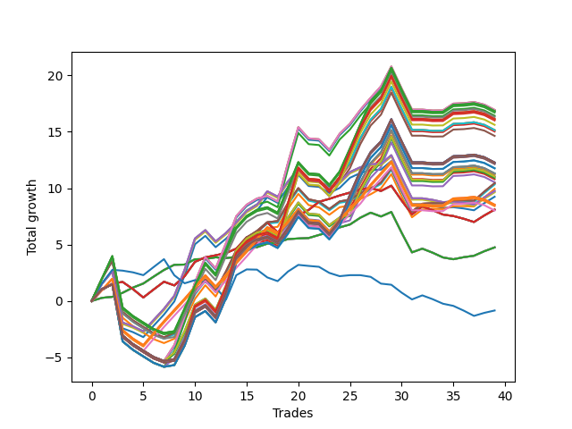

# Long Shepard 006 
- Symbol: NVDA_Unlimited
- Date Range: 02/08/2022 - 07/08/2022
- Trading Period: 7:20-12:30
- Number of Trades: 39



| Name | Win Percent | Profit | Avg Profit / Trade | Avg Time / Trade |      | Name | Win Percent | Profit | Avg Profit / Trade | Avg Time / Trade |
| ---- | ----------- | ------ | ------------------ | ---------------- | ---- | ---- | ----------- | ------ | ------------------ | ---------------- |
| Sorted By <br> Profit | | | | | | Sorted By <br> Win Percentage ||||
| Sixty-Eight | 61.54 | 8465.00 | 217.05 | 26:47 |     | Sixty-Four | 82.05 | 2375.00 | 60.90 | 04:53 |
| Sixty | 61.54 | 8465.00 | 217.05 | 26:47 |     | Fifty-Six | 82.05 | 2375.00 | 60.90 | 04:53 |
| Four | 61.54 | 8465.00 | 217.05 | 26:47 |     | Forty-Eight | 82.05 | 2375.00 | 60.90 | 04:53 |
| One Hundred Twenty-Seven | 61.54 | 8410.00 | 215.64 | 25:37 |     | Forty | 82.05 | 2375.00 | 60.90 | 04:53 |
| One Hundred Twenty-Two | 61.54 | 8410.00 | 215.64 | 25:37 |     | Zero | 82.05 | 2375.00 | 60.90 | 04:53 |
| Eighty-Two | 61.54 | 8410.00 | 215.64 | 25:37 |     | Sixty-Five | 69.23 | 4050.00 | 103.85 | 10:45 |
| Fifty-Two | 61.54 | 8405.00 | 215.51 | 26:41 |     | Fifty-Seven | 69.23 | 4050.00 | 103.85 | 10:45 |
| One Hundred Seventeen | 61.54 | 8350.00 | 214.10 | 25:31 |     | Forty-Nine | 69.23 | 4050.00 | 103.85 | 10:45 |
| Forty-Four | 61.54 | 8210.00 | 210.51 | 26:43 |     | Forty-One | 69.23 | 4050.00 | 103.85 | 10:45 |
| One Hundred Twelve | 61.54 | 8155.00 | 209.10 | 25:33 |     | One | 69.23 | 4050.00 | 103.85 | 10:45 |
| One Hundred Twenty-Eight | 61.54 | 8060.00 | 206.67 | 29:02 |     | Sixty-Seven | 66.67 | 5220.00 | 133.85 | 19:19 |
| One Hundred Twenty-Three | 61.54 | 8060.00 | 206.67 | 29:02 |     | Fifty-Nine | 66.67 | 5220.00 | 133.85 | 19:19 |
| Eighty-Three | 61.54 | 8060.00 | 206.67 | 29:02 |     | Three | 66.67 | 5220.00 | 133.85 | 19:19 |
| One Hundred Eighteen | 61.54 | 8000.00 | 205.13 | 28:56 |     | Fifty-One | 66.67 | 5160.00 | 132.31 | 19:13 |
| One Hundred Thirteen | 61.54 | 7805.00 | 200.13 | 28:58 |     | Forty-Three | 66.67 | 4965.00 | 127.31 | 19:15 |
| Seventy-One | 61.54 | 7570.00 | 194.10 | 28:59 |     | One Hundred Twenty-Six | 66.67 | 4265.00 | 109.36 | 19:54 |
| Sixty-Three | 61.54 | 7570.00 | 194.10 | 28:59 |     | One Hundred Twenty-One | 66.67 | 4265.00 | 109.36 | 19:54 |
| Seven | 61.54 | 7570.00 | 194.10 | 28:59 |     | Eighty-One | 66.67 | 4265.00 | 109.36 | 19:54 |
| Fifty-Five | 61.54 | 7510.00 | 192.56 | 28:53 |     | One Hundred Sixteen | 66.67 | 4205.00 | 107.82 | 19:48 |
| Forty-Seven | 61.54 | 7315.00 | 187.56 | 28:56 |     | One Hundred Eleven | 66.67 | 4010.00 | 102.82 | 19:51 |
| One Hundred Thirty | 61.54 | 6135.00 | 157.31 | 29:55 |     | Sixty-Six | 64.10 | 4875.00 | 125.00 | 18:30 |
| One Hundred Twenty-Nine | 61.54 | 6135.00 | 157.31 | 29:55 |     | Fifty-Eight | 64.10 | 4875.00 | 125.00 | 18:30 |
| One Hundred Twenty-Five | 61.54 | 6135.00 | 157.31 | 29:55 |     | Two | 64.10 | 4875.00 | 125.00 | 18:30 |
| One Hundred Twenty-Four | 61.54 | 6135.00 | 157.31 | 29:55 |     | Fifty | 64.10 | 4815.00 | 123.46 | 18:24 |
| Eighty-Five | 61.54 | 6135.00 | 157.31 | 29:55 |     | Forty-Two | 64.10 | 4620.00 | 118.46 | 18:27 |
| Eighty-Four | 61.54 | 6135.00 | 157.31 | 29:55 |     | Sixty-Eight | 61.54 | 8465.00 | 217.05 | 26:47 |
| One Hundred Twenty | 61.54 | 6075.00 | 155.77 | 29:48 |     | Sixty | 61.54 | 8465.00 | 217.05 | 26:47 |
| One Hundred Ninteen | 61.54 | 6075.00 | 155.77 | 29:48 |     | Four | 61.54 | 8465.00 | 217.05 | 26:47 |
| One Hundred Fifteen | 61.54 | 5880.00 | 150.77 | 29:51 |     | One Hundred Twenty-Seven | 61.54 | 8410.00 | 215.64 | 25:37 |
| One Hundred Fourteen | 61.54 | 5880.00 | 150.77 | 29:51 |     | One Hundred Twenty-Two | 61.54 | 8410.00 | 215.64 | 25:37 |
| Sixty-Nine | 61.54 | 5650.00 | 144.87 | 29:18 |     | Eighty-Two | 61.54 | 8410.00 | 215.64 | 25:37 |
| Sixty-One | 61.54 | 5650.00 | 144.87 | 29:18 |     | Fifty-Two | 61.54 | 8405.00 | 215.51 | 26:41 |
| Five | 61.54 | 5650.00 | 144.87 | 29:18 |     | One Hundred Seventeen | 61.54 | 8350.00 | 214.10 | 25:31 |
| Fifty-Three | 61.54 | 5590.00 | 143.33 | 29:12 |     | Forty-Four | 61.54 | 8210.00 | 210.51 | 26:43 |
| Seventy | 61.54 | 5515.00 | 141.41 | 26:28 |     | One Hundred Twelve | 61.54 | 8155.00 | 209.10 | 25:33 |
| Sixty-Two | 61.54 | 5515.00 | 141.41 | 26:28 |     | One Hundred Twenty-Eight | 61.54 | 8060.00 | 206.67 | 29:02 |
| Six | 61.54 | 5515.00 | 141.41 | 26:28 |     | One Hundred Twenty-Three | 61.54 | 8060.00 | 206.67 | 29:02 |
| Fifty-Four | 61.54 | 5455.00 | 139.87 | 26:22 |     | Eighty-Three | 61.54 | 8060.00 | 206.67 | 29:02 |
| Forty-Five | 61.54 | 5395.00 | 138.33 | 29:14 |     | One Hundred Eighteen | 61.54 | 8000.00 | 205.13 | 28:56 |
| Forty-Six | 61.54 | 5260.00 | 134.87 | 26:25 |     | One Hundred Thirteen | 61.54 | 7805.00 | 200.13 | 28:58 |
| Sixty-Seven | 66.67 | 5220.00 | 133.85 | 19:19 |     | Seventy-One | 61.54 | 7570.00 | 194.10 | 28:59 |
| Fifty-Nine | 66.67 | 5220.00 | 133.85 | 19:19 |     | Sixty-Three | 61.54 | 7570.00 | 194.10 | 28:59 |
| Three | 66.67 | 5220.00 | 133.85 | 19:19 |     | Seven | 61.54 | 7570.00 | 194.10 | 28:59 |
| Fifty-One | 66.67 | 5160.00 | 132.31 | 19:13 |     | Fifty-Five | 61.54 | 7510.00 | 192.56 | 28:53 |
| Forty-Three | 66.67 | 4965.00 | 127.31 | 19:15 |     | Forty-Seven | 61.54 | 7315.00 | 187.56 | 28:56 |
| Sixty-Six | 64.10 | 4875.00 | 125.00 | 18:30 |     | One Hundred Thirty | 61.54 | 6135.00 | 157.31 | 29:55 |
| Fifty-Eight | 64.10 | 4875.00 | 125.00 | 18:30 |     | One Hundred Twenty-Nine | 61.54 | 6135.00 | 157.31 | 29:55 |
| Two | 64.10 | 4875.00 | 125.00 | 18:30 |     | One Hundred Twenty-Five | 61.54 | 6135.00 | 157.31 | 29:55 |
| Fifty | 64.10 | 4815.00 | 123.46 | 18:24 |     | One Hundred Twenty-Four | 61.54 | 6135.00 | 157.31 | 29:55 |
| Forty-Two | 64.10 | 4620.00 | 118.46 | 18:27 |     | Eighty-Five | 61.54 | 6135.00 | 157.31 | 29:55 |
| One Hundred Twenty-Six | 66.67 | 4265.00 | 109.36 | 19:54 |     | Eighty-Four | 61.54 | 6135.00 | 157.31 | 29:55 |
| One Hundred Twenty-One | 66.67 | 4265.00 | 109.36 | 19:54 |     | One Hundred Twenty | 61.54 | 6075.00 | 155.77 | 29:48 |
| Eighty-One | 66.67 | 4265.00 | 109.36 | 19:54 |     | One Hundred Ninteen | 61.54 | 6075.00 | 155.77 | 29:48 |
| One Hundred Sixteen | 66.67 | 4205.00 | 107.82 | 19:48 |     | One Hundred Fifteen | 61.54 | 5880.00 | 150.77 | 29:51 |
| Sixty-Five | 69.23 | 4050.00 | 103.85 | 10:45 |     | One Hundred Fourteen | 61.54 | 5880.00 | 150.77 | 29:51 |
| Fifty-Seven | 69.23 | 4050.00 | 103.85 | 10:45 |     | Sixty-Nine | 61.54 | 5650.00 | 144.87 | 29:18 |
| Forty-Nine | 69.23 | 4050.00 | 103.85 | 10:45 |     | Sixty-One | 61.54 | 5650.00 | 144.87 | 29:18 |
| Forty-One | 69.23 | 4050.00 | 103.85 | 10:45 |     | Five | 61.54 | 5650.00 | 144.87 | 29:18 |
| One | 69.23 | 4050.00 | 103.85 | 10:45 |     | Fifty-Three | 61.54 | 5590.00 | 143.33 | 29:12 |
| One Hundred Eleven | 66.67 | 4010.00 | 102.82 | 19:51 |     | Seventy | 61.54 | 5515.00 | 141.41 | 26:28 |
| Sixty-Four | 82.05 | 2375.00 | 60.90 | 04:53 |     | Sixty-Two | 61.54 | 5515.00 | 141.41 | 26:28 |
| Fifty-Six | 82.05 | 2375.00 | 60.90 | 04:53 |     | Six | 61.54 | 5515.00 | 141.41 | 26:28 |
| Forty-Eight | 82.05 | 2375.00 | 60.90 | 04:53 |     | Fifty-Four | 61.54 | 5455.00 | 139.87 | 26:22 |
| Forty | 82.05 | 2375.00 | 60.90 | 04:53 |     | Forty-Five | 61.54 | 5395.00 | 138.33 | 29:14 |
| Zero | 82.05 | 2375.00 | 60.90 | 04:53 |     | Forty-Six | 61.54 | 5260.00 | 134.87 | 26:25 |
| Seventy-Three | 35.90 | -420.00 | -10.77 | 06:01 |     | Seventy-Three | 35.90 | -420.00 | -10.77 | 06:01 |

## NO STOPLOSS

### Test Zero
* Sell when price hits the middle line of the 20p bollinger
* No Stoploss
* Results:
```
Total Trades: 39
Percent Up: 82.05
Percent Down: 17.95
Total Points Moved Up: 4.75
Potential Profit: 2375.00
Total Points Ups: 9.68 Count Ups: 32
Total Points Downs: -4.93 Count Downs: 7
```

<details><summary>Trades</summary>

<code>In: 2022-02-10 10:40:00		Out: 2022-02-10 10:40:35		Total Position Time: 00:35		Total Move Up: 0.28		Total to Date: 0.28</code> <br />
<code>In: 2022-02-10 10:41:00		Out: 2022-02-10 10:41:10		Total Position Time: 00:10		Total Move Up: 0.09		Total to Date: 0.37</code> <br />
<code>In: 2022-02-14 10:34:00		Out: 2022-02-14 10:38:10		Total Position Time: 04:10		Total Move Up: 0.36		Total to Date: 0.73</code> <br />
<code>In: 2022-02-16 09:23:00		Out: 2022-02-16 09:27:40		Total Position Time: 04:40		Total Move Up: 0.46		Total to Date: 1.19</code> <br />
<code>In: 2022-02-16 09:24:00		Out: 2022-02-16 09:27:40		Total Position Time: 03:40		Total Move Up: 0.36		Total to Date: 1.55</code> <br />
<code>In: 2022-02-16 09:41:00		Out: 2022-02-16 09:43:40		Total Position Time: 02:40		Total Move Up: 0.61		Total to Date: 2.16</code> <br />
<code>In: 2022-02-16 09:42:00		Out: 2022-02-16 09:43:40		Total Position Time: 01:40		Total Move Up: 0.59		Total to Date: 2.75</code> <br />
<code>In: 2022-02-25 11:04:00		Out: 2022-02-25 11:04:10		Total Position Time: 00:10		Total Move Up: 0.46		Total to Date: 3.21</code> <br />
<code>In: 2022-02-25 11:09:00		Out: 2022-02-25 11:15:10		Total Position Time: 06:10		Total Move Up: 0.02		Total to Date: 3.23</code> <br />
<code>In: 2022-02-25 11:14:00		Out: 2022-02-25 11:15:10		Total Position Time: 01:10		Total Move Up: 0.47		Total to Date: 3.70</code> <br />
<code>In: 2022-02-28 09:50:00		Out: 2022-02-28 09:57:40		Total Position Time: 07:40		Total Move Up: 0.02		Total to Date: 3.72</code> <br />
<code>In: 2022-03-14 08:51:00		Out: 2022-03-14 08:58:20		Total Position Time: 07:20		Total Move Up: 0.15		Total to Date: 3.87</code> <br />
<code>In: 2022-03-16 10:19:00		Out: 2022-03-16 10:27:20		Total Position Time: 08:20		Total Move Up: -0.07		Total to Date: 3.80</code> <br />
<code>In: 2022-03-16 10:25:00		Out: 2022-03-16 10:27:20		Total Position Time: 02:20		Total Move Up: 0.12		Total to Date: 3.92</code> <br />
<code>In: 2022-03-30 08:13:00		Out: 2022-03-30 08:14:35		Total Position Time: 01:35		Total Move Up: 0.69		Total to Date: 4.61</code> <br />
<code>In: 2022-03-30 08:14:00		Out: 2022-03-30 08:14:35		Total Position Time: 00:35		Total Move Up: 0.16		Total to Date: 4.77</code> <br />
<code>In: 2022-03-31 09:27:00		Out: 2022-03-31 09:28:40		Total Position Time: 01:40		Total Move Up: 0.31		Total to Date: 5.08</code> <br />
<code>In: 2022-03-31 10:02:00		Out: 2022-03-31 10:02:10		Total Position Time: 00:10		Total Move Up: 0.10		Total to Date: 5.18</code> <br />
<code>In: 2022-04-22 07:27:00		Out: 2022-04-22 07:34:00		Total Position Time: 07:00		Total Move Up: 0.31		Total to Date: 5.49</code> <br />
<code>In: 2022-04-22 07:28:00		Out: 2022-04-22 07:34:00		Total Position Time: 06:00		Total Move Up: 0.05		Total to Date: 5.54</code> <br />
<code>In: 2022-05-02 10:26:00		Out: 2022-05-02 10:30:40		Total Position Time: 04:40		Total Move Up: 0.04		Total to Date: 5.58</code> <br />
<code>In: 2022-05-02 10:30:00		Out: 2022-05-02 10:30:40		Total Position Time: 00:40		Total Move Up: 0.27		Total to Date: 5.85</code> <br />
<code>In: 2022-05-02 10:31:00		Out: 2022-05-02 10:31:10		Total Position Time: 00:10		Total Move Up: 0.26		Total to Date: 6.11</code> <br />
<code>In: 2022-05-03 07:49:00		Out: 2022-05-03 07:54:05		Total Position Time: 05:05		Total Move Up: 0.41		Total to Date: 6.52</code> <br />
<code>In: 2022-05-03 11:45:00		Out: 2022-05-03 11:45:10		Total Position Time: 00:10		Total Move Up: 0.26		Total to Date: 6.78</code> <br />
<code>In: 2022-05-06 12:12:00		Out: 2022-05-06 12:15:20		Total Position Time: 03:20		Total Move Up: 0.60		Total to Date: 7.38</code> <br />
<code>In: 2022-05-06 12:13:00		Out: 2022-05-06 12:15:20		Total Position Time: 02:20		Total Move Up: 0.45		Total to Date: 7.83</code> <br />
<code>In: 2022-05-31 11:52:00		Out: 2022-05-31 12:01:15		Total Position Time: 09:15		Total Move Up: -0.34		Total to Date: 7.49</code> <br />
<code>In: 2022-05-31 11:58:00		Out: 2022-05-31 12:01:15		Total Position Time: 03:15		Total Move Up: 0.40		Total to Date: 7.89</code> <br />
<code>In: 2022-06-03 07:23:00		Out: 2022-06-03 07:44:45		Total Position Time: 21:45		Total Move Up: -1.84		Total to Date: 6.05</code> <br />
<code>In: 2022-06-03 07:24:00		Out: 2022-06-03 07:44:45		Total Position Time: 20:45		Total Move Up: -1.74		Total to Date: 4.31</code> <br />
<code>In: 2022-06-08 08:12:00		Out: 2022-06-08 08:15:05		Total Position Time: 03:05		Total Move Up: 0.33		Total to Date: 4.64</code> <br />
<code>In: 2022-06-09 08:11:00		Out: 2022-06-09 08:24:20		Total Position Time: 13:20		Total Move Up: -0.36		Total to Date: 4.28</code> <br />
<code>In: 2022-06-09 08:12:00		Out: 2022-06-09 08:24:20		Total Position Time: 12:20		Total Move Up: -0.42		Total to Date: 3.86</code> <br />
<code>In: 2022-06-09 08:15:00		Out: 2022-06-09 08:24:20		Total Position Time: 09:20		Total Move Up: -0.16		Total to Date: 3.70</code> <br />
<code>In: 2022-06-22 09:01:00		Out: 2022-06-22 09:03:30		Total Position Time: 02:30		Total Move Up: 0.18		Total to Date: 3.88</code> <br />
<code>In: 2022-06-22 09:02:00		Out: 2022-06-22 09:03:30		Total Position Time: 01:30		Total Move Up: 0.13		Total to Date: 4.01</code> <br />
<code>In: 2022-06-23 09:13:00		Out: 2022-06-23 09:18:25		Total Position Time: 05:25		Total Move Up: 0.40		Total to Date: 4.41</code> <br />
<code>In: 2022-06-23 09:14:00		Out: 2022-06-23 09:18:25		Total Position Time: 04:25		Total Move Up: 0.34		Total to Date: 4.75</code> <br />


</details>

### Test One
* Sell when the price hits the upper line of the 20p 1std bollinger
* No Stoploss
* Results:
```
Total Trades: 39
Percent Up: 69.23
Percent Down: 30.77
Total Points Moved Up: 8.10
Potential Profit: 4050.00
Total Points Ups: 14.88 Count Ups: 27
Total Points Downs: -6.78 Count Downs: 12
```

<details><summary>Trades</summary>

<code>In: 2022-02-10 10:40:00		Out: 2022-02-10 10:43:25		Total Position Time: 03:25		Total Move Up: 0.97		Total to Date: 0.97</code> <br />
<code>In: 2022-02-10 10:41:00		Out: 2022-02-10 10:43:25		Total Position Time: 02:25		Total Move Up: 0.57		Total to Date: 1.54</code> <br />
<code>In: 2022-02-14 10:34:00		Out: 2022-02-14 10:44:35		Total Position Time: 10:35		Total Move Up: 0.15		Total to Date: 1.69</code> <br />
<code>In: 2022-02-16 09:23:00		Out: 2022-02-16 09:48:20		Total Position Time: 25:20		Total Move Up: -0.64		Total to Date: 1.05</code> <br />
<code>In: 2022-02-16 09:24:00		Out: 2022-02-16 09:48:20		Total Position Time: 24:20		Total Move Up: -0.74		Total to Date: 0.31</code> <br />
<code>In: 2022-02-16 09:41:00		Out: 2022-02-16 09:48:20		Total Position Time: 07:20		Total Move Up: 0.71		Total to Date: 1.02</code> <br />
<code>In: 2022-02-16 09:42:00		Out: 2022-02-16 09:48:20		Total Position Time: 06:20		Total Move Up: 0.69		Total to Date: 1.71</code> <br />
<code>In: 2022-02-25 11:04:00		Out: 2022-02-25 11:17:50		Total Position Time: 13:50		Total Move Up: -0.33		Total to Date: 1.38</code> <br />
<code>In: 2022-02-25 11:09:00		Out: 2022-02-25 11:17:50		Total Position Time: 08:50		Total Move Up: 0.82		Total to Date: 2.20</code> <br />
<code>In: 2022-02-25 11:14:00		Out: 2022-02-25 11:17:50		Total Position Time: 03:50		Total Move Up: 1.27		Total to Date: 3.47</code> <br />
<code>In: 2022-02-28 09:50:00		Out: 2022-02-28 09:59:10		Total Position Time: 09:10		Total Move Up: 0.40		Total to Date: 3.87</code> <br />
<code>In: 2022-03-14 08:51:00		Out: 2022-03-14 09:02:15		Total Position Time: 11:15		Total Move Up: 0.18		Total to Date: 4.05</code> <br />
<code>In: 2022-03-16 10:19:00		Out: 2022-03-16 10:28:35		Total Position Time: 09:35		Total Move Up: 0.20		Total to Date: 4.25</code> <br />
<code>In: 2022-03-16 10:25:00		Out: 2022-03-16 10:28:35		Total Position Time: 03:35		Total Move Up: 0.39		Total to Date: 4.64</code> <br />
<code>In: 2022-03-30 08:13:00		Out: 2022-03-30 08:19:15		Total Position Time: 06:15		Total Move Up: 1.00		Total to Date: 5.64</code> <br />
<code>In: 2022-03-30 08:14:00		Out: 2022-03-30 08:19:15		Total Position Time: 05:15		Total Move Up: 0.47		Total to Date: 6.11</code> <br />
<code>In: 2022-03-31 09:27:00		Out: 2022-03-31 09:30:00		Total Position Time: 03:00		Total Move Up: 0.85		Total to Date: 6.96</code> <br />
<code>In: 2022-03-31 10:02:00		Out: 2022-03-31 10:29:05		Total Position Time: 27:05		Total Move Up: -0.88		Total to Date: 6.08</code> <br />
<code>In: 2022-04-22 07:27:00		Out: 2022-04-22 07:36:05		Total Position Time: 09:05		Total Move Up: 0.88		Total to Date: 6.96</code> <br />
<code>In: 2022-04-22 07:28:00		Out: 2022-04-22 07:36:05		Total Position Time: 08:05		Total Move Up: 0.62		Total to Date: 7.58</code> <br />
<code>In: 2022-05-02 10:26:00		Out: 2022-05-02 10:31:10		Total Position Time: 05:10		Total Move Up: 0.49		Total to Date: 8.07</code> <br />
<code>In: 2022-05-02 10:30:00		Out: 2022-05-02 10:31:10		Total Position Time: 01:10		Total Move Up: 0.72		Total to Date: 8.79</code> <br />
<code>In: 2022-05-02 10:31:00		Out: 2022-05-02 10:31:10		Total Position Time: 00:10		Total Move Up: 0.26		Total to Date: 9.05</code> <br />
<code>In: 2022-05-03 07:49:00		Out: 2022-05-03 07:59:10		Total Position Time: 10:10		Total Move Up: 0.30		Total to Date: 9.35</code> <br />
<code>In: 2022-05-03 11:45:00		Out: 2022-05-03 11:45:10		Total Position Time: 00:10		Total Move Up: 0.26		Total to Date: 9.61</code> <br />
<code>In: 2022-05-06 12:12:00		Out: 2022-05-06 12:20:05		Total Position Time: 08:05		Total Move Up: 0.28		Total to Date: 9.89</code> <br />
<code>In: 2022-05-06 12:13:00		Out: 2022-05-06 12:20:05		Total Position Time: 07:05		Total Move Up: 0.13		Total to Date: 10.02</code> <br />
<code>In: 2022-05-31 11:52:00		Out: 2022-05-31 12:07:00		Total Position Time: 15:00		Total Move Up: -0.27		Total to Date: 9.75</code> <br />
<code>In: 2022-05-31 11:58:00		Out: 2022-05-31 12:07:00		Total Position Time: 09:00		Total Move Up: 0.47		Total to Date: 10.22</code> <br />
<code>In: 2022-06-03 07:23:00		Out: 2022-06-03 07:46:30		Total Position Time: 23:30		Total Move Up: -1.32		Total to Date: 8.90</code> <br />
<code>In: 2022-06-03 07:24:00		Out: 2022-06-03 07:46:30		Total Position Time: 22:30		Total Move Up: -1.22		Total to Date: 7.68</code> <br />
<code>In: 2022-06-08 08:12:00		Out: 2022-06-08 08:17:55		Total Position Time: 05:55		Total Move Up: 0.70		Total to Date: 8.38</code> <br />
<code>In: 2022-06-09 08:11:00		Out: 2022-06-09 08:33:15		Total Position Time: 22:15		Total Move Up: -0.33		Total to Date: 8.05</code> <br />
<code>In: 2022-06-09 08:12:00		Out: 2022-06-09 08:33:15		Total Position Time: 21:15		Total Move Up: -0.39		Total to Date: 7.66</code> <br />
<code>In: 2022-06-09 08:15:00		Out: 2022-06-09 08:33:15		Total Position Time: 18:15		Total Move Up: -0.13		Total to Date: 7.53</code> <br />
<code>In: 2022-06-22 09:01:00		Out: 2022-06-22 09:21:25		Total Position Time: 20:25		Total Move Up: -0.24		Total to Date: 7.29</code> <br />
<code>In: 2022-06-22 09:02:00		Out: 2022-06-22 09:21:25		Total Position Time: 19:25		Total Move Up: -0.29		Total to Date: 7.00</code> <br />
<code>In: 2022-06-23 09:13:00		Out: 2022-06-23 09:19:05		Total Position Time: 06:05		Total Move Up: 0.58		Total to Date: 7.58</code> <br />
<code>In: 2022-06-23 09:14:00		Out: 2022-06-23 09:19:05		Total Position Time: 05:05		Total Move Up: 0.52		Total to Date: 8.10</code> <br />


</details>

### Test Two
* Sell when the price hits the upper line of the 20p 2std bollinger
* No Stoploss
* Results:
```
Total Trades: 39
Percent Up: 64.10
Percent Down: 35.90
Total Points Moved Up: 9.75
Potential Profit: 4875.00
Total Points Ups: 22.59 Count Ups: 25
Total Points Downs: -12.84 Count Downs: 14
```

<details><summary>Trades</summary>

<code>In: 2022-02-10 10:40:00		Out: 2022-02-10 10:46:45		Total Position Time: 06:45		Total Move Up: 1.52		Total to Date: 1.52</code> <br />
<code>In: 2022-02-10 10:41:00		Out: 2022-02-10 10:46:45		Total Position Time: 05:45		Total Move Up: 1.12		Total to Date: 2.64</code> <br />
<code>In: 2022-02-14 10:34:00		Out: 2022-02-14 11:03:55		Total Position Time: 29:55		Total Move Up: -4.55		Total to Date: -1.91</code> <br />
<code>In: 2022-02-16 09:23:00		Out: 2022-02-16 09:50:05		Total Position Time: 27:05		Total Move Up: -0.34		Total to Date: -2.25</code> <br />
<code>In: 2022-02-16 09:24:00		Out: 2022-02-16 09:50:05		Total Position Time: 26:05		Total Move Up: -0.44		Total to Date: -2.69</code> <br />
<code>In: 2022-02-16 09:41:00		Out: 2022-02-16 09:50:05		Total Position Time: 09:05		Total Move Up: 1.01		Total to Date: -1.68</code> <br />
<code>In: 2022-02-16 09:42:00		Out: 2022-02-16 09:50:05		Total Position Time: 08:05		Total Move Up: 0.99		Total to Date: -0.69</code> <br />
<code>In: 2022-02-25 11:04:00		Out: 2022-02-25 11:25:45		Total Position Time: 21:45		Total Move Up: 1.16		Total to Date: 0.47</code> <br />
<code>In: 2022-02-25 11:09:00		Out: 2022-02-25 11:25:45		Total Position Time: 16:45		Total Move Up: 2.31		Total to Date: 2.78</code> <br />
<code>In: 2022-02-25 11:14:00		Out: 2022-02-25 11:25:45		Total Position Time: 11:45		Total Move Up: 2.76		Total to Date: 5.54</code> <br />
<code>In: 2022-02-28 09:50:00		Out: 2022-02-28 10:01:10		Total Position Time: 11:10		Total Move Up: 0.74		Total to Date: 6.28</code> <br />
<code>In: 2022-03-14 08:51:00		Out: 2022-03-14 09:20:55		Total Position Time: 29:55		Total Move Up: -1.00		Total to Date: 5.28</code> <br />
<code>In: 2022-03-16 10:19:00		Out: 2022-03-16 10:30:10		Total Position Time: 11:10		Total Move Up: 0.75		Total to Date: 6.03</code> <br />
<code>In: 2022-03-16 10:25:00		Out: 2022-03-16 10:30:10		Total Position Time: 05:10		Total Move Up: 0.94		Total to Date: 6.97</code> <br />
<code>In: 2022-03-30 08:13:00		Out: 2022-03-30 08:42:55		Total Position Time: 29:55		Total Move Up: 1.01		Total to Date: 7.98</code> <br />
<code>In: 2022-03-30 08:14:00		Out: 2022-03-30 08:43:55		Total Position Time: 29:55		Total Move Up: 0.55		Total to Date: 8.53</code> <br />
<code>In: 2022-03-31 09:27:00		Out: 2022-03-31 09:30:25		Total Position Time: 03:25		Total Move Up: 1.19		Total to Date: 9.72</code> <br />
<code>In: 2022-03-31 10:02:00		Out: 2022-03-31 10:31:20		Total Position Time: 29:20		Total Move Up: -0.47		Total to Date: 9.25</code> <br />
<code>In: 2022-04-22 07:27:00		Out: 2022-04-22 07:36:20		Total Position Time: 09:20		Total Move Up: 1.35		Total to Date: 10.60</code> <br />
<code>In: 2022-04-22 07:28:00		Out: 2022-04-22 07:36:20		Total Position Time: 08:20		Total Move Up: 1.09		Total to Date: 11.69</code> <br />
<code>In: 2022-05-02 10:26:00		Out: 2022-05-02 10:55:55		Total Position Time: 29:55		Total Move Up: -0.99		Total to Date: 10.70</code> <br />
<code>In: 2022-05-02 10:30:00		Out: 2022-05-02 10:59:55		Total Position Time: 29:55		Total Move Up: -0.08		Total to Date: 10.62</code> <br />
<code>In: 2022-05-02 10:31:00		Out: 2022-05-02 10:59:55		Total Position Time: 28:55		Total Move Up: -0.54		Total to Date: 10.08</code> <br />
<code>In: 2022-05-03 07:49:00		Out: 2022-05-03 08:05:00		Total Position Time: 16:00		Total Move Up: 0.45		Total to Date: 10.53</code> <br />
<code>In: 2022-05-03 11:45:00		Out: 2022-05-03 11:52:20		Total Position Time: 07:20		Total Move Up: 0.90		Total to Date: 11.43</code> <br />
<code>In: 2022-05-06 12:12:00		Out: 2022-05-06 12:28:05		Total Position Time: 16:05		Total Move Up: 0.42		Total to Date: 11.85</code> <br />
<code>In: 2022-05-06 12:13:00		Out: 2022-05-06 12:28:05		Total Position Time: 15:05		Total Move Up: 0.27		Total to Date: 12.12</code> <br />
<code>In: 2022-05-31 11:52:00		Out: 2022-05-31 12:07:45		Total Position Time: 15:45		Total Move Up: 0.03		Total to Date: 12.15</code> <br />
<code>In: 2022-05-31 11:58:00		Out: 2022-05-31 12:07:45		Total Position Time: 09:45		Total Move Up: 0.77		Total to Date: 12.92</code> <br />
<code>In: 2022-06-03 07:23:00		Out: 2022-06-03 07:52:55		Total Position Time: 29:55		Total Move Up: -1.96		Total to Date: 10.96</code> <br />
<code>In: 2022-06-03 07:24:00		Out: 2022-06-03 07:53:55		Total Position Time: 29:55		Total Move Up: -1.86		Total to Date: 9.10</code> <br />
<code>In: 2022-06-08 08:12:00		Out: 2022-06-08 08:41:55		Total Position Time: 29:55		Total Move Up: 0.00		Total to Date: 9.10</code> <br />
<code>In: 2022-06-09 08:11:00		Out: 2022-06-09 08:33:35		Total Position Time: 22:35		Total Move Up: -0.14		Total to Date: 8.96</code> <br />
<code>In: 2022-06-09 08:12:00		Out: 2022-06-09 08:33:35		Total Position Time: 21:35		Total Move Up: -0.20		Total to Date: 8.76</code> <br />
<code>In: 2022-06-09 08:15:00		Out: 2022-06-09 08:33:35		Total Position Time: 18:35		Total Move Up: 0.06		Total to Date: 8.82</code> <br />
<code>In: 2022-06-22 09:01:00		Out: 2022-06-22 09:22:25		Total Position Time: 21:25		Total Move Up: -0.11		Total to Date: 8.71</code> <br />
<code>In: 2022-06-22 09:02:00		Out: 2022-06-22 09:22:25		Total Position Time: 20:25		Total Move Up: -0.16		Total to Date: 8.55</code> <br />
<code>In: 2022-06-23 09:13:00		Out: 2022-06-23 09:27:35		Total Position Time: 14:35		Total Move Up: 0.63		Total to Date: 9.18</code> <br />
<code>In: 2022-06-23 09:14:00		Out: 2022-06-23 09:27:35		Total Position Time: 13:35		Total Move Up: 0.57		Total to Date: 9.75</code> <br />


</details>

### Test Three
* Sell when price hits the middle line of the 50p bollinger
* No Stoploss
* Results:
```
Total Trades: 39
Percent Up: 66.67
Percent Down: 33.33
Total Points Moved Up: 10.44
Potential Profit: 5220.00
Total Points Ups: 23.96 Count Ups: 26
Total Points Downs: -13.52 Count Downs: 13
```

<details><summary>Trades</summary>

<code>In: 2022-02-10 10:40:00		Out: 2022-02-10 10:50:30		Total Position Time: 10:30		Total Move Up: 1.99		Total to Date: 1.99</code> <br />
<code>In: 2022-02-10 10:41:00		Out: 2022-02-10 10:50:30		Total Position Time: 09:30		Total Move Up: 1.59		Total to Date: 3.58</code> <br />
<code>In: 2022-02-14 10:34:00		Out: 2022-02-14 11:03:55		Total Position Time: 29:55		Total Move Up: -4.55		Total to Date: -0.97</code> <br />
<code>In: 2022-02-16 09:23:00		Out: 2022-02-16 09:52:55		Total Position Time: 29:55		Total Move Up: -0.75		Total to Date: -1.72</code> <br />
<code>In: 2022-02-16 09:24:00		Out: 2022-02-16 09:53:55		Total Position Time: 29:55		Total Move Up: -0.58		Total to Date: -2.30</code> <br />
<code>In: 2022-02-16 09:41:00		Out: 2022-02-16 10:10:55		Total Position Time: 29:55		Total Move Up: -0.57		Total to Date: -2.87</code> <br />
<code>In: 2022-02-16 09:42:00		Out: 2022-02-16 10:11:55		Total Position Time: 29:55		Total Move Up: -0.35		Total to Date: -3.22</code> <br />
<code>In: 2022-02-25 11:04:00		Out: 2022-02-25 11:21:35		Total Position Time: 17:35		Total Move Up: 0.39		Total to Date: -2.83</code> <br />
<code>In: 2022-02-25 11:09:00		Out: 2022-02-25 11:21:35		Total Position Time: 12:35		Total Move Up: 1.54		Total to Date: -1.29</code> <br />
<code>In: 2022-02-25 11:14:00		Out: 2022-02-25 11:21:35		Total Position Time: 07:35		Total Move Up: 1.99		Total to Date: 0.70</code> <br />
<code>In: 2022-02-28 09:50:00		Out: 2022-02-28 10:02:35		Total Position Time: 12:35		Total Move Up: 1.21		Total to Date: 1.91</code> <br />
<code>In: 2022-03-14 08:51:00		Out: 2022-03-14 09:20:55		Total Position Time: 29:55		Total Move Up: -1.00		Total to Date: 0.91</code> <br />
<code>In: 2022-03-16 10:19:00		Out: 2022-03-16 10:34:55		Total Position Time: 15:55		Total Move Up: 1.70		Total to Date: 2.61</code> <br />
<code>In: 2022-03-16 10:25:00		Out: 2022-03-16 10:34:55		Total Position Time: 09:55		Total Move Up: 1.89		Total to Date: 4.50</code> <br />
<code>In: 2022-03-30 08:13:00		Out: 2022-03-30 08:34:40		Total Position Time: 21:40		Total Move Up: 1.12		Total to Date: 5.62</code> <br />
<code>In: 2022-03-30 08:14:00		Out: 2022-03-30 08:34:40		Total Position Time: 20:40		Total Move Up: 0.59		Total to Date: 6.21</code> <br />
<code>In: 2022-03-31 09:27:00		Out: 2022-03-31 09:46:35		Total Position Time: 19:35		Total Move Up: 0.77		Total to Date: 6.98</code> <br />
<code>In: 2022-03-31 10:02:00		Out: 2022-03-31 10:02:10		Total Position Time: 00:10		Total Move Up: 0.10		Total to Date: 7.08</code> <br />
<code>In: 2022-04-22 07:27:00		Out: 2022-04-22 07:36:25		Total Position Time: 09:25		Total Move Up: 1.59		Total to Date: 8.67</code> <br />
<code>In: 2022-04-22 07:28:00		Out: 2022-04-22 07:36:25		Total Position Time: 08:25		Total Move Up: 1.33		Total to Date: 10.00</code> <br />
<code>In: 2022-05-02 10:26:00		Out: 2022-05-02 10:55:55		Total Position Time: 29:55		Total Move Up: -0.99		Total to Date: 9.01</code> <br />
<code>In: 2022-05-02 10:30:00		Out: 2022-05-02 10:59:50		Total Position Time: 29:50		Total Move Up: -0.20		Total to Date: 8.81</code> <br />
<code>In: 2022-05-02 10:31:00		Out: 2022-05-02 10:59:50		Total Position Time: 28:50		Total Move Up: -0.66		Total to Date: 8.15</code> <br />
<code>In: 2022-05-03 07:49:00		Out: 2022-05-03 08:05:05		Total Position Time: 16:05		Total Move Up: 0.67		Total to Date: 8.82</code> <br />
<code>In: 2022-05-03 11:45:00		Out: 2022-05-03 11:45:15		Total Position Time: 00:15		Total Move Up: 0.16		Total to Date: 8.98</code> <br />
<code>In: 2022-05-06 12:12:00		Out: 2022-05-06 12:28:10		Total Position Time: 16:10		Total Move Up: 0.57		Total to Date: 9.55</code> <br />
<code>In: 2022-05-06 12:13:00		Out: 2022-05-06 12:28:10		Total Position Time: 15:10		Total Move Up: 0.42		Total to Date: 9.97</code> <br />
<code>In: 2022-05-31 11:52:00		Out: 2022-05-31 12:09:55		Total Position Time: 17:55		Total Move Up: 0.52		Total to Date: 10.49</code> <br />
<code>In: 2022-05-31 11:58:00		Out: 2022-05-31 12:09:55		Total Position Time: 11:55		Total Move Up: 1.26		Total to Date: 11.75</code> <br />
<code>In: 2022-06-03 07:23:00		Out: 2022-06-03 07:52:55		Total Position Time: 29:55		Total Move Up: -1.96		Total to Date: 9.79</code> <br />
<code>In: 2022-06-03 07:24:00		Out: 2022-06-03 07:53:55		Total Position Time: 29:55		Total Move Up: -1.86		Total to Date: 7.93</code> <br />
<code>In: 2022-06-08 08:12:00		Out: 2022-06-08 08:32:15		Total Position Time: 20:15		Total Move Up: 0.69		Total to Date: 8.62</code> <br />
<code>In: 2022-06-09 08:11:00		Out: 2022-06-09 08:35:55		Total Position Time: 24:55		Total Move Up: 0.05		Total to Date: 8.67</code> <br />
<code>In: 2022-06-09 08:12:00		Out: 2022-06-09 08:35:55		Total Position Time: 23:55		Total Move Up: -0.01		Total to Date: 8.66</code> <br />
<code>In: 2022-06-09 08:15:00		Out: 2022-06-09 08:35:55		Total Position Time: 20:55		Total Move Up: 0.25		Total to Date: 8.91</code> <br />
<code>In: 2022-06-22 09:01:00		Out: 2022-06-22 09:28:05		Total Position Time: 27:05		Total Move Up: 0.01		Total to Date: 8.92</code> <br />
<code>In: 2022-06-22 09:02:00		Out: 2022-06-22 09:28:05		Total Position Time: 26:05		Total Move Up: -0.04		Total to Date: 8.88</code> <br />
<code>In: 2022-06-23 09:13:00		Out: 2022-06-23 09:27:55		Total Position Time: 14:55		Total Move Up: 0.81		Total to Date: 9.69</code> <br />
<code>In: 2022-06-23 09:14:00		Out: 2022-06-23 09:27:55		Total Position Time: 13:55		Total Move Up: 0.75		Total to Date: 10.44</code> <br />


</details>

### Test Four
* Sell when the price hits the upper line of the 50p 1std bollinger
* No Stoploss
* Results:
```
Total Trades: 39
Percent Up: 61.54
Percent Down: 38.46
Total Points Moved Up: 16.93
Potential Profit: 8465.00
Total Points Ups: 31.82 Count Ups: 24
Total Points Downs: -14.89 Count Downs: 15
```

<details><summary>Trades</summary>

<code>In: 2022-02-10 10:40:00		Out: 2022-02-10 11:09:55		Total Position Time: 29:55		Total Move Up: 1.06		Total to Date: 1.06</code> <br />
<code>In: 2022-02-10 10:41:00		Out: 2022-02-10 11:10:55		Total Position Time: 29:55		Total Move Up: 0.42		Total to Date: 1.48</code> <br />
<code>In: 2022-02-14 10:34:00		Out: 2022-02-14 11:03:55		Total Position Time: 29:55		Total Move Up: -4.55		Total to Date: -3.07</code> <br />
<code>In: 2022-02-16 09:23:00		Out: 2022-02-16 09:52:55		Total Position Time: 29:55		Total Move Up: -0.75		Total to Date: -3.82</code> <br />
<code>In: 2022-02-16 09:24:00		Out: 2022-02-16 09:53:55		Total Position Time: 29:55		Total Move Up: -0.58		Total to Date: -4.40</code> <br />
<code>In: 2022-02-16 09:41:00		Out: 2022-02-16 10:10:55		Total Position Time: 29:55		Total Move Up: -0.57		Total to Date: -4.97</code> <br />
<code>In: 2022-02-16 09:42:00		Out: 2022-02-16 10:11:55		Total Position Time: 29:55		Total Move Up: -0.35		Total to Date: -5.32</code> <br />
<code>In: 2022-02-25 11:04:00		Out: 2022-02-25 11:31:05		Total Position Time: 27:05		Total Move Up: 1.41		Total to Date: -3.91</code> <br />
<code>In: 2022-02-25 11:09:00		Out: 2022-02-25 11:31:05		Total Position Time: 22:05		Total Move Up: 2.56		Total to Date: -1.35</code> <br />
<code>In: 2022-02-25 11:14:00		Out: 2022-02-25 11:31:05		Total Position Time: 17:05		Total Move Up: 3.01		Total to Date: 1.66</code> <br />
<code>In: 2022-02-28 09:50:00		Out: 2022-02-28 10:09:30		Total Position Time: 19:30		Total Move Up: 2.23		Total to Date: 3.89</code> <br />
<code>In: 2022-03-14 08:51:00		Out: 2022-03-14 09:20:55		Total Position Time: 29:55		Total Move Up: -1.00		Total to Date: 2.89</code> <br />
<code>In: 2022-03-16 10:19:00		Out: 2022-03-16 10:48:50		Total Position Time: 29:50		Total Move Up: 2.22		Total to Date: 5.11</code> <br />
<code>In: 2022-03-16 10:25:00		Out: 2022-03-16 10:48:50		Total Position Time: 23:50		Total Move Up: 2.41		Total to Date: 7.52</code> <br />
<code>In: 2022-03-30 08:13:00		Out: 2022-03-30 08:42:55		Total Position Time: 29:55		Total Move Up: 1.01		Total to Date: 8.53</code> <br />
<code>In: 2022-03-30 08:14:00		Out: 2022-03-30 08:43:55		Total Position Time: 29:55		Total Move Up: 0.55		Total to Date: 9.08</code> <br />
<code>In: 2022-03-31 09:27:00		Out: 2022-03-31 09:56:55		Total Position Time: 29:55		Total Move Up: 0.23		Total to Date: 9.31</code> <br />
<code>In: 2022-03-31 10:02:00		Out: 2022-03-31 10:31:55		Total Position Time: 29:55		Total Move Up: -0.49		Total to Date: 8.82</code> <br />
<code>In: 2022-04-22 07:27:00		Out: 2022-04-22 07:47:20		Total Position Time: 20:20		Total Move Up: 3.42		Total to Date: 12.24</code> <br />
<code>In: 2022-04-22 07:28:00		Out: 2022-04-22 07:47:20		Total Position Time: 19:20		Total Move Up: 3.16		Total to Date: 15.40</code> <br />
<code>In: 2022-05-02 10:26:00		Out: 2022-05-02 10:55:55		Total Position Time: 29:55		Total Move Up: -0.99		Total to Date: 14.41</code> <br />
<code>In: 2022-05-02 10:30:00		Out: 2022-05-02 10:59:55		Total Position Time: 29:55		Total Move Up: -0.08		Total to Date: 14.33</code> <br />
<code>In: 2022-05-02 10:31:00		Out: 2022-05-02 11:00:55		Total Position Time: 29:55		Total Move Up: -0.93		Total to Date: 13.40</code> <br />
<code>In: 2022-05-03 07:49:00		Out: 2022-05-03 08:08:50		Total Position Time: 19:50		Total Move Up: 1.42		Total to Date: 14.82</code> <br />
<code>In: 2022-05-03 11:45:00		Out: 2022-05-03 11:52:05		Total Position Time: 07:05		Total Move Up: 0.89		Total to Date: 15.71</code> <br />
<code>In: 2022-05-06 12:12:00		Out: 2022-05-06 12:37:25		Total Position Time: 25:25		Total Move Up: 1.22		Total to Date: 16.93</code> <br />
<code>In: 2022-05-06 12:13:00		Out: 2022-05-06 12:37:25		Total Position Time: 24:25		Total Move Up: 1.07		Total to Date: 18.00</code> <br />
<code>In: 2022-05-31 11:52:00		Out: 2022-05-31 12:16:25		Total Position Time: 24:25		Total Move Up: 1.02		Total to Date: 19.02</code> <br />
<code>In: 2022-05-31 11:58:00		Out: 2022-05-31 12:16:25		Total Position Time: 18:25		Total Move Up: 1.76		Total to Date: 20.78</code> <br />
<code>In: 2022-06-03 07:23:00		Out: 2022-06-03 07:52:55		Total Position Time: 29:55		Total Move Up: -1.96		Total to Date: 18.82</code> <br />
<code>In: 2022-06-03 07:24:00		Out: 2022-06-03 07:53:55		Total Position Time: 29:55		Total Move Up: -1.86		Total to Date: 16.96</code> <br />
<code>In: 2022-06-08 08:12:00		Out: 2022-06-08 08:41:55		Total Position Time: 29:55		Total Move Up: 0.00		Total to Date: 16.96</code> <br />
<code>In: 2022-06-09 08:11:00		Out: 2022-06-09 08:40:55		Total Position Time: 29:55		Total Move Up: -0.08		Total to Date: 16.88</code> <br />
<code>In: 2022-06-09 08:12:00		Out: 2022-06-09 08:41:55		Total Position Time: 29:55		Total Move Up: 0.01		Total to Date: 16.89</code> <br />
<code>In: 2022-06-09 08:15:00		Out: 2022-06-09 08:43:00		Total Position Time: 28:00		Total Move Up: 0.60		Total to Date: 17.49</code> <br />
<code>In: 2022-06-22 09:01:00		Out: 2022-06-22 09:30:55		Total Position Time: 29:55		Total Move Up: 0.04		Total to Date: 17.53</code> <br />
<code>In: 2022-06-22 09:02:00		Out: 2022-06-22 09:31:55		Total Position Time: 29:55		Total Move Up: 0.10		Total to Date: 17.63</code> <br />
<code>In: 2022-06-23 09:13:00		Out: 2022-06-23 09:42:55		Total Position Time: 29:55		Total Move Up: -0.23		Total to Date: 17.40</code> <br />
<code>In: 2022-06-23 09:14:00		Out: 2022-06-23 09:43:55		Total Position Time: 29:55		Total Move Up: -0.47		Total to Date: 16.93</code> <br />


</details>

### Test Five
* Sell when the price hits the upper line of the 50p 2std bollinger
* No Stoploss
* Results:
```
Total Trades: 39
Percent Up: 61.54
Percent Down: 38.46
Total Points Moved Up: 11.30
Potential Profit: 5650.00
Total Points Ups: 26.19 Count Ups: 24
Total Points Downs: -14.89 Count Downs: 15
```

<details><summary>Trades</summary>

<code>In: 2022-02-10 10:40:00		Out: 2022-02-10 11:09:55		Total Position Time: 29:55		Total Move Up: 1.06		Total to Date: 1.06</code> <br />
<code>In: 2022-02-10 10:41:00		Out: 2022-02-10 11:10:55		Total Position Time: 29:55		Total Move Up: 0.42		Total to Date: 1.48</code> <br />
<code>In: 2022-02-14 10:34:00		Out: 2022-02-14 11:03:55		Total Position Time: 29:55		Total Move Up: -4.55		Total to Date: -3.07</code> <br />
<code>In: 2022-02-16 09:23:00		Out: 2022-02-16 09:52:55		Total Position Time: 29:55		Total Move Up: -0.75		Total to Date: -3.82</code> <br />
<code>In: 2022-02-16 09:24:00		Out: 2022-02-16 09:53:55		Total Position Time: 29:55		Total Move Up: -0.58		Total to Date: -4.40</code> <br />
<code>In: 2022-02-16 09:41:00		Out: 2022-02-16 10:10:55		Total Position Time: 29:55		Total Move Up: -0.57		Total to Date: -4.97</code> <br />
<code>In: 2022-02-16 09:42:00		Out: 2022-02-16 10:11:55		Total Position Time: 29:55		Total Move Up: -0.35		Total to Date: -5.32</code> <br />
<code>In: 2022-02-25 11:04:00		Out: 2022-02-25 11:33:55		Total Position Time: 29:55		Total Move Up: 0.15		Total to Date: -5.17</code> <br />
<code>In: 2022-02-25 11:09:00		Out: 2022-02-25 11:38:55		Total Position Time: 29:55		Total Move Up: 1.72		Total to Date: -3.45</code> <br />
<code>In: 2022-02-25 11:14:00		Out: 2022-02-25 11:43:55		Total Position Time: 29:55		Total Move Up: 2.53		Total to Date: -0.92</code> <br />
<code>In: 2022-02-28 09:50:00		Out: 2022-02-28 10:19:55		Total Position Time: 29:55		Total Move Up: 0.54		Total to Date: -0.38</code> <br />
<code>In: 2022-03-14 08:51:00		Out: 2022-03-14 09:20:55		Total Position Time: 29:55		Total Move Up: -1.00		Total to Date: -1.38</code> <br />
<code>In: 2022-03-16 10:19:00		Out: 2022-03-16 10:48:55		Total Position Time: 29:55		Total Move Up: 2.16		Total to Date: 0.78</code> <br />
<code>In: 2022-03-16 10:25:00		Out: 2022-03-16 10:54:20		Total Position Time: 29:20		Total Move Up: 3.32		Total to Date: 4.10</code> <br />
<code>In: 2022-03-30 08:13:00		Out: 2022-03-30 08:42:55		Total Position Time: 29:55		Total Move Up: 1.01		Total to Date: 5.11</code> <br />
<code>In: 2022-03-30 08:14:00		Out: 2022-03-30 08:43:55		Total Position Time: 29:55		Total Move Up: 0.55		Total to Date: 5.66</code> <br />
<code>In: 2022-03-31 09:27:00		Out: 2022-03-31 09:56:55		Total Position Time: 29:55		Total Move Up: 0.23		Total to Date: 5.89</code> <br />
<code>In: 2022-03-31 10:02:00		Out: 2022-03-31 10:31:55		Total Position Time: 29:55		Total Move Up: -0.49		Total to Date: 5.40</code> <br />
<code>In: 2022-04-22 07:27:00		Out: 2022-04-22 07:56:55		Total Position Time: 29:55		Total Move Up: 1.26		Total to Date: 6.66</code> <br />
<code>In: 2022-04-22 07:28:00		Out: 2022-04-22 07:57:55		Total Position Time: 29:55		Total Move Up: 1.50		Total to Date: 8.16</code> <br />
<code>In: 2022-05-02 10:26:00		Out: 2022-05-02 10:55:55		Total Position Time: 29:55		Total Move Up: -0.99		Total to Date: 7.17</code> <br />
<code>In: 2022-05-02 10:30:00		Out: 2022-05-02 10:59:55		Total Position Time: 29:55		Total Move Up: -0.08		Total to Date: 7.09</code> <br />
<code>In: 2022-05-02 10:31:00		Out: 2022-05-02 11:00:55		Total Position Time: 29:55		Total Move Up: -0.93		Total to Date: 6.16</code> <br />
<code>In: 2022-05-03 07:49:00		Out: 2022-05-03 08:18:55		Total Position Time: 29:55		Total Move Up: 1.18		Total to Date: 7.34</code> <br />
<code>In: 2022-05-03 11:45:00		Out: 2022-05-03 11:59:05		Total Position Time: 14:05		Total Move Up: 1.33		Total to Date: 8.67</code> <br />
<code>In: 2022-05-06 12:12:00		Out: 2022-05-06 12:38:40		Total Position Time: 26:40		Total Move Up: 1.85		Total to Date: 10.52</code> <br />
<code>In: 2022-05-06 12:13:00		Out: 2022-05-06 12:38:40		Total Position Time: 25:40		Total Move Up: 1.70		Total to Date: 12.22</code> <br />
<code>In: 2022-05-31 11:52:00		Out: 2022-05-31 12:21:55		Total Position Time: 29:55		Total Move Up: 0.96		Total to Date: 13.18</code> <br />
<code>In: 2022-05-31 11:58:00		Out: 2022-05-31 12:27:55		Total Position Time: 29:55		Total Move Up: 1.96		Total to Date: 15.14</code> <br />
<code>In: 2022-06-03 07:23:00		Out: 2022-06-03 07:52:55		Total Position Time: 29:55		Total Move Up: -1.96		Total to Date: 13.18</code> <br />
<code>In: 2022-06-03 07:24:00		Out: 2022-06-03 07:53:55		Total Position Time: 29:55		Total Move Up: -1.86		Total to Date: 11.32</code> <br />
<code>In: 2022-06-08 08:12:00		Out: 2022-06-08 08:41:55		Total Position Time: 29:55		Total Move Up: 0.00		Total to Date: 11.32</code> <br />
<code>In: 2022-06-09 08:11:00		Out: 2022-06-09 08:40:55		Total Position Time: 29:55		Total Move Up: -0.08		Total to Date: 11.24</code> <br />
<code>In: 2022-06-09 08:12:00		Out: 2022-06-09 08:41:55		Total Position Time: 29:55		Total Move Up: 0.01		Total to Date: 11.25</code> <br />
<code>In: 2022-06-09 08:15:00		Out: 2022-06-09 08:44:55		Total Position Time: 29:55		Total Move Up: 0.61		Total to Date: 11.86</code> <br />
<code>In: 2022-06-22 09:01:00		Out: 2022-06-22 09:30:55		Total Position Time: 29:55		Total Move Up: 0.04		Total to Date: 11.90</code> <br />
<code>In: 2022-06-22 09:02:00		Out: 2022-06-22 09:31:55		Total Position Time: 29:55		Total Move Up: 0.10		Total to Date: 12.00</code> <br />
<code>In: 2022-06-23 09:13:00		Out: 2022-06-23 09:42:55		Total Position Time: 29:55		Total Move Up: -0.23		Total to Date: 11.77</code> <br />
<code>In: 2022-06-23 09:14:00		Out: 2022-06-23 09:43:55		Total Position Time: 29:55		Total Move Up: -0.47		Total to Date: 11.30</code> <br />


</details>

### Test Six
* Sell when the price hits the middle line of the 1std VWAP
* No Stoploss
* Results:
```
Total Trades: 39
Percent Up: 61.54
Percent Down: 38.46
Total Points Moved Up: 11.03
Potential Profit: 5515.00
Total Points Ups: 25.92 Count Ups: 24
Total Points Downs: -14.89 Count Downs: 15
```

<details><summary>Trades</summary>

<code>In: 2022-02-10 10:40:00		Out: 2022-02-10 11:09:55		Total Position Time: 29:55		Total Move Up: 1.06		Total to Date: 1.06</code> <br />
<code>In: 2022-02-10 10:41:00		Out: 2022-02-10 11:10:55		Total Position Time: 29:55		Total Move Up: 0.42		Total to Date: 1.48</code> <br />
<code>In: 2022-02-14 10:34:00		Out: 2022-02-14 11:03:55		Total Position Time: 29:55		Total Move Up: -4.55		Total to Date: -3.07</code> <br />
<code>In: 2022-02-16 09:23:00		Out: 2022-02-16 09:52:55		Total Position Time: 29:55		Total Move Up: -0.75		Total to Date: -3.82</code> <br />
<code>In: 2022-02-16 09:24:00		Out: 2022-02-16 09:53:55		Total Position Time: 29:55		Total Move Up: -0.58		Total to Date: -4.40</code> <br />
<code>In: 2022-02-16 09:41:00		Out: 2022-02-16 10:10:55		Total Position Time: 29:55		Total Move Up: -0.57		Total to Date: -4.97</code> <br />
<code>In: 2022-02-16 09:42:00		Out: 2022-02-16 10:11:55		Total Position Time: 29:55		Total Move Up: -0.35		Total to Date: -5.32</code> <br />
<code>In: 2022-02-25 11:04:00		Out: 2022-02-25 11:24:30		Total Position Time: 20:30		Total Move Up: 0.75		Total to Date: -4.57</code> <br />
<code>In: 2022-02-25 11:09:00		Out: 2022-02-25 11:24:30		Total Position Time: 15:30		Total Move Up: 1.90		Total to Date: -2.67</code> <br />
<code>In: 2022-02-25 11:14:00		Out: 2022-02-25 11:24:30		Total Position Time: 10:30		Total Move Up: 2.35		Total to Date: -0.32</code> <br />
<code>In: 2022-02-28 09:50:00		Out: 2022-02-28 10:19:55		Total Position Time: 29:55		Total Move Up: 0.54		Total to Date: 0.22</code> <br />
<code>In: 2022-03-14 08:51:00		Out: 2022-03-14 09:20:55		Total Position Time: 29:55		Total Move Up: -1.00		Total to Date: -0.78</code> <br />
<code>In: 2022-03-16 10:19:00		Out: 2022-03-16 10:48:55		Total Position Time: 29:55		Total Move Up: 2.16		Total to Date: 1.38</code> <br />
<code>In: 2022-03-16 10:25:00		Out: 2022-03-16 10:54:55		Total Position Time: 29:55		Total Move Up: 3.13		Total to Date: 4.51</code> <br />
<code>In: 2022-03-30 08:13:00		Out: 2022-03-30 08:42:55		Total Position Time: 29:55		Total Move Up: 1.01		Total to Date: 5.52</code> <br />
<code>In: 2022-03-30 08:14:00		Out: 2022-03-30 08:43:55		Total Position Time: 29:55		Total Move Up: 0.55		Total to Date: 6.07</code> <br />
<code>In: 2022-03-31 09:27:00		Out: 2022-03-31 09:56:55		Total Position Time: 29:55		Total Move Up: 0.23		Total to Date: 6.30</code> <br />
<code>In: 2022-03-31 10:02:00		Out: 2022-03-31 10:31:55		Total Position Time: 29:55		Total Move Up: -0.49		Total to Date: 5.81</code> <br />
<code>In: 2022-04-22 07:27:00		Out: 2022-04-22 07:36:25		Total Position Time: 09:25		Total Move Up: 1.59		Total to Date: 7.40</code> <br />
<code>In: 2022-04-22 07:28:00		Out: 2022-04-22 07:36:25		Total Position Time: 08:25		Total Move Up: 1.33		Total to Date: 8.73</code> <br />
<code>In: 2022-05-02 10:26:00		Out: 2022-05-02 10:55:55		Total Position Time: 29:55		Total Move Up: -0.99		Total to Date: 7.74</code> <br />
<code>In: 2022-05-02 10:30:00		Out: 2022-05-02 10:59:55		Total Position Time: 29:55		Total Move Up: -0.08		Total to Date: 7.66</code> <br />
<code>In: 2022-05-02 10:31:00		Out: 2022-05-02 11:00:55		Total Position Time: 29:55		Total Move Up: -0.93		Total to Date: 6.73</code> <br />
<code>In: 2022-05-03 07:49:00		Out: 2022-05-03 08:05:05		Total Position Time: 16:05		Total Move Up: 0.67		Total to Date: 7.40</code> <br />
<code>In: 2022-05-03 11:45:00		Out: 2022-05-03 11:45:10		Total Position Time: 00:10		Total Move Up: 0.26		Total to Date: 7.66</code> <br />
<code>In: 2022-05-06 12:12:00		Out: 2022-05-06 12:41:55		Total Position Time: 29:55		Total Move Up: 2.12		Total to Date: 9.78</code> <br />
<code>In: 2022-05-06 12:13:00		Out: 2022-05-06 12:42:55		Total Position Time: 29:55		Total Move Up: 1.65		Total to Date: 11.43</code> <br />
<code>In: 2022-05-31 11:52:00		Out: 2022-05-31 12:21:55		Total Position Time: 29:55		Total Move Up: 0.96		Total to Date: 12.39</code> <br />
<code>In: 2022-05-31 11:58:00		Out: 2022-05-31 12:23:45		Total Position Time: 25:45		Total Move Up: 2.18		Total to Date: 14.57</code> <br />
<code>In: 2022-06-03 07:23:00		Out: 2022-06-03 07:52:55		Total Position Time: 29:55		Total Move Up: -1.96		Total to Date: 12.61</code> <br />
<code>In: 2022-06-03 07:24:00		Out: 2022-06-03 07:53:55		Total Position Time: 29:55		Total Move Up: -1.86		Total to Date: 10.75</code> <br />
<code>In: 2022-06-08 08:12:00		Out: 2022-06-08 08:41:55		Total Position Time: 29:55		Total Move Up: 0.00		Total to Date: 10.75</code> <br />
<code>In: 2022-06-09 08:11:00		Out: 2022-06-09 08:40:55		Total Position Time: 29:55		Total Move Up: -0.08		Total to Date: 10.67</code> <br />
<code>In: 2022-06-09 08:12:00		Out: 2022-06-09 08:41:55		Total Position Time: 29:55		Total Move Up: 0.01		Total to Date: 10.68</code> <br />
<code>In: 2022-06-09 08:15:00		Out: 2022-06-09 08:43:50		Total Position Time: 28:50		Total Move Up: 0.91		Total to Date: 11.59</code> <br />
<code>In: 2022-06-22 09:01:00		Out: 2022-06-22 09:30:55		Total Position Time: 29:55		Total Move Up: 0.04		Total to Date: 11.63</code> <br />
<code>In: 2022-06-22 09:02:00		Out: 2022-06-22 09:31:55		Total Position Time: 29:55		Total Move Up: 0.10		Total to Date: 11.73</code> <br />
<code>In: 2022-06-23 09:13:00		Out: 2022-06-23 09:42:55		Total Position Time: 29:55		Total Move Up: -0.23		Total to Date: 11.50</code> <br />
<code>In: 2022-06-23 09:14:00		Out: 2022-06-23 09:43:55		Total Position Time: 29:55		Total Move Up: -0.47		Total to Date: 11.03</code> <br />


</details>

### Test Seven
* Sell when the price hits the upper line of the 1std VWAP
* No Stoploss
* Results:
```
Total Trades: 39
Percent Up: 61.54
Percent Down: 38.46
Total Points Moved Up: 15.14
Potential Profit: 7570.00
Total Points Ups: 30.03 Count Ups: 24
Total Points Downs: -14.89 Count Downs: 15
```

<details><summary>Trades</summary>

<code>In: 2022-02-10 10:40:00		Out: 2022-02-10 11:09:55		Total Position Time: 29:55		Total Move Up: 1.06		Total to Date: 1.06</code> <br />
<code>In: 2022-02-10 10:41:00		Out: 2022-02-10 11:10:55		Total Position Time: 29:55		Total Move Up: 0.42		Total to Date: 1.48</code> <br />
<code>In: 2022-02-14 10:34:00		Out: 2022-02-14 11:03:55		Total Position Time: 29:55		Total Move Up: -4.55		Total to Date: -3.07</code> <br />
<code>In: 2022-02-16 09:23:00		Out: 2022-02-16 09:52:55		Total Position Time: 29:55		Total Move Up: -0.75		Total to Date: -3.82</code> <br />
<code>In: 2022-02-16 09:24:00		Out: 2022-02-16 09:53:55		Total Position Time: 29:55		Total Move Up: -0.58		Total to Date: -4.40</code> <br />
<code>In: 2022-02-16 09:41:00		Out: 2022-02-16 10:10:55		Total Position Time: 29:55		Total Move Up: -0.57		Total to Date: -4.97</code> <br />
<code>In: 2022-02-16 09:42:00		Out: 2022-02-16 10:11:55		Total Position Time: 29:55		Total Move Up: -0.35		Total to Date: -5.32</code> <br />
<code>In: 2022-02-25 11:04:00		Out: 2022-02-25 11:33:55		Total Position Time: 29:55		Total Move Up: 0.15		Total to Date: -5.17</code> <br />
<code>In: 2022-02-25 11:09:00		Out: 2022-02-25 11:38:55		Total Position Time: 29:55		Total Move Up: 1.72		Total to Date: -3.45</code> <br />
<code>In: 2022-02-25 11:14:00		Out: 2022-02-25 11:43:55		Total Position Time: 29:55		Total Move Up: 2.53		Total to Date: -0.92</code> <br />
<code>In: 2022-02-28 09:50:00		Out: 2022-02-28 10:19:55		Total Position Time: 29:55		Total Move Up: 0.54		Total to Date: -0.38</code> <br />
<code>In: 2022-03-14 08:51:00		Out: 2022-03-14 09:20:55		Total Position Time: 29:55		Total Move Up: -1.00		Total to Date: -1.38</code> <br />
<code>In: 2022-03-16 10:19:00		Out: 2022-03-16 10:48:55		Total Position Time: 29:55		Total Move Up: 2.16		Total to Date: 0.78</code> <br />
<code>In: 2022-03-16 10:25:00		Out: 2022-03-16 10:54:55		Total Position Time: 29:55		Total Move Up: 3.13		Total to Date: 3.91</code> <br />
<code>In: 2022-03-30 08:13:00		Out: 2022-03-30 08:42:55		Total Position Time: 29:55		Total Move Up: 1.01		Total to Date: 4.92</code> <br />
<code>In: 2022-03-30 08:14:00		Out: 2022-03-30 08:43:55		Total Position Time: 29:55		Total Move Up: 0.55		Total to Date: 5.47</code> <br />
<code>In: 2022-03-31 09:27:00		Out: 2022-03-31 09:56:55		Total Position Time: 29:55		Total Move Up: 0.23		Total to Date: 5.70</code> <br />
<code>In: 2022-03-31 10:02:00		Out: 2022-03-31 10:31:55		Total Position Time: 29:55		Total Move Up: -0.49		Total to Date: 5.21</code> <br />
<code>In: 2022-04-22 07:27:00		Out: 2022-04-22 07:47:20		Total Position Time: 20:20		Total Move Up: 3.42		Total to Date: 8.63</code> <br />
<code>In: 2022-04-22 07:28:00		Out: 2022-04-22 07:47:20		Total Position Time: 19:20		Total Move Up: 3.16		Total to Date: 11.79</code> <br />
<code>In: 2022-05-02 10:26:00		Out: 2022-05-02 10:55:55		Total Position Time: 29:55		Total Move Up: -0.99		Total to Date: 10.80</code> <br />
<code>In: 2022-05-02 10:30:00		Out: 2022-05-02 10:59:55		Total Position Time: 29:55		Total Move Up: -0.08		Total to Date: 10.72</code> <br />
<code>In: 2022-05-02 10:31:00		Out: 2022-05-02 11:00:55		Total Position Time: 29:55		Total Move Up: -0.93		Total to Date: 9.79</code> <br />
<code>In: 2022-05-03 07:49:00		Out: 2022-05-03 08:18:55		Total Position Time: 29:55		Total Move Up: 1.18		Total to Date: 10.97</code> <br />
<code>In: 2022-05-03 11:45:00		Out: 2022-05-03 11:59:10		Total Position Time: 14:10		Total Move Up: 1.32		Total to Date: 12.29</code> <br />
<code>In: 2022-05-06 12:12:00		Out: 2022-05-06 12:41:55		Total Position Time: 29:55		Total Move Up: 2.12		Total to Date: 14.41</code> <br />
<code>In: 2022-05-06 12:13:00		Out: 2022-05-06 12:42:55		Total Position Time: 29:55		Total Move Up: 1.65		Total to Date: 16.06</code> <br />
<code>In: 2022-05-31 11:52:00		Out: 2022-05-31 12:21:55		Total Position Time: 29:55		Total Move Up: 0.96		Total to Date: 17.02</code> <br />
<code>In: 2022-05-31 11:58:00		Out: 2022-05-31 12:27:55		Total Position Time: 29:55		Total Move Up: 1.96		Total to Date: 18.98</code> <br />
<code>In: 2022-06-03 07:23:00		Out: 2022-06-03 07:52:55		Total Position Time: 29:55		Total Move Up: -1.96		Total to Date: 17.02</code> <br />
<code>In: 2022-06-03 07:24:00		Out: 2022-06-03 07:53:55		Total Position Time: 29:55		Total Move Up: -1.86		Total to Date: 15.16</code> <br />
<code>In: 2022-06-08 08:12:00		Out: 2022-06-08 08:41:55		Total Position Time: 29:55		Total Move Up: 0.00		Total to Date: 15.16</code> <br />
<code>In: 2022-06-09 08:11:00		Out: 2022-06-09 08:40:55		Total Position Time: 29:55		Total Move Up: -0.08		Total to Date: 15.08</code> <br />
<code>In: 2022-06-09 08:12:00		Out: 2022-06-09 08:41:55		Total Position Time: 29:55		Total Move Up: 0.01		Total to Date: 15.09</code> <br />
<code>In: 2022-06-09 08:15:00		Out: 2022-06-09 08:44:55		Total Position Time: 29:55		Total Move Up: 0.61		Total to Date: 15.70</code> <br />
<code>In: 2022-06-22 09:01:00		Out: 2022-06-22 09:30:55		Total Position Time: 29:55		Total Move Up: 0.04		Total to Date: 15.74</code> <br />
<code>In: 2022-06-22 09:02:00		Out: 2022-06-22 09:31:55		Total Position Time: 29:55		Total Move Up: 0.10		Total to Date: 15.84</code> <br />
<code>In: 2022-06-23 09:13:00		Out: 2022-06-23 09:42:55		Total Position Time: 29:55		Total Move Up: -0.23		Total to Date: 15.61</code> <br />
<code>In: 2022-06-23 09:14:00		Out: 2022-06-23 09:43:55		Total Position Time: 29:55		Total Move Up: -0.47		Total to Date: 15.14</code> <br />


</details>

## STOPLOSS OF 5

### Test Forty
* Sell when price hits the middle line of the 20p bollinger
* Stoploss is 5 points
* Results:
```
Total Trades: 39
Percent Up: 82.05
Percent Down: 17.95
Total Points Moved Up: 4.75
Potential Profit: 2375.00
Total Points Ups: 9.68 Count Ups: 32
Total Points Downs: -4.93 Count Downs: 7
```

<details><summary>Trades</summary>

<code>In: 2022-02-10 10:40:00		Out: 2022-02-10 10:40:35		Total Position Time: 00:35		Total Move Up: 0.28		Total to Date: 0.28</code> <br />
<code>In: 2022-02-10 10:41:00		Out: 2022-02-10 10:41:10		Total Position Time: 00:10		Total Move Up: 0.09		Total to Date: 0.37</code> <br />
<code>In: 2022-02-14 10:34:00		Out: 2022-02-14 10:38:10		Total Position Time: 04:10		Total Move Up: 0.36		Total to Date: 0.73</code> <br />
<code>In: 2022-02-16 09:23:00		Out: 2022-02-16 09:27:40		Total Position Time: 04:40		Total Move Up: 0.46		Total to Date: 1.19</code> <br />
<code>In: 2022-02-16 09:24:00		Out: 2022-02-16 09:27:40		Total Position Time: 03:40		Total Move Up: 0.36		Total to Date: 1.55</code> <br />
<code>In: 2022-02-16 09:41:00		Out: 2022-02-16 09:43:40		Total Position Time: 02:40		Total Move Up: 0.61		Total to Date: 2.16</code> <br />
<code>In: 2022-02-16 09:42:00		Out: 2022-02-16 09:43:40		Total Position Time: 01:40		Total Move Up: 0.59		Total to Date: 2.75</code> <br />
<code>In: 2022-02-25 11:04:00		Out: 2022-02-25 11:04:10		Total Position Time: 00:10		Total Move Up: 0.46		Total to Date: 3.21</code> <br />
<code>In: 2022-02-25 11:09:00		Out: 2022-02-25 11:15:10		Total Position Time: 06:10		Total Move Up: 0.02		Total to Date: 3.23</code> <br />
<code>In: 2022-02-25 11:14:00		Out: 2022-02-25 11:15:10		Total Position Time: 01:10		Total Move Up: 0.47		Total to Date: 3.70</code> <br />
<code>In: 2022-02-28 09:50:00		Out: 2022-02-28 09:57:40		Total Position Time: 07:40		Total Move Up: 0.02		Total to Date: 3.72</code> <br />
<code>In: 2022-03-14 08:51:00		Out: 2022-03-14 08:58:20		Total Position Time: 07:20		Total Move Up: 0.15		Total to Date: 3.87</code> <br />
<code>In: 2022-03-16 10:19:00		Out: 2022-03-16 10:27:20		Total Position Time: 08:20		Total Move Up: -0.07		Total to Date: 3.80</code> <br />
<code>In: 2022-03-16 10:25:00		Out: 2022-03-16 10:27:20		Total Position Time: 02:20		Total Move Up: 0.12		Total to Date: 3.92</code> <br />
<code>In: 2022-03-30 08:13:00		Out: 2022-03-30 08:14:35		Total Position Time: 01:35		Total Move Up: 0.69		Total to Date: 4.61</code> <br />
<code>In: 2022-03-30 08:14:00		Out: 2022-03-30 08:14:35		Total Position Time: 00:35		Total Move Up: 0.16		Total to Date: 4.77</code> <br />
<code>In: 2022-03-31 09:27:00		Out: 2022-03-31 09:28:40		Total Position Time: 01:40		Total Move Up: 0.31		Total to Date: 5.08</code> <br />
<code>In: 2022-03-31 10:02:00		Out: 2022-03-31 10:02:10		Total Position Time: 00:10		Total Move Up: 0.10		Total to Date: 5.18</code> <br />
<code>In: 2022-04-22 07:27:00		Out: 2022-04-22 07:34:00		Total Position Time: 07:00		Total Move Up: 0.31		Total to Date: 5.49</code> <br />
<code>In: 2022-04-22 07:28:00		Out: 2022-04-22 07:34:00		Total Position Time: 06:00		Total Move Up: 0.05		Total to Date: 5.54</code> <br />
<code>In: 2022-05-02 10:26:00		Out: 2022-05-02 10:30:40		Total Position Time: 04:40		Total Move Up: 0.04		Total to Date: 5.58</code> <br />
<code>In: 2022-05-02 10:30:00		Out: 2022-05-02 10:30:40		Total Position Time: 00:40		Total Move Up: 0.27		Total to Date: 5.85</code> <br />
<code>In: 2022-05-02 10:31:00		Out: 2022-05-02 10:31:10		Total Position Time: 00:10		Total Move Up: 0.26		Total to Date: 6.11</code> <br />
<code>In: 2022-05-03 07:49:00		Out: 2022-05-03 07:54:05		Total Position Time: 05:05		Total Move Up: 0.41		Total to Date: 6.52</code> <br />
<code>In: 2022-05-03 11:45:00		Out: 2022-05-03 11:45:10		Total Position Time: 00:10		Total Move Up: 0.26		Total to Date: 6.78</code> <br />
<code>In: 2022-05-06 12:12:00		Out: 2022-05-06 12:15:20		Total Position Time: 03:20		Total Move Up: 0.60		Total to Date: 7.38</code> <br />
<code>In: 2022-05-06 12:13:00		Out: 2022-05-06 12:15:20		Total Position Time: 02:20		Total Move Up: 0.45		Total to Date: 7.83</code> <br />
<code>In: 2022-05-31 11:52:00		Out: 2022-05-31 12:01:15		Total Position Time: 09:15		Total Move Up: -0.34		Total to Date: 7.49</code> <br />
<code>In: 2022-05-31 11:58:00		Out: 2022-05-31 12:01:15		Total Position Time: 03:15		Total Move Up: 0.40		Total to Date: 7.89</code> <br />
<code>In: 2022-06-03 07:23:00		Out: 2022-06-03 07:44:45		Total Position Time: 21:45		Total Move Up: -1.84		Total to Date: 6.05</code> <br />
<code>In: 2022-06-03 07:24:00		Out: 2022-06-03 07:44:45		Total Position Time: 20:45		Total Move Up: -1.74		Total to Date: 4.31</code> <br />
<code>In: 2022-06-08 08:12:00		Out: 2022-06-08 08:15:05		Total Position Time: 03:05		Total Move Up: 0.33		Total to Date: 4.64</code> <br />
<code>In: 2022-06-09 08:11:00		Out: 2022-06-09 08:24:20		Total Position Time: 13:20		Total Move Up: -0.36		Total to Date: 4.28</code> <br />
<code>In: 2022-06-09 08:12:00		Out: 2022-06-09 08:24:20		Total Position Time: 12:20		Total Move Up: -0.42		Total to Date: 3.86</code> <br />
<code>In: 2022-06-09 08:15:00		Out: 2022-06-09 08:24:20		Total Position Time: 09:20		Total Move Up: -0.16		Total to Date: 3.70</code> <br />
<code>In: 2022-06-22 09:01:00		Out: 2022-06-22 09:03:30		Total Position Time: 02:30		Total Move Up: 0.18		Total to Date: 3.88</code> <br />
<code>In: 2022-06-22 09:02:00		Out: 2022-06-22 09:03:30		Total Position Time: 01:30		Total Move Up: 0.13		Total to Date: 4.01</code> <br />
<code>In: 2022-06-23 09:13:00		Out: 2022-06-23 09:18:25		Total Position Time: 05:25		Total Move Up: 0.40		Total to Date: 4.41</code> <br />
<code>In: 2022-06-23 09:14:00		Out: 2022-06-23 09:18:25		Total Position Time: 04:25		Total Move Up: 0.34		Total to Date: 4.75</code> <br />


</details>

### Test Forty-One
* Sell when the price hits the upper line of the 20p 1std bollinger
* Stoploss is 5 points
* Results:
```
Total Trades: 39
Percent Up: 69.23
Percent Down: 30.77
Total Points Moved Up: 8.10
Potential Profit: 4050.00
Total Points Ups: 14.88 Count Ups: 27
Total Points Downs: -6.78 Count Downs: 12
```

<details><summary>Trades</summary>

<code>In: 2022-02-10 10:40:00		Out: 2022-02-10 10:43:25		Total Position Time: 03:25		Total Move Up: 0.97		Total to Date: 0.97</code> <br />
<code>In: 2022-02-10 10:41:00		Out: 2022-02-10 10:43:25		Total Position Time: 02:25		Total Move Up: 0.57		Total to Date: 1.54</code> <br />
<code>In: 2022-02-14 10:34:00		Out: 2022-02-14 10:44:35		Total Position Time: 10:35		Total Move Up: 0.15		Total to Date: 1.69</code> <br />
<code>In: 2022-02-16 09:23:00		Out: 2022-02-16 09:48:20		Total Position Time: 25:20		Total Move Up: -0.64		Total to Date: 1.05</code> <br />
<code>In: 2022-02-16 09:24:00		Out: 2022-02-16 09:48:20		Total Position Time: 24:20		Total Move Up: -0.74		Total to Date: 0.31</code> <br />
<code>In: 2022-02-16 09:41:00		Out: 2022-02-16 09:48:20		Total Position Time: 07:20		Total Move Up: 0.71		Total to Date: 1.02</code> <br />
<code>In: 2022-02-16 09:42:00		Out: 2022-02-16 09:48:20		Total Position Time: 06:20		Total Move Up: 0.69		Total to Date: 1.71</code> <br />
<code>In: 2022-02-25 11:04:00		Out: 2022-02-25 11:17:50		Total Position Time: 13:50		Total Move Up: -0.33		Total to Date: 1.38</code> <br />
<code>In: 2022-02-25 11:09:00		Out: 2022-02-25 11:17:50		Total Position Time: 08:50		Total Move Up: 0.82		Total to Date: 2.20</code> <br />
<code>In: 2022-02-25 11:14:00		Out: 2022-02-25 11:17:50		Total Position Time: 03:50		Total Move Up: 1.27		Total to Date: 3.47</code> <br />
<code>In: 2022-02-28 09:50:00		Out: 2022-02-28 09:59:10		Total Position Time: 09:10		Total Move Up: 0.40		Total to Date: 3.87</code> <br />
<code>In: 2022-03-14 08:51:00		Out: 2022-03-14 09:02:15		Total Position Time: 11:15		Total Move Up: 0.18		Total to Date: 4.05</code> <br />
<code>In: 2022-03-16 10:19:00		Out: 2022-03-16 10:28:35		Total Position Time: 09:35		Total Move Up: 0.20		Total to Date: 4.25</code> <br />
<code>In: 2022-03-16 10:25:00		Out: 2022-03-16 10:28:35		Total Position Time: 03:35		Total Move Up: 0.39		Total to Date: 4.64</code> <br />
<code>In: 2022-03-30 08:13:00		Out: 2022-03-30 08:19:15		Total Position Time: 06:15		Total Move Up: 1.00		Total to Date: 5.64</code> <br />
<code>In: 2022-03-30 08:14:00		Out: 2022-03-30 08:19:15		Total Position Time: 05:15		Total Move Up: 0.47		Total to Date: 6.11</code> <br />
<code>In: 2022-03-31 09:27:00		Out: 2022-03-31 09:30:00		Total Position Time: 03:00		Total Move Up: 0.85		Total to Date: 6.96</code> <br />
<code>In: 2022-03-31 10:02:00		Out: 2022-03-31 10:29:05		Total Position Time: 27:05		Total Move Up: -0.88		Total to Date: 6.08</code> <br />
<code>In: 2022-04-22 07:27:00		Out: 2022-04-22 07:36:05		Total Position Time: 09:05		Total Move Up: 0.88		Total to Date: 6.96</code> <br />
<code>In: 2022-04-22 07:28:00		Out: 2022-04-22 07:36:05		Total Position Time: 08:05		Total Move Up: 0.62		Total to Date: 7.58</code> <br />
<code>In: 2022-05-02 10:26:00		Out: 2022-05-02 10:31:10		Total Position Time: 05:10		Total Move Up: 0.49		Total to Date: 8.07</code> <br />
<code>In: 2022-05-02 10:30:00		Out: 2022-05-02 10:31:10		Total Position Time: 01:10		Total Move Up: 0.72		Total to Date: 8.79</code> <br />
<code>In: 2022-05-02 10:31:00		Out: 2022-05-02 10:31:10		Total Position Time: 00:10		Total Move Up: 0.26		Total to Date: 9.05</code> <br />
<code>In: 2022-05-03 07:49:00		Out: 2022-05-03 07:59:10		Total Position Time: 10:10		Total Move Up: 0.30		Total to Date: 9.35</code> <br />
<code>In: 2022-05-03 11:45:00		Out: 2022-05-03 11:45:10		Total Position Time: 00:10		Total Move Up: 0.26		Total to Date: 9.61</code> <br />
<code>In: 2022-05-06 12:12:00		Out: 2022-05-06 12:20:05		Total Position Time: 08:05		Total Move Up: 0.28		Total to Date: 9.89</code> <br />
<code>In: 2022-05-06 12:13:00		Out: 2022-05-06 12:20:05		Total Position Time: 07:05		Total Move Up: 0.13		Total to Date: 10.02</code> <br />
<code>In: 2022-05-31 11:52:00		Out: 2022-05-31 12:07:00		Total Position Time: 15:00		Total Move Up: -0.27		Total to Date: 9.75</code> <br />
<code>In: 2022-05-31 11:58:00		Out: 2022-05-31 12:07:00		Total Position Time: 09:00		Total Move Up: 0.47		Total to Date: 10.22</code> <br />
<code>In: 2022-06-03 07:23:00		Out: 2022-06-03 07:46:30		Total Position Time: 23:30		Total Move Up: -1.32		Total to Date: 8.90</code> <br />
<code>In: 2022-06-03 07:24:00		Out: 2022-06-03 07:46:30		Total Position Time: 22:30		Total Move Up: -1.22		Total to Date: 7.68</code> <br />
<code>In: 2022-06-08 08:12:00		Out: 2022-06-08 08:17:55		Total Position Time: 05:55		Total Move Up: 0.70		Total to Date: 8.38</code> <br />
<code>In: 2022-06-09 08:11:00		Out: 2022-06-09 08:33:15		Total Position Time: 22:15		Total Move Up: -0.33		Total to Date: 8.05</code> <br />
<code>In: 2022-06-09 08:12:00		Out: 2022-06-09 08:33:15		Total Position Time: 21:15		Total Move Up: -0.39		Total to Date: 7.66</code> <br />
<code>In: 2022-06-09 08:15:00		Out: 2022-06-09 08:33:15		Total Position Time: 18:15		Total Move Up: -0.13		Total to Date: 7.53</code> <br />
<code>In: 2022-06-22 09:01:00		Out: 2022-06-22 09:21:25		Total Position Time: 20:25		Total Move Up: -0.24		Total to Date: 7.29</code> <br />
<code>In: 2022-06-22 09:02:00		Out: 2022-06-22 09:21:25		Total Position Time: 19:25		Total Move Up: -0.29		Total to Date: 7.00</code> <br />
<code>In: 2022-06-23 09:13:00		Out: 2022-06-23 09:19:05		Total Position Time: 06:05		Total Move Up: 0.58		Total to Date: 7.58</code> <br />
<code>In: 2022-06-23 09:14:00		Out: 2022-06-23 09:19:05		Total Position Time: 05:05		Total Move Up: 0.52		Total to Date: 8.10</code> <br />


</details>

### Test Forty-Two
* Sell when the price hits the upper line of the 20p 2std bollinger
* Stoploss is 5 points
* Results:
```
Total Trades: 39
Percent Up: 64.10
Percent Down: 35.90
Total Points Moved Up: 9.24
Potential Profit: 4620.00
Total Points Ups: 22.59 Count Ups: 25
Total Points Downs: -13.35 Count Downs: 14
```

<details><summary>Trades</summary>

<code>In: 2022-02-10 10:40:00		Out: 2022-02-10 10:46:45		Total Position Time: 06:45		Total Move Up: 1.52		Total to Date: 1.52</code> <br />
<code>In: 2022-02-10 10:41:00		Out: 2022-02-10 10:46:45		Total Position Time: 05:45		Total Move Up: 1.12		Total to Date: 2.64</code> <br />
<code>In: 2022-02-14 10:34:00		Out: 2022-02-14 11:01:35		Total Position Time: 27:35		Total Move Up: -5.06		Total to Date: -2.42</code> <br />
<code>In: 2022-02-16 09:23:00		Out: 2022-02-16 09:50:05		Total Position Time: 27:05		Total Move Up: -0.34		Total to Date: -2.76</code> <br />
<code>In: 2022-02-16 09:24:00		Out: 2022-02-16 09:50:05		Total Position Time: 26:05		Total Move Up: -0.44		Total to Date: -3.20</code> <br />
<code>In: 2022-02-16 09:41:00		Out: 2022-02-16 09:50:05		Total Position Time: 09:05		Total Move Up: 1.01		Total to Date: -2.19</code> <br />
<code>In: 2022-02-16 09:42:00		Out: 2022-02-16 09:50:05		Total Position Time: 08:05		Total Move Up: 0.99		Total to Date: -1.20</code> <br />
<code>In: 2022-02-25 11:04:00		Out: 2022-02-25 11:25:45		Total Position Time: 21:45		Total Move Up: 1.16		Total to Date: -0.04</code> <br />
<code>In: 2022-02-25 11:09:00		Out: 2022-02-25 11:25:45		Total Position Time: 16:45		Total Move Up: 2.31		Total to Date: 2.27</code> <br />
<code>In: 2022-02-25 11:14:00		Out: 2022-02-25 11:25:45		Total Position Time: 11:45		Total Move Up: 2.76		Total to Date: 5.03</code> <br />
<code>In: 2022-02-28 09:50:00		Out: 2022-02-28 10:01:10		Total Position Time: 11:10		Total Move Up: 0.74		Total to Date: 5.77</code> <br />
<code>In: 2022-03-14 08:51:00		Out: 2022-03-14 09:20:55		Total Position Time: 29:55		Total Move Up: -1.00		Total to Date: 4.77</code> <br />
<code>In: 2022-03-16 10:19:00		Out: 2022-03-16 10:30:10		Total Position Time: 11:10		Total Move Up: 0.75		Total to Date: 5.52</code> <br />
<code>In: 2022-03-16 10:25:00		Out: 2022-03-16 10:30:10		Total Position Time: 05:10		Total Move Up: 0.94		Total to Date: 6.46</code> <br />
<code>In: 2022-03-30 08:13:00		Out: 2022-03-30 08:42:55		Total Position Time: 29:55		Total Move Up: 1.01		Total to Date: 7.47</code> <br />
<code>In: 2022-03-30 08:14:00		Out: 2022-03-30 08:43:55		Total Position Time: 29:55		Total Move Up: 0.55		Total to Date: 8.02</code> <br />
<code>In: 2022-03-31 09:27:00		Out: 2022-03-31 09:30:25		Total Position Time: 03:25		Total Move Up: 1.19		Total to Date: 9.21</code> <br />
<code>In: 2022-03-31 10:02:00		Out: 2022-03-31 10:31:20		Total Position Time: 29:20		Total Move Up: -0.47		Total to Date: 8.74</code> <br />
<code>In: 2022-04-22 07:27:00		Out: 2022-04-22 07:36:20		Total Position Time: 09:20		Total Move Up: 1.35		Total to Date: 10.09</code> <br />
<code>In: 2022-04-22 07:28:00		Out: 2022-04-22 07:36:20		Total Position Time: 08:20		Total Move Up: 1.09		Total to Date: 11.18</code> <br />
<code>In: 2022-05-02 10:26:00		Out: 2022-05-02 10:55:55		Total Position Time: 29:55		Total Move Up: -0.99		Total to Date: 10.19</code> <br />
<code>In: 2022-05-02 10:30:00		Out: 2022-05-02 10:59:55		Total Position Time: 29:55		Total Move Up: -0.08		Total to Date: 10.11</code> <br />
<code>In: 2022-05-02 10:31:00		Out: 2022-05-02 10:59:55		Total Position Time: 28:55		Total Move Up: -0.54		Total to Date: 9.57</code> <br />
<code>In: 2022-05-03 07:49:00		Out: 2022-05-03 08:05:00		Total Position Time: 16:00		Total Move Up: 0.45		Total to Date: 10.02</code> <br />
<code>In: 2022-05-03 11:45:00		Out: 2022-05-03 11:52:20		Total Position Time: 07:20		Total Move Up: 0.90		Total to Date: 10.92</code> <br />
<code>In: 2022-05-06 12:12:00		Out: 2022-05-06 12:28:05		Total Position Time: 16:05		Total Move Up: 0.42		Total to Date: 11.34</code> <br />
<code>In: 2022-05-06 12:13:00		Out: 2022-05-06 12:28:05		Total Position Time: 15:05		Total Move Up: 0.27		Total to Date: 11.61</code> <br />
<code>In: 2022-05-31 11:52:00		Out: 2022-05-31 12:07:45		Total Position Time: 15:45		Total Move Up: 0.03		Total to Date: 11.64</code> <br />
<code>In: 2022-05-31 11:58:00		Out: 2022-05-31 12:07:45		Total Position Time: 09:45		Total Move Up: 0.77		Total to Date: 12.41</code> <br />
<code>In: 2022-06-03 07:23:00		Out: 2022-06-03 07:52:55		Total Position Time: 29:55		Total Move Up: -1.96		Total to Date: 10.45</code> <br />
<code>In: 2022-06-03 07:24:00		Out: 2022-06-03 07:53:55		Total Position Time: 29:55		Total Move Up: -1.86		Total to Date: 8.59</code> <br />
<code>In: 2022-06-08 08:12:00		Out: 2022-06-08 08:41:55		Total Position Time: 29:55		Total Move Up: 0.00		Total to Date: 8.59</code> <br />
<code>In: 2022-06-09 08:11:00		Out: 2022-06-09 08:33:35		Total Position Time: 22:35		Total Move Up: -0.14		Total to Date: 8.45</code> <br />
<code>In: 2022-06-09 08:12:00		Out: 2022-06-09 08:33:35		Total Position Time: 21:35		Total Move Up: -0.20		Total to Date: 8.25</code> <br />
<code>In: 2022-06-09 08:15:00		Out: 2022-06-09 08:33:35		Total Position Time: 18:35		Total Move Up: 0.06		Total to Date: 8.31</code> <br />
<code>In: 2022-06-22 09:01:00		Out: 2022-06-22 09:22:25		Total Position Time: 21:25		Total Move Up: -0.11		Total to Date: 8.20</code> <br />
<code>In: 2022-06-22 09:02:00		Out: 2022-06-22 09:22:25		Total Position Time: 20:25		Total Move Up: -0.16		Total to Date: 8.04</code> <br />
<code>In: 2022-06-23 09:13:00		Out: 2022-06-23 09:27:35		Total Position Time: 14:35		Total Move Up: 0.63		Total to Date: 8.67</code> <br />
<code>In: 2022-06-23 09:14:00		Out: 2022-06-23 09:27:35		Total Position Time: 13:35		Total Move Up: 0.57		Total to Date: 9.24</code> <br />


</details>

### Test Forty-Three
* Sell when price hits the middle line of the 50p bollinger
* Stoploss is 5 points
* Results:
```
Total Trades: 39
Percent Up: 66.67
Percent Down: 33.33
Total Points Moved Up: 9.93
Potential Profit: 4965.00
Total Points Ups: 23.96 Count Ups: 26
Total Points Downs: -14.03 Count Downs: 13
```

<details><summary>Trades</summary>

<code>In: 2022-02-10 10:40:00		Out: 2022-02-10 10:50:30		Total Position Time: 10:30		Total Move Up: 1.99		Total to Date: 1.99</code> <br />
<code>In: 2022-02-10 10:41:00		Out: 2022-02-10 10:50:30		Total Position Time: 09:30		Total Move Up: 1.59		Total to Date: 3.58</code> <br />
<code>In: 2022-02-14 10:34:00		Out: 2022-02-14 11:01:35		Total Position Time: 27:35		Total Move Up: -5.06		Total to Date: -1.48</code> <br />
<code>In: 2022-02-16 09:23:00		Out: 2022-02-16 09:52:55		Total Position Time: 29:55		Total Move Up: -0.75		Total to Date: -2.23</code> <br />
<code>In: 2022-02-16 09:24:00		Out: 2022-02-16 09:53:55		Total Position Time: 29:55		Total Move Up: -0.58		Total to Date: -2.81</code> <br />
<code>In: 2022-02-16 09:41:00		Out: 2022-02-16 10:10:55		Total Position Time: 29:55		Total Move Up: -0.57		Total to Date: -3.38</code> <br />
<code>In: 2022-02-16 09:42:00		Out: 2022-02-16 10:11:55		Total Position Time: 29:55		Total Move Up: -0.35		Total to Date: -3.73</code> <br />
<code>In: 2022-02-25 11:04:00		Out: 2022-02-25 11:21:35		Total Position Time: 17:35		Total Move Up: 0.39		Total to Date: -3.34</code> <br />
<code>In: 2022-02-25 11:09:00		Out: 2022-02-25 11:21:35		Total Position Time: 12:35		Total Move Up: 1.54		Total to Date: -1.80</code> <br />
<code>In: 2022-02-25 11:14:00		Out: 2022-02-25 11:21:35		Total Position Time: 07:35		Total Move Up: 1.99		Total to Date: 0.19</code> <br />
<code>In: 2022-02-28 09:50:00		Out: 2022-02-28 10:02:35		Total Position Time: 12:35		Total Move Up: 1.21		Total to Date: 1.40</code> <br />
<code>In: 2022-03-14 08:51:00		Out: 2022-03-14 09:20:55		Total Position Time: 29:55		Total Move Up: -1.00		Total to Date: 0.40</code> <br />
<code>In: 2022-03-16 10:19:00		Out: 2022-03-16 10:34:55		Total Position Time: 15:55		Total Move Up: 1.70		Total to Date: 2.10</code> <br />
<code>In: 2022-03-16 10:25:00		Out: 2022-03-16 10:34:55		Total Position Time: 09:55		Total Move Up: 1.89		Total to Date: 3.99</code> <br />
<code>In: 2022-03-30 08:13:00		Out: 2022-03-30 08:34:40		Total Position Time: 21:40		Total Move Up: 1.12		Total to Date: 5.11</code> <br />
<code>In: 2022-03-30 08:14:00		Out: 2022-03-30 08:34:40		Total Position Time: 20:40		Total Move Up: 0.59		Total to Date: 5.70</code> <br />
<code>In: 2022-03-31 09:27:00		Out: 2022-03-31 09:46:35		Total Position Time: 19:35		Total Move Up: 0.77		Total to Date: 6.47</code> <br />
<code>In: 2022-03-31 10:02:00		Out: 2022-03-31 10:02:10		Total Position Time: 00:10		Total Move Up: 0.10		Total to Date: 6.57</code> <br />
<code>In: 2022-04-22 07:27:00		Out: 2022-04-22 07:36:25		Total Position Time: 09:25		Total Move Up: 1.59		Total to Date: 8.16</code> <br />
<code>In: 2022-04-22 07:28:00		Out: 2022-04-22 07:36:25		Total Position Time: 08:25		Total Move Up: 1.33		Total to Date: 9.49</code> <br />
<code>In: 2022-05-02 10:26:00		Out: 2022-05-02 10:55:55		Total Position Time: 29:55		Total Move Up: -0.99		Total to Date: 8.50</code> <br />
<code>In: 2022-05-02 10:30:00		Out: 2022-05-02 10:59:50		Total Position Time: 29:50		Total Move Up: -0.20		Total to Date: 8.30</code> <br />
<code>In: 2022-05-02 10:31:00		Out: 2022-05-02 10:59:50		Total Position Time: 28:50		Total Move Up: -0.66		Total to Date: 7.64</code> <br />
<code>In: 2022-05-03 07:49:00		Out: 2022-05-03 08:05:05		Total Position Time: 16:05		Total Move Up: 0.67		Total to Date: 8.31</code> <br />
<code>In: 2022-05-03 11:45:00		Out: 2022-05-03 11:45:15		Total Position Time: 00:15		Total Move Up: 0.16		Total to Date: 8.47</code> <br />
<code>In: 2022-05-06 12:12:00		Out: 2022-05-06 12:28:10		Total Position Time: 16:10		Total Move Up: 0.57		Total to Date: 9.04</code> <br />
<code>In: 2022-05-06 12:13:00		Out: 2022-05-06 12:28:10		Total Position Time: 15:10		Total Move Up: 0.42		Total to Date: 9.46</code> <br />
<code>In: 2022-05-31 11:52:00		Out: 2022-05-31 12:09:55		Total Position Time: 17:55		Total Move Up: 0.52		Total to Date: 9.98</code> <br />
<code>In: 2022-05-31 11:58:00		Out: 2022-05-31 12:09:55		Total Position Time: 11:55		Total Move Up: 1.26		Total to Date: 11.24</code> <br />
<code>In: 2022-06-03 07:23:00		Out: 2022-06-03 07:52:55		Total Position Time: 29:55		Total Move Up: -1.96		Total to Date: 9.28</code> <br />
<code>In: 2022-06-03 07:24:00		Out: 2022-06-03 07:53:55		Total Position Time: 29:55		Total Move Up: -1.86		Total to Date: 7.42</code> <br />
<code>In: 2022-06-08 08:12:00		Out: 2022-06-08 08:32:15		Total Position Time: 20:15		Total Move Up: 0.69		Total to Date: 8.11</code> <br />
<code>In: 2022-06-09 08:11:00		Out: 2022-06-09 08:35:55		Total Position Time: 24:55		Total Move Up: 0.05		Total to Date: 8.16</code> <br />
<code>In: 2022-06-09 08:12:00		Out: 2022-06-09 08:35:55		Total Position Time: 23:55		Total Move Up: -0.01		Total to Date: 8.15</code> <br />
<code>In: 2022-06-09 08:15:00		Out: 2022-06-09 08:35:55		Total Position Time: 20:55		Total Move Up: 0.25		Total to Date: 8.40</code> <br />
<code>In: 2022-06-22 09:01:00		Out: 2022-06-22 09:28:05		Total Position Time: 27:05		Total Move Up: 0.01		Total to Date: 8.41</code> <br />
<code>In: 2022-06-22 09:02:00		Out: 2022-06-22 09:28:05		Total Position Time: 26:05		Total Move Up: -0.04		Total to Date: 8.37</code> <br />
<code>In: 2022-06-23 09:13:00		Out: 2022-06-23 09:27:55		Total Position Time: 14:55		Total Move Up: 0.81		Total to Date: 9.18</code> <br />
<code>In: 2022-06-23 09:14:00		Out: 2022-06-23 09:27:55		Total Position Time: 13:55		Total Move Up: 0.75		Total to Date: 9.93</code> <br />


</details>

### Test Forty-Four
* Sell when the price hits the upper line of the 50p 1std bollinger
* Stoploss is 5 points
* Results:
```
Total Trades: 39
Percent Up: 61.54
Percent Down: 38.46
Total Points Moved Up: 16.42
Potential Profit: 8210.00
Total Points Ups: 31.82 Count Ups: 24
Total Points Downs: -15.40 Count Downs: 15
```

<details><summary>Trades</summary>

<code>In: 2022-02-10 10:40:00		Out: 2022-02-10 11:09:55		Total Position Time: 29:55		Total Move Up: 1.06		Total to Date: 1.06</code> <br />
<code>In: 2022-02-10 10:41:00		Out: 2022-02-10 11:10:55		Total Position Time: 29:55		Total Move Up: 0.42		Total to Date: 1.48</code> <br />
<code>In: 2022-02-14 10:34:00		Out: 2022-02-14 11:01:35		Total Position Time: 27:35		Total Move Up: -5.06		Total to Date: -3.58</code> <br />
<code>In: 2022-02-16 09:23:00		Out: 2022-02-16 09:52:55		Total Position Time: 29:55		Total Move Up: -0.75		Total to Date: -4.33</code> <br />
<code>In: 2022-02-16 09:24:00		Out: 2022-02-16 09:53:55		Total Position Time: 29:55		Total Move Up: -0.58		Total to Date: -4.91</code> <br />
<code>In: 2022-02-16 09:41:00		Out: 2022-02-16 10:10:55		Total Position Time: 29:55		Total Move Up: -0.57		Total to Date: -5.48</code> <br />
<code>In: 2022-02-16 09:42:00		Out: 2022-02-16 10:11:55		Total Position Time: 29:55		Total Move Up: -0.35		Total to Date: -5.83</code> <br />
<code>In: 2022-02-25 11:04:00		Out: 2022-02-25 11:31:05		Total Position Time: 27:05		Total Move Up: 1.41		Total to Date: -4.42</code> <br />
<code>In: 2022-02-25 11:09:00		Out: 2022-02-25 11:31:05		Total Position Time: 22:05		Total Move Up: 2.56		Total to Date: -1.86</code> <br />
<code>In: 2022-02-25 11:14:00		Out: 2022-02-25 11:31:05		Total Position Time: 17:05		Total Move Up: 3.01		Total to Date: 1.15</code> <br />
<code>In: 2022-02-28 09:50:00		Out: 2022-02-28 10:09:30		Total Position Time: 19:30		Total Move Up: 2.23		Total to Date: 3.38</code> <br />
<code>In: 2022-03-14 08:51:00		Out: 2022-03-14 09:20:55		Total Position Time: 29:55		Total Move Up: -1.00		Total to Date: 2.38</code> <br />
<code>In: 2022-03-16 10:19:00		Out: 2022-03-16 10:48:50		Total Position Time: 29:50		Total Move Up: 2.22		Total to Date: 4.60</code> <br />
<code>In: 2022-03-16 10:25:00		Out: 2022-03-16 10:48:50		Total Position Time: 23:50		Total Move Up: 2.41		Total to Date: 7.01</code> <br />
<code>In: 2022-03-30 08:13:00		Out: 2022-03-30 08:42:55		Total Position Time: 29:55		Total Move Up: 1.01		Total to Date: 8.02</code> <br />
<code>In: 2022-03-30 08:14:00		Out: 2022-03-30 08:43:55		Total Position Time: 29:55		Total Move Up: 0.55		Total to Date: 8.57</code> <br />
<code>In: 2022-03-31 09:27:00		Out: 2022-03-31 09:56:55		Total Position Time: 29:55		Total Move Up: 0.23		Total to Date: 8.80</code> <br />
<code>In: 2022-03-31 10:02:00		Out: 2022-03-31 10:31:55		Total Position Time: 29:55		Total Move Up: -0.49		Total to Date: 8.31</code> <br />
<code>In: 2022-04-22 07:27:00		Out: 2022-04-22 07:47:20		Total Position Time: 20:20		Total Move Up: 3.42		Total to Date: 11.73</code> <br />
<code>In: 2022-04-22 07:28:00		Out: 2022-04-22 07:47:20		Total Position Time: 19:20		Total Move Up: 3.16		Total to Date: 14.89</code> <br />
<code>In: 2022-05-02 10:26:00		Out: 2022-05-02 10:55:55		Total Position Time: 29:55		Total Move Up: -0.99		Total to Date: 13.90</code> <br />
<code>In: 2022-05-02 10:30:00		Out: 2022-05-02 10:59:55		Total Position Time: 29:55		Total Move Up: -0.08		Total to Date: 13.82</code> <br />
<code>In: 2022-05-02 10:31:00		Out: 2022-05-02 11:00:55		Total Position Time: 29:55		Total Move Up: -0.93		Total to Date: 12.89</code> <br />
<code>In: 2022-05-03 07:49:00		Out: 2022-05-03 08:08:50		Total Position Time: 19:50		Total Move Up: 1.42		Total to Date: 14.31</code> <br />
<code>In: 2022-05-03 11:45:00		Out: 2022-05-03 11:52:05		Total Position Time: 07:05		Total Move Up: 0.89		Total to Date: 15.20</code> <br />
<code>In: 2022-05-06 12:12:00		Out: 2022-05-06 12:37:25		Total Position Time: 25:25		Total Move Up: 1.22		Total to Date: 16.42</code> <br />
<code>In: 2022-05-06 12:13:00		Out: 2022-05-06 12:37:25		Total Position Time: 24:25		Total Move Up: 1.07		Total to Date: 17.49</code> <br />
<code>In: 2022-05-31 11:52:00		Out: 2022-05-31 12:16:25		Total Position Time: 24:25		Total Move Up: 1.02		Total to Date: 18.51</code> <br />
<code>In: 2022-05-31 11:58:00		Out: 2022-05-31 12:16:25		Total Position Time: 18:25		Total Move Up: 1.76		Total to Date: 20.27</code> <br />
<code>In: 2022-06-03 07:23:00		Out: 2022-06-03 07:52:55		Total Position Time: 29:55		Total Move Up: -1.96		Total to Date: 18.31</code> <br />
<code>In: 2022-06-03 07:24:00		Out: 2022-06-03 07:53:55		Total Position Time: 29:55		Total Move Up: -1.86		Total to Date: 16.45</code> <br />
<code>In: 2022-06-08 08:12:00		Out: 2022-06-08 08:41:55		Total Position Time: 29:55		Total Move Up: 0.00		Total to Date: 16.45</code> <br />
<code>In: 2022-06-09 08:11:00		Out: 2022-06-09 08:40:55		Total Position Time: 29:55		Total Move Up: -0.08		Total to Date: 16.37</code> <br />
<code>In: 2022-06-09 08:12:00		Out: 2022-06-09 08:41:55		Total Position Time: 29:55		Total Move Up: 0.01		Total to Date: 16.38</code> <br />
<code>In: 2022-06-09 08:15:00		Out: 2022-06-09 08:43:00		Total Position Time: 28:00		Total Move Up: 0.60		Total to Date: 16.98</code> <br />
<code>In: 2022-06-22 09:01:00		Out: 2022-06-22 09:30:55		Total Position Time: 29:55		Total Move Up: 0.04		Total to Date: 17.02</code> <br />
<code>In: 2022-06-22 09:02:00		Out: 2022-06-22 09:31:55		Total Position Time: 29:55		Total Move Up: 0.10		Total to Date: 17.12</code> <br />
<code>In: 2022-06-23 09:13:00		Out: 2022-06-23 09:42:55		Total Position Time: 29:55		Total Move Up: -0.23		Total to Date: 16.89</code> <br />
<code>In: 2022-06-23 09:14:00		Out: 2022-06-23 09:43:55		Total Position Time: 29:55		Total Move Up: -0.47		Total to Date: 16.42</code> <br />


</details>

### Test Forty-Five
* Sell when the price hits the upper line of the 50p 2std bollinger
* Stoploss is 5 points
* Results:
```
Total Trades: 39
Percent Up: 61.54
Percent Down: 38.46
Total Points Moved Up: 10.79
Potential Profit: 5395.00
Total Points Ups: 26.19 Count Ups: 24
Total Points Downs: -15.40 Count Downs: 15
```

<details><summary>Trades</summary>

<code>In: 2022-02-10 10:40:00		Out: 2022-02-10 11:09:55		Total Position Time: 29:55		Total Move Up: 1.06		Total to Date: 1.06</code> <br />
<code>In: 2022-02-10 10:41:00		Out: 2022-02-10 11:10:55		Total Position Time: 29:55		Total Move Up: 0.42		Total to Date: 1.48</code> <br />
<code>In: 2022-02-14 10:34:00		Out: 2022-02-14 11:01:35		Total Position Time: 27:35		Total Move Up: -5.06		Total to Date: -3.58</code> <br />
<code>In: 2022-02-16 09:23:00		Out: 2022-02-16 09:52:55		Total Position Time: 29:55		Total Move Up: -0.75		Total to Date: -4.33</code> <br />
<code>In: 2022-02-16 09:24:00		Out: 2022-02-16 09:53:55		Total Position Time: 29:55		Total Move Up: -0.58		Total to Date: -4.91</code> <br />
<code>In: 2022-02-16 09:41:00		Out: 2022-02-16 10:10:55		Total Position Time: 29:55		Total Move Up: -0.57		Total to Date: -5.48</code> <br />
<code>In: 2022-02-16 09:42:00		Out: 2022-02-16 10:11:55		Total Position Time: 29:55		Total Move Up: -0.35		Total to Date: -5.83</code> <br />
<code>In: 2022-02-25 11:04:00		Out: 2022-02-25 11:33:55		Total Position Time: 29:55		Total Move Up: 0.15		Total to Date: -5.68</code> <br />
<code>In: 2022-02-25 11:09:00		Out: 2022-02-25 11:38:55		Total Position Time: 29:55		Total Move Up: 1.72		Total to Date: -3.96</code> <br />
<code>In: 2022-02-25 11:14:00		Out: 2022-02-25 11:43:55		Total Position Time: 29:55		Total Move Up: 2.53		Total to Date: -1.43</code> <br />
<code>In: 2022-02-28 09:50:00		Out: 2022-02-28 10:19:55		Total Position Time: 29:55		Total Move Up: 0.54		Total to Date: -0.89</code> <br />
<code>In: 2022-03-14 08:51:00		Out: 2022-03-14 09:20:55		Total Position Time: 29:55		Total Move Up: -1.00		Total to Date: -1.89</code> <br />
<code>In: 2022-03-16 10:19:00		Out: 2022-03-16 10:48:55		Total Position Time: 29:55		Total Move Up: 2.16		Total to Date: 0.27</code> <br />
<code>In: 2022-03-16 10:25:00		Out: 2022-03-16 10:54:20		Total Position Time: 29:20		Total Move Up: 3.32		Total to Date: 3.59</code> <br />
<code>In: 2022-03-30 08:13:00		Out: 2022-03-30 08:42:55		Total Position Time: 29:55		Total Move Up: 1.01		Total to Date: 4.60</code> <br />
<code>In: 2022-03-30 08:14:00		Out: 2022-03-30 08:43:55		Total Position Time: 29:55		Total Move Up: 0.55		Total to Date: 5.15</code> <br />
<code>In: 2022-03-31 09:27:00		Out: 2022-03-31 09:56:55		Total Position Time: 29:55		Total Move Up: 0.23		Total to Date: 5.38</code> <br />
<code>In: 2022-03-31 10:02:00		Out: 2022-03-31 10:31:55		Total Position Time: 29:55		Total Move Up: -0.49		Total to Date: 4.89</code> <br />
<code>In: 2022-04-22 07:27:00		Out: 2022-04-22 07:56:55		Total Position Time: 29:55		Total Move Up: 1.26		Total to Date: 6.15</code> <br />
<code>In: 2022-04-22 07:28:00		Out: 2022-04-22 07:57:55		Total Position Time: 29:55		Total Move Up: 1.50		Total to Date: 7.65</code> <br />
<code>In: 2022-05-02 10:26:00		Out: 2022-05-02 10:55:55		Total Position Time: 29:55		Total Move Up: -0.99		Total to Date: 6.66</code> <br />
<code>In: 2022-05-02 10:30:00		Out: 2022-05-02 10:59:55		Total Position Time: 29:55		Total Move Up: -0.08		Total to Date: 6.58</code> <br />
<code>In: 2022-05-02 10:31:00		Out: 2022-05-02 11:00:55		Total Position Time: 29:55		Total Move Up: -0.93		Total to Date: 5.65</code> <br />
<code>In: 2022-05-03 07:49:00		Out: 2022-05-03 08:18:55		Total Position Time: 29:55		Total Move Up: 1.18		Total to Date: 6.83</code> <br />
<code>In: 2022-05-03 11:45:00		Out: 2022-05-03 11:59:05		Total Position Time: 14:05		Total Move Up: 1.33		Total to Date: 8.16</code> <br />
<code>In: 2022-05-06 12:12:00		Out: 2022-05-06 12:38:40		Total Position Time: 26:40		Total Move Up: 1.85		Total to Date: 10.01</code> <br />
<code>In: 2022-05-06 12:13:00		Out: 2022-05-06 12:38:40		Total Position Time: 25:40		Total Move Up: 1.70		Total to Date: 11.71</code> <br />
<code>In: 2022-05-31 11:52:00		Out: 2022-05-31 12:21:55		Total Position Time: 29:55		Total Move Up: 0.96		Total to Date: 12.67</code> <br />
<code>In: 2022-05-31 11:58:00		Out: 2022-05-31 12:27:55		Total Position Time: 29:55		Total Move Up: 1.96		Total to Date: 14.63</code> <br />
<code>In: 2022-06-03 07:23:00		Out: 2022-06-03 07:52:55		Total Position Time: 29:55		Total Move Up: -1.96		Total to Date: 12.67</code> <br />
<code>In: 2022-06-03 07:24:00		Out: 2022-06-03 07:53:55		Total Position Time: 29:55		Total Move Up: -1.86		Total to Date: 10.81</code> <br />
<code>In: 2022-06-08 08:12:00		Out: 2022-06-08 08:41:55		Total Position Time: 29:55		Total Move Up: 0.00		Total to Date: 10.81</code> <br />
<code>In: 2022-06-09 08:11:00		Out: 2022-06-09 08:40:55		Total Position Time: 29:55		Total Move Up: -0.08		Total to Date: 10.73</code> <br />
<code>In: 2022-06-09 08:12:00		Out: 2022-06-09 08:41:55		Total Position Time: 29:55		Total Move Up: 0.01		Total to Date: 10.74</code> <br />
<code>In: 2022-06-09 08:15:00		Out: 2022-06-09 08:44:55		Total Position Time: 29:55		Total Move Up: 0.61		Total to Date: 11.35</code> <br />
<code>In: 2022-06-22 09:01:00		Out: 2022-06-22 09:30:55		Total Position Time: 29:55		Total Move Up: 0.04		Total to Date: 11.39</code> <br />
<code>In: 2022-06-22 09:02:00		Out: 2022-06-22 09:31:55		Total Position Time: 29:55		Total Move Up: 0.10		Total to Date: 11.49</code> <br />
<code>In: 2022-06-23 09:13:00		Out: 2022-06-23 09:42:55		Total Position Time: 29:55		Total Move Up: -0.23		Total to Date: 11.26</code> <br />
<code>In: 2022-06-23 09:14:00		Out: 2022-06-23 09:43:55		Total Position Time: 29:55		Total Move Up: -0.47		Total to Date: 10.79</code> <br />


</details>

### Test Forty-Six
* Sell when the price hits the middle line of the 1std VWAP
* Stoploss is 5 points
* Results:
```
Total Trades: 39
Percent Up: 61.54
Percent Down: 38.46
Total Points Moved Up: 10.52
Potential Profit: 5260.00
Total Points Ups: 25.92 Count Ups: 24
Total Points Downs: -15.40 Count Downs: 15
```

<details><summary>Trades</summary>

<code>In: 2022-02-10 10:40:00		Out: 2022-02-10 11:09:55		Total Position Time: 29:55		Total Move Up: 1.06		Total to Date: 1.06</code> <br />
<code>In: 2022-02-10 10:41:00		Out: 2022-02-10 11:10:55		Total Position Time: 29:55		Total Move Up: 0.42		Total to Date: 1.48</code> <br />
<code>In: 2022-02-14 10:34:00		Out: 2022-02-14 11:01:35		Total Position Time: 27:35		Total Move Up: -5.06		Total to Date: -3.58</code> <br />
<code>In: 2022-02-16 09:23:00		Out: 2022-02-16 09:52:55		Total Position Time: 29:55		Total Move Up: -0.75		Total to Date: -4.33</code> <br />
<code>In: 2022-02-16 09:24:00		Out: 2022-02-16 09:53:55		Total Position Time: 29:55		Total Move Up: -0.58		Total to Date: -4.91</code> <br />
<code>In: 2022-02-16 09:41:00		Out: 2022-02-16 10:10:55		Total Position Time: 29:55		Total Move Up: -0.57		Total to Date: -5.48</code> <br />
<code>In: 2022-02-16 09:42:00		Out: 2022-02-16 10:11:55		Total Position Time: 29:55		Total Move Up: -0.35		Total to Date: -5.83</code> <br />
<code>In: 2022-02-25 11:04:00		Out: 2022-02-25 11:24:30		Total Position Time: 20:30		Total Move Up: 0.75		Total to Date: -5.08</code> <br />
<code>In: 2022-02-25 11:09:00		Out: 2022-02-25 11:24:30		Total Position Time: 15:30		Total Move Up: 1.90		Total to Date: -3.18</code> <br />
<code>In: 2022-02-25 11:14:00		Out: 2022-02-25 11:24:30		Total Position Time: 10:30		Total Move Up: 2.35		Total to Date: -0.83</code> <br />
<code>In: 2022-02-28 09:50:00		Out: 2022-02-28 10:19:55		Total Position Time: 29:55		Total Move Up: 0.54		Total to Date: -0.29</code> <br />
<code>In: 2022-03-14 08:51:00		Out: 2022-03-14 09:20:55		Total Position Time: 29:55		Total Move Up: -1.00		Total to Date: -1.29</code> <br />
<code>In: 2022-03-16 10:19:00		Out: 2022-03-16 10:48:55		Total Position Time: 29:55		Total Move Up: 2.16		Total to Date: 0.87</code> <br />
<code>In: 2022-03-16 10:25:00		Out: 2022-03-16 10:54:55		Total Position Time: 29:55		Total Move Up: 3.13		Total to Date: 4.00</code> <br />
<code>In: 2022-03-30 08:13:00		Out: 2022-03-30 08:42:55		Total Position Time: 29:55		Total Move Up: 1.01		Total to Date: 5.01</code> <br />
<code>In: 2022-03-30 08:14:00		Out: 2022-03-30 08:43:55		Total Position Time: 29:55		Total Move Up: 0.55		Total to Date: 5.56</code> <br />
<code>In: 2022-03-31 09:27:00		Out: 2022-03-31 09:56:55		Total Position Time: 29:55		Total Move Up: 0.23		Total to Date: 5.79</code> <br />
<code>In: 2022-03-31 10:02:00		Out: 2022-03-31 10:31:55		Total Position Time: 29:55		Total Move Up: -0.49		Total to Date: 5.30</code> <br />
<code>In: 2022-04-22 07:27:00		Out: 2022-04-22 07:36:25		Total Position Time: 09:25		Total Move Up: 1.59		Total to Date: 6.89</code> <br />
<code>In: 2022-04-22 07:28:00		Out: 2022-04-22 07:36:25		Total Position Time: 08:25		Total Move Up: 1.33		Total to Date: 8.22</code> <br />
<code>In: 2022-05-02 10:26:00		Out: 2022-05-02 10:55:55		Total Position Time: 29:55		Total Move Up: -0.99		Total to Date: 7.23</code> <br />
<code>In: 2022-05-02 10:30:00		Out: 2022-05-02 10:59:55		Total Position Time: 29:55		Total Move Up: -0.08		Total to Date: 7.15</code> <br />
<code>In: 2022-05-02 10:31:00		Out: 2022-05-02 11:00:55		Total Position Time: 29:55		Total Move Up: -0.93		Total to Date: 6.22</code> <br />
<code>In: 2022-05-03 07:49:00		Out: 2022-05-03 08:05:05		Total Position Time: 16:05		Total Move Up: 0.67		Total to Date: 6.89</code> <br />
<code>In: 2022-05-03 11:45:00		Out: 2022-05-03 11:45:10		Total Position Time: 00:10		Total Move Up: 0.26		Total to Date: 7.15</code> <br />
<code>In: 2022-05-06 12:12:00		Out: 2022-05-06 12:41:55		Total Position Time: 29:55		Total Move Up: 2.12		Total to Date: 9.27</code> <br />
<code>In: 2022-05-06 12:13:00		Out: 2022-05-06 12:42:55		Total Position Time: 29:55		Total Move Up: 1.65		Total to Date: 10.92</code> <br />
<code>In: 2022-05-31 11:52:00		Out: 2022-05-31 12:21:55		Total Position Time: 29:55		Total Move Up: 0.96		Total to Date: 11.88</code> <br />
<code>In: 2022-05-31 11:58:00		Out: 2022-05-31 12:23:45		Total Position Time: 25:45		Total Move Up: 2.18		Total to Date: 14.06</code> <br />
<code>In: 2022-06-03 07:23:00		Out: 2022-06-03 07:52:55		Total Position Time: 29:55		Total Move Up: -1.96		Total to Date: 12.10</code> <br />
<code>In: 2022-06-03 07:24:00		Out: 2022-06-03 07:53:55		Total Position Time: 29:55		Total Move Up: -1.86		Total to Date: 10.24</code> <br />
<code>In: 2022-06-08 08:12:00		Out: 2022-06-08 08:41:55		Total Position Time: 29:55		Total Move Up: 0.00		Total to Date: 10.24</code> <br />
<code>In: 2022-06-09 08:11:00		Out: 2022-06-09 08:40:55		Total Position Time: 29:55		Total Move Up: -0.08		Total to Date: 10.16</code> <br />
<code>In: 2022-06-09 08:12:00		Out: 2022-06-09 08:41:55		Total Position Time: 29:55		Total Move Up: 0.01		Total to Date: 10.17</code> <br />
<code>In: 2022-06-09 08:15:00		Out: 2022-06-09 08:43:50		Total Position Time: 28:50		Total Move Up: 0.91		Total to Date: 11.08</code> <br />
<code>In: 2022-06-22 09:01:00		Out: 2022-06-22 09:30:55		Total Position Time: 29:55		Total Move Up: 0.04		Total to Date: 11.12</code> <br />
<code>In: 2022-06-22 09:02:00		Out: 2022-06-22 09:31:55		Total Position Time: 29:55		Total Move Up: 0.10		Total to Date: 11.22</code> <br />
<code>In: 2022-06-23 09:13:00		Out: 2022-06-23 09:42:55		Total Position Time: 29:55		Total Move Up: -0.23		Total to Date: 10.99</code> <br />
<code>In: 2022-06-23 09:14:00		Out: 2022-06-23 09:43:55		Total Position Time: 29:55		Total Move Up: -0.47		Total to Date: 10.52</code> <br />


</details>

### Test Forty-Seven
* Sell when the price hits the upper line of the 1std VWAP
* Stoploss is 5 points
* Results:
```
Total Trades: 39
Percent Up: 61.54
Percent Down: 38.46
Total Points Moved Up: 14.63
Potential Profit: 7315.00
Total Points Ups: 30.03 Count Ups: 24
Total Points Downs: -15.40 Count Downs: 15
```

<details><summary>Trades</summary>

<code>In: 2022-02-10 10:40:00		Out: 2022-02-10 11:09:55		Total Position Time: 29:55		Total Move Up: 1.06		Total to Date: 1.06</code> <br />
<code>In: 2022-02-10 10:41:00		Out: 2022-02-10 11:10:55		Total Position Time: 29:55		Total Move Up: 0.42		Total to Date: 1.48</code> <br />
<code>In: 2022-02-14 10:34:00		Out: 2022-02-14 11:01:35		Total Position Time: 27:35		Total Move Up: -5.06		Total to Date: -3.58</code> <br />
<code>In: 2022-02-16 09:23:00		Out: 2022-02-16 09:52:55		Total Position Time: 29:55		Total Move Up: -0.75		Total to Date: -4.33</code> <br />
<code>In: 2022-02-16 09:24:00		Out: 2022-02-16 09:53:55		Total Position Time: 29:55		Total Move Up: -0.58		Total to Date: -4.91</code> <br />
<code>In: 2022-02-16 09:41:00		Out: 2022-02-16 10:10:55		Total Position Time: 29:55		Total Move Up: -0.57		Total to Date: -5.48</code> <br />
<code>In: 2022-02-16 09:42:00		Out: 2022-02-16 10:11:55		Total Position Time: 29:55		Total Move Up: -0.35		Total to Date: -5.83</code> <br />
<code>In: 2022-02-25 11:04:00		Out: 2022-02-25 11:33:55		Total Position Time: 29:55		Total Move Up: 0.15		Total to Date: -5.68</code> <br />
<code>In: 2022-02-25 11:09:00		Out: 2022-02-25 11:38:55		Total Position Time: 29:55		Total Move Up: 1.72		Total to Date: -3.96</code> <br />
<code>In: 2022-02-25 11:14:00		Out: 2022-02-25 11:43:55		Total Position Time: 29:55		Total Move Up: 2.53		Total to Date: -1.43</code> <br />
<code>In: 2022-02-28 09:50:00		Out: 2022-02-28 10:19:55		Total Position Time: 29:55		Total Move Up: 0.54		Total to Date: -0.89</code> <br />
<code>In: 2022-03-14 08:51:00		Out: 2022-03-14 09:20:55		Total Position Time: 29:55		Total Move Up: -1.00		Total to Date: -1.89</code> <br />
<code>In: 2022-03-16 10:19:00		Out: 2022-03-16 10:48:55		Total Position Time: 29:55		Total Move Up: 2.16		Total to Date: 0.27</code> <br />
<code>In: 2022-03-16 10:25:00		Out: 2022-03-16 10:54:55		Total Position Time: 29:55		Total Move Up: 3.13		Total to Date: 3.40</code> <br />
<code>In: 2022-03-30 08:13:00		Out: 2022-03-30 08:42:55		Total Position Time: 29:55		Total Move Up: 1.01		Total to Date: 4.41</code> <br />
<code>In: 2022-03-30 08:14:00		Out: 2022-03-30 08:43:55		Total Position Time: 29:55		Total Move Up: 0.55		Total to Date: 4.96</code> <br />
<code>In: 2022-03-31 09:27:00		Out: 2022-03-31 09:56:55		Total Position Time: 29:55		Total Move Up: 0.23		Total to Date: 5.19</code> <br />
<code>In: 2022-03-31 10:02:00		Out: 2022-03-31 10:31:55		Total Position Time: 29:55		Total Move Up: -0.49		Total to Date: 4.70</code> <br />
<code>In: 2022-04-22 07:27:00		Out: 2022-04-22 07:47:20		Total Position Time: 20:20		Total Move Up: 3.42		Total to Date: 8.12</code> <br />
<code>In: 2022-04-22 07:28:00		Out: 2022-04-22 07:47:20		Total Position Time: 19:20		Total Move Up: 3.16		Total to Date: 11.28</code> <br />
<code>In: 2022-05-02 10:26:00		Out: 2022-05-02 10:55:55		Total Position Time: 29:55		Total Move Up: -0.99		Total to Date: 10.29</code> <br />
<code>In: 2022-05-02 10:30:00		Out: 2022-05-02 10:59:55		Total Position Time: 29:55		Total Move Up: -0.08		Total to Date: 10.21</code> <br />
<code>In: 2022-05-02 10:31:00		Out: 2022-05-02 11:00:55		Total Position Time: 29:55		Total Move Up: -0.93		Total to Date: 9.28</code> <br />
<code>In: 2022-05-03 07:49:00		Out: 2022-05-03 08:18:55		Total Position Time: 29:55		Total Move Up: 1.18		Total to Date: 10.46</code> <br />
<code>In: 2022-05-03 11:45:00		Out: 2022-05-03 11:59:10		Total Position Time: 14:10		Total Move Up: 1.32		Total to Date: 11.78</code> <br />
<code>In: 2022-05-06 12:12:00		Out: 2022-05-06 12:41:55		Total Position Time: 29:55		Total Move Up: 2.12		Total to Date: 13.90</code> <br />
<code>In: 2022-05-06 12:13:00		Out: 2022-05-06 12:42:55		Total Position Time: 29:55		Total Move Up: 1.65		Total to Date: 15.55</code> <br />
<code>In: 2022-05-31 11:52:00		Out: 2022-05-31 12:21:55		Total Position Time: 29:55		Total Move Up: 0.96		Total to Date: 16.51</code> <br />
<code>In: 2022-05-31 11:58:00		Out: 2022-05-31 12:27:55		Total Position Time: 29:55		Total Move Up: 1.96		Total to Date: 18.47</code> <br />
<code>In: 2022-06-03 07:23:00		Out: 2022-06-03 07:52:55		Total Position Time: 29:55		Total Move Up: -1.96		Total to Date: 16.51</code> <br />
<code>In: 2022-06-03 07:24:00		Out: 2022-06-03 07:53:55		Total Position Time: 29:55		Total Move Up: -1.86		Total to Date: 14.65</code> <br />
<code>In: 2022-06-08 08:12:00		Out: 2022-06-08 08:41:55		Total Position Time: 29:55		Total Move Up: 0.00		Total to Date: 14.65</code> <br />
<code>In: 2022-06-09 08:11:00		Out: 2022-06-09 08:40:55		Total Position Time: 29:55		Total Move Up: -0.08		Total to Date: 14.57</code> <br />
<code>In: 2022-06-09 08:12:00		Out: 2022-06-09 08:41:55		Total Position Time: 29:55		Total Move Up: 0.01		Total to Date: 14.58</code> <br />
<code>In: 2022-06-09 08:15:00		Out: 2022-06-09 08:44:55		Total Position Time: 29:55		Total Move Up: 0.61		Total to Date: 15.19</code> <br />
<code>In: 2022-06-22 09:01:00		Out: 2022-06-22 09:30:55		Total Position Time: 29:55		Total Move Up: 0.04		Total to Date: 15.23</code> <br />
<code>In: 2022-06-22 09:02:00		Out: 2022-06-22 09:31:55		Total Position Time: 29:55		Total Move Up: 0.10		Total to Date: 15.33</code> <br />
<code>In: 2022-06-23 09:13:00		Out: 2022-06-23 09:42:55		Total Position Time: 29:55		Total Move Up: -0.23		Total to Date: 15.10</code> <br />
<code>In: 2022-06-23 09:14:00		Out: 2022-06-23 09:43:55		Total Position Time: 29:55		Total Move Up: -0.47		Total to Date: 14.63</code> <br />


</details>

## TRAIL STOP OF 5

### Test Forty-Eight
* Sell when price hits the middle line of the 20p bollinger
* Trailing Stop is 5 points
* Results:
```
Total Trades: 39
Percent Up: 82.05
Percent Down: 17.95
Total Points Moved Up: 4.75
Potential Profit: 2375.00
Total Points Ups: 9.68 Count Ups: 32
Total Points Downs: -4.93 Count Downs: 7
```

<details><summary>Trades</summary>

<code>In: 2022-02-10 10:40:00		Out: 2022-02-10 10:40:35		Total Position Time: 00:35		Total Move Up: 0.28		Total to Date: 0.28</code> <br />
<code>In: 2022-02-10 10:41:00		Out: 2022-02-10 10:41:10		Total Position Time: 00:10		Total Move Up: 0.09		Total to Date: 0.37</code> <br />
<code>In: 2022-02-14 10:34:00		Out: 2022-02-14 10:38:10		Total Position Time: 04:10		Total Move Up: 0.36		Total to Date: 0.73</code> <br />
<code>In: 2022-02-16 09:23:00		Out: 2022-02-16 09:27:40		Total Position Time: 04:40		Total Move Up: 0.46		Total to Date: 1.19</code> <br />
<code>In: 2022-02-16 09:24:00		Out: 2022-02-16 09:27:40		Total Position Time: 03:40		Total Move Up: 0.36		Total to Date: 1.55</code> <br />
<code>In: 2022-02-16 09:41:00		Out: 2022-02-16 09:43:40		Total Position Time: 02:40		Total Move Up: 0.61		Total to Date: 2.16</code> <br />
<code>In: 2022-02-16 09:42:00		Out: 2022-02-16 09:43:40		Total Position Time: 01:40		Total Move Up: 0.59		Total to Date: 2.75</code> <br />
<code>In: 2022-02-25 11:04:00		Out: 2022-02-25 11:04:10		Total Position Time: 00:10		Total Move Up: 0.46		Total to Date: 3.21</code> <br />
<code>In: 2022-02-25 11:09:00		Out: 2022-02-25 11:15:10		Total Position Time: 06:10		Total Move Up: 0.02		Total to Date: 3.23</code> <br />
<code>In: 2022-02-25 11:14:00		Out: 2022-02-25 11:15:10		Total Position Time: 01:10		Total Move Up: 0.47		Total to Date: 3.70</code> <br />
<code>In: 2022-02-28 09:50:00		Out: 2022-02-28 09:57:40		Total Position Time: 07:40		Total Move Up: 0.02		Total to Date: 3.72</code> <br />
<code>In: 2022-03-14 08:51:00		Out: 2022-03-14 08:58:20		Total Position Time: 07:20		Total Move Up: 0.15		Total to Date: 3.87</code> <br />
<code>In: 2022-03-16 10:19:00		Out: 2022-03-16 10:27:20		Total Position Time: 08:20		Total Move Up: -0.07		Total to Date: 3.80</code> <br />
<code>In: 2022-03-16 10:25:00		Out: 2022-03-16 10:27:20		Total Position Time: 02:20		Total Move Up: 0.12		Total to Date: 3.92</code> <br />
<code>In: 2022-03-30 08:13:00		Out: 2022-03-30 08:14:35		Total Position Time: 01:35		Total Move Up: 0.69		Total to Date: 4.61</code> <br />
<code>In: 2022-03-30 08:14:00		Out: 2022-03-30 08:14:35		Total Position Time: 00:35		Total Move Up: 0.16		Total to Date: 4.77</code> <br />
<code>In: 2022-03-31 09:27:00		Out: 2022-03-31 09:28:40		Total Position Time: 01:40		Total Move Up: 0.31		Total to Date: 5.08</code> <br />
<code>In: 2022-03-31 10:02:00		Out: 2022-03-31 10:02:10		Total Position Time: 00:10		Total Move Up: 0.10		Total to Date: 5.18</code> <br />
<code>In: 2022-04-22 07:27:00		Out: 2022-04-22 07:34:00		Total Position Time: 07:00		Total Move Up: 0.31		Total to Date: 5.49</code> <br />
<code>In: 2022-04-22 07:28:00		Out: 2022-04-22 07:34:00		Total Position Time: 06:00		Total Move Up: 0.05		Total to Date: 5.54</code> <br />
<code>In: 2022-05-02 10:26:00		Out: 2022-05-02 10:30:40		Total Position Time: 04:40		Total Move Up: 0.04		Total to Date: 5.58</code> <br />
<code>In: 2022-05-02 10:30:00		Out: 2022-05-02 10:30:40		Total Position Time: 00:40		Total Move Up: 0.27		Total to Date: 5.85</code> <br />
<code>In: 2022-05-02 10:31:00		Out: 2022-05-02 10:31:10		Total Position Time: 00:10		Total Move Up: 0.26		Total to Date: 6.11</code> <br />
<code>In: 2022-05-03 07:49:00		Out: 2022-05-03 07:54:05		Total Position Time: 05:05		Total Move Up: 0.41		Total to Date: 6.52</code> <br />
<code>In: 2022-05-03 11:45:00		Out: 2022-05-03 11:45:10		Total Position Time: 00:10		Total Move Up: 0.26		Total to Date: 6.78</code> <br />
<code>In: 2022-05-06 12:12:00		Out: 2022-05-06 12:15:20		Total Position Time: 03:20		Total Move Up: 0.60		Total to Date: 7.38</code> <br />
<code>In: 2022-05-06 12:13:00		Out: 2022-05-06 12:15:20		Total Position Time: 02:20		Total Move Up: 0.45		Total to Date: 7.83</code> <br />
<code>In: 2022-05-31 11:52:00		Out: 2022-05-31 12:01:15		Total Position Time: 09:15		Total Move Up: -0.34		Total to Date: 7.49</code> <br />
<code>In: 2022-05-31 11:58:00		Out: 2022-05-31 12:01:15		Total Position Time: 03:15		Total Move Up: 0.40		Total to Date: 7.89</code> <br />
<code>In: 2022-06-03 07:23:00		Out: 2022-06-03 07:44:45		Total Position Time: 21:45		Total Move Up: -1.84		Total to Date: 6.05</code> <br />
<code>In: 2022-06-03 07:24:00		Out: 2022-06-03 07:44:45		Total Position Time: 20:45		Total Move Up: -1.74		Total to Date: 4.31</code> <br />
<code>In: 2022-06-08 08:12:00		Out: 2022-06-08 08:15:05		Total Position Time: 03:05		Total Move Up: 0.33		Total to Date: 4.64</code> <br />
<code>In: 2022-06-09 08:11:00		Out: 2022-06-09 08:24:20		Total Position Time: 13:20		Total Move Up: -0.36		Total to Date: 4.28</code> <br />
<code>In: 2022-06-09 08:12:00		Out: 2022-06-09 08:24:20		Total Position Time: 12:20		Total Move Up: -0.42		Total to Date: 3.86</code> <br />
<code>In: 2022-06-09 08:15:00		Out: 2022-06-09 08:24:20		Total Position Time: 09:20		Total Move Up: -0.16		Total to Date: 3.70</code> <br />
<code>In: 2022-06-22 09:01:00		Out: 2022-06-22 09:03:30		Total Position Time: 02:30		Total Move Up: 0.18		Total to Date: 3.88</code> <br />
<code>In: 2022-06-22 09:02:00		Out: 2022-06-22 09:03:30		Total Position Time: 01:30		Total Move Up: 0.13		Total to Date: 4.01</code> <br />
<code>In: 2022-06-23 09:13:00		Out: 2022-06-23 09:18:25		Total Position Time: 05:25		Total Move Up: 0.40		Total to Date: 4.41</code> <br />
<code>In: 2022-06-23 09:14:00		Out: 2022-06-23 09:18:25		Total Position Time: 04:25		Total Move Up: 0.34		Total to Date: 4.75</code> <br />


</details>

### Test Forty-Nine
* Sell when the price hits the upper line of the 20p 1std bollinger
* Trailing Stop is 5 points
* Results:
```
Total Trades: 39
Percent Up: 69.23
Percent Down: 30.77
Total Points Moved Up: 8.10
Potential Profit: 4050.00
Total Points Ups: 14.88 Count Ups: 27
Total Points Downs: -6.78 Count Downs: 12
```

<details><summary>Trades</summary>

<code>In: 2022-02-10 10:40:00		Out: 2022-02-10 10:43:25		Total Position Time: 03:25		Total Move Up: 0.97		Total to Date: 0.97</code> <br />
<code>In: 2022-02-10 10:41:00		Out: 2022-02-10 10:43:25		Total Position Time: 02:25		Total Move Up: 0.57		Total to Date: 1.54</code> <br />
<code>In: 2022-02-14 10:34:00		Out: 2022-02-14 10:44:35		Total Position Time: 10:35		Total Move Up: 0.15		Total to Date: 1.69</code> <br />
<code>In: 2022-02-16 09:23:00		Out: 2022-02-16 09:48:20		Total Position Time: 25:20		Total Move Up: -0.64		Total to Date: 1.05</code> <br />
<code>In: 2022-02-16 09:24:00		Out: 2022-02-16 09:48:20		Total Position Time: 24:20		Total Move Up: -0.74		Total to Date: 0.31</code> <br />
<code>In: 2022-02-16 09:41:00		Out: 2022-02-16 09:48:20		Total Position Time: 07:20		Total Move Up: 0.71		Total to Date: 1.02</code> <br />
<code>In: 2022-02-16 09:42:00		Out: 2022-02-16 09:48:20		Total Position Time: 06:20		Total Move Up: 0.69		Total to Date: 1.71</code> <br />
<code>In: 2022-02-25 11:04:00		Out: 2022-02-25 11:17:50		Total Position Time: 13:50		Total Move Up: -0.33		Total to Date: 1.38</code> <br />
<code>In: 2022-02-25 11:09:00		Out: 2022-02-25 11:17:50		Total Position Time: 08:50		Total Move Up: 0.82		Total to Date: 2.20</code> <br />
<code>In: 2022-02-25 11:14:00		Out: 2022-02-25 11:17:50		Total Position Time: 03:50		Total Move Up: 1.27		Total to Date: 3.47</code> <br />
<code>In: 2022-02-28 09:50:00		Out: 2022-02-28 09:59:10		Total Position Time: 09:10		Total Move Up: 0.40		Total to Date: 3.87</code> <br />
<code>In: 2022-03-14 08:51:00		Out: 2022-03-14 09:02:15		Total Position Time: 11:15		Total Move Up: 0.18		Total to Date: 4.05</code> <br />
<code>In: 2022-03-16 10:19:00		Out: 2022-03-16 10:28:35		Total Position Time: 09:35		Total Move Up: 0.20		Total to Date: 4.25</code> <br />
<code>In: 2022-03-16 10:25:00		Out: 2022-03-16 10:28:35		Total Position Time: 03:35		Total Move Up: 0.39		Total to Date: 4.64</code> <br />
<code>In: 2022-03-30 08:13:00		Out: 2022-03-30 08:19:15		Total Position Time: 06:15		Total Move Up: 1.00		Total to Date: 5.64</code> <br />
<code>In: 2022-03-30 08:14:00		Out: 2022-03-30 08:19:15		Total Position Time: 05:15		Total Move Up: 0.47		Total to Date: 6.11</code> <br />
<code>In: 2022-03-31 09:27:00		Out: 2022-03-31 09:30:00		Total Position Time: 03:00		Total Move Up: 0.85		Total to Date: 6.96</code> <br />
<code>In: 2022-03-31 10:02:00		Out: 2022-03-31 10:29:05		Total Position Time: 27:05		Total Move Up: -0.88		Total to Date: 6.08</code> <br />
<code>In: 2022-04-22 07:27:00		Out: 2022-04-22 07:36:05		Total Position Time: 09:05		Total Move Up: 0.88		Total to Date: 6.96</code> <br />
<code>In: 2022-04-22 07:28:00		Out: 2022-04-22 07:36:05		Total Position Time: 08:05		Total Move Up: 0.62		Total to Date: 7.58</code> <br />
<code>In: 2022-05-02 10:26:00		Out: 2022-05-02 10:31:10		Total Position Time: 05:10		Total Move Up: 0.49		Total to Date: 8.07</code> <br />
<code>In: 2022-05-02 10:30:00		Out: 2022-05-02 10:31:10		Total Position Time: 01:10		Total Move Up: 0.72		Total to Date: 8.79</code> <br />
<code>In: 2022-05-02 10:31:00		Out: 2022-05-02 10:31:10		Total Position Time: 00:10		Total Move Up: 0.26		Total to Date: 9.05</code> <br />
<code>In: 2022-05-03 07:49:00		Out: 2022-05-03 07:59:10		Total Position Time: 10:10		Total Move Up: 0.30		Total to Date: 9.35</code> <br />
<code>In: 2022-05-03 11:45:00		Out: 2022-05-03 11:45:10		Total Position Time: 00:10		Total Move Up: 0.26		Total to Date: 9.61</code> <br />
<code>In: 2022-05-06 12:12:00		Out: 2022-05-06 12:20:05		Total Position Time: 08:05		Total Move Up: 0.28		Total to Date: 9.89</code> <br />
<code>In: 2022-05-06 12:13:00		Out: 2022-05-06 12:20:05		Total Position Time: 07:05		Total Move Up: 0.13		Total to Date: 10.02</code> <br />
<code>In: 2022-05-31 11:52:00		Out: 2022-05-31 12:07:00		Total Position Time: 15:00		Total Move Up: -0.27		Total to Date: 9.75</code> <br />
<code>In: 2022-05-31 11:58:00		Out: 2022-05-31 12:07:00		Total Position Time: 09:00		Total Move Up: 0.47		Total to Date: 10.22</code> <br />
<code>In: 2022-06-03 07:23:00		Out: 2022-06-03 07:46:30		Total Position Time: 23:30		Total Move Up: -1.32		Total to Date: 8.90</code> <br />
<code>In: 2022-06-03 07:24:00		Out: 2022-06-03 07:46:30		Total Position Time: 22:30		Total Move Up: -1.22		Total to Date: 7.68</code> <br />
<code>In: 2022-06-08 08:12:00		Out: 2022-06-08 08:17:55		Total Position Time: 05:55		Total Move Up: 0.70		Total to Date: 8.38</code> <br />
<code>In: 2022-06-09 08:11:00		Out: 2022-06-09 08:33:15		Total Position Time: 22:15		Total Move Up: -0.33		Total to Date: 8.05</code> <br />
<code>In: 2022-06-09 08:12:00		Out: 2022-06-09 08:33:15		Total Position Time: 21:15		Total Move Up: -0.39		Total to Date: 7.66</code> <br />
<code>In: 2022-06-09 08:15:00		Out: 2022-06-09 08:33:15		Total Position Time: 18:15		Total Move Up: -0.13		Total to Date: 7.53</code> <br />
<code>In: 2022-06-22 09:01:00		Out: 2022-06-22 09:21:25		Total Position Time: 20:25		Total Move Up: -0.24		Total to Date: 7.29</code> <br />
<code>In: 2022-06-22 09:02:00		Out: 2022-06-22 09:21:25		Total Position Time: 19:25		Total Move Up: -0.29		Total to Date: 7.00</code> <br />
<code>In: 2022-06-23 09:13:00		Out: 2022-06-23 09:19:05		Total Position Time: 06:05		Total Move Up: 0.58		Total to Date: 7.58</code> <br />
<code>In: 2022-06-23 09:14:00		Out: 2022-06-23 09:19:05		Total Position Time: 05:05		Total Move Up: 0.52		Total to Date: 8.10</code> <br />


</details>

### Test Fifty
* Sell when the price hits the upper line of the 20p 2std bollinger
* Trailing Stop is 5 points
* Results:
```
Total Trades: 39
Percent Up: 64.10
Percent Down: 35.90
Total Points Moved Up: 9.63
Potential Profit: 4815.00
Total Points Ups: 22.59 Count Ups: 25
Total Points Downs: -12.96 Count Downs: 14
```

<details><summary>Trades</summary>

<code>In: 2022-02-10 10:40:00		Out: 2022-02-10 10:46:45		Total Position Time: 06:45		Total Move Up: 1.52		Total to Date: 1.52</code> <br />
<code>In: 2022-02-10 10:41:00		Out: 2022-02-10 10:46:45		Total Position Time: 05:45		Total Move Up: 1.12		Total to Date: 2.64</code> <br />
<code>In: 2022-02-14 10:34:00		Out: 2022-02-14 11:00:00		Total Position Time: 26:00		Total Move Up: -4.67		Total to Date: -2.03</code> <br />
<code>In: 2022-02-16 09:23:00		Out: 2022-02-16 09:50:05		Total Position Time: 27:05		Total Move Up: -0.34		Total to Date: -2.37</code> <br />
<code>In: 2022-02-16 09:24:00		Out: 2022-02-16 09:50:05		Total Position Time: 26:05		Total Move Up: -0.44		Total to Date: -2.81</code> <br />
<code>In: 2022-02-16 09:41:00		Out: 2022-02-16 09:50:05		Total Position Time: 09:05		Total Move Up: 1.01		Total to Date: -1.80</code> <br />
<code>In: 2022-02-16 09:42:00		Out: 2022-02-16 09:50:05		Total Position Time: 08:05		Total Move Up: 0.99		Total to Date: -0.81</code> <br />
<code>In: 2022-02-25 11:04:00		Out: 2022-02-25 11:25:45		Total Position Time: 21:45		Total Move Up: 1.16		Total to Date: 0.35</code> <br />
<code>In: 2022-02-25 11:09:00		Out: 2022-02-25 11:25:45		Total Position Time: 16:45		Total Move Up: 2.31		Total to Date: 2.66</code> <br />
<code>In: 2022-02-25 11:14:00		Out: 2022-02-25 11:25:45		Total Position Time: 11:45		Total Move Up: 2.76		Total to Date: 5.42</code> <br />
<code>In: 2022-02-28 09:50:00		Out: 2022-02-28 10:01:10		Total Position Time: 11:10		Total Move Up: 0.74		Total to Date: 6.16</code> <br />
<code>In: 2022-03-14 08:51:00		Out: 2022-03-14 09:20:55		Total Position Time: 29:55		Total Move Up: -1.00		Total to Date: 5.16</code> <br />
<code>In: 2022-03-16 10:19:00		Out: 2022-03-16 10:30:10		Total Position Time: 11:10		Total Move Up: 0.75		Total to Date: 5.91</code> <br />
<code>In: 2022-03-16 10:25:00		Out: 2022-03-16 10:30:10		Total Position Time: 05:10		Total Move Up: 0.94		Total to Date: 6.85</code> <br />
<code>In: 2022-03-30 08:13:00		Out: 2022-03-30 08:42:55		Total Position Time: 29:55		Total Move Up: 1.01		Total to Date: 7.86</code> <br />
<code>In: 2022-03-30 08:14:00		Out: 2022-03-30 08:43:55		Total Position Time: 29:55		Total Move Up: 0.55		Total to Date: 8.41</code> <br />
<code>In: 2022-03-31 09:27:00		Out: 2022-03-31 09:30:25		Total Position Time: 03:25		Total Move Up: 1.19		Total to Date: 9.60</code> <br />
<code>In: 2022-03-31 10:02:00		Out: 2022-03-31 10:31:20		Total Position Time: 29:20		Total Move Up: -0.47		Total to Date: 9.13</code> <br />
<code>In: 2022-04-22 07:27:00		Out: 2022-04-22 07:36:20		Total Position Time: 09:20		Total Move Up: 1.35		Total to Date: 10.48</code> <br />
<code>In: 2022-04-22 07:28:00		Out: 2022-04-22 07:36:20		Total Position Time: 08:20		Total Move Up: 1.09		Total to Date: 11.57</code> <br />
<code>In: 2022-05-02 10:26:00		Out: 2022-05-02 10:55:55		Total Position Time: 29:55		Total Move Up: -0.99		Total to Date: 10.58</code> <br />
<code>In: 2022-05-02 10:30:00		Out: 2022-05-02 10:59:55		Total Position Time: 29:55		Total Move Up: -0.08		Total to Date: 10.50</code> <br />
<code>In: 2022-05-02 10:31:00		Out: 2022-05-02 10:59:55		Total Position Time: 28:55		Total Move Up: -0.54		Total to Date: 9.96</code> <br />
<code>In: 2022-05-03 07:49:00		Out: 2022-05-03 08:05:00		Total Position Time: 16:00		Total Move Up: 0.45		Total to Date: 10.41</code> <br />
<code>In: 2022-05-03 11:45:00		Out: 2022-05-03 11:52:20		Total Position Time: 07:20		Total Move Up: 0.90		Total to Date: 11.31</code> <br />
<code>In: 2022-05-06 12:12:00		Out: 2022-05-06 12:28:05		Total Position Time: 16:05		Total Move Up: 0.42		Total to Date: 11.73</code> <br />
<code>In: 2022-05-06 12:13:00		Out: 2022-05-06 12:28:05		Total Position Time: 15:05		Total Move Up: 0.27		Total to Date: 12.00</code> <br />
<code>In: 2022-05-31 11:52:00		Out: 2022-05-31 12:07:45		Total Position Time: 15:45		Total Move Up: 0.03		Total to Date: 12.03</code> <br />
<code>In: 2022-05-31 11:58:00		Out: 2022-05-31 12:07:45		Total Position Time: 09:45		Total Move Up: 0.77		Total to Date: 12.80</code> <br />
<code>In: 2022-06-03 07:23:00		Out: 2022-06-03 07:52:55		Total Position Time: 29:55		Total Move Up: -1.96		Total to Date: 10.84</code> <br />
<code>In: 2022-06-03 07:24:00		Out: 2022-06-03 07:53:55		Total Position Time: 29:55		Total Move Up: -1.86		Total to Date: 8.98</code> <br />
<code>In: 2022-06-08 08:12:00		Out: 2022-06-08 08:41:55		Total Position Time: 29:55		Total Move Up: 0.00		Total to Date: 8.98</code> <br />
<code>In: 2022-06-09 08:11:00		Out: 2022-06-09 08:33:35		Total Position Time: 22:35		Total Move Up: -0.14		Total to Date: 8.84</code> <br />
<code>In: 2022-06-09 08:12:00		Out: 2022-06-09 08:33:35		Total Position Time: 21:35		Total Move Up: -0.20		Total to Date: 8.64</code> <br />
<code>In: 2022-06-09 08:15:00		Out: 2022-06-09 08:33:35		Total Position Time: 18:35		Total Move Up: 0.06		Total to Date: 8.70</code> <br />
<code>In: 2022-06-22 09:01:00		Out: 2022-06-22 09:22:25		Total Position Time: 21:25		Total Move Up: -0.11		Total to Date: 8.59</code> <br />
<code>In: 2022-06-22 09:02:00		Out: 2022-06-22 09:22:25		Total Position Time: 20:25		Total Move Up: -0.16		Total to Date: 8.43</code> <br />
<code>In: 2022-06-23 09:13:00		Out: 2022-06-23 09:27:35		Total Position Time: 14:35		Total Move Up: 0.63		Total to Date: 9.06</code> <br />
<code>In: 2022-06-23 09:14:00		Out: 2022-06-23 09:27:35		Total Position Time: 13:35		Total Move Up: 0.57		Total to Date: 9.63</code> <br />


</details>

### Test Fifty-One
* Sell when price hits the middle line of the 50p bollinger
* Trailing Stop is 5 points
* Results:
```
Total Trades: 39
Percent Up: 66.67
Percent Down: 33.33
Total Points Moved Up: 10.32
Potential Profit: 5160.00
Total Points Ups: 23.96 Count Ups: 26
Total Points Downs: -13.64 Count Downs: 13
```

<details><summary>Trades</summary>

<code>In: 2022-02-10 10:40:00		Out: 2022-02-10 10:50:30		Total Position Time: 10:30		Total Move Up: 1.99		Total to Date: 1.99</code> <br />
<code>In: 2022-02-10 10:41:00		Out: 2022-02-10 10:50:30		Total Position Time: 09:30		Total Move Up: 1.59		Total to Date: 3.58</code> <br />
<code>In: 2022-02-14 10:34:00		Out: 2022-02-14 11:00:00		Total Position Time: 26:00		Total Move Up: -4.67		Total to Date: -1.09</code> <br />
<code>In: 2022-02-16 09:23:00		Out: 2022-02-16 09:52:55		Total Position Time: 29:55		Total Move Up: -0.75		Total to Date: -1.84</code> <br />
<code>In: 2022-02-16 09:24:00		Out: 2022-02-16 09:53:55		Total Position Time: 29:55		Total Move Up: -0.58		Total to Date: -2.42</code> <br />
<code>In: 2022-02-16 09:41:00		Out: 2022-02-16 10:10:55		Total Position Time: 29:55		Total Move Up: -0.57		Total to Date: -2.99</code> <br />
<code>In: 2022-02-16 09:42:00		Out: 2022-02-16 10:11:55		Total Position Time: 29:55		Total Move Up: -0.35		Total to Date: -3.34</code> <br />
<code>In: 2022-02-25 11:04:00		Out: 2022-02-25 11:21:35		Total Position Time: 17:35		Total Move Up: 0.39		Total to Date: -2.95</code> <br />
<code>In: 2022-02-25 11:09:00		Out: 2022-02-25 11:21:35		Total Position Time: 12:35		Total Move Up: 1.54		Total to Date: -1.41</code> <br />
<code>In: 2022-02-25 11:14:00		Out: 2022-02-25 11:21:35		Total Position Time: 07:35		Total Move Up: 1.99		Total to Date: 0.58</code> <br />
<code>In: 2022-02-28 09:50:00		Out: 2022-02-28 10:02:35		Total Position Time: 12:35		Total Move Up: 1.21		Total to Date: 1.79</code> <br />
<code>In: 2022-03-14 08:51:00		Out: 2022-03-14 09:20:55		Total Position Time: 29:55		Total Move Up: -1.00		Total to Date: 0.79</code> <br />
<code>In: 2022-03-16 10:19:00		Out: 2022-03-16 10:34:55		Total Position Time: 15:55		Total Move Up: 1.70		Total to Date: 2.49</code> <br />
<code>In: 2022-03-16 10:25:00		Out: 2022-03-16 10:34:55		Total Position Time: 09:55		Total Move Up: 1.89		Total to Date: 4.38</code> <br />
<code>In: 2022-03-30 08:13:00		Out: 2022-03-30 08:34:40		Total Position Time: 21:40		Total Move Up: 1.12		Total to Date: 5.50</code> <br />
<code>In: 2022-03-30 08:14:00		Out: 2022-03-30 08:34:40		Total Position Time: 20:40		Total Move Up: 0.59		Total to Date: 6.09</code> <br />
<code>In: 2022-03-31 09:27:00		Out: 2022-03-31 09:46:35		Total Position Time: 19:35		Total Move Up: 0.77		Total to Date: 6.86</code> <br />
<code>In: 2022-03-31 10:02:00		Out: 2022-03-31 10:02:10		Total Position Time: 00:10		Total Move Up: 0.10		Total to Date: 6.96</code> <br />
<code>In: 2022-04-22 07:27:00		Out: 2022-04-22 07:36:25		Total Position Time: 09:25		Total Move Up: 1.59		Total to Date: 8.55</code> <br />
<code>In: 2022-04-22 07:28:00		Out: 2022-04-22 07:36:25		Total Position Time: 08:25		Total Move Up: 1.33		Total to Date: 9.88</code> <br />
<code>In: 2022-05-02 10:26:00		Out: 2022-05-02 10:55:55		Total Position Time: 29:55		Total Move Up: -0.99		Total to Date: 8.89</code> <br />
<code>In: 2022-05-02 10:30:00		Out: 2022-05-02 10:59:50		Total Position Time: 29:50		Total Move Up: -0.20		Total to Date: 8.69</code> <br />
<code>In: 2022-05-02 10:31:00		Out: 2022-05-02 10:59:50		Total Position Time: 28:50		Total Move Up: -0.66		Total to Date: 8.03</code> <br />
<code>In: 2022-05-03 07:49:00		Out: 2022-05-03 08:05:05		Total Position Time: 16:05		Total Move Up: 0.67		Total to Date: 8.70</code> <br />
<code>In: 2022-05-03 11:45:00		Out: 2022-05-03 11:45:15		Total Position Time: 00:15		Total Move Up: 0.16		Total to Date: 8.86</code> <br />
<code>In: 2022-05-06 12:12:00		Out: 2022-05-06 12:28:10		Total Position Time: 16:10		Total Move Up: 0.57		Total to Date: 9.43</code> <br />
<code>In: 2022-05-06 12:13:00		Out: 2022-05-06 12:28:10		Total Position Time: 15:10		Total Move Up: 0.42		Total to Date: 9.85</code> <br />
<code>In: 2022-05-31 11:52:00		Out: 2022-05-31 12:09:55		Total Position Time: 17:55		Total Move Up: 0.52		Total to Date: 10.37</code> <br />
<code>In: 2022-05-31 11:58:00		Out: 2022-05-31 12:09:55		Total Position Time: 11:55		Total Move Up: 1.26		Total to Date: 11.63</code> <br />
<code>In: 2022-06-03 07:23:00		Out: 2022-06-03 07:52:55		Total Position Time: 29:55		Total Move Up: -1.96		Total to Date: 9.67</code> <br />
<code>In: 2022-06-03 07:24:00		Out: 2022-06-03 07:53:55		Total Position Time: 29:55		Total Move Up: -1.86		Total to Date: 7.81</code> <br />
<code>In: 2022-06-08 08:12:00		Out: 2022-06-08 08:32:15		Total Position Time: 20:15		Total Move Up: 0.69		Total to Date: 8.50</code> <br />
<code>In: 2022-06-09 08:11:00		Out: 2022-06-09 08:35:55		Total Position Time: 24:55		Total Move Up: 0.05		Total to Date: 8.55</code> <br />
<code>In: 2022-06-09 08:12:00		Out: 2022-06-09 08:35:55		Total Position Time: 23:55		Total Move Up: -0.01		Total to Date: 8.54</code> <br />
<code>In: 2022-06-09 08:15:00		Out: 2022-06-09 08:35:55		Total Position Time: 20:55		Total Move Up: 0.25		Total to Date: 8.79</code> <br />
<code>In: 2022-06-22 09:01:00		Out: 2022-06-22 09:28:05		Total Position Time: 27:05		Total Move Up: 0.01		Total to Date: 8.80</code> <br />
<code>In: 2022-06-22 09:02:00		Out: 2022-06-22 09:28:05		Total Position Time: 26:05		Total Move Up: -0.04		Total to Date: 8.76</code> <br />
<code>In: 2022-06-23 09:13:00		Out: 2022-06-23 09:27:55		Total Position Time: 14:55		Total Move Up: 0.81		Total to Date: 9.57</code> <br />
<code>In: 2022-06-23 09:14:00		Out: 2022-06-23 09:27:55		Total Position Time: 13:55		Total Move Up: 0.75		Total to Date: 10.32</code> <br />


</details>

### Test Fifty-Two
* Sell when the price hits the upper line of the 50p 1std bollinger
* Trailing Stop is 5 points
* Results:
```
Total Trades: 39
Percent Up: 61.54
Percent Down: 38.46
Total Points Moved Up: 16.81
Potential Profit: 8405.00
Total Points Ups: 31.82 Count Ups: 24
Total Points Downs: -15.01 Count Downs: 15
```

<details><summary>Trades</summary>

<code>In: 2022-02-10 10:40:00		Out: 2022-02-10 11:09:55		Total Position Time: 29:55		Total Move Up: 1.06		Total to Date: 1.06</code> <br />
<code>In: 2022-02-10 10:41:00		Out: 2022-02-10 11:10:55		Total Position Time: 29:55		Total Move Up: 0.42		Total to Date: 1.48</code> <br />
<code>In: 2022-02-14 10:34:00		Out: 2022-02-14 11:00:00		Total Position Time: 26:00		Total Move Up: -4.67		Total to Date: -3.19</code> <br />
<code>In: 2022-02-16 09:23:00		Out: 2022-02-16 09:52:55		Total Position Time: 29:55		Total Move Up: -0.75		Total to Date: -3.94</code> <br />
<code>In: 2022-02-16 09:24:00		Out: 2022-02-16 09:53:55		Total Position Time: 29:55		Total Move Up: -0.58		Total to Date: -4.52</code> <br />
<code>In: 2022-02-16 09:41:00		Out: 2022-02-16 10:10:55		Total Position Time: 29:55		Total Move Up: -0.57		Total to Date: -5.09</code> <br />
<code>In: 2022-02-16 09:42:00		Out: 2022-02-16 10:11:55		Total Position Time: 29:55		Total Move Up: -0.35		Total to Date: -5.44</code> <br />
<code>In: 2022-02-25 11:04:00		Out: 2022-02-25 11:31:05		Total Position Time: 27:05		Total Move Up: 1.41		Total to Date: -4.03</code> <br />
<code>In: 2022-02-25 11:09:00		Out: 2022-02-25 11:31:05		Total Position Time: 22:05		Total Move Up: 2.56		Total to Date: -1.47</code> <br />
<code>In: 2022-02-25 11:14:00		Out: 2022-02-25 11:31:05		Total Position Time: 17:05		Total Move Up: 3.01		Total to Date: 1.54</code> <br />
<code>In: 2022-02-28 09:50:00		Out: 2022-02-28 10:09:30		Total Position Time: 19:30		Total Move Up: 2.23		Total to Date: 3.77</code> <br />
<code>In: 2022-03-14 08:51:00		Out: 2022-03-14 09:20:55		Total Position Time: 29:55		Total Move Up: -1.00		Total to Date: 2.77</code> <br />
<code>In: 2022-03-16 10:19:00		Out: 2022-03-16 10:48:50		Total Position Time: 29:50		Total Move Up: 2.22		Total to Date: 4.99</code> <br />
<code>In: 2022-03-16 10:25:00		Out: 2022-03-16 10:48:50		Total Position Time: 23:50		Total Move Up: 2.41		Total to Date: 7.40</code> <br />
<code>In: 2022-03-30 08:13:00		Out: 2022-03-30 08:42:55		Total Position Time: 29:55		Total Move Up: 1.01		Total to Date: 8.41</code> <br />
<code>In: 2022-03-30 08:14:00		Out: 2022-03-30 08:43:55		Total Position Time: 29:55		Total Move Up: 0.55		Total to Date: 8.96</code> <br />
<code>In: 2022-03-31 09:27:00		Out: 2022-03-31 09:56:55		Total Position Time: 29:55		Total Move Up: 0.23		Total to Date: 9.19</code> <br />
<code>In: 2022-03-31 10:02:00		Out: 2022-03-31 10:31:55		Total Position Time: 29:55		Total Move Up: -0.49		Total to Date: 8.70</code> <br />
<code>In: 2022-04-22 07:27:00		Out: 2022-04-22 07:47:20		Total Position Time: 20:20		Total Move Up: 3.42		Total to Date: 12.12</code> <br />
<code>In: 2022-04-22 07:28:00		Out: 2022-04-22 07:47:20		Total Position Time: 19:20		Total Move Up: 3.16		Total to Date: 15.28</code> <br />
<code>In: 2022-05-02 10:26:00		Out: 2022-05-02 10:55:55		Total Position Time: 29:55		Total Move Up: -0.99		Total to Date: 14.29</code> <br />
<code>In: 2022-05-02 10:30:00		Out: 2022-05-02 10:59:55		Total Position Time: 29:55		Total Move Up: -0.08		Total to Date: 14.21</code> <br />
<code>In: 2022-05-02 10:31:00		Out: 2022-05-02 11:00:55		Total Position Time: 29:55		Total Move Up: -0.93		Total to Date: 13.28</code> <br />
<code>In: 2022-05-03 07:49:00		Out: 2022-05-03 08:08:50		Total Position Time: 19:50		Total Move Up: 1.42		Total to Date: 14.70</code> <br />
<code>In: 2022-05-03 11:45:00		Out: 2022-05-03 11:52:05		Total Position Time: 07:05		Total Move Up: 0.89		Total to Date: 15.59</code> <br />
<code>In: 2022-05-06 12:12:00		Out: 2022-05-06 12:37:25		Total Position Time: 25:25		Total Move Up: 1.22		Total to Date: 16.81</code> <br />
<code>In: 2022-05-06 12:13:00		Out: 2022-05-06 12:37:25		Total Position Time: 24:25		Total Move Up: 1.07		Total to Date: 17.88</code> <br />
<code>In: 2022-05-31 11:52:00		Out: 2022-05-31 12:16:25		Total Position Time: 24:25		Total Move Up: 1.02		Total to Date: 18.90</code> <br />
<code>In: 2022-05-31 11:58:00		Out: 2022-05-31 12:16:25		Total Position Time: 18:25		Total Move Up: 1.76		Total to Date: 20.66</code> <br />
<code>In: 2022-06-03 07:23:00		Out: 2022-06-03 07:52:55		Total Position Time: 29:55		Total Move Up: -1.96		Total to Date: 18.70</code> <br />
<code>In: 2022-06-03 07:24:00		Out: 2022-06-03 07:53:55		Total Position Time: 29:55		Total Move Up: -1.86		Total to Date: 16.84</code> <br />
<code>In: 2022-06-08 08:12:00		Out: 2022-06-08 08:41:55		Total Position Time: 29:55		Total Move Up: 0.00		Total to Date: 16.84</code> <br />
<code>In: 2022-06-09 08:11:00		Out: 2022-06-09 08:40:55		Total Position Time: 29:55		Total Move Up: -0.08		Total to Date: 16.76</code> <br />
<code>In: 2022-06-09 08:12:00		Out: 2022-06-09 08:41:55		Total Position Time: 29:55		Total Move Up: 0.01		Total to Date: 16.77</code> <br />
<code>In: 2022-06-09 08:15:00		Out: 2022-06-09 08:43:00		Total Position Time: 28:00		Total Move Up: 0.60		Total to Date: 17.37</code> <br />
<code>In: 2022-06-22 09:01:00		Out: 2022-06-22 09:30:55		Total Position Time: 29:55		Total Move Up: 0.04		Total to Date: 17.41</code> <br />
<code>In: 2022-06-22 09:02:00		Out: 2022-06-22 09:31:55		Total Position Time: 29:55		Total Move Up: 0.10		Total to Date: 17.51</code> <br />
<code>In: 2022-06-23 09:13:00		Out: 2022-06-23 09:42:55		Total Position Time: 29:55		Total Move Up: -0.23		Total to Date: 17.28</code> <br />
<code>In: 2022-06-23 09:14:00		Out: 2022-06-23 09:43:55		Total Position Time: 29:55		Total Move Up: -0.47		Total to Date: 16.81</code> <br />


</details>

### Test Fifty-Three
* Sell when the price hits the upper line of the 50p 2std bollinger
* Trailing Stop is 5 points
* Results:
```
Total Trades: 39
Percent Up: 61.54
Percent Down: 38.46
Total Points Moved Up: 11.18
Potential Profit: 5590.00
Total Points Ups: 26.19 Count Ups: 24
Total Points Downs: -15.01 Count Downs: 15
```

<details><summary>Trades</summary>

<code>In: 2022-02-10 10:40:00		Out: 2022-02-10 11:09:55		Total Position Time: 29:55		Total Move Up: 1.06		Total to Date: 1.06</code> <br />
<code>In: 2022-02-10 10:41:00		Out: 2022-02-10 11:10:55		Total Position Time: 29:55		Total Move Up: 0.42		Total to Date: 1.48</code> <br />
<code>In: 2022-02-14 10:34:00		Out: 2022-02-14 11:00:00		Total Position Time: 26:00		Total Move Up: -4.67		Total to Date: -3.19</code> <br />
<code>In: 2022-02-16 09:23:00		Out: 2022-02-16 09:52:55		Total Position Time: 29:55		Total Move Up: -0.75		Total to Date: -3.94</code> <br />
<code>In: 2022-02-16 09:24:00		Out: 2022-02-16 09:53:55		Total Position Time: 29:55		Total Move Up: -0.58		Total to Date: -4.52</code> <br />
<code>In: 2022-02-16 09:41:00		Out: 2022-02-16 10:10:55		Total Position Time: 29:55		Total Move Up: -0.57		Total to Date: -5.09</code> <br />
<code>In: 2022-02-16 09:42:00		Out: 2022-02-16 10:11:55		Total Position Time: 29:55		Total Move Up: -0.35		Total to Date: -5.44</code> <br />
<code>In: 2022-02-25 11:04:00		Out: 2022-02-25 11:33:55		Total Position Time: 29:55		Total Move Up: 0.15		Total to Date: -5.29</code> <br />
<code>In: 2022-02-25 11:09:00		Out: 2022-02-25 11:38:55		Total Position Time: 29:55		Total Move Up: 1.72		Total to Date: -3.57</code> <br />
<code>In: 2022-02-25 11:14:00		Out: 2022-02-25 11:43:55		Total Position Time: 29:55		Total Move Up: 2.53		Total to Date: -1.04</code> <br />
<code>In: 2022-02-28 09:50:00		Out: 2022-02-28 10:19:55		Total Position Time: 29:55		Total Move Up: 0.54		Total to Date: -0.50</code> <br />
<code>In: 2022-03-14 08:51:00		Out: 2022-03-14 09:20:55		Total Position Time: 29:55		Total Move Up: -1.00		Total to Date: -1.50</code> <br />
<code>In: 2022-03-16 10:19:00		Out: 2022-03-16 10:48:55		Total Position Time: 29:55		Total Move Up: 2.16		Total to Date: 0.66</code> <br />
<code>In: 2022-03-16 10:25:00		Out: 2022-03-16 10:54:20		Total Position Time: 29:20		Total Move Up: 3.32		Total to Date: 3.98</code> <br />
<code>In: 2022-03-30 08:13:00		Out: 2022-03-30 08:42:55		Total Position Time: 29:55		Total Move Up: 1.01		Total to Date: 4.99</code> <br />
<code>In: 2022-03-30 08:14:00		Out: 2022-03-30 08:43:55		Total Position Time: 29:55		Total Move Up: 0.55		Total to Date: 5.54</code> <br />
<code>In: 2022-03-31 09:27:00		Out: 2022-03-31 09:56:55		Total Position Time: 29:55		Total Move Up: 0.23		Total to Date: 5.77</code> <br />
<code>In: 2022-03-31 10:02:00		Out: 2022-03-31 10:31:55		Total Position Time: 29:55		Total Move Up: -0.49		Total to Date: 5.28</code> <br />
<code>In: 2022-04-22 07:27:00		Out: 2022-04-22 07:56:55		Total Position Time: 29:55		Total Move Up: 1.26		Total to Date: 6.54</code> <br />
<code>In: 2022-04-22 07:28:00		Out: 2022-04-22 07:57:55		Total Position Time: 29:55		Total Move Up: 1.50		Total to Date: 8.04</code> <br />
<code>In: 2022-05-02 10:26:00		Out: 2022-05-02 10:55:55		Total Position Time: 29:55		Total Move Up: -0.99		Total to Date: 7.05</code> <br />
<code>In: 2022-05-02 10:30:00		Out: 2022-05-02 10:59:55		Total Position Time: 29:55		Total Move Up: -0.08		Total to Date: 6.97</code> <br />
<code>In: 2022-05-02 10:31:00		Out: 2022-05-02 11:00:55		Total Position Time: 29:55		Total Move Up: -0.93		Total to Date: 6.04</code> <br />
<code>In: 2022-05-03 07:49:00		Out: 2022-05-03 08:18:55		Total Position Time: 29:55		Total Move Up: 1.18		Total to Date: 7.22</code> <br />
<code>In: 2022-05-03 11:45:00		Out: 2022-05-03 11:59:05		Total Position Time: 14:05		Total Move Up: 1.33		Total to Date: 8.55</code> <br />
<code>In: 2022-05-06 12:12:00		Out: 2022-05-06 12:38:40		Total Position Time: 26:40		Total Move Up: 1.85		Total to Date: 10.40</code> <br />
<code>In: 2022-05-06 12:13:00		Out: 2022-05-06 12:38:40		Total Position Time: 25:40		Total Move Up: 1.70		Total to Date: 12.10</code> <br />
<code>In: 2022-05-31 11:52:00		Out: 2022-05-31 12:21:55		Total Position Time: 29:55		Total Move Up: 0.96		Total to Date: 13.06</code> <br />
<code>In: 2022-05-31 11:58:00		Out: 2022-05-31 12:27:55		Total Position Time: 29:55		Total Move Up: 1.96		Total to Date: 15.02</code> <br />
<code>In: 2022-06-03 07:23:00		Out: 2022-06-03 07:52:55		Total Position Time: 29:55		Total Move Up: -1.96		Total to Date: 13.06</code> <br />
<code>In: 2022-06-03 07:24:00		Out: 2022-06-03 07:53:55		Total Position Time: 29:55		Total Move Up: -1.86		Total to Date: 11.20</code> <br />
<code>In: 2022-06-08 08:12:00		Out: 2022-06-08 08:41:55		Total Position Time: 29:55		Total Move Up: 0.00		Total to Date: 11.20</code> <br />
<code>In: 2022-06-09 08:11:00		Out: 2022-06-09 08:40:55		Total Position Time: 29:55		Total Move Up: -0.08		Total to Date: 11.12</code> <br />
<code>In: 2022-06-09 08:12:00		Out: 2022-06-09 08:41:55		Total Position Time: 29:55		Total Move Up: 0.01		Total to Date: 11.13</code> <br />
<code>In: 2022-06-09 08:15:00		Out: 2022-06-09 08:44:55		Total Position Time: 29:55		Total Move Up: 0.61		Total to Date: 11.74</code> <br />
<code>In: 2022-06-22 09:01:00		Out: 2022-06-22 09:30:55		Total Position Time: 29:55		Total Move Up: 0.04		Total to Date: 11.78</code> <br />
<code>In: 2022-06-22 09:02:00		Out: 2022-06-22 09:31:55		Total Position Time: 29:55		Total Move Up: 0.10		Total to Date: 11.88</code> <br />
<code>In: 2022-06-23 09:13:00		Out: 2022-06-23 09:42:55		Total Position Time: 29:55		Total Move Up: -0.23		Total to Date: 11.65</code> <br />
<code>In: 2022-06-23 09:14:00		Out: 2022-06-23 09:43:55		Total Position Time: 29:55		Total Move Up: -0.47		Total to Date: 11.18</code> <br />


</details>

### Test Fifty-Four
* Sell when the price hits the middle line of the 1std VWAP
* Trailing Stop is 5 points
* Results:
```
Total Trades: 39
Percent Up: 61.54
Percent Down: 38.46
Total Points Moved Up: 10.91
Potential Profit: 5455.00
Total Points Ups: 25.92 Count Ups: 24
Total Points Downs: -15.01 Count Downs: 15
```

<details><summary>Trades</summary>

<code>In: 2022-02-10 10:40:00		Out: 2022-02-10 11:09:55		Total Position Time: 29:55		Total Move Up: 1.06		Total to Date: 1.06</code> <br />
<code>In: 2022-02-10 10:41:00		Out: 2022-02-10 11:10:55		Total Position Time: 29:55		Total Move Up: 0.42		Total to Date: 1.48</code> <br />
<code>In: 2022-02-14 10:34:00		Out: 2022-02-14 11:00:00		Total Position Time: 26:00		Total Move Up: -4.67		Total to Date: -3.19</code> <br />
<code>In: 2022-02-16 09:23:00		Out: 2022-02-16 09:52:55		Total Position Time: 29:55		Total Move Up: -0.75		Total to Date: -3.94</code> <br />
<code>In: 2022-02-16 09:24:00		Out: 2022-02-16 09:53:55		Total Position Time: 29:55		Total Move Up: -0.58		Total to Date: -4.52</code> <br />
<code>In: 2022-02-16 09:41:00		Out: 2022-02-16 10:10:55		Total Position Time: 29:55		Total Move Up: -0.57		Total to Date: -5.09</code> <br />
<code>In: 2022-02-16 09:42:00		Out: 2022-02-16 10:11:55		Total Position Time: 29:55		Total Move Up: -0.35		Total to Date: -5.44</code> <br />
<code>In: 2022-02-25 11:04:00		Out: 2022-02-25 11:24:30		Total Position Time: 20:30		Total Move Up: 0.75		Total to Date: -4.69</code> <br />
<code>In: 2022-02-25 11:09:00		Out: 2022-02-25 11:24:30		Total Position Time: 15:30		Total Move Up: 1.90		Total to Date: -2.79</code> <br />
<code>In: 2022-02-25 11:14:00		Out: 2022-02-25 11:24:30		Total Position Time: 10:30		Total Move Up: 2.35		Total to Date: -0.44</code> <br />
<code>In: 2022-02-28 09:50:00		Out: 2022-02-28 10:19:55		Total Position Time: 29:55		Total Move Up: 0.54		Total to Date: 0.10</code> <br />
<code>In: 2022-03-14 08:51:00		Out: 2022-03-14 09:20:55		Total Position Time: 29:55		Total Move Up: -1.00		Total to Date: -0.90</code> <br />
<code>In: 2022-03-16 10:19:00		Out: 2022-03-16 10:48:55		Total Position Time: 29:55		Total Move Up: 2.16		Total to Date: 1.26</code> <br />
<code>In: 2022-03-16 10:25:00		Out: 2022-03-16 10:54:55		Total Position Time: 29:55		Total Move Up: 3.13		Total to Date: 4.39</code> <br />
<code>In: 2022-03-30 08:13:00		Out: 2022-03-30 08:42:55		Total Position Time: 29:55		Total Move Up: 1.01		Total to Date: 5.40</code> <br />
<code>In: 2022-03-30 08:14:00		Out: 2022-03-30 08:43:55		Total Position Time: 29:55		Total Move Up: 0.55		Total to Date: 5.95</code> <br />
<code>In: 2022-03-31 09:27:00		Out: 2022-03-31 09:56:55		Total Position Time: 29:55		Total Move Up: 0.23		Total to Date: 6.18</code> <br />
<code>In: 2022-03-31 10:02:00		Out: 2022-03-31 10:31:55		Total Position Time: 29:55		Total Move Up: -0.49		Total to Date: 5.69</code> <br />
<code>In: 2022-04-22 07:27:00		Out: 2022-04-22 07:36:25		Total Position Time: 09:25		Total Move Up: 1.59		Total to Date: 7.28</code> <br />
<code>In: 2022-04-22 07:28:00		Out: 2022-04-22 07:36:25		Total Position Time: 08:25		Total Move Up: 1.33		Total to Date: 8.61</code> <br />
<code>In: 2022-05-02 10:26:00		Out: 2022-05-02 10:55:55		Total Position Time: 29:55		Total Move Up: -0.99		Total to Date: 7.62</code> <br />
<code>In: 2022-05-02 10:30:00		Out: 2022-05-02 10:59:55		Total Position Time: 29:55		Total Move Up: -0.08		Total to Date: 7.54</code> <br />
<code>In: 2022-05-02 10:31:00		Out: 2022-05-02 11:00:55		Total Position Time: 29:55		Total Move Up: -0.93		Total to Date: 6.61</code> <br />
<code>In: 2022-05-03 07:49:00		Out: 2022-05-03 08:05:05		Total Position Time: 16:05		Total Move Up: 0.67		Total to Date: 7.28</code> <br />
<code>In: 2022-05-03 11:45:00		Out: 2022-05-03 11:45:10		Total Position Time: 00:10		Total Move Up: 0.26		Total to Date: 7.54</code> <br />
<code>In: 2022-05-06 12:12:00		Out: 2022-05-06 12:41:55		Total Position Time: 29:55		Total Move Up: 2.12		Total to Date: 9.66</code> <br />
<code>In: 2022-05-06 12:13:00		Out: 2022-05-06 12:42:55		Total Position Time: 29:55		Total Move Up: 1.65		Total to Date: 11.31</code> <br />
<code>In: 2022-05-31 11:52:00		Out: 2022-05-31 12:21:55		Total Position Time: 29:55		Total Move Up: 0.96		Total to Date: 12.27</code> <br />
<code>In: 2022-05-31 11:58:00		Out: 2022-05-31 12:23:45		Total Position Time: 25:45		Total Move Up: 2.18		Total to Date: 14.45</code> <br />
<code>In: 2022-06-03 07:23:00		Out: 2022-06-03 07:52:55		Total Position Time: 29:55		Total Move Up: -1.96		Total to Date: 12.49</code> <br />
<code>In: 2022-06-03 07:24:00		Out: 2022-06-03 07:53:55		Total Position Time: 29:55		Total Move Up: -1.86		Total to Date: 10.63</code> <br />
<code>In: 2022-06-08 08:12:00		Out: 2022-06-08 08:41:55		Total Position Time: 29:55		Total Move Up: 0.00		Total to Date: 10.63</code> <br />
<code>In: 2022-06-09 08:11:00		Out: 2022-06-09 08:40:55		Total Position Time: 29:55		Total Move Up: -0.08		Total to Date: 10.55</code> <br />
<code>In: 2022-06-09 08:12:00		Out: 2022-06-09 08:41:55		Total Position Time: 29:55		Total Move Up: 0.01		Total to Date: 10.56</code> <br />
<code>In: 2022-06-09 08:15:00		Out: 2022-06-09 08:43:50		Total Position Time: 28:50		Total Move Up: 0.91		Total to Date: 11.47</code> <br />
<code>In: 2022-06-22 09:01:00		Out: 2022-06-22 09:30:55		Total Position Time: 29:55		Total Move Up: 0.04		Total to Date: 11.51</code> <br />
<code>In: 2022-06-22 09:02:00		Out: 2022-06-22 09:31:55		Total Position Time: 29:55		Total Move Up: 0.10		Total to Date: 11.61</code> <br />
<code>In: 2022-06-23 09:13:00		Out: 2022-06-23 09:42:55		Total Position Time: 29:55		Total Move Up: -0.23		Total to Date: 11.38</code> <br />
<code>In: 2022-06-23 09:14:00		Out: 2022-06-23 09:43:55		Total Position Time: 29:55		Total Move Up: -0.47		Total to Date: 10.91</code> <br />


</details>

### Test Fifty-Five
* Sell when the price hits the upper line of the 1std VWAP
* Trailing Stop is 5 points
* Results:
```
Total Trades: 39
Percent Up: 61.54
Percent Down: 38.46
Total Points Moved Up: 15.02
Potential Profit: 7510.00
Total Points Ups: 30.03 Count Ups: 24
Total Points Downs: -15.01 Count Downs: 15
```

<details><summary>Trades</summary>

<code>In: 2022-02-10 10:40:00		Out: 2022-02-10 11:09:55		Total Position Time: 29:55		Total Move Up: 1.06		Total to Date: 1.06</code> <br />
<code>In: 2022-02-10 10:41:00		Out: 2022-02-10 11:10:55		Total Position Time: 29:55		Total Move Up: 0.42		Total to Date: 1.48</code> <br />
<code>In: 2022-02-14 10:34:00		Out: 2022-02-14 11:00:00		Total Position Time: 26:00		Total Move Up: -4.67		Total to Date: -3.19</code> <br />
<code>In: 2022-02-16 09:23:00		Out: 2022-02-16 09:52:55		Total Position Time: 29:55		Total Move Up: -0.75		Total to Date: -3.94</code> <br />
<code>In: 2022-02-16 09:24:00		Out: 2022-02-16 09:53:55		Total Position Time: 29:55		Total Move Up: -0.58		Total to Date: -4.52</code> <br />
<code>In: 2022-02-16 09:41:00		Out: 2022-02-16 10:10:55		Total Position Time: 29:55		Total Move Up: -0.57		Total to Date: -5.09</code> <br />
<code>In: 2022-02-16 09:42:00		Out: 2022-02-16 10:11:55		Total Position Time: 29:55		Total Move Up: -0.35		Total to Date: -5.44</code> <br />
<code>In: 2022-02-25 11:04:00		Out: 2022-02-25 11:33:55		Total Position Time: 29:55		Total Move Up: 0.15		Total to Date: -5.29</code> <br />
<code>In: 2022-02-25 11:09:00		Out: 2022-02-25 11:38:55		Total Position Time: 29:55		Total Move Up: 1.72		Total to Date: -3.57</code> <br />
<code>In: 2022-02-25 11:14:00		Out: 2022-02-25 11:43:55		Total Position Time: 29:55		Total Move Up: 2.53		Total to Date: -1.04</code> <br />
<code>In: 2022-02-28 09:50:00		Out: 2022-02-28 10:19:55		Total Position Time: 29:55		Total Move Up: 0.54		Total to Date: -0.50</code> <br />
<code>In: 2022-03-14 08:51:00		Out: 2022-03-14 09:20:55		Total Position Time: 29:55		Total Move Up: -1.00		Total to Date: -1.50</code> <br />
<code>In: 2022-03-16 10:19:00		Out: 2022-03-16 10:48:55		Total Position Time: 29:55		Total Move Up: 2.16		Total to Date: 0.66</code> <br />
<code>In: 2022-03-16 10:25:00		Out: 2022-03-16 10:54:55		Total Position Time: 29:55		Total Move Up: 3.13		Total to Date: 3.79</code> <br />
<code>In: 2022-03-30 08:13:00		Out: 2022-03-30 08:42:55		Total Position Time: 29:55		Total Move Up: 1.01		Total to Date: 4.80</code> <br />
<code>In: 2022-03-30 08:14:00		Out: 2022-03-30 08:43:55		Total Position Time: 29:55		Total Move Up: 0.55		Total to Date: 5.35</code> <br />
<code>In: 2022-03-31 09:27:00		Out: 2022-03-31 09:56:55		Total Position Time: 29:55		Total Move Up: 0.23		Total to Date: 5.58</code> <br />
<code>In: 2022-03-31 10:02:00		Out: 2022-03-31 10:31:55		Total Position Time: 29:55		Total Move Up: -0.49		Total to Date: 5.09</code> <br />
<code>In: 2022-04-22 07:27:00		Out: 2022-04-22 07:47:20		Total Position Time: 20:20		Total Move Up: 3.42		Total to Date: 8.51</code> <br />
<code>In: 2022-04-22 07:28:00		Out: 2022-04-22 07:47:20		Total Position Time: 19:20		Total Move Up: 3.16		Total to Date: 11.67</code> <br />
<code>In: 2022-05-02 10:26:00		Out: 2022-05-02 10:55:55		Total Position Time: 29:55		Total Move Up: -0.99		Total to Date: 10.68</code> <br />
<code>In: 2022-05-02 10:30:00		Out: 2022-05-02 10:59:55		Total Position Time: 29:55		Total Move Up: -0.08		Total to Date: 10.60</code> <br />
<code>In: 2022-05-02 10:31:00		Out: 2022-05-02 11:00:55		Total Position Time: 29:55		Total Move Up: -0.93		Total to Date: 9.67</code> <br />
<code>In: 2022-05-03 07:49:00		Out: 2022-05-03 08:18:55		Total Position Time: 29:55		Total Move Up: 1.18		Total to Date: 10.85</code> <br />
<code>In: 2022-05-03 11:45:00		Out: 2022-05-03 11:59:10		Total Position Time: 14:10		Total Move Up: 1.32		Total to Date: 12.17</code> <br />
<code>In: 2022-05-06 12:12:00		Out: 2022-05-06 12:41:55		Total Position Time: 29:55		Total Move Up: 2.12		Total to Date: 14.29</code> <br />
<code>In: 2022-05-06 12:13:00		Out: 2022-05-06 12:42:55		Total Position Time: 29:55		Total Move Up: 1.65		Total to Date: 15.94</code> <br />
<code>In: 2022-05-31 11:52:00		Out: 2022-05-31 12:21:55		Total Position Time: 29:55		Total Move Up: 0.96		Total to Date: 16.90</code> <br />
<code>In: 2022-05-31 11:58:00		Out: 2022-05-31 12:27:55		Total Position Time: 29:55		Total Move Up: 1.96		Total to Date: 18.86</code> <br />
<code>In: 2022-06-03 07:23:00		Out: 2022-06-03 07:52:55		Total Position Time: 29:55		Total Move Up: -1.96		Total to Date: 16.90</code> <br />
<code>In: 2022-06-03 07:24:00		Out: 2022-06-03 07:53:55		Total Position Time: 29:55		Total Move Up: -1.86		Total to Date: 15.04</code> <br />
<code>In: 2022-06-08 08:12:00		Out: 2022-06-08 08:41:55		Total Position Time: 29:55		Total Move Up: 0.00		Total to Date: 15.04</code> <br />
<code>In: 2022-06-09 08:11:00		Out: 2022-06-09 08:40:55		Total Position Time: 29:55		Total Move Up: -0.08		Total to Date: 14.96</code> <br />
<code>In: 2022-06-09 08:12:00		Out: 2022-06-09 08:41:55		Total Position Time: 29:55		Total Move Up: 0.01		Total to Date: 14.97</code> <br />
<code>In: 2022-06-09 08:15:00		Out: 2022-06-09 08:44:55		Total Position Time: 29:55		Total Move Up: 0.61		Total to Date: 15.58</code> <br />
<code>In: 2022-06-22 09:01:00		Out: 2022-06-22 09:30:55		Total Position Time: 29:55		Total Move Up: 0.04		Total to Date: 15.62</code> <br />
<code>In: 2022-06-22 09:02:00		Out: 2022-06-22 09:31:55		Total Position Time: 29:55		Total Move Up: 0.10		Total to Date: 15.72</code> <br />
<code>In: 2022-06-23 09:13:00		Out: 2022-06-23 09:42:55		Total Position Time: 29:55		Total Move Up: -0.23		Total to Date: 15.49</code> <br />
<code>In: 2022-06-23 09:14:00		Out: 2022-06-23 09:43:55		Total Position Time: 29:55		Total Move Up: -0.47		Total to Date: 15.02</code> <br />


</details>

## STOPLOSS OF 10

### Test Fifty-Six
* Sell when price hits the middle line of the 20p bollinger
* Stoploss is 10 points
* Results:
```
Total Trades: 39
Percent Up: 82.05
Percent Down: 17.95
Total Points Moved Up: 4.75
Potential Profit: 2375.00
Total Points Ups: 9.68 Count Ups: 32
Total Points Downs: -4.93 Count Downs: 7
```

<details><summary>Trades</summary>

<code>In: 2022-02-10 10:40:00		Out: 2022-02-10 10:40:35		Total Position Time: 00:35		Total Move Up: 0.28		Total to Date: 0.28</code> <br />
<code>In: 2022-02-10 10:41:00		Out: 2022-02-10 10:41:10		Total Position Time: 00:10		Total Move Up: 0.09		Total to Date: 0.37</code> <br />
<code>In: 2022-02-14 10:34:00		Out: 2022-02-14 10:38:10		Total Position Time: 04:10		Total Move Up: 0.36		Total to Date: 0.73</code> <br />
<code>In: 2022-02-16 09:23:00		Out: 2022-02-16 09:27:40		Total Position Time: 04:40		Total Move Up: 0.46		Total to Date: 1.19</code> <br />
<code>In: 2022-02-16 09:24:00		Out: 2022-02-16 09:27:40		Total Position Time: 03:40		Total Move Up: 0.36		Total to Date: 1.55</code> <br />
<code>In: 2022-02-16 09:41:00		Out: 2022-02-16 09:43:40		Total Position Time: 02:40		Total Move Up: 0.61		Total to Date: 2.16</code> <br />
<code>In: 2022-02-16 09:42:00		Out: 2022-02-16 09:43:40		Total Position Time: 01:40		Total Move Up: 0.59		Total to Date: 2.75</code> <br />
<code>In: 2022-02-25 11:04:00		Out: 2022-02-25 11:04:10		Total Position Time: 00:10		Total Move Up: 0.46		Total to Date: 3.21</code> <br />
<code>In: 2022-02-25 11:09:00		Out: 2022-02-25 11:15:10		Total Position Time: 06:10		Total Move Up: 0.02		Total to Date: 3.23</code> <br />
<code>In: 2022-02-25 11:14:00		Out: 2022-02-25 11:15:10		Total Position Time: 01:10		Total Move Up: 0.47		Total to Date: 3.70</code> <br />
<code>In: 2022-02-28 09:50:00		Out: 2022-02-28 09:57:40		Total Position Time: 07:40		Total Move Up: 0.02		Total to Date: 3.72</code> <br />
<code>In: 2022-03-14 08:51:00		Out: 2022-03-14 08:58:20		Total Position Time: 07:20		Total Move Up: 0.15		Total to Date: 3.87</code> <br />
<code>In: 2022-03-16 10:19:00		Out: 2022-03-16 10:27:20		Total Position Time: 08:20		Total Move Up: -0.07		Total to Date: 3.80</code> <br />
<code>In: 2022-03-16 10:25:00		Out: 2022-03-16 10:27:20		Total Position Time: 02:20		Total Move Up: 0.12		Total to Date: 3.92</code> <br />
<code>In: 2022-03-30 08:13:00		Out: 2022-03-30 08:14:35		Total Position Time: 01:35		Total Move Up: 0.69		Total to Date: 4.61</code> <br />
<code>In: 2022-03-30 08:14:00		Out: 2022-03-30 08:14:35		Total Position Time: 00:35		Total Move Up: 0.16		Total to Date: 4.77</code> <br />
<code>In: 2022-03-31 09:27:00		Out: 2022-03-31 09:28:40		Total Position Time: 01:40		Total Move Up: 0.31		Total to Date: 5.08</code> <br />
<code>In: 2022-03-31 10:02:00		Out: 2022-03-31 10:02:10		Total Position Time: 00:10		Total Move Up: 0.10		Total to Date: 5.18</code> <br />
<code>In: 2022-04-22 07:27:00		Out: 2022-04-22 07:34:00		Total Position Time: 07:00		Total Move Up: 0.31		Total to Date: 5.49</code> <br />
<code>In: 2022-04-22 07:28:00		Out: 2022-04-22 07:34:00		Total Position Time: 06:00		Total Move Up: 0.05		Total to Date: 5.54</code> <br />
<code>In: 2022-05-02 10:26:00		Out: 2022-05-02 10:30:40		Total Position Time: 04:40		Total Move Up: 0.04		Total to Date: 5.58</code> <br />
<code>In: 2022-05-02 10:30:00		Out: 2022-05-02 10:30:40		Total Position Time: 00:40		Total Move Up: 0.27		Total to Date: 5.85</code> <br />
<code>In: 2022-05-02 10:31:00		Out: 2022-05-02 10:31:10		Total Position Time: 00:10		Total Move Up: 0.26		Total to Date: 6.11</code> <br />
<code>In: 2022-05-03 07:49:00		Out: 2022-05-03 07:54:05		Total Position Time: 05:05		Total Move Up: 0.41		Total to Date: 6.52</code> <br />
<code>In: 2022-05-03 11:45:00		Out: 2022-05-03 11:45:10		Total Position Time: 00:10		Total Move Up: 0.26		Total to Date: 6.78</code> <br />
<code>In: 2022-05-06 12:12:00		Out: 2022-05-06 12:15:20		Total Position Time: 03:20		Total Move Up: 0.60		Total to Date: 7.38</code> <br />
<code>In: 2022-05-06 12:13:00		Out: 2022-05-06 12:15:20		Total Position Time: 02:20		Total Move Up: 0.45		Total to Date: 7.83</code> <br />
<code>In: 2022-05-31 11:52:00		Out: 2022-05-31 12:01:15		Total Position Time: 09:15		Total Move Up: -0.34		Total to Date: 7.49</code> <br />
<code>In: 2022-05-31 11:58:00		Out: 2022-05-31 12:01:15		Total Position Time: 03:15		Total Move Up: 0.40		Total to Date: 7.89</code> <br />
<code>In: 2022-06-03 07:23:00		Out: 2022-06-03 07:44:45		Total Position Time: 21:45		Total Move Up: -1.84		Total to Date: 6.05</code> <br />
<code>In: 2022-06-03 07:24:00		Out: 2022-06-03 07:44:45		Total Position Time: 20:45		Total Move Up: -1.74		Total to Date: 4.31</code> <br />
<code>In: 2022-06-08 08:12:00		Out: 2022-06-08 08:15:05		Total Position Time: 03:05		Total Move Up: 0.33		Total to Date: 4.64</code> <br />
<code>In: 2022-06-09 08:11:00		Out: 2022-06-09 08:24:20		Total Position Time: 13:20		Total Move Up: -0.36		Total to Date: 4.28</code> <br />
<code>In: 2022-06-09 08:12:00		Out: 2022-06-09 08:24:20		Total Position Time: 12:20		Total Move Up: -0.42		Total to Date: 3.86</code> <br />
<code>In: 2022-06-09 08:15:00		Out: 2022-06-09 08:24:20		Total Position Time: 09:20		Total Move Up: -0.16		Total to Date: 3.70</code> <br />
<code>In: 2022-06-22 09:01:00		Out: 2022-06-22 09:03:30		Total Position Time: 02:30		Total Move Up: 0.18		Total to Date: 3.88</code> <br />
<code>In: 2022-06-22 09:02:00		Out: 2022-06-22 09:03:30		Total Position Time: 01:30		Total Move Up: 0.13		Total to Date: 4.01</code> <br />
<code>In: 2022-06-23 09:13:00		Out: 2022-06-23 09:18:25		Total Position Time: 05:25		Total Move Up: 0.40		Total to Date: 4.41</code> <br />
<code>In: 2022-06-23 09:14:00		Out: 2022-06-23 09:18:25		Total Position Time: 04:25		Total Move Up: 0.34		Total to Date: 4.75</code> <br />


</details>

### Test Fifty-Seven
* Sell when the price hits the upper line of the 20p 1std bollinger
* Stoploss is 10 points
* Results:
```
Total Trades: 39
Percent Up: 69.23
Percent Down: 30.77
Total Points Moved Up: 8.10
Potential Profit: 4050.00
Total Points Ups: 14.88 Count Ups: 27
Total Points Downs: -6.78 Count Downs: 12
```

<details><summary>Trades</summary>

<code>In: 2022-02-10 10:40:00		Out: 2022-02-10 10:43:25		Total Position Time: 03:25		Total Move Up: 0.97		Total to Date: 0.97</code> <br />
<code>In: 2022-02-10 10:41:00		Out: 2022-02-10 10:43:25		Total Position Time: 02:25		Total Move Up: 0.57		Total to Date: 1.54</code> <br />
<code>In: 2022-02-14 10:34:00		Out: 2022-02-14 10:44:35		Total Position Time: 10:35		Total Move Up: 0.15		Total to Date: 1.69</code> <br />
<code>In: 2022-02-16 09:23:00		Out: 2022-02-16 09:48:20		Total Position Time: 25:20		Total Move Up: -0.64		Total to Date: 1.05</code> <br />
<code>In: 2022-02-16 09:24:00		Out: 2022-02-16 09:48:20		Total Position Time: 24:20		Total Move Up: -0.74		Total to Date: 0.31</code> <br />
<code>In: 2022-02-16 09:41:00		Out: 2022-02-16 09:48:20		Total Position Time: 07:20		Total Move Up: 0.71		Total to Date: 1.02</code> <br />
<code>In: 2022-02-16 09:42:00		Out: 2022-02-16 09:48:20		Total Position Time: 06:20		Total Move Up: 0.69		Total to Date: 1.71</code> <br />
<code>In: 2022-02-25 11:04:00		Out: 2022-02-25 11:17:50		Total Position Time: 13:50		Total Move Up: -0.33		Total to Date: 1.38</code> <br />
<code>In: 2022-02-25 11:09:00		Out: 2022-02-25 11:17:50		Total Position Time: 08:50		Total Move Up: 0.82		Total to Date: 2.20</code> <br />
<code>In: 2022-02-25 11:14:00		Out: 2022-02-25 11:17:50		Total Position Time: 03:50		Total Move Up: 1.27		Total to Date: 3.47</code> <br />
<code>In: 2022-02-28 09:50:00		Out: 2022-02-28 09:59:10		Total Position Time: 09:10		Total Move Up: 0.40		Total to Date: 3.87</code> <br />
<code>In: 2022-03-14 08:51:00		Out: 2022-03-14 09:02:15		Total Position Time: 11:15		Total Move Up: 0.18		Total to Date: 4.05</code> <br />
<code>In: 2022-03-16 10:19:00		Out: 2022-03-16 10:28:35		Total Position Time: 09:35		Total Move Up: 0.20		Total to Date: 4.25</code> <br />
<code>In: 2022-03-16 10:25:00		Out: 2022-03-16 10:28:35		Total Position Time: 03:35		Total Move Up: 0.39		Total to Date: 4.64</code> <br />
<code>In: 2022-03-30 08:13:00		Out: 2022-03-30 08:19:15		Total Position Time: 06:15		Total Move Up: 1.00		Total to Date: 5.64</code> <br />
<code>In: 2022-03-30 08:14:00		Out: 2022-03-30 08:19:15		Total Position Time: 05:15		Total Move Up: 0.47		Total to Date: 6.11</code> <br />
<code>In: 2022-03-31 09:27:00		Out: 2022-03-31 09:30:00		Total Position Time: 03:00		Total Move Up: 0.85		Total to Date: 6.96</code> <br />
<code>In: 2022-03-31 10:02:00		Out: 2022-03-31 10:29:05		Total Position Time: 27:05		Total Move Up: -0.88		Total to Date: 6.08</code> <br />
<code>In: 2022-04-22 07:27:00		Out: 2022-04-22 07:36:05		Total Position Time: 09:05		Total Move Up: 0.88		Total to Date: 6.96</code> <br />
<code>In: 2022-04-22 07:28:00		Out: 2022-04-22 07:36:05		Total Position Time: 08:05		Total Move Up: 0.62		Total to Date: 7.58</code> <br />
<code>In: 2022-05-02 10:26:00		Out: 2022-05-02 10:31:10		Total Position Time: 05:10		Total Move Up: 0.49		Total to Date: 8.07</code> <br />
<code>In: 2022-05-02 10:30:00		Out: 2022-05-02 10:31:10		Total Position Time: 01:10		Total Move Up: 0.72		Total to Date: 8.79</code> <br />
<code>In: 2022-05-02 10:31:00		Out: 2022-05-02 10:31:10		Total Position Time: 00:10		Total Move Up: 0.26		Total to Date: 9.05</code> <br />
<code>In: 2022-05-03 07:49:00		Out: 2022-05-03 07:59:10		Total Position Time: 10:10		Total Move Up: 0.30		Total to Date: 9.35</code> <br />
<code>In: 2022-05-03 11:45:00		Out: 2022-05-03 11:45:10		Total Position Time: 00:10		Total Move Up: 0.26		Total to Date: 9.61</code> <br />
<code>In: 2022-05-06 12:12:00		Out: 2022-05-06 12:20:05		Total Position Time: 08:05		Total Move Up: 0.28		Total to Date: 9.89</code> <br />
<code>In: 2022-05-06 12:13:00		Out: 2022-05-06 12:20:05		Total Position Time: 07:05		Total Move Up: 0.13		Total to Date: 10.02</code> <br />
<code>In: 2022-05-31 11:52:00		Out: 2022-05-31 12:07:00		Total Position Time: 15:00		Total Move Up: -0.27		Total to Date: 9.75</code> <br />
<code>In: 2022-05-31 11:58:00		Out: 2022-05-31 12:07:00		Total Position Time: 09:00		Total Move Up: 0.47		Total to Date: 10.22</code> <br />
<code>In: 2022-06-03 07:23:00		Out: 2022-06-03 07:46:30		Total Position Time: 23:30		Total Move Up: -1.32		Total to Date: 8.90</code> <br />
<code>In: 2022-06-03 07:24:00		Out: 2022-06-03 07:46:30		Total Position Time: 22:30		Total Move Up: -1.22		Total to Date: 7.68</code> <br />
<code>In: 2022-06-08 08:12:00		Out: 2022-06-08 08:17:55		Total Position Time: 05:55		Total Move Up: 0.70		Total to Date: 8.38</code> <br />
<code>In: 2022-06-09 08:11:00		Out: 2022-06-09 08:33:15		Total Position Time: 22:15		Total Move Up: -0.33		Total to Date: 8.05</code> <br />
<code>In: 2022-06-09 08:12:00		Out: 2022-06-09 08:33:15		Total Position Time: 21:15		Total Move Up: -0.39		Total to Date: 7.66</code> <br />
<code>In: 2022-06-09 08:15:00		Out: 2022-06-09 08:33:15		Total Position Time: 18:15		Total Move Up: -0.13		Total to Date: 7.53</code> <br />
<code>In: 2022-06-22 09:01:00		Out: 2022-06-22 09:21:25		Total Position Time: 20:25		Total Move Up: -0.24		Total to Date: 7.29</code> <br />
<code>In: 2022-06-22 09:02:00		Out: 2022-06-22 09:21:25		Total Position Time: 19:25		Total Move Up: -0.29		Total to Date: 7.00</code> <br />
<code>In: 2022-06-23 09:13:00		Out: 2022-06-23 09:19:05		Total Position Time: 06:05		Total Move Up: 0.58		Total to Date: 7.58</code> <br />
<code>In: 2022-06-23 09:14:00		Out: 2022-06-23 09:19:05		Total Position Time: 05:05		Total Move Up: 0.52		Total to Date: 8.10</code> <br />


</details>

### Test Fifty-Eight
* Sell when the price hits the upper line of the 20p 2std bollinger
* Stoploss is 10 points
* Results:
```
Total Trades: 39
Percent Up: 64.10
Percent Down: 35.90
Total Points Moved Up: 9.75
Potential Profit: 4875.00
Total Points Ups: 22.59 Count Ups: 25
Total Points Downs: -12.84 Count Downs: 14
```

<details><summary>Trades</summary>

<code>In: 2022-02-10 10:40:00		Out: 2022-02-10 10:46:45		Total Position Time: 06:45		Total Move Up: 1.52		Total to Date: 1.52</code> <br />
<code>In: 2022-02-10 10:41:00		Out: 2022-02-10 10:46:45		Total Position Time: 05:45		Total Move Up: 1.12		Total to Date: 2.64</code> <br />
<code>In: 2022-02-14 10:34:00		Out: 2022-02-14 11:03:55		Total Position Time: 29:55		Total Move Up: -4.55		Total to Date: -1.91</code> <br />
<code>In: 2022-02-16 09:23:00		Out: 2022-02-16 09:50:05		Total Position Time: 27:05		Total Move Up: -0.34		Total to Date: -2.25</code> <br />
<code>In: 2022-02-16 09:24:00		Out: 2022-02-16 09:50:05		Total Position Time: 26:05		Total Move Up: -0.44		Total to Date: -2.69</code> <br />
<code>In: 2022-02-16 09:41:00		Out: 2022-02-16 09:50:05		Total Position Time: 09:05		Total Move Up: 1.01		Total to Date: -1.68</code> <br />
<code>In: 2022-02-16 09:42:00		Out: 2022-02-16 09:50:05		Total Position Time: 08:05		Total Move Up: 0.99		Total to Date: -0.69</code> <br />
<code>In: 2022-02-25 11:04:00		Out: 2022-02-25 11:25:45		Total Position Time: 21:45		Total Move Up: 1.16		Total to Date: 0.47</code> <br />
<code>In: 2022-02-25 11:09:00		Out: 2022-02-25 11:25:45		Total Position Time: 16:45		Total Move Up: 2.31		Total to Date: 2.78</code> <br />
<code>In: 2022-02-25 11:14:00		Out: 2022-02-25 11:25:45		Total Position Time: 11:45		Total Move Up: 2.76		Total to Date: 5.54</code> <br />
<code>In: 2022-02-28 09:50:00		Out: 2022-02-28 10:01:10		Total Position Time: 11:10		Total Move Up: 0.74		Total to Date: 6.28</code> <br />
<code>In: 2022-03-14 08:51:00		Out: 2022-03-14 09:20:55		Total Position Time: 29:55		Total Move Up: -1.00		Total to Date: 5.28</code> <br />
<code>In: 2022-03-16 10:19:00		Out: 2022-03-16 10:30:10		Total Position Time: 11:10		Total Move Up: 0.75		Total to Date: 6.03</code> <br />
<code>In: 2022-03-16 10:25:00		Out: 2022-03-16 10:30:10		Total Position Time: 05:10		Total Move Up: 0.94		Total to Date: 6.97</code> <br />
<code>In: 2022-03-30 08:13:00		Out: 2022-03-30 08:42:55		Total Position Time: 29:55		Total Move Up: 1.01		Total to Date: 7.98</code> <br />
<code>In: 2022-03-30 08:14:00		Out: 2022-03-30 08:43:55		Total Position Time: 29:55		Total Move Up: 0.55		Total to Date: 8.53</code> <br />
<code>In: 2022-03-31 09:27:00		Out: 2022-03-31 09:30:25		Total Position Time: 03:25		Total Move Up: 1.19		Total to Date: 9.72</code> <br />
<code>In: 2022-03-31 10:02:00		Out: 2022-03-31 10:31:20		Total Position Time: 29:20		Total Move Up: -0.47		Total to Date: 9.25</code> <br />
<code>In: 2022-04-22 07:27:00		Out: 2022-04-22 07:36:20		Total Position Time: 09:20		Total Move Up: 1.35		Total to Date: 10.60</code> <br />
<code>In: 2022-04-22 07:28:00		Out: 2022-04-22 07:36:20		Total Position Time: 08:20		Total Move Up: 1.09		Total to Date: 11.69</code> <br />
<code>In: 2022-05-02 10:26:00		Out: 2022-05-02 10:55:55		Total Position Time: 29:55		Total Move Up: -0.99		Total to Date: 10.70</code> <br />
<code>In: 2022-05-02 10:30:00		Out: 2022-05-02 10:59:55		Total Position Time: 29:55		Total Move Up: -0.08		Total to Date: 10.62</code> <br />
<code>In: 2022-05-02 10:31:00		Out: 2022-05-02 10:59:55		Total Position Time: 28:55		Total Move Up: -0.54		Total to Date: 10.08</code> <br />
<code>In: 2022-05-03 07:49:00		Out: 2022-05-03 08:05:00		Total Position Time: 16:00		Total Move Up: 0.45		Total to Date: 10.53</code> <br />
<code>In: 2022-05-03 11:45:00		Out: 2022-05-03 11:52:20		Total Position Time: 07:20		Total Move Up: 0.90		Total to Date: 11.43</code> <br />
<code>In: 2022-05-06 12:12:00		Out: 2022-05-06 12:28:05		Total Position Time: 16:05		Total Move Up: 0.42		Total to Date: 11.85</code> <br />
<code>In: 2022-05-06 12:13:00		Out: 2022-05-06 12:28:05		Total Position Time: 15:05		Total Move Up: 0.27		Total to Date: 12.12</code> <br />
<code>In: 2022-05-31 11:52:00		Out: 2022-05-31 12:07:45		Total Position Time: 15:45		Total Move Up: 0.03		Total to Date: 12.15</code> <br />
<code>In: 2022-05-31 11:58:00		Out: 2022-05-31 12:07:45		Total Position Time: 09:45		Total Move Up: 0.77		Total to Date: 12.92</code> <br />
<code>In: 2022-06-03 07:23:00		Out: 2022-06-03 07:52:55		Total Position Time: 29:55		Total Move Up: -1.96		Total to Date: 10.96</code> <br />
<code>In: 2022-06-03 07:24:00		Out: 2022-06-03 07:53:55		Total Position Time: 29:55		Total Move Up: -1.86		Total to Date: 9.10</code> <br />
<code>In: 2022-06-08 08:12:00		Out: 2022-06-08 08:41:55		Total Position Time: 29:55		Total Move Up: 0.00		Total to Date: 9.10</code> <br />
<code>In: 2022-06-09 08:11:00		Out: 2022-06-09 08:33:35		Total Position Time: 22:35		Total Move Up: -0.14		Total to Date: 8.96</code> <br />
<code>In: 2022-06-09 08:12:00		Out: 2022-06-09 08:33:35		Total Position Time: 21:35		Total Move Up: -0.20		Total to Date: 8.76</code> <br />
<code>In: 2022-06-09 08:15:00		Out: 2022-06-09 08:33:35		Total Position Time: 18:35		Total Move Up: 0.06		Total to Date: 8.82</code> <br />
<code>In: 2022-06-22 09:01:00		Out: 2022-06-22 09:22:25		Total Position Time: 21:25		Total Move Up: -0.11		Total to Date: 8.71</code> <br />
<code>In: 2022-06-22 09:02:00		Out: 2022-06-22 09:22:25		Total Position Time: 20:25		Total Move Up: -0.16		Total to Date: 8.55</code> <br />
<code>In: 2022-06-23 09:13:00		Out: 2022-06-23 09:27:35		Total Position Time: 14:35		Total Move Up: 0.63		Total to Date: 9.18</code> <br />
<code>In: 2022-06-23 09:14:00		Out: 2022-06-23 09:27:35		Total Position Time: 13:35		Total Move Up: 0.57		Total to Date: 9.75</code> <br />


</details>

### Test Fifty-Nine
* Sell when price hits the middle line of the 50p bollinger
* Stoploss is 10 points
* Results:
```
Total Trades: 39
Percent Up: 66.67
Percent Down: 33.33
Total Points Moved Up: 10.44
Potential Profit: 5220.00
Total Points Ups: 23.96 Count Ups: 26
Total Points Downs: -13.52 Count Downs: 13
```

<details><summary>Trades</summary>

<code>In: 2022-02-10 10:40:00		Out: 2022-02-10 10:50:30		Total Position Time: 10:30		Total Move Up: 1.99		Total to Date: 1.99</code> <br />
<code>In: 2022-02-10 10:41:00		Out: 2022-02-10 10:50:30		Total Position Time: 09:30		Total Move Up: 1.59		Total to Date: 3.58</code> <br />
<code>In: 2022-02-14 10:34:00		Out: 2022-02-14 11:03:55		Total Position Time: 29:55		Total Move Up: -4.55		Total to Date: -0.97</code> <br />
<code>In: 2022-02-16 09:23:00		Out: 2022-02-16 09:52:55		Total Position Time: 29:55		Total Move Up: -0.75		Total to Date: -1.72</code> <br />
<code>In: 2022-02-16 09:24:00		Out: 2022-02-16 09:53:55		Total Position Time: 29:55		Total Move Up: -0.58		Total to Date: -2.30</code> <br />
<code>In: 2022-02-16 09:41:00		Out: 2022-02-16 10:10:55		Total Position Time: 29:55		Total Move Up: -0.57		Total to Date: -2.87</code> <br />
<code>In: 2022-02-16 09:42:00		Out: 2022-02-16 10:11:55		Total Position Time: 29:55		Total Move Up: -0.35		Total to Date: -3.22</code> <br />
<code>In: 2022-02-25 11:04:00		Out: 2022-02-25 11:21:35		Total Position Time: 17:35		Total Move Up: 0.39		Total to Date: -2.83</code> <br />
<code>In: 2022-02-25 11:09:00		Out: 2022-02-25 11:21:35		Total Position Time: 12:35		Total Move Up: 1.54		Total to Date: -1.29</code> <br />
<code>In: 2022-02-25 11:14:00		Out: 2022-02-25 11:21:35		Total Position Time: 07:35		Total Move Up: 1.99		Total to Date: 0.70</code> <br />
<code>In: 2022-02-28 09:50:00		Out: 2022-02-28 10:02:35		Total Position Time: 12:35		Total Move Up: 1.21		Total to Date: 1.91</code> <br />
<code>In: 2022-03-14 08:51:00		Out: 2022-03-14 09:20:55		Total Position Time: 29:55		Total Move Up: -1.00		Total to Date: 0.91</code> <br />
<code>In: 2022-03-16 10:19:00		Out: 2022-03-16 10:34:55		Total Position Time: 15:55		Total Move Up: 1.70		Total to Date: 2.61</code> <br />
<code>In: 2022-03-16 10:25:00		Out: 2022-03-16 10:34:55		Total Position Time: 09:55		Total Move Up: 1.89		Total to Date: 4.50</code> <br />
<code>In: 2022-03-30 08:13:00		Out: 2022-03-30 08:34:40		Total Position Time: 21:40		Total Move Up: 1.12		Total to Date: 5.62</code> <br />
<code>In: 2022-03-30 08:14:00		Out: 2022-03-30 08:34:40		Total Position Time: 20:40		Total Move Up: 0.59		Total to Date: 6.21</code> <br />
<code>In: 2022-03-31 09:27:00		Out: 2022-03-31 09:46:35		Total Position Time: 19:35		Total Move Up: 0.77		Total to Date: 6.98</code> <br />
<code>In: 2022-03-31 10:02:00		Out: 2022-03-31 10:02:10		Total Position Time: 00:10		Total Move Up: 0.10		Total to Date: 7.08</code> <br />
<code>In: 2022-04-22 07:27:00		Out: 2022-04-22 07:36:25		Total Position Time: 09:25		Total Move Up: 1.59		Total to Date: 8.67</code> <br />
<code>In: 2022-04-22 07:28:00		Out: 2022-04-22 07:36:25		Total Position Time: 08:25		Total Move Up: 1.33		Total to Date: 10.00</code> <br />
<code>In: 2022-05-02 10:26:00		Out: 2022-05-02 10:55:55		Total Position Time: 29:55		Total Move Up: -0.99		Total to Date: 9.01</code> <br />
<code>In: 2022-05-02 10:30:00		Out: 2022-05-02 10:59:50		Total Position Time: 29:50		Total Move Up: -0.20		Total to Date: 8.81</code> <br />
<code>In: 2022-05-02 10:31:00		Out: 2022-05-02 10:59:50		Total Position Time: 28:50		Total Move Up: -0.66		Total to Date: 8.15</code> <br />
<code>In: 2022-05-03 07:49:00		Out: 2022-05-03 08:05:05		Total Position Time: 16:05		Total Move Up: 0.67		Total to Date: 8.82</code> <br />
<code>In: 2022-05-03 11:45:00		Out: 2022-05-03 11:45:15		Total Position Time: 00:15		Total Move Up: 0.16		Total to Date: 8.98</code> <br />
<code>In: 2022-05-06 12:12:00		Out: 2022-05-06 12:28:10		Total Position Time: 16:10		Total Move Up: 0.57		Total to Date: 9.55</code> <br />
<code>In: 2022-05-06 12:13:00		Out: 2022-05-06 12:28:10		Total Position Time: 15:10		Total Move Up: 0.42		Total to Date: 9.97</code> <br />
<code>In: 2022-05-31 11:52:00		Out: 2022-05-31 12:09:55		Total Position Time: 17:55		Total Move Up: 0.52		Total to Date: 10.49</code> <br />
<code>In: 2022-05-31 11:58:00		Out: 2022-05-31 12:09:55		Total Position Time: 11:55		Total Move Up: 1.26		Total to Date: 11.75</code> <br />
<code>In: 2022-06-03 07:23:00		Out: 2022-06-03 07:52:55		Total Position Time: 29:55		Total Move Up: -1.96		Total to Date: 9.79</code> <br />
<code>In: 2022-06-03 07:24:00		Out: 2022-06-03 07:53:55		Total Position Time: 29:55		Total Move Up: -1.86		Total to Date: 7.93</code> <br />
<code>In: 2022-06-08 08:12:00		Out: 2022-06-08 08:32:15		Total Position Time: 20:15		Total Move Up: 0.69		Total to Date: 8.62</code> <br />
<code>In: 2022-06-09 08:11:00		Out: 2022-06-09 08:35:55		Total Position Time: 24:55		Total Move Up: 0.05		Total to Date: 8.67</code> <br />
<code>In: 2022-06-09 08:12:00		Out: 2022-06-09 08:35:55		Total Position Time: 23:55		Total Move Up: -0.01		Total to Date: 8.66</code> <br />
<code>In: 2022-06-09 08:15:00		Out: 2022-06-09 08:35:55		Total Position Time: 20:55		Total Move Up: 0.25		Total to Date: 8.91</code> <br />
<code>In: 2022-06-22 09:01:00		Out: 2022-06-22 09:28:05		Total Position Time: 27:05		Total Move Up: 0.01		Total to Date: 8.92</code> <br />
<code>In: 2022-06-22 09:02:00		Out: 2022-06-22 09:28:05		Total Position Time: 26:05		Total Move Up: -0.04		Total to Date: 8.88</code> <br />
<code>In: 2022-06-23 09:13:00		Out: 2022-06-23 09:27:55		Total Position Time: 14:55		Total Move Up: 0.81		Total to Date: 9.69</code> <br />
<code>In: 2022-06-23 09:14:00		Out: 2022-06-23 09:27:55		Total Position Time: 13:55		Total Move Up: 0.75		Total to Date: 10.44</code> <br />


</details>

### Test Sixty
* Sell when the price hits the upper line of the 50p 1std bollinger
* Stoploss is 10 points
* Results:
```
Total Trades: 39
Percent Up: 61.54
Percent Down: 38.46
Total Points Moved Up: 16.93
Potential Profit: 8465.00
Total Points Ups: 31.82 Count Ups: 24
Total Points Downs: -14.89 Count Downs: 15
```

<details><summary>Trades</summary>

<code>In: 2022-02-10 10:40:00		Out: 2022-02-10 11:09:55		Total Position Time: 29:55		Total Move Up: 1.06		Total to Date: 1.06</code> <br />
<code>In: 2022-02-10 10:41:00		Out: 2022-02-10 11:10:55		Total Position Time: 29:55		Total Move Up: 0.42		Total to Date: 1.48</code> <br />
<code>In: 2022-02-14 10:34:00		Out: 2022-02-14 11:03:55		Total Position Time: 29:55		Total Move Up: -4.55		Total to Date: -3.07</code> <br />
<code>In: 2022-02-16 09:23:00		Out: 2022-02-16 09:52:55		Total Position Time: 29:55		Total Move Up: -0.75		Total to Date: -3.82</code> <br />
<code>In: 2022-02-16 09:24:00		Out: 2022-02-16 09:53:55		Total Position Time: 29:55		Total Move Up: -0.58		Total to Date: -4.40</code> <br />
<code>In: 2022-02-16 09:41:00		Out: 2022-02-16 10:10:55		Total Position Time: 29:55		Total Move Up: -0.57		Total to Date: -4.97</code> <br />
<code>In: 2022-02-16 09:42:00		Out: 2022-02-16 10:11:55		Total Position Time: 29:55		Total Move Up: -0.35		Total to Date: -5.32</code> <br />
<code>In: 2022-02-25 11:04:00		Out: 2022-02-25 11:31:05		Total Position Time: 27:05		Total Move Up: 1.41		Total to Date: -3.91</code> <br />
<code>In: 2022-02-25 11:09:00		Out: 2022-02-25 11:31:05		Total Position Time: 22:05		Total Move Up: 2.56		Total to Date: -1.35</code> <br />
<code>In: 2022-02-25 11:14:00		Out: 2022-02-25 11:31:05		Total Position Time: 17:05		Total Move Up: 3.01		Total to Date: 1.66</code> <br />
<code>In: 2022-02-28 09:50:00		Out: 2022-02-28 10:09:30		Total Position Time: 19:30		Total Move Up: 2.23		Total to Date: 3.89</code> <br />
<code>In: 2022-03-14 08:51:00		Out: 2022-03-14 09:20:55		Total Position Time: 29:55		Total Move Up: -1.00		Total to Date: 2.89</code> <br />
<code>In: 2022-03-16 10:19:00		Out: 2022-03-16 10:48:50		Total Position Time: 29:50		Total Move Up: 2.22		Total to Date: 5.11</code> <br />
<code>In: 2022-03-16 10:25:00		Out: 2022-03-16 10:48:50		Total Position Time: 23:50		Total Move Up: 2.41		Total to Date: 7.52</code> <br />
<code>In: 2022-03-30 08:13:00		Out: 2022-03-30 08:42:55		Total Position Time: 29:55		Total Move Up: 1.01		Total to Date: 8.53</code> <br />
<code>In: 2022-03-30 08:14:00		Out: 2022-03-30 08:43:55		Total Position Time: 29:55		Total Move Up: 0.55		Total to Date: 9.08</code> <br />
<code>In: 2022-03-31 09:27:00		Out: 2022-03-31 09:56:55		Total Position Time: 29:55		Total Move Up: 0.23		Total to Date: 9.31</code> <br />
<code>In: 2022-03-31 10:02:00		Out: 2022-03-31 10:31:55		Total Position Time: 29:55		Total Move Up: -0.49		Total to Date: 8.82</code> <br />
<code>In: 2022-04-22 07:27:00		Out: 2022-04-22 07:47:20		Total Position Time: 20:20		Total Move Up: 3.42		Total to Date: 12.24</code> <br />
<code>In: 2022-04-22 07:28:00		Out: 2022-04-22 07:47:20		Total Position Time: 19:20		Total Move Up: 3.16		Total to Date: 15.40</code> <br />
<code>In: 2022-05-02 10:26:00		Out: 2022-05-02 10:55:55		Total Position Time: 29:55		Total Move Up: -0.99		Total to Date: 14.41</code> <br />
<code>In: 2022-05-02 10:30:00		Out: 2022-05-02 10:59:55		Total Position Time: 29:55		Total Move Up: -0.08		Total to Date: 14.33</code> <br />
<code>In: 2022-05-02 10:31:00		Out: 2022-05-02 11:00:55		Total Position Time: 29:55		Total Move Up: -0.93		Total to Date: 13.40</code> <br />
<code>In: 2022-05-03 07:49:00		Out: 2022-05-03 08:08:50		Total Position Time: 19:50		Total Move Up: 1.42		Total to Date: 14.82</code> <br />
<code>In: 2022-05-03 11:45:00		Out: 2022-05-03 11:52:05		Total Position Time: 07:05		Total Move Up: 0.89		Total to Date: 15.71</code> <br />
<code>In: 2022-05-06 12:12:00		Out: 2022-05-06 12:37:25		Total Position Time: 25:25		Total Move Up: 1.22		Total to Date: 16.93</code> <br />
<code>In: 2022-05-06 12:13:00		Out: 2022-05-06 12:37:25		Total Position Time: 24:25		Total Move Up: 1.07		Total to Date: 18.00</code> <br />
<code>In: 2022-05-31 11:52:00		Out: 2022-05-31 12:16:25		Total Position Time: 24:25		Total Move Up: 1.02		Total to Date: 19.02</code> <br />
<code>In: 2022-05-31 11:58:00		Out: 2022-05-31 12:16:25		Total Position Time: 18:25		Total Move Up: 1.76		Total to Date: 20.78</code> <br />
<code>In: 2022-06-03 07:23:00		Out: 2022-06-03 07:52:55		Total Position Time: 29:55		Total Move Up: -1.96		Total to Date: 18.82</code> <br />
<code>In: 2022-06-03 07:24:00		Out: 2022-06-03 07:53:55		Total Position Time: 29:55		Total Move Up: -1.86		Total to Date: 16.96</code> <br />
<code>In: 2022-06-08 08:12:00		Out: 2022-06-08 08:41:55		Total Position Time: 29:55		Total Move Up: 0.00		Total to Date: 16.96</code> <br />
<code>In: 2022-06-09 08:11:00		Out: 2022-06-09 08:40:55		Total Position Time: 29:55		Total Move Up: -0.08		Total to Date: 16.88</code> <br />
<code>In: 2022-06-09 08:12:00		Out: 2022-06-09 08:41:55		Total Position Time: 29:55		Total Move Up: 0.01		Total to Date: 16.89</code> <br />
<code>In: 2022-06-09 08:15:00		Out: 2022-06-09 08:43:00		Total Position Time: 28:00		Total Move Up: 0.60		Total to Date: 17.49</code> <br />
<code>In: 2022-06-22 09:01:00		Out: 2022-06-22 09:30:55		Total Position Time: 29:55		Total Move Up: 0.04		Total to Date: 17.53</code> <br />
<code>In: 2022-06-22 09:02:00		Out: 2022-06-22 09:31:55		Total Position Time: 29:55		Total Move Up: 0.10		Total to Date: 17.63</code> <br />
<code>In: 2022-06-23 09:13:00		Out: 2022-06-23 09:42:55		Total Position Time: 29:55		Total Move Up: -0.23		Total to Date: 17.40</code> <br />
<code>In: 2022-06-23 09:14:00		Out: 2022-06-23 09:43:55		Total Position Time: 29:55		Total Move Up: -0.47		Total to Date: 16.93</code> <br />


</details>

### Test Sixty-One
* Sell when the price hits the upper line of the 50p 2std bollinger
* Stoploss is 10 points
* Results:
```
Total Trades: 39
Percent Up: 61.54
Percent Down: 38.46
Total Points Moved Up: 11.30
Potential Profit: 5650.00
Total Points Ups: 26.19 Count Ups: 24
Total Points Downs: -14.89 Count Downs: 15
```

<details><summary>Trades</summary>

<code>In: 2022-02-10 10:40:00		Out: 2022-02-10 11:09:55		Total Position Time: 29:55		Total Move Up: 1.06		Total to Date: 1.06</code> <br />
<code>In: 2022-02-10 10:41:00		Out: 2022-02-10 11:10:55		Total Position Time: 29:55		Total Move Up: 0.42		Total to Date: 1.48</code> <br />
<code>In: 2022-02-14 10:34:00		Out: 2022-02-14 11:03:55		Total Position Time: 29:55		Total Move Up: -4.55		Total to Date: -3.07</code> <br />
<code>In: 2022-02-16 09:23:00		Out: 2022-02-16 09:52:55		Total Position Time: 29:55		Total Move Up: -0.75		Total to Date: -3.82</code> <br />
<code>In: 2022-02-16 09:24:00		Out: 2022-02-16 09:53:55		Total Position Time: 29:55		Total Move Up: -0.58		Total to Date: -4.40</code> <br />
<code>In: 2022-02-16 09:41:00		Out: 2022-02-16 10:10:55		Total Position Time: 29:55		Total Move Up: -0.57		Total to Date: -4.97</code> <br />
<code>In: 2022-02-16 09:42:00		Out: 2022-02-16 10:11:55		Total Position Time: 29:55		Total Move Up: -0.35		Total to Date: -5.32</code> <br />
<code>In: 2022-02-25 11:04:00		Out: 2022-02-25 11:33:55		Total Position Time: 29:55		Total Move Up: 0.15		Total to Date: -5.17</code> <br />
<code>In: 2022-02-25 11:09:00		Out: 2022-02-25 11:38:55		Total Position Time: 29:55		Total Move Up: 1.72		Total to Date: -3.45</code> <br />
<code>In: 2022-02-25 11:14:00		Out: 2022-02-25 11:43:55		Total Position Time: 29:55		Total Move Up: 2.53		Total to Date: -0.92</code> <br />
<code>In: 2022-02-28 09:50:00		Out: 2022-02-28 10:19:55		Total Position Time: 29:55		Total Move Up: 0.54		Total to Date: -0.38</code> <br />
<code>In: 2022-03-14 08:51:00		Out: 2022-03-14 09:20:55		Total Position Time: 29:55		Total Move Up: -1.00		Total to Date: -1.38</code> <br />
<code>In: 2022-03-16 10:19:00		Out: 2022-03-16 10:48:55		Total Position Time: 29:55		Total Move Up: 2.16		Total to Date: 0.78</code> <br />
<code>In: 2022-03-16 10:25:00		Out: 2022-03-16 10:54:20		Total Position Time: 29:20		Total Move Up: 3.32		Total to Date: 4.10</code> <br />
<code>In: 2022-03-30 08:13:00		Out: 2022-03-30 08:42:55		Total Position Time: 29:55		Total Move Up: 1.01		Total to Date: 5.11</code> <br />
<code>In: 2022-03-30 08:14:00		Out: 2022-03-30 08:43:55		Total Position Time: 29:55		Total Move Up: 0.55		Total to Date: 5.66</code> <br />
<code>In: 2022-03-31 09:27:00		Out: 2022-03-31 09:56:55		Total Position Time: 29:55		Total Move Up: 0.23		Total to Date: 5.89</code> <br />
<code>In: 2022-03-31 10:02:00		Out: 2022-03-31 10:31:55		Total Position Time: 29:55		Total Move Up: -0.49		Total to Date: 5.40</code> <br />
<code>In: 2022-04-22 07:27:00		Out: 2022-04-22 07:56:55		Total Position Time: 29:55		Total Move Up: 1.26		Total to Date: 6.66</code> <br />
<code>In: 2022-04-22 07:28:00		Out: 2022-04-22 07:57:55		Total Position Time: 29:55		Total Move Up: 1.50		Total to Date: 8.16</code> <br />
<code>In: 2022-05-02 10:26:00		Out: 2022-05-02 10:55:55		Total Position Time: 29:55		Total Move Up: -0.99		Total to Date: 7.17</code> <br />
<code>In: 2022-05-02 10:30:00		Out: 2022-05-02 10:59:55		Total Position Time: 29:55		Total Move Up: -0.08		Total to Date: 7.09</code> <br />
<code>In: 2022-05-02 10:31:00		Out: 2022-05-02 11:00:55		Total Position Time: 29:55		Total Move Up: -0.93		Total to Date: 6.16</code> <br />
<code>In: 2022-05-03 07:49:00		Out: 2022-05-03 08:18:55		Total Position Time: 29:55		Total Move Up: 1.18		Total to Date: 7.34</code> <br />
<code>In: 2022-05-03 11:45:00		Out: 2022-05-03 11:59:05		Total Position Time: 14:05		Total Move Up: 1.33		Total to Date: 8.67</code> <br />
<code>In: 2022-05-06 12:12:00		Out: 2022-05-06 12:38:40		Total Position Time: 26:40		Total Move Up: 1.85		Total to Date: 10.52</code> <br />
<code>In: 2022-05-06 12:13:00		Out: 2022-05-06 12:38:40		Total Position Time: 25:40		Total Move Up: 1.70		Total to Date: 12.22</code> <br />
<code>In: 2022-05-31 11:52:00		Out: 2022-05-31 12:21:55		Total Position Time: 29:55		Total Move Up: 0.96		Total to Date: 13.18</code> <br />
<code>In: 2022-05-31 11:58:00		Out: 2022-05-31 12:27:55		Total Position Time: 29:55		Total Move Up: 1.96		Total to Date: 15.14</code> <br />
<code>In: 2022-06-03 07:23:00		Out: 2022-06-03 07:52:55		Total Position Time: 29:55		Total Move Up: -1.96		Total to Date: 13.18</code> <br />
<code>In: 2022-06-03 07:24:00		Out: 2022-06-03 07:53:55		Total Position Time: 29:55		Total Move Up: -1.86		Total to Date: 11.32</code> <br />
<code>In: 2022-06-08 08:12:00		Out: 2022-06-08 08:41:55		Total Position Time: 29:55		Total Move Up: 0.00		Total to Date: 11.32</code> <br />
<code>In: 2022-06-09 08:11:00		Out: 2022-06-09 08:40:55		Total Position Time: 29:55		Total Move Up: -0.08		Total to Date: 11.24</code> <br />
<code>In: 2022-06-09 08:12:00		Out: 2022-06-09 08:41:55		Total Position Time: 29:55		Total Move Up: 0.01		Total to Date: 11.25</code> <br />
<code>In: 2022-06-09 08:15:00		Out: 2022-06-09 08:44:55		Total Position Time: 29:55		Total Move Up: 0.61		Total to Date: 11.86</code> <br />
<code>In: 2022-06-22 09:01:00		Out: 2022-06-22 09:30:55		Total Position Time: 29:55		Total Move Up: 0.04		Total to Date: 11.90</code> <br />
<code>In: 2022-06-22 09:02:00		Out: 2022-06-22 09:31:55		Total Position Time: 29:55		Total Move Up: 0.10		Total to Date: 12.00</code> <br />
<code>In: 2022-06-23 09:13:00		Out: 2022-06-23 09:42:55		Total Position Time: 29:55		Total Move Up: -0.23		Total to Date: 11.77</code> <br />
<code>In: 2022-06-23 09:14:00		Out: 2022-06-23 09:43:55		Total Position Time: 29:55		Total Move Up: -0.47		Total to Date: 11.30</code> <br />


</details>

### Test Sixty-Two
* Sell when the price hits the middle line of the 1std VWAP
* Stoploss is 10 points
* Results:
```
Total Trades: 39
Percent Up: 61.54
Percent Down: 38.46
Total Points Moved Up: 11.03
Potential Profit: 5515.00
Total Points Ups: 25.92 Count Ups: 24
Total Points Downs: -14.89 Count Downs: 15
```

<details><summary>Trades</summary>

<code>In: 2022-02-10 10:40:00		Out: 2022-02-10 11:09:55		Total Position Time: 29:55		Total Move Up: 1.06		Total to Date: 1.06</code> <br />
<code>In: 2022-02-10 10:41:00		Out: 2022-02-10 11:10:55		Total Position Time: 29:55		Total Move Up: 0.42		Total to Date: 1.48</code> <br />
<code>In: 2022-02-14 10:34:00		Out: 2022-02-14 11:03:55		Total Position Time: 29:55		Total Move Up: -4.55		Total to Date: -3.07</code> <br />
<code>In: 2022-02-16 09:23:00		Out: 2022-02-16 09:52:55		Total Position Time: 29:55		Total Move Up: -0.75		Total to Date: -3.82</code> <br />
<code>In: 2022-02-16 09:24:00		Out: 2022-02-16 09:53:55		Total Position Time: 29:55		Total Move Up: -0.58		Total to Date: -4.40</code> <br />
<code>In: 2022-02-16 09:41:00		Out: 2022-02-16 10:10:55		Total Position Time: 29:55		Total Move Up: -0.57		Total to Date: -4.97</code> <br />
<code>In: 2022-02-16 09:42:00		Out: 2022-02-16 10:11:55		Total Position Time: 29:55		Total Move Up: -0.35		Total to Date: -5.32</code> <br />
<code>In: 2022-02-25 11:04:00		Out: 2022-02-25 11:24:30		Total Position Time: 20:30		Total Move Up: 0.75		Total to Date: -4.57</code> <br />
<code>In: 2022-02-25 11:09:00		Out: 2022-02-25 11:24:30		Total Position Time: 15:30		Total Move Up: 1.90		Total to Date: -2.67</code> <br />
<code>In: 2022-02-25 11:14:00		Out: 2022-02-25 11:24:30		Total Position Time: 10:30		Total Move Up: 2.35		Total to Date: -0.32</code> <br />
<code>In: 2022-02-28 09:50:00		Out: 2022-02-28 10:19:55		Total Position Time: 29:55		Total Move Up: 0.54		Total to Date: 0.22</code> <br />
<code>In: 2022-03-14 08:51:00		Out: 2022-03-14 09:20:55		Total Position Time: 29:55		Total Move Up: -1.00		Total to Date: -0.78</code> <br />
<code>In: 2022-03-16 10:19:00		Out: 2022-03-16 10:48:55		Total Position Time: 29:55		Total Move Up: 2.16		Total to Date: 1.38</code> <br />
<code>In: 2022-03-16 10:25:00		Out: 2022-03-16 10:54:55		Total Position Time: 29:55		Total Move Up: 3.13		Total to Date: 4.51</code> <br />
<code>In: 2022-03-30 08:13:00		Out: 2022-03-30 08:42:55		Total Position Time: 29:55		Total Move Up: 1.01		Total to Date: 5.52</code> <br />
<code>In: 2022-03-30 08:14:00		Out: 2022-03-30 08:43:55		Total Position Time: 29:55		Total Move Up: 0.55		Total to Date: 6.07</code> <br />
<code>In: 2022-03-31 09:27:00		Out: 2022-03-31 09:56:55		Total Position Time: 29:55		Total Move Up: 0.23		Total to Date: 6.30</code> <br />
<code>In: 2022-03-31 10:02:00		Out: 2022-03-31 10:31:55		Total Position Time: 29:55		Total Move Up: -0.49		Total to Date: 5.81</code> <br />
<code>In: 2022-04-22 07:27:00		Out: 2022-04-22 07:36:25		Total Position Time: 09:25		Total Move Up: 1.59		Total to Date: 7.40</code> <br />
<code>In: 2022-04-22 07:28:00		Out: 2022-04-22 07:36:25		Total Position Time: 08:25		Total Move Up: 1.33		Total to Date: 8.73</code> <br />
<code>In: 2022-05-02 10:26:00		Out: 2022-05-02 10:55:55		Total Position Time: 29:55		Total Move Up: -0.99		Total to Date: 7.74</code> <br />
<code>In: 2022-05-02 10:30:00		Out: 2022-05-02 10:59:55		Total Position Time: 29:55		Total Move Up: -0.08		Total to Date: 7.66</code> <br />
<code>In: 2022-05-02 10:31:00		Out: 2022-05-02 11:00:55		Total Position Time: 29:55		Total Move Up: -0.93		Total to Date: 6.73</code> <br />
<code>In: 2022-05-03 07:49:00		Out: 2022-05-03 08:05:05		Total Position Time: 16:05		Total Move Up: 0.67		Total to Date: 7.40</code> <br />
<code>In: 2022-05-03 11:45:00		Out: 2022-05-03 11:45:10		Total Position Time: 00:10		Total Move Up: 0.26		Total to Date: 7.66</code> <br />
<code>In: 2022-05-06 12:12:00		Out: 2022-05-06 12:41:55		Total Position Time: 29:55		Total Move Up: 2.12		Total to Date: 9.78</code> <br />
<code>In: 2022-05-06 12:13:00		Out: 2022-05-06 12:42:55		Total Position Time: 29:55		Total Move Up: 1.65		Total to Date: 11.43</code> <br />
<code>In: 2022-05-31 11:52:00		Out: 2022-05-31 12:21:55		Total Position Time: 29:55		Total Move Up: 0.96		Total to Date: 12.39</code> <br />
<code>In: 2022-05-31 11:58:00		Out: 2022-05-31 12:23:45		Total Position Time: 25:45		Total Move Up: 2.18		Total to Date: 14.57</code> <br />
<code>In: 2022-06-03 07:23:00		Out: 2022-06-03 07:52:55		Total Position Time: 29:55		Total Move Up: -1.96		Total to Date: 12.61</code> <br />
<code>In: 2022-06-03 07:24:00		Out: 2022-06-03 07:53:55		Total Position Time: 29:55		Total Move Up: -1.86		Total to Date: 10.75</code> <br />
<code>In: 2022-06-08 08:12:00		Out: 2022-06-08 08:41:55		Total Position Time: 29:55		Total Move Up: 0.00		Total to Date: 10.75</code> <br />
<code>In: 2022-06-09 08:11:00		Out: 2022-06-09 08:40:55		Total Position Time: 29:55		Total Move Up: -0.08		Total to Date: 10.67</code> <br />
<code>In: 2022-06-09 08:12:00		Out: 2022-06-09 08:41:55		Total Position Time: 29:55		Total Move Up: 0.01		Total to Date: 10.68</code> <br />
<code>In: 2022-06-09 08:15:00		Out: 2022-06-09 08:43:50		Total Position Time: 28:50		Total Move Up: 0.91		Total to Date: 11.59</code> <br />
<code>In: 2022-06-22 09:01:00		Out: 2022-06-22 09:30:55		Total Position Time: 29:55		Total Move Up: 0.04		Total to Date: 11.63</code> <br />
<code>In: 2022-06-22 09:02:00		Out: 2022-06-22 09:31:55		Total Position Time: 29:55		Total Move Up: 0.10		Total to Date: 11.73</code> <br />
<code>In: 2022-06-23 09:13:00		Out: 2022-06-23 09:42:55		Total Position Time: 29:55		Total Move Up: -0.23		Total to Date: 11.50</code> <br />
<code>In: 2022-06-23 09:14:00		Out: 2022-06-23 09:43:55		Total Position Time: 29:55		Total Move Up: -0.47		Total to Date: 11.03</code> <br />


</details>

### Test Sixty-Three
* Sell when the price hits the upper line of the 1std VWAP
* Stoploss is 10 points
* Results:
```
Total Trades: 39
Percent Up: 61.54
Percent Down: 38.46
Total Points Moved Up: 15.14
Potential Profit: 7570.00
Total Points Ups: 30.03 Count Ups: 24
Total Points Downs: -14.89 Count Downs: 15
```

<details><summary>Trades</summary>

<code>In: 2022-02-10 10:40:00		Out: 2022-02-10 11:09:55		Total Position Time: 29:55		Total Move Up: 1.06		Total to Date: 1.06</code> <br />
<code>In: 2022-02-10 10:41:00		Out: 2022-02-10 11:10:55		Total Position Time: 29:55		Total Move Up: 0.42		Total to Date: 1.48</code> <br />
<code>In: 2022-02-14 10:34:00		Out: 2022-02-14 11:03:55		Total Position Time: 29:55		Total Move Up: -4.55		Total to Date: -3.07</code> <br />
<code>In: 2022-02-16 09:23:00		Out: 2022-02-16 09:52:55		Total Position Time: 29:55		Total Move Up: -0.75		Total to Date: -3.82</code> <br />
<code>In: 2022-02-16 09:24:00		Out: 2022-02-16 09:53:55		Total Position Time: 29:55		Total Move Up: -0.58		Total to Date: -4.40</code> <br />
<code>In: 2022-02-16 09:41:00		Out: 2022-02-16 10:10:55		Total Position Time: 29:55		Total Move Up: -0.57		Total to Date: -4.97</code> <br />
<code>In: 2022-02-16 09:42:00		Out: 2022-02-16 10:11:55		Total Position Time: 29:55		Total Move Up: -0.35		Total to Date: -5.32</code> <br />
<code>In: 2022-02-25 11:04:00		Out: 2022-02-25 11:33:55		Total Position Time: 29:55		Total Move Up: 0.15		Total to Date: -5.17</code> <br />
<code>In: 2022-02-25 11:09:00		Out: 2022-02-25 11:38:55		Total Position Time: 29:55		Total Move Up: 1.72		Total to Date: -3.45</code> <br />
<code>In: 2022-02-25 11:14:00		Out: 2022-02-25 11:43:55		Total Position Time: 29:55		Total Move Up: 2.53		Total to Date: -0.92</code> <br />
<code>In: 2022-02-28 09:50:00		Out: 2022-02-28 10:19:55		Total Position Time: 29:55		Total Move Up: 0.54		Total to Date: -0.38</code> <br />
<code>In: 2022-03-14 08:51:00		Out: 2022-03-14 09:20:55		Total Position Time: 29:55		Total Move Up: -1.00		Total to Date: -1.38</code> <br />
<code>In: 2022-03-16 10:19:00		Out: 2022-03-16 10:48:55		Total Position Time: 29:55		Total Move Up: 2.16		Total to Date: 0.78</code> <br />
<code>In: 2022-03-16 10:25:00		Out: 2022-03-16 10:54:55		Total Position Time: 29:55		Total Move Up: 3.13		Total to Date: 3.91</code> <br />
<code>In: 2022-03-30 08:13:00		Out: 2022-03-30 08:42:55		Total Position Time: 29:55		Total Move Up: 1.01		Total to Date: 4.92</code> <br />
<code>In: 2022-03-30 08:14:00		Out: 2022-03-30 08:43:55		Total Position Time: 29:55		Total Move Up: 0.55		Total to Date: 5.47</code> <br />
<code>In: 2022-03-31 09:27:00		Out: 2022-03-31 09:56:55		Total Position Time: 29:55		Total Move Up: 0.23		Total to Date: 5.70</code> <br />
<code>In: 2022-03-31 10:02:00		Out: 2022-03-31 10:31:55		Total Position Time: 29:55		Total Move Up: -0.49		Total to Date: 5.21</code> <br />
<code>In: 2022-04-22 07:27:00		Out: 2022-04-22 07:47:20		Total Position Time: 20:20		Total Move Up: 3.42		Total to Date: 8.63</code> <br />
<code>In: 2022-04-22 07:28:00		Out: 2022-04-22 07:47:20		Total Position Time: 19:20		Total Move Up: 3.16		Total to Date: 11.79</code> <br />
<code>In: 2022-05-02 10:26:00		Out: 2022-05-02 10:55:55		Total Position Time: 29:55		Total Move Up: -0.99		Total to Date: 10.80</code> <br />
<code>In: 2022-05-02 10:30:00		Out: 2022-05-02 10:59:55		Total Position Time: 29:55		Total Move Up: -0.08		Total to Date: 10.72</code> <br />
<code>In: 2022-05-02 10:31:00		Out: 2022-05-02 11:00:55		Total Position Time: 29:55		Total Move Up: -0.93		Total to Date: 9.79</code> <br />
<code>In: 2022-05-03 07:49:00		Out: 2022-05-03 08:18:55		Total Position Time: 29:55		Total Move Up: 1.18		Total to Date: 10.97</code> <br />
<code>In: 2022-05-03 11:45:00		Out: 2022-05-03 11:59:10		Total Position Time: 14:10		Total Move Up: 1.32		Total to Date: 12.29</code> <br />
<code>In: 2022-05-06 12:12:00		Out: 2022-05-06 12:41:55		Total Position Time: 29:55		Total Move Up: 2.12		Total to Date: 14.41</code> <br />
<code>In: 2022-05-06 12:13:00		Out: 2022-05-06 12:42:55		Total Position Time: 29:55		Total Move Up: 1.65		Total to Date: 16.06</code> <br />
<code>In: 2022-05-31 11:52:00		Out: 2022-05-31 12:21:55		Total Position Time: 29:55		Total Move Up: 0.96		Total to Date: 17.02</code> <br />
<code>In: 2022-05-31 11:58:00		Out: 2022-05-31 12:27:55		Total Position Time: 29:55		Total Move Up: 1.96		Total to Date: 18.98</code> <br />
<code>In: 2022-06-03 07:23:00		Out: 2022-06-03 07:52:55		Total Position Time: 29:55		Total Move Up: -1.96		Total to Date: 17.02</code> <br />
<code>In: 2022-06-03 07:24:00		Out: 2022-06-03 07:53:55		Total Position Time: 29:55		Total Move Up: -1.86		Total to Date: 15.16</code> <br />
<code>In: 2022-06-08 08:12:00		Out: 2022-06-08 08:41:55		Total Position Time: 29:55		Total Move Up: 0.00		Total to Date: 15.16</code> <br />
<code>In: 2022-06-09 08:11:00		Out: 2022-06-09 08:40:55		Total Position Time: 29:55		Total Move Up: -0.08		Total to Date: 15.08</code> <br />
<code>In: 2022-06-09 08:12:00		Out: 2022-06-09 08:41:55		Total Position Time: 29:55		Total Move Up: 0.01		Total to Date: 15.09</code> <br />
<code>In: 2022-06-09 08:15:00		Out: 2022-06-09 08:44:55		Total Position Time: 29:55		Total Move Up: 0.61		Total to Date: 15.70</code> <br />
<code>In: 2022-06-22 09:01:00		Out: 2022-06-22 09:30:55		Total Position Time: 29:55		Total Move Up: 0.04		Total to Date: 15.74</code> <br />
<code>In: 2022-06-22 09:02:00		Out: 2022-06-22 09:31:55		Total Position Time: 29:55		Total Move Up: 0.10		Total to Date: 15.84</code> <br />
<code>In: 2022-06-23 09:13:00		Out: 2022-06-23 09:42:55		Total Position Time: 29:55		Total Move Up: -0.23		Total to Date: 15.61</code> <br />
<code>In: 2022-06-23 09:14:00		Out: 2022-06-23 09:43:55		Total Position Time: 29:55		Total Move Up: -0.47		Total to Date: 15.14</code> <br />


</details>

## TRAIL STOP OF 10

### Test Sixty-Four
* Sell when price hits the middle line of the 20p bollinger
* Trailing Stop is 10 points
* Results:
```
Total Trades: 39
Percent Up: 82.05
Percent Down: 17.95
Total Points Moved Up: 4.75
Potential Profit: 2375.00
Total Points Ups: 9.68 Count Ups: 32
Total Points Downs: -4.93 Count Downs: 7
```

<details><summary>Trades</summary>

<code>In: 2022-02-10 10:40:00		Out: 2022-02-10 10:40:35		Total Position Time: 00:35		Total Move Up: 0.28		Total to Date: 0.28</code> <br />
<code>In: 2022-02-10 10:41:00		Out: 2022-02-10 10:41:10		Total Position Time: 00:10		Total Move Up: 0.09		Total to Date: 0.37</code> <br />
<code>In: 2022-02-14 10:34:00		Out: 2022-02-14 10:38:10		Total Position Time: 04:10		Total Move Up: 0.36		Total to Date: 0.73</code> <br />
<code>In: 2022-02-16 09:23:00		Out: 2022-02-16 09:27:40		Total Position Time: 04:40		Total Move Up: 0.46		Total to Date: 1.19</code> <br />
<code>In: 2022-02-16 09:24:00		Out: 2022-02-16 09:27:40		Total Position Time: 03:40		Total Move Up: 0.36		Total to Date: 1.55</code> <br />
<code>In: 2022-02-16 09:41:00		Out: 2022-02-16 09:43:40		Total Position Time: 02:40		Total Move Up: 0.61		Total to Date: 2.16</code> <br />
<code>In: 2022-02-16 09:42:00		Out: 2022-02-16 09:43:40		Total Position Time: 01:40		Total Move Up: 0.59		Total to Date: 2.75</code> <br />
<code>In: 2022-02-25 11:04:00		Out: 2022-02-25 11:04:10		Total Position Time: 00:10		Total Move Up: 0.46		Total to Date: 3.21</code> <br />
<code>In: 2022-02-25 11:09:00		Out: 2022-02-25 11:15:10		Total Position Time: 06:10		Total Move Up: 0.02		Total to Date: 3.23</code> <br />
<code>In: 2022-02-25 11:14:00		Out: 2022-02-25 11:15:10		Total Position Time: 01:10		Total Move Up: 0.47		Total to Date: 3.70</code> <br />
<code>In: 2022-02-28 09:50:00		Out: 2022-02-28 09:57:40		Total Position Time: 07:40		Total Move Up: 0.02		Total to Date: 3.72</code> <br />
<code>In: 2022-03-14 08:51:00		Out: 2022-03-14 08:58:20		Total Position Time: 07:20		Total Move Up: 0.15		Total to Date: 3.87</code> <br />
<code>In: 2022-03-16 10:19:00		Out: 2022-03-16 10:27:20		Total Position Time: 08:20		Total Move Up: -0.07		Total to Date: 3.80</code> <br />
<code>In: 2022-03-16 10:25:00		Out: 2022-03-16 10:27:20		Total Position Time: 02:20		Total Move Up: 0.12		Total to Date: 3.92</code> <br />
<code>In: 2022-03-30 08:13:00		Out: 2022-03-30 08:14:35		Total Position Time: 01:35		Total Move Up: 0.69		Total to Date: 4.61</code> <br />
<code>In: 2022-03-30 08:14:00		Out: 2022-03-30 08:14:35		Total Position Time: 00:35		Total Move Up: 0.16		Total to Date: 4.77</code> <br />
<code>In: 2022-03-31 09:27:00		Out: 2022-03-31 09:28:40		Total Position Time: 01:40		Total Move Up: 0.31		Total to Date: 5.08</code> <br />
<code>In: 2022-03-31 10:02:00		Out: 2022-03-31 10:02:10		Total Position Time: 00:10		Total Move Up: 0.10		Total to Date: 5.18</code> <br />
<code>In: 2022-04-22 07:27:00		Out: 2022-04-22 07:34:00		Total Position Time: 07:00		Total Move Up: 0.31		Total to Date: 5.49</code> <br />
<code>In: 2022-04-22 07:28:00		Out: 2022-04-22 07:34:00		Total Position Time: 06:00		Total Move Up: 0.05		Total to Date: 5.54</code> <br />
<code>In: 2022-05-02 10:26:00		Out: 2022-05-02 10:30:40		Total Position Time: 04:40		Total Move Up: 0.04		Total to Date: 5.58</code> <br />
<code>In: 2022-05-02 10:30:00		Out: 2022-05-02 10:30:40		Total Position Time: 00:40		Total Move Up: 0.27		Total to Date: 5.85</code> <br />
<code>In: 2022-05-02 10:31:00		Out: 2022-05-02 10:31:10		Total Position Time: 00:10		Total Move Up: 0.26		Total to Date: 6.11</code> <br />
<code>In: 2022-05-03 07:49:00		Out: 2022-05-03 07:54:05		Total Position Time: 05:05		Total Move Up: 0.41		Total to Date: 6.52</code> <br />
<code>In: 2022-05-03 11:45:00		Out: 2022-05-03 11:45:10		Total Position Time: 00:10		Total Move Up: 0.26		Total to Date: 6.78</code> <br />
<code>In: 2022-05-06 12:12:00		Out: 2022-05-06 12:15:20		Total Position Time: 03:20		Total Move Up: 0.60		Total to Date: 7.38</code> <br />
<code>In: 2022-05-06 12:13:00		Out: 2022-05-06 12:15:20		Total Position Time: 02:20		Total Move Up: 0.45		Total to Date: 7.83</code> <br />
<code>In: 2022-05-31 11:52:00		Out: 2022-05-31 12:01:15		Total Position Time: 09:15		Total Move Up: -0.34		Total to Date: 7.49</code> <br />
<code>In: 2022-05-31 11:58:00		Out: 2022-05-31 12:01:15		Total Position Time: 03:15		Total Move Up: 0.40		Total to Date: 7.89</code> <br />
<code>In: 2022-06-03 07:23:00		Out: 2022-06-03 07:44:45		Total Position Time: 21:45		Total Move Up: -1.84		Total to Date: 6.05</code> <br />
<code>In: 2022-06-03 07:24:00		Out: 2022-06-03 07:44:45		Total Position Time: 20:45		Total Move Up: -1.74		Total to Date: 4.31</code> <br />
<code>In: 2022-06-08 08:12:00		Out: 2022-06-08 08:15:05		Total Position Time: 03:05		Total Move Up: 0.33		Total to Date: 4.64</code> <br />
<code>In: 2022-06-09 08:11:00		Out: 2022-06-09 08:24:20		Total Position Time: 13:20		Total Move Up: -0.36		Total to Date: 4.28</code> <br />
<code>In: 2022-06-09 08:12:00		Out: 2022-06-09 08:24:20		Total Position Time: 12:20		Total Move Up: -0.42		Total to Date: 3.86</code> <br />
<code>In: 2022-06-09 08:15:00		Out: 2022-06-09 08:24:20		Total Position Time: 09:20		Total Move Up: -0.16		Total to Date: 3.70</code> <br />
<code>In: 2022-06-22 09:01:00		Out: 2022-06-22 09:03:30		Total Position Time: 02:30		Total Move Up: 0.18		Total to Date: 3.88</code> <br />
<code>In: 2022-06-22 09:02:00		Out: 2022-06-22 09:03:30		Total Position Time: 01:30		Total Move Up: 0.13		Total to Date: 4.01</code> <br />
<code>In: 2022-06-23 09:13:00		Out: 2022-06-23 09:18:25		Total Position Time: 05:25		Total Move Up: 0.40		Total to Date: 4.41</code> <br />
<code>In: 2022-06-23 09:14:00		Out: 2022-06-23 09:18:25		Total Position Time: 04:25		Total Move Up: 0.34		Total to Date: 4.75</code> <br />


</details>

### Test Sixty-Five
* Sell when the price hits the upper line of the 20p 1std bollinger
* Trailing Stop is 10 points
* Results:
```
Total Trades: 39
Percent Up: 69.23
Percent Down: 30.77
Total Points Moved Up: 8.10
Potential Profit: 4050.00
Total Points Ups: 14.88 Count Ups: 27
Total Points Downs: -6.78 Count Downs: 12
```

<details><summary>Trades</summary>

<code>In: 2022-02-10 10:40:00		Out: 2022-02-10 10:43:25		Total Position Time: 03:25		Total Move Up: 0.97		Total to Date: 0.97</code> <br />
<code>In: 2022-02-10 10:41:00		Out: 2022-02-10 10:43:25		Total Position Time: 02:25		Total Move Up: 0.57		Total to Date: 1.54</code> <br />
<code>In: 2022-02-14 10:34:00		Out: 2022-02-14 10:44:35		Total Position Time: 10:35		Total Move Up: 0.15		Total to Date: 1.69</code> <br />
<code>In: 2022-02-16 09:23:00		Out: 2022-02-16 09:48:20		Total Position Time: 25:20		Total Move Up: -0.64		Total to Date: 1.05</code> <br />
<code>In: 2022-02-16 09:24:00		Out: 2022-02-16 09:48:20		Total Position Time: 24:20		Total Move Up: -0.74		Total to Date: 0.31</code> <br />
<code>In: 2022-02-16 09:41:00		Out: 2022-02-16 09:48:20		Total Position Time: 07:20		Total Move Up: 0.71		Total to Date: 1.02</code> <br />
<code>In: 2022-02-16 09:42:00		Out: 2022-02-16 09:48:20		Total Position Time: 06:20		Total Move Up: 0.69		Total to Date: 1.71</code> <br />
<code>In: 2022-02-25 11:04:00		Out: 2022-02-25 11:17:50		Total Position Time: 13:50		Total Move Up: -0.33		Total to Date: 1.38</code> <br />
<code>In: 2022-02-25 11:09:00		Out: 2022-02-25 11:17:50		Total Position Time: 08:50		Total Move Up: 0.82		Total to Date: 2.20</code> <br />
<code>In: 2022-02-25 11:14:00		Out: 2022-02-25 11:17:50		Total Position Time: 03:50		Total Move Up: 1.27		Total to Date: 3.47</code> <br />
<code>In: 2022-02-28 09:50:00		Out: 2022-02-28 09:59:10		Total Position Time: 09:10		Total Move Up: 0.40		Total to Date: 3.87</code> <br />
<code>In: 2022-03-14 08:51:00		Out: 2022-03-14 09:02:15		Total Position Time: 11:15		Total Move Up: 0.18		Total to Date: 4.05</code> <br />
<code>In: 2022-03-16 10:19:00		Out: 2022-03-16 10:28:35		Total Position Time: 09:35		Total Move Up: 0.20		Total to Date: 4.25</code> <br />
<code>In: 2022-03-16 10:25:00		Out: 2022-03-16 10:28:35		Total Position Time: 03:35		Total Move Up: 0.39		Total to Date: 4.64</code> <br />
<code>In: 2022-03-30 08:13:00		Out: 2022-03-30 08:19:15		Total Position Time: 06:15		Total Move Up: 1.00		Total to Date: 5.64</code> <br />
<code>In: 2022-03-30 08:14:00		Out: 2022-03-30 08:19:15		Total Position Time: 05:15		Total Move Up: 0.47		Total to Date: 6.11</code> <br />
<code>In: 2022-03-31 09:27:00		Out: 2022-03-31 09:30:00		Total Position Time: 03:00		Total Move Up: 0.85		Total to Date: 6.96</code> <br />
<code>In: 2022-03-31 10:02:00		Out: 2022-03-31 10:29:05		Total Position Time: 27:05		Total Move Up: -0.88		Total to Date: 6.08</code> <br />
<code>In: 2022-04-22 07:27:00		Out: 2022-04-22 07:36:05		Total Position Time: 09:05		Total Move Up: 0.88		Total to Date: 6.96</code> <br />
<code>In: 2022-04-22 07:28:00		Out: 2022-04-22 07:36:05		Total Position Time: 08:05		Total Move Up: 0.62		Total to Date: 7.58</code> <br />
<code>In: 2022-05-02 10:26:00		Out: 2022-05-02 10:31:10		Total Position Time: 05:10		Total Move Up: 0.49		Total to Date: 8.07</code> <br />
<code>In: 2022-05-02 10:30:00		Out: 2022-05-02 10:31:10		Total Position Time: 01:10		Total Move Up: 0.72		Total to Date: 8.79</code> <br />
<code>In: 2022-05-02 10:31:00		Out: 2022-05-02 10:31:10		Total Position Time: 00:10		Total Move Up: 0.26		Total to Date: 9.05</code> <br />
<code>In: 2022-05-03 07:49:00		Out: 2022-05-03 07:59:10		Total Position Time: 10:10		Total Move Up: 0.30		Total to Date: 9.35</code> <br />
<code>In: 2022-05-03 11:45:00		Out: 2022-05-03 11:45:10		Total Position Time: 00:10		Total Move Up: 0.26		Total to Date: 9.61</code> <br />
<code>In: 2022-05-06 12:12:00		Out: 2022-05-06 12:20:05		Total Position Time: 08:05		Total Move Up: 0.28		Total to Date: 9.89</code> <br />
<code>In: 2022-05-06 12:13:00		Out: 2022-05-06 12:20:05		Total Position Time: 07:05		Total Move Up: 0.13		Total to Date: 10.02</code> <br />
<code>In: 2022-05-31 11:52:00		Out: 2022-05-31 12:07:00		Total Position Time: 15:00		Total Move Up: -0.27		Total to Date: 9.75</code> <br />
<code>In: 2022-05-31 11:58:00		Out: 2022-05-31 12:07:00		Total Position Time: 09:00		Total Move Up: 0.47		Total to Date: 10.22</code> <br />
<code>In: 2022-06-03 07:23:00		Out: 2022-06-03 07:46:30		Total Position Time: 23:30		Total Move Up: -1.32		Total to Date: 8.90</code> <br />
<code>In: 2022-06-03 07:24:00		Out: 2022-06-03 07:46:30		Total Position Time: 22:30		Total Move Up: -1.22		Total to Date: 7.68</code> <br />
<code>In: 2022-06-08 08:12:00		Out: 2022-06-08 08:17:55		Total Position Time: 05:55		Total Move Up: 0.70		Total to Date: 8.38</code> <br />
<code>In: 2022-06-09 08:11:00		Out: 2022-06-09 08:33:15		Total Position Time: 22:15		Total Move Up: -0.33		Total to Date: 8.05</code> <br />
<code>In: 2022-06-09 08:12:00		Out: 2022-06-09 08:33:15		Total Position Time: 21:15		Total Move Up: -0.39		Total to Date: 7.66</code> <br />
<code>In: 2022-06-09 08:15:00		Out: 2022-06-09 08:33:15		Total Position Time: 18:15		Total Move Up: -0.13		Total to Date: 7.53</code> <br />
<code>In: 2022-06-22 09:01:00		Out: 2022-06-22 09:21:25		Total Position Time: 20:25		Total Move Up: -0.24		Total to Date: 7.29</code> <br />
<code>In: 2022-06-22 09:02:00		Out: 2022-06-22 09:21:25		Total Position Time: 19:25		Total Move Up: -0.29		Total to Date: 7.00</code> <br />
<code>In: 2022-06-23 09:13:00		Out: 2022-06-23 09:19:05		Total Position Time: 06:05		Total Move Up: 0.58		Total to Date: 7.58</code> <br />
<code>In: 2022-06-23 09:14:00		Out: 2022-06-23 09:19:05		Total Position Time: 05:05		Total Move Up: 0.52		Total to Date: 8.10</code> <br />


</details>

### Test Sixty-Six
* Sell when the price hits the upper line of the 20p 2std bollinger
* Trailing Stop is 10 points
* Results:
```
Total Trades: 39
Percent Up: 64.10
Percent Down: 35.90
Total Points Moved Up: 9.75
Potential Profit: 4875.00
Total Points Ups: 22.59 Count Ups: 25
Total Points Downs: -12.84 Count Downs: 14
```

<details><summary>Trades</summary>

<code>In: 2022-02-10 10:40:00		Out: 2022-02-10 10:46:45		Total Position Time: 06:45		Total Move Up: 1.52		Total to Date: 1.52</code> <br />
<code>In: 2022-02-10 10:41:00		Out: 2022-02-10 10:46:45		Total Position Time: 05:45		Total Move Up: 1.12		Total to Date: 2.64</code> <br />
<code>In: 2022-02-14 10:34:00		Out: 2022-02-14 11:03:55		Total Position Time: 29:55		Total Move Up: -4.55		Total to Date: -1.91</code> <br />
<code>In: 2022-02-16 09:23:00		Out: 2022-02-16 09:50:05		Total Position Time: 27:05		Total Move Up: -0.34		Total to Date: -2.25</code> <br />
<code>In: 2022-02-16 09:24:00		Out: 2022-02-16 09:50:05		Total Position Time: 26:05		Total Move Up: -0.44		Total to Date: -2.69</code> <br />
<code>In: 2022-02-16 09:41:00		Out: 2022-02-16 09:50:05		Total Position Time: 09:05		Total Move Up: 1.01		Total to Date: -1.68</code> <br />
<code>In: 2022-02-16 09:42:00		Out: 2022-02-16 09:50:05		Total Position Time: 08:05		Total Move Up: 0.99		Total to Date: -0.69</code> <br />
<code>In: 2022-02-25 11:04:00		Out: 2022-02-25 11:25:45		Total Position Time: 21:45		Total Move Up: 1.16		Total to Date: 0.47</code> <br />
<code>In: 2022-02-25 11:09:00		Out: 2022-02-25 11:25:45		Total Position Time: 16:45		Total Move Up: 2.31		Total to Date: 2.78</code> <br />
<code>In: 2022-02-25 11:14:00		Out: 2022-02-25 11:25:45		Total Position Time: 11:45		Total Move Up: 2.76		Total to Date: 5.54</code> <br />
<code>In: 2022-02-28 09:50:00		Out: 2022-02-28 10:01:10		Total Position Time: 11:10		Total Move Up: 0.74		Total to Date: 6.28</code> <br />
<code>In: 2022-03-14 08:51:00		Out: 2022-03-14 09:20:55		Total Position Time: 29:55		Total Move Up: -1.00		Total to Date: 5.28</code> <br />
<code>In: 2022-03-16 10:19:00		Out: 2022-03-16 10:30:10		Total Position Time: 11:10		Total Move Up: 0.75		Total to Date: 6.03</code> <br />
<code>In: 2022-03-16 10:25:00		Out: 2022-03-16 10:30:10		Total Position Time: 05:10		Total Move Up: 0.94		Total to Date: 6.97</code> <br />
<code>In: 2022-03-30 08:13:00		Out: 2022-03-30 08:42:55		Total Position Time: 29:55		Total Move Up: 1.01		Total to Date: 7.98</code> <br />
<code>In: 2022-03-30 08:14:00		Out: 2022-03-30 08:43:55		Total Position Time: 29:55		Total Move Up: 0.55		Total to Date: 8.53</code> <br />
<code>In: 2022-03-31 09:27:00		Out: 2022-03-31 09:30:25		Total Position Time: 03:25		Total Move Up: 1.19		Total to Date: 9.72</code> <br />
<code>In: 2022-03-31 10:02:00		Out: 2022-03-31 10:31:20		Total Position Time: 29:20		Total Move Up: -0.47		Total to Date: 9.25</code> <br />
<code>In: 2022-04-22 07:27:00		Out: 2022-04-22 07:36:20		Total Position Time: 09:20		Total Move Up: 1.35		Total to Date: 10.60</code> <br />
<code>In: 2022-04-22 07:28:00		Out: 2022-04-22 07:36:20		Total Position Time: 08:20		Total Move Up: 1.09		Total to Date: 11.69</code> <br />
<code>In: 2022-05-02 10:26:00		Out: 2022-05-02 10:55:55		Total Position Time: 29:55		Total Move Up: -0.99		Total to Date: 10.70</code> <br />
<code>In: 2022-05-02 10:30:00		Out: 2022-05-02 10:59:55		Total Position Time: 29:55		Total Move Up: -0.08		Total to Date: 10.62</code> <br />
<code>In: 2022-05-02 10:31:00		Out: 2022-05-02 10:59:55		Total Position Time: 28:55		Total Move Up: -0.54		Total to Date: 10.08</code> <br />
<code>In: 2022-05-03 07:49:00		Out: 2022-05-03 08:05:00		Total Position Time: 16:00		Total Move Up: 0.45		Total to Date: 10.53</code> <br />
<code>In: 2022-05-03 11:45:00		Out: 2022-05-03 11:52:20		Total Position Time: 07:20		Total Move Up: 0.90		Total to Date: 11.43</code> <br />
<code>In: 2022-05-06 12:12:00		Out: 2022-05-06 12:28:05		Total Position Time: 16:05		Total Move Up: 0.42		Total to Date: 11.85</code> <br />
<code>In: 2022-05-06 12:13:00		Out: 2022-05-06 12:28:05		Total Position Time: 15:05		Total Move Up: 0.27		Total to Date: 12.12</code> <br />
<code>In: 2022-05-31 11:52:00		Out: 2022-05-31 12:07:45		Total Position Time: 15:45		Total Move Up: 0.03		Total to Date: 12.15</code> <br />
<code>In: 2022-05-31 11:58:00		Out: 2022-05-31 12:07:45		Total Position Time: 09:45		Total Move Up: 0.77		Total to Date: 12.92</code> <br />
<code>In: 2022-06-03 07:23:00		Out: 2022-06-03 07:52:55		Total Position Time: 29:55		Total Move Up: -1.96		Total to Date: 10.96</code> <br />
<code>In: 2022-06-03 07:24:00		Out: 2022-06-03 07:53:55		Total Position Time: 29:55		Total Move Up: -1.86		Total to Date: 9.10</code> <br />
<code>In: 2022-06-08 08:12:00		Out: 2022-06-08 08:41:55		Total Position Time: 29:55		Total Move Up: 0.00		Total to Date: 9.10</code> <br />
<code>In: 2022-06-09 08:11:00		Out: 2022-06-09 08:33:35		Total Position Time: 22:35		Total Move Up: -0.14		Total to Date: 8.96</code> <br />
<code>In: 2022-06-09 08:12:00		Out: 2022-06-09 08:33:35		Total Position Time: 21:35		Total Move Up: -0.20		Total to Date: 8.76</code> <br />
<code>In: 2022-06-09 08:15:00		Out: 2022-06-09 08:33:35		Total Position Time: 18:35		Total Move Up: 0.06		Total to Date: 8.82</code> <br />
<code>In: 2022-06-22 09:01:00		Out: 2022-06-22 09:22:25		Total Position Time: 21:25		Total Move Up: -0.11		Total to Date: 8.71</code> <br />
<code>In: 2022-06-22 09:02:00		Out: 2022-06-22 09:22:25		Total Position Time: 20:25		Total Move Up: -0.16		Total to Date: 8.55</code> <br />
<code>In: 2022-06-23 09:13:00		Out: 2022-06-23 09:27:35		Total Position Time: 14:35		Total Move Up: 0.63		Total to Date: 9.18</code> <br />
<code>In: 2022-06-23 09:14:00		Out: 2022-06-23 09:27:35		Total Position Time: 13:35		Total Move Up: 0.57		Total to Date: 9.75</code> <br />


</details>

### Test Sixty-Seven
* Sell when price hits the middle line of the 50p bollinger
* Trailing Stop is 10 points
* Results:
```
Total Trades: 39
Percent Up: 66.67
Percent Down: 33.33
Total Points Moved Up: 10.44
Potential Profit: 5220.00
Total Points Ups: 23.96 Count Ups: 26
Total Points Downs: -13.52 Count Downs: 13
```

<details><summary>Trades</summary>

<code>In: 2022-02-10 10:40:00		Out: 2022-02-10 10:50:30		Total Position Time: 10:30		Total Move Up: 1.99		Total to Date: 1.99</code> <br />
<code>In: 2022-02-10 10:41:00		Out: 2022-02-10 10:50:30		Total Position Time: 09:30		Total Move Up: 1.59		Total to Date: 3.58</code> <br />
<code>In: 2022-02-14 10:34:00		Out: 2022-02-14 11:03:55		Total Position Time: 29:55		Total Move Up: -4.55		Total to Date: -0.97</code> <br />
<code>In: 2022-02-16 09:23:00		Out: 2022-02-16 09:52:55		Total Position Time: 29:55		Total Move Up: -0.75		Total to Date: -1.72</code> <br />
<code>In: 2022-02-16 09:24:00		Out: 2022-02-16 09:53:55		Total Position Time: 29:55		Total Move Up: -0.58		Total to Date: -2.30</code> <br />
<code>In: 2022-02-16 09:41:00		Out: 2022-02-16 10:10:55		Total Position Time: 29:55		Total Move Up: -0.57		Total to Date: -2.87</code> <br />
<code>In: 2022-02-16 09:42:00		Out: 2022-02-16 10:11:55		Total Position Time: 29:55		Total Move Up: -0.35		Total to Date: -3.22</code> <br />
<code>In: 2022-02-25 11:04:00		Out: 2022-02-25 11:21:35		Total Position Time: 17:35		Total Move Up: 0.39		Total to Date: -2.83</code> <br />
<code>In: 2022-02-25 11:09:00		Out: 2022-02-25 11:21:35		Total Position Time: 12:35		Total Move Up: 1.54		Total to Date: -1.29</code> <br />
<code>In: 2022-02-25 11:14:00		Out: 2022-02-25 11:21:35		Total Position Time: 07:35		Total Move Up: 1.99		Total to Date: 0.70</code> <br />
<code>In: 2022-02-28 09:50:00		Out: 2022-02-28 10:02:35		Total Position Time: 12:35		Total Move Up: 1.21		Total to Date: 1.91</code> <br />
<code>In: 2022-03-14 08:51:00		Out: 2022-03-14 09:20:55		Total Position Time: 29:55		Total Move Up: -1.00		Total to Date: 0.91</code> <br />
<code>In: 2022-03-16 10:19:00		Out: 2022-03-16 10:34:55		Total Position Time: 15:55		Total Move Up: 1.70		Total to Date: 2.61</code> <br />
<code>In: 2022-03-16 10:25:00		Out: 2022-03-16 10:34:55		Total Position Time: 09:55		Total Move Up: 1.89		Total to Date: 4.50</code> <br />
<code>In: 2022-03-30 08:13:00		Out: 2022-03-30 08:34:40		Total Position Time: 21:40		Total Move Up: 1.12		Total to Date: 5.62</code> <br />
<code>In: 2022-03-30 08:14:00		Out: 2022-03-30 08:34:40		Total Position Time: 20:40		Total Move Up: 0.59		Total to Date: 6.21</code> <br />
<code>In: 2022-03-31 09:27:00		Out: 2022-03-31 09:46:35		Total Position Time: 19:35		Total Move Up: 0.77		Total to Date: 6.98</code> <br />
<code>In: 2022-03-31 10:02:00		Out: 2022-03-31 10:02:10		Total Position Time: 00:10		Total Move Up: 0.10		Total to Date: 7.08</code> <br />
<code>In: 2022-04-22 07:27:00		Out: 2022-04-22 07:36:25		Total Position Time: 09:25		Total Move Up: 1.59		Total to Date: 8.67</code> <br />
<code>In: 2022-04-22 07:28:00		Out: 2022-04-22 07:36:25		Total Position Time: 08:25		Total Move Up: 1.33		Total to Date: 10.00</code> <br />
<code>In: 2022-05-02 10:26:00		Out: 2022-05-02 10:55:55		Total Position Time: 29:55		Total Move Up: -0.99		Total to Date: 9.01</code> <br />
<code>In: 2022-05-02 10:30:00		Out: 2022-05-02 10:59:50		Total Position Time: 29:50		Total Move Up: -0.20		Total to Date: 8.81</code> <br />
<code>In: 2022-05-02 10:31:00		Out: 2022-05-02 10:59:50		Total Position Time: 28:50		Total Move Up: -0.66		Total to Date: 8.15</code> <br />
<code>In: 2022-05-03 07:49:00		Out: 2022-05-03 08:05:05		Total Position Time: 16:05		Total Move Up: 0.67		Total to Date: 8.82</code> <br />
<code>In: 2022-05-03 11:45:00		Out: 2022-05-03 11:45:15		Total Position Time: 00:15		Total Move Up: 0.16		Total to Date: 8.98</code> <br />
<code>In: 2022-05-06 12:12:00		Out: 2022-05-06 12:28:10		Total Position Time: 16:10		Total Move Up: 0.57		Total to Date: 9.55</code> <br />
<code>In: 2022-05-06 12:13:00		Out: 2022-05-06 12:28:10		Total Position Time: 15:10		Total Move Up: 0.42		Total to Date: 9.97</code> <br />
<code>In: 2022-05-31 11:52:00		Out: 2022-05-31 12:09:55		Total Position Time: 17:55		Total Move Up: 0.52		Total to Date: 10.49</code> <br />
<code>In: 2022-05-31 11:58:00		Out: 2022-05-31 12:09:55		Total Position Time: 11:55		Total Move Up: 1.26		Total to Date: 11.75</code> <br />
<code>In: 2022-06-03 07:23:00		Out: 2022-06-03 07:52:55		Total Position Time: 29:55		Total Move Up: -1.96		Total to Date: 9.79</code> <br />
<code>In: 2022-06-03 07:24:00		Out: 2022-06-03 07:53:55		Total Position Time: 29:55		Total Move Up: -1.86		Total to Date: 7.93</code> <br />
<code>In: 2022-06-08 08:12:00		Out: 2022-06-08 08:32:15		Total Position Time: 20:15		Total Move Up: 0.69		Total to Date: 8.62</code> <br />
<code>In: 2022-06-09 08:11:00		Out: 2022-06-09 08:35:55		Total Position Time: 24:55		Total Move Up: 0.05		Total to Date: 8.67</code> <br />
<code>In: 2022-06-09 08:12:00		Out: 2022-06-09 08:35:55		Total Position Time: 23:55		Total Move Up: -0.01		Total to Date: 8.66</code> <br />
<code>In: 2022-06-09 08:15:00		Out: 2022-06-09 08:35:55		Total Position Time: 20:55		Total Move Up: 0.25		Total to Date: 8.91</code> <br />
<code>In: 2022-06-22 09:01:00		Out: 2022-06-22 09:28:05		Total Position Time: 27:05		Total Move Up: 0.01		Total to Date: 8.92</code> <br />
<code>In: 2022-06-22 09:02:00		Out: 2022-06-22 09:28:05		Total Position Time: 26:05		Total Move Up: -0.04		Total to Date: 8.88</code> <br />
<code>In: 2022-06-23 09:13:00		Out: 2022-06-23 09:27:55		Total Position Time: 14:55		Total Move Up: 0.81		Total to Date: 9.69</code> <br />
<code>In: 2022-06-23 09:14:00		Out: 2022-06-23 09:27:55		Total Position Time: 13:55		Total Move Up: 0.75		Total to Date: 10.44</code> <br />


</details>

### Test Sixty-Eight
* Sell when the price hits the upper line of the 50p 1std bollinger
* Trailing Stop is 10 points
* Results:
```
Total Trades: 39
Percent Up: 61.54
Percent Down: 38.46
Total Points Moved Up: 16.93
Potential Profit: 8465.00
Total Points Ups: 31.82 Count Ups: 24
Total Points Downs: -14.89 Count Downs: 15
```

<details><summary>Trades</summary>

<code>In: 2022-02-10 10:40:00		Out: 2022-02-10 11:09:55		Total Position Time: 29:55		Total Move Up: 1.06		Total to Date: 1.06</code> <br />
<code>In: 2022-02-10 10:41:00		Out: 2022-02-10 11:10:55		Total Position Time: 29:55		Total Move Up: 0.42		Total to Date: 1.48</code> <br />
<code>In: 2022-02-14 10:34:00		Out: 2022-02-14 11:03:55		Total Position Time: 29:55		Total Move Up: -4.55		Total to Date: -3.07</code> <br />
<code>In: 2022-02-16 09:23:00		Out: 2022-02-16 09:52:55		Total Position Time: 29:55		Total Move Up: -0.75		Total to Date: -3.82</code> <br />
<code>In: 2022-02-16 09:24:00		Out: 2022-02-16 09:53:55		Total Position Time: 29:55		Total Move Up: -0.58		Total to Date: -4.40</code> <br />
<code>In: 2022-02-16 09:41:00		Out: 2022-02-16 10:10:55		Total Position Time: 29:55		Total Move Up: -0.57		Total to Date: -4.97</code> <br />
<code>In: 2022-02-16 09:42:00		Out: 2022-02-16 10:11:55		Total Position Time: 29:55		Total Move Up: -0.35		Total to Date: -5.32</code> <br />
<code>In: 2022-02-25 11:04:00		Out: 2022-02-25 11:31:05		Total Position Time: 27:05		Total Move Up: 1.41		Total to Date: -3.91</code> <br />
<code>In: 2022-02-25 11:09:00		Out: 2022-02-25 11:31:05		Total Position Time: 22:05		Total Move Up: 2.56		Total to Date: -1.35</code> <br />
<code>In: 2022-02-25 11:14:00		Out: 2022-02-25 11:31:05		Total Position Time: 17:05		Total Move Up: 3.01		Total to Date: 1.66</code> <br />
<code>In: 2022-02-28 09:50:00		Out: 2022-02-28 10:09:30		Total Position Time: 19:30		Total Move Up: 2.23		Total to Date: 3.89</code> <br />
<code>In: 2022-03-14 08:51:00		Out: 2022-03-14 09:20:55		Total Position Time: 29:55		Total Move Up: -1.00		Total to Date: 2.89</code> <br />
<code>In: 2022-03-16 10:19:00		Out: 2022-03-16 10:48:50		Total Position Time: 29:50		Total Move Up: 2.22		Total to Date: 5.11</code> <br />
<code>In: 2022-03-16 10:25:00		Out: 2022-03-16 10:48:50		Total Position Time: 23:50		Total Move Up: 2.41		Total to Date: 7.52</code> <br />
<code>In: 2022-03-30 08:13:00		Out: 2022-03-30 08:42:55		Total Position Time: 29:55		Total Move Up: 1.01		Total to Date: 8.53</code> <br />
<code>In: 2022-03-30 08:14:00		Out: 2022-03-30 08:43:55		Total Position Time: 29:55		Total Move Up: 0.55		Total to Date: 9.08</code> <br />
<code>In: 2022-03-31 09:27:00		Out: 2022-03-31 09:56:55		Total Position Time: 29:55		Total Move Up: 0.23		Total to Date: 9.31</code> <br />
<code>In: 2022-03-31 10:02:00		Out: 2022-03-31 10:31:55		Total Position Time: 29:55		Total Move Up: -0.49		Total to Date: 8.82</code> <br />
<code>In: 2022-04-22 07:27:00		Out: 2022-04-22 07:47:20		Total Position Time: 20:20		Total Move Up: 3.42		Total to Date: 12.24</code> <br />
<code>In: 2022-04-22 07:28:00		Out: 2022-04-22 07:47:20		Total Position Time: 19:20		Total Move Up: 3.16		Total to Date: 15.40</code> <br />
<code>In: 2022-05-02 10:26:00		Out: 2022-05-02 10:55:55		Total Position Time: 29:55		Total Move Up: -0.99		Total to Date: 14.41</code> <br />
<code>In: 2022-05-02 10:30:00		Out: 2022-05-02 10:59:55		Total Position Time: 29:55		Total Move Up: -0.08		Total to Date: 14.33</code> <br />
<code>In: 2022-05-02 10:31:00		Out: 2022-05-02 11:00:55		Total Position Time: 29:55		Total Move Up: -0.93		Total to Date: 13.40</code> <br />
<code>In: 2022-05-03 07:49:00		Out: 2022-05-03 08:08:50		Total Position Time: 19:50		Total Move Up: 1.42		Total to Date: 14.82</code> <br />
<code>In: 2022-05-03 11:45:00		Out: 2022-05-03 11:52:05		Total Position Time: 07:05		Total Move Up: 0.89		Total to Date: 15.71</code> <br />
<code>In: 2022-05-06 12:12:00		Out: 2022-05-06 12:37:25		Total Position Time: 25:25		Total Move Up: 1.22		Total to Date: 16.93</code> <br />
<code>In: 2022-05-06 12:13:00		Out: 2022-05-06 12:37:25		Total Position Time: 24:25		Total Move Up: 1.07		Total to Date: 18.00</code> <br />
<code>In: 2022-05-31 11:52:00		Out: 2022-05-31 12:16:25		Total Position Time: 24:25		Total Move Up: 1.02		Total to Date: 19.02</code> <br />
<code>In: 2022-05-31 11:58:00		Out: 2022-05-31 12:16:25		Total Position Time: 18:25		Total Move Up: 1.76		Total to Date: 20.78</code> <br />
<code>In: 2022-06-03 07:23:00		Out: 2022-06-03 07:52:55		Total Position Time: 29:55		Total Move Up: -1.96		Total to Date: 18.82</code> <br />
<code>In: 2022-06-03 07:24:00		Out: 2022-06-03 07:53:55		Total Position Time: 29:55		Total Move Up: -1.86		Total to Date: 16.96</code> <br />
<code>In: 2022-06-08 08:12:00		Out: 2022-06-08 08:41:55		Total Position Time: 29:55		Total Move Up: 0.00		Total to Date: 16.96</code> <br />
<code>In: 2022-06-09 08:11:00		Out: 2022-06-09 08:40:55		Total Position Time: 29:55		Total Move Up: -0.08		Total to Date: 16.88</code> <br />
<code>In: 2022-06-09 08:12:00		Out: 2022-06-09 08:41:55		Total Position Time: 29:55		Total Move Up: 0.01		Total to Date: 16.89</code> <br />
<code>In: 2022-06-09 08:15:00		Out: 2022-06-09 08:43:00		Total Position Time: 28:00		Total Move Up: 0.60		Total to Date: 17.49</code> <br />
<code>In: 2022-06-22 09:01:00		Out: 2022-06-22 09:30:55		Total Position Time: 29:55		Total Move Up: 0.04		Total to Date: 17.53</code> <br />
<code>In: 2022-06-22 09:02:00		Out: 2022-06-22 09:31:55		Total Position Time: 29:55		Total Move Up: 0.10		Total to Date: 17.63</code> <br />
<code>In: 2022-06-23 09:13:00		Out: 2022-06-23 09:42:55		Total Position Time: 29:55		Total Move Up: -0.23		Total to Date: 17.40</code> <br />
<code>In: 2022-06-23 09:14:00		Out: 2022-06-23 09:43:55		Total Position Time: 29:55		Total Move Up: -0.47		Total to Date: 16.93</code> <br />


</details>

### Test Sixty-Nine
* Sell when the price hits the upper line of the 50p 2std bollinger
* Trailing Stop is 10 points
* Results:
```
Total Trades: 39
Percent Up: 61.54
Percent Down: 38.46
Total Points Moved Up: 11.30
Potential Profit: 5650.00
Total Points Ups: 26.19 Count Ups: 24
Total Points Downs: -14.89 Count Downs: 15
```

<details><summary>Trades</summary>

<code>In: 2022-02-10 10:40:00		Out: 2022-02-10 11:09:55		Total Position Time: 29:55		Total Move Up: 1.06		Total to Date: 1.06</code> <br />
<code>In: 2022-02-10 10:41:00		Out: 2022-02-10 11:10:55		Total Position Time: 29:55		Total Move Up: 0.42		Total to Date: 1.48</code> <br />
<code>In: 2022-02-14 10:34:00		Out: 2022-02-14 11:03:55		Total Position Time: 29:55		Total Move Up: -4.55		Total to Date: -3.07</code> <br />
<code>In: 2022-02-16 09:23:00		Out: 2022-02-16 09:52:55		Total Position Time: 29:55		Total Move Up: -0.75		Total to Date: -3.82</code> <br />
<code>In: 2022-02-16 09:24:00		Out: 2022-02-16 09:53:55		Total Position Time: 29:55		Total Move Up: -0.58		Total to Date: -4.40</code> <br />
<code>In: 2022-02-16 09:41:00		Out: 2022-02-16 10:10:55		Total Position Time: 29:55		Total Move Up: -0.57		Total to Date: -4.97</code> <br />
<code>In: 2022-02-16 09:42:00		Out: 2022-02-16 10:11:55		Total Position Time: 29:55		Total Move Up: -0.35		Total to Date: -5.32</code> <br />
<code>In: 2022-02-25 11:04:00		Out: 2022-02-25 11:33:55		Total Position Time: 29:55		Total Move Up: 0.15		Total to Date: -5.17</code> <br />
<code>In: 2022-02-25 11:09:00		Out: 2022-02-25 11:38:55		Total Position Time: 29:55		Total Move Up: 1.72		Total to Date: -3.45</code> <br />
<code>In: 2022-02-25 11:14:00		Out: 2022-02-25 11:43:55		Total Position Time: 29:55		Total Move Up: 2.53		Total to Date: -0.92</code> <br />
<code>In: 2022-02-28 09:50:00		Out: 2022-02-28 10:19:55		Total Position Time: 29:55		Total Move Up: 0.54		Total to Date: -0.38</code> <br />
<code>In: 2022-03-14 08:51:00		Out: 2022-03-14 09:20:55		Total Position Time: 29:55		Total Move Up: -1.00		Total to Date: -1.38</code> <br />
<code>In: 2022-03-16 10:19:00		Out: 2022-03-16 10:48:55		Total Position Time: 29:55		Total Move Up: 2.16		Total to Date: 0.78</code> <br />
<code>In: 2022-03-16 10:25:00		Out: 2022-03-16 10:54:20		Total Position Time: 29:20		Total Move Up: 3.32		Total to Date: 4.10</code> <br />
<code>In: 2022-03-30 08:13:00		Out: 2022-03-30 08:42:55		Total Position Time: 29:55		Total Move Up: 1.01		Total to Date: 5.11</code> <br />
<code>In: 2022-03-30 08:14:00		Out: 2022-03-30 08:43:55		Total Position Time: 29:55		Total Move Up: 0.55		Total to Date: 5.66</code> <br />
<code>In: 2022-03-31 09:27:00		Out: 2022-03-31 09:56:55		Total Position Time: 29:55		Total Move Up: 0.23		Total to Date: 5.89</code> <br />
<code>In: 2022-03-31 10:02:00		Out: 2022-03-31 10:31:55		Total Position Time: 29:55		Total Move Up: -0.49		Total to Date: 5.40</code> <br />
<code>In: 2022-04-22 07:27:00		Out: 2022-04-22 07:56:55		Total Position Time: 29:55		Total Move Up: 1.26		Total to Date: 6.66</code> <br />
<code>In: 2022-04-22 07:28:00		Out: 2022-04-22 07:57:55		Total Position Time: 29:55		Total Move Up: 1.50		Total to Date: 8.16</code> <br />
<code>In: 2022-05-02 10:26:00		Out: 2022-05-02 10:55:55		Total Position Time: 29:55		Total Move Up: -0.99		Total to Date: 7.17</code> <br />
<code>In: 2022-05-02 10:30:00		Out: 2022-05-02 10:59:55		Total Position Time: 29:55		Total Move Up: -0.08		Total to Date: 7.09</code> <br />
<code>In: 2022-05-02 10:31:00		Out: 2022-05-02 11:00:55		Total Position Time: 29:55		Total Move Up: -0.93		Total to Date: 6.16</code> <br />
<code>In: 2022-05-03 07:49:00		Out: 2022-05-03 08:18:55		Total Position Time: 29:55		Total Move Up: 1.18		Total to Date: 7.34</code> <br />
<code>In: 2022-05-03 11:45:00		Out: 2022-05-03 11:59:05		Total Position Time: 14:05		Total Move Up: 1.33		Total to Date: 8.67</code> <br />
<code>In: 2022-05-06 12:12:00		Out: 2022-05-06 12:38:40		Total Position Time: 26:40		Total Move Up: 1.85		Total to Date: 10.52</code> <br />
<code>In: 2022-05-06 12:13:00		Out: 2022-05-06 12:38:40		Total Position Time: 25:40		Total Move Up: 1.70		Total to Date: 12.22</code> <br />
<code>In: 2022-05-31 11:52:00		Out: 2022-05-31 12:21:55		Total Position Time: 29:55		Total Move Up: 0.96		Total to Date: 13.18</code> <br />
<code>In: 2022-05-31 11:58:00		Out: 2022-05-31 12:27:55		Total Position Time: 29:55		Total Move Up: 1.96		Total to Date: 15.14</code> <br />
<code>In: 2022-06-03 07:23:00		Out: 2022-06-03 07:52:55		Total Position Time: 29:55		Total Move Up: -1.96		Total to Date: 13.18</code> <br />
<code>In: 2022-06-03 07:24:00		Out: 2022-06-03 07:53:55		Total Position Time: 29:55		Total Move Up: -1.86		Total to Date: 11.32</code> <br />
<code>In: 2022-06-08 08:12:00		Out: 2022-06-08 08:41:55		Total Position Time: 29:55		Total Move Up: 0.00		Total to Date: 11.32</code> <br />
<code>In: 2022-06-09 08:11:00		Out: 2022-06-09 08:40:55		Total Position Time: 29:55		Total Move Up: -0.08		Total to Date: 11.24</code> <br />
<code>In: 2022-06-09 08:12:00		Out: 2022-06-09 08:41:55		Total Position Time: 29:55		Total Move Up: 0.01		Total to Date: 11.25</code> <br />
<code>In: 2022-06-09 08:15:00		Out: 2022-06-09 08:44:55		Total Position Time: 29:55		Total Move Up: 0.61		Total to Date: 11.86</code> <br />
<code>In: 2022-06-22 09:01:00		Out: 2022-06-22 09:30:55		Total Position Time: 29:55		Total Move Up: 0.04		Total to Date: 11.90</code> <br />
<code>In: 2022-06-22 09:02:00		Out: 2022-06-22 09:31:55		Total Position Time: 29:55		Total Move Up: 0.10		Total to Date: 12.00</code> <br />
<code>In: 2022-06-23 09:13:00		Out: 2022-06-23 09:42:55		Total Position Time: 29:55		Total Move Up: -0.23		Total to Date: 11.77</code> <br />
<code>In: 2022-06-23 09:14:00		Out: 2022-06-23 09:43:55		Total Position Time: 29:55		Total Move Up: -0.47		Total to Date: 11.30</code> <br />


</details>

### Test Seventy
* Sell when the price hits the middle line of the 1std VWAP
* Trailing Stop is 10 points
* Results:
```
Total Trades: 39
Percent Up: 61.54
Percent Down: 38.46
Total Points Moved Up: 11.03
Potential Profit: 5515.00
Total Points Ups: 25.92 Count Ups: 24
Total Points Downs: -14.89 Count Downs: 15
```

<details><summary>Trades</summary>

<code>In: 2022-02-10 10:40:00		Out: 2022-02-10 11:09:55		Total Position Time: 29:55		Total Move Up: 1.06		Total to Date: 1.06</code> <br />
<code>In: 2022-02-10 10:41:00		Out: 2022-02-10 11:10:55		Total Position Time: 29:55		Total Move Up: 0.42		Total to Date: 1.48</code> <br />
<code>In: 2022-02-14 10:34:00		Out: 2022-02-14 11:03:55		Total Position Time: 29:55		Total Move Up: -4.55		Total to Date: -3.07</code> <br />
<code>In: 2022-02-16 09:23:00		Out: 2022-02-16 09:52:55		Total Position Time: 29:55		Total Move Up: -0.75		Total to Date: -3.82</code> <br />
<code>In: 2022-02-16 09:24:00		Out: 2022-02-16 09:53:55		Total Position Time: 29:55		Total Move Up: -0.58		Total to Date: -4.40</code> <br />
<code>In: 2022-02-16 09:41:00		Out: 2022-02-16 10:10:55		Total Position Time: 29:55		Total Move Up: -0.57		Total to Date: -4.97</code> <br />
<code>In: 2022-02-16 09:42:00		Out: 2022-02-16 10:11:55		Total Position Time: 29:55		Total Move Up: -0.35		Total to Date: -5.32</code> <br />
<code>In: 2022-02-25 11:04:00		Out: 2022-02-25 11:24:30		Total Position Time: 20:30		Total Move Up: 0.75		Total to Date: -4.57</code> <br />
<code>In: 2022-02-25 11:09:00		Out: 2022-02-25 11:24:30		Total Position Time: 15:30		Total Move Up: 1.90		Total to Date: -2.67</code> <br />
<code>In: 2022-02-25 11:14:00		Out: 2022-02-25 11:24:30		Total Position Time: 10:30		Total Move Up: 2.35		Total to Date: -0.32</code> <br />
<code>In: 2022-02-28 09:50:00		Out: 2022-02-28 10:19:55		Total Position Time: 29:55		Total Move Up: 0.54		Total to Date: 0.22</code> <br />
<code>In: 2022-03-14 08:51:00		Out: 2022-03-14 09:20:55		Total Position Time: 29:55		Total Move Up: -1.00		Total to Date: -0.78</code> <br />
<code>In: 2022-03-16 10:19:00		Out: 2022-03-16 10:48:55		Total Position Time: 29:55		Total Move Up: 2.16		Total to Date: 1.38</code> <br />
<code>In: 2022-03-16 10:25:00		Out: 2022-03-16 10:54:55		Total Position Time: 29:55		Total Move Up: 3.13		Total to Date: 4.51</code> <br />
<code>In: 2022-03-30 08:13:00		Out: 2022-03-30 08:42:55		Total Position Time: 29:55		Total Move Up: 1.01		Total to Date: 5.52</code> <br />
<code>In: 2022-03-30 08:14:00		Out: 2022-03-30 08:43:55		Total Position Time: 29:55		Total Move Up: 0.55		Total to Date: 6.07</code> <br />
<code>In: 2022-03-31 09:27:00		Out: 2022-03-31 09:56:55		Total Position Time: 29:55		Total Move Up: 0.23		Total to Date: 6.30</code> <br />
<code>In: 2022-03-31 10:02:00		Out: 2022-03-31 10:31:55		Total Position Time: 29:55		Total Move Up: -0.49		Total to Date: 5.81</code> <br />
<code>In: 2022-04-22 07:27:00		Out: 2022-04-22 07:36:25		Total Position Time: 09:25		Total Move Up: 1.59		Total to Date: 7.40</code> <br />
<code>In: 2022-04-22 07:28:00		Out: 2022-04-22 07:36:25		Total Position Time: 08:25		Total Move Up: 1.33		Total to Date: 8.73</code> <br />
<code>In: 2022-05-02 10:26:00		Out: 2022-05-02 10:55:55		Total Position Time: 29:55		Total Move Up: -0.99		Total to Date: 7.74</code> <br />
<code>In: 2022-05-02 10:30:00		Out: 2022-05-02 10:59:55		Total Position Time: 29:55		Total Move Up: -0.08		Total to Date: 7.66</code> <br />
<code>In: 2022-05-02 10:31:00		Out: 2022-05-02 11:00:55		Total Position Time: 29:55		Total Move Up: -0.93		Total to Date: 6.73</code> <br />
<code>In: 2022-05-03 07:49:00		Out: 2022-05-03 08:05:05		Total Position Time: 16:05		Total Move Up: 0.67		Total to Date: 7.40</code> <br />
<code>In: 2022-05-03 11:45:00		Out: 2022-05-03 11:45:10		Total Position Time: 00:10		Total Move Up: 0.26		Total to Date: 7.66</code> <br />
<code>In: 2022-05-06 12:12:00		Out: 2022-05-06 12:41:55		Total Position Time: 29:55		Total Move Up: 2.12		Total to Date: 9.78</code> <br />
<code>In: 2022-05-06 12:13:00		Out: 2022-05-06 12:42:55		Total Position Time: 29:55		Total Move Up: 1.65		Total to Date: 11.43</code> <br />
<code>In: 2022-05-31 11:52:00		Out: 2022-05-31 12:21:55		Total Position Time: 29:55		Total Move Up: 0.96		Total to Date: 12.39</code> <br />
<code>In: 2022-05-31 11:58:00		Out: 2022-05-31 12:23:45		Total Position Time: 25:45		Total Move Up: 2.18		Total to Date: 14.57</code> <br />
<code>In: 2022-06-03 07:23:00		Out: 2022-06-03 07:52:55		Total Position Time: 29:55		Total Move Up: -1.96		Total to Date: 12.61</code> <br />
<code>In: 2022-06-03 07:24:00		Out: 2022-06-03 07:53:55		Total Position Time: 29:55		Total Move Up: -1.86		Total to Date: 10.75</code> <br />
<code>In: 2022-06-08 08:12:00		Out: 2022-06-08 08:41:55		Total Position Time: 29:55		Total Move Up: 0.00		Total to Date: 10.75</code> <br />
<code>In: 2022-06-09 08:11:00		Out: 2022-06-09 08:40:55		Total Position Time: 29:55		Total Move Up: -0.08		Total to Date: 10.67</code> <br />
<code>In: 2022-06-09 08:12:00		Out: 2022-06-09 08:41:55		Total Position Time: 29:55		Total Move Up: 0.01		Total to Date: 10.68</code> <br />
<code>In: 2022-06-09 08:15:00		Out: 2022-06-09 08:43:50		Total Position Time: 28:50		Total Move Up: 0.91		Total to Date: 11.59</code> <br />
<code>In: 2022-06-22 09:01:00		Out: 2022-06-22 09:30:55		Total Position Time: 29:55		Total Move Up: 0.04		Total to Date: 11.63</code> <br />
<code>In: 2022-06-22 09:02:00		Out: 2022-06-22 09:31:55		Total Position Time: 29:55		Total Move Up: 0.10		Total to Date: 11.73</code> <br />
<code>In: 2022-06-23 09:13:00		Out: 2022-06-23 09:42:55		Total Position Time: 29:55		Total Move Up: -0.23		Total to Date: 11.50</code> <br />
<code>In: 2022-06-23 09:14:00		Out: 2022-06-23 09:43:55		Total Position Time: 29:55		Total Move Up: -0.47		Total to Date: 11.03</code> <br />


</details>

### Test Seventy-One
* Sell when the price hits the upper line of the 1std VWAP
* Trailing Stop is 10 points
* Results:
```
Total Trades: 39
Percent Up: 61.54
Percent Down: 38.46
Total Points Moved Up: 15.14
Potential Profit: 7570.00
Total Points Ups: 30.03 Count Ups: 24
Total Points Downs: -14.89 Count Downs: 15
```

<details><summary>Trades</summary>

<code>In: 2022-02-10 10:40:00		Out: 2022-02-10 11:09:55		Total Position Time: 29:55		Total Move Up: 1.06		Total to Date: 1.06</code> <br />
<code>In: 2022-02-10 10:41:00		Out: 2022-02-10 11:10:55		Total Position Time: 29:55		Total Move Up: 0.42		Total to Date: 1.48</code> <br />
<code>In: 2022-02-14 10:34:00		Out: 2022-02-14 11:03:55		Total Position Time: 29:55		Total Move Up: -4.55		Total to Date: -3.07</code> <br />
<code>In: 2022-02-16 09:23:00		Out: 2022-02-16 09:52:55		Total Position Time: 29:55		Total Move Up: -0.75		Total to Date: -3.82</code> <br />
<code>In: 2022-02-16 09:24:00		Out: 2022-02-16 09:53:55		Total Position Time: 29:55		Total Move Up: -0.58		Total to Date: -4.40</code> <br />
<code>In: 2022-02-16 09:41:00		Out: 2022-02-16 10:10:55		Total Position Time: 29:55		Total Move Up: -0.57		Total to Date: -4.97</code> <br />
<code>In: 2022-02-16 09:42:00		Out: 2022-02-16 10:11:55		Total Position Time: 29:55		Total Move Up: -0.35		Total to Date: -5.32</code> <br />
<code>In: 2022-02-25 11:04:00		Out: 2022-02-25 11:33:55		Total Position Time: 29:55		Total Move Up: 0.15		Total to Date: -5.17</code> <br />
<code>In: 2022-02-25 11:09:00		Out: 2022-02-25 11:38:55		Total Position Time: 29:55		Total Move Up: 1.72		Total to Date: -3.45</code> <br />
<code>In: 2022-02-25 11:14:00		Out: 2022-02-25 11:43:55		Total Position Time: 29:55		Total Move Up: 2.53		Total to Date: -0.92</code> <br />
<code>In: 2022-02-28 09:50:00		Out: 2022-02-28 10:19:55		Total Position Time: 29:55		Total Move Up: 0.54		Total to Date: -0.38</code> <br />
<code>In: 2022-03-14 08:51:00		Out: 2022-03-14 09:20:55		Total Position Time: 29:55		Total Move Up: -1.00		Total to Date: -1.38</code> <br />
<code>In: 2022-03-16 10:19:00		Out: 2022-03-16 10:48:55		Total Position Time: 29:55		Total Move Up: 2.16		Total to Date: 0.78</code> <br />
<code>In: 2022-03-16 10:25:00		Out: 2022-03-16 10:54:55		Total Position Time: 29:55		Total Move Up: 3.13		Total to Date: 3.91</code> <br />
<code>In: 2022-03-30 08:13:00		Out: 2022-03-30 08:42:55		Total Position Time: 29:55		Total Move Up: 1.01		Total to Date: 4.92</code> <br />
<code>In: 2022-03-30 08:14:00		Out: 2022-03-30 08:43:55		Total Position Time: 29:55		Total Move Up: 0.55		Total to Date: 5.47</code> <br />
<code>In: 2022-03-31 09:27:00		Out: 2022-03-31 09:56:55		Total Position Time: 29:55		Total Move Up: 0.23		Total to Date: 5.70</code> <br />
<code>In: 2022-03-31 10:02:00		Out: 2022-03-31 10:31:55		Total Position Time: 29:55		Total Move Up: -0.49		Total to Date: 5.21</code> <br />
<code>In: 2022-04-22 07:27:00		Out: 2022-04-22 07:47:20		Total Position Time: 20:20		Total Move Up: 3.42		Total to Date: 8.63</code> <br />
<code>In: 2022-04-22 07:28:00		Out: 2022-04-22 07:47:20		Total Position Time: 19:20		Total Move Up: 3.16		Total to Date: 11.79</code> <br />
<code>In: 2022-05-02 10:26:00		Out: 2022-05-02 10:55:55		Total Position Time: 29:55		Total Move Up: -0.99		Total to Date: 10.80</code> <br />
<code>In: 2022-05-02 10:30:00		Out: 2022-05-02 10:59:55		Total Position Time: 29:55		Total Move Up: -0.08		Total to Date: 10.72</code> <br />
<code>In: 2022-05-02 10:31:00		Out: 2022-05-02 11:00:55		Total Position Time: 29:55		Total Move Up: -0.93		Total to Date: 9.79</code> <br />
<code>In: 2022-05-03 07:49:00		Out: 2022-05-03 08:18:55		Total Position Time: 29:55		Total Move Up: 1.18		Total to Date: 10.97</code> <br />
<code>In: 2022-05-03 11:45:00		Out: 2022-05-03 11:59:10		Total Position Time: 14:10		Total Move Up: 1.32		Total to Date: 12.29</code> <br />
<code>In: 2022-05-06 12:12:00		Out: 2022-05-06 12:41:55		Total Position Time: 29:55		Total Move Up: 2.12		Total to Date: 14.41</code> <br />
<code>In: 2022-05-06 12:13:00		Out: 2022-05-06 12:42:55		Total Position Time: 29:55		Total Move Up: 1.65		Total to Date: 16.06</code> <br />
<code>In: 2022-05-31 11:52:00		Out: 2022-05-31 12:21:55		Total Position Time: 29:55		Total Move Up: 0.96		Total to Date: 17.02</code> <br />
<code>In: 2022-05-31 11:58:00		Out: 2022-05-31 12:27:55		Total Position Time: 29:55		Total Move Up: 1.96		Total to Date: 18.98</code> <br />
<code>In: 2022-06-03 07:23:00		Out: 2022-06-03 07:52:55		Total Position Time: 29:55		Total Move Up: -1.96		Total to Date: 17.02</code> <br />
<code>In: 2022-06-03 07:24:00		Out: 2022-06-03 07:53:55		Total Position Time: 29:55		Total Move Up: -1.86		Total to Date: 15.16</code> <br />
<code>In: 2022-06-08 08:12:00		Out: 2022-06-08 08:41:55		Total Position Time: 29:55		Total Move Up: 0.00		Total to Date: 15.16</code> <br />
<code>In: 2022-06-09 08:11:00		Out: 2022-06-09 08:40:55		Total Position Time: 29:55		Total Move Up: -0.08		Total to Date: 15.08</code> <br />
<code>In: 2022-06-09 08:12:00		Out: 2022-06-09 08:41:55		Total Position Time: 29:55		Total Move Up: 0.01		Total to Date: 15.09</code> <br />
<code>In: 2022-06-09 08:15:00		Out: 2022-06-09 08:44:55		Total Position Time: 29:55		Total Move Up: 0.61		Total to Date: 15.70</code> <br />
<code>In: 2022-06-22 09:01:00		Out: 2022-06-22 09:30:55		Total Position Time: 29:55		Total Move Up: 0.04		Total to Date: 15.74</code> <br />
<code>In: 2022-06-22 09:02:00		Out: 2022-06-22 09:31:55		Total Position Time: 29:55		Total Move Up: 0.10		Total to Date: 15.84</code> <br />
<code>In: 2022-06-23 09:13:00		Out: 2022-06-23 09:42:55		Total Position Time: 29:55		Total Move Up: -0.23		Total to Date: 15.61</code> <br />
<code>In: 2022-06-23 09:14:00		Out: 2022-06-23 09:43:55		Total Position Time: 29:55		Total Move Up: -0.47		Total to Date: 15.14</code> <br />


</details>

## SPECIAL EXIT CONDITIONS 

### Test Seventy-Three
* Sell when the linear regression slope changes to negative
* No Stoploss
* Results:
```
Total Trades: 39
Percent Up: 35.90
Percent Down: 64.10
Total Points Moved Up: -0.84
Potential Profit: -420.00
Total Points Ups: 9.51 Count Ups: 14
Total Points Downs: -10.35 Count Downs: 25
```

<details><summary>Trades</summary>

<code>In: 2022-02-10 10:40:00		Out: 2022-02-10 10:52:05		Total Position Time: 12:05		Total Move Up: 1.58		Total to Date: 1.58</code> <br />
<code>In: 2022-02-10 10:41:00		Out: 2022-02-10 10:52:05		Total Position Time: 11:05		Total Move Up: 1.18		Total to Date: 2.76</code> <br />
<code>In: 2022-02-14 10:34:00		Out: 2022-02-14 10:37:05		Total Position Time: 03:05		Total Move Up: -0.07		Total to Date: 2.69</code> <br />
<code>In: 2022-02-16 09:23:00		Out: 2022-02-16 09:25:05		Total Position Time: 02:05		Total Move Up: -0.15		Total to Date: 2.54</code> <br />
<code>In: 2022-02-16 09:24:00		Out: 2022-02-16 09:25:05		Total Position Time: 01:05		Total Move Up: -0.25		Total to Date: 2.29</code> <br />
<code>In: 2022-02-16 09:41:00		Out: 2022-02-16 09:53:05		Total Position Time: 12:05		Total Move Up: 0.72		Total to Date: 3.01</code> <br />
<code>In: 2022-02-16 09:42:00		Out: 2022-02-16 09:53:05		Total Position Time: 11:05		Total Move Up: 0.70		Total to Date: 3.71</code> <br />
<code>In: 2022-02-25 11:04:00		Out: 2022-02-25 11:07:05		Total Position Time: 03:05		Total Move Up: -1.43		Total to Date: 2.28</code> <br />
<code>In: 2022-02-25 11:09:00		Out: 2022-02-25 11:10:05		Total Position Time: 01:05		Total Move Up: -0.71		Total to Date: 1.57</code> <br />
<code>In: 2022-02-25 11:14:00		Out: 2022-02-25 11:15:05		Total Position Time: 01:05		Total Move Up: 0.28		Total to Date: 1.85</code> <br />
<code>In: 2022-02-28 09:50:00		Out: 2022-02-28 09:56:05		Total Position Time: 06:05		Total Move Up: -0.18		Total to Date: 1.67</code> <br />
<code>In: 2022-03-14 08:51:00		Out: 2022-03-14 08:56:05		Total Position Time: 05:05		Total Move Up: -0.45		Total to Date: 1.22</code> <br />
<code>In: 2022-03-16 10:19:00		Out: 2022-03-16 10:22:05		Total Position Time: 03:05		Total Move Up: -1.10		Total to Date: 0.12</code> <br />
<code>In: 2022-03-16 10:25:00		Out: 2022-03-16 10:41:05		Total Position Time: 16:05		Total Move Up: 2.17		Total to Date: 2.29</code> <br />
<code>In: 2022-03-30 08:13:00		Out: 2022-03-30 08:23:05		Total Position Time: 10:05		Total Move Up: 0.51		Total to Date: 2.80</code> <br />
<code>In: 2022-03-30 08:14:00		Out: 2022-03-30 08:23:05		Total Position Time: 09:05		Total Move Up: -0.02		Total to Date: 2.78</code> <br />
<code>In: 2022-03-31 09:27:00		Out: 2022-03-31 09:35:05		Total Position Time: 08:05		Total Move Up: -0.69		Total to Date: 2.09</code> <br />
<code>In: 2022-03-31 10:02:00		Out: 2022-03-31 10:07:05		Total Position Time: 05:05		Total Move Up: -0.33		Total to Date: 1.76</code> <br />
<code>In: 2022-04-22 07:27:00		Out: 2022-04-22 07:42:05		Total Position Time: 15:05		Total Move Up: 0.85		Total to Date: 2.61</code> <br />
<code>In: 2022-04-22 07:28:00		Out: 2022-04-22 07:42:05		Total Position Time: 14:05		Total Move Up: 0.59		Total to Date: 3.20</code> <br />
<code>In: 2022-05-02 10:26:00		Out: 2022-05-02 10:27:05		Total Position Time: 01:05		Total Move Up: -0.09		Total to Date: 3.11</code> <br />
<code>In: 2022-05-02 10:30:00		Out: 2022-05-02 10:36:05		Total Position Time: 06:05		Total Move Up: -0.08		Total to Date: 3.03</code> <br />
<code>In: 2022-05-02 10:31:00		Out: 2022-05-02 10:36:05		Total Position Time: 05:05		Total Move Up: -0.54		Total to Date: 2.49</code> <br />
<code>In: 2022-05-03 07:49:00		Out: 2022-05-03 07:56:05		Total Position Time: 07:05		Total Move Up: -0.29		Total to Date: 2.20</code> <br />
<code>In: 2022-05-03 11:45:00		Out: 2022-05-03 11:47:05		Total Position Time: 02:05		Total Move Up: 0.09		Total to Date: 2.29</code> <br />
<code>In: 2022-05-06 12:12:00		Out: 2022-05-06 12:18:05		Total Position Time: 06:05		Total Move Up: 0.00		Total to Date: 2.29</code> <br />
<code>In: 2022-05-06 12:13:00		Out: 2022-05-06 12:18:05		Total Position Time: 05:05		Total Move Up: -0.15		Total to Date: 2.14</code> <br />
<code>In: 2022-05-31 11:52:00		Out: 2022-05-31 11:53:05		Total Position Time: 01:05		Total Move Up: -0.60		Total to Date: 1.54</code> <br />
<code>In: 2022-05-31 11:58:00		Out: 2022-05-31 12:03:05		Total Position Time: 05:05		Total Move Up: -0.10		Total to Date: 1.44</code> <br />
<code>In: 2022-06-03 07:23:00		Out: 2022-06-03 07:25:05		Total Position Time: 02:05		Total Move Up: -0.70		Total to Date: 0.74</code> <br />
<code>In: 2022-06-03 07:24:00		Out: 2022-06-03 07:25:05		Total Position Time: 01:05		Total Move Up: -0.60		Total to Date: 0.14</code> <br />
<code>In: 2022-06-08 08:12:00		Out: 2022-06-08 08:23:05		Total Position Time: 11:05		Total Move Up: 0.36		Total to Date: 0.50</code> <br />
<code>In: 2022-06-09 08:11:00		Out: 2022-06-09 08:13:05		Total Position Time: 02:05		Total Move Up: -0.34		Total to Date: 0.16</code> <br />
<code>In: 2022-06-09 08:12:00		Out: 2022-06-09 08:13:05		Total Position Time: 01:05		Total Move Up: -0.40		Total to Date: -0.24</code> <br />
<code>In: 2022-06-09 08:15:00		Out: 2022-06-09 08:16:05		Total Position Time: 01:05		Total Move Up: -0.19		Total to Date: -0.43</code> <br />
<code>In: 2022-06-22 09:01:00		Out: 2022-06-22 09:05:05		Total Position Time: 04:05		Total Move Up: -0.42		Total to Date: -0.85</code> <br />
<code>In: 2022-06-22 09:02:00		Out: 2022-06-22 09:05:05		Total Position Time: 03:05		Total Move Up: -0.47		Total to Date: -1.32</code> <br />
<code>In: 2022-06-23 09:13:00		Out: 2022-06-23 09:24:05		Total Position Time: 11:05		Total Move Up: 0.27		Total to Date: -1.05</code> <br />
<code>In: 2022-06-23 09:14:00		Out: 2022-06-23 09:24:05		Total Position Time: 10:05		Total Move Up: 0.21		Total to Date: -0.84</code> <br />


</details>

## TAKE PROFIT

### Test Eighty-One
* Take Profit of 1 Point
* No Stoploss
* Results:
```
Total Trades: 39
Percent Up: 66.67
Percent Down: 33.33
Total Points Moved Up: 8.53
Potential Profit: 4265.00
Total Points Ups: 22.50 Count Ups: 26
Total Points Downs: -13.97 Count Downs: 13
```

<details><summary>Trades</summary>

<code>In: 2022-02-10 10:40:00		Out: 2022-02-10 10:43:25		Total Position Time: 03:25		Total Move Up: 0.97		Total to Date: 0.97</code> <br />
<code>In: 2022-02-10 10:41:00		Out: 2022-02-10 10:46:25		Total Position Time: 05:25		Total Move Up: 1.00		Total to Date: 1.97</code> <br />
<code>In: 2022-02-14 10:34:00		Out: 2022-02-14 11:03:55		Total Position Time: 29:55		Total Move Up: -4.55		Total to Date: -2.58</code> <br />
<code>In: 2022-02-16 09:23:00		Out: 2022-02-16 09:52:55		Total Position Time: 29:55		Total Move Up: -0.75		Total to Date: -3.33</code> <br />
<code>In: 2022-02-16 09:24:00		Out: 2022-02-16 09:53:55		Total Position Time: 29:55		Total Move Up: -0.58		Total to Date: -3.91</code> <br />
<code>In: 2022-02-16 09:41:00		Out: 2022-02-16 09:49:15		Total Position Time: 08:15		Total Move Up: 1.07		Total to Date: -2.84</code> <br />
<code>In: 2022-02-16 09:42:00		Out: 2022-02-16 09:49:15		Total Position Time: 07:15		Total Move Up: 1.05		Total to Date: -1.79</code> <br />
<code>In: 2022-02-25 11:04:00		Out: 2022-02-25 11:25:25		Total Position Time: 21:25		Total Move Up: 1.00		Total to Date: -0.79</code> <br />
<code>In: 2022-02-25 11:09:00		Out: 2022-02-25 11:19:15		Total Position Time: 10:15		Total Move Up: 0.99		Total to Date: 0.20</code> <br />
<code>In: 2022-02-25 11:14:00		Out: 2022-02-25 11:16:00		Total Position Time: 02:00		Total Move Up: 1.06		Total to Date: 1.26</code> <br />
<code>In: 2022-02-28 09:50:00		Out: 2022-02-28 10:01:55		Total Position Time: 11:55		Total Move Up: 1.02		Total to Date: 2.28</code> <br />
<code>In: 2022-03-14 08:51:00		Out: 2022-03-14 09:20:55		Total Position Time: 29:55		Total Move Up: -1.00		Total to Date: 1.28</code> <br />
<code>In: 2022-03-16 10:19:00		Out: 2022-03-16 10:31:00		Total Position Time: 12:00		Total Move Up: 1.04		Total to Date: 2.32</code> <br />
<code>In: 2022-03-16 10:25:00		Out: 2022-03-16 10:30:50		Total Position Time: 05:50		Total Move Up: 1.13		Total to Date: 3.45</code> <br />
<code>In: 2022-03-30 08:13:00		Out: 2022-03-30 08:16:40		Total Position Time: 03:40		Total Move Up: 1.00		Total to Date: 4.45</code> <br />
<code>In: 2022-03-30 08:14:00		Out: 2022-03-30 08:35:15		Total Position Time: 21:15		Total Move Up: 1.05		Total to Date: 5.50</code> <br />
<code>In: 2022-03-31 09:27:00		Out: 2022-03-31 09:30:15		Total Position Time: 03:15		Total Move Up: 1.04		Total to Date: 6.54</code> <br />
<code>In: 2022-03-31 10:02:00		Out: 2022-03-31 10:31:55		Total Position Time: 29:55		Total Move Up: -0.49		Total to Date: 6.05</code> <br />
<code>In: 2022-04-22 07:27:00		Out: 2022-04-22 07:36:15		Total Position Time: 09:15		Total Move Up: 1.01		Total to Date: 7.06</code> <br />
<code>In: 2022-04-22 07:28:00		Out: 2022-04-22 07:36:20		Total Position Time: 08:20		Total Move Up: 1.09		Total to Date: 8.15</code> <br />
<code>In: 2022-05-02 10:26:00		Out: 2022-05-02 10:55:55		Total Position Time: 29:55		Total Move Up: -0.99		Total to Date: 7.16</code> <br />
<code>In: 2022-05-02 10:30:00		Out: 2022-05-02 10:59:55		Total Position Time: 29:55		Total Move Up: -0.08		Total to Date: 7.08</code> <br />
<code>In: 2022-05-02 10:31:00		Out: 2022-05-02 11:00:55		Total Position Time: 29:55		Total Move Up: -0.93		Total to Date: 6.15</code> <br />
<code>In: 2022-05-03 07:49:00		Out: 2022-05-03 08:07:50		Total Position Time: 18:50		Total Move Up: 1.09		Total to Date: 7.24</code> <br />
<code>In: 2022-05-03 11:45:00		Out: 2022-05-03 11:52:15		Total Position Time: 07:15		Total Move Up: 0.98		Total to Date: 8.22</code> <br />
<code>In: 2022-05-06 12:12:00		Out: 2022-05-06 12:30:30		Total Position Time: 18:30		Total Move Up: 0.91		Total to Date: 9.13</code> <br />
<code>In: 2022-05-06 12:13:00		Out: 2022-05-06 12:37:20		Total Position Time: 24:20		Total Move Up: 1.18		Total to Date: 10.31</code> <br />
<code>In: 2022-05-31 11:52:00		Out: 2022-05-31 12:16:15		Total Position Time: 24:15		Total Move Up: 1.02		Total to Date: 11.33</code> <br />
<code>In: 2022-05-31 11:58:00		Out: 2022-05-31 12:09:25		Total Position Time: 11:25		Total Move Up: 1.04		Total to Date: 12.37</code> <br />
<code>In: 2022-06-03 07:23:00		Out: 2022-06-03 07:52:55		Total Position Time: 29:55		Total Move Up: -1.96		Total to Date: 10.41</code> <br />
<code>In: 2022-06-03 07:24:00		Out: 2022-06-03 07:53:55		Total Position Time: 29:55		Total Move Up: -1.86		Total to Date: 8.55</code> <br />
<code>In: 2022-06-08 08:12:00		Out: 2022-06-08 08:41:55		Total Position Time: 29:55		Total Move Up: 0.00		Total to Date: 8.55</code> <br />
<code>In: 2022-06-09 08:11:00		Out: 2022-06-09 08:40:55		Total Position Time: 29:55		Total Move Up: -0.08		Total to Date: 8.47</code> <br />
<code>In: 2022-06-09 08:12:00		Out: 2022-06-09 08:41:55		Total Position Time: 29:55		Total Move Up: 0.01		Total to Date: 8.48</code> <br />
<code>In: 2022-06-09 08:15:00		Out: 2022-06-09 08:44:55		Total Position Time: 29:55		Total Move Up: 0.61		Total to Date: 9.09</code> <br />
<code>In: 2022-06-22 09:01:00		Out: 2022-06-22 09:30:55		Total Position Time: 29:55		Total Move Up: 0.04		Total to Date: 9.13</code> <br />
<code>In: 2022-06-22 09:02:00		Out: 2022-06-22 09:31:55		Total Position Time: 29:55		Total Move Up: 0.10		Total to Date: 9.23</code> <br />
<code>In: 2022-06-23 09:13:00		Out: 2022-06-23 09:42:55		Total Position Time: 29:55		Total Move Up: -0.23		Total to Date: 9.00</code> <br />
<code>In: 2022-06-23 09:14:00		Out: 2022-06-23 09:43:55		Total Position Time: 29:55		Total Move Up: -0.47		Total to Date: 8.53</code> <br />


</details>

### Test Eighty-Two
* Take Profit of 2 Point
* No Stoploss
* Results:
```
Total Trades: 39
Percent Up: 61.54
Percent Down: 38.46
Total Points Moved Up: 16.82
Potential Profit: 8410.00
Total Points Ups: 31.71 Count Ups: 24
Total Points Downs: -14.89 Count Downs: 15
```

<details><summary>Trades</summary>

<code>In: 2022-02-10 10:40:00		Out: 2022-02-10 10:50:30		Total Position Time: 10:30		Total Move Up: 1.99		Total to Date: 1.99</code> <br />
<code>In: 2022-02-10 10:41:00		Out: 2022-02-10 11:00:00		Total Position Time: 19:00		Total Move Up: 1.98		Total to Date: 3.97</code> <br />
<code>In: 2022-02-14 10:34:00		Out: 2022-02-14 11:03:55		Total Position Time: 29:55		Total Move Up: -4.55		Total to Date: -0.58</code> <br />
<code>In: 2022-02-16 09:23:00		Out: 2022-02-16 09:52:55		Total Position Time: 29:55		Total Move Up: -0.75		Total to Date: -1.33</code> <br />
<code>In: 2022-02-16 09:24:00		Out: 2022-02-16 09:53:55		Total Position Time: 29:55		Total Move Up: -0.58		Total to Date: -1.91</code> <br />
<code>In: 2022-02-16 09:41:00		Out: 2022-02-16 10:10:55		Total Position Time: 29:55		Total Move Up: -0.57		Total to Date: -2.48</code> <br />
<code>In: 2022-02-16 09:42:00		Out: 2022-02-16 10:11:55		Total Position Time: 29:55		Total Move Up: -0.35		Total to Date: -2.83</code> <br />
<code>In: 2022-02-25 11:04:00		Out: 2022-02-25 11:33:55		Total Position Time: 29:55		Total Move Up: 0.15		Total to Date: -2.68</code> <br />
<code>In: 2022-02-25 11:09:00		Out: 2022-02-25 11:25:00		Total Position Time: 16:00		Total Move Up: 2.02		Total to Date: -0.66</code> <br />
<code>In: 2022-02-25 11:14:00		Out: 2022-02-25 11:22:00		Total Position Time: 08:00		Total Move Up: 2.03		Total to Date: 1.37</code> <br />
<code>In: 2022-02-28 09:50:00		Out: 2022-02-28 10:08:05		Total Position Time: 18:05		Total Move Up: 1.99		Total to Date: 3.36</code> <br />
<code>In: 2022-03-14 08:51:00		Out: 2022-03-14 09:20:55		Total Position Time: 29:55		Total Move Up: -1.00		Total to Date: 2.36</code> <br />
<code>In: 2022-03-16 10:19:00		Out: 2022-03-16 10:36:40		Total Position Time: 17:40		Total Move Up: 2.14		Total to Date: 4.50</code> <br />
<code>In: 2022-03-16 10:25:00		Out: 2022-03-16 10:36:20		Total Position Time: 11:20		Total Move Up: 2.02		Total to Date: 6.52</code> <br />
<code>In: 2022-03-30 08:13:00		Out: 2022-03-30 08:42:55		Total Position Time: 29:55		Total Move Up: 1.01		Total to Date: 7.53</code> <br />
<code>In: 2022-03-30 08:14:00		Out: 2022-03-30 08:43:55		Total Position Time: 29:55		Total Move Up: 0.55		Total to Date: 8.08</code> <br />
<code>In: 2022-03-31 09:27:00		Out: 2022-03-31 09:56:55		Total Position Time: 29:55		Total Move Up: 0.23		Total to Date: 8.31</code> <br />
<code>In: 2022-03-31 10:02:00		Out: 2022-03-31 10:31:55		Total Position Time: 29:55		Total Move Up: -0.49		Total to Date: 7.82</code> <br />
<code>In: 2022-04-22 07:27:00		Out: 2022-04-22 07:36:30		Total Position Time: 09:30		Total Move Up: 2.24		Total to Date: 10.06</code> <br />
<code>In: 2022-04-22 07:28:00		Out: 2022-04-22 07:36:35		Total Position Time: 08:35		Total Move Up: 2.24		Total to Date: 12.30</code> <br />
<code>In: 2022-05-02 10:26:00		Out: 2022-05-02 10:55:55		Total Position Time: 29:55		Total Move Up: -0.99		Total to Date: 11.31</code> <br />
<code>In: 2022-05-02 10:30:00		Out: 2022-05-02 10:59:55		Total Position Time: 29:55		Total Move Up: -0.08		Total to Date: 11.23</code> <br />
<code>In: 2022-05-02 10:31:00		Out: 2022-05-02 11:00:55		Total Position Time: 29:55		Total Move Up: -0.93		Total to Date: 10.30</code> <br />
<code>In: 2022-05-03 07:49:00		Out: 2022-05-03 08:18:55		Total Position Time: 29:55		Total Move Up: 1.18		Total to Date: 11.48</code> <br />
<code>In: 2022-05-03 11:45:00		Out: 2022-05-03 12:08:00		Total Position Time: 23:00		Total Move Up: 2.04		Total to Date: 13.52</code> <br />
<code>In: 2022-05-06 12:12:00		Out: 2022-05-06 12:39:05		Total Position Time: 27:05		Total Move Up: 2.13		Total to Date: 15.65</code> <br />
<code>In: 2022-05-06 12:13:00		Out: 2022-05-06 12:40:40		Total Position Time: 27:40		Total Move Up: 2.05		Total to Date: 17.70</code> <br />
<code>In: 2022-05-31 11:52:00		Out: 2022-05-31 12:21:55		Total Position Time: 29:55		Total Move Up: 0.96		Total to Date: 18.66</code> <br />
<code>In: 2022-05-31 11:58:00		Out: 2022-05-31 12:23:10		Total Position Time: 25:10		Total Move Up: 2.00		Total to Date: 20.66</code> <br />
<code>In: 2022-06-03 07:23:00		Out: 2022-06-03 07:52:55		Total Position Time: 29:55		Total Move Up: -1.96		Total to Date: 18.70</code> <br />
<code>In: 2022-06-03 07:24:00		Out: 2022-06-03 07:53:55		Total Position Time: 29:55		Total Move Up: -1.86		Total to Date: 16.84</code> <br />
<code>In: 2022-06-08 08:12:00		Out: 2022-06-08 08:41:55		Total Position Time: 29:55		Total Move Up: 0.00		Total to Date: 16.84</code> <br />
<code>In: 2022-06-09 08:11:00		Out: 2022-06-09 08:40:55		Total Position Time: 29:55		Total Move Up: -0.08		Total to Date: 16.76</code> <br />
<code>In: 2022-06-09 08:12:00		Out: 2022-06-09 08:41:55		Total Position Time: 29:55		Total Move Up: 0.01		Total to Date: 16.77</code> <br />
<code>In: 2022-06-09 08:15:00		Out: 2022-06-09 08:44:55		Total Position Time: 29:55		Total Move Up: 0.61		Total to Date: 17.38</code> <br />
<code>In: 2022-06-22 09:01:00		Out: 2022-06-22 09:30:55		Total Position Time: 29:55		Total Move Up: 0.04		Total to Date: 17.42</code> <br />
<code>In: 2022-06-22 09:02:00		Out: 2022-06-22 09:31:55		Total Position Time: 29:55		Total Move Up: 0.10		Total to Date: 17.52</code> <br />
<code>In: 2022-06-23 09:13:00		Out: 2022-06-23 09:42:55		Total Position Time: 29:55		Total Move Up: -0.23		Total to Date: 17.29</code> <br />
<code>In: 2022-06-23 09:14:00		Out: 2022-06-23 09:43:55		Total Position Time: 29:55		Total Move Up: -0.47		Total to Date: 16.82</code> <br />


</details>

### Test Eighty-Three
* Take Profit of 3 Point
* No Stoploss
* Results:
```
Total Trades: 39
Percent Up: 61.54
Percent Down: 38.46
Total Points Moved Up: 16.12
Potential Profit: 8060.00
Total Points Ups: 31.01 Count Ups: 24
Total Points Downs: -14.89 Count Downs: 15
```

<details><summary>Trades</summary>

<code>In: 2022-02-10 10:40:00		Out: 2022-02-10 11:09:55		Total Position Time: 29:55		Total Move Up: 1.06		Total to Date: 1.06</code> <br />
<code>In: 2022-02-10 10:41:00		Out: 2022-02-10 11:10:55		Total Position Time: 29:55		Total Move Up: 0.42		Total to Date: 1.48</code> <br />
<code>In: 2022-02-14 10:34:00		Out: 2022-02-14 11:03:55		Total Position Time: 29:55		Total Move Up: -4.55		Total to Date: -3.07</code> <br />
<code>In: 2022-02-16 09:23:00		Out: 2022-02-16 09:52:55		Total Position Time: 29:55		Total Move Up: -0.75		Total to Date: -3.82</code> <br />
<code>In: 2022-02-16 09:24:00		Out: 2022-02-16 09:53:55		Total Position Time: 29:55		Total Move Up: -0.58		Total to Date: -4.40</code> <br />
<code>In: 2022-02-16 09:41:00		Out: 2022-02-16 10:10:55		Total Position Time: 29:55		Total Move Up: -0.57		Total to Date: -4.97</code> <br />
<code>In: 2022-02-16 09:42:00		Out: 2022-02-16 10:11:55		Total Position Time: 29:55		Total Move Up: -0.35		Total to Date: -5.32</code> <br />
<code>In: 2022-02-25 11:04:00		Out: 2022-02-25 11:33:55		Total Position Time: 29:55		Total Move Up: 0.15		Total to Date: -5.17</code> <br />
<code>In: 2022-02-25 11:09:00		Out: 2022-02-25 11:38:55		Total Position Time: 29:55		Total Move Up: 1.72		Total to Date: -3.45</code> <br />
<code>In: 2022-02-25 11:14:00		Out: 2022-02-25 11:31:05		Total Position Time: 17:05		Total Move Up: 3.01		Total to Date: -0.44</code> <br />
<code>In: 2022-02-28 09:50:00		Out: 2022-02-28 10:19:55		Total Position Time: 29:55		Total Move Up: 0.54		Total to Date: 0.10</code> <br />
<code>In: 2022-03-14 08:51:00		Out: 2022-03-14 09:20:55		Total Position Time: 29:55		Total Move Up: -1.00		Total to Date: -0.90</code> <br />
<code>In: 2022-03-16 10:19:00		Out: 2022-03-16 10:48:55		Total Position Time: 29:55		Total Move Up: 2.16		Total to Date: 1.26</code> <br />
<code>In: 2022-03-16 10:25:00		Out: 2022-03-16 10:53:45		Total Position Time: 28:45		Total Move Up: 3.02		Total to Date: 4.28</code> <br />
<code>In: 2022-03-30 08:13:00		Out: 2022-03-30 08:42:55		Total Position Time: 29:55		Total Move Up: 1.01		Total to Date: 5.29</code> <br />
<code>In: 2022-03-30 08:14:00		Out: 2022-03-30 08:43:55		Total Position Time: 29:55		Total Move Up: 0.55		Total to Date: 5.84</code> <br />
<code>In: 2022-03-31 09:27:00		Out: 2022-03-31 09:56:55		Total Position Time: 29:55		Total Move Up: 0.23		Total to Date: 6.07</code> <br />
<code>In: 2022-03-31 10:02:00		Out: 2022-03-31 10:31:55		Total Position Time: 29:55		Total Move Up: -0.49		Total to Date: 5.58</code> <br />
<code>In: 2022-04-22 07:27:00		Out: 2022-04-22 07:47:15		Total Position Time: 20:15		Total Move Up: 3.08		Total to Date: 8.66</code> <br />
<code>In: 2022-04-22 07:28:00		Out: 2022-04-22 07:47:20		Total Position Time: 19:20		Total Move Up: 3.16		Total to Date: 11.82</code> <br />
<code>In: 2022-05-02 10:26:00		Out: 2022-05-02 10:55:55		Total Position Time: 29:55		Total Move Up: -0.99		Total to Date: 10.83</code> <br />
<code>In: 2022-05-02 10:30:00		Out: 2022-05-02 10:59:55		Total Position Time: 29:55		Total Move Up: -0.08		Total to Date: 10.75</code> <br />
<code>In: 2022-05-02 10:31:00		Out: 2022-05-02 11:00:55		Total Position Time: 29:55		Total Move Up: -0.93		Total to Date: 9.82</code> <br />
<code>In: 2022-05-03 07:49:00		Out: 2022-05-03 08:18:55		Total Position Time: 29:55		Total Move Up: 1.18		Total to Date: 11.00</code> <br />
<code>In: 2022-05-03 11:45:00		Out: 2022-05-03 12:14:55		Total Position Time: 29:55		Total Move Up: 2.27		Total to Date: 13.27</code> <br />
<code>In: 2022-05-06 12:12:00		Out: 2022-05-06 12:41:55		Total Position Time: 29:55		Total Move Up: 2.12		Total to Date: 15.39</code> <br />
<code>In: 2022-05-06 12:13:00		Out: 2022-05-06 12:42:55		Total Position Time: 29:55		Total Move Up: 1.65		Total to Date: 17.04</code> <br />
<code>In: 2022-05-31 11:52:00		Out: 2022-05-31 12:21:55		Total Position Time: 29:55		Total Move Up: 0.96		Total to Date: 18.00</code> <br />
<code>In: 2022-05-31 11:58:00		Out: 2022-05-31 12:27:55		Total Position Time: 29:55		Total Move Up: 1.96		Total to Date: 19.96</code> <br />
<code>In: 2022-06-03 07:23:00		Out: 2022-06-03 07:52:55		Total Position Time: 29:55		Total Move Up: -1.96		Total to Date: 18.00</code> <br />
<code>In: 2022-06-03 07:24:00		Out: 2022-06-03 07:53:55		Total Position Time: 29:55		Total Move Up: -1.86		Total to Date: 16.14</code> <br />
<code>In: 2022-06-08 08:12:00		Out: 2022-06-08 08:41:55		Total Position Time: 29:55		Total Move Up: 0.00		Total to Date: 16.14</code> <br />
<code>In: 2022-06-09 08:11:00		Out: 2022-06-09 08:40:55		Total Position Time: 29:55		Total Move Up: -0.08		Total to Date: 16.06</code> <br />
<code>In: 2022-06-09 08:12:00		Out: 2022-06-09 08:41:55		Total Position Time: 29:55		Total Move Up: 0.01		Total to Date: 16.07</code> <br />
<code>In: 2022-06-09 08:15:00		Out: 2022-06-09 08:44:55		Total Position Time: 29:55		Total Move Up: 0.61		Total to Date: 16.68</code> <br />
<code>In: 2022-06-22 09:01:00		Out: 2022-06-22 09:30:55		Total Position Time: 29:55		Total Move Up: 0.04		Total to Date: 16.72</code> <br />
<code>In: 2022-06-22 09:02:00		Out: 2022-06-22 09:31:55		Total Position Time: 29:55		Total Move Up: 0.10		Total to Date: 16.82</code> <br />
<code>In: 2022-06-23 09:13:00		Out: 2022-06-23 09:42:55		Total Position Time: 29:55		Total Move Up: -0.23		Total to Date: 16.59</code> <br />
<code>In: 2022-06-23 09:14:00		Out: 2022-06-23 09:43:55		Total Position Time: 29:55		Total Move Up: -0.47		Total to Date: 16.12</code> <br />


</details>

### Test Eighty-Four
* Take Profit of 4 Point
* No Stoploss
* Results:
```
Total Trades: 39
Percent Up: 61.54
Percent Down: 38.46
Total Points Moved Up: 12.27
Potential Profit: 6135.00
Total Points Ups: 27.16 Count Ups: 24
Total Points Downs: -14.89 Count Downs: 15
```

<details><summary>Trades</summary>

<code>In: 2022-02-10 10:40:00		Out: 2022-02-10 11:09:55		Total Position Time: 29:55		Total Move Up: 1.06		Total to Date: 1.06</code> <br />
<code>In: 2022-02-10 10:41:00		Out: 2022-02-10 11:10:55		Total Position Time: 29:55		Total Move Up: 0.42		Total to Date: 1.48</code> <br />
<code>In: 2022-02-14 10:34:00		Out: 2022-02-14 11:03:55		Total Position Time: 29:55		Total Move Up: -4.55		Total to Date: -3.07</code> <br />
<code>In: 2022-02-16 09:23:00		Out: 2022-02-16 09:52:55		Total Position Time: 29:55		Total Move Up: -0.75		Total to Date: -3.82</code> <br />
<code>In: 2022-02-16 09:24:00		Out: 2022-02-16 09:53:55		Total Position Time: 29:55		Total Move Up: -0.58		Total to Date: -4.40</code> <br />
<code>In: 2022-02-16 09:41:00		Out: 2022-02-16 10:10:55		Total Position Time: 29:55		Total Move Up: -0.57		Total to Date: -4.97</code> <br />
<code>In: 2022-02-16 09:42:00		Out: 2022-02-16 10:11:55		Total Position Time: 29:55		Total Move Up: -0.35		Total to Date: -5.32</code> <br />
<code>In: 2022-02-25 11:04:00		Out: 2022-02-25 11:33:55		Total Position Time: 29:55		Total Move Up: 0.15		Total to Date: -5.17</code> <br />
<code>In: 2022-02-25 11:09:00		Out: 2022-02-25 11:38:55		Total Position Time: 29:55		Total Move Up: 1.72		Total to Date: -3.45</code> <br />
<code>In: 2022-02-25 11:14:00		Out: 2022-02-25 11:43:55		Total Position Time: 29:55		Total Move Up: 2.53		Total to Date: -0.92</code> <br />
<code>In: 2022-02-28 09:50:00		Out: 2022-02-28 10:19:55		Total Position Time: 29:55		Total Move Up: 0.54		Total to Date: -0.38</code> <br />
<code>In: 2022-03-14 08:51:00		Out: 2022-03-14 09:20:55		Total Position Time: 29:55		Total Move Up: -1.00		Total to Date: -1.38</code> <br />
<code>In: 2022-03-16 10:19:00		Out: 2022-03-16 10:48:55		Total Position Time: 29:55		Total Move Up: 2.16		Total to Date: 0.78</code> <br />
<code>In: 2022-03-16 10:25:00		Out: 2022-03-16 10:54:55		Total Position Time: 29:55		Total Move Up: 3.13		Total to Date: 3.91</code> <br />
<code>In: 2022-03-30 08:13:00		Out: 2022-03-30 08:42:55		Total Position Time: 29:55		Total Move Up: 1.01		Total to Date: 4.92</code> <br />
<code>In: 2022-03-30 08:14:00		Out: 2022-03-30 08:43:55		Total Position Time: 29:55		Total Move Up: 0.55		Total to Date: 5.47</code> <br />
<code>In: 2022-03-31 09:27:00		Out: 2022-03-31 09:56:55		Total Position Time: 29:55		Total Move Up: 0.23		Total to Date: 5.70</code> <br />
<code>In: 2022-03-31 10:02:00		Out: 2022-03-31 10:31:55		Total Position Time: 29:55		Total Move Up: -0.49		Total to Date: 5.21</code> <br />
<code>In: 2022-04-22 07:27:00		Out: 2022-04-22 07:56:55		Total Position Time: 29:55		Total Move Up: 1.26		Total to Date: 6.47</code> <br />
<code>In: 2022-04-22 07:28:00		Out: 2022-04-22 07:57:55		Total Position Time: 29:55		Total Move Up: 1.50		Total to Date: 7.97</code> <br />
<code>In: 2022-05-02 10:26:00		Out: 2022-05-02 10:55:55		Total Position Time: 29:55		Total Move Up: -0.99		Total to Date: 6.98</code> <br />
<code>In: 2022-05-02 10:30:00		Out: 2022-05-02 10:59:55		Total Position Time: 29:55		Total Move Up: -0.08		Total to Date: 6.90</code> <br />
<code>In: 2022-05-02 10:31:00		Out: 2022-05-02 11:00:55		Total Position Time: 29:55		Total Move Up: -0.93		Total to Date: 5.97</code> <br />
<code>In: 2022-05-03 07:49:00		Out: 2022-05-03 08:18:55		Total Position Time: 29:55		Total Move Up: 1.18		Total to Date: 7.15</code> <br />
<code>In: 2022-05-03 11:45:00		Out: 2022-05-03 12:14:55		Total Position Time: 29:55		Total Move Up: 2.27		Total to Date: 9.42</code> <br />
<code>In: 2022-05-06 12:12:00		Out: 2022-05-06 12:41:55		Total Position Time: 29:55		Total Move Up: 2.12		Total to Date: 11.54</code> <br />
<code>In: 2022-05-06 12:13:00		Out: 2022-05-06 12:42:55		Total Position Time: 29:55		Total Move Up: 1.65		Total to Date: 13.19</code> <br />
<code>In: 2022-05-31 11:52:00		Out: 2022-05-31 12:21:55		Total Position Time: 29:55		Total Move Up: 0.96		Total to Date: 14.15</code> <br />
<code>In: 2022-05-31 11:58:00		Out: 2022-05-31 12:27:55		Total Position Time: 29:55		Total Move Up: 1.96		Total to Date: 16.11</code> <br />
<code>In: 2022-06-03 07:23:00		Out: 2022-06-03 07:52:55		Total Position Time: 29:55		Total Move Up: -1.96		Total to Date: 14.15</code> <br />
<code>In: 2022-06-03 07:24:00		Out: 2022-06-03 07:53:55		Total Position Time: 29:55		Total Move Up: -1.86		Total to Date: 12.29</code> <br />
<code>In: 2022-06-08 08:12:00		Out: 2022-06-08 08:41:55		Total Position Time: 29:55		Total Move Up: 0.00		Total to Date: 12.29</code> <br />
<code>In: 2022-06-09 08:11:00		Out: 2022-06-09 08:40:55		Total Position Time: 29:55		Total Move Up: -0.08		Total to Date: 12.21</code> <br />
<code>In: 2022-06-09 08:12:00		Out: 2022-06-09 08:41:55		Total Position Time: 29:55		Total Move Up: 0.01		Total to Date: 12.22</code> <br />
<code>In: 2022-06-09 08:15:00		Out: 2022-06-09 08:44:55		Total Position Time: 29:55		Total Move Up: 0.61		Total to Date: 12.83</code> <br />
<code>In: 2022-06-22 09:01:00		Out: 2022-06-22 09:30:55		Total Position Time: 29:55		Total Move Up: 0.04		Total to Date: 12.87</code> <br />
<code>In: 2022-06-22 09:02:00		Out: 2022-06-22 09:31:55		Total Position Time: 29:55		Total Move Up: 0.10		Total to Date: 12.97</code> <br />
<code>In: 2022-06-23 09:13:00		Out: 2022-06-23 09:42:55		Total Position Time: 29:55		Total Move Up: -0.23		Total to Date: 12.74</code> <br />
<code>In: 2022-06-23 09:14:00		Out: 2022-06-23 09:43:55		Total Position Time: 29:55		Total Move Up: -0.47		Total to Date: 12.27</code> <br />


</details>

### Test Eighty-Five
* Take Profit of 5 Point
* No Stoploss
* Results:
```
Total Trades: 39
Percent Up: 61.54
Percent Down: 38.46
Total Points Moved Up: 12.27
Potential Profit: 6135.00
Total Points Ups: 27.16 Count Ups: 24
Total Points Downs: -14.89 Count Downs: 15
```

<details><summary>Trades</summary>

<code>In: 2022-02-10 10:40:00		Out: 2022-02-10 11:09:55		Total Position Time: 29:55		Total Move Up: 1.06		Total to Date: 1.06</code> <br />
<code>In: 2022-02-10 10:41:00		Out: 2022-02-10 11:10:55		Total Position Time: 29:55		Total Move Up: 0.42		Total to Date: 1.48</code> <br />
<code>In: 2022-02-14 10:34:00		Out: 2022-02-14 11:03:55		Total Position Time: 29:55		Total Move Up: -4.55		Total to Date: -3.07</code> <br />
<code>In: 2022-02-16 09:23:00		Out: 2022-02-16 09:52:55		Total Position Time: 29:55		Total Move Up: -0.75		Total to Date: -3.82</code> <br />
<code>In: 2022-02-16 09:24:00		Out: 2022-02-16 09:53:55		Total Position Time: 29:55		Total Move Up: -0.58		Total to Date: -4.40</code> <br />
<code>In: 2022-02-16 09:41:00		Out: 2022-02-16 10:10:55		Total Position Time: 29:55		Total Move Up: -0.57		Total to Date: -4.97</code> <br />
<code>In: 2022-02-16 09:42:00		Out: 2022-02-16 10:11:55		Total Position Time: 29:55		Total Move Up: -0.35		Total to Date: -5.32</code> <br />
<code>In: 2022-02-25 11:04:00		Out: 2022-02-25 11:33:55		Total Position Time: 29:55		Total Move Up: 0.15		Total to Date: -5.17</code> <br />
<code>In: 2022-02-25 11:09:00		Out: 2022-02-25 11:38:55		Total Position Time: 29:55		Total Move Up: 1.72		Total to Date: -3.45</code> <br />
<code>In: 2022-02-25 11:14:00		Out: 2022-02-25 11:43:55		Total Position Time: 29:55		Total Move Up: 2.53		Total to Date: -0.92</code> <br />
<code>In: 2022-02-28 09:50:00		Out: 2022-02-28 10:19:55		Total Position Time: 29:55		Total Move Up: 0.54		Total to Date: -0.38</code> <br />
<code>In: 2022-03-14 08:51:00		Out: 2022-03-14 09:20:55		Total Position Time: 29:55		Total Move Up: -1.00		Total to Date: -1.38</code> <br />
<code>In: 2022-03-16 10:19:00		Out: 2022-03-16 10:48:55		Total Position Time: 29:55		Total Move Up: 2.16		Total to Date: 0.78</code> <br />
<code>In: 2022-03-16 10:25:00		Out: 2022-03-16 10:54:55		Total Position Time: 29:55		Total Move Up: 3.13		Total to Date: 3.91</code> <br />
<code>In: 2022-03-30 08:13:00		Out: 2022-03-30 08:42:55		Total Position Time: 29:55		Total Move Up: 1.01		Total to Date: 4.92</code> <br />
<code>In: 2022-03-30 08:14:00		Out: 2022-03-30 08:43:55		Total Position Time: 29:55		Total Move Up: 0.55		Total to Date: 5.47</code> <br />
<code>In: 2022-03-31 09:27:00		Out: 2022-03-31 09:56:55		Total Position Time: 29:55		Total Move Up: 0.23		Total to Date: 5.70</code> <br />
<code>In: 2022-03-31 10:02:00		Out: 2022-03-31 10:31:55		Total Position Time: 29:55		Total Move Up: -0.49		Total to Date: 5.21</code> <br />
<code>In: 2022-04-22 07:27:00		Out: 2022-04-22 07:56:55		Total Position Time: 29:55		Total Move Up: 1.26		Total to Date: 6.47</code> <br />
<code>In: 2022-04-22 07:28:00		Out: 2022-04-22 07:57:55		Total Position Time: 29:55		Total Move Up: 1.50		Total to Date: 7.97</code> <br />
<code>In: 2022-05-02 10:26:00		Out: 2022-05-02 10:55:55		Total Position Time: 29:55		Total Move Up: -0.99		Total to Date: 6.98</code> <br />
<code>In: 2022-05-02 10:30:00		Out: 2022-05-02 10:59:55		Total Position Time: 29:55		Total Move Up: -0.08		Total to Date: 6.90</code> <br />
<code>In: 2022-05-02 10:31:00		Out: 2022-05-02 11:00:55		Total Position Time: 29:55		Total Move Up: -0.93		Total to Date: 5.97</code> <br />
<code>In: 2022-05-03 07:49:00		Out: 2022-05-03 08:18:55		Total Position Time: 29:55		Total Move Up: 1.18		Total to Date: 7.15</code> <br />
<code>In: 2022-05-03 11:45:00		Out: 2022-05-03 12:14:55		Total Position Time: 29:55		Total Move Up: 2.27		Total to Date: 9.42</code> <br />
<code>In: 2022-05-06 12:12:00		Out: 2022-05-06 12:41:55		Total Position Time: 29:55		Total Move Up: 2.12		Total to Date: 11.54</code> <br />
<code>In: 2022-05-06 12:13:00		Out: 2022-05-06 12:42:55		Total Position Time: 29:55		Total Move Up: 1.65		Total to Date: 13.19</code> <br />
<code>In: 2022-05-31 11:52:00		Out: 2022-05-31 12:21:55		Total Position Time: 29:55		Total Move Up: 0.96		Total to Date: 14.15</code> <br />
<code>In: 2022-05-31 11:58:00		Out: 2022-05-31 12:27:55		Total Position Time: 29:55		Total Move Up: 1.96		Total to Date: 16.11</code> <br />
<code>In: 2022-06-03 07:23:00		Out: 2022-06-03 07:52:55		Total Position Time: 29:55		Total Move Up: -1.96		Total to Date: 14.15</code> <br />
<code>In: 2022-06-03 07:24:00		Out: 2022-06-03 07:53:55		Total Position Time: 29:55		Total Move Up: -1.86		Total to Date: 12.29</code> <br />
<code>In: 2022-06-08 08:12:00		Out: 2022-06-08 08:41:55		Total Position Time: 29:55		Total Move Up: 0.00		Total to Date: 12.29</code> <br />
<code>In: 2022-06-09 08:11:00		Out: 2022-06-09 08:40:55		Total Position Time: 29:55		Total Move Up: -0.08		Total to Date: 12.21</code> <br />
<code>In: 2022-06-09 08:12:00		Out: 2022-06-09 08:41:55		Total Position Time: 29:55		Total Move Up: 0.01		Total to Date: 12.22</code> <br />
<code>In: 2022-06-09 08:15:00		Out: 2022-06-09 08:44:55		Total Position Time: 29:55		Total Move Up: 0.61		Total to Date: 12.83</code> <br />
<code>In: 2022-06-22 09:01:00		Out: 2022-06-22 09:30:55		Total Position Time: 29:55		Total Move Up: 0.04		Total to Date: 12.87</code> <br />
<code>In: 2022-06-22 09:02:00		Out: 2022-06-22 09:31:55		Total Position Time: 29:55		Total Move Up: 0.10		Total to Date: 12.97</code> <br />
<code>In: 2022-06-23 09:13:00		Out: 2022-06-23 09:42:55		Total Position Time: 29:55		Total Move Up: -0.23		Total to Date: 12.74</code> <br />
<code>In: 2022-06-23 09:14:00		Out: 2022-06-23 09:43:55		Total Position Time: 29:55		Total Move Up: -0.47		Total to Date: 12.27</code> <br />


</details>

## TAKE PROFIT Stoploss of Five

### Test One Hundred Eleven
* Take Profit of 1 Point
* Stoploss is 5 points
* Results:
```
Total Trades: 39
Percent Up: 66.67
Percent Down: 33.33
Total Points Moved Up: 8.02
Potential Profit: 4010.00
Total Points Ups: 22.50 Count Ups: 26
Total Points Downs: -14.48 Count Downs: 13
```

<details><summary>Trades</summary>

<code>In: 2022-02-10 10:40:00		Out: 2022-02-10 10:43:25		Total Position Time: 03:25		Total Move Up: 0.97		Total to Date: 0.97</code> <br />
<code>In: 2022-02-10 10:41:00		Out: 2022-02-10 10:46:25		Total Position Time: 05:25		Total Move Up: 1.00		Total to Date: 1.97</code> <br />
<code>In: 2022-02-14 10:34:00		Out: 2022-02-14 11:01:35		Total Position Time: 27:35		Total Move Up: -5.06		Total to Date: -3.09</code> <br />
<code>In: 2022-02-16 09:23:00		Out: 2022-02-16 09:52:55		Total Position Time: 29:55		Total Move Up: -0.75		Total to Date: -3.84</code> <br />
<code>In: 2022-02-16 09:24:00		Out: 2022-02-16 09:53:55		Total Position Time: 29:55		Total Move Up: -0.58		Total to Date: -4.42</code> <br />
<code>In: 2022-02-16 09:41:00		Out: 2022-02-16 09:49:15		Total Position Time: 08:15		Total Move Up: 1.07		Total to Date: -3.35</code> <br />
<code>In: 2022-02-16 09:42:00		Out: 2022-02-16 09:49:15		Total Position Time: 07:15		Total Move Up: 1.05		Total to Date: -2.30</code> <br />
<code>In: 2022-02-25 11:04:00		Out: 2022-02-25 11:25:25		Total Position Time: 21:25		Total Move Up: 1.00		Total to Date: -1.30</code> <br />
<code>In: 2022-02-25 11:09:00		Out: 2022-02-25 11:19:15		Total Position Time: 10:15		Total Move Up: 0.99		Total to Date: -0.31</code> <br />
<code>In: 2022-02-25 11:14:00		Out: 2022-02-25 11:16:00		Total Position Time: 02:00		Total Move Up: 1.06		Total to Date: 0.75</code> <br />
<code>In: 2022-02-28 09:50:00		Out: 2022-02-28 10:01:55		Total Position Time: 11:55		Total Move Up: 1.02		Total to Date: 1.77</code> <br />
<code>In: 2022-03-14 08:51:00		Out: 2022-03-14 09:20:55		Total Position Time: 29:55		Total Move Up: -1.00		Total to Date: 0.77</code> <br />
<code>In: 2022-03-16 10:19:00		Out: 2022-03-16 10:31:00		Total Position Time: 12:00		Total Move Up: 1.04		Total to Date: 1.81</code> <br />
<code>In: 2022-03-16 10:25:00		Out: 2022-03-16 10:30:50		Total Position Time: 05:50		Total Move Up: 1.13		Total to Date: 2.94</code> <br />
<code>In: 2022-03-30 08:13:00		Out: 2022-03-30 08:16:40		Total Position Time: 03:40		Total Move Up: 1.00		Total to Date: 3.94</code> <br />
<code>In: 2022-03-30 08:14:00		Out: 2022-03-30 08:35:15		Total Position Time: 21:15		Total Move Up: 1.05		Total to Date: 4.99</code> <br />
<code>In: 2022-03-31 09:27:00		Out: 2022-03-31 09:30:15		Total Position Time: 03:15		Total Move Up: 1.04		Total to Date: 6.03</code> <br />
<code>In: 2022-03-31 10:02:00		Out: 2022-03-31 10:31:55		Total Position Time: 29:55		Total Move Up: -0.49		Total to Date: 5.54</code> <br />
<code>In: 2022-04-22 07:27:00		Out: 2022-04-22 07:36:15		Total Position Time: 09:15		Total Move Up: 1.01		Total to Date: 6.55</code> <br />
<code>In: 2022-04-22 07:28:00		Out: 2022-04-22 07:36:20		Total Position Time: 08:20		Total Move Up: 1.09		Total to Date: 7.64</code> <br />
<code>In: 2022-05-02 10:26:00		Out: 2022-05-02 10:55:55		Total Position Time: 29:55		Total Move Up: -0.99		Total to Date: 6.65</code> <br />
<code>In: 2022-05-02 10:30:00		Out: 2022-05-02 10:59:55		Total Position Time: 29:55		Total Move Up: -0.08		Total to Date: 6.57</code> <br />
<code>In: 2022-05-02 10:31:00		Out: 2022-05-02 11:00:55		Total Position Time: 29:55		Total Move Up: -0.93		Total to Date: 5.64</code> <br />
<code>In: 2022-05-03 07:49:00		Out: 2022-05-03 08:07:50		Total Position Time: 18:50		Total Move Up: 1.09		Total to Date: 6.73</code> <br />
<code>In: 2022-05-03 11:45:00		Out: 2022-05-03 11:52:15		Total Position Time: 07:15		Total Move Up: 0.98		Total to Date: 7.71</code> <br />
<code>In: 2022-05-06 12:12:00		Out: 2022-05-06 12:30:30		Total Position Time: 18:30		Total Move Up: 0.91		Total to Date: 8.62</code> <br />
<code>In: 2022-05-06 12:13:00		Out: 2022-05-06 12:37:20		Total Position Time: 24:20		Total Move Up: 1.18		Total to Date: 9.80</code> <br />
<code>In: 2022-05-31 11:52:00		Out: 2022-05-31 12:16:15		Total Position Time: 24:15		Total Move Up: 1.02		Total to Date: 10.82</code> <br />
<code>In: 2022-05-31 11:58:00		Out: 2022-05-31 12:09:25		Total Position Time: 11:25		Total Move Up: 1.04		Total to Date: 11.86</code> <br />
<code>In: 2022-06-03 07:23:00		Out: 2022-06-03 07:52:55		Total Position Time: 29:55		Total Move Up: -1.96		Total to Date: 9.90</code> <br />
<code>In: 2022-06-03 07:24:00		Out: 2022-06-03 07:53:55		Total Position Time: 29:55		Total Move Up: -1.86		Total to Date: 8.04</code> <br />
<code>In: 2022-06-08 08:12:00		Out: 2022-06-08 08:41:55		Total Position Time: 29:55		Total Move Up: 0.00		Total to Date: 8.04</code> <br />
<code>In: 2022-06-09 08:11:00		Out: 2022-06-09 08:40:55		Total Position Time: 29:55		Total Move Up: -0.08		Total to Date: 7.96</code> <br />
<code>In: 2022-06-09 08:12:00		Out: 2022-06-09 08:41:55		Total Position Time: 29:55		Total Move Up: 0.01		Total to Date: 7.97</code> <br />
<code>In: 2022-06-09 08:15:00		Out: 2022-06-09 08:44:55		Total Position Time: 29:55		Total Move Up: 0.61		Total to Date: 8.58</code> <br />
<code>In: 2022-06-22 09:01:00		Out: 2022-06-22 09:30:55		Total Position Time: 29:55		Total Move Up: 0.04		Total to Date: 8.62</code> <br />
<code>In: 2022-06-22 09:02:00		Out: 2022-06-22 09:31:55		Total Position Time: 29:55		Total Move Up: 0.10		Total to Date: 8.72</code> <br />
<code>In: 2022-06-23 09:13:00		Out: 2022-06-23 09:42:55		Total Position Time: 29:55		Total Move Up: -0.23		Total to Date: 8.49</code> <br />
<code>In: 2022-06-23 09:14:00		Out: 2022-06-23 09:43:55		Total Position Time: 29:55		Total Move Up: -0.47		Total to Date: 8.02</code> <br />


</details>

### Test One Hundred Twelve
* Take Profit of 2 Point
* Stoploss is 5 points
* Results:
```
Total Trades: 39
Percent Up: 61.54
Percent Down: 38.46
Total Points Moved Up: 16.31
Potential Profit: 8155.00
Total Points Ups: 31.71 Count Ups: 24
Total Points Downs: -15.40 Count Downs: 15
```

<details><summary>Trades</summary>

<code>In: 2022-02-10 10:40:00		Out: 2022-02-10 10:50:30		Total Position Time: 10:30		Total Move Up: 1.99		Total to Date: 1.99</code> <br />
<code>In: 2022-02-10 10:41:00		Out: 2022-02-10 11:00:00		Total Position Time: 19:00		Total Move Up: 1.98		Total to Date: 3.97</code> <br />
<code>In: 2022-02-14 10:34:00		Out: 2022-02-14 11:01:35		Total Position Time: 27:35		Total Move Up: -5.06		Total to Date: -1.09</code> <br />
<code>In: 2022-02-16 09:23:00		Out: 2022-02-16 09:52:55		Total Position Time: 29:55		Total Move Up: -0.75		Total to Date: -1.84</code> <br />
<code>In: 2022-02-16 09:24:00		Out: 2022-02-16 09:53:55		Total Position Time: 29:55		Total Move Up: -0.58		Total to Date: -2.42</code> <br />
<code>In: 2022-02-16 09:41:00		Out: 2022-02-16 10:10:55		Total Position Time: 29:55		Total Move Up: -0.57		Total to Date: -2.99</code> <br />
<code>In: 2022-02-16 09:42:00		Out: 2022-02-16 10:11:55		Total Position Time: 29:55		Total Move Up: -0.35		Total to Date: -3.34</code> <br />
<code>In: 2022-02-25 11:04:00		Out: 2022-02-25 11:33:55		Total Position Time: 29:55		Total Move Up: 0.15		Total to Date: -3.19</code> <br />
<code>In: 2022-02-25 11:09:00		Out: 2022-02-25 11:25:00		Total Position Time: 16:00		Total Move Up: 2.02		Total to Date: -1.17</code> <br />
<code>In: 2022-02-25 11:14:00		Out: 2022-02-25 11:22:00		Total Position Time: 08:00		Total Move Up: 2.03		Total to Date: 0.86</code> <br />
<code>In: 2022-02-28 09:50:00		Out: 2022-02-28 10:08:05		Total Position Time: 18:05		Total Move Up: 1.99		Total to Date: 2.85</code> <br />
<code>In: 2022-03-14 08:51:00		Out: 2022-03-14 09:20:55		Total Position Time: 29:55		Total Move Up: -1.00		Total to Date: 1.85</code> <br />
<code>In: 2022-03-16 10:19:00		Out: 2022-03-16 10:36:40		Total Position Time: 17:40		Total Move Up: 2.14		Total to Date: 3.99</code> <br />
<code>In: 2022-03-16 10:25:00		Out: 2022-03-16 10:36:20		Total Position Time: 11:20		Total Move Up: 2.02		Total to Date: 6.01</code> <br />
<code>In: 2022-03-30 08:13:00		Out: 2022-03-30 08:42:55		Total Position Time: 29:55		Total Move Up: 1.01		Total to Date: 7.02</code> <br />
<code>In: 2022-03-30 08:14:00		Out: 2022-03-30 08:43:55		Total Position Time: 29:55		Total Move Up: 0.55		Total to Date: 7.57</code> <br />
<code>In: 2022-03-31 09:27:00		Out: 2022-03-31 09:56:55		Total Position Time: 29:55		Total Move Up: 0.23		Total to Date: 7.80</code> <br />
<code>In: 2022-03-31 10:02:00		Out: 2022-03-31 10:31:55		Total Position Time: 29:55		Total Move Up: -0.49		Total to Date: 7.31</code> <br />
<code>In: 2022-04-22 07:27:00		Out: 2022-04-22 07:36:30		Total Position Time: 09:30		Total Move Up: 2.24		Total to Date: 9.55</code> <br />
<code>In: 2022-04-22 07:28:00		Out: 2022-04-22 07:36:35		Total Position Time: 08:35		Total Move Up: 2.24		Total to Date: 11.79</code> <br />
<code>In: 2022-05-02 10:26:00		Out: 2022-05-02 10:55:55		Total Position Time: 29:55		Total Move Up: -0.99		Total to Date: 10.80</code> <br />
<code>In: 2022-05-02 10:30:00		Out: 2022-05-02 10:59:55		Total Position Time: 29:55		Total Move Up: -0.08		Total to Date: 10.72</code> <br />
<code>In: 2022-05-02 10:31:00		Out: 2022-05-02 11:00:55		Total Position Time: 29:55		Total Move Up: -0.93		Total to Date: 9.79</code> <br />
<code>In: 2022-05-03 07:49:00		Out: 2022-05-03 08:18:55		Total Position Time: 29:55		Total Move Up: 1.18		Total to Date: 10.97</code> <br />
<code>In: 2022-05-03 11:45:00		Out: 2022-05-03 12:08:00		Total Position Time: 23:00		Total Move Up: 2.04		Total to Date: 13.01</code> <br />
<code>In: 2022-05-06 12:12:00		Out: 2022-05-06 12:39:05		Total Position Time: 27:05		Total Move Up: 2.13		Total to Date: 15.14</code> <br />
<code>In: 2022-05-06 12:13:00		Out: 2022-05-06 12:40:40		Total Position Time: 27:40		Total Move Up: 2.05		Total to Date: 17.19</code> <br />
<code>In: 2022-05-31 11:52:00		Out: 2022-05-31 12:21:55		Total Position Time: 29:55		Total Move Up: 0.96		Total to Date: 18.15</code> <br />
<code>In: 2022-05-31 11:58:00		Out: 2022-05-31 12:23:10		Total Position Time: 25:10		Total Move Up: 2.00		Total to Date: 20.15</code> <br />
<code>In: 2022-06-03 07:23:00		Out: 2022-06-03 07:52:55		Total Position Time: 29:55		Total Move Up: -1.96		Total to Date: 18.19</code> <br />
<code>In: 2022-06-03 07:24:00		Out: 2022-06-03 07:53:55		Total Position Time: 29:55		Total Move Up: -1.86		Total to Date: 16.33</code> <br />
<code>In: 2022-06-08 08:12:00		Out: 2022-06-08 08:41:55		Total Position Time: 29:55		Total Move Up: 0.00		Total to Date: 16.33</code> <br />
<code>In: 2022-06-09 08:11:00		Out: 2022-06-09 08:40:55		Total Position Time: 29:55		Total Move Up: -0.08		Total to Date: 16.25</code> <br />
<code>In: 2022-06-09 08:12:00		Out: 2022-06-09 08:41:55		Total Position Time: 29:55		Total Move Up: 0.01		Total to Date: 16.26</code> <br />
<code>In: 2022-06-09 08:15:00		Out: 2022-06-09 08:44:55		Total Position Time: 29:55		Total Move Up: 0.61		Total to Date: 16.87</code> <br />
<code>In: 2022-06-22 09:01:00		Out: 2022-06-22 09:30:55		Total Position Time: 29:55		Total Move Up: 0.04		Total to Date: 16.91</code> <br />
<code>In: 2022-06-22 09:02:00		Out: 2022-06-22 09:31:55		Total Position Time: 29:55		Total Move Up: 0.10		Total to Date: 17.01</code> <br />
<code>In: 2022-06-23 09:13:00		Out: 2022-06-23 09:42:55		Total Position Time: 29:55		Total Move Up: -0.23		Total to Date: 16.78</code> <br />
<code>In: 2022-06-23 09:14:00		Out: 2022-06-23 09:43:55		Total Position Time: 29:55		Total Move Up: -0.47		Total to Date: 16.31</code> <br />


</details>

### Test One Hundred Thirteen
* Take Profit of 3 Point
* Stoploss is 5 points
* Results:
```
Total Trades: 39
Percent Up: 61.54
Percent Down: 38.46
Total Points Moved Up: 15.61
Potential Profit: 7805.00
Total Points Ups: 31.01 Count Ups: 24
Total Points Downs: -15.40 Count Downs: 15
```

<details><summary>Trades</summary>

<code>In: 2022-02-10 10:40:00		Out: 2022-02-10 11:09:55		Total Position Time: 29:55		Total Move Up: 1.06		Total to Date: 1.06</code> <br />
<code>In: 2022-02-10 10:41:00		Out: 2022-02-10 11:10:55		Total Position Time: 29:55		Total Move Up: 0.42		Total to Date: 1.48</code> <br />
<code>In: 2022-02-14 10:34:00		Out: 2022-02-14 11:01:35		Total Position Time: 27:35		Total Move Up: -5.06		Total to Date: -3.58</code> <br />
<code>In: 2022-02-16 09:23:00		Out: 2022-02-16 09:52:55		Total Position Time: 29:55		Total Move Up: -0.75		Total to Date: -4.33</code> <br />
<code>In: 2022-02-16 09:24:00		Out: 2022-02-16 09:53:55		Total Position Time: 29:55		Total Move Up: -0.58		Total to Date: -4.91</code> <br />
<code>In: 2022-02-16 09:41:00		Out: 2022-02-16 10:10:55		Total Position Time: 29:55		Total Move Up: -0.57		Total to Date: -5.48</code> <br />
<code>In: 2022-02-16 09:42:00		Out: 2022-02-16 10:11:55		Total Position Time: 29:55		Total Move Up: -0.35		Total to Date: -5.83</code> <br />
<code>In: 2022-02-25 11:04:00		Out: 2022-02-25 11:33:55		Total Position Time: 29:55		Total Move Up: 0.15		Total to Date: -5.68</code> <br />
<code>In: 2022-02-25 11:09:00		Out: 2022-02-25 11:38:55		Total Position Time: 29:55		Total Move Up: 1.72		Total to Date: -3.96</code> <br />
<code>In: 2022-02-25 11:14:00		Out: 2022-02-25 11:31:05		Total Position Time: 17:05		Total Move Up: 3.01		Total to Date: -0.95</code> <br />
<code>In: 2022-02-28 09:50:00		Out: 2022-02-28 10:19:55		Total Position Time: 29:55		Total Move Up: 0.54		Total to Date: -0.41</code> <br />
<code>In: 2022-03-14 08:51:00		Out: 2022-03-14 09:20:55		Total Position Time: 29:55		Total Move Up: -1.00		Total to Date: -1.41</code> <br />
<code>In: 2022-03-16 10:19:00		Out: 2022-03-16 10:48:55		Total Position Time: 29:55		Total Move Up: 2.16		Total to Date: 0.75</code> <br />
<code>In: 2022-03-16 10:25:00		Out: 2022-03-16 10:53:45		Total Position Time: 28:45		Total Move Up: 3.02		Total to Date: 3.77</code> <br />
<code>In: 2022-03-30 08:13:00		Out: 2022-03-30 08:42:55		Total Position Time: 29:55		Total Move Up: 1.01		Total to Date: 4.78</code> <br />
<code>In: 2022-03-30 08:14:00		Out: 2022-03-30 08:43:55		Total Position Time: 29:55		Total Move Up: 0.55		Total to Date: 5.33</code> <br />
<code>In: 2022-03-31 09:27:00		Out: 2022-03-31 09:56:55		Total Position Time: 29:55		Total Move Up: 0.23		Total to Date: 5.56</code> <br />
<code>In: 2022-03-31 10:02:00		Out: 2022-03-31 10:31:55		Total Position Time: 29:55		Total Move Up: -0.49		Total to Date: 5.07</code> <br />
<code>In: 2022-04-22 07:27:00		Out: 2022-04-22 07:47:15		Total Position Time: 20:15		Total Move Up: 3.08		Total to Date: 8.15</code> <br />
<code>In: 2022-04-22 07:28:00		Out: 2022-04-22 07:47:20		Total Position Time: 19:20		Total Move Up: 3.16		Total to Date: 11.31</code> <br />
<code>In: 2022-05-02 10:26:00		Out: 2022-05-02 10:55:55		Total Position Time: 29:55		Total Move Up: -0.99		Total to Date: 10.32</code> <br />
<code>In: 2022-05-02 10:30:00		Out: 2022-05-02 10:59:55		Total Position Time: 29:55		Total Move Up: -0.08		Total to Date: 10.24</code> <br />
<code>In: 2022-05-02 10:31:00		Out: 2022-05-02 11:00:55		Total Position Time: 29:55		Total Move Up: -0.93		Total to Date: 9.31</code> <br />
<code>In: 2022-05-03 07:49:00		Out: 2022-05-03 08:18:55		Total Position Time: 29:55		Total Move Up: 1.18		Total to Date: 10.49</code> <br />
<code>In: 2022-05-03 11:45:00		Out: 2022-05-03 12:14:55		Total Position Time: 29:55		Total Move Up: 2.27		Total to Date: 12.76</code> <br />
<code>In: 2022-05-06 12:12:00		Out: 2022-05-06 12:41:55		Total Position Time: 29:55		Total Move Up: 2.12		Total to Date: 14.88</code> <br />
<code>In: 2022-05-06 12:13:00		Out: 2022-05-06 12:42:55		Total Position Time: 29:55		Total Move Up: 1.65		Total to Date: 16.53</code> <br />
<code>In: 2022-05-31 11:52:00		Out: 2022-05-31 12:21:55		Total Position Time: 29:55		Total Move Up: 0.96		Total to Date: 17.49</code> <br />
<code>In: 2022-05-31 11:58:00		Out: 2022-05-31 12:27:55		Total Position Time: 29:55		Total Move Up: 1.96		Total to Date: 19.45</code> <br />
<code>In: 2022-06-03 07:23:00		Out: 2022-06-03 07:52:55		Total Position Time: 29:55		Total Move Up: -1.96		Total to Date: 17.49</code> <br />
<code>In: 2022-06-03 07:24:00		Out: 2022-06-03 07:53:55		Total Position Time: 29:55		Total Move Up: -1.86		Total to Date: 15.63</code> <br />
<code>In: 2022-06-08 08:12:00		Out: 2022-06-08 08:41:55		Total Position Time: 29:55		Total Move Up: 0.00		Total to Date: 15.63</code> <br />
<code>In: 2022-06-09 08:11:00		Out: 2022-06-09 08:40:55		Total Position Time: 29:55		Total Move Up: -0.08		Total to Date: 15.55</code> <br />
<code>In: 2022-06-09 08:12:00		Out: 2022-06-09 08:41:55		Total Position Time: 29:55		Total Move Up: 0.01		Total to Date: 15.56</code> <br />
<code>In: 2022-06-09 08:15:00		Out: 2022-06-09 08:44:55		Total Position Time: 29:55		Total Move Up: 0.61		Total to Date: 16.17</code> <br />
<code>In: 2022-06-22 09:01:00		Out: 2022-06-22 09:30:55		Total Position Time: 29:55		Total Move Up: 0.04		Total to Date: 16.21</code> <br />
<code>In: 2022-06-22 09:02:00		Out: 2022-06-22 09:31:55		Total Position Time: 29:55		Total Move Up: 0.10		Total to Date: 16.31</code> <br />
<code>In: 2022-06-23 09:13:00		Out: 2022-06-23 09:42:55		Total Position Time: 29:55		Total Move Up: -0.23		Total to Date: 16.08</code> <br />
<code>In: 2022-06-23 09:14:00		Out: 2022-06-23 09:43:55		Total Position Time: 29:55		Total Move Up: -0.47		Total to Date: 15.61</code> <br />


</details>

### Test One Hundred Fourteen
* Take Profit of 4 Point
* Stoploss is 5 points
* Results:
```
Total Trades: 39
Percent Up: 61.54
Percent Down: 38.46
Total Points Moved Up: 11.76
Potential Profit: 5880.00
Total Points Ups: 27.16 Count Ups: 24
Total Points Downs: -15.40 Count Downs: 15
```

<details><summary>Trades</summary>

<code>In: 2022-02-10 10:40:00		Out: 2022-02-10 11:09:55		Total Position Time: 29:55		Total Move Up: 1.06		Total to Date: 1.06</code> <br />
<code>In: 2022-02-10 10:41:00		Out: 2022-02-10 11:10:55		Total Position Time: 29:55		Total Move Up: 0.42		Total to Date: 1.48</code> <br />
<code>In: 2022-02-14 10:34:00		Out: 2022-02-14 11:01:35		Total Position Time: 27:35		Total Move Up: -5.06		Total to Date: -3.58</code> <br />
<code>In: 2022-02-16 09:23:00		Out: 2022-02-16 09:52:55		Total Position Time: 29:55		Total Move Up: -0.75		Total to Date: -4.33</code> <br />
<code>In: 2022-02-16 09:24:00		Out: 2022-02-16 09:53:55		Total Position Time: 29:55		Total Move Up: -0.58		Total to Date: -4.91</code> <br />
<code>In: 2022-02-16 09:41:00		Out: 2022-02-16 10:10:55		Total Position Time: 29:55		Total Move Up: -0.57		Total to Date: -5.48</code> <br />
<code>In: 2022-02-16 09:42:00		Out: 2022-02-16 10:11:55		Total Position Time: 29:55		Total Move Up: -0.35		Total to Date: -5.83</code> <br />
<code>In: 2022-02-25 11:04:00		Out: 2022-02-25 11:33:55		Total Position Time: 29:55		Total Move Up: 0.15		Total to Date: -5.68</code> <br />
<code>In: 2022-02-25 11:09:00		Out: 2022-02-25 11:38:55		Total Position Time: 29:55		Total Move Up: 1.72		Total to Date: -3.96</code> <br />
<code>In: 2022-02-25 11:14:00		Out: 2022-02-25 11:43:55		Total Position Time: 29:55		Total Move Up: 2.53		Total to Date: -1.43</code> <br />
<code>In: 2022-02-28 09:50:00		Out: 2022-02-28 10:19:55		Total Position Time: 29:55		Total Move Up: 0.54		Total to Date: -0.89</code> <br />
<code>In: 2022-03-14 08:51:00		Out: 2022-03-14 09:20:55		Total Position Time: 29:55		Total Move Up: -1.00		Total to Date: -1.89</code> <br />
<code>In: 2022-03-16 10:19:00		Out: 2022-03-16 10:48:55		Total Position Time: 29:55		Total Move Up: 2.16		Total to Date: 0.27</code> <br />
<code>In: 2022-03-16 10:25:00		Out: 2022-03-16 10:54:55		Total Position Time: 29:55		Total Move Up: 3.13		Total to Date: 3.40</code> <br />
<code>In: 2022-03-30 08:13:00		Out: 2022-03-30 08:42:55		Total Position Time: 29:55		Total Move Up: 1.01		Total to Date: 4.41</code> <br />
<code>In: 2022-03-30 08:14:00		Out: 2022-03-30 08:43:55		Total Position Time: 29:55		Total Move Up: 0.55		Total to Date: 4.96</code> <br />
<code>In: 2022-03-31 09:27:00		Out: 2022-03-31 09:56:55		Total Position Time: 29:55		Total Move Up: 0.23		Total to Date: 5.19</code> <br />
<code>In: 2022-03-31 10:02:00		Out: 2022-03-31 10:31:55		Total Position Time: 29:55		Total Move Up: -0.49		Total to Date: 4.70</code> <br />
<code>In: 2022-04-22 07:27:00		Out: 2022-04-22 07:56:55		Total Position Time: 29:55		Total Move Up: 1.26		Total to Date: 5.96</code> <br />
<code>In: 2022-04-22 07:28:00		Out: 2022-04-22 07:57:55		Total Position Time: 29:55		Total Move Up: 1.50		Total to Date: 7.46</code> <br />
<code>In: 2022-05-02 10:26:00		Out: 2022-05-02 10:55:55		Total Position Time: 29:55		Total Move Up: -0.99		Total to Date: 6.47</code> <br />
<code>In: 2022-05-02 10:30:00		Out: 2022-05-02 10:59:55		Total Position Time: 29:55		Total Move Up: -0.08		Total to Date: 6.39</code> <br />
<code>In: 2022-05-02 10:31:00		Out: 2022-05-02 11:00:55		Total Position Time: 29:55		Total Move Up: -0.93		Total to Date: 5.46</code> <br />
<code>In: 2022-05-03 07:49:00		Out: 2022-05-03 08:18:55		Total Position Time: 29:55		Total Move Up: 1.18		Total to Date: 6.64</code> <br />
<code>In: 2022-05-03 11:45:00		Out: 2022-05-03 12:14:55		Total Position Time: 29:55		Total Move Up: 2.27		Total to Date: 8.91</code> <br />
<code>In: 2022-05-06 12:12:00		Out: 2022-05-06 12:41:55		Total Position Time: 29:55		Total Move Up: 2.12		Total to Date: 11.03</code> <br />
<code>In: 2022-05-06 12:13:00		Out: 2022-05-06 12:42:55		Total Position Time: 29:55		Total Move Up: 1.65		Total to Date: 12.68</code> <br />
<code>In: 2022-05-31 11:52:00		Out: 2022-05-31 12:21:55		Total Position Time: 29:55		Total Move Up: 0.96		Total to Date: 13.64</code> <br />
<code>In: 2022-05-31 11:58:00		Out: 2022-05-31 12:27:55		Total Position Time: 29:55		Total Move Up: 1.96		Total to Date: 15.60</code> <br />
<code>In: 2022-06-03 07:23:00		Out: 2022-06-03 07:52:55		Total Position Time: 29:55		Total Move Up: -1.96		Total to Date: 13.64</code> <br />
<code>In: 2022-06-03 07:24:00		Out: 2022-06-03 07:53:55		Total Position Time: 29:55		Total Move Up: -1.86		Total to Date: 11.78</code> <br />
<code>In: 2022-06-08 08:12:00		Out: 2022-06-08 08:41:55		Total Position Time: 29:55		Total Move Up: 0.00		Total to Date: 11.78</code> <br />
<code>In: 2022-06-09 08:11:00		Out: 2022-06-09 08:40:55		Total Position Time: 29:55		Total Move Up: -0.08		Total to Date: 11.70</code> <br />
<code>In: 2022-06-09 08:12:00		Out: 2022-06-09 08:41:55		Total Position Time: 29:55		Total Move Up: 0.01		Total to Date: 11.71</code> <br />
<code>In: 2022-06-09 08:15:00		Out: 2022-06-09 08:44:55		Total Position Time: 29:55		Total Move Up: 0.61		Total to Date: 12.32</code> <br />
<code>In: 2022-06-22 09:01:00		Out: 2022-06-22 09:30:55		Total Position Time: 29:55		Total Move Up: 0.04		Total to Date: 12.36</code> <br />
<code>In: 2022-06-22 09:02:00		Out: 2022-06-22 09:31:55		Total Position Time: 29:55		Total Move Up: 0.10		Total to Date: 12.46</code> <br />
<code>In: 2022-06-23 09:13:00		Out: 2022-06-23 09:42:55		Total Position Time: 29:55		Total Move Up: -0.23		Total to Date: 12.23</code> <br />
<code>In: 2022-06-23 09:14:00		Out: 2022-06-23 09:43:55		Total Position Time: 29:55		Total Move Up: -0.47		Total to Date: 11.76</code> <br />


</details>

### Test One Hundred Fifteen
* Take Profit of 5 Point
* Stoploss is 5 points
* Results:
```
Total Trades: 39
Percent Up: 61.54
Percent Down: 38.46
Total Points Moved Up: 11.76
Potential Profit: 5880.00
Total Points Ups: 27.16 Count Ups: 24
Total Points Downs: -15.40 Count Downs: 15
```

<details><summary>Trades</summary>

<code>In: 2022-02-10 10:40:00		Out: 2022-02-10 11:09:55		Total Position Time: 29:55		Total Move Up: 1.06		Total to Date: 1.06</code> <br />
<code>In: 2022-02-10 10:41:00		Out: 2022-02-10 11:10:55		Total Position Time: 29:55		Total Move Up: 0.42		Total to Date: 1.48</code> <br />
<code>In: 2022-02-14 10:34:00		Out: 2022-02-14 11:01:35		Total Position Time: 27:35		Total Move Up: -5.06		Total to Date: -3.58</code> <br />
<code>In: 2022-02-16 09:23:00		Out: 2022-02-16 09:52:55		Total Position Time: 29:55		Total Move Up: -0.75		Total to Date: -4.33</code> <br />
<code>In: 2022-02-16 09:24:00		Out: 2022-02-16 09:53:55		Total Position Time: 29:55		Total Move Up: -0.58		Total to Date: -4.91</code> <br />
<code>In: 2022-02-16 09:41:00		Out: 2022-02-16 10:10:55		Total Position Time: 29:55		Total Move Up: -0.57		Total to Date: -5.48</code> <br />
<code>In: 2022-02-16 09:42:00		Out: 2022-02-16 10:11:55		Total Position Time: 29:55		Total Move Up: -0.35		Total to Date: -5.83</code> <br />
<code>In: 2022-02-25 11:04:00		Out: 2022-02-25 11:33:55		Total Position Time: 29:55		Total Move Up: 0.15		Total to Date: -5.68</code> <br />
<code>In: 2022-02-25 11:09:00		Out: 2022-02-25 11:38:55		Total Position Time: 29:55		Total Move Up: 1.72		Total to Date: -3.96</code> <br />
<code>In: 2022-02-25 11:14:00		Out: 2022-02-25 11:43:55		Total Position Time: 29:55		Total Move Up: 2.53		Total to Date: -1.43</code> <br />
<code>In: 2022-02-28 09:50:00		Out: 2022-02-28 10:19:55		Total Position Time: 29:55		Total Move Up: 0.54		Total to Date: -0.89</code> <br />
<code>In: 2022-03-14 08:51:00		Out: 2022-03-14 09:20:55		Total Position Time: 29:55		Total Move Up: -1.00		Total to Date: -1.89</code> <br />
<code>In: 2022-03-16 10:19:00		Out: 2022-03-16 10:48:55		Total Position Time: 29:55		Total Move Up: 2.16		Total to Date: 0.27</code> <br />
<code>In: 2022-03-16 10:25:00		Out: 2022-03-16 10:54:55		Total Position Time: 29:55		Total Move Up: 3.13		Total to Date: 3.40</code> <br />
<code>In: 2022-03-30 08:13:00		Out: 2022-03-30 08:42:55		Total Position Time: 29:55		Total Move Up: 1.01		Total to Date: 4.41</code> <br />
<code>In: 2022-03-30 08:14:00		Out: 2022-03-30 08:43:55		Total Position Time: 29:55		Total Move Up: 0.55		Total to Date: 4.96</code> <br />
<code>In: 2022-03-31 09:27:00		Out: 2022-03-31 09:56:55		Total Position Time: 29:55		Total Move Up: 0.23		Total to Date: 5.19</code> <br />
<code>In: 2022-03-31 10:02:00		Out: 2022-03-31 10:31:55		Total Position Time: 29:55		Total Move Up: -0.49		Total to Date: 4.70</code> <br />
<code>In: 2022-04-22 07:27:00		Out: 2022-04-22 07:56:55		Total Position Time: 29:55		Total Move Up: 1.26		Total to Date: 5.96</code> <br />
<code>In: 2022-04-22 07:28:00		Out: 2022-04-22 07:57:55		Total Position Time: 29:55		Total Move Up: 1.50		Total to Date: 7.46</code> <br />
<code>In: 2022-05-02 10:26:00		Out: 2022-05-02 10:55:55		Total Position Time: 29:55		Total Move Up: -0.99		Total to Date: 6.47</code> <br />
<code>In: 2022-05-02 10:30:00		Out: 2022-05-02 10:59:55		Total Position Time: 29:55		Total Move Up: -0.08		Total to Date: 6.39</code> <br />
<code>In: 2022-05-02 10:31:00		Out: 2022-05-02 11:00:55		Total Position Time: 29:55		Total Move Up: -0.93		Total to Date: 5.46</code> <br />
<code>In: 2022-05-03 07:49:00		Out: 2022-05-03 08:18:55		Total Position Time: 29:55		Total Move Up: 1.18		Total to Date: 6.64</code> <br />
<code>In: 2022-05-03 11:45:00		Out: 2022-05-03 12:14:55		Total Position Time: 29:55		Total Move Up: 2.27		Total to Date: 8.91</code> <br />
<code>In: 2022-05-06 12:12:00		Out: 2022-05-06 12:41:55		Total Position Time: 29:55		Total Move Up: 2.12		Total to Date: 11.03</code> <br />
<code>In: 2022-05-06 12:13:00		Out: 2022-05-06 12:42:55		Total Position Time: 29:55		Total Move Up: 1.65		Total to Date: 12.68</code> <br />
<code>In: 2022-05-31 11:52:00		Out: 2022-05-31 12:21:55		Total Position Time: 29:55		Total Move Up: 0.96		Total to Date: 13.64</code> <br />
<code>In: 2022-05-31 11:58:00		Out: 2022-05-31 12:27:55		Total Position Time: 29:55		Total Move Up: 1.96		Total to Date: 15.60</code> <br />
<code>In: 2022-06-03 07:23:00		Out: 2022-06-03 07:52:55		Total Position Time: 29:55		Total Move Up: -1.96		Total to Date: 13.64</code> <br />
<code>In: 2022-06-03 07:24:00		Out: 2022-06-03 07:53:55		Total Position Time: 29:55		Total Move Up: -1.86		Total to Date: 11.78</code> <br />
<code>In: 2022-06-08 08:12:00		Out: 2022-06-08 08:41:55		Total Position Time: 29:55		Total Move Up: 0.00		Total to Date: 11.78</code> <br />
<code>In: 2022-06-09 08:11:00		Out: 2022-06-09 08:40:55		Total Position Time: 29:55		Total Move Up: -0.08		Total to Date: 11.70</code> <br />
<code>In: 2022-06-09 08:12:00		Out: 2022-06-09 08:41:55		Total Position Time: 29:55		Total Move Up: 0.01		Total to Date: 11.71</code> <br />
<code>In: 2022-06-09 08:15:00		Out: 2022-06-09 08:44:55		Total Position Time: 29:55		Total Move Up: 0.61		Total to Date: 12.32</code> <br />
<code>In: 2022-06-22 09:01:00		Out: 2022-06-22 09:30:55		Total Position Time: 29:55		Total Move Up: 0.04		Total to Date: 12.36</code> <br />
<code>In: 2022-06-22 09:02:00		Out: 2022-06-22 09:31:55		Total Position Time: 29:55		Total Move Up: 0.10		Total to Date: 12.46</code> <br />
<code>In: 2022-06-23 09:13:00		Out: 2022-06-23 09:42:55		Total Position Time: 29:55		Total Move Up: -0.23		Total to Date: 12.23</code> <br />
<code>In: 2022-06-23 09:14:00		Out: 2022-06-23 09:43:55		Total Position Time: 29:55		Total Move Up: -0.47		Total to Date: 11.76</code> <br />


</details>

## TAKE PROFIT Trailstop of Five

### Test One Hundred Sixteen
* Take Profit of 1 Point
* Trailing stop is 5 points
* Results:
```
Total Trades: 39
Percent Up: 66.67
Percent Down: 33.33
Total Points Moved Up: 8.41
Potential Profit: 4205.00
Total Points Ups: 22.50 Count Ups: 26
Total Points Downs: -14.09 Count Downs: 13
```

<details><summary>Trades</summary>

<code>In: 2022-02-10 10:40:00		Out: 2022-02-10 10:43:25		Total Position Time: 03:25		Total Move Up: 0.97		Total to Date: 0.97</code> <br />
<code>In: 2022-02-10 10:41:00		Out: 2022-02-10 10:46:25		Total Position Time: 05:25		Total Move Up: 1.00		Total to Date: 1.97</code> <br />
<code>In: 2022-02-14 10:34:00		Out: 2022-02-14 11:00:00		Total Position Time: 26:00		Total Move Up: -4.67		Total to Date: -2.70</code> <br />
<code>In: 2022-02-16 09:23:00		Out: 2022-02-16 09:52:55		Total Position Time: 29:55		Total Move Up: -0.75		Total to Date: -3.45</code> <br />
<code>In: 2022-02-16 09:24:00		Out: 2022-02-16 09:53:55		Total Position Time: 29:55		Total Move Up: -0.58		Total to Date: -4.03</code> <br />
<code>In: 2022-02-16 09:41:00		Out: 2022-02-16 09:49:15		Total Position Time: 08:15		Total Move Up: 1.07		Total to Date: -2.96</code> <br />
<code>In: 2022-02-16 09:42:00		Out: 2022-02-16 09:49:15		Total Position Time: 07:15		Total Move Up: 1.05		Total to Date: -1.91</code> <br />
<code>In: 2022-02-25 11:04:00		Out: 2022-02-25 11:25:25		Total Position Time: 21:25		Total Move Up: 1.00		Total to Date: -0.91</code> <br />
<code>In: 2022-02-25 11:09:00		Out: 2022-02-25 11:19:15		Total Position Time: 10:15		Total Move Up: 0.99		Total to Date: 0.08</code> <br />
<code>In: 2022-02-25 11:14:00		Out: 2022-02-25 11:16:00		Total Position Time: 02:00		Total Move Up: 1.06		Total to Date: 1.14</code> <br />
<code>In: 2022-02-28 09:50:00		Out: 2022-02-28 10:01:55		Total Position Time: 11:55		Total Move Up: 1.02		Total to Date: 2.16</code> <br />
<code>In: 2022-03-14 08:51:00		Out: 2022-03-14 09:20:55		Total Position Time: 29:55		Total Move Up: -1.00		Total to Date: 1.16</code> <br />
<code>In: 2022-03-16 10:19:00		Out: 2022-03-16 10:31:00		Total Position Time: 12:00		Total Move Up: 1.04		Total to Date: 2.20</code> <br />
<code>In: 2022-03-16 10:25:00		Out: 2022-03-16 10:30:50		Total Position Time: 05:50		Total Move Up: 1.13		Total to Date: 3.33</code> <br />
<code>In: 2022-03-30 08:13:00		Out: 2022-03-30 08:16:40		Total Position Time: 03:40		Total Move Up: 1.00		Total to Date: 4.33</code> <br />
<code>In: 2022-03-30 08:14:00		Out: 2022-03-30 08:35:15		Total Position Time: 21:15		Total Move Up: 1.05		Total to Date: 5.38</code> <br />
<code>In: 2022-03-31 09:27:00		Out: 2022-03-31 09:30:15		Total Position Time: 03:15		Total Move Up: 1.04		Total to Date: 6.42</code> <br />
<code>In: 2022-03-31 10:02:00		Out: 2022-03-31 10:31:55		Total Position Time: 29:55		Total Move Up: -0.49		Total to Date: 5.93</code> <br />
<code>In: 2022-04-22 07:27:00		Out: 2022-04-22 07:36:15		Total Position Time: 09:15		Total Move Up: 1.01		Total to Date: 6.94</code> <br />
<code>In: 2022-04-22 07:28:00		Out: 2022-04-22 07:36:20		Total Position Time: 08:20		Total Move Up: 1.09		Total to Date: 8.03</code> <br />
<code>In: 2022-05-02 10:26:00		Out: 2022-05-02 10:55:55		Total Position Time: 29:55		Total Move Up: -0.99		Total to Date: 7.04</code> <br />
<code>In: 2022-05-02 10:30:00		Out: 2022-05-02 10:59:55		Total Position Time: 29:55		Total Move Up: -0.08		Total to Date: 6.96</code> <br />
<code>In: 2022-05-02 10:31:00		Out: 2022-05-02 11:00:55		Total Position Time: 29:55		Total Move Up: -0.93		Total to Date: 6.03</code> <br />
<code>In: 2022-05-03 07:49:00		Out: 2022-05-03 08:07:50		Total Position Time: 18:50		Total Move Up: 1.09		Total to Date: 7.12</code> <br />
<code>In: 2022-05-03 11:45:00		Out: 2022-05-03 11:52:15		Total Position Time: 07:15		Total Move Up: 0.98		Total to Date: 8.10</code> <br />
<code>In: 2022-05-06 12:12:00		Out: 2022-05-06 12:30:30		Total Position Time: 18:30		Total Move Up: 0.91		Total to Date: 9.01</code> <br />
<code>In: 2022-05-06 12:13:00		Out: 2022-05-06 12:37:20		Total Position Time: 24:20		Total Move Up: 1.18		Total to Date: 10.19</code> <br />
<code>In: 2022-05-31 11:52:00		Out: 2022-05-31 12:16:15		Total Position Time: 24:15		Total Move Up: 1.02		Total to Date: 11.21</code> <br />
<code>In: 2022-05-31 11:58:00		Out: 2022-05-31 12:09:25		Total Position Time: 11:25		Total Move Up: 1.04		Total to Date: 12.25</code> <br />
<code>In: 2022-06-03 07:23:00		Out: 2022-06-03 07:52:55		Total Position Time: 29:55		Total Move Up: -1.96		Total to Date: 10.29</code> <br />
<code>In: 2022-06-03 07:24:00		Out: 2022-06-03 07:53:55		Total Position Time: 29:55		Total Move Up: -1.86		Total to Date: 8.43</code> <br />
<code>In: 2022-06-08 08:12:00		Out: 2022-06-08 08:41:55		Total Position Time: 29:55		Total Move Up: 0.00		Total to Date: 8.43</code> <br />
<code>In: 2022-06-09 08:11:00		Out: 2022-06-09 08:40:55		Total Position Time: 29:55		Total Move Up: -0.08		Total to Date: 8.35</code> <br />
<code>In: 2022-06-09 08:12:00		Out: 2022-06-09 08:41:55		Total Position Time: 29:55		Total Move Up: 0.01		Total to Date: 8.36</code> <br />
<code>In: 2022-06-09 08:15:00		Out: 2022-06-09 08:44:55		Total Position Time: 29:55		Total Move Up: 0.61		Total to Date: 8.97</code> <br />
<code>In: 2022-06-22 09:01:00		Out: 2022-06-22 09:30:55		Total Position Time: 29:55		Total Move Up: 0.04		Total to Date: 9.01</code> <br />
<code>In: 2022-06-22 09:02:00		Out: 2022-06-22 09:31:55		Total Position Time: 29:55		Total Move Up: 0.10		Total to Date: 9.11</code> <br />
<code>In: 2022-06-23 09:13:00		Out: 2022-06-23 09:42:55		Total Position Time: 29:55		Total Move Up: -0.23		Total to Date: 8.88</code> <br />
<code>In: 2022-06-23 09:14:00		Out: 2022-06-23 09:43:55		Total Position Time: 29:55		Total Move Up: -0.47		Total to Date: 8.41</code> <br />


</details>

### Test One Hundred Seventeen
* Take Profit of 2 Point
* Trailing stop is 5 points
* Results:
```
Total Trades: 39
Percent Up: 61.54
Percent Down: 38.46
Total Points Moved Up: 16.70
Potential Profit: 8350.00
Total Points Ups: 31.71 Count Ups: 24
Total Points Downs: -15.01 Count Downs: 15
```

<details><summary>Trades</summary>

<code>In: 2022-02-10 10:40:00		Out: 2022-02-10 10:50:30		Total Position Time: 10:30		Total Move Up: 1.99		Total to Date: 1.99</code> <br />
<code>In: 2022-02-10 10:41:00		Out: 2022-02-10 11:00:00		Total Position Time: 19:00		Total Move Up: 1.98		Total to Date: 3.97</code> <br />
<code>In: 2022-02-14 10:34:00		Out: 2022-02-14 11:00:00		Total Position Time: 26:00		Total Move Up: -4.67		Total to Date: -0.70</code> <br />
<code>In: 2022-02-16 09:23:00		Out: 2022-02-16 09:52:55		Total Position Time: 29:55		Total Move Up: -0.75		Total to Date: -1.45</code> <br />
<code>In: 2022-02-16 09:24:00		Out: 2022-02-16 09:53:55		Total Position Time: 29:55		Total Move Up: -0.58		Total to Date: -2.03</code> <br />
<code>In: 2022-02-16 09:41:00		Out: 2022-02-16 10:10:55		Total Position Time: 29:55		Total Move Up: -0.57		Total to Date: -2.60</code> <br />
<code>In: 2022-02-16 09:42:00		Out: 2022-02-16 10:11:55		Total Position Time: 29:55		Total Move Up: -0.35		Total to Date: -2.95</code> <br />
<code>In: 2022-02-25 11:04:00		Out: 2022-02-25 11:33:55		Total Position Time: 29:55		Total Move Up: 0.15		Total to Date: -2.80</code> <br />
<code>In: 2022-02-25 11:09:00		Out: 2022-02-25 11:25:00		Total Position Time: 16:00		Total Move Up: 2.02		Total to Date: -0.78</code> <br />
<code>In: 2022-02-25 11:14:00		Out: 2022-02-25 11:22:00		Total Position Time: 08:00		Total Move Up: 2.03		Total to Date: 1.25</code> <br />
<code>In: 2022-02-28 09:50:00		Out: 2022-02-28 10:08:05		Total Position Time: 18:05		Total Move Up: 1.99		Total to Date: 3.24</code> <br />
<code>In: 2022-03-14 08:51:00		Out: 2022-03-14 09:20:55		Total Position Time: 29:55		Total Move Up: -1.00		Total to Date: 2.24</code> <br />
<code>In: 2022-03-16 10:19:00		Out: 2022-03-16 10:36:40		Total Position Time: 17:40		Total Move Up: 2.14		Total to Date: 4.38</code> <br />
<code>In: 2022-03-16 10:25:00		Out: 2022-03-16 10:36:20		Total Position Time: 11:20		Total Move Up: 2.02		Total to Date: 6.40</code> <br />
<code>In: 2022-03-30 08:13:00		Out: 2022-03-30 08:42:55		Total Position Time: 29:55		Total Move Up: 1.01		Total to Date: 7.41</code> <br />
<code>In: 2022-03-30 08:14:00		Out: 2022-03-30 08:43:55		Total Position Time: 29:55		Total Move Up: 0.55		Total to Date: 7.96</code> <br />
<code>In: 2022-03-31 09:27:00		Out: 2022-03-31 09:56:55		Total Position Time: 29:55		Total Move Up: 0.23		Total to Date: 8.19</code> <br />
<code>In: 2022-03-31 10:02:00		Out: 2022-03-31 10:31:55		Total Position Time: 29:55		Total Move Up: -0.49		Total to Date: 7.70</code> <br />
<code>In: 2022-04-22 07:27:00		Out: 2022-04-22 07:36:30		Total Position Time: 09:30		Total Move Up: 2.24		Total to Date: 9.94</code> <br />
<code>In: 2022-04-22 07:28:00		Out: 2022-04-22 07:36:35		Total Position Time: 08:35		Total Move Up: 2.24		Total to Date: 12.18</code> <br />
<code>In: 2022-05-02 10:26:00		Out: 2022-05-02 10:55:55		Total Position Time: 29:55		Total Move Up: -0.99		Total to Date: 11.19</code> <br />
<code>In: 2022-05-02 10:30:00		Out: 2022-05-02 10:59:55		Total Position Time: 29:55		Total Move Up: -0.08		Total to Date: 11.11</code> <br />
<code>In: 2022-05-02 10:31:00		Out: 2022-05-02 11:00:55		Total Position Time: 29:55		Total Move Up: -0.93		Total to Date: 10.18</code> <br />
<code>In: 2022-05-03 07:49:00		Out: 2022-05-03 08:18:55		Total Position Time: 29:55		Total Move Up: 1.18		Total to Date: 11.36</code> <br />
<code>In: 2022-05-03 11:45:00		Out: 2022-05-03 12:08:00		Total Position Time: 23:00		Total Move Up: 2.04		Total to Date: 13.40</code> <br />
<code>In: 2022-05-06 12:12:00		Out: 2022-05-06 12:39:05		Total Position Time: 27:05		Total Move Up: 2.13		Total to Date: 15.53</code> <br />
<code>In: 2022-05-06 12:13:00		Out: 2022-05-06 12:40:40		Total Position Time: 27:40		Total Move Up: 2.05		Total to Date: 17.58</code> <br />
<code>In: 2022-05-31 11:52:00		Out: 2022-05-31 12:21:55		Total Position Time: 29:55		Total Move Up: 0.96		Total to Date: 18.54</code> <br />
<code>In: 2022-05-31 11:58:00		Out: 2022-05-31 12:23:10		Total Position Time: 25:10		Total Move Up: 2.00		Total to Date: 20.54</code> <br />
<code>In: 2022-06-03 07:23:00		Out: 2022-06-03 07:52:55		Total Position Time: 29:55		Total Move Up: -1.96		Total to Date: 18.58</code> <br />
<code>In: 2022-06-03 07:24:00		Out: 2022-06-03 07:53:55		Total Position Time: 29:55		Total Move Up: -1.86		Total to Date: 16.72</code> <br />
<code>In: 2022-06-08 08:12:00		Out: 2022-06-08 08:41:55		Total Position Time: 29:55		Total Move Up: 0.00		Total to Date: 16.72</code> <br />
<code>In: 2022-06-09 08:11:00		Out: 2022-06-09 08:40:55		Total Position Time: 29:55		Total Move Up: -0.08		Total to Date: 16.64</code> <br />
<code>In: 2022-06-09 08:12:00		Out: 2022-06-09 08:41:55		Total Position Time: 29:55		Total Move Up: 0.01		Total to Date: 16.65</code> <br />
<code>In: 2022-06-09 08:15:00		Out: 2022-06-09 08:44:55		Total Position Time: 29:55		Total Move Up: 0.61		Total to Date: 17.26</code> <br />
<code>In: 2022-06-22 09:01:00		Out: 2022-06-22 09:30:55		Total Position Time: 29:55		Total Move Up: 0.04		Total to Date: 17.30</code> <br />
<code>In: 2022-06-22 09:02:00		Out: 2022-06-22 09:31:55		Total Position Time: 29:55		Total Move Up: 0.10		Total to Date: 17.40</code> <br />
<code>In: 2022-06-23 09:13:00		Out: 2022-06-23 09:42:55		Total Position Time: 29:55		Total Move Up: -0.23		Total to Date: 17.17</code> <br />
<code>In: 2022-06-23 09:14:00		Out: 2022-06-23 09:43:55		Total Position Time: 29:55		Total Move Up: -0.47		Total to Date: 16.70</code> <br />


</details>

### Test One Hundred Eighteen
* Take Profit of 3 Point
* Trailing stop is 5 points
* Results:
```
Total Trades: 39
Percent Up: 61.54
Percent Down: 38.46
Total Points Moved Up: 16.00
Potential Profit: 8000.00
Total Points Ups: 31.01 Count Ups: 24
Total Points Downs: -15.01 Count Downs: 15
```

<details><summary>Trades</summary>

<code>In: 2022-02-10 10:40:00		Out: 2022-02-10 11:09:55		Total Position Time: 29:55		Total Move Up: 1.06		Total to Date: 1.06</code> <br />
<code>In: 2022-02-10 10:41:00		Out: 2022-02-10 11:10:55		Total Position Time: 29:55		Total Move Up: 0.42		Total to Date: 1.48</code> <br />
<code>In: 2022-02-14 10:34:00		Out: 2022-02-14 11:00:00		Total Position Time: 26:00		Total Move Up: -4.67		Total to Date: -3.19</code> <br />
<code>In: 2022-02-16 09:23:00		Out: 2022-02-16 09:52:55		Total Position Time: 29:55		Total Move Up: -0.75		Total to Date: -3.94</code> <br />
<code>In: 2022-02-16 09:24:00		Out: 2022-02-16 09:53:55		Total Position Time: 29:55		Total Move Up: -0.58		Total to Date: -4.52</code> <br />
<code>In: 2022-02-16 09:41:00		Out: 2022-02-16 10:10:55		Total Position Time: 29:55		Total Move Up: -0.57		Total to Date: -5.09</code> <br />
<code>In: 2022-02-16 09:42:00		Out: 2022-02-16 10:11:55		Total Position Time: 29:55		Total Move Up: -0.35		Total to Date: -5.44</code> <br />
<code>In: 2022-02-25 11:04:00		Out: 2022-02-25 11:33:55		Total Position Time: 29:55		Total Move Up: 0.15		Total to Date: -5.29</code> <br />
<code>In: 2022-02-25 11:09:00		Out: 2022-02-25 11:38:55		Total Position Time: 29:55		Total Move Up: 1.72		Total to Date: -3.57</code> <br />
<code>In: 2022-02-25 11:14:00		Out: 2022-02-25 11:31:05		Total Position Time: 17:05		Total Move Up: 3.01		Total to Date: -0.56</code> <br />
<code>In: 2022-02-28 09:50:00		Out: 2022-02-28 10:19:55		Total Position Time: 29:55		Total Move Up: 0.54		Total to Date: -0.02</code> <br />
<code>In: 2022-03-14 08:51:00		Out: 2022-03-14 09:20:55		Total Position Time: 29:55		Total Move Up: -1.00		Total to Date: -1.02</code> <br />
<code>In: 2022-03-16 10:19:00		Out: 2022-03-16 10:48:55		Total Position Time: 29:55		Total Move Up: 2.16		Total to Date: 1.14</code> <br />
<code>In: 2022-03-16 10:25:00		Out: 2022-03-16 10:53:45		Total Position Time: 28:45		Total Move Up: 3.02		Total to Date: 4.16</code> <br />
<code>In: 2022-03-30 08:13:00		Out: 2022-03-30 08:42:55		Total Position Time: 29:55		Total Move Up: 1.01		Total to Date: 5.17</code> <br />
<code>In: 2022-03-30 08:14:00		Out: 2022-03-30 08:43:55		Total Position Time: 29:55		Total Move Up: 0.55		Total to Date: 5.72</code> <br />
<code>In: 2022-03-31 09:27:00		Out: 2022-03-31 09:56:55		Total Position Time: 29:55		Total Move Up: 0.23		Total to Date: 5.95</code> <br />
<code>In: 2022-03-31 10:02:00		Out: 2022-03-31 10:31:55		Total Position Time: 29:55		Total Move Up: -0.49		Total to Date: 5.46</code> <br />
<code>In: 2022-04-22 07:27:00		Out: 2022-04-22 07:47:15		Total Position Time: 20:15		Total Move Up: 3.08		Total to Date: 8.54</code> <br />
<code>In: 2022-04-22 07:28:00		Out: 2022-04-22 07:47:20		Total Position Time: 19:20		Total Move Up: 3.16		Total to Date: 11.70</code> <br />
<code>In: 2022-05-02 10:26:00		Out: 2022-05-02 10:55:55		Total Position Time: 29:55		Total Move Up: -0.99		Total to Date: 10.71</code> <br />
<code>In: 2022-05-02 10:30:00		Out: 2022-05-02 10:59:55		Total Position Time: 29:55		Total Move Up: -0.08		Total to Date: 10.63</code> <br />
<code>In: 2022-05-02 10:31:00		Out: 2022-05-02 11:00:55		Total Position Time: 29:55		Total Move Up: -0.93		Total to Date: 9.70</code> <br />
<code>In: 2022-05-03 07:49:00		Out: 2022-05-03 08:18:55		Total Position Time: 29:55		Total Move Up: 1.18		Total to Date: 10.88</code> <br />
<code>In: 2022-05-03 11:45:00		Out: 2022-05-03 12:14:55		Total Position Time: 29:55		Total Move Up: 2.27		Total to Date: 13.15</code> <br />
<code>In: 2022-05-06 12:12:00		Out: 2022-05-06 12:41:55		Total Position Time: 29:55		Total Move Up: 2.12		Total to Date: 15.27</code> <br />
<code>In: 2022-05-06 12:13:00		Out: 2022-05-06 12:42:55		Total Position Time: 29:55		Total Move Up: 1.65		Total to Date: 16.92</code> <br />
<code>In: 2022-05-31 11:52:00		Out: 2022-05-31 12:21:55		Total Position Time: 29:55		Total Move Up: 0.96		Total to Date: 17.88</code> <br />
<code>In: 2022-05-31 11:58:00		Out: 2022-05-31 12:27:55		Total Position Time: 29:55		Total Move Up: 1.96		Total to Date: 19.84</code> <br />
<code>In: 2022-06-03 07:23:00		Out: 2022-06-03 07:52:55		Total Position Time: 29:55		Total Move Up: -1.96		Total to Date: 17.88</code> <br />
<code>In: 2022-06-03 07:24:00		Out: 2022-06-03 07:53:55		Total Position Time: 29:55		Total Move Up: -1.86		Total to Date: 16.02</code> <br />
<code>In: 2022-06-08 08:12:00		Out: 2022-06-08 08:41:55		Total Position Time: 29:55		Total Move Up: 0.00		Total to Date: 16.02</code> <br />
<code>In: 2022-06-09 08:11:00		Out: 2022-06-09 08:40:55		Total Position Time: 29:55		Total Move Up: -0.08		Total to Date: 15.94</code> <br />
<code>In: 2022-06-09 08:12:00		Out: 2022-06-09 08:41:55		Total Position Time: 29:55		Total Move Up: 0.01		Total to Date: 15.95</code> <br />
<code>In: 2022-06-09 08:15:00		Out: 2022-06-09 08:44:55		Total Position Time: 29:55		Total Move Up: 0.61		Total to Date: 16.56</code> <br />
<code>In: 2022-06-22 09:01:00		Out: 2022-06-22 09:30:55		Total Position Time: 29:55		Total Move Up: 0.04		Total to Date: 16.60</code> <br />
<code>In: 2022-06-22 09:02:00		Out: 2022-06-22 09:31:55		Total Position Time: 29:55		Total Move Up: 0.10		Total to Date: 16.70</code> <br />
<code>In: 2022-06-23 09:13:00		Out: 2022-06-23 09:42:55		Total Position Time: 29:55		Total Move Up: -0.23		Total to Date: 16.47</code> <br />
<code>In: 2022-06-23 09:14:00		Out: 2022-06-23 09:43:55		Total Position Time: 29:55		Total Move Up: -0.47		Total to Date: 16.00</code> <br />


</details>

### Test One Hundred Ninteen
* Take Profit of 4 Point
* Trailing stop is 5 points
* Results:
```
Total Trades: 39
Percent Up: 61.54
Percent Down: 38.46
Total Points Moved Up: 12.15
Potential Profit: 6075.00
Total Points Ups: 27.16 Count Ups: 24
Total Points Downs: -15.01 Count Downs: 15
```

<details><summary>Trades</summary>

<code>In: 2022-02-10 10:40:00		Out: 2022-02-10 11:09:55		Total Position Time: 29:55		Total Move Up: 1.06		Total to Date: 1.06</code> <br />
<code>In: 2022-02-10 10:41:00		Out: 2022-02-10 11:10:55		Total Position Time: 29:55		Total Move Up: 0.42		Total to Date: 1.48</code> <br />
<code>In: 2022-02-14 10:34:00		Out: 2022-02-14 11:00:00		Total Position Time: 26:00		Total Move Up: -4.67		Total to Date: -3.19</code> <br />
<code>In: 2022-02-16 09:23:00		Out: 2022-02-16 09:52:55		Total Position Time: 29:55		Total Move Up: -0.75		Total to Date: -3.94</code> <br />
<code>In: 2022-02-16 09:24:00		Out: 2022-02-16 09:53:55		Total Position Time: 29:55		Total Move Up: -0.58		Total to Date: -4.52</code> <br />
<code>In: 2022-02-16 09:41:00		Out: 2022-02-16 10:10:55		Total Position Time: 29:55		Total Move Up: -0.57		Total to Date: -5.09</code> <br />
<code>In: 2022-02-16 09:42:00		Out: 2022-02-16 10:11:55		Total Position Time: 29:55		Total Move Up: -0.35		Total to Date: -5.44</code> <br />
<code>In: 2022-02-25 11:04:00		Out: 2022-02-25 11:33:55		Total Position Time: 29:55		Total Move Up: 0.15		Total to Date: -5.29</code> <br />
<code>In: 2022-02-25 11:09:00		Out: 2022-02-25 11:38:55		Total Position Time: 29:55		Total Move Up: 1.72		Total to Date: -3.57</code> <br />
<code>In: 2022-02-25 11:14:00		Out: 2022-02-25 11:43:55		Total Position Time: 29:55		Total Move Up: 2.53		Total to Date: -1.04</code> <br />
<code>In: 2022-02-28 09:50:00		Out: 2022-02-28 10:19:55		Total Position Time: 29:55		Total Move Up: 0.54		Total to Date: -0.50</code> <br />
<code>In: 2022-03-14 08:51:00		Out: 2022-03-14 09:20:55		Total Position Time: 29:55		Total Move Up: -1.00		Total to Date: -1.50</code> <br />
<code>In: 2022-03-16 10:19:00		Out: 2022-03-16 10:48:55		Total Position Time: 29:55		Total Move Up: 2.16		Total to Date: 0.66</code> <br />
<code>In: 2022-03-16 10:25:00		Out: 2022-03-16 10:54:55		Total Position Time: 29:55		Total Move Up: 3.13		Total to Date: 3.79</code> <br />
<code>In: 2022-03-30 08:13:00		Out: 2022-03-30 08:42:55		Total Position Time: 29:55		Total Move Up: 1.01		Total to Date: 4.80</code> <br />
<code>In: 2022-03-30 08:14:00		Out: 2022-03-30 08:43:55		Total Position Time: 29:55		Total Move Up: 0.55		Total to Date: 5.35</code> <br />
<code>In: 2022-03-31 09:27:00		Out: 2022-03-31 09:56:55		Total Position Time: 29:55		Total Move Up: 0.23		Total to Date: 5.58</code> <br />
<code>In: 2022-03-31 10:02:00		Out: 2022-03-31 10:31:55		Total Position Time: 29:55		Total Move Up: -0.49		Total to Date: 5.09</code> <br />
<code>In: 2022-04-22 07:27:00		Out: 2022-04-22 07:56:55		Total Position Time: 29:55		Total Move Up: 1.26		Total to Date: 6.35</code> <br />
<code>In: 2022-04-22 07:28:00		Out: 2022-04-22 07:57:55		Total Position Time: 29:55		Total Move Up: 1.50		Total to Date: 7.85</code> <br />
<code>In: 2022-05-02 10:26:00		Out: 2022-05-02 10:55:55		Total Position Time: 29:55		Total Move Up: -0.99		Total to Date: 6.86</code> <br />
<code>In: 2022-05-02 10:30:00		Out: 2022-05-02 10:59:55		Total Position Time: 29:55		Total Move Up: -0.08		Total to Date: 6.78</code> <br />
<code>In: 2022-05-02 10:31:00		Out: 2022-05-02 11:00:55		Total Position Time: 29:55		Total Move Up: -0.93		Total to Date: 5.85</code> <br />
<code>In: 2022-05-03 07:49:00		Out: 2022-05-03 08:18:55		Total Position Time: 29:55		Total Move Up: 1.18		Total to Date: 7.03</code> <br />
<code>In: 2022-05-03 11:45:00		Out: 2022-05-03 12:14:55		Total Position Time: 29:55		Total Move Up: 2.27		Total to Date: 9.30</code> <br />
<code>In: 2022-05-06 12:12:00		Out: 2022-05-06 12:41:55		Total Position Time: 29:55		Total Move Up: 2.12		Total to Date: 11.42</code> <br />
<code>In: 2022-05-06 12:13:00		Out: 2022-05-06 12:42:55		Total Position Time: 29:55		Total Move Up: 1.65		Total to Date: 13.07</code> <br />
<code>In: 2022-05-31 11:52:00		Out: 2022-05-31 12:21:55		Total Position Time: 29:55		Total Move Up: 0.96		Total to Date: 14.03</code> <br />
<code>In: 2022-05-31 11:58:00		Out: 2022-05-31 12:27:55		Total Position Time: 29:55		Total Move Up: 1.96		Total to Date: 15.99</code> <br />
<code>In: 2022-06-03 07:23:00		Out: 2022-06-03 07:52:55		Total Position Time: 29:55		Total Move Up: -1.96		Total to Date: 14.03</code> <br />
<code>In: 2022-06-03 07:24:00		Out: 2022-06-03 07:53:55		Total Position Time: 29:55		Total Move Up: -1.86		Total to Date: 12.17</code> <br />
<code>In: 2022-06-08 08:12:00		Out: 2022-06-08 08:41:55		Total Position Time: 29:55		Total Move Up: 0.00		Total to Date: 12.17</code> <br />
<code>In: 2022-06-09 08:11:00		Out: 2022-06-09 08:40:55		Total Position Time: 29:55		Total Move Up: -0.08		Total to Date: 12.09</code> <br />
<code>In: 2022-06-09 08:12:00		Out: 2022-06-09 08:41:55		Total Position Time: 29:55		Total Move Up: 0.01		Total to Date: 12.10</code> <br />
<code>In: 2022-06-09 08:15:00		Out: 2022-06-09 08:44:55		Total Position Time: 29:55		Total Move Up: 0.61		Total to Date: 12.71</code> <br />
<code>In: 2022-06-22 09:01:00		Out: 2022-06-22 09:30:55		Total Position Time: 29:55		Total Move Up: 0.04		Total to Date: 12.75</code> <br />
<code>In: 2022-06-22 09:02:00		Out: 2022-06-22 09:31:55		Total Position Time: 29:55		Total Move Up: 0.10		Total to Date: 12.85</code> <br />
<code>In: 2022-06-23 09:13:00		Out: 2022-06-23 09:42:55		Total Position Time: 29:55		Total Move Up: -0.23		Total to Date: 12.62</code> <br />
<code>In: 2022-06-23 09:14:00		Out: 2022-06-23 09:43:55		Total Position Time: 29:55		Total Move Up: -0.47		Total to Date: 12.15</code> <br />


</details>

### Test One Hundred Twenty
* Take Profit of 5 Point
* Trailing stop is 5 points
* Results:
```
Total Trades: 39
Percent Up: 61.54
Percent Down: 38.46
Total Points Moved Up: 12.15
Potential Profit: 6075.00
Total Points Ups: 27.16 Count Ups: 24
Total Points Downs: -15.01 Count Downs: 15
```

<details><summary>Trades</summary>

<code>In: 2022-02-10 10:40:00		Out: 2022-02-10 11:09:55		Total Position Time: 29:55		Total Move Up: 1.06		Total to Date: 1.06</code> <br />
<code>In: 2022-02-10 10:41:00		Out: 2022-02-10 11:10:55		Total Position Time: 29:55		Total Move Up: 0.42		Total to Date: 1.48</code> <br />
<code>In: 2022-02-14 10:34:00		Out: 2022-02-14 11:00:00		Total Position Time: 26:00		Total Move Up: -4.67		Total to Date: -3.19</code> <br />
<code>In: 2022-02-16 09:23:00		Out: 2022-02-16 09:52:55		Total Position Time: 29:55		Total Move Up: -0.75		Total to Date: -3.94</code> <br />
<code>In: 2022-02-16 09:24:00		Out: 2022-02-16 09:53:55		Total Position Time: 29:55		Total Move Up: -0.58		Total to Date: -4.52</code> <br />
<code>In: 2022-02-16 09:41:00		Out: 2022-02-16 10:10:55		Total Position Time: 29:55		Total Move Up: -0.57		Total to Date: -5.09</code> <br />
<code>In: 2022-02-16 09:42:00		Out: 2022-02-16 10:11:55		Total Position Time: 29:55		Total Move Up: -0.35		Total to Date: -5.44</code> <br />
<code>In: 2022-02-25 11:04:00		Out: 2022-02-25 11:33:55		Total Position Time: 29:55		Total Move Up: 0.15		Total to Date: -5.29</code> <br />
<code>In: 2022-02-25 11:09:00		Out: 2022-02-25 11:38:55		Total Position Time: 29:55		Total Move Up: 1.72		Total to Date: -3.57</code> <br />
<code>In: 2022-02-25 11:14:00		Out: 2022-02-25 11:43:55		Total Position Time: 29:55		Total Move Up: 2.53		Total to Date: -1.04</code> <br />
<code>In: 2022-02-28 09:50:00		Out: 2022-02-28 10:19:55		Total Position Time: 29:55		Total Move Up: 0.54		Total to Date: -0.50</code> <br />
<code>In: 2022-03-14 08:51:00		Out: 2022-03-14 09:20:55		Total Position Time: 29:55		Total Move Up: -1.00		Total to Date: -1.50</code> <br />
<code>In: 2022-03-16 10:19:00		Out: 2022-03-16 10:48:55		Total Position Time: 29:55		Total Move Up: 2.16		Total to Date: 0.66</code> <br />
<code>In: 2022-03-16 10:25:00		Out: 2022-03-16 10:54:55		Total Position Time: 29:55		Total Move Up: 3.13		Total to Date: 3.79</code> <br />
<code>In: 2022-03-30 08:13:00		Out: 2022-03-30 08:42:55		Total Position Time: 29:55		Total Move Up: 1.01		Total to Date: 4.80</code> <br />
<code>In: 2022-03-30 08:14:00		Out: 2022-03-30 08:43:55		Total Position Time: 29:55		Total Move Up: 0.55		Total to Date: 5.35</code> <br />
<code>In: 2022-03-31 09:27:00		Out: 2022-03-31 09:56:55		Total Position Time: 29:55		Total Move Up: 0.23		Total to Date: 5.58</code> <br />
<code>In: 2022-03-31 10:02:00		Out: 2022-03-31 10:31:55		Total Position Time: 29:55		Total Move Up: -0.49		Total to Date: 5.09</code> <br />
<code>In: 2022-04-22 07:27:00		Out: 2022-04-22 07:56:55		Total Position Time: 29:55		Total Move Up: 1.26		Total to Date: 6.35</code> <br />
<code>In: 2022-04-22 07:28:00		Out: 2022-04-22 07:57:55		Total Position Time: 29:55		Total Move Up: 1.50		Total to Date: 7.85</code> <br />
<code>In: 2022-05-02 10:26:00		Out: 2022-05-02 10:55:55		Total Position Time: 29:55		Total Move Up: -0.99		Total to Date: 6.86</code> <br />
<code>In: 2022-05-02 10:30:00		Out: 2022-05-02 10:59:55		Total Position Time: 29:55		Total Move Up: -0.08		Total to Date: 6.78</code> <br />
<code>In: 2022-05-02 10:31:00		Out: 2022-05-02 11:00:55		Total Position Time: 29:55		Total Move Up: -0.93		Total to Date: 5.85</code> <br />
<code>In: 2022-05-03 07:49:00		Out: 2022-05-03 08:18:55		Total Position Time: 29:55		Total Move Up: 1.18		Total to Date: 7.03</code> <br />
<code>In: 2022-05-03 11:45:00		Out: 2022-05-03 12:14:55		Total Position Time: 29:55		Total Move Up: 2.27		Total to Date: 9.30</code> <br />
<code>In: 2022-05-06 12:12:00		Out: 2022-05-06 12:41:55		Total Position Time: 29:55		Total Move Up: 2.12		Total to Date: 11.42</code> <br />
<code>In: 2022-05-06 12:13:00		Out: 2022-05-06 12:42:55		Total Position Time: 29:55		Total Move Up: 1.65		Total to Date: 13.07</code> <br />
<code>In: 2022-05-31 11:52:00		Out: 2022-05-31 12:21:55		Total Position Time: 29:55		Total Move Up: 0.96		Total to Date: 14.03</code> <br />
<code>In: 2022-05-31 11:58:00		Out: 2022-05-31 12:27:55		Total Position Time: 29:55		Total Move Up: 1.96		Total to Date: 15.99</code> <br />
<code>In: 2022-06-03 07:23:00		Out: 2022-06-03 07:52:55		Total Position Time: 29:55		Total Move Up: -1.96		Total to Date: 14.03</code> <br />
<code>In: 2022-06-03 07:24:00		Out: 2022-06-03 07:53:55		Total Position Time: 29:55		Total Move Up: -1.86		Total to Date: 12.17</code> <br />
<code>In: 2022-06-08 08:12:00		Out: 2022-06-08 08:41:55		Total Position Time: 29:55		Total Move Up: 0.00		Total to Date: 12.17</code> <br />
<code>In: 2022-06-09 08:11:00		Out: 2022-06-09 08:40:55		Total Position Time: 29:55		Total Move Up: -0.08		Total to Date: 12.09</code> <br />
<code>In: 2022-06-09 08:12:00		Out: 2022-06-09 08:41:55		Total Position Time: 29:55		Total Move Up: 0.01		Total to Date: 12.10</code> <br />
<code>In: 2022-06-09 08:15:00		Out: 2022-06-09 08:44:55		Total Position Time: 29:55		Total Move Up: 0.61		Total to Date: 12.71</code> <br />
<code>In: 2022-06-22 09:01:00		Out: 2022-06-22 09:30:55		Total Position Time: 29:55		Total Move Up: 0.04		Total to Date: 12.75</code> <br />
<code>In: 2022-06-22 09:02:00		Out: 2022-06-22 09:31:55		Total Position Time: 29:55		Total Move Up: 0.10		Total to Date: 12.85</code> <br />
<code>In: 2022-06-23 09:13:00		Out: 2022-06-23 09:42:55		Total Position Time: 29:55		Total Move Up: -0.23		Total to Date: 12.62</code> <br />
<code>In: 2022-06-23 09:14:00		Out: 2022-06-23 09:43:55		Total Position Time: 29:55		Total Move Up: -0.47		Total to Date: 12.15</code> <br />


</details>

## TAKE PROFIT Stoploss of Ten

### Test One Hundred Twenty-One
* Take Profit of 1 Point
* Stoploss is 10 points
* Results:
```
Total Trades: 39
Percent Up: 66.67
Percent Down: 33.33
Total Points Moved Up: 8.53
Potential Profit: 4265.00
Total Points Ups: 22.50 Count Ups: 26
Total Points Downs: -13.97 Count Downs: 13
```

<details><summary>Trades</summary>

<code>In: 2022-02-10 10:40:00		Out: 2022-02-10 10:43:25		Total Position Time: 03:25		Total Move Up: 0.97		Total to Date: 0.97</code> <br />
<code>In: 2022-02-10 10:41:00		Out: 2022-02-10 10:46:25		Total Position Time: 05:25		Total Move Up: 1.00		Total to Date: 1.97</code> <br />
<code>In: 2022-02-14 10:34:00		Out: 2022-02-14 11:03:55		Total Position Time: 29:55		Total Move Up: -4.55		Total to Date: -2.58</code> <br />
<code>In: 2022-02-16 09:23:00		Out: 2022-02-16 09:52:55		Total Position Time: 29:55		Total Move Up: -0.75		Total to Date: -3.33</code> <br />
<code>In: 2022-02-16 09:24:00		Out: 2022-02-16 09:53:55		Total Position Time: 29:55		Total Move Up: -0.58		Total to Date: -3.91</code> <br />
<code>In: 2022-02-16 09:41:00		Out: 2022-02-16 09:49:15		Total Position Time: 08:15		Total Move Up: 1.07		Total to Date: -2.84</code> <br />
<code>In: 2022-02-16 09:42:00		Out: 2022-02-16 09:49:15		Total Position Time: 07:15		Total Move Up: 1.05		Total to Date: -1.79</code> <br />
<code>In: 2022-02-25 11:04:00		Out: 2022-02-25 11:25:25		Total Position Time: 21:25		Total Move Up: 1.00		Total to Date: -0.79</code> <br />
<code>In: 2022-02-25 11:09:00		Out: 2022-02-25 11:19:15		Total Position Time: 10:15		Total Move Up: 0.99		Total to Date: 0.20</code> <br />
<code>In: 2022-02-25 11:14:00		Out: 2022-02-25 11:16:00		Total Position Time: 02:00		Total Move Up: 1.06		Total to Date: 1.26</code> <br />
<code>In: 2022-02-28 09:50:00		Out: 2022-02-28 10:01:55		Total Position Time: 11:55		Total Move Up: 1.02		Total to Date: 2.28</code> <br />
<code>In: 2022-03-14 08:51:00		Out: 2022-03-14 09:20:55		Total Position Time: 29:55		Total Move Up: -1.00		Total to Date: 1.28</code> <br />
<code>In: 2022-03-16 10:19:00		Out: 2022-03-16 10:31:00		Total Position Time: 12:00		Total Move Up: 1.04		Total to Date: 2.32</code> <br />
<code>In: 2022-03-16 10:25:00		Out: 2022-03-16 10:30:50		Total Position Time: 05:50		Total Move Up: 1.13		Total to Date: 3.45</code> <br />
<code>In: 2022-03-30 08:13:00		Out: 2022-03-30 08:16:40		Total Position Time: 03:40		Total Move Up: 1.00		Total to Date: 4.45</code> <br />
<code>In: 2022-03-30 08:14:00		Out: 2022-03-30 08:35:15		Total Position Time: 21:15		Total Move Up: 1.05		Total to Date: 5.50</code> <br />
<code>In: 2022-03-31 09:27:00		Out: 2022-03-31 09:30:15		Total Position Time: 03:15		Total Move Up: 1.04		Total to Date: 6.54</code> <br />
<code>In: 2022-03-31 10:02:00		Out: 2022-03-31 10:31:55		Total Position Time: 29:55		Total Move Up: -0.49		Total to Date: 6.05</code> <br />
<code>In: 2022-04-22 07:27:00		Out: 2022-04-22 07:36:15		Total Position Time: 09:15		Total Move Up: 1.01		Total to Date: 7.06</code> <br />
<code>In: 2022-04-22 07:28:00		Out: 2022-04-22 07:36:20		Total Position Time: 08:20		Total Move Up: 1.09		Total to Date: 8.15</code> <br />
<code>In: 2022-05-02 10:26:00		Out: 2022-05-02 10:55:55		Total Position Time: 29:55		Total Move Up: -0.99		Total to Date: 7.16</code> <br />
<code>In: 2022-05-02 10:30:00		Out: 2022-05-02 10:59:55		Total Position Time: 29:55		Total Move Up: -0.08		Total to Date: 7.08</code> <br />
<code>In: 2022-05-02 10:31:00		Out: 2022-05-02 11:00:55		Total Position Time: 29:55		Total Move Up: -0.93		Total to Date: 6.15</code> <br />
<code>In: 2022-05-03 07:49:00		Out: 2022-05-03 08:07:50		Total Position Time: 18:50		Total Move Up: 1.09		Total to Date: 7.24</code> <br />
<code>In: 2022-05-03 11:45:00		Out: 2022-05-03 11:52:15		Total Position Time: 07:15		Total Move Up: 0.98		Total to Date: 8.22</code> <br />
<code>In: 2022-05-06 12:12:00		Out: 2022-05-06 12:30:30		Total Position Time: 18:30		Total Move Up: 0.91		Total to Date: 9.13</code> <br />
<code>In: 2022-05-06 12:13:00		Out: 2022-05-06 12:37:20		Total Position Time: 24:20		Total Move Up: 1.18		Total to Date: 10.31</code> <br />
<code>In: 2022-05-31 11:52:00		Out: 2022-05-31 12:16:15		Total Position Time: 24:15		Total Move Up: 1.02		Total to Date: 11.33</code> <br />
<code>In: 2022-05-31 11:58:00		Out: 2022-05-31 12:09:25		Total Position Time: 11:25		Total Move Up: 1.04		Total to Date: 12.37</code> <br />
<code>In: 2022-06-03 07:23:00		Out: 2022-06-03 07:52:55		Total Position Time: 29:55		Total Move Up: -1.96		Total to Date: 10.41</code> <br />
<code>In: 2022-06-03 07:24:00		Out: 2022-06-03 07:53:55		Total Position Time: 29:55		Total Move Up: -1.86		Total to Date: 8.55</code> <br />
<code>In: 2022-06-08 08:12:00		Out: 2022-06-08 08:41:55		Total Position Time: 29:55		Total Move Up: 0.00		Total to Date: 8.55</code> <br />
<code>In: 2022-06-09 08:11:00		Out: 2022-06-09 08:40:55		Total Position Time: 29:55		Total Move Up: -0.08		Total to Date: 8.47</code> <br />
<code>In: 2022-06-09 08:12:00		Out: 2022-06-09 08:41:55		Total Position Time: 29:55		Total Move Up: 0.01		Total to Date: 8.48</code> <br />
<code>In: 2022-06-09 08:15:00		Out: 2022-06-09 08:44:55		Total Position Time: 29:55		Total Move Up: 0.61		Total to Date: 9.09</code> <br />
<code>In: 2022-06-22 09:01:00		Out: 2022-06-22 09:30:55		Total Position Time: 29:55		Total Move Up: 0.04		Total to Date: 9.13</code> <br />
<code>In: 2022-06-22 09:02:00		Out: 2022-06-22 09:31:55		Total Position Time: 29:55		Total Move Up: 0.10		Total to Date: 9.23</code> <br />
<code>In: 2022-06-23 09:13:00		Out: 2022-06-23 09:42:55		Total Position Time: 29:55		Total Move Up: -0.23		Total to Date: 9.00</code> <br />
<code>In: 2022-06-23 09:14:00		Out: 2022-06-23 09:43:55		Total Position Time: 29:55		Total Move Up: -0.47		Total to Date: 8.53</code> <br />


</details>

### Test One Hundred Twenty-Two
* Take Profit of 2 Point
* Stoploss is 10 points
* Results:
```
Total Trades: 39
Percent Up: 61.54
Percent Down: 38.46
Total Points Moved Up: 16.82
Potential Profit: 8410.00
Total Points Ups: 31.71 Count Ups: 24
Total Points Downs: -14.89 Count Downs: 15
```

<details><summary>Trades</summary>

<code>In: 2022-02-10 10:40:00		Out: 2022-02-10 10:50:30		Total Position Time: 10:30		Total Move Up: 1.99		Total to Date: 1.99</code> <br />
<code>In: 2022-02-10 10:41:00		Out: 2022-02-10 11:00:00		Total Position Time: 19:00		Total Move Up: 1.98		Total to Date: 3.97</code> <br />
<code>In: 2022-02-14 10:34:00		Out: 2022-02-14 11:03:55		Total Position Time: 29:55		Total Move Up: -4.55		Total to Date: -0.58</code> <br />
<code>In: 2022-02-16 09:23:00		Out: 2022-02-16 09:52:55		Total Position Time: 29:55		Total Move Up: -0.75		Total to Date: -1.33</code> <br />
<code>In: 2022-02-16 09:24:00		Out: 2022-02-16 09:53:55		Total Position Time: 29:55		Total Move Up: -0.58		Total to Date: -1.91</code> <br />
<code>In: 2022-02-16 09:41:00		Out: 2022-02-16 10:10:55		Total Position Time: 29:55		Total Move Up: -0.57		Total to Date: -2.48</code> <br />
<code>In: 2022-02-16 09:42:00		Out: 2022-02-16 10:11:55		Total Position Time: 29:55		Total Move Up: -0.35		Total to Date: -2.83</code> <br />
<code>In: 2022-02-25 11:04:00		Out: 2022-02-25 11:33:55		Total Position Time: 29:55		Total Move Up: 0.15		Total to Date: -2.68</code> <br />
<code>In: 2022-02-25 11:09:00		Out: 2022-02-25 11:25:00		Total Position Time: 16:00		Total Move Up: 2.02		Total to Date: -0.66</code> <br />
<code>In: 2022-02-25 11:14:00		Out: 2022-02-25 11:22:00		Total Position Time: 08:00		Total Move Up: 2.03		Total to Date: 1.37</code> <br />
<code>In: 2022-02-28 09:50:00		Out: 2022-02-28 10:08:05		Total Position Time: 18:05		Total Move Up: 1.99		Total to Date: 3.36</code> <br />
<code>In: 2022-03-14 08:51:00		Out: 2022-03-14 09:20:55		Total Position Time: 29:55		Total Move Up: -1.00		Total to Date: 2.36</code> <br />
<code>In: 2022-03-16 10:19:00		Out: 2022-03-16 10:36:40		Total Position Time: 17:40		Total Move Up: 2.14		Total to Date: 4.50</code> <br />
<code>In: 2022-03-16 10:25:00		Out: 2022-03-16 10:36:20		Total Position Time: 11:20		Total Move Up: 2.02		Total to Date: 6.52</code> <br />
<code>In: 2022-03-30 08:13:00		Out: 2022-03-30 08:42:55		Total Position Time: 29:55		Total Move Up: 1.01		Total to Date: 7.53</code> <br />
<code>In: 2022-03-30 08:14:00		Out: 2022-03-30 08:43:55		Total Position Time: 29:55		Total Move Up: 0.55		Total to Date: 8.08</code> <br />
<code>In: 2022-03-31 09:27:00		Out: 2022-03-31 09:56:55		Total Position Time: 29:55		Total Move Up: 0.23		Total to Date: 8.31</code> <br />
<code>In: 2022-03-31 10:02:00		Out: 2022-03-31 10:31:55		Total Position Time: 29:55		Total Move Up: -0.49		Total to Date: 7.82</code> <br />
<code>In: 2022-04-22 07:27:00		Out: 2022-04-22 07:36:30		Total Position Time: 09:30		Total Move Up: 2.24		Total to Date: 10.06</code> <br />
<code>In: 2022-04-22 07:28:00		Out: 2022-04-22 07:36:35		Total Position Time: 08:35		Total Move Up: 2.24		Total to Date: 12.30</code> <br />
<code>In: 2022-05-02 10:26:00		Out: 2022-05-02 10:55:55		Total Position Time: 29:55		Total Move Up: -0.99		Total to Date: 11.31</code> <br />
<code>In: 2022-05-02 10:30:00		Out: 2022-05-02 10:59:55		Total Position Time: 29:55		Total Move Up: -0.08		Total to Date: 11.23</code> <br />
<code>In: 2022-05-02 10:31:00		Out: 2022-05-02 11:00:55		Total Position Time: 29:55		Total Move Up: -0.93		Total to Date: 10.30</code> <br />
<code>In: 2022-05-03 07:49:00		Out: 2022-05-03 08:18:55		Total Position Time: 29:55		Total Move Up: 1.18		Total to Date: 11.48</code> <br />
<code>In: 2022-05-03 11:45:00		Out: 2022-05-03 12:08:00		Total Position Time: 23:00		Total Move Up: 2.04		Total to Date: 13.52</code> <br />
<code>In: 2022-05-06 12:12:00		Out: 2022-05-06 12:39:05		Total Position Time: 27:05		Total Move Up: 2.13		Total to Date: 15.65</code> <br />
<code>In: 2022-05-06 12:13:00		Out: 2022-05-06 12:40:40		Total Position Time: 27:40		Total Move Up: 2.05		Total to Date: 17.70</code> <br />
<code>In: 2022-05-31 11:52:00		Out: 2022-05-31 12:21:55		Total Position Time: 29:55		Total Move Up: 0.96		Total to Date: 18.66</code> <br />
<code>In: 2022-05-31 11:58:00		Out: 2022-05-31 12:23:10		Total Position Time: 25:10		Total Move Up: 2.00		Total to Date: 20.66</code> <br />
<code>In: 2022-06-03 07:23:00		Out: 2022-06-03 07:52:55		Total Position Time: 29:55		Total Move Up: -1.96		Total to Date: 18.70</code> <br />
<code>In: 2022-06-03 07:24:00		Out: 2022-06-03 07:53:55		Total Position Time: 29:55		Total Move Up: -1.86		Total to Date: 16.84</code> <br />
<code>In: 2022-06-08 08:12:00		Out: 2022-06-08 08:41:55		Total Position Time: 29:55		Total Move Up: 0.00		Total to Date: 16.84</code> <br />
<code>In: 2022-06-09 08:11:00		Out: 2022-06-09 08:40:55		Total Position Time: 29:55		Total Move Up: -0.08		Total to Date: 16.76</code> <br />
<code>In: 2022-06-09 08:12:00		Out: 2022-06-09 08:41:55		Total Position Time: 29:55		Total Move Up: 0.01		Total to Date: 16.77</code> <br />
<code>In: 2022-06-09 08:15:00		Out: 2022-06-09 08:44:55		Total Position Time: 29:55		Total Move Up: 0.61		Total to Date: 17.38</code> <br />
<code>In: 2022-06-22 09:01:00		Out: 2022-06-22 09:30:55		Total Position Time: 29:55		Total Move Up: 0.04		Total to Date: 17.42</code> <br />
<code>In: 2022-06-22 09:02:00		Out: 2022-06-22 09:31:55		Total Position Time: 29:55		Total Move Up: 0.10		Total to Date: 17.52</code> <br />
<code>In: 2022-06-23 09:13:00		Out: 2022-06-23 09:42:55		Total Position Time: 29:55		Total Move Up: -0.23		Total to Date: 17.29</code> <br />
<code>In: 2022-06-23 09:14:00		Out: 2022-06-23 09:43:55		Total Position Time: 29:55		Total Move Up: -0.47		Total to Date: 16.82</code> <br />


</details>

### Test One Hundred Twenty-Three
* Take Profit of 3 Point
* Stoploss is 10 points
* Results:
```
Total Trades: 39
Percent Up: 61.54
Percent Down: 38.46
Total Points Moved Up: 16.12
Potential Profit: 8060.00
Total Points Ups: 31.01 Count Ups: 24
Total Points Downs: -14.89 Count Downs: 15
```

<details><summary>Trades</summary>

<code>In: 2022-02-10 10:40:00		Out: 2022-02-10 11:09:55		Total Position Time: 29:55		Total Move Up: 1.06		Total to Date: 1.06</code> <br />
<code>In: 2022-02-10 10:41:00		Out: 2022-02-10 11:10:55		Total Position Time: 29:55		Total Move Up: 0.42		Total to Date: 1.48</code> <br />
<code>In: 2022-02-14 10:34:00		Out: 2022-02-14 11:03:55		Total Position Time: 29:55		Total Move Up: -4.55		Total to Date: -3.07</code> <br />
<code>In: 2022-02-16 09:23:00		Out: 2022-02-16 09:52:55		Total Position Time: 29:55		Total Move Up: -0.75		Total to Date: -3.82</code> <br />
<code>In: 2022-02-16 09:24:00		Out: 2022-02-16 09:53:55		Total Position Time: 29:55		Total Move Up: -0.58		Total to Date: -4.40</code> <br />
<code>In: 2022-02-16 09:41:00		Out: 2022-02-16 10:10:55		Total Position Time: 29:55		Total Move Up: -0.57		Total to Date: -4.97</code> <br />
<code>In: 2022-02-16 09:42:00		Out: 2022-02-16 10:11:55		Total Position Time: 29:55		Total Move Up: -0.35		Total to Date: -5.32</code> <br />
<code>In: 2022-02-25 11:04:00		Out: 2022-02-25 11:33:55		Total Position Time: 29:55		Total Move Up: 0.15		Total to Date: -5.17</code> <br />
<code>In: 2022-02-25 11:09:00		Out: 2022-02-25 11:38:55		Total Position Time: 29:55		Total Move Up: 1.72		Total to Date: -3.45</code> <br />
<code>In: 2022-02-25 11:14:00		Out: 2022-02-25 11:31:05		Total Position Time: 17:05		Total Move Up: 3.01		Total to Date: -0.44</code> <br />
<code>In: 2022-02-28 09:50:00		Out: 2022-02-28 10:19:55		Total Position Time: 29:55		Total Move Up: 0.54		Total to Date: 0.10</code> <br />
<code>In: 2022-03-14 08:51:00		Out: 2022-03-14 09:20:55		Total Position Time: 29:55		Total Move Up: -1.00		Total to Date: -0.90</code> <br />
<code>In: 2022-03-16 10:19:00		Out: 2022-03-16 10:48:55		Total Position Time: 29:55		Total Move Up: 2.16		Total to Date: 1.26</code> <br />
<code>In: 2022-03-16 10:25:00		Out: 2022-03-16 10:53:45		Total Position Time: 28:45		Total Move Up: 3.02		Total to Date: 4.28</code> <br />
<code>In: 2022-03-30 08:13:00		Out: 2022-03-30 08:42:55		Total Position Time: 29:55		Total Move Up: 1.01		Total to Date: 5.29</code> <br />
<code>In: 2022-03-30 08:14:00		Out: 2022-03-30 08:43:55		Total Position Time: 29:55		Total Move Up: 0.55		Total to Date: 5.84</code> <br />
<code>In: 2022-03-31 09:27:00		Out: 2022-03-31 09:56:55		Total Position Time: 29:55		Total Move Up: 0.23		Total to Date: 6.07</code> <br />
<code>In: 2022-03-31 10:02:00		Out: 2022-03-31 10:31:55		Total Position Time: 29:55		Total Move Up: -0.49		Total to Date: 5.58</code> <br />
<code>In: 2022-04-22 07:27:00		Out: 2022-04-22 07:47:15		Total Position Time: 20:15		Total Move Up: 3.08		Total to Date: 8.66</code> <br />
<code>In: 2022-04-22 07:28:00		Out: 2022-04-22 07:47:20		Total Position Time: 19:20		Total Move Up: 3.16		Total to Date: 11.82</code> <br />
<code>In: 2022-05-02 10:26:00		Out: 2022-05-02 10:55:55		Total Position Time: 29:55		Total Move Up: -0.99		Total to Date: 10.83</code> <br />
<code>In: 2022-05-02 10:30:00		Out: 2022-05-02 10:59:55		Total Position Time: 29:55		Total Move Up: -0.08		Total to Date: 10.75</code> <br />
<code>In: 2022-05-02 10:31:00		Out: 2022-05-02 11:00:55		Total Position Time: 29:55		Total Move Up: -0.93		Total to Date: 9.82</code> <br />
<code>In: 2022-05-03 07:49:00		Out: 2022-05-03 08:18:55		Total Position Time: 29:55		Total Move Up: 1.18		Total to Date: 11.00</code> <br />
<code>In: 2022-05-03 11:45:00		Out: 2022-05-03 12:14:55		Total Position Time: 29:55		Total Move Up: 2.27		Total to Date: 13.27</code> <br />
<code>In: 2022-05-06 12:12:00		Out: 2022-05-06 12:41:55		Total Position Time: 29:55		Total Move Up: 2.12		Total to Date: 15.39</code> <br />
<code>In: 2022-05-06 12:13:00		Out: 2022-05-06 12:42:55		Total Position Time: 29:55		Total Move Up: 1.65		Total to Date: 17.04</code> <br />
<code>In: 2022-05-31 11:52:00		Out: 2022-05-31 12:21:55		Total Position Time: 29:55		Total Move Up: 0.96		Total to Date: 18.00</code> <br />
<code>In: 2022-05-31 11:58:00		Out: 2022-05-31 12:27:55		Total Position Time: 29:55		Total Move Up: 1.96		Total to Date: 19.96</code> <br />
<code>In: 2022-06-03 07:23:00		Out: 2022-06-03 07:52:55		Total Position Time: 29:55		Total Move Up: -1.96		Total to Date: 18.00</code> <br />
<code>In: 2022-06-03 07:24:00		Out: 2022-06-03 07:53:55		Total Position Time: 29:55		Total Move Up: -1.86		Total to Date: 16.14</code> <br />
<code>In: 2022-06-08 08:12:00		Out: 2022-06-08 08:41:55		Total Position Time: 29:55		Total Move Up: 0.00		Total to Date: 16.14</code> <br />
<code>In: 2022-06-09 08:11:00		Out: 2022-06-09 08:40:55		Total Position Time: 29:55		Total Move Up: -0.08		Total to Date: 16.06</code> <br />
<code>In: 2022-06-09 08:12:00		Out: 2022-06-09 08:41:55		Total Position Time: 29:55		Total Move Up: 0.01		Total to Date: 16.07</code> <br />
<code>In: 2022-06-09 08:15:00		Out: 2022-06-09 08:44:55		Total Position Time: 29:55		Total Move Up: 0.61		Total to Date: 16.68</code> <br />
<code>In: 2022-06-22 09:01:00		Out: 2022-06-22 09:30:55		Total Position Time: 29:55		Total Move Up: 0.04		Total to Date: 16.72</code> <br />
<code>In: 2022-06-22 09:02:00		Out: 2022-06-22 09:31:55		Total Position Time: 29:55		Total Move Up: 0.10		Total to Date: 16.82</code> <br />
<code>In: 2022-06-23 09:13:00		Out: 2022-06-23 09:42:55		Total Position Time: 29:55		Total Move Up: -0.23		Total to Date: 16.59</code> <br />
<code>In: 2022-06-23 09:14:00		Out: 2022-06-23 09:43:55		Total Position Time: 29:55		Total Move Up: -0.47		Total to Date: 16.12</code> <br />


</details>

### Test One Hundred Twenty-Four
* Take Profit of 4 Point
* Stoploss is 10 points
* Results:
```
Total Trades: 39
Percent Up: 61.54
Percent Down: 38.46
Total Points Moved Up: 12.27
Potential Profit: 6135.00
Total Points Ups: 27.16 Count Ups: 24
Total Points Downs: -14.89 Count Downs: 15
```

<details><summary>Trades</summary>

<code>In: 2022-02-10 10:40:00		Out: 2022-02-10 11:09:55		Total Position Time: 29:55		Total Move Up: 1.06		Total to Date: 1.06</code> <br />
<code>In: 2022-02-10 10:41:00		Out: 2022-02-10 11:10:55		Total Position Time: 29:55		Total Move Up: 0.42		Total to Date: 1.48</code> <br />
<code>In: 2022-02-14 10:34:00		Out: 2022-02-14 11:03:55		Total Position Time: 29:55		Total Move Up: -4.55		Total to Date: -3.07</code> <br />
<code>In: 2022-02-16 09:23:00		Out: 2022-02-16 09:52:55		Total Position Time: 29:55		Total Move Up: -0.75		Total to Date: -3.82</code> <br />
<code>In: 2022-02-16 09:24:00		Out: 2022-02-16 09:53:55		Total Position Time: 29:55		Total Move Up: -0.58		Total to Date: -4.40</code> <br />
<code>In: 2022-02-16 09:41:00		Out: 2022-02-16 10:10:55		Total Position Time: 29:55		Total Move Up: -0.57		Total to Date: -4.97</code> <br />
<code>In: 2022-02-16 09:42:00		Out: 2022-02-16 10:11:55		Total Position Time: 29:55		Total Move Up: -0.35		Total to Date: -5.32</code> <br />
<code>In: 2022-02-25 11:04:00		Out: 2022-02-25 11:33:55		Total Position Time: 29:55		Total Move Up: 0.15		Total to Date: -5.17</code> <br />
<code>In: 2022-02-25 11:09:00		Out: 2022-02-25 11:38:55		Total Position Time: 29:55		Total Move Up: 1.72		Total to Date: -3.45</code> <br />
<code>In: 2022-02-25 11:14:00		Out: 2022-02-25 11:43:55		Total Position Time: 29:55		Total Move Up: 2.53		Total to Date: -0.92</code> <br />
<code>In: 2022-02-28 09:50:00		Out: 2022-02-28 10:19:55		Total Position Time: 29:55		Total Move Up: 0.54		Total to Date: -0.38</code> <br />
<code>In: 2022-03-14 08:51:00		Out: 2022-03-14 09:20:55		Total Position Time: 29:55		Total Move Up: -1.00		Total to Date: -1.38</code> <br />
<code>In: 2022-03-16 10:19:00		Out: 2022-03-16 10:48:55		Total Position Time: 29:55		Total Move Up: 2.16		Total to Date: 0.78</code> <br />
<code>In: 2022-03-16 10:25:00		Out: 2022-03-16 10:54:55		Total Position Time: 29:55		Total Move Up: 3.13		Total to Date: 3.91</code> <br />
<code>In: 2022-03-30 08:13:00		Out: 2022-03-30 08:42:55		Total Position Time: 29:55		Total Move Up: 1.01		Total to Date: 4.92</code> <br />
<code>In: 2022-03-30 08:14:00		Out: 2022-03-30 08:43:55		Total Position Time: 29:55		Total Move Up: 0.55		Total to Date: 5.47</code> <br />
<code>In: 2022-03-31 09:27:00		Out: 2022-03-31 09:56:55		Total Position Time: 29:55		Total Move Up: 0.23		Total to Date: 5.70</code> <br />
<code>In: 2022-03-31 10:02:00		Out: 2022-03-31 10:31:55		Total Position Time: 29:55		Total Move Up: -0.49		Total to Date: 5.21</code> <br />
<code>In: 2022-04-22 07:27:00		Out: 2022-04-22 07:56:55		Total Position Time: 29:55		Total Move Up: 1.26		Total to Date: 6.47</code> <br />
<code>In: 2022-04-22 07:28:00		Out: 2022-04-22 07:57:55		Total Position Time: 29:55		Total Move Up: 1.50		Total to Date: 7.97</code> <br />
<code>In: 2022-05-02 10:26:00		Out: 2022-05-02 10:55:55		Total Position Time: 29:55		Total Move Up: -0.99		Total to Date: 6.98</code> <br />
<code>In: 2022-05-02 10:30:00		Out: 2022-05-02 10:59:55		Total Position Time: 29:55		Total Move Up: -0.08		Total to Date: 6.90</code> <br />
<code>In: 2022-05-02 10:31:00		Out: 2022-05-02 11:00:55		Total Position Time: 29:55		Total Move Up: -0.93		Total to Date: 5.97</code> <br />
<code>In: 2022-05-03 07:49:00		Out: 2022-05-03 08:18:55		Total Position Time: 29:55		Total Move Up: 1.18		Total to Date: 7.15</code> <br />
<code>In: 2022-05-03 11:45:00		Out: 2022-05-03 12:14:55		Total Position Time: 29:55		Total Move Up: 2.27		Total to Date: 9.42</code> <br />
<code>In: 2022-05-06 12:12:00		Out: 2022-05-06 12:41:55		Total Position Time: 29:55		Total Move Up: 2.12		Total to Date: 11.54</code> <br />
<code>In: 2022-05-06 12:13:00		Out: 2022-05-06 12:42:55		Total Position Time: 29:55		Total Move Up: 1.65		Total to Date: 13.19</code> <br />
<code>In: 2022-05-31 11:52:00		Out: 2022-05-31 12:21:55		Total Position Time: 29:55		Total Move Up: 0.96		Total to Date: 14.15</code> <br />
<code>In: 2022-05-31 11:58:00		Out: 2022-05-31 12:27:55		Total Position Time: 29:55		Total Move Up: 1.96		Total to Date: 16.11</code> <br />
<code>In: 2022-06-03 07:23:00		Out: 2022-06-03 07:52:55		Total Position Time: 29:55		Total Move Up: -1.96		Total to Date: 14.15</code> <br />
<code>In: 2022-06-03 07:24:00		Out: 2022-06-03 07:53:55		Total Position Time: 29:55		Total Move Up: -1.86		Total to Date: 12.29</code> <br />
<code>In: 2022-06-08 08:12:00		Out: 2022-06-08 08:41:55		Total Position Time: 29:55		Total Move Up: 0.00		Total to Date: 12.29</code> <br />
<code>In: 2022-06-09 08:11:00		Out: 2022-06-09 08:40:55		Total Position Time: 29:55		Total Move Up: -0.08		Total to Date: 12.21</code> <br />
<code>In: 2022-06-09 08:12:00		Out: 2022-06-09 08:41:55		Total Position Time: 29:55		Total Move Up: 0.01		Total to Date: 12.22</code> <br />
<code>In: 2022-06-09 08:15:00		Out: 2022-06-09 08:44:55		Total Position Time: 29:55		Total Move Up: 0.61		Total to Date: 12.83</code> <br />
<code>In: 2022-06-22 09:01:00		Out: 2022-06-22 09:30:55		Total Position Time: 29:55		Total Move Up: 0.04		Total to Date: 12.87</code> <br />
<code>In: 2022-06-22 09:02:00		Out: 2022-06-22 09:31:55		Total Position Time: 29:55		Total Move Up: 0.10		Total to Date: 12.97</code> <br />
<code>In: 2022-06-23 09:13:00		Out: 2022-06-23 09:42:55		Total Position Time: 29:55		Total Move Up: -0.23		Total to Date: 12.74</code> <br />
<code>In: 2022-06-23 09:14:00		Out: 2022-06-23 09:43:55		Total Position Time: 29:55		Total Move Up: -0.47		Total to Date: 12.27</code> <br />


</details>

### Test One Hundred Twenty-Five
* Take Profit of 5 Point
* Stoploss is 10 points
* Results:
```
Total Trades: 39
Percent Up: 61.54
Percent Down: 38.46
Total Points Moved Up: 12.27
Potential Profit: 6135.00
Total Points Ups: 27.16 Count Ups: 24
Total Points Downs: -14.89 Count Downs: 15
```

<details><summary>Trades</summary>

<code>In: 2022-02-10 10:40:00		Out: 2022-02-10 11:09:55		Total Position Time: 29:55		Total Move Up: 1.06		Total to Date: 1.06</code> <br />
<code>In: 2022-02-10 10:41:00		Out: 2022-02-10 11:10:55		Total Position Time: 29:55		Total Move Up: 0.42		Total to Date: 1.48</code> <br />
<code>In: 2022-02-14 10:34:00		Out: 2022-02-14 11:03:55		Total Position Time: 29:55		Total Move Up: -4.55		Total to Date: -3.07</code> <br />
<code>In: 2022-02-16 09:23:00		Out: 2022-02-16 09:52:55		Total Position Time: 29:55		Total Move Up: -0.75		Total to Date: -3.82</code> <br />
<code>In: 2022-02-16 09:24:00		Out: 2022-02-16 09:53:55		Total Position Time: 29:55		Total Move Up: -0.58		Total to Date: -4.40</code> <br />
<code>In: 2022-02-16 09:41:00		Out: 2022-02-16 10:10:55		Total Position Time: 29:55		Total Move Up: -0.57		Total to Date: -4.97</code> <br />
<code>In: 2022-02-16 09:42:00		Out: 2022-02-16 10:11:55		Total Position Time: 29:55		Total Move Up: -0.35		Total to Date: -5.32</code> <br />
<code>In: 2022-02-25 11:04:00		Out: 2022-02-25 11:33:55		Total Position Time: 29:55		Total Move Up: 0.15		Total to Date: -5.17</code> <br />
<code>In: 2022-02-25 11:09:00		Out: 2022-02-25 11:38:55		Total Position Time: 29:55		Total Move Up: 1.72		Total to Date: -3.45</code> <br />
<code>In: 2022-02-25 11:14:00		Out: 2022-02-25 11:43:55		Total Position Time: 29:55		Total Move Up: 2.53		Total to Date: -0.92</code> <br />
<code>In: 2022-02-28 09:50:00		Out: 2022-02-28 10:19:55		Total Position Time: 29:55		Total Move Up: 0.54		Total to Date: -0.38</code> <br />
<code>In: 2022-03-14 08:51:00		Out: 2022-03-14 09:20:55		Total Position Time: 29:55		Total Move Up: -1.00		Total to Date: -1.38</code> <br />
<code>In: 2022-03-16 10:19:00		Out: 2022-03-16 10:48:55		Total Position Time: 29:55		Total Move Up: 2.16		Total to Date: 0.78</code> <br />
<code>In: 2022-03-16 10:25:00		Out: 2022-03-16 10:54:55		Total Position Time: 29:55		Total Move Up: 3.13		Total to Date: 3.91</code> <br />
<code>In: 2022-03-30 08:13:00		Out: 2022-03-30 08:42:55		Total Position Time: 29:55		Total Move Up: 1.01		Total to Date: 4.92</code> <br />
<code>In: 2022-03-30 08:14:00		Out: 2022-03-30 08:43:55		Total Position Time: 29:55		Total Move Up: 0.55		Total to Date: 5.47</code> <br />
<code>In: 2022-03-31 09:27:00		Out: 2022-03-31 09:56:55		Total Position Time: 29:55		Total Move Up: 0.23		Total to Date: 5.70</code> <br />
<code>In: 2022-03-31 10:02:00		Out: 2022-03-31 10:31:55		Total Position Time: 29:55		Total Move Up: -0.49		Total to Date: 5.21</code> <br />
<code>In: 2022-04-22 07:27:00		Out: 2022-04-22 07:56:55		Total Position Time: 29:55		Total Move Up: 1.26		Total to Date: 6.47</code> <br />
<code>In: 2022-04-22 07:28:00		Out: 2022-04-22 07:57:55		Total Position Time: 29:55		Total Move Up: 1.50		Total to Date: 7.97</code> <br />
<code>In: 2022-05-02 10:26:00		Out: 2022-05-02 10:55:55		Total Position Time: 29:55		Total Move Up: -0.99		Total to Date: 6.98</code> <br />
<code>In: 2022-05-02 10:30:00		Out: 2022-05-02 10:59:55		Total Position Time: 29:55		Total Move Up: -0.08		Total to Date: 6.90</code> <br />
<code>In: 2022-05-02 10:31:00		Out: 2022-05-02 11:00:55		Total Position Time: 29:55		Total Move Up: -0.93		Total to Date: 5.97</code> <br />
<code>In: 2022-05-03 07:49:00		Out: 2022-05-03 08:18:55		Total Position Time: 29:55		Total Move Up: 1.18		Total to Date: 7.15</code> <br />
<code>In: 2022-05-03 11:45:00		Out: 2022-05-03 12:14:55		Total Position Time: 29:55		Total Move Up: 2.27		Total to Date: 9.42</code> <br />
<code>In: 2022-05-06 12:12:00		Out: 2022-05-06 12:41:55		Total Position Time: 29:55		Total Move Up: 2.12		Total to Date: 11.54</code> <br />
<code>In: 2022-05-06 12:13:00		Out: 2022-05-06 12:42:55		Total Position Time: 29:55		Total Move Up: 1.65		Total to Date: 13.19</code> <br />
<code>In: 2022-05-31 11:52:00		Out: 2022-05-31 12:21:55		Total Position Time: 29:55		Total Move Up: 0.96		Total to Date: 14.15</code> <br />
<code>In: 2022-05-31 11:58:00		Out: 2022-05-31 12:27:55		Total Position Time: 29:55		Total Move Up: 1.96		Total to Date: 16.11</code> <br />
<code>In: 2022-06-03 07:23:00		Out: 2022-06-03 07:52:55		Total Position Time: 29:55		Total Move Up: -1.96		Total to Date: 14.15</code> <br />
<code>In: 2022-06-03 07:24:00		Out: 2022-06-03 07:53:55		Total Position Time: 29:55		Total Move Up: -1.86		Total to Date: 12.29</code> <br />
<code>In: 2022-06-08 08:12:00		Out: 2022-06-08 08:41:55		Total Position Time: 29:55		Total Move Up: 0.00		Total to Date: 12.29</code> <br />
<code>In: 2022-06-09 08:11:00		Out: 2022-06-09 08:40:55		Total Position Time: 29:55		Total Move Up: -0.08		Total to Date: 12.21</code> <br />
<code>In: 2022-06-09 08:12:00		Out: 2022-06-09 08:41:55		Total Position Time: 29:55		Total Move Up: 0.01		Total to Date: 12.22</code> <br />
<code>In: 2022-06-09 08:15:00		Out: 2022-06-09 08:44:55		Total Position Time: 29:55		Total Move Up: 0.61		Total to Date: 12.83</code> <br />
<code>In: 2022-06-22 09:01:00		Out: 2022-06-22 09:30:55		Total Position Time: 29:55		Total Move Up: 0.04		Total to Date: 12.87</code> <br />
<code>In: 2022-06-22 09:02:00		Out: 2022-06-22 09:31:55		Total Position Time: 29:55		Total Move Up: 0.10		Total to Date: 12.97</code> <br />
<code>In: 2022-06-23 09:13:00		Out: 2022-06-23 09:42:55		Total Position Time: 29:55		Total Move Up: -0.23		Total to Date: 12.74</code> <br />
<code>In: 2022-06-23 09:14:00		Out: 2022-06-23 09:43:55		Total Position Time: 29:55		Total Move Up: -0.47		Total to Date: 12.27</code> <br />


</details>

## TAKE PROFIT Trailstop of Ten

### Test One Hundred Twenty-Six
* Take Profit of 1 Point
* Trailing stop is 10 points
* Results:
```
Total Trades: 39
Percent Up: 66.67
Percent Down: 33.33
Total Points Moved Up: 8.53
Potential Profit: 4265.00
Total Points Ups: 22.50 Count Ups: 26
Total Points Downs: -13.97 Count Downs: 13
```

<details><summary>Trades</summary>

<code>In: 2022-02-10 10:40:00		Out: 2022-02-10 10:43:25		Total Position Time: 03:25		Total Move Up: 0.97		Total to Date: 0.97</code> <br />
<code>In: 2022-02-10 10:41:00		Out: 2022-02-10 10:46:25		Total Position Time: 05:25		Total Move Up: 1.00		Total to Date: 1.97</code> <br />
<code>In: 2022-02-14 10:34:00		Out: 2022-02-14 11:03:55		Total Position Time: 29:55		Total Move Up: -4.55		Total to Date: -2.58</code> <br />
<code>In: 2022-02-16 09:23:00		Out: 2022-02-16 09:52:55		Total Position Time: 29:55		Total Move Up: -0.75		Total to Date: -3.33</code> <br />
<code>In: 2022-02-16 09:24:00		Out: 2022-02-16 09:53:55		Total Position Time: 29:55		Total Move Up: -0.58		Total to Date: -3.91</code> <br />
<code>In: 2022-02-16 09:41:00		Out: 2022-02-16 09:49:15		Total Position Time: 08:15		Total Move Up: 1.07		Total to Date: -2.84</code> <br />
<code>In: 2022-02-16 09:42:00		Out: 2022-02-16 09:49:15		Total Position Time: 07:15		Total Move Up: 1.05		Total to Date: -1.79</code> <br />
<code>In: 2022-02-25 11:04:00		Out: 2022-02-25 11:25:25		Total Position Time: 21:25		Total Move Up: 1.00		Total to Date: -0.79</code> <br />
<code>In: 2022-02-25 11:09:00		Out: 2022-02-25 11:19:15		Total Position Time: 10:15		Total Move Up: 0.99		Total to Date: 0.20</code> <br />
<code>In: 2022-02-25 11:14:00		Out: 2022-02-25 11:16:00		Total Position Time: 02:00		Total Move Up: 1.06		Total to Date: 1.26</code> <br />
<code>In: 2022-02-28 09:50:00		Out: 2022-02-28 10:01:55		Total Position Time: 11:55		Total Move Up: 1.02		Total to Date: 2.28</code> <br />
<code>In: 2022-03-14 08:51:00		Out: 2022-03-14 09:20:55		Total Position Time: 29:55		Total Move Up: -1.00		Total to Date: 1.28</code> <br />
<code>In: 2022-03-16 10:19:00		Out: 2022-03-16 10:31:00		Total Position Time: 12:00		Total Move Up: 1.04		Total to Date: 2.32</code> <br />
<code>In: 2022-03-16 10:25:00		Out: 2022-03-16 10:30:50		Total Position Time: 05:50		Total Move Up: 1.13		Total to Date: 3.45</code> <br />
<code>In: 2022-03-30 08:13:00		Out: 2022-03-30 08:16:40		Total Position Time: 03:40		Total Move Up: 1.00		Total to Date: 4.45</code> <br />
<code>In: 2022-03-30 08:14:00		Out: 2022-03-30 08:35:15		Total Position Time: 21:15		Total Move Up: 1.05		Total to Date: 5.50</code> <br />
<code>In: 2022-03-31 09:27:00		Out: 2022-03-31 09:30:15		Total Position Time: 03:15		Total Move Up: 1.04		Total to Date: 6.54</code> <br />
<code>In: 2022-03-31 10:02:00		Out: 2022-03-31 10:31:55		Total Position Time: 29:55		Total Move Up: -0.49		Total to Date: 6.05</code> <br />
<code>In: 2022-04-22 07:27:00		Out: 2022-04-22 07:36:15		Total Position Time: 09:15		Total Move Up: 1.01		Total to Date: 7.06</code> <br />
<code>In: 2022-04-22 07:28:00		Out: 2022-04-22 07:36:20		Total Position Time: 08:20		Total Move Up: 1.09		Total to Date: 8.15</code> <br />
<code>In: 2022-05-02 10:26:00		Out: 2022-05-02 10:55:55		Total Position Time: 29:55		Total Move Up: -0.99		Total to Date: 7.16</code> <br />
<code>In: 2022-05-02 10:30:00		Out: 2022-05-02 10:59:55		Total Position Time: 29:55		Total Move Up: -0.08		Total to Date: 7.08</code> <br />
<code>In: 2022-05-02 10:31:00		Out: 2022-05-02 11:00:55		Total Position Time: 29:55		Total Move Up: -0.93		Total to Date: 6.15</code> <br />
<code>In: 2022-05-03 07:49:00		Out: 2022-05-03 08:07:50		Total Position Time: 18:50		Total Move Up: 1.09		Total to Date: 7.24</code> <br />
<code>In: 2022-05-03 11:45:00		Out: 2022-05-03 11:52:15		Total Position Time: 07:15		Total Move Up: 0.98		Total to Date: 8.22</code> <br />
<code>In: 2022-05-06 12:12:00		Out: 2022-05-06 12:30:30		Total Position Time: 18:30		Total Move Up: 0.91		Total to Date: 9.13</code> <br />
<code>In: 2022-05-06 12:13:00		Out: 2022-05-06 12:37:20		Total Position Time: 24:20		Total Move Up: 1.18		Total to Date: 10.31</code> <br />
<code>In: 2022-05-31 11:52:00		Out: 2022-05-31 12:16:15		Total Position Time: 24:15		Total Move Up: 1.02		Total to Date: 11.33</code> <br />
<code>In: 2022-05-31 11:58:00		Out: 2022-05-31 12:09:25		Total Position Time: 11:25		Total Move Up: 1.04		Total to Date: 12.37</code> <br />
<code>In: 2022-06-03 07:23:00		Out: 2022-06-03 07:52:55		Total Position Time: 29:55		Total Move Up: -1.96		Total to Date: 10.41</code> <br />
<code>In: 2022-06-03 07:24:00		Out: 2022-06-03 07:53:55		Total Position Time: 29:55		Total Move Up: -1.86		Total to Date: 8.55</code> <br />
<code>In: 2022-06-08 08:12:00		Out: 2022-06-08 08:41:55		Total Position Time: 29:55		Total Move Up: 0.00		Total to Date: 8.55</code> <br />
<code>In: 2022-06-09 08:11:00		Out: 2022-06-09 08:40:55		Total Position Time: 29:55		Total Move Up: -0.08		Total to Date: 8.47</code> <br />
<code>In: 2022-06-09 08:12:00		Out: 2022-06-09 08:41:55		Total Position Time: 29:55		Total Move Up: 0.01		Total to Date: 8.48</code> <br />
<code>In: 2022-06-09 08:15:00		Out: 2022-06-09 08:44:55		Total Position Time: 29:55		Total Move Up: 0.61		Total to Date: 9.09</code> <br />
<code>In: 2022-06-22 09:01:00		Out: 2022-06-22 09:30:55		Total Position Time: 29:55		Total Move Up: 0.04		Total to Date: 9.13</code> <br />
<code>In: 2022-06-22 09:02:00		Out: 2022-06-22 09:31:55		Total Position Time: 29:55		Total Move Up: 0.10		Total to Date: 9.23</code> <br />
<code>In: 2022-06-23 09:13:00		Out: 2022-06-23 09:42:55		Total Position Time: 29:55		Total Move Up: -0.23		Total to Date: 9.00</code> <br />
<code>In: 2022-06-23 09:14:00		Out: 2022-06-23 09:43:55		Total Position Time: 29:55		Total Move Up: -0.47		Total to Date: 8.53</code> <br />


</details>

### Test One Hundred Twenty-Seven
* Take Profit of 2 Point
* Trailing stop is 10 points
* Results:
```
Total Trades: 39
Percent Up: 61.54
Percent Down: 38.46
Total Points Moved Up: 16.82
Potential Profit: 8410.00
Total Points Ups: 31.71 Count Ups: 24
Total Points Downs: -14.89 Count Downs: 15
```

<details><summary>Trades</summary>

<code>In: 2022-02-10 10:40:00		Out: 2022-02-10 10:50:30		Total Position Time: 10:30		Total Move Up: 1.99		Total to Date: 1.99</code> <br />
<code>In: 2022-02-10 10:41:00		Out: 2022-02-10 11:00:00		Total Position Time: 19:00		Total Move Up: 1.98		Total to Date: 3.97</code> <br />
<code>In: 2022-02-14 10:34:00		Out: 2022-02-14 11:03:55		Total Position Time: 29:55		Total Move Up: -4.55		Total to Date: -0.58</code> <br />
<code>In: 2022-02-16 09:23:00		Out: 2022-02-16 09:52:55		Total Position Time: 29:55		Total Move Up: -0.75		Total to Date: -1.33</code> <br />
<code>In: 2022-02-16 09:24:00		Out: 2022-02-16 09:53:55		Total Position Time: 29:55		Total Move Up: -0.58		Total to Date: -1.91</code> <br />
<code>In: 2022-02-16 09:41:00		Out: 2022-02-16 10:10:55		Total Position Time: 29:55		Total Move Up: -0.57		Total to Date: -2.48</code> <br />
<code>In: 2022-02-16 09:42:00		Out: 2022-02-16 10:11:55		Total Position Time: 29:55		Total Move Up: -0.35		Total to Date: -2.83</code> <br />
<code>In: 2022-02-25 11:04:00		Out: 2022-02-25 11:33:55		Total Position Time: 29:55		Total Move Up: 0.15		Total to Date: -2.68</code> <br />
<code>In: 2022-02-25 11:09:00		Out: 2022-02-25 11:25:00		Total Position Time: 16:00		Total Move Up: 2.02		Total to Date: -0.66</code> <br />
<code>In: 2022-02-25 11:14:00		Out: 2022-02-25 11:22:00		Total Position Time: 08:00		Total Move Up: 2.03		Total to Date: 1.37</code> <br />
<code>In: 2022-02-28 09:50:00		Out: 2022-02-28 10:08:05		Total Position Time: 18:05		Total Move Up: 1.99		Total to Date: 3.36</code> <br />
<code>In: 2022-03-14 08:51:00		Out: 2022-03-14 09:20:55		Total Position Time: 29:55		Total Move Up: -1.00		Total to Date: 2.36</code> <br />
<code>In: 2022-03-16 10:19:00		Out: 2022-03-16 10:36:40		Total Position Time: 17:40		Total Move Up: 2.14		Total to Date: 4.50</code> <br />
<code>In: 2022-03-16 10:25:00		Out: 2022-03-16 10:36:20		Total Position Time: 11:20		Total Move Up: 2.02		Total to Date: 6.52</code> <br />
<code>In: 2022-03-30 08:13:00		Out: 2022-03-30 08:42:55		Total Position Time: 29:55		Total Move Up: 1.01		Total to Date: 7.53</code> <br />
<code>In: 2022-03-30 08:14:00		Out: 2022-03-30 08:43:55		Total Position Time: 29:55		Total Move Up: 0.55		Total to Date: 8.08</code> <br />
<code>In: 2022-03-31 09:27:00		Out: 2022-03-31 09:56:55		Total Position Time: 29:55		Total Move Up: 0.23		Total to Date: 8.31</code> <br />
<code>In: 2022-03-31 10:02:00		Out: 2022-03-31 10:31:55		Total Position Time: 29:55		Total Move Up: -0.49		Total to Date: 7.82</code> <br />
<code>In: 2022-04-22 07:27:00		Out: 2022-04-22 07:36:30		Total Position Time: 09:30		Total Move Up: 2.24		Total to Date: 10.06</code> <br />
<code>In: 2022-04-22 07:28:00		Out: 2022-04-22 07:36:35		Total Position Time: 08:35		Total Move Up: 2.24		Total to Date: 12.30</code> <br />
<code>In: 2022-05-02 10:26:00		Out: 2022-05-02 10:55:55		Total Position Time: 29:55		Total Move Up: -0.99		Total to Date: 11.31</code> <br />
<code>In: 2022-05-02 10:30:00		Out: 2022-05-02 10:59:55		Total Position Time: 29:55		Total Move Up: -0.08		Total to Date: 11.23</code> <br />
<code>In: 2022-05-02 10:31:00		Out: 2022-05-02 11:00:55		Total Position Time: 29:55		Total Move Up: -0.93		Total to Date: 10.30</code> <br />
<code>In: 2022-05-03 07:49:00		Out: 2022-05-03 08:18:55		Total Position Time: 29:55		Total Move Up: 1.18		Total to Date: 11.48</code> <br />
<code>In: 2022-05-03 11:45:00		Out: 2022-05-03 12:08:00		Total Position Time: 23:00		Total Move Up: 2.04		Total to Date: 13.52</code> <br />
<code>In: 2022-05-06 12:12:00		Out: 2022-05-06 12:39:05		Total Position Time: 27:05		Total Move Up: 2.13		Total to Date: 15.65</code> <br />
<code>In: 2022-05-06 12:13:00		Out: 2022-05-06 12:40:40		Total Position Time: 27:40		Total Move Up: 2.05		Total to Date: 17.70</code> <br />
<code>In: 2022-05-31 11:52:00		Out: 2022-05-31 12:21:55		Total Position Time: 29:55		Total Move Up: 0.96		Total to Date: 18.66</code> <br />
<code>In: 2022-05-31 11:58:00		Out: 2022-05-31 12:23:10		Total Position Time: 25:10		Total Move Up: 2.00		Total to Date: 20.66</code> <br />
<code>In: 2022-06-03 07:23:00		Out: 2022-06-03 07:52:55		Total Position Time: 29:55		Total Move Up: -1.96		Total to Date: 18.70</code> <br />
<code>In: 2022-06-03 07:24:00		Out: 2022-06-03 07:53:55		Total Position Time: 29:55		Total Move Up: -1.86		Total to Date: 16.84</code> <br />
<code>In: 2022-06-08 08:12:00		Out: 2022-06-08 08:41:55		Total Position Time: 29:55		Total Move Up: 0.00		Total to Date: 16.84</code> <br />
<code>In: 2022-06-09 08:11:00		Out: 2022-06-09 08:40:55		Total Position Time: 29:55		Total Move Up: -0.08		Total to Date: 16.76</code> <br />
<code>In: 2022-06-09 08:12:00		Out: 2022-06-09 08:41:55		Total Position Time: 29:55		Total Move Up: 0.01		Total to Date: 16.77</code> <br />
<code>In: 2022-06-09 08:15:00		Out: 2022-06-09 08:44:55		Total Position Time: 29:55		Total Move Up: 0.61		Total to Date: 17.38</code> <br />
<code>In: 2022-06-22 09:01:00		Out: 2022-06-22 09:30:55		Total Position Time: 29:55		Total Move Up: 0.04		Total to Date: 17.42</code> <br />
<code>In: 2022-06-22 09:02:00		Out: 2022-06-22 09:31:55		Total Position Time: 29:55		Total Move Up: 0.10		Total to Date: 17.52</code> <br />
<code>In: 2022-06-23 09:13:00		Out: 2022-06-23 09:42:55		Total Position Time: 29:55		Total Move Up: -0.23		Total to Date: 17.29</code> <br />
<code>In: 2022-06-23 09:14:00		Out: 2022-06-23 09:43:55		Total Position Time: 29:55		Total Move Up: -0.47		Total to Date: 16.82</code> <br />


</details>

### Test One Hundred Twenty-Eight
* Take Profit of 3 Point
* Trailing stop is 10 points
* Results:
```
Total Trades: 39
Percent Up: 61.54
Percent Down: 38.46
Total Points Moved Up: 16.12
Potential Profit: 8060.00
Total Points Ups: 31.01 Count Ups: 24
Total Points Downs: -14.89 Count Downs: 15
```

<details><summary>Trades</summary>

<code>In: 2022-02-10 10:40:00		Out: 2022-02-10 11:09:55		Total Position Time: 29:55		Total Move Up: 1.06		Total to Date: 1.06</code> <br />
<code>In: 2022-02-10 10:41:00		Out: 2022-02-10 11:10:55		Total Position Time: 29:55		Total Move Up: 0.42		Total to Date: 1.48</code> <br />
<code>In: 2022-02-14 10:34:00		Out: 2022-02-14 11:03:55		Total Position Time: 29:55		Total Move Up: -4.55		Total to Date: -3.07</code> <br />
<code>In: 2022-02-16 09:23:00		Out: 2022-02-16 09:52:55		Total Position Time: 29:55		Total Move Up: -0.75		Total to Date: -3.82</code> <br />
<code>In: 2022-02-16 09:24:00		Out: 2022-02-16 09:53:55		Total Position Time: 29:55		Total Move Up: -0.58		Total to Date: -4.40</code> <br />
<code>In: 2022-02-16 09:41:00		Out: 2022-02-16 10:10:55		Total Position Time: 29:55		Total Move Up: -0.57		Total to Date: -4.97</code> <br />
<code>In: 2022-02-16 09:42:00		Out: 2022-02-16 10:11:55		Total Position Time: 29:55		Total Move Up: -0.35		Total to Date: -5.32</code> <br />
<code>In: 2022-02-25 11:04:00		Out: 2022-02-25 11:33:55		Total Position Time: 29:55		Total Move Up: 0.15		Total to Date: -5.17</code> <br />
<code>In: 2022-02-25 11:09:00		Out: 2022-02-25 11:38:55		Total Position Time: 29:55		Total Move Up: 1.72		Total to Date: -3.45</code> <br />
<code>In: 2022-02-25 11:14:00		Out: 2022-02-25 11:31:05		Total Position Time: 17:05		Total Move Up: 3.01		Total to Date: -0.44</code> <br />
<code>In: 2022-02-28 09:50:00		Out: 2022-02-28 10:19:55		Total Position Time: 29:55		Total Move Up: 0.54		Total to Date: 0.10</code> <br />
<code>In: 2022-03-14 08:51:00		Out: 2022-03-14 09:20:55		Total Position Time: 29:55		Total Move Up: -1.00		Total to Date: -0.90</code> <br />
<code>In: 2022-03-16 10:19:00		Out: 2022-03-16 10:48:55		Total Position Time: 29:55		Total Move Up: 2.16		Total to Date: 1.26</code> <br />
<code>In: 2022-03-16 10:25:00		Out: 2022-03-16 10:53:45		Total Position Time: 28:45		Total Move Up: 3.02		Total to Date: 4.28</code> <br />
<code>In: 2022-03-30 08:13:00		Out: 2022-03-30 08:42:55		Total Position Time: 29:55		Total Move Up: 1.01		Total to Date: 5.29</code> <br />
<code>In: 2022-03-30 08:14:00		Out: 2022-03-30 08:43:55		Total Position Time: 29:55		Total Move Up: 0.55		Total to Date: 5.84</code> <br />
<code>In: 2022-03-31 09:27:00		Out: 2022-03-31 09:56:55		Total Position Time: 29:55		Total Move Up: 0.23		Total to Date: 6.07</code> <br />
<code>In: 2022-03-31 10:02:00		Out: 2022-03-31 10:31:55		Total Position Time: 29:55		Total Move Up: -0.49		Total to Date: 5.58</code> <br />
<code>In: 2022-04-22 07:27:00		Out: 2022-04-22 07:47:15		Total Position Time: 20:15		Total Move Up: 3.08		Total to Date: 8.66</code> <br />
<code>In: 2022-04-22 07:28:00		Out: 2022-04-22 07:47:20		Total Position Time: 19:20		Total Move Up: 3.16		Total to Date: 11.82</code> <br />
<code>In: 2022-05-02 10:26:00		Out: 2022-05-02 10:55:55		Total Position Time: 29:55		Total Move Up: -0.99		Total to Date: 10.83</code> <br />
<code>In: 2022-05-02 10:30:00		Out: 2022-05-02 10:59:55		Total Position Time: 29:55		Total Move Up: -0.08		Total to Date: 10.75</code> <br />
<code>In: 2022-05-02 10:31:00		Out: 2022-05-02 11:00:55		Total Position Time: 29:55		Total Move Up: -0.93		Total to Date: 9.82</code> <br />
<code>In: 2022-05-03 07:49:00		Out: 2022-05-03 08:18:55		Total Position Time: 29:55		Total Move Up: 1.18		Total to Date: 11.00</code> <br />
<code>In: 2022-05-03 11:45:00		Out: 2022-05-03 12:14:55		Total Position Time: 29:55		Total Move Up: 2.27		Total to Date: 13.27</code> <br />
<code>In: 2022-05-06 12:12:00		Out: 2022-05-06 12:41:55		Total Position Time: 29:55		Total Move Up: 2.12		Total to Date: 15.39</code> <br />
<code>In: 2022-05-06 12:13:00		Out: 2022-05-06 12:42:55		Total Position Time: 29:55		Total Move Up: 1.65		Total to Date: 17.04</code> <br />
<code>In: 2022-05-31 11:52:00		Out: 2022-05-31 12:21:55		Total Position Time: 29:55		Total Move Up: 0.96		Total to Date: 18.00</code> <br />
<code>In: 2022-05-31 11:58:00		Out: 2022-05-31 12:27:55		Total Position Time: 29:55		Total Move Up: 1.96		Total to Date: 19.96</code> <br />
<code>In: 2022-06-03 07:23:00		Out: 2022-06-03 07:52:55		Total Position Time: 29:55		Total Move Up: -1.96		Total to Date: 18.00</code> <br />
<code>In: 2022-06-03 07:24:00		Out: 2022-06-03 07:53:55		Total Position Time: 29:55		Total Move Up: -1.86		Total to Date: 16.14</code> <br />
<code>In: 2022-06-08 08:12:00		Out: 2022-06-08 08:41:55		Total Position Time: 29:55		Total Move Up: 0.00		Total to Date: 16.14</code> <br />
<code>In: 2022-06-09 08:11:00		Out: 2022-06-09 08:40:55		Total Position Time: 29:55		Total Move Up: -0.08		Total to Date: 16.06</code> <br />
<code>In: 2022-06-09 08:12:00		Out: 2022-06-09 08:41:55		Total Position Time: 29:55		Total Move Up: 0.01		Total to Date: 16.07</code> <br />
<code>In: 2022-06-09 08:15:00		Out: 2022-06-09 08:44:55		Total Position Time: 29:55		Total Move Up: 0.61		Total to Date: 16.68</code> <br />
<code>In: 2022-06-22 09:01:00		Out: 2022-06-22 09:30:55		Total Position Time: 29:55		Total Move Up: 0.04		Total to Date: 16.72</code> <br />
<code>In: 2022-06-22 09:02:00		Out: 2022-06-22 09:31:55		Total Position Time: 29:55		Total Move Up: 0.10		Total to Date: 16.82</code> <br />
<code>In: 2022-06-23 09:13:00		Out: 2022-06-23 09:42:55		Total Position Time: 29:55		Total Move Up: -0.23		Total to Date: 16.59</code> <br />
<code>In: 2022-06-23 09:14:00		Out: 2022-06-23 09:43:55		Total Position Time: 29:55		Total Move Up: -0.47		Total to Date: 16.12</code> <br />


</details>

### Test One Hundred Twenty-Nine
* Take Profit of 4 Point
* Trailing stop is 10 points
* Results:
```
Total Trades: 39
Percent Up: 61.54
Percent Down: 38.46
Total Points Moved Up: 12.27
Potential Profit: 6135.00
Total Points Ups: 27.16 Count Ups: 24
Total Points Downs: -14.89 Count Downs: 15
```

<details><summary>Trades</summary>

<code>In: 2022-02-10 10:40:00		Out: 2022-02-10 11:09:55		Total Position Time: 29:55		Total Move Up: 1.06		Total to Date: 1.06</code> <br />
<code>In: 2022-02-10 10:41:00		Out: 2022-02-10 11:10:55		Total Position Time: 29:55		Total Move Up: 0.42		Total to Date: 1.48</code> <br />
<code>In: 2022-02-14 10:34:00		Out: 2022-02-14 11:03:55		Total Position Time: 29:55		Total Move Up: -4.55		Total to Date: -3.07</code> <br />
<code>In: 2022-02-16 09:23:00		Out: 2022-02-16 09:52:55		Total Position Time: 29:55		Total Move Up: -0.75		Total to Date: -3.82</code> <br />
<code>In: 2022-02-16 09:24:00		Out: 2022-02-16 09:53:55		Total Position Time: 29:55		Total Move Up: -0.58		Total to Date: -4.40</code> <br />
<code>In: 2022-02-16 09:41:00		Out: 2022-02-16 10:10:55		Total Position Time: 29:55		Total Move Up: -0.57		Total to Date: -4.97</code> <br />
<code>In: 2022-02-16 09:42:00		Out: 2022-02-16 10:11:55		Total Position Time: 29:55		Total Move Up: -0.35		Total to Date: -5.32</code> <br />
<code>In: 2022-02-25 11:04:00		Out: 2022-02-25 11:33:55		Total Position Time: 29:55		Total Move Up: 0.15		Total to Date: -5.17</code> <br />
<code>In: 2022-02-25 11:09:00		Out: 2022-02-25 11:38:55		Total Position Time: 29:55		Total Move Up: 1.72		Total to Date: -3.45</code> <br />
<code>In: 2022-02-25 11:14:00		Out: 2022-02-25 11:43:55		Total Position Time: 29:55		Total Move Up: 2.53		Total to Date: -0.92</code> <br />
<code>In: 2022-02-28 09:50:00		Out: 2022-02-28 10:19:55		Total Position Time: 29:55		Total Move Up: 0.54		Total to Date: -0.38</code> <br />
<code>In: 2022-03-14 08:51:00		Out: 2022-03-14 09:20:55		Total Position Time: 29:55		Total Move Up: -1.00		Total to Date: -1.38</code> <br />
<code>In: 2022-03-16 10:19:00		Out: 2022-03-16 10:48:55		Total Position Time: 29:55		Total Move Up: 2.16		Total to Date: 0.78</code> <br />
<code>In: 2022-03-16 10:25:00		Out: 2022-03-16 10:54:55		Total Position Time: 29:55		Total Move Up: 3.13		Total to Date: 3.91</code> <br />
<code>In: 2022-03-30 08:13:00		Out: 2022-03-30 08:42:55		Total Position Time: 29:55		Total Move Up: 1.01		Total to Date: 4.92</code> <br />
<code>In: 2022-03-30 08:14:00		Out: 2022-03-30 08:43:55		Total Position Time: 29:55		Total Move Up: 0.55		Total to Date: 5.47</code> <br />
<code>In: 2022-03-31 09:27:00		Out: 2022-03-31 09:56:55		Total Position Time: 29:55		Total Move Up: 0.23		Total to Date: 5.70</code> <br />
<code>In: 2022-03-31 10:02:00		Out: 2022-03-31 10:31:55		Total Position Time: 29:55		Total Move Up: -0.49		Total to Date: 5.21</code> <br />
<code>In: 2022-04-22 07:27:00		Out: 2022-04-22 07:56:55		Total Position Time: 29:55		Total Move Up: 1.26		Total to Date: 6.47</code> <br />
<code>In: 2022-04-22 07:28:00		Out: 2022-04-22 07:57:55		Total Position Time: 29:55		Total Move Up: 1.50		Total to Date: 7.97</code> <br />
<code>In: 2022-05-02 10:26:00		Out: 2022-05-02 10:55:55		Total Position Time: 29:55		Total Move Up: -0.99		Total to Date: 6.98</code> <br />
<code>In: 2022-05-02 10:30:00		Out: 2022-05-02 10:59:55		Total Position Time: 29:55		Total Move Up: -0.08		Total to Date: 6.90</code> <br />
<code>In: 2022-05-02 10:31:00		Out: 2022-05-02 11:00:55		Total Position Time: 29:55		Total Move Up: -0.93		Total to Date: 5.97</code> <br />
<code>In: 2022-05-03 07:49:00		Out: 2022-05-03 08:18:55		Total Position Time: 29:55		Total Move Up: 1.18		Total to Date: 7.15</code> <br />
<code>In: 2022-05-03 11:45:00		Out: 2022-05-03 12:14:55		Total Position Time: 29:55		Total Move Up: 2.27		Total to Date: 9.42</code> <br />
<code>In: 2022-05-06 12:12:00		Out: 2022-05-06 12:41:55		Total Position Time: 29:55		Total Move Up: 2.12		Total to Date: 11.54</code> <br />
<code>In: 2022-05-06 12:13:00		Out: 2022-05-06 12:42:55		Total Position Time: 29:55		Total Move Up: 1.65		Total to Date: 13.19</code> <br />
<code>In: 2022-05-31 11:52:00		Out: 2022-05-31 12:21:55		Total Position Time: 29:55		Total Move Up: 0.96		Total to Date: 14.15</code> <br />
<code>In: 2022-05-31 11:58:00		Out: 2022-05-31 12:27:55		Total Position Time: 29:55		Total Move Up: 1.96		Total to Date: 16.11</code> <br />
<code>In: 2022-06-03 07:23:00		Out: 2022-06-03 07:52:55		Total Position Time: 29:55		Total Move Up: -1.96		Total to Date: 14.15</code> <br />
<code>In: 2022-06-03 07:24:00		Out: 2022-06-03 07:53:55		Total Position Time: 29:55		Total Move Up: -1.86		Total to Date: 12.29</code> <br />
<code>In: 2022-06-08 08:12:00		Out: 2022-06-08 08:41:55		Total Position Time: 29:55		Total Move Up: 0.00		Total to Date: 12.29</code> <br />
<code>In: 2022-06-09 08:11:00		Out: 2022-06-09 08:40:55		Total Position Time: 29:55		Total Move Up: -0.08		Total to Date: 12.21</code> <br />
<code>In: 2022-06-09 08:12:00		Out: 2022-06-09 08:41:55		Total Position Time: 29:55		Total Move Up: 0.01		Total to Date: 12.22</code> <br />
<code>In: 2022-06-09 08:15:00		Out: 2022-06-09 08:44:55		Total Position Time: 29:55		Total Move Up: 0.61		Total to Date: 12.83</code> <br />
<code>In: 2022-06-22 09:01:00		Out: 2022-06-22 09:30:55		Total Position Time: 29:55		Total Move Up: 0.04		Total to Date: 12.87</code> <br />
<code>In: 2022-06-22 09:02:00		Out: 2022-06-22 09:31:55		Total Position Time: 29:55		Total Move Up: 0.10		Total to Date: 12.97</code> <br />
<code>In: 2022-06-23 09:13:00		Out: 2022-06-23 09:42:55		Total Position Time: 29:55		Total Move Up: -0.23		Total to Date: 12.74</code> <br />
<code>In: 2022-06-23 09:14:00		Out: 2022-06-23 09:43:55		Total Position Time: 29:55		Total Move Up: -0.47		Total to Date: 12.27</code> <br />


</details>

### Test One Hundred Thirty
* Take Profit of 5 Point
* Trailing stop is 10 points
* Results:
```
Total Trades: 39
Percent Up: 61.54
Percent Down: 38.46
Total Points Moved Up: 12.27
Potential Profit: 6135.00
Total Points Ups: 27.16 Count Ups: 24
Total Points Downs: -14.89 Count Downs: 15
```

<details><summary>Trades</summary>

<code>In: 2022-02-10 10:40:00		Out: 2022-02-10 11:09:55		Total Position Time: 29:55		Total Move Up: 1.06		Total to Date: 1.06</code> <br />
<code>In: 2022-02-10 10:41:00		Out: 2022-02-10 11:10:55		Total Position Time: 29:55		Total Move Up: 0.42		Total to Date: 1.48</code> <br />
<code>In: 2022-02-14 10:34:00		Out: 2022-02-14 11:03:55		Total Position Time: 29:55		Total Move Up: -4.55		Total to Date: -3.07</code> <br />
<code>In: 2022-02-16 09:23:00		Out: 2022-02-16 09:52:55		Total Position Time: 29:55		Total Move Up: -0.75		Total to Date: -3.82</code> <br />
<code>In: 2022-02-16 09:24:00		Out: 2022-02-16 09:53:55		Total Position Time: 29:55		Total Move Up: -0.58		Total to Date: -4.40</code> <br />
<code>In: 2022-02-16 09:41:00		Out: 2022-02-16 10:10:55		Total Position Time: 29:55		Total Move Up: -0.57		Total to Date: -4.97</code> <br />
<code>In: 2022-02-16 09:42:00		Out: 2022-02-16 10:11:55		Total Position Time: 29:55		Total Move Up: -0.35		Total to Date: -5.32</code> <br />
<code>In: 2022-02-25 11:04:00		Out: 2022-02-25 11:33:55		Total Position Time: 29:55		Total Move Up: 0.15		Total to Date: -5.17</code> <br />
<code>In: 2022-02-25 11:09:00		Out: 2022-02-25 11:38:55		Total Position Time: 29:55		Total Move Up: 1.72		Total to Date: -3.45</code> <br />
<code>In: 2022-02-25 11:14:00		Out: 2022-02-25 11:43:55		Total Position Time: 29:55		Total Move Up: 2.53		Total to Date: -0.92</code> <br />
<code>In: 2022-02-28 09:50:00		Out: 2022-02-28 10:19:55		Total Position Time: 29:55		Total Move Up: 0.54		Total to Date: -0.38</code> <br />
<code>In: 2022-03-14 08:51:00		Out: 2022-03-14 09:20:55		Total Position Time: 29:55		Total Move Up: -1.00		Total to Date: -1.38</code> <br />
<code>In: 2022-03-16 10:19:00		Out: 2022-03-16 10:48:55		Total Position Time: 29:55		Total Move Up: 2.16		Total to Date: 0.78</code> <br />
<code>In: 2022-03-16 10:25:00		Out: 2022-03-16 10:54:55		Total Position Time: 29:55		Total Move Up: 3.13		Total to Date: 3.91</code> <br />
<code>In: 2022-03-30 08:13:00		Out: 2022-03-30 08:42:55		Total Position Time: 29:55		Total Move Up: 1.01		Total to Date: 4.92</code> <br />
<code>In: 2022-03-30 08:14:00		Out: 2022-03-30 08:43:55		Total Position Time: 29:55		Total Move Up: 0.55		Total to Date: 5.47</code> <br />
<code>In: 2022-03-31 09:27:00		Out: 2022-03-31 09:56:55		Total Position Time: 29:55		Total Move Up: 0.23		Total to Date: 5.70</code> <br />
<code>In: 2022-03-31 10:02:00		Out: 2022-03-31 10:31:55		Total Position Time: 29:55		Total Move Up: -0.49		Total to Date: 5.21</code> <br />
<code>In: 2022-04-22 07:27:00		Out: 2022-04-22 07:56:55		Total Position Time: 29:55		Total Move Up: 1.26		Total to Date: 6.47</code> <br />
<code>In: 2022-04-22 07:28:00		Out: 2022-04-22 07:57:55		Total Position Time: 29:55		Total Move Up: 1.50		Total to Date: 7.97</code> <br />
<code>In: 2022-05-02 10:26:00		Out: 2022-05-02 10:55:55		Total Position Time: 29:55		Total Move Up: -0.99		Total to Date: 6.98</code> <br />
<code>In: 2022-05-02 10:30:00		Out: 2022-05-02 10:59:55		Total Position Time: 29:55		Total Move Up: -0.08		Total to Date: 6.90</code> <br />
<code>In: 2022-05-02 10:31:00		Out: 2022-05-02 11:00:55		Total Position Time: 29:55		Total Move Up: -0.93		Total to Date: 5.97</code> <br />
<code>In: 2022-05-03 07:49:00		Out: 2022-05-03 08:18:55		Total Position Time: 29:55		Total Move Up: 1.18		Total to Date: 7.15</code> <br />
<code>In: 2022-05-03 11:45:00		Out: 2022-05-03 12:14:55		Total Position Time: 29:55		Total Move Up: 2.27		Total to Date: 9.42</code> <br />
<code>In: 2022-05-06 12:12:00		Out: 2022-05-06 12:41:55		Total Position Time: 29:55		Total Move Up: 2.12		Total to Date: 11.54</code> <br />
<code>In: 2022-05-06 12:13:00		Out: 2022-05-06 12:42:55		Total Position Time: 29:55		Total Move Up: 1.65		Total to Date: 13.19</code> <br />
<code>In: 2022-05-31 11:52:00		Out: 2022-05-31 12:21:55		Total Position Time: 29:55		Total Move Up: 0.96		Total to Date: 14.15</code> <br />
<code>In: 2022-05-31 11:58:00		Out: 2022-05-31 12:27:55		Total Position Time: 29:55		Total Move Up: 1.96		Total to Date: 16.11</code> <br />
<code>In: 2022-06-03 07:23:00		Out: 2022-06-03 07:52:55		Total Position Time: 29:55		Total Move Up: -1.96		Total to Date: 14.15</code> <br />
<code>In: 2022-06-03 07:24:00		Out: 2022-06-03 07:53:55		Total Position Time: 29:55		Total Move Up: -1.86		Total to Date: 12.29</code> <br />
<code>In: 2022-06-08 08:12:00		Out: 2022-06-08 08:41:55		Total Position Time: 29:55		Total Move Up: 0.00		Total to Date: 12.29</code> <br />
<code>In: 2022-06-09 08:11:00		Out: 2022-06-09 08:40:55		Total Position Time: 29:55		Total Move Up: -0.08		Total to Date: 12.21</code> <br />
<code>In: 2022-06-09 08:12:00		Out: 2022-06-09 08:41:55		Total Position Time: 29:55		Total Move Up: 0.01		Total to Date: 12.22</code> <br />
<code>In: 2022-06-09 08:15:00		Out: 2022-06-09 08:44:55		Total Position Time: 29:55		Total Move Up: 0.61		Total to Date: 12.83</code> <br />
<code>In: 2022-06-22 09:01:00		Out: 2022-06-22 09:30:55		Total Position Time: 29:55		Total Move Up: 0.04		Total to Date: 12.87</code> <br />
<code>In: 2022-06-22 09:02:00		Out: 2022-06-22 09:31:55		Total Position Time: 29:55		Total Move Up: 0.10		Total to Date: 12.97</code> <br />
<code>In: 2022-06-23 09:13:00		Out: 2022-06-23 09:42:55		Total Position Time: 29:55		Total Move Up: -0.23		Total to Date: 12.74</code> <br />
<code>In: 2022-06-23 09:14:00		Out: 2022-06-23 09:43:55		Total Position Time: 29:55		Total Move Up: -0.47		Total to Date: 12.27</code> <br />


</details>