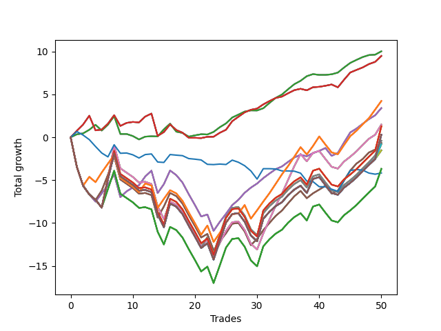

# Long Shepard 007 
- Symbol: NVDA_Unlimited
- Date Range: 02/08/2022 - 07/08/2022
- Trading Period: 7:20-12:30
- Number of Trades: 50



| Name | Win Percent | Profit | Avg Profit / Trade | Avg Time / Trade |      | Name | Win Percent | Profit | Avg Profit / Trade | Avg Time / Trade |
| ---- | ----------- | ------ | ------------------ | ---------------- | ---- | ---- | ----------- | ------ | ------------------ | ---------------- |
| Sorted By <br> Profit | | | | | | Sorted By <br> Win Percentage ||||
| Sixty-Four | 78.00 | 5015.00 | 100.30 | 05:18 |     | Sixty-Four | 78.00 | 5015.00 | 100.30 | 05:18 |
| Fifty-Six | 78.00 | 5015.00 | 100.30 | 05:18 |     | Fifty-Six | 78.00 | 5015.00 | 100.30 | 05:18 |
| Forty-Eight | 78.00 | 5015.00 | 100.30 | 05:18 |     | Forty-Eight | 78.00 | 5015.00 | 100.30 | 05:18 |
| Forty | 78.00 | 5015.00 | 100.30 | 05:18 |     | Forty | 78.00 | 5015.00 | 100.30 | 05:18 |
| Zero | 78.00 | 5015.00 | 100.30 | 05:18 |     | Zero | 78.00 | 5015.00 | 100.30 | 05:18 |
| Sixty-Five | 78.00 | 4745.00 | 94.90 | 11:20 |     | Sixty-Five | 78.00 | 4745.00 | 94.90 | 11:20 |
| Fifty-Seven | 78.00 | 4745.00 | 94.90 | 11:20 |     | Fifty-Seven | 78.00 | 4745.00 | 94.90 | 11:20 |
| Forty-Nine | 78.00 | 4745.00 | 94.90 | 11:20 |     | Forty-Nine | 78.00 | 4745.00 | 94.90 | 11:20 |
| Forty-One | 78.00 | 4745.00 | 94.90 | 11:20 |     | Forty-One | 78.00 | 4745.00 | 94.90 | 11:20 |
| One | 78.00 | 4745.00 | 94.90 | 11:20 |     | One | 78.00 | 4745.00 | 94.90 | 11:20 |
| One Hundred Twenty-Six | 60.00 | 2120.00 | 42.40 | 20:12 |     | Sixty-Six | 72.00 | 1705.00 | 34.10 | 16:44 |
| One Hundred Twenty-One | 60.00 | 2120.00 | 42.40 | 20:12 |     | Fifty-Eight | 72.00 | 1705.00 | 34.10 | 16:44 |
| One Hundred Sixteen | 60.00 | 2120.00 | 42.40 | 20:12 |     | Fifty | 72.00 | 1705.00 | 34.10 | 16:44 |
| One Hundred Eleven | 60.00 | 2120.00 | 42.40 | 20:12 |     | Forty-Two | 72.00 | 1705.00 | 34.10 | 16:44 |
| Eighty-One | 60.00 | 2120.00 | 42.40 | 20:12 |     | Two | 72.00 | 1705.00 | 34.10 | 16:44 |
| Sixty-Six | 72.00 | 1705.00 | 34.10 | 16:44 |     | One Hundred Twenty-Six | 60.00 | 2120.00 | 42.40 | 20:12 |
| Fifty-Eight | 72.00 | 1705.00 | 34.10 | 16:44 |     | One Hundred Twenty-One | 60.00 | 2120.00 | 42.40 | 20:12 |
| Fifty | 72.00 | 1705.00 | 34.10 | 16:44 |     | One Hundred Sixteen | 60.00 | 2120.00 | 42.40 | 20:12 |
| Forty-Two | 72.00 | 1705.00 | 34.10 | 16:44 |     | One Hundred Eleven | 60.00 | 2120.00 | 42.40 | 20:12 |
| Two | 72.00 | 1705.00 | 34.10 | 16:44 |     | Eighty-One | 60.00 | 2120.00 | 42.40 | 20:12 |
| Sixty-Eight | 50.00 | 745.00 | 14.90 | 25:25 |     | Sixty-Seven | 60.00 | -325.00 | -6.50 | 21:08 |
| Sixty | 50.00 | 745.00 | 14.90 | 25:25 |     | Fifty-Nine | 60.00 | -325.00 | -6.50 | 21:08 |
| Fifty-Two | 50.00 | 745.00 | 14.90 | 25:25 |     | Fifty-One | 60.00 | -325.00 | -6.50 | 21:08 |
| Forty-Four | 50.00 | 745.00 | 14.90 | 25:25 |     | Forty-Three | 60.00 | -325.00 | -6.50 | 21:08 |
| Four | 50.00 | 745.00 | 14.90 | 25:25 |     | Three | 60.00 | -325.00 | -6.50 | 21:08 |
| One Hundred Twenty-Eight | 50.00 | 640.00 | 12.80 | 29:09 |     | Sixty-Eight | 50.00 | 745.00 | 14.90 | 25:25 |
| One Hundred Twenty-Three | 50.00 | 640.00 | 12.80 | 29:09 |     | Sixty | 50.00 | 745.00 | 14.90 | 25:25 |
| One Hundred Eighteen | 50.00 | 640.00 | 12.80 | 29:09 |     | Fifty-Two | 50.00 | 745.00 | 14.90 | 25:25 |
| One Hundred Thirteen | 50.00 | 640.00 | 12.80 | 29:09 |     | Forty-Four | 50.00 | 745.00 | 14.90 | 25:25 |
| Eighty-Three | 50.00 | 640.00 | 12.80 | 29:09 |     | Four | 50.00 | 745.00 | 14.90 | 25:25 |
| One Hundred Thirty | 50.00 | 155.00 | 3.10 | 29:31 |     | One Hundred Twenty-Eight | 50.00 | 640.00 | 12.80 | 29:09 |
| One Hundred Twenty-Nine | 50.00 | 155.00 | 3.10 | 29:31 |     | One Hundred Twenty-Three | 50.00 | 640.00 | 12.80 | 29:09 |
| One Hundred Twenty-Five | 50.00 | 155.00 | 3.10 | 29:31 |     | One Hundred Eighteen | 50.00 | 640.00 | 12.80 | 29:09 |
| One Hundred Twenty-Four | 50.00 | 155.00 | 3.10 | 29:31 |     | One Hundred Thirteen | 50.00 | 640.00 | 12.80 | 29:09 |
| One Hundred Twenty | 50.00 | 155.00 | 3.10 | 29:31 |     | Eighty-Three | 50.00 | 640.00 | 12.80 | 29:09 |
| One Hundred Ninteen | 50.00 | 155.00 | 3.10 | 29:31 |     | One Hundred Thirty | 50.00 | 155.00 | 3.10 | 29:31 |
| One Hundred Fifteen | 50.00 | 155.00 | 3.10 | 29:31 |     | One Hundred Twenty-Nine | 50.00 | 155.00 | 3.10 | 29:31 |
| One Hundred Fourteen | 50.00 | 155.00 | 3.10 | 29:31 |     | One Hundred Twenty-Five | 50.00 | 155.00 | 3.10 | 29:31 |
| Eighty-Five | 50.00 | 155.00 | 3.10 | 29:31 |     | One Hundred Twenty-Four | 50.00 | 155.00 | 3.10 | 29:31 |
| Eighty-Four | 50.00 | 155.00 | 3.10 | 29:31 |     | One Hundred Twenty | 50.00 | 155.00 | 3.10 | 29:31 |
| Sixty-Nine | 50.00 | -195.00 | -3.90 | 28:17 |     | One Hundred Ninteen | 50.00 | 155.00 | 3.10 | 29:31 |
| Sixty-One | 50.00 | -195.00 | -3.90 | 28:17 |     | One Hundred Fifteen | 50.00 | 155.00 | 3.10 | 29:31 |
| Fifty-Three | 50.00 | -195.00 | -3.90 | 28:17 |     | One Hundred Fourteen | 50.00 | 155.00 | 3.10 | 29:31 |
| Forty-Five | 50.00 | -195.00 | -3.90 | 28:17 |     | Eighty-Five | 50.00 | 155.00 | 3.10 | 29:31 |
| Five | 50.00 | -195.00 | -3.90 | 28:17 |     | Eighty-Four | 50.00 | 155.00 | 3.10 | 29:31 |
| Sixty-Seven | 60.00 | -325.00 | -6.50 | 21:08 |     | Sixty-Nine | 50.00 | -195.00 | -3.90 | 28:17 |
| Fifty-Nine | 60.00 | -325.00 | -6.50 | 21:08 |     | Sixty-One | 50.00 | -195.00 | -3.90 | 28:17 |
| Fifty-One | 60.00 | -325.00 | -6.50 | 21:08 |     | Fifty-Three | 50.00 | -195.00 | -3.90 | 28:17 |
| Forty-Three | 60.00 | -325.00 | -6.50 | 21:08 |     | Forty-Five | 50.00 | -195.00 | -3.90 | 28:17 |
| Three | 60.00 | -325.00 | -6.50 | 21:08 |     | Five | 50.00 | -195.00 | -3.90 | 28:17 |
| Seventy-One | 50.00 | -400.00 | -8.00 | 29:20 |     | Seventy-One | 50.00 | -400.00 | -8.00 | 29:20 |
| Sixty-Three | 50.00 | -400.00 | -8.00 | 29:20 |     | Sixty-Three | 50.00 | -400.00 | -8.00 | 29:20 |
| Fifty-Five | 50.00 | -400.00 | -8.00 | 29:20 |     | Fifty-Five | 50.00 | -400.00 | -8.00 | 29:20 |
| Forty-Seven | 50.00 | -400.00 | -8.00 | 29:20 |     | Forty-Seven | 50.00 | -400.00 | -8.00 | 29:20 |
| Seven | 50.00 | -400.00 | -8.00 | 29:20 |     | Seven | 50.00 | -400.00 | -8.00 | 29:20 |
| Seventy | 50.00 | -760.00 | -15.20 | 29:17 |     | Seventy | 50.00 | -760.00 | -15.20 | 29:17 |
| Sixty-Two | 50.00 | -760.00 | -15.20 | 29:17 |     | Sixty-Two | 50.00 | -760.00 | -15.20 | 29:17 |
| Fifty-Four | 50.00 | -760.00 | -15.20 | 29:17 |     | Fifty-Four | 50.00 | -760.00 | -15.20 | 29:17 |
| Forty-Six | 50.00 | -760.00 | -15.20 | 29:17 |     | Forty-Six | 50.00 | -760.00 | -15.20 | 29:17 |
| Six | 50.00 | -760.00 | -15.20 | 29:17 |     | Six | 50.00 | -760.00 | -15.20 | 29:17 |
| One Hundred Twenty-Seven | 50.00 | -1840.00 | -36.80 | 28:40 |     | One Hundred Twenty-Seven | 50.00 | -1840.00 | -36.80 | 28:40 |
| One Hundred Twenty-Two | 50.00 | -1840.00 | -36.80 | 28:40 |     | One Hundred Twenty-Two | 50.00 | -1840.00 | -36.80 | 28:40 |
| One Hundred Seventeen | 50.00 | -1840.00 | -36.80 | 28:40 |     | One Hundred Seventeen | 50.00 | -1840.00 | -36.80 | 28:40 |
| One Hundred Twelve | 50.00 | -1840.00 | -36.80 | 28:40 |     | One Hundred Twelve | 50.00 | -1840.00 | -36.80 | 28:40 |
| Eighty-Two | 50.00 | -1840.00 | -36.80 | 28:40 |     | Eighty-Two | 50.00 | -1840.00 | -36.80 | 28:40 |
| Seventy-Three | 30.00 | -2080.00 | -41.60 | 05:59 |     | Seventy-Three | 30.00 | -2080.00 | -41.60 | 05:59 |

## NO STOPLOSS

### Test Zero
* Sell when price hits the middle line of the 20p bollinger
* No Stoploss
* Results:
```
Total Trades: 50
Percent Up: 78.00
Percent Down: 22.00
Total Points Moved Up: 10.03
Potential Profit: 5015.00
Total Points Ups: 15.08 Count Ups: 39
Total Points Downs: -5.05 Count Downs: 11
```

<details><summary>Trades</summary>

<code>In: 2022-02-10 12:05:00		Out: 2022-02-10 12:09:25		Total Position Time: 04:25		Total Move Up: 0.35		Total to Date: 0.35</code> <br />
<code>In: 2022-02-11 10:45:00		Out: 2022-02-11 10:52:10		Total Position Time: 07:10		Total Move Up: 0.11		Total to Date: 0.46</code> <br />
<code>In: 2022-02-11 10:48:00		Out: 2022-02-11 10:52:10		Total Position Time: 04:10		Total Move Up: 0.42		Total to Date: 0.88</code> <br />
<code>In: 2022-02-11 11:34:00		Out: 2022-02-11 11:34:20		Total Position Time: 00:20		Total Move Up: 0.58		Total to Date: 1.46</code> <br />
<code>In: 2022-02-11 11:49:00		Out: 2022-02-11 12:00:05		Total Position Time: 11:05		Total Move Up: -0.67		Total to Date: 0.79</code> <br />
<code>In: 2022-02-14 11:06:00		Out: 2022-02-14 11:13:00		Total Position Time: 07:00		Total Move Up: 0.69		Total to Date: 1.48</code> <br />
<code>In: 2022-02-14 11:09:00		Out: 2022-02-14 11:13:00		Total Position Time: 04:00		Total Move Up: 0.99		Total to Date: 2.47</code> <br />
<code>In: 2022-02-18 07:21:00		Out: 2022-02-18 07:43:30		Total Position Time: 22:30		Total Move Up: -2.08		Total to Date: 0.39</code> <br />
<code>In: 2022-02-23 12:15:00		Out: 2022-02-23 12:25:55		Total Position Time: 10:55		Total Move Up: 0.00		Total to Date: 0.39</code> <br />
<code>In: 2022-02-23 12:16:00		Out: 2022-02-23 12:25:55		Total Position Time: 09:55		Total Move Up: -0.24		Total to Date: 0.15</code> <br />
<code>In: 2022-02-23 12:17:00		Out: 2022-02-23 12:25:55		Total Position Time: 08:55		Total Move Up: -0.40		Total to Date: -0.25</code> <br />
<code>In: 2022-02-23 12:25:00		Out: 2022-02-23 12:25:55		Total Position Time: 00:55		Total Move Up: 0.33		Total to Date: 0.08</code> <br />
<code>In: 2022-02-23 12:26:00		Out: 2022-02-23 12:26:10		Total Position Time: 00:10		Total Move Up: 0.04		Total to Date: 0.12</code> <br />
<code>In: 2022-03-01 08:41:00		Out: 2022-03-01 08:50:05		Total Position Time: 09:05		Total Move Up: -0.02		Total to Date: 0.10</code> <br />
<code>In: 2022-03-04 07:22:00		Out: 2022-03-04 07:25:10		Total Position Time: 03:10		Total Move Up: 0.83		Total to Date: 0.93</code> <br />
<code>In: 2022-03-04 08:16:00		Out: 2022-03-04 08:17:05		Total Position Time: 01:05		Total Move Up: 0.66		Total to Date: 1.59</code> <br />
<code>In: 2022-03-11 08:18:00		Out: 2022-03-11 08:44:55		Total Position Time: 26:55		Total Move Up: -0.93		Total to Date: 0.66</code> <br />
<code>In: 2022-03-14 09:57:00		Out: 2022-03-14 10:12:10		Total Position Time: 15:10		Total Move Up: -0.15		Total to Date: 0.51</code> <br />
<code>In: 2022-03-14 09:58:00		Out: 2022-03-14 10:12:10		Total Position Time: 14:10		Total Move Up: -0.43		Total to Date: 0.08</code> <br />
<code>In: 2022-03-14 10:06:00		Out: 2022-03-14 10:12:10		Total Position Time: 06:10		Total Move Up: 0.15		Total to Date: 0.23</code> <br />
<code>In: 2022-03-14 10:07:00		Out: 2022-03-14 10:12:10		Total Position Time: 05:10		Total Move Up: 0.13		Total to Date: 0.36</code> <br />
<code>In: 2022-03-14 10:40:00		Out: 2022-03-14 10:43:45		Total Position Time: 03:45		Total Move Up: -0.03		Total to Date: 0.33</code> <br />
<code>In: 2022-03-28 08:42:00		Out: 2022-03-28 08:45:05		Total Position Time: 03:05		Total Move Up: 0.30		Total to Date: 0.63</code> <br />
<code>In: 2022-03-28 09:21:00		Out: 2022-03-28 09:24:05		Total Position Time: 03:05		Total Move Up: 0.55		Total to Date: 1.18</code> <br />
<code>In: 2022-03-28 09:22:00		Out: 2022-03-28 09:24:05		Total Position Time: 02:05		Total Move Up: 0.44		Total to Date: 1.62</code> <br />
<code>In: 2022-03-30 08:13:00		Out: 2022-03-30 08:14:35		Total Position Time: 01:35		Total Move Up: 0.69		Total to Date: 2.31</code> <br />
<code>In: 2022-04-06 09:23:00		Out: 2022-04-06 09:27:45		Total Position Time: 04:45		Total Move Up: 0.34		Total to Date: 2.65</code> <br />
<code>In: 2022-04-07 07:51:00		Out: 2022-04-07 07:56:05		Total Position Time: 05:05		Total Move Up: 0.35		Total to Date: 3.00</code> <br />
<code>In: 2022-04-07 07:52:00		Out: 2022-04-07 07:56:05		Total Position Time: 04:05		Total Move Up: 0.14		Total to Date: 3.14</code> <br />
<code>In: 2022-04-07 09:00:00		Out: 2022-04-07 09:09:05		Total Position Time: 09:05		Total Move Up: -0.01		Total to Date: 3.13</code> <br />
<code>In: 2022-04-07 09:52:00		Out: 2022-04-07 09:52:20		Total Position Time: 00:20		Total Move Up: 0.26		Total to Date: 3.39</code> <br />
<code>In: 2022-04-08 11:36:00		Out: 2022-04-08 11:39:40		Total Position Time: 03:40		Total Move Up: 0.62		Total to Date: 4.01</code> <br />
<code>In: 2022-04-08 11:37:00		Out: 2022-04-08 11:39:40		Total Position Time: 02:40		Total Move Up: 0.59		Total to Date: 4.60</code> <br />
<code>In: 2022-04-08 11:38:00		Out: 2022-04-08 11:39:40		Total Position Time: 01:40		Total Move Up: 0.39		Total to Date: 4.99</code> <br />
<code>In: 2022-04-08 11:36:00		Out: 2022-04-08 11:39:40		Total Position Time: 03:40		Total Move Up: 0.62		Total to Date: 5.61</code> <br />
<code>In: 2022-04-08 11:37:00		Out: 2022-04-08 11:39:40		Total Position Time: 02:40		Total Move Up: 0.59		Total to Date: 6.20</code> <br />
<code>In: 2022-04-08 11:38:00		Out: 2022-04-08 11:39:40		Total Position Time: 01:40		Total Move Up: 0.39		Total to Date: 6.59</code> <br />
<code>In: 2022-04-11 07:35:00		Out: 2022-04-11 07:35:30		Total Position Time: 00:30		Total Move Up: 0.54		Total to Date: 7.13</code> <br />
<code>In: 2022-04-11 09:30:00		Out: 2022-04-11 09:30:30		Total Position Time: 00:30		Total Move Up: 0.24		Total to Date: 7.37</code> <br />
<code>In: 2022-04-12 11:32:00		Out: 2022-04-12 11:35:55		Total Position Time: 03:55		Total Move Up: -0.09		Total to Date: 7.28</code> <br />
<code>In: 2022-04-22 10:06:00		Out: 2022-04-22 10:08:50		Total Position Time: 02:50		Total Move Up: 0.00		Total to Date: 7.28</code> <br />
<code>In: 2022-04-22 10:43:00		Out: 2022-04-22 10:43:10		Total Position Time: 00:10		Total Move Up: 0.07		Total to Date: 7.35</code> <br />
<code>In: 2022-06-01 07:21:00		Out: 2022-06-01 07:25:45		Total Position Time: 04:45		Total Move Up: 0.20		Total to Date: 7.55</code> <br />
<code>In: 2022-06-01 09:14:00		Out: 2022-06-01 09:16:00		Total Position Time: 02:00		Total Move Up: 0.59		Total to Date: 8.14</code> <br />
<code>In: 2022-06-01 09:15:00		Out: 2022-06-01 09:16:00		Total Position Time: 01:00		Total Move Up: 0.54		Total to Date: 8.68</code> <br />
<code>In: 2022-06-06 08:23:00		Out: 2022-06-06 08:30:05		Total Position Time: 07:05		Total Move Up: 0.35		Total to Date: 9.03</code> <br />
<code>In: 2022-06-06 09:14:00		Out: 2022-06-06 09:20:50		Total Position Time: 06:50		Total Move Up: 0.33		Total to Date: 9.36</code> <br />
<code>In: 2022-06-08 09:44:00		Out: 2022-06-08 09:50:15		Total Position Time: 06:15		Total Move Up: 0.23		Total to Date: 9.59</code> <br />
<code>In: 2022-06-23 10:45:00		Out: 2022-06-23 10:46:25		Total Position Time: 01:25		Total Move Up: 0.05		Total to Date: 9.64</code> <br />
<code>In: 2022-07-06 07:24:00		Out: 2022-07-06 07:27:05		Total Position Time: 03:05		Total Move Up: 0.39		Total to Date: 10.03</code> <br />


</details>

### Test One
* Sell when the price hits the upper line of the 20p 1std bollinger
* No Stoploss
* Results:
```
Total Trades: 50
Percent Up: 78.00
Percent Down: 22.00
Total Points Moved Up: 9.49
Potential Profit: 4745.00
Total Points Ups: 17.22 Count Ups: 39
Total Points Downs: -7.73 Count Downs: 11
```

<details><summary>Trades</summary>

<code>In: 2022-02-10 12:05:00		Out: 2022-02-10 12:12:40		Total Position Time: 07:40		Total Move Up: 0.77		Total to Date: 0.77</code> <br />
<code>In: 2022-02-11 10:45:00		Out: 2022-02-11 10:52:50		Total Position Time: 07:50		Total Move Up: 0.72		Total to Date: 1.49</code> <br />
<code>In: 2022-02-11 10:48:00		Out: 2022-02-11 10:52:50		Total Position Time: 04:50		Total Move Up: 1.03		Total to Date: 2.52</code> <br />
<code>In: 2022-02-11 11:34:00		Out: 2022-02-11 12:02:45		Total Position Time: 28:45		Total Move Up: -1.71		Total to Date: 0.81</code> <br />
<code>In: 2022-02-11 11:49:00		Out: 2022-02-11 12:02:45		Total Position Time: 13:45		Total Move Up: 0.09		Total to Date: 0.90</code> <br />
<code>In: 2022-02-14 11:06:00		Out: 2022-02-14 11:17:05		Total Position Time: 11:05		Total Move Up: 0.69		Total to Date: 1.59</code> <br />
<code>In: 2022-02-14 11:09:00		Out: 2022-02-14 11:17:05		Total Position Time: 08:05		Total Move Up: 0.99		Total to Date: 2.58</code> <br />
<code>In: 2022-02-18 07:21:00		Out: 2022-02-18 07:46:05		Total Position Time: 25:05		Total Move Up: -1.25		Total to Date: 1.33</code> <br />
<code>In: 2022-02-23 12:15:00		Out: 2022-02-23 12:27:05		Total Position Time: 12:05		Total Move Up: 0.35		Total to Date: 1.68</code> <br />
<code>In: 2022-02-23 12:16:00		Out: 2022-02-23 12:27:05		Total Position Time: 11:05		Total Move Up: 0.11		Total to Date: 1.79</code> <br />
<code>In: 2022-02-23 12:17:00		Out: 2022-02-23 12:27:05		Total Position Time: 10:05		Total Move Up: -0.05		Total to Date: 1.74</code> <br />
<code>In: 2022-02-23 12:25:00		Out: 2022-02-23 12:27:05		Total Position Time: 02:05		Total Move Up: 0.68		Total to Date: 2.42</code> <br />
<code>In: 2022-02-23 12:26:00		Out: 2022-02-23 12:27:05		Total Position Time: 01:05		Total Move Up: 0.35		Total to Date: 2.77</code> <br />
<code>In: 2022-03-01 08:41:00		Out: 2022-03-01 09:10:55		Total Position Time: 29:55		Total Move Up: -2.61		Total to Date: 0.16</code> <br />
<code>In: 2022-03-04 07:22:00		Out: 2022-03-04 07:36:55		Total Position Time: 14:55		Total Move Up: 0.45		Total to Date: 0.61</code> <br />
<code>In: 2022-03-04 08:16:00		Out: 2022-03-04 08:22:10		Total Position Time: 06:10		Total Move Up: 0.90		Total to Date: 1.51</code> <br />
<code>In: 2022-03-11 08:18:00		Out: 2022-03-11 08:45:05		Total Position Time: 27:05		Total Move Up: -0.66		Total to Date: 0.85</code> <br />
<code>In: 2022-03-14 09:57:00		Out: 2022-03-14 10:19:45		Total Position Time: 22:45		Total Move Up: -0.31		Total to Date: 0.54</code> <br />
<code>In: 2022-03-14 09:58:00		Out: 2022-03-14 10:19:45		Total Position Time: 21:45		Total Move Up: -0.59		Total to Date: -0.05</code> <br />
<code>In: 2022-03-14 10:06:00		Out: 2022-03-14 10:19:45		Total Position Time: 13:45		Total Move Up: -0.01		Total to Date: -0.06</code> <br />
<code>In: 2022-03-14 10:07:00		Out: 2022-03-14 10:19:45		Total Position Time: 12:45		Total Move Up: -0.03		Total to Date: -0.09</code> <br />
<code>In: 2022-03-14 10:40:00		Out: 2022-03-14 10:45:30		Total Position Time: 05:30		Total Move Up: 0.15		Total to Date: 0.06</code> <br />
<code>In: 2022-03-28 08:42:00		Out: 2022-03-28 09:01:50		Total Position Time: 19:50		Total Move Up: 0.01		Total to Date: 0.07</code> <br />
<code>In: 2022-03-28 09:21:00		Out: 2022-03-28 09:31:20		Total Position Time: 10:20		Total Move Up: 0.46		Total to Date: 0.53</code> <br />
<code>In: 2022-03-28 09:22:00		Out: 2022-03-28 09:31:20		Total Position Time: 09:20		Total Move Up: 0.35		Total to Date: 0.88</code> <br />
<code>In: 2022-03-30 08:13:00		Out: 2022-03-30 08:19:15		Total Position Time: 06:15		Total Move Up: 1.00		Total to Date: 1.88</code> <br />
<code>In: 2022-04-06 09:23:00		Out: 2022-04-06 09:31:15		Total Position Time: 08:15		Total Move Up: 0.52		Total to Date: 2.40</code> <br />
<code>In: 2022-04-07 07:51:00		Out: 2022-04-07 08:00:05		Total Position Time: 09:05		Total Move Up: 0.51		Total to Date: 2.91</code> <br />
<code>In: 2022-04-07 07:52:00		Out: 2022-04-07 08:00:05		Total Position Time: 08:05		Total Move Up: 0.30		Total to Date: 3.21</code> <br />
<code>In: 2022-04-07 09:00:00		Out: 2022-04-07 09:10:15		Total Position Time: 10:15		Total Move Up: 0.14		Total to Date: 3.35</code> <br />
<code>In: 2022-04-07 09:52:00		Out: 2022-04-07 09:56:10		Total Position Time: 04:10		Total Move Up: 0.49		Total to Date: 3.84</code> <br />
<code>In: 2022-04-08 11:36:00		Out: 2022-04-08 11:47:10		Total Position Time: 11:10		Total Move Up: 0.39		Total to Date: 4.23</code> <br />
<code>In: 2022-04-08 11:37:00		Out: 2022-04-08 11:47:10		Total Position Time: 10:10		Total Move Up: 0.36		Total to Date: 4.59</code> <br />
<code>In: 2022-04-08 11:38:00		Out: 2022-04-08 11:47:10		Total Position Time: 09:10		Total Move Up: 0.16		Total to Date: 4.75</code> <br />
<code>In: 2022-04-08 11:36:00		Out: 2022-04-08 11:47:10		Total Position Time: 11:10		Total Move Up: 0.39		Total to Date: 5.14</code> <br />
<code>In: 2022-04-08 11:37:00		Out: 2022-04-08 11:47:10		Total Position Time: 10:10		Total Move Up: 0.36		Total to Date: 5.50</code> <br />
<code>In: 2022-04-08 11:38:00		Out: 2022-04-08 11:47:10		Total Position Time: 09:10		Total Move Up: 0.16		Total to Date: 5.66</code> <br />
<code>In: 2022-04-11 07:35:00		Out: 2022-04-11 07:55:05		Total Position Time: 20:05		Total Move Up: -0.18		Total to Date: 5.48</code> <br />
<code>In: 2022-04-11 09:30:00		Out: 2022-04-11 09:35:05		Total Position Time: 05:05		Total Move Up: 0.36		Total to Date: 5.84</code> <br />
<code>In: 2022-04-12 11:32:00		Out: 2022-04-12 11:41:25		Total Position Time: 09:25		Total Move Up: 0.05		Total to Date: 5.89</code> <br />
<code>In: 2022-04-22 10:06:00		Out: 2022-04-22 10:11:45		Total Position Time: 05:45		Total Move Up: 0.12		Total to Date: 6.01</code> <br />
<code>In: 2022-04-22 10:43:00		Out: 2022-04-22 10:45:25		Total Position Time: 02:25		Total Move Up: 0.15		Total to Date: 6.16</code> <br />
<code>In: 2022-06-01 07:21:00		Out: 2022-06-01 07:43:25		Total Position Time: 22:25		Total Move Up: -0.33		Total to Date: 5.83</code> <br />
<code>In: 2022-06-01 09:14:00		Out: 2022-06-01 09:19:50		Total Position Time: 05:50		Total Move Up: 0.89		Total to Date: 6.72</code> <br />
<code>In: 2022-06-01 09:15:00		Out: 2022-06-01 09:19:50		Total Position Time: 04:50		Total Move Up: 0.84		Total to Date: 7.56</code> <br />
<code>In: 2022-06-06 08:23:00		Out: 2022-06-06 08:39:15		Total Position Time: 16:15		Total Move Up: 0.30		Total to Date: 7.86</code> <br />
<code>In: 2022-06-06 09:14:00		Out: 2022-06-06 09:24:10		Total Position Time: 10:10		Total Move Up: 0.29		Total to Date: 8.15</code> <br />
<code>In: 2022-06-08 09:44:00		Out: 2022-06-08 09:54:00		Total Position Time: 10:00		Total Move Up: 0.39		Total to Date: 8.54</code> <br />
<code>In: 2022-06-23 10:45:00		Out: 2022-06-23 10:47:35		Total Position Time: 02:35		Total Move Up: 0.26		Total to Date: 8.80</code> <br />
<code>In: 2022-07-06 07:24:00		Out: 2022-07-06 07:31:55		Total Position Time: 07:55		Total Move Up: 0.69		Total to Date: 9.49</code> <br />


</details>

### Test Two
* Sell when the price hits the upper line of the 20p 2std bollinger
* No Stoploss
* Results:
```
Total Trades: 50
Percent Up: 72.00
Percent Down: 28.00
Total Points Moved Up: 3.41
Potential Profit: 1705.00
Total Points Ups: 24.55 Count Ups: 36
Total Points Downs: -21.14 Count Downs: 14
```

<details><summary>Trades</summary>

<code>In: 2022-02-10 12:05:00		Out: 2022-02-10 12:34:55		Total Position Time: 29:55		Total Move Up: -3.46		Total to Date: -3.46</code> <br />
<code>In: 2022-02-11 10:45:00		Out: 2022-02-11 11:14:55		Total Position Time: 29:55		Total Move Up: -2.18		Total to Date: -5.64</code> <br />
<code>In: 2022-02-11 10:48:00		Out: 2022-02-11 11:17:55		Total Position Time: 29:55		Total Move Up: -1.02		Total to Date: -6.66</code> <br />
<code>In: 2022-02-11 11:34:00		Out: 2022-02-11 12:03:40		Total Position Time: 29:40		Total Move Up: -0.84		Total to Date: -7.50</code> <br />
<code>In: 2022-02-11 11:49:00		Out: 2022-02-11 12:03:40		Total Position Time: 14:40		Total Move Up: 0.96		Total to Date: -6.54</code> <br />
<code>In: 2022-02-14 11:06:00		Out: 2022-02-14 11:18:05		Total Position Time: 12:05		Total Move Up: 0.97		Total to Date: -5.57</code> <br />
<code>In: 2022-02-14 11:09:00		Out: 2022-02-14 11:18:05		Total Position Time: 09:05		Total Move Up: 1.27		Total to Date: -4.30</code> <br />
<code>In: 2022-02-18 07:21:00		Out: 2022-02-18 07:50:55		Total Position Time: 29:55		Total Move Up: -2.68		Total to Date: -6.98</code> <br />
<code>In: 2022-02-23 12:15:00		Out: 2022-02-23 12:31:10		Total Position Time: 16:10		Total Move Up: 0.68		Total to Date: -6.30</code> <br />
<code>In: 2022-02-23 12:16:00		Out: 2022-02-23 12:31:10		Total Position Time: 15:10		Total Move Up: 0.44		Total to Date: -5.86</code> <br />
<code>In: 2022-02-23 12:17:00		Out: 2022-02-23 12:31:10		Total Position Time: 14:10		Total Move Up: 0.28		Total to Date: -5.58</code> <br />
<code>In: 2022-02-23 12:25:00		Out: 2022-02-23 12:31:10		Total Position Time: 06:10		Total Move Up: 1.01		Total to Date: -4.57</code> <br />
<code>In: 2022-02-23 12:26:00		Out: 2022-02-23 12:31:10		Total Position Time: 05:10		Total Move Up: 0.68		Total to Date: -3.89</code> <br />
<code>In: 2022-03-01 08:41:00		Out: 2022-03-01 09:10:55		Total Position Time: 29:55		Total Move Up: -2.61		Total to Date: -6.50</code> <br />
<code>In: 2022-03-04 07:22:00		Out: 2022-03-04 07:37:05		Total Position Time: 15:05		Total Move Up: 1.04		Total to Date: -5.46</code> <br />
<code>In: 2022-03-04 08:16:00		Out: 2022-03-04 08:27:10		Total Position Time: 11:10		Total Move Up: 1.59		Total to Date: -3.87</code> <br />
<code>In: 2022-03-11 08:18:00		Out: 2022-03-11 08:47:10		Total Position Time: 29:10		Total Move Up: -0.54		Total to Date: -4.41</code> <br />
<code>In: 2022-03-14 09:57:00		Out: 2022-03-14 10:26:55		Total Position Time: 29:55		Total Move Up: -0.87		Total to Date: -5.28</code> <br />
<code>In: 2022-03-14 09:58:00		Out: 2022-03-14 10:27:55		Total Position Time: 29:55		Total Move Up: -1.35		Total to Date: -6.63</code> <br />
<code>In: 2022-03-14 10:06:00		Out: 2022-03-14 10:35:55		Total Position Time: 29:55		Total Move Up: -1.27		Total to Date: -7.90</code> <br />
<code>In: 2022-03-14 10:07:00		Out: 2022-03-14 10:36:55		Total Position Time: 29:55		Total Move Up: -1.33		Total to Date: -9.23</code> <br />
<code>In: 2022-03-14 10:40:00		Out: 2022-03-14 10:50:15		Total Position Time: 10:15		Total Move Up: 0.23		Total to Date: -9.00</code> <br />
<code>In: 2022-03-28 08:42:00		Out: 2022-03-28 09:11:55		Total Position Time: 29:55		Total Move Up: -1.91		Total to Date: -10.91</code> <br />
<code>In: 2022-03-28 09:21:00		Out: 2022-03-28 09:33:30		Total Position Time: 12:30		Total Move Up: 1.05		Total to Date: -9.86</code> <br />
<code>In: 2022-03-28 09:22:00		Out: 2022-03-28 09:33:30		Total Position Time: 11:30		Total Move Up: 0.94		Total to Date: -8.92</code> <br />
<code>In: 2022-03-30 08:13:00		Out: 2022-03-30 08:42:55		Total Position Time: 29:55		Total Move Up: 1.01		Total to Date: -7.91</code> <br />
<code>In: 2022-04-06 09:23:00		Out: 2022-04-06 09:31:25		Total Position Time: 08:25		Total Move Up: 0.63		Total to Date: -7.28</code> <br />
<code>In: 2022-04-07 07:51:00		Out: 2022-04-07 08:00:10		Total Position Time: 09:10		Total Move Up: 0.81		Total to Date: -6.47</code> <br />
<code>In: 2022-04-07 07:52:00		Out: 2022-04-07 08:00:10		Total Position Time: 08:10		Total Move Up: 0.60		Total to Date: -5.87</code> <br />
<code>In: 2022-04-07 09:00:00		Out: 2022-04-07 09:15:30		Total Position Time: 15:30		Total Move Up: 0.48		Total to Date: -5.39</code> <br />
<code>In: 2022-04-07 09:52:00		Out: 2022-04-07 09:59:10		Total Position Time: 07:10		Total Move Up: 0.63		Total to Date: -4.76</code> <br />
<code>In: 2022-04-08 11:36:00		Out: 2022-04-08 11:47:45		Total Position Time: 11:45		Total Move Up: 0.54		Total to Date: -4.22</code> <br />
<code>In: 2022-04-08 11:37:00		Out: 2022-04-08 11:47:45		Total Position Time: 10:45		Total Move Up: 0.51		Total to Date: -3.71</code> <br />
<code>In: 2022-04-08 11:38:00		Out: 2022-04-08 11:47:45		Total Position Time: 09:45		Total Move Up: 0.31		Total to Date: -3.40</code> <br />
<code>In: 2022-04-08 11:36:00		Out: 2022-04-08 11:47:45		Total Position Time: 11:45		Total Move Up: 0.54		Total to Date: -2.86</code> <br />
<code>In: 2022-04-08 11:37:00		Out: 2022-04-08 11:47:45		Total Position Time: 10:45		Total Move Up: 0.51		Total to Date: -2.35</code> <br />
<code>In: 2022-04-08 11:38:00		Out: 2022-04-08 11:47:45		Total Position Time: 09:45		Total Move Up: 0.31		Total to Date: -2.04</code> <br />
<code>In: 2022-04-11 07:35:00		Out: 2022-04-11 07:56:10		Total Position Time: 21:10		Total Move Up: -0.17		Total to Date: -2.21</code> <br />
<code>In: 2022-04-11 09:30:00		Out: 2022-04-11 09:37:50		Total Position Time: 07:50		Total Move Up: 0.36		Total to Date: -1.85</code> <br />
<code>In: 2022-04-12 11:32:00		Out: 2022-04-12 11:42:05		Total Position Time: 10:05		Total Move Up: 0.27		Total to Date: -1.58</code> <br />
<code>In: 2022-04-22 10:06:00		Out: 2022-04-22 10:13:00		Total Position Time: 07:00		Total Move Up: 0.33		Total to Date: -1.25</code> <br />
<code>In: 2022-04-22 10:43:00		Out: 2022-04-22 11:12:55		Total Position Time: 29:55		Total Move Up: -0.91		Total to Date: -2.16</code> <br />
<code>In: 2022-06-01 07:21:00		Out: 2022-06-01 07:45:05		Total Position Time: 24:05		Total Move Up: 0.34		Total to Date: -1.82</code> <br />
<code>In: 2022-06-01 09:14:00		Out: 2022-06-01 09:20:40		Total Position Time: 06:40		Total Move Up: 1.22		Total to Date: -0.60</code> <br />
<code>In: 2022-06-01 09:15:00		Out: 2022-06-01 09:20:40		Total Position Time: 05:40		Total Move Up: 1.17		Total to Date: 0.57</code> <br />
<code>In: 2022-06-06 08:23:00		Out: 2022-06-06 08:39:25		Total Position Time: 16:25		Total Move Up: 0.45		Total to Date: 1.02</code> <br />
<code>In: 2022-06-06 09:14:00		Out: 2022-06-06 09:40:35		Total Position Time: 26:35		Total Move Up: 0.56		Total to Date: 1.58</code> <br />
<code>In: 2022-06-08 09:44:00		Out: 2022-06-08 09:56:45		Total Position Time: 12:45		Total Move Up: 0.54		Total to Date: 2.12</code> <br />
<code>In: 2022-06-23 10:45:00		Out: 2022-06-23 10:51:40		Total Position Time: 06:40		Total Move Up: 0.45		Total to Date: 2.57</code> <br />
<code>In: 2022-07-06 07:24:00		Out: 2022-07-06 07:32:05		Total Position Time: 08:05		Total Move Up: 0.84		Total to Date: 3.41</code> <br />


</details>

### Test Three
* Sell when price hits the middle line of the 50p bollinger
* No Stoploss
* Results:
```
Total Trades: 50
Percent Up: 60.00
Percent Down: 40.00
Total Points Moved Up: -0.65
Potential Profit: -325.00
Total Points Ups: 25.31 Count Ups: 30
Total Points Downs: -25.96 Count Downs: 20
```

<details><summary>Trades</summary>

<code>In: 2022-02-10 12:05:00		Out: 2022-02-10 12:34:55		Total Position Time: 29:55		Total Move Up: -3.46		Total to Date: -3.46</code> <br />
<code>In: 2022-02-11 10:45:00		Out: 2022-02-11 11:14:55		Total Position Time: 29:55		Total Move Up: -2.18		Total to Date: -5.64</code> <br />
<code>In: 2022-02-11 10:48:00		Out: 2022-02-11 11:17:55		Total Position Time: 29:55		Total Move Up: -1.02		Total to Date: -6.66</code> <br />
<code>In: 2022-02-11 11:34:00		Out: 2022-02-11 12:03:45		Total Position Time: 29:45		Total Move Up: -0.67		Total to Date: -7.33</code> <br />
<code>In: 2022-02-11 11:49:00		Out: 2022-02-11 12:03:45		Total Position Time: 14:45		Total Move Up: 1.13		Total to Date: -6.20</code> <br />
<code>In: 2022-02-14 11:06:00		Out: 2022-02-14 11:28:50		Total Position Time: 22:50		Total Move Up: 1.83		Total to Date: -4.37</code> <br />
<code>In: 2022-02-14 11:09:00		Out: 2022-02-14 11:28:50		Total Position Time: 19:50		Total Move Up: 2.13		Total to Date: -2.24</code> <br />
<code>In: 2022-02-18 07:21:00		Out: 2022-02-18 07:50:55		Total Position Time: 29:55		Total Move Up: -2.68		Total to Date: -4.92</code> <br />
<code>In: 2022-02-23 12:15:00		Out: 2022-02-23 12:44:55		Total Position Time: 29:55		Total Move Up: -0.50		Total to Date: -5.42</code> <br />
<code>In: 2022-02-23 12:16:00		Out: 2022-02-23 12:45:55		Total Position Time: 29:55		Total Move Up: -0.50		Total to Date: -5.92</code> <br />
<code>In: 2022-02-23 12:17:00		Out: 2022-02-23 12:46:00		Total Position Time: 29:00		Total Move Up: -0.65		Total to Date: -6.57</code> <br />
<code>In: 2022-02-23 12:25:00		Out: 2022-02-23 12:46:00		Total Position Time: 21:00		Total Move Up: 0.08		Total to Date: -6.49</code> <br />
<code>In: 2022-02-23 12:26:00		Out: 2022-02-23 12:46:00		Total Position Time: 20:00		Total Move Up: -0.25		Total to Date: -6.74</code> <br />
<code>In: 2022-03-01 08:41:00		Out: 2022-03-01 09:10:55		Total Position Time: 29:55		Total Move Up: -2.61		Total to Date: -9.35</code> <br />
<code>In: 2022-03-04 07:22:00		Out: 2022-03-04 07:38:05		Total Position Time: 16:05		Total Move Up: 1.28		Total to Date: -8.07</code> <br />
<code>In: 2022-03-04 08:16:00		Out: 2022-03-04 08:27:15		Total Position Time: 11:15		Total Move Up: 1.58		Total to Date: -6.49</code> <br />
<code>In: 2022-03-11 08:18:00		Out: 2022-03-11 08:47:55		Total Position Time: 29:55		Total Move Up: -0.37		Total to Date: -6.86</code> <br />
<code>In: 2022-03-14 09:57:00		Out: 2022-03-14 10:26:55		Total Position Time: 29:55		Total Move Up: -0.87		Total to Date: -7.73</code> <br />
<code>In: 2022-03-14 09:58:00		Out: 2022-03-14 10:27:55		Total Position Time: 29:55		Total Move Up: -1.35		Total to Date: -9.08</code> <br />
<code>In: 2022-03-14 10:06:00		Out: 2022-03-14 10:35:55		Total Position Time: 29:55		Total Move Up: -1.27		Total to Date: -10.35</code> <br />
<code>In: 2022-03-14 10:07:00		Out: 2022-03-14 10:36:55		Total Position Time: 29:55		Total Move Up: -1.33		Total to Date: -11.68</code> <br />
<code>In: 2022-03-14 10:40:00		Out: 2022-03-14 10:50:25		Total Position Time: 10:25		Total Move Up: 0.41		Total to Date: -11.27</code> <br />
<code>In: 2022-03-28 08:42:00		Out: 2022-03-28 09:11:55		Total Position Time: 29:55		Total Move Up: -1.91		Total to Date: -13.18</code> <br />
<code>In: 2022-03-28 09:21:00		Out: 2022-03-28 09:33:30		Total Position Time: 12:30		Total Move Up: 1.05		Total to Date: -12.13</code> <br />
<code>In: 2022-03-28 09:22:00		Out: 2022-03-28 09:33:30		Total Position Time: 11:30		Total Move Up: 0.94		Total to Date: -11.19</code> <br />
<code>In: 2022-03-30 08:13:00		Out: 2022-03-30 08:34:40		Total Position Time: 21:40		Total Move Up: 1.12		Total to Date: -10.07</code> <br />
<code>In: 2022-04-06 09:23:00		Out: 2022-04-06 09:52:55		Total Position Time: 29:55		Total Move Up: 0.08		Total to Date: -9.99</code> <br />
<code>In: 2022-04-07 07:51:00		Out: 2022-04-07 08:20:55		Total Position Time: 29:55		Total Move Up: -0.99		Total to Date: -10.98</code> <br />
<code>In: 2022-04-07 07:52:00		Out: 2022-04-07 08:21:55		Total Position Time: 29:55		Total Move Up: -1.59		Total to Date: -12.57</code> <br />
<code>In: 2022-04-07 09:00:00		Out: 2022-04-07 09:21:00		Total Position Time: 21:00		Total Move Up: 0.72		Total to Date: -11.85</code> <br />
<code>In: 2022-04-07 09:52:00		Out: 2022-04-07 10:02:40		Total Position Time: 10:40		Total Move Up: 1.02		Total to Date: -10.83</code> <br />
<code>In: 2022-04-08 11:36:00		Out: 2022-04-08 11:49:10		Total Position Time: 13:10		Total Move Up: 0.85		Total to Date: -9.98</code> <br />
<code>In: 2022-04-08 11:37:00		Out: 2022-04-08 11:49:10		Total Position Time: 12:10		Total Move Up: 0.82		Total to Date: -9.16</code> <br />
<code>In: 2022-04-08 11:38:00		Out: 2022-04-08 11:49:10		Total Position Time: 11:10		Total Move Up: 0.62		Total to Date: -8.54</code> <br />
<code>In: 2022-04-08 11:36:00		Out: 2022-04-08 11:49:10		Total Position Time: 13:10		Total Move Up: 0.85		Total to Date: -7.69</code> <br />
<code>In: 2022-04-08 11:37:00		Out: 2022-04-08 11:49:10		Total Position Time: 12:10		Total Move Up: 0.82		Total to Date: -6.87</code> <br />
<code>In: 2022-04-08 11:38:00		Out: 2022-04-08 11:49:10		Total Position Time: 11:10		Total Move Up: 0.62		Total to Date: -6.25</code> <br />
<code>In: 2022-04-11 07:35:00		Out: 2022-04-11 08:04:55		Total Position Time: 29:55		Total Move Up: -0.85		Total to Date: -7.10</code> <br />
<code>In: 2022-04-11 09:30:00		Out: 2022-04-11 09:39:20		Total Position Time: 09:20		Total Move Up: 0.57		Total to Date: -6.53</code> <br />
<code>In: 2022-04-12 11:32:00		Out: 2022-04-12 11:45:10		Total Position Time: 13:10		Total Move Up: 0.43		Total to Date: -6.10</code> <br />
<code>In: 2022-04-22 10:06:00		Out: 2022-04-22 10:16:20		Total Position Time: 10:20		Total Move Up: 0.45		Total to Date: -5.65</code> <br />
<code>In: 2022-04-22 10:43:00		Out: 2022-04-22 11:12:55		Total Position Time: 29:55		Total Move Up: -0.91		Total to Date: -6.56</code> <br />
<code>In: 2022-06-01 07:21:00		Out: 2022-06-01 07:45:05		Total Position Time: 24:05		Total Move Up: 0.34		Total to Date: -6.22</code> <br />
<code>In: 2022-06-01 09:14:00		Out: 2022-06-01 09:31:05		Total Position Time: 17:05		Total Move Up: 1.20		Total to Date: -5.02</code> <br />
<code>In: 2022-06-01 09:15:00		Out: 2022-06-01 09:31:05		Total Position Time: 16:05		Total Move Up: 1.15		Total to Date: -3.87</code> <br />
<code>In: 2022-06-06 08:23:00		Out: 2022-06-06 08:46:25		Total Position Time: 23:25		Total Move Up: 0.81		Total to Date: -3.06</code> <br />
<code>In: 2022-06-06 09:14:00		Out: 2022-06-06 09:40:20		Total Position Time: 26:20		Total Move Up: 0.53		Total to Date: -2.53</code> <br />
<code>In: 2022-06-08 09:44:00		Out: 2022-06-08 10:04:30		Total Position Time: 20:30		Total Move Up: 0.76		Total to Date: -1.77</code> <br />
<code>In: 2022-06-23 10:45:00		Out: 2022-06-23 10:50:10		Total Position Time: 05:10		Total Move Up: 0.34		Total to Date: -1.43</code> <br />
<code>In: 2022-07-06 07:24:00		Out: 2022-07-06 07:32:00		Total Position Time: 08:00		Total Move Up: 0.78		Total to Date: -0.65</code> <br />


</details>

### Test Four
* Sell when the price hits the upper line of the 50p 1std bollinger
* No Stoploss
* Results:
```
Total Trades: 50
Percent Up: 50.00
Percent Down: 50.00
Total Points Moved Up: 1.49
Potential Profit: 745.00
Total Points Ups: 31.65 Count Ups: 25
Total Points Downs: -30.16 Count Downs: 25
```

<details><summary>Trades</summary>

<code>In: 2022-02-10 12:05:00		Out: 2022-02-10 12:34:55		Total Position Time: 29:55		Total Move Up: -3.46		Total to Date: -3.46</code> <br />
<code>In: 2022-02-11 10:45:00		Out: 2022-02-11 11:14:55		Total Position Time: 29:55		Total Move Up: -2.18		Total to Date: -5.64</code> <br />
<code>In: 2022-02-11 10:48:00		Out: 2022-02-11 11:17:55		Total Position Time: 29:55		Total Move Up: -1.02		Total to Date: -6.66</code> <br />
<code>In: 2022-02-11 11:34:00		Out: 2022-02-11 12:03:55		Total Position Time: 29:55		Total Move Up: -0.62		Total to Date: -7.28</code> <br />
<code>In: 2022-02-11 11:49:00		Out: 2022-02-11 12:18:55		Total Position Time: 29:55		Total Move Up: -0.92		Total to Date: -8.20</code> <br />
<code>In: 2022-02-14 11:06:00		Out: 2022-02-14 11:29:15		Total Position Time: 23:15		Total Move Up: 3.48		Total to Date: -4.72</code> <br />
<code>In: 2022-02-14 11:09:00		Out: 2022-02-14 11:29:15		Total Position Time: 20:15		Total Move Up: 3.78		Total to Date: -0.94</code> <br />
<code>In: 2022-02-18 07:21:00		Out: 2022-02-18 07:50:55		Total Position Time: 29:55		Total Move Up: -2.68		Total to Date: -3.62</code> <br />
<code>In: 2022-02-23 12:15:00		Out: 2022-02-23 12:44:55		Total Position Time: 29:55		Total Move Up: -0.50		Total to Date: -4.12</code> <br />
<code>In: 2022-02-23 12:16:00		Out: 2022-02-23 12:45:55		Total Position Time: 29:55		Total Move Up: -0.50		Total to Date: -4.62</code> <br />
<code>In: 2022-02-23 12:17:00		Out: 2022-02-23 12:46:00		Total Position Time: 29:00		Total Move Up: -0.65		Total to Date: -5.27</code> <br />
<code>In: 2022-02-23 12:25:00		Out: 2022-02-23 12:46:00		Total Position Time: 21:00		Total Move Up: 0.08		Total to Date: -5.19</code> <br />
<code>In: 2022-02-23 12:26:00		Out: 2022-02-23 12:46:00		Total Position Time: 20:00		Total Move Up: -0.25		Total to Date: -5.44</code> <br />
<code>In: 2022-03-01 08:41:00		Out: 2022-03-01 09:10:55		Total Position Time: 29:55		Total Move Up: -2.61		Total to Date: -8.05</code> <br />
<code>In: 2022-03-04 07:22:00		Out: 2022-03-04 07:51:55		Total Position Time: 29:55		Total Move Up: -1.48		Total to Date: -9.53</code> <br />
<code>In: 2022-03-04 08:16:00		Out: 2022-03-04 08:39:25		Total Position Time: 23:25		Total Move Up: 2.04		Total to Date: -7.49</code> <br />
<code>In: 2022-03-11 08:18:00		Out: 2022-03-11 08:47:55		Total Position Time: 29:55		Total Move Up: -0.37		Total to Date: -7.86</code> <br />
<code>In: 2022-03-14 09:57:00		Out: 2022-03-14 10:26:55		Total Position Time: 29:55		Total Move Up: -0.87		Total to Date: -8.73</code> <br />
<code>In: 2022-03-14 09:58:00		Out: 2022-03-14 10:27:55		Total Position Time: 29:55		Total Move Up: -1.35		Total to Date: -10.08</code> <br />
<code>In: 2022-03-14 10:06:00		Out: 2022-03-14 10:35:55		Total Position Time: 29:55		Total Move Up: -1.27		Total to Date: -11.35</code> <br />
<code>In: 2022-03-14 10:07:00		Out: 2022-03-14 10:36:55		Total Position Time: 29:55		Total Move Up: -1.33		Total to Date: -12.68</code> <br />
<code>In: 2022-03-14 10:40:00		Out: 2022-03-14 10:50:45		Total Position Time: 10:45		Total Move Up: 0.71		Total to Date: -11.97</code> <br />
<code>In: 2022-03-28 08:42:00		Out: 2022-03-28 09:11:55		Total Position Time: 29:55		Total Move Up: -1.91		Total to Date: -13.88</code> <br />
<code>In: 2022-03-28 09:21:00		Out: 2022-03-28 09:40:00		Total Position Time: 19:00		Total Move Up: 1.54		Total to Date: -12.34</code> <br />
<code>In: 2022-03-28 09:22:00		Out: 2022-03-28 09:40:00		Total Position Time: 18:00		Total Move Up: 1.43		Total to Date: -10.91</code> <br />
<code>In: 2022-03-30 08:13:00		Out: 2022-03-30 08:42:55		Total Position Time: 29:55		Total Move Up: 1.01		Total to Date: -9.90</code> <br />
<code>In: 2022-04-06 09:23:00		Out: 2022-04-06 09:52:55		Total Position Time: 29:55		Total Move Up: 0.08		Total to Date: -9.82</code> <br />
<code>In: 2022-04-07 07:51:00		Out: 2022-04-07 08:20:55		Total Position Time: 29:55		Total Move Up: -0.99		Total to Date: -10.81</code> <br />
<code>In: 2022-04-07 07:52:00		Out: 2022-04-07 08:21:55		Total Position Time: 29:55		Total Move Up: -1.59		Total to Date: -12.40</code> <br />
<code>In: 2022-04-07 09:00:00		Out: 2022-04-07 09:29:55		Total Position Time: 29:55		Total Move Up: -0.69		Total to Date: -13.09</code> <br />
<code>In: 2022-04-07 09:52:00		Out: 2022-04-07 10:12:10		Total Position Time: 20:10		Total Move Up: 1.88		Total to Date: -11.21</code> <br />
<code>In: 2022-04-08 11:36:00		Out: 2022-04-08 11:53:15		Total Position Time: 17:15		Total Move Up: 1.63		Total to Date: -9.58</code> <br />
<code>In: 2022-04-08 11:37:00		Out: 2022-04-08 11:53:15		Total Position Time: 16:15		Total Move Up: 1.60		Total to Date: -7.98</code> <br />
<code>In: 2022-04-08 11:38:00		Out: 2022-04-08 11:53:15		Total Position Time: 15:15		Total Move Up: 1.40		Total to Date: -6.58</code> <br />
<code>In: 2022-04-08 11:36:00		Out: 2022-04-08 11:53:15		Total Position Time: 17:15		Total Move Up: 1.63		Total to Date: -4.95</code> <br />
<code>In: 2022-04-08 11:37:00		Out: 2022-04-08 11:53:15		Total Position Time: 16:15		Total Move Up: 1.60		Total to Date: -3.35</code> <br />
<code>In: 2022-04-08 11:38:00		Out: 2022-04-08 11:53:15		Total Position Time: 15:15		Total Move Up: 1.40		Total to Date: -1.95</code> <br />
<code>In: 2022-04-11 07:35:00		Out: 2022-04-11 08:04:55		Total Position Time: 29:55		Total Move Up: -0.85		Total to Date: -2.80</code> <br />
<code>In: 2022-04-11 09:30:00		Out: 2022-04-11 09:46:15		Total Position Time: 16:15		Total Move Up: 0.99		Total to Date: -1.81</code> <br />
<code>In: 2022-04-12 11:32:00		Out: 2022-04-12 12:01:55		Total Position Time: 29:55		Total Move Up: 0.23		Total to Date: -1.58</code> <br />
<code>In: 2022-04-22 10:06:00		Out: 2022-04-22 10:35:55		Total Position Time: 29:55		Total Move Up: -0.95		Total to Date: -2.53</code> <br />
<code>In: 2022-04-22 10:43:00		Out: 2022-04-22 11:12:55		Total Position Time: 29:55		Total Move Up: -0.91		Total to Date: -3.44</code> <br />
<code>In: 2022-06-01 07:21:00		Out: 2022-06-01 07:50:55		Total Position Time: 29:55		Total Move Up: -0.21		Total to Date: -3.65</code> <br />
<code>In: 2022-06-01 09:14:00		Out: 2022-06-01 09:43:55		Total Position Time: 29:55		Total Move Up: 0.83		Total to Date: -2.82</code> <br />
<code>In: 2022-06-01 09:15:00		Out: 2022-06-01 09:44:55		Total Position Time: 29:55		Total Move Up: 0.56		Total to Date: -2.26</code> <br />
<code>In: 2022-06-06 08:23:00		Out: 2022-06-06 08:52:55		Total Position Time: 29:55		Total Move Up: 0.63		Total to Date: -1.63</code> <br />
<code>In: 2022-06-06 09:14:00		Out: 2022-06-06 09:43:55		Total Position Time: 29:55		Total Move Up: 0.74		Total to Date: -0.89</code> <br />
<code>In: 2022-06-08 09:44:00		Out: 2022-06-08 10:13:55		Total Position Time: 29:55		Total Move Up: 0.72		Total to Date: -0.17</code> <br />
<code>In: 2022-06-23 10:45:00		Out: 2022-06-23 10:51:50		Total Position Time: 06:50		Total Move Up: 0.47		Total to Date: 0.30</code> <br />
<code>In: 2022-07-06 07:24:00		Out: 2022-07-06 07:42:40		Total Position Time: 18:40		Total Move Up: 1.19		Total to Date: 1.49</code> <br />


</details>

### Test Five
* Sell when the price hits the upper line of the 50p 2std bollinger
* No Stoploss
* Results:
```
Total Trades: 50
Percent Up: 50.00
Percent Down: 50.00
Total Points Moved Up: -0.39
Potential Profit: -195.00
Total Points Ups: 29.77 Count Ups: 25
Total Points Downs: -30.16 Count Downs: 25
```

<details><summary>Trades</summary>

<code>In: 2022-02-10 12:05:00		Out: 2022-02-10 12:34:55		Total Position Time: 29:55		Total Move Up: -3.46		Total to Date: -3.46</code> <br />
<code>In: 2022-02-11 10:45:00		Out: 2022-02-11 11:14:55		Total Position Time: 29:55		Total Move Up: -2.18		Total to Date: -5.64</code> <br />
<code>In: 2022-02-11 10:48:00		Out: 2022-02-11 11:17:55		Total Position Time: 29:55		Total Move Up: -1.02		Total to Date: -6.66</code> <br />
<code>In: 2022-02-11 11:34:00		Out: 2022-02-11 12:03:55		Total Position Time: 29:55		Total Move Up: -0.62		Total to Date: -7.28</code> <br />
<code>In: 2022-02-11 11:49:00		Out: 2022-02-11 12:18:55		Total Position Time: 29:55		Total Move Up: -0.92		Total to Date: -8.20</code> <br />
<code>In: 2022-02-14 11:06:00		Out: 2022-02-14 11:35:55		Total Position Time: 29:55		Total Move Up: 3.32		Total to Date: -4.88</code> <br />
<code>In: 2022-02-14 11:09:00		Out: 2022-02-14 11:38:55		Total Position Time: 29:55		Total Move Up: 2.99		Total to Date: -1.89</code> <br />
<code>In: 2022-02-18 07:21:00		Out: 2022-02-18 07:50:55		Total Position Time: 29:55		Total Move Up: -2.68		Total to Date: -4.57</code> <br />
<code>In: 2022-02-23 12:15:00		Out: 2022-02-23 12:44:55		Total Position Time: 29:55		Total Move Up: -0.50		Total to Date: -5.07</code> <br />
<code>In: 2022-02-23 12:16:00		Out: 2022-02-23 12:45:55		Total Position Time: 29:55		Total Move Up: -0.50		Total to Date: -5.57</code> <br />
<code>In: 2022-02-23 12:17:00		Out: 2022-02-23 12:46:00		Total Position Time: 29:00		Total Move Up: -0.65		Total to Date: -6.22</code> <br />
<code>In: 2022-02-23 12:25:00		Out: 2022-02-23 12:46:00		Total Position Time: 21:00		Total Move Up: 0.08		Total to Date: -6.14</code> <br />
<code>In: 2022-02-23 12:26:00		Out: 2022-02-23 12:46:00		Total Position Time: 20:00		Total Move Up: -0.25		Total to Date: -6.39</code> <br />
<code>In: 2022-03-01 08:41:00		Out: 2022-03-01 09:10:55		Total Position Time: 29:55		Total Move Up: -2.61		Total to Date: -9.00</code> <br />
<code>In: 2022-03-04 07:22:00		Out: 2022-03-04 07:51:55		Total Position Time: 29:55		Total Move Up: -1.48		Total to Date: -10.48</code> <br />
<code>In: 2022-03-04 08:16:00		Out: 2022-03-04 08:41:50		Total Position Time: 25:50		Total Move Up: 2.80		Total to Date: -7.68</code> <br />
<code>In: 2022-03-11 08:18:00		Out: 2022-03-11 08:47:55		Total Position Time: 29:55		Total Move Up: -0.37		Total to Date: -8.05</code> <br />
<code>In: 2022-03-14 09:57:00		Out: 2022-03-14 10:26:55		Total Position Time: 29:55		Total Move Up: -0.87		Total to Date: -8.92</code> <br />
<code>In: 2022-03-14 09:58:00		Out: 2022-03-14 10:27:55		Total Position Time: 29:55		Total Move Up: -1.35		Total to Date: -10.27</code> <br />
<code>In: 2022-03-14 10:06:00		Out: 2022-03-14 10:35:55		Total Position Time: 29:55		Total Move Up: -1.27		Total to Date: -11.54</code> <br />
<code>In: 2022-03-14 10:07:00		Out: 2022-03-14 10:36:55		Total Position Time: 29:55		Total Move Up: -1.33		Total to Date: -12.87</code> <br />
<code>In: 2022-03-14 10:40:00		Out: 2022-03-14 10:52:20		Total Position Time: 12:20		Total Move Up: 1.24		Total to Date: -11.63</code> <br />
<code>In: 2022-03-28 08:42:00		Out: 2022-03-28 09:11:55		Total Position Time: 29:55		Total Move Up: -1.91		Total to Date: -13.54</code> <br />
<code>In: 2022-03-28 09:21:00		Out: 2022-03-28 09:50:55		Total Position Time: 29:55		Total Move Up: 2.19		Total to Date: -11.35</code> <br />
<code>In: 2022-03-28 09:22:00		Out: 2022-03-28 09:51:55		Total Position Time: 29:55		Total Move Up: 2.12		Total to Date: -9.23</code> <br />
<code>In: 2022-03-30 08:13:00		Out: 2022-03-30 08:42:55		Total Position Time: 29:55		Total Move Up: 1.01		Total to Date: -8.22</code> <br />
<code>In: 2022-04-06 09:23:00		Out: 2022-04-06 09:52:55		Total Position Time: 29:55		Total Move Up: 0.08		Total to Date: -8.14</code> <br />
<code>In: 2022-04-07 07:51:00		Out: 2022-04-07 08:20:55		Total Position Time: 29:55		Total Move Up: -0.99		Total to Date: -9.13</code> <br />
<code>In: 2022-04-07 07:52:00		Out: 2022-04-07 08:21:55		Total Position Time: 29:55		Total Move Up: -1.59		Total to Date: -10.72</code> <br />
<code>In: 2022-04-07 09:00:00		Out: 2022-04-07 09:29:55		Total Position Time: 29:55		Total Move Up: -0.69		Total to Date: -11.41</code> <br />
<code>In: 2022-04-07 09:52:00		Out: 2022-04-07 10:13:00		Total Position Time: 21:00		Total Move Up: 2.56		Total to Date: -8.85</code> <br />
<code>In: 2022-04-08 11:36:00		Out: 2022-04-08 12:05:55		Total Position Time: 29:55		Total Move Up: 0.83		Total to Date: -8.02</code> <br />
<code>In: 2022-04-08 11:37:00		Out: 2022-04-08 12:06:55		Total Position Time: 29:55		Total Move Up: 0.65		Total to Date: -7.37</code> <br />
<code>In: 2022-04-08 11:38:00		Out: 2022-04-08 12:07:55		Total Position Time: 29:55		Total Move Up: 0.45		Total to Date: -6.92</code> <br />
<code>In: 2022-04-08 11:36:00		Out: 2022-04-08 12:05:55		Total Position Time: 29:55		Total Move Up: 0.83		Total to Date: -6.09</code> <br />
<code>In: 2022-04-08 11:37:00		Out: 2022-04-08 12:06:55		Total Position Time: 29:55		Total Move Up: 0.65		Total to Date: -5.44</code> <br />
<code>In: 2022-04-08 11:38:00		Out: 2022-04-08 12:07:55		Total Position Time: 29:55		Total Move Up: 0.45		Total to Date: -4.99</code> <br />
<code>In: 2022-04-11 07:35:00		Out: 2022-04-11 08:04:55		Total Position Time: 29:55		Total Move Up: -0.85		Total to Date: -5.84</code> <br />
<code>In: 2022-04-11 09:30:00		Out: 2022-04-11 09:57:00		Total Position Time: 27:00		Total Move Up: 1.29		Total to Date: -4.55</code> <br />
<code>In: 2022-04-12 11:32:00		Out: 2022-04-12 12:01:55		Total Position Time: 29:55		Total Move Up: 0.23		Total to Date: -4.32</code> <br />
<code>In: 2022-04-22 10:06:00		Out: 2022-04-22 10:35:55		Total Position Time: 29:55		Total Move Up: -0.95		Total to Date: -5.27</code> <br />
<code>In: 2022-04-22 10:43:00		Out: 2022-04-22 11:12:55		Total Position Time: 29:55		Total Move Up: -0.91		Total to Date: -6.18</code> <br />
<code>In: 2022-06-01 07:21:00		Out: 2022-06-01 07:50:55		Total Position Time: 29:55		Total Move Up: -0.21		Total to Date: -6.39</code> <br />
<code>In: 2022-06-01 09:14:00		Out: 2022-06-01 09:43:55		Total Position Time: 29:55		Total Move Up: 0.83		Total to Date: -5.56</code> <br />
<code>In: 2022-06-01 09:15:00		Out: 2022-06-01 09:44:55		Total Position Time: 29:55		Total Move Up: 0.56		Total to Date: -5.00</code> <br />
<code>In: 2022-06-06 08:23:00		Out: 2022-06-06 08:52:55		Total Position Time: 29:55		Total Move Up: 0.63		Total to Date: -4.37</code> <br />
<code>In: 2022-06-06 09:14:00		Out: 2022-06-06 09:43:55		Total Position Time: 29:55		Total Move Up: 0.74		Total to Date: -3.63</code> <br />
<code>In: 2022-06-08 09:44:00		Out: 2022-06-08 10:13:55		Total Position Time: 29:55		Total Move Up: 0.72		Total to Date: -2.91</code> <br />
<code>In: 2022-06-23 10:45:00		Out: 2022-06-23 10:56:05		Total Position Time: 11:05		Total Move Up: 0.79		Total to Date: -2.12</code> <br />
<code>In: 2022-07-06 07:24:00		Out: 2022-07-06 07:44:30		Total Position Time: 20:30		Total Move Up: 1.73		Total to Date: -0.39</code> <br />


</details>

### Test Six
* Sell when the price hits the middle line of the 1std VWAP
* No Stoploss
* Results:
```
Total Trades: 50
Percent Up: 50.00
Percent Down: 50.00
Total Points Moved Up: -1.52
Potential Profit: -760.00
Total Points Ups: 28.64 Count Ups: 25
Total Points Downs: -30.16 Count Downs: 25
```

<details><summary>Trades</summary>

<code>In: 2022-02-10 12:05:00		Out: 2022-02-10 12:34:55		Total Position Time: 29:55		Total Move Up: -3.46		Total to Date: -3.46</code> <br />
<code>In: 2022-02-11 10:45:00		Out: 2022-02-11 11:14:55		Total Position Time: 29:55		Total Move Up: -2.18		Total to Date: -5.64</code> <br />
<code>In: 2022-02-11 10:48:00		Out: 2022-02-11 11:17:55		Total Position Time: 29:55		Total Move Up: -1.02		Total to Date: -6.66</code> <br />
<code>In: 2022-02-11 11:34:00		Out: 2022-02-11 12:03:55		Total Position Time: 29:55		Total Move Up: -0.62		Total to Date: -7.28</code> <br />
<code>In: 2022-02-11 11:49:00		Out: 2022-02-11 12:18:55		Total Position Time: 29:55		Total Move Up: -0.92		Total to Date: -8.20</code> <br />
<code>In: 2022-02-14 11:06:00		Out: 2022-02-14 11:35:55		Total Position Time: 29:55		Total Move Up: 3.32		Total to Date: -4.88</code> <br />
<code>In: 2022-02-14 11:09:00		Out: 2022-02-14 11:38:55		Total Position Time: 29:55		Total Move Up: 2.99		Total to Date: -1.89</code> <br />
<code>In: 2022-02-18 07:21:00		Out: 2022-02-18 07:50:55		Total Position Time: 29:55		Total Move Up: -2.68		Total to Date: -4.57</code> <br />
<code>In: 2022-02-23 12:15:00		Out: 2022-02-23 12:44:55		Total Position Time: 29:55		Total Move Up: -0.50		Total to Date: -5.07</code> <br />
<code>In: 2022-02-23 12:16:00		Out: 2022-02-23 12:45:55		Total Position Time: 29:55		Total Move Up: -0.50		Total to Date: -5.57</code> <br />
<code>In: 2022-02-23 12:17:00		Out: 2022-02-23 12:46:00		Total Position Time: 29:00		Total Move Up: -0.65		Total to Date: -6.22</code> <br />
<code>In: 2022-02-23 12:25:00		Out: 2022-02-23 12:46:00		Total Position Time: 21:00		Total Move Up: 0.08		Total to Date: -6.14</code> <br />
<code>In: 2022-02-23 12:26:00		Out: 2022-02-23 12:46:00		Total Position Time: 20:00		Total Move Up: -0.25		Total to Date: -6.39</code> <br />
<code>In: 2022-03-01 08:41:00		Out: 2022-03-01 09:10:55		Total Position Time: 29:55		Total Move Up: -2.61		Total to Date: -9.00</code> <br />
<code>In: 2022-03-04 07:22:00		Out: 2022-03-04 07:51:55		Total Position Time: 29:55		Total Move Up: -1.48		Total to Date: -10.48</code> <br />
<code>In: 2022-03-04 08:16:00		Out: 2022-03-04 08:45:55		Total Position Time: 29:55		Total Move Up: 2.76		Total to Date: -7.72</code> <br />
<code>In: 2022-03-11 08:18:00		Out: 2022-03-11 08:47:55		Total Position Time: 29:55		Total Move Up: -0.37		Total to Date: -8.09</code> <br />
<code>In: 2022-03-14 09:57:00		Out: 2022-03-14 10:26:55		Total Position Time: 29:55		Total Move Up: -0.87		Total to Date: -8.96</code> <br />
<code>In: 2022-03-14 09:58:00		Out: 2022-03-14 10:27:55		Total Position Time: 29:55		Total Move Up: -1.35		Total to Date: -10.31</code> <br />
<code>In: 2022-03-14 10:06:00		Out: 2022-03-14 10:35:55		Total Position Time: 29:55		Total Move Up: -1.27		Total to Date: -11.58</code> <br />
<code>In: 2022-03-14 10:07:00		Out: 2022-03-14 10:36:55		Total Position Time: 29:55		Total Move Up: -1.33		Total to Date: -12.91</code> <br />
<code>In: 2022-03-14 10:40:00		Out: 2022-03-14 11:09:55		Total Position Time: 29:55		Total Move Up: 0.56		Total to Date: -12.35</code> <br />
<code>In: 2022-03-28 08:42:00		Out: 2022-03-28 09:11:55		Total Position Time: 29:55		Total Move Up: -1.91		Total to Date: -14.26</code> <br />
<code>In: 2022-03-28 09:21:00		Out: 2022-03-28 09:50:55		Total Position Time: 29:55		Total Move Up: 2.19		Total to Date: -12.07</code> <br />
<code>In: 2022-03-28 09:22:00		Out: 2022-03-28 09:51:55		Total Position Time: 29:55		Total Move Up: 2.12		Total to Date: -9.95</code> <br />
<code>In: 2022-03-30 08:13:00		Out: 2022-03-30 08:42:55		Total Position Time: 29:55		Total Move Up: 1.01		Total to Date: -8.94</code> <br />
<code>In: 2022-04-06 09:23:00		Out: 2022-04-06 09:52:55		Total Position Time: 29:55		Total Move Up: 0.08		Total to Date: -8.86</code> <br />
<code>In: 2022-04-07 07:51:00		Out: 2022-04-07 08:20:55		Total Position Time: 29:55		Total Move Up: -0.99		Total to Date: -9.85</code> <br />
<code>In: 2022-04-07 07:52:00		Out: 2022-04-07 08:21:55		Total Position Time: 29:55		Total Move Up: -1.59		Total to Date: -11.44</code> <br />
<code>In: 2022-04-07 09:00:00		Out: 2022-04-07 09:29:55		Total Position Time: 29:55		Total Move Up: -0.69		Total to Date: -12.13</code> <br />
<code>In: 2022-04-07 09:52:00		Out: 2022-04-07 10:21:55		Total Position Time: 29:55		Total Move Up: 2.63		Total to Date: -9.50</code> <br />
<code>In: 2022-04-08 11:36:00		Out: 2022-04-08 12:05:55		Total Position Time: 29:55		Total Move Up: 0.83		Total to Date: -8.67</code> <br />
<code>In: 2022-04-08 11:37:00		Out: 2022-04-08 12:06:55		Total Position Time: 29:55		Total Move Up: 0.65		Total to Date: -8.02</code> <br />
<code>In: 2022-04-08 11:38:00		Out: 2022-04-08 12:07:55		Total Position Time: 29:55		Total Move Up: 0.45		Total to Date: -7.57</code> <br />
<code>In: 2022-04-08 11:36:00		Out: 2022-04-08 12:05:55		Total Position Time: 29:55		Total Move Up: 0.83		Total to Date: -6.74</code> <br />
<code>In: 2022-04-08 11:37:00		Out: 2022-04-08 12:06:55		Total Position Time: 29:55		Total Move Up: 0.65		Total to Date: -6.09</code> <br />
<code>In: 2022-04-08 11:38:00		Out: 2022-04-08 12:07:55		Total Position Time: 29:55		Total Move Up: 0.45		Total to Date: -5.64</code> <br />
<code>In: 2022-04-11 07:35:00		Out: 2022-04-11 08:04:55		Total Position Time: 29:55		Total Move Up: -0.85		Total to Date: -6.49</code> <br />
<code>In: 2022-04-11 09:30:00		Out: 2022-04-11 09:59:55		Total Position Time: 29:55		Total Move Up: 1.63		Total to Date: -4.86</code> <br />
<code>In: 2022-04-12 11:32:00		Out: 2022-04-12 12:01:55		Total Position Time: 29:55		Total Move Up: 0.23		Total to Date: -4.63</code> <br />
<code>In: 2022-04-22 10:06:00		Out: 2022-04-22 10:35:55		Total Position Time: 29:55		Total Move Up: -0.95		Total to Date: -5.58</code> <br />
<code>In: 2022-04-22 10:43:00		Out: 2022-04-22 11:12:55		Total Position Time: 29:55		Total Move Up: -0.91		Total to Date: -6.49</code> <br />
<code>In: 2022-06-01 07:21:00		Out: 2022-06-01 07:50:55		Total Position Time: 29:55		Total Move Up: -0.21		Total to Date: -6.70</code> <br />
<code>In: 2022-06-01 09:14:00		Out: 2022-06-01 09:43:55		Total Position Time: 29:55		Total Move Up: 0.83		Total to Date: -5.87</code> <br />
<code>In: 2022-06-01 09:15:00		Out: 2022-06-01 09:44:55		Total Position Time: 29:55		Total Move Up: 0.56		Total to Date: -5.31</code> <br />
<code>In: 2022-06-06 08:23:00		Out: 2022-06-06 08:52:55		Total Position Time: 29:55		Total Move Up: 0.63		Total to Date: -4.68</code> <br />
<code>In: 2022-06-06 09:14:00		Out: 2022-06-06 09:43:55		Total Position Time: 29:55		Total Move Up: 0.74		Total to Date: -3.94</code> <br />
<code>In: 2022-06-08 09:44:00		Out: 2022-06-08 10:13:55		Total Position Time: 29:55		Total Move Up: 0.72		Total to Date: -3.22</code> <br />
<code>In: 2022-06-23 10:45:00		Out: 2022-06-23 11:14:55		Total Position Time: 29:55		Total Move Up: 0.69		Total to Date: -2.53</code> <br />
<code>In: 2022-07-06 07:24:00		Out: 2022-07-06 07:42:25		Total Position Time: 18:25		Total Move Up: 1.01		Total to Date: -1.52</code> <br />


</details>

### Test Seven
* Sell when the price hits the upper line of the 1std VWAP
* No Stoploss
* Results:
```
Total Trades: 50
Percent Up: 50.00
Percent Down: 50.00
Total Points Moved Up: -0.80
Potential Profit: -400.00
Total Points Ups: 29.36 Count Ups: 25
Total Points Downs: -30.16 Count Downs: 25
```

<details><summary>Trades</summary>

<code>In: 2022-02-10 12:05:00		Out: 2022-02-10 12:34:55		Total Position Time: 29:55		Total Move Up: -3.46		Total to Date: -3.46</code> <br />
<code>In: 2022-02-11 10:45:00		Out: 2022-02-11 11:14:55		Total Position Time: 29:55		Total Move Up: -2.18		Total to Date: -5.64</code> <br />
<code>In: 2022-02-11 10:48:00		Out: 2022-02-11 11:17:55		Total Position Time: 29:55		Total Move Up: -1.02		Total to Date: -6.66</code> <br />
<code>In: 2022-02-11 11:34:00		Out: 2022-02-11 12:03:55		Total Position Time: 29:55		Total Move Up: -0.62		Total to Date: -7.28</code> <br />
<code>In: 2022-02-11 11:49:00		Out: 2022-02-11 12:18:55		Total Position Time: 29:55		Total Move Up: -0.92		Total to Date: -8.20</code> <br />
<code>In: 2022-02-14 11:06:00		Out: 2022-02-14 11:35:55		Total Position Time: 29:55		Total Move Up: 3.32		Total to Date: -4.88</code> <br />
<code>In: 2022-02-14 11:09:00		Out: 2022-02-14 11:38:55		Total Position Time: 29:55		Total Move Up: 2.99		Total to Date: -1.89</code> <br />
<code>In: 2022-02-18 07:21:00		Out: 2022-02-18 07:50:55		Total Position Time: 29:55		Total Move Up: -2.68		Total to Date: -4.57</code> <br />
<code>In: 2022-02-23 12:15:00		Out: 2022-02-23 12:44:55		Total Position Time: 29:55		Total Move Up: -0.50		Total to Date: -5.07</code> <br />
<code>In: 2022-02-23 12:16:00		Out: 2022-02-23 12:45:55		Total Position Time: 29:55		Total Move Up: -0.50		Total to Date: -5.57</code> <br />
<code>In: 2022-02-23 12:17:00		Out: 2022-02-23 12:46:00		Total Position Time: 29:00		Total Move Up: -0.65		Total to Date: -6.22</code> <br />
<code>In: 2022-02-23 12:25:00		Out: 2022-02-23 12:46:00		Total Position Time: 21:00		Total Move Up: 0.08		Total to Date: -6.14</code> <br />
<code>In: 2022-02-23 12:26:00		Out: 2022-02-23 12:46:00		Total Position Time: 20:00		Total Move Up: -0.25		Total to Date: -6.39</code> <br />
<code>In: 2022-03-01 08:41:00		Out: 2022-03-01 09:10:55		Total Position Time: 29:55		Total Move Up: -2.61		Total to Date: -9.00</code> <br />
<code>In: 2022-03-04 07:22:00		Out: 2022-03-04 07:51:55		Total Position Time: 29:55		Total Move Up: -1.48		Total to Date: -10.48</code> <br />
<code>In: 2022-03-04 08:16:00		Out: 2022-03-04 08:45:55		Total Position Time: 29:55		Total Move Up: 2.76		Total to Date: -7.72</code> <br />
<code>In: 2022-03-11 08:18:00		Out: 2022-03-11 08:47:55		Total Position Time: 29:55		Total Move Up: -0.37		Total to Date: -8.09</code> <br />
<code>In: 2022-03-14 09:57:00		Out: 2022-03-14 10:26:55		Total Position Time: 29:55		Total Move Up: -0.87		Total to Date: -8.96</code> <br />
<code>In: 2022-03-14 09:58:00		Out: 2022-03-14 10:27:55		Total Position Time: 29:55		Total Move Up: -1.35		Total to Date: -10.31</code> <br />
<code>In: 2022-03-14 10:06:00		Out: 2022-03-14 10:35:55		Total Position Time: 29:55		Total Move Up: -1.27		Total to Date: -11.58</code> <br />
<code>In: 2022-03-14 10:07:00		Out: 2022-03-14 10:36:55		Total Position Time: 29:55		Total Move Up: -1.33		Total to Date: -12.91</code> <br />
<code>In: 2022-03-14 10:40:00		Out: 2022-03-14 11:09:55		Total Position Time: 29:55		Total Move Up: 0.56		Total to Date: -12.35</code> <br />
<code>In: 2022-03-28 08:42:00		Out: 2022-03-28 09:11:55		Total Position Time: 29:55		Total Move Up: -1.91		Total to Date: -14.26</code> <br />
<code>In: 2022-03-28 09:21:00		Out: 2022-03-28 09:50:55		Total Position Time: 29:55		Total Move Up: 2.19		Total to Date: -12.07</code> <br />
<code>In: 2022-03-28 09:22:00		Out: 2022-03-28 09:51:55		Total Position Time: 29:55		Total Move Up: 2.12		Total to Date: -9.95</code> <br />
<code>In: 2022-03-30 08:13:00		Out: 2022-03-30 08:42:55		Total Position Time: 29:55		Total Move Up: 1.01		Total to Date: -8.94</code> <br />
<code>In: 2022-04-06 09:23:00		Out: 2022-04-06 09:52:55		Total Position Time: 29:55		Total Move Up: 0.08		Total to Date: -8.86</code> <br />
<code>In: 2022-04-07 07:51:00		Out: 2022-04-07 08:20:55		Total Position Time: 29:55		Total Move Up: -0.99		Total to Date: -9.85</code> <br />
<code>In: 2022-04-07 07:52:00		Out: 2022-04-07 08:21:55		Total Position Time: 29:55		Total Move Up: -1.59		Total to Date: -11.44</code> <br />
<code>In: 2022-04-07 09:00:00		Out: 2022-04-07 09:29:55		Total Position Time: 29:55		Total Move Up: -0.69		Total to Date: -12.13</code> <br />
<code>In: 2022-04-07 09:52:00		Out: 2022-04-07 10:21:55		Total Position Time: 29:55		Total Move Up: 2.63		Total to Date: -9.50</code> <br />
<code>In: 2022-04-08 11:36:00		Out: 2022-04-08 12:05:55		Total Position Time: 29:55		Total Move Up: 0.83		Total to Date: -8.67</code> <br />
<code>In: 2022-04-08 11:37:00		Out: 2022-04-08 12:06:55		Total Position Time: 29:55		Total Move Up: 0.65		Total to Date: -8.02</code> <br />
<code>In: 2022-04-08 11:38:00		Out: 2022-04-08 12:07:55		Total Position Time: 29:55		Total Move Up: 0.45		Total to Date: -7.57</code> <br />
<code>In: 2022-04-08 11:36:00		Out: 2022-04-08 12:05:55		Total Position Time: 29:55		Total Move Up: 0.83		Total to Date: -6.74</code> <br />
<code>In: 2022-04-08 11:37:00		Out: 2022-04-08 12:06:55		Total Position Time: 29:55		Total Move Up: 0.65		Total to Date: -6.09</code> <br />
<code>In: 2022-04-08 11:38:00		Out: 2022-04-08 12:07:55		Total Position Time: 29:55		Total Move Up: 0.45		Total to Date: -5.64</code> <br />
<code>In: 2022-04-11 07:35:00		Out: 2022-04-11 08:04:55		Total Position Time: 29:55		Total Move Up: -0.85		Total to Date: -6.49</code> <br />
<code>In: 2022-04-11 09:30:00		Out: 2022-04-11 09:59:55		Total Position Time: 29:55		Total Move Up: 1.63		Total to Date: -4.86</code> <br />
<code>In: 2022-04-12 11:32:00		Out: 2022-04-12 12:01:55		Total Position Time: 29:55		Total Move Up: 0.23		Total to Date: -4.63</code> <br />
<code>In: 2022-04-22 10:06:00		Out: 2022-04-22 10:35:55		Total Position Time: 29:55		Total Move Up: -0.95		Total to Date: -5.58</code> <br />
<code>In: 2022-04-22 10:43:00		Out: 2022-04-22 11:12:55		Total Position Time: 29:55		Total Move Up: -0.91		Total to Date: -6.49</code> <br />
<code>In: 2022-06-01 07:21:00		Out: 2022-06-01 07:50:55		Total Position Time: 29:55		Total Move Up: -0.21		Total to Date: -6.70</code> <br />
<code>In: 2022-06-01 09:14:00		Out: 2022-06-01 09:43:55		Total Position Time: 29:55		Total Move Up: 0.83		Total to Date: -5.87</code> <br />
<code>In: 2022-06-01 09:15:00		Out: 2022-06-01 09:44:55		Total Position Time: 29:55		Total Move Up: 0.56		Total to Date: -5.31</code> <br />
<code>In: 2022-06-06 08:23:00		Out: 2022-06-06 08:52:55		Total Position Time: 29:55		Total Move Up: 0.63		Total to Date: -4.68</code> <br />
<code>In: 2022-06-06 09:14:00		Out: 2022-06-06 09:43:55		Total Position Time: 29:55		Total Move Up: 0.74		Total to Date: -3.94</code> <br />
<code>In: 2022-06-08 09:44:00		Out: 2022-06-08 10:13:55		Total Position Time: 29:55		Total Move Up: 0.72		Total to Date: -3.22</code> <br />
<code>In: 2022-06-23 10:45:00		Out: 2022-06-23 11:14:55		Total Position Time: 29:55		Total Move Up: 0.69		Total to Date: -2.53</code> <br />
<code>In: 2022-07-06 07:24:00		Out: 2022-07-06 07:44:30		Total Position Time: 20:30		Total Move Up: 1.73		Total to Date: -0.80</code> <br />


</details>

## STOPLOSS OF 5

### Test Forty
* Sell when price hits the middle line of the 20p bollinger
* Stoploss is 5 points
* Results:
```
Total Trades: 50
Percent Up: 78.00
Percent Down: 22.00
Total Points Moved Up: 10.03
Potential Profit: 5015.00
Total Points Ups: 15.08 Count Ups: 39
Total Points Downs: -5.05 Count Downs: 11
```

<details><summary>Trades</summary>

<code>In: 2022-02-10 12:05:00		Out: 2022-02-10 12:09:25		Total Position Time: 04:25		Total Move Up: 0.35		Total to Date: 0.35</code> <br />
<code>In: 2022-02-11 10:45:00		Out: 2022-02-11 10:52:10		Total Position Time: 07:10		Total Move Up: 0.11		Total to Date: 0.46</code> <br />
<code>In: 2022-02-11 10:48:00		Out: 2022-02-11 10:52:10		Total Position Time: 04:10		Total Move Up: 0.42		Total to Date: 0.88</code> <br />
<code>In: 2022-02-11 11:34:00		Out: 2022-02-11 11:34:20		Total Position Time: 00:20		Total Move Up: 0.58		Total to Date: 1.46</code> <br />
<code>In: 2022-02-11 11:49:00		Out: 2022-02-11 12:00:05		Total Position Time: 11:05		Total Move Up: -0.67		Total to Date: 0.79</code> <br />
<code>In: 2022-02-14 11:06:00		Out: 2022-02-14 11:13:00		Total Position Time: 07:00		Total Move Up: 0.69		Total to Date: 1.48</code> <br />
<code>In: 2022-02-14 11:09:00		Out: 2022-02-14 11:13:00		Total Position Time: 04:00		Total Move Up: 0.99		Total to Date: 2.47</code> <br />
<code>In: 2022-02-18 07:21:00		Out: 2022-02-18 07:43:30		Total Position Time: 22:30		Total Move Up: -2.08		Total to Date: 0.39</code> <br />
<code>In: 2022-02-23 12:15:00		Out: 2022-02-23 12:25:55		Total Position Time: 10:55		Total Move Up: 0.00		Total to Date: 0.39</code> <br />
<code>In: 2022-02-23 12:16:00		Out: 2022-02-23 12:25:55		Total Position Time: 09:55		Total Move Up: -0.24		Total to Date: 0.15</code> <br />
<code>In: 2022-02-23 12:17:00		Out: 2022-02-23 12:25:55		Total Position Time: 08:55		Total Move Up: -0.40		Total to Date: -0.25</code> <br />
<code>In: 2022-02-23 12:25:00		Out: 2022-02-23 12:25:55		Total Position Time: 00:55		Total Move Up: 0.33		Total to Date: 0.08</code> <br />
<code>In: 2022-02-23 12:26:00		Out: 2022-02-23 12:26:10		Total Position Time: 00:10		Total Move Up: 0.04		Total to Date: 0.12</code> <br />
<code>In: 2022-03-01 08:41:00		Out: 2022-03-01 08:50:05		Total Position Time: 09:05		Total Move Up: -0.02		Total to Date: 0.10</code> <br />
<code>In: 2022-03-04 07:22:00		Out: 2022-03-04 07:25:10		Total Position Time: 03:10		Total Move Up: 0.83		Total to Date: 0.93</code> <br />
<code>In: 2022-03-04 08:16:00		Out: 2022-03-04 08:17:05		Total Position Time: 01:05		Total Move Up: 0.66		Total to Date: 1.59</code> <br />
<code>In: 2022-03-11 08:18:00		Out: 2022-03-11 08:44:55		Total Position Time: 26:55		Total Move Up: -0.93		Total to Date: 0.66</code> <br />
<code>In: 2022-03-14 09:57:00		Out: 2022-03-14 10:12:10		Total Position Time: 15:10		Total Move Up: -0.15		Total to Date: 0.51</code> <br />
<code>In: 2022-03-14 09:58:00		Out: 2022-03-14 10:12:10		Total Position Time: 14:10		Total Move Up: -0.43		Total to Date: 0.08</code> <br />
<code>In: 2022-03-14 10:06:00		Out: 2022-03-14 10:12:10		Total Position Time: 06:10		Total Move Up: 0.15		Total to Date: 0.23</code> <br />
<code>In: 2022-03-14 10:07:00		Out: 2022-03-14 10:12:10		Total Position Time: 05:10		Total Move Up: 0.13		Total to Date: 0.36</code> <br />
<code>In: 2022-03-14 10:40:00		Out: 2022-03-14 10:43:45		Total Position Time: 03:45		Total Move Up: -0.03		Total to Date: 0.33</code> <br />
<code>In: 2022-03-28 08:42:00		Out: 2022-03-28 08:45:05		Total Position Time: 03:05		Total Move Up: 0.30		Total to Date: 0.63</code> <br />
<code>In: 2022-03-28 09:21:00		Out: 2022-03-28 09:24:05		Total Position Time: 03:05		Total Move Up: 0.55		Total to Date: 1.18</code> <br />
<code>In: 2022-03-28 09:22:00		Out: 2022-03-28 09:24:05		Total Position Time: 02:05		Total Move Up: 0.44		Total to Date: 1.62</code> <br />
<code>In: 2022-03-30 08:13:00		Out: 2022-03-30 08:14:35		Total Position Time: 01:35		Total Move Up: 0.69		Total to Date: 2.31</code> <br />
<code>In: 2022-04-06 09:23:00		Out: 2022-04-06 09:27:45		Total Position Time: 04:45		Total Move Up: 0.34		Total to Date: 2.65</code> <br />
<code>In: 2022-04-07 07:51:00		Out: 2022-04-07 07:56:05		Total Position Time: 05:05		Total Move Up: 0.35		Total to Date: 3.00</code> <br />
<code>In: 2022-04-07 07:52:00		Out: 2022-04-07 07:56:05		Total Position Time: 04:05		Total Move Up: 0.14		Total to Date: 3.14</code> <br />
<code>In: 2022-04-07 09:00:00		Out: 2022-04-07 09:09:05		Total Position Time: 09:05		Total Move Up: -0.01		Total to Date: 3.13</code> <br />
<code>In: 2022-04-07 09:52:00		Out: 2022-04-07 09:52:20		Total Position Time: 00:20		Total Move Up: 0.26		Total to Date: 3.39</code> <br />
<code>In: 2022-04-08 11:36:00		Out: 2022-04-08 11:39:40		Total Position Time: 03:40		Total Move Up: 0.62		Total to Date: 4.01</code> <br />
<code>In: 2022-04-08 11:37:00		Out: 2022-04-08 11:39:40		Total Position Time: 02:40		Total Move Up: 0.59		Total to Date: 4.60</code> <br />
<code>In: 2022-04-08 11:38:00		Out: 2022-04-08 11:39:40		Total Position Time: 01:40		Total Move Up: 0.39		Total to Date: 4.99</code> <br />
<code>In: 2022-04-08 11:36:00		Out: 2022-04-08 11:39:40		Total Position Time: 03:40		Total Move Up: 0.62		Total to Date: 5.61</code> <br />
<code>In: 2022-04-08 11:37:00		Out: 2022-04-08 11:39:40		Total Position Time: 02:40		Total Move Up: 0.59		Total to Date: 6.20</code> <br />
<code>In: 2022-04-08 11:38:00		Out: 2022-04-08 11:39:40		Total Position Time: 01:40		Total Move Up: 0.39		Total to Date: 6.59</code> <br />
<code>In: 2022-04-11 07:35:00		Out: 2022-04-11 07:35:30		Total Position Time: 00:30		Total Move Up: 0.54		Total to Date: 7.13</code> <br />
<code>In: 2022-04-11 09:30:00		Out: 2022-04-11 09:30:30		Total Position Time: 00:30		Total Move Up: 0.24		Total to Date: 7.37</code> <br />
<code>In: 2022-04-12 11:32:00		Out: 2022-04-12 11:35:55		Total Position Time: 03:55		Total Move Up: -0.09		Total to Date: 7.28</code> <br />
<code>In: 2022-04-22 10:06:00		Out: 2022-04-22 10:08:50		Total Position Time: 02:50		Total Move Up: 0.00		Total to Date: 7.28</code> <br />
<code>In: 2022-04-22 10:43:00		Out: 2022-04-22 10:43:10		Total Position Time: 00:10		Total Move Up: 0.07		Total to Date: 7.35</code> <br />
<code>In: 2022-06-01 07:21:00		Out: 2022-06-01 07:25:45		Total Position Time: 04:45		Total Move Up: 0.20		Total to Date: 7.55</code> <br />
<code>In: 2022-06-01 09:14:00		Out: 2022-06-01 09:16:00		Total Position Time: 02:00		Total Move Up: 0.59		Total to Date: 8.14</code> <br />
<code>In: 2022-06-01 09:15:00		Out: 2022-06-01 09:16:00		Total Position Time: 01:00		Total Move Up: 0.54		Total to Date: 8.68</code> <br />
<code>In: 2022-06-06 08:23:00		Out: 2022-06-06 08:30:05		Total Position Time: 07:05		Total Move Up: 0.35		Total to Date: 9.03</code> <br />
<code>In: 2022-06-06 09:14:00		Out: 2022-06-06 09:20:50		Total Position Time: 06:50		Total Move Up: 0.33		Total to Date: 9.36</code> <br />
<code>In: 2022-06-08 09:44:00		Out: 2022-06-08 09:50:15		Total Position Time: 06:15		Total Move Up: 0.23		Total to Date: 9.59</code> <br />
<code>In: 2022-06-23 10:45:00		Out: 2022-06-23 10:46:25		Total Position Time: 01:25		Total Move Up: 0.05		Total to Date: 9.64</code> <br />
<code>In: 2022-07-06 07:24:00		Out: 2022-07-06 07:27:05		Total Position Time: 03:05		Total Move Up: 0.39		Total to Date: 10.03</code> <br />


</details>

### Test Forty-One
* Sell when the price hits the upper line of the 20p 1std bollinger
* Stoploss is 5 points
* Results:
```
Total Trades: 50
Percent Up: 78.00
Percent Down: 22.00
Total Points Moved Up: 9.49
Potential Profit: 4745.00
Total Points Ups: 17.22 Count Ups: 39
Total Points Downs: -7.73 Count Downs: 11
```

<details><summary>Trades</summary>

<code>In: 2022-02-10 12:05:00		Out: 2022-02-10 12:12:40		Total Position Time: 07:40		Total Move Up: 0.77		Total to Date: 0.77</code> <br />
<code>In: 2022-02-11 10:45:00		Out: 2022-02-11 10:52:50		Total Position Time: 07:50		Total Move Up: 0.72		Total to Date: 1.49</code> <br />
<code>In: 2022-02-11 10:48:00		Out: 2022-02-11 10:52:50		Total Position Time: 04:50		Total Move Up: 1.03		Total to Date: 2.52</code> <br />
<code>In: 2022-02-11 11:34:00		Out: 2022-02-11 12:02:45		Total Position Time: 28:45		Total Move Up: -1.71		Total to Date: 0.81</code> <br />
<code>In: 2022-02-11 11:49:00		Out: 2022-02-11 12:02:45		Total Position Time: 13:45		Total Move Up: 0.09		Total to Date: 0.90</code> <br />
<code>In: 2022-02-14 11:06:00		Out: 2022-02-14 11:17:05		Total Position Time: 11:05		Total Move Up: 0.69		Total to Date: 1.59</code> <br />
<code>In: 2022-02-14 11:09:00		Out: 2022-02-14 11:17:05		Total Position Time: 08:05		Total Move Up: 0.99		Total to Date: 2.58</code> <br />
<code>In: 2022-02-18 07:21:00		Out: 2022-02-18 07:46:05		Total Position Time: 25:05		Total Move Up: -1.25		Total to Date: 1.33</code> <br />
<code>In: 2022-02-23 12:15:00		Out: 2022-02-23 12:27:05		Total Position Time: 12:05		Total Move Up: 0.35		Total to Date: 1.68</code> <br />
<code>In: 2022-02-23 12:16:00		Out: 2022-02-23 12:27:05		Total Position Time: 11:05		Total Move Up: 0.11		Total to Date: 1.79</code> <br />
<code>In: 2022-02-23 12:17:00		Out: 2022-02-23 12:27:05		Total Position Time: 10:05		Total Move Up: -0.05		Total to Date: 1.74</code> <br />
<code>In: 2022-02-23 12:25:00		Out: 2022-02-23 12:27:05		Total Position Time: 02:05		Total Move Up: 0.68		Total to Date: 2.42</code> <br />
<code>In: 2022-02-23 12:26:00		Out: 2022-02-23 12:27:05		Total Position Time: 01:05		Total Move Up: 0.35		Total to Date: 2.77</code> <br />
<code>In: 2022-03-01 08:41:00		Out: 2022-03-01 09:10:55		Total Position Time: 29:55		Total Move Up: -2.61		Total to Date: 0.16</code> <br />
<code>In: 2022-03-04 07:22:00		Out: 2022-03-04 07:36:55		Total Position Time: 14:55		Total Move Up: 0.45		Total to Date: 0.61</code> <br />
<code>In: 2022-03-04 08:16:00		Out: 2022-03-04 08:22:10		Total Position Time: 06:10		Total Move Up: 0.90		Total to Date: 1.51</code> <br />
<code>In: 2022-03-11 08:18:00		Out: 2022-03-11 08:45:05		Total Position Time: 27:05		Total Move Up: -0.66		Total to Date: 0.85</code> <br />
<code>In: 2022-03-14 09:57:00		Out: 2022-03-14 10:19:45		Total Position Time: 22:45		Total Move Up: -0.31		Total to Date: 0.54</code> <br />
<code>In: 2022-03-14 09:58:00		Out: 2022-03-14 10:19:45		Total Position Time: 21:45		Total Move Up: -0.59		Total to Date: -0.05</code> <br />
<code>In: 2022-03-14 10:06:00		Out: 2022-03-14 10:19:45		Total Position Time: 13:45		Total Move Up: -0.01		Total to Date: -0.06</code> <br />
<code>In: 2022-03-14 10:07:00		Out: 2022-03-14 10:19:45		Total Position Time: 12:45		Total Move Up: -0.03		Total to Date: -0.09</code> <br />
<code>In: 2022-03-14 10:40:00		Out: 2022-03-14 10:45:30		Total Position Time: 05:30		Total Move Up: 0.15		Total to Date: 0.06</code> <br />
<code>In: 2022-03-28 08:42:00		Out: 2022-03-28 09:01:50		Total Position Time: 19:50		Total Move Up: 0.01		Total to Date: 0.07</code> <br />
<code>In: 2022-03-28 09:21:00		Out: 2022-03-28 09:31:20		Total Position Time: 10:20		Total Move Up: 0.46		Total to Date: 0.53</code> <br />
<code>In: 2022-03-28 09:22:00		Out: 2022-03-28 09:31:20		Total Position Time: 09:20		Total Move Up: 0.35		Total to Date: 0.88</code> <br />
<code>In: 2022-03-30 08:13:00		Out: 2022-03-30 08:19:15		Total Position Time: 06:15		Total Move Up: 1.00		Total to Date: 1.88</code> <br />
<code>In: 2022-04-06 09:23:00		Out: 2022-04-06 09:31:15		Total Position Time: 08:15		Total Move Up: 0.52		Total to Date: 2.40</code> <br />
<code>In: 2022-04-07 07:51:00		Out: 2022-04-07 08:00:05		Total Position Time: 09:05		Total Move Up: 0.51		Total to Date: 2.91</code> <br />
<code>In: 2022-04-07 07:52:00		Out: 2022-04-07 08:00:05		Total Position Time: 08:05		Total Move Up: 0.30		Total to Date: 3.21</code> <br />
<code>In: 2022-04-07 09:00:00		Out: 2022-04-07 09:10:15		Total Position Time: 10:15		Total Move Up: 0.14		Total to Date: 3.35</code> <br />
<code>In: 2022-04-07 09:52:00		Out: 2022-04-07 09:56:10		Total Position Time: 04:10		Total Move Up: 0.49		Total to Date: 3.84</code> <br />
<code>In: 2022-04-08 11:36:00		Out: 2022-04-08 11:47:10		Total Position Time: 11:10		Total Move Up: 0.39		Total to Date: 4.23</code> <br />
<code>In: 2022-04-08 11:37:00		Out: 2022-04-08 11:47:10		Total Position Time: 10:10		Total Move Up: 0.36		Total to Date: 4.59</code> <br />
<code>In: 2022-04-08 11:38:00		Out: 2022-04-08 11:47:10		Total Position Time: 09:10		Total Move Up: 0.16		Total to Date: 4.75</code> <br />
<code>In: 2022-04-08 11:36:00		Out: 2022-04-08 11:47:10		Total Position Time: 11:10		Total Move Up: 0.39		Total to Date: 5.14</code> <br />
<code>In: 2022-04-08 11:37:00		Out: 2022-04-08 11:47:10		Total Position Time: 10:10		Total Move Up: 0.36		Total to Date: 5.50</code> <br />
<code>In: 2022-04-08 11:38:00		Out: 2022-04-08 11:47:10		Total Position Time: 09:10		Total Move Up: 0.16		Total to Date: 5.66</code> <br />
<code>In: 2022-04-11 07:35:00		Out: 2022-04-11 07:55:05		Total Position Time: 20:05		Total Move Up: -0.18		Total to Date: 5.48</code> <br />
<code>In: 2022-04-11 09:30:00		Out: 2022-04-11 09:35:05		Total Position Time: 05:05		Total Move Up: 0.36		Total to Date: 5.84</code> <br />
<code>In: 2022-04-12 11:32:00		Out: 2022-04-12 11:41:25		Total Position Time: 09:25		Total Move Up: 0.05		Total to Date: 5.89</code> <br />
<code>In: 2022-04-22 10:06:00		Out: 2022-04-22 10:11:45		Total Position Time: 05:45		Total Move Up: 0.12		Total to Date: 6.01</code> <br />
<code>In: 2022-04-22 10:43:00		Out: 2022-04-22 10:45:25		Total Position Time: 02:25		Total Move Up: 0.15		Total to Date: 6.16</code> <br />
<code>In: 2022-06-01 07:21:00		Out: 2022-06-01 07:43:25		Total Position Time: 22:25		Total Move Up: -0.33		Total to Date: 5.83</code> <br />
<code>In: 2022-06-01 09:14:00		Out: 2022-06-01 09:19:50		Total Position Time: 05:50		Total Move Up: 0.89		Total to Date: 6.72</code> <br />
<code>In: 2022-06-01 09:15:00		Out: 2022-06-01 09:19:50		Total Position Time: 04:50		Total Move Up: 0.84		Total to Date: 7.56</code> <br />
<code>In: 2022-06-06 08:23:00		Out: 2022-06-06 08:39:15		Total Position Time: 16:15		Total Move Up: 0.30		Total to Date: 7.86</code> <br />
<code>In: 2022-06-06 09:14:00		Out: 2022-06-06 09:24:10		Total Position Time: 10:10		Total Move Up: 0.29		Total to Date: 8.15</code> <br />
<code>In: 2022-06-08 09:44:00		Out: 2022-06-08 09:54:00		Total Position Time: 10:00		Total Move Up: 0.39		Total to Date: 8.54</code> <br />
<code>In: 2022-06-23 10:45:00		Out: 2022-06-23 10:47:35		Total Position Time: 02:35		Total Move Up: 0.26		Total to Date: 8.80</code> <br />
<code>In: 2022-07-06 07:24:00		Out: 2022-07-06 07:31:55		Total Position Time: 07:55		Total Move Up: 0.69		Total to Date: 9.49</code> <br />


</details>

### Test Forty-Two
* Sell when the price hits the upper line of the 20p 2std bollinger
* Stoploss is 5 points
* Results:
```
Total Trades: 50
Percent Up: 72.00
Percent Down: 28.00
Total Points Moved Up: 3.41
Potential Profit: 1705.00
Total Points Ups: 24.55 Count Ups: 36
Total Points Downs: -21.14 Count Downs: 14
```

<details><summary>Trades</summary>

<code>In: 2022-02-10 12:05:00		Out: 2022-02-10 12:34:55		Total Position Time: 29:55		Total Move Up: -3.46		Total to Date: -3.46</code> <br />
<code>In: 2022-02-11 10:45:00		Out: 2022-02-11 11:14:55		Total Position Time: 29:55		Total Move Up: -2.18		Total to Date: -5.64</code> <br />
<code>In: 2022-02-11 10:48:00		Out: 2022-02-11 11:17:55		Total Position Time: 29:55		Total Move Up: -1.02		Total to Date: -6.66</code> <br />
<code>In: 2022-02-11 11:34:00		Out: 2022-02-11 12:03:40		Total Position Time: 29:40		Total Move Up: -0.84		Total to Date: -7.50</code> <br />
<code>In: 2022-02-11 11:49:00		Out: 2022-02-11 12:03:40		Total Position Time: 14:40		Total Move Up: 0.96		Total to Date: -6.54</code> <br />
<code>In: 2022-02-14 11:06:00		Out: 2022-02-14 11:18:05		Total Position Time: 12:05		Total Move Up: 0.97		Total to Date: -5.57</code> <br />
<code>In: 2022-02-14 11:09:00		Out: 2022-02-14 11:18:05		Total Position Time: 09:05		Total Move Up: 1.27		Total to Date: -4.30</code> <br />
<code>In: 2022-02-18 07:21:00		Out: 2022-02-18 07:50:55		Total Position Time: 29:55		Total Move Up: -2.68		Total to Date: -6.98</code> <br />
<code>In: 2022-02-23 12:15:00		Out: 2022-02-23 12:31:10		Total Position Time: 16:10		Total Move Up: 0.68		Total to Date: -6.30</code> <br />
<code>In: 2022-02-23 12:16:00		Out: 2022-02-23 12:31:10		Total Position Time: 15:10		Total Move Up: 0.44		Total to Date: -5.86</code> <br />
<code>In: 2022-02-23 12:17:00		Out: 2022-02-23 12:31:10		Total Position Time: 14:10		Total Move Up: 0.28		Total to Date: -5.58</code> <br />
<code>In: 2022-02-23 12:25:00		Out: 2022-02-23 12:31:10		Total Position Time: 06:10		Total Move Up: 1.01		Total to Date: -4.57</code> <br />
<code>In: 2022-02-23 12:26:00		Out: 2022-02-23 12:31:10		Total Position Time: 05:10		Total Move Up: 0.68		Total to Date: -3.89</code> <br />
<code>In: 2022-03-01 08:41:00		Out: 2022-03-01 09:10:55		Total Position Time: 29:55		Total Move Up: -2.61		Total to Date: -6.50</code> <br />
<code>In: 2022-03-04 07:22:00		Out: 2022-03-04 07:37:05		Total Position Time: 15:05		Total Move Up: 1.04		Total to Date: -5.46</code> <br />
<code>In: 2022-03-04 08:16:00		Out: 2022-03-04 08:27:10		Total Position Time: 11:10		Total Move Up: 1.59		Total to Date: -3.87</code> <br />
<code>In: 2022-03-11 08:18:00		Out: 2022-03-11 08:47:10		Total Position Time: 29:10		Total Move Up: -0.54		Total to Date: -4.41</code> <br />
<code>In: 2022-03-14 09:57:00		Out: 2022-03-14 10:26:55		Total Position Time: 29:55		Total Move Up: -0.87		Total to Date: -5.28</code> <br />
<code>In: 2022-03-14 09:58:00		Out: 2022-03-14 10:27:55		Total Position Time: 29:55		Total Move Up: -1.35		Total to Date: -6.63</code> <br />
<code>In: 2022-03-14 10:06:00		Out: 2022-03-14 10:35:55		Total Position Time: 29:55		Total Move Up: -1.27		Total to Date: -7.90</code> <br />
<code>In: 2022-03-14 10:07:00		Out: 2022-03-14 10:36:55		Total Position Time: 29:55		Total Move Up: -1.33		Total to Date: -9.23</code> <br />
<code>In: 2022-03-14 10:40:00		Out: 2022-03-14 10:50:15		Total Position Time: 10:15		Total Move Up: 0.23		Total to Date: -9.00</code> <br />
<code>In: 2022-03-28 08:42:00		Out: 2022-03-28 09:11:55		Total Position Time: 29:55		Total Move Up: -1.91		Total to Date: -10.91</code> <br />
<code>In: 2022-03-28 09:21:00		Out: 2022-03-28 09:33:30		Total Position Time: 12:30		Total Move Up: 1.05		Total to Date: -9.86</code> <br />
<code>In: 2022-03-28 09:22:00		Out: 2022-03-28 09:33:30		Total Position Time: 11:30		Total Move Up: 0.94		Total to Date: -8.92</code> <br />
<code>In: 2022-03-30 08:13:00		Out: 2022-03-30 08:42:55		Total Position Time: 29:55		Total Move Up: 1.01		Total to Date: -7.91</code> <br />
<code>In: 2022-04-06 09:23:00		Out: 2022-04-06 09:31:25		Total Position Time: 08:25		Total Move Up: 0.63		Total to Date: -7.28</code> <br />
<code>In: 2022-04-07 07:51:00		Out: 2022-04-07 08:00:10		Total Position Time: 09:10		Total Move Up: 0.81		Total to Date: -6.47</code> <br />
<code>In: 2022-04-07 07:52:00		Out: 2022-04-07 08:00:10		Total Position Time: 08:10		Total Move Up: 0.60		Total to Date: -5.87</code> <br />
<code>In: 2022-04-07 09:00:00		Out: 2022-04-07 09:15:30		Total Position Time: 15:30		Total Move Up: 0.48		Total to Date: -5.39</code> <br />
<code>In: 2022-04-07 09:52:00		Out: 2022-04-07 09:59:10		Total Position Time: 07:10		Total Move Up: 0.63		Total to Date: -4.76</code> <br />
<code>In: 2022-04-08 11:36:00		Out: 2022-04-08 11:47:45		Total Position Time: 11:45		Total Move Up: 0.54		Total to Date: -4.22</code> <br />
<code>In: 2022-04-08 11:37:00		Out: 2022-04-08 11:47:45		Total Position Time: 10:45		Total Move Up: 0.51		Total to Date: -3.71</code> <br />
<code>In: 2022-04-08 11:38:00		Out: 2022-04-08 11:47:45		Total Position Time: 09:45		Total Move Up: 0.31		Total to Date: -3.40</code> <br />
<code>In: 2022-04-08 11:36:00		Out: 2022-04-08 11:47:45		Total Position Time: 11:45		Total Move Up: 0.54		Total to Date: -2.86</code> <br />
<code>In: 2022-04-08 11:37:00		Out: 2022-04-08 11:47:45		Total Position Time: 10:45		Total Move Up: 0.51		Total to Date: -2.35</code> <br />
<code>In: 2022-04-08 11:38:00		Out: 2022-04-08 11:47:45		Total Position Time: 09:45		Total Move Up: 0.31		Total to Date: -2.04</code> <br />
<code>In: 2022-04-11 07:35:00		Out: 2022-04-11 07:56:10		Total Position Time: 21:10		Total Move Up: -0.17		Total to Date: -2.21</code> <br />
<code>In: 2022-04-11 09:30:00		Out: 2022-04-11 09:37:50		Total Position Time: 07:50		Total Move Up: 0.36		Total to Date: -1.85</code> <br />
<code>In: 2022-04-12 11:32:00		Out: 2022-04-12 11:42:05		Total Position Time: 10:05		Total Move Up: 0.27		Total to Date: -1.58</code> <br />
<code>In: 2022-04-22 10:06:00		Out: 2022-04-22 10:13:00		Total Position Time: 07:00		Total Move Up: 0.33		Total to Date: -1.25</code> <br />
<code>In: 2022-04-22 10:43:00		Out: 2022-04-22 11:12:55		Total Position Time: 29:55		Total Move Up: -0.91		Total to Date: -2.16</code> <br />
<code>In: 2022-06-01 07:21:00		Out: 2022-06-01 07:45:05		Total Position Time: 24:05		Total Move Up: 0.34		Total to Date: -1.82</code> <br />
<code>In: 2022-06-01 09:14:00		Out: 2022-06-01 09:20:40		Total Position Time: 06:40		Total Move Up: 1.22		Total to Date: -0.60</code> <br />
<code>In: 2022-06-01 09:15:00		Out: 2022-06-01 09:20:40		Total Position Time: 05:40		Total Move Up: 1.17		Total to Date: 0.57</code> <br />
<code>In: 2022-06-06 08:23:00		Out: 2022-06-06 08:39:25		Total Position Time: 16:25		Total Move Up: 0.45		Total to Date: 1.02</code> <br />
<code>In: 2022-06-06 09:14:00		Out: 2022-06-06 09:40:35		Total Position Time: 26:35		Total Move Up: 0.56		Total to Date: 1.58</code> <br />
<code>In: 2022-06-08 09:44:00		Out: 2022-06-08 09:56:45		Total Position Time: 12:45		Total Move Up: 0.54		Total to Date: 2.12</code> <br />
<code>In: 2022-06-23 10:45:00		Out: 2022-06-23 10:51:40		Total Position Time: 06:40		Total Move Up: 0.45		Total to Date: 2.57</code> <br />
<code>In: 2022-07-06 07:24:00		Out: 2022-07-06 07:32:05		Total Position Time: 08:05		Total Move Up: 0.84		Total to Date: 3.41</code> <br />


</details>

### Test Forty-Three
* Sell when price hits the middle line of the 50p bollinger
* Stoploss is 5 points
* Results:
```
Total Trades: 50
Percent Up: 60.00
Percent Down: 40.00
Total Points Moved Up: -0.65
Potential Profit: -325.00
Total Points Ups: 25.31 Count Ups: 30
Total Points Downs: -25.96 Count Downs: 20
```

<details><summary>Trades</summary>

<code>In: 2022-02-10 12:05:00		Out: 2022-02-10 12:34:55		Total Position Time: 29:55		Total Move Up: -3.46		Total to Date: -3.46</code> <br />
<code>In: 2022-02-11 10:45:00		Out: 2022-02-11 11:14:55		Total Position Time: 29:55		Total Move Up: -2.18		Total to Date: -5.64</code> <br />
<code>In: 2022-02-11 10:48:00		Out: 2022-02-11 11:17:55		Total Position Time: 29:55		Total Move Up: -1.02		Total to Date: -6.66</code> <br />
<code>In: 2022-02-11 11:34:00		Out: 2022-02-11 12:03:45		Total Position Time: 29:45		Total Move Up: -0.67		Total to Date: -7.33</code> <br />
<code>In: 2022-02-11 11:49:00		Out: 2022-02-11 12:03:45		Total Position Time: 14:45		Total Move Up: 1.13		Total to Date: -6.20</code> <br />
<code>In: 2022-02-14 11:06:00		Out: 2022-02-14 11:28:50		Total Position Time: 22:50		Total Move Up: 1.83		Total to Date: -4.37</code> <br />
<code>In: 2022-02-14 11:09:00		Out: 2022-02-14 11:28:50		Total Position Time: 19:50		Total Move Up: 2.13		Total to Date: -2.24</code> <br />
<code>In: 2022-02-18 07:21:00		Out: 2022-02-18 07:50:55		Total Position Time: 29:55		Total Move Up: -2.68		Total to Date: -4.92</code> <br />
<code>In: 2022-02-23 12:15:00		Out: 2022-02-23 12:44:55		Total Position Time: 29:55		Total Move Up: -0.50		Total to Date: -5.42</code> <br />
<code>In: 2022-02-23 12:16:00		Out: 2022-02-23 12:45:55		Total Position Time: 29:55		Total Move Up: -0.50		Total to Date: -5.92</code> <br />
<code>In: 2022-02-23 12:17:00		Out: 2022-02-23 12:46:00		Total Position Time: 29:00		Total Move Up: -0.65		Total to Date: -6.57</code> <br />
<code>In: 2022-02-23 12:25:00		Out: 2022-02-23 12:46:00		Total Position Time: 21:00		Total Move Up: 0.08		Total to Date: -6.49</code> <br />
<code>In: 2022-02-23 12:26:00		Out: 2022-02-23 12:46:00		Total Position Time: 20:00		Total Move Up: -0.25		Total to Date: -6.74</code> <br />
<code>In: 2022-03-01 08:41:00		Out: 2022-03-01 09:10:55		Total Position Time: 29:55		Total Move Up: -2.61		Total to Date: -9.35</code> <br />
<code>In: 2022-03-04 07:22:00		Out: 2022-03-04 07:38:05		Total Position Time: 16:05		Total Move Up: 1.28		Total to Date: -8.07</code> <br />
<code>In: 2022-03-04 08:16:00		Out: 2022-03-04 08:27:15		Total Position Time: 11:15		Total Move Up: 1.58		Total to Date: -6.49</code> <br />
<code>In: 2022-03-11 08:18:00		Out: 2022-03-11 08:47:55		Total Position Time: 29:55		Total Move Up: -0.37		Total to Date: -6.86</code> <br />
<code>In: 2022-03-14 09:57:00		Out: 2022-03-14 10:26:55		Total Position Time: 29:55		Total Move Up: -0.87		Total to Date: -7.73</code> <br />
<code>In: 2022-03-14 09:58:00		Out: 2022-03-14 10:27:55		Total Position Time: 29:55		Total Move Up: -1.35		Total to Date: -9.08</code> <br />
<code>In: 2022-03-14 10:06:00		Out: 2022-03-14 10:35:55		Total Position Time: 29:55		Total Move Up: -1.27		Total to Date: -10.35</code> <br />
<code>In: 2022-03-14 10:07:00		Out: 2022-03-14 10:36:55		Total Position Time: 29:55		Total Move Up: -1.33		Total to Date: -11.68</code> <br />
<code>In: 2022-03-14 10:40:00		Out: 2022-03-14 10:50:25		Total Position Time: 10:25		Total Move Up: 0.41		Total to Date: -11.27</code> <br />
<code>In: 2022-03-28 08:42:00		Out: 2022-03-28 09:11:55		Total Position Time: 29:55		Total Move Up: -1.91		Total to Date: -13.18</code> <br />
<code>In: 2022-03-28 09:21:00		Out: 2022-03-28 09:33:30		Total Position Time: 12:30		Total Move Up: 1.05		Total to Date: -12.13</code> <br />
<code>In: 2022-03-28 09:22:00		Out: 2022-03-28 09:33:30		Total Position Time: 11:30		Total Move Up: 0.94		Total to Date: -11.19</code> <br />
<code>In: 2022-03-30 08:13:00		Out: 2022-03-30 08:34:40		Total Position Time: 21:40		Total Move Up: 1.12		Total to Date: -10.07</code> <br />
<code>In: 2022-04-06 09:23:00		Out: 2022-04-06 09:52:55		Total Position Time: 29:55		Total Move Up: 0.08		Total to Date: -9.99</code> <br />
<code>In: 2022-04-07 07:51:00		Out: 2022-04-07 08:20:55		Total Position Time: 29:55		Total Move Up: -0.99		Total to Date: -10.98</code> <br />
<code>In: 2022-04-07 07:52:00		Out: 2022-04-07 08:21:55		Total Position Time: 29:55		Total Move Up: -1.59		Total to Date: -12.57</code> <br />
<code>In: 2022-04-07 09:00:00		Out: 2022-04-07 09:21:00		Total Position Time: 21:00		Total Move Up: 0.72		Total to Date: -11.85</code> <br />
<code>In: 2022-04-07 09:52:00		Out: 2022-04-07 10:02:40		Total Position Time: 10:40		Total Move Up: 1.02		Total to Date: -10.83</code> <br />
<code>In: 2022-04-08 11:36:00		Out: 2022-04-08 11:49:10		Total Position Time: 13:10		Total Move Up: 0.85		Total to Date: -9.98</code> <br />
<code>In: 2022-04-08 11:37:00		Out: 2022-04-08 11:49:10		Total Position Time: 12:10		Total Move Up: 0.82		Total to Date: -9.16</code> <br />
<code>In: 2022-04-08 11:38:00		Out: 2022-04-08 11:49:10		Total Position Time: 11:10		Total Move Up: 0.62		Total to Date: -8.54</code> <br />
<code>In: 2022-04-08 11:36:00		Out: 2022-04-08 11:49:10		Total Position Time: 13:10		Total Move Up: 0.85		Total to Date: -7.69</code> <br />
<code>In: 2022-04-08 11:37:00		Out: 2022-04-08 11:49:10		Total Position Time: 12:10		Total Move Up: 0.82		Total to Date: -6.87</code> <br />
<code>In: 2022-04-08 11:38:00		Out: 2022-04-08 11:49:10		Total Position Time: 11:10		Total Move Up: 0.62		Total to Date: -6.25</code> <br />
<code>In: 2022-04-11 07:35:00		Out: 2022-04-11 08:04:55		Total Position Time: 29:55		Total Move Up: -0.85		Total to Date: -7.10</code> <br />
<code>In: 2022-04-11 09:30:00		Out: 2022-04-11 09:39:20		Total Position Time: 09:20		Total Move Up: 0.57		Total to Date: -6.53</code> <br />
<code>In: 2022-04-12 11:32:00		Out: 2022-04-12 11:45:10		Total Position Time: 13:10		Total Move Up: 0.43		Total to Date: -6.10</code> <br />
<code>In: 2022-04-22 10:06:00		Out: 2022-04-22 10:16:20		Total Position Time: 10:20		Total Move Up: 0.45		Total to Date: -5.65</code> <br />
<code>In: 2022-04-22 10:43:00		Out: 2022-04-22 11:12:55		Total Position Time: 29:55		Total Move Up: -0.91		Total to Date: -6.56</code> <br />
<code>In: 2022-06-01 07:21:00		Out: 2022-06-01 07:45:05		Total Position Time: 24:05		Total Move Up: 0.34		Total to Date: -6.22</code> <br />
<code>In: 2022-06-01 09:14:00		Out: 2022-06-01 09:31:05		Total Position Time: 17:05		Total Move Up: 1.20		Total to Date: -5.02</code> <br />
<code>In: 2022-06-01 09:15:00		Out: 2022-06-01 09:31:05		Total Position Time: 16:05		Total Move Up: 1.15		Total to Date: -3.87</code> <br />
<code>In: 2022-06-06 08:23:00		Out: 2022-06-06 08:46:25		Total Position Time: 23:25		Total Move Up: 0.81		Total to Date: -3.06</code> <br />
<code>In: 2022-06-06 09:14:00		Out: 2022-06-06 09:40:20		Total Position Time: 26:20		Total Move Up: 0.53		Total to Date: -2.53</code> <br />
<code>In: 2022-06-08 09:44:00		Out: 2022-06-08 10:04:30		Total Position Time: 20:30		Total Move Up: 0.76		Total to Date: -1.77</code> <br />
<code>In: 2022-06-23 10:45:00		Out: 2022-06-23 10:50:10		Total Position Time: 05:10		Total Move Up: 0.34		Total to Date: -1.43</code> <br />
<code>In: 2022-07-06 07:24:00		Out: 2022-07-06 07:32:00		Total Position Time: 08:00		Total Move Up: 0.78		Total to Date: -0.65</code> <br />


</details>

### Test Forty-Four
* Sell when the price hits the upper line of the 50p 1std bollinger
* Stoploss is 5 points
* Results:
```
Total Trades: 50
Percent Up: 50.00
Percent Down: 50.00
Total Points Moved Up: 1.49
Potential Profit: 745.00
Total Points Ups: 31.65 Count Ups: 25
Total Points Downs: -30.16 Count Downs: 25
```

<details><summary>Trades</summary>

<code>In: 2022-02-10 12:05:00		Out: 2022-02-10 12:34:55		Total Position Time: 29:55		Total Move Up: -3.46		Total to Date: -3.46</code> <br />
<code>In: 2022-02-11 10:45:00		Out: 2022-02-11 11:14:55		Total Position Time: 29:55		Total Move Up: -2.18		Total to Date: -5.64</code> <br />
<code>In: 2022-02-11 10:48:00		Out: 2022-02-11 11:17:55		Total Position Time: 29:55		Total Move Up: -1.02		Total to Date: -6.66</code> <br />
<code>In: 2022-02-11 11:34:00		Out: 2022-02-11 12:03:55		Total Position Time: 29:55		Total Move Up: -0.62		Total to Date: -7.28</code> <br />
<code>In: 2022-02-11 11:49:00		Out: 2022-02-11 12:18:55		Total Position Time: 29:55		Total Move Up: -0.92		Total to Date: -8.20</code> <br />
<code>In: 2022-02-14 11:06:00		Out: 2022-02-14 11:29:15		Total Position Time: 23:15		Total Move Up: 3.48		Total to Date: -4.72</code> <br />
<code>In: 2022-02-14 11:09:00		Out: 2022-02-14 11:29:15		Total Position Time: 20:15		Total Move Up: 3.78		Total to Date: -0.94</code> <br />
<code>In: 2022-02-18 07:21:00		Out: 2022-02-18 07:50:55		Total Position Time: 29:55		Total Move Up: -2.68		Total to Date: -3.62</code> <br />
<code>In: 2022-02-23 12:15:00		Out: 2022-02-23 12:44:55		Total Position Time: 29:55		Total Move Up: -0.50		Total to Date: -4.12</code> <br />
<code>In: 2022-02-23 12:16:00		Out: 2022-02-23 12:45:55		Total Position Time: 29:55		Total Move Up: -0.50		Total to Date: -4.62</code> <br />
<code>In: 2022-02-23 12:17:00		Out: 2022-02-23 12:46:00		Total Position Time: 29:00		Total Move Up: -0.65		Total to Date: -5.27</code> <br />
<code>In: 2022-02-23 12:25:00		Out: 2022-02-23 12:46:00		Total Position Time: 21:00		Total Move Up: 0.08		Total to Date: -5.19</code> <br />
<code>In: 2022-02-23 12:26:00		Out: 2022-02-23 12:46:00		Total Position Time: 20:00		Total Move Up: -0.25		Total to Date: -5.44</code> <br />
<code>In: 2022-03-01 08:41:00		Out: 2022-03-01 09:10:55		Total Position Time: 29:55		Total Move Up: -2.61		Total to Date: -8.05</code> <br />
<code>In: 2022-03-04 07:22:00		Out: 2022-03-04 07:51:55		Total Position Time: 29:55		Total Move Up: -1.48		Total to Date: -9.53</code> <br />
<code>In: 2022-03-04 08:16:00		Out: 2022-03-04 08:39:25		Total Position Time: 23:25		Total Move Up: 2.04		Total to Date: -7.49</code> <br />
<code>In: 2022-03-11 08:18:00		Out: 2022-03-11 08:47:55		Total Position Time: 29:55		Total Move Up: -0.37		Total to Date: -7.86</code> <br />
<code>In: 2022-03-14 09:57:00		Out: 2022-03-14 10:26:55		Total Position Time: 29:55		Total Move Up: -0.87		Total to Date: -8.73</code> <br />
<code>In: 2022-03-14 09:58:00		Out: 2022-03-14 10:27:55		Total Position Time: 29:55		Total Move Up: -1.35		Total to Date: -10.08</code> <br />
<code>In: 2022-03-14 10:06:00		Out: 2022-03-14 10:35:55		Total Position Time: 29:55		Total Move Up: -1.27		Total to Date: -11.35</code> <br />
<code>In: 2022-03-14 10:07:00		Out: 2022-03-14 10:36:55		Total Position Time: 29:55		Total Move Up: -1.33		Total to Date: -12.68</code> <br />
<code>In: 2022-03-14 10:40:00		Out: 2022-03-14 10:50:45		Total Position Time: 10:45		Total Move Up: 0.71		Total to Date: -11.97</code> <br />
<code>In: 2022-03-28 08:42:00		Out: 2022-03-28 09:11:55		Total Position Time: 29:55		Total Move Up: -1.91		Total to Date: -13.88</code> <br />
<code>In: 2022-03-28 09:21:00		Out: 2022-03-28 09:40:00		Total Position Time: 19:00		Total Move Up: 1.54		Total to Date: -12.34</code> <br />
<code>In: 2022-03-28 09:22:00		Out: 2022-03-28 09:40:00		Total Position Time: 18:00		Total Move Up: 1.43		Total to Date: -10.91</code> <br />
<code>In: 2022-03-30 08:13:00		Out: 2022-03-30 08:42:55		Total Position Time: 29:55		Total Move Up: 1.01		Total to Date: -9.90</code> <br />
<code>In: 2022-04-06 09:23:00		Out: 2022-04-06 09:52:55		Total Position Time: 29:55		Total Move Up: 0.08		Total to Date: -9.82</code> <br />
<code>In: 2022-04-07 07:51:00		Out: 2022-04-07 08:20:55		Total Position Time: 29:55		Total Move Up: -0.99		Total to Date: -10.81</code> <br />
<code>In: 2022-04-07 07:52:00		Out: 2022-04-07 08:21:55		Total Position Time: 29:55		Total Move Up: -1.59		Total to Date: -12.40</code> <br />
<code>In: 2022-04-07 09:00:00		Out: 2022-04-07 09:29:55		Total Position Time: 29:55		Total Move Up: -0.69		Total to Date: -13.09</code> <br />
<code>In: 2022-04-07 09:52:00		Out: 2022-04-07 10:12:10		Total Position Time: 20:10		Total Move Up: 1.88		Total to Date: -11.21</code> <br />
<code>In: 2022-04-08 11:36:00		Out: 2022-04-08 11:53:15		Total Position Time: 17:15		Total Move Up: 1.63		Total to Date: -9.58</code> <br />
<code>In: 2022-04-08 11:37:00		Out: 2022-04-08 11:53:15		Total Position Time: 16:15		Total Move Up: 1.60		Total to Date: -7.98</code> <br />
<code>In: 2022-04-08 11:38:00		Out: 2022-04-08 11:53:15		Total Position Time: 15:15		Total Move Up: 1.40		Total to Date: -6.58</code> <br />
<code>In: 2022-04-08 11:36:00		Out: 2022-04-08 11:53:15		Total Position Time: 17:15		Total Move Up: 1.63		Total to Date: -4.95</code> <br />
<code>In: 2022-04-08 11:37:00		Out: 2022-04-08 11:53:15		Total Position Time: 16:15		Total Move Up: 1.60		Total to Date: -3.35</code> <br />
<code>In: 2022-04-08 11:38:00		Out: 2022-04-08 11:53:15		Total Position Time: 15:15		Total Move Up: 1.40		Total to Date: -1.95</code> <br />
<code>In: 2022-04-11 07:35:00		Out: 2022-04-11 08:04:55		Total Position Time: 29:55		Total Move Up: -0.85		Total to Date: -2.80</code> <br />
<code>In: 2022-04-11 09:30:00		Out: 2022-04-11 09:46:15		Total Position Time: 16:15		Total Move Up: 0.99		Total to Date: -1.81</code> <br />
<code>In: 2022-04-12 11:32:00		Out: 2022-04-12 12:01:55		Total Position Time: 29:55		Total Move Up: 0.23		Total to Date: -1.58</code> <br />
<code>In: 2022-04-22 10:06:00		Out: 2022-04-22 10:35:55		Total Position Time: 29:55		Total Move Up: -0.95		Total to Date: -2.53</code> <br />
<code>In: 2022-04-22 10:43:00		Out: 2022-04-22 11:12:55		Total Position Time: 29:55		Total Move Up: -0.91		Total to Date: -3.44</code> <br />
<code>In: 2022-06-01 07:21:00		Out: 2022-06-01 07:50:55		Total Position Time: 29:55		Total Move Up: -0.21		Total to Date: -3.65</code> <br />
<code>In: 2022-06-01 09:14:00		Out: 2022-06-01 09:43:55		Total Position Time: 29:55		Total Move Up: 0.83		Total to Date: -2.82</code> <br />
<code>In: 2022-06-01 09:15:00		Out: 2022-06-01 09:44:55		Total Position Time: 29:55		Total Move Up: 0.56		Total to Date: -2.26</code> <br />
<code>In: 2022-06-06 08:23:00		Out: 2022-06-06 08:52:55		Total Position Time: 29:55		Total Move Up: 0.63		Total to Date: -1.63</code> <br />
<code>In: 2022-06-06 09:14:00		Out: 2022-06-06 09:43:55		Total Position Time: 29:55		Total Move Up: 0.74		Total to Date: -0.89</code> <br />
<code>In: 2022-06-08 09:44:00		Out: 2022-06-08 10:13:55		Total Position Time: 29:55		Total Move Up: 0.72		Total to Date: -0.17</code> <br />
<code>In: 2022-06-23 10:45:00		Out: 2022-06-23 10:51:50		Total Position Time: 06:50		Total Move Up: 0.47		Total to Date: 0.30</code> <br />
<code>In: 2022-07-06 07:24:00		Out: 2022-07-06 07:42:40		Total Position Time: 18:40		Total Move Up: 1.19		Total to Date: 1.49</code> <br />


</details>

### Test Forty-Five
* Sell when the price hits the upper line of the 50p 2std bollinger
* Stoploss is 5 points
* Results:
```
Total Trades: 50
Percent Up: 50.00
Percent Down: 50.00
Total Points Moved Up: -0.39
Potential Profit: -195.00
Total Points Ups: 29.77 Count Ups: 25
Total Points Downs: -30.16 Count Downs: 25
```

<details><summary>Trades</summary>

<code>In: 2022-02-10 12:05:00		Out: 2022-02-10 12:34:55		Total Position Time: 29:55		Total Move Up: -3.46		Total to Date: -3.46</code> <br />
<code>In: 2022-02-11 10:45:00		Out: 2022-02-11 11:14:55		Total Position Time: 29:55		Total Move Up: -2.18		Total to Date: -5.64</code> <br />
<code>In: 2022-02-11 10:48:00		Out: 2022-02-11 11:17:55		Total Position Time: 29:55		Total Move Up: -1.02		Total to Date: -6.66</code> <br />
<code>In: 2022-02-11 11:34:00		Out: 2022-02-11 12:03:55		Total Position Time: 29:55		Total Move Up: -0.62		Total to Date: -7.28</code> <br />
<code>In: 2022-02-11 11:49:00		Out: 2022-02-11 12:18:55		Total Position Time: 29:55		Total Move Up: -0.92		Total to Date: -8.20</code> <br />
<code>In: 2022-02-14 11:06:00		Out: 2022-02-14 11:35:55		Total Position Time: 29:55		Total Move Up: 3.32		Total to Date: -4.88</code> <br />
<code>In: 2022-02-14 11:09:00		Out: 2022-02-14 11:38:55		Total Position Time: 29:55		Total Move Up: 2.99		Total to Date: -1.89</code> <br />
<code>In: 2022-02-18 07:21:00		Out: 2022-02-18 07:50:55		Total Position Time: 29:55		Total Move Up: -2.68		Total to Date: -4.57</code> <br />
<code>In: 2022-02-23 12:15:00		Out: 2022-02-23 12:44:55		Total Position Time: 29:55		Total Move Up: -0.50		Total to Date: -5.07</code> <br />
<code>In: 2022-02-23 12:16:00		Out: 2022-02-23 12:45:55		Total Position Time: 29:55		Total Move Up: -0.50		Total to Date: -5.57</code> <br />
<code>In: 2022-02-23 12:17:00		Out: 2022-02-23 12:46:00		Total Position Time: 29:00		Total Move Up: -0.65		Total to Date: -6.22</code> <br />
<code>In: 2022-02-23 12:25:00		Out: 2022-02-23 12:46:00		Total Position Time: 21:00		Total Move Up: 0.08		Total to Date: -6.14</code> <br />
<code>In: 2022-02-23 12:26:00		Out: 2022-02-23 12:46:00		Total Position Time: 20:00		Total Move Up: -0.25		Total to Date: -6.39</code> <br />
<code>In: 2022-03-01 08:41:00		Out: 2022-03-01 09:10:55		Total Position Time: 29:55		Total Move Up: -2.61		Total to Date: -9.00</code> <br />
<code>In: 2022-03-04 07:22:00		Out: 2022-03-04 07:51:55		Total Position Time: 29:55		Total Move Up: -1.48		Total to Date: -10.48</code> <br />
<code>In: 2022-03-04 08:16:00		Out: 2022-03-04 08:41:50		Total Position Time: 25:50		Total Move Up: 2.80		Total to Date: -7.68</code> <br />
<code>In: 2022-03-11 08:18:00		Out: 2022-03-11 08:47:55		Total Position Time: 29:55		Total Move Up: -0.37		Total to Date: -8.05</code> <br />
<code>In: 2022-03-14 09:57:00		Out: 2022-03-14 10:26:55		Total Position Time: 29:55		Total Move Up: -0.87		Total to Date: -8.92</code> <br />
<code>In: 2022-03-14 09:58:00		Out: 2022-03-14 10:27:55		Total Position Time: 29:55		Total Move Up: -1.35		Total to Date: -10.27</code> <br />
<code>In: 2022-03-14 10:06:00		Out: 2022-03-14 10:35:55		Total Position Time: 29:55		Total Move Up: -1.27		Total to Date: -11.54</code> <br />
<code>In: 2022-03-14 10:07:00		Out: 2022-03-14 10:36:55		Total Position Time: 29:55		Total Move Up: -1.33		Total to Date: -12.87</code> <br />
<code>In: 2022-03-14 10:40:00		Out: 2022-03-14 10:52:20		Total Position Time: 12:20		Total Move Up: 1.24		Total to Date: -11.63</code> <br />
<code>In: 2022-03-28 08:42:00		Out: 2022-03-28 09:11:55		Total Position Time: 29:55		Total Move Up: -1.91		Total to Date: -13.54</code> <br />
<code>In: 2022-03-28 09:21:00		Out: 2022-03-28 09:50:55		Total Position Time: 29:55		Total Move Up: 2.19		Total to Date: -11.35</code> <br />
<code>In: 2022-03-28 09:22:00		Out: 2022-03-28 09:51:55		Total Position Time: 29:55		Total Move Up: 2.12		Total to Date: -9.23</code> <br />
<code>In: 2022-03-30 08:13:00		Out: 2022-03-30 08:42:55		Total Position Time: 29:55		Total Move Up: 1.01		Total to Date: -8.22</code> <br />
<code>In: 2022-04-06 09:23:00		Out: 2022-04-06 09:52:55		Total Position Time: 29:55		Total Move Up: 0.08		Total to Date: -8.14</code> <br />
<code>In: 2022-04-07 07:51:00		Out: 2022-04-07 08:20:55		Total Position Time: 29:55		Total Move Up: -0.99		Total to Date: -9.13</code> <br />
<code>In: 2022-04-07 07:52:00		Out: 2022-04-07 08:21:55		Total Position Time: 29:55		Total Move Up: -1.59		Total to Date: -10.72</code> <br />
<code>In: 2022-04-07 09:00:00		Out: 2022-04-07 09:29:55		Total Position Time: 29:55		Total Move Up: -0.69		Total to Date: -11.41</code> <br />
<code>In: 2022-04-07 09:52:00		Out: 2022-04-07 10:13:00		Total Position Time: 21:00		Total Move Up: 2.56		Total to Date: -8.85</code> <br />
<code>In: 2022-04-08 11:36:00		Out: 2022-04-08 12:05:55		Total Position Time: 29:55		Total Move Up: 0.83		Total to Date: -8.02</code> <br />
<code>In: 2022-04-08 11:37:00		Out: 2022-04-08 12:06:55		Total Position Time: 29:55		Total Move Up: 0.65		Total to Date: -7.37</code> <br />
<code>In: 2022-04-08 11:38:00		Out: 2022-04-08 12:07:55		Total Position Time: 29:55		Total Move Up: 0.45		Total to Date: -6.92</code> <br />
<code>In: 2022-04-08 11:36:00		Out: 2022-04-08 12:05:55		Total Position Time: 29:55		Total Move Up: 0.83		Total to Date: -6.09</code> <br />
<code>In: 2022-04-08 11:37:00		Out: 2022-04-08 12:06:55		Total Position Time: 29:55		Total Move Up: 0.65		Total to Date: -5.44</code> <br />
<code>In: 2022-04-08 11:38:00		Out: 2022-04-08 12:07:55		Total Position Time: 29:55		Total Move Up: 0.45		Total to Date: -4.99</code> <br />
<code>In: 2022-04-11 07:35:00		Out: 2022-04-11 08:04:55		Total Position Time: 29:55		Total Move Up: -0.85		Total to Date: -5.84</code> <br />
<code>In: 2022-04-11 09:30:00		Out: 2022-04-11 09:57:00		Total Position Time: 27:00		Total Move Up: 1.29		Total to Date: -4.55</code> <br />
<code>In: 2022-04-12 11:32:00		Out: 2022-04-12 12:01:55		Total Position Time: 29:55		Total Move Up: 0.23		Total to Date: -4.32</code> <br />
<code>In: 2022-04-22 10:06:00		Out: 2022-04-22 10:35:55		Total Position Time: 29:55		Total Move Up: -0.95		Total to Date: -5.27</code> <br />
<code>In: 2022-04-22 10:43:00		Out: 2022-04-22 11:12:55		Total Position Time: 29:55		Total Move Up: -0.91		Total to Date: -6.18</code> <br />
<code>In: 2022-06-01 07:21:00		Out: 2022-06-01 07:50:55		Total Position Time: 29:55		Total Move Up: -0.21		Total to Date: -6.39</code> <br />
<code>In: 2022-06-01 09:14:00		Out: 2022-06-01 09:43:55		Total Position Time: 29:55		Total Move Up: 0.83		Total to Date: -5.56</code> <br />
<code>In: 2022-06-01 09:15:00		Out: 2022-06-01 09:44:55		Total Position Time: 29:55		Total Move Up: 0.56		Total to Date: -5.00</code> <br />
<code>In: 2022-06-06 08:23:00		Out: 2022-06-06 08:52:55		Total Position Time: 29:55		Total Move Up: 0.63		Total to Date: -4.37</code> <br />
<code>In: 2022-06-06 09:14:00		Out: 2022-06-06 09:43:55		Total Position Time: 29:55		Total Move Up: 0.74		Total to Date: -3.63</code> <br />
<code>In: 2022-06-08 09:44:00		Out: 2022-06-08 10:13:55		Total Position Time: 29:55		Total Move Up: 0.72		Total to Date: -2.91</code> <br />
<code>In: 2022-06-23 10:45:00		Out: 2022-06-23 10:56:05		Total Position Time: 11:05		Total Move Up: 0.79		Total to Date: -2.12</code> <br />
<code>In: 2022-07-06 07:24:00		Out: 2022-07-06 07:44:30		Total Position Time: 20:30		Total Move Up: 1.73		Total to Date: -0.39</code> <br />


</details>

### Test Forty-Six
* Sell when the price hits the middle line of the 1std VWAP
* Stoploss is 5 points
* Results:
```
Total Trades: 50
Percent Up: 50.00
Percent Down: 50.00
Total Points Moved Up: -1.52
Potential Profit: -760.00
Total Points Ups: 28.64 Count Ups: 25
Total Points Downs: -30.16 Count Downs: 25
```

<details><summary>Trades</summary>

<code>In: 2022-02-10 12:05:00		Out: 2022-02-10 12:34:55		Total Position Time: 29:55		Total Move Up: -3.46		Total to Date: -3.46</code> <br />
<code>In: 2022-02-11 10:45:00		Out: 2022-02-11 11:14:55		Total Position Time: 29:55		Total Move Up: -2.18		Total to Date: -5.64</code> <br />
<code>In: 2022-02-11 10:48:00		Out: 2022-02-11 11:17:55		Total Position Time: 29:55		Total Move Up: -1.02		Total to Date: -6.66</code> <br />
<code>In: 2022-02-11 11:34:00		Out: 2022-02-11 12:03:55		Total Position Time: 29:55		Total Move Up: -0.62		Total to Date: -7.28</code> <br />
<code>In: 2022-02-11 11:49:00		Out: 2022-02-11 12:18:55		Total Position Time: 29:55		Total Move Up: -0.92		Total to Date: -8.20</code> <br />
<code>In: 2022-02-14 11:06:00		Out: 2022-02-14 11:35:55		Total Position Time: 29:55		Total Move Up: 3.32		Total to Date: -4.88</code> <br />
<code>In: 2022-02-14 11:09:00		Out: 2022-02-14 11:38:55		Total Position Time: 29:55		Total Move Up: 2.99		Total to Date: -1.89</code> <br />
<code>In: 2022-02-18 07:21:00		Out: 2022-02-18 07:50:55		Total Position Time: 29:55		Total Move Up: -2.68		Total to Date: -4.57</code> <br />
<code>In: 2022-02-23 12:15:00		Out: 2022-02-23 12:44:55		Total Position Time: 29:55		Total Move Up: -0.50		Total to Date: -5.07</code> <br />
<code>In: 2022-02-23 12:16:00		Out: 2022-02-23 12:45:55		Total Position Time: 29:55		Total Move Up: -0.50		Total to Date: -5.57</code> <br />
<code>In: 2022-02-23 12:17:00		Out: 2022-02-23 12:46:00		Total Position Time: 29:00		Total Move Up: -0.65		Total to Date: -6.22</code> <br />
<code>In: 2022-02-23 12:25:00		Out: 2022-02-23 12:46:00		Total Position Time: 21:00		Total Move Up: 0.08		Total to Date: -6.14</code> <br />
<code>In: 2022-02-23 12:26:00		Out: 2022-02-23 12:46:00		Total Position Time: 20:00		Total Move Up: -0.25		Total to Date: -6.39</code> <br />
<code>In: 2022-03-01 08:41:00		Out: 2022-03-01 09:10:55		Total Position Time: 29:55		Total Move Up: -2.61		Total to Date: -9.00</code> <br />
<code>In: 2022-03-04 07:22:00		Out: 2022-03-04 07:51:55		Total Position Time: 29:55		Total Move Up: -1.48		Total to Date: -10.48</code> <br />
<code>In: 2022-03-04 08:16:00		Out: 2022-03-04 08:45:55		Total Position Time: 29:55		Total Move Up: 2.76		Total to Date: -7.72</code> <br />
<code>In: 2022-03-11 08:18:00		Out: 2022-03-11 08:47:55		Total Position Time: 29:55		Total Move Up: -0.37		Total to Date: -8.09</code> <br />
<code>In: 2022-03-14 09:57:00		Out: 2022-03-14 10:26:55		Total Position Time: 29:55		Total Move Up: -0.87		Total to Date: -8.96</code> <br />
<code>In: 2022-03-14 09:58:00		Out: 2022-03-14 10:27:55		Total Position Time: 29:55		Total Move Up: -1.35		Total to Date: -10.31</code> <br />
<code>In: 2022-03-14 10:06:00		Out: 2022-03-14 10:35:55		Total Position Time: 29:55		Total Move Up: -1.27		Total to Date: -11.58</code> <br />
<code>In: 2022-03-14 10:07:00		Out: 2022-03-14 10:36:55		Total Position Time: 29:55		Total Move Up: -1.33		Total to Date: -12.91</code> <br />
<code>In: 2022-03-14 10:40:00		Out: 2022-03-14 11:09:55		Total Position Time: 29:55		Total Move Up: 0.56		Total to Date: -12.35</code> <br />
<code>In: 2022-03-28 08:42:00		Out: 2022-03-28 09:11:55		Total Position Time: 29:55		Total Move Up: -1.91		Total to Date: -14.26</code> <br />
<code>In: 2022-03-28 09:21:00		Out: 2022-03-28 09:50:55		Total Position Time: 29:55		Total Move Up: 2.19		Total to Date: -12.07</code> <br />
<code>In: 2022-03-28 09:22:00		Out: 2022-03-28 09:51:55		Total Position Time: 29:55		Total Move Up: 2.12		Total to Date: -9.95</code> <br />
<code>In: 2022-03-30 08:13:00		Out: 2022-03-30 08:42:55		Total Position Time: 29:55		Total Move Up: 1.01		Total to Date: -8.94</code> <br />
<code>In: 2022-04-06 09:23:00		Out: 2022-04-06 09:52:55		Total Position Time: 29:55		Total Move Up: 0.08		Total to Date: -8.86</code> <br />
<code>In: 2022-04-07 07:51:00		Out: 2022-04-07 08:20:55		Total Position Time: 29:55		Total Move Up: -0.99		Total to Date: -9.85</code> <br />
<code>In: 2022-04-07 07:52:00		Out: 2022-04-07 08:21:55		Total Position Time: 29:55		Total Move Up: -1.59		Total to Date: -11.44</code> <br />
<code>In: 2022-04-07 09:00:00		Out: 2022-04-07 09:29:55		Total Position Time: 29:55		Total Move Up: -0.69		Total to Date: -12.13</code> <br />
<code>In: 2022-04-07 09:52:00		Out: 2022-04-07 10:21:55		Total Position Time: 29:55		Total Move Up: 2.63		Total to Date: -9.50</code> <br />
<code>In: 2022-04-08 11:36:00		Out: 2022-04-08 12:05:55		Total Position Time: 29:55		Total Move Up: 0.83		Total to Date: -8.67</code> <br />
<code>In: 2022-04-08 11:37:00		Out: 2022-04-08 12:06:55		Total Position Time: 29:55		Total Move Up: 0.65		Total to Date: -8.02</code> <br />
<code>In: 2022-04-08 11:38:00		Out: 2022-04-08 12:07:55		Total Position Time: 29:55		Total Move Up: 0.45		Total to Date: -7.57</code> <br />
<code>In: 2022-04-08 11:36:00		Out: 2022-04-08 12:05:55		Total Position Time: 29:55		Total Move Up: 0.83		Total to Date: -6.74</code> <br />
<code>In: 2022-04-08 11:37:00		Out: 2022-04-08 12:06:55		Total Position Time: 29:55		Total Move Up: 0.65		Total to Date: -6.09</code> <br />
<code>In: 2022-04-08 11:38:00		Out: 2022-04-08 12:07:55		Total Position Time: 29:55		Total Move Up: 0.45		Total to Date: -5.64</code> <br />
<code>In: 2022-04-11 07:35:00		Out: 2022-04-11 08:04:55		Total Position Time: 29:55		Total Move Up: -0.85		Total to Date: -6.49</code> <br />
<code>In: 2022-04-11 09:30:00		Out: 2022-04-11 09:59:55		Total Position Time: 29:55		Total Move Up: 1.63		Total to Date: -4.86</code> <br />
<code>In: 2022-04-12 11:32:00		Out: 2022-04-12 12:01:55		Total Position Time: 29:55		Total Move Up: 0.23		Total to Date: -4.63</code> <br />
<code>In: 2022-04-22 10:06:00		Out: 2022-04-22 10:35:55		Total Position Time: 29:55		Total Move Up: -0.95		Total to Date: -5.58</code> <br />
<code>In: 2022-04-22 10:43:00		Out: 2022-04-22 11:12:55		Total Position Time: 29:55		Total Move Up: -0.91		Total to Date: -6.49</code> <br />
<code>In: 2022-06-01 07:21:00		Out: 2022-06-01 07:50:55		Total Position Time: 29:55		Total Move Up: -0.21		Total to Date: -6.70</code> <br />
<code>In: 2022-06-01 09:14:00		Out: 2022-06-01 09:43:55		Total Position Time: 29:55		Total Move Up: 0.83		Total to Date: -5.87</code> <br />
<code>In: 2022-06-01 09:15:00		Out: 2022-06-01 09:44:55		Total Position Time: 29:55		Total Move Up: 0.56		Total to Date: -5.31</code> <br />
<code>In: 2022-06-06 08:23:00		Out: 2022-06-06 08:52:55		Total Position Time: 29:55		Total Move Up: 0.63		Total to Date: -4.68</code> <br />
<code>In: 2022-06-06 09:14:00		Out: 2022-06-06 09:43:55		Total Position Time: 29:55		Total Move Up: 0.74		Total to Date: -3.94</code> <br />
<code>In: 2022-06-08 09:44:00		Out: 2022-06-08 10:13:55		Total Position Time: 29:55		Total Move Up: 0.72		Total to Date: -3.22</code> <br />
<code>In: 2022-06-23 10:45:00		Out: 2022-06-23 11:14:55		Total Position Time: 29:55		Total Move Up: 0.69		Total to Date: -2.53</code> <br />
<code>In: 2022-07-06 07:24:00		Out: 2022-07-06 07:42:25		Total Position Time: 18:25		Total Move Up: 1.01		Total to Date: -1.52</code> <br />


</details>

### Test Forty-Seven
* Sell when the price hits the upper line of the 1std VWAP
* Stoploss is 5 points
* Results:
```
Total Trades: 50
Percent Up: 50.00
Percent Down: 50.00
Total Points Moved Up: -0.80
Potential Profit: -400.00
Total Points Ups: 29.36 Count Ups: 25
Total Points Downs: -30.16 Count Downs: 25
```

<details><summary>Trades</summary>

<code>In: 2022-02-10 12:05:00		Out: 2022-02-10 12:34:55		Total Position Time: 29:55		Total Move Up: -3.46		Total to Date: -3.46</code> <br />
<code>In: 2022-02-11 10:45:00		Out: 2022-02-11 11:14:55		Total Position Time: 29:55		Total Move Up: -2.18		Total to Date: -5.64</code> <br />
<code>In: 2022-02-11 10:48:00		Out: 2022-02-11 11:17:55		Total Position Time: 29:55		Total Move Up: -1.02		Total to Date: -6.66</code> <br />
<code>In: 2022-02-11 11:34:00		Out: 2022-02-11 12:03:55		Total Position Time: 29:55		Total Move Up: -0.62		Total to Date: -7.28</code> <br />
<code>In: 2022-02-11 11:49:00		Out: 2022-02-11 12:18:55		Total Position Time: 29:55		Total Move Up: -0.92		Total to Date: -8.20</code> <br />
<code>In: 2022-02-14 11:06:00		Out: 2022-02-14 11:35:55		Total Position Time: 29:55		Total Move Up: 3.32		Total to Date: -4.88</code> <br />
<code>In: 2022-02-14 11:09:00		Out: 2022-02-14 11:38:55		Total Position Time: 29:55		Total Move Up: 2.99		Total to Date: -1.89</code> <br />
<code>In: 2022-02-18 07:21:00		Out: 2022-02-18 07:50:55		Total Position Time: 29:55		Total Move Up: -2.68		Total to Date: -4.57</code> <br />
<code>In: 2022-02-23 12:15:00		Out: 2022-02-23 12:44:55		Total Position Time: 29:55		Total Move Up: -0.50		Total to Date: -5.07</code> <br />
<code>In: 2022-02-23 12:16:00		Out: 2022-02-23 12:45:55		Total Position Time: 29:55		Total Move Up: -0.50		Total to Date: -5.57</code> <br />
<code>In: 2022-02-23 12:17:00		Out: 2022-02-23 12:46:00		Total Position Time: 29:00		Total Move Up: -0.65		Total to Date: -6.22</code> <br />
<code>In: 2022-02-23 12:25:00		Out: 2022-02-23 12:46:00		Total Position Time: 21:00		Total Move Up: 0.08		Total to Date: -6.14</code> <br />
<code>In: 2022-02-23 12:26:00		Out: 2022-02-23 12:46:00		Total Position Time: 20:00		Total Move Up: -0.25		Total to Date: -6.39</code> <br />
<code>In: 2022-03-01 08:41:00		Out: 2022-03-01 09:10:55		Total Position Time: 29:55		Total Move Up: -2.61		Total to Date: -9.00</code> <br />
<code>In: 2022-03-04 07:22:00		Out: 2022-03-04 07:51:55		Total Position Time: 29:55		Total Move Up: -1.48		Total to Date: -10.48</code> <br />
<code>In: 2022-03-04 08:16:00		Out: 2022-03-04 08:45:55		Total Position Time: 29:55		Total Move Up: 2.76		Total to Date: -7.72</code> <br />
<code>In: 2022-03-11 08:18:00		Out: 2022-03-11 08:47:55		Total Position Time: 29:55		Total Move Up: -0.37		Total to Date: -8.09</code> <br />
<code>In: 2022-03-14 09:57:00		Out: 2022-03-14 10:26:55		Total Position Time: 29:55		Total Move Up: -0.87		Total to Date: -8.96</code> <br />
<code>In: 2022-03-14 09:58:00		Out: 2022-03-14 10:27:55		Total Position Time: 29:55		Total Move Up: -1.35		Total to Date: -10.31</code> <br />
<code>In: 2022-03-14 10:06:00		Out: 2022-03-14 10:35:55		Total Position Time: 29:55		Total Move Up: -1.27		Total to Date: -11.58</code> <br />
<code>In: 2022-03-14 10:07:00		Out: 2022-03-14 10:36:55		Total Position Time: 29:55		Total Move Up: -1.33		Total to Date: -12.91</code> <br />
<code>In: 2022-03-14 10:40:00		Out: 2022-03-14 11:09:55		Total Position Time: 29:55		Total Move Up: 0.56		Total to Date: -12.35</code> <br />
<code>In: 2022-03-28 08:42:00		Out: 2022-03-28 09:11:55		Total Position Time: 29:55		Total Move Up: -1.91		Total to Date: -14.26</code> <br />
<code>In: 2022-03-28 09:21:00		Out: 2022-03-28 09:50:55		Total Position Time: 29:55		Total Move Up: 2.19		Total to Date: -12.07</code> <br />
<code>In: 2022-03-28 09:22:00		Out: 2022-03-28 09:51:55		Total Position Time: 29:55		Total Move Up: 2.12		Total to Date: -9.95</code> <br />
<code>In: 2022-03-30 08:13:00		Out: 2022-03-30 08:42:55		Total Position Time: 29:55		Total Move Up: 1.01		Total to Date: -8.94</code> <br />
<code>In: 2022-04-06 09:23:00		Out: 2022-04-06 09:52:55		Total Position Time: 29:55		Total Move Up: 0.08		Total to Date: -8.86</code> <br />
<code>In: 2022-04-07 07:51:00		Out: 2022-04-07 08:20:55		Total Position Time: 29:55		Total Move Up: -0.99		Total to Date: -9.85</code> <br />
<code>In: 2022-04-07 07:52:00		Out: 2022-04-07 08:21:55		Total Position Time: 29:55		Total Move Up: -1.59		Total to Date: -11.44</code> <br />
<code>In: 2022-04-07 09:00:00		Out: 2022-04-07 09:29:55		Total Position Time: 29:55		Total Move Up: -0.69		Total to Date: -12.13</code> <br />
<code>In: 2022-04-07 09:52:00		Out: 2022-04-07 10:21:55		Total Position Time: 29:55		Total Move Up: 2.63		Total to Date: -9.50</code> <br />
<code>In: 2022-04-08 11:36:00		Out: 2022-04-08 12:05:55		Total Position Time: 29:55		Total Move Up: 0.83		Total to Date: -8.67</code> <br />
<code>In: 2022-04-08 11:37:00		Out: 2022-04-08 12:06:55		Total Position Time: 29:55		Total Move Up: 0.65		Total to Date: -8.02</code> <br />
<code>In: 2022-04-08 11:38:00		Out: 2022-04-08 12:07:55		Total Position Time: 29:55		Total Move Up: 0.45		Total to Date: -7.57</code> <br />
<code>In: 2022-04-08 11:36:00		Out: 2022-04-08 12:05:55		Total Position Time: 29:55		Total Move Up: 0.83		Total to Date: -6.74</code> <br />
<code>In: 2022-04-08 11:37:00		Out: 2022-04-08 12:06:55		Total Position Time: 29:55		Total Move Up: 0.65		Total to Date: -6.09</code> <br />
<code>In: 2022-04-08 11:38:00		Out: 2022-04-08 12:07:55		Total Position Time: 29:55		Total Move Up: 0.45		Total to Date: -5.64</code> <br />
<code>In: 2022-04-11 07:35:00		Out: 2022-04-11 08:04:55		Total Position Time: 29:55		Total Move Up: -0.85		Total to Date: -6.49</code> <br />
<code>In: 2022-04-11 09:30:00		Out: 2022-04-11 09:59:55		Total Position Time: 29:55		Total Move Up: 1.63		Total to Date: -4.86</code> <br />
<code>In: 2022-04-12 11:32:00		Out: 2022-04-12 12:01:55		Total Position Time: 29:55		Total Move Up: 0.23		Total to Date: -4.63</code> <br />
<code>In: 2022-04-22 10:06:00		Out: 2022-04-22 10:35:55		Total Position Time: 29:55		Total Move Up: -0.95		Total to Date: -5.58</code> <br />
<code>In: 2022-04-22 10:43:00		Out: 2022-04-22 11:12:55		Total Position Time: 29:55		Total Move Up: -0.91		Total to Date: -6.49</code> <br />
<code>In: 2022-06-01 07:21:00		Out: 2022-06-01 07:50:55		Total Position Time: 29:55		Total Move Up: -0.21		Total to Date: -6.70</code> <br />
<code>In: 2022-06-01 09:14:00		Out: 2022-06-01 09:43:55		Total Position Time: 29:55		Total Move Up: 0.83		Total to Date: -5.87</code> <br />
<code>In: 2022-06-01 09:15:00		Out: 2022-06-01 09:44:55		Total Position Time: 29:55		Total Move Up: 0.56		Total to Date: -5.31</code> <br />
<code>In: 2022-06-06 08:23:00		Out: 2022-06-06 08:52:55		Total Position Time: 29:55		Total Move Up: 0.63		Total to Date: -4.68</code> <br />
<code>In: 2022-06-06 09:14:00		Out: 2022-06-06 09:43:55		Total Position Time: 29:55		Total Move Up: 0.74		Total to Date: -3.94</code> <br />
<code>In: 2022-06-08 09:44:00		Out: 2022-06-08 10:13:55		Total Position Time: 29:55		Total Move Up: 0.72		Total to Date: -3.22</code> <br />
<code>In: 2022-06-23 10:45:00		Out: 2022-06-23 11:14:55		Total Position Time: 29:55		Total Move Up: 0.69		Total to Date: -2.53</code> <br />
<code>In: 2022-07-06 07:24:00		Out: 2022-07-06 07:44:30		Total Position Time: 20:30		Total Move Up: 1.73		Total to Date: -0.80</code> <br />


</details>

## TRAIL STOP OF 5

### Test Forty-Eight
* Sell when price hits the middle line of the 20p bollinger
* Trailing Stop is 5 points
* Results:
```
Total Trades: 50
Percent Up: 78.00
Percent Down: 22.00
Total Points Moved Up: 10.03
Potential Profit: 5015.00
Total Points Ups: 15.08 Count Ups: 39
Total Points Downs: -5.05 Count Downs: 11
```

<details><summary>Trades</summary>

<code>In: 2022-02-10 12:05:00		Out: 2022-02-10 12:09:25		Total Position Time: 04:25		Total Move Up: 0.35		Total to Date: 0.35</code> <br />
<code>In: 2022-02-11 10:45:00		Out: 2022-02-11 10:52:10		Total Position Time: 07:10		Total Move Up: 0.11		Total to Date: 0.46</code> <br />
<code>In: 2022-02-11 10:48:00		Out: 2022-02-11 10:52:10		Total Position Time: 04:10		Total Move Up: 0.42		Total to Date: 0.88</code> <br />
<code>In: 2022-02-11 11:34:00		Out: 2022-02-11 11:34:20		Total Position Time: 00:20		Total Move Up: 0.58		Total to Date: 1.46</code> <br />
<code>In: 2022-02-11 11:49:00		Out: 2022-02-11 12:00:05		Total Position Time: 11:05		Total Move Up: -0.67		Total to Date: 0.79</code> <br />
<code>In: 2022-02-14 11:06:00		Out: 2022-02-14 11:13:00		Total Position Time: 07:00		Total Move Up: 0.69		Total to Date: 1.48</code> <br />
<code>In: 2022-02-14 11:09:00		Out: 2022-02-14 11:13:00		Total Position Time: 04:00		Total Move Up: 0.99		Total to Date: 2.47</code> <br />
<code>In: 2022-02-18 07:21:00		Out: 2022-02-18 07:43:30		Total Position Time: 22:30		Total Move Up: -2.08		Total to Date: 0.39</code> <br />
<code>In: 2022-02-23 12:15:00		Out: 2022-02-23 12:25:55		Total Position Time: 10:55		Total Move Up: 0.00		Total to Date: 0.39</code> <br />
<code>In: 2022-02-23 12:16:00		Out: 2022-02-23 12:25:55		Total Position Time: 09:55		Total Move Up: -0.24		Total to Date: 0.15</code> <br />
<code>In: 2022-02-23 12:17:00		Out: 2022-02-23 12:25:55		Total Position Time: 08:55		Total Move Up: -0.40		Total to Date: -0.25</code> <br />
<code>In: 2022-02-23 12:25:00		Out: 2022-02-23 12:25:55		Total Position Time: 00:55		Total Move Up: 0.33		Total to Date: 0.08</code> <br />
<code>In: 2022-02-23 12:26:00		Out: 2022-02-23 12:26:10		Total Position Time: 00:10		Total Move Up: 0.04		Total to Date: 0.12</code> <br />
<code>In: 2022-03-01 08:41:00		Out: 2022-03-01 08:50:05		Total Position Time: 09:05		Total Move Up: -0.02		Total to Date: 0.10</code> <br />
<code>In: 2022-03-04 07:22:00		Out: 2022-03-04 07:25:10		Total Position Time: 03:10		Total Move Up: 0.83		Total to Date: 0.93</code> <br />
<code>In: 2022-03-04 08:16:00		Out: 2022-03-04 08:17:05		Total Position Time: 01:05		Total Move Up: 0.66		Total to Date: 1.59</code> <br />
<code>In: 2022-03-11 08:18:00		Out: 2022-03-11 08:44:55		Total Position Time: 26:55		Total Move Up: -0.93		Total to Date: 0.66</code> <br />
<code>In: 2022-03-14 09:57:00		Out: 2022-03-14 10:12:10		Total Position Time: 15:10		Total Move Up: -0.15		Total to Date: 0.51</code> <br />
<code>In: 2022-03-14 09:58:00		Out: 2022-03-14 10:12:10		Total Position Time: 14:10		Total Move Up: -0.43		Total to Date: 0.08</code> <br />
<code>In: 2022-03-14 10:06:00		Out: 2022-03-14 10:12:10		Total Position Time: 06:10		Total Move Up: 0.15		Total to Date: 0.23</code> <br />
<code>In: 2022-03-14 10:07:00		Out: 2022-03-14 10:12:10		Total Position Time: 05:10		Total Move Up: 0.13		Total to Date: 0.36</code> <br />
<code>In: 2022-03-14 10:40:00		Out: 2022-03-14 10:43:45		Total Position Time: 03:45		Total Move Up: -0.03		Total to Date: 0.33</code> <br />
<code>In: 2022-03-28 08:42:00		Out: 2022-03-28 08:45:05		Total Position Time: 03:05		Total Move Up: 0.30		Total to Date: 0.63</code> <br />
<code>In: 2022-03-28 09:21:00		Out: 2022-03-28 09:24:05		Total Position Time: 03:05		Total Move Up: 0.55		Total to Date: 1.18</code> <br />
<code>In: 2022-03-28 09:22:00		Out: 2022-03-28 09:24:05		Total Position Time: 02:05		Total Move Up: 0.44		Total to Date: 1.62</code> <br />
<code>In: 2022-03-30 08:13:00		Out: 2022-03-30 08:14:35		Total Position Time: 01:35		Total Move Up: 0.69		Total to Date: 2.31</code> <br />
<code>In: 2022-04-06 09:23:00		Out: 2022-04-06 09:27:45		Total Position Time: 04:45		Total Move Up: 0.34		Total to Date: 2.65</code> <br />
<code>In: 2022-04-07 07:51:00		Out: 2022-04-07 07:56:05		Total Position Time: 05:05		Total Move Up: 0.35		Total to Date: 3.00</code> <br />
<code>In: 2022-04-07 07:52:00		Out: 2022-04-07 07:56:05		Total Position Time: 04:05		Total Move Up: 0.14		Total to Date: 3.14</code> <br />
<code>In: 2022-04-07 09:00:00		Out: 2022-04-07 09:09:05		Total Position Time: 09:05		Total Move Up: -0.01		Total to Date: 3.13</code> <br />
<code>In: 2022-04-07 09:52:00		Out: 2022-04-07 09:52:20		Total Position Time: 00:20		Total Move Up: 0.26		Total to Date: 3.39</code> <br />
<code>In: 2022-04-08 11:36:00		Out: 2022-04-08 11:39:40		Total Position Time: 03:40		Total Move Up: 0.62		Total to Date: 4.01</code> <br />
<code>In: 2022-04-08 11:37:00		Out: 2022-04-08 11:39:40		Total Position Time: 02:40		Total Move Up: 0.59		Total to Date: 4.60</code> <br />
<code>In: 2022-04-08 11:38:00		Out: 2022-04-08 11:39:40		Total Position Time: 01:40		Total Move Up: 0.39		Total to Date: 4.99</code> <br />
<code>In: 2022-04-08 11:36:00		Out: 2022-04-08 11:39:40		Total Position Time: 03:40		Total Move Up: 0.62		Total to Date: 5.61</code> <br />
<code>In: 2022-04-08 11:37:00		Out: 2022-04-08 11:39:40		Total Position Time: 02:40		Total Move Up: 0.59		Total to Date: 6.20</code> <br />
<code>In: 2022-04-08 11:38:00		Out: 2022-04-08 11:39:40		Total Position Time: 01:40		Total Move Up: 0.39		Total to Date: 6.59</code> <br />
<code>In: 2022-04-11 07:35:00		Out: 2022-04-11 07:35:30		Total Position Time: 00:30		Total Move Up: 0.54		Total to Date: 7.13</code> <br />
<code>In: 2022-04-11 09:30:00		Out: 2022-04-11 09:30:30		Total Position Time: 00:30		Total Move Up: 0.24		Total to Date: 7.37</code> <br />
<code>In: 2022-04-12 11:32:00		Out: 2022-04-12 11:35:55		Total Position Time: 03:55		Total Move Up: -0.09		Total to Date: 7.28</code> <br />
<code>In: 2022-04-22 10:06:00		Out: 2022-04-22 10:08:50		Total Position Time: 02:50		Total Move Up: 0.00		Total to Date: 7.28</code> <br />
<code>In: 2022-04-22 10:43:00		Out: 2022-04-22 10:43:10		Total Position Time: 00:10		Total Move Up: 0.07		Total to Date: 7.35</code> <br />
<code>In: 2022-06-01 07:21:00		Out: 2022-06-01 07:25:45		Total Position Time: 04:45		Total Move Up: 0.20		Total to Date: 7.55</code> <br />
<code>In: 2022-06-01 09:14:00		Out: 2022-06-01 09:16:00		Total Position Time: 02:00		Total Move Up: 0.59		Total to Date: 8.14</code> <br />
<code>In: 2022-06-01 09:15:00		Out: 2022-06-01 09:16:00		Total Position Time: 01:00		Total Move Up: 0.54		Total to Date: 8.68</code> <br />
<code>In: 2022-06-06 08:23:00		Out: 2022-06-06 08:30:05		Total Position Time: 07:05		Total Move Up: 0.35		Total to Date: 9.03</code> <br />
<code>In: 2022-06-06 09:14:00		Out: 2022-06-06 09:20:50		Total Position Time: 06:50		Total Move Up: 0.33		Total to Date: 9.36</code> <br />
<code>In: 2022-06-08 09:44:00		Out: 2022-06-08 09:50:15		Total Position Time: 06:15		Total Move Up: 0.23		Total to Date: 9.59</code> <br />
<code>In: 2022-06-23 10:45:00		Out: 2022-06-23 10:46:25		Total Position Time: 01:25		Total Move Up: 0.05		Total to Date: 9.64</code> <br />
<code>In: 2022-07-06 07:24:00		Out: 2022-07-06 07:27:05		Total Position Time: 03:05		Total Move Up: 0.39		Total to Date: 10.03</code> <br />


</details>

### Test Forty-Nine
* Sell when the price hits the upper line of the 20p 1std bollinger
* Trailing Stop is 5 points
* Results:
```
Total Trades: 50
Percent Up: 78.00
Percent Down: 22.00
Total Points Moved Up: 9.49
Potential Profit: 4745.00
Total Points Ups: 17.22 Count Ups: 39
Total Points Downs: -7.73 Count Downs: 11
```

<details><summary>Trades</summary>

<code>In: 2022-02-10 12:05:00		Out: 2022-02-10 12:12:40		Total Position Time: 07:40		Total Move Up: 0.77		Total to Date: 0.77</code> <br />
<code>In: 2022-02-11 10:45:00		Out: 2022-02-11 10:52:50		Total Position Time: 07:50		Total Move Up: 0.72		Total to Date: 1.49</code> <br />
<code>In: 2022-02-11 10:48:00		Out: 2022-02-11 10:52:50		Total Position Time: 04:50		Total Move Up: 1.03		Total to Date: 2.52</code> <br />
<code>In: 2022-02-11 11:34:00		Out: 2022-02-11 12:02:45		Total Position Time: 28:45		Total Move Up: -1.71		Total to Date: 0.81</code> <br />
<code>In: 2022-02-11 11:49:00		Out: 2022-02-11 12:02:45		Total Position Time: 13:45		Total Move Up: 0.09		Total to Date: 0.90</code> <br />
<code>In: 2022-02-14 11:06:00		Out: 2022-02-14 11:17:05		Total Position Time: 11:05		Total Move Up: 0.69		Total to Date: 1.59</code> <br />
<code>In: 2022-02-14 11:09:00		Out: 2022-02-14 11:17:05		Total Position Time: 08:05		Total Move Up: 0.99		Total to Date: 2.58</code> <br />
<code>In: 2022-02-18 07:21:00		Out: 2022-02-18 07:46:05		Total Position Time: 25:05		Total Move Up: -1.25		Total to Date: 1.33</code> <br />
<code>In: 2022-02-23 12:15:00		Out: 2022-02-23 12:27:05		Total Position Time: 12:05		Total Move Up: 0.35		Total to Date: 1.68</code> <br />
<code>In: 2022-02-23 12:16:00		Out: 2022-02-23 12:27:05		Total Position Time: 11:05		Total Move Up: 0.11		Total to Date: 1.79</code> <br />
<code>In: 2022-02-23 12:17:00		Out: 2022-02-23 12:27:05		Total Position Time: 10:05		Total Move Up: -0.05		Total to Date: 1.74</code> <br />
<code>In: 2022-02-23 12:25:00		Out: 2022-02-23 12:27:05		Total Position Time: 02:05		Total Move Up: 0.68		Total to Date: 2.42</code> <br />
<code>In: 2022-02-23 12:26:00		Out: 2022-02-23 12:27:05		Total Position Time: 01:05		Total Move Up: 0.35		Total to Date: 2.77</code> <br />
<code>In: 2022-03-01 08:41:00		Out: 2022-03-01 09:10:55		Total Position Time: 29:55		Total Move Up: -2.61		Total to Date: 0.16</code> <br />
<code>In: 2022-03-04 07:22:00		Out: 2022-03-04 07:36:55		Total Position Time: 14:55		Total Move Up: 0.45		Total to Date: 0.61</code> <br />
<code>In: 2022-03-04 08:16:00		Out: 2022-03-04 08:22:10		Total Position Time: 06:10		Total Move Up: 0.90		Total to Date: 1.51</code> <br />
<code>In: 2022-03-11 08:18:00		Out: 2022-03-11 08:45:05		Total Position Time: 27:05		Total Move Up: -0.66		Total to Date: 0.85</code> <br />
<code>In: 2022-03-14 09:57:00		Out: 2022-03-14 10:19:45		Total Position Time: 22:45		Total Move Up: -0.31		Total to Date: 0.54</code> <br />
<code>In: 2022-03-14 09:58:00		Out: 2022-03-14 10:19:45		Total Position Time: 21:45		Total Move Up: -0.59		Total to Date: -0.05</code> <br />
<code>In: 2022-03-14 10:06:00		Out: 2022-03-14 10:19:45		Total Position Time: 13:45		Total Move Up: -0.01		Total to Date: -0.06</code> <br />
<code>In: 2022-03-14 10:07:00		Out: 2022-03-14 10:19:45		Total Position Time: 12:45		Total Move Up: -0.03		Total to Date: -0.09</code> <br />
<code>In: 2022-03-14 10:40:00		Out: 2022-03-14 10:45:30		Total Position Time: 05:30		Total Move Up: 0.15		Total to Date: 0.06</code> <br />
<code>In: 2022-03-28 08:42:00		Out: 2022-03-28 09:01:50		Total Position Time: 19:50		Total Move Up: 0.01		Total to Date: 0.07</code> <br />
<code>In: 2022-03-28 09:21:00		Out: 2022-03-28 09:31:20		Total Position Time: 10:20		Total Move Up: 0.46		Total to Date: 0.53</code> <br />
<code>In: 2022-03-28 09:22:00		Out: 2022-03-28 09:31:20		Total Position Time: 09:20		Total Move Up: 0.35		Total to Date: 0.88</code> <br />
<code>In: 2022-03-30 08:13:00		Out: 2022-03-30 08:19:15		Total Position Time: 06:15		Total Move Up: 1.00		Total to Date: 1.88</code> <br />
<code>In: 2022-04-06 09:23:00		Out: 2022-04-06 09:31:15		Total Position Time: 08:15		Total Move Up: 0.52		Total to Date: 2.40</code> <br />
<code>In: 2022-04-07 07:51:00		Out: 2022-04-07 08:00:05		Total Position Time: 09:05		Total Move Up: 0.51		Total to Date: 2.91</code> <br />
<code>In: 2022-04-07 07:52:00		Out: 2022-04-07 08:00:05		Total Position Time: 08:05		Total Move Up: 0.30		Total to Date: 3.21</code> <br />
<code>In: 2022-04-07 09:00:00		Out: 2022-04-07 09:10:15		Total Position Time: 10:15		Total Move Up: 0.14		Total to Date: 3.35</code> <br />
<code>In: 2022-04-07 09:52:00		Out: 2022-04-07 09:56:10		Total Position Time: 04:10		Total Move Up: 0.49		Total to Date: 3.84</code> <br />
<code>In: 2022-04-08 11:36:00		Out: 2022-04-08 11:47:10		Total Position Time: 11:10		Total Move Up: 0.39		Total to Date: 4.23</code> <br />
<code>In: 2022-04-08 11:37:00		Out: 2022-04-08 11:47:10		Total Position Time: 10:10		Total Move Up: 0.36		Total to Date: 4.59</code> <br />
<code>In: 2022-04-08 11:38:00		Out: 2022-04-08 11:47:10		Total Position Time: 09:10		Total Move Up: 0.16		Total to Date: 4.75</code> <br />
<code>In: 2022-04-08 11:36:00		Out: 2022-04-08 11:47:10		Total Position Time: 11:10		Total Move Up: 0.39		Total to Date: 5.14</code> <br />
<code>In: 2022-04-08 11:37:00		Out: 2022-04-08 11:47:10		Total Position Time: 10:10		Total Move Up: 0.36		Total to Date: 5.50</code> <br />
<code>In: 2022-04-08 11:38:00		Out: 2022-04-08 11:47:10		Total Position Time: 09:10		Total Move Up: 0.16		Total to Date: 5.66</code> <br />
<code>In: 2022-04-11 07:35:00		Out: 2022-04-11 07:55:05		Total Position Time: 20:05		Total Move Up: -0.18		Total to Date: 5.48</code> <br />
<code>In: 2022-04-11 09:30:00		Out: 2022-04-11 09:35:05		Total Position Time: 05:05		Total Move Up: 0.36		Total to Date: 5.84</code> <br />
<code>In: 2022-04-12 11:32:00		Out: 2022-04-12 11:41:25		Total Position Time: 09:25		Total Move Up: 0.05		Total to Date: 5.89</code> <br />
<code>In: 2022-04-22 10:06:00		Out: 2022-04-22 10:11:45		Total Position Time: 05:45		Total Move Up: 0.12		Total to Date: 6.01</code> <br />
<code>In: 2022-04-22 10:43:00		Out: 2022-04-22 10:45:25		Total Position Time: 02:25		Total Move Up: 0.15		Total to Date: 6.16</code> <br />
<code>In: 2022-06-01 07:21:00		Out: 2022-06-01 07:43:25		Total Position Time: 22:25		Total Move Up: -0.33		Total to Date: 5.83</code> <br />
<code>In: 2022-06-01 09:14:00		Out: 2022-06-01 09:19:50		Total Position Time: 05:50		Total Move Up: 0.89		Total to Date: 6.72</code> <br />
<code>In: 2022-06-01 09:15:00		Out: 2022-06-01 09:19:50		Total Position Time: 04:50		Total Move Up: 0.84		Total to Date: 7.56</code> <br />
<code>In: 2022-06-06 08:23:00		Out: 2022-06-06 08:39:15		Total Position Time: 16:15		Total Move Up: 0.30		Total to Date: 7.86</code> <br />
<code>In: 2022-06-06 09:14:00		Out: 2022-06-06 09:24:10		Total Position Time: 10:10		Total Move Up: 0.29		Total to Date: 8.15</code> <br />
<code>In: 2022-06-08 09:44:00		Out: 2022-06-08 09:54:00		Total Position Time: 10:00		Total Move Up: 0.39		Total to Date: 8.54</code> <br />
<code>In: 2022-06-23 10:45:00		Out: 2022-06-23 10:47:35		Total Position Time: 02:35		Total Move Up: 0.26		Total to Date: 8.80</code> <br />
<code>In: 2022-07-06 07:24:00		Out: 2022-07-06 07:31:55		Total Position Time: 07:55		Total Move Up: 0.69		Total to Date: 9.49</code> <br />


</details>

### Test Fifty
* Sell when the price hits the upper line of the 20p 2std bollinger
* Trailing Stop is 5 points
* Results:
```
Total Trades: 50
Percent Up: 72.00
Percent Down: 28.00
Total Points Moved Up: 3.41
Potential Profit: 1705.00
Total Points Ups: 24.55 Count Ups: 36
Total Points Downs: -21.14 Count Downs: 14
```

<details><summary>Trades</summary>

<code>In: 2022-02-10 12:05:00		Out: 2022-02-10 12:34:55		Total Position Time: 29:55		Total Move Up: -3.46		Total to Date: -3.46</code> <br />
<code>In: 2022-02-11 10:45:00		Out: 2022-02-11 11:14:55		Total Position Time: 29:55		Total Move Up: -2.18		Total to Date: -5.64</code> <br />
<code>In: 2022-02-11 10:48:00		Out: 2022-02-11 11:17:55		Total Position Time: 29:55		Total Move Up: -1.02		Total to Date: -6.66</code> <br />
<code>In: 2022-02-11 11:34:00		Out: 2022-02-11 12:03:40		Total Position Time: 29:40		Total Move Up: -0.84		Total to Date: -7.50</code> <br />
<code>In: 2022-02-11 11:49:00		Out: 2022-02-11 12:03:40		Total Position Time: 14:40		Total Move Up: 0.96		Total to Date: -6.54</code> <br />
<code>In: 2022-02-14 11:06:00		Out: 2022-02-14 11:18:05		Total Position Time: 12:05		Total Move Up: 0.97		Total to Date: -5.57</code> <br />
<code>In: 2022-02-14 11:09:00		Out: 2022-02-14 11:18:05		Total Position Time: 09:05		Total Move Up: 1.27		Total to Date: -4.30</code> <br />
<code>In: 2022-02-18 07:21:00		Out: 2022-02-18 07:50:55		Total Position Time: 29:55		Total Move Up: -2.68		Total to Date: -6.98</code> <br />
<code>In: 2022-02-23 12:15:00		Out: 2022-02-23 12:31:10		Total Position Time: 16:10		Total Move Up: 0.68		Total to Date: -6.30</code> <br />
<code>In: 2022-02-23 12:16:00		Out: 2022-02-23 12:31:10		Total Position Time: 15:10		Total Move Up: 0.44		Total to Date: -5.86</code> <br />
<code>In: 2022-02-23 12:17:00		Out: 2022-02-23 12:31:10		Total Position Time: 14:10		Total Move Up: 0.28		Total to Date: -5.58</code> <br />
<code>In: 2022-02-23 12:25:00		Out: 2022-02-23 12:31:10		Total Position Time: 06:10		Total Move Up: 1.01		Total to Date: -4.57</code> <br />
<code>In: 2022-02-23 12:26:00		Out: 2022-02-23 12:31:10		Total Position Time: 05:10		Total Move Up: 0.68		Total to Date: -3.89</code> <br />
<code>In: 2022-03-01 08:41:00		Out: 2022-03-01 09:10:55		Total Position Time: 29:55		Total Move Up: -2.61		Total to Date: -6.50</code> <br />
<code>In: 2022-03-04 07:22:00		Out: 2022-03-04 07:37:05		Total Position Time: 15:05		Total Move Up: 1.04		Total to Date: -5.46</code> <br />
<code>In: 2022-03-04 08:16:00		Out: 2022-03-04 08:27:10		Total Position Time: 11:10		Total Move Up: 1.59		Total to Date: -3.87</code> <br />
<code>In: 2022-03-11 08:18:00		Out: 2022-03-11 08:47:10		Total Position Time: 29:10		Total Move Up: -0.54		Total to Date: -4.41</code> <br />
<code>In: 2022-03-14 09:57:00		Out: 2022-03-14 10:26:55		Total Position Time: 29:55		Total Move Up: -0.87		Total to Date: -5.28</code> <br />
<code>In: 2022-03-14 09:58:00		Out: 2022-03-14 10:27:55		Total Position Time: 29:55		Total Move Up: -1.35		Total to Date: -6.63</code> <br />
<code>In: 2022-03-14 10:06:00		Out: 2022-03-14 10:35:55		Total Position Time: 29:55		Total Move Up: -1.27		Total to Date: -7.90</code> <br />
<code>In: 2022-03-14 10:07:00		Out: 2022-03-14 10:36:55		Total Position Time: 29:55		Total Move Up: -1.33		Total to Date: -9.23</code> <br />
<code>In: 2022-03-14 10:40:00		Out: 2022-03-14 10:50:15		Total Position Time: 10:15		Total Move Up: 0.23		Total to Date: -9.00</code> <br />
<code>In: 2022-03-28 08:42:00		Out: 2022-03-28 09:11:55		Total Position Time: 29:55		Total Move Up: -1.91		Total to Date: -10.91</code> <br />
<code>In: 2022-03-28 09:21:00		Out: 2022-03-28 09:33:30		Total Position Time: 12:30		Total Move Up: 1.05		Total to Date: -9.86</code> <br />
<code>In: 2022-03-28 09:22:00		Out: 2022-03-28 09:33:30		Total Position Time: 11:30		Total Move Up: 0.94		Total to Date: -8.92</code> <br />
<code>In: 2022-03-30 08:13:00		Out: 2022-03-30 08:42:55		Total Position Time: 29:55		Total Move Up: 1.01		Total to Date: -7.91</code> <br />
<code>In: 2022-04-06 09:23:00		Out: 2022-04-06 09:31:25		Total Position Time: 08:25		Total Move Up: 0.63		Total to Date: -7.28</code> <br />
<code>In: 2022-04-07 07:51:00		Out: 2022-04-07 08:00:10		Total Position Time: 09:10		Total Move Up: 0.81		Total to Date: -6.47</code> <br />
<code>In: 2022-04-07 07:52:00		Out: 2022-04-07 08:00:10		Total Position Time: 08:10		Total Move Up: 0.60		Total to Date: -5.87</code> <br />
<code>In: 2022-04-07 09:00:00		Out: 2022-04-07 09:15:30		Total Position Time: 15:30		Total Move Up: 0.48		Total to Date: -5.39</code> <br />
<code>In: 2022-04-07 09:52:00		Out: 2022-04-07 09:59:10		Total Position Time: 07:10		Total Move Up: 0.63		Total to Date: -4.76</code> <br />
<code>In: 2022-04-08 11:36:00		Out: 2022-04-08 11:47:45		Total Position Time: 11:45		Total Move Up: 0.54		Total to Date: -4.22</code> <br />
<code>In: 2022-04-08 11:37:00		Out: 2022-04-08 11:47:45		Total Position Time: 10:45		Total Move Up: 0.51		Total to Date: -3.71</code> <br />
<code>In: 2022-04-08 11:38:00		Out: 2022-04-08 11:47:45		Total Position Time: 09:45		Total Move Up: 0.31		Total to Date: -3.40</code> <br />
<code>In: 2022-04-08 11:36:00		Out: 2022-04-08 11:47:45		Total Position Time: 11:45		Total Move Up: 0.54		Total to Date: -2.86</code> <br />
<code>In: 2022-04-08 11:37:00		Out: 2022-04-08 11:47:45		Total Position Time: 10:45		Total Move Up: 0.51		Total to Date: -2.35</code> <br />
<code>In: 2022-04-08 11:38:00		Out: 2022-04-08 11:47:45		Total Position Time: 09:45		Total Move Up: 0.31		Total to Date: -2.04</code> <br />
<code>In: 2022-04-11 07:35:00		Out: 2022-04-11 07:56:10		Total Position Time: 21:10		Total Move Up: -0.17		Total to Date: -2.21</code> <br />
<code>In: 2022-04-11 09:30:00		Out: 2022-04-11 09:37:50		Total Position Time: 07:50		Total Move Up: 0.36		Total to Date: -1.85</code> <br />
<code>In: 2022-04-12 11:32:00		Out: 2022-04-12 11:42:05		Total Position Time: 10:05		Total Move Up: 0.27		Total to Date: -1.58</code> <br />
<code>In: 2022-04-22 10:06:00		Out: 2022-04-22 10:13:00		Total Position Time: 07:00		Total Move Up: 0.33		Total to Date: -1.25</code> <br />
<code>In: 2022-04-22 10:43:00		Out: 2022-04-22 11:12:55		Total Position Time: 29:55		Total Move Up: -0.91		Total to Date: -2.16</code> <br />
<code>In: 2022-06-01 07:21:00		Out: 2022-06-01 07:45:05		Total Position Time: 24:05		Total Move Up: 0.34		Total to Date: -1.82</code> <br />
<code>In: 2022-06-01 09:14:00		Out: 2022-06-01 09:20:40		Total Position Time: 06:40		Total Move Up: 1.22		Total to Date: -0.60</code> <br />
<code>In: 2022-06-01 09:15:00		Out: 2022-06-01 09:20:40		Total Position Time: 05:40		Total Move Up: 1.17		Total to Date: 0.57</code> <br />
<code>In: 2022-06-06 08:23:00		Out: 2022-06-06 08:39:25		Total Position Time: 16:25		Total Move Up: 0.45		Total to Date: 1.02</code> <br />
<code>In: 2022-06-06 09:14:00		Out: 2022-06-06 09:40:35		Total Position Time: 26:35		Total Move Up: 0.56		Total to Date: 1.58</code> <br />
<code>In: 2022-06-08 09:44:00		Out: 2022-06-08 09:56:45		Total Position Time: 12:45		Total Move Up: 0.54		Total to Date: 2.12</code> <br />
<code>In: 2022-06-23 10:45:00		Out: 2022-06-23 10:51:40		Total Position Time: 06:40		Total Move Up: 0.45		Total to Date: 2.57</code> <br />
<code>In: 2022-07-06 07:24:00		Out: 2022-07-06 07:32:05		Total Position Time: 08:05		Total Move Up: 0.84		Total to Date: 3.41</code> <br />


</details>

### Test Fifty-One
* Sell when price hits the middle line of the 50p bollinger
* Trailing Stop is 5 points
* Results:
```
Total Trades: 50
Percent Up: 60.00
Percent Down: 40.00
Total Points Moved Up: -0.65
Potential Profit: -325.00
Total Points Ups: 25.31 Count Ups: 30
Total Points Downs: -25.96 Count Downs: 20
```

<details><summary>Trades</summary>

<code>In: 2022-02-10 12:05:00		Out: 2022-02-10 12:34:55		Total Position Time: 29:55		Total Move Up: -3.46		Total to Date: -3.46</code> <br />
<code>In: 2022-02-11 10:45:00		Out: 2022-02-11 11:14:55		Total Position Time: 29:55		Total Move Up: -2.18		Total to Date: -5.64</code> <br />
<code>In: 2022-02-11 10:48:00		Out: 2022-02-11 11:17:55		Total Position Time: 29:55		Total Move Up: -1.02		Total to Date: -6.66</code> <br />
<code>In: 2022-02-11 11:34:00		Out: 2022-02-11 12:03:45		Total Position Time: 29:45		Total Move Up: -0.67		Total to Date: -7.33</code> <br />
<code>In: 2022-02-11 11:49:00		Out: 2022-02-11 12:03:45		Total Position Time: 14:45		Total Move Up: 1.13		Total to Date: -6.20</code> <br />
<code>In: 2022-02-14 11:06:00		Out: 2022-02-14 11:28:50		Total Position Time: 22:50		Total Move Up: 1.83		Total to Date: -4.37</code> <br />
<code>In: 2022-02-14 11:09:00		Out: 2022-02-14 11:28:50		Total Position Time: 19:50		Total Move Up: 2.13		Total to Date: -2.24</code> <br />
<code>In: 2022-02-18 07:21:00		Out: 2022-02-18 07:50:55		Total Position Time: 29:55		Total Move Up: -2.68		Total to Date: -4.92</code> <br />
<code>In: 2022-02-23 12:15:00		Out: 2022-02-23 12:44:55		Total Position Time: 29:55		Total Move Up: -0.50		Total to Date: -5.42</code> <br />
<code>In: 2022-02-23 12:16:00		Out: 2022-02-23 12:45:55		Total Position Time: 29:55		Total Move Up: -0.50		Total to Date: -5.92</code> <br />
<code>In: 2022-02-23 12:17:00		Out: 2022-02-23 12:46:00		Total Position Time: 29:00		Total Move Up: -0.65		Total to Date: -6.57</code> <br />
<code>In: 2022-02-23 12:25:00		Out: 2022-02-23 12:46:00		Total Position Time: 21:00		Total Move Up: 0.08		Total to Date: -6.49</code> <br />
<code>In: 2022-02-23 12:26:00		Out: 2022-02-23 12:46:00		Total Position Time: 20:00		Total Move Up: -0.25		Total to Date: -6.74</code> <br />
<code>In: 2022-03-01 08:41:00		Out: 2022-03-01 09:10:55		Total Position Time: 29:55		Total Move Up: -2.61		Total to Date: -9.35</code> <br />
<code>In: 2022-03-04 07:22:00		Out: 2022-03-04 07:38:05		Total Position Time: 16:05		Total Move Up: 1.28		Total to Date: -8.07</code> <br />
<code>In: 2022-03-04 08:16:00		Out: 2022-03-04 08:27:15		Total Position Time: 11:15		Total Move Up: 1.58		Total to Date: -6.49</code> <br />
<code>In: 2022-03-11 08:18:00		Out: 2022-03-11 08:47:55		Total Position Time: 29:55		Total Move Up: -0.37		Total to Date: -6.86</code> <br />
<code>In: 2022-03-14 09:57:00		Out: 2022-03-14 10:26:55		Total Position Time: 29:55		Total Move Up: -0.87		Total to Date: -7.73</code> <br />
<code>In: 2022-03-14 09:58:00		Out: 2022-03-14 10:27:55		Total Position Time: 29:55		Total Move Up: -1.35		Total to Date: -9.08</code> <br />
<code>In: 2022-03-14 10:06:00		Out: 2022-03-14 10:35:55		Total Position Time: 29:55		Total Move Up: -1.27		Total to Date: -10.35</code> <br />
<code>In: 2022-03-14 10:07:00		Out: 2022-03-14 10:36:55		Total Position Time: 29:55		Total Move Up: -1.33		Total to Date: -11.68</code> <br />
<code>In: 2022-03-14 10:40:00		Out: 2022-03-14 10:50:25		Total Position Time: 10:25		Total Move Up: 0.41		Total to Date: -11.27</code> <br />
<code>In: 2022-03-28 08:42:00		Out: 2022-03-28 09:11:55		Total Position Time: 29:55		Total Move Up: -1.91		Total to Date: -13.18</code> <br />
<code>In: 2022-03-28 09:21:00		Out: 2022-03-28 09:33:30		Total Position Time: 12:30		Total Move Up: 1.05		Total to Date: -12.13</code> <br />
<code>In: 2022-03-28 09:22:00		Out: 2022-03-28 09:33:30		Total Position Time: 11:30		Total Move Up: 0.94		Total to Date: -11.19</code> <br />
<code>In: 2022-03-30 08:13:00		Out: 2022-03-30 08:34:40		Total Position Time: 21:40		Total Move Up: 1.12		Total to Date: -10.07</code> <br />
<code>In: 2022-04-06 09:23:00		Out: 2022-04-06 09:52:55		Total Position Time: 29:55		Total Move Up: 0.08		Total to Date: -9.99</code> <br />
<code>In: 2022-04-07 07:51:00		Out: 2022-04-07 08:20:55		Total Position Time: 29:55		Total Move Up: -0.99		Total to Date: -10.98</code> <br />
<code>In: 2022-04-07 07:52:00		Out: 2022-04-07 08:21:55		Total Position Time: 29:55		Total Move Up: -1.59		Total to Date: -12.57</code> <br />
<code>In: 2022-04-07 09:00:00		Out: 2022-04-07 09:21:00		Total Position Time: 21:00		Total Move Up: 0.72		Total to Date: -11.85</code> <br />
<code>In: 2022-04-07 09:52:00		Out: 2022-04-07 10:02:40		Total Position Time: 10:40		Total Move Up: 1.02		Total to Date: -10.83</code> <br />
<code>In: 2022-04-08 11:36:00		Out: 2022-04-08 11:49:10		Total Position Time: 13:10		Total Move Up: 0.85		Total to Date: -9.98</code> <br />
<code>In: 2022-04-08 11:37:00		Out: 2022-04-08 11:49:10		Total Position Time: 12:10		Total Move Up: 0.82		Total to Date: -9.16</code> <br />
<code>In: 2022-04-08 11:38:00		Out: 2022-04-08 11:49:10		Total Position Time: 11:10		Total Move Up: 0.62		Total to Date: -8.54</code> <br />
<code>In: 2022-04-08 11:36:00		Out: 2022-04-08 11:49:10		Total Position Time: 13:10		Total Move Up: 0.85		Total to Date: -7.69</code> <br />
<code>In: 2022-04-08 11:37:00		Out: 2022-04-08 11:49:10		Total Position Time: 12:10		Total Move Up: 0.82		Total to Date: -6.87</code> <br />
<code>In: 2022-04-08 11:38:00		Out: 2022-04-08 11:49:10		Total Position Time: 11:10		Total Move Up: 0.62		Total to Date: -6.25</code> <br />
<code>In: 2022-04-11 07:35:00		Out: 2022-04-11 08:04:55		Total Position Time: 29:55		Total Move Up: -0.85		Total to Date: -7.10</code> <br />
<code>In: 2022-04-11 09:30:00		Out: 2022-04-11 09:39:20		Total Position Time: 09:20		Total Move Up: 0.57		Total to Date: -6.53</code> <br />
<code>In: 2022-04-12 11:32:00		Out: 2022-04-12 11:45:10		Total Position Time: 13:10		Total Move Up: 0.43		Total to Date: -6.10</code> <br />
<code>In: 2022-04-22 10:06:00		Out: 2022-04-22 10:16:20		Total Position Time: 10:20		Total Move Up: 0.45		Total to Date: -5.65</code> <br />
<code>In: 2022-04-22 10:43:00		Out: 2022-04-22 11:12:55		Total Position Time: 29:55		Total Move Up: -0.91		Total to Date: -6.56</code> <br />
<code>In: 2022-06-01 07:21:00		Out: 2022-06-01 07:45:05		Total Position Time: 24:05		Total Move Up: 0.34		Total to Date: -6.22</code> <br />
<code>In: 2022-06-01 09:14:00		Out: 2022-06-01 09:31:05		Total Position Time: 17:05		Total Move Up: 1.20		Total to Date: -5.02</code> <br />
<code>In: 2022-06-01 09:15:00		Out: 2022-06-01 09:31:05		Total Position Time: 16:05		Total Move Up: 1.15		Total to Date: -3.87</code> <br />
<code>In: 2022-06-06 08:23:00		Out: 2022-06-06 08:46:25		Total Position Time: 23:25		Total Move Up: 0.81		Total to Date: -3.06</code> <br />
<code>In: 2022-06-06 09:14:00		Out: 2022-06-06 09:40:20		Total Position Time: 26:20		Total Move Up: 0.53		Total to Date: -2.53</code> <br />
<code>In: 2022-06-08 09:44:00		Out: 2022-06-08 10:04:30		Total Position Time: 20:30		Total Move Up: 0.76		Total to Date: -1.77</code> <br />
<code>In: 2022-06-23 10:45:00		Out: 2022-06-23 10:50:10		Total Position Time: 05:10		Total Move Up: 0.34		Total to Date: -1.43</code> <br />
<code>In: 2022-07-06 07:24:00		Out: 2022-07-06 07:32:00		Total Position Time: 08:00		Total Move Up: 0.78		Total to Date: -0.65</code> <br />


</details>

### Test Fifty-Two
* Sell when the price hits the upper line of the 50p 1std bollinger
* Trailing Stop is 5 points
* Results:
```
Total Trades: 50
Percent Up: 50.00
Percent Down: 50.00
Total Points Moved Up: 1.49
Potential Profit: 745.00
Total Points Ups: 31.65 Count Ups: 25
Total Points Downs: -30.16 Count Downs: 25
```

<details><summary>Trades</summary>

<code>In: 2022-02-10 12:05:00		Out: 2022-02-10 12:34:55		Total Position Time: 29:55		Total Move Up: -3.46		Total to Date: -3.46</code> <br />
<code>In: 2022-02-11 10:45:00		Out: 2022-02-11 11:14:55		Total Position Time: 29:55		Total Move Up: -2.18		Total to Date: -5.64</code> <br />
<code>In: 2022-02-11 10:48:00		Out: 2022-02-11 11:17:55		Total Position Time: 29:55		Total Move Up: -1.02		Total to Date: -6.66</code> <br />
<code>In: 2022-02-11 11:34:00		Out: 2022-02-11 12:03:55		Total Position Time: 29:55		Total Move Up: -0.62		Total to Date: -7.28</code> <br />
<code>In: 2022-02-11 11:49:00		Out: 2022-02-11 12:18:55		Total Position Time: 29:55		Total Move Up: -0.92		Total to Date: -8.20</code> <br />
<code>In: 2022-02-14 11:06:00		Out: 2022-02-14 11:29:15		Total Position Time: 23:15		Total Move Up: 3.48		Total to Date: -4.72</code> <br />
<code>In: 2022-02-14 11:09:00		Out: 2022-02-14 11:29:15		Total Position Time: 20:15		Total Move Up: 3.78		Total to Date: -0.94</code> <br />
<code>In: 2022-02-18 07:21:00		Out: 2022-02-18 07:50:55		Total Position Time: 29:55		Total Move Up: -2.68		Total to Date: -3.62</code> <br />
<code>In: 2022-02-23 12:15:00		Out: 2022-02-23 12:44:55		Total Position Time: 29:55		Total Move Up: -0.50		Total to Date: -4.12</code> <br />
<code>In: 2022-02-23 12:16:00		Out: 2022-02-23 12:45:55		Total Position Time: 29:55		Total Move Up: -0.50		Total to Date: -4.62</code> <br />
<code>In: 2022-02-23 12:17:00		Out: 2022-02-23 12:46:00		Total Position Time: 29:00		Total Move Up: -0.65		Total to Date: -5.27</code> <br />
<code>In: 2022-02-23 12:25:00		Out: 2022-02-23 12:46:00		Total Position Time: 21:00		Total Move Up: 0.08		Total to Date: -5.19</code> <br />
<code>In: 2022-02-23 12:26:00		Out: 2022-02-23 12:46:00		Total Position Time: 20:00		Total Move Up: -0.25		Total to Date: -5.44</code> <br />
<code>In: 2022-03-01 08:41:00		Out: 2022-03-01 09:10:55		Total Position Time: 29:55		Total Move Up: -2.61		Total to Date: -8.05</code> <br />
<code>In: 2022-03-04 07:22:00		Out: 2022-03-04 07:51:55		Total Position Time: 29:55		Total Move Up: -1.48		Total to Date: -9.53</code> <br />
<code>In: 2022-03-04 08:16:00		Out: 2022-03-04 08:39:25		Total Position Time: 23:25		Total Move Up: 2.04		Total to Date: -7.49</code> <br />
<code>In: 2022-03-11 08:18:00		Out: 2022-03-11 08:47:55		Total Position Time: 29:55		Total Move Up: -0.37		Total to Date: -7.86</code> <br />
<code>In: 2022-03-14 09:57:00		Out: 2022-03-14 10:26:55		Total Position Time: 29:55		Total Move Up: -0.87		Total to Date: -8.73</code> <br />
<code>In: 2022-03-14 09:58:00		Out: 2022-03-14 10:27:55		Total Position Time: 29:55		Total Move Up: -1.35		Total to Date: -10.08</code> <br />
<code>In: 2022-03-14 10:06:00		Out: 2022-03-14 10:35:55		Total Position Time: 29:55		Total Move Up: -1.27		Total to Date: -11.35</code> <br />
<code>In: 2022-03-14 10:07:00		Out: 2022-03-14 10:36:55		Total Position Time: 29:55		Total Move Up: -1.33		Total to Date: -12.68</code> <br />
<code>In: 2022-03-14 10:40:00		Out: 2022-03-14 10:50:45		Total Position Time: 10:45		Total Move Up: 0.71		Total to Date: -11.97</code> <br />
<code>In: 2022-03-28 08:42:00		Out: 2022-03-28 09:11:55		Total Position Time: 29:55		Total Move Up: -1.91		Total to Date: -13.88</code> <br />
<code>In: 2022-03-28 09:21:00		Out: 2022-03-28 09:40:00		Total Position Time: 19:00		Total Move Up: 1.54		Total to Date: -12.34</code> <br />
<code>In: 2022-03-28 09:22:00		Out: 2022-03-28 09:40:00		Total Position Time: 18:00		Total Move Up: 1.43		Total to Date: -10.91</code> <br />
<code>In: 2022-03-30 08:13:00		Out: 2022-03-30 08:42:55		Total Position Time: 29:55		Total Move Up: 1.01		Total to Date: -9.90</code> <br />
<code>In: 2022-04-06 09:23:00		Out: 2022-04-06 09:52:55		Total Position Time: 29:55		Total Move Up: 0.08		Total to Date: -9.82</code> <br />
<code>In: 2022-04-07 07:51:00		Out: 2022-04-07 08:20:55		Total Position Time: 29:55		Total Move Up: -0.99		Total to Date: -10.81</code> <br />
<code>In: 2022-04-07 07:52:00		Out: 2022-04-07 08:21:55		Total Position Time: 29:55		Total Move Up: -1.59		Total to Date: -12.40</code> <br />
<code>In: 2022-04-07 09:00:00		Out: 2022-04-07 09:29:55		Total Position Time: 29:55		Total Move Up: -0.69		Total to Date: -13.09</code> <br />
<code>In: 2022-04-07 09:52:00		Out: 2022-04-07 10:12:10		Total Position Time: 20:10		Total Move Up: 1.88		Total to Date: -11.21</code> <br />
<code>In: 2022-04-08 11:36:00		Out: 2022-04-08 11:53:15		Total Position Time: 17:15		Total Move Up: 1.63		Total to Date: -9.58</code> <br />
<code>In: 2022-04-08 11:37:00		Out: 2022-04-08 11:53:15		Total Position Time: 16:15		Total Move Up: 1.60		Total to Date: -7.98</code> <br />
<code>In: 2022-04-08 11:38:00		Out: 2022-04-08 11:53:15		Total Position Time: 15:15		Total Move Up: 1.40		Total to Date: -6.58</code> <br />
<code>In: 2022-04-08 11:36:00		Out: 2022-04-08 11:53:15		Total Position Time: 17:15		Total Move Up: 1.63		Total to Date: -4.95</code> <br />
<code>In: 2022-04-08 11:37:00		Out: 2022-04-08 11:53:15		Total Position Time: 16:15		Total Move Up: 1.60		Total to Date: -3.35</code> <br />
<code>In: 2022-04-08 11:38:00		Out: 2022-04-08 11:53:15		Total Position Time: 15:15		Total Move Up: 1.40		Total to Date: -1.95</code> <br />
<code>In: 2022-04-11 07:35:00		Out: 2022-04-11 08:04:55		Total Position Time: 29:55		Total Move Up: -0.85		Total to Date: -2.80</code> <br />
<code>In: 2022-04-11 09:30:00		Out: 2022-04-11 09:46:15		Total Position Time: 16:15		Total Move Up: 0.99		Total to Date: -1.81</code> <br />
<code>In: 2022-04-12 11:32:00		Out: 2022-04-12 12:01:55		Total Position Time: 29:55		Total Move Up: 0.23		Total to Date: -1.58</code> <br />
<code>In: 2022-04-22 10:06:00		Out: 2022-04-22 10:35:55		Total Position Time: 29:55		Total Move Up: -0.95		Total to Date: -2.53</code> <br />
<code>In: 2022-04-22 10:43:00		Out: 2022-04-22 11:12:55		Total Position Time: 29:55		Total Move Up: -0.91		Total to Date: -3.44</code> <br />
<code>In: 2022-06-01 07:21:00		Out: 2022-06-01 07:50:55		Total Position Time: 29:55		Total Move Up: -0.21		Total to Date: -3.65</code> <br />
<code>In: 2022-06-01 09:14:00		Out: 2022-06-01 09:43:55		Total Position Time: 29:55		Total Move Up: 0.83		Total to Date: -2.82</code> <br />
<code>In: 2022-06-01 09:15:00		Out: 2022-06-01 09:44:55		Total Position Time: 29:55		Total Move Up: 0.56		Total to Date: -2.26</code> <br />
<code>In: 2022-06-06 08:23:00		Out: 2022-06-06 08:52:55		Total Position Time: 29:55		Total Move Up: 0.63		Total to Date: -1.63</code> <br />
<code>In: 2022-06-06 09:14:00		Out: 2022-06-06 09:43:55		Total Position Time: 29:55		Total Move Up: 0.74		Total to Date: -0.89</code> <br />
<code>In: 2022-06-08 09:44:00		Out: 2022-06-08 10:13:55		Total Position Time: 29:55		Total Move Up: 0.72		Total to Date: -0.17</code> <br />
<code>In: 2022-06-23 10:45:00		Out: 2022-06-23 10:51:50		Total Position Time: 06:50		Total Move Up: 0.47		Total to Date: 0.30</code> <br />
<code>In: 2022-07-06 07:24:00		Out: 2022-07-06 07:42:40		Total Position Time: 18:40		Total Move Up: 1.19		Total to Date: 1.49</code> <br />


</details>

### Test Fifty-Three
* Sell when the price hits the upper line of the 50p 2std bollinger
* Trailing Stop is 5 points
* Results:
```
Total Trades: 50
Percent Up: 50.00
Percent Down: 50.00
Total Points Moved Up: -0.39
Potential Profit: -195.00
Total Points Ups: 29.77 Count Ups: 25
Total Points Downs: -30.16 Count Downs: 25
```

<details><summary>Trades</summary>

<code>In: 2022-02-10 12:05:00		Out: 2022-02-10 12:34:55		Total Position Time: 29:55		Total Move Up: -3.46		Total to Date: -3.46</code> <br />
<code>In: 2022-02-11 10:45:00		Out: 2022-02-11 11:14:55		Total Position Time: 29:55		Total Move Up: -2.18		Total to Date: -5.64</code> <br />
<code>In: 2022-02-11 10:48:00		Out: 2022-02-11 11:17:55		Total Position Time: 29:55		Total Move Up: -1.02		Total to Date: -6.66</code> <br />
<code>In: 2022-02-11 11:34:00		Out: 2022-02-11 12:03:55		Total Position Time: 29:55		Total Move Up: -0.62		Total to Date: -7.28</code> <br />
<code>In: 2022-02-11 11:49:00		Out: 2022-02-11 12:18:55		Total Position Time: 29:55		Total Move Up: -0.92		Total to Date: -8.20</code> <br />
<code>In: 2022-02-14 11:06:00		Out: 2022-02-14 11:35:55		Total Position Time: 29:55		Total Move Up: 3.32		Total to Date: -4.88</code> <br />
<code>In: 2022-02-14 11:09:00		Out: 2022-02-14 11:38:55		Total Position Time: 29:55		Total Move Up: 2.99		Total to Date: -1.89</code> <br />
<code>In: 2022-02-18 07:21:00		Out: 2022-02-18 07:50:55		Total Position Time: 29:55		Total Move Up: -2.68		Total to Date: -4.57</code> <br />
<code>In: 2022-02-23 12:15:00		Out: 2022-02-23 12:44:55		Total Position Time: 29:55		Total Move Up: -0.50		Total to Date: -5.07</code> <br />
<code>In: 2022-02-23 12:16:00		Out: 2022-02-23 12:45:55		Total Position Time: 29:55		Total Move Up: -0.50		Total to Date: -5.57</code> <br />
<code>In: 2022-02-23 12:17:00		Out: 2022-02-23 12:46:00		Total Position Time: 29:00		Total Move Up: -0.65		Total to Date: -6.22</code> <br />
<code>In: 2022-02-23 12:25:00		Out: 2022-02-23 12:46:00		Total Position Time: 21:00		Total Move Up: 0.08		Total to Date: -6.14</code> <br />
<code>In: 2022-02-23 12:26:00		Out: 2022-02-23 12:46:00		Total Position Time: 20:00		Total Move Up: -0.25		Total to Date: -6.39</code> <br />
<code>In: 2022-03-01 08:41:00		Out: 2022-03-01 09:10:55		Total Position Time: 29:55		Total Move Up: -2.61		Total to Date: -9.00</code> <br />
<code>In: 2022-03-04 07:22:00		Out: 2022-03-04 07:51:55		Total Position Time: 29:55		Total Move Up: -1.48		Total to Date: -10.48</code> <br />
<code>In: 2022-03-04 08:16:00		Out: 2022-03-04 08:41:50		Total Position Time: 25:50		Total Move Up: 2.80		Total to Date: -7.68</code> <br />
<code>In: 2022-03-11 08:18:00		Out: 2022-03-11 08:47:55		Total Position Time: 29:55		Total Move Up: -0.37		Total to Date: -8.05</code> <br />
<code>In: 2022-03-14 09:57:00		Out: 2022-03-14 10:26:55		Total Position Time: 29:55		Total Move Up: -0.87		Total to Date: -8.92</code> <br />
<code>In: 2022-03-14 09:58:00		Out: 2022-03-14 10:27:55		Total Position Time: 29:55		Total Move Up: -1.35		Total to Date: -10.27</code> <br />
<code>In: 2022-03-14 10:06:00		Out: 2022-03-14 10:35:55		Total Position Time: 29:55		Total Move Up: -1.27		Total to Date: -11.54</code> <br />
<code>In: 2022-03-14 10:07:00		Out: 2022-03-14 10:36:55		Total Position Time: 29:55		Total Move Up: -1.33		Total to Date: -12.87</code> <br />
<code>In: 2022-03-14 10:40:00		Out: 2022-03-14 10:52:20		Total Position Time: 12:20		Total Move Up: 1.24		Total to Date: -11.63</code> <br />
<code>In: 2022-03-28 08:42:00		Out: 2022-03-28 09:11:55		Total Position Time: 29:55		Total Move Up: -1.91		Total to Date: -13.54</code> <br />
<code>In: 2022-03-28 09:21:00		Out: 2022-03-28 09:50:55		Total Position Time: 29:55		Total Move Up: 2.19		Total to Date: -11.35</code> <br />
<code>In: 2022-03-28 09:22:00		Out: 2022-03-28 09:51:55		Total Position Time: 29:55		Total Move Up: 2.12		Total to Date: -9.23</code> <br />
<code>In: 2022-03-30 08:13:00		Out: 2022-03-30 08:42:55		Total Position Time: 29:55		Total Move Up: 1.01		Total to Date: -8.22</code> <br />
<code>In: 2022-04-06 09:23:00		Out: 2022-04-06 09:52:55		Total Position Time: 29:55		Total Move Up: 0.08		Total to Date: -8.14</code> <br />
<code>In: 2022-04-07 07:51:00		Out: 2022-04-07 08:20:55		Total Position Time: 29:55		Total Move Up: -0.99		Total to Date: -9.13</code> <br />
<code>In: 2022-04-07 07:52:00		Out: 2022-04-07 08:21:55		Total Position Time: 29:55		Total Move Up: -1.59		Total to Date: -10.72</code> <br />
<code>In: 2022-04-07 09:00:00		Out: 2022-04-07 09:29:55		Total Position Time: 29:55		Total Move Up: -0.69		Total to Date: -11.41</code> <br />
<code>In: 2022-04-07 09:52:00		Out: 2022-04-07 10:13:00		Total Position Time: 21:00		Total Move Up: 2.56		Total to Date: -8.85</code> <br />
<code>In: 2022-04-08 11:36:00		Out: 2022-04-08 12:05:55		Total Position Time: 29:55		Total Move Up: 0.83		Total to Date: -8.02</code> <br />
<code>In: 2022-04-08 11:37:00		Out: 2022-04-08 12:06:55		Total Position Time: 29:55		Total Move Up: 0.65		Total to Date: -7.37</code> <br />
<code>In: 2022-04-08 11:38:00		Out: 2022-04-08 12:07:55		Total Position Time: 29:55		Total Move Up: 0.45		Total to Date: -6.92</code> <br />
<code>In: 2022-04-08 11:36:00		Out: 2022-04-08 12:05:55		Total Position Time: 29:55		Total Move Up: 0.83		Total to Date: -6.09</code> <br />
<code>In: 2022-04-08 11:37:00		Out: 2022-04-08 12:06:55		Total Position Time: 29:55		Total Move Up: 0.65		Total to Date: -5.44</code> <br />
<code>In: 2022-04-08 11:38:00		Out: 2022-04-08 12:07:55		Total Position Time: 29:55		Total Move Up: 0.45		Total to Date: -4.99</code> <br />
<code>In: 2022-04-11 07:35:00		Out: 2022-04-11 08:04:55		Total Position Time: 29:55		Total Move Up: -0.85		Total to Date: -5.84</code> <br />
<code>In: 2022-04-11 09:30:00		Out: 2022-04-11 09:57:00		Total Position Time: 27:00		Total Move Up: 1.29		Total to Date: -4.55</code> <br />
<code>In: 2022-04-12 11:32:00		Out: 2022-04-12 12:01:55		Total Position Time: 29:55		Total Move Up: 0.23		Total to Date: -4.32</code> <br />
<code>In: 2022-04-22 10:06:00		Out: 2022-04-22 10:35:55		Total Position Time: 29:55		Total Move Up: -0.95		Total to Date: -5.27</code> <br />
<code>In: 2022-04-22 10:43:00		Out: 2022-04-22 11:12:55		Total Position Time: 29:55		Total Move Up: -0.91		Total to Date: -6.18</code> <br />
<code>In: 2022-06-01 07:21:00		Out: 2022-06-01 07:50:55		Total Position Time: 29:55		Total Move Up: -0.21		Total to Date: -6.39</code> <br />
<code>In: 2022-06-01 09:14:00		Out: 2022-06-01 09:43:55		Total Position Time: 29:55		Total Move Up: 0.83		Total to Date: -5.56</code> <br />
<code>In: 2022-06-01 09:15:00		Out: 2022-06-01 09:44:55		Total Position Time: 29:55		Total Move Up: 0.56		Total to Date: -5.00</code> <br />
<code>In: 2022-06-06 08:23:00		Out: 2022-06-06 08:52:55		Total Position Time: 29:55		Total Move Up: 0.63		Total to Date: -4.37</code> <br />
<code>In: 2022-06-06 09:14:00		Out: 2022-06-06 09:43:55		Total Position Time: 29:55		Total Move Up: 0.74		Total to Date: -3.63</code> <br />
<code>In: 2022-06-08 09:44:00		Out: 2022-06-08 10:13:55		Total Position Time: 29:55		Total Move Up: 0.72		Total to Date: -2.91</code> <br />
<code>In: 2022-06-23 10:45:00		Out: 2022-06-23 10:56:05		Total Position Time: 11:05		Total Move Up: 0.79		Total to Date: -2.12</code> <br />
<code>In: 2022-07-06 07:24:00		Out: 2022-07-06 07:44:30		Total Position Time: 20:30		Total Move Up: 1.73		Total to Date: -0.39</code> <br />


</details>

### Test Fifty-Four
* Sell when the price hits the middle line of the 1std VWAP
* Trailing Stop is 5 points
* Results:
```
Total Trades: 50
Percent Up: 50.00
Percent Down: 50.00
Total Points Moved Up: -1.52
Potential Profit: -760.00
Total Points Ups: 28.64 Count Ups: 25
Total Points Downs: -30.16 Count Downs: 25
```

<details><summary>Trades</summary>

<code>In: 2022-02-10 12:05:00		Out: 2022-02-10 12:34:55		Total Position Time: 29:55		Total Move Up: -3.46		Total to Date: -3.46</code> <br />
<code>In: 2022-02-11 10:45:00		Out: 2022-02-11 11:14:55		Total Position Time: 29:55		Total Move Up: -2.18		Total to Date: -5.64</code> <br />
<code>In: 2022-02-11 10:48:00		Out: 2022-02-11 11:17:55		Total Position Time: 29:55		Total Move Up: -1.02		Total to Date: -6.66</code> <br />
<code>In: 2022-02-11 11:34:00		Out: 2022-02-11 12:03:55		Total Position Time: 29:55		Total Move Up: -0.62		Total to Date: -7.28</code> <br />
<code>In: 2022-02-11 11:49:00		Out: 2022-02-11 12:18:55		Total Position Time: 29:55		Total Move Up: -0.92		Total to Date: -8.20</code> <br />
<code>In: 2022-02-14 11:06:00		Out: 2022-02-14 11:35:55		Total Position Time: 29:55		Total Move Up: 3.32		Total to Date: -4.88</code> <br />
<code>In: 2022-02-14 11:09:00		Out: 2022-02-14 11:38:55		Total Position Time: 29:55		Total Move Up: 2.99		Total to Date: -1.89</code> <br />
<code>In: 2022-02-18 07:21:00		Out: 2022-02-18 07:50:55		Total Position Time: 29:55		Total Move Up: -2.68		Total to Date: -4.57</code> <br />
<code>In: 2022-02-23 12:15:00		Out: 2022-02-23 12:44:55		Total Position Time: 29:55		Total Move Up: -0.50		Total to Date: -5.07</code> <br />
<code>In: 2022-02-23 12:16:00		Out: 2022-02-23 12:45:55		Total Position Time: 29:55		Total Move Up: -0.50		Total to Date: -5.57</code> <br />
<code>In: 2022-02-23 12:17:00		Out: 2022-02-23 12:46:00		Total Position Time: 29:00		Total Move Up: -0.65		Total to Date: -6.22</code> <br />
<code>In: 2022-02-23 12:25:00		Out: 2022-02-23 12:46:00		Total Position Time: 21:00		Total Move Up: 0.08		Total to Date: -6.14</code> <br />
<code>In: 2022-02-23 12:26:00		Out: 2022-02-23 12:46:00		Total Position Time: 20:00		Total Move Up: -0.25		Total to Date: -6.39</code> <br />
<code>In: 2022-03-01 08:41:00		Out: 2022-03-01 09:10:55		Total Position Time: 29:55		Total Move Up: -2.61		Total to Date: -9.00</code> <br />
<code>In: 2022-03-04 07:22:00		Out: 2022-03-04 07:51:55		Total Position Time: 29:55		Total Move Up: -1.48		Total to Date: -10.48</code> <br />
<code>In: 2022-03-04 08:16:00		Out: 2022-03-04 08:45:55		Total Position Time: 29:55		Total Move Up: 2.76		Total to Date: -7.72</code> <br />
<code>In: 2022-03-11 08:18:00		Out: 2022-03-11 08:47:55		Total Position Time: 29:55		Total Move Up: -0.37		Total to Date: -8.09</code> <br />
<code>In: 2022-03-14 09:57:00		Out: 2022-03-14 10:26:55		Total Position Time: 29:55		Total Move Up: -0.87		Total to Date: -8.96</code> <br />
<code>In: 2022-03-14 09:58:00		Out: 2022-03-14 10:27:55		Total Position Time: 29:55		Total Move Up: -1.35		Total to Date: -10.31</code> <br />
<code>In: 2022-03-14 10:06:00		Out: 2022-03-14 10:35:55		Total Position Time: 29:55		Total Move Up: -1.27		Total to Date: -11.58</code> <br />
<code>In: 2022-03-14 10:07:00		Out: 2022-03-14 10:36:55		Total Position Time: 29:55		Total Move Up: -1.33		Total to Date: -12.91</code> <br />
<code>In: 2022-03-14 10:40:00		Out: 2022-03-14 11:09:55		Total Position Time: 29:55		Total Move Up: 0.56		Total to Date: -12.35</code> <br />
<code>In: 2022-03-28 08:42:00		Out: 2022-03-28 09:11:55		Total Position Time: 29:55		Total Move Up: -1.91		Total to Date: -14.26</code> <br />
<code>In: 2022-03-28 09:21:00		Out: 2022-03-28 09:50:55		Total Position Time: 29:55		Total Move Up: 2.19		Total to Date: -12.07</code> <br />
<code>In: 2022-03-28 09:22:00		Out: 2022-03-28 09:51:55		Total Position Time: 29:55		Total Move Up: 2.12		Total to Date: -9.95</code> <br />
<code>In: 2022-03-30 08:13:00		Out: 2022-03-30 08:42:55		Total Position Time: 29:55		Total Move Up: 1.01		Total to Date: -8.94</code> <br />
<code>In: 2022-04-06 09:23:00		Out: 2022-04-06 09:52:55		Total Position Time: 29:55		Total Move Up: 0.08		Total to Date: -8.86</code> <br />
<code>In: 2022-04-07 07:51:00		Out: 2022-04-07 08:20:55		Total Position Time: 29:55		Total Move Up: -0.99		Total to Date: -9.85</code> <br />
<code>In: 2022-04-07 07:52:00		Out: 2022-04-07 08:21:55		Total Position Time: 29:55		Total Move Up: -1.59		Total to Date: -11.44</code> <br />
<code>In: 2022-04-07 09:00:00		Out: 2022-04-07 09:29:55		Total Position Time: 29:55		Total Move Up: -0.69		Total to Date: -12.13</code> <br />
<code>In: 2022-04-07 09:52:00		Out: 2022-04-07 10:21:55		Total Position Time: 29:55		Total Move Up: 2.63		Total to Date: -9.50</code> <br />
<code>In: 2022-04-08 11:36:00		Out: 2022-04-08 12:05:55		Total Position Time: 29:55		Total Move Up: 0.83		Total to Date: -8.67</code> <br />
<code>In: 2022-04-08 11:37:00		Out: 2022-04-08 12:06:55		Total Position Time: 29:55		Total Move Up: 0.65		Total to Date: -8.02</code> <br />
<code>In: 2022-04-08 11:38:00		Out: 2022-04-08 12:07:55		Total Position Time: 29:55		Total Move Up: 0.45		Total to Date: -7.57</code> <br />
<code>In: 2022-04-08 11:36:00		Out: 2022-04-08 12:05:55		Total Position Time: 29:55		Total Move Up: 0.83		Total to Date: -6.74</code> <br />
<code>In: 2022-04-08 11:37:00		Out: 2022-04-08 12:06:55		Total Position Time: 29:55		Total Move Up: 0.65		Total to Date: -6.09</code> <br />
<code>In: 2022-04-08 11:38:00		Out: 2022-04-08 12:07:55		Total Position Time: 29:55		Total Move Up: 0.45		Total to Date: -5.64</code> <br />
<code>In: 2022-04-11 07:35:00		Out: 2022-04-11 08:04:55		Total Position Time: 29:55		Total Move Up: -0.85		Total to Date: -6.49</code> <br />
<code>In: 2022-04-11 09:30:00		Out: 2022-04-11 09:59:55		Total Position Time: 29:55		Total Move Up: 1.63		Total to Date: -4.86</code> <br />
<code>In: 2022-04-12 11:32:00		Out: 2022-04-12 12:01:55		Total Position Time: 29:55		Total Move Up: 0.23		Total to Date: -4.63</code> <br />
<code>In: 2022-04-22 10:06:00		Out: 2022-04-22 10:35:55		Total Position Time: 29:55		Total Move Up: -0.95		Total to Date: -5.58</code> <br />
<code>In: 2022-04-22 10:43:00		Out: 2022-04-22 11:12:55		Total Position Time: 29:55		Total Move Up: -0.91		Total to Date: -6.49</code> <br />
<code>In: 2022-06-01 07:21:00		Out: 2022-06-01 07:50:55		Total Position Time: 29:55		Total Move Up: -0.21		Total to Date: -6.70</code> <br />
<code>In: 2022-06-01 09:14:00		Out: 2022-06-01 09:43:55		Total Position Time: 29:55		Total Move Up: 0.83		Total to Date: -5.87</code> <br />
<code>In: 2022-06-01 09:15:00		Out: 2022-06-01 09:44:55		Total Position Time: 29:55		Total Move Up: 0.56		Total to Date: -5.31</code> <br />
<code>In: 2022-06-06 08:23:00		Out: 2022-06-06 08:52:55		Total Position Time: 29:55		Total Move Up: 0.63		Total to Date: -4.68</code> <br />
<code>In: 2022-06-06 09:14:00		Out: 2022-06-06 09:43:55		Total Position Time: 29:55		Total Move Up: 0.74		Total to Date: -3.94</code> <br />
<code>In: 2022-06-08 09:44:00		Out: 2022-06-08 10:13:55		Total Position Time: 29:55		Total Move Up: 0.72		Total to Date: -3.22</code> <br />
<code>In: 2022-06-23 10:45:00		Out: 2022-06-23 11:14:55		Total Position Time: 29:55		Total Move Up: 0.69		Total to Date: -2.53</code> <br />
<code>In: 2022-07-06 07:24:00		Out: 2022-07-06 07:42:25		Total Position Time: 18:25		Total Move Up: 1.01		Total to Date: -1.52</code> <br />


</details>

### Test Fifty-Five
* Sell when the price hits the upper line of the 1std VWAP
* Trailing Stop is 5 points
* Results:
```
Total Trades: 50
Percent Up: 50.00
Percent Down: 50.00
Total Points Moved Up: -0.80
Potential Profit: -400.00
Total Points Ups: 29.36 Count Ups: 25
Total Points Downs: -30.16 Count Downs: 25
```

<details><summary>Trades</summary>

<code>In: 2022-02-10 12:05:00		Out: 2022-02-10 12:34:55		Total Position Time: 29:55		Total Move Up: -3.46		Total to Date: -3.46</code> <br />
<code>In: 2022-02-11 10:45:00		Out: 2022-02-11 11:14:55		Total Position Time: 29:55		Total Move Up: -2.18		Total to Date: -5.64</code> <br />
<code>In: 2022-02-11 10:48:00		Out: 2022-02-11 11:17:55		Total Position Time: 29:55		Total Move Up: -1.02		Total to Date: -6.66</code> <br />
<code>In: 2022-02-11 11:34:00		Out: 2022-02-11 12:03:55		Total Position Time: 29:55		Total Move Up: -0.62		Total to Date: -7.28</code> <br />
<code>In: 2022-02-11 11:49:00		Out: 2022-02-11 12:18:55		Total Position Time: 29:55		Total Move Up: -0.92		Total to Date: -8.20</code> <br />
<code>In: 2022-02-14 11:06:00		Out: 2022-02-14 11:35:55		Total Position Time: 29:55		Total Move Up: 3.32		Total to Date: -4.88</code> <br />
<code>In: 2022-02-14 11:09:00		Out: 2022-02-14 11:38:55		Total Position Time: 29:55		Total Move Up: 2.99		Total to Date: -1.89</code> <br />
<code>In: 2022-02-18 07:21:00		Out: 2022-02-18 07:50:55		Total Position Time: 29:55		Total Move Up: -2.68		Total to Date: -4.57</code> <br />
<code>In: 2022-02-23 12:15:00		Out: 2022-02-23 12:44:55		Total Position Time: 29:55		Total Move Up: -0.50		Total to Date: -5.07</code> <br />
<code>In: 2022-02-23 12:16:00		Out: 2022-02-23 12:45:55		Total Position Time: 29:55		Total Move Up: -0.50		Total to Date: -5.57</code> <br />
<code>In: 2022-02-23 12:17:00		Out: 2022-02-23 12:46:00		Total Position Time: 29:00		Total Move Up: -0.65		Total to Date: -6.22</code> <br />
<code>In: 2022-02-23 12:25:00		Out: 2022-02-23 12:46:00		Total Position Time: 21:00		Total Move Up: 0.08		Total to Date: -6.14</code> <br />
<code>In: 2022-02-23 12:26:00		Out: 2022-02-23 12:46:00		Total Position Time: 20:00		Total Move Up: -0.25		Total to Date: -6.39</code> <br />
<code>In: 2022-03-01 08:41:00		Out: 2022-03-01 09:10:55		Total Position Time: 29:55		Total Move Up: -2.61		Total to Date: -9.00</code> <br />
<code>In: 2022-03-04 07:22:00		Out: 2022-03-04 07:51:55		Total Position Time: 29:55		Total Move Up: -1.48		Total to Date: -10.48</code> <br />
<code>In: 2022-03-04 08:16:00		Out: 2022-03-04 08:45:55		Total Position Time: 29:55		Total Move Up: 2.76		Total to Date: -7.72</code> <br />
<code>In: 2022-03-11 08:18:00		Out: 2022-03-11 08:47:55		Total Position Time: 29:55		Total Move Up: -0.37		Total to Date: -8.09</code> <br />
<code>In: 2022-03-14 09:57:00		Out: 2022-03-14 10:26:55		Total Position Time: 29:55		Total Move Up: -0.87		Total to Date: -8.96</code> <br />
<code>In: 2022-03-14 09:58:00		Out: 2022-03-14 10:27:55		Total Position Time: 29:55		Total Move Up: -1.35		Total to Date: -10.31</code> <br />
<code>In: 2022-03-14 10:06:00		Out: 2022-03-14 10:35:55		Total Position Time: 29:55		Total Move Up: -1.27		Total to Date: -11.58</code> <br />
<code>In: 2022-03-14 10:07:00		Out: 2022-03-14 10:36:55		Total Position Time: 29:55		Total Move Up: -1.33		Total to Date: -12.91</code> <br />
<code>In: 2022-03-14 10:40:00		Out: 2022-03-14 11:09:55		Total Position Time: 29:55		Total Move Up: 0.56		Total to Date: -12.35</code> <br />
<code>In: 2022-03-28 08:42:00		Out: 2022-03-28 09:11:55		Total Position Time: 29:55		Total Move Up: -1.91		Total to Date: -14.26</code> <br />
<code>In: 2022-03-28 09:21:00		Out: 2022-03-28 09:50:55		Total Position Time: 29:55		Total Move Up: 2.19		Total to Date: -12.07</code> <br />
<code>In: 2022-03-28 09:22:00		Out: 2022-03-28 09:51:55		Total Position Time: 29:55		Total Move Up: 2.12		Total to Date: -9.95</code> <br />
<code>In: 2022-03-30 08:13:00		Out: 2022-03-30 08:42:55		Total Position Time: 29:55		Total Move Up: 1.01		Total to Date: -8.94</code> <br />
<code>In: 2022-04-06 09:23:00		Out: 2022-04-06 09:52:55		Total Position Time: 29:55		Total Move Up: 0.08		Total to Date: -8.86</code> <br />
<code>In: 2022-04-07 07:51:00		Out: 2022-04-07 08:20:55		Total Position Time: 29:55		Total Move Up: -0.99		Total to Date: -9.85</code> <br />
<code>In: 2022-04-07 07:52:00		Out: 2022-04-07 08:21:55		Total Position Time: 29:55		Total Move Up: -1.59		Total to Date: -11.44</code> <br />
<code>In: 2022-04-07 09:00:00		Out: 2022-04-07 09:29:55		Total Position Time: 29:55		Total Move Up: -0.69		Total to Date: -12.13</code> <br />
<code>In: 2022-04-07 09:52:00		Out: 2022-04-07 10:21:55		Total Position Time: 29:55		Total Move Up: 2.63		Total to Date: -9.50</code> <br />
<code>In: 2022-04-08 11:36:00		Out: 2022-04-08 12:05:55		Total Position Time: 29:55		Total Move Up: 0.83		Total to Date: -8.67</code> <br />
<code>In: 2022-04-08 11:37:00		Out: 2022-04-08 12:06:55		Total Position Time: 29:55		Total Move Up: 0.65		Total to Date: -8.02</code> <br />
<code>In: 2022-04-08 11:38:00		Out: 2022-04-08 12:07:55		Total Position Time: 29:55		Total Move Up: 0.45		Total to Date: -7.57</code> <br />
<code>In: 2022-04-08 11:36:00		Out: 2022-04-08 12:05:55		Total Position Time: 29:55		Total Move Up: 0.83		Total to Date: -6.74</code> <br />
<code>In: 2022-04-08 11:37:00		Out: 2022-04-08 12:06:55		Total Position Time: 29:55		Total Move Up: 0.65		Total to Date: -6.09</code> <br />
<code>In: 2022-04-08 11:38:00		Out: 2022-04-08 12:07:55		Total Position Time: 29:55		Total Move Up: 0.45		Total to Date: -5.64</code> <br />
<code>In: 2022-04-11 07:35:00		Out: 2022-04-11 08:04:55		Total Position Time: 29:55		Total Move Up: -0.85		Total to Date: -6.49</code> <br />
<code>In: 2022-04-11 09:30:00		Out: 2022-04-11 09:59:55		Total Position Time: 29:55		Total Move Up: 1.63		Total to Date: -4.86</code> <br />
<code>In: 2022-04-12 11:32:00		Out: 2022-04-12 12:01:55		Total Position Time: 29:55		Total Move Up: 0.23		Total to Date: -4.63</code> <br />
<code>In: 2022-04-22 10:06:00		Out: 2022-04-22 10:35:55		Total Position Time: 29:55		Total Move Up: -0.95		Total to Date: -5.58</code> <br />
<code>In: 2022-04-22 10:43:00		Out: 2022-04-22 11:12:55		Total Position Time: 29:55		Total Move Up: -0.91		Total to Date: -6.49</code> <br />
<code>In: 2022-06-01 07:21:00		Out: 2022-06-01 07:50:55		Total Position Time: 29:55		Total Move Up: -0.21		Total to Date: -6.70</code> <br />
<code>In: 2022-06-01 09:14:00		Out: 2022-06-01 09:43:55		Total Position Time: 29:55		Total Move Up: 0.83		Total to Date: -5.87</code> <br />
<code>In: 2022-06-01 09:15:00		Out: 2022-06-01 09:44:55		Total Position Time: 29:55		Total Move Up: 0.56		Total to Date: -5.31</code> <br />
<code>In: 2022-06-06 08:23:00		Out: 2022-06-06 08:52:55		Total Position Time: 29:55		Total Move Up: 0.63		Total to Date: -4.68</code> <br />
<code>In: 2022-06-06 09:14:00		Out: 2022-06-06 09:43:55		Total Position Time: 29:55		Total Move Up: 0.74		Total to Date: -3.94</code> <br />
<code>In: 2022-06-08 09:44:00		Out: 2022-06-08 10:13:55		Total Position Time: 29:55		Total Move Up: 0.72		Total to Date: -3.22</code> <br />
<code>In: 2022-06-23 10:45:00		Out: 2022-06-23 11:14:55		Total Position Time: 29:55		Total Move Up: 0.69		Total to Date: -2.53</code> <br />
<code>In: 2022-07-06 07:24:00		Out: 2022-07-06 07:44:30		Total Position Time: 20:30		Total Move Up: 1.73		Total to Date: -0.80</code> <br />


</details>

## STOPLOSS OF 10

### Test Fifty-Six
* Sell when price hits the middle line of the 20p bollinger
* Stoploss is 10 points
* Results:
```
Total Trades: 50
Percent Up: 78.00
Percent Down: 22.00
Total Points Moved Up: 10.03
Potential Profit: 5015.00
Total Points Ups: 15.08 Count Ups: 39
Total Points Downs: -5.05 Count Downs: 11
```

<details><summary>Trades</summary>

<code>In: 2022-02-10 12:05:00		Out: 2022-02-10 12:09:25		Total Position Time: 04:25		Total Move Up: 0.35		Total to Date: 0.35</code> <br />
<code>In: 2022-02-11 10:45:00		Out: 2022-02-11 10:52:10		Total Position Time: 07:10		Total Move Up: 0.11		Total to Date: 0.46</code> <br />
<code>In: 2022-02-11 10:48:00		Out: 2022-02-11 10:52:10		Total Position Time: 04:10		Total Move Up: 0.42		Total to Date: 0.88</code> <br />
<code>In: 2022-02-11 11:34:00		Out: 2022-02-11 11:34:20		Total Position Time: 00:20		Total Move Up: 0.58		Total to Date: 1.46</code> <br />
<code>In: 2022-02-11 11:49:00		Out: 2022-02-11 12:00:05		Total Position Time: 11:05		Total Move Up: -0.67		Total to Date: 0.79</code> <br />
<code>In: 2022-02-14 11:06:00		Out: 2022-02-14 11:13:00		Total Position Time: 07:00		Total Move Up: 0.69		Total to Date: 1.48</code> <br />
<code>In: 2022-02-14 11:09:00		Out: 2022-02-14 11:13:00		Total Position Time: 04:00		Total Move Up: 0.99		Total to Date: 2.47</code> <br />
<code>In: 2022-02-18 07:21:00		Out: 2022-02-18 07:43:30		Total Position Time: 22:30		Total Move Up: -2.08		Total to Date: 0.39</code> <br />
<code>In: 2022-02-23 12:15:00		Out: 2022-02-23 12:25:55		Total Position Time: 10:55		Total Move Up: 0.00		Total to Date: 0.39</code> <br />
<code>In: 2022-02-23 12:16:00		Out: 2022-02-23 12:25:55		Total Position Time: 09:55		Total Move Up: -0.24		Total to Date: 0.15</code> <br />
<code>In: 2022-02-23 12:17:00		Out: 2022-02-23 12:25:55		Total Position Time: 08:55		Total Move Up: -0.40		Total to Date: -0.25</code> <br />
<code>In: 2022-02-23 12:25:00		Out: 2022-02-23 12:25:55		Total Position Time: 00:55		Total Move Up: 0.33		Total to Date: 0.08</code> <br />
<code>In: 2022-02-23 12:26:00		Out: 2022-02-23 12:26:10		Total Position Time: 00:10		Total Move Up: 0.04		Total to Date: 0.12</code> <br />
<code>In: 2022-03-01 08:41:00		Out: 2022-03-01 08:50:05		Total Position Time: 09:05		Total Move Up: -0.02		Total to Date: 0.10</code> <br />
<code>In: 2022-03-04 07:22:00		Out: 2022-03-04 07:25:10		Total Position Time: 03:10		Total Move Up: 0.83		Total to Date: 0.93</code> <br />
<code>In: 2022-03-04 08:16:00		Out: 2022-03-04 08:17:05		Total Position Time: 01:05		Total Move Up: 0.66		Total to Date: 1.59</code> <br />
<code>In: 2022-03-11 08:18:00		Out: 2022-03-11 08:44:55		Total Position Time: 26:55		Total Move Up: -0.93		Total to Date: 0.66</code> <br />
<code>In: 2022-03-14 09:57:00		Out: 2022-03-14 10:12:10		Total Position Time: 15:10		Total Move Up: -0.15		Total to Date: 0.51</code> <br />
<code>In: 2022-03-14 09:58:00		Out: 2022-03-14 10:12:10		Total Position Time: 14:10		Total Move Up: -0.43		Total to Date: 0.08</code> <br />
<code>In: 2022-03-14 10:06:00		Out: 2022-03-14 10:12:10		Total Position Time: 06:10		Total Move Up: 0.15		Total to Date: 0.23</code> <br />
<code>In: 2022-03-14 10:07:00		Out: 2022-03-14 10:12:10		Total Position Time: 05:10		Total Move Up: 0.13		Total to Date: 0.36</code> <br />
<code>In: 2022-03-14 10:40:00		Out: 2022-03-14 10:43:45		Total Position Time: 03:45		Total Move Up: -0.03		Total to Date: 0.33</code> <br />
<code>In: 2022-03-28 08:42:00		Out: 2022-03-28 08:45:05		Total Position Time: 03:05		Total Move Up: 0.30		Total to Date: 0.63</code> <br />
<code>In: 2022-03-28 09:21:00		Out: 2022-03-28 09:24:05		Total Position Time: 03:05		Total Move Up: 0.55		Total to Date: 1.18</code> <br />
<code>In: 2022-03-28 09:22:00		Out: 2022-03-28 09:24:05		Total Position Time: 02:05		Total Move Up: 0.44		Total to Date: 1.62</code> <br />
<code>In: 2022-03-30 08:13:00		Out: 2022-03-30 08:14:35		Total Position Time: 01:35		Total Move Up: 0.69		Total to Date: 2.31</code> <br />
<code>In: 2022-04-06 09:23:00		Out: 2022-04-06 09:27:45		Total Position Time: 04:45		Total Move Up: 0.34		Total to Date: 2.65</code> <br />
<code>In: 2022-04-07 07:51:00		Out: 2022-04-07 07:56:05		Total Position Time: 05:05		Total Move Up: 0.35		Total to Date: 3.00</code> <br />
<code>In: 2022-04-07 07:52:00		Out: 2022-04-07 07:56:05		Total Position Time: 04:05		Total Move Up: 0.14		Total to Date: 3.14</code> <br />
<code>In: 2022-04-07 09:00:00		Out: 2022-04-07 09:09:05		Total Position Time: 09:05		Total Move Up: -0.01		Total to Date: 3.13</code> <br />
<code>In: 2022-04-07 09:52:00		Out: 2022-04-07 09:52:20		Total Position Time: 00:20		Total Move Up: 0.26		Total to Date: 3.39</code> <br />
<code>In: 2022-04-08 11:36:00		Out: 2022-04-08 11:39:40		Total Position Time: 03:40		Total Move Up: 0.62		Total to Date: 4.01</code> <br />
<code>In: 2022-04-08 11:37:00		Out: 2022-04-08 11:39:40		Total Position Time: 02:40		Total Move Up: 0.59		Total to Date: 4.60</code> <br />
<code>In: 2022-04-08 11:38:00		Out: 2022-04-08 11:39:40		Total Position Time: 01:40		Total Move Up: 0.39		Total to Date: 4.99</code> <br />
<code>In: 2022-04-08 11:36:00		Out: 2022-04-08 11:39:40		Total Position Time: 03:40		Total Move Up: 0.62		Total to Date: 5.61</code> <br />
<code>In: 2022-04-08 11:37:00		Out: 2022-04-08 11:39:40		Total Position Time: 02:40		Total Move Up: 0.59		Total to Date: 6.20</code> <br />
<code>In: 2022-04-08 11:38:00		Out: 2022-04-08 11:39:40		Total Position Time: 01:40		Total Move Up: 0.39		Total to Date: 6.59</code> <br />
<code>In: 2022-04-11 07:35:00		Out: 2022-04-11 07:35:30		Total Position Time: 00:30		Total Move Up: 0.54		Total to Date: 7.13</code> <br />
<code>In: 2022-04-11 09:30:00		Out: 2022-04-11 09:30:30		Total Position Time: 00:30		Total Move Up: 0.24		Total to Date: 7.37</code> <br />
<code>In: 2022-04-12 11:32:00		Out: 2022-04-12 11:35:55		Total Position Time: 03:55		Total Move Up: -0.09		Total to Date: 7.28</code> <br />
<code>In: 2022-04-22 10:06:00		Out: 2022-04-22 10:08:50		Total Position Time: 02:50		Total Move Up: 0.00		Total to Date: 7.28</code> <br />
<code>In: 2022-04-22 10:43:00		Out: 2022-04-22 10:43:10		Total Position Time: 00:10		Total Move Up: 0.07		Total to Date: 7.35</code> <br />
<code>In: 2022-06-01 07:21:00		Out: 2022-06-01 07:25:45		Total Position Time: 04:45		Total Move Up: 0.20		Total to Date: 7.55</code> <br />
<code>In: 2022-06-01 09:14:00		Out: 2022-06-01 09:16:00		Total Position Time: 02:00		Total Move Up: 0.59		Total to Date: 8.14</code> <br />
<code>In: 2022-06-01 09:15:00		Out: 2022-06-01 09:16:00		Total Position Time: 01:00		Total Move Up: 0.54		Total to Date: 8.68</code> <br />
<code>In: 2022-06-06 08:23:00		Out: 2022-06-06 08:30:05		Total Position Time: 07:05		Total Move Up: 0.35		Total to Date: 9.03</code> <br />
<code>In: 2022-06-06 09:14:00		Out: 2022-06-06 09:20:50		Total Position Time: 06:50		Total Move Up: 0.33		Total to Date: 9.36</code> <br />
<code>In: 2022-06-08 09:44:00		Out: 2022-06-08 09:50:15		Total Position Time: 06:15		Total Move Up: 0.23		Total to Date: 9.59</code> <br />
<code>In: 2022-06-23 10:45:00		Out: 2022-06-23 10:46:25		Total Position Time: 01:25		Total Move Up: 0.05		Total to Date: 9.64</code> <br />
<code>In: 2022-07-06 07:24:00		Out: 2022-07-06 07:27:05		Total Position Time: 03:05		Total Move Up: 0.39		Total to Date: 10.03</code> <br />


</details>

### Test Fifty-Seven
* Sell when the price hits the upper line of the 20p 1std bollinger
* Stoploss is 10 points
* Results:
```
Total Trades: 50
Percent Up: 78.00
Percent Down: 22.00
Total Points Moved Up: 9.49
Potential Profit: 4745.00
Total Points Ups: 17.22 Count Ups: 39
Total Points Downs: -7.73 Count Downs: 11
```

<details><summary>Trades</summary>

<code>In: 2022-02-10 12:05:00		Out: 2022-02-10 12:12:40		Total Position Time: 07:40		Total Move Up: 0.77		Total to Date: 0.77</code> <br />
<code>In: 2022-02-11 10:45:00		Out: 2022-02-11 10:52:50		Total Position Time: 07:50		Total Move Up: 0.72		Total to Date: 1.49</code> <br />
<code>In: 2022-02-11 10:48:00		Out: 2022-02-11 10:52:50		Total Position Time: 04:50		Total Move Up: 1.03		Total to Date: 2.52</code> <br />
<code>In: 2022-02-11 11:34:00		Out: 2022-02-11 12:02:45		Total Position Time: 28:45		Total Move Up: -1.71		Total to Date: 0.81</code> <br />
<code>In: 2022-02-11 11:49:00		Out: 2022-02-11 12:02:45		Total Position Time: 13:45		Total Move Up: 0.09		Total to Date: 0.90</code> <br />
<code>In: 2022-02-14 11:06:00		Out: 2022-02-14 11:17:05		Total Position Time: 11:05		Total Move Up: 0.69		Total to Date: 1.59</code> <br />
<code>In: 2022-02-14 11:09:00		Out: 2022-02-14 11:17:05		Total Position Time: 08:05		Total Move Up: 0.99		Total to Date: 2.58</code> <br />
<code>In: 2022-02-18 07:21:00		Out: 2022-02-18 07:46:05		Total Position Time: 25:05		Total Move Up: -1.25		Total to Date: 1.33</code> <br />
<code>In: 2022-02-23 12:15:00		Out: 2022-02-23 12:27:05		Total Position Time: 12:05		Total Move Up: 0.35		Total to Date: 1.68</code> <br />
<code>In: 2022-02-23 12:16:00		Out: 2022-02-23 12:27:05		Total Position Time: 11:05		Total Move Up: 0.11		Total to Date: 1.79</code> <br />
<code>In: 2022-02-23 12:17:00		Out: 2022-02-23 12:27:05		Total Position Time: 10:05		Total Move Up: -0.05		Total to Date: 1.74</code> <br />
<code>In: 2022-02-23 12:25:00		Out: 2022-02-23 12:27:05		Total Position Time: 02:05		Total Move Up: 0.68		Total to Date: 2.42</code> <br />
<code>In: 2022-02-23 12:26:00		Out: 2022-02-23 12:27:05		Total Position Time: 01:05		Total Move Up: 0.35		Total to Date: 2.77</code> <br />
<code>In: 2022-03-01 08:41:00		Out: 2022-03-01 09:10:55		Total Position Time: 29:55		Total Move Up: -2.61		Total to Date: 0.16</code> <br />
<code>In: 2022-03-04 07:22:00		Out: 2022-03-04 07:36:55		Total Position Time: 14:55		Total Move Up: 0.45		Total to Date: 0.61</code> <br />
<code>In: 2022-03-04 08:16:00		Out: 2022-03-04 08:22:10		Total Position Time: 06:10		Total Move Up: 0.90		Total to Date: 1.51</code> <br />
<code>In: 2022-03-11 08:18:00		Out: 2022-03-11 08:45:05		Total Position Time: 27:05		Total Move Up: -0.66		Total to Date: 0.85</code> <br />
<code>In: 2022-03-14 09:57:00		Out: 2022-03-14 10:19:45		Total Position Time: 22:45		Total Move Up: -0.31		Total to Date: 0.54</code> <br />
<code>In: 2022-03-14 09:58:00		Out: 2022-03-14 10:19:45		Total Position Time: 21:45		Total Move Up: -0.59		Total to Date: -0.05</code> <br />
<code>In: 2022-03-14 10:06:00		Out: 2022-03-14 10:19:45		Total Position Time: 13:45		Total Move Up: -0.01		Total to Date: -0.06</code> <br />
<code>In: 2022-03-14 10:07:00		Out: 2022-03-14 10:19:45		Total Position Time: 12:45		Total Move Up: -0.03		Total to Date: -0.09</code> <br />
<code>In: 2022-03-14 10:40:00		Out: 2022-03-14 10:45:30		Total Position Time: 05:30		Total Move Up: 0.15		Total to Date: 0.06</code> <br />
<code>In: 2022-03-28 08:42:00		Out: 2022-03-28 09:01:50		Total Position Time: 19:50		Total Move Up: 0.01		Total to Date: 0.07</code> <br />
<code>In: 2022-03-28 09:21:00		Out: 2022-03-28 09:31:20		Total Position Time: 10:20		Total Move Up: 0.46		Total to Date: 0.53</code> <br />
<code>In: 2022-03-28 09:22:00		Out: 2022-03-28 09:31:20		Total Position Time: 09:20		Total Move Up: 0.35		Total to Date: 0.88</code> <br />
<code>In: 2022-03-30 08:13:00		Out: 2022-03-30 08:19:15		Total Position Time: 06:15		Total Move Up: 1.00		Total to Date: 1.88</code> <br />
<code>In: 2022-04-06 09:23:00		Out: 2022-04-06 09:31:15		Total Position Time: 08:15		Total Move Up: 0.52		Total to Date: 2.40</code> <br />
<code>In: 2022-04-07 07:51:00		Out: 2022-04-07 08:00:05		Total Position Time: 09:05		Total Move Up: 0.51		Total to Date: 2.91</code> <br />
<code>In: 2022-04-07 07:52:00		Out: 2022-04-07 08:00:05		Total Position Time: 08:05		Total Move Up: 0.30		Total to Date: 3.21</code> <br />
<code>In: 2022-04-07 09:00:00		Out: 2022-04-07 09:10:15		Total Position Time: 10:15		Total Move Up: 0.14		Total to Date: 3.35</code> <br />
<code>In: 2022-04-07 09:52:00		Out: 2022-04-07 09:56:10		Total Position Time: 04:10		Total Move Up: 0.49		Total to Date: 3.84</code> <br />
<code>In: 2022-04-08 11:36:00		Out: 2022-04-08 11:47:10		Total Position Time: 11:10		Total Move Up: 0.39		Total to Date: 4.23</code> <br />
<code>In: 2022-04-08 11:37:00		Out: 2022-04-08 11:47:10		Total Position Time: 10:10		Total Move Up: 0.36		Total to Date: 4.59</code> <br />
<code>In: 2022-04-08 11:38:00		Out: 2022-04-08 11:47:10		Total Position Time: 09:10		Total Move Up: 0.16		Total to Date: 4.75</code> <br />
<code>In: 2022-04-08 11:36:00		Out: 2022-04-08 11:47:10		Total Position Time: 11:10		Total Move Up: 0.39		Total to Date: 5.14</code> <br />
<code>In: 2022-04-08 11:37:00		Out: 2022-04-08 11:47:10		Total Position Time: 10:10		Total Move Up: 0.36		Total to Date: 5.50</code> <br />
<code>In: 2022-04-08 11:38:00		Out: 2022-04-08 11:47:10		Total Position Time: 09:10		Total Move Up: 0.16		Total to Date: 5.66</code> <br />
<code>In: 2022-04-11 07:35:00		Out: 2022-04-11 07:55:05		Total Position Time: 20:05		Total Move Up: -0.18		Total to Date: 5.48</code> <br />
<code>In: 2022-04-11 09:30:00		Out: 2022-04-11 09:35:05		Total Position Time: 05:05		Total Move Up: 0.36		Total to Date: 5.84</code> <br />
<code>In: 2022-04-12 11:32:00		Out: 2022-04-12 11:41:25		Total Position Time: 09:25		Total Move Up: 0.05		Total to Date: 5.89</code> <br />
<code>In: 2022-04-22 10:06:00		Out: 2022-04-22 10:11:45		Total Position Time: 05:45		Total Move Up: 0.12		Total to Date: 6.01</code> <br />
<code>In: 2022-04-22 10:43:00		Out: 2022-04-22 10:45:25		Total Position Time: 02:25		Total Move Up: 0.15		Total to Date: 6.16</code> <br />
<code>In: 2022-06-01 07:21:00		Out: 2022-06-01 07:43:25		Total Position Time: 22:25		Total Move Up: -0.33		Total to Date: 5.83</code> <br />
<code>In: 2022-06-01 09:14:00		Out: 2022-06-01 09:19:50		Total Position Time: 05:50		Total Move Up: 0.89		Total to Date: 6.72</code> <br />
<code>In: 2022-06-01 09:15:00		Out: 2022-06-01 09:19:50		Total Position Time: 04:50		Total Move Up: 0.84		Total to Date: 7.56</code> <br />
<code>In: 2022-06-06 08:23:00		Out: 2022-06-06 08:39:15		Total Position Time: 16:15		Total Move Up: 0.30		Total to Date: 7.86</code> <br />
<code>In: 2022-06-06 09:14:00		Out: 2022-06-06 09:24:10		Total Position Time: 10:10		Total Move Up: 0.29		Total to Date: 8.15</code> <br />
<code>In: 2022-06-08 09:44:00		Out: 2022-06-08 09:54:00		Total Position Time: 10:00		Total Move Up: 0.39		Total to Date: 8.54</code> <br />
<code>In: 2022-06-23 10:45:00		Out: 2022-06-23 10:47:35		Total Position Time: 02:35		Total Move Up: 0.26		Total to Date: 8.80</code> <br />
<code>In: 2022-07-06 07:24:00		Out: 2022-07-06 07:31:55		Total Position Time: 07:55		Total Move Up: 0.69		Total to Date: 9.49</code> <br />


</details>

### Test Fifty-Eight
* Sell when the price hits the upper line of the 20p 2std bollinger
* Stoploss is 10 points
* Results:
```
Total Trades: 50
Percent Up: 72.00
Percent Down: 28.00
Total Points Moved Up: 3.41
Potential Profit: 1705.00
Total Points Ups: 24.55 Count Ups: 36
Total Points Downs: -21.14 Count Downs: 14
```

<details><summary>Trades</summary>

<code>In: 2022-02-10 12:05:00		Out: 2022-02-10 12:34:55		Total Position Time: 29:55		Total Move Up: -3.46		Total to Date: -3.46</code> <br />
<code>In: 2022-02-11 10:45:00		Out: 2022-02-11 11:14:55		Total Position Time: 29:55		Total Move Up: -2.18		Total to Date: -5.64</code> <br />
<code>In: 2022-02-11 10:48:00		Out: 2022-02-11 11:17:55		Total Position Time: 29:55		Total Move Up: -1.02		Total to Date: -6.66</code> <br />
<code>In: 2022-02-11 11:34:00		Out: 2022-02-11 12:03:40		Total Position Time: 29:40		Total Move Up: -0.84		Total to Date: -7.50</code> <br />
<code>In: 2022-02-11 11:49:00		Out: 2022-02-11 12:03:40		Total Position Time: 14:40		Total Move Up: 0.96		Total to Date: -6.54</code> <br />
<code>In: 2022-02-14 11:06:00		Out: 2022-02-14 11:18:05		Total Position Time: 12:05		Total Move Up: 0.97		Total to Date: -5.57</code> <br />
<code>In: 2022-02-14 11:09:00		Out: 2022-02-14 11:18:05		Total Position Time: 09:05		Total Move Up: 1.27		Total to Date: -4.30</code> <br />
<code>In: 2022-02-18 07:21:00		Out: 2022-02-18 07:50:55		Total Position Time: 29:55		Total Move Up: -2.68		Total to Date: -6.98</code> <br />
<code>In: 2022-02-23 12:15:00		Out: 2022-02-23 12:31:10		Total Position Time: 16:10		Total Move Up: 0.68		Total to Date: -6.30</code> <br />
<code>In: 2022-02-23 12:16:00		Out: 2022-02-23 12:31:10		Total Position Time: 15:10		Total Move Up: 0.44		Total to Date: -5.86</code> <br />
<code>In: 2022-02-23 12:17:00		Out: 2022-02-23 12:31:10		Total Position Time: 14:10		Total Move Up: 0.28		Total to Date: -5.58</code> <br />
<code>In: 2022-02-23 12:25:00		Out: 2022-02-23 12:31:10		Total Position Time: 06:10		Total Move Up: 1.01		Total to Date: -4.57</code> <br />
<code>In: 2022-02-23 12:26:00		Out: 2022-02-23 12:31:10		Total Position Time: 05:10		Total Move Up: 0.68		Total to Date: -3.89</code> <br />
<code>In: 2022-03-01 08:41:00		Out: 2022-03-01 09:10:55		Total Position Time: 29:55		Total Move Up: -2.61		Total to Date: -6.50</code> <br />
<code>In: 2022-03-04 07:22:00		Out: 2022-03-04 07:37:05		Total Position Time: 15:05		Total Move Up: 1.04		Total to Date: -5.46</code> <br />
<code>In: 2022-03-04 08:16:00		Out: 2022-03-04 08:27:10		Total Position Time: 11:10		Total Move Up: 1.59		Total to Date: -3.87</code> <br />
<code>In: 2022-03-11 08:18:00		Out: 2022-03-11 08:47:10		Total Position Time: 29:10		Total Move Up: -0.54		Total to Date: -4.41</code> <br />
<code>In: 2022-03-14 09:57:00		Out: 2022-03-14 10:26:55		Total Position Time: 29:55		Total Move Up: -0.87		Total to Date: -5.28</code> <br />
<code>In: 2022-03-14 09:58:00		Out: 2022-03-14 10:27:55		Total Position Time: 29:55		Total Move Up: -1.35		Total to Date: -6.63</code> <br />
<code>In: 2022-03-14 10:06:00		Out: 2022-03-14 10:35:55		Total Position Time: 29:55		Total Move Up: -1.27		Total to Date: -7.90</code> <br />
<code>In: 2022-03-14 10:07:00		Out: 2022-03-14 10:36:55		Total Position Time: 29:55		Total Move Up: -1.33		Total to Date: -9.23</code> <br />
<code>In: 2022-03-14 10:40:00		Out: 2022-03-14 10:50:15		Total Position Time: 10:15		Total Move Up: 0.23		Total to Date: -9.00</code> <br />
<code>In: 2022-03-28 08:42:00		Out: 2022-03-28 09:11:55		Total Position Time: 29:55		Total Move Up: -1.91		Total to Date: -10.91</code> <br />
<code>In: 2022-03-28 09:21:00		Out: 2022-03-28 09:33:30		Total Position Time: 12:30		Total Move Up: 1.05		Total to Date: -9.86</code> <br />
<code>In: 2022-03-28 09:22:00		Out: 2022-03-28 09:33:30		Total Position Time: 11:30		Total Move Up: 0.94		Total to Date: -8.92</code> <br />
<code>In: 2022-03-30 08:13:00		Out: 2022-03-30 08:42:55		Total Position Time: 29:55		Total Move Up: 1.01		Total to Date: -7.91</code> <br />
<code>In: 2022-04-06 09:23:00		Out: 2022-04-06 09:31:25		Total Position Time: 08:25		Total Move Up: 0.63		Total to Date: -7.28</code> <br />
<code>In: 2022-04-07 07:51:00		Out: 2022-04-07 08:00:10		Total Position Time: 09:10		Total Move Up: 0.81		Total to Date: -6.47</code> <br />
<code>In: 2022-04-07 07:52:00		Out: 2022-04-07 08:00:10		Total Position Time: 08:10		Total Move Up: 0.60		Total to Date: -5.87</code> <br />
<code>In: 2022-04-07 09:00:00		Out: 2022-04-07 09:15:30		Total Position Time: 15:30		Total Move Up: 0.48		Total to Date: -5.39</code> <br />
<code>In: 2022-04-07 09:52:00		Out: 2022-04-07 09:59:10		Total Position Time: 07:10		Total Move Up: 0.63		Total to Date: -4.76</code> <br />
<code>In: 2022-04-08 11:36:00		Out: 2022-04-08 11:47:45		Total Position Time: 11:45		Total Move Up: 0.54		Total to Date: -4.22</code> <br />
<code>In: 2022-04-08 11:37:00		Out: 2022-04-08 11:47:45		Total Position Time: 10:45		Total Move Up: 0.51		Total to Date: -3.71</code> <br />
<code>In: 2022-04-08 11:38:00		Out: 2022-04-08 11:47:45		Total Position Time: 09:45		Total Move Up: 0.31		Total to Date: -3.40</code> <br />
<code>In: 2022-04-08 11:36:00		Out: 2022-04-08 11:47:45		Total Position Time: 11:45		Total Move Up: 0.54		Total to Date: -2.86</code> <br />
<code>In: 2022-04-08 11:37:00		Out: 2022-04-08 11:47:45		Total Position Time: 10:45		Total Move Up: 0.51		Total to Date: -2.35</code> <br />
<code>In: 2022-04-08 11:38:00		Out: 2022-04-08 11:47:45		Total Position Time: 09:45		Total Move Up: 0.31		Total to Date: -2.04</code> <br />
<code>In: 2022-04-11 07:35:00		Out: 2022-04-11 07:56:10		Total Position Time: 21:10		Total Move Up: -0.17		Total to Date: -2.21</code> <br />
<code>In: 2022-04-11 09:30:00		Out: 2022-04-11 09:37:50		Total Position Time: 07:50		Total Move Up: 0.36		Total to Date: -1.85</code> <br />
<code>In: 2022-04-12 11:32:00		Out: 2022-04-12 11:42:05		Total Position Time: 10:05		Total Move Up: 0.27		Total to Date: -1.58</code> <br />
<code>In: 2022-04-22 10:06:00		Out: 2022-04-22 10:13:00		Total Position Time: 07:00		Total Move Up: 0.33		Total to Date: -1.25</code> <br />
<code>In: 2022-04-22 10:43:00		Out: 2022-04-22 11:12:55		Total Position Time: 29:55		Total Move Up: -0.91		Total to Date: -2.16</code> <br />
<code>In: 2022-06-01 07:21:00		Out: 2022-06-01 07:45:05		Total Position Time: 24:05		Total Move Up: 0.34		Total to Date: -1.82</code> <br />
<code>In: 2022-06-01 09:14:00		Out: 2022-06-01 09:20:40		Total Position Time: 06:40		Total Move Up: 1.22		Total to Date: -0.60</code> <br />
<code>In: 2022-06-01 09:15:00		Out: 2022-06-01 09:20:40		Total Position Time: 05:40		Total Move Up: 1.17		Total to Date: 0.57</code> <br />
<code>In: 2022-06-06 08:23:00		Out: 2022-06-06 08:39:25		Total Position Time: 16:25		Total Move Up: 0.45		Total to Date: 1.02</code> <br />
<code>In: 2022-06-06 09:14:00		Out: 2022-06-06 09:40:35		Total Position Time: 26:35		Total Move Up: 0.56		Total to Date: 1.58</code> <br />
<code>In: 2022-06-08 09:44:00		Out: 2022-06-08 09:56:45		Total Position Time: 12:45		Total Move Up: 0.54		Total to Date: 2.12</code> <br />
<code>In: 2022-06-23 10:45:00		Out: 2022-06-23 10:51:40		Total Position Time: 06:40		Total Move Up: 0.45		Total to Date: 2.57</code> <br />
<code>In: 2022-07-06 07:24:00		Out: 2022-07-06 07:32:05		Total Position Time: 08:05		Total Move Up: 0.84		Total to Date: 3.41</code> <br />


</details>

### Test Fifty-Nine
* Sell when price hits the middle line of the 50p bollinger
* Stoploss is 10 points
* Results:
```
Total Trades: 50
Percent Up: 60.00
Percent Down: 40.00
Total Points Moved Up: -0.65
Potential Profit: -325.00
Total Points Ups: 25.31 Count Ups: 30
Total Points Downs: -25.96 Count Downs: 20
```

<details><summary>Trades</summary>

<code>In: 2022-02-10 12:05:00		Out: 2022-02-10 12:34:55		Total Position Time: 29:55		Total Move Up: -3.46		Total to Date: -3.46</code> <br />
<code>In: 2022-02-11 10:45:00		Out: 2022-02-11 11:14:55		Total Position Time: 29:55		Total Move Up: -2.18		Total to Date: -5.64</code> <br />
<code>In: 2022-02-11 10:48:00		Out: 2022-02-11 11:17:55		Total Position Time: 29:55		Total Move Up: -1.02		Total to Date: -6.66</code> <br />
<code>In: 2022-02-11 11:34:00		Out: 2022-02-11 12:03:45		Total Position Time: 29:45		Total Move Up: -0.67		Total to Date: -7.33</code> <br />
<code>In: 2022-02-11 11:49:00		Out: 2022-02-11 12:03:45		Total Position Time: 14:45		Total Move Up: 1.13		Total to Date: -6.20</code> <br />
<code>In: 2022-02-14 11:06:00		Out: 2022-02-14 11:28:50		Total Position Time: 22:50		Total Move Up: 1.83		Total to Date: -4.37</code> <br />
<code>In: 2022-02-14 11:09:00		Out: 2022-02-14 11:28:50		Total Position Time: 19:50		Total Move Up: 2.13		Total to Date: -2.24</code> <br />
<code>In: 2022-02-18 07:21:00		Out: 2022-02-18 07:50:55		Total Position Time: 29:55		Total Move Up: -2.68		Total to Date: -4.92</code> <br />
<code>In: 2022-02-23 12:15:00		Out: 2022-02-23 12:44:55		Total Position Time: 29:55		Total Move Up: -0.50		Total to Date: -5.42</code> <br />
<code>In: 2022-02-23 12:16:00		Out: 2022-02-23 12:45:55		Total Position Time: 29:55		Total Move Up: -0.50		Total to Date: -5.92</code> <br />
<code>In: 2022-02-23 12:17:00		Out: 2022-02-23 12:46:00		Total Position Time: 29:00		Total Move Up: -0.65		Total to Date: -6.57</code> <br />
<code>In: 2022-02-23 12:25:00		Out: 2022-02-23 12:46:00		Total Position Time: 21:00		Total Move Up: 0.08		Total to Date: -6.49</code> <br />
<code>In: 2022-02-23 12:26:00		Out: 2022-02-23 12:46:00		Total Position Time: 20:00		Total Move Up: -0.25		Total to Date: -6.74</code> <br />
<code>In: 2022-03-01 08:41:00		Out: 2022-03-01 09:10:55		Total Position Time: 29:55		Total Move Up: -2.61		Total to Date: -9.35</code> <br />
<code>In: 2022-03-04 07:22:00		Out: 2022-03-04 07:38:05		Total Position Time: 16:05		Total Move Up: 1.28		Total to Date: -8.07</code> <br />
<code>In: 2022-03-04 08:16:00		Out: 2022-03-04 08:27:15		Total Position Time: 11:15		Total Move Up: 1.58		Total to Date: -6.49</code> <br />
<code>In: 2022-03-11 08:18:00		Out: 2022-03-11 08:47:55		Total Position Time: 29:55		Total Move Up: -0.37		Total to Date: -6.86</code> <br />
<code>In: 2022-03-14 09:57:00		Out: 2022-03-14 10:26:55		Total Position Time: 29:55		Total Move Up: -0.87		Total to Date: -7.73</code> <br />
<code>In: 2022-03-14 09:58:00		Out: 2022-03-14 10:27:55		Total Position Time: 29:55		Total Move Up: -1.35		Total to Date: -9.08</code> <br />
<code>In: 2022-03-14 10:06:00		Out: 2022-03-14 10:35:55		Total Position Time: 29:55		Total Move Up: -1.27		Total to Date: -10.35</code> <br />
<code>In: 2022-03-14 10:07:00		Out: 2022-03-14 10:36:55		Total Position Time: 29:55		Total Move Up: -1.33		Total to Date: -11.68</code> <br />
<code>In: 2022-03-14 10:40:00		Out: 2022-03-14 10:50:25		Total Position Time: 10:25		Total Move Up: 0.41		Total to Date: -11.27</code> <br />
<code>In: 2022-03-28 08:42:00		Out: 2022-03-28 09:11:55		Total Position Time: 29:55		Total Move Up: -1.91		Total to Date: -13.18</code> <br />
<code>In: 2022-03-28 09:21:00		Out: 2022-03-28 09:33:30		Total Position Time: 12:30		Total Move Up: 1.05		Total to Date: -12.13</code> <br />
<code>In: 2022-03-28 09:22:00		Out: 2022-03-28 09:33:30		Total Position Time: 11:30		Total Move Up: 0.94		Total to Date: -11.19</code> <br />
<code>In: 2022-03-30 08:13:00		Out: 2022-03-30 08:34:40		Total Position Time: 21:40		Total Move Up: 1.12		Total to Date: -10.07</code> <br />
<code>In: 2022-04-06 09:23:00		Out: 2022-04-06 09:52:55		Total Position Time: 29:55		Total Move Up: 0.08		Total to Date: -9.99</code> <br />
<code>In: 2022-04-07 07:51:00		Out: 2022-04-07 08:20:55		Total Position Time: 29:55		Total Move Up: -0.99		Total to Date: -10.98</code> <br />
<code>In: 2022-04-07 07:52:00		Out: 2022-04-07 08:21:55		Total Position Time: 29:55		Total Move Up: -1.59		Total to Date: -12.57</code> <br />
<code>In: 2022-04-07 09:00:00		Out: 2022-04-07 09:21:00		Total Position Time: 21:00		Total Move Up: 0.72		Total to Date: -11.85</code> <br />
<code>In: 2022-04-07 09:52:00		Out: 2022-04-07 10:02:40		Total Position Time: 10:40		Total Move Up: 1.02		Total to Date: -10.83</code> <br />
<code>In: 2022-04-08 11:36:00		Out: 2022-04-08 11:49:10		Total Position Time: 13:10		Total Move Up: 0.85		Total to Date: -9.98</code> <br />
<code>In: 2022-04-08 11:37:00		Out: 2022-04-08 11:49:10		Total Position Time: 12:10		Total Move Up: 0.82		Total to Date: -9.16</code> <br />
<code>In: 2022-04-08 11:38:00		Out: 2022-04-08 11:49:10		Total Position Time: 11:10		Total Move Up: 0.62		Total to Date: -8.54</code> <br />
<code>In: 2022-04-08 11:36:00		Out: 2022-04-08 11:49:10		Total Position Time: 13:10		Total Move Up: 0.85		Total to Date: -7.69</code> <br />
<code>In: 2022-04-08 11:37:00		Out: 2022-04-08 11:49:10		Total Position Time: 12:10		Total Move Up: 0.82		Total to Date: -6.87</code> <br />
<code>In: 2022-04-08 11:38:00		Out: 2022-04-08 11:49:10		Total Position Time: 11:10		Total Move Up: 0.62		Total to Date: -6.25</code> <br />
<code>In: 2022-04-11 07:35:00		Out: 2022-04-11 08:04:55		Total Position Time: 29:55		Total Move Up: -0.85		Total to Date: -7.10</code> <br />
<code>In: 2022-04-11 09:30:00		Out: 2022-04-11 09:39:20		Total Position Time: 09:20		Total Move Up: 0.57		Total to Date: -6.53</code> <br />
<code>In: 2022-04-12 11:32:00		Out: 2022-04-12 11:45:10		Total Position Time: 13:10		Total Move Up: 0.43		Total to Date: -6.10</code> <br />
<code>In: 2022-04-22 10:06:00		Out: 2022-04-22 10:16:20		Total Position Time: 10:20		Total Move Up: 0.45		Total to Date: -5.65</code> <br />
<code>In: 2022-04-22 10:43:00		Out: 2022-04-22 11:12:55		Total Position Time: 29:55		Total Move Up: -0.91		Total to Date: -6.56</code> <br />
<code>In: 2022-06-01 07:21:00		Out: 2022-06-01 07:45:05		Total Position Time: 24:05		Total Move Up: 0.34		Total to Date: -6.22</code> <br />
<code>In: 2022-06-01 09:14:00		Out: 2022-06-01 09:31:05		Total Position Time: 17:05		Total Move Up: 1.20		Total to Date: -5.02</code> <br />
<code>In: 2022-06-01 09:15:00		Out: 2022-06-01 09:31:05		Total Position Time: 16:05		Total Move Up: 1.15		Total to Date: -3.87</code> <br />
<code>In: 2022-06-06 08:23:00		Out: 2022-06-06 08:46:25		Total Position Time: 23:25		Total Move Up: 0.81		Total to Date: -3.06</code> <br />
<code>In: 2022-06-06 09:14:00		Out: 2022-06-06 09:40:20		Total Position Time: 26:20		Total Move Up: 0.53		Total to Date: -2.53</code> <br />
<code>In: 2022-06-08 09:44:00		Out: 2022-06-08 10:04:30		Total Position Time: 20:30		Total Move Up: 0.76		Total to Date: -1.77</code> <br />
<code>In: 2022-06-23 10:45:00		Out: 2022-06-23 10:50:10		Total Position Time: 05:10		Total Move Up: 0.34		Total to Date: -1.43</code> <br />
<code>In: 2022-07-06 07:24:00		Out: 2022-07-06 07:32:00		Total Position Time: 08:00		Total Move Up: 0.78		Total to Date: -0.65</code> <br />


</details>

### Test Sixty
* Sell when the price hits the upper line of the 50p 1std bollinger
* Stoploss is 10 points
* Results:
```
Total Trades: 50
Percent Up: 50.00
Percent Down: 50.00
Total Points Moved Up: 1.49
Potential Profit: 745.00
Total Points Ups: 31.65 Count Ups: 25
Total Points Downs: -30.16 Count Downs: 25
```

<details><summary>Trades</summary>

<code>In: 2022-02-10 12:05:00		Out: 2022-02-10 12:34:55		Total Position Time: 29:55		Total Move Up: -3.46		Total to Date: -3.46</code> <br />
<code>In: 2022-02-11 10:45:00		Out: 2022-02-11 11:14:55		Total Position Time: 29:55		Total Move Up: -2.18		Total to Date: -5.64</code> <br />
<code>In: 2022-02-11 10:48:00		Out: 2022-02-11 11:17:55		Total Position Time: 29:55		Total Move Up: -1.02		Total to Date: -6.66</code> <br />
<code>In: 2022-02-11 11:34:00		Out: 2022-02-11 12:03:55		Total Position Time: 29:55		Total Move Up: -0.62		Total to Date: -7.28</code> <br />
<code>In: 2022-02-11 11:49:00		Out: 2022-02-11 12:18:55		Total Position Time: 29:55		Total Move Up: -0.92		Total to Date: -8.20</code> <br />
<code>In: 2022-02-14 11:06:00		Out: 2022-02-14 11:29:15		Total Position Time: 23:15		Total Move Up: 3.48		Total to Date: -4.72</code> <br />
<code>In: 2022-02-14 11:09:00		Out: 2022-02-14 11:29:15		Total Position Time: 20:15		Total Move Up: 3.78		Total to Date: -0.94</code> <br />
<code>In: 2022-02-18 07:21:00		Out: 2022-02-18 07:50:55		Total Position Time: 29:55		Total Move Up: -2.68		Total to Date: -3.62</code> <br />
<code>In: 2022-02-23 12:15:00		Out: 2022-02-23 12:44:55		Total Position Time: 29:55		Total Move Up: -0.50		Total to Date: -4.12</code> <br />
<code>In: 2022-02-23 12:16:00		Out: 2022-02-23 12:45:55		Total Position Time: 29:55		Total Move Up: -0.50		Total to Date: -4.62</code> <br />
<code>In: 2022-02-23 12:17:00		Out: 2022-02-23 12:46:00		Total Position Time: 29:00		Total Move Up: -0.65		Total to Date: -5.27</code> <br />
<code>In: 2022-02-23 12:25:00		Out: 2022-02-23 12:46:00		Total Position Time: 21:00		Total Move Up: 0.08		Total to Date: -5.19</code> <br />
<code>In: 2022-02-23 12:26:00		Out: 2022-02-23 12:46:00		Total Position Time: 20:00		Total Move Up: -0.25		Total to Date: -5.44</code> <br />
<code>In: 2022-03-01 08:41:00		Out: 2022-03-01 09:10:55		Total Position Time: 29:55		Total Move Up: -2.61		Total to Date: -8.05</code> <br />
<code>In: 2022-03-04 07:22:00		Out: 2022-03-04 07:51:55		Total Position Time: 29:55		Total Move Up: -1.48		Total to Date: -9.53</code> <br />
<code>In: 2022-03-04 08:16:00		Out: 2022-03-04 08:39:25		Total Position Time: 23:25		Total Move Up: 2.04		Total to Date: -7.49</code> <br />
<code>In: 2022-03-11 08:18:00		Out: 2022-03-11 08:47:55		Total Position Time: 29:55		Total Move Up: -0.37		Total to Date: -7.86</code> <br />
<code>In: 2022-03-14 09:57:00		Out: 2022-03-14 10:26:55		Total Position Time: 29:55		Total Move Up: -0.87		Total to Date: -8.73</code> <br />
<code>In: 2022-03-14 09:58:00		Out: 2022-03-14 10:27:55		Total Position Time: 29:55		Total Move Up: -1.35		Total to Date: -10.08</code> <br />
<code>In: 2022-03-14 10:06:00		Out: 2022-03-14 10:35:55		Total Position Time: 29:55		Total Move Up: -1.27		Total to Date: -11.35</code> <br />
<code>In: 2022-03-14 10:07:00		Out: 2022-03-14 10:36:55		Total Position Time: 29:55		Total Move Up: -1.33		Total to Date: -12.68</code> <br />
<code>In: 2022-03-14 10:40:00		Out: 2022-03-14 10:50:45		Total Position Time: 10:45		Total Move Up: 0.71		Total to Date: -11.97</code> <br />
<code>In: 2022-03-28 08:42:00		Out: 2022-03-28 09:11:55		Total Position Time: 29:55		Total Move Up: -1.91		Total to Date: -13.88</code> <br />
<code>In: 2022-03-28 09:21:00		Out: 2022-03-28 09:40:00		Total Position Time: 19:00		Total Move Up: 1.54		Total to Date: -12.34</code> <br />
<code>In: 2022-03-28 09:22:00		Out: 2022-03-28 09:40:00		Total Position Time: 18:00		Total Move Up: 1.43		Total to Date: -10.91</code> <br />
<code>In: 2022-03-30 08:13:00		Out: 2022-03-30 08:42:55		Total Position Time: 29:55		Total Move Up: 1.01		Total to Date: -9.90</code> <br />
<code>In: 2022-04-06 09:23:00		Out: 2022-04-06 09:52:55		Total Position Time: 29:55		Total Move Up: 0.08		Total to Date: -9.82</code> <br />
<code>In: 2022-04-07 07:51:00		Out: 2022-04-07 08:20:55		Total Position Time: 29:55		Total Move Up: -0.99		Total to Date: -10.81</code> <br />
<code>In: 2022-04-07 07:52:00		Out: 2022-04-07 08:21:55		Total Position Time: 29:55		Total Move Up: -1.59		Total to Date: -12.40</code> <br />
<code>In: 2022-04-07 09:00:00		Out: 2022-04-07 09:29:55		Total Position Time: 29:55		Total Move Up: -0.69		Total to Date: -13.09</code> <br />
<code>In: 2022-04-07 09:52:00		Out: 2022-04-07 10:12:10		Total Position Time: 20:10		Total Move Up: 1.88		Total to Date: -11.21</code> <br />
<code>In: 2022-04-08 11:36:00		Out: 2022-04-08 11:53:15		Total Position Time: 17:15		Total Move Up: 1.63		Total to Date: -9.58</code> <br />
<code>In: 2022-04-08 11:37:00		Out: 2022-04-08 11:53:15		Total Position Time: 16:15		Total Move Up: 1.60		Total to Date: -7.98</code> <br />
<code>In: 2022-04-08 11:38:00		Out: 2022-04-08 11:53:15		Total Position Time: 15:15		Total Move Up: 1.40		Total to Date: -6.58</code> <br />
<code>In: 2022-04-08 11:36:00		Out: 2022-04-08 11:53:15		Total Position Time: 17:15		Total Move Up: 1.63		Total to Date: -4.95</code> <br />
<code>In: 2022-04-08 11:37:00		Out: 2022-04-08 11:53:15		Total Position Time: 16:15		Total Move Up: 1.60		Total to Date: -3.35</code> <br />
<code>In: 2022-04-08 11:38:00		Out: 2022-04-08 11:53:15		Total Position Time: 15:15		Total Move Up: 1.40		Total to Date: -1.95</code> <br />
<code>In: 2022-04-11 07:35:00		Out: 2022-04-11 08:04:55		Total Position Time: 29:55		Total Move Up: -0.85		Total to Date: -2.80</code> <br />
<code>In: 2022-04-11 09:30:00		Out: 2022-04-11 09:46:15		Total Position Time: 16:15		Total Move Up: 0.99		Total to Date: -1.81</code> <br />
<code>In: 2022-04-12 11:32:00		Out: 2022-04-12 12:01:55		Total Position Time: 29:55		Total Move Up: 0.23		Total to Date: -1.58</code> <br />
<code>In: 2022-04-22 10:06:00		Out: 2022-04-22 10:35:55		Total Position Time: 29:55		Total Move Up: -0.95		Total to Date: -2.53</code> <br />
<code>In: 2022-04-22 10:43:00		Out: 2022-04-22 11:12:55		Total Position Time: 29:55		Total Move Up: -0.91		Total to Date: -3.44</code> <br />
<code>In: 2022-06-01 07:21:00		Out: 2022-06-01 07:50:55		Total Position Time: 29:55		Total Move Up: -0.21		Total to Date: -3.65</code> <br />
<code>In: 2022-06-01 09:14:00		Out: 2022-06-01 09:43:55		Total Position Time: 29:55		Total Move Up: 0.83		Total to Date: -2.82</code> <br />
<code>In: 2022-06-01 09:15:00		Out: 2022-06-01 09:44:55		Total Position Time: 29:55		Total Move Up: 0.56		Total to Date: -2.26</code> <br />
<code>In: 2022-06-06 08:23:00		Out: 2022-06-06 08:52:55		Total Position Time: 29:55		Total Move Up: 0.63		Total to Date: -1.63</code> <br />
<code>In: 2022-06-06 09:14:00		Out: 2022-06-06 09:43:55		Total Position Time: 29:55		Total Move Up: 0.74		Total to Date: -0.89</code> <br />
<code>In: 2022-06-08 09:44:00		Out: 2022-06-08 10:13:55		Total Position Time: 29:55		Total Move Up: 0.72		Total to Date: -0.17</code> <br />
<code>In: 2022-06-23 10:45:00		Out: 2022-06-23 10:51:50		Total Position Time: 06:50		Total Move Up: 0.47		Total to Date: 0.30</code> <br />
<code>In: 2022-07-06 07:24:00		Out: 2022-07-06 07:42:40		Total Position Time: 18:40		Total Move Up: 1.19		Total to Date: 1.49</code> <br />


</details>

### Test Sixty-One
* Sell when the price hits the upper line of the 50p 2std bollinger
* Stoploss is 10 points
* Results:
```
Total Trades: 50
Percent Up: 50.00
Percent Down: 50.00
Total Points Moved Up: -0.39
Potential Profit: -195.00
Total Points Ups: 29.77 Count Ups: 25
Total Points Downs: -30.16 Count Downs: 25
```

<details><summary>Trades</summary>

<code>In: 2022-02-10 12:05:00		Out: 2022-02-10 12:34:55		Total Position Time: 29:55		Total Move Up: -3.46		Total to Date: -3.46</code> <br />
<code>In: 2022-02-11 10:45:00		Out: 2022-02-11 11:14:55		Total Position Time: 29:55		Total Move Up: -2.18		Total to Date: -5.64</code> <br />
<code>In: 2022-02-11 10:48:00		Out: 2022-02-11 11:17:55		Total Position Time: 29:55		Total Move Up: -1.02		Total to Date: -6.66</code> <br />
<code>In: 2022-02-11 11:34:00		Out: 2022-02-11 12:03:55		Total Position Time: 29:55		Total Move Up: -0.62		Total to Date: -7.28</code> <br />
<code>In: 2022-02-11 11:49:00		Out: 2022-02-11 12:18:55		Total Position Time: 29:55		Total Move Up: -0.92		Total to Date: -8.20</code> <br />
<code>In: 2022-02-14 11:06:00		Out: 2022-02-14 11:35:55		Total Position Time: 29:55		Total Move Up: 3.32		Total to Date: -4.88</code> <br />
<code>In: 2022-02-14 11:09:00		Out: 2022-02-14 11:38:55		Total Position Time: 29:55		Total Move Up: 2.99		Total to Date: -1.89</code> <br />
<code>In: 2022-02-18 07:21:00		Out: 2022-02-18 07:50:55		Total Position Time: 29:55		Total Move Up: -2.68		Total to Date: -4.57</code> <br />
<code>In: 2022-02-23 12:15:00		Out: 2022-02-23 12:44:55		Total Position Time: 29:55		Total Move Up: -0.50		Total to Date: -5.07</code> <br />
<code>In: 2022-02-23 12:16:00		Out: 2022-02-23 12:45:55		Total Position Time: 29:55		Total Move Up: -0.50		Total to Date: -5.57</code> <br />
<code>In: 2022-02-23 12:17:00		Out: 2022-02-23 12:46:00		Total Position Time: 29:00		Total Move Up: -0.65		Total to Date: -6.22</code> <br />
<code>In: 2022-02-23 12:25:00		Out: 2022-02-23 12:46:00		Total Position Time: 21:00		Total Move Up: 0.08		Total to Date: -6.14</code> <br />
<code>In: 2022-02-23 12:26:00		Out: 2022-02-23 12:46:00		Total Position Time: 20:00		Total Move Up: -0.25		Total to Date: -6.39</code> <br />
<code>In: 2022-03-01 08:41:00		Out: 2022-03-01 09:10:55		Total Position Time: 29:55		Total Move Up: -2.61		Total to Date: -9.00</code> <br />
<code>In: 2022-03-04 07:22:00		Out: 2022-03-04 07:51:55		Total Position Time: 29:55		Total Move Up: -1.48		Total to Date: -10.48</code> <br />
<code>In: 2022-03-04 08:16:00		Out: 2022-03-04 08:41:50		Total Position Time: 25:50		Total Move Up: 2.80		Total to Date: -7.68</code> <br />
<code>In: 2022-03-11 08:18:00		Out: 2022-03-11 08:47:55		Total Position Time: 29:55		Total Move Up: -0.37		Total to Date: -8.05</code> <br />
<code>In: 2022-03-14 09:57:00		Out: 2022-03-14 10:26:55		Total Position Time: 29:55		Total Move Up: -0.87		Total to Date: -8.92</code> <br />
<code>In: 2022-03-14 09:58:00		Out: 2022-03-14 10:27:55		Total Position Time: 29:55		Total Move Up: -1.35		Total to Date: -10.27</code> <br />
<code>In: 2022-03-14 10:06:00		Out: 2022-03-14 10:35:55		Total Position Time: 29:55		Total Move Up: -1.27		Total to Date: -11.54</code> <br />
<code>In: 2022-03-14 10:07:00		Out: 2022-03-14 10:36:55		Total Position Time: 29:55		Total Move Up: -1.33		Total to Date: -12.87</code> <br />
<code>In: 2022-03-14 10:40:00		Out: 2022-03-14 10:52:20		Total Position Time: 12:20		Total Move Up: 1.24		Total to Date: -11.63</code> <br />
<code>In: 2022-03-28 08:42:00		Out: 2022-03-28 09:11:55		Total Position Time: 29:55		Total Move Up: -1.91		Total to Date: -13.54</code> <br />
<code>In: 2022-03-28 09:21:00		Out: 2022-03-28 09:50:55		Total Position Time: 29:55		Total Move Up: 2.19		Total to Date: -11.35</code> <br />
<code>In: 2022-03-28 09:22:00		Out: 2022-03-28 09:51:55		Total Position Time: 29:55		Total Move Up: 2.12		Total to Date: -9.23</code> <br />
<code>In: 2022-03-30 08:13:00		Out: 2022-03-30 08:42:55		Total Position Time: 29:55		Total Move Up: 1.01		Total to Date: -8.22</code> <br />
<code>In: 2022-04-06 09:23:00		Out: 2022-04-06 09:52:55		Total Position Time: 29:55		Total Move Up: 0.08		Total to Date: -8.14</code> <br />
<code>In: 2022-04-07 07:51:00		Out: 2022-04-07 08:20:55		Total Position Time: 29:55		Total Move Up: -0.99		Total to Date: -9.13</code> <br />
<code>In: 2022-04-07 07:52:00		Out: 2022-04-07 08:21:55		Total Position Time: 29:55		Total Move Up: -1.59		Total to Date: -10.72</code> <br />
<code>In: 2022-04-07 09:00:00		Out: 2022-04-07 09:29:55		Total Position Time: 29:55		Total Move Up: -0.69		Total to Date: -11.41</code> <br />
<code>In: 2022-04-07 09:52:00		Out: 2022-04-07 10:13:00		Total Position Time: 21:00		Total Move Up: 2.56		Total to Date: -8.85</code> <br />
<code>In: 2022-04-08 11:36:00		Out: 2022-04-08 12:05:55		Total Position Time: 29:55		Total Move Up: 0.83		Total to Date: -8.02</code> <br />
<code>In: 2022-04-08 11:37:00		Out: 2022-04-08 12:06:55		Total Position Time: 29:55		Total Move Up: 0.65		Total to Date: -7.37</code> <br />
<code>In: 2022-04-08 11:38:00		Out: 2022-04-08 12:07:55		Total Position Time: 29:55		Total Move Up: 0.45		Total to Date: -6.92</code> <br />
<code>In: 2022-04-08 11:36:00		Out: 2022-04-08 12:05:55		Total Position Time: 29:55		Total Move Up: 0.83		Total to Date: -6.09</code> <br />
<code>In: 2022-04-08 11:37:00		Out: 2022-04-08 12:06:55		Total Position Time: 29:55		Total Move Up: 0.65		Total to Date: -5.44</code> <br />
<code>In: 2022-04-08 11:38:00		Out: 2022-04-08 12:07:55		Total Position Time: 29:55		Total Move Up: 0.45		Total to Date: -4.99</code> <br />
<code>In: 2022-04-11 07:35:00		Out: 2022-04-11 08:04:55		Total Position Time: 29:55		Total Move Up: -0.85		Total to Date: -5.84</code> <br />
<code>In: 2022-04-11 09:30:00		Out: 2022-04-11 09:57:00		Total Position Time: 27:00		Total Move Up: 1.29		Total to Date: -4.55</code> <br />
<code>In: 2022-04-12 11:32:00		Out: 2022-04-12 12:01:55		Total Position Time: 29:55		Total Move Up: 0.23		Total to Date: -4.32</code> <br />
<code>In: 2022-04-22 10:06:00		Out: 2022-04-22 10:35:55		Total Position Time: 29:55		Total Move Up: -0.95		Total to Date: -5.27</code> <br />
<code>In: 2022-04-22 10:43:00		Out: 2022-04-22 11:12:55		Total Position Time: 29:55		Total Move Up: -0.91		Total to Date: -6.18</code> <br />
<code>In: 2022-06-01 07:21:00		Out: 2022-06-01 07:50:55		Total Position Time: 29:55		Total Move Up: -0.21		Total to Date: -6.39</code> <br />
<code>In: 2022-06-01 09:14:00		Out: 2022-06-01 09:43:55		Total Position Time: 29:55		Total Move Up: 0.83		Total to Date: -5.56</code> <br />
<code>In: 2022-06-01 09:15:00		Out: 2022-06-01 09:44:55		Total Position Time: 29:55		Total Move Up: 0.56		Total to Date: -5.00</code> <br />
<code>In: 2022-06-06 08:23:00		Out: 2022-06-06 08:52:55		Total Position Time: 29:55		Total Move Up: 0.63		Total to Date: -4.37</code> <br />
<code>In: 2022-06-06 09:14:00		Out: 2022-06-06 09:43:55		Total Position Time: 29:55		Total Move Up: 0.74		Total to Date: -3.63</code> <br />
<code>In: 2022-06-08 09:44:00		Out: 2022-06-08 10:13:55		Total Position Time: 29:55		Total Move Up: 0.72		Total to Date: -2.91</code> <br />
<code>In: 2022-06-23 10:45:00		Out: 2022-06-23 10:56:05		Total Position Time: 11:05		Total Move Up: 0.79		Total to Date: -2.12</code> <br />
<code>In: 2022-07-06 07:24:00		Out: 2022-07-06 07:44:30		Total Position Time: 20:30		Total Move Up: 1.73		Total to Date: -0.39</code> <br />


</details>

### Test Sixty-Two
* Sell when the price hits the middle line of the 1std VWAP
* Stoploss is 10 points
* Results:
```
Total Trades: 50
Percent Up: 50.00
Percent Down: 50.00
Total Points Moved Up: -1.52
Potential Profit: -760.00
Total Points Ups: 28.64 Count Ups: 25
Total Points Downs: -30.16 Count Downs: 25
```

<details><summary>Trades</summary>

<code>In: 2022-02-10 12:05:00		Out: 2022-02-10 12:34:55		Total Position Time: 29:55		Total Move Up: -3.46		Total to Date: -3.46</code> <br />
<code>In: 2022-02-11 10:45:00		Out: 2022-02-11 11:14:55		Total Position Time: 29:55		Total Move Up: -2.18		Total to Date: -5.64</code> <br />
<code>In: 2022-02-11 10:48:00		Out: 2022-02-11 11:17:55		Total Position Time: 29:55		Total Move Up: -1.02		Total to Date: -6.66</code> <br />
<code>In: 2022-02-11 11:34:00		Out: 2022-02-11 12:03:55		Total Position Time: 29:55		Total Move Up: -0.62		Total to Date: -7.28</code> <br />
<code>In: 2022-02-11 11:49:00		Out: 2022-02-11 12:18:55		Total Position Time: 29:55		Total Move Up: -0.92		Total to Date: -8.20</code> <br />
<code>In: 2022-02-14 11:06:00		Out: 2022-02-14 11:35:55		Total Position Time: 29:55		Total Move Up: 3.32		Total to Date: -4.88</code> <br />
<code>In: 2022-02-14 11:09:00		Out: 2022-02-14 11:38:55		Total Position Time: 29:55		Total Move Up: 2.99		Total to Date: -1.89</code> <br />
<code>In: 2022-02-18 07:21:00		Out: 2022-02-18 07:50:55		Total Position Time: 29:55		Total Move Up: -2.68		Total to Date: -4.57</code> <br />
<code>In: 2022-02-23 12:15:00		Out: 2022-02-23 12:44:55		Total Position Time: 29:55		Total Move Up: -0.50		Total to Date: -5.07</code> <br />
<code>In: 2022-02-23 12:16:00		Out: 2022-02-23 12:45:55		Total Position Time: 29:55		Total Move Up: -0.50		Total to Date: -5.57</code> <br />
<code>In: 2022-02-23 12:17:00		Out: 2022-02-23 12:46:00		Total Position Time: 29:00		Total Move Up: -0.65		Total to Date: -6.22</code> <br />
<code>In: 2022-02-23 12:25:00		Out: 2022-02-23 12:46:00		Total Position Time: 21:00		Total Move Up: 0.08		Total to Date: -6.14</code> <br />
<code>In: 2022-02-23 12:26:00		Out: 2022-02-23 12:46:00		Total Position Time: 20:00		Total Move Up: -0.25		Total to Date: -6.39</code> <br />
<code>In: 2022-03-01 08:41:00		Out: 2022-03-01 09:10:55		Total Position Time: 29:55		Total Move Up: -2.61		Total to Date: -9.00</code> <br />
<code>In: 2022-03-04 07:22:00		Out: 2022-03-04 07:51:55		Total Position Time: 29:55		Total Move Up: -1.48		Total to Date: -10.48</code> <br />
<code>In: 2022-03-04 08:16:00		Out: 2022-03-04 08:45:55		Total Position Time: 29:55		Total Move Up: 2.76		Total to Date: -7.72</code> <br />
<code>In: 2022-03-11 08:18:00		Out: 2022-03-11 08:47:55		Total Position Time: 29:55		Total Move Up: -0.37		Total to Date: -8.09</code> <br />
<code>In: 2022-03-14 09:57:00		Out: 2022-03-14 10:26:55		Total Position Time: 29:55		Total Move Up: -0.87		Total to Date: -8.96</code> <br />
<code>In: 2022-03-14 09:58:00		Out: 2022-03-14 10:27:55		Total Position Time: 29:55		Total Move Up: -1.35		Total to Date: -10.31</code> <br />
<code>In: 2022-03-14 10:06:00		Out: 2022-03-14 10:35:55		Total Position Time: 29:55		Total Move Up: -1.27		Total to Date: -11.58</code> <br />
<code>In: 2022-03-14 10:07:00		Out: 2022-03-14 10:36:55		Total Position Time: 29:55		Total Move Up: -1.33		Total to Date: -12.91</code> <br />
<code>In: 2022-03-14 10:40:00		Out: 2022-03-14 11:09:55		Total Position Time: 29:55		Total Move Up: 0.56		Total to Date: -12.35</code> <br />
<code>In: 2022-03-28 08:42:00		Out: 2022-03-28 09:11:55		Total Position Time: 29:55		Total Move Up: -1.91		Total to Date: -14.26</code> <br />
<code>In: 2022-03-28 09:21:00		Out: 2022-03-28 09:50:55		Total Position Time: 29:55		Total Move Up: 2.19		Total to Date: -12.07</code> <br />
<code>In: 2022-03-28 09:22:00		Out: 2022-03-28 09:51:55		Total Position Time: 29:55		Total Move Up: 2.12		Total to Date: -9.95</code> <br />
<code>In: 2022-03-30 08:13:00		Out: 2022-03-30 08:42:55		Total Position Time: 29:55		Total Move Up: 1.01		Total to Date: -8.94</code> <br />
<code>In: 2022-04-06 09:23:00		Out: 2022-04-06 09:52:55		Total Position Time: 29:55		Total Move Up: 0.08		Total to Date: -8.86</code> <br />
<code>In: 2022-04-07 07:51:00		Out: 2022-04-07 08:20:55		Total Position Time: 29:55		Total Move Up: -0.99		Total to Date: -9.85</code> <br />
<code>In: 2022-04-07 07:52:00		Out: 2022-04-07 08:21:55		Total Position Time: 29:55		Total Move Up: -1.59		Total to Date: -11.44</code> <br />
<code>In: 2022-04-07 09:00:00		Out: 2022-04-07 09:29:55		Total Position Time: 29:55		Total Move Up: -0.69		Total to Date: -12.13</code> <br />
<code>In: 2022-04-07 09:52:00		Out: 2022-04-07 10:21:55		Total Position Time: 29:55		Total Move Up: 2.63		Total to Date: -9.50</code> <br />
<code>In: 2022-04-08 11:36:00		Out: 2022-04-08 12:05:55		Total Position Time: 29:55		Total Move Up: 0.83		Total to Date: -8.67</code> <br />
<code>In: 2022-04-08 11:37:00		Out: 2022-04-08 12:06:55		Total Position Time: 29:55		Total Move Up: 0.65		Total to Date: -8.02</code> <br />
<code>In: 2022-04-08 11:38:00		Out: 2022-04-08 12:07:55		Total Position Time: 29:55		Total Move Up: 0.45		Total to Date: -7.57</code> <br />
<code>In: 2022-04-08 11:36:00		Out: 2022-04-08 12:05:55		Total Position Time: 29:55		Total Move Up: 0.83		Total to Date: -6.74</code> <br />
<code>In: 2022-04-08 11:37:00		Out: 2022-04-08 12:06:55		Total Position Time: 29:55		Total Move Up: 0.65		Total to Date: -6.09</code> <br />
<code>In: 2022-04-08 11:38:00		Out: 2022-04-08 12:07:55		Total Position Time: 29:55		Total Move Up: 0.45		Total to Date: -5.64</code> <br />
<code>In: 2022-04-11 07:35:00		Out: 2022-04-11 08:04:55		Total Position Time: 29:55		Total Move Up: -0.85		Total to Date: -6.49</code> <br />
<code>In: 2022-04-11 09:30:00		Out: 2022-04-11 09:59:55		Total Position Time: 29:55		Total Move Up: 1.63		Total to Date: -4.86</code> <br />
<code>In: 2022-04-12 11:32:00		Out: 2022-04-12 12:01:55		Total Position Time: 29:55		Total Move Up: 0.23		Total to Date: -4.63</code> <br />
<code>In: 2022-04-22 10:06:00		Out: 2022-04-22 10:35:55		Total Position Time: 29:55		Total Move Up: -0.95		Total to Date: -5.58</code> <br />
<code>In: 2022-04-22 10:43:00		Out: 2022-04-22 11:12:55		Total Position Time: 29:55		Total Move Up: -0.91		Total to Date: -6.49</code> <br />
<code>In: 2022-06-01 07:21:00		Out: 2022-06-01 07:50:55		Total Position Time: 29:55		Total Move Up: -0.21		Total to Date: -6.70</code> <br />
<code>In: 2022-06-01 09:14:00		Out: 2022-06-01 09:43:55		Total Position Time: 29:55		Total Move Up: 0.83		Total to Date: -5.87</code> <br />
<code>In: 2022-06-01 09:15:00		Out: 2022-06-01 09:44:55		Total Position Time: 29:55		Total Move Up: 0.56		Total to Date: -5.31</code> <br />
<code>In: 2022-06-06 08:23:00		Out: 2022-06-06 08:52:55		Total Position Time: 29:55		Total Move Up: 0.63		Total to Date: -4.68</code> <br />
<code>In: 2022-06-06 09:14:00		Out: 2022-06-06 09:43:55		Total Position Time: 29:55		Total Move Up: 0.74		Total to Date: -3.94</code> <br />
<code>In: 2022-06-08 09:44:00		Out: 2022-06-08 10:13:55		Total Position Time: 29:55		Total Move Up: 0.72		Total to Date: -3.22</code> <br />
<code>In: 2022-06-23 10:45:00		Out: 2022-06-23 11:14:55		Total Position Time: 29:55		Total Move Up: 0.69		Total to Date: -2.53</code> <br />
<code>In: 2022-07-06 07:24:00		Out: 2022-07-06 07:42:25		Total Position Time: 18:25		Total Move Up: 1.01		Total to Date: -1.52</code> <br />


</details>

### Test Sixty-Three
* Sell when the price hits the upper line of the 1std VWAP
* Stoploss is 10 points
* Results:
```
Total Trades: 50
Percent Up: 50.00
Percent Down: 50.00
Total Points Moved Up: -0.80
Potential Profit: -400.00
Total Points Ups: 29.36 Count Ups: 25
Total Points Downs: -30.16 Count Downs: 25
```

<details><summary>Trades</summary>

<code>In: 2022-02-10 12:05:00		Out: 2022-02-10 12:34:55		Total Position Time: 29:55		Total Move Up: -3.46		Total to Date: -3.46</code> <br />
<code>In: 2022-02-11 10:45:00		Out: 2022-02-11 11:14:55		Total Position Time: 29:55		Total Move Up: -2.18		Total to Date: -5.64</code> <br />
<code>In: 2022-02-11 10:48:00		Out: 2022-02-11 11:17:55		Total Position Time: 29:55		Total Move Up: -1.02		Total to Date: -6.66</code> <br />
<code>In: 2022-02-11 11:34:00		Out: 2022-02-11 12:03:55		Total Position Time: 29:55		Total Move Up: -0.62		Total to Date: -7.28</code> <br />
<code>In: 2022-02-11 11:49:00		Out: 2022-02-11 12:18:55		Total Position Time: 29:55		Total Move Up: -0.92		Total to Date: -8.20</code> <br />
<code>In: 2022-02-14 11:06:00		Out: 2022-02-14 11:35:55		Total Position Time: 29:55		Total Move Up: 3.32		Total to Date: -4.88</code> <br />
<code>In: 2022-02-14 11:09:00		Out: 2022-02-14 11:38:55		Total Position Time: 29:55		Total Move Up: 2.99		Total to Date: -1.89</code> <br />
<code>In: 2022-02-18 07:21:00		Out: 2022-02-18 07:50:55		Total Position Time: 29:55		Total Move Up: -2.68		Total to Date: -4.57</code> <br />
<code>In: 2022-02-23 12:15:00		Out: 2022-02-23 12:44:55		Total Position Time: 29:55		Total Move Up: -0.50		Total to Date: -5.07</code> <br />
<code>In: 2022-02-23 12:16:00		Out: 2022-02-23 12:45:55		Total Position Time: 29:55		Total Move Up: -0.50		Total to Date: -5.57</code> <br />
<code>In: 2022-02-23 12:17:00		Out: 2022-02-23 12:46:00		Total Position Time: 29:00		Total Move Up: -0.65		Total to Date: -6.22</code> <br />
<code>In: 2022-02-23 12:25:00		Out: 2022-02-23 12:46:00		Total Position Time: 21:00		Total Move Up: 0.08		Total to Date: -6.14</code> <br />
<code>In: 2022-02-23 12:26:00		Out: 2022-02-23 12:46:00		Total Position Time: 20:00		Total Move Up: -0.25		Total to Date: -6.39</code> <br />
<code>In: 2022-03-01 08:41:00		Out: 2022-03-01 09:10:55		Total Position Time: 29:55		Total Move Up: -2.61		Total to Date: -9.00</code> <br />
<code>In: 2022-03-04 07:22:00		Out: 2022-03-04 07:51:55		Total Position Time: 29:55		Total Move Up: -1.48		Total to Date: -10.48</code> <br />
<code>In: 2022-03-04 08:16:00		Out: 2022-03-04 08:45:55		Total Position Time: 29:55		Total Move Up: 2.76		Total to Date: -7.72</code> <br />
<code>In: 2022-03-11 08:18:00		Out: 2022-03-11 08:47:55		Total Position Time: 29:55		Total Move Up: -0.37		Total to Date: -8.09</code> <br />
<code>In: 2022-03-14 09:57:00		Out: 2022-03-14 10:26:55		Total Position Time: 29:55		Total Move Up: -0.87		Total to Date: -8.96</code> <br />
<code>In: 2022-03-14 09:58:00		Out: 2022-03-14 10:27:55		Total Position Time: 29:55		Total Move Up: -1.35		Total to Date: -10.31</code> <br />
<code>In: 2022-03-14 10:06:00		Out: 2022-03-14 10:35:55		Total Position Time: 29:55		Total Move Up: -1.27		Total to Date: -11.58</code> <br />
<code>In: 2022-03-14 10:07:00		Out: 2022-03-14 10:36:55		Total Position Time: 29:55		Total Move Up: -1.33		Total to Date: -12.91</code> <br />
<code>In: 2022-03-14 10:40:00		Out: 2022-03-14 11:09:55		Total Position Time: 29:55		Total Move Up: 0.56		Total to Date: -12.35</code> <br />
<code>In: 2022-03-28 08:42:00		Out: 2022-03-28 09:11:55		Total Position Time: 29:55		Total Move Up: -1.91		Total to Date: -14.26</code> <br />
<code>In: 2022-03-28 09:21:00		Out: 2022-03-28 09:50:55		Total Position Time: 29:55		Total Move Up: 2.19		Total to Date: -12.07</code> <br />
<code>In: 2022-03-28 09:22:00		Out: 2022-03-28 09:51:55		Total Position Time: 29:55		Total Move Up: 2.12		Total to Date: -9.95</code> <br />
<code>In: 2022-03-30 08:13:00		Out: 2022-03-30 08:42:55		Total Position Time: 29:55		Total Move Up: 1.01		Total to Date: -8.94</code> <br />
<code>In: 2022-04-06 09:23:00		Out: 2022-04-06 09:52:55		Total Position Time: 29:55		Total Move Up: 0.08		Total to Date: -8.86</code> <br />
<code>In: 2022-04-07 07:51:00		Out: 2022-04-07 08:20:55		Total Position Time: 29:55		Total Move Up: -0.99		Total to Date: -9.85</code> <br />
<code>In: 2022-04-07 07:52:00		Out: 2022-04-07 08:21:55		Total Position Time: 29:55		Total Move Up: -1.59		Total to Date: -11.44</code> <br />
<code>In: 2022-04-07 09:00:00		Out: 2022-04-07 09:29:55		Total Position Time: 29:55		Total Move Up: -0.69		Total to Date: -12.13</code> <br />
<code>In: 2022-04-07 09:52:00		Out: 2022-04-07 10:21:55		Total Position Time: 29:55		Total Move Up: 2.63		Total to Date: -9.50</code> <br />
<code>In: 2022-04-08 11:36:00		Out: 2022-04-08 12:05:55		Total Position Time: 29:55		Total Move Up: 0.83		Total to Date: -8.67</code> <br />
<code>In: 2022-04-08 11:37:00		Out: 2022-04-08 12:06:55		Total Position Time: 29:55		Total Move Up: 0.65		Total to Date: -8.02</code> <br />
<code>In: 2022-04-08 11:38:00		Out: 2022-04-08 12:07:55		Total Position Time: 29:55		Total Move Up: 0.45		Total to Date: -7.57</code> <br />
<code>In: 2022-04-08 11:36:00		Out: 2022-04-08 12:05:55		Total Position Time: 29:55		Total Move Up: 0.83		Total to Date: -6.74</code> <br />
<code>In: 2022-04-08 11:37:00		Out: 2022-04-08 12:06:55		Total Position Time: 29:55		Total Move Up: 0.65		Total to Date: -6.09</code> <br />
<code>In: 2022-04-08 11:38:00		Out: 2022-04-08 12:07:55		Total Position Time: 29:55		Total Move Up: 0.45		Total to Date: -5.64</code> <br />
<code>In: 2022-04-11 07:35:00		Out: 2022-04-11 08:04:55		Total Position Time: 29:55		Total Move Up: -0.85		Total to Date: -6.49</code> <br />
<code>In: 2022-04-11 09:30:00		Out: 2022-04-11 09:59:55		Total Position Time: 29:55		Total Move Up: 1.63		Total to Date: -4.86</code> <br />
<code>In: 2022-04-12 11:32:00		Out: 2022-04-12 12:01:55		Total Position Time: 29:55		Total Move Up: 0.23		Total to Date: -4.63</code> <br />
<code>In: 2022-04-22 10:06:00		Out: 2022-04-22 10:35:55		Total Position Time: 29:55		Total Move Up: -0.95		Total to Date: -5.58</code> <br />
<code>In: 2022-04-22 10:43:00		Out: 2022-04-22 11:12:55		Total Position Time: 29:55		Total Move Up: -0.91		Total to Date: -6.49</code> <br />
<code>In: 2022-06-01 07:21:00		Out: 2022-06-01 07:50:55		Total Position Time: 29:55		Total Move Up: -0.21		Total to Date: -6.70</code> <br />
<code>In: 2022-06-01 09:14:00		Out: 2022-06-01 09:43:55		Total Position Time: 29:55		Total Move Up: 0.83		Total to Date: -5.87</code> <br />
<code>In: 2022-06-01 09:15:00		Out: 2022-06-01 09:44:55		Total Position Time: 29:55		Total Move Up: 0.56		Total to Date: -5.31</code> <br />
<code>In: 2022-06-06 08:23:00		Out: 2022-06-06 08:52:55		Total Position Time: 29:55		Total Move Up: 0.63		Total to Date: -4.68</code> <br />
<code>In: 2022-06-06 09:14:00		Out: 2022-06-06 09:43:55		Total Position Time: 29:55		Total Move Up: 0.74		Total to Date: -3.94</code> <br />
<code>In: 2022-06-08 09:44:00		Out: 2022-06-08 10:13:55		Total Position Time: 29:55		Total Move Up: 0.72		Total to Date: -3.22</code> <br />
<code>In: 2022-06-23 10:45:00		Out: 2022-06-23 11:14:55		Total Position Time: 29:55		Total Move Up: 0.69		Total to Date: -2.53</code> <br />
<code>In: 2022-07-06 07:24:00		Out: 2022-07-06 07:44:30		Total Position Time: 20:30		Total Move Up: 1.73		Total to Date: -0.80</code> <br />


</details>

## TRAIL STOP OF 10

### Test Sixty-Four
* Sell when price hits the middle line of the 20p bollinger
* Trailing Stop is 10 points
* Results:
```
Total Trades: 50
Percent Up: 78.00
Percent Down: 22.00
Total Points Moved Up: 10.03
Potential Profit: 5015.00
Total Points Ups: 15.08 Count Ups: 39
Total Points Downs: -5.05 Count Downs: 11
```

<details><summary>Trades</summary>

<code>In: 2022-02-10 12:05:00		Out: 2022-02-10 12:09:25		Total Position Time: 04:25		Total Move Up: 0.35		Total to Date: 0.35</code> <br />
<code>In: 2022-02-11 10:45:00		Out: 2022-02-11 10:52:10		Total Position Time: 07:10		Total Move Up: 0.11		Total to Date: 0.46</code> <br />
<code>In: 2022-02-11 10:48:00		Out: 2022-02-11 10:52:10		Total Position Time: 04:10		Total Move Up: 0.42		Total to Date: 0.88</code> <br />
<code>In: 2022-02-11 11:34:00		Out: 2022-02-11 11:34:20		Total Position Time: 00:20		Total Move Up: 0.58		Total to Date: 1.46</code> <br />
<code>In: 2022-02-11 11:49:00		Out: 2022-02-11 12:00:05		Total Position Time: 11:05		Total Move Up: -0.67		Total to Date: 0.79</code> <br />
<code>In: 2022-02-14 11:06:00		Out: 2022-02-14 11:13:00		Total Position Time: 07:00		Total Move Up: 0.69		Total to Date: 1.48</code> <br />
<code>In: 2022-02-14 11:09:00		Out: 2022-02-14 11:13:00		Total Position Time: 04:00		Total Move Up: 0.99		Total to Date: 2.47</code> <br />
<code>In: 2022-02-18 07:21:00		Out: 2022-02-18 07:43:30		Total Position Time: 22:30		Total Move Up: -2.08		Total to Date: 0.39</code> <br />
<code>In: 2022-02-23 12:15:00		Out: 2022-02-23 12:25:55		Total Position Time: 10:55		Total Move Up: 0.00		Total to Date: 0.39</code> <br />
<code>In: 2022-02-23 12:16:00		Out: 2022-02-23 12:25:55		Total Position Time: 09:55		Total Move Up: -0.24		Total to Date: 0.15</code> <br />
<code>In: 2022-02-23 12:17:00		Out: 2022-02-23 12:25:55		Total Position Time: 08:55		Total Move Up: -0.40		Total to Date: -0.25</code> <br />
<code>In: 2022-02-23 12:25:00		Out: 2022-02-23 12:25:55		Total Position Time: 00:55		Total Move Up: 0.33		Total to Date: 0.08</code> <br />
<code>In: 2022-02-23 12:26:00		Out: 2022-02-23 12:26:10		Total Position Time: 00:10		Total Move Up: 0.04		Total to Date: 0.12</code> <br />
<code>In: 2022-03-01 08:41:00		Out: 2022-03-01 08:50:05		Total Position Time: 09:05		Total Move Up: -0.02		Total to Date: 0.10</code> <br />
<code>In: 2022-03-04 07:22:00		Out: 2022-03-04 07:25:10		Total Position Time: 03:10		Total Move Up: 0.83		Total to Date: 0.93</code> <br />
<code>In: 2022-03-04 08:16:00		Out: 2022-03-04 08:17:05		Total Position Time: 01:05		Total Move Up: 0.66		Total to Date: 1.59</code> <br />
<code>In: 2022-03-11 08:18:00		Out: 2022-03-11 08:44:55		Total Position Time: 26:55		Total Move Up: -0.93		Total to Date: 0.66</code> <br />
<code>In: 2022-03-14 09:57:00		Out: 2022-03-14 10:12:10		Total Position Time: 15:10		Total Move Up: -0.15		Total to Date: 0.51</code> <br />
<code>In: 2022-03-14 09:58:00		Out: 2022-03-14 10:12:10		Total Position Time: 14:10		Total Move Up: -0.43		Total to Date: 0.08</code> <br />
<code>In: 2022-03-14 10:06:00		Out: 2022-03-14 10:12:10		Total Position Time: 06:10		Total Move Up: 0.15		Total to Date: 0.23</code> <br />
<code>In: 2022-03-14 10:07:00		Out: 2022-03-14 10:12:10		Total Position Time: 05:10		Total Move Up: 0.13		Total to Date: 0.36</code> <br />
<code>In: 2022-03-14 10:40:00		Out: 2022-03-14 10:43:45		Total Position Time: 03:45		Total Move Up: -0.03		Total to Date: 0.33</code> <br />
<code>In: 2022-03-28 08:42:00		Out: 2022-03-28 08:45:05		Total Position Time: 03:05		Total Move Up: 0.30		Total to Date: 0.63</code> <br />
<code>In: 2022-03-28 09:21:00		Out: 2022-03-28 09:24:05		Total Position Time: 03:05		Total Move Up: 0.55		Total to Date: 1.18</code> <br />
<code>In: 2022-03-28 09:22:00		Out: 2022-03-28 09:24:05		Total Position Time: 02:05		Total Move Up: 0.44		Total to Date: 1.62</code> <br />
<code>In: 2022-03-30 08:13:00		Out: 2022-03-30 08:14:35		Total Position Time: 01:35		Total Move Up: 0.69		Total to Date: 2.31</code> <br />
<code>In: 2022-04-06 09:23:00		Out: 2022-04-06 09:27:45		Total Position Time: 04:45		Total Move Up: 0.34		Total to Date: 2.65</code> <br />
<code>In: 2022-04-07 07:51:00		Out: 2022-04-07 07:56:05		Total Position Time: 05:05		Total Move Up: 0.35		Total to Date: 3.00</code> <br />
<code>In: 2022-04-07 07:52:00		Out: 2022-04-07 07:56:05		Total Position Time: 04:05		Total Move Up: 0.14		Total to Date: 3.14</code> <br />
<code>In: 2022-04-07 09:00:00		Out: 2022-04-07 09:09:05		Total Position Time: 09:05		Total Move Up: -0.01		Total to Date: 3.13</code> <br />
<code>In: 2022-04-07 09:52:00		Out: 2022-04-07 09:52:20		Total Position Time: 00:20		Total Move Up: 0.26		Total to Date: 3.39</code> <br />
<code>In: 2022-04-08 11:36:00		Out: 2022-04-08 11:39:40		Total Position Time: 03:40		Total Move Up: 0.62		Total to Date: 4.01</code> <br />
<code>In: 2022-04-08 11:37:00		Out: 2022-04-08 11:39:40		Total Position Time: 02:40		Total Move Up: 0.59		Total to Date: 4.60</code> <br />
<code>In: 2022-04-08 11:38:00		Out: 2022-04-08 11:39:40		Total Position Time: 01:40		Total Move Up: 0.39		Total to Date: 4.99</code> <br />
<code>In: 2022-04-08 11:36:00		Out: 2022-04-08 11:39:40		Total Position Time: 03:40		Total Move Up: 0.62		Total to Date: 5.61</code> <br />
<code>In: 2022-04-08 11:37:00		Out: 2022-04-08 11:39:40		Total Position Time: 02:40		Total Move Up: 0.59		Total to Date: 6.20</code> <br />
<code>In: 2022-04-08 11:38:00		Out: 2022-04-08 11:39:40		Total Position Time: 01:40		Total Move Up: 0.39		Total to Date: 6.59</code> <br />
<code>In: 2022-04-11 07:35:00		Out: 2022-04-11 07:35:30		Total Position Time: 00:30		Total Move Up: 0.54		Total to Date: 7.13</code> <br />
<code>In: 2022-04-11 09:30:00		Out: 2022-04-11 09:30:30		Total Position Time: 00:30		Total Move Up: 0.24		Total to Date: 7.37</code> <br />
<code>In: 2022-04-12 11:32:00		Out: 2022-04-12 11:35:55		Total Position Time: 03:55		Total Move Up: -0.09		Total to Date: 7.28</code> <br />
<code>In: 2022-04-22 10:06:00		Out: 2022-04-22 10:08:50		Total Position Time: 02:50		Total Move Up: 0.00		Total to Date: 7.28</code> <br />
<code>In: 2022-04-22 10:43:00		Out: 2022-04-22 10:43:10		Total Position Time: 00:10		Total Move Up: 0.07		Total to Date: 7.35</code> <br />
<code>In: 2022-06-01 07:21:00		Out: 2022-06-01 07:25:45		Total Position Time: 04:45		Total Move Up: 0.20		Total to Date: 7.55</code> <br />
<code>In: 2022-06-01 09:14:00		Out: 2022-06-01 09:16:00		Total Position Time: 02:00		Total Move Up: 0.59		Total to Date: 8.14</code> <br />
<code>In: 2022-06-01 09:15:00		Out: 2022-06-01 09:16:00		Total Position Time: 01:00		Total Move Up: 0.54		Total to Date: 8.68</code> <br />
<code>In: 2022-06-06 08:23:00		Out: 2022-06-06 08:30:05		Total Position Time: 07:05		Total Move Up: 0.35		Total to Date: 9.03</code> <br />
<code>In: 2022-06-06 09:14:00		Out: 2022-06-06 09:20:50		Total Position Time: 06:50		Total Move Up: 0.33		Total to Date: 9.36</code> <br />
<code>In: 2022-06-08 09:44:00		Out: 2022-06-08 09:50:15		Total Position Time: 06:15		Total Move Up: 0.23		Total to Date: 9.59</code> <br />
<code>In: 2022-06-23 10:45:00		Out: 2022-06-23 10:46:25		Total Position Time: 01:25		Total Move Up: 0.05		Total to Date: 9.64</code> <br />
<code>In: 2022-07-06 07:24:00		Out: 2022-07-06 07:27:05		Total Position Time: 03:05		Total Move Up: 0.39		Total to Date: 10.03</code> <br />


</details>

### Test Sixty-Five
* Sell when the price hits the upper line of the 20p 1std bollinger
* Trailing Stop is 10 points
* Results:
```
Total Trades: 50
Percent Up: 78.00
Percent Down: 22.00
Total Points Moved Up: 9.49
Potential Profit: 4745.00
Total Points Ups: 17.22 Count Ups: 39
Total Points Downs: -7.73 Count Downs: 11
```

<details><summary>Trades</summary>

<code>In: 2022-02-10 12:05:00		Out: 2022-02-10 12:12:40		Total Position Time: 07:40		Total Move Up: 0.77		Total to Date: 0.77</code> <br />
<code>In: 2022-02-11 10:45:00		Out: 2022-02-11 10:52:50		Total Position Time: 07:50		Total Move Up: 0.72		Total to Date: 1.49</code> <br />
<code>In: 2022-02-11 10:48:00		Out: 2022-02-11 10:52:50		Total Position Time: 04:50		Total Move Up: 1.03		Total to Date: 2.52</code> <br />
<code>In: 2022-02-11 11:34:00		Out: 2022-02-11 12:02:45		Total Position Time: 28:45		Total Move Up: -1.71		Total to Date: 0.81</code> <br />
<code>In: 2022-02-11 11:49:00		Out: 2022-02-11 12:02:45		Total Position Time: 13:45		Total Move Up: 0.09		Total to Date: 0.90</code> <br />
<code>In: 2022-02-14 11:06:00		Out: 2022-02-14 11:17:05		Total Position Time: 11:05		Total Move Up: 0.69		Total to Date: 1.59</code> <br />
<code>In: 2022-02-14 11:09:00		Out: 2022-02-14 11:17:05		Total Position Time: 08:05		Total Move Up: 0.99		Total to Date: 2.58</code> <br />
<code>In: 2022-02-18 07:21:00		Out: 2022-02-18 07:46:05		Total Position Time: 25:05		Total Move Up: -1.25		Total to Date: 1.33</code> <br />
<code>In: 2022-02-23 12:15:00		Out: 2022-02-23 12:27:05		Total Position Time: 12:05		Total Move Up: 0.35		Total to Date: 1.68</code> <br />
<code>In: 2022-02-23 12:16:00		Out: 2022-02-23 12:27:05		Total Position Time: 11:05		Total Move Up: 0.11		Total to Date: 1.79</code> <br />
<code>In: 2022-02-23 12:17:00		Out: 2022-02-23 12:27:05		Total Position Time: 10:05		Total Move Up: -0.05		Total to Date: 1.74</code> <br />
<code>In: 2022-02-23 12:25:00		Out: 2022-02-23 12:27:05		Total Position Time: 02:05		Total Move Up: 0.68		Total to Date: 2.42</code> <br />
<code>In: 2022-02-23 12:26:00		Out: 2022-02-23 12:27:05		Total Position Time: 01:05		Total Move Up: 0.35		Total to Date: 2.77</code> <br />
<code>In: 2022-03-01 08:41:00		Out: 2022-03-01 09:10:55		Total Position Time: 29:55		Total Move Up: -2.61		Total to Date: 0.16</code> <br />
<code>In: 2022-03-04 07:22:00		Out: 2022-03-04 07:36:55		Total Position Time: 14:55		Total Move Up: 0.45		Total to Date: 0.61</code> <br />
<code>In: 2022-03-04 08:16:00		Out: 2022-03-04 08:22:10		Total Position Time: 06:10		Total Move Up: 0.90		Total to Date: 1.51</code> <br />
<code>In: 2022-03-11 08:18:00		Out: 2022-03-11 08:45:05		Total Position Time: 27:05		Total Move Up: -0.66		Total to Date: 0.85</code> <br />
<code>In: 2022-03-14 09:57:00		Out: 2022-03-14 10:19:45		Total Position Time: 22:45		Total Move Up: -0.31		Total to Date: 0.54</code> <br />
<code>In: 2022-03-14 09:58:00		Out: 2022-03-14 10:19:45		Total Position Time: 21:45		Total Move Up: -0.59		Total to Date: -0.05</code> <br />
<code>In: 2022-03-14 10:06:00		Out: 2022-03-14 10:19:45		Total Position Time: 13:45		Total Move Up: -0.01		Total to Date: -0.06</code> <br />
<code>In: 2022-03-14 10:07:00		Out: 2022-03-14 10:19:45		Total Position Time: 12:45		Total Move Up: -0.03		Total to Date: -0.09</code> <br />
<code>In: 2022-03-14 10:40:00		Out: 2022-03-14 10:45:30		Total Position Time: 05:30		Total Move Up: 0.15		Total to Date: 0.06</code> <br />
<code>In: 2022-03-28 08:42:00		Out: 2022-03-28 09:01:50		Total Position Time: 19:50		Total Move Up: 0.01		Total to Date: 0.07</code> <br />
<code>In: 2022-03-28 09:21:00		Out: 2022-03-28 09:31:20		Total Position Time: 10:20		Total Move Up: 0.46		Total to Date: 0.53</code> <br />
<code>In: 2022-03-28 09:22:00		Out: 2022-03-28 09:31:20		Total Position Time: 09:20		Total Move Up: 0.35		Total to Date: 0.88</code> <br />
<code>In: 2022-03-30 08:13:00		Out: 2022-03-30 08:19:15		Total Position Time: 06:15		Total Move Up: 1.00		Total to Date: 1.88</code> <br />
<code>In: 2022-04-06 09:23:00		Out: 2022-04-06 09:31:15		Total Position Time: 08:15		Total Move Up: 0.52		Total to Date: 2.40</code> <br />
<code>In: 2022-04-07 07:51:00		Out: 2022-04-07 08:00:05		Total Position Time: 09:05		Total Move Up: 0.51		Total to Date: 2.91</code> <br />
<code>In: 2022-04-07 07:52:00		Out: 2022-04-07 08:00:05		Total Position Time: 08:05		Total Move Up: 0.30		Total to Date: 3.21</code> <br />
<code>In: 2022-04-07 09:00:00		Out: 2022-04-07 09:10:15		Total Position Time: 10:15		Total Move Up: 0.14		Total to Date: 3.35</code> <br />
<code>In: 2022-04-07 09:52:00		Out: 2022-04-07 09:56:10		Total Position Time: 04:10		Total Move Up: 0.49		Total to Date: 3.84</code> <br />
<code>In: 2022-04-08 11:36:00		Out: 2022-04-08 11:47:10		Total Position Time: 11:10		Total Move Up: 0.39		Total to Date: 4.23</code> <br />
<code>In: 2022-04-08 11:37:00		Out: 2022-04-08 11:47:10		Total Position Time: 10:10		Total Move Up: 0.36		Total to Date: 4.59</code> <br />
<code>In: 2022-04-08 11:38:00		Out: 2022-04-08 11:47:10		Total Position Time: 09:10		Total Move Up: 0.16		Total to Date: 4.75</code> <br />
<code>In: 2022-04-08 11:36:00		Out: 2022-04-08 11:47:10		Total Position Time: 11:10		Total Move Up: 0.39		Total to Date: 5.14</code> <br />
<code>In: 2022-04-08 11:37:00		Out: 2022-04-08 11:47:10		Total Position Time: 10:10		Total Move Up: 0.36		Total to Date: 5.50</code> <br />
<code>In: 2022-04-08 11:38:00		Out: 2022-04-08 11:47:10		Total Position Time: 09:10		Total Move Up: 0.16		Total to Date: 5.66</code> <br />
<code>In: 2022-04-11 07:35:00		Out: 2022-04-11 07:55:05		Total Position Time: 20:05		Total Move Up: -0.18		Total to Date: 5.48</code> <br />
<code>In: 2022-04-11 09:30:00		Out: 2022-04-11 09:35:05		Total Position Time: 05:05		Total Move Up: 0.36		Total to Date: 5.84</code> <br />
<code>In: 2022-04-12 11:32:00		Out: 2022-04-12 11:41:25		Total Position Time: 09:25		Total Move Up: 0.05		Total to Date: 5.89</code> <br />
<code>In: 2022-04-22 10:06:00		Out: 2022-04-22 10:11:45		Total Position Time: 05:45		Total Move Up: 0.12		Total to Date: 6.01</code> <br />
<code>In: 2022-04-22 10:43:00		Out: 2022-04-22 10:45:25		Total Position Time: 02:25		Total Move Up: 0.15		Total to Date: 6.16</code> <br />
<code>In: 2022-06-01 07:21:00		Out: 2022-06-01 07:43:25		Total Position Time: 22:25		Total Move Up: -0.33		Total to Date: 5.83</code> <br />
<code>In: 2022-06-01 09:14:00		Out: 2022-06-01 09:19:50		Total Position Time: 05:50		Total Move Up: 0.89		Total to Date: 6.72</code> <br />
<code>In: 2022-06-01 09:15:00		Out: 2022-06-01 09:19:50		Total Position Time: 04:50		Total Move Up: 0.84		Total to Date: 7.56</code> <br />
<code>In: 2022-06-06 08:23:00		Out: 2022-06-06 08:39:15		Total Position Time: 16:15		Total Move Up: 0.30		Total to Date: 7.86</code> <br />
<code>In: 2022-06-06 09:14:00		Out: 2022-06-06 09:24:10		Total Position Time: 10:10		Total Move Up: 0.29		Total to Date: 8.15</code> <br />
<code>In: 2022-06-08 09:44:00		Out: 2022-06-08 09:54:00		Total Position Time: 10:00		Total Move Up: 0.39		Total to Date: 8.54</code> <br />
<code>In: 2022-06-23 10:45:00		Out: 2022-06-23 10:47:35		Total Position Time: 02:35		Total Move Up: 0.26		Total to Date: 8.80</code> <br />
<code>In: 2022-07-06 07:24:00		Out: 2022-07-06 07:31:55		Total Position Time: 07:55		Total Move Up: 0.69		Total to Date: 9.49</code> <br />


</details>

### Test Sixty-Six
* Sell when the price hits the upper line of the 20p 2std bollinger
* Trailing Stop is 10 points
* Results:
```
Total Trades: 50
Percent Up: 72.00
Percent Down: 28.00
Total Points Moved Up: 3.41
Potential Profit: 1705.00
Total Points Ups: 24.55 Count Ups: 36
Total Points Downs: -21.14 Count Downs: 14
```

<details><summary>Trades</summary>

<code>In: 2022-02-10 12:05:00		Out: 2022-02-10 12:34:55		Total Position Time: 29:55		Total Move Up: -3.46		Total to Date: -3.46</code> <br />
<code>In: 2022-02-11 10:45:00		Out: 2022-02-11 11:14:55		Total Position Time: 29:55		Total Move Up: -2.18		Total to Date: -5.64</code> <br />
<code>In: 2022-02-11 10:48:00		Out: 2022-02-11 11:17:55		Total Position Time: 29:55		Total Move Up: -1.02		Total to Date: -6.66</code> <br />
<code>In: 2022-02-11 11:34:00		Out: 2022-02-11 12:03:40		Total Position Time: 29:40		Total Move Up: -0.84		Total to Date: -7.50</code> <br />
<code>In: 2022-02-11 11:49:00		Out: 2022-02-11 12:03:40		Total Position Time: 14:40		Total Move Up: 0.96		Total to Date: -6.54</code> <br />
<code>In: 2022-02-14 11:06:00		Out: 2022-02-14 11:18:05		Total Position Time: 12:05		Total Move Up: 0.97		Total to Date: -5.57</code> <br />
<code>In: 2022-02-14 11:09:00		Out: 2022-02-14 11:18:05		Total Position Time: 09:05		Total Move Up: 1.27		Total to Date: -4.30</code> <br />
<code>In: 2022-02-18 07:21:00		Out: 2022-02-18 07:50:55		Total Position Time: 29:55		Total Move Up: -2.68		Total to Date: -6.98</code> <br />
<code>In: 2022-02-23 12:15:00		Out: 2022-02-23 12:31:10		Total Position Time: 16:10		Total Move Up: 0.68		Total to Date: -6.30</code> <br />
<code>In: 2022-02-23 12:16:00		Out: 2022-02-23 12:31:10		Total Position Time: 15:10		Total Move Up: 0.44		Total to Date: -5.86</code> <br />
<code>In: 2022-02-23 12:17:00		Out: 2022-02-23 12:31:10		Total Position Time: 14:10		Total Move Up: 0.28		Total to Date: -5.58</code> <br />
<code>In: 2022-02-23 12:25:00		Out: 2022-02-23 12:31:10		Total Position Time: 06:10		Total Move Up: 1.01		Total to Date: -4.57</code> <br />
<code>In: 2022-02-23 12:26:00		Out: 2022-02-23 12:31:10		Total Position Time: 05:10		Total Move Up: 0.68		Total to Date: -3.89</code> <br />
<code>In: 2022-03-01 08:41:00		Out: 2022-03-01 09:10:55		Total Position Time: 29:55		Total Move Up: -2.61		Total to Date: -6.50</code> <br />
<code>In: 2022-03-04 07:22:00		Out: 2022-03-04 07:37:05		Total Position Time: 15:05		Total Move Up: 1.04		Total to Date: -5.46</code> <br />
<code>In: 2022-03-04 08:16:00		Out: 2022-03-04 08:27:10		Total Position Time: 11:10		Total Move Up: 1.59		Total to Date: -3.87</code> <br />
<code>In: 2022-03-11 08:18:00		Out: 2022-03-11 08:47:10		Total Position Time: 29:10		Total Move Up: -0.54		Total to Date: -4.41</code> <br />
<code>In: 2022-03-14 09:57:00		Out: 2022-03-14 10:26:55		Total Position Time: 29:55		Total Move Up: -0.87		Total to Date: -5.28</code> <br />
<code>In: 2022-03-14 09:58:00		Out: 2022-03-14 10:27:55		Total Position Time: 29:55		Total Move Up: -1.35		Total to Date: -6.63</code> <br />
<code>In: 2022-03-14 10:06:00		Out: 2022-03-14 10:35:55		Total Position Time: 29:55		Total Move Up: -1.27		Total to Date: -7.90</code> <br />
<code>In: 2022-03-14 10:07:00		Out: 2022-03-14 10:36:55		Total Position Time: 29:55		Total Move Up: -1.33		Total to Date: -9.23</code> <br />
<code>In: 2022-03-14 10:40:00		Out: 2022-03-14 10:50:15		Total Position Time: 10:15		Total Move Up: 0.23		Total to Date: -9.00</code> <br />
<code>In: 2022-03-28 08:42:00		Out: 2022-03-28 09:11:55		Total Position Time: 29:55		Total Move Up: -1.91		Total to Date: -10.91</code> <br />
<code>In: 2022-03-28 09:21:00		Out: 2022-03-28 09:33:30		Total Position Time: 12:30		Total Move Up: 1.05		Total to Date: -9.86</code> <br />
<code>In: 2022-03-28 09:22:00		Out: 2022-03-28 09:33:30		Total Position Time: 11:30		Total Move Up: 0.94		Total to Date: -8.92</code> <br />
<code>In: 2022-03-30 08:13:00		Out: 2022-03-30 08:42:55		Total Position Time: 29:55		Total Move Up: 1.01		Total to Date: -7.91</code> <br />
<code>In: 2022-04-06 09:23:00		Out: 2022-04-06 09:31:25		Total Position Time: 08:25		Total Move Up: 0.63		Total to Date: -7.28</code> <br />
<code>In: 2022-04-07 07:51:00		Out: 2022-04-07 08:00:10		Total Position Time: 09:10		Total Move Up: 0.81		Total to Date: -6.47</code> <br />
<code>In: 2022-04-07 07:52:00		Out: 2022-04-07 08:00:10		Total Position Time: 08:10		Total Move Up: 0.60		Total to Date: -5.87</code> <br />
<code>In: 2022-04-07 09:00:00		Out: 2022-04-07 09:15:30		Total Position Time: 15:30		Total Move Up: 0.48		Total to Date: -5.39</code> <br />
<code>In: 2022-04-07 09:52:00		Out: 2022-04-07 09:59:10		Total Position Time: 07:10		Total Move Up: 0.63		Total to Date: -4.76</code> <br />
<code>In: 2022-04-08 11:36:00		Out: 2022-04-08 11:47:45		Total Position Time: 11:45		Total Move Up: 0.54		Total to Date: -4.22</code> <br />
<code>In: 2022-04-08 11:37:00		Out: 2022-04-08 11:47:45		Total Position Time: 10:45		Total Move Up: 0.51		Total to Date: -3.71</code> <br />
<code>In: 2022-04-08 11:38:00		Out: 2022-04-08 11:47:45		Total Position Time: 09:45		Total Move Up: 0.31		Total to Date: -3.40</code> <br />
<code>In: 2022-04-08 11:36:00		Out: 2022-04-08 11:47:45		Total Position Time: 11:45		Total Move Up: 0.54		Total to Date: -2.86</code> <br />
<code>In: 2022-04-08 11:37:00		Out: 2022-04-08 11:47:45		Total Position Time: 10:45		Total Move Up: 0.51		Total to Date: -2.35</code> <br />
<code>In: 2022-04-08 11:38:00		Out: 2022-04-08 11:47:45		Total Position Time: 09:45		Total Move Up: 0.31		Total to Date: -2.04</code> <br />
<code>In: 2022-04-11 07:35:00		Out: 2022-04-11 07:56:10		Total Position Time: 21:10		Total Move Up: -0.17		Total to Date: -2.21</code> <br />
<code>In: 2022-04-11 09:30:00		Out: 2022-04-11 09:37:50		Total Position Time: 07:50		Total Move Up: 0.36		Total to Date: -1.85</code> <br />
<code>In: 2022-04-12 11:32:00		Out: 2022-04-12 11:42:05		Total Position Time: 10:05		Total Move Up: 0.27		Total to Date: -1.58</code> <br />
<code>In: 2022-04-22 10:06:00		Out: 2022-04-22 10:13:00		Total Position Time: 07:00		Total Move Up: 0.33		Total to Date: -1.25</code> <br />
<code>In: 2022-04-22 10:43:00		Out: 2022-04-22 11:12:55		Total Position Time: 29:55		Total Move Up: -0.91		Total to Date: -2.16</code> <br />
<code>In: 2022-06-01 07:21:00		Out: 2022-06-01 07:45:05		Total Position Time: 24:05		Total Move Up: 0.34		Total to Date: -1.82</code> <br />
<code>In: 2022-06-01 09:14:00		Out: 2022-06-01 09:20:40		Total Position Time: 06:40		Total Move Up: 1.22		Total to Date: -0.60</code> <br />
<code>In: 2022-06-01 09:15:00		Out: 2022-06-01 09:20:40		Total Position Time: 05:40		Total Move Up: 1.17		Total to Date: 0.57</code> <br />
<code>In: 2022-06-06 08:23:00		Out: 2022-06-06 08:39:25		Total Position Time: 16:25		Total Move Up: 0.45		Total to Date: 1.02</code> <br />
<code>In: 2022-06-06 09:14:00		Out: 2022-06-06 09:40:35		Total Position Time: 26:35		Total Move Up: 0.56		Total to Date: 1.58</code> <br />
<code>In: 2022-06-08 09:44:00		Out: 2022-06-08 09:56:45		Total Position Time: 12:45		Total Move Up: 0.54		Total to Date: 2.12</code> <br />
<code>In: 2022-06-23 10:45:00		Out: 2022-06-23 10:51:40		Total Position Time: 06:40		Total Move Up: 0.45		Total to Date: 2.57</code> <br />
<code>In: 2022-07-06 07:24:00		Out: 2022-07-06 07:32:05		Total Position Time: 08:05		Total Move Up: 0.84		Total to Date: 3.41</code> <br />


</details>

### Test Sixty-Seven
* Sell when price hits the middle line of the 50p bollinger
* Trailing Stop is 10 points
* Results:
```
Total Trades: 50
Percent Up: 60.00
Percent Down: 40.00
Total Points Moved Up: -0.65
Potential Profit: -325.00
Total Points Ups: 25.31 Count Ups: 30
Total Points Downs: -25.96 Count Downs: 20
```

<details><summary>Trades</summary>

<code>In: 2022-02-10 12:05:00		Out: 2022-02-10 12:34:55		Total Position Time: 29:55		Total Move Up: -3.46		Total to Date: -3.46</code> <br />
<code>In: 2022-02-11 10:45:00		Out: 2022-02-11 11:14:55		Total Position Time: 29:55		Total Move Up: -2.18		Total to Date: -5.64</code> <br />
<code>In: 2022-02-11 10:48:00		Out: 2022-02-11 11:17:55		Total Position Time: 29:55		Total Move Up: -1.02		Total to Date: -6.66</code> <br />
<code>In: 2022-02-11 11:34:00		Out: 2022-02-11 12:03:45		Total Position Time: 29:45		Total Move Up: -0.67		Total to Date: -7.33</code> <br />
<code>In: 2022-02-11 11:49:00		Out: 2022-02-11 12:03:45		Total Position Time: 14:45		Total Move Up: 1.13		Total to Date: -6.20</code> <br />
<code>In: 2022-02-14 11:06:00		Out: 2022-02-14 11:28:50		Total Position Time: 22:50		Total Move Up: 1.83		Total to Date: -4.37</code> <br />
<code>In: 2022-02-14 11:09:00		Out: 2022-02-14 11:28:50		Total Position Time: 19:50		Total Move Up: 2.13		Total to Date: -2.24</code> <br />
<code>In: 2022-02-18 07:21:00		Out: 2022-02-18 07:50:55		Total Position Time: 29:55		Total Move Up: -2.68		Total to Date: -4.92</code> <br />
<code>In: 2022-02-23 12:15:00		Out: 2022-02-23 12:44:55		Total Position Time: 29:55		Total Move Up: -0.50		Total to Date: -5.42</code> <br />
<code>In: 2022-02-23 12:16:00		Out: 2022-02-23 12:45:55		Total Position Time: 29:55		Total Move Up: -0.50		Total to Date: -5.92</code> <br />
<code>In: 2022-02-23 12:17:00		Out: 2022-02-23 12:46:00		Total Position Time: 29:00		Total Move Up: -0.65		Total to Date: -6.57</code> <br />
<code>In: 2022-02-23 12:25:00		Out: 2022-02-23 12:46:00		Total Position Time: 21:00		Total Move Up: 0.08		Total to Date: -6.49</code> <br />
<code>In: 2022-02-23 12:26:00		Out: 2022-02-23 12:46:00		Total Position Time: 20:00		Total Move Up: -0.25		Total to Date: -6.74</code> <br />
<code>In: 2022-03-01 08:41:00		Out: 2022-03-01 09:10:55		Total Position Time: 29:55		Total Move Up: -2.61		Total to Date: -9.35</code> <br />
<code>In: 2022-03-04 07:22:00		Out: 2022-03-04 07:38:05		Total Position Time: 16:05		Total Move Up: 1.28		Total to Date: -8.07</code> <br />
<code>In: 2022-03-04 08:16:00		Out: 2022-03-04 08:27:15		Total Position Time: 11:15		Total Move Up: 1.58		Total to Date: -6.49</code> <br />
<code>In: 2022-03-11 08:18:00		Out: 2022-03-11 08:47:55		Total Position Time: 29:55		Total Move Up: -0.37		Total to Date: -6.86</code> <br />
<code>In: 2022-03-14 09:57:00		Out: 2022-03-14 10:26:55		Total Position Time: 29:55		Total Move Up: -0.87		Total to Date: -7.73</code> <br />
<code>In: 2022-03-14 09:58:00		Out: 2022-03-14 10:27:55		Total Position Time: 29:55		Total Move Up: -1.35		Total to Date: -9.08</code> <br />
<code>In: 2022-03-14 10:06:00		Out: 2022-03-14 10:35:55		Total Position Time: 29:55		Total Move Up: -1.27		Total to Date: -10.35</code> <br />
<code>In: 2022-03-14 10:07:00		Out: 2022-03-14 10:36:55		Total Position Time: 29:55		Total Move Up: -1.33		Total to Date: -11.68</code> <br />
<code>In: 2022-03-14 10:40:00		Out: 2022-03-14 10:50:25		Total Position Time: 10:25		Total Move Up: 0.41		Total to Date: -11.27</code> <br />
<code>In: 2022-03-28 08:42:00		Out: 2022-03-28 09:11:55		Total Position Time: 29:55		Total Move Up: -1.91		Total to Date: -13.18</code> <br />
<code>In: 2022-03-28 09:21:00		Out: 2022-03-28 09:33:30		Total Position Time: 12:30		Total Move Up: 1.05		Total to Date: -12.13</code> <br />
<code>In: 2022-03-28 09:22:00		Out: 2022-03-28 09:33:30		Total Position Time: 11:30		Total Move Up: 0.94		Total to Date: -11.19</code> <br />
<code>In: 2022-03-30 08:13:00		Out: 2022-03-30 08:34:40		Total Position Time: 21:40		Total Move Up: 1.12		Total to Date: -10.07</code> <br />
<code>In: 2022-04-06 09:23:00		Out: 2022-04-06 09:52:55		Total Position Time: 29:55		Total Move Up: 0.08		Total to Date: -9.99</code> <br />
<code>In: 2022-04-07 07:51:00		Out: 2022-04-07 08:20:55		Total Position Time: 29:55		Total Move Up: -0.99		Total to Date: -10.98</code> <br />
<code>In: 2022-04-07 07:52:00		Out: 2022-04-07 08:21:55		Total Position Time: 29:55		Total Move Up: -1.59		Total to Date: -12.57</code> <br />
<code>In: 2022-04-07 09:00:00		Out: 2022-04-07 09:21:00		Total Position Time: 21:00		Total Move Up: 0.72		Total to Date: -11.85</code> <br />
<code>In: 2022-04-07 09:52:00		Out: 2022-04-07 10:02:40		Total Position Time: 10:40		Total Move Up: 1.02		Total to Date: -10.83</code> <br />
<code>In: 2022-04-08 11:36:00		Out: 2022-04-08 11:49:10		Total Position Time: 13:10		Total Move Up: 0.85		Total to Date: -9.98</code> <br />
<code>In: 2022-04-08 11:37:00		Out: 2022-04-08 11:49:10		Total Position Time: 12:10		Total Move Up: 0.82		Total to Date: -9.16</code> <br />
<code>In: 2022-04-08 11:38:00		Out: 2022-04-08 11:49:10		Total Position Time: 11:10		Total Move Up: 0.62		Total to Date: -8.54</code> <br />
<code>In: 2022-04-08 11:36:00		Out: 2022-04-08 11:49:10		Total Position Time: 13:10		Total Move Up: 0.85		Total to Date: -7.69</code> <br />
<code>In: 2022-04-08 11:37:00		Out: 2022-04-08 11:49:10		Total Position Time: 12:10		Total Move Up: 0.82		Total to Date: -6.87</code> <br />
<code>In: 2022-04-08 11:38:00		Out: 2022-04-08 11:49:10		Total Position Time: 11:10		Total Move Up: 0.62		Total to Date: -6.25</code> <br />
<code>In: 2022-04-11 07:35:00		Out: 2022-04-11 08:04:55		Total Position Time: 29:55		Total Move Up: -0.85		Total to Date: -7.10</code> <br />
<code>In: 2022-04-11 09:30:00		Out: 2022-04-11 09:39:20		Total Position Time: 09:20		Total Move Up: 0.57		Total to Date: -6.53</code> <br />
<code>In: 2022-04-12 11:32:00		Out: 2022-04-12 11:45:10		Total Position Time: 13:10		Total Move Up: 0.43		Total to Date: -6.10</code> <br />
<code>In: 2022-04-22 10:06:00		Out: 2022-04-22 10:16:20		Total Position Time: 10:20		Total Move Up: 0.45		Total to Date: -5.65</code> <br />
<code>In: 2022-04-22 10:43:00		Out: 2022-04-22 11:12:55		Total Position Time: 29:55		Total Move Up: -0.91		Total to Date: -6.56</code> <br />
<code>In: 2022-06-01 07:21:00		Out: 2022-06-01 07:45:05		Total Position Time: 24:05		Total Move Up: 0.34		Total to Date: -6.22</code> <br />
<code>In: 2022-06-01 09:14:00		Out: 2022-06-01 09:31:05		Total Position Time: 17:05		Total Move Up: 1.20		Total to Date: -5.02</code> <br />
<code>In: 2022-06-01 09:15:00		Out: 2022-06-01 09:31:05		Total Position Time: 16:05		Total Move Up: 1.15		Total to Date: -3.87</code> <br />
<code>In: 2022-06-06 08:23:00		Out: 2022-06-06 08:46:25		Total Position Time: 23:25		Total Move Up: 0.81		Total to Date: -3.06</code> <br />
<code>In: 2022-06-06 09:14:00		Out: 2022-06-06 09:40:20		Total Position Time: 26:20		Total Move Up: 0.53		Total to Date: -2.53</code> <br />
<code>In: 2022-06-08 09:44:00		Out: 2022-06-08 10:04:30		Total Position Time: 20:30		Total Move Up: 0.76		Total to Date: -1.77</code> <br />
<code>In: 2022-06-23 10:45:00		Out: 2022-06-23 10:50:10		Total Position Time: 05:10		Total Move Up: 0.34		Total to Date: -1.43</code> <br />
<code>In: 2022-07-06 07:24:00		Out: 2022-07-06 07:32:00		Total Position Time: 08:00		Total Move Up: 0.78		Total to Date: -0.65</code> <br />


</details>

### Test Sixty-Eight
* Sell when the price hits the upper line of the 50p 1std bollinger
* Trailing Stop is 10 points
* Results:
```
Total Trades: 50
Percent Up: 50.00
Percent Down: 50.00
Total Points Moved Up: 1.49
Potential Profit: 745.00
Total Points Ups: 31.65 Count Ups: 25
Total Points Downs: -30.16 Count Downs: 25
```

<details><summary>Trades</summary>

<code>In: 2022-02-10 12:05:00		Out: 2022-02-10 12:34:55		Total Position Time: 29:55		Total Move Up: -3.46		Total to Date: -3.46</code> <br />
<code>In: 2022-02-11 10:45:00		Out: 2022-02-11 11:14:55		Total Position Time: 29:55		Total Move Up: -2.18		Total to Date: -5.64</code> <br />
<code>In: 2022-02-11 10:48:00		Out: 2022-02-11 11:17:55		Total Position Time: 29:55		Total Move Up: -1.02		Total to Date: -6.66</code> <br />
<code>In: 2022-02-11 11:34:00		Out: 2022-02-11 12:03:55		Total Position Time: 29:55		Total Move Up: -0.62		Total to Date: -7.28</code> <br />
<code>In: 2022-02-11 11:49:00		Out: 2022-02-11 12:18:55		Total Position Time: 29:55		Total Move Up: -0.92		Total to Date: -8.20</code> <br />
<code>In: 2022-02-14 11:06:00		Out: 2022-02-14 11:29:15		Total Position Time: 23:15		Total Move Up: 3.48		Total to Date: -4.72</code> <br />
<code>In: 2022-02-14 11:09:00		Out: 2022-02-14 11:29:15		Total Position Time: 20:15		Total Move Up: 3.78		Total to Date: -0.94</code> <br />
<code>In: 2022-02-18 07:21:00		Out: 2022-02-18 07:50:55		Total Position Time: 29:55		Total Move Up: -2.68		Total to Date: -3.62</code> <br />
<code>In: 2022-02-23 12:15:00		Out: 2022-02-23 12:44:55		Total Position Time: 29:55		Total Move Up: -0.50		Total to Date: -4.12</code> <br />
<code>In: 2022-02-23 12:16:00		Out: 2022-02-23 12:45:55		Total Position Time: 29:55		Total Move Up: -0.50		Total to Date: -4.62</code> <br />
<code>In: 2022-02-23 12:17:00		Out: 2022-02-23 12:46:00		Total Position Time: 29:00		Total Move Up: -0.65		Total to Date: -5.27</code> <br />
<code>In: 2022-02-23 12:25:00		Out: 2022-02-23 12:46:00		Total Position Time: 21:00		Total Move Up: 0.08		Total to Date: -5.19</code> <br />
<code>In: 2022-02-23 12:26:00		Out: 2022-02-23 12:46:00		Total Position Time: 20:00		Total Move Up: -0.25		Total to Date: -5.44</code> <br />
<code>In: 2022-03-01 08:41:00		Out: 2022-03-01 09:10:55		Total Position Time: 29:55		Total Move Up: -2.61		Total to Date: -8.05</code> <br />
<code>In: 2022-03-04 07:22:00		Out: 2022-03-04 07:51:55		Total Position Time: 29:55		Total Move Up: -1.48		Total to Date: -9.53</code> <br />
<code>In: 2022-03-04 08:16:00		Out: 2022-03-04 08:39:25		Total Position Time: 23:25		Total Move Up: 2.04		Total to Date: -7.49</code> <br />
<code>In: 2022-03-11 08:18:00		Out: 2022-03-11 08:47:55		Total Position Time: 29:55		Total Move Up: -0.37		Total to Date: -7.86</code> <br />
<code>In: 2022-03-14 09:57:00		Out: 2022-03-14 10:26:55		Total Position Time: 29:55		Total Move Up: -0.87		Total to Date: -8.73</code> <br />
<code>In: 2022-03-14 09:58:00		Out: 2022-03-14 10:27:55		Total Position Time: 29:55		Total Move Up: -1.35		Total to Date: -10.08</code> <br />
<code>In: 2022-03-14 10:06:00		Out: 2022-03-14 10:35:55		Total Position Time: 29:55		Total Move Up: -1.27		Total to Date: -11.35</code> <br />
<code>In: 2022-03-14 10:07:00		Out: 2022-03-14 10:36:55		Total Position Time: 29:55		Total Move Up: -1.33		Total to Date: -12.68</code> <br />
<code>In: 2022-03-14 10:40:00		Out: 2022-03-14 10:50:45		Total Position Time: 10:45		Total Move Up: 0.71		Total to Date: -11.97</code> <br />
<code>In: 2022-03-28 08:42:00		Out: 2022-03-28 09:11:55		Total Position Time: 29:55		Total Move Up: -1.91		Total to Date: -13.88</code> <br />
<code>In: 2022-03-28 09:21:00		Out: 2022-03-28 09:40:00		Total Position Time: 19:00		Total Move Up: 1.54		Total to Date: -12.34</code> <br />
<code>In: 2022-03-28 09:22:00		Out: 2022-03-28 09:40:00		Total Position Time: 18:00		Total Move Up: 1.43		Total to Date: -10.91</code> <br />
<code>In: 2022-03-30 08:13:00		Out: 2022-03-30 08:42:55		Total Position Time: 29:55		Total Move Up: 1.01		Total to Date: -9.90</code> <br />
<code>In: 2022-04-06 09:23:00		Out: 2022-04-06 09:52:55		Total Position Time: 29:55		Total Move Up: 0.08		Total to Date: -9.82</code> <br />
<code>In: 2022-04-07 07:51:00		Out: 2022-04-07 08:20:55		Total Position Time: 29:55		Total Move Up: -0.99		Total to Date: -10.81</code> <br />
<code>In: 2022-04-07 07:52:00		Out: 2022-04-07 08:21:55		Total Position Time: 29:55		Total Move Up: -1.59		Total to Date: -12.40</code> <br />
<code>In: 2022-04-07 09:00:00		Out: 2022-04-07 09:29:55		Total Position Time: 29:55		Total Move Up: -0.69		Total to Date: -13.09</code> <br />
<code>In: 2022-04-07 09:52:00		Out: 2022-04-07 10:12:10		Total Position Time: 20:10		Total Move Up: 1.88		Total to Date: -11.21</code> <br />
<code>In: 2022-04-08 11:36:00		Out: 2022-04-08 11:53:15		Total Position Time: 17:15		Total Move Up: 1.63		Total to Date: -9.58</code> <br />
<code>In: 2022-04-08 11:37:00		Out: 2022-04-08 11:53:15		Total Position Time: 16:15		Total Move Up: 1.60		Total to Date: -7.98</code> <br />
<code>In: 2022-04-08 11:38:00		Out: 2022-04-08 11:53:15		Total Position Time: 15:15		Total Move Up: 1.40		Total to Date: -6.58</code> <br />
<code>In: 2022-04-08 11:36:00		Out: 2022-04-08 11:53:15		Total Position Time: 17:15		Total Move Up: 1.63		Total to Date: -4.95</code> <br />
<code>In: 2022-04-08 11:37:00		Out: 2022-04-08 11:53:15		Total Position Time: 16:15		Total Move Up: 1.60		Total to Date: -3.35</code> <br />
<code>In: 2022-04-08 11:38:00		Out: 2022-04-08 11:53:15		Total Position Time: 15:15		Total Move Up: 1.40		Total to Date: -1.95</code> <br />
<code>In: 2022-04-11 07:35:00		Out: 2022-04-11 08:04:55		Total Position Time: 29:55		Total Move Up: -0.85		Total to Date: -2.80</code> <br />
<code>In: 2022-04-11 09:30:00		Out: 2022-04-11 09:46:15		Total Position Time: 16:15		Total Move Up: 0.99		Total to Date: -1.81</code> <br />
<code>In: 2022-04-12 11:32:00		Out: 2022-04-12 12:01:55		Total Position Time: 29:55		Total Move Up: 0.23		Total to Date: -1.58</code> <br />
<code>In: 2022-04-22 10:06:00		Out: 2022-04-22 10:35:55		Total Position Time: 29:55		Total Move Up: -0.95		Total to Date: -2.53</code> <br />
<code>In: 2022-04-22 10:43:00		Out: 2022-04-22 11:12:55		Total Position Time: 29:55		Total Move Up: -0.91		Total to Date: -3.44</code> <br />
<code>In: 2022-06-01 07:21:00		Out: 2022-06-01 07:50:55		Total Position Time: 29:55		Total Move Up: -0.21		Total to Date: -3.65</code> <br />
<code>In: 2022-06-01 09:14:00		Out: 2022-06-01 09:43:55		Total Position Time: 29:55		Total Move Up: 0.83		Total to Date: -2.82</code> <br />
<code>In: 2022-06-01 09:15:00		Out: 2022-06-01 09:44:55		Total Position Time: 29:55		Total Move Up: 0.56		Total to Date: -2.26</code> <br />
<code>In: 2022-06-06 08:23:00		Out: 2022-06-06 08:52:55		Total Position Time: 29:55		Total Move Up: 0.63		Total to Date: -1.63</code> <br />
<code>In: 2022-06-06 09:14:00		Out: 2022-06-06 09:43:55		Total Position Time: 29:55		Total Move Up: 0.74		Total to Date: -0.89</code> <br />
<code>In: 2022-06-08 09:44:00		Out: 2022-06-08 10:13:55		Total Position Time: 29:55		Total Move Up: 0.72		Total to Date: -0.17</code> <br />
<code>In: 2022-06-23 10:45:00		Out: 2022-06-23 10:51:50		Total Position Time: 06:50		Total Move Up: 0.47		Total to Date: 0.30</code> <br />
<code>In: 2022-07-06 07:24:00		Out: 2022-07-06 07:42:40		Total Position Time: 18:40		Total Move Up: 1.19		Total to Date: 1.49</code> <br />


</details>

### Test Sixty-Nine
* Sell when the price hits the upper line of the 50p 2std bollinger
* Trailing Stop is 10 points
* Results:
```
Total Trades: 50
Percent Up: 50.00
Percent Down: 50.00
Total Points Moved Up: -0.39
Potential Profit: -195.00
Total Points Ups: 29.77 Count Ups: 25
Total Points Downs: -30.16 Count Downs: 25
```

<details><summary>Trades</summary>

<code>In: 2022-02-10 12:05:00		Out: 2022-02-10 12:34:55		Total Position Time: 29:55		Total Move Up: -3.46		Total to Date: -3.46</code> <br />
<code>In: 2022-02-11 10:45:00		Out: 2022-02-11 11:14:55		Total Position Time: 29:55		Total Move Up: -2.18		Total to Date: -5.64</code> <br />
<code>In: 2022-02-11 10:48:00		Out: 2022-02-11 11:17:55		Total Position Time: 29:55		Total Move Up: -1.02		Total to Date: -6.66</code> <br />
<code>In: 2022-02-11 11:34:00		Out: 2022-02-11 12:03:55		Total Position Time: 29:55		Total Move Up: -0.62		Total to Date: -7.28</code> <br />
<code>In: 2022-02-11 11:49:00		Out: 2022-02-11 12:18:55		Total Position Time: 29:55		Total Move Up: -0.92		Total to Date: -8.20</code> <br />
<code>In: 2022-02-14 11:06:00		Out: 2022-02-14 11:35:55		Total Position Time: 29:55		Total Move Up: 3.32		Total to Date: -4.88</code> <br />
<code>In: 2022-02-14 11:09:00		Out: 2022-02-14 11:38:55		Total Position Time: 29:55		Total Move Up: 2.99		Total to Date: -1.89</code> <br />
<code>In: 2022-02-18 07:21:00		Out: 2022-02-18 07:50:55		Total Position Time: 29:55		Total Move Up: -2.68		Total to Date: -4.57</code> <br />
<code>In: 2022-02-23 12:15:00		Out: 2022-02-23 12:44:55		Total Position Time: 29:55		Total Move Up: -0.50		Total to Date: -5.07</code> <br />
<code>In: 2022-02-23 12:16:00		Out: 2022-02-23 12:45:55		Total Position Time: 29:55		Total Move Up: -0.50		Total to Date: -5.57</code> <br />
<code>In: 2022-02-23 12:17:00		Out: 2022-02-23 12:46:00		Total Position Time: 29:00		Total Move Up: -0.65		Total to Date: -6.22</code> <br />
<code>In: 2022-02-23 12:25:00		Out: 2022-02-23 12:46:00		Total Position Time: 21:00		Total Move Up: 0.08		Total to Date: -6.14</code> <br />
<code>In: 2022-02-23 12:26:00		Out: 2022-02-23 12:46:00		Total Position Time: 20:00		Total Move Up: -0.25		Total to Date: -6.39</code> <br />
<code>In: 2022-03-01 08:41:00		Out: 2022-03-01 09:10:55		Total Position Time: 29:55		Total Move Up: -2.61		Total to Date: -9.00</code> <br />
<code>In: 2022-03-04 07:22:00		Out: 2022-03-04 07:51:55		Total Position Time: 29:55		Total Move Up: -1.48		Total to Date: -10.48</code> <br />
<code>In: 2022-03-04 08:16:00		Out: 2022-03-04 08:41:50		Total Position Time: 25:50		Total Move Up: 2.80		Total to Date: -7.68</code> <br />
<code>In: 2022-03-11 08:18:00		Out: 2022-03-11 08:47:55		Total Position Time: 29:55		Total Move Up: -0.37		Total to Date: -8.05</code> <br />
<code>In: 2022-03-14 09:57:00		Out: 2022-03-14 10:26:55		Total Position Time: 29:55		Total Move Up: -0.87		Total to Date: -8.92</code> <br />
<code>In: 2022-03-14 09:58:00		Out: 2022-03-14 10:27:55		Total Position Time: 29:55		Total Move Up: -1.35		Total to Date: -10.27</code> <br />
<code>In: 2022-03-14 10:06:00		Out: 2022-03-14 10:35:55		Total Position Time: 29:55		Total Move Up: -1.27		Total to Date: -11.54</code> <br />
<code>In: 2022-03-14 10:07:00		Out: 2022-03-14 10:36:55		Total Position Time: 29:55		Total Move Up: -1.33		Total to Date: -12.87</code> <br />
<code>In: 2022-03-14 10:40:00		Out: 2022-03-14 10:52:20		Total Position Time: 12:20		Total Move Up: 1.24		Total to Date: -11.63</code> <br />
<code>In: 2022-03-28 08:42:00		Out: 2022-03-28 09:11:55		Total Position Time: 29:55		Total Move Up: -1.91		Total to Date: -13.54</code> <br />
<code>In: 2022-03-28 09:21:00		Out: 2022-03-28 09:50:55		Total Position Time: 29:55		Total Move Up: 2.19		Total to Date: -11.35</code> <br />
<code>In: 2022-03-28 09:22:00		Out: 2022-03-28 09:51:55		Total Position Time: 29:55		Total Move Up: 2.12		Total to Date: -9.23</code> <br />
<code>In: 2022-03-30 08:13:00		Out: 2022-03-30 08:42:55		Total Position Time: 29:55		Total Move Up: 1.01		Total to Date: -8.22</code> <br />
<code>In: 2022-04-06 09:23:00		Out: 2022-04-06 09:52:55		Total Position Time: 29:55		Total Move Up: 0.08		Total to Date: -8.14</code> <br />
<code>In: 2022-04-07 07:51:00		Out: 2022-04-07 08:20:55		Total Position Time: 29:55		Total Move Up: -0.99		Total to Date: -9.13</code> <br />
<code>In: 2022-04-07 07:52:00		Out: 2022-04-07 08:21:55		Total Position Time: 29:55		Total Move Up: -1.59		Total to Date: -10.72</code> <br />
<code>In: 2022-04-07 09:00:00		Out: 2022-04-07 09:29:55		Total Position Time: 29:55		Total Move Up: -0.69		Total to Date: -11.41</code> <br />
<code>In: 2022-04-07 09:52:00		Out: 2022-04-07 10:13:00		Total Position Time: 21:00		Total Move Up: 2.56		Total to Date: -8.85</code> <br />
<code>In: 2022-04-08 11:36:00		Out: 2022-04-08 12:05:55		Total Position Time: 29:55		Total Move Up: 0.83		Total to Date: -8.02</code> <br />
<code>In: 2022-04-08 11:37:00		Out: 2022-04-08 12:06:55		Total Position Time: 29:55		Total Move Up: 0.65		Total to Date: -7.37</code> <br />
<code>In: 2022-04-08 11:38:00		Out: 2022-04-08 12:07:55		Total Position Time: 29:55		Total Move Up: 0.45		Total to Date: -6.92</code> <br />
<code>In: 2022-04-08 11:36:00		Out: 2022-04-08 12:05:55		Total Position Time: 29:55		Total Move Up: 0.83		Total to Date: -6.09</code> <br />
<code>In: 2022-04-08 11:37:00		Out: 2022-04-08 12:06:55		Total Position Time: 29:55		Total Move Up: 0.65		Total to Date: -5.44</code> <br />
<code>In: 2022-04-08 11:38:00		Out: 2022-04-08 12:07:55		Total Position Time: 29:55		Total Move Up: 0.45		Total to Date: -4.99</code> <br />
<code>In: 2022-04-11 07:35:00		Out: 2022-04-11 08:04:55		Total Position Time: 29:55		Total Move Up: -0.85		Total to Date: -5.84</code> <br />
<code>In: 2022-04-11 09:30:00		Out: 2022-04-11 09:57:00		Total Position Time: 27:00		Total Move Up: 1.29		Total to Date: -4.55</code> <br />
<code>In: 2022-04-12 11:32:00		Out: 2022-04-12 12:01:55		Total Position Time: 29:55		Total Move Up: 0.23		Total to Date: -4.32</code> <br />
<code>In: 2022-04-22 10:06:00		Out: 2022-04-22 10:35:55		Total Position Time: 29:55		Total Move Up: -0.95		Total to Date: -5.27</code> <br />
<code>In: 2022-04-22 10:43:00		Out: 2022-04-22 11:12:55		Total Position Time: 29:55		Total Move Up: -0.91		Total to Date: -6.18</code> <br />
<code>In: 2022-06-01 07:21:00		Out: 2022-06-01 07:50:55		Total Position Time: 29:55		Total Move Up: -0.21		Total to Date: -6.39</code> <br />
<code>In: 2022-06-01 09:14:00		Out: 2022-06-01 09:43:55		Total Position Time: 29:55		Total Move Up: 0.83		Total to Date: -5.56</code> <br />
<code>In: 2022-06-01 09:15:00		Out: 2022-06-01 09:44:55		Total Position Time: 29:55		Total Move Up: 0.56		Total to Date: -5.00</code> <br />
<code>In: 2022-06-06 08:23:00		Out: 2022-06-06 08:52:55		Total Position Time: 29:55		Total Move Up: 0.63		Total to Date: -4.37</code> <br />
<code>In: 2022-06-06 09:14:00		Out: 2022-06-06 09:43:55		Total Position Time: 29:55		Total Move Up: 0.74		Total to Date: -3.63</code> <br />
<code>In: 2022-06-08 09:44:00		Out: 2022-06-08 10:13:55		Total Position Time: 29:55		Total Move Up: 0.72		Total to Date: -2.91</code> <br />
<code>In: 2022-06-23 10:45:00		Out: 2022-06-23 10:56:05		Total Position Time: 11:05		Total Move Up: 0.79		Total to Date: -2.12</code> <br />
<code>In: 2022-07-06 07:24:00		Out: 2022-07-06 07:44:30		Total Position Time: 20:30		Total Move Up: 1.73		Total to Date: -0.39</code> <br />


</details>

### Test Seventy
* Sell when the price hits the middle line of the 1std VWAP
* Trailing Stop is 10 points
* Results:
```
Total Trades: 50
Percent Up: 50.00
Percent Down: 50.00
Total Points Moved Up: -1.52
Potential Profit: -760.00
Total Points Ups: 28.64 Count Ups: 25
Total Points Downs: -30.16 Count Downs: 25
```

<details><summary>Trades</summary>

<code>In: 2022-02-10 12:05:00		Out: 2022-02-10 12:34:55		Total Position Time: 29:55		Total Move Up: -3.46		Total to Date: -3.46</code> <br />
<code>In: 2022-02-11 10:45:00		Out: 2022-02-11 11:14:55		Total Position Time: 29:55		Total Move Up: -2.18		Total to Date: -5.64</code> <br />
<code>In: 2022-02-11 10:48:00		Out: 2022-02-11 11:17:55		Total Position Time: 29:55		Total Move Up: -1.02		Total to Date: -6.66</code> <br />
<code>In: 2022-02-11 11:34:00		Out: 2022-02-11 12:03:55		Total Position Time: 29:55		Total Move Up: -0.62		Total to Date: -7.28</code> <br />
<code>In: 2022-02-11 11:49:00		Out: 2022-02-11 12:18:55		Total Position Time: 29:55		Total Move Up: -0.92		Total to Date: -8.20</code> <br />
<code>In: 2022-02-14 11:06:00		Out: 2022-02-14 11:35:55		Total Position Time: 29:55		Total Move Up: 3.32		Total to Date: -4.88</code> <br />
<code>In: 2022-02-14 11:09:00		Out: 2022-02-14 11:38:55		Total Position Time: 29:55		Total Move Up: 2.99		Total to Date: -1.89</code> <br />
<code>In: 2022-02-18 07:21:00		Out: 2022-02-18 07:50:55		Total Position Time: 29:55		Total Move Up: -2.68		Total to Date: -4.57</code> <br />
<code>In: 2022-02-23 12:15:00		Out: 2022-02-23 12:44:55		Total Position Time: 29:55		Total Move Up: -0.50		Total to Date: -5.07</code> <br />
<code>In: 2022-02-23 12:16:00		Out: 2022-02-23 12:45:55		Total Position Time: 29:55		Total Move Up: -0.50		Total to Date: -5.57</code> <br />
<code>In: 2022-02-23 12:17:00		Out: 2022-02-23 12:46:00		Total Position Time: 29:00		Total Move Up: -0.65		Total to Date: -6.22</code> <br />
<code>In: 2022-02-23 12:25:00		Out: 2022-02-23 12:46:00		Total Position Time: 21:00		Total Move Up: 0.08		Total to Date: -6.14</code> <br />
<code>In: 2022-02-23 12:26:00		Out: 2022-02-23 12:46:00		Total Position Time: 20:00		Total Move Up: -0.25		Total to Date: -6.39</code> <br />
<code>In: 2022-03-01 08:41:00		Out: 2022-03-01 09:10:55		Total Position Time: 29:55		Total Move Up: -2.61		Total to Date: -9.00</code> <br />
<code>In: 2022-03-04 07:22:00		Out: 2022-03-04 07:51:55		Total Position Time: 29:55		Total Move Up: -1.48		Total to Date: -10.48</code> <br />
<code>In: 2022-03-04 08:16:00		Out: 2022-03-04 08:45:55		Total Position Time: 29:55		Total Move Up: 2.76		Total to Date: -7.72</code> <br />
<code>In: 2022-03-11 08:18:00		Out: 2022-03-11 08:47:55		Total Position Time: 29:55		Total Move Up: -0.37		Total to Date: -8.09</code> <br />
<code>In: 2022-03-14 09:57:00		Out: 2022-03-14 10:26:55		Total Position Time: 29:55		Total Move Up: -0.87		Total to Date: -8.96</code> <br />
<code>In: 2022-03-14 09:58:00		Out: 2022-03-14 10:27:55		Total Position Time: 29:55		Total Move Up: -1.35		Total to Date: -10.31</code> <br />
<code>In: 2022-03-14 10:06:00		Out: 2022-03-14 10:35:55		Total Position Time: 29:55		Total Move Up: -1.27		Total to Date: -11.58</code> <br />
<code>In: 2022-03-14 10:07:00		Out: 2022-03-14 10:36:55		Total Position Time: 29:55		Total Move Up: -1.33		Total to Date: -12.91</code> <br />
<code>In: 2022-03-14 10:40:00		Out: 2022-03-14 11:09:55		Total Position Time: 29:55		Total Move Up: 0.56		Total to Date: -12.35</code> <br />
<code>In: 2022-03-28 08:42:00		Out: 2022-03-28 09:11:55		Total Position Time: 29:55		Total Move Up: -1.91		Total to Date: -14.26</code> <br />
<code>In: 2022-03-28 09:21:00		Out: 2022-03-28 09:50:55		Total Position Time: 29:55		Total Move Up: 2.19		Total to Date: -12.07</code> <br />
<code>In: 2022-03-28 09:22:00		Out: 2022-03-28 09:51:55		Total Position Time: 29:55		Total Move Up: 2.12		Total to Date: -9.95</code> <br />
<code>In: 2022-03-30 08:13:00		Out: 2022-03-30 08:42:55		Total Position Time: 29:55		Total Move Up: 1.01		Total to Date: -8.94</code> <br />
<code>In: 2022-04-06 09:23:00		Out: 2022-04-06 09:52:55		Total Position Time: 29:55		Total Move Up: 0.08		Total to Date: -8.86</code> <br />
<code>In: 2022-04-07 07:51:00		Out: 2022-04-07 08:20:55		Total Position Time: 29:55		Total Move Up: -0.99		Total to Date: -9.85</code> <br />
<code>In: 2022-04-07 07:52:00		Out: 2022-04-07 08:21:55		Total Position Time: 29:55		Total Move Up: -1.59		Total to Date: -11.44</code> <br />
<code>In: 2022-04-07 09:00:00		Out: 2022-04-07 09:29:55		Total Position Time: 29:55		Total Move Up: -0.69		Total to Date: -12.13</code> <br />
<code>In: 2022-04-07 09:52:00		Out: 2022-04-07 10:21:55		Total Position Time: 29:55		Total Move Up: 2.63		Total to Date: -9.50</code> <br />
<code>In: 2022-04-08 11:36:00		Out: 2022-04-08 12:05:55		Total Position Time: 29:55		Total Move Up: 0.83		Total to Date: -8.67</code> <br />
<code>In: 2022-04-08 11:37:00		Out: 2022-04-08 12:06:55		Total Position Time: 29:55		Total Move Up: 0.65		Total to Date: -8.02</code> <br />
<code>In: 2022-04-08 11:38:00		Out: 2022-04-08 12:07:55		Total Position Time: 29:55		Total Move Up: 0.45		Total to Date: -7.57</code> <br />
<code>In: 2022-04-08 11:36:00		Out: 2022-04-08 12:05:55		Total Position Time: 29:55		Total Move Up: 0.83		Total to Date: -6.74</code> <br />
<code>In: 2022-04-08 11:37:00		Out: 2022-04-08 12:06:55		Total Position Time: 29:55		Total Move Up: 0.65		Total to Date: -6.09</code> <br />
<code>In: 2022-04-08 11:38:00		Out: 2022-04-08 12:07:55		Total Position Time: 29:55		Total Move Up: 0.45		Total to Date: -5.64</code> <br />
<code>In: 2022-04-11 07:35:00		Out: 2022-04-11 08:04:55		Total Position Time: 29:55		Total Move Up: -0.85		Total to Date: -6.49</code> <br />
<code>In: 2022-04-11 09:30:00		Out: 2022-04-11 09:59:55		Total Position Time: 29:55		Total Move Up: 1.63		Total to Date: -4.86</code> <br />
<code>In: 2022-04-12 11:32:00		Out: 2022-04-12 12:01:55		Total Position Time: 29:55		Total Move Up: 0.23		Total to Date: -4.63</code> <br />
<code>In: 2022-04-22 10:06:00		Out: 2022-04-22 10:35:55		Total Position Time: 29:55		Total Move Up: -0.95		Total to Date: -5.58</code> <br />
<code>In: 2022-04-22 10:43:00		Out: 2022-04-22 11:12:55		Total Position Time: 29:55		Total Move Up: -0.91		Total to Date: -6.49</code> <br />
<code>In: 2022-06-01 07:21:00		Out: 2022-06-01 07:50:55		Total Position Time: 29:55		Total Move Up: -0.21		Total to Date: -6.70</code> <br />
<code>In: 2022-06-01 09:14:00		Out: 2022-06-01 09:43:55		Total Position Time: 29:55		Total Move Up: 0.83		Total to Date: -5.87</code> <br />
<code>In: 2022-06-01 09:15:00		Out: 2022-06-01 09:44:55		Total Position Time: 29:55		Total Move Up: 0.56		Total to Date: -5.31</code> <br />
<code>In: 2022-06-06 08:23:00		Out: 2022-06-06 08:52:55		Total Position Time: 29:55		Total Move Up: 0.63		Total to Date: -4.68</code> <br />
<code>In: 2022-06-06 09:14:00		Out: 2022-06-06 09:43:55		Total Position Time: 29:55		Total Move Up: 0.74		Total to Date: -3.94</code> <br />
<code>In: 2022-06-08 09:44:00		Out: 2022-06-08 10:13:55		Total Position Time: 29:55		Total Move Up: 0.72		Total to Date: -3.22</code> <br />
<code>In: 2022-06-23 10:45:00		Out: 2022-06-23 11:14:55		Total Position Time: 29:55		Total Move Up: 0.69		Total to Date: -2.53</code> <br />
<code>In: 2022-07-06 07:24:00		Out: 2022-07-06 07:42:25		Total Position Time: 18:25		Total Move Up: 1.01		Total to Date: -1.52</code> <br />


</details>

### Test Seventy-One
* Sell when the price hits the upper line of the 1std VWAP
* Trailing Stop is 10 points
* Results:
```
Total Trades: 50
Percent Up: 50.00
Percent Down: 50.00
Total Points Moved Up: -0.80
Potential Profit: -400.00
Total Points Ups: 29.36 Count Ups: 25
Total Points Downs: -30.16 Count Downs: 25
```

<details><summary>Trades</summary>

<code>In: 2022-02-10 12:05:00		Out: 2022-02-10 12:34:55		Total Position Time: 29:55		Total Move Up: -3.46		Total to Date: -3.46</code> <br />
<code>In: 2022-02-11 10:45:00		Out: 2022-02-11 11:14:55		Total Position Time: 29:55		Total Move Up: -2.18		Total to Date: -5.64</code> <br />
<code>In: 2022-02-11 10:48:00		Out: 2022-02-11 11:17:55		Total Position Time: 29:55		Total Move Up: -1.02		Total to Date: -6.66</code> <br />
<code>In: 2022-02-11 11:34:00		Out: 2022-02-11 12:03:55		Total Position Time: 29:55		Total Move Up: -0.62		Total to Date: -7.28</code> <br />
<code>In: 2022-02-11 11:49:00		Out: 2022-02-11 12:18:55		Total Position Time: 29:55		Total Move Up: -0.92		Total to Date: -8.20</code> <br />
<code>In: 2022-02-14 11:06:00		Out: 2022-02-14 11:35:55		Total Position Time: 29:55		Total Move Up: 3.32		Total to Date: -4.88</code> <br />
<code>In: 2022-02-14 11:09:00		Out: 2022-02-14 11:38:55		Total Position Time: 29:55		Total Move Up: 2.99		Total to Date: -1.89</code> <br />
<code>In: 2022-02-18 07:21:00		Out: 2022-02-18 07:50:55		Total Position Time: 29:55		Total Move Up: -2.68		Total to Date: -4.57</code> <br />
<code>In: 2022-02-23 12:15:00		Out: 2022-02-23 12:44:55		Total Position Time: 29:55		Total Move Up: -0.50		Total to Date: -5.07</code> <br />
<code>In: 2022-02-23 12:16:00		Out: 2022-02-23 12:45:55		Total Position Time: 29:55		Total Move Up: -0.50		Total to Date: -5.57</code> <br />
<code>In: 2022-02-23 12:17:00		Out: 2022-02-23 12:46:00		Total Position Time: 29:00		Total Move Up: -0.65		Total to Date: -6.22</code> <br />
<code>In: 2022-02-23 12:25:00		Out: 2022-02-23 12:46:00		Total Position Time: 21:00		Total Move Up: 0.08		Total to Date: -6.14</code> <br />
<code>In: 2022-02-23 12:26:00		Out: 2022-02-23 12:46:00		Total Position Time: 20:00		Total Move Up: -0.25		Total to Date: -6.39</code> <br />
<code>In: 2022-03-01 08:41:00		Out: 2022-03-01 09:10:55		Total Position Time: 29:55		Total Move Up: -2.61		Total to Date: -9.00</code> <br />
<code>In: 2022-03-04 07:22:00		Out: 2022-03-04 07:51:55		Total Position Time: 29:55		Total Move Up: -1.48		Total to Date: -10.48</code> <br />
<code>In: 2022-03-04 08:16:00		Out: 2022-03-04 08:45:55		Total Position Time: 29:55		Total Move Up: 2.76		Total to Date: -7.72</code> <br />
<code>In: 2022-03-11 08:18:00		Out: 2022-03-11 08:47:55		Total Position Time: 29:55		Total Move Up: -0.37		Total to Date: -8.09</code> <br />
<code>In: 2022-03-14 09:57:00		Out: 2022-03-14 10:26:55		Total Position Time: 29:55		Total Move Up: -0.87		Total to Date: -8.96</code> <br />
<code>In: 2022-03-14 09:58:00		Out: 2022-03-14 10:27:55		Total Position Time: 29:55		Total Move Up: -1.35		Total to Date: -10.31</code> <br />
<code>In: 2022-03-14 10:06:00		Out: 2022-03-14 10:35:55		Total Position Time: 29:55		Total Move Up: -1.27		Total to Date: -11.58</code> <br />
<code>In: 2022-03-14 10:07:00		Out: 2022-03-14 10:36:55		Total Position Time: 29:55		Total Move Up: -1.33		Total to Date: -12.91</code> <br />
<code>In: 2022-03-14 10:40:00		Out: 2022-03-14 11:09:55		Total Position Time: 29:55		Total Move Up: 0.56		Total to Date: -12.35</code> <br />
<code>In: 2022-03-28 08:42:00		Out: 2022-03-28 09:11:55		Total Position Time: 29:55		Total Move Up: -1.91		Total to Date: -14.26</code> <br />
<code>In: 2022-03-28 09:21:00		Out: 2022-03-28 09:50:55		Total Position Time: 29:55		Total Move Up: 2.19		Total to Date: -12.07</code> <br />
<code>In: 2022-03-28 09:22:00		Out: 2022-03-28 09:51:55		Total Position Time: 29:55		Total Move Up: 2.12		Total to Date: -9.95</code> <br />
<code>In: 2022-03-30 08:13:00		Out: 2022-03-30 08:42:55		Total Position Time: 29:55		Total Move Up: 1.01		Total to Date: -8.94</code> <br />
<code>In: 2022-04-06 09:23:00		Out: 2022-04-06 09:52:55		Total Position Time: 29:55		Total Move Up: 0.08		Total to Date: -8.86</code> <br />
<code>In: 2022-04-07 07:51:00		Out: 2022-04-07 08:20:55		Total Position Time: 29:55		Total Move Up: -0.99		Total to Date: -9.85</code> <br />
<code>In: 2022-04-07 07:52:00		Out: 2022-04-07 08:21:55		Total Position Time: 29:55		Total Move Up: -1.59		Total to Date: -11.44</code> <br />
<code>In: 2022-04-07 09:00:00		Out: 2022-04-07 09:29:55		Total Position Time: 29:55		Total Move Up: -0.69		Total to Date: -12.13</code> <br />
<code>In: 2022-04-07 09:52:00		Out: 2022-04-07 10:21:55		Total Position Time: 29:55		Total Move Up: 2.63		Total to Date: -9.50</code> <br />
<code>In: 2022-04-08 11:36:00		Out: 2022-04-08 12:05:55		Total Position Time: 29:55		Total Move Up: 0.83		Total to Date: -8.67</code> <br />
<code>In: 2022-04-08 11:37:00		Out: 2022-04-08 12:06:55		Total Position Time: 29:55		Total Move Up: 0.65		Total to Date: -8.02</code> <br />
<code>In: 2022-04-08 11:38:00		Out: 2022-04-08 12:07:55		Total Position Time: 29:55		Total Move Up: 0.45		Total to Date: -7.57</code> <br />
<code>In: 2022-04-08 11:36:00		Out: 2022-04-08 12:05:55		Total Position Time: 29:55		Total Move Up: 0.83		Total to Date: -6.74</code> <br />
<code>In: 2022-04-08 11:37:00		Out: 2022-04-08 12:06:55		Total Position Time: 29:55		Total Move Up: 0.65		Total to Date: -6.09</code> <br />
<code>In: 2022-04-08 11:38:00		Out: 2022-04-08 12:07:55		Total Position Time: 29:55		Total Move Up: 0.45		Total to Date: -5.64</code> <br />
<code>In: 2022-04-11 07:35:00		Out: 2022-04-11 08:04:55		Total Position Time: 29:55		Total Move Up: -0.85		Total to Date: -6.49</code> <br />
<code>In: 2022-04-11 09:30:00		Out: 2022-04-11 09:59:55		Total Position Time: 29:55		Total Move Up: 1.63		Total to Date: -4.86</code> <br />
<code>In: 2022-04-12 11:32:00		Out: 2022-04-12 12:01:55		Total Position Time: 29:55		Total Move Up: 0.23		Total to Date: -4.63</code> <br />
<code>In: 2022-04-22 10:06:00		Out: 2022-04-22 10:35:55		Total Position Time: 29:55		Total Move Up: -0.95		Total to Date: -5.58</code> <br />
<code>In: 2022-04-22 10:43:00		Out: 2022-04-22 11:12:55		Total Position Time: 29:55		Total Move Up: -0.91		Total to Date: -6.49</code> <br />
<code>In: 2022-06-01 07:21:00		Out: 2022-06-01 07:50:55		Total Position Time: 29:55		Total Move Up: -0.21		Total to Date: -6.70</code> <br />
<code>In: 2022-06-01 09:14:00		Out: 2022-06-01 09:43:55		Total Position Time: 29:55		Total Move Up: 0.83		Total to Date: -5.87</code> <br />
<code>In: 2022-06-01 09:15:00		Out: 2022-06-01 09:44:55		Total Position Time: 29:55		Total Move Up: 0.56		Total to Date: -5.31</code> <br />
<code>In: 2022-06-06 08:23:00		Out: 2022-06-06 08:52:55		Total Position Time: 29:55		Total Move Up: 0.63		Total to Date: -4.68</code> <br />
<code>In: 2022-06-06 09:14:00		Out: 2022-06-06 09:43:55		Total Position Time: 29:55		Total Move Up: 0.74		Total to Date: -3.94</code> <br />
<code>In: 2022-06-08 09:44:00		Out: 2022-06-08 10:13:55		Total Position Time: 29:55		Total Move Up: 0.72		Total to Date: -3.22</code> <br />
<code>In: 2022-06-23 10:45:00		Out: 2022-06-23 11:14:55		Total Position Time: 29:55		Total Move Up: 0.69		Total to Date: -2.53</code> <br />
<code>In: 2022-07-06 07:24:00		Out: 2022-07-06 07:44:30		Total Position Time: 20:30		Total Move Up: 1.73		Total to Date: -0.80</code> <br />


</details>

## SPECIAL EXIT CONDITIONS 

### Test Seventy-Three
* Sell when the linear regression slope changes to negative
* No Stoploss
* Results:
```
Total Trades: 50
Percent Up: 30.00
Percent Down: 70.00
Total Points Moved Up: -4.16
Potential Profit: -2080.00
Total Points Ups: 7.96 Count Ups: 15
Total Points Downs: -12.12 Count Downs: 35
```

<details><summary>Trades</summary>

<code>In: 2022-02-10 12:05:00		Out: 2022-02-10 12:16:05		Total Position Time: 11:05		Total Move Up: 0.67		Total to Date: 0.67</code> <br />
<code>In: 2022-02-11 10:45:00		Out: 2022-02-11 10:46:05		Total Position Time: 01:05		Total Move Up: -0.41		Total to Date: 0.26</code> <br />
<code>In: 2022-02-11 10:48:00		Out: 2022-02-11 10:57:05		Total Position Time: 09:05		Total Move Up: -0.53		Total to Date: -0.27</code> <br />
<code>In: 2022-02-11 11:34:00		Out: 2022-02-11 11:40:05		Total Position Time: 06:05		Total Move Up: -0.80		Total to Date: -1.07</code> <br />
<code>In: 2022-02-11 11:49:00		Out: 2022-02-11 11:50:05		Total Position Time: 01:05		Total Move Up: -0.76		Total to Date: -1.83</code> <br />
<code>In: 2022-02-14 11:06:00		Out: 2022-02-14 11:07:05		Total Position Time: 01:05		Total Move Up: -0.45		Total to Date: -2.28</code> <br />
<code>In: 2022-02-14 11:09:00		Out: 2022-02-14 11:24:05		Total Position Time: 15:05		Total Move Up: 1.41		Total to Date: -0.87</code> <br />
<code>In: 2022-02-18 07:21:00		Out: 2022-02-18 07:22:05		Total Position Time: 01:05		Total Move Up: -0.99		Total to Date: -1.86</code> <br />
<code>In: 2022-02-23 12:15:00		Out: 2022-02-23 12:19:05		Total Position Time: 04:05		Total Move Up: 0.03		Total to Date: -1.83</code> <br />
<code>In: 2022-02-23 12:16:00		Out: 2022-02-23 12:19:05		Total Position Time: 03:05		Total Move Up: -0.21		Total to Date: -2.04</code> <br />
<code>In: 2022-02-23 12:17:00		Out: 2022-02-23 12:19:05		Total Position Time: 02:05		Total Move Up: -0.37		Total to Date: -2.41</code> <br />
<code>In: 2022-02-23 12:25:00		Out: 2022-02-23 12:28:05		Total Position Time: 03:05		Total Move Up: 0.40		Total to Date: -2.01</code> <br />
<code>In: 2022-02-23 12:26:00		Out: 2022-02-23 12:28:05		Total Position Time: 02:05		Total Move Up: 0.07		Total to Date: -1.94</code> <br />
<code>In: 2022-03-01 08:41:00		Out: 2022-03-01 08:47:05		Total Position Time: 06:05		Total Move Up: -0.94		Total to Date: -2.88</code> <br />
<code>In: 2022-03-04 07:22:00		Out: 2022-03-04 07:29:05		Total Position Time: 07:05		Total Move Up: -0.05		Total to Date: -2.93</code> <br />
<code>In: 2022-03-04 08:16:00		Out: 2022-03-04 08:28:05		Total Position Time: 12:05		Total Move Up: 0.92		Total to Date: -2.01</code> <br />
<code>In: 2022-03-11 08:18:00		Out: 2022-03-11 08:23:05		Total Position Time: 05:05		Total Move Up: -0.07		Total to Date: -2.08</code> <br />
<code>In: 2022-03-14 09:57:00		Out: 2022-03-14 10:00:05		Total Position Time: 03:05		Total Move Up: -0.06		Total to Date: -2.14</code> <br />
<code>In: 2022-03-14 09:58:00		Out: 2022-03-14 10:00:05		Total Position Time: 02:05		Total Move Up: -0.34		Total to Date: -2.48</code> <br />
<code>In: 2022-03-14 10:06:00		Out: 2022-03-14 10:08:05		Total Position Time: 02:05		Total Move Up: -0.07		Total to Date: -2.55</code> <br />
<code>In: 2022-03-14 10:07:00		Out: 2022-03-14 10:08:05		Total Position Time: 01:05		Total Move Up: -0.09		Total to Date: -2.64</code> <br />
<code>In: 2022-03-14 10:40:00		Out: 2022-03-14 10:41:05		Total Position Time: 01:05		Total Move Up: -0.51		Total to Date: -3.15</code> <br />
<code>In: 2022-03-28 08:42:00		Out: 2022-03-28 08:49:05		Total Position Time: 07:05		Total Move Up: -0.03		Total to Date: -3.18</code> <br />
<code>In: 2022-03-28 09:21:00		Out: 2022-03-28 09:27:05		Total Position Time: 06:05		Total Move Up: 0.06		Total to Date: -3.12</code> <br />
<code>In: 2022-03-28 09:22:00		Out: 2022-03-28 09:27:05		Total Position Time: 05:05		Total Move Up: -0.05		Total to Date: -3.17</code> <br />
<code>In: 2022-03-30 08:13:00		Out: 2022-03-30 08:23:05		Total Position Time: 10:05		Total Move Up: 0.51		Total to Date: -2.66</code> <br />
<code>In: 2022-04-06 09:23:00		Out: 2022-04-06 09:24:05		Total Position Time: 01:05		Total Move Up: -0.25		Total to Date: -2.91</code> <br />
<code>In: 2022-04-07 07:51:00		Out: 2022-04-07 07:59:05		Total Position Time: 08:05		Total Move Up: -0.40		Total to Date: -3.31</code> <br />
<code>In: 2022-04-07 07:52:00		Out: 2022-04-07 07:59:05		Total Position Time: 07:05		Total Move Up: -0.61		Total to Date: -3.92</code> <br />
<code>In: 2022-04-07 09:00:00		Out: 2022-04-07 09:05:05		Total Position Time: 05:05		Total Move Up: -0.95		Total to Date: -4.87</code> <br />
<code>In: 2022-04-07 09:52:00		Out: 2022-04-07 10:11:05		Total Position Time: 19:05		Total Move Up: 1.21		Total to Date: -3.66</code> <br />
<code>In: 2022-04-08 11:36:00		Out: 2022-04-08 11:43:05		Total Position Time: 07:05		Total Move Up: 0.00		Total to Date: -3.66</code> <br />
<code>In: 2022-04-08 11:37:00		Out: 2022-04-08 11:43:05		Total Position Time: 06:05		Total Move Up: -0.03		Total to Date: -3.69</code> <br />
<code>In: 2022-04-08 11:38:00		Out: 2022-04-08 11:43:05		Total Position Time: 05:05		Total Move Up: -0.23		Total to Date: -3.92</code> <br />
<code>In: 2022-04-08 11:36:00		Out: 2022-04-08 11:43:05		Total Position Time: 07:05		Total Move Up: 0.00		Total to Date: -3.92</code> <br />
<code>In: 2022-04-08 11:37:00		Out: 2022-04-08 11:43:05		Total Position Time: 06:05		Total Move Up: -0.03		Total to Date: -3.95</code> <br />
<code>In: 2022-04-08 11:38:00		Out: 2022-04-08 11:43:05		Total Position Time: 05:05		Total Move Up: -0.23		Total to Date: -4.18</code> <br />
<code>In: 2022-04-11 07:35:00		Out: 2022-04-11 07:41:05		Total Position Time: 06:05		Total Move Up: -0.93		Total to Date: -5.11</code> <br />
<code>In: 2022-04-11 09:30:00		Out: 2022-04-11 09:37:05		Total Position Time: 07:05		Total Move Up: -0.06		Total to Date: -5.17</code> <br />
<code>In: 2022-04-12 11:32:00		Out: 2022-04-12 11:33:05		Total Position Time: 01:05		Total Move Up: -0.59		Total to Date: -5.76</code> <br />
<code>In: 2022-04-22 10:06:00		Out: 2022-04-22 10:21:05		Total Position Time: 15:05		Total Move Up: -0.01		Total to Date: -5.77</code> <br />
<code>In: 2022-04-22 10:43:00		Out: 2022-04-22 10:53:05		Total Position Time: 10:05		Total Move Up: -0.28		Total to Date: -6.05</code> <br />
<code>In: 2022-06-01 07:21:00		Out: 2022-06-01 07:23:05		Total Position Time: 02:05		Total Move Up: -0.25		Total to Date: -6.30</code> <br />
<code>In: 2022-06-01 09:14:00		Out: 2022-06-01 09:27:05		Total Position Time: 13:05		Total Move Up: 1.24		Total to Date: -5.06</code> <br />
<code>In: 2022-06-01 09:15:00		Out: 2022-06-01 09:27:05		Total Position Time: 12:05		Total Move Up: 1.19		Total to Date: -3.87</code> <br />
<code>In: 2022-06-06 08:23:00		Out: 2022-06-06 08:34:05		Total Position Time: 11:05		Total Move Up: 0.11		Total to Date: -3.76</code> <br />
<code>In: 2022-06-06 09:14:00		Out: 2022-06-06 09:18:05		Total Position Time: 04:05		Total Move Up: -0.07		Total to Date: -3.83</code> <br />
<code>In: 2022-06-08 09:44:00		Out: 2022-06-08 09:45:05		Total Position Time: 01:05		Total Move Up: -0.34		Total to Date: -4.17</code> <br />
<code>In: 2022-06-23 10:45:00		Out: 2022-06-23 10:46:05		Total Position Time: 01:05		Total Move Up: -0.13		Total to Date: -4.30</code> <br />
<code>In: 2022-07-06 07:24:00		Out: 2022-07-06 07:34:05		Total Position Time: 10:05		Total Move Up: 0.14		Total to Date: -4.16</code> <br />


</details>

## TAKE PROFIT

### Test Eighty-One
* Take Profit of 1 Point
* No Stoploss
* Results:
```
Total Trades: 50
Percent Up: 60.00
Percent Down: 40.00
Total Points Moved Up: 4.24
Potential Profit: 2120.00
Total Points Ups: 29.30 Count Ups: 30
Total Points Downs: -25.06 Count Downs: 20
```

<details><summary>Trades</summary>

<code>In: 2022-02-10 12:05:00		Out: 2022-02-10 12:34:55		Total Position Time: 29:55		Total Move Up: -3.46		Total to Date: -3.46</code> <br />
<code>In: 2022-02-11 10:45:00		Out: 2022-02-11 11:14:55		Total Position Time: 29:55		Total Move Up: -2.18		Total to Date: -5.64</code> <br />
<code>In: 2022-02-11 10:48:00		Out: 2022-02-11 10:52:50		Total Position Time: 04:50		Total Move Up: 1.03		Total to Date: -4.61</code> <br />
<code>In: 2022-02-11 11:34:00		Out: 2022-02-11 12:03:55		Total Position Time: 29:55		Total Move Up: -0.62		Total to Date: -5.23</code> <br />
<code>In: 2022-02-11 11:49:00		Out: 2022-02-11 12:03:45		Total Position Time: 14:45		Total Move Up: 1.13		Total to Date: -4.10</code> <br />
<code>In: 2022-02-14 11:06:00		Out: 2022-02-14 11:18:55		Total Position Time: 12:55		Total Move Up: 1.03		Total to Date: -3.07</code> <br />
<code>In: 2022-02-14 11:09:00		Out: 2022-02-14 11:17:20		Total Position Time: 08:20		Total Move Up: 1.01		Total to Date: -2.06</code> <br />
<code>In: 2022-02-18 07:21:00		Out: 2022-02-18 07:50:55		Total Position Time: 29:55		Total Move Up: -2.68		Total to Date: -4.74</code> <br />
<code>In: 2022-02-23 12:15:00		Out: 2022-02-23 12:44:55		Total Position Time: 29:55		Total Move Up: -0.50		Total to Date: -5.24</code> <br />
<code>In: 2022-02-23 12:16:00		Out: 2022-02-23 12:45:55		Total Position Time: 29:55		Total Move Up: -0.50		Total to Date: -5.74</code> <br />
<code>In: 2022-02-23 12:17:00		Out: 2022-02-23 12:46:00		Total Position Time: 29:00		Total Move Up: -0.65		Total to Date: -6.39</code> <br />
<code>In: 2022-02-23 12:25:00		Out: 2022-02-23 12:31:10		Total Position Time: 06:10		Total Move Up: 1.01		Total to Date: -5.38</code> <br />
<code>In: 2022-02-23 12:26:00		Out: 2022-02-23 12:46:00		Total Position Time: 20:00		Total Move Up: -0.25		Total to Date: -5.63</code> <br />
<code>In: 2022-03-01 08:41:00		Out: 2022-03-01 09:10:55		Total Position Time: 29:55		Total Move Up: -2.61		Total to Date: -8.24</code> <br />
<code>In: 2022-03-04 07:22:00		Out: 2022-03-04 07:25:20		Total Position Time: 03:20		Total Move Up: 1.06		Total to Date: -7.18</code> <br />
<code>In: 2022-03-04 08:16:00		Out: 2022-03-04 08:19:25		Total Position Time: 03:25		Total Move Up: 1.01		Total to Date: -6.17</code> <br />
<code>In: 2022-03-11 08:18:00		Out: 2022-03-11 08:47:55		Total Position Time: 29:55		Total Move Up: -0.37		Total to Date: -6.54</code> <br />
<code>In: 2022-03-14 09:57:00		Out: 2022-03-14 10:26:55		Total Position Time: 29:55		Total Move Up: -0.87		Total to Date: -7.41</code> <br />
<code>In: 2022-03-14 09:58:00		Out: 2022-03-14 10:27:55		Total Position Time: 29:55		Total Move Up: -1.35		Total to Date: -8.76</code> <br />
<code>In: 2022-03-14 10:06:00		Out: 2022-03-14 10:35:55		Total Position Time: 29:55		Total Move Up: -1.27		Total to Date: -10.03</code> <br />
<code>In: 2022-03-14 10:07:00		Out: 2022-03-14 10:36:55		Total Position Time: 29:55		Total Move Up: -1.33		Total to Date: -11.36</code> <br />
<code>In: 2022-03-14 10:40:00		Out: 2022-03-14 10:52:10		Total Position Time: 12:10		Total Move Up: 1.07		Total to Date: -10.29</code> <br />
<code>In: 2022-03-28 08:42:00		Out: 2022-03-28 09:11:55		Total Position Time: 29:55		Total Move Up: -1.91		Total to Date: -12.20</code> <br />
<code>In: 2022-03-28 09:21:00		Out: 2022-03-28 09:33:30		Total Position Time: 12:30		Total Move Up: 1.05		Total to Date: -11.15</code> <br />
<code>In: 2022-03-28 09:22:00		Out: 2022-03-28 09:38:40		Total Position Time: 16:40		Total Move Up: 1.19		Total to Date: -9.96</code> <br />
<code>In: 2022-03-30 08:13:00		Out: 2022-03-30 08:16:40		Total Position Time: 03:40		Total Move Up: 1.00		Total to Date: -8.96</code> <br />
<code>In: 2022-04-06 09:23:00		Out: 2022-04-06 09:52:55		Total Position Time: 29:55		Total Move Up: 0.08		Total to Date: -8.88</code> <br />
<code>In: 2022-04-07 07:51:00		Out: 2022-04-07 08:01:10		Total Position Time: 10:10		Total Move Up: 0.98		Total to Date: -7.90</code> <br />
<code>In: 2022-04-07 07:52:00		Out: 2022-04-07 08:21:55		Total Position Time: 29:55		Total Move Up: -1.59		Total to Date: -9.49</code> <br />
<code>In: 2022-04-07 09:00:00		Out: 2022-04-07 09:21:35		Total Position Time: 21:35		Total Move Up: 0.98		Total to Date: -8.51</code> <br />
<code>In: 2022-04-07 09:52:00		Out: 2022-04-07 10:02:35		Total Position Time: 10:35		Total Move Up: 1.02		Total to Date: -7.49</code> <br />
<code>In: 2022-04-08 11:36:00		Out: 2022-04-08 11:50:05		Total Position Time: 14:05		Total Move Up: 0.98		Total to Date: -6.51</code> <br />
<code>In: 2022-04-08 11:37:00		Out: 2022-04-08 11:50:30		Total Position Time: 13:30		Total Move Up: 1.09		Total to Date: -5.42</code> <br />
<code>In: 2022-04-08 11:38:00		Out: 2022-04-08 11:52:15		Total Position Time: 14:15		Total Move Up: 1.10		Total to Date: -4.32</code> <br />
<code>In: 2022-04-08 11:36:00		Out: 2022-04-08 11:50:05		Total Position Time: 14:05		Total Move Up: 0.98		Total to Date: -3.34</code> <br />
<code>In: 2022-04-08 11:37:00		Out: 2022-04-08 11:50:30		Total Position Time: 13:30		Total Move Up: 1.09		Total to Date: -2.25</code> <br />
<code>In: 2022-04-08 11:38:00		Out: 2022-04-08 11:52:15		Total Position Time: 14:15		Total Move Up: 1.10		Total to Date: -1.15</code> <br />
<code>In: 2022-04-11 07:35:00		Out: 2022-04-11 08:04:55		Total Position Time: 29:55		Total Move Up: -0.85		Total to Date: -2.00</code> <br />
<code>In: 2022-04-11 09:30:00		Out: 2022-04-11 09:46:15		Total Position Time: 16:15		Total Move Up: 0.99		Total to Date: -1.01</code> <br />
<code>In: 2022-04-12 11:32:00		Out: 2022-04-12 11:47:15		Total Position Time: 15:15		Total Move Up: 1.11		Total to Date: 0.10</code> <br />
<code>In: 2022-04-22 10:06:00		Out: 2022-04-22 10:35:55		Total Position Time: 29:55		Total Move Up: -0.95		Total to Date: -0.85</code> <br />
<code>In: 2022-04-22 10:43:00		Out: 2022-04-22 11:12:55		Total Position Time: 29:55		Total Move Up: -0.91		Total to Date: -1.76</code> <br />
<code>In: 2022-06-01 07:21:00		Out: 2022-06-01 07:50:55		Total Position Time: 29:55		Total Move Up: -0.21		Total to Date: -1.97</code> <br />
<code>In: 2022-06-01 09:14:00		Out: 2022-06-01 09:20:10		Total Position Time: 06:10		Total Move Up: 1.08		Total to Date: -0.89</code> <br />
<code>In: 2022-06-01 09:15:00		Out: 2022-06-01 09:20:10		Total Position Time: 05:10		Total Move Up: 1.03		Total to Date: 0.14</code> <br />
<code>In: 2022-06-06 08:23:00		Out: 2022-06-06 08:52:55		Total Position Time: 29:55		Total Move Up: 0.63		Total to Date: 0.77</code> <br />
<code>In: 2022-06-06 09:14:00		Out: 2022-06-06 09:43:55		Total Position Time: 29:55		Total Move Up: 0.74		Total to Date: 1.51</code> <br />
<code>In: 2022-06-08 09:44:00		Out: 2022-06-08 10:13:55		Total Position Time: 29:55		Total Move Up: 0.72		Total to Date: 2.23</code> <br />
<code>In: 2022-06-23 10:45:00		Out: 2022-06-23 11:02:00		Total Position Time: 17:00		Total Move Up: 1.00		Total to Date: 3.23</code> <br />
<code>In: 2022-07-06 07:24:00		Out: 2022-07-06 07:42:25		Total Position Time: 18:25		Total Move Up: 1.01		Total to Date: 4.24</code> <br />


</details>

### Test Eighty-Two
* Take Profit of 2 Point
* No Stoploss
* Results:
```
Total Trades: 50
Percent Up: 50.00
Percent Down: 50.00
Total Points Moved Up: -3.68
Potential Profit: -1840.00
Total Points Ups: 26.48 Count Ups: 25
Total Points Downs: -30.16 Count Downs: 25
```

<details><summary>Trades</summary>

<code>In: 2022-02-10 12:05:00		Out: 2022-02-10 12:34:55		Total Position Time: 29:55		Total Move Up: -3.46		Total to Date: -3.46</code> <br />
<code>In: 2022-02-11 10:45:00		Out: 2022-02-11 11:14:55		Total Position Time: 29:55		Total Move Up: -2.18		Total to Date: -5.64</code> <br />
<code>In: 2022-02-11 10:48:00		Out: 2022-02-11 11:17:55		Total Position Time: 29:55		Total Move Up: -1.02		Total to Date: -6.66</code> <br />
<code>In: 2022-02-11 11:34:00		Out: 2022-02-11 12:03:55		Total Position Time: 29:55		Total Move Up: -0.62		Total to Date: -7.28</code> <br />
<code>In: 2022-02-11 11:49:00		Out: 2022-02-11 12:18:55		Total Position Time: 29:55		Total Move Up: -0.92		Total to Date: -8.20</code> <br />
<code>In: 2022-02-14 11:06:00		Out: 2022-02-14 11:28:55		Total Position Time: 22:55		Total Move Up: 2.17		Total to Date: -6.03</code> <br />
<code>In: 2022-02-14 11:09:00		Out: 2022-02-14 11:28:50		Total Position Time: 19:50		Total Move Up: 2.13		Total to Date: -3.90</code> <br />
<code>In: 2022-02-18 07:21:00		Out: 2022-02-18 07:50:55		Total Position Time: 29:55		Total Move Up: -2.68		Total to Date: -6.58</code> <br />
<code>In: 2022-02-23 12:15:00		Out: 2022-02-23 12:44:55		Total Position Time: 29:55		Total Move Up: -0.50		Total to Date: -7.08</code> <br />
<code>In: 2022-02-23 12:16:00		Out: 2022-02-23 12:45:55		Total Position Time: 29:55		Total Move Up: -0.50		Total to Date: -7.58</code> <br />
<code>In: 2022-02-23 12:17:00		Out: 2022-02-23 12:46:00		Total Position Time: 29:00		Total Move Up: -0.65		Total to Date: -8.23</code> <br />
<code>In: 2022-02-23 12:25:00		Out: 2022-02-23 12:46:00		Total Position Time: 21:00		Total Move Up: 0.08		Total to Date: -8.15</code> <br />
<code>In: 2022-02-23 12:26:00		Out: 2022-02-23 12:46:00		Total Position Time: 20:00		Total Move Up: -0.25		Total to Date: -8.40</code> <br />
<code>In: 2022-03-01 08:41:00		Out: 2022-03-01 09:10:55		Total Position Time: 29:55		Total Move Up: -2.61		Total to Date: -11.01</code> <br />
<code>In: 2022-03-04 07:22:00		Out: 2022-03-04 07:51:55		Total Position Time: 29:55		Total Move Up: -1.48		Total to Date: -12.49</code> <br />
<code>In: 2022-03-04 08:16:00		Out: 2022-03-04 08:39:25		Total Position Time: 23:25		Total Move Up: 2.04		Total to Date: -10.45</code> <br />
<code>In: 2022-03-11 08:18:00		Out: 2022-03-11 08:47:55		Total Position Time: 29:55		Total Move Up: -0.37		Total to Date: -10.82</code> <br />
<code>In: 2022-03-14 09:57:00		Out: 2022-03-14 10:26:55		Total Position Time: 29:55		Total Move Up: -0.87		Total to Date: -11.69</code> <br />
<code>In: 2022-03-14 09:58:00		Out: 2022-03-14 10:27:55		Total Position Time: 29:55		Total Move Up: -1.35		Total to Date: -13.04</code> <br />
<code>In: 2022-03-14 10:06:00		Out: 2022-03-14 10:35:55		Total Position Time: 29:55		Total Move Up: -1.27		Total to Date: -14.31</code> <br />
<code>In: 2022-03-14 10:07:00		Out: 2022-03-14 10:36:55		Total Position Time: 29:55		Total Move Up: -1.33		Total to Date: -15.64</code> <br />
<code>In: 2022-03-14 10:40:00		Out: 2022-03-14 11:09:55		Total Position Time: 29:55		Total Move Up: 0.56		Total to Date: -15.08</code> <br />
<code>In: 2022-03-28 08:42:00		Out: 2022-03-28 09:11:55		Total Position Time: 29:55		Total Move Up: -1.91		Total to Date: -16.99</code> <br />
<code>In: 2022-03-28 09:21:00		Out: 2022-03-28 09:50:15		Total Position Time: 29:15		Total Move Up: 2.05		Total to Date: -14.94</code> <br />
<code>In: 2022-03-28 09:22:00		Out: 2022-03-28 09:50:55		Total Position Time: 28:55		Total Move Up: 2.08		Total to Date: -12.86</code> <br />
<code>In: 2022-03-30 08:13:00		Out: 2022-03-30 08:42:55		Total Position Time: 29:55		Total Move Up: 1.01		Total to Date: -11.85</code> <br />
<code>In: 2022-04-06 09:23:00		Out: 2022-04-06 09:52:55		Total Position Time: 29:55		Total Move Up: 0.08		Total to Date: -11.77</code> <br />
<code>In: 2022-04-07 07:51:00		Out: 2022-04-07 08:20:55		Total Position Time: 29:55		Total Move Up: -0.99		Total to Date: -12.76</code> <br />
<code>In: 2022-04-07 07:52:00		Out: 2022-04-07 08:21:55		Total Position Time: 29:55		Total Move Up: -1.59		Total to Date: -14.35</code> <br />
<code>In: 2022-04-07 09:00:00		Out: 2022-04-07 09:29:55		Total Position Time: 29:55		Total Move Up: -0.69		Total to Date: -15.04</code> <br />
<code>In: 2022-04-07 09:52:00		Out: 2022-04-07 10:12:15		Total Position Time: 20:15		Total Move Up: 2.33		Total to Date: -12.71</code> <br />
<code>In: 2022-04-08 11:36:00		Out: 2022-04-08 12:05:55		Total Position Time: 29:55		Total Move Up: 0.83		Total to Date: -11.88</code> <br />
<code>In: 2022-04-08 11:37:00		Out: 2022-04-08 12:06:55		Total Position Time: 29:55		Total Move Up: 0.65		Total to Date: -11.23</code> <br />
<code>In: 2022-04-08 11:38:00		Out: 2022-04-08 12:07:55		Total Position Time: 29:55		Total Move Up: 0.45		Total to Date: -10.78</code> <br />
<code>In: 2022-04-08 11:36:00		Out: 2022-04-08 12:05:55		Total Position Time: 29:55		Total Move Up: 0.83		Total to Date: -9.95</code> <br />
<code>In: 2022-04-08 11:37:00		Out: 2022-04-08 12:06:55		Total Position Time: 29:55		Total Move Up: 0.65		Total to Date: -9.30</code> <br />
<code>In: 2022-04-08 11:38:00		Out: 2022-04-08 12:07:55		Total Position Time: 29:55		Total Move Up: 0.45		Total to Date: -8.85</code> <br />
<code>In: 2022-04-11 07:35:00		Out: 2022-04-11 08:04:55		Total Position Time: 29:55		Total Move Up: -0.85		Total to Date: -9.70</code> <br />
<code>In: 2022-04-11 09:30:00		Out: 2022-04-11 09:59:55		Total Position Time: 29:55		Total Move Up: 1.63		Total to Date: -8.07</code> <br />
<code>In: 2022-04-12 11:32:00		Out: 2022-04-12 12:01:55		Total Position Time: 29:55		Total Move Up: 0.23		Total to Date: -7.84</code> <br />
<code>In: 2022-04-22 10:06:00		Out: 2022-04-22 10:35:55		Total Position Time: 29:55		Total Move Up: -0.95		Total to Date: -8.79</code> <br />
<code>In: 2022-04-22 10:43:00		Out: 2022-04-22 11:12:55		Total Position Time: 29:55		Total Move Up: -0.91		Total to Date: -9.70</code> <br />
<code>In: 2022-06-01 07:21:00		Out: 2022-06-01 07:50:55		Total Position Time: 29:55		Total Move Up: -0.21		Total to Date: -9.91</code> <br />
<code>In: 2022-06-01 09:14:00		Out: 2022-06-01 09:43:55		Total Position Time: 29:55		Total Move Up: 0.83		Total to Date: -9.08</code> <br />
<code>In: 2022-06-01 09:15:00		Out: 2022-06-01 09:44:55		Total Position Time: 29:55		Total Move Up: 0.56		Total to Date: -8.52</code> <br />
<code>In: 2022-06-06 08:23:00		Out: 2022-06-06 08:52:55		Total Position Time: 29:55		Total Move Up: 0.63		Total to Date: -7.89</code> <br />
<code>In: 2022-06-06 09:14:00		Out: 2022-06-06 09:43:55		Total Position Time: 29:55		Total Move Up: 0.74		Total to Date: -7.15</code> <br />
<code>In: 2022-06-08 09:44:00		Out: 2022-06-08 10:13:55		Total Position Time: 29:55		Total Move Up: 0.72		Total to Date: -6.43</code> <br />
<code>In: 2022-06-23 10:45:00		Out: 2022-06-23 11:14:55		Total Position Time: 29:55		Total Move Up: 0.69		Total to Date: -5.74</code> <br />
<code>In: 2022-07-06 07:24:00		Out: 2022-07-06 07:46:25		Total Position Time: 22:25		Total Move Up: 2.06		Total to Date: -3.68</code> <br />


</details>

### Test Eighty-Three
* Take Profit of 3 Point
* No Stoploss
* Results:
```
Total Trades: 50
Percent Up: 50.00
Percent Down: 50.00
Total Points Moved Up: 1.28
Potential Profit: 640.00
Total Points Ups: 31.44 Count Ups: 25
Total Points Downs: -30.16 Count Downs: 25
```

<details><summary>Trades</summary>

<code>In: 2022-02-10 12:05:00		Out: 2022-02-10 12:34:55		Total Position Time: 29:55		Total Move Up: -3.46		Total to Date: -3.46</code> <br />
<code>In: 2022-02-11 10:45:00		Out: 2022-02-11 11:14:55		Total Position Time: 29:55		Total Move Up: -2.18		Total to Date: -5.64</code> <br />
<code>In: 2022-02-11 10:48:00		Out: 2022-02-11 11:17:55		Total Position Time: 29:55		Total Move Up: -1.02		Total to Date: -6.66</code> <br />
<code>In: 2022-02-11 11:34:00		Out: 2022-02-11 12:03:55		Total Position Time: 29:55		Total Move Up: -0.62		Total to Date: -7.28</code> <br />
<code>In: 2022-02-11 11:49:00		Out: 2022-02-11 12:18:55		Total Position Time: 29:55		Total Move Up: -0.92		Total to Date: -8.20</code> <br />
<code>In: 2022-02-14 11:06:00		Out: 2022-02-14 11:29:15		Total Position Time: 23:15		Total Move Up: 3.48		Total to Date: -4.72</code> <br />
<code>In: 2022-02-14 11:09:00		Out: 2022-02-14 11:29:05		Total Position Time: 20:05		Total Move Up: 3.13		Total to Date: -1.59</code> <br />
<code>In: 2022-02-18 07:21:00		Out: 2022-02-18 07:50:55		Total Position Time: 29:55		Total Move Up: -2.68		Total to Date: -4.27</code> <br />
<code>In: 2022-02-23 12:15:00		Out: 2022-02-23 12:44:55		Total Position Time: 29:55		Total Move Up: -0.50		Total to Date: -4.77</code> <br />
<code>In: 2022-02-23 12:16:00		Out: 2022-02-23 12:45:55		Total Position Time: 29:55		Total Move Up: -0.50		Total to Date: -5.27</code> <br />
<code>In: 2022-02-23 12:17:00		Out: 2022-02-23 12:46:00		Total Position Time: 29:00		Total Move Up: -0.65		Total to Date: -5.92</code> <br />
<code>In: 2022-02-23 12:25:00		Out: 2022-02-23 12:46:00		Total Position Time: 21:00		Total Move Up: 0.08		Total to Date: -5.84</code> <br />
<code>In: 2022-02-23 12:26:00		Out: 2022-02-23 12:46:00		Total Position Time: 20:00		Total Move Up: -0.25		Total to Date: -6.09</code> <br />
<code>In: 2022-03-01 08:41:00		Out: 2022-03-01 09:10:55		Total Position Time: 29:55		Total Move Up: -2.61		Total to Date: -8.70</code> <br />
<code>In: 2022-03-04 07:22:00		Out: 2022-03-04 07:51:55		Total Position Time: 29:55		Total Move Up: -1.48		Total to Date: -10.18</code> <br />
<code>In: 2022-03-04 08:16:00		Out: 2022-03-04 08:45:45		Total Position Time: 29:45		Total Move Up: 3.02		Total to Date: -7.16</code> <br />
<code>In: 2022-03-11 08:18:00		Out: 2022-03-11 08:47:55		Total Position Time: 29:55		Total Move Up: -0.37		Total to Date: -7.53</code> <br />
<code>In: 2022-03-14 09:57:00		Out: 2022-03-14 10:26:55		Total Position Time: 29:55		Total Move Up: -0.87		Total to Date: -8.40</code> <br />
<code>In: 2022-03-14 09:58:00		Out: 2022-03-14 10:27:55		Total Position Time: 29:55		Total Move Up: -1.35		Total to Date: -9.75</code> <br />
<code>In: 2022-03-14 10:06:00		Out: 2022-03-14 10:35:55		Total Position Time: 29:55		Total Move Up: -1.27		Total to Date: -11.02</code> <br />
<code>In: 2022-03-14 10:07:00		Out: 2022-03-14 10:36:55		Total Position Time: 29:55		Total Move Up: -1.33		Total to Date: -12.35</code> <br />
<code>In: 2022-03-14 10:40:00		Out: 2022-03-14 11:09:55		Total Position Time: 29:55		Total Move Up: 0.56		Total to Date: -11.79</code> <br />
<code>In: 2022-03-28 08:42:00		Out: 2022-03-28 09:11:55		Total Position Time: 29:55		Total Move Up: -1.91		Total to Date: -13.70</code> <br />
<code>In: 2022-03-28 09:21:00		Out: 2022-03-28 09:50:55		Total Position Time: 29:55		Total Move Up: 2.19		Total to Date: -11.51</code> <br />
<code>In: 2022-03-28 09:22:00		Out: 2022-03-28 09:51:55		Total Position Time: 29:55		Total Move Up: 2.12		Total to Date: -9.39</code> <br />
<code>In: 2022-03-30 08:13:00		Out: 2022-03-30 08:42:55		Total Position Time: 29:55		Total Move Up: 1.01		Total to Date: -8.38</code> <br />
<code>In: 2022-04-06 09:23:00		Out: 2022-04-06 09:52:55		Total Position Time: 29:55		Total Move Up: 0.08		Total to Date: -8.30</code> <br />
<code>In: 2022-04-07 07:51:00		Out: 2022-04-07 08:20:55		Total Position Time: 29:55		Total Move Up: -0.99		Total to Date: -9.29</code> <br />
<code>In: 2022-04-07 07:52:00		Out: 2022-04-07 08:21:55		Total Position Time: 29:55		Total Move Up: -1.59		Total to Date: -10.88</code> <br />
<code>In: 2022-04-07 09:00:00		Out: 2022-04-07 09:29:55		Total Position Time: 29:55		Total Move Up: -0.69		Total to Date: -11.57</code> <br />
<code>In: 2022-04-07 09:52:00		Out: 2022-04-07 10:20:20		Total Position Time: 28:20		Total Move Up: 3.04		Total to Date: -8.53</code> <br />
<code>In: 2022-04-08 11:36:00		Out: 2022-04-08 12:05:55		Total Position Time: 29:55		Total Move Up: 0.83		Total to Date: -7.70</code> <br />
<code>In: 2022-04-08 11:37:00		Out: 2022-04-08 12:06:55		Total Position Time: 29:55		Total Move Up: 0.65		Total to Date: -7.05</code> <br />
<code>In: 2022-04-08 11:38:00		Out: 2022-04-08 12:07:55		Total Position Time: 29:55		Total Move Up: 0.45		Total to Date: -6.60</code> <br />
<code>In: 2022-04-08 11:36:00		Out: 2022-04-08 12:05:55		Total Position Time: 29:55		Total Move Up: 0.83		Total to Date: -5.77</code> <br />
<code>In: 2022-04-08 11:37:00		Out: 2022-04-08 12:06:55		Total Position Time: 29:55		Total Move Up: 0.65		Total to Date: -5.12</code> <br />
<code>In: 2022-04-08 11:38:00		Out: 2022-04-08 12:07:55		Total Position Time: 29:55		Total Move Up: 0.45		Total to Date: -4.67</code> <br />
<code>In: 2022-04-11 07:35:00		Out: 2022-04-11 08:04:55		Total Position Time: 29:55		Total Move Up: -0.85		Total to Date: -5.52</code> <br />
<code>In: 2022-04-11 09:30:00		Out: 2022-04-11 09:59:55		Total Position Time: 29:55		Total Move Up: 1.63		Total to Date: -3.89</code> <br />
<code>In: 2022-04-12 11:32:00		Out: 2022-04-12 12:01:55		Total Position Time: 29:55		Total Move Up: 0.23		Total to Date: -3.66</code> <br />
<code>In: 2022-04-22 10:06:00		Out: 2022-04-22 10:35:55		Total Position Time: 29:55		Total Move Up: -0.95		Total to Date: -4.61</code> <br />
<code>In: 2022-04-22 10:43:00		Out: 2022-04-22 11:12:55		Total Position Time: 29:55		Total Move Up: -0.91		Total to Date: -5.52</code> <br />
<code>In: 2022-06-01 07:21:00		Out: 2022-06-01 07:50:55		Total Position Time: 29:55		Total Move Up: -0.21		Total to Date: -5.73</code> <br />
<code>In: 2022-06-01 09:14:00		Out: 2022-06-01 09:43:55		Total Position Time: 29:55		Total Move Up: 0.83		Total to Date: -4.90</code> <br />
<code>In: 2022-06-01 09:15:00		Out: 2022-06-01 09:44:55		Total Position Time: 29:55		Total Move Up: 0.56		Total to Date: -4.34</code> <br />
<code>In: 2022-06-06 08:23:00		Out: 2022-06-06 08:52:55		Total Position Time: 29:55		Total Move Up: 0.63		Total to Date: -3.71</code> <br />
<code>In: 2022-06-06 09:14:00		Out: 2022-06-06 09:43:55		Total Position Time: 29:55		Total Move Up: 0.74		Total to Date: -2.97</code> <br />
<code>In: 2022-06-08 09:44:00		Out: 2022-06-08 10:13:55		Total Position Time: 29:55		Total Move Up: 0.72		Total to Date: -2.25</code> <br />
<code>In: 2022-06-23 10:45:00		Out: 2022-06-23 11:14:55		Total Position Time: 29:55		Total Move Up: 0.69		Total to Date: -1.56</code> <br />
<code>In: 2022-07-06 07:24:00		Out: 2022-07-06 07:53:55		Total Position Time: 29:55		Total Move Up: 2.84		Total to Date: 1.28</code> <br />


</details>

### Test Eighty-Four
* Take Profit of 4 Point
* No Stoploss
* Results:
```
Total Trades: 50
Percent Up: 50.00
Percent Down: 50.00
Total Points Moved Up: 0.31
Potential Profit: 155.00
Total Points Ups: 30.47 Count Ups: 25
Total Points Downs: -30.16 Count Downs: 25
```

<details><summary>Trades</summary>

<code>In: 2022-02-10 12:05:00		Out: 2022-02-10 12:34:55		Total Position Time: 29:55		Total Move Up: -3.46		Total to Date: -3.46</code> <br />
<code>In: 2022-02-11 10:45:00		Out: 2022-02-11 11:14:55		Total Position Time: 29:55		Total Move Up: -2.18		Total to Date: -5.64</code> <br />
<code>In: 2022-02-11 10:48:00		Out: 2022-02-11 11:17:55		Total Position Time: 29:55		Total Move Up: -1.02		Total to Date: -6.66</code> <br />
<code>In: 2022-02-11 11:34:00		Out: 2022-02-11 12:03:55		Total Position Time: 29:55		Total Move Up: -0.62		Total to Date: -7.28</code> <br />
<code>In: 2022-02-11 11:49:00		Out: 2022-02-11 12:18:55		Total Position Time: 29:55		Total Move Up: -0.92		Total to Date: -8.20</code> <br />
<code>In: 2022-02-14 11:06:00		Out: 2022-02-14 11:35:55		Total Position Time: 29:55		Total Move Up: 3.32		Total to Date: -4.88</code> <br />
<code>In: 2022-02-14 11:09:00		Out: 2022-02-14 11:38:55		Total Position Time: 29:55		Total Move Up: 2.99		Total to Date: -1.89</code> <br />
<code>In: 2022-02-18 07:21:00		Out: 2022-02-18 07:50:55		Total Position Time: 29:55		Total Move Up: -2.68		Total to Date: -4.57</code> <br />
<code>In: 2022-02-23 12:15:00		Out: 2022-02-23 12:44:55		Total Position Time: 29:55		Total Move Up: -0.50		Total to Date: -5.07</code> <br />
<code>In: 2022-02-23 12:16:00		Out: 2022-02-23 12:45:55		Total Position Time: 29:55		Total Move Up: -0.50		Total to Date: -5.57</code> <br />
<code>In: 2022-02-23 12:17:00		Out: 2022-02-23 12:46:00		Total Position Time: 29:00		Total Move Up: -0.65		Total to Date: -6.22</code> <br />
<code>In: 2022-02-23 12:25:00		Out: 2022-02-23 12:46:00		Total Position Time: 21:00		Total Move Up: 0.08		Total to Date: -6.14</code> <br />
<code>In: 2022-02-23 12:26:00		Out: 2022-02-23 12:46:00		Total Position Time: 20:00		Total Move Up: -0.25		Total to Date: -6.39</code> <br />
<code>In: 2022-03-01 08:41:00		Out: 2022-03-01 09:10:55		Total Position Time: 29:55		Total Move Up: -2.61		Total to Date: -9.00</code> <br />
<code>In: 2022-03-04 07:22:00		Out: 2022-03-04 07:51:55		Total Position Time: 29:55		Total Move Up: -1.48		Total to Date: -10.48</code> <br />
<code>In: 2022-03-04 08:16:00		Out: 2022-03-04 08:45:55		Total Position Time: 29:55		Total Move Up: 2.76		Total to Date: -7.72</code> <br />
<code>In: 2022-03-11 08:18:00		Out: 2022-03-11 08:47:55		Total Position Time: 29:55		Total Move Up: -0.37		Total to Date: -8.09</code> <br />
<code>In: 2022-03-14 09:57:00		Out: 2022-03-14 10:26:55		Total Position Time: 29:55		Total Move Up: -0.87		Total to Date: -8.96</code> <br />
<code>In: 2022-03-14 09:58:00		Out: 2022-03-14 10:27:55		Total Position Time: 29:55		Total Move Up: -1.35		Total to Date: -10.31</code> <br />
<code>In: 2022-03-14 10:06:00		Out: 2022-03-14 10:35:55		Total Position Time: 29:55		Total Move Up: -1.27		Total to Date: -11.58</code> <br />
<code>In: 2022-03-14 10:07:00		Out: 2022-03-14 10:36:55		Total Position Time: 29:55		Total Move Up: -1.33		Total to Date: -12.91</code> <br />
<code>In: 2022-03-14 10:40:00		Out: 2022-03-14 11:09:55		Total Position Time: 29:55		Total Move Up: 0.56		Total to Date: -12.35</code> <br />
<code>In: 2022-03-28 08:42:00		Out: 2022-03-28 09:11:55		Total Position Time: 29:55		Total Move Up: -1.91		Total to Date: -14.26</code> <br />
<code>In: 2022-03-28 09:21:00		Out: 2022-03-28 09:50:55		Total Position Time: 29:55		Total Move Up: 2.19		Total to Date: -12.07</code> <br />
<code>In: 2022-03-28 09:22:00		Out: 2022-03-28 09:51:55		Total Position Time: 29:55		Total Move Up: 2.12		Total to Date: -9.95</code> <br />
<code>In: 2022-03-30 08:13:00		Out: 2022-03-30 08:42:55		Total Position Time: 29:55		Total Move Up: 1.01		Total to Date: -8.94</code> <br />
<code>In: 2022-04-06 09:23:00		Out: 2022-04-06 09:52:55		Total Position Time: 29:55		Total Move Up: 0.08		Total to Date: -8.86</code> <br />
<code>In: 2022-04-07 07:51:00		Out: 2022-04-07 08:20:55		Total Position Time: 29:55		Total Move Up: -0.99		Total to Date: -9.85</code> <br />
<code>In: 2022-04-07 07:52:00		Out: 2022-04-07 08:21:55		Total Position Time: 29:55		Total Move Up: -1.59		Total to Date: -11.44</code> <br />
<code>In: 2022-04-07 09:00:00		Out: 2022-04-07 09:29:55		Total Position Time: 29:55		Total Move Up: -0.69		Total to Date: -12.13</code> <br />
<code>In: 2022-04-07 09:52:00		Out: 2022-04-07 10:21:55		Total Position Time: 29:55		Total Move Up: 2.63		Total to Date: -9.50</code> <br />
<code>In: 2022-04-08 11:36:00		Out: 2022-04-08 12:05:55		Total Position Time: 29:55		Total Move Up: 0.83		Total to Date: -8.67</code> <br />
<code>In: 2022-04-08 11:37:00		Out: 2022-04-08 12:06:55		Total Position Time: 29:55		Total Move Up: 0.65		Total to Date: -8.02</code> <br />
<code>In: 2022-04-08 11:38:00		Out: 2022-04-08 12:07:55		Total Position Time: 29:55		Total Move Up: 0.45		Total to Date: -7.57</code> <br />
<code>In: 2022-04-08 11:36:00		Out: 2022-04-08 12:05:55		Total Position Time: 29:55		Total Move Up: 0.83		Total to Date: -6.74</code> <br />
<code>In: 2022-04-08 11:37:00		Out: 2022-04-08 12:06:55		Total Position Time: 29:55		Total Move Up: 0.65		Total to Date: -6.09</code> <br />
<code>In: 2022-04-08 11:38:00		Out: 2022-04-08 12:07:55		Total Position Time: 29:55		Total Move Up: 0.45		Total to Date: -5.64</code> <br />
<code>In: 2022-04-11 07:35:00		Out: 2022-04-11 08:04:55		Total Position Time: 29:55		Total Move Up: -0.85		Total to Date: -6.49</code> <br />
<code>In: 2022-04-11 09:30:00		Out: 2022-04-11 09:59:55		Total Position Time: 29:55		Total Move Up: 1.63		Total to Date: -4.86</code> <br />
<code>In: 2022-04-12 11:32:00		Out: 2022-04-12 12:01:55		Total Position Time: 29:55		Total Move Up: 0.23		Total to Date: -4.63</code> <br />
<code>In: 2022-04-22 10:06:00		Out: 2022-04-22 10:35:55		Total Position Time: 29:55		Total Move Up: -0.95		Total to Date: -5.58</code> <br />
<code>In: 2022-04-22 10:43:00		Out: 2022-04-22 11:12:55		Total Position Time: 29:55		Total Move Up: -0.91		Total to Date: -6.49</code> <br />
<code>In: 2022-06-01 07:21:00		Out: 2022-06-01 07:50:55		Total Position Time: 29:55		Total Move Up: -0.21		Total to Date: -6.70</code> <br />
<code>In: 2022-06-01 09:14:00		Out: 2022-06-01 09:43:55		Total Position Time: 29:55		Total Move Up: 0.83		Total to Date: -5.87</code> <br />
<code>In: 2022-06-01 09:15:00		Out: 2022-06-01 09:44:55		Total Position Time: 29:55		Total Move Up: 0.56		Total to Date: -5.31</code> <br />
<code>In: 2022-06-06 08:23:00		Out: 2022-06-06 08:52:55		Total Position Time: 29:55		Total Move Up: 0.63		Total to Date: -4.68</code> <br />
<code>In: 2022-06-06 09:14:00		Out: 2022-06-06 09:43:55		Total Position Time: 29:55		Total Move Up: 0.74		Total to Date: -3.94</code> <br />
<code>In: 2022-06-08 09:44:00		Out: 2022-06-08 10:13:55		Total Position Time: 29:55		Total Move Up: 0.72		Total to Date: -3.22</code> <br />
<code>In: 2022-06-23 10:45:00		Out: 2022-06-23 11:14:55		Total Position Time: 29:55		Total Move Up: 0.69		Total to Date: -2.53</code> <br />
<code>In: 2022-07-06 07:24:00		Out: 2022-07-06 07:53:55		Total Position Time: 29:55		Total Move Up: 2.84		Total to Date: 0.31</code> <br />


</details>

### Test Eighty-Five
* Take Profit of 5 Point
* No Stoploss
* Results:
```
Total Trades: 50
Percent Up: 50.00
Percent Down: 50.00
Total Points Moved Up: 0.31
Potential Profit: 155.00
Total Points Ups: 30.47 Count Ups: 25
Total Points Downs: -30.16 Count Downs: 25
```

<details><summary>Trades</summary>

<code>In: 2022-02-10 12:05:00		Out: 2022-02-10 12:34:55		Total Position Time: 29:55		Total Move Up: -3.46		Total to Date: -3.46</code> <br />
<code>In: 2022-02-11 10:45:00		Out: 2022-02-11 11:14:55		Total Position Time: 29:55		Total Move Up: -2.18		Total to Date: -5.64</code> <br />
<code>In: 2022-02-11 10:48:00		Out: 2022-02-11 11:17:55		Total Position Time: 29:55		Total Move Up: -1.02		Total to Date: -6.66</code> <br />
<code>In: 2022-02-11 11:34:00		Out: 2022-02-11 12:03:55		Total Position Time: 29:55		Total Move Up: -0.62		Total to Date: -7.28</code> <br />
<code>In: 2022-02-11 11:49:00		Out: 2022-02-11 12:18:55		Total Position Time: 29:55		Total Move Up: -0.92		Total to Date: -8.20</code> <br />
<code>In: 2022-02-14 11:06:00		Out: 2022-02-14 11:35:55		Total Position Time: 29:55		Total Move Up: 3.32		Total to Date: -4.88</code> <br />
<code>In: 2022-02-14 11:09:00		Out: 2022-02-14 11:38:55		Total Position Time: 29:55		Total Move Up: 2.99		Total to Date: -1.89</code> <br />
<code>In: 2022-02-18 07:21:00		Out: 2022-02-18 07:50:55		Total Position Time: 29:55		Total Move Up: -2.68		Total to Date: -4.57</code> <br />
<code>In: 2022-02-23 12:15:00		Out: 2022-02-23 12:44:55		Total Position Time: 29:55		Total Move Up: -0.50		Total to Date: -5.07</code> <br />
<code>In: 2022-02-23 12:16:00		Out: 2022-02-23 12:45:55		Total Position Time: 29:55		Total Move Up: -0.50		Total to Date: -5.57</code> <br />
<code>In: 2022-02-23 12:17:00		Out: 2022-02-23 12:46:00		Total Position Time: 29:00		Total Move Up: -0.65		Total to Date: -6.22</code> <br />
<code>In: 2022-02-23 12:25:00		Out: 2022-02-23 12:46:00		Total Position Time: 21:00		Total Move Up: 0.08		Total to Date: -6.14</code> <br />
<code>In: 2022-02-23 12:26:00		Out: 2022-02-23 12:46:00		Total Position Time: 20:00		Total Move Up: -0.25		Total to Date: -6.39</code> <br />
<code>In: 2022-03-01 08:41:00		Out: 2022-03-01 09:10:55		Total Position Time: 29:55		Total Move Up: -2.61		Total to Date: -9.00</code> <br />
<code>In: 2022-03-04 07:22:00		Out: 2022-03-04 07:51:55		Total Position Time: 29:55		Total Move Up: -1.48		Total to Date: -10.48</code> <br />
<code>In: 2022-03-04 08:16:00		Out: 2022-03-04 08:45:55		Total Position Time: 29:55		Total Move Up: 2.76		Total to Date: -7.72</code> <br />
<code>In: 2022-03-11 08:18:00		Out: 2022-03-11 08:47:55		Total Position Time: 29:55		Total Move Up: -0.37		Total to Date: -8.09</code> <br />
<code>In: 2022-03-14 09:57:00		Out: 2022-03-14 10:26:55		Total Position Time: 29:55		Total Move Up: -0.87		Total to Date: -8.96</code> <br />
<code>In: 2022-03-14 09:58:00		Out: 2022-03-14 10:27:55		Total Position Time: 29:55		Total Move Up: -1.35		Total to Date: -10.31</code> <br />
<code>In: 2022-03-14 10:06:00		Out: 2022-03-14 10:35:55		Total Position Time: 29:55		Total Move Up: -1.27		Total to Date: -11.58</code> <br />
<code>In: 2022-03-14 10:07:00		Out: 2022-03-14 10:36:55		Total Position Time: 29:55		Total Move Up: -1.33		Total to Date: -12.91</code> <br />
<code>In: 2022-03-14 10:40:00		Out: 2022-03-14 11:09:55		Total Position Time: 29:55		Total Move Up: 0.56		Total to Date: -12.35</code> <br />
<code>In: 2022-03-28 08:42:00		Out: 2022-03-28 09:11:55		Total Position Time: 29:55		Total Move Up: -1.91		Total to Date: -14.26</code> <br />
<code>In: 2022-03-28 09:21:00		Out: 2022-03-28 09:50:55		Total Position Time: 29:55		Total Move Up: 2.19		Total to Date: -12.07</code> <br />
<code>In: 2022-03-28 09:22:00		Out: 2022-03-28 09:51:55		Total Position Time: 29:55		Total Move Up: 2.12		Total to Date: -9.95</code> <br />
<code>In: 2022-03-30 08:13:00		Out: 2022-03-30 08:42:55		Total Position Time: 29:55		Total Move Up: 1.01		Total to Date: -8.94</code> <br />
<code>In: 2022-04-06 09:23:00		Out: 2022-04-06 09:52:55		Total Position Time: 29:55		Total Move Up: 0.08		Total to Date: -8.86</code> <br />
<code>In: 2022-04-07 07:51:00		Out: 2022-04-07 08:20:55		Total Position Time: 29:55		Total Move Up: -0.99		Total to Date: -9.85</code> <br />
<code>In: 2022-04-07 07:52:00		Out: 2022-04-07 08:21:55		Total Position Time: 29:55		Total Move Up: -1.59		Total to Date: -11.44</code> <br />
<code>In: 2022-04-07 09:00:00		Out: 2022-04-07 09:29:55		Total Position Time: 29:55		Total Move Up: -0.69		Total to Date: -12.13</code> <br />
<code>In: 2022-04-07 09:52:00		Out: 2022-04-07 10:21:55		Total Position Time: 29:55		Total Move Up: 2.63		Total to Date: -9.50</code> <br />
<code>In: 2022-04-08 11:36:00		Out: 2022-04-08 12:05:55		Total Position Time: 29:55		Total Move Up: 0.83		Total to Date: -8.67</code> <br />
<code>In: 2022-04-08 11:37:00		Out: 2022-04-08 12:06:55		Total Position Time: 29:55		Total Move Up: 0.65		Total to Date: -8.02</code> <br />
<code>In: 2022-04-08 11:38:00		Out: 2022-04-08 12:07:55		Total Position Time: 29:55		Total Move Up: 0.45		Total to Date: -7.57</code> <br />
<code>In: 2022-04-08 11:36:00		Out: 2022-04-08 12:05:55		Total Position Time: 29:55		Total Move Up: 0.83		Total to Date: -6.74</code> <br />
<code>In: 2022-04-08 11:37:00		Out: 2022-04-08 12:06:55		Total Position Time: 29:55		Total Move Up: 0.65		Total to Date: -6.09</code> <br />
<code>In: 2022-04-08 11:38:00		Out: 2022-04-08 12:07:55		Total Position Time: 29:55		Total Move Up: 0.45		Total to Date: -5.64</code> <br />
<code>In: 2022-04-11 07:35:00		Out: 2022-04-11 08:04:55		Total Position Time: 29:55		Total Move Up: -0.85		Total to Date: -6.49</code> <br />
<code>In: 2022-04-11 09:30:00		Out: 2022-04-11 09:59:55		Total Position Time: 29:55		Total Move Up: 1.63		Total to Date: -4.86</code> <br />
<code>In: 2022-04-12 11:32:00		Out: 2022-04-12 12:01:55		Total Position Time: 29:55		Total Move Up: 0.23		Total to Date: -4.63</code> <br />
<code>In: 2022-04-22 10:06:00		Out: 2022-04-22 10:35:55		Total Position Time: 29:55		Total Move Up: -0.95		Total to Date: -5.58</code> <br />
<code>In: 2022-04-22 10:43:00		Out: 2022-04-22 11:12:55		Total Position Time: 29:55		Total Move Up: -0.91		Total to Date: -6.49</code> <br />
<code>In: 2022-06-01 07:21:00		Out: 2022-06-01 07:50:55		Total Position Time: 29:55		Total Move Up: -0.21		Total to Date: -6.70</code> <br />
<code>In: 2022-06-01 09:14:00		Out: 2022-06-01 09:43:55		Total Position Time: 29:55		Total Move Up: 0.83		Total to Date: -5.87</code> <br />
<code>In: 2022-06-01 09:15:00		Out: 2022-06-01 09:44:55		Total Position Time: 29:55		Total Move Up: 0.56		Total to Date: -5.31</code> <br />
<code>In: 2022-06-06 08:23:00		Out: 2022-06-06 08:52:55		Total Position Time: 29:55		Total Move Up: 0.63		Total to Date: -4.68</code> <br />
<code>In: 2022-06-06 09:14:00		Out: 2022-06-06 09:43:55		Total Position Time: 29:55		Total Move Up: 0.74		Total to Date: -3.94</code> <br />
<code>In: 2022-06-08 09:44:00		Out: 2022-06-08 10:13:55		Total Position Time: 29:55		Total Move Up: 0.72		Total to Date: -3.22</code> <br />
<code>In: 2022-06-23 10:45:00		Out: 2022-06-23 11:14:55		Total Position Time: 29:55		Total Move Up: 0.69		Total to Date: -2.53</code> <br />
<code>In: 2022-07-06 07:24:00		Out: 2022-07-06 07:53:55		Total Position Time: 29:55		Total Move Up: 2.84		Total to Date: 0.31</code> <br />


</details>

## TAKE PROFIT Stoploss of Five

### Test One Hundred Eleven
* Take Profit of 1 Point
* Stoploss is 5 points
* Results:
```
Total Trades: 50
Percent Up: 60.00
Percent Down: 40.00
Total Points Moved Up: 4.24
Potential Profit: 2120.00
Total Points Ups: 29.30 Count Ups: 30
Total Points Downs: -25.06 Count Downs: 20
```

<details><summary>Trades</summary>

<code>In: 2022-02-10 12:05:00		Out: 2022-02-10 12:34:55		Total Position Time: 29:55		Total Move Up: -3.46		Total to Date: -3.46</code> <br />
<code>In: 2022-02-11 10:45:00		Out: 2022-02-11 11:14:55		Total Position Time: 29:55		Total Move Up: -2.18		Total to Date: -5.64</code> <br />
<code>In: 2022-02-11 10:48:00		Out: 2022-02-11 10:52:50		Total Position Time: 04:50		Total Move Up: 1.03		Total to Date: -4.61</code> <br />
<code>In: 2022-02-11 11:34:00		Out: 2022-02-11 12:03:55		Total Position Time: 29:55		Total Move Up: -0.62		Total to Date: -5.23</code> <br />
<code>In: 2022-02-11 11:49:00		Out: 2022-02-11 12:03:45		Total Position Time: 14:45		Total Move Up: 1.13		Total to Date: -4.10</code> <br />
<code>In: 2022-02-14 11:06:00		Out: 2022-02-14 11:18:55		Total Position Time: 12:55		Total Move Up: 1.03		Total to Date: -3.07</code> <br />
<code>In: 2022-02-14 11:09:00		Out: 2022-02-14 11:17:20		Total Position Time: 08:20		Total Move Up: 1.01		Total to Date: -2.06</code> <br />
<code>In: 2022-02-18 07:21:00		Out: 2022-02-18 07:50:55		Total Position Time: 29:55		Total Move Up: -2.68		Total to Date: -4.74</code> <br />
<code>In: 2022-02-23 12:15:00		Out: 2022-02-23 12:44:55		Total Position Time: 29:55		Total Move Up: -0.50		Total to Date: -5.24</code> <br />
<code>In: 2022-02-23 12:16:00		Out: 2022-02-23 12:45:55		Total Position Time: 29:55		Total Move Up: -0.50		Total to Date: -5.74</code> <br />
<code>In: 2022-02-23 12:17:00		Out: 2022-02-23 12:46:00		Total Position Time: 29:00		Total Move Up: -0.65		Total to Date: -6.39</code> <br />
<code>In: 2022-02-23 12:25:00		Out: 2022-02-23 12:31:10		Total Position Time: 06:10		Total Move Up: 1.01		Total to Date: -5.38</code> <br />
<code>In: 2022-02-23 12:26:00		Out: 2022-02-23 12:46:00		Total Position Time: 20:00		Total Move Up: -0.25		Total to Date: -5.63</code> <br />
<code>In: 2022-03-01 08:41:00		Out: 2022-03-01 09:10:55		Total Position Time: 29:55		Total Move Up: -2.61		Total to Date: -8.24</code> <br />
<code>In: 2022-03-04 07:22:00		Out: 2022-03-04 07:25:20		Total Position Time: 03:20		Total Move Up: 1.06		Total to Date: -7.18</code> <br />
<code>In: 2022-03-04 08:16:00		Out: 2022-03-04 08:19:25		Total Position Time: 03:25		Total Move Up: 1.01		Total to Date: -6.17</code> <br />
<code>In: 2022-03-11 08:18:00		Out: 2022-03-11 08:47:55		Total Position Time: 29:55		Total Move Up: -0.37		Total to Date: -6.54</code> <br />
<code>In: 2022-03-14 09:57:00		Out: 2022-03-14 10:26:55		Total Position Time: 29:55		Total Move Up: -0.87		Total to Date: -7.41</code> <br />
<code>In: 2022-03-14 09:58:00		Out: 2022-03-14 10:27:55		Total Position Time: 29:55		Total Move Up: -1.35		Total to Date: -8.76</code> <br />
<code>In: 2022-03-14 10:06:00		Out: 2022-03-14 10:35:55		Total Position Time: 29:55		Total Move Up: -1.27		Total to Date: -10.03</code> <br />
<code>In: 2022-03-14 10:07:00		Out: 2022-03-14 10:36:55		Total Position Time: 29:55		Total Move Up: -1.33		Total to Date: -11.36</code> <br />
<code>In: 2022-03-14 10:40:00		Out: 2022-03-14 10:52:10		Total Position Time: 12:10		Total Move Up: 1.07		Total to Date: -10.29</code> <br />
<code>In: 2022-03-28 08:42:00		Out: 2022-03-28 09:11:55		Total Position Time: 29:55		Total Move Up: -1.91		Total to Date: -12.20</code> <br />
<code>In: 2022-03-28 09:21:00		Out: 2022-03-28 09:33:30		Total Position Time: 12:30		Total Move Up: 1.05		Total to Date: -11.15</code> <br />
<code>In: 2022-03-28 09:22:00		Out: 2022-03-28 09:38:40		Total Position Time: 16:40		Total Move Up: 1.19		Total to Date: -9.96</code> <br />
<code>In: 2022-03-30 08:13:00		Out: 2022-03-30 08:16:40		Total Position Time: 03:40		Total Move Up: 1.00		Total to Date: -8.96</code> <br />
<code>In: 2022-04-06 09:23:00		Out: 2022-04-06 09:52:55		Total Position Time: 29:55		Total Move Up: 0.08		Total to Date: -8.88</code> <br />
<code>In: 2022-04-07 07:51:00		Out: 2022-04-07 08:01:10		Total Position Time: 10:10		Total Move Up: 0.98		Total to Date: -7.90</code> <br />
<code>In: 2022-04-07 07:52:00		Out: 2022-04-07 08:21:55		Total Position Time: 29:55		Total Move Up: -1.59		Total to Date: -9.49</code> <br />
<code>In: 2022-04-07 09:00:00		Out: 2022-04-07 09:21:35		Total Position Time: 21:35		Total Move Up: 0.98		Total to Date: -8.51</code> <br />
<code>In: 2022-04-07 09:52:00		Out: 2022-04-07 10:02:35		Total Position Time: 10:35		Total Move Up: 1.02		Total to Date: -7.49</code> <br />
<code>In: 2022-04-08 11:36:00		Out: 2022-04-08 11:50:05		Total Position Time: 14:05		Total Move Up: 0.98		Total to Date: -6.51</code> <br />
<code>In: 2022-04-08 11:37:00		Out: 2022-04-08 11:50:30		Total Position Time: 13:30		Total Move Up: 1.09		Total to Date: -5.42</code> <br />
<code>In: 2022-04-08 11:38:00		Out: 2022-04-08 11:52:15		Total Position Time: 14:15		Total Move Up: 1.10		Total to Date: -4.32</code> <br />
<code>In: 2022-04-08 11:36:00		Out: 2022-04-08 11:50:05		Total Position Time: 14:05		Total Move Up: 0.98		Total to Date: -3.34</code> <br />
<code>In: 2022-04-08 11:37:00		Out: 2022-04-08 11:50:30		Total Position Time: 13:30		Total Move Up: 1.09		Total to Date: -2.25</code> <br />
<code>In: 2022-04-08 11:38:00		Out: 2022-04-08 11:52:15		Total Position Time: 14:15		Total Move Up: 1.10		Total to Date: -1.15</code> <br />
<code>In: 2022-04-11 07:35:00		Out: 2022-04-11 08:04:55		Total Position Time: 29:55		Total Move Up: -0.85		Total to Date: -2.00</code> <br />
<code>In: 2022-04-11 09:30:00		Out: 2022-04-11 09:46:15		Total Position Time: 16:15		Total Move Up: 0.99		Total to Date: -1.01</code> <br />
<code>In: 2022-04-12 11:32:00		Out: 2022-04-12 11:47:15		Total Position Time: 15:15		Total Move Up: 1.11		Total to Date: 0.10</code> <br />
<code>In: 2022-04-22 10:06:00		Out: 2022-04-22 10:35:55		Total Position Time: 29:55		Total Move Up: -0.95		Total to Date: -0.85</code> <br />
<code>In: 2022-04-22 10:43:00		Out: 2022-04-22 11:12:55		Total Position Time: 29:55		Total Move Up: -0.91		Total to Date: -1.76</code> <br />
<code>In: 2022-06-01 07:21:00		Out: 2022-06-01 07:50:55		Total Position Time: 29:55		Total Move Up: -0.21		Total to Date: -1.97</code> <br />
<code>In: 2022-06-01 09:14:00		Out: 2022-06-01 09:20:10		Total Position Time: 06:10		Total Move Up: 1.08		Total to Date: -0.89</code> <br />
<code>In: 2022-06-01 09:15:00		Out: 2022-06-01 09:20:10		Total Position Time: 05:10		Total Move Up: 1.03		Total to Date: 0.14</code> <br />
<code>In: 2022-06-06 08:23:00		Out: 2022-06-06 08:52:55		Total Position Time: 29:55		Total Move Up: 0.63		Total to Date: 0.77</code> <br />
<code>In: 2022-06-06 09:14:00		Out: 2022-06-06 09:43:55		Total Position Time: 29:55		Total Move Up: 0.74		Total to Date: 1.51</code> <br />
<code>In: 2022-06-08 09:44:00		Out: 2022-06-08 10:13:55		Total Position Time: 29:55		Total Move Up: 0.72		Total to Date: 2.23</code> <br />
<code>In: 2022-06-23 10:45:00		Out: 2022-06-23 11:02:00		Total Position Time: 17:00		Total Move Up: 1.00		Total to Date: 3.23</code> <br />
<code>In: 2022-07-06 07:24:00		Out: 2022-07-06 07:42:25		Total Position Time: 18:25		Total Move Up: 1.01		Total to Date: 4.24</code> <br />


</details>

### Test One Hundred Twelve
* Take Profit of 2 Point
* Stoploss is 5 points
* Results:
```
Total Trades: 50
Percent Up: 50.00
Percent Down: 50.00
Total Points Moved Up: -3.68
Potential Profit: -1840.00
Total Points Ups: 26.48 Count Ups: 25
Total Points Downs: -30.16 Count Downs: 25
```

<details><summary>Trades</summary>

<code>In: 2022-02-10 12:05:00		Out: 2022-02-10 12:34:55		Total Position Time: 29:55		Total Move Up: -3.46		Total to Date: -3.46</code> <br />
<code>In: 2022-02-11 10:45:00		Out: 2022-02-11 11:14:55		Total Position Time: 29:55		Total Move Up: -2.18		Total to Date: -5.64</code> <br />
<code>In: 2022-02-11 10:48:00		Out: 2022-02-11 11:17:55		Total Position Time: 29:55		Total Move Up: -1.02		Total to Date: -6.66</code> <br />
<code>In: 2022-02-11 11:34:00		Out: 2022-02-11 12:03:55		Total Position Time: 29:55		Total Move Up: -0.62		Total to Date: -7.28</code> <br />
<code>In: 2022-02-11 11:49:00		Out: 2022-02-11 12:18:55		Total Position Time: 29:55		Total Move Up: -0.92		Total to Date: -8.20</code> <br />
<code>In: 2022-02-14 11:06:00		Out: 2022-02-14 11:28:55		Total Position Time: 22:55		Total Move Up: 2.17		Total to Date: -6.03</code> <br />
<code>In: 2022-02-14 11:09:00		Out: 2022-02-14 11:28:50		Total Position Time: 19:50		Total Move Up: 2.13		Total to Date: -3.90</code> <br />
<code>In: 2022-02-18 07:21:00		Out: 2022-02-18 07:50:55		Total Position Time: 29:55		Total Move Up: -2.68		Total to Date: -6.58</code> <br />
<code>In: 2022-02-23 12:15:00		Out: 2022-02-23 12:44:55		Total Position Time: 29:55		Total Move Up: -0.50		Total to Date: -7.08</code> <br />
<code>In: 2022-02-23 12:16:00		Out: 2022-02-23 12:45:55		Total Position Time: 29:55		Total Move Up: -0.50		Total to Date: -7.58</code> <br />
<code>In: 2022-02-23 12:17:00		Out: 2022-02-23 12:46:00		Total Position Time: 29:00		Total Move Up: -0.65		Total to Date: -8.23</code> <br />
<code>In: 2022-02-23 12:25:00		Out: 2022-02-23 12:46:00		Total Position Time: 21:00		Total Move Up: 0.08		Total to Date: -8.15</code> <br />
<code>In: 2022-02-23 12:26:00		Out: 2022-02-23 12:46:00		Total Position Time: 20:00		Total Move Up: -0.25		Total to Date: -8.40</code> <br />
<code>In: 2022-03-01 08:41:00		Out: 2022-03-01 09:10:55		Total Position Time: 29:55		Total Move Up: -2.61		Total to Date: -11.01</code> <br />
<code>In: 2022-03-04 07:22:00		Out: 2022-03-04 07:51:55		Total Position Time: 29:55		Total Move Up: -1.48		Total to Date: -12.49</code> <br />
<code>In: 2022-03-04 08:16:00		Out: 2022-03-04 08:39:25		Total Position Time: 23:25		Total Move Up: 2.04		Total to Date: -10.45</code> <br />
<code>In: 2022-03-11 08:18:00		Out: 2022-03-11 08:47:55		Total Position Time: 29:55		Total Move Up: -0.37		Total to Date: -10.82</code> <br />
<code>In: 2022-03-14 09:57:00		Out: 2022-03-14 10:26:55		Total Position Time: 29:55		Total Move Up: -0.87		Total to Date: -11.69</code> <br />
<code>In: 2022-03-14 09:58:00		Out: 2022-03-14 10:27:55		Total Position Time: 29:55		Total Move Up: -1.35		Total to Date: -13.04</code> <br />
<code>In: 2022-03-14 10:06:00		Out: 2022-03-14 10:35:55		Total Position Time: 29:55		Total Move Up: -1.27		Total to Date: -14.31</code> <br />
<code>In: 2022-03-14 10:07:00		Out: 2022-03-14 10:36:55		Total Position Time: 29:55		Total Move Up: -1.33		Total to Date: -15.64</code> <br />
<code>In: 2022-03-14 10:40:00		Out: 2022-03-14 11:09:55		Total Position Time: 29:55		Total Move Up: 0.56		Total to Date: -15.08</code> <br />
<code>In: 2022-03-28 08:42:00		Out: 2022-03-28 09:11:55		Total Position Time: 29:55		Total Move Up: -1.91		Total to Date: -16.99</code> <br />
<code>In: 2022-03-28 09:21:00		Out: 2022-03-28 09:50:15		Total Position Time: 29:15		Total Move Up: 2.05		Total to Date: -14.94</code> <br />
<code>In: 2022-03-28 09:22:00		Out: 2022-03-28 09:50:55		Total Position Time: 28:55		Total Move Up: 2.08		Total to Date: -12.86</code> <br />
<code>In: 2022-03-30 08:13:00		Out: 2022-03-30 08:42:55		Total Position Time: 29:55		Total Move Up: 1.01		Total to Date: -11.85</code> <br />
<code>In: 2022-04-06 09:23:00		Out: 2022-04-06 09:52:55		Total Position Time: 29:55		Total Move Up: 0.08		Total to Date: -11.77</code> <br />
<code>In: 2022-04-07 07:51:00		Out: 2022-04-07 08:20:55		Total Position Time: 29:55		Total Move Up: -0.99		Total to Date: -12.76</code> <br />
<code>In: 2022-04-07 07:52:00		Out: 2022-04-07 08:21:55		Total Position Time: 29:55		Total Move Up: -1.59		Total to Date: -14.35</code> <br />
<code>In: 2022-04-07 09:00:00		Out: 2022-04-07 09:29:55		Total Position Time: 29:55		Total Move Up: -0.69		Total to Date: -15.04</code> <br />
<code>In: 2022-04-07 09:52:00		Out: 2022-04-07 10:12:15		Total Position Time: 20:15		Total Move Up: 2.33		Total to Date: -12.71</code> <br />
<code>In: 2022-04-08 11:36:00		Out: 2022-04-08 12:05:55		Total Position Time: 29:55		Total Move Up: 0.83		Total to Date: -11.88</code> <br />
<code>In: 2022-04-08 11:37:00		Out: 2022-04-08 12:06:55		Total Position Time: 29:55		Total Move Up: 0.65		Total to Date: -11.23</code> <br />
<code>In: 2022-04-08 11:38:00		Out: 2022-04-08 12:07:55		Total Position Time: 29:55		Total Move Up: 0.45		Total to Date: -10.78</code> <br />
<code>In: 2022-04-08 11:36:00		Out: 2022-04-08 12:05:55		Total Position Time: 29:55		Total Move Up: 0.83		Total to Date: -9.95</code> <br />
<code>In: 2022-04-08 11:37:00		Out: 2022-04-08 12:06:55		Total Position Time: 29:55		Total Move Up: 0.65		Total to Date: -9.30</code> <br />
<code>In: 2022-04-08 11:38:00		Out: 2022-04-08 12:07:55		Total Position Time: 29:55		Total Move Up: 0.45		Total to Date: -8.85</code> <br />
<code>In: 2022-04-11 07:35:00		Out: 2022-04-11 08:04:55		Total Position Time: 29:55		Total Move Up: -0.85		Total to Date: -9.70</code> <br />
<code>In: 2022-04-11 09:30:00		Out: 2022-04-11 09:59:55		Total Position Time: 29:55		Total Move Up: 1.63		Total to Date: -8.07</code> <br />
<code>In: 2022-04-12 11:32:00		Out: 2022-04-12 12:01:55		Total Position Time: 29:55		Total Move Up: 0.23		Total to Date: -7.84</code> <br />
<code>In: 2022-04-22 10:06:00		Out: 2022-04-22 10:35:55		Total Position Time: 29:55		Total Move Up: -0.95		Total to Date: -8.79</code> <br />
<code>In: 2022-04-22 10:43:00		Out: 2022-04-22 11:12:55		Total Position Time: 29:55		Total Move Up: -0.91		Total to Date: -9.70</code> <br />
<code>In: 2022-06-01 07:21:00		Out: 2022-06-01 07:50:55		Total Position Time: 29:55		Total Move Up: -0.21		Total to Date: -9.91</code> <br />
<code>In: 2022-06-01 09:14:00		Out: 2022-06-01 09:43:55		Total Position Time: 29:55		Total Move Up: 0.83		Total to Date: -9.08</code> <br />
<code>In: 2022-06-01 09:15:00		Out: 2022-06-01 09:44:55		Total Position Time: 29:55		Total Move Up: 0.56		Total to Date: -8.52</code> <br />
<code>In: 2022-06-06 08:23:00		Out: 2022-06-06 08:52:55		Total Position Time: 29:55		Total Move Up: 0.63		Total to Date: -7.89</code> <br />
<code>In: 2022-06-06 09:14:00		Out: 2022-06-06 09:43:55		Total Position Time: 29:55		Total Move Up: 0.74		Total to Date: -7.15</code> <br />
<code>In: 2022-06-08 09:44:00		Out: 2022-06-08 10:13:55		Total Position Time: 29:55		Total Move Up: 0.72		Total to Date: -6.43</code> <br />
<code>In: 2022-06-23 10:45:00		Out: 2022-06-23 11:14:55		Total Position Time: 29:55		Total Move Up: 0.69		Total to Date: -5.74</code> <br />
<code>In: 2022-07-06 07:24:00		Out: 2022-07-06 07:46:25		Total Position Time: 22:25		Total Move Up: 2.06		Total to Date: -3.68</code> <br />


</details>

### Test One Hundred Thirteen
* Take Profit of 3 Point
* Stoploss is 5 points
* Results:
```
Total Trades: 50
Percent Up: 50.00
Percent Down: 50.00
Total Points Moved Up: 1.28
Potential Profit: 640.00
Total Points Ups: 31.44 Count Ups: 25
Total Points Downs: -30.16 Count Downs: 25
```

<details><summary>Trades</summary>

<code>In: 2022-02-10 12:05:00		Out: 2022-02-10 12:34:55		Total Position Time: 29:55		Total Move Up: -3.46		Total to Date: -3.46</code> <br />
<code>In: 2022-02-11 10:45:00		Out: 2022-02-11 11:14:55		Total Position Time: 29:55		Total Move Up: -2.18		Total to Date: -5.64</code> <br />
<code>In: 2022-02-11 10:48:00		Out: 2022-02-11 11:17:55		Total Position Time: 29:55		Total Move Up: -1.02		Total to Date: -6.66</code> <br />
<code>In: 2022-02-11 11:34:00		Out: 2022-02-11 12:03:55		Total Position Time: 29:55		Total Move Up: -0.62		Total to Date: -7.28</code> <br />
<code>In: 2022-02-11 11:49:00		Out: 2022-02-11 12:18:55		Total Position Time: 29:55		Total Move Up: -0.92		Total to Date: -8.20</code> <br />
<code>In: 2022-02-14 11:06:00		Out: 2022-02-14 11:29:15		Total Position Time: 23:15		Total Move Up: 3.48		Total to Date: -4.72</code> <br />
<code>In: 2022-02-14 11:09:00		Out: 2022-02-14 11:29:05		Total Position Time: 20:05		Total Move Up: 3.13		Total to Date: -1.59</code> <br />
<code>In: 2022-02-18 07:21:00		Out: 2022-02-18 07:50:55		Total Position Time: 29:55		Total Move Up: -2.68		Total to Date: -4.27</code> <br />
<code>In: 2022-02-23 12:15:00		Out: 2022-02-23 12:44:55		Total Position Time: 29:55		Total Move Up: -0.50		Total to Date: -4.77</code> <br />
<code>In: 2022-02-23 12:16:00		Out: 2022-02-23 12:45:55		Total Position Time: 29:55		Total Move Up: -0.50		Total to Date: -5.27</code> <br />
<code>In: 2022-02-23 12:17:00		Out: 2022-02-23 12:46:00		Total Position Time: 29:00		Total Move Up: -0.65		Total to Date: -5.92</code> <br />
<code>In: 2022-02-23 12:25:00		Out: 2022-02-23 12:46:00		Total Position Time: 21:00		Total Move Up: 0.08		Total to Date: -5.84</code> <br />
<code>In: 2022-02-23 12:26:00		Out: 2022-02-23 12:46:00		Total Position Time: 20:00		Total Move Up: -0.25		Total to Date: -6.09</code> <br />
<code>In: 2022-03-01 08:41:00		Out: 2022-03-01 09:10:55		Total Position Time: 29:55		Total Move Up: -2.61		Total to Date: -8.70</code> <br />
<code>In: 2022-03-04 07:22:00		Out: 2022-03-04 07:51:55		Total Position Time: 29:55		Total Move Up: -1.48		Total to Date: -10.18</code> <br />
<code>In: 2022-03-04 08:16:00		Out: 2022-03-04 08:45:45		Total Position Time: 29:45		Total Move Up: 3.02		Total to Date: -7.16</code> <br />
<code>In: 2022-03-11 08:18:00		Out: 2022-03-11 08:47:55		Total Position Time: 29:55		Total Move Up: -0.37		Total to Date: -7.53</code> <br />
<code>In: 2022-03-14 09:57:00		Out: 2022-03-14 10:26:55		Total Position Time: 29:55		Total Move Up: -0.87		Total to Date: -8.40</code> <br />
<code>In: 2022-03-14 09:58:00		Out: 2022-03-14 10:27:55		Total Position Time: 29:55		Total Move Up: -1.35		Total to Date: -9.75</code> <br />
<code>In: 2022-03-14 10:06:00		Out: 2022-03-14 10:35:55		Total Position Time: 29:55		Total Move Up: -1.27		Total to Date: -11.02</code> <br />
<code>In: 2022-03-14 10:07:00		Out: 2022-03-14 10:36:55		Total Position Time: 29:55		Total Move Up: -1.33		Total to Date: -12.35</code> <br />
<code>In: 2022-03-14 10:40:00		Out: 2022-03-14 11:09:55		Total Position Time: 29:55		Total Move Up: 0.56		Total to Date: -11.79</code> <br />
<code>In: 2022-03-28 08:42:00		Out: 2022-03-28 09:11:55		Total Position Time: 29:55		Total Move Up: -1.91		Total to Date: -13.70</code> <br />
<code>In: 2022-03-28 09:21:00		Out: 2022-03-28 09:50:55		Total Position Time: 29:55		Total Move Up: 2.19		Total to Date: -11.51</code> <br />
<code>In: 2022-03-28 09:22:00		Out: 2022-03-28 09:51:55		Total Position Time: 29:55		Total Move Up: 2.12		Total to Date: -9.39</code> <br />
<code>In: 2022-03-30 08:13:00		Out: 2022-03-30 08:42:55		Total Position Time: 29:55		Total Move Up: 1.01		Total to Date: -8.38</code> <br />
<code>In: 2022-04-06 09:23:00		Out: 2022-04-06 09:52:55		Total Position Time: 29:55		Total Move Up: 0.08		Total to Date: -8.30</code> <br />
<code>In: 2022-04-07 07:51:00		Out: 2022-04-07 08:20:55		Total Position Time: 29:55		Total Move Up: -0.99		Total to Date: -9.29</code> <br />
<code>In: 2022-04-07 07:52:00		Out: 2022-04-07 08:21:55		Total Position Time: 29:55		Total Move Up: -1.59		Total to Date: -10.88</code> <br />
<code>In: 2022-04-07 09:00:00		Out: 2022-04-07 09:29:55		Total Position Time: 29:55		Total Move Up: -0.69		Total to Date: -11.57</code> <br />
<code>In: 2022-04-07 09:52:00		Out: 2022-04-07 10:20:20		Total Position Time: 28:20		Total Move Up: 3.04		Total to Date: -8.53</code> <br />
<code>In: 2022-04-08 11:36:00		Out: 2022-04-08 12:05:55		Total Position Time: 29:55		Total Move Up: 0.83		Total to Date: -7.70</code> <br />
<code>In: 2022-04-08 11:37:00		Out: 2022-04-08 12:06:55		Total Position Time: 29:55		Total Move Up: 0.65		Total to Date: -7.05</code> <br />
<code>In: 2022-04-08 11:38:00		Out: 2022-04-08 12:07:55		Total Position Time: 29:55		Total Move Up: 0.45		Total to Date: -6.60</code> <br />
<code>In: 2022-04-08 11:36:00		Out: 2022-04-08 12:05:55		Total Position Time: 29:55		Total Move Up: 0.83		Total to Date: -5.77</code> <br />
<code>In: 2022-04-08 11:37:00		Out: 2022-04-08 12:06:55		Total Position Time: 29:55		Total Move Up: 0.65		Total to Date: -5.12</code> <br />
<code>In: 2022-04-08 11:38:00		Out: 2022-04-08 12:07:55		Total Position Time: 29:55		Total Move Up: 0.45		Total to Date: -4.67</code> <br />
<code>In: 2022-04-11 07:35:00		Out: 2022-04-11 08:04:55		Total Position Time: 29:55		Total Move Up: -0.85		Total to Date: -5.52</code> <br />
<code>In: 2022-04-11 09:30:00		Out: 2022-04-11 09:59:55		Total Position Time: 29:55		Total Move Up: 1.63		Total to Date: -3.89</code> <br />
<code>In: 2022-04-12 11:32:00		Out: 2022-04-12 12:01:55		Total Position Time: 29:55		Total Move Up: 0.23		Total to Date: -3.66</code> <br />
<code>In: 2022-04-22 10:06:00		Out: 2022-04-22 10:35:55		Total Position Time: 29:55		Total Move Up: -0.95		Total to Date: -4.61</code> <br />
<code>In: 2022-04-22 10:43:00		Out: 2022-04-22 11:12:55		Total Position Time: 29:55		Total Move Up: -0.91		Total to Date: -5.52</code> <br />
<code>In: 2022-06-01 07:21:00		Out: 2022-06-01 07:50:55		Total Position Time: 29:55		Total Move Up: -0.21		Total to Date: -5.73</code> <br />
<code>In: 2022-06-01 09:14:00		Out: 2022-06-01 09:43:55		Total Position Time: 29:55		Total Move Up: 0.83		Total to Date: -4.90</code> <br />
<code>In: 2022-06-01 09:15:00		Out: 2022-06-01 09:44:55		Total Position Time: 29:55		Total Move Up: 0.56		Total to Date: -4.34</code> <br />
<code>In: 2022-06-06 08:23:00		Out: 2022-06-06 08:52:55		Total Position Time: 29:55		Total Move Up: 0.63		Total to Date: -3.71</code> <br />
<code>In: 2022-06-06 09:14:00		Out: 2022-06-06 09:43:55		Total Position Time: 29:55		Total Move Up: 0.74		Total to Date: -2.97</code> <br />
<code>In: 2022-06-08 09:44:00		Out: 2022-06-08 10:13:55		Total Position Time: 29:55		Total Move Up: 0.72		Total to Date: -2.25</code> <br />
<code>In: 2022-06-23 10:45:00		Out: 2022-06-23 11:14:55		Total Position Time: 29:55		Total Move Up: 0.69		Total to Date: -1.56</code> <br />
<code>In: 2022-07-06 07:24:00		Out: 2022-07-06 07:53:55		Total Position Time: 29:55		Total Move Up: 2.84		Total to Date: 1.28</code> <br />


</details>

### Test One Hundred Fourteen
* Take Profit of 4 Point
* Stoploss is 5 points
* Results:
```
Total Trades: 50
Percent Up: 50.00
Percent Down: 50.00
Total Points Moved Up: 0.31
Potential Profit: 155.00
Total Points Ups: 30.47 Count Ups: 25
Total Points Downs: -30.16 Count Downs: 25
```

<details><summary>Trades</summary>

<code>In: 2022-02-10 12:05:00		Out: 2022-02-10 12:34:55		Total Position Time: 29:55		Total Move Up: -3.46		Total to Date: -3.46</code> <br />
<code>In: 2022-02-11 10:45:00		Out: 2022-02-11 11:14:55		Total Position Time: 29:55		Total Move Up: -2.18		Total to Date: -5.64</code> <br />
<code>In: 2022-02-11 10:48:00		Out: 2022-02-11 11:17:55		Total Position Time: 29:55		Total Move Up: -1.02		Total to Date: -6.66</code> <br />
<code>In: 2022-02-11 11:34:00		Out: 2022-02-11 12:03:55		Total Position Time: 29:55		Total Move Up: -0.62		Total to Date: -7.28</code> <br />
<code>In: 2022-02-11 11:49:00		Out: 2022-02-11 12:18:55		Total Position Time: 29:55		Total Move Up: -0.92		Total to Date: -8.20</code> <br />
<code>In: 2022-02-14 11:06:00		Out: 2022-02-14 11:35:55		Total Position Time: 29:55		Total Move Up: 3.32		Total to Date: -4.88</code> <br />
<code>In: 2022-02-14 11:09:00		Out: 2022-02-14 11:38:55		Total Position Time: 29:55		Total Move Up: 2.99		Total to Date: -1.89</code> <br />
<code>In: 2022-02-18 07:21:00		Out: 2022-02-18 07:50:55		Total Position Time: 29:55		Total Move Up: -2.68		Total to Date: -4.57</code> <br />
<code>In: 2022-02-23 12:15:00		Out: 2022-02-23 12:44:55		Total Position Time: 29:55		Total Move Up: -0.50		Total to Date: -5.07</code> <br />
<code>In: 2022-02-23 12:16:00		Out: 2022-02-23 12:45:55		Total Position Time: 29:55		Total Move Up: -0.50		Total to Date: -5.57</code> <br />
<code>In: 2022-02-23 12:17:00		Out: 2022-02-23 12:46:00		Total Position Time: 29:00		Total Move Up: -0.65		Total to Date: -6.22</code> <br />
<code>In: 2022-02-23 12:25:00		Out: 2022-02-23 12:46:00		Total Position Time: 21:00		Total Move Up: 0.08		Total to Date: -6.14</code> <br />
<code>In: 2022-02-23 12:26:00		Out: 2022-02-23 12:46:00		Total Position Time: 20:00		Total Move Up: -0.25		Total to Date: -6.39</code> <br />
<code>In: 2022-03-01 08:41:00		Out: 2022-03-01 09:10:55		Total Position Time: 29:55		Total Move Up: -2.61		Total to Date: -9.00</code> <br />
<code>In: 2022-03-04 07:22:00		Out: 2022-03-04 07:51:55		Total Position Time: 29:55		Total Move Up: -1.48		Total to Date: -10.48</code> <br />
<code>In: 2022-03-04 08:16:00		Out: 2022-03-04 08:45:55		Total Position Time: 29:55		Total Move Up: 2.76		Total to Date: -7.72</code> <br />
<code>In: 2022-03-11 08:18:00		Out: 2022-03-11 08:47:55		Total Position Time: 29:55		Total Move Up: -0.37		Total to Date: -8.09</code> <br />
<code>In: 2022-03-14 09:57:00		Out: 2022-03-14 10:26:55		Total Position Time: 29:55		Total Move Up: -0.87		Total to Date: -8.96</code> <br />
<code>In: 2022-03-14 09:58:00		Out: 2022-03-14 10:27:55		Total Position Time: 29:55		Total Move Up: -1.35		Total to Date: -10.31</code> <br />
<code>In: 2022-03-14 10:06:00		Out: 2022-03-14 10:35:55		Total Position Time: 29:55		Total Move Up: -1.27		Total to Date: -11.58</code> <br />
<code>In: 2022-03-14 10:07:00		Out: 2022-03-14 10:36:55		Total Position Time: 29:55		Total Move Up: -1.33		Total to Date: -12.91</code> <br />
<code>In: 2022-03-14 10:40:00		Out: 2022-03-14 11:09:55		Total Position Time: 29:55		Total Move Up: 0.56		Total to Date: -12.35</code> <br />
<code>In: 2022-03-28 08:42:00		Out: 2022-03-28 09:11:55		Total Position Time: 29:55		Total Move Up: -1.91		Total to Date: -14.26</code> <br />
<code>In: 2022-03-28 09:21:00		Out: 2022-03-28 09:50:55		Total Position Time: 29:55		Total Move Up: 2.19		Total to Date: -12.07</code> <br />
<code>In: 2022-03-28 09:22:00		Out: 2022-03-28 09:51:55		Total Position Time: 29:55		Total Move Up: 2.12		Total to Date: -9.95</code> <br />
<code>In: 2022-03-30 08:13:00		Out: 2022-03-30 08:42:55		Total Position Time: 29:55		Total Move Up: 1.01		Total to Date: -8.94</code> <br />
<code>In: 2022-04-06 09:23:00		Out: 2022-04-06 09:52:55		Total Position Time: 29:55		Total Move Up: 0.08		Total to Date: -8.86</code> <br />
<code>In: 2022-04-07 07:51:00		Out: 2022-04-07 08:20:55		Total Position Time: 29:55		Total Move Up: -0.99		Total to Date: -9.85</code> <br />
<code>In: 2022-04-07 07:52:00		Out: 2022-04-07 08:21:55		Total Position Time: 29:55		Total Move Up: -1.59		Total to Date: -11.44</code> <br />
<code>In: 2022-04-07 09:00:00		Out: 2022-04-07 09:29:55		Total Position Time: 29:55		Total Move Up: -0.69		Total to Date: -12.13</code> <br />
<code>In: 2022-04-07 09:52:00		Out: 2022-04-07 10:21:55		Total Position Time: 29:55		Total Move Up: 2.63		Total to Date: -9.50</code> <br />
<code>In: 2022-04-08 11:36:00		Out: 2022-04-08 12:05:55		Total Position Time: 29:55		Total Move Up: 0.83		Total to Date: -8.67</code> <br />
<code>In: 2022-04-08 11:37:00		Out: 2022-04-08 12:06:55		Total Position Time: 29:55		Total Move Up: 0.65		Total to Date: -8.02</code> <br />
<code>In: 2022-04-08 11:38:00		Out: 2022-04-08 12:07:55		Total Position Time: 29:55		Total Move Up: 0.45		Total to Date: -7.57</code> <br />
<code>In: 2022-04-08 11:36:00		Out: 2022-04-08 12:05:55		Total Position Time: 29:55		Total Move Up: 0.83		Total to Date: -6.74</code> <br />
<code>In: 2022-04-08 11:37:00		Out: 2022-04-08 12:06:55		Total Position Time: 29:55		Total Move Up: 0.65		Total to Date: -6.09</code> <br />
<code>In: 2022-04-08 11:38:00		Out: 2022-04-08 12:07:55		Total Position Time: 29:55		Total Move Up: 0.45		Total to Date: -5.64</code> <br />
<code>In: 2022-04-11 07:35:00		Out: 2022-04-11 08:04:55		Total Position Time: 29:55		Total Move Up: -0.85		Total to Date: -6.49</code> <br />
<code>In: 2022-04-11 09:30:00		Out: 2022-04-11 09:59:55		Total Position Time: 29:55		Total Move Up: 1.63		Total to Date: -4.86</code> <br />
<code>In: 2022-04-12 11:32:00		Out: 2022-04-12 12:01:55		Total Position Time: 29:55		Total Move Up: 0.23		Total to Date: -4.63</code> <br />
<code>In: 2022-04-22 10:06:00		Out: 2022-04-22 10:35:55		Total Position Time: 29:55		Total Move Up: -0.95		Total to Date: -5.58</code> <br />
<code>In: 2022-04-22 10:43:00		Out: 2022-04-22 11:12:55		Total Position Time: 29:55		Total Move Up: -0.91		Total to Date: -6.49</code> <br />
<code>In: 2022-06-01 07:21:00		Out: 2022-06-01 07:50:55		Total Position Time: 29:55		Total Move Up: -0.21		Total to Date: -6.70</code> <br />
<code>In: 2022-06-01 09:14:00		Out: 2022-06-01 09:43:55		Total Position Time: 29:55		Total Move Up: 0.83		Total to Date: -5.87</code> <br />
<code>In: 2022-06-01 09:15:00		Out: 2022-06-01 09:44:55		Total Position Time: 29:55		Total Move Up: 0.56		Total to Date: -5.31</code> <br />
<code>In: 2022-06-06 08:23:00		Out: 2022-06-06 08:52:55		Total Position Time: 29:55		Total Move Up: 0.63		Total to Date: -4.68</code> <br />
<code>In: 2022-06-06 09:14:00		Out: 2022-06-06 09:43:55		Total Position Time: 29:55		Total Move Up: 0.74		Total to Date: -3.94</code> <br />
<code>In: 2022-06-08 09:44:00		Out: 2022-06-08 10:13:55		Total Position Time: 29:55		Total Move Up: 0.72		Total to Date: -3.22</code> <br />
<code>In: 2022-06-23 10:45:00		Out: 2022-06-23 11:14:55		Total Position Time: 29:55		Total Move Up: 0.69		Total to Date: -2.53</code> <br />
<code>In: 2022-07-06 07:24:00		Out: 2022-07-06 07:53:55		Total Position Time: 29:55		Total Move Up: 2.84		Total to Date: 0.31</code> <br />


</details>

### Test One Hundred Fifteen
* Take Profit of 5 Point
* Stoploss is 5 points
* Results:
```
Total Trades: 50
Percent Up: 50.00
Percent Down: 50.00
Total Points Moved Up: 0.31
Potential Profit: 155.00
Total Points Ups: 30.47 Count Ups: 25
Total Points Downs: -30.16 Count Downs: 25
```

<details><summary>Trades</summary>

<code>In: 2022-02-10 12:05:00		Out: 2022-02-10 12:34:55		Total Position Time: 29:55		Total Move Up: -3.46		Total to Date: -3.46</code> <br />
<code>In: 2022-02-11 10:45:00		Out: 2022-02-11 11:14:55		Total Position Time: 29:55		Total Move Up: -2.18		Total to Date: -5.64</code> <br />
<code>In: 2022-02-11 10:48:00		Out: 2022-02-11 11:17:55		Total Position Time: 29:55		Total Move Up: -1.02		Total to Date: -6.66</code> <br />
<code>In: 2022-02-11 11:34:00		Out: 2022-02-11 12:03:55		Total Position Time: 29:55		Total Move Up: -0.62		Total to Date: -7.28</code> <br />
<code>In: 2022-02-11 11:49:00		Out: 2022-02-11 12:18:55		Total Position Time: 29:55		Total Move Up: -0.92		Total to Date: -8.20</code> <br />
<code>In: 2022-02-14 11:06:00		Out: 2022-02-14 11:35:55		Total Position Time: 29:55		Total Move Up: 3.32		Total to Date: -4.88</code> <br />
<code>In: 2022-02-14 11:09:00		Out: 2022-02-14 11:38:55		Total Position Time: 29:55		Total Move Up: 2.99		Total to Date: -1.89</code> <br />
<code>In: 2022-02-18 07:21:00		Out: 2022-02-18 07:50:55		Total Position Time: 29:55		Total Move Up: -2.68		Total to Date: -4.57</code> <br />
<code>In: 2022-02-23 12:15:00		Out: 2022-02-23 12:44:55		Total Position Time: 29:55		Total Move Up: -0.50		Total to Date: -5.07</code> <br />
<code>In: 2022-02-23 12:16:00		Out: 2022-02-23 12:45:55		Total Position Time: 29:55		Total Move Up: -0.50		Total to Date: -5.57</code> <br />
<code>In: 2022-02-23 12:17:00		Out: 2022-02-23 12:46:00		Total Position Time: 29:00		Total Move Up: -0.65		Total to Date: -6.22</code> <br />
<code>In: 2022-02-23 12:25:00		Out: 2022-02-23 12:46:00		Total Position Time: 21:00		Total Move Up: 0.08		Total to Date: -6.14</code> <br />
<code>In: 2022-02-23 12:26:00		Out: 2022-02-23 12:46:00		Total Position Time: 20:00		Total Move Up: -0.25		Total to Date: -6.39</code> <br />
<code>In: 2022-03-01 08:41:00		Out: 2022-03-01 09:10:55		Total Position Time: 29:55		Total Move Up: -2.61		Total to Date: -9.00</code> <br />
<code>In: 2022-03-04 07:22:00		Out: 2022-03-04 07:51:55		Total Position Time: 29:55		Total Move Up: -1.48		Total to Date: -10.48</code> <br />
<code>In: 2022-03-04 08:16:00		Out: 2022-03-04 08:45:55		Total Position Time: 29:55		Total Move Up: 2.76		Total to Date: -7.72</code> <br />
<code>In: 2022-03-11 08:18:00		Out: 2022-03-11 08:47:55		Total Position Time: 29:55		Total Move Up: -0.37		Total to Date: -8.09</code> <br />
<code>In: 2022-03-14 09:57:00		Out: 2022-03-14 10:26:55		Total Position Time: 29:55		Total Move Up: -0.87		Total to Date: -8.96</code> <br />
<code>In: 2022-03-14 09:58:00		Out: 2022-03-14 10:27:55		Total Position Time: 29:55		Total Move Up: -1.35		Total to Date: -10.31</code> <br />
<code>In: 2022-03-14 10:06:00		Out: 2022-03-14 10:35:55		Total Position Time: 29:55		Total Move Up: -1.27		Total to Date: -11.58</code> <br />
<code>In: 2022-03-14 10:07:00		Out: 2022-03-14 10:36:55		Total Position Time: 29:55		Total Move Up: -1.33		Total to Date: -12.91</code> <br />
<code>In: 2022-03-14 10:40:00		Out: 2022-03-14 11:09:55		Total Position Time: 29:55		Total Move Up: 0.56		Total to Date: -12.35</code> <br />
<code>In: 2022-03-28 08:42:00		Out: 2022-03-28 09:11:55		Total Position Time: 29:55		Total Move Up: -1.91		Total to Date: -14.26</code> <br />
<code>In: 2022-03-28 09:21:00		Out: 2022-03-28 09:50:55		Total Position Time: 29:55		Total Move Up: 2.19		Total to Date: -12.07</code> <br />
<code>In: 2022-03-28 09:22:00		Out: 2022-03-28 09:51:55		Total Position Time: 29:55		Total Move Up: 2.12		Total to Date: -9.95</code> <br />
<code>In: 2022-03-30 08:13:00		Out: 2022-03-30 08:42:55		Total Position Time: 29:55		Total Move Up: 1.01		Total to Date: -8.94</code> <br />
<code>In: 2022-04-06 09:23:00		Out: 2022-04-06 09:52:55		Total Position Time: 29:55		Total Move Up: 0.08		Total to Date: -8.86</code> <br />
<code>In: 2022-04-07 07:51:00		Out: 2022-04-07 08:20:55		Total Position Time: 29:55		Total Move Up: -0.99		Total to Date: -9.85</code> <br />
<code>In: 2022-04-07 07:52:00		Out: 2022-04-07 08:21:55		Total Position Time: 29:55		Total Move Up: -1.59		Total to Date: -11.44</code> <br />
<code>In: 2022-04-07 09:00:00		Out: 2022-04-07 09:29:55		Total Position Time: 29:55		Total Move Up: -0.69		Total to Date: -12.13</code> <br />
<code>In: 2022-04-07 09:52:00		Out: 2022-04-07 10:21:55		Total Position Time: 29:55		Total Move Up: 2.63		Total to Date: -9.50</code> <br />
<code>In: 2022-04-08 11:36:00		Out: 2022-04-08 12:05:55		Total Position Time: 29:55		Total Move Up: 0.83		Total to Date: -8.67</code> <br />
<code>In: 2022-04-08 11:37:00		Out: 2022-04-08 12:06:55		Total Position Time: 29:55		Total Move Up: 0.65		Total to Date: -8.02</code> <br />
<code>In: 2022-04-08 11:38:00		Out: 2022-04-08 12:07:55		Total Position Time: 29:55		Total Move Up: 0.45		Total to Date: -7.57</code> <br />
<code>In: 2022-04-08 11:36:00		Out: 2022-04-08 12:05:55		Total Position Time: 29:55		Total Move Up: 0.83		Total to Date: -6.74</code> <br />
<code>In: 2022-04-08 11:37:00		Out: 2022-04-08 12:06:55		Total Position Time: 29:55		Total Move Up: 0.65		Total to Date: -6.09</code> <br />
<code>In: 2022-04-08 11:38:00		Out: 2022-04-08 12:07:55		Total Position Time: 29:55		Total Move Up: 0.45		Total to Date: -5.64</code> <br />
<code>In: 2022-04-11 07:35:00		Out: 2022-04-11 08:04:55		Total Position Time: 29:55		Total Move Up: -0.85		Total to Date: -6.49</code> <br />
<code>In: 2022-04-11 09:30:00		Out: 2022-04-11 09:59:55		Total Position Time: 29:55		Total Move Up: 1.63		Total to Date: -4.86</code> <br />
<code>In: 2022-04-12 11:32:00		Out: 2022-04-12 12:01:55		Total Position Time: 29:55		Total Move Up: 0.23		Total to Date: -4.63</code> <br />
<code>In: 2022-04-22 10:06:00		Out: 2022-04-22 10:35:55		Total Position Time: 29:55		Total Move Up: -0.95		Total to Date: -5.58</code> <br />
<code>In: 2022-04-22 10:43:00		Out: 2022-04-22 11:12:55		Total Position Time: 29:55		Total Move Up: -0.91		Total to Date: -6.49</code> <br />
<code>In: 2022-06-01 07:21:00		Out: 2022-06-01 07:50:55		Total Position Time: 29:55		Total Move Up: -0.21		Total to Date: -6.70</code> <br />
<code>In: 2022-06-01 09:14:00		Out: 2022-06-01 09:43:55		Total Position Time: 29:55		Total Move Up: 0.83		Total to Date: -5.87</code> <br />
<code>In: 2022-06-01 09:15:00		Out: 2022-06-01 09:44:55		Total Position Time: 29:55		Total Move Up: 0.56		Total to Date: -5.31</code> <br />
<code>In: 2022-06-06 08:23:00		Out: 2022-06-06 08:52:55		Total Position Time: 29:55		Total Move Up: 0.63		Total to Date: -4.68</code> <br />
<code>In: 2022-06-06 09:14:00		Out: 2022-06-06 09:43:55		Total Position Time: 29:55		Total Move Up: 0.74		Total to Date: -3.94</code> <br />
<code>In: 2022-06-08 09:44:00		Out: 2022-06-08 10:13:55		Total Position Time: 29:55		Total Move Up: 0.72		Total to Date: -3.22</code> <br />
<code>In: 2022-06-23 10:45:00		Out: 2022-06-23 11:14:55		Total Position Time: 29:55		Total Move Up: 0.69		Total to Date: -2.53</code> <br />
<code>In: 2022-07-06 07:24:00		Out: 2022-07-06 07:53:55		Total Position Time: 29:55		Total Move Up: 2.84		Total to Date: 0.31</code> <br />


</details>

## TAKE PROFIT Trailstop of Five

### Test One Hundred Sixteen
* Take Profit of 1 Point
* Trailing stop is 5 points
* Results:
```
Total Trades: 50
Percent Up: 60.00
Percent Down: 40.00
Total Points Moved Up: 4.24
Potential Profit: 2120.00
Total Points Ups: 29.30 Count Ups: 30
Total Points Downs: -25.06 Count Downs: 20
```

<details><summary>Trades</summary>

<code>In: 2022-02-10 12:05:00		Out: 2022-02-10 12:34:55		Total Position Time: 29:55		Total Move Up: -3.46		Total to Date: -3.46</code> <br />
<code>In: 2022-02-11 10:45:00		Out: 2022-02-11 11:14:55		Total Position Time: 29:55		Total Move Up: -2.18		Total to Date: -5.64</code> <br />
<code>In: 2022-02-11 10:48:00		Out: 2022-02-11 10:52:50		Total Position Time: 04:50		Total Move Up: 1.03		Total to Date: -4.61</code> <br />
<code>In: 2022-02-11 11:34:00		Out: 2022-02-11 12:03:55		Total Position Time: 29:55		Total Move Up: -0.62		Total to Date: -5.23</code> <br />
<code>In: 2022-02-11 11:49:00		Out: 2022-02-11 12:03:45		Total Position Time: 14:45		Total Move Up: 1.13		Total to Date: -4.10</code> <br />
<code>In: 2022-02-14 11:06:00		Out: 2022-02-14 11:18:55		Total Position Time: 12:55		Total Move Up: 1.03		Total to Date: -3.07</code> <br />
<code>In: 2022-02-14 11:09:00		Out: 2022-02-14 11:17:20		Total Position Time: 08:20		Total Move Up: 1.01		Total to Date: -2.06</code> <br />
<code>In: 2022-02-18 07:21:00		Out: 2022-02-18 07:50:55		Total Position Time: 29:55		Total Move Up: -2.68		Total to Date: -4.74</code> <br />
<code>In: 2022-02-23 12:15:00		Out: 2022-02-23 12:44:55		Total Position Time: 29:55		Total Move Up: -0.50		Total to Date: -5.24</code> <br />
<code>In: 2022-02-23 12:16:00		Out: 2022-02-23 12:45:55		Total Position Time: 29:55		Total Move Up: -0.50		Total to Date: -5.74</code> <br />
<code>In: 2022-02-23 12:17:00		Out: 2022-02-23 12:46:00		Total Position Time: 29:00		Total Move Up: -0.65		Total to Date: -6.39</code> <br />
<code>In: 2022-02-23 12:25:00		Out: 2022-02-23 12:31:10		Total Position Time: 06:10		Total Move Up: 1.01		Total to Date: -5.38</code> <br />
<code>In: 2022-02-23 12:26:00		Out: 2022-02-23 12:46:00		Total Position Time: 20:00		Total Move Up: -0.25		Total to Date: -5.63</code> <br />
<code>In: 2022-03-01 08:41:00		Out: 2022-03-01 09:10:55		Total Position Time: 29:55		Total Move Up: -2.61		Total to Date: -8.24</code> <br />
<code>In: 2022-03-04 07:22:00		Out: 2022-03-04 07:25:20		Total Position Time: 03:20		Total Move Up: 1.06		Total to Date: -7.18</code> <br />
<code>In: 2022-03-04 08:16:00		Out: 2022-03-04 08:19:25		Total Position Time: 03:25		Total Move Up: 1.01		Total to Date: -6.17</code> <br />
<code>In: 2022-03-11 08:18:00		Out: 2022-03-11 08:47:55		Total Position Time: 29:55		Total Move Up: -0.37		Total to Date: -6.54</code> <br />
<code>In: 2022-03-14 09:57:00		Out: 2022-03-14 10:26:55		Total Position Time: 29:55		Total Move Up: -0.87		Total to Date: -7.41</code> <br />
<code>In: 2022-03-14 09:58:00		Out: 2022-03-14 10:27:55		Total Position Time: 29:55		Total Move Up: -1.35		Total to Date: -8.76</code> <br />
<code>In: 2022-03-14 10:06:00		Out: 2022-03-14 10:35:55		Total Position Time: 29:55		Total Move Up: -1.27		Total to Date: -10.03</code> <br />
<code>In: 2022-03-14 10:07:00		Out: 2022-03-14 10:36:55		Total Position Time: 29:55		Total Move Up: -1.33		Total to Date: -11.36</code> <br />
<code>In: 2022-03-14 10:40:00		Out: 2022-03-14 10:52:10		Total Position Time: 12:10		Total Move Up: 1.07		Total to Date: -10.29</code> <br />
<code>In: 2022-03-28 08:42:00		Out: 2022-03-28 09:11:55		Total Position Time: 29:55		Total Move Up: -1.91		Total to Date: -12.20</code> <br />
<code>In: 2022-03-28 09:21:00		Out: 2022-03-28 09:33:30		Total Position Time: 12:30		Total Move Up: 1.05		Total to Date: -11.15</code> <br />
<code>In: 2022-03-28 09:22:00		Out: 2022-03-28 09:38:40		Total Position Time: 16:40		Total Move Up: 1.19		Total to Date: -9.96</code> <br />
<code>In: 2022-03-30 08:13:00		Out: 2022-03-30 08:16:40		Total Position Time: 03:40		Total Move Up: 1.00		Total to Date: -8.96</code> <br />
<code>In: 2022-04-06 09:23:00		Out: 2022-04-06 09:52:55		Total Position Time: 29:55		Total Move Up: 0.08		Total to Date: -8.88</code> <br />
<code>In: 2022-04-07 07:51:00		Out: 2022-04-07 08:01:10		Total Position Time: 10:10		Total Move Up: 0.98		Total to Date: -7.90</code> <br />
<code>In: 2022-04-07 07:52:00		Out: 2022-04-07 08:21:55		Total Position Time: 29:55		Total Move Up: -1.59		Total to Date: -9.49</code> <br />
<code>In: 2022-04-07 09:00:00		Out: 2022-04-07 09:21:35		Total Position Time: 21:35		Total Move Up: 0.98		Total to Date: -8.51</code> <br />
<code>In: 2022-04-07 09:52:00		Out: 2022-04-07 10:02:35		Total Position Time: 10:35		Total Move Up: 1.02		Total to Date: -7.49</code> <br />
<code>In: 2022-04-08 11:36:00		Out: 2022-04-08 11:50:05		Total Position Time: 14:05		Total Move Up: 0.98		Total to Date: -6.51</code> <br />
<code>In: 2022-04-08 11:37:00		Out: 2022-04-08 11:50:30		Total Position Time: 13:30		Total Move Up: 1.09		Total to Date: -5.42</code> <br />
<code>In: 2022-04-08 11:38:00		Out: 2022-04-08 11:52:15		Total Position Time: 14:15		Total Move Up: 1.10		Total to Date: -4.32</code> <br />
<code>In: 2022-04-08 11:36:00		Out: 2022-04-08 11:50:05		Total Position Time: 14:05		Total Move Up: 0.98		Total to Date: -3.34</code> <br />
<code>In: 2022-04-08 11:37:00		Out: 2022-04-08 11:50:30		Total Position Time: 13:30		Total Move Up: 1.09		Total to Date: -2.25</code> <br />
<code>In: 2022-04-08 11:38:00		Out: 2022-04-08 11:52:15		Total Position Time: 14:15		Total Move Up: 1.10		Total to Date: -1.15</code> <br />
<code>In: 2022-04-11 07:35:00		Out: 2022-04-11 08:04:55		Total Position Time: 29:55		Total Move Up: -0.85		Total to Date: -2.00</code> <br />
<code>In: 2022-04-11 09:30:00		Out: 2022-04-11 09:46:15		Total Position Time: 16:15		Total Move Up: 0.99		Total to Date: -1.01</code> <br />
<code>In: 2022-04-12 11:32:00		Out: 2022-04-12 11:47:15		Total Position Time: 15:15		Total Move Up: 1.11		Total to Date: 0.10</code> <br />
<code>In: 2022-04-22 10:06:00		Out: 2022-04-22 10:35:55		Total Position Time: 29:55		Total Move Up: -0.95		Total to Date: -0.85</code> <br />
<code>In: 2022-04-22 10:43:00		Out: 2022-04-22 11:12:55		Total Position Time: 29:55		Total Move Up: -0.91		Total to Date: -1.76</code> <br />
<code>In: 2022-06-01 07:21:00		Out: 2022-06-01 07:50:55		Total Position Time: 29:55		Total Move Up: -0.21		Total to Date: -1.97</code> <br />
<code>In: 2022-06-01 09:14:00		Out: 2022-06-01 09:20:10		Total Position Time: 06:10		Total Move Up: 1.08		Total to Date: -0.89</code> <br />
<code>In: 2022-06-01 09:15:00		Out: 2022-06-01 09:20:10		Total Position Time: 05:10		Total Move Up: 1.03		Total to Date: 0.14</code> <br />
<code>In: 2022-06-06 08:23:00		Out: 2022-06-06 08:52:55		Total Position Time: 29:55		Total Move Up: 0.63		Total to Date: 0.77</code> <br />
<code>In: 2022-06-06 09:14:00		Out: 2022-06-06 09:43:55		Total Position Time: 29:55		Total Move Up: 0.74		Total to Date: 1.51</code> <br />
<code>In: 2022-06-08 09:44:00		Out: 2022-06-08 10:13:55		Total Position Time: 29:55		Total Move Up: 0.72		Total to Date: 2.23</code> <br />
<code>In: 2022-06-23 10:45:00		Out: 2022-06-23 11:02:00		Total Position Time: 17:00		Total Move Up: 1.00		Total to Date: 3.23</code> <br />
<code>In: 2022-07-06 07:24:00		Out: 2022-07-06 07:42:25		Total Position Time: 18:25		Total Move Up: 1.01		Total to Date: 4.24</code> <br />


</details>

### Test One Hundred Seventeen
* Take Profit of 2 Point
* Trailing stop is 5 points
* Results:
```
Total Trades: 50
Percent Up: 50.00
Percent Down: 50.00
Total Points Moved Up: -3.68
Potential Profit: -1840.00
Total Points Ups: 26.48 Count Ups: 25
Total Points Downs: -30.16 Count Downs: 25
```

<details><summary>Trades</summary>

<code>In: 2022-02-10 12:05:00		Out: 2022-02-10 12:34:55		Total Position Time: 29:55		Total Move Up: -3.46		Total to Date: -3.46</code> <br />
<code>In: 2022-02-11 10:45:00		Out: 2022-02-11 11:14:55		Total Position Time: 29:55		Total Move Up: -2.18		Total to Date: -5.64</code> <br />
<code>In: 2022-02-11 10:48:00		Out: 2022-02-11 11:17:55		Total Position Time: 29:55		Total Move Up: -1.02		Total to Date: -6.66</code> <br />
<code>In: 2022-02-11 11:34:00		Out: 2022-02-11 12:03:55		Total Position Time: 29:55		Total Move Up: -0.62		Total to Date: -7.28</code> <br />
<code>In: 2022-02-11 11:49:00		Out: 2022-02-11 12:18:55		Total Position Time: 29:55		Total Move Up: -0.92		Total to Date: -8.20</code> <br />
<code>In: 2022-02-14 11:06:00		Out: 2022-02-14 11:28:55		Total Position Time: 22:55		Total Move Up: 2.17		Total to Date: -6.03</code> <br />
<code>In: 2022-02-14 11:09:00		Out: 2022-02-14 11:28:50		Total Position Time: 19:50		Total Move Up: 2.13		Total to Date: -3.90</code> <br />
<code>In: 2022-02-18 07:21:00		Out: 2022-02-18 07:50:55		Total Position Time: 29:55		Total Move Up: -2.68		Total to Date: -6.58</code> <br />
<code>In: 2022-02-23 12:15:00		Out: 2022-02-23 12:44:55		Total Position Time: 29:55		Total Move Up: -0.50		Total to Date: -7.08</code> <br />
<code>In: 2022-02-23 12:16:00		Out: 2022-02-23 12:45:55		Total Position Time: 29:55		Total Move Up: -0.50		Total to Date: -7.58</code> <br />
<code>In: 2022-02-23 12:17:00		Out: 2022-02-23 12:46:00		Total Position Time: 29:00		Total Move Up: -0.65		Total to Date: -8.23</code> <br />
<code>In: 2022-02-23 12:25:00		Out: 2022-02-23 12:46:00		Total Position Time: 21:00		Total Move Up: 0.08		Total to Date: -8.15</code> <br />
<code>In: 2022-02-23 12:26:00		Out: 2022-02-23 12:46:00		Total Position Time: 20:00		Total Move Up: -0.25		Total to Date: -8.40</code> <br />
<code>In: 2022-03-01 08:41:00		Out: 2022-03-01 09:10:55		Total Position Time: 29:55		Total Move Up: -2.61		Total to Date: -11.01</code> <br />
<code>In: 2022-03-04 07:22:00		Out: 2022-03-04 07:51:55		Total Position Time: 29:55		Total Move Up: -1.48		Total to Date: -12.49</code> <br />
<code>In: 2022-03-04 08:16:00		Out: 2022-03-04 08:39:25		Total Position Time: 23:25		Total Move Up: 2.04		Total to Date: -10.45</code> <br />
<code>In: 2022-03-11 08:18:00		Out: 2022-03-11 08:47:55		Total Position Time: 29:55		Total Move Up: -0.37		Total to Date: -10.82</code> <br />
<code>In: 2022-03-14 09:57:00		Out: 2022-03-14 10:26:55		Total Position Time: 29:55		Total Move Up: -0.87		Total to Date: -11.69</code> <br />
<code>In: 2022-03-14 09:58:00		Out: 2022-03-14 10:27:55		Total Position Time: 29:55		Total Move Up: -1.35		Total to Date: -13.04</code> <br />
<code>In: 2022-03-14 10:06:00		Out: 2022-03-14 10:35:55		Total Position Time: 29:55		Total Move Up: -1.27		Total to Date: -14.31</code> <br />
<code>In: 2022-03-14 10:07:00		Out: 2022-03-14 10:36:55		Total Position Time: 29:55		Total Move Up: -1.33		Total to Date: -15.64</code> <br />
<code>In: 2022-03-14 10:40:00		Out: 2022-03-14 11:09:55		Total Position Time: 29:55		Total Move Up: 0.56		Total to Date: -15.08</code> <br />
<code>In: 2022-03-28 08:42:00		Out: 2022-03-28 09:11:55		Total Position Time: 29:55		Total Move Up: -1.91		Total to Date: -16.99</code> <br />
<code>In: 2022-03-28 09:21:00		Out: 2022-03-28 09:50:15		Total Position Time: 29:15		Total Move Up: 2.05		Total to Date: -14.94</code> <br />
<code>In: 2022-03-28 09:22:00		Out: 2022-03-28 09:50:55		Total Position Time: 28:55		Total Move Up: 2.08		Total to Date: -12.86</code> <br />
<code>In: 2022-03-30 08:13:00		Out: 2022-03-30 08:42:55		Total Position Time: 29:55		Total Move Up: 1.01		Total to Date: -11.85</code> <br />
<code>In: 2022-04-06 09:23:00		Out: 2022-04-06 09:52:55		Total Position Time: 29:55		Total Move Up: 0.08		Total to Date: -11.77</code> <br />
<code>In: 2022-04-07 07:51:00		Out: 2022-04-07 08:20:55		Total Position Time: 29:55		Total Move Up: -0.99		Total to Date: -12.76</code> <br />
<code>In: 2022-04-07 07:52:00		Out: 2022-04-07 08:21:55		Total Position Time: 29:55		Total Move Up: -1.59		Total to Date: -14.35</code> <br />
<code>In: 2022-04-07 09:00:00		Out: 2022-04-07 09:29:55		Total Position Time: 29:55		Total Move Up: -0.69		Total to Date: -15.04</code> <br />
<code>In: 2022-04-07 09:52:00		Out: 2022-04-07 10:12:15		Total Position Time: 20:15		Total Move Up: 2.33		Total to Date: -12.71</code> <br />
<code>In: 2022-04-08 11:36:00		Out: 2022-04-08 12:05:55		Total Position Time: 29:55		Total Move Up: 0.83		Total to Date: -11.88</code> <br />
<code>In: 2022-04-08 11:37:00		Out: 2022-04-08 12:06:55		Total Position Time: 29:55		Total Move Up: 0.65		Total to Date: -11.23</code> <br />
<code>In: 2022-04-08 11:38:00		Out: 2022-04-08 12:07:55		Total Position Time: 29:55		Total Move Up: 0.45		Total to Date: -10.78</code> <br />
<code>In: 2022-04-08 11:36:00		Out: 2022-04-08 12:05:55		Total Position Time: 29:55		Total Move Up: 0.83		Total to Date: -9.95</code> <br />
<code>In: 2022-04-08 11:37:00		Out: 2022-04-08 12:06:55		Total Position Time: 29:55		Total Move Up: 0.65		Total to Date: -9.30</code> <br />
<code>In: 2022-04-08 11:38:00		Out: 2022-04-08 12:07:55		Total Position Time: 29:55		Total Move Up: 0.45		Total to Date: -8.85</code> <br />
<code>In: 2022-04-11 07:35:00		Out: 2022-04-11 08:04:55		Total Position Time: 29:55		Total Move Up: -0.85		Total to Date: -9.70</code> <br />
<code>In: 2022-04-11 09:30:00		Out: 2022-04-11 09:59:55		Total Position Time: 29:55		Total Move Up: 1.63		Total to Date: -8.07</code> <br />
<code>In: 2022-04-12 11:32:00		Out: 2022-04-12 12:01:55		Total Position Time: 29:55		Total Move Up: 0.23		Total to Date: -7.84</code> <br />
<code>In: 2022-04-22 10:06:00		Out: 2022-04-22 10:35:55		Total Position Time: 29:55		Total Move Up: -0.95		Total to Date: -8.79</code> <br />
<code>In: 2022-04-22 10:43:00		Out: 2022-04-22 11:12:55		Total Position Time: 29:55		Total Move Up: -0.91		Total to Date: -9.70</code> <br />
<code>In: 2022-06-01 07:21:00		Out: 2022-06-01 07:50:55		Total Position Time: 29:55		Total Move Up: -0.21		Total to Date: -9.91</code> <br />
<code>In: 2022-06-01 09:14:00		Out: 2022-06-01 09:43:55		Total Position Time: 29:55		Total Move Up: 0.83		Total to Date: -9.08</code> <br />
<code>In: 2022-06-01 09:15:00		Out: 2022-06-01 09:44:55		Total Position Time: 29:55		Total Move Up: 0.56		Total to Date: -8.52</code> <br />
<code>In: 2022-06-06 08:23:00		Out: 2022-06-06 08:52:55		Total Position Time: 29:55		Total Move Up: 0.63		Total to Date: -7.89</code> <br />
<code>In: 2022-06-06 09:14:00		Out: 2022-06-06 09:43:55		Total Position Time: 29:55		Total Move Up: 0.74		Total to Date: -7.15</code> <br />
<code>In: 2022-06-08 09:44:00		Out: 2022-06-08 10:13:55		Total Position Time: 29:55		Total Move Up: 0.72		Total to Date: -6.43</code> <br />
<code>In: 2022-06-23 10:45:00		Out: 2022-06-23 11:14:55		Total Position Time: 29:55		Total Move Up: 0.69		Total to Date: -5.74</code> <br />
<code>In: 2022-07-06 07:24:00		Out: 2022-07-06 07:46:25		Total Position Time: 22:25		Total Move Up: 2.06		Total to Date: -3.68</code> <br />


</details>

### Test One Hundred Eighteen
* Take Profit of 3 Point
* Trailing stop is 5 points
* Results:
```
Total Trades: 50
Percent Up: 50.00
Percent Down: 50.00
Total Points Moved Up: 1.28
Potential Profit: 640.00
Total Points Ups: 31.44 Count Ups: 25
Total Points Downs: -30.16 Count Downs: 25
```

<details><summary>Trades</summary>

<code>In: 2022-02-10 12:05:00		Out: 2022-02-10 12:34:55		Total Position Time: 29:55		Total Move Up: -3.46		Total to Date: -3.46</code> <br />
<code>In: 2022-02-11 10:45:00		Out: 2022-02-11 11:14:55		Total Position Time: 29:55		Total Move Up: -2.18		Total to Date: -5.64</code> <br />
<code>In: 2022-02-11 10:48:00		Out: 2022-02-11 11:17:55		Total Position Time: 29:55		Total Move Up: -1.02		Total to Date: -6.66</code> <br />
<code>In: 2022-02-11 11:34:00		Out: 2022-02-11 12:03:55		Total Position Time: 29:55		Total Move Up: -0.62		Total to Date: -7.28</code> <br />
<code>In: 2022-02-11 11:49:00		Out: 2022-02-11 12:18:55		Total Position Time: 29:55		Total Move Up: -0.92		Total to Date: -8.20</code> <br />
<code>In: 2022-02-14 11:06:00		Out: 2022-02-14 11:29:15		Total Position Time: 23:15		Total Move Up: 3.48		Total to Date: -4.72</code> <br />
<code>In: 2022-02-14 11:09:00		Out: 2022-02-14 11:29:05		Total Position Time: 20:05		Total Move Up: 3.13		Total to Date: -1.59</code> <br />
<code>In: 2022-02-18 07:21:00		Out: 2022-02-18 07:50:55		Total Position Time: 29:55		Total Move Up: -2.68		Total to Date: -4.27</code> <br />
<code>In: 2022-02-23 12:15:00		Out: 2022-02-23 12:44:55		Total Position Time: 29:55		Total Move Up: -0.50		Total to Date: -4.77</code> <br />
<code>In: 2022-02-23 12:16:00		Out: 2022-02-23 12:45:55		Total Position Time: 29:55		Total Move Up: -0.50		Total to Date: -5.27</code> <br />
<code>In: 2022-02-23 12:17:00		Out: 2022-02-23 12:46:00		Total Position Time: 29:00		Total Move Up: -0.65		Total to Date: -5.92</code> <br />
<code>In: 2022-02-23 12:25:00		Out: 2022-02-23 12:46:00		Total Position Time: 21:00		Total Move Up: 0.08		Total to Date: -5.84</code> <br />
<code>In: 2022-02-23 12:26:00		Out: 2022-02-23 12:46:00		Total Position Time: 20:00		Total Move Up: -0.25		Total to Date: -6.09</code> <br />
<code>In: 2022-03-01 08:41:00		Out: 2022-03-01 09:10:55		Total Position Time: 29:55		Total Move Up: -2.61		Total to Date: -8.70</code> <br />
<code>In: 2022-03-04 07:22:00		Out: 2022-03-04 07:51:55		Total Position Time: 29:55		Total Move Up: -1.48		Total to Date: -10.18</code> <br />
<code>In: 2022-03-04 08:16:00		Out: 2022-03-04 08:45:45		Total Position Time: 29:45		Total Move Up: 3.02		Total to Date: -7.16</code> <br />
<code>In: 2022-03-11 08:18:00		Out: 2022-03-11 08:47:55		Total Position Time: 29:55		Total Move Up: -0.37		Total to Date: -7.53</code> <br />
<code>In: 2022-03-14 09:57:00		Out: 2022-03-14 10:26:55		Total Position Time: 29:55		Total Move Up: -0.87		Total to Date: -8.40</code> <br />
<code>In: 2022-03-14 09:58:00		Out: 2022-03-14 10:27:55		Total Position Time: 29:55		Total Move Up: -1.35		Total to Date: -9.75</code> <br />
<code>In: 2022-03-14 10:06:00		Out: 2022-03-14 10:35:55		Total Position Time: 29:55		Total Move Up: -1.27		Total to Date: -11.02</code> <br />
<code>In: 2022-03-14 10:07:00		Out: 2022-03-14 10:36:55		Total Position Time: 29:55		Total Move Up: -1.33		Total to Date: -12.35</code> <br />
<code>In: 2022-03-14 10:40:00		Out: 2022-03-14 11:09:55		Total Position Time: 29:55		Total Move Up: 0.56		Total to Date: -11.79</code> <br />
<code>In: 2022-03-28 08:42:00		Out: 2022-03-28 09:11:55		Total Position Time: 29:55		Total Move Up: -1.91		Total to Date: -13.70</code> <br />
<code>In: 2022-03-28 09:21:00		Out: 2022-03-28 09:50:55		Total Position Time: 29:55		Total Move Up: 2.19		Total to Date: -11.51</code> <br />
<code>In: 2022-03-28 09:22:00		Out: 2022-03-28 09:51:55		Total Position Time: 29:55		Total Move Up: 2.12		Total to Date: -9.39</code> <br />
<code>In: 2022-03-30 08:13:00		Out: 2022-03-30 08:42:55		Total Position Time: 29:55		Total Move Up: 1.01		Total to Date: -8.38</code> <br />
<code>In: 2022-04-06 09:23:00		Out: 2022-04-06 09:52:55		Total Position Time: 29:55		Total Move Up: 0.08		Total to Date: -8.30</code> <br />
<code>In: 2022-04-07 07:51:00		Out: 2022-04-07 08:20:55		Total Position Time: 29:55		Total Move Up: -0.99		Total to Date: -9.29</code> <br />
<code>In: 2022-04-07 07:52:00		Out: 2022-04-07 08:21:55		Total Position Time: 29:55		Total Move Up: -1.59		Total to Date: -10.88</code> <br />
<code>In: 2022-04-07 09:00:00		Out: 2022-04-07 09:29:55		Total Position Time: 29:55		Total Move Up: -0.69		Total to Date: -11.57</code> <br />
<code>In: 2022-04-07 09:52:00		Out: 2022-04-07 10:20:20		Total Position Time: 28:20		Total Move Up: 3.04		Total to Date: -8.53</code> <br />
<code>In: 2022-04-08 11:36:00		Out: 2022-04-08 12:05:55		Total Position Time: 29:55		Total Move Up: 0.83		Total to Date: -7.70</code> <br />
<code>In: 2022-04-08 11:37:00		Out: 2022-04-08 12:06:55		Total Position Time: 29:55		Total Move Up: 0.65		Total to Date: -7.05</code> <br />
<code>In: 2022-04-08 11:38:00		Out: 2022-04-08 12:07:55		Total Position Time: 29:55		Total Move Up: 0.45		Total to Date: -6.60</code> <br />
<code>In: 2022-04-08 11:36:00		Out: 2022-04-08 12:05:55		Total Position Time: 29:55		Total Move Up: 0.83		Total to Date: -5.77</code> <br />
<code>In: 2022-04-08 11:37:00		Out: 2022-04-08 12:06:55		Total Position Time: 29:55		Total Move Up: 0.65		Total to Date: -5.12</code> <br />
<code>In: 2022-04-08 11:38:00		Out: 2022-04-08 12:07:55		Total Position Time: 29:55		Total Move Up: 0.45		Total to Date: -4.67</code> <br />
<code>In: 2022-04-11 07:35:00		Out: 2022-04-11 08:04:55		Total Position Time: 29:55		Total Move Up: -0.85		Total to Date: -5.52</code> <br />
<code>In: 2022-04-11 09:30:00		Out: 2022-04-11 09:59:55		Total Position Time: 29:55		Total Move Up: 1.63		Total to Date: -3.89</code> <br />
<code>In: 2022-04-12 11:32:00		Out: 2022-04-12 12:01:55		Total Position Time: 29:55		Total Move Up: 0.23		Total to Date: -3.66</code> <br />
<code>In: 2022-04-22 10:06:00		Out: 2022-04-22 10:35:55		Total Position Time: 29:55		Total Move Up: -0.95		Total to Date: -4.61</code> <br />
<code>In: 2022-04-22 10:43:00		Out: 2022-04-22 11:12:55		Total Position Time: 29:55		Total Move Up: -0.91		Total to Date: -5.52</code> <br />
<code>In: 2022-06-01 07:21:00		Out: 2022-06-01 07:50:55		Total Position Time: 29:55		Total Move Up: -0.21		Total to Date: -5.73</code> <br />
<code>In: 2022-06-01 09:14:00		Out: 2022-06-01 09:43:55		Total Position Time: 29:55		Total Move Up: 0.83		Total to Date: -4.90</code> <br />
<code>In: 2022-06-01 09:15:00		Out: 2022-06-01 09:44:55		Total Position Time: 29:55		Total Move Up: 0.56		Total to Date: -4.34</code> <br />
<code>In: 2022-06-06 08:23:00		Out: 2022-06-06 08:52:55		Total Position Time: 29:55		Total Move Up: 0.63		Total to Date: -3.71</code> <br />
<code>In: 2022-06-06 09:14:00		Out: 2022-06-06 09:43:55		Total Position Time: 29:55		Total Move Up: 0.74		Total to Date: -2.97</code> <br />
<code>In: 2022-06-08 09:44:00		Out: 2022-06-08 10:13:55		Total Position Time: 29:55		Total Move Up: 0.72		Total to Date: -2.25</code> <br />
<code>In: 2022-06-23 10:45:00		Out: 2022-06-23 11:14:55		Total Position Time: 29:55		Total Move Up: 0.69		Total to Date: -1.56</code> <br />
<code>In: 2022-07-06 07:24:00		Out: 2022-07-06 07:53:55		Total Position Time: 29:55		Total Move Up: 2.84		Total to Date: 1.28</code> <br />


</details>

### Test One Hundred Ninteen
* Take Profit of 4 Point
* Trailing stop is 5 points
* Results:
```
Total Trades: 50
Percent Up: 50.00
Percent Down: 50.00
Total Points Moved Up: 0.31
Potential Profit: 155.00
Total Points Ups: 30.47 Count Ups: 25
Total Points Downs: -30.16 Count Downs: 25
```

<details><summary>Trades</summary>

<code>In: 2022-02-10 12:05:00		Out: 2022-02-10 12:34:55		Total Position Time: 29:55		Total Move Up: -3.46		Total to Date: -3.46</code> <br />
<code>In: 2022-02-11 10:45:00		Out: 2022-02-11 11:14:55		Total Position Time: 29:55		Total Move Up: -2.18		Total to Date: -5.64</code> <br />
<code>In: 2022-02-11 10:48:00		Out: 2022-02-11 11:17:55		Total Position Time: 29:55		Total Move Up: -1.02		Total to Date: -6.66</code> <br />
<code>In: 2022-02-11 11:34:00		Out: 2022-02-11 12:03:55		Total Position Time: 29:55		Total Move Up: -0.62		Total to Date: -7.28</code> <br />
<code>In: 2022-02-11 11:49:00		Out: 2022-02-11 12:18:55		Total Position Time: 29:55		Total Move Up: -0.92		Total to Date: -8.20</code> <br />
<code>In: 2022-02-14 11:06:00		Out: 2022-02-14 11:35:55		Total Position Time: 29:55		Total Move Up: 3.32		Total to Date: -4.88</code> <br />
<code>In: 2022-02-14 11:09:00		Out: 2022-02-14 11:38:55		Total Position Time: 29:55		Total Move Up: 2.99		Total to Date: -1.89</code> <br />
<code>In: 2022-02-18 07:21:00		Out: 2022-02-18 07:50:55		Total Position Time: 29:55		Total Move Up: -2.68		Total to Date: -4.57</code> <br />
<code>In: 2022-02-23 12:15:00		Out: 2022-02-23 12:44:55		Total Position Time: 29:55		Total Move Up: -0.50		Total to Date: -5.07</code> <br />
<code>In: 2022-02-23 12:16:00		Out: 2022-02-23 12:45:55		Total Position Time: 29:55		Total Move Up: -0.50		Total to Date: -5.57</code> <br />
<code>In: 2022-02-23 12:17:00		Out: 2022-02-23 12:46:00		Total Position Time: 29:00		Total Move Up: -0.65		Total to Date: -6.22</code> <br />
<code>In: 2022-02-23 12:25:00		Out: 2022-02-23 12:46:00		Total Position Time: 21:00		Total Move Up: 0.08		Total to Date: -6.14</code> <br />
<code>In: 2022-02-23 12:26:00		Out: 2022-02-23 12:46:00		Total Position Time: 20:00		Total Move Up: -0.25		Total to Date: -6.39</code> <br />
<code>In: 2022-03-01 08:41:00		Out: 2022-03-01 09:10:55		Total Position Time: 29:55		Total Move Up: -2.61		Total to Date: -9.00</code> <br />
<code>In: 2022-03-04 07:22:00		Out: 2022-03-04 07:51:55		Total Position Time: 29:55		Total Move Up: -1.48		Total to Date: -10.48</code> <br />
<code>In: 2022-03-04 08:16:00		Out: 2022-03-04 08:45:55		Total Position Time: 29:55		Total Move Up: 2.76		Total to Date: -7.72</code> <br />
<code>In: 2022-03-11 08:18:00		Out: 2022-03-11 08:47:55		Total Position Time: 29:55		Total Move Up: -0.37		Total to Date: -8.09</code> <br />
<code>In: 2022-03-14 09:57:00		Out: 2022-03-14 10:26:55		Total Position Time: 29:55		Total Move Up: -0.87		Total to Date: -8.96</code> <br />
<code>In: 2022-03-14 09:58:00		Out: 2022-03-14 10:27:55		Total Position Time: 29:55		Total Move Up: -1.35		Total to Date: -10.31</code> <br />
<code>In: 2022-03-14 10:06:00		Out: 2022-03-14 10:35:55		Total Position Time: 29:55		Total Move Up: -1.27		Total to Date: -11.58</code> <br />
<code>In: 2022-03-14 10:07:00		Out: 2022-03-14 10:36:55		Total Position Time: 29:55		Total Move Up: -1.33		Total to Date: -12.91</code> <br />
<code>In: 2022-03-14 10:40:00		Out: 2022-03-14 11:09:55		Total Position Time: 29:55		Total Move Up: 0.56		Total to Date: -12.35</code> <br />
<code>In: 2022-03-28 08:42:00		Out: 2022-03-28 09:11:55		Total Position Time: 29:55		Total Move Up: -1.91		Total to Date: -14.26</code> <br />
<code>In: 2022-03-28 09:21:00		Out: 2022-03-28 09:50:55		Total Position Time: 29:55		Total Move Up: 2.19		Total to Date: -12.07</code> <br />
<code>In: 2022-03-28 09:22:00		Out: 2022-03-28 09:51:55		Total Position Time: 29:55		Total Move Up: 2.12		Total to Date: -9.95</code> <br />
<code>In: 2022-03-30 08:13:00		Out: 2022-03-30 08:42:55		Total Position Time: 29:55		Total Move Up: 1.01		Total to Date: -8.94</code> <br />
<code>In: 2022-04-06 09:23:00		Out: 2022-04-06 09:52:55		Total Position Time: 29:55		Total Move Up: 0.08		Total to Date: -8.86</code> <br />
<code>In: 2022-04-07 07:51:00		Out: 2022-04-07 08:20:55		Total Position Time: 29:55		Total Move Up: -0.99		Total to Date: -9.85</code> <br />
<code>In: 2022-04-07 07:52:00		Out: 2022-04-07 08:21:55		Total Position Time: 29:55		Total Move Up: -1.59		Total to Date: -11.44</code> <br />
<code>In: 2022-04-07 09:00:00		Out: 2022-04-07 09:29:55		Total Position Time: 29:55		Total Move Up: -0.69		Total to Date: -12.13</code> <br />
<code>In: 2022-04-07 09:52:00		Out: 2022-04-07 10:21:55		Total Position Time: 29:55		Total Move Up: 2.63		Total to Date: -9.50</code> <br />
<code>In: 2022-04-08 11:36:00		Out: 2022-04-08 12:05:55		Total Position Time: 29:55		Total Move Up: 0.83		Total to Date: -8.67</code> <br />
<code>In: 2022-04-08 11:37:00		Out: 2022-04-08 12:06:55		Total Position Time: 29:55		Total Move Up: 0.65		Total to Date: -8.02</code> <br />
<code>In: 2022-04-08 11:38:00		Out: 2022-04-08 12:07:55		Total Position Time: 29:55		Total Move Up: 0.45		Total to Date: -7.57</code> <br />
<code>In: 2022-04-08 11:36:00		Out: 2022-04-08 12:05:55		Total Position Time: 29:55		Total Move Up: 0.83		Total to Date: -6.74</code> <br />
<code>In: 2022-04-08 11:37:00		Out: 2022-04-08 12:06:55		Total Position Time: 29:55		Total Move Up: 0.65		Total to Date: -6.09</code> <br />
<code>In: 2022-04-08 11:38:00		Out: 2022-04-08 12:07:55		Total Position Time: 29:55		Total Move Up: 0.45		Total to Date: -5.64</code> <br />
<code>In: 2022-04-11 07:35:00		Out: 2022-04-11 08:04:55		Total Position Time: 29:55		Total Move Up: -0.85		Total to Date: -6.49</code> <br />
<code>In: 2022-04-11 09:30:00		Out: 2022-04-11 09:59:55		Total Position Time: 29:55		Total Move Up: 1.63		Total to Date: -4.86</code> <br />
<code>In: 2022-04-12 11:32:00		Out: 2022-04-12 12:01:55		Total Position Time: 29:55		Total Move Up: 0.23		Total to Date: -4.63</code> <br />
<code>In: 2022-04-22 10:06:00		Out: 2022-04-22 10:35:55		Total Position Time: 29:55		Total Move Up: -0.95		Total to Date: -5.58</code> <br />
<code>In: 2022-04-22 10:43:00		Out: 2022-04-22 11:12:55		Total Position Time: 29:55		Total Move Up: -0.91		Total to Date: -6.49</code> <br />
<code>In: 2022-06-01 07:21:00		Out: 2022-06-01 07:50:55		Total Position Time: 29:55		Total Move Up: -0.21		Total to Date: -6.70</code> <br />
<code>In: 2022-06-01 09:14:00		Out: 2022-06-01 09:43:55		Total Position Time: 29:55		Total Move Up: 0.83		Total to Date: -5.87</code> <br />
<code>In: 2022-06-01 09:15:00		Out: 2022-06-01 09:44:55		Total Position Time: 29:55		Total Move Up: 0.56		Total to Date: -5.31</code> <br />
<code>In: 2022-06-06 08:23:00		Out: 2022-06-06 08:52:55		Total Position Time: 29:55		Total Move Up: 0.63		Total to Date: -4.68</code> <br />
<code>In: 2022-06-06 09:14:00		Out: 2022-06-06 09:43:55		Total Position Time: 29:55		Total Move Up: 0.74		Total to Date: -3.94</code> <br />
<code>In: 2022-06-08 09:44:00		Out: 2022-06-08 10:13:55		Total Position Time: 29:55		Total Move Up: 0.72		Total to Date: -3.22</code> <br />
<code>In: 2022-06-23 10:45:00		Out: 2022-06-23 11:14:55		Total Position Time: 29:55		Total Move Up: 0.69		Total to Date: -2.53</code> <br />
<code>In: 2022-07-06 07:24:00		Out: 2022-07-06 07:53:55		Total Position Time: 29:55		Total Move Up: 2.84		Total to Date: 0.31</code> <br />


</details>

### Test One Hundred Twenty
* Take Profit of 5 Point
* Trailing stop is 5 points
* Results:
```
Total Trades: 50
Percent Up: 50.00
Percent Down: 50.00
Total Points Moved Up: 0.31
Potential Profit: 155.00
Total Points Ups: 30.47 Count Ups: 25
Total Points Downs: -30.16 Count Downs: 25
```

<details><summary>Trades</summary>

<code>In: 2022-02-10 12:05:00		Out: 2022-02-10 12:34:55		Total Position Time: 29:55		Total Move Up: -3.46		Total to Date: -3.46</code> <br />
<code>In: 2022-02-11 10:45:00		Out: 2022-02-11 11:14:55		Total Position Time: 29:55		Total Move Up: -2.18		Total to Date: -5.64</code> <br />
<code>In: 2022-02-11 10:48:00		Out: 2022-02-11 11:17:55		Total Position Time: 29:55		Total Move Up: -1.02		Total to Date: -6.66</code> <br />
<code>In: 2022-02-11 11:34:00		Out: 2022-02-11 12:03:55		Total Position Time: 29:55		Total Move Up: -0.62		Total to Date: -7.28</code> <br />
<code>In: 2022-02-11 11:49:00		Out: 2022-02-11 12:18:55		Total Position Time: 29:55		Total Move Up: -0.92		Total to Date: -8.20</code> <br />
<code>In: 2022-02-14 11:06:00		Out: 2022-02-14 11:35:55		Total Position Time: 29:55		Total Move Up: 3.32		Total to Date: -4.88</code> <br />
<code>In: 2022-02-14 11:09:00		Out: 2022-02-14 11:38:55		Total Position Time: 29:55		Total Move Up: 2.99		Total to Date: -1.89</code> <br />
<code>In: 2022-02-18 07:21:00		Out: 2022-02-18 07:50:55		Total Position Time: 29:55		Total Move Up: -2.68		Total to Date: -4.57</code> <br />
<code>In: 2022-02-23 12:15:00		Out: 2022-02-23 12:44:55		Total Position Time: 29:55		Total Move Up: -0.50		Total to Date: -5.07</code> <br />
<code>In: 2022-02-23 12:16:00		Out: 2022-02-23 12:45:55		Total Position Time: 29:55		Total Move Up: -0.50		Total to Date: -5.57</code> <br />
<code>In: 2022-02-23 12:17:00		Out: 2022-02-23 12:46:00		Total Position Time: 29:00		Total Move Up: -0.65		Total to Date: -6.22</code> <br />
<code>In: 2022-02-23 12:25:00		Out: 2022-02-23 12:46:00		Total Position Time: 21:00		Total Move Up: 0.08		Total to Date: -6.14</code> <br />
<code>In: 2022-02-23 12:26:00		Out: 2022-02-23 12:46:00		Total Position Time: 20:00		Total Move Up: -0.25		Total to Date: -6.39</code> <br />
<code>In: 2022-03-01 08:41:00		Out: 2022-03-01 09:10:55		Total Position Time: 29:55		Total Move Up: -2.61		Total to Date: -9.00</code> <br />
<code>In: 2022-03-04 07:22:00		Out: 2022-03-04 07:51:55		Total Position Time: 29:55		Total Move Up: -1.48		Total to Date: -10.48</code> <br />
<code>In: 2022-03-04 08:16:00		Out: 2022-03-04 08:45:55		Total Position Time: 29:55		Total Move Up: 2.76		Total to Date: -7.72</code> <br />
<code>In: 2022-03-11 08:18:00		Out: 2022-03-11 08:47:55		Total Position Time: 29:55		Total Move Up: -0.37		Total to Date: -8.09</code> <br />
<code>In: 2022-03-14 09:57:00		Out: 2022-03-14 10:26:55		Total Position Time: 29:55		Total Move Up: -0.87		Total to Date: -8.96</code> <br />
<code>In: 2022-03-14 09:58:00		Out: 2022-03-14 10:27:55		Total Position Time: 29:55		Total Move Up: -1.35		Total to Date: -10.31</code> <br />
<code>In: 2022-03-14 10:06:00		Out: 2022-03-14 10:35:55		Total Position Time: 29:55		Total Move Up: -1.27		Total to Date: -11.58</code> <br />
<code>In: 2022-03-14 10:07:00		Out: 2022-03-14 10:36:55		Total Position Time: 29:55		Total Move Up: -1.33		Total to Date: -12.91</code> <br />
<code>In: 2022-03-14 10:40:00		Out: 2022-03-14 11:09:55		Total Position Time: 29:55		Total Move Up: 0.56		Total to Date: -12.35</code> <br />
<code>In: 2022-03-28 08:42:00		Out: 2022-03-28 09:11:55		Total Position Time: 29:55		Total Move Up: -1.91		Total to Date: -14.26</code> <br />
<code>In: 2022-03-28 09:21:00		Out: 2022-03-28 09:50:55		Total Position Time: 29:55		Total Move Up: 2.19		Total to Date: -12.07</code> <br />
<code>In: 2022-03-28 09:22:00		Out: 2022-03-28 09:51:55		Total Position Time: 29:55		Total Move Up: 2.12		Total to Date: -9.95</code> <br />
<code>In: 2022-03-30 08:13:00		Out: 2022-03-30 08:42:55		Total Position Time: 29:55		Total Move Up: 1.01		Total to Date: -8.94</code> <br />
<code>In: 2022-04-06 09:23:00		Out: 2022-04-06 09:52:55		Total Position Time: 29:55		Total Move Up: 0.08		Total to Date: -8.86</code> <br />
<code>In: 2022-04-07 07:51:00		Out: 2022-04-07 08:20:55		Total Position Time: 29:55		Total Move Up: -0.99		Total to Date: -9.85</code> <br />
<code>In: 2022-04-07 07:52:00		Out: 2022-04-07 08:21:55		Total Position Time: 29:55		Total Move Up: -1.59		Total to Date: -11.44</code> <br />
<code>In: 2022-04-07 09:00:00		Out: 2022-04-07 09:29:55		Total Position Time: 29:55		Total Move Up: -0.69		Total to Date: -12.13</code> <br />
<code>In: 2022-04-07 09:52:00		Out: 2022-04-07 10:21:55		Total Position Time: 29:55		Total Move Up: 2.63		Total to Date: -9.50</code> <br />
<code>In: 2022-04-08 11:36:00		Out: 2022-04-08 12:05:55		Total Position Time: 29:55		Total Move Up: 0.83		Total to Date: -8.67</code> <br />
<code>In: 2022-04-08 11:37:00		Out: 2022-04-08 12:06:55		Total Position Time: 29:55		Total Move Up: 0.65		Total to Date: -8.02</code> <br />
<code>In: 2022-04-08 11:38:00		Out: 2022-04-08 12:07:55		Total Position Time: 29:55		Total Move Up: 0.45		Total to Date: -7.57</code> <br />
<code>In: 2022-04-08 11:36:00		Out: 2022-04-08 12:05:55		Total Position Time: 29:55		Total Move Up: 0.83		Total to Date: -6.74</code> <br />
<code>In: 2022-04-08 11:37:00		Out: 2022-04-08 12:06:55		Total Position Time: 29:55		Total Move Up: 0.65		Total to Date: -6.09</code> <br />
<code>In: 2022-04-08 11:38:00		Out: 2022-04-08 12:07:55		Total Position Time: 29:55		Total Move Up: 0.45		Total to Date: -5.64</code> <br />
<code>In: 2022-04-11 07:35:00		Out: 2022-04-11 08:04:55		Total Position Time: 29:55		Total Move Up: -0.85		Total to Date: -6.49</code> <br />
<code>In: 2022-04-11 09:30:00		Out: 2022-04-11 09:59:55		Total Position Time: 29:55		Total Move Up: 1.63		Total to Date: -4.86</code> <br />
<code>In: 2022-04-12 11:32:00		Out: 2022-04-12 12:01:55		Total Position Time: 29:55		Total Move Up: 0.23		Total to Date: -4.63</code> <br />
<code>In: 2022-04-22 10:06:00		Out: 2022-04-22 10:35:55		Total Position Time: 29:55		Total Move Up: -0.95		Total to Date: -5.58</code> <br />
<code>In: 2022-04-22 10:43:00		Out: 2022-04-22 11:12:55		Total Position Time: 29:55		Total Move Up: -0.91		Total to Date: -6.49</code> <br />
<code>In: 2022-06-01 07:21:00		Out: 2022-06-01 07:50:55		Total Position Time: 29:55		Total Move Up: -0.21		Total to Date: -6.70</code> <br />
<code>In: 2022-06-01 09:14:00		Out: 2022-06-01 09:43:55		Total Position Time: 29:55		Total Move Up: 0.83		Total to Date: -5.87</code> <br />
<code>In: 2022-06-01 09:15:00		Out: 2022-06-01 09:44:55		Total Position Time: 29:55		Total Move Up: 0.56		Total to Date: -5.31</code> <br />
<code>In: 2022-06-06 08:23:00		Out: 2022-06-06 08:52:55		Total Position Time: 29:55		Total Move Up: 0.63		Total to Date: -4.68</code> <br />
<code>In: 2022-06-06 09:14:00		Out: 2022-06-06 09:43:55		Total Position Time: 29:55		Total Move Up: 0.74		Total to Date: -3.94</code> <br />
<code>In: 2022-06-08 09:44:00		Out: 2022-06-08 10:13:55		Total Position Time: 29:55		Total Move Up: 0.72		Total to Date: -3.22</code> <br />
<code>In: 2022-06-23 10:45:00		Out: 2022-06-23 11:14:55		Total Position Time: 29:55		Total Move Up: 0.69		Total to Date: -2.53</code> <br />
<code>In: 2022-07-06 07:24:00		Out: 2022-07-06 07:53:55		Total Position Time: 29:55		Total Move Up: 2.84		Total to Date: 0.31</code> <br />


</details>

## TAKE PROFIT Stoploss of Ten

### Test One Hundred Twenty-One
* Take Profit of 1 Point
* Stoploss is 10 points
* Results:
```
Total Trades: 50
Percent Up: 60.00
Percent Down: 40.00
Total Points Moved Up: 4.24
Potential Profit: 2120.00
Total Points Ups: 29.30 Count Ups: 30
Total Points Downs: -25.06 Count Downs: 20
```

<details><summary>Trades</summary>

<code>In: 2022-02-10 12:05:00		Out: 2022-02-10 12:34:55		Total Position Time: 29:55		Total Move Up: -3.46		Total to Date: -3.46</code> <br />
<code>In: 2022-02-11 10:45:00		Out: 2022-02-11 11:14:55		Total Position Time: 29:55		Total Move Up: -2.18		Total to Date: -5.64</code> <br />
<code>In: 2022-02-11 10:48:00		Out: 2022-02-11 10:52:50		Total Position Time: 04:50		Total Move Up: 1.03		Total to Date: -4.61</code> <br />
<code>In: 2022-02-11 11:34:00		Out: 2022-02-11 12:03:55		Total Position Time: 29:55		Total Move Up: -0.62		Total to Date: -5.23</code> <br />
<code>In: 2022-02-11 11:49:00		Out: 2022-02-11 12:03:45		Total Position Time: 14:45		Total Move Up: 1.13		Total to Date: -4.10</code> <br />
<code>In: 2022-02-14 11:06:00		Out: 2022-02-14 11:18:55		Total Position Time: 12:55		Total Move Up: 1.03		Total to Date: -3.07</code> <br />
<code>In: 2022-02-14 11:09:00		Out: 2022-02-14 11:17:20		Total Position Time: 08:20		Total Move Up: 1.01		Total to Date: -2.06</code> <br />
<code>In: 2022-02-18 07:21:00		Out: 2022-02-18 07:50:55		Total Position Time: 29:55		Total Move Up: -2.68		Total to Date: -4.74</code> <br />
<code>In: 2022-02-23 12:15:00		Out: 2022-02-23 12:44:55		Total Position Time: 29:55		Total Move Up: -0.50		Total to Date: -5.24</code> <br />
<code>In: 2022-02-23 12:16:00		Out: 2022-02-23 12:45:55		Total Position Time: 29:55		Total Move Up: -0.50		Total to Date: -5.74</code> <br />
<code>In: 2022-02-23 12:17:00		Out: 2022-02-23 12:46:00		Total Position Time: 29:00		Total Move Up: -0.65		Total to Date: -6.39</code> <br />
<code>In: 2022-02-23 12:25:00		Out: 2022-02-23 12:31:10		Total Position Time: 06:10		Total Move Up: 1.01		Total to Date: -5.38</code> <br />
<code>In: 2022-02-23 12:26:00		Out: 2022-02-23 12:46:00		Total Position Time: 20:00		Total Move Up: -0.25		Total to Date: -5.63</code> <br />
<code>In: 2022-03-01 08:41:00		Out: 2022-03-01 09:10:55		Total Position Time: 29:55		Total Move Up: -2.61		Total to Date: -8.24</code> <br />
<code>In: 2022-03-04 07:22:00		Out: 2022-03-04 07:25:20		Total Position Time: 03:20		Total Move Up: 1.06		Total to Date: -7.18</code> <br />
<code>In: 2022-03-04 08:16:00		Out: 2022-03-04 08:19:25		Total Position Time: 03:25		Total Move Up: 1.01		Total to Date: -6.17</code> <br />
<code>In: 2022-03-11 08:18:00		Out: 2022-03-11 08:47:55		Total Position Time: 29:55		Total Move Up: -0.37		Total to Date: -6.54</code> <br />
<code>In: 2022-03-14 09:57:00		Out: 2022-03-14 10:26:55		Total Position Time: 29:55		Total Move Up: -0.87		Total to Date: -7.41</code> <br />
<code>In: 2022-03-14 09:58:00		Out: 2022-03-14 10:27:55		Total Position Time: 29:55		Total Move Up: -1.35		Total to Date: -8.76</code> <br />
<code>In: 2022-03-14 10:06:00		Out: 2022-03-14 10:35:55		Total Position Time: 29:55		Total Move Up: -1.27		Total to Date: -10.03</code> <br />
<code>In: 2022-03-14 10:07:00		Out: 2022-03-14 10:36:55		Total Position Time: 29:55		Total Move Up: -1.33		Total to Date: -11.36</code> <br />
<code>In: 2022-03-14 10:40:00		Out: 2022-03-14 10:52:10		Total Position Time: 12:10		Total Move Up: 1.07		Total to Date: -10.29</code> <br />
<code>In: 2022-03-28 08:42:00		Out: 2022-03-28 09:11:55		Total Position Time: 29:55		Total Move Up: -1.91		Total to Date: -12.20</code> <br />
<code>In: 2022-03-28 09:21:00		Out: 2022-03-28 09:33:30		Total Position Time: 12:30		Total Move Up: 1.05		Total to Date: -11.15</code> <br />
<code>In: 2022-03-28 09:22:00		Out: 2022-03-28 09:38:40		Total Position Time: 16:40		Total Move Up: 1.19		Total to Date: -9.96</code> <br />
<code>In: 2022-03-30 08:13:00		Out: 2022-03-30 08:16:40		Total Position Time: 03:40		Total Move Up: 1.00		Total to Date: -8.96</code> <br />
<code>In: 2022-04-06 09:23:00		Out: 2022-04-06 09:52:55		Total Position Time: 29:55		Total Move Up: 0.08		Total to Date: -8.88</code> <br />
<code>In: 2022-04-07 07:51:00		Out: 2022-04-07 08:01:10		Total Position Time: 10:10		Total Move Up: 0.98		Total to Date: -7.90</code> <br />
<code>In: 2022-04-07 07:52:00		Out: 2022-04-07 08:21:55		Total Position Time: 29:55		Total Move Up: -1.59		Total to Date: -9.49</code> <br />
<code>In: 2022-04-07 09:00:00		Out: 2022-04-07 09:21:35		Total Position Time: 21:35		Total Move Up: 0.98		Total to Date: -8.51</code> <br />
<code>In: 2022-04-07 09:52:00		Out: 2022-04-07 10:02:35		Total Position Time: 10:35		Total Move Up: 1.02		Total to Date: -7.49</code> <br />
<code>In: 2022-04-08 11:36:00		Out: 2022-04-08 11:50:05		Total Position Time: 14:05		Total Move Up: 0.98		Total to Date: -6.51</code> <br />
<code>In: 2022-04-08 11:37:00		Out: 2022-04-08 11:50:30		Total Position Time: 13:30		Total Move Up: 1.09		Total to Date: -5.42</code> <br />
<code>In: 2022-04-08 11:38:00		Out: 2022-04-08 11:52:15		Total Position Time: 14:15		Total Move Up: 1.10		Total to Date: -4.32</code> <br />
<code>In: 2022-04-08 11:36:00		Out: 2022-04-08 11:50:05		Total Position Time: 14:05		Total Move Up: 0.98		Total to Date: -3.34</code> <br />
<code>In: 2022-04-08 11:37:00		Out: 2022-04-08 11:50:30		Total Position Time: 13:30		Total Move Up: 1.09		Total to Date: -2.25</code> <br />
<code>In: 2022-04-08 11:38:00		Out: 2022-04-08 11:52:15		Total Position Time: 14:15		Total Move Up: 1.10		Total to Date: -1.15</code> <br />
<code>In: 2022-04-11 07:35:00		Out: 2022-04-11 08:04:55		Total Position Time: 29:55		Total Move Up: -0.85		Total to Date: -2.00</code> <br />
<code>In: 2022-04-11 09:30:00		Out: 2022-04-11 09:46:15		Total Position Time: 16:15		Total Move Up: 0.99		Total to Date: -1.01</code> <br />
<code>In: 2022-04-12 11:32:00		Out: 2022-04-12 11:47:15		Total Position Time: 15:15		Total Move Up: 1.11		Total to Date: 0.10</code> <br />
<code>In: 2022-04-22 10:06:00		Out: 2022-04-22 10:35:55		Total Position Time: 29:55		Total Move Up: -0.95		Total to Date: -0.85</code> <br />
<code>In: 2022-04-22 10:43:00		Out: 2022-04-22 11:12:55		Total Position Time: 29:55		Total Move Up: -0.91		Total to Date: -1.76</code> <br />
<code>In: 2022-06-01 07:21:00		Out: 2022-06-01 07:50:55		Total Position Time: 29:55		Total Move Up: -0.21		Total to Date: -1.97</code> <br />
<code>In: 2022-06-01 09:14:00		Out: 2022-06-01 09:20:10		Total Position Time: 06:10		Total Move Up: 1.08		Total to Date: -0.89</code> <br />
<code>In: 2022-06-01 09:15:00		Out: 2022-06-01 09:20:10		Total Position Time: 05:10		Total Move Up: 1.03		Total to Date: 0.14</code> <br />
<code>In: 2022-06-06 08:23:00		Out: 2022-06-06 08:52:55		Total Position Time: 29:55		Total Move Up: 0.63		Total to Date: 0.77</code> <br />
<code>In: 2022-06-06 09:14:00		Out: 2022-06-06 09:43:55		Total Position Time: 29:55		Total Move Up: 0.74		Total to Date: 1.51</code> <br />
<code>In: 2022-06-08 09:44:00		Out: 2022-06-08 10:13:55		Total Position Time: 29:55		Total Move Up: 0.72		Total to Date: 2.23</code> <br />
<code>In: 2022-06-23 10:45:00		Out: 2022-06-23 11:02:00		Total Position Time: 17:00		Total Move Up: 1.00		Total to Date: 3.23</code> <br />
<code>In: 2022-07-06 07:24:00		Out: 2022-07-06 07:42:25		Total Position Time: 18:25		Total Move Up: 1.01		Total to Date: 4.24</code> <br />


</details>

### Test One Hundred Twenty-Two
* Take Profit of 2 Point
* Stoploss is 10 points
* Results:
```
Total Trades: 50
Percent Up: 50.00
Percent Down: 50.00
Total Points Moved Up: -3.68
Potential Profit: -1840.00
Total Points Ups: 26.48 Count Ups: 25
Total Points Downs: -30.16 Count Downs: 25
```

<details><summary>Trades</summary>

<code>In: 2022-02-10 12:05:00		Out: 2022-02-10 12:34:55		Total Position Time: 29:55		Total Move Up: -3.46		Total to Date: -3.46</code> <br />
<code>In: 2022-02-11 10:45:00		Out: 2022-02-11 11:14:55		Total Position Time: 29:55		Total Move Up: -2.18		Total to Date: -5.64</code> <br />
<code>In: 2022-02-11 10:48:00		Out: 2022-02-11 11:17:55		Total Position Time: 29:55		Total Move Up: -1.02		Total to Date: -6.66</code> <br />
<code>In: 2022-02-11 11:34:00		Out: 2022-02-11 12:03:55		Total Position Time: 29:55		Total Move Up: -0.62		Total to Date: -7.28</code> <br />
<code>In: 2022-02-11 11:49:00		Out: 2022-02-11 12:18:55		Total Position Time: 29:55		Total Move Up: -0.92		Total to Date: -8.20</code> <br />
<code>In: 2022-02-14 11:06:00		Out: 2022-02-14 11:28:55		Total Position Time: 22:55		Total Move Up: 2.17		Total to Date: -6.03</code> <br />
<code>In: 2022-02-14 11:09:00		Out: 2022-02-14 11:28:50		Total Position Time: 19:50		Total Move Up: 2.13		Total to Date: -3.90</code> <br />
<code>In: 2022-02-18 07:21:00		Out: 2022-02-18 07:50:55		Total Position Time: 29:55		Total Move Up: -2.68		Total to Date: -6.58</code> <br />
<code>In: 2022-02-23 12:15:00		Out: 2022-02-23 12:44:55		Total Position Time: 29:55		Total Move Up: -0.50		Total to Date: -7.08</code> <br />
<code>In: 2022-02-23 12:16:00		Out: 2022-02-23 12:45:55		Total Position Time: 29:55		Total Move Up: -0.50		Total to Date: -7.58</code> <br />
<code>In: 2022-02-23 12:17:00		Out: 2022-02-23 12:46:00		Total Position Time: 29:00		Total Move Up: -0.65		Total to Date: -8.23</code> <br />
<code>In: 2022-02-23 12:25:00		Out: 2022-02-23 12:46:00		Total Position Time: 21:00		Total Move Up: 0.08		Total to Date: -8.15</code> <br />
<code>In: 2022-02-23 12:26:00		Out: 2022-02-23 12:46:00		Total Position Time: 20:00		Total Move Up: -0.25		Total to Date: -8.40</code> <br />
<code>In: 2022-03-01 08:41:00		Out: 2022-03-01 09:10:55		Total Position Time: 29:55		Total Move Up: -2.61		Total to Date: -11.01</code> <br />
<code>In: 2022-03-04 07:22:00		Out: 2022-03-04 07:51:55		Total Position Time: 29:55		Total Move Up: -1.48		Total to Date: -12.49</code> <br />
<code>In: 2022-03-04 08:16:00		Out: 2022-03-04 08:39:25		Total Position Time: 23:25		Total Move Up: 2.04		Total to Date: -10.45</code> <br />
<code>In: 2022-03-11 08:18:00		Out: 2022-03-11 08:47:55		Total Position Time: 29:55		Total Move Up: -0.37		Total to Date: -10.82</code> <br />
<code>In: 2022-03-14 09:57:00		Out: 2022-03-14 10:26:55		Total Position Time: 29:55		Total Move Up: -0.87		Total to Date: -11.69</code> <br />
<code>In: 2022-03-14 09:58:00		Out: 2022-03-14 10:27:55		Total Position Time: 29:55		Total Move Up: -1.35		Total to Date: -13.04</code> <br />
<code>In: 2022-03-14 10:06:00		Out: 2022-03-14 10:35:55		Total Position Time: 29:55		Total Move Up: -1.27		Total to Date: -14.31</code> <br />
<code>In: 2022-03-14 10:07:00		Out: 2022-03-14 10:36:55		Total Position Time: 29:55		Total Move Up: -1.33		Total to Date: -15.64</code> <br />
<code>In: 2022-03-14 10:40:00		Out: 2022-03-14 11:09:55		Total Position Time: 29:55		Total Move Up: 0.56		Total to Date: -15.08</code> <br />
<code>In: 2022-03-28 08:42:00		Out: 2022-03-28 09:11:55		Total Position Time: 29:55		Total Move Up: -1.91		Total to Date: -16.99</code> <br />
<code>In: 2022-03-28 09:21:00		Out: 2022-03-28 09:50:15		Total Position Time: 29:15		Total Move Up: 2.05		Total to Date: -14.94</code> <br />
<code>In: 2022-03-28 09:22:00		Out: 2022-03-28 09:50:55		Total Position Time: 28:55		Total Move Up: 2.08		Total to Date: -12.86</code> <br />
<code>In: 2022-03-30 08:13:00		Out: 2022-03-30 08:42:55		Total Position Time: 29:55		Total Move Up: 1.01		Total to Date: -11.85</code> <br />
<code>In: 2022-04-06 09:23:00		Out: 2022-04-06 09:52:55		Total Position Time: 29:55		Total Move Up: 0.08		Total to Date: -11.77</code> <br />
<code>In: 2022-04-07 07:51:00		Out: 2022-04-07 08:20:55		Total Position Time: 29:55		Total Move Up: -0.99		Total to Date: -12.76</code> <br />
<code>In: 2022-04-07 07:52:00		Out: 2022-04-07 08:21:55		Total Position Time: 29:55		Total Move Up: -1.59		Total to Date: -14.35</code> <br />
<code>In: 2022-04-07 09:00:00		Out: 2022-04-07 09:29:55		Total Position Time: 29:55		Total Move Up: -0.69		Total to Date: -15.04</code> <br />
<code>In: 2022-04-07 09:52:00		Out: 2022-04-07 10:12:15		Total Position Time: 20:15		Total Move Up: 2.33		Total to Date: -12.71</code> <br />
<code>In: 2022-04-08 11:36:00		Out: 2022-04-08 12:05:55		Total Position Time: 29:55		Total Move Up: 0.83		Total to Date: -11.88</code> <br />
<code>In: 2022-04-08 11:37:00		Out: 2022-04-08 12:06:55		Total Position Time: 29:55		Total Move Up: 0.65		Total to Date: -11.23</code> <br />
<code>In: 2022-04-08 11:38:00		Out: 2022-04-08 12:07:55		Total Position Time: 29:55		Total Move Up: 0.45		Total to Date: -10.78</code> <br />
<code>In: 2022-04-08 11:36:00		Out: 2022-04-08 12:05:55		Total Position Time: 29:55		Total Move Up: 0.83		Total to Date: -9.95</code> <br />
<code>In: 2022-04-08 11:37:00		Out: 2022-04-08 12:06:55		Total Position Time: 29:55		Total Move Up: 0.65		Total to Date: -9.30</code> <br />
<code>In: 2022-04-08 11:38:00		Out: 2022-04-08 12:07:55		Total Position Time: 29:55		Total Move Up: 0.45		Total to Date: -8.85</code> <br />
<code>In: 2022-04-11 07:35:00		Out: 2022-04-11 08:04:55		Total Position Time: 29:55		Total Move Up: -0.85		Total to Date: -9.70</code> <br />
<code>In: 2022-04-11 09:30:00		Out: 2022-04-11 09:59:55		Total Position Time: 29:55		Total Move Up: 1.63		Total to Date: -8.07</code> <br />
<code>In: 2022-04-12 11:32:00		Out: 2022-04-12 12:01:55		Total Position Time: 29:55		Total Move Up: 0.23		Total to Date: -7.84</code> <br />
<code>In: 2022-04-22 10:06:00		Out: 2022-04-22 10:35:55		Total Position Time: 29:55		Total Move Up: -0.95		Total to Date: -8.79</code> <br />
<code>In: 2022-04-22 10:43:00		Out: 2022-04-22 11:12:55		Total Position Time: 29:55		Total Move Up: -0.91		Total to Date: -9.70</code> <br />
<code>In: 2022-06-01 07:21:00		Out: 2022-06-01 07:50:55		Total Position Time: 29:55		Total Move Up: -0.21		Total to Date: -9.91</code> <br />
<code>In: 2022-06-01 09:14:00		Out: 2022-06-01 09:43:55		Total Position Time: 29:55		Total Move Up: 0.83		Total to Date: -9.08</code> <br />
<code>In: 2022-06-01 09:15:00		Out: 2022-06-01 09:44:55		Total Position Time: 29:55		Total Move Up: 0.56		Total to Date: -8.52</code> <br />
<code>In: 2022-06-06 08:23:00		Out: 2022-06-06 08:52:55		Total Position Time: 29:55		Total Move Up: 0.63		Total to Date: -7.89</code> <br />
<code>In: 2022-06-06 09:14:00		Out: 2022-06-06 09:43:55		Total Position Time: 29:55		Total Move Up: 0.74		Total to Date: -7.15</code> <br />
<code>In: 2022-06-08 09:44:00		Out: 2022-06-08 10:13:55		Total Position Time: 29:55		Total Move Up: 0.72		Total to Date: -6.43</code> <br />
<code>In: 2022-06-23 10:45:00		Out: 2022-06-23 11:14:55		Total Position Time: 29:55		Total Move Up: 0.69		Total to Date: -5.74</code> <br />
<code>In: 2022-07-06 07:24:00		Out: 2022-07-06 07:46:25		Total Position Time: 22:25		Total Move Up: 2.06		Total to Date: -3.68</code> <br />


</details>

### Test One Hundred Twenty-Three
* Take Profit of 3 Point
* Stoploss is 10 points
* Results:
```
Total Trades: 50
Percent Up: 50.00
Percent Down: 50.00
Total Points Moved Up: 1.28
Potential Profit: 640.00
Total Points Ups: 31.44 Count Ups: 25
Total Points Downs: -30.16 Count Downs: 25
```

<details><summary>Trades</summary>

<code>In: 2022-02-10 12:05:00		Out: 2022-02-10 12:34:55		Total Position Time: 29:55		Total Move Up: -3.46		Total to Date: -3.46</code> <br />
<code>In: 2022-02-11 10:45:00		Out: 2022-02-11 11:14:55		Total Position Time: 29:55		Total Move Up: -2.18		Total to Date: -5.64</code> <br />
<code>In: 2022-02-11 10:48:00		Out: 2022-02-11 11:17:55		Total Position Time: 29:55		Total Move Up: -1.02		Total to Date: -6.66</code> <br />
<code>In: 2022-02-11 11:34:00		Out: 2022-02-11 12:03:55		Total Position Time: 29:55		Total Move Up: -0.62		Total to Date: -7.28</code> <br />
<code>In: 2022-02-11 11:49:00		Out: 2022-02-11 12:18:55		Total Position Time: 29:55		Total Move Up: -0.92		Total to Date: -8.20</code> <br />
<code>In: 2022-02-14 11:06:00		Out: 2022-02-14 11:29:15		Total Position Time: 23:15		Total Move Up: 3.48		Total to Date: -4.72</code> <br />
<code>In: 2022-02-14 11:09:00		Out: 2022-02-14 11:29:05		Total Position Time: 20:05		Total Move Up: 3.13		Total to Date: -1.59</code> <br />
<code>In: 2022-02-18 07:21:00		Out: 2022-02-18 07:50:55		Total Position Time: 29:55		Total Move Up: -2.68		Total to Date: -4.27</code> <br />
<code>In: 2022-02-23 12:15:00		Out: 2022-02-23 12:44:55		Total Position Time: 29:55		Total Move Up: -0.50		Total to Date: -4.77</code> <br />
<code>In: 2022-02-23 12:16:00		Out: 2022-02-23 12:45:55		Total Position Time: 29:55		Total Move Up: -0.50		Total to Date: -5.27</code> <br />
<code>In: 2022-02-23 12:17:00		Out: 2022-02-23 12:46:00		Total Position Time: 29:00		Total Move Up: -0.65		Total to Date: -5.92</code> <br />
<code>In: 2022-02-23 12:25:00		Out: 2022-02-23 12:46:00		Total Position Time: 21:00		Total Move Up: 0.08		Total to Date: -5.84</code> <br />
<code>In: 2022-02-23 12:26:00		Out: 2022-02-23 12:46:00		Total Position Time: 20:00		Total Move Up: -0.25		Total to Date: -6.09</code> <br />
<code>In: 2022-03-01 08:41:00		Out: 2022-03-01 09:10:55		Total Position Time: 29:55		Total Move Up: -2.61		Total to Date: -8.70</code> <br />
<code>In: 2022-03-04 07:22:00		Out: 2022-03-04 07:51:55		Total Position Time: 29:55		Total Move Up: -1.48		Total to Date: -10.18</code> <br />
<code>In: 2022-03-04 08:16:00		Out: 2022-03-04 08:45:45		Total Position Time: 29:45		Total Move Up: 3.02		Total to Date: -7.16</code> <br />
<code>In: 2022-03-11 08:18:00		Out: 2022-03-11 08:47:55		Total Position Time: 29:55		Total Move Up: -0.37		Total to Date: -7.53</code> <br />
<code>In: 2022-03-14 09:57:00		Out: 2022-03-14 10:26:55		Total Position Time: 29:55		Total Move Up: -0.87		Total to Date: -8.40</code> <br />
<code>In: 2022-03-14 09:58:00		Out: 2022-03-14 10:27:55		Total Position Time: 29:55		Total Move Up: -1.35		Total to Date: -9.75</code> <br />
<code>In: 2022-03-14 10:06:00		Out: 2022-03-14 10:35:55		Total Position Time: 29:55		Total Move Up: -1.27		Total to Date: -11.02</code> <br />
<code>In: 2022-03-14 10:07:00		Out: 2022-03-14 10:36:55		Total Position Time: 29:55		Total Move Up: -1.33		Total to Date: -12.35</code> <br />
<code>In: 2022-03-14 10:40:00		Out: 2022-03-14 11:09:55		Total Position Time: 29:55		Total Move Up: 0.56		Total to Date: -11.79</code> <br />
<code>In: 2022-03-28 08:42:00		Out: 2022-03-28 09:11:55		Total Position Time: 29:55		Total Move Up: -1.91		Total to Date: -13.70</code> <br />
<code>In: 2022-03-28 09:21:00		Out: 2022-03-28 09:50:55		Total Position Time: 29:55		Total Move Up: 2.19		Total to Date: -11.51</code> <br />
<code>In: 2022-03-28 09:22:00		Out: 2022-03-28 09:51:55		Total Position Time: 29:55		Total Move Up: 2.12		Total to Date: -9.39</code> <br />
<code>In: 2022-03-30 08:13:00		Out: 2022-03-30 08:42:55		Total Position Time: 29:55		Total Move Up: 1.01		Total to Date: -8.38</code> <br />
<code>In: 2022-04-06 09:23:00		Out: 2022-04-06 09:52:55		Total Position Time: 29:55		Total Move Up: 0.08		Total to Date: -8.30</code> <br />
<code>In: 2022-04-07 07:51:00		Out: 2022-04-07 08:20:55		Total Position Time: 29:55		Total Move Up: -0.99		Total to Date: -9.29</code> <br />
<code>In: 2022-04-07 07:52:00		Out: 2022-04-07 08:21:55		Total Position Time: 29:55		Total Move Up: -1.59		Total to Date: -10.88</code> <br />
<code>In: 2022-04-07 09:00:00		Out: 2022-04-07 09:29:55		Total Position Time: 29:55		Total Move Up: -0.69		Total to Date: -11.57</code> <br />
<code>In: 2022-04-07 09:52:00		Out: 2022-04-07 10:20:20		Total Position Time: 28:20		Total Move Up: 3.04		Total to Date: -8.53</code> <br />
<code>In: 2022-04-08 11:36:00		Out: 2022-04-08 12:05:55		Total Position Time: 29:55		Total Move Up: 0.83		Total to Date: -7.70</code> <br />
<code>In: 2022-04-08 11:37:00		Out: 2022-04-08 12:06:55		Total Position Time: 29:55		Total Move Up: 0.65		Total to Date: -7.05</code> <br />
<code>In: 2022-04-08 11:38:00		Out: 2022-04-08 12:07:55		Total Position Time: 29:55		Total Move Up: 0.45		Total to Date: -6.60</code> <br />
<code>In: 2022-04-08 11:36:00		Out: 2022-04-08 12:05:55		Total Position Time: 29:55		Total Move Up: 0.83		Total to Date: -5.77</code> <br />
<code>In: 2022-04-08 11:37:00		Out: 2022-04-08 12:06:55		Total Position Time: 29:55		Total Move Up: 0.65		Total to Date: -5.12</code> <br />
<code>In: 2022-04-08 11:38:00		Out: 2022-04-08 12:07:55		Total Position Time: 29:55		Total Move Up: 0.45		Total to Date: -4.67</code> <br />
<code>In: 2022-04-11 07:35:00		Out: 2022-04-11 08:04:55		Total Position Time: 29:55		Total Move Up: -0.85		Total to Date: -5.52</code> <br />
<code>In: 2022-04-11 09:30:00		Out: 2022-04-11 09:59:55		Total Position Time: 29:55		Total Move Up: 1.63		Total to Date: -3.89</code> <br />
<code>In: 2022-04-12 11:32:00		Out: 2022-04-12 12:01:55		Total Position Time: 29:55		Total Move Up: 0.23		Total to Date: -3.66</code> <br />
<code>In: 2022-04-22 10:06:00		Out: 2022-04-22 10:35:55		Total Position Time: 29:55		Total Move Up: -0.95		Total to Date: -4.61</code> <br />
<code>In: 2022-04-22 10:43:00		Out: 2022-04-22 11:12:55		Total Position Time: 29:55		Total Move Up: -0.91		Total to Date: -5.52</code> <br />
<code>In: 2022-06-01 07:21:00		Out: 2022-06-01 07:50:55		Total Position Time: 29:55		Total Move Up: -0.21		Total to Date: -5.73</code> <br />
<code>In: 2022-06-01 09:14:00		Out: 2022-06-01 09:43:55		Total Position Time: 29:55		Total Move Up: 0.83		Total to Date: -4.90</code> <br />
<code>In: 2022-06-01 09:15:00		Out: 2022-06-01 09:44:55		Total Position Time: 29:55		Total Move Up: 0.56		Total to Date: -4.34</code> <br />
<code>In: 2022-06-06 08:23:00		Out: 2022-06-06 08:52:55		Total Position Time: 29:55		Total Move Up: 0.63		Total to Date: -3.71</code> <br />
<code>In: 2022-06-06 09:14:00		Out: 2022-06-06 09:43:55		Total Position Time: 29:55		Total Move Up: 0.74		Total to Date: -2.97</code> <br />
<code>In: 2022-06-08 09:44:00		Out: 2022-06-08 10:13:55		Total Position Time: 29:55		Total Move Up: 0.72		Total to Date: -2.25</code> <br />
<code>In: 2022-06-23 10:45:00		Out: 2022-06-23 11:14:55		Total Position Time: 29:55		Total Move Up: 0.69		Total to Date: -1.56</code> <br />
<code>In: 2022-07-06 07:24:00		Out: 2022-07-06 07:53:55		Total Position Time: 29:55		Total Move Up: 2.84		Total to Date: 1.28</code> <br />


</details>

### Test One Hundred Twenty-Four
* Take Profit of 4 Point
* Stoploss is 10 points
* Results:
```
Total Trades: 50
Percent Up: 50.00
Percent Down: 50.00
Total Points Moved Up: 0.31
Potential Profit: 155.00
Total Points Ups: 30.47 Count Ups: 25
Total Points Downs: -30.16 Count Downs: 25
```

<details><summary>Trades</summary>

<code>In: 2022-02-10 12:05:00		Out: 2022-02-10 12:34:55		Total Position Time: 29:55		Total Move Up: -3.46		Total to Date: -3.46</code> <br />
<code>In: 2022-02-11 10:45:00		Out: 2022-02-11 11:14:55		Total Position Time: 29:55		Total Move Up: -2.18		Total to Date: -5.64</code> <br />
<code>In: 2022-02-11 10:48:00		Out: 2022-02-11 11:17:55		Total Position Time: 29:55		Total Move Up: -1.02		Total to Date: -6.66</code> <br />
<code>In: 2022-02-11 11:34:00		Out: 2022-02-11 12:03:55		Total Position Time: 29:55		Total Move Up: -0.62		Total to Date: -7.28</code> <br />
<code>In: 2022-02-11 11:49:00		Out: 2022-02-11 12:18:55		Total Position Time: 29:55		Total Move Up: -0.92		Total to Date: -8.20</code> <br />
<code>In: 2022-02-14 11:06:00		Out: 2022-02-14 11:35:55		Total Position Time: 29:55		Total Move Up: 3.32		Total to Date: -4.88</code> <br />
<code>In: 2022-02-14 11:09:00		Out: 2022-02-14 11:38:55		Total Position Time: 29:55		Total Move Up: 2.99		Total to Date: -1.89</code> <br />
<code>In: 2022-02-18 07:21:00		Out: 2022-02-18 07:50:55		Total Position Time: 29:55		Total Move Up: -2.68		Total to Date: -4.57</code> <br />
<code>In: 2022-02-23 12:15:00		Out: 2022-02-23 12:44:55		Total Position Time: 29:55		Total Move Up: -0.50		Total to Date: -5.07</code> <br />
<code>In: 2022-02-23 12:16:00		Out: 2022-02-23 12:45:55		Total Position Time: 29:55		Total Move Up: -0.50		Total to Date: -5.57</code> <br />
<code>In: 2022-02-23 12:17:00		Out: 2022-02-23 12:46:00		Total Position Time: 29:00		Total Move Up: -0.65		Total to Date: -6.22</code> <br />
<code>In: 2022-02-23 12:25:00		Out: 2022-02-23 12:46:00		Total Position Time: 21:00		Total Move Up: 0.08		Total to Date: -6.14</code> <br />
<code>In: 2022-02-23 12:26:00		Out: 2022-02-23 12:46:00		Total Position Time: 20:00		Total Move Up: -0.25		Total to Date: -6.39</code> <br />
<code>In: 2022-03-01 08:41:00		Out: 2022-03-01 09:10:55		Total Position Time: 29:55		Total Move Up: -2.61		Total to Date: -9.00</code> <br />
<code>In: 2022-03-04 07:22:00		Out: 2022-03-04 07:51:55		Total Position Time: 29:55		Total Move Up: -1.48		Total to Date: -10.48</code> <br />
<code>In: 2022-03-04 08:16:00		Out: 2022-03-04 08:45:55		Total Position Time: 29:55		Total Move Up: 2.76		Total to Date: -7.72</code> <br />
<code>In: 2022-03-11 08:18:00		Out: 2022-03-11 08:47:55		Total Position Time: 29:55		Total Move Up: -0.37		Total to Date: -8.09</code> <br />
<code>In: 2022-03-14 09:57:00		Out: 2022-03-14 10:26:55		Total Position Time: 29:55		Total Move Up: -0.87		Total to Date: -8.96</code> <br />
<code>In: 2022-03-14 09:58:00		Out: 2022-03-14 10:27:55		Total Position Time: 29:55		Total Move Up: -1.35		Total to Date: -10.31</code> <br />
<code>In: 2022-03-14 10:06:00		Out: 2022-03-14 10:35:55		Total Position Time: 29:55		Total Move Up: -1.27		Total to Date: -11.58</code> <br />
<code>In: 2022-03-14 10:07:00		Out: 2022-03-14 10:36:55		Total Position Time: 29:55		Total Move Up: -1.33		Total to Date: -12.91</code> <br />
<code>In: 2022-03-14 10:40:00		Out: 2022-03-14 11:09:55		Total Position Time: 29:55		Total Move Up: 0.56		Total to Date: -12.35</code> <br />
<code>In: 2022-03-28 08:42:00		Out: 2022-03-28 09:11:55		Total Position Time: 29:55		Total Move Up: -1.91		Total to Date: -14.26</code> <br />
<code>In: 2022-03-28 09:21:00		Out: 2022-03-28 09:50:55		Total Position Time: 29:55		Total Move Up: 2.19		Total to Date: -12.07</code> <br />
<code>In: 2022-03-28 09:22:00		Out: 2022-03-28 09:51:55		Total Position Time: 29:55		Total Move Up: 2.12		Total to Date: -9.95</code> <br />
<code>In: 2022-03-30 08:13:00		Out: 2022-03-30 08:42:55		Total Position Time: 29:55		Total Move Up: 1.01		Total to Date: -8.94</code> <br />
<code>In: 2022-04-06 09:23:00		Out: 2022-04-06 09:52:55		Total Position Time: 29:55		Total Move Up: 0.08		Total to Date: -8.86</code> <br />
<code>In: 2022-04-07 07:51:00		Out: 2022-04-07 08:20:55		Total Position Time: 29:55		Total Move Up: -0.99		Total to Date: -9.85</code> <br />
<code>In: 2022-04-07 07:52:00		Out: 2022-04-07 08:21:55		Total Position Time: 29:55		Total Move Up: -1.59		Total to Date: -11.44</code> <br />
<code>In: 2022-04-07 09:00:00		Out: 2022-04-07 09:29:55		Total Position Time: 29:55		Total Move Up: -0.69		Total to Date: -12.13</code> <br />
<code>In: 2022-04-07 09:52:00		Out: 2022-04-07 10:21:55		Total Position Time: 29:55		Total Move Up: 2.63		Total to Date: -9.50</code> <br />
<code>In: 2022-04-08 11:36:00		Out: 2022-04-08 12:05:55		Total Position Time: 29:55		Total Move Up: 0.83		Total to Date: -8.67</code> <br />
<code>In: 2022-04-08 11:37:00		Out: 2022-04-08 12:06:55		Total Position Time: 29:55		Total Move Up: 0.65		Total to Date: -8.02</code> <br />
<code>In: 2022-04-08 11:38:00		Out: 2022-04-08 12:07:55		Total Position Time: 29:55		Total Move Up: 0.45		Total to Date: -7.57</code> <br />
<code>In: 2022-04-08 11:36:00		Out: 2022-04-08 12:05:55		Total Position Time: 29:55		Total Move Up: 0.83		Total to Date: -6.74</code> <br />
<code>In: 2022-04-08 11:37:00		Out: 2022-04-08 12:06:55		Total Position Time: 29:55		Total Move Up: 0.65		Total to Date: -6.09</code> <br />
<code>In: 2022-04-08 11:38:00		Out: 2022-04-08 12:07:55		Total Position Time: 29:55		Total Move Up: 0.45		Total to Date: -5.64</code> <br />
<code>In: 2022-04-11 07:35:00		Out: 2022-04-11 08:04:55		Total Position Time: 29:55		Total Move Up: -0.85		Total to Date: -6.49</code> <br />
<code>In: 2022-04-11 09:30:00		Out: 2022-04-11 09:59:55		Total Position Time: 29:55		Total Move Up: 1.63		Total to Date: -4.86</code> <br />
<code>In: 2022-04-12 11:32:00		Out: 2022-04-12 12:01:55		Total Position Time: 29:55		Total Move Up: 0.23		Total to Date: -4.63</code> <br />
<code>In: 2022-04-22 10:06:00		Out: 2022-04-22 10:35:55		Total Position Time: 29:55		Total Move Up: -0.95		Total to Date: -5.58</code> <br />
<code>In: 2022-04-22 10:43:00		Out: 2022-04-22 11:12:55		Total Position Time: 29:55		Total Move Up: -0.91		Total to Date: -6.49</code> <br />
<code>In: 2022-06-01 07:21:00		Out: 2022-06-01 07:50:55		Total Position Time: 29:55		Total Move Up: -0.21		Total to Date: -6.70</code> <br />
<code>In: 2022-06-01 09:14:00		Out: 2022-06-01 09:43:55		Total Position Time: 29:55		Total Move Up: 0.83		Total to Date: -5.87</code> <br />
<code>In: 2022-06-01 09:15:00		Out: 2022-06-01 09:44:55		Total Position Time: 29:55		Total Move Up: 0.56		Total to Date: -5.31</code> <br />
<code>In: 2022-06-06 08:23:00		Out: 2022-06-06 08:52:55		Total Position Time: 29:55		Total Move Up: 0.63		Total to Date: -4.68</code> <br />
<code>In: 2022-06-06 09:14:00		Out: 2022-06-06 09:43:55		Total Position Time: 29:55		Total Move Up: 0.74		Total to Date: -3.94</code> <br />
<code>In: 2022-06-08 09:44:00		Out: 2022-06-08 10:13:55		Total Position Time: 29:55		Total Move Up: 0.72		Total to Date: -3.22</code> <br />
<code>In: 2022-06-23 10:45:00		Out: 2022-06-23 11:14:55		Total Position Time: 29:55		Total Move Up: 0.69		Total to Date: -2.53</code> <br />
<code>In: 2022-07-06 07:24:00		Out: 2022-07-06 07:53:55		Total Position Time: 29:55		Total Move Up: 2.84		Total to Date: 0.31</code> <br />


</details>

### Test One Hundred Twenty-Five
* Take Profit of 5 Point
* Stoploss is 10 points
* Results:
```
Total Trades: 50
Percent Up: 50.00
Percent Down: 50.00
Total Points Moved Up: 0.31
Potential Profit: 155.00
Total Points Ups: 30.47 Count Ups: 25
Total Points Downs: -30.16 Count Downs: 25
```

<details><summary>Trades</summary>

<code>In: 2022-02-10 12:05:00		Out: 2022-02-10 12:34:55		Total Position Time: 29:55		Total Move Up: -3.46		Total to Date: -3.46</code> <br />
<code>In: 2022-02-11 10:45:00		Out: 2022-02-11 11:14:55		Total Position Time: 29:55		Total Move Up: -2.18		Total to Date: -5.64</code> <br />
<code>In: 2022-02-11 10:48:00		Out: 2022-02-11 11:17:55		Total Position Time: 29:55		Total Move Up: -1.02		Total to Date: -6.66</code> <br />
<code>In: 2022-02-11 11:34:00		Out: 2022-02-11 12:03:55		Total Position Time: 29:55		Total Move Up: -0.62		Total to Date: -7.28</code> <br />
<code>In: 2022-02-11 11:49:00		Out: 2022-02-11 12:18:55		Total Position Time: 29:55		Total Move Up: -0.92		Total to Date: -8.20</code> <br />
<code>In: 2022-02-14 11:06:00		Out: 2022-02-14 11:35:55		Total Position Time: 29:55		Total Move Up: 3.32		Total to Date: -4.88</code> <br />
<code>In: 2022-02-14 11:09:00		Out: 2022-02-14 11:38:55		Total Position Time: 29:55		Total Move Up: 2.99		Total to Date: -1.89</code> <br />
<code>In: 2022-02-18 07:21:00		Out: 2022-02-18 07:50:55		Total Position Time: 29:55		Total Move Up: -2.68		Total to Date: -4.57</code> <br />
<code>In: 2022-02-23 12:15:00		Out: 2022-02-23 12:44:55		Total Position Time: 29:55		Total Move Up: -0.50		Total to Date: -5.07</code> <br />
<code>In: 2022-02-23 12:16:00		Out: 2022-02-23 12:45:55		Total Position Time: 29:55		Total Move Up: -0.50		Total to Date: -5.57</code> <br />
<code>In: 2022-02-23 12:17:00		Out: 2022-02-23 12:46:00		Total Position Time: 29:00		Total Move Up: -0.65		Total to Date: -6.22</code> <br />
<code>In: 2022-02-23 12:25:00		Out: 2022-02-23 12:46:00		Total Position Time: 21:00		Total Move Up: 0.08		Total to Date: -6.14</code> <br />
<code>In: 2022-02-23 12:26:00		Out: 2022-02-23 12:46:00		Total Position Time: 20:00		Total Move Up: -0.25		Total to Date: -6.39</code> <br />
<code>In: 2022-03-01 08:41:00		Out: 2022-03-01 09:10:55		Total Position Time: 29:55		Total Move Up: -2.61		Total to Date: -9.00</code> <br />
<code>In: 2022-03-04 07:22:00		Out: 2022-03-04 07:51:55		Total Position Time: 29:55		Total Move Up: -1.48		Total to Date: -10.48</code> <br />
<code>In: 2022-03-04 08:16:00		Out: 2022-03-04 08:45:55		Total Position Time: 29:55		Total Move Up: 2.76		Total to Date: -7.72</code> <br />
<code>In: 2022-03-11 08:18:00		Out: 2022-03-11 08:47:55		Total Position Time: 29:55		Total Move Up: -0.37		Total to Date: -8.09</code> <br />
<code>In: 2022-03-14 09:57:00		Out: 2022-03-14 10:26:55		Total Position Time: 29:55		Total Move Up: -0.87		Total to Date: -8.96</code> <br />
<code>In: 2022-03-14 09:58:00		Out: 2022-03-14 10:27:55		Total Position Time: 29:55		Total Move Up: -1.35		Total to Date: -10.31</code> <br />
<code>In: 2022-03-14 10:06:00		Out: 2022-03-14 10:35:55		Total Position Time: 29:55		Total Move Up: -1.27		Total to Date: -11.58</code> <br />
<code>In: 2022-03-14 10:07:00		Out: 2022-03-14 10:36:55		Total Position Time: 29:55		Total Move Up: -1.33		Total to Date: -12.91</code> <br />
<code>In: 2022-03-14 10:40:00		Out: 2022-03-14 11:09:55		Total Position Time: 29:55		Total Move Up: 0.56		Total to Date: -12.35</code> <br />
<code>In: 2022-03-28 08:42:00		Out: 2022-03-28 09:11:55		Total Position Time: 29:55		Total Move Up: -1.91		Total to Date: -14.26</code> <br />
<code>In: 2022-03-28 09:21:00		Out: 2022-03-28 09:50:55		Total Position Time: 29:55		Total Move Up: 2.19		Total to Date: -12.07</code> <br />
<code>In: 2022-03-28 09:22:00		Out: 2022-03-28 09:51:55		Total Position Time: 29:55		Total Move Up: 2.12		Total to Date: -9.95</code> <br />
<code>In: 2022-03-30 08:13:00		Out: 2022-03-30 08:42:55		Total Position Time: 29:55		Total Move Up: 1.01		Total to Date: -8.94</code> <br />
<code>In: 2022-04-06 09:23:00		Out: 2022-04-06 09:52:55		Total Position Time: 29:55		Total Move Up: 0.08		Total to Date: -8.86</code> <br />
<code>In: 2022-04-07 07:51:00		Out: 2022-04-07 08:20:55		Total Position Time: 29:55		Total Move Up: -0.99		Total to Date: -9.85</code> <br />
<code>In: 2022-04-07 07:52:00		Out: 2022-04-07 08:21:55		Total Position Time: 29:55		Total Move Up: -1.59		Total to Date: -11.44</code> <br />
<code>In: 2022-04-07 09:00:00		Out: 2022-04-07 09:29:55		Total Position Time: 29:55		Total Move Up: -0.69		Total to Date: -12.13</code> <br />
<code>In: 2022-04-07 09:52:00		Out: 2022-04-07 10:21:55		Total Position Time: 29:55		Total Move Up: 2.63		Total to Date: -9.50</code> <br />
<code>In: 2022-04-08 11:36:00		Out: 2022-04-08 12:05:55		Total Position Time: 29:55		Total Move Up: 0.83		Total to Date: -8.67</code> <br />
<code>In: 2022-04-08 11:37:00		Out: 2022-04-08 12:06:55		Total Position Time: 29:55		Total Move Up: 0.65		Total to Date: -8.02</code> <br />
<code>In: 2022-04-08 11:38:00		Out: 2022-04-08 12:07:55		Total Position Time: 29:55		Total Move Up: 0.45		Total to Date: -7.57</code> <br />
<code>In: 2022-04-08 11:36:00		Out: 2022-04-08 12:05:55		Total Position Time: 29:55		Total Move Up: 0.83		Total to Date: -6.74</code> <br />
<code>In: 2022-04-08 11:37:00		Out: 2022-04-08 12:06:55		Total Position Time: 29:55		Total Move Up: 0.65		Total to Date: -6.09</code> <br />
<code>In: 2022-04-08 11:38:00		Out: 2022-04-08 12:07:55		Total Position Time: 29:55		Total Move Up: 0.45		Total to Date: -5.64</code> <br />
<code>In: 2022-04-11 07:35:00		Out: 2022-04-11 08:04:55		Total Position Time: 29:55		Total Move Up: -0.85		Total to Date: -6.49</code> <br />
<code>In: 2022-04-11 09:30:00		Out: 2022-04-11 09:59:55		Total Position Time: 29:55		Total Move Up: 1.63		Total to Date: -4.86</code> <br />
<code>In: 2022-04-12 11:32:00		Out: 2022-04-12 12:01:55		Total Position Time: 29:55		Total Move Up: 0.23		Total to Date: -4.63</code> <br />
<code>In: 2022-04-22 10:06:00		Out: 2022-04-22 10:35:55		Total Position Time: 29:55		Total Move Up: -0.95		Total to Date: -5.58</code> <br />
<code>In: 2022-04-22 10:43:00		Out: 2022-04-22 11:12:55		Total Position Time: 29:55		Total Move Up: -0.91		Total to Date: -6.49</code> <br />
<code>In: 2022-06-01 07:21:00		Out: 2022-06-01 07:50:55		Total Position Time: 29:55		Total Move Up: -0.21		Total to Date: -6.70</code> <br />
<code>In: 2022-06-01 09:14:00		Out: 2022-06-01 09:43:55		Total Position Time: 29:55		Total Move Up: 0.83		Total to Date: -5.87</code> <br />
<code>In: 2022-06-01 09:15:00		Out: 2022-06-01 09:44:55		Total Position Time: 29:55		Total Move Up: 0.56		Total to Date: -5.31</code> <br />
<code>In: 2022-06-06 08:23:00		Out: 2022-06-06 08:52:55		Total Position Time: 29:55		Total Move Up: 0.63		Total to Date: -4.68</code> <br />
<code>In: 2022-06-06 09:14:00		Out: 2022-06-06 09:43:55		Total Position Time: 29:55		Total Move Up: 0.74		Total to Date: -3.94</code> <br />
<code>In: 2022-06-08 09:44:00		Out: 2022-06-08 10:13:55		Total Position Time: 29:55		Total Move Up: 0.72		Total to Date: -3.22</code> <br />
<code>In: 2022-06-23 10:45:00		Out: 2022-06-23 11:14:55		Total Position Time: 29:55		Total Move Up: 0.69		Total to Date: -2.53</code> <br />
<code>In: 2022-07-06 07:24:00		Out: 2022-07-06 07:53:55		Total Position Time: 29:55		Total Move Up: 2.84		Total to Date: 0.31</code> <br />


</details>

## TAKE PROFIT Trailstop of Ten

### Test One Hundred Twenty-Six
* Take Profit of 1 Point
* Trailing stop is 10 points
* Results:
```
Total Trades: 50
Percent Up: 60.00
Percent Down: 40.00
Total Points Moved Up: 4.24
Potential Profit: 2120.00
Total Points Ups: 29.30 Count Ups: 30
Total Points Downs: -25.06 Count Downs: 20
```

<details><summary>Trades</summary>

<code>In: 2022-02-10 12:05:00		Out: 2022-02-10 12:34:55		Total Position Time: 29:55		Total Move Up: -3.46		Total to Date: -3.46</code> <br />
<code>In: 2022-02-11 10:45:00		Out: 2022-02-11 11:14:55		Total Position Time: 29:55		Total Move Up: -2.18		Total to Date: -5.64</code> <br />
<code>In: 2022-02-11 10:48:00		Out: 2022-02-11 10:52:50		Total Position Time: 04:50		Total Move Up: 1.03		Total to Date: -4.61</code> <br />
<code>In: 2022-02-11 11:34:00		Out: 2022-02-11 12:03:55		Total Position Time: 29:55		Total Move Up: -0.62		Total to Date: -5.23</code> <br />
<code>In: 2022-02-11 11:49:00		Out: 2022-02-11 12:03:45		Total Position Time: 14:45		Total Move Up: 1.13		Total to Date: -4.10</code> <br />
<code>In: 2022-02-14 11:06:00		Out: 2022-02-14 11:18:55		Total Position Time: 12:55		Total Move Up: 1.03		Total to Date: -3.07</code> <br />
<code>In: 2022-02-14 11:09:00		Out: 2022-02-14 11:17:20		Total Position Time: 08:20		Total Move Up: 1.01		Total to Date: -2.06</code> <br />
<code>In: 2022-02-18 07:21:00		Out: 2022-02-18 07:50:55		Total Position Time: 29:55		Total Move Up: -2.68		Total to Date: -4.74</code> <br />
<code>In: 2022-02-23 12:15:00		Out: 2022-02-23 12:44:55		Total Position Time: 29:55		Total Move Up: -0.50		Total to Date: -5.24</code> <br />
<code>In: 2022-02-23 12:16:00		Out: 2022-02-23 12:45:55		Total Position Time: 29:55		Total Move Up: -0.50		Total to Date: -5.74</code> <br />
<code>In: 2022-02-23 12:17:00		Out: 2022-02-23 12:46:00		Total Position Time: 29:00		Total Move Up: -0.65		Total to Date: -6.39</code> <br />
<code>In: 2022-02-23 12:25:00		Out: 2022-02-23 12:31:10		Total Position Time: 06:10		Total Move Up: 1.01		Total to Date: -5.38</code> <br />
<code>In: 2022-02-23 12:26:00		Out: 2022-02-23 12:46:00		Total Position Time: 20:00		Total Move Up: -0.25		Total to Date: -5.63</code> <br />
<code>In: 2022-03-01 08:41:00		Out: 2022-03-01 09:10:55		Total Position Time: 29:55		Total Move Up: -2.61		Total to Date: -8.24</code> <br />
<code>In: 2022-03-04 07:22:00		Out: 2022-03-04 07:25:20		Total Position Time: 03:20		Total Move Up: 1.06		Total to Date: -7.18</code> <br />
<code>In: 2022-03-04 08:16:00		Out: 2022-03-04 08:19:25		Total Position Time: 03:25		Total Move Up: 1.01		Total to Date: -6.17</code> <br />
<code>In: 2022-03-11 08:18:00		Out: 2022-03-11 08:47:55		Total Position Time: 29:55		Total Move Up: -0.37		Total to Date: -6.54</code> <br />
<code>In: 2022-03-14 09:57:00		Out: 2022-03-14 10:26:55		Total Position Time: 29:55		Total Move Up: -0.87		Total to Date: -7.41</code> <br />
<code>In: 2022-03-14 09:58:00		Out: 2022-03-14 10:27:55		Total Position Time: 29:55		Total Move Up: -1.35		Total to Date: -8.76</code> <br />
<code>In: 2022-03-14 10:06:00		Out: 2022-03-14 10:35:55		Total Position Time: 29:55		Total Move Up: -1.27		Total to Date: -10.03</code> <br />
<code>In: 2022-03-14 10:07:00		Out: 2022-03-14 10:36:55		Total Position Time: 29:55		Total Move Up: -1.33		Total to Date: -11.36</code> <br />
<code>In: 2022-03-14 10:40:00		Out: 2022-03-14 10:52:10		Total Position Time: 12:10		Total Move Up: 1.07		Total to Date: -10.29</code> <br />
<code>In: 2022-03-28 08:42:00		Out: 2022-03-28 09:11:55		Total Position Time: 29:55		Total Move Up: -1.91		Total to Date: -12.20</code> <br />
<code>In: 2022-03-28 09:21:00		Out: 2022-03-28 09:33:30		Total Position Time: 12:30		Total Move Up: 1.05		Total to Date: -11.15</code> <br />
<code>In: 2022-03-28 09:22:00		Out: 2022-03-28 09:38:40		Total Position Time: 16:40		Total Move Up: 1.19		Total to Date: -9.96</code> <br />
<code>In: 2022-03-30 08:13:00		Out: 2022-03-30 08:16:40		Total Position Time: 03:40		Total Move Up: 1.00		Total to Date: -8.96</code> <br />
<code>In: 2022-04-06 09:23:00		Out: 2022-04-06 09:52:55		Total Position Time: 29:55		Total Move Up: 0.08		Total to Date: -8.88</code> <br />
<code>In: 2022-04-07 07:51:00		Out: 2022-04-07 08:01:10		Total Position Time: 10:10		Total Move Up: 0.98		Total to Date: -7.90</code> <br />
<code>In: 2022-04-07 07:52:00		Out: 2022-04-07 08:21:55		Total Position Time: 29:55		Total Move Up: -1.59		Total to Date: -9.49</code> <br />
<code>In: 2022-04-07 09:00:00		Out: 2022-04-07 09:21:35		Total Position Time: 21:35		Total Move Up: 0.98		Total to Date: -8.51</code> <br />
<code>In: 2022-04-07 09:52:00		Out: 2022-04-07 10:02:35		Total Position Time: 10:35		Total Move Up: 1.02		Total to Date: -7.49</code> <br />
<code>In: 2022-04-08 11:36:00		Out: 2022-04-08 11:50:05		Total Position Time: 14:05		Total Move Up: 0.98		Total to Date: -6.51</code> <br />
<code>In: 2022-04-08 11:37:00		Out: 2022-04-08 11:50:30		Total Position Time: 13:30		Total Move Up: 1.09		Total to Date: -5.42</code> <br />
<code>In: 2022-04-08 11:38:00		Out: 2022-04-08 11:52:15		Total Position Time: 14:15		Total Move Up: 1.10		Total to Date: -4.32</code> <br />
<code>In: 2022-04-08 11:36:00		Out: 2022-04-08 11:50:05		Total Position Time: 14:05		Total Move Up: 0.98		Total to Date: -3.34</code> <br />
<code>In: 2022-04-08 11:37:00		Out: 2022-04-08 11:50:30		Total Position Time: 13:30		Total Move Up: 1.09		Total to Date: -2.25</code> <br />
<code>In: 2022-04-08 11:38:00		Out: 2022-04-08 11:52:15		Total Position Time: 14:15		Total Move Up: 1.10		Total to Date: -1.15</code> <br />
<code>In: 2022-04-11 07:35:00		Out: 2022-04-11 08:04:55		Total Position Time: 29:55		Total Move Up: -0.85		Total to Date: -2.00</code> <br />
<code>In: 2022-04-11 09:30:00		Out: 2022-04-11 09:46:15		Total Position Time: 16:15		Total Move Up: 0.99		Total to Date: -1.01</code> <br />
<code>In: 2022-04-12 11:32:00		Out: 2022-04-12 11:47:15		Total Position Time: 15:15		Total Move Up: 1.11		Total to Date: 0.10</code> <br />
<code>In: 2022-04-22 10:06:00		Out: 2022-04-22 10:35:55		Total Position Time: 29:55		Total Move Up: -0.95		Total to Date: -0.85</code> <br />
<code>In: 2022-04-22 10:43:00		Out: 2022-04-22 11:12:55		Total Position Time: 29:55		Total Move Up: -0.91		Total to Date: -1.76</code> <br />
<code>In: 2022-06-01 07:21:00		Out: 2022-06-01 07:50:55		Total Position Time: 29:55		Total Move Up: -0.21		Total to Date: -1.97</code> <br />
<code>In: 2022-06-01 09:14:00		Out: 2022-06-01 09:20:10		Total Position Time: 06:10		Total Move Up: 1.08		Total to Date: -0.89</code> <br />
<code>In: 2022-06-01 09:15:00		Out: 2022-06-01 09:20:10		Total Position Time: 05:10		Total Move Up: 1.03		Total to Date: 0.14</code> <br />
<code>In: 2022-06-06 08:23:00		Out: 2022-06-06 08:52:55		Total Position Time: 29:55		Total Move Up: 0.63		Total to Date: 0.77</code> <br />
<code>In: 2022-06-06 09:14:00		Out: 2022-06-06 09:43:55		Total Position Time: 29:55		Total Move Up: 0.74		Total to Date: 1.51</code> <br />
<code>In: 2022-06-08 09:44:00		Out: 2022-06-08 10:13:55		Total Position Time: 29:55		Total Move Up: 0.72		Total to Date: 2.23</code> <br />
<code>In: 2022-06-23 10:45:00		Out: 2022-06-23 11:02:00		Total Position Time: 17:00		Total Move Up: 1.00		Total to Date: 3.23</code> <br />
<code>In: 2022-07-06 07:24:00		Out: 2022-07-06 07:42:25		Total Position Time: 18:25		Total Move Up: 1.01		Total to Date: 4.24</code> <br />


</details>

### Test One Hundred Twenty-Seven
* Take Profit of 2 Point
* Trailing stop is 10 points
* Results:
```
Total Trades: 50
Percent Up: 50.00
Percent Down: 50.00
Total Points Moved Up: -3.68
Potential Profit: -1840.00
Total Points Ups: 26.48 Count Ups: 25
Total Points Downs: -30.16 Count Downs: 25
```

<details><summary>Trades</summary>

<code>In: 2022-02-10 12:05:00		Out: 2022-02-10 12:34:55		Total Position Time: 29:55		Total Move Up: -3.46		Total to Date: -3.46</code> <br />
<code>In: 2022-02-11 10:45:00		Out: 2022-02-11 11:14:55		Total Position Time: 29:55		Total Move Up: -2.18		Total to Date: -5.64</code> <br />
<code>In: 2022-02-11 10:48:00		Out: 2022-02-11 11:17:55		Total Position Time: 29:55		Total Move Up: -1.02		Total to Date: -6.66</code> <br />
<code>In: 2022-02-11 11:34:00		Out: 2022-02-11 12:03:55		Total Position Time: 29:55		Total Move Up: -0.62		Total to Date: -7.28</code> <br />
<code>In: 2022-02-11 11:49:00		Out: 2022-02-11 12:18:55		Total Position Time: 29:55		Total Move Up: -0.92		Total to Date: -8.20</code> <br />
<code>In: 2022-02-14 11:06:00		Out: 2022-02-14 11:28:55		Total Position Time: 22:55		Total Move Up: 2.17		Total to Date: -6.03</code> <br />
<code>In: 2022-02-14 11:09:00		Out: 2022-02-14 11:28:50		Total Position Time: 19:50		Total Move Up: 2.13		Total to Date: -3.90</code> <br />
<code>In: 2022-02-18 07:21:00		Out: 2022-02-18 07:50:55		Total Position Time: 29:55		Total Move Up: -2.68		Total to Date: -6.58</code> <br />
<code>In: 2022-02-23 12:15:00		Out: 2022-02-23 12:44:55		Total Position Time: 29:55		Total Move Up: -0.50		Total to Date: -7.08</code> <br />
<code>In: 2022-02-23 12:16:00		Out: 2022-02-23 12:45:55		Total Position Time: 29:55		Total Move Up: -0.50		Total to Date: -7.58</code> <br />
<code>In: 2022-02-23 12:17:00		Out: 2022-02-23 12:46:00		Total Position Time: 29:00		Total Move Up: -0.65		Total to Date: -8.23</code> <br />
<code>In: 2022-02-23 12:25:00		Out: 2022-02-23 12:46:00		Total Position Time: 21:00		Total Move Up: 0.08		Total to Date: -8.15</code> <br />
<code>In: 2022-02-23 12:26:00		Out: 2022-02-23 12:46:00		Total Position Time: 20:00		Total Move Up: -0.25		Total to Date: -8.40</code> <br />
<code>In: 2022-03-01 08:41:00		Out: 2022-03-01 09:10:55		Total Position Time: 29:55		Total Move Up: -2.61		Total to Date: -11.01</code> <br />
<code>In: 2022-03-04 07:22:00		Out: 2022-03-04 07:51:55		Total Position Time: 29:55		Total Move Up: -1.48		Total to Date: -12.49</code> <br />
<code>In: 2022-03-04 08:16:00		Out: 2022-03-04 08:39:25		Total Position Time: 23:25		Total Move Up: 2.04		Total to Date: -10.45</code> <br />
<code>In: 2022-03-11 08:18:00		Out: 2022-03-11 08:47:55		Total Position Time: 29:55		Total Move Up: -0.37		Total to Date: -10.82</code> <br />
<code>In: 2022-03-14 09:57:00		Out: 2022-03-14 10:26:55		Total Position Time: 29:55		Total Move Up: -0.87		Total to Date: -11.69</code> <br />
<code>In: 2022-03-14 09:58:00		Out: 2022-03-14 10:27:55		Total Position Time: 29:55		Total Move Up: -1.35		Total to Date: -13.04</code> <br />
<code>In: 2022-03-14 10:06:00		Out: 2022-03-14 10:35:55		Total Position Time: 29:55		Total Move Up: -1.27		Total to Date: -14.31</code> <br />
<code>In: 2022-03-14 10:07:00		Out: 2022-03-14 10:36:55		Total Position Time: 29:55		Total Move Up: -1.33		Total to Date: -15.64</code> <br />
<code>In: 2022-03-14 10:40:00		Out: 2022-03-14 11:09:55		Total Position Time: 29:55		Total Move Up: 0.56		Total to Date: -15.08</code> <br />
<code>In: 2022-03-28 08:42:00		Out: 2022-03-28 09:11:55		Total Position Time: 29:55		Total Move Up: -1.91		Total to Date: -16.99</code> <br />
<code>In: 2022-03-28 09:21:00		Out: 2022-03-28 09:50:15		Total Position Time: 29:15		Total Move Up: 2.05		Total to Date: -14.94</code> <br />
<code>In: 2022-03-28 09:22:00		Out: 2022-03-28 09:50:55		Total Position Time: 28:55		Total Move Up: 2.08		Total to Date: -12.86</code> <br />
<code>In: 2022-03-30 08:13:00		Out: 2022-03-30 08:42:55		Total Position Time: 29:55		Total Move Up: 1.01		Total to Date: -11.85</code> <br />
<code>In: 2022-04-06 09:23:00		Out: 2022-04-06 09:52:55		Total Position Time: 29:55		Total Move Up: 0.08		Total to Date: -11.77</code> <br />
<code>In: 2022-04-07 07:51:00		Out: 2022-04-07 08:20:55		Total Position Time: 29:55		Total Move Up: -0.99		Total to Date: -12.76</code> <br />
<code>In: 2022-04-07 07:52:00		Out: 2022-04-07 08:21:55		Total Position Time: 29:55		Total Move Up: -1.59		Total to Date: -14.35</code> <br />
<code>In: 2022-04-07 09:00:00		Out: 2022-04-07 09:29:55		Total Position Time: 29:55		Total Move Up: -0.69		Total to Date: -15.04</code> <br />
<code>In: 2022-04-07 09:52:00		Out: 2022-04-07 10:12:15		Total Position Time: 20:15		Total Move Up: 2.33		Total to Date: -12.71</code> <br />
<code>In: 2022-04-08 11:36:00		Out: 2022-04-08 12:05:55		Total Position Time: 29:55		Total Move Up: 0.83		Total to Date: -11.88</code> <br />
<code>In: 2022-04-08 11:37:00		Out: 2022-04-08 12:06:55		Total Position Time: 29:55		Total Move Up: 0.65		Total to Date: -11.23</code> <br />
<code>In: 2022-04-08 11:38:00		Out: 2022-04-08 12:07:55		Total Position Time: 29:55		Total Move Up: 0.45		Total to Date: -10.78</code> <br />
<code>In: 2022-04-08 11:36:00		Out: 2022-04-08 12:05:55		Total Position Time: 29:55		Total Move Up: 0.83		Total to Date: -9.95</code> <br />
<code>In: 2022-04-08 11:37:00		Out: 2022-04-08 12:06:55		Total Position Time: 29:55		Total Move Up: 0.65		Total to Date: -9.30</code> <br />
<code>In: 2022-04-08 11:38:00		Out: 2022-04-08 12:07:55		Total Position Time: 29:55		Total Move Up: 0.45		Total to Date: -8.85</code> <br />
<code>In: 2022-04-11 07:35:00		Out: 2022-04-11 08:04:55		Total Position Time: 29:55		Total Move Up: -0.85		Total to Date: -9.70</code> <br />
<code>In: 2022-04-11 09:30:00		Out: 2022-04-11 09:59:55		Total Position Time: 29:55		Total Move Up: 1.63		Total to Date: -8.07</code> <br />
<code>In: 2022-04-12 11:32:00		Out: 2022-04-12 12:01:55		Total Position Time: 29:55		Total Move Up: 0.23		Total to Date: -7.84</code> <br />
<code>In: 2022-04-22 10:06:00		Out: 2022-04-22 10:35:55		Total Position Time: 29:55		Total Move Up: -0.95		Total to Date: -8.79</code> <br />
<code>In: 2022-04-22 10:43:00		Out: 2022-04-22 11:12:55		Total Position Time: 29:55		Total Move Up: -0.91		Total to Date: -9.70</code> <br />
<code>In: 2022-06-01 07:21:00		Out: 2022-06-01 07:50:55		Total Position Time: 29:55		Total Move Up: -0.21		Total to Date: -9.91</code> <br />
<code>In: 2022-06-01 09:14:00		Out: 2022-06-01 09:43:55		Total Position Time: 29:55		Total Move Up: 0.83		Total to Date: -9.08</code> <br />
<code>In: 2022-06-01 09:15:00		Out: 2022-06-01 09:44:55		Total Position Time: 29:55		Total Move Up: 0.56		Total to Date: -8.52</code> <br />
<code>In: 2022-06-06 08:23:00		Out: 2022-06-06 08:52:55		Total Position Time: 29:55		Total Move Up: 0.63		Total to Date: -7.89</code> <br />
<code>In: 2022-06-06 09:14:00		Out: 2022-06-06 09:43:55		Total Position Time: 29:55		Total Move Up: 0.74		Total to Date: -7.15</code> <br />
<code>In: 2022-06-08 09:44:00		Out: 2022-06-08 10:13:55		Total Position Time: 29:55		Total Move Up: 0.72		Total to Date: -6.43</code> <br />
<code>In: 2022-06-23 10:45:00		Out: 2022-06-23 11:14:55		Total Position Time: 29:55		Total Move Up: 0.69		Total to Date: -5.74</code> <br />
<code>In: 2022-07-06 07:24:00		Out: 2022-07-06 07:46:25		Total Position Time: 22:25		Total Move Up: 2.06		Total to Date: -3.68</code> <br />


</details>

### Test One Hundred Twenty-Eight
* Take Profit of 3 Point
* Trailing stop is 10 points
* Results:
```
Total Trades: 50
Percent Up: 50.00
Percent Down: 50.00
Total Points Moved Up: 1.28
Potential Profit: 640.00
Total Points Ups: 31.44 Count Ups: 25
Total Points Downs: -30.16 Count Downs: 25
```

<details><summary>Trades</summary>

<code>In: 2022-02-10 12:05:00		Out: 2022-02-10 12:34:55		Total Position Time: 29:55		Total Move Up: -3.46		Total to Date: -3.46</code> <br />
<code>In: 2022-02-11 10:45:00		Out: 2022-02-11 11:14:55		Total Position Time: 29:55		Total Move Up: -2.18		Total to Date: -5.64</code> <br />
<code>In: 2022-02-11 10:48:00		Out: 2022-02-11 11:17:55		Total Position Time: 29:55		Total Move Up: -1.02		Total to Date: -6.66</code> <br />
<code>In: 2022-02-11 11:34:00		Out: 2022-02-11 12:03:55		Total Position Time: 29:55		Total Move Up: -0.62		Total to Date: -7.28</code> <br />
<code>In: 2022-02-11 11:49:00		Out: 2022-02-11 12:18:55		Total Position Time: 29:55		Total Move Up: -0.92		Total to Date: -8.20</code> <br />
<code>In: 2022-02-14 11:06:00		Out: 2022-02-14 11:29:15		Total Position Time: 23:15		Total Move Up: 3.48		Total to Date: -4.72</code> <br />
<code>In: 2022-02-14 11:09:00		Out: 2022-02-14 11:29:05		Total Position Time: 20:05		Total Move Up: 3.13		Total to Date: -1.59</code> <br />
<code>In: 2022-02-18 07:21:00		Out: 2022-02-18 07:50:55		Total Position Time: 29:55		Total Move Up: -2.68		Total to Date: -4.27</code> <br />
<code>In: 2022-02-23 12:15:00		Out: 2022-02-23 12:44:55		Total Position Time: 29:55		Total Move Up: -0.50		Total to Date: -4.77</code> <br />
<code>In: 2022-02-23 12:16:00		Out: 2022-02-23 12:45:55		Total Position Time: 29:55		Total Move Up: -0.50		Total to Date: -5.27</code> <br />
<code>In: 2022-02-23 12:17:00		Out: 2022-02-23 12:46:00		Total Position Time: 29:00		Total Move Up: -0.65		Total to Date: -5.92</code> <br />
<code>In: 2022-02-23 12:25:00		Out: 2022-02-23 12:46:00		Total Position Time: 21:00		Total Move Up: 0.08		Total to Date: -5.84</code> <br />
<code>In: 2022-02-23 12:26:00		Out: 2022-02-23 12:46:00		Total Position Time: 20:00		Total Move Up: -0.25		Total to Date: -6.09</code> <br />
<code>In: 2022-03-01 08:41:00		Out: 2022-03-01 09:10:55		Total Position Time: 29:55		Total Move Up: -2.61		Total to Date: -8.70</code> <br />
<code>In: 2022-03-04 07:22:00		Out: 2022-03-04 07:51:55		Total Position Time: 29:55		Total Move Up: -1.48		Total to Date: -10.18</code> <br />
<code>In: 2022-03-04 08:16:00		Out: 2022-03-04 08:45:45		Total Position Time: 29:45		Total Move Up: 3.02		Total to Date: -7.16</code> <br />
<code>In: 2022-03-11 08:18:00		Out: 2022-03-11 08:47:55		Total Position Time: 29:55		Total Move Up: -0.37		Total to Date: -7.53</code> <br />
<code>In: 2022-03-14 09:57:00		Out: 2022-03-14 10:26:55		Total Position Time: 29:55		Total Move Up: -0.87		Total to Date: -8.40</code> <br />
<code>In: 2022-03-14 09:58:00		Out: 2022-03-14 10:27:55		Total Position Time: 29:55		Total Move Up: -1.35		Total to Date: -9.75</code> <br />
<code>In: 2022-03-14 10:06:00		Out: 2022-03-14 10:35:55		Total Position Time: 29:55		Total Move Up: -1.27		Total to Date: -11.02</code> <br />
<code>In: 2022-03-14 10:07:00		Out: 2022-03-14 10:36:55		Total Position Time: 29:55		Total Move Up: -1.33		Total to Date: -12.35</code> <br />
<code>In: 2022-03-14 10:40:00		Out: 2022-03-14 11:09:55		Total Position Time: 29:55		Total Move Up: 0.56		Total to Date: -11.79</code> <br />
<code>In: 2022-03-28 08:42:00		Out: 2022-03-28 09:11:55		Total Position Time: 29:55		Total Move Up: -1.91		Total to Date: -13.70</code> <br />
<code>In: 2022-03-28 09:21:00		Out: 2022-03-28 09:50:55		Total Position Time: 29:55		Total Move Up: 2.19		Total to Date: -11.51</code> <br />
<code>In: 2022-03-28 09:22:00		Out: 2022-03-28 09:51:55		Total Position Time: 29:55		Total Move Up: 2.12		Total to Date: -9.39</code> <br />
<code>In: 2022-03-30 08:13:00		Out: 2022-03-30 08:42:55		Total Position Time: 29:55		Total Move Up: 1.01		Total to Date: -8.38</code> <br />
<code>In: 2022-04-06 09:23:00		Out: 2022-04-06 09:52:55		Total Position Time: 29:55		Total Move Up: 0.08		Total to Date: -8.30</code> <br />
<code>In: 2022-04-07 07:51:00		Out: 2022-04-07 08:20:55		Total Position Time: 29:55		Total Move Up: -0.99		Total to Date: -9.29</code> <br />
<code>In: 2022-04-07 07:52:00		Out: 2022-04-07 08:21:55		Total Position Time: 29:55		Total Move Up: -1.59		Total to Date: -10.88</code> <br />
<code>In: 2022-04-07 09:00:00		Out: 2022-04-07 09:29:55		Total Position Time: 29:55		Total Move Up: -0.69		Total to Date: -11.57</code> <br />
<code>In: 2022-04-07 09:52:00		Out: 2022-04-07 10:20:20		Total Position Time: 28:20		Total Move Up: 3.04		Total to Date: -8.53</code> <br />
<code>In: 2022-04-08 11:36:00		Out: 2022-04-08 12:05:55		Total Position Time: 29:55		Total Move Up: 0.83		Total to Date: -7.70</code> <br />
<code>In: 2022-04-08 11:37:00		Out: 2022-04-08 12:06:55		Total Position Time: 29:55		Total Move Up: 0.65		Total to Date: -7.05</code> <br />
<code>In: 2022-04-08 11:38:00		Out: 2022-04-08 12:07:55		Total Position Time: 29:55		Total Move Up: 0.45		Total to Date: -6.60</code> <br />
<code>In: 2022-04-08 11:36:00		Out: 2022-04-08 12:05:55		Total Position Time: 29:55		Total Move Up: 0.83		Total to Date: -5.77</code> <br />
<code>In: 2022-04-08 11:37:00		Out: 2022-04-08 12:06:55		Total Position Time: 29:55		Total Move Up: 0.65		Total to Date: -5.12</code> <br />
<code>In: 2022-04-08 11:38:00		Out: 2022-04-08 12:07:55		Total Position Time: 29:55		Total Move Up: 0.45		Total to Date: -4.67</code> <br />
<code>In: 2022-04-11 07:35:00		Out: 2022-04-11 08:04:55		Total Position Time: 29:55		Total Move Up: -0.85		Total to Date: -5.52</code> <br />
<code>In: 2022-04-11 09:30:00		Out: 2022-04-11 09:59:55		Total Position Time: 29:55		Total Move Up: 1.63		Total to Date: -3.89</code> <br />
<code>In: 2022-04-12 11:32:00		Out: 2022-04-12 12:01:55		Total Position Time: 29:55		Total Move Up: 0.23		Total to Date: -3.66</code> <br />
<code>In: 2022-04-22 10:06:00		Out: 2022-04-22 10:35:55		Total Position Time: 29:55		Total Move Up: -0.95		Total to Date: -4.61</code> <br />
<code>In: 2022-04-22 10:43:00		Out: 2022-04-22 11:12:55		Total Position Time: 29:55		Total Move Up: -0.91		Total to Date: -5.52</code> <br />
<code>In: 2022-06-01 07:21:00		Out: 2022-06-01 07:50:55		Total Position Time: 29:55		Total Move Up: -0.21		Total to Date: -5.73</code> <br />
<code>In: 2022-06-01 09:14:00		Out: 2022-06-01 09:43:55		Total Position Time: 29:55		Total Move Up: 0.83		Total to Date: -4.90</code> <br />
<code>In: 2022-06-01 09:15:00		Out: 2022-06-01 09:44:55		Total Position Time: 29:55		Total Move Up: 0.56		Total to Date: -4.34</code> <br />
<code>In: 2022-06-06 08:23:00		Out: 2022-06-06 08:52:55		Total Position Time: 29:55		Total Move Up: 0.63		Total to Date: -3.71</code> <br />
<code>In: 2022-06-06 09:14:00		Out: 2022-06-06 09:43:55		Total Position Time: 29:55		Total Move Up: 0.74		Total to Date: -2.97</code> <br />
<code>In: 2022-06-08 09:44:00		Out: 2022-06-08 10:13:55		Total Position Time: 29:55		Total Move Up: 0.72		Total to Date: -2.25</code> <br />
<code>In: 2022-06-23 10:45:00		Out: 2022-06-23 11:14:55		Total Position Time: 29:55		Total Move Up: 0.69		Total to Date: -1.56</code> <br />
<code>In: 2022-07-06 07:24:00		Out: 2022-07-06 07:53:55		Total Position Time: 29:55		Total Move Up: 2.84		Total to Date: 1.28</code> <br />


</details>

### Test One Hundred Twenty-Nine
* Take Profit of 4 Point
* Trailing stop is 10 points
* Results:
```
Total Trades: 50
Percent Up: 50.00
Percent Down: 50.00
Total Points Moved Up: 0.31
Potential Profit: 155.00
Total Points Ups: 30.47 Count Ups: 25
Total Points Downs: -30.16 Count Downs: 25
```

<details><summary>Trades</summary>

<code>In: 2022-02-10 12:05:00		Out: 2022-02-10 12:34:55		Total Position Time: 29:55		Total Move Up: -3.46		Total to Date: -3.46</code> <br />
<code>In: 2022-02-11 10:45:00		Out: 2022-02-11 11:14:55		Total Position Time: 29:55		Total Move Up: -2.18		Total to Date: -5.64</code> <br />
<code>In: 2022-02-11 10:48:00		Out: 2022-02-11 11:17:55		Total Position Time: 29:55		Total Move Up: -1.02		Total to Date: -6.66</code> <br />
<code>In: 2022-02-11 11:34:00		Out: 2022-02-11 12:03:55		Total Position Time: 29:55		Total Move Up: -0.62		Total to Date: -7.28</code> <br />
<code>In: 2022-02-11 11:49:00		Out: 2022-02-11 12:18:55		Total Position Time: 29:55		Total Move Up: -0.92		Total to Date: -8.20</code> <br />
<code>In: 2022-02-14 11:06:00		Out: 2022-02-14 11:35:55		Total Position Time: 29:55		Total Move Up: 3.32		Total to Date: -4.88</code> <br />
<code>In: 2022-02-14 11:09:00		Out: 2022-02-14 11:38:55		Total Position Time: 29:55		Total Move Up: 2.99		Total to Date: -1.89</code> <br />
<code>In: 2022-02-18 07:21:00		Out: 2022-02-18 07:50:55		Total Position Time: 29:55		Total Move Up: -2.68		Total to Date: -4.57</code> <br />
<code>In: 2022-02-23 12:15:00		Out: 2022-02-23 12:44:55		Total Position Time: 29:55		Total Move Up: -0.50		Total to Date: -5.07</code> <br />
<code>In: 2022-02-23 12:16:00		Out: 2022-02-23 12:45:55		Total Position Time: 29:55		Total Move Up: -0.50		Total to Date: -5.57</code> <br />
<code>In: 2022-02-23 12:17:00		Out: 2022-02-23 12:46:00		Total Position Time: 29:00		Total Move Up: -0.65		Total to Date: -6.22</code> <br />
<code>In: 2022-02-23 12:25:00		Out: 2022-02-23 12:46:00		Total Position Time: 21:00		Total Move Up: 0.08		Total to Date: -6.14</code> <br />
<code>In: 2022-02-23 12:26:00		Out: 2022-02-23 12:46:00		Total Position Time: 20:00		Total Move Up: -0.25		Total to Date: -6.39</code> <br />
<code>In: 2022-03-01 08:41:00		Out: 2022-03-01 09:10:55		Total Position Time: 29:55		Total Move Up: -2.61		Total to Date: -9.00</code> <br />
<code>In: 2022-03-04 07:22:00		Out: 2022-03-04 07:51:55		Total Position Time: 29:55		Total Move Up: -1.48		Total to Date: -10.48</code> <br />
<code>In: 2022-03-04 08:16:00		Out: 2022-03-04 08:45:55		Total Position Time: 29:55		Total Move Up: 2.76		Total to Date: -7.72</code> <br />
<code>In: 2022-03-11 08:18:00		Out: 2022-03-11 08:47:55		Total Position Time: 29:55		Total Move Up: -0.37		Total to Date: -8.09</code> <br />
<code>In: 2022-03-14 09:57:00		Out: 2022-03-14 10:26:55		Total Position Time: 29:55		Total Move Up: -0.87		Total to Date: -8.96</code> <br />
<code>In: 2022-03-14 09:58:00		Out: 2022-03-14 10:27:55		Total Position Time: 29:55		Total Move Up: -1.35		Total to Date: -10.31</code> <br />
<code>In: 2022-03-14 10:06:00		Out: 2022-03-14 10:35:55		Total Position Time: 29:55		Total Move Up: -1.27		Total to Date: -11.58</code> <br />
<code>In: 2022-03-14 10:07:00		Out: 2022-03-14 10:36:55		Total Position Time: 29:55		Total Move Up: -1.33		Total to Date: -12.91</code> <br />
<code>In: 2022-03-14 10:40:00		Out: 2022-03-14 11:09:55		Total Position Time: 29:55		Total Move Up: 0.56		Total to Date: -12.35</code> <br />
<code>In: 2022-03-28 08:42:00		Out: 2022-03-28 09:11:55		Total Position Time: 29:55		Total Move Up: -1.91		Total to Date: -14.26</code> <br />
<code>In: 2022-03-28 09:21:00		Out: 2022-03-28 09:50:55		Total Position Time: 29:55		Total Move Up: 2.19		Total to Date: -12.07</code> <br />
<code>In: 2022-03-28 09:22:00		Out: 2022-03-28 09:51:55		Total Position Time: 29:55		Total Move Up: 2.12		Total to Date: -9.95</code> <br />
<code>In: 2022-03-30 08:13:00		Out: 2022-03-30 08:42:55		Total Position Time: 29:55		Total Move Up: 1.01		Total to Date: -8.94</code> <br />
<code>In: 2022-04-06 09:23:00		Out: 2022-04-06 09:52:55		Total Position Time: 29:55		Total Move Up: 0.08		Total to Date: -8.86</code> <br />
<code>In: 2022-04-07 07:51:00		Out: 2022-04-07 08:20:55		Total Position Time: 29:55		Total Move Up: -0.99		Total to Date: -9.85</code> <br />
<code>In: 2022-04-07 07:52:00		Out: 2022-04-07 08:21:55		Total Position Time: 29:55		Total Move Up: -1.59		Total to Date: -11.44</code> <br />
<code>In: 2022-04-07 09:00:00		Out: 2022-04-07 09:29:55		Total Position Time: 29:55		Total Move Up: -0.69		Total to Date: -12.13</code> <br />
<code>In: 2022-04-07 09:52:00		Out: 2022-04-07 10:21:55		Total Position Time: 29:55		Total Move Up: 2.63		Total to Date: -9.50</code> <br />
<code>In: 2022-04-08 11:36:00		Out: 2022-04-08 12:05:55		Total Position Time: 29:55		Total Move Up: 0.83		Total to Date: -8.67</code> <br />
<code>In: 2022-04-08 11:37:00		Out: 2022-04-08 12:06:55		Total Position Time: 29:55		Total Move Up: 0.65		Total to Date: -8.02</code> <br />
<code>In: 2022-04-08 11:38:00		Out: 2022-04-08 12:07:55		Total Position Time: 29:55		Total Move Up: 0.45		Total to Date: -7.57</code> <br />
<code>In: 2022-04-08 11:36:00		Out: 2022-04-08 12:05:55		Total Position Time: 29:55		Total Move Up: 0.83		Total to Date: -6.74</code> <br />
<code>In: 2022-04-08 11:37:00		Out: 2022-04-08 12:06:55		Total Position Time: 29:55		Total Move Up: 0.65		Total to Date: -6.09</code> <br />
<code>In: 2022-04-08 11:38:00		Out: 2022-04-08 12:07:55		Total Position Time: 29:55		Total Move Up: 0.45		Total to Date: -5.64</code> <br />
<code>In: 2022-04-11 07:35:00		Out: 2022-04-11 08:04:55		Total Position Time: 29:55		Total Move Up: -0.85		Total to Date: -6.49</code> <br />
<code>In: 2022-04-11 09:30:00		Out: 2022-04-11 09:59:55		Total Position Time: 29:55		Total Move Up: 1.63		Total to Date: -4.86</code> <br />
<code>In: 2022-04-12 11:32:00		Out: 2022-04-12 12:01:55		Total Position Time: 29:55		Total Move Up: 0.23		Total to Date: -4.63</code> <br />
<code>In: 2022-04-22 10:06:00		Out: 2022-04-22 10:35:55		Total Position Time: 29:55		Total Move Up: -0.95		Total to Date: -5.58</code> <br />
<code>In: 2022-04-22 10:43:00		Out: 2022-04-22 11:12:55		Total Position Time: 29:55		Total Move Up: -0.91		Total to Date: -6.49</code> <br />
<code>In: 2022-06-01 07:21:00		Out: 2022-06-01 07:50:55		Total Position Time: 29:55		Total Move Up: -0.21		Total to Date: -6.70</code> <br />
<code>In: 2022-06-01 09:14:00		Out: 2022-06-01 09:43:55		Total Position Time: 29:55		Total Move Up: 0.83		Total to Date: -5.87</code> <br />
<code>In: 2022-06-01 09:15:00		Out: 2022-06-01 09:44:55		Total Position Time: 29:55		Total Move Up: 0.56		Total to Date: -5.31</code> <br />
<code>In: 2022-06-06 08:23:00		Out: 2022-06-06 08:52:55		Total Position Time: 29:55		Total Move Up: 0.63		Total to Date: -4.68</code> <br />
<code>In: 2022-06-06 09:14:00		Out: 2022-06-06 09:43:55		Total Position Time: 29:55		Total Move Up: 0.74		Total to Date: -3.94</code> <br />
<code>In: 2022-06-08 09:44:00		Out: 2022-06-08 10:13:55		Total Position Time: 29:55		Total Move Up: 0.72		Total to Date: -3.22</code> <br />
<code>In: 2022-06-23 10:45:00		Out: 2022-06-23 11:14:55		Total Position Time: 29:55		Total Move Up: 0.69		Total to Date: -2.53</code> <br />
<code>In: 2022-07-06 07:24:00		Out: 2022-07-06 07:53:55		Total Position Time: 29:55		Total Move Up: 2.84		Total to Date: 0.31</code> <br />


</details>

### Test One Hundred Thirty
* Take Profit of 5 Point
* Trailing stop is 10 points
* Results:
```
Total Trades: 50
Percent Up: 50.00
Percent Down: 50.00
Total Points Moved Up: 0.31
Potential Profit: 155.00
Total Points Ups: 30.47 Count Ups: 25
Total Points Downs: -30.16 Count Downs: 25
```

<details><summary>Trades</summary>

<code>In: 2022-02-10 12:05:00		Out: 2022-02-10 12:34:55		Total Position Time: 29:55		Total Move Up: -3.46		Total to Date: -3.46</code> <br />
<code>In: 2022-02-11 10:45:00		Out: 2022-02-11 11:14:55		Total Position Time: 29:55		Total Move Up: -2.18		Total to Date: -5.64</code> <br />
<code>In: 2022-02-11 10:48:00		Out: 2022-02-11 11:17:55		Total Position Time: 29:55		Total Move Up: -1.02		Total to Date: -6.66</code> <br />
<code>In: 2022-02-11 11:34:00		Out: 2022-02-11 12:03:55		Total Position Time: 29:55		Total Move Up: -0.62		Total to Date: -7.28</code> <br />
<code>In: 2022-02-11 11:49:00		Out: 2022-02-11 12:18:55		Total Position Time: 29:55		Total Move Up: -0.92		Total to Date: -8.20</code> <br />
<code>In: 2022-02-14 11:06:00		Out: 2022-02-14 11:35:55		Total Position Time: 29:55		Total Move Up: 3.32		Total to Date: -4.88</code> <br />
<code>In: 2022-02-14 11:09:00		Out: 2022-02-14 11:38:55		Total Position Time: 29:55		Total Move Up: 2.99		Total to Date: -1.89</code> <br />
<code>In: 2022-02-18 07:21:00		Out: 2022-02-18 07:50:55		Total Position Time: 29:55		Total Move Up: -2.68		Total to Date: -4.57</code> <br />
<code>In: 2022-02-23 12:15:00		Out: 2022-02-23 12:44:55		Total Position Time: 29:55		Total Move Up: -0.50		Total to Date: -5.07</code> <br />
<code>In: 2022-02-23 12:16:00		Out: 2022-02-23 12:45:55		Total Position Time: 29:55		Total Move Up: -0.50		Total to Date: -5.57</code> <br />
<code>In: 2022-02-23 12:17:00		Out: 2022-02-23 12:46:00		Total Position Time: 29:00		Total Move Up: -0.65		Total to Date: -6.22</code> <br />
<code>In: 2022-02-23 12:25:00		Out: 2022-02-23 12:46:00		Total Position Time: 21:00		Total Move Up: 0.08		Total to Date: -6.14</code> <br />
<code>In: 2022-02-23 12:26:00		Out: 2022-02-23 12:46:00		Total Position Time: 20:00		Total Move Up: -0.25		Total to Date: -6.39</code> <br />
<code>In: 2022-03-01 08:41:00		Out: 2022-03-01 09:10:55		Total Position Time: 29:55		Total Move Up: -2.61		Total to Date: -9.00</code> <br />
<code>In: 2022-03-04 07:22:00		Out: 2022-03-04 07:51:55		Total Position Time: 29:55		Total Move Up: -1.48		Total to Date: -10.48</code> <br />
<code>In: 2022-03-04 08:16:00		Out: 2022-03-04 08:45:55		Total Position Time: 29:55		Total Move Up: 2.76		Total to Date: -7.72</code> <br />
<code>In: 2022-03-11 08:18:00		Out: 2022-03-11 08:47:55		Total Position Time: 29:55		Total Move Up: -0.37		Total to Date: -8.09</code> <br />
<code>In: 2022-03-14 09:57:00		Out: 2022-03-14 10:26:55		Total Position Time: 29:55		Total Move Up: -0.87		Total to Date: -8.96</code> <br />
<code>In: 2022-03-14 09:58:00		Out: 2022-03-14 10:27:55		Total Position Time: 29:55		Total Move Up: -1.35		Total to Date: -10.31</code> <br />
<code>In: 2022-03-14 10:06:00		Out: 2022-03-14 10:35:55		Total Position Time: 29:55		Total Move Up: -1.27		Total to Date: -11.58</code> <br />
<code>In: 2022-03-14 10:07:00		Out: 2022-03-14 10:36:55		Total Position Time: 29:55		Total Move Up: -1.33		Total to Date: -12.91</code> <br />
<code>In: 2022-03-14 10:40:00		Out: 2022-03-14 11:09:55		Total Position Time: 29:55		Total Move Up: 0.56		Total to Date: -12.35</code> <br />
<code>In: 2022-03-28 08:42:00		Out: 2022-03-28 09:11:55		Total Position Time: 29:55		Total Move Up: -1.91		Total to Date: -14.26</code> <br />
<code>In: 2022-03-28 09:21:00		Out: 2022-03-28 09:50:55		Total Position Time: 29:55		Total Move Up: 2.19		Total to Date: -12.07</code> <br />
<code>In: 2022-03-28 09:22:00		Out: 2022-03-28 09:51:55		Total Position Time: 29:55		Total Move Up: 2.12		Total to Date: -9.95</code> <br />
<code>In: 2022-03-30 08:13:00		Out: 2022-03-30 08:42:55		Total Position Time: 29:55		Total Move Up: 1.01		Total to Date: -8.94</code> <br />
<code>In: 2022-04-06 09:23:00		Out: 2022-04-06 09:52:55		Total Position Time: 29:55		Total Move Up: 0.08		Total to Date: -8.86</code> <br />
<code>In: 2022-04-07 07:51:00		Out: 2022-04-07 08:20:55		Total Position Time: 29:55		Total Move Up: -0.99		Total to Date: -9.85</code> <br />
<code>In: 2022-04-07 07:52:00		Out: 2022-04-07 08:21:55		Total Position Time: 29:55		Total Move Up: -1.59		Total to Date: -11.44</code> <br />
<code>In: 2022-04-07 09:00:00		Out: 2022-04-07 09:29:55		Total Position Time: 29:55		Total Move Up: -0.69		Total to Date: -12.13</code> <br />
<code>In: 2022-04-07 09:52:00		Out: 2022-04-07 10:21:55		Total Position Time: 29:55		Total Move Up: 2.63		Total to Date: -9.50</code> <br />
<code>In: 2022-04-08 11:36:00		Out: 2022-04-08 12:05:55		Total Position Time: 29:55		Total Move Up: 0.83		Total to Date: -8.67</code> <br />
<code>In: 2022-04-08 11:37:00		Out: 2022-04-08 12:06:55		Total Position Time: 29:55		Total Move Up: 0.65		Total to Date: -8.02</code> <br />
<code>In: 2022-04-08 11:38:00		Out: 2022-04-08 12:07:55		Total Position Time: 29:55		Total Move Up: 0.45		Total to Date: -7.57</code> <br />
<code>In: 2022-04-08 11:36:00		Out: 2022-04-08 12:05:55		Total Position Time: 29:55		Total Move Up: 0.83		Total to Date: -6.74</code> <br />
<code>In: 2022-04-08 11:37:00		Out: 2022-04-08 12:06:55		Total Position Time: 29:55		Total Move Up: 0.65		Total to Date: -6.09</code> <br />
<code>In: 2022-04-08 11:38:00		Out: 2022-04-08 12:07:55		Total Position Time: 29:55		Total Move Up: 0.45		Total to Date: -5.64</code> <br />
<code>In: 2022-04-11 07:35:00		Out: 2022-04-11 08:04:55		Total Position Time: 29:55		Total Move Up: -0.85		Total to Date: -6.49</code> <br />
<code>In: 2022-04-11 09:30:00		Out: 2022-04-11 09:59:55		Total Position Time: 29:55		Total Move Up: 1.63		Total to Date: -4.86</code> <br />
<code>In: 2022-04-12 11:32:00		Out: 2022-04-12 12:01:55		Total Position Time: 29:55		Total Move Up: 0.23		Total to Date: -4.63</code> <br />
<code>In: 2022-04-22 10:06:00		Out: 2022-04-22 10:35:55		Total Position Time: 29:55		Total Move Up: -0.95		Total to Date: -5.58</code> <br />
<code>In: 2022-04-22 10:43:00		Out: 2022-04-22 11:12:55		Total Position Time: 29:55		Total Move Up: -0.91		Total to Date: -6.49</code> <br />
<code>In: 2022-06-01 07:21:00		Out: 2022-06-01 07:50:55		Total Position Time: 29:55		Total Move Up: -0.21		Total to Date: -6.70</code> <br />
<code>In: 2022-06-01 09:14:00		Out: 2022-06-01 09:43:55		Total Position Time: 29:55		Total Move Up: 0.83		Total to Date: -5.87</code> <br />
<code>In: 2022-06-01 09:15:00		Out: 2022-06-01 09:44:55		Total Position Time: 29:55		Total Move Up: 0.56		Total to Date: -5.31</code> <br />
<code>In: 2022-06-06 08:23:00		Out: 2022-06-06 08:52:55		Total Position Time: 29:55		Total Move Up: 0.63		Total to Date: -4.68</code> <br />
<code>In: 2022-06-06 09:14:00		Out: 2022-06-06 09:43:55		Total Position Time: 29:55		Total Move Up: 0.74		Total to Date: -3.94</code> <br />
<code>In: 2022-06-08 09:44:00		Out: 2022-06-08 10:13:55		Total Position Time: 29:55		Total Move Up: 0.72		Total to Date: -3.22</code> <br />
<code>In: 2022-06-23 10:45:00		Out: 2022-06-23 11:14:55		Total Position Time: 29:55		Total Move Up: 0.69		Total to Date: -2.53</code> <br />
<code>In: 2022-07-06 07:24:00		Out: 2022-07-06 07:53:55		Total Position Time: 29:55		Total Move Up: 2.84		Total to Date: 0.31</code> <br />


</details>