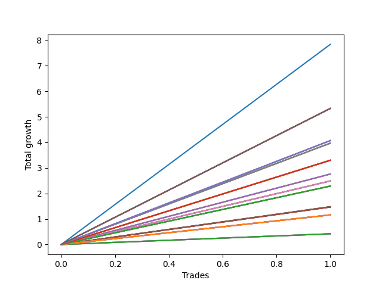

# Long Wallace 003 
- Symbol: NVDA_Unlimited
- Date Range: 02/08/2022 - 07/08/2022
- Trading Period: 7:20-12:30
- Number of Trades: 1



| Name | Win Percent | Profit | Avg Profit / Trade | Avg Time / Trade |      | Name | Win Percent | Profit | Avg Profit / Trade | Avg Time / Trade |
| ---- | ----------- | ------ | ------------------ | ---------------- | ---- | ---- | ----------- | ------ | ------------------ | ---------------- |
| Sorted By <br> Profit | | | | | | Sorted By <br> Win Percentage ||||
| Seventy-Three | 100.00 | 3920.00 | 3920.00 | 23:05 |     | Seventy-Three | 100.00 | 3920.00 | 3920.00 | 23:05 |
| One Hundred Thirty | 100.00 | 2665.00 | 2665.00 | 10:00 |     | One Hundred Thirty | 100.00 | 2665.00 | 2665.00 | 10:00 |
| One Hundred Twenty-Five | 100.00 | 2665.00 | 2665.00 | 10:00 |     | One Hundred Twenty-Five | 100.00 | 2665.00 | 2665.00 | 10:00 |
| One Hundred Twenty | 100.00 | 2665.00 | 2665.00 | 10:00 |     | One Hundred Twenty | 100.00 | 2665.00 | 2665.00 | 10:00 |
| One Hundred Fifteen | 100.00 | 2665.00 | 2665.00 | 10:00 |     | One Hundred Fifteen | 100.00 | 2665.00 | 2665.00 | 10:00 |
| Eighty-Five | 100.00 | 2665.00 | 2665.00 | 10:00 |     | Eighty-Five | 100.00 | 2665.00 | 2665.00 | 10:00 |
| One Hundred Twenty-Nine | 100.00 | 2035.00 | 2035.00 | 08:35 |     | One Hundred Twenty-Nine | 100.00 | 2035.00 | 2035.00 | 08:35 |
| One Hundred Twenty-Four | 100.00 | 2035.00 | 2035.00 | 08:35 |     | One Hundred Twenty-Four | 100.00 | 2035.00 | 2035.00 | 08:35 |
| One Hundred Ninteen | 100.00 | 2035.00 | 2035.00 | 08:35 |     | One Hundred Ninteen | 100.00 | 2035.00 | 2035.00 | 08:35 |
| One Hundred Fourteen | 100.00 | 2035.00 | 2035.00 | 08:35 |     | One Hundred Fourteen | 100.00 | 2035.00 | 2035.00 | 08:35 |
| Eighty-Four | 100.00 | 2035.00 | 2035.00 | 08:35 |     | Eighty-Four | 100.00 | 2035.00 | 2035.00 | 08:35 |
| Sixty-Nine | 100.00 | 1985.00 | 1985.00 | 08:30 |     | Sixty-Nine | 100.00 | 1985.00 | 1985.00 | 08:30 |
| Sixty-One | 100.00 | 1985.00 | 1985.00 | 08:30 |     | Sixty-One | 100.00 | 1985.00 | 1985.00 | 08:30 |
| Fifty-Three | 100.00 | 1985.00 | 1985.00 | 08:30 |     | Fifty-Three | 100.00 | 1985.00 | 1985.00 | 08:30 |
| Forty-Five | 100.00 | 1985.00 | 1985.00 | 08:30 |     | Forty-Five | 100.00 | 1985.00 | 1985.00 | 08:30 |
| Five | 100.00 | 1985.00 | 1985.00 | 08:30 |     | Five | 100.00 | 1985.00 | 1985.00 | 08:30 |
| One Hundred Twenty-Eight | 100.00 | 1650.00 | 1650.00 | 07:15 |     | One Hundred Twenty-Eight | 100.00 | 1650.00 | 1650.00 | 07:15 |
| One Hundred Twenty-Three | 100.00 | 1650.00 | 1650.00 | 07:15 |     | One Hundred Twenty-Three | 100.00 | 1650.00 | 1650.00 | 07:15 |
| One Hundred Eighteen | 100.00 | 1650.00 | 1650.00 | 07:15 |     | One Hundred Eighteen | 100.00 | 1650.00 | 1650.00 | 07:15 |
| One Hundred Thirteen | 100.00 | 1650.00 | 1650.00 | 07:15 |     | One Hundred Thirteen | 100.00 | 1650.00 | 1650.00 | 07:15 |
| Eighty-Three | 100.00 | 1650.00 | 1650.00 | 07:15 |     | Eighty-Three | 100.00 | 1650.00 | 1650.00 | 07:15 |
| Seventy-One | 100.00 | 1650.00 | 1650.00 | 07:15 |     | Seventy-One | 100.00 | 1650.00 | 1650.00 | 07:15 |
| Sixty-Three | 100.00 | 1650.00 | 1650.00 | 07:15 |     | Sixty-Three | 100.00 | 1650.00 | 1650.00 | 07:15 |
| Fifty-Five | 100.00 | 1650.00 | 1650.00 | 07:15 |     | Fifty-Five | 100.00 | 1650.00 | 1650.00 | 07:15 |
| Forty-Seven | 100.00 | 1650.00 | 1650.00 | 07:15 |     | Forty-Seven | 100.00 | 1650.00 | 1650.00 | 07:15 |
| Seven | 100.00 | 1650.00 | 1650.00 | 07:15 |     | Seven | 100.00 | 1650.00 | 1650.00 | 07:15 |
| Sixty-Six | 100.00 | 1380.00 | 1380.00 | 06:55 |     | Sixty-Six | 100.00 | 1380.00 | 1380.00 | 06:55 |
| Fifty-Eight | 100.00 | 1380.00 | 1380.00 | 06:55 |     | Fifty-Eight | 100.00 | 1380.00 | 1380.00 | 06:55 |
| Fifty | 100.00 | 1380.00 | 1380.00 | 06:55 |     | Fifty | 100.00 | 1380.00 | 1380.00 | 06:55 |
| Forty-Two | 100.00 | 1380.00 | 1380.00 | 06:55 |     | Forty-Two | 100.00 | 1380.00 | 1380.00 | 06:55 |
| Two | 100.00 | 1380.00 | 1380.00 | 06:55 |     | Two | 100.00 | 1380.00 | 1380.00 | 06:55 |
| Sixty-Eight | 100.00 | 1245.00 | 1245.00 | 06:45 |     | Sixty-Eight | 100.00 | 1245.00 | 1245.00 | 06:45 |
| Sixty | 100.00 | 1245.00 | 1245.00 | 06:45 |     | Sixty | 100.00 | 1245.00 | 1245.00 | 06:45 |
| Fifty-Two | 100.00 | 1245.00 | 1245.00 | 06:45 |     | Fifty-Two | 100.00 | 1245.00 | 1245.00 | 06:45 |
| Forty-Four | 100.00 | 1245.00 | 1245.00 | 06:45 |     | Forty-Four | 100.00 | 1245.00 | 1245.00 | 06:45 |
| Four | 100.00 | 1245.00 | 1245.00 | 06:45 |     | Four | 100.00 | 1245.00 | 1245.00 | 06:45 |
| One Hundred Twenty-Seven | 100.00 | 1145.00 | 1145.00 | 06:35 |     | One Hundred Twenty-Seven | 100.00 | 1145.00 | 1145.00 | 06:35 |
| One Hundred Twenty-Two | 100.00 | 1145.00 | 1145.00 | 06:35 |     | One Hundred Twenty-Two | 100.00 | 1145.00 | 1145.00 | 06:35 |
| One Hundred Seventeen | 100.00 | 1145.00 | 1145.00 | 06:35 |     | One Hundred Seventeen | 100.00 | 1145.00 | 1145.00 | 06:35 |
| One Hundred Twelve | 100.00 | 1145.00 | 1145.00 | 06:35 |     | One Hundred Twelve | 100.00 | 1145.00 | 1145.00 | 06:35 |
| Eighty-Two | 100.00 | 1145.00 | 1145.00 | 06:35 |     | Eighty-Two | 100.00 | 1145.00 | 1145.00 | 06:35 |
| Sixty-Seven | 100.00 | 740.00 | 740.00 | 04:40 |     | Sixty-Seven | 100.00 | 740.00 | 740.00 | 04:40 |
| Fifty-Nine | 100.00 | 740.00 | 740.00 | 04:40 |     | Fifty-Nine | 100.00 | 740.00 | 740.00 | 04:40 |
| Fifty-One | 100.00 | 740.00 | 740.00 | 04:40 |     | Fifty-One | 100.00 | 740.00 | 740.00 | 04:40 |
| Forty-Three | 100.00 | 740.00 | 740.00 | 04:40 |     | Forty-Three | 100.00 | 740.00 | 740.00 | 04:40 |
| Three | 100.00 | 740.00 | 740.00 | 04:40 |     | Three | 100.00 | 740.00 | 740.00 | 04:40 |
| Sixty-Five | 100.00 | 735.00 | 735.00 | 04:45 |     | Sixty-Five | 100.00 | 735.00 | 735.00 | 04:45 |
| Fifty-Seven | 100.00 | 735.00 | 735.00 | 04:45 |     | Fifty-Seven | 100.00 | 735.00 | 735.00 | 04:45 |
| Forty-Nine | 100.00 | 735.00 | 735.00 | 04:45 |     | Forty-Nine | 100.00 | 735.00 | 735.00 | 04:45 |
| Forty-One | 100.00 | 735.00 | 735.00 | 04:45 |     | Forty-One | 100.00 | 735.00 | 735.00 | 04:45 |
| One | 100.00 | 735.00 | 735.00 | 04:45 |     | One | 100.00 | 735.00 | 735.00 | 04:45 |
| One Hundred Twenty-Six | 100.00 | 580.00 | 580.00 | 04:30 |     | One Hundred Twenty-Six | 100.00 | 580.00 | 580.00 | 04:30 |
| One Hundred Twenty-One | 100.00 | 580.00 | 580.00 | 04:30 |     | One Hundred Twenty-One | 100.00 | 580.00 | 580.00 | 04:30 |
| One Hundred Sixteen | 100.00 | 580.00 | 580.00 | 04:30 |     | One Hundred Sixteen | 100.00 | 580.00 | 580.00 | 04:30 |
| One Hundred Eleven | 100.00 | 580.00 | 580.00 | 04:30 |     | One Hundred Eleven | 100.00 | 580.00 | 580.00 | 04:30 |
| Eighty-One | 100.00 | 580.00 | 580.00 | 04:30 |     | Eighty-One | 100.00 | 580.00 | 580.00 | 04:30 |
| Seventy | 100.00 | 580.00 | 580.00 | 04:30 |     | Seventy | 100.00 | 580.00 | 580.00 | 04:30 |
| Sixty-Two | 100.00 | 580.00 | 580.00 | 04:30 |     | Sixty-Two | 100.00 | 580.00 | 580.00 | 04:30 |
| Fifty-Four | 100.00 | 580.00 | 580.00 | 04:30 |     | Fifty-Four | 100.00 | 580.00 | 580.00 | 04:30 |
| Forty-Six | 100.00 | 580.00 | 580.00 | 04:30 |     | Forty-Six | 100.00 | 580.00 | 580.00 | 04:30 |
| Six | 100.00 | 580.00 | 580.00 | 04:30 |     | Six | 100.00 | 580.00 | 580.00 | 04:30 |
| Sixty-Four | 100.00 | 210.00 | 210.00 | 04:10 |     | Sixty-Four | 100.00 | 210.00 | 210.00 | 04:10 |
| Fifty-Six | 100.00 | 210.00 | 210.00 | 04:10 |     | Fifty-Six | 100.00 | 210.00 | 210.00 | 04:10 |
| Forty-Eight | 100.00 | 210.00 | 210.00 | 04:10 |     | Forty-Eight | 100.00 | 210.00 | 210.00 | 04:10 |
| Forty | 100.00 | 210.00 | 210.00 | 04:10 |     | Forty | 100.00 | 210.00 | 210.00 | 04:10 |
| Zero | 100.00 | 210.00 | 210.00 | 04:10 |     | Zero | 100.00 | 210.00 | 210.00 | 04:10 |

## NO STOPLOSS

### Test Zero
* Sell when price hits the middle line of the 20p bollinger
* No Stoploss
* Results:
```
Total Trades: 1
Percent Up: 100.00
Percent Down: 0.00
Total Points Moved Up: 0.42
Potential Profit: 210.00
Total Points Ups: 0.42 Count Ups: 1
Total Points Downs: 0.00 Count Downs: 0
```

<details><summary>Trades</summary>

<code>In: 2022-05-04 11:37:00		Out: 2022-05-04 11:41:10		Total Position Time: 04:10		Total Move Up: 0.42		Total to Date: 0.42</code> <br />


</details>

### Test One
* Sell when the price hits the upper line of the 20p 1std bollinger
* No Stoploss
* Results:
```
Total Trades: 1
Percent Up: 100.00
Percent Down: 0.00
Total Points Moved Up: 1.47
Potential Profit: 735.00
Total Points Ups: 1.47 Count Ups: 1
Total Points Downs: 0.00 Count Downs: 0
```

<details><summary>Trades</summary>

<code>In: 2022-05-04 11:37:00		Out: 2022-05-04 11:41:45		Total Position Time: 04:45		Total Move Up: 1.47		Total to Date: 1.47</code> <br />


</details>

### Test Two
* Sell when the price hits the upper line of the 20p 2std bollinger
* No Stoploss
* Results:
```
Total Trades: 1
Percent Up: 100.00
Percent Down: 0.00
Total Points Moved Up: 2.76
Potential Profit: 1380.00
Total Points Ups: 2.76 Count Ups: 1
Total Points Downs: 0.00 Count Downs: 0
```

<details><summary>Trades</summary>

<code>In: 2022-05-04 11:37:00		Out: 2022-05-04 11:43:55		Total Position Time: 06:55		Total Move Up: 2.76		Total to Date: 2.76</code> <br />


</details>

### Test Three
* Sell when price hits the middle line of the 50p bollinger
* No Stoploss
* Results:
```
Total Trades: 1
Percent Up: 100.00
Percent Down: 0.00
Total Points Moved Up: 1.48
Potential Profit: 740.00
Total Points Ups: 1.48 Count Ups: 1
Total Points Downs: 0.00 Count Downs: 0
```

<details><summary>Trades</summary>

<code>In: 2022-05-04 11:37:00		Out: 2022-05-04 11:41:40		Total Position Time: 04:40		Total Move Up: 1.48		Total to Date: 1.48</code> <br />


</details>

### Test Four
* Sell when the price hits the upper line of the 50p 1std bollinger
* No Stoploss
* Results:
```
Total Trades: 1
Percent Up: 100.00
Percent Down: 0.00
Total Points Moved Up: 2.49
Potential Profit: 1245.00
Total Points Ups: 2.49 Count Ups: 1
Total Points Downs: 0.00 Count Downs: 0
```

<details><summary>Trades</summary>

<code>In: 2022-05-04 11:37:00		Out: 2022-05-04 11:43:45		Total Position Time: 06:45		Total Move Up: 2.49		Total to Date: 2.49</code> <br />


</details>

### Test Five
* Sell when the price hits the upper line of the 50p 2std bollinger
* No Stoploss
* Results:
```
Total Trades: 1
Percent Up: 100.00
Percent Down: 0.00
Total Points Moved Up: 3.97
Potential Profit: 1985.00
Total Points Ups: 3.97 Count Ups: 1
Total Points Downs: 0.00 Count Downs: 0
```

<details><summary>Trades</summary>

<code>In: 2022-05-04 11:37:00		Out: 2022-05-04 11:45:30		Total Position Time: 08:30		Total Move Up: 3.97		Total to Date: 3.97</code> <br />


</details>

### Test Six
* Sell when the price hits the middle line of the 1std VWAP
* No Stoploss
* Results:
```
Total Trades: 1
Percent Up: 100.00
Percent Down: 0.00
Total Points Moved Up: 1.16
Potential Profit: 580.00
Total Points Ups: 1.16 Count Ups: 1
Total Points Downs: 0.00 Count Downs: 0
```

<details><summary>Trades</summary>

<code>In: 2022-05-04 11:37:00		Out: 2022-05-04 11:41:30		Total Position Time: 04:30		Total Move Up: 1.16		Total to Date: 1.16</code> <br />


</details>

### Test Seven
* Sell when the price hits the upper line of the 1std VWAP
* No Stoploss
* Results:
```
Total Trades: 1
Percent Up: 100.00
Percent Down: 0.00
Total Points Moved Up: 3.30
Potential Profit: 1650.00
Total Points Ups: 3.30 Count Ups: 1
Total Points Downs: 0.00 Count Downs: 0
```

<details><summary>Trades</summary>

<code>In: 2022-05-04 11:37:00		Out: 2022-05-04 11:44:15		Total Position Time: 07:15		Total Move Up: 3.30		Total to Date: 3.30</code> <br />


</details>

## STOPLOSS OF 5

### Test Forty
* Sell when price hits the middle line of the 20p bollinger
* Stoploss is 5 points
* Results:
```
Total Trades: 1
Percent Up: 100.00
Percent Down: 0.00
Total Points Moved Up: 0.42
Potential Profit: 210.00
Total Points Ups: 0.42 Count Ups: 1
Total Points Downs: 0.00 Count Downs: 0
```

<details><summary>Trades</summary>

<code>In: 2022-05-04 11:37:00		Out: 2022-05-04 11:41:10		Total Position Time: 04:10		Total Move Up: 0.42		Total to Date: 0.42</code> <br />


</details>

### Test Forty-One
* Sell when the price hits the upper line of the 20p 1std bollinger
* Stoploss is 5 points
* Results:
```
Total Trades: 1
Percent Up: 100.00
Percent Down: 0.00
Total Points Moved Up: 1.47
Potential Profit: 735.00
Total Points Ups: 1.47 Count Ups: 1
Total Points Downs: 0.00 Count Downs: 0
```

<details><summary>Trades</summary>

<code>In: 2022-05-04 11:37:00		Out: 2022-05-04 11:41:45		Total Position Time: 04:45		Total Move Up: 1.47		Total to Date: 1.47</code> <br />


</details>

### Test Forty-Two
* Sell when the price hits the upper line of the 20p 2std bollinger
* Stoploss is 5 points
* Results:
```
Total Trades: 1
Percent Up: 100.00
Percent Down: 0.00
Total Points Moved Up: 2.76
Potential Profit: 1380.00
Total Points Ups: 2.76 Count Ups: 1
Total Points Downs: 0.00 Count Downs: 0
```

<details><summary>Trades</summary>

<code>In: 2022-05-04 11:37:00		Out: 2022-05-04 11:43:55		Total Position Time: 06:55		Total Move Up: 2.76		Total to Date: 2.76</code> <br />


</details>

### Test Forty-Three
* Sell when price hits the middle line of the 50p bollinger
* Stoploss is 5 points
* Results:
```
Total Trades: 1
Percent Up: 100.00
Percent Down: 0.00
Total Points Moved Up: 1.48
Potential Profit: 740.00
Total Points Ups: 1.48 Count Ups: 1
Total Points Downs: 0.00 Count Downs: 0
```

<details><summary>Trades</summary>

<code>In: 2022-05-04 11:37:00		Out: 2022-05-04 11:41:40		Total Position Time: 04:40		Total Move Up: 1.48		Total to Date: 1.48</code> <br />


</details>

### Test Forty-Four
* Sell when the price hits the upper line of the 50p 1std bollinger
* Stoploss is 5 points
* Results:
```
Total Trades: 1
Percent Up: 100.00
Percent Down: 0.00
Total Points Moved Up: 2.49
Potential Profit: 1245.00
Total Points Ups: 2.49 Count Ups: 1
Total Points Downs: 0.00 Count Downs: 0
```

<details><summary>Trades</summary>

<code>In: 2022-05-04 11:37:00		Out: 2022-05-04 11:43:45		Total Position Time: 06:45		Total Move Up: 2.49		Total to Date: 2.49</code> <br />


</details>

### Test Forty-Five
* Sell when the price hits the upper line of the 50p 2std bollinger
* Stoploss is 5 points
* Results:
```
Total Trades: 1
Percent Up: 100.00
Percent Down: 0.00
Total Points Moved Up: 3.97
Potential Profit: 1985.00
Total Points Ups: 3.97 Count Ups: 1
Total Points Downs: 0.00 Count Downs: 0
```

<details><summary>Trades</summary>

<code>In: 2022-05-04 11:37:00		Out: 2022-05-04 11:45:30		Total Position Time: 08:30		Total Move Up: 3.97		Total to Date: 3.97</code> <br />


</details>

### Test Forty-Six
* Sell when the price hits the middle line of the 1std VWAP
* Stoploss is 5 points
* Results:
```
Total Trades: 1
Percent Up: 100.00
Percent Down: 0.00
Total Points Moved Up: 1.16
Potential Profit: 580.00
Total Points Ups: 1.16 Count Ups: 1
Total Points Downs: 0.00 Count Downs: 0
```

<details><summary>Trades</summary>

<code>In: 2022-05-04 11:37:00		Out: 2022-05-04 11:41:30		Total Position Time: 04:30		Total Move Up: 1.16		Total to Date: 1.16</code> <br />


</details>

### Test Forty-Seven
* Sell when the price hits the upper line of the 1std VWAP
* Stoploss is 5 points
* Results:
```
Total Trades: 1
Percent Up: 100.00
Percent Down: 0.00
Total Points Moved Up: 3.30
Potential Profit: 1650.00
Total Points Ups: 3.30 Count Ups: 1
Total Points Downs: 0.00 Count Downs: 0
```

<details><summary>Trades</summary>

<code>In: 2022-05-04 11:37:00		Out: 2022-05-04 11:44:15		Total Position Time: 07:15		Total Move Up: 3.30		Total to Date: 3.30</code> <br />


</details>

## TRAIL STOP OF 5

### Test Forty-Eight
* Sell when price hits the middle line of the 20p bollinger
* Trailing Stop is 5 points
* Results:
```
Total Trades: 1
Percent Up: 100.00
Percent Down: 0.00
Total Points Moved Up: 0.42
Potential Profit: 210.00
Total Points Ups: 0.42 Count Ups: 1
Total Points Downs: 0.00 Count Downs: 0
```

<details><summary>Trades</summary>

<code>In: 2022-05-04 11:37:00		Out: 2022-05-04 11:41:10		Total Position Time: 04:10		Total Move Up: 0.42		Total to Date: 0.42</code> <br />


</details>

### Test Forty-Nine
* Sell when the price hits the upper line of the 20p 1std bollinger
* Trailing Stop is 5 points
* Results:
```
Total Trades: 1
Percent Up: 100.00
Percent Down: 0.00
Total Points Moved Up: 1.47
Potential Profit: 735.00
Total Points Ups: 1.47 Count Ups: 1
Total Points Downs: 0.00 Count Downs: 0
```

<details><summary>Trades</summary>

<code>In: 2022-05-04 11:37:00		Out: 2022-05-04 11:41:45		Total Position Time: 04:45		Total Move Up: 1.47		Total to Date: 1.47</code> <br />


</details>

### Test Fifty
* Sell when the price hits the upper line of the 20p 2std bollinger
* Trailing Stop is 5 points
* Results:
```
Total Trades: 1
Percent Up: 100.00
Percent Down: 0.00
Total Points Moved Up: 2.76
Potential Profit: 1380.00
Total Points Ups: 2.76 Count Ups: 1
Total Points Downs: 0.00 Count Downs: 0
```

<details><summary>Trades</summary>

<code>In: 2022-05-04 11:37:00		Out: 2022-05-04 11:43:55		Total Position Time: 06:55		Total Move Up: 2.76		Total to Date: 2.76</code> <br />


</details>

### Test Fifty-One
* Sell when price hits the middle line of the 50p bollinger
* Trailing Stop is 5 points
* Results:
```
Total Trades: 1
Percent Up: 100.00
Percent Down: 0.00
Total Points Moved Up: 1.48
Potential Profit: 740.00
Total Points Ups: 1.48 Count Ups: 1
Total Points Downs: 0.00 Count Downs: 0
```

<details><summary>Trades</summary>

<code>In: 2022-05-04 11:37:00		Out: 2022-05-04 11:41:40		Total Position Time: 04:40		Total Move Up: 1.48		Total to Date: 1.48</code> <br />


</details>

### Test Fifty-Two
* Sell when the price hits the upper line of the 50p 1std bollinger
* Trailing Stop is 5 points
* Results:
```
Total Trades: 1
Percent Up: 100.00
Percent Down: 0.00
Total Points Moved Up: 2.49
Potential Profit: 1245.00
Total Points Ups: 2.49 Count Ups: 1
Total Points Downs: 0.00 Count Downs: 0
```

<details><summary>Trades</summary>

<code>In: 2022-05-04 11:37:00		Out: 2022-05-04 11:43:45		Total Position Time: 06:45		Total Move Up: 2.49		Total to Date: 2.49</code> <br />


</details>

### Test Fifty-Three
* Sell when the price hits the upper line of the 50p 2std bollinger
* Trailing Stop is 5 points
* Results:
```
Total Trades: 1
Percent Up: 100.00
Percent Down: 0.00
Total Points Moved Up: 3.97
Potential Profit: 1985.00
Total Points Ups: 3.97 Count Ups: 1
Total Points Downs: 0.00 Count Downs: 0
```

<details><summary>Trades</summary>

<code>In: 2022-05-04 11:37:00		Out: 2022-05-04 11:45:30		Total Position Time: 08:30		Total Move Up: 3.97		Total to Date: 3.97</code> <br />


</details>

### Test Fifty-Four
* Sell when the price hits the middle line of the 1std VWAP
* Trailing Stop is 5 points
* Results:
```
Total Trades: 1
Percent Up: 100.00
Percent Down: 0.00
Total Points Moved Up: 1.16
Potential Profit: 580.00
Total Points Ups: 1.16 Count Ups: 1
Total Points Downs: 0.00 Count Downs: 0
```

<details><summary>Trades</summary>

<code>In: 2022-05-04 11:37:00		Out: 2022-05-04 11:41:30		Total Position Time: 04:30		Total Move Up: 1.16		Total to Date: 1.16</code> <br />


</details>

### Test Fifty-Five
* Sell when the price hits the upper line of the 1std VWAP
* Trailing Stop is 5 points
* Results:
```
Total Trades: 1
Percent Up: 100.00
Percent Down: 0.00
Total Points Moved Up: 3.30
Potential Profit: 1650.00
Total Points Ups: 3.30 Count Ups: 1
Total Points Downs: 0.00 Count Downs: 0
```

<details><summary>Trades</summary>

<code>In: 2022-05-04 11:37:00		Out: 2022-05-04 11:44:15		Total Position Time: 07:15		Total Move Up: 3.30		Total to Date: 3.30</code> <br />


</details>

## STOPLOSS OF 10

### Test Fifty-Six
* Sell when price hits the middle line of the 20p bollinger
* Stoploss is 10 points
* Results:
```
Total Trades: 1
Percent Up: 100.00
Percent Down: 0.00
Total Points Moved Up: 0.42
Potential Profit: 210.00
Total Points Ups: 0.42 Count Ups: 1
Total Points Downs: 0.00 Count Downs: 0
```

<details><summary>Trades</summary>

<code>In: 2022-05-04 11:37:00		Out: 2022-05-04 11:41:10		Total Position Time: 04:10		Total Move Up: 0.42		Total to Date: 0.42</code> <br />


</details>

### Test Fifty-Seven
* Sell when the price hits the upper line of the 20p 1std bollinger
* Stoploss is 10 points
* Results:
```
Total Trades: 1
Percent Up: 100.00
Percent Down: 0.00
Total Points Moved Up: 1.47
Potential Profit: 735.00
Total Points Ups: 1.47 Count Ups: 1
Total Points Downs: 0.00 Count Downs: 0
```

<details><summary>Trades</summary>

<code>In: 2022-05-04 11:37:00		Out: 2022-05-04 11:41:45		Total Position Time: 04:45		Total Move Up: 1.47		Total to Date: 1.47</code> <br />


</details>

### Test Fifty-Eight
* Sell when the price hits the upper line of the 20p 2std bollinger
* Stoploss is 10 points
* Results:
```
Total Trades: 1
Percent Up: 100.00
Percent Down: 0.00
Total Points Moved Up: 2.76
Potential Profit: 1380.00
Total Points Ups: 2.76 Count Ups: 1
Total Points Downs: 0.00 Count Downs: 0
```

<details><summary>Trades</summary>

<code>In: 2022-05-04 11:37:00		Out: 2022-05-04 11:43:55		Total Position Time: 06:55		Total Move Up: 2.76		Total to Date: 2.76</code> <br />


</details>

### Test Fifty-Nine
* Sell when price hits the middle line of the 50p bollinger
* Stoploss is 10 points
* Results:
```
Total Trades: 1
Percent Up: 100.00
Percent Down: 0.00
Total Points Moved Up: 1.48
Potential Profit: 740.00
Total Points Ups: 1.48 Count Ups: 1
Total Points Downs: 0.00 Count Downs: 0
```

<details><summary>Trades</summary>

<code>In: 2022-05-04 11:37:00		Out: 2022-05-04 11:41:40		Total Position Time: 04:40		Total Move Up: 1.48		Total to Date: 1.48</code> <br />


</details>

### Test Sixty
* Sell when the price hits the upper line of the 50p 1std bollinger
* Stoploss is 10 points
* Results:
```
Total Trades: 1
Percent Up: 100.00
Percent Down: 0.00
Total Points Moved Up: 2.49
Potential Profit: 1245.00
Total Points Ups: 2.49 Count Ups: 1
Total Points Downs: 0.00 Count Downs: 0
```

<details><summary>Trades</summary>

<code>In: 2022-05-04 11:37:00		Out: 2022-05-04 11:43:45		Total Position Time: 06:45		Total Move Up: 2.49		Total to Date: 2.49</code> <br />


</details>

### Test Sixty-One
* Sell when the price hits the upper line of the 50p 2std bollinger
* Stoploss is 10 points
* Results:
```
Total Trades: 1
Percent Up: 100.00
Percent Down: 0.00
Total Points Moved Up: 3.97
Potential Profit: 1985.00
Total Points Ups: 3.97 Count Ups: 1
Total Points Downs: 0.00 Count Downs: 0
```

<details><summary>Trades</summary>

<code>In: 2022-05-04 11:37:00		Out: 2022-05-04 11:45:30		Total Position Time: 08:30		Total Move Up: 3.97		Total to Date: 3.97</code> <br />


</details>

### Test Sixty-Two
* Sell when the price hits the middle line of the 1std VWAP
* Stoploss is 10 points
* Results:
```
Total Trades: 1
Percent Up: 100.00
Percent Down: 0.00
Total Points Moved Up: 1.16
Potential Profit: 580.00
Total Points Ups: 1.16 Count Ups: 1
Total Points Downs: 0.00 Count Downs: 0
```

<details><summary>Trades</summary>

<code>In: 2022-05-04 11:37:00		Out: 2022-05-04 11:41:30		Total Position Time: 04:30		Total Move Up: 1.16		Total to Date: 1.16</code> <br />


</details>

### Test Sixty-Three
* Sell when the price hits the upper line of the 1std VWAP
* Stoploss is 10 points
* Results:
```
Total Trades: 1
Percent Up: 100.00
Percent Down: 0.00
Total Points Moved Up: 3.30
Potential Profit: 1650.00
Total Points Ups: 3.30 Count Ups: 1
Total Points Downs: 0.00 Count Downs: 0
```

<details><summary>Trades</summary>

<code>In: 2022-05-04 11:37:00		Out: 2022-05-04 11:44:15		Total Position Time: 07:15		Total Move Up: 3.30		Total to Date: 3.30</code> <br />


</details>

## TRAIL STOP OF 10

### Test Sixty-Four
* Sell when price hits the middle line of the 20p bollinger
* Trailing Stop is 10 points
* Results:
```
Total Trades: 1
Percent Up: 100.00
Percent Down: 0.00
Total Points Moved Up: 0.42
Potential Profit: 210.00
Total Points Ups: 0.42 Count Ups: 1
Total Points Downs: 0.00 Count Downs: 0
```

<details><summary>Trades</summary>

<code>In: 2022-05-04 11:37:00		Out: 2022-05-04 11:41:10		Total Position Time: 04:10		Total Move Up: 0.42		Total to Date: 0.42</code> <br />


</details>

### Test Sixty-Five
* Sell when the price hits the upper line of the 20p 1std bollinger
* Trailing Stop is 10 points
* Results:
```
Total Trades: 1
Percent Up: 100.00
Percent Down: 0.00
Total Points Moved Up: 1.47
Potential Profit: 735.00
Total Points Ups: 1.47 Count Ups: 1
Total Points Downs: 0.00 Count Downs: 0
```

<details><summary>Trades</summary>

<code>In: 2022-05-04 11:37:00		Out: 2022-05-04 11:41:45		Total Position Time: 04:45		Total Move Up: 1.47		Total to Date: 1.47</code> <br />


</details>

### Test Sixty-Six
* Sell when the price hits the upper line of the 20p 2std bollinger
* Trailing Stop is 10 points
* Results:
```
Total Trades: 1
Percent Up: 100.00
Percent Down: 0.00
Total Points Moved Up: 2.76
Potential Profit: 1380.00
Total Points Ups: 2.76 Count Ups: 1
Total Points Downs: 0.00 Count Downs: 0
```

<details><summary>Trades</summary>

<code>In: 2022-05-04 11:37:00		Out: 2022-05-04 11:43:55		Total Position Time: 06:55		Total Move Up: 2.76		Total to Date: 2.76</code> <br />


</details>

### Test Sixty-Seven
* Sell when price hits the middle line of the 50p bollinger
* Trailing Stop is 10 points
* Results:
```
Total Trades: 1
Percent Up: 100.00
Percent Down: 0.00
Total Points Moved Up: 1.48
Potential Profit: 740.00
Total Points Ups: 1.48 Count Ups: 1
Total Points Downs: 0.00 Count Downs: 0
```

<details><summary>Trades</summary>

<code>In: 2022-05-04 11:37:00		Out: 2022-05-04 11:41:40		Total Position Time: 04:40		Total Move Up: 1.48		Total to Date: 1.48</code> <br />


</details>

### Test Sixty-Eight
* Sell when the price hits the upper line of the 50p 1std bollinger
* Trailing Stop is 10 points
* Results:
```
Total Trades: 1
Percent Up: 100.00
Percent Down: 0.00
Total Points Moved Up: 2.49
Potential Profit: 1245.00
Total Points Ups: 2.49 Count Ups: 1
Total Points Downs: 0.00 Count Downs: 0
```

<details><summary>Trades</summary>

<code>In: 2022-05-04 11:37:00		Out: 2022-05-04 11:43:45		Total Position Time: 06:45		Total Move Up: 2.49		Total to Date: 2.49</code> <br />


</details>

### Test Sixty-Nine
* Sell when the price hits the upper line of the 50p 2std bollinger
* Trailing Stop is 10 points
* Results:
```
Total Trades: 1
Percent Up: 100.00
Percent Down: 0.00
Total Points Moved Up: 3.97
Potential Profit: 1985.00
Total Points Ups: 3.97 Count Ups: 1
Total Points Downs: 0.00 Count Downs: 0
```

<details><summary>Trades</summary>

<code>In: 2022-05-04 11:37:00		Out: 2022-05-04 11:45:30		Total Position Time: 08:30		Total Move Up: 3.97		Total to Date: 3.97</code> <br />


</details>

### Test Seventy
* Sell when the price hits the middle line of the 1std VWAP
* Trailing Stop is 10 points
* Results:
```
Total Trades: 1
Percent Up: 100.00
Percent Down: 0.00
Total Points Moved Up: 1.16
Potential Profit: 580.00
Total Points Ups: 1.16 Count Ups: 1
Total Points Downs: 0.00 Count Downs: 0
```

<details><summary>Trades</summary>

<code>In: 2022-05-04 11:37:00		Out: 2022-05-04 11:41:30		Total Position Time: 04:30		Total Move Up: 1.16		Total to Date: 1.16</code> <br />


</details>

### Test Seventy-One
* Sell when the price hits the upper line of the 1std VWAP
* Trailing Stop is 10 points
* Results:
```
Total Trades: 1
Percent Up: 100.00
Percent Down: 0.00
Total Points Moved Up: 3.30
Potential Profit: 1650.00
Total Points Ups: 3.30 Count Ups: 1
Total Points Downs: 0.00 Count Downs: 0
```

<details><summary>Trades</summary>

<code>In: 2022-05-04 11:37:00		Out: 2022-05-04 11:44:15		Total Position Time: 07:15		Total Move Up: 3.30		Total to Date: 3.30</code> <br />


</details>

## SPECIAL EXIT CONDITIONS 

### Test Seventy-Three
* Sell when the linear regression slope changes to negative
* No Stoploss
* Results:
```
Total Trades: 1
Percent Up: 100.00
Percent Down: 0.00
Total Points Moved Up: 7.84
Potential Profit: 3920.00
Total Points Ups: 7.84 Count Ups: 1
Total Points Downs: 0.00 Count Downs: 0
```

<details><summary>Trades</summary>

<code>In: 2022-05-04 11:37:00		Out: 2022-05-04 12:00:05		Total Position Time: 23:05		Total Move Up: 7.84		Total to Date: 7.84</code> <br />


</details>

## TAKE PROFIT

### Test Eighty-One
* Take Profit of 1 Point
* No Stoploss
* Results:
```
Total Trades: 1
Percent Up: 100.00
Percent Down: 0.00
Total Points Moved Up: 1.16
Potential Profit: 580.00
Total Points Ups: 1.16 Count Ups: 1
Total Points Downs: 0.00 Count Downs: 0
```

<details><summary>Trades</summary>

<code>In: 2022-05-04 11:37:00		Out: 2022-05-04 11:41:30		Total Position Time: 04:30		Total Move Up: 1.16		Total to Date: 1.16</code> <br />


</details>

### Test Eighty-Two
* Take Profit of 2 Point
* No Stoploss
* Results:
```
Total Trades: 1
Percent Up: 100.00
Percent Down: 0.00
Total Points Moved Up: 2.29
Potential Profit: 1145.00
Total Points Ups: 2.29 Count Ups: 1
Total Points Downs: 0.00 Count Downs: 0
```

<details><summary>Trades</summary>

<code>In: 2022-05-04 11:37:00		Out: 2022-05-04 11:43:35		Total Position Time: 06:35		Total Move Up: 2.29		Total to Date: 2.29</code> <br />


</details>

### Test Eighty-Three
* Take Profit of 3 Point
* No Stoploss
* Results:
```
Total Trades: 1
Percent Up: 100.00
Percent Down: 0.00
Total Points Moved Up: 3.30
Potential Profit: 1650.00
Total Points Ups: 3.30 Count Ups: 1
Total Points Downs: 0.00 Count Downs: 0
```

<details><summary>Trades</summary>

<code>In: 2022-05-04 11:37:00		Out: 2022-05-04 11:44:15		Total Position Time: 07:15		Total Move Up: 3.30		Total to Date: 3.30</code> <br />


</details>

### Test Eighty-Four
* Take Profit of 4 Point
* No Stoploss
* Results:
```
Total Trades: 1
Percent Up: 100.00
Percent Down: 0.00
Total Points Moved Up: 4.07
Potential Profit: 2035.00
Total Points Ups: 4.07 Count Ups: 1
Total Points Downs: 0.00 Count Downs: 0
```

<details><summary>Trades</summary>

<code>In: 2022-05-04 11:37:00		Out: 2022-05-04 11:45:35		Total Position Time: 08:35		Total Move Up: 4.07		Total to Date: 4.07</code> <br />


</details>

### Test Eighty-Five
* Take Profit of 5 Point
* No Stoploss
* Results:
```
Total Trades: 1
Percent Up: 100.00
Percent Down: 0.00
Total Points Moved Up: 5.33
Potential Profit: 2665.00
Total Points Ups: 5.33 Count Ups: 1
Total Points Downs: 0.00 Count Downs: 0
```

<details><summary>Trades</summary>

<code>In: 2022-05-04 11:37:00		Out: 2022-05-04 11:47:00		Total Position Time: 10:00		Total Move Up: 5.33		Total to Date: 5.33</code> <br />


</details>

## TAKE PROFIT Stoploss of Five

### Test One Hundred Eleven
* Take Profit of 1 Point
* Stoploss is 5 points
* Results:
```
Total Trades: 1
Percent Up: 100.00
Percent Down: 0.00
Total Points Moved Up: 1.16
Potential Profit: 580.00
Total Points Ups: 1.16 Count Ups: 1
Total Points Downs: 0.00 Count Downs: 0
```

<details><summary>Trades</summary>

<code>In: 2022-05-04 11:37:00		Out: 2022-05-04 11:41:30		Total Position Time: 04:30		Total Move Up: 1.16		Total to Date: 1.16</code> <br />


</details>

### Test One Hundred Twelve
* Take Profit of 2 Point
* Stoploss is 5 points
* Results:
```
Total Trades: 1
Percent Up: 100.00
Percent Down: 0.00
Total Points Moved Up: 2.29
Potential Profit: 1145.00
Total Points Ups: 2.29 Count Ups: 1
Total Points Downs: 0.00 Count Downs: 0
```

<details><summary>Trades</summary>

<code>In: 2022-05-04 11:37:00		Out: 2022-05-04 11:43:35		Total Position Time: 06:35		Total Move Up: 2.29		Total to Date: 2.29</code> <br />


</details>

### Test One Hundred Thirteen
* Take Profit of 3 Point
* Stoploss is 5 points
* Results:
```
Total Trades: 1
Percent Up: 100.00
Percent Down: 0.00
Total Points Moved Up: 3.30
Potential Profit: 1650.00
Total Points Ups: 3.30 Count Ups: 1
Total Points Downs: 0.00 Count Downs: 0
```

<details><summary>Trades</summary>

<code>In: 2022-05-04 11:37:00		Out: 2022-05-04 11:44:15		Total Position Time: 07:15		Total Move Up: 3.30		Total to Date: 3.30</code> <br />


</details>

### Test One Hundred Fourteen
* Take Profit of 4 Point
* Stoploss is 5 points
* Results:
```
Total Trades: 1
Percent Up: 100.00
Percent Down: 0.00
Total Points Moved Up: 4.07
Potential Profit: 2035.00
Total Points Ups: 4.07 Count Ups: 1
Total Points Downs: 0.00 Count Downs: 0
```

<details><summary>Trades</summary>

<code>In: 2022-05-04 11:37:00		Out: 2022-05-04 11:45:35		Total Position Time: 08:35		Total Move Up: 4.07		Total to Date: 4.07</code> <br />


</details>

### Test One Hundred Fifteen
* Take Profit of 5 Point
* Stoploss is 5 points
* Results:
```
Total Trades: 1
Percent Up: 100.00
Percent Down: 0.00
Total Points Moved Up: 5.33
Potential Profit: 2665.00
Total Points Ups: 5.33 Count Ups: 1
Total Points Downs: 0.00 Count Downs: 0
```

<details><summary>Trades</summary>

<code>In: 2022-05-04 11:37:00		Out: 2022-05-04 11:47:00		Total Position Time: 10:00		Total Move Up: 5.33		Total to Date: 5.33</code> <br />


</details>

## TAKE PROFIT Trailstop of Five

### Test One Hundred Sixteen
* Take Profit of 1 Point
* Trailing stop is 5 points
* Results:
```
Total Trades: 1
Percent Up: 100.00
Percent Down: 0.00
Total Points Moved Up: 1.16
Potential Profit: 580.00
Total Points Ups: 1.16 Count Ups: 1
Total Points Downs: 0.00 Count Downs: 0
```

<details><summary>Trades</summary>

<code>In: 2022-05-04 11:37:00		Out: 2022-05-04 11:41:30		Total Position Time: 04:30		Total Move Up: 1.16		Total to Date: 1.16</code> <br />


</details>

### Test One Hundred Seventeen
* Take Profit of 2 Point
* Trailing stop is 5 points
* Results:
```
Total Trades: 1
Percent Up: 100.00
Percent Down: 0.00
Total Points Moved Up: 2.29
Potential Profit: 1145.00
Total Points Ups: 2.29 Count Ups: 1
Total Points Downs: 0.00 Count Downs: 0
```

<details><summary>Trades</summary>

<code>In: 2022-05-04 11:37:00		Out: 2022-05-04 11:43:35		Total Position Time: 06:35		Total Move Up: 2.29		Total to Date: 2.29</code> <br />


</details>

### Test One Hundred Eighteen
* Take Profit of 3 Point
* Trailing stop is 5 points
* Results:
```
Total Trades: 1
Percent Up: 100.00
Percent Down: 0.00
Total Points Moved Up: 3.30
Potential Profit: 1650.00
Total Points Ups: 3.30 Count Ups: 1
Total Points Downs: 0.00 Count Downs: 0
```

<details><summary>Trades</summary>

<code>In: 2022-05-04 11:37:00		Out: 2022-05-04 11:44:15		Total Position Time: 07:15		Total Move Up: 3.30		Total to Date: 3.30</code> <br />


</details>

### Test One Hundred Ninteen
* Take Profit of 4 Point
* Trailing stop is 5 points
* Results:
```
Total Trades: 1
Percent Up: 100.00
Percent Down: 0.00
Total Points Moved Up: 4.07
Potential Profit: 2035.00
Total Points Ups: 4.07 Count Ups: 1
Total Points Downs: 0.00 Count Downs: 0
```

<details><summary>Trades</summary>

<code>In: 2022-05-04 11:37:00		Out: 2022-05-04 11:45:35		Total Position Time: 08:35		Total Move Up: 4.07		Total to Date: 4.07</code> <br />


</details>

### Test One Hundred Twenty
* Take Profit of 5 Point
* Trailing stop is 5 points
* Results:
```
Total Trades: 1
Percent Up: 100.00
Percent Down: 0.00
Total Points Moved Up: 5.33
Potential Profit: 2665.00
Total Points Ups: 5.33 Count Ups: 1
Total Points Downs: 0.00 Count Downs: 0
```

<details><summary>Trades</summary>

<code>In: 2022-05-04 11:37:00		Out: 2022-05-04 11:47:00		Total Position Time: 10:00		Total Move Up: 5.33		Total to Date: 5.33</code> <br />


</details>

## TAKE PROFIT Stoploss of Ten

### Test One Hundred Twenty-One
* Take Profit of 1 Point
* Stoploss is 10 points
* Results:
```
Total Trades: 1
Percent Up: 100.00
Percent Down: 0.00
Total Points Moved Up: 1.16
Potential Profit: 580.00
Total Points Ups: 1.16 Count Ups: 1
Total Points Downs: 0.00 Count Downs: 0
```

<details><summary>Trades</summary>

<code>In: 2022-05-04 11:37:00		Out: 2022-05-04 11:41:30		Total Position Time: 04:30		Total Move Up: 1.16		Total to Date: 1.16</code> <br />


</details>

### Test One Hundred Twenty-Two
* Take Profit of 2 Point
* Stoploss is 10 points
* Results:
```
Total Trades: 1
Percent Up: 100.00
Percent Down: 0.00
Total Points Moved Up: 2.29
Potential Profit: 1145.00
Total Points Ups: 2.29 Count Ups: 1
Total Points Downs: 0.00 Count Downs: 0
```

<details><summary>Trades</summary>

<code>In: 2022-05-04 11:37:00		Out: 2022-05-04 11:43:35		Total Position Time: 06:35		Total Move Up: 2.29		Total to Date: 2.29</code> <br />


</details>

### Test One Hundred Twenty-Three
* Take Profit of 3 Point
* Stoploss is 10 points
* Results:
```
Total Trades: 1
Percent Up: 100.00
Percent Down: 0.00
Total Points Moved Up: 3.30
Potential Profit: 1650.00
Total Points Ups: 3.30 Count Ups: 1
Total Points Downs: 0.00 Count Downs: 0
```

<details><summary>Trades</summary>

<code>In: 2022-05-04 11:37:00		Out: 2022-05-04 11:44:15		Total Position Time: 07:15		Total Move Up: 3.30		Total to Date: 3.30</code> <br />


</details>

### Test One Hundred Twenty-Four
* Take Profit of 4 Point
* Stoploss is 10 points
* Results:
```
Total Trades: 1
Percent Up: 100.00
Percent Down: 0.00
Total Points Moved Up: 4.07
Potential Profit: 2035.00
Total Points Ups: 4.07 Count Ups: 1
Total Points Downs: 0.00 Count Downs: 0
```

<details><summary>Trades</summary>

<code>In: 2022-05-04 11:37:00		Out: 2022-05-04 11:45:35		Total Position Time: 08:35		Total Move Up: 4.07		Total to Date: 4.07</code> <br />


</details>

### Test One Hundred Twenty-Five
* Take Profit of 5 Point
* Stoploss is 10 points
* Results:
```
Total Trades: 1
Percent Up: 100.00
Percent Down: 0.00
Total Points Moved Up: 5.33
Potential Profit: 2665.00
Total Points Ups: 5.33 Count Ups: 1
Total Points Downs: 0.00 Count Downs: 0
```

<details><summary>Trades</summary>

<code>In: 2022-05-04 11:37:00		Out: 2022-05-04 11:47:00		Total Position Time: 10:00		Total Move Up: 5.33		Total to Date: 5.33</code> <br />


</details>

## TAKE PROFIT Trailstop of Ten

### Test One Hundred Twenty-Six
* Take Profit of 1 Point
* Trailing stop is 10 points
* Results:
```
Total Trades: 1
Percent Up: 100.00
Percent Down: 0.00
Total Points Moved Up: 1.16
Potential Profit: 580.00
Total Points Ups: 1.16 Count Ups: 1
Total Points Downs: 0.00 Count Downs: 0
```

<details><summary>Trades</summary>

<code>In: 2022-05-04 11:37:00		Out: 2022-05-04 11:41:30		Total Position Time: 04:30		Total Move Up: 1.16		Total to Date: 1.16</code> <br />


</details>

### Test One Hundred Twenty-Seven
* Take Profit of 2 Point
* Trailing stop is 10 points
* Results:
```
Total Trades: 1
Percent Up: 100.00
Percent Down: 0.00
Total Points Moved Up: 2.29
Potential Profit: 1145.00
Total Points Ups: 2.29 Count Ups: 1
Total Points Downs: 0.00 Count Downs: 0
```

<details><summary>Trades</summary>

<code>In: 2022-05-04 11:37:00		Out: 2022-05-04 11:43:35		Total Position Time: 06:35		Total Move Up: 2.29		Total to Date: 2.29</code> <br />


</details>

### Test One Hundred Twenty-Eight
* Take Profit of 3 Point
* Trailing stop is 10 points
* Results:
```
Total Trades: 1
Percent Up: 100.00
Percent Down: 0.00
Total Points Moved Up: 3.30
Potential Profit: 1650.00
Total Points Ups: 3.30 Count Ups: 1
Total Points Downs: 0.00 Count Downs: 0
```

<details><summary>Trades</summary>

<code>In: 2022-05-04 11:37:00		Out: 2022-05-04 11:44:15		Total Position Time: 07:15		Total Move Up: 3.30		Total to Date: 3.30</code> <br />


</details>

### Test One Hundred Twenty-Nine
* Take Profit of 4 Point
* Trailing stop is 10 points
* Results:
```
Total Trades: 1
Percent Up: 100.00
Percent Down: 0.00
Total Points Moved Up: 4.07
Potential Profit: 2035.00
Total Points Ups: 4.07 Count Ups: 1
Total Points Downs: 0.00 Count Downs: 0
```

<details><summary>Trades</summary>

<code>In: 2022-05-04 11:37:00		Out: 2022-05-04 11:45:35		Total Position Time: 08:35		Total Move Up: 4.07		Total to Date: 4.07</code> <br />


</details>

### Test One Hundred Thirty
* Take Profit of 5 Point
* Trailing stop is 10 points
* Results:
```
Total Trades: 1
Percent Up: 100.00
Percent Down: 0.00
Total Points Moved Up: 5.33
Potential Profit: 2665.00
Total Points Ups: 5.33 Count Ups: 1
Total Points Downs: 0.00 Count Downs: 0
```

<details><summary>Trades</summary>

<code>In: 2022-05-04 11:37:00		Out: 2022-05-04 11:47:00		Total Position Time: 10:00		Total Move Up: 5.33		Total to Date: 5.33</code> <br />


</details>