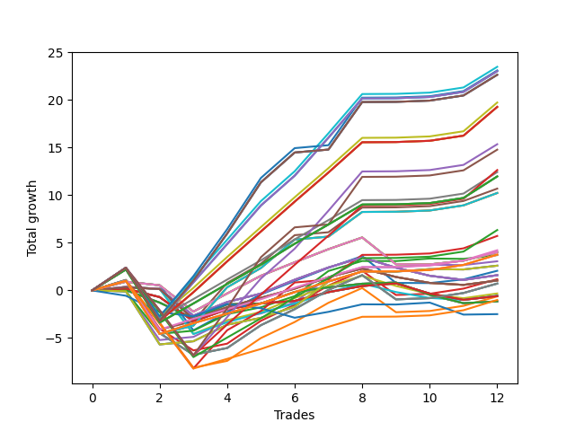

# Long Wallace 009 
- Symbol: NVDA_Unlimited
- Date Range: 02/08/2022 - 07/08/2022
- Trading Period: 7:20-12:30
- Number of Trades: 12



| Name | Win Percent | Profit | Avg Profit / Trade | Avg Time / Trade |      | Name | Win Percent | Profit | Avg Profit / Trade | Avg Time / Trade |
| ---- | ----------- | ------ | ------------------ | ---------------- | ---- | ---- | ----------- | ------ | ------------------ | ---------------- |
| Sorted By <br> Profit | | | | | | Sorted By <br> Win Percentage ||||
| One Hundred Fourteen | 91.67 | 11740.00 | 978.33 | 137:13 |     | One Hundred Fourteen | 91.67 | 11740.00 | 978.33 | 137:13 |
| One Hundred Fifteen | 91.67 | 11550.00 | 962.50 | 146:47 |     | One Hundred Fifteen | 91.67 | 11550.00 | 962.50 | 146:47 |
| One Hundred Twenty-Nine | 91.67 | 11510.00 | 959.17 | 138:26 |     | One Hundred Twenty-Nine | 91.67 | 11510.00 | 959.17 | 138:26 |
| One Hundred Twenty-Four | 91.67 | 11510.00 | 959.17 | 138:26 |     | One Hundred Twenty-Four | 91.67 | 11510.00 | 959.17 | 138:26 |
| Eighty-Four | 91.67 | 11510.00 | 959.17 | 138:26 |     | Eighty-Four | 91.67 | 11510.00 | 959.17 | 138:26 |
| One Hundred Thirty | 91.67 | 11320.00 | 943.33 | 148:00 |     | One Hundred Thirty | 91.67 | 11320.00 | 943.33 | 148:00 |
| One Hundred Twenty-Five | 91.67 | 11320.00 | 943.33 | 148:00 |     | One Hundred Twenty-Five | 91.67 | 11320.00 | 943.33 | 148:00 |
| Eighty-Five | 91.67 | 11320.00 | 943.33 | 148:00 |     | Eighty-Five | 91.67 | 11320.00 | 943.33 | 148:00 |
| One Hundred Thirteen | 91.67 | 9865.00 | 822.08 | 117:13 |     | One Hundred Thirteen | 91.67 | 9865.00 | 822.08 | 117:13 |
| One Hundred Twenty-Eight | 91.67 | 9635.00 | 802.92 | 118:26 |     | One Hundred Twenty-Eight | 91.67 | 9635.00 | 802.92 | 118:26 |
| One Hundred Twenty-Three | 91.67 | 9635.00 | 802.92 | 118:26 |     | One Hundred Twenty-Three | 91.67 | 9635.00 | 802.92 | 118:26 |
| Eighty-Three | 91.67 | 9635.00 | 802.92 | 118:26 |     | Eighty-Three | 91.67 | 9635.00 | 802.92 | 118:26 |
| One Hundred Ninteen | 83.33 | 7675.00 | 639.58 | 127:10 |     | One Hundred Twelve | 91.67 | 6215.00 | 517.92 | 103:27 |
| One Hundred Twenty | 83.33 | 7390.00 | 615.83 | 133:12 |     | One Hundred Twenty-Seven | 91.67 | 5985.00 | 498.75 | 104:40 |
| One Hundred Eighteen | 83.33 | 6320.00 | 526.67 | 109:56 |     | One Hundred Twenty-Two | 91.67 | 5985.00 | 498.75 | 104:40 |
| One Hundred Twelve | 91.67 | 6215.00 | 517.92 | 103:27 |     | Eighty-Two | 91.67 | 5985.00 | 498.75 | 104:40 |
| One Hundred Twenty-Seven | 91.67 | 5985.00 | 498.75 | 104:40 |     | Forty-Seven | 91.67 | 5345.00 | 445.42 | 103:23 |
| One Hundred Twenty-Two | 91.67 | 5985.00 | 498.75 | 104:40 |     | Seventy-One | 91.67 | 5115.00 | 426.25 | 104:36 |
| Eighty-Two | 91.67 | 5985.00 | 498.75 | 104:40 |     | Sixty-Three | 91.67 | 5115.00 | 426.25 | 104:36 |
| Forty-Seven | 91.67 | 5345.00 | 445.42 | 103:23 |     | Seven | 91.67 | 5115.00 | 426.25 | 104:36 |
| Seventy-One | 91.67 | 5115.00 | 426.25 | 104:36 |     | One Hundred Eleven | 91.67 | 2110.00 | 175.83 | 61:51 |
| Sixty-Three | 91.67 | 5115.00 | 426.25 | 104:36 |     | One Hundred Twenty-Six | 91.67 | 1880.00 | 156.67 | 63:04 |
| Seven | 91.67 | 5115.00 | 426.25 | 104:36 |     | One Hundred Twenty-One | 91.67 | 1880.00 | 156.67 | 63:04 |
| One Hundred Seventeen | 83.33 | 3170.00 | 264.17 | 96:23 |     | Eighty-One | 91.67 | 1880.00 | 156.67 | 63:04 |
| Fifty-Five | 83.33 | 2860.00 | 238.33 | 96:47 |     | One Hundred Ninteen | 83.33 | 7675.00 | 639.58 | 127:10 |
| One Hundred Eleven | 91.67 | 2110.00 | 175.83 | 61:51 |     | One Hundred Twenty | 83.33 | 7390.00 | 615.83 | 133:12 |
| Sixty-Eight | 66.67 | 2010.00 | 167.50 | 47:14 |     | One Hundred Eighteen | 83.33 | 6320.00 | 526.67 | 109:56 |
| Sixty | 66.67 | 2010.00 | 167.50 | 47:14 |     | One Hundred Seventeen | 83.33 | 3170.00 | 264.17 | 96:23 |
| Forty-Four | 66.67 | 2010.00 | 167.50 | 47:14 |     | Fifty-Five | 83.33 | 2860.00 | 238.33 | 96:47 |
| Four | 66.67 | 2010.00 | 167.50 | 47:14 |     | One Hundred Sixteen | 83.33 | -500.00 | -41.67 | 55:13 |
| One Hundred Twenty-Six | 91.67 | 1880.00 | 156.67 | 63:04 |     | Forty-Five | 75.00 | 590.00 | 49.17 | 70:17 |
| One Hundred Twenty-One | 91.67 | 1880.00 | 156.67 | 63:04 |     | Sixty-Nine | 75.00 | 360.00 | 30.00 | 71:30 |
| Eighty-One | 91.67 | 1880.00 | 156.67 | 63:04 |     | Sixty-One | 75.00 | 360.00 | 30.00 | 71:30 |
| Fifty-Four | 66.67 | 1855.00 | 154.58 | 37:26 |     | Five | 75.00 | 360.00 | 30.00 | 71:30 |
| Forty-Six | 66.67 | 1530.00 | 127.50 | 37:29 |     | Fifty-Three | 75.00 | -315.00 | -26.25 | 68:42 |
| Seventy | 66.67 | 1300.00 | 108.33 | 38:42 |     | Sixty-Eight | 66.67 | 2010.00 | 167.50 | 47:14 |
| Sixty-Two | 66.67 | 1300.00 | 108.33 | 38:42 |     | Sixty | 66.67 | 2010.00 | 167.50 | 47:14 |
| Six | 66.67 | 1300.00 | 108.33 | 38:42 |     | Forty-Four | 66.67 | 2010.00 | 167.50 | 47:14 |
| Fifty-Two | 66.67 | 1030.00 | 85.83 | 45:50 |     | Four | 66.67 | 2010.00 | 167.50 | 47:14 |
| Sixty-Six | 58.33 | 800.00 | 66.67 | 28:42 |     | Fifty-Four | 66.67 | 1855.00 | 154.58 | 37:26 |
| Fifty-Eight | 58.33 | 800.00 | 66.67 | 28:42 |     | Forty-Six | 66.67 | 1530.00 | 127.50 | 37:29 |
| Forty-Two | 58.33 | 800.00 | 66.67 | 28:42 |     | Seventy | 66.67 | 1300.00 | 108.33 | 38:42 |
| Two | 58.33 | 800.00 | 66.67 | 28:42 |     | Sixty-Two | 66.67 | 1300.00 | 108.33 | 38:42 |
| Forty-Five | 75.00 | 590.00 | 49.17 | 70:17 |     | Six | 66.67 | 1300.00 | 108.33 | 38:42 |
| Sixty-Seven | 58.33 | 520.00 | 43.33 | 30:33 |     | Fifty-Two | 66.67 | 1030.00 | 85.83 | 45:50 |
| Fifty-Nine | 58.33 | 520.00 | 43.33 | 30:33 |     | Sixty-Five | 66.67 | -295.00 | -24.58 | 19:53 |
| Forty-Three | 58.33 | 520.00 | 43.33 | 30:33 |     | Fifty-Seven | 66.67 | -295.00 | -24.58 | 19:53 |
| Three | 58.33 | 520.00 | 43.33 | 30:33 |     | Forty-Nine | 66.67 | -295.00 | -24.58 | 19:53 |
| Sixty-Nine | 75.00 | 360.00 | 30.00 | 71:30 |     | Forty-One | 66.67 | -295.00 | -24.58 | 19:53 |
| Sixty-One | 75.00 | 360.00 | 30.00 | 71:30 |     | One | 66.67 | -295.00 | -24.58 | 19:53 |
| Five | 75.00 | 360.00 | 30.00 | 71:30 |     | Sixty-Four | 66.67 | -575.00 | -47.92 | 14:31 |
| Fifty | 58.33 | -160.00 | -13.33 | 27:45 |     | Fifty-Six | 66.67 | -575.00 | -47.92 | 14:31 |
| Fifty-One | 58.33 | -270.00 | -22.50 | 29:40 |     | Forty-Eight | 66.67 | -575.00 | -47.92 | 14:31 |
| Sixty-Five | 66.67 | -295.00 | -24.58 | 19:53 |     | Forty | 66.67 | -575.00 | -47.92 | 14:31 |
| Fifty-Seven | 66.67 | -295.00 | -24.58 | 19:53 |     | Zero | 66.67 | -575.00 | -47.92 | 14:31 |
| Forty-Nine | 66.67 | -295.00 | -24.58 | 19:53 |     | Sixty-Six | 58.33 | 800.00 | 66.67 | 28:42 |
| Forty-One | 66.67 | -295.00 | -24.58 | 19:53 |     | Fifty-Eight | 58.33 | 800.00 | 66.67 | 28:42 |
| One | 66.67 | -295.00 | -24.58 | 19:53 |     | Forty-Two | 58.33 | 800.00 | 66.67 | 28:42 |
| Fifty-Three | 75.00 | -315.00 | -26.25 | 68:42 |     | Two | 58.33 | 800.00 | 66.67 | 28:42 |
| One Hundred Sixteen | 83.33 | -500.00 | -41.67 | 55:13 |     | Sixty-Seven | 58.33 | 520.00 | 43.33 | 30:33 |
| Sixty-Four | 66.67 | -575.00 | -47.92 | 14:31 |     | Fifty-Nine | 58.33 | 520.00 | 43.33 | 30:33 |
| Fifty-Six | 66.67 | -575.00 | -47.92 | 14:31 |     | Forty-Three | 58.33 | 520.00 | 43.33 | 30:33 |
| Forty-Eight | 66.67 | -575.00 | -47.92 | 14:31 |     | Three | 58.33 | 520.00 | 43.33 | 30:33 |
| Forty | 66.67 | -575.00 | -47.92 | 14:31 |     | Fifty | 58.33 | -160.00 | -13.33 | 27:45 |
| Zero | 66.67 | -575.00 | -47.92 | 14:31 |     | Fifty-One | 58.33 | -270.00 | -22.50 | 29:40 |
| Seventy-Three | 41.67 | -1245.00 | -103.75 | 12:05 |     | Seventy-Three | 41.67 | -1245.00 | -103.75 | 12:05 |

## NO STOPLOSS

### Test Zero
* Sell when price hits the middle line of the 20p bollinger
* No Stoploss
* Results:
```
Total Trades: 12
Percent Up: 66.67
Percent Down: 33.33
Total Points Moved Up: -1.15
Potential Profit: -575.00
Total Points Ups: 4.00 Count Ups: 8
Total Points Downs: -5.15 Count Downs: 4
```

<details><summary>Trades</summary>

<code>In: 2022-02-08 10:45:00		Out: 2022-02-08 10:58:25		Total Position Time: 13:25		Total Move Up: 0.03		Total to Date: 0.03</code> <br />
<code>In: 2022-02-10 10:21:00		Out: 2022-02-10 10:40:50		Total Position Time: 19:50		Total Move Up: -1.31		Total to Date: -1.28</code> <br />
<code>In: 2022-02-16 09:02:00		Out: 2022-02-16 09:28:15		Total Position Time: 26:15		Total Move Up: -1.67		Total to Date: -2.95</code> <br />
<code>In: 2022-02-22 08:22:00		Out: 2022-02-22 08:26:50		Total Position Time: 04:50		Total Move Up: 1.49		Total to Date: -1.46</code> <br />
<code>In: 2022-02-24 09:16:00		Out: 2022-02-24 09:29:10		Total Position Time: 13:10		Total Move Up: 0.09		Total to Date: -1.37</code> <br />
<code>In: 2022-02-25 10:59:00		Out: 2022-02-25 11:04:15		Total Position Time: 05:15		Total Move Up: 1.21		Total to Date: -0.16</code> <br />
<code>In: 2022-03-31 10:18:00		Out: 2022-03-31 10:26:30		Total Position Time: 08:30		Total Move Up: 0.48		Total to Date: 0.32</code> <br />
<code>In: 2022-04-13 10:57:00		Out: 2022-04-13 10:59:35		Total Position Time: 02:35		Total Move Up: 0.38		Total to Date: 0.70</code> <br />
<code>In: 2022-06-23 08:38:00		Out: 2022-06-23 08:49:25		Total Position Time: 11:25		Total Move Up: 0.13		Total to Date: 0.83</code> <br />
<code>In: 2022-06-30 11:46:00		Out: 2022-06-30 12:22:20		Total Position Time: 36:20		Total Move Up: -1.29		Total to Date: -0.46</code> <br />
<code>In: 2022-06-30 12:02:00		Out: 2022-06-30 12:22:20		Total Position Time: 20:20		Total Move Up: -0.88		Total to Date: -1.34</code> <br />
<code>In: 2022-07-06 08:32:00		Out: 2022-07-06 08:44:20		Total Position Time: 12:20		Total Move Up: 0.19		Total to Date: -1.15</code> <br />


</details>

### Test One
* Sell when the price hits the upper line of the 20p 1std bollinger
* No Stoploss
* Results:
```
Total Trades: 12
Percent Up: 66.67
Percent Down: 33.33
Total Points Moved Up: -0.59
Potential Profit: -295.00
Total Points Ups: 4.57 Count Ups: 8
Total Points Downs: -5.16 Count Downs: 4
```

<details><summary>Trades</summary>

<code>In: 2022-02-08 10:45:00		Out: 2022-02-08 11:00:05		Total Position Time: 15:05		Total Move Up: 0.19		Total to Date: 0.19</code> <br />
<code>In: 2022-02-10 10:21:00		Out: 2022-02-10 10:43:25		Total Position Time: 22:25		Total Move Up: -0.89		Total to Date: -0.70</code> <br />
<code>In: 2022-02-16 09:02:00		Out: 2022-02-16 09:49:05		Total Position Time: 47:05		Total Move Up: -2.54		Total to Date: -3.24</code> <br />
<code>In: 2022-02-22 08:22:00		Out: 2022-02-22 08:33:50		Total Position Time: 11:50		Total Move Up: 1.25		Total to Date: -1.99</code> <br />
<code>In: 2022-02-24 09:16:00		Out: 2022-02-24 09:30:20		Total Position Time: 14:20		Total Move Up: 0.63		Total to Date: -1.36</code> <br />
<code>In: 2022-02-25 10:59:00		Out: 2022-02-25 11:19:15		Total Position Time: 20:15		Total Move Up: 0.26		Total to Date: -1.10</code> <br />
<code>In: 2022-03-31 10:18:00		Out: 2022-03-31 10:29:20		Total Position Time: 11:20		Total Move Up: 0.92		Total to Date: -0.18</code> <br />
<code>In: 2022-04-13 10:57:00		Out: 2022-04-13 11:03:35		Total Position Time: 06:35		Total Move Up: 0.64		Total to Date: 0.46</code> <br />
<code>In: 2022-06-23 08:38:00		Out: 2022-06-23 08:51:20		Total Position Time: 13:20		Total Move Up: 0.28		Total to Date: 0.74</code> <br />
<code>In: 2022-06-30 11:46:00		Out: 2022-06-30 12:25:10		Total Position Time: 39:10		Total Move Up: -1.07		Total to Date: -0.33</code> <br />
<code>In: 2022-06-30 12:02:00		Out: 2022-06-30 12:25:10		Total Position Time: 23:10		Total Move Up: -0.66		Total to Date: -0.99</code> <br />
<code>In: 2022-07-06 08:32:00		Out: 2022-07-06 08:46:10		Total Position Time: 14:10		Total Move Up: 0.40		Total to Date: -0.59</code> <br />


</details>

### Test Two
* Sell when the price hits the upper line of the 20p 2std bollinger
* No Stoploss
* Results:
```
Total Trades: 12
Percent Up: 58.33
Percent Down: 41.67
Total Points Moved Up: 1.60
Potential Profit: 800.00
Total Points Ups: 6.98 Count Ups: 7
Total Points Downs: -5.38 Count Downs: 5
```

<details><summary>Trades</summary>

<code>In: 2022-02-08 10:45:00		Out: 2022-02-08 11:04:25		Total Position Time: 19:25		Total Move Up: 0.37		Total to Date: 0.37</code> <br />
<code>In: 2022-02-10 10:21:00		Out: 2022-02-10 10:46:50		Total Position Time: 25:50		Total Move Up: -0.21		Total to Date: 0.16</code> <br />
<code>In: 2022-02-16 09:02:00		Out: 2022-02-16 10:16:00		Total Position Time: 74:00		Total Move Up: -2.81		Total to Date: -2.65</code> <br />
<code>In: 2022-02-22 08:22:00		Out: 2022-02-22 08:48:30		Total Position Time: 26:30		Total Move Up: 1.43		Total to Date: -1.22</code> <br />
<code>In: 2022-02-24 09:16:00		Out: 2022-02-24 09:34:25		Total Position Time: 18:25		Total Move Up: 0.89		Total to Date: -0.33</code> <br />
<code>In: 2022-02-25 10:59:00		Out: 2022-02-25 11:25:30		Total Position Time: 26:30		Total Move Up: 1.45		Total to Date: 1.12</code> <br />
<code>In: 2022-03-31 10:18:00		Out: 2022-03-31 10:31:45		Total Position Time: 13:45		Total Move Up: 1.29		Total to Date: 2.41</code> <br />
<code>In: 2022-04-13 10:57:00		Out: 2022-04-13 11:06:20		Total Position Time: 09:20		Total Move Up: 1.05		Total to Date: 3.46</code> <br />
<code>In: 2022-06-23 08:38:00		Out: 2022-06-23 09:27:40		Total Position Time: 49:40		Total Move Up: -1.07		Total to Date: 2.39</code> <br />
<code>In: 2022-06-30 11:46:00		Out: 2022-06-30 12:25:55		Total Position Time: 39:55		Total Move Up: -0.85		Total to Date: 1.54</code> <br />
<code>In: 2022-06-30 12:02:00		Out: 2022-06-30 12:25:55		Total Position Time: 23:55		Total Move Up: -0.44		Total to Date: 1.10</code> <br />
<code>In: 2022-07-06 08:32:00		Out: 2022-07-06 08:49:15		Total Position Time: 17:15		Total Move Up: 0.50		Total to Date: 1.60</code> <br />


</details>

### Test Three
* Sell when price hits the middle line of the 50p bollinger
* No Stoploss
* Results:
```
Total Trades: 12
Percent Up: 58.33
Percent Down: 41.67
Total Points Moved Up: 1.04
Potential Profit: 520.00
Total Points Ups: 6.09 Count Ups: 7
Total Points Downs: -5.05 Count Downs: 5
```

<details><summary>Trades</summary>

<code>In: 2022-02-08 10:45:00		Out: 2022-02-08 11:03:10		Total Position Time: 18:10		Total Move Up: 0.33		Total to Date: 0.33</code> <br />
<code>In: 2022-02-10 10:21:00		Out: 2022-02-10 10:58:20		Total Position Time: 37:20		Total Move Up: -0.18		Total to Date: 0.15</code> <br />
<code>In: 2022-02-16 09:02:00		Out: 2022-02-16 10:15:05		Total Position Time: 73:05		Total Move Up: -3.15		Total to Date: -3.00</code> <br />
<code>In: 2022-02-22 08:22:00		Out: 2022-02-22 08:48:05		Total Position Time: 26:05		Total Move Up: 1.23		Total to Date: -1.77</code> <br />
<code>In: 2022-02-24 09:16:00		Out: 2022-02-24 09:30:35		Total Position Time: 14:35		Total Move Up: 0.99		Total to Date: -0.78</code> <br />
<code>In: 2022-02-25 10:59:00		Out: 2022-02-25 11:23:35		Total Position Time: 24:35		Total Move Up: 0.97		Total to Date: 0.19</code> <br />
<code>In: 2022-03-31 10:18:00		Out: 2022-03-31 10:29:50		Total Position Time: 11:50		Total Move Up: 1.20		Total to Date: 1.39</code> <br />
<code>In: 2022-04-13 10:57:00		Out: 2022-04-13 11:05:25		Total Position Time: 08:25		Total Move Up: 0.91		Total to Date: 2.30</code> <br />
<code>In: 2022-06-23 08:38:00		Out: 2022-06-23 09:28:00		Total Position Time: 50:00		Total Move Up: -0.89		Total to Date: 1.41</code> <br />
<code>In: 2022-06-30 11:46:00		Out: 2022-06-30 12:27:55		Total Position Time: 41:55		Total Move Up: -0.62		Total to Date: 0.79</code> <br />
<code>In: 2022-06-30 12:02:00		Out: 2022-06-30 12:27:55		Total Position Time: 25:55		Total Move Up: -0.21		Total to Date: 0.58</code> <br />
<code>In: 2022-07-06 08:32:00		Out: 2022-07-06 09:06:45		Total Position Time: 34:45		Total Move Up: 0.46		Total to Date: 1.04</code> <br />


</details>

### Test Four
* Sell when the price hits the upper line of the 50p 1std bollinger
* No Stoploss
* Results:
```
Total Trades: 12
Percent Up: 66.67
Percent Down: 33.33
Total Points Moved Up: 4.02
Potential Profit: 2010.00
Total Points Ups: 10.00 Count Ups: 8
Total Points Downs: -5.98 Count Downs: 4
```

<details><summary>Trades</summary>

<code>In: 2022-02-08 10:45:00		Out: 2022-02-08 11:07:05		Total Position Time: 22:05		Total Move Up: 0.92		Total to Date: 0.92</code> <br />
<code>In: 2022-02-10 10:21:00		Out: 2022-02-10 11:36:45		Total Position Time: 75:45		Total Move Up: -0.38		Total to Date: 0.54</code> <br />
<code>In: 2022-02-16 09:02:00		Out: 2022-02-16 10:21:20		Total Position Time: 79:20		Total Move Up: -2.77		Total to Date: -2.23</code> <br />
<code>In: 2022-02-22 08:22:00		Out: 2022-02-22 08:50:40		Total Position Time: 28:40		Total Move Up: 1.91		Total to Date: -0.32</code> <br />
<code>In: 2022-02-24 09:16:00		Out: 2022-02-24 09:37:50		Total Position Time: 21:50		Total Move Up: 1.86		Total to Date: 1.54</code> <br />
<code>In: 2022-02-25 10:59:00		Out: 2022-02-25 11:40:10		Total Position Time: 41:10		Total Move Up: 1.41		Total to Date: 2.95</code> <br />
<code>In: 2022-03-31 10:18:00		Out: 2022-03-31 10:50:20		Total Position Time: 32:20		Total Move Up: 1.38		Total to Date: 4.33</code> <br />
<code>In: 2022-04-13 10:57:00		Out: 2022-04-13 11:16:30		Total Position Time: 19:30		Total Move Up: 1.23		Total to Date: 5.56</code> <br />
<code>In: 2022-06-23 08:38:00		Out: 2022-06-23 10:53:35		Total Position Time: 135:35		Total Move Up: -2.81		Total to Date: 2.75</code> <br />
<code>In: 2022-06-30 11:46:00		Out: 2022-06-30 12:31:35		Total Position Time: 45:35		Total Move Up: -0.02		Total to Date: 2.73</code> <br />
<code>In: 2022-06-30 12:02:00		Out: 2022-06-30 12:31:35		Total Position Time: 29:35		Total Move Up: 0.39		Total to Date: 3.12</code> <br />
<code>In: 2022-07-06 08:32:00		Out: 2022-07-06 09:07:30		Total Position Time: 35:30		Total Move Up: 0.90		Total to Date: 4.02</code> <br />


</details>

### Test Five
* Sell when the price hits the upper line of the 50p 2std bollinger
* No Stoploss
* Results:
```
Total Trades: 12
Percent Up: 75.00
Percent Down: 25.00
Total Points Moved Up: 0.72
Potential Profit: 360.00
Total Points Ups: 11.11 Count Ups: 9
Total Points Downs: -10.39 Count Downs: 3
```

<details><summary>Trades</summary>

<code>In: 2022-02-08 10:45:00		Out: 2022-02-08 11:51:10		Total Position Time: 66:10		Total Move Up: 1.09		Total to Date: 1.09</code> <br />
<code>In: 2022-02-10 10:21:00		Out: 2022-02-10 12:47:00		Total Position Time: 146:00		Total Move Up: -5.58		Total to Date: -4.49</code> <br />
<code>In: 2022-02-16 09:02:00		Out: 2022-02-16 10:22:55		Total Position Time: 80:55		Total Move Up: -2.27		Total to Date: -6.76</code> <br />
<code>In: 2022-02-22 08:22:00		Out: 2022-02-22 09:42:10		Total Position Time: 80:10		Total Move Up: 0.71		Total to Date: -6.05</code> <br />
<code>In: 2022-02-24 09:16:00		Out: 2022-02-24 10:13:40		Total Position Time: 57:40		Total Move Up: 2.40		Total to Date: -3.65</code> <br />
<code>In: 2022-02-25 10:59:00		Out: 2022-02-25 12:15:55		Total Position Time: 76:55		Total Move Up: 1.68		Total to Date: -1.97</code> <br />
<code>In: 2022-03-31 10:18:00		Out: 2022-03-31 10:51:30		Total Position Time: 33:30		Total Move Up: 2.02		Total to Date: 0.05</code> <br />
<code>In: 2022-04-13 10:57:00		Out: 2022-04-13 11:28:15		Total Position Time: 31:15		Total Move Up: 1.55		Total to Date: 1.60</code> <br />
<code>In: 2022-06-23 08:38:00		Out: 2022-06-23 10:56:05		Total Position Time: 138:05		Total Move Up: -2.54		Total to Date: -0.94</code> <br />
<code>In: 2022-06-30 11:46:00		Out: 2022-06-30 12:47:00		Total Position Time: 61:00		Total Move Up: 0.13		Total to Date: -0.81</code> <br />
<code>In: 2022-06-30 12:02:00		Out: 2022-06-30 12:47:00		Total Position Time: 45:00		Total Move Up: 0.54		Total to Date: -0.27</code> <br />
<code>In: 2022-07-06 08:32:00		Out: 2022-07-06 09:13:25		Total Position Time: 41:25		Total Move Up: 0.99		Total to Date: 0.72</code> <br />


</details>

### Test Six
* Sell when the price hits the middle line of the 1std VWAP
* No Stoploss
* Results:
```
Total Trades: 12
Percent Up: 66.67
Percent Down: 33.33
Total Points Moved Up: 2.60
Potential Profit: 1300.00
Total Points Ups: 8.32 Count Ups: 8
Total Points Downs: -5.72 Count Downs: 4
```

<details><summary>Trades</summary>

<code>In: 2022-02-08 10:45:00		Out: 2022-02-08 10:46:10		Total Position Time: 01:10		Total Move Up: -0.09		Total to Date: -0.09</code> <br />
<code>In: 2022-02-10 10:21:00		Out: 2022-02-10 12:47:00		Total Position Time: 146:00		Total Move Up: -5.58		Total to Date: -5.67</code> <br />
<code>In: 2022-02-16 09:02:00		Out: 2022-02-16 09:03:10		Total Position Time: 01:10		Total Move Up: 0.33		Total to Date: -5.34</code> <br />
<code>In: 2022-02-22 08:22:00		Out: 2022-02-22 11:31:50		Total Position Time: 189:50		Total Move Up: 1.74		Total to Date: -3.60</code> <br />
<code>In: 2022-02-24 09:16:00		Out: 2022-02-24 09:17:10		Total Position Time: 01:10		Total Move Up: 0.72		Total to Date: -2.88</code> <br />
<code>In: 2022-02-25 10:59:00		Out: 2022-02-25 11:24:30		Total Position Time: 25:30		Total Move Up: 1.17		Total to Date: -1.71</code> <br />
<code>In: 2022-03-31 10:18:00		Out: 2022-03-31 11:20:55		Total Position Time: 62:55		Total Move Up: 2.64		Total to Date: 0.93</code> <br />
<code>In: 2022-04-13 10:57:00		Out: 2022-04-13 11:06:20		Total Position Time: 09:20		Total Move Up: 1.05		Total to Date: 1.98</code> <br />
<code>In: 2022-06-23 08:38:00		Out: 2022-06-23 08:49:00		Total Position Time: 11:00		Total Move Up: -0.01		Total to Date: 1.97</code> <br />
<code>In: 2022-06-30 11:46:00		Out: 2022-06-30 11:47:10		Total Position Time: 01:10		Total Move Up: 0.27		Total to Date: 2.24</code> <br />
<code>In: 2022-06-30 12:02:00		Out: 2022-06-30 12:03:15		Total Position Time: 01:15		Total Move Up: -0.04		Total to Date: 2.20</code> <br />
<code>In: 2022-07-06 08:32:00		Out: 2022-07-06 08:46:00		Total Position Time: 14:00		Total Move Up: 0.40		Total to Date: 2.60</code> <br />


</details>

### Test Seven
* Sell when the price hits the upper line of the 1std VWAP
* No Stoploss
* Results:
```
Total Trades: 12
Percent Up: 91.67
Percent Down: 8.33
Total Points Moved Up: 10.23
Potential Profit: 5115.00
Total Points Ups: 15.81 Count Ups: 11
Total Points Downs: -5.58 Count Downs: 1
```

<details><summary>Trades</summary>

<code>In: 2022-02-08 10:45:00		Out: 2022-02-08 11:07:35		Total Position Time: 22:35		Total Move Up: 1.00		Total to Date: 1.00</code> <br />
<code>In: 2022-02-10 10:21:00		Out: 2022-02-10 12:47:00		Total Position Time: 146:00		Total Move Up: -5.58		Total to Date: -4.58</code> <br />
<code>In: 2022-02-16 09:02:00		Out: 2022-02-16 11:23:15		Total Position Time: 141:15		Total Move Up: 0.89		Total to Date: -3.69</code> <br />
<code>In: 2022-02-22 08:22:00		Out: 2022-02-22 11:53:40		Total Position Time: 211:40		Total Move Up: 4.02		Total to Date: 0.33</code> <br />
<code>In: 2022-02-24 09:16:00		Out: 2022-02-24 09:40:00		Total Position Time: 24:00		Total Move Up: 2.02		Total to Date: 2.35</code> <br />
<code>In: 2022-02-25 10:59:00		Out: 2022-02-25 12:24:10		Total Position Time: 85:10		Total Move Up: 2.99		Total to Date: 5.34</code> <br />
<code>In: 2022-03-31 10:18:00		Out: 2022-03-31 12:47:00		Total Position Time: 149:00		Total Move Up: 0.31		Total to Date: 5.65</code> <br />
<code>In: 2022-04-13 10:57:00		Out: 2022-04-13 11:45:10		Total Position Time: 48:10		Total Move Up: 2.59		Total to Date: 8.24</code> <br />
<code>In: 2022-06-23 08:38:00		Out: 2022-06-23 12:47:00		Total Position Time: 249:00		Total Move Up: 0.02		Total to Date: 8.26</code> <br />
<code>In: 2022-06-30 11:46:00		Out: 2022-06-30 12:47:00		Total Position Time: 61:00		Total Move Up: 0.13		Total to Date: 8.39</code> <br />
<code>In: 2022-06-30 12:02:00		Out: 2022-06-30 12:47:00		Total Position Time: 45:00		Total Move Up: 0.54		Total to Date: 8.93</code> <br />
<code>In: 2022-07-06 08:32:00		Out: 2022-07-06 09:44:25		Total Position Time: 72:25		Total Move Up: 1.30		Total to Date: 10.23</code> <br />


</details>

## STOPLOSS OF 5

### Test Forty
* Sell when price hits the middle line of the 20p bollinger
* Stoploss is 5 points
* Results:
```
Total Trades: 12
Percent Up: 66.67
Percent Down: 33.33
Total Points Moved Up: -1.15
Potential Profit: -575.00
Total Points Ups: 4.00 Count Ups: 8
Total Points Downs: -5.15 Count Downs: 4
```

<details><summary>Trades</summary>

<code>In: 2022-02-08 10:45:00		Out: 2022-02-08 10:58:25		Total Position Time: 13:25		Total Move Up: 0.03		Total to Date: 0.03</code> <br />
<code>In: 2022-02-10 10:21:00		Out: 2022-02-10 10:40:50		Total Position Time: 19:50		Total Move Up: -1.31		Total to Date: -1.28</code> <br />
<code>In: 2022-02-16 09:02:00		Out: 2022-02-16 09:28:15		Total Position Time: 26:15		Total Move Up: -1.67		Total to Date: -2.95</code> <br />
<code>In: 2022-02-22 08:22:00		Out: 2022-02-22 08:26:50		Total Position Time: 04:50		Total Move Up: 1.49		Total to Date: -1.46</code> <br />
<code>In: 2022-02-24 09:16:00		Out: 2022-02-24 09:29:10		Total Position Time: 13:10		Total Move Up: 0.09		Total to Date: -1.37</code> <br />
<code>In: 2022-02-25 10:59:00		Out: 2022-02-25 11:04:15		Total Position Time: 05:15		Total Move Up: 1.21		Total to Date: -0.16</code> <br />
<code>In: 2022-03-31 10:18:00		Out: 2022-03-31 10:26:30		Total Position Time: 08:30		Total Move Up: 0.48		Total to Date: 0.32</code> <br />
<code>In: 2022-04-13 10:57:00		Out: 2022-04-13 10:59:35		Total Position Time: 02:35		Total Move Up: 0.38		Total to Date: 0.70</code> <br />
<code>In: 2022-06-23 08:38:00		Out: 2022-06-23 08:49:25		Total Position Time: 11:25		Total Move Up: 0.13		Total to Date: 0.83</code> <br />
<code>In: 2022-06-30 11:46:00		Out: 2022-06-30 12:22:20		Total Position Time: 36:20		Total Move Up: -1.29		Total to Date: -0.46</code> <br />
<code>In: 2022-06-30 12:02:00		Out: 2022-06-30 12:22:20		Total Position Time: 20:20		Total Move Up: -0.88		Total to Date: -1.34</code> <br />
<code>In: 2022-07-06 08:32:00		Out: 2022-07-06 08:44:20		Total Position Time: 12:20		Total Move Up: 0.19		Total to Date: -1.15</code> <br />


</details>

### Test Forty-One
* Sell when the price hits the upper line of the 20p 1std bollinger
* Stoploss is 5 points
* Results:
```
Total Trades: 12
Percent Up: 66.67
Percent Down: 33.33
Total Points Moved Up: -0.59
Potential Profit: -295.00
Total Points Ups: 4.57 Count Ups: 8
Total Points Downs: -5.16 Count Downs: 4
```

<details><summary>Trades</summary>

<code>In: 2022-02-08 10:45:00		Out: 2022-02-08 11:00:05		Total Position Time: 15:05		Total Move Up: 0.19		Total to Date: 0.19</code> <br />
<code>In: 2022-02-10 10:21:00		Out: 2022-02-10 10:43:25		Total Position Time: 22:25		Total Move Up: -0.89		Total to Date: -0.70</code> <br />
<code>In: 2022-02-16 09:02:00		Out: 2022-02-16 09:49:05		Total Position Time: 47:05		Total Move Up: -2.54		Total to Date: -3.24</code> <br />
<code>In: 2022-02-22 08:22:00		Out: 2022-02-22 08:33:50		Total Position Time: 11:50		Total Move Up: 1.25		Total to Date: -1.99</code> <br />
<code>In: 2022-02-24 09:16:00		Out: 2022-02-24 09:30:20		Total Position Time: 14:20		Total Move Up: 0.63		Total to Date: -1.36</code> <br />
<code>In: 2022-02-25 10:59:00		Out: 2022-02-25 11:19:15		Total Position Time: 20:15		Total Move Up: 0.26		Total to Date: -1.10</code> <br />
<code>In: 2022-03-31 10:18:00		Out: 2022-03-31 10:29:20		Total Position Time: 11:20		Total Move Up: 0.92		Total to Date: -0.18</code> <br />
<code>In: 2022-04-13 10:57:00		Out: 2022-04-13 11:03:35		Total Position Time: 06:35		Total Move Up: 0.64		Total to Date: 0.46</code> <br />
<code>In: 2022-06-23 08:38:00		Out: 2022-06-23 08:51:20		Total Position Time: 13:20		Total Move Up: 0.28		Total to Date: 0.74</code> <br />
<code>In: 2022-06-30 11:46:00		Out: 2022-06-30 12:25:10		Total Position Time: 39:10		Total Move Up: -1.07		Total to Date: -0.33</code> <br />
<code>In: 2022-06-30 12:02:00		Out: 2022-06-30 12:25:10		Total Position Time: 23:10		Total Move Up: -0.66		Total to Date: -0.99</code> <br />
<code>In: 2022-07-06 08:32:00		Out: 2022-07-06 08:46:10		Total Position Time: 14:10		Total Move Up: 0.40		Total to Date: -0.59</code> <br />


</details>

### Test Forty-Two
* Sell when the price hits the upper line of the 20p 2std bollinger
* Stoploss is 5 points
* Results:
```
Total Trades: 12
Percent Up: 58.33
Percent Down: 41.67
Total Points Moved Up: 1.60
Potential Profit: 800.00
Total Points Ups: 6.98 Count Ups: 7
Total Points Downs: -5.38 Count Downs: 5
```

<details><summary>Trades</summary>

<code>In: 2022-02-08 10:45:00		Out: 2022-02-08 11:04:25		Total Position Time: 19:25		Total Move Up: 0.37		Total to Date: 0.37</code> <br />
<code>In: 2022-02-10 10:21:00		Out: 2022-02-10 10:46:50		Total Position Time: 25:50		Total Move Up: -0.21		Total to Date: 0.16</code> <br />
<code>In: 2022-02-16 09:02:00		Out: 2022-02-16 10:16:00		Total Position Time: 74:00		Total Move Up: -2.81		Total to Date: -2.65</code> <br />
<code>In: 2022-02-22 08:22:00		Out: 2022-02-22 08:48:30		Total Position Time: 26:30		Total Move Up: 1.43		Total to Date: -1.22</code> <br />
<code>In: 2022-02-24 09:16:00		Out: 2022-02-24 09:34:25		Total Position Time: 18:25		Total Move Up: 0.89		Total to Date: -0.33</code> <br />
<code>In: 2022-02-25 10:59:00		Out: 2022-02-25 11:25:30		Total Position Time: 26:30		Total Move Up: 1.45		Total to Date: 1.12</code> <br />
<code>In: 2022-03-31 10:18:00		Out: 2022-03-31 10:31:45		Total Position Time: 13:45		Total Move Up: 1.29		Total to Date: 2.41</code> <br />
<code>In: 2022-04-13 10:57:00		Out: 2022-04-13 11:06:20		Total Position Time: 09:20		Total Move Up: 1.05		Total to Date: 3.46</code> <br />
<code>In: 2022-06-23 08:38:00		Out: 2022-06-23 09:27:40		Total Position Time: 49:40		Total Move Up: -1.07		Total to Date: 2.39</code> <br />
<code>In: 2022-06-30 11:46:00		Out: 2022-06-30 12:25:55		Total Position Time: 39:55		Total Move Up: -0.85		Total to Date: 1.54</code> <br />
<code>In: 2022-06-30 12:02:00		Out: 2022-06-30 12:25:55		Total Position Time: 23:55		Total Move Up: -0.44		Total to Date: 1.10</code> <br />
<code>In: 2022-07-06 08:32:00		Out: 2022-07-06 08:49:15		Total Position Time: 17:15		Total Move Up: 0.50		Total to Date: 1.60</code> <br />


</details>

### Test Forty-Three
* Sell when price hits the middle line of the 50p bollinger
* Stoploss is 5 points
* Results:
```
Total Trades: 12
Percent Up: 58.33
Percent Down: 41.67
Total Points Moved Up: 1.04
Potential Profit: 520.00
Total Points Ups: 6.09 Count Ups: 7
Total Points Downs: -5.05 Count Downs: 5
```

<details><summary>Trades</summary>

<code>In: 2022-02-08 10:45:00		Out: 2022-02-08 11:03:10		Total Position Time: 18:10		Total Move Up: 0.33		Total to Date: 0.33</code> <br />
<code>In: 2022-02-10 10:21:00		Out: 2022-02-10 10:58:20		Total Position Time: 37:20		Total Move Up: -0.18		Total to Date: 0.15</code> <br />
<code>In: 2022-02-16 09:02:00		Out: 2022-02-16 10:15:05		Total Position Time: 73:05		Total Move Up: -3.15		Total to Date: -3.00</code> <br />
<code>In: 2022-02-22 08:22:00		Out: 2022-02-22 08:48:05		Total Position Time: 26:05		Total Move Up: 1.23		Total to Date: -1.77</code> <br />
<code>In: 2022-02-24 09:16:00		Out: 2022-02-24 09:30:35		Total Position Time: 14:35		Total Move Up: 0.99		Total to Date: -0.78</code> <br />
<code>In: 2022-02-25 10:59:00		Out: 2022-02-25 11:23:35		Total Position Time: 24:35		Total Move Up: 0.97		Total to Date: 0.19</code> <br />
<code>In: 2022-03-31 10:18:00		Out: 2022-03-31 10:29:50		Total Position Time: 11:50		Total Move Up: 1.20		Total to Date: 1.39</code> <br />
<code>In: 2022-04-13 10:57:00		Out: 2022-04-13 11:05:25		Total Position Time: 08:25		Total Move Up: 0.91		Total to Date: 2.30</code> <br />
<code>In: 2022-06-23 08:38:00		Out: 2022-06-23 09:28:00		Total Position Time: 50:00		Total Move Up: -0.89		Total to Date: 1.41</code> <br />
<code>In: 2022-06-30 11:46:00		Out: 2022-06-30 12:27:55		Total Position Time: 41:55		Total Move Up: -0.62		Total to Date: 0.79</code> <br />
<code>In: 2022-06-30 12:02:00		Out: 2022-06-30 12:27:55		Total Position Time: 25:55		Total Move Up: -0.21		Total to Date: 0.58</code> <br />
<code>In: 2022-07-06 08:32:00		Out: 2022-07-06 09:06:45		Total Position Time: 34:45		Total Move Up: 0.46		Total to Date: 1.04</code> <br />


</details>

### Test Forty-Four
* Sell when the price hits the upper line of the 50p 1std bollinger
* Stoploss is 5 points
* Results:
```
Total Trades: 12
Percent Up: 66.67
Percent Down: 33.33
Total Points Moved Up: 4.02
Potential Profit: 2010.00
Total Points Ups: 10.00 Count Ups: 8
Total Points Downs: -5.98 Count Downs: 4
```

<details><summary>Trades</summary>

<code>In: 2022-02-08 10:45:00		Out: 2022-02-08 11:07:05		Total Position Time: 22:05		Total Move Up: 0.92		Total to Date: 0.92</code> <br />
<code>In: 2022-02-10 10:21:00		Out: 2022-02-10 11:36:45		Total Position Time: 75:45		Total Move Up: -0.38		Total to Date: 0.54</code> <br />
<code>In: 2022-02-16 09:02:00		Out: 2022-02-16 10:21:20		Total Position Time: 79:20		Total Move Up: -2.77		Total to Date: -2.23</code> <br />
<code>In: 2022-02-22 08:22:00		Out: 2022-02-22 08:50:40		Total Position Time: 28:40		Total Move Up: 1.91		Total to Date: -0.32</code> <br />
<code>In: 2022-02-24 09:16:00		Out: 2022-02-24 09:37:50		Total Position Time: 21:50		Total Move Up: 1.86		Total to Date: 1.54</code> <br />
<code>In: 2022-02-25 10:59:00		Out: 2022-02-25 11:40:10		Total Position Time: 41:10		Total Move Up: 1.41		Total to Date: 2.95</code> <br />
<code>In: 2022-03-31 10:18:00		Out: 2022-03-31 10:50:20		Total Position Time: 32:20		Total Move Up: 1.38		Total to Date: 4.33</code> <br />
<code>In: 2022-04-13 10:57:00		Out: 2022-04-13 11:16:30		Total Position Time: 19:30		Total Move Up: 1.23		Total to Date: 5.56</code> <br />
<code>In: 2022-06-23 08:38:00		Out: 2022-06-23 10:53:35		Total Position Time: 135:35		Total Move Up: -2.81		Total to Date: 2.75</code> <br />
<code>In: 2022-06-30 11:46:00		Out: 2022-06-30 12:31:35		Total Position Time: 45:35		Total Move Up: -0.02		Total to Date: 2.73</code> <br />
<code>In: 2022-06-30 12:02:00		Out: 2022-06-30 12:31:35		Total Position Time: 29:35		Total Move Up: 0.39		Total to Date: 3.12</code> <br />
<code>In: 2022-07-06 08:32:00		Out: 2022-07-06 09:07:30		Total Position Time: 35:30		Total Move Up: 0.90		Total to Date: 4.02</code> <br />


</details>

### Test Forty-Five
* Sell when the price hits the upper line of the 50p 2std bollinger
* Stoploss is 5 points
* Results:
```
Total Trades: 12
Percent Up: 75.00
Percent Down: 25.00
Total Points Moved Up: 1.18
Potential Profit: 590.00
Total Points Ups: 11.11 Count Ups: 9
Total Points Downs: -9.93 Count Downs: 3
```

<details><summary>Trades</summary>

<code>In: 2022-02-08 10:45:00		Out: 2022-02-08 11:51:10		Total Position Time: 66:10		Total Move Up: 1.09		Total to Date: 1.09</code> <br />
<code>In: 2022-02-10 10:21:00		Out: 2022-02-10 12:32:25		Total Position Time: 131:25		Total Move Up: -5.12		Total to Date: -4.03</code> <br />
<code>In: 2022-02-16 09:02:00		Out: 2022-02-16 10:22:55		Total Position Time: 80:55		Total Move Up: -2.27		Total to Date: -6.30</code> <br />
<code>In: 2022-02-22 08:22:00		Out: 2022-02-22 09:42:10		Total Position Time: 80:10		Total Move Up: 0.71		Total to Date: -5.59</code> <br />
<code>In: 2022-02-24 09:16:00		Out: 2022-02-24 10:13:40		Total Position Time: 57:40		Total Move Up: 2.40		Total to Date: -3.19</code> <br />
<code>In: 2022-02-25 10:59:00		Out: 2022-02-25 12:15:55		Total Position Time: 76:55		Total Move Up: 1.68		Total to Date: -1.51</code> <br />
<code>In: 2022-03-31 10:18:00		Out: 2022-03-31 10:51:30		Total Position Time: 33:30		Total Move Up: 2.02		Total to Date: 0.51</code> <br />
<code>In: 2022-04-13 10:57:00		Out: 2022-04-13 11:28:15		Total Position Time: 31:15		Total Move Up: 1.55		Total to Date: 2.06</code> <br />
<code>In: 2022-06-23 08:38:00		Out: 2022-06-23 10:56:05		Total Position Time: 138:05		Total Move Up: -2.54		Total to Date: -0.48</code> <br />
<code>In: 2022-06-30 11:46:00		Out: 2022-06-30 12:47:00		Total Position Time: 61:00		Total Move Up: 0.13		Total to Date: -0.35</code> <br />
<code>In: 2022-06-30 12:02:00		Out: 2022-06-30 12:47:00		Total Position Time: 45:00		Total Move Up: 0.54		Total to Date: 0.19</code> <br />
<code>In: 2022-07-06 08:32:00		Out: 2022-07-06 09:13:25		Total Position Time: 41:25		Total Move Up: 0.99		Total to Date: 1.18</code> <br />


</details>

### Test Forty-Six
* Sell when the price hits the middle line of the 1std VWAP
* Stoploss is 5 points
* Results:
```
Total Trades: 12
Percent Up: 66.67
Percent Down: 33.33
Total Points Moved Up: 3.06
Potential Profit: 1530.00
Total Points Ups: 8.32 Count Ups: 8
Total Points Downs: -5.26 Count Downs: 4
```

<details><summary>Trades</summary>

<code>In: 2022-02-08 10:45:00		Out: 2022-02-08 10:46:10		Total Position Time: 01:10		Total Move Up: -0.09		Total to Date: -0.09</code> <br />
<code>In: 2022-02-10 10:21:00		Out: 2022-02-10 12:32:25		Total Position Time: 131:25		Total Move Up: -5.12		Total to Date: -5.21</code> <br />
<code>In: 2022-02-16 09:02:00		Out: 2022-02-16 09:03:10		Total Position Time: 01:10		Total Move Up: 0.33		Total to Date: -4.88</code> <br />
<code>In: 2022-02-22 08:22:00		Out: 2022-02-22 11:31:50		Total Position Time: 189:50		Total Move Up: 1.74		Total to Date: -3.14</code> <br />
<code>In: 2022-02-24 09:16:00		Out: 2022-02-24 09:17:10		Total Position Time: 01:10		Total Move Up: 0.72		Total to Date: -2.42</code> <br />
<code>In: 2022-02-25 10:59:00		Out: 2022-02-25 11:24:30		Total Position Time: 25:30		Total Move Up: 1.17		Total to Date: -1.25</code> <br />
<code>In: 2022-03-31 10:18:00		Out: 2022-03-31 11:20:55		Total Position Time: 62:55		Total Move Up: 2.64		Total to Date: 1.39</code> <br />
<code>In: 2022-04-13 10:57:00		Out: 2022-04-13 11:06:20		Total Position Time: 09:20		Total Move Up: 1.05		Total to Date: 2.44</code> <br />
<code>In: 2022-06-23 08:38:00		Out: 2022-06-23 08:49:00		Total Position Time: 11:00		Total Move Up: -0.01		Total to Date: 2.43</code> <br />
<code>In: 2022-06-30 11:46:00		Out: 2022-06-30 11:47:10		Total Position Time: 01:10		Total Move Up: 0.27		Total to Date: 2.70</code> <br />
<code>In: 2022-06-30 12:02:00		Out: 2022-06-30 12:03:15		Total Position Time: 01:15		Total Move Up: -0.04		Total to Date: 2.66</code> <br />
<code>In: 2022-07-06 08:32:00		Out: 2022-07-06 08:46:00		Total Position Time: 14:00		Total Move Up: 0.40		Total to Date: 3.06</code> <br />


</details>

### Test Forty-Seven
* Sell when the price hits the upper line of the 1std VWAP
* Stoploss is 5 points
* Results:
```
Total Trades: 12
Percent Up: 91.67
Percent Down: 8.33
Total Points Moved Up: 10.69
Potential Profit: 5345.00
Total Points Ups: 15.81 Count Ups: 11
Total Points Downs: -5.12 Count Downs: 1
```

<details><summary>Trades</summary>

<code>In: 2022-02-08 10:45:00		Out: 2022-02-08 11:07:35		Total Position Time: 22:35		Total Move Up: 1.00		Total to Date: 1.00</code> <br />
<code>In: 2022-02-10 10:21:00		Out: 2022-02-10 12:32:25		Total Position Time: 131:25		Total Move Up: -5.12		Total to Date: -4.12</code> <br />
<code>In: 2022-02-16 09:02:00		Out: 2022-02-16 11:23:15		Total Position Time: 141:15		Total Move Up: 0.89		Total to Date: -3.23</code> <br />
<code>In: 2022-02-22 08:22:00		Out: 2022-02-22 11:53:40		Total Position Time: 211:40		Total Move Up: 4.02		Total to Date: 0.79</code> <br />
<code>In: 2022-02-24 09:16:00		Out: 2022-02-24 09:40:00		Total Position Time: 24:00		Total Move Up: 2.02		Total to Date: 2.81</code> <br />
<code>In: 2022-02-25 10:59:00		Out: 2022-02-25 12:24:10		Total Position Time: 85:10		Total Move Up: 2.99		Total to Date: 5.80</code> <br />
<code>In: 2022-03-31 10:18:00		Out: 2022-03-31 12:47:00		Total Position Time: 149:00		Total Move Up: 0.31		Total to Date: 6.11</code> <br />
<code>In: 2022-04-13 10:57:00		Out: 2022-04-13 11:45:10		Total Position Time: 48:10		Total Move Up: 2.59		Total to Date: 8.70</code> <br />
<code>In: 2022-06-23 08:38:00		Out: 2022-06-23 12:47:00		Total Position Time: 249:00		Total Move Up: 0.02		Total to Date: 8.72</code> <br />
<code>In: 2022-06-30 11:46:00		Out: 2022-06-30 12:47:00		Total Position Time: 61:00		Total Move Up: 0.13		Total to Date: 8.85</code> <br />
<code>In: 2022-06-30 12:02:00		Out: 2022-06-30 12:47:00		Total Position Time: 45:00		Total Move Up: 0.54		Total to Date: 9.39</code> <br />
<code>In: 2022-07-06 08:32:00		Out: 2022-07-06 09:44:25		Total Position Time: 72:25		Total Move Up: 1.30		Total to Date: 10.69</code> <br />


</details>

## TRAIL STOP OF 5

### Test Forty-Eight
* Sell when price hits the middle line of the 20p bollinger
* Trailing Stop is 5 points
* Results:
```
Total Trades: 12
Percent Up: 66.67
Percent Down: 33.33
Total Points Moved Up: -1.15
Potential Profit: -575.00
Total Points Ups: 4.00 Count Ups: 8
Total Points Downs: -5.15 Count Downs: 4
```

<details><summary>Trades</summary>

<code>In: 2022-02-08 10:45:00		Out: 2022-02-08 10:58:25		Total Position Time: 13:25		Total Move Up: 0.03		Total to Date: 0.03</code> <br />
<code>In: 2022-02-10 10:21:00		Out: 2022-02-10 10:40:50		Total Position Time: 19:50		Total Move Up: -1.31		Total to Date: -1.28</code> <br />
<code>In: 2022-02-16 09:02:00		Out: 2022-02-16 09:28:15		Total Position Time: 26:15		Total Move Up: -1.67		Total to Date: -2.95</code> <br />
<code>In: 2022-02-22 08:22:00		Out: 2022-02-22 08:26:50		Total Position Time: 04:50		Total Move Up: 1.49		Total to Date: -1.46</code> <br />
<code>In: 2022-02-24 09:16:00		Out: 2022-02-24 09:29:10		Total Position Time: 13:10		Total Move Up: 0.09		Total to Date: -1.37</code> <br />
<code>In: 2022-02-25 10:59:00		Out: 2022-02-25 11:04:15		Total Position Time: 05:15		Total Move Up: 1.21		Total to Date: -0.16</code> <br />
<code>In: 2022-03-31 10:18:00		Out: 2022-03-31 10:26:30		Total Position Time: 08:30		Total Move Up: 0.48		Total to Date: 0.32</code> <br />
<code>In: 2022-04-13 10:57:00		Out: 2022-04-13 10:59:35		Total Position Time: 02:35		Total Move Up: 0.38		Total to Date: 0.70</code> <br />
<code>In: 2022-06-23 08:38:00		Out: 2022-06-23 08:49:25		Total Position Time: 11:25		Total Move Up: 0.13		Total to Date: 0.83</code> <br />
<code>In: 2022-06-30 11:46:00		Out: 2022-06-30 12:22:20		Total Position Time: 36:20		Total Move Up: -1.29		Total to Date: -0.46</code> <br />
<code>In: 2022-06-30 12:02:00		Out: 2022-06-30 12:22:20		Total Position Time: 20:20		Total Move Up: -0.88		Total to Date: -1.34</code> <br />
<code>In: 2022-07-06 08:32:00		Out: 2022-07-06 08:44:20		Total Position Time: 12:20		Total Move Up: 0.19		Total to Date: -1.15</code> <br />


</details>

### Test Forty-Nine
* Sell when the price hits the upper line of the 20p 1std bollinger
* Trailing Stop is 5 points
* Results:
```
Total Trades: 12
Percent Up: 66.67
Percent Down: 33.33
Total Points Moved Up: -0.59
Potential Profit: -295.00
Total Points Ups: 4.57 Count Ups: 8
Total Points Downs: -5.16 Count Downs: 4
```

<details><summary>Trades</summary>

<code>In: 2022-02-08 10:45:00		Out: 2022-02-08 11:00:05		Total Position Time: 15:05		Total Move Up: 0.19		Total to Date: 0.19</code> <br />
<code>In: 2022-02-10 10:21:00		Out: 2022-02-10 10:43:25		Total Position Time: 22:25		Total Move Up: -0.89		Total to Date: -0.70</code> <br />
<code>In: 2022-02-16 09:02:00		Out: 2022-02-16 09:49:05		Total Position Time: 47:05		Total Move Up: -2.54		Total to Date: -3.24</code> <br />
<code>In: 2022-02-22 08:22:00		Out: 2022-02-22 08:33:50		Total Position Time: 11:50		Total Move Up: 1.25		Total to Date: -1.99</code> <br />
<code>In: 2022-02-24 09:16:00		Out: 2022-02-24 09:30:20		Total Position Time: 14:20		Total Move Up: 0.63		Total to Date: -1.36</code> <br />
<code>In: 2022-02-25 10:59:00		Out: 2022-02-25 11:19:15		Total Position Time: 20:15		Total Move Up: 0.26		Total to Date: -1.10</code> <br />
<code>In: 2022-03-31 10:18:00		Out: 2022-03-31 10:29:20		Total Position Time: 11:20		Total Move Up: 0.92		Total to Date: -0.18</code> <br />
<code>In: 2022-04-13 10:57:00		Out: 2022-04-13 11:03:35		Total Position Time: 06:35		Total Move Up: 0.64		Total to Date: 0.46</code> <br />
<code>In: 2022-06-23 08:38:00		Out: 2022-06-23 08:51:20		Total Position Time: 13:20		Total Move Up: 0.28		Total to Date: 0.74</code> <br />
<code>In: 2022-06-30 11:46:00		Out: 2022-06-30 12:25:10		Total Position Time: 39:10		Total Move Up: -1.07		Total to Date: -0.33</code> <br />
<code>In: 2022-06-30 12:02:00		Out: 2022-06-30 12:25:10		Total Position Time: 23:10		Total Move Up: -0.66		Total to Date: -0.99</code> <br />
<code>In: 2022-07-06 08:32:00		Out: 2022-07-06 08:46:10		Total Position Time: 14:10		Total Move Up: 0.40		Total to Date: -0.59</code> <br />


</details>

### Test Fifty
* Sell when the price hits the upper line of the 20p 2std bollinger
* Trailing Stop is 5 points
* Results:
```
Total Trades: 12
Percent Up: 58.33
Percent Down: 41.67
Total Points Moved Up: -0.32
Potential Profit: -160.00
Total Points Ups: 6.98 Count Ups: 7
Total Points Downs: -7.30 Count Downs: 5
```

<details><summary>Trades</summary>

<code>In: 2022-02-08 10:45:00		Out: 2022-02-08 11:04:25		Total Position Time: 19:25		Total Move Up: 0.37		Total to Date: 0.37</code> <br />
<code>In: 2022-02-10 10:21:00		Out: 2022-02-10 10:46:50		Total Position Time: 25:50		Total Move Up: -0.21		Total to Date: 0.16</code> <br />
<code>In: 2022-02-16 09:02:00		Out: 2022-02-16 10:04:35		Total Position Time: 62:35		Total Move Up: -4.73		Total to Date: -4.57</code> <br />
<code>In: 2022-02-22 08:22:00		Out: 2022-02-22 08:48:30		Total Position Time: 26:30		Total Move Up: 1.43		Total to Date: -3.14</code> <br />
<code>In: 2022-02-24 09:16:00		Out: 2022-02-24 09:34:25		Total Position Time: 18:25		Total Move Up: 0.89		Total to Date: -2.25</code> <br />
<code>In: 2022-02-25 10:59:00		Out: 2022-02-25 11:25:30		Total Position Time: 26:30		Total Move Up: 1.45		Total to Date: -0.80</code> <br />
<code>In: 2022-03-31 10:18:00		Out: 2022-03-31 10:31:45		Total Position Time: 13:45		Total Move Up: 1.29		Total to Date: 0.49</code> <br />
<code>In: 2022-04-13 10:57:00		Out: 2022-04-13 11:06:20		Total Position Time: 09:20		Total Move Up: 1.05		Total to Date: 1.54</code> <br />
<code>In: 2022-06-23 08:38:00		Out: 2022-06-23 09:27:40		Total Position Time: 49:40		Total Move Up: -1.07		Total to Date: 0.47</code> <br />
<code>In: 2022-06-30 11:46:00		Out: 2022-06-30 12:25:55		Total Position Time: 39:55		Total Move Up: -0.85		Total to Date: -0.38</code> <br />
<code>In: 2022-06-30 12:02:00		Out: 2022-06-30 12:25:55		Total Position Time: 23:55		Total Move Up: -0.44		Total to Date: -0.82</code> <br />
<code>In: 2022-07-06 08:32:00		Out: 2022-07-06 08:49:15		Total Position Time: 17:15		Total Move Up: 0.50		Total to Date: -0.32</code> <br />


</details>

### Test Fifty-One
* Sell when price hits the middle line of the 50p bollinger
* Trailing Stop is 5 points
* Results:
```
Total Trades: 12
Percent Up: 58.33
Percent Down: 41.67
Total Points Moved Up: -0.54
Potential Profit: -270.00
Total Points Ups: 6.09 Count Ups: 7
Total Points Downs: -6.63 Count Downs: 5
```

<details><summary>Trades</summary>

<code>In: 2022-02-08 10:45:00		Out: 2022-02-08 11:03:10		Total Position Time: 18:10		Total Move Up: 0.33		Total to Date: 0.33</code> <br />
<code>In: 2022-02-10 10:21:00		Out: 2022-02-10 10:58:20		Total Position Time: 37:20		Total Move Up: -0.18		Total to Date: 0.15</code> <br />
<code>In: 2022-02-16 09:02:00		Out: 2022-02-16 10:04:35		Total Position Time: 62:35		Total Move Up: -4.73		Total to Date: -4.58</code> <br />
<code>In: 2022-02-22 08:22:00		Out: 2022-02-22 08:48:05		Total Position Time: 26:05		Total Move Up: 1.23		Total to Date: -3.35</code> <br />
<code>In: 2022-02-24 09:16:00		Out: 2022-02-24 09:30:35		Total Position Time: 14:35		Total Move Up: 0.99		Total to Date: -2.36</code> <br />
<code>In: 2022-02-25 10:59:00		Out: 2022-02-25 11:23:35		Total Position Time: 24:35		Total Move Up: 0.97		Total to Date: -1.39</code> <br />
<code>In: 2022-03-31 10:18:00		Out: 2022-03-31 10:29:50		Total Position Time: 11:50		Total Move Up: 1.20		Total to Date: -0.19</code> <br />
<code>In: 2022-04-13 10:57:00		Out: 2022-04-13 11:05:25		Total Position Time: 08:25		Total Move Up: 0.91		Total to Date: 0.72</code> <br />
<code>In: 2022-06-23 08:38:00		Out: 2022-06-23 09:28:00		Total Position Time: 50:00		Total Move Up: -0.89		Total to Date: -0.17</code> <br />
<code>In: 2022-06-30 11:46:00		Out: 2022-06-30 12:27:55		Total Position Time: 41:55		Total Move Up: -0.62		Total to Date: -0.79</code> <br />
<code>In: 2022-06-30 12:02:00		Out: 2022-06-30 12:27:55		Total Position Time: 25:55		Total Move Up: -0.21		Total to Date: -1.00</code> <br />
<code>In: 2022-07-06 08:32:00		Out: 2022-07-06 09:06:45		Total Position Time: 34:45		Total Move Up: 0.46		Total to Date: -0.54</code> <br />


</details>

### Test Fifty-Two
* Sell when the price hits the upper line of the 50p 1std bollinger
* Trailing Stop is 5 points
* Results:
```
Total Trades: 12
Percent Up: 66.67
Percent Down: 33.33
Total Points Moved Up: 2.06
Potential Profit: 1030.00
Total Points Ups: 10.00 Count Ups: 8
Total Points Downs: -7.94 Count Downs: 4
```

<details><summary>Trades</summary>

<code>In: 2022-02-08 10:45:00		Out: 2022-02-08 11:07:05		Total Position Time: 22:05		Total Move Up: 0.92		Total to Date: 0.92</code> <br />
<code>In: 2022-02-10 10:21:00		Out: 2022-02-10 11:36:45		Total Position Time: 75:45		Total Move Up: -0.38		Total to Date: 0.54</code> <br />
<code>In: 2022-02-16 09:02:00		Out: 2022-02-16 10:04:35		Total Position Time: 62:35		Total Move Up: -4.73		Total to Date: -4.19</code> <br />
<code>In: 2022-02-22 08:22:00		Out: 2022-02-22 08:50:40		Total Position Time: 28:40		Total Move Up: 1.91		Total to Date: -2.28</code> <br />
<code>In: 2022-02-24 09:16:00		Out: 2022-02-24 09:37:50		Total Position Time: 21:50		Total Move Up: 1.86		Total to Date: -0.42</code> <br />
<code>In: 2022-02-25 10:59:00		Out: 2022-02-25 11:40:10		Total Position Time: 41:10		Total Move Up: 1.41		Total to Date: 0.99</code> <br />
<code>In: 2022-03-31 10:18:00		Out: 2022-03-31 10:50:20		Total Position Time: 32:20		Total Move Up: 1.38		Total to Date: 2.37</code> <br />
<code>In: 2022-04-13 10:57:00		Out: 2022-04-13 11:16:30		Total Position Time: 19:30		Total Move Up: 1.23		Total to Date: 3.60</code> <br />
<code>In: 2022-06-23 08:38:00		Out: 2022-06-23 10:53:35		Total Position Time: 135:35		Total Move Up: -2.81		Total to Date: 0.79</code> <br />
<code>In: 2022-06-30 11:46:00		Out: 2022-06-30 12:31:35		Total Position Time: 45:35		Total Move Up: -0.02		Total to Date: 0.77</code> <br />
<code>In: 2022-06-30 12:02:00		Out: 2022-06-30 12:31:35		Total Position Time: 29:35		Total Move Up: 0.39		Total to Date: 1.16</code> <br />
<code>In: 2022-07-06 08:32:00		Out: 2022-07-06 09:07:30		Total Position Time: 35:30		Total Move Up: 0.90		Total to Date: 2.06</code> <br />


</details>

### Test Fifty-Three
* Sell when the price hits the upper line of the 50p 2std bollinger
* Trailing Stop is 5 points
* Results:
```
Total Trades: 12
Percent Up: 75.00
Percent Down: 25.00
Total Points Moved Up: -0.63
Potential Profit: -315.00
Total Points Ups: 11.11 Count Ups: 9
Total Points Downs: -11.74 Count Downs: 3
```

<details><summary>Trades</summary>

<code>In: 2022-02-08 10:45:00		Out: 2022-02-08 11:51:10		Total Position Time: 66:10		Total Move Up: 1.09		Total to Date: 1.09</code> <br />
<code>In: 2022-02-10 10:21:00		Out: 2022-02-10 12:31:50		Total Position Time: 130:50		Total Move Up: -4.47		Total to Date: -3.38</code> <br />
<code>In: 2022-02-16 09:02:00		Out: 2022-02-16 10:04:35		Total Position Time: 62:35		Total Move Up: -4.73		Total to Date: -8.11</code> <br />
<code>In: 2022-02-22 08:22:00		Out: 2022-02-22 09:42:10		Total Position Time: 80:10		Total Move Up: 0.71		Total to Date: -7.40</code> <br />
<code>In: 2022-02-24 09:16:00		Out: 2022-02-24 10:13:40		Total Position Time: 57:40		Total Move Up: 2.40		Total to Date: -5.00</code> <br />
<code>In: 2022-02-25 10:59:00		Out: 2022-02-25 12:15:55		Total Position Time: 76:55		Total Move Up: 1.68		Total to Date: -3.32</code> <br />
<code>In: 2022-03-31 10:18:00		Out: 2022-03-31 10:51:30		Total Position Time: 33:30		Total Move Up: 2.02		Total to Date: -1.30</code> <br />
<code>In: 2022-04-13 10:57:00		Out: 2022-04-13 11:28:15		Total Position Time: 31:15		Total Move Up: 1.55		Total to Date: 0.25</code> <br />
<code>In: 2022-06-23 08:38:00		Out: 2022-06-23 10:56:05		Total Position Time: 138:05		Total Move Up: -2.54		Total to Date: -2.29</code> <br />
<code>In: 2022-06-30 11:46:00		Out: 2022-06-30 12:47:00		Total Position Time: 61:00		Total Move Up: 0.13		Total to Date: -2.16</code> <br />
<code>In: 2022-06-30 12:02:00		Out: 2022-06-30 12:47:00		Total Position Time: 45:00		Total Move Up: 0.54		Total to Date: -1.62</code> <br />
<code>In: 2022-07-06 08:32:00		Out: 2022-07-06 09:13:25		Total Position Time: 41:25		Total Move Up: 0.99		Total to Date: -0.63</code> <br />


</details>

### Test Fifty-Four
* Sell when the price hits the middle line of the 1std VWAP
* Trailing Stop is 5 points
* Results:
```
Total Trades: 12
Percent Up: 66.67
Percent Down: 33.33
Total Points Moved Up: 3.71
Potential Profit: 1855.00
Total Points Ups: 8.32 Count Ups: 8
Total Points Downs: -4.61 Count Downs: 4
```

<details><summary>Trades</summary>

<code>In: 2022-02-08 10:45:00		Out: 2022-02-08 10:46:10		Total Position Time: 01:10		Total Move Up: -0.09		Total to Date: -0.09</code> <br />
<code>In: 2022-02-10 10:21:00		Out: 2022-02-10 12:31:50		Total Position Time: 130:50		Total Move Up: -4.47		Total to Date: -4.56</code> <br />
<code>In: 2022-02-16 09:02:00		Out: 2022-02-16 09:03:10		Total Position Time: 01:10		Total Move Up: 0.33		Total to Date: -4.23</code> <br />
<code>In: 2022-02-22 08:22:00		Out: 2022-02-22 11:31:50		Total Position Time: 189:50		Total Move Up: 1.74		Total to Date: -2.49</code> <br />
<code>In: 2022-02-24 09:16:00		Out: 2022-02-24 09:17:10		Total Position Time: 01:10		Total Move Up: 0.72		Total to Date: -1.77</code> <br />
<code>In: 2022-02-25 10:59:00		Out: 2022-02-25 11:24:30		Total Position Time: 25:30		Total Move Up: 1.17		Total to Date: -0.60</code> <br />
<code>In: 2022-03-31 10:18:00		Out: 2022-03-31 11:20:55		Total Position Time: 62:55		Total Move Up: 2.64		Total to Date: 2.04</code> <br />
<code>In: 2022-04-13 10:57:00		Out: 2022-04-13 11:06:20		Total Position Time: 09:20		Total Move Up: 1.05		Total to Date: 3.09</code> <br />
<code>In: 2022-06-23 08:38:00		Out: 2022-06-23 08:49:00		Total Position Time: 11:00		Total Move Up: -0.01		Total to Date: 3.08</code> <br />
<code>In: 2022-06-30 11:46:00		Out: 2022-06-30 11:47:10		Total Position Time: 01:10		Total Move Up: 0.27		Total to Date: 3.35</code> <br />
<code>In: 2022-06-30 12:02:00		Out: 2022-06-30 12:03:15		Total Position Time: 01:15		Total Move Up: -0.04		Total to Date: 3.31</code> <br />
<code>In: 2022-07-06 08:32:00		Out: 2022-07-06 08:46:00		Total Position Time: 14:00		Total Move Up: 0.40		Total to Date: 3.71</code> <br />


</details>

### Test Fifty-Five
* Sell when the price hits the upper line of the 1std VWAP
* Trailing Stop is 5 points
* Results:
```
Total Trades: 12
Percent Up: 83.33
Percent Down: 16.67
Total Points Moved Up: 5.72
Potential Profit: 2860.00
Total Points Ups: 14.92 Count Ups: 10
Total Points Downs: -9.20 Count Downs: 2
```

<details><summary>Trades</summary>

<code>In: 2022-02-08 10:45:00		Out: 2022-02-08 11:07:35		Total Position Time: 22:35		Total Move Up: 1.00		Total to Date: 1.00</code> <br />
<code>In: 2022-02-10 10:21:00		Out: 2022-02-10 12:31:50		Total Position Time: 130:50		Total Move Up: -4.47		Total to Date: -3.47</code> <br />
<code>In: 2022-02-16 09:02:00		Out: 2022-02-16 10:04:35		Total Position Time: 62:35		Total Move Up: -4.73		Total to Date: -8.20</code> <br />
<code>In: 2022-02-22 08:22:00		Out: 2022-02-22 11:53:40		Total Position Time: 211:40		Total Move Up: 4.02		Total to Date: -4.18</code> <br />
<code>In: 2022-02-24 09:16:00		Out: 2022-02-24 09:40:00		Total Position Time: 24:00		Total Move Up: 2.02		Total to Date: -2.16</code> <br />
<code>In: 2022-02-25 10:59:00		Out: 2022-02-25 12:24:10		Total Position Time: 85:10		Total Move Up: 2.99		Total to Date: 0.83</code> <br />
<code>In: 2022-03-31 10:18:00		Out: 2022-03-31 12:47:00		Total Position Time: 149:00		Total Move Up: 0.31		Total to Date: 1.14</code> <br />
<code>In: 2022-04-13 10:57:00		Out: 2022-04-13 11:45:10		Total Position Time: 48:10		Total Move Up: 2.59		Total to Date: 3.73</code> <br />
<code>In: 2022-06-23 08:38:00		Out: 2022-06-23 12:47:00		Total Position Time: 249:00		Total Move Up: 0.02		Total to Date: 3.75</code> <br />
<code>In: 2022-06-30 11:46:00		Out: 2022-06-30 12:47:00		Total Position Time: 61:00		Total Move Up: 0.13		Total to Date: 3.88</code> <br />
<code>In: 2022-06-30 12:02:00		Out: 2022-06-30 12:47:00		Total Position Time: 45:00		Total Move Up: 0.54		Total to Date: 4.42</code> <br />
<code>In: 2022-07-06 08:32:00		Out: 2022-07-06 09:44:25		Total Position Time: 72:25		Total Move Up: 1.30		Total to Date: 5.72</code> <br />


</details>

## STOPLOSS OF 10

### Test Fifty-Six
* Sell when price hits the middle line of the 20p bollinger
* Stoploss is 10 points
* Results:
```
Total Trades: 12
Percent Up: 66.67
Percent Down: 33.33
Total Points Moved Up: -1.15
Potential Profit: -575.00
Total Points Ups: 4.00 Count Ups: 8
Total Points Downs: -5.15 Count Downs: 4
```

<details><summary>Trades</summary>

<code>In: 2022-02-08 10:45:00		Out: 2022-02-08 10:58:25		Total Position Time: 13:25		Total Move Up: 0.03		Total to Date: 0.03</code> <br />
<code>In: 2022-02-10 10:21:00		Out: 2022-02-10 10:40:50		Total Position Time: 19:50		Total Move Up: -1.31		Total to Date: -1.28</code> <br />
<code>In: 2022-02-16 09:02:00		Out: 2022-02-16 09:28:15		Total Position Time: 26:15		Total Move Up: -1.67		Total to Date: -2.95</code> <br />
<code>In: 2022-02-22 08:22:00		Out: 2022-02-22 08:26:50		Total Position Time: 04:50		Total Move Up: 1.49		Total to Date: -1.46</code> <br />
<code>In: 2022-02-24 09:16:00		Out: 2022-02-24 09:29:10		Total Position Time: 13:10		Total Move Up: 0.09		Total to Date: -1.37</code> <br />
<code>In: 2022-02-25 10:59:00		Out: 2022-02-25 11:04:15		Total Position Time: 05:15		Total Move Up: 1.21		Total to Date: -0.16</code> <br />
<code>In: 2022-03-31 10:18:00		Out: 2022-03-31 10:26:30		Total Position Time: 08:30		Total Move Up: 0.48		Total to Date: 0.32</code> <br />
<code>In: 2022-04-13 10:57:00		Out: 2022-04-13 10:59:35		Total Position Time: 02:35		Total Move Up: 0.38		Total to Date: 0.70</code> <br />
<code>In: 2022-06-23 08:38:00		Out: 2022-06-23 08:49:25		Total Position Time: 11:25		Total Move Up: 0.13		Total to Date: 0.83</code> <br />
<code>In: 2022-06-30 11:46:00		Out: 2022-06-30 12:22:20		Total Position Time: 36:20		Total Move Up: -1.29		Total to Date: -0.46</code> <br />
<code>In: 2022-06-30 12:02:00		Out: 2022-06-30 12:22:20		Total Position Time: 20:20		Total Move Up: -0.88		Total to Date: -1.34</code> <br />
<code>In: 2022-07-06 08:32:00		Out: 2022-07-06 08:44:20		Total Position Time: 12:20		Total Move Up: 0.19		Total to Date: -1.15</code> <br />


</details>

### Test Fifty-Seven
* Sell when the price hits the upper line of the 20p 1std bollinger
* Stoploss is 10 points
* Results:
```
Total Trades: 12
Percent Up: 66.67
Percent Down: 33.33
Total Points Moved Up: -0.59
Potential Profit: -295.00
Total Points Ups: 4.57 Count Ups: 8
Total Points Downs: -5.16 Count Downs: 4
```

<details><summary>Trades</summary>

<code>In: 2022-02-08 10:45:00		Out: 2022-02-08 11:00:05		Total Position Time: 15:05		Total Move Up: 0.19		Total to Date: 0.19</code> <br />
<code>In: 2022-02-10 10:21:00		Out: 2022-02-10 10:43:25		Total Position Time: 22:25		Total Move Up: -0.89		Total to Date: -0.70</code> <br />
<code>In: 2022-02-16 09:02:00		Out: 2022-02-16 09:49:05		Total Position Time: 47:05		Total Move Up: -2.54		Total to Date: -3.24</code> <br />
<code>In: 2022-02-22 08:22:00		Out: 2022-02-22 08:33:50		Total Position Time: 11:50		Total Move Up: 1.25		Total to Date: -1.99</code> <br />
<code>In: 2022-02-24 09:16:00		Out: 2022-02-24 09:30:20		Total Position Time: 14:20		Total Move Up: 0.63		Total to Date: -1.36</code> <br />
<code>In: 2022-02-25 10:59:00		Out: 2022-02-25 11:19:15		Total Position Time: 20:15		Total Move Up: 0.26		Total to Date: -1.10</code> <br />
<code>In: 2022-03-31 10:18:00		Out: 2022-03-31 10:29:20		Total Position Time: 11:20		Total Move Up: 0.92		Total to Date: -0.18</code> <br />
<code>In: 2022-04-13 10:57:00		Out: 2022-04-13 11:03:35		Total Position Time: 06:35		Total Move Up: 0.64		Total to Date: 0.46</code> <br />
<code>In: 2022-06-23 08:38:00		Out: 2022-06-23 08:51:20		Total Position Time: 13:20		Total Move Up: 0.28		Total to Date: 0.74</code> <br />
<code>In: 2022-06-30 11:46:00		Out: 2022-06-30 12:25:10		Total Position Time: 39:10		Total Move Up: -1.07		Total to Date: -0.33</code> <br />
<code>In: 2022-06-30 12:02:00		Out: 2022-06-30 12:25:10		Total Position Time: 23:10		Total Move Up: -0.66		Total to Date: -0.99</code> <br />
<code>In: 2022-07-06 08:32:00		Out: 2022-07-06 08:46:10		Total Position Time: 14:10		Total Move Up: 0.40		Total to Date: -0.59</code> <br />


</details>

### Test Fifty-Eight
* Sell when the price hits the upper line of the 20p 2std bollinger
* Stoploss is 10 points
* Results:
```
Total Trades: 12
Percent Up: 58.33
Percent Down: 41.67
Total Points Moved Up: 1.60
Potential Profit: 800.00
Total Points Ups: 6.98 Count Ups: 7
Total Points Downs: -5.38 Count Downs: 5
```

<details><summary>Trades</summary>

<code>In: 2022-02-08 10:45:00		Out: 2022-02-08 11:04:25		Total Position Time: 19:25		Total Move Up: 0.37		Total to Date: 0.37</code> <br />
<code>In: 2022-02-10 10:21:00		Out: 2022-02-10 10:46:50		Total Position Time: 25:50		Total Move Up: -0.21		Total to Date: 0.16</code> <br />
<code>In: 2022-02-16 09:02:00		Out: 2022-02-16 10:16:00		Total Position Time: 74:00		Total Move Up: -2.81		Total to Date: -2.65</code> <br />
<code>In: 2022-02-22 08:22:00		Out: 2022-02-22 08:48:30		Total Position Time: 26:30		Total Move Up: 1.43		Total to Date: -1.22</code> <br />
<code>In: 2022-02-24 09:16:00		Out: 2022-02-24 09:34:25		Total Position Time: 18:25		Total Move Up: 0.89		Total to Date: -0.33</code> <br />
<code>In: 2022-02-25 10:59:00		Out: 2022-02-25 11:25:30		Total Position Time: 26:30		Total Move Up: 1.45		Total to Date: 1.12</code> <br />
<code>In: 2022-03-31 10:18:00		Out: 2022-03-31 10:31:45		Total Position Time: 13:45		Total Move Up: 1.29		Total to Date: 2.41</code> <br />
<code>In: 2022-04-13 10:57:00		Out: 2022-04-13 11:06:20		Total Position Time: 09:20		Total Move Up: 1.05		Total to Date: 3.46</code> <br />
<code>In: 2022-06-23 08:38:00		Out: 2022-06-23 09:27:40		Total Position Time: 49:40		Total Move Up: -1.07		Total to Date: 2.39</code> <br />
<code>In: 2022-06-30 11:46:00		Out: 2022-06-30 12:25:55		Total Position Time: 39:55		Total Move Up: -0.85		Total to Date: 1.54</code> <br />
<code>In: 2022-06-30 12:02:00		Out: 2022-06-30 12:25:55		Total Position Time: 23:55		Total Move Up: -0.44		Total to Date: 1.10</code> <br />
<code>In: 2022-07-06 08:32:00		Out: 2022-07-06 08:49:15		Total Position Time: 17:15		Total Move Up: 0.50		Total to Date: 1.60</code> <br />


</details>

### Test Fifty-Nine
* Sell when price hits the middle line of the 50p bollinger
* Stoploss is 10 points
* Results:
```
Total Trades: 12
Percent Up: 58.33
Percent Down: 41.67
Total Points Moved Up: 1.04
Potential Profit: 520.00
Total Points Ups: 6.09 Count Ups: 7
Total Points Downs: -5.05 Count Downs: 5
```

<details><summary>Trades</summary>

<code>In: 2022-02-08 10:45:00		Out: 2022-02-08 11:03:10		Total Position Time: 18:10		Total Move Up: 0.33		Total to Date: 0.33</code> <br />
<code>In: 2022-02-10 10:21:00		Out: 2022-02-10 10:58:20		Total Position Time: 37:20		Total Move Up: -0.18		Total to Date: 0.15</code> <br />
<code>In: 2022-02-16 09:02:00		Out: 2022-02-16 10:15:05		Total Position Time: 73:05		Total Move Up: -3.15		Total to Date: -3.00</code> <br />
<code>In: 2022-02-22 08:22:00		Out: 2022-02-22 08:48:05		Total Position Time: 26:05		Total Move Up: 1.23		Total to Date: -1.77</code> <br />
<code>In: 2022-02-24 09:16:00		Out: 2022-02-24 09:30:35		Total Position Time: 14:35		Total Move Up: 0.99		Total to Date: -0.78</code> <br />
<code>In: 2022-02-25 10:59:00		Out: 2022-02-25 11:23:35		Total Position Time: 24:35		Total Move Up: 0.97		Total to Date: 0.19</code> <br />
<code>In: 2022-03-31 10:18:00		Out: 2022-03-31 10:29:50		Total Position Time: 11:50		Total Move Up: 1.20		Total to Date: 1.39</code> <br />
<code>In: 2022-04-13 10:57:00		Out: 2022-04-13 11:05:25		Total Position Time: 08:25		Total Move Up: 0.91		Total to Date: 2.30</code> <br />
<code>In: 2022-06-23 08:38:00		Out: 2022-06-23 09:28:00		Total Position Time: 50:00		Total Move Up: -0.89		Total to Date: 1.41</code> <br />
<code>In: 2022-06-30 11:46:00		Out: 2022-06-30 12:27:55		Total Position Time: 41:55		Total Move Up: -0.62		Total to Date: 0.79</code> <br />
<code>In: 2022-06-30 12:02:00		Out: 2022-06-30 12:27:55		Total Position Time: 25:55		Total Move Up: -0.21		Total to Date: 0.58</code> <br />
<code>In: 2022-07-06 08:32:00		Out: 2022-07-06 09:06:45		Total Position Time: 34:45		Total Move Up: 0.46		Total to Date: 1.04</code> <br />


</details>

### Test Sixty
* Sell when the price hits the upper line of the 50p 1std bollinger
* Stoploss is 10 points
* Results:
```
Total Trades: 12
Percent Up: 66.67
Percent Down: 33.33
Total Points Moved Up: 4.02
Potential Profit: 2010.00
Total Points Ups: 10.00 Count Ups: 8
Total Points Downs: -5.98 Count Downs: 4
```

<details><summary>Trades</summary>

<code>In: 2022-02-08 10:45:00		Out: 2022-02-08 11:07:05		Total Position Time: 22:05		Total Move Up: 0.92		Total to Date: 0.92</code> <br />
<code>In: 2022-02-10 10:21:00		Out: 2022-02-10 11:36:45		Total Position Time: 75:45		Total Move Up: -0.38		Total to Date: 0.54</code> <br />
<code>In: 2022-02-16 09:02:00		Out: 2022-02-16 10:21:20		Total Position Time: 79:20		Total Move Up: -2.77		Total to Date: -2.23</code> <br />
<code>In: 2022-02-22 08:22:00		Out: 2022-02-22 08:50:40		Total Position Time: 28:40		Total Move Up: 1.91		Total to Date: -0.32</code> <br />
<code>In: 2022-02-24 09:16:00		Out: 2022-02-24 09:37:50		Total Position Time: 21:50		Total Move Up: 1.86		Total to Date: 1.54</code> <br />
<code>In: 2022-02-25 10:59:00		Out: 2022-02-25 11:40:10		Total Position Time: 41:10		Total Move Up: 1.41		Total to Date: 2.95</code> <br />
<code>In: 2022-03-31 10:18:00		Out: 2022-03-31 10:50:20		Total Position Time: 32:20		Total Move Up: 1.38		Total to Date: 4.33</code> <br />
<code>In: 2022-04-13 10:57:00		Out: 2022-04-13 11:16:30		Total Position Time: 19:30		Total Move Up: 1.23		Total to Date: 5.56</code> <br />
<code>In: 2022-06-23 08:38:00		Out: 2022-06-23 10:53:35		Total Position Time: 135:35		Total Move Up: -2.81		Total to Date: 2.75</code> <br />
<code>In: 2022-06-30 11:46:00		Out: 2022-06-30 12:31:35		Total Position Time: 45:35		Total Move Up: -0.02		Total to Date: 2.73</code> <br />
<code>In: 2022-06-30 12:02:00		Out: 2022-06-30 12:31:35		Total Position Time: 29:35		Total Move Up: 0.39		Total to Date: 3.12</code> <br />
<code>In: 2022-07-06 08:32:00		Out: 2022-07-06 09:07:30		Total Position Time: 35:30		Total Move Up: 0.90		Total to Date: 4.02</code> <br />


</details>

### Test Sixty-One
* Sell when the price hits the upper line of the 50p 2std bollinger
* Stoploss is 10 points
* Results:
```
Total Trades: 12
Percent Up: 75.00
Percent Down: 25.00
Total Points Moved Up: 0.72
Potential Profit: 360.00
Total Points Ups: 11.11 Count Ups: 9
Total Points Downs: -10.39 Count Downs: 3
```

<details><summary>Trades</summary>

<code>In: 2022-02-08 10:45:00		Out: 2022-02-08 11:51:10		Total Position Time: 66:10		Total Move Up: 1.09		Total to Date: 1.09</code> <br />
<code>In: 2022-02-10 10:21:00		Out: 2022-02-10 12:47:00		Total Position Time: 146:00		Total Move Up: -5.58		Total to Date: -4.49</code> <br />
<code>In: 2022-02-16 09:02:00		Out: 2022-02-16 10:22:55		Total Position Time: 80:55		Total Move Up: -2.27		Total to Date: -6.76</code> <br />
<code>In: 2022-02-22 08:22:00		Out: 2022-02-22 09:42:10		Total Position Time: 80:10		Total Move Up: 0.71		Total to Date: -6.05</code> <br />
<code>In: 2022-02-24 09:16:00		Out: 2022-02-24 10:13:40		Total Position Time: 57:40		Total Move Up: 2.40		Total to Date: -3.65</code> <br />
<code>In: 2022-02-25 10:59:00		Out: 2022-02-25 12:15:55		Total Position Time: 76:55		Total Move Up: 1.68		Total to Date: -1.97</code> <br />
<code>In: 2022-03-31 10:18:00		Out: 2022-03-31 10:51:30		Total Position Time: 33:30		Total Move Up: 2.02		Total to Date: 0.05</code> <br />
<code>In: 2022-04-13 10:57:00		Out: 2022-04-13 11:28:15		Total Position Time: 31:15		Total Move Up: 1.55		Total to Date: 1.60</code> <br />
<code>In: 2022-06-23 08:38:00		Out: 2022-06-23 10:56:05		Total Position Time: 138:05		Total Move Up: -2.54		Total to Date: -0.94</code> <br />
<code>In: 2022-06-30 11:46:00		Out: 2022-06-30 12:47:00		Total Position Time: 61:00		Total Move Up: 0.13		Total to Date: -0.81</code> <br />
<code>In: 2022-06-30 12:02:00		Out: 2022-06-30 12:47:00		Total Position Time: 45:00		Total Move Up: 0.54		Total to Date: -0.27</code> <br />
<code>In: 2022-07-06 08:32:00		Out: 2022-07-06 09:13:25		Total Position Time: 41:25		Total Move Up: 0.99		Total to Date: 0.72</code> <br />


</details>

### Test Sixty-Two
* Sell when the price hits the middle line of the 1std VWAP
* Stoploss is 10 points
* Results:
```
Total Trades: 12
Percent Up: 66.67
Percent Down: 33.33
Total Points Moved Up: 2.60
Potential Profit: 1300.00
Total Points Ups: 8.32 Count Ups: 8
Total Points Downs: -5.72 Count Downs: 4
```

<details><summary>Trades</summary>

<code>In: 2022-02-08 10:45:00		Out: 2022-02-08 10:46:10		Total Position Time: 01:10		Total Move Up: -0.09		Total to Date: -0.09</code> <br />
<code>In: 2022-02-10 10:21:00		Out: 2022-02-10 12:47:00		Total Position Time: 146:00		Total Move Up: -5.58		Total to Date: -5.67</code> <br />
<code>In: 2022-02-16 09:02:00		Out: 2022-02-16 09:03:10		Total Position Time: 01:10		Total Move Up: 0.33		Total to Date: -5.34</code> <br />
<code>In: 2022-02-22 08:22:00		Out: 2022-02-22 11:31:50		Total Position Time: 189:50		Total Move Up: 1.74		Total to Date: -3.60</code> <br />
<code>In: 2022-02-24 09:16:00		Out: 2022-02-24 09:17:10		Total Position Time: 01:10		Total Move Up: 0.72		Total to Date: -2.88</code> <br />
<code>In: 2022-02-25 10:59:00		Out: 2022-02-25 11:24:30		Total Position Time: 25:30		Total Move Up: 1.17		Total to Date: -1.71</code> <br />
<code>In: 2022-03-31 10:18:00		Out: 2022-03-31 11:20:55		Total Position Time: 62:55		Total Move Up: 2.64		Total to Date: 0.93</code> <br />
<code>In: 2022-04-13 10:57:00		Out: 2022-04-13 11:06:20		Total Position Time: 09:20		Total Move Up: 1.05		Total to Date: 1.98</code> <br />
<code>In: 2022-06-23 08:38:00		Out: 2022-06-23 08:49:00		Total Position Time: 11:00		Total Move Up: -0.01		Total to Date: 1.97</code> <br />
<code>In: 2022-06-30 11:46:00		Out: 2022-06-30 11:47:10		Total Position Time: 01:10		Total Move Up: 0.27		Total to Date: 2.24</code> <br />
<code>In: 2022-06-30 12:02:00		Out: 2022-06-30 12:03:15		Total Position Time: 01:15		Total Move Up: -0.04		Total to Date: 2.20</code> <br />
<code>In: 2022-07-06 08:32:00		Out: 2022-07-06 08:46:00		Total Position Time: 14:00		Total Move Up: 0.40		Total to Date: 2.60</code> <br />


</details>

### Test Sixty-Three
* Sell when the price hits the upper line of the 1std VWAP
* Stoploss is 10 points
* Results:
```
Total Trades: 12
Percent Up: 91.67
Percent Down: 8.33
Total Points Moved Up: 10.23
Potential Profit: 5115.00
Total Points Ups: 15.81 Count Ups: 11
Total Points Downs: -5.58 Count Downs: 1
```

<details><summary>Trades</summary>

<code>In: 2022-02-08 10:45:00		Out: 2022-02-08 11:07:35		Total Position Time: 22:35		Total Move Up: 1.00		Total to Date: 1.00</code> <br />
<code>In: 2022-02-10 10:21:00		Out: 2022-02-10 12:47:00		Total Position Time: 146:00		Total Move Up: -5.58		Total to Date: -4.58</code> <br />
<code>In: 2022-02-16 09:02:00		Out: 2022-02-16 11:23:15		Total Position Time: 141:15		Total Move Up: 0.89		Total to Date: -3.69</code> <br />
<code>In: 2022-02-22 08:22:00		Out: 2022-02-22 11:53:40		Total Position Time: 211:40		Total Move Up: 4.02		Total to Date: 0.33</code> <br />
<code>In: 2022-02-24 09:16:00		Out: 2022-02-24 09:40:00		Total Position Time: 24:00		Total Move Up: 2.02		Total to Date: 2.35</code> <br />
<code>In: 2022-02-25 10:59:00		Out: 2022-02-25 12:24:10		Total Position Time: 85:10		Total Move Up: 2.99		Total to Date: 5.34</code> <br />
<code>In: 2022-03-31 10:18:00		Out: 2022-03-31 12:47:00		Total Position Time: 149:00		Total Move Up: 0.31		Total to Date: 5.65</code> <br />
<code>In: 2022-04-13 10:57:00		Out: 2022-04-13 11:45:10		Total Position Time: 48:10		Total Move Up: 2.59		Total to Date: 8.24</code> <br />
<code>In: 2022-06-23 08:38:00		Out: 2022-06-23 12:47:00		Total Position Time: 249:00		Total Move Up: 0.02		Total to Date: 8.26</code> <br />
<code>In: 2022-06-30 11:46:00		Out: 2022-06-30 12:47:00		Total Position Time: 61:00		Total Move Up: 0.13		Total to Date: 8.39</code> <br />
<code>In: 2022-06-30 12:02:00		Out: 2022-06-30 12:47:00		Total Position Time: 45:00		Total Move Up: 0.54		Total to Date: 8.93</code> <br />
<code>In: 2022-07-06 08:32:00		Out: 2022-07-06 09:44:25		Total Position Time: 72:25		Total Move Up: 1.30		Total to Date: 10.23</code> <br />


</details>

## TRAIL STOP OF 10

### Test Sixty-Four
* Sell when price hits the middle line of the 20p bollinger
* Trailing Stop is 10 points
* Results:
```
Total Trades: 12
Percent Up: 66.67
Percent Down: 33.33
Total Points Moved Up: -1.15
Potential Profit: -575.00
Total Points Ups: 4.00 Count Ups: 8
Total Points Downs: -5.15 Count Downs: 4
```

<details><summary>Trades</summary>

<code>In: 2022-02-08 10:45:00		Out: 2022-02-08 10:58:25		Total Position Time: 13:25		Total Move Up: 0.03		Total to Date: 0.03</code> <br />
<code>In: 2022-02-10 10:21:00		Out: 2022-02-10 10:40:50		Total Position Time: 19:50		Total Move Up: -1.31		Total to Date: -1.28</code> <br />
<code>In: 2022-02-16 09:02:00		Out: 2022-02-16 09:28:15		Total Position Time: 26:15		Total Move Up: -1.67		Total to Date: -2.95</code> <br />
<code>In: 2022-02-22 08:22:00		Out: 2022-02-22 08:26:50		Total Position Time: 04:50		Total Move Up: 1.49		Total to Date: -1.46</code> <br />
<code>In: 2022-02-24 09:16:00		Out: 2022-02-24 09:29:10		Total Position Time: 13:10		Total Move Up: 0.09		Total to Date: -1.37</code> <br />
<code>In: 2022-02-25 10:59:00		Out: 2022-02-25 11:04:15		Total Position Time: 05:15		Total Move Up: 1.21		Total to Date: -0.16</code> <br />
<code>In: 2022-03-31 10:18:00		Out: 2022-03-31 10:26:30		Total Position Time: 08:30		Total Move Up: 0.48		Total to Date: 0.32</code> <br />
<code>In: 2022-04-13 10:57:00		Out: 2022-04-13 10:59:35		Total Position Time: 02:35		Total Move Up: 0.38		Total to Date: 0.70</code> <br />
<code>In: 2022-06-23 08:38:00		Out: 2022-06-23 08:49:25		Total Position Time: 11:25		Total Move Up: 0.13		Total to Date: 0.83</code> <br />
<code>In: 2022-06-30 11:46:00		Out: 2022-06-30 12:22:20		Total Position Time: 36:20		Total Move Up: -1.29		Total to Date: -0.46</code> <br />
<code>In: 2022-06-30 12:02:00		Out: 2022-06-30 12:22:20		Total Position Time: 20:20		Total Move Up: -0.88		Total to Date: -1.34</code> <br />
<code>In: 2022-07-06 08:32:00		Out: 2022-07-06 08:44:20		Total Position Time: 12:20		Total Move Up: 0.19		Total to Date: -1.15</code> <br />


</details>

### Test Sixty-Five
* Sell when the price hits the upper line of the 20p 1std bollinger
* Trailing Stop is 10 points
* Results:
```
Total Trades: 12
Percent Up: 66.67
Percent Down: 33.33
Total Points Moved Up: -0.59
Potential Profit: -295.00
Total Points Ups: 4.57 Count Ups: 8
Total Points Downs: -5.16 Count Downs: 4
```

<details><summary>Trades</summary>

<code>In: 2022-02-08 10:45:00		Out: 2022-02-08 11:00:05		Total Position Time: 15:05		Total Move Up: 0.19		Total to Date: 0.19</code> <br />
<code>In: 2022-02-10 10:21:00		Out: 2022-02-10 10:43:25		Total Position Time: 22:25		Total Move Up: -0.89		Total to Date: -0.70</code> <br />
<code>In: 2022-02-16 09:02:00		Out: 2022-02-16 09:49:05		Total Position Time: 47:05		Total Move Up: -2.54		Total to Date: -3.24</code> <br />
<code>In: 2022-02-22 08:22:00		Out: 2022-02-22 08:33:50		Total Position Time: 11:50		Total Move Up: 1.25		Total to Date: -1.99</code> <br />
<code>In: 2022-02-24 09:16:00		Out: 2022-02-24 09:30:20		Total Position Time: 14:20		Total Move Up: 0.63		Total to Date: -1.36</code> <br />
<code>In: 2022-02-25 10:59:00		Out: 2022-02-25 11:19:15		Total Position Time: 20:15		Total Move Up: 0.26		Total to Date: -1.10</code> <br />
<code>In: 2022-03-31 10:18:00		Out: 2022-03-31 10:29:20		Total Position Time: 11:20		Total Move Up: 0.92		Total to Date: -0.18</code> <br />
<code>In: 2022-04-13 10:57:00		Out: 2022-04-13 11:03:35		Total Position Time: 06:35		Total Move Up: 0.64		Total to Date: 0.46</code> <br />
<code>In: 2022-06-23 08:38:00		Out: 2022-06-23 08:51:20		Total Position Time: 13:20		Total Move Up: 0.28		Total to Date: 0.74</code> <br />
<code>In: 2022-06-30 11:46:00		Out: 2022-06-30 12:25:10		Total Position Time: 39:10		Total Move Up: -1.07		Total to Date: -0.33</code> <br />
<code>In: 2022-06-30 12:02:00		Out: 2022-06-30 12:25:10		Total Position Time: 23:10		Total Move Up: -0.66		Total to Date: -0.99</code> <br />
<code>In: 2022-07-06 08:32:00		Out: 2022-07-06 08:46:10		Total Position Time: 14:10		Total Move Up: 0.40		Total to Date: -0.59</code> <br />


</details>

### Test Sixty-Six
* Sell when the price hits the upper line of the 20p 2std bollinger
* Trailing Stop is 10 points
* Results:
```
Total Trades: 12
Percent Up: 58.33
Percent Down: 41.67
Total Points Moved Up: 1.60
Potential Profit: 800.00
Total Points Ups: 6.98 Count Ups: 7
Total Points Downs: -5.38 Count Downs: 5
```

<details><summary>Trades</summary>

<code>In: 2022-02-08 10:45:00		Out: 2022-02-08 11:04:25		Total Position Time: 19:25		Total Move Up: 0.37		Total to Date: 0.37</code> <br />
<code>In: 2022-02-10 10:21:00		Out: 2022-02-10 10:46:50		Total Position Time: 25:50		Total Move Up: -0.21		Total to Date: 0.16</code> <br />
<code>In: 2022-02-16 09:02:00		Out: 2022-02-16 10:16:00		Total Position Time: 74:00		Total Move Up: -2.81		Total to Date: -2.65</code> <br />
<code>In: 2022-02-22 08:22:00		Out: 2022-02-22 08:48:30		Total Position Time: 26:30		Total Move Up: 1.43		Total to Date: -1.22</code> <br />
<code>In: 2022-02-24 09:16:00		Out: 2022-02-24 09:34:25		Total Position Time: 18:25		Total Move Up: 0.89		Total to Date: -0.33</code> <br />
<code>In: 2022-02-25 10:59:00		Out: 2022-02-25 11:25:30		Total Position Time: 26:30		Total Move Up: 1.45		Total to Date: 1.12</code> <br />
<code>In: 2022-03-31 10:18:00		Out: 2022-03-31 10:31:45		Total Position Time: 13:45		Total Move Up: 1.29		Total to Date: 2.41</code> <br />
<code>In: 2022-04-13 10:57:00		Out: 2022-04-13 11:06:20		Total Position Time: 09:20		Total Move Up: 1.05		Total to Date: 3.46</code> <br />
<code>In: 2022-06-23 08:38:00		Out: 2022-06-23 09:27:40		Total Position Time: 49:40		Total Move Up: -1.07		Total to Date: 2.39</code> <br />
<code>In: 2022-06-30 11:46:00		Out: 2022-06-30 12:25:55		Total Position Time: 39:55		Total Move Up: -0.85		Total to Date: 1.54</code> <br />
<code>In: 2022-06-30 12:02:00		Out: 2022-06-30 12:25:55		Total Position Time: 23:55		Total Move Up: -0.44		Total to Date: 1.10</code> <br />
<code>In: 2022-07-06 08:32:00		Out: 2022-07-06 08:49:15		Total Position Time: 17:15		Total Move Up: 0.50		Total to Date: 1.60</code> <br />


</details>

### Test Sixty-Seven
* Sell when price hits the middle line of the 50p bollinger
* Trailing Stop is 10 points
* Results:
```
Total Trades: 12
Percent Up: 58.33
Percent Down: 41.67
Total Points Moved Up: 1.04
Potential Profit: 520.00
Total Points Ups: 6.09 Count Ups: 7
Total Points Downs: -5.05 Count Downs: 5
```

<details><summary>Trades</summary>

<code>In: 2022-02-08 10:45:00		Out: 2022-02-08 11:03:10		Total Position Time: 18:10		Total Move Up: 0.33		Total to Date: 0.33</code> <br />
<code>In: 2022-02-10 10:21:00		Out: 2022-02-10 10:58:20		Total Position Time: 37:20		Total Move Up: -0.18		Total to Date: 0.15</code> <br />
<code>In: 2022-02-16 09:02:00		Out: 2022-02-16 10:15:05		Total Position Time: 73:05		Total Move Up: -3.15		Total to Date: -3.00</code> <br />
<code>In: 2022-02-22 08:22:00		Out: 2022-02-22 08:48:05		Total Position Time: 26:05		Total Move Up: 1.23		Total to Date: -1.77</code> <br />
<code>In: 2022-02-24 09:16:00		Out: 2022-02-24 09:30:35		Total Position Time: 14:35		Total Move Up: 0.99		Total to Date: -0.78</code> <br />
<code>In: 2022-02-25 10:59:00		Out: 2022-02-25 11:23:35		Total Position Time: 24:35		Total Move Up: 0.97		Total to Date: 0.19</code> <br />
<code>In: 2022-03-31 10:18:00		Out: 2022-03-31 10:29:50		Total Position Time: 11:50		Total Move Up: 1.20		Total to Date: 1.39</code> <br />
<code>In: 2022-04-13 10:57:00		Out: 2022-04-13 11:05:25		Total Position Time: 08:25		Total Move Up: 0.91		Total to Date: 2.30</code> <br />
<code>In: 2022-06-23 08:38:00		Out: 2022-06-23 09:28:00		Total Position Time: 50:00		Total Move Up: -0.89		Total to Date: 1.41</code> <br />
<code>In: 2022-06-30 11:46:00		Out: 2022-06-30 12:27:55		Total Position Time: 41:55		Total Move Up: -0.62		Total to Date: 0.79</code> <br />
<code>In: 2022-06-30 12:02:00		Out: 2022-06-30 12:27:55		Total Position Time: 25:55		Total Move Up: -0.21		Total to Date: 0.58</code> <br />
<code>In: 2022-07-06 08:32:00		Out: 2022-07-06 09:06:45		Total Position Time: 34:45		Total Move Up: 0.46		Total to Date: 1.04</code> <br />


</details>

### Test Sixty-Eight
* Sell when the price hits the upper line of the 50p 1std bollinger
* Trailing Stop is 10 points
* Results:
```
Total Trades: 12
Percent Up: 66.67
Percent Down: 33.33
Total Points Moved Up: 4.02
Potential Profit: 2010.00
Total Points Ups: 10.00 Count Ups: 8
Total Points Downs: -5.98 Count Downs: 4
```

<details><summary>Trades</summary>

<code>In: 2022-02-08 10:45:00		Out: 2022-02-08 11:07:05		Total Position Time: 22:05		Total Move Up: 0.92		Total to Date: 0.92</code> <br />
<code>In: 2022-02-10 10:21:00		Out: 2022-02-10 11:36:45		Total Position Time: 75:45		Total Move Up: -0.38		Total to Date: 0.54</code> <br />
<code>In: 2022-02-16 09:02:00		Out: 2022-02-16 10:21:20		Total Position Time: 79:20		Total Move Up: -2.77		Total to Date: -2.23</code> <br />
<code>In: 2022-02-22 08:22:00		Out: 2022-02-22 08:50:40		Total Position Time: 28:40		Total Move Up: 1.91		Total to Date: -0.32</code> <br />
<code>In: 2022-02-24 09:16:00		Out: 2022-02-24 09:37:50		Total Position Time: 21:50		Total Move Up: 1.86		Total to Date: 1.54</code> <br />
<code>In: 2022-02-25 10:59:00		Out: 2022-02-25 11:40:10		Total Position Time: 41:10		Total Move Up: 1.41		Total to Date: 2.95</code> <br />
<code>In: 2022-03-31 10:18:00		Out: 2022-03-31 10:50:20		Total Position Time: 32:20		Total Move Up: 1.38		Total to Date: 4.33</code> <br />
<code>In: 2022-04-13 10:57:00		Out: 2022-04-13 11:16:30		Total Position Time: 19:30		Total Move Up: 1.23		Total to Date: 5.56</code> <br />
<code>In: 2022-06-23 08:38:00		Out: 2022-06-23 10:53:35		Total Position Time: 135:35		Total Move Up: -2.81		Total to Date: 2.75</code> <br />
<code>In: 2022-06-30 11:46:00		Out: 2022-06-30 12:31:35		Total Position Time: 45:35		Total Move Up: -0.02		Total to Date: 2.73</code> <br />
<code>In: 2022-06-30 12:02:00		Out: 2022-06-30 12:31:35		Total Position Time: 29:35		Total Move Up: 0.39		Total to Date: 3.12</code> <br />
<code>In: 2022-07-06 08:32:00		Out: 2022-07-06 09:07:30		Total Position Time: 35:30		Total Move Up: 0.90		Total to Date: 4.02</code> <br />


</details>

### Test Sixty-Nine
* Sell when the price hits the upper line of the 50p 2std bollinger
* Trailing Stop is 10 points
* Results:
```
Total Trades: 12
Percent Up: 75.00
Percent Down: 25.00
Total Points Moved Up: 0.72
Potential Profit: 360.00
Total Points Ups: 11.11 Count Ups: 9
Total Points Downs: -10.39 Count Downs: 3
```

<details><summary>Trades</summary>

<code>In: 2022-02-08 10:45:00		Out: 2022-02-08 11:51:10		Total Position Time: 66:10		Total Move Up: 1.09		Total to Date: 1.09</code> <br />
<code>In: 2022-02-10 10:21:00		Out: 2022-02-10 12:47:00		Total Position Time: 146:00		Total Move Up: -5.58		Total to Date: -4.49</code> <br />
<code>In: 2022-02-16 09:02:00		Out: 2022-02-16 10:22:55		Total Position Time: 80:55		Total Move Up: -2.27		Total to Date: -6.76</code> <br />
<code>In: 2022-02-22 08:22:00		Out: 2022-02-22 09:42:10		Total Position Time: 80:10		Total Move Up: 0.71		Total to Date: -6.05</code> <br />
<code>In: 2022-02-24 09:16:00		Out: 2022-02-24 10:13:40		Total Position Time: 57:40		Total Move Up: 2.40		Total to Date: -3.65</code> <br />
<code>In: 2022-02-25 10:59:00		Out: 2022-02-25 12:15:55		Total Position Time: 76:55		Total Move Up: 1.68		Total to Date: -1.97</code> <br />
<code>In: 2022-03-31 10:18:00		Out: 2022-03-31 10:51:30		Total Position Time: 33:30		Total Move Up: 2.02		Total to Date: 0.05</code> <br />
<code>In: 2022-04-13 10:57:00		Out: 2022-04-13 11:28:15		Total Position Time: 31:15		Total Move Up: 1.55		Total to Date: 1.60</code> <br />
<code>In: 2022-06-23 08:38:00		Out: 2022-06-23 10:56:05		Total Position Time: 138:05		Total Move Up: -2.54		Total to Date: -0.94</code> <br />
<code>In: 2022-06-30 11:46:00		Out: 2022-06-30 12:47:00		Total Position Time: 61:00		Total Move Up: 0.13		Total to Date: -0.81</code> <br />
<code>In: 2022-06-30 12:02:00		Out: 2022-06-30 12:47:00		Total Position Time: 45:00		Total Move Up: 0.54		Total to Date: -0.27</code> <br />
<code>In: 2022-07-06 08:32:00		Out: 2022-07-06 09:13:25		Total Position Time: 41:25		Total Move Up: 0.99		Total to Date: 0.72</code> <br />


</details>

### Test Seventy
* Sell when the price hits the middle line of the 1std VWAP
* Trailing Stop is 10 points
* Results:
```
Total Trades: 12
Percent Up: 66.67
Percent Down: 33.33
Total Points Moved Up: 2.60
Potential Profit: 1300.00
Total Points Ups: 8.32 Count Ups: 8
Total Points Downs: -5.72 Count Downs: 4
```

<details><summary>Trades</summary>

<code>In: 2022-02-08 10:45:00		Out: 2022-02-08 10:46:10		Total Position Time: 01:10		Total Move Up: -0.09		Total to Date: -0.09</code> <br />
<code>In: 2022-02-10 10:21:00		Out: 2022-02-10 12:47:00		Total Position Time: 146:00		Total Move Up: -5.58		Total to Date: -5.67</code> <br />
<code>In: 2022-02-16 09:02:00		Out: 2022-02-16 09:03:10		Total Position Time: 01:10		Total Move Up: 0.33		Total to Date: -5.34</code> <br />
<code>In: 2022-02-22 08:22:00		Out: 2022-02-22 11:31:50		Total Position Time: 189:50		Total Move Up: 1.74		Total to Date: -3.60</code> <br />
<code>In: 2022-02-24 09:16:00		Out: 2022-02-24 09:17:10		Total Position Time: 01:10		Total Move Up: 0.72		Total to Date: -2.88</code> <br />
<code>In: 2022-02-25 10:59:00		Out: 2022-02-25 11:24:30		Total Position Time: 25:30		Total Move Up: 1.17		Total to Date: -1.71</code> <br />
<code>In: 2022-03-31 10:18:00		Out: 2022-03-31 11:20:55		Total Position Time: 62:55		Total Move Up: 2.64		Total to Date: 0.93</code> <br />
<code>In: 2022-04-13 10:57:00		Out: 2022-04-13 11:06:20		Total Position Time: 09:20		Total Move Up: 1.05		Total to Date: 1.98</code> <br />
<code>In: 2022-06-23 08:38:00		Out: 2022-06-23 08:49:00		Total Position Time: 11:00		Total Move Up: -0.01		Total to Date: 1.97</code> <br />
<code>In: 2022-06-30 11:46:00		Out: 2022-06-30 11:47:10		Total Position Time: 01:10		Total Move Up: 0.27		Total to Date: 2.24</code> <br />
<code>In: 2022-06-30 12:02:00		Out: 2022-06-30 12:03:15		Total Position Time: 01:15		Total Move Up: -0.04		Total to Date: 2.20</code> <br />
<code>In: 2022-07-06 08:32:00		Out: 2022-07-06 08:46:00		Total Position Time: 14:00		Total Move Up: 0.40		Total to Date: 2.60</code> <br />


</details>

### Test Seventy-One
* Sell when the price hits the upper line of the 1std VWAP
* Trailing Stop is 10 points
* Results:
```
Total Trades: 12
Percent Up: 91.67
Percent Down: 8.33
Total Points Moved Up: 10.23
Potential Profit: 5115.00
Total Points Ups: 15.81 Count Ups: 11
Total Points Downs: -5.58 Count Downs: 1
```

<details><summary>Trades</summary>

<code>In: 2022-02-08 10:45:00		Out: 2022-02-08 11:07:35		Total Position Time: 22:35		Total Move Up: 1.00		Total to Date: 1.00</code> <br />
<code>In: 2022-02-10 10:21:00		Out: 2022-02-10 12:47:00		Total Position Time: 146:00		Total Move Up: -5.58		Total to Date: -4.58</code> <br />
<code>In: 2022-02-16 09:02:00		Out: 2022-02-16 11:23:15		Total Position Time: 141:15		Total Move Up: 0.89		Total to Date: -3.69</code> <br />
<code>In: 2022-02-22 08:22:00		Out: 2022-02-22 11:53:40		Total Position Time: 211:40		Total Move Up: 4.02		Total to Date: 0.33</code> <br />
<code>In: 2022-02-24 09:16:00		Out: 2022-02-24 09:40:00		Total Position Time: 24:00		Total Move Up: 2.02		Total to Date: 2.35</code> <br />
<code>In: 2022-02-25 10:59:00		Out: 2022-02-25 12:24:10		Total Position Time: 85:10		Total Move Up: 2.99		Total to Date: 5.34</code> <br />
<code>In: 2022-03-31 10:18:00		Out: 2022-03-31 12:47:00		Total Position Time: 149:00		Total Move Up: 0.31		Total to Date: 5.65</code> <br />
<code>In: 2022-04-13 10:57:00		Out: 2022-04-13 11:45:10		Total Position Time: 48:10		Total Move Up: 2.59		Total to Date: 8.24</code> <br />
<code>In: 2022-06-23 08:38:00		Out: 2022-06-23 12:47:00		Total Position Time: 249:00		Total Move Up: 0.02		Total to Date: 8.26</code> <br />
<code>In: 2022-06-30 11:46:00		Out: 2022-06-30 12:47:00		Total Position Time: 61:00		Total Move Up: 0.13		Total to Date: 8.39</code> <br />
<code>In: 2022-06-30 12:02:00		Out: 2022-06-30 12:47:00		Total Position Time: 45:00		Total Move Up: 0.54		Total to Date: 8.93</code> <br />
<code>In: 2022-07-06 08:32:00		Out: 2022-07-06 09:44:25		Total Position Time: 72:25		Total Move Up: 1.30		Total to Date: 10.23</code> <br />


</details>

## SPECIAL EXIT CONDITIONS 

### Test Seventy-Three
* Sell when the linear regression slope changes to negative
* No Stoploss
* Results:
```
Total Trades: 12
Percent Up: 41.67
Percent Down: 58.33
Total Points Moved Up: -2.49
Potential Profit: -1245.00
Total Points Ups: 2.96 Count Ups: 5
Total Points Downs: -5.45 Count Downs: 7
```

<details><summary>Trades</summary>

<code>In: 2022-02-08 10:45:00		Out: 2022-02-08 10:54:05		Total Position Time: 09:05		Total Move Up: -0.56		Total to Date: -0.56</code> <br />
<code>In: 2022-02-10 10:21:00		Out: 2022-02-10 10:32:05		Total Position Time: 11:05		Total Move Up: -1.70		Total to Date: -2.26</code> <br />
<code>In: 2022-02-16 09:02:00		Out: 2022-02-16 09:08:05		Total Position Time: 06:05		Total Move Up: -0.47		Total to Date: -2.73</code> <br />
<code>In: 2022-02-22 08:22:00		Out: 2022-02-22 08:35:05		Total Position Time: 13:05		Total Move Up: 1.30		Total to Date: -1.43</code> <br />
<code>In: 2022-02-24 09:16:00		Out: 2022-02-24 09:23:05		Total Position Time: 07:05		Total Move Up: -0.44		Total to Date: -1.87</code> <br />
<code>In: 2022-02-25 10:59:00		Out: 2022-02-25 11:09:05		Total Position Time: 10:05		Total Move Up: -1.00		Total to Date: -2.87</code> <br />
<code>In: 2022-03-31 10:18:00		Out: 2022-03-31 10:38:05		Total Position Time: 20:05		Total Move Up: 0.62		Total to Date: -2.25</code> <br />
<code>In: 2022-04-13 10:57:00		Out: 2022-04-13 11:14:05		Total Position Time: 17:05		Total Move Up: 0.79		Total to Date: -1.46</code> <br />
<code>In: 2022-06-23 08:38:00		Out: 2022-06-23 08:57:05		Total Position Time: 19:05		Total Move Up: -0.02		Total to Date: -1.48</code> <br />
<code>In: 2022-06-30 11:46:00		Out: 2022-06-30 11:50:05		Total Position Time: 04:05		Total Move Up: 0.20		Total to Date: -1.28</code> <br />
<code>In: 2022-06-30 12:02:00		Out: 2022-06-30 12:18:05		Total Position Time: 16:05		Total Move Up: -1.26		Total to Date: -2.54</code> <br />
<code>In: 2022-07-06 08:32:00		Out: 2022-07-06 08:44:05		Total Position Time: 12:05		Total Move Up: 0.05		Total to Date: -2.49</code> <br />


</details>

## TAKE PROFIT

### Test Eighty-One
* Take Profit of 1 Point
* No Stoploss
* Results:
```
Total Trades: 12
Percent Up: 91.67
Percent Down: 8.33
Total Points Moved Up: 3.76
Potential Profit: 1880.00
Total Points Ups: 9.34 Count Ups: 11
Total Points Downs: -5.58 Count Downs: 1
```

<details><summary>Trades</summary>

<code>In: 2022-02-08 10:45:00		Out: 2022-02-08 11:07:35		Total Position Time: 22:35		Total Move Up: 1.00		Total to Date: 1.00</code> <br />
<code>In: 2022-02-10 10:21:00		Out: 2022-02-10 12:47:00		Total Position Time: 146:00		Total Move Up: -5.58		Total to Date: -4.58</code> <br />
<code>In: 2022-02-16 09:02:00		Out: 2022-02-16 11:23:30		Total Position Time: 141:30		Total Move Up: 1.14		Total to Date: -3.44</code> <br />
<code>In: 2022-02-22 08:22:00		Out: 2022-02-22 08:26:40		Total Position Time: 04:40		Total Move Up: 1.01		Total to Date: -2.43</code> <br />
<code>In: 2022-02-24 09:16:00		Out: 2022-02-24 09:35:20		Total Position Time: 19:20		Total Move Up: 1.04		Total to Date: -1.39</code> <br />
<code>In: 2022-02-25 10:59:00		Out: 2022-02-25 11:04:15		Total Position Time: 05:15		Total Move Up: 1.21		Total to Date: -0.18</code> <br />
<code>In: 2022-03-31 10:18:00		Out: 2022-03-31 10:29:40		Total Position Time: 11:40		Total Move Up: 1.12		Total to Date: 0.94</code> <br />
<code>In: 2022-04-13 10:57:00		Out: 2022-04-13 11:06:20		Total Position Time: 09:20		Total Move Up: 1.05		Total to Date: 1.99</code> <br />
<code>In: 2022-06-23 08:38:00		Out: 2022-06-23 12:47:00		Total Position Time: 249:00		Total Move Up: 0.02		Total to Date: 2.01</code> <br />
<code>In: 2022-06-30 11:46:00		Out: 2022-06-30 12:47:00		Total Position Time: 61:00		Total Move Up: 0.13		Total to Date: 2.14</code> <br />
<code>In: 2022-06-30 12:02:00		Out: 2022-06-30 12:47:00		Total Position Time: 45:00		Total Move Up: 0.54		Total to Date: 2.68</code> <br />
<code>In: 2022-07-06 08:32:00		Out: 2022-07-06 09:13:30		Total Position Time: 41:30		Total Move Up: 1.08		Total to Date: 3.76</code> <br />


</details>

### Test Eighty-Two
* Take Profit of 2 Point
* No Stoploss
* Results:
```
Total Trades: 12
Percent Up: 91.67
Percent Down: 8.33
Total Points Moved Up: 11.97
Potential Profit: 5985.00
Total Points Ups: 17.55 Count Ups: 11
Total Points Downs: -5.58 Count Downs: 1
```

<details><summary>Trades</summary>

<code>In: 2022-02-08 10:45:00		Out: 2022-02-08 12:15:20		Total Position Time: 90:20		Total Move Up: 2.20		Total to Date: 2.20</code> <br />
<code>In: 2022-02-10 10:21:00		Out: 2022-02-10 12:47:00		Total Position Time: 146:00		Total Move Up: -5.58		Total to Date: -3.38</code> <br />
<code>In: 2022-02-16 09:02:00		Out: 2022-02-16 11:28:40		Total Position Time: 146:40		Total Move Up: 2.01		Total to Date: -1.37</code> <br />
<code>In: 2022-02-22 08:22:00		Out: 2022-02-22 11:32:05		Total Position Time: 190:05		Total Move Up: 2.05		Total to Date: 0.68</code> <br />
<code>In: 2022-02-24 09:16:00		Out: 2022-02-24 09:40:00		Total Position Time: 24:00		Total Move Up: 2.02		Total to Date: 2.70</code> <br />
<code>In: 2022-02-25 10:59:00		Out: 2022-02-25 12:16:30		Total Position Time: 77:30		Total Move Up: 2.20		Total to Date: 4.90</code> <br />
<code>In: 2022-03-31 10:18:00		Out: 2022-03-31 10:51:30		Total Position Time: 33:30		Total Move Up: 2.02		Total to Date: 6.92</code> <br />
<code>In: 2022-04-13 10:57:00		Out: 2022-04-13 11:36:40		Total Position Time: 39:40		Total Move Up: 2.10		Total to Date: 9.02</code> <br />
<code>In: 2022-06-23 08:38:00		Out: 2022-06-23 12:47:00		Total Position Time: 249:00		Total Move Up: 0.02		Total to Date: 9.04</code> <br />
<code>In: 2022-06-30 11:46:00		Out: 2022-06-30 12:47:00		Total Position Time: 61:00		Total Move Up: 0.13		Total to Date: 9.17</code> <br />
<code>In: 2022-06-30 12:02:00		Out: 2022-06-30 12:47:00		Total Position Time: 45:00		Total Move Up: 0.54		Total to Date: 9.71</code> <br />
<code>In: 2022-07-06 08:32:00		Out: 2022-07-06 11:05:15		Total Position Time: 153:15		Total Move Up: 2.26		Total to Date: 11.97</code> <br />


</details>

### Test Eighty-Three
* Take Profit of 3 Point
* No Stoploss
* Results:
```
Total Trades: 12
Percent Up: 91.67
Percent Down: 8.33
Total Points Moved Up: 19.27
Potential Profit: 9635.00
Total Points Ups: 24.85 Count Ups: 11
Total Points Downs: -5.58 Count Downs: 1
```

<details><summary>Trades</summary>

<code>In: 2022-02-08 10:45:00		Out: 2022-02-08 12:47:00		Total Position Time: 122:00		Total Move Up: 2.38		Total to Date: 2.38</code> <br />
<code>In: 2022-02-10 10:21:00		Out: 2022-02-10 12:47:00		Total Position Time: 146:00		Total Move Up: -5.58		Total to Date: -3.20</code> <br />
<code>In: 2022-02-16 09:02:00		Out: 2022-02-16 11:31:25		Total Position Time: 149:25		Total Move Up: 3.01		Total to Date: -0.19</code> <br />
<code>In: 2022-02-22 08:22:00		Out: 2022-02-22 11:52:55		Total Position Time: 210:55		Total Move Up: 3.24		Total to Date: 3.05</code> <br />
<code>In: 2022-02-24 09:16:00		Out: 2022-02-24 10:36:40		Total Position Time: 80:40		Total Move Up: 3.14		Total to Date: 6.19</code> <br />
<code>In: 2022-02-25 10:59:00		Out: 2022-02-25 12:24:15		Total Position Time: 85:15		Total Move Up: 3.13		Total to Date: 9.32</code> <br />
<code>In: 2022-03-31 10:18:00		Out: 2022-03-31 11:22:40		Total Position Time: 64:40		Total Move Up: 3.06		Total to Date: 12.38</code> <br />
<code>In: 2022-04-13 10:57:00		Out: 2022-04-13 11:48:45		Total Position Time: 51:45		Total Move Up: 3.18		Total to Date: 15.56</code> <br />
<code>In: 2022-06-23 08:38:00		Out: 2022-06-23 12:47:00		Total Position Time: 249:00		Total Move Up: 0.02		Total to Date: 15.58</code> <br />
<code>In: 2022-06-30 11:46:00		Out: 2022-06-30 12:47:00		Total Position Time: 61:00		Total Move Up: 0.13		Total to Date: 15.71</code> <br />
<code>In: 2022-06-30 12:02:00		Out: 2022-06-30 12:47:00		Total Position Time: 45:00		Total Move Up: 0.54		Total to Date: 16.25</code> <br />
<code>In: 2022-07-06 08:32:00		Out: 2022-07-06 11:07:40		Total Position Time: 155:40		Total Move Up: 3.02		Total to Date: 19.27</code> <br />


</details>

### Test Eighty-Four
* Take Profit of 4 Point
* No Stoploss
* Results:
```
Total Trades: 12
Percent Up: 91.67
Percent Down: 8.33
Total Points Moved Up: 23.02
Potential Profit: 11510.00
Total Points Ups: 28.60 Count Ups: 11
Total Points Downs: -5.58 Count Downs: 1
```

<details><summary>Trades</summary>

<code>In: 2022-02-08 10:45:00		Out: 2022-02-08 12:47:00		Total Position Time: 122:00		Total Move Up: 2.38		Total to Date: 2.38</code> <br />
<code>In: 2022-02-10 10:21:00		Out: 2022-02-10 12:47:00		Total Position Time: 146:00		Total Move Up: -5.58		Total to Date: -3.20</code> <br />
<code>In: 2022-02-16 09:02:00		Out: 2022-02-16 12:04:40		Total Position Time: 182:40		Total Move Up: 4.05		Total to Date: 0.85</code> <br />
<code>In: 2022-02-22 08:22:00		Out: 2022-02-22 11:53:40		Total Position Time: 211:40		Total Move Up: 4.02		Total to Date: 4.87</code> <br />
<code>In: 2022-02-24 09:16:00		Out: 2022-02-24 10:38:35		Total Position Time: 82:35		Total Move Up: 4.05		Total to Date: 8.92</code> <br />
<code>In: 2022-02-25 10:59:00		Out: 2022-02-25 12:47:00		Total Position Time: 108:00		Total Move Up: 3.13		Total to Date: 12.05</code> <br />
<code>In: 2022-03-31 10:18:00		Out: 2022-03-31 12:02:15		Total Position Time: 104:15		Total Move Up: 3.99		Total to Date: 16.04</code> <br />
<code>In: 2022-04-13 10:57:00		Out: 2022-04-13 12:31:10		Total Position Time: 94:10		Total Move Up: 4.12		Total to Date: 20.16</code> <br />
<code>In: 2022-06-23 08:38:00		Out: 2022-06-23 12:47:00		Total Position Time: 249:00		Total Move Up: 0.02		Total to Date: 20.18</code> <br />
<code>In: 2022-06-30 11:46:00		Out: 2022-06-30 12:47:00		Total Position Time: 61:00		Total Move Up: 0.13		Total to Date: 20.31</code> <br />
<code>In: 2022-06-30 12:02:00		Out: 2022-06-30 12:47:00		Total Position Time: 45:00		Total Move Up: 0.54		Total to Date: 20.85</code> <br />
<code>In: 2022-07-06 08:32:00		Out: 2022-07-06 12:47:00		Total Position Time: 255:00		Total Move Up: 2.17		Total to Date: 23.02</code> <br />


</details>

### Test Eighty-Five
* Take Profit of 5 Point
* No Stoploss
* Results:
```
Total Trades: 12
Percent Up: 91.67
Percent Down: 8.33
Total Points Moved Up: 22.64
Potential Profit: 11320.00
Total Points Ups: 28.22 Count Ups: 11
Total Points Downs: -5.58 Count Downs: 1
```

<details><summary>Trades</summary>

<code>In: 2022-02-08 10:45:00		Out: 2022-02-08 12:47:00		Total Position Time: 122:00		Total Move Up: 2.38		Total to Date: 2.38</code> <br />
<code>In: 2022-02-10 10:21:00		Out: 2022-02-10 12:47:00		Total Position Time: 146:00		Total Move Up: -5.58		Total to Date: -3.20</code> <br />
<code>In: 2022-02-16 09:02:00		Out: 2022-02-16 12:47:00		Total Position Time: 225:00		Total Move Up: 4.24		Total to Date: 1.04</code> <br />
<code>In: 2022-02-22 08:22:00		Out: 2022-02-22 11:56:05		Total Position Time: 214:05		Total Move Up: 4.93		Total to Date: 5.97</code> <br />
<code>In: 2022-02-24 09:16:00		Out: 2022-02-24 10:49:05		Total Position Time: 93:05		Total Move Up: 5.38		Total to Date: 11.35</code> <br />
<code>In: 2022-02-25 10:59:00		Out: 2022-02-25 12:47:00		Total Position Time: 108:00		Total Move Up: 3.13		Total to Date: 14.48</code> <br />
<code>In: 2022-03-31 10:18:00		Out: 2022-03-31 12:47:00		Total Position Time: 149:00		Total Move Up: 0.31		Total to Date: 14.79</code> <br />
<code>In: 2022-04-13 10:57:00		Out: 2022-04-13 12:45:55		Total Position Time: 108:55		Total Move Up: 4.99		Total to Date: 19.78</code> <br />
<code>In: 2022-06-23 08:38:00		Out: 2022-06-23 12:47:00		Total Position Time: 249:00		Total Move Up: 0.02		Total to Date: 19.80</code> <br />
<code>In: 2022-06-30 11:46:00		Out: 2022-06-30 12:47:00		Total Position Time: 61:00		Total Move Up: 0.13		Total to Date: 19.93</code> <br />
<code>In: 2022-06-30 12:02:00		Out: 2022-06-30 12:47:00		Total Position Time: 45:00		Total Move Up: 0.54		Total to Date: 20.47</code> <br />
<code>In: 2022-07-06 08:32:00		Out: 2022-07-06 12:47:00		Total Position Time: 255:00		Total Move Up: 2.17		Total to Date: 22.64</code> <br />


</details>

## TAKE PROFIT Stoploss of Five

### Test One Hundred Eleven
* Take Profit of 1 Point
* Stoploss is 5 points
* Results:
```
Total Trades: 12
Percent Up: 91.67
Percent Down: 8.33
Total Points Moved Up: 4.22
Potential Profit: 2110.00
Total Points Ups: 9.34 Count Ups: 11
Total Points Downs: -5.12 Count Downs: 1
```

<details><summary>Trades</summary>

<code>In: 2022-02-08 10:45:00		Out: 2022-02-08 11:07:35		Total Position Time: 22:35		Total Move Up: 1.00		Total to Date: 1.00</code> <br />
<code>In: 2022-02-10 10:21:00		Out: 2022-02-10 12:32:25		Total Position Time: 131:25		Total Move Up: -5.12		Total to Date: -4.12</code> <br />
<code>In: 2022-02-16 09:02:00		Out: 2022-02-16 11:23:30		Total Position Time: 141:30		Total Move Up: 1.14		Total to Date: -2.98</code> <br />
<code>In: 2022-02-22 08:22:00		Out: 2022-02-22 08:26:40		Total Position Time: 04:40		Total Move Up: 1.01		Total to Date: -1.97</code> <br />
<code>In: 2022-02-24 09:16:00		Out: 2022-02-24 09:35:20		Total Position Time: 19:20		Total Move Up: 1.04		Total to Date: -0.93</code> <br />
<code>In: 2022-02-25 10:59:00		Out: 2022-02-25 11:04:15		Total Position Time: 05:15		Total Move Up: 1.21		Total to Date: 0.28</code> <br />
<code>In: 2022-03-31 10:18:00		Out: 2022-03-31 10:29:40		Total Position Time: 11:40		Total Move Up: 1.12		Total to Date: 1.40</code> <br />
<code>In: 2022-04-13 10:57:00		Out: 2022-04-13 11:06:20		Total Position Time: 09:20		Total Move Up: 1.05		Total to Date: 2.45</code> <br />
<code>In: 2022-06-23 08:38:00		Out: 2022-06-23 12:47:00		Total Position Time: 249:00		Total Move Up: 0.02		Total to Date: 2.47</code> <br />
<code>In: 2022-06-30 11:46:00		Out: 2022-06-30 12:47:00		Total Position Time: 61:00		Total Move Up: 0.13		Total to Date: 2.60</code> <br />
<code>In: 2022-06-30 12:02:00		Out: 2022-06-30 12:47:00		Total Position Time: 45:00		Total Move Up: 0.54		Total to Date: 3.14</code> <br />
<code>In: 2022-07-06 08:32:00		Out: 2022-07-06 09:13:30		Total Position Time: 41:30		Total Move Up: 1.08		Total to Date: 4.22</code> <br />


</details>

### Test One Hundred Twelve
* Take Profit of 2 Point
* Stoploss is 5 points
* Results:
```
Total Trades: 12
Percent Up: 91.67
Percent Down: 8.33
Total Points Moved Up: 12.43
Potential Profit: 6215.00
Total Points Ups: 17.55 Count Ups: 11
Total Points Downs: -5.12 Count Downs: 1
```

<details><summary>Trades</summary>

<code>In: 2022-02-08 10:45:00		Out: 2022-02-08 12:15:20		Total Position Time: 90:20		Total Move Up: 2.20		Total to Date: 2.20</code> <br />
<code>In: 2022-02-10 10:21:00		Out: 2022-02-10 12:32:25		Total Position Time: 131:25		Total Move Up: -5.12		Total to Date: -2.92</code> <br />
<code>In: 2022-02-16 09:02:00		Out: 2022-02-16 11:28:40		Total Position Time: 146:40		Total Move Up: 2.01		Total to Date: -0.91</code> <br />
<code>In: 2022-02-22 08:22:00		Out: 2022-02-22 11:32:05		Total Position Time: 190:05		Total Move Up: 2.05		Total to Date: 1.14</code> <br />
<code>In: 2022-02-24 09:16:00		Out: 2022-02-24 09:40:00		Total Position Time: 24:00		Total Move Up: 2.02		Total to Date: 3.16</code> <br />
<code>In: 2022-02-25 10:59:00		Out: 2022-02-25 12:16:30		Total Position Time: 77:30		Total Move Up: 2.20		Total to Date: 5.36</code> <br />
<code>In: 2022-03-31 10:18:00		Out: 2022-03-31 10:51:30		Total Position Time: 33:30		Total Move Up: 2.02		Total to Date: 7.38</code> <br />
<code>In: 2022-04-13 10:57:00		Out: 2022-04-13 11:36:40		Total Position Time: 39:40		Total Move Up: 2.10		Total to Date: 9.48</code> <br />
<code>In: 2022-06-23 08:38:00		Out: 2022-06-23 12:47:00		Total Position Time: 249:00		Total Move Up: 0.02		Total to Date: 9.50</code> <br />
<code>In: 2022-06-30 11:46:00		Out: 2022-06-30 12:47:00		Total Position Time: 61:00		Total Move Up: 0.13		Total to Date: 9.63</code> <br />
<code>In: 2022-06-30 12:02:00		Out: 2022-06-30 12:47:00		Total Position Time: 45:00		Total Move Up: 0.54		Total to Date: 10.17</code> <br />
<code>In: 2022-07-06 08:32:00		Out: 2022-07-06 11:05:15		Total Position Time: 153:15		Total Move Up: 2.26		Total to Date: 12.43</code> <br />


</details>

### Test One Hundred Thirteen
* Take Profit of 3 Point
* Stoploss is 5 points
* Results:
```
Total Trades: 12
Percent Up: 91.67
Percent Down: 8.33
Total Points Moved Up: 19.73
Potential Profit: 9865.00
Total Points Ups: 24.85 Count Ups: 11
Total Points Downs: -5.12 Count Downs: 1
```

<details><summary>Trades</summary>

<code>In: 2022-02-08 10:45:00		Out: 2022-02-08 12:47:00		Total Position Time: 122:00		Total Move Up: 2.38		Total to Date: 2.38</code> <br />
<code>In: 2022-02-10 10:21:00		Out: 2022-02-10 12:32:25		Total Position Time: 131:25		Total Move Up: -5.12		Total to Date: -2.74</code> <br />
<code>In: 2022-02-16 09:02:00		Out: 2022-02-16 11:31:25		Total Position Time: 149:25		Total Move Up: 3.01		Total to Date: 0.27</code> <br />
<code>In: 2022-02-22 08:22:00		Out: 2022-02-22 11:52:55		Total Position Time: 210:55		Total Move Up: 3.24		Total to Date: 3.51</code> <br />
<code>In: 2022-02-24 09:16:00		Out: 2022-02-24 10:36:40		Total Position Time: 80:40		Total Move Up: 3.14		Total to Date: 6.65</code> <br />
<code>In: 2022-02-25 10:59:00		Out: 2022-02-25 12:24:15		Total Position Time: 85:15		Total Move Up: 3.13		Total to Date: 9.78</code> <br />
<code>In: 2022-03-31 10:18:00		Out: 2022-03-31 11:22:40		Total Position Time: 64:40		Total Move Up: 3.06		Total to Date: 12.84</code> <br />
<code>In: 2022-04-13 10:57:00		Out: 2022-04-13 11:48:45		Total Position Time: 51:45		Total Move Up: 3.18		Total to Date: 16.02</code> <br />
<code>In: 2022-06-23 08:38:00		Out: 2022-06-23 12:47:00		Total Position Time: 249:00		Total Move Up: 0.02		Total to Date: 16.04</code> <br />
<code>In: 2022-06-30 11:46:00		Out: 2022-06-30 12:47:00		Total Position Time: 61:00		Total Move Up: 0.13		Total to Date: 16.17</code> <br />
<code>In: 2022-06-30 12:02:00		Out: 2022-06-30 12:47:00		Total Position Time: 45:00		Total Move Up: 0.54		Total to Date: 16.71</code> <br />
<code>In: 2022-07-06 08:32:00		Out: 2022-07-06 11:07:40		Total Position Time: 155:40		Total Move Up: 3.02		Total to Date: 19.73</code> <br />


</details>

### Test One Hundred Fourteen
* Take Profit of 4 Point
* Stoploss is 5 points
* Results:
```
Total Trades: 12
Percent Up: 91.67
Percent Down: 8.33
Total Points Moved Up: 23.48
Potential Profit: 11740.00
Total Points Ups: 28.60 Count Ups: 11
Total Points Downs: -5.12 Count Downs: 1
```

<details><summary>Trades</summary>

<code>In: 2022-02-08 10:45:00		Out: 2022-02-08 12:47:00		Total Position Time: 122:00		Total Move Up: 2.38		Total to Date: 2.38</code> <br />
<code>In: 2022-02-10 10:21:00		Out: 2022-02-10 12:32:25		Total Position Time: 131:25		Total Move Up: -5.12		Total to Date: -2.74</code> <br />
<code>In: 2022-02-16 09:02:00		Out: 2022-02-16 12:04:40		Total Position Time: 182:40		Total Move Up: 4.05		Total to Date: 1.31</code> <br />
<code>In: 2022-02-22 08:22:00		Out: 2022-02-22 11:53:40		Total Position Time: 211:40		Total Move Up: 4.02		Total to Date: 5.33</code> <br />
<code>In: 2022-02-24 09:16:00		Out: 2022-02-24 10:38:35		Total Position Time: 82:35		Total Move Up: 4.05		Total to Date: 9.38</code> <br />
<code>In: 2022-02-25 10:59:00		Out: 2022-02-25 12:47:00		Total Position Time: 108:00		Total Move Up: 3.13		Total to Date: 12.51</code> <br />
<code>In: 2022-03-31 10:18:00		Out: 2022-03-31 12:02:15		Total Position Time: 104:15		Total Move Up: 3.99		Total to Date: 16.50</code> <br />
<code>In: 2022-04-13 10:57:00		Out: 2022-04-13 12:31:10		Total Position Time: 94:10		Total Move Up: 4.12		Total to Date: 20.62</code> <br />
<code>In: 2022-06-23 08:38:00		Out: 2022-06-23 12:47:00		Total Position Time: 249:00		Total Move Up: 0.02		Total to Date: 20.64</code> <br />
<code>In: 2022-06-30 11:46:00		Out: 2022-06-30 12:47:00		Total Position Time: 61:00		Total Move Up: 0.13		Total to Date: 20.77</code> <br />
<code>In: 2022-06-30 12:02:00		Out: 2022-06-30 12:47:00		Total Position Time: 45:00		Total Move Up: 0.54		Total to Date: 21.31</code> <br />
<code>In: 2022-07-06 08:32:00		Out: 2022-07-06 12:47:00		Total Position Time: 255:00		Total Move Up: 2.17		Total to Date: 23.48</code> <br />


</details>

### Test One Hundred Fifteen
* Take Profit of 5 Point
* Stoploss is 5 points
* Results:
```
Total Trades: 12
Percent Up: 91.67
Percent Down: 8.33
Total Points Moved Up: 23.10
Potential Profit: 11550.00
Total Points Ups: 28.22 Count Ups: 11
Total Points Downs: -5.12 Count Downs: 1
```

<details><summary>Trades</summary>

<code>In: 2022-02-08 10:45:00		Out: 2022-02-08 12:47:00		Total Position Time: 122:00		Total Move Up: 2.38		Total to Date: 2.38</code> <br />
<code>In: 2022-02-10 10:21:00		Out: 2022-02-10 12:32:25		Total Position Time: 131:25		Total Move Up: -5.12		Total to Date: -2.74</code> <br />
<code>In: 2022-02-16 09:02:00		Out: 2022-02-16 12:47:00		Total Position Time: 225:00		Total Move Up: 4.24		Total to Date: 1.50</code> <br />
<code>In: 2022-02-22 08:22:00		Out: 2022-02-22 11:56:05		Total Position Time: 214:05		Total Move Up: 4.93		Total to Date: 6.43</code> <br />
<code>In: 2022-02-24 09:16:00		Out: 2022-02-24 10:49:05		Total Position Time: 93:05		Total Move Up: 5.38		Total to Date: 11.81</code> <br />
<code>In: 2022-02-25 10:59:00		Out: 2022-02-25 12:47:00		Total Position Time: 108:00		Total Move Up: 3.13		Total to Date: 14.94</code> <br />
<code>In: 2022-03-31 10:18:00		Out: 2022-03-31 12:47:00		Total Position Time: 149:00		Total Move Up: 0.31		Total to Date: 15.25</code> <br />
<code>In: 2022-04-13 10:57:00		Out: 2022-04-13 12:45:55		Total Position Time: 108:55		Total Move Up: 4.99		Total to Date: 20.24</code> <br />
<code>In: 2022-06-23 08:38:00		Out: 2022-06-23 12:47:00		Total Position Time: 249:00		Total Move Up: 0.02		Total to Date: 20.26</code> <br />
<code>In: 2022-06-30 11:46:00		Out: 2022-06-30 12:47:00		Total Position Time: 61:00		Total Move Up: 0.13		Total to Date: 20.39</code> <br />
<code>In: 2022-06-30 12:02:00		Out: 2022-06-30 12:47:00		Total Position Time: 45:00		Total Move Up: 0.54		Total to Date: 20.93</code> <br />
<code>In: 2022-07-06 08:32:00		Out: 2022-07-06 12:47:00		Total Position Time: 255:00		Total Move Up: 2.17		Total to Date: 23.10</code> <br />


</details>

## TAKE PROFIT Trailstop of Five

### Test One Hundred Sixteen
* Take Profit of 1 Point
* Trailing stop is 5 points
* Results:
```
Total Trades: 12
Percent Up: 83.33
Percent Down: 16.67
Total Points Moved Up: -1.00
Potential Profit: -500.00
Total Points Ups: 8.20 Count Ups: 10
Total Points Downs: -9.20 Count Downs: 2
```

<details><summary>Trades</summary>

<code>In: 2022-02-08 10:45:00		Out: 2022-02-08 11:07:35		Total Position Time: 22:35		Total Move Up: 1.00		Total to Date: 1.00</code> <br />
<code>In: 2022-02-10 10:21:00		Out: 2022-02-10 12:31:50		Total Position Time: 130:50		Total Move Up: -4.47		Total to Date: -3.47</code> <br />
<code>In: 2022-02-16 09:02:00		Out: 2022-02-16 10:04:35		Total Position Time: 62:35		Total Move Up: -4.73		Total to Date: -8.20</code> <br />
<code>In: 2022-02-22 08:22:00		Out: 2022-02-22 08:26:40		Total Position Time: 04:40		Total Move Up: 1.01		Total to Date: -7.19</code> <br />
<code>In: 2022-02-24 09:16:00		Out: 2022-02-24 09:35:20		Total Position Time: 19:20		Total Move Up: 1.04		Total to Date: -6.15</code> <br />
<code>In: 2022-02-25 10:59:00		Out: 2022-02-25 11:04:15		Total Position Time: 05:15		Total Move Up: 1.21		Total to Date: -4.94</code> <br />
<code>In: 2022-03-31 10:18:00		Out: 2022-03-31 10:29:40		Total Position Time: 11:40		Total Move Up: 1.12		Total to Date: -3.82</code> <br />
<code>In: 2022-04-13 10:57:00		Out: 2022-04-13 11:06:20		Total Position Time: 09:20		Total Move Up: 1.05		Total to Date: -2.77</code> <br />
<code>In: 2022-06-23 08:38:00		Out: 2022-06-23 12:47:00		Total Position Time: 249:00		Total Move Up: 0.02		Total to Date: -2.75</code> <br />
<code>In: 2022-06-30 11:46:00		Out: 2022-06-30 12:47:00		Total Position Time: 61:00		Total Move Up: 0.13		Total to Date: -2.62</code> <br />
<code>In: 2022-06-30 12:02:00		Out: 2022-06-30 12:47:00		Total Position Time: 45:00		Total Move Up: 0.54		Total to Date: -2.08</code> <br />
<code>In: 2022-07-06 08:32:00		Out: 2022-07-06 09:13:30		Total Position Time: 41:30		Total Move Up: 1.08		Total to Date: -1.00</code> <br />


</details>

### Test One Hundred Seventeen
* Take Profit of 2 Point
* Trailing stop is 5 points
* Results:
```
Total Trades: 12
Percent Up: 83.33
Percent Down: 16.67
Total Points Moved Up: 6.34
Potential Profit: 3170.00
Total Points Ups: 15.54 Count Ups: 10
Total Points Downs: -9.20 Count Downs: 2
```

<details><summary>Trades</summary>

<code>In: 2022-02-08 10:45:00		Out: 2022-02-08 12:15:20		Total Position Time: 90:20		Total Move Up: 2.20		Total to Date: 2.20</code> <br />
<code>In: 2022-02-10 10:21:00		Out: 2022-02-10 12:31:50		Total Position Time: 130:50		Total Move Up: -4.47		Total to Date: -2.27</code> <br />
<code>In: 2022-02-16 09:02:00		Out: 2022-02-16 10:04:35		Total Position Time: 62:35		Total Move Up: -4.73		Total to Date: -7.00</code> <br />
<code>In: 2022-02-22 08:22:00		Out: 2022-02-22 11:32:05		Total Position Time: 190:05		Total Move Up: 2.05		Total to Date: -4.95</code> <br />
<code>In: 2022-02-24 09:16:00		Out: 2022-02-24 09:40:00		Total Position Time: 24:00		Total Move Up: 2.02		Total to Date: -2.93</code> <br />
<code>In: 2022-02-25 10:59:00		Out: 2022-02-25 12:16:30		Total Position Time: 77:30		Total Move Up: 2.20		Total to Date: -0.73</code> <br />
<code>In: 2022-03-31 10:18:00		Out: 2022-03-31 10:51:30		Total Position Time: 33:30		Total Move Up: 2.02		Total to Date: 1.29</code> <br />
<code>In: 2022-04-13 10:57:00		Out: 2022-04-13 11:36:40		Total Position Time: 39:40		Total Move Up: 2.10		Total to Date: 3.39</code> <br />
<code>In: 2022-06-23 08:38:00		Out: 2022-06-23 12:47:00		Total Position Time: 249:00		Total Move Up: 0.02		Total to Date: 3.41</code> <br />
<code>In: 2022-06-30 11:46:00		Out: 2022-06-30 12:47:00		Total Position Time: 61:00		Total Move Up: 0.13		Total to Date: 3.54</code> <br />
<code>In: 2022-06-30 12:02:00		Out: 2022-06-30 12:47:00		Total Position Time: 45:00		Total Move Up: 0.54		Total to Date: 4.08</code> <br />
<code>In: 2022-07-06 08:32:00		Out: 2022-07-06 11:05:15		Total Position Time: 153:15		Total Move Up: 2.26		Total to Date: 6.34</code> <br />


</details>

### Test One Hundred Eighteen
* Take Profit of 3 Point
* Trailing stop is 5 points
* Results:
```
Total Trades: 12
Percent Up: 83.33
Percent Down: 16.67
Total Points Moved Up: 12.64
Potential Profit: 6320.00
Total Points Ups: 21.84 Count Ups: 10
Total Points Downs: -9.20 Count Downs: 2
```

<details><summary>Trades</summary>

<code>In: 2022-02-08 10:45:00		Out: 2022-02-08 12:47:00		Total Position Time: 122:00		Total Move Up: 2.38		Total to Date: 2.38</code> <br />
<code>In: 2022-02-10 10:21:00		Out: 2022-02-10 12:31:50		Total Position Time: 130:50		Total Move Up: -4.47		Total to Date: -2.09</code> <br />
<code>In: 2022-02-16 09:02:00		Out: 2022-02-16 10:04:35		Total Position Time: 62:35		Total Move Up: -4.73		Total to Date: -6.82</code> <br />
<code>In: 2022-02-22 08:22:00		Out: 2022-02-22 11:52:55		Total Position Time: 210:55		Total Move Up: 3.24		Total to Date: -3.58</code> <br />
<code>In: 2022-02-24 09:16:00		Out: 2022-02-24 10:36:40		Total Position Time: 80:40		Total Move Up: 3.14		Total to Date: -0.44</code> <br />
<code>In: 2022-02-25 10:59:00		Out: 2022-02-25 12:24:15		Total Position Time: 85:15		Total Move Up: 3.13		Total to Date: 2.69</code> <br />
<code>In: 2022-03-31 10:18:00		Out: 2022-03-31 11:22:40		Total Position Time: 64:40		Total Move Up: 3.06		Total to Date: 5.75</code> <br />
<code>In: 2022-04-13 10:57:00		Out: 2022-04-13 11:48:45		Total Position Time: 51:45		Total Move Up: 3.18		Total to Date: 8.93</code> <br />
<code>In: 2022-06-23 08:38:00		Out: 2022-06-23 12:47:00		Total Position Time: 249:00		Total Move Up: 0.02		Total to Date: 8.95</code> <br />
<code>In: 2022-06-30 11:46:00		Out: 2022-06-30 12:47:00		Total Position Time: 61:00		Total Move Up: 0.13		Total to Date: 9.08</code> <br />
<code>In: 2022-06-30 12:02:00		Out: 2022-06-30 12:47:00		Total Position Time: 45:00		Total Move Up: 0.54		Total to Date: 9.62</code> <br />
<code>In: 2022-07-06 08:32:00		Out: 2022-07-06 11:07:40		Total Position Time: 155:40		Total Move Up: 3.02		Total to Date: 12.64</code> <br />


</details>

### Test One Hundred Ninteen
* Take Profit of 4 Point
* Trailing stop is 5 points
* Results:
```
Total Trades: 12
Percent Up: 83.33
Percent Down: 16.67
Total Points Moved Up: 15.35
Potential Profit: 7675.00
Total Points Ups: 24.55 Count Ups: 10
Total Points Downs: -9.20 Count Downs: 2
```

<details><summary>Trades</summary>

<code>In: 2022-02-08 10:45:00		Out: 2022-02-08 12:47:00		Total Position Time: 122:00		Total Move Up: 2.38		Total to Date: 2.38</code> <br />
<code>In: 2022-02-10 10:21:00		Out: 2022-02-10 12:31:50		Total Position Time: 130:50		Total Move Up: -4.47		Total to Date: -2.09</code> <br />
<code>In: 2022-02-16 09:02:00		Out: 2022-02-16 10:04:35		Total Position Time: 62:35		Total Move Up: -4.73		Total to Date: -6.82</code> <br />
<code>In: 2022-02-22 08:22:00		Out: 2022-02-22 11:53:40		Total Position Time: 211:40		Total Move Up: 4.02		Total to Date: -2.80</code> <br />
<code>In: 2022-02-24 09:16:00		Out: 2022-02-24 10:38:35		Total Position Time: 82:35		Total Move Up: 4.05		Total to Date: 1.25</code> <br />
<code>In: 2022-02-25 10:59:00		Out: 2022-02-25 12:47:00		Total Position Time: 108:00		Total Move Up: 3.13		Total to Date: 4.38</code> <br />
<code>In: 2022-03-31 10:18:00		Out: 2022-03-31 12:02:15		Total Position Time: 104:15		Total Move Up: 3.99		Total to Date: 8.37</code> <br />
<code>In: 2022-04-13 10:57:00		Out: 2022-04-13 12:31:10		Total Position Time: 94:10		Total Move Up: 4.12		Total to Date: 12.49</code> <br />
<code>In: 2022-06-23 08:38:00		Out: 2022-06-23 12:47:00		Total Position Time: 249:00		Total Move Up: 0.02		Total to Date: 12.51</code> <br />
<code>In: 2022-06-30 11:46:00		Out: 2022-06-30 12:47:00		Total Position Time: 61:00		Total Move Up: 0.13		Total to Date: 12.64</code> <br />
<code>In: 2022-06-30 12:02:00		Out: 2022-06-30 12:47:00		Total Position Time: 45:00		Total Move Up: 0.54		Total to Date: 13.18</code> <br />
<code>In: 2022-07-06 08:32:00		Out: 2022-07-06 12:47:00		Total Position Time: 255:00		Total Move Up: 2.17		Total to Date: 15.35</code> <br />


</details>

### Test One Hundred Twenty
* Take Profit of 5 Point
* Trailing stop is 5 points
* Results:
```
Total Trades: 12
Percent Up: 83.33
Percent Down: 16.67
Total Points Moved Up: 14.78
Potential Profit: 7390.00
Total Points Ups: 23.98 Count Ups: 10
Total Points Downs: -9.20 Count Downs: 2
```

<details><summary>Trades</summary>

<code>In: 2022-02-08 10:45:00		Out: 2022-02-08 12:47:00		Total Position Time: 122:00		Total Move Up: 2.38		Total to Date: 2.38</code> <br />
<code>In: 2022-02-10 10:21:00		Out: 2022-02-10 12:31:50		Total Position Time: 130:50		Total Move Up: -4.47		Total to Date: -2.09</code> <br />
<code>In: 2022-02-16 09:02:00		Out: 2022-02-16 10:04:35		Total Position Time: 62:35		Total Move Up: -4.73		Total to Date: -6.82</code> <br />
<code>In: 2022-02-22 08:22:00		Out: 2022-02-22 11:56:05		Total Position Time: 214:05		Total Move Up: 4.93		Total to Date: -1.89</code> <br />
<code>In: 2022-02-24 09:16:00		Out: 2022-02-24 10:49:05		Total Position Time: 93:05		Total Move Up: 5.38		Total to Date: 3.49</code> <br />
<code>In: 2022-02-25 10:59:00		Out: 2022-02-25 12:47:00		Total Position Time: 108:00		Total Move Up: 3.13		Total to Date: 6.62</code> <br />
<code>In: 2022-03-31 10:18:00		Out: 2022-03-31 12:47:00		Total Position Time: 149:00		Total Move Up: 0.31		Total to Date: 6.93</code> <br />
<code>In: 2022-04-13 10:57:00		Out: 2022-04-13 12:45:55		Total Position Time: 108:55		Total Move Up: 4.99		Total to Date: 11.92</code> <br />
<code>In: 2022-06-23 08:38:00		Out: 2022-06-23 12:47:00		Total Position Time: 249:00		Total Move Up: 0.02		Total to Date: 11.94</code> <br />
<code>In: 2022-06-30 11:46:00		Out: 2022-06-30 12:47:00		Total Position Time: 61:00		Total Move Up: 0.13		Total to Date: 12.07</code> <br />
<code>In: 2022-06-30 12:02:00		Out: 2022-06-30 12:47:00		Total Position Time: 45:00		Total Move Up: 0.54		Total to Date: 12.61</code> <br />
<code>In: 2022-07-06 08:32:00		Out: 2022-07-06 12:47:00		Total Position Time: 255:00		Total Move Up: 2.17		Total to Date: 14.78</code> <br />


</details>

## TAKE PROFIT Stoploss of Ten

### Test One Hundred Twenty-One
* Take Profit of 1 Point
* Stoploss is 10 points
* Results:
```
Total Trades: 12
Percent Up: 91.67
Percent Down: 8.33
Total Points Moved Up: 3.76
Potential Profit: 1880.00
Total Points Ups: 9.34 Count Ups: 11
Total Points Downs: -5.58 Count Downs: 1
```

<details><summary>Trades</summary>

<code>In: 2022-02-08 10:45:00		Out: 2022-02-08 11:07:35		Total Position Time: 22:35		Total Move Up: 1.00		Total to Date: 1.00</code> <br />
<code>In: 2022-02-10 10:21:00		Out: 2022-02-10 12:47:00		Total Position Time: 146:00		Total Move Up: -5.58		Total to Date: -4.58</code> <br />
<code>In: 2022-02-16 09:02:00		Out: 2022-02-16 11:23:30		Total Position Time: 141:30		Total Move Up: 1.14		Total to Date: -3.44</code> <br />
<code>In: 2022-02-22 08:22:00		Out: 2022-02-22 08:26:40		Total Position Time: 04:40		Total Move Up: 1.01		Total to Date: -2.43</code> <br />
<code>In: 2022-02-24 09:16:00		Out: 2022-02-24 09:35:20		Total Position Time: 19:20		Total Move Up: 1.04		Total to Date: -1.39</code> <br />
<code>In: 2022-02-25 10:59:00		Out: 2022-02-25 11:04:15		Total Position Time: 05:15		Total Move Up: 1.21		Total to Date: -0.18</code> <br />
<code>In: 2022-03-31 10:18:00		Out: 2022-03-31 10:29:40		Total Position Time: 11:40		Total Move Up: 1.12		Total to Date: 0.94</code> <br />
<code>In: 2022-04-13 10:57:00		Out: 2022-04-13 11:06:20		Total Position Time: 09:20		Total Move Up: 1.05		Total to Date: 1.99</code> <br />
<code>In: 2022-06-23 08:38:00		Out: 2022-06-23 12:47:00		Total Position Time: 249:00		Total Move Up: 0.02		Total to Date: 2.01</code> <br />
<code>In: 2022-06-30 11:46:00		Out: 2022-06-30 12:47:00		Total Position Time: 61:00		Total Move Up: 0.13		Total to Date: 2.14</code> <br />
<code>In: 2022-06-30 12:02:00		Out: 2022-06-30 12:47:00		Total Position Time: 45:00		Total Move Up: 0.54		Total to Date: 2.68</code> <br />
<code>In: 2022-07-06 08:32:00		Out: 2022-07-06 09:13:30		Total Position Time: 41:30		Total Move Up: 1.08		Total to Date: 3.76</code> <br />


</details>

### Test One Hundred Twenty-Two
* Take Profit of 2 Point
* Stoploss is 10 points
* Results:
```
Total Trades: 12
Percent Up: 91.67
Percent Down: 8.33
Total Points Moved Up: 11.97
Potential Profit: 5985.00
Total Points Ups: 17.55 Count Ups: 11
Total Points Downs: -5.58 Count Downs: 1
```

<details><summary>Trades</summary>

<code>In: 2022-02-08 10:45:00		Out: 2022-02-08 12:15:20		Total Position Time: 90:20		Total Move Up: 2.20		Total to Date: 2.20</code> <br />
<code>In: 2022-02-10 10:21:00		Out: 2022-02-10 12:47:00		Total Position Time: 146:00		Total Move Up: -5.58		Total to Date: -3.38</code> <br />
<code>In: 2022-02-16 09:02:00		Out: 2022-02-16 11:28:40		Total Position Time: 146:40		Total Move Up: 2.01		Total to Date: -1.37</code> <br />
<code>In: 2022-02-22 08:22:00		Out: 2022-02-22 11:32:05		Total Position Time: 190:05		Total Move Up: 2.05		Total to Date: 0.68</code> <br />
<code>In: 2022-02-24 09:16:00		Out: 2022-02-24 09:40:00		Total Position Time: 24:00		Total Move Up: 2.02		Total to Date: 2.70</code> <br />
<code>In: 2022-02-25 10:59:00		Out: 2022-02-25 12:16:30		Total Position Time: 77:30		Total Move Up: 2.20		Total to Date: 4.90</code> <br />
<code>In: 2022-03-31 10:18:00		Out: 2022-03-31 10:51:30		Total Position Time: 33:30		Total Move Up: 2.02		Total to Date: 6.92</code> <br />
<code>In: 2022-04-13 10:57:00		Out: 2022-04-13 11:36:40		Total Position Time: 39:40		Total Move Up: 2.10		Total to Date: 9.02</code> <br />
<code>In: 2022-06-23 08:38:00		Out: 2022-06-23 12:47:00		Total Position Time: 249:00		Total Move Up: 0.02		Total to Date: 9.04</code> <br />
<code>In: 2022-06-30 11:46:00		Out: 2022-06-30 12:47:00		Total Position Time: 61:00		Total Move Up: 0.13		Total to Date: 9.17</code> <br />
<code>In: 2022-06-30 12:02:00		Out: 2022-06-30 12:47:00		Total Position Time: 45:00		Total Move Up: 0.54		Total to Date: 9.71</code> <br />
<code>In: 2022-07-06 08:32:00		Out: 2022-07-06 11:05:15		Total Position Time: 153:15		Total Move Up: 2.26		Total to Date: 11.97</code> <br />


</details>

### Test One Hundred Twenty-Three
* Take Profit of 3 Point
* Stoploss is 10 points
* Results:
```
Total Trades: 12
Percent Up: 91.67
Percent Down: 8.33
Total Points Moved Up: 19.27
Potential Profit: 9635.00
Total Points Ups: 24.85 Count Ups: 11
Total Points Downs: -5.58 Count Downs: 1
```

<details><summary>Trades</summary>

<code>In: 2022-02-08 10:45:00		Out: 2022-02-08 12:47:00		Total Position Time: 122:00		Total Move Up: 2.38		Total to Date: 2.38</code> <br />
<code>In: 2022-02-10 10:21:00		Out: 2022-02-10 12:47:00		Total Position Time: 146:00		Total Move Up: -5.58		Total to Date: -3.20</code> <br />
<code>In: 2022-02-16 09:02:00		Out: 2022-02-16 11:31:25		Total Position Time: 149:25		Total Move Up: 3.01		Total to Date: -0.19</code> <br />
<code>In: 2022-02-22 08:22:00		Out: 2022-02-22 11:52:55		Total Position Time: 210:55		Total Move Up: 3.24		Total to Date: 3.05</code> <br />
<code>In: 2022-02-24 09:16:00		Out: 2022-02-24 10:36:40		Total Position Time: 80:40		Total Move Up: 3.14		Total to Date: 6.19</code> <br />
<code>In: 2022-02-25 10:59:00		Out: 2022-02-25 12:24:15		Total Position Time: 85:15		Total Move Up: 3.13		Total to Date: 9.32</code> <br />
<code>In: 2022-03-31 10:18:00		Out: 2022-03-31 11:22:40		Total Position Time: 64:40		Total Move Up: 3.06		Total to Date: 12.38</code> <br />
<code>In: 2022-04-13 10:57:00		Out: 2022-04-13 11:48:45		Total Position Time: 51:45		Total Move Up: 3.18		Total to Date: 15.56</code> <br />
<code>In: 2022-06-23 08:38:00		Out: 2022-06-23 12:47:00		Total Position Time: 249:00		Total Move Up: 0.02		Total to Date: 15.58</code> <br />
<code>In: 2022-06-30 11:46:00		Out: 2022-06-30 12:47:00		Total Position Time: 61:00		Total Move Up: 0.13		Total to Date: 15.71</code> <br />
<code>In: 2022-06-30 12:02:00		Out: 2022-06-30 12:47:00		Total Position Time: 45:00		Total Move Up: 0.54		Total to Date: 16.25</code> <br />
<code>In: 2022-07-06 08:32:00		Out: 2022-07-06 11:07:40		Total Position Time: 155:40		Total Move Up: 3.02		Total to Date: 19.27</code> <br />


</details>

### Test One Hundred Twenty-Four
* Take Profit of 4 Point
* Stoploss is 10 points
* Results:
```
Total Trades: 12
Percent Up: 91.67
Percent Down: 8.33
Total Points Moved Up: 23.02
Potential Profit: 11510.00
Total Points Ups: 28.60 Count Ups: 11
Total Points Downs: -5.58 Count Downs: 1
```

<details><summary>Trades</summary>

<code>In: 2022-02-08 10:45:00		Out: 2022-02-08 12:47:00		Total Position Time: 122:00		Total Move Up: 2.38		Total to Date: 2.38</code> <br />
<code>In: 2022-02-10 10:21:00		Out: 2022-02-10 12:47:00		Total Position Time: 146:00		Total Move Up: -5.58		Total to Date: -3.20</code> <br />
<code>In: 2022-02-16 09:02:00		Out: 2022-02-16 12:04:40		Total Position Time: 182:40		Total Move Up: 4.05		Total to Date: 0.85</code> <br />
<code>In: 2022-02-22 08:22:00		Out: 2022-02-22 11:53:40		Total Position Time: 211:40		Total Move Up: 4.02		Total to Date: 4.87</code> <br />
<code>In: 2022-02-24 09:16:00		Out: 2022-02-24 10:38:35		Total Position Time: 82:35		Total Move Up: 4.05		Total to Date: 8.92</code> <br />
<code>In: 2022-02-25 10:59:00		Out: 2022-02-25 12:47:00		Total Position Time: 108:00		Total Move Up: 3.13		Total to Date: 12.05</code> <br />
<code>In: 2022-03-31 10:18:00		Out: 2022-03-31 12:02:15		Total Position Time: 104:15		Total Move Up: 3.99		Total to Date: 16.04</code> <br />
<code>In: 2022-04-13 10:57:00		Out: 2022-04-13 12:31:10		Total Position Time: 94:10		Total Move Up: 4.12		Total to Date: 20.16</code> <br />
<code>In: 2022-06-23 08:38:00		Out: 2022-06-23 12:47:00		Total Position Time: 249:00		Total Move Up: 0.02		Total to Date: 20.18</code> <br />
<code>In: 2022-06-30 11:46:00		Out: 2022-06-30 12:47:00		Total Position Time: 61:00		Total Move Up: 0.13		Total to Date: 20.31</code> <br />
<code>In: 2022-06-30 12:02:00		Out: 2022-06-30 12:47:00		Total Position Time: 45:00		Total Move Up: 0.54		Total to Date: 20.85</code> <br />
<code>In: 2022-07-06 08:32:00		Out: 2022-07-06 12:47:00		Total Position Time: 255:00		Total Move Up: 2.17		Total to Date: 23.02</code> <br />


</details>

### Test One Hundred Twenty-Five
* Take Profit of 5 Point
* Stoploss is 10 points
* Results:
```
Total Trades: 12
Percent Up: 91.67
Percent Down: 8.33
Total Points Moved Up: 22.64
Potential Profit: 11320.00
Total Points Ups: 28.22 Count Ups: 11
Total Points Downs: -5.58 Count Downs: 1
```

<details><summary>Trades</summary>

<code>In: 2022-02-08 10:45:00		Out: 2022-02-08 12:47:00		Total Position Time: 122:00		Total Move Up: 2.38		Total to Date: 2.38</code> <br />
<code>In: 2022-02-10 10:21:00		Out: 2022-02-10 12:47:00		Total Position Time: 146:00		Total Move Up: -5.58		Total to Date: -3.20</code> <br />
<code>In: 2022-02-16 09:02:00		Out: 2022-02-16 12:47:00		Total Position Time: 225:00		Total Move Up: 4.24		Total to Date: 1.04</code> <br />
<code>In: 2022-02-22 08:22:00		Out: 2022-02-22 11:56:05		Total Position Time: 214:05		Total Move Up: 4.93		Total to Date: 5.97</code> <br />
<code>In: 2022-02-24 09:16:00		Out: 2022-02-24 10:49:05		Total Position Time: 93:05		Total Move Up: 5.38		Total to Date: 11.35</code> <br />
<code>In: 2022-02-25 10:59:00		Out: 2022-02-25 12:47:00		Total Position Time: 108:00		Total Move Up: 3.13		Total to Date: 14.48</code> <br />
<code>In: 2022-03-31 10:18:00		Out: 2022-03-31 12:47:00		Total Position Time: 149:00		Total Move Up: 0.31		Total to Date: 14.79</code> <br />
<code>In: 2022-04-13 10:57:00		Out: 2022-04-13 12:45:55		Total Position Time: 108:55		Total Move Up: 4.99		Total to Date: 19.78</code> <br />
<code>In: 2022-06-23 08:38:00		Out: 2022-06-23 12:47:00		Total Position Time: 249:00		Total Move Up: 0.02		Total to Date: 19.80</code> <br />
<code>In: 2022-06-30 11:46:00		Out: 2022-06-30 12:47:00		Total Position Time: 61:00		Total Move Up: 0.13		Total to Date: 19.93</code> <br />
<code>In: 2022-06-30 12:02:00		Out: 2022-06-30 12:47:00		Total Position Time: 45:00		Total Move Up: 0.54		Total to Date: 20.47</code> <br />
<code>In: 2022-07-06 08:32:00		Out: 2022-07-06 12:47:00		Total Position Time: 255:00		Total Move Up: 2.17		Total to Date: 22.64</code> <br />


</details>

## TAKE PROFIT Trailstop of Ten

### Test One Hundred Twenty-Six
* Take Profit of 1 Point
* Trailing stop is 10 points
* Results:
```
Total Trades: 12
Percent Up: 91.67
Percent Down: 8.33
Total Points Moved Up: 3.76
Potential Profit: 1880.00
Total Points Ups: 9.34 Count Ups: 11
Total Points Downs: -5.58 Count Downs: 1
```

<details><summary>Trades</summary>

<code>In: 2022-02-08 10:45:00		Out: 2022-02-08 11:07:35		Total Position Time: 22:35		Total Move Up: 1.00		Total to Date: 1.00</code> <br />
<code>In: 2022-02-10 10:21:00		Out: 2022-02-10 12:47:00		Total Position Time: 146:00		Total Move Up: -5.58		Total to Date: -4.58</code> <br />
<code>In: 2022-02-16 09:02:00		Out: 2022-02-16 11:23:30		Total Position Time: 141:30		Total Move Up: 1.14		Total to Date: -3.44</code> <br />
<code>In: 2022-02-22 08:22:00		Out: 2022-02-22 08:26:40		Total Position Time: 04:40		Total Move Up: 1.01		Total to Date: -2.43</code> <br />
<code>In: 2022-02-24 09:16:00		Out: 2022-02-24 09:35:20		Total Position Time: 19:20		Total Move Up: 1.04		Total to Date: -1.39</code> <br />
<code>In: 2022-02-25 10:59:00		Out: 2022-02-25 11:04:15		Total Position Time: 05:15		Total Move Up: 1.21		Total to Date: -0.18</code> <br />
<code>In: 2022-03-31 10:18:00		Out: 2022-03-31 10:29:40		Total Position Time: 11:40		Total Move Up: 1.12		Total to Date: 0.94</code> <br />
<code>In: 2022-04-13 10:57:00		Out: 2022-04-13 11:06:20		Total Position Time: 09:20		Total Move Up: 1.05		Total to Date: 1.99</code> <br />
<code>In: 2022-06-23 08:38:00		Out: 2022-06-23 12:47:00		Total Position Time: 249:00		Total Move Up: 0.02		Total to Date: 2.01</code> <br />
<code>In: 2022-06-30 11:46:00		Out: 2022-06-30 12:47:00		Total Position Time: 61:00		Total Move Up: 0.13		Total to Date: 2.14</code> <br />
<code>In: 2022-06-30 12:02:00		Out: 2022-06-30 12:47:00		Total Position Time: 45:00		Total Move Up: 0.54		Total to Date: 2.68</code> <br />
<code>In: 2022-07-06 08:32:00		Out: 2022-07-06 09:13:30		Total Position Time: 41:30		Total Move Up: 1.08		Total to Date: 3.76</code> <br />


</details>

### Test One Hundred Twenty-Seven
* Take Profit of 2 Point
* Trailing stop is 10 points
* Results:
```
Total Trades: 12
Percent Up: 91.67
Percent Down: 8.33
Total Points Moved Up: 11.97
Potential Profit: 5985.00
Total Points Ups: 17.55 Count Ups: 11
Total Points Downs: -5.58 Count Downs: 1
```

<details><summary>Trades</summary>

<code>In: 2022-02-08 10:45:00		Out: 2022-02-08 12:15:20		Total Position Time: 90:20		Total Move Up: 2.20		Total to Date: 2.20</code> <br />
<code>In: 2022-02-10 10:21:00		Out: 2022-02-10 12:47:00		Total Position Time: 146:00		Total Move Up: -5.58		Total to Date: -3.38</code> <br />
<code>In: 2022-02-16 09:02:00		Out: 2022-02-16 11:28:40		Total Position Time: 146:40		Total Move Up: 2.01		Total to Date: -1.37</code> <br />
<code>In: 2022-02-22 08:22:00		Out: 2022-02-22 11:32:05		Total Position Time: 190:05		Total Move Up: 2.05		Total to Date: 0.68</code> <br />
<code>In: 2022-02-24 09:16:00		Out: 2022-02-24 09:40:00		Total Position Time: 24:00		Total Move Up: 2.02		Total to Date: 2.70</code> <br />
<code>In: 2022-02-25 10:59:00		Out: 2022-02-25 12:16:30		Total Position Time: 77:30		Total Move Up: 2.20		Total to Date: 4.90</code> <br />
<code>In: 2022-03-31 10:18:00		Out: 2022-03-31 10:51:30		Total Position Time: 33:30		Total Move Up: 2.02		Total to Date: 6.92</code> <br />
<code>In: 2022-04-13 10:57:00		Out: 2022-04-13 11:36:40		Total Position Time: 39:40		Total Move Up: 2.10		Total to Date: 9.02</code> <br />
<code>In: 2022-06-23 08:38:00		Out: 2022-06-23 12:47:00		Total Position Time: 249:00		Total Move Up: 0.02		Total to Date: 9.04</code> <br />
<code>In: 2022-06-30 11:46:00		Out: 2022-06-30 12:47:00		Total Position Time: 61:00		Total Move Up: 0.13		Total to Date: 9.17</code> <br />
<code>In: 2022-06-30 12:02:00		Out: 2022-06-30 12:47:00		Total Position Time: 45:00		Total Move Up: 0.54		Total to Date: 9.71</code> <br />
<code>In: 2022-07-06 08:32:00		Out: 2022-07-06 11:05:15		Total Position Time: 153:15		Total Move Up: 2.26		Total to Date: 11.97</code> <br />


</details>

### Test One Hundred Twenty-Eight
* Take Profit of 3 Point
* Trailing stop is 10 points
* Results:
```
Total Trades: 12
Percent Up: 91.67
Percent Down: 8.33
Total Points Moved Up: 19.27
Potential Profit: 9635.00
Total Points Ups: 24.85 Count Ups: 11
Total Points Downs: -5.58 Count Downs: 1
```

<details><summary>Trades</summary>

<code>In: 2022-02-08 10:45:00		Out: 2022-02-08 12:47:00		Total Position Time: 122:00		Total Move Up: 2.38		Total to Date: 2.38</code> <br />
<code>In: 2022-02-10 10:21:00		Out: 2022-02-10 12:47:00		Total Position Time: 146:00		Total Move Up: -5.58		Total to Date: -3.20</code> <br />
<code>In: 2022-02-16 09:02:00		Out: 2022-02-16 11:31:25		Total Position Time: 149:25		Total Move Up: 3.01		Total to Date: -0.19</code> <br />
<code>In: 2022-02-22 08:22:00		Out: 2022-02-22 11:52:55		Total Position Time: 210:55		Total Move Up: 3.24		Total to Date: 3.05</code> <br />
<code>In: 2022-02-24 09:16:00		Out: 2022-02-24 10:36:40		Total Position Time: 80:40		Total Move Up: 3.14		Total to Date: 6.19</code> <br />
<code>In: 2022-02-25 10:59:00		Out: 2022-02-25 12:24:15		Total Position Time: 85:15		Total Move Up: 3.13		Total to Date: 9.32</code> <br />
<code>In: 2022-03-31 10:18:00		Out: 2022-03-31 11:22:40		Total Position Time: 64:40		Total Move Up: 3.06		Total to Date: 12.38</code> <br />
<code>In: 2022-04-13 10:57:00		Out: 2022-04-13 11:48:45		Total Position Time: 51:45		Total Move Up: 3.18		Total to Date: 15.56</code> <br />
<code>In: 2022-06-23 08:38:00		Out: 2022-06-23 12:47:00		Total Position Time: 249:00		Total Move Up: 0.02		Total to Date: 15.58</code> <br />
<code>In: 2022-06-30 11:46:00		Out: 2022-06-30 12:47:00		Total Position Time: 61:00		Total Move Up: 0.13		Total to Date: 15.71</code> <br />
<code>In: 2022-06-30 12:02:00		Out: 2022-06-30 12:47:00		Total Position Time: 45:00		Total Move Up: 0.54		Total to Date: 16.25</code> <br />
<code>In: 2022-07-06 08:32:00		Out: 2022-07-06 11:07:40		Total Position Time: 155:40		Total Move Up: 3.02		Total to Date: 19.27</code> <br />


</details>

### Test One Hundred Twenty-Nine
* Take Profit of 4 Point
* Trailing stop is 10 points
* Results:
```
Total Trades: 12
Percent Up: 91.67
Percent Down: 8.33
Total Points Moved Up: 23.02
Potential Profit: 11510.00
Total Points Ups: 28.60 Count Ups: 11
Total Points Downs: -5.58 Count Downs: 1
```

<details><summary>Trades</summary>

<code>In: 2022-02-08 10:45:00		Out: 2022-02-08 12:47:00		Total Position Time: 122:00		Total Move Up: 2.38		Total to Date: 2.38</code> <br />
<code>In: 2022-02-10 10:21:00		Out: 2022-02-10 12:47:00		Total Position Time: 146:00		Total Move Up: -5.58		Total to Date: -3.20</code> <br />
<code>In: 2022-02-16 09:02:00		Out: 2022-02-16 12:04:40		Total Position Time: 182:40		Total Move Up: 4.05		Total to Date: 0.85</code> <br />
<code>In: 2022-02-22 08:22:00		Out: 2022-02-22 11:53:40		Total Position Time: 211:40		Total Move Up: 4.02		Total to Date: 4.87</code> <br />
<code>In: 2022-02-24 09:16:00		Out: 2022-02-24 10:38:35		Total Position Time: 82:35		Total Move Up: 4.05		Total to Date: 8.92</code> <br />
<code>In: 2022-02-25 10:59:00		Out: 2022-02-25 12:47:00		Total Position Time: 108:00		Total Move Up: 3.13		Total to Date: 12.05</code> <br />
<code>In: 2022-03-31 10:18:00		Out: 2022-03-31 12:02:15		Total Position Time: 104:15		Total Move Up: 3.99		Total to Date: 16.04</code> <br />
<code>In: 2022-04-13 10:57:00		Out: 2022-04-13 12:31:10		Total Position Time: 94:10		Total Move Up: 4.12		Total to Date: 20.16</code> <br />
<code>In: 2022-06-23 08:38:00		Out: 2022-06-23 12:47:00		Total Position Time: 249:00		Total Move Up: 0.02		Total to Date: 20.18</code> <br />
<code>In: 2022-06-30 11:46:00		Out: 2022-06-30 12:47:00		Total Position Time: 61:00		Total Move Up: 0.13		Total to Date: 20.31</code> <br />
<code>In: 2022-06-30 12:02:00		Out: 2022-06-30 12:47:00		Total Position Time: 45:00		Total Move Up: 0.54		Total to Date: 20.85</code> <br />
<code>In: 2022-07-06 08:32:00		Out: 2022-07-06 12:47:00		Total Position Time: 255:00		Total Move Up: 2.17		Total to Date: 23.02</code> <br />


</details>

### Test One Hundred Thirty
* Take Profit of 5 Point
* Trailing stop is 10 points
* Results:
```
Total Trades: 12
Percent Up: 91.67
Percent Down: 8.33
Total Points Moved Up: 22.64
Potential Profit: 11320.00
Total Points Ups: 28.22 Count Ups: 11
Total Points Downs: -5.58 Count Downs: 1
```

<details><summary>Trades</summary>

<code>In: 2022-02-08 10:45:00		Out: 2022-02-08 12:47:00		Total Position Time: 122:00		Total Move Up: 2.38		Total to Date: 2.38</code> <br />
<code>In: 2022-02-10 10:21:00		Out: 2022-02-10 12:47:00		Total Position Time: 146:00		Total Move Up: -5.58		Total to Date: -3.20</code> <br />
<code>In: 2022-02-16 09:02:00		Out: 2022-02-16 12:47:00		Total Position Time: 225:00		Total Move Up: 4.24		Total to Date: 1.04</code> <br />
<code>In: 2022-02-22 08:22:00		Out: 2022-02-22 11:56:05		Total Position Time: 214:05		Total Move Up: 4.93		Total to Date: 5.97</code> <br />
<code>In: 2022-02-24 09:16:00		Out: 2022-02-24 10:49:05		Total Position Time: 93:05		Total Move Up: 5.38		Total to Date: 11.35</code> <br />
<code>In: 2022-02-25 10:59:00		Out: 2022-02-25 12:47:00		Total Position Time: 108:00		Total Move Up: 3.13		Total to Date: 14.48</code> <br />
<code>In: 2022-03-31 10:18:00		Out: 2022-03-31 12:47:00		Total Position Time: 149:00		Total Move Up: 0.31		Total to Date: 14.79</code> <br />
<code>In: 2022-04-13 10:57:00		Out: 2022-04-13 12:45:55		Total Position Time: 108:55		Total Move Up: 4.99		Total to Date: 19.78</code> <br />
<code>In: 2022-06-23 08:38:00		Out: 2022-06-23 12:47:00		Total Position Time: 249:00		Total Move Up: 0.02		Total to Date: 19.80</code> <br />
<code>In: 2022-06-30 11:46:00		Out: 2022-06-30 12:47:00		Total Position Time: 61:00		Total Move Up: 0.13		Total to Date: 19.93</code> <br />
<code>In: 2022-06-30 12:02:00		Out: 2022-06-30 12:47:00		Total Position Time: 45:00		Total Move Up: 0.54		Total to Date: 20.47</code> <br />
<code>In: 2022-07-06 08:32:00		Out: 2022-07-06 12:47:00		Total Position Time: 255:00		Total Move Up: 2.17		Total to Date: 22.64</code> <br />


</details>