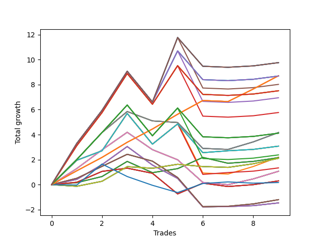

# Long Wallace 010 
- Symbol: NVDA_Unlimited
- Date Range: 02/08/2022 - 07/08/2022
- Trading Period: 7:20-12:30
- Number of Trades: 9



| Name | Win Percent | Profit | Avg Profit / Trade | Avg Time / Trade |      | Name | Win Percent | Profit | Avg Profit / Trade | Avg Time / Trade |
| ---- | ----------- | ------ | ------------------ | ---------------- | ---- | ---- | ----------- | ------ | ------------------ | ---------------- |
| Sorted By <br> Profit | | | | | | Sorted By <br> Win Percentage ||||
| One Hundred Thirty | 66.67 | 4880.00 | 542.22 | 114:07 |     | One Hundred Twenty-Six | 88.89 | 4355.00 | 483.89 | 53:29 |
| One Hundred Twenty-Five | 66.67 | 4880.00 | 542.22 | 114:07 |     | One Hundred Twenty-One | 88.89 | 4355.00 | 483.89 | 53:29 |
| One Hundred Fifteen | 66.67 | 4880.00 | 542.22 | 114:07 |     | One Hundred Sixteen | 88.89 | 4355.00 | 483.89 | 53:29 |
| Eighty-Five | 66.67 | 4880.00 | 542.22 | 114:07 |     | One Hundred Eleven | 88.89 | 4355.00 | 483.89 | 53:29 |
| One Hundred Twenty-Six | 88.89 | 4355.00 | 483.89 | 53:29 |     | Eighty-One | 88.89 | 4355.00 | 483.89 | 53:29 |
| One Hundred Twenty-One | 88.89 | 4355.00 | 483.89 | 53:29 |     | Seventy-One | 77.78 | 1540.00 | 171.11 | 95:05 |
| One Hundred Sixteen | 88.89 | 4355.00 | 483.89 | 53:29 |     | Sixty-Three | 77.78 | 1540.00 | 171.11 | 95:05 |
| One Hundred Eleven | 88.89 | 4355.00 | 483.89 | 53:29 |     | Forty-Seven | 77.78 | 1540.00 | 171.11 | 95:05 |
| Eighty-One | 88.89 | 4355.00 | 483.89 | 53:29 |     | Seven | 77.78 | 1540.00 | 171.11 | 95:05 |
| One Hundred Twenty-Nine | 66.67 | 4345.00 | 482.78 | 113:33 |     | Sixty-Four | 77.78 | 1080.00 | 120.00 | 10:58 |
| One Hundred Twenty-Four | 66.67 | 4345.00 | 482.78 | 113:33 |     | Fifty-Six | 77.78 | 1080.00 | 120.00 | 10:58 |
| One Hundred Fourteen | 66.67 | 4345.00 | 482.78 | 113:33 |     | Forty-Eight | 77.78 | 1080.00 | 120.00 | 10:58 |
| Eighty-Four | 66.67 | 4345.00 | 482.78 | 113:33 |     | Forty | 77.78 | 1080.00 | 120.00 | 10:58 |
| One Hundred Twenty | 66.67 | 4010.00 | 445.56 | 109:06 |     | Zero | 77.78 | 1080.00 | 120.00 | 10:58 |
| One Hundred Twenty-Eight | 66.67 | 3755.00 | 417.22 | 106:07 |     | Fifty-Five | 77.78 | 670.00 | 74.44 | 90:04 |
| One Hundred Twenty-Three | 66.67 | 3755.00 | 417.22 | 106:07 |     | One Hundred Thirty | 66.67 | 4880.00 | 542.22 | 114:07 |
| One Hundred Thirteen | 66.67 | 3755.00 | 417.22 | 106:07 |     | One Hundred Twenty-Five | 66.67 | 4880.00 | 542.22 | 114:07 |
| Eighty-Three | 66.67 | 3755.00 | 417.22 | 106:07 |     | One Hundred Fifteen | 66.67 | 4880.00 | 542.22 | 114:07 |
| One Hundred Ninteen | 66.67 | 3475.00 | 386.11 | 108:32 |     | Eighty-Five | 66.67 | 4880.00 | 542.22 | 114:07 |
| One Hundred Eighteen | 66.67 | 2885.00 | 320.56 | 101:06 |     | One Hundred Twenty-Nine | 66.67 | 4345.00 | 482.78 | 113:33 |
| Sixty-Nine | 55.56 | 2085.00 | 231.67 | 60:38 |     | One Hundred Twenty-Four | 66.67 | 4345.00 | 482.78 | 113:33 |
| Sixty-One | 55.56 | 2085.00 | 231.67 | 60:38 |     | One Hundred Fourteen | 66.67 | 4345.00 | 482.78 | 113:33 |
| Forty-Five | 55.56 | 2085.00 | 231.67 | 60:38 |     | Eighty-Four | 66.67 | 4345.00 | 482.78 | 113:33 |
| Five | 55.56 | 2085.00 | 231.67 | 60:38 |     | One Hundred Twenty | 66.67 | 4010.00 | 445.56 | 109:06 |
| One Hundred Twenty-Seven | 66.67 | 2060.00 | 228.89 | 100:26 |     | One Hundred Twenty-Eight | 66.67 | 3755.00 | 417.22 | 106:07 |
| One Hundred Twenty-Two | 66.67 | 2060.00 | 228.89 | 100:26 |     | One Hundred Twenty-Three | 66.67 | 3755.00 | 417.22 | 106:07 |
| One Hundred Twelve | 66.67 | 2060.00 | 228.89 | 100:26 |     | One Hundred Thirteen | 66.67 | 3755.00 | 417.22 | 106:07 |
| Eighty-Two | 66.67 | 2060.00 | 228.89 | 100:26 |     | Eighty-Three | 66.67 | 3755.00 | 417.22 | 106:07 |
| Seventy-One | 77.78 | 1540.00 | 171.11 | 95:05 |     | One Hundred Ninteen | 66.67 | 3475.00 | 386.11 | 108:32 |
| Sixty-Three | 77.78 | 1540.00 | 171.11 | 95:05 |     | One Hundred Eighteen | 66.67 | 2885.00 | 320.56 | 101:06 |
| Forty-Seven | 77.78 | 1540.00 | 171.11 | 95:05 |     | One Hundred Twenty-Seven | 66.67 | 2060.00 | 228.89 | 100:26 |
| Seven | 77.78 | 1540.00 | 171.11 | 95:05 |     | One Hundred Twenty-Two | 66.67 | 2060.00 | 228.89 | 100:26 |
| One Hundred Seventeen | 66.67 | 1190.00 | 132.22 | 95:25 |     | One Hundred Twelve | 66.67 | 2060.00 | 228.89 | 100:26 |
| Fifty-Three | 55.56 | 1100.00 | 122.22 | 56:30 |     | Eighty-Two | 66.67 | 2060.00 | 228.89 | 100:26 |
| Sixty-Four | 77.78 | 1080.00 | 120.00 | 10:58 |     | One Hundred Seventeen | 66.67 | 1190.00 | 132.22 | 95:25 |
| Fifty-Six | 77.78 | 1080.00 | 120.00 | 10:58 |     | Sixty-Five | 66.67 | 150.00 | 16.67 | 19:59 |
| Forty-Eight | 77.78 | 1080.00 | 120.00 | 10:58 |     | Fifty-Seven | 66.67 | 150.00 | 16.67 | 19:59 |
| Forty | 77.78 | 1080.00 | 120.00 | 10:58 |     | Forty-Nine | 66.67 | 150.00 | 16.67 | 19:59 |
| Zero | 77.78 | 1080.00 | 120.00 | 10:58 |     | Forty-One | 66.67 | 150.00 | 16.67 | 19:59 |
| Seventy | 55.56 | 1055.00 | 117.22 | 26:05 |     | One | 66.67 | 150.00 | 16.67 | 19:59 |
| Sixty-Two | 55.56 | 1055.00 | 117.22 | 26:05 |     | Sixty-Seven | 66.67 | -600.00 | -66.67 | 35:00 |
| Fifty-Four | 55.56 | 1055.00 | 117.22 | 26:05 |     | Fifty-Nine | 66.67 | -600.00 | -66.67 | 35:00 |
| Forty-Six | 55.56 | 1055.00 | 117.22 | 26:05 |     | Fifty-One | 66.67 | -600.00 | -66.67 | 35:00 |
| Six | 55.56 | 1055.00 | 117.22 | 26:05 |     | Forty-Three | 66.67 | -600.00 | -66.67 | 35:00 |
| Fifty-Five | 77.78 | 670.00 | 74.44 | 90:04 |     | Three | 66.67 | -600.00 | -66.67 | 35:00 |
| Sixty-Eight | 55.56 | 535.00 | 59.44 | 49:07 |     | Sixty-Six | 66.67 | -730.00 | -81.11 | 38:23 |
| Sixty | 55.56 | 535.00 | 59.44 | 49:07 |     | Fifty-Eight | 66.67 | -730.00 | -81.11 | 38:23 |
| Fifty-Two | 55.56 | 535.00 | 59.44 | 49:07 |     | Fifty | 66.67 | -730.00 | -81.11 | 38:23 |
| Forty-Four | 55.56 | 535.00 | 59.44 | 49:07 |     | Forty-Two | 66.67 | -730.00 | -81.11 | 38:23 |
| Four | 55.56 | 535.00 | 59.44 | 49:07 |     | Two | 66.67 | -730.00 | -81.11 | 38:23 |
| Sixty-Five | 66.67 | 150.00 | 16.67 | 19:59 |     | Sixty-Nine | 55.56 | 2085.00 | 231.67 | 60:38 |
| Fifty-Seven | 66.67 | 150.00 | 16.67 | 19:59 |     | Sixty-One | 55.56 | 2085.00 | 231.67 | 60:38 |
| Forty-Nine | 66.67 | 150.00 | 16.67 | 19:59 |     | Forty-Five | 55.56 | 2085.00 | 231.67 | 60:38 |
| Forty-One | 66.67 | 150.00 | 16.67 | 19:59 |     | Five | 55.56 | 2085.00 | 231.67 | 60:38 |
| One | 66.67 | 150.00 | 16.67 | 19:59 |     | Fifty-Three | 55.56 | 1100.00 | 122.22 | 56:30 |
| Seventy-Three | 44.44 | 85.00 | 9.44 | 14:05 |     | Seventy | 55.56 | 1055.00 | 117.22 | 26:05 |
| Sixty-Seven | 66.67 | -600.00 | -66.67 | 35:00 |     | Sixty-Two | 55.56 | 1055.00 | 117.22 | 26:05 |
| Fifty-Nine | 66.67 | -600.00 | -66.67 | 35:00 |     | Fifty-Four | 55.56 | 1055.00 | 117.22 | 26:05 |
| Fifty-One | 66.67 | -600.00 | -66.67 | 35:00 |     | Forty-Six | 55.56 | 1055.00 | 117.22 | 26:05 |
| Forty-Three | 66.67 | -600.00 | -66.67 | 35:00 |     | Six | 55.56 | 1055.00 | 117.22 | 26:05 |
| Three | 66.67 | -600.00 | -66.67 | 35:00 |     | Sixty-Eight | 55.56 | 535.00 | 59.44 | 49:07 |
| Sixty-Six | 66.67 | -730.00 | -81.11 | 38:23 |     | Sixty | 55.56 | 535.00 | 59.44 | 49:07 |
| Fifty-Eight | 66.67 | -730.00 | -81.11 | 38:23 |     | Fifty-Two | 55.56 | 535.00 | 59.44 | 49:07 |
| Fifty | 66.67 | -730.00 | -81.11 | 38:23 |     | Forty-Four | 55.56 | 535.00 | 59.44 | 49:07 |
| Forty-Two | 66.67 | -730.00 | -81.11 | 38:23 |     | Four | 55.56 | 535.00 | 59.44 | 49:07 |
| Two | 66.67 | -730.00 | -81.11 | 38:23 |     | Seventy-Three | 44.44 | 85.00 | 9.44 | 14:05 |

## NO STOPLOSS

### Test Zero
* Sell when price hits the middle line of the 20p bollinger
* No Stoploss
* Results:
```
Total Trades: 9
Percent Up: 77.78
Percent Down: 22.22
Total Points Moved Up: 2.16
Potential Profit: 1080.00
Total Points Ups: 3.53 Count Ups: 7
Total Points Downs: -1.37 Count Downs: 2
```

<details><summary>Trades</summary>

<code>In: 2022-02-08 11:24:00		Out: 2022-02-08 11:35:25		Total Position Time: 11:25		Total Move Up: 0.16		Total to Date: 0.16</code> <br />
<code>In: 2022-02-09 12:19:00		Out: 2022-02-09 12:20:25		Total Position Time: 01:25		Total Move Up: 0.49		Total to Date: 0.65</code> <br />
<code>In: 2022-02-25 10:59:00		Out: 2022-02-25 11:04:15		Total Position Time: 05:15		Total Move Up: 1.21		Total to Date: 1.86</code> <br />
<code>In: 2022-03-31 09:10:00		Out: 2022-03-31 09:29:15		Total Position Time: 19:15		Total Move Up: -0.90		Total to Date: 0.96</code> <br />
<code>In: 2022-05-02 10:02:00		Out: 2022-05-02 10:10:50		Total Position Time: 08:50		Total Move Up: 0.32		Total to Date: 1.28</code> <br />
<code>In: 2022-05-06 10:21:00		Out: 2022-05-06 10:28:00		Total Position Time: 07:00		Total Move Up: 0.90		Total to Date: 2.18</code> <br />
<code>In: 2022-06-02 11:53:00		Out: 2022-06-02 12:07:55		Total Position Time: 14:55		Total Move Up: -0.47		Total to Date: 1.71</code> <br />
<code>In: 2022-06-27 10:45:00		Out: 2022-06-27 11:01:20		Total Position Time: 16:20		Total Move Up: 0.15		Total to Date: 1.86</code> <br />
<code>In: 2022-06-27 10:47:00		Out: 2022-06-27 11:01:20		Total Position Time: 14:20		Total Move Up: 0.30		Total to Date: 2.16</code> <br />


</details>

### Test One
* Sell when the price hits the upper line of the 20p 1std bollinger
* No Stoploss
* Results:
```
Total Trades: 9
Percent Up: 66.67
Percent Down: 33.33
Total Points Moved Up: 0.30
Potential Profit: 150.00
Total Points Ups: 2.63 Count Ups: 6
Total Points Downs: -2.33 Count Downs: 3
```

<details><summary>Trades</summary>

<code>In: 2022-02-08 11:24:00		Out: 2022-02-08 11:41:30		Total Position Time: 17:30		Total Move Up: 0.19		Total to Date: 0.19</code> <br />
<code>In: 2022-02-09 12:19:00		Out: 2022-02-09 12:21:50		Total Position Time: 02:50		Total Move Up: 0.87		Total to Date: 1.06</code> <br />
<code>In: 2022-02-25 10:59:00		Out: 2022-02-25 11:19:15		Total Position Time: 20:15		Total Move Up: 0.26		Total to Date: 1.32</code> <br />
<code>In: 2022-03-31 09:10:00		Out: 2022-03-31 09:30:05		Total Position Time: 20:05		Total Move Up: -0.41		Total to Date: 0.91</code> <br />
<code>In: 2022-05-02 10:02:00		Out: 2022-05-02 10:58:25		Total Position Time: 56:25		Total Move Up: -1.65		Total to Date: -0.74</code> <br />
<code>In: 2022-05-06 10:21:00		Out: 2022-05-06 10:35:00		Total Position Time: 14:00		Total Move Up: 0.86		Total to Date: 0.12</code> <br />
<code>In: 2022-06-02 11:53:00		Out: 2022-06-02 12:11:10		Total Position Time: 18:10		Total Move Up: -0.27		Total to Date: -0.15</code> <br />
<code>In: 2022-06-27 10:45:00		Out: 2022-06-27 11:01:20		Total Position Time: 16:20		Total Move Up: 0.15		Total to Date: 0.00</code> <br />
<code>In: 2022-06-27 10:47:00		Out: 2022-06-27 11:01:20		Total Position Time: 14:20		Total Move Up: 0.30		Total to Date: 0.30</code> <br />


</details>

### Test Two
* Sell when the price hits the upper line of the 20p 2std bollinger
* No Stoploss
* Results:
```
Total Trades: 9
Percent Up: 66.67
Percent Down: 33.33
Total Points Moved Up: -1.46
Potential Profit: -730.00
Total Points Ups: 3.37 Count Ups: 6
Total Points Downs: -4.83 Count Downs: 3
```

<details><summary>Trades</summary>

<code>In: 2022-02-08 11:24:00		Out: 2022-02-08 11:44:10		Total Position Time: 20:10		Total Move Up: 0.42		Total to Date: 0.42</code> <br />
<code>In: 2022-02-09 12:19:00		Out: 2022-02-09 12:28:30		Total Position Time: 09:30		Total Move Up: 1.18		Total to Date: 1.60</code> <br />
<code>In: 2022-02-25 10:59:00		Out: 2022-02-25 11:25:30		Total Position Time: 26:30		Total Move Up: 1.45		Total to Date: 3.05</code> <br />
<code>In: 2022-03-31 09:10:00		Out: 2022-03-31 10:31:45		Total Position Time: 81:45		Total Move Up: -1.48		Total to Date: 1.57</code> <br />
<code>In: 2022-05-02 10:02:00		Out: 2022-05-02 11:02:15		Total Position Time: 60:15		Total Move Up: -1.07		Total to Date: 0.50</code> <br />
<code>In: 2022-05-06 10:21:00		Out: 2022-05-06 11:49:35		Total Position Time: 88:35		Total Move Up: -2.28		Total to Date: -1.78</code> <br />
<code>In: 2022-06-02 11:53:00		Out: 2022-06-02 12:17:05		Total Position Time: 24:05		Total Move Up: 0.03		Total to Date: -1.75</code> <br />
<code>In: 2022-06-27 10:45:00		Out: 2022-06-27 11:03:20		Total Position Time: 18:20		Total Move Up: 0.07		Total to Date: -1.68</code> <br />
<code>In: 2022-06-27 10:47:00		Out: 2022-06-27 11:03:20		Total Position Time: 16:20		Total Move Up: 0.22		Total to Date: -1.46</code> <br />


</details>

### Test Three
* Sell when price hits the middle line of the 50p bollinger
* No Stoploss
* Results:
```
Total Trades: 9
Percent Up: 66.67
Percent Down: 33.33
Total Points Moved Up: -1.20
Potential Profit: -600.00
Total Points Ups: 2.99 Count Ups: 6
Total Points Downs: -4.19 Count Downs: 3
```

<details><summary>Trades</summary>

<code>In: 2022-02-08 11:24:00		Out: 2022-02-08 11:44:15		Total Position Time: 20:15		Total Move Up: 0.51		Total to Date: 0.51</code> <br />
<code>In: 2022-02-09 12:19:00		Out: 2022-02-09 12:24:10		Total Position Time: 05:10		Total Move Up: 0.95		Total to Date: 1.46</code> <br />
<code>In: 2022-02-25 10:59:00		Out: 2022-02-25 11:23:35		Total Position Time: 24:35		Total Move Up: 0.97		Total to Date: 2.43</code> <br />
<code>In: 2022-03-31 09:10:00		Out: 2022-03-31 09:49:25		Total Position Time: 39:25		Total Move Up: -0.55		Total to Date: 1.88</code> <br />
<code>In: 2022-05-02 10:02:00		Out: 2022-05-02 10:59:55		Total Position Time: 57:55		Total Move Up: -1.31		Total to Date: 0.57</code> <br />
<code>In: 2022-05-06 10:21:00		Out: 2022-05-06 11:49:30		Total Position Time: 88:30		Total Move Up: -2.33		Total to Date: -1.76</code> <br />
<code>In: 2022-06-02 11:53:00		Out: 2022-06-02 12:17:05		Total Position Time: 24:05		Total Move Up: 0.03		Total to Date: -1.73</code> <br />
<code>In: 2022-06-27 10:45:00		Out: 2022-06-27 11:13:35		Total Position Time: 28:35		Total Move Up: 0.19		Total to Date: -1.54</code> <br />
<code>In: 2022-06-27 10:47:00		Out: 2022-06-27 11:13:35		Total Position Time: 26:35		Total Move Up: 0.34		Total to Date: -1.20</code> <br />


</details>

### Test Four
* Sell when the price hits the upper line of the 50p 1std bollinger
* No Stoploss
* Results:
```
Total Trades: 9
Percent Up: 55.56
Percent Down: 44.44
Total Points Moved Up: 1.07
Potential Profit: 535.00
Total Points Ups: 5.26 Count Ups: 5
Total Points Downs: -4.19 Count Downs: 4
```

<details><summary>Trades</summary>

<code>In: 2022-02-08 11:24:00		Out: 2022-02-08 11:45:50		Total Position Time: 21:50		Total Move Up: 1.29		Total to Date: 1.29</code> <br />
<code>In: 2022-02-09 12:19:00		Out: 2022-02-09 12:29:25		Total Position Time: 10:25		Total Move Up: 1.49		Total to Date: 2.78</code> <br />
<code>In: 2022-02-25 10:59:00		Out: 2022-02-25 11:40:10		Total Position Time: 41:10		Total Move Up: 1.41		Total to Date: 4.19</code> <br />
<code>In: 2022-03-31 09:10:00		Out: 2022-03-31 10:50:20		Total Position Time: 100:20		Total Move Up: -1.39		Total to Date: 2.80</code> <br />
<code>In: 2022-05-02 10:02:00		Out: 2022-05-02 11:02:25		Total Position Time: 60:25		Total Move Up: -0.81		Total to Date: 1.99</code> <br />
<code>In: 2022-05-06 10:21:00		Out: 2022-05-06 11:50:10		Total Position Time: 89:10		Total Move Up: -1.81		Total to Date: 0.18</code> <br />
<code>In: 2022-06-02 11:53:00		Out: 2022-06-02 12:45:45		Total Position Time: 52:45		Total Move Up: -0.18		Total to Date: 0.00</code> <br />
<code>In: 2022-06-27 10:45:00		Out: 2022-06-27 11:19:00		Total Position Time: 34:00		Total Move Up: 0.46		Total to Date: 0.46</code> <br />
<code>In: 2022-06-27 10:47:00		Out: 2022-06-27 11:19:00		Total Position Time: 32:00		Total Move Up: 0.61		Total to Date: 1.07</code> <br />


</details>

### Test Five
* Sell when the price hits the upper line of the 50p 2std bollinger
* No Stoploss
* Results:
```
Total Trades: 9
Percent Up: 55.56
Percent Down: 44.44
Total Points Moved Up: 4.17
Potential Profit: 2085.00
Total Points Ups: 7.20 Count Ups: 5
Total Points Downs: -3.03 Count Downs: 4
```

<details><summary>Trades</summary>

<code>In: 2022-02-08 11:24:00		Out: 2022-02-08 11:51:10		Total Position Time: 27:10		Total Move Up: 2.01		Total to Date: 2.01</code> <br />
<code>In: 2022-02-09 12:19:00		Out: 2022-02-09 12:31:05		Total Position Time: 12:05		Total Move Up: 2.16		Total to Date: 4.17</code> <br />
<code>In: 2022-02-25 10:59:00		Out: 2022-02-25 12:15:55		Total Position Time: 76:55		Total Move Up: 1.68		Total to Date: 5.85</code> <br />
<code>In: 2022-03-31 09:10:00		Out: 2022-03-31 10:51:30		Total Position Time: 101:30		Total Move Up: -0.75		Total to Date: 5.10</code> <br />
<code>In: 2022-05-02 10:02:00		Out: 2022-05-02 11:05:00		Total Position Time: 63:00		Total Move Up: -0.13		Total to Date: 4.97</code> <br />
<code>In: 2022-05-06 10:21:00		Out: 2022-05-06 12:39:05		Total Position Time: 138:05		Total Move Up: -2.07		Total to Date: 2.90</code> <br />
<code>In: 2022-06-02 11:53:00		Out: 2022-06-02 12:47:00		Total Position Time: 54:00		Total Move Up: -0.08		Total to Date: 2.82</code> <br />
<code>In: 2022-06-27 10:45:00		Out: 2022-06-27 11:22:30		Total Position Time: 37:30		Total Move Up: 0.60		Total to Date: 3.42</code> <br />
<code>In: 2022-06-27 10:47:00		Out: 2022-06-27 11:22:30		Total Position Time: 35:30		Total Move Up: 0.75		Total to Date: 4.17</code> <br />


</details>

### Test Six
* Sell when the price hits the middle line of the 1std VWAP
* No Stoploss
* Results:
```
Total Trades: 9
Percent Up: 55.56
Percent Down: 44.44
Total Points Moved Up: 2.11
Potential Profit: 1055.00
Total Points Ups: 2.62 Count Ups: 5
Total Points Downs: -0.51 Count Downs: 4
```

<details><summary>Trades</summary>

<code>In: 2022-02-08 11:24:00		Out: 2022-02-08 11:25:10		Total Position Time: 01:10		Total Move Up: -0.13		Total to Date: -0.13</code> <br />
<code>In: 2022-02-09 12:19:00		Out: 2022-02-09 12:20:10		Total Position Time: 01:10		Total Move Up: 0.40		Total to Date: 0.27</code> <br />
<code>In: 2022-02-25 10:59:00		Out: 2022-02-25 11:24:30		Total Position Time: 25:30		Total Move Up: 1.17		Total to Date: 1.44</code> <br />
<code>In: 2022-03-31 09:10:00		Out: 2022-03-31 11:20:55		Total Position Time: 130:55		Total Move Up: -0.13		Total to Date: 1.31</code> <br />
<code>In: 2022-05-02 10:02:00		Out: 2022-05-02 10:10:50		Total Position Time: 08:50		Total Move Up: 0.32		Total to Date: 1.63</code> <br />
<code>In: 2022-05-06 10:21:00		Out: 2022-05-06 10:22:10		Total Position Time: 01:10		Total Move Up: -0.18		Total to Date: 1.45</code> <br />
<code>In: 2022-06-02 11:53:00		Out: 2022-06-02 11:54:10		Total Position Time: 01:10		Total Move Up: -0.07		Total to Date: 1.38</code> <br />
<code>In: 2022-06-27 10:45:00		Out: 2022-06-27 11:18:25		Total Position Time: 33:25		Total Move Up: 0.29		Total to Date: 1.67</code> <br />
<code>In: 2022-06-27 10:47:00		Out: 2022-06-27 11:18:25		Total Position Time: 31:25		Total Move Up: 0.44		Total to Date: 2.11</code> <br />


</details>

### Test Seven
* Sell when the price hits the upper line of the 1std VWAP
* No Stoploss
* Results:
```
Total Trades: 9
Percent Up: 77.78
Percent Down: 22.22
Total Points Moved Up: 3.08
Potential Profit: 1540.00
Total Points Ups: 7.84 Count Ups: 7
Total Points Downs: -4.76 Count Downs: 2
```

<details><summary>Trades</summary>

<code>In: 2022-02-08 11:24:00		Out: 2022-02-08 11:51:05		Total Position Time: 27:05		Total Move Up: 1.95		Total to Date: 1.95</code> <br />
<code>In: 2022-02-09 12:19:00		Out: 2022-02-09 12:21:35		Total Position Time: 02:35		Total Move Up: 0.76		Total to Date: 2.71</code> <br />
<code>In: 2022-02-25 10:59:00		Out: 2022-02-25 12:24:10		Total Position Time: 85:10		Total Move Up: 2.99		Total to Date: 5.70</code> <br />
<code>In: 2022-03-31 09:10:00		Out: 2022-03-31 12:47:00		Total Position Time: 217:00		Total Move Up: -2.46		Total to Date: 3.24</code> <br />
<code>In: 2022-05-02 10:02:00		Out: 2022-05-02 11:53:40		Total Position Time: 111:40		Total Move Up: 1.62		Total to Date: 4.86</code> <br />
<code>In: 2022-05-06 10:21:00		Out: 2022-05-06 12:47:00		Total Position Time: 146:00		Total Move Up: -2.30		Total to Date: 2.56</code> <br />
<code>In: 2022-06-02 11:53:00		Out: 2022-06-02 12:17:20		Total Position Time: 24:20		Total Move Up: 0.15		Total to Date: 2.71</code> <br />
<code>In: 2022-06-27 10:45:00		Out: 2022-06-27 12:47:00		Total Position Time: 122:00		Total Move Up: 0.11		Total to Date: 2.82</code> <br />
<code>In: 2022-06-27 10:47:00		Out: 2022-06-27 12:47:00		Total Position Time: 120:00		Total Move Up: 0.26		Total to Date: 3.08</code> <br />


</details>

## STOPLOSS OF 5

### Test Forty
* Sell when price hits the middle line of the 20p bollinger
* Stoploss is 5 points
* Results:
```
Total Trades: 9
Percent Up: 77.78
Percent Down: 22.22
Total Points Moved Up: 2.16
Potential Profit: 1080.00
Total Points Ups: 3.53 Count Ups: 7
Total Points Downs: -1.37 Count Downs: 2
```

<details><summary>Trades</summary>

<code>In: 2022-02-08 11:24:00		Out: 2022-02-08 11:35:25		Total Position Time: 11:25		Total Move Up: 0.16		Total to Date: 0.16</code> <br />
<code>In: 2022-02-09 12:19:00		Out: 2022-02-09 12:20:25		Total Position Time: 01:25		Total Move Up: 0.49		Total to Date: 0.65</code> <br />
<code>In: 2022-02-25 10:59:00		Out: 2022-02-25 11:04:15		Total Position Time: 05:15		Total Move Up: 1.21		Total to Date: 1.86</code> <br />
<code>In: 2022-03-31 09:10:00		Out: 2022-03-31 09:29:15		Total Position Time: 19:15		Total Move Up: -0.90		Total to Date: 0.96</code> <br />
<code>In: 2022-05-02 10:02:00		Out: 2022-05-02 10:10:50		Total Position Time: 08:50		Total Move Up: 0.32		Total to Date: 1.28</code> <br />
<code>In: 2022-05-06 10:21:00		Out: 2022-05-06 10:28:00		Total Position Time: 07:00		Total Move Up: 0.90		Total to Date: 2.18</code> <br />
<code>In: 2022-06-02 11:53:00		Out: 2022-06-02 12:07:55		Total Position Time: 14:55		Total Move Up: -0.47		Total to Date: 1.71</code> <br />
<code>In: 2022-06-27 10:45:00		Out: 2022-06-27 11:01:20		Total Position Time: 16:20		Total Move Up: 0.15		Total to Date: 1.86</code> <br />
<code>In: 2022-06-27 10:47:00		Out: 2022-06-27 11:01:20		Total Position Time: 14:20		Total Move Up: 0.30		Total to Date: 2.16</code> <br />


</details>

### Test Forty-One
* Sell when the price hits the upper line of the 20p 1std bollinger
* Stoploss is 5 points
* Results:
```
Total Trades: 9
Percent Up: 66.67
Percent Down: 33.33
Total Points Moved Up: 0.30
Potential Profit: 150.00
Total Points Ups: 2.63 Count Ups: 6
Total Points Downs: -2.33 Count Downs: 3
```

<details><summary>Trades</summary>

<code>In: 2022-02-08 11:24:00		Out: 2022-02-08 11:41:30		Total Position Time: 17:30		Total Move Up: 0.19		Total to Date: 0.19</code> <br />
<code>In: 2022-02-09 12:19:00		Out: 2022-02-09 12:21:50		Total Position Time: 02:50		Total Move Up: 0.87		Total to Date: 1.06</code> <br />
<code>In: 2022-02-25 10:59:00		Out: 2022-02-25 11:19:15		Total Position Time: 20:15		Total Move Up: 0.26		Total to Date: 1.32</code> <br />
<code>In: 2022-03-31 09:10:00		Out: 2022-03-31 09:30:05		Total Position Time: 20:05		Total Move Up: -0.41		Total to Date: 0.91</code> <br />
<code>In: 2022-05-02 10:02:00		Out: 2022-05-02 10:58:25		Total Position Time: 56:25		Total Move Up: -1.65		Total to Date: -0.74</code> <br />
<code>In: 2022-05-06 10:21:00		Out: 2022-05-06 10:35:00		Total Position Time: 14:00		Total Move Up: 0.86		Total to Date: 0.12</code> <br />
<code>In: 2022-06-02 11:53:00		Out: 2022-06-02 12:11:10		Total Position Time: 18:10		Total Move Up: -0.27		Total to Date: -0.15</code> <br />
<code>In: 2022-06-27 10:45:00		Out: 2022-06-27 11:01:20		Total Position Time: 16:20		Total Move Up: 0.15		Total to Date: 0.00</code> <br />
<code>In: 2022-06-27 10:47:00		Out: 2022-06-27 11:01:20		Total Position Time: 14:20		Total Move Up: 0.30		Total to Date: 0.30</code> <br />


</details>

### Test Forty-Two
* Sell when the price hits the upper line of the 20p 2std bollinger
* Stoploss is 5 points
* Results:
```
Total Trades: 9
Percent Up: 66.67
Percent Down: 33.33
Total Points Moved Up: -1.46
Potential Profit: -730.00
Total Points Ups: 3.37 Count Ups: 6
Total Points Downs: -4.83 Count Downs: 3
```

<details><summary>Trades</summary>

<code>In: 2022-02-08 11:24:00		Out: 2022-02-08 11:44:10		Total Position Time: 20:10		Total Move Up: 0.42		Total to Date: 0.42</code> <br />
<code>In: 2022-02-09 12:19:00		Out: 2022-02-09 12:28:30		Total Position Time: 09:30		Total Move Up: 1.18		Total to Date: 1.60</code> <br />
<code>In: 2022-02-25 10:59:00		Out: 2022-02-25 11:25:30		Total Position Time: 26:30		Total Move Up: 1.45		Total to Date: 3.05</code> <br />
<code>In: 2022-03-31 09:10:00		Out: 2022-03-31 10:31:45		Total Position Time: 81:45		Total Move Up: -1.48		Total to Date: 1.57</code> <br />
<code>In: 2022-05-02 10:02:00		Out: 2022-05-02 11:02:15		Total Position Time: 60:15		Total Move Up: -1.07		Total to Date: 0.50</code> <br />
<code>In: 2022-05-06 10:21:00		Out: 2022-05-06 11:49:35		Total Position Time: 88:35		Total Move Up: -2.28		Total to Date: -1.78</code> <br />
<code>In: 2022-06-02 11:53:00		Out: 2022-06-02 12:17:05		Total Position Time: 24:05		Total Move Up: 0.03		Total to Date: -1.75</code> <br />
<code>In: 2022-06-27 10:45:00		Out: 2022-06-27 11:03:20		Total Position Time: 18:20		Total Move Up: 0.07		Total to Date: -1.68</code> <br />
<code>In: 2022-06-27 10:47:00		Out: 2022-06-27 11:03:20		Total Position Time: 16:20		Total Move Up: 0.22		Total to Date: -1.46</code> <br />


</details>

### Test Forty-Three
* Sell when price hits the middle line of the 50p bollinger
* Stoploss is 5 points
* Results:
```
Total Trades: 9
Percent Up: 66.67
Percent Down: 33.33
Total Points Moved Up: -1.20
Potential Profit: -600.00
Total Points Ups: 2.99 Count Ups: 6
Total Points Downs: -4.19 Count Downs: 3
```

<details><summary>Trades</summary>

<code>In: 2022-02-08 11:24:00		Out: 2022-02-08 11:44:15		Total Position Time: 20:15		Total Move Up: 0.51		Total to Date: 0.51</code> <br />
<code>In: 2022-02-09 12:19:00		Out: 2022-02-09 12:24:10		Total Position Time: 05:10		Total Move Up: 0.95		Total to Date: 1.46</code> <br />
<code>In: 2022-02-25 10:59:00		Out: 2022-02-25 11:23:35		Total Position Time: 24:35		Total Move Up: 0.97		Total to Date: 2.43</code> <br />
<code>In: 2022-03-31 09:10:00		Out: 2022-03-31 09:49:25		Total Position Time: 39:25		Total Move Up: -0.55		Total to Date: 1.88</code> <br />
<code>In: 2022-05-02 10:02:00		Out: 2022-05-02 10:59:55		Total Position Time: 57:55		Total Move Up: -1.31		Total to Date: 0.57</code> <br />
<code>In: 2022-05-06 10:21:00		Out: 2022-05-06 11:49:30		Total Position Time: 88:30		Total Move Up: -2.33		Total to Date: -1.76</code> <br />
<code>In: 2022-06-02 11:53:00		Out: 2022-06-02 12:17:05		Total Position Time: 24:05		Total Move Up: 0.03		Total to Date: -1.73</code> <br />
<code>In: 2022-06-27 10:45:00		Out: 2022-06-27 11:13:35		Total Position Time: 28:35		Total Move Up: 0.19		Total to Date: -1.54</code> <br />
<code>In: 2022-06-27 10:47:00		Out: 2022-06-27 11:13:35		Total Position Time: 26:35		Total Move Up: 0.34		Total to Date: -1.20</code> <br />


</details>

### Test Forty-Four
* Sell when the price hits the upper line of the 50p 1std bollinger
* Stoploss is 5 points
* Results:
```
Total Trades: 9
Percent Up: 55.56
Percent Down: 44.44
Total Points Moved Up: 1.07
Potential Profit: 535.00
Total Points Ups: 5.26 Count Ups: 5
Total Points Downs: -4.19 Count Downs: 4
```

<details><summary>Trades</summary>

<code>In: 2022-02-08 11:24:00		Out: 2022-02-08 11:45:50		Total Position Time: 21:50		Total Move Up: 1.29		Total to Date: 1.29</code> <br />
<code>In: 2022-02-09 12:19:00		Out: 2022-02-09 12:29:25		Total Position Time: 10:25		Total Move Up: 1.49		Total to Date: 2.78</code> <br />
<code>In: 2022-02-25 10:59:00		Out: 2022-02-25 11:40:10		Total Position Time: 41:10		Total Move Up: 1.41		Total to Date: 4.19</code> <br />
<code>In: 2022-03-31 09:10:00		Out: 2022-03-31 10:50:20		Total Position Time: 100:20		Total Move Up: -1.39		Total to Date: 2.80</code> <br />
<code>In: 2022-05-02 10:02:00		Out: 2022-05-02 11:02:25		Total Position Time: 60:25		Total Move Up: -0.81		Total to Date: 1.99</code> <br />
<code>In: 2022-05-06 10:21:00		Out: 2022-05-06 11:50:10		Total Position Time: 89:10		Total Move Up: -1.81		Total to Date: 0.18</code> <br />
<code>In: 2022-06-02 11:53:00		Out: 2022-06-02 12:45:45		Total Position Time: 52:45		Total Move Up: -0.18		Total to Date: 0.00</code> <br />
<code>In: 2022-06-27 10:45:00		Out: 2022-06-27 11:19:00		Total Position Time: 34:00		Total Move Up: 0.46		Total to Date: 0.46</code> <br />
<code>In: 2022-06-27 10:47:00		Out: 2022-06-27 11:19:00		Total Position Time: 32:00		Total Move Up: 0.61		Total to Date: 1.07</code> <br />


</details>

### Test Forty-Five
* Sell when the price hits the upper line of the 50p 2std bollinger
* Stoploss is 5 points
* Results:
```
Total Trades: 9
Percent Up: 55.56
Percent Down: 44.44
Total Points Moved Up: 4.17
Potential Profit: 2085.00
Total Points Ups: 7.20 Count Ups: 5
Total Points Downs: -3.03 Count Downs: 4
```

<details><summary>Trades</summary>

<code>In: 2022-02-08 11:24:00		Out: 2022-02-08 11:51:10		Total Position Time: 27:10		Total Move Up: 2.01		Total to Date: 2.01</code> <br />
<code>In: 2022-02-09 12:19:00		Out: 2022-02-09 12:31:05		Total Position Time: 12:05		Total Move Up: 2.16		Total to Date: 4.17</code> <br />
<code>In: 2022-02-25 10:59:00		Out: 2022-02-25 12:15:55		Total Position Time: 76:55		Total Move Up: 1.68		Total to Date: 5.85</code> <br />
<code>In: 2022-03-31 09:10:00		Out: 2022-03-31 10:51:30		Total Position Time: 101:30		Total Move Up: -0.75		Total to Date: 5.10</code> <br />
<code>In: 2022-05-02 10:02:00		Out: 2022-05-02 11:05:00		Total Position Time: 63:00		Total Move Up: -0.13		Total to Date: 4.97</code> <br />
<code>In: 2022-05-06 10:21:00		Out: 2022-05-06 12:39:05		Total Position Time: 138:05		Total Move Up: -2.07		Total to Date: 2.90</code> <br />
<code>In: 2022-06-02 11:53:00		Out: 2022-06-02 12:47:00		Total Position Time: 54:00		Total Move Up: -0.08		Total to Date: 2.82</code> <br />
<code>In: 2022-06-27 10:45:00		Out: 2022-06-27 11:22:30		Total Position Time: 37:30		Total Move Up: 0.60		Total to Date: 3.42</code> <br />
<code>In: 2022-06-27 10:47:00		Out: 2022-06-27 11:22:30		Total Position Time: 35:30		Total Move Up: 0.75		Total to Date: 4.17</code> <br />


</details>

### Test Forty-Six
* Sell when the price hits the middle line of the 1std VWAP
* Stoploss is 5 points
* Results:
```
Total Trades: 9
Percent Up: 55.56
Percent Down: 44.44
Total Points Moved Up: 2.11
Potential Profit: 1055.00
Total Points Ups: 2.62 Count Ups: 5
Total Points Downs: -0.51 Count Downs: 4
```

<details><summary>Trades</summary>

<code>In: 2022-02-08 11:24:00		Out: 2022-02-08 11:25:10		Total Position Time: 01:10		Total Move Up: -0.13		Total to Date: -0.13</code> <br />
<code>In: 2022-02-09 12:19:00		Out: 2022-02-09 12:20:10		Total Position Time: 01:10		Total Move Up: 0.40		Total to Date: 0.27</code> <br />
<code>In: 2022-02-25 10:59:00		Out: 2022-02-25 11:24:30		Total Position Time: 25:30		Total Move Up: 1.17		Total to Date: 1.44</code> <br />
<code>In: 2022-03-31 09:10:00		Out: 2022-03-31 11:20:55		Total Position Time: 130:55		Total Move Up: -0.13		Total to Date: 1.31</code> <br />
<code>In: 2022-05-02 10:02:00		Out: 2022-05-02 10:10:50		Total Position Time: 08:50		Total Move Up: 0.32		Total to Date: 1.63</code> <br />
<code>In: 2022-05-06 10:21:00		Out: 2022-05-06 10:22:10		Total Position Time: 01:10		Total Move Up: -0.18		Total to Date: 1.45</code> <br />
<code>In: 2022-06-02 11:53:00		Out: 2022-06-02 11:54:10		Total Position Time: 01:10		Total Move Up: -0.07		Total to Date: 1.38</code> <br />
<code>In: 2022-06-27 10:45:00		Out: 2022-06-27 11:18:25		Total Position Time: 33:25		Total Move Up: 0.29		Total to Date: 1.67</code> <br />
<code>In: 2022-06-27 10:47:00		Out: 2022-06-27 11:18:25		Total Position Time: 31:25		Total Move Up: 0.44		Total to Date: 2.11</code> <br />


</details>

### Test Forty-Seven
* Sell when the price hits the upper line of the 1std VWAP
* Stoploss is 5 points
* Results:
```
Total Trades: 9
Percent Up: 77.78
Percent Down: 22.22
Total Points Moved Up: 3.08
Potential Profit: 1540.00
Total Points Ups: 7.84 Count Ups: 7
Total Points Downs: -4.76 Count Downs: 2
```

<details><summary>Trades</summary>

<code>In: 2022-02-08 11:24:00		Out: 2022-02-08 11:51:05		Total Position Time: 27:05		Total Move Up: 1.95		Total to Date: 1.95</code> <br />
<code>In: 2022-02-09 12:19:00		Out: 2022-02-09 12:21:35		Total Position Time: 02:35		Total Move Up: 0.76		Total to Date: 2.71</code> <br />
<code>In: 2022-02-25 10:59:00		Out: 2022-02-25 12:24:10		Total Position Time: 85:10		Total Move Up: 2.99		Total to Date: 5.70</code> <br />
<code>In: 2022-03-31 09:10:00		Out: 2022-03-31 12:47:00		Total Position Time: 217:00		Total Move Up: -2.46		Total to Date: 3.24</code> <br />
<code>In: 2022-05-02 10:02:00		Out: 2022-05-02 11:53:40		Total Position Time: 111:40		Total Move Up: 1.62		Total to Date: 4.86</code> <br />
<code>In: 2022-05-06 10:21:00		Out: 2022-05-06 12:47:00		Total Position Time: 146:00		Total Move Up: -2.30		Total to Date: 2.56</code> <br />
<code>In: 2022-06-02 11:53:00		Out: 2022-06-02 12:17:20		Total Position Time: 24:20		Total Move Up: 0.15		Total to Date: 2.71</code> <br />
<code>In: 2022-06-27 10:45:00		Out: 2022-06-27 12:47:00		Total Position Time: 122:00		Total Move Up: 0.11		Total to Date: 2.82</code> <br />
<code>In: 2022-06-27 10:47:00		Out: 2022-06-27 12:47:00		Total Position Time: 120:00		Total Move Up: 0.26		Total to Date: 3.08</code> <br />


</details>

## TRAIL STOP OF 5

### Test Forty-Eight
* Sell when price hits the middle line of the 20p bollinger
* Trailing Stop is 5 points
* Results:
```
Total Trades: 9
Percent Up: 77.78
Percent Down: 22.22
Total Points Moved Up: 2.16
Potential Profit: 1080.00
Total Points Ups: 3.53 Count Ups: 7
Total Points Downs: -1.37 Count Downs: 2
```

<details><summary>Trades</summary>

<code>In: 2022-02-08 11:24:00		Out: 2022-02-08 11:35:25		Total Position Time: 11:25		Total Move Up: 0.16		Total to Date: 0.16</code> <br />
<code>In: 2022-02-09 12:19:00		Out: 2022-02-09 12:20:25		Total Position Time: 01:25		Total Move Up: 0.49		Total to Date: 0.65</code> <br />
<code>In: 2022-02-25 10:59:00		Out: 2022-02-25 11:04:15		Total Position Time: 05:15		Total Move Up: 1.21		Total to Date: 1.86</code> <br />
<code>In: 2022-03-31 09:10:00		Out: 2022-03-31 09:29:15		Total Position Time: 19:15		Total Move Up: -0.90		Total to Date: 0.96</code> <br />
<code>In: 2022-05-02 10:02:00		Out: 2022-05-02 10:10:50		Total Position Time: 08:50		Total Move Up: 0.32		Total to Date: 1.28</code> <br />
<code>In: 2022-05-06 10:21:00		Out: 2022-05-06 10:28:00		Total Position Time: 07:00		Total Move Up: 0.90		Total to Date: 2.18</code> <br />
<code>In: 2022-06-02 11:53:00		Out: 2022-06-02 12:07:55		Total Position Time: 14:55		Total Move Up: -0.47		Total to Date: 1.71</code> <br />
<code>In: 2022-06-27 10:45:00		Out: 2022-06-27 11:01:20		Total Position Time: 16:20		Total Move Up: 0.15		Total to Date: 1.86</code> <br />
<code>In: 2022-06-27 10:47:00		Out: 2022-06-27 11:01:20		Total Position Time: 14:20		Total Move Up: 0.30		Total to Date: 2.16</code> <br />


</details>

### Test Forty-Nine
* Sell when the price hits the upper line of the 20p 1std bollinger
* Trailing Stop is 5 points
* Results:
```
Total Trades: 9
Percent Up: 66.67
Percent Down: 33.33
Total Points Moved Up: 0.30
Potential Profit: 150.00
Total Points Ups: 2.63 Count Ups: 6
Total Points Downs: -2.33 Count Downs: 3
```

<details><summary>Trades</summary>

<code>In: 2022-02-08 11:24:00		Out: 2022-02-08 11:41:30		Total Position Time: 17:30		Total Move Up: 0.19		Total to Date: 0.19</code> <br />
<code>In: 2022-02-09 12:19:00		Out: 2022-02-09 12:21:50		Total Position Time: 02:50		Total Move Up: 0.87		Total to Date: 1.06</code> <br />
<code>In: 2022-02-25 10:59:00		Out: 2022-02-25 11:19:15		Total Position Time: 20:15		Total Move Up: 0.26		Total to Date: 1.32</code> <br />
<code>In: 2022-03-31 09:10:00		Out: 2022-03-31 09:30:05		Total Position Time: 20:05		Total Move Up: -0.41		Total to Date: 0.91</code> <br />
<code>In: 2022-05-02 10:02:00		Out: 2022-05-02 10:58:25		Total Position Time: 56:25		Total Move Up: -1.65		Total to Date: -0.74</code> <br />
<code>In: 2022-05-06 10:21:00		Out: 2022-05-06 10:35:00		Total Position Time: 14:00		Total Move Up: 0.86		Total to Date: 0.12</code> <br />
<code>In: 2022-06-02 11:53:00		Out: 2022-06-02 12:11:10		Total Position Time: 18:10		Total Move Up: -0.27		Total to Date: -0.15</code> <br />
<code>In: 2022-06-27 10:45:00		Out: 2022-06-27 11:01:20		Total Position Time: 16:20		Total Move Up: 0.15		Total to Date: 0.00</code> <br />
<code>In: 2022-06-27 10:47:00		Out: 2022-06-27 11:01:20		Total Position Time: 14:20		Total Move Up: 0.30		Total to Date: 0.30</code> <br />


</details>

### Test Fifty
* Sell when the price hits the upper line of the 20p 2std bollinger
* Trailing Stop is 5 points
* Results:
```
Total Trades: 9
Percent Up: 66.67
Percent Down: 33.33
Total Points Moved Up: -1.46
Potential Profit: -730.00
Total Points Ups: 3.37 Count Ups: 6
Total Points Downs: -4.83 Count Downs: 3
```

<details><summary>Trades</summary>

<code>In: 2022-02-08 11:24:00		Out: 2022-02-08 11:44:10		Total Position Time: 20:10		Total Move Up: 0.42		Total to Date: 0.42</code> <br />
<code>In: 2022-02-09 12:19:00		Out: 2022-02-09 12:28:30		Total Position Time: 09:30		Total Move Up: 1.18		Total to Date: 1.60</code> <br />
<code>In: 2022-02-25 10:59:00		Out: 2022-02-25 11:25:30		Total Position Time: 26:30		Total Move Up: 1.45		Total to Date: 3.05</code> <br />
<code>In: 2022-03-31 09:10:00		Out: 2022-03-31 10:31:45		Total Position Time: 81:45		Total Move Up: -1.48		Total to Date: 1.57</code> <br />
<code>In: 2022-05-02 10:02:00		Out: 2022-05-02 11:02:15		Total Position Time: 60:15		Total Move Up: -1.07		Total to Date: 0.50</code> <br />
<code>In: 2022-05-06 10:21:00		Out: 2022-05-06 11:49:35		Total Position Time: 88:35		Total Move Up: -2.28		Total to Date: -1.78</code> <br />
<code>In: 2022-06-02 11:53:00		Out: 2022-06-02 12:17:05		Total Position Time: 24:05		Total Move Up: 0.03		Total to Date: -1.75</code> <br />
<code>In: 2022-06-27 10:45:00		Out: 2022-06-27 11:03:20		Total Position Time: 18:20		Total Move Up: 0.07		Total to Date: -1.68</code> <br />
<code>In: 2022-06-27 10:47:00		Out: 2022-06-27 11:03:20		Total Position Time: 16:20		Total Move Up: 0.22		Total to Date: -1.46</code> <br />


</details>

### Test Fifty-One
* Sell when price hits the middle line of the 50p bollinger
* Trailing Stop is 5 points
* Results:
```
Total Trades: 9
Percent Up: 66.67
Percent Down: 33.33
Total Points Moved Up: -1.20
Potential Profit: -600.00
Total Points Ups: 2.99 Count Ups: 6
Total Points Downs: -4.19 Count Downs: 3
```

<details><summary>Trades</summary>

<code>In: 2022-02-08 11:24:00		Out: 2022-02-08 11:44:15		Total Position Time: 20:15		Total Move Up: 0.51		Total to Date: 0.51</code> <br />
<code>In: 2022-02-09 12:19:00		Out: 2022-02-09 12:24:10		Total Position Time: 05:10		Total Move Up: 0.95		Total to Date: 1.46</code> <br />
<code>In: 2022-02-25 10:59:00		Out: 2022-02-25 11:23:35		Total Position Time: 24:35		Total Move Up: 0.97		Total to Date: 2.43</code> <br />
<code>In: 2022-03-31 09:10:00		Out: 2022-03-31 09:49:25		Total Position Time: 39:25		Total Move Up: -0.55		Total to Date: 1.88</code> <br />
<code>In: 2022-05-02 10:02:00		Out: 2022-05-02 10:59:55		Total Position Time: 57:55		Total Move Up: -1.31		Total to Date: 0.57</code> <br />
<code>In: 2022-05-06 10:21:00		Out: 2022-05-06 11:49:30		Total Position Time: 88:30		Total Move Up: -2.33		Total to Date: -1.76</code> <br />
<code>In: 2022-06-02 11:53:00		Out: 2022-06-02 12:17:05		Total Position Time: 24:05		Total Move Up: 0.03		Total to Date: -1.73</code> <br />
<code>In: 2022-06-27 10:45:00		Out: 2022-06-27 11:13:35		Total Position Time: 28:35		Total Move Up: 0.19		Total to Date: -1.54</code> <br />
<code>In: 2022-06-27 10:47:00		Out: 2022-06-27 11:13:35		Total Position Time: 26:35		Total Move Up: 0.34		Total to Date: -1.20</code> <br />


</details>

### Test Fifty-Two
* Sell when the price hits the upper line of the 50p 1std bollinger
* Trailing Stop is 5 points
* Results:
```
Total Trades: 9
Percent Up: 55.56
Percent Down: 44.44
Total Points Moved Up: 1.07
Potential Profit: 535.00
Total Points Ups: 5.26 Count Ups: 5
Total Points Downs: -4.19 Count Downs: 4
```

<details><summary>Trades</summary>

<code>In: 2022-02-08 11:24:00		Out: 2022-02-08 11:45:50		Total Position Time: 21:50		Total Move Up: 1.29		Total to Date: 1.29</code> <br />
<code>In: 2022-02-09 12:19:00		Out: 2022-02-09 12:29:25		Total Position Time: 10:25		Total Move Up: 1.49		Total to Date: 2.78</code> <br />
<code>In: 2022-02-25 10:59:00		Out: 2022-02-25 11:40:10		Total Position Time: 41:10		Total Move Up: 1.41		Total to Date: 4.19</code> <br />
<code>In: 2022-03-31 09:10:00		Out: 2022-03-31 10:50:20		Total Position Time: 100:20		Total Move Up: -1.39		Total to Date: 2.80</code> <br />
<code>In: 2022-05-02 10:02:00		Out: 2022-05-02 11:02:25		Total Position Time: 60:25		Total Move Up: -0.81		Total to Date: 1.99</code> <br />
<code>In: 2022-05-06 10:21:00		Out: 2022-05-06 11:50:10		Total Position Time: 89:10		Total Move Up: -1.81		Total to Date: 0.18</code> <br />
<code>In: 2022-06-02 11:53:00		Out: 2022-06-02 12:45:45		Total Position Time: 52:45		Total Move Up: -0.18		Total to Date: 0.00</code> <br />
<code>In: 2022-06-27 10:45:00		Out: 2022-06-27 11:19:00		Total Position Time: 34:00		Total Move Up: 0.46		Total to Date: 0.46</code> <br />
<code>In: 2022-06-27 10:47:00		Out: 2022-06-27 11:19:00		Total Position Time: 32:00		Total Move Up: 0.61		Total to Date: 1.07</code> <br />


</details>

### Test Fifty-Three
* Sell when the price hits the upper line of the 50p 2std bollinger
* Trailing Stop is 5 points
* Results:
```
Total Trades: 9
Percent Up: 55.56
Percent Down: 44.44
Total Points Moved Up: 2.20
Potential Profit: 1100.00
Total Points Ups: 7.20 Count Ups: 5
Total Points Downs: -5.00 Count Downs: 4
```

<details><summary>Trades</summary>

<code>In: 2022-02-08 11:24:00		Out: 2022-02-08 11:51:10		Total Position Time: 27:10		Total Move Up: 2.01		Total to Date: 2.01</code> <br />
<code>In: 2022-02-09 12:19:00		Out: 2022-02-09 12:31:05		Total Position Time: 12:05		Total Move Up: 2.16		Total to Date: 4.17</code> <br />
<code>In: 2022-02-25 10:59:00		Out: 2022-02-25 12:15:55		Total Position Time: 76:55		Total Move Up: 1.68		Total to Date: 5.85</code> <br />
<code>In: 2022-03-31 09:10:00		Out: 2022-03-31 10:51:30		Total Position Time: 101:30		Total Move Up: -0.75		Total to Date: 5.10</code> <br />
<code>In: 2022-05-02 10:02:00		Out: 2022-05-02 11:05:00		Total Position Time: 63:00		Total Move Up: -0.13		Total to Date: 4.97</code> <br />
<code>In: 2022-05-06 10:21:00		Out: 2022-05-06 12:01:50		Total Position Time: 100:50		Total Move Up: -4.04		Total to Date: 0.93</code> <br />
<code>In: 2022-06-02 11:53:00		Out: 2022-06-02 12:47:00		Total Position Time: 54:00		Total Move Up: -0.08		Total to Date: 0.85</code> <br />
<code>In: 2022-06-27 10:45:00		Out: 2022-06-27 11:22:30		Total Position Time: 37:30		Total Move Up: 0.60		Total to Date: 1.45</code> <br />
<code>In: 2022-06-27 10:47:00		Out: 2022-06-27 11:22:30		Total Position Time: 35:30		Total Move Up: 0.75		Total to Date: 2.20</code> <br />


</details>

### Test Fifty-Four
* Sell when the price hits the middle line of the 1std VWAP
* Trailing Stop is 5 points
* Results:
```
Total Trades: 9
Percent Up: 55.56
Percent Down: 44.44
Total Points Moved Up: 2.11
Potential Profit: 1055.00
Total Points Ups: 2.62 Count Ups: 5
Total Points Downs: -0.51 Count Downs: 4
```

<details><summary>Trades</summary>

<code>In: 2022-02-08 11:24:00		Out: 2022-02-08 11:25:10		Total Position Time: 01:10		Total Move Up: -0.13		Total to Date: -0.13</code> <br />
<code>In: 2022-02-09 12:19:00		Out: 2022-02-09 12:20:10		Total Position Time: 01:10		Total Move Up: 0.40		Total to Date: 0.27</code> <br />
<code>In: 2022-02-25 10:59:00		Out: 2022-02-25 11:24:30		Total Position Time: 25:30		Total Move Up: 1.17		Total to Date: 1.44</code> <br />
<code>In: 2022-03-31 09:10:00		Out: 2022-03-31 11:20:55		Total Position Time: 130:55		Total Move Up: -0.13		Total to Date: 1.31</code> <br />
<code>In: 2022-05-02 10:02:00		Out: 2022-05-02 10:10:50		Total Position Time: 08:50		Total Move Up: 0.32		Total to Date: 1.63</code> <br />
<code>In: 2022-05-06 10:21:00		Out: 2022-05-06 10:22:10		Total Position Time: 01:10		Total Move Up: -0.18		Total to Date: 1.45</code> <br />
<code>In: 2022-06-02 11:53:00		Out: 2022-06-02 11:54:10		Total Position Time: 01:10		Total Move Up: -0.07		Total to Date: 1.38</code> <br />
<code>In: 2022-06-27 10:45:00		Out: 2022-06-27 11:18:25		Total Position Time: 33:25		Total Move Up: 0.29		Total to Date: 1.67</code> <br />
<code>In: 2022-06-27 10:47:00		Out: 2022-06-27 11:18:25		Total Position Time: 31:25		Total Move Up: 0.44		Total to Date: 2.11</code> <br />


</details>

### Test Fifty-Five
* Sell when the price hits the upper line of the 1std VWAP
* Trailing Stop is 5 points
* Results:
```
Total Trades: 9
Percent Up: 77.78
Percent Down: 22.22
Total Points Moved Up: 1.34
Potential Profit: 670.00
Total Points Ups: 7.84 Count Ups: 7
Total Points Downs: -6.50 Count Downs: 2
```

<details><summary>Trades</summary>

<code>In: 2022-02-08 11:24:00		Out: 2022-02-08 11:51:05		Total Position Time: 27:05		Total Move Up: 1.95		Total to Date: 1.95</code> <br />
<code>In: 2022-02-09 12:19:00		Out: 2022-02-09 12:21:35		Total Position Time: 02:35		Total Move Up: 0.76		Total to Date: 2.71</code> <br />
<code>In: 2022-02-25 10:59:00		Out: 2022-02-25 12:24:10		Total Position Time: 85:10		Total Move Up: 2.99		Total to Date: 5.70</code> <br />
<code>In: 2022-03-31 09:10:00		Out: 2022-03-31 12:47:00		Total Position Time: 217:00		Total Move Up: -2.46		Total to Date: 3.24</code> <br />
<code>In: 2022-05-02 10:02:00		Out: 2022-05-02 11:53:40		Total Position Time: 111:40		Total Move Up: 1.62		Total to Date: 4.86</code> <br />
<code>In: 2022-05-06 10:21:00		Out: 2022-05-06 12:01:50		Total Position Time: 100:50		Total Move Up: -4.04		Total to Date: 0.82</code> <br />
<code>In: 2022-06-02 11:53:00		Out: 2022-06-02 12:17:20		Total Position Time: 24:20		Total Move Up: 0.15		Total to Date: 0.97</code> <br />
<code>In: 2022-06-27 10:45:00		Out: 2022-06-27 12:47:00		Total Position Time: 122:00		Total Move Up: 0.11		Total to Date: 1.08</code> <br />
<code>In: 2022-06-27 10:47:00		Out: 2022-06-27 12:47:00		Total Position Time: 120:00		Total Move Up: 0.26		Total to Date: 1.34</code> <br />


</details>

## STOPLOSS OF 10

### Test Fifty-Six
* Sell when price hits the middle line of the 20p bollinger
* Stoploss is 10 points
* Results:
```
Total Trades: 9
Percent Up: 77.78
Percent Down: 22.22
Total Points Moved Up: 2.16
Potential Profit: 1080.00
Total Points Ups: 3.53 Count Ups: 7
Total Points Downs: -1.37 Count Downs: 2
```

<details><summary>Trades</summary>

<code>In: 2022-02-08 11:24:00		Out: 2022-02-08 11:35:25		Total Position Time: 11:25		Total Move Up: 0.16		Total to Date: 0.16</code> <br />
<code>In: 2022-02-09 12:19:00		Out: 2022-02-09 12:20:25		Total Position Time: 01:25		Total Move Up: 0.49		Total to Date: 0.65</code> <br />
<code>In: 2022-02-25 10:59:00		Out: 2022-02-25 11:04:15		Total Position Time: 05:15		Total Move Up: 1.21		Total to Date: 1.86</code> <br />
<code>In: 2022-03-31 09:10:00		Out: 2022-03-31 09:29:15		Total Position Time: 19:15		Total Move Up: -0.90		Total to Date: 0.96</code> <br />
<code>In: 2022-05-02 10:02:00		Out: 2022-05-02 10:10:50		Total Position Time: 08:50		Total Move Up: 0.32		Total to Date: 1.28</code> <br />
<code>In: 2022-05-06 10:21:00		Out: 2022-05-06 10:28:00		Total Position Time: 07:00		Total Move Up: 0.90		Total to Date: 2.18</code> <br />
<code>In: 2022-06-02 11:53:00		Out: 2022-06-02 12:07:55		Total Position Time: 14:55		Total Move Up: -0.47		Total to Date: 1.71</code> <br />
<code>In: 2022-06-27 10:45:00		Out: 2022-06-27 11:01:20		Total Position Time: 16:20		Total Move Up: 0.15		Total to Date: 1.86</code> <br />
<code>In: 2022-06-27 10:47:00		Out: 2022-06-27 11:01:20		Total Position Time: 14:20		Total Move Up: 0.30		Total to Date: 2.16</code> <br />


</details>

### Test Fifty-Seven
* Sell when the price hits the upper line of the 20p 1std bollinger
* Stoploss is 10 points
* Results:
```
Total Trades: 9
Percent Up: 66.67
Percent Down: 33.33
Total Points Moved Up: 0.30
Potential Profit: 150.00
Total Points Ups: 2.63 Count Ups: 6
Total Points Downs: -2.33 Count Downs: 3
```

<details><summary>Trades</summary>

<code>In: 2022-02-08 11:24:00		Out: 2022-02-08 11:41:30		Total Position Time: 17:30		Total Move Up: 0.19		Total to Date: 0.19</code> <br />
<code>In: 2022-02-09 12:19:00		Out: 2022-02-09 12:21:50		Total Position Time: 02:50		Total Move Up: 0.87		Total to Date: 1.06</code> <br />
<code>In: 2022-02-25 10:59:00		Out: 2022-02-25 11:19:15		Total Position Time: 20:15		Total Move Up: 0.26		Total to Date: 1.32</code> <br />
<code>In: 2022-03-31 09:10:00		Out: 2022-03-31 09:30:05		Total Position Time: 20:05		Total Move Up: -0.41		Total to Date: 0.91</code> <br />
<code>In: 2022-05-02 10:02:00		Out: 2022-05-02 10:58:25		Total Position Time: 56:25		Total Move Up: -1.65		Total to Date: -0.74</code> <br />
<code>In: 2022-05-06 10:21:00		Out: 2022-05-06 10:35:00		Total Position Time: 14:00		Total Move Up: 0.86		Total to Date: 0.12</code> <br />
<code>In: 2022-06-02 11:53:00		Out: 2022-06-02 12:11:10		Total Position Time: 18:10		Total Move Up: -0.27		Total to Date: -0.15</code> <br />
<code>In: 2022-06-27 10:45:00		Out: 2022-06-27 11:01:20		Total Position Time: 16:20		Total Move Up: 0.15		Total to Date: 0.00</code> <br />
<code>In: 2022-06-27 10:47:00		Out: 2022-06-27 11:01:20		Total Position Time: 14:20		Total Move Up: 0.30		Total to Date: 0.30</code> <br />


</details>

### Test Fifty-Eight
* Sell when the price hits the upper line of the 20p 2std bollinger
* Stoploss is 10 points
* Results:
```
Total Trades: 9
Percent Up: 66.67
Percent Down: 33.33
Total Points Moved Up: -1.46
Potential Profit: -730.00
Total Points Ups: 3.37 Count Ups: 6
Total Points Downs: -4.83 Count Downs: 3
```

<details><summary>Trades</summary>

<code>In: 2022-02-08 11:24:00		Out: 2022-02-08 11:44:10		Total Position Time: 20:10		Total Move Up: 0.42		Total to Date: 0.42</code> <br />
<code>In: 2022-02-09 12:19:00		Out: 2022-02-09 12:28:30		Total Position Time: 09:30		Total Move Up: 1.18		Total to Date: 1.60</code> <br />
<code>In: 2022-02-25 10:59:00		Out: 2022-02-25 11:25:30		Total Position Time: 26:30		Total Move Up: 1.45		Total to Date: 3.05</code> <br />
<code>In: 2022-03-31 09:10:00		Out: 2022-03-31 10:31:45		Total Position Time: 81:45		Total Move Up: -1.48		Total to Date: 1.57</code> <br />
<code>In: 2022-05-02 10:02:00		Out: 2022-05-02 11:02:15		Total Position Time: 60:15		Total Move Up: -1.07		Total to Date: 0.50</code> <br />
<code>In: 2022-05-06 10:21:00		Out: 2022-05-06 11:49:35		Total Position Time: 88:35		Total Move Up: -2.28		Total to Date: -1.78</code> <br />
<code>In: 2022-06-02 11:53:00		Out: 2022-06-02 12:17:05		Total Position Time: 24:05		Total Move Up: 0.03		Total to Date: -1.75</code> <br />
<code>In: 2022-06-27 10:45:00		Out: 2022-06-27 11:03:20		Total Position Time: 18:20		Total Move Up: 0.07		Total to Date: -1.68</code> <br />
<code>In: 2022-06-27 10:47:00		Out: 2022-06-27 11:03:20		Total Position Time: 16:20		Total Move Up: 0.22		Total to Date: -1.46</code> <br />


</details>

### Test Fifty-Nine
* Sell when price hits the middle line of the 50p bollinger
* Stoploss is 10 points
* Results:
```
Total Trades: 9
Percent Up: 66.67
Percent Down: 33.33
Total Points Moved Up: -1.20
Potential Profit: -600.00
Total Points Ups: 2.99 Count Ups: 6
Total Points Downs: -4.19 Count Downs: 3
```

<details><summary>Trades</summary>

<code>In: 2022-02-08 11:24:00		Out: 2022-02-08 11:44:15		Total Position Time: 20:15		Total Move Up: 0.51		Total to Date: 0.51</code> <br />
<code>In: 2022-02-09 12:19:00		Out: 2022-02-09 12:24:10		Total Position Time: 05:10		Total Move Up: 0.95		Total to Date: 1.46</code> <br />
<code>In: 2022-02-25 10:59:00		Out: 2022-02-25 11:23:35		Total Position Time: 24:35		Total Move Up: 0.97		Total to Date: 2.43</code> <br />
<code>In: 2022-03-31 09:10:00		Out: 2022-03-31 09:49:25		Total Position Time: 39:25		Total Move Up: -0.55		Total to Date: 1.88</code> <br />
<code>In: 2022-05-02 10:02:00		Out: 2022-05-02 10:59:55		Total Position Time: 57:55		Total Move Up: -1.31		Total to Date: 0.57</code> <br />
<code>In: 2022-05-06 10:21:00		Out: 2022-05-06 11:49:30		Total Position Time: 88:30		Total Move Up: -2.33		Total to Date: -1.76</code> <br />
<code>In: 2022-06-02 11:53:00		Out: 2022-06-02 12:17:05		Total Position Time: 24:05		Total Move Up: 0.03		Total to Date: -1.73</code> <br />
<code>In: 2022-06-27 10:45:00		Out: 2022-06-27 11:13:35		Total Position Time: 28:35		Total Move Up: 0.19		Total to Date: -1.54</code> <br />
<code>In: 2022-06-27 10:47:00		Out: 2022-06-27 11:13:35		Total Position Time: 26:35		Total Move Up: 0.34		Total to Date: -1.20</code> <br />


</details>

### Test Sixty
* Sell when the price hits the upper line of the 50p 1std bollinger
* Stoploss is 10 points
* Results:
```
Total Trades: 9
Percent Up: 55.56
Percent Down: 44.44
Total Points Moved Up: 1.07
Potential Profit: 535.00
Total Points Ups: 5.26 Count Ups: 5
Total Points Downs: -4.19 Count Downs: 4
```

<details><summary>Trades</summary>

<code>In: 2022-02-08 11:24:00		Out: 2022-02-08 11:45:50		Total Position Time: 21:50		Total Move Up: 1.29		Total to Date: 1.29</code> <br />
<code>In: 2022-02-09 12:19:00		Out: 2022-02-09 12:29:25		Total Position Time: 10:25		Total Move Up: 1.49		Total to Date: 2.78</code> <br />
<code>In: 2022-02-25 10:59:00		Out: 2022-02-25 11:40:10		Total Position Time: 41:10		Total Move Up: 1.41		Total to Date: 4.19</code> <br />
<code>In: 2022-03-31 09:10:00		Out: 2022-03-31 10:50:20		Total Position Time: 100:20		Total Move Up: -1.39		Total to Date: 2.80</code> <br />
<code>In: 2022-05-02 10:02:00		Out: 2022-05-02 11:02:25		Total Position Time: 60:25		Total Move Up: -0.81		Total to Date: 1.99</code> <br />
<code>In: 2022-05-06 10:21:00		Out: 2022-05-06 11:50:10		Total Position Time: 89:10		Total Move Up: -1.81		Total to Date: 0.18</code> <br />
<code>In: 2022-06-02 11:53:00		Out: 2022-06-02 12:45:45		Total Position Time: 52:45		Total Move Up: -0.18		Total to Date: 0.00</code> <br />
<code>In: 2022-06-27 10:45:00		Out: 2022-06-27 11:19:00		Total Position Time: 34:00		Total Move Up: 0.46		Total to Date: 0.46</code> <br />
<code>In: 2022-06-27 10:47:00		Out: 2022-06-27 11:19:00		Total Position Time: 32:00		Total Move Up: 0.61		Total to Date: 1.07</code> <br />


</details>

### Test Sixty-One
* Sell when the price hits the upper line of the 50p 2std bollinger
* Stoploss is 10 points
* Results:
```
Total Trades: 9
Percent Up: 55.56
Percent Down: 44.44
Total Points Moved Up: 4.17
Potential Profit: 2085.00
Total Points Ups: 7.20 Count Ups: 5
Total Points Downs: -3.03 Count Downs: 4
```

<details><summary>Trades</summary>

<code>In: 2022-02-08 11:24:00		Out: 2022-02-08 11:51:10		Total Position Time: 27:10		Total Move Up: 2.01		Total to Date: 2.01</code> <br />
<code>In: 2022-02-09 12:19:00		Out: 2022-02-09 12:31:05		Total Position Time: 12:05		Total Move Up: 2.16		Total to Date: 4.17</code> <br />
<code>In: 2022-02-25 10:59:00		Out: 2022-02-25 12:15:55		Total Position Time: 76:55		Total Move Up: 1.68		Total to Date: 5.85</code> <br />
<code>In: 2022-03-31 09:10:00		Out: 2022-03-31 10:51:30		Total Position Time: 101:30		Total Move Up: -0.75		Total to Date: 5.10</code> <br />
<code>In: 2022-05-02 10:02:00		Out: 2022-05-02 11:05:00		Total Position Time: 63:00		Total Move Up: -0.13		Total to Date: 4.97</code> <br />
<code>In: 2022-05-06 10:21:00		Out: 2022-05-06 12:39:05		Total Position Time: 138:05		Total Move Up: -2.07		Total to Date: 2.90</code> <br />
<code>In: 2022-06-02 11:53:00		Out: 2022-06-02 12:47:00		Total Position Time: 54:00		Total Move Up: -0.08		Total to Date: 2.82</code> <br />
<code>In: 2022-06-27 10:45:00		Out: 2022-06-27 11:22:30		Total Position Time: 37:30		Total Move Up: 0.60		Total to Date: 3.42</code> <br />
<code>In: 2022-06-27 10:47:00		Out: 2022-06-27 11:22:30		Total Position Time: 35:30		Total Move Up: 0.75		Total to Date: 4.17</code> <br />


</details>

### Test Sixty-Two
* Sell when the price hits the middle line of the 1std VWAP
* Stoploss is 10 points
* Results:
```
Total Trades: 9
Percent Up: 55.56
Percent Down: 44.44
Total Points Moved Up: 2.11
Potential Profit: 1055.00
Total Points Ups: 2.62 Count Ups: 5
Total Points Downs: -0.51 Count Downs: 4
```

<details><summary>Trades</summary>

<code>In: 2022-02-08 11:24:00		Out: 2022-02-08 11:25:10		Total Position Time: 01:10		Total Move Up: -0.13		Total to Date: -0.13</code> <br />
<code>In: 2022-02-09 12:19:00		Out: 2022-02-09 12:20:10		Total Position Time: 01:10		Total Move Up: 0.40		Total to Date: 0.27</code> <br />
<code>In: 2022-02-25 10:59:00		Out: 2022-02-25 11:24:30		Total Position Time: 25:30		Total Move Up: 1.17		Total to Date: 1.44</code> <br />
<code>In: 2022-03-31 09:10:00		Out: 2022-03-31 11:20:55		Total Position Time: 130:55		Total Move Up: -0.13		Total to Date: 1.31</code> <br />
<code>In: 2022-05-02 10:02:00		Out: 2022-05-02 10:10:50		Total Position Time: 08:50		Total Move Up: 0.32		Total to Date: 1.63</code> <br />
<code>In: 2022-05-06 10:21:00		Out: 2022-05-06 10:22:10		Total Position Time: 01:10		Total Move Up: -0.18		Total to Date: 1.45</code> <br />
<code>In: 2022-06-02 11:53:00		Out: 2022-06-02 11:54:10		Total Position Time: 01:10		Total Move Up: -0.07		Total to Date: 1.38</code> <br />
<code>In: 2022-06-27 10:45:00		Out: 2022-06-27 11:18:25		Total Position Time: 33:25		Total Move Up: 0.29		Total to Date: 1.67</code> <br />
<code>In: 2022-06-27 10:47:00		Out: 2022-06-27 11:18:25		Total Position Time: 31:25		Total Move Up: 0.44		Total to Date: 2.11</code> <br />


</details>

### Test Sixty-Three
* Sell when the price hits the upper line of the 1std VWAP
* Stoploss is 10 points
* Results:
```
Total Trades: 9
Percent Up: 77.78
Percent Down: 22.22
Total Points Moved Up: 3.08
Potential Profit: 1540.00
Total Points Ups: 7.84 Count Ups: 7
Total Points Downs: -4.76 Count Downs: 2
```

<details><summary>Trades</summary>

<code>In: 2022-02-08 11:24:00		Out: 2022-02-08 11:51:05		Total Position Time: 27:05		Total Move Up: 1.95		Total to Date: 1.95</code> <br />
<code>In: 2022-02-09 12:19:00		Out: 2022-02-09 12:21:35		Total Position Time: 02:35		Total Move Up: 0.76		Total to Date: 2.71</code> <br />
<code>In: 2022-02-25 10:59:00		Out: 2022-02-25 12:24:10		Total Position Time: 85:10		Total Move Up: 2.99		Total to Date: 5.70</code> <br />
<code>In: 2022-03-31 09:10:00		Out: 2022-03-31 12:47:00		Total Position Time: 217:00		Total Move Up: -2.46		Total to Date: 3.24</code> <br />
<code>In: 2022-05-02 10:02:00		Out: 2022-05-02 11:53:40		Total Position Time: 111:40		Total Move Up: 1.62		Total to Date: 4.86</code> <br />
<code>In: 2022-05-06 10:21:00		Out: 2022-05-06 12:47:00		Total Position Time: 146:00		Total Move Up: -2.30		Total to Date: 2.56</code> <br />
<code>In: 2022-06-02 11:53:00		Out: 2022-06-02 12:17:20		Total Position Time: 24:20		Total Move Up: 0.15		Total to Date: 2.71</code> <br />
<code>In: 2022-06-27 10:45:00		Out: 2022-06-27 12:47:00		Total Position Time: 122:00		Total Move Up: 0.11		Total to Date: 2.82</code> <br />
<code>In: 2022-06-27 10:47:00		Out: 2022-06-27 12:47:00		Total Position Time: 120:00		Total Move Up: 0.26		Total to Date: 3.08</code> <br />


</details>

## TRAIL STOP OF 10

### Test Sixty-Four
* Sell when price hits the middle line of the 20p bollinger
* Trailing Stop is 10 points
* Results:
```
Total Trades: 9
Percent Up: 77.78
Percent Down: 22.22
Total Points Moved Up: 2.16
Potential Profit: 1080.00
Total Points Ups: 3.53 Count Ups: 7
Total Points Downs: -1.37 Count Downs: 2
```

<details><summary>Trades</summary>

<code>In: 2022-02-08 11:24:00		Out: 2022-02-08 11:35:25		Total Position Time: 11:25		Total Move Up: 0.16		Total to Date: 0.16</code> <br />
<code>In: 2022-02-09 12:19:00		Out: 2022-02-09 12:20:25		Total Position Time: 01:25		Total Move Up: 0.49		Total to Date: 0.65</code> <br />
<code>In: 2022-02-25 10:59:00		Out: 2022-02-25 11:04:15		Total Position Time: 05:15		Total Move Up: 1.21		Total to Date: 1.86</code> <br />
<code>In: 2022-03-31 09:10:00		Out: 2022-03-31 09:29:15		Total Position Time: 19:15		Total Move Up: -0.90		Total to Date: 0.96</code> <br />
<code>In: 2022-05-02 10:02:00		Out: 2022-05-02 10:10:50		Total Position Time: 08:50		Total Move Up: 0.32		Total to Date: 1.28</code> <br />
<code>In: 2022-05-06 10:21:00		Out: 2022-05-06 10:28:00		Total Position Time: 07:00		Total Move Up: 0.90		Total to Date: 2.18</code> <br />
<code>In: 2022-06-02 11:53:00		Out: 2022-06-02 12:07:55		Total Position Time: 14:55		Total Move Up: -0.47		Total to Date: 1.71</code> <br />
<code>In: 2022-06-27 10:45:00		Out: 2022-06-27 11:01:20		Total Position Time: 16:20		Total Move Up: 0.15		Total to Date: 1.86</code> <br />
<code>In: 2022-06-27 10:47:00		Out: 2022-06-27 11:01:20		Total Position Time: 14:20		Total Move Up: 0.30		Total to Date: 2.16</code> <br />


</details>

### Test Sixty-Five
* Sell when the price hits the upper line of the 20p 1std bollinger
* Trailing Stop is 10 points
* Results:
```
Total Trades: 9
Percent Up: 66.67
Percent Down: 33.33
Total Points Moved Up: 0.30
Potential Profit: 150.00
Total Points Ups: 2.63 Count Ups: 6
Total Points Downs: -2.33 Count Downs: 3
```

<details><summary>Trades</summary>

<code>In: 2022-02-08 11:24:00		Out: 2022-02-08 11:41:30		Total Position Time: 17:30		Total Move Up: 0.19		Total to Date: 0.19</code> <br />
<code>In: 2022-02-09 12:19:00		Out: 2022-02-09 12:21:50		Total Position Time: 02:50		Total Move Up: 0.87		Total to Date: 1.06</code> <br />
<code>In: 2022-02-25 10:59:00		Out: 2022-02-25 11:19:15		Total Position Time: 20:15		Total Move Up: 0.26		Total to Date: 1.32</code> <br />
<code>In: 2022-03-31 09:10:00		Out: 2022-03-31 09:30:05		Total Position Time: 20:05		Total Move Up: -0.41		Total to Date: 0.91</code> <br />
<code>In: 2022-05-02 10:02:00		Out: 2022-05-02 10:58:25		Total Position Time: 56:25		Total Move Up: -1.65		Total to Date: -0.74</code> <br />
<code>In: 2022-05-06 10:21:00		Out: 2022-05-06 10:35:00		Total Position Time: 14:00		Total Move Up: 0.86		Total to Date: 0.12</code> <br />
<code>In: 2022-06-02 11:53:00		Out: 2022-06-02 12:11:10		Total Position Time: 18:10		Total Move Up: -0.27		Total to Date: -0.15</code> <br />
<code>In: 2022-06-27 10:45:00		Out: 2022-06-27 11:01:20		Total Position Time: 16:20		Total Move Up: 0.15		Total to Date: 0.00</code> <br />
<code>In: 2022-06-27 10:47:00		Out: 2022-06-27 11:01:20		Total Position Time: 14:20		Total Move Up: 0.30		Total to Date: 0.30</code> <br />


</details>

### Test Sixty-Six
* Sell when the price hits the upper line of the 20p 2std bollinger
* Trailing Stop is 10 points
* Results:
```
Total Trades: 9
Percent Up: 66.67
Percent Down: 33.33
Total Points Moved Up: -1.46
Potential Profit: -730.00
Total Points Ups: 3.37 Count Ups: 6
Total Points Downs: -4.83 Count Downs: 3
```

<details><summary>Trades</summary>

<code>In: 2022-02-08 11:24:00		Out: 2022-02-08 11:44:10		Total Position Time: 20:10		Total Move Up: 0.42		Total to Date: 0.42</code> <br />
<code>In: 2022-02-09 12:19:00		Out: 2022-02-09 12:28:30		Total Position Time: 09:30		Total Move Up: 1.18		Total to Date: 1.60</code> <br />
<code>In: 2022-02-25 10:59:00		Out: 2022-02-25 11:25:30		Total Position Time: 26:30		Total Move Up: 1.45		Total to Date: 3.05</code> <br />
<code>In: 2022-03-31 09:10:00		Out: 2022-03-31 10:31:45		Total Position Time: 81:45		Total Move Up: -1.48		Total to Date: 1.57</code> <br />
<code>In: 2022-05-02 10:02:00		Out: 2022-05-02 11:02:15		Total Position Time: 60:15		Total Move Up: -1.07		Total to Date: 0.50</code> <br />
<code>In: 2022-05-06 10:21:00		Out: 2022-05-06 11:49:35		Total Position Time: 88:35		Total Move Up: -2.28		Total to Date: -1.78</code> <br />
<code>In: 2022-06-02 11:53:00		Out: 2022-06-02 12:17:05		Total Position Time: 24:05		Total Move Up: 0.03		Total to Date: -1.75</code> <br />
<code>In: 2022-06-27 10:45:00		Out: 2022-06-27 11:03:20		Total Position Time: 18:20		Total Move Up: 0.07		Total to Date: -1.68</code> <br />
<code>In: 2022-06-27 10:47:00		Out: 2022-06-27 11:03:20		Total Position Time: 16:20		Total Move Up: 0.22		Total to Date: -1.46</code> <br />


</details>

### Test Sixty-Seven
* Sell when price hits the middle line of the 50p bollinger
* Trailing Stop is 10 points
* Results:
```
Total Trades: 9
Percent Up: 66.67
Percent Down: 33.33
Total Points Moved Up: -1.20
Potential Profit: -600.00
Total Points Ups: 2.99 Count Ups: 6
Total Points Downs: -4.19 Count Downs: 3
```

<details><summary>Trades</summary>

<code>In: 2022-02-08 11:24:00		Out: 2022-02-08 11:44:15		Total Position Time: 20:15		Total Move Up: 0.51		Total to Date: 0.51</code> <br />
<code>In: 2022-02-09 12:19:00		Out: 2022-02-09 12:24:10		Total Position Time: 05:10		Total Move Up: 0.95		Total to Date: 1.46</code> <br />
<code>In: 2022-02-25 10:59:00		Out: 2022-02-25 11:23:35		Total Position Time: 24:35		Total Move Up: 0.97		Total to Date: 2.43</code> <br />
<code>In: 2022-03-31 09:10:00		Out: 2022-03-31 09:49:25		Total Position Time: 39:25		Total Move Up: -0.55		Total to Date: 1.88</code> <br />
<code>In: 2022-05-02 10:02:00		Out: 2022-05-02 10:59:55		Total Position Time: 57:55		Total Move Up: -1.31		Total to Date: 0.57</code> <br />
<code>In: 2022-05-06 10:21:00		Out: 2022-05-06 11:49:30		Total Position Time: 88:30		Total Move Up: -2.33		Total to Date: -1.76</code> <br />
<code>In: 2022-06-02 11:53:00		Out: 2022-06-02 12:17:05		Total Position Time: 24:05		Total Move Up: 0.03		Total to Date: -1.73</code> <br />
<code>In: 2022-06-27 10:45:00		Out: 2022-06-27 11:13:35		Total Position Time: 28:35		Total Move Up: 0.19		Total to Date: -1.54</code> <br />
<code>In: 2022-06-27 10:47:00		Out: 2022-06-27 11:13:35		Total Position Time: 26:35		Total Move Up: 0.34		Total to Date: -1.20</code> <br />


</details>

### Test Sixty-Eight
* Sell when the price hits the upper line of the 50p 1std bollinger
* Trailing Stop is 10 points
* Results:
```
Total Trades: 9
Percent Up: 55.56
Percent Down: 44.44
Total Points Moved Up: 1.07
Potential Profit: 535.00
Total Points Ups: 5.26 Count Ups: 5
Total Points Downs: -4.19 Count Downs: 4
```

<details><summary>Trades</summary>

<code>In: 2022-02-08 11:24:00		Out: 2022-02-08 11:45:50		Total Position Time: 21:50		Total Move Up: 1.29		Total to Date: 1.29</code> <br />
<code>In: 2022-02-09 12:19:00		Out: 2022-02-09 12:29:25		Total Position Time: 10:25		Total Move Up: 1.49		Total to Date: 2.78</code> <br />
<code>In: 2022-02-25 10:59:00		Out: 2022-02-25 11:40:10		Total Position Time: 41:10		Total Move Up: 1.41		Total to Date: 4.19</code> <br />
<code>In: 2022-03-31 09:10:00		Out: 2022-03-31 10:50:20		Total Position Time: 100:20		Total Move Up: -1.39		Total to Date: 2.80</code> <br />
<code>In: 2022-05-02 10:02:00		Out: 2022-05-02 11:02:25		Total Position Time: 60:25		Total Move Up: -0.81		Total to Date: 1.99</code> <br />
<code>In: 2022-05-06 10:21:00		Out: 2022-05-06 11:50:10		Total Position Time: 89:10		Total Move Up: -1.81		Total to Date: 0.18</code> <br />
<code>In: 2022-06-02 11:53:00		Out: 2022-06-02 12:45:45		Total Position Time: 52:45		Total Move Up: -0.18		Total to Date: 0.00</code> <br />
<code>In: 2022-06-27 10:45:00		Out: 2022-06-27 11:19:00		Total Position Time: 34:00		Total Move Up: 0.46		Total to Date: 0.46</code> <br />
<code>In: 2022-06-27 10:47:00		Out: 2022-06-27 11:19:00		Total Position Time: 32:00		Total Move Up: 0.61		Total to Date: 1.07</code> <br />


</details>

### Test Sixty-Nine
* Sell when the price hits the upper line of the 50p 2std bollinger
* Trailing Stop is 10 points
* Results:
```
Total Trades: 9
Percent Up: 55.56
Percent Down: 44.44
Total Points Moved Up: 4.17
Potential Profit: 2085.00
Total Points Ups: 7.20 Count Ups: 5
Total Points Downs: -3.03 Count Downs: 4
```

<details><summary>Trades</summary>

<code>In: 2022-02-08 11:24:00		Out: 2022-02-08 11:51:10		Total Position Time: 27:10		Total Move Up: 2.01		Total to Date: 2.01</code> <br />
<code>In: 2022-02-09 12:19:00		Out: 2022-02-09 12:31:05		Total Position Time: 12:05		Total Move Up: 2.16		Total to Date: 4.17</code> <br />
<code>In: 2022-02-25 10:59:00		Out: 2022-02-25 12:15:55		Total Position Time: 76:55		Total Move Up: 1.68		Total to Date: 5.85</code> <br />
<code>In: 2022-03-31 09:10:00		Out: 2022-03-31 10:51:30		Total Position Time: 101:30		Total Move Up: -0.75		Total to Date: 5.10</code> <br />
<code>In: 2022-05-02 10:02:00		Out: 2022-05-02 11:05:00		Total Position Time: 63:00		Total Move Up: -0.13		Total to Date: 4.97</code> <br />
<code>In: 2022-05-06 10:21:00		Out: 2022-05-06 12:39:05		Total Position Time: 138:05		Total Move Up: -2.07		Total to Date: 2.90</code> <br />
<code>In: 2022-06-02 11:53:00		Out: 2022-06-02 12:47:00		Total Position Time: 54:00		Total Move Up: -0.08		Total to Date: 2.82</code> <br />
<code>In: 2022-06-27 10:45:00		Out: 2022-06-27 11:22:30		Total Position Time: 37:30		Total Move Up: 0.60		Total to Date: 3.42</code> <br />
<code>In: 2022-06-27 10:47:00		Out: 2022-06-27 11:22:30		Total Position Time: 35:30		Total Move Up: 0.75		Total to Date: 4.17</code> <br />


</details>

### Test Seventy
* Sell when the price hits the middle line of the 1std VWAP
* Trailing Stop is 10 points
* Results:
```
Total Trades: 9
Percent Up: 55.56
Percent Down: 44.44
Total Points Moved Up: 2.11
Potential Profit: 1055.00
Total Points Ups: 2.62 Count Ups: 5
Total Points Downs: -0.51 Count Downs: 4
```

<details><summary>Trades</summary>

<code>In: 2022-02-08 11:24:00		Out: 2022-02-08 11:25:10		Total Position Time: 01:10		Total Move Up: -0.13		Total to Date: -0.13</code> <br />
<code>In: 2022-02-09 12:19:00		Out: 2022-02-09 12:20:10		Total Position Time: 01:10		Total Move Up: 0.40		Total to Date: 0.27</code> <br />
<code>In: 2022-02-25 10:59:00		Out: 2022-02-25 11:24:30		Total Position Time: 25:30		Total Move Up: 1.17		Total to Date: 1.44</code> <br />
<code>In: 2022-03-31 09:10:00		Out: 2022-03-31 11:20:55		Total Position Time: 130:55		Total Move Up: -0.13		Total to Date: 1.31</code> <br />
<code>In: 2022-05-02 10:02:00		Out: 2022-05-02 10:10:50		Total Position Time: 08:50		Total Move Up: 0.32		Total to Date: 1.63</code> <br />
<code>In: 2022-05-06 10:21:00		Out: 2022-05-06 10:22:10		Total Position Time: 01:10		Total Move Up: -0.18		Total to Date: 1.45</code> <br />
<code>In: 2022-06-02 11:53:00		Out: 2022-06-02 11:54:10		Total Position Time: 01:10		Total Move Up: -0.07		Total to Date: 1.38</code> <br />
<code>In: 2022-06-27 10:45:00		Out: 2022-06-27 11:18:25		Total Position Time: 33:25		Total Move Up: 0.29		Total to Date: 1.67</code> <br />
<code>In: 2022-06-27 10:47:00		Out: 2022-06-27 11:18:25		Total Position Time: 31:25		Total Move Up: 0.44		Total to Date: 2.11</code> <br />


</details>

### Test Seventy-One
* Sell when the price hits the upper line of the 1std VWAP
* Trailing Stop is 10 points
* Results:
```
Total Trades: 9
Percent Up: 77.78
Percent Down: 22.22
Total Points Moved Up: 3.08
Potential Profit: 1540.00
Total Points Ups: 7.84 Count Ups: 7
Total Points Downs: -4.76 Count Downs: 2
```

<details><summary>Trades</summary>

<code>In: 2022-02-08 11:24:00		Out: 2022-02-08 11:51:05		Total Position Time: 27:05		Total Move Up: 1.95		Total to Date: 1.95</code> <br />
<code>In: 2022-02-09 12:19:00		Out: 2022-02-09 12:21:35		Total Position Time: 02:35		Total Move Up: 0.76		Total to Date: 2.71</code> <br />
<code>In: 2022-02-25 10:59:00		Out: 2022-02-25 12:24:10		Total Position Time: 85:10		Total Move Up: 2.99		Total to Date: 5.70</code> <br />
<code>In: 2022-03-31 09:10:00		Out: 2022-03-31 12:47:00		Total Position Time: 217:00		Total Move Up: -2.46		Total to Date: 3.24</code> <br />
<code>In: 2022-05-02 10:02:00		Out: 2022-05-02 11:53:40		Total Position Time: 111:40		Total Move Up: 1.62		Total to Date: 4.86</code> <br />
<code>In: 2022-05-06 10:21:00		Out: 2022-05-06 12:47:00		Total Position Time: 146:00		Total Move Up: -2.30		Total to Date: 2.56</code> <br />
<code>In: 2022-06-02 11:53:00		Out: 2022-06-02 12:17:20		Total Position Time: 24:20		Total Move Up: 0.15		Total to Date: 2.71</code> <br />
<code>In: 2022-06-27 10:45:00		Out: 2022-06-27 12:47:00		Total Position Time: 122:00		Total Move Up: 0.11		Total to Date: 2.82</code> <br />
<code>In: 2022-06-27 10:47:00		Out: 2022-06-27 12:47:00		Total Position Time: 120:00		Total Move Up: 0.26		Total to Date: 3.08</code> <br />


</details>

## SPECIAL EXIT CONDITIONS 

### Test Seventy-Three
* Sell when the linear regression slope changes to negative
* No Stoploss
* Results:
```
Total Trades: 9
Percent Up: 44.44
Percent Down: 55.56
Total Points Moved Up: 0.17
Potential Profit: 85.00
Total Points Ups: 2.58 Count Ups: 4
Total Points Downs: -2.41 Count Downs: 5
```

<details><summary>Trades</summary>

<code>In: 2022-02-08 11:24:00		Out: 2022-02-08 11:41:05		Total Position Time: 17:05		Total Move Up: -0.03		Total to Date: -0.03</code> <br />
<code>In: 2022-02-09 12:19:00		Out: 2022-02-09 12:41:05		Total Position Time: 22:05		Total Move Up: 1.68		Total to Date: 1.65</code> <br />
<code>In: 2022-02-25 10:59:00		Out: 2022-02-25 11:09:05		Total Position Time: 10:05		Total Move Up: -1.00		Total to Date: 0.65</code> <br />
<code>In: 2022-03-31 09:10:00		Out: 2022-03-31 09:19:05		Total Position Time: 09:05		Total Move Up: -0.70		Total to Date: -0.05</code> <br />
<code>In: 2022-05-02 10:02:00		Out: 2022-05-02 10:15:05		Total Position Time: 13:05		Total Move Up: -0.58		Total to Date: -0.63</code> <br />
<code>In: 2022-05-06 10:21:00		Out: 2022-05-06 10:35:05		Total Position Time: 14:05		Total Move Up: 0.72		Total to Date: 0.09</code> <br />
<code>In: 2022-06-02 11:53:00		Out: 2022-06-02 12:18:05		Total Position Time: 25:05		Total Move Up: 0.13		Total to Date: 0.22</code> <br />
<code>In: 2022-06-27 10:45:00		Out: 2022-06-27 10:54:05		Total Position Time: 09:05		Total Move Up: -0.10		Total to Date: 0.12</code> <br />
<code>In: 2022-06-27 10:47:00		Out: 2022-06-27 10:54:05		Total Position Time: 07:05		Total Move Up: 0.05		Total to Date: 0.17</code> <br />


</details>

## TAKE PROFIT

### Test Eighty-One
* Take Profit of 1 Point
* No Stoploss
* Results:
```
Total Trades: 9
Percent Up: 88.89
Percent Down: 11.11
Total Points Moved Up: 8.71
Potential Profit: 4355.00
Total Points Ups: 8.79 Count Ups: 8
Total Points Downs: -0.08 Count Downs: 1
```

<details><summary>Trades</summary>

<code>In: 2022-02-08 11:24:00		Out: 2022-02-08 11:45:30		Total Position Time: 21:30		Total Move Up: 1.11		Total to Date: 1.11</code> <br />
<code>In: 2022-02-09 12:19:00		Out: 2022-02-09 12:24:15		Total Position Time: 05:15		Total Move Up: 1.07		Total to Date: 2.18</code> <br />
<code>In: 2022-02-25 10:59:00		Out: 2022-02-25 11:04:15		Total Position Time: 05:15		Total Move Up: 1.21		Total to Date: 3.39</code> <br />
<code>In: 2022-03-31 09:10:00		Out: 2022-03-31 12:01:15		Total Position Time: 171:15		Total Move Up: 1.06		Total to Date: 4.45</code> <br />
<code>In: 2022-05-02 10:02:00		Out: 2022-05-02 11:53:35		Total Position Time: 111:35		Total Move Up: 1.18		Total to Date: 5.63</code> <br />
<code>In: 2022-05-06 10:21:00		Out: 2022-05-06 10:28:30		Total Position Time: 07:30		Total Move Up: 1.10		Total to Date: 6.73</code> <br />
<code>In: 2022-06-02 11:53:00		Out: 2022-06-02 12:47:00		Total Position Time: 54:00		Total Move Up: -0.08		Total to Date: 6.65</code> <br />
<code>In: 2022-06-27 10:45:00		Out: 2022-06-27 11:38:50		Total Position Time: 53:50		Total Move Up: 1.00		Total to Date: 7.65</code> <br />
<code>In: 2022-06-27 10:47:00		Out: 2022-06-27 11:38:15		Total Position Time: 51:15		Total Move Up: 1.06		Total to Date: 8.71</code> <br />


</details>

### Test Eighty-Two
* Take Profit of 2 Point
* No Stoploss
* Results:
```
Total Trades: 9
Percent Up: 66.67
Percent Down: 33.33
Total Points Moved Up: 4.12
Potential Profit: 2060.00
Total Points Ups: 8.96 Count Ups: 6
Total Points Downs: -4.84 Count Downs: 3
```

<details><summary>Trades</summary>

<code>In: 2022-02-08 11:24:00		Out: 2022-02-08 11:51:10		Total Position Time: 27:10		Total Move Up: 2.01		Total to Date: 2.01</code> <br />
<code>In: 2022-02-09 12:19:00		Out: 2022-02-09 12:31:05		Total Position Time: 12:05		Total Move Up: 2.16		Total to Date: 4.17</code> <br />
<code>In: 2022-02-25 10:59:00		Out: 2022-02-25 12:16:30		Total Position Time: 77:30		Total Move Up: 2.20		Total to Date: 6.37</code> <br />
<code>In: 2022-03-31 09:10:00		Out: 2022-03-31 12:47:00		Total Position Time: 217:00		Total Move Up: -2.46		Total to Date: 3.91</code> <br />
<code>In: 2022-05-02 10:02:00		Out: 2022-05-02 12:10:15		Total Position Time: 128:15		Total Move Up: 2.22		Total to Date: 6.13</code> <br />
<code>In: 2022-05-06 10:21:00		Out: 2022-05-06 12:47:00		Total Position Time: 146:00		Total Move Up: -2.30		Total to Date: 3.83</code> <br />
<code>In: 2022-06-02 11:53:00		Out: 2022-06-02 12:47:00		Total Position Time: 54:00		Total Move Up: -0.08		Total to Date: 3.75</code> <br />
<code>In: 2022-06-27 10:45:00		Out: 2022-06-27 12:47:00		Total Position Time: 122:00		Total Move Up: 0.11		Total to Date: 3.86</code> <br />
<code>In: 2022-06-27 10:47:00		Out: 2022-06-27 12:47:00		Total Position Time: 120:00		Total Move Up: 0.26		Total to Date: 4.12</code> <br />


</details>

### Test Eighty-Three
* Take Profit of 3 Point
* No Stoploss
* Results:
```
Total Trades: 9
Percent Up: 66.67
Percent Down: 33.33
Total Points Moved Up: 7.51
Potential Profit: 3755.00
Total Points Ups: 12.35 Count Ups: 6
Total Points Downs: -4.84 Count Downs: 3
```

<details><summary>Trades</summary>

<code>In: 2022-02-08 11:24:00		Out: 2022-02-08 12:15:20		Total Position Time: 51:20		Total Move Up: 3.12		Total to Date: 3.12</code> <br />
<code>In: 2022-02-09 12:19:00		Out: 2022-02-09 12:47:00		Total Position Time: 28:00		Total Move Up: 2.64		Total to Date: 5.76</code> <br />
<code>In: 2022-02-25 10:59:00		Out: 2022-02-25 12:24:15		Total Position Time: 85:15		Total Move Up: 3.13		Total to Date: 8.89</code> <br />
<code>In: 2022-03-31 09:10:00		Out: 2022-03-31 12:47:00		Total Position Time: 217:00		Total Move Up: -2.46		Total to Date: 6.43</code> <br />
<code>In: 2022-05-02 10:02:00		Out: 2022-05-02 12:13:30		Total Position Time: 131:30		Total Move Up: 3.09		Total to Date: 9.52</code> <br />
<code>In: 2022-05-06 10:21:00		Out: 2022-05-06 12:47:00		Total Position Time: 146:00		Total Move Up: -2.30		Total to Date: 7.22</code> <br />
<code>In: 2022-06-02 11:53:00		Out: 2022-06-02 12:47:00		Total Position Time: 54:00		Total Move Up: -0.08		Total to Date: 7.14</code> <br />
<code>In: 2022-06-27 10:45:00		Out: 2022-06-27 12:47:00		Total Position Time: 122:00		Total Move Up: 0.11		Total to Date: 7.25</code> <br />
<code>In: 2022-06-27 10:47:00		Out: 2022-06-27 12:47:00		Total Position Time: 120:00		Total Move Up: 0.26		Total to Date: 7.51</code> <br />


</details>

### Test Eighty-Four
* Take Profit of 4 Point
* No Stoploss
* Results:
```
Total Trades: 9
Percent Up: 66.67
Percent Down: 33.33
Total Points Moved Up: 8.69
Potential Profit: 4345.00
Total Points Ups: 13.53 Count Ups: 6
Total Points Downs: -4.84 Count Downs: 3
```

<details><summary>Trades</summary>

<code>In: 2022-02-08 11:24:00		Out: 2022-02-08 12:47:00		Total Position Time: 83:00		Total Move Up: 3.30		Total to Date: 3.30</code> <br />
<code>In: 2022-02-09 12:19:00		Out: 2022-02-09 12:47:00		Total Position Time: 28:00		Total Move Up: 2.64		Total to Date: 5.94</code> <br />
<code>In: 2022-02-25 10:59:00		Out: 2022-02-25 12:47:00		Total Position Time: 108:00		Total Move Up: 3.13		Total to Date: 9.07</code> <br />
<code>In: 2022-03-31 09:10:00		Out: 2022-03-31 12:47:00		Total Position Time: 217:00		Total Move Up: -2.46		Total to Date: 6.61</code> <br />
<code>In: 2022-05-02 10:02:00		Out: 2022-05-02 12:26:05		Total Position Time: 144:05		Total Move Up: 4.09		Total to Date: 10.70</code> <br />
<code>In: 2022-05-06 10:21:00		Out: 2022-05-06 12:47:00		Total Position Time: 146:00		Total Move Up: -2.30		Total to Date: 8.40</code> <br />
<code>In: 2022-06-02 11:53:00		Out: 2022-06-02 12:47:00		Total Position Time: 54:00		Total Move Up: -0.08		Total to Date: 8.32</code> <br />
<code>In: 2022-06-27 10:45:00		Out: 2022-06-27 12:47:00		Total Position Time: 122:00		Total Move Up: 0.11		Total to Date: 8.43</code> <br />
<code>In: 2022-06-27 10:47:00		Out: 2022-06-27 12:47:00		Total Position Time: 120:00		Total Move Up: 0.26		Total to Date: 8.69</code> <br />


</details>

### Test Eighty-Five
* Take Profit of 5 Point
* No Stoploss
* Results:
```
Total Trades: 9
Percent Up: 66.67
Percent Down: 33.33
Total Points Moved Up: 9.76
Potential Profit: 4880.00
Total Points Ups: 14.60 Count Ups: 6
Total Points Downs: -4.84 Count Downs: 3
```

<details><summary>Trades</summary>

<code>In: 2022-02-08 11:24:00		Out: 2022-02-08 12:47:00		Total Position Time: 83:00		Total Move Up: 3.30		Total to Date: 3.30</code> <br />
<code>In: 2022-02-09 12:19:00		Out: 2022-02-09 12:47:00		Total Position Time: 28:00		Total Move Up: 2.64		Total to Date: 5.94</code> <br />
<code>In: 2022-02-25 10:59:00		Out: 2022-02-25 12:47:00		Total Position Time: 108:00		Total Move Up: 3.13		Total to Date: 9.07</code> <br />
<code>In: 2022-03-31 09:10:00		Out: 2022-03-31 12:47:00		Total Position Time: 217:00		Total Move Up: -2.46		Total to Date: 6.61</code> <br />
<code>In: 2022-05-02 10:02:00		Out: 2022-05-02 12:31:05		Total Position Time: 149:05		Total Move Up: 5.16		Total to Date: 11.77</code> <br />
<code>In: 2022-05-06 10:21:00		Out: 2022-05-06 12:47:00		Total Position Time: 146:00		Total Move Up: -2.30		Total to Date: 9.47</code> <br />
<code>In: 2022-06-02 11:53:00		Out: 2022-06-02 12:47:00		Total Position Time: 54:00		Total Move Up: -0.08		Total to Date: 9.39</code> <br />
<code>In: 2022-06-27 10:45:00		Out: 2022-06-27 12:47:00		Total Position Time: 122:00		Total Move Up: 0.11		Total to Date: 9.50</code> <br />
<code>In: 2022-06-27 10:47:00		Out: 2022-06-27 12:47:00		Total Position Time: 120:00		Total Move Up: 0.26		Total to Date: 9.76</code> <br />


</details>

## TAKE PROFIT Stoploss of Five

### Test One Hundred Eleven
* Take Profit of 1 Point
* Stoploss is 5 points
* Results:
```
Total Trades: 9
Percent Up: 88.89
Percent Down: 11.11
Total Points Moved Up: 8.71
Potential Profit: 4355.00
Total Points Ups: 8.79 Count Ups: 8
Total Points Downs: -0.08 Count Downs: 1
```

<details><summary>Trades</summary>

<code>In: 2022-02-08 11:24:00		Out: 2022-02-08 11:45:30		Total Position Time: 21:30		Total Move Up: 1.11		Total to Date: 1.11</code> <br />
<code>In: 2022-02-09 12:19:00		Out: 2022-02-09 12:24:15		Total Position Time: 05:15		Total Move Up: 1.07		Total to Date: 2.18</code> <br />
<code>In: 2022-02-25 10:59:00		Out: 2022-02-25 11:04:15		Total Position Time: 05:15		Total Move Up: 1.21		Total to Date: 3.39</code> <br />
<code>In: 2022-03-31 09:10:00		Out: 2022-03-31 12:01:15		Total Position Time: 171:15		Total Move Up: 1.06		Total to Date: 4.45</code> <br />
<code>In: 2022-05-02 10:02:00		Out: 2022-05-02 11:53:35		Total Position Time: 111:35		Total Move Up: 1.18		Total to Date: 5.63</code> <br />
<code>In: 2022-05-06 10:21:00		Out: 2022-05-06 10:28:30		Total Position Time: 07:30		Total Move Up: 1.10		Total to Date: 6.73</code> <br />
<code>In: 2022-06-02 11:53:00		Out: 2022-06-02 12:47:00		Total Position Time: 54:00		Total Move Up: -0.08		Total to Date: 6.65</code> <br />
<code>In: 2022-06-27 10:45:00		Out: 2022-06-27 11:38:50		Total Position Time: 53:50		Total Move Up: 1.00		Total to Date: 7.65</code> <br />
<code>In: 2022-06-27 10:47:00		Out: 2022-06-27 11:38:15		Total Position Time: 51:15		Total Move Up: 1.06		Total to Date: 8.71</code> <br />


</details>

### Test One Hundred Twelve
* Take Profit of 2 Point
* Stoploss is 5 points
* Results:
```
Total Trades: 9
Percent Up: 66.67
Percent Down: 33.33
Total Points Moved Up: 4.12
Potential Profit: 2060.00
Total Points Ups: 8.96 Count Ups: 6
Total Points Downs: -4.84 Count Downs: 3
```

<details><summary>Trades</summary>

<code>In: 2022-02-08 11:24:00		Out: 2022-02-08 11:51:10		Total Position Time: 27:10		Total Move Up: 2.01		Total to Date: 2.01</code> <br />
<code>In: 2022-02-09 12:19:00		Out: 2022-02-09 12:31:05		Total Position Time: 12:05		Total Move Up: 2.16		Total to Date: 4.17</code> <br />
<code>In: 2022-02-25 10:59:00		Out: 2022-02-25 12:16:30		Total Position Time: 77:30		Total Move Up: 2.20		Total to Date: 6.37</code> <br />
<code>In: 2022-03-31 09:10:00		Out: 2022-03-31 12:47:00		Total Position Time: 217:00		Total Move Up: -2.46		Total to Date: 3.91</code> <br />
<code>In: 2022-05-02 10:02:00		Out: 2022-05-02 12:10:15		Total Position Time: 128:15		Total Move Up: 2.22		Total to Date: 6.13</code> <br />
<code>In: 2022-05-06 10:21:00		Out: 2022-05-06 12:47:00		Total Position Time: 146:00		Total Move Up: -2.30		Total to Date: 3.83</code> <br />
<code>In: 2022-06-02 11:53:00		Out: 2022-06-02 12:47:00		Total Position Time: 54:00		Total Move Up: -0.08		Total to Date: 3.75</code> <br />
<code>In: 2022-06-27 10:45:00		Out: 2022-06-27 12:47:00		Total Position Time: 122:00		Total Move Up: 0.11		Total to Date: 3.86</code> <br />
<code>In: 2022-06-27 10:47:00		Out: 2022-06-27 12:47:00		Total Position Time: 120:00		Total Move Up: 0.26		Total to Date: 4.12</code> <br />


</details>

### Test One Hundred Thirteen
* Take Profit of 3 Point
* Stoploss is 5 points
* Results:
```
Total Trades: 9
Percent Up: 66.67
Percent Down: 33.33
Total Points Moved Up: 7.51
Potential Profit: 3755.00
Total Points Ups: 12.35 Count Ups: 6
Total Points Downs: -4.84 Count Downs: 3
```

<details><summary>Trades</summary>

<code>In: 2022-02-08 11:24:00		Out: 2022-02-08 12:15:20		Total Position Time: 51:20		Total Move Up: 3.12		Total to Date: 3.12</code> <br />
<code>In: 2022-02-09 12:19:00		Out: 2022-02-09 12:47:00		Total Position Time: 28:00		Total Move Up: 2.64		Total to Date: 5.76</code> <br />
<code>In: 2022-02-25 10:59:00		Out: 2022-02-25 12:24:15		Total Position Time: 85:15		Total Move Up: 3.13		Total to Date: 8.89</code> <br />
<code>In: 2022-03-31 09:10:00		Out: 2022-03-31 12:47:00		Total Position Time: 217:00		Total Move Up: -2.46		Total to Date: 6.43</code> <br />
<code>In: 2022-05-02 10:02:00		Out: 2022-05-02 12:13:30		Total Position Time: 131:30		Total Move Up: 3.09		Total to Date: 9.52</code> <br />
<code>In: 2022-05-06 10:21:00		Out: 2022-05-06 12:47:00		Total Position Time: 146:00		Total Move Up: -2.30		Total to Date: 7.22</code> <br />
<code>In: 2022-06-02 11:53:00		Out: 2022-06-02 12:47:00		Total Position Time: 54:00		Total Move Up: -0.08		Total to Date: 7.14</code> <br />
<code>In: 2022-06-27 10:45:00		Out: 2022-06-27 12:47:00		Total Position Time: 122:00		Total Move Up: 0.11		Total to Date: 7.25</code> <br />
<code>In: 2022-06-27 10:47:00		Out: 2022-06-27 12:47:00		Total Position Time: 120:00		Total Move Up: 0.26		Total to Date: 7.51</code> <br />


</details>

### Test One Hundred Fourteen
* Take Profit of 4 Point
* Stoploss is 5 points
* Results:
```
Total Trades: 9
Percent Up: 66.67
Percent Down: 33.33
Total Points Moved Up: 8.69
Potential Profit: 4345.00
Total Points Ups: 13.53 Count Ups: 6
Total Points Downs: -4.84 Count Downs: 3
```

<details><summary>Trades</summary>

<code>In: 2022-02-08 11:24:00		Out: 2022-02-08 12:47:00		Total Position Time: 83:00		Total Move Up: 3.30		Total to Date: 3.30</code> <br />
<code>In: 2022-02-09 12:19:00		Out: 2022-02-09 12:47:00		Total Position Time: 28:00		Total Move Up: 2.64		Total to Date: 5.94</code> <br />
<code>In: 2022-02-25 10:59:00		Out: 2022-02-25 12:47:00		Total Position Time: 108:00		Total Move Up: 3.13		Total to Date: 9.07</code> <br />
<code>In: 2022-03-31 09:10:00		Out: 2022-03-31 12:47:00		Total Position Time: 217:00		Total Move Up: -2.46		Total to Date: 6.61</code> <br />
<code>In: 2022-05-02 10:02:00		Out: 2022-05-02 12:26:05		Total Position Time: 144:05		Total Move Up: 4.09		Total to Date: 10.70</code> <br />
<code>In: 2022-05-06 10:21:00		Out: 2022-05-06 12:47:00		Total Position Time: 146:00		Total Move Up: -2.30		Total to Date: 8.40</code> <br />
<code>In: 2022-06-02 11:53:00		Out: 2022-06-02 12:47:00		Total Position Time: 54:00		Total Move Up: -0.08		Total to Date: 8.32</code> <br />
<code>In: 2022-06-27 10:45:00		Out: 2022-06-27 12:47:00		Total Position Time: 122:00		Total Move Up: 0.11		Total to Date: 8.43</code> <br />
<code>In: 2022-06-27 10:47:00		Out: 2022-06-27 12:47:00		Total Position Time: 120:00		Total Move Up: 0.26		Total to Date: 8.69</code> <br />


</details>

### Test One Hundred Fifteen
* Take Profit of 5 Point
* Stoploss is 5 points
* Results:
```
Total Trades: 9
Percent Up: 66.67
Percent Down: 33.33
Total Points Moved Up: 9.76
Potential Profit: 4880.00
Total Points Ups: 14.60 Count Ups: 6
Total Points Downs: -4.84 Count Downs: 3
```

<details><summary>Trades</summary>

<code>In: 2022-02-08 11:24:00		Out: 2022-02-08 12:47:00		Total Position Time: 83:00		Total Move Up: 3.30		Total to Date: 3.30</code> <br />
<code>In: 2022-02-09 12:19:00		Out: 2022-02-09 12:47:00		Total Position Time: 28:00		Total Move Up: 2.64		Total to Date: 5.94</code> <br />
<code>In: 2022-02-25 10:59:00		Out: 2022-02-25 12:47:00		Total Position Time: 108:00		Total Move Up: 3.13		Total to Date: 9.07</code> <br />
<code>In: 2022-03-31 09:10:00		Out: 2022-03-31 12:47:00		Total Position Time: 217:00		Total Move Up: -2.46		Total to Date: 6.61</code> <br />
<code>In: 2022-05-02 10:02:00		Out: 2022-05-02 12:31:05		Total Position Time: 149:05		Total Move Up: 5.16		Total to Date: 11.77</code> <br />
<code>In: 2022-05-06 10:21:00		Out: 2022-05-06 12:47:00		Total Position Time: 146:00		Total Move Up: -2.30		Total to Date: 9.47</code> <br />
<code>In: 2022-06-02 11:53:00		Out: 2022-06-02 12:47:00		Total Position Time: 54:00		Total Move Up: -0.08		Total to Date: 9.39</code> <br />
<code>In: 2022-06-27 10:45:00		Out: 2022-06-27 12:47:00		Total Position Time: 122:00		Total Move Up: 0.11		Total to Date: 9.50</code> <br />
<code>In: 2022-06-27 10:47:00		Out: 2022-06-27 12:47:00		Total Position Time: 120:00		Total Move Up: 0.26		Total to Date: 9.76</code> <br />


</details>

## TAKE PROFIT Trailstop of Five

### Test One Hundred Sixteen
* Take Profit of 1 Point
* Trailing stop is 5 points
* Results:
```
Total Trades: 9
Percent Up: 88.89
Percent Down: 11.11
Total Points Moved Up: 8.71
Potential Profit: 4355.00
Total Points Ups: 8.79 Count Ups: 8
Total Points Downs: -0.08 Count Downs: 1
```

<details><summary>Trades</summary>

<code>In: 2022-02-08 11:24:00		Out: 2022-02-08 11:45:30		Total Position Time: 21:30		Total Move Up: 1.11		Total to Date: 1.11</code> <br />
<code>In: 2022-02-09 12:19:00		Out: 2022-02-09 12:24:15		Total Position Time: 05:15		Total Move Up: 1.07		Total to Date: 2.18</code> <br />
<code>In: 2022-02-25 10:59:00		Out: 2022-02-25 11:04:15		Total Position Time: 05:15		Total Move Up: 1.21		Total to Date: 3.39</code> <br />
<code>In: 2022-03-31 09:10:00		Out: 2022-03-31 12:01:15		Total Position Time: 171:15		Total Move Up: 1.06		Total to Date: 4.45</code> <br />
<code>In: 2022-05-02 10:02:00		Out: 2022-05-02 11:53:35		Total Position Time: 111:35		Total Move Up: 1.18		Total to Date: 5.63</code> <br />
<code>In: 2022-05-06 10:21:00		Out: 2022-05-06 10:28:30		Total Position Time: 07:30		Total Move Up: 1.10		Total to Date: 6.73</code> <br />
<code>In: 2022-06-02 11:53:00		Out: 2022-06-02 12:47:00		Total Position Time: 54:00		Total Move Up: -0.08		Total to Date: 6.65</code> <br />
<code>In: 2022-06-27 10:45:00		Out: 2022-06-27 11:38:50		Total Position Time: 53:50		Total Move Up: 1.00		Total to Date: 7.65</code> <br />
<code>In: 2022-06-27 10:47:00		Out: 2022-06-27 11:38:15		Total Position Time: 51:15		Total Move Up: 1.06		Total to Date: 8.71</code> <br />


</details>

### Test One Hundred Seventeen
* Take Profit of 2 Point
* Trailing stop is 5 points
* Results:
```
Total Trades: 9
Percent Up: 66.67
Percent Down: 33.33
Total Points Moved Up: 2.38
Potential Profit: 1190.00
Total Points Ups: 8.96 Count Ups: 6
Total Points Downs: -6.58 Count Downs: 3
```

<details><summary>Trades</summary>

<code>In: 2022-02-08 11:24:00		Out: 2022-02-08 11:51:10		Total Position Time: 27:10		Total Move Up: 2.01		Total to Date: 2.01</code> <br />
<code>In: 2022-02-09 12:19:00		Out: 2022-02-09 12:31:05		Total Position Time: 12:05		Total Move Up: 2.16		Total to Date: 4.17</code> <br />
<code>In: 2022-02-25 10:59:00		Out: 2022-02-25 12:16:30		Total Position Time: 77:30		Total Move Up: 2.20		Total to Date: 6.37</code> <br />
<code>In: 2022-03-31 09:10:00		Out: 2022-03-31 12:47:00		Total Position Time: 217:00		Total Move Up: -2.46		Total to Date: 3.91</code> <br />
<code>In: 2022-05-02 10:02:00		Out: 2022-05-02 12:10:15		Total Position Time: 128:15		Total Move Up: 2.22		Total to Date: 6.13</code> <br />
<code>In: 2022-05-06 10:21:00		Out: 2022-05-06 12:01:50		Total Position Time: 100:50		Total Move Up: -4.04		Total to Date: 2.09</code> <br />
<code>In: 2022-06-02 11:53:00		Out: 2022-06-02 12:47:00		Total Position Time: 54:00		Total Move Up: -0.08		Total to Date: 2.01</code> <br />
<code>In: 2022-06-27 10:45:00		Out: 2022-06-27 12:47:00		Total Position Time: 122:00		Total Move Up: 0.11		Total to Date: 2.12</code> <br />
<code>In: 2022-06-27 10:47:00		Out: 2022-06-27 12:47:00		Total Position Time: 120:00		Total Move Up: 0.26		Total to Date: 2.38</code> <br />


</details>

### Test One Hundred Eighteen
* Take Profit of 3 Point
* Trailing stop is 5 points
* Results:
```
Total Trades: 9
Percent Up: 66.67
Percent Down: 33.33
Total Points Moved Up: 5.77
Potential Profit: 2885.00
Total Points Ups: 12.35 Count Ups: 6
Total Points Downs: -6.58 Count Downs: 3
```

<details><summary>Trades</summary>

<code>In: 2022-02-08 11:24:00		Out: 2022-02-08 12:15:20		Total Position Time: 51:20		Total Move Up: 3.12		Total to Date: 3.12</code> <br />
<code>In: 2022-02-09 12:19:00		Out: 2022-02-09 12:47:00		Total Position Time: 28:00		Total Move Up: 2.64		Total to Date: 5.76</code> <br />
<code>In: 2022-02-25 10:59:00		Out: 2022-02-25 12:24:15		Total Position Time: 85:15		Total Move Up: 3.13		Total to Date: 8.89</code> <br />
<code>In: 2022-03-31 09:10:00		Out: 2022-03-31 12:47:00		Total Position Time: 217:00		Total Move Up: -2.46		Total to Date: 6.43</code> <br />
<code>In: 2022-05-02 10:02:00		Out: 2022-05-02 12:13:30		Total Position Time: 131:30		Total Move Up: 3.09		Total to Date: 9.52</code> <br />
<code>In: 2022-05-06 10:21:00		Out: 2022-05-06 12:01:50		Total Position Time: 100:50		Total Move Up: -4.04		Total to Date: 5.48</code> <br />
<code>In: 2022-06-02 11:53:00		Out: 2022-06-02 12:47:00		Total Position Time: 54:00		Total Move Up: -0.08		Total to Date: 5.40</code> <br />
<code>In: 2022-06-27 10:45:00		Out: 2022-06-27 12:47:00		Total Position Time: 122:00		Total Move Up: 0.11		Total to Date: 5.51</code> <br />
<code>In: 2022-06-27 10:47:00		Out: 2022-06-27 12:47:00		Total Position Time: 120:00		Total Move Up: 0.26		Total to Date: 5.77</code> <br />


</details>

### Test One Hundred Ninteen
* Take Profit of 4 Point
* Trailing stop is 5 points
* Results:
```
Total Trades: 9
Percent Up: 66.67
Percent Down: 33.33
Total Points Moved Up: 6.95
Potential Profit: 3475.00
Total Points Ups: 13.53 Count Ups: 6
Total Points Downs: -6.58 Count Downs: 3
```

<details><summary>Trades</summary>

<code>In: 2022-02-08 11:24:00		Out: 2022-02-08 12:47:00		Total Position Time: 83:00		Total Move Up: 3.30		Total to Date: 3.30</code> <br />
<code>In: 2022-02-09 12:19:00		Out: 2022-02-09 12:47:00		Total Position Time: 28:00		Total Move Up: 2.64		Total to Date: 5.94</code> <br />
<code>In: 2022-02-25 10:59:00		Out: 2022-02-25 12:47:00		Total Position Time: 108:00		Total Move Up: 3.13		Total to Date: 9.07</code> <br />
<code>In: 2022-03-31 09:10:00		Out: 2022-03-31 12:47:00		Total Position Time: 217:00		Total Move Up: -2.46		Total to Date: 6.61</code> <br />
<code>In: 2022-05-02 10:02:00		Out: 2022-05-02 12:26:05		Total Position Time: 144:05		Total Move Up: 4.09		Total to Date: 10.70</code> <br />
<code>In: 2022-05-06 10:21:00		Out: 2022-05-06 12:01:50		Total Position Time: 100:50		Total Move Up: -4.04		Total to Date: 6.66</code> <br />
<code>In: 2022-06-02 11:53:00		Out: 2022-06-02 12:47:00		Total Position Time: 54:00		Total Move Up: -0.08		Total to Date: 6.58</code> <br />
<code>In: 2022-06-27 10:45:00		Out: 2022-06-27 12:47:00		Total Position Time: 122:00		Total Move Up: 0.11		Total to Date: 6.69</code> <br />
<code>In: 2022-06-27 10:47:00		Out: 2022-06-27 12:47:00		Total Position Time: 120:00		Total Move Up: 0.26		Total to Date: 6.95</code> <br />


</details>

### Test One Hundred Twenty
* Take Profit of 5 Point
* Trailing stop is 5 points
* Results:
```
Total Trades: 9
Percent Up: 66.67
Percent Down: 33.33
Total Points Moved Up: 8.02
Potential Profit: 4010.00
Total Points Ups: 14.60 Count Ups: 6
Total Points Downs: -6.58 Count Downs: 3
```

<details><summary>Trades</summary>

<code>In: 2022-02-08 11:24:00		Out: 2022-02-08 12:47:00		Total Position Time: 83:00		Total Move Up: 3.30		Total to Date: 3.30</code> <br />
<code>In: 2022-02-09 12:19:00		Out: 2022-02-09 12:47:00		Total Position Time: 28:00		Total Move Up: 2.64		Total to Date: 5.94</code> <br />
<code>In: 2022-02-25 10:59:00		Out: 2022-02-25 12:47:00		Total Position Time: 108:00		Total Move Up: 3.13		Total to Date: 9.07</code> <br />
<code>In: 2022-03-31 09:10:00		Out: 2022-03-31 12:47:00		Total Position Time: 217:00		Total Move Up: -2.46		Total to Date: 6.61</code> <br />
<code>In: 2022-05-02 10:02:00		Out: 2022-05-02 12:31:05		Total Position Time: 149:05		Total Move Up: 5.16		Total to Date: 11.77</code> <br />
<code>In: 2022-05-06 10:21:00		Out: 2022-05-06 12:01:50		Total Position Time: 100:50		Total Move Up: -4.04		Total to Date: 7.73</code> <br />
<code>In: 2022-06-02 11:53:00		Out: 2022-06-02 12:47:00		Total Position Time: 54:00		Total Move Up: -0.08		Total to Date: 7.65</code> <br />
<code>In: 2022-06-27 10:45:00		Out: 2022-06-27 12:47:00		Total Position Time: 122:00		Total Move Up: 0.11		Total to Date: 7.76</code> <br />
<code>In: 2022-06-27 10:47:00		Out: 2022-06-27 12:47:00		Total Position Time: 120:00		Total Move Up: 0.26		Total to Date: 8.02</code> <br />


</details>

## TAKE PROFIT Stoploss of Ten

### Test One Hundred Twenty-One
* Take Profit of 1 Point
* Stoploss is 10 points
* Results:
```
Total Trades: 9
Percent Up: 88.89
Percent Down: 11.11
Total Points Moved Up: 8.71
Potential Profit: 4355.00
Total Points Ups: 8.79 Count Ups: 8
Total Points Downs: -0.08 Count Downs: 1
```

<details><summary>Trades</summary>

<code>In: 2022-02-08 11:24:00		Out: 2022-02-08 11:45:30		Total Position Time: 21:30		Total Move Up: 1.11		Total to Date: 1.11</code> <br />
<code>In: 2022-02-09 12:19:00		Out: 2022-02-09 12:24:15		Total Position Time: 05:15		Total Move Up: 1.07		Total to Date: 2.18</code> <br />
<code>In: 2022-02-25 10:59:00		Out: 2022-02-25 11:04:15		Total Position Time: 05:15		Total Move Up: 1.21		Total to Date: 3.39</code> <br />
<code>In: 2022-03-31 09:10:00		Out: 2022-03-31 12:01:15		Total Position Time: 171:15		Total Move Up: 1.06		Total to Date: 4.45</code> <br />
<code>In: 2022-05-02 10:02:00		Out: 2022-05-02 11:53:35		Total Position Time: 111:35		Total Move Up: 1.18		Total to Date: 5.63</code> <br />
<code>In: 2022-05-06 10:21:00		Out: 2022-05-06 10:28:30		Total Position Time: 07:30		Total Move Up: 1.10		Total to Date: 6.73</code> <br />
<code>In: 2022-06-02 11:53:00		Out: 2022-06-02 12:47:00		Total Position Time: 54:00		Total Move Up: -0.08		Total to Date: 6.65</code> <br />
<code>In: 2022-06-27 10:45:00		Out: 2022-06-27 11:38:50		Total Position Time: 53:50		Total Move Up: 1.00		Total to Date: 7.65</code> <br />
<code>In: 2022-06-27 10:47:00		Out: 2022-06-27 11:38:15		Total Position Time: 51:15		Total Move Up: 1.06		Total to Date: 8.71</code> <br />


</details>

### Test One Hundred Twenty-Two
* Take Profit of 2 Point
* Stoploss is 10 points
* Results:
```
Total Trades: 9
Percent Up: 66.67
Percent Down: 33.33
Total Points Moved Up: 4.12
Potential Profit: 2060.00
Total Points Ups: 8.96 Count Ups: 6
Total Points Downs: -4.84 Count Downs: 3
```

<details><summary>Trades</summary>

<code>In: 2022-02-08 11:24:00		Out: 2022-02-08 11:51:10		Total Position Time: 27:10		Total Move Up: 2.01		Total to Date: 2.01</code> <br />
<code>In: 2022-02-09 12:19:00		Out: 2022-02-09 12:31:05		Total Position Time: 12:05		Total Move Up: 2.16		Total to Date: 4.17</code> <br />
<code>In: 2022-02-25 10:59:00		Out: 2022-02-25 12:16:30		Total Position Time: 77:30		Total Move Up: 2.20		Total to Date: 6.37</code> <br />
<code>In: 2022-03-31 09:10:00		Out: 2022-03-31 12:47:00		Total Position Time: 217:00		Total Move Up: -2.46		Total to Date: 3.91</code> <br />
<code>In: 2022-05-02 10:02:00		Out: 2022-05-02 12:10:15		Total Position Time: 128:15		Total Move Up: 2.22		Total to Date: 6.13</code> <br />
<code>In: 2022-05-06 10:21:00		Out: 2022-05-06 12:47:00		Total Position Time: 146:00		Total Move Up: -2.30		Total to Date: 3.83</code> <br />
<code>In: 2022-06-02 11:53:00		Out: 2022-06-02 12:47:00		Total Position Time: 54:00		Total Move Up: -0.08		Total to Date: 3.75</code> <br />
<code>In: 2022-06-27 10:45:00		Out: 2022-06-27 12:47:00		Total Position Time: 122:00		Total Move Up: 0.11		Total to Date: 3.86</code> <br />
<code>In: 2022-06-27 10:47:00		Out: 2022-06-27 12:47:00		Total Position Time: 120:00		Total Move Up: 0.26		Total to Date: 4.12</code> <br />


</details>

### Test One Hundred Twenty-Three
* Take Profit of 3 Point
* Stoploss is 10 points
* Results:
```
Total Trades: 9
Percent Up: 66.67
Percent Down: 33.33
Total Points Moved Up: 7.51
Potential Profit: 3755.00
Total Points Ups: 12.35 Count Ups: 6
Total Points Downs: -4.84 Count Downs: 3
```

<details><summary>Trades</summary>

<code>In: 2022-02-08 11:24:00		Out: 2022-02-08 12:15:20		Total Position Time: 51:20		Total Move Up: 3.12		Total to Date: 3.12</code> <br />
<code>In: 2022-02-09 12:19:00		Out: 2022-02-09 12:47:00		Total Position Time: 28:00		Total Move Up: 2.64		Total to Date: 5.76</code> <br />
<code>In: 2022-02-25 10:59:00		Out: 2022-02-25 12:24:15		Total Position Time: 85:15		Total Move Up: 3.13		Total to Date: 8.89</code> <br />
<code>In: 2022-03-31 09:10:00		Out: 2022-03-31 12:47:00		Total Position Time: 217:00		Total Move Up: -2.46		Total to Date: 6.43</code> <br />
<code>In: 2022-05-02 10:02:00		Out: 2022-05-02 12:13:30		Total Position Time: 131:30		Total Move Up: 3.09		Total to Date: 9.52</code> <br />
<code>In: 2022-05-06 10:21:00		Out: 2022-05-06 12:47:00		Total Position Time: 146:00		Total Move Up: -2.30		Total to Date: 7.22</code> <br />
<code>In: 2022-06-02 11:53:00		Out: 2022-06-02 12:47:00		Total Position Time: 54:00		Total Move Up: -0.08		Total to Date: 7.14</code> <br />
<code>In: 2022-06-27 10:45:00		Out: 2022-06-27 12:47:00		Total Position Time: 122:00		Total Move Up: 0.11		Total to Date: 7.25</code> <br />
<code>In: 2022-06-27 10:47:00		Out: 2022-06-27 12:47:00		Total Position Time: 120:00		Total Move Up: 0.26		Total to Date: 7.51</code> <br />


</details>

### Test One Hundred Twenty-Four
* Take Profit of 4 Point
* Stoploss is 10 points
* Results:
```
Total Trades: 9
Percent Up: 66.67
Percent Down: 33.33
Total Points Moved Up: 8.69
Potential Profit: 4345.00
Total Points Ups: 13.53 Count Ups: 6
Total Points Downs: -4.84 Count Downs: 3
```

<details><summary>Trades</summary>

<code>In: 2022-02-08 11:24:00		Out: 2022-02-08 12:47:00		Total Position Time: 83:00		Total Move Up: 3.30		Total to Date: 3.30</code> <br />
<code>In: 2022-02-09 12:19:00		Out: 2022-02-09 12:47:00		Total Position Time: 28:00		Total Move Up: 2.64		Total to Date: 5.94</code> <br />
<code>In: 2022-02-25 10:59:00		Out: 2022-02-25 12:47:00		Total Position Time: 108:00		Total Move Up: 3.13		Total to Date: 9.07</code> <br />
<code>In: 2022-03-31 09:10:00		Out: 2022-03-31 12:47:00		Total Position Time: 217:00		Total Move Up: -2.46		Total to Date: 6.61</code> <br />
<code>In: 2022-05-02 10:02:00		Out: 2022-05-02 12:26:05		Total Position Time: 144:05		Total Move Up: 4.09		Total to Date: 10.70</code> <br />
<code>In: 2022-05-06 10:21:00		Out: 2022-05-06 12:47:00		Total Position Time: 146:00		Total Move Up: -2.30		Total to Date: 8.40</code> <br />
<code>In: 2022-06-02 11:53:00		Out: 2022-06-02 12:47:00		Total Position Time: 54:00		Total Move Up: -0.08		Total to Date: 8.32</code> <br />
<code>In: 2022-06-27 10:45:00		Out: 2022-06-27 12:47:00		Total Position Time: 122:00		Total Move Up: 0.11		Total to Date: 8.43</code> <br />
<code>In: 2022-06-27 10:47:00		Out: 2022-06-27 12:47:00		Total Position Time: 120:00		Total Move Up: 0.26		Total to Date: 8.69</code> <br />


</details>

### Test One Hundred Twenty-Five
* Take Profit of 5 Point
* Stoploss is 10 points
* Results:
```
Total Trades: 9
Percent Up: 66.67
Percent Down: 33.33
Total Points Moved Up: 9.76
Potential Profit: 4880.00
Total Points Ups: 14.60 Count Ups: 6
Total Points Downs: -4.84 Count Downs: 3
```

<details><summary>Trades</summary>

<code>In: 2022-02-08 11:24:00		Out: 2022-02-08 12:47:00		Total Position Time: 83:00		Total Move Up: 3.30		Total to Date: 3.30</code> <br />
<code>In: 2022-02-09 12:19:00		Out: 2022-02-09 12:47:00		Total Position Time: 28:00		Total Move Up: 2.64		Total to Date: 5.94</code> <br />
<code>In: 2022-02-25 10:59:00		Out: 2022-02-25 12:47:00		Total Position Time: 108:00		Total Move Up: 3.13		Total to Date: 9.07</code> <br />
<code>In: 2022-03-31 09:10:00		Out: 2022-03-31 12:47:00		Total Position Time: 217:00		Total Move Up: -2.46		Total to Date: 6.61</code> <br />
<code>In: 2022-05-02 10:02:00		Out: 2022-05-02 12:31:05		Total Position Time: 149:05		Total Move Up: 5.16		Total to Date: 11.77</code> <br />
<code>In: 2022-05-06 10:21:00		Out: 2022-05-06 12:47:00		Total Position Time: 146:00		Total Move Up: -2.30		Total to Date: 9.47</code> <br />
<code>In: 2022-06-02 11:53:00		Out: 2022-06-02 12:47:00		Total Position Time: 54:00		Total Move Up: -0.08		Total to Date: 9.39</code> <br />
<code>In: 2022-06-27 10:45:00		Out: 2022-06-27 12:47:00		Total Position Time: 122:00		Total Move Up: 0.11		Total to Date: 9.50</code> <br />
<code>In: 2022-06-27 10:47:00		Out: 2022-06-27 12:47:00		Total Position Time: 120:00		Total Move Up: 0.26		Total to Date: 9.76</code> <br />


</details>

## TAKE PROFIT Trailstop of Ten

### Test One Hundred Twenty-Six
* Take Profit of 1 Point
* Trailing stop is 10 points
* Results:
```
Total Trades: 9
Percent Up: 88.89
Percent Down: 11.11
Total Points Moved Up: 8.71
Potential Profit: 4355.00
Total Points Ups: 8.79 Count Ups: 8
Total Points Downs: -0.08 Count Downs: 1
```

<details><summary>Trades</summary>

<code>In: 2022-02-08 11:24:00		Out: 2022-02-08 11:45:30		Total Position Time: 21:30		Total Move Up: 1.11		Total to Date: 1.11</code> <br />
<code>In: 2022-02-09 12:19:00		Out: 2022-02-09 12:24:15		Total Position Time: 05:15		Total Move Up: 1.07		Total to Date: 2.18</code> <br />
<code>In: 2022-02-25 10:59:00		Out: 2022-02-25 11:04:15		Total Position Time: 05:15		Total Move Up: 1.21		Total to Date: 3.39</code> <br />
<code>In: 2022-03-31 09:10:00		Out: 2022-03-31 12:01:15		Total Position Time: 171:15		Total Move Up: 1.06		Total to Date: 4.45</code> <br />
<code>In: 2022-05-02 10:02:00		Out: 2022-05-02 11:53:35		Total Position Time: 111:35		Total Move Up: 1.18		Total to Date: 5.63</code> <br />
<code>In: 2022-05-06 10:21:00		Out: 2022-05-06 10:28:30		Total Position Time: 07:30		Total Move Up: 1.10		Total to Date: 6.73</code> <br />
<code>In: 2022-06-02 11:53:00		Out: 2022-06-02 12:47:00		Total Position Time: 54:00		Total Move Up: -0.08		Total to Date: 6.65</code> <br />
<code>In: 2022-06-27 10:45:00		Out: 2022-06-27 11:38:50		Total Position Time: 53:50		Total Move Up: 1.00		Total to Date: 7.65</code> <br />
<code>In: 2022-06-27 10:47:00		Out: 2022-06-27 11:38:15		Total Position Time: 51:15		Total Move Up: 1.06		Total to Date: 8.71</code> <br />


</details>

### Test One Hundred Twenty-Seven
* Take Profit of 2 Point
* Trailing stop is 10 points
* Results:
```
Total Trades: 9
Percent Up: 66.67
Percent Down: 33.33
Total Points Moved Up: 4.12
Potential Profit: 2060.00
Total Points Ups: 8.96 Count Ups: 6
Total Points Downs: -4.84 Count Downs: 3
```

<details><summary>Trades</summary>

<code>In: 2022-02-08 11:24:00		Out: 2022-02-08 11:51:10		Total Position Time: 27:10		Total Move Up: 2.01		Total to Date: 2.01</code> <br />
<code>In: 2022-02-09 12:19:00		Out: 2022-02-09 12:31:05		Total Position Time: 12:05		Total Move Up: 2.16		Total to Date: 4.17</code> <br />
<code>In: 2022-02-25 10:59:00		Out: 2022-02-25 12:16:30		Total Position Time: 77:30		Total Move Up: 2.20		Total to Date: 6.37</code> <br />
<code>In: 2022-03-31 09:10:00		Out: 2022-03-31 12:47:00		Total Position Time: 217:00		Total Move Up: -2.46		Total to Date: 3.91</code> <br />
<code>In: 2022-05-02 10:02:00		Out: 2022-05-02 12:10:15		Total Position Time: 128:15		Total Move Up: 2.22		Total to Date: 6.13</code> <br />
<code>In: 2022-05-06 10:21:00		Out: 2022-05-06 12:47:00		Total Position Time: 146:00		Total Move Up: -2.30		Total to Date: 3.83</code> <br />
<code>In: 2022-06-02 11:53:00		Out: 2022-06-02 12:47:00		Total Position Time: 54:00		Total Move Up: -0.08		Total to Date: 3.75</code> <br />
<code>In: 2022-06-27 10:45:00		Out: 2022-06-27 12:47:00		Total Position Time: 122:00		Total Move Up: 0.11		Total to Date: 3.86</code> <br />
<code>In: 2022-06-27 10:47:00		Out: 2022-06-27 12:47:00		Total Position Time: 120:00		Total Move Up: 0.26		Total to Date: 4.12</code> <br />


</details>

### Test One Hundred Twenty-Eight
* Take Profit of 3 Point
* Trailing stop is 10 points
* Results:
```
Total Trades: 9
Percent Up: 66.67
Percent Down: 33.33
Total Points Moved Up: 7.51
Potential Profit: 3755.00
Total Points Ups: 12.35 Count Ups: 6
Total Points Downs: -4.84 Count Downs: 3
```

<details><summary>Trades</summary>

<code>In: 2022-02-08 11:24:00		Out: 2022-02-08 12:15:20		Total Position Time: 51:20		Total Move Up: 3.12		Total to Date: 3.12</code> <br />
<code>In: 2022-02-09 12:19:00		Out: 2022-02-09 12:47:00		Total Position Time: 28:00		Total Move Up: 2.64		Total to Date: 5.76</code> <br />
<code>In: 2022-02-25 10:59:00		Out: 2022-02-25 12:24:15		Total Position Time: 85:15		Total Move Up: 3.13		Total to Date: 8.89</code> <br />
<code>In: 2022-03-31 09:10:00		Out: 2022-03-31 12:47:00		Total Position Time: 217:00		Total Move Up: -2.46		Total to Date: 6.43</code> <br />
<code>In: 2022-05-02 10:02:00		Out: 2022-05-02 12:13:30		Total Position Time: 131:30		Total Move Up: 3.09		Total to Date: 9.52</code> <br />
<code>In: 2022-05-06 10:21:00		Out: 2022-05-06 12:47:00		Total Position Time: 146:00		Total Move Up: -2.30		Total to Date: 7.22</code> <br />
<code>In: 2022-06-02 11:53:00		Out: 2022-06-02 12:47:00		Total Position Time: 54:00		Total Move Up: -0.08		Total to Date: 7.14</code> <br />
<code>In: 2022-06-27 10:45:00		Out: 2022-06-27 12:47:00		Total Position Time: 122:00		Total Move Up: 0.11		Total to Date: 7.25</code> <br />
<code>In: 2022-06-27 10:47:00		Out: 2022-06-27 12:47:00		Total Position Time: 120:00		Total Move Up: 0.26		Total to Date: 7.51</code> <br />


</details>

### Test One Hundred Twenty-Nine
* Take Profit of 4 Point
* Trailing stop is 10 points
* Results:
```
Total Trades: 9
Percent Up: 66.67
Percent Down: 33.33
Total Points Moved Up: 8.69
Potential Profit: 4345.00
Total Points Ups: 13.53 Count Ups: 6
Total Points Downs: -4.84 Count Downs: 3
```

<details><summary>Trades</summary>

<code>In: 2022-02-08 11:24:00		Out: 2022-02-08 12:47:00		Total Position Time: 83:00		Total Move Up: 3.30		Total to Date: 3.30</code> <br />
<code>In: 2022-02-09 12:19:00		Out: 2022-02-09 12:47:00		Total Position Time: 28:00		Total Move Up: 2.64		Total to Date: 5.94</code> <br />
<code>In: 2022-02-25 10:59:00		Out: 2022-02-25 12:47:00		Total Position Time: 108:00		Total Move Up: 3.13		Total to Date: 9.07</code> <br />
<code>In: 2022-03-31 09:10:00		Out: 2022-03-31 12:47:00		Total Position Time: 217:00		Total Move Up: -2.46		Total to Date: 6.61</code> <br />
<code>In: 2022-05-02 10:02:00		Out: 2022-05-02 12:26:05		Total Position Time: 144:05		Total Move Up: 4.09		Total to Date: 10.70</code> <br />
<code>In: 2022-05-06 10:21:00		Out: 2022-05-06 12:47:00		Total Position Time: 146:00		Total Move Up: -2.30		Total to Date: 8.40</code> <br />
<code>In: 2022-06-02 11:53:00		Out: 2022-06-02 12:47:00		Total Position Time: 54:00		Total Move Up: -0.08		Total to Date: 8.32</code> <br />
<code>In: 2022-06-27 10:45:00		Out: 2022-06-27 12:47:00		Total Position Time: 122:00		Total Move Up: 0.11		Total to Date: 8.43</code> <br />
<code>In: 2022-06-27 10:47:00		Out: 2022-06-27 12:47:00		Total Position Time: 120:00		Total Move Up: 0.26		Total to Date: 8.69</code> <br />


</details>

### Test One Hundred Thirty
* Take Profit of 5 Point
* Trailing stop is 10 points
* Results:
```
Total Trades: 9
Percent Up: 66.67
Percent Down: 33.33
Total Points Moved Up: 9.76
Potential Profit: 4880.00
Total Points Ups: 14.60 Count Ups: 6
Total Points Downs: -4.84 Count Downs: 3
```

<details><summary>Trades</summary>

<code>In: 2022-02-08 11:24:00		Out: 2022-02-08 12:47:00		Total Position Time: 83:00		Total Move Up: 3.30		Total to Date: 3.30</code> <br />
<code>In: 2022-02-09 12:19:00		Out: 2022-02-09 12:47:00		Total Position Time: 28:00		Total Move Up: 2.64		Total to Date: 5.94</code> <br />
<code>In: 2022-02-25 10:59:00		Out: 2022-02-25 12:47:00		Total Position Time: 108:00		Total Move Up: 3.13		Total to Date: 9.07</code> <br />
<code>In: 2022-03-31 09:10:00		Out: 2022-03-31 12:47:00		Total Position Time: 217:00		Total Move Up: -2.46		Total to Date: 6.61</code> <br />
<code>In: 2022-05-02 10:02:00		Out: 2022-05-02 12:31:05		Total Position Time: 149:05		Total Move Up: 5.16		Total to Date: 11.77</code> <br />
<code>In: 2022-05-06 10:21:00		Out: 2022-05-06 12:47:00		Total Position Time: 146:00		Total Move Up: -2.30		Total to Date: 9.47</code> <br />
<code>In: 2022-06-02 11:53:00		Out: 2022-06-02 12:47:00		Total Position Time: 54:00		Total Move Up: -0.08		Total to Date: 9.39</code> <br />
<code>In: 2022-06-27 10:45:00		Out: 2022-06-27 12:47:00		Total Position Time: 122:00		Total Move Up: 0.11		Total to Date: 9.50</code> <br />
<code>In: 2022-06-27 10:47:00		Out: 2022-06-27 12:47:00		Total Position Time: 120:00		Total Move Up: 0.26		Total to Date: 9.76</code> <br />


</details>