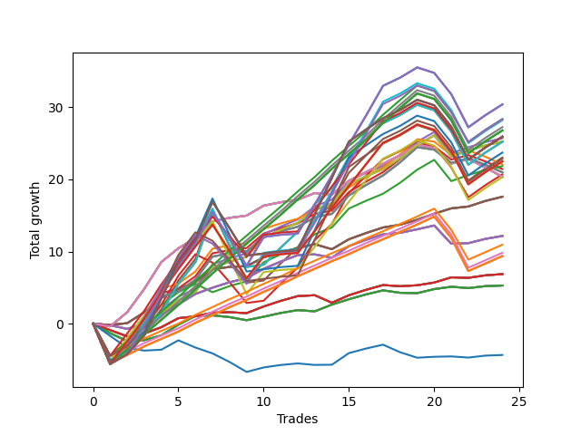

# Long Wallace 011 
- Symbol: NVDA_Unlimited
- Date Range: 02/08/2022 - 07/08/2022
- Trading Period: 7:20-12:30
- Number of Trades: 24



| Name | Win Percent | Profit | Avg Profit / Trade | Avg Time / Trade |      | Name | Win Percent | Profit | Avg Profit / Trade | Avg Time / Trade |
| ---- | ----------- | ------ | ------------------ | ---------------- | ---- | ---- | ----------- | ------ | ------------------ | ---------------- |
| Sorted By <br> Profit | | | | | | Sorted By <br> Win Percentage ||||
| One Hundred Twenty-Nine | 75.00 | 15200.00 | 633.33 | 162:19 |     | Forty-Six | 91.67 | 12850.00 | 535.42 | 101:55 |
| One Hundred Twenty-Four | 75.00 | 15200.00 | 633.33 | 162:19 |     | Seventy | 91.67 | 12620.00 | 525.83 | 102:32 |
| Eighty-Four | 75.00 | 15200.00 | 633.33 | 162:19 |     | Sixty-Two | 91.67 | 12620.00 | 525.83 | 102:32 |
| One Hundred Seventeen | 83.33 | 14185.00 | 591.04 | 119:38 |     | Six | 91.67 | 12620.00 | 525.83 | 102:32 |
| One Hundred Ninteen | 70.83 | 14175.00 | 590.63 | 152:39 |     | Sixty-Seven | 91.67 | 8800.00 | 366.67 | 27:10 |
| One Hundred Fourteen | 75.00 | 14105.00 | 587.71 | 159:32 |     | Fifty-Nine | 91.67 | 8800.00 | 366.67 | 27:10 |
| One Hundred Twelve | 83.33 | 13625.00 | 567.71 | 120:25 |     | Fifty-One | 91.67 | 8800.00 | 366.67 | 27:10 |
| One Hundred Twenty-Seven | 83.33 | 13395.00 | 558.13 | 121:01 |     | Forty-Three | 91.67 | 8800.00 | 366.67 | 27:10 |
| One Hundred Twenty-Two | 83.33 | 13395.00 | 558.13 | 121:01 |     | Three | 91.67 | 8800.00 | 366.67 | 27:10 |
| Eighty-Two | 83.33 | 13395.00 | 558.13 | 121:01 |     | Fifty-Four | 87.50 | 10920.00 | 455.00 | 100:34 |
| One Hundred Eighteen | 75.00 | 12980.00 | 540.83 | 143:58 |     | One Hundred Sixteen | 87.50 | 5475.00 | 228.13 | 71:41 |
| One Hundred Thirty | 75.00 | 12955.00 | 539.79 | 180:43 |     | One Hundred Eleven | 87.50 | 4915.00 | 204.79 | 72:27 |
| One Hundred Twenty-Five | 75.00 | 12955.00 | 539.79 | 180:43 |     | One Hundred Twenty-Six | 87.50 | 4685.00 | 195.21 | 73:04 |
| Eighty-Five | 75.00 | 12955.00 | 539.79 | 180:43 |     | One Hundred Twenty-One | 87.50 | 4685.00 | 195.21 | 73:04 |
| Forty-Six | 91.67 | 12850.00 | 535.42 | 101:55 |     | Eighty-One | 87.50 | 4685.00 | 195.21 | 73:04 |
| Seventy | 91.67 | 12620.00 | 525.83 | 102:32 |     | One Hundred Seventeen | 83.33 | 14185.00 | 591.04 | 119:38 |
| Sixty-Two | 91.67 | 12620.00 | 525.83 | 102:32 |     | One Hundred Twelve | 83.33 | 13625.00 | 567.71 | 120:25 |
| Six | 91.67 | 12620.00 | 525.83 | 102:32 |     | One Hundred Twenty-Seven | 83.33 | 13395.00 | 558.13 | 121:01 |
| Seventy-One | 75.00 | 12610.00 | 525.42 | 160:38 |     | One Hundred Twenty-Two | 83.33 | 13395.00 | 558.13 | 121:01 |
| Sixty-Three | 75.00 | 12610.00 | 525.42 | 160:38 |     | Eighty-Two | 83.33 | 13395.00 | 558.13 | 121:01 |
| Seven | 75.00 | 12610.00 | 525.42 | 160:38 |     | Sixty-Six | 83.33 | 6080.00 | 253.33 | 28:08 |
| One Hundred Fifteen | 75.00 | 11860.00 | 494.17 | 177:57 |     | Fifty-Eight | 83.33 | 6080.00 | 253.33 | 28:08 |
| Forty-Seven | 75.00 | 11515.00 | 479.79 | 157:52 |     | Fifty | 83.33 | 6080.00 | 253.33 | 28:08 |
| One Hundred Twenty | 70.83 | 11430.00 | 476.25 | 170:43 |     | Forty-Two | 83.33 | 6080.00 | 253.33 | 28:08 |
| One Hundred Twenty-Eight | 75.00 | 11250.00 | 468.75 | 152:13 |     | Two | 83.33 | 6080.00 | 253.33 | 28:08 |
| One Hundred Twenty-Three | 75.00 | 11250.00 | 468.75 | 152:13 |     | Fifty-Three | 79.17 | 11040.00 | 460.00 | 66:01 |
| Eighty-Three | 75.00 | 11250.00 | 468.75 | 152:13 |     | Forty-Five | 79.17 | 10715.00 | 446.46 | 66:02 |
| Fifty-Three | 79.17 | 11040.00 | 460.00 | 66:01 |     | Sixty-Nine | 79.17 | 10485.00 | 436.87 | 66:38 |
| Fifty-Four | 87.50 | 10920.00 | 455.00 | 100:34 |     | Sixty-One | 79.17 | 10485.00 | 436.87 | 66:38 |
| Forty-Five | 79.17 | 10715.00 | 446.46 | 66:02 |     | Five | 79.17 | 10485.00 | 436.87 | 66:38 |
| Sixty-Nine | 79.17 | 10485.00 | 436.87 | 66:38 |     | One Hundred Twenty-Nine | 75.00 | 15200.00 | 633.33 | 162:19 |
| Sixty-One | 79.17 | 10485.00 | 436.87 | 66:38 |     | One Hundred Twenty-Four | 75.00 | 15200.00 | 633.33 | 162:19 |
| Five | 79.17 | 10485.00 | 436.87 | 66:38 |     | Eighty-Four | 75.00 | 15200.00 | 633.33 | 162:19 |
| Fifty-Five | 70.83 | 10350.00 | 431.25 | 149:31 |     | One Hundred Fourteen | 75.00 | 14105.00 | 587.71 | 159:32 |
| Sixty-Eight | 75.00 | 10170.00 | 423.75 | 50:27 |     | One Hundred Eighteen | 75.00 | 12980.00 | 540.83 | 143:58 |
| Sixty | 75.00 | 10170.00 | 423.75 | 50:27 |     | One Hundred Thirty | 75.00 | 12955.00 | 539.79 | 180:43 |
| Fifty-Two | 75.00 | 10170.00 | 423.75 | 50:27 |     | One Hundred Twenty-Five | 75.00 | 12955.00 | 539.79 | 180:43 |
| Forty-Four | 75.00 | 10170.00 | 423.75 | 50:27 |     | Eighty-Five | 75.00 | 12955.00 | 539.79 | 180:43 |
| Four | 75.00 | 10170.00 | 423.75 | 50:27 |     | Seventy-One | 75.00 | 12610.00 | 525.42 | 160:38 |
| One Hundred Thirteen | 75.00 | 10155.00 | 423.13 | 149:27 |     | Sixty-Three | 75.00 | 12610.00 | 525.42 | 160:38 |
| Sixty-Seven | 91.67 | 8800.00 | 366.67 | 27:10 |     | Seven | 75.00 | 12610.00 | 525.42 | 160:38 |
| Fifty-Nine | 91.67 | 8800.00 | 366.67 | 27:10 |     | One Hundred Fifteen | 75.00 | 11860.00 | 494.17 | 177:57 |
| Fifty-One | 91.67 | 8800.00 | 366.67 | 27:10 |     | Forty-Seven | 75.00 | 11515.00 | 479.79 | 157:52 |
| Forty-Three | 91.67 | 8800.00 | 366.67 | 27:10 |     | One Hundred Twenty-Eight | 75.00 | 11250.00 | 468.75 | 152:13 |
| Three | 91.67 | 8800.00 | 366.67 | 27:10 |     | One Hundred Twenty-Three | 75.00 | 11250.00 | 468.75 | 152:13 |
| Sixty-Six | 83.33 | 6080.00 | 253.33 | 28:08 |     | Eighty-Three | 75.00 | 11250.00 | 468.75 | 152:13 |
| Fifty-Eight | 83.33 | 6080.00 | 253.33 | 28:08 |     | Sixty-Eight | 75.00 | 10170.00 | 423.75 | 50:27 |
| Fifty | 83.33 | 6080.00 | 253.33 | 28:08 |     | Sixty | 75.00 | 10170.00 | 423.75 | 50:27 |
| Forty-Two | 83.33 | 6080.00 | 253.33 | 28:08 |     | Fifty-Two | 75.00 | 10170.00 | 423.75 | 50:27 |
| Two | 83.33 | 6080.00 | 253.33 | 28:08 |     | Forty-Four | 75.00 | 10170.00 | 423.75 | 50:27 |
| One Hundred Sixteen | 87.50 | 5475.00 | 228.13 | 71:41 |     | Four | 75.00 | 10170.00 | 423.75 | 50:27 |
| One Hundred Eleven | 87.50 | 4915.00 | 204.79 | 72:27 |     | One Hundred Thirteen | 75.00 | 10155.00 | 423.13 | 149:27 |
| One Hundred Twenty-Six | 87.50 | 4685.00 | 195.21 | 73:04 |     | Sixty-Five | 75.00 | 3435.00 | 143.12 | 18:33 |
| One Hundred Twenty-One | 87.50 | 4685.00 | 195.21 | 73:04 |     | Fifty-Seven | 75.00 | 3435.00 | 143.12 | 18:33 |
| Eighty-One | 87.50 | 4685.00 | 195.21 | 73:04 |     | Forty-Nine | 75.00 | 3435.00 | 143.12 | 18:33 |
| Sixty-Five | 75.00 | 3435.00 | 143.12 | 18:33 |     | Forty-One | 75.00 | 3435.00 | 143.12 | 18:33 |
| Fifty-Seven | 75.00 | 3435.00 | 143.12 | 18:33 |     | One | 75.00 | 3435.00 | 143.12 | 18:33 |
| Forty-Nine | 75.00 | 3435.00 | 143.12 | 18:33 |     | One Hundred Ninteen | 70.83 | 14175.00 | 590.63 | 152:39 |
| Forty-One | 75.00 | 3435.00 | 143.12 | 18:33 |     | One Hundred Twenty | 70.83 | 11430.00 | 476.25 | 170:43 |
| One | 75.00 | 3435.00 | 143.12 | 18:33 |     | Fifty-Five | 70.83 | 10350.00 | 431.25 | 149:31 |
| Sixty-Four | 66.67 | 2645.00 | 110.21 | 11:51 |     | Sixty-Four | 66.67 | 2645.00 | 110.21 | 11:51 |
| Fifty-Six | 66.67 | 2645.00 | 110.21 | 11:51 |     | Fifty-Six | 66.67 | 2645.00 | 110.21 | 11:51 |
| Forty-Eight | 66.67 | 2645.00 | 110.21 | 11:51 |     | Forty-Eight | 66.67 | 2645.00 | 110.21 | 11:51 |
| Forty | 66.67 | 2645.00 | 110.21 | 11:51 |     | Forty | 66.67 | 2645.00 | 110.21 | 11:51 |
| Zero | 66.67 | 2645.00 | 110.21 | 11:51 |     | Zero | 66.67 | 2645.00 | 110.21 | 11:51 |
| Seventy-Three | 54.17 | -2170.00 | -90.42 | 13:52 |     | Seventy-Three | 54.17 | -2170.00 | -90.42 | 13:52 |

## NO STOPLOSS

### Test Zero
* Sell when price hits the middle line of the 20p bollinger
* No Stoploss
* Results:
```
Total Trades: 24
Percent Up: 66.67
Percent Down: 33.33
Total Points Moved Up: 5.29
Potential Profit: 2645.00
Total Points Ups: 9.13 Count Ups: 16
Total Points Downs: -3.84 Count Downs: 8
```

<details><summary>Trades</summary>

<code>In: 2022-02-10 10:21:00		Out: 2022-02-10 10:40:50		Total Position Time: 19:50		Total Move Up: -1.31		Total to Date: -1.31</code> <br />
<code>In: 2022-02-14 10:58:00		Out: 2022-02-14 11:13:10		Total Position Time: 15:10		Total Move Up: -1.11		Total to Date: -2.42</code> <br />
<code>In: 2022-02-14 11:01:00		Out: 2022-02-14 11:13:10		Total Position Time: 12:10		Total Move Up: 0.14		Total to Date: -2.28</code> <br />
<code>In: 2022-02-14 11:03:00		Out: 2022-02-14 11:13:10		Total Position Time: 10:10		Total Move Up: 0.65		Total to Date: -1.63</code> <br />
<code>In: 2022-02-22 08:22:00		Out: 2022-02-22 08:26:50		Total Position Time: 04:50		Total Move Up: 1.49		Total to Date: -0.14</code> <br />
<code>In: 2022-02-25 10:59:00		Out: 2022-02-25 11:04:15		Total Position Time: 05:15		Total Move Up: 1.21		Total to Date: 1.07</code> <br />
<code>In: 2022-03-16 10:14:00		Out: 2022-03-16 10:28:05		Total Position Time: 14:05		Total Move Up: 0.08		Total to Date: 1.15</code> <br />
<code>In: 2022-03-30 08:02:00		Out: 2022-03-30 08:15:05		Total Position Time: 13:05		Total Move Up: -0.24		Total to Date: 0.91</code> <br />
<code>In: 2022-03-30 08:03:00		Out: 2022-03-30 08:15:05		Total Position Time: 12:05		Total Move Up: -0.43		Total to Date: 0.48</code> <br />
<code>In: 2022-03-31 10:18:00		Out: 2022-03-31 10:26:30		Total Position Time: 08:30		Total Move Up: 0.48		Total to Date: 0.96</code> <br />
<code>In: 2022-04-11 07:30:00		Out: 2022-04-11 07:45:10		Total Position Time: 15:10		Total Move Up: 0.52		Total to Date: 1.48</code> <br />
<code>In: 2022-04-11 07:31:00		Out: 2022-04-11 07:45:10		Total Position Time: 14:10		Total Move Up: 0.40		Total to Date: 1.88</code> <br />
<code>In: 2022-04-18 09:19:00		Out: 2022-04-18 09:34:25		Total Position Time: 15:25		Total Move Up: -0.17		Total to Date: 1.71</code> <br />
<code>In: 2022-05-02 10:05:00		Out: 2022-05-02 10:10:50		Total Position Time: 05:50		Total Move Up: 0.93		Total to Date: 2.64</code> <br />
<code>In: 2022-05-02 10:51:00		Out: 2022-05-02 10:55:45		Total Position Time: 04:45		Total Move Up: 0.75		Total to Date: 3.39</code> <br />
<code>In: 2022-05-03 09:11:00		Out: 2022-05-03 09:23:05		Total Position Time: 12:05		Total Move Up: 0.66		Total to Date: 4.05</code> <br />
<code>In: 2022-05-03 09:12:00		Out: 2022-05-03 09:23:05		Total Position Time: 11:05		Total Move Up: 0.57		Total to Date: 4.62</code> <br />
<code>In: 2022-05-31 11:48:00		Out: 2022-05-31 12:04:55		Total Position Time: 16:55		Total Move Up: -0.34		Total to Date: 4.28</code> <br />
<code>In: 2022-05-31 11:50:00		Out: 2022-05-31 12:04:55		Total Position Time: 14:55		Total Move Up: -0.05		Total to Date: 4.23</code> <br />
<code>In: 2022-06-06 08:19:00		Out: 2022-06-06 08:30:10		Total Position Time: 11:10		Total Move Up: 0.56		Total to Date: 4.79</code> <br />
<code>In: 2022-06-08 08:06:00		Out: 2022-06-08 08:15:10		Total Position Time: 09:10		Total Move Up: 0.33		Total to Date: 5.12</code> <br />
<code>In: 2022-06-09 08:10:00		Out: 2022-06-09 08:25:00		Total Position Time: 15:00		Total Move Up: -0.19		Total to Date: 4.93</code> <br />
<code>In: 2022-06-23 09:06:00		Out: 2022-06-23 09:18:25		Total Position Time: 12:25		Total Move Up: 0.27		Total to Date: 5.20</code> <br />
<code>In: 2022-06-23 09:07:00		Out: 2022-06-23 09:18:25		Total Position Time: 11:25		Total Move Up: 0.09		Total to Date: 5.29</code> <br />


</details>

### Test One
* Sell when the price hits the upper line of the 20p 1std bollinger
* No Stoploss
* Results:
```
Total Trades: 24
Percent Up: 75.00
Percent Down: 25.00
Total Points Moved Up: 6.87
Potential Profit: 3435.00
Total Points Ups: 10.03 Count Ups: 18
Total Points Downs: -3.16 Count Downs: 6
```

<details><summary>Trades</summary>

<code>In: 2022-02-10 10:21:00		Out: 2022-02-10 10:43:25		Total Position Time: 22:25		Total Move Up: -0.89		Total to Date: -0.89</code> <br />
<code>In: 2022-02-14 10:58:00		Out: 2022-02-14 11:17:20		Total Position Time: 19:20		Total Move Up: -0.87		Total to Date: -1.76</code> <br />
<code>In: 2022-02-14 11:01:00		Out: 2022-02-14 11:17:20		Total Position Time: 16:20		Total Move Up: 0.38		Total to Date: -1.38</code> <br />
<code>In: 2022-02-14 11:03:00		Out: 2022-02-14 11:17:20		Total Position Time: 14:20		Total Move Up: 0.89		Total to Date: -0.49</code> <br />
<code>In: 2022-02-22 08:22:00		Out: 2022-02-22 08:33:50		Total Position Time: 11:50		Total Move Up: 1.25		Total to Date: 0.76</code> <br />
<code>In: 2022-02-25 10:59:00		Out: 2022-02-25 11:19:15		Total Position Time: 20:15		Total Move Up: 0.26		Total to Date: 1.02</code> <br />
<code>In: 2022-03-16 10:14:00		Out: 2022-03-16 10:29:10		Total Position Time: 15:10		Total Move Up: 0.51		Total to Date: 1.53</code> <br />
<code>In: 2022-03-30 08:02:00		Out: 2022-03-30 08:19:20		Total Position Time: 17:20		Total Move Up: 0.06		Total to Date: 1.59</code> <br />
<code>In: 2022-03-30 08:03:00		Out: 2022-03-30 08:19:20		Total Position Time: 16:20		Total Move Up: -0.13		Total to Date: 1.46</code> <br />
<code>In: 2022-03-31 10:18:00		Out: 2022-03-31 10:29:20		Total Position Time: 11:20		Total Move Up: 0.92		Total to Date: 2.38</code> <br />
<code>In: 2022-04-11 07:30:00		Out: 2022-04-11 07:55:05		Total Position Time: 25:05		Total Move Up: 0.78		Total to Date: 3.16</code> <br />
<code>In: 2022-04-11 07:31:00		Out: 2022-04-11 07:55:05		Total Position Time: 24:05		Total Move Up: 0.66		Total to Date: 3.82</code> <br />
<code>In: 2022-04-18 09:19:00		Out: 2022-04-18 09:35:15		Total Position Time: 16:15		Total Move Up: 0.12		Total to Date: 3.94</code> <br />
<code>In: 2022-05-02 10:05:00		Out: 2022-05-02 10:58:25		Total Position Time: 53:25		Total Move Up: -1.04		Total to Date: 2.90</code> <br />
<code>In: 2022-05-02 10:51:00		Out: 2022-05-02 10:58:25		Total Position Time: 07:25		Total Move Up: 1.04		Total to Date: 3.94</code> <br />
<code>In: 2022-05-03 09:11:00		Out: 2022-05-03 09:28:00		Total Position Time: 17:00		Total Move Up: 0.75		Total to Date: 4.69</code> <br />
<code>In: 2022-05-03 09:12:00		Out: 2022-05-03 09:28:00		Total Position Time: 16:00		Total Move Up: 0.66		Total to Date: 5.35</code> <br />
<code>In: 2022-05-31 11:48:00		Out: 2022-05-31 12:07:05		Total Position Time: 19:05		Total Move Up: -0.16		Total to Date: 5.19</code> <br />
<code>In: 2022-05-31 11:50:00		Out: 2022-05-31 12:07:05		Total Position Time: 17:05		Total Move Up: 0.13		Total to Date: 5.32</code> <br />
<code>In: 2022-06-06 08:19:00		Out: 2022-06-06 08:39:15		Total Position Time: 20:15		Total Move Up: 0.38		Total to Date: 5.70</code> <br />
<code>In: 2022-06-08 08:06:00		Out: 2022-06-08 08:18:05		Total Position Time: 12:05		Total Move Up: 0.72		Total to Date: 6.42</code> <br />
<code>In: 2022-06-09 08:10:00		Out: 2022-06-09 08:33:25		Total Position Time: 23:25		Total Move Up: -0.07		Total to Date: 6.35</code> <br />
<code>In: 2022-06-23 09:06:00		Out: 2022-06-23 09:21:15		Total Position Time: 15:15		Total Move Up: 0.35		Total to Date: 6.70</code> <br />
<code>In: 2022-06-23 09:07:00		Out: 2022-06-23 09:21:15		Total Position Time: 14:15		Total Move Up: 0.17		Total to Date: 6.87</code> <br />


</details>

### Test Two
* Sell when the price hits the upper line of the 20p 2std bollinger
* No Stoploss
* Results:
```
Total Trades: 24
Percent Up: 83.33
Percent Down: 16.67
Total Points Moved Up: 12.16
Potential Profit: 6080.00
Total Points Ups: 15.88 Count Ups: 20
Total Points Downs: -3.72 Count Downs: 4
```

<details><summary>Trades</summary>

<code>In: 2022-02-10 10:21:00		Out: 2022-02-10 10:46:50		Total Position Time: 25:50		Total Move Up: -0.21		Total to Date: -0.21</code> <br />
<code>In: 2022-02-14 10:58:00		Out: 2022-02-14 11:19:15		Total Position Time: 21:15		Total Move Up: -0.52		Total to Date: -0.73</code> <br />
<code>In: 2022-02-14 11:01:00		Out: 2022-02-14 11:19:15		Total Position Time: 18:15		Total Move Up: 0.73		Total to Date: 0.00</code> <br />
<code>In: 2022-02-14 11:03:00		Out: 2022-02-14 11:19:15		Total Position Time: 16:15		Total Move Up: 1.24		Total to Date: 1.24</code> <br />
<code>In: 2022-02-22 08:22:00		Out: 2022-02-22 08:48:30		Total Position Time: 26:30		Total Move Up: 1.43		Total to Date: 2.67</code> <br />
<code>In: 2022-02-25 10:59:00		Out: 2022-02-25 11:25:30		Total Position Time: 26:30		Total Move Up: 1.45		Total to Date: 4.12</code> <br />
<code>In: 2022-03-16 10:14:00		Out: 2022-03-16 10:30:45		Total Position Time: 16:45		Total Move Up: 0.86		Total to Date: 4.98</code> <br />
<code>In: 2022-03-30 08:02:00		Out: 2022-03-30 08:35:30		Total Position Time: 33:30		Total Move Up: 0.76		Total to Date: 5.74</code> <br />
<code>In: 2022-03-30 08:03:00		Out: 2022-03-30 08:35:30		Total Position Time: 32:30		Total Move Up: 0.57		Total to Date: 6.31</code> <br />
<code>In: 2022-03-31 10:18:00		Out: 2022-03-31 10:31:45		Total Position Time: 13:45		Total Move Up: 1.29		Total to Date: 7.60</code> <br />
<code>In: 2022-04-11 07:30:00		Out: 2022-04-11 08:11:30		Total Position Time: 41:30		Total Move Up: 1.01		Total to Date: 8.61</code> <br />
<code>In: 2022-04-11 07:31:00		Out: 2022-04-11 08:11:30		Total Position Time: 40:30		Total Move Up: 0.89		Total to Date: 9.50</code> <br />
<code>In: 2022-04-18 09:19:00		Out: 2022-04-18 09:42:45		Total Position Time: 23:45		Total Move Up: 0.10		Total to Date: 9.60</code> <br />
<code>In: 2022-05-02 10:05:00		Out: 2022-05-02 11:02:15		Total Position Time: 57:15		Total Move Up: -0.46		Total to Date: 9.14</code> <br />
<code>In: 2022-05-02 10:51:00		Out: 2022-05-02 11:02:15		Total Position Time: 11:15		Total Move Up: 1.62		Total to Date: 10.76</code> <br />
<code>In: 2022-05-03 09:11:00		Out: 2022-05-03 09:28:10		Total Position Time: 17:10		Total Move Up: 0.86		Total to Date: 11.62</code> <br />
<code>In: 2022-05-03 09:12:00		Out: 2022-05-03 09:28:10		Total Position Time: 16:10		Total Move Up: 0.77		Total to Date: 12.39</code> <br />
<code>In: 2022-05-31 11:48:00		Out: 2022-05-31 12:07:50		Total Position Time: 19:50		Total Move Up: 0.20		Total to Date: 12.59</code> <br />
<code>In: 2022-05-31 11:50:00		Out: 2022-05-31 12:07:50		Total Position Time: 17:50		Total Move Up: 0.49		Total to Date: 13.08</code> <br />
<code>In: 2022-06-06 08:19:00		Out: 2022-06-06 08:39:25		Total Position Time: 20:25		Total Move Up: 0.53		Total to Date: 13.61</code> <br />
<code>In: 2022-06-08 08:06:00		Out: 2022-06-08 09:57:05		Total Position Time: 111:05		Total Move Up: -2.53		Total to Date: 11.08</code> <br />
<code>In: 2022-06-09 08:10:00		Out: 2022-06-09 08:35:10		Total Position Time: 25:10		Total Move Up: 0.08		Total to Date: 11.16</code> <br />
<code>In: 2022-06-23 09:06:00		Out: 2022-06-23 09:27:40		Total Position Time: 21:40		Total Move Up: 0.59		Total to Date: 11.75</code> <br />
<code>In: 2022-06-23 09:07:00		Out: 2022-06-23 09:27:40		Total Position Time: 20:40		Total Move Up: 0.41		Total to Date: 12.16</code> <br />


</details>

### Test Three
* Sell when price hits the middle line of the 50p bollinger
* No Stoploss
* Results:
```
Total Trades: 24
Percent Up: 91.67
Percent Down: 8.33
Total Points Moved Up: 17.60
Potential Profit: 8800.00
Total Points Ups: 18.48 Count Ups: 22
Total Points Downs: -0.88 Count Downs: 2
```

<details><summary>Trades</summary>

<code>In: 2022-02-10 10:21:00		Out: 2022-02-10 10:58:20		Total Position Time: 37:20		Total Move Up: -0.18		Total to Date: -0.18</code> <br />
<code>In: 2022-02-14 10:58:00		Out: 2022-02-14 11:28:50		Total Position Time: 30:50		Total Move Up: 0.25		Total to Date: 0.07</code> <br />
<code>In: 2022-02-14 11:01:00		Out: 2022-02-14 11:28:50		Total Position Time: 27:50		Total Move Up: 1.50		Total to Date: 1.57</code> <br />
<code>In: 2022-02-14 11:03:00		Out: 2022-02-14 11:28:50		Total Position Time: 25:50		Total Move Up: 2.01		Total to Date: 3.58</code> <br />
<code>In: 2022-02-22 08:22:00		Out: 2022-02-22 08:48:05		Total Position Time: 26:05		Total Move Up: 1.23		Total to Date: 4.81</code> <br />
<code>In: 2022-02-25 10:59:00		Out: 2022-02-25 11:23:35		Total Position Time: 24:35		Total Move Up: 0.97		Total to Date: 5.78</code> <br />
<code>In: 2022-03-16 10:14:00		Out: 2022-03-16 10:36:05		Total Position Time: 22:05		Total Move Up: 1.77		Total to Date: 7.55</code> <br />
<code>In: 2022-03-30 08:02:00		Out: 2022-03-30 08:35:00		Total Position Time: 33:00		Total Move Up: 0.31		Total to Date: 7.86</code> <br />
<code>In: 2022-03-30 08:03:00		Out: 2022-03-30 08:35:00		Total Position Time: 32:00		Total Move Up: 0.12		Total to Date: 7.98</code> <br />
<code>In: 2022-03-31 10:18:00		Out: 2022-03-31 10:29:50		Total Position Time: 11:50		Total Move Up: 1.20		Total to Date: 9.18</code> <br />
<code>In: 2022-04-11 07:30:00		Out: 2022-04-11 08:08:50		Total Position Time: 38:50		Total Move Up: 0.71		Total to Date: 9.89</code> <br />
<code>In: 2022-04-11 07:31:00		Out: 2022-04-11 08:08:50		Total Position Time: 37:50		Total Move Up: 0.59		Total to Date: 10.48</code> <br />
<code>In: 2022-04-18 09:19:00		Out: 2022-04-18 09:46:50		Total Position Time: 27:50		Total Move Up: 0.54		Total to Date: 11.02</code> <br />
<code>In: 2022-05-02 10:05:00		Out: 2022-05-02 10:59:55		Total Position Time: 54:55		Total Move Up: -0.70		Total to Date: 10.32</code> <br />
<code>In: 2022-05-02 10:51:00		Out: 2022-05-02 10:59:55		Total Position Time: 08:55		Total Move Up: 1.38		Total to Date: 11.70</code> <br />
<code>In: 2022-05-03 09:11:00		Out: 2022-05-03 09:28:10		Total Position Time: 17:10		Total Move Up: 0.86		Total to Date: 12.56</code> <br />
<code>In: 2022-05-03 09:12:00		Out: 2022-05-03 09:28:10		Total Position Time: 16:10		Total Move Up: 0.77		Total to Date: 13.33</code> <br />
<code>In: 2022-05-31 11:48:00		Out: 2022-05-31 12:14:05		Total Position Time: 26:05		Total Move Up: 0.39		Total to Date: 13.72</code> <br />
<code>In: 2022-05-31 11:50:00		Out: 2022-05-31 12:14:05		Total Position Time: 24:05		Total Move Up: 0.68		Total to Date: 14.40</code> <br />
<code>In: 2022-06-06 08:19:00		Out: 2022-06-06 08:52:30		Total Position Time: 33:30		Total Move Up: 0.84		Total to Date: 15.24</code> <br />
<code>In: 2022-06-08 08:06:00		Out: 2022-06-08 08:32:20		Total Position Time: 26:20		Total Move Up: 0.74		Total to Date: 15.98</code> <br />
<code>In: 2022-06-09 08:10:00		Out: 2022-06-09 08:36:05		Total Position Time: 26:05		Total Move Up: 0.26		Total to Date: 16.24</code> <br />
<code>In: 2022-06-23 09:06:00		Out: 2022-06-23 09:28:00		Total Position Time: 22:00		Total Move Up: 0.77		Total to Date: 17.01</code> <br />
<code>In: 2022-06-23 09:07:00		Out: 2022-06-23 09:28:00		Total Position Time: 21:00		Total Move Up: 0.59		Total to Date: 17.60</code> <br />


</details>

### Test Four
* Sell when the price hits the upper line of the 50p 1std bollinger
* No Stoploss
* Results:
```
Total Trades: 24
Percent Up: 75.00
Percent Down: 25.00
Total Points Moved Up: 20.34
Potential Profit: 10170.00
Total Points Ups: 26.03 Count Ups: 18
Total Points Downs: -5.69 Count Downs: 6
```

<details><summary>Trades</summary>

<code>In: 2022-02-10 10:21:00		Out: 2022-02-10 11:36:45		Total Position Time: 75:45		Total Move Up: -0.38		Total to Date: -0.38</code> <br />
<code>In: 2022-02-14 10:58:00		Out: 2022-02-14 11:29:20		Total Position Time: 31:20		Total Move Up: 1.97		Total to Date: 1.59</code> <br />
<code>In: 2022-02-14 11:01:00		Out: 2022-02-14 11:29:20		Total Position Time: 28:20		Total Move Up: 3.22		Total to Date: 4.81</code> <br />
<code>In: 2022-02-14 11:03:00		Out: 2022-02-14 11:29:20		Total Position Time: 26:20		Total Move Up: 3.73		Total to Date: 8.54</code> <br />
<code>In: 2022-02-22 08:22:00		Out: 2022-02-22 08:50:40		Total Position Time: 28:40		Total Move Up: 1.91		Total to Date: 10.45</code> <br />
<code>In: 2022-02-25 10:59:00		Out: 2022-02-25 11:40:10		Total Position Time: 41:10		Total Move Up: 1.41		Total to Date: 11.86</code> <br />
<code>In: 2022-03-16 10:14:00		Out: 2022-03-16 10:49:40		Total Position Time: 35:40		Total Move Up: 2.31		Total to Date: 14.17</code> <br />
<code>In: 2022-03-30 08:02:00		Out: 2022-03-30 08:46:05		Total Position Time: 44:05		Total Move Up: 0.50		Total to Date: 14.67</code> <br />
<code>In: 2022-03-30 08:03:00		Out: 2022-03-30 08:46:05		Total Position Time: 43:05		Total Move Up: 0.31		Total to Date: 14.98</code> <br />
<code>In: 2022-03-31 10:18:00		Out: 2022-03-31 10:50:20		Total Position Time: 32:20		Total Move Up: 1.38		Total to Date: 16.36</code> <br />
<code>In: 2022-04-11 07:30:00		Out: 2022-04-11 08:32:10		Total Position Time: 62:10		Total Move Up: 0.47		Total to Date: 16.83</code> <br />
<code>In: 2022-04-11 07:31:00		Out: 2022-04-11 08:32:10		Total Position Time: 61:10		Total Move Up: 0.35		Total to Date: 17.18</code> <br />
<code>In: 2022-04-18 09:19:00		Out: 2022-04-18 09:56:05		Total Position Time: 37:05		Total Move Up: 0.93		Total to Date: 18.11</code> <br />
<code>In: 2022-05-02 10:05:00		Out: 2022-05-02 11:02:25		Total Position Time: 57:25		Total Move Up: -0.20		Total to Date: 17.91</code> <br />
<code>In: 2022-05-02 10:51:00		Out: 2022-05-02 11:02:25		Total Position Time: 11:25		Total Move Up: 1.88		Total to Date: 19.79</code> <br />
<code>In: 2022-05-03 09:11:00		Out: 2022-05-03 09:47:35		Total Position Time: 36:35		Total Move Up: 1.23		Total to Date: 21.02</code> <br />
<code>In: 2022-05-03 09:12:00		Out: 2022-05-03 09:47:35		Total Position Time: 35:35		Total Move Up: 1.14		Total to Date: 22.16</code> <br />
<code>In: 2022-05-31 11:48:00		Out: 2022-05-31 12:17:20		Total Position Time: 29:20		Total Move Up: 1.19		Total to Date: 23.35</code> <br />
<code>In: 2022-05-31 11:50:00		Out: 2022-05-31 12:17:20		Total Position Time: 27:20		Total Move Up: 1.48		Total to Date: 24.83</code> <br />
<code>In: 2022-06-06 08:19:00		Out: 2022-06-06 09:48:10		Total Position Time: 89:10		Total Move Up: -0.48		Total to Date: 24.35</code> <br />
<code>In: 2022-06-08 08:06:00		Out: 2022-06-08 10:15:40		Total Position Time: 129:40		Total Move Up: -2.15		Total to Date: 22.20</code> <br />
<code>In: 2022-06-09 08:10:00		Out: 2022-06-09 08:43:15		Total Position Time: 33:15		Total Move Up: 0.62		Total to Date: 22.82</code> <br />
<code>In: 2022-06-23 09:06:00		Out: 2022-06-23 10:53:35		Total Position Time: 107:35		Total Move Up: -1.15		Total to Date: 21.67</code> <br />
<code>In: 2022-06-23 09:07:00		Out: 2022-06-23 10:53:35		Total Position Time: 106:35		Total Move Up: -1.33		Total to Date: 20.34</code> <br />


</details>

### Test Five
* Sell when the price hits the upper line of the 50p 2std bollinger
* No Stoploss
* Results:
```
Total Trades: 24
Percent Up: 79.17
Percent Down: 20.83
Total Points Moved Up: 20.97
Potential Profit: 10485.00
Total Points Ups: 30.67 Count Ups: 19
Total Points Downs: -9.70 Count Downs: 5
```

<details><summary>Trades</summary>

<code>In: 2022-02-10 10:21:00		Out: 2022-02-10 12:47:00		Total Position Time: 146:00		Total Move Up: -5.58		Total to Date: -5.58</code> <br />
<code>In: 2022-02-14 10:58:00		Out: 2022-02-14 11:40:45		Total Position Time: 42:45		Total Move Up: 2.10		Total to Date: -3.48</code> <br />
<code>In: 2022-02-14 11:01:00		Out: 2022-02-14 11:40:45		Total Position Time: 39:45		Total Move Up: 3.35		Total to Date: -0.13</code> <br />
<code>In: 2022-02-14 11:03:00		Out: 2022-02-14 11:40:45		Total Position Time: 37:45		Total Move Up: 3.86		Total to Date: 3.73</code> <br />
<code>In: 2022-02-22 08:22:00		Out: 2022-02-22 09:42:10		Total Position Time: 80:10		Total Move Up: 0.71		Total to Date: 4.44</code> <br />
<code>In: 2022-02-25 10:59:00		Out: 2022-02-25 12:15:55		Total Position Time: 76:55		Total Move Up: 1.68		Total to Date: 6.12</code> <br />
<code>In: 2022-03-16 10:14:00		Out: 2022-03-16 10:54:20		Total Position Time: 40:20		Total Move Up: 3.17		Total to Date: 9.29</code> <br />
<code>In: 2022-03-30 08:02:00		Out: 2022-03-30 09:34:25		Total Position Time: 92:25		Total Move Up: 0.46		Total to Date: 9.75</code> <br />
<code>In: 2022-03-30 08:03:00		Out: 2022-03-30 09:34:25		Total Position Time: 91:25		Total Move Up: 0.27		Total to Date: 10.02</code> <br />
<code>In: 2022-03-31 10:18:00		Out: 2022-03-31 10:51:30		Total Position Time: 33:30		Total Move Up: 2.02		Total to Date: 12.04</code> <br />
<code>In: 2022-04-11 07:30:00		Out: 2022-04-11 08:33:35		Total Position Time: 63:35		Total Move Up: 0.76		Total to Date: 12.80</code> <br />
<code>In: 2022-04-11 07:31:00		Out: 2022-04-11 08:33:35		Total Position Time: 62:35		Total Move Up: 0.64		Total to Date: 13.44</code> <br />
<code>In: 2022-04-18 09:19:00		Out: 2022-04-18 09:59:15		Total Position Time: 40:15		Total Move Up: 1.30		Total to Date: 14.74</code> <br />
<code>In: 2022-05-02 10:05:00		Out: 2022-05-02 11:05:00		Total Position Time: 60:00		Total Move Up: 0.48		Total to Date: 15.22</code> <br />
<code>In: 2022-05-02 10:51:00		Out: 2022-05-02 11:05:00		Total Position Time: 14:00		Total Move Up: 2.56		Total to Date: 17.78</code> <br />
<code>In: 2022-05-03 09:11:00		Out: 2022-05-03 09:58:35		Total Position Time: 47:35		Total Move Up: 1.43		Total to Date: 19.21</code> <br />
<code>In: 2022-05-03 09:12:00		Out: 2022-05-03 09:58:35		Total Position Time: 46:35		Total Move Up: 1.34		Total to Date: 20.55</code> <br />
<code>In: 2022-05-31 11:48:00		Out: 2022-05-31 12:30:55		Total Position Time: 42:55		Total Move Up: 1.81		Total to Date: 22.36</code> <br />
<code>In: 2022-05-31 11:50:00		Out: 2022-05-31 12:30:55		Total Position Time: 40:55		Total Move Up: 2.10		Total to Date: 24.46</code> <br />
<code>In: 2022-06-06 08:19:00		Out: 2022-06-06 09:54:50		Total Position Time: 95:50		Total Move Up: -0.34		Total to Date: 24.12</code> <br />
<code>In: 2022-06-08 08:06:00		Out: 2022-06-08 10:19:45		Total Position Time: 133:45		Total Move Up: -1.84		Total to Date: 22.28</code> <br />
<code>In: 2022-06-09 08:10:00		Out: 2022-06-09 09:01:25		Total Position Time: 51:25		Total Move Up: 0.63		Total to Date: 22.91</code> <br />
<code>In: 2022-06-23 09:06:00		Out: 2022-06-23 10:56:05		Total Position Time: 110:05		Total Move Up: -0.88		Total to Date: 22.03</code> <br />
<code>In: 2022-06-23 09:07:00		Out: 2022-06-23 10:56:05		Total Position Time: 109:05		Total Move Up: -1.06		Total to Date: 20.97</code> <br />


</details>

### Test Six
* Sell when the price hits the middle line of the 1std VWAP
* No Stoploss
* Results:
```
Total Trades: 24
Percent Up: 91.67
Percent Down: 8.33
Total Points Moved Up: 25.24
Potential Profit: 12620.00
Total Points Ups: 33.77 Count Ups: 22
Total Points Downs: -8.53 Count Downs: 2
```

<details><summary>Trades</summary>

<code>In: 2022-02-10 10:21:00		Out: 2022-02-10 12:47:00		Total Position Time: 146:00		Total Move Up: -5.58		Total to Date: -5.58</code> <br />
<code>In: 2022-02-14 10:58:00		Out: 2022-02-14 12:47:00		Total Position Time: 109:00		Total Move Up: 1.36		Total to Date: -4.22</code> <br />
<code>In: 2022-02-14 11:01:00		Out: 2022-02-14 12:47:00		Total Position Time: 106:00		Total Move Up: 2.61		Total to Date: -1.61</code> <br />
<code>In: 2022-02-14 11:03:00		Out: 2022-02-14 12:47:00		Total Position Time: 104:00		Total Move Up: 3.12		Total to Date: 1.51</code> <br />
<code>In: 2022-02-22 08:22:00		Out: 2022-02-22 11:31:50		Total Position Time: 189:50		Total Move Up: 1.74		Total to Date: 3.25</code> <br />
<code>In: 2022-02-25 10:59:00		Out: 2022-02-25 11:24:30		Total Position Time: 25:30		Total Move Up: 1.17		Total to Date: 4.42</code> <br />
<code>In: 2022-03-16 10:14:00		Out: 2022-03-16 11:44:20		Total Position Time: 90:20		Total Move Up: 3.34		Total to Date: 7.76</code> <br />
<code>In: 2022-03-30 08:02:00		Out: 2022-03-30 09:43:55		Total Position Time: 101:55		Total Move Up: 0.85		Total to Date: 8.61</code> <br />
<code>In: 2022-03-30 08:03:00		Out: 2022-03-30 09:43:55		Total Position Time: 100:55		Total Move Up: 0.66		Total to Date: 9.27</code> <br />
<code>In: 2022-03-31 10:18:00		Out: 2022-03-31 11:20:55		Total Position Time: 62:55		Total Move Up: 2.64		Total to Date: 11.91</code> <br />
<code>In: 2022-04-11 07:30:00		Out: 2022-04-11 10:01:25		Total Position Time: 151:25		Total Move Up: 1.10		Total to Date: 13.01</code> <br />
<code>In: 2022-04-11 07:31:00		Out: 2022-04-11 10:01:25		Total Position Time: 150:25		Total Move Up: 0.98		Total to Date: 13.99</code> <br />
<code>In: 2022-04-18 09:19:00		Out: 2022-04-18 10:07:50		Total Position Time: 48:50		Total Move Up: 1.81		Total to Date: 15.80</code> <br />
<code>In: 2022-05-02 10:05:00		Out: 2022-05-02 10:10:50		Total Position Time: 05:50		Total Move Up: 0.93		Total to Date: 16.73</code> <br />
<code>In: 2022-05-02 10:51:00		Out: 2022-05-02 11:45:50		Total Position Time: 54:50		Total Move Up: 2.63		Total to Date: 19.36</code> <br />
<code>In: 2022-05-03 09:11:00		Out: 2022-05-03 09:44:05		Total Position Time: 33:05		Total Move Up: 1.07		Total to Date: 20.43</code> <br />
<code>In: 2022-05-03 09:12:00		Out: 2022-05-03 09:44:05		Total Position Time: 32:05		Total Move Up: 0.98		Total to Date: 21.41</code> <br />
<code>In: 2022-05-31 11:48:00		Out: 2022-05-31 12:23:45		Total Position Time: 35:45		Total Move Up: 1.52		Total to Date: 22.93</code> <br />
<code>In: 2022-05-31 11:50:00		Out: 2022-05-31 12:23:45		Total Position Time: 33:45		Total Move Up: 1.81		Total to Date: 24.74</code> <br />
<code>In: 2022-06-06 08:19:00		Out: 2022-06-06 10:55:10		Total Position Time: 156:10		Total Move Up: 1.37		Total to Date: 26.11</code> <br />
<code>In: 2022-06-08 08:06:00		Out: 2022-06-08 12:47:00		Total Position Time: 281:00		Total Move Up: -2.95		Total to Date: 23.16</code> <br />
<code>In: 2022-06-09 08:10:00		Out: 2022-06-09 08:43:50		Total Position Time: 33:50		Total Move Up: 0.84		Total to Date: 24.00</code> <br />
<code>In: 2022-06-23 09:06:00		Out: 2022-06-23 12:30:15		Total Position Time: 204:15		Total Move Up: 0.71		Total to Date: 24.71</code> <br />
<code>In: 2022-06-23 09:07:00		Out: 2022-06-23 12:30:15		Total Position Time: 203:15		Total Move Up: 0.53		Total to Date: 25.24</code> <br />


</details>

### Test Seven
* Sell when the price hits the upper line of the 1std VWAP
* No Stoploss
* Results:
```
Total Trades: 24
Percent Up: 75.00
Percent Down: 25.00
Total Points Moved Up: 25.22
Potential Profit: 12610.00
Total Points Ups: 46.57 Count Ups: 18
Total Points Downs: -21.35 Count Downs: 6
```

<details><summary>Trades</summary>

<code>In: 2022-02-10 10:21:00		Out: 2022-02-10 12:47:00		Total Position Time: 146:00		Total Move Up: -5.58		Total to Date: -5.58</code> <br />
<code>In: 2022-02-14 10:58:00		Out: 2022-02-14 12:47:00		Total Position Time: 109:00		Total Move Up: 1.36		Total to Date: -4.22</code> <br />
<code>In: 2022-02-14 11:01:00		Out: 2022-02-14 12:47:00		Total Position Time: 106:00		Total Move Up: 2.61		Total to Date: -1.61</code> <br />
<code>In: 2022-02-14 11:03:00		Out: 2022-02-14 12:47:00		Total Position Time: 104:00		Total Move Up: 3.12		Total to Date: 1.51</code> <br />
<code>In: 2022-02-22 08:22:00		Out: 2022-02-22 11:53:40		Total Position Time: 211:40		Total Move Up: 4.02		Total to Date: 5.53</code> <br />
<code>In: 2022-02-25 10:59:00		Out: 2022-02-25 12:24:10		Total Position Time: 85:10		Total Move Up: 2.99		Total to Date: 8.52</code> <br />
<code>In: 2022-03-16 10:14:00		Out: 2022-03-16 12:21:10		Total Position Time: 127:10		Total Move Up: 6.81		Total to Date: 15.33</code> <br />
<code>In: 2022-03-30 08:02:00		Out: 2022-03-30 12:47:00		Total Position Time: 285:00		Total Move Up: -3.64		Total to Date: 11.69</code> <br />
<code>In: 2022-03-30 08:03:00		Out: 2022-03-30 12:47:00		Total Position Time: 284:00		Total Move Up: -3.83		Total to Date: 7.86</code> <br />
<code>In: 2022-03-31 10:18:00		Out: 2022-03-31 12:47:00		Total Position Time: 149:00		Total Move Up: 0.31		Total to Date: 8.17</code> <br />
<code>In: 2022-04-11 07:30:00		Out: 2022-04-11 11:51:25		Total Position Time: 261:25		Total Move Up: 2.36		Total to Date: 10.53</code> <br />
<code>In: 2022-04-11 07:31:00		Out: 2022-04-11 11:51:25		Total Position Time: 260:25		Total Move Up: 2.24		Total to Date: 12.77</code> <br />
<code>In: 2022-04-18 09:19:00		Out: 2022-04-18 10:32:10		Total Position Time: 73:10		Total Move Up: 3.81		Total to Date: 16.58</code> <br />
<code>In: 2022-05-02 10:05:00		Out: 2022-05-02 11:53:40		Total Position Time: 108:40		Total Move Up: 2.23		Total to Date: 18.81</code> <br />
<code>In: 2022-05-02 10:51:00		Out: 2022-05-02 11:53:40		Total Position Time: 62:40		Total Move Up: 4.31		Total to Date: 23.12</code> <br />
<code>In: 2022-05-03 09:11:00		Out: 2022-05-03 10:01:05		Total Position Time: 50:05		Total Move Up: 2.38		Total to Date: 25.50</code> <br />
<code>In: 2022-05-03 09:12:00		Out: 2022-05-03 10:01:05		Total Position Time: 49:05		Total Move Up: 2.29		Total to Date: 27.79</code> <br />
<code>In: 2022-05-31 11:48:00		Out: 2022-05-31 12:47:00		Total Position Time: 59:00		Total Move Up: 1.13		Total to Date: 28.92</code> <br />
<code>In: 2022-05-31 11:50:00		Out: 2022-05-31 12:47:00		Total Position Time: 57:00		Total Move Up: 1.42		Total to Date: 30.34</code> <br />
<code>In: 2022-06-06 08:19:00		Out: 2022-06-06 12:47:00		Total Position Time: 268:00		Total Move Up: -0.76		Total to Date: 29.58</code> <br />
<code>In: 2022-06-08 08:06:00		Out: 2022-06-08 12:47:00		Total Position Time: 281:00		Total Move Up: -2.95		Total to Date: 26.63</code> <br />
<code>In: 2022-06-09 08:10:00		Out: 2022-06-09 12:47:00		Total Position Time: 277:00		Total Move Up: -4.59		Total to Date: 22.04</code> <br />
<code>In: 2022-06-23 09:06:00		Out: 2022-06-23 12:47:00		Total Position Time: 221:00		Total Move Up: 1.68		Total to Date: 23.72</code> <br />
<code>In: 2022-06-23 09:07:00		Out: 2022-06-23 12:47:00		Total Position Time: 220:00		Total Move Up: 1.50		Total to Date: 25.22</code> <br />


</details>

## STOPLOSS OF 5

### Test Forty
* Sell when price hits the middle line of the 20p bollinger
* Stoploss is 5 points
* Results:
```
Total Trades: 24
Percent Up: 66.67
Percent Down: 33.33
Total Points Moved Up: 5.29
Potential Profit: 2645.00
Total Points Ups: 9.13 Count Ups: 16
Total Points Downs: -3.84 Count Downs: 8
```

<details><summary>Trades</summary>

<code>In: 2022-02-10 10:21:00		Out: 2022-02-10 10:40:50		Total Position Time: 19:50		Total Move Up: -1.31		Total to Date: -1.31</code> <br />
<code>In: 2022-02-14 10:58:00		Out: 2022-02-14 11:13:10		Total Position Time: 15:10		Total Move Up: -1.11		Total to Date: -2.42</code> <br />
<code>In: 2022-02-14 11:01:00		Out: 2022-02-14 11:13:10		Total Position Time: 12:10		Total Move Up: 0.14		Total to Date: -2.28</code> <br />
<code>In: 2022-02-14 11:03:00		Out: 2022-02-14 11:13:10		Total Position Time: 10:10		Total Move Up: 0.65		Total to Date: -1.63</code> <br />
<code>In: 2022-02-22 08:22:00		Out: 2022-02-22 08:26:50		Total Position Time: 04:50		Total Move Up: 1.49		Total to Date: -0.14</code> <br />
<code>In: 2022-02-25 10:59:00		Out: 2022-02-25 11:04:15		Total Position Time: 05:15		Total Move Up: 1.21		Total to Date: 1.07</code> <br />
<code>In: 2022-03-16 10:14:00		Out: 2022-03-16 10:28:05		Total Position Time: 14:05		Total Move Up: 0.08		Total to Date: 1.15</code> <br />
<code>In: 2022-03-30 08:02:00		Out: 2022-03-30 08:15:05		Total Position Time: 13:05		Total Move Up: -0.24		Total to Date: 0.91</code> <br />
<code>In: 2022-03-30 08:03:00		Out: 2022-03-30 08:15:05		Total Position Time: 12:05		Total Move Up: -0.43		Total to Date: 0.48</code> <br />
<code>In: 2022-03-31 10:18:00		Out: 2022-03-31 10:26:30		Total Position Time: 08:30		Total Move Up: 0.48		Total to Date: 0.96</code> <br />
<code>In: 2022-04-11 07:30:00		Out: 2022-04-11 07:45:10		Total Position Time: 15:10		Total Move Up: 0.52		Total to Date: 1.48</code> <br />
<code>In: 2022-04-11 07:31:00		Out: 2022-04-11 07:45:10		Total Position Time: 14:10		Total Move Up: 0.40		Total to Date: 1.88</code> <br />
<code>In: 2022-04-18 09:19:00		Out: 2022-04-18 09:34:25		Total Position Time: 15:25		Total Move Up: -0.17		Total to Date: 1.71</code> <br />
<code>In: 2022-05-02 10:05:00		Out: 2022-05-02 10:10:50		Total Position Time: 05:50		Total Move Up: 0.93		Total to Date: 2.64</code> <br />
<code>In: 2022-05-02 10:51:00		Out: 2022-05-02 10:55:45		Total Position Time: 04:45		Total Move Up: 0.75		Total to Date: 3.39</code> <br />
<code>In: 2022-05-03 09:11:00		Out: 2022-05-03 09:23:05		Total Position Time: 12:05		Total Move Up: 0.66		Total to Date: 4.05</code> <br />
<code>In: 2022-05-03 09:12:00		Out: 2022-05-03 09:23:05		Total Position Time: 11:05		Total Move Up: 0.57		Total to Date: 4.62</code> <br />
<code>In: 2022-05-31 11:48:00		Out: 2022-05-31 12:04:55		Total Position Time: 16:55		Total Move Up: -0.34		Total to Date: 4.28</code> <br />
<code>In: 2022-05-31 11:50:00		Out: 2022-05-31 12:04:55		Total Position Time: 14:55		Total Move Up: -0.05		Total to Date: 4.23</code> <br />
<code>In: 2022-06-06 08:19:00		Out: 2022-06-06 08:30:10		Total Position Time: 11:10		Total Move Up: 0.56		Total to Date: 4.79</code> <br />
<code>In: 2022-06-08 08:06:00		Out: 2022-06-08 08:15:10		Total Position Time: 09:10		Total Move Up: 0.33		Total to Date: 5.12</code> <br />
<code>In: 2022-06-09 08:10:00		Out: 2022-06-09 08:25:00		Total Position Time: 15:00		Total Move Up: -0.19		Total to Date: 4.93</code> <br />
<code>In: 2022-06-23 09:06:00		Out: 2022-06-23 09:18:25		Total Position Time: 12:25		Total Move Up: 0.27		Total to Date: 5.20</code> <br />
<code>In: 2022-06-23 09:07:00		Out: 2022-06-23 09:18:25		Total Position Time: 11:25		Total Move Up: 0.09		Total to Date: 5.29</code> <br />


</details>

### Test Forty-One
* Sell when the price hits the upper line of the 20p 1std bollinger
* Stoploss is 5 points
* Results:
```
Total Trades: 24
Percent Up: 75.00
Percent Down: 25.00
Total Points Moved Up: 6.87
Potential Profit: 3435.00
Total Points Ups: 10.03 Count Ups: 18
Total Points Downs: -3.16 Count Downs: 6
```

<details><summary>Trades</summary>

<code>In: 2022-02-10 10:21:00		Out: 2022-02-10 10:43:25		Total Position Time: 22:25		Total Move Up: -0.89		Total to Date: -0.89</code> <br />
<code>In: 2022-02-14 10:58:00		Out: 2022-02-14 11:17:20		Total Position Time: 19:20		Total Move Up: -0.87		Total to Date: -1.76</code> <br />
<code>In: 2022-02-14 11:01:00		Out: 2022-02-14 11:17:20		Total Position Time: 16:20		Total Move Up: 0.38		Total to Date: -1.38</code> <br />
<code>In: 2022-02-14 11:03:00		Out: 2022-02-14 11:17:20		Total Position Time: 14:20		Total Move Up: 0.89		Total to Date: -0.49</code> <br />
<code>In: 2022-02-22 08:22:00		Out: 2022-02-22 08:33:50		Total Position Time: 11:50		Total Move Up: 1.25		Total to Date: 0.76</code> <br />
<code>In: 2022-02-25 10:59:00		Out: 2022-02-25 11:19:15		Total Position Time: 20:15		Total Move Up: 0.26		Total to Date: 1.02</code> <br />
<code>In: 2022-03-16 10:14:00		Out: 2022-03-16 10:29:10		Total Position Time: 15:10		Total Move Up: 0.51		Total to Date: 1.53</code> <br />
<code>In: 2022-03-30 08:02:00		Out: 2022-03-30 08:19:20		Total Position Time: 17:20		Total Move Up: 0.06		Total to Date: 1.59</code> <br />
<code>In: 2022-03-30 08:03:00		Out: 2022-03-30 08:19:20		Total Position Time: 16:20		Total Move Up: -0.13		Total to Date: 1.46</code> <br />
<code>In: 2022-03-31 10:18:00		Out: 2022-03-31 10:29:20		Total Position Time: 11:20		Total Move Up: 0.92		Total to Date: 2.38</code> <br />
<code>In: 2022-04-11 07:30:00		Out: 2022-04-11 07:55:05		Total Position Time: 25:05		Total Move Up: 0.78		Total to Date: 3.16</code> <br />
<code>In: 2022-04-11 07:31:00		Out: 2022-04-11 07:55:05		Total Position Time: 24:05		Total Move Up: 0.66		Total to Date: 3.82</code> <br />
<code>In: 2022-04-18 09:19:00		Out: 2022-04-18 09:35:15		Total Position Time: 16:15		Total Move Up: 0.12		Total to Date: 3.94</code> <br />
<code>In: 2022-05-02 10:05:00		Out: 2022-05-02 10:58:25		Total Position Time: 53:25		Total Move Up: -1.04		Total to Date: 2.90</code> <br />
<code>In: 2022-05-02 10:51:00		Out: 2022-05-02 10:58:25		Total Position Time: 07:25		Total Move Up: 1.04		Total to Date: 3.94</code> <br />
<code>In: 2022-05-03 09:11:00		Out: 2022-05-03 09:28:00		Total Position Time: 17:00		Total Move Up: 0.75		Total to Date: 4.69</code> <br />
<code>In: 2022-05-03 09:12:00		Out: 2022-05-03 09:28:00		Total Position Time: 16:00		Total Move Up: 0.66		Total to Date: 5.35</code> <br />
<code>In: 2022-05-31 11:48:00		Out: 2022-05-31 12:07:05		Total Position Time: 19:05		Total Move Up: -0.16		Total to Date: 5.19</code> <br />
<code>In: 2022-05-31 11:50:00		Out: 2022-05-31 12:07:05		Total Position Time: 17:05		Total Move Up: 0.13		Total to Date: 5.32</code> <br />
<code>In: 2022-06-06 08:19:00		Out: 2022-06-06 08:39:15		Total Position Time: 20:15		Total Move Up: 0.38		Total to Date: 5.70</code> <br />
<code>In: 2022-06-08 08:06:00		Out: 2022-06-08 08:18:05		Total Position Time: 12:05		Total Move Up: 0.72		Total to Date: 6.42</code> <br />
<code>In: 2022-06-09 08:10:00		Out: 2022-06-09 08:33:25		Total Position Time: 23:25		Total Move Up: -0.07		Total to Date: 6.35</code> <br />
<code>In: 2022-06-23 09:06:00		Out: 2022-06-23 09:21:15		Total Position Time: 15:15		Total Move Up: 0.35		Total to Date: 6.70</code> <br />
<code>In: 2022-06-23 09:07:00		Out: 2022-06-23 09:21:15		Total Position Time: 14:15		Total Move Up: 0.17		Total to Date: 6.87</code> <br />


</details>

### Test Forty-Two
* Sell when the price hits the upper line of the 20p 2std bollinger
* Stoploss is 5 points
* Results:
```
Total Trades: 24
Percent Up: 83.33
Percent Down: 16.67
Total Points Moved Up: 12.16
Potential Profit: 6080.00
Total Points Ups: 15.88 Count Ups: 20
Total Points Downs: -3.72 Count Downs: 4
```

<details><summary>Trades</summary>

<code>In: 2022-02-10 10:21:00		Out: 2022-02-10 10:46:50		Total Position Time: 25:50		Total Move Up: -0.21		Total to Date: -0.21</code> <br />
<code>In: 2022-02-14 10:58:00		Out: 2022-02-14 11:19:15		Total Position Time: 21:15		Total Move Up: -0.52		Total to Date: -0.73</code> <br />
<code>In: 2022-02-14 11:01:00		Out: 2022-02-14 11:19:15		Total Position Time: 18:15		Total Move Up: 0.73		Total to Date: 0.00</code> <br />
<code>In: 2022-02-14 11:03:00		Out: 2022-02-14 11:19:15		Total Position Time: 16:15		Total Move Up: 1.24		Total to Date: 1.24</code> <br />
<code>In: 2022-02-22 08:22:00		Out: 2022-02-22 08:48:30		Total Position Time: 26:30		Total Move Up: 1.43		Total to Date: 2.67</code> <br />
<code>In: 2022-02-25 10:59:00		Out: 2022-02-25 11:25:30		Total Position Time: 26:30		Total Move Up: 1.45		Total to Date: 4.12</code> <br />
<code>In: 2022-03-16 10:14:00		Out: 2022-03-16 10:30:45		Total Position Time: 16:45		Total Move Up: 0.86		Total to Date: 4.98</code> <br />
<code>In: 2022-03-30 08:02:00		Out: 2022-03-30 08:35:30		Total Position Time: 33:30		Total Move Up: 0.76		Total to Date: 5.74</code> <br />
<code>In: 2022-03-30 08:03:00		Out: 2022-03-30 08:35:30		Total Position Time: 32:30		Total Move Up: 0.57		Total to Date: 6.31</code> <br />
<code>In: 2022-03-31 10:18:00		Out: 2022-03-31 10:31:45		Total Position Time: 13:45		Total Move Up: 1.29		Total to Date: 7.60</code> <br />
<code>In: 2022-04-11 07:30:00		Out: 2022-04-11 08:11:30		Total Position Time: 41:30		Total Move Up: 1.01		Total to Date: 8.61</code> <br />
<code>In: 2022-04-11 07:31:00		Out: 2022-04-11 08:11:30		Total Position Time: 40:30		Total Move Up: 0.89		Total to Date: 9.50</code> <br />
<code>In: 2022-04-18 09:19:00		Out: 2022-04-18 09:42:45		Total Position Time: 23:45		Total Move Up: 0.10		Total to Date: 9.60</code> <br />
<code>In: 2022-05-02 10:05:00		Out: 2022-05-02 11:02:15		Total Position Time: 57:15		Total Move Up: -0.46		Total to Date: 9.14</code> <br />
<code>In: 2022-05-02 10:51:00		Out: 2022-05-02 11:02:15		Total Position Time: 11:15		Total Move Up: 1.62		Total to Date: 10.76</code> <br />
<code>In: 2022-05-03 09:11:00		Out: 2022-05-03 09:28:10		Total Position Time: 17:10		Total Move Up: 0.86		Total to Date: 11.62</code> <br />
<code>In: 2022-05-03 09:12:00		Out: 2022-05-03 09:28:10		Total Position Time: 16:10		Total Move Up: 0.77		Total to Date: 12.39</code> <br />
<code>In: 2022-05-31 11:48:00		Out: 2022-05-31 12:07:50		Total Position Time: 19:50		Total Move Up: 0.20		Total to Date: 12.59</code> <br />
<code>In: 2022-05-31 11:50:00		Out: 2022-05-31 12:07:50		Total Position Time: 17:50		Total Move Up: 0.49		Total to Date: 13.08</code> <br />
<code>In: 2022-06-06 08:19:00		Out: 2022-06-06 08:39:25		Total Position Time: 20:25		Total Move Up: 0.53		Total to Date: 13.61</code> <br />
<code>In: 2022-06-08 08:06:00		Out: 2022-06-08 09:57:05		Total Position Time: 111:05		Total Move Up: -2.53		Total to Date: 11.08</code> <br />
<code>In: 2022-06-09 08:10:00		Out: 2022-06-09 08:35:10		Total Position Time: 25:10		Total Move Up: 0.08		Total to Date: 11.16</code> <br />
<code>In: 2022-06-23 09:06:00		Out: 2022-06-23 09:27:40		Total Position Time: 21:40		Total Move Up: 0.59		Total to Date: 11.75</code> <br />
<code>In: 2022-06-23 09:07:00		Out: 2022-06-23 09:27:40		Total Position Time: 20:40		Total Move Up: 0.41		Total to Date: 12.16</code> <br />


</details>

### Test Forty-Three
* Sell when price hits the middle line of the 50p bollinger
* Stoploss is 5 points
* Results:
```
Total Trades: 24
Percent Up: 91.67
Percent Down: 8.33
Total Points Moved Up: 17.60
Potential Profit: 8800.00
Total Points Ups: 18.48 Count Ups: 22
Total Points Downs: -0.88 Count Downs: 2
```

<details><summary>Trades</summary>

<code>In: 2022-02-10 10:21:00		Out: 2022-02-10 10:58:20		Total Position Time: 37:20		Total Move Up: -0.18		Total to Date: -0.18</code> <br />
<code>In: 2022-02-14 10:58:00		Out: 2022-02-14 11:28:50		Total Position Time: 30:50		Total Move Up: 0.25		Total to Date: 0.07</code> <br />
<code>In: 2022-02-14 11:01:00		Out: 2022-02-14 11:28:50		Total Position Time: 27:50		Total Move Up: 1.50		Total to Date: 1.57</code> <br />
<code>In: 2022-02-14 11:03:00		Out: 2022-02-14 11:28:50		Total Position Time: 25:50		Total Move Up: 2.01		Total to Date: 3.58</code> <br />
<code>In: 2022-02-22 08:22:00		Out: 2022-02-22 08:48:05		Total Position Time: 26:05		Total Move Up: 1.23		Total to Date: 4.81</code> <br />
<code>In: 2022-02-25 10:59:00		Out: 2022-02-25 11:23:35		Total Position Time: 24:35		Total Move Up: 0.97		Total to Date: 5.78</code> <br />
<code>In: 2022-03-16 10:14:00		Out: 2022-03-16 10:36:05		Total Position Time: 22:05		Total Move Up: 1.77		Total to Date: 7.55</code> <br />
<code>In: 2022-03-30 08:02:00		Out: 2022-03-30 08:35:00		Total Position Time: 33:00		Total Move Up: 0.31		Total to Date: 7.86</code> <br />
<code>In: 2022-03-30 08:03:00		Out: 2022-03-30 08:35:00		Total Position Time: 32:00		Total Move Up: 0.12		Total to Date: 7.98</code> <br />
<code>In: 2022-03-31 10:18:00		Out: 2022-03-31 10:29:50		Total Position Time: 11:50		Total Move Up: 1.20		Total to Date: 9.18</code> <br />
<code>In: 2022-04-11 07:30:00		Out: 2022-04-11 08:08:50		Total Position Time: 38:50		Total Move Up: 0.71		Total to Date: 9.89</code> <br />
<code>In: 2022-04-11 07:31:00		Out: 2022-04-11 08:08:50		Total Position Time: 37:50		Total Move Up: 0.59		Total to Date: 10.48</code> <br />
<code>In: 2022-04-18 09:19:00		Out: 2022-04-18 09:46:50		Total Position Time: 27:50		Total Move Up: 0.54		Total to Date: 11.02</code> <br />
<code>In: 2022-05-02 10:05:00		Out: 2022-05-02 10:59:55		Total Position Time: 54:55		Total Move Up: -0.70		Total to Date: 10.32</code> <br />
<code>In: 2022-05-02 10:51:00		Out: 2022-05-02 10:59:55		Total Position Time: 08:55		Total Move Up: 1.38		Total to Date: 11.70</code> <br />
<code>In: 2022-05-03 09:11:00		Out: 2022-05-03 09:28:10		Total Position Time: 17:10		Total Move Up: 0.86		Total to Date: 12.56</code> <br />
<code>In: 2022-05-03 09:12:00		Out: 2022-05-03 09:28:10		Total Position Time: 16:10		Total Move Up: 0.77		Total to Date: 13.33</code> <br />
<code>In: 2022-05-31 11:48:00		Out: 2022-05-31 12:14:05		Total Position Time: 26:05		Total Move Up: 0.39		Total to Date: 13.72</code> <br />
<code>In: 2022-05-31 11:50:00		Out: 2022-05-31 12:14:05		Total Position Time: 24:05		Total Move Up: 0.68		Total to Date: 14.40</code> <br />
<code>In: 2022-06-06 08:19:00		Out: 2022-06-06 08:52:30		Total Position Time: 33:30		Total Move Up: 0.84		Total to Date: 15.24</code> <br />
<code>In: 2022-06-08 08:06:00		Out: 2022-06-08 08:32:20		Total Position Time: 26:20		Total Move Up: 0.74		Total to Date: 15.98</code> <br />
<code>In: 2022-06-09 08:10:00		Out: 2022-06-09 08:36:05		Total Position Time: 26:05		Total Move Up: 0.26		Total to Date: 16.24</code> <br />
<code>In: 2022-06-23 09:06:00		Out: 2022-06-23 09:28:00		Total Position Time: 22:00		Total Move Up: 0.77		Total to Date: 17.01</code> <br />
<code>In: 2022-06-23 09:07:00		Out: 2022-06-23 09:28:00		Total Position Time: 21:00		Total Move Up: 0.59		Total to Date: 17.60</code> <br />


</details>

### Test Forty-Four
* Sell when the price hits the upper line of the 50p 1std bollinger
* Stoploss is 5 points
* Results:
```
Total Trades: 24
Percent Up: 75.00
Percent Down: 25.00
Total Points Moved Up: 20.34
Potential Profit: 10170.00
Total Points Ups: 26.03 Count Ups: 18
Total Points Downs: -5.69 Count Downs: 6
```

<details><summary>Trades</summary>

<code>In: 2022-02-10 10:21:00		Out: 2022-02-10 11:36:45		Total Position Time: 75:45		Total Move Up: -0.38		Total to Date: -0.38</code> <br />
<code>In: 2022-02-14 10:58:00		Out: 2022-02-14 11:29:20		Total Position Time: 31:20		Total Move Up: 1.97		Total to Date: 1.59</code> <br />
<code>In: 2022-02-14 11:01:00		Out: 2022-02-14 11:29:20		Total Position Time: 28:20		Total Move Up: 3.22		Total to Date: 4.81</code> <br />
<code>In: 2022-02-14 11:03:00		Out: 2022-02-14 11:29:20		Total Position Time: 26:20		Total Move Up: 3.73		Total to Date: 8.54</code> <br />
<code>In: 2022-02-22 08:22:00		Out: 2022-02-22 08:50:40		Total Position Time: 28:40		Total Move Up: 1.91		Total to Date: 10.45</code> <br />
<code>In: 2022-02-25 10:59:00		Out: 2022-02-25 11:40:10		Total Position Time: 41:10		Total Move Up: 1.41		Total to Date: 11.86</code> <br />
<code>In: 2022-03-16 10:14:00		Out: 2022-03-16 10:49:40		Total Position Time: 35:40		Total Move Up: 2.31		Total to Date: 14.17</code> <br />
<code>In: 2022-03-30 08:02:00		Out: 2022-03-30 08:46:05		Total Position Time: 44:05		Total Move Up: 0.50		Total to Date: 14.67</code> <br />
<code>In: 2022-03-30 08:03:00		Out: 2022-03-30 08:46:05		Total Position Time: 43:05		Total Move Up: 0.31		Total to Date: 14.98</code> <br />
<code>In: 2022-03-31 10:18:00		Out: 2022-03-31 10:50:20		Total Position Time: 32:20		Total Move Up: 1.38		Total to Date: 16.36</code> <br />
<code>In: 2022-04-11 07:30:00		Out: 2022-04-11 08:32:10		Total Position Time: 62:10		Total Move Up: 0.47		Total to Date: 16.83</code> <br />
<code>In: 2022-04-11 07:31:00		Out: 2022-04-11 08:32:10		Total Position Time: 61:10		Total Move Up: 0.35		Total to Date: 17.18</code> <br />
<code>In: 2022-04-18 09:19:00		Out: 2022-04-18 09:56:05		Total Position Time: 37:05		Total Move Up: 0.93		Total to Date: 18.11</code> <br />
<code>In: 2022-05-02 10:05:00		Out: 2022-05-02 11:02:25		Total Position Time: 57:25		Total Move Up: -0.20		Total to Date: 17.91</code> <br />
<code>In: 2022-05-02 10:51:00		Out: 2022-05-02 11:02:25		Total Position Time: 11:25		Total Move Up: 1.88		Total to Date: 19.79</code> <br />
<code>In: 2022-05-03 09:11:00		Out: 2022-05-03 09:47:35		Total Position Time: 36:35		Total Move Up: 1.23		Total to Date: 21.02</code> <br />
<code>In: 2022-05-03 09:12:00		Out: 2022-05-03 09:47:35		Total Position Time: 35:35		Total Move Up: 1.14		Total to Date: 22.16</code> <br />
<code>In: 2022-05-31 11:48:00		Out: 2022-05-31 12:17:20		Total Position Time: 29:20		Total Move Up: 1.19		Total to Date: 23.35</code> <br />
<code>In: 2022-05-31 11:50:00		Out: 2022-05-31 12:17:20		Total Position Time: 27:20		Total Move Up: 1.48		Total to Date: 24.83</code> <br />
<code>In: 2022-06-06 08:19:00		Out: 2022-06-06 09:48:10		Total Position Time: 89:10		Total Move Up: -0.48		Total to Date: 24.35</code> <br />
<code>In: 2022-06-08 08:06:00		Out: 2022-06-08 10:15:40		Total Position Time: 129:40		Total Move Up: -2.15		Total to Date: 22.20</code> <br />
<code>In: 2022-06-09 08:10:00		Out: 2022-06-09 08:43:15		Total Position Time: 33:15		Total Move Up: 0.62		Total to Date: 22.82</code> <br />
<code>In: 2022-06-23 09:06:00		Out: 2022-06-23 10:53:35		Total Position Time: 107:35		Total Move Up: -1.15		Total to Date: 21.67</code> <br />
<code>In: 2022-06-23 09:07:00		Out: 2022-06-23 10:53:35		Total Position Time: 106:35		Total Move Up: -1.33		Total to Date: 20.34</code> <br />


</details>

### Test Forty-Five
* Sell when the price hits the upper line of the 50p 2std bollinger
* Stoploss is 5 points
* Results:
```
Total Trades: 24
Percent Up: 79.17
Percent Down: 20.83
Total Points Moved Up: 21.43
Potential Profit: 10715.00
Total Points Ups: 30.67 Count Ups: 19
Total Points Downs: -9.24 Count Downs: 5
```

<details><summary>Trades</summary>

<code>In: 2022-02-10 10:21:00		Out: 2022-02-10 12:32:25		Total Position Time: 131:25		Total Move Up: -5.12		Total to Date: -5.12</code> <br />
<code>In: 2022-02-14 10:58:00		Out: 2022-02-14 11:40:45		Total Position Time: 42:45		Total Move Up: 2.10		Total to Date: -3.02</code> <br />
<code>In: 2022-02-14 11:01:00		Out: 2022-02-14 11:40:45		Total Position Time: 39:45		Total Move Up: 3.35		Total to Date: 0.33</code> <br />
<code>In: 2022-02-14 11:03:00		Out: 2022-02-14 11:40:45		Total Position Time: 37:45		Total Move Up: 3.86		Total to Date: 4.19</code> <br />
<code>In: 2022-02-22 08:22:00		Out: 2022-02-22 09:42:10		Total Position Time: 80:10		Total Move Up: 0.71		Total to Date: 4.90</code> <br />
<code>In: 2022-02-25 10:59:00		Out: 2022-02-25 12:15:55		Total Position Time: 76:55		Total Move Up: 1.68		Total to Date: 6.58</code> <br />
<code>In: 2022-03-16 10:14:00		Out: 2022-03-16 10:54:20		Total Position Time: 40:20		Total Move Up: 3.17		Total to Date: 9.75</code> <br />
<code>In: 2022-03-30 08:02:00		Out: 2022-03-30 09:34:25		Total Position Time: 92:25		Total Move Up: 0.46		Total to Date: 10.21</code> <br />
<code>In: 2022-03-30 08:03:00		Out: 2022-03-30 09:34:25		Total Position Time: 91:25		Total Move Up: 0.27		Total to Date: 10.48</code> <br />
<code>In: 2022-03-31 10:18:00		Out: 2022-03-31 10:51:30		Total Position Time: 33:30		Total Move Up: 2.02		Total to Date: 12.50</code> <br />
<code>In: 2022-04-11 07:30:00		Out: 2022-04-11 08:33:35		Total Position Time: 63:35		Total Move Up: 0.76		Total to Date: 13.26</code> <br />
<code>In: 2022-04-11 07:31:00		Out: 2022-04-11 08:33:35		Total Position Time: 62:35		Total Move Up: 0.64		Total to Date: 13.90</code> <br />
<code>In: 2022-04-18 09:19:00		Out: 2022-04-18 09:59:15		Total Position Time: 40:15		Total Move Up: 1.30		Total to Date: 15.20</code> <br />
<code>In: 2022-05-02 10:05:00		Out: 2022-05-02 11:05:00		Total Position Time: 60:00		Total Move Up: 0.48		Total to Date: 15.68</code> <br />
<code>In: 2022-05-02 10:51:00		Out: 2022-05-02 11:05:00		Total Position Time: 14:00		Total Move Up: 2.56		Total to Date: 18.24</code> <br />
<code>In: 2022-05-03 09:11:00		Out: 2022-05-03 09:58:35		Total Position Time: 47:35		Total Move Up: 1.43		Total to Date: 19.67</code> <br />
<code>In: 2022-05-03 09:12:00		Out: 2022-05-03 09:58:35		Total Position Time: 46:35		Total Move Up: 1.34		Total to Date: 21.01</code> <br />
<code>In: 2022-05-31 11:48:00		Out: 2022-05-31 12:30:55		Total Position Time: 42:55		Total Move Up: 1.81		Total to Date: 22.82</code> <br />
<code>In: 2022-05-31 11:50:00		Out: 2022-05-31 12:30:55		Total Position Time: 40:55		Total Move Up: 2.10		Total to Date: 24.92</code> <br />
<code>In: 2022-06-06 08:19:00		Out: 2022-06-06 09:54:50		Total Position Time: 95:50		Total Move Up: -0.34		Total to Date: 24.58</code> <br />
<code>In: 2022-06-08 08:06:00		Out: 2022-06-08 10:19:45		Total Position Time: 133:45		Total Move Up: -1.84		Total to Date: 22.74</code> <br />
<code>In: 2022-06-09 08:10:00		Out: 2022-06-09 09:01:25		Total Position Time: 51:25		Total Move Up: 0.63		Total to Date: 23.37</code> <br />
<code>In: 2022-06-23 09:06:00		Out: 2022-06-23 10:56:05		Total Position Time: 110:05		Total Move Up: -0.88		Total to Date: 22.49</code> <br />
<code>In: 2022-06-23 09:07:00		Out: 2022-06-23 10:56:05		Total Position Time: 109:05		Total Move Up: -1.06		Total to Date: 21.43</code> <br />


</details>

### Test Forty-Six
* Sell when the price hits the middle line of the 1std VWAP
* Stoploss is 5 points
* Results:
```
Total Trades: 24
Percent Up: 91.67
Percent Down: 8.33
Total Points Moved Up: 25.70
Potential Profit: 12850.00
Total Points Ups: 33.77 Count Ups: 22
Total Points Downs: -8.07 Count Downs: 2
```

<details><summary>Trades</summary>

<code>In: 2022-02-10 10:21:00		Out: 2022-02-10 12:32:25		Total Position Time: 131:25		Total Move Up: -5.12		Total to Date: -5.12</code> <br />
<code>In: 2022-02-14 10:58:00		Out: 2022-02-14 12:47:00		Total Position Time: 109:00		Total Move Up: 1.36		Total to Date: -3.76</code> <br />
<code>In: 2022-02-14 11:01:00		Out: 2022-02-14 12:47:00		Total Position Time: 106:00		Total Move Up: 2.61		Total to Date: -1.15</code> <br />
<code>In: 2022-02-14 11:03:00		Out: 2022-02-14 12:47:00		Total Position Time: 104:00		Total Move Up: 3.12		Total to Date: 1.97</code> <br />
<code>In: 2022-02-22 08:22:00		Out: 2022-02-22 11:31:50		Total Position Time: 189:50		Total Move Up: 1.74		Total to Date: 3.71</code> <br />
<code>In: 2022-02-25 10:59:00		Out: 2022-02-25 11:24:30		Total Position Time: 25:30		Total Move Up: 1.17		Total to Date: 4.88</code> <br />
<code>In: 2022-03-16 10:14:00		Out: 2022-03-16 11:44:20		Total Position Time: 90:20		Total Move Up: 3.34		Total to Date: 8.22</code> <br />
<code>In: 2022-03-30 08:02:00		Out: 2022-03-30 09:43:55		Total Position Time: 101:55		Total Move Up: 0.85		Total to Date: 9.07</code> <br />
<code>In: 2022-03-30 08:03:00		Out: 2022-03-30 09:43:55		Total Position Time: 100:55		Total Move Up: 0.66		Total to Date: 9.73</code> <br />
<code>In: 2022-03-31 10:18:00		Out: 2022-03-31 11:20:55		Total Position Time: 62:55		Total Move Up: 2.64		Total to Date: 12.37</code> <br />
<code>In: 2022-04-11 07:30:00		Out: 2022-04-11 10:01:25		Total Position Time: 151:25		Total Move Up: 1.10		Total to Date: 13.47</code> <br />
<code>In: 2022-04-11 07:31:00		Out: 2022-04-11 10:01:25		Total Position Time: 150:25		Total Move Up: 0.98		Total to Date: 14.45</code> <br />
<code>In: 2022-04-18 09:19:00		Out: 2022-04-18 10:07:50		Total Position Time: 48:50		Total Move Up: 1.81		Total to Date: 16.26</code> <br />
<code>In: 2022-05-02 10:05:00		Out: 2022-05-02 10:10:50		Total Position Time: 05:50		Total Move Up: 0.93		Total to Date: 17.19</code> <br />
<code>In: 2022-05-02 10:51:00		Out: 2022-05-02 11:45:50		Total Position Time: 54:50		Total Move Up: 2.63		Total to Date: 19.82</code> <br />
<code>In: 2022-05-03 09:11:00		Out: 2022-05-03 09:44:05		Total Position Time: 33:05		Total Move Up: 1.07		Total to Date: 20.89</code> <br />
<code>In: 2022-05-03 09:12:00		Out: 2022-05-03 09:44:05		Total Position Time: 32:05		Total Move Up: 0.98		Total to Date: 21.87</code> <br />
<code>In: 2022-05-31 11:48:00		Out: 2022-05-31 12:23:45		Total Position Time: 35:45		Total Move Up: 1.52		Total to Date: 23.39</code> <br />
<code>In: 2022-05-31 11:50:00		Out: 2022-05-31 12:23:45		Total Position Time: 33:45		Total Move Up: 1.81		Total to Date: 25.20</code> <br />
<code>In: 2022-06-06 08:19:00		Out: 2022-06-06 10:55:10		Total Position Time: 156:10		Total Move Up: 1.37		Total to Date: 26.57</code> <br />
<code>In: 2022-06-08 08:06:00		Out: 2022-06-08 12:47:00		Total Position Time: 281:00		Total Move Up: -2.95		Total to Date: 23.62</code> <br />
<code>In: 2022-06-09 08:10:00		Out: 2022-06-09 08:43:50		Total Position Time: 33:50		Total Move Up: 0.84		Total to Date: 24.46</code> <br />
<code>In: 2022-06-23 09:06:00		Out: 2022-06-23 12:30:15		Total Position Time: 204:15		Total Move Up: 0.71		Total to Date: 25.17</code> <br />
<code>In: 2022-06-23 09:07:00		Out: 2022-06-23 12:30:15		Total Position Time: 203:15		Total Move Up: 0.53		Total to Date: 25.70</code> <br />


</details>

### Test Forty-Seven
* Sell when the price hits the upper line of the 1std VWAP
* Stoploss is 5 points
* Results:
```
Total Trades: 24
Percent Up: 75.00
Percent Down: 25.00
Total Points Moved Up: 23.03
Potential Profit: 11515.00
Total Points Ups: 46.57 Count Ups: 18
Total Points Downs: -23.54 Count Downs: 6
```

<details><summary>Trades</summary>

<code>In: 2022-02-10 10:21:00		Out: 2022-02-10 12:32:25		Total Position Time: 131:25		Total Move Up: -5.12		Total to Date: -5.12</code> <br />
<code>In: 2022-02-14 10:58:00		Out: 2022-02-14 12:47:00		Total Position Time: 109:00		Total Move Up: 1.36		Total to Date: -3.76</code> <br />
<code>In: 2022-02-14 11:01:00		Out: 2022-02-14 12:47:00		Total Position Time: 106:00		Total Move Up: 2.61		Total to Date: -1.15</code> <br />
<code>In: 2022-02-14 11:03:00		Out: 2022-02-14 12:47:00		Total Position Time: 104:00		Total Move Up: 3.12		Total to Date: 1.97</code> <br />
<code>In: 2022-02-22 08:22:00		Out: 2022-02-22 11:53:40		Total Position Time: 211:40		Total Move Up: 4.02		Total to Date: 5.99</code> <br />
<code>In: 2022-02-25 10:59:00		Out: 2022-02-25 12:24:10		Total Position Time: 85:10		Total Move Up: 2.99		Total to Date: 8.98</code> <br />
<code>In: 2022-03-16 10:14:00		Out: 2022-03-16 12:21:10		Total Position Time: 127:10		Total Move Up: 6.81		Total to Date: 15.79</code> <br />
<code>In: 2022-03-30 08:02:00		Out: 2022-03-30 12:21:05		Total Position Time: 259:05		Total Move Up: -5.04		Total to Date: 10.75</code> <br />
<code>In: 2022-03-30 08:03:00		Out: 2022-03-30 12:20:55		Total Position Time: 257:55		Total Move Up: -5.08		Total to Date: 5.67</code> <br />
<code>In: 2022-03-31 10:18:00		Out: 2022-03-31 12:47:00		Total Position Time: 149:00		Total Move Up: 0.31		Total to Date: 5.98</code> <br />
<code>In: 2022-04-11 07:30:00		Out: 2022-04-11 11:51:25		Total Position Time: 261:25		Total Move Up: 2.36		Total to Date: 8.34</code> <br />
<code>In: 2022-04-11 07:31:00		Out: 2022-04-11 11:51:25		Total Position Time: 260:25		Total Move Up: 2.24		Total to Date: 10.58</code> <br />
<code>In: 2022-04-18 09:19:00		Out: 2022-04-18 10:32:10		Total Position Time: 73:10		Total Move Up: 3.81		Total to Date: 14.39</code> <br />
<code>In: 2022-05-02 10:05:00		Out: 2022-05-02 11:53:40		Total Position Time: 108:40		Total Move Up: 2.23		Total to Date: 16.62</code> <br />
<code>In: 2022-05-02 10:51:00		Out: 2022-05-02 11:53:40		Total Position Time: 62:40		Total Move Up: 4.31		Total to Date: 20.93</code> <br />
<code>In: 2022-05-03 09:11:00		Out: 2022-05-03 10:01:05		Total Position Time: 50:05		Total Move Up: 2.38		Total to Date: 23.31</code> <br />
<code>In: 2022-05-03 09:12:00		Out: 2022-05-03 10:01:05		Total Position Time: 49:05		Total Move Up: 2.29		Total to Date: 25.60</code> <br />
<code>In: 2022-05-31 11:48:00		Out: 2022-05-31 12:47:00		Total Position Time: 59:00		Total Move Up: 1.13		Total to Date: 26.73</code> <br />
<code>In: 2022-05-31 11:50:00		Out: 2022-05-31 12:47:00		Total Position Time: 57:00		Total Move Up: 1.42		Total to Date: 28.15</code> <br />
<code>In: 2022-06-06 08:19:00		Out: 2022-06-06 12:47:00		Total Position Time: 268:00		Total Move Up: -0.76		Total to Date: 27.39</code> <br />
<code>In: 2022-06-08 08:06:00		Out: 2022-06-08 12:47:00		Total Position Time: 281:00		Total Move Up: -2.95		Total to Date: 24.44</code> <br />
<code>In: 2022-06-09 08:10:00		Out: 2022-06-09 12:47:00		Total Position Time: 277:00		Total Move Up: -4.59		Total to Date: 19.85</code> <br />
<code>In: 2022-06-23 09:06:00		Out: 2022-06-23 12:47:00		Total Position Time: 221:00		Total Move Up: 1.68		Total to Date: 21.53</code> <br />
<code>In: 2022-06-23 09:07:00		Out: 2022-06-23 12:47:00		Total Position Time: 220:00		Total Move Up: 1.50		Total to Date: 23.03</code> <br />


</details>

## TRAIL STOP OF 5

### Test Forty-Eight
* Sell when price hits the middle line of the 20p bollinger
* Trailing Stop is 5 points
* Results:
```
Total Trades: 24
Percent Up: 66.67
Percent Down: 33.33
Total Points Moved Up: 5.29
Potential Profit: 2645.00
Total Points Ups: 9.13 Count Ups: 16
Total Points Downs: -3.84 Count Downs: 8
```

<details><summary>Trades</summary>

<code>In: 2022-02-10 10:21:00		Out: 2022-02-10 10:40:50		Total Position Time: 19:50		Total Move Up: -1.31		Total to Date: -1.31</code> <br />
<code>In: 2022-02-14 10:58:00		Out: 2022-02-14 11:13:10		Total Position Time: 15:10		Total Move Up: -1.11		Total to Date: -2.42</code> <br />
<code>In: 2022-02-14 11:01:00		Out: 2022-02-14 11:13:10		Total Position Time: 12:10		Total Move Up: 0.14		Total to Date: -2.28</code> <br />
<code>In: 2022-02-14 11:03:00		Out: 2022-02-14 11:13:10		Total Position Time: 10:10		Total Move Up: 0.65		Total to Date: -1.63</code> <br />
<code>In: 2022-02-22 08:22:00		Out: 2022-02-22 08:26:50		Total Position Time: 04:50		Total Move Up: 1.49		Total to Date: -0.14</code> <br />
<code>In: 2022-02-25 10:59:00		Out: 2022-02-25 11:04:15		Total Position Time: 05:15		Total Move Up: 1.21		Total to Date: 1.07</code> <br />
<code>In: 2022-03-16 10:14:00		Out: 2022-03-16 10:28:05		Total Position Time: 14:05		Total Move Up: 0.08		Total to Date: 1.15</code> <br />
<code>In: 2022-03-30 08:02:00		Out: 2022-03-30 08:15:05		Total Position Time: 13:05		Total Move Up: -0.24		Total to Date: 0.91</code> <br />
<code>In: 2022-03-30 08:03:00		Out: 2022-03-30 08:15:05		Total Position Time: 12:05		Total Move Up: -0.43		Total to Date: 0.48</code> <br />
<code>In: 2022-03-31 10:18:00		Out: 2022-03-31 10:26:30		Total Position Time: 08:30		Total Move Up: 0.48		Total to Date: 0.96</code> <br />
<code>In: 2022-04-11 07:30:00		Out: 2022-04-11 07:45:10		Total Position Time: 15:10		Total Move Up: 0.52		Total to Date: 1.48</code> <br />
<code>In: 2022-04-11 07:31:00		Out: 2022-04-11 07:45:10		Total Position Time: 14:10		Total Move Up: 0.40		Total to Date: 1.88</code> <br />
<code>In: 2022-04-18 09:19:00		Out: 2022-04-18 09:34:25		Total Position Time: 15:25		Total Move Up: -0.17		Total to Date: 1.71</code> <br />
<code>In: 2022-05-02 10:05:00		Out: 2022-05-02 10:10:50		Total Position Time: 05:50		Total Move Up: 0.93		Total to Date: 2.64</code> <br />
<code>In: 2022-05-02 10:51:00		Out: 2022-05-02 10:55:45		Total Position Time: 04:45		Total Move Up: 0.75		Total to Date: 3.39</code> <br />
<code>In: 2022-05-03 09:11:00		Out: 2022-05-03 09:23:05		Total Position Time: 12:05		Total Move Up: 0.66		Total to Date: 4.05</code> <br />
<code>In: 2022-05-03 09:12:00		Out: 2022-05-03 09:23:05		Total Position Time: 11:05		Total Move Up: 0.57		Total to Date: 4.62</code> <br />
<code>In: 2022-05-31 11:48:00		Out: 2022-05-31 12:04:55		Total Position Time: 16:55		Total Move Up: -0.34		Total to Date: 4.28</code> <br />
<code>In: 2022-05-31 11:50:00		Out: 2022-05-31 12:04:55		Total Position Time: 14:55		Total Move Up: -0.05		Total to Date: 4.23</code> <br />
<code>In: 2022-06-06 08:19:00		Out: 2022-06-06 08:30:10		Total Position Time: 11:10		Total Move Up: 0.56		Total to Date: 4.79</code> <br />
<code>In: 2022-06-08 08:06:00		Out: 2022-06-08 08:15:10		Total Position Time: 09:10		Total Move Up: 0.33		Total to Date: 5.12</code> <br />
<code>In: 2022-06-09 08:10:00		Out: 2022-06-09 08:25:00		Total Position Time: 15:00		Total Move Up: -0.19		Total to Date: 4.93</code> <br />
<code>In: 2022-06-23 09:06:00		Out: 2022-06-23 09:18:25		Total Position Time: 12:25		Total Move Up: 0.27		Total to Date: 5.20</code> <br />
<code>In: 2022-06-23 09:07:00		Out: 2022-06-23 09:18:25		Total Position Time: 11:25		Total Move Up: 0.09		Total to Date: 5.29</code> <br />


</details>

### Test Forty-Nine
* Sell when the price hits the upper line of the 20p 1std bollinger
* Trailing Stop is 5 points
* Results:
```
Total Trades: 24
Percent Up: 75.00
Percent Down: 25.00
Total Points Moved Up: 6.87
Potential Profit: 3435.00
Total Points Ups: 10.03 Count Ups: 18
Total Points Downs: -3.16 Count Downs: 6
```

<details><summary>Trades</summary>

<code>In: 2022-02-10 10:21:00		Out: 2022-02-10 10:43:25		Total Position Time: 22:25		Total Move Up: -0.89		Total to Date: -0.89</code> <br />
<code>In: 2022-02-14 10:58:00		Out: 2022-02-14 11:17:20		Total Position Time: 19:20		Total Move Up: -0.87		Total to Date: -1.76</code> <br />
<code>In: 2022-02-14 11:01:00		Out: 2022-02-14 11:17:20		Total Position Time: 16:20		Total Move Up: 0.38		Total to Date: -1.38</code> <br />
<code>In: 2022-02-14 11:03:00		Out: 2022-02-14 11:17:20		Total Position Time: 14:20		Total Move Up: 0.89		Total to Date: -0.49</code> <br />
<code>In: 2022-02-22 08:22:00		Out: 2022-02-22 08:33:50		Total Position Time: 11:50		Total Move Up: 1.25		Total to Date: 0.76</code> <br />
<code>In: 2022-02-25 10:59:00		Out: 2022-02-25 11:19:15		Total Position Time: 20:15		Total Move Up: 0.26		Total to Date: 1.02</code> <br />
<code>In: 2022-03-16 10:14:00		Out: 2022-03-16 10:29:10		Total Position Time: 15:10		Total Move Up: 0.51		Total to Date: 1.53</code> <br />
<code>In: 2022-03-30 08:02:00		Out: 2022-03-30 08:19:20		Total Position Time: 17:20		Total Move Up: 0.06		Total to Date: 1.59</code> <br />
<code>In: 2022-03-30 08:03:00		Out: 2022-03-30 08:19:20		Total Position Time: 16:20		Total Move Up: -0.13		Total to Date: 1.46</code> <br />
<code>In: 2022-03-31 10:18:00		Out: 2022-03-31 10:29:20		Total Position Time: 11:20		Total Move Up: 0.92		Total to Date: 2.38</code> <br />
<code>In: 2022-04-11 07:30:00		Out: 2022-04-11 07:55:05		Total Position Time: 25:05		Total Move Up: 0.78		Total to Date: 3.16</code> <br />
<code>In: 2022-04-11 07:31:00		Out: 2022-04-11 07:55:05		Total Position Time: 24:05		Total Move Up: 0.66		Total to Date: 3.82</code> <br />
<code>In: 2022-04-18 09:19:00		Out: 2022-04-18 09:35:15		Total Position Time: 16:15		Total Move Up: 0.12		Total to Date: 3.94</code> <br />
<code>In: 2022-05-02 10:05:00		Out: 2022-05-02 10:58:25		Total Position Time: 53:25		Total Move Up: -1.04		Total to Date: 2.90</code> <br />
<code>In: 2022-05-02 10:51:00		Out: 2022-05-02 10:58:25		Total Position Time: 07:25		Total Move Up: 1.04		Total to Date: 3.94</code> <br />
<code>In: 2022-05-03 09:11:00		Out: 2022-05-03 09:28:00		Total Position Time: 17:00		Total Move Up: 0.75		Total to Date: 4.69</code> <br />
<code>In: 2022-05-03 09:12:00		Out: 2022-05-03 09:28:00		Total Position Time: 16:00		Total Move Up: 0.66		Total to Date: 5.35</code> <br />
<code>In: 2022-05-31 11:48:00		Out: 2022-05-31 12:07:05		Total Position Time: 19:05		Total Move Up: -0.16		Total to Date: 5.19</code> <br />
<code>In: 2022-05-31 11:50:00		Out: 2022-05-31 12:07:05		Total Position Time: 17:05		Total Move Up: 0.13		Total to Date: 5.32</code> <br />
<code>In: 2022-06-06 08:19:00		Out: 2022-06-06 08:39:15		Total Position Time: 20:15		Total Move Up: 0.38		Total to Date: 5.70</code> <br />
<code>In: 2022-06-08 08:06:00		Out: 2022-06-08 08:18:05		Total Position Time: 12:05		Total Move Up: 0.72		Total to Date: 6.42</code> <br />
<code>In: 2022-06-09 08:10:00		Out: 2022-06-09 08:33:25		Total Position Time: 23:25		Total Move Up: -0.07		Total to Date: 6.35</code> <br />
<code>In: 2022-06-23 09:06:00		Out: 2022-06-23 09:21:15		Total Position Time: 15:15		Total Move Up: 0.35		Total to Date: 6.70</code> <br />
<code>In: 2022-06-23 09:07:00		Out: 2022-06-23 09:21:15		Total Position Time: 14:15		Total Move Up: 0.17		Total to Date: 6.87</code> <br />


</details>

### Test Fifty
* Sell when the price hits the upper line of the 20p 2std bollinger
* Trailing Stop is 5 points
* Results:
```
Total Trades: 24
Percent Up: 83.33
Percent Down: 16.67
Total Points Moved Up: 12.16
Potential Profit: 6080.00
Total Points Ups: 15.88 Count Ups: 20
Total Points Downs: -3.72 Count Downs: 4
```

<details><summary>Trades</summary>

<code>In: 2022-02-10 10:21:00		Out: 2022-02-10 10:46:50		Total Position Time: 25:50		Total Move Up: -0.21		Total to Date: -0.21</code> <br />
<code>In: 2022-02-14 10:58:00		Out: 2022-02-14 11:19:15		Total Position Time: 21:15		Total Move Up: -0.52		Total to Date: -0.73</code> <br />
<code>In: 2022-02-14 11:01:00		Out: 2022-02-14 11:19:15		Total Position Time: 18:15		Total Move Up: 0.73		Total to Date: 0.00</code> <br />
<code>In: 2022-02-14 11:03:00		Out: 2022-02-14 11:19:15		Total Position Time: 16:15		Total Move Up: 1.24		Total to Date: 1.24</code> <br />
<code>In: 2022-02-22 08:22:00		Out: 2022-02-22 08:48:30		Total Position Time: 26:30		Total Move Up: 1.43		Total to Date: 2.67</code> <br />
<code>In: 2022-02-25 10:59:00		Out: 2022-02-25 11:25:30		Total Position Time: 26:30		Total Move Up: 1.45		Total to Date: 4.12</code> <br />
<code>In: 2022-03-16 10:14:00		Out: 2022-03-16 10:30:45		Total Position Time: 16:45		Total Move Up: 0.86		Total to Date: 4.98</code> <br />
<code>In: 2022-03-30 08:02:00		Out: 2022-03-30 08:35:30		Total Position Time: 33:30		Total Move Up: 0.76		Total to Date: 5.74</code> <br />
<code>In: 2022-03-30 08:03:00		Out: 2022-03-30 08:35:30		Total Position Time: 32:30		Total Move Up: 0.57		Total to Date: 6.31</code> <br />
<code>In: 2022-03-31 10:18:00		Out: 2022-03-31 10:31:45		Total Position Time: 13:45		Total Move Up: 1.29		Total to Date: 7.60</code> <br />
<code>In: 2022-04-11 07:30:00		Out: 2022-04-11 08:11:30		Total Position Time: 41:30		Total Move Up: 1.01		Total to Date: 8.61</code> <br />
<code>In: 2022-04-11 07:31:00		Out: 2022-04-11 08:11:30		Total Position Time: 40:30		Total Move Up: 0.89		Total to Date: 9.50</code> <br />
<code>In: 2022-04-18 09:19:00		Out: 2022-04-18 09:42:45		Total Position Time: 23:45		Total Move Up: 0.10		Total to Date: 9.60</code> <br />
<code>In: 2022-05-02 10:05:00		Out: 2022-05-02 11:02:15		Total Position Time: 57:15		Total Move Up: -0.46		Total to Date: 9.14</code> <br />
<code>In: 2022-05-02 10:51:00		Out: 2022-05-02 11:02:15		Total Position Time: 11:15		Total Move Up: 1.62		Total to Date: 10.76</code> <br />
<code>In: 2022-05-03 09:11:00		Out: 2022-05-03 09:28:10		Total Position Time: 17:10		Total Move Up: 0.86		Total to Date: 11.62</code> <br />
<code>In: 2022-05-03 09:12:00		Out: 2022-05-03 09:28:10		Total Position Time: 16:10		Total Move Up: 0.77		Total to Date: 12.39</code> <br />
<code>In: 2022-05-31 11:48:00		Out: 2022-05-31 12:07:50		Total Position Time: 19:50		Total Move Up: 0.20		Total to Date: 12.59</code> <br />
<code>In: 2022-05-31 11:50:00		Out: 2022-05-31 12:07:50		Total Position Time: 17:50		Total Move Up: 0.49		Total to Date: 13.08</code> <br />
<code>In: 2022-06-06 08:19:00		Out: 2022-06-06 08:39:25		Total Position Time: 20:25		Total Move Up: 0.53		Total to Date: 13.61</code> <br />
<code>In: 2022-06-08 08:06:00		Out: 2022-06-08 09:57:05		Total Position Time: 111:05		Total Move Up: -2.53		Total to Date: 11.08</code> <br />
<code>In: 2022-06-09 08:10:00		Out: 2022-06-09 08:35:10		Total Position Time: 25:10		Total Move Up: 0.08		Total to Date: 11.16</code> <br />
<code>In: 2022-06-23 09:06:00		Out: 2022-06-23 09:27:40		Total Position Time: 21:40		Total Move Up: 0.59		Total to Date: 11.75</code> <br />
<code>In: 2022-06-23 09:07:00		Out: 2022-06-23 09:27:40		Total Position Time: 20:40		Total Move Up: 0.41		Total to Date: 12.16</code> <br />


</details>

### Test Fifty-One
* Sell when price hits the middle line of the 50p bollinger
* Trailing Stop is 5 points
* Results:
```
Total Trades: 24
Percent Up: 91.67
Percent Down: 8.33
Total Points Moved Up: 17.60
Potential Profit: 8800.00
Total Points Ups: 18.48 Count Ups: 22
Total Points Downs: -0.88 Count Downs: 2
```

<details><summary>Trades</summary>

<code>In: 2022-02-10 10:21:00		Out: 2022-02-10 10:58:20		Total Position Time: 37:20		Total Move Up: -0.18		Total to Date: -0.18</code> <br />
<code>In: 2022-02-14 10:58:00		Out: 2022-02-14 11:28:50		Total Position Time: 30:50		Total Move Up: 0.25		Total to Date: 0.07</code> <br />
<code>In: 2022-02-14 11:01:00		Out: 2022-02-14 11:28:50		Total Position Time: 27:50		Total Move Up: 1.50		Total to Date: 1.57</code> <br />
<code>In: 2022-02-14 11:03:00		Out: 2022-02-14 11:28:50		Total Position Time: 25:50		Total Move Up: 2.01		Total to Date: 3.58</code> <br />
<code>In: 2022-02-22 08:22:00		Out: 2022-02-22 08:48:05		Total Position Time: 26:05		Total Move Up: 1.23		Total to Date: 4.81</code> <br />
<code>In: 2022-02-25 10:59:00		Out: 2022-02-25 11:23:35		Total Position Time: 24:35		Total Move Up: 0.97		Total to Date: 5.78</code> <br />
<code>In: 2022-03-16 10:14:00		Out: 2022-03-16 10:36:05		Total Position Time: 22:05		Total Move Up: 1.77		Total to Date: 7.55</code> <br />
<code>In: 2022-03-30 08:02:00		Out: 2022-03-30 08:35:00		Total Position Time: 33:00		Total Move Up: 0.31		Total to Date: 7.86</code> <br />
<code>In: 2022-03-30 08:03:00		Out: 2022-03-30 08:35:00		Total Position Time: 32:00		Total Move Up: 0.12		Total to Date: 7.98</code> <br />
<code>In: 2022-03-31 10:18:00		Out: 2022-03-31 10:29:50		Total Position Time: 11:50		Total Move Up: 1.20		Total to Date: 9.18</code> <br />
<code>In: 2022-04-11 07:30:00		Out: 2022-04-11 08:08:50		Total Position Time: 38:50		Total Move Up: 0.71		Total to Date: 9.89</code> <br />
<code>In: 2022-04-11 07:31:00		Out: 2022-04-11 08:08:50		Total Position Time: 37:50		Total Move Up: 0.59		Total to Date: 10.48</code> <br />
<code>In: 2022-04-18 09:19:00		Out: 2022-04-18 09:46:50		Total Position Time: 27:50		Total Move Up: 0.54		Total to Date: 11.02</code> <br />
<code>In: 2022-05-02 10:05:00		Out: 2022-05-02 10:59:55		Total Position Time: 54:55		Total Move Up: -0.70		Total to Date: 10.32</code> <br />
<code>In: 2022-05-02 10:51:00		Out: 2022-05-02 10:59:55		Total Position Time: 08:55		Total Move Up: 1.38		Total to Date: 11.70</code> <br />
<code>In: 2022-05-03 09:11:00		Out: 2022-05-03 09:28:10		Total Position Time: 17:10		Total Move Up: 0.86		Total to Date: 12.56</code> <br />
<code>In: 2022-05-03 09:12:00		Out: 2022-05-03 09:28:10		Total Position Time: 16:10		Total Move Up: 0.77		Total to Date: 13.33</code> <br />
<code>In: 2022-05-31 11:48:00		Out: 2022-05-31 12:14:05		Total Position Time: 26:05		Total Move Up: 0.39		Total to Date: 13.72</code> <br />
<code>In: 2022-05-31 11:50:00		Out: 2022-05-31 12:14:05		Total Position Time: 24:05		Total Move Up: 0.68		Total to Date: 14.40</code> <br />
<code>In: 2022-06-06 08:19:00		Out: 2022-06-06 08:52:30		Total Position Time: 33:30		Total Move Up: 0.84		Total to Date: 15.24</code> <br />
<code>In: 2022-06-08 08:06:00		Out: 2022-06-08 08:32:20		Total Position Time: 26:20		Total Move Up: 0.74		Total to Date: 15.98</code> <br />
<code>In: 2022-06-09 08:10:00		Out: 2022-06-09 08:36:05		Total Position Time: 26:05		Total Move Up: 0.26		Total to Date: 16.24</code> <br />
<code>In: 2022-06-23 09:06:00		Out: 2022-06-23 09:28:00		Total Position Time: 22:00		Total Move Up: 0.77		Total to Date: 17.01</code> <br />
<code>In: 2022-06-23 09:07:00		Out: 2022-06-23 09:28:00		Total Position Time: 21:00		Total Move Up: 0.59		Total to Date: 17.60</code> <br />


</details>

### Test Fifty-Two
* Sell when the price hits the upper line of the 50p 1std bollinger
* Trailing Stop is 5 points
* Results:
```
Total Trades: 24
Percent Up: 75.00
Percent Down: 25.00
Total Points Moved Up: 20.34
Potential Profit: 10170.00
Total Points Ups: 26.03 Count Ups: 18
Total Points Downs: -5.69 Count Downs: 6
```

<details><summary>Trades</summary>

<code>In: 2022-02-10 10:21:00		Out: 2022-02-10 11:36:45		Total Position Time: 75:45		Total Move Up: -0.38		Total to Date: -0.38</code> <br />
<code>In: 2022-02-14 10:58:00		Out: 2022-02-14 11:29:20		Total Position Time: 31:20		Total Move Up: 1.97		Total to Date: 1.59</code> <br />
<code>In: 2022-02-14 11:01:00		Out: 2022-02-14 11:29:20		Total Position Time: 28:20		Total Move Up: 3.22		Total to Date: 4.81</code> <br />
<code>In: 2022-02-14 11:03:00		Out: 2022-02-14 11:29:20		Total Position Time: 26:20		Total Move Up: 3.73		Total to Date: 8.54</code> <br />
<code>In: 2022-02-22 08:22:00		Out: 2022-02-22 08:50:40		Total Position Time: 28:40		Total Move Up: 1.91		Total to Date: 10.45</code> <br />
<code>In: 2022-02-25 10:59:00		Out: 2022-02-25 11:40:10		Total Position Time: 41:10		Total Move Up: 1.41		Total to Date: 11.86</code> <br />
<code>In: 2022-03-16 10:14:00		Out: 2022-03-16 10:49:40		Total Position Time: 35:40		Total Move Up: 2.31		Total to Date: 14.17</code> <br />
<code>In: 2022-03-30 08:02:00		Out: 2022-03-30 08:46:05		Total Position Time: 44:05		Total Move Up: 0.50		Total to Date: 14.67</code> <br />
<code>In: 2022-03-30 08:03:00		Out: 2022-03-30 08:46:05		Total Position Time: 43:05		Total Move Up: 0.31		Total to Date: 14.98</code> <br />
<code>In: 2022-03-31 10:18:00		Out: 2022-03-31 10:50:20		Total Position Time: 32:20		Total Move Up: 1.38		Total to Date: 16.36</code> <br />
<code>In: 2022-04-11 07:30:00		Out: 2022-04-11 08:32:10		Total Position Time: 62:10		Total Move Up: 0.47		Total to Date: 16.83</code> <br />
<code>In: 2022-04-11 07:31:00		Out: 2022-04-11 08:32:10		Total Position Time: 61:10		Total Move Up: 0.35		Total to Date: 17.18</code> <br />
<code>In: 2022-04-18 09:19:00		Out: 2022-04-18 09:56:05		Total Position Time: 37:05		Total Move Up: 0.93		Total to Date: 18.11</code> <br />
<code>In: 2022-05-02 10:05:00		Out: 2022-05-02 11:02:25		Total Position Time: 57:25		Total Move Up: -0.20		Total to Date: 17.91</code> <br />
<code>In: 2022-05-02 10:51:00		Out: 2022-05-02 11:02:25		Total Position Time: 11:25		Total Move Up: 1.88		Total to Date: 19.79</code> <br />
<code>In: 2022-05-03 09:11:00		Out: 2022-05-03 09:47:35		Total Position Time: 36:35		Total Move Up: 1.23		Total to Date: 21.02</code> <br />
<code>In: 2022-05-03 09:12:00		Out: 2022-05-03 09:47:35		Total Position Time: 35:35		Total Move Up: 1.14		Total to Date: 22.16</code> <br />
<code>In: 2022-05-31 11:48:00		Out: 2022-05-31 12:17:20		Total Position Time: 29:20		Total Move Up: 1.19		Total to Date: 23.35</code> <br />
<code>In: 2022-05-31 11:50:00		Out: 2022-05-31 12:17:20		Total Position Time: 27:20		Total Move Up: 1.48		Total to Date: 24.83</code> <br />
<code>In: 2022-06-06 08:19:00		Out: 2022-06-06 09:48:10		Total Position Time: 89:10		Total Move Up: -0.48		Total to Date: 24.35</code> <br />
<code>In: 2022-06-08 08:06:00		Out: 2022-06-08 10:15:40		Total Position Time: 129:40		Total Move Up: -2.15		Total to Date: 22.20</code> <br />
<code>In: 2022-06-09 08:10:00		Out: 2022-06-09 08:43:15		Total Position Time: 33:15		Total Move Up: 0.62		Total to Date: 22.82</code> <br />
<code>In: 2022-06-23 09:06:00		Out: 2022-06-23 10:53:35		Total Position Time: 107:35		Total Move Up: -1.15		Total to Date: 21.67</code> <br />
<code>In: 2022-06-23 09:07:00		Out: 2022-06-23 10:53:35		Total Position Time: 106:35		Total Move Up: -1.33		Total to Date: 20.34</code> <br />


</details>

### Test Fifty-Three
* Sell when the price hits the upper line of the 50p 2std bollinger
* Trailing Stop is 5 points
* Results:
```
Total Trades: 24
Percent Up: 79.17
Percent Down: 20.83
Total Points Moved Up: 22.08
Potential Profit: 11040.00
Total Points Ups: 30.67 Count Ups: 19
Total Points Downs: -8.59 Count Downs: 5
```

<details><summary>Trades</summary>

<code>In: 2022-02-10 10:21:00		Out: 2022-02-10 12:31:50		Total Position Time: 130:50		Total Move Up: -4.47		Total to Date: -4.47</code> <br />
<code>In: 2022-02-14 10:58:00		Out: 2022-02-14 11:40:45		Total Position Time: 42:45		Total Move Up: 2.10		Total to Date: -2.37</code> <br />
<code>In: 2022-02-14 11:01:00		Out: 2022-02-14 11:40:45		Total Position Time: 39:45		Total Move Up: 3.35		Total to Date: 0.98</code> <br />
<code>In: 2022-02-14 11:03:00		Out: 2022-02-14 11:40:45		Total Position Time: 37:45		Total Move Up: 3.86		Total to Date: 4.84</code> <br />
<code>In: 2022-02-22 08:22:00		Out: 2022-02-22 09:42:10		Total Position Time: 80:10		Total Move Up: 0.71		Total to Date: 5.55</code> <br />
<code>In: 2022-02-25 10:59:00		Out: 2022-02-25 12:15:55		Total Position Time: 76:55		Total Move Up: 1.68		Total to Date: 7.23</code> <br />
<code>In: 2022-03-16 10:14:00		Out: 2022-03-16 10:54:20		Total Position Time: 40:20		Total Move Up: 3.17		Total to Date: 10.40</code> <br />
<code>In: 2022-03-30 08:02:00		Out: 2022-03-30 09:34:25		Total Position Time: 92:25		Total Move Up: 0.46		Total to Date: 10.86</code> <br />
<code>In: 2022-03-30 08:03:00		Out: 2022-03-30 09:34:25		Total Position Time: 91:25		Total Move Up: 0.27		Total to Date: 11.13</code> <br />
<code>In: 2022-03-31 10:18:00		Out: 2022-03-31 10:51:30		Total Position Time: 33:30		Total Move Up: 2.02		Total to Date: 13.15</code> <br />
<code>In: 2022-04-11 07:30:00		Out: 2022-04-11 08:33:35		Total Position Time: 63:35		Total Move Up: 0.76		Total to Date: 13.91</code> <br />
<code>In: 2022-04-11 07:31:00		Out: 2022-04-11 08:33:35		Total Position Time: 62:35		Total Move Up: 0.64		Total to Date: 14.55</code> <br />
<code>In: 2022-04-18 09:19:00		Out: 2022-04-18 09:59:15		Total Position Time: 40:15		Total Move Up: 1.30		Total to Date: 15.85</code> <br />
<code>In: 2022-05-02 10:05:00		Out: 2022-05-02 11:05:00		Total Position Time: 60:00		Total Move Up: 0.48		Total to Date: 16.33</code> <br />
<code>In: 2022-05-02 10:51:00		Out: 2022-05-02 11:05:00		Total Position Time: 14:00		Total Move Up: 2.56		Total to Date: 18.89</code> <br />
<code>In: 2022-05-03 09:11:00		Out: 2022-05-03 09:58:35		Total Position Time: 47:35		Total Move Up: 1.43		Total to Date: 20.32</code> <br />
<code>In: 2022-05-03 09:12:00		Out: 2022-05-03 09:58:35		Total Position Time: 46:35		Total Move Up: 1.34		Total to Date: 21.66</code> <br />
<code>In: 2022-05-31 11:48:00		Out: 2022-05-31 12:30:55		Total Position Time: 42:55		Total Move Up: 1.81		Total to Date: 23.47</code> <br />
<code>In: 2022-05-31 11:50:00		Out: 2022-05-31 12:30:55		Total Position Time: 40:55		Total Move Up: 2.10		Total to Date: 25.57</code> <br />
<code>In: 2022-06-06 08:19:00		Out: 2022-06-06 09:54:50		Total Position Time: 95:50		Total Move Up: -0.34		Total to Date: 25.23</code> <br />
<code>In: 2022-06-08 08:06:00		Out: 2022-06-08 10:19:45		Total Position Time: 133:45		Total Move Up: -1.84		Total to Date: 23.39</code> <br />
<code>In: 2022-06-09 08:10:00		Out: 2022-06-09 09:01:25		Total Position Time: 51:25		Total Move Up: 0.63		Total to Date: 24.02</code> <br />
<code>In: 2022-06-23 09:06:00		Out: 2022-06-23 10:56:05		Total Position Time: 110:05		Total Move Up: -0.88		Total to Date: 23.14</code> <br />
<code>In: 2022-06-23 09:07:00		Out: 2022-06-23 10:56:05		Total Position Time: 109:05		Total Move Up: -1.06		Total to Date: 22.08</code> <br />


</details>

### Test Fifty-Four
* Sell when the price hits the middle line of the 1std VWAP
* Trailing Stop is 5 points
* Results:
```
Total Trades: 24
Percent Up: 87.50
Percent Down: 12.50
Total Points Moved Up: 21.84
Potential Profit: 10920.00
Total Points Ups: 30.43 Count Ups: 21
Total Points Downs: -8.59 Count Downs: 3
```

<details><summary>Trades</summary>

<code>In: 2022-02-10 10:21:00		Out: 2022-02-10 12:31:50		Total Position Time: 130:50		Total Move Up: -4.47		Total to Date: -4.47</code> <br />
<code>In: 2022-02-14 10:58:00		Out: 2022-02-14 12:47:00		Total Position Time: 109:00		Total Move Up: 1.36		Total to Date: -3.11</code> <br />
<code>In: 2022-02-14 11:01:00		Out: 2022-02-14 12:47:00		Total Position Time: 106:00		Total Move Up: 2.61		Total to Date: -0.50</code> <br />
<code>In: 2022-02-14 11:03:00		Out: 2022-02-14 12:47:00		Total Position Time: 104:00		Total Move Up: 3.12		Total to Date: 2.62</code> <br />
<code>In: 2022-02-22 08:22:00		Out: 2022-02-22 11:31:50		Total Position Time: 189:50		Total Move Up: 1.74		Total to Date: 4.36</code> <br />
<code>In: 2022-02-25 10:59:00		Out: 2022-02-25 11:24:30		Total Position Time: 25:30		Total Move Up: 1.17		Total to Date: 5.53</code> <br />
<code>In: 2022-03-16 10:14:00		Out: 2022-03-16 11:12:25		Total Position Time: 58:25		Total Move Up: -1.17		Total to Date: 4.36</code> <br />
<code>In: 2022-03-30 08:02:00		Out: 2022-03-30 09:43:55		Total Position Time: 101:55		Total Move Up: 0.85		Total to Date: 5.21</code> <br />
<code>In: 2022-03-30 08:03:00		Out: 2022-03-30 09:43:55		Total Position Time: 100:55		Total Move Up: 0.66		Total to Date: 5.87</code> <br />
<code>In: 2022-03-31 10:18:00		Out: 2022-03-31 11:20:55		Total Position Time: 62:55		Total Move Up: 2.64		Total to Date: 8.51</code> <br />
<code>In: 2022-04-11 07:30:00		Out: 2022-04-11 10:01:25		Total Position Time: 151:25		Total Move Up: 1.10		Total to Date: 9.61</code> <br />
<code>In: 2022-04-11 07:31:00		Out: 2022-04-11 10:01:25		Total Position Time: 150:25		Total Move Up: 0.98		Total to Date: 10.59</code> <br />
<code>In: 2022-04-18 09:19:00		Out: 2022-04-18 10:07:50		Total Position Time: 48:50		Total Move Up: 1.81		Total to Date: 12.40</code> <br />
<code>In: 2022-05-02 10:05:00		Out: 2022-05-02 10:10:50		Total Position Time: 05:50		Total Move Up: 0.93		Total to Date: 13.33</code> <br />
<code>In: 2022-05-02 10:51:00		Out: 2022-05-02 11:45:50		Total Position Time: 54:50		Total Move Up: 2.63		Total to Date: 15.96</code> <br />
<code>In: 2022-05-03 09:11:00		Out: 2022-05-03 09:44:05		Total Position Time: 33:05		Total Move Up: 1.07		Total to Date: 17.03</code> <br />
<code>In: 2022-05-03 09:12:00		Out: 2022-05-03 09:44:05		Total Position Time: 32:05		Total Move Up: 0.98		Total to Date: 18.01</code> <br />
<code>In: 2022-05-31 11:48:00		Out: 2022-05-31 12:23:45		Total Position Time: 35:45		Total Move Up: 1.52		Total to Date: 19.53</code> <br />
<code>In: 2022-05-31 11:50:00		Out: 2022-05-31 12:23:45		Total Position Time: 33:45		Total Move Up: 1.81		Total to Date: 21.34</code> <br />
<code>In: 2022-06-06 08:19:00		Out: 2022-06-06 10:55:10		Total Position Time: 156:10		Total Move Up: 1.37		Total to Date: 22.71</code> <br />
<code>In: 2022-06-08 08:06:00		Out: 2022-06-08 12:47:00		Total Position Time: 281:00		Total Move Up: -2.95		Total to Date: 19.76</code> <br />
<code>In: 2022-06-09 08:10:00		Out: 2022-06-09 08:43:50		Total Position Time: 33:50		Total Move Up: 0.84		Total to Date: 20.60</code> <br />
<code>In: 2022-06-23 09:06:00		Out: 2022-06-23 12:30:15		Total Position Time: 204:15		Total Move Up: 0.71		Total to Date: 21.31</code> <br />
<code>In: 2022-06-23 09:07:00		Out: 2022-06-23 12:30:15		Total Position Time: 203:15		Total Move Up: 0.53		Total to Date: 21.84</code> <br />


</details>

### Test Fifty-Five
* Sell when the price hits the upper line of the 1std VWAP
* Trailing Stop is 5 points
* Results:
```
Total Trades: 24
Percent Up: 70.83
Percent Down: 29.17
Total Points Moved Up: 20.70
Potential Profit: 10350.00
Total Points Ups: 39.76 Count Ups: 17
Total Points Downs: -19.06 Count Downs: 7
```

<details><summary>Trades</summary>

<code>In: 2022-02-10 10:21:00		Out: 2022-02-10 12:31:50		Total Position Time: 130:50		Total Move Up: -4.47		Total to Date: -4.47</code> <br />
<code>In: 2022-02-14 10:58:00		Out: 2022-02-14 12:47:00		Total Position Time: 109:00		Total Move Up: 1.36		Total to Date: -3.11</code> <br />
<code>In: 2022-02-14 11:01:00		Out: 2022-02-14 12:47:00		Total Position Time: 106:00		Total Move Up: 2.61		Total to Date: -0.50</code> <br />
<code>In: 2022-02-14 11:03:00		Out: 2022-02-14 12:47:00		Total Position Time: 104:00		Total Move Up: 3.12		Total to Date: 2.62</code> <br />
<code>In: 2022-02-22 08:22:00		Out: 2022-02-22 11:53:40		Total Position Time: 211:40		Total Move Up: 4.02		Total to Date: 6.64</code> <br />
<code>In: 2022-02-25 10:59:00		Out: 2022-02-25 12:24:10		Total Position Time: 85:10		Total Move Up: 2.99		Total to Date: 9.63</code> <br />
<code>In: 2022-03-16 10:14:00		Out: 2022-03-16 11:12:25		Total Position Time: 58:25		Total Move Up: -1.17		Total to Date: 8.46</code> <br />
<code>In: 2022-03-30 08:02:00		Out: 2022-03-30 11:24:30		Total Position Time: 202:30		Total Move Up: -2.70		Total to Date: 5.76</code> <br />
<code>In: 2022-03-30 08:03:00		Out: 2022-03-30 11:24:30		Total Position Time: 201:30		Total Move Up: -2.89		Total to Date: 2.87</code> <br />
<code>In: 2022-03-31 10:18:00		Out: 2022-03-31 12:47:00		Total Position Time: 149:00		Total Move Up: 0.31		Total to Date: 3.18</code> <br />
<code>In: 2022-04-11 07:30:00		Out: 2022-04-11 11:51:25		Total Position Time: 261:25		Total Move Up: 2.36		Total to Date: 5.54</code> <br />
<code>In: 2022-04-11 07:31:00		Out: 2022-04-11 11:51:25		Total Position Time: 260:25		Total Move Up: 2.24		Total to Date: 7.78</code> <br />
<code>In: 2022-04-18 09:19:00		Out: 2022-04-18 10:32:10		Total Position Time: 73:10		Total Move Up: 3.81		Total to Date: 11.59</code> <br />
<code>In: 2022-05-02 10:05:00		Out: 2022-05-02 11:53:40		Total Position Time: 108:40		Total Move Up: 2.23		Total to Date: 13.82</code> <br />
<code>In: 2022-05-02 10:51:00		Out: 2022-05-02 11:53:40		Total Position Time: 62:40		Total Move Up: 4.31		Total to Date: 18.13</code> <br />
<code>In: 2022-05-03 09:11:00		Out: 2022-05-03 10:01:05		Total Position Time: 50:05		Total Move Up: 2.38		Total to Date: 20.51</code> <br />
<code>In: 2022-05-03 09:12:00		Out: 2022-05-03 10:01:05		Total Position Time: 49:05		Total Move Up: 2.29		Total to Date: 22.80</code> <br />
<code>In: 2022-05-31 11:48:00		Out: 2022-05-31 12:47:00		Total Position Time: 59:00		Total Move Up: 1.13		Total to Date: 23.93</code> <br />
<code>In: 2022-05-31 11:50:00		Out: 2022-05-31 12:47:00		Total Position Time: 57:00		Total Move Up: 1.42		Total to Date: 25.35</code> <br />
<code>In: 2022-06-06 08:19:00		Out: 2022-06-06 12:47:00		Total Position Time: 268:00		Total Move Up: -0.76		Total to Date: 24.59</code> <br />
<code>In: 2022-06-08 08:06:00		Out: 2022-06-08 12:47:00		Total Position Time: 281:00		Total Move Up: -2.95		Total to Date: 21.64</code> <br />
<code>In: 2022-06-09 08:10:00		Out: 2022-06-09 12:29:00		Total Position Time: 259:00		Total Move Up: -4.12		Total to Date: 17.52</code> <br />
<code>In: 2022-06-23 09:06:00		Out: 2022-06-23 12:47:00		Total Position Time: 221:00		Total Move Up: 1.68		Total to Date: 19.20</code> <br />
<code>In: 2022-06-23 09:07:00		Out: 2022-06-23 12:47:00		Total Position Time: 220:00		Total Move Up: 1.50		Total to Date: 20.70</code> <br />


</details>

## STOPLOSS OF 10

### Test Fifty-Six
* Sell when price hits the middle line of the 20p bollinger
* Stoploss is 10 points
* Results:
```
Total Trades: 24
Percent Up: 66.67
Percent Down: 33.33
Total Points Moved Up: 5.29
Potential Profit: 2645.00
Total Points Ups: 9.13 Count Ups: 16
Total Points Downs: -3.84 Count Downs: 8
```

<details><summary>Trades</summary>

<code>In: 2022-02-10 10:21:00		Out: 2022-02-10 10:40:50		Total Position Time: 19:50		Total Move Up: -1.31		Total to Date: -1.31</code> <br />
<code>In: 2022-02-14 10:58:00		Out: 2022-02-14 11:13:10		Total Position Time: 15:10		Total Move Up: -1.11		Total to Date: -2.42</code> <br />
<code>In: 2022-02-14 11:01:00		Out: 2022-02-14 11:13:10		Total Position Time: 12:10		Total Move Up: 0.14		Total to Date: -2.28</code> <br />
<code>In: 2022-02-14 11:03:00		Out: 2022-02-14 11:13:10		Total Position Time: 10:10		Total Move Up: 0.65		Total to Date: -1.63</code> <br />
<code>In: 2022-02-22 08:22:00		Out: 2022-02-22 08:26:50		Total Position Time: 04:50		Total Move Up: 1.49		Total to Date: -0.14</code> <br />
<code>In: 2022-02-25 10:59:00		Out: 2022-02-25 11:04:15		Total Position Time: 05:15		Total Move Up: 1.21		Total to Date: 1.07</code> <br />
<code>In: 2022-03-16 10:14:00		Out: 2022-03-16 10:28:05		Total Position Time: 14:05		Total Move Up: 0.08		Total to Date: 1.15</code> <br />
<code>In: 2022-03-30 08:02:00		Out: 2022-03-30 08:15:05		Total Position Time: 13:05		Total Move Up: -0.24		Total to Date: 0.91</code> <br />
<code>In: 2022-03-30 08:03:00		Out: 2022-03-30 08:15:05		Total Position Time: 12:05		Total Move Up: -0.43		Total to Date: 0.48</code> <br />
<code>In: 2022-03-31 10:18:00		Out: 2022-03-31 10:26:30		Total Position Time: 08:30		Total Move Up: 0.48		Total to Date: 0.96</code> <br />
<code>In: 2022-04-11 07:30:00		Out: 2022-04-11 07:45:10		Total Position Time: 15:10		Total Move Up: 0.52		Total to Date: 1.48</code> <br />
<code>In: 2022-04-11 07:31:00		Out: 2022-04-11 07:45:10		Total Position Time: 14:10		Total Move Up: 0.40		Total to Date: 1.88</code> <br />
<code>In: 2022-04-18 09:19:00		Out: 2022-04-18 09:34:25		Total Position Time: 15:25		Total Move Up: -0.17		Total to Date: 1.71</code> <br />
<code>In: 2022-05-02 10:05:00		Out: 2022-05-02 10:10:50		Total Position Time: 05:50		Total Move Up: 0.93		Total to Date: 2.64</code> <br />
<code>In: 2022-05-02 10:51:00		Out: 2022-05-02 10:55:45		Total Position Time: 04:45		Total Move Up: 0.75		Total to Date: 3.39</code> <br />
<code>In: 2022-05-03 09:11:00		Out: 2022-05-03 09:23:05		Total Position Time: 12:05		Total Move Up: 0.66		Total to Date: 4.05</code> <br />
<code>In: 2022-05-03 09:12:00		Out: 2022-05-03 09:23:05		Total Position Time: 11:05		Total Move Up: 0.57		Total to Date: 4.62</code> <br />
<code>In: 2022-05-31 11:48:00		Out: 2022-05-31 12:04:55		Total Position Time: 16:55		Total Move Up: -0.34		Total to Date: 4.28</code> <br />
<code>In: 2022-05-31 11:50:00		Out: 2022-05-31 12:04:55		Total Position Time: 14:55		Total Move Up: -0.05		Total to Date: 4.23</code> <br />
<code>In: 2022-06-06 08:19:00		Out: 2022-06-06 08:30:10		Total Position Time: 11:10		Total Move Up: 0.56		Total to Date: 4.79</code> <br />
<code>In: 2022-06-08 08:06:00		Out: 2022-06-08 08:15:10		Total Position Time: 09:10		Total Move Up: 0.33		Total to Date: 5.12</code> <br />
<code>In: 2022-06-09 08:10:00		Out: 2022-06-09 08:25:00		Total Position Time: 15:00		Total Move Up: -0.19		Total to Date: 4.93</code> <br />
<code>In: 2022-06-23 09:06:00		Out: 2022-06-23 09:18:25		Total Position Time: 12:25		Total Move Up: 0.27		Total to Date: 5.20</code> <br />
<code>In: 2022-06-23 09:07:00		Out: 2022-06-23 09:18:25		Total Position Time: 11:25		Total Move Up: 0.09		Total to Date: 5.29</code> <br />


</details>

### Test Fifty-Seven
* Sell when the price hits the upper line of the 20p 1std bollinger
* Stoploss is 10 points
* Results:
```
Total Trades: 24
Percent Up: 75.00
Percent Down: 25.00
Total Points Moved Up: 6.87
Potential Profit: 3435.00
Total Points Ups: 10.03 Count Ups: 18
Total Points Downs: -3.16 Count Downs: 6
```

<details><summary>Trades</summary>

<code>In: 2022-02-10 10:21:00		Out: 2022-02-10 10:43:25		Total Position Time: 22:25		Total Move Up: -0.89		Total to Date: -0.89</code> <br />
<code>In: 2022-02-14 10:58:00		Out: 2022-02-14 11:17:20		Total Position Time: 19:20		Total Move Up: -0.87		Total to Date: -1.76</code> <br />
<code>In: 2022-02-14 11:01:00		Out: 2022-02-14 11:17:20		Total Position Time: 16:20		Total Move Up: 0.38		Total to Date: -1.38</code> <br />
<code>In: 2022-02-14 11:03:00		Out: 2022-02-14 11:17:20		Total Position Time: 14:20		Total Move Up: 0.89		Total to Date: -0.49</code> <br />
<code>In: 2022-02-22 08:22:00		Out: 2022-02-22 08:33:50		Total Position Time: 11:50		Total Move Up: 1.25		Total to Date: 0.76</code> <br />
<code>In: 2022-02-25 10:59:00		Out: 2022-02-25 11:19:15		Total Position Time: 20:15		Total Move Up: 0.26		Total to Date: 1.02</code> <br />
<code>In: 2022-03-16 10:14:00		Out: 2022-03-16 10:29:10		Total Position Time: 15:10		Total Move Up: 0.51		Total to Date: 1.53</code> <br />
<code>In: 2022-03-30 08:02:00		Out: 2022-03-30 08:19:20		Total Position Time: 17:20		Total Move Up: 0.06		Total to Date: 1.59</code> <br />
<code>In: 2022-03-30 08:03:00		Out: 2022-03-30 08:19:20		Total Position Time: 16:20		Total Move Up: -0.13		Total to Date: 1.46</code> <br />
<code>In: 2022-03-31 10:18:00		Out: 2022-03-31 10:29:20		Total Position Time: 11:20		Total Move Up: 0.92		Total to Date: 2.38</code> <br />
<code>In: 2022-04-11 07:30:00		Out: 2022-04-11 07:55:05		Total Position Time: 25:05		Total Move Up: 0.78		Total to Date: 3.16</code> <br />
<code>In: 2022-04-11 07:31:00		Out: 2022-04-11 07:55:05		Total Position Time: 24:05		Total Move Up: 0.66		Total to Date: 3.82</code> <br />
<code>In: 2022-04-18 09:19:00		Out: 2022-04-18 09:35:15		Total Position Time: 16:15		Total Move Up: 0.12		Total to Date: 3.94</code> <br />
<code>In: 2022-05-02 10:05:00		Out: 2022-05-02 10:58:25		Total Position Time: 53:25		Total Move Up: -1.04		Total to Date: 2.90</code> <br />
<code>In: 2022-05-02 10:51:00		Out: 2022-05-02 10:58:25		Total Position Time: 07:25		Total Move Up: 1.04		Total to Date: 3.94</code> <br />
<code>In: 2022-05-03 09:11:00		Out: 2022-05-03 09:28:00		Total Position Time: 17:00		Total Move Up: 0.75		Total to Date: 4.69</code> <br />
<code>In: 2022-05-03 09:12:00		Out: 2022-05-03 09:28:00		Total Position Time: 16:00		Total Move Up: 0.66		Total to Date: 5.35</code> <br />
<code>In: 2022-05-31 11:48:00		Out: 2022-05-31 12:07:05		Total Position Time: 19:05		Total Move Up: -0.16		Total to Date: 5.19</code> <br />
<code>In: 2022-05-31 11:50:00		Out: 2022-05-31 12:07:05		Total Position Time: 17:05		Total Move Up: 0.13		Total to Date: 5.32</code> <br />
<code>In: 2022-06-06 08:19:00		Out: 2022-06-06 08:39:15		Total Position Time: 20:15		Total Move Up: 0.38		Total to Date: 5.70</code> <br />
<code>In: 2022-06-08 08:06:00		Out: 2022-06-08 08:18:05		Total Position Time: 12:05		Total Move Up: 0.72		Total to Date: 6.42</code> <br />
<code>In: 2022-06-09 08:10:00		Out: 2022-06-09 08:33:25		Total Position Time: 23:25		Total Move Up: -0.07		Total to Date: 6.35</code> <br />
<code>In: 2022-06-23 09:06:00		Out: 2022-06-23 09:21:15		Total Position Time: 15:15		Total Move Up: 0.35		Total to Date: 6.70</code> <br />
<code>In: 2022-06-23 09:07:00		Out: 2022-06-23 09:21:15		Total Position Time: 14:15		Total Move Up: 0.17		Total to Date: 6.87</code> <br />


</details>

### Test Fifty-Eight
* Sell when the price hits the upper line of the 20p 2std bollinger
* Stoploss is 10 points
* Results:
```
Total Trades: 24
Percent Up: 83.33
Percent Down: 16.67
Total Points Moved Up: 12.16
Potential Profit: 6080.00
Total Points Ups: 15.88 Count Ups: 20
Total Points Downs: -3.72 Count Downs: 4
```

<details><summary>Trades</summary>

<code>In: 2022-02-10 10:21:00		Out: 2022-02-10 10:46:50		Total Position Time: 25:50		Total Move Up: -0.21		Total to Date: -0.21</code> <br />
<code>In: 2022-02-14 10:58:00		Out: 2022-02-14 11:19:15		Total Position Time: 21:15		Total Move Up: -0.52		Total to Date: -0.73</code> <br />
<code>In: 2022-02-14 11:01:00		Out: 2022-02-14 11:19:15		Total Position Time: 18:15		Total Move Up: 0.73		Total to Date: 0.00</code> <br />
<code>In: 2022-02-14 11:03:00		Out: 2022-02-14 11:19:15		Total Position Time: 16:15		Total Move Up: 1.24		Total to Date: 1.24</code> <br />
<code>In: 2022-02-22 08:22:00		Out: 2022-02-22 08:48:30		Total Position Time: 26:30		Total Move Up: 1.43		Total to Date: 2.67</code> <br />
<code>In: 2022-02-25 10:59:00		Out: 2022-02-25 11:25:30		Total Position Time: 26:30		Total Move Up: 1.45		Total to Date: 4.12</code> <br />
<code>In: 2022-03-16 10:14:00		Out: 2022-03-16 10:30:45		Total Position Time: 16:45		Total Move Up: 0.86		Total to Date: 4.98</code> <br />
<code>In: 2022-03-30 08:02:00		Out: 2022-03-30 08:35:30		Total Position Time: 33:30		Total Move Up: 0.76		Total to Date: 5.74</code> <br />
<code>In: 2022-03-30 08:03:00		Out: 2022-03-30 08:35:30		Total Position Time: 32:30		Total Move Up: 0.57		Total to Date: 6.31</code> <br />
<code>In: 2022-03-31 10:18:00		Out: 2022-03-31 10:31:45		Total Position Time: 13:45		Total Move Up: 1.29		Total to Date: 7.60</code> <br />
<code>In: 2022-04-11 07:30:00		Out: 2022-04-11 08:11:30		Total Position Time: 41:30		Total Move Up: 1.01		Total to Date: 8.61</code> <br />
<code>In: 2022-04-11 07:31:00		Out: 2022-04-11 08:11:30		Total Position Time: 40:30		Total Move Up: 0.89		Total to Date: 9.50</code> <br />
<code>In: 2022-04-18 09:19:00		Out: 2022-04-18 09:42:45		Total Position Time: 23:45		Total Move Up: 0.10		Total to Date: 9.60</code> <br />
<code>In: 2022-05-02 10:05:00		Out: 2022-05-02 11:02:15		Total Position Time: 57:15		Total Move Up: -0.46		Total to Date: 9.14</code> <br />
<code>In: 2022-05-02 10:51:00		Out: 2022-05-02 11:02:15		Total Position Time: 11:15		Total Move Up: 1.62		Total to Date: 10.76</code> <br />
<code>In: 2022-05-03 09:11:00		Out: 2022-05-03 09:28:10		Total Position Time: 17:10		Total Move Up: 0.86		Total to Date: 11.62</code> <br />
<code>In: 2022-05-03 09:12:00		Out: 2022-05-03 09:28:10		Total Position Time: 16:10		Total Move Up: 0.77		Total to Date: 12.39</code> <br />
<code>In: 2022-05-31 11:48:00		Out: 2022-05-31 12:07:50		Total Position Time: 19:50		Total Move Up: 0.20		Total to Date: 12.59</code> <br />
<code>In: 2022-05-31 11:50:00		Out: 2022-05-31 12:07:50		Total Position Time: 17:50		Total Move Up: 0.49		Total to Date: 13.08</code> <br />
<code>In: 2022-06-06 08:19:00		Out: 2022-06-06 08:39:25		Total Position Time: 20:25		Total Move Up: 0.53		Total to Date: 13.61</code> <br />
<code>In: 2022-06-08 08:06:00		Out: 2022-06-08 09:57:05		Total Position Time: 111:05		Total Move Up: -2.53		Total to Date: 11.08</code> <br />
<code>In: 2022-06-09 08:10:00		Out: 2022-06-09 08:35:10		Total Position Time: 25:10		Total Move Up: 0.08		Total to Date: 11.16</code> <br />
<code>In: 2022-06-23 09:06:00		Out: 2022-06-23 09:27:40		Total Position Time: 21:40		Total Move Up: 0.59		Total to Date: 11.75</code> <br />
<code>In: 2022-06-23 09:07:00		Out: 2022-06-23 09:27:40		Total Position Time: 20:40		Total Move Up: 0.41		Total to Date: 12.16</code> <br />


</details>

### Test Fifty-Nine
* Sell when price hits the middle line of the 50p bollinger
* Stoploss is 10 points
* Results:
```
Total Trades: 24
Percent Up: 91.67
Percent Down: 8.33
Total Points Moved Up: 17.60
Potential Profit: 8800.00
Total Points Ups: 18.48 Count Ups: 22
Total Points Downs: -0.88 Count Downs: 2
```

<details><summary>Trades</summary>

<code>In: 2022-02-10 10:21:00		Out: 2022-02-10 10:58:20		Total Position Time: 37:20		Total Move Up: -0.18		Total to Date: -0.18</code> <br />
<code>In: 2022-02-14 10:58:00		Out: 2022-02-14 11:28:50		Total Position Time: 30:50		Total Move Up: 0.25		Total to Date: 0.07</code> <br />
<code>In: 2022-02-14 11:01:00		Out: 2022-02-14 11:28:50		Total Position Time: 27:50		Total Move Up: 1.50		Total to Date: 1.57</code> <br />
<code>In: 2022-02-14 11:03:00		Out: 2022-02-14 11:28:50		Total Position Time: 25:50		Total Move Up: 2.01		Total to Date: 3.58</code> <br />
<code>In: 2022-02-22 08:22:00		Out: 2022-02-22 08:48:05		Total Position Time: 26:05		Total Move Up: 1.23		Total to Date: 4.81</code> <br />
<code>In: 2022-02-25 10:59:00		Out: 2022-02-25 11:23:35		Total Position Time: 24:35		Total Move Up: 0.97		Total to Date: 5.78</code> <br />
<code>In: 2022-03-16 10:14:00		Out: 2022-03-16 10:36:05		Total Position Time: 22:05		Total Move Up: 1.77		Total to Date: 7.55</code> <br />
<code>In: 2022-03-30 08:02:00		Out: 2022-03-30 08:35:00		Total Position Time: 33:00		Total Move Up: 0.31		Total to Date: 7.86</code> <br />
<code>In: 2022-03-30 08:03:00		Out: 2022-03-30 08:35:00		Total Position Time: 32:00		Total Move Up: 0.12		Total to Date: 7.98</code> <br />
<code>In: 2022-03-31 10:18:00		Out: 2022-03-31 10:29:50		Total Position Time: 11:50		Total Move Up: 1.20		Total to Date: 9.18</code> <br />
<code>In: 2022-04-11 07:30:00		Out: 2022-04-11 08:08:50		Total Position Time: 38:50		Total Move Up: 0.71		Total to Date: 9.89</code> <br />
<code>In: 2022-04-11 07:31:00		Out: 2022-04-11 08:08:50		Total Position Time: 37:50		Total Move Up: 0.59		Total to Date: 10.48</code> <br />
<code>In: 2022-04-18 09:19:00		Out: 2022-04-18 09:46:50		Total Position Time: 27:50		Total Move Up: 0.54		Total to Date: 11.02</code> <br />
<code>In: 2022-05-02 10:05:00		Out: 2022-05-02 10:59:55		Total Position Time: 54:55		Total Move Up: -0.70		Total to Date: 10.32</code> <br />
<code>In: 2022-05-02 10:51:00		Out: 2022-05-02 10:59:55		Total Position Time: 08:55		Total Move Up: 1.38		Total to Date: 11.70</code> <br />
<code>In: 2022-05-03 09:11:00		Out: 2022-05-03 09:28:10		Total Position Time: 17:10		Total Move Up: 0.86		Total to Date: 12.56</code> <br />
<code>In: 2022-05-03 09:12:00		Out: 2022-05-03 09:28:10		Total Position Time: 16:10		Total Move Up: 0.77		Total to Date: 13.33</code> <br />
<code>In: 2022-05-31 11:48:00		Out: 2022-05-31 12:14:05		Total Position Time: 26:05		Total Move Up: 0.39		Total to Date: 13.72</code> <br />
<code>In: 2022-05-31 11:50:00		Out: 2022-05-31 12:14:05		Total Position Time: 24:05		Total Move Up: 0.68		Total to Date: 14.40</code> <br />
<code>In: 2022-06-06 08:19:00		Out: 2022-06-06 08:52:30		Total Position Time: 33:30		Total Move Up: 0.84		Total to Date: 15.24</code> <br />
<code>In: 2022-06-08 08:06:00		Out: 2022-06-08 08:32:20		Total Position Time: 26:20		Total Move Up: 0.74		Total to Date: 15.98</code> <br />
<code>In: 2022-06-09 08:10:00		Out: 2022-06-09 08:36:05		Total Position Time: 26:05		Total Move Up: 0.26		Total to Date: 16.24</code> <br />
<code>In: 2022-06-23 09:06:00		Out: 2022-06-23 09:28:00		Total Position Time: 22:00		Total Move Up: 0.77		Total to Date: 17.01</code> <br />
<code>In: 2022-06-23 09:07:00		Out: 2022-06-23 09:28:00		Total Position Time: 21:00		Total Move Up: 0.59		Total to Date: 17.60</code> <br />


</details>

### Test Sixty
* Sell when the price hits the upper line of the 50p 1std bollinger
* Stoploss is 10 points
* Results:
```
Total Trades: 24
Percent Up: 75.00
Percent Down: 25.00
Total Points Moved Up: 20.34
Potential Profit: 10170.00
Total Points Ups: 26.03 Count Ups: 18
Total Points Downs: -5.69 Count Downs: 6
```

<details><summary>Trades</summary>

<code>In: 2022-02-10 10:21:00		Out: 2022-02-10 11:36:45		Total Position Time: 75:45		Total Move Up: -0.38		Total to Date: -0.38</code> <br />
<code>In: 2022-02-14 10:58:00		Out: 2022-02-14 11:29:20		Total Position Time: 31:20		Total Move Up: 1.97		Total to Date: 1.59</code> <br />
<code>In: 2022-02-14 11:01:00		Out: 2022-02-14 11:29:20		Total Position Time: 28:20		Total Move Up: 3.22		Total to Date: 4.81</code> <br />
<code>In: 2022-02-14 11:03:00		Out: 2022-02-14 11:29:20		Total Position Time: 26:20		Total Move Up: 3.73		Total to Date: 8.54</code> <br />
<code>In: 2022-02-22 08:22:00		Out: 2022-02-22 08:50:40		Total Position Time: 28:40		Total Move Up: 1.91		Total to Date: 10.45</code> <br />
<code>In: 2022-02-25 10:59:00		Out: 2022-02-25 11:40:10		Total Position Time: 41:10		Total Move Up: 1.41		Total to Date: 11.86</code> <br />
<code>In: 2022-03-16 10:14:00		Out: 2022-03-16 10:49:40		Total Position Time: 35:40		Total Move Up: 2.31		Total to Date: 14.17</code> <br />
<code>In: 2022-03-30 08:02:00		Out: 2022-03-30 08:46:05		Total Position Time: 44:05		Total Move Up: 0.50		Total to Date: 14.67</code> <br />
<code>In: 2022-03-30 08:03:00		Out: 2022-03-30 08:46:05		Total Position Time: 43:05		Total Move Up: 0.31		Total to Date: 14.98</code> <br />
<code>In: 2022-03-31 10:18:00		Out: 2022-03-31 10:50:20		Total Position Time: 32:20		Total Move Up: 1.38		Total to Date: 16.36</code> <br />
<code>In: 2022-04-11 07:30:00		Out: 2022-04-11 08:32:10		Total Position Time: 62:10		Total Move Up: 0.47		Total to Date: 16.83</code> <br />
<code>In: 2022-04-11 07:31:00		Out: 2022-04-11 08:32:10		Total Position Time: 61:10		Total Move Up: 0.35		Total to Date: 17.18</code> <br />
<code>In: 2022-04-18 09:19:00		Out: 2022-04-18 09:56:05		Total Position Time: 37:05		Total Move Up: 0.93		Total to Date: 18.11</code> <br />
<code>In: 2022-05-02 10:05:00		Out: 2022-05-02 11:02:25		Total Position Time: 57:25		Total Move Up: -0.20		Total to Date: 17.91</code> <br />
<code>In: 2022-05-02 10:51:00		Out: 2022-05-02 11:02:25		Total Position Time: 11:25		Total Move Up: 1.88		Total to Date: 19.79</code> <br />
<code>In: 2022-05-03 09:11:00		Out: 2022-05-03 09:47:35		Total Position Time: 36:35		Total Move Up: 1.23		Total to Date: 21.02</code> <br />
<code>In: 2022-05-03 09:12:00		Out: 2022-05-03 09:47:35		Total Position Time: 35:35		Total Move Up: 1.14		Total to Date: 22.16</code> <br />
<code>In: 2022-05-31 11:48:00		Out: 2022-05-31 12:17:20		Total Position Time: 29:20		Total Move Up: 1.19		Total to Date: 23.35</code> <br />
<code>In: 2022-05-31 11:50:00		Out: 2022-05-31 12:17:20		Total Position Time: 27:20		Total Move Up: 1.48		Total to Date: 24.83</code> <br />
<code>In: 2022-06-06 08:19:00		Out: 2022-06-06 09:48:10		Total Position Time: 89:10		Total Move Up: -0.48		Total to Date: 24.35</code> <br />
<code>In: 2022-06-08 08:06:00		Out: 2022-06-08 10:15:40		Total Position Time: 129:40		Total Move Up: -2.15		Total to Date: 22.20</code> <br />
<code>In: 2022-06-09 08:10:00		Out: 2022-06-09 08:43:15		Total Position Time: 33:15		Total Move Up: 0.62		Total to Date: 22.82</code> <br />
<code>In: 2022-06-23 09:06:00		Out: 2022-06-23 10:53:35		Total Position Time: 107:35		Total Move Up: -1.15		Total to Date: 21.67</code> <br />
<code>In: 2022-06-23 09:07:00		Out: 2022-06-23 10:53:35		Total Position Time: 106:35		Total Move Up: -1.33		Total to Date: 20.34</code> <br />


</details>

### Test Sixty-One
* Sell when the price hits the upper line of the 50p 2std bollinger
* Stoploss is 10 points
* Results:
```
Total Trades: 24
Percent Up: 79.17
Percent Down: 20.83
Total Points Moved Up: 20.97
Potential Profit: 10485.00
Total Points Ups: 30.67 Count Ups: 19
Total Points Downs: -9.70 Count Downs: 5
```

<details><summary>Trades</summary>

<code>In: 2022-02-10 10:21:00		Out: 2022-02-10 12:47:00		Total Position Time: 146:00		Total Move Up: -5.58		Total to Date: -5.58</code> <br />
<code>In: 2022-02-14 10:58:00		Out: 2022-02-14 11:40:45		Total Position Time: 42:45		Total Move Up: 2.10		Total to Date: -3.48</code> <br />
<code>In: 2022-02-14 11:01:00		Out: 2022-02-14 11:40:45		Total Position Time: 39:45		Total Move Up: 3.35		Total to Date: -0.13</code> <br />
<code>In: 2022-02-14 11:03:00		Out: 2022-02-14 11:40:45		Total Position Time: 37:45		Total Move Up: 3.86		Total to Date: 3.73</code> <br />
<code>In: 2022-02-22 08:22:00		Out: 2022-02-22 09:42:10		Total Position Time: 80:10		Total Move Up: 0.71		Total to Date: 4.44</code> <br />
<code>In: 2022-02-25 10:59:00		Out: 2022-02-25 12:15:55		Total Position Time: 76:55		Total Move Up: 1.68		Total to Date: 6.12</code> <br />
<code>In: 2022-03-16 10:14:00		Out: 2022-03-16 10:54:20		Total Position Time: 40:20		Total Move Up: 3.17		Total to Date: 9.29</code> <br />
<code>In: 2022-03-30 08:02:00		Out: 2022-03-30 09:34:25		Total Position Time: 92:25		Total Move Up: 0.46		Total to Date: 9.75</code> <br />
<code>In: 2022-03-30 08:03:00		Out: 2022-03-30 09:34:25		Total Position Time: 91:25		Total Move Up: 0.27		Total to Date: 10.02</code> <br />
<code>In: 2022-03-31 10:18:00		Out: 2022-03-31 10:51:30		Total Position Time: 33:30		Total Move Up: 2.02		Total to Date: 12.04</code> <br />
<code>In: 2022-04-11 07:30:00		Out: 2022-04-11 08:33:35		Total Position Time: 63:35		Total Move Up: 0.76		Total to Date: 12.80</code> <br />
<code>In: 2022-04-11 07:31:00		Out: 2022-04-11 08:33:35		Total Position Time: 62:35		Total Move Up: 0.64		Total to Date: 13.44</code> <br />
<code>In: 2022-04-18 09:19:00		Out: 2022-04-18 09:59:15		Total Position Time: 40:15		Total Move Up: 1.30		Total to Date: 14.74</code> <br />
<code>In: 2022-05-02 10:05:00		Out: 2022-05-02 11:05:00		Total Position Time: 60:00		Total Move Up: 0.48		Total to Date: 15.22</code> <br />
<code>In: 2022-05-02 10:51:00		Out: 2022-05-02 11:05:00		Total Position Time: 14:00		Total Move Up: 2.56		Total to Date: 17.78</code> <br />
<code>In: 2022-05-03 09:11:00		Out: 2022-05-03 09:58:35		Total Position Time: 47:35		Total Move Up: 1.43		Total to Date: 19.21</code> <br />
<code>In: 2022-05-03 09:12:00		Out: 2022-05-03 09:58:35		Total Position Time: 46:35		Total Move Up: 1.34		Total to Date: 20.55</code> <br />
<code>In: 2022-05-31 11:48:00		Out: 2022-05-31 12:30:55		Total Position Time: 42:55		Total Move Up: 1.81		Total to Date: 22.36</code> <br />
<code>In: 2022-05-31 11:50:00		Out: 2022-05-31 12:30:55		Total Position Time: 40:55		Total Move Up: 2.10		Total to Date: 24.46</code> <br />
<code>In: 2022-06-06 08:19:00		Out: 2022-06-06 09:54:50		Total Position Time: 95:50		Total Move Up: -0.34		Total to Date: 24.12</code> <br />
<code>In: 2022-06-08 08:06:00		Out: 2022-06-08 10:19:45		Total Position Time: 133:45		Total Move Up: -1.84		Total to Date: 22.28</code> <br />
<code>In: 2022-06-09 08:10:00		Out: 2022-06-09 09:01:25		Total Position Time: 51:25		Total Move Up: 0.63		Total to Date: 22.91</code> <br />
<code>In: 2022-06-23 09:06:00		Out: 2022-06-23 10:56:05		Total Position Time: 110:05		Total Move Up: -0.88		Total to Date: 22.03</code> <br />
<code>In: 2022-06-23 09:07:00		Out: 2022-06-23 10:56:05		Total Position Time: 109:05		Total Move Up: -1.06		Total to Date: 20.97</code> <br />


</details>

### Test Sixty-Two
* Sell when the price hits the middle line of the 1std VWAP
* Stoploss is 10 points
* Results:
```
Total Trades: 24
Percent Up: 91.67
Percent Down: 8.33
Total Points Moved Up: 25.24
Potential Profit: 12620.00
Total Points Ups: 33.77 Count Ups: 22
Total Points Downs: -8.53 Count Downs: 2
```

<details><summary>Trades</summary>

<code>In: 2022-02-10 10:21:00		Out: 2022-02-10 12:47:00		Total Position Time: 146:00		Total Move Up: -5.58		Total to Date: -5.58</code> <br />
<code>In: 2022-02-14 10:58:00		Out: 2022-02-14 12:47:00		Total Position Time: 109:00		Total Move Up: 1.36		Total to Date: -4.22</code> <br />
<code>In: 2022-02-14 11:01:00		Out: 2022-02-14 12:47:00		Total Position Time: 106:00		Total Move Up: 2.61		Total to Date: -1.61</code> <br />
<code>In: 2022-02-14 11:03:00		Out: 2022-02-14 12:47:00		Total Position Time: 104:00		Total Move Up: 3.12		Total to Date: 1.51</code> <br />
<code>In: 2022-02-22 08:22:00		Out: 2022-02-22 11:31:50		Total Position Time: 189:50		Total Move Up: 1.74		Total to Date: 3.25</code> <br />
<code>In: 2022-02-25 10:59:00		Out: 2022-02-25 11:24:30		Total Position Time: 25:30		Total Move Up: 1.17		Total to Date: 4.42</code> <br />
<code>In: 2022-03-16 10:14:00		Out: 2022-03-16 11:44:20		Total Position Time: 90:20		Total Move Up: 3.34		Total to Date: 7.76</code> <br />
<code>In: 2022-03-30 08:02:00		Out: 2022-03-30 09:43:55		Total Position Time: 101:55		Total Move Up: 0.85		Total to Date: 8.61</code> <br />
<code>In: 2022-03-30 08:03:00		Out: 2022-03-30 09:43:55		Total Position Time: 100:55		Total Move Up: 0.66		Total to Date: 9.27</code> <br />
<code>In: 2022-03-31 10:18:00		Out: 2022-03-31 11:20:55		Total Position Time: 62:55		Total Move Up: 2.64		Total to Date: 11.91</code> <br />
<code>In: 2022-04-11 07:30:00		Out: 2022-04-11 10:01:25		Total Position Time: 151:25		Total Move Up: 1.10		Total to Date: 13.01</code> <br />
<code>In: 2022-04-11 07:31:00		Out: 2022-04-11 10:01:25		Total Position Time: 150:25		Total Move Up: 0.98		Total to Date: 13.99</code> <br />
<code>In: 2022-04-18 09:19:00		Out: 2022-04-18 10:07:50		Total Position Time: 48:50		Total Move Up: 1.81		Total to Date: 15.80</code> <br />
<code>In: 2022-05-02 10:05:00		Out: 2022-05-02 10:10:50		Total Position Time: 05:50		Total Move Up: 0.93		Total to Date: 16.73</code> <br />
<code>In: 2022-05-02 10:51:00		Out: 2022-05-02 11:45:50		Total Position Time: 54:50		Total Move Up: 2.63		Total to Date: 19.36</code> <br />
<code>In: 2022-05-03 09:11:00		Out: 2022-05-03 09:44:05		Total Position Time: 33:05		Total Move Up: 1.07		Total to Date: 20.43</code> <br />
<code>In: 2022-05-03 09:12:00		Out: 2022-05-03 09:44:05		Total Position Time: 32:05		Total Move Up: 0.98		Total to Date: 21.41</code> <br />
<code>In: 2022-05-31 11:48:00		Out: 2022-05-31 12:23:45		Total Position Time: 35:45		Total Move Up: 1.52		Total to Date: 22.93</code> <br />
<code>In: 2022-05-31 11:50:00		Out: 2022-05-31 12:23:45		Total Position Time: 33:45		Total Move Up: 1.81		Total to Date: 24.74</code> <br />
<code>In: 2022-06-06 08:19:00		Out: 2022-06-06 10:55:10		Total Position Time: 156:10		Total Move Up: 1.37		Total to Date: 26.11</code> <br />
<code>In: 2022-06-08 08:06:00		Out: 2022-06-08 12:47:00		Total Position Time: 281:00		Total Move Up: -2.95		Total to Date: 23.16</code> <br />
<code>In: 2022-06-09 08:10:00		Out: 2022-06-09 08:43:50		Total Position Time: 33:50		Total Move Up: 0.84		Total to Date: 24.00</code> <br />
<code>In: 2022-06-23 09:06:00		Out: 2022-06-23 12:30:15		Total Position Time: 204:15		Total Move Up: 0.71		Total to Date: 24.71</code> <br />
<code>In: 2022-06-23 09:07:00		Out: 2022-06-23 12:30:15		Total Position Time: 203:15		Total Move Up: 0.53		Total to Date: 25.24</code> <br />


</details>

### Test Sixty-Three
* Sell when the price hits the upper line of the 1std VWAP
* Stoploss is 10 points
* Results:
```
Total Trades: 24
Percent Up: 75.00
Percent Down: 25.00
Total Points Moved Up: 25.22
Potential Profit: 12610.00
Total Points Ups: 46.57 Count Ups: 18
Total Points Downs: -21.35 Count Downs: 6
```

<details><summary>Trades</summary>

<code>In: 2022-02-10 10:21:00		Out: 2022-02-10 12:47:00		Total Position Time: 146:00		Total Move Up: -5.58		Total to Date: -5.58</code> <br />
<code>In: 2022-02-14 10:58:00		Out: 2022-02-14 12:47:00		Total Position Time: 109:00		Total Move Up: 1.36		Total to Date: -4.22</code> <br />
<code>In: 2022-02-14 11:01:00		Out: 2022-02-14 12:47:00		Total Position Time: 106:00		Total Move Up: 2.61		Total to Date: -1.61</code> <br />
<code>In: 2022-02-14 11:03:00		Out: 2022-02-14 12:47:00		Total Position Time: 104:00		Total Move Up: 3.12		Total to Date: 1.51</code> <br />
<code>In: 2022-02-22 08:22:00		Out: 2022-02-22 11:53:40		Total Position Time: 211:40		Total Move Up: 4.02		Total to Date: 5.53</code> <br />
<code>In: 2022-02-25 10:59:00		Out: 2022-02-25 12:24:10		Total Position Time: 85:10		Total Move Up: 2.99		Total to Date: 8.52</code> <br />
<code>In: 2022-03-16 10:14:00		Out: 2022-03-16 12:21:10		Total Position Time: 127:10		Total Move Up: 6.81		Total to Date: 15.33</code> <br />
<code>In: 2022-03-30 08:02:00		Out: 2022-03-30 12:47:00		Total Position Time: 285:00		Total Move Up: -3.64		Total to Date: 11.69</code> <br />
<code>In: 2022-03-30 08:03:00		Out: 2022-03-30 12:47:00		Total Position Time: 284:00		Total Move Up: -3.83		Total to Date: 7.86</code> <br />
<code>In: 2022-03-31 10:18:00		Out: 2022-03-31 12:47:00		Total Position Time: 149:00		Total Move Up: 0.31		Total to Date: 8.17</code> <br />
<code>In: 2022-04-11 07:30:00		Out: 2022-04-11 11:51:25		Total Position Time: 261:25		Total Move Up: 2.36		Total to Date: 10.53</code> <br />
<code>In: 2022-04-11 07:31:00		Out: 2022-04-11 11:51:25		Total Position Time: 260:25		Total Move Up: 2.24		Total to Date: 12.77</code> <br />
<code>In: 2022-04-18 09:19:00		Out: 2022-04-18 10:32:10		Total Position Time: 73:10		Total Move Up: 3.81		Total to Date: 16.58</code> <br />
<code>In: 2022-05-02 10:05:00		Out: 2022-05-02 11:53:40		Total Position Time: 108:40		Total Move Up: 2.23		Total to Date: 18.81</code> <br />
<code>In: 2022-05-02 10:51:00		Out: 2022-05-02 11:53:40		Total Position Time: 62:40		Total Move Up: 4.31		Total to Date: 23.12</code> <br />
<code>In: 2022-05-03 09:11:00		Out: 2022-05-03 10:01:05		Total Position Time: 50:05		Total Move Up: 2.38		Total to Date: 25.50</code> <br />
<code>In: 2022-05-03 09:12:00		Out: 2022-05-03 10:01:05		Total Position Time: 49:05		Total Move Up: 2.29		Total to Date: 27.79</code> <br />
<code>In: 2022-05-31 11:48:00		Out: 2022-05-31 12:47:00		Total Position Time: 59:00		Total Move Up: 1.13		Total to Date: 28.92</code> <br />
<code>In: 2022-05-31 11:50:00		Out: 2022-05-31 12:47:00		Total Position Time: 57:00		Total Move Up: 1.42		Total to Date: 30.34</code> <br />
<code>In: 2022-06-06 08:19:00		Out: 2022-06-06 12:47:00		Total Position Time: 268:00		Total Move Up: -0.76		Total to Date: 29.58</code> <br />
<code>In: 2022-06-08 08:06:00		Out: 2022-06-08 12:47:00		Total Position Time: 281:00		Total Move Up: -2.95		Total to Date: 26.63</code> <br />
<code>In: 2022-06-09 08:10:00		Out: 2022-06-09 12:47:00		Total Position Time: 277:00		Total Move Up: -4.59		Total to Date: 22.04</code> <br />
<code>In: 2022-06-23 09:06:00		Out: 2022-06-23 12:47:00		Total Position Time: 221:00		Total Move Up: 1.68		Total to Date: 23.72</code> <br />
<code>In: 2022-06-23 09:07:00		Out: 2022-06-23 12:47:00		Total Position Time: 220:00		Total Move Up: 1.50		Total to Date: 25.22</code> <br />


</details>

## TRAIL STOP OF 10

### Test Sixty-Four
* Sell when price hits the middle line of the 20p bollinger
* Trailing Stop is 10 points
* Results:
```
Total Trades: 24
Percent Up: 66.67
Percent Down: 33.33
Total Points Moved Up: 5.29
Potential Profit: 2645.00
Total Points Ups: 9.13 Count Ups: 16
Total Points Downs: -3.84 Count Downs: 8
```

<details><summary>Trades</summary>

<code>In: 2022-02-10 10:21:00		Out: 2022-02-10 10:40:50		Total Position Time: 19:50		Total Move Up: -1.31		Total to Date: -1.31</code> <br />
<code>In: 2022-02-14 10:58:00		Out: 2022-02-14 11:13:10		Total Position Time: 15:10		Total Move Up: -1.11		Total to Date: -2.42</code> <br />
<code>In: 2022-02-14 11:01:00		Out: 2022-02-14 11:13:10		Total Position Time: 12:10		Total Move Up: 0.14		Total to Date: -2.28</code> <br />
<code>In: 2022-02-14 11:03:00		Out: 2022-02-14 11:13:10		Total Position Time: 10:10		Total Move Up: 0.65		Total to Date: -1.63</code> <br />
<code>In: 2022-02-22 08:22:00		Out: 2022-02-22 08:26:50		Total Position Time: 04:50		Total Move Up: 1.49		Total to Date: -0.14</code> <br />
<code>In: 2022-02-25 10:59:00		Out: 2022-02-25 11:04:15		Total Position Time: 05:15		Total Move Up: 1.21		Total to Date: 1.07</code> <br />
<code>In: 2022-03-16 10:14:00		Out: 2022-03-16 10:28:05		Total Position Time: 14:05		Total Move Up: 0.08		Total to Date: 1.15</code> <br />
<code>In: 2022-03-30 08:02:00		Out: 2022-03-30 08:15:05		Total Position Time: 13:05		Total Move Up: -0.24		Total to Date: 0.91</code> <br />
<code>In: 2022-03-30 08:03:00		Out: 2022-03-30 08:15:05		Total Position Time: 12:05		Total Move Up: -0.43		Total to Date: 0.48</code> <br />
<code>In: 2022-03-31 10:18:00		Out: 2022-03-31 10:26:30		Total Position Time: 08:30		Total Move Up: 0.48		Total to Date: 0.96</code> <br />
<code>In: 2022-04-11 07:30:00		Out: 2022-04-11 07:45:10		Total Position Time: 15:10		Total Move Up: 0.52		Total to Date: 1.48</code> <br />
<code>In: 2022-04-11 07:31:00		Out: 2022-04-11 07:45:10		Total Position Time: 14:10		Total Move Up: 0.40		Total to Date: 1.88</code> <br />
<code>In: 2022-04-18 09:19:00		Out: 2022-04-18 09:34:25		Total Position Time: 15:25		Total Move Up: -0.17		Total to Date: 1.71</code> <br />
<code>In: 2022-05-02 10:05:00		Out: 2022-05-02 10:10:50		Total Position Time: 05:50		Total Move Up: 0.93		Total to Date: 2.64</code> <br />
<code>In: 2022-05-02 10:51:00		Out: 2022-05-02 10:55:45		Total Position Time: 04:45		Total Move Up: 0.75		Total to Date: 3.39</code> <br />
<code>In: 2022-05-03 09:11:00		Out: 2022-05-03 09:23:05		Total Position Time: 12:05		Total Move Up: 0.66		Total to Date: 4.05</code> <br />
<code>In: 2022-05-03 09:12:00		Out: 2022-05-03 09:23:05		Total Position Time: 11:05		Total Move Up: 0.57		Total to Date: 4.62</code> <br />
<code>In: 2022-05-31 11:48:00		Out: 2022-05-31 12:04:55		Total Position Time: 16:55		Total Move Up: -0.34		Total to Date: 4.28</code> <br />
<code>In: 2022-05-31 11:50:00		Out: 2022-05-31 12:04:55		Total Position Time: 14:55		Total Move Up: -0.05		Total to Date: 4.23</code> <br />
<code>In: 2022-06-06 08:19:00		Out: 2022-06-06 08:30:10		Total Position Time: 11:10		Total Move Up: 0.56		Total to Date: 4.79</code> <br />
<code>In: 2022-06-08 08:06:00		Out: 2022-06-08 08:15:10		Total Position Time: 09:10		Total Move Up: 0.33		Total to Date: 5.12</code> <br />
<code>In: 2022-06-09 08:10:00		Out: 2022-06-09 08:25:00		Total Position Time: 15:00		Total Move Up: -0.19		Total to Date: 4.93</code> <br />
<code>In: 2022-06-23 09:06:00		Out: 2022-06-23 09:18:25		Total Position Time: 12:25		Total Move Up: 0.27		Total to Date: 5.20</code> <br />
<code>In: 2022-06-23 09:07:00		Out: 2022-06-23 09:18:25		Total Position Time: 11:25		Total Move Up: 0.09		Total to Date: 5.29</code> <br />


</details>

### Test Sixty-Five
* Sell when the price hits the upper line of the 20p 1std bollinger
* Trailing Stop is 10 points
* Results:
```
Total Trades: 24
Percent Up: 75.00
Percent Down: 25.00
Total Points Moved Up: 6.87
Potential Profit: 3435.00
Total Points Ups: 10.03 Count Ups: 18
Total Points Downs: -3.16 Count Downs: 6
```

<details><summary>Trades</summary>

<code>In: 2022-02-10 10:21:00		Out: 2022-02-10 10:43:25		Total Position Time: 22:25		Total Move Up: -0.89		Total to Date: -0.89</code> <br />
<code>In: 2022-02-14 10:58:00		Out: 2022-02-14 11:17:20		Total Position Time: 19:20		Total Move Up: -0.87		Total to Date: -1.76</code> <br />
<code>In: 2022-02-14 11:01:00		Out: 2022-02-14 11:17:20		Total Position Time: 16:20		Total Move Up: 0.38		Total to Date: -1.38</code> <br />
<code>In: 2022-02-14 11:03:00		Out: 2022-02-14 11:17:20		Total Position Time: 14:20		Total Move Up: 0.89		Total to Date: -0.49</code> <br />
<code>In: 2022-02-22 08:22:00		Out: 2022-02-22 08:33:50		Total Position Time: 11:50		Total Move Up: 1.25		Total to Date: 0.76</code> <br />
<code>In: 2022-02-25 10:59:00		Out: 2022-02-25 11:19:15		Total Position Time: 20:15		Total Move Up: 0.26		Total to Date: 1.02</code> <br />
<code>In: 2022-03-16 10:14:00		Out: 2022-03-16 10:29:10		Total Position Time: 15:10		Total Move Up: 0.51		Total to Date: 1.53</code> <br />
<code>In: 2022-03-30 08:02:00		Out: 2022-03-30 08:19:20		Total Position Time: 17:20		Total Move Up: 0.06		Total to Date: 1.59</code> <br />
<code>In: 2022-03-30 08:03:00		Out: 2022-03-30 08:19:20		Total Position Time: 16:20		Total Move Up: -0.13		Total to Date: 1.46</code> <br />
<code>In: 2022-03-31 10:18:00		Out: 2022-03-31 10:29:20		Total Position Time: 11:20		Total Move Up: 0.92		Total to Date: 2.38</code> <br />
<code>In: 2022-04-11 07:30:00		Out: 2022-04-11 07:55:05		Total Position Time: 25:05		Total Move Up: 0.78		Total to Date: 3.16</code> <br />
<code>In: 2022-04-11 07:31:00		Out: 2022-04-11 07:55:05		Total Position Time: 24:05		Total Move Up: 0.66		Total to Date: 3.82</code> <br />
<code>In: 2022-04-18 09:19:00		Out: 2022-04-18 09:35:15		Total Position Time: 16:15		Total Move Up: 0.12		Total to Date: 3.94</code> <br />
<code>In: 2022-05-02 10:05:00		Out: 2022-05-02 10:58:25		Total Position Time: 53:25		Total Move Up: -1.04		Total to Date: 2.90</code> <br />
<code>In: 2022-05-02 10:51:00		Out: 2022-05-02 10:58:25		Total Position Time: 07:25		Total Move Up: 1.04		Total to Date: 3.94</code> <br />
<code>In: 2022-05-03 09:11:00		Out: 2022-05-03 09:28:00		Total Position Time: 17:00		Total Move Up: 0.75		Total to Date: 4.69</code> <br />
<code>In: 2022-05-03 09:12:00		Out: 2022-05-03 09:28:00		Total Position Time: 16:00		Total Move Up: 0.66		Total to Date: 5.35</code> <br />
<code>In: 2022-05-31 11:48:00		Out: 2022-05-31 12:07:05		Total Position Time: 19:05		Total Move Up: -0.16		Total to Date: 5.19</code> <br />
<code>In: 2022-05-31 11:50:00		Out: 2022-05-31 12:07:05		Total Position Time: 17:05		Total Move Up: 0.13		Total to Date: 5.32</code> <br />
<code>In: 2022-06-06 08:19:00		Out: 2022-06-06 08:39:15		Total Position Time: 20:15		Total Move Up: 0.38		Total to Date: 5.70</code> <br />
<code>In: 2022-06-08 08:06:00		Out: 2022-06-08 08:18:05		Total Position Time: 12:05		Total Move Up: 0.72		Total to Date: 6.42</code> <br />
<code>In: 2022-06-09 08:10:00		Out: 2022-06-09 08:33:25		Total Position Time: 23:25		Total Move Up: -0.07		Total to Date: 6.35</code> <br />
<code>In: 2022-06-23 09:06:00		Out: 2022-06-23 09:21:15		Total Position Time: 15:15		Total Move Up: 0.35		Total to Date: 6.70</code> <br />
<code>In: 2022-06-23 09:07:00		Out: 2022-06-23 09:21:15		Total Position Time: 14:15		Total Move Up: 0.17		Total to Date: 6.87</code> <br />


</details>

### Test Sixty-Six
* Sell when the price hits the upper line of the 20p 2std bollinger
* Trailing Stop is 10 points
* Results:
```
Total Trades: 24
Percent Up: 83.33
Percent Down: 16.67
Total Points Moved Up: 12.16
Potential Profit: 6080.00
Total Points Ups: 15.88 Count Ups: 20
Total Points Downs: -3.72 Count Downs: 4
```

<details><summary>Trades</summary>

<code>In: 2022-02-10 10:21:00		Out: 2022-02-10 10:46:50		Total Position Time: 25:50		Total Move Up: -0.21		Total to Date: -0.21</code> <br />
<code>In: 2022-02-14 10:58:00		Out: 2022-02-14 11:19:15		Total Position Time: 21:15		Total Move Up: -0.52		Total to Date: -0.73</code> <br />
<code>In: 2022-02-14 11:01:00		Out: 2022-02-14 11:19:15		Total Position Time: 18:15		Total Move Up: 0.73		Total to Date: 0.00</code> <br />
<code>In: 2022-02-14 11:03:00		Out: 2022-02-14 11:19:15		Total Position Time: 16:15		Total Move Up: 1.24		Total to Date: 1.24</code> <br />
<code>In: 2022-02-22 08:22:00		Out: 2022-02-22 08:48:30		Total Position Time: 26:30		Total Move Up: 1.43		Total to Date: 2.67</code> <br />
<code>In: 2022-02-25 10:59:00		Out: 2022-02-25 11:25:30		Total Position Time: 26:30		Total Move Up: 1.45		Total to Date: 4.12</code> <br />
<code>In: 2022-03-16 10:14:00		Out: 2022-03-16 10:30:45		Total Position Time: 16:45		Total Move Up: 0.86		Total to Date: 4.98</code> <br />
<code>In: 2022-03-30 08:02:00		Out: 2022-03-30 08:35:30		Total Position Time: 33:30		Total Move Up: 0.76		Total to Date: 5.74</code> <br />
<code>In: 2022-03-30 08:03:00		Out: 2022-03-30 08:35:30		Total Position Time: 32:30		Total Move Up: 0.57		Total to Date: 6.31</code> <br />
<code>In: 2022-03-31 10:18:00		Out: 2022-03-31 10:31:45		Total Position Time: 13:45		Total Move Up: 1.29		Total to Date: 7.60</code> <br />
<code>In: 2022-04-11 07:30:00		Out: 2022-04-11 08:11:30		Total Position Time: 41:30		Total Move Up: 1.01		Total to Date: 8.61</code> <br />
<code>In: 2022-04-11 07:31:00		Out: 2022-04-11 08:11:30		Total Position Time: 40:30		Total Move Up: 0.89		Total to Date: 9.50</code> <br />
<code>In: 2022-04-18 09:19:00		Out: 2022-04-18 09:42:45		Total Position Time: 23:45		Total Move Up: 0.10		Total to Date: 9.60</code> <br />
<code>In: 2022-05-02 10:05:00		Out: 2022-05-02 11:02:15		Total Position Time: 57:15		Total Move Up: -0.46		Total to Date: 9.14</code> <br />
<code>In: 2022-05-02 10:51:00		Out: 2022-05-02 11:02:15		Total Position Time: 11:15		Total Move Up: 1.62		Total to Date: 10.76</code> <br />
<code>In: 2022-05-03 09:11:00		Out: 2022-05-03 09:28:10		Total Position Time: 17:10		Total Move Up: 0.86		Total to Date: 11.62</code> <br />
<code>In: 2022-05-03 09:12:00		Out: 2022-05-03 09:28:10		Total Position Time: 16:10		Total Move Up: 0.77		Total to Date: 12.39</code> <br />
<code>In: 2022-05-31 11:48:00		Out: 2022-05-31 12:07:50		Total Position Time: 19:50		Total Move Up: 0.20		Total to Date: 12.59</code> <br />
<code>In: 2022-05-31 11:50:00		Out: 2022-05-31 12:07:50		Total Position Time: 17:50		Total Move Up: 0.49		Total to Date: 13.08</code> <br />
<code>In: 2022-06-06 08:19:00		Out: 2022-06-06 08:39:25		Total Position Time: 20:25		Total Move Up: 0.53		Total to Date: 13.61</code> <br />
<code>In: 2022-06-08 08:06:00		Out: 2022-06-08 09:57:05		Total Position Time: 111:05		Total Move Up: -2.53		Total to Date: 11.08</code> <br />
<code>In: 2022-06-09 08:10:00		Out: 2022-06-09 08:35:10		Total Position Time: 25:10		Total Move Up: 0.08		Total to Date: 11.16</code> <br />
<code>In: 2022-06-23 09:06:00		Out: 2022-06-23 09:27:40		Total Position Time: 21:40		Total Move Up: 0.59		Total to Date: 11.75</code> <br />
<code>In: 2022-06-23 09:07:00		Out: 2022-06-23 09:27:40		Total Position Time: 20:40		Total Move Up: 0.41		Total to Date: 12.16</code> <br />


</details>

### Test Sixty-Seven
* Sell when price hits the middle line of the 50p bollinger
* Trailing Stop is 10 points
* Results:
```
Total Trades: 24
Percent Up: 91.67
Percent Down: 8.33
Total Points Moved Up: 17.60
Potential Profit: 8800.00
Total Points Ups: 18.48 Count Ups: 22
Total Points Downs: -0.88 Count Downs: 2
```

<details><summary>Trades</summary>

<code>In: 2022-02-10 10:21:00		Out: 2022-02-10 10:58:20		Total Position Time: 37:20		Total Move Up: -0.18		Total to Date: -0.18</code> <br />
<code>In: 2022-02-14 10:58:00		Out: 2022-02-14 11:28:50		Total Position Time: 30:50		Total Move Up: 0.25		Total to Date: 0.07</code> <br />
<code>In: 2022-02-14 11:01:00		Out: 2022-02-14 11:28:50		Total Position Time: 27:50		Total Move Up: 1.50		Total to Date: 1.57</code> <br />
<code>In: 2022-02-14 11:03:00		Out: 2022-02-14 11:28:50		Total Position Time: 25:50		Total Move Up: 2.01		Total to Date: 3.58</code> <br />
<code>In: 2022-02-22 08:22:00		Out: 2022-02-22 08:48:05		Total Position Time: 26:05		Total Move Up: 1.23		Total to Date: 4.81</code> <br />
<code>In: 2022-02-25 10:59:00		Out: 2022-02-25 11:23:35		Total Position Time: 24:35		Total Move Up: 0.97		Total to Date: 5.78</code> <br />
<code>In: 2022-03-16 10:14:00		Out: 2022-03-16 10:36:05		Total Position Time: 22:05		Total Move Up: 1.77		Total to Date: 7.55</code> <br />
<code>In: 2022-03-30 08:02:00		Out: 2022-03-30 08:35:00		Total Position Time: 33:00		Total Move Up: 0.31		Total to Date: 7.86</code> <br />
<code>In: 2022-03-30 08:03:00		Out: 2022-03-30 08:35:00		Total Position Time: 32:00		Total Move Up: 0.12		Total to Date: 7.98</code> <br />
<code>In: 2022-03-31 10:18:00		Out: 2022-03-31 10:29:50		Total Position Time: 11:50		Total Move Up: 1.20		Total to Date: 9.18</code> <br />
<code>In: 2022-04-11 07:30:00		Out: 2022-04-11 08:08:50		Total Position Time: 38:50		Total Move Up: 0.71		Total to Date: 9.89</code> <br />
<code>In: 2022-04-11 07:31:00		Out: 2022-04-11 08:08:50		Total Position Time: 37:50		Total Move Up: 0.59		Total to Date: 10.48</code> <br />
<code>In: 2022-04-18 09:19:00		Out: 2022-04-18 09:46:50		Total Position Time: 27:50		Total Move Up: 0.54		Total to Date: 11.02</code> <br />
<code>In: 2022-05-02 10:05:00		Out: 2022-05-02 10:59:55		Total Position Time: 54:55		Total Move Up: -0.70		Total to Date: 10.32</code> <br />
<code>In: 2022-05-02 10:51:00		Out: 2022-05-02 10:59:55		Total Position Time: 08:55		Total Move Up: 1.38		Total to Date: 11.70</code> <br />
<code>In: 2022-05-03 09:11:00		Out: 2022-05-03 09:28:10		Total Position Time: 17:10		Total Move Up: 0.86		Total to Date: 12.56</code> <br />
<code>In: 2022-05-03 09:12:00		Out: 2022-05-03 09:28:10		Total Position Time: 16:10		Total Move Up: 0.77		Total to Date: 13.33</code> <br />
<code>In: 2022-05-31 11:48:00		Out: 2022-05-31 12:14:05		Total Position Time: 26:05		Total Move Up: 0.39		Total to Date: 13.72</code> <br />
<code>In: 2022-05-31 11:50:00		Out: 2022-05-31 12:14:05		Total Position Time: 24:05		Total Move Up: 0.68		Total to Date: 14.40</code> <br />
<code>In: 2022-06-06 08:19:00		Out: 2022-06-06 08:52:30		Total Position Time: 33:30		Total Move Up: 0.84		Total to Date: 15.24</code> <br />
<code>In: 2022-06-08 08:06:00		Out: 2022-06-08 08:32:20		Total Position Time: 26:20		Total Move Up: 0.74		Total to Date: 15.98</code> <br />
<code>In: 2022-06-09 08:10:00		Out: 2022-06-09 08:36:05		Total Position Time: 26:05		Total Move Up: 0.26		Total to Date: 16.24</code> <br />
<code>In: 2022-06-23 09:06:00		Out: 2022-06-23 09:28:00		Total Position Time: 22:00		Total Move Up: 0.77		Total to Date: 17.01</code> <br />
<code>In: 2022-06-23 09:07:00		Out: 2022-06-23 09:28:00		Total Position Time: 21:00		Total Move Up: 0.59		Total to Date: 17.60</code> <br />


</details>

### Test Sixty-Eight
* Sell when the price hits the upper line of the 50p 1std bollinger
* Trailing Stop is 10 points
* Results:
```
Total Trades: 24
Percent Up: 75.00
Percent Down: 25.00
Total Points Moved Up: 20.34
Potential Profit: 10170.00
Total Points Ups: 26.03 Count Ups: 18
Total Points Downs: -5.69 Count Downs: 6
```

<details><summary>Trades</summary>

<code>In: 2022-02-10 10:21:00		Out: 2022-02-10 11:36:45		Total Position Time: 75:45		Total Move Up: -0.38		Total to Date: -0.38</code> <br />
<code>In: 2022-02-14 10:58:00		Out: 2022-02-14 11:29:20		Total Position Time: 31:20		Total Move Up: 1.97		Total to Date: 1.59</code> <br />
<code>In: 2022-02-14 11:01:00		Out: 2022-02-14 11:29:20		Total Position Time: 28:20		Total Move Up: 3.22		Total to Date: 4.81</code> <br />
<code>In: 2022-02-14 11:03:00		Out: 2022-02-14 11:29:20		Total Position Time: 26:20		Total Move Up: 3.73		Total to Date: 8.54</code> <br />
<code>In: 2022-02-22 08:22:00		Out: 2022-02-22 08:50:40		Total Position Time: 28:40		Total Move Up: 1.91		Total to Date: 10.45</code> <br />
<code>In: 2022-02-25 10:59:00		Out: 2022-02-25 11:40:10		Total Position Time: 41:10		Total Move Up: 1.41		Total to Date: 11.86</code> <br />
<code>In: 2022-03-16 10:14:00		Out: 2022-03-16 10:49:40		Total Position Time: 35:40		Total Move Up: 2.31		Total to Date: 14.17</code> <br />
<code>In: 2022-03-30 08:02:00		Out: 2022-03-30 08:46:05		Total Position Time: 44:05		Total Move Up: 0.50		Total to Date: 14.67</code> <br />
<code>In: 2022-03-30 08:03:00		Out: 2022-03-30 08:46:05		Total Position Time: 43:05		Total Move Up: 0.31		Total to Date: 14.98</code> <br />
<code>In: 2022-03-31 10:18:00		Out: 2022-03-31 10:50:20		Total Position Time: 32:20		Total Move Up: 1.38		Total to Date: 16.36</code> <br />
<code>In: 2022-04-11 07:30:00		Out: 2022-04-11 08:32:10		Total Position Time: 62:10		Total Move Up: 0.47		Total to Date: 16.83</code> <br />
<code>In: 2022-04-11 07:31:00		Out: 2022-04-11 08:32:10		Total Position Time: 61:10		Total Move Up: 0.35		Total to Date: 17.18</code> <br />
<code>In: 2022-04-18 09:19:00		Out: 2022-04-18 09:56:05		Total Position Time: 37:05		Total Move Up: 0.93		Total to Date: 18.11</code> <br />
<code>In: 2022-05-02 10:05:00		Out: 2022-05-02 11:02:25		Total Position Time: 57:25		Total Move Up: -0.20		Total to Date: 17.91</code> <br />
<code>In: 2022-05-02 10:51:00		Out: 2022-05-02 11:02:25		Total Position Time: 11:25		Total Move Up: 1.88		Total to Date: 19.79</code> <br />
<code>In: 2022-05-03 09:11:00		Out: 2022-05-03 09:47:35		Total Position Time: 36:35		Total Move Up: 1.23		Total to Date: 21.02</code> <br />
<code>In: 2022-05-03 09:12:00		Out: 2022-05-03 09:47:35		Total Position Time: 35:35		Total Move Up: 1.14		Total to Date: 22.16</code> <br />
<code>In: 2022-05-31 11:48:00		Out: 2022-05-31 12:17:20		Total Position Time: 29:20		Total Move Up: 1.19		Total to Date: 23.35</code> <br />
<code>In: 2022-05-31 11:50:00		Out: 2022-05-31 12:17:20		Total Position Time: 27:20		Total Move Up: 1.48		Total to Date: 24.83</code> <br />
<code>In: 2022-06-06 08:19:00		Out: 2022-06-06 09:48:10		Total Position Time: 89:10		Total Move Up: -0.48		Total to Date: 24.35</code> <br />
<code>In: 2022-06-08 08:06:00		Out: 2022-06-08 10:15:40		Total Position Time: 129:40		Total Move Up: -2.15		Total to Date: 22.20</code> <br />
<code>In: 2022-06-09 08:10:00		Out: 2022-06-09 08:43:15		Total Position Time: 33:15		Total Move Up: 0.62		Total to Date: 22.82</code> <br />
<code>In: 2022-06-23 09:06:00		Out: 2022-06-23 10:53:35		Total Position Time: 107:35		Total Move Up: -1.15		Total to Date: 21.67</code> <br />
<code>In: 2022-06-23 09:07:00		Out: 2022-06-23 10:53:35		Total Position Time: 106:35		Total Move Up: -1.33		Total to Date: 20.34</code> <br />


</details>

### Test Sixty-Nine
* Sell when the price hits the upper line of the 50p 2std bollinger
* Trailing Stop is 10 points
* Results:
```
Total Trades: 24
Percent Up: 79.17
Percent Down: 20.83
Total Points Moved Up: 20.97
Potential Profit: 10485.00
Total Points Ups: 30.67 Count Ups: 19
Total Points Downs: -9.70 Count Downs: 5
```

<details><summary>Trades</summary>

<code>In: 2022-02-10 10:21:00		Out: 2022-02-10 12:47:00		Total Position Time: 146:00		Total Move Up: -5.58		Total to Date: -5.58</code> <br />
<code>In: 2022-02-14 10:58:00		Out: 2022-02-14 11:40:45		Total Position Time: 42:45		Total Move Up: 2.10		Total to Date: -3.48</code> <br />
<code>In: 2022-02-14 11:01:00		Out: 2022-02-14 11:40:45		Total Position Time: 39:45		Total Move Up: 3.35		Total to Date: -0.13</code> <br />
<code>In: 2022-02-14 11:03:00		Out: 2022-02-14 11:40:45		Total Position Time: 37:45		Total Move Up: 3.86		Total to Date: 3.73</code> <br />
<code>In: 2022-02-22 08:22:00		Out: 2022-02-22 09:42:10		Total Position Time: 80:10		Total Move Up: 0.71		Total to Date: 4.44</code> <br />
<code>In: 2022-02-25 10:59:00		Out: 2022-02-25 12:15:55		Total Position Time: 76:55		Total Move Up: 1.68		Total to Date: 6.12</code> <br />
<code>In: 2022-03-16 10:14:00		Out: 2022-03-16 10:54:20		Total Position Time: 40:20		Total Move Up: 3.17		Total to Date: 9.29</code> <br />
<code>In: 2022-03-30 08:02:00		Out: 2022-03-30 09:34:25		Total Position Time: 92:25		Total Move Up: 0.46		Total to Date: 9.75</code> <br />
<code>In: 2022-03-30 08:03:00		Out: 2022-03-30 09:34:25		Total Position Time: 91:25		Total Move Up: 0.27		Total to Date: 10.02</code> <br />
<code>In: 2022-03-31 10:18:00		Out: 2022-03-31 10:51:30		Total Position Time: 33:30		Total Move Up: 2.02		Total to Date: 12.04</code> <br />
<code>In: 2022-04-11 07:30:00		Out: 2022-04-11 08:33:35		Total Position Time: 63:35		Total Move Up: 0.76		Total to Date: 12.80</code> <br />
<code>In: 2022-04-11 07:31:00		Out: 2022-04-11 08:33:35		Total Position Time: 62:35		Total Move Up: 0.64		Total to Date: 13.44</code> <br />
<code>In: 2022-04-18 09:19:00		Out: 2022-04-18 09:59:15		Total Position Time: 40:15		Total Move Up: 1.30		Total to Date: 14.74</code> <br />
<code>In: 2022-05-02 10:05:00		Out: 2022-05-02 11:05:00		Total Position Time: 60:00		Total Move Up: 0.48		Total to Date: 15.22</code> <br />
<code>In: 2022-05-02 10:51:00		Out: 2022-05-02 11:05:00		Total Position Time: 14:00		Total Move Up: 2.56		Total to Date: 17.78</code> <br />
<code>In: 2022-05-03 09:11:00		Out: 2022-05-03 09:58:35		Total Position Time: 47:35		Total Move Up: 1.43		Total to Date: 19.21</code> <br />
<code>In: 2022-05-03 09:12:00		Out: 2022-05-03 09:58:35		Total Position Time: 46:35		Total Move Up: 1.34		Total to Date: 20.55</code> <br />
<code>In: 2022-05-31 11:48:00		Out: 2022-05-31 12:30:55		Total Position Time: 42:55		Total Move Up: 1.81		Total to Date: 22.36</code> <br />
<code>In: 2022-05-31 11:50:00		Out: 2022-05-31 12:30:55		Total Position Time: 40:55		Total Move Up: 2.10		Total to Date: 24.46</code> <br />
<code>In: 2022-06-06 08:19:00		Out: 2022-06-06 09:54:50		Total Position Time: 95:50		Total Move Up: -0.34		Total to Date: 24.12</code> <br />
<code>In: 2022-06-08 08:06:00		Out: 2022-06-08 10:19:45		Total Position Time: 133:45		Total Move Up: -1.84		Total to Date: 22.28</code> <br />
<code>In: 2022-06-09 08:10:00		Out: 2022-06-09 09:01:25		Total Position Time: 51:25		Total Move Up: 0.63		Total to Date: 22.91</code> <br />
<code>In: 2022-06-23 09:06:00		Out: 2022-06-23 10:56:05		Total Position Time: 110:05		Total Move Up: -0.88		Total to Date: 22.03</code> <br />
<code>In: 2022-06-23 09:07:00		Out: 2022-06-23 10:56:05		Total Position Time: 109:05		Total Move Up: -1.06		Total to Date: 20.97</code> <br />


</details>

### Test Seventy
* Sell when the price hits the middle line of the 1std VWAP
* Trailing Stop is 10 points
* Results:
```
Total Trades: 24
Percent Up: 91.67
Percent Down: 8.33
Total Points Moved Up: 25.24
Potential Profit: 12620.00
Total Points Ups: 33.77 Count Ups: 22
Total Points Downs: -8.53 Count Downs: 2
```

<details><summary>Trades</summary>

<code>In: 2022-02-10 10:21:00		Out: 2022-02-10 12:47:00		Total Position Time: 146:00		Total Move Up: -5.58		Total to Date: -5.58</code> <br />
<code>In: 2022-02-14 10:58:00		Out: 2022-02-14 12:47:00		Total Position Time: 109:00		Total Move Up: 1.36		Total to Date: -4.22</code> <br />
<code>In: 2022-02-14 11:01:00		Out: 2022-02-14 12:47:00		Total Position Time: 106:00		Total Move Up: 2.61		Total to Date: -1.61</code> <br />
<code>In: 2022-02-14 11:03:00		Out: 2022-02-14 12:47:00		Total Position Time: 104:00		Total Move Up: 3.12		Total to Date: 1.51</code> <br />
<code>In: 2022-02-22 08:22:00		Out: 2022-02-22 11:31:50		Total Position Time: 189:50		Total Move Up: 1.74		Total to Date: 3.25</code> <br />
<code>In: 2022-02-25 10:59:00		Out: 2022-02-25 11:24:30		Total Position Time: 25:30		Total Move Up: 1.17		Total to Date: 4.42</code> <br />
<code>In: 2022-03-16 10:14:00		Out: 2022-03-16 11:44:20		Total Position Time: 90:20		Total Move Up: 3.34		Total to Date: 7.76</code> <br />
<code>In: 2022-03-30 08:02:00		Out: 2022-03-30 09:43:55		Total Position Time: 101:55		Total Move Up: 0.85		Total to Date: 8.61</code> <br />
<code>In: 2022-03-30 08:03:00		Out: 2022-03-30 09:43:55		Total Position Time: 100:55		Total Move Up: 0.66		Total to Date: 9.27</code> <br />
<code>In: 2022-03-31 10:18:00		Out: 2022-03-31 11:20:55		Total Position Time: 62:55		Total Move Up: 2.64		Total to Date: 11.91</code> <br />
<code>In: 2022-04-11 07:30:00		Out: 2022-04-11 10:01:25		Total Position Time: 151:25		Total Move Up: 1.10		Total to Date: 13.01</code> <br />
<code>In: 2022-04-11 07:31:00		Out: 2022-04-11 10:01:25		Total Position Time: 150:25		Total Move Up: 0.98		Total to Date: 13.99</code> <br />
<code>In: 2022-04-18 09:19:00		Out: 2022-04-18 10:07:50		Total Position Time: 48:50		Total Move Up: 1.81		Total to Date: 15.80</code> <br />
<code>In: 2022-05-02 10:05:00		Out: 2022-05-02 10:10:50		Total Position Time: 05:50		Total Move Up: 0.93		Total to Date: 16.73</code> <br />
<code>In: 2022-05-02 10:51:00		Out: 2022-05-02 11:45:50		Total Position Time: 54:50		Total Move Up: 2.63		Total to Date: 19.36</code> <br />
<code>In: 2022-05-03 09:11:00		Out: 2022-05-03 09:44:05		Total Position Time: 33:05		Total Move Up: 1.07		Total to Date: 20.43</code> <br />
<code>In: 2022-05-03 09:12:00		Out: 2022-05-03 09:44:05		Total Position Time: 32:05		Total Move Up: 0.98		Total to Date: 21.41</code> <br />
<code>In: 2022-05-31 11:48:00		Out: 2022-05-31 12:23:45		Total Position Time: 35:45		Total Move Up: 1.52		Total to Date: 22.93</code> <br />
<code>In: 2022-05-31 11:50:00		Out: 2022-05-31 12:23:45		Total Position Time: 33:45		Total Move Up: 1.81		Total to Date: 24.74</code> <br />
<code>In: 2022-06-06 08:19:00		Out: 2022-06-06 10:55:10		Total Position Time: 156:10		Total Move Up: 1.37		Total to Date: 26.11</code> <br />
<code>In: 2022-06-08 08:06:00		Out: 2022-06-08 12:47:00		Total Position Time: 281:00		Total Move Up: -2.95		Total to Date: 23.16</code> <br />
<code>In: 2022-06-09 08:10:00		Out: 2022-06-09 08:43:50		Total Position Time: 33:50		Total Move Up: 0.84		Total to Date: 24.00</code> <br />
<code>In: 2022-06-23 09:06:00		Out: 2022-06-23 12:30:15		Total Position Time: 204:15		Total Move Up: 0.71		Total to Date: 24.71</code> <br />
<code>In: 2022-06-23 09:07:00		Out: 2022-06-23 12:30:15		Total Position Time: 203:15		Total Move Up: 0.53		Total to Date: 25.24</code> <br />


</details>

### Test Seventy-One
* Sell when the price hits the upper line of the 1std VWAP
* Trailing Stop is 10 points
* Results:
```
Total Trades: 24
Percent Up: 75.00
Percent Down: 25.00
Total Points Moved Up: 25.22
Potential Profit: 12610.00
Total Points Ups: 46.57 Count Ups: 18
Total Points Downs: -21.35 Count Downs: 6
```

<details><summary>Trades</summary>

<code>In: 2022-02-10 10:21:00		Out: 2022-02-10 12:47:00		Total Position Time: 146:00		Total Move Up: -5.58		Total to Date: -5.58</code> <br />
<code>In: 2022-02-14 10:58:00		Out: 2022-02-14 12:47:00		Total Position Time: 109:00		Total Move Up: 1.36		Total to Date: -4.22</code> <br />
<code>In: 2022-02-14 11:01:00		Out: 2022-02-14 12:47:00		Total Position Time: 106:00		Total Move Up: 2.61		Total to Date: -1.61</code> <br />
<code>In: 2022-02-14 11:03:00		Out: 2022-02-14 12:47:00		Total Position Time: 104:00		Total Move Up: 3.12		Total to Date: 1.51</code> <br />
<code>In: 2022-02-22 08:22:00		Out: 2022-02-22 11:53:40		Total Position Time: 211:40		Total Move Up: 4.02		Total to Date: 5.53</code> <br />
<code>In: 2022-02-25 10:59:00		Out: 2022-02-25 12:24:10		Total Position Time: 85:10		Total Move Up: 2.99		Total to Date: 8.52</code> <br />
<code>In: 2022-03-16 10:14:00		Out: 2022-03-16 12:21:10		Total Position Time: 127:10		Total Move Up: 6.81		Total to Date: 15.33</code> <br />
<code>In: 2022-03-30 08:02:00		Out: 2022-03-30 12:47:00		Total Position Time: 285:00		Total Move Up: -3.64		Total to Date: 11.69</code> <br />
<code>In: 2022-03-30 08:03:00		Out: 2022-03-30 12:47:00		Total Position Time: 284:00		Total Move Up: -3.83		Total to Date: 7.86</code> <br />
<code>In: 2022-03-31 10:18:00		Out: 2022-03-31 12:47:00		Total Position Time: 149:00		Total Move Up: 0.31		Total to Date: 8.17</code> <br />
<code>In: 2022-04-11 07:30:00		Out: 2022-04-11 11:51:25		Total Position Time: 261:25		Total Move Up: 2.36		Total to Date: 10.53</code> <br />
<code>In: 2022-04-11 07:31:00		Out: 2022-04-11 11:51:25		Total Position Time: 260:25		Total Move Up: 2.24		Total to Date: 12.77</code> <br />
<code>In: 2022-04-18 09:19:00		Out: 2022-04-18 10:32:10		Total Position Time: 73:10		Total Move Up: 3.81		Total to Date: 16.58</code> <br />
<code>In: 2022-05-02 10:05:00		Out: 2022-05-02 11:53:40		Total Position Time: 108:40		Total Move Up: 2.23		Total to Date: 18.81</code> <br />
<code>In: 2022-05-02 10:51:00		Out: 2022-05-02 11:53:40		Total Position Time: 62:40		Total Move Up: 4.31		Total to Date: 23.12</code> <br />
<code>In: 2022-05-03 09:11:00		Out: 2022-05-03 10:01:05		Total Position Time: 50:05		Total Move Up: 2.38		Total to Date: 25.50</code> <br />
<code>In: 2022-05-03 09:12:00		Out: 2022-05-03 10:01:05		Total Position Time: 49:05		Total Move Up: 2.29		Total to Date: 27.79</code> <br />
<code>In: 2022-05-31 11:48:00		Out: 2022-05-31 12:47:00		Total Position Time: 59:00		Total Move Up: 1.13		Total to Date: 28.92</code> <br />
<code>In: 2022-05-31 11:50:00		Out: 2022-05-31 12:47:00		Total Position Time: 57:00		Total Move Up: 1.42		Total to Date: 30.34</code> <br />
<code>In: 2022-06-06 08:19:00		Out: 2022-06-06 12:47:00		Total Position Time: 268:00		Total Move Up: -0.76		Total to Date: 29.58</code> <br />
<code>In: 2022-06-08 08:06:00		Out: 2022-06-08 12:47:00		Total Position Time: 281:00		Total Move Up: -2.95		Total to Date: 26.63</code> <br />
<code>In: 2022-06-09 08:10:00		Out: 2022-06-09 12:47:00		Total Position Time: 277:00		Total Move Up: -4.59		Total to Date: 22.04</code> <br />
<code>In: 2022-06-23 09:06:00		Out: 2022-06-23 12:47:00		Total Position Time: 221:00		Total Move Up: 1.68		Total to Date: 23.72</code> <br />
<code>In: 2022-06-23 09:07:00		Out: 2022-06-23 12:47:00		Total Position Time: 220:00		Total Move Up: 1.50		Total to Date: 25.22</code> <br />


</details>

## SPECIAL EXIT CONDITIONS 

### Test Seventy-Three
* Sell when the linear regression slope changes to negative
* No Stoploss
* Results:
```
Total Trades: 24
Percent Up: 54.17
Percent Down: 45.83
Total Points Moved Up: -4.34
Potential Profit: -2170.00
Total Points Ups: 5.95 Count Ups: 13
Total Points Downs: -10.29 Count Downs: 11
```

<details><summary>Trades</summary>

<code>In: 2022-02-10 10:21:00		Out: 2022-02-10 10:32:05		Total Position Time: 11:05		Total Move Up: -1.70		Total to Date: -1.70</code> <br />
<code>In: 2022-02-14 10:58:00		Out: 2022-02-14 11:09:05		Total Position Time: 11:05		Total Move Up: -1.64		Total to Date: -3.34</code> <br />
<code>In: 2022-02-14 11:01:00		Out: 2022-02-14 11:09:05		Total Position Time: 08:05		Total Move Up: -0.39		Total to Date: -3.73</code> <br />
<code>In: 2022-02-14 11:03:00		Out: 2022-02-14 11:09:05		Total Position Time: 06:05		Total Move Up: 0.12		Total to Date: -3.61</code> <br />
<code>In: 2022-02-22 08:22:00		Out: 2022-02-22 08:35:05		Total Position Time: 13:05		Total Move Up: 1.30		Total to Date: -2.31</code> <br />
<code>In: 2022-02-25 10:59:00		Out: 2022-02-25 11:09:05		Total Position Time: 10:05		Total Move Up: -1.00		Total to Date: -3.31</code> <br />
<code>In: 2022-03-16 10:14:00		Out: 2022-03-16 10:24:05		Total Position Time: 10:05		Total Move Up: -0.81		Total to Date: -4.12</code> <br />
<code>In: 2022-03-30 08:02:00		Out: 2022-03-30 08:25:05		Total Position Time: 23:05		Total Move Up: -1.19		Total to Date: -5.31</code> <br />
<code>In: 2022-03-30 08:03:00		Out: 2022-03-30 08:25:05		Total Position Time: 22:05		Total Move Up: -1.38		Total to Date: -6.69</code> <br />
<code>In: 2022-03-31 10:18:00		Out: 2022-03-31 10:38:05		Total Position Time: 20:05		Total Move Up: 0.62		Total to Date: -6.07</code> <br />
<code>In: 2022-04-11 07:30:00		Out: 2022-04-11 07:43:05		Total Position Time: 13:05		Total Move Up: 0.34		Total to Date: -5.73</code> <br />
<code>In: 2022-04-11 07:31:00		Out: 2022-04-11 07:43:05		Total Position Time: 12:05		Total Move Up: 0.22		Total to Date: -5.51</code> <br />
<code>In: 2022-04-18 09:19:00		Out: 2022-04-18 09:42:05		Total Position Time: 23:05		Total Move Up: -0.21		Total to Date: -5.72</code> <br />
<code>In: 2022-05-02 10:05:00		Out: 2022-05-02 10:15:05		Total Position Time: 10:05		Total Move Up: 0.03		Total to Date: -5.69</code> <br />
<code>In: 2022-05-02 10:51:00		Out: 2022-05-02 11:11:05		Total Position Time: 20:05		Total Move Up: 1.61		Total to Date: -4.08</code> <br />
<code>In: 2022-05-03 09:11:00		Out: 2022-05-03 09:25:05		Total Position Time: 14:05		Total Move Up: 0.63		Total to Date: -3.45</code> <br />
<code>In: 2022-05-03 09:12:00		Out: 2022-05-03 09:25:05		Total Position Time: 13:05		Total Move Up: 0.54		Total to Date: -2.91</code> <br />
<code>In: 2022-05-31 11:48:00		Out: 2022-05-31 11:55:05		Total Position Time: 07:05		Total Move Up: -1.05		Total to Date: -3.96</code> <br />
<code>In: 2022-05-31 11:50:00		Out: 2022-05-31 11:55:05		Total Position Time: 05:05		Total Move Up: -0.76		Total to Date: -4.72</code> <br />
<code>In: 2022-06-06 08:19:00		Out: 2022-06-06 08:36:05		Total Position Time: 17:05		Total Move Up: 0.13		Total to Date: -4.59</code> <br />
<code>In: 2022-06-08 08:06:00		Out: 2022-06-08 08:25:05		Total Position Time: 19:05		Total Move Up: 0.05		Total to Date: -4.54</code> <br />
<code>In: 2022-06-09 08:10:00		Out: 2022-06-09 08:15:05		Total Position Time: 05:05		Total Move Up: -0.16		Total to Date: -4.70</code> <br />
<code>In: 2022-06-23 09:06:00		Out: 2022-06-23 09:26:05		Total Position Time: 20:05		Total Move Up: 0.27		Total to Date: -4.43</code> <br />
<code>In: 2022-06-23 09:07:00		Out: 2022-06-23 09:26:05		Total Position Time: 19:05		Total Move Up: 0.09		Total to Date: -4.34</code> <br />


</details>

## TAKE PROFIT

### Test Eighty-One
* Take Profit of 1 Point
* No Stoploss
* Results:
```
Total Trades: 24
Percent Up: 87.50
Percent Down: 12.50
Total Points Moved Up: 9.37
Potential Profit: 4685.00
Total Points Ups: 22.49 Count Ups: 21
Total Points Downs: -13.12 Count Downs: 3
```

<details><summary>Trades</summary>

<code>In: 2022-02-10 10:21:00		Out: 2022-02-10 12:47:00		Total Position Time: 146:00		Total Move Up: -5.58		Total to Date: -5.58</code> <br />
<code>In: 2022-02-14 10:58:00		Out: 2022-02-14 11:29:05		Total Position Time: 31:05		Total Move Up: 1.25		Total to Date: -4.33</code> <br />
<code>In: 2022-02-14 11:01:00		Out: 2022-02-14 11:20:45		Total Position Time: 19:45		Total Move Up: 1.19		Total to Date: -3.14</code> <br />
<code>In: 2022-02-14 11:03:00		Out: 2022-02-14 11:17:25		Total Position Time: 14:25		Total Move Up: 1.03		Total to Date: -2.11</code> <br />
<code>In: 2022-02-22 08:22:00		Out: 2022-02-22 08:26:40		Total Position Time: 04:40		Total Move Up: 1.01		Total to Date: -1.10</code> <br />
<code>In: 2022-02-25 10:59:00		Out: 2022-02-25 11:04:15		Total Position Time: 05:15		Total Move Up: 1.21		Total to Date: 0.11</code> <br />
<code>In: 2022-03-16 10:14:00		Out: 2022-03-16 10:31:00		Total Position Time: 17:00		Total Move Up: 1.08		Total to Date: 1.19</code> <br />
<code>In: 2022-03-30 08:02:00		Out: 2022-03-30 09:44:00		Total Position Time: 102:00		Total Move Up: 1.10		Total to Date: 2.29</code> <br />
<code>In: 2022-03-30 08:03:00		Out: 2022-03-30 09:44:05		Total Position Time: 101:05		Total Move Up: 1.00		Total to Date: 3.29</code> <br />
<code>In: 2022-03-31 10:18:00		Out: 2022-03-31 10:29:40		Total Position Time: 11:40		Total Move Up: 1.12		Total to Date: 4.41</code> <br />
<code>In: 2022-04-11 07:30:00		Out: 2022-04-11 07:34:15		Total Position Time: 04:15		Total Move Up: 1.03		Total to Date: 5.44</code> <br />
<code>In: 2022-04-11 07:31:00		Out: 2022-04-11 07:35:15		Total Position Time: 04:15		Total Move Up: 1.14		Total to Date: 6.58</code> <br />
<code>In: 2022-04-18 09:19:00		Out: 2022-04-18 09:56:10		Total Position Time: 37:10		Total Move Up: 1.04		Total to Date: 7.62</code> <br />
<code>In: 2022-05-02 10:05:00		Out: 2022-05-02 10:10:55		Total Position Time: 05:55		Total Move Up: 1.04		Total to Date: 8.66</code> <br />
<code>In: 2022-05-02 10:51:00		Out: 2022-05-02 10:58:20		Total Position Time: 07:20		Total Move Up: 0.99		Total to Date: 9.65</code> <br />
<code>In: 2022-05-03 09:11:00		Out: 2022-05-03 09:44:05		Total Position Time: 33:05		Total Move Up: 1.07		Total to Date: 10.72</code> <br />
<code>In: 2022-05-03 09:12:00		Out: 2022-05-03 09:44:05		Total Position Time: 32:05		Total Move Up: 0.98		Total to Date: 11.70</code> <br />
<code>In: 2022-05-31 11:48:00		Out: 2022-05-31 12:16:10		Total Position Time: 28:10		Total Move Up: 1.02		Total to Date: 12.72</code> <br />
<code>In: 2022-05-31 11:50:00		Out: 2022-05-31 12:15:15		Total Position Time: 25:15		Total Move Up: 1.02		Total to Date: 13.74</code> <br />
<code>In: 2022-06-06 08:19:00		Out: 2022-06-06 10:50:35		Total Position Time: 151:35		Total Move Up: 1.10		Total to Date: 14.84</code> <br />
<code>In: 2022-06-08 08:06:00		Out: 2022-06-08 12:47:00		Total Position Time: 281:00		Total Move Up: -2.95		Total to Date: 11.89</code> <br />
<code>In: 2022-06-09 08:10:00		Out: 2022-06-09 12:47:00		Total Position Time: 277:00		Total Move Up: -4.59		Total to Date: 7.30</code> <br />
<code>In: 2022-06-23 09:06:00		Out: 2022-06-23 12:33:00		Total Position Time: 207:00		Total Move Up: 1.03		Total to Date: 8.33</code> <br />
<code>In: 2022-06-23 09:07:00		Out: 2022-06-23 12:33:40		Total Position Time: 206:40		Total Move Up: 1.04		Total to Date: 9.37</code> <br />


</details>

### Test Eighty-Two
* Take Profit of 2 Point
* No Stoploss
* Results:
```
Total Trades: 24
Percent Up: 83.33
Percent Down: 16.67
Total Points Moved Up: 26.79
Potential Profit: 13395.00
Total Points Ups: 40.67 Count Ups: 20
Total Points Downs: -13.88 Count Downs: 4
```

<details><summary>Trades</summary>

<code>In: 2022-02-10 10:21:00		Out: 2022-02-10 12:47:00		Total Position Time: 146:00		Total Move Up: -5.58		Total to Date: -5.58</code> <br />
<code>In: 2022-02-14 10:58:00		Out: 2022-02-14 11:29:20		Total Position Time: 31:20		Total Move Up: 1.97		Total to Date: -3.61</code> <br />
<code>In: 2022-02-14 11:01:00		Out: 2022-02-14 11:29:00		Total Position Time: 28:00		Total Move Up: 2.13		Total to Date: -1.48</code> <br />
<code>In: 2022-02-14 11:03:00		Out: 2022-02-14 11:28:50		Total Position Time: 25:50		Total Move Up: 2.01		Total to Date: 0.53</code> <br />
<code>In: 2022-02-22 08:22:00		Out: 2022-02-22 11:32:05		Total Position Time: 190:05		Total Move Up: 2.05		Total to Date: 2.58</code> <br />
<code>In: 2022-02-25 10:59:00		Out: 2022-02-25 12:16:30		Total Position Time: 77:30		Total Move Up: 2.20		Total to Date: 4.78</code> <br />
<code>In: 2022-03-16 10:14:00		Out: 2022-03-16 10:36:40		Total Position Time: 22:40		Total Move Up: 2.18		Total to Date: 6.96</code> <br />
<code>In: 2022-03-30 08:02:00		Out: 2022-03-30 09:48:25		Total Position Time: 106:25		Total Move Up: 2.11		Total to Date: 9.07</code> <br />
<code>In: 2022-03-30 08:03:00		Out: 2022-03-30 09:48:30		Total Position Time: 105:30		Total Move Up: 2.02		Total to Date: 11.09</code> <br />
<code>In: 2022-03-31 10:18:00		Out: 2022-03-31 10:51:30		Total Position Time: 33:30		Total Move Up: 2.02		Total to Date: 13.11</code> <br />
<code>In: 2022-04-11 07:30:00		Out: 2022-04-11 11:49:10		Total Position Time: 259:10		Total Move Up: 1.99		Total to Date: 15.10</code> <br />
<code>In: 2022-04-11 07:31:00		Out: 2022-04-11 11:49:55		Total Position Time: 258:55		Total Move Up: 2.12		Total to Date: 17.22</code> <br />
<code>In: 2022-04-18 09:19:00		Out: 2022-04-18 10:08:15		Total Position Time: 49:15		Total Move Up: 2.02		Total to Date: 19.24</code> <br />
<code>In: 2022-05-02 10:05:00		Out: 2022-05-02 11:53:40		Total Position Time: 108:40		Total Move Up: 2.23		Total to Date: 21.47</code> <br />
<code>In: 2022-05-02 10:51:00		Out: 2022-05-02 11:02:55		Total Position Time: 11:55		Total Move Up: 2.06		Total to Date: 23.53</code> <br />
<code>In: 2022-05-03 09:11:00		Out: 2022-05-03 10:00:45		Total Position Time: 49:45		Total Move Up: 2.03		Total to Date: 25.56</code> <br />
<code>In: 2022-05-03 09:12:00		Out: 2022-05-03 10:01:05		Total Position Time: 49:05		Total Move Up: 2.29		Total to Date: 27.85</code> <br />
<code>In: 2022-05-31 11:48:00		Out: 2022-05-31 12:31:20		Total Position Time: 43:20		Total Move Up: 2.04		Total to Date: 29.89</code> <br />
<code>In: 2022-05-31 11:50:00		Out: 2022-05-31 12:30:50		Total Position Time: 40:50		Total Move Up: 2.02		Total to Date: 31.91</code> <br />
<code>In: 2022-06-06 08:19:00		Out: 2022-06-06 12:47:00		Total Position Time: 268:00		Total Move Up: -0.76		Total to Date: 31.15</code> <br />
<code>In: 2022-06-08 08:06:00		Out: 2022-06-08 12:47:00		Total Position Time: 281:00		Total Move Up: -2.95		Total to Date: 28.20</code> <br />
<code>In: 2022-06-09 08:10:00		Out: 2022-06-09 12:47:00		Total Position Time: 277:00		Total Move Up: -4.59		Total to Date: 23.61</code> <br />
<code>In: 2022-06-23 09:06:00		Out: 2022-06-23 12:47:00		Total Position Time: 221:00		Total Move Up: 1.68		Total to Date: 25.29</code> <br />
<code>In: 2022-06-23 09:07:00		Out: 2022-06-23 12:47:00		Total Position Time: 220:00		Total Move Up: 1.50		Total to Date: 26.79</code> <br />


</details>

### Test Eighty-Three
* Take Profit of 3 Point
* No Stoploss
* Results:
```
Total Trades: 24
Percent Up: 75.00
Percent Down: 25.00
Total Points Moved Up: 22.50
Potential Profit: 11250.00
Total Points Ups: 43.85 Count Ups: 18
Total Points Downs: -21.35 Count Downs: 6
```

<details><summary>Trades</summary>

<code>In: 2022-02-10 10:21:00		Out: 2022-02-10 12:47:00		Total Position Time: 146:00		Total Move Up: -5.58		Total to Date: -5.58</code> <br />
<code>In: 2022-02-14 10:58:00		Out: 2022-02-14 12:33:10		Total Position Time: 95:10		Total Move Up: 3.11		Total to Date: -2.47</code> <br />
<code>In: 2022-02-14 11:01:00		Out: 2022-02-14 11:29:15		Total Position Time: 28:15		Total Move Up: 3.15		Total to Date: 0.68</code> <br />
<code>In: 2022-02-14 11:03:00		Out: 2022-02-14 11:29:15		Total Position Time: 26:15		Total Move Up: 3.66		Total to Date: 4.34</code> <br />
<code>In: 2022-02-22 08:22:00		Out: 2022-02-22 11:52:55		Total Position Time: 210:55		Total Move Up: 3.24		Total to Date: 7.58</code> <br />
<code>In: 2022-02-25 10:59:00		Out: 2022-02-25 12:24:15		Total Position Time: 85:15		Total Move Up: 3.13		Total to Date: 10.71</code> <br />
<code>In: 2022-03-16 10:14:00		Out: 2022-03-16 10:54:05		Total Position Time: 40:05		Total Move Up: 3.03		Total to Date: 13.74</code> <br />
<code>In: 2022-03-30 08:02:00		Out: 2022-03-30 12:47:00		Total Position Time: 285:00		Total Move Up: -3.64		Total to Date: 10.10</code> <br />
<code>In: 2022-03-30 08:03:00		Out: 2022-03-30 12:47:00		Total Position Time: 284:00		Total Move Up: -3.83		Total to Date: 6.27</code> <br />
<code>In: 2022-03-31 10:18:00		Out: 2022-03-31 11:22:40		Total Position Time: 64:40		Total Move Up: 3.06		Total to Date: 9.33</code> <br />
<code>In: 2022-04-11 07:30:00		Out: 2022-04-11 12:47:00		Total Position Time: 317:00		Total Move Up: 0.30		Total to Date: 9.63</code> <br />
<code>In: 2022-04-11 07:31:00		Out: 2022-04-11 12:47:00		Total Position Time: 316:00		Total Move Up: 0.18		Total to Date: 9.81</code> <br />
<code>In: 2022-04-18 09:19:00		Out: 2022-04-18 10:24:00		Total Position Time: 65:00		Total Move Up: 3.06		Total to Date: 12.87</code> <br />
<code>In: 2022-05-02 10:05:00		Out: 2022-05-02 12:11:10		Total Position Time: 126:10		Total Move Up: 3.18		Total to Date: 16.05</code> <br />
<code>In: 2022-05-02 10:51:00		Out: 2022-05-02 11:45:55		Total Position Time: 54:55		Total Move Up: 3.04		Total to Date: 19.09</code> <br />
<code>In: 2022-05-03 09:11:00		Out: 2022-05-03 10:14:25		Total Position Time: 63:25		Total Move Up: 3.00		Total to Date: 22.09</code> <br />
<code>In: 2022-05-03 09:12:00		Out: 2022-05-03 10:14:30		Total Position Time: 62:30		Total Move Up: 2.98		Total to Date: 25.07</code> <br />
<code>In: 2022-05-31 11:48:00		Out: 2022-05-31 12:47:00		Total Position Time: 59:00		Total Move Up: 1.13		Total to Date: 26.20</code> <br />
<code>In: 2022-05-31 11:50:00		Out: 2022-05-31 12:47:00		Total Position Time: 57:00		Total Move Up: 1.42		Total to Date: 27.62</code> <br />
<code>In: 2022-06-06 08:19:00		Out: 2022-06-06 12:47:00		Total Position Time: 268:00		Total Move Up: -0.76		Total to Date: 26.86</code> <br />
<code>In: 2022-06-08 08:06:00		Out: 2022-06-08 12:47:00		Total Position Time: 281:00		Total Move Up: -2.95		Total to Date: 23.91</code> <br />
<code>In: 2022-06-09 08:10:00		Out: 2022-06-09 12:47:00		Total Position Time: 277:00		Total Move Up: -4.59		Total to Date: 19.32</code> <br />
<code>In: 2022-06-23 09:06:00		Out: 2022-06-23 12:47:00		Total Position Time: 221:00		Total Move Up: 1.68		Total to Date: 21.00</code> <br />
<code>In: 2022-06-23 09:07:00		Out: 2022-06-23 12:47:00		Total Position Time: 220:00		Total Move Up: 1.50		Total to Date: 22.50</code> <br />


</details>

### Test Eighty-Four
* Take Profit of 4 Point
* No Stoploss
* Results:
```
Total Trades: 24
Percent Up: 75.00
Percent Down: 25.00
Total Points Moved Up: 30.40
Potential Profit: 15200.00
Total Points Ups: 51.75 Count Ups: 18
Total Points Downs: -21.35 Count Downs: 6
```

<details><summary>Trades</summary>

<code>In: 2022-02-10 10:21:00		Out: 2022-02-10 12:47:00		Total Position Time: 146:00		Total Move Up: -5.58		Total to Date: -5.58</code> <br />
<code>In: 2022-02-14 10:58:00		Out: 2022-02-14 12:47:00		Total Position Time: 109:00		Total Move Up: 1.36		Total to Date: -4.22</code> <br />
<code>In: 2022-02-14 11:01:00		Out: 2022-02-14 11:51:40		Total Position Time: 50:40		Total Move Up: 4.01		Total to Date: -0.21</code> <br />
<code>In: 2022-02-14 11:03:00		Out: 2022-02-14 11:51:25		Total Position Time: 48:25		Total Move Up: 4.22		Total to Date: 4.01</code> <br />
<code>In: 2022-02-22 08:22:00		Out: 2022-02-22 11:53:40		Total Position Time: 211:40		Total Move Up: 4.02		Total to Date: 8.03</code> <br />
<code>In: 2022-02-25 10:59:00		Out: 2022-02-25 12:47:00		Total Position Time: 108:00		Total Move Up: 3.13		Total to Date: 11.16</code> <br />
<code>In: 2022-03-16 10:14:00		Out: 2022-03-16 11:46:10		Total Position Time: 92:10		Total Move Up: 4.34		Total to Date: 15.50</code> <br />
<code>In: 2022-03-30 08:02:00		Out: 2022-03-30 12:47:00		Total Position Time: 285:00		Total Move Up: -3.64		Total to Date: 11.86</code> <br />
<code>In: 2022-03-30 08:03:00		Out: 2022-03-30 12:47:00		Total Position Time: 284:00		Total Move Up: -3.83		Total to Date: 8.03</code> <br />
<code>In: 2022-03-31 10:18:00		Out: 2022-03-31 12:02:15		Total Position Time: 104:15		Total Move Up: 3.99		Total to Date: 12.02</code> <br />
<code>In: 2022-04-11 07:30:00		Out: 2022-04-11 12:47:00		Total Position Time: 317:00		Total Move Up: 0.30		Total to Date: 12.32</code> <br />
<code>In: 2022-04-11 07:31:00		Out: 2022-04-11 12:47:00		Total Position Time: 316:00		Total Move Up: 0.18		Total to Date: 12.50</code> <br />
<code>In: 2022-04-18 09:19:00		Out: 2022-04-18 10:32:30		Total Position Time: 73:30		Total Move Up: 4.04		Total to Date: 16.54</code> <br />
<code>In: 2022-05-02 10:05:00		Out: 2022-05-02 12:16:15		Total Position Time: 131:15		Total Move Up: 4.00		Total to Date: 20.54</code> <br />
<code>In: 2022-05-02 10:51:00		Out: 2022-05-02 11:53:40		Total Position Time: 62:40		Total Move Up: 4.31		Total to Date: 24.85</code> <br />
<code>In: 2022-05-03 09:11:00		Out: 2022-05-03 10:37:10		Total Position Time: 86:10		Total Move Up: 3.98		Total to Date: 28.83</code> <br />
<code>In: 2022-05-03 09:12:00		Out: 2022-05-03 10:38:55		Total Position Time: 86:55		Total Move Up: 4.14		Total to Date: 32.97</code> <br />
<code>In: 2022-05-31 11:48:00		Out: 2022-05-31 12:47:00		Total Position Time: 59:00		Total Move Up: 1.13		Total to Date: 34.10</code> <br />
<code>In: 2022-05-31 11:50:00		Out: 2022-05-31 12:47:00		Total Position Time: 57:00		Total Move Up: 1.42		Total to Date: 35.52</code> <br />
<code>In: 2022-06-06 08:19:00		Out: 2022-06-06 12:47:00		Total Position Time: 268:00		Total Move Up: -0.76		Total to Date: 34.76</code> <br />
<code>In: 2022-06-08 08:06:00		Out: 2022-06-08 12:47:00		Total Position Time: 281:00		Total Move Up: -2.95		Total to Date: 31.81</code> <br />
<code>In: 2022-06-09 08:10:00		Out: 2022-06-09 12:47:00		Total Position Time: 277:00		Total Move Up: -4.59		Total to Date: 27.22</code> <br />
<code>In: 2022-06-23 09:06:00		Out: 2022-06-23 12:47:00		Total Position Time: 221:00		Total Move Up: 1.68		Total to Date: 28.90</code> <br />
<code>In: 2022-06-23 09:07:00		Out: 2022-06-23 12:47:00		Total Position Time: 220:00		Total Move Up: 1.50		Total to Date: 30.40</code> <br />


</details>

### Test Eighty-Five
* Take Profit of 5 Point
* No Stoploss
* Results:
```
Total Trades: 24
Percent Up: 75.00
Percent Down: 25.00
Total Points Moved Up: 25.91
Potential Profit: 12955.00
Total Points Ups: 47.26 Count Ups: 18
Total Points Downs: -21.35 Count Downs: 6
```

<details><summary>Trades</summary>

<code>In: 2022-02-10 10:21:00		Out: 2022-02-10 12:47:00		Total Position Time: 146:00		Total Move Up: -5.58		Total to Date: -5.58</code> <br />
<code>In: 2022-02-14 10:58:00		Out: 2022-02-14 12:47:00		Total Position Time: 109:00		Total Move Up: 1.36		Total to Date: -4.22</code> <br />
<code>In: 2022-02-14 11:01:00		Out: 2022-02-14 12:47:00		Total Position Time: 106:00		Total Move Up: 2.61		Total to Date: -1.61</code> <br />
<code>In: 2022-02-14 11:03:00		Out: 2022-02-14 12:33:25		Total Position Time: 90:25		Total Move Up: 5.10		Total to Date: 3.49</code> <br />
<code>In: 2022-02-22 08:22:00		Out: 2022-02-22 11:56:05		Total Position Time: 214:05		Total Move Up: 4.93		Total to Date: 8.42</code> <br />
<code>In: 2022-02-25 10:59:00		Out: 2022-02-25 12:47:00		Total Position Time: 108:00		Total Move Up: 3.13		Total to Date: 11.55</code> <br />
<code>In: 2022-03-16 10:14:00		Out: 2022-03-16 11:54:15		Total Position Time: 100:15		Total Move Up: 5.34		Total to Date: 16.89</code> <br />
<code>In: 2022-03-30 08:02:00		Out: 2022-03-30 12:47:00		Total Position Time: 285:00		Total Move Up: -3.64		Total to Date: 13.25</code> <br />
<code>In: 2022-03-30 08:03:00		Out: 2022-03-30 12:47:00		Total Position Time: 284:00		Total Move Up: -3.83		Total to Date: 9.42</code> <br />
<code>In: 2022-03-31 10:18:00		Out: 2022-03-31 12:47:00		Total Position Time: 149:00		Total Move Up: 0.31		Total to Date: 9.73</code> <br />
<code>In: 2022-04-11 07:30:00		Out: 2022-04-11 12:47:00		Total Position Time: 317:00		Total Move Up: 0.30		Total to Date: 10.03</code> <br />
<code>In: 2022-04-11 07:31:00		Out: 2022-04-11 12:47:00		Total Position Time: 316:00		Total Move Up: 0.18		Total to Date: 10.21</code> <br />
<code>In: 2022-04-18 09:19:00		Out: 2022-04-18 10:36:05		Total Position Time: 77:05		Total Move Up: 4.98		Total to Date: 15.19</code> <br />
<code>In: 2022-05-02 10:05:00		Out: 2022-05-02 12:27:20		Total Position Time: 142:20		Total Move Up: 5.02		Total to Date: 20.21</code> <br />
<code>In: 2022-05-02 10:51:00		Out: 2022-05-02 12:10:25		Total Position Time: 79:25		Total Move Up: 5.04		Total to Date: 25.25</code> <br />
<code>In: 2022-05-03 09:11:00		Out: 2022-05-03 12:47:00		Total Position Time: 216:00		Total Move Up: 1.66		Total to Date: 26.91</code> <br />
<code>In: 2022-05-03 09:12:00		Out: 2022-05-03 12:47:00		Total Position Time: 215:00		Total Move Up: 1.57		Total to Date: 28.48</code> <br />
<code>In: 2022-05-31 11:48:00		Out: 2022-05-31 12:47:00		Total Position Time: 59:00		Total Move Up: 1.13		Total to Date: 29.61</code> <br />
<code>In: 2022-05-31 11:50:00		Out: 2022-05-31 12:47:00		Total Position Time: 57:00		Total Move Up: 1.42		Total to Date: 31.03</code> <br />
<code>In: 2022-06-06 08:19:00		Out: 2022-06-06 12:47:00		Total Position Time: 268:00		Total Move Up: -0.76		Total to Date: 30.27</code> <br />
<code>In: 2022-06-08 08:06:00		Out: 2022-06-08 12:47:00		Total Position Time: 281:00		Total Move Up: -2.95		Total to Date: 27.32</code> <br />
<code>In: 2022-06-09 08:10:00		Out: 2022-06-09 12:47:00		Total Position Time: 277:00		Total Move Up: -4.59		Total to Date: 22.73</code> <br />
<code>In: 2022-06-23 09:06:00		Out: 2022-06-23 12:47:00		Total Position Time: 221:00		Total Move Up: 1.68		Total to Date: 24.41</code> <br />
<code>In: 2022-06-23 09:07:00		Out: 2022-06-23 12:47:00		Total Position Time: 220:00		Total Move Up: 1.50		Total to Date: 25.91</code> <br />


</details>

## TAKE PROFIT Stoploss of Five

### Test One Hundred Eleven
* Take Profit of 1 Point
* Stoploss is 5 points
* Results:
```
Total Trades: 24
Percent Up: 87.50
Percent Down: 12.50
Total Points Moved Up: 9.83
Potential Profit: 4915.00
Total Points Ups: 22.49 Count Ups: 21
Total Points Downs: -12.66 Count Downs: 3
```

<details><summary>Trades</summary>

<code>In: 2022-02-10 10:21:00		Out: 2022-02-10 12:32:25		Total Position Time: 131:25		Total Move Up: -5.12		Total to Date: -5.12</code> <br />
<code>In: 2022-02-14 10:58:00		Out: 2022-02-14 11:29:05		Total Position Time: 31:05		Total Move Up: 1.25		Total to Date: -3.87</code> <br />
<code>In: 2022-02-14 11:01:00		Out: 2022-02-14 11:20:45		Total Position Time: 19:45		Total Move Up: 1.19		Total to Date: -2.68</code> <br />
<code>In: 2022-02-14 11:03:00		Out: 2022-02-14 11:17:25		Total Position Time: 14:25		Total Move Up: 1.03		Total to Date: -1.65</code> <br />
<code>In: 2022-02-22 08:22:00		Out: 2022-02-22 08:26:40		Total Position Time: 04:40		Total Move Up: 1.01		Total to Date: -0.64</code> <br />
<code>In: 2022-02-25 10:59:00		Out: 2022-02-25 11:04:15		Total Position Time: 05:15		Total Move Up: 1.21		Total to Date: 0.57</code> <br />
<code>In: 2022-03-16 10:14:00		Out: 2022-03-16 10:31:00		Total Position Time: 17:00		Total Move Up: 1.08		Total to Date: 1.65</code> <br />
<code>In: 2022-03-30 08:02:00		Out: 2022-03-30 09:44:00		Total Position Time: 102:00		Total Move Up: 1.10		Total to Date: 2.75</code> <br />
<code>In: 2022-03-30 08:03:00		Out: 2022-03-30 09:44:05		Total Position Time: 101:05		Total Move Up: 1.00		Total to Date: 3.75</code> <br />
<code>In: 2022-03-31 10:18:00		Out: 2022-03-31 10:29:40		Total Position Time: 11:40		Total Move Up: 1.12		Total to Date: 4.87</code> <br />
<code>In: 2022-04-11 07:30:00		Out: 2022-04-11 07:34:15		Total Position Time: 04:15		Total Move Up: 1.03		Total to Date: 5.90</code> <br />
<code>In: 2022-04-11 07:31:00		Out: 2022-04-11 07:35:15		Total Position Time: 04:15		Total Move Up: 1.14		Total to Date: 7.04</code> <br />
<code>In: 2022-04-18 09:19:00		Out: 2022-04-18 09:56:10		Total Position Time: 37:10		Total Move Up: 1.04		Total to Date: 8.08</code> <br />
<code>In: 2022-05-02 10:05:00		Out: 2022-05-02 10:10:55		Total Position Time: 05:55		Total Move Up: 1.04		Total to Date: 9.12</code> <br />
<code>In: 2022-05-02 10:51:00		Out: 2022-05-02 10:58:20		Total Position Time: 07:20		Total Move Up: 0.99		Total to Date: 10.11</code> <br />
<code>In: 2022-05-03 09:11:00		Out: 2022-05-03 09:44:05		Total Position Time: 33:05		Total Move Up: 1.07		Total to Date: 11.18</code> <br />
<code>In: 2022-05-03 09:12:00		Out: 2022-05-03 09:44:05		Total Position Time: 32:05		Total Move Up: 0.98		Total to Date: 12.16</code> <br />
<code>In: 2022-05-31 11:48:00		Out: 2022-05-31 12:16:10		Total Position Time: 28:10		Total Move Up: 1.02		Total to Date: 13.18</code> <br />
<code>In: 2022-05-31 11:50:00		Out: 2022-05-31 12:15:15		Total Position Time: 25:15		Total Move Up: 1.02		Total to Date: 14.20</code> <br />
<code>In: 2022-06-06 08:19:00		Out: 2022-06-06 10:50:35		Total Position Time: 151:35		Total Move Up: 1.10		Total to Date: 15.30</code> <br />
<code>In: 2022-06-08 08:06:00		Out: 2022-06-08 12:47:00		Total Position Time: 281:00		Total Move Up: -2.95		Total to Date: 12.35</code> <br />
<code>In: 2022-06-09 08:10:00		Out: 2022-06-09 12:47:00		Total Position Time: 277:00		Total Move Up: -4.59		Total to Date: 7.76</code> <br />
<code>In: 2022-06-23 09:06:00		Out: 2022-06-23 12:33:00		Total Position Time: 207:00		Total Move Up: 1.03		Total to Date: 8.79</code> <br />
<code>In: 2022-06-23 09:07:00		Out: 2022-06-23 12:33:40		Total Position Time: 206:40		Total Move Up: 1.04		Total to Date: 9.83</code> <br />


</details>

### Test One Hundred Twelve
* Take Profit of 2 Point
* Stoploss is 5 points
* Results:
```
Total Trades: 24
Percent Up: 83.33
Percent Down: 16.67
Total Points Moved Up: 27.25
Potential Profit: 13625.00
Total Points Ups: 40.67 Count Ups: 20
Total Points Downs: -13.42 Count Downs: 4
```

<details><summary>Trades</summary>

<code>In: 2022-02-10 10:21:00		Out: 2022-02-10 12:32:25		Total Position Time: 131:25		Total Move Up: -5.12		Total to Date: -5.12</code> <br />
<code>In: 2022-02-14 10:58:00		Out: 2022-02-14 11:29:20		Total Position Time: 31:20		Total Move Up: 1.97		Total to Date: -3.15</code> <br />
<code>In: 2022-02-14 11:01:00		Out: 2022-02-14 11:29:00		Total Position Time: 28:00		Total Move Up: 2.13		Total to Date: -1.02</code> <br />
<code>In: 2022-02-14 11:03:00		Out: 2022-02-14 11:28:50		Total Position Time: 25:50		Total Move Up: 2.01		Total to Date: 0.99</code> <br />
<code>In: 2022-02-22 08:22:00		Out: 2022-02-22 11:32:05		Total Position Time: 190:05		Total Move Up: 2.05		Total to Date: 3.04</code> <br />
<code>In: 2022-02-25 10:59:00		Out: 2022-02-25 12:16:30		Total Position Time: 77:30		Total Move Up: 2.20		Total to Date: 5.24</code> <br />
<code>In: 2022-03-16 10:14:00		Out: 2022-03-16 10:36:40		Total Position Time: 22:40		Total Move Up: 2.18		Total to Date: 7.42</code> <br />
<code>In: 2022-03-30 08:02:00		Out: 2022-03-30 09:48:25		Total Position Time: 106:25		Total Move Up: 2.11		Total to Date: 9.53</code> <br />
<code>In: 2022-03-30 08:03:00		Out: 2022-03-30 09:48:30		Total Position Time: 105:30		Total Move Up: 2.02		Total to Date: 11.55</code> <br />
<code>In: 2022-03-31 10:18:00		Out: 2022-03-31 10:51:30		Total Position Time: 33:30		Total Move Up: 2.02		Total to Date: 13.57</code> <br />
<code>In: 2022-04-11 07:30:00		Out: 2022-04-11 11:49:10		Total Position Time: 259:10		Total Move Up: 1.99		Total to Date: 15.56</code> <br />
<code>In: 2022-04-11 07:31:00		Out: 2022-04-11 11:49:55		Total Position Time: 258:55		Total Move Up: 2.12		Total to Date: 17.68</code> <br />
<code>In: 2022-04-18 09:19:00		Out: 2022-04-18 10:08:15		Total Position Time: 49:15		Total Move Up: 2.02		Total to Date: 19.70</code> <br />
<code>In: 2022-05-02 10:05:00		Out: 2022-05-02 11:53:40		Total Position Time: 108:40		Total Move Up: 2.23		Total to Date: 21.93</code> <br />
<code>In: 2022-05-02 10:51:00		Out: 2022-05-02 11:02:55		Total Position Time: 11:55		Total Move Up: 2.06		Total to Date: 23.99</code> <br />
<code>In: 2022-05-03 09:11:00		Out: 2022-05-03 10:00:45		Total Position Time: 49:45		Total Move Up: 2.03		Total to Date: 26.02</code> <br />
<code>In: 2022-05-03 09:12:00		Out: 2022-05-03 10:01:05		Total Position Time: 49:05		Total Move Up: 2.29		Total to Date: 28.31</code> <br />
<code>In: 2022-05-31 11:48:00		Out: 2022-05-31 12:31:20		Total Position Time: 43:20		Total Move Up: 2.04		Total to Date: 30.35</code> <br />
<code>In: 2022-05-31 11:50:00		Out: 2022-05-31 12:30:50		Total Position Time: 40:50		Total Move Up: 2.02		Total to Date: 32.37</code> <br />
<code>In: 2022-06-06 08:19:00		Out: 2022-06-06 12:47:00		Total Position Time: 268:00		Total Move Up: -0.76		Total to Date: 31.61</code> <br />
<code>In: 2022-06-08 08:06:00		Out: 2022-06-08 12:47:00		Total Position Time: 281:00		Total Move Up: -2.95		Total to Date: 28.66</code> <br />
<code>In: 2022-06-09 08:10:00		Out: 2022-06-09 12:47:00		Total Position Time: 277:00		Total Move Up: -4.59		Total to Date: 24.07</code> <br />
<code>In: 2022-06-23 09:06:00		Out: 2022-06-23 12:47:00		Total Position Time: 221:00		Total Move Up: 1.68		Total to Date: 25.75</code> <br />
<code>In: 2022-06-23 09:07:00		Out: 2022-06-23 12:47:00		Total Position Time: 220:00		Total Move Up: 1.50		Total to Date: 27.25</code> <br />


</details>

### Test One Hundred Thirteen
* Take Profit of 3 Point
* Stoploss is 5 points
* Results:
```
Total Trades: 24
Percent Up: 75.00
Percent Down: 25.00
Total Points Moved Up: 20.31
Potential Profit: 10155.00
Total Points Ups: 43.85 Count Ups: 18
Total Points Downs: -23.54 Count Downs: 6
```

<details><summary>Trades</summary>

<code>In: 2022-02-10 10:21:00		Out: 2022-02-10 12:32:25		Total Position Time: 131:25		Total Move Up: -5.12		Total to Date: -5.12</code> <br />
<code>In: 2022-02-14 10:58:00		Out: 2022-02-14 12:33:10		Total Position Time: 95:10		Total Move Up: 3.11		Total to Date: -2.01</code> <br />
<code>In: 2022-02-14 11:01:00		Out: 2022-02-14 11:29:15		Total Position Time: 28:15		Total Move Up: 3.15		Total to Date: 1.14</code> <br />
<code>In: 2022-02-14 11:03:00		Out: 2022-02-14 11:29:15		Total Position Time: 26:15		Total Move Up: 3.66		Total to Date: 4.80</code> <br />
<code>In: 2022-02-22 08:22:00		Out: 2022-02-22 11:52:55		Total Position Time: 210:55		Total Move Up: 3.24		Total to Date: 8.04</code> <br />
<code>In: 2022-02-25 10:59:00		Out: 2022-02-25 12:24:15		Total Position Time: 85:15		Total Move Up: 3.13		Total to Date: 11.17</code> <br />
<code>In: 2022-03-16 10:14:00		Out: 2022-03-16 10:54:05		Total Position Time: 40:05		Total Move Up: 3.03		Total to Date: 14.20</code> <br />
<code>In: 2022-03-30 08:02:00		Out: 2022-03-30 12:21:05		Total Position Time: 259:05		Total Move Up: -5.04		Total to Date: 9.16</code> <br />
<code>In: 2022-03-30 08:03:00		Out: 2022-03-30 12:20:55		Total Position Time: 257:55		Total Move Up: -5.08		Total to Date: 4.08</code> <br />
<code>In: 2022-03-31 10:18:00		Out: 2022-03-31 11:22:40		Total Position Time: 64:40		Total Move Up: 3.06		Total to Date: 7.14</code> <br />
<code>In: 2022-04-11 07:30:00		Out: 2022-04-11 12:47:00		Total Position Time: 317:00		Total Move Up: 0.30		Total to Date: 7.44</code> <br />
<code>In: 2022-04-11 07:31:00		Out: 2022-04-11 12:47:00		Total Position Time: 316:00		Total Move Up: 0.18		Total to Date: 7.62</code> <br />
<code>In: 2022-04-18 09:19:00		Out: 2022-04-18 10:24:00		Total Position Time: 65:00		Total Move Up: 3.06		Total to Date: 10.68</code> <br />
<code>In: 2022-05-02 10:05:00		Out: 2022-05-02 12:11:10		Total Position Time: 126:10		Total Move Up: 3.18		Total to Date: 13.86</code> <br />
<code>In: 2022-05-02 10:51:00		Out: 2022-05-02 11:45:55		Total Position Time: 54:55		Total Move Up: 3.04		Total to Date: 16.90</code> <br />
<code>In: 2022-05-03 09:11:00		Out: 2022-05-03 10:14:25		Total Position Time: 63:25		Total Move Up: 3.00		Total to Date: 19.90</code> <br />
<code>In: 2022-05-03 09:12:00		Out: 2022-05-03 10:14:30		Total Position Time: 62:30		Total Move Up: 2.98		Total to Date: 22.88</code> <br />
<code>In: 2022-05-31 11:48:00		Out: 2022-05-31 12:47:00		Total Position Time: 59:00		Total Move Up: 1.13		Total to Date: 24.01</code> <br />
<code>In: 2022-05-31 11:50:00		Out: 2022-05-31 12:47:00		Total Position Time: 57:00		Total Move Up: 1.42		Total to Date: 25.43</code> <br />
<code>In: 2022-06-06 08:19:00		Out: 2022-06-06 12:47:00		Total Position Time: 268:00		Total Move Up: -0.76		Total to Date: 24.67</code> <br />
<code>In: 2022-06-08 08:06:00		Out: 2022-06-08 12:47:00		Total Position Time: 281:00		Total Move Up: -2.95		Total to Date: 21.72</code> <br />
<code>In: 2022-06-09 08:10:00		Out: 2022-06-09 12:47:00		Total Position Time: 277:00		Total Move Up: -4.59		Total to Date: 17.13</code> <br />
<code>In: 2022-06-23 09:06:00		Out: 2022-06-23 12:47:00		Total Position Time: 221:00		Total Move Up: 1.68		Total to Date: 18.81</code> <br />
<code>In: 2022-06-23 09:07:00		Out: 2022-06-23 12:47:00		Total Position Time: 220:00		Total Move Up: 1.50		Total to Date: 20.31</code> <br />


</details>

### Test One Hundred Fourteen
* Take Profit of 4 Point
* Stoploss is 5 points
* Results:
```
Total Trades: 24
Percent Up: 75.00
Percent Down: 25.00
Total Points Moved Up: 28.21
Potential Profit: 14105.00
Total Points Ups: 51.75 Count Ups: 18
Total Points Downs: -23.54 Count Downs: 6
```

<details><summary>Trades</summary>

<code>In: 2022-02-10 10:21:00		Out: 2022-02-10 12:32:25		Total Position Time: 131:25		Total Move Up: -5.12		Total to Date: -5.12</code> <br />
<code>In: 2022-02-14 10:58:00		Out: 2022-02-14 12:47:00		Total Position Time: 109:00		Total Move Up: 1.36		Total to Date: -3.76</code> <br />
<code>In: 2022-02-14 11:01:00		Out: 2022-02-14 11:51:40		Total Position Time: 50:40		Total Move Up: 4.01		Total to Date: 0.25</code> <br />
<code>In: 2022-02-14 11:03:00		Out: 2022-02-14 11:51:25		Total Position Time: 48:25		Total Move Up: 4.22		Total to Date: 4.47</code> <br />
<code>In: 2022-02-22 08:22:00		Out: 2022-02-22 11:53:40		Total Position Time: 211:40		Total Move Up: 4.02		Total to Date: 8.49</code> <br />
<code>In: 2022-02-25 10:59:00		Out: 2022-02-25 12:47:00		Total Position Time: 108:00		Total Move Up: 3.13		Total to Date: 11.62</code> <br />
<code>In: 2022-03-16 10:14:00		Out: 2022-03-16 11:46:10		Total Position Time: 92:10		Total Move Up: 4.34		Total to Date: 15.96</code> <br />
<code>In: 2022-03-30 08:02:00		Out: 2022-03-30 12:21:05		Total Position Time: 259:05		Total Move Up: -5.04		Total to Date: 10.92</code> <br />
<code>In: 2022-03-30 08:03:00		Out: 2022-03-30 12:20:55		Total Position Time: 257:55		Total Move Up: -5.08		Total to Date: 5.84</code> <br />
<code>In: 2022-03-31 10:18:00		Out: 2022-03-31 12:02:15		Total Position Time: 104:15		Total Move Up: 3.99		Total to Date: 9.83</code> <br />
<code>In: 2022-04-11 07:30:00		Out: 2022-04-11 12:47:00		Total Position Time: 317:00		Total Move Up: 0.30		Total to Date: 10.13</code> <br />
<code>In: 2022-04-11 07:31:00		Out: 2022-04-11 12:47:00		Total Position Time: 316:00		Total Move Up: 0.18		Total to Date: 10.31</code> <br />
<code>In: 2022-04-18 09:19:00		Out: 2022-04-18 10:32:30		Total Position Time: 73:30		Total Move Up: 4.04		Total to Date: 14.35</code> <br />
<code>In: 2022-05-02 10:05:00		Out: 2022-05-02 12:16:15		Total Position Time: 131:15		Total Move Up: 4.00		Total to Date: 18.35</code> <br />
<code>In: 2022-05-02 10:51:00		Out: 2022-05-02 11:53:40		Total Position Time: 62:40		Total Move Up: 4.31		Total to Date: 22.66</code> <br />
<code>In: 2022-05-03 09:11:00		Out: 2022-05-03 10:37:10		Total Position Time: 86:10		Total Move Up: 3.98		Total to Date: 26.64</code> <br />
<code>In: 2022-05-03 09:12:00		Out: 2022-05-03 10:38:55		Total Position Time: 86:55		Total Move Up: 4.14		Total to Date: 30.78</code> <br />
<code>In: 2022-05-31 11:48:00		Out: 2022-05-31 12:47:00		Total Position Time: 59:00		Total Move Up: 1.13		Total to Date: 31.91</code> <br />
<code>In: 2022-05-31 11:50:00		Out: 2022-05-31 12:47:00		Total Position Time: 57:00		Total Move Up: 1.42		Total to Date: 33.33</code> <br />
<code>In: 2022-06-06 08:19:00		Out: 2022-06-06 12:47:00		Total Position Time: 268:00		Total Move Up: -0.76		Total to Date: 32.57</code> <br />
<code>In: 2022-06-08 08:06:00		Out: 2022-06-08 12:47:00		Total Position Time: 281:00		Total Move Up: -2.95		Total to Date: 29.62</code> <br />
<code>In: 2022-06-09 08:10:00		Out: 2022-06-09 12:47:00		Total Position Time: 277:00		Total Move Up: -4.59		Total to Date: 25.03</code> <br />
<code>In: 2022-06-23 09:06:00		Out: 2022-06-23 12:47:00		Total Position Time: 221:00		Total Move Up: 1.68		Total to Date: 26.71</code> <br />
<code>In: 2022-06-23 09:07:00		Out: 2022-06-23 12:47:00		Total Position Time: 220:00		Total Move Up: 1.50		Total to Date: 28.21</code> <br />


</details>

### Test One Hundred Fifteen
* Take Profit of 5 Point
* Stoploss is 5 points
* Results:
```
Total Trades: 24
Percent Up: 75.00
Percent Down: 25.00
Total Points Moved Up: 23.72
Potential Profit: 11860.00
Total Points Ups: 47.26 Count Ups: 18
Total Points Downs: -23.54 Count Downs: 6
```

<details><summary>Trades</summary>

<code>In: 2022-02-10 10:21:00		Out: 2022-02-10 12:32:25		Total Position Time: 131:25		Total Move Up: -5.12		Total to Date: -5.12</code> <br />
<code>In: 2022-02-14 10:58:00		Out: 2022-02-14 12:47:00		Total Position Time: 109:00		Total Move Up: 1.36		Total to Date: -3.76</code> <br />
<code>In: 2022-02-14 11:01:00		Out: 2022-02-14 12:47:00		Total Position Time: 106:00		Total Move Up: 2.61		Total to Date: -1.15</code> <br />
<code>In: 2022-02-14 11:03:00		Out: 2022-02-14 12:33:25		Total Position Time: 90:25		Total Move Up: 5.10		Total to Date: 3.95</code> <br />
<code>In: 2022-02-22 08:22:00		Out: 2022-02-22 11:56:05		Total Position Time: 214:05		Total Move Up: 4.93		Total to Date: 8.88</code> <br />
<code>In: 2022-02-25 10:59:00		Out: 2022-02-25 12:47:00		Total Position Time: 108:00		Total Move Up: 3.13		Total to Date: 12.01</code> <br />
<code>In: 2022-03-16 10:14:00		Out: 2022-03-16 11:54:15		Total Position Time: 100:15		Total Move Up: 5.34		Total to Date: 17.35</code> <br />
<code>In: 2022-03-30 08:02:00		Out: 2022-03-30 12:21:05		Total Position Time: 259:05		Total Move Up: -5.04		Total to Date: 12.31</code> <br />
<code>In: 2022-03-30 08:03:00		Out: 2022-03-30 12:20:55		Total Position Time: 257:55		Total Move Up: -5.08		Total to Date: 7.23</code> <br />
<code>In: 2022-03-31 10:18:00		Out: 2022-03-31 12:47:00		Total Position Time: 149:00		Total Move Up: 0.31		Total to Date: 7.54</code> <br />
<code>In: 2022-04-11 07:30:00		Out: 2022-04-11 12:47:00		Total Position Time: 317:00		Total Move Up: 0.30		Total to Date: 7.84</code> <br />
<code>In: 2022-04-11 07:31:00		Out: 2022-04-11 12:47:00		Total Position Time: 316:00		Total Move Up: 0.18		Total to Date: 8.02</code> <br />
<code>In: 2022-04-18 09:19:00		Out: 2022-04-18 10:36:05		Total Position Time: 77:05		Total Move Up: 4.98		Total to Date: 13.00</code> <br />
<code>In: 2022-05-02 10:05:00		Out: 2022-05-02 12:27:20		Total Position Time: 142:20		Total Move Up: 5.02		Total to Date: 18.02</code> <br />
<code>In: 2022-05-02 10:51:00		Out: 2022-05-02 12:10:25		Total Position Time: 79:25		Total Move Up: 5.04		Total to Date: 23.06</code> <br />
<code>In: 2022-05-03 09:11:00		Out: 2022-05-03 12:47:00		Total Position Time: 216:00		Total Move Up: 1.66		Total to Date: 24.72</code> <br />
<code>In: 2022-05-03 09:12:00		Out: 2022-05-03 12:47:00		Total Position Time: 215:00		Total Move Up: 1.57		Total to Date: 26.29</code> <br />
<code>In: 2022-05-31 11:48:00		Out: 2022-05-31 12:47:00		Total Position Time: 59:00		Total Move Up: 1.13		Total to Date: 27.42</code> <br />
<code>In: 2022-05-31 11:50:00		Out: 2022-05-31 12:47:00		Total Position Time: 57:00		Total Move Up: 1.42		Total to Date: 28.84</code> <br />
<code>In: 2022-06-06 08:19:00		Out: 2022-06-06 12:47:00		Total Position Time: 268:00		Total Move Up: -0.76		Total to Date: 28.08</code> <br />
<code>In: 2022-06-08 08:06:00		Out: 2022-06-08 12:47:00		Total Position Time: 281:00		Total Move Up: -2.95		Total to Date: 25.13</code> <br />
<code>In: 2022-06-09 08:10:00		Out: 2022-06-09 12:47:00		Total Position Time: 277:00		Total Move Up: -4.59		Total to Date: 20.54</code> <br />
<code>In: 2022-06-23 09:06:00		Out: 2022-06-23 12:47:00		Total Position Time: 221:00		Total Move Up: 1.68		Total to Date: 22.22</code> <br />
<code>In: 2022-06-23 09:07:00		Out: 2022-06-23 12:47:00		Total Position Time: 220:00		Total Move Up: 1.50		Total to Date: 23.72</code> <br />


</details>

## TAKE PROFIT Trailstop of Five

### Test One Hundred Sixteen
* Take Profit of 1 Point
* Trailing stop is 5 points
* Results:
```
Total Trades: 24
Percent Up: 87.50
Percent Down: 12.50
Total Points Moved Up: 10.95
Potential Profit: 5475.00
Total Points Ups: 22.49 Count Ups: 21
Total Points Downs: -11.54 Count Downs: 3
```

<details><summary>Trades</summary>

<code>In: 2022-02-10 10:21:00		Out: 2022-02-10 12:31:50		Total Position Time: 130:50		Total Move Up: -4.47		Total to Date: -4.47</code> <br />
<code>In: 2022-02-14 10:58:00		Out: 2022-02-14 11:29:05		Total Position Time: 31:05		Total Move Up: 1.25		Total to Date: -3.22</code> <br />
<code>In: 2022-02-14 11:01:00		Out: 2022-02-14 11:20:45		Total Position Time: 19:45		Total Move Up: 1.19		Total to Date: -2.03</code> <br />
<code>In: 2022-02-14 11:03:00		Out: 2022-02-14 11:17:25		Total Position Time: 14:25		Total Move Up: 1.03		Total to Date: -1.00</code> <br />
<code>In: 2022-02-22 08:22:00		Out: 2022-02-22 08:26:40		Total Position Time: 04:40		Total Move Up: 1.01		Total to Date: 0.01</code> <br />
<code>In: 2022-02-25 10:59:00		Out: 2022-02-25 11:04:15		Total Position Time: 05:15		Total Move Up: 1.21		Total to Date: 1.22</code> <br />
<code>In: 2022-03-16 10:14:00		Out: 2022-03-16 10:31:00		Total Position Time: 17:00		Total Move Up: 1.08		Total to Date: 2.30</code> <br />
<code>In: 2022-03-30 08:02:00		Out: 2022-03-30 09:44:00		Total Position Time: 102:00		Total Move Up: 1.10		Total to Date: 3.40</code> <br />
<code>In: 2022-03-30 08:03:00		Out: 2022-03-30 09:44:05		Total Position Time: 101:05		Total Move Up: 1.00		Total to Date: 4.40</code> <br />
<code>In: 2022-03-31 10:18:00		Out: 2022-03-31 10:29:40		Total Position Time: 11:40		Total Move Up: 1.12		Total to Date: 5.52</code> <br />
<code>In: 2022-04-11 07:30:00		Out: 2022-04-11 07:34:15		Total Position Time: 04:15		Total Move Up: 1.03		Total to Date: 6.55</code> <br />
<code>In: 2022-04-11 07:31:00		Out: 2022-04-11 07:35:15		Total Position Time: 04:15		Total Move Up: 1.14		Total to Date: 7.69</code> <br />
<code>In: 2022-04-18 09:19:00		Out: 2022-04-18 09:56:10		Total Position Time: 37:10		Total Move Up: 1.04		Total to Date: 8.73</code> <br />
<code>In: 2022-05-02 10:05:00		Out: 2022-05-02 10:10:55		Total Position Time: 05:55		Total Move Up: 1.04		Total to Date: 9.77</code> <br />
<code>In: 2022-05-02 10:51:00		Out: 2022-05-02 10:58:20		Total Position Time: 07:20		Total Move Up: 0.99		Total to Date: 10.76</code> <br />
<code>In: 2022-05-03 09:11:00		Out: 2022-05-03 09:44:05		Total Position Time: 33:05		Total Move Up: 1.07		Total to Date: 11.83</code> <br />
<code>In: 2022-05-03 09:12:00		Out: 2022-05-03 09:44:05		Total Position Time: 32:05		Total Move Up: 0.98		Total to Date: 12.81</code> <br />
<code>In: 2022-05-31 11:48:00		Out: 2022-05-31 12:16:10		Total Position Time: 28:10		Total Move Up: 1.02		Total to Date: 13.83</code> <br />
<code>In: 2022-05-31 11:50:00		Out: 2022-05-31 12:15:15		Total Position Time: 25:15		Total Move Up: 1.02		Total to Date: 14.85</code> <br />
<code>In: 2022-06-06 08:19:00		Out: 2022-06-06 10:50:35		Total Position Time: 151:35		Total Move Up: 1.10		Total to Date: 15.95</code> <br />
<code>In: 2022-06-08 08:06:00		Out: 2022-06-08 12:47:00		Total Position Time: 281:00		Total Move Up: -2.95		Total to Date: 13.00</code> <br />
<code>In: 2022-06-09 08:10:00		Out: 2022-06-09 12:29:00		Total Position Time: 259:00		Total Move Up: -4.12		Total to Date: 8.88</code> <br />
<code>In: 2022-06-23 09:06:00		Out: 2022-06-23 12:33:00		Total Position Time: 207:00		Total Move Up: 1.03		Total to Date: 9.91</code> <br />
<code>In: 2022-06-23 09:07:00		Out: 2022-06-23 12:33:40		Total Position Time: 206:40		Total Move Up: 1.04		Total to Date: 10.95</code> <br />


</details>

### Test One Hundred Seventeen
* Take Profit of 2 Point
* Trailing stop is 5 points
* Results:
```
Total Trades: 24
Percent Up: 83.33
Percent Down: 16.67
Total Points Moved Up: 28.37
Potential Profit: 14185.00
Total Points Ups: 40.67 Count Ups: 20
Total Points Downs: -12.30 Count Downs: 4
```

<details><summary>Trades</summary>

<code>In: 2022-02-10 10:21:00		Out: 2022-02-10 12:31:50		Total Position Time: 130:50		Total Move Up: -4.47		Total to Date: -4.47</code> <br />
<code>In: 2022-02-14 10:58:00		Out: 2022-02-14 11:29:20		Total Position Time: 31:20		Total Move Up: 1.97		Total to Date: -2.50</code> <br />
<code>In: 2022-02-14 11:01:00		Out: 2022-02-14 11:29:00		Total Position Time: 28:00		Total Move Up: 2.13		Total to Date: -0.37</code> <br />
<code>In: 2022-02-14 11:03:00		Out: 2022-02-14 11:28:50		Total Position Time: 25:50		Total Move Up: 2.01		Total to Date: 1.64</code> <br />
<code>In: 2022-02-22 08:22:00		Out: 2022-02-22 11:32:05		Total Position Time: 190:05		Total Move Up: 2.05		Total to Date: 3.69</code> <br />
<code>In: 2022-02-25 10:59:00		Out: 2022-02-25 12:16:30		Total Position Time: 77:30		Total Move Up: 2.20		Total to Date: 5.89</code> <br />
<code>In: 2022-03-16 10:14:00		Out: 2022-03-16 10:36:40		Total Position Time: 22:40		Total Move Up: 2.18		Total to Date: 8.07</code> <br />
<code>In: 2022-03-30 08:02:00		Out: 2022-03-30 09:48:25		Total Position Time: 106:25		Total Move Up: 2.11		Total to Date: 10.18</code> <br />
<code>In: 2022-03-30 08:03:00		Out: 2022-03-30 09:48:30		Total Position Time: 105:30		Total Move Up: 2.02		Total to Date: 12.20</code> <br />
<code>In: 2022-03-31 10:18:00		Out: 2022-03-31 10:51:30		Total Position Time: 33:30		Total Move Up: 2.02		Total to Date: 14.22</code> <br />
<code>In: 2022-04-11 07:30:00		Out: 2022-04-11 11:49:10		Total Position Time: 259:10		Total Move Up: 1.99		Total to Date: 16.21</code> <br />
<code>In: 2022-04-11 07:31:00		Out: 2022-04-11 11:49:55		Total Position Time: 258:55		Total Move Up: 2.12		Total to Date: 18.33</code> <br />
<code>In: 2022-04-18 09:19:00		Out: 2022-04-18 10:08:15		Total Position Time: 49:15		Total Move Up: 2.02		Total to Date: 20.35</code> <br />
<code>In: 2022-05-02 10:05:00		Out: 2022-05-02 11:53:40		Total Position Time: 108:40		Total Move Up: 2.23		Total to Date: 22.58</code> <br />
<code>In: 2022-05-02 10:51:00		Out: 2022-05-02 11:02:55		Total Position Time: 11:55		Total Move Up: 2.06		Total to Date: 24.64</code> <br />
<code>In: 2022-05-03 09:11:00		Out: 2022-05-03 10:00:45		Total Position Time: 49:45		Total Move Up: 2.03		Total to Date: 26.67</code> <br />
<code>In: 2022-05-03 09:12:00		Out: 2022-05-03 10:01:05		Total Position Time: 49:05		Total Move Up: 2.29		Total to Date: 28.96</code> <br />
<code>In: 2022-05-31 11:48:00		Out: 2022-05-31 12:31:20		Total Position Time: 43:20		Total Move Up: 2.04		Total to Date: 31.00</code> <br />
<code>In: 2022-05-31 11:50:00		Out: 2022-05-31 12:30:50		Total Position Time: 40:50		Total Move Up: 2.02		Total to Date: 33.02</code> <br />
<code>In: 2022-06-06 08:19:00		Out: 2022-06-06 12:47:00		Total Position Time: 268:00		Total Move Up: -0.76		Total to Date: 32.26</code> <br />
<code>In: 2022-06-08 08:06:00		Out: 2022-06-08 12:47:00		Total Position Time: 281:00		Total Move Up: -2.95		Total to Date: 29.31</code> <br />
<code>In: 2022-06-09 08:10:00		Out: 2022-06-09 12:29:00		Total Position Time: 259:00		Total Move Up: -4.12		Total to Date: 25.19</code> <br />
<code>In: 2022-06-23 09:06:00		Out: 2022-06-23 12:47:00		Total Position Time: 221:00		Total Move Up: 1.68		Total to Date: 26.87</code> <br />
<code>In: 2022-06-23 09:07:00		Out: 2022-06-23 12:47:00		Total Position Time: 220:00		Total Move Up: 1.50		Total to Date: 28.37</code> <br />


</details>

### Test One Hundred Eighteen
* Take Profit of 3 Point
* Trailing stop is 5 points
* Results:
```
Total Trades: 24
Percent Up: 75.00
Percent Down: 25.00
Total Points Moved Up: 25.96
Potential Profit: 12980.00
Total Points Ups: 43.85 Count Ups: 18
Total Points Downs: -17.89 Count Downs: 6
```

<details><summary>Trades</summary>

<code>In: 2022-02-10 10:21:00		Out: 2022-02-10 12:31:50		Total Position Time: 130:50		Total Move Up: -4.47		Total to Date: -4.47</code> <br />
<code>In: 2022-02-14 10:58:00		Out: 2022-02-14 12:33:10		Total Position Time: 95:10		Total Move Up: 3.11		Total to Date: -1.36</code> <br />
<code>In: 2022-02-14 11:01:00		Out: 2022-02-14 11:29:15		Total Position Time: 28:15		Total Move Up: 3.15		Total to Date: 1.79</code> <br />
<code>In: 2022-02-14 11:03:00		Out: 2022-02-14 11:29:15		Total Position Time: 26:15		Total Move Up: 3.66		Total to Date: 5.45</code> <br />
<code>In: 2022-02-22 08:22:00		Out: 2022-02-22 11:52:55		Total Position Time: 210:55		Total Move Up: 3.24		Total to Date: 8.69</code> <br />
<code>In: 2022-02-25 10:59:00		Out: 2022-02-25 12:24:15		Total Position Time: 85:15		Total Move Up: 3.13		Total to Date: 11.82</code> <br />
<code>In: 2022-03-16 10:14:00		Out: 2022-03-16 10:54:05		Total Position Time: 40:05		Total Move Up: 3.03		Total to Date: 14.85</code> <br />
<code>In: 2022-03-30 08:02:00		Out: 2022-03-30 11:24:30		Total Position Time: 202:30		Total Move Up: -2.70		Total to Date: 12.15</code> <br />
<code>In: 2022-03-30 08:03:00		Out: 2022-03-30 11:24:30		Total Position Time: 201:30		Total Move Up: -2.89		Total to Date: 9.26</code> <br />
<code>In: 2022-03-31 10:18:00		Out: 2022-03-31 11:22:40		Total Position Time: 64:40		Total Move Up: 3.06		Total to Date: 12.32</code> <br />
<code>In: 2022-04-11 07:30:00		Out: 2022-04-11 12:47:00		Total Position Time: 317:00		Total Move Up: 0.30		Total to Date: 12.62</code> <br />
<code>In: 2022-04-11 07:31:00		Out: 2022-04-11 12:47:00		Total Position Time: 316:00		Total Move Up: 0.18		Total to Date: 12.80</code> <br />
<code>In: 2022-04-18 09:19:00		Out: 2022-04-18 10:24:00		Total Position Time: 65:00		Total Move Up: 3.06		Total to Date: 15.86</code> <br />
<code>In: 2022-05-02 10:05:00		Out: 2022-05-02 12:11:10		Total Position Time: 126:10		Total Move Up: 3.18		Total to Date: 19.04</code> <br />
<code>In: 2022-05-02 10:51:00		Out: 2022-05-02 11:45:55		Total Position Time: 54:55		Total Move Up: 3.04		Total to Date: 22.08</code> <br />
<code>In: 2022-05-03 09:11:00		Out: 2022-05-03 10:14:25		Total Position Time: 63:25		Total Move Up: 3.00		Total to Date: 25.08</code> <br />
<code>In: 2022-05-03 09:12:00		Out: 2022-05-03 10:14:30		Total Position Time: 62:30		Total Move Up: 2.98		Total to Date: 28.06</code> <br />
<code>In: 2022-05-31 11:48:00		Out: 2022-05-31 12:47:00		Total Position Time: 59:00		Total Move Up: 1.13		Total to Date: 29.19</code> <br />
<code>In: 2022-05-31 11:50:00		Out: 2022-05-31 12:47:00		Total Position Time: 57:00		Total Move Up: 1.42		Total to Date: 30.61</code> <br />
<code>In: 2022-06-06 08:19:00		Out: 2022-06-06 12:47:00		Total Position Time: 268:00		Total Move Up: -0.76		Total to Date: 29.85</code> <br />
<code>In: 2022-06-08 08:06:00		Out: 2022-06-08 12:47:00		Total Position Time: 281:00		Total Move Up: -2.95		Total to Date: 26.90</code> <br />
<code>In: 2022-06-09 08:10:00		Out: 2022-06-09 12:29:00		Total Position Time: 259:00		Total Move Up: -4.12		Total to Date: 22.78</code> <br />
<code>In: 2022-06-23 09:06:00		Out: 2022-06-23 12:47:00		Total Position Time: 221:00		Total Move Up: 1.68		Total to Date: 24.46</code> <br />
<code>In: 2022-06-23 09:07:00		Out: 2022-06-23 12:47:00		Total Position Time: 220:00		Total Move Up: 1.50		Total to Date: 25.96</code> <br />


</details>

### Test One Hundred Ninteen
* Take Profit of 4 Point
* Trailing stop is 5 points
* Results:
```
Total Trades: 24
Percent Up: 70.83
Percent Down: 29.17
Total Points Moved Up: 28.35
Potential Profit: 14175.00
Total Points Ups: 47.41 Count Ups: 17
Total Points Downs: -19.06 Count Downs: 7
```

<details><summary>Trades</summary>

<code>In: 2022-02-10 10:21:00		Out: 2022-02-10 12:31:50		Total Position Time: 130:50		Total Move Up: -4.47		Total to Date: -4.47</code> <br />
<code>In: 2022-02-14 10:58:00		Out: 2022-02-14 12:47:00		Total Position Time: 109:00		Total Move Up: 1.36		Total to Date: -3.11</code> <br />
<code>In: 2022-02-14 11:01:00		Out: 2022-02-14 11:51:40		Total Position Time: 50:40		Total Move Up: 4.01		Total to Date: 0.90</code> <br />
<code>In: 2022-02-14 11:03:00		Out: 2022-02-14 11:51:25		Total Position Time: 48:25		Total Move Up: 4.22		Total to Date: 5.12</code> <br />
<code>In: 2022-02-22 08:22:00		Out: 2022-02-22 11:53:40		Total Position Time: 211:40		Total Move Up: 4.02		Total to Date: 9.14</code> <br />
<code>In: 2022-02-25 10:59:00		Out: 2022-02-25 12:47:00		Total Position Time: 108:00		Total Move Up: 3.13		Total to Date: 12.27</code> <br />
<code>In: 2022-03-16 10:14:00		Out: 2022-03-16 11:12:25		Total Position Time: 58:25		Total Move Up: -1.17		Total to Date: 11.10</code> <br />
<code>In: 2022-03-30 08:02:00		Out: 2022-03-30 11:24:30		Total Position Time: 202:30		Total Move Up: -2.70		Total to Date: 8.40</code> <br />
<code>In: 2022-03-30 08:03:00		Out: 2022-03-30 11:24:30		Total Position Time: 201:30		Total Move Up: -2.89		Total to Date: 5.51</code> <br />
<code>In: 2022-03-31 10:18:00		Out: 2022-03-31 12:02:15		Total Position Time: 104:15		Total Move Up: 3.99		Total to Date: 9.50</code> <br />
<code>In: 2022-04-11 07:30:00		Out: 2022-04-11 12:47:00		Total Position Time: 317:00		Total Move Up: 0.30		Total to Date: 9.80</code> <br />
<code>In: 2022-04-11 07:31:00		Out: 2022-04-11 12:47:00		Total Position Time: 316:00		Total Move Up: 0.18		Total to Date: 9.98</code> <br />
<code>In: 2022-04-18 09:19:00		Out: 2022-04-18 10:32:30		Total Position Time: 73:30		Total Move Up: 4.04		Total to Date: 14.02</code> <br />
<code>In: 2022-05-02 10:05:00		Out: 2022-05-02 12:16:15		Total Position Time: 131:15		Total Move Up: 4.00		Total to Date: 18.02</code> <br />
<code>In: 2022-05-02 10:51:00		Out: 2022-05-02 11:53:40		Total Position Time: 62:40		Total Move Up: 4.31		Total to Date: 22.33</code> <br />
<code>In: 2022-05-03 09:11:00		Out: 2022-05-03 10:37:10		Total Position Time: 86:10		Total Move Up: 3.98		Total to Date: 26.31</code> <br />
<code>In: 2022-05-03 09:12:00		Out: 2022-05-03 10:38:55		Total Position Time: 86:55		Total Move Up: 4.14		Total to Date: 30.45</code> <br />
<code>In: 2022-05-31 11:48:00		Out: 2022-05-31 12:47:00		Total Position Time: 59:00		Total Move Up: 1.13		Total to Date: 31.58</code> <br />
<code>In: 2022-05-31 11:50:00		Out: 2022-05-31 12:47:00		Total Position Time: 57:00		Total Move Up: 1.42		Total to Date: 33.00</code> <br />
<code>In: 2022-06-06 08:19:00		Out: 2022-06-06 12:47:00		Total Position Time: 268:00		Total Move Up: -0.76		Total to Date: 32.24</code> <br />
<code>In: 2022-06-08 08:06:00		Out: 2022-06-08 12:47:00		Total Position Time: 281:00		Total Move Up: -2.95		Total to Date: 29.29</code> <br />
<code>In: 2022-06-09 08:10:00		Out: 2022-06-09 12:29:00		Total Position Time: 259:00		Total Move Up: -4.12		Total to Date: 25.17</code> <br />
<code>In: 2022-06-23 09:06:00		Out: 2022-06-23 12:47:00		Total Position Time: 221:00		Total Move Up: 1.68		Total to Date: 26.85</code> <br />
<code>In: 2022-06-23 09:07:00		Out: 2022-06-23 12:47:00		Total Position Time: 220:00		Total Move Up: 1.50		Total to Date: 28.35</code> <br />


</details>

### Test One Hundred Twenty
* Take Profit of 5 Point
* Trailing stop is 5 points
* Results:
```
Total Trades: 24
Percent Up: 70.83
Percent Down: 29.17
Total Points Moved Up: 22.86
Potential Profit: 11430.00
Total Points Ups: 41.92 Count Ups: 17
Total Points Downs: -19.06 Count Downs: 7
```

<details><summary>Trades</summary>

<code>In: 2022-02-10 10:21:00		Out: 2022-02-10 12:31:50		Total Position Time: 130:50		Total Move Up: -4.47		Total to Date: -4.47</code> <br />
<code>In: 2022-02-14 10:58:00		Out: 2022-02-14 12:47:00		Total Position Time: 109:00		Total Move Up: 1.36		Total to Date: -3.11</code> <br />
<code>In: 2022-02-14 11:01:00		Out: 2022-02-14 12:47:00		Total Position Time: 106:00		Total Move Up: 2.61		Total to Date: -0.50</code> <br />
<code>In: 2022-02-14 11:03:00		Out: 2022-02-14 12:33:25		Total Position Time: 90:25		Total Move Up: 5.10		Total to Date: 4.60</code> <br />
<code>In: 2022-02-22 08:22:00		Out: 2022-02-22 11:56:05		Total Position Time: 214:05		Total Move Up: 4.93		Total to Date: 9.53</code> <br />
<code>In: 2022-02-25 10:59:00		Out: 2022-02-25 12:47:00		Total Position Time: 108:00		Total Move Up: 3.13		Total to Date: 12.66</code> <br />
<code>In: 2022-03-16 10:14:00		Out: 2022-03-16 11:12:25		Total Position Time: 58:25		Total Move Up: -1.17		Total to Date: 11.49</code> <br />
<code>In: 2022-03-30 08:02:00		Out: 2022-03-30 11:24:30		Total Position Time: 202:30		Total Move Up: -2.70		Total to Date: 8.79</code> <br />
<code>In: 2022-03-30 08:03:00		Out: 2022-03-30 11:24:30		Total Position Time: 201:30		Total Move Up: -2.89		Total to Date: 5.90</code> <br />
<code>In: 2022-03-31 10:18:00		Out: 2022-03-31 12:47:00		Total Position Time: 149:00		Total Move Up: 0.31		Total to Date: 6.21</code> <br />
<code>In: 2022-04-11 07:30:00		Out: 2022-04-11 12:47:00		Total Position Time: 317:00		Total Move Up: 0.30		Total to Date: 6.51</code> <br />
<code>In: 2022-04-11 07:31:00		Out: 2022-04-11 12:47:00		Total Position Time: 316:00		Total Move Up: 0.18		Total to Date: 6.69</code> <br />
<code>In: 2022-04-18 09:19:00		Out: 2022-04-18 10:36:05		Total Position Time: 77:05		Total Move Up: 4.98		Total to Date: 11.67</code> <br />
<code>In: 2022-05-02 10:05:00		Out: 2022-05-02 12:27:20		Total Position Time: 142:20		Total Move Up: 5.02		Total to Date: 16.69</code> <br />
<code>In: 2022-05-02 10:51:00		Out: 2022-05-02 12:10:25		Total Position Time: 79:25		Total Move Up: 5.04		Total to Date: 21.73</code> <br />
<code>In: 2022-05-03 09:11:00		Out: 2022-05-03 12:47:00		Total Position Time: 216:00		Total Move Up: 1.66		Total to Date: 23.39</code> <br />
<code>In: 2022-05-03 09:12:00		Out: 2022-05-03 12:47:00		Total Position Time: 215:00		Total Move Up: 1.57		Total to Date: 24.96</code> <br />
<code>In: 2022-05-31 11:48:00		Out: 2022-05-31 12:47:00		Total Position Time: 59:00		Total Move Up: 1.13		Total to Date: 26.09</code> <br />
<code>In: 2022-05-31 11:50:00		Out: 2022-05-31 12:47:00		Total Position Time: 57:00		Total Move Up: 1.42		Total to Date: 27.51</code> <br />
<code>In: 2022-06-06 08:19:00		Out: 2022-06-06 12:47:00		Total Position Time: 268:00		Total Move Up: -0.76		Total to Date: 26.75</code> <br />
<code>In: 2022-06-08 08:06:00		Out: 2022-06-08 12:47:00		Total Position Time: 281:00		Total Move Up: -2.95		Total to Date: 23.80</code> <br />
<code>In: 2022-06-09 08:10:00		Out: 2022-06-09 12:29:00		Total Position Time: 259:00		Total Move Up: -4.12		Total to Date: 19.68</code> <br />
<code>In: 2022-06-23 09:06:00		Out: 2022-06-23 12:47:00		Total Position Time: 221:00		Total Move Up: 1.68		Total to Date: 21.36</code> <br />
<code>In: 2022-06-23 09:07:00		Out: 2022-06-23 12:47:00		Total Position Time: 220:00		Total Move Up: 1.50		Total to Date: 22.86</code> <br />


</details>

## TAKE PROFIT Stoploss of Ten

### Test One Hundred Twenty-One
* Take Profit of 1 Point
* Stoploss is 10 points
* Results:
```
Total Trades: 24
Percent Up: 87.50
Percent Down: 12.50
Total Points Moved Up: 9.37
Potential Profit: 4685.00
Total Points Ups: 22.49 Count Ups: 21
Total Points Downs: -13.12 Count Downs: 3
```

<details><summary>Trades</summary>

<code>In: 2022-02-10 10:21:00		Out: 2022-02-10 12:47:00		Total Position Time: 146:00		Total Move Up: -5.58		Total to Date: -5.58</code> <br />
<code>In: 2022-02-14 10:58:00		Out: 2022-02-14 11:29:05		Total Position Time: 31:05		Total Move Up: 1.25		Total to Date: -4.33</code> <br />
<code>In: 2022-02-14 11:01:00		Out: 2022-02-14 11:20:45		Total Position Time: 19:45		Total Move Up: 1.19		Total to Date: -3.14</code> <br />
<code>In: 2022-02-14 11:03:00		Out: 2022-02-14 11:17:25		Total Position Time: 14:25		Total Move Up: 1.03		Total to Date: -2.11</code> <br />
<code>In: 2022-02-22 08:22:00		Out: 2022-02-22 08:26:40		Total Position Time: 04:40		Total Move Up: 1.01		Total to Date: -1.10</code> <br />
<code>In: 2022-02-25 10:59:00		Out: 2022-02-25 11:04:15		Total Position Time: 05:15		Total Move Up: 1.21		Total to Date: 0.11</code> <br />
<code>In: 2022-03-16 10:14:00		Out: 2022-03-16 10:31:00		Total Position Time: 17:00		Total Move Up: 1.08		Total to Date: 1.19</code> <br />
<code>In: 2022-03-30 08:02:00		Out: 2022-03-30 09:44:00		Total Position Time: 102:00		Total Move Up: 1.10		Total to Date: 2.29</code> <br />
<code>In: 2022-03-30 08:03:00		Out: 2022-03-30 09:44:05		Total Position Time: 101:05		Total Move Up: 1.00		Total to Date: 3.29</code> <br />
<code>In: 2022-03-31 10:18:00		Out: 2022-03-31 10:29:40		Total Position Time: 11:40		Total Move Up: 1.12		Total to Date: 4.41</code> <br />
<code>In: 2022-04-11 07:30:00		Out: 2022-04-11 07:34:15		Total Position Time: 04:15		Total Move Up: 1.03		Total to Date: 5.44</code> <br />
<code>In: 2022-04-11 07:31:00		Out: 2022-04-11 07:35:15		Total Position Time: 04:15		Total Move Up: 1.14		Total to Date: 6.58</code> <br />
<code>In: 2022-04-18 09:19:00		Out: 2022-04-18 09:56:10		Total Position Time: 37:10		Total Move Up: 1.04		Total to Date: 7.62</code> <br />
<code>In: 2022-05-02 10:05:00		Out: 2022-05-02 10:10:55		Total Position Time: 05:55		Total Move Up: 1.04		Total to Date: 8.66</code> <br />
<code>In: 2022-05-02 10:51:00		Out: 2022-05-02 10:58:20		Total Position Time: 07:20		Total Move Up: 0.99		Total to Date: 9.65</code> <br />
<code>In: 2022-05-03 09:11:00		Out: 2022-05-03 09:44:05		Total Position Time: 33:05		Total Move Up: 1.07		Total to Date: 10.72</code> <br />
<code>In: 2022-05-03 09:12:00		Out: 2022-05-03 09:44:05		Total Position Time: 32:05		Total Move Up: 0.98		Total to Date: 11.70</code> <br />
<code>In: 2022-05-31 11:48:00		Out: 2022-05-31 12:16:10		Total Position Time: 28:10		Total Move Up: 1.02		Total to Date: 12.72</code> <br />
<code>In: 2022-05-31 11:50:00		Out: 2022-05-31 12:15:15		Total Position Time: 25:15		Total Move Up: 1.02		Total to Date: 13.74</code> <br />
<code>In: 2022-06-06 08:19:00		Out: 2022-06-06 10:50:35		Total Position Time: 151:35		Total Move Up: 1.10		Total to Date: 14.84</code> <br />
<code>In: 2022-06-08 08:06:00		Out: 2022-06-08 12:47:00		Total Position Time: 281:00		Total Move Up: -2.95		Total to Date: 11.89</code> <br />
<code>In: 2022-06-09 08:10:00		Out: 2022-06-09 12:47:00		Total Position Time: 277:00		Total Move Up: -4.59		Total to Date: 7.30</code> <br />
<code>In: 2022-06-23 09:06:00		Out: 2022-06-23 12:33:00		Total Position Time: 207:00		Total Move Up: 1.03		Total to Date: 8.33</code> <br />
<code>In: 2022-06-23 09:07:00		Out: 2022-06-23 12:33:40		Total Position Time: 206:40		Total Move Up: 1.04		Total to Date: 9.37</code> <br />


</details>

### Test One Hundred Twenty-Two
* Take Profit of 2 Point
* Stoploss is 10 points
* Results:
```
Total Trades: 24
Percent Up: 83.33
Percent Down: 16.67
Total Points Moved Up: 26.79
Potential Profit: 13395.00
Total Points Ups: 40.67 Count Ups: 20
Total Points Downs: -13.88 Count Downs: 4
```

<details><summary>Trades</summary>

<code>In: 2022-02-10 10:21:00		Out: 2022-02-10 12:47:00		Total Position Time: 146:00		Total Move Up: -5.58		Total to Date: -5.58</code> <br />
<code>In: 2022-02-14 10:58:00		Out: 2022-02-14 11:29:20		Total Position Time: 31:20		Total Move Up: 1.97		Total to Date: -3.61</code> <br />
<code>In: 2022-02-14 11:01:00		Out: 2022-02-14 11:29:00		Total Position Time: 28:00		Total Move Up: 2.13		Total to Date: -1.48</code> <br />
<code>In: 2022-02-14 11:03:00		Out: 2022-02-14 11:28:50		Total Position Time: 25:50		Total Move Up: 2.01		Total to Date: 0.53</code> <br />
<code>In: 2022-02-22 08:22:00		Out: 2022-02-22 11:32:05		Total Position Time: 190:05		Total Move Up: 2.05		Total to Date: 2.58</code> <br />
<code>In: 2022-02-25 10:59:00		Out: 2022-02-25 12:16:30		Total Position Time: 77:30		Total Move Up: 2.20		Total to Date: 4.78</code> <br />
<code>In: 2022-03-16 10:14:00		Out: 2022-03-16 10:36:40		Total Position Time: 22:40		Total Move Up: 2.18		Total to Date: 6.96</code> <br />
<code>In: 2022-03-30 08:02:00		Out: 2022-03-30 09:48:25		Total Position Time: 106:25		Total Move Up: 2.11		Total to Date: 9.07</code> <br />
<code>In: 2022-03-30 08:03:00		Out: 2022-03-30 09:48:30		Total Position Time: 105:30		Total Move Up: 2.02		Total to Date: 11.09</code> <br />
<code>In: 2022-03-31 10:18:00		Out: 2022-03-31 10:51:30		Total Position Time: 33:30		Total Move Up: 2.02		Total to Date: 13.11</code> <br />
<code>In: 2022-04-11 07:30:00		Out: 2022-04-11 11:49:10		Total Position Time: 259:10		Total Move Up: 1.99		Total to Date: 15.10</code> <br />
<code>In: 2022-04-11 07:31:00		Out: 2022-04-11 11:49:55		Total Position Time: 258:55		Total Move Up: 2.12		Total to Date: 17.22</code> <br />
<code>In: 2022-04-18 09:19:00		Out: 2022-04-18 10:08:15		Total Position Time: 49:15		Total Move Up: 2.02		Total to Date: 19.24</code> <br />
<code>In: 2022-05-02 10:05:00		Out: 2022-05-02 11:53:40		Total Position Time: 108:40		Total Move Up: 2.23		Total to Date: 21.47</code> <br />
<code>In: 2022-05-02 10:51:00		Out: 2022-05-02 11:02:55		Total Position Time: 11:55		Total Move Up: 2.06		Total to Date: 23.53</code> <br />
<code>In: 2022-05-03 09:11:00		Out: 2022-05-03 10:00:45		Total Position Time: 49:45		Total Move Up: 2.03		Total to Date: 25.56</code> <br />
<code>In: 2022-05-03 09:12:00		Out: 2022-05-03 10:01:05		Total Position Time: 49:05		Total Move Up: 2.29		Total to Date: 27.85</code> <br />
<code>In: 2022-05-31 11:48:00		Out: 2022-05-31 12:31:20		Total Position Time: 43:20		Total Move Up: 2.04		Total to Date: 29.89</code> <br />
<code>In: 2022-05-31 11:50:00		Out: 2022-05-31 12:30:50		Total Position Time: 40:50		Total Move Up: 2.02		Total to Date: 31.91</code> <br />
<code>In: 2022-06-06 08:19:00		Out: 2022-06-06 12:47:00		Total Position Time: 268:00		Total Move Up: -0.76		Total to Date: 31.15</code> <br />
<code>In: 2022-06-08 08:06:00		Out: 2022-06-08 12:47:00		Total Position Time: 281:00		Total Move Up: -2.95		Total to Date: 28.20</code> <br />
<code>In: 2022-06-09 08:10:00		Out: 2022-06-09 12:47:00		Total Position Time: 277:00		Total Move Up: -4.59		Total to Date: 23.61</code> <br />
<code>In: 2022-06-23 09:06:00		Out: 2022-06-23 12:47:00		Total Position Time: 221:00		Total Move Up: 1.68		Total to Date: 25.29</code> <br />
<code>In: 2022-06-23 09:07:00		Out: 2022-06-23 12:47:00		Total Position Time: 220:00		Total Move Up: 1.50		Total to Date: 26.79</code> <br />


</details>

### Test One Hundred Twenty-Three
* Take Profit of 3 Point
* Stoploss is 10 points
* Results:
```
Total Trades: 24
Percent Up: 75.00
Percent Down: 25.00
Total Points Moved Up: 22.50
Potential Profit: 11250.00
Total Points Ups: 43.85 Count Ups: 18
Total Points Downs: -21.35 Count Downs: 6
```

<details><summary>Trades</summary>

<code>In: 2022-02-10 10:21:00		Out: 2022-02-10 12:47:00		Total Position Time: 146:00		Total Move Up: -5.58		Total to Date: -5.58</code> <br />
<code>In: 2022-02-14 10:58:00		Out: 2022-02-14 12:33:10		Total Position Time: 95:10		Total Move Up: 3.11		Total to Date: -2.47</code> <br />
<code>In: 2022-02-14 11:01:00		Out: 2022-02-14 11:29:15		Total Position Time: 28:15		Total Move Up: 3.15		Total to Date: 0.68</code> <br />
<code>In: 2022-02-14 11:03:00		Out: 2022-02-14 11:29:15		Total Position Time: 26:15		Total Move Up: 3.66		Total to Date: 4.34</code> <br />
<code>In: 2022-02-22 08:22:00		Out: 2022-02-22 11:52:55		Total Position Time: 210:55		Total Move Up: 3.24		Total to Date: 7.58</code> <br />
<code>In: 2022-02-25 10:59:00		Out: 2022-02-25 12:24:15		Total Position Time: 85:15		Total Move Up: 3.13		Total to Date: 10.71</code> <br />
<code>In: 2022-03-16 10:14:00		Out: 2022-03-16 10:54:05		Total Position Time: 40:05		Total Move Up: 3.03		Total to Date: 13.74</code> <br />
<code>In: 2022-03-30 08:02:00		Out: 2022-03-30 12:47:00		Total Position Time: 285:00		Total Move Up: -3.64		Total to Date: 10.10</code> <br />
<code>In: 2022-03-30 08:03:00		Out: 2022-03-30 12:47:00		Total Position Time: 284:00		Total Move Up: -3.83		Total to Date: 6.27</code> <br />
<code>In: 2022-03-31 10:18:00		Out: 2022-03-31 11:22:40		Total Position Time: 64:40		Total Move Up: 3.06		Total to Date: 9.33</code> <br />
<code>In: 2022-04-11 07:30:00		Out: 2022-04-11 12:47:00		Total Position Time: 317:00		Total Move Up: 0.30		Total to Date: 9.63</code> <br />
<code>In: 2022-04-11 07:31:00		Out: 2022-04-11 12:47:00		Total Position Time: 316:00		Total Move Up: 0.18		Total to Date: 9.81</code> <br />
<code>In: 2022-04-18 09:19:00		Out: 2022-04-18 10:24:00		Total Position Time: 65:00		Total Move Up: 3.06		Total to Date: 12.87</code> <br />
<code>In: 2022-05-02 10:05:00		Out: 2022-05-02 12:11:10		Total Position Time: 126:10		Total Move Up: 3.18		Total to Date: 16.05</code> <br />
<code>In: 2022-05-02 10:51:00		Out: 2022-05-02 11:45:55		Total Position Time: 54:55		Total Move Up: 3.04		Total to Date: 19.09</code> <br />
<code>In: 2022-05-03 09:11:00		Out: 2022-05-03 10:14:25		Total Position Time: 63:25		Total Move Up: 3.00		Total to Date: 22.09</code> <br />
<code>In: 2022-05-03 09:12:00		Out: 2022-05-03 10:14:30		Total Position Time: 62:30		Total Move Up: 2.98		Total to Date: 25.07</code> <br />
<code>In: 2022-05-31 11:48:00		Out: 2022-05-31 12:47:00		Total Position Time: 59:00		Total Move Up: 1.13		Total to Date: 26.20</code> <br />
<code>In: 2022-05-31 11:50:00		Out: 2022-05-31 12:47:00		Total Position Time: 57:00		Total Move Up: 1.42		Total to Date: 27.62</code> <br />
<code>In: 2022-06-06 08:19:00		Out: 2022-06-06 12:47:00		Total Position Time: 268:00		Total Move Up: -0.76		Total to Date: 26.86</code> <br />
<code>In: 2022-06-08 08:06:00		Out: 2022-06-08 12:47:00		Total Position Time: 281:00		Total Move Up: -2.95		Total to Date: 23.91</code> <br />
<code>In: 2022-06-09 08:10:00		Out: 2022-06-09 12:47:00		Total Position Time: 277:00		Total Move Up: -4.59		Total to Date: 19.32</code> <br />
<code>In: 2022-06-23 09:06:00		Out: 2022-06-23 12:47:00		Total Position Time: 221:00		Total Move Up: 1.68		Total to Date: 21.00</code> <br />
<code>In: 2022-06-23 09:07:00		Out: 2022-06-23 12:47:00		Total Position Time: 220:00		Total Move Up: 1.50		Total to Date: 22.50</code> <br />


</details>

### Test One Hundred Twenty-Four
* Take Profit of 4 Point
* Stoploss is 10 points
* Results:
```
Total Trades: 24
Percent Up: 75.00
Percent Down: 25.00
Total Points Moved Up: 30.40
Potential Profit: 15200.00
Total Points Ups: 51.75 Count Ups: 18
Total Points Downs: -21.35 Count Downs: 6
```

<details><summary>Trades</summary>

<code>In: 2022-02-10 10:21:00		Out: 2022-02-10 12:47:00		Total Position Time: 146:00		Total Move Up: -5.58		Total to Date: -5.58</code> <br />
<code>In: 2022-02-14 10:58:00		Out: 2022-02-14 12:47:00		Total Position Time: 109:00		Total Move Up: 1.36		Total to Date: -4.22</code> <br />
<code>In: 2022-02-14 11:01:00		Out: 2022-02-14 11:51:40		Total Position Time: 50:40		Total Move Up: 4.01		Total to Date: -0.21</code> <br />
<code>In: 2022-02-14 11:03:00		Out: 2022-02-14 11:51:25		Total Position Time: 48:25		Total Move Up: 4.22		Total to Date: 4.01</code> <br />
<code>In: 2022-02-22 08:22:00		Out: 2022-02-22 11:53:40		Total Position Time: 211:40		Total Move Up: 4.02		Total to Date: 8.03</code> <br />
<code>In: 2022-02-25 10:59:00		Out: 2022-02-25 12:47:00		Total Position Time: 108:00		Total Move Up: 3.13		Total to Date: 11.16</code> <br />
<code>In: 2022-03-16 10:14:00		Out: 2022-03-16 11:46:10		Total Position Time: 92:10		Total Move Up: 4.34		Total to Date: 15.50</code> <br />
<code>In: 2022-03-30 08:02:00		Out: 2022-03-30 12:47:00		Total Position Time: 285:00		Total Move Up: -3.64		Total to Date: 11.86</code> <br />
<code>In: 2022-03-30 08:03:00		Out: 2022-03-30 12:47:00		Total Position Time: 284:00		Total Move Up: -3.83		Total to Date: 8.03</code> <br />
<code>In: 2022-03-31 10:18:00		Out: 2022-03-31 12:02:15		Total Position Time: 104:15		Total Move Up: 3.99		Total to Date: 12.02</code> <br />
<code>In: 2022-04-11 07:30:00		Out: 2022-04-11 12:47:00		Total Position Time: 317:00		Total Move Up: 0.30		Total to Date: 12.32</code> <br />
<code>In: 2022-04-11 07:31:00		Out: 2022-04-11 12:47:00		Total Position Time: 316:00		Total Move Up: 0.18		Total to Date: 12.50</code> <br />
<code>In: 2022-04-18 09:19:00		Out: 2022-04-18 10:32:30		Total Position Time: 73:30		Total Move Up: 4.04		Total to Date: 16.54</code> <br />
<code>In: 2022-05-02 10:05:00		Out: 2022-05-02 12:16:15		Total Position Time: 131:15		Total Move Up: 4.00		Total to Date: 20.54</code> <br />
<code>In: 2022-05-02 10:51:00		Out: 2022-05-02 11:53:40		Total Position Time: 62:40		Total Move Up: 4.31		Total to Date: 24.85</code> <br />
<code>In: 2022-05-03 09:11:00		Out: 2022-05-03 10:37:10		Total Position Time: 86:10		Total Move Up: 3.98		Total to Date: 28.83</code> <br />
<code>In: 2022-05-03 09:12:00		Out: 2022-05-03 10:38:55		Total Position Time: 86:55		Total Move Up: 4.14		Total to Date: 32.97</code> <br />
<code>In: 2022-05-31 11:48:00		Out: 2022-05-31 12:47:00		Total Position Time: 59:00		Total Move Up: 1.13		Total to Date: 34.10</code> <br />
<code>In: 2022-05-31 11:50:00		Out: 2022-05-31 12:47:00		Total Position Time: 57:00		Total Move Up: 1.42		Total to Date: 35.52</code> <br />
<code>In: 2022-06-06 08:19:00		Out: 2022-06-06 12:47:00		Total Position Time: 268:00		Total Move Up: -0.76		Total to Date: 34.76</code> <br />
<code>In: 2022-06-08 08:06:00		Out: 2022-06-08 12:47:00		Total Position Time: 281:00		Total Move Up: -2.95		Total to Date: 31.81</code> <br />
<code>In: 2022-06-09 08:10:00		Out: 2022-06-09 12:47:00		Total Position Time: 277:00		Total Move Up: -4.59		Total to Date: 27.22</code> <br />
<code>In: 2022-06-23 09:06:00		Out: 2022-06-23 12:47:00		Total Position Time: 221:00		Total Move Up: 1.68		Total to Date: 28.90</code> <br />
<code>In: 2022-06-23 09:07:00		Out: 2022-06-23 12:47:00		Total Position Time: 220:00		Total Move Up: 1.50		Total to Date: 30.40</code> <br />


</details>

### Test One Hundred Twenty-Five
* Take Profit of 5 Point
* Stoploss is 10 points
* Results:
```
Total Trades: 24
Percent Up: 75.00
Percent Down: 25.00
Total Points Moved Up: 25.91
Potential Profit: 12955.00
Total Points Ups: 47.26 Count Ups: 18
Total Points Downs: -21.35 Count Downs: 6
```

<details><summary>Trades</summary>

<code>In: 2022-02-10 10:21:00		Out: 2022-02-10 12:47:00		Total Position Time: 146:00		Total Move Up: -5.58		Total to Date: -5.58</code> <br />
<code>In: 2022-02-14 10:58:00		Out: 2022-02-14 12:47:00		Total Position Time: 109:00		Total Move Up: 1.36		Total to Date: -4.22</code> <br />
<code>In: 2022-02-14 11:01:00		Out: 2022-02-14 12:47:00		Total Position Time: 106:00		Total Move Up: 2.61		Total to Date: -1.61</code> <br />
<code>In: 2022-02-14 11:03:00		Out: 2022-02-14 12:33:25		Total Position Time: 90:25		Total Move Up: 5.10		Total to Date: 3.49</code> <br />
<code>In: 2022-02-22 08:22:00		Out: 2022-02-22 11:56:05		Total Position Time: 214:05		Total Move Up: 4.93		Total to Date: 8.42</code> <br />
<code>In: 2022-02-25 10:59:00		Out: 2022-02-25 12:47:00		Total Position Time: 108:00		Total Move Up: 3.13		Total to Date: 11.55</code> <br />
<code>In: 2022-03-16 10:14:00		Out: 2022-03-16 11:54:15		Total Position Time: 100:15		Total Move Up: 5.34		Total to Date: 16.89</code> <br />
<code>In: 2022-03-30 08:02:00		Out: 2022-03-30 12:47:00		Total Position Time: 285:00		Total Move Up: -3.64		Total to Date: 13.25</code> <br />
<code>In: 2022-03-30 08:03:00		Out: 2022-03-30 12:47:00		Total Position Time: 284:00		Total Move Up: -3.83		Total to Date: 9.42</code> <br />
<code>In: 2022-03-31 10:18:00		Out: 2022-03-31 12:47:00		Total Position Time: 149:00		Total Move Up: 0.31		Total to Date: 9.73</code> <br />
<code>In: 2022-04-11 07:30:00		Out: 2022-04-11 12:47:00		Total Position Time: 317:00		Total Move Up: 0.30		Total to Date: 10.03</code> <br />
<code>In: 2022-04-11 07:31:00		Out: 2022-04-11 12:47:00		Total Position Time: 316:00		Total Move Up: 0.18		Total to Date: 10.21</code> <br />
<code>In: 2022-04-18 09:19:00		Out: 2022-04-18 10:36:05		Total Position Time: 77:05		Total Move Up: 4.98		Total to Date: 15.19</code> <br />
<code>In: 2022-05-02 10:05:00		Out: 2022-05-02 12:27:20		Total Position Time: 142:20		Total Move Up: 5.02		Total to Date: 20.21</code> <br />
<code>In: 2022-05-02 10:51:00		Out: 2022-05-02 12:10:25		Total Position Time: 79:25		Total Move Up: 5.04		Total to Date: 25.25</code> <br />
<code>In: 2022-05-03 09:11:00		Out: 2022-05-03 12:47:00		Total Position Time: 216:00		Total Move Up: 1.66		Total to Date: 26.91</code> <br />
<code>In: 2022-05-03 09:12:00		Out: 2022-05-03 12:47:00		Total Position Time: 215:00		Total Move Up: 1.57		Total to Date: 28.48</code> <br />
<code>In: 2022-05-31 11:48:00		Out: 2022-05-31 12:47:00		Total Position Time: 59:00		Total Move Up: 1.13		Total to Date: 29.61</code> <br />
<code>In: 2022-05-31 11:50:00		Out: 2022-05-31 12:47:00		Total Position Time: 57:00		Total Move Up: 1.42		Total to Date: 31.03</code> <br />
<code>In: 2022-06-06 08:19:00		Out: 2022-06-06 12:47:00		Total Position Time: 268:00		Total Move Up: -0.76		Total to Date: 30.27</code> <br />
<code>In: 2022-06-08 08:06:00		Out: 2022-06-08 12:47:00		Total Position Time: 281:00		Total Move Up: -2.95		Total to Date: 27.32</code> <br />
<code>In: 2022-06-09 08:10:00		Out: 2022-06-09 12:47:00		Total Position Time: 277:00		Total Move Up: -4.59		Total to Date: 22.73</code> <br />
<code>In: 2022-06-23 09:06:00		Out: 2022-06-23 12:47:00		Total Position Time: 221:00		Total Move Up: 1.68		Total to Date: 24.41</code> <br />
<code>In: 2022-06-23 09:07:00		Out: 2022-06-23 12:47:00		Total Position Time: 220:00		Total Move Up: 1.50		Total to Date: 25.91</code> <br />


</details>

## TAKE PROFIT Trailstop of Ten

### Test One Hundred Twenty-Six
* Take Profit of 1 Point
* Trailing stop is 10 points
* Results:
```
Total Trades: 24
Percent Up: 87.50
Percent Down: 12.50
Total Points Moved Up: 9.37
Potential Profit: 4685.00
Total Points Ups: 22.49 Count Ups: 21
Total Points Downs: -13.12 Count Downs: 3
```

<details><summary>Trades</summary>

<code>In: 2022-02-10 10:21:00		Out: 2022-02-10 12:47:00		Total Position Time: 146:00		Total Move Up: -5.58		Total to Date: -5.58</code> <br />
<code>In: 2022-02-14 10:58:00		Out: 2022-02-14 11:29:05		Total Position Time: 31:05		Total Move Up: 1.25		Total to Date: -4.33</code> <br />
<code>In: 2022-02-14 11:01:00		Out: 2022-02-14 11:20:45		Total Position Time: 19:45		Total Move Up: 1.19		Total to Date: -3.14</code> <br />
<code>In: 2022-02-14 11:03:00		Out: 2022-02-14 11:17:25		Total Position Time: 14:25		Total Move Up: 1.03		Total to Date: -2.11</code> <br />
<code>In: 2022-02-22 08:22:00		Out: 2022-02-22 08:26:40		Total Position Time: 04:40		Total Move Up: 1.01		Total to Date: -1.10</code> <br />
<code>In: 2022-02-25 10:59:00		Out: 2022-02-25 11:04:15		Total Position Time: 05:15		Total Move Up: 1.21		Total to Date: 0.11</code> <br />
<code>In: 2022-03-16 10:14:00		Out: 2022-03-16 10:31:00		Total Position Time: 17:00		Total Move Up: 1.08		Total to Date: 1.19</code> <br />
<code>In: 2022-03-30 08:02:00		Out: 2022-03-30 09:44:00		Total Position Time: 102:00		Total Move Up: 1.10		Total to Date: 2.29</code> <br />
<code>In: 2022-03-30 08:03:00		Out: 2022-03-30 09:44:05		Total Position Time: 101:05		Total Move Up: 1.00		Total to Date: 3.29</code> <br />
<code>In: 2022-03-31 10:18:00		Out: 2022-03-31 10:29:40		Total Position Time: 11:40		Total Move Up: 1.12		Total to Date: 4.41</code> <br />
<code>In: 2022-04-11 07:30:00		Out: 2022-04-11 07:34:15		Total Position Time: 04:15		Total Move Up: 1.03		Total to Date: 5.44</code> <br />
<code>In: 2022-04-11 07:31:00		Out: 2022-04-11 07:35:15		Total Position Time: 04:15		Total Move Up: 1.14		Total to Date: 6.58</code> <br />
<code>In: 2022-04-18 09:19:00		Out: 2022-04-18 09:56:10		Total Position Time: 37:10		Total Move Up: 1.04		Total to Date: 7.62</code> <br />
<code>In: 2022-05-02 10:05:00		Out: 2022-05-02 10:10:55		Total Position Time: 05:55		Total Move Up: 1.04		Total to Date: 8.66</code> <br />
<code>In: 2022-05-02 10:51:00		Out: 2022-05-02 10:58:20		Total Position Time: 07:20		Total Move Up: 0.99		Total to Date: 9.65</code> <br />
<code>In: 2022-05-03 09:11:00		Out: 2022-05-03 09:44:05		Total Position Time: 33:05		Total Move Up: 1.07		Total to Date: 10.72</code> <br />
<code>In: 2022-05-03 09:12:00		Out: 2022-05-03 09:44:05		Total Position Time: 32:05		Total Move Up: 0.98		Total to Date: 11.70</code> <br />
<code>In: 2022-05-31 11:48:00		Out: 2022-05-31 12:16:10		Total Position Time: 28:10		Total Move Up: 1.02		Total to Date: 12.72</code> <br />
<code>In: 2022-05-31 11:50:00		Out: 2022-05-31 12:15:15		Total Position Time: 25:15		Total Move Up: 1.02		Total to Date: 13.74</code> <br />
<code>In: 2022-06-06 08:19:00		Out: 2022-06-06 10:50:35		Total Position Time: 151:35		Total Move Up: 1.10		Total to Date: 14.84</code> <br />
<code>In: 2022-06-08 08:06:00		Out: 2022-06-08 12:47:00		Total Position Time: 281:00		Total Move Up: -2.95		Total to Date: 11.89</code> <br />
<code>In: 2022-06-09 08:10:00		Out: 2022-06-09 12:47:00		Total Position Time: 277:00		Total Move Up: -4.59		Total to Date: 7.30</code> <br />
<code>In: 2022-06-23 09:06:00		Out: 2022-06-23 12:33:00		Total Position Time: 207:00		Total Move Up: 1.03		Total to Date: 8.33</code> <br />
<code>In: 2022-06-23 09:07:00		Out: 2022-06-23 12:33:40		Total Position Time: 206:40		Total Move Up: 1.04		Total to Date: 9.37</code> <br />


</details>

### Test One Hundred Twenty-Seven
* Take Profit of 2 Point
* Trailing stop is 10 points
* Results:
```
Total Trades: 24
Percent Up: 83.33
Percent Down: 16.67
Total Points Moved Up: 26.79
Potential Profit: 13395.00
Total Points Ups: 40.67 Count Ups: 20
Total Points Downs: -13.88 Count Downs: 4
```

<details><summary>Trades</summary>

<code>In: 2022-02-10 10:21:00		Out: 2022-02-10 12:47:00		Total Position Time: 146:00		Total Move Up: -5.58		Total to Date: -5.58</code> <br />
<code>In: 2022-02-14 10:58:00		Out: 2022-02-14 11:29:20		Total Position Time: 31:20		Total Move Up: 1.97		Total to Date: -3.61</code> <br />
<code>In: 2022-02-14 11:01:00		Out: 2022-02-14 11:29:00		Total Position Time: 28:00		Total Move Up: 2.13		Total to Date: -1.48</code> <br />
<code>In: 2022-02-14 11:03:00		Out: 2022-02-14 11:28:50		Total Position Time: 25:50		Total Move Up: 2.01		Total to Date: 0.53</code> <br />
<code>In: 2022-02-22 08:22:00		Out: 2022-02-22 11:32:05		Total Position Time: 190:05		Total Move Up: 2.05		Total to Date: 2.58</code> <br />
<code>In: 2022-02-25 10:59:00		Out: 2022-02-25 12:16:30		Total Position Time: 77:30		Total Move Up: 2.20		Total to Date: 4.78</code> <br />
<code>In: 2022-03-16 10:14:00		Out: 2022-03-16 10:36:40		Total Position Time: 22:40		Total Move Up: 2.18		Total to Date: 6.96</code> <br />
<code>In: 2022-03-30 08:02:00		Out: 2022-03-30 09:48:25		Total Position Time: 106:25		Total Move Up: 2.11		Total to Date: 9.07</code> <br />
<code>In: 2022-03-30 08:03:00		Out: 2022-03-30 09:48:30		Total Position Time: 105:30		Total Move Up: 2.02		Total to Date: 11.09</code> <br />
<code>In: 2022-03-31 10:18:00		Out: 2022-03-31 10:51:30		Total Position Time: 33:30		Total Move Up: 2.02		Total to Date: 13.11</code> <br />
<code>In: 2022-04-11 07:30:00		Out: 2022-04-11 11:49:10		Total Position Time: 259:10		Total Move Up: 1.99		Total to Date: 15.10</code> <br />
<code>In: 2022-04-11 07:31:00		Out: 2022-04-11 11:49:55		Total Position Time: 258:55		Total Move Up: 2.12		Total to Date: 17.22</code> <br />
<code>In: 2022-04-18 09:19:00		Out: 2022-04-18 10:08:15		Total Position Time: 49:15		Total Move Up: 2.02		Total to Date: 19.24</code> <br />
<code>In: 2022-05-02 10:05:00		Out: 2022-05-02 11:53:40		Total Position Time: 108:40		Total Move Up: 2.23		Total to Date: 21.47</code> <br />
<code>In: 2022-05-02 10:51:00		Out: 2022-05-02 11:02:55		Total Position Time: 11:55		Total Move Up: 2.06		Total to Date: 23.53</code> <br />
<code>In: 2022-05-03 09:11:00		Out: 2022-05-03 10:00:45		Total Position Time: 49:45		Total Move Up: 2.03		Total to Date: 25.56</code> <br />
<code>In: 2022-05-03 09:12:00		Out: 2022-05-03 10:01:05		Total Position Time: 49:05		Total Move Up: 2.29		Total to Date: 27.85</code> <br />
<code>In: 2022-05-31 11:48:00		Out: 2022-05-31 12:31:20		Total Position Time: 43:20		Total Move Up: 2.04		Total to Date: 29.89</code> <br />
<code>In: 2022-05-31 11:50:00		Out: 2022-05-31 12:30:50		Total Position Time: 40:50		Total Move Up: 2.02		Total to Date: 31.91</code> <br />
<code>In: 2022-06-06 08:19:00		Out: 2022-06-06 12:47:00		Total Position Time: 268:00		Total Move Up: -0.76		Total to Date: 31.15</code> <br />
<code>In: 2022-06-08 08:06:00		Out: 2022-06-08 12:47:00		Total Position Time: 281:00		Total Move Up: -2.95		Total to Date: 28.20</code> <br />
<code>In: 2022-06-09 08:10:00		Out: 2022-06-09 12:47:00		Total Position Time: 277:00		Total Move Up: -4.59		Total to Date: 23.61</code> <br />
<code>In: 2022-06-23 09:06:00		Out: 2022-06-23 12:47:00		Total Position Time: 221:00		Total Move Up: 1.68		Total to Date: 25.29</code> <br />
<code>In: 2022-06-23 09:07:00		Out: 2022-06-23 12:47:00		Total Position Time: 220:00		Total Move Up: 1.50		Total to Date: 26.79</code> <br />


</details>

### Test One Hundred Twenty-Eight
* Take Profit of 3 Point
* Trailing stop is 10 points
* Results:
```
Total Trades: 24
Percent Up: 75.00
Percent Down: 25.00
Total Points Moved Up: 22.50
Potential Profit: 11250.00
Total Points Ups: 43.85 Count Ups: 18
Total Points Downs: -21.35 Count Downs: 6
```

<details><summary>Trades</summary>

<code>In: 2022-02-10 10:21:00		Out: 2022-02-10 12:47:00		Total Position Time: 146:00		Total Move Up: -5.58		Total to Date: -5.58</code> <br />
<code>In: 2022-02-14 10:58:00		Out: 2022-02-14 12:33:10		Total Position Time: 95:10		Total Move Up: 3.11		Total to Date: -2.47</code> <br />
<code>In: 2022-02-14 11:01:00		Out: 2022-02-14 11:29:15		Total Position Time: 28:15		Total Move Up: 3.15		Total to Date: 0.68</code> <br />
<code>In: 2022-02-14 11:03:00		Out: 2022-02-14 11:29:15		Total Position Time: 26:15		Total Move Up: 3.66		Total to Date: 4.34</code> <br />
<code>In: 2022-02-22 08:22:00		Out: 2022-02-22 11:52:55		Total Position Time: 210:55		Total Move Up: 3.24		Total to Date: 7.58</code> <br />
<code>In: 2022-02-25 10:59:00		Out: 2022-02-25 12:24:15		Total Position Time: 85:15		Total Move Up: 3.13		Total to Date: 10.71</code> <br />
<code>In: 2022-03-16 10:14:00		Out: 2022-03-16 10:54:05		Total Position Time: 40:05		Total Move Up: 3.03		Total to Date: 13.74</code> <br />
<code>In: 2022-03-30 08:02:00		Out: 2022-03-30 12:47:00		Total Position Time: 285:00		Total Move Up: -3.64		Total to Date: 10.10</code> <br />
<code>In: 2022-03-30 08:03:00		Out: 2022-03-30 12:47:00		Total Position Time: 284:00		Total Move Up: -3.83		Total to Date: 6.27</code> <br />
<code>In: 2022-03-31 10:18:00		Out: 2022-03-31 11:22:40		Total Position Time: 64:40		Total Move Up: 3.06		Total to Date: 9.33</code> <br />
<code>In: 2022-04-11 07:30:00		Out: 2022-04-11 12:47:00		Total Position Time: 317:00		Total Move Up: 0.30		Total to Date: 9.63</code> <br />
<code>In: 2022-04-11 07:31:00		Out: 2022-04-11 12:47:00		Total Position Time: 316:00		Total Move Up: 0.18		Total to Date: 9.81</code> <br />
<code>In: 2022-04-18 09:19:00		Out: 2022-04-18 10:24:00		Total Position Time: 65:00		Total Move Up: 3.06		Total to Date: 12.87</code> <br />
<code>In: 2022-05-02 10:05:00		Out: 2022-05-02 12:11:10		Total Position Time: 126:10		Total Move Up: 3.18		Total to Date: 16.05</code> <br />
<code>In: 2022-05-02 10:51:00		Out: 2022-05-02 11:45:55		Total Position Time: 54:55		Total Move Up: 3.04		Total to Date: 19.09</code> <br />
<code>In: 2022-05-03 09:11:00		Out: 2022-05-03 10:14:25		Total Position Time: 63:25		Total Move Up: 3.00		Total to Date: 22.09</code> <br />
<code>In: 2022-05-03 09:12:00		Out: 2022-05-03 10:14:30		Total Position Time: 62:30		Total Move Up: 2.98		Total to Date: 25.07</code> <br />
<code>In: 2022-05-31 11:48:00		Out: 2022-05-31 12:47:00		Total Position Time: 59:00		Total Move Up: 1.13		Total to Date: 26.20</code> <br />
<code>In: 2022-05-31 11:50:00		Out: 2022-05-31 12:47:00		Total Position Time: 57:00		Total Move Up: 1.42		Total to Date: 27.62</code> <br />
<code>In: 2022-06-06 08:19:00		Out: 2022-06-06 12:47:00		Total Position Time: 268:00		Total Move Up: -0.76		Total to Date: 26.86</code> <br />
<code>In: 2022-06-08 08:06:00		Out: 2022-06-08 12:47:00		Total Position Time: 281:00		Total Move Up: -2.95		Total to Date: 23.91</code> <br />
<code>In: 2022-06-09 08:10:00		Out: 2022-06-09 12:47:00		Total Position Time: 277:00		Total Move Up: -4.59		Total to Date: 19.32</code> <br />
<code>In: 2022-06-23 09:06:00		Out: 2022-06-23 12:47:00		Total Position Time: 221:00		Total Move Up: 1.68		Total to Date: 21.00</code> <br />
<code>In: 2022-06-23 09:07:00		Out: 2022-06-23 12:47:00		Total Position Time: 220:00		Total Move Up: 1.50		Total to Date: 22.50</code> <br />


</details>

### Test One Hundred Twenty-Nine
* Take Profit of 4 Point
* Trailing stop is 10 points
* Results:
```
Total Trades: 24
Percent Up: 75.00
Percent Down: 25.00
Total Points Moved Up: 30.40
Potential Profit: 15200.00
Total Points Ups: 51.75 Count Ups: 18
Total Points Downs: -21.35 Count Downs: 6
```

<details><summary>Trades</summary>

<code>In: 2022-02-10 10:21:00		Out: 2022-02-10 12:47:00		Total Position Time: 146:00		Total Move Up: -5.58		Total to Date: -5.58</code> <br />
<code>In: 2022-02-14 10:58:00		Out: 2022-02-14 12:47:00		Total Position Time: 109:00		Total Move Up: 1.36		Total to Date: -4.22</code> <br />
<code>In: 2022-02-14 11:01:00		Out: 2022-02-14 11:51:40		Total Position Time: 50:40		Total Move Up: 4.01		Total to Date: -0.21</code> <br />
<code>In: 2022-02-14 11:03:00		Out: 2022-02-14 11:51:25		Total Position Time: 48:25		Total Move Up: 4.22		Total to Date: 4.01</code> <br />
<code>In: 2022-02-22 08:22:00		Out: 2022-02-22 11:53:40		Total Position Time: 211:40		Total Move Up: 4.02		Total to Date: 8.03</code> <br />
<code>In: 2022-02-25 10:59:00		Out: 2022-02-25 12:47:00		Total Position Time: 108:00		Total Move Up: 3.13		Total to Date: 11.16</code> <br />
<code>In: 2022-03-16 10:14:00		Out: 2022-03-16 11:46:10		Total Position Time: 92:10		Total Move Up: 4.34		Total to Date: 15.50</code> <br />
<code>In: 2022-03-30 08:02:00		Out: 2022-03-30 12:47:00		Total Position Time: 285:00		Total Move Up: -3.64		Total to Date: 11.86</code> <br />
<code>In: 2022-03-30 08:03:00		Out: 2022-03-30 12:47:00		Total Position Time: 284:00		Total Move Up: -3.83		Total to Date: 8.03</code> <br />
<code>In: 2022-03-31 10:18:00		Out: 2022-03-31 12:02:15		Total Position Time: 104:15		Total Move Up: 3.99		Total to Date: 12.02</code> <br />
<code>In: 2022-04-11 07:30:00		Out: 2022-04-11 12:47:00		Total Position Time: 317:00		Total Move Up: 0.30		Total to Date: 12.32</code> <br />
<code>In: 2022-04-11 07:31:00		Out: 2022-04-11 12:47:00		Total Position Time: 316:00		Total Move Up: 0.18		Total to Date: 12.50</code> <br />
<code>In: 2022-04-18 09:19:00		Out: 2022-04-18 10:32:30		Total Position Time: 73:30		Total Move Up: 4.04		Total to Date: 16.54</code> <br />
<code>In: 2022-05-02 10:05:00		Out: 2022-05-02 12:16:15		Total Position Time: 131:15		Total Move Up: 4.00		Total to Date: 20.54</code> <br />
<code>In: 2022-05-02 10:51:00		Out: 2022-05-02 11:53:40		Total Position Time: 62:40		Total Move Up: 4.31		Total to Date: 24.85</code> <br />
<code>In: 2022-05-03 09:11:00		Out: 2022-05-03 10:37:10		Total Position Time: 86:10		Total Move Up: 3.98		Total to Date: 28.83</code> <br />
<code>In: 2022-05-03 09:12:00		Out: 2022-05-03 10:38:55		Total Position Time: 86:55		Total Move Up: 4.14		Total to Date: 32.97</code> <br />
<code>In: 2022-05-31 11:48:00		Out: 2022-05-31 12:47:00		Total Position Time: 59:00		Total Move Up: 1.13		Total to Date: 34.10</code> <br />
<code>In: 2022-05-31 11:50:00		Out: 2022-05-31 12:47:00		Total Position Time: 57:00		Total Move Up: 1.42		Total to Date: 35.52</code> <br />
<code>In: 2022-06-06 08:19:00		Out: 2022-06-06 12:47:00		Total Position Time: 268:00		Total Move Up: -0.76		Total to Date: 34.76</code> <br />
<code>In: 2022-06-08 08:06:00		Out: 2022-06-08 12:47:00		Total Position Time: 281:00		Total Move Up: -2.95		Total to Date: 31.81</code> <br />
<code>In: 2022-06-09 08:10:00		Out: 2022-06-09 12:47:00		Total Position Time: 277:00		Total Move Up: -4.59		Total to Date: 27.22</code> <br />
<code>In: 2022-06-23 09:06:00		Out: 2022-06-23 12:47:00		Total Position Time: 221:00		Total Move Up: 1.68		Total to Date: 28.90</code> <br />
<code>In: 2022-06-23 09:07:00		Out: 2022-06-23 12:47:00		Total Position Time: 220:00		Total Move Up: 1.50		Total to Date: 30.40</code> <br />


</details>

### Test One Hundred Thirty
* Take Profit of 5 Point
* Trailing stop is 10 points
* Results:
```
Total Trades: 24
Percent Up: 75.00
Percent Down: 25.00
Total Points Moved Up: 25.91
Potential Profit: 12955.00
Total Points Ups: 47.26 Count Ups: 18
Total Points Downs: -21.35 Count Downs: 6
```

<details><summary>Trades</summary>

<code>In: 2022-02-10 10:21:00		Out: 2022-02-10 12:47:00		Total Position Time: 146:00		Total Move Up: -5.58		Total to Date: -5.58</code> <br />
<code>In: 2022-02-14 10:58:00		Out: 2022-02-14 12:47:00		Total Position Time: 109:00		Total Move Up: 1.36		Total to Date: -4.22</code> <br />
<code>In: 2022-02-14 11:01:00		Out: 2022-02-14 12:47:00		Total Position Time: 106:00		Total Move Up: 2.61		Total to Date: -1.61</code> <br />
<code>In: 2022-02-14 11:03:00		Out: 2022-02-14 12:33:25		Total Position Time: 90:25		Total Move Up: 5.10		Total to Date: 3.49</code> <br />
<code>In: 2022-02-22 08:22:00		Out: 2022-02-22 11:56:05		Total Position Time: 214:05		Total Move Up: 4.93		Total to Date: 8.42</code> <br />
<code>In: 2022-02-25 10:59:00		Out: 2022-02-25 12:47:00		Total Position Time: 108:00		Total Move Up: 3.13		Total to Date: 11.55</code> <br />
<code>In: 2022-03-16 10:14:00		Out: 2022-03-16 11:54:15		Total Position Time: 100:15		Total Move Up: 5.34		Total to Date: 16.89</code> <br />
<code>In: 2022-03-30 08:02:00		Out: 2022-03-30 12:47:00		Total Position Time: 285:00		Total Move Up: -3.64		Total to Date: 13.25</code> <br />
<code>In: 2022-03-30 08:03:00		Out: 2022-03-30 12:47:00		Total Position Time: 284:00		Total Move Up: -3.83		Total to Date: 9.42</code> <br />
<code>In: 2022-03-31 10:18:00		Out: 2022-03-31 12:47:00		Total Position Time: 149:00		Total Move Up: 0.31		Total to Date: 9.73</code> <br />
<code>In: 2022-04-11 07:30:00		Out: 2022-04-11 12:47:00		Total Position Time: 317:00		Total Move Up: 0.30		Total to Date: 10.03</code> <br />
<code>In: 2022-04-11 07:31:00		Out: 2022-04-11 12:47:00		Total Position Time: 316:00		Total Move Up: 0.18		Total to Date: 10.21</code> <br />
<code>In: 2022-04-18 09:19:00		Out: 2022-04-18 10:36:05		Total Position Time: 77:05		Total Move Up: 4.98		Total to Date: 15.19</code> <br />
<code>In: 2022-05-02 10:05:00		Out: 2022-05-02 12:27:20		Total Position Time: 142:20		Total Move Up: 5.02		Total to Date: 20.21</code> <br />
<code>In: 2022-05-02 10:51:00		Out: 2022-05-02 12:10:25		Total Position Time: 79:25		Total Move Up: 5.04		Total to Date: 25.25</code> <br />
<code>In: 2022-05-03 09:11:00		Out: 2022-05-03 12:47:00		Total Position Time: 216:00		Total Move Up: 1.66		Total to Date: 26.91</code> <br />
<code>In: 2022-05-03 09:12:00		Out: 2022-05-03 12:47:00		Total Position Time: 215:00		Total Move Up: 1.57		Total to Date: 28.48</code> <br />
<code>In: 2022-05-31 11:48:00		Out: 2022-05-31 12:47:00		Total Position Time: 59:00		Total Move Up: 1.13		Total to Date: 29.61</code> <br />
<code>In: 2022-05-31 11:50:00		Out: 2022-05-31 12:47:00		Total Position Time: 57:00		Total Move Up: 1.42		Total to Date: 31.03</code> <br />
<code>In: 2022-06-06 08:19:00		Out: 2022-06-06 12:47:00		Total Position Time: 268:00		Total Move Up: -0.76		Total to Date: 30.27</code> <br />
<code>In: 2022-06-08 08:06:00		Out: 2022-06-08 12:47:00		Total Position Time: 281:00		Total Move Up: -2.95		Total to Date: 27.32</code> <br />
<code>In: 2022-06-09 08:10:00		Out: 2022-06-09 12:47:00		Total Position Time: 277:00		Total Move Up: -4.59		Total to Date: 22.73</code> <br />
<code>In: 2022-06-23 09:06:00		Out: 2022-06-23 12:47:00		Total Position Time: 221:00		Total Move Up: 1.68		Total to Date: 24.41</code> <br />
<code>In: 2022-06-23 09:07:00		Out: 2022-06-23 12:47:00		Total Position Time: 220:00		Total Move Up: 1.50		Total to Date: 25.91</code> <br />


</details>