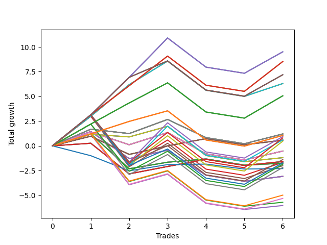

# Long Wallace 012 
- Symbol: NVDA_Unlimited
- Date Range: 02/08/2022 - 07/08/2022
- Trading Period: 7:20-12:30
- Number of Trades: 6



| Name | Win Percent | Profit | Avg Profit / Trade | Avg Time / Trade |      | Name | Win Percent | Profit | Avg Profit / Trade | Avg Time / Trade |
| ---- | ----------- | ------ | ------------------ | ---------------- | ---- | ---- | ----------- | ------ | ------------------ | ---------------- |
| Sorted By <br> Profit | | | | | | Sorted By <br> Win Percentage ||||
| One Hundred Twenty-Nine | 66.67 | 4755.00 | 792.50 | 153:11 |     | One Hundred Twenty-Nine | 66.67 | 4755.00 | 792.50 | 153:11 |
| One Hundred Twenty-Four | 66.67 | 4755.00 | 792.50 | 153:11 |     | One Hundred Twenty-Four | 66.67 | 4755.00 | 792.50 | 153:11 |
| Eighty-Four | 66.67 | 4755.00 | 792.50 | 153:11 |     | Eighty-Four | 66.67 | 4755.00 | 792.50 | 153:11 |
| One Hundred Twenty-Eight | 66.67 | 4265.00 | 710.83 | 120:33 |     | One Hundred Twenty-Eight | 66.67 | 4265.00 | 710.83 | 120:33 |
| One Hundred Twenty-Three | 66.67 | 4265.00 | 710.83 | 120:33 |     | One Hundred Twenty-Three | 66.67 | 4265.00 | 710.83 | 120:33 |
| Eighty-Three | 66.67 | 4265.00 | 710.83 | 120:33 |     | Eighty-Three | 66.67 | 4265.00 | 710.83 | 120:33 |
| One Hundred Thirty | 66.67 | 3595.00 | 599.17 | 174:50 |     | One Hundred Thirty | 66.67 | 3595.00 | 599.17 | 174:50 |
| One Hundred Twenty-Five | 66.67 | 3595.00 | 599.17 | 174:50 |     | One Hundred Twenty-Five | 66.67 | 3595.00 | 599.17 | 174:50 |
| Eighty-Five | 66.67 | 3595.00 | 599.17 | 174:50 |     | Eighty-Five | 66.67 | 3595.00 | 599.17 | 174:50 |
| Seventy-One | 66.67 | 3150.00 | 525.00 | 108:38 |     | Seventy-One | 66.67 | 3150.00 | 525.00 | 108:38 |
| Sixty-Three | 66.67 | 3150.00 | 525.00 | 108:38 |     | Sixty-Three | 66.67 | 3150.00 | 525.00 | 108:38 |
| Seven | 66.67 | 3150.00 | 525.00 | 108:38 |     | Seven | 66.67 | 3150.00 | 525.00 | 108:38 |
| One Hundred Twenty-Seven | 66.67 | 2530.00 | 421.67 | 116:30 |     | One Hundred Twenty-Seven | 66.67 | 2530.00 | 421.67 | 116:30 |
| One Hundred Twenty-Two | 66.67 | 2530.00 | 421.67 | 116:30 |     | One Hundred Twenty-Two | 66.67 | 2530.00 | 421.67 | 116:30 |
| Eighty-Two | 66.67 | 2530.00 | 421.67 | 116:30 |     | Eighty-Two | 66.67 | 2530.00 | 421.67 | 116:30 |
| Sixty-Nine | 50.00 | 600.00 | 100.00 | 62:40 |     | One Hundred Twenty-Six | 66.67 | 525.00 | 87.50 | 81:32 |
| Sixty-One | 50.00 | 600.00 | 100.00 | 62:40 |     | One Hundred Twenty-One | 66.67 | 525.00 | 87.50 | 81:32 |
| Fifty-Three | 50.00 | 600.00 | 100.00 | 62:40 |     | Eighty-One | 66.67 | 525.00 | 87.50 | 81:32 |
| Forty-Five | 50.00 | 600.00 | 100.00 | 62:40 |     | Sixty-Seven | 66.67 | 285.00 | 47.50 | 26:49 |
| Five | 50.00 | 600.00 | 100.00 | 62:40 |     | Fifty-Nine | 66.67 | 285.00 | 47.50 | 26:49 |
| One Hundred Twenty-Six | 66.67 | 525.00 | 87.50 | 81:32 |     | Fifty-One | 66.67 | 285.00 | 47.50 | 26:49 |
| One Hundred Twenty-One | 66.67 | 525.00 | 87.50 | 81:32 |     | Forty-Three | 66.67 | 285.00 | 47.50 | 26:49 |
| Eighty-One | 66.67 | 525.00 | 87.50 | 81:32 |     | Three | 66.67 | 285.00 | 47.50 | 26:49 |
| One Hundred Ninteen | 50.00 | 465.00 | 77.50 | 137:25 |     | Sixty-Five | 66.67 | -795.00 | -132.50 | 19:06 |
| One Hundred Eighteen | 50.00 | 400.00 | 66.67 | 113:17 |     | Fifty-Seven | 66.67 | -795.00 | -132.50 | 19:06 |
| One Hundred Fourteen | 50.00 | 300.00 | 50.00 | 137:27 |     | Forty-Nine | 66.67 | -795.00 | -132.50 | 19:06 |
| Sixty-Seven | 66.67 | 285.00 | 47.50 | 26:49 |     | Forty-One | 66.67 | -795.00 | -132.50 | 19:06 |
| Fifty-Nine | 66.67 | 285.00 | 47.50 | 26:49 |     | One | 66.67 | -795.00 | -132.50 | 19:06 |
| Fifty-One | 66.67 | 285.00 | 47.50 | 26:49 |     | Sixty-Four | 66.67 | -880.00 | -146.67 | 14:49 |
| Forty-Three | 66.67 | 285.00 | 47.50 | 26:49 |     | Fifty-Six | 66.67 | -880.00 | -146.67 | 14:49 |
| Three | 66.67 | 285.00 | 47.50 | 26:49 |     | Forty-Eight | 66.67 | -880.00 | -146.67 | 14:49 |
| One Hundred Thirteen | 50.00 | 235.00 | 39.17 | 113:19 |     | Forty | 66.67 | -880.00 | -146.67 | 14:49 |
| Sixty-Eight | 50.00 | -265.00 | -44.17 | 52:25 |     | Zero | 66.67 | -880.00 | -146.67 | 14:49 |
| Sixty | 50.00 | -265.00 | -44.17 | 52:25 |     | Sixty-Nine | 50.00 | 600.00 | 100.00 | 62:40 |
| Fifty-Two | 50.00 | -265.00 | -44.17 | 52:25 |     | Sixty-One | 50.00 | 600.00 | 100.00 | 62:40 |
| Forty-Four | 50.00 | -265.00 | -44.17 | 52:25 |     | Fifty-Three | 50.00 | 600.00 | 100.00 | 62:40 |
| Four | 50.00 | -265.00 | -44.17 | 52:25 |     | Forty-Five | 50.00 | 600.00 | 100.00 | 62:40 |
| Seventy | 50.00 | -600.00 | -100.00 | 79:59 |     | Five | 50.00 | 600.00 | 100.00 | 62:40 |
| Sixty-Two | 50.00 | -600.00 | -100.00 | 79:59 |     | One Hundred Ninteen | 50.00 | 465.00 | 77.50 | 137:25 |
| Six | 50.00 | -600.00 | -100.00 | 79:59 |     | One Hundred Eighteen | 50.00 | 400.00 | 66.67 | 113:17 |
| One Hundred Twenty | 50.00 | -695.00 | -115.83 | 159:04 |     | One Hundred Fourteen | 50.00 | 300.00 | 50.00 | 137:27 |
| Sixty-Five | 66.67 | -795.00 | -132.50 | 19:06 |     | One Hundred Thirteen | 50.00 | 235.00 | 39.17 | 113:19 |
| Fifty-Seven | 66.67 | -795.00 | -132.50 | 19:06 |     | Sixty-Eight | 50.00 | -265.00 | -44.17 | 52:25 |
| Forty-Nine | 66.67 | -795.00 | -132.50 | 19:06 |     | Sixty | 50.00 | -265.00 | -44.17 | 52:25 |
| Forty-One | 66.67 | -795.00 | -132.50 | 19:06 |     | Fifty-Two | 50.00 | -265.00 | -44.17 | 52:25 |
| One | 66.67 | -795.00 | -132.50 | 19:06 |     | Forty-Four | 50.00 | -265.00 | -44.17 | 52:25 |
| Fifty-Five | 50.00 | -840.00 | -140.00 | 97:10 |     | Four | 50.00 | -265.00 | -44.17 | 52:25 |
| One Hundred Fifteen | 50.00 | -860.00 | -143.33 | 159:05 |     | Seventy | 50.00 | -600.00 | -100.00 | 79:59 |
| Sixty-Four | 66.67 | -880.00 | -146.67 | 14:49 |     | Sixty-Two | 50.00 | -600.00 | -100.00 | 79:59 |
| Fifty-Six | 66.67 | -880.00 | -146.67 | 14:49 |     | Six | 50.00 | -600.00 | -100.00 | 79:59 |
| Forty-Eight | 66.67 | -880.00 | -146.67 | 14:49 |     | One Hundred Twenty | 50.00 | -695.00 | -115.83 | 159:04 |
| Forty | 66.67 | -880.00 | -146.67 | 14:49 |     | Fifty-Five | 50.00 | -840.00 | -140.00 | 97:10 |
| Zero | 66.67 | -880.00 | -146.67 | 14:49 |     | One Hundred Fifteen | 50.00 | -860.00 | -143.33 | 159:05 |
| One Hundred Seventeen | 50.00 | -930.00 | -155.00 | 109:19 |     | One Hundred Seventeen | 50.00 | -930.00 | -155.00 | 109:19 |
| Forty-Seven | 50.00 | -1005.00 | -167.50 | 97:12 |     | Forty-Seven | 50.00 | -1005.00 | -167.50 | 97:12 |
| One Hundred Twelve | 50.00 | -1095.00 | -182.50 | 109:20 |     | One Hundred Twelve | 50.00 | -1095.00 | -182.50 | 109:20 |
| Seventy-Three | 50.00 | -1150.00 | -191.67 | 13:05 |     | Seventy-Three | 50.00 | -1150.00 | -191.67 | 13:05 |
| Sixty-Six | 50.00 | -1545.00 | -257.50 | 37:27 |     | Sixty-Six | 50.00 | -1545.00 | -257.50 | 37:27 |
| Fifty-Eight | 50.00 | -1545.00 | -257.50 | 37:27 |     | Fifty-Eight | 50.00 | -1545.00 | -257.50 | 37:27 |
| Fifty | 50.00 | -1545.00 | -257.50 | 37:27 |     | Fifty | 50.00 | -1545.00 | -257.50 | 37:27 |
| Forty-Two | 50.00 | -1545.00 | -257.50 | 37:27 |     | Forty-Two | 50.00 | -1545.00 | -257.50 | 37:27 |
| Two | 50.00 | -1545.00 | -257.50 | 37:27 |     | Two | 50.00 | -1545.00 | -257.50 | 37:27 |
| One Hundred Sixteen | 50.00 | -2495.00 | -415.83 | 75:52 |     | One Hundred Sixteen | 50.00 | -2495.00 | -415.83 | 75:52 |
| One Hundred Eleven | 50.00 | -2660.00 | -443.33 | 75:54 |     | One Hundred Eleven | 50.00 | -2660.00 | -443.33 | 75:54 |
| Fifty-Four | 50.00 | -2855.00 | -475.83 | 74:40 |     | Fifty-Four | 50.00 | -2855.00 | -475.83 | 74:40 |
| Forty-Six | 50.00 | -3020.00 | -503.33 | 74:41 |     | Forty-Six | 50.00 | -3020.00 | -503.33 | 74:41 |

## NO STOPLOSS

### Test Zero
* Sell when price hits the middle line of the 20p bollinger
* No Stoploss
* Results:
```
Total Trades: 6
Percent Up: 66.67
Percent Down: 33.33
Total Points Moved Up: -1.76
Potential Profit: -880.00
Total Points Ups: 2.39 Count Ups: 4
Total Points Downs: -4.15 Count Downs: 2
```

<details><summary>Trades</summary>

<code>In: 2022-02-25 10:59:00		Out: 2022-02-25 11:04:15		Total Position Time: 05:15		Total Move Up: 1.21		Total to Date: 1.21</code> <br />
<code>In: 2022-03-16 09:54:00		Out: 2022-03-16 10:28:05		Total Position Time: 34:05		Total Move Up: -3.53		Total to Date: -2.32</code> <br />
<code>In: 2022-05-03 09:11:00		Out: 2022-05-03 09:23:05		Total Position Time: 12:05		Total Move Up: 0.66		Total to Date: -1.66</code> <br />
<code>In: 2022-06-08 08:06:00		Out: 2022-06-08 08:15:10		Total Position Time: 09:10		Total Move Up: 0.33		Total to Date: -1.33</code> <br />
<code>In: 2022-06-22 12:31:00		Out: 2022-06-22 12:47:00		Total Position Time: 16:00		Total Move Up: -0.62		Total to Date: -1.95</code> <br />
<code>In: 2022-07-06 08:32:00		Out: 2022-07-06 08:44:20		Total Position Time: 12:20		Total Move Up: 0.19		Total to Date: -1.76</code> <br />


</details>

### Test One
* Sell when the price hits the upper line of the 20p 1std bollinger
* No Stoploss
* Results:
```
Total Trades: 6
Percent Up: 66.67
Percent Down: 33.33
Total Points Moved Up: -1.59
Potential Profit: -795.00
Total Points Ups: 2.13 Count Ups: 4
Total Points Downs: -3.72 Count Downs: 2
```

<details><summary>Trades</summary>

<code>In: 2022-02-25 10:59:00		Out: 2022-02-25 11:19:15		Total Position Time: 20:15		Total Move Up: 0.26		Total to Date: 0.26</code> <br />
<code>In: 2022-03-16 09:54:00		Out: 2022-03-16 10:29:10		Total Position Time: 35:10		Total Move Up: -3.10		Total to Date: -2.84</code> <br />
<code>In: 2022-05-03 09:11:00		Out: 2022-05-03 09:28:00		Total Position Time: 17:00		Total Move Up: 0.75		Total to Date: -2.09</code> <br />
<code>In: 2022-06-08 08:06:00		Out: 2022-06-08 08:18:05		Total Position Time: 12:05		Total Move Up: 0.72		Total to Date: -1.37</code> <br />
<code>In: 2022-06-22 12:31:00		Out: 2022-06-22 12:47:00		Total Position Time: 16:00		Total Move Up: -0.62		Total to Date: -1.99</code> <br />
<code>In: 2022-07-06 08:32:00		Out: 2022-07-06 08:46:10		Total Position Time: 14:10		Total Move Up: 0.40		Total to Date: -1.59</code> <br />


</details>

### Test Two
* Sell when the price hits the upper line of the 20p 2std bollinger
* No Stoploss
* Results:
```
Total Trades: 6
Percent Up: 50.00
Percent Down: 50.00
Total Points Moved Up: -3.09
Potential Profit: -1545.00
Total Points Ups: 2.81 Count Ups: 3
Total Points Downs: -5.90 Count Downs: 3
```

<details><summary>Trades</summary>

<code>In: 2022-02-25 10:59:00		Out: 2022-02-25 11:25:30		Total Position Time: 26:30		Total Move Up: 1.45		Total to Date: 1.45</code> <br />
<code>In: 2022-03-16 09:54:00		Out: 2022-03-16 10:30:45		Total Position Time: 36:45		Total Move Up: -2.75		Total to Date: -1.30</code> <br />
<code>In: 2022-05-03 09:11:00		Out: 2022-05-03 09:28:10		Total Position Time: 17:10		Total Move Up: 0.86		Total to Date: -0.44</code> <br />
<code>In: 2022-06-08 08:06:00		Out: 2022-06-08 09:57:05		Total Position Time: 111:05		Total Move Up: -2.53		Total to Date: -2.97</code> <br />
<code>In: 2022-06-22 12:31:00		Out: 2022-06-22 12:47:00		Total Position Time: 16:00		Total Move Up: -0.62		Total to Date: -3.59</code> <br />
<code>In: 2022-07-06 08:32:00		Out: 2022-07-06 08:49:15		Total Position Time: 17:15		Total Move Up: 0.50		Total to Date: -3.09</code> <br />


</details>

### Test Three
* Sell when price hits the middle line of the 50p bollinger
* No Stoploss
* Results:
```
Total Trades: 6
Percent Up: 66.67
Percent Down: 33.33
Total Points Moved Up: 0.57
Potential Profit: 285.00
Total Points Ups: 3.03 Count Ups: 4
Total Points Downs: -2.46 Count Downs: 2
```

<details><summary>Trades</summary>

<code>In: 2022-02-25 10:59:00		Out: 2022-02-25 11:23:35		Total Position Time: 24:35		Total Move Up: 0.97		Total to Date: 0.97</code> <br />
<code>In: 2022-03-16 09:54:00		Out: 2022-03-16 10:36:05		Total Position Time: 42:05		Total Move Up: -1.84		Total to Date: -0.87</code> <br />
<code>In: 2022-05-03 09:11:00		Out: 2022-05-03 09:28:10		Total Position Time: 17:10		Total Move Up: 0.86		Total to Date: -0.01</code> <br />
<code>In: 2022-06-08 08:06:00		Out: 2022-06-08 08:32:20		Total Position Time: 26:20		Total Move Up: 0.74		Total to Date: 0.73</code> <br />
<code>In: 2022-06-22 12:31:00		Out: 2022-06-22 12:47:00		Total Position Time: 16:00		Total Move Up: -0.62		Total to Date: 0.11</code> <br />
<code>In: 2022-07-06 08:32:00		Out: 2022-07-06 09:06:45		Total Position Time: 34:45		Total Move Up: 0.46		Total to Date: 0.57</code> <br />


</details>

### Test Four
* Sell when the price hits the upper line of the 50p 1std bollinger
* No Stoploss
* Results:
```
Total Trades: 6
Percent Up: 50.00
Percent Down: 50.00
Total Points Moved Up: -0.53
Potential Profit: -265.00
Total Points Ups: 3.54 Count Ups: 3
Total Points Downs: -4.07 Count Downs: 3
```

<details><summary>Trades</summary>

<code>In: 2022-02-25 10:59:00		Out: 2022-02-25 11:40:10		Total Position Time: 41:10		Total Move Up: 1.41		Total to Date: 1.41</code> <br />
<code>In: 2022-03-16 09:54:00		Out: 2022-03-16 10:49:40		Total Position Time: 55:40		Total Move Up: -1.30		Total to Date: 0.11</code> <br />
<code>In: 2022-05-03 09:11:00		Out: 2022-05-03 09:47:35		Total Position Time: 36:35		Total Move Up: 1.23		Total to Date: 1.34</code> <br />
<code>In: 2022-06-08 08:06:00		Out: 2022-06-08 10:15:40		Total Position Time: 129:40		Total Move Up: -2.15		Total to Date: -0.81</code> <br />
<code>In: 2022-06-22 12:31:00		Out: 2022-06-22 12:47:00		Total Position Time: 16:00		Total Move Up: -0.62		Total to Date: -1.43</code> <br />
<code>In: 2022-07-06 08:32:00		Out: 2022-07-06 09:07:30		Total Position Time: 35:30		Total Move Up: 0.90		Total to Date: -0.53</code> <br />


</details>

### Test Five
* Sell when the price hits the upper line of the 50p 2std bollinger
* No Stoploss
* Results:
```
Total Trades: 6
Percent Up: 50.00
Percent Down: 50.00
Total Points Moved Up: 1.20
Potential Profit: 600.00
Total Points Ups: 4.10 Count Ups: 3
Total Points Downs: -2.90 Count Downs: 3
```

<details><summary>Trades</summary>

<code>In: 2022-02-25 10:59:00		Out: 2022-02-25 12:15:55		Total Position Time: 76:55		Total Move Up: 1.68		Total to Date: 1.68</code> <br />
<code>In: 2022-03-16 09:54:00		Out: 2022-03-16 10:54:20		Total Position Time: 60:20		Total Move Up: -0.44		Total to Date: 1.24</code> <br />
<code>In: 2022-05-03 09:11:00		Out: 2022-05-03 09:58:35		Total Position Time: 47:35		Total Move Up: 1.43		Total to Date: 2.67</code> <br />
<code>In: 2022-06-08 08:06:00		Out: 2022-06-08 10:19:45		Total Position Time: 133:45		Total Move Up: -1.84		Total to Date: 0.83</code> <br />
<code>In: 2022-06-22 12:31:00		Out: 2022-06-22 12:47:00		Total Position Time: 16:00		Total Move Up: -0.62		Total to Date: 0.21</code> <br />
<code>In: 2022-07-06 08:32:00		Out: 2022-07-06 09:13:25		Total Position Time: 41:25		Total Move Up: 0.99		Total to Date: 1.20</code> <br />


</details>

### Test Six
* Sell when the price hits the middle line of the 1std VWAP
* No Stoploss
* Results:
```
Total Trades: 6
Percent Up: 50.00
Percent Down: 50.00
Total Points Moved Up: -1.20
Potential Profit: -600.00
Total Points Ups: 2.64 Count Ups: 3
Total Points Downs: -3.84 Count Downs: 3
```

<details><summary>Trades</summary>

<code>In: 2022-02-25 10:59:00		Out: 2022-02-25 11:24:30		Total Position Time: 25:30		Total Move Up: 1.17		Total to Date: 1.17</code> <br />
<code>In: 2022-03-16 09:54:00		Out: 2022-03-16 11:44:20		Total Position Time: 110:20		Total Move Up: -0.27		Total to Date: 0.90</code> <br />
<code>In: 2022-05-03 09:11:00		Out: 2022-05-03 09:44:05		Total Position Time: 33:05		Total Move Up: 1.07		Total to Date: 1.97</code> <br />
<code>In: 2022-06-08 08:06:00		Out: 2022-06-08 12:47:00		Total Position Time: 281:00		Total Move Up: -2.95		Total to Date: -0.98</code> <br />
<code>In: 2022-06-22 12:31:00		Out: 2022-06-22 12:47:00		Total Position Time: 16:00		Total Move Up: -0.62		Total to Date: -1.60</code> <br />
<code>In: 2022-07-06 08:32:00		Out: 2022-07-06 08:46:00		Total Position Time: 14:00		Total Move Up: 0.40		Total to Date: -1.20</code> <br />


</details>

### Test Seven
* Sell when the price hits the upper line of the 1std VWAP
* No Stoploss
* Results:
```
Total Trades: 6
Percent Up: 66.67
Percent Down: 33.33
Total Points Moved Up: 6.30
Potential Profit: 3150.00
Total Points Ups: 9.87 Count Ups: 4
Total Points Downs: -3.57 Count Downs: 2
```

<details><summary>Trades</summary>

<code>In: 2022-02-25 10:59:00		Out: 2022-02-25 12:24:10		Total Position Time: 85:10		Total Move Up: 2.99		Total to Date: 2.99</code> <br />
<code>In: 2022-03-16 09:54:00		Out: 2022-03-16 12:21:10		Total Position Time: 147:10		Total Move Up: 3.20		Total to Date: 6.19</code> <br />
<code>In: 2022-05-03 09:11:00		Out: 2022-05-03 10:01:05		Total Position Time: 50:05		Total Move Up: 2.38		Total to Date: 8.57</code> <br />
<code>In: 2022-06-08 08:06:00		Out: 2022-06-08 12:47:00		Total Position Time: 281:00		Total Move Up: -2.95		Total to Date: 5.62</code> <br />
<code>In: 2022-06-22 12:31:00		Out: 2022-06-22 12:47:00		Total Position Time: 16:00		Total Move Up: -0.62		Total to Date: 5.00</code> <br />
<code>In: 2022-07-06 08:32:00		Out: 2022-07-06 09:44:25		Total Position Time: 72:25		Total Move Up: 1.30		Total to Date: 6.30</code> <br />


</details>

## STOPLOSS OF 5

### Test Forty
* Sell when price hits the middle line of the 20p bollinger
* Stoploss is 5 points
* Results:
```
Total Trades: 6
Percent Up: 66.67
Percent Down: 33.33
Total Points Moved Up: -1.76
Potential Profit: -880.00
Total Points Ups: 2.39 Count Ups: 4
Total Points Downs: -4.15 Count Downs: 2
```

<details><summary>Trades</summary>

<code>In: 2022-02-25 10:59:00		Out: 2022-02-25 11:04:15		Total Position Time: 05:15		Total Move Up: 1.21		Total to Date: 1.21</code> <br />
<code>In: 2022-03-16 09:54:00		Out: 2022-03-16 10:28:05		Total Position Time: 34:05		Total Move Up: -3.53		Total to Date: -2.32</code> <br />
<code>In: 2022-05-03 09:11:00		Out: 2022-05-03 09:23:05		Total Position Time: 12:05		Total Move Up: 0.66		Total to Date: -1.66</code> <br />
<code>In: 2022-06-08 08:06:00		Out: 2022-06-08 08:15:10		Total Position Time: 09:10		Total Move Up: 0.33		Total to Date: -1.33</code> <br />
<code>In: 2022-06-22 12:31:00		Out: 2022-06-22 12:47:00		Total Position Time: 16:00		Total Move Up: -0.62		Total to Date: -1.95</code> <br />
<code>In: 2022-07-06 08:32:00		Out: 2022-07-06 08:44:20		Total Position Time: 12:20		Total Move Up: 0.19		Total to Date: -1.76</code> <br />


</details>

### Test Forty-One
* Sell when the price hits the upper line of the 20p 1std bollinger
* Stoploss is 5 points
* Results:
```
Total Trades: 6
Percent Up: 66.67
Percent Down: 33.33
Total Points Moved Up: -1.59
Potential Profit: -795.00
Total Points Ups: 2.13 Count Ups: 4
Total Points Downs: -3.72 Count Downs: 2
```

<details><summary>Trades</summary>

<code>In: 2022-02-25 10:59:00		Out: 2022-02-25 11:19:15		Total Position Time: 20:15		Total Move Up: 0.26		Total to Date: 0.26</code> <br />
<code>In: 2022-03-16 09:54:00		Out: 2022-03-16 10:29:10		Total Position Time: 35:10		Total Move Up: -3.10		Total to Date: -2.84</code> <br />
<code>In: 2022-05-03 09:11:00		Out: 2022-05-03 09:28:00		Total Position Time: 17:00		Total Move Up: 0.75		Total to Date: -2.09</code> <br />
<code>In: 2022-06-08 08:06:00		Out: 2022-06-08 08:18:05		Total Position Time: 12:05		Total Move Up: 0.72		Total to Date: -1.37</code> <br />
<code>In: 2022-06-22 12:31:00		Out: 2022-06-22 12:47:00		Total Position Time: 16:00		Total Move Up: -0.62		Total to Date: -1.99</code> <br />
<code>In: 2022-07-06 08:32:00		Out: 2022-07-06 08:46:10		Total Position Time: 14:10		Total Move Up: 0.40		Total to Date: -1.59</code> <br />


</details>

### Test Forty-Two
* Sell when the price hits the upper line of the 20p 2std bollinger
* Stoploss is 5 points
* Results:
```
Total Trades: 6
Percent Up: 50.00
Percent Down: 50.00
Total Points Moved Up: -3.09
Potential Profit: -1545.00
Total Points Ups: 2.81 Count Ups: 3
Total Points Downs: -5.90 Count Downs: 3
```

<details><summary>Trades</summary>

<code>In: 2022-02-25 10:59:00		Out: 2022-02-25 11:25:30		Total Position Time: 26:30		Total Move Up: 1.45		Total to Date: 1.45</code> <br />
<code>In: 2022-03-16 09:54:00		Out: 2022-03-16 10:30:45		Total Position Time: 36:45		Total Move Up: -2.75		Total to Date: -1.30</code> <br />
<code>In: 2022-05-03 09:11:00		Out: 2022-05-03 09:28:10		Total Position Time: 17:10		Total Move Up: 0.86		Total to Date: -0.44</code> <br />
<code>In: 2022-06-08 08:06:00		Out: 2022-06-08 09:57:05		Total Position Time: 111:05		Total Move Up: -2.53		Total to Date: -2.97</code> <br />
<code>In: 2022-06-22 12:31:00		Out: 2022-06-22 12:47:00		Total Position Time: 16:00		Total Move Up: -0.62		Total to Date: -3.59</code> <br />
<code>In: 2022-07-06 08:32:00		Out: 2022-07-06 08:49:15		Total Position Time: 17:15		Total Move Up: 0.50		Total to Date: -3.09</code> <br />


</details>

### Test Forty-Three
* Sell when price hits the middle line of the 50p bollinger
* Stoploss is 5 points
* Results:
```
Total Trades: 6
Percent Up: 66.67
Percent Down: 33.33
Total Points Moved Up: 0.57
Potential Profit: 285.00
Total Points Ups: 3.03 Count Ups: 4
Total Points Downs: -2.46 Count Downs: 2
```

<details><summary>Trades</summary>

<code>In: 2022-02-25 10:59:00		Out: 2022-02-25 11:23:35		Total Position Time: 24:35		Total Move Up: 0.97		Total to Date: 0.97</code> <br />
<code>In: 2022-03-16 09:54:00		Out: 2022-03-16 10:36:05		Total Position Time: 42:05		Total Move Up: -1.84		Total to Date: -0.87</code> <br />
<code>In: 2022-05-03 09:11:00		Out: 2022-05-03 09:28:10		Total Position Time: 17:10		Total Move Up: 0.86		Total to Date: -0.01</code> <br />
<code>In: 2022-06-08 08:06:00		Out: 2022-06-08 08:32:20		Total Position Time: 26:20		Total Move Up: 0.74		Total to Date: 0.73</code> <br />
<code>In: 2022-06-22 12:31:00		Out: 2022-06-22 12:47:00		Total Position Time: 16:00		Total Move Up: -0.62		Total to Date: 0.11</code> <br />
<code>In: 2022-07-06 08:32:00		Out: 2022-07-06 09:06:45		Total Position Time: 34:45		Total Move Up: 0.46		Total to Date: 0.57</code> <br />


</details>

### Test Forty-Four
* Sell when the price hits the upper line of the 50p 1std bollinger
* Stoploss is 5 points
* Results:
```
Total Trades: 6
Percent Up: 50.00
Percent Down: 50.00
Total Points Moved Up: -0.53
Potential Profit: -265.00
Total Points Ups: 3.54 Count Ups: 3
Total Points Downs: -4.07 Count Downs: 3
```

<details><summary>Trades</summary>

<code>In: 2022-02-25 10:59:00		Out: 2022-02-25 11:40:10		Total Position Time: 41:10		Total Move Up: 1.41		Total to Date: 1.41</code> <br />
<code>In: 2022-03-16 09:54:00		Out: 2022-03-16 10:49:40		Total Position Time: 55:40		Total Move Up: -1.30		Total to Date: 0.11</code> <br />
<code>In: 2022-05-03 09:11:00		Out: 2022-05-03 09:47:35		Total Position Time: 36:35		Total Move Up: 1.23		Total to Date: 1.34</code> <br />
<code>In: 2022-06-08 08:06:00		Out: 2022-06-08 10:15:40		Total Position Time: 129:40		Total Move Up: -2.15		Total to Date: -0.81</code> <br />
<code>In: 2022-06-22 12:31:00		Out: 2022-06-22 12:47:00		Total Position Time: 16:00		Total Move Up: -0.62		Total to Date: -1.43</code> <br />
<code>In: 2022-07-06 08:32:00		Out: 2022-07-06 09:07:30		Total Position Time: 35:30		Total Move Up: 0.90		Total to Date: -0.53</code> <br />


</details>

### Test Forty-Five
* Sell when the price hits the upper line of the 50p 2std bollinger
* Stoploss is 5 points
* Results:
```
Total Trades: 6
Percent Up: 50.00
Percent Down: 50.00
Total Points Moved Up: 1.20
Potential Profit: 600.00
Total Points Ups: 4.10 Count Ups: 3
Total Points Downs: -2.90 Count Downs: 3
```

<details><summary>Trades</summary>

<code>In: 2022-02-25 10:59:00		Out: 2022-02-25 12:15:55		Total Position Time: 76:55		Total Move Up: 1.68		Total to Date: 1.68</code> <br />
<code>In: 2022-03-16 09:54:00		Out: 2022-03-16 10:54:20		Total Position Time: 60:20		Total Move Up: -0.44		Total to Date: 1.24</code> <br />
<code>In: 2022-05-03 09:11:00		Out: 2022-05-03 09:58:35		Total Position Time: 47:35		Total Move Up: 1.43		Total to Date: 2.67</code> <br />
<code>In: 2022-06-08 08:06:00		Out: 2022-06-08 10:19:45		Total Position Time: 133:45		Total Move Up: -1.84		Total to Date: 0.83</code> <br />
<code>In: 2022-06-22 12:31:00		Out: 2022-06-22 12:47:00		Total Position Time: 16:00		Total Move Up: -0.62		Total to Date: 0.21</code> <br />
<code>In: 2022-07-06 08:32:00		Out: 2022-07-06 09:13:25		Total Position Time: 41:25		Total Move Up: 0.99		Total to Date: 1.20</code> <br />


</details>

### Test Forty-Six
* Sell when the price hits the middle line of the 1std VWAP
* Stoploss is 5 points
* Results:
```
Total Trades: 6
Percent Up: 50.00
Percent Down: 50.00
Total Points Moved Up: -6.04
Potential Profit: -3020.00
Total Points Ups: 2.64 Count Ups: 3
Total Points Downs: -8.68 Count Downs: 3
```

<details><summary>Trades</summary>

<code>In: 2022-02-25 10:59:00		Out: 2022-02-25 11:24:30		Total Position Time: 25:30		Total Move Up: 1.17		Total to Date: 1.17</code> <br />
<code>In: 2022-03-16 09:54:00		Out: 2022-03-16 11:12:35		Total Position Time: 78:35		Total Move Up: -5.11		Total to Date: -3.94</code> <br />
<code>In: 2022-05-03 09:11:00		Out: 2022-05-03 09:44:05		Total Position Time: 33:05		Total Move Up: 1.07		Total to Date: -2.87</code> <br />
<code>In: 2022-06-08 08:06:00		Out: 2022-06-08 12:47:00		Total Position Time: 281:00		Total Move Up: -2.95		Total to Date: -5.82</code> <br />
<code>In: 2022-06-22 12:31:00		Out: 2022-06-22 12:47:00		Total Position Time: 16:00		Total Move Up: -0.62		Total to Date: -6.44</code> <br />
<code>In: 2022-07-06 08:32:00		Out: 2022-07-06 08:46:00		Total Position Time: 14:00		Total Move Up: 0.40		Total to Date: -6.04</code> <br />


</details>

### Test Forty-Seven
* Sell when the price hits the upper line of the 1std VWAP
* Stoploss is 5 points
* Results:
```
Total Trades: 6
Percent Up: 50.00
Percent Down: 50.00
Total Points Moved Up: -2.01
Potential Profit: -1005.00
Total Points Ups: 6.67 Count Ups: 3
Total Points Downs: -8.68 Count Downs: 3
```

<details><summary>Trades</summary>

<code>In: 2022-02-25 10:59:00		Out: 2022-02-25 12:24:10		Total Position Time: 85:10		Total Move Up: 2.99		Total to Date: 2.99</code> <br />
<code>In: 2022-03-16 09:54:00		Out: 2022-03-16 11:12:35		Total Position Time: 78:35		Total Move Up: -5.11		Total to Date: -2.12</code> <br />
<code>In: 2022-05-03 09:11:00		Out: 2022-05-03 10:01:05		Total Position Time: 50:05		Total Move Up: 2.38		Total to Date: 0.26</code> <br />
<code>In: 2022-06-08 08:06:00		Out: 2022-06-08 12:47:00		Total Position Time: 281:00		Total Move Up: -2.95		Total to Date: -2.69</code> <br />
<code>In: 2022-06-22 12:31:00		Out: 2022-06-22 12:47:00		Total Position Time: 16:00		Total Move Up: -0.62		Total to Date: -3.31</code> <br />
<code>In: 2022-07-06 08:32:00		Out: 2022-07-06 09:44:25		Total Position Time: 72:25		Total Move Up: 1.30		Total to Date: -2.01</code> <br />


</details>

## TRAIL STOP OF 5

### Test Forty-Eight
* Sell when price hits the middle line of the 20p bollinger
* Trailing Stop is 5 points
* Results:
```
Total Trades: 6
Percent Up: 66.67
Percent Down: 33.33
Total Points Moved Up: -1.76
Potential Profit: -880.00
Total Points Ups: 2.39 Count Ups: 4
Total Points Downs: -4.15 Count Downs: 2
```

<details><summary>Trades</summary>

<code>In: 2022-02-25 10:59:00		Out: 2022-02-25 11:04:15		Total Position Time: 05:15		Total Move Up: 1.21		Total to Date: 1.21</code> <br />
<code>In: 2022-03-16 09:54:00		Out: 2022-03-16 10:28:05		Total Position Time: 34:05		Total Move Up: -3.53		Total to Date: -2.32</code> <br />
<code>In: 2022-05-03 09:11:00		Out: 2022-05-03 09:23:05		Total Position Time: 12:05		Total Move Up: 0.66		Total to Date: -1.66</code> <br />
<code>In: 2022-06-08 08:06:00		Out: 2022-06-08 08:15:10		Total Position Time: 09:10		Total Move Up: 0.33		Total to Date: -1.33</code> <br />
<code>In: 2022-06-22 12:31:00		Out: 2022-06-22 12:47:00		Total Position Time: 16:00		Total Move Up: -0.62		Total to Date: -1.95</code> <br />
<code>In: 2022-07-06 08:32:00		Out: 2022-07-06 08:44:20		Total Position Time: 12:20		Total Move Up: 0.19		Total to Date: -1.76</code> <br />


</details>

### Test Forty-Nine
* Sell when the price hits the upper line of the 20p 1std bollinger
* Trailing Stop is 5 points
* Results:
```
Total Trades: 6
Percent Up: 66.67
Percent Down: 33.33
Total Points Moved Up: -1.59
Potential Profit: -795.00
Total Points Ups: 2.13 Count Ups: 4
Total Points Downs: -3.72 Count Downs: 2
```

<details><summary>Trades</summary>

<code>In: 2022-02-25 10:59:00		Out: 2022-02-25 11:19:15		Total Position Time: 20:15		Total Move Up: 0.26		Total to Date: 0.26</code> <br />
<code>In: 2022-03-16 09:54:00		Out: 2022-03-16 10:29:10		Total Position Time: 35:10		Total Move Up: -3.10		Total to Date: -2.84</code> <br />
<code>In: 2022-05-03 09:11:00		Out: 2022-05-03 09:28:00		Total Position Time: 17:00		Total Move Up: 0.75		Total to Date: -2.09</code> <br />
<code>In: 2022-06-08 08:06:00		Out: 2022-06-08 08:18:05		Total Position Time: 12:05		Total Move Up: 0.72		Total to Date: -1.37</code> <br />
<code>In: 2022-06-22 12:31:00		Out: 2022-06-22 12:47:00		Total Position Time: 16:00		Total Move Up: -0.62		Total to Date: -1.99</code> <br />
<code>In: 2022-07-06 08:32:00		Out: 2022-07-06 08:46:10		Total Position Time: 14:10		Total Move Up: 0.40		Total to Date: -1.59</code> <br />


</details>

### Test Fifty
* Sell when the price hits the upper line of the 20p 2std bollinger
* Trailing Stop is 5 points
* Results:
```
Total Trades: 6
Percent Up: 50.00
Percent Down: 50.00
Total Points Moved Up: -3.09
Potential Profit: -1545.00
Total Points Ups: 2.81 Count Ups: 3
Total Points Downs: -5.90 Count Downs: 3
```

<details><summary>Trades</summary>

<code>In: 2022-02-25 10:59:00		Out: 2022-02-25 11:25:30		Total Position Time: 26:30		Total Move Up: 1.45		Total to Date: 1.45</code> <br />
<code>In: 2022-03-16 09:54:00		Out: 2022-03-16 10:30:45		Total Position Time: 36:45		Total Move Up: -2.75		Total to Date: -1.30</code> <br />
<code>In: 2022-05-03 09:11:00		Out: 2022-05-03 09:28:10		Total Position Time: 17:10		Total Move Up: 0.86		Total to Date: -0.44</code> <br />
<code>In: 2022-06-08 08:06:00		Out: 2022-06-08 09:57:05		Total Position Time: 111:05		Total Move Up: -2.53		Total to Date: -2.97</code> <br />
<code>In: 2022-06-22 12:31:00		Out: 2022-06-22 12:47:00		Total Position Time: 16:00		Total Move Up: -0.62		Total to Date: -3.59</code> <br />
<code>In: 2022-07-06 08:32:00		Out: 2022-07-06 08:49:15		Total Position Time: 17:15		Total Move Up: 0.50		Total to Date: -3.09</code> <br />


</details>

### Test Fifty-One
* Sell when price hits the middle line of the 50p bollinger
* Trailing Stop is 5 points
* Results:
```
Total Trades: 6
Percent Up: 66.67
Percent Down: 33.33
Total Points Moved Up: 0.57
Potential Profit: 285.00
Total Points Ups: 3.03 Count Ups: 4
Total Points Downs: -2.46 Count Downs: 2
```

<details><summary>Trades</summary>

<code>In: 2022-02-25 10:59:00		Out: 2022-02-25 11:23:35		Total Position Time: 24:35		Total Move Up: 0.97		Total to Date: 0.97</code> <br />
<code>In: 2022-03-16 09:54:00		Out: 2022-03-16 10:36:05		Total Position Time: 42:05		Total Move Up: -1.84		Total to Date: -0.87</code> <br />
<code>In: 2022-05-03 09:11:00		Out: 2022-05-03 09:28:10		Total Position Time: 17:10		Total Move Up: 0.86		Total to Date: -0.01</code> <br />
<code>In: 2022-06-08 08:06:00		Out: 2022-06-08 08:32:20		Total Position Time: 26:20		Total Move Up: 0.74		Total to Date: 0.73</code> <br />
<code>In: 2022-06-22 12:31:00		Out: 2022-06-22 12:47:00		Total Position Time: 16:00		Total Move Up: -0.62		Total to Date: 0.11</code> <br />
<code>In: 2022-07-06 08:32:00		Out: 2022-07-06 09:06:45		Total Position Time: 34:45		Total Move Up: 0.46		Total to Date: 0.57</code> <br />


</details>

### Test Fifty-Two
* Sell when the price hits the upper line of the 50p 1std bollinger
* Trailing Stop is 5 points
* Results:
```
Total Trades: 6
Percent Up: 50.00
Percent Down: 50.00
Total Points Moved Up: -0.53
Potential Profit: -265.00
Total Points Ups: 3.54 Count Ups: 3
Total Points Downs: -4.07 Count Downs: 3
```

<details><summary>Trades</summary>

<code>In: 2022-02-25 10:59:00		Out: 2022-02-25 11:40:10		Total Position Time: 41:10		Total Move Up: 1.41		Total to Date: 1.41</code> <br />
<code>In: 2022-03-16 09:54:00		Out: 2022-03-16 10:49:40		Total Position Time: 55:40		Total Move Up: -1.30		Total to Date: 0.11</code> <br />
<code>In: 2022-05-03 09:11:00		Out: 2022-05-03 09:47:35		Total Position Time: 36:35		Total Move Up: 1.23		Total to Date: 1.34</code> <br />
<code>In: 2022-06-08 08:06:00		Out: 2022-06-08 10:15:40		Total Position Time: 129:40		Total Move Up: -2.15		Total to Date: -0.81</code> <br />
<code>In: 2022-06-22 12:31:00		Out: 2022-06-22 12:47:00		Total Position Time: 16:00		Total Move Up: -0.62		Total to Date: -1.43</code> <br />
<code>In: 2022-07-06 08:32:00		Out: 2022-07-06 09:07:30		Total Position Time: 35:30		Total Move Up: 0.90		Total to Date: -0.53</code> <br />


</details>

### Test Fifty-Three
* Sell when the price hits the upper line of the 50p 2std bollinger
* Trailing Stop is 5 points
* Results:
```
Total Trades: 6
Percent Up: 50.00
Percent Down: 50.00
Total Points Moved Up: 1.20
Potential Profit: 600.00
Total Points Ups: 4.10 Count Ups: 3
Total Points Downs: -2.90 Count Downs: 3
```

<details><summary>Trades</summary>

<code>In: 2022-02-25 10:59:00		Out: 2022-02-25 12:15:55		Total Position Time: 76:55		Total Move Up: 1.68		Total to Date: 1.68</code> <br />
<code>In: 2022-03-16 09:54:00		Out: 2022-03-16 10:54:20		Total Position Time: 60:20		Total Move Up: -0.44		Total to Date: 1.24</code> <br />
<code>In: 2022-05-03 09:11:00		Out: 2022-05-03 09:58:35		Total Position Time: 47:35		Total Move Up: 1.43		Total to Date: 2.67</code> <br />
<code>In: 2022-06-08 08:06:00		Out: 2022-06-08 10:19:45		Total Position Time: 133:45		Total Move Up: -1.84		Total to Date: 0.83</code> <br />
<code>In: 2022-06-22 12:31:00		Out: 2022-06-22 12:47:00		Total Position Time: 16:00		Total Move Up: -0.62		Total to Date: 0.21</code> <br />
<code>In: 2022-07-06 08:32:00		Out: 2022-07-06 09:13:25		Total Position Time: 41:25		Total Move Up: 0.99		Total to Date: 1.20</code> <br />


</details>

### Test Fifty-Four
* Sell when the price hits the middle line of the 1std VWAP
* Trailing Stop is 5 points
* Results:
```
Total Trades: 6
Percent Up: 50.00
Percent Down: 50.00
Total Points Moved Up: -5.71
Potential Profit: -2855.00
Total Points Ups: 2.64 Count Ups: 3
Total Points Downs: -8.35 Count Downs: 3
```

<details><summary>Trades</summary>

<code>In: 2022-02-25 10:59:00		Out: 2022-02-25 11:24:30		Total Position Time: 25:30		Total Move Up: 1.17		Total to Date: 1.17</code> <br />
<code>In: 2022-03-16 09:54:00		Out: 2022-03-16 11:12:25		Total Position Time: 78:25		Total Move Up: -4.78		Total to Date: -3.61</code> <br />
<code>In: 2022-05-03 09:11:00		Out: 2022-05-03 09:44:05		Total Position Time: 33:05		Total Move Up: 1.07		Total to Date: -2.54</code> <br />
<code>In: 2022-06-08 08:06:00		Out: 2022-06-08 12:47:00		Total Position Time: 281:00		Total Move Up: -2.95		Total to Date: -5.49</code> <br />
<code>In: 2022-06-22 12:31:00		Out: 2022-06-22 12:47:00		Total Position Time: 16:00		Total Move Up: -0.62		Total to Date: -6.11</code> <br />
<code>In: 2022-07-06 08:32:00		Out: 2022-07-06 08:46:00		Total Position Time: 14:00		Total Move Up: 0.40		Total to Date: -5.71</code> <br />


</details>

### Test Fifty-Five
* Sell when the price hits the upper line of the 1std VWAP
* Trailing Stop is 5 points
* Results:
```
Total Trades: 6
Percent Up: 50.00
Percent Down: 50.00
Total Points Moved Up: -1.68
Potential Profit: -840.00
Total Points Ups: 6.67 Count Ups: 3
Total Points Downs: -8.35 Count Downs: 3
```

<details><summary>Trades</summary>

<code>In: 2022-02-25 10:59:00		Out: 2022-02-25 12:24:10		Total Position Time: 85:10		Total Move Up: 2.99		Total to Date: 2.99</code> <br />
<code>In: 2022-03-16 09:54:00		Out: 2022-03-16 11:12:25		Total Position Time: 78:25		Total Move Up: -4.78		Total to Date: -1.79</code> <br />
<code>In: 2022-05-03 09:11:00		Out: 2022-05-03 10:01:05		Total Position Time: 50:05		Total Move Up: 2.38		Total to Date: 0.59</code> <br />
<code>In: 2022-06-08 08:06:00		Out: 2022-06-08 12:47:00		Total Position Time: 281:00		Total Move Up: -2.95		Total to Date: -2.36</code> <br />
<code>In: 2022-06-22 12:31:00		Out: 2022-06-22 12:47:00		Total Position Time: 16:00		Total Move Up: -0.62		Total to Date: -2.98</code> <br />
<code>In: 2022-07-06 08:32:00		Out: 2022-07-06 09:44:25		Total Position Time: 72:25		Total Move Up: 1.30		Total to Date: -1.68</code> <br />


</details>

## STOPLOSS OF 10

### Test Fifty-Six
* Sell when price hits the middle line of the 20p bollinger
* Stoploss is 10 points
* Results:
```
Total Trades: 6
Percent Up: 66.67
Percent Down: 33.33
Total Points Moved Up: -1.76
Potential Profit: -880.00
Total Points Ups: 2.39 Count Ups: 4
Total Points Downs: -4.15 Count Downs: 2
```

<details><summary>Trades</summary>

<code>In: 2022-02-25 10:59:00		Out: 2022-02-25 11:04:15		Total Position Time: 05:15		Total Move Up: 1.21		Total to Date: 1.21</code> <br />
<code>In: 2022-03-16 09:54:00		Out: 2022-03-16 10:28:05		Total Position Time: 34:05		Total Move Up: -3.53		Total to Date: -2.32</code> <br />
<code>In: 2022-05-03 09:11:00		Out: 2022-05-03 09:23:05		Total Position Time: 12:05		Total Move Up: 0.66		Total to Date: -1.66</code> <br />
<code>In: 2022-06-08 08:06:00		Out: 2022-06-08 08:15:10		Total Position Time: 09:10		Total Move Up: 0.33		Total to Date: -1.33</code> <br />
<code>In: 2022-06-22 12:31:00		Out: 2022-06-22 12:47:00		Total Position Time: 16:00		Total Move Up: -0.62		Total to Date: -1.95</code> <br />
<code>In: 2022-07-06 08:32:00		Out: 2022-07-06 08:44:20		Total Position Time: 12:20		Total Move Up: 0.19		Total to Date: -1.76</code> <br />


</details>

### Test Fifty-Seven
* Sell when the price hits the upper line of the 20p 1std bollinger
* Stoploss is 10 points
* Results:
```
Total Trades: 6
Percent Up: 66.67
Percent Down: 33.33
Total Points Moved Up: -1.59
Potential Profit: -795.00
Total Points Ups: 2.13 Count Ups: 4
Total Points Downs: -3.72 Count Downs: 2
```

<details><summary>Trades</summary>

<code>In: 2022-02-25 10:59:00		Out: 2022-02-25 11:19:15		Total Position Time: 20:15		Total Move Up: 0.26		Total to Date: 0.26</code> <br />
<code>In: 2022-03-16 09:54:00		Out: 2022-03-16 10:29:10		Total Position Time: 35:10		Total Move Up: -3.10		Total to Date: -2.84</code> <br />
<code>In: 2022-05-03 09:11:00		Out: 2022-05-03 09:28:00		Total Position Time: 17:00		Total Move Up: 0.75		Total to Date: -2.09</code> <br />
<code>In: 2022-06-08 08:06:00		Out: 2022-06-08 08:18:05		Total Position Time: 12:05		Total Move Up: 0.72		Total to Date: -1.37</code> <br />
<code>In: 2022-06-22 12:31:00		Out: 2022-06-22 12:47:00		Total Position Time: 16:00		Total Move Up: -0.62		Total to Date: -1.99</code> <br />
<code>In: 2022-07-06 08:32:00		Out: 2022-07-06 08:46:10		Total Position Time: 14:10		Total Move Up: 0.40		Total to Date: -1.59</code> <br />


</details>

### Test Fifty-Eight
* Sell when the price hits the upper line of the 20p 2std bollinger
* Stoploss is 10 points
* Results:
```
Total Trades: 6
Percent Up: 50.00
Percent Down: 50.00
Total Points Moved Up: -3.09
Potential Profit: -1545.00
Total Points Ups: 2.81 Count Ups: 3
Total Points Downs: -5.90 Count Downs: 3
```

<details><summary>Trades</summary>

<code>In: 2022-02-25 10:59:00		Out: 2022-02-25 11:25:30		Total Position Time: 26:30		Total Move Up: 1.45		Total to Date: 1.45</code> <br />
<code>In: 2022-03-16 09:54:00		Out: 2022-03-16 10:30:45		Total Position Time: 36:45		Total Move Up: -2.75		Total to Date: -1.30</code> <br />
<code>In: 2022-05-03 09:11:00		Out: 2022-05-03 09:28:10		Total Position Time: 17:10		Total Move Up: 0.86		Total to Date: -0.44</code> <br />
<code>In: 2022-06-08 08:06:00		Out: 2022-06-08 09:57:05		Total Position Time: 111:05		Total Move Up: -2.53		Total to Date: -2.97</code> <br />
<code>In: 2022-06-22 12:31:00		Out: 2022-06-22 12:47:00		Total Position Time: 16:00		Total Move Up: -0.62		Total to Date: -3.59</code> <br />
<code>In: 2022-07-06 08:32:00		Out: 2022-07-06 08:49:15		Total Position Time: 17:15		Total Move Up: 0.50		Total to Date: -3.09</code> <br />


</details>

### Test Fifty-Nine
* Sell when price hits the middle line of the 50p bollinger
* Stoploss is 10 points
* Results:
```
Total Trades: 6
Percent Up: 66.67
Percent Down: 33.33
Total Points Moved Up: 0.57
Potential Profit: 285.00
Total Points Ups: 3.03 Count Ups: 4
Total Points Downs: -2.46 Count Downs: 2
```

<details><summary>Trades</summary>

<code>In: 2022-02-25 10:59:00		Out: 2022-02-25 11:23:35		Total Position Time: 24:35		Total Move Up: 0.97		Total to Date: 0.97</code> <br />
<code>In: 2022-03-16 09:54:00		Out: 2022-03-16 10:36:05		Total Position Time: 42:05		Total Move Up: -1.84		Total to Date: -0.87</code> <br />
<code>In: 2022-05-03 09:11:00		Out: 2022-05-03 09:28:10		Total Position Time: 17:10		Total Move Up: 0.86		Total to Date: -0.01</code> <br />
<code>In: 2022-06-08 08:06:00		Out: 2022-06-08 08:32:20		Total Position Time: 26:20		Total Move Up: 0.74		Total to Date: 0.73</code> <br />
<code>In: 2022-06-22 12:31:00		Out: 2022-06-22 12:47:00		Total Position Time: 16:00		Total Move Up: -0.62		Total to Date: 0.11</code> <br />
<code>In: 2022-07-06 08:32:00		Out: 2022-07-06 09:06:45		Total Position Time: 34:45		Total Move Up: 0.46		Total to Date: 0.57</code> <br />


</details>

### Test Sixty
* Sell when the price hits the upper line of the 50p 1std bollinger
* Stoploss is 10 points
* Results:
```
Total Trades: 6
Percent Up: 50.00
Percent Down: 50.00
Total Points Moved Up: -0.53
Potential Profit: -265.00
Total Points Ups: 3.54 Count Ups: 3
Total Points Downs: -4.07 Count Downs: 3
```

<details><summary>Trades</summary>

<code>In: 2022-02-25 10:59:00		Out: 2022-02-25 11:40:10		Total Position Time: 41:10		Total Move Up: 1.41		Total to Date: 1.41</code> <br />
<code>In: 2022-03-16 09:54:00		Out: 2022-03-16 10:49:40		Total Position Time: 55:40		Total Move Up: -1.30		Total to Date: 0.11</code> <br />
<code>In: 2022-05-03 09:11:00		Out: 2022-05-03 09:47:35		Total Position Time: 36:35		Total Move Up: 1.23		Total to Date: 1.34</code> <br />
<code>In: 2022-06-08 08:06:00		Out: 2022-06-08 10:15:40		Total Position Time: 129:40		Total Move Up: -2.15		Total to Date: -0.81</code> <br />
<code>In: 2022-06-22 12:31:00		Out: 2022-06-22 12:47:00		Total Position Time: 16:00		Total Move Up: -0.62		Total to Date: -1.43</code> <br />
<code>In: 2022-07-06 08:32:00		Out: 2022-07-06 09:07:30		Total Position Time: 35:30		Total Move Up: 0.90		Total to Date: -0.53</code> <br />


</details>

### Test Sixty-One
* Sell when the price hits the upper line of the 50p 2std bollinger
* Stoploss is 10 points
* Results:
```
Total Trades: 6
Percent Up: 50.00
Percent Down: 50.00
Total Points Moved Up: 1.20
Potential Profit: 600.00
Total Points Ups: 4.10 Count Ups: 3
Total Points Downs: -2.90 Count Downs: 3
```

<details><summary>Trades</summary>

<code>In: 2022-02-25 10:59:00		Out: 2022-02-25 12:15:55		Total Position Time: 76:55		Total Move Up: 1.68		Total to Date: 1.68</code> <br />
<code>In: 2022-03-16 09:54:00		Out: 2022-03-16 10:54:20		Total Position Time: 60:20		Total Move Up: -0.44		Total to Date: 1.24</code> <br />
<code>In: 2022-05-03 09:11:00		Out: 2022-05-03 09:58:35		Total Position Time: 47:35		Total Move Up: 1.43		Total to Date: 2.67</code> <br />
<code>In: 2022-06-08 08:06:00		Out: 2022-06-08 10:19:45		Total Position Time: 133:45		Total Move Up: -1.84		Total to Date: 0.83</code> <br />
<code>In: 2022-06-22 12:31:00		Out: 2022-06-22 12:47:00		Total Position Time: 16:00		Total Move Up: -0.62		Total to Date: 0.21</code> <br />
<code>In: 2022-07-06 08:32:00		Out: 2022-07-06 09:13:25		Total Position Time: 41:25		Total Move Up: 0.99		Total to Date: 1.20</code> <br />


</details>

### Test Sixty-Two
* Sell when the price hits the middle line of the 1std VWAP
* Stoploss is 10 points
* Results:
```
Total Trades: 6
Percent Up: 50.00
Percent Down: 50.00
Total Points Moved Up: -1.20
Potential Profit: -600.00
Total Points Ups: 2.64 Count Ups: 3
Total Points Downs: -3.84 Count Downs: 3
```

<details><summary>Trades</summary>

<code>In: 2022-02-25 10:59:00		Out: 2022-02-25 11:24:30		Total Position Time: 25:30		Total Move Up: 1.17		Total to Date: 1.17</code> <br />
<code>In: 2022-03-16 09:54:00		Out: 2022-03-16 11:44:20		Total Position Time: 110:20		Total Move Up: -0.27		Total to Date: 0.90</code> <br />
<code>In: 2022-05-03 09:11:00		Out: 2022-05-03 09:44:05		Total Position Time: 33:05		Total Move Up: 1.07		Total to Date: 1.97</code> <br />
<code>In: 2022-06-08 08:06:00		Out: 2022-06-08 12:47:00		Total Position Time: 281:00		Total Move Up: -2.95		Total to Date: -0.98</code> <br />
<code>In: 2022-06-22 12:31:00		Out: 2022-06-22 12:47:00		Total Position Time: 16:00		Total Move Up: -0.62		Total to Date: -1.60</code> <br />
<code>In: 2022-07-06 08:32:00		Out: 2022-07-06 08:46:00		Total Position Time: 14:00		Total Move Up: 0.40		Total to Date: -1.20</code> <br />


</details>

### Test Sixty-Three
* Sell when the price hits the upper line of the 1std VWAP
* Stoploss is 10 points
* Results:
```
Total Trades: 6
Percent Up: 66.67
Percent Down: 33.33
Total Points Moved Up: 6.30
Potential Profit: 3150.00
Total Points Ups: 9.87 Count Ups: 4
Total Points Downs: -3.57 Count Downs: 2
```

<details><summary>Trades</summary>

<code>In: 2022-02-25 10:59:00		Out: 2022-02-25 12:24:10		Total Position Time: 85:10		Total Move Up: 2.99		Total to Date: 2.99</code> <br />
<code>In: 2022-03-16 09:54:00		Out: 2022-03-16 12:21:10		Total Position Time: 147:10		Total Move Up: 3.20		Total to Date: 6.19</code> <br />
<code>In: 2022-05-03 09:11:00		Out: 2022-05-03 10:01:05		Total Position Time: 50:05		Total Move Up: 2.38		Total to Date: 8.57</code> <br />
<code>In: 2022-06-08 08:06:00		Out: 2022-06-08 12:47:00		Total Position Time: 281:00		Total Move Up: -2.95		Total to Date: 5.62</code> <br />
<code>In: 2022-06-22 12:31:00		Out: 2022-06-22 12:47:00		Total Position Time: 16:00		Total Move Up: -0.62		Total to Date: 5.00</code> <br />
<code>In: 2022-07-06 08:32:00		Out: 2022-07-06 09:44:25		Total Position Time: 72:25		Total Move Up: 1.30		Total to Date: 6.30</code> <br />


</details>

## TRAIL STOP OF 10

### Test Sixty-Four
* Sell when price hits the middle line of the 20p bollinger
* Trailing Stop is 10 points
* Results:
```
Total Trades: 6
Percent Up: 66.67
Percent Down: 33.33
Total Points Moved Up: -1.76
Potential Profit: -880.00
Total Points Ups: 2.39 Count Ups: 4
Total Points Downs: -4.15 Count Downs: 2
```

<details><summary>Trades</summary>

<code>In: 2022-02-25 10:59:00		Out: 2022-02-25 11:04:15		Total Position Time: 05:15		Total Move Up: 1.21		Total to Date: 1.21</code> <br />
<code>In: 2022-03-16 09:54:00		Out: 2022-03-16 10:28:05		Total Position Time: 34:05		Total Move Up: -3.53		Total to Date: -2.32</code> <br />
<code>In: 2022-05-03 09:11:00		Out: 2022-05-03 09:23:05		Total Position Time: 12:05		Total Move Up: 0.66		Total to Date: -1.66</code> <br />
<code>In: 2022-06-08 08:06:00		Out: 2022-06-08 08:15:10		Total Position Time: 09:10		Total Move Up: 0.33		Total to Date: -1.33</code> <br />
<code>In: 2022-06-22 12:31:00		Out: 2022-06-22 12:47:00		Total Position Time: 16:00		Total Move Up: -0.62		Total to Date: -1.95</code> <br />
<code>In: 2022-07-06 08:32:00		Out: 2022-07-06 08:44:20		Total Position Time: 12:20		Total Move Up: 0.19		Total to Date: -1.76</code> <br />


</details>

### Test Sixty-Five
* Sell when the price hits the upper line of the 20p 1std bollinger
* Trailing Stop is 10 points
* Results:
```
Total Trades: 6
Percent Up: 66.67
Percent Down: 33.33
Total Points Moved Up: -1.59
Potential Profit: -795.00
Total Points Ups: 2.13 Count Ups: 4
Total Points Downs: -3.72 Count Downs: 2
```

<details><summary>Trades</summary>

<code>In: 2022-02-25 10:59:00		Out: 2022-02-25 11:19:15		Total Position Time: 20:15		Total Move Up: 0.26		Total to Date: 0.26</code> <br />
<code>In: 2022-03-16 09:54:00		Out: 2022-03-16 10:29:10		Total Position Time: 35:10		Total Move Up: -3.10		Total to Date: -2.84</code> <br />
<code>In: 2022-05-03 09:11:00		Out: 2022-05-03 09:28:00		Total Position Time: 17:00		Total Move Up: 0.75		Total to Date: -2.09</code> <br />
<code>In: 2022-06-08 08:06:00		Out: 2022-06-08 08:18:05		Total Position Time: 12:05		Total Move Up: 0.72		Total to Date: -1.37</code> <br />
<code>In: 2022-06-22 12:31:00		Out: 2022-06-22 12:47:00		Total Position Time: 16:00		Total Move Up: -0.62		Total to Date: -1.99</code> <br />
<code>In: 2022-07-06 08:32:00		Out: 2022-07-06 08:46:10		Total Position Time: 14:10		Total Move Up: 0.40		Total to Date: -1.59</code> <br />


</details>

### Test Sixty-Six
* Sell when the price hits the upper line of the 20p 2std bollinger
* Trailing Stop is 10 points
* Results:
```
Total Trades: 6
Percent Up: 50.00
Percent Down: 50.00
Total Points Moved Up: -3.09
Potential Profit: -1545.00
Total Points Ups: 2.81 Count Ups: 3
Total Points Downs: -5.90 Count Downs: 3
```

<details><summary>Trades</summary>

<code>In: 2022-02-25 10:59:00		Out: 2022-02-25 11:25:30		Total Position Time: 26:30		Total Move Up: 1.45		Total to Date: 1.45</code> <br />
<code>In: 2022-03-16 09:54:00		Out: 2022-03-16 10:30:45		Total Position Time: 36:45		Total Move Up: -2.75		Total to Date: -1.30</code> <br />
<code>In: 2022-05-03 09:11:00		Out: 2022-05-03 09:28:10		Total Position Time: 17:10		Total Move Up: 0.86		Total to Date: -0.44</code> <br />
<code>In: 2022-06-08 08:06:00		Out: 2022-06-08 09:57:05		Total Position Time: 111:05		Total Move Up: -2.53		Total to Date: -2.97</code> <br />
<code>In: 2022-06-22 12:31:00		Out: 2022-06-22 12:47:00		Total Position Time: 16:00		Total Move Up: -0.62		Total to Date: -3.59</code> <br />
<code>In: 2022-07-06 08:32:00		Out: 2022-07-06 08:49:15		Total Position Time: 17:15		Total Move Up: 0.50		Total to Date: -3.09</code> <br />


</details>

### Test Sixty-Seven
* Sell when price hits the middle line of the 50p bollinger
* Trailing Stop is 10 points
* Results:
```
Total Trades: 6
Percent Up: 66.67
Percent Down: 33.33
Total Points Moved Up: 0.57
Potential Profit: 285.00
Total Points Ups: 3.03 Count Ups: 4
Total Points Downs: -2.46 Count Downs: 2
```

<details><summary>Trades</summary>

<code>In: 2022-02-25 10:59:00		Out: 2022-02-25 11:23:35		Total Position Time: 24:35		Total Move Up: 0.97		Total to Date: 0.97</code> <br />
<code>In: 2022-03-16 09:54:00		Out: 2022-03-16 10:36:05		Total Position Time: 42:05		Total Move Up: -1.84		Total to Date: -0.87</code> <br />
<code>In: 2022-05-03 09:11:00		Out: 2022-05-03 09:28:10		Total Position Time: 17:10		Total Move Up: 0.86		Total to Date: -0.01</code> <br />
<code>In: 2022-06-08 08:06:00		Out: 2022-06-08 08:32:20		Total Position Time: 26:20		Total Move Up: 0.74		Total to Date: 0.73</code> <br />
<code>In: 2022-06-22 12:31:00		Out: 2022-06-22 12:47:00		Total Position Time: 16:00		Total Move Up: -0.62		Total to Date: 0.11</code> <br />
<code>In: 2022-07-06 08:32:00		Out: 2022-07-06 09:06:45		Total Position Time: 34:45		Total Move Up: 0.46		Total to Date: 0.57</code> <br />


</details>

### Test Sixty-Eight
* Sell when the price hits the upper line of the 50p 1std bollinger
* Trailing Stop is 10 points
* Results:
```
Total Trades: 6
Percent Up: 50.00
Percent Down: 50.00
Total Points Moved Up: -0.53
Potential Profit: -265.00
Total Points Ups: 3.54 Count Ups: 3
Total Points Downs: -4.07 Count Downs: 3
```

<details><summary>Trades</summary>

<code>In: 2022-02-25 10:59:00		Out: 2022-02-25 11:40:10		Total Position Time: 41:10		Total Move Up: 1.41		Total to Date: 1.41</code> <br />
<code>In: 2022-03-16 09:54:00		Out: 2022-03-16 10:49:40		Total Position Time: 55:40		Total Move Up: -1.30		Total to Date: 0.11</code> <br />
<code>In: 2022-05-03 09:11:00		Out: 2022-05-03 09:47:35		Total Position Time: 36:35		Total Move Up: 1.23		Total to Date: 1.34</code> <br />
<code>In: 2022-06-08 08:06:00		Out: 2022-06-08 10:15:40		Total Position Time: 129:40		Total Move Up: -2.15		Total to Date: -0.81</code> <br />
<code>In: 2022-06-22 12:31:00		Out: 2022-06-22 12:47:00		Total Position Time: 16:00		Total Move Up: -0.62		Total to Date: -1.43</code> <br />
<code>In: 2022-07-06 08:32:00		Out: 2022-07-06 09:07:30		Total Position Time: 35:30		Total Move Up: 0.90		Total to Date: -0.53</code> <br />


</details>

### Test Sixty-Nine
* Sell when the price hits the upper line of the 50p 2std bollinger
* Trailing Stop is 10 points
* Results:
```
Total Trades: 6
Percent Up: 50.00
Percent Down: 50.00
Total Points Moved Up: 1.20
Potential Profit: 600.00
Total Points Ups: 4.10 Count Ups: 3
Total Points Downs: -2.90 Count Downs: 3
```

<details><summary>Trades</summary>

<code>In: 2022-02-25 10:59:00		Out: 2022-02-25 12:15:55		Total Position Time: 76:55		Total Move Up: 1.68		Total to Date: 1.68</code> <br />
<code>In: 2022-03-16 09:54:00		Out: 2022-03-16 10:54:20		Total Position Time: 60:20		Total Move Up: -0.44		Total to Date: 1.24</code> <br />
<code>In: 2022-05-03 09:11:00		Out: 2022-05-03 09:58:35		Total Position Time: 47:35		Total Move Up: 1.43		Total to Date: 2.67</code> <br />
<code>In: 2022-06-08 08:06:00		Out: 2022-06-08 10:19:45		Total Position Time: 133:45		Total Move Up: -1.84		Total to Date: 0.83</code> <br />
<code>In: 2022-06-22 12:31:00		Out: 2022-06-22 12:47:00		Total Position Time: 16:00		Total Move Up: -0.62		Total to Date: 0.21</code> <br />
<code>In: 2022-07-06 08:32:00		Out: 2022-07-06 09:13:25		Total Position Time: 41:25		Total Move Up: 0.99		Total to Date: 1.20</code> <br />


</details>

### Test Seventy
* Sell when the price hits the middle line of the 1std VWAP
* Trailing Stop is 10 points
* Results:
```
Total Trades: 6
Percent Up: 50.00
Percent Down: 50.00
Total Points Moved Up: -1.20
Potential Profit: -600.00
Total Points Ups: 2.64 Count Ups: 3
Total Points Downs: -3.84 Count Downs: 3
```

<details><summary>Trades</summary>

<code>In: 2022-02-25 10:59:00		Out: 2022-02-25 11:24:30		Total Position Time: 25:30		Total Move Up: 1.17		Total to Date: 1.17</code> <br />
<code>In: 2022-03-16 09:54:00		Out: 2022-03-16 11:44:20		Total Position Time: 110:20		Total Move Up: -0.27		Total to Date: 0.90</code> <br />
<code>In: 2022-05-03 09:11:00		Out: 2022-05-03 09:44:05		Total Position Time: 33:05		Total Move Up: 1.07		Total to Date: 1.97</code> <br />
<code>In: 2022-06-08 08:06:00		Out: 2022-06-08 12:47:00		Total Position Time: 281:00		Total Move Up: -2.95		Total to Date: -0.98</code> <br />
<code>In: 2022-06-22 12:31:00		Out: 2022-06-22 12:47:00		Total Position Time: 16:00		Total Move Up: -0.62		Total to Date: -1.60</code> <br />
<code>In: 2022-07-06 08:32:00		Out: 2022-07-06 08:46:00		Total Position Time: 14:00		Total Move Up: 0.40		Total to Date: -1.20</code> <br />


</details>

### Test Seventy-One
* Sell when the price hits the upper line of the 1std VWAP
* Trailing Stop is 10 points
* Results:
```
Total Trades: 6
Percent Up: 66.67
Percent Down: 33.33
Total Points Moved Up: 6.30
Potential Profit: 3150.00
Total Points Ups: 9.87 Count Ups: 4
Total Points Downs: -3.57 Count Downs: 2
```

<details><summary>Trades</summary>

<code>In: 2022-02-25 10:59:00		Out: 2022-02-25 12:24:10		Total Position Time: 85:10		Total Move Up: 2.99		Total to Date: 2.99</code> <br />
<code>In: 2022-03-16 09:54:00		Out: 2022-03-16 12:21:10		Total Position Time: 147:10		Total Move Up: 3.20		Total to Date: 6.19</code> <br />
<code>In: 2022-05-03 09:11:00		Out: 2022-05-03 10:01:05		Total Position Time: 50:05		Total Move Up: 2.38		Total to Date: 8.57</code> <br />
<code>In: 2022-06-08 08:06:00		Out: 2022-06-08 12:47:00		Total Position Time: 281:00		Total Move Up: -2.95		Total to Date: 5.62</code> <br />
<code>In: 2022-06-22 12:31:00		Out: 2022-06-22 12:47:00		Total Position Time: 16:00		Total Move Up: -0.62		Total to Date: 5.00</code> <br />
<code>In: 2022-07-06 08:32:00		Out: 2022-07-06 09:44:25		Total Position Time: 72:25		Total Move Up: 1.30		Total to Date: 6.30</code> <br />


</details>

## SPECIAL EXIT CONDITIONS 

### Test Seventy-Three
* Sell when the linear regression slope changes to negative
* No Stoploss
* Results:
```
Total Trades: 6
Percent Up: 50.00
Percent Down: 50.00
Total Points Moved Up: -2.30
Potential Profit: -1150.00
Total Points Ups: 0.73 Count Ups: 3
Total Points Downs: -3.03 Count Downs: 3
```

<details><summary>Trades</summary>

<code>In: 2022-02-25 10:59:00		Out: 2022-02-25 11:09:05		Total Position Time: 10:05		Total Move Up: -1.00		Total to Date: -1.00</code> <br />
<code>In: 2022-03-16 09:54:00		Out: 2022-03-16 10:05:05		Total Position Time: 11:05		Total Move Up: -1.53		Total to Date: -2.53</code> <br />
<code>In: 2022-05-03 09:11:00		Out: 2022-05-03 09:25:05		Total Position Time: 14:05		Total Move Up: 0.63		Total to Date: -1.90</code> <br />
<code>In: 2022-06-08 08:06:00		Out: 2022-06-08 08:25:05		Total Position Time: 19:05		Total Move Up: 0.05		Total to Date: -1.85</code> <br />
<code>In: 2022-06-22 12:31:00		Out: 2022-06-22 12:43:05		Total Position Time: 12:05		Total Move Up: -0.50		Total to Date: -2.35</code> <br />
<code>In: 2022-07-06 08:32:00		Out: 2022-07-06 08:44:05		Total Position Time: 12:05		Total Move Up: 0.05		Total to Date: -2.30</code> <br />


</details>

## TAKE PROFIT

### Test Eighty-One
* Take Profit of 1 Point
* No Stoploss
* Results:
```
Total Trades: 6
Percent Up: 66.67
Percent Down: 33.33
Total Points Moved Up: 1.05
Potential Profit: 525.00
Total Points Ups: 4.62 Count Ups: 4
Total Points Downs: -3.57 Count Downs: 2
```

<details><summary>Trades</summary>

<code>In: 2022-02-25 10:59:00		Out: 2022-02-25 11:04:15		Total Position Time: 05:15		Total Move Up: 1.21		Total to Date: 1.21</code> <br />
<code>In: 2022-03-16 09:54:00		Out: 2022-03-16 11:46:25		Total Position Time: 112:25		Total Move Up: 1.26		Total to Date: 2.47</code> <br />
<code>In: 2022-05-03 09:11:00		Out: 2022-05-03 09:44:05		Total Position Time: 33:05		Total Move Up: 1.07		Total to Date: 3.54</code> <br />
<code>In: 2022-06-08 08:06:00		Out: 2022-06-08 12:47:00		Total Position Time: 281:00		Total Move Up: -2.95		Total to Date: 0.59</code> <br />
<code>In: 2022-06-22 12:31:00		Out: 2022-06-22 12:47:00		Total Position Time: 16:00		Total Move Up: -0.62		Total to Date: -0.03</code> <br />
<code>In: 2022-07-06 08:32:00		Out: 2022-07-06 09:13:30		Total Position Time: 41:30		Total Move Up: 1.08		Total to Date: 1.05</code> <br />


</details>

### Test Eighty-Two
* Take Profit of 2 Point
* No Stoploss
* Results:
```
Total Trades: 6
Percent Up: 66.67
Percent Down: 33.33
Total Points Moved Up: 5.06
Potential Profit: 2530.00
Total Points Ups: 8.63 Count Ups: 4
Total Points Downs: -3.57 Count Downs: 2
```

<details><summary>Trades</summary>

<code>In: 2022-02-25 10:59:00		Out: 2022-02-25 12:16:30		Total Position Time: 77:30		Total Move Up: 2.20		Total to Date: 2.20</code> <br />
<code>In: 2022-03-16 09:54:00		Out: 2022-03-16 11:55:35		Total Position Time: 121:35		Total Move Up: 2.14		Total to Date: 4.34</code> <br />
<code>In: 2022-05-03 09:11:00		Out: 2022-05-03 10:00:45		Total Position Time: 49:45		Total Move Up: 2.03		Total to Date: 6.37</code> <br />
<code>In: 2022-06-08 08:06:00		Out: 2022-06-08 12:47:00		Total Position Time: 281:00		Total Move Up: -2.95		Total to Date: 3.42</code> <br />
<code>In: 2022-06-22 12:31:00		Out: 2022-06-22 12:47:00		Total Position Time: 16:00		Total Move Up: -0.62		Total to Date: 2.80</code> <br />
<code>In: 2022-07-06 08:32:00		Out: 2022-07-06 11:05:15		Total Position Time: 153:15		Total Move Up: 2.26		Total to Date: 5.06</code> <br />


</details>

### Test Eighty-Three
* Take Profit of 3 Point
* No Stoploss
* Results:
```
Total Trades: 6
Percent Up: 66.67
Percent Down: 33.33
Total Points Moved Up: 8.53
Potential Profit: 4265.00
Total Points Ups: 12.10 Count Ups: 4
Total Points Downs: -3.57 Count Downs: 2
```

<details><summary>Trades</summary>

<code>In: 2022-02-25 10:59:00		Out: 2022-02-25 12:24:15		Total Position Time: 85:15		Total Move Up: 3.13		Total to Date: 3.13</code> <br />
<code>In: 2022-03-16 09:54:00		Out: 2022-03-16 11:56:00		Total Position Time: 122:00		Total Move Up: 2.95		Total to Date: 6.08</code> <br />
<code>In: 2022-05-03 09:11:00		Out: 2022-05-03 10:14:25		Total Position Time: 63:25		Total Move Up: 3.00		Total to Date: 9.08</code> <br />
<code>In: 2022-06-08 08:06:00		Out: 2022-06-08 12:47:00		Total Position Time: 281:00		Total Move Up: -2.95		Total to Date: 6.13</code> <br />
<code>In: 2022-06-22 12:31:00		Out: 2022-06-22 12:47:00		Total Position Time: 16:00		Total Move Up: -0.62		Total to Date: 5.51</code> <br />
<code>In: 2022-07-06 08:32:00		Out: 2022-07-06 11:07:40		Total Position Time: 155:40		Total Move Up: 3.02		Total to Date: 8.53</code> <br />


</details>

### Test Eighty-Four
* Take Profit of 4 Point
* No Stoploss
* Results:
```
Total Trades: 6
Percent Up: 66.67
Percent Down: 33.33
Total Points Moved Up: 9.51
Potential Profit: 4755.00
Total Points Ups: 13.08 Count Ups: 4
Total Points Downs: -3.57 Count Downs: 2
```

<details><summary>Trades</summary>

<code>In: 2022-02-25 10:59:00		Out: 2022-02-25 12:47:00		Total Position Time: 108:00		Total Move Up: 3.13		Total to Date: 3.13</code> <br />
<code>In: 2022-03-16 09:54:00		Out: 2022-03-16 12:47:00		Total Position Time: 173:00		Total Move Up: 3.80		Total to Date: 6.93</code> <br />
<code>In: 2022-05-03 09:11:00		Out: 2022-05-03 10:37:10		Total Position Time: 86:10		Total Move Up: 3.98		Total to Date: 10.91</code> <br />
<code>In: 2022-06-08 08:06:00		Out: 2022-06-08 12:47:00		Total Position Time: 281:00		Total Move Up: -2.95		Total to Date: 7.96</code> <br />
<code>In: 2022-06-22 12:31:00		Out: 2022-06-22 12:47:00		Total Position Time: 16:00		Total Move Up: -0.62		Total to Date: 7.34</code> <br />
<code>In: 2022-07-06 08:32:00		Out: 2022-07-06 12:47:00		Total Position Time: 255:00		Total Move Up: 2.17		Total to Date: 9.51</code> <br />


</details>

### Test Eighty-Five
* Take Profit of 5 Point
* No Stoploss
* Results:
```
Total Trades: 6
Percent Up: 66.67
Percent Down: 33.33
Total Points Moved Up: 7.19
Potential Profit: 3595.00
Total Points Ups: 10.76 Count Ups: 4
Total Points Downs: -3.57 Count Downs: 2
```

<details><summary>Trades</summary>

<code>In: 2022-02-25 10:59:00		Out: 2022-02-25 12:47:00		Total Position Time: 108:00		Total Move Up: 3.13		Total to Date: 3.13</code> <br />
<code>In: 2022-03-16 09:54:00		Out: 2022-03-16 12:47:00		Total Position Time: 173:00		Total Move Up: 3.80		Total to Date: 6.93</code> <br />
<code>In: 2022-05-03 09:11:00		Out: 2022-05-03 12:47:00		Total Position Time: 216:00		Total Move Up: 1.66		Total to Date: 8.59</code> <br />
<code>In: 2022-06-08 08:06:00		Out: 2022-06-08 12:47:00		Total Position Time: 281:00		Total Move Up: -2.95		Total to Date: 5.64</code> <br />
<code>In: 2022-06-22 12:31:00		Out: 2022-06-22 12:47:00		Total Position Time: 16:00		Total Move Up: -0.62		Total to Date: 5.02</code> <br />
<code>In: 2022-07-06 08:32:00		Out: 2022-07-06 12:47:00		Total Position Time: 255:00		Total Move Up: 2.17		Total to Date: 7.19</code> <br />


</details>

## TAKE PROFIT Stoploss of Five

### Test One Hundred Eleven
* Take Profit of 1 Point
* Stoploss is 5 points
* Results:
```
Total Trades: 6
Percent Up: 50.00
Percent Down: 50.00
Total Points Moved Up: -5.32
Potential Profit: -2660.00
Total Points Ups: 3.36 Count Ups: 3
Total Points Downs: -8.68 Count Downs: 3
```

<details><summary>Trades</summary>

<code>In: 2022-02-25 10:59:00		Out: 2022-02-25 11:04:15		Total Position Time: 05:15		Total Move Up: 1.21		Total to Date: 1.21</code> <br />
<code>In: 2022-03-16 09:54:00		Out: 2022-03-16 11:12:35		Total Position Time: 78:35		Total Move Up: -5.11		Total to Date: -3.90</code> <br />
<code>In: 2022-05-03 09:11:00		Out: 2022-05-03 09:44:05		Total Position Time: 33:05		Total Move Up: 1.07		Total to Date: -2.83</code> <br />
<code>In: 2022-06-08 08:06:00		Out: 2022-06-08 12:47:00		Total Position Time: 281:00		Total Move Up: -2.95		Total to Date: -5.78</code> <br />
<code>In: 2022-06-22 12:31:00		Out: 2022-06-22 12:47:00		Total Position Time: 16:00		Total Move Up: -0.62		Total to Date: -6.40</code> <br />
<code>In: 2022-07-06 08:32:00		Out: 2022-07-06 09:13:30		Total Position Time: 41:30		Total Move Up: 1.08		Total to Date: -5.32</code> <br />


</details>

### Test One Hundred Twelve
* Take Profit of 2 Point
* Stoploss is 5 points
* Results:
```
Total Trades: 6
Percent Up: 50.00
Percent Down: 50.00
Total Points Moved Up: -2.19
Potential Profit: -1095.00
Total Points Ups: 6.49 Count Ups: 3
Total Points Downs: -8.68 Count Downs: 3
```

<details><summary>Trades</summary>

<code>In: 2022-02-25 10:59:00		Out: 2022-02-25 12:16:30		Total Position Time: 77:30		Total Move Up: 2.20		Total to Date: 2.20</code> <br />
<code>In: 2022-03-16 09:54:00		Out: 2022-03-16 11:12:35		Total Position Time: 78:35		Total Move Up: -5.11		Total to Date: -2.91</code> <br />
<code>In: 2022-05-03 09:11:00		Out: 2022-05-03 10:00:45		Total Position Time: 49:45		Total Move Up: 2.03		Total to Date: -0.88</code> <br />
<code>In: 2022-06-08 08:06:00		Out: 2022-06-08 12:47:00		Total Position Time: 281:00		Total Move Up: -2.95		Total to Date: -3.83</code> <br />
<code>In: 2022-06-22 12:31:00		Out: 2022-06-22 12:47:00		Total Position Time: 16:00		Total Move Up: -0.62		Total to Date: -4.45</code> <br />
<code>In: 2022-07-06 08:32:00		Out: 2022-07-06 11:05:15		Total Position Time: 153:15		Total Move Up: 2.26		Total to Date: -2.19</code> <br />


</details>

### Test One Hundred Thirteen
* Take Profit of 3 Point
* Stoploss is 5 points
* Results:
```
Total Trades: 6
Percent Up: 50.00
Percent Down: 50.00
Total Points Moved Up: 0.47
Potential Profit: 235.00
Total Points Ups: 9.15 Count Ups: 3
Total Points Downs: -8.68 Count Downs: 3
```

<details><summary>Trades</summary>

<code>In: 2022-02-25 10:59:00		Out: 2022-02-25 12:24:15		Total Position Time: 85:15		Total Move Up: 3.13		Total to Date: 3.13</code> <br />
<code>In: 2022-03-16 09:54:00		Out: 2022-03-16 11:12:35		Total Position Time: 78:35		Total Move Up: -5.11		Total to Date: -1.98</code> <br />
<code>In: 2022-05-03 09:11:00		Out: 2022-05-03 10:14:25		Total Position Time: 63:25		Total Move Up: 3.00		Total to Date: 1.02</code> <br />
<code>In: 2022-06-08 08:06:00		Out: 2022-06-08 12:47:00		Total Position Time: 281:00		Total Move Up: -2.95		Total to Date: -1.93</code> <br />
<code>In: 2022-06-22 12:31:00		Out: 2022-06-22 12:47:00		Total Position Time: 16:00		Total Move Up: -0.62		Total to Date: -2.55</code> <br />
<code>In: 2022-07-06 08:32:00		Out: 2022-07-06 11:07:40		Total Position Time: 155:40		Total Move Up: 3.02		Total to Date: 0.47</code> <br />


</details>

### Test One Hundred Fourteen
* Take Profit of 4 Point
* Stoploss is 5 points
* Results:
```
Total Trades: 6
Percent Up: 50.00
Percent Down: 50.00
Total Points Moved Up: 0.60
Potential Profit: 300.00
Total Points Ups: 9.28 Count Ups: 3
Total Points Downs: -8.68 Count Downs: 3
```

<details><summary>Trades</summary>

<code>In: 2022-02-25 10:59:00		Out: 2022-02-25 12:47:00		Total Position Time: 108:00		Total Move Up: 3.13		Total to Date: 3.13</code> <br />
<code>In: 2022-03-16 09:54:00		Out: 2022-03-16 11:12:35		Total Position Time: 78:35		Total Move Up: -5.11		Total to Date: -1.98</code> <br />
<code>In: 2022-05-03 09:11:00		Out: 2022-05-03 10:37:10		Total Position Time: 86:10		Total Move Up: 3.98		Total to Date: 2.00</code> <br />
<code>In: 2022-06-08 08:06:00		Out: 2022-06-08 12:47:00		Total Position Time: 281:00		Total Move Up: -2.95		Total to Date: -0.95</code> <br />
<code>In: 2022-06-22 12:31:00		Out: 2022-06-22 12:47:00		Total Position Time: 16:00		Total Move Up: -0.62		Total to Date: -1.57</code> <br />
<code>In: 2022-07-06 08:32:00		Out: 2022-07-06 12:47:00		Total Position Time: 255:00		Total Move Up: 2.17		Total to Date: 0.60</code> <br />


</details>

### Test One Hundred Fifteen
* Take Profit of 5 Point
* Stoploss is 5 points
* Results:
```
Total Trades: 6
Percent Up: 50.00
Percent Down: 50.00
Total Points Moved Up: -1.72
Potential Profit: -860.00
Total Points Ups: 6.96 Count Ups: 3
Total Points Downs: -8.68 Count Downs: 3
```

<details><summary>Trades</summary>

<code>In: 2022-02-25 10:59:00		Out: 2022-02-25 12:47:00		Total Position Time: 108:00		Total Move Up: 3.13		Total to Date: 3.13</code> <br />
<code>In: 2022-03-16 09:54:00		Out: 2022-03-16 11:12:35		Total Position Time: 78:35		Total Move Up: -5.11		Total to Date: -1.98</code> <br />
<code>In: 2022-05-03 09:11:00		Out: 2022-05-03 12:47:00		Total Position Time: 216:00		Total Move Up: 1.66		Total to Date: -0.32</code> <br />
<code>In: 2022-06-08 08:06:00		Out: 2022-06-08 12:47:00		Total Position Time: 281:00		Total Move Up: -2.95		Total to Date: -3.27</code> <br />
<code>In: 2022-06-22 12:31:00		Out: 2022-06-22 12:47:00		Total Position Time: 16:00		Total Move Up: -0.62		Total to Date: -3.89</code> <br />
<code>In: 2022-07-06 08:32:00		Out: 2022-07-06 12:47:00		Total Position Time: 255:00		Total Move Up: 2.17		Total to Date: -1.72</code> <br />


</details>

## TAKE PROFIT Trailstop of Five

### Test One Hundred Sixteen
* Take Profit of 1 Point
* Trailing stop is 5 points
* Results:
```
Total Trades: 6
Percent Up: 50.00
Percent Down: 50.00
Total Points Moved Up: -4.99
Potential Profit: -2495.00
Total Points Ups: 3.36 Count Ups: 3
Total Points Downs: -8.35 Count Downs: 3
```

<details><summary>Trades</summary>

<code>In: 2022-02-25 10:59:00		Out: 2022-02-25 11:04:15		Total Position Time: 05:15		Total Move Up: 1.21		Total to Date: 1.21</code> <br />
<code>In: 2022-03-16 09:54:00		Out: 2022-03-16 11:12:25		Total Position Time: 78:25		Total Move Up: -4.78		Total to Date: -3.57</code> <br />
<code>In: 2022-05-03 09:11:00		Out: 2022-05-03 09:44:05		Total Position Time: 33:05		Total Move Up: 1.07		Total to Date: -2.50</code> <br />
<code>In: 2022-06-08 08:06:00		Out: 2022-06-08 12:47:00		Total Position Time: 281:00		Total Move Up: -2.95		Total to Date: -5.45</code> <br />
<code>In: 2022-06-22 12:31:00		Out: 2022-06-22 12:47:00		Total Position Time: 16:00		Total Move Up: -0.62		Total to Date: -6.07</code> <br />
<code>In: 2022-07-06 08:32:00		Out: 2022-07-06 09:13:30		Total Position Time: 41:30		Total Move Up: 1.08		Total to Date: -4.99</code> <br />


</details>

### Test One Hundred Seventeen
* Take Profit of 2 Point
* Trailing stop is 5 points
* Results:
```
Total Trades: 6
Percent Up: 50.00
Percent Down: 50.00
Total Points Moved Up: -1.86
Potential Profit: -930.00
Total Points Ups: 6.49 Count Ups: 3
Total Points Downs: -8.35 Count Downs: 3
```

<details><summary>Trades</summary>

<code>In: 2022-02-25 10:59:00		Out: 2022-02-25 12:16:30		Total Position Time: 77:30		Total Move Up: 2.20		Total to Date: 2.20</code> <br />
<code>In: 2022-03-16 09:54:00		Out: 2022-03-16 11:12:25		Total Position Time: 78:25		Total Move Up: -4.78		Total to Date: -2.58</code> <br />
<code>In: 2022-05-03 09:11:00		Out: 2022-05-03 10:00:45		Total Position Time: 49:45		Total Move Up: 2.03		Total to Date: -0.55</code> <br />
<code>In: 2022-06-08 08:06:00		Out: 2022-06-08 12:47:00		Total Position Time: 281:00		Total Move Up: -2.95		Total to Date: -3.50</code> <br />
<code>In: 2022-06-22 12:31:00		Out: 2022-06-22 12:47:00		Total Position Time: 16:00		Total Move Up: -0.62		Total to Date: -4.12</code> <br />
<code>In: 2022-07-06 08:32:00		Out: 2022-07-06 11:05:15		Total Position Time: 153:15		Total Move Up: 2.26		Total to Date: -1.86</code> <br />


</details>

### Test One Hundred Eighteen
* Take Profit of 3 Point
* Trailing stop is 5 points
* Results:
```
Total Trades: 6
Percent Up: 50.00
Percent Down: 50.00
Total Points Moved Up: 0.80
Potential Profit: 400.00
Total Points Ups: 9.15 Count Ups: 3
Total Points Downs: -8.35 Count Downs: 3
```

<details><summary>Trades</summary>

<code>In: 2022-02-25 10:59:00		Out: 2022-02-25 12:24:15		Total Position Time: 85:15		Total Move Up: 3.13		Total to Date: 3.13</code> <br />
<code>In: 2022-03-16 09:54:00		Out: 2022-03-16 11:12:25		Total Position Time: 78:25		Total Move Up: -4.78		Total to Date: -1.65</code> <br />
<code>In: 2022-05-03 09:11:00		Out: 2022-05-03 10:14:25		Total Position Time: 63:25		Total Move Up: 3.00		Total to Date: 1.35</code> <br />
<code>In: 2022-06-08 08:06:00		Out: 2022-06-08 12:47:00		Total Position Time: 281:00		Total Move Up: -2.95		Total to Date: -1.60</code> <br />
<code>In: 2022-06-22 12:31:00		Out: 2022-06-22 12:47:00		Total Position Time: 16:00		Total Move Up: -0.62		Total to Date: -2.22</code> <br />
<code>In: 2022-07-06 08:32:00		Out: 2022-07-06 11:07:40		Total Position Time: 155:40		Total Move Up: 3.02		Total to Date: 0.80</code> <br />


</details>

### Test One Hundred Ninteen
* Take Profit of 4 Point
* Trailing stop is 5 points
* Results:
```
Total Trades: 6
Percent Up: 50.00
Percent Down: 50.00
Total Points Moved Up: 0.93
Potential Profit: 465.00
Total Points Ups: 9.28 Count Ups: 3
Total Points Downs: -8.35 Count Downs: 3
```

<details><summary>Trades</summary>

<code>In: 2022-02-25 10:59:00		Out: 2022-02-25 12:47:00		Total Position Time: 108:00		Total Move Up: 3.13		Total to Date: 3.13</code> <br />
<code>In: 2022-03-16 09:54:00		Out: 2022-03-16 11:12:25		Total Position Time: 78:25		Total Move Up: -4.78		Total to Date: -1.65</code> <br />
<code>In: 2022-05-03 09:11:00		Out: 2022-05-03 10:37:10		Total Position Time: 86:10		Total Move Up: 3.98		Total to Date: 2.33</code> <br />
<code>In: 2022-06-08 08:06:00		Out: 2022-06-08 12:47:00		Total Position Time: 281:00		Total Move Up: -2.95		Total to Date: -0.62</code> <br />
<code>In: 2022-06-22 12:31:00		Out: 2022-06-22 12:47:00		Total Position Time: 16:00		Total Move Up: -0.62		Total to Date: -1.24</code> <br />
<code>In: 2022-07-06 08:32:00		Out: 2022-07-06 12:47:00		Total Position Time: 255:00		Total Move Up: 2.17		Total to Date: 0.93</code> <br />


</details>

### Test One Hundred Twenty
* Take Profit of 5 Point
* Trailing stop is 5 points
* Results:
```
Total Trades: 6
Percent Up: 50.00
Percent Down: 50.00
Total Points Moved Up: -1.39
Potential Profit: -695.00
Total Points Ups: 6.96 Count Ups: 3
Total Points Downs: -8.35 Count Downs: 3
```

<details><summary>Trades</summary>

<code>In: 2022-02-25 10:59:00		Out: 2022-02-25 12:47:00		Total Position Time: 108:00		Total Move Up: 3.13		Total to Date: 3.13</code> <br />
<code>In: 2022-03-16 09:54:00		Out: 2022-03-16 11:12:25		Total Position Time: 78:25		Total Move Up: -4.78		Total to Date: -1.65</code> <br />
<code>In: 2022-05-03 09:11:00		Out: 2022-05-03 12:47:00		Total Position Time: 216:00		Total Move Up: 1.66		Total to Date: 0.01</code> <br />
<code>In: 2022-06-08 08:06:00		Out: 2022-06-08 12:47:00		Total Position Time: 281:00		Total Move Up: -2.95		Total to Date: -2.94</code> <br />
<code>In: 2022-06-22 12:31:00		Out: 2022-06-22 12:47:00		Total Position Time: 16:00		Total Move Up: -0.62		Total to Date: -3.56</code> <br />
<code>In: 2022-07-06 08:32:00		Out: 2022-07-06 12:47:00		Total Position Time: 255:00		Total Move Up: 2.17		Total to Date: -1.39</code> <br />


</details>

## TAKE PROFIT Stoploss of Ten

### Test One Hundred Twenty-One
* Take Profit of 1 Point
* Stoploss is 10 points
* Results:
```
Total Trades: 6
Percent Up: 66.67
Percent Down: 33.33
Total Points Moved Up: 1.05
Potential Profit: 525.00
Total Points Ups: 4.62 Count Ups: 4
Total Points Downs: -3.57 Count Downs: 2
```

<details><summary>Trades</summary>

<code>In: 2022-02-25 10:59:00		Out: 2022-02-25 11:04:15		Total Position Time: 05:15		Total Move Up: 1.21		Total to Date: 1.21</code> <br />
<code>In: 2022-03-16 09:54:00		Out: 2022-03-16 11:46:25		Total Position Time: 112:25		Total Move Up: 1.26		Total to Date: 2.47</code> <br />
<code>In: 2022-05-03 09:11:00		Out: 2022-05-03 09:44:05		Total Position Time: 33:05		Total Move Up: 1.07		Total to Date: 3.54</code> <br />
<code>In: 2022-06-08 08:06:00		Out: 2022-06-08 12:47:00		Total Position Time: 281:00		Total Move Up: -2.95		Total to Date: 0.59</code> <br />
<code>In: 2022-06-22 12:31:00		Out: 2022-06-22 12:47:00		Total Position Time: 16:00		Total Move Up: -0.62		Total to Date: -0.03</code> <br />
<code>In: 2022-07-06 08:32:00		Out: 2022-07-06 09:13:30		Total Position Time: 41:30		Total Move Up: 1.08		Total to Date: 1.05</code> <br />


</details>

### Test One Hundred Twenty-Two
* Take Profit of 2 Point
* Stoploss is 10 points
* Results:
```
Total Trades: 6
Percent Up: 66.67
Percent Down: 33.33
Total Points Moved Up: 5.06
Potential Profit: 2530.00
Total Points Ups: 8.63 Count Ups: 4
Total Points Downs: -3.57 Count Downs: 2
```

<details><summary>Trades</summary>

<code>In: 2022-02-25 10:59:00		Out: 2022-02-25 12:16:30		Total Position Time: 77:30		Total Move Up: 2.20		Total to Date: 2.20</code> <br />
<code>In: 2022-03-16 09:54:00		Out: 2022-03-16 11:55:35		Total Position Time: 121:35		Total Move Up: 2.14		Total to Date: 4.34</code> <br />
<code>In: 2022-05-03 09:11:00		Out: 2022-05-03 10:00:45		Total Position Time: 49:45		Total Move Up: 2.03		Total to Date: 6.37</code> <br />
<code>In: 2022-06-08 08:06:00		Out: 2022-06-08 12:47:00		Total Position Time: 281:00		Total Move Up: -2.95		Total to Date: 3.42</code> <br />
<code>In: 2022-06-22 12:31:00		Out: 2022-06-22 12:47:00		Total Position Time: 16:00		Total Move Up: -0.62		Total to Date: 2.80</code> <br />
<code>In: 2022-07-06 08:32:00		Out: 2022-07-06 11:05:15		Total Position Time: 153:15		Total Move Up: 2.26		Total to Date: 5.06</code> <br />


</details>

### Test One Hundred Twenty-Three
* Take Profit of 3 Point
* Stoploss is 10 points
* Results:
```
Total Trades: 6
Percent Up: 66.67
Percent Down: 33.33
Total Points Moved Up: 8.53
Potential Profit: 4265.00
Total Points Ups: 12.10 Count Ups: 4
Total Points Downs: -3.57 Count Downs: 2
```

<details><summary>Trades</summary>

<code>In: 2022-02-25 10:59:00		Out: 2022-02-25 12:24:15		Total Position Time: 85:15		Total Move Up: 3.13		Total to Date: 3.13</code> <br />
<code>In: 2022-03-16 09:54:00		Out: 2022-03-16 11:56:00		Total Position Time: 122:00		Total Move Up: 2.95		Total to Date: 6.08</code> <br />
<code>In: 2022-05-03 09:11:00		Out: 2022-05-03 10:14:25		Total Position Time: 63:25		Total Move Up: 3.00		Total to Date: 9.08</code> <br />
<code>In: 2022-06-08 08:06:00		Out: 2022-06-08 12:47:00		Total Position Time: 281:00		Total Move Up: -2.95		Total to Date: 6.13</code> <br />
<code>In: 2022-06-22 12:31:00		Out: 2022-06-22 12:47:00		Total Position Time: 16:00		Total Move Up: -0.62		Total to Date: 5.51</code> <br />
<code>In: 2022-07-06 08:32:00		Out: 2022-07-06 11:07:40		Total Position Time: 155:40		Total Move Up: 3.02		Total to Date: 8.53</code> <br />


</details>

### Test One Hundred Twenty-Four
* Take Profit of 4 Point
* Stoploss is 10 points
* Results:
```
Total Trades: 6
Percent Up: 66.67
Percent Down: 33.33
Total Points Moved Up: 9.51
Potential Profit: 4755.00
Total Points Ups: 13.08 Count Ups: 4
Total Points Downs: -3.57 Count Downs: 2
```

<details><summary>Trades</summary>

<code>In: 2022-02-25 10:59:00		Out: 2022-02-25 12:47:00		Total Position Time: 108:00		Total Move Up: 3.13		Total to Date: 3.13</code> <br />
<code>In: 2022-03-16 09:54:00		Out: 2022-03-16 12:47:00		Total Position Time: 173:00		Total Move Up: 3.80		Total to Date: 6.93</code> <br />
<code>In: 2022-05-03 09:11:00		Out: 2022-05-03 10:37:10		Total Position Time: 86:10		Total Move Up: 3.98		Total to Date: 10.91</code> <br />
<code>In: 2022-06-08 08:06:00		Out: 2022-06-08 12:47:00		Total Position Time: 281:00		Total Move Up: -2.95		Total to Date: 7.96</code> <br />
<code>In: 2022-06-22 12:31:00		Out: 2022-06-22 12:47:00		Total Position Time: 16:00		Total Move Up: -0.62		Total to Date: 7.34</code> <br />
<code>In: 2022-07-06 08:32:00		Out: 2022-07-06 12:47:00		Total Position Time: 255:00		Total Move Up: 2.17		Total to Date: 9.51</code> <br />


</details>

### Test One Hundred Twenty-Five
* Take Profit of 5 Point
* Stoploss is 10 points
* Results:
```
Total Trades: 6
Percent Up: 66.67
Percent Down: 33.33
Total Points Moved Up: 7.19
Potential Profit: 3595.00
Total Points Ups: 10.76 Count Ups: 4
Total Points Downs: -3.57 Count Downs: 2
```

<details><summary>Trades</summary>

<code>In: 2022-02-25 10:59:00		Out: 2022-02-25 12:47:00		Total Position Time: 108:00		Total Move Up: 3.13		Total to Date: 3.13</code> <br />
<code>In: 2022-03-16 09:54:00		Out: 2022-03-16 12:47:00		Total Position Time: 173:00		Total Move Up: 3.80		Total to Date: 6.93</code> <br />
<code>In: 2022-05-03 09:11:00		Out: 2022-05-03 12:47:00		Total Position Time: 216:00		Total Move Up: 1.66		Total to Date: 8.59</code> <br />
<code>In: 2022-06-08 08:06:00		Out: 2022-06-08 12:47:00		Total Position Time: 281:00		Total Move Up: -2.95		Total to Date: 5.64</code> <br />
<code>In: 2022-06-22 12:31:00		Out: 2022-06-22 12:47:00		Total Position Time: 16:00		Total Move Up: -0.62		Total to Date: 5.02</code> <br />
<code>In: 2022-07-06 08:32:00		Out: 2022-07-06 12:47:00		Total Position Time: 255:00		Total Move Up: 2.17		Total to Date: 7.19</code> <br />


</details>

## TAKE PROFIT Trailstop of Ten

### Test One Hundred Twenty-Six
* Take Profit of 1 Point
* Trailing stop is 10 points
* Results:
```
Total Trades: 6
Percent Up: 66.67
Percent Down: 33.33
Total Points Moved Up: 1.05
Potential Profit: 525.00
Total Points Ups: 4.62 Count Ups: 4
Total Points Downs: -3.57 Count Downs: 2
```

<details><summary>Trades</summary>

<code>In: 2022-02-25 10:59:00		Out: 2022-02-25 11:04:15		Total Position Time: 05:15		Total Move Up: 1.21		Total to Date: 1.21</code> <br />
<code>In: 2022-03-16 09:54:00		Out: 2022-03-16 11:46:25		Total Position Time: 112:25		Total Move Up: 1.26		Total to Date: 2.47</code> <br />
<code>In: 2022-05-03 09:11:00		Out: 2022-05-03 09:44:05		Total Position Time: 33:05		Total Move Up: 1.07		Total to Date: 3.54</code> <br />
<code>In: 2022-06-08 08:06:00		Out: 2022-06-08 12:47:00		Total Position Time: 281:00		Total Move Up: -2.95		Total to Date: 0.59</code> <br />
<code>In: 2022-06-22 12:31:00		Out: 2022-06-22 12:47:00		Total Position Time: 16:00		Total Move Up: -0.62		Total to Date: -0.03</code> <br />
<code>In: 2022-07-06 08:32:00		Out: 2022-07-06 09:13:30		Total Position Time: 41:30		Total Move Up: 1.08		Total to Date: 1.05</code> <br />


</details>

### Test One Hundred Twenty-Seven
* Take Profit of 2 Point
* Trailing stop is 10 points
* Results:
```
Total Trades: 6
Percent Up: 66.67
Percent Down: 33.33
Total Points Moved Up: 5.06
Potential Profit: 2530.00
Total Points Ups: 8.63 Count Ups: 4
Total Points Downs: -3.57 Count Downs: 2
```

<details><summary>Trades</summary>

<code>In: 2022-02-25 10:59:00		Out: 2022-02-25 12:16:30		Total Position Time: 77:30		Total Move Up: 2.20		Total to Date: 2.20</code> <br />
<code>In: 2022-03-16 09:54:00		Out: 2022-03-16 11:55:35		Total Position Time: 121:35		Total Move Up: 2.14		Total to Date: 4.34</code> <br />
<code>In: 2022-05-03 09:11:00		Out: 2022-05-03 10:00:45		Total Position Time: 49:45		Total Move Up: 2.03		Total to Date: 6.37</code> <br />
<code>In: 2022-06-08 08:06:00		Out: 2022-06-08 12:47:00		Total Position Time: 281:00		Total Move Up: -2.95		Total to Date: 3.42</code> <br />
<code>In: 2022-06-22 12:31:00		Out: 2022-06-22 12:47:00		Total Position Time: 16:00		Total Move Up: -0.62		Total to Date: 2.80</code> <br />
<code>In: 2022-07-06 08:32:00		Out: 2022-07-06 11:05:15		Total Position Time: 153:15		Total Move Up: 2.26		Total to Date: 5.06</code> <br />


</details>

### Test One Hundred Twenty-Eight
* Take Profit of 3 Point
* Trailing stop is 10 points
* Results:
```
Total Trades: 6
Percent Up: 66.67
Percent Down: 33.33
Total Points Moved Up: 8.53
Potential Profit: 4265.00
Total Points Ups: 12.10 Count Ups: 4
Total Points Downs: -3.57 Count Downs: 2
```

<details><summary>Trades</summary>

<code>In: 2022-02-25 10:59:00		Out: 2022-02-25 12:24:15		Total Position Time: 85:15		Total Move Up: 3.13		Total to Date: 3.13</code> <br />
<code>In: 2022-03-16 09:54:00		Out: 2022-03-16 11:56:00		Total Position Time: 122:00		Total Move Up: 2.95		Total to Date: 6.08</code> <br />
<code>In: 2022-05-03 09:11:00		Out: 2022-05-03 10:14:25		Total Position Time: 63:25		Total Move Up: 3.00		Total to Date: 9.08</code> <br />
<code>In: 2022-06-08 08:06:00		Out: 2022-06-08 12:47:00		Total Position Time: 281:00		Total Move Up: -2.95		Total to Date: 6.13</code> <br />
<code>In: 2022-06-22 12:31:00		Out: 2022-06-22 12:47:00		Total Position Time: 16:00		Total Move Up: -0.62		Total to Date: 5.51</code> <br />
<code>In: 2022-07-06 08:32:00		Out: 2022-07-06 11:07:40		Total Position Time: 155:40		Total Move Up: 3.02		Total to Date: 8.53</code> <br />


</details>

### Test One Hundred Twenty-Nine
* Take Profit of 4 Point
* Trailing stop is 10 points
* Results:
```
Total Trades: 6
Percent Up: 66.67
Percent Down: 33.33
Total Points Moved Up: 9.51
Potential Profit: 4755.00
Total Points Ups: 13.08 Count Ups: 4
Total Points Downs: -3.57 Count Downs: 2
```

<details><summary>Trades</summary>

<code>In: 2022-02-25 10:59:00		Out: 2022-02-25 12:47:00		Total Position Time: 108:00		Total Move Up: 3.13		Total to Date: 3.13</code> <br />
<code>In: 2022-03-16 09:54:00		Out: 2022-03-16 12:47:00		Total Position Time: 173:00		Total Move Up: 3.80		Total to Date: 6.93</code> <br />
<code>In: 2022-05-03 09:11:00		Out: 2022-05-03 10:37:10		Total Position Time: 86:10		Total Move Up: 3.98		Total to Date: 10.91</code> <br />
<code>In: 2022-06-08 08:06:00		Out: 2022-06-08 12:47:00		Total Position Time: 281:00		Total Move Up: -2.95		Total to Date: 7.96</code> <br />
<code>In: 2022-06-22 12:31:00		Out: 2022-06-22 12:47:00		Total Position Time: 16:00		Total Move Up: -0.62		Total to Date: 7.34</code> <br />
<code>In: 2022-07-06 08:32:00		Out: 2022-07-06 12:47:00		Total Position Time: 255:00		Total Move Up: 2.17		Total to Date: 9.51</code> <br />


</details>

### Test One Hundred Thirty
* Take Profit of 5 Point
* Trailing stop is 10 points
* Results:
```
Total Trades: 6
Percent Up: 66.67
Percent Down: 33.33
Total Points Moved Up: 7.19
Potential Profit: 3595.00
Total Points Ups: 10.76 Count Ups: 4
Total Points Downs: -3.57 Count Downs: 2
```

<details><summary>Trades</summary>

<code>In: 2022-02-25 10:59:00		Out: 2022-02-25 12:47:00		Total Position Time: 108:00		Total Move Up: 3.13		Total to Date: 3.13</code> <br />
<code>In: 2022-03-16 09:54:00		Out: 2022-03-16 12:47:00		Total Position Time: 173:00		Total Move Up: 3.80		Total to Date: 6.93</code> <br />
<code>In: 2022-05-03 09:11:00		Out: 2022-05-03 12:47:00		Total Position Time: 216:00		Total Move Up: 1.66		Total to Date: 8.59</code> <br />
<code>In: 2022-06-08 08:06:00		Out: 2022-06-08 12:47:00		Total Position Time: 281:00		Total Move Up: -2.95		Total to Date: 5.64</code> <br />
<code>In: 2022-06-22 12:31:00		Out: 2022-06-22 12:47:00		Total Position Time: 16:00		Total Move Up: -0.62		Total to Date: 5.02</code> <br />
<code>In: 2022-07-06 08:32:00		Out: 2022-07-06 12:47:00		Total Position Time: 255:00		Total Move Up: 2.17		Total to Date: 7.19</code> <br />


</details>