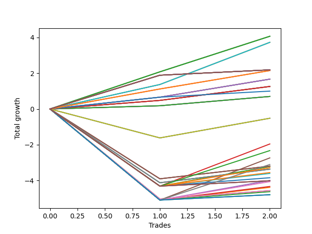

# Long Wallace 013 
- Symbol: NVDA_Unlimited
- Date Range: 02/08/2022 - 07/08/2022
- Trading Period: 7:20-12:30
- Number of Trades: 2



| Name | Win Percent | Profit | Avg Profit / Trade | Avg Time / Trade |      | Name | Win Percent | Profit | Avg Profit / Trade | Avg Time / Trade |
| ---- | ----------- | ------ | ------------------ | ---------------- | ---- | ---- | ----------- | ------ | ------------------ | ---------------- |
| Sorted By <br> Profit | | | | | | Sorted By <br> Win Percentage ||||
| One Hundred Twenty-Seven | 100.00 | 2035.00 | 1017.50 | 274:37 |     | One Hundred Twenty-Seven | 100.00 | 2035.00 | 1017.50 | 274:37 |
| One Hundred Twenty-Two | 100.00 | 2035.00 | 1017.50 | 274:37 |     | One Hundred Twenty-Two | 100.00 | 2035.00 | 1017.50 | 274:37 |
| Eighty-Two | 100.00 | 2035.00 | 1017.50 | 274:37 |     | Eighty-Two | 100.00 | 2035.00 | 1017.50 | 274:37 |
| Seventy-One | 100.00 | 1865.00 | 932.50 | 264:55 |     | Seventy-One | 100.00 | 1865.00 | 932.50 | 264:55 |
| Sixty-Three | 100.00 | 1865.00 | 932.50 | 264:55 |     | Sixty-Three | 100.00 | 1865.00 | 932.50 | 264:55 |
| Seven | 100.00 | 1865.00 | 932.50 | 264:55 |     | Seven | 100.00 | 1865.00 | 932.50 | 264:55 |
| One Hundred Thirty | 100.00 | 1095.00 | 547.50 | 310:30 |     | One Hundred Thirty | 100.00 | 1095.00 | 547.50 | 310:30 |
| One Hundred Twenty-Nine | 100.00 | 1095.00 | 547.50 | 310:30 |     | One Hundred Twenty-Nine | 100.00 | 1095.00 | 547.50 | 310:30 |
| One Hundred Twenty-Eight | 100.00 | 1095.00 | 547.50 | 310:30 |     | One Hundred Twenty-Eight | 100.00 | 1095.00 | 547.50 | 310:30 |
| One Hundred Twenty-Five | 100.00 | 1095.00 | 547.50 | 310:30 |     | One Hundred Twenty-Five | 100.00 | 1095.00 | 547.50 | 310:30 |
| One Hundred Twenty-Four | 100.00 | 1095.00 | 547.50 | 310:30 |     | One Hundred Twenty-Four | 100.00 | 1095.00 | 547.50 | 310:30 |
| One Hundred Twenty-Three | 100.00 | 1095.00 | 547.50 | 310:30 |     | One Hundred Twenty-Three | 100.00 | 1095.00 | 547.50 | 310:30 |
| Eighty-Five | 100.00 | 1095.00 | 547.50 | 310:30 |     | Eighty-Five | 100.00 | 1095.00 | 547.50 | 310:30 |
| Eighty-Four | 100.00 | 1095.00 | 547.50 | 310:30 |     | Eighty-Four | 100.00 | 1095.00 | 547.50 | 310:30 |
| Eighty-Three | 100.00 | 1095.00 | 547.50 | 310:30 |     | Eighty-Three | 100.00 | 1095.00 | 547.50 | 310:30 |
| One Hundred Twenty-Six | 100.00 | 1075.00 | 537.50 | 132:05 |     | One Hundred Twenty-Six | 100.00 | 1075.00 | 537.50 | 132:05 |
| One Hundred Twenty-One | 100.00 | 1075.00 | 537.50 | 132:05 |     | One Hundred Twenty-One | 100.00 | 1075.00 | 537.50 | 132:05 |
| Eighty-One | 100.00 | 1075.00 | 537.50 | 132:05 |     | Eighty-One | 100.00 | 1075.00 | 537.50 | 132:05 |
| Sixty-Six | 100.00 | 835.00 | 417.50 | 29:47 |     | Sixty-Six | 100.00 | 835.00 | 417.50 | 29:47 |
| Fifty-Eight | 100.00 | 835.00 | 417.50 | 29:47 |     | Fifty-Eight | 100.00 | 835.00 | 417.50 | 29:47 |
| Fifty | 100.00 | 835.00 | 417.50 | 29:47 |     | Fifty | 100.00 | 835.00 | 417.50 | 29:47 |
| Forty-Two | 100.00 | 835.00 | 417.50 | 29:47 |     | Forty-Two | 100.00 | 835.00 | 417.50 | 29:47 |
| Two | 100.00 | 835.00 | 417.50 | 29:47 |     | Two | 100.00 | 835.00 | 417.50 | 29:47 |
| Sixty-Five | 100.00 | 630.00 | 315.00 | 21:07 |     | Sixty-Five | 100.00 | 630.00 | 315.00 | 21:07 |
| Fifty-Seven | 100.00 | 630.00 | 315.00 | 21:07 |     | Fifty-Seven | 100.00 | 630.00 | 315.00 | 21:07 |
| Forty-Nine | 100.00 | 630.00 | 315.00 | 21:07 |     | Forty-Nine | 100.00 | 630.00 | 315.00 | 21:07 |
| Forty-One | 100.00 | 630.00 | 315.00 | 21:07 |     | Forty-One | 100.00 | 630.00 | 315.00 | 21:07 |
| One | 100.00 | 630.00 | 315.00 | 21:07 |     | One | 100.00 | 630.00 | 315.00 | 21:07 |
| Seventy-Three | 100.00 | 500.00 | 250.00 | 15:35 |     | Seventy-Three | 100.00 | 500.00 | 250.00 | 15:35 |
| Sixty-Four | 100.00 | 350.00 | 175.00 | 16:07 |     | Sixty-Four | 100.00 | 350.00 | 175.00 | 16:07 |
| Fifty-Six | 100.00 | 350.00 | 175.00 | 16:07 |     | Fifty-Six | 100.00 | 350.00 | 175.00 | 16:07 |
| Forty-Eight | 100.00 | 350.00 | 175.00 | 16:07 |     | Forty-Eight | 100.00 | 350.00 | 175.00 | 16:07 |
| Forty | 100.00 | 350.00 | 175.00 | 16:07 |     | Forty | 100.00 | 350.00 | 175.00 | 16:07 |
| Zero | 100.00 | 350.00 | 175.00 | 16:07 |     | Zero | 100.00 | 350.00 | 175.00 | 16:07 |
| Seventy | 50.00 | -260.00 | -130.00 | 179:10 |     | Seventy | 50.00 | -260.00 | -130.00 | 179:10 |
| Sixty-Two | 50.00 | -260.00 | -130.00 | 179:10 |     | Sixty-Two | 50.00 | -260.00 | -130.00 | 179:10 |
| Six | 50.00 | -260.00 | -130.00 | 179:10 |     | Six | 50.00 | -260.00 | -130.00 | 179:10 |
| Fifty-Five | 50.00 | -980.00 | -490.00 | 165:37 |     | Fifty-Five | 50.00 | -980.00 | -490.00 | 165:37 |
| One Hundred Seventeen | 50.00 | -1165.00 | -582.50 | 164:30 |     | One Hundred Seventeen | 50.00 | -1165.00 | -582.50 | 164:30 |
| Forty-Seven | 50.00 | -1370.00 | -685.00 | 166:12 |     | Forty-Seven | 50.00 | -1370.00 | -685.00 | 166:12 |
| One Hundred Twelve | 50.00 | -1555.00 | -777.50 | 165:05 |     | One Hundred Twelve | 50.00 | -1555.00 | -777.50 | 165:05 |
| Sixty-Seven | 50.00 | -1600.00 | -800.00 | 68:30 |     | Sixty-Seven | 50.00 | -1600.00 | -800.00 | 68:30 |
| Fifty-Nine | 50.00 | -1600.00 | -800.00 | 68:30 |     | Fifty-Nine | 50.00 | -1600.00 | -800.00 | 68:30 |
| Three | 50.00 | -1600.00 | -800.00 | 68:30 |     | Three | 50.00 | -1600.00 | -800.00 | 68:30 |
| Fifty-Four | 50.00 | -1610.00 | -805.00 | 110:37 |     | Fifty-Four | 50.00 | -1610.00 | -805.00 | 110:37 |
| One Hundred Sixteen | 50.00 | -1645.00 | -822.50 | 37:02 |     | One Hundred Sixteen | 50.00 | -1645.00 | -822.50 | 37:02 |
| Sixty-Nine | 50.00 | -1685.00 | -842.50 | 106:50 |     | Sixty-Nine | 50.00 | -1685.00 | -842.50 | 106:50 |
| Sixty-One | 50.00 | -1685.00 | -842.50 | 106:50 |     | Sixty-One | 50.00 | -1685.00 | -842.50 | 106:50 |
| Five | 50.00 | -1685.00 | -842.50 | 106:50 |     | Five | 50.00 | -1685.00 | -842.50 | 106:50 |
| Fifty-Three | 50.00 | -1780.00 | -890.00 | 66:42 |     | Fifty-Three | 50.00 | -1780.00 | -890.00 | 66:42 |
| Fifty-One | 50.00 | -1805.00 | -902.50 | 54:20 |     | Fifty-One | 50.00 | -1805.00 | -902.50 | 54:20 |
| Fifty-Two | 50.00 | -1925.00 | -962.50 | 66:00 |     | Fifty-Two | 50.00 | -1925.00 | -962.50 | 66:00 |
| Forty-Six | 50.00 | -2000.00 | -1000.00 | 111:12 |     | Forty-Six | 50.00 | -2000.00 | -1000.00 | 111:12 |
| One Hundred Twenty | 50.00 | -2010.00 | -1005.00 | 193:25 |     | One Hundred Twenty | 50.00 | -2010.00 | -1005.00 | 193:25 |
| One Hundred Ninteen | 50.00 | -2010.00 | -1005.00 | 193:25 |     | One Hundred Ninteen | 50.00 | -2010.00 | -1005.00 | 193:25 |
| One Hundred Eighteen | 50.00 | -2010.00 | -1005.00 | 193:25 |     | One Hundred Eighteen | 50.00 | -2010.00 | -1005.00 | 193:25 |
| One Hundred Eleven | 50.00 | -2035.00 | -1017.50 | 37:37 |     | One Hundred Eleven | 50.00 | -2035.00 | -1017.50 | 37:37 |
| Forty-Five | 50.00 | -2170.00 | -1085.00 | 67:17 |     | Forty-Five | 50.00 | -2170.00 | -1085.00 | 67:17 |
| Forty-Three | 50.00 | -2195.00 | -1097.50 | 54:55 |     | Forty-Three | 50.00 | -2195.00 | -1097.50 | 54:55 |
| Sixty-Eight | 50.00 | -2285.00 | -1142.50 | 105:40 |     | Sixty-Eight | 50.00 | -2285.00 | -1142.50 | 105:40 |
| Sixty | 50.00 | -2285.00 | -1142.50 | 105:40 |     | Sixty | 50.00 | -2285.00 | -1142.50 | 105:40 |
| Four | 50.00 | -2285.00 | -1142.50 | 105:40 |     | Four | 50.00 | -2285.00 | -1142.50 | 105:40 |
| Forty-Four | 50.00 | -2315.00 | -1157.50 | 66:35 |     | Forty-Four | 50.00 | -2315.00 | -1157.50 | 66:35 |
| One Hundred Fifteen | 50.00 | -2400.00 | -1200.00 | 194:00 |     | One Hundred Fifteen | 50.00 | -2400.00 | -1200.00 | 194:00 |
| One Hundred Fourteen | 50.00 | -2400.00 | -1200.00 | 194:00 |     | One Hundred Fourteen | 50.00 | -2400.00 | -1200.00 | 194:00 |
| One Hundred Thirteen | 50.00 | -2400.00 | -1200.00 | 194:00 |     | One Hundred Thirteen | 50.00 | -2400.00 | -1200.00 | 194:00 |

## NO STOPLOSS

### Test Zero
* Sell when price hits the middle line of the 20p bollinger
* No Stoploss
* Results:
```
Total Trades: 2
Percent Up: 100.00
Percent Down: 0.00
Total Points Moved Up: 0.70
Potential Profit: 350.00
Total Points Ups: 0.70 Count Ups: 2
Total Points Downs: 0.00 Count Downs: 0
```

<details><summary>Trades</summary>

<code>In: 2022-04-07 07:43:00		Out: 2022-04-07 08:00:05		Total Position Time: 17:05		Total Move Up: 0.18		Total to Date: 0.18</code> <br />
<code>In: 2022-04-11 07:30:00		Out: 2022-04-11 07:45:10		Total Position Time: 15:10		Total Move Up: 0.52		Total to Date: 0.70</code> <br />


</details>

### Test One
* Sell when the price hits the upper line of the 20p 1std bollinger
* No Stoploss
* Results:
```
Total Trades: 2
Percent Up: 100.00
Percent Down: 0.00
Total Points Moved Up: 1.26
Potential Profit: 630.00
Total Points Ups: 1.26 Count Ups: 2
Total Points Downs: 0.00 Count Downs: 0
```

<details><summary>Trades</summary>

<code>In: 2022-04-07 07:43:00		Out: 2022-04-07 08:00:10		Total Position Time: 17:10		Total Move Up: 0.48		Total to Date: 0.48</code> <br />
<code>In: 2022-04-11 07:30:00		Out: 2022-04-11 07:55:05		Total Position Time: 25:05		Total Move Up: 0.78		Total to Date: 1.26</code> <br />


</details>

### Test Two
* Sell when the price hits the upper line of the 20p 2std bollinger
* No Stoploss
* Results:
```
Total Trades: 2
Percent Up: 100.00
Percent Down: 0.00
Total Points Moved Up: 1.67
Potential Profit: 835.00
Total Points Ups: 1.67 Count Ups: 2
Total Points Downs: 0.00 Count Downs: 0
```

<details><summary>Trades</summary>

<code>In: 2022-04-07 07:43:00		Out: 2022-04-07 08:01:05		Total Position Time: 18:05		Total Move Up: 0.66		Total to Date: 0.66</code> <br />
<code>In: 2022-04-11 07:30:00		Out: 2022-04-11 08:11:30		Total Position Time: 41:30		Total Move Up: 1.01		Total to Date: 1.67</code> <br />


</details>

### Test Three
* Sell when price hits the middle line of the 50p bollinger
* No Stoploss
* Results:
```
Total Trades: 2
Percent Up: 50.00
Percent Down: 50.00
Total Points Moved Up: -3.20
Potential Profit: -1600.00
Total Points Ups: 0.71 Count Ups: 1
Total Points Downs: -3.91 Count Downs: 1
```

<details><summary>Trades</summary>

<code>In: 2022-04-07 07:43:00		Out: 2022-04-07 09:21:10		Total Position Time: 98:10		Total Move Up: -3.91		Total to Date: -3.91</code> <br />
<code>In: 2022-04-11 07:30:00		Out: 2022-04-11 08:08:50		Total Position Time: 38:50		Total Move Up: 0.71		Total to Date: -3.20</code> <br />


</details>

### Test Four
* Sell when the price hits the upper line of the 50p 1std bollinger
* No Stoploss
* Results:
```
Total Trades: 2
Percent Up: 50.00
Percent Down: 50.00
Total Points Moved Up: -4.57
Potential Profit: -2285.00
Total Points Ups: 0.47 Count Ups: 1
Total Points Downs: -5.04 Count Downs: 1
```

<details><summary>Trades</summary>

<code>In: 2022-04-07 07:43:00		Out: 2022-04-07 10:12:10		Total Position Time: 149:10		Total Move Up: -5.04		Total to Date: -5.04</code> <br />
<code>In: 2022-04-11 07:30:00		Out: 2022-04-11 08:32:10		Total Position Time: 62:10		Total Move Up: 0.47		Total to Date: -4.57</code> <br />


</details>

### Test Five
* Sell when the price hits the upper line of the 50p 2std bollinger
* No Stoploss
* Results:
```
Total Trades: 2
Percent Up: 50.00
Percent Down: 50.00
Total Points Moved Up: -3.37
Potential Profit: -1685.00
Total Points Ups: 0.76 Count Ups: 1
Total Points Downs: -4.13 Count Downs: 1
```

<details><summary>Trades</summary>

<code>In: 2022-04-07 07:43:00		Out: 2022-04-07 10:13:05		Total Position Time: 150:05		Total Move Up: -4.13		Total to Date: -4.13</code> <br />
<code>In: 2022-04-11 07:30:00		Out: 2022-04-11 08:33:35		Total Position Time: 63:35		Total Move Up: 0.76		Total to Date: -3.37</code> <br />


</details>

### Test Six
* Sell when the price hits the middle line of the 1std VWAP
* No Stoploss
* Results:
```
Total Trades: 2
Percent Up: 50.00
Percent Down: 50.00
Total Points Moved Up: -0.52
Potential Profit: -260.00
Total Points Ups: 1.10 Count Ups: 1
Total Points Downs: -1.62 Count Downs: 1
```

<details><summary>Trades</summary>

<code>In: 2022-04-07 07:43:00		Out: 2022-04-07 11:09:55		Total Position Time: 206:55		Total Move Up: -1.62		Total to Date: -1.62</code> <br />
<code>In: 2022-04-11 07:30:00		Out: 2022-04-11 10:01:25		Total Position Time: 151:25		Total Move Up: 1.10		Total to Date: -0.52</code> <br />


</details>

### Test Seven
* Sell when the price hits the upper line of the 1std VWAP
* No Stoploss
* Results:
```
Total Trades: 2
Percent Up: 100.00
Percent Down: 0.00
Total Points Moved Up: 3.73
Potential Profit: 1865.00
Total Points Ups: 3.73 Count Ups: 2
Total Points Downs: 0.00 Count Downs: 0
```

<details><summary>Trades</summary>

<code>In: 2022-04-07 07:43:00		Out: 2022-04-07 12:11:25		Total Position Time: 268:25		Total Move Up: 1.37		Total to Date: 1.37</code> <br />
<code>In: 2022-04-11 07:30:00		Out: 2022-04-11 11:51:25		Total Position Time: 261:25		Total Move Up: 2.36		Total to Date: 3.73</code> <br />


</details>

## STOPLOSS OF 5

### Test Forty
* Sell when price hits the middle line of the 20p bollinger
* Stoploss is 5 points
* Results:
```
Total Trades: 2
Percent Up: 100.00
Percent Down: 0.00
Total Points Moved Up: 0.70
Potential Profit: 350.00
Total Points Ups: 0.70 Count Ups: 2
Total Points Downs: 0.00 Count Downs: 0
```

<details><summary>Trades</summary>

<code>In: 2022-04-07 07:43:00		Out: 2022-04-07 08:00:05		Total Position Time: 17:05		Total Move Up: 0.18		Total to Date: 0.18</code> <br />
<code>In: 2022-04-11 07:30:00		Out: 2022-04-11 07:45:10		Total Position Time: 15:10		Total Move Up: 0.52		Total to Date: 0.70</code> <br />


</details>

### Test Forty-One
* Sell when the price hits the upper line of the 20p 1std bollinger
* Stoploss is 5 points
* Results:
```
Total Trades: 2
Percent Up: 100.00
Percent Down: 0.00
Total Points Moved Up: 1.26
Potential Profit: 630.00
Total Points Ups: 1.26 Count Ups: 2
Total Points Downs: 0.00 Count Downs: 0
```

<details><summary>Trades</summary>

<code>In: 2022-04-07 07:43:00		Out: 2022-04-07 08:00:10		Total Position Time: 17:10		Total Move Up: 0.48		Total to Date: 0.48</code> <br />
<code>In: 2022-04-11 07:30:00		Out: 2022-04-11 07:55:05		Total Position Time: 25:05		Total Move Up: 0.78		Total to Date: 1.26</code> <br />


</details>

### Test Forty-Two
* Sell when the price hits the upper line of the 20p 2std bollinger
* Stoploss is 5 points
* Results:
```
Total Trades: 2
Percent Up: 100.00
Percent Down: 0.00
Total Points Moved Up: 1.67
Potential Profit: 835.00
Total Points Ups: 1.67 Count Ups: 2
Total Points Downs: 0.00 Count Downs: 0
```

<details><summary>Trades</summary>

<code>In: 2022-04-07 07:43:00		Out: 2022-04-07 08:01:05		Total Position Time: 18:05		Total Move Up: 0.66		Total to Date: 0.66</code> <br />
<code>In: 2022-04-11 07:30:00		Out: 2022-04-11 08:11:30		Total Position Time: 41:30		Total Move Up: 1.01		Total to Date: 1.67</code> <br />


</details>

### Test Forty-Three
* Sell when price hits the middle line of the 50p bollinger
* Stoploss is 5 points
* Results:
```
Total Trades: 2
Percent Up: 50.00
Percent Down: 50.00
Total Points Moved Up: -4.39
Potential Profit: -2195.00
Total Points Ups: 0.71 Count Ups: 1
Total Points Downs: -5.10 Count Downs: 1
```

<details><summary>Trades</summary>

<code>In: 2022-04-07 07:43:00		Out: 2022-04-07 08:54:00		Total Position Time: 71:00		Total Move Up: -5.10		Total to Date: -5.10</code> <br />
<code>In: 2022-04-11 07:30:00		Out: 2022-04-11 08:08:50		Total Position Time: 38:50		Total Move Up: 0.71		Total to Date: -4.39</code> <br />


</details>

### Test Forty-Four
* Sell when the price hits the upper line of the 50p 1std bollinger
* Stoploss is 5 points
* Results:
```
Total Trades: 2
Percent Up: 50.00
Percent Down: 50.00
Total Points Moved Up: -4.63
Potential Profit: -2315.00
Total Points Ups: 0.47 Count Ups: 1
Total Points Downs: -5.10 Count Downs: 1
```

<details><summary>Trades</summary>

<code>In: 2022-04-07 07:43:00		Out: 2022-04-07 08:54:00		Total Position Time: 71:00		Total Move Up: -5.10		Total to Date: -5.10</code> <br />
<code>In: 2022-04-11 07:30:00		Out: 2022-04-11 08:32:10		Total Position Time: 62:10		Total Move Up: 0.47		Total to Date: -4.63</code> <br />


</details>

### Test Forty-Five
* Sell when the price hits the upper line of the 50p 2std bollinger
* Stoploss is 5 points
* Results:
```
Total Trades: 2
Percent Up: 50.00
Percent Down: 50.00
Total Points Moved Up: -4.34
Potential Profit: -2170.00
Total Points Ups: 0.76 Count Ups: 1
Total Points Downs: -5.10 Count Downs: 1
```

<details><summary>Trades</summary>

<code>In: 2022-04-07 07:43:00		Out: 2022-04-07 08:54:00		Total Position Time: 71:00		Total Move Up: -5.10		Total to Date: -5.10</code> <br />
<code>In: 2022-04-11 07:30:00		Out: 2022-04-11 08:33:35		Total Position Time: 63:35		Total Move Up: 0.76		Total to Date: -4.34</code> <br />


</details>

### Test Forty-Six
* Sell when the price hits the middle line of the 1std VWAP
* Stoploss is 5 points
* Results:
```
Total Trades: 2
Percent Up: 50.00
Percent Down: 50.00
Total Points Moved Up: -4.00
Potential Profit: -2000.00
Total Points Ups: 1.10 Count Ups: 1
Total Points Downs: -5.10 Count Downs: 1
```

<details><summary>Trades</summary>

<code>In: 2022-04-07 07:43:00		Out: 2022-04-07 08:54:00		Total Position Time: 71:00		Total Move Up: -5.10		Total to Date: -5.10</code> <br />
<code>In: 2022-04-11 07:30:00		Out: 2022-04-11 10:01:25		Total Position Time: 151:25		Total Move Up: 1.10		Total to Date: -4.00</code> <br />


</details>

### Test Forty-Seven
* Sell when the price hits the upper line of the 1std VWAP
* Stoploss is 5 points
* Results:
```
Total Trades: 2
Percent Up: 50.00
Percent Down: 50.00
Total Points Moved Up: -2.74
Potential Profit: -1370.00
Total Points Ups: 2.36 Count Ups: 1
Total Points Downs: -5.10 Count Downs: 1
```

<details><summary>Trades</summary>

<code>In: 2022-04-07 07:43:00		Out: 2022-04-07 08:54:00		Total Position Time: 71:00		Total Move Up: -5.10		Total to Date: -5.10</code> <br />
<code>In: 2022-04-11 07:30:00		Out: 2022-04-11 11:51:25		Total Position Time: 261:25		Total Move Up: 2.36		Total to Date: -2.74</code> <br />


</details>

## TRAIL STOP OF 5

### Test Forty-Eight
* Sell when price hits the middle line of the 20p bollinger
* Trailing Stop is 5 points
* Results:
```
Total Trades: 2
Percent Up: 100.00
Percent Down: 0.00
Total Points Moved Up: 0.70
Potential Profit: 350.00
Total Points Ups: 0.70 Count Ups: 2
Total Points Downs: 0.00 Count Downs: 0
```

<details><summary>Trades</summary>

<code>In: 2022-04-07 07:43:00		Out: 2022-04-07 08:00:05		Total Position Time: 17:05		Total Move Up: 0.18		Total to Date: 0.18</code> <br />
<code>In: 2022-04-11 07:30:00		Out: 2022-04-11 07:45:10		Total Position Time: 15:10		Total Move Up: 0.52		Total to Date: 0.70</code> <br />


</details>

### Test Forty-Nine
* Sell when the price hits the upper line of the 20p 1std bollinger
* Trailing Stop is 5 points
* Results:
```
Total Trades: 2
Percent Up: 100.00
Percent Down: 0.00
Total Points Moved Up: 1.26
Potential Profit: 630.00
Total Points Ups: 1.26 Count Ups: 2
Total Points Downs: 0.00 Count Downs: 0
```

<details><summary>Trades</summary>

<code>In: 2022-04-07 07:43:00		Out: 2022-04-07 08:00:10		Total Position Time: 17:10		Total Move Up: 0.48		Total to Date: 0.48</code> <br />
<code>In: 2022-04-11 07:30:00		Out: 2022-04-11 07:55:05		Total Position Time: 25:05		Total Move Up: 0.78		Total to Date: 1.26</code> <br />


</details>

### Test Fifty
* Sell when the price hits the upper line of the 20p 2std bollinger
* Trailing Stop is 5 points
* Results:
```
Total Trades: 2
Percent Up: 100.00
Percent Down: 0.00
Total Points Moved Up: 1.67
Potential Profit: 835.00
Total Points Ups: 1.67 Count Ups: 2
Total Points Downs: 0.00 Count Downs: 0
```

<details><summary>Trades</summary>

<code>In: 2022-04-07 07:43:00		Out: 2022-04-07 08:01:05		Total Position Time: 18:05		Total Move Up: 0.66		Total to Date: 0.66</code> <br />
<code>In: 2022-04-11 07:30:00		Out: 2022-04-11 08:11:30		Total Position Time: 41:30		Total Move Up: 1.01		Total to Date: 1.67</code> <br />


</details>

### Test Fifty-One
* Sell when price hits the middle line of the 50p bollinger
* Trailing Stop is 5 points
* Results:
```
Total Trades: 2
Percent Up: 50.00
Percent Down: 50.00
Total Points Moved Up: -3.61
Potential Profit: -1805.00
Total Points Ups: 0.71 Count Ups: 1
Total Points Downs: -4.32 Count Downs: 1
```

<details><summary>Trades</summary>

<code>In: 2022-04-07 07:43:00		Out: 2022-04-07 08:52:50		Total Position Time: 69:50		Total Move Up: -4.32		Total to Date: -4.32</code> <br />
<code>In: 2022-04-11 07:30:00		Out: 2022-04-11 08:08:50		Total Position Time: 38:50		Total Move Up: 0.71		Total to Date: -3.61</code> <br />


</details>

### Test Fifty-Two
* Sell when the price hits the upper line of the 50p 1std bollinger
* Trailing Stop is 5 points
* Results:
```
Total Trades: 2
Percent Up: 50.00
Percent Down: 50.00
Total Points Moved Up: -3.85
Potential Profit: -1925.00
Total Points Ups: 0.47 Count Ups: 1
Total Points Downs: -4.32 Count Downs: 1
```

<details><summary>Trades</summary>

<code>In: 2022-04-07 07:43:00		Out: 2022-04-07 08:52:50		Total Position Time: 69:50		Total Move Up: -4.32		Total to Date: -4.32</code> <br />
<code>In: 2022-04-11 07:30:00		Out: 2022-04-11 08:32:10		Total Position Time: 62:10		Total Move Up: 0.47		Total to Date: -3.85</code> <br />


</details>

### Test Fifty-Three
* Sell when the price hits the upper line of the 50p 2std bollinger
* Trailing Stop is 5 points
* Results:
```
Total Trades: 2
Percent Up: 50.00
Percent Down: 50.00
Total Points Moved Up: -3.56
Potential Profit: -1780.00
Total Points Ups: 0.76 Count Ups: 1
Total Points Downs: -4.32 Count Downs: 1
```

<details><summary>Trades</summary>

<code>In: 2022-04-07 07:43:00		Out: 2022-04-07 08:52:50		Total Position Time: 69:50		Total Move Up: -4.32		Total to Date: -4.32</code> <br />
<code>In: 2022-04-11 07:30:00		Out: 2022-04-11 08:33:35		Total Position Time: 63:35		Total Move Up: 0.76		Total to Date: -3.56</code> <br />


</details>

### Test Fifty-Four
* Sell when the price hits the middle line of the 1std VWAP
* Trailing Stop is 5 points
* Results:
```
Total Trades: 2
Percent Up: 50.00
Percent Down: 50.00
Total Points Moved Up: -3.22
Potential Profit: -1610.00
Total Points Ups: 1.10 Count Ups: 1
Total Points Downs: -4.32 Count Downs: 1
```

<details><summary>Trades</summary>

<code>In: 2022-04-07 07:43:00		Out: 2022-04-07 08:52:50		Total Position Time: 69:50		Total Move Up: -4.32		Total to Date: -4.32</code> <br />
<code>In: 2022-04-11 07:30:00		Out: 2022-04-11 10:01:25		Total Position Time: 151:25		Total Move Up: 1.10		Total to Date: -3.22</code> <br />


</details>

### Test Fifty-Five
* Sell when the price hits the upper line of the 1std VWAP
* Trailing Stop is 5 points
* Results:
```
Total Trades: 2
Percent Up: 50.00
Percent Down: 50.00
Total Points Moved Up: -1.96
Potential Profit: -980.00
Total Points Ups: 2.36 Count Ups: 1
Total Points Downs: -4.32 Count Downs: 1
```

<details><summary>Trades</summary>

<code>In: 2022-04-07 07:43:00		Out: 2022-04-07 08:52:50		Total Position Time: 69:50		Total Move Up: -4.32		Total to Date: -4.32</code> <br />
<code>In: 2022-04-11 07:30:00		Out: 2022-04-11 11:51:25		Total Position Time: 261:25		Total Move Up: 2.36		Total to Date: -1.96</code> <br />


</details>

## STOPLOSS OF 10

### Test Fifty-Six
* Sell when price hits the middle line of the 20p bollinger
* Stoploss is 10 points
* Results:
```
Total Trades: 2
Percent Up: 100.00
Percent Down: 0.00
Total Points Moved Up: 0.70
Potential Profit: 350.00
Total Points Ups: 0.70 Count Ups: 2
Total Points Downs: 0.00 Count Downs: 0
```

<details><summary>Trades</summary>

<code>In: 2022-04-07 07:43:00		Out: 2022-04-07 08:00:05		Total Position Time: 17:05		Total Move Up: 0.18		Total to Date: 0.18</code> <br />
<code>In: 2022-04-11 07:30:00		Out: 2022-04-11 07:45:10		Total Position Time: 15:10		Total Move Up: 0.52		Total to Date: 0.70</code> <br />


</details>

### Test Fifty-Seven
* Sell when the price hits the upper line of the 20p 1std bollinger
* Stoploss is 10 points
* Results:
```
Total Trades: 2
Percent Up: 100.00
Percent Down: 0.00
Total Points Moved Up: 1.26
Potential Profit: 630.00
Total Points Ups: 1.26 Count Ups: 2
Total Points Downs: 0.00 Count Downs: 0
```

<details><summary>Trades</summary>

<code>In: 2022-04-07 07:43:00		Out: 2022-04-07 08:00:10		Total Position Time: 17:10		Total Move Up: 0.48		Total to Date: 0.48</code> <br />
<code>In: 2022-04-11 07:30:00		Out: 2022-04-11 07:55:05		Total Position Time: 25:05		Total Move Up: 0.78		Total to Date: 1.26</code> <br />


</details>

### Test Fifty-Eight
* Sell when the price hits the upper line of the 20p 2std bollinger
* Stoploss is 10 points
* Results:
```
Total Trades: 2
Percent Up: 100.00
Percent Down: 0.00
Total Points Moved Up: 1.67
Potential Profit: 835.00
Total Points Ups: 1.67 Count Ups: 2
Total Points Downs: 0.00 Count Downs: 0
```

<details><summary>Trades</summary>

<code>In: 2022-04-07 07:43:00		Out: 2022-04-07 08:01:05		Total Position Time: 18:05		Total Move Up: 0.66		Total to Date: 0.66</code> <br />
<code>In: 2022-04-11 07:30:00		Out: 2022-04-11 08:11:30		Total Position Time: 41:30		Total Move Up: 1.01		Total to Date: 1.67</code> <br />


</details>

### Test Fifty-Nine
* Sell when price hits the middle line of the 50p bollinger
* Stoploss is 10 points
* Results:
```
Total Trades: 2
Percent Up: 50.00
Percent Down: 50.00
Total Points Moved Up: -3.20
Potential Profit: -1600.00
Total Points Ups: 0.71 Count Ups: 1
Total Points Downs: -3.91 Count Downs: 1
```

<details><summary>Trades</summary>

<code>In: 2022-04-07 07:43:00		Out: 2022-04-07 09:21:10		Total Position Time: 98:10		Total Move Up: -3.91		Total to Date: -3.91</code> <br />
<code>In: 2022-04-11 07:30:00		Out: 2022-04-11 08:08:50		Total Position Time: 38:50		Total Move Up: 0.71		Total to Date: -3.20</code> <br />


</details>

### Test Sixty
* Sell when the price hits the upper line of the 50p 1std bollinger
* Stoploss is 10 points
* Results:
```
Total Trades: 2
Percent Up: 50.00
Percent Down: 50.00
Total Points Moved Up: -4.57
Potential Profit: -2285.00
Total Points Ups: 0.47 Count Ups: 1
Total Points Downs: -5.04 Count Downs: 1
```

<details><summary>Trades</summary>

<code>In: 2022-04-07 07:43:00		Out: 2022-04-07 10:12:10		Total Position Time: 149:10		Total Move Up: -5.04		Total to Date: -5.04</code> <br />
<code>In: 2022-04-11 07:30:00		Out: 2022-04-11 08:32:10		Total Position Time: 62:10		Total Move Up: 0.47		Total to Date: -4.57</code> <br />


</details>

### Test Sixty-One
* Sell when the price hits the upper line of the 50p 2std bollinger
* Stoploss is 10 points
* Results:
```
Total Trades: 2
Percent Up: 50.00
Percent Down: 50.00
Total Points Moved Up: -3.37
Potential Profit: -1685.00
Total Points Ups: 0.76 Count Ups: 1
Total Points Downs: -4.13 Count Downs: 1
```

<details><summary>Trades</summary>

<code>In: 2022-04-07 07:43:00		Out: 2022-04-07 10:13:05		Total Position Time: 150:05		Total Move Up: -4.13		Total to Date: -4.13</code> <br />
<code>In: 2022-04-11 07:30:00		Out: 2022-04-11 08:33:35		Total Position Time: 63:35		Total Move Up: 0.76		Total to Date: -3.37</code> <br />


</details>

### Test Sixty-Two
* Sell when the price hits the middle line of the 1std VWAP
* Stoploss is 10 points
* Results:
```
Total Trades: 2
Percent Up: 50.00
Percent Down: 50.00
Total Points Moved Up: -0.52
Potential Profit: -260.00
Total Points Ups: 1.10 Count Ups: 1
Total Points Downs: -1.62 Count Downs: 1
```

<details><summary>Trades</summary>

<code>In: 2022-04-07 07:43:00		Out: 2022-04-07 11:09:55		Total Position Time: 206:55		Total Move Up: -1.62		Total to Date: -1.62</code> <br />
<code>In: 2022-04-11 07:30:00		Out: 2022-04-11 10:01:25		Total Position Time: 151:25		Total Move Up: 1.10		Total to Date: -0.52</code> <br />


</details>

### Test Sixty-Three
* Sell when the price hits the upper line of the 1std VWAP
* Stoploss is 10 points
* Results:
```
Total Trades: 2
Percent Up: 100.00
Percent Down: 0.00
Total Points Moved Up: 3.73
Potential Profit: 1865.00
Total Points Ups: 3.73 Count Ups: 2
Total Points Downs: 0.00 Count Downs: 0
```

<details><summary>Trades</summary>

<code>In: 2022-04-07 07:43:00		Out: 2022-04-07 12:11:25		Total Position Time: 268:25		Total Move Up: 1.37		Total to Date: 1.37</code> <br />
<code>In: 2022-04-11 07:30:00		Out: 2022-04-11 11:51:25		Total Position Time: 261:25		Total Move Up: 2.36		Total to Date: 3.73</code> <br />


</details>

## TRAIL STOP OF 10

### Test Sixty-Four
* Sell when price hits the middle line of the 20p bollinger
* Trailing Stop is 10 points
* Results:
```
Total Trades: 2
Percent Up: 100.00
Percent Down: 0.00
Total Points Moved Up: 0.70
Potential Profit: 350.00
Total Points Ups: 0.70 Count Ups: 2
Total Points Downs: 0.00 Count Downs: 0
```

<details><summary>Trades</summary>

<code>In: 2022-04-07 07:43:00		Out: 2022-04-07 08:00:05		Total Position Time: 17:05		Total Move Up: 0.18		Total to Date: 0.18</code> <br />
<code>In: 2022-04-11 07:30:00		Out: 2022-04-11 07:45:10		Total Position Time: 15:10		Total Move Up: 0.52		Total to Date: 0.70</code> <br />


</details>

### Test Sixty-Five
* Sell when the price hits the upper line of the 20p 1std bollinger
* Trailing Stop is 10 points
* Results:
```
Total Trades: 2
Percent Up: 100.00
Percent Down: 0.00
Total Points Moved Up: 1.26
Potential Profit: 630.00
Total Points Ups: 1.26 Count Ups: 2
Total Points Downs: 0.00 Count Downs: 0
```

<details><summary>Trades</summary>

<code>In: 2022-04-07 07:43:00		Out: 2022-04-07 08:00:10		Total Position Time: 17:10		Total Move Up: 0.48		Total to Date: 0.48</code> <br />
<code>In: 2022-04-11 07:30:00		Out: 2022-04-11 07:55:05		Total Position Time: 25:05		Total Move Up: 0.78		Total to Date: 1.26</code> <br />


</details>

### Test Sixty-Six
* Sell when the price hits the upper line of the 20p 2std bollinger
* Trailing Stop is 10 points
* Results:
```
Total Trades: 2
Percent Up: 100.00
Percent Down: 0.00
Total Points Moved Up: 1.67
Potential Profit: 835.00
Total Points Ups: 1.67 Count Ups: 2
Total Points Downs: 0.00 Count Downs: 0
```

<details><summary>Trades</summary>

<code>In: 2022-04-07 07:43:00		Out: 2022-04-07 08:01:05		Total Position Time: 18:05		Total Move Up: 0.66		Total to Date: 0.66</code> <br />
<code>In: 2022-04-11 07:30:00		Out: 2022-04-11 08:11:30		Total Position Time: 41:30		Total Move Up: 1.01		Total to Date: 1.67</code> <br />


</details>

### Test Sixty-Seven
* Sell when price hits the middle line of the 50p bollinger
* Trailing Stop is 10 points
* Results:
```
Total Trades: 2
Percent Up: 50.00
Percent Down: 50.00
Total Points Moved Up: -3.20
Potential Profit: -1600.00
Total Points Ups: 0.71 Count Ups: 1
Total Points Downs: -3.91 Count Downs: 1
```

<details><summary>Trades</summary>

<code>In: 2022-04-07 07:43:00		Out: 2022-04-07 09:21:10		Total Position Time: 98:10		Total Move Up: -3.91		Total to Date: -3.91</code> <br />
<code>In: 2022-04-11 07:30:00		Out: 2022-04-11 08:08:50		Total Position Time: 38:50		Total Move Up: 0.71		Total to Date: -3.20</code> <br />


</details>

### Test Sixty-Eight
* Sell when the price hits the upper line of the 50p 1std bollinger
* Trailing Stop is 10 points
* Results:
```
Total Trades: 2
Percent Up: 50.00
Percent Down: 50.00
Total Points Moved Up: -4.57
Potential Profit: -2285.00
Total Points Ups: 0.47 Count Ups: 1
Total Points Downs: -5.04 Count Downs: 1
```

<details><summary>Trades</summary>

<code>In: 2022-04-07 07:43:00		Out: 2022-04-07 10:12:10		Total Position Time: 149:10		Total Move Up: -5.04		Total to Date: -5.04</code> <br />
<code>In: 2022-04-11 07:30:00		Out: 2022-04-11 08:32:10		Total Position Time: 62:10		Total Move Up: 0.47		Total to Date: -4.57</code> <br />


</details>

### Test Sixty-Nine
* Sell when the price hits the upper line of the 50p 2std bollinger
* Trailing Stop is 10 points
* Results:
```
Total Trades: 2
Percent Up: 50.00
Percent Down: 50.00
Total Points Moved Up: -3.37
Potential Profit: -1685.00
Total Points Ups: 0.76 Count Ups: 1
Total Points Downs: -4.13 Count Downs: 1
```

<details><summary>Trades</summary>

<code>In: 2022-04-07 07:43:00		Out: 2022-04-07 10:13:05		Total Position Time: 150:05		Total Move Up: -4.13		Total to Date: -4.13</code> <br />
<code>In: 2022-04-11 07:30:00		Out: 2022-04-11 08:33:35		Total Position Time: 63:35		Total Move Up: 0.76		Total to Date: -3.37</code> <br />


</details>

### Test Seventy
* Sell when the price hits the middle line of the 1std VWAP
* Trailing Stop is 10 points
* Results:
```
Total Trades: 2
Percent Up: 50.00
Percent Down: 50.00
Total Points Moved Up: -0.52
Potential Profit: -260.00
Total Points Ups: 1.10 Count Ups: 1
Total Points Downs: -1.62 Count Downs: 1
```

<details><summary>Trades</summary>

<code>In: 2022-04-07 07:43:00		Out: 2022-04-07 11:09:55		Total Position Time: 206:55		Total Move Up: -1.62		Total to Date: -1.62</code> <br />
<code>In: 2022-04-11 07:30:00		Out: 2022-04-11 10:01:25		Total Position Time: 151:25		Total Move Up: 1.10		Total to Date: -0.52</code> <br />


</details>

### Test Seventy-One
* Sell when the price hits the upper line of the 1std VWAP
* Trailing Stop is 10 points
* Results:
```
Total Trades: 2
Percent Up: 100.00
Percent Down: 0.00
Total Points Moved Up: 3.73
Potential Profit: 1865.00
Total Points Ups: 3.73 Count Ups: 2
Total Points Downs: 0.00 Count Downs: 0
```

<details><summary>Trades</summary>

<code>In: 2022-04-07 07:43:00		Out: 2022-04-07 12:11:25		Total Position Time: 268:25		Total Move Up: 1.37		Total to Date: 1.37</code> <br />
<code>In: 2022-04-11 07:30:00		Out: 2022-04-11 11:51:25		Total Position Time: 261:25		Total Move Up: 2.36		Total to Date: 3.73</code> <br />


</details>

## SPECIAL EXIT CONDITIONS 

### Test Seventy-Three
* Sell when the linear regression slope changes to negative
* No Stoploss
* Results:
```
Total Trades: 2
Percent Up: 100.00
Percent Down: 0.00
Total Points Moved Up: 1.00
Potential Profit: 500.00
Total Points Ups: 1.00 Count Ups: 2
Total Points Downs: 0.00 Count Downs: 0
```

<details><summary>Trades</summary>

<code>In: 2022-04-07 07:43:00		Out: 2022-04-07 08:01:05		Total Position Time: 18:05		Total Move Up: 0.66		Total to Date: 0.66</code> <br />
<code>In: 2022-04-11 07:30:00		Out: 2022-04-11 07:43:05		Total Position Time: 13:05		Total Move Up: 0.34		Total to Date: 1.00</code> <br />


</details>

## TAKE PROFIT

### Test Eighty-One
* Take Profit of 1 Point
* No Stoploss
* Results:
```
Total Trades: 2
Percent Up: 100.00
Percent Down: 0.00
Total Points Moved Up: 2.15
Potential Profit: 1075.00
Total Points Ups: 2.15 Count Ups: 2
Total Points Downs: 0.00 Count Downs: 0
```

<details><summary>Trades</summary>

<code>In: 2022-04-07 07:43:00		Out: 2022-04-07 12:02:55		Total Position Time: 259:55		Total Move Up: 1.12		Total to Date: 1.12</code> <br />
<code>In: 2022-04-11 07:30:00		Out: 2022-04-11 07:34:15		Total Position Time: 04:15		Total Move Up: 1.03		Total to Date: 2.15</code> <br />


</details>

### Test Eighty-Two
* Take Profit of 2 Point
* No Stoploss
* Results:
```
Total Trades: 2
Percent Up: 100.00
Percent Down: 0.00
Total Points Moved Up: 4.07
Potential Profit: 2035.00
Total Points Ups: 4.07 Count Ups: 2
Total Points Downs: 0.00 Count Downs: 0
```

<details><summary>Trades</summary>

<code>In: 2022-04-07 07:43:00		Out: 2022-04-07 12:33:05		Total Position Time: 290:05		Total Move Up: 2.08		Total to Date: 2.08</code> <br />
<code>In: 2022-04-11 07:30:00		Out: 2022-04-11 11:49:10		Total Position Time: 259:10		Total Move Up: 1.99		Total to Date: 4.07</code> <br />


</details>

### Test Eighty-Three
* Take Profit of 3 Point
* No Stoploss
* Results:
```
Total Trades: 2
Percent Up: 100.00
Percent Down: 0.00
Total Points Moved Up: 2.19
Potential Profit: 1095.00
Total Points Ups: 2.19 Count Ups: 2
Total Points Downs: 0.00 Count Downs: 0
```

<details><summary>Trades</summary>

<code>In: 2022-04-07 07:43:00		Out: 2022-04-07 12:47:00		Total Position Time: 304:00		Total Move Up: 1.89		Total to Date: 1.89</code> <br />
<code>In: 2022-04-11 07:30:00		Out: 2022-04-11 12:47:00		Total Position Time: 317:00		Total Move Up: 0.30		Total to Date: 2.19</code> <br />


</details>

### Test Eighty-Four
* Take Profit of 4 Point
* No Stoploss
* Results:
```
Total Trades: 2
Percent Up: 100.00
Percent Down: 0.00
Total Points Moved Up: 2.19
Potential Profit: 1095.00
Total Points Ups: 2.19 Count Ups: 2
Total Points Downs: 0.00 Count Downs: 0
```

<details><summary>Trades</summary>

<code>In: 2022-04-07 07:43:00		Out: 2022-04-07 12:47:00		Total Position Time: 304:00		Total Move Up: 1.89		Total to Date: 1.89</code> <br />
<code>In: 2022-04-11 07:30:00		Out: 2022-04-11 12:47:00		Total Position Time: 317:00		Total Move Up: 0.30		Total to Date: 2.19</code> <br />


</details>

### Test Eighty-Five
* Take Profit of 5 Point
* No Stoploss
* Results:
```
Total Trades: 2
Percent Up: 100.00
Percent Down: 0.00
Total Points Moved Up: 2.19
Potential Profit: 1095.00
Total Points Ups: 2.19 Count Ups: 2
Total Points Downs: 0.00 Count Downs: 0
```

<details><summary>Trades</summary>

<code>In: 2022-04-07 07:43:00		Out: 2022-04-07 12:47:00		Total Position Time: 304:00		Total Move Up: 1.89		Total to Date: 1.89</code> <br />
<code>In: 2022-04-11 07:30:00		Out: 2022-04-11 12:47:00		Total Position Time: 317:00		Total Move Up: 0.30		Total to Date: 2.19</code> <br />


</details>

## TAKE PROFIT Stoploss of Five

### Test One Hundred Eleven
* Take Profit of 1 Point
* Stoploss is 5 points
* Results:
```
Total Trades: 2
Percent Up: 50.00
Percent Down: 50.00
Total Points Moved Up: -4.07
Potential Profit: -2035.00
Total Points Ups: 1.03 Count Ups: 1
Total Points Downs: -5.10 Count Downs: 1
```

<details><summary>Trades</summary>

<code>In: 2022-04-07 07:43:00		Out: 2022-04-07 08:54:00		Total Position Time: 71:00		Total Move Up: -5.10		Total to Date: -5.10</code> <br />
<code>In: 2022-04-11 07:30:00		Out: 2022-04-11 07:34:15		Total Position Time: 04:15		Total Move Up: 1.03		Total to Date: -4.07</code> <br />


</details>

### Test One Hundred Twelve
* Take Profit of 2 Point
* Stoploss is 5 points
* Results:
```
Total Trades: 2
Percent Up: 50.00
Percent Down: 50.00
Total Points Moved Up: -3.11
Potential Profit: -1555.00
Total Points Ups: 1.99 Count Ups: 1
Total Points Downs: -5.10 Count Downs: 1
```

<details><summary>Trades</summary>

<code>In: 2022-04-07 07:43:00		Out: 2022-04-07 08:54:00		Total Position Time: 71:00		Total Move Up: -5.10		Total to Date: -5.10</code> <br />
<code>In: 2022-04-11 07:30:00		Out: 2022-04-11 11:49:10		Total Position Time: 259:10		Total Move Up: 1.99		Total to Date: -3.11</code> <br />


</details>

### Test One Hundred Thirteen
* Take Profit of 3 Point
* Stoploss is 5 points
* Results:
```
Total Trades: 2
Percent Up: 50.00
Percent Down: 50.00
Total Points Moved Up: -4.80
Potential Profit: -2400.00
Total Points Ups: 0.30 Count Ups: 1
Total Points Downs: -5.10 Count Downs: 1
```

<details><summary>Trades</summary>

<code>In: 2022-04-07 07:43:00		Out: 2022-04-07 08:54:00		Total Position Time: 71:00		Total Move Up: -5.10		Total to Date: -5.10</code> <br />
<code>In: 2022-04-11 07:30:00		Out: 2022-04-11 12:47:00		Total Position Time: 317:00		Total Move Up: 0.30		Total to Date: -4.80</code> <br />


</details>

### Test One Hundred Fourteen
* Take Profit of 4 Point
* Stoploss is 5 points
* Results:
```
Total Trades: 2
Percent Up: 50.00
Percent Down: 50.00
Total Points Moved Up: -4.80
Potential Profit: -2400.00
Total Points Ups: 0.30 Count Ups: 1
Total Points Downs: -5.10 Count Downs: 1
```

<details><summary>Trades</summary>

<code>In: 2022-04-07 07:43:00		Out: 2022-04-07 08:54:00		Total Position Time: 71:00		Total Move Up: -5.10		Total to Date: -5.10</code> <br />
<code>In: 2022-04-11 07:30:00		Out: 2022-04-11 12:47:00		Total Position Time: 317:00		Total Move Up: 0.30		Total to Date: -4.80</code> <br />


</details>

### Test One Hundred Fifteen
* Take Profit of 5 Point
* Stoploss is 5 points
* Results:
```
Total Trades: 2
Percent Up: 50.00
Percent Down: 50.00
Total Points Moved Up: -4.80
Potential Profit: -2400.00
Total Points Ups: 0.30 Count Ups: 1
Total Points Downs: -5.10 Count Downs: 1
```

<details><summary>Trades</summary>

<code>In: 2022-04-07 07:43:00		Out: 2022-04-07 08:54:00		Total Position Time: 71:00		Total Move Up: -5.10		Total to Date: -5.10</code> <br />
<code>In: 2022-04-11 07:30:00		Out: 2022-04-11 12:47:00		Total Position Time: 317:00		Total Move Up: 0.30		Total to Date: -4.80</code> <br />


</details>

## TAKE PROFIT Trailstop of Five

### Test One Hundred Sixteen
* Take Profit of 1 Point
* Trailing stop is 5 points
* Results:
```
Total Trades: 2
Percent Up: 50.00
Percent Down: 50.00
Total Points Moved Up: -3.29
Potential Profit: -1645.00
Total Points Ups: 1.03 Count Ups: 1
Total Points Downs: -4.32 Count Downs: 1
```

<details><summary>Trades</summary>

<code>In: 2022-04-07 07:43:00		Out: 2022-04-07 08:52:50		Total Position Time: 69:50		Total Move Up: -4.32		Total to Date: -4.32</code> <br />
<code>In: 2022-04-11 07:30:00		Out: 2022-04-11 07:34:15		Total Position Time: 04:15		Total Move Up: 1.03		Total to Date: -3.29</code> <br />


</details>

### Test One Hundred Seventeen
* Take Profit of 2 Point
* Trailing stop is 5 points
* Results:
```
Total Trades: 2
Percent Up: 50.00
Percent Down: 50.00
Total Points Moved Up: -2.33
Potential Profit: -1165.00
Total Points Ups: 1.99 Count Ups: 1
Total Points Downs: -4.32 Count Downs: 1
```

<details><summary>Trades</summary>

<code>In: 2022-04-07 07:43:00		Out: 2022-04-07 08:52:50		Total Position Time: 69:50		Total Move Up: -4.32		Total to Date: -4.32</code> <br />
<code>In: 2022-04-11 07:30:00		Out: 2022-04-11 11:49:10		Total Position Time: 259:10		Total Move Up: 1.99		Total to Date: -2.33</code> <br />


</details>

### Test One Hundred Eighteen
* Take Profit of 3 Point
* Trailing stop is 5 points
* Results:
```
Total Trades: 2
Percent Up: 50.00
Percent Down: 50.00
Total Points Moved Up: -4.02
Potential Profit: -2010.00
Total Points Ups: 0.30 Count Ups: 1
Total Points Downs: -4.32 Count Downs: 1
```

<details><summary>Trades</summary>

<code>In: 2022-04-07 07:43:00		Out: 2022-04-07 08:52:50		Total Position Time: 69:50		Total Move Up: -4.32		Total to Date: -4.32</code> <br />
<code>In: 2022-04-11 07:30:00		Out: 2022-04-11 12:47:00		Total Position Time: 317:00		Total Move Up: 0.30		Total to Date: -4.02</code> <br />


</details>

### Test One Hundred Ninteen
* Take Profit of 4 Point
* Trailing stop is 5 points
* Results:
```
Total Trades: 2
Percent Up: 50.00
Percent Down: 50.00
Total Points Moved Up: -4.02
Potential Profit: -2010.00
Total Points Ups: 0.30 Count Ups: 1
Total Points Downs: -4.32 Count Downs: 1
```

<details><summary>Trades</summary>

<code>In: 2022-04-07 07:43:00		Out: 2022-04-07 08:52:50		Total Position Time: 69:50		Total Move Up: -4.32		Total to Date: -4.32</code> <br />
<code>In: 2022-04-11 07:30:00		Out: 2022-04-11 12:47:00		Total Position Time: 317:00		Total Move Up: 0.30		Total to Date: -4.02</code> <br />


</details>

### Test One Hundred Twenty
* Take Profit of 5 Point
* Trailing stop is 5 points
* Results:
```
Total Trades: 2
Percent Up: 50.00
Percent Down: 50.00
Total Points Moved Up: -4.02
Potential Profit: -2010.00
Total Points Ups: 0.30 Count Ups: 1
Total Points Downs: -4.32 Count Downs: 1
```

<details><summary>Trades</summary>

<code>In: 2022-04-07 07:43:00		Out: 2022-04-07 08:52:50		Total Position Time: 69:50		Total Move Up: -4.32		Total to Date: -4.32</code> <br />
<code>In: 2022-04-11 07:30:00		Out: 2022-04-11 12:47:00		Total Position Time: 317:00		Total Move Up: 0.30		Total to Date: -4.02</code> <br />


</details>

## TAKE PROFIT Stoploss of Ten

### Test One Hundred Twenty-One
* Take Profit of 1 Point
* Stoploss is 10 points
* Results:
```
Total Trades: 2
Percent Up: 100.00
Percent Down: 0.00
Total Points Moved Up: 2.15
Potential Profit: 1075.00
Total Points Ups: 2.15 Count Ups: 2
Total Points Downs: 0.00 Count Downs: 0
```

<details><summary>Trades</summary>

<code>In: 2022-04-07 07:43:00		Out: 2022-04-07 12:02:55		Total Position Time: 259:55		Total Move Up: 1.12		Total to Date: 1.12</code> <br />
<code>In: 2022-04-11 07:30:00		Out: 2022-04-11 07:34:15		Total Position Time: 04:15		Total Move Up: 1.03		Total to Date: 2.15</code> <br />


</details>

### Test One Hundred Twenty-Two
* Take Profit of 2 Point
* Stoploss is 10 points
* Results:
```
Total Trades: 2
Percent Up: 100.00
Percent Down: 0.00
Total Points Moved Up: 4.07
Potential Profit: 2035.00
Total Points Ups: 4.07 Count Ups: 2
Total Points Downs: 0.00 Count Downs: 0
```

<details><summary>Trades</summary>

<code>In: 2022-04-07 07:43:00		Out: 2022-04-07 12:33:05		Total Position Time: 290:05		Total Move Up: 2.08		Total to Date: 2.08</code> <br />
<code>In: 2022-04-11 07:30:00		Out: 2022-04-11 11:49:10		Total Position Time: 259:10		Total Move Up: 1.99		Total to Date: 4.07</code> <br />


</details>

### Test One Hundred Twenty-Three
* Take Profit of 3 Point
* Stoploss is 10 points
* Results:
```
Total Trades: 2
Percent Up: 100.00
Percent Down: 0.00
Total Points Moved Up: 2.19
Potential Profit: 1095.00
Total Points Ups: 2.19 Count Ups: 2
Total Points Downs: 0.00 Count Downs: 0
```

<details><summary>Trades</summary>

<code>In: 2022-04-07 07:43:00		Out: 2022-04-07 12:47:00		Total Position Time: 304:00		Total Move Up: 1.89		Total to Date: 1.89</code> <br />
<code>In: 2022-04-11 07:30:00		Out: 2022-04-11 12:47:00		Total Position Time: 317:00		Total Move Up: 0.30		Total to Date: 2.19</code> <br />


</details>

### Test One Hundred Twenty-Four
* Take Profit of 4 Point
* Stoploss is 10 points
* Results:
```
Total Trades: 2
Percent Up: 100.00
Percent Down: 0.00
Total Points Moved Up: 2.19
Potential Profit: 1095.00
Total Points Ups: 2.19 Count Ups: 2
Total Points Downs: 0.00 Count Downs: 0
```

<details><summary>Trades</summary>

<code>In: 2022-04-07 07:43:00		Out: 2022-04-07 12:47:00		Total Position Time: 304:00		Total Move Up: 1.89		Total to Date: 1.89</code> <br />
<code>In: 2022-04-11 07:30:00		Out: 2022-04-11 12:47:00		Total Position Time: 317:00		Total Move Up: 0.30		Total to Date: 2.19</code> <br />


</details>

### Test One Hundred Twenty-Five
* Take Profit of 5 Point
* Stoploss is 10 points
* Results:
```
Total Trades: 2
Percent Up: 100.00
Percent Down: 0.00
Total Points Moved Up: 2.19
Potential Profit: 1095.00
Total Points Ups: 2.19 Count Ups: 2
Total Points Downs: 0.00 Count Downs: 0
```

<details><summary>Trades</summary>

<code>In: 2022-04-07 07:43:00		Out: 2022-04-07 12:47:00		Total Position Time: 304:00		Total Move Up: 1.89		Total to Date: 1.89</code> <br />
<code>In: 2022-04-11 07:30:00		Out: 2022-04-11 12:47:00		Total Position Time: 317:00		Total Move Up: 0.30		Total to Date: 2.19</code> <br />


</details>

## TAKE PROFIT Trailstop of Ten

### Test One Hundred Twenty-Six
* Take Profit of 1 Point
* Trailing stop is 10 points
* Results:
```
Total Trades: 2
Percent Up: 100.00
Percent Down: 0.00
Total Points Moved Up: 2.15
Potential Profit: 1075.00
Total Points Ups: 2.15 Count Ups: 2
Total Points Downs: 0.00 Count Downs: 0
```

<details><summary>Trades</summary>

<code>In: 2022-04-07 07:43:00		Out: 2022-04-07 12:02:55		Total Position Time: 259:55		Total Move Up: 1.12		Total to Date: 1.12</code> <br />
<code>In: 2022-04-11 07:30:00		Out: 2022-04-11 07:34:15		Total Position Time: 04:15		Total Move Up: 1.03		Total to Date: 2.15</code> <br />


</details>

### Test One Hundred Twenty-Seven
* Take Profit of 2 Point
* Trailing stop is 10 points
* Results:
```
Total Trades: 2
Percent Up: 100.00
Percent Down: 0.00
Total Points Moved Up: 4.07
Potential Profit: 2035.00
Total Points Ups: 4.07 Count Ups: 2
Total Points Downs: 0.00 Count Downs: 0
```

<details><summary>Trades</summary>

<code>In: 2022-04-07 07:43:00		Out: 2022-04-07 12:33:05		Total Position Time: 290:05		Total Move Up: 2.08		Total to Date: 2.08</code> <br />
<code>In: 2022-04-11 07:30:00		Out: 2022-04-11 11:49:10		Total Position Time: 259:10		Total Move Up: 1.99		Total to Date: 4.07</code> <br />


</details>

### Test One Hundred Twenty-Eight
* Take Profit of 3 Point
* Trailing stop is 10 points
* Results:
```
Total Trades: 2
Percent Up: 100.00
Percent Down: 0.00
Total Points Moved Up: 2.19
Potential Profit: 1095.00
Total Points Ups: 2.19 Count Ups: 2
Total Points Downs: 0.00 Count Downs: 0
```

<details><summary>Trades</summary>

<code>In: 2022-04-07 07:43:00		Out: 2022-04-07 12:47:00		Total Position Time: 304:00		Total Move Up: 1.89		Total to Date: 1.89</code> <br />
<code>In: 2022-04-11 07:30:00		Out: 2022-04-11 12:47:00		Total Position Time: 317:00		Total Move Up: 0.30		Total to Date: 2.19</code> <br />


</details>

### Test One Hundred Twenty-Nine
* Take Profit of 4 Point
* Trailing stop is 10 points
* Results:
```
Total Trades: 2
Percent Up: 100.00
Percent Down: 0.00
Total Points Moved Up: 2.19
Potential Profit: 1095.00
Total Points Ups: 2.19 Count Ups: 2
Total Points Downs: 0.00 Count Downs: 0
```

<details><summary>Trades</summary>

<code>In: 2022-04-07 07:43:00		Out: 2022-04-07 12:47:00		Total Position Time: 304:00		Total Move Up: 1.89		Total to Date: 1.89</code> <br />
<code>In: 2022-04-11 07:30:00		Out: 2022-04-11 12:47:00		Total Position Time: 317:00		Total Move Up: 0.30		Total to Date: 2.19</code> <br />


</details>

### Test One Hundred Thirty
* Take Profit of 5 Point
* Trailing stop is 10 points
* Results:
```
Total Trades: 2
Percent Up: 100.00
Percent Down: 0.00
Total Points Moved Up: 2.19
Potential Profit: 1095.00
Total Points Ups: 2.19 Count Ups: 2
Total Points Downs: 0.00 Count Downs: 0
```

<details><summary>Trades</summary>

<code>In: 2022-04-07 07:43:00		Out: 2022-04-07 12:47:00		Total Position Time: 304:00		Total Move Up: 1.89		Total to Date: 1.89</code> <br />
<code>In: 2022-04-11 07:30:00		Out: 2022-04-11 12:47:00		Total Position Time: 317:00		Total Move Up: 0.30		Total to Date: 2.19</code> <br />


</details>