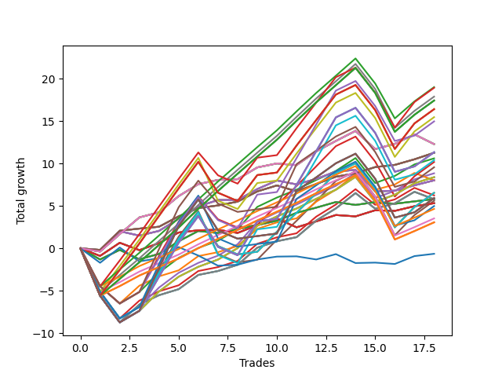

# Long Wallace 014 
- Symbol: NVDA_Unlimited
- Date Range: 02/08/2022 - 07/08/2022
- Trading Period: 7:20-12:30
- Number of Trades: 18



| Name | Win Percent | Profit | Avg Profit / Trade | Avg Time / Trade |      | Name | Win Percent | Profit | Avg Profit / Trade | Avg Time / Trade |
| ---- | ----------- | ------ | ------------------ | ---------------- | ---- | ---- | ----------- | ------ | ------------------ | ---------------- |
| Sorted By <br> Profit | | | | | | Sorted By <br> Win Percentage ||||
| One Hundred Seventeen | 83.33 | 9505.00 | 528.06 | 116:24 |     | Sixty-Seven | 88.89 | 5635.00 | 313.06 | 26:16 |
| One Hundred Eighteen | 72.22 | 9465.00 | 525.83 | 147:47 |     | Fifty-Nine | 88.89 | 5635.00 | 313.06 | 26:16 |
| One Hundred Twelve | 83.33 | 8945.00 | 496.94 | 117:26 |     | Fifty-One | 88.89 | 5635.00 | 313.06 | 26:16 |
| One Hundred Twenty-Seven | 83.33 | 8715.00 | 484.17 | 118:15 |     | Forty-Three | 88.89 | 5635.00 | 313.06 | 26:16 |
| One Hundred Twenty-Two | 83.33 | 8715.00 | 484.17 | 118:15 |     | Three | 88.89 | 5635.00 | 313.06 | 26:16 |
| Eighty-Two | 83.33 | 8715.00 | 484.17 | 118:15 |     | One Hundred Seventeen | 83.33 | 9505.00 | 528.06 | 116:24 |
| One Hundred Twenty-Eight | 72.22 | 8205.00 | 455.83 | 154:13 |     | One Hundred Twelve | 83.33 | 8945.00 | 496.94 | 117:26 |
| One Hundred Twenty-Three | 72.22 | 8205.00 | 455.83 | 154:13 |     | One Hundred Twenty-Seven | 83.33 | 8715.00 | 484.17 | 118:15 |
| Eighty-Three | 72.22 | 8205.00 | 455.83 | 154:13 |     | One Hundred Twenty-Two | 83.33 | 8715.00 | 484.17 | 118:15 |
| One Hundred Thirteen | 72.22 | 7735.00 | 429.72 | 151:58 |     | Eighty-Two | 83.33 | 8715.00 | 484.17 | 118:15 |
| One Hundred Ninteen | 66.67 | 7485.00 | 415.83 | 166:25 |     | Fifty-Four | 83.33 | 5305.00 | 294.72 | 93:58 |
| Sixty-Eight | 77.78 | 6145.00 | 341.39 | 50:31 |     | Forty-Six | 83.33 | 4425.00 | 245.83 | 94:50 |
| Sixty | 77.78 | 6145.00 | 341.39 | 50:31 |     | Seventy | 83.33 | 4195.00 | 233.06 | 95:39 |
| Fifty-Two | 77.78 | 6145.00 | 341.39 | 50:31 |     | Sixty-Two | 83.33 | 4195.00 | 233.06 | 95:39 |
| Forty-Four | 77.78 | 6145.00 | 341.39 | 50:31 |     | Six | 83.33 | 4195.00 | 233.06 | 95:39 |
| Four | 77.78 | 6145.00 | 341.39 | 50:31 |     | One Hundred Sixteen | 83.33 | 2325.00 | 129.17 | 70:50 |
| One Hundred Twenty-Nine | 66.67 | 5670.00 | 315.00 | 173:41 |     | One Hundred Eleven | 83.33 | 1765.00 | 98.06 | 71:52 |
| One Hundred Twenty-Four | 66.67 | 5670.00 | 315.00 | 173:41 |     | One Hundred Twenty-Six | 83.33 | 1535.00 | 85.28 | 72:41 |
| Eighty-Four | 66.67 | 5670.00 | 315.00 | 173:41 |     | One Hundred Twenty-One | 83.33 | 1535.00 | 85.28 | 72:41 |
| Sixty-Seven | 88.89 | 5635.00 | 313.06 | 26:16 |     | Eighty-One | 83.33 | 1535.00 | 85.28 | 72:41 |
| Fifty-Nine | 88.89 | 5635.00 | 313.06 | 26:16 |     | Sixty-Eight | 77.78 | 6145.00 | 341.39 | 50:31 |
| Fifty-One | 88.89 | 5635.00 | 313.06 | 26:16 |     | Sixty | 77.78 | 6145.00 | 341.39 | 50:31 |
| Forty-Three | 88.89 | 5635.00 | 313.06 | 26:16 |     | Fifty-Two | 77.78 | 6145.00 | 341.39 | 50:31 |
| Three | 88.89 | 5635.00 | 313.06 | 26:16 |     | Forty-Four | 77.78 | 6145.00 | 341.39 | 50:31 |
| Fifty-Four | 83.33 | 5305.00 | 294.72 | 93:58 |     | Four | 77.78 | 6145.00 | 341.39 | 50:31 |
| One Hundred Fourteen | 66.67 | 5200.00 | 288.89 | 171:26 |     | Sixty-Six | 77.78 | 4010.00 | 222.78 | 30:42 |
| Fifty-Five | 66.67 | 5090.00 | 282.78 | 153:42 |     | Fifty-Eight | 77.78 | 4010.00 | 222.78 | 30:42 |
| One Hundred Twenty | 66.67 | 4780.00 | 265.56 | 184:10 |     | Fifty | 77.78 | 4010.00 | 222.78 | 30:42 |
| Forty-Six | 83.33 | 4425.00 | 245.83 | 94:50 |     | Forty-Two | 77.78 | 4010.00 | 222.78 | 30:42 |
| Seventy | 83.33 | 4195.00 | 233.06 | 95:39 |     | Two | 77.78 | 4010.00 | 222.78 | 30:42 |
| Sixty-Two | 83.33 | 4195.00 | 233.06 | 95:39 |     | Fifty-Three | 77.78 | 4005.00 | 222.50 | 71:03 |
| Six | 83.33 | 4195.00 | 233.06 | 95:39 |     | Forty-Five | 77.78 | 3125.00 | 173.61 | 71:55 |
| Sixty-Six | 77.78 | 4010.00 | 222.78 | 30:42 |     | Sixty-Nine | 77.78 | 2895.00 | 160.83 | 72:44 |
| Fifty-Eight | 77.78 | 4010.00 | 222.78 | 30:42 |     | Sixty-One | 77.78 | 2895.00 | 160.83 | 72:44 |
| Fifty | 77.78 | 4010.00 | 222.78 | 30:42 |     | Five | 77.78 | 2895.00 | 160.83 | 72:44 |
| Forty-Two | 77.78 | 4010.00 | 222.78 | 30:42 |     | One Hundred Eighteen | 72.22 | 9465.00 | 525.83 | 147:47 |
| Two | 77.78 | 4010.00 | 222.78 | 30:42 |     | One Hundred Twenty-Eight | 72.22 | 8205.00 | 455.83 | 154:13 |
| Fifty-Three | 77.78 | 4005.00 | 222.50 | 71:03 |     | One Hundred Twenty-Three | 72.22 | 8205.00 | 455.83 | 154:13 |
| Seventy-One | 66.67 | 3275.00 | 181.94 | 160:58 |     | Eighty-Three | 72.22 | 8205.00 | 455.83 | 154:13 |
| Sixty-Three | 66.67 | 3275.00 | 181.94 | 160:58 |     | One Hundred Thirteen | 72.22 | 7735.00 | 429.72 | 151:58 |
| Seven | 66.67 | 3275.00 | 181.94 | 160:58 |     | Sixty-Four | 72.22 | 2905.00 | 161.39 | 10:02 |
| Forty-Five | 77.78 | 3125.00 | 173.61 | 71:55 |     | Fifty-Six | 72.22 | 2905.00 | 161.39 | 10:02 |
| One Hundred Thirty | 66.67 | 2965.00 | 164.72 | 191:26 |     | Forty-Eight | 72.22 | 2905.00 | 161.39 | 10:02 |
| One Hundred Twenty-Five | 66.67 | 2965.00 | 164.72 | 191:26 |     | Forty | 72.22 | 2905.00 | 161.39 | 10:02 |
| Eighty-Five | 66.67 | 2965.00 | 164.72 | 191:26 |     | Zero | 72.22 | 2905.00 | 161.39 | 10:02 |
| Sixty-Four | 72.22 | 2905.00 | 161.39 | 10:02 |     | One Hundred Ninteen | 66.67 | 7485.00 | 415.83 | 166:25 |
| Fifty-Six | 72.22 | 2905.00 | 161.39 | 10:02 |     | One Hundred Twenty-Nine | 66.67 | 5670.00 | 315.00 | 173:41 |
| Forty-Eight | 72.22 | 2905.00 | 161.39 | 10:02 |     | One Hundred Twenty-Four | 66.67 | 5670.00 | 315.00 | 173:41 |
| Forty | 72.22 | 2905.00 | 161.39 | 10:02 |     | Eighty-Four | 66.67 | 5670.00 | 315.00 | 173:41 |
| Zero | 72.22 | 2905.00 | 161.39 | 10:02 |     | One Hundred Fourteen | 66.67 | 5200.00 | 288.89 | 171:26 |
| Sixty-Nine | 77.78 | 2895.00 | 160.83 | 72:44 |     | Fifty-Five | 66.67 | 5090.00 | 282.78 | 153:42 |
| Sixty-One | 77.78 | 2895.00 | 160.83 | 72:44 |     | One Hundred Twenty | 66.67 | 4780.00 | 265.56 | 184:10 |
| Five | 77.78 | 2895.00 | 160.83 | 72:44 |     | Seventy-One | 66.67 | 3275.00 | 181.94 | 160:58 |
| Forty-Seven | 66.67 | 2805.00 | 155.83 | 158:43 |     | Sixty-Three | 66.67 | 3275.00 | 181.94 | 160:58 |
| Sixty-Five | 66.67 | 2660.00 | 147.78 | 18:53 |     | Seven | 66.67 | 3275.00 | 181.94 | 160:58 |
| Fifty-Seven | 66.67 | 2660.00 | 147.78 | 18:53 |     | One Hundred Thirty | 66.67 | 2965.00 | 164.72 | 191:26 |
| Forty-Nine | 66.67 | 2660.00 | 147.78 | 18:53 |     | One Hundred Twenty-Five | 66.67 | 2965.00 | 164.72 | 191:26 |
| Forty-One | 66.67 | 2660.00 | 147.78 | 18:53 |     | Eighty-Five | 66.67 | 2965.00 | 164.72 | 191:26 |
| One | 66.67 | 2660.00 | 147.78 | 18:53 |     | Forty-Seven | 66.67 | 2805.00 | 155.83 | 158:43 |
| One Hundred Fifteen | 66.67 | 2495.00 | 138.61 | 189:11 |     | Sixty-Five | 66.67 | 2660.00 | 147.78 | 18:53 |
| One Hundred Sixteen | 83.33 | 2325.00 | 129.17 | 70:50 |     | Fifty-Seven | 66.67 | 2660.00 | 147.78 | 18:53 |
| One Hundred Eleven | 83.33 | 1765.00 | 98.06 | 71:52 |     | Forty-Nine | 66.67 | 2660.00 | 147.78 | 18:53 |
| One Hundred Twenty-Six | 83.33 | 1535.00 | 85.28 | 72:41 |     | Forty-One | 66.67 | 2660.00 | 147.78 | 18:53 |
| One Hundred Twenty-One | 83.33 | 1535.00 | 85.28 | 72:41 |     | One | 66.67 | 2660.00 | 147.78 | 18:53 |
| Eighty-One | 83.33 | 1535.00 | 85.28 | 72:41 |     | One Hundred Fifteen | 66.67 | 2495.00 | 138.61 | 189:11 |
| Seventy-Three | 61.11 | -320.00 | -17.78 | 14:11 |     | Seventy-Three | 61.11 | -320.00 | -17.78 | 14:11 |

## NO STOPLOSS

### Test Zero
* Sell when price hits the middle line of the 20p bollinger
* No Stoploss
* Results:
```
Total Trades: 18
Percent Up: 72.22
Percent Down: 27.78
Total Points Moved Up: 5.81
Potential Profit: 2905.00
Total Points Ups: 9.00 Count Ups: 13
Total Points Downs: -3.19 Count Downs: 5
```

<details><summary>Trades</summary>

<code>In: 2022-02-10 10:21:00		Out: 2022-02-10 10:40:50		Total Position Time: 19:50		Total Move Up: -1.31		Total to Date: -1.31</code> <br />
<code>In: 2022-02-10 10:39:00		Out: 2022-02-10 10:40:50		Total Position Time: 01:50		Total Move Up: 1.13		Total to Date: -0.18</code> <br />
<code>In: 2022-02-14 10:58:00		Out: 2022-02-14 11:13:10		Total Position Time: 15:10		Total Move Up: -1.11		Total to Date: -1.29</code> <br />
<code>In: 2022-02-16 09:36:00		Out: 2022-02-16 09:43:50		Total Position Time: 07:50		Total Move Up: 0.64		Total to Date: -0.65</code> <br />
<code>In: 2022-02-22 08:22:00		Out: 2022-02-22 08:26:50		Total Position Time: 04:50		Total Move Up: 1.49		Total to Date: 0.84</code> <br />
<code>In: 2022-02-25 10:59:00		Out: 2022-02-25 11:04:15		Total Position Time: 05:15		Total Move Up: 1.21		Total to Date: 2.05</code> <br />
<code>In: 2022-03-30 08:02:00		Out: 2022-03-30 08:15:05		Total Position Time: 13:05		Total Move Up: -0.24		Total to Date: 1.81</code> <br />
<code>In: 2022-03-31 10:01:00		Out: 2022-03-31 10:02:10		Total Position Time: 01:10		Total Move Up: 0.45		Total to Date: 2.26</code> <br />
<code>In: 2022-03-31 10:18:00		Out: 2022-03-31 10:26:30		Total Position Time: 08:30		Total Move Up: 0.48		Total to Date: 2.74</code> <br />
<code>In: 2022-04-11 07:30:00		Out: 2022-04-11 07:45:10		Total Position Time: 15:10		Total Move Up: 0.52		Total to Date: 3.26</code> <br />
<code>In: 2022-05-02 10:05:00		Out: 2022-05-02 10:10:50		Total Position Time: 05:50		Total Move Up: 0.93		Total to Date: 4.19</code> <br />
<code>In: 2022-05-03 07:46:00		Out: 2022-05-03 07:54:05		Total Position Time: 08:05		Total Move Up: 0.61		Total to Date: 4.80</code> <br />
<code>In: 2022-05-03 09:11:00		Out: 2022-05-03 09:23:05		Total Position Time: 12:05		Total Move Up: 0.66		Total to Date: 5.46</code> <br />
<code>In: 2022-05-31 11:48:00		Out: 2022-05-31 12:04:55		Total Position Time: 16:55		Total Move Up: -0.34		Total to Date: 5.12</code> <br />
<code>In: 2022-06-08 08:06:00		Out: 2022-06-08 08:15:10		Total Position Time: 09:10		Total Move Up: 0.33		Total to Date: 5.45</code> <br />
<code>In: 2022-06-09 08:10:00		Out: 2022-06-09 08:25:00		Total Position Time: 15:00		Total Move Up: -0.19		Total to Date: 5.26</code> <br />
<code>In: 2022-06-22 09:09:00		Out: 2022-06-22 09:17:40		Total Position Time: 08:40		Total Move Up: 0.28		Total to Date: 5.54</code> <br />
<code>In: 2022-06-23 09:06:00		Out: 2022-06-23 09:18:25		Total Position Time: 12:25		Total Move Up: 0.27		Total to Date: 5.81</code> <br />


</details>

### Test One
* Sell when the price hits the upper line of the 20p 1std bollinger
* No Stoploss
* Results:
```
Total Trades: 18
Percent Up: 66.67
Percent Down: 33.33
Total Points Moved Up: 5.32
Potential Profit: 2660.00
Total Points Ups: 8.72 Count Ups: 12
Total Points Downs: -3.40 Count Downs: 6
```

<details><summary>Trades</summary>

<code>In: 2022-02-10 10:21:00		Out: 2022-02-10 10:43:25		Total Position Time: 22:25		Total Move Up: -0.89		Total to Date: -0.89</code> <br />
<code>In: 2022-02-10 10:39:00		Out: 2022-02-10 10:43:25		Total Position Time: 04:25		Total Move Up: 1.55		Total to Date: 0.66</code> <br />
<code>In: 2022-02-14 10:58:00		Out: 2022-02-14 11:17:20		Total Position Time: 19:20		Total Move Up: -0.87		Total to Date: -0.21</code> <br />
<code>In: 2022-02-16 09:36:00		Out: 2022-02-16 09:49:05		Total Position Time: 13:05		Total Move Up: 0.83		Total to Date: 0.62</code> <br />
<code>In: 2022-02-22 08:22:00		Out: 2022-02-22 08:33:50		Total Position Time: 11:50		Total Move Up: 1.25		Total to Date: 1.87</code> <br />
<code>In: 2022-02-25 10:59:00		Out: 2022-02-25 11:19:15		Total Position Time: 20:15		Total Move Up: 0.26		Total to Date: 2.13</code> <br />
<code>In: 2022-03-30 08:02:00		Out: 2022-03-30 08:19:20		Total Position Time: 17:20		Total Move Up: 0.06		Total to Date: 2.19</code> <br />
<code>In: 2022-03-31 10:01:00		Out: 2022-03-31 10:29:20		Total Position Time: 28:20		Total Move Up: -0.37		Total to Date: 1.82</code> <br />
<code>In: 2022-03-31 10:18:00		Out: 2022-03-31 10:29:20		Total Position Time: 11:20		Total Move Up: 0.92		Total to Date: 2.74</code> <br />
<code>In: 2022-04-11 07:30:00		Out: 2022-04-11 07:55:05		Total Position Time: 25:05		Total Move Up: 0.78		Total to Date: 3.52</code> <br />
<code>In: 2022-05-02 10:05:00		Out: 2022-05-02 10:58:25		Total Position Time: 53:25		Total Move Up: -1.04		Total to Date: 2.48</code> <br />
<code>In: 2022-05-03 07:46:00		Out: 2022-05-03 07:59:15		Total Position Time: 13:15		Total Move Up: 0.70		Total to Date: 3.18</code> <br />
<code>In: 2022-05-03 09:11:00		Out: 2022-05-03 09:28:00		Total Position Time: 17:00		Total Move Up: 0.75		Total to Date: 3.93</code> <br />
<code>In: 2022-05-31 11:48:00		Out: 2022-05-31 12:07:05		Total Position Time: 19:05		Total Move Up: -0.16		Total to Date: 3.77</code> <br />
<code>In: 2022-06-08 08:06:00		Out: 2022-06-08 08:18:05		Total Position Time: 12:05		Total Move Up: 0.72		Total to Date: 4.49</code> <br />
<code>In: 2022-06-09 08:10:00		Out: 2022-06-09 08:33:25		Total Position Time: 23:25		Total Move Up: -0.07		Total to Date: 4.42</code> <br />
<code>In: 2022-06-22 09:09:00		Out: 2022-06-22 09:22:15		Total Position Time: 13:15		Total Move Up: 0.55		Total to Date: 4.97</code> <br />
<code>In: 2022-06-23 09:06:00		Out: 2022-06-23 09:21:15		Total Position Time: 15:15		Total Move Up: 0.35		Total to Date: 5.32</code> <br />


</details>

### Test Two
* Sell when the price hits the upper line of the 20p 2std bollinger
* No Stoploss
* Results:
```
Total Trades: 18
Percent Up: 77.78
Percent Down: 22.22
Total Points Moved Up: 8.02
Potential Profit: 4010.00
Total Points Ups: 11.74 Count Ups: 14
Total Points Downs: -3.72 Count Downs: 4
```

<details><summary>Trades</summary>

<code>In: 2022-02-10 10:21:00		Out: 2022-02-10 10:46:50		Total Position Time: 25:50		Total Move Up: -0.21		Total to Date: -0.21</code> <br />
<code>In: 2022-02-10 10:39:00		Out: 2022-02-10 10:46:50		Total Position Time: 07:50		Total Move Up: 2.23		Total to Date: 2.02</code> <br />
<code>In: 2022-02-14 10:58:00		Out: 2022-02-14 11:19:15		Total Position Time: 21:15		Total Move Up: -0.52		Total to Date: 1.50</code> <br />
<code>In: 2022-02-16 09:36:00		Out: 2022-02-16 10:16:00		Total Position Time: 40:00		Total Move Up: 0.56		Total to Date: 2.06</code> <br />
<code>In: 2022-02-22 08:22:00		Out: 2022-02-22 08:48:30		Total Position Time: 26:30		Total Move Up: 1.43		Total to Date: 3.49</code> <br />
<code>In: 2022-02-25 10:59:00		Out: 2022-02-25 11:25:30		Total Position Time: 26:30		Total Move Up: 1.45		Total to Date: 4.94</code> <br />
<code>In: 2022-03-30 08:02:00		Out: 2022-03-30 08:35:30		Total Position Time: 33:30		Total Move Up: 0.76		Total to Date: 5.70</code> <br />
<code>In: 2022-03-31 10:01:00		Out: 2022-03-31 10:31:45		Total Position Time: 30:45		Total Move Up: 0.00		Total to Date: 5.70</code> <br />
<code>In: 2022-03-31 10:18:00		Out: 2022-03-31 10:31:45		Total Position Time: 13:45		Total Move Up: 1.29		Total to Date: 6.99</code> <br />
<code>In: 2022-04-11 07:30:00		Out: 2022-04-11 08:11:30		Total Position Time: 41:30		Total Move Up: 1.01		Total to Date: 8.00</code> <br />
<code>In: 2022-05-02 10:05:00		Out: 2022-05-02 11:02:15		Total Position Time: 57:15		Total Move Up: -0.46		Total to Date: 7.54</code> <br />
<code>In: 2022-05-03 07:46:00		Out: 2022-05-03 08:05:00		Total Position Time: 19:00		Total Move Up: 0.65		Total to Date: 8.19</code> <br />
<code>In: 2022-05-03 09:11:00		Out: 2022-05-03 09:28:10		Total Position Time: 17:10		Total Move Up: 0.86		Total to Date: 9.05</code> <br />
<code>In: 2022-05-31 11:48:00		Out: 2022-05-31 12:07:50		Total Position Time: 19:50		Total Move Up: 0.20		Total to Date: 9.25</code> <br />
<code>In: 2022-06-08 08:06:00		Out: 2022-06-08 09:57:05		Total Position Time: 111:05		Total Move Up: -2.53		Total to Date: 6.72</code> <br />
<code>In: 2022-06-09 08:10:00		Out: 2022-06-09 08:35:10		Total Position Time: 25:10		Total Move Up: 0.08		Total to Date: 6.80</code> <br />
<code>In: 2022-06-22 09:09:00		Out: 2022-06-22 09:23:05		Total Position Time: 14:05		Total Move Up: 0.63		Total to Date: 7.43</code> <br />
<code>In: 2022-06-23 09:06:00		Out: 2022-06-23 09:27:40		Total Position Time: 21:40		Total Move Up: 0.59		Total to Date: 8.02</code> <br />


</details>

### Test Three
* Sell when price hits the middle line of the 50p bollinger
* No Stoploss
* Results:
```
Total Trades: 18
Percent Up: 88.89
Percent Down: 11.11
Total Points Moved Up: 11.27
Potential Profit: 5635.00
Total Points Ups: 12.15 Count Ups: 16
Total Points Downs: -0.88 Count Downs: 2
```

<details><summary>Trades</summary>

<code>In: 2022-02-10 10:21:00		Out: 2022-02-10 10:58:20		Total Position Time: 37:20		Total Move Up: -0.18		Total to Date: -0.18</code> <br />
<code>In: 2022-02-10 10:39:00		Out: 2022-02-10 10:58:20		Total Position Time: 19:20		Total Move Up: 2.26		Total to Date: 2.08</code> <br />
<code>In: 2022-02-14 10:58:00		Out: 2022-02-14 11:28:50		Total Position Time: 30:50		Total Move Up: 0.25		Total to Date: 2.33</code> <br />
<code>In: 2022-02-16 09:36:00		Out: 2022-02-16 10:15:05		Total Position Time: 39:05		Total Move Up: 0.22		Total to Date: 2.55</code> <br />
<code>In: 2022-02-22 08:22:00		Out: 2022-02-22 08:48:05		Total Position Time: 26:05		Total Move Up: 1.23		Total to Date: 3.78</code> <br />
<code>In: 2022-02-25 10:59:00		Out: 2022-02-25 11:23:35		Total Position Time: 24:35		Total Move Up: 0.97		Total to Date: 4.75</code> <br />
<code>In: 2022-03-30 08:02:00		Out: 2022-03-30 08:35:00		Total Position Time: 33:00		Total Move Up: 0.31		Total to Date: 5.06</code> <br />
<code>In: 2022-03-31 10:01:00		Out: 2022-03-31 10:02:10		Total Position Time: 01:10		Total Move Up: 0.45		Total to Date: 5.51</code> <br />
<code>In: 2022-03-31 10:18:00		Out: 2022-03-31 10:29:50		Total Position Time: 11:50		Total Move Up: 1.20		Total to Date: 6.71</code> <br />
<code>In: 2022-04-11 07:30:00		Out: 2022-04-11 08:08:50		Total Position Time: 38:50		Total Move Up: 0.71		Total to Date: 7.42</code> <br />
<code>In: 2022-05-02 10:05:00		Out: 2022-05-02 10:59:55		Total Position Time: 54:55		Total Move Up: -0.70		Total to Date: 6.72</code> <br />
<code>In: 2022-05-03 07:46:00		Out: 2022-05-03 08:05:05		Total Position Time: 19:05		Total Move Up: 0.87		Total to Date: 7.59</code> <br />
<code>In: 2022-05-03 09:11:00		Out: 2022-05-03 09:28:10		Total Position Time: 17:10		Total Move Up: 0.86		Total to Date: 8.45</code> <br />
<code>In: 2022-05-31 11:48:00		Out: 2022-05-31 12:14:05		Total Position Time: 26:05		Total Move Up: 0.39		Total to Date: 8.84</code> <br />
<code>In: 2022-06-08 08:06:00		Out: 2022-06-08 08:32:20		Total Position Time: 26:20		Total Move Up: 0.74		Total to Date: 9.58</code> <br />
<code>In: 2022-06-09 08:10:00		Out: 2022-06-09 08:36:05		Total Position Time: 26:05		Total Move Up: 0.26		Total to Date: 9.84</code> <br />
<code>In: 2022-06-22 09:09:00		Out: 2022-06-22 09:28:10		Total Position Time: 19:10		Total Move Up: 0.66		Total to Date: 10.50</code> <br />
<code>In: 2022-06-23 09:06:00		Out: 2022-06-23 09:28:00		Total Position Time: 22:00		Total Move Up: 0.77		Total to Date: 11.27</code> <br />


</details>

### Test Four
* Sell when the price hits the upper line of the 50p 1std bollinger
* No Stoploss
* Results:
```
Total Trades: 18
Percent Up: 77.78
Percent Down: 22.22
Total Points Moved Up: 12.29
Potential Profit: 6145.00
Total Points Ups: 16.17 Count Ups: 14
Total Points Downs: -3.88 Count Downs: 4
```

<details><summary>Trades</summary>

<code>In: 2022-02-10 10:21:00		Out: 2022-02-10 11:36:45		Total Position Time: 75:45		Total Move Up: -0.38		Total to Date: -0.38</code> <br />
<code>In: 2022-02-10 10:39:00		Out: 2022-02-10 11:36:45		Total Position Time: 57:45		Total Move Up: 2.06		Total to Date: 1.68</code> <br />
<code>In: 2022-02-14 10:58:00		Out: 2022-02-14 11:29:20		Total Position Time: 31:20		Total Move Up: 1.97		Total to Date: 3.65</code> <br />
<code>In: 2022-02-16 09:36:00		Out: 2022-02-16 10:21:20		Total Position Time: 45:20		Total Move Up: 0.60		Total to Date: 4.25</code> <br />
<code>In: 2022-02-22 08:22:00		Out: 2022-02-22 08:50:40		Total Position Time: 28:40		Total Move Up: 1.91		Total to Date: 6.16</code> <br />
<code>In: 2022-02-25 10:59:00		Out: 2022-02-25 11:40:10		Total Position Time: 41:10		Total Move Up: 1.41		Total to Date: 7.57</code> <br />
<code>In: 2022-03-30 08:02:00		Out: 2022-03-30 08:46:05		Total Position Time: 44:05		Total Move Up: 0.50		Total to Date: 8.07</code> <br />
<code>In: 2022-03-31 10:01:00		Out: 2022-03-31 10:50:20		Total Position Time: 49:20		Total Move Up: 0.09		Total to Date: 8.16</code> <br />
<code>In: 2022-03-31 10:18:00		Out: 2022-03-31 10:50:20		Total Position Time: 32:20		Total Move Up: 1.38		Total to Date: 9.54</code> <br />
<code>In: 2022-04-11 07:30:00		Out: 2022-04-11 08:32:10		Total Position Time: 62:10		Total Move Up: 0.47		Total to Date: 10.01</code> <br />
<code>In: 2022-05-02 10:05:00		Out: 2022-05-02 11:02:25		Total Position Time: 57:25		Total Move Up: -0.20		Total to Date: 9.81</code> <br />
<code>In: 2022-05-03 07:46:00		Out: 2022-05-03 08:08:50		Total Position Time: 22:50		Total Move Up: 1.62		Total to Date: 11.43</code> <br />
<code>In: 2022-05-03 09:11:00		Out: 2022-05-03 09:47:35		Total Position Time: 36:35		Total Move Up: 1.23		Total to Date: 12.66</code> <br />
<code>In: 2022-05-31 11:48:00		Out: 2022-05-31 12:17:20		Total Position Time: 29:20		Total Move Up: 1.19		Total to Date: 13.85</code> <br />
<code>In: 2022-06-08 08:06:00		Out: 2022-06-08 10:15:40		Total Position Time: 129:40		Total Move Up: -2.15		Total to Date: 11.70</code> <br />
<code>In: 2022-06-09 08:10:00		Out: 2022-06-09 08:43:15		Total Position Time: 33:15		Total Move Up: 0.62		Total to Date: 12.32</code> <br />
<code>In: 2022-06-22 09:09:00		Out: 2022-06-22 09:33:50		Total Position Time: 24:50		Total Move Up: 1.12		Total to Date: 13.44</code> <br />
<code>In: 2022-06-23 09:06:00		Out: 2022-06-23 10:53:35		Total Position Time: 107:35		Total Move Up: -1.15		Total to Date: 12.29</code> <br />


</details>

### Test Five
* Sell when the price hits the upper line of the 50p 2std bollinger
* No Stoploss
* Results:
```
Total Trades: 18
Percent Up: 77.78
Percent Down: 22.22
Total Points Moved Up: 5.79
Potential Profit: 2895.00
Total Points Ups: 17.23 Count Ups: 14
Total Points Downs: -11.44 Count Downs: 4
```

<details><summary>Trades</summary>

<code>In: 2022-02-10 10:21:00		Out: 2022-02-10 12:47:00		Total Position Time: 146:00		Total Move Up: -5.58		Total to Date: -5.58</code> <br />
<code>In: 2022-02-10 10:39:00		Out: 2022-02-10 12:47:00		Total Position Time: 128:00		Total Move Up: -3.14		Total to Date: -8.72</code> <br />
<code>In: 2022-02-14 10:58:00		Out: 2022-02-14 11:40:45		Total Position Time: 42:45		Total Move Up: 2.10		Total to Date: -6.62</code> <br />
<code>In: 2022-02-16 09:36:00		Out: 2022-02-16 10:22:55		Total Position Time: 46:55		Total Move Up: 1.10		Total to Date: -5.52</code> <br />
<code>In: 2022-02-22 08:22:00		Out: 2022-02-22 09:42:10		Total Position Time: 80:10		Total Move Up: 0.71		Total to Date: -4.81</code> <br />
<code>In: 2022-02-25 10:59:00		Out: 2022-02-25 12:15:55		Total Position Time: 76:55		Total Move Up: 1.68		Total to Date: -3.13</code> <br />
<code>In: 2022-03-30 08:02:00		Out: 2022-03-30 09:34:25		Total Position Time: 92:25		Total Move Up: 0.46		Total to Date: -2.67</code> <br />
<code>In: 2022-03-31 10:01:00		Out: 2022-03-31 10:51:30		Total Position Time: 50:30		Total Move Up: 0.73		Total to Date: -1.94</code> <br />
<code>In: 2022-03-31 10:18:00		Out: 2022-03-31 10:51:30		Total Position Time: 33:30		Total Move Up: 2.02		Total to Date: 0.08</code> <br />
<code>In: 2022-04-11 07:30:00		Out: 2022-04-11 08:33:35		Total Position Time: 63:35		Total Move Up: 0.76		Total to Date: 0.84</code> <br />
<code>In: 2022-05-02 10:05:00		Out: 2022-05-02 11:05:00		Total Position Time: 60:00		Total Move Up: 0.48		Total to Date: 1.32</code> <br />
<code>In: 2022-05-03 07:46:00		Out: 2022-05-03 09:01:45		Total Position Time: 75:45		Total Move Up: 1.96		Total to Date: 3.28</code> <br />
<code>In: 2022-05-03 09:11:00		Out: 2022-05-03 09:58:35		Total Position Time: 47:35		Total Move Up: 1.43		Total to Date: 4.71</code> <br />
<code>In: 2022-05-31 11:48:00		Out: 2022-05-31 12:30:55		Total Position Time: 42:55		Total Move Up: 1.81		Total to Date: 6.52</code> <br />
<code>In: 2022-06-08 08:06:00		Out: 2022-06-08 10:19:45		Total Position Time: 133:45		Total Move Up: -1.84		Total to Date: 4.68</code> <br />
<code>In: 2022-06-09 08:10:00		Out: 2022-06-09 09:01:25		Total Position Time: 51:25		Total Move Up: 0.63		Total to Date: 5.31</code> <br />
<code>In: 2022-06-22 09:09:00		Out: 2022-06-22 09:36:05		Total Position Time: 27:05		Total Move Up: 1.36		Total to Date: 6.67</code> <br />
<code>In: 2022-06-23 09:06:00		Out: 2022-06-23 10:56:05		Total Position Time: 110:05		Total Move Up: -0.88		Total to Date: 5.79</code> <br />


</details>

### Test Six
* Sell when the price hits the middle line of the 1std VWAP
* No Stoploss
* Results:
```
Total Trades: 18
Percent Up: 83.33
Percent Down: 16.67
Total Points Moved Up: 8.39
Potential Profit: 4195.00
Total Points Ups: 20.06 Count Ups: 15
Total Points Downs: -11.67 Count Downs: 3
```

<details><summary>Trades</summary>

<code>In: 2022-02-10 10:21:00		Out: 2022-02-10 12:47:00		Total Position Time: 146:00		Total Move Up: -5.58		Total to Date: -5.58</code> <br />
<code>In: 2022-02-10 10:39:00		Out: 2022-02-10 12:47:00		Total Position Time: 128:00		Total Move Up: -3.14		Total to Date: -8.72</code> <br />
<code>In: 2022-02-14 10:58:00		Out: 2022-02-14 12:47:00		Total Position Time: 109:00		Total Move Up: 1.36		Total to Date: -7.36</code> <br />
<code>In: 2022-02-16 09:36:00		Out: 2022-02-16 11:00:50		Total Position Time: 84:50		Total Move Up: 2.28		Total to Date: -5.08</code> <br />
<code>In: 2022-02-22 08:22:00		Out: 2022-02-22 11:31:50		Total Position Time: 189:50		Total Move Up: 1.74		Total to Date: -3.34</code> <br />
<code>In: 2022-02-25 10:59:00		Out: 2022-02-25 11:24:30		Total Position Time: 25:30		Total Move Up: 1.17		Total to Date: -2.17</code> <br />
<code>In: 2022-03-30 08:02:00		Out: 2022-03-30 09:43:55		Total Position Time: 101:55		Total Move Up: 0.85		Total to Date: -1.32</code> <br />
<code>In: 2022-03-31 10:01:00		Out: 2022-03-31 11:20:55		Total Position Time: 79:55		Total Move Up: 1.35		Total to Date: 0.03</code> <br />
<code>In: 2022-03-31 10:18:00		Out: 2022-03-31 11:20:55		Total Position Time: 62:55		Total Move Up: 2.64		Total to Date: 2.67</code> <br />
<code>In: 2022-04-11 07:30:00		Out: 2022-04-11 10:01:25		Total Position Time: 151:25		Total Move Up: 1.10		Total to Date: 3.77</code> <br />
<code>In: 2022-05-02 10:05:00		Out: 2022-05-02 10:10:50		Total Position Time: 05:50		Total Move Up: 0.93		Total to Date: 4.70</code> <br />
<code>In: 2022-05-03 07:46:00		Out: 2022-05-03 08:07:40		Total Position Time: 21:40		Total Move Up: 1.14		Total to Date: 5.84</code> <br />
<code>In: 2022-05-03 09:11:00		Out: 2022-05-03 09:44:05		Total Position Time: 33:05		Total Move Up: 1.07		Total to Date: 6.91</code> <br />
<code>In: 2022-05-31 11:48:00		Out: 2022-05-31 12:23:45		Total Position Time: 35:45		Total Move Up: 1.52		Total to Date: 8.43</code> <br />
<code>In: 2022-06-08 08:06:00		Out: 2022-06-08 12:47:00		Total Position Time: 281:00		Total Move Up: -2.95		Total to Date: 5.48</code> <br />
<code>In: 2022-06-09 08:10:00		Out: 2022-06-09 08:43:50		Total Position Time: 33:50		Total Move Up: 0.84		Total to Date: 6.32</code> <br />
<code>In: 2022-06-22 09:09:00		Out: 2022-06-22 09:36:05		Total Position Time: 27:05		Total Move Up: 1.36		Total to Date: 7.68</code> <br />
<code>In: 2022-06-23 09:06:00		Out: 2022-06-23 12:30:15		Total Position Time: 204:15		Total Move Up: 0.71		Total to Date: 8.39</code> <br />


</details>

### Test Seven
* Sell when the price hits the upper line of the 1std VWAP
* No Stoploss
* Results:
```
Total Trades: 18
Percent Up: 66.67
Percent Down: 33.33
Total Points Moved Up: 6.55
Potential Profit: 3275.00
Total Points Ups: 27.43 Count Ups: 12
Total Points Downs: -20.88 Count Downs: 6
```

<details><summary>Trades</summary>

<code>In: 2022-02-10 10:21:00		Out: 2022-02-10 12:47:00		Total Position Time: 146:00		Total Move Up: -5.58		Total to Date: -5.58</code> <br />
<code>In: 2022-02-10 10:39:00		Out: 2022-02-10 12:47:00		Total Position Time: 128:00		Total Move Up: -3.14		Total to Date: -8.72</code> <br />
<code>In: 2022-02-14 10:58:00		Out: 2022-02-14 12:47:00		Total Position Time: 109:00		Total Move Up: 1.36		Total to Date: -7.36</code> <br />
<code>In: 2022-02-16 09:36:00		Out: 2022-02-16 11:23:15		Total Position Time: 107:15		Total Move Up: 4.26		Total to Date: -3.10</code> <br />
<code>In: 2022-02-22 08:22:00		Out: 2022-02-22 11:53:40		Total Position Time: 211:40		Total Move Up: 4.02		Total to Date: 0.92</code> <br />
<code>In: 2022-02-25 10:59:00		Out: 2022-02-25 12:24:10		Total Position Time: 85:10		Total Move Up: 2.99		Total to Date: 3.91</code> <br />
<code>In: 2022-03-30 08:02:00		Out: 2022-03-30 12:47:00		Total Position Time: 285:00		Total Move Up: -3.64		Total to Date: 0.27</code> <br />
<code>In: 2022-03-31 10:01:00		Out: 2022-03-31 12:47:00		Total Position Time: 166:00		Total Move Up: -0.98		Total to Date: -0.71</code> <br />
<code>In: 2022-03-31 10:18:00		Out: 2022-03-31 12:47:00		Total Position Time: 149:00		Total Move Up: 0.31		Total to Date: -0.40</code> <br />
<code>In: 2022-04-11 07:30:00		Out: 2022-04-11 11:51:25		Total Position Time: 261:25		Total Move Up: 2.36		Total to Date: 1.96</code> <br />
<code>In: 2022-05-02 10:05:00		Out: 2022-05-02 11:53:40		Total Position Time: 108:40		Total Move Up: 2.23		Total to Date: 4.19</code> <br />
<code>In: 2022-05-03 07:46:00		Out: 2022-05-03 10:01:05		Total Position Time: 135:05		Total Move Up: 2.32		Total to Date: 6.51</code> <br />
<code>In: 2022-05-03 09:11:00		Out: 2022-05-03 10:01:05		Total Position Time: 50:05		Total Move Up: 2.38		Total to Date: 8.89</code> <br />
<code>In: 2022-05-31 11:48:00		Out: 2022-05-31 12:47:00		Total Position Time: 59:00		Total Move Up: 1.13		Total to Date: 10.02</code> <br />
<code>In: 2022-06-08 08:06:00		Out: 2022-06-08 12:47:00		Total Position Time: 281:00		Total Move Up: -2.95		Total to Date: 7.07</code> <br />
<code>In: 2022-06-09 08:10:00		Out: 2022-06-09 12:47:00		Total Position Time: 277:00		Total Move Up: -4.59		Total to Date: 2.48</code> <br />
<code>In: 2022-06-22 09:09:00		Out: 2022-06-22 11:06:10		Total Position Time: 117:10		Total Move Up: 2.39		Total to Date: 4.87</code> <br />
<code>In: 2022-06-23 09:06:00		Out: 2022-06-23 12:47:00		Total Position Time: 221:00		Total Move Up: 1.68		Total to Date: 6.55</code> <br />


</details>

## STOPLOSS OF 5

### Test Forty
* Sell when price hits the middle line of the 20p bollinger
* Stoploss is 5 points
* Results:
```
Total Trades: 18
Percent Up: 72.22
Percent Down: 27.78
Total Points Moved Up: 5.81
Potential Profit: 2905.00
Total Points Ups: 9.00 Count Ups: 13
Total Points Downs: -3.19 Count Downs: 5
```

<details><summary>Trades</summary>

<code>In: 2022-02-10 10:21:00		Out: 2022-02-10 10:40:50		Total Position Time: 19:50		Total Move Up: -1.31		Total to Date: -1.31</code> <br />
<code>In: 2022-02-10 10:39:00		Out: 2022-02-10 10:40:50		Total Position Time: 01:50		Total Move Up: 1.13		Total to Date: -0.18</code> <br />
<code>In: 2022-02-14 10:58:00		Out: 2022-02-14 11:13:10		Total Position Time: 15:10		Total Move Up: -1.11		Total to Date: -1.29</code> <br />
<code>In: 2022-02-16 09:36:00		Out: 2022-02-16 09:43:50		Total Position Time: 07:50		Total Move Up: 0.64		Total to Date: -0.65</code> <br />
<code>In: 2022-02-22 08:22:00		Out: 2022-02-22 08:26:50		Total Position Time: 04:50		Total Move Up: 1.49		Total to Date: 0.84</code> <br />
<code>In: 2022-02-25 10:59:00		Out: 2022-02-25 11:04:15		Total Position Time: 05:15		Total Move Up: 1.21		Total to Date: 2.05</code> <br />
<code>In: 2022-03-30 08:02:00		Out: 2022-03-30 08:15:05		Total Position Time: 13:05		Total Move Up: -0.24		Total to Date: 1.81</code> <br />
<code>In: 2022-03-31 10:01:00		Out: 2022-03-31 10:02:10		Total Position Time: 01:10		Total Move Up: 0.45		Total to Date: 2.26</code> <br />
<code>In: 2022-03-31 10:18:00		Out: 2022-03-31 10:26:30		Total Position Time: 08:30		Total Move Up: 0.48		Total to Date: 2.74</code> <br />
<code>In: 2022-04-11 07:30:00		Out: 2022-04-11 07:45:10		Total Position Time: 15:10		Total Move Up: 0.52		Total to Date: 3.26</code> <br />
<code>In: 2022-05-02 10:05:00		Out: 2022-05-02 10:10:50		Total Position Time: 05:50		Total Move Up: 0.93		Total to Date: 4.19</code> <br />
<code>In: 2022-05-03 07:46:00		Out: 2022-05-03 07:54:05		Total Position Time: 08:05		Total Move Up: 0.61		Total to Date: 4.80</code> <br />
<code>In: 2022-05-03 09:11:00		Out: 2022-05-03 09:23:05		Total Position Time: 12:05		Total Move Up: 0.66		Total to Date: 5.46</code> <br />
<code>In: 2022-05-31 11:48:00		Out: 2022-05-31 12:04:55		Total Position Time: 16:55		Total Move Up: -0.34		Total to Date: 5.12</code> <br />
<code>In: 2022-06-08 08:06:00		Out: 2022-06-08 08:15:10		Total Position Time: 09:10		Total Move Up: 0.33		Total to Date: 5.45</code> <br />
<code>In: 2022-06-09 08:10:00		Out: 2022-06-09 08:25:00		Total Position Time: 15:00		Total Move Up: -0.19		Total to Date: 5.26</code> <br />
<code>In: 2022-06-22 09:09:00		Out: 2022-06-22 09:17:40		Total Position Time: 08:40		Total Move Up: 0.28		Total to Date: 5.54</code> <br />
<code>In: 2022-06-23 09:06:00		Out: 2022-06-23 09:18:25		Total Position Time: 12:25		Total Move Up: 0.27		Total to Date: 5.81</code> <br />


</details>

### Test Forty-One
* Sell when the price hits the upper line of the 20p 1std bollinger
* Stoploss is 5 points
* Results:
```
Total Trades: 18
Percent Up: 66.67
Percent Down: 33.33
Total Points Moved Up: 5.32
Potential Profit: 2660.00
Total Points Ups: 8.72 Count Ups: 12
Total Points Downs: -3.40 Count Downs: 6
```

<details><summary>Trades</summary>

<code>In: 2022-02-10 10:21:00		Out: 2022-02-10 10:43:25		Total Position Time: 22:25		Total Move Up: -0.89		Total to Date: -0.89</code> <br />
<code>In: 2022-02-10 10:39:00		Out: 2022-02-10 10:43:25		Total Position Time: 04:25		Total Move Up: 1.55		Total to Date: 0.66</code> <br />
<code>In: 2022-02-14 10:58:00		Out: 2022-02-14 11:17:20		Total Position Time: 19:20		Total Move Up: -0.87		Total to Date: -0.21</code> <br />
<code>In: 2022-02-16 09:36:00		Out: 2022-02-16 09:49:05		Total Position Time: 13:05		Total Move Up: 0.83		Total to Date: 0.62</code> <br />
<code>In: 2022-02-22 08:22:00		Out: 2022-02-22 08:33:50		Total Position Time: 11:50		Total Move Up: 1.25		Total to Date: 1.87</code> <br />
<code>In: 2022-02-25 10:59:00		Out: 2022-02-25 11:19:15		Total Position Time: 20:15		Total Move Up: 0.26		Total to Date: 2.13</code> <br />
<code>In: 2022-03-30 08:02:00		Out: 2022-03-30 08:19:20		Total Position Time: 17:20		Total Move Up: 0.06		Total to Date: 2.19</code> <br />
<code>In: 2022-03-31 10:01:00		Out: 2022-03-31 10:29:20		Total Position Time: 28:20		Total Move Up: -0.37		Total to Date: 1.82</code> <br />
<code>In: 2022-03-31 10:18:00		Out: 2022-03-31 10:29:20		Total Position Time: 11:20		Total Move Up: 0.92		Total to Date: 2.74</code> <br />
<code>In: 2022-04-11 07:30:00		Out: 2022-04-11 07:55:05		Total Position Time: 25:05		Total Move Up: 0.78		Total to Date: 3.52</code> <br />
<code>In: 2022-05-02 10:05:00		Out: 2022-05-02 10:58:25		Total Position Time: 53:25		Total Move Up: -1.04		Total to Date: 2.48</code> <br />
<code>In: 2022-05-03 07:46:00		Out: 2022-05-03 07:59:15		Total Position Time: 13:15		Total Move Up: 0.70		Total to Date: 3.18</code> <br />
<code>In: 2022-05-03 09:11:00		Out: 2022-05-03 09:28:00		Total Position Time: 17:00		Total Move Up: 0.75		Total to Date: 3.93</code> <br />
<code>In: 2022-05-31 11:48:00		Out: 2022-05-31 12:07:05		Total Position Time: 19:05		Total Move Up: -0.16		Total to Date: 3.77</code> <br />
<code>In: 2022-06-08 08:06:00		Out: 2022-06-08 08:18:05		Total Position Time: 12:05		Total Move Up: 0.72		Total to Date: 4.49</code> <br />
<code>In: 2022-06-09 08:10:00		Out: 2022-06-09 08:33:25		Total Position Time: 23:25		Total Move Up: -0.07		Total to Date: 4.42</code> <br />
<code>In: 2022-06-22 09:09:00		Out: 2022-06-22 09:22:15		Total Position Time: 13:15		Total Move Up: 0.55		Total to Date: 4.97</code> <br />
<code>In: 2022-06-23 09:06:00		Out: 2022-06-23 09:21:15		Total Position Time: 15:15		Total Move Up: 0.35		Total to Date: 5.32</code> <br />


</details>

### Test Forty-Two
* Sell when the price hits the upper line of the 20p 2std bollinger
* Stoploss is 5 points
* Results:
```
Total Trades: 18
Percent Up: 77.78
Percent Down: 22.22
Total Points Moved Up: 8.02
Potential Profit: 4010.00
Total Points Ups: 11.74 Count Ups: 14
Total Points Downs: -3.72 Count Downs: 4
```

<details><summary>Trades</summary>

<code>In: 2022-02-10 10:21:00		Out: 2022-02-10 10:46:50		Total Position Time: 25:50		Total Move Up: -0.21		Total to Date: -0.21</code> <br />
<code>In: 2022-02-10 10:39:00		Out: 2022-02-10 10:46:50		Total Position Time: 07:50		Total Move Up: 2.23		Total to Date: 2.02</code> <br />
<code>In: 2022-02-14 10:58:00		Out: 2022-02-14 11:19:15		Total Position Time: 21:15		Total Move Up: -0.52		Total to Date: 1.50</code> <br />
<code>In: 2022-02-16 09:36:00		Out: 2022-02-16 10:16:00		Total Position Time: 40:00		Total Move Up: 0.56		Total to Date: 2.06</code> <br />
<code>In: 2022-02-22 08:22:00		Out: 2022-02-22 08:48:30		Total Position Time: 26:30		Total Move Up: 1.43		Total to Date: 3.49</code> <br />
<code>In: 2022-02-25 10:59:00		Out: 2022-02-25 11:25:30		Total Position Time: 26:30		Total Move Up: 1.45		Total to Date: 4.94</code> <br />
<code>In: 2022-03-30 08:02:00		Out: 2022-03-30 08:35:30		Total Position Time: 33:30		Total Move Up: 0.76		Total to Date: 5.70</code> <br />
<code>In: 2022-03-31 10:01:00		Out: 2022-03-31 10:31:45		Total Position Time: 30:45		Total Move Up: 0.00		Total to Date: 5.70</code> <br />
<code>In: 2022-03-31 10:18:00		Out: 2022-03-31 10:31:45		Total Position Time: 13:45		Total Move Up: 1.29		Total to Date: 6.99</code> <br />
<code>In: 2022-04-11 07:30:00		Out: 2022-04-11 08:11:30		Total Position Time: 41:30		Total Move Up: 1.01		Total to Date: 8.00</code> <br />
<code>In: 2022-05-02 10:05:00		Out: 2022-05-02 11:02:15		Total Position Time: 57:15		Total Move Up: -0.46		Total to Date: 7.54</code> <br />
<code>In: 2022-05-03 07:46:00		Out: 2022-05-03 08:05:00		Total Position Time: 19:00		Total Move Up: 0.65		Total to Date: 8.19</code> <br />
<code>In: 2022-05-03 09:11:00		Out: 2022-05-03 09:28:10		Total Position Time: 17:10		Total Move Up: 0.86		Total to Date: 9.05</code> <br />
<code>In: 2022-05-31 11:48:00		Out: 2022-05-31 12:07:50		Total Position Time: 19:50		Total Move Up: 0.20		Total to Date: 9.25</code> <br />
<code>In: 2022-06-08 08:06:00		Out: 2022-06-08 09:57:05		Total Position Time: 111:05		Total Move Up: -2.53		Total to Date: 6.72</code> <br />
<code>In: 2022-06-09 08:10:00		Out: 2022-06-09 08:35:10		Total Position Time: 25:10		Total Move Up: 0.08		Total to Date: 6.80</code> <br />
<code>In: 2022-06-22 09:09:00		Out: 2022-06-22 09:23:05		Total Position Time: 14:05		Total Move Up: 0.63		Total to Date: 7.43</code> <br />
<code>In: 2022-06-23 09:06:00		Out: 2022-06-23 09:27:40		Total Position Time: 21:40		Total Move Up: 0.59		Total to Date: 8.02</code> <br />


</details>

### Test Forty-Three
* Sell when price hits the middle line of the 50p bollinger
* Stoploss is 5 points
* Results:
```
Total Trades: 18
Percent Up: 88.89
Percent Down: 11.11
Total Points Moved Up: 11.27
Potential Profit: 5635.00
Total Points Ups: 12.15 Count Ups: 16
Total Points Downs: -0.88 Count Downs: 2
```

<details><summary>Trades</summary>

<code>In: 2022-02-10 10:21:00		Out: 2022-02-10 10:58:20		Total Position Time: 37:20		Total Move Up: -0.18		Total to Date: -0.18</code> <br />
<code>In: 2022-02-10 10:39:00		Out: 2022-02-10 10:58:20		Total Position Time: 19:20		Total Move Up: 2.26		Total to Date: 2.08</code> <br />
<code>In: 2022-02-14 10:58:00		Out: 2022-02-14 11:28:50		Total Position Time: 30:50		Total Move Up: 0.25		Total to Date: 2.33</code> <br />
<code>In: 2022-02-16 09:36:00		Out: 2022-02-16 10:15:05		Total Position Time: 39:05		Total Move Up: 0.22		Total to Date: 2.55</code> <br />
<code>In: 2022-02-22 08:22:00		Out: 2022-02-22 08:48:05		Total Position Time: 26:05		Total Move Up: 1.23		Total to Date: 3.78</code> <br />
<code>In: 2022-02-25 10:59:00		Out: 2022-02-25 11:23:35		Total Position Time: 24:35		Total Move Up: 0.97		Total to Date: 4.75</code> <br />
<code>In: 2022-03-30 08:02:00		Out: 2022-03-30 08:35:00		Total Position Time: 33:00		Total Move Up: 0.31		Total to Date: 5.06</code> <br />
<code>In: 2022-03-31 10:01:00		Out: 2022-03-31 10:02:10		Total Position Time: 01:10		Total Move Up: 0.45		Total to Date: 5.51</code> <br />
<code>In: 2022-03-31 10:18:00		Out: 2022-03-31 10:29:50		Total Position Time: 11:50		Total Move Up: 1.20		Total to Date: 6.71</code> <br />
<code>In: 2022-04-11 07:30:00		Out: 2022-04-11 08:08:50		Total Position Time: 38:50		Total Move Up: 0.71		Total to Date: 7.42</code> <br />
<code>In: 2022-05-02 10:05:00		Out: 2022-05-02 10:59:55		Total Position Time: 54:55		Total Move Up: -0.70		Total to Date: 6.72</code> <br />
<code>In: 2022-05-03 07:46:00		Out: 2022-05-03 08:05:05		Total Position Time: 19:05		Total Move Up: 0.87		Total to Date: 7.59</code> <br />
<code>In: 2022-05-03 09:11:00		Out: 2022-05-03 09:28:10		Total Position Time: 17:10		Total Move Up: 0.86		Total to Date: 8.45</code> <br />
<code>In: 2022-05-31 11:48:00		Out: 2022-05-31 12:14:05		Total Position Time: 26:05		Total Move Up: 0.39		Total to Date: 8.84</code> <br />
<code>In: 2022-06-08 08:06:00		Out: 2022-06-08 08:32:20		Total Position Time: 26:20		Total Move Up: 0.74		Total to Date: 9.58</code> <br />
<code>In: 2022-06-09 08:10:00		Out: 2022-06-09 08:36:05		Total Position Time: 26:05		Total Move Up: 0.26		Total to Date: 9.84</code> <br />
<code>In: 2022-06-22 09:09:00		Out: 2022-06-22 09:28:10		Total Position Time: 19:10		Total Move Up: 0.66		Total to Date: 10.50</code> <br />
<code>In: 2022-06-23 09:06:00		Out: 2022-06-23 09:28:00		Total Position Time: 22:00		Total Move Up: 0.77		Total to Date: 11.27</code> <br />


</details>

### Test Forty-Four
* Sell when the price hits the upper line of the 50p 1std bollinger
* Stoploss is 5 points
* Results:
```
Total Trades: 18
Percent Up: 77.78
Percent Down: 22.22
Total Points Moved Up: 12.29
Potential Profit: 6145.00
Total Points Ups: 16.17 Count Ups: 14
Total Points Downs: -3.88 Count Downs: 4
```

<details><summary>Trades</summary>

<code>In: 2022-02-10 10:21:00		Out: 2022-02-10 11:36:45		Total Position Time: 75:45		Total Move Up: -0.38		Total to Date: -0.38</code> <br />
<code>In: 2022-02-10 10:39:00		Out: 2022-02-10 11:36:45		Total Position Time: 57:45		Total Move Up: 2.06		Total to Date: 1.68</code> <br />
<code>In: 2022-02-14 10:58:00		Out: 2022-02-14 11:29:20		Total Position Time: 31:20		Total Move Up: 1.97		Total to Date: 3.65</code> <br />
<code>In: 2022-02-16 09:36:00		Out: 2022-02-16 10:21:20		Total Position Time: 45:20		Total Move Up: 0.60		Total to Date: 4.25</code> <br />
<code>In: 2022-02-22 08:22:00		Out: 2022-02-22 08:50:40		Total Position Time: 28:40		Total Move Up: 1.91		Total to Date: 6.16</code> <br />
<code>In: 2022-02-25 10:59:00		Out: 2022-02-25 11:40:10		Total Position Time: 41:10		Total Move Up: 1.41		Total to Date: 7.57</code> <br />
<code>In: 2022-03-30 08:02:00		Out: 2022-03-30 08:46:05		Total Position Time: 44:05		Total Move Up: 0.50		Total to Date: 8.07</code> <br />
<code>In: 2022-03-31 10:01:00		Out: 2022-03-31 10:50:20		Total Position Time: 49:20		Total Move Up: 0.09		Total to Date: 8.16</code> <br />
<code>In: 2022-03-31 10:18:00		Out: 2022-03-31 10:50:20		Total Position Time: 32:20		Total Move Up: 1.38		Total to Date: 9.54</code> <br />
<code>In: 2022-04-11 07:30:00		Out: 2022-04-11 08:32:10		Total Position Time: 62:10		Total Move Up: 0.47		Total to Date: 10.01</code> <br />
<code>In: 2022-05-02 10:05:00		Out: 2022-05-02 11:02:25		Total Position Time: 57:25		Total Move Up: -0.20		Total to Date: 9.81</code> <br />
<code>In: 2022-05-03 07:46:00		Out: 2022-05-03 08:08:50		Total Position Time: 22:50		Total Move Up: 1.62		Total to Date: 11.43</code> <br />
<code>In: 2022-05-03 09:11:00		Out: 2022-05-03 09:47:35		Total Position Time: 36:35		Total Move Up: 1.23		Total to Date: 12.66</code> <br />
<code>In: 2022-05-31 11:48:00		Out: 2022-05-31 12:17:20		Total Position Time: 29:20		Total Move Up: 1.19		Total to Date: 13.85</code> <br />
<code>In: 2022-06-08 08:06:00		Out: 2022-06-08 10:15:40		Total Position Time: 129:40		Total Move Up: -2.15		Total to Date: 11.70</code> <br />
<code>In: 2022-06-09 08:10:00		Out: 2022-06-09 08:43:15		Total Position Time: 33:15		Total Move Up: 0.62		Total to Date: 12.32</code> <br />
<code>In: 2022-06-22 09:09:00		Out: 2022-06-22 09:33:50		Total Position Time: 24:50		Total Move Up: 1.12		Total to Date: 13.44</code> <br />
<code>In: 2022-06-23 09:06:00		Out: 2022-06-23 10:53:35		Total Position Time: 107:35		Total Move Up: -1.15		Total to Date: 12.29</code> <br />


</details>

### Test Forty-Five
* Sell when the price hits the upper line of the 50p 2std bollinger
* Stoploss is 5 points
* Results:
```
Total Trades: 18
Percent Up: 77.78
Percent Down: 22.22
Total Points Moved Up: 6.25
Potential Profit: 3125.00
Total Points Ups: 17.23 Count Ups: 14
Total Points Downs: -10.98 Count Downs: 4
```

<details><summary>Trades</summary>

<code>In: 2022-02-10 10:21:00		Out: 2022-02-10 12:32:25		Total Position Time: 131:25		Total Move Up: -5.12		Total to Date: -5.12</code> <br />
<code>In: 2022-02-10 10:39:00		Out: 2022-02-10 12:47:00		Total Position Time: 128:00		Total Move Up: -3.14		Total to Date: -8.26</code> <br />
<code>In: 2022-02-14 10:58:00		Out: 2022-02-14 11:40:45		Total Position Time: 42:45		Total Move Up: 2.10		Total to Date: -6.16</code> <br />
<code>In: 2022-02-16 09:36:00		Out: 2022-02-16 10:22:55		Total Position Time: 46:55		Total Move Up: 1.10		Total to Date: -5.06</code> <br />
<code>In: 2022-02-22 08:22:00		Out: 2022-02-22 09:42:10		Total Position Time: 80:10		Total Move Up: 0.71		Total to Date: -4.35</code> <br />
<code>In: 2022-02-25 10:59:00		Out: 2022-02-25 12:15:55		Total Position Time: 76:55		Total Move Up: 1.68		Total to Date: -2.67</code> <br />
<code>In: 2022-03-30 08:02:00		Out: 2022-03-30 09:34:25		Total Position Time: 92:25		Total Move Up: 0.46		Total to Date: -2.21</code> <br />
<code>In: 2022-03-31 10:01:00		Out: 2022-03-31 10:51:30		Total Position Time: 50:30		Total Move Up: 0.73		Total to Date: -1.48</code> <br />
<code>In: 2022-03-31 10:18:00		Out: 2022-03-31 10:51:30		Total Position Time: 33:30		Total Move Up: 2.02		Total to Date: 0.54</code> <br />
<code>In: 2022-04-11 07:30:00		Out: 2022-04-11 08:33:35		Total Position Time: 63:35		Total Move Up: 0.76		Total to Date: 1.30</code> <br />
<code>In: 2022-05-02 10:05:00		Out: 2022-05-02 11:05:00		Total Position Time: 60:00		Total Move Up: 0.48		Total to Date: 1.78</code> <br />
<code>In: 2022-05-03 07:46:00		Out: 2022-05-03 09:01:45		Total Position Time: 75:45		Total Move Up: 1.96		Total to Date: 3.74</code> <br />
<code>In: 2022-05-03 09:11:00		Out: 2022-05-03 09:58:35		Total Position Time: 47:35		Total Move Up: 1.43		Total to Date: 5.17</code> <br />
<code>In: 2022-05-31 11:48:00		Out: 2022-05-31 12:30:55		Total Position Time: 42:55		Total Move Up: 1.81		Total to Date: 6.98</code> <br />
<code>In: 2022-06-08 08:06:00		Out: 2022-06-08 10:19:45		Total Position Time: 133:45		Total Move Up: -1.84		Total to Date: 5.14</code> <br />
<code>In: 2022-06-09 08:10:00		Out: 2022-06-09 09:01:25		Total Position Time: 51:25		Total Move Up: 0.63		Total to Date: 5.77</code> <br />
<code>In: 2022-06-22 09:09:00		Out: 2022-06-22 09:36:05		Total Position Time: 27:05		Total Move Up: 1.36		Total to Date: 7.13</code> <br />
<code>In: 2022-06-23 09:06:00		Out: 2022-06-23 10:56:05		Total Position Time: 110:05		Total Move Up: -0.88		Total to Date: 6.25</code> <br />


</details>

### Test Forty-Six
* Sell when the price hits the middle line of the 1std VWAP
* Stoploss is 5 points
* Results:
```
Total Trades: 18
Percent Up: 83.33
Percent Down: 16.67
Total Points Moved Up: 8.85
Potential Profit: 4425.00
Total Points Ups: 20.06 Count Ups: 15
Total Points Downs: -11.21 Count Downs: 3
```

<details><summary>Trades</summary>

<code>In: 2022-02-10 10:21:00		Out: 2022-02-10 12:32:25		Total Position Time: 131:25		Total Move Up: -5.12		Total to Date: -5.12</code> <br />
<code>In: 2022-02-10 10:39:00		Out: 2022-02-10 12:47:00		Total Position Time: 128:00		Total Move Up: -3.14		Total to Date: -8.26</code> <br />
<code>In: 2022-02-14 10:58:00		Out: 2022-02-14 12:47:00		Total Position Time: 109:00		Total Move Up: 1.36		Total to Date: -6.90</code> <br />
<code>In: 2022-02-16 09:36:00		Out: 2022-02-16 11:00:50		Total Position Time: 84:50		Total Move Up: 2.28		Total to Date: -4.62</code> <br />
<code>In: 2022-02-22 08:22:00		Out: 2022-02-22 11:31:50		Total Position Time: 189:50		Total Move Up: 1.74		Total to Date: -2.88</code> <br />
<code>In: 2022-02-25 10:59:00		Out: 2022-02-25 11:24:30		Total Position Time: 25:30		Total Move Up: 1.17		Total to Date: -1.71</code> <br />
<code>In: 2022-03-30 08:02:00		Out: 2022-03-30 09:43:55		Total Position Time: 101:55		Total Move Up: 0.85		Total to Date: -0.86</code> <br />
<code>In: 2022-03-31 10:01:00		Out: 2022-03-31 11:20:55		Total Position Time: 79:55		Total Move Up: 1.35		Total to Date: 0.49</code> <br />
<code>In: 2022-03-31 10:18:00		Out: 2022-03-31 11:20:55		Total Position Time: 62:55		Total Move Up: 2.64		Total to Date: 3.13</code> <br />
<code>In: 2022-04-11 07:30:00		Out: 2022-04-11 10:01:25		Total Position Time: 151:25		Total Move Up: 1.10		Total to Date: 4.23</code> <br />
<code>In: 2022-05-02 10:05:00		Out: 2022-05-02 10:10:50		Total Position Time: 05:50		Total Move Up: 0.93		Total to Date: 5.16</code> <br />
<code>In: 2022-05-03 07:46:00		Out: 2022-05-03 08:07:40		Total Position Time: 21:40		Total Move Up: 1.14		Total to Date: 6.30</code> <br />
<code>In: 2022-05-03 09:11:00		Out: 2022-05-03 09:44:05		Total Position Time: 33:05		Total Move Up: 1.07		Total to Date: 7.37</code> <br />
<code>In: 2022-05-31 11:48:00		Out: 2022-05-31 12:23:45		Total Position Time: 35:45		Total Move Up: 1.52		Total to Date: 8.89</code> <br />
<code>In: 2022-06-08 08:06:00		Out: 2022-06-08 12:47:00		Total Position Time: 281:00		Total Move Up: -2.95		Total to Date: 5.94</code> <br />
<code>In: 2022-06-09 08:10:00		Out: 2022-06-09 08:43:50		Total Position Time: 33:50		Total Move Up: 0.84		Total to Date: 6.78</code> <br />
<code>In: 2022-06-22 09:09:00		Out: 2022-06-22 09:36:05		Total Position Time: 27:05		Total Move Up: 1.36		Total to Date: 8.14</code> <br />
<code>In: 2022-06-23 09:06:00		Out: 2022-06-23 12:30:15		Total Position Time: 204:15		Total Move Up: 0.71		Total to Date: 8.85</code> <br />


</details>

### Test Forty-Seven
* Sell when the price hits the upper line of the 1std VWAP
* Stoploss is 5 points
* Results:
```
Total Trades: 18
Percent Up: 66.67
Percent Down: 33.33
Total Points Moved Up: 5.61
Potential Profit: 2805.00
Total Points Ups: 27.43 Count Ups: 12
Total Points Downs: -21.82 Count Downs: 6
```

<details><summary>Trades</summary>

<code>In: 2022-02-10 10:21:00		Out: 2022-02-10 12:32:25		Total Position Time: 131:25		Total Move Up: -5.12		Total to Date: -5.12</code> <br />
<code>In: 2022-02-10 10:39:00		Out: 2022-02-10 12:47:00		Total Position Time: 128:00		Total Move Up: -3.14		Total to Date: -8.26</code> <br />
<code>In: 2022-02-14 10:58:00		Out: 2022-02-14 12:47:00		Total Position Time: 109:00		Total Move Up: 1.36		Total to Date: -6.90</code> <br />
<code>In: 2022-02-16 09:36:00		Out: 2022-02-16 11:23:15		Total Position Time: 107:15		Total Move Up: 4.26		Total to Date: -2.64</code> <br />
<code>In: 2022-02-22 08:22:00		Out: 2022-02-22 11:53:40		Total Position Time: 211:40		Total Move Up: 4.02		Total to Date: 1.38</code> <br />
<code>In: 2022-02-25 10:59:00		Out: 2022-02-25 12:24:10		Total Position Time: 85:10		Total Move Up: 2.99		Total to Date: 4.37</code> <br />
<code>In: 2022-03-30 08:02:00		Out: 2022-03-30 12:21:05		Total Position Time: 259:05		Total Move Up: -5.04		Total to Date: -0.67</code> <br />
<code>In: 2022-03-31 10:01:00		Out: 2022-03-31 12:47:00		Total Position Time: 166:00		Total Move Up: -0.98		Total to Date: -1.65</code> <br />
<code>In: 2022-03-31 10:18:00		Out: 2022-03-31 12:47:00		Total Position Time: 149:00		Total Move Up: 0.31		Total to Date: -1.34</code> <br />
<code>In: 2022-04-11 07:30:00		Out: 2022-04-11 11:51:25		Total Position Time: 261:25		Total Move Up: 2.36		Total to Date: 1.02</code> <br />
<code>In: 2022-05-02 10:05:00		Out: 2022-05-02 11:53:40		Total Position Time: 108:40		Total Move Up: 2.23		Total to Date: 3.25</code> <br />
<code>In: 2022-05-03 07:46:00		Out: 2022-05-03 10:01:05		Total Position Time: 135:05		Total Move Up: 2.32		Total to Date: 5.57</code> <br />
<code>In: 2022-05-03 09:11:00		Out: 2022-05-03 10:01:05		Total Position Time: 50:05		Total Move Up: 2.38		Total to Date: 7.95</code> <br />
<code>In: 2022-05-31 11:48:00		Out: 2022-05-31 12:47:00		Total Position Time: 59:00		Total Move Up: 1.13		Total to Date: 9.08</code> <br />
<code>In: 2022-06-08 08:06:00		Out: 2022-06-08 12:47:00		Total Position Time: 281:00		Total Move Up: -2.95		Total to Date: 6.13</code> <br />
<code>In: 2022-06-09 08:10:00		Out: 2022-06-09 12:47:00		Total Position Time: 277:00		Total Move Up: -4.59		Total to Date: 1.54</code> <br />
<code>In: 2022-06-22 09:09:00		Out: 2022-06-22 11:06:10		Total Position Time: 117:10		Total Move Up: 2.39		Total to Date: 3.93</code> <br />
<code>In: 2022-06-23 09:06:00		Out: 2022-06-23 12:47:00		Total Position Time: 221:00		Total Move Up: 1.68		Total to Date: 5.61</code> <br />


</details>

## TRAIL STOP OF 5

### Test Forty-Eight
* Sell when price hits the middle line of the 20p bollinger
* Trailing Stop is 5 points
* Results:
```
Total Trades: 18
Percent Up: 72.22
Percent Down: 27.78
Total Points Moved Up: 5.81
Potential Profit: 2905.00
Total Points Ups: 9.00 Count Ups: 13
Total Points Downs: -3.19 Count Downs: 5
```

<details><summary>Trades</summary>

<code>In: 2022-02-10 10:21:00		Out: 2022-02-10 10:40:50		Total Position Time: 19:50		Total Move Up: -1.31		Total to Date: -1.31</code> <br />
<code>In: 2022-02-10 10:39:00		Out: 2022-02-10 10:40:50		Total Position Time: 01:50		Total Move Up: 1.13		Total to Date: -0.18</code> <br />
<code>In: 2022-02-14 10:58:00		Out: 2022-02-14 11:13:10		Total Position Time: 15:10		Total Move Up: -1.11		Total to Date: -1.29</code> <br />
<code>In: 2022-02-16 09:36:00		Out: 2022-02-16 09:43:50		Total Position Time: 07:50		Total Move Up: 0.64		Total to Date: -0.65</code> <br />
<code>In: 2022-02-22 08:22:00		Out: 2022-02-22 08:26:50		Total Position Time: 04:50		Total Move Up: 1.49		Total to Date: 0.84</code> <br />
<code>In: 2022-02-25 10:59:00		Out: 2022-02-25 11:04:15		Total Position Time: 05:15		Total Move Up: 1.21		Total to Date: 2.05</code> <br />
<code>In: 2022-03-30 08:02:00		Out: 2022-03-30 08:15:05		Total Position Time: 13:05		Total Move Up: -0.24		Total to Date: 1.81</code> <br />
<code>In: 2022-03-31 10:01:00		Out: 2022-03-31 10:02:10		Total Position Time: 01:10		Total Move Up: 0.45		Total to Date: 2.26</code> <br />
<code>In: 2022-03-31 10:18:00		Out: 2022-03-31 10:26:30		Total Position Time: 08:30		Total Move Up: 0.48		Total to Date: 2.74</code> <br />
<code>In: 2022-04-11 07:30:00		Out: 2022-04-11 07:45:10		Total Position Time: 15:10		Total Move Up: 0.52		Total to Date: 3.26</code> <br />
<code>In: 2022-05-02 10:05:00		Out: 2022-05-02 10:10:50		Total Position Time: 05:50		Total Move Up: 0.93		Total to Date: 4.19</code> <br />
<code>In: 2022-05-03 07:46:00		Out: 2022-05-03 07:54:05		Total Position Time: 08:05		Total Move Up: 0.61		Total to Date: 4.80</code> <br />
<code>In: 2022-05-03 09:11:00		Out: 2022-05-03 09:23:05		Total Position Time: 12:05		Total Move Up: 0.66		Total to Date: 5.46</code> <br />
<code>In: 2022-05-31 11:48:00		Out: 2022-05-31 12:04:55		Total Position Time: 16:55		Total Move Up: -0.34		Total to Date: 5.12</code> <br />
<code>In: 2022-06-08 08:06:00		Out: 2022-06-08 08:15:10		Total Position Time: 09:10		Total Move Up: 0.33		Total to Date: 5.45</code> <br />
<code>In: 2022-06-09 08:10:00		Out: 2022-06-09 08:25:00		Total Position Time: 15:00		Total Move Up: -0.19		Total to Date: 5.26</code> <br />
<code>In: 2022-06-22 09:09:00		Out: 2022-06-22 09:17:40		Total Position Time: 08:40		Total Move Up: 0.28		Total to Date: 5.54</code> <br />
<code>In: 2022-06-23 09:06:00		Out: 2022-06-23 09:18:25		Total Position Time: 12:25		Total Move Up: 0.27		Total to Date: 5.81</code> <br />


</details>

### Test Forty-Nine
* Sell when the price hits the upper line of the 20p 1std bollinger
* Trailing Stop is 5 points
* Results:
```
Total Trades: 18
Percent Up: 66.67
Percent Down: 33.33
Total Points Moved Up: 5.32
Potential Profit: 2660.00
Total Points Ups: 8.72 Count Ups: 12
Total Points Downs: -3.40 Count Downs: 6
```

<details><summary>Trades</summary>

<code>In: 2022-02-10 10:21:00		Out: 2022-02-10 10:43:25		Total Position Time: 22:25		Total Move Up: -0.89		Total to Date: -0.89</code> <br />
<code>In: 2022-02-10 10:39:00		Out: 2022-02-10 10:43:25		Total Position Time: 04:25		Total Move Up: 1.55		Total to Date: 0.66</code> <br />
<code>In: 2022-02-14 10:58:00		Out: 2022-02-14 11:17:20		Total Position Time: 19:20		Total Move Up: -0.87		Total to Date: -0.21</code> <br />
<code>In: 2022-02-16 09:36:00		Out: 2022-02-16 09:49:05		Total Position Time: 13:05		Total Move Up: 0.83		Total to Date: 0.62</code> <br />
<code>In: 2022-02-22 08:22:00		Out: 2022-02-22 08:33:50		Total Position Time: 11:50		Total Move Up: 1.25		Total to Date: 1.87</code> <br />
<code>In: 2022-02-25 10:59:00		Out: 2022-02-25 11:19:15		Total Position Time: 20:15		Total Move Up: 0.26		Total to Date: 2.13</code> <br />
<code>In: 2022-03-30 08:02:00		Out: 2022-03-30 08:19:20		Total Position Time: 17:20		Total Move Up: 0.06		Total to Date: 2.19</code> <br />
<code>In: 2022-03-31 10:01:00		Out: 2022-03-31 10:29:20		Total Position Time: 28:20		Total Move Up: -0.37		Total to Date: 1.82</code> <br />
<code>In: 2022-03-31 10:18:00		Out: 2022-03-31 10:29:20		Total Position Time: 11:20		Total Move Up: 0.92		Total to Date: 2.74</code> <br />
<code>In: 2022-04-11 07:30:00		Out: 2022-04-11 07:55:05		Total Position Time: 25:05		Total Move Up: 0.78		Total to Date: 3.52</code> <br />
<code>In: 2022-05-02 10:05:00		Out: 2022-05-02 10:58:25		Total Position Time: 53:25		Total Move Up: -1.04		Total to Date: 2.48</code> <br />
<code>In: 2022-05-03 07:46:00		Out: 2022-05-03 07:59:15		Total Position Time: 13:15		Total Move Up: 0.70		Total to Date: 3.18</code> <br />
<code>In: 2022-05-03 09:11:00		Out: 2022-05-03 09:28:00		Total Position Time: 17:00		Total Move Up: 0.75		Total to Date: 3.93</code> <br />
<code>In: 2022-05-31 11:48:00		Out: 2022-05-31 12:07:05		Total Position Time: 19:05		Total Move Up: -0.16		Total to Date: 3.77</code> <br />
<code>In: 2022-06-08 08:06:00		Out: 2022-06-08 08:18:05		Total Position Time: 12:05		Total Move Up: 0.72		Total to Date: 4.49</code> <br />
<code>In: 2022-06-09 08:10:00		Out: 2022-06-09 08:33:25		Total Position Time: 23:25		Total Move Up: -0.07		Total to Date: 4.42</code> <br />
<code>In: 2022-06-22 09:09:00		Out: 2022-06-22 09:22:15		Total Position Time: 13:15		Total Move Up: 0.55		Total to Date: 4.97</code> <br />
<code>In: 2022-06-23 09:06:00		Out: 2022-06-23 09:21:15		Total Position Time: 15:15		Total Move Up: 0.35		Total to Date: 5.32</code> <br />


</details>

### Test Fifty
* Sell when the price hits the upper line of the 20p 2std bollinger
* Trailing Stop is 5 points
* Results:
```
Total Trades: 18
Percent Up: 77.78
Percent Down: 22.22
Total Points Moved Up: 8.02
Potential Profit: 4010.00
Total Points Ups: 11.74 Count Ups: 14
Total Points Downs: -3.72 Count Downs: 4
```

<details><summary>Trades</summary>

<code>In: 2022-02-10 10:21:00		Out: 2022-02-10 10:46:50		Total Position Time: 25:50		Total Move Up: -0.21		Total to Date: -0.21</code> <br />
<code>In: 2022-02-10 10:39:00		Out: 2022-02-10 10:46:50		Total Position Time: 07:50		Total Move Up: 2.23		Total to Date: 2.02</code> <br />
<code>In: 2022-02-14 10:58:00		Out: 2022-02-14 11:19:15		Total Position Time: 21:15		Total Move Up: -0.52		Total to Date: 1.50</code> <br />
<code>In: 2022-02-16 09:36:00		Out: 2022-02-16 10:16:00		Total Position Time: 40:00		Total Move Up: 0.56		Total to Date: 2.06</code> <br />
<code>In: 2022-02-22 08:22:00		Out: 2022-02-22 08:48:30		Total Position Time: 26:30		Total Move Up: 1.43		Total to Date: 3.49</code> <br />
<code>In: 2022-02-25 10:59:00		Out: 2022-02-25 11:25:30		Total Position Time: 26:30		Total Move Up: 1.45		Total to Date: 4.94</code> <br />
<code>In: 2022-03-30 08:02:00		Out: 2022-03-30 08:35:30		Total Position Time: 33:30		Total Move Up: 0.76		Total to Date: 5.70</code> <br />
<code>In: 2022-03-31 10:01:00		Out: 2022-03-31 10:31:45		Total Position Time: 30:45		Total Move Up: 0.00		Total to Date: 5.70</code> <br />
<code>In: 2022-03-31 10:18:00		Out: 2022-03-31 10:31:45		Total Position Time: 13:45		Total Move Up: 1.29		Total to Date: 6.99</code> <br />
<code>In: 2022-04-11 07:30:00		Out: 2022-04-11 08:11:30		Total Position Time: 41:30		Total Move Up: 1.01		Total to Date: 8.00</code> <br />
<code>In: 2022-05-02 10:05:00		Out: 2022-05-02 11:02:15		Total Position Time: 57:15		Total Move Up: -0.46		Total to Date: 7.54</code> <br />
<code>In: 2022-05-03 07:46:00		Out: 2022-05-03 08:05:00		Total Position Time: 19:00		Total Move Up: 0.65		Total to Date: 8.19</code> <br />
<code>In: 2022-05-03 09:11:00		Out: 2022-05-03 09:28:10		Total Position Time: 17:10		Total Move Up: 0.86		Total to Date: 9.05</code> <br />
<code>In: 2022-05-31 11:48:00		Out: 2022-05-31 12:07:50		Total Position Time: 19:50		Total Move Up: 0.20		Total to Date: 9.25</code> <br />
<code>In: 2022-06-08 08:06:00		Out: 2022-06-08 09:57:05		Total Position Time: 111:05		Total Move Up: -2.53		Total to Date: 6.72</code> <br />
<code>In: 2022-06-09 08:10:00		Out: 2022-06-09 08:35:10		Total Position Time: 25:10		Total Move Up: 0.08		Total to Date: 6.80</code> <br />
<code>In: 2022-06-22 09:09:00		Out: 2022-06-22 09:23:05		Total Position Time: 14:05		Total Move Up: 0.63		Total to Date: 7.43</code> <br />
<code>In: 2022-06-23 09:06:00		Out: 2022-06-23 09:27:40		Total Position Time: 21:40		Total Move Up: 0.59		Total to Date: 8.02</code> <br />


</details>

### Test Fifty-One
* Sell when price hits the middle line of the 50p bollinger
* Trailing Stop is 5 points
* Results:
```
Total Trades: 18
Percent Up: 88.89
Percent Down: 11.11
Total Points Moved Up: 11.27
Potential Profit: 5635.00
Total Points Ups: 12.15 Count Ups: 16
Total Points Downs: -0.88 Count Downs: 2
```

<details><summary>Trades</summary>

<code>In: 2022-02-10 10:21:00		Out: 2022-02-10 10:58:20		Total Position Time: 37:20		Total Move Up: -0.18		Total to Date: -0.18</code> <br />
<code>In: 2022-02-10 10:39:00		Out: 2022-02-10 10:58:20		Total Position Time: 19:20		Total Move Up: 2.26		Total to Date: 2.08</code> <br />
<code>In: 2022-02-14 10:58:00		Out: 2022-02-14 11:28:50		Total Position Time: 30:50		Total Move Up: 0.25		Total to Date: 2.33</code> <br />
<code>In: 2022-02-16 09:36:00		Out: 2022-02-16 10:15:05		Total Position Time: 39:05		Total Move Up: 0.22		Total to Date: 2.55</code> <br />
<code>In: 2022-02-22 08:22:00		Out: 2022-02-22 08:48:05		Total Position Time: 26:05		Total Move Up: 1.23		Total to Date: 3.78</code> <br />
<code>In: 2022-02-25 10:59:00		Out: 2022-02-25 11:23:35		Total Position Time: 24:35		Total Move Up: 0.97		Total to Date: 4.75</code> <br />
<code>In: 2022-03-30 08:02:00		Out: 2022-03-30 08:35:00		Total Position Time: 33:00		Total Move Up: 0.31		Total to Date: 5.06</code> <br />
<code>In: 2022-03-31 10:01:00		Out: 2022-03-31 10:02:10		Total Position Time: 01:10		Total Move Up: 0.45		Total to Date: 5.51</code> <br />
<code>In: 2022-03-31 10:18:00		Out: 2022-03-31 10:29:50		Total Position Time: 11:50		Total Move Up: 1.20		Total to Date: 6.71</code> <br />
<code>In: 2022-04-11 07:30:00		Out: 2022-04-11 08:08:50		Total Position Time: 38:50		Total Move Up: 0.71		Total to Date: 7.42</code> <br />
<code>In: 2022-05-02 10:05:00		Out: 2022-05-02 10:59:55		Total Position Time: 54:55		Total Move Up: -0.70		Total to Date: 6.72</code> <br />
<code>In: 2022-05-03 07:46:00		Out: 2022-05-03 08:05:05		Total Position Time: 19:05		Total Move Up: 0.87		Total to Date: 7.59</code> <br />
<code>In: 2022-05-03 09:11:00		Out: 2022-05-03 09:28:10		Total Position Time: 17:10		Total Move Up: 0.86		Total to Date: 8.45</code> <br />
<code>In: 2022-05-31 11:48:00		Out: 2022-05-31 12:14:05		Total Position Time: 26:05		Total Move Up: 0.39		Total to Date: 8.84</code> <br />
<code>In: 2022-06-08 08:06:00		Out: 2022-06-08 08:32:20		Total Position Time: 26:20		Total Move Up: 0.74		Total to Date: 9.58</code> <br />
<code>In: 2022-06-09 08:10:00		Out: 2022-06-09 08:36:05		Total Position Time: 26:05		Total Move Up: 0.26		Total to Date: 9.84</code> <br />
<code>In: 2022-06-22 09:09:00		Out: 2022-06-22 09:28:10		Total Position Time: 19:10		Total Move Up: 0.66		Total to Date: 10.50</code> <br />
<code>In: 2022-06-23 09:06:00		Out: 2022-06-23 09:28:00		Total Position Time: 22:00		Total Move Up: 0.77		Total to Date: 11.27</code> <br />


</details>

### Test Fifty-Two
* Sell when the price hits the upper line of the 50p 1std bollinger
* Trailing Stop is 5 points
* Results:
```
Total Trades: 18
Percent Up: 77.78
Percent Down: 22.22
Total Points Moved Up: 12.29
Potential Profit: 6145.00
Total Points Ups: 16.17 Count Ups: 14
Total Points Downs: -3.88 Count Downs: 4
```

<details><summary>Trades</summary>

<code>In: 2022-02-10 10:21:00		Out: 2022-02-10 11:36:45		Total Position Time: 75:45		Total Move Up: -0.38		Total to Date: -0.38</code> <br />
<code>In: 2022-02-10 10:39:00		Out: 2022-02-10 11:36:45		Total Position Time: 57:45		Total Move Up: 2.06		Total to Date: 1.68</code> <br />
<code>In: 2022-02-14 10:58:00		Out: 2022-02-14 11:29:20		Total Position Time: 31:20		Total Move Up: 1.97		Total to Date: 3.65</code> <br />
<code>In: 2022-02-16 09:36:00		Out: 2022-02-16 10:21:20		Total Position Time: 45:20		Total Move Up: 0.60		Total to Date: 4.25</code> <br />
<code>In: 2022-02-22 08:22:00		Out: 2022-02-22 08:50:40		Total Position Time: 28:40		Total Move Up: 1.91		Total to Date: 6.16</code> <br />
<code>In: 2022-02-25 10:59:00		Out: 2022-02-25 11:40:10		Total Position Time: 41:10		Total Move Up: 1.41		Total to Date: 7.57</code> <br />
<code>In: 2022-03-30 08:02:00		Out: 2022-03-30 08:46:05		Total Position Time: 44:05		Total Move Up: 0.50		Total to Date: 8.07</code> <br />
<code>In: 2022-03-31 10:01:00		Out: 2022-03-31 10:50:20		Total Position Time: 49:20		Total Move Up: 0.09		Total to Date: 8.16</code> <br />
<code>In: 2022-03-31 10:18:00		Out: 2022-03-31 10:50:20		Total Position Time: 32:20		Total Move Up: 1.38		Total to Date: 9.54</code> <br />
<code>In: 2022-04-11 07:30:00		Out: 2022-04-11 08:32:10		Total Position Time: 62:10		Total Move Up: 0.47		Total to Date: 10.01</code> <br />
<code>In: 2022-05-02 10:05:00		Out: 2022-05-02 11:02:25		Total Position Time: 57:25		Total Move Up: -0.20		Total to Date: 9.81</code> <br />
<code>In: 2022-05-03 07:46:00		Out: 2022-05-03 08:08:50		Total Position Time: 22:50		Total Move Up: 1.62		Total to Date: 11.43</code> <br />
<code>In: 2022-05-03 09:11:00		Out: 2022-05-03 09:47:35		Total Position Time: 36:35		Total Move Up: 1.23		Total to Date: 12.66</code> <br />
<code>In: 2022-05-31 11:48:00		Out: 2022-05-31 12:17:20		Total Position Time: 29:20		Total Move Up: 1.19		Total to Date: 13.85</code> <br />
<code>In: 2022-06-08 08:06:00		Out: 2022-06-08 10:15:40		Total Position Time: 129:40		Total Move Up: -2.15		Total to Date: 11.70</code> <br />
<code>In: 2022-06-09 08:10:00		Out: 2022-06-09 08:43:15		Total Position Time: 33:15		Total Move Up: 0.62		Total to Date: 12.32</code> <br />
<code>In: 2022-06-22 09:09:00		Out: 2022-06-22 09:33:50		Total Position Time: 24:50		Total Move Up: 1.12		Total to Date: 13.44</code> <br />
<code>In: 2022-06-23 09:06:00		Out: 2022-06-23 10:53:35		Total Position Time: 107:35		Total Move Up: -1.15		Total to Date: 12.29</code> <br />


</details>

### Test Fifty-Three
* Sell when the price hits the upper line of the 50p 2std bollinger
* Trailing Stop is 5 points
* Results:
```
Total Trades: 18
Percent Up: 77.78
Percent Down: 22.22
Total Points Moved Up: 8.01
Potential Profit: 4005.00
Total Points Ups: 17.23 Count Ups: 14
Total Points Downs: -9.22 Count Downs: 4
```

<details><summary>Trades</summary>

<code>In: 2022-02-10 10:21:00		Out: 2022-02-10 12:31:50		Total Position Time: 130:50		Total Move Up: -4.47		Total to Date: -4.47</code> <br />
<code>In: 2022-02-10 10:39:00		Out: 2022-02-10 12:31:50		Total Position Time: 112:50		Total Move Up: -2.03		Total to Date: -6.50</code> <br />
<code>In: 2022-02-14 10:58:00		Out: 2022-02-14 11:40:45		Total Position Time: 42:45		Total Move Up: 2.10		Total to Date: -4.40</code> <br />
<code>In: 2022-02-16 09:36:00		Out: 2022-02-16 10:22:55		Total Position Time: 46:55		Total Move Up: 1.10		Total to Date: -3.30</code> <br />
<code>In: 2022-02-22 08:22:00		Out: 2022-02-22 09:42:10		Total Position Time: 80:10		Total Move Up: 0.71		Total to Date: -2.59</code> <br />
<code>In: 2022-02-25 10:59:00		Out: 2022-02-25 12:15:55		Total Position Time: 76:55		Total Move Up: 1.68		Total to Date: -0.91</code> <br />
<code>In: 2022-03-30 08:02:00		Out: 2022-03-30 09:34:25		Total Position Time: 92:25		Total Move Up: 0.46		Total to Date: -0.45</code> <br />
<code>In: 2022-03-31 10:01:00		Out: 2022-03-31 10:51:30		Total Position Time: 50:30		Total Move Up: 0.73		Total to Date: 0.28</code> <br />
<code>In: 2022-03-31 10:18:00		Out: 2022-03-31 10:51:30		Total Position Time: 33:30		Total Move Up: 2.02		Total to Date: 2.30</code> <br />
<code>In: 2022-04-11 07:30:00		Out: 2022-04-11 08:33:35		Total Position Time: 63:35		Total Move Up: 0.76		Total to Date: 3.06</code> <br />
<code>In: 2022-05-02 10:05:00		Out: 2022-05-02 11:05:00		Total Position Time: 60:00		Total Move Up: 0.48		Total to Date: 3.54</code> <br />
<code>In: 2022-05-03 07:46:00		Out: 2022-05-03 09:01:45		Total Position Time: 75:45		Total Move Up: 1.96		Total to Date: 5.50</code> <br />
<code>In: 2022-05-03 09:11:00		Out: 2022-05-03 09:58:35		Total Position Time: 47:35		Total Move Up: 1.43		Total to Date: 6.93</code> <br />
<code>In: 2022-05-31 11:48:00		Out: 2022-05-31 12:30:55		Total Position Time: 42:55		Total Move Up: 1.81		Total to Date: 8.74</code> <br />
<code>In: 2022-06-08 08:06:00		Out: 2022-06-08 10:19:45		Total Position Time: 133:45		Total Move Up: -1.84		Total to Date: 6.90</code> <br />
<code>In: 2022-06-09 08:10:00		Out: 2022-06-09 09:01:25		Total Position Time: 51:25		Total Move Up: 0.63		Total to Date: 7.53</code> <br />
<code>In: 2022-06-22 09:09:00		Out: 2022-06-22 09:36:05		Total Position Time: 27:05		Total Move Up: 1.36		Total to Date: 8.89</code> <br />
<code>In: 2022-06-23 09:06:00		Out: 2022-06-23 10:56:05		Total Position Time: 110:05		Total Move Up: -0.88		Total to Date: 8.01</code> <br />


</details>

### Test Fifty-Four
* Sell when the price hits the middle line of the 1std VWAP
* Trailing Stop is 5 points
* Results:
```
Total Trades: 18
Percent Up: 83.33
Percent Down: 16.67
Total Points Moved Up: 10.61
Potential Profit: 5305.00
Total Points Ups: 20.06 Count Ups: 15
Total Points Downs: -9.45 Count Downs: 3
```

<details><summary>Trades</summary>

<code>In: 2022-02-10 10:21:00		Out: 2022-02-10 12:31:50		Total Position Time: 130:50		Total Move Up: -4.47		Total to Date: -4.47</code> <br />
<code>In: 2022-02-10 10:39:00		Out: 2022-02-10 12:31:50		Total Position Time: 112:50		Total Move Up: -2.03		Total to Date: -6.50</code> <br />
<code>In: 2022-02-14 10:58:00		Out: 2022-02-14 12:47:00		Total Position Time: 109:00		Total Move Up: 1.36		Total to Date: -5.14</code> <br />
<code>In: 2022-02-16 09:36:00		Out: 2022-02-16 11:00:50		Total Position Time: 84:50		Total Move Up: 2.28		Total to Date: -2.86</code> <br />
<code>In: 2022-02-22 08:22:00		Out: 2022-02-22 11:31:50		Total Position Time: 189:50		Total Move Up: 1.74		Total to Date: -1.12</code> <br />
<code>In: 2022-02-25 10:59:00		Out: 2022-02-25 11:24:30		Total Position Time: 25:30		Total Move Up: 1.17		Total to Date: 0.05</code> <br />
<code>In: 2022-03-30 08:02:00		Out: 2022-03-30 09:43:55		Total Position Time: 101:55		Total Move Up: 0.85		Total to Date: 0.90</code> <br />
<code>In: 2022-03-31 10:01:00		Out: 2022-03-31 11:20:55		Total Position Time: 79:55		Total Move Up: 1.35		Total to Date: 2.25</code> <br />
<code>In: 2022-03-31 10:18:00		Out: 2022-03-31 11:20:55		Total Position Time: 62:55		Total Move Up: 2.64		Total to Date: 4.89</code> <br />
<code>In: 2022-04-11 07:30:00		Out: 2022-04-11 10:01:25		Total Position Time: 151:25		Total Move Up: 1.10		Total to Date: 5.99</code> <br />
<code>In: 2022-05-02 10:05:00		Out: 2022-05-02 10:10:50		Total Position Time: 05:50		Total Move Up: 0.93		Total to Date: 6.92</code> <br />
<code>In: 2022-05-03 07:46:00		Out: 2022-05-03 08:07:40		Total Position Time: 21:40		Total Move Up: 1.14		Total to Date: 8.06</code> <br />
<code>In: 2022-05-03 09:11:00		Out: 2022-05-03 09:44:05		Total Position Time: 33:05		Total Move Up: 1.07		Total to Date: 9.13</code> <br />
<code>In: 2022-05-31 11:48:00		Out: 2022-05-31 12:23:45		Total Position Time: 35:45		Total Move Up: 1.52		Total to Date: 10.65</code> <br />
<code>In: 2022-06-08 08:06:00		Out: 2022-06-08 12:47:00		Total Position Time: 281:00		Total Move Up: -2.95		Total to Date: 7.70</code> <br />
<code>In: 2022-06-09 08:10:00		Out: 2022-06-09 08:43:50		Total Position Time: 33:50		Total Move Up: 0.84		Total to Date: 8.54</code> <br />
<code>In: 2022-06-22 09:09:00		Out: 2022-06-22 09:36:05		Total Position Time: 27:05		Total Move Up: 1.36		Total to Date: 9.90</code> <br />
<code>In: 2022-06-23 09:06:00		Out: 2022-06-23 12:30:15		Total Position Time: 204:15		Total Move Up: 0.71		Total to Date: 10.61</code> <br />


</details>

### Test Fifty-Five
* Sell when the price hits the upper line of the 1std VWAP
* Trailing Stop is 5 points
* Results:
```
Total Trades: 18
Percent Up: 66.67
Percent Down: 33.33
Total Points Moved Up: 10.18
Potential Profit: 5090.00
Total Points Ups: 27.43 Count Ups: 12
Total Points Downs: -17.25 Count Downs: 6
```

<details><summary>Trades</summary>

<code>In: 2022-02-10 10:21:00		Out: 2022-02-10 12:31:50		Total Position Time: 130:50		Total Move Up: -4.47		Total to Date: -4.47</code> <br />
<code>In: 2022-02-10 10:39:00		Out: 2022-02-10 12:31:50		Total Position Time: 112:50		Total Move Up: -2.03		Total to Date: -6.50</code> <br />
<code>In: 2022-02-14 10:58:00		Out: 2022-02-14 12:47:00		Total Position Time: 109:00		Total Move Up: 1.36		Total to Date: -5.14</code> <br />
<code>In: 2022-02-16 09:36:00		Out: 2022-02-16 11:23:15		Total Position Time: 107:15		Total Move Up: 4.26		Total to Date: -0.88</code> <br />
<code>In: 2022-02-22 08:22:00		Out: 2022-02-22 11:53:40		Total Position Time: 211:40		Total Move Up: 4.02		Total to Date: 3.14</code> <br />
<code>In: 2022-02-25 10:59:00		Out: 2022-02-25 12:24:10		Total Position Time: 85:10		Total Move Up: 2.99		Total to Date: 6.13</code> <br />
<code>In: 2022-03-30 08:02:00		Out: 2022-03-30 11:24:30		Total Position Time: 202:30		Total Move Up: -2.70		Total to Date: 3.43</code> <br />
<code>In: 2022-03-31 10:01:00		Out: 2022-03-31 12:47:00		Total Position Time: 166:00		Total Move Up: -0.98		Total to Date: 2.45</code> <br />
<code>In: 2022-03-31 10:18:00		Out: 2022-03-31 12:47:00		Total Position Time: 149:00		Total Move Up: 0.31		Total to Date: 2.76</code> <br />
<code>In: 2022-04-11 07:30:00		Out: 2022-04-11 11:51:25		Total Position Time: 261:25		Total Move Up: 2.36		Total to Date: 5.12</code> <br />
<code>In: 2022-05-02 10:05:00		Out: 2022-05-02 11:53:40		Total Position Time: 108:40		Total Move Up: 2.23		Total to Date: 7.35</code> <br />
<code>In: 2022-05-03 07:46:00		Out: 2022-05-03 10:01:05		Total Position Time: 135:05		Total Move Up: 2.32		Total to Date: 9.67</code> <br />
<code>In: 2022-05-03 09:11:00		Out: 2022-05-03 10:01:05		Total Position Time: 50:05		Total Move Up: 2.38		Total to Date: 12.05</code> <br />
<code>In: 2022-05-31 11:48:00		Out: 2022-05-31 12:47:00		Total Position Time: 59:00		Total Move Up: 1.13		Total to Date: 13.18</code> <br />
<code>In: 2022-06-08 08:06:00		Out: 2022-06-08 12:47:00		Total Position Time: 281:00		Total Move Up: -2.95		Total to Date: 10.23</code> <br />
<code>In: 2022-06-09 08:10:00		Out: 2022-06-09 12:29:00		Total Position Time: 259:00		Total Move Up: -4.12		Total to Date: 6.11</code> <br />
<code>In: 2022-06-22 09:09:00		Out: 2022-06-22 11:06:10		Total Position Time: 117:10		Total Move Up: 2.39		Total to Date: 8.50</code> <br />
<code>In: 2022-06-23 09:06:00		Out: 2022-06-23 12:47:00		Total Position Time: 221:00		Total Move Up: 1.68		Total to Date: 10.18</code> <br />


</details>

## STOPLOSS OF 10

### Test Fifty-Six
* Sell when price hits the middle line of the 20p bollinger
* Stoploss is 10 points
* Results:
```
Total Trades: 18
Percent Up: 72.22
Percent Down: 27.78
Total Points Moved Up: 5.81
Potential Profit: 2905.00
Total Points Ups: 9.00 Count Ups: 13
Total Points Downs: -3.19 Count Downs: 5
```

<details><summary>Trades</summary>

<code>In: 2022-02-10 10:21:00		Out: 2022-02-10 10:40:50		Total Position Time: 19:50		Total Move Up: -1.31		Total to Date: -1.31</code> <br />
<code>In: 2022-02-10 10:39:00		Out: 2022-02-10 10:40:50		Total Position Time: 01:50		Total Move Up: 1.13		Total to Date: -0.18</code> <br />
<code>In: 2022-02-14 10:58:00		Out: 2022-02-14 11:13:10		Total Position Time: 15:10		Total Move Up: -1.11		Total to Date: -1.29</code> <br />
<code>In: 2022-02-16 09:36:00		Out: 2022-02-16 09:43:50		Total Position Time: 07:50		Total Move Up: 0.64		Total to Date: -0.65</code> <br />
<code>In: 2022-02-22 08:22:00		Out: 2022-02-22 08:26:50		Total Position Time: 04:50		Total Move Up: 1.49		Total to Date: 0.84</code> <br />
<code>In: 2022-02-25 10:59:00		Out: 2022-02-25 11:04:15		Total Position Time: 05:15		Total Move Up: 1.21		Total to Date: 2.05</code> <br />
<code>In: 2022-03-30 08:02:00		Out: 2022-03-30 08:15:05		Total Position Time: 13:05		Total Move Up: -0.24		Total to Date: 1.81</code> <br />
<code>In: 2022-03-31 10:01:00		Out: 2022-03-31 10:02:10		Total Position Time: 01:10		Total Move Up: 0.45		Total to Date: 2.26</code> <br />
<code>In: 2022-03-31 10:18:00		Out: 2022-03-31 10:26:30		Total Position Time: 08:30		Total Move Up: 0.48		Total to Date: 2.74</code> <br />
<code>In: 2022-04-11 07:30:00		Out: 2022-04-11 07:45:10		Total Position Time: 15:10		Total Move Up: 0.52		Total to Date: 3.26</code> <br />
<code>In: 2022-05-02 10:05:00		Out: 2022-05-02 10:10:50		Total Position Time: 05:50		Total Move Up: 0.93		Total to Date: 4.19</code> <br />
<code>In: 2022-05-03 07:46:00		Out: 2022-05-03 07:54:05		Total Position Time: 08:05		Total Move Up: 0.61		Total to Date: 4.80</code> <br />
<code>In: 2022-05-03 09:11:00		Out: 2022-05-03 09:23:05		Total Position Time: 12:05		Total Move Up: 0.66		Total to Date: 5.46</code> <br />
<code>In: 2022-05-31 11:48:00		Out: 2022-05-31 12:04:55		Total Position Time: 16:55		Total Move Up: -0.34		Total to Date: 5.12</code> <br />
<code>In: 2022-06-08 08:06:00		Out: 2022-06-08 08:15:10		Total Position Time: 09:10		Total Move Up: 0.33		Total to Date: 5.45</code> <br />
<code>In: 2022-06-09 08:10:00		Out: 2022-06-09 08:25:00		Total Position Time: 15:00		Total Move Up: -0.19		Total to Date: 5.26</code> <br />
<code>In: 2022-06-22 09:09:00		Out: 2022-06-22 09:17:40		Total Position Time: 08:40		Total Move Up: 0.28		Total to Date: 5.54</code> <br />
<code>In: 2022-06-23 09:06:00		Out: 2022-06-23 09:18:25		Total Position Time: 12:25		Total Move Up: 0.27		Total to Date: 5.81</code> <br />


</details>

### Test Fifty-Seven
* Sell when the price hits the upper line of the 20p 1std bollinger
* Stoploss is 10 points
* Results:
```
Total Trades: 18
Percent Up: 66.67
Percent Down: 33.33
Total Points Moved Up: 5.32
Potential Profit: 2660.00
Total Points Ups: 8.72 Count Ups: 12
Total Points Downs: -3.40 Count Downs: 6
```

<details><summary>Trades</summary>

<code>In: 2022-02-10 10:21:00		Out: 2022-02-10 10:43:25		Total Position Time: 22:25		Total Move Up: -0.89		Total to Date: -0.89</code> <br />
<code>In: 2022-02-10 10:39:00		Out: 2022-02-10 10:43:25		Total Position Time: 04:25		Total Move Up: 1.55		Total to Date: 0.66</code> <br />
<code>In: 2022-02-14 10:58:00		Out: 2022-02-14 11:17:20		Total Position Time: 19:20		Total Move Up: -0.87		Total to Date: -0.21</code> <br />
<code>In: 2022-02-16 09:36:00		Out: 2022-02-16 09:49:05		Total Position Time: 13:05		Total Move Up: 0.83		Total to Date: 0.62</code> <br />
<code>In: 2022-02-22 08:22:00		Out: 2022-02-22 08:33:50		Total Position Time: 11:50		Total Move Up: 1.25		Total to Date: 1.87</code> <br />
<code>In: 2022-02-25 10:59:00		Out: 2022-02-25 11:19:15		Total Position Time: 20:15		Total Move Up: 0.26		Total to Date: 2.13</code> <br />
<code>In: 2022-03-30 08:02:00		Out: 2022-03-30 08:19:20		Total Position Time: 17:20		Total Move Up: 0.06		Total to Date: 2.19</code> <br />
<code>In: 2022-03-31 10:01:00		Out: 2022-03-31 10:29:20		Total Position Time: 28:20		Total Move Up: -0.37		Total to Date: 1.82</code> <br />
<code>In: 2022-03-31 10:18:00		Out: 2022-03-31 10:29:20		Total Position Time: 11:20		Total Move Up: 0.92		Total to Date: 2.74</code> <br />
<code>In: 2022-04-11 07:30:00		Out: 2022-04-11 07:55:05		Total Position Time: 25:05		Total Move Up: 0.78		Total to Date: 3.52</code> <br />
<code>In: 2022-05-02 10:05:00		Out: 2022-05-02 10:58:25		Total Position Time: 53:25		Total Move Up: -1.04		Total to Date: 2.48</code> <br />
<code>In: 2022-05-03 07:46:00		Out: 2022-05-03 07:59:15		Total Position Time: 13:15		Total Move Up: 0.70		Total to Date: 3.18</code> <br />
<code>In: 2022-05-03 09:11:00		Out: 2022-05-03 09:28:00		Total Position Time: 17:00		Total Move Up: 0.75		Total to Date: 3.93</code> <br />
<code>In: 2022-05-31 11:48:00		Out: 2022-05-31 12:07:05		Total Position Time: 19:05		Total Move Up: -0.16		Total to Date: 3.77</code> <br />
<code>In: 2022-06-08 08:06:00		Out: 2022-06-08 08:18:05		Total Position Time: 12:05		Total Move Up: 0.72		Total to Date: 4.49</code> <br />
<code>In: 2022-06-09 08:10:00		Out: 2022-06-09 08:33:25		Total Position Time: 23:25		Total Move Up: -0.07		Total to Date: 4.42</code> <br />
<code>In: 2022-06-22 09:09:00		Out: 2022-06-22 09:22:15		Total Position Time: 13:15		Total Move Up: 0.55		Total to Date: 4.97</code> <br />
<code>In: 2022-06-23 09:06:00		Out: 2022-06-23 09:21:15		Total Position Time: 15:15		Total Move Up: 0.35		Total to Date: 5.32</code> <br />


</details>

### Test Fifty-Eight
* Sell when the price hits the upper line of the 20p 2std bollinger
* Stoploss is 10 points
* Results:
```
Total Trades: 18
Percent Up: 77.78
Percent Down: 22.22
Total Points Moved Up: 8.02
Potential Profit: 4010.00
Total Points Ups: 11.74 Count Ups: 14
Total Points Downs: -3.72 Count Downs: 4
```

<details><summary>Trades</summary>

<code>In: 2022-02-10 10:21:00		Out: 2022-02-10 10:46:50		Total Position Time: 25:50		Total Move Up: -0.21		Total to Date: -0.21</code> <br />
<code>In: 2022-02-10 10:39:00		Out: 2022-02-10 10:46:50		Total Position Time: 07:50		Total Move Up: 2.23		Total to Date: 2.02</code> <br />
<code>In: 2022-02-14 10:58:00		Out: 2022-02-14 11:19:15		Total Position Time: 21:15		Total Move Up: -0.52		Total to Date: 1.50</code> <br />
<code>In: 2022-02-16 09:36:00		Out: 2022-02-16 10:16:00		Total Position Time: 40:00		Total Move Up: 0.56		Total to Date: 2.06</code> <br />
<code>In: 2022-02-22 08:22:00		Out: 2022-02-22 08:48:30		Total Position Time: 26:30		Total Move Up: 1.43		Total to Date: 3.49</code> <br />
<code>In: 2022-02-25 10:59:00		Out: 2022-02-25 11:25:30		Total Position Time: 26:30		Total Move Up: 1.45		Total to Date: 4.94</code> <br />
<code>In: 2022-03-30 08:02:00		Out: 2022-03-30 08:35:30		Total Position Time: 33:30		Total Move Up: 0.76		Total to Date: 5.70</code> <br />
<code>In: 2022-03-31 10:01:00		Out: 2022-03-31 10:31:45		Total Position Time: 30:45		Total Move Up: 0.00		Total to Date: 5.70</code> <br />
<code>In: 2022-03-31 10:18:00		Out: 2022-03-31 10:31:45		Total Position Time: 13:45		Total Move Up: 1.29		Total to Date: 6.99</code> <br />
<code>In: 2022-04-11 07:30:00		Out: 2022-04-11 08:11:30		Total Position Time: 41:30		Total Move Up: 1.01		Total to Date: 8.00</code> <br />
<code>In: 2022-05-02 10:05:00		Out: 2022-05-02 11:02:15		Total Position Time: 57:15		Total Move Up: -0.46		Total to Date: 7.54</code> <br />
<code>In: 2022-05-03 07:46:00		Out: 2022-05-03 08:05:00		Total Position Time: 19:00		Total Move Up: 0.65		Total to Date: 8.19</code> <br />
<code>In: 2022-05-03 09:11:00		Out: 2022-05-03 09:28:10		Total Position Time: 17:10		Total Move Up: 0.86		Total to Date: 9.05</code> <br />
<code>In: 2022-05-31 11:48:00		Out: 2022-05-31 12:07:50		Total Position Time: 19:50		Total Move Up: 0.20		Total to Date: 9.25</code> <br />
<code>In: 2022-06-08 08:06:00		Out: 2022-06-08 09:57:05		Total Position Time: 111:05		Total Move Up: -2.53		Total to Date: 6.72</code> <br />
<code>In: 2022-06-09 08:10:00		Out: 2022-06-09 08:35:10		Total Position Time: 25:10		Total Move Up: 0.08		Total to Date: 6.80</code> <br />
<code>In: 2022-06-22 09:09:00		Out: 2022-06-22 09:23:05		Total Position Time: 14:05		Total Move Up: 0.63		Total to Date: 7.43</code> <br />
<code>In: 2022-06-23 09:06:00		Out: 2022-06-23 09:27:40		Total Position Time: 21:40		Total Move Up: 0.59		Total to Date: 8.02</code> <br />


</details>

### Test Fifty-Nine
* Sell when price hits the middle line of the 50p bollinger
* Stoploss is 10 points
* Results:
```
Total Trades: 18
Percent Up: 88.89
Percent Down: 11.11
Total Points Moved Up: 11.27
Potential Profit: 5635.00
Total Points Ups: 12.15 Count Ups: 16
Total Points Downs: -0.88 Count Downs: 2
```

<details><summary>Trades</summary>

<code>In: 2022-02-10 10:21:00		Out: 2022-02-10 10:58:20		Total Position Time: 37:20		Total Move Up: -0.18		Total to Date: -0.18</code> <br />
<code>In: 2022-02-10 10:39:00		Out: 2022-02-10 10:58:20		Total Position Time: 19:20		Total Move Up: 2.26		Total to Date: 2.08</code> <br />
<code>In: 2022-02-14 10:58:00		Out: 2022-02-14 11:28:50		Total Position Time: 30:50		Total Move Up: 0.25		Total to Date: 2.33</code> <br />
<code>In: 2022-02-16 09:36:00		Out: 2022-02-16 10:15:05		Total Position Time: 39:05		Total Move Up: 0.22		Total to Date: 2.55</code> <br />
<code>In: 2022-02-22 08:22:00		Out: 2022-02-22 08:48:05		Total Position Time: 26:05		Total Move Up: 1.23		Total to Date: 3.78</code> <br />
<code>In: 2022-02-25 10:59:00		Out: 2022-02-25 11:23:35		Total Position Time: 24:35		Total Move Up: 0.97		Total to Date: 4.75</code> <br />
<code>In: 2022-03-30 08:02:00		Out: 2022-03-30 08:35:00		Total Position Time: 33:00		Total Move Up: 0.31		Total to Date: 5.06</code> <br />
<code>In: 2022-03-31 10:01:00		Out: 2022-03-31 10:02:10		Total Position Time: 01:10		Total Move Up: 0.45		Total to Date: 5.51</code> <br />
<code>In: 2022-03-31 10:18:00		Out: 2022-03-31 10:29:50		Total Position Time: 11:50		Total Move Up: 1.20		Total to Date: 6.71</code> <br />
<code>In: 2022-04-11 07:30:00		Out: 2022-04-11 08:08:50		Total Position Time: 38:50		Total Move Up: 0.71		Total to Date: 7.42</code> <br />
<code>In: 2022-05-02 10:05:00		Out: 2022-05-02 10:59:55		Total Position Time: 54:55		Total Move Up: -0.70		Total to Date: 6.72</code> <br />
<code>In: 2022-05-03 07:46:00		Out: 2022-05-03 08:05:05		Total Position Time: 19:05		Total Move Up: 0.87		Total to Date: 7.59</code> <br />
<code>In: 2022-05-03 09:11:00		Out: 2022-05-03 09:28:10		Total Position Time: 17:10		Total Move Up: 0.86		Total to Date: 8.45</code> <br />
<code>In: 2022-05-31 11:48:00		Out: 2022-05-31 12:14:05		Total Position Time: 26:05		Total Move Up: 0.39		Total to Date: 8.84</code> <br />
<code>In: 2022-06-08 08:06:00		Out: 2022-06-08 08:32:20		Total Position Time: 26:20		Total Move Up: 0.74		Total to Date: 9.58</code> <br />
<code>In: 2022-06-09 08:10:00		Out: 2022-06-09 08:36:05		Total Position Time: 26:05		Total Move Up: 0.26		Total to Date: 9.84</code> <br />
<code>In: 2022-06-22 09:09:00		Out: 2022-06-22 09:28:10		Total Position Time: 19:10		Total Move Up: 0.66		Total to Date: 10.50</code> <br />
<code>In: 2022-06-23 09:06:00		Out: 2022-06-23 09:28:00		Total Position Time: 22:00		Total Move Up: 0.77		Total to Date: 11.27</code> <br />


</details>

### Test Sixty
* Sell when the price hits the upper line of the 50p 1std bollinger
* Stoploss is 10 points
* Results:
```
Total Trades: 18
Percent Up: 77.78
Percent Down: 22.22
Total Points Moved Up: 12.29
Potential Profit: 6145.00
Total Points Ups: 16.17 Count Ups: 14
Total Points Downs: -3.88 Count Downs: 4
```

<details><summary>Trades</summary>

<code>In: 2022-02-10 10:21:00		Out: 2022-02-10 11:36:45		Total Position Time: 75:45		Total Move Up: -0.38		Total to Date: -0.38</code> <br />
<code>In: 2022-02-10 10:39:00		Out: 2022-02-10 11:36:45		Total Position Time: 57:45		Total Move Up: 2.06		Total to Date: 1.68</code> <br />
<code>In: 2022-02-14 10:58:00		Out: 2022-02-14 11:29:20		Total Position Time: 31:20		Total Move Up: 1.97		Total to Date: 3.65</code> <br />
<code>In: 2022-02-16 09:36:00		Out: 2022-02-16 10:21:20		Total Position Time: 45:20		Total Move Up: 0.60		Total to Date: 4.25</code> <br />
<code>In: 2022-02-22 08:22:00		Out: 2022-02-22 08:50:40		Total Position Time: 28:40		Total Move Up: 1.91		Total to Date: 6.16</code> <br />
<code>In: 2022-02-25 10:59:00		Out: 2022-02-25 11:40:10		Total Position Time: 41:10		Total Move Up: 1.41		Total to Date: 7.57</code> <br />
<code>In: 2022-03-30 08:02:00		Out: 2022-03-30 08:46:05		Total Position Time: 44:05		Total Move Up: 0.50		Total to Date: 8.07</code> <br />
<code>In: 2022-03-31 10:01:00		Out: 2022-03-31 10:50:20		Total Position Time: 49:20		Total Move Up: 0.09		Total to Date: 8.16</code> <br />
<code>In: 2022-03-31 10:18:00		Out: 2022-03-31 10:50:20		Total Position Time: 32:20		Total Move Up: 1.38		Total to Date: 9.54</code> <br />
<code>In: 2022-04-11 07:30:00		Out: 2022-04-11 08:32:10		Total Position Time: 62:10		Total Move Up: 0.47		Total to Date: 10.01</code> <br />
<code>In: 2022-05-02 10:05:00		Out: 2022-05-02 11:02:25		Total Position Time: 57:25		Total Move Up: -0.20		Total to Date: 9.81</code> <br />
<code>In: 2022-05-03 07:46:00		Out: 2022-05-03 08:08:50		Total Position Time: 22:50		Total Move Up: 1.62		Total to Date: 11.43</code> <br />
<code>In: 2022-05-03 09:11:00		Out: 2022-05-03 09:47:35		Total Position Time: 36:35		Total Move Up: 1.23		Total to Date: 12.66</code> <br />
<code>In: 2022-05-31 11:48:00		Out: 2022-05-31 12:17:20		Total Position Time: 29:20		Total Move Up: 1.19		Total to Date: 13.85</code> <br />
<code>In: 2022-06-08 08:06:00		Out: 2022-06-08 10:15:40		Total Position Time: 129:40		Total Move Up: -2.15		Total to Date: 11.70</code> <br />
<code>In: 2022-06-09 08:10:00		Out: 2022-06-09 08:43:15		Total Position Time: 33:15		Total Move Up: 0.62		Total to Date: 12.32</code> <br />
<code>In: 2022-06-22 09:09:00		Out: 2022-06-22 09:33:50		Total Position Time: 24:50		Total Move Up: 1.12		Total to Date: 13.44</code> <br />
<code>In: 2022-06-23 09:06:00		Out: 2022-06-23 10:53:35		Total Position Time: 107:35		Total Move Up: -1.15		Total to Date: 12.29</code> <br />


</details>

### Test Sixty-One
* Sell when the price hits the upper line of the 50p 2std bollinger
* Stoploss is 10 points
* Results:
```
Total Trades: 18
Percent Up: 77.78
Percent Down: 22.22
Total Points Moved Up: 5.79
Potential Profit: 2895.00
Total Points Ups: 17.23 Count Ups: 14
Total Points Downs: -11.44 Count Downs: 4
```

<details><summary>Trades</summary>

<code>In: 2022-02-10 10:21:00		Out: 2022-02-10 12:47:00		Total Position Time: 146:00		Total Move Up: -5.58		Total to Date: -5.58</code> <br />
<code>In: 2022-02-10 10:39:00		Out: 2022-02-10 12:47:00		Total Position Time: 128:00		Total Move Up: -3.14		Total to Date: -8.72</code> <br />
<code>In: 2022-02-14 10:58:00		Out: 2022-02-14 11:40:45		Total Position Time: 42:45		Total Move Up: 2.10		Total to Date: -6.62</code> <br />
<code>In: 2022-02-16 09:36:00		Out: 2022-02-16 10:22:55		Total Position Time: 46:55		Total Move Up: 1.10		Total to Date: -5.52</code> <br />
<code>In: 2022-02-22 08:22:00		Out: 2022-02-22 09:42:10		Total Position Time: 80:10		Total Move Up: 0.71		Total to Date: -4.81</code> <br />
<code>In: 2022-02-25 10:59:00		Out: 2022-02-25 12:15:55		Total Position Time: 76:55		Total Move Up: 1.68		Total to Date: -3.13</code> <br />
<code>In: 2022-03-30 08:02:00		Out: 2022-03-30 09:34:25		Total Position Time: 92:25		Total Move Up: 0.46		Total to Date: -2.67</code> <br />
<code>In: 2022-03-31 10:01:00		Out: 2022-03-31 10:51:30		Total Position Time: 50:30		Total Move Up: 0.73		Total to Date: -1.94</code> <br />
<code>In: 2022-03-31 10:18:00		Out: 2022-03-31 10:51:30		Total Position Time: 33:30		Total Move Up: 2.02		Total to Date: 0.08</code> <br />
<code>In: 2022-04-11 07:30:00		Out: 2022-04-11 08:33:35		Total Position Time: 63:35		Total Move Up: 0.76		Total to Date: 0.84</code> <br />
<code>In: 2022-05-02 10:05:00		Out: 2022-05-02 11:05:00		Total Position Time: 60:00		Total Move Up: 0.48		Total to Date: 1.32</code> <br />
<code>In: 2022-05-03 07:46:00		Out: 2022-05-03 09:01:45		Total Position Time: 75:45		Total Move Up: 1.96		Total to Date: 3.28</code> <br />
<code>In: 2022-05-03 09:11:00		Out: 2022-05-03 09:58:35		Total Position Time: 47:35		Total Move Up: 1.43		Total to Date: 4.71</code> <br />
<code>In: 2022-05-31 11:48:00		Out: 2022-05-31 12:30:55		Total Position Time: 42:55		Total Move Up: 1.81		Total to Date: 6.52</code> <br />
<code>In: 2022-06-08 08:06:00		Out: 2022-06-08 10:19:45		Total Position Time: 133:45		Total Move Up: -1.84		Total to Date: 4.68</code> <br />
<code>In: 2022-06-09 08:10:00		Out: 2022-06-09 09:01:25		Total Position Time: 51:25		Total Move Up: 0.63		Total to Date: 5.31</code> <br />
<code>In: 2022-06-22 09:09:00		Out: 2022-06-22 09:36:05		Total Position Time: 27:05		Total Move Up: 1.36		Total to Date: 6.67</code> <br />
<code>In: 2022-06-23 09:06:00		Out: 2022-06-23 10:56:05		Total Position Time: 110:05		Total Move Up: -0.88		Total to Date: 5.79</code> <br />


</details>

### Test Sixty-Two
* Sell when the price hits the middle line of the 1std VWAP
* Stoploss is 10 points
* Results:
```
Total Trades: 18
Percent Up: 83.33
Percent Down: 16.67
Total Points Moved Up: 8.39
Potential Profit: 4195.00
Total Points Ups: 20.06 Count Ups: 15
Total Points Downs: -11.67 Count Downs: 3
```

<details><summary>Trades</summary>

<code>In: 2022-02-10 10:21:00		Out: 2022-02-10 12:47:00		Total Position Time: 146:00		Total Move Up: -5.58		Total to Date: -5.58</code> <br />
<code>In: 2022-02-10 10:39:00		Out: 2022-02-10 12:47:00		Total Position Time: 128:00		Total Move Up: -3.14		Total to Date: -8.72</code> <br />
<code>In: 2022-02-14 10:58:00		Out: 2022-02-14 12:47:00		Total Position Time: 109:00		Total Move Up: 1.36		Total to Date: -7.36</code> <br />
<code>In: 2022-02-16 09:36:00		Out: 2022-02-16 11:00:50		Total Position Time: 84:50		Total Move Up: 2.28		Total to Date: -5.08</code> <br />
<code>In: 2022-02-22 08:22:00		Out: 2022-02-22 11:31:50		Total Position Time: 189:50		Total Move Up: 1.74		Total to Date: -3.34</code> <br />
<code>In: 2022-02-25 10:59:00		Out: 2022-02-25 11:24:30		Total Position Time: 25:30		Total Move Up: 1.17		Total to Date: -2.17</code> <br />
<code>In: 2022-03-30 08:02:00		Out: 2022-03-30 09:43:55		Total Position Time: 101:55		Total Move Up: 0.85		Total to Date: -1.32</code> <br />
<code>In: 2022-03-31 10:01:00		Out: 2022-03-31 11:20:55		Total Position Time: 79:55		Total Move Up: 1.35		Total to Date: 0.03</code> <br />
<code>In: 2022-03-31 10:18:00		Out: 2022-03-31 11:20:55		Total Position Time: 62:55		Total Move Up: 2.64		Total to Date: 2.67</code> <br />
<code>In: 2022-04-11 07:30:00		Out: 2022-04-11 10:01:25		Total Position Time: 151:25		Total Move Up: 1.10		Total to Date: 3.77</code> <br />
<code>In: 2022-05-02 10:05:00		Out: 2022-05-02 10:10:50		Total Position Time: 05:50		Total Move Up: 0.93		Total to Date: 4.70</code> <br />
<code>In: 2022-05-03 07:46:00		Out: 2022-05-03 08:07:40		Total Position Time: 21:40		Total Move Up: 1.14		Total to Date: 5.84</code> <br />
<code>In: 2022-05-03 09:11:00		Out: 2022-05-03 09:44:05		Total Position Time: 33:05		Total Move Up: 1.07		Total to Date: 6.91</code> <br />
<code>In: 2022-05-31 11:48:00		Out: 2022-05-31 12:23:45		Total Position Time: 35:45		Total Move Up: 1.52		Total to Date: 8.43</code> <br />
<code>In: 2022-06-08 08:06:00		Out: 2022-06-08 12:47:00		Total Position Time: 281:00		Total Move Up: -2.95		Total to Date: 5.48</code> <br />
<code>In: 2022-06-09 08:10:00		Out: 2022-06-09 08:43:50		Total Position Time: 33:50		Total Move Up: 0.84		Total to Date: 6.32</code> <br />
<code>In: 2022-06-22 09:09:00		Out: 2022-06-22 09:36:05		Total Position Time: 27:05		Total Move Up: 1.36		Total to Date: 7.68</code> <br />
<code>In: 2022-06-23 09:06:00		Out: 2022-06-23 12:30:15		Total Position Time: 204:15		Total Move Up: 0.71		Total to Date: 8.39</code> <br />


</details>

### Test Sixty-Three
* Sell when the price hits the upper line of the 1std VWAP
* Stoploss is 10 points
* Results:
```
Total Trades: 18
Percent Up: 66.67
Percent Down: 33.33
Total Points Moved Up: 6.55
Potential Profit: 3275.00
Total Points Ups: 27.43 Count Ups: 12
Total Points Downs: -20.88 Count Downs: 6
```

<details><summary>Trades</summary>

<code>In: 2022-02-10 10:21:00		Out: 2022-02-10 12:47:00		Total Position Time: 146:00		Total Move Up: -5.58		Total to Date: -5.58</code> <br />
<code>In: 2022-02-10 10:39:00		Out: 2022-02-10 12:47:00		Total Position Time: 128:00		Total Move Up: -3.14		Total to Date: -8.72</code> <br />
<code>In: 2022-02-14 10:58:00		Out: 2022-02-14 12:47:00		Total Position Time: 109:00		Total Move Up: 1.36		Total to Date: -7.36</code> <br />
<code>In: 2022-02-16 09:36:00		Out: 2022-02-16 11:23:15		Total Position Time: 107:15		Total Move Up: 4.26		Total to Date: -3.10</code> <br />
<code>In: 2022-02-22 08:22:00		Out: 2022-02-22 11:53:40		Total Position Time: 211:40		Total Move Up: 4.02		Total to Date: 0.92</code> <br />
<code>In: 2022-02-25 10:59:00		Out: 2022-02-25 12:24:10		Total Position Time: 85:10		Total Move Up: 2.99		Total to Date: 3.91</code> <br />
<code>In: 2022-03-30 08:02:00		Out: 2022-03-30 12:47:00		Total Position Time: 285:00		Total Move Up: -3.64		Total to Date: 0.27</code> <br />
<code>In: 2022-03-31 10:01:00		Out: 2022-03-31 12:47:00		Total Position Time: 166:00		Total Move Up: -0.98		Total to Date: -0.71</code> <br />
<code>In: 2022-03-31 10:18:00		Out: 2022-03-31 12:47:00		Total Position Time: 149:00		Total Move Up: 0.31		Total to Date: -0.40</code> <br />
<code>In: 2022-04-11 07:30:00		Out: 2022-04-11 11:51:25		Total Position Time: 261:25		Total Move Up: 2.36		Total to Date: 1.96</code> <br />
<code>In: 2022-05-02 10:05:00		Out: 2022-05-02 11:53:40		Total Position Time: 108:40		Total Move Up: 2.23		Total to Date: 4.19</code> <br />
<code>In: 2022-05-03 07:46:00		Out: 2022-05-03 10:01:05		Total Position Time: 135:05		Total Move Up: 2.32		Total to Date: 6.51</code> <br />
<code>In: 2022-05-03 09:11:00		Out: 2022-05-03 10:01:05		Total Position Time: 50:05		Total Move Up: 2.38		Total to Date: 8.89</code> <br />
<code>In: 2022-05-31 11:48:00		Out: 2022-05-31 12:47:00		Total Position Time: 59:00		Total Move Up: 1.13		Total to Date: 10.02</code> <br />
<code>In: 2022-06-08 08:06:00		Out: 2022-06-08 12:47:00		Total Position Time: 281:00		Total Move Up: -2.95		Total to Date: 7.07</code> <br />
<code>In: 2022-06-09 08:10:00		Out: 2022-06-09 12:47:00		Total Position Time: 277:00		Total Move Up: -4.59		Total to Date: 2.48</code> <br />
<code>In: 2022-06-22 09:09:00		Out: 2022-06-22 11:06:10		Total Position Time: 117:10		Total Move Up: 2.39		Total to Date: 4.87</code> <br />
<code>In: 2022-06-23 09:06:00		Out: 2022-06-23 12:47:00		Total Position Time: 221:00		Total Move Up: 1.68		Total to Date: 6.55</code> <br />


</details>

## TRAIL STOP OF 10

### Test Sixty-Four
* Sell when price hits the middle line of the 20p bollinger
* Trailing Stop is 10 points
* Results:
```
Total Trades: 18
Percent Up: 72.22
Percent Down: 27.78
Total Points Moved Up: 5.81
Potential Profit: 2905.00
Total Points Ups: 9.00 Count Ups: 13
Total Points Downs: -3.19 Count Downs: 5
```

<details><summary>Trades</summary>

<code>In: 2022-02-10 10:21:00		Out: 2022-02-10 10:40:50		Total Position Time: 19:50		Total Move Up: -1.31		Total to Date: -1.31</code> <br />
<code>In: 2022-02-10 10:39:00		Out: 2022-02-10 10:40:50		Total Position Time: 01:50		Total Move Up: 1.13		Total to Date: -0.18</code> <br />
<code>In: 2022-02-14 10:58:00		Out: 2022-02-14 11:13:10		Total Position Time: 15:10		Total Move Up: -1.11		Total to Date: -1.29</code> <br />
<code>In: 2022-02-16 09:36:00		Out: 2022-02-16 09:43:50		Total Position Time: 07:50		Total Move Up: 0.64		Total to Date: -0.65</code> <br />
<code>In: 2022-02-22 08:22:00		Out: 2022-02-22 08:26:50		Total Position Time: 04:50		Total Move Up: 1.49		Total to Date: 0.84</code> <br />
<code>In: 2022-02-25 10:59:00		Out: 2022-02-25 11:04:15		Total Position Time: 05:15		Total Move Up: 1.21		Total to Date: 2.05</code> <br />
<code>In: 2022-03-30 08:02:00		Out: 2022-03-30 08:15:05		Total Position Time: 13:05		Total Move Up: -0.24		Total to Date: 1.81</code> <br />
<code>In: 2022-03-31 10:01:00		Out: 2022-03-31 10:02:10		Total Position Time: 01:10		Total Move Up: 0.45		Total to Date: 2.26</code> <br />
<code>In: 2022-03-31 10:18:00		Out: 2022-03-31 10:26:30		Total Position Time: 08:30		Total Move Up: 0.48		Total to Date: 2.74</code> <br />
<code>In: 2022-04-11 07:30:00		Out: 2022-04-11 07:45:10		Total Position Time: 15:10		Total Move Up: 0.52		Total to Date: 3.26</code> <br />
<code>In: 2022-05-02 10:05:00		Out: 2022-05-02 10:10:50		Total Position Time: 05:50		Total Move Up: 0.93		Total to Date: 4.19</code> <br />
<code>In: 2022-05-03 07:46:00		Out: 2022-05-03 07:54:05		Total Position Time: 08:05		Total Move Up: 0.61		Total to Date: 4.80</code> <br />
<code>In: 2022-05-03 09:11:00		Out: 2022-05-03 09:23:05		Total Position Time: 12:05		Total Move Up: 0.66		Total to Date: 5.46</code> <br />
<code>In: 2022-05-31 11:48:00		Out: 2022-05-31 12:04:55		Total Position Time: 16:55		Total Move Up: -0.34		Total to Date: 5.12</code> <br />
<code>In: 2022-06-08 08:06:00		Out: 2022-06-08 08:15:10		Total Position Time: 09:10		Total Move Up: 0.33		Total to Date: 5.45</code> <br />
<code>In: 2022-06-09 08:10:00		Out: 2022-06-09 08:25:00		Total Position Time: 15:00		Total Move Up: -0.19		Total to Date: 5.26</code> <br />
<code>In: 2022-06-22 09:09:00		Out: 2022-06-22 09:17:40		Total Position Time: 08:40		Total Move Up: 0.28		Total to Date: 5.54</code> <br />
<code>In: 2022-06-23 09:06:00		Out: 2022-06-23 09:18:25		Total Position Time: 12:25		Total Move Up: 0.27		Total to Date: 5.81</code> <br />


</details>

### Test Sixty-Five
* Sell when the price hits the upper line of the 20p 1std bollinger
* Trailing Stop is 10 points
* Results:
```
Total Trades: 18
Percent Up: 66.67
Percent Down: 33.33
Total Points Moved Up: 5.32
Potential Profit: 2660.00
Total Points Ups: 8.72 Count Ups: 12
Total Points Downs: -3.40 Count Downs: 6
```

<details><summary>Trades</summary>

<code>In: 2022-02-10 10:21:00		Out: 2022-02-10 10:43:25		Total Position Time: 22:25		Total Move Up: -0.89		Total to Date: -0.89</code> <br />
<code>In: 2022-02-10 10:39:00		Out: 2022-02-10 10:43:25		Total Position Time: 04:25		Total Move Up: 1.55		Total to Date: 0.66</code> <br />
<code>In: 2022-02-14 10:58:00		Out: 2022-02-14 11:17:20		Total Position Time: 19:20		Total Move Up: -0.87		Total to Date: -0.21</code> <br />
<code>In: 2022-02-16 09:36:00		Out: 2022-02-16 09:49:05		Total Position Time: 13:05		Total Move Up: 0.83		Total to Date: 0.62</code> <br />
<code>In: 2022-02-22 08:22:00		Out: 2022-02-22 08:33:50		Total Position Time: 11:50		Total Move Up: 1.25		Total to Date: 1.87</code> <br />
<code>In: 2022-02-25 10:59:00		Out: 2022-02-25 11:19:15		Total Position Time: 20:15		Total Move Up: 0.26		Total to Date: 2.13</code> <br />
<code>In: 2022-03-30 08:02:00		Out: 2022-03-30 08:19:20		Total Position Time: 17:20		Total Move Up: 0.06		Total to Date: 2.19</code> <br />
<code>In: 2022-03-31 10:01:00		Out: 2022-03-31 10:29:20		Total Position Time: 28:20		Total Move Up: -0.37		Total to Date: 1.82</code> <br />
<code>In: 2022-03-31 10:18:00		Out: 2022-03-31 10:29:20		Total Position Time: 11:20		Total Move Up: 0.92		Total to Date: 2.74</code> <br />
<code>In: 2022-04-11 07:30:00		Out: 2022-04-11 07:55:05		Total Position Time: 25:05		Total Move Up: 0.78		Total to Date: 3.52</code> <br />
<code>In: 2022-05-02 10:05:00		Out: 2022-05-02 10:58:25		Total Position Time: 53:25		Total Move Up: -1.04		Total to Date: 2.48</code> <br />
<code>In: 2022-05-03 07:46:00		Out: 2022-05-03 07:59:15		Total Position Time: 13:15		Total Move Up: 0.70		Total to Date: 3.18</code> <br />
<code>In: 2022-05-03 09:11:00		Out: 2022-05-03 09:28:00		Total Position Time: 17:00		Total Move Up: 0.75		Total to Date: 3.93</code> <br />
<code>In: 2022-05-31 11:48:00		Out: 2022-05-31 12:07:05		Total Position Time: 19:05		Total Move Up: -0.16		Total to Date: 3.77</code> <br />
<code>In: 2022-06-08 08:06:00		Out: 2022-06-08 08:18:05		Total Position Time: 12:05		Total Move Up: 0.72		Total to Date: 4.49</code> <br />
<code>In: 2022-06-09 08:10:00		Out: 2022-06-09 08:33:25		Total Position Time: 23:25		Total Move Up: -0.07		Total to Date: 4.42</code> <br />
<code>In: 2022-06-22 09:09:00		Out: 2022-06-22 09:22:15		Total Position Time: 13:15		Total Move Up: 0.55		Total to Date: 4.97</code> <br />
<code>In: 2022-06-23 09:06:00		Out: 2022-06-23 09:21:15		Total Position Time: 15:15		Total Move Up: 0.35		Total to Date: 5.32</code> <br />


</details>

### Test Sixty-Six
* Sell when the price hits the upper line of the 20p 2std bollinger
* Trailing Stop is 10 points
* Results:
```
Total Trades: 18
Percent Up: 77.78
Percent Down: 22.22
Total Points Moved Up: 8.02
Potential Profit: 4010.00
Total Points Ups: 11.74 Count Ups: 14
Total Points Downs: -3.72 Count Downs: 4
```

<details><summary>Trades</summary>

<code>In: 2022-02-10 10:21:00		Out: 2022-02-10 10:46:50		Total Position Time: 25:50		Total Move Up: -0.21		Total to Date: -0.21</code> <br />
<code>In: 2022-02-10 10:39:00		Out: 2022-02-10 10:46:50		Total Position Time: 07:50		Total Move Up: 2.23		Total to Date: 2.02</code> <br />
<code>In: 2022-02-14 10:58:00		Out: 2022-02-14 11:19:15		Total Position Time: 21:15		Total Move Up: -0.52		Total to Date: 1.50</code> <br />
<code>In: 2022-02-16 09:36:00		Out: 2022-02-16 10:16:00		Total Position Time: 40:00		Total Move Up: 0.56		Total to Date: 2.06</code> <br />
<code>In: 2022-02-22 08:22:00		Out: 2022-02-22 08:48:30		Total Position Time: 26:30		Total Move Up: 1.43		Total to Date: 3.49</code> <br />
<code>In: 2022-02-25 10:59:00		Out: 2022-02-25 11:25:30		Total Position Time: 26:30		Total Move Up: 1.45		Total to Date: 4.94</code> <br />
<code>In: 2022-03-30 08:02:00		Out: 2022-03-30 08:35:30		Total Position Time: 33:30		Total Move Up: 0.76		Total to Date: 5.70</code> <br />
<code>In: 2022-03-31 10:01:00		Out: 2022-03-31 10:31:45		Total Position Time: 30:45		Total Move Up: 0.00		Total to Date: 5.70</code> <br />
<code>In: 2022-03-31 10:18:00		Out: 2022-03-31 10:31:45		Total Position Time: 13:45		Total Move Up: 1.29		Total to Date: 6.99</code> <br />
<code>In: 2022-04-11 07:30:00		Out: 2022-04-11 08:11:30		Total Position Time: 41:30		Total Move Up: 1.01		Total to Date: 8.00</code> <br />
<code>In: 2022-05-02 10:05:00		Out: 2022-05-02 11:02:15		Total Position Time: 57:15		Total Move Up: -0.46		Total to Date: 7.54</code> <br />
<code>In: 2022-05-03 07:46:00		Out: 2022-05-03 08:05:00		Total Position Time: 19:00		Total Move Up: 0.65		Total to Date: 8.19</code> <br />
<code>In: 2022-05-03 09:11:00		Out: 2022-05-03 09:28:10		Total Position Time: 17:10		Total Move Up: 0.86		Total to Date: 9.05</code> <br />
<code>In: 2022-05-31 11:48:00		Out: 2022-05-31 12:07:50		Total Position Time: 19:50		Total Move Up: 0.20		Total to Date: 9.25</code> <br />
<code>In: 2022-06-08 08:06:00		Out: 2022-06-08 09:57:05		Total Position Time: 111:05		Total Move Up: -2.53		Total to Date: 6.72</code> <br />
<code>In: 2022-06-09 08:10:00		Out: 2022-06-09 08:35:10		Total Position Time: 25:10		Total Move Up: 0.08		Total to Date: 6.80</code> <br />
<code>In: 2022-06-22 09:09:00		Out: 2022-06-22 09:23:05		Total Position Time: 14:05		Total Move Up: 0.63		Total to Date: 7.43</code> <br />
<code>In: 2022-06-23 09:06:00		Out: 2022-06-23 09:27:40		Total Position Time: 21:40		Total Move Up: 0.59		Total to Date: 8.02</code> <br />


</details>

### Test Sixty-Seven
* Sell when price hits the middle line of the 50p bollinger
* Trailing Stop is 10 points
* Results:
```
Total Trades: 18
Percent Up: 88.89
Percent Down: 11.11
Total Points Moved Up: 11.27
Potential Profit: 5635.00
Total Points Ups: 12.15 Count Ups: 16
Total Points Downs: -0.88 Count Downs: 2
```

<details><summary>Trades</summary>

<code>In: 2022-02-10 10:21:00		Out: 2022-02-10 10:58:20		Total Position Time: 37:20		Total Move Up: -0.18		Total to Date: -0.18</code> <br />
<code>In: 2022-02-10 10:39:00		Out: 2022-02-10 10:58:20		Total Position Time: 19:20		Total Move Up: 2.26		Total to Date: 2.08</code> <br />
<code>In: 2022-02-14 10:58:00		Out: 2022-02-14 11:28:50		Total Position Time: 30:50		Total Move Up: 0.25		Total to Date: 2.33</code> <br />
<code>In: 2022-02-16 09:36:00		Out: 2022-02-16 10:15:05		Total Position Time: 39:05		Total Move Up: 0.22		Total to Date: 2.55</code> <br />
<code>In: 2022-02-22 08:22:00		Out: 2022-02-22 08:48:05		Total Position Time: 26:05		Total Move Up: 1.23		Total to Date: 3.78</code> <br />
<code>In: 2022-02-25 10:59:00		Out: 2022-02-25 11:23:35		Total Position Time: 24:35		Total Move Up: 0.97		Total to Date: 4.75</code> <br />
<code>In: 2022-03-30 08:02:00		Out: 2022-03-30 08:35:00		Total Position Time: 33:00		Total Move Up: 0.31		Total to Date: 5.06</code> <br />
<code>In: 2022-03-31 10:01:00		Out: 2022-03-31 10:02:10		Total Position Time: 01:10		Total Move Up: 0.45		Total to Date: 5.51</code> <br />
<code>In: 2022-03-31 10:18:00		Out: 2022-03-31 10:29:50		Total Position Time: 11:50		Total Move Up: 1.20		Total to Date: 6.71</code> <br />
<code>In: 2022-04-11 07:30:00		Out: 2022-04-11 08:08:50		Total Position Time: 38:50		Total Move Up: 0.71		Total to Date: 7.42</code> <br />
<code>In: 2022-05-02 10:05:00		Out: 2022-05-02 10:59:55		Total Position Time: 54:55		Total Move Up: -0.70		Total to Date: 6.72</code> <br />
<code>In: 2022-05-03 07:46:00		Out: 2022-05-03 08:05:05		Total Position Time: 19:05		Total Move Up: 0.87		Total to Date: 7.59</code> <br />
<code>In: 2022-05-03 09:11:00		Out: 2022-05-03 09:28:10		Total Position Time: 17:10		Total Move Up: 0.86		Total to Date: 8.45</code> <br />
<code>In: 2022-05-31 11:48:00		Out: 2022-05-31 12:14:05		Total Position Time: 26:05		Total Move Up: 0.39		Total to Date: 8.84</code> <br />
<code>In: 2022-06-08 08:06:00		Out: 2022-06-08 08:32:20		Total Position Time: 26:20		Total Move Up: 0.74		Total to Date: 9.58</code> <br />
<code>In: 2022-06-09 08:10:00		Out: 2022-06-09 08:36:05		Total Position Time: 26:05		Total Move Up: 0.26		Total to Date: 9.84</code> <br />
<code>In: 2022-06-22 09:09:00		Out: 2022-06-22 09:28:10		Total Position Time: 19:10		Total Move Up: 0.66		Total to Date: 10.50</code> <br />
<code>In: 2022-06-23 09:06:00		Out: 2022-06-23 09:28:00		Total Position Time: 22:00		Total Move Up: 0.77		Total to Date: 11.27</code> <br />


</details>

### Test Sixty-Eight
* Sell when the price hits the upper line of the 50p 1std bollinger
* Trailing Stop is 10 points
* Results:
```
Total Trades: 18
Percent Up: 77.78
Percent Down: 22.22
Total Points Moved Up: 12.29
Potential Profit: 6145.00
Total Points Ups: 16.17 Count Ups: 14
Total Points Downs: -3.88 Count Downs: 4
```

<details><summary>Trades</summary>

<code>In: 2022-02-10 10:21:00		Out: 2022-02-10 11:36:45		Total Position Time: 75:45		Total Move Up: -0.38		Total to Date: -0.38</code> <br />
<code>In: 2022-02-10 10:39:00		Out: 2022-02-10 11:36:45		Total Position Time: 57:45		Total Move Up: 2.06		Total to Date: 1.68</code> <br />
<code>In: 2022-02-14 10:58:00		Out: 2022-02-14 11:29:20		Total Position Time: 31:20		Total Move Up: 1.97		Total to Date: 3.65</code> <br />
<code>In: 2022-02-16 09:36:00		Out: 2022-02-16 10:21:20		Total Position Time: 45:20		Total Move Up: 0.60		Total to Date: 4.25</code> <br />
<code>In: 2022-02-22 08:22:00		Out: 2022-02-22 08:50:40		Total Position Time: 28:40		Total Move Up: 1.91		Total to Date: 6.16</code> <br />
<code>In: 2022-02-25 10:59:00		Out: 2022-02-25 11:40:10		Total Position Time: 41:10		Total Move Up: 1.41		Total to Date: 7.57</code> <br />
<code>In: 2022-03-30 08:02:00		Out: 2022-03-30 08:46:05		Total Position Time: 44:05		Total Move Up: 0.50		Total to Date: 8.07</code> <br />
<code>In: 2022-03-31 10:01:00		Out: 2022-03-31 10:50:20		Total Position Time: 49:20		Total Move Up: 0.09		Total to Date: 8.16</code> <br />
<code>In: 2022-03-31 10:18:00		Out: 2022-03-31 10:50:20		Total Position Time: 32:20		Total Move Up: 1.38		Total to Date: 9.54</code> <br />
<code>In: 2022-04-11 07:30:00		Out: 2022-04-11 08:32:10		Total Position Time: 62:10		Total Move Up: 0.47		Total to Date: 10.01</code> <br />
<code>In: 2022-05-02 10:05:00		Out: 2022-05-02 11:02:25		Total Position Time: 57:25		Total Move Up: -0.20		Total to Date: 9.81</code> <br />
<code>In: 2022-05-03 07:46:00		Out: 2022-05-03 08:08:50		Total Position Time: 22:50		Total Move Up: 1.62		Total to Date: 11.43</code> <br />
<code>In: 2022-05-03 09:11:00		Out: 2022-05-03 09:47:35		Total Position Time: 36:35		Total Move Up: 1.23		Total to Date: 12.66</code> <br />
<code>In: 2022-05-31 11:48:00		Out: 2022-05-31 12:17:20		Total Position Time: 29:20		Total Move Up: 1.19		Total to Date: 13.85</code> <br />
<code>In: 2022-06-08 08:06:00		Out: 2022-06-08 10:15:40		Total Position Time: 129:40		Total Move Up: -2.15		Total to Date: 11.70</code> <br />
<code>In: 2022-06-09 08:10:00		Out: 2022-06-09 08:43:15		Total Position Time: 33:15		Total Move Up: 0.62		Total to Date: 12.32</code> <br />
<code>In: 2022-06-22 09:09:00		Out: 2022-06-22 09:33:50		Total Position Time: 24:50		Total Move Up: 1.12		Total to Date: 13.44</code> <br />
<code>In: 2022-06-23 09:06:00		Out: 2022-06-23 10:53:35		Total Position Time: 107:35		Total Move Up: -1.15		Total to Date: 12.29</code> <br />


</details>

### Test Sixty-Nine
* Sell when the price hits the upper line of the 50p 2std bollinger
* Trailing Stop is 10 points
* Results:
```
Total Trades: 18
Percent Up: 77.78
Percent Down: 22.22
Total Points Moved Up: 5.79
Potential Profit: 2895.00
Total Points Ups: 17.23 Count Ups: 14
Total Points Downs: -11.44 Count Downs: 4
```

<details><summary>Trades</summary>

<code>In: 2022-02-10 10:21:00		Out: 2022-02-10 12:47:00		Total Position Time: 146:00		Total Move Up: -5.58		Total to Date: -5.58</code> <br />
<code>In: 2022-02-10 10:39:00		Out: 2022-02-10 12:47:00		Total Position Time: 128:00		Total Move Up: -3.14		Total to Date: -8.72</code> <br />
<code>In: 2022-02-14 10:58:00		Out: 2022-02-14 11:40:45		Total Position Time: 42:45		Total Move Up: 2.10		Total to Date: -6.62</code> <br />
<code>In: 2022-02-16 09:36:00		Out: 2022-02-16 10:22:55		Total Position Time: 46:55		Total Move Up: 1.10		Total to Date: -5.52</code> <br />
<code>In: 2022-02-22 08:22:00		Out: 2022-02-22 09:42:10		Total Position Time: 80:10		Total Move Up: 0.71		Total to Date: -4.81</code> <br />
<code>In: 2022-02-25 10:59:00		Out: 2022-02-25 12:15:55		Total Position Time: 76:55		Total Move Up: 1.68		Total to Date: -3.13</code> <br />
<code>In: 2022-03-30 08:02:00		Out: 2022-03-30 09:34:25		Total Position Time: 92:25		Total Move Up: 0.46		Total to Date: -2.67</code> <br />
<code>In: 2022-03-31 10:01:00		Out: 2022-03-31 10:51:30		Total Position Time: 50:30		Total Move Up: 0.73		Total to Date: -1.94</code> <br />
<code>In: 2022-03-31 10:18:00		Out: 2022-03-31 10:51:30		Total Position Time: 33:30		Total Move Up: 2.02		Total to Date: 0.08</code> <br />
<code>In: 2022-04-11 07:30:00		Out: 2022-04-11 08:33:35		Total Position Time: 63:35		Total Move Up: 0.76		Total to Date: 0.84</code> <br />
<code>In: 2022-05-02 10:05:00		Out: 2022-05-02 11:05:00		Total Position Time: 60:00		Total Move Up: 0.48		Total to Date: 1.32</code> <br />
<code>In: 2022-05-03 07:46:00		Out: 2022-05-03 09:01:45		Total Position Time: 75:45		Total Move Up: 1.96		Total to Date: 3.28</code> <br />
<code>In: 2022-05-03 09:11:00		Out: 2022-05-03 09:58:35		Total Position Time: 47:35		Total Move Up: 1.43		Total to Date: 4.71</code> <br />
<code>In: 2022-05-31 11:48:00		Out: 2022-05-31 12:30:55		Total Position Time: 42:55		Total Move Up: 1.81		Total to Date: 6.52</code> <br />
<code>In: 2022-06-08 08:06:00		Out: 2022-06-08 10:19:45		Total Position Time: 133:45		Total Move Up: -1.84		Total to Date: 4.68</code> <br />
<code>In: 2022-06-09 08:10:00		Out: 2022-06-09 09:01:25		Total Position Time: 51:25		Total Move Up: 0.63		Total to Date: 5.31</code> <br />
<code>In: 2022-06-22 09:09:00		Out: 2022-06-22 09:36:05		Total Position Time: 27:05		Total Move Up: 1.36		Total to Date: 6.67</code> <br />
<code>In: 2022-06-23 09:06:00		Out: 2022-06-23 10:56:05		Total Position Time: 110:05		Total Move Up: -0.88		Total to Date: 5.79</code> <br />


</details>

### Test Seventy
* Sell when the price hits the middle line of the 1std VWAP
* Trailing Stop is 10 points
* Results:
```
Total Trades: 18
Percent Up: 83.33
Percent Down: 16.67
Total Points Moved Up: 8.39
Potential Profit: 4195.00
Total Points Ups: 20.06 Count Ups: 15
Total Points Downs: -11.67 Count Downs: 3
```

<details><summary>Trades</summary>

<code>In: 2022-02-10 10:21:00		Out: 2022-02-10 12:47:00		Total Position Time: 146:00		Total Move Up: -5.58		Total to Date: -5.58</code> <br />
<code>In: 2022-02-10 10:39:00		Out: 2022-02-10 12:47:00		Total Position Time: 128:00		Total Move Up: -3.14		Total to Date: -8.72</code> <br />
<code>In: 2022-02-14 10:58:00		Out: 2022-02-14 12:47:00		Total Position Time: 109:00		Total Move Up: 1.36		Total to Date: -7.36</code> <br />
<code>In: 2022-02-16 09:36:00		Out: 2022-02-16 11:00:50		Total Position Time: 84:50		Total Move Up: 2.28		Total to Date: -5.08</code> <br />
<code>In: 2022-02-22 08:22:00		Out: 2022-02-22 11:31:50		Total Position Time: 189:50		Total Move Up: 1.74		Total to Date: -3.34</code> <br />
<code>In: 2022-02-25 10:59:00		Out: 2022-02-25 11:24:30		Total Position Time: 25:30		Total Move Up: 1.17		Total to Date: -2.17</code> <br />
<code>In: 2022-03-30 08:02:00		Out: 2022-03-30 09:43:55		Total Position Time: 101:55		Total Move Up: 0.85		Total to Date: -1.32</code> <br />
<code>In: 2022-03-31 10:01:00		Out: 2022-03-31 11:20:55		Total Position Time: 79:55		Total Move Up: 1.35		Total to Date: 0.03</code> <br />
<code>In: 2022-03-31 10:18:00		Out: 2022-03-31 11:20:55		Total Position Time: 62:55		Total Move Up: 2.64		Total to Date: 2.67</code> <br />
<code>In: 2022-04-11 07:30:00		Out: 2022-04-11 10:01:25		Total Position Time: 151:25		Total Move Up: 1.10		Total to Date: 3.77</code> <br />
<code>In: 2022-05-02 10:05:00		Out: 2022-05-02 10:10:50		Total Position Time: 05:50		Total Move Up: 0.93		Total to Date: 4.70</code> <br />
<code>In: 2022-05-03 07:46:00		Out: 2022-05-03 08:07:40		Total Position Time: 21:40		Total Move Up: 1.14		Total to Date: 5.84</code> <br />
<code>In: 2022-05-03 09:11:00		Out: 2022-05-03 09:44:05		Total Position Time: 33:05		Total Move Up: 1.07		Total to Date: 6.91</code> <br />
<code>In: 2022-05-31 11:48:00		Out: 2022-05-31 12:23:45		Total Position Time: 35:45		Total Move Up: 1.52		Total to Date: 8.43</code> <br />
<code>In: 2022-06-08 08:06:00		Out: 2022-06-08 12:47:00		Total Position Time: 281:00		Total Move Up: -2.95		Total to Date: 5.48</code> <br />
<code>In: 2022-06-09 08:10:00		Out: 2022-06-09 08:43:50		Total Position Time: 33:50		Total Move Up: 0.84		Total to Date: 6.32</code> <br />
<code>In: 2022-06-22 09:09:00		Out: 2022-06-22 09:36:05		Total Position Time: 27:05		Total Move Up: 1.36		Total to Date: 7.68</code> <br />
<code>In: 2022-06-23 09:06:00		Out: 2022-06-23 12:30:15		Total Position Time: 204:15		Total Move Up: 0.71		Total to Date: 8.39</code> <br />


</details>

### Test Seventy-One
* Sell when the price hits the upper line of the 1std VWAP
* Trailing Stop is 10 points
* Results:
```
Total Trades: 18
Percent Up: 66.67
Percent Down: 33.33
Total Points Moved Up: 6.55
Potential Profit: 3275.00
Total Points Ups: 27.43 Count Ups: 12
Total Points Downs: -20.88 Count Downs: 6
```

<details><summary>Trades</summary>

<code>In: 2022-02-10 10:21:00		Out: 2022-02-10 12:47:00		Total Position Time: 146:00		Total Move Up: -5.58		Total to Date: -5.58</code> <br />
<code>In: 2022-02-10 10:39:00		Out: 2022-02-10 12:47:00		Total Position Time: 128:00		Total Move Up: -3.14		Total to Date: -8.72</code> <br />
<code>In: 2022-02-14 10:58:00		Out: 2022-02-14 12:47:00		Total Position Time: 109:00		Total Move Up: 1.36		Total to Date: -7.36</code> <br />
<code>In: 2022-02-16 09:36:00		Out: 2022-02-16 11:23:15		Total Position Time: 107:15		Total Move Up: 4.26		Total to Date: -3.10</code> <br />
<code>In: 2022-02-22 08:22:00		Out: 2022-02-22 11:53:40		Total Position Time: 211:40		Total Move Up: 4.02		Total to Date: 0.92</code> <br />
<code>In: 2022-02-25 10:59:00		Out: 2022-02-25 12:24:10		Total Position Time: 85:10		Total Move Up: 2.99		Total to Date: 3.91</code> <br />
<code>In: 2022-03-30 08:02:00		Out: 2022-03-30 12:47:00		Total Position Time: 285:00		Total Move Up: -3.64		Total to Date: 0.27</code> <br />
<code>In: 2022-03-31 10:01:00		Out: 2022-03-31 12:47:00		Total Position Time: 166:00		Total Move Up: -0.98		Total to Date: -0.71</code> <br />
<code>In: 2022-03-31 10:18:00		Out: 2022-03-31 12:47:00		Total Position Time: 149:00		Total Move Up: 0.31		Total to Date: -0.40</code> <br />
<code>In: 2022-04-11 07:30:00		Out: 2022-04-11 11:51:25		Total Position Time: 261:25		Total Move Up: 2.36		Total to Date: 1.96</code> <br />
<code>In: 2022-05-02 10:05:00		Out: 2022-05-02 11:53:40		Total Position Time: 108:40		Total Move Up: 2.23		Total to Date: 4.19</code> <br />
<code>In: 2022-05-03 07:46:00		Out: 2022-05-03 10:01:05		Total Position Time: 135:05		Total Move Up: 2.32		Total to Date: 6.51</code> <br />
<code>In: 2022-05-03 09:11:00		Out: 2022-05-03 10:01:05		Total Position Time: 50:05		Total Move Up: 2.38		Total to Date: 8.89</code> <br />
<code>In: 2022-05-31 11:48:00		Out: 2022-05-31 12:47:00		Total Position Time: 59:00		Total Move Up: 1.13		Total to Date: 10.02</code> <br />
<code>In: 2022-06-08 08:06:00		Out: 2022-06-08 12:47:00		Total Position Time: 281:00		Total Move Up: -2.95		Total to Date: 7.07</code> <br />
<code>In: 2022-06-09 08:10:00		Out: 2022-06-09 12:47:00		Total Position Time: 277:00		Total Move Up: -4.59		Total to Date: 2.48</code> <br />
<code>In: 2022-06-22 09:09:00		Out: 2022-06-22 11:06:10		Total Position Time: 117:10		Total Move Up: 2.39		Total to Date: 4.87</code> <br />
<code>In: 2022-06-23 09:06:00		Out: 2022-06-23 12:47:00		Total Position Time: 221:00		Total Move Up: 1.68		Total to Date: 6.55</code> <br />


</details>

## SPECIAL EXIT CONDITIONS 

### Test Seventy-Three
* Sell when the linear regression slope changes to negative
* No Stoploss
* Results:
```
Total Trades: 18
Percent Up: 61.11
Percent Down: 38.89
Total Points Moved Up: -0.64
Potential Profit: -320.00
Total Points Ups: 6.47 Count Ups: 11
Total Points Downs: -7.11 Count Downs: 7
```

<details><summary>Trades</summary>

<code>In: 2022-02-10 10:21:00		Out: 2022-02-10 10:32:05		Total Position Time: 11:05		Total Move Up: -1.70		Total to Date: -1.70</code> <br />
<code>In: 2022-02-10 10:39:00		Out: 2022-02-10 10:54:05		Total Position Time: 15:05		Total Move Up: 1.80		Total to Date: 0.10</code> <br />
<code>In: 2022-02-14 10:58:00		Out: 2022-02-14 11:09:05		Total Position Time: 11:05		Total Move Up: -1.64		Total to Date: -1.54</code> <br />
<code>In: 2022-02-16 09:36:00		Out: 2022-02-16 09:55:05		Total Position Time: 19:05		Total Move Up: 0.39		Total to Date: -1.15</code> <br />
<code>In: 2022-02-22 08:22:00		Out: 2022-02-22 08:35:05		Total Position Time: 13:05		Total Move Up: 1.30		Total to Date: 0.15</code> <br />
<code>In: 2022-02-25 10:59:00		Out: 2022-02-25 11:09:05		Total Position Time: 10:05		Total Move Up: -1.00		Total to Date: -0.85</code> <br />
<code>In: 2022-03-30 08:02:00		Out: 2022-03-30 08:25:05		Total Position Time: 23:05		Total Move Up: -1.19		Total to Date: -2.04</code> <br />
<code>In: 2022-03-31 10:01:00		Out: 2022-03-31 10:09:05		Total Position Time: 08:05		Total Move Up: 0.11		Total to Date: -1.93</code> <br />
<code>In: 2022-03-31 10:18:00		Out: 2022-03-31 10:38:05		Total Position Time: 20:05		Total Move Up: 0.62		Total to Date: -1.31</code> <br />
<code>In: 2022-04-11 07:30:00		Out: 2022-04-11 07:43:05		Total Position Time: 13:05		Total Move Up: 0.34		Total to Date: -0.97</code> <br />
<code>In: 2022-05-02 10:05:00		Out: 2022-05-02 10:15:05		Total Position Time: 10:05		Total Move Up: 0.03		Total to Date: -0.94</code> <br />
<code>In: 2022-05-03 07:46:00		Out: 2022-05-03 07:58:05		Total Position Time: 12:05		Total Move Up: -0.37		Total to Date: -1.31</code> <br />
<code>In: 2022-05-03 09:11:00		Out: 2022-05-03 09:25:05		Total Position Time: 14:05		Total Move Up: 0.63		Total to Date: -0.68</code> <br />
<code>In: 2022-05-31 11:48:00		Out: 2022-05-31 11:55:05		Total Position Time: 07:05		Total Move Up: -1.05		Total to Date: -1.73</code> <br />
<code>In: 2022-06-08 08:06:00		Out: 2022-06-08 08:25:05		Total Position Time: 19:05		Total Move Up: 0.05		Total to Date: -1.68</code> <br />
<code>In: 2022-06-09 08:10:00		Out: 2022-06-09 08:15:05		Total Position Time: 05:05		Total Move Up: -0.16		Total to Date: -1.84</code> <br />
<code>In: 2022-06-22 09:09:00		Out: 2022-06-22 09:33:05		Total Position Time: 24:05		Total Move Up: 0.93		Total to Date: -0.91</code> <br />
<code>In: 2022-06-23 09:06:00		Out: 2022-06-23 09:26:05		Total Position Time: 20:05		Total Move Up: 0.27		Total to Date: -0.64</code> <br />


</details>

## TAKE PROFIT

### Test Eighty-One
* Take Profit of 1 Point
* No Stoploss
* Results:
```
Total Trades: 18
Percent Up: 83.33
Percent Down: 16.67
Total Points Moved Up: 3.07
Potential Profit: 1535.00
Total Points Ups: 16.19 Count Ups: 15
Total Points Downs: -13.12 Count Downs: 3
```

<details><summary>Trades</summary>

<code>In: 2022-02-10 10:21:00		Out: 2022-02-10 12:47:00		Total Position Time: 146:00		Total Move Up: -5.58		Total to Date: -5.58</code> <br />
<code>In: 2022-02-10 10:39:00		Out: 2022-02-10 10:40:50		Total Position Time: 01:50		Total Move Up: 1.13		Total to Date: -4.45</code> <br />
<code>In: 2022-02-14 10:58:00		Out: 2022-02-14 11:29:05		Total Position Time: 31:05		Total Move Up: 1.25		Total to Date: -3.20</code> <br />
<code>In: 2022-02-16 09:36:00		Out: 2022-02-16 10:21:50		Total Position Time: 45:50		Total Move Up: 1.00		Total to Date: -2.20</code> <br />
<code>In: 2022-02-22 08:22:00		Out: 2022-02-22 08:26:40		Total Position Time: 04:40		Total Move Up: 1.01		Total to Date: -1.19</code> <br />
<code>In: 2022-02-25 10:59:00		Out: 2022-02-25 11:04:15		Total Position Time: 05:15		Total Move Up: 1.21		Total to Date: 0.02</code> <br />
<code>In: 2022-03-30 08:02:00		Out: 2022-03-30 09:44:00		Total Position Time: 102:00		Total Move Up: 1.10		Total to Date: 1.12</code> <br />
<code>In: 2022-03-31 10:01:00		Out: 2022-03-31 11:19:40		Total Position Time: 78:40		Total Move Up: 1.05		Total to Date: 2.17</code> <br />
<code>In: 2022-03-31 10:18:00		Out: 2022-03-31 10:29:40		Total Position Time: 11:40		Total Move Up: 1.12		Total to Date: 3.29</code> <br />
<code>In: 2022-04-11 07:30:00		Out: 2022-04-11 07:34:15		Total Position Time: 04:15		Total Move Up: 1.03		Total to Date: 4.32</code> <br />
<code>In: 2022-05-02 10:05:00		Out: 2022-05-02 10:10:55		Total Position Time: 05:55		Total Move Up: 1.04		Total to Date: 5.36</code> <br />
<code>In: 2022-05-03 07:46:00		Out: 2022-05-03 08:07:40		Total Position Time: 21:40		Total Move Up: 1.14		Total to Date: 6.50</code> <br />
<code>In: 2022-05-03 09:11:00		Out: 2022-05-03 09:44:05		Total Position Time: 33:05		Total Move Up: 1.07		Total to Date: 7.57</code> <br />
<code>In: 2022-05-31 11:48:00		Out: 2022-05-31 12:16:10		Total Position Time: 28:10		Total Move Up: 1.02		Total to Date: 8.59</code> <br />
<code>In: 2022-06-08 08:06:00		Out: 2022-06-08 12:47:00		Total Position Time: 281:00		Total Move Up: -2.95		Total to Date: 5.64</code> <br />
<code>In: 2022-06-09 08:10:00		Out: 2022-06-09 12:47:00		Total Position Time: 277:00		Total Move Up: -4.59		Total to Date: 1.05</code> <br />
<code>In: 2022-06-22 09:09:00		Out: 2022-06-22 09:32:15		Total Position Time: 23:15		Total Move Up: 0.99		Total to Date: 2.04</code> <br />
<code>In: 2022-06-23 09:06:00		Out: 2022-06-23 12:33:00		Total Position Time: 207:00		Total Move Up: 1.03		Total to Date: 3.07</code> <br />


</details>

### Test Eighty-Two
* Take Profit of 2 Point
* No Stoploss
* Results:
```
Total Trades: 18
Percent Up: 83.33
Percent Down: 16.67
Total Points Moved Up: 17.43
Potential Profit: 8715.00
Total Points Ups: 30.55 Count Ups: 15
Total Points Downs: -13.12 Count Downs: 3
```

<details><summary>Trades</summary>

<code>In: 2022-02-10 10:21:00		Out: 2022-02-10 12:47:00		Total Position Time: 146:00		Total Move Up: -5.58		Total to Date: -5.58</code> <br />
<code>In: 2022-02-10 10:39:00		Out: 2022-02-10 10:46:25		Total Position Time: 07:25		Total Move Up: 1.98		Total to Date: -3.60</code> <br />
<code>In: 2022-02-14 10:58:00		Out: 2022-02-14 11:29:20		Total Position Time: 31:20		Total Move Up: 1.97		Total to Date: -1.63</code> <br />
<code>In: 2022-02-16 09:36:00		Out: 2022-02-16 11:00:45		Total Position Time: 84:45		Total Move Up: 2.04		Total to Date: 0.41</code> <br />
<code>In: 2022-02-22 08:22:00		Out: 2022-02-22 11:32:05		Total Position Time: 190:05		Total Move Up: 2.05		Total to Date: 2.46</code> <br />
<code>In: 2022-02-25 10:59:00		Out: 2022-02-25 12:16:30		Total Position Time: 77:30		Total Move Up: 2.20		Total to Date: 4.66</code> <br />
<code>In: 2022-03-30 08:02:00		Out: 2022-03-30 09:48:25		Total Position Time: 106:25		Total Move Up: 2.11		Total to Date: 6.77</code> <br />
<code>In: 2022-03-31 10:01:00		Out: 2022-03-31 11:24:20		Total Position Time: 83:20		Total Move Up: 2.03		Total to Date: 8.80</code> <br />
<code>In: 2022-03-31 10:18:00		Out: 2022-03-31 10:51:30		Total Position Time: 33:30		Total Move Up: 2.02		Total to Date: 10.82</code> <br />
<code>In: 2022-04-11 07:30:00		Out: 2022-04-11 11:49:10		Total Position Time: 259:10		Total Move Up: 1.99		Total to Date: 12.81</code> <br />
<code>In: 2022-05-02 10:05:00		Out: 2022-05-02 11:53:40		Total Position Time: 108:40		Total Move Up: 2.23		Total to Date: 15.04</code> <br />
<code>In: 2022-05-03 07:46:00		Out: 2022-05-03 08:24:45		Total Position Time: 38:45		Total Move Up: 2.17		Total to Date: 17.21</code> <br />
<code>In: 2022-05-03 09:11:00		Out: 2022-05-03 10:00:45		Total Position Time: 49:45		Total Move Up: 2.03		Total to Date: 19.24</code> <br />
<code>In: 2022-05-31 11:48:00		Out: 2022-05-31 12:31:20		Total Position Time: 43:20		Total Move Up: 2.04		Total to Date: 21.28</code> <br />
<code>In: 2022-06-08 08:06:00		Out: 2022-06-08 12:47:00		Total Position Time: 281:00		Total Move Up: -2.95		Total to Date: 18.33</code> <br />
<code>In: 2022-06-09 08:10:00		Out: 2022-06-09 12:47:00		Total Position Time: 277:00		Total Move Up: -4.59		Total to Date: 13.74</code> <br />
<code>In: 2022-06-22 09:09:00		Out: 2022-06-22 10:38:30		Total Position Time: 89:30		Total Move Up: 2.01		Total to Date: 15.75</code> <br />
<code>In: 2022-06-23 09:06:00		Out: 2022-06-23 12:47:00		Total Position Time: 221:00		Total Move Up: 1.68		Total to Date: 17.43</code> <br />


</details>

### Test Eighty-Three
* Take Profit of 3 Point
* No Stoploss
* Results:
```
Total Trades: 18
Percent Up: 72.22
Percent Down: 27.78
Total Points Moved Up: 16.41
Potential Profit: 8205.00
Total Points Ups: 34.15 Count Ups: 13
Total Points Downs: -17.74 Count Downs: 5
```

<details><summary>Trades</summary>

<code>In: 2022-02-10 10:21:00		Out: 2022-02-10 12:47:00		Total Position Time: 146:00		Total Move Up: -5.58		Total to Date: -5.58</code> <br />
<code>In: 2022-02-10 10:39:00		Out: 2022-02-10 11:00:30		Total Position Time: 21:30		Total Move Up: 3.04		Total to Date: -2.54</code> <br />
<code>In: 2022-02-14 10:58:00		Out: 2022-02-14 12:33:10		Total Position Time: 95:10		Total Move Up: 3.11		Total to Date: 0.57</code> <br />
<code>In: 2022-02-16 09:36:00		Out: 2022-02-16 11:00:55		Total Position Time: 84:55		Total Move Up: 3.26		Total to Date: 3.83</code> <br />
<code>In: 2022-02-22 08:22:00		Out: 2022-02-22 11:52:55		Total Position Time: 210:55		Total Move Up: 3.24		Total to Date: 7.07</code> <br />
<code>In: 2022-02-25 10:59:00		Out: 2022-02-25 12:24:15		Total Position Time: 85:15		Total Move Up: 3.13		Total to Date: 10.20</code> <br />
<code>In: 2022-03-30 08:02:00		Out: 2022-03-30 12:47:00		Total Position Time: 285:00		Total Move Up: -3.64		Total to Date: 6.56</code> <br />
<code>In: 2022-03-31 10:01:00		Out: 2022-03-31 12:47:00		Total Position Time: 166:00		Total Move Up: -0.98		Total to Date: 5.58</code> <br />
<code>In: 2022-03-31 10:18:00		Out: 2022-03-31 11:22:40		Total Position Time: 64:40		Total Move Up: 3.06		Total to Date: 8.64</code> <br />
<code>In: 2022-04-11 07:30:00		Out: 2022-04-11 12:47:00		Total Position Time: 317:00		Total Move Up: 0.30		Total to Date: 8.94</code> <br />
<code>In: 2022-05-02 10:05:00		Out: 2022-05-02 12:11:10		Total Position Time: 126:10		Total Move Up: 3.18		Total to Date: 12.12</code> <br />
<code>In: 2022-05-03 07:46:00		Out: 2022-05-03 10:14:30		Total Position Time: 148:30		Total Move Up: 3.01		Total to Date: 15.13</code> <br />
<code>In: 2022-05-03 09:11:00		Out: 2022-05-03 10:14:25		Total Position Time: 63:25		Total Move Up: 3.00		Total to Date: 18.13</code> <br />
<code>In: 2022-05-31 11:48:00		Out: 2022-05-31 12:47:00		Total Position Time: 59:00		Total Move Up: 1.13		Total to Date: 19.26</code> <br />
<code>In: 2022-06-08 08:06:00		Out: 2022-06-08 12:47:00		Total Position Time: 281:00		Total Move Up: -2.95		Total to Date: 16.31</code> <br />
<code>In: 2022-06-09 08:10:00		Out: 2022-06-09 12:47:00		Total Position Time: 277:00		Total Move Up: -4.59		Total to Date: 11.72</code> <br />
<code>In: 2022-06-22 09:09:00		Out: 2022-06-22 11:12:30		Total Position Time: 123:30		Total Move Up: 3.01		Total to Date: 14.73</code> <br />
<code>In: 2022-06-23 09:06:00		Out: 2022-06-23 12:47:00		Total Position Time: 221:00		Total Move Up: 1.68		Total to Date: 16.41</code> <br />


</details>

### Test Eighty-Four
* Take Profit of 4 Point
* No Stoploss
* Results:
```
Total Trades: 18
Percent Up: 66.67
Percent Down: 33.33
Total Points Moved Up: 11.34
Potential Profit: 5670.00
Total Points Ups: 32.22 Count Ups: 12
Total Points Downs: -20.88 Count Downs: 6
```

<details><summary>Trades</summary>

<code>In: 2022-02-10 10:21:00		Out: 2022-02-10 12:47:00		Total Position Time: 146:00		Total Move Up: -5.58		Total to Date: -5.58</code> <br />
<code>In: 2022-02-10 10:39:00		Out: 2022-02-10 12:47:00		Total Position Time: 128:00		Total Move Up: -3.14		Total to Date: -8.72</code> <br />
<code>In: 2022-02-14 10:58:00		Out: 2022-02-14 12:47:00		Total Position Time: 109:00		Total Move Up: 1.36		Total to Date: -7.36</code> <br />
<code>In: 2022-02-16 09:36:00		Out: 2022-02-16 11:22:50		Total Position Time: 106:50		Total Move Up: 4.02		Total to Date: -3.34</code> <br />
<code>In: 2022-02-22 08:22:00		Out: 2022-02-22 11:53:40		Total Position Time: 211:40		Total Move Up: 4.02		Total to Date: 0.68</code> <br />
<code>In: 2022-02-25 10:59:00		Out: 2022-02-25 12:47:00		Total Position Time: 108:00		Total Move Up: 3.13		Total to Date: 3.81</code> <br />
<code>In: 2022-03-30 08:02:00		Out: 2022-03-30 12:47:00		Total Position Time: 285:00		Total Move Up: -3.64		Total to Date: 0.17</code> <br />
<code>In: 2022-03-31 10:01:00		Out: 2022-03-31 12:47:00		Total Position Time: 166:00		Total Move Up: -0.98		Total to Date: -0.81</code> <br />
<code>In: 2022-03-31 10:18:00		Out: 2022-03-31 12:02:15		Total Position Time: 104:15		Total Move Up: 3.99		Total to Date: 3.18</code> <br />
<code>In: 2022-04-11 07:30:00		Out: 2022-04-11 12:47:00		Total Position Time: 317:00		Total Move Up: 0.30		Total to Date: 3.48</code> <br />
<code>In: 2022-05-02 10:05:00		Out: 2022-05-02 12:16:15		Total Position Time: 131:15		Total Move Up: 4.00		Total to Date: 7.48</code> <br />
<code>In: 2022-05-03 07:46:00		Out: 2022-05-03 10:37:25		Total Position Time: 171:25		Total Move Up: 3.98		Total to Date: 11.46</code> <br />
<code>In: 2022-05-03 09:11:00		Out: 2022-05-03 10:37:10		Total Position Time: 86:10		Total Move Up: 3.98		Total to Date: 15.44</code> <br />
<code>In: 2022-05-31 11:48:00		Out: 2022-05-31 12:47:00		Total Position Time: 59:00		Total Move Up: 1.13		Total to Date: 16.57</code> <br />
<code>In: 2022-06-08 08:06:00		Out: 2022-06-08 12:47:00		Total Position Time: 281:00		Total Move Up: -2.95		Total to Date: 13.62</code> <br />
<code>In: 2022-06-09 08:10:00		Out: 2022-06-09 12:47:00		Total Position Time: 277:00		Total Move Up: -4.59		Total to Date: 9.03</code> <br />
<code>In: 2022-06-22 09:09:00		Out: 2022-06-22 12:47:00		Total Position Time: 218:00		Total Move Up: 0.63		Total to Date: 9.66</code> <br />
<code>In: 2022-06-23 09:06:00		Out: 2022-06-23 12:47:00		Total Position Time: 221:00		Total Move Up: 1.68		Total to Date: 11.34</code> <br />


</details>

### Test Eighty-Five
* Take Profit of 5 Point
* No Stoploss
* Results:
```
Total Trades: 18
Percent Up: 66.67
Percent Down: 33.33
Total Points Moved Up: 5.93
Potential Profit: 2965.00
Total Points Ups: 26.81 Count Ups: 12
Total Points Downs: -20.88 Count Downs: 6
```

<details><summary>Trades</summary>

<code>In: 2022-02-10 10:21:00		Out: 2022-02-10 12:47:00		Total Position Time: 146:00		Total Move Up: -5.58		Total to Date: -5.58</code> <br />
<code>In: 2022-02-10 10:39:00		Out: 2022-02-10 12:47:00		Total Position Time: 128:00		Total Move Up: -3.14		Total to Date: -8.72</code> <br />
<code>In: 2022-02-14 10:58:00		Out: 2022-02-14 12:47:00		Total Position Time: 109:00		Total Move Up: 1.36		Total to Date: -7.36</code> <br />
<code>In: 2022-02-16 09:36:00		Out: 2022-02-16 11:24:40		Total Position Time: 108:40		Total Move Up: 5.06		Total to Date: -2.30</code> <br />
<code>In: 2022-02-22 08:22:00		Out: 2022-02-22 11:56:05		Total Position Time: 214:05		Total Move Up: 4.93		Total to Date: 2.63</code> <br />
<code>In: 2022-02-25 10:59:00		Out: 2022-02-25 12:47:00		Total Position Time: 108:00		Total Move Up: 3.13		Total to Date: 5.76</code> <br />
<code>In: 2022-03-30 08:02:00		Out: 2022-03-30 12:47:00		Total Position Time: 285:00		Total Move Up: -3.64		Total to Date: 2.12</code> <br />
<code>In: 2022-03-31 10:01:00		Out: 2022-03-31 12:47:00		Total Position Time: 166:00		Total Move Up: -0.98		Total to Date: 1.14</code> <br />
<code>In: 2022-03-31 10:18:00		Out: 2022-03-31 12:47:00		Total Position Time: 149:00		Total Move Up: 0.31		Total to Date: 1.45</code> <br />
<code>In: 2022-04-11 07:30:00		Out: 2022-04-11 12:47:00		Total Position Time: 317:00		Total Move Up: 0.30		Total to Date: 1.75</code> <br />
<code>In: 2022-05-02 10:05:00		Out: 2022-05-02 12:27:20		Total Position Time: 142:20		Total Move Up: 5.02		Total to Date: 6.77</code> <br />
<code>In: 2022-05-03 07:46:00		Out: 2022-05-03 12:47:00		Total Position Time: 301:00		Total Move Up: 1.60		Total to Date: 8.37</code> <br />
<code>In: 2022-05-03 09:11:00		Out: 2022-05-03 12:47:00		Total Position Time: 216:00		Total Move Up: 1.66		Total to Date: 10.03</code> <br />
<code>In: 2022-05-31 11:48:00		Out: 2022-05-31 12:47:00		Total Position Time: 59:00		Total Move Up: 1.13		Total to Date: 11.16</code> <br />
<code>In: 2022-06-08 08:06:00		Out: 2022-06-08 12:47:00		Total Position Time: 281:00		Total Move Up: -2.95		Total to Date: 8.21</code> <br />
<code>In: 2022-06-09 08:10:00		Out: 2022-06-09 12:47:00		Total Position Time: 277:00		Total Move Up: -4.59		Total to Date: 3.62</code> <br />
<code>In: 2022-06-22 09:09:00		Out: 2022-06-22 12:47:00		Total Position Time: 218:00		Total Move Up: 0.63		Total to Date: 4.25</code> <br />
<code>In: 2022-06-23 09:06:00		Out: 2022-06-23 12:47:00		Total Position Time: 221:00		Total Move Up: 1.68		Total to Date: 5.93</code> <br />


</details>

## TAKE PROFIT Stoploss of Five

### Test One Hundred Eleven
* Take Profit of 1 Point
* Stoploss is 5 points
* Results:
```
Total Trades: 18
Percent Up: 83.33
Percent Down: 16.67
Total Points Moved Up: 3.53
Potential Profit: 1765.00
Total Points Ups: 16.19 Count Ups: 15
Total Points Downs: -12.66 Count Downs: 3
```

<details><summary>Trades</summary>

<code>In: 2022-02-10 10:21:00		Out: 2022-02-10 12:32:25		Total Position Time: 131:25		Total Move Up: -5.12		Total to Date: -5.12</code> <br />
<code>In: 2022-02-10 10:39:00		Out: 2022-02-10 10:40:50		Total Position Time: 01:50		Total Move Up: 1.13		Total to Date: -3.99</code> <br />
<code>In: 2022-02-14 10:58:00		Out: 2022-02-14 11:29:05		Total Position Time: 31:05		Total Move Up: 1.25		Total to Date: -2.74</code> <br />
<code>In: 2022-02-16 09:36:00		Out: 2022-02-16 10:21:50		Total Position Time: 45:50		Total Move Up: 1.00		Total to Date: -1.74</code> <br />
<code>In: 2022-02-22 08:22:00		Out: 2022-02-22 08:26:40		Total Position Time: 04:40		Total Move Up: 1.01		Total to Date: -0.73</code> <br />
<code>In: 2022-02-25 10:59:00		Out: 2022-02-25 11:04:15		Total Position Time: 05:15		Total Move Up: 1.21		Total to Date: 0.48</code> <br />
<code>In: 2022-03-30 08:02:00		Out: 2022-03-30 09:44:00		Total Position Time: 102:00		Total Move Up: 1.10		Total to Date: 1.58</code> <br />
<code>In: 2022-03-31 10:01:00		Out: 2022-03-31 11:19:40		Total Position Time: 78:40		Total Move Up: 1.05		Total to Date: 2.63</code> <br />
<code>In: 2022-03-31 10:18:00		Out: 2022-03-31 10:29:40		Total Position Time: 11:40		Total Move Up: 1.12		Total to Date: 3.75</code> <br />
<code>In: 2022-04-11 07:30:00		Out: 2022-04-11 07:34:15		Total Position Time: 04:15		Total Move Up: 1.03		Total to Date: 4.78</code> <br />
<code>In: 2022-05-02 10:05:00		Out: 2022-05-02 10:10:55		Total Position Time: 05:55		Total Move Up: 1.04		Total to Date: 5.82</code> <br />
<code>In: 2022-05-03 07:46:00		Out: 2022-05-03 08:07:40		Total Position Time: 21:40		Total Move Up: 1.14		Total to Date: 6.96</code> <br />
<code>In: 2022-05-03 09:11:00		Out: 2022-05-03 09:44:05		Total Position Time: 33:05		Total Move Up: 1.07		Total to Date: 8.03</code> <br />
<code>In: 2022-05-31 11:48:00		Out: 2022-05-31 12:16:10		Total Position Time: 28:10		Total Move Up: 1.02		Total to Date: 9.05</code> <br />
<code>In: 2022-06-08 08:06:00		Out: 2022-06-08 12:47:00		Total Position Time: 281:00		Total Move Up: -2.95		Total to Date: 6.10</code> <br />
<code>In: 2022-06-09 08:10:00		Out: 2022-06-09 12:47:00		Total Position Time: 277:00		Total Move Up: -4.59		Total to Date: 1.51</code> <br />
<code>In: 2022-06-22 09:09:00		Out: 2022-06-22 09:32:15		Total Position Time: 23:15		Total Move Up: 0.99		Total to Date: 2.50</code> <br />
<code>In: 2022-06-23 09:06:00		Out: 2022-06-23 12:33:00		Total Position Time: 207:00		Total Move Up: 1.03		Total to Date: 3.53</code> <br />


</details>

### Test One Hundred Twelve
* Take Profit of 2 Point
* Stoploss is 5 points
* Results:
```
Total Trades: 18
Percent Up: 83.33
Percent Down: 16.67
Total Points Moved Up: 17.89
Potential Profit: 8945.00
Total Points Ups: 30.55 Count Ups: 15
Total Points Downs: -12.66 Count Downs: 3
```

<details><summary>Trades</summary>

<code>In: 2022-02-10 10:21:00		Out: 2022-02-10 12:32:25		Total Position Time: 131:25		Total Move Up: -5.12		Total to Date: -5.12</code> <br />
<code>In: 2022-02-10 10:39:00		Out: 2022-02-10 10:46:25		Total Position Time: 07:25		Total Move Up: 1.98		Total to Date: -3.14</code> <br />
<code>In: 2022-02-14 10:58:00		Out: 2022-02-14 11:29:20		Total Position Time: 31:20		Total Move Up: 1.97		Total to Date: -1.17</code> <br />
<code>In: 2022-02-16 09:36:00		Out: 2022-02-16 11:00:45		Total Position Time: 84:45		Total Move Up: 2.04		Total to Date: 0.87</code> <br />
<code>In: 2022-02-22 08:22:00		Out: 2022-02-22 11:32:05		Total Position Time: 190:05		Total Move Up: 2.05		Total to Date: 2.92</code> <br />
<code>In: 2022-02-25 10:59:00		Out: 2022-02-25 12:16:30		Total Position Time: 77:30		Total Move Up: 2.20		Total to Date: 5.12</code> <br />
<code>In: 2022-03-30 08:02:00		Out: 2022-03-30 09:48:25		Total Position Time: 106:25		Total Move Up: 2.11		Total to Date: 7.23</code> <br />
<code>In: 2022-03-31 10:01:00		Out: 2022-03-31 11:24:20		Total Position Time: 83:20		Total Move Up: 2.03		Total to Date: 9.26</code> <br />
<code>In: 2022-03-31 10:18:00		Out: 2022-03-31 10:51:30		Total Position Time: 33:30		Total Move Up: 2.02		Total to Date: 11.28</code> <br />
<code>In: 2022-04-11 07:30:00		Out: 2022-04-11 11:49:10		Total Position Time: 259:10		Total Move Up: 1.99		Total to Date: 13.27</code> <br />
<code>In: 2022-05-02 10:05:00		Out: 2022-05-02 11:53:40		Total Position Time: 108:40		Total Move Up: 2.23		Total to Date: 15.50</code> <br />
<code>In: 2022-05-03 07:46:00		Out: 2022-05-03 08:24:45		Total Position Time: 38:45		Total Move Up: 2.17		Total to Date: 17.67</code> <br />
<code>In: 2022-05-03 09:11:00		Out: 2022-05-03 10:00:45		Total Position Time: 49:45		Total Move Up: 2.03		Total to Date: 19.70</code> <br />
<code>In: 2022-05-31 11:48:00		Out: 2022-05-31 12:31:20		Total Position Time: 43:20		Total Move Up: 2.04		Total to Date: 21.74</code> <br />
<code>In: 2022-06-08 08:06:00		Out: 2022-06-08 12:47:00		Total Position Time: 281:00		Total Move Up: -2.95		Total to Date: 18.79</code> <br />
<code>In: 2022-06-09 08:10:00		Out: 2022-06-09 12:47:00		Total Position Time: 277:00		Total Move Up: -4.59		Total to Date: 14.20</code> <br />
<code>In: 2022-06-22 09:09:00		Out: 2022-06-22 10:38:30		Total Position Time: 89:30		Total Move Up: 2.01		Total to Date: 16.21</code> <br />
<code>In: 2022-06-23 09:06:00		Out: 2022-06-23 12:47:00		Total Position Time: 221:00		Total Move Up: 1.68		Total to Date: 17.89</code> <br />


</details>

### Test One Hundred Thirteen
* Take Profit of 3 Point
* Stoploss is 5 points
* Results:
```
Total Trades: 18
Percent Up: 72.22
Percent Down: 27.78
Total Points Moved Up: 15.47
Potential Profit: 7735.00
Total Points Ups: 34.15 Count Ups: 13
Total Points Downs: -18.68 Count Downs: 5
```

<details><summary>Trades</summary>

<code>In: 2022-02-10 10:21:00		Out: 2022-02-10 12:32:25		Total Position Time: 131:25		Total Move Up: -5.12		Total to Date: -5.12</code> <br />
<code>In: 2022-02-10 10:39:00		Out: 2022-02-10 11:00:30		Total Position Time: 21:30		Total Move Up: 3.04		Total to Date: -2.08</code> <br />
<code>In: 2022-02-14 10:58:00		Out: 2022-02-14 12:33:10		Total Position Time: 95:10		Total Move Up: 3.11		Total to Date: 1.03</code> <br />
<code>In: 2022-02-16 09:36:00		Out: 2022-02-16 11:00:55		Total Position Time: 84:55		Total Move Up: 3.26		Total to Date: 4.29</code> <br />
<code>In: 2022-02-22 08:22:00		Out: 2022-02-22 11:52:55		Total Position Time: 210:55		Total Move Up: 3.24		Total to Date: 7.53</code> <br />
<code>In: 2022-02-25 10:59:00		Out: 2022-02-25 12:24:15		Total Position Time: 85:15		Total Move Up: 3.13		Total to Date: 10.66</code> <br />
<code>In: 2022-03-30 08:02:00		Out: 2022-03-30 12:21:05		Total Position Time: 259:05		Total Move Up: -5.04		Total to Date: 5.62</code> <br />
<code>In: 2022-03-31 10:01:00		Out: 2022-03-31 12:47:00		Total Position Time: 166:00		Total Move Up: -0.98		Total to Date: 4.64</code> <br />
<code>In: 2022-03-31 10:18:00		Out: 2022-03-31 11:22:40		Total Position Time: 64:40		Total Move Up: 3.06		Total to Date: 7.70</code> <br />
<code>In: 2022-04-11 07:30:00		Out: 2022-04-11 12:47:00		Total Position Time: 317:00		Total Move Up: 0.30		Total to Date: 8.00</code> <br />
<code>In: 2022-05-02 10:05:00		Out: 2022-05-02 12:11:10		Total Position Time: 126:10		Total Move Up: 3.18		Total to Date: 11.18</code> <br />
<code>In: 2022-05-03 07:46:00		Out: 2022-05-03 10:14:30		Total Position Time: 148:30		Total Move Up: 3.01		Total to Date: 14.19</code> <br />
<code>In: 2022-05-03 09:11:00		Out: 2022-05-03 10:14:25		Total Position Time: 63:25		Total Move Up: 3.00		Total to Date: 17.19</code> <br />
<code>In: 2022-05-31 11:48:00		Out: 2022-05-31 12:47:00		Total Position Time: 59:00		Total Move Up: 1.13		Total to Date: 18.32</code> <br />
<code>In: 2022-06-08 08:06:00		Out: 2022-06-08 12:47:00		Total Position Time: 281:00		Total Move Up: -2.95		Total to Date: 15.37</code> <br />
<code>In: 2022-06-09 08:10:00		Out: 2022-06-09 12:47:00		Total Position Time: 277:00		Total Move Up: -4.59		Total to Date: 10.78</code> <br />
<code>In: 2022-06-22 09:09:00		Out: 2022-06-22 11:12:30		Total Position Time: 123:30		Total Move Up: 3.01		Total to Date: 13.79</code> <br />
<code>In: 2022-06-23 09:06:00		Out: 2022-06-23 12:47:00		Total Position Time: 221:00		Total Move Up: 1.68		Total to Date: 15.47</code> <br />


</details>

### Test One Hundred Fourteen
* Take Profit of 4 Point
* Stoploss is 5 points
* Results:
```
Total Trades: 18
Percent Up: 66.67
Percent Down: 33.33
Total Points Moved Up: 10.40
Potential Profit: 5200.00
Total Points Ups: 32.22 Count Ups: 12
Total Points Downs: -21.82 Count Downs: 6
```

<details><summary>Trades</summary>

<code>In: 2022-02-10 10:21:00		Out: 2022-02-10 12:32:25		Total Position Time: 131:25		Total Move Up: -5.12		Total to Date: -5.12</code> <br />
<code>In: 2022-02-10 10:39:00		Out: 2022-02-10 12:47:00		Total Position Time: 128:00		Total Move Up: -3.14		Total to Date: -8.26</code> <br />
<code>In: 2022-02-14 10:58:00		Out: 2022-02-14 12:47:00		Total Position Time: 109:00		Total Move Up: 1.36		Total to Date: -6.90</code> <br />
<code>In: 2022-02-16 09:36:00		Out: 2022-02-16 11:22:50		Total Position Time: 106:50		Total Move Up: 4.02		Total to Date: -2.88</code> <br />
<code>In: 2022-02-22 08:22:00		Out: 2022-02-22 11:53:40		Total Position Time: 211:40		Total Move Up: 4.02		Total to Date: 1.14</code> <br />
<code>In: 2022-02-25 10:59:00		Out: 2022-02-25 12:47:00		Total Position Time: 108:00		Total Move Up: 3.13		Total to Date: 4.27</code> <br />
<code>In: 2022-03-30 08:02:00		Out: 2022-03-30 12:21:05		Total Position Time: 259:05		Total Move Up: -5.04		Total to Date: -0.77</code> <br />
<code>In: 2022-03-31 10:01:00		Out: 2022-03-31 12:47:00		Total Position Time: 166:00		Total Move Up: -0.98		Total to Date: -1.75</code> <br />
<code>In: 2022-03-31 10:18:00		Out: 2022-03-31 12:02:15		Total Position Time: 104:15		Total Move Up: 3.99		Total to Date: 2.24</code> <br />
<code>In: 2022-04-11 07:30:00		Out: 2022-04-11 12:47:00		Total Position Time: 317:00		Total Move Up: 0.30		Total to Date: 2.54</code> <br />
<code>In: 2022-05-02 10:05:00		Out: 2022-05-02 12:16:15		Total Position Time: 131:15		Total Move Up: 4.00		Total to Date: 6.54</code> <br />
<code>In: 2022-05-03 07:46:00		Out: 2022-05-03 10:37:25		Total Position Time: 171:25		Total Move Up: 3.98		Total to Date: 10.52</code> <br />
<code>In: 2022-05-03 09:11:00		Out: 2022-05-03 10:37:10		Total Position Time: 86:10		Total Move Up: 3.98		Total to Date: 14.50</code> <br />
<code>In: 2022-05-31 11:48:00		Out: 2022-05-31 12:47:00		Total Position Time: 59:00		Total Move Up: 1.13		Total to Date: 15.63</code> <br />
<code>In: 2022-06-08 08:06:00		Out: 2022-06-08 12:47:00		Total Position Time: 281:00		Total Move Up: -2.95		Total to Date: 12.68</code> <br />
<code>In: 2022-06-09 08:10:00		Out: 2022-06-09 12:47:00		Total Position Time: 277:00		Total Move Up: -4.59		Total to Date: 8.09</code> <br />
<code>In: 2022-06-22 09:09:00		Out: 2022-06-22 12:47:00		Total Position Time: 218:00		Total Move Up: 0.63		Total to Date: 8.72</code> <br />
<code>In: 2022-06-23 09:06:00		Out: 2022-06-23 12:47:00		Total Position Time: 221:00		Total Move Up: 1.68		Total to Date: 10.40</code> <br />


</details>

### Test One Hundred Fifteen
* Take Profit of 5 Point
* Stoploss is 5 points
* Results:
```
Total Trades: 18
Percent Up: 66.67
Percent Down: 33.33
Total Points Moved Up: 4.99
Potential Profit: 2495.00
Total Points Ups: 26.81 Count Ups: 12
Total Points Downs: -21.82 Count Downs: 6
```

<details><summary>Trades</summary>

<code>In: 2022-02-10 10:21:00		Out: 2022-02-10 12:32:25		Total Position Time: 131:25		Total Move Up: -5.12		Total to Date: -5.12</code> <br />
<code>In: 2022-02-10 10:39:00		Out: 2022-02-10 12:47:00		Total Position Time: 128:00		Total Move Up: -3.14		Total to Date: -8.26</code> <br />
<code>In: 2022-02-14 10:58:00		Out: 2022-02-14 12:47:00		Total Position Time: 109:00		Total Move Up: 1.36		Total to Date: -6.90</code> <br />
<code>In: 2022-02-16 09:36:00		Out: 2022-02-16 11:24:40		Total Position Time: 108:40		Total Move Up: 5.06		Total to Date: -1.84</code> <br />
<code>In: 2022-02-22 08:22:00		Out: 2022-02-22 11:56:05		Total Position Time: 214:05		Total Move Up: 4.93		Total to Date: 3.09</code> <br />
<code>In: 2022-02-25 10:59:00		Out: 2022-02-25 12:47:00		Total Position Time: 108:00		Total Move Up: 3.13		Total to Date: 6.22</code> <br />
<code>In: 2022-03-30 08:02:00		Out: 2022-03-30 12:21:05		Total Position Time: 259:05		Total Move Up: -5.04		Total to Date: 1.18</code> <br />
<code>In: 2022-03-31 10:01:00		Out: 2022-03-31 12:47:00		Total Position Time: 166:00		Total Move Up: -0.98		Total to Date: 0.20</code> <br />
<code>In: 2022-03-31 10:18:00		Out: 2022-03-31 12:47:00		Total Position Time: 149:00		Total Move Up: 0.31		Total to Date: 0.51</code> <br />
<code>In: 2022-04-11 07:30:00		Out: 2022-04-11 12:47:00		Total Position Time: 317:00		Total Move Up: 0.30		Total to Date: 0.81</code> <br />
<code>In: 2022-05-02 10:05:00		Out: 2022-05-02 12:27:20		Total Position Time: 142:20		Total Move Up: 5.02		Total to Date: 5.83</code> <br />
<code>In: 2022-05-03 07:46:00		Out: 2022-05-03 12:47:00		Total Position Time: 301:00		Total Move Up: 1.60		Total to Date: 7.43</code> <br />
<code>In: 2022-05-03 09:11:00		Out: 2022-05-03 12:47:00		Total Position Time: 216:00		Total Move Up: 1.66		Total to Date: 9.09</code> <br />
<code>In: 2022-05-31 11:48:00		Out: 2022-05-31 12:47:00		Total Position Time: 59:00		Total Move Up: 1.13		Total to Date: 10.22</code> <br />
<code>In: 2022-06-08 08:06:00		Out: 2022-06-08 12:47:00		Total Position Time: 281:00		Total Move Up: -2.95		Total to Date: 7.27</code> <br />
<code>In: 2022-06-09 08:10:00		Out: 2022-06-09 12:47:00		Total Position Time: 277:00		Total Move Up: -4.59		Total to Date: 2.68</code> <br />
<code>In: 2022-06-22 09:09:00		Out: 2022-06-22 12:47:00		Total Position Time: 218:00		Total Move Up: 0.63		Total to Date: 3.31</code> <br />
<code>In: 2022-06-23 09:06:00		Out: 2022-06-23 12:47:00		Total Position Time: 221:00		Total Move Up: 1.68		Total to Date: 4.99</code> <br />


</details>

## TAKE PROFIT Trailstop of Five

### Test One Hundred Sixteen
* Take Profit of 1 Point
* Trailing stop is 5 points
* Results:
```
Total Trades: 18
Percent Up: 83.33
Percent Down: 16.67
Total Points Moved Up: 4.65
Potential Profit: 2325.00
Total Points Ups: 16.19 Count Ups: 15
Total Points Downs: -11.54 Count Downs: 3
```

<details><summary>Trades</summary>

<code>In: 2022-02-10 10:21:00		Out: 2022-02-10 12:31:50		Total Position Time: 130:50		Total Move Up: -4.47		Total to Date: -4.47</code> <br />
<code>In: 2022-02-10 10:39:00		Out: 2022-02-10 10:40:50		Total Position Time: 01:50		Total Move Up: 1.13		Total to Date: -3.34</code> <br />
<code>In: 2022-02-14 10:58:00		Out: 2022-02-14 11:29:05		Total Position Time: 31:05		Total Move Up: 1.25		Total to Date: -2.09</code> <br />
<code>In: 2022-02-16 09:36:00		Out: 2022-02-16 10:21:50		Total Position Time: 45:50		Total Move Up: 1.00		Total to Date: -1.09</code> <br />
<code>In: 2022-02-22 08:22:00		Out: 2022-02-22 08:26:40		Total Position Time: 04:40		Total Move Up: 1.01		Total to Date: -0.08</code> <br />
<code>In: 2022-02-25 10:59:00		Out: 2022-02-25 11:04:15		Total Position Time: 05:15		Total Move Up: 1.21		Total to Date: 1.13</code> <br />
<code>In: 2022-03-30 08:02:00		Out: 2022-03-30 09:44:00		Total Position Time: 102:00		Total Move Up: 1.10		Total to Date: 2.23</code> <br />
<code>In: 2022-03-31 10:01:00		Out: 2022-03-31 11:19:40		Total Position Time: 78:40		Total Move Up: 1.05		Total to Date: 3.28</code> <br />
<code>In: 2022-03-31 10:18:00		Out: 2022-03-31 10:29:40		Total Position Time: 11:40		Total Move Up: 1.12		Total to Date: 4.40</code> <br />
<code>In: 2022-04-11 07:30:00		Out: 2022-04-11 07:34:15		Total Position Time: 04:15		Total Move Up: 1.03		Total to Date: 5.43</code> <br />
<code>In: 2022-05-02 10:05:00		Out: 2022-05-02 10:10:55		Total Position Time: 05:55		Total Move Up: 1.04		Total to Date: 6.47</code> <br />
<code>In: 2022-05-03 07:46:00		Out: 2022-05-03 08:07:40		Total Position Time: 21:40		Total Move Up: 1.14		Total to Date: 7.61</code> <br />
<code>In: 2022-05-03 09:11:00		Out: 2022-05-03 09:44:05		Total Position Time: 33:05		Total Move Up: 1.07		Total to Date: 8.68</code> <br />
<code>In: 2022-05-31 11:48:00		Out: 2022-05-31 12:16:10		Total Position Time: 28:10		Total Move Up: 1.02		Total to Date: 9.70</code> <br />
<code>In: 2022-06-08 08:06:00		Out: 2022-06-08 12:47:00		Total Position Time: 281:00		Total Move Up: -2.95		Total to Date: 6.75</code> <br />
<code>In: 2022-06-09 08:10:00		Out: 2022-06-09 12:29:00		Total Position Time: 259:00		Total Move Up: -4.12		Total to Date: 2.63</code> <br />
<code>In: 2022-06-22 09:09:00		Out: 2022-06-22 09:32:15		Total Position Time: 23:15		Total Move Up: 0.99		Total to Date: 3.62</code> <br />
<code>In: 2022-06-23 09:06:00		Out: 2022-06-23 12:33:00		Total Position Time: 207:00		Total Move Up: 1.03		Total to Date: 4.65</code> <br />


</details>

### Test One Hundred Seventeen
* Take Profit of 2 Point
* Trailing stop is 5 points
* Results:
```
Total Trades: 18
Percent Up: 83.33
Percent Down: 16.67
Total Points Moved Up: 19.01
Potential Profit: 9505.00
Total Points Ups: 30.55 Count Ups: 15
Total Points Downs: -11.54 Count Downs: 3
```

<details><summary>Trades</summary>

<code>In: 2022-02-10 10:21:00		Out: 2022-02-10 12:31:50		Total Position Time: 130:50		Total Move Up: -4.47		Total to Date: -4.47</code> <br />
<code>In: 2022-02-10 10:39:00		Out: 2022-02-10 10:46:25		Total Position Time: 07:25		Total Move Up: 1.98		Total to Date: -2.49</code> <br />
<code>In: 2022-02-14 10:58:00		Out: 2022-02-14 11:29:20		Total Position Time: 31:20		Total Move Up: 1.97		Total to Date: -0.52</code> <br />
<code>In: 2022-02-16 09:36:00		Out: 2022-02-16 11:00:45		Total Position Time: 84:45		Total Move Up: 2.04		Total to Date: 1.52</code> <br />
<code>In: 2022-02-22 08:22:00		Out: 2022-02-22 11:32:05		Total Position Time: 190:05		Total Move Up: 2.05		Total to Date: 3.57</code> <br />
<code>In: 2022-02-25 10:59:00		Out: 2022-02-25 12:16:30		Total Position Time: 77:30		Total Move Up: 2.20		Total to Date: 5.77</code> <br />
<code>In: 2022-03-30 08:02:00		Out: 2022-03-30 09:48:25		Total Position Time: 106:25		Total Move Up: 2.11		Total to Date: 7.88</code> <br />
<code>In: 2022-03-31 10:01:00		Out: 2022-03-31 11:24:20		Total Position Time: 83:20		Total Move Up: 2.03		Total to Date: 9.91</code> <br />
<code>In: 2022-03-31 10:18:00		Out: 2022-03-31 10:51:30		Total Position Time: 33:30		Total Move Up: 2.02		Total to Date: 11.93</code> <br />
<code>In: 2022-04-11 07:30:00		Out: 2022-04-11 11:49:10		Total Position Time: 259:10		Total Move Up: 1.99		Total to Date: 13.92</code> <br />
<code>In: 2022-05-02 10:05:00		Out: 2022-05-02 11:53:40		Total Position Time: 108:40		Total Move Up: 2.23		Total to Date: 16.15</code> <br />
<code>In: 2022-05-03 07:46:00		Out: 2022-05-03 08:24:45		Total Position Time: 38:45		Total Move Up: 2.17		Total to Date: 18.32</code> <br />
<code>In: 2022-05-03 09:11:00		Out: 2022-05-03 10:00:45		Total Position Time: 49:45		Total Move Up: 2.03		Total to Date: 20.35</code> <br />
<code>In: 2022-05-31 11:48:00		Out: 2022-05-31 12:31:20		Total Position Time: 43:20		Total Move Up: 2.04		Total to Date: 22.39</code> <br />
<code>In: 2022-06-08 08:06:00		Out: 2022-06-08 12:47:00		Total Position Time: 281:00		Total Move Up: -2.95		Total to Date: 19.44</code> <br />
<code>In: 2022-06-09 08:10:00		Out: 2022-06-09 12:29:00		Total Position Time: 259:00		Total Move Up: -4.12		Total to Date: 15.32</code> <br />
<code>In: 2022-06-22 09:09:00		Out: 2022-06-22 10:38:30		Total Position Time: 89:30		Total Move Up: 2.01		Total to Date: 17.33</code> <br />
<code>In: 2022-06-23 09:06:00		Out: 2022-06-23 12:47:00		Total Position Time: 221:00		Total Move Up: 1.68		Total to Date: 19.01</code> <br />


</details>

### Test One Hundred Eighteen
* Take Profit of 3 Point
* Trailing stop is 5 points
* Results:
```
Total Trades: 18
Percent Up: 72.22
Percent Down: 27.78
Total Points Moved Up: 18.93
Potential Profit: 9465.00
Total Points Ups: 34.15 Count Ups: 13
Total Points Downs: -15.22 Count Downs: 5
```

<details><summary>Trades</summary>

<code>In: 2022-02-10 10:21:00		Out: 2022-02-10 12:31:50		Total Position Time: 130:50		Total Move Up: -4.47		Total to Date: -4.47</code> <br />
<code>In: 2022-02-10 10:39:00		Out: 2022-02-10 11:00:30		Total Position Time: 21:30		Total Move Up: 3.04		Total to Date: -1.43</code> <br />
<code>In: 2022-02-14 10:58:00		Out: 2022-02-14 12:33:10		Total Position Time: 95:10		Total Move Up: 3.11		Total to Date: 1.68</code> <br />
<code>In: 2022-02-16 09:36:00		Out: 2022-02-16 11:00:55		Total Position Time: 84:55		Total Move Up: 3.26		Total to Date: 4.94</code> <br />
<code>In: 2022-02-22 08:22:00		Out: 2022-02-22 11:52:55		Total Position Time: 210:55		Total Move Up: 3.24		Total to Date: 8.18</code> <br />
<code>In: 2022-02-25 10:59:00		Out: 2022-02-25 12:24:15		Total Position Time: 85:15		Total Move Up: 3.13		Total to Date: 11.31</code> <br />
<code>In: 2022-03-30 08:02:00		Out: 2022-03-30 11:24:30		Total Position Time: 202:30		Total Move Up: -2.70		Total to Date: 8.61</code> <br />
<code>In: 2022-03-31 10:01:00		Out: 2022-03-31 12:47:00		Total Position Time: 166:00		Total Move Up: -0.98		Total to Date: 7.63</code> <br />
<code>In: 2022-03-31 10:18:00		Out: 2022-03-31 11:22:40		Total Position Time: 64:40		Total Move Up: 3.06		Total to Date: 10.69</code> <br />
<code>In: 2022-04-11 07:30:00		Out: 2022-04-11 12:47:00		Total Position Time: 317:00		Total Move Up: 0.30		Total to Date: 10.99</code> <br />
<code>In: 2022-05-02 10:05:00		Out: 2022-05-02 12:11:10		Total Position Time: 126:10		Total Move Up: 3.18		Total to Date: 14.17</code> <br />
<code>In: 2022-05-03 07:46:00		Out: 2022-05-03 10:14:30		Total Position Time: 148:30		Total Move Up: 3.01		Total to Date: 17.18</code> <br />
<code>In: 2022-05-03 09:11:00		Out: 2022-05-03 10:14:25		Total Position Time: 63:25		Total Move Up: 3.00		Total to Date: 20.18</code> <br />
<code>In: 2022-05-31 11:48:00		Out: 2022-05-31 12:47:00		Total Position Time: 59:00		Total Move Up: 1.13		Total to Date: 21.31</code> <br />
<code>In: 2022-06-08 08:06:00		Out: 2022-06-08 12:47:00		Total Position Time: 281:00		Total Move Up: -2.95		Total to Date: 18.36</code> <br />
<code>In: 2022-06-09 08:10:00		Out: 2022-06-09 12:29:00		Total Position Time: 259:00		Total Move Up: -4.12		Total to Date: 14.24</code> <br />
<code>In: 2022-06-22 09:09:00		Out: 2022-06-22 11:12:30		Total Position Time: 123:30		Total Move Up: 3.01		Total to Date: 17.25</code> <br />
<code>In: 2022-06-23 09:06:00		Out: 2022-06-23 12:47:00		Total Position Time: 221:00		Total Move Up: 1.68		Total to Date: 18.93</code> <br />


</details>

### Test One Hundred Ninteen
* Take Profit of 4 Point
* Trailing stop is 5 points
* Results:
```
Total Trades: 18
Percent Up: 66.67
Percent Down: 33.33
Total Points Moved Up: 14.97
Potential Profit: 7485.00
Total Points Ups: 32.22 Count Ups: 12
Total Points Downs: -17.25 Count Downs: 6
```

<details><summary>Trades</summary>

<code>In: 2022-02-10 10:21:00		Out: 2022-02-10 12:31:50		Total Position Time: 130:50		Total Move Up: -4.47		Total to Date: -4.47</code> <br />
<code>In: 2022-02-10 10:39:00		Out: 2022-02-10 12:31:50		Total Position Time: 112:50		Total Move Up: -2.03		Total to Date: -6.50</code> <br />
<code>In: 2022-02-14 10:58:00		Out: 2022-02-14 12:47:00		Total Position Time: 109:00		Total Move Up: 1.36		Total to Date: -5.14</code> <br />
<code>In: 2022-02-16 09:36:00		Out: 2022-02-16 11:22:50		Total Position Time: 106:50		Total Move Up: 4.02		Total to Date: -1.12</code> <br />
<code>In: 2022-02-22 08:22:00		Out: 2022-02-22 11:53:40		Total Position Time: 211:40		Total Move Up: 4.02		Total to Date: 2.90</code> <br />
<code>In: 2022-02-25 10:59:00		Out: 2022-02-25 12:47:00		Total Position Time: 108:00		Total Move Up: 3.13		Total to Date: 6.03</code> <br />
<code>In: 2022-03-30 08:02:00		Out: 2022-03-30 11:24:30		Total Position Time: 202:30		Total Move Up: -2.70		Total to Date: 3.33</code> <br />
<code>In: 2022-03-31 10:01:00		Out: 2022-03-31 12:47:00		Total Position Time: 166:00		Total Move Up: -0.98		Total to Date: 2.35</code> <br />
<code>In: 2022-03-31 10:18:00		Out: 2022-03-31 12:02:15		Total Position Time: 104:15		Total Move Up: 3.99		Total to Date: 6.34</code> <br />
<code>In: 2022-04-11 07:30:00		Out: 2022-04-11 12:47:00		Total Position Time: 317:00		Total Move Up: 0.30		Total to Date: 6.64</code> <br />
<code>In: 2022-05-02 10:05:00		Out: 2022-05-02 12:16:15		Total Position Time: 131:15		Total Move Up: 4.00		Total to Date: 10.64</code> <br />
<code>In: 2022-05-03 07:46:00		Out: 2022-05-03 10:37:25		Total Position Time: 171:25		Total Move Up: 3.98		Total to Date: 14.62</code> <br />
<code>In: 2022-05-03 09:11:00		Out: 2022-05-03 10:37:10		Total Position Time: 86:10		Total Move Up: 3.98		Total to Date: 18.60</code> <br />
<code>In: 2022-05-31 11:48:00		Out: 2022-05-31 12:47:00		Total Position Time: 59:00		Total Move Up: 1.13		Total to Date: 19.73</code> <br />
<code>In: 2022-06-08 08:06:00		Out: 2022-06-08 12:47:00		Total Position Time: 281:00		Total Move Up: -2.95		Total to Date: 16.78</code> <br />
<code>In: 2022-06-09 08:10:00		Out: 2022-06-09 12:29:00		Total Position Time: 259:00		Total Move Up: -4.12		Total to Date: 12.66</code> <br />
<code>In: 2022-06-22 09:09:00		Out: 2022-06-22 12:47:00		Total Position Time: 218:00		Total Move Up: 0.63		Total to Date: 13.29</code> <br />
<code>In: 2022-06-23 09:06:00		Out: 2022-06-23 12:47:00		Total Position Time: 221:00		Total Move Up: 1.68		Total to Date: 14.97</code> <br />


</details>

### Test One Hundred Twenty
* Take Profit of 5 Point
* Trailing stop is 5 points
* Results:
```
Total Trades: 18
Percent Up: 66.67
Percent Down: 33.33
Total Points Moved Up: 9.56
Potential Profit: 4780.00
Total Points Ups: 26.81 Count Ups: 12
Total Points Downs: -17.25 Count Downs: 6
```

<details><summary>Trades</summary>

<code>In: 2022-02-10 10:21:00		Out: 2022-02-10 12:31:50		Total Position Time: 130:50		Total Move Up: -4.47		Total to Date: -4.47</code> <br />
<code>In: 2022-02-10 10:39:00		Out: 2022-02-10 12:31:50		Total Position Time: 112:50		Total Move Up: -2.03		Total to Date: -6.50</code> <br />
<code>In: 2022-02-14 10:58:00		Out: 2022-02-14 12:47:00		Total Position Time: 109:00		Total Move Up: 1.36		Total to Date: -5.14</code> <br />
<code>In: 2022-02-16 09:36:00		Out: 2022-02-16 11:24:40		Total Position Time: 108:40		Total Move Up: 5.06		Total to Date: -0.08</code> <br />
<code>In: 2022-02-22 08:22:00		Out: 2022-02-22 11:56:05		Total Position Time: 214:05		Total Move Up: 4.93		Total to Date: 4.85</code> <br />
<code>In: 2022-02-25 10:59:00		Out: 2022-02-25 12:47:00		Total Position Time: 108:00		Total Move Up: 3.13		Total to Date: 7.98</code> <br />
<code>In: 2022-03-30 08:02:00		Out: 2022-03-30 11:24:30		Total Position Time: 202:30		Total Move Up: -2.70		Total to Date: 5.28</code> <br />
<code>In: 2022-03-31 10:01:00		Out: 2022-03-31 12:47:00		Total Position Time: 166:00		Total Move Up: -0.98		Total to Date: 4.30</code> <br />
<code>In: 2022-03-31 10:18:00		Out: 2022-03-31 12:47:00		Total Position Time: 149:00		Total Move Up: 0.31		Total to Date: 4.61</code> <br />
<code>In: 2022-04-11 07:30:00		Out: 2022-04-11 12:47:00		Total Position Time: 317:00		Total Move Up: 0.30		Total to Date: 4.91</code> <br />
<code>In: 2022-05-02 10:05:00		Out: 2022-05-02 12:27:20		Total Position Time: 142:20		Total Move Up: 5.02		Total to Date: 9.93</code> <br />
<code>In: 2022-05-03 07:46:00		Out: 2022-05-03 12:47:00		Total Position Time: 301:00		Total Move Up: 1.60		Total to Date: 11.53</code> <br />
<code>In: 2022-05-03 09:11:00		Out: 2022-05-03 12:47:00		Total Position Time: 216:00		Total Move Up: 1.66		Total to Date: 13.19</code> <br />
<code>In: 2022-05-31 11:48:00		Out: 2022-05-31 12:47:00		Total Position Time: 59:00		Total Move Up: 1.13		Total to Date: 14.32</code> <br />
<code>In: 2022-06-08 08:06:00		Out: 2022-06-08 12:47:00		Total Position Time: 281:00		Total Move Up: -2.95		Total to Date: 11.37</code> <br />
<code>In: 2022-06-09 08:10:00		Out: 2022-06-09 12:29:00		Total Position Time: 259:00		Total Move Up: -4.12		Total to Date: 7.25</code> <br />
<code>In: 2022-06-22 09:09:00		Out: 2022-06-22 12:47:00		Total Position Time: 218:00		Total Move Up: 0.63		Total to Date: 7.88</code> <br />
<code>In: 2022-06-23 09:06:00		Out: 2022-06-23 12:47:00		Total Position Time: 221:00		Total Move Up: 1.68		Total to Date: 9.56</code> <br />


</details>

## TAKE PROFIT Stoploss of Ten

### Test One Hundred Twenty-One
* Take Profit of 1 Point
* Stoploss is 10 points
* Results:
```
Total Trades: 18
Percent Up: 83.33
Percent Down: 16.67
Total Points Moved Up: 3.07
Potential Profit: 1535.00
Total Points Ups: 16.19 Count Ups: 15
Total Points Downs: -13.12 Count Downs: 3
```

<details><summary>Trades</summary>

<code>In: 2022-02-10 10:21:00		Out: 2022-02-10 12:47:00		Total Position Time: 146:00		Total Move Up: -5.58		Total to Date: -5.58</code> <br />
<code>In: 2022-02-10 10:39:00		Out: 2022-02-10 10:40:50		Total Position Time: 01:50		Total Move Up: 1.13		Total to Date: -4.45</code> <br />
<code>In: 2022-02-14 10:58:00		Out: 2022-02-14 11:29:05		Total Position Time: 31:05		Total Move Up: 1.25		Total to Date: -3.20</code> <br />
<code>In: 2022-02-16 09:36:00		Out: 2022-02-16 10:21:50		Total Position Time: 45:50		Total Move Up: 1.00		Total to Date: -2.20</code> <br />
<code>In: 2022-02-22 08:22:00		Out: 2022-02-22 08:26:40		Total Position Time: 04:40		Total Move Up: 1.01		Total to Date: -1.19</code> <br />
<code>In: 2022-02-25 10:59:00		Out: 2022-02-25 11:04:15		Total Position Time: 05:15		Total Move Up: 1.21		Total to Date: 0.02</code> <br />
<code>In: 2022-03-30 08:02:00		Out: 2022-03-30 09:44:00		Total Position Time: 102:00		Total Move Up: 1.10		Total to Date: 1.12</code> <br />
<code>In: 2022-03-31 10:01:00		Out: 2022-03-31 11:19:40		Total Position Time: 78:40		Total Move Up: 1.05		Total to Date: 2.17</code> <br />
<code>In: 2022-03-31 10:18:00		Out: 2022-03-31 10:29:40		Total Position Time: 11:40		Total Move Up: 1.12		Total to Date: 3.29</code> <br />
<code>In: 2022-04-11 07:30:00		Out: 2022-04-11 07:34:15		Total Position Time: 04:15		Total Move Up: 1.03		Total to Date: 4.32</code> <br />
<code>In: 2022-05-02 10:05:00		Out: 2022-05-02 10:10:55		Total Position Time: 05:55		Total Move Up: 1.04		Total to Date: 5.36</code> <br />
<code>In: 2022-05-03 07:46:00		Out: 2022-05-03 08:07:40		Total Position Time: 21:40		Total Move Up: 1.14		Total to Date: 6.50</code> <br />
<code>In: 2022-05-03 09:11:00		Out: 2022-05-03 09:44:05		Total Position Time: 33:05		Total Move Up: 1.07		Total to Date: 7.57</code> <br />
<code>In: 2022-05-31 11:48:00		Out: 2022-05-31 12:16:10		Total Position Time: 28:10		Total Move Up: 1.02		Total to Date: 8.59</code> <br />
<code>In: 2022-06-08 08:06:00		Out: 2022-06-08 12:47:00		Total Position Time: 281:00		Total Move Up: -2.95		Total to Date: 5.64</code> <br />
<code>In: 2022-06-09 08:10:00		Out: 2022-06-09 12:47:00		Total Position Time: 277:00		Total Move Up: -4.59		Total to Date: 1.05</code> <br />
<code>In: 2022-06-22 09:09:00		Out: 2022-06-22 09:32:15		Total Position Time: 23:15		Total Move Up: 0.99		Total to Date: 2.04</code> <br />
<code>In: 2022-06-23 09:06:00		Out: 2022-06-23 12:33:00		Total Position Time: 207:00		Total Move Up: 1.03		Total to Date: 3.07</code> <br />


</details>

### Test One Hundred Twenty-Two
* Take Profit of 2 Point
* Stoploss is 10 points
* Results:
```
Total Trades: 18
Percent Up: 83.33
Percent Down: 16.67
Total Points Moved Up: 17.43
Potential Profit: 8715.00
Total Points Ups: 30.55 Count Ups: 15
Total Points Downs: -13.12 Count Downs: 3
```

<details><summary>Trades</summary>

<code>In: 2022-02-10 10:21:00		Out: 2022-02-10 12:47:00		Total Position Time: 146:00		Total Move Up: -5.58		Total to Date: -5.58</code> <br />
<code>In: 2022-02-10 10:39:00		Out: 2022-02-10 10:46:25		Total Position Time: 07:25		Total Move Up: 1.98		Total to Date: -3.60</code> <br />
<code>In: 2022-02-14 10:58:00		Out: 2022-02-14 11:29:20		Total Position Time: 31:20		Total Move Up: 1.97		Total to Date: -1.63</code> <br />
<code>In: 2022-02-16 09:36:00		Out: 2022-02-16 11:00:45		Total Position Time: 84:45		Total Move Up: 2.04		Total to Date: 0.41</code> <br />
<code>In: 2022-02-22 08:22:00		Out: 2022-02-22 11:32:05		Total Position Time: 190:05		Total Move Up: 2.05		Total to Date: 2.46</code> <br />
<code>In: 2022-02-25 10:59:00		Out: 2022-02-25 12:16:30		Total Position Time: 77:30		Total Move Up: 2.20		Total to Date: 4.66</code> <br />
<code>In: 2022-03-30 08:02:00		Out: 2022-03-30 09:48:25		Total Position Time: 106:25		Total Move Up: 2.11		Total to Date: 6.77</code> <br />
<code>In: 2022-03-31 10:01:00		Out: 2022-03-31 11:24:20		Total Position Time: 83:20		Total Move Up: 2.03		Total to Date: 8.80</code> <br />
<code>In: 2022-03-31 10:18:00		Out: 2022-03-31 10:51:30		Total Position Time: 33:30		Total Move Up: 2.02		Total to Date: 10.82</code> <br />
<code>In: 2022-04-11 07:30:00		Out: 2022-04-11 11:49:10		Total Position Time: 259:10		Total Move Up: 1.99		Total to Date: 12.81</code> <br />
<code>In: 2022-05-02 10:05:00		Out: 2022-05-02 11:53:40		Total Position Time: 108:40		Total Move Up: 2.23		Total to Date: 15.04</code> <br />
<code>In: 2022-05-03 07:46:00		Out: 2022-05-03 08:24:45		Total Position Time: 38:45		Total Move Up: 2.17		Total to Date: 17.21</code> <br />
<code>In: 2022-05-03 09:11:00		Out: 2022-05-03 10:00:45		Total Position Time: 49:45		Total Move Up: 2.03		Total to Date: 19.24</code> <br />
<code>In: 2022-05-31 11:48:00		Out: 2022-05-31 12:31:20		Total Position Time: 43:20		Total Move Up: 2.04		Total to Date: 21.28</code> <br />
<code>In: 2022-06-08 08:06:00		Out: 2022-06-08 12:47:00		Total Position Time: 281:00		Total Move Up: -2.95		Total to Date: 18.33</code> <br />
<code>In: 2022-06-09 08:10:00		Out: 2022-06-09 12:47:00		Total Position Time: 277:00		Total Move Up: -4.59		Total to Date: 13.74</code> <br />
<code>In: 2022-06-22 09:09:00		Out: 2022-06-22 10:38:30		Total Position Time: 89:30		Total Move Up: 2.01		Total to Date: 15.75</code> <br />
<code>In: 2022-06-23 09:06:00		Out: 2022-06-23 12:47:00		Total Position Time: 221:00		Total Move Up: 1.68		Total to Date: 17.43</code> <br />


</details>

### Test One Hundred Twenty-Three
* Take Profit of 3 Point
* Stoploss is 10 points
* Results:
```
Total Trades: 18
Percent Up: 72.22
Percent Down: 27.78
Total Points Moved Up: 16.41
Potential Profit: 8205.00
Total Points Ups: 34.15 Count Ups: 13
Total Points Downs: -17.74 Count Downs: 5
```

<details><summary>Trades</summary>

<code>In: 2022-02-10 10:21:00		Out: 2022-02-10 12:47:00		Total Position Time: 146:00		Total Move Up: -5.58		Total to Date: -5.58</code> <br />
<code>In: 2022-02-10 10:39:00		Out: 2022-02-10 11:00:30		Total Position Time: 21:30		Total Move Up: 3.04		Total to Date: -2.54</code> <br />
<code>In: 2022-02-14 10:58:00		Out: 2022-02-14 12:33:10		Total Position Time: 95:10		Total Move Up: 3.11		Total to Date: 0.57</code> <br />
<code>In: 2022-02-16 09:36:00		Out: 2022-02-16 11:00:55		Total Position Time: 84:55		Total Move Up: 3.26		Total to Date: 3.83</code> <br />
<code>In: 2022-02-22 08:22:00		Out: 2022-02-22 11:52:55		Total Position Time: 210:55		Total Move Up: 3.24		Total to Date: 7.07</code> <br />
<code>In: 2022-02-25 10:59:00		Out: 2022-02-25 12:24:15		Total Position Time: 85:15		Total Move Up: 3.13		Total to Date: 10.20</code> <br />
<code>In: 2022-03-30 08:02:00		Out: 2022-03-30 12:47:00		Total Position Time: 285:00		Total Move Up: -3.64		Total to Date: 6.56</code> <br />
<code>In: 2022-03-31 10:01:00		Out: 2022-03-31 12:47:00		Total Position Time: 166:00		Total Move Up: -0.98		Total to Date: 5.58</code> <br />
<code>In: 2022-03-31 10:18:00		Out: 2022-03-31 11:22:40		Total Position Time: 64:40		Total Move Up: 3.06		Total to Date: 8.64</code> <br />
<code>In: 2022-04-11 07:30:00		Out: 2022-04-11 12:47:00		Total Position Time: 317:00		Total Move Up: 0.30		Total to Date: 8.94</code> <br />
<code>In: 2022-05-02 10:05:00		Out: 2022-05-02 12:11:10		Total Position Time: 126:10		Total Move Up: 3.18		Total to Date: 12.12</code> <br />
<code>In: 2022-05-03 07:46:00		Out: 2022-05-03 10:14:30		Total Position Time: 148:30		Total Move Up: 3.01		Total to Date: 15.13</code> <br />
<code>In: 2022-05-03 09:11:00		Out: 2022-05-03 10:14:25		Total Position Time: 63:25		Total Move Up: 3.00		Total to Date: 18.13</code> <br />
<code>In: 2022-05-31 11:48:00		Out: 2022-05-31 12:47:00		Total Position Time: 59:00		Total Move Up: 1.13		Total to Date: 19.26</code> <br />
<code>In: 2022-06-08 08:06:00		Out: 2022-06-08 12:47:00		Total Position Time: 281:00		Total Move Up: -2.95		Total to Date: 16.31</code> <br />
<code>In: 2022-06-09 08:10:00		Out: 2022-06-09 12:47:00		Total Position Time: 277:00		Total Move Up: -4.59		Total to Date: 11.72</code> <br />
<code>In: 2022-06-22 09:09:00		Out: 2022-06-22 11:12:30		Total Position Time: 123:30		Total Move Up: 3.01		Total to Date: 14.73</code> <br />
<code>In: 2022-06-23 09:06:00		Out: 2022-06-23 12:47:00		Total Position Time: 221:00		Total Move Up: 1.68		Total to Date: 16.41</code> <br />


</details>

### Test One Hundred Twenty-Four
* Take Profit of 4 Point
* Stoploss is 10 points
* Results:
```
Total Trades: 18
Percent Up: 66.67
Percent Down: 33.33
Total Points Moved Up: 11.34
Potential Profit: 5670.00
Total Points Ups: 32.22 Count Ups: 12
Total Points Downs: -20.88 Count Downs: 6
```

<details><summary>Trades</summary>

<code>In: 2022-02-10 10:21:00		Out: 2022-02-10 12:47:00		Total Position Time: 146:00		Total Move Up: -5.58		Total to Date: -5.58</code> <br />
<code>In: 2022-02-10 10:39:00		Out: 2022-02-10 12:47:00		Total Position Time: 128:00		Total Move Up: -3.14		Total to Date: -8.72</code> <br />
<code>In: 2022-02-14 10:58:00		Out: 2022-02-14 12:47:00		Total Position Time: 109:00		Total Move Up: 1.36		Total to Date: -7.36</code> <br />
<code>In: 2022-02-16 09:36:00		Out: 2022-02-16 11:22:50		Total Position Time: 106:50		Total Move Up: 4.02		Total to Date: -3.34</code> <br />
<code>In: 2022-02-22 08:22:00		Out: 2022-02-22 11:53:40		Total Position Time: 211:40		Total Move Up: 4.02		Total to Date: 0.68</code> <br />
<code>In: 2022-02-25 10:59:00		Out: 2022-02-25 12:47:00		Total Position Time: 108:00		Total Move Up: 3.13		Total to Date: 3.81</code> <br />
<code>In: 2022-03-30 08:02:00		Out: 2022-03-30 12:47:00		Total Position Time: 285:00		Total Move Up: -3.64		Total to Date: 0.17</code> <br />
<code>In: 2022-03-31 10:01:00		Out: 2022-03-31 12:47:00		Total Position Time: 166:00		Total Move Up: -0.98		Total to Date: -0.81</code> <br />
<code>In: 2022-03-31 10:18:00		Out: 2022-03-31 12:02:15		Total Position Time: 104:15		Total Move Up: 3.99		Total to Date: 3.18</code> <br />
<code>In: 2022-04-11 07:30:00		Out: 2022-04-11 12:47:00		Total Position Time: 317:00		Total Move Up: 0.30		Total to Date: 3.48</code> <br />
<code>In: 2022-05-02 10:05:00		Out: 2022-05-02 12:16:15		Total Position Time: 131:15		Total Move Up: 4.00		Total to Date: 7.48</code> <br />
<code>In: 2022-05-03 07:46:00		Out: 2022-05-03 10:37:25		Total Position Time: 171:25		Total Move Up: 3.98		Total to Date: 11.46</code> <br />
<code>In: 2022-05-03 09:11:00		Out: 2022-05-03 10:37:10		Total Position Time: 86:10		Total Move Up: 3.98		Total to Date: 15.44</code> <br />
<code>In: 2022-05-31 11:48:00		Out: 2022-05-31 12:47:00		Total Position Time: 59:00		Total Move Up: 1.13		Total to Date: 16.57</code> <br />
<code>In: 2022-06-08 08:06:00		Out: 2022-06-08 12:47:00		Total Position Time: 281:00		Total Move Up: -2.95		Total to Date: 13.62</code> <br />
<code>In: 2022-06-09 08:10:00		Out: 2022-06-09 12:47:00		Total Position Time: 277:00		Total Move Up: -4.59		Total to Date: 9.03</code> <br />
<code>In: 2022-06-22 09:09:00		Out: 2022-06-22 12:47:00		Total Position Time: 218:00		Total Move Up: 0.63		Total to Date: 9.66</code> <br />
<code>In: 2022-06-23 09:06:00		Out: 2022-06-23 12:47:00		Total Position Time: 221:00		Total Move Up: 1.68		Total to Date: 11.34</code> <br />


</details>

### Test One Hundred Twenty-Five
* Take Profit of 5 Point
* Stoploss is 10 points
* Results:
```
Total Trades: 18
Percent Up: 66.67
Percent Down: 33.33
Total Points Moved Up: 5.93
Potential Profit: 2965.00
Total Points Ups: 26.81 Count Ups: 12
Total Points Downs: -20.88 Count Downs: 6
```

<details><summary>Trades</summary>

<code>In: 2022-02-10 10:21:00		Out: 2022-02-10 12:47:00		Total Position Time: 146:00		Total Move Up: -5.58		Total to Date: -5.58</code> <br />
<code>In: 2022-02-10 10:39:00		Out: 2022-02-10 12:47:00		Total Position Time: 128:00		Total Move Up: -3.14		Total to Date: -8.72</code> <br />
<code>In: 2022-02-14 10:58:00		Out: 2022-02-14 12:47:00		Total Position Time: 109:00		Total Move Up: 1.36		Total to Date: -7.36</code> <br />
<code>In: 2022-02-16 09:36:00		Out: 2022-02-16 11:24:40		Total Position Time: 108:40		Total Move Up: 5.06		Total to Date: -2.30</code> <br />
<code>In: 2022-02-22 08:22:00		Out: 2022-02-22 11:56:05		Total Position Time: 214:05		Total Move Up: 4.93		Total to Date: 2.63</code> <br />
<code>In: 2022-02-25 10:59:00		Out: 2022-02-25 12:47:00		Total Position Time: 108:00		Total Move Up: 3.13		Total to Date: 5.76</code> <br />
<code>In: 2022-03-30 08:02:00		Out: 2022-03-30 12:47:00		Total Position Time: 285:00		Total Move Up: -3.64		Total to Date: 2.12</code> <br />
<code>In: 2022-03-31 10:01:00		Out: 2022-03-31 12:47:00		Total Position Time: 166:00		Total Move Up: -0.98		Total to Date: 1.14</code> <br />
<code>In: 2022-03-31 10:18:00		Out: 2022-03-31 12:47:00		Total Position Time: 149:00		Total Move Up: 0.31		Total to Date: 1.45</code> <br />
<code>In: 2022-04-11 07:30:00		Out: 2022-04-11 12:47:00		Total Position Time: 317:00		Total Move Up: 0.30		Total to Date: 1.75</code> <br />
<code>In: 2022-05-02 10:05:00		Out: 2022-05-02 12:27:20		Total Position Time: 142:20		Total Move Up: 5.02		Total to Date: 6.77</code> <br />
<code>In: 2022-05-03 07:46:00		Out: 2022-05-03 12:47:00		Total Position Time: 301:00		Total Move Up: 1.60		Total to Date: 8.37</code> <br />
<code>In: 2022-05-03 09:11:00		Out: 2022-05-03 12:47:00		Total Position Time: 216:00		Total Move Up: 1.66		Total to Date: 10.03</code> <br />
<code>In: 2022-05-31 11:48:00		Out: 2022-05-31 12:47:00		Total Position Time: 59:00		Total Move Up: 1.13		Total to Date: 11.16</code> <br />
<code>In: 2022-06-08 08:06:00		Out: 2022-06-08 12:47:00		Total Position Time: 281:00		Total Move Up: -2.95		Total to Date: 8.21</code> <br />
<code>In: 2022-06-09 08:10:00		Out: 2022-06-09 12:47:00		Total Position Time: 277:00		Total Move Up: -4.59		Total to Date: 3.62</code> <br />
<code>In: 2022-06-22 09:09:00		Out: 2022-06-22 12:47:00		Total Position Time: 218:00		Total Move Up: 0.63		Total to Date: 4.25</code> <br />
<code>In: 2022-06-23 09:06:00		Out: 2022-06-23 12:47:00		Total Position Time: 221:00		Total Move Up: 1.68		Total to Date: 5.93</code> <br />


</details>

## TAKE PROFIT Trailstop of Ten

### Test One Hundred Twenty-Six
* Take Profit of 1 Point
* Trailing stop is 10 points
* Results:
```
Total Trades: 18
Percent Up: 83.33
Percent Down: 16.67
Total Points Moved Up: 3.07
Potential Profit: 1535.00
Total Points Ups: 16.19 Count Ups: 15
Total Points Downs: -13.12 Count Downs: 3
```

<details><summary>Trades</summary>

<code>In: 2022-02-10 10:21:00		Out: 2022-02-10 12:47:00		Total Position Time: 146:00		Total Move Up: -5.58		Total to Date: -5.58</code> <br />
<code>In: 2022-02-10 10:39:00		Out: 2022-02-10 10:40:50		Total Position Time: 01:50		Total Move Up: 1.13		Total to Date: -4.45</code> <br />
<code>In: 2022-02-14 10:58:00		Out: 2022-02-14 11:29:05		Total Position Time: 31:05		Total Move Up: 1.25		Total to Date: -3.20</code> <br />
<code>In: 2022-02-16 09:36:00		Out: 2022-02-16 10:21:50		Total Position Time: 45:50		Total Move Up: 1.00		Total to Date: -2.20</code> <br />
<code>In: 2022-02-22 08:22:00		Out: 2022-02-22 08:26:40		Total Position Time: 04:40		Total Move Up: 1.01		Total to Date: -1.19</code> <br />
<code>In: 2022-02-25 10:59:00		Out: 2022-02-25 11:04:15		Total Position Time: 05:15		Total Move Up: 1.21		Total to Date: 0.02</code> <br />
<code>In: 2022-03-30 08:02:00		Out: 2022-03-30 09:44:00		Total Position Time: 102:00		Total Move Up: 1.10		Total to Date: 1.12</code> <br />
<code>In: 2022-03-31 10:01:00		Out: 2022-03-31 11:19:40		Total Position Time: 78:40		Total Move Up: 1.05		Total to Date: 2.17</code> <br />
<code>In: 2022-03-31 10:18:00		Out: 2022-03-31 10:29:40		Total Position Time: 11:40		Total Move Up: 1.12		Total to Date: 3.29</code> <br />
<code>In: 2022-04-11 07:30:00		Out: 2022-04-11 07:34:15		Total Position Time: 04:15		Total Move Up: 1.03		Total to Date: 4.32</code> <br />
<code>In: 2022-05-02 10:05:00		Out: 2022-05-02 10:10:55		Total Position Time: 05:55		Total Move Up: 1.04		Total to Date: 5.36</code> <br />
<code>In: 2022-05-03 07:46:00		Out: 2022-05-03 08:07:40		Total Position Time: 21:40		Total Move Up: 1.14		Total to Date: 6.50</code> <br />
<code>In: 2022-05-03 09:11:00		Out: 2022-05-03 09:44:05		Total Position Time: 33:05		Total Move Up: 1.07		Total to Date: 7.57</code> <br />
<code>In: 2022-05-31 11:48:00		Out: 2022-05-31 12:16:10		Total Position Time: 28:10		Total Move Up: 1.02		Total to Date: 8.59</code> <br />
<code>In: 2022-06-08 08:06:00		Out: 2022-06-08 12:47:00		Total Position Time: 281:00		Total Move Up: -2.95		Total to Date: 5.64</code> <br />
<code>In: 2022-06-09 08:10:00		Out: 2022-06-09 12:47:00		Total Position Time: 277:00		Total Move Up: -4.59		Total to Date: 1.05</code> <br />
<code>In: 2022-06-22 09:09:00		Out: 2022-06-22 09:32:15		Total Position Time: 23:15		Total Move Up: 0.99		Total to Date: 2.04</code> <br />
<code>In: 2022-06-23 09:06:00		Out: 2022-06-23 12:33:00		Total Position Time: 207:00		Total Move Up: 1.03		Total to Date: 3.07</code> <br />


</details>

### Test One Hundred Twenty-Seven
* Take Profit of 2 Point
* Trailing stop is 10 points
* Results:
```
Total Trades: 18
Percent Up: 83.33
Percent Down: 16.67
Total Points Moved Up: 17.43
Potential Profit: 8715.00
Total Points Ups: 30.55 Count Ups: 15
Total Points Downs: -13.12 Count Downs: 3
```

<details><summary>Trades</summary>

<code>In: 2022-02-10 10:21:00		Out: 2022-02-10 12:47:00		Total Position Time: 146:00		Total Move Up: -5.58		Total to Date: -5.58</code> <br />
<code>In: 2022-02-10 10:39:00		Out: 2022-02-10 10:46:25		Total Position Time: 07:25		Total Move Up: 1.98		Total to Date: -3.60</code> <br />
<code>In: 2022-02-14 10:58:00		Out: 2022-02-14 11:29:20		Total Position Time: 31:20		Total Move Up: 1.97		Total to Date: -1.63</code> <br />
<code>In: 2022-02-16 09:36:00		Out: 2022-02-16 11:00:45		Total Position Time: 84:45		Total Move Up: 2.04		Total to Date: 0.41</code> <br />
<code>In: 2022-02-22 08:22:00		Out: 2022-02-22 11:32:05		Total Position Time: 190:05		Total Move Up: 2.05		Total to Date: 2.46</code> <br />
<code>In: 2022-02-25 10:59:00		Out: 2022-02-25 12:16:30		Total Position Time: 77:30		Total Move Up: 2.20		Total to Date: 4.66</code> <br />
<code>In: 2022-03-30 08:02:00		Out: 2022-03-30 09:48:25		Total Position Time: 106:25		Total Move Up: 2.11		Total to Date: 6.77</code> <br />
<code>In: 2022-03-31 10:01:00		Out: 2022-03-31 11:24:20		Total Position Time: 83:20		Total Move Up: 2.03		Total to Date: 8.80</code> <br />
<code>In: 2022-03-31 10:18:00		Out: 2022-03-31 10:51:30		Total Position Time: 33:30		Total Move Up: 2.02		Total to Date: 10.82</code> <br />
<code>In: 2022-04-11 07:30:00		Out: 2022-04-11 11:49:10		Total Position Time: 259:10		Total Move Up: 1.99		Total to Date: 12.81</code> <br />
<code>In: 2022-05-02 10:05:00		Out: 2022-05-02 11:53:40		Total Position Time: 108:40		Total Move Up: 2.23		Total to Date: 15.04</code> <br />
<code>In: 2022-05-03 07:46:00		Out: 2022-05-03 08:24:45		Total Position Time: 38:45		Total Move Up: 2.17		Total to Date: 17.21</code> <br />
<code>In: 2022-05-03 09:11:00		Out: 2022-05-03 10:00:45		Total Position Time: 49:45		Total Move Up: 2.03		Total to Date: 19.24</code> <br />
<code>In: 2022-05-31 11:48:00		Out: 2022-05-31 12:31:20		Total Position Time: 43:20		Total Move Up: 2.04		Total to Date: 21.28</code> <br />
<code>In: 2022-06-08 08:06:00		Out: 2022-06-08 12:47:00		Total Position Time: 281:00		Total Move Up: -2.95		Total to Date: 18.33</code> <br />
<code>In: 2022-06-09 08:10:00		Out: 2022-06-09 12:47:00		Total Position Time: 277:00		Total Move Up: -4.59		Total to Date: 13.74</code> <br />
<code>In: 2022-06-22 09:09:00		Out: 2022-06-22 10:38:30		Total Position Time: 89:30		Total Move Up: 2.01		Total to Date: 15.75</code> <br />
<code>In: 2022-06-23 09:06:00		Out: 2022-06-23 12:47:00		Total Position Time: 221:00		Total Move Up: 1.68		Total to Date: 17.43</code> <br />


</details>

### Test One Hundred Twenty-Eight
* Take Profit of 3 Point
* Trailing stop is 10 points
* Results:
```
Total Trades: 18
Percent Up: 72.22
Percent Down: 27.78
Total Points Moved Up: 16.41
Potential Profit: 8205.00
Total Points Ups: 34.15 Count Ups: 13
Total Points Downs: -17.74 Count Downs: 5
```

<details><summary>Trades</summary>

<code>In: 2022-02-10 10:21:00		Out: 2022-02-10 12:47:00		Total Position Time: 146:00		Total Move Up: -5.58		Total to Date: -5.58</code> <br />
<code>In: 2022-02-10 10:39:00		Out: 2022-02-10 11:00:30		Total Position Time: 21:30		Total Move Up: 3.04		Total to Date: -2.54</code> <br />
<code>In: 2022-02-14 10:58:00		Out: 2022-02-14 12:33:10		Total Position Time: 95:10		Total Move Up: 3.11		Total to Date: 0.57</code> <br />
<code>In: 2022-02-16 09:36:00		Out: 2022-02-16 11:00:55		Total Position Time: 84:55		Total Move Up: 3.26		Total to Date: 3.83</code> <br />
<code>In: 2022-02-22 08:22:00		Out: 2022-02-22 11:52:55		Total Position Time: 210:55		Total Move Up: 3.24		Total to Date: 7.07</code> <br />
<code>In: 2022-02-25 10:59:00		Out: 2022-02-25 12:24:15		Total Position Time: 85:15		Total Move Up: 3.13		Total to Date: 10.20</code> <br />
<code>In: 2022-03-30 08:02:00		Out: 2022-03-30 12:47:00		Total Position Time: 285:00		Total Move Up: -3.64		Total to Date: 6.56</code> <br />
<code>In: 2022-03-31 10:01:00		Out: 2022-03-31 12:47:00		Total Position Time: 166:00		Total Move Up: -0.98		Total to Date: 5.58</code> <br />
<code>In: 2022-03-31 10:18:00		Out: 2022-03-31 11:22:40		Total Position Time: 64:40		Total Move Up: 3.06		Total to Date: 8.64</code> <br />
<code>In: 2022-04-11 07:30:00		Out: 2022-04-11 12:47:00		Total Position Time: 317:00		Total Move Up: 0.30		Total to Date: 8.94</code> <br />
<code>In: 2022-05-02 10:05:00		Out: 2022-05-02 12:11:10		Total Position Time: 126:10		Total Move Up: 3.18		Total to Date: 12.12</code> <br />
<code>In: 2022-05-03 07:46:00		Out: 2022-05-03 10:14:30		Total Position Time: 148:30		Total Move Up: 3.01		Total to Date: 15.13</code> <br />
<code>In: 2022-05-03 09:11:00		Out: 2022-05-03 10:14:25		Total Position Time: 63:25		Total Move Up: 3.00		Total to Date: 18.13</code> <br />
<code>In: 2022-05-31 11:48:00		Out: 2022-05-31 12:47:00		Total Position Time: 59:00		Total Move Up: 1.13		Total to Date: 19.26</code> <br />
<code>In: 2022-06-08 08:06:00		Out: 2022-06-08 12:47:00		Total Position Time: 281:00		Total Move Up: -2.95		Total to Date: 16.31</code> <br />
<code>In: 2022-06-09 08:10:00		Out: 2022-06-09 12:47:00		Total Position Time: 277:00		Total Move Up: -4.59		Total to Date: 11.72</code> <br />
<code>In: 2022-06-22 09:09:00		Out: 2022-06-22 11:12:30		Total Position Time: 123:30		Total Move Up: 3.01		Total to Date: 14.73</code> <br />
<code>In: 2022-06-23 09:06:00		Out: 2022-06-23 12:47:00		Total Position Time: 221:00		Total Move Up: 1.68		Total to Date: 16.41</code> <br />


</details>

### Test One Hundred Twenty-Nine
* Take Profit of 4 Point
* Trailing stop is 10 points
* Results:
```
Total Trades: 18
Percent Up: 66.67
Percent Down: 33.33
Total Points Moved Up: 11.34
Potential Profit: 5670.00
Total Points Ups: 32.22 Count Ups: 12
Total Points Downs: -20.88 Count Downs: 6
```

<details><summary>Trades</summary>

<code>In: 2022-02-10 10:21:00		Out: 2022-02-10 12:47:00		Total Position Time: 146:00		Total Move Up: -5.58		Total to Date: -5.58</code> <br />
<code>In: 2022-02-10 10:39:00		Out: 2022-02-10 12:47:00		Total Position Time: 128:00		Total Move Up: -3.14		Total to Date: -8.72</code> <br />
<code>In: 2022-02-14 10:58:00		Out: 2022-02-14 12:47:00		Total Position Time: 109:00		Total Move Up: 1.36		Total to Date: -7.36</code> <br />
<code>In: 2022-02-16 09:36:00		Out: 2022-02-16 11:22:50		Total Position Time: 106:50		Total Move Up: 4.02		Total to Date: -3.34</code> <br />
<code>In: 2022-02-22 08:22:00		Out: 2022-02-22 11:53:40		Total Position Time: 211:40		Total Move Up: 4.02		Total to Date: 0.68</code> <br />
<code>In: 2022-02-25 10:59:00		Out: 2022-02-25 12:47:00		Total Position Time: 108:00		Total Move Up: 3.13		Total to Date: 3.81</code> <br />
<code>In: 2022-03-30 08:02:00		Out: 2022-03-30 12:47:00		Total Position Time: 285:00		Total Move Up: -3.64		Total to Date: 0.17</code> <br />
<code>In: 2022-03-31 10:01:00		Out: 2022-03-31 12:47:00		Total Position Time: 166:00		Total Move Up: -0.98		Total to Date: -0.81</code> <br />
<code>In: 2022-03-31 10:18:00		Out: 2022-03-31 12:02:15		Total Position Time: 104:15		Total Move Up: 3.99		Total to Date: 3.18</code> <br />
<code>In: 2022-04-11 07:30:00		Out: 2022-04-11 12:47:00		Total Position Time: 317:00		Total Move Up: 0.30		Total to Date: 3.48</code> <br />
<code>In: 2022-05-02 10:05:00		Out: 2022-05-02 12:16:15		Total Position Time: 131:15		Total Move Up: 4.00		Total to Date: 7.48</code> <br />
<code>In: 2022-05-03 07:46:00		Out: 2022-05-03 10:37:25		Total Position Time: 171:25		Total Move Up: 3.98		Total to Date: 11.46</code> <br />
<code>In: 2022-05-03 09:11:00		Out: 2022-05-03 10:37:10		Total Position Time: 86:10		Total Move Up: 3.98		Total to Date: 15.44</code> <br />
<code>In: 2022-05-31 11:48:00		Out: 2022-05-31 12:47:00		Total Position Time: 59:00		Total Move Up: 1.13		Total to Date: 16.57</code> <br />
<code>In: 2022-06-08 08:06:00		Out: 2022-06-08 12:47:00		Total Position Time: 281:00		Total Move Up: -2.95		Total to Date: 13.62</code> <br />
<code>In: 2022-06-09 08:10:00		Out: 2022-06-09 12:47:00		Total Position Time: 277:00		Total Move Up: -4.59		Total to Date: 9.03</code> <br />
<code>In: 2022-06-22 09:09:00		Out: 2022-06-22 12:47:00		Total Position Time: 218:00		Total Move Up: 0.63		Total to Date: 9.66</code> <br />
<code>In: 2022-06-23 09:06:00		Out: 2022-06-23 12:47:00		Total Position Time: 221:00		Total Move Up: 1.68		Total to Date: 11.34</code> <br />


</details>

### Test One Hundred Thirty
* Take Profit of 5 Point
* Trailing stop is 10 points
* Results:
```
Total Trades: 18
Percent Up: 66.67
Percent Down: 33.33
Total Points Moved Up: 5.93
Potential Profit: 2965.00
Total Points Ups: 26.81 Count Ups: 12
Total Points Downs: -20.88 Count Downs: 6
```

<details><summary>Trades</summary>

<code>In: 2022-02-10 10:21:00		Out: 2022-02-10 12:47:00		Total Position Time: 146:00		Total Move Up: -5.58		Total to Date: -5.58</code> <br />
<code>In: 2022-02-10 10:39:00		Out: 2022-02-10 12:47:00		Total Position Time: 128:00		Total Move Up: -3.14		Total to Date: -8.72</code> <br />
<code>In: 2022-02-14 10:58:00		Out: 2022-02-14 12:47:00		Total Position Time: 109:00		Total Move Up: 1.36		Total to Date: -7.36</code> <br />
<code>In: 2022-02-16 09:36:00		Out: 2022-02-16 11:24:40		Total Position Time: 108:40		Total Move Up: 5.06		Total to Date: -2.30</code> <br />
<code>In: 2022-02-22 08:22:00		Out: 2022-02-22 11:56:05		Total Position Time: 214:05		Total Move Up: 4.93		Total to Date: 2.63</code> <br />
<code>In: 2022-02-25 10:59:00		Out: 2022-02-25 12:47:00		Total Position Time: 108:00		Total Move Up: 3.13		Total to Date: 5.76</code> <br />
<code>In: 2022-03-30 08:02:00		Out: 2022-03-30 12:47:00		Total Position Time: 285:00		Total Move Up: -3.64		Total to Date: 2.12</code> <br />
<code>In: 2022-03-31 10:01:00		Out: 2022-03-31 12:47:00		Total Position Time: 166:00		Total Move Up: -0.98		Total to Date: 1.14</code> <br />
<code>In: 2022-03-31 10:18:00		Out: 2022-03-31 12:47:00		Total Position Time: 149:00		Total Move Up: 0.31		Total to Date: 1.45</code> <br />
<code>In: 2022-04-11 07:30:00		Out: 2022-04-11 12:47:00		Total Position Time: 317:00		Total Move Up: 0.30		Total to Date: 1.75</code> <br />
<code>In: 2022-05-02 10:05:00		Out: 2022-05-02 12:27:20		Total Position Time: 142:20		Total Move Up: 5.02		Total to Date: 6.77</code> <br />
<code>In: 2022-05-03 07:46:00		Out: 2022-05-03 12:47:00		Total Position Time: 301:00		Total Move Up: 1.60		Total to Date: 8.37</code> <br />
<code>In: 2022-05-03 09:11:00		Out: 2022-05-03 12:47:00		Total Position Time: 216:00		Total Move Up: 1.66		Total to Date: 10.03</code> <br />
<code>In: 2022-05-31 11:48:00		Out: 2022-05-31 12:47:00		Total Position Time: 59:00		Total Move Up: 1.13		Total to Date: 11.16</code> <br />
<code>In: 2022-06-08 08:06:00		Out: 2022-06-08 12:47:00		Total Position Time: 281:00		Total Move Up: -2.95		Total to Date: 8.21</code> <br />
<code>In: 2022-06-09 08:10:00		Out: 2022-06-09 12:47:00		Total Position Time: 277:00		Total Move Up: -4.59		Total to Date: 3.62</code> <br />
<code>In: 2022-06-22 09:09:00		Out: 2022-06-22 12:47:00		Total Position Time: 218:00		Total Move Up: 0.63		Total to Date: 4.25</code> <br />
<code>In: 2022-06-23 09:06:00		Out: 2022-06-23 12:47:00		Total Position Time: 221:00		Total Move Up: 1.68		Total to Date: 5.93</code> <br />


</details>