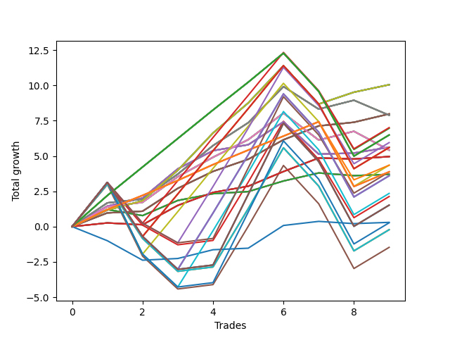

# Long Wallace 016 
- Symbol: NVDA_Unlimited
- Date Range: 02/08/2022 - 07/08/2022
- Trading Period: 7:20-12:30
- Number of Trades: 9



| Name | Win Percent | Profit | Avg Profit / Trade | Avg Time / Trade |      | Name | Win Percent | Profit | Avg Profit / Trade | Avg Time / Trade |
| ---- | ----------- | ------ | ------------------ | ---------------- | ---- | ---- | ----------- | ------ | ------------------ | ---------------- |
| Sorted By <br> Profit | | | | | | Sorted By <br> Win Percentage ||||
| Seventy | 88.89 | 5025.00 | 558.33 | 99:13 |     | Sixty-Seven | 100.00 | 3990.00 | 443.33 | 21:17 |
| Sixty-Two | 88.89 | 5025.00 | 558.33 | 99:13 |     | Fifty-Nine | 100.00 | 3990.00 | 443.33 | 21:17 |
| Fifty-Four | 88.89 | 5025.00 | 558.33 | 99:13 |     | Fifty-One | 100.00 | 3990.00 | 443.33 | 21:17 |
| Forty-Six | 88.89 | 5025.00 | 558.33 | 99:13 |     | Forty-Three | 100.00 | 3990.00 | 443.33 | 21:17 |
| Six | 88.89 | 5025.00 | 558.33 | 99:13 |     | Three | 100.00 | 3990.00 | 443.33 | 21:17 |
| Sixty-Seven | 100.00 | 3990.00 | 443.33 | 21:17 |     | Seventy | 88.89 | 5025.00 | 558.33 | 99:13 |
| Fifty-Nine | 100.00 | 3990.00 | 443.33 | 21:17 |     | Sixty-Two | 88.89 | 5025.00 | 558.33 | 99:13 |
| Fifty-One | 100.00 | 3990.00 | 443.33 | 21:17 |     | Fifty-Four | 88.89 | 5025.00 | 558.33 | 99:13 |
| Forty-Three | 100.00 | 3990.00 | 443.33 | 21:17 |     | Forty-Six | 88.89 | 5025.00 | 558.33 | 99:13 |
| Three | 100.00 | 3990.00 | 443.33 | 21:17 |     | Six | 88.89 | 5025.00 | 558.33 | 99:13 |
| Sixty-Nine | 77.78 | 3945.00 | 438.33 | 69:11 |     | Sixty-Six | 88.89 | 2810.00 | 312.22 | 30:54 |
| Sixty-One | 77.78 | 3945.00 | 438.33 | 69:11 |     | Fifty-Eight | 88.89 | 2810.00 | 312.22 | 30:54 |
| Fifty-Three | 77.78 | 3945.00 | 438.33 | 69:11 |     | Fifty | 88.89 | 2810.00 | 312.22 | 30:54 |
| Forty-Five | 77.78 | 3945.00 | 438.33 | 69:11 |     | Forty-Two | 88.89 | 2810.00 | 312.22 | 30:54 |
| Five | 77.78 | 3945.00 | 438.33 | 69:11 |     | Two | 88.89 | 2810.00 | 312.22 | 30:54 |
| One Hundred Eighteen | 66.67 | 3505.00 | 389.44 | 144:55 |     | One Hundred Sixteen | 88.89 | 2175.00 | 241.67 | 69:46 |
| One Hundred Seventeen | 77.78 | 3480.00 | 386.67 | 116:42 |     | One Hundred Twenty-Six | 88.89 | 1940.00 | 215.56 | 71:46 |
| One Hundred Twenty-Seven | 77.78 | 3245.00 | 360.56 | 118:42 |     | One Hundred Twenty-One | 88.89 | 1940.00 | 215.56 | 71:46 |
| One Hundred Twenty-Two | 77.78 | 3245.00 | 360.56 | 118:42 |     | One Hundred Eleven | 88.89 | 1940.00 | 215.56 | 71:46 |
| One Hundred Twelve | 77.78 | 3245.00 | 360.56 | 118:42 |     | Eighty-One | 88.89 | 1940.00 | 215.56 | 71:46 |
| Eighty-Two | 77.78 | 3245.00 | 360.56 | 118:42 |     | Sixty-Nine | 77.78 | 3945.00 | 438.33 | 69:11 |
| One Hundred Ninteen | 55.56 | 2975.00 | 330.56 | 165:47 |     | Sixty-One | 77.78 | 3945.00 | 438.33 | 69:11 |
| Sixty-Six | 88.89 | 2810.00 | 312.22 | 30:54 |     | Fifty-Three | 77.78 | 3945.00 | 438.33 | 69:11 |
| Fifty-Eight | 88.89 | 2810.00 | 312.22 | 30:54 |     | Forty-Five | 77.78 | 3945.00 | 438.33 | 69:11 |
| Fifty | 88.89 | 2810.00 | 312.22 | 30:54 |     | Five | 77.78 | 3945.00 | 438.33 | 69:11 |
| Forty-Two | 88.89 | 2810.00 | 312.22 | 30:54 |     | One Hundred Seventeen | 77.78 | 3480.00 | 386.67 | 116:42 |
| Two | 88.89 | 2810.00 | 312.22 | 30:54 |     | One Hundred Twenty-Seven | 77.78 | 3245.00 | 360.56 | 118:42 |
| One Hundred Twenty-Eight | 66.67 | 2800.00 | 311.11 | 156:05 |     | One Hundred Twenty-Two | 77.78 | 3245.00 | 360.56 | 118:42 |
| One Hundred Twenty-Three | 66.67 | 2800.00 | 311.11 | 156:05 |     | One Hundred Twelve | 77.78 | 3245.00 | 360.56 | 118:42 |
| Eighty-Three | 66.67 | 2800.00 | 311.11 | 156:05 |     | Eighty-Two | 77.78 | 3245.00 | 360.56 | 118:42 |
| Sixty-Eight | 77.78 | 2710.00 | 301.11 | 50:57 |     | Sixty-Eight | 77.78 | 2710.00 | 301.11 | 50:57 |
| Sixty | 77.78 | 2710.00 | 301.11 | 50:57 |     | Sixty | 77.78 | 2710.00 | 301.11 | 50:57 |
| Fifty-Two | 77.78 | 2710.00 | 301.11 | 50:57 |     | Fifty-Two | 77.78 | 2710.00 | 301.11 | 50:57 |
| Forty-Four | 77.78 | 2710.00 | 301.11 | 50:57 |     | Forty-Four | 77.78 | 2710.00 | 301.11 | 50:57 |
| Four | 77.78 | 2710.00 | 301.11 | 50:57 |     | Four | 77.78 | 2710.00 | 301.11 | 50:57 |
| Sixty-Five | 77.78 | 2480.00 | 275.56 | 13:11 |     | Sixty-Five | 77.78 | 2480.00 | 275.56 | 13:11 |
| Fifty-Seven | 77.78 | 2480.00 | 275.56 | 13:11 |     | Fifty-Seven | 77.78 | 2480.00 | 275.56 | 13:11 |
| Forty-Nine | 77.78 | 2480.00 | 275.56 | 13:11 |     | Forty-Nine | 77.78 | 2480.00 | 275.56 | 13:11 |
| Forty-One | 77.78 | 2480.00 | 275.56 | 13:11 |     | Forty-One | 77.78 | 2480.00 | 275.56 | 13:11 |
| One | 77.78 | 2480.00 | 275.56 | 13:11 |     | One | 77.78 | 2480.00 | 275.56 | 13:11 |
| One Hundred Sixteen | 88.89 | 2175.00 | 241.67 | 69:46 |     | Sixty-Four | 77.78 | 1850.00 | 205.56 | 08:17 |
| One Hundred Thirteen | 66.67 | 2175.00 | 241.67 | 153:11 |     | Fifty-Six | 77.78 | 1850.00 | 205.56 | 08:17 |
| One Hundred Twenty-Six | 88.89 | 1940.00 | 215.56 | 71:46 |     | Forty-Eight | 77.78 | 1850.00 | 205.56 | 08:17 |
| One Hundred Twenty-One | 88.89 | 1940.00 | 215.56 | 71:46 |     | Forty | 77.78 | 1850.00 | 205.56 | 08:17 |
| One Hundred Eleven | 88.89 | 1940.00 | 215.56 | 71:46 |     | Zero | 77.78 | 1850.00 | 205.56 | 08:17 |
| Eighty-One | 88.89 | 1940.00 | 215.56 | 71:46 |     | One Hundred Eighteen | 66.67 | 3505.00 | 389.44 | 144:55 |
| One Hundred Twenty | 55.56 | 1935.00 | 215.00 | 172:56 |     | One Hundred Twenty-Eight | 66.67 | 2800.00 | 311.11 | 156:05 |
| Sixty-Four | 77.78 | 1850.00 | 205.56 | 08:17 |     | One Hundred Twenty-Three | 66.67 | 2800.00 | 311.11 | 156:05 |
| Fifty-Six | 77.78 | 1850.00 | 205.56 | 08:17 |     | Eighty-Three | 66.67 | 2800.00 | 311.11 | 156:05 |
| Forty-Eight | 77.78 | 1850.00 | 205.56 | 08:17 |     | One Hundred Thirteen | 66.67 | 2175.00 | 241.67 | 153:11 |
| Forty | 77.78 | 1850.00 | 205.56 | 08:17 |     | Seventy-Three | 66.67 | 150.00 | 16.67 | 15:45 |
| Zero | 77.78 | 1850.00 | 205.56 | 08:17 |     | One Hundred Ninteen | 55.56 | 2975.00 | 330.56 | 165:47 |
| One Hundred Twenty-Nine | 55.56 | 1800.00 | 200.00 | 186:07 |     | One Hundred Twenty | 55.56 | 1935.00 | 215.00 | 172:56 |
| One Hundred Twenty-Four | 55.56 | 1800.00 | 200.00 | 186:07 |     | One Hundred Twenty-Nine | 55.56 | 1800.00 | 200.00 | 186:07 |
| Eighty-Four | 55.56 | 1800.00 | 200.00 | 186:07 |     | One Hundred Twenty-Four | 55.56 | 1800.00 | 200.00 | 186:07 |
| One Hundred Fourteen | 55.56 | 1175.00 | 130.56 | 183:13 |     | Eighty-Four | 55.56 | 1800.00 | 200.00 | 186:07 |
| Fifty-Five | 55.56 | 1065.00 | 118.33 | 168:13 |     | One Hundred Fourteen | 55.56 | 1175.00 | 130.56 | 183:13 |
| One Hundred Thirty | 55.56 | 760.00 | 84.44 | 193:16 |     | Fifty-Five | 55.56 | 1065.00 | 118.33 | 168:13 |
| One Hundred Twenty-Five | 55.56 | 760.00 | 84.44 | 193:16 |     | One Hundred Thirty | 55.56 | 760.00 | 84.44 | 193:16 |
| Eighty-Five | 55.56 | 760.00 | 84.44 | 193:16 |     | One Hundred Twenty-Five | 55.56 | 760.00 | 84.44 | 193:16 |
| Seventy-Three | 66.67 | 150.00 | 16.67 | 15:45 |     | Eighty-Five | 55.56 | 760.00 | 84.44 | 193:16 |
| One Hundred Fifteen | 55.56 | 135.00 | 15.00 | 190:22 |     | One Hundred Fifteen | 55.56 | 135.00 | 15.00 | 190:22 |
| Seventy-One | 55.56 | -110.00 | -12.22 | 188:33 |     | Seventy-One | 55.56 | -110.00 | -12.22 | 188:33 |
| Sixty-Three | 55.56 | -110.00 | -12.22 | 188:33 |     | Sixty-Three | 55.56 | -110.00 | -12.22 | 188:33 |
| Seven | 55.56 | -110.00 | -12.22 | 188:33 |     | Seven | 55.56 | -110.00 | -12.22 | 188:33 |
| Forty-Seven | 55.56 | -735.00 | -81.67 | 185:39 |     | Forty-Seven | 55.56 | -735.00 | -81.67 | 185:39 |

## NO STOPLOSS

### Test Zero
* Sell when price hits the middle line of the 20p bollinger
* No Stoploss
* Results:
```
Total Trades: 9
Percent Up: 77.78
Percent Down: 22.22
Total Points Moved Up: 3.70
Potential Profit: 1850.00
Total Points Ups: 4.32 Count Ups: 7
Total Points Downs: -0.62 Count Downs: 2
```

<details><summary>Trades</summary>

<code>In: 2022-02-25 10:59:00		Out: 2022-02-25 11:04:15		Total Position Time: 05:15		Total Move Up: 1.21		Total to Date: 1.21</code> <br />
<code>In: 2022-03-30 08:03:00		Out: 2022-03-30 08:15:05		Total Position Time: 12:05		Total Move Up: -0.43		Total to Date: 0.78</code> <br />
<code>In: 2022-03-30 08:11:00		Out: 2022-03-30 08:15:05		Total Position Time: 04:05		Total Move Up: 1.07		Total to Date: 1.85</code> <br />
<code>In: 2022-03-31 10:18:00		Out: 2022-03-31 10:26:30		Total Position Time: 08:30		Total Move Up: 0.48		Total to Date: 2.33</code> <br />
<code>In: 2022-04-18 09:25:00		Out: 2022-04-18 09:34:25		Total Position Time: 09:25		Total Move Up: 0.15		Total to Date: 2.48</code> <br />
<code>In: 2022-05-02 10:51:00		Out: 2022-05-02 10:55:45		Total Position Time: 04:45		Total Move Up: 0.75		Total to Date: 3.23</code> <br />
<code>In: 2022-06-08 08:11:00		Out: 2022-06-08 08:15:10		Total Position Time: 04:10		Total Move Up: 0.57		Total to Date: 3.80</code> <br />
<code>In: 2022-06-09 08:10:00		Out: 2022-06-09 08:25:00		Total Position Time: 15:00		Total Move Up: -0.19		Total to Date: 3.61</code> <br />
<code>In: 2022-06-23 09:07:00		Out: 2022-06-23 09:18:25		Total Position Time: 11:25		Total Move Up: 0.09		Total to Date: 3.70</code> <br />


</details>

### Test One
* Sell when the price hits the upper line of the 20p 1std bollinger
* No Stoploss
* Results:
```
Total Trades: 9
Percent Up: 77.78
Percent Down: 22.22
Total Points Moved Up: 4.96
Potential Profit: 2480.00
Total Points Ups: 5.16 Count Ups: 7
Total Points Downs: -0.20 Count Downs: 2
```

<details><summary>Trades</summary>

<code>In: 2022-02-25 10:59:00		Out: 2022-02-25 11:19:15		Total Position Time: 20:15		Total Move Up: 0.26		Total to Date: 0.26</code> <br />
<code>In: 2022-03-30 08:03:00		Out: 2022-03-30 08:19:20		Total Position Time: 16:20		Total Move Up: -0.13		Total to Date: 0.13</code> <br />
<code>In: 2022-03-30 08:11:00		Out: 2022-03-30 08:19:20		Total Position Time: 08:20		Total Move Up: 1.37		Total to Date: 1.50</code> <br />
<code>In: 2022-03-31 10:18:00		Out: 2022-03-31 10:29:20		Total Position Time: 11:20		Total Move Up: 0.92		Total to Date: 2.42</code> <br />
<code>In: 2022-04-18 09:25:00		Out: 2022-04-18 09:35:15		Total Position Time: 10:15		Total Move Up: 0.44		Total to Date: 2.86</code> <br />
<code>In: 2022-05-02 10:51:00		Out: 2022-05-02 10:58:25		Total Position Time: 07:25		Total Move Up: 1.04		Total to Date: 3.90</code> <br />
<code>In: 2022-06-08 08:11:00		Out: 2022-06-08 08:18:05		Total Position Time: 07:05		Total Move Up: 0.96		Total to Date: 4.86</code> <br />
<code>In: 2022-06-09 08:10:00		Out: 2022-06-09 08:33:25		Total Position Time: 23:25		Total Move Up: -0.07		Total to Date: 4.79</code> <br />
<code>In: 2022-06-23 09:07:00		Out: 2022-06-23 09:21:15		Total Position Time: 14:15		Total Move Up: 0.17		Total to Date: 4.96</code> <br />


</details>

### Test Two
* Sell when the price hits the upper line of the 20p 2std bollinger
* No Stoploss
* Results:
```
Total Trades: 9
Percent Up: 88.89
Percent Down: 11.11
Total Points Moved Up: 5.62
Potential Profit: 2810.00
Total Points Ups: 7.91 Count Ups: 8
Total Points Downs: -2.29 Count Downs: 1
```

<details><summary>Trades</summary>

<code>In: 2022-02-25 10:59:00		Out: 2022-02-25 11:25:30		Total Position Time: 26:30		Total Move Up: 1.45		Total to Date: 1.45</code> <br />
<code>In: 2022-03-30 08:03:00		Out: 2022-03-30 08:35:30		Total Position Time: 32:30		Total Move Up: 0.57		Total to Date: 2.02</code> <br />
<code>In: 2022-03-30 08:11:00		Out: 2022-03-30 08:35:30		Total Position Time: 24:30		Total Move Up: 2.07		Total to Date: 4.09</code> <br />
<code>In: 2022-03-31 10:18:00		Out: 2022-03-31 10:31:45		Total Position Time: 13:45		Total Move Up: 1.29		Total to Date: 5.38</code> <br />
<code>In: 2022-04-18 09:25:00		Out: 2022-04-18 09:42:45		Total Position Time: 17:45		Total Move Up: 0.42		Total to Date: 5.80</code> <br />
<code>In: 2022-05-02 10:51:00		Out: 2022-05-02 11:02:15		Total Position Time: 11:15		Total Move Up: 1.62		Total to Date: 7.42</code> <br />
<code>In: 2022-06-08 08:11:00		Out: 2022-06-08 09:57:05		Total Position Time: 106:05		Total Move Up: -2.29		Total to Date: 5.13</code> <br />
<code>In: 2022-06-09 08:10:00		Out: 2022-06-09 08:35:10		Total Position Time: 25:10		Total Move Up: 0.08		Total to Date: 5.21</code> <br />
<code>In: 2022-06-23 09:07:00		Out: 2022-06-23 09:27:40		Total Position Time: 20:40		Total Move Up: 0.41		Total to Date: 5.62</code> <br />


</details>

### Test Three
* Sell when price hits the middle line of the 50p bollinger
* No Stoploss
* Results:
```
Total Trades: 9
Percent Up: 100.00
Percent Down: 0.00
Total Points Moved Up: 7.98
Potential Profit: 3990.00
Total Points Ups: 7.98 Count Ups: 9
Total Points Downs: 0.00 Count Downs: 0
```

<details><summary>Trades</summary>

<code>In: 2022-02-25 10:59:00		Out: 2022-02-25 11:23:35		Total Position Time: 24:35		Total Move Up: 0.97		Total to Date: 0.97</code> <br />
<code>In: 2022-03-30 08:03:00		Out: 2022-03-30 08:35:00		Total Position Time: 32:00		Total Move Up: 0.12		Total to Date: 1.09</code> <br />
<code>In: 2022-03-30 08:11:00		Out: 2022-03-30 08:35:00		Total Position Time: 24:00		Total Move Up: 1.62		Total to Date: 2.71</code> <br />
<code>In: 2022-03-31 10:18:00		Out: 2022-03-31 10:29:50		Total Position Time: 11:50		Total Move Up: 1.20		Total to Date: 3.91</code> <br />
<code>In: 2022-04-18 09:25:00		Out: 2022-04-18 09:46:50		Total Position Time: 21:50		Total Move Up: 0.86		Total to Date: 4.77</code> <br />
<code>In: 2022-05-02 10:51:00		Out: 2022-05-02 10:59:55		Total Position Time: 08:55		Total Move Up: 1.38		Total to Date: 6.15</code> <br />
<code>In: 2022-06-08 08:11:00		Out: 2022-06-08 08:32:20		Total Position Time: 21:20		Total Move Up: 0.98		Total to Date: 7.13</code> <br />
<code>In: 2022-06-09 08:10:00		Out: 2022-06-09 08:36:05		Total Position Time: 26:05		Total Move Up: 0.26		Total to Date: 7.39</code> <br />
<code>In: 2022-06-23 09:07:00		Out: 2022-06-23 09:28:00		Total Position Time: 21:00		Total Move Up: 0.59		Total to Date: 7.98</code> <br />


</details>

### Test Four
* Sell when the price hits the upper line of the 50p 1std bollinger
* No Stoploss
* Results:
```
Total Trades: 9
Percent Up: 77.78
Percent Down: 22.22
Total Points Moved Up: 5.42
Potential Profit: 2710.00
Total Points Ups: 8.66 Count Ups: 7
Total Points Downs: -3.24 Count Downs: 2
```

<details><summary>Trades</summary>

<code>In: 2022-02-25 10:59:00		Out: 2022-02-25 11:40:10		Total Position Time: 41:10		Total Move Up: 1.41		Total to Date: 1.41</code> <br />
<code>In: 2022-03-30 08:03:00		Out: 2022-03-30 08:46:05		Total Position Time: 43:05		Total Move Up: 0.31		Total to Date: 1.72</code> <br />
<code>In: 2022-03-30 08:11:00		Out: 2022-03-30 08:46:05		Total Position Time: 35:05		Total Move Up: 1.81		Total to Date: 3.53</code> <br />
<code>In: 2022-03-31 10:18:00		Out: 2022-03-31 10:50:20		Total Position Time: 32:20		Total Move Up: 1.38		Total to Date: 4.91</code> <br />
<code>In: 2022-04-18 09:25:00		Out: 2022-04-18 09:56:05		Total Position Time: 31:05		Total Move Up: 1.25		Total to Date: 6.16</code> <br />
<code>In: 2022-05-02 10:51:00		Out: 2022-05-02 11:02:25		Total Position Time: 11:25		Total Move Up: 1.88		Total to Date: 8.04</code> <br />
<code>In: 2022-06-08 08:11:00		Out: 2022-06-08 10:15:40		Total Position Time: 124:40		Total Move Up: -1.91		Total to Date: 6.13</code> <br />
<code>In: 2022-06-09 08:10:00		Out: 2022-06-09 08:43:15		Total Position Time: 33:15		Total Move Up: 0.62		Total to Date: 6.75</code> <br />
<code>In: 2022-06-23 09:07:00		Out: 2022-06-23 10:53:35		Total Position Time: 106:35		Total Move Up: -1.33		Total to Date: 5.42</code> <br />


</details>

### Test Five
* Sell when the price hits the upper line of the 50p 2std bollinger
* No Stoploss
* Results:
```
Total Trades: 9
Percent Up: 77.78
Percent Down: 22.22
Total Points Moved Up: 7.89
Potential Profit: 3945.00
Total Points Ups: 10.55 Count Ups: 7
Total Points Downs: -2.66 Count Downs: 2
```

<details><summary>Trades</summary>

<code>In: 2022-02-25 10:59:00		Out: 2022-02-25 12:15:55		Total Position Time: 76:55		Total Move Up: 1.68		Total to Date: 1.68</code> <br />
<code>In: 2022-03-30 08:03:00		Out: 2022-03-30 09:34:25		Total Position Time: 91:25		Total Move Up: 0.27		Total to Date: 1.95</code> <br />
<code>In: 2022-03-30 08:11:00		Out: 2022-03-30 09:34:25		Total Position Time: 83:25		Total Move Up: 1.77		Total to Date: 3.72</code> <br />
<code>In: 2022-03-31 10:18:00		Out: 2022-03-31 10:51:30		Total Position Time: 33:30		Total Move Up: 2.02		Total to Date: 5.74</code> <br />
<code>In: 2022-04-18 09:25:00		Out: 2022-04-18 09:59:15		Total Position Time: 34:15		Total Move Up: 1.62		Total to Date: 7.36</code> <br />
<code>In: 2022-05-02 10:51:00		Out: 2022-05-02 11:05:00		Total Position Time: 14:00		Total Move Up: 2.56		Total to Date: 9.92</code> <br />
<code>In: 2022-06-08 08:11:00		Out: 2022-06-08 10:19:45		Total Position Time: 128:45		Total Move Up: -1.60		Total to Date: 8.32</code> <br />
<code>In: 2022-06-09 08:10:00		Out: 2022-06-09 09:01:25		Total Position Time: 51:25		Total Move Up: 0.63		Total to Date: 8.95</code> <br />
<code>In: 2022-06-23 09:07:00		Out: 2022-06-23 10:56:05		Total Position Time: 109:05		Total Move Up: -1.06		Total to Date: 7.89</code> <br />


</details>

### Test Six
* Sell when the price hits the middle line of the 1std VWAP
* No Stoploss
* Results:
```
Total Trades: 9
Percent Up: 88.89
Percent Down: 11.11
Total Points Moved Up: 10.05
Potential Profit: 5025.00
Total Points Ups: 12.76 Count Ups: 8
Total Points Downs: -2.71 Count Downs: 1
```

<details><summary>Trades</summary>

<code>In: 2022-02-25 10:59:00		Out: 2022-02-25 11:24:30		Total Position Time: 25:30		Total Move Up: 1.17		Total to Date: 1.17</code> <br />
<code>In: 2022-03-30 08:03:00		Out: 2022-03-30 09:43:55		Total Position Time: 100:55		Total Move Up: 0.66		Total to Date: 1.83</code> <br />
<code>In: 2022-03-30 08:11:00		Out: 2022-03-30 09:43:55		Total Position Time: 92:55		Total Move Up: 2.16		Total to Date: 3.99</code> <br />
<code>In: 2022-03-31 10:18:00		Out: 2022-03-31 11:20:55		Total Position Time: 62:55		Total Move Up: 2.64		Total to Date: 6.63</code> <br />
<code>In: 2022-04-18 09:25:00		Out: 2022-04-18 10:07:50		Total Position Time: 42:50		Total Move Up: 2.13		Total to Date: 8.76</code> <br />
<code>In: 2022-05-02 10:51:00		Out: 2022-05-02 11:45:50		Total Position Time: 54:50		Total Move Up: 2.63		Total to Date: 11.39</code> <br />
<code>In: 2022-06-08 08:11:00		Out: 2022-06-08 12:47:00		Total Position Time: 276:00		Total Move Up: -2.71		Total to Date: 8.68</code> <br />
<code>In: 2022-06-09 08:10:00		Out: 2022-06-09 08:43:50		Total Position Time: 33:50		Total Move Up: 0.84		Total to Date: 9.52</code> <br />
<code>In: 2022-06-23 09:07:00		Out: 2022-06-23 12:30:15		Total Position Time: 203:15		Total Move Up: 0.53		Total to Date: 10.05</code> <br />


</details>

### Test Seven
* Sell when the price hits the upper line of the 1std VWAP
* No Stoploss
* Results:
```
Total Trades: 9
Percent Up: 55.56
Percent Down: 44.44
Total Points Moved Up: -0.22
Potential Profit: -110.00
Total Points Ups: 13.24 Count Ups: 5
Total Points Downs: -13.46 Count Downs: 4
```

<details><summary>Trades</summary>

<code>In: 2022-02-25 10:59:00		Out: 2022-02-25 12:24:10		Total Position Time: 85:10		Total Move Up: 2.99		Total to Date: 2.99</code> <br />
<code>In: 2022-03-30 08:03:00		Out: 2022-03-30 12:47:00		Total Position Time: 284:00		Total Move Up: -3.83		Total to Date: -0.84</code> <br />
<code>In: 2022-03-30 08:11:00		Out: 2022-03-30 12:47:00		Total Position Time: 276:00		Total Move Up: -2.33		Total to Date: -3.17</code> <br />
<code>In: 2022-03-31 10:18:00		Out: 2022-03-31 12:47:00		Total Position Time: 149:00		Total Move Up: 0.31		Total to Date: -2.86</code> <br />
<code>In: 2022-04-18 09:25:00		Out: 2022-04-18 10:32:10		Total Position Time: 67:10		Total Move Up: 4.13		Total to Date: 1.27</code> <br />
<code>In: 2022-05-02 10:51:00		Out: 2022-05-02 11:53:40		Total Position Time: 62:40		Total Move Up: 4.31		Total to Date: 5.58</code> <br />
<code>In: 2022-06-08 08:11:00		Out: 2022-06-08 12:47:00		Total Position Time: 276:00		Total Move Up: -2.71		Total to Date: 2.87</code> <br />
<code>In: 2022-06-09 08:10:00		Out: 2022-06-09 12:47:00		Total Position Time: 277:00		Total Move Up: -4.59		Total to Date: -1.72</code> <br />
<code>In: 2022-06-23 09:07:00		Out: 2022-06-23 12:47:00		Total Position Time: 220:00		Total Move Up: 1.50		Total to Date: -0.22</code> <br />


</details>

## STOPLOSS OF 5

### Test Forty
* Sell when price hits the middle line of the 20p bollinger
* Stoploss is 5 points
* Results:
```
Total Trades: 9
Percent Up: 77.78
Percent Down: 22.22
Total Points Moved Up: 3.70
Potential Profit: 1850.00
Total Points Ups: 4.32 Count Ups: 7
Total Points Downs: -0.62 Count Downs: 2
```

<details><summary>Trades</summary>

<code>In: 2022-02-25 10:59:00		Out: 2022-02-25 11:04:15		Total Position Time: 05:15		Total Move Up: 1.21		Total to Date: 1.21</code> <br />
<code>In: 2022-03-30 08:03:00		Out: 2022-03-30 08:15:05		Total Position Time: 12:05		Total Move Up: -0.43		Total to Date: 0.78</code> <br />
<code>In: 2022-03-30 08:11:00		Out: 2022-03-30 08:15:05		Total Position Time: 04:05		Total Move Up: 1.07		Total to Date: 1.85</code> <br />
<code>In: 2022-03-31 10:18:00		Out: 2022-03-31 10:26:30		Total Position Time: 08:30		Total Move Up: 0.48		Total to Date: 2.33</code> <br />
<code>In: 2022-04-18 09:25:00		Out: 2022-04-18 09:34:25		Total Position Time: 09:25		Total Move Up: 0.15		Total to Date: 2.48</code> <br />
<code>In: 2022-05-02 10:51:00		Out: 2022-05-02 10:55:45		Total Position Time: 04:45		Total Move Up: 0.75		Total to Date: 3.23</code> <br />
<code>In: 2022-06-08 08:11:00		Out: 2022-06-08 08:15:10		Total Position Time: 04:10		Total Move Up: 0.57		Total to Date: 3.80</code> <br />
<code>In: 2022-06-09 08:10:00		Out: 2022-06-09 08:25:00		Total Position Time: 15:00		Total Move Up: -0.19		Total to Date: 3.61</code> <br />
<code>In: 2022-06-23 09:07:00		Out: 2022-06-23 09:18:25		Total Position Time: 11:25		Total Move Up: 0.09		Total to Date: 3.70</code> <br />


</details>

### Test Forty-One
* Sell when the price hits the upper line of the 20p 1std bollinger
* Stoploss is 5 points
* Results:
```
Total Trades: 9
Percent Up: 77.78
Percent Down: 22.22
Total Points Moved Up: 4.96
Potential Profit: 2480.00
Total Points Ups: 5.16 Count Ups: 7
Total Points Downs: -0.20 Count Downs: 2
```

<details><summary>Trades</summary>

<code>In: 2022-02-25 10:59:00		Out: 2022-02-25 11:19:15		Total Position Time: 20:15		Total Move Up: 0.26		Total to Date: 0.26</code> <br />
<code>In: 2022-03-30 08:03:00		Out: 2022-03-30 08:19:20		Total Position Time: 16:20		Total Move Up: -0.13		Total to Date: 0.13</code> <br />
<code>In: 2022-03-30 08:11:00		Out: 2022-03-30 08:19:20		Total Position Time: 08:20		Total Move Up: 1.37		Total to Date: 1.50</code> <br />
<code>In: 2022-03-31 10:18:00		Out: 2022-03-31 10:29:20		Total Position Time: 11:20		Total Move Up: 0.92		Total to Date: 2.42</code> <br />
<code>In: 2022-04-18 09:25:00		Out: 2022-04-18 09:35:15		Total Position Time: 10:15		Total Move Up: 0.44		Total to Date: 2.86</code> <br />
<code>In: 2022-05-02 10:51:00		Out: 2022-05-02 10:58:25		Total Position Time: 07:25		Total Move Up: 1.04		Total to Date: 3.90</code> <br />
<code>In: 2022-06-08 08:11:00		Out: 2022-06-08 08:18:05		Total Position Time: 07:05		Total Move Up: 0.96		Total to Date: 4.86</code> <br />
<code>In: 2022-06-09 08:10:00		Out: 2022-06-09 08:33:25		Total Position Time: 23:25		Total Move Up: -0.07		Total to Date: 4.79</code> <br />
<code>In: 2022-06-23 09:07:00		Out: 2022-06-23 09:21:15		Total Position Time: 14:15		Total Move Up: 0.17		Total to Date: 4.96</code> <br />


</details>

### Test Forty-Two
* Sell when the price hits the upper line of the 20p 2std bollinger
* Stoploss is 5 points
* Results:
```
Total Trades: 9
Percent Up: 88.89
Percent Down: 11.11
Total Points Moved Up: 5.62
Potential Profit: 2810.00
Total Points Ups: 7.91 Count Ups: 8
Total Points Downs: -2.29 Count Downs: 1
```

<details><summary>Trades</summary>

<code>In: 2022-02-25 10:59:00		Out: 2022-02-25 11:25:30		Total Position Time: 26:30		Total Move Up: 1.45		Total to Date: 1.45</code> <br />
<code>In: 2022-03-30 08:03:00		Out: 2022-03-30 08:35:30		Total Position Time: 32:30		Total Move Up: 0.57		Total to Date: 2.02</code> <br />
<code>In: 2022-03-30 08:11:00		Out: 2022-03-30 08:35:30		Total Position Time: 24:30		Total Move Up: 2.07		Total to Date: 4.09</code> <br />
<code>In: 2022-03-31 10:18:00		Out: 2022-03-31 10:31:45		Total Position Time: 13:45		Total Move Up: 1.29		Total to Date: 5.38</code> <br />
<code>In: 2022-04-18 09:25:00		Out: 2022-04-18 09:42:45		Total Position Time: 17:45		Total Move Up: 0.42		Total to Date: 5.80</code> <br />
<code>In: 2022-05-02 10:51:00		Out: 2022-05-02 11:02:15		Total Position Time: 11:15		Total Move Up: 1.62		Total to Date: 7.42</code> <br />
<code>In: 2022-06-08 08:11:00		Out: 2022-06-08 09:57:05		Total Position Time: 106:05		Total Move Up: -2.29		Total to Date: 5.13</code> <br />
<code>In: 2022-06-09 08:10:00		Out: 2022-06-09 08:35:10		Total Position Time: 25:10		Total Move Up: 0.08		Total to Date: 5.21</code> <br />
<code>In: 2022-06-23 09:07:00		Out: 2022-06-23 09:27:40		Total Position Time: 20:40		Total Move Up: 0.41		Total to Date: 5.62</code> <br />


</details>

### Test Forty-Three
* Sell when price hits the middle line of the 50p bollinger
* Stoploss is 5 points
* Results:
```
Total Trades: 9
Percent Up: 100.00
Percent Down: 0.00
Total Points Moved Up: 7.98
Potential Profit: 3990.00
Total Points Ups: 7.98 Count Ups: 9
Total Points Downs: 0.00 Count Downs: 0
```

<details><summary>Trades</summary>

<code>In: 2022-02-25 10:59:00		Out: 2022-02-25 11:23:35		Total Position Time: 24:35		Total Move Up: 0.97		Total to Date: 0.97</code> <br />
<code>In: 2022-03-30 08:03:00		Out: 2022-03-30 08:35:00		Total Position Time: 32:00		Total Move Up: 0.12		Total to Date: 1.09</code> <br />
<code>In: 2022-03-30 08:11:00		Out: 2022-03-30 08:35:00		Total Position Time: 24:00		Total Move Up: 1.62		Total to Date: 2.71</code> <br />
<code>In: 2022-03-31 10:18:00		Out: 2022-03-31 10:29:50		Total Position Time: 11:50		Total Move Up: 1.20		Total to Date: 3.91</code> <br />
<code>In: 2022-04-18 09:25:00		Out: 2022-04-18 09:46:50		Total Position Time: 21:50		Total Move Up: 0.86		Total to Date: 4.77</code> <br />
<code>In: 2022-05-02 10:51:00		Out: 2022-05-02 10:59:55		Total Position Time: 08:55		Total Move Up: 1.38		Total to Date: 6.15</code> <br />
<code>In: 2022-06-08 08:11:00		Out: 2022-06-08 08:32:20		Total Position Time: 21:20		Total Move Up: 0.98		Total to Date: 7.13</code> <br />
<code>In: 2022-06-09 08:10:00		Out: 2022-06-09 08:36:05		Total Position Time: 26:05		Total Move Up: 0.26		Total to Date: 7.39</code> <br />
<code>In: 2022-06-23 09:07:00		Out: 2022-06-23 09:28:00		Total Position Time: 21:00		Total Move Up: 0.59		Total to Date: 7.98</code> <br />


</details>

### Test Forty-Four
* Sell when the price hits the upper line of the 50p 1std bollinger
* Stoploss is 5 points
* Results:
```
Total Trades: 9
Percent Up: 77.78
Percent Down: 22.22
Total Points Moved Up: 5.42
Potential Profit: 2710.00
Total Points Ups: 8.66 Count Ups: 7
Total Points Downs: -3.24 Count Downs: 2
```

<details><summary>Trades</summary>

<code>In: 2022-02-25 10:59:00		Out: 2022-02-25 11:40:10		Total Position Time: 41:10		Total Move Up: 1.41		Total to Date: 1.41</code> <br />
<code>In: 2022-03-30 08:03:00		Out: 2022-03-30 08:46:05		Total Position Time: 43:05		Total Move Up: 0.31		Total to Date: 1.72</code> <br />
<code>In: 2022-03-30 08:11:00		Out: 2022-03-30 08:46:05		Total Position Time: 35:05		Total Move Up: 1.81		Total to Date: 3.53</code> <br />
<code>In: 2022-03-31 10:18:00		Out: 2022-03-31 10:50:20		Total Position Time: 32:20		Total Move Up: 1.38		Total to Date: 4.91</code> <br />
<code>In: 2022-04-18 09:25:00		Out: 2022-04-18 09:56:05		Total Position Time: 31:05		Total Move Up: 1.25		Total to Date: 6.16</code> <br />
<code>In: 2022-05-02 10:51:00		Out: 2022-05-02 11:02:25		Total Position Time: 11:25		Total Move Up: 1.88		Total to Date: 8.04</code> <br />
<code>In: 2022-06-08 08:11:00		Out: 2022-06-08 10:15:40		Total Position Time: 124:40		Total Move Up: -1.91		Total to Date: 6.13</code> <br />
<code>In: 2022-06-09 08:10:00		Out: 2022-06-09 08:43:15		Total Position Time: 33:15		Total Move Up: 0.62		Total to Date: 6.75</code> <br />
<code>In: 2022-06-23 09:07:00		Out: 2022-06-23 10:53:35		Total Position Time: 106:35		Total Move Up: -1.33		Total to Date: 5.42</code> <br />


</details>

### Test Forty-Five
* Sell when the price hits the upper line of the 50p 2std bollinger
* Stoploss is 5 points
* Results:
```
Total Trades: 9
Percent Up: 77.78
Percent Down: 22.22
Total Points Moved Up: 7.89
Potential Profit: 3945.00
Total Points Ups: 10.55 Count Ups: 7
Total Points Downs: -2.66 Count Downs: 2
```

<details><summary>Trades</summary>

<code>In: 2022-02-25 10:59:00		Out: 2022-02-25 12:15:55		Total Position Time: 76:55		Total Move Up: 1.68		Total to Date: 1.68</code> <br />
<code>In: 2022-03-30 08:03:00		Out: 2022-03-30 09:34:25		Total Position Time: 91:25		Total Move Up: 0.27		Total to Date: 1.95</code> <br />
<code>In: 2022-03-30 08:11:00		Out: 2022-03-30 09:34:25		Total Position Time: 83:25		Total Move Up: 1.77		Total to Date: 3.72</code> <br />
<code>In: 2022-03-31 10:18:00		Out: 2022-03-31 10:51:30		Total Position Time: 33:30		Total Move Up: 2.02		Total to Date: 5.74</code> <br />
<code>In: 2022-04-18 09:25:00		Out: 2022-04-18 09:59:15		Total Position Time: 34:15		Total Move Up: 1.62		Total to Date: 7.36</code> <br />
<code>In: 2022-05-02 10:51:00		Out: 2022-05-02 11:05:00		Total Position Time: 14:00		Total Move Up: 2.56		Total to Date: 9.92</code> <br />
<code>In: 2022-06-08 08:11:00		Out: 2022-06-08 10:19:45		Total Position Time: 128:45		Total Move Up: -1.60		Total to Date: 8.32</code> <br />
<code>In: 2022-06-09 08:10:00		Out: 2022-06-09 09:01:25		Total Position Time: 51:25		Total Move Up: 0.63		Total to Date: 8.95</code> <br />
<code>In: 2022-06-23 09:07:00		Out: 2022-06-23 10:56:05		Total Position Time: 109:05		Total Move Up: -1.06		Total to Date: 7.89</code> <br />


</details>

### Test Forty-Six
* Sell when the price hits the middle line of the 1std VWAP
* Stoploss is 5 points
* Results:
```
Total Trades: 9
Percent Up: 88.89
Percent Down: 11.11
Total Points Moved Up: 10.05
Potential Profit: 5025.00
Total Points Ups: 12.76 Count Ups: 8
Total Points Downs: -2.71 Count Downs: 1
```

<details><summary>Trades</summary>

<code>In: 2022-02-25 10:59:00		Out: 2022-02-25 11:24:30		Total Position Time: 25:30		Total Move Up: 1.17		Total to Date: 1.17</code> <br />
<code>In: 2022-03-30 08:03:00		Out: 2022-03-30 09:43:55		Total Position Time: 100:55		Total Move Up: 0.66		Total to Date: 1.83</code> <br />
<code>In: 2022-03-30 08:11:00		Out: 2022-03-30 09:43:55		Total Position Time: 92:55		Total Move Up: 2.16		Total to Date: 3.99</code> <br />
<code>In: 2022-03-31 10:18:00		Out: 2022-03-31 11:20:55		Total Position Time: 62:55		Total Move Up: 2.64		Total to Date: 6.63</code> <br />
<code>In: 2022-04-18 09:25:00		Out: 2022-04-18 10:07:50		Total Position Time: 42:50		Total Move Up: 2.13		Total to Date: 8.76</code> <br />
<code>In: 2022-05-02 10:51:00		Out: 2022-05-02 11:45:50		Total Position Time: 54:50		Total Move Up: 2.63		Total to Date: 11.39</code> <br />
<code>In: 2022-06-08 08:11:00		Out: 2022-06-08 12:47:00		Total Position Time: 276:00		Total Move Up: -2.71		Total to Date: 8.68</code> <br />
<code>In: 2022-06-09 08:10:00		Out: 2022-06-09 08:43:50		Total Position Time: 33:50		Total Move Up: 0.84		Total to Date: 9.52</code> <br />
<code>In: 2022-06-23 09:07:00		Out: 2022-06-23 12:30:15		Total Position Time: 203:15		Total Move Up: 0.53		Total to Date: 10.05</code> <br />


</details>

### Test Forty-Seven
* Sell when the price hits the upper line of the 1std VWAP
* Stoploss is 5 points
* Results:
```
Total Trades: 9
Percent Up: 55.56
Percent Down: 44.44
Total Points Moved Up: -1.47
Potential Profit: -735.00
Total Points Ups: 13.24 Count Ups: 5
Total Points Downs: -14.71 Count Downs: 4
```

<details><summary>Trades</summary>

<code>In: 2022-02-25 10:59:00		Out: 2022-02-25 12:24:10		Total Position Time: 85:10		Total Move Up: 2.99		Total to Date: 2.99</code> <br />
<code>In: 2022-03-30 08:03:00		Out: 2022-03-30 12:20:55		Total Position Time: 257:55		Total Move Up: -5.08		Total to Date: -2.09</code> <br />
<code>In: 2022-03-30 08:11:00		Out: 2022-03-30 12:47:00		Total Position Time: 276:00		Total Move Up: -2.33		Total to Date: -4.42</code> <br />
<code>In: 2022-03-31 10:18:00		Out: 2022-03-31 12:47:00		Total Position Time: 149:00		Total Move Up: 0.31		Total to Date: -4.11</code> <br />
<code>In: 2022-04-18 09:25:00		Out: 2022-04-18 10:32:10		Total Position Time: 67:10		Total Move Up: 4.13		Total to Date: 0.02</code> <br />
<code>In: 2022-05-02 10:51:00		Out: 2022-05-02 11:53:40		Total Position Time: 62:40		Total Move Up: 4.31		Total to Date: 4.33</code> <br />
<code>In: 2022-06-08 08:11:00		Out: 2022-06-08 12:47:00		Total Position Time: 276:00		Total Move Up: -2.71		Total to Date: 1.62</code> <br />
<code>In: 2022-06-09 08:10:00		Out: 2022-06-09 12:47:00		Total Position Time: 277:00		Total Move Up: -4.59		Total to Date: -2.97</code> <br />
<code>In: 2022-06-23 09:07:00		Out: 2022-06-23 12:47:00		Total Position Time: 220:00		Total Move Up: 1.50		Total to Date: -1.47</code> <br />


</details>

## TRAIL STOP OF 5

### Test Forty-Eight
* Sell when price hits the middle line of the 20p bollinger
* Trailing Stop is 5 points
* Results:
```
Total Trades: 9
Percent Up: 77.78
Percent Down: 22.22
Total Points Moved Up: 3.70
Potential Profit: 1850.00
Total Points Ups: 4.32 Count Ups: 7
Total Points Downs: -0.62 Count Downs: 2
```

<details><summary>Trades</summary>

<code>In: 2022-02-25 10:59:00		Out: 2022-02-25 11:04:15		Total Position Time: 05:15		Total Move Up: 1.21		Total to Date: 1.21</code> <br />
<code>In: 2022-03-30 08:03:00		Out: 2022-03-30 08:15:05		Total Position Time: 12:05		Total Move Up: -0.43		Total to Date: 0.78</code> <br />
<code>In: 2022-03-30 08:11:00		Out: 2022-03-30 08:15:05		Total Position Time: 04:05		Total Move Up: 1.07		Total to Date: 1.85</code> <br />
<code>In: 2022-03-31 10:18:00		Out: 2022-03-31 10:26:30		Total Position Time: 08:30		Total Move Up: 0.48		Total to Date: 2.33</code> <br />
<code>In: 2022-04-18 09:25:00		Out: 2022-04-18 09:34:25		Total Position Time: 09:25		Total Move Up: 0.15		Total to Date: 2.48</code> <br />
<code>In: 2022-05-02 10:51:00		Out: 2022-05-02 10:55:45		Total Position Time: 04:45		Total Move Up: 0.75		Total to Date: 3.23</code> <br />
<code>In: 2022-06-08 08:11:00		Out: 2022-06-08 08:15:10		Total Position Time: 04:10		Total Move Up: 0.57		Total to Date: 3.80</code> <br />
<code>In: 2022-06-09 08:10:00		Out: 2022-06-09 08:25:00		Total Position Time: 15:00		Total Move Up: -0.19		Total to Date: 3.61</code> <br />
<code>In: 2022-06-23 09:07:00		Out: 2022-06-23 09:18:25		Total Position Time: 11:25		Total Move Up: 0.09		Total to Date: 3.70</code> <br />


</details>

### Test Forty-Nine
* Sell when the price hits the upper line of the 20p 1std bollinger
* Trailing Stop is 5 points
* Results:
```
Total Trades: 9
Percent Up: 77.78
Percent Down: 22.22
Total Points Moved Up: 4.96
Potential Profit: 2480.00
Total Points Ups: 5.16 Count Ups: 7
Total Points Downs: -0.20 Count Downs: 2
```

<details><summary>Trades</summary>

<code>In: 2022-02-25 10:59:00		Out: 2022-02-25 11:19:15		Total Position Time: 20:15		Total Move Up: 0.26		Total to Date: 0.26</code> <br />
<code>In: 2022-03-30 08:03:00		Out: 2022-03-30 08:19:20		Total Position Time: 16:20		Total Move Up: -0.13		Total to Date: 0.13</code> <br />
<code>In: 2022-03-30 08:11:00		Out: 2022-03-30 08:19:20		Total Position Time: 08:20		Total Move Up: 1.37		Total to Date: 1.50</code> <br />
<code>In: 2022-03-31 10:18:00		Out: 2022-03-31 10:29:20		Total Position Time: 11:20		Total Move Up: 0.92		Total to Date: 2.42</code> <br />
<code>In: 2022-04-18 09:25:00		Out: 2022-04-18 09:35:15		Total Position Time: 10:15		Total Move Up: 0.44		Total to Date: 2.86</code> <br />
<code>In: 2022-05-02 10:51:00		Out: 2022-05-02 10:58:25		Total Position Time: 07:25		Total Move Up: 1.04		Total to Date: 3.90</code> <br />
<code>In: 2022-06-08 08:11:00		Out: 2022-06-08 08:18:05		Total Position Time: 07:05		Total Move Up: 0.96		Total to Date: 4.86</code> <br />
<code>In: 2022-06-09 08:10:00		Out: 2022-06-09 08:33:25		Total Position Time: 23:25		Total Move Up: -0.07		Total to Date: 4.79</code> <br />
<code>In: 2022-06-23 09:07:00		Out: 2022-06-23 09:21:15		Total Position Time: 14:15		Total Move Up: 0.17		Total to Date: 4.96</code> <br />


</details>

### Test Fifty
* Sell when the price hits the upper line of the 20p 2std bollinger
* Trailing Stop is 5 points
* Results:
```
Total Trades: 9
Percent Up: 88.89
Percent Down: 11.11
Total Points Moved Up: 5.62
Potential Profit: 2810.00
Total Points Ups: 7.91 Count Ups: 8
Total Points Downs: -2.29 Count Downs: 1
```

<details><summary>Trades</summary>

<code>In: 2022-02-25 10:59:00		Out: 2022-02-25 11:25:30		Total Position Time: 26:30		Total Move Up: 1.45		Total to Date: 1.45</code> <br />
<code>In: 2022-03-30 08:03:00		Out: 2022-03-30 08:35:30		Total Position Time: 32:30		Total Move Up: 0.57		Total to Date: 2.02</code> <br />
<code>In: 2022-03-30 08:11:00		Out: 2022-03-30 08:35:30		Total Position Time: 24:30		Total Move Up: 2.07		Total to Date: 4.09</code> <br />
<code>In: 2022-03-31 10:18:00		Out: 2022-03-31 10:31:45		Total Position Time: 13:45		Total Move Up: 1.29		Total to Date: 5.38</code> <br />
<code>In: 2022-04-18 09:25:00		Out: 2022-04-18 09:42:45		Total Position Time: 17:45		Total Move Up: 0.42		Total to Date: 5.80</code> <br />
<code>In: 2022-05-02 10:51:00		Out: 2022-05-02 11:02:15		Total Position Time: 11:15		Total Move Up: 1.62		Total to Date: 7.42</code> <br />
<code>In: 2022-06-08 08:11:00		Out: 2022-06-08 09:57:05		Total Position Time: 106:05		Total Move Up: -2.29		Total to Date: 5.13</code> <br />
<code>In: 2022-06-09 08:10:00		Out: 2022-06-09 08:35:10		Total Position Time: 25:10		Total Move Up: 0.08		Total to Date: 5.21</code> <br />
<code>In: 2022-06-23 09:07:00		Out: 2022-06-23 09:27:40		Total Position Time: 20:40		Total Move Up: 0.41		Total to Date: 5.62</code> <br />


</details>

### Test Fifty-One
* Sell when price hits the middle line of the 50p bollinger
* Trailing Stop is 5 points
* Results:
```
Total Trades: 9
Percent Up: 100.00
Percent Down: 0.00
Total Points Moved Up: 7.98
Potential Profit: 3990.00
Total Points Ups: 7.98 Count Ups: 9
Total Points Downs: 0.00 Count Downs: 0
```

<details><summary>Trades</summary>

<code>In: 2022-02-25 10:59:00		Out: 2022-02-25 11:23:35		Total Position Time: 24:35		Total Move Up: 0.97		Total to Date: 0.97</code> <br />
<code>In: 2022-03-30 08:03:00		Out: 2022-03-30 08:35:00		Total Position Time: 32:00		Total Move Up: 0.12		Total to Date: 1.09</code> <br />
<code>In: 2022-03-30 08:11:00		Out: 2022-03-30 08:35:00		Total Position Time: 24:00		Total Move Up: 1.62		Total to Date: 2.71</code> <br />
<code>In: 2022-03-31 10:18:00		Out: 2022-03-31 10:29:50		Total Position Time: 11:50		Total Move Up: 1.20		Total to Date: 3.91</code> <br />
<code>In: 2022-04-18 09:25:00		Out: 2022-04-18 09:46:50		Total Position Time: 21:50		Total Move Up: 0.86		Total to Date: 4.77</code> <br />
<code>In: 2022-05-02 10:51:00		Out: 2022-05-02 10:59:55		Total Position Time: 08:55		Total Move Up: 1.38		Total to Date: 6.15</code> <br />
<code>In: 2022-06-08 08:11:00		Out: 2022-06-08 08:32:20		Total Position Time: 21:20		Total Move Up: 0.98		Total to Date: 7.13</code> <br />
<code>In: 2022-06-09 08:10:00		Out: 2022-06-09 08:36:05		Total Position Time: 26:05		Total Move Up: 0.26		Total to Date: 7.39</code> <br />
<code>In: 2022-06-23 09:07:00		Out: 2022-06-23 09:28:00		Total Position Time: 21:00		Total Move Up: 0.59		Total to Date: 7.98</code> <br />


</details>

### Test Fifty-Two
* Sell when the price hits the upper line of the 50p 1std bollinger
* Trailing Stop is 5 points
* Results:
```
Total Trades: 9
Percent Up: 77.78
Percent Down: 22.22
Total Points Moved Up: 5.42
Potential Profit: 2710.00
Total Points Ups: 8.66 Count Ups: 7
Total Points Downs: -3.24 Count Downs: 2
```

<details><summary>Trades</summary>

<code>In: 2022-02-25 10:59:00		Out: 2022-02-25 11:40:10		Total Position Time: 41:10		Total Move Up: 1.41		Total to Date: 1.41</code> <br />
<code>In: 2022-03-30 08:03:00		Out: 2022-03-30 08:46:05		Total Position Time: 43:05		Total Move Up: 0.31		Total to Date: 1.72</code> <br />
<code>In: 2022-03-30 08:11:00		Out: 2022-03-30 08:46:05		Total Position Time: 35:05		Total Move Up: 1.81		Total to Date: 3.53</code> <br />
<code>In: 2022-03-31 10:18:00		Out: 2022-03-31 10:50:20		Total Position Time: 32:20		Total Move Up: 1.38		Total to Date: 4.91</code> <br />
<code>In: 2022-04-18 09:25:00		Out: 2022-04-18 09:56:05		Total Position Time: 31:05		Total Move Up: 1.25		Total to Date: 6.16</code> <br />
<code>In: 2022-05-02 10:51:00		Out: 2022-05-02 11:02:25		Total Position Time: 11:25		Total Move Up: 1.88		Total to Date: 8.04</code> <br />
<code>In: 2022-06-08 08:11:00		Out: 2022-06-08 10:15:40		Total Position Time: 124:40		Total Move Up: -1.91		Total to Date: 6.13</code> <br />
<code>In: 2022-06-09 08:10:00		Out: 2022-06-09 08:43:15		Total Position Time: 33:15		Total Move Up: 0.62		Total to Date: 6.75</code> <br />
<code>In: 2022-06-23 09:07:00		Out: 2022-06-23 10:53:35		Total Position Time: 106:35		Total Move Up: -1.33		Total to Date: 5.42</code> <br />


</details>

### Test Fifty-Three
* Sell when the price hits the upper line of the 50p 2std bollinger
* Trailing Stop is 5 points
* Results:
```
Total Trades: 9
Percent Up: 77.78
Percent Down: 22.22
Total Points Moved Up: 7.89
Potential Profit: 3945.00
Total Points Ups: 10.55 Count Ups: 7
Total Points Downs: -2.66 Count Downs: 2
```

<details><summary>Trades</summary>

<code>In: 2022-02-25 10:59:00		Out: 2022-02-25 12:15:55		Total Position Time: 76:55		Total Move Up: 1.68		Total to Date: 1.68</code> <br />
<code>In: 2022-03-30 08:03:00		Out: 2022-03-30 09:34:25		Total Position Time: 91:25		Total Move Up: 0.27		Total to Date: 1.95</code> <br />
<code>In: 2022-03-30 08:11:00		Out: 2022-03-30 09:34:25		Total Position Time: 83:25		Total Move Up: 1.77		Total to Date: 3.72</code> <br />
<code>In: 2022-03-31 10:18:00		Out: 2022-03-31 10:51:30		Total Position Time: 33:30		Total Move Up: 2.02		Total to Date: 5.74</code> <br />
<code>In: 2022-04-18 09:25:00		Out: 2022-04-18 09:59:15		Total Position Time: 34:15		Total Move Up: 1.62		Total to Date: 7.36</code> <br />
<code>In: 2022-05-02 10:51:00		Out: 2022-05-02 11:05:00		Total Position Time: 14:00		Total Move Up: 2.56		Total to Date: 9.92</code> <br />
<code>In: 2022-06-08 08:11:00		Out: 2022-06-08 10:19:45		Total Position Time: 128:45		Total Move Up: -1.60		Total to Date: 8.32</code> <br />
<code>In: 2022-06-09 08:10:00		Out: 2022-06-09 09:01:25		Total Position Time: 51:25		Total Move Up: 0.63		Total to Date: 8.95</code> <br />
<code>In: 2022-06-23 09:07:00		Out: 2022-06-23 10:56:05		Total Position Time: 109:05		Total Move Up: -1.06		Total to Date: 7.89</code> <br />


</details>

### Test Fifty-Four
* Sell when the price hits the middle line of the 1std VWAP
* Trailing Stop is 5 points
* Results:
```
Total Trades: 9
Percent Up: 88.89
Percent Down: 11.11
Total Points Moved Up: 10.05
Potential Profit: 5025.00
Total Points Ups: 12.76 Count Ups: 8
Total Points Downs: -2.71 Count Downs: 1
```

<details><summary>Trades</summary>

<code>In: 2022-02-25 10:59:00		Out: 2022-02-25 11:24:30		Total Position Time: 25:30		Total Move Up: 1.17		Total to Date: 1.17</code> <br />
<code>In: 2022-03-30 08:03:00		Out: 2022-03-30 09:43:55		Total Position Time: 100:55		Total Move Up: 0.66		Total to Date: 1.83</code> <br />
<code>In: 2022-03-30 08:11:00		Out: 2022-03-30 09:43:55		Total Position Time: 92:55		Total Move Up: 2.16		Total to Date: 3.99</code> <br />
<code>In: 2022-03-31 10:18:00		Out: 2022-03-31 11:20:55		Total Position Time: 62:55		Total Move Up: 2.64		Total to Date: 6.63</code> <br />
<code>In: 2022-04-18 09:25:00		Out: 2022-04-18 10:07:50		Total Position Time: 42:50		Total Move Up: 2.13		Total to Date: 8.76</code> <br />
<code>In: 2022-05-02 10:51:00		Out: 2022-05-02 11:45:50		Total Position Time: 54:50		Total Move Up: 2.63		Total to Date: 11.39</code> <br />
<code>In: 2022-06-08 08:11:00		Out: 2022-06-08 12:47:00		Total Position Time: 276:00		Total Move Up: -2.71		Total to Date: 8.68</code> <br />
<code>In: 2022-06-09 08:10:00		Out: 2022-06-09 08:43:50		Total Position Time: 33:50		Total Move Up: 0.84		Total to Date: 9.52</code> <br />
<code>In: 2022-06-23 09:07:00		Out: 2022-06-23 12:30:15		Total Position Time: 203:15		Total Move Up: 0.53		Total to Date: 10.05</code> <br />


</details>

### Test Fifty-Five
* Sell when the price hits the upper line of the 1std VWAP
* Trailing Stop is 5 points
* Results:
```
Total Trades: 9
Percent Up: 55.56
Percent Down: 44.44
Total Points Moved Up: 2.13
Potential Profit: 1065.00
Total Points Ups: 13.24 Count Ups: 5
Total Points Downs: -11.11 Count Downs: 4
```

<details><summary>Trades</summary>

<code>In: 2022-02-25 10:59:00		Out: 2022-02-25 12:24:10		Total Position Time: 85:10		Total Move Up: 2.99		Total to Date: 2.99</code> <br />
<code>In: 2022-03-30 08:03:00		Out: 2022-03-30 11:24:30		Total Position Time: 201:30		Total Move Up: -2.89		Total to Date: 0.10</code> <br />
<code>In: 2022-03-30 08:11:00		Out: 2022-03-30 11:24:30		Total Position Time: 193:30		Total Move Up: -1.39		Total to Date: -1.29</code> <br />
<code>In: 2022-03-31 10:18:00		Out: 2022-03-31 12:47:00		Total Position Time: 149:00		Total Move Up: 0.31		Total to Date: -0.98</code> <br />
<code>In: 2022-04-18 09:25:00		Out: 2022-04-18 10:32:10		Total Position Time: 67:10		Total Move Up: 4.13		Total to Date: 3.15</code> <br />
<code>In: 2022-05-02 10:51:00		Out: 2022-05-02 11:53:40		Total Position Time: 62:40		Total Move Up: 4.31		Total to Date: 7.46</code> <br />
<code>In: 2022-06-08 08:11:00		Out: 2022-06-08 12:47:00		Total Position Time: 276:00		Total Move Up: -2.71		Total to Date: 4.75</code> <br />
<code>In: 2022-06-09 08:10:00		Out: 2022-06-09 12:29:00		Total Position Time: 259:00		Total Move Up: -4.12		Total to Date: 0.63</code> <br />
<code>In: 2022-06-23 09:07:00		Out: 2022-06-23 12:47:00		Total Position Time: 220:00		Total Move Up: 1.50		Total to Date: 2.13</code> <br />


</details>

## STOPLOSS OF 10

### Test Fifty-Six
* Sell when price hits the middle line of the 20p bollinger
* Stoploss is 10 points
* Results:
```
Total Trades: 9
Percent Up: 77.78
Percent Down: 22.22
Total Points Moved Up: 3.70
Potential Profit: 1850.00
Total Points Ups: 4.32 Count Ups: 7
Total Points Downs: -0.62 Count Downs: 2
```

<details><summary>Trades</summary>

<code>In: 2022-02-25 10:59:00		Out: 2022-02-25 11:04:15		Total Position Time: 05:15		Total Move Up: 1.21		Total to Date: 1.21</code> <br />
<code>In: 2022-03-30 08:03:00		Out: 2022-03-30 08:15:05		Total Position Time: 12:05		Total Move Up: -0.43		Total to Date: 0.78</code> <br />
<code>In: 2022-03-30 08:11:00		Out: 2022-03-30 08:15:05		Total Position Time: 04:05		Total Move Up: 1.07		Total to Date: 1.85</code> <br />
<code>In: 2022-03-31 10:18:00		Out: 2022-03-31 10:26:30		Total Position Time: 08:30		Total Move Up: 0.48		Total to Date: 2.33</code> <br />
<code>In: 2022-04-18 09:25:00		Out: 2022-04-18 09:34:25		Total Position Time: 09:25		Total Move Up: 0.15		Total to Date: 2.48</code> <br />
<code>In: 2022-05-02 10:51:00		Out: 2022-05-02 10:55:45		Total Position Time: 04:45		Total Move Up: 0.75		Total to Date: 3.23</code> <br />
<code>In: 2022-06-08 08:11:00		Out: 2022-06-08 08:15:10		Total Position Time: 04:10		Total Move Up: 0.57		Total to Date: 3.80</code> <br />
<code>In: 2022-06-09 08:10:00		Out: 2022-06-09 08:25:00		Total Position Time: 15:00		Total Move Up: -0.19		Total to Date: 3.61</code> <br />
<code>In: 2022-06-23 09:07:00		Out: 2022-06-23 09:18:25		Total Position Time: 11:25		Total Move Up: 0.09		Total to Date: 3.70</code> <br />


</details>

### Test Fifty-Seven
* Sell when the price hits the upper line of the 20p 1std bollinger
* Stoploss is 10 points
* Results:
```
Total Trades: 9
Percent Up: 77.78
Percent Down: 22.22
Total Points Moved Up: 4.96
Potential Profit: 2480.00
Total Points Ups: 5.16 Count Ups: 7
Total Points Downs: -0.20 Count Downs: 2
```

<details><summary>Trades</summary>

<code>In: 2022-02-25 10:59:00		Out: 2022-02-25 11:19:15		Total Position Time: 20:15		Total Move Up: 0.26		Total to Date: 0.26</code> <br />
<code>In: 2022-03-30 08:03:00		Out: 2022-03-30 08:19:20		Total Position Time: 16:20		Total Move Up: -0.13		Total to Date: 0.13</code> <br />
<code>In: 2022-03-30 08:11:00		Out: 2022-03-30 08:19:20		Total Position Time: 08:20		Total Move Up: 1.37		Total to Date: 1.50</code> <br />
<code>In: 2022-03-31 10:18:00		Out: 2022-03-31 10:29:20		Total Position Time: 11:20		Total Move Up: 0.92		Total to Date: 2.42</code> <br />
<code>In: 2022-04-18 09:25:00		Out: 2022-04-18 09:35:15		Total Position Time: 10:15		Total Move Up: 0.44		Total to Date: 2.86</code> <br />
<code>In: 2022-05-02 10:51:00		Out: 2022-05-02 10:58:25		Total Position Time: 07:25		Total Move Up: 1.04		Total to Date: 3.90</code> <br />
<code>In: 2022-06-08 08:11:00		Out: 2022-06-08 08:18:05		Total Position Time: 07:05		Total Move Up: 0.96		Total to Date: 4.86</code> <br />
<code>In: 2022-06-09 08:10:00		Out: 2022-06-09 08:33:25		Total Position Time: 23:25		Total Move Up: -0.07		Total to Date: 4.79</code> <br />
<code>In: 2022-06-23 09:07:00		Out: 2022-06-23 09:21:15		Total Position Time: 14:15		Total Move Up: 0.17		Total to Date: 4.96</code> <br />


</details>

### Test Fifty-Eight
* Sell when the price hits the upper line of the 20p 2std bollinger
* Stoploss is 10 points
* Results:
```
Total Trades: 9
Percent Up: 88.89
Percent Down: 11.11
Total Points Moved Up: 5.62
Potential Profit: 2810.00
Total Points Ups: 7.91 Count Ups: 8
Total Points Downs: -2.29 Count Downs: 1
```

<details><summary>Trades</summary>

<code>In: 2022-02-25 10:59:00		Out: 2022-02-25 11:25:30		Total Position Time: 26:30		Total Move Up: 1.45		Total to Date: 1.45</code> <br />
<code>In: 2022-03-30 08:03:00		Out: 2022-03-30 08:35:30		Total Position Time: 32:30		Total Move Up: 0.57		Total to Date: 2.02</code> <br />
<code>In: 2022-03-30 08:11:00		Out: 2022-03-30 08:35:30		Total Position Time: 24:30		Total Move Up: 2.07		Total to Date: 4.09</code> <br />
<code>In: 2022-03-31 10:18:00		Out: 2022-03-31 10:31:45		Total Position Time: 13:45		Total Move Up: 1.29		Total to Date: 5.38</code> <br />
<code>In: 2022-04-18 09:25:00		Out: 2022-04-18 09:42:45		Total Position Time: 17:45		Total Move Up: 0.42		Total to Date: 5.80</code> <br />
<code>In: 2022-05-02 10:51:00		Out: 2022-05-02 11:02:15		Total Position Time: 11:15		Total Move Up: 1.62		Total to Date: 7.42</code> <br />
<code>In: 2022-06-08 08:11:00		Out: 2022-06-08 09:57:05		Total Position Time: 106:05		Total Move Up: -2.29		Total to Date: 5.13</code> <br />
<code>In: 2022-06-09 08:10:00		Out: 2022-06-09 08:35:10		Total Position Time: 25:10		Total Move Up: 0.08		Total to Date: 5.21</code> <br />
<code>In: 2022-06-23 09:07:00		Out: 2022-06-23 09:27:40		Total Position Time: 20:40		Total Move Up: 0.41		Total to Date: 5.62</code> <br />


</details>

### Test Fifty-Nine
* Sell when price hits the middle line of the 50p bollinger
* Stoploss is 10 points
* Results:
```
Total Trades: 9
Percent Up: 100.00
Percent Down: 0.00
Total Points Moved Up: 7.98
Potential Profit: 3990.00
Total Points Ups: 7.98 Count Ups: 9
Total Points Downs: 0.00 Count Downs: 0
```

<details><summary>Trades</summary>

<code>In: 2022-02-25 10:59:00		Out: 2022-02-25 11:23:35		Total Position Time: 24:35		Total Move Up: 0.97		Total to Date: 0.97</code> <br />
<code>In: 2022-03-30 08:03:00		Out: 2022-03-30 08:35:00		Total Position Time: 32:00		Total Move Up: 0.12		Total to Date: 1.09</code> <br />
<code>In: 2022-03-30 08:11:00		Out: 2022-03-30 08:35:00		Total Position Time: 24:00		Total Move Up: 1.62		Total to Date: 2.71</code> <br />
<code>In: 2022-03-31 10:18:00		Out: 2022-03-31 10:29:50		Total Position Time: 11:50		Total Move Up: 1.20		Total to Date: 3.91</code> <br />
<code>In: 2022-04-18 09:25:00		Out: 2022-04-18 09:46:50		Total Position Time: 21:50		Total Move Up: 0.86		Total to Date: 4.77</code> <br />
<code>In: 2022-05-02 10:51:00		Out: 2022-05-02 10:59:55		Total Position Time: 08:55		Total Move Up: 1.38		Total to Date: 6.15</code> <br />
<code>In: 2022-06-08 08:11:00		Out: 2022-06-08 08:32:20		Total Position Time: 21:20		Total Move Up: 0.98		Total to Date: 7.13</code> <br />
<code>In: 2022-06-09 08:10:00		Out: 2022-06-09 08:36:05		Total Position Time: 26:05		Total Move Up: 0.26		Total to Date: 7.39</code> <br />
<code>In: 2022-06-23 09:07:00		Out: 2022-06-23 09:28:00		Total Position Time: 21:00		Total Move Up: 0.59		Total to Date: 7.98</code> <br />


</details>

### Test Sixty
* Sell when the price hits the upper line of the 50p 1std bollinger
* Stoploss is 10 points
* Results:
```
Total Trades: 9
Percent Up: 77.78
Percent Down: 22.22
Total Points Moved Up: 5.42
Potential Profit: 2710.00
Total Points Ups: 8.66 Count Ups: 7
Total Points Downs: -3.24 Count Downs: 2
```

<details><summary>Trades</summary>

<code>In: 2022-02-25 10:59:00		Out: 2022-02-25 11:40:10		Total Position Time: 41:10		Total Move Up: 1.41		Total to Date: 1.41</code> <br />
<code>In: 2022-03-30 08:03:00		Out: 2022-03-30 08:46:05		Total Position Time: 43:05		Total Move Up: 0.31		Total to Date: 1.72</code> <br />
<code>In: 2022-03-30 08:11:00		Out: 2022-03-30 08:46:05		Total Position Time: 35:05		Total Move Up: 1.81		Total to Date: 3.53</code> <br />
<code>In: 2022-03-31 10:18:00		Out: 2022-03-31 10:50:20		Total Position Time: 32:20		Total Move Up: 1.38		Total to Date: 4.91</code> <br />
<code>In: 2022-04-18 09:25:00		Out: 2022-04-18 09:56:05		Total Position Time: 31:05		Total Move Up: 1.25		Total to Date: 6.16</code> <br />
<code>In: 2022-05-02 10:51:00		Out: 2022-05-02 11:02:25		Total Position Time: 11:25		Total Move Up: 1.88		Total to Date: 8.04</code> <br />
<code>In: 2022-06-08 08:11:00		Out: 2022-06-08 10:15:40		Total Position Time: 124:40		Total Move Up: -1.91		Total to Date: 6.13</code> <br />
<code>In: 2022-06-09 08:10:00		Out: 2022-06-09 08:43:15		Total Position Time: 33:15		Total Move Up: 0.62		Total to Date: 6.75</code> <br />
<code>In: 2022-06-23 09:07:00		Out: 2022-06-23 10:53:35		Total Position Time: 106:35		Total Move Up: -1.33		Total to Date: 5.42</code> <br />


</details>

### Test Sixty-One
* Sell when the price hits the upper line of the 50p 2std bollinger
* Stoploss is 10 points
* Results:
```
Total Trades: 9
Percent Up: 77.78
Percent Down: 22.22
Total Points Moved Up: 7.89
Potential Profit: 3945.00
Total Points Ups: 10.55 Count Ups: 7
Total Points Downs: -2.66 Count Downs: 2
```

<details><summary>Trades</summary>

<code>In: 2022-02-25 10:59:00		Out: 2022-02-25 12:15:55		Total Position Time: 76:55		Total Move Up: 1.68		Total to Date: 1.68</code> <br />
<code>In: 2022-03-30 08:03:00		Out: 2022-03-30 09:34:25		Total Position Time: 91:25		Total Move Up: 0.27		Total to Date: 1.95</code> <br />
<code>In: 2022-03-30 08:11:00		Out: 2022-03-30 09:34:25		Total Position Time: 83:25		Total Move Up: 1.77		Total to Date: 3.72</code> <br />
<code>In: 2022-03-31 10:18:00		Out: 2022-03-31 10:51:30		Total Position Time: 33:30		Total Move Up: 2.02		Total to Date: 5.74</code> <br />
<code>In: 2022-04-18 09:25:00		Out: 2022-04-18 09:59:15		Total Position Time: 34:15		Total Move Up: 1.62		Total to Date: 7.36</code> <br />
<code>In: 2022-05-02 10:51:00		Out: 2022-05-02 11:05:00		Total Position Time: 14:00		Total Move Up: 2.56		Total to Date: 9.92</code> <br />
<code>In: 2022-06-08 08:11:00		Out: 2022-06-08 10:19:45		Total Position Time: 128:45		Total Move Up: -1.60		Total to Date: 8.32</code> <br />
<code>In: 2022-06-09 08:10:00		Out: 2022-06-09 09:01:25		Total Position Time: 51:25		Total Move Up: 0.63		Total to Date: 8.95</code> <br />
<code>In: 2022-06-23 09:07:00		Out: 2022-06-23 10:56:05		Total Position Time: 109:05		Total Move Up: -1.06		Total to Date: 7.89</code> <br />


</details>

### Test Sixty-Two
* Sell when the price hits the middle line of the 1std VWAP
* Stoploss is 10 points
* Results:
```
Total Trades: 9
Percent Up: 88.89
Percent Down: 11.11
Total Points Moved Up: 10.05
Potential Profit: 5025.00
Total Points Ups: 12.76 Count Ups: 8
Total Points Downs: -2.71 Count Downs: 1
```

<details><summary>Trades</summary>

<code>In: 2022-02-25 10:59:00		Out: 2022-02-25 11:24:30		Total Position Time: 25:30		Total Move Up: 1.17		Total to Date: 1.17</code> <br />
<code>In: 2022-03-30 08:03:00		Out: 2022-03-30 09:43:55		Total Position Time: 100:55		Total Move Up: 0.66		Total to Date: 1.83</code> <br />
<code>In: 2022-03-30 08:11:00		Out: 2022-03-30 09:43:55		Total Position Time: 92:55		Total Move Up: 2.16		Total to Date: 3.99</code> <br />
<code>In: 2022-03-31 10:18:00		Out: 2022-03-31 11:20:55		Total Position Time: 62:55		Total Move Up: 2.64		Total to Date: 6.63</code> <br />
<code>In: 2022-04-18 09:25:00		Out: 2022-04-18 10:07:50		Total Position Time: 42:50		Total Move Up: 2.13		Total to Date: 8.76</code> <br />
<code>In: 2022-05-02 10:51:00		Out: 2022-05-02 11:45:50		Total Position Time: 54:50		Total Move Up: 2.63		Total to Date: 11.39</code> <br />
<code>In: 2022-06-08 08:11:00		Out: 2022-06-08 12:47:00		Total Position Time: 276:00		Total Move Up: -2.71		Total to Date: 8.68</code> <br />
<code>In: 2022-06-09 08:10:00		Out: 2022-06-09 08:43:50		Total Position Time: 33:50		Total Move Up: 0.84		Total to Date: 9.52</code> <br />
<code>In: 2022-06-23 09:07:00		Out: 2022-06-23 12:30:15		Total Position Time: 203:15		Total Move Up: 0.53		Total to Date: 10.05</code> <br />


</details>

### Test Sixty-Three
* Sell when the price hits the upper line of the 1std VWAP
* Stoploss is 10 points
* Results:
```
Total Trades: 9
Percent Up: 55.56
Percent Down: 44.44
Total Points Moved Up: -0.22
Potential Profit: -110.00
Total Points Ups: 13.24 Count Ups: 5
Total Points Downs: -13.46 Count Downs: 4
```

<details><summary>Trades</summary>

<code>In: 2022-02-25 10:59:00		Out: 2022-02-25 12:24:10		Total Position Time: 85:10		Total Move Up: 2.99		Total to Date: 2.99</code> <br />
<code>In: 2022-03-30 08:03:00		Out: 2022-03-30 12:47:00		Total Position Time: 284:00		Total Move Up: -3.83		Total to Date: -0.84</code> <br />
<code>In: 2022-03-30 08:11:00		Out: 2022-03-30 12:47:00		Total Position Time: 276:00		Total Move Up: -2.33		Total to Date: -3.17</code> <br />
<code>In: 2022-03-31 10:18:00		Out: 2022-03-31 12:47:00		Total Position Time: 149:00		Total Move Up: 0.31		Total to Date: -2.86</code> <br />
<code>In: 2022-04-18 09:25:00		Out: 2022-04-18 10:32:10		Total Position Time: 67:10		Total Move Up: 4.13		Total to Date: 1.27</code> <br />
<code>In: 2022-05-02 10:51:00		Out: 2022-05-02 11:53:40		Total Position Time: 62:40		Total Move Up: 4.31		Total to Date: 5.58</code> <br />
<code>In: 2022-06-08 08:11:00		Out: 2022-06-08 12:47:00		Total Position Time: 276:00		Total Move Up: -2.71		Total to Date: 2.87</code> <br />
<code>In: 2022-06-09 08:10:00		Out: 2022-06-09 12:47:00		Total Position Time: 277:00		Total Move Up: -4.59		Total to Date: -1.72</code> <br />
<code>In: 2022-06-23 09:07:00		Out: 2022-06-23 12:47:00		Total Position Time: 220:00		Total Move Up: 1.50		Total to Date: -0.22</code> <br />


</details>

## TRAIL STOP OF 10

### Test Sixty-Four
* Sell when price hits the middle line of the 20p bollinger
* Trailing Stop is 10 points
* Results:
```
Total Trades: 9
Percent Up: 77.78
Percent Down: 22.22
Total Points Moved Up: 3.70
Potential Profit: 1850.00
Total Points Ups: 4.32 Count Ups: 7
Total Points Downs: -0.62 Count Downs: 2
```

<details><summary>Trades</summary>

<code>In: 2022-02-25 10:59:00		Out: 2022-02-25 11:04:15		Total Position Time: 05:15		Total Move Up: 1.21		Total to Date: 1.21</code> <br />
<code>In: 2022-03-30 08:03:00		Out: 2022-03-30 08:15:05		Total Position Time: 12:05		Total Move Up: -0.43		Total to Date: 0.78</code> <br />
<code>In: 2022-03-30 08:11:00		Out: 2022-03-30 08:15:05		Total Position Time: 04:05		Total Move Up: 1.07		Total to Date: 1.85</code> <br />
<code>In: 2022-03-31 10:18:00		Out: 2022-03-31 10:26:30		Total Position Time: 08:30		Total Move Up: 0.48		Total to Date: 2.33</code> <br />
<code>In: 2022-04-18 09:25:00		Out: 2022-04-18 09:34:25		Total Position Time: 09:25		Total Move Up: 0.15		Total to Date: 2.48</code> <br />
<code>In: 2022-05-02 10:51:00		Out: 2022-05-02 10:55:45		Total Position Time: 04:45		Total Move Up: 0.75		Total to Date: 3.23</code> <br />
<code>In: 2022-06-08 08:11:00		Out: 2022-06-08 08:15:10		Total Position Time: 04:10		Total Move Up: 0.57		Total to Date: 3.80</code> <br />
<code>In: 2022-06-09 08:10:00		Out: 2022-06-09 08:25:00		Total Position Time: 15:00		Total Move Up: -0.19		Total to Date: 3.61</code> <br />
<code>In: 2022-06-23 09:07:00		Out: 2022-06-23 09:18:25		Total Position Time: 11:25		Total Move Up: 0.09		Total to Date: 3.70</code> <br />


</details>

### Test Sixty-Five
* Sell when the price hits the upper line of the 20p 1std bollinger
* Trailing Stop is 10 points
* Results:
```
Total Trades: 9
Percent Up: 77.78
Percent Down: 22.22
Total Points Moved Up: 4.96
Potential Profit: 2480.00
Total Points Ups: 5.16 Count Ups: 7
Total Points Downs: -0.20 Count Downs: 2
```

<details><summary>Trades</summary>

<code>In: 2022-02-25 10:59:00		Out: 2022-02-25 11:19:15		Total Position Time: 20:15		Total Move Up: 0.26		Total to Date: 0.26</code> <br />
<code>In: 2022-03-30 08:03:00		Out: 2022-03-30 08:19:20		Total Position Time: 16:20		Total Move Up: -0.13		Total to Date: 0.13</code> <br />
<code>In: 2022-03-30 08:11:00		Out: 2022-03-30 08:19:20		Total Position Time: 08:20		Total Move Up: 1.37		Total to Date: 1.50</code> <br />
<code>In: 2022-03-31 10:18:00		Out: 2022-03-31 10:29:20		Total Position Time: 11:20		Total Move Up: 0.92		Total to Date: 2.42</code> <br />
<code>In: 2022-04-18 09:25:00		Out: 2022-04-18 09:35:15		Total Position Time: 10:15		Total Move Up: 0.44		Total to Date: 2.86</code> <br />
<code>In: 2022-05-02 10:51:00		Out: 2022-05-02 10:58:25		Total Position Time: 07:25		Total Move Up: 1.04		Total to Date: 3.90</code> <br />
<code>In: 2022-06-08 08:11:00		Out: 2022-06-08 08:18:05		Total Position Time: 07:05		Total Move Up: 0.96		Total to Date: 4.86</code> <br />
<code>In: 2022-06-09 08:10:00		Out: 2022-06-09 08:33:25		Total Position Time: 23:25		Total Move Up: -0.07		Total to Date: 4.79</code> <br />
<code>In: 2022-06-23 09:07:00		Out: 2022-06-23 09:21:15		Total Position Time: 14:15		Total Move Up: 0.17		Total to Date: 4.96</code> <br />


</details>

### Test Sixty-Six
* Sell when the price hits the upper line of the 20p 2std bollinger
* Trailing Stop is 10 points
* Results:
```
Total Trades: 9
Percent Up: 88.89
Percent Down: 11.11
Total Points Moved Up: 5.62
Potential Profit: 2810.00
Total Points Ups: 7.91 Count Ups: 8
Total Points Downs: -2.29 Count Downs: 1
```

<details><summary>Trades</summary>

<code>In: 2022-02-25 10:59:00		Out: 2022-02-25 11:25:30		Total Position Time: 26:30		Total Move Up: 1.45		Total to Date: 1.45</code> <br />
<code>In: 2022-03-30 08:03:00		Out: 2022-03-30 08:35:30		Total Position Time: 32:30		Total Move Up: 0.57		Total to Date: 2.02</code> <br />
<code>In: 2022-03-30 08:11:00		Out: 2022-03-30 08:35:30		Total Position Time: 24:30		Total Move Up: 2.07		Total to Date: 4.09</code> <br />
<code>In: 2022-03-31 10:18:00		Out: 2022-03-31 10:31:45		Total Position Time: 13:45		Total Move Up: 1.29		Total to Date: 5.38</code> <br />
<code>In: 2022-04-18 09:25:00		Out: 2022-04-18 09:42:45		Total Position Time: 17:45		Total Move Up: 0.42		Total to Date: 5.80</code> <br />
<code>In: 2022-05-02 10:51:00		Out: 2022-05-02 11:02:15		Total Position Time: 11:15		Total Move Up: 1.62		Total to Date: 7.42</code> <br />
<code>In: 2022-06-08 08:11:00		Out: 2022-06-08 09:57:05		Total Position Time: 106:05		Total Move Up: -2.29		Total to Date: 5.13</code> <br />
<code>In: 2022-06-09 08:10:00		Out: 2022-06-09 08:35:10		Total Position Time: 25:10		Total Move Up: 0.08		Total to Date: 5.21</code> <br />
<code>In: 2022-06-23 09:07:00		Out: 2022-06-23 09:27:40		Total Position Time: 20:40		Total Move Up: 0.41		Total to Date: 5.62</code> <br />


</details>

### Test Sixty-Seven
* Sell when price hits the middle line of the 50p bollinger
* Trailing Stop is 10 points
* Results:
```
Total Trades: 9
Percent Up: 100.00
Percent Down: 0.00
Total Points Moved Up: 7.98
Potential Profit: 3990.00
Total Points Ups: 7.98 Count Ups: 9
Total Points Downs: 0.00 Count Downs: 0
```

<details><summary>Trades</summary>

<code>In: 2022-02-25 10:59:00		Out: 2022-02-25 11:23:35		Total Position Time: 24:35		Total Move Up: 0.97		Total to Date: 0.97</code> <br />
<code>In: 2022-03-30 08:03:00		Out: 2022-03-30 08:35:00		Total Position Time: 32:00		Total Move Up: 0.12		Total to Date: 1.09</code> <br />
<code>In: 2022-03-30 08:11:00		Out: 2022-03-30 08:35:00		Total Position Time: 24:00		Total Move Up: 1.62		Total to Date: 2.71</code> <br />
<code>In: 2022-03-31 10:18:00		Out: 2022-03-31 10:29:50		Total Position Time: 11:50		Total Move Up: 1.20		Total to Date: 3.91</code> <br />
<code>In: 2022-04-18 09:25:00		Out: 2022-04-18 09:46:50		Total Position Time: 21:50		Total Move Up: 0.86		Total to Date: 4.77</code> <br />
<code>In: 2022-05-02 10:51:00		Out: 2022-05-02 10:59:55		Total Position Time: 08:55		Total Move Up: 1.38		Total to Date: 6.15</code> <br />
<code>In: 2022-06-08 08:11:00		Out: 2022-06-08 08:32:20		Total Position Time: 21:20		Total Move Up: 0.98		Total to Date: 7.13</code> <br />
<code>In: 2022-06-09 08:10:00		Out: 2022-06-09 08:36:05		Total Position Time: 26:05		Total Move Up: 0.26		Total to Date: 7.39</code> <br />
<code>In: 2022-06-23 09:07:00		Out: 2022-06-23 09:28:00		Total Position Time: 21:00		Total Move Up: 0.59		Total to Date: 7.98</code> <br />


</details>

### Test Sixty-Eight
* Sell when the price hits the upper line of the 50p 1std bollinger
* Trailing Stop is 10 points
* Results:
```
Total Trades: 9
Percent Up: 77.78
Percent Down: 22.22
Total Points Moved Up: 5.42
Potential Profit: 2710.00
Total Points Ups: 8.66 Count Ups: 7
Total Points Downs: -3.24 Count Downs: 2
```

<details><summary>Trades</summary>

<code>In: 2022-02-25 10:59:00		Out: 2022-02-25 11:40:10		Total Position Time: 41:10		Total Move Up: 1.41		Total to Date: 1.41</code> <br />
<code>In: 2022-03-30 08:03:00		Out: 2022-03-30 08:46:05		Total Position Time: 43:05		Total Move Up: 0.31		Total to Date: 1.72</code> <br />
<code>In: 2022-03-30 08:11:00		Out: 2022-03-30 08:46:05		Total Position Time: 35:05		Total Move Up: 1.81		Total to Date: 3.53</code> <br />
<code>In: 2022-03-31 10:18:00		Out: 2022-03-31 10:50:20		Total Position Time: 32:20		Total Move Up: 1.38		Total to Date: 4.91</code> <br />
<code>In: 2022-04-18 09:25:00		Out: 2022-04-18 09:56:05		Total Position Time: 31:05		Total Move Up: 1.25		Total to Date: 6.16</code> <br />
<code>In: 2022-05-02 10:51:00		Out: 2022-05-02 11:02:25		Total Position Time: 11:25		Total Move Up: 1.88		Total to Date: 8.04</code> <br />
<code>In: 2022-06-08 08:11:00		Out: 2022-06-08 10:15:40		Total Position Time: 124:40		Total Move Up: -1.91		Total to Date: 6.13</code> <br />
<code>In: 2022-06-09 08:10:00		Out: 2022-06-09 08:43:15		Total Position Time: 33:15		Total Move Up: 0.62		Total to Date: 6.75</code> <br />
<code>In: 2022-06-23 09:07:00		Out: 2022-06-23 10:53:35		Total Position Time: 106:35		Total Move Up: -1.33		Total to Date: 5.42</code> <br />


</details>

### Test Sixty-Nine
* Sell when the price hits the upper line of the 50p 2std bollinger
* Trailing Stop is 10 points
* Results:
```
Total Trades: 9
Percent Up: 77.78
Percent Down: 22.22
Total Points Moved Up: 7.89
Potential Profit: 3945.00
Total Points Ups: 10.55 Count Ups: 7
Total Points Downs: -2.66 Count Downs: 2
```

<details><summary>Trades</summary>

<code>In: 2022-02-25 10:59:00		Out: 2022-02-25 12:15:55		Total Position Time: 76:55		Total Move Up: 1.68		Total to Date: 1.68</code> <br />
<code>In: 2022-03-30 08:03:00		Out: 2022-03-30 09:34:25		Total Position Time: 91:25		Total Move Up: 0.27		Total to Date: 1.95</code> <br />
<code>In: 2022-03-30 08:11:00		Out: 2022-03-30 09:34:25		Total Position Time: 83:25		Total Move Up: 1.77		Total to Date: 3.72</code> <br />
<code>In: 2022-03-31 10:18:00		Out: 2022-03-31 10:51:30		Total Position Time: 33:30		Total Move Up: 2.02		Total to Date: 5.74</code> <br />
<code>In: 2022-04-18 09:25:00		Out: 2022-04-18 09:59:15		Total Position Time: 34:15		Total Move Up: 1.62		Total to Date: 7.36</code> <br />
<code>In: 2022-05-02 10:51:00		Out: 2022-05-02 11:05:00		Total Position Time: 14:00		Total Move Up: 2.56		Total to Date: 9.92</code> <br />
<code>In: 2022-06-08 08:11:00		Out: 2022-06-08 10:19:45		Total Position Time: 128:45		Total Move Up: -1.60		Total to Date: 8.32</code> <br />
<code>In: 2022-06-09 08:10:00		Out: 2022-06-09 09:01:25		Total Position Time: 51:25		Total Move Up: 0.63		Total to Date: 8.95</code> <br />
<code>In: 2022-06-23 09:07:00		Out: 2022-06-23 10:56:05		Total Position Time: 109:05		Total Move Up: -1.06		Total to Date: 7.89</code> <br />


</details>

### Test Seventy
* Sell when the price hits the middle line of the 1std VWAP
* Trailing Stop is 10 points
* Results:
```
Total Trades: 9
Percent Up: 88.89
Percent Down: 11.11
Total Points Moved Up: 10.05
Potential Profit: 5025.00
Total Points Ups: 12.76 Count Ups: 8
Total Points Downs: -2.71 Count Downs: 1
```

<details><summary>Trades</summary>

<code>In: 2022-02-25 10:59:00		Out: 2022-02-25 11:24:30		Total Position Time: 25:30		Total Move Up: 1.17		Total to Date: 1.17</code> <br />
<code>In: 2022-03-30 08:03:00		Out: 2022-03-30 09:43:55		Total Position Time: 100:55		Total Move Up: 0.66		Total to Date: 1.83</code> <br />
<code>In: 2022-03-30 08:11:00		Out: 2022-03-30 09:43:55		Total Position Time: 92:55		Total Move Up: 2.16		Total to Date: 3.99</code> <br />
<code>In: 2022-03-31 10:18:00		Out: 2022-03-31 11:20:55		Total Position Time: 62:55		Total Move Up: 2.64		Total to Date: 6.63</code> <br />
<code>In: 2022-04-18 09:25:00		Out: 2022-04-18 10:07:50		Total Position Time: 42:50		Total Move Up: 2.13		Total to Date: 8.76</code> <br />
<code>In: 2022-05-02 10:51:00		Out: 2022-05-02 11:45:50		Total Position Time: 54:50		Total Move Up: 2.63		Total to Date: 11.39</code> <br />
<code>In: 2022-06-08 08:11:00		Out: 2022-06-08 12:47:00		Total Position Time: 276:00		Total Move Up: -2.71		Total to Date: 8.68</code> <br />
<code>In: 2022-06-09 08:10:00		Out: 2022-06-09 08:43:50		Total Position Time: 33:50		Total Move Up: 0.84		Total to Date: 9.52</code> <br />
<code>In: 2022-06-23 09:07:00		Out: 2022-06-23 12:30:15		Total Position Time: 203:15		Total Move Up: 0.53		Total to Date: 10.05</code> <br />


</details>

### Test Seventy-One
* Sell when the price hits the upper line of the 1std VWAP
* Trailing Stop is 10 points
* Results:
```
Total Trades: 9
Percent Up: 55.56
Percent Down: 44.44
Total Points Moved Up: -0.22
Potential Profit: -110.00
Total Points Ups: 13.24 Count Ups: 5
Total Points Downs: -13.46 Count Downs: 4
```

<details><summary>Trades</summary>

<code>In: 2022-02-25 10:59:00		Out: 2022-02-25 12:24:10		Total Position Time: 85:10		Total Move Up: 2.99		Total to Date: 2.99</code> <br />
<code>In: 2022-03-30 08:03:00		Out: 2022-03-30 12:47:00		Total Position Time: 284:00		Total Move Up: -3.83		Total to Date: -0.84</code> <br />
<code>In: 2022-03-30 08:11:00		Out: 2022-03-30 12:47:00		Total Position Time: 276:00		Total Move Up: -2.33		Total to Date: -3.17</code> <br />
<code>In: 2022-03-31 10:18:00		Out: 2022-03-31 12:47:00		Total Position Time: 149:00		Total Move Up: 0.31		Total to Date: -2.86</code> <br />
<code>In: 2022-04-18 09:25:00		Out: 2022-04-18 10:32:10		Total Position Time: 67:10		Total Move Up: 4.13		Total to Date: 1.27</code> <br />
<code>In: 2022-05-02 10:51:00		Out: 2022-05-02 11:53:40		Total Position Time: 62:40		Total Move Up: 4.31		Total to Date: 5.58</code> <br />
<code>In: 2022-06-08 08:11:00		Out: 2022-06-08 12:47:00		Total Position Time: 276:00		Total Move Up: -2.71		Total to Date: 2.87</code> <br />
<code>In: 2022-06-09 08:10:00		Out: 2022-06-09 12:47:00		Total Position Time: 277:00		Total Move Up: -4.59		Total to Date: -1.72</code> <br />
<code>In: 2022-06-23 09:07:00		Out: 2022-06-23 12:47:00		Total Position Time: 220:00		Total Move Up: 1.50		Total to Date: -0.22</code> <br />


</details>

## SPECIAL EXIT CONDITIONS 

### Test Seventy-Three
* Sell when the linear regression slope changes to negative
* No Stoploss
* Results:
```
Total Trades: 9
Percent Up: 66.67
Percent Down: 33.33
Total Points Moved Up: 0.30
Potential Profit: 150.00
Total Points Ups: 2.84 Count Ups: 6
Total Points Downs: -2.54 Count Downs: 3
```

<details><summary>Trades</summary>

<code>In: 2022-02-25 10:59:00		Out: 2022-02-25 11:09:05		Total Position Time: 10:05		Total Move Up: -1.00		Total to Date: -1.00</code> <br />
<code>In: 2022-03-30 08:03:00		Out: 2022-03-30 08:25:05		Total Position Time: 22:05		Total Move Up: -1.38		Total to Date: -2.38</code> <br />
<code>In: 2022-03-30 08:11:00		Out: 2022-03-30 08:25:05		Total Position Time: 14:05		Total Move Up: 0.12		Total to Date: -2.26</code> <br />
<code>In: 2022-03-31 10:18:00		Out: 2022-03-31 10:38:05		Total Position Time: 20:05		Total Move Up: 0.62		Total to Date: -1.64</code> <br />
<code>In: 2022-04-18 09:25:00		Out: 2022-04-18 09:42:05		Total Position Time: 17:05		Total Move Up: 0.11		Total to Date: -1.53</code> <br />
<code>In: 2022-05-02 10:51:00		Out: 2022-05-02 11:11:05		Total Position Time: 20:05		Total Move Up: 1.61		Total to Date: 0.08</code> <br />
<code>In: 2022-06-08 08:11:00		Out: 2022-06-08 08:25:05		Total Position Time: 14:05		Total Move Up: 0.29		Total to Date: 0.37</code> <br />
<code>In: 2022-06-09 08:10:00		Out: 2022-06-09 08:15:05		Total Position Time: 05:05		Total Move Up: -0.16		Total to Date: 0.21</code> <br />
<code>In: 2022-06-23 09:07:00		Out: 2022-06-23 09:26:05		Total Position Time: 19:05		Total Move Up: 0.09		Total to Date: 0.30</code> <br />


</details>

## TAKE PROFIT

### Test Eighty-One
* Take Profit of 1 Point
* No Stoploss
* Results:
```
Total Trades: 9
Percent Up: 88.89
Percent Down: 11.11
Total Points Moved Up: 3.88
Potential Profit: 1940.00
Total Points Ups: 8.47 Count Ups: 8
Total Points Downs: -4.59 Count Downs: 1
```

<details><summary>Trades</summary>

<code>In: 2022-02-25 10:59:00		Out: 2022-02-25 11:04:15		Total Position Time: 05:15		Total Move Up: 1.21		Total to Date: 1.21</code> <br />
<code>In: 2022-03-30 08:03:00		Out: 2022-03-30 09:44:05		Total Position Time: 101:05		Total Move Up: 1.00		Total to Date: 2.21</code> <br />
<code>In: 2022-03-30 08:11:00		Out: 2022-03-30 08:14:40		Total Position Time: 03:40		Total Move Up: 1.06		Total to Date: 3.27</code> <br />
<code>In: 2022-03-31 10:18:00		Out: 2022-03-31 10:29:40		Total Position Time: 11:40		Total Move Up: 1.12		Total to Date: 4.39</code> <br />
<code>In: 2022-04-18 09:25:00		Out: 2022-04-18 09:51:05		Total Position Time: 26:05		Total Move Up: 1.03		Total to Date: 5.42</code> <br />
<code>In: 2022-05-02 10:51:00		Out: 2022-05-02 10:58:20		Total Position Time: 07:20		Total Move Up: 0.99		Total to Date: 6.41</code> <br />
<code>In: 2022-06-08 08:11:00		Out: 2022-06-08 08:18:15		Total Position Time: 07:15		Total Move Up: 1.02		Total to Date: 7.43</code> <br />
<code>In: 2022-06-09 08:10:00		Out: 2022-06-09 12:47:00		Total Position Time: 277:00		Total Move Up: -4.59		Total to Date: 2.84</code> <br />
<code>In: 2022-06-23 09:07:00		Out: 2022-06-23 12:33:40		Total Position Time: 206:40		Total Move Up: 1.04		Total to Date: 3.88</code> <br />


</details>

### Test Eighty-Two
* Take Profit of 2 Point
* No Stoploss
* Results:
```
Total Trades: 9
Percent Up: 77.78
Percent Down: 22.22
Total Points Moved Up: 6.49
Potential Profit: 3245.00
Total Points Ups: 13.79 Count Ups: 7
Total Points Downs: -7.30 Count Downs: 2
```

<details><summary>Trades</summary>

<code>In: 2022-02-25 10:59:00		Out: 2022-02-25 12:16:30		Total Position Time: 77:30		Total Move Up: 2.20		Total to Date: 2.20</code> <br />
<code>In: 2022-03-30 08:03:00		Out: 2022-03-30 09:48:30		Total Position Time: 105:30		Total Move Up: 2.02		Total to Date: 4.22</code> <br />
<code>In: 2022-03-30 08:11:00		Out: 2022-03-30 08:35:20		Total Position Time: 24:20		Total Move Up: 2.02		Total to Date: 6.24</code> <br />
<code>In: 2022-03-31 10:18:00		Out: 2022-03-31 10:51:30		Total Position Time: 33:30		Total Move Up: 2.02		Total to Date: 8.26</code> <br />
<code>In: 2022-04-18 09:25:00		Out: 2022-04-18 10:07:35		Total Position Time: 42:35		Total Move Up: 1.97		Total to Date: 10.23</code> <br />
<code>In: 2022-05-02 10:51:00		Out: 2022-05-02 11:02:55		Total Position Time: 11:55		Total Move Up: 2.06		Total to Date: 12.29</code> <br />
<code>In: 2022-06-08 08:11:00		Out: 2022-06-08 12:47:00		Total Position Time: 276:00		Total Move Up: -2.71		Total to Date: 9.58</code> <br />
<code>In: 2022-06-09 08:10:00		Out: 2022-06-09 12:47:00		Total Position Time: 277:00		Total Move Up: -4.59		Total to Date: 4.99</code> <br />
<code>In: 2022-06-23 09:07:00		Out: 2022-06-23 12:47:00		Total Position Time: 220:00		Total Move Up: 1.50		Total to Date: 6.49</code> <br />


</details>

### Test Eighty-Three
* Take Profit of 3 Point
* No Stoploss
* Results:
```
Total Trades: 9
Percent Up: 66.67
Percent Down: 33.33
Total Points Moved Up: 5.60
Potential Profit: 2800.00
Total Points Ups: 16.73 Count Ups: 6
Total Points Downs: -11.13 Count Downs: 3
```

<details><summary>Trades</summary>

<code>In: 2022-02-25 10:59:00		Out: 2022-02-25 12:24:15		Total Position Time: 85:15		Total Move Up: 3.13		Total to Date: 3.13</code> <br />
<code>In: 2022-03-30 08:03:00		Out: 2022-03-30 12:47:00		Total Position Time: 284:00		Total Move Up: -3.83		Total to Date: -0.70</code> <br />
<code>In: 2022-03-30 08:11:00		Out: 2022-03-30 09:48:20		Total Position Time: 97:20		Total Move Up: 3.01		Total to Date: 2.31</code> <br />
<code>In: 2022-03-31 10:18:00		Out: 2022-03-31 11:22:40		Total Position Time: 64:40		Total Move Up: 3.06		Total to Date: 5.37</code> <br />
<code>In: 2022-04-18 09:25:00		Out: 2022-04-18 10:10:35		Total Position Time: 45:35		Total Move Up: 2.99		Total to Date: 8.36</code> <br />
<code>In: 2022-05-02 10:51:00		Out: 2022-05-02 11:45:55		Total Position Time: 54:55		Total Move Up: 3.04		Total to Date: 11.40</code> <br />
<code>In: 2022-06-08 08:11:00		Out: 2022-06-08 12:47:00		Total Position Time: 276:00		Total Move Up: -2.71		Total to Date: 8.69</code> <br />
<code>In: 2022-06-09 08:10:00		Out: 2022-06-09 12:47:00		Total Position Time: 277:00		Total Move Up: -4.59		Total to Date: 4.10</code> <br />
<code>In: 2022-06-23 09:07:00		Out: 2022-06-23 12:47:00		Total Position Time: 220:00		Total Move Up: 1.50		Total to Date: 5.60</code> <br />


</details>

### Test Eighty-Four
* Take Profit of 4 Point
* No Stoploss
* Results:
```
Total Trades: 9
Percent Up: 55.56
Percent Down: 44.44
Total Points Moved Up: 3.60
Potential Profit: 1800.00
Total Points Ups: 17.06 Count Ups: 5
Total Points Downs: -13.46 Count Downs: 4
```

<details><summary>Trades</summary>

<code>In: 2022-02-25 10:59:00		Out: 2022-02-25 12:47:00		Total Position Time: 108:00		Total Move Up: 3.13		Total to Date: 3.13</code> <br />
<code>In: 2022-03-30 08:03:00		Out: 2022-03-30 12:47:00		Total Position Time: 284:00		Total Move Up: -3.83		Total to Date: -0.70</code> <br />
<code>In: 2022-03-30 08:11:00		Out: 2022-03-30 12:47:00		Total Position Time: 276:00		Total Move Up: -2.33		Total to Date: -3.03</code> <br />
<code>In: 2022-03-31 10:18:00		Out: 2022-03-31 12:02:15		Total Position Time: 104:15		Total Move Up: 3.99		Total to Date: 0.96</code> <br />
<code>In: 2022-04-18 09:25:00		Out: 2022-04-18 10:32:10		Total Position Time: 67:10		Total Move Up: 4.13		Total to Date: 5.09</code> <br />
<code>In: 2022-05-02 10:51:00		Out: 2022-05-02 11:53:40		Total Position Time: 62:40		Total Move Up: 4.31		Total to Date: 9.40</code> <br />
<code>In: 2022-06-08 08:11:00		Out: 2022-06-08 12:47:00		Total Position Time: 276:00		Total Move Up: -2.71		Total to Date: 6.69</code> <br />
<code>In: 2022-06-09 08:10:00		Out: 2022-06-09 12:47:00		Total Position Time: 277:00		Total Move Up: -4.59		Total to Date: 2.10</code> <br />
<code>In: 2022-06-23 09:07:00		Out: 2022-06-23 12:47:00		Total Position Time: 220:00		Total Move Up: 1.50		Total to Date: 3.60</code> <br />


</details>

### Test Eighty-Five
* Take Profit of 5 Point
* No Stoploss
* Results:
```
Total Trades: 9
Percent Up: 55.56
Percent Down: 44.44
Total Points Moved Up: 1.52
Potential Profit: 760.00
Total Points Ups: 14.98 Count Ups: 5
Total Points Downs: -13.46 Count Downs: 4
```

<details><summary>Trades</summary>

<code>In: 2022-02-25 10:59:00		Out: 2022-02-25 12:47:00		Total Position Time: 108:00		Total Move Up: 3.13		Total to Date: 3.13</code> <br />
<code>In: 2022-03-30 08:03:00		Out: 2022-03-30 12:47:00		Total Position Time: 284:00		Total Move Up: -3.83		Total to Date: -0.70</code> <br />
<code>In: 2022-03-30 08:11:00		Out: 2022-03-30 12:47:00		Total Position Time: 276:00		Total Move Up: -2.33		Total to Date: -3.03</code> <br />
<code>In: 2022-03-31 10:18:00		Out: 2022-03-31 12:47:00		Total Position Time: 149:00		Total Move Up: 0.31		Total to Date: -2.72</code> <br />
<code>In: 2022-04-18 09:25:00		Out: 2022-04-18 10:35:00		Total Position Time: 70:00		Total Move Up: 5.00		Total to Date: 2.28</code> <br />
<code>In: 2022-05-02 10:51:00		Out: 2022-05-02 12:10:25		Total Position Time: 79:25		Total Move Up: 5.04		Total to Date: 7.32</code> <br />
<code>In: 2022-06-08 08:11:00		Out: 2022-06-08 12:47:00		Total Position Time: 276:00		Total Move Up: -2.71		Total to Date: 4.61</code> <br />
<code>In: 2022-06-09 08:10:00		Out: 2022-06-09 12:47:00		Total Position Time: 277:00		Total Move Up: -4.59		Total to Date: 0.02</code> <br />
<code>In: 2022-06-23 09:07:00		Out: 2022-06-23 12:47:00		Total Position Time: 220:00		Total Move Up: 1.50		Total to Date: 1.52</code> <br />


</details>

## TAKE PROFIT Stoploss of Five

### Test One Hundred Eleven
* Take Profit of 1 Point
* Stoploss is 5 points
* Results:
```
Total Trades: 9
Percent Up: 88.89
Percent Down: 11.11
Total Points Moved Up: 3.88
Potential Profit: 1940.00
Total Points Ups: 8.47 Count Ups: 8
Total Points Downs: -4.59 Count Downs: 1
```

<details><summary>Trades</summary>

<code>In: 2022-02-25 10:59:00		Out: 2022-02-25 11:04:15		Total Position Time: 05:15		Total Move Up: 1.21		Total to Date: 1.21</code> <br />
<code>In: 2022-03-30 08:03:00		Out: 2022-03-30 09:44:05		Total Position Time: 101:05		Total Move Up: 1.00		Total to Date: 2.21</code> <br />
<code>In: 2022-03-30 08:11:00		Out: 2022-03-30 08:14:40		Total Position Time: 03:40		Total Move Up: 1.06		Total to Date: 3.27</code> <br />
<code>In: 2022-03-31 10:18:00		Out: 2022-03-31 10:29:40		Total Position Time: 11:40		Total Move Up: 1.12		Total to Date: 4.39</code> <br />
<code>In: 2022-04-18 09:25:00		Out: 2022-04-18 09:51:05		Total Position Time: 26:05		Total Move Up: 1.03		Total to Date: 5.42</code> <br />
<code>In: 2022-05-02 10:51:00		Out: 2022-05-02 10:58:20		Total Position Time: 07:20		Total Move Up: 0.99		Total to Date: 6.41</code> <br />
<code>In: 2022-06-08 08:11:00		Out: 2022-06-08 08:18:15		Total Position Time: 07:15		Total Move Up: 1.02		Total to Date: 7.43</code> <br />
<code>In: 2022-06-09 08:10:00		Out: 2022-06-09 12:47:00		Total Position Time: 277:00		Total Move Up: -4.59		Total to Date: 2.84</code> <br />
<code>In: 2022-06-23 09:07:00		Out: 2022-06-23 12:33:40		Total Position Time: 206:40		Total Move Up: 1.04		Total to Date: 3.88</code> <br />


</details>

### Test One Hundred Twelve
* Take Profit of 2 Point
* Stoploss is 5 points
* Results:
```
Total Trades: 9
Percent Up: 77.78
Percent Down: 22.22
Total Points Moved Up: 6.49
Potential Profit: 3245.00
Total Points Ups: 13.79 Count Ups: 7
Total Points Downs: -7.30 Count Downs: 2
```

<details><summary>Trades</summary>

<code>In: 2022-02-25 10:59:00		Out: 2022-02-25 12:16:30		Total Position Time: 77:30		Total Move Up: 2.20		Total to Date: 2.20</code> <br />
<code>In: 2022-03-30 08:03:00		Out: 2022-03-30 09:48:30		Total Position Time: 105:30		Total Move Up: 2.02		Total to Date: 4.22</code> <br />
<code>In: 2022-03-30 08:11:00		Out: 2022-03-30 08:35:20		Total Position Time: 24:20		Total Move Up: 2.02		Total to Date: 6.24</code> <br />
<code>In: 2022-03-31 10:18:00		Out: 2022-03-31 10:51:30		Total Position Time: 33:30		Total Move Up: 2.02		Total to Date: 8.26</code> <br />
<code>In: 2022-04-18 09:25:00		Out: 2022-04-18 10:07:35		Total Position Time: 42:35		Total Move Up: 1.97		Total to Date: 10.23</code> <br />
<code>In: 2022-05-02 10:51:00		Out: 2022-05-02 11:02:55		Total Position Time: 11:55		Total Move Up: 2.06		Total to Date: 12.29</code> <br />
<code>In: 2022-06-08 08:11:00		Out: 2022-06-08 12:47:00		Total Position Time: 276:00		Total Move Up: -2.71		Total to Date: 9.58</code> <br />
<code>In: 2022-06-09 08:10:00		Out: 2022-06-09 12:47:00		Total Position Time: 277:00		Total Move Up: -4.59		Total to Date: 4.99</code> <br />
<code>In: 2022-06-23 09:07:00		Out: 2022-06-23 12:47:00		Total Position Time: 220:00		Total Move Up: 1.50		Total to Date: 6.49</code> <br />


</details>

### Test One Hundred Thirteen
* Take Profit of 3 Point
* Stoploss is 5 points
* Results:
```
Total Trades: 9
Percent Up: 66.67
Percent Down: 33.33
Total Points Moved Up: 4.35
Potential Profit: 2175.00
Total Points Ups: 16.73 Count Ups: 6
Total Points Downs: -12.38 Count Downs: 3
```

<details><summary>Trades</summary>

<code>In: 2022-02-25 10:59:00		Out: 2022-02-25 12:24:15		Total Position Time: 85:15		Total Move Up: 3.13		Total to Date: 3.13</code> <br />
<code>In: 2022-03-30 08:03:00		Out: 2022-03-30 12:20:55		Total Position Time: 257:55		Total Move Up: -5.08		Total to Date: -1.95</code> <br />
<code>In: 2022-03-30 08:11:00		Out: 2022-03-30 09:48:20		Total Position Time: 97:20		Total Move Up: 3.01		Total to Date: 1.06</code> <br />
<code>In: 2022-03-31 10:18:00		Out: 2022-03-31 11:22:40		Total Position Time: 64:40		Total Move Up: 3.06		Total to Date: 4.12</code> <br />
<code>In: 2022-04-18 09:25:00		Out: 2022-04-18 10:10:35		Total Position Time: 45:35		Total Move Up: 2.99		Total to Date: 7.11</code> <br />
<code>In: 2022-05-02 10:51:00		Out: 2022-05-02 11:45:55		Total Position Time: 54:55		Total Move Up: 3.04		Total to Date: 10.15</code> <br />
<code>In: 2022-06-08 08:11:00		Out: 2022-06-08 12:47:00		Total Position Time: 276:00		Total Move Up: -2.71		Total to Date: 7.44</code> <br />
<code>In: 2022-06-09 08:10:00		Out: 2022-06-09 12:47:00		Total Position Time: 277:00		Total Move Up: -4.59		Total to Date: 2.85</code> <br />
<code>In: 2022-06-23 09:07:00		Out: 2022-06-23 12:47:00		Total Position Time: 220:00		Total Move Up: 1.50		Total to Date: 4.35</code> <br />


</details>

### Test One Hundred Fourteen
* Take Profit of 4 Point
* Stoploss is 5 points
* Results:
```
Total Trades: 9
Percent Up: 55.56
Percent Down: 44.44
Total Points Moved Up: 2.35
Potential Profit: 1175.00
Total Points Ups: 17.06 Count Ups: 5
Total Points Downs: -14.71 Count Downs: 4
```

<details><summary>Trades</summary>

<code>In: 2022-02-25 10:59:00		Out: 2022-02-25 12:47:00		Total Position Time: 108:00		Total Move Up: 3.13		Total to Date: 3.13</code> <br />
<code>In: 2022-03-30 08:03:00		Out: 2022-03-30 12:20:55		Total Position Time: 257:55		Total Move Up: -5.08		Total to Date: -1.95</code> <br />
<code>In: 2022-03-30 08:11:00		Out: 2022-03-30 12:47:00		Total Position Time: 276:00		Total Move Up: -2.33		Total to Date: -4.28</code> <br />
<code>In: 2022-03-31 10:18:00		Out: 2022-03-31 12:02:15		Total Position Time: 104:15		Total Move Up: 3.99		Total to Date: -0.29</code> <br />
<code>In: 2022-04-18 09:25:00		Out: 2022-04-18 10:32:10		Total Position Time: 67:10		Total Move Up: 4.13		Total to Date: 3.84</code> <br />
<code>In: 2022-05-02 10:51:00		Out: 2022-05-02 11:53:40		Total Position Time: 62:40		Total Move Up: 4.31		Total to Date: 8.15</code> <br />
<code>In: 2022-06-08 08:11:00		Out: 2022-06-08 12:47:00		Total Position Time: 276:00		Total Move Up: -2.71		Total to Date: 5.44</code> <br />
<code>In: 2022-06-09 08:10:00		Out: 2022-06-09 12:47:00		Total Position Time: 277:00		Total Move Up: -4.59		Total to Date: 0.85</code> <br />
<code>In: 2022-06-23 09:07:00		Out: 2022-06-23 12:47:00		Total Position Time: 220:00		Total Move Up: 1.50		Total to Date: 2.35</code> <br />


</details>

### Test One Hundred Fifteen
* Take Profit of 5 Point
* Stoploss is 5 points
* Results:
```
Total Trades: 9
Percent Up: 55.56
Percent Down: 44.44
Total Points Moved Up: 0.27
Potential Profit: 135.00
Total Points Ups: 14.98 Count Ups: 5
Total Points Downs: -14.71 Count Downs: 4
```

<details><summary>Trades</summary>

<code>In: 2022-02-25 10:59:00		Out: 2022-02-25 12:47:00		Total Position Time: 108:00		Total Move Up: 3.13		Total to Date: 3.13</code> <br />
<code>In: 2022-03-30 08:03:00		Out: 2022-03-30 12:20:55		Total Position Time: 257:55		Total Move Up: -5.08		Total to Date: -1.95</code> <br />
<code>In: 2022-03-30 08:11:00		Out: 2022-03-30 12:47:00		Total Position Time: 276:00		Total Move Up: -2.33		Total to Date: -4.28</code> <br />
<code>In: 2022-03-31 10:18:00		Out: 2022-03-31 12:47:00		Total Position Time: 149:00		Total Move Up: 0.31		Total to Date: -3.97</code> <br />
<code>In: 2022-04-18 09:25:00		Out: 2022-04-18 10:35:00		Total Position Time: 70:00		Total Move Up: 5.00		Total to Date: 1.03</code> <br />
<code>In: 2022-05-02 10:51:00		Out: 2022-05-02 12:10:25		Total Position Time: 79:25		Total Move Up: 5.04		Total to Date: 6.07</code> <br />
<code>In: 2022-06-08 08:11:00		Out: 2022-06-08 12:47:00		Total Position Time: 276:00		Total Move Up: -2.71		Total to Date: 3.36</code> <br />
<code>In: 2022-06-09 08:10:00		Out: 2022-06-09 12:47:00		Total Position Time: 277:00		Total Move Up: -4.59		Total to Date: -1.23</code> <br />
<code>In: 2022-06-23 09:07:00		Out: 2022-06-23 12:47:00		Total Position Time: 220:00		Total Move Up: 1.50		Total to Date: 0.27</code> <br />


</details>

## TAKE PROFIT Trailstop of Five

### Test One Hundred Sixteen
* Take Profit of 1 Point
* Trailing stop is 5 points
* Results:
```
Total Trades: 9
Percent Up: 88.89
Percent Down: 11.11
Total Points Moved Up: 4.35
Potential Profit: 2175.00
Total Points Ups: 8.47 Count Ups: 8
Total Points Downs: -4.12 Count Downs: 1
```

<details><summary>Trades</summary>

<code>In: 2022-02-25 10:59:00		Out: 2022-02-25 11:04:15		Total Position Time: 05:15		Total Move Up: 1.21		Total to Date: 1.21</code> <br />
<code>In: 2022-03-30 08:03:00		Out: 2022-03-30 09:44:05		Total Position Time: 101:05		Total Move Up: 1.00		Total to Date: 2.21</code> <br />
<code>In: 2022-03-30 08:11:00		Out: 2022-03-30 08:14:40		Total Position Time: 03:40		Total Move Up: 1.06		Total to Date: 3.27</code> <br />
<code>In: 2022-03-31 10:18:00		Out: 2022-03-31 10:29:40		Total Position Time: 11:40		Total Move Up: 1.12		Total to Date: 4.39</code> <br />
<code>In: 2022-04-18 09:25:00		Out: 2022-04-18 09:51:05		Total Position Time: 26:05		Total Move Up: 1.03		Total to Date: 5.42</code> <br />
<code>In: 2022-05-02 10:51:00		Out: 2022-05-02 10:58:20		Total Position Time: 07:20		Total Move Up: 0.99		Total to Date: 6.41</code> <br />
<code>In: 2022-06-08 08:11:00		Out: 2022-06-08 08:18:15		Total Position Time: 07:15		Total Move Up: 1.02		Total to Date: 7.43</code> <br />
<code>In: 2022-06-09 08:10:00		Out: 2022-06-09 12:29:00		Total Position Time: 259:00		Total Move Up: -4.12		Total to Date: 3.31</code> <br />
<code>In: 2022-06-23 09:07:00		Out: 2022-06-23 12:33:40		Total Position Time: 206:40		Total Move Up: 1.04		Total to Date: 4.35</code> <br />


</details>

### Test One Hundred Seventeen
* Take Profit of 2 Point
* Trailing stop is 5 points
* Results:
```
Total Trades: 9
Percent Up: 77.78
Percent Down: 22.22
Total Points Moved Up: 6.96
Potential Profit: 3480.00
Total Points Ups: 13.79 Count Ups: 7
Total Points Downs: -6.83 Count Downs: 2
```

<details><summary>Trades</summary>

<code>In: 2022-02-25 10:59:00		Out: 2022-02-25 12:16:30		Total Position Time: 77:30		Total Move Up: 2.20		Total to Date: 2.20</code> <br />
<code>In: 2022-03-30 08:03:00		Out: 2022-03-30 09:48:30		Total Position Time: 105:30		Total Move Up: 2.02		Total to Date: 4.22</code> <br />
<code>In: 2022-03-30 08:11:00		Out: 2022-03-30 08:35:20		Total Position Time: 24:20		Total Move Up: 2.02		Total to Date: 6.24</code> <br />
<code>In: 2022-03-31 10:18:00		Out: 2022-03-31 10:51:30		Total Position Time: 33:30		Total Move Up: 2.02		Total to Date: 8.26</code> <br />
<code>In: 2022-04-18 09:25:00		Out: 2022-04-18 10:07:35		Total Position Time: 42:35		Total Move Up: 1.97		Total to Date: 10.23</code> <br />
<code>In: 2022-05-02 10:51:00		Out: 2022-05-02 11:02:55		Total Position Time: 11:55		Total Move Up: 2.06		Total to Date: 12.29</code> <br />
<code>In: 2022-06-08 08:11:00		Out: 2022-06-08 12:47:00		Total Position Time: 276:00		Total Move Up: -2.71		Total to Date: 9.58</code> <br />
<code>In: 2022-06-09 08:10:00		Out: 2022-06-09 12:29:00		Total Position Time: 259:00		Total Move Up: -4.12		Total to Date: 5.46</code> <br />
<code>In: 2022-06-23 09:07:00		Out: 2022-06-23 12:47:00		Total Position Time: 220:00		Total Move Up: 1.50		Total to Date: 6.96</code> <br />


</details>

### Test One Hundred Eighteen
* Take Profit of 3 Point
* Trailing stop is 5 points
* Results:
```
Total Trades: 9
Percent Up: 66.67
Percent Down: 33.33
Total Points Moved Up: 7.01
Potential Profit: 3505.00
Total Points Ups: 16.73 Count Ups: 6
Total Points Downs: -9.72 Count Downs: 3
```

<details><summary>Trades</summary>

<code>In: 2022-02-25 10:59:00		Out: 2022-02-25 12:24:15		Total Position Time: 85:15		Total Move Up: 3.13		Total to Date: 3.13</code> <br />
<code>In: 2022-03-30 08:03:00		Out: 2022-03-30 11:24:30		Total Position Time: 201:30		Total Move Up: -2.89		Total to Date: 0.24</code> <br />
<code>In: 2022-03-30 08:11:00		Out: 2022-03-30 09:48:20		Total Position Time: 97:20		Total Move Up: 3.01		Total to Date: 3.25</code> <br />
<code>In: 2022-03-31 10:18:00		Out: 2022-03-31 11:22:40		Total Position Time: 64:40		Total Move Up: 3.06		Total to Date: 6.31</code> <br />
<code>In: 2022-04-18 09:25:00		Out: 2022-04-18 10:10:35		Total Position Time: 45:35		Total Move Up: 2.99		Total to Date: 9.30</code> <br />
<code>In: 2022-05-02 10:51:00		Out: 2022-05-02 11:45:55		Total Position Time: 54:55		Total Move Up: 3.04		Total to Date: 12.34</code> <br />
<code>In: 2022-06-08 08:11:00		Out: 2022-06-08 12:47:00		Total Position Time: 276:00		Total Move Up: -2.71		Total to Date: 9.63</code> <br />
<code>In: 2022-06-09 08:10:00		Out: 2022-06-09 12:29:00		Total Position Time: 259:00		Total Move Up: -4.12		Total to Date: 5.51</code> <br />
<code>In: 2022-06-23 09:07:00		Out: 2022-06-23 12:47:00		Total Position Time: 220:00		Total Move Up: 1.50		Total to Date: 7.01</code> <br />


</details>

### Test One Hundred Ninteen
* Take Profit of 4 Point
* Trailing stop is 5 points
* Results:
```
Total Trades: 9
Percent Up: 55.56
Percent Down: 44.44
Total Points Moved Up: 5.95
Potential Profit: 2975.00
Total Points Ups: 17.06 Count Ups: 5
Total Points Downs: -11.11 Count Downs: 4
```

<details><summary>Trades</summary>

<code>In: 2022-02-25 10:59:00		Out: 2022-02-25 12:47:00		Total Position Time: 108:00		Total Move Up: 3.13		Total to Date: 3.13</code> <br />
<code>In: 2022-03-30 08:03:00		Out: 2022-03-30 11:24:30		Total Position Time: 201:30		Total Move Up: -2.89		Total to Date: 0.24</code> <br />
<code>In: 2022-03-30 08:11:00		Out: 2022-03-30 11:24:30		Total Position Time: 193:30		Total Move Up: -1.39		Total to Date: -1.15</code> <br />
<code>In: 2022-03-31 10:18:00		Out: 2022-03-31 12:02:15		Total Position Time: 104:15		Total Move Up: 3.99		Total to Date: 2.84</code> <br />
<code>In: 2022-04-18 09:25:00		Out: 2022-04-18 10:32:10		Total Position Time: 67:10		Total Move Up: 4.13		Total to Date: 6.97</code> <br />
<code>In: 2022-05-02 10:51:00		Out: 2022-05-02 11:53:40		Total Position Time: 62:40		Total Move Up: 4.31		Total to Date: 11.28</code> <br />
<code>In: 2022-06-08 08:11:00		Out: 2022-06-08 12:47:00		Total Position Time: 276:00		Total Move Up: -2.71		Total to Date: 8.57</code> <br />
<code>In: 2022-06-09 08:10:00		Out: 2022-06-09 12:29:00		Total Position Time: 259:00		Total Move Up: -4.12		Total to Date: 4.45</code> <br />
<code>In: 2022-06-23 09:07:00		Out: 2022-06-23 12:47:00		Total Position Time: 220:00		Total Move Up: 1.50		Total to Date: 5.95</code> <br />


</details>

### Test One Hundred Twenty
* Take Profit of 5 Point
* Trailing stop is 5 points
* Results:
```
Total Trades: 9
Percent Up: 55.56
Percent Down: 44.44
Total Points Moved Up: 3.87
Potential Profit: 1935.00
Total Points Ups: 14.98 Count Ups: 5
Total Points Downs: -11.11 Count Downs: 4
```

<details><summary>Trades</summary>

<code>In: 2022-02-25 10:59:00		Out: 2022-02-25 12:47:00		Total Position Time: 108:00		Total Move Up: 3.13		Total to Date: 3.13</code> <br />
<code>In: 2022-03-30 08:03:00		Out: 2022-03-30 11:24:30		Total Position Time: 201:30		Total Move Up: -2.89		Total to Date: 0.24</code> <br />
<code>In: 2022-03-30 08:11:00		Out: 2022-03-30 11:24:30		Total Position Time: 193:30		Total Move Up: -1.39		Total to Date: -1.15</code> <br />
<code>In: 2022-03-31 10:18:00		Out: 2022-03-31 12:47:00		Total Position Time: 149:00		Total Move Up: 0.31		Total to Date: -0.84</code> <br />
<code>In: 2022-04-18 09:25:00		Out: 2022-04-18 10:35:00		Total Position Time: 70:00		Total Move Up: 5.00		Total to Date: 4.16</code> <br />
<code>In: 2022-05-02 10:51:00		Out: 2022-05-02 12:10:25		Total Position Time: 79:25		Total Move Up: 5.04		Total to Date: 9.20</code> <br />
<code>In: 2022-06-08 08:11:00		Out: 2022-06-08 12:47:00		Total Position Time: 276:00		Total Move Up: -2.71		Total to Date: 6.49</code> <br />
<code>In: 2022-06-09 08:10:00		Out: 2022-06-09 12:29:00		Total Position Time: 259:00		Total Move Up: -4.12		Total to Date: 2.37</code> <br />
<code>In: 2022-06-23 09:07:00		Out: 2022-06-23 12:47:00		Total Position Time: 220:00		Total Move Up: 1.50		Total to Date: 3.87</code> <br />


</details>

## TAKE PROFIT Stoploss of Ten

### Test One Hundred Twenty-One
* Take Profit of 1 Point
* Stoploss is 10 points
* Results:
```
Total Trades: 9
Percent Up: 88.89
Percent Down: 11.11
Total Points Moved Up: 3.88
Potential Profit: 1940.00
Total Points Ups: 8.47 Count Ups: 8
Total Points Downs: -4.59 Count Downs: 1
```

<details><summary>Trades</summary>

<code>In: 2022-02-25 10:59:00		Out: 2022-02-25 11:04:15		Total Position Time: 05:15		Total Move Up: 1.21		Total to Date: 1.21</code> <br />
<code>In: 2022-03-30 08:03:00		Out: 2022-03-30 09:44:05		Total Position Time: 101:05		Total Move Up: 1.00		Total to Date: 2.21</code> <br />
<code>In: 2022-03-30 08:11:00		Out: 2022-03-30 08:14:40		Total Position Time: 03:40		Total Move Up: 1.06		Total to Date: 3.27</code> <br />
<code>In: 2022-03-31 10:18:00		Out: 2022-03-31 10:29:40		Total Position Time: 11:40		Total Move Up: 1.12		Total to Date: 4.39</code> <br />
<code>In: 2022-04-18 09:25:00		Out: 2022-04-18 09:51:05		Total Position Time: 26:05		Total Move Up: 1.03		Total to Date: 5.42</code> <br />
<code>In: 2022-05-02 10:51:00		Out: 2022-05-02 10:58:20		Total Position Time: 07:20		Total Move Up: 0.99		Total to Date: 6.41</code> <br />
<code>In: 2022-06-08 08:11:00		Out: 2022-06-08 08:18:15		Total Position Time: 07:15		Total Move Up: 1.02		Total to Date: 7.43</code> <br />
<code>In: 2022-06-09 08:10:00		Out: 2022-06-09 12:47:00		Total Position Time: 277:00		Total Move Up: -4.59		Total to Date: 2.84</code> <br />
<code>In: 2022-06-23 09:07:00		Out: 2022-06-23 12:33:40		Total Position Time: 206:40		Total Move Up: 1.04		Total to Date: 3.88</code> <br />


</details>

### Test One Hundred Twenty-Two
* Take Profit of 2 Point
* Stoploss is 10 points
* Results:
```
Total Trades: 9
Percent Up: 77.78
Percent Down: 22.22
Total Points Moved Up: 6.49
Potential Profit: 3245.00
Total Points Ups: 13.79 Count Ups: 7
Total Points Downs: -7.30 Count Downs: 2
```

<details><summary>Trades</summary>

<code>In: 2022-02-25 10:59:00		Out: 2022-02-25 12:16:30		Total Position Time: 77:30		Total Move Up: 2.20		Total to Date: 2.20</code> <br />
<code>In: 2022-03-30 08:03:00		Out: 2022-03-30 09:48:30		Total Position Time: 105:30		Total Move Up: 2.02		Total to Date: 4.22</code> <br />
<code>In: 2022-03-30 08:11:00		Out: 2022-03-30 08:35:20		Total Position Time: 24:20		Total Move Up: 2.02		Total to Date: 6.24</code> <br />
<code>In: 2022-03-31 10:18:00		Out: 2022-03-31 10:51:30		Total Position Time: 33:30		Total Move Up: 2.02		Total to Date: 8.26</code> <br />
<code>In: 2022-04-18 09:25:00		Out: 2022-04-18 10:07:35		Total Position Time: 42:35		Total Move Up: 1.97		Total to Date: 10.23</code> <br />
<code>In: 2022-05-02 10:51:00		Out: 2022-05-02 11:02:55		Total Position Time: 11:55		Total Move Up: 2.06		Total to Date: 12.29</code> <br />
<code>In: 2022-06-08 08:11:00		Out: 2022-06-08 12:47:00		Total Position Time: 276:00		Total Move Up: -2.71		Total to Date: 9.58</code> <br />
<code>In: 2022-06-09 08:10:00		Out: 2022-06-09 12:47:00		Total Position Time: 277:00		Total Move Up: -4.59		Total to Date: 4.99</code> <br />
<code>In: 2022-06-23 09:07:00		Out: 2022-06-23 12:47:00		Total Position Time: 220:00		Total Move Up: 1.50		Total to Date: 6.49</code> <br />


</details>

### Test One Hundred Twenty-Three
* Take Profit of 3 Point
* Stoploss is 10 points
* Results:
```
Total Trades: 9
Percent Up: 66.67
Percent Down: 33.33
Total Points Moved Up: 5.60
Potential Profit: 2800.00
Total Points Ups: 16.73 Count Ups: 6
Total Points Downs: -11.13 Count Downs: 3
```

<details><summary>Trades</summary>

<code>In: 2022-02-25 10:59:00		Out: 2022-02-25 12:24:15		Total Position Time: 85:15		Total Move Up: 3.13		Total to Date: 3.13</code> <br />
<code>In: 2022-03-30 08:03:00		Out: 2022-03-30 12:47:00		Total Position Time: 284:00		Total Move Up: -3.83		Total to Date: -0.70</code> <br />
<code>In: 2022-03-30 08:11:00		Out: 2022-03-30 09:48:20		Total Position Time: 97:20		Total Move Up: 3.01		Total to Date: 2.31</code> <br />
<code>In: 2022-03-31 10:18:00		Out: 2022-03-31 11:22:40		Total Position Time: 64:40		Total Move Up: 3.06		Total to Date: 5.37</code> <br />
<code>In: 2022-04-18 09:25:00		Out: 2022-04-18 10:10:35		Total Position Time: 45:35		Total Move Up: 2.99		Total to Date: 8.36</code> <br />
<code>In: 2022-05-02 10:51:00		Out: 2022-05-02 11:45:55		Total Position Time: 54:55		Total Move Up: 3.04		Total to Date: 11.40</code> <br />
<code>In: 2022-06-08 08:11:00		Out: 2022-06-08 12:47:00		Total Position Time: 276:00		Total Move Up: -2.71		Total to Date: 8.69</code> <br />
<code>In: 2022-06-09 08:10:00		Out: 2022-06-09 12:47:00		Total Position Time: 277:00		Total Move Up: -4.59		Total to Date: 4.10</code> <br />
<code>In: 2022-06-23 09:07:00		Out: 2022-06-23 12:47:00		Total Position Time: 220:00		Total Move Up: 1.50		Total to Date: 5.60</code> <br />


</details>

### Test One Hundred Twenty-Four
* Take Profit of 4 Point
* Stoploss is 10 points
* Results:
```
Total Trades: 9
Percent Up: 55.56
Percent Down: 44.44
Total Points Moved Up: 3.60
Potential Profit: 1800.00
Total Points Ups: 17.06 Count Ups: 5
Total Points Downs: -13.46 Count Downs: 4
```

<details><summary>Trades</summary>

<code>In: 2022-02-25 10:59:00		Out: 2022-02-25 12:47:00		Total Position Time: 108:00		Total Move Up: 3.13		Total to Date: 3.13</code> <br />
<code>In: 2022-03-30 08:03:00		Out: 2022-03-30 12:47:00		Total Position Time: 284:00		Total Move Up: -3.83		Total to Date: -0.70</code> <br />
<code>In: 2022-03-30 08:11:00		Out: 2022-03-30 12:47:00		Total Position Time: 276:00		Total Move Up: -2.33		Total to Date: -3.03</code> <br />
<code>In: 2022-03-31 10:18:00		Out: 2022-03-31 12:02:15		Total Position Time: 104:15		Total Move Up: 3.99		Total to Date: 0.96</code> <br />
<code>In: 2022-04-18 09:25:00		Out: 2022-04-18 10:32:10		Total Position Time: 67:10		Total Move Up: 4.13		Total to Date: 5.09</code> <br />
<code>In: 2022-05-02 10:51:00		Out: 2022-05-02 11:53:40		Total Position Time: 62:40		Total Move Up: 4.31		Total to Date: 9.40</code> <br />
<code>In: 2022-06-08 08:11:00		Out: 2022-06-08 12:47:00		Total Position Time: 276:00		Total Move Up: -2.71		Total to Date: 6.69</code> <br />
<code>In: 2022-06-09 08:10:00		Out: 2022-06-09 12:47:00		Total Position Time: 277:00		Total Move Up: -4.59		Total to Date: 2.10</code> <br />
<code>In: 2022-06-23 09:07:00		Out: 2022-06-23 12:47:00		Total Position Time: 220:00		Total Move Up: 1.50		Total to Date: 3.60</code> <br />


</details>

### Test One Hundred Twenty-Five
* Take Profit of 5 Point
* Stoploss is 10 points
* Results:
```
Total Trades: 9
Percent Up: 55.56
Percent Down: 44.44
Total Points Moved Up: 1.52
Potential Profit: 760.00
Total Points Ups: 14.98 Count Ups: 5
Total Points Downs: -13.46 Count Downs: 4
```

<details><summary>Trades</summary>

<code>In: 2022-02-25 10:59:00		Out: 2022-02-25 12:47:00		Total Position Time: 108:00		Total Move Up: 3.13		Total to Date: 3.13</code> <br />
<code>In: 2022-03-30 08:03:00		Out: 2022-03-30 12:47:00		Total Position Time: 284:00		Total Move Up: -3.83		Total to Date: -0.70</code> <br />
<code>In: 2022-03-30 08:11:00		Out: 2022-03-30 12:47:00		Total Position Time: 276:00		Total Move Up: -2.33		Total to Date: -3.03</code> <br />
<code>In: 2022-03-31 10:18:00		Out: 2022-03-31 12:47:00		Total Position Time: 149:00		Total Move Up: 0.31		Total to Date: -2.72</code> <br />
<code>In: 2022-04-18 09:25:00		Out: 2022-04-18 10:35:00		Total Position Time: 70:00		Total Move Up: 5.00		Total to Date: 2.28</code> <br />
<code>In: 2022-05-02 10:51:00		Out: 2022-05-02 12:10:25		Total Position Time: 79:25		Total Move Up: 5.04		Total to Date: 7.32</code> <br />
<code>In: 2022-06-08 08:11:00		Out: 2022-06-08 12:47:00		Total Position Time: 276:00		Total Move Up: -2.71		Total to Date: 4.61</code> <br />
<code>In: 2022-06-09 08:10:00		Out: 2022-06-09 12:47:00		Total Position Time: 277:00		Total Move Up: -4.59		Total to Date: 0.02</code> <br />
<code>In: 2022-06-23 09:07:00		Out: 2022-06-23 12:47:00		Total Position Time: 220:00		Total Move Up: 1.50		Total to Date: 1.52</code> <br />


</details>

## TAKE PROFIT Trailstop of Ten

### Test One Hundred Twenty-Six
* Take Profit of 1 Point
* Trailing stop is 10 points
* Results:
```
Total Trades: 9
Percent Up: 88.89
Percent Down: 11.11
Total Points Moved Up: 3.88
Potential Profit: 1940.00
Total Points Ups: 8.47 Count Ups: 8
Total Points Downs: -4.59 Count Downs: 1
```

<details><summary>Trades</summary>

<code>In: 2022-02-25 10:59:00		Out: 2022-02-25 11:04:15		Total Position Time: 05:15		Total Move Up: 1.21		Total to Date: 1.21</code> <br />
<code>In: 2022-03-30 08:03:00		Out: 2022-03-30 09:44:05		Total Position Time: 101:05		Total Move Up: 1.00		Total to Date: 2.21</code> <br />
<code>In: 2022-03-30 08:11:00		Out: 2022-03-30 08:14:40		Total Position Time: 03:40		Total Move Up: 1.06		Total to Date: 3.27</code> <br />
<code>In: 2022-03-31 10:18:00		Out: 2022-03-31 10:29:40		Total Position Time: 11:40		Total Move Up: 1.12		Total to Date: 4.39</code> <br />
<code>In: 2022-04-18 09:25:00		Out: 2022-04-18 09:51:05		Total Position Time: 26:05		Total Move Up: 1.03		Total to Date: 5.42</code> <br />
<code>In: 2022-05-02 10:51:00		Out: 2022-05-02 10:58:20		Total Position Time: 07:20		Total Move Up: 0.99		Total to Date: 6.41</code> <br />
<code>In: 2022-06-08 08:11:00		Out: 2022-06-08 08:18:15		Total Position Time: 07:15		Total Move Up: 1.02		Total to Date: 7.43</code> <br />
<code>In: 2022-06-09 08:10:00		Out: 2022-06-09 12:47:00		Total Position Time: 277:00		Total Move Up: -4.59		Total to Date: 2.84</code> <br />
<code>In: 2022-06-23 09:07:00		Out: 2022-06-23 12:33:40		Total Position Time: 206:40		Total Move Up: 1.04		Total to Date: 3.88</code> <br />


</details>

### Test One Hundred Twenty-Seven
* Take Profit of 2 Point
* Trailing stop is 10 points
* Results:
```
Total Trades: 9
Percent Up: 77.78
Percent Down: 22.22
Total Points Moved Up: 6.49
Potential Profit: 3245.00
Total Points Ups: 13.79 Count Ups: 7
Total Points Downs: -7.30 Count Downs: 2
```

<details><summary>Trades</summary>

<code>In: 2022-02-25 10:59:00		Out: 2022-02-25 12:16:30		Total Position Time: 77:30		Total Move Up: 2.20		Total to Date: 2.20</code> <br />
<code>In: 2022-03-30 08:03:00		Out: 2022-03-30 09:48:30		Total Position Time: 105:30		Total Move Up: 2.02		Total to Date: 4.22</code> <br />
<code>In: 2022-03-30 08:11:00		Out: 2022-03-30 08:35:20		Total Position Time: 24:20		Total Move Up: 2.02		Total to Date: 6.24</code> <br />
<code>In: 2022-03-31 10:18:00		Out: 2022-03-31 10:51:30		Total Position Time: 33:30		Total Move Up: 2.02		Total to Date: 8.26</code> <br />
<code>In: 2022-04-18 09:25:00		Out: 2022-04-18 10:07:35		Total Position Time: 42:35		Total Move Up: 1.97		Total to Date: 10.23</code> <br />
<code>In: 2022-05-02 10:51:00		Out: 2022-05-02 11:02:55		Total Position Time: 11:55		Total Move Up: 2.06		Total to Date: 12.29</code> <br />
<code>In: 2022-06-08 08:11:00		Out: 2022-06-08 12:47:00		Total Position Time: 276:00		Total Move Up: -2.71		Total to Date: 9.58</code> <br />
<code>In: 2022-06-09 08:10:00		Out: 2022-06-09 12:47:00		Total Position Time: 277:00		Total Move Up: -4.59		Total to Date: 4.99</code> <br />
<code>In: 2022-06-23 09:07:00		Out: 2022-06-23 12:47:00		Total Position Time: 220:00		Total Move Up: 1.50		Total to Date: 6.49</code> <br />


</details>

### Test One Hundred Twenty-Eight
* Take Profit of 3 Point
* Trailing stop is 10 points
* Results:
```
Total Trades: 9
Percent Up: 66.67
Percent Down: 33.33
Total Points Moved Up: 5.60
Potential Profit: 2800.00
Total Points Ups: 16.73 Count Ups: 6
Total Points Downs: -11.13 Count Downs: 3
```

<details><summary>Trades</summary>

<code>In: 2022-02-25 10:59:00		Out: 2022-02-25 12:24:15		Total Position Time: 85:15		Total Move Up: 3.13		Total to Date: 3.13</code> <br />
<code>In: 2022-03-30 08:03:00		Out: 2022-03-30 12:47:00		Total Position Time: 284:00		Total Move Up: -3.83		Total to Date: -0.70</code> <br />
<code>In: 2022-03-30 08:11:00		Out: 2022-03-30 09:48:20		Total Position Time: 97:20		Total Move Up: 3.01		Total to Date: 2.31</code> <br />
<code>In: 2022-03-31 10:18:00		Out: 2022-03-31 11:22:40		Total Position Time: 64:40		Total Move Up: 3.06		Total to Date: 5.37</code> <br />
<code>In: 2022-04-18 09:25:00		Out: 2022-04-18 10:10:35		Total Position Time: 45:35		Total Move Up: 2.99		Total to Date: 8.36</code> <br />
<code>In: 2022-05-02 10:51:00		Out: 2022-05-02 11:45:55		Total Position Time: 54:55		Total Move Up: 3.04		Total to Date: 11.40</code> <br />
<code>In: 2022-06-08 08:11:00		Out: 2022-06-08 12:47:00		Total Position Time: 276:00		Total Move Up: -2.71		Total to Date: 8.69</code> <br />
<code>In: 2022-06-09 08:10:00		Out: 2022-06-09 12:47:00		Total Position Time: 277:00		Total Move Up: -4.59		Total to Date: 4.10</code> <br />
<code>In: 2022-06-23 09:07:00		Out: 2022-06-23 12:47:00		Total Position Time: 220:00		Total Move Up: 1.50		Total to Date: 5.60</code> <br />


</details>

### Test One Hundred Twenty-Nine
* Take Profit of 4 Point
* Trailing stop is 10 points
* Results:
```
Total Trades: 9
Percent Up: 55.56
Percent Down: 44.44
Total Points Moved Up: 3.60
Potential Profit: 1800.00
Total Points Ups: 17.06 Count Ups: 5
Total Points Downs: -13.46 Count Downs: 4
```

<details><summary>Trades</summary>

<code>In: 2022-02-25 10:59:00		Out: 2022-02-25 12:47:00		Total Position Time: 108:00		Total Move Up: 3.13		Total to Date: 3.13</code> <br />
<code>In: 2022-03-30 08:03:00		Out: 2022-03-30 12:47:00		Total Position Time: 284:00		Total Move Up: -3.83		Total to Date: -0.70</code> <br />
<code>In: 2022-03-30 08:11:00		Out: 2022-03-30 12:47:00		Total Position Time: 276:00		Total Move Up: -2.33		Total to Date: -3.03</code> <br />
<code>In: 2022-03-31 10:18:00		Out: 2022-03-31 12:02:15		Total Position Time: 104:15		Total Move Up: 3.99		Total to Date: 0.96</code> <br />
<code>In: 2022-04-18 09:25:00		Out: 2022-04-18 10:32:10		Total Position Time: 67:10		Total Move Up: 4.13		Total to Date: 5.09</code> <br />
<code>In: 2022-05-02 10:51:00		Out: 2022-05-02 11:53:40		Total Position Time: 62:40		Total Move Up: 4.31		Total to Date: 9.40</code> <br />
<code>In: 2022-06-08 08:11:00		Out: 2022-06-08 12:47:00		Total Position Time: 276:00		Total Move Up: -2.71		Total to Date: 6.69</code> <br />
<code>In: 2022-06-09 08:10:00		Out: 2022-06-09 12:47:00		Total Position Time: 277:00		Total Move Up: -4.59		Total to Date: 2.10</code> <br />
<code>In: 2022-06-23 09:07:00		Out: 2022-06-23 12:47:00		Total Position Time: 220:00		Total Move Up: 1.50		Total to Date: 3.60</code> <br />


</details>

### Test One Hundred Thirty
* Take Profit of 5 Point
* Trailing stop is 10 points
* Results:
```
Total Trades: 9
Percent Up: 55.56
Percent Down: 44.44
Total Points Moved Up: 1.52
Potential Profit: 760.00
Total Points Ups: 14.98 Count Ups: 5
Total Points Downs: -13.46 Count Downs: 4
```

<details><summary>Trades</summary>

<code>In: 2022-02-25 10:59:00		Out: 2022-02-25 12:47:00		Total Position Time: 108:00		Total Move Up: 3.13		Total to Date: 3.13</code> <br />
<code>In: 2022-03-30 08:03:00		Out: 2022-03-30 12:47:00		Total Position Time: 284:00		Total Move Up: -3.83		Total to Date: -0.70</code> <br />
<code>In: 2022-03-30 08:11:00		Out: 2022-03-30 12:47:00		Total Position Time: 276:00		Total Move Up: -2.33		Total to Date: -3.03</code> <br />
<code>In: 2022-03-31 10:18:00		Out: 2022-03-31 12:47:00		Total Position Time: 149:00		Total Move Up: 0.31		Total to Date: -2.72</code> <br />
<code>In: 2022-04-18 09:25:00		Out: 2022-04-18 10:35:00		Total Position Time: 70:00		Total Move Up: 5.00		Total to Date: 2.28</code> <br />
<code>In: 2022-05-02 10:51:00		Out: 2022-05-02 12:10:25		Total Position Time: 79:25		Total Move Up: 5.04		Total to Date: 7.32</code> <br />
<code>In: 2022-06-08 08:11:00		Out: 2022-06-08 12:47:00		Total Position Time: 276:00		Total Move Up: -2.71		Total to Date: 4.61</code> <br />
<code>In: 2022-06-09 08:10:00		Out: 2022-06-09 12:47:00		Total Position Time: 277:00		Total Move Up: -4.59		Total to Date: 0.02</code> <br />
<code>In: 2022-06-23 09:07:00		Out: 2022-06-23 12:47:00		Total Position Time: 220:00		Total Move Up: 1.50		Total to Date: 1.52</code> <br />


</details>