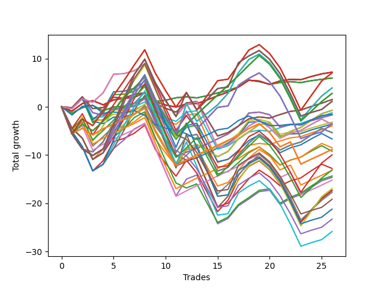

# Long Wallace 019 
- Symbol: NVDA_Unlimited
- Date Range: 02/08/2022 - 07/08/2022
- Trading Period: 7:20-12:30
- Number of Trades: 26



| Name | Win Percent | Profit | Avg Profit / Trade | Avg Time / Trade |      | Name | Win Percent | Profit | Avg Profit / Trade | Avg Time / Trade |
| ---- | ----------- | ------ | ------------------ | ---------------- | ---- | ---- | ----------- | ------ | ------------------ | ---------------- |
| Sorted By <br> Profit | | | | | | Sorted By <br> Win Percentage ||||
| Sixty-Five | 69.23 | 3585.00 | 137.88 | 18:58 |     | Sixty-Four | 73.08 | 2980.00 | 114.62 | 11:58 |
| Fifty-Seven | 69.23 | 3585.00 | 137.88 | 18:58 |     | Fifty-Six | 73.08 | 2980.00 | 114.62 | 11:58 |
| Forty-Nine | 69.23 | 3585.00 | 137.88 | 18:58 |     | Forty-Eight | 73.08 | 2980.00 | 114.62 | 11:58 |
| Forty-One | 69.23 | 3585.00 | 137.88 | 18:58 |     | Forty | 73.08 | 2980.00 | 114.62 | 11:58 |
| One | 69.23 | 3585.00 | 137.88 | 18:58 |     | Zero | 73.08 | 2980.00 | 114.62 | 11:58 |
| One Hundred Twenty-Eight | 61.54 | 3510.00 | 135.00 | 167:57 |     | Sixty-Five | 69.23 | 3585.00 | 137.88 | 18:58 |
| One Hundred Twenty-Three | 61.54 | 3510.00 | 135.00 | 167:57 |     | Fifty-Seven | 69.23 | 3585.00 | 137.88 | 18:58 |
| Eighty-Three | 61.54 | 3510.00 | 135.00 | 167:57 |     | Forty-Nine | 69.23 | 3585.00 | 137.88 | 18:58 |
| Sixty-Four | 73.08 | 2980.00 | 114.62 | 11:58 |     | Forty-One | 69.23 | 3585.00 | 137.88 | 18:58 |
| Fifty-Six | 73.08 | 2980.00 | 114.62 | 11:58 |     | One | 69.23 | 3585.00 | 137.88 | 18:58 |
| Forty-Eight | 73.08 | 2980.00 | 114.62 | 11:58 |     | Sixty-Six | 69.23 | -835.00 | -32.12 | 39:14 |
| Forty | 73.08 | 2980.00 | 114.62 | 11:58 |     | Fifty-Eight | 69.23 | -835.00 | -32.12 | 39:14 |
| Zero | 73.08 | 2980.00 | 114.62 | 11:58 |     | Two | 69.23 | -835.00 | -32.12 | 39:14 |
| Seventy-One | 57.69 | 1955.00 | 75.19 | 175:37 |     | Fifty | 69.23 | -1590.00 | -61.15 | 37:38 |
| Sixty-Three | 57.69 | 1955.00 | 75.19 | 175:37 |     | Forty-Two | 69.23 | -1790.00 | -68.85 | 37:39 |
| Seven | 57.69 | 1955.00 | 75.19 | 175:37 |     | One Hundred Twenty-Six | 69.23 | -4410.00 | -169.62 | 96:05 |
| One Hundred Twenty-Seven | 65.38 | 1385.00 | 53.27 | 146:42 |     | One Hundred Twenty-One | 69.23 | -4410.00 | -169.62 | 96:05 |
| One Hundred Twenty-Two | 65.38 | 1385.00 | 53.27 | 146:42 |     | Eighty-One | 69.23 | -4410.00 | -169.62 | 96:05 |
| Eighty-Two | 65.38 | 1385.00 | 53.27 | 146:42 |     | One Hundred Sixteen | 69.23 | -6575.00 | -252.88 | 78:23 |
| Sixty-Seven | 65.38 | 755.00 | 29.04 | 36:52 |     | One Hundred Eleven | 69.23 | -7590.00 | -291.92 | 79:28 |
| Fifty-Nine | 65.38 | 755.00 | 29.04 | 36:52 |     | One Hundred Twenty-Seven | 65.38 | 1385.00 | 53.27 | 146:42 |
| Three | 65.38 | 755.00 | 29.04 | 36:52 |     | One Hundred Twenty-Two | 65.38 | 1385.00 | 53.27 | 146:42 |
| One Hundred Thirty | 57.69 | 565.00 | 21.73 | 190:04 |     | Eighty-Two | 65.38 | 1385.00 | 53.27 | 146:42 |
| One Hundred Twenty-Five | 57.69 | 565.00 | 21.73 | 190:04 |     | Sixty-Seven | 65.38 | 755.00 | 29.04 | 36:52 |
| Eighty-Five | 57.69 | 565.00 | 21.73 | 190:04 |     | Fifty-Nine | 65.38 | 755.00 | 29.04 | 36:52 |
| Seventy | 65.38 | -365.00 | -14.04 | 121:52 |     | Three | 65.38 | 755.00 | 29.04 | 36:52 |
| Sixty-Two | 65.38 | -365.00 | -14.04 | 121:52 |     | Seventy | 65.38 | -365.00 | -14.04 | 121:52 |
| Six | 65.38 | -365.00 | -14.04 | 121:52 |     | Sixty-Two | 65.38 | -365.00 | -14.04 | 121:52 |
| Fifty-One | 65.38 | -615.00 | -23.65 | 33:35 |     | Six | 65.38 | -365.00 | -14.04 | 121:52 |
| Seventy-Three | 53.85 | -770.00 | -29.62 | 14:37 |     | Fifty-One | 65.38 | -615.00 | -23.65 | 33:35 |
| Sixty-Six | 69.23 | -835.00 | -32.12 | 39:14 |     | Forty-Three | 65.38 | -1985.00 | -76.35 | 34:10 |
| Fifty-Eight | 69.23 | -835.00 | -32.12 | 39:14 |     | Forty-Six | 65.38 | -7310.00 | -281.15 | 95:14 |
| Two | 69.23 | -835.00 | -32.12 | 39:14 |     | One Hundred Twenty-Eight | 61.54 | 3510.00 | 135.00 | 167:57 |
| Fifty | 69.23 | -1590.00 | -61.15 | 37:38 |     | One Hundred Twenty-Three | 61.54 | 3510.00 | 135.00 | 167:57 |
| One Hundred Twenty-Nine | 57.69 | -1755.00 | -67.50 | 187:05 |     | Eighty-Three | 61.54 | 3510.00 | 135.00 | 167:57 |
| One Hundred Twenty-Four | 57.69 | -1755.00 | -67.50 | 187:05 |     | Sixty-Eight | 61.54 | -1835.00 | -70.58 | 65:31 |
| Eighty-Four | 57.69 | -1755.00 | -67.50 | 187:05 |     | Sixty | 61.54 | -1835.00 | -70.58 | 65:31 |
| Forty-Two | 69.23 | -1790.00 | -68.85 | 37:39 |     | Four | 61.54 | -1835.00 | -70.58 | 65:31 |
| Sixty-Eight | 61.54 | -1835.00 | -70.58 | 65:31 |     | Fifty-Two | 61.54 | -3335.00 | -128.27 | 57:24 |
| Sixty | 61.54 | -1835.00 | -70.58 | 65:31 |     | Forty-Four | 61.54 | -4600.00 | -176.92 | 57:56 |
| Four | 61.54 | -1835.00 | -70.58 | 65:31 |     | Fifty-Four | 61.54 | -7165.00 | -275.58 | 92:30 |
| Forty-Three | 65.38 | -1985.00 | -76.35 | 34:10 |     | Seventy-One | 57.69 | 1955.00 | 75.19 | 175:37 |
| Sixty-Nine | 57.69 | -2675.00 | -102.88 | 79:00 |     | Sixty-Three | 57.69 | 1955.00 | 75.19 | 175:37 |
| Sixty-One | 57.69 | -2675.00 | -102.88 | 79:00 |     | Seven | 57.69 | 1955.00 | 75.19 | 175:37 |
| Five | 57.69 | -2675.00 | -102.88 | 79:00 |     | One Hundred Thirty | 57.69 | 565.00 | 21.73 | 190:04 |
| Fifty-Two | 61.54 | -3335.00 | -128.27 | 57:24 |     | One Hundred Twenty-Five | 57.69 | 565.00 | 21.73 | 190:04 |
| Fifty-Three | 57.69 | -4235.00 | -162.88 | 69:10 |     | Eighty-Five | 57.69 | 565.00 | 21.73 | 190:04 |
| One Hundred Twenty-Six | 69.23 | -4410.00 | -169.62 | 96:05 |     | One Hundred Twenty-Nine | 57.69 | -1755.00 | -67.50 | 187:05 |
| One Hundred Twenty-One | 69.23 | -4410.00 | -169.62 | 96:05 |     | One Hundred Twenty-Four | 57.69 | -1755.00 | -67.50 | 187:05 |
| Eighty-One | 69.23 | -4410.00 | -169.62 | 96:05 |     | Eighty-Four | 57.69 | -1755.00 | -67.50 | 187:05 |
| Forty-Four | 61.54 | -4600.00 | -176.92 | 57:56 |     | Sixty-Nine | 57.69 | -2675.00 | -102.88 | 79:00 |
| One Hundred Eighteen | 53.85 | -4980.00 | -191.54 | 128:50 |     | Sixty-One | 57.69 | -2675.00 | -102.88 | 79:00 |
| Forty-Five | 57.69 | -6380.00 | -245.38 | 70:18 |     | Five | 57.69 | -2675.00 | -102.88 | 79:00 |
| One Hundred Seventeen | 57.69 | -6540.00 | -251.54 | 112:44 |     | Fifty-Three | 57.69 | -4235.00 | -162.88 | 69:10 |
| One Hundred Sixteen | 69.23 | -6575.00 | -252.88 | 78:23 |     | Forty-Five | 57.69 | -6380.00 | -245.38 | 70:18 |
| Fifty-Four | 61.54 | -7165.00 | -275.58 | 92:30 |     | One Hundred Seventeen | 57.69 | -6540.00 | -251.54 | 112:44 |
| Forty-Six | 65.38 | -7310.00 | -281.15 | 95:14 |     | One Hundred Twelve | 57.69 | -8855.00 | -340.58 | 115:02 |
| One Hundred Eleven | 69.23 | -7590.00 | -291.92 | 79:28 |     | Seventy-Three | 53.85 | -770.00 | -29.62 | 14:37 |
| One Hundred Thirteen | 53.85 | -8465.00 | -325.58 | 133:19 |     | One Hundred Eighteen | 53.85 | -4980.00 | -191.54 | 128:50 |
| Fifty-Five | 46.15 | -8630.00 | -331.92 | 135:33 |     | One Hundred Thirteen | 53.85 | -8465.00 | -325.58 | 133:19 |
| Forty-Seven | 50.00 | -8680.00 | -333.85 | 143:16 |     | Forty-Seven | 50.00 | -8680.00 | -333.85 | 143:16 |
| One Hundred Twelve | 57.69 | -8855.00 | -340.58 | 115:02 |     | One Hundred Fifteen | 50.00 | -10590.00 | -407.31 | 154:58 |
| One Hundred Twenty | 46.15 | -9570.00 | -368.08 | 148:36 |     | One Hundred Fourteen | 50.00 | -12910.00 | -496.54 | 151:59 |
| One Hundred Fifteen | 50.00 | -10590.00 | -407.31 | 154:58 |     | Fifty-Five | 46.15 | -8630.00 | -331.92 | 135:33 |
| One Hundred Ninteen | 46.15 | -11625.00 | -447.12 | 145:37 |     | One Hundred Twenty | 46.15 | -9570.00 | -368.08 | 148:36 |
| One Hundred Fourteen | 50.00 | -12910.00 | -496.54 | 151:59 |     | One Hundred Ninteen | 46.15 | -11625.00 | -447.12 | 145:37 |

## NO STOPLOSS

### Test Zero
* Sell when price hits the middle line of the 20p bollinger
* No Stoploss
* Results:
```
Total Trades: 26
Percent Up: 73.08
Percent Down: 26.92
Total Points Moved Up: 5.96
Potential Profit: 2980.00
Total Points Ups: 10.53 Count Ups: 19
Total Points Downs: -4.57 Count Downs: 7
```

<details><summary>Trades</summary>

<code>In: 2022-02-10 10:21:00		Out: 2022-02-10 10:40:50		Total Position Time: 19:50		Total Move Up: -1.31		Total to Date: -1.31</code> <br />
<code>In: 2022-02-10 10:39:00		Out: 2022-02-10 10:40:50		Total Position Time: 01:50		Total Move Up: 1.13		Total to Date: -0.18</code> <br />
<code>In: 2022-02-14 10:33:00		Out: 2022-02-14 10:42:10		Total Position Time: 09:10		Total Move Up: 0.47		Total to Date: 0.29</code> <br />
<code>In: 2022-02-14 10:58:00		Out: 2022-02-14 11:13:10		Total Position Time: 15:10		Total Move Up: -1.11		Total to Date: -0.82</code> <br />
<code>In: 2022-02-14 11:02:00		Out: 2022-02-14 11:13:10		Total Position Time: 11:10		Total Move Up: 0.77		Total to Date: -0.05</code> <br />
<code>In: 2022-02-16 09:33:00		Out: 2022-02-16 09:43:50		Total Position Time: 10:50		Total Move Up: 0.16		Total to Date: 0.11</code> <br />
<code>In: 2022-02-16 09:36:00		Out: 2022-02-16 09:43:50		Total Position Time: 07:50		Total Move Up: 0.64		Total to Date: 0.75</code> <br />
<code>In: 2022-02-25 10:59:00		Out: 2022-02-25 11:04:15		Total Position Time: 05:15		Total Move Up: 1.21		Total to Date: 1.96</code> <br />
<code>In: 2022-03-14 08:40:00		Out: 2022-03-14 08:58:40		Total Position Time: 18:40		Total Move Up: -0.86		Total to Date: 1.10</code> <br />
<code>In: 2022-03-14 08:45:00		Out: 2022-03-14 08:58:40		Total Position Time: 13:40		Total Move Up: 0.25		Total to Date: 1.35</code> <br />
<code>In: 2022-03-14 08:46:00		Out: 2022-03-14 08:58:40		Total Position Time: 12:40		Total Move Up: 0.52		Total to Date: 1.87</code> <br />
<code>In: 2022-03-16 10:13:00		Out: 2022-03-16 10:28:05		Total Position Time: 15:05		Total Move Up: 0.21		Total to Date: 2.08</code> <br />
<code>In: 2022-03-30 08:02:00		Out: 2022-03-30 08:15:05		Total Position Time: 13:05		Total Move Up: -0.24		Total to Date: 1.84</code> <br />
<code>In: 2022-04-07 07:44:00		Out: 2022-04-07 08:00:05		Total Position Time: 16:05		Total Move Up: 0.47		Total to Date: 2.31</code> <br />
<code>In: 2022-04-07 07:45:00		Out: 2022-04-07 08:00:05		Total Position Time: 15:05		Total Move Up: 0.56		Total to Date: 2.87</code> <br />
<code>In: 2022-04-11 07:30:00		Out: 2022-04-11 07:45:10		Total Position Time: 15:10		Total Move Up: 0.52		Total to Date: 3.39</code> <br />
<code>In: 2022-05-02 10:49:00		Out: 2022-05-02 10:55:45		Total Position Time: 06:45		Total Move Up: 0.73		Total to Date: 4.12</code> <br />
<code>In: 2022-05-03 11:44:00		Out: 2022-05-03 11:45:10		Total Position Time: 01:10		Total Move Up: 1.42		Total to Date: 5.54</code> <br />
<code>In: 2022-05-31 11:48:00		Out: 2022-05-31 12:04:55		Total Position Time: 16:55		Total Move Up: -0.34		Total to Date: 5.20</code> <br />
<code>In: 2022-06-06 08:15:00		Out: 2022-06-06 08:30:10		Total Position Time: 15:10		Total Move Up: -0.52		Total to Date: 4.68</code> <br />
<code>In: 2022-06-08 08:06:00		Out: 2022-06-08 08:15:10		Total Position Time: 09:10		Total Move Up: 0.33		Total to Date: 5.01</code> <br />
<code>In: 2022-06-09 08:09:00		Out: 2022-06-09 08:25:00		Total Position Time: 16:00		Total Move Up: 0.20		Total to Date: 5.21</code> <br />
<code>In: 2022-06-09 08:10:00		Out: 2022-06-09 08:25:00		Total Position Time: 15:00		Total Move Up: -0.19		Total to Date: 5.02</code> <br />
<code>In: 2022-06-22 09:08:00		Out: 2022-06-22 09:17:40		Total Position Time: 09:40		Total Move Up: 0.39		Total to Date: 5.41</code> <br />
<code>In: 2022-06-22 09:09:00		Out: 2022-06-22 09:17:40		Total Position Time: 08:40		Total Move Up: 0.28		Total to Date: 5.69</code> <br />
<code>In: 2022-06-23 09:06:00		Out: 2022-06-23 09:18:25		Total Position Time: 12:25		Total Move Up: 0.27		Total to Date: 5.96</code> <br />


</details>

### Test One
* Sell when the price hits the upper line of the 20p 1std bollinger
* No Stoploss
* Results:
```
Total Trades: 26
Percent Up: 69.23
Percent Down: 30.77
Total Points Moved Up: 7.17
Potential Profit: 3585.00
Total Points Ups: 12.77 Count Ups: 18
Total Points Downs: -5.60 Count Downs: 8
```

<details><summary>Trades</summary>

<code>In: 2022-02-10 10:21:00		Out: 2022-02-10 10:43:25		Total Position Time: 22:25		Total Move Up: -0.89		Total to Date: -0.89</code> <br />
<code>In: 2022-02-10 10:39:00		Out: 2022-02-10 10:43:25		Total Position Time: 04:25		Total Move Up: 1.55		Total to Date: 0.66</code> <br />
<code>In: 2022-02-14 10:33:00		Out: 2022-02-14 10:47:05		Total Position Time: 14:05		Total Move Up: 0.62		Total to Date: 1.28</code> <br />
<code>In: 2022-02-14 10:58:00		Out: 2022-02-14 11:17:20		Total Position Time: 19:20		Total Move Up: -0.87		Total to Date: 0.41</code> <br />
<code>In: 2022-02-14 11:02:00		Out: 2022-02-14 11:17:20		Total Position Time: 15:20		Total Move Up: 1.01		Total to Date: 1.42</code> <br />
<code>In: 2022-02-16 09:33:00		Out: 2022-02-16 09:49:05		Total Position Time: 16:05		Total Move Up: 0.35		Total to Date: 1.77</code> <br />
<code>In: 2022-02-16 09:36:00		Out: 2022-02-16 09:49:05		Total Position Time: 13:05		Total Move Up: 0.83		Total to Date: 2.60</code> <br />
<code>In: 2022-02-25 10:59:00		Out: 2022-02-25 11:19:15		Total Position Time: 20:15		Total Move Up: 0.26		Total to Date: 2.86</code> <br />
<code>In: 2022-03-14 08:40:00		Out: 2022-03-14 09:24:20		Total Position Time: 44:20		Total Move Up: -1.80		Total to Date: 1.06</code> <br />
<code>In: 2022-03-14 08:45:00		Out: 2022-03-14 09:24:20		Total Position Time: 39:20		Total Move Up: -0.69		Total to Date: 0.37</code> <br />
<code>In: 2022-03-14 08:46:00		Out: 2022-03-14 09:24:20		Total Position Time: 38:20		Total Move Up: -0.42		Total to Date: -0.05</code> <br />
<code>In: 2022-03-16 10:13:00		Out: 2022-03-16 10:29:10		Total Position Time: 16:10		Total Move Up: 0.64		Total to Date: 0.59</code> <br />
<code>In: 2022-03-30 08:02:00		Out: 2022-03-30 08:19:20		Total Position Time: 17:20		Total Move Up: 0.06		Total to Date: 0.65</code> <br />
<code>In: 2022-04-07 07:44:00		Out: 2022-04-07 08:00:10		Total Position Time: 16:10		Total Move Up: 0.77		Total to Date: 1.42</code> <br />
<code>In: 2022-04-07 07:45:00		Out: 2022-04-07 08:00:10		Total Position Time: 15:10		Total Move Up: 0.86		Total to Date: 2.28</code> <br />
<code>In: 2022-04-11 07:30:00		Out: 2022-04-11 07:55:05		Total Position Time: 25:05		Total Move Up: 0.78		Total to Date: 3.06</code> <br />
<code>In: 2022-05-02 10:49:00		Out: 2022-05-02 10:58:25		Total Position Time: 09:25		Total Move Up: 1.02		Total to Date: 4.08</code> <br />
<code>In: 2022-05-03 11:44:00		Out: 2022-05-03 11:45:10		Total Position Time: 01:10		Total Move Up: 1.42		Total to Date: 5.50</code> <br />
<code>In: 2022-05-31 11:48:00		Out: 2022-05-31 12:07:05		Total Position Time: 19:05		Total Move Up: -0.16		Total to Date: 5.34</code> <br />
<code>In: 2022-06-06 08:15:00		Out: 2022-06-06 08:39:15		Total Position Time: 24:15		Total Move Up: -0.70		Total to Date: 4.64</code> <br />
<code>In: 2022-06-08 08:06:00		Out: 2022-06-08 08:18:05		Total Position Time: 12:05		Total Move Up: 0.72		Total to Date: 5.36</code> <br />
<code>In: 2022-06-09 08:09:00		Out: 2022-06-09 08:33:25		Total Position Time: 24:25		Total Move Up: 0.32		Total to Date: 5.68</code> <br />
<code>In: 2022-06-09 08:10:00		Out: 2022-06-09 08:33:25		Total Position Time: 23:25		Total Move Up: -0.07		Total to Date: 5.61</code> <br />
<code>In: 2022-06-22 09:08:00		Out: 2022-06-22 09:22:15		Total Position Time: 14:15		Total Move Up: 0.66		Total to Date: 6.27</code> <br />
<code>In: 2022-06-22 09:09:00		Out: 2022-06-22 09:22:15		Total Position Time: 13:15		Total Move Up: 0.55		Total to Date: 6.82</code> <br />
<code>In: 2022-06-23 09:06:00		Out: 2022-06-23 09:21:15		Total Position Time: 15:15		Total Move Up: 0.35		Total to Date: 7.17</code> <br />


</details>

### Test Two
* Sell when the price hits the upper line of the 20p 2std bollinger
* No Stoploss
* Results:
```
Total Trades: 26
Percent Up: 69.23
Percent Down: 30.77
Total Points Moved Up: -1.67
Potential Profit: -835.00
Total Points Ups: 17.47 Count Ups: 18
Total Points Downs: -19.14 Count Downs: 8
```

<details><summary>Trades</summary>

<code>In: 2022-02-10 10:21:00		Out: 2022-02-10 10:46:50		Total Position Time: 25:50		Total Move Up: -0.21		Total to Date: -0.21</code> <br />
<code>In: 2022-02-10 10:39:00		Out: 2022-02-10 10:46:50		Total Position Time: 07:50		Total Move Up: 2.23		Total to Date: 2.02</code> <br />
<code>In: 2022-02-14 10:33:00		Out: 2022-02-14 11:19:15		Total Position Time: 46:15		Total Move Up: -3.24		Total to Date: -1.22</code> <br />
<code>In: 2022-02-14 10:58:00		Out: 2022-02-14 11:19:15		Total Position Time: 21:15		Total Move Up: -0.52		Total to Date: -1.74</code> <br />
<code>In: 2022-02-14 11:02:00		Out: 2022-02-14 11:19:15		Total Position Time: 17:15		Total Move Up: 1.36		Total to Date: -0.38</code> <br />
<code>In: 2022-02-16 09:33:00		Out: 2022-02-16 10:16:00		Total Position Time: 43:00		Total Move Up: 0.08		Total to Date: -0.30</code> <br />
<code>In: 2022-02-16 09:36:00		Out: 2022-02-16 10:16:00		Total Position Time: 40:00		Total Move Up: 0.56		Total to Date: 0.26</code> <br />
<code>In: 2022-02-25 10:59:00		Out: 2022-02-25 11:25:30		Total Position Time: 26:30		Total Move Up: 1.45		Total to Date: 1.71</code> <br />
<code>In: 2022-03-14 08:40:00		Out: 2022-03-14 10:50:25		Total Position Time: 130:25		Total Move Up: -4.86		Total to Date: -3.15</code> <br />
<code>In: 2022-03-14 08:45:00		Out: 2022-03-14 10:50:25		Total Position Time: 125:25		Total Move Up: -3.75		Total to Date: -6.90</code> <br />
<code>In: 2022-03-14 08:46:00		Out: 2022-03-14 10:50:25		Total Position Time: 124:25		Total Move Up: -3.48		Total to Date: -10.38</code> <br />
<code>In: 2022-03-16 10:13:00		Out: 2022-03-16 10:30:45		Total Position Time: 17:45		Total Move Up: 0.99		Total to Date: -9.39</code> <br />
<code>In: 2022-03-30 08:02:00		Out: 2022-03-30 08:35:30		Total Position Time: 33:30		Total Move Up: 0.76		Total to Date: -8.63</code> <br />
<code>In: 2022-04-07 07:44:00		Out: 2022-04-07 08:01:05		Total Position Time: 17:05		Total Move Up: 0.95		Total to Date: -7.68</code> <br />
<code>In: 2022-04-07 07:45:00		Out: 2022-04-07 08:01:05		Total Position Time: 16:05		Total Move Up: 1.04		Total to Date: -6.64</code> <br />
<code>In: 2022-04-11 07:30:00		Out: 2022-04-11 08:11:30		Total Position Time: 41:30		Total Move Up: 1.01		Total to Date: -5.63</code> <br />
<code>In: 2022-05-02 10:49:00		Out: 2022-05-02 11:02:15		Total Position Time: 13:15		Total Move Up: 1.60		Total to Date: -4.03</code> <br />
<code>In: 2022-05-03 11:44:00		Out: 2022-05-03 11:59:20		Total Position Time: 15:20		Total Move Up: 2.73		Total to Date: -1.30</code> <br />
<code>In: 2022-05-31 11:48:00		Out: 2022-05-31 12:07:50		Total Position Time: 19:50		Total Move Up: 0.20		Total to Date: -1.10</code> <br />
<code>In: 2022-06-06 08:15:00		Out: 2022-06-06 08:39:25		Total Position Time: 24:25		Total Move Up: -0.55		Total to Date: -1.65</code> <br />
<code>In: 2022-06-08 08:06:00		Out: 2022-06-08 09:57:05		Total Position Time: 111:05		Total Move Up: -2.53		Total to Date: -4.18</code> <br />
<code>In: 2022-06-09 08:09:00		Out: 2022-06-09 08:35:10		Total Position Time: 26:10		Total Move Up: 0.47		Total to Date: -3.71</code> <br />
<code>In: 2022-06-09 08:10:00		Out: 2022-06-09 08:35:10		Total Position Time: 25:10		Total Move Up: 0.08		Total to Date: -3.63</code> <br />
<code>In: 2022-06-22 09:08:00		Out: 2022-06-22 09:23:05		Total Position Time: 15:05		Total Move Up: 0.74		Total to Date: -2.89</code> <br />
<code>In: 2022-06-22 09:09:00		Out: 2022-06-22 09:23:05		Total Position Time: 14:05		Total Move Up: 0.63		Total to Date: -2.26</code> <br />
<code>In: 2022-06-23 09:06:00		Out: 2022-06-23 09:27:40		Total Position Time: 21:40		Total Move Up: 0.59		Total to Date: -1.67</code> <br />


</details>

### Test Three
* Sell when price hits the middle line of the 50p bollinger
* No Stoploss
* Results:
```
Total Trades: 26
Percent Up: 65.38
Percent Down: 34.62
Total Points Moved Up: 1.51
Potential Profit: 755.00
Total Points Ups: 15.83 Count Ups: 17
Total Points Downs: -14.32 Count Downs: 9
```

<details><summary>Trades</summary>

<code>In: 2022-02-10 10:21:00		Out: 2022-02-10 10:58:20		Total Position Time: 37:20		Total Move Up: -0.18		Total to Date: -0.18</code> <br />
<code>In: 2022-02-10 10:39:00		Out: 2022-02-10 10:58:20		Total Position Time: 19:20		Total Move Up: 2.26		Total to Date: 2.08</code> <br />
<code>In: 2022-02-14 10:33:00		Out: 2022-02-14 11:28:50		Total Position Time: 55:50		Total Move Up: -2.47		Total to Date: -0.39</code> <br />
<code>In: 2022-02-14 10:58:00		Out: 2022-02-14 11:28:50		Total Position Time: 30:50		Total Move Up: 0.25		Total to Date: -0.14</code> <br />
<code>In: 2022-02-14 11:02:00		Out: 2022-02-14 11:28:50		Total Position Time: 26:50		Total Move Up: 2.13		Total to Date: 1.99</code> <br />
<code>In: 2022-02-16 09:33:00		Out: 2022-02-16 10:15:05		Total Position Time: 42:05		Total Move Up: -0.26		Total to Date: 1.73</code> <br />
<code>In: 2022-02-16 09:36:00		Out: 2022-02-16 10:15:05		Total Position Time: 39:05		Total Move Up: 0.22		Total to Date: 1.95</code> <br />
<code>In: 2022-02-25 10:59:00		Out: 2022-02-25 11:23:35		Total Position Time: 24:35		Total Move Up: 0.97		Total to Date: 2.92</code> <br />
<code>In: 2022-03-14 08:40:00		Out: 2022-03-14 09:42:05		Total Position Time: 62:05		Total Move Up: -2.17		Total to Date: 0.75</code> <br />
<code>In: 2022-03-14 08:45:00		Out: 2022-03-14 09:42:05		Total Position Time: 57:05		Total Move Up: -1.06		Total to Date: -0.31</code> <br />
<code>In: 2022-03-14 08:46:00		Out: 2022-03-14 09:42:05		Total Position Time: 56:05		Total Move Up: -0.79		Total to Date: -1.10</code> <br />
<code>In: 2022-03-16 10:13:00		Out: 2022-03-16 10:36:05		Total Position Time: 23:05		Total Move Up: 1.90		Total to Date: 0.80</code> <br />
<code>In: 2022-03-30 08:02:00		Out: 2022-03-30 08:35:00		Total Position Time: 33:00		Total Move Up: 0.31		Total to Date: 1.11</code> <br />
<code>In: 2022-04-07 07:44:00		Out: 2022-04-07 09:21:10		Total Position Time: 97:10		Total Move Up: -3.62		Total to Date: -2.51</code> <br />
<code>In: 2022-04-07 07:45:00		Out: 2022-04-07 09:21:10		Total Position Time: 96:10		Total Move Up: -3.53		Total to Date: -6.04</code> <br />
<code>In: 2022-04-11 07:30:00		Out: 2022-04-11 08:08:50		Total Position Time: 38:50		Total Move Up: 0.71		Total to Date: -5.33</code> <br />
<code>In: 2022-05-02 10:49:00		Out: 2022-05-02 10:59:55		Total Position Time: 10:55		Total Move Up: 1.36		Total to Date: -3.97</code> <br />
<code>In: 2022-05-03 11:44:00		Out: 2022-05-03 11:48:05		Total Position Time: 04:05		Total Move Up: 1.48		Total to Date: -2.49</code> <br />
<code>In: 2022-05-31 11:48:00		Out: 2022-05-31 12:14:05		Total Position Time: 26:05		Total Move Up: 0.39		Total to Date: -2.10</code> <br />
<code>In: 2022-06-06 08:15:00		Out: 2022-06-06 08:52:30		Total Position Time: 37:30		Total Move Up: -0.24		Total to Date: -2.34</code> <br />
<code>In: 2022-06-08 08:06:00		Out: 2022-06-08 08:32:20		Total Position Time: 26:20		Total Move Up: 0.74		Total to Date: -1.60</code> <br />
<code>In: 2022-06-09 08:09:00		Out: 2022-06-09 08:36:05		Total Position Time: 27:05		Total Move Up: 0.65		Total to Date: -0.95</code> <br />
<code>In: 2022-06-09 08:10:00		Out: 2022-06-09 08:36:05		Total Position Time: 26:05		Total Move Up: 0.26		Total to Date: -0.69</code> <br />
<code>In: 2022-06-22 09:08:00		Out: 2022-06-22 09:28:10		Total Position Time: 20:10		Total Move Up: 0.77		Total to Date: 0.08</code> <br />
<code>In: 2022-06-22 09:09:00		Out: 2022-06-22 09:28:10		Total Position Time: 19:10		Total Move Up: 0.66		Total to Date: 0.74</code> <br />
<code>In: 2022-06-23 09:06:00		Out: 2022-06-23 09:28:00		Total Position Time: 22:00		Total Move Up: 0.77		Total to Date: 1.51</code> <br />


</details>

### Test Four
* Sell when the price hits the upper line of the 50p 1std bollinger
* No Stoploss
* Results:
```
Total Trades: 26
Percent Up: 61.54
Percent Down: 38.46
Total Points Moved Up: -3.67
Potential Profit: -1835.00
Total Points Ups: 22.50 Count Ups: 16
Total Points Downs: -26.17 Count Downs: 10
```

<details><summary>Trades</summary>

<code>In: 2022-02-10 10:21:00		Out: 2022-02-10 11:36:45		Total Position Time: 75:45		Total Move Up: -0.38		Total to Date: -0.38</code> <br />
<code>In: 2022-02-10 10:39:00		Out: 2022-02-10 11:36:45		Total Position Time: 57:45		Total Move Up: 2.06		Total to Date: 1.68</code> <br />
<code>In: 2022-02-14 10:33:00		Out: 2022-02-14 11:29:20		Total Position Time: 56:20		Total Move Up: -0.75		Total to Date: 0.93</code> <br />
<code>In: 2022-02-14 10:58:00		Out: 2022-02-14 11:29:20		Total Position Time: 31:20		Total Move Up: 1.97		Total to Date: 2.90</code> <br />
<code>In: 2022-02-14 11:02:00		Out: 2022-02-14 11:29:20		Total Position Time: 27:20		Total Move Up: 3.85		Total to Date: 6.75</code> <br />
<code>In: 2022-02-16 09:33:00		Out: 2022-02-16 10:21:20		Total Position Time: 48:20		Total Move Up: 0.12		Total to Date: 6.87</code> <br />
<code>In: 2022-02-16 09:36:00		Out: 2022-02-16 10:21:20		Total Position Time: 45:20		Total Move Up: 0.60		Total to Date: 7.47</code> <br />
<code>In: 2022-02-25 10:59:00		Out: 2022-02-25 11:40:10		Total Position Time: 41:10		Total Move Up: 1.41		Total to Date: 8.88</code> <br />
<code>In: 2022-03-14 08:40:00		Out: 2022-03-14 10:51:10		Total Position Time: 131:10		Total Move Up: -4.42		Total to Date: 4.46</code> <br />
<code>In: 2022-03-14 08:45:00		Out: 2022-03-14 10:51:10		Total Position Time: 126:10		Total Move Up: -3.31		Total to Date: 1.15</code> <br />
<code>In: 2022-03-14 08:46:00		Out: 2022-03-14 10:51:10		Total Position Time: 125:10		Total Move Up: -3.04		Total to Date: -1.89</code> <br />
<code>In: 2022-03-16 10:13:00		Out: 2022-03-16 10:49:40		Total Position Time: 36:40		Total Move Up: 2.44		Total to Date: 0.55</code> <br />
<code>In: 2022-03-30 08:02:00		Out: 2022-03-30 08:46:05		Total Position Time: 44:05		Total Move Up: 0.50		Total to Date: 1.05</code> <br />
<code>In: 2022-04-07 07:44:00		Out: 2022-04-07 10:12:10		Total Position Time: 148:10		Total Move Up: -4.75		Total to Date: -3.70</code> <br />
<code>In: 2022-04-07 07:45:00		Out: 2022-04-07 10:12:10		Total Position Time: 147:10		Total Move Up: -4.66		Total to Date: -8.36</code> <br />
<code>In: 2022-04-11 07:30:00		Out: 2022-04-11 08:32:10		Total Position Time: 62:10		Total Move Up: 0.47		Total to Date: -7.89</code> <br />
<code>In: 2022-05-02 10:49:00		Out: 2022-05-02 11:02:25		Total Position Time: 13:25		Total Move Up: 1.86		Total to Date: -6.03</code> <br />
<code>In: 2022-05-03 11:44:00		Out: 2022-05-03 11:52:05		Total Position Time: 08:05		Total Move Up: 2.05		Total to Date: -3.98</code> <br />
<code>In: 2022-05-31 11:48:00		Out: 2022-05-31 12:17:20		Total Position Time: 29:20		Total Move Up: 1.19		Total to Date: -2.79</code> <br />
<code>In: 2022-06-06 08:15:00		Out: 2022-06-06 09:48:10		Total Position Time: 93:10		Total Move Up: -1.56		Total to Date: -4.35</code> <br />
<code>In: 2022-06-08 08:06:00		Out: 2022-06-08 10:15:40		Total Position Time: 129:40		Total Move Up: -2.15		Total to Date: -6.50</code> <br />
<code>In: 2022-06-09 08:09:00		Out: 2022-06-09 08:43:15		Total Position Time: 34:15		Total Move Up: 1.01		Total to Date: -5.49</code> <br />
<code>In: 2022-06-09 08:10:00		Out: 2022-06-09 08:43:15		Total Position Time: 33:15		Total Move Up: 0.62		Total to Date: -4.87</code> <br />
<code>In: 2022-06-22 09:08:00		Out: 2022-06-22 09:33:50		Total Position Time: 25:50		Total Move Up: 1.23		Total to Date: -3.64</code> <br />
<code>In: 2022-06-22 09:09:00		Out: 2022-06-22 09:33:50		Total Position Time: 24:50		Total Move Up: 1.12		Total to Date: -2.52</code> <br />
<code>In: 2022-06-23 09:06:00		Out: 2022-06-23 10:53:35		Total Position Time: 107:35		Total Move Up: -1.15		Total to Date: -3.67</code> <br />


</details>

### Test Five
* Sell when the price hits the upper line of the 50p 2std bollinger
* No Stoploss
* Results:
```
Total Trades: 26
Percent Up: 57.69
Percent Down: 42.31
Total Points Moved Up: -5.35
Potential Profit: -2675.00
Total Points Ups: 25.32 Count Ups: 15
Total Points Downs: -30.67 Count Downs: 11
```

<details><summary>Trades</summary>

<code>In: 2022-02-10 10:21:00		Out: 2022-02-10 12:47:00		Total Position Time: 146:00		Total Move Up: -5.58		Total to Date: -5.58</code> <br />
<code>In: 2022-02-10 10:39:00		Out: 2022-02-10 12:47:00		Total Position Time: 128:00		Total Move Up: -3.14		Total to Date: -8.72</code> <br />
<code>In: 2022-02-14 10:33:00		Out: 2022-02-14 11:40:45		Total Position Time: 67:45		Total Move Up: -0.62		Total to Date: -9.34</code> <br />
<code>In: 2022-02-14 10:58:00		Out: 2022-02-14 11:40:45		Total Position Time: 42:45		Total Move Up: 2.10		Total to Date: -7.24</code> <br />
<code>In: 2022-02-14 11:02:00		Out: 2022-02-14 11:40:45		Total Position Time: 38:45		Total Move Up: 3.98		Total to Date: -3.26</code> <br />
<code>In: 2022-02-16 09:33:00		Out: 2022-02-16 10:22:55		Total Position Time: 49:55		Total Move Up: 0.62		Total to Date: -2.64</code> <br />
<code>In: 2022-02-16 09:36:00		Out: 2022-02-16 10:22:55		Total Position Time: 46:55		Total Move Up: 1.10		Total to Date: -1.54</code> <br />
<code>In: 2022-02-25 10:59:00		Out: 2022-02-25 12:15:55		Total Position Time: 76:55		Total Move Up: 1.68		Total to Date: 0.14</code> <br />
<code>In: 2022-03-14 08:40:00		Out: 2022-03-14 10:52:20		Total Position Time: 132:20		Total Move Up: -4.03		Total to Date: -3.89</code> <br />
<code>In: 2022-03-14 08:45:00		Out: 2022-03-14 10:52:20		Total Position Time: 127:20		Total Move Up: -2.92		Total to Date: -6.81</code> <br />
<code>In: 2022-03-14 08:46:00		Out: 2022-03-14 10:52:20		Total Position Time: 126:20		Total Move Up: -2.65		Total to Date: -9.46</code> <br />
<code>In: 2022-03-16 10:13:00		Out: 2022-03-16 10:54:20		Total Position Time: 41:20		Total Move Up: 3.30		Total to Date: -6.16</code> <br />
<code>In: 2022-03-30 08:02:00		Out: 2022-03-30 09:34:25		Total Position Time: 92:25		Total Move Up: 0.46		Total to Date: -5.70</code> <br />
<code>In: 2022-04-07 07:44:00		Out: 2022-04-07 10:13:05		Total Position Time: 149:05		Total Move Up: -3.84		Total to Date: -9.54</code> <br />
<code>In: 2022-04-07 07:45:00		Out: 2022-04-07 10:13:05		Total Position Time: 148:05		Total Move Up: -3.75		Total to Date: -13.29</code> <br />
<code>In: 2022-04-11 07:30:00		Out: 2022-04-11 08:33:35		Total Position Time: 63:35		Total Move Up: 0.76		Total to Date: -12.53</code> <br />
<code>In: 2022-05-02 10:49:00		Out: 2022-05-02 11:05:00		Total Position Time: 16:00		Total Move Up: 2.54		Total to Date: -9.99</code> <br />
<code>In: 2022-05-03 11:44:00		Out: 2022-05-03 11:59:05		Total Position Time: 15:05		Total Move Up: 2.49		Total to Date: -7.50</code> <br />
<code>In: 2022-05-31 11:48:00		Out: 2022-05-31 12:30:55		Total Position Time: 42:55		Total Move Up: 1.81		Total to Date: -5.69</code> <br />
<code>In: 2022-06-06 08:15:00		Out: 2022-06-06 09:54:50		Total Position Time: 99:50		Total Move Up: -1.42		Total to Date: -7.11</code> <br />
<code>In: 2022-06-08 08:06:00		Out: 2022-06-08 10:19:45		Total Position Time: 133:45		Total Move Up: -1.84		Total to Date: -8.95</code> <br />
<code>In: 2022-06-09 08:09:00		Out: 2022-06-09 09:01:25		Total Position Time: 52:25		Total Move Up: 1.02		Total to Date: -7.93</code> <br />
<code>In: 2022-06-09 08:10:00		Out: 2022-06-09 09:01:25		Total Position Time: 51:25		Total Move Up: 0.63		Total to Date: -7.30</code> <br />
<code>In: 2022-06-22 09:08:00		Out: 2022-06-22 09:36:05		Total Position Time: 28:05		Total Move Up: 1.47		Total to Date: -5.83</code> <br />
<code>In: 2022-06-22 09:09:00		Out: 2022-06-22 09:36:05		Total Position Time: 27:05		Total Move Up: 1.36		Total to Date: -4.47</code> <br />
<code>In: 2022-06-23 09:06:00		Out: 2022-06-23 10:56:05		Total Position Time: 110:05		Total Move Up: -0.88		Total to Date: -5.35</code> <br />


</details>

### Test Six
* Sell when the price hits the middle line of the 1std VWAP
* No Stoploss
* Results:
```
Total Trades: 26
Percent Up: 65.38
Percent Down: 34.62
Total Points Moved Up: -0.73
Potential Profit: -365.00
Total Points Ups: 26.72 Count Ups: 17
Total Points Downs: -27.45 Count Downs: 9
```

<details><summary>Trades</summary>

<code>In: 2022-02-10 10:21:00		Out: 2022-02-10 12:47:00		Total Position Time: 146:00		Total Move Up: -5.58		Total to Date: -5.58</code> <br />
<code>In: 2022-02-10 10:39:00		Out: 2022-02-10 12:47:00		Total Position Time: 128:00		Total Move Up: -3.14		Total to Date: -8.72</code> <br />
<code>In: 2022-02-14 10:33:00		Out: 2022-02-14 12:47:00		Total Position Time: 134:00		Total Move Up: -1.36		Total to Date: -10.08</code> <br />
<code>In: 2022-02-14 10:58:00		Out: 2022-02-14 12:47:00		Total Position Time: 109:00		Total Move Up: 1.36		Total to Date: -8.72</code> <br />
<code>In: 2022-02-14 11:02:00		Out: 2022-02-14 12:47:00		Total Position Time: 105:00		Total Move Up: 3.24		Total to Date: -5.48</code> <br />
<code>In: 2022-02-16 09:33:00		Out: 2022-02-16 11:00:50		Total Position Time: 87:50		Total Move Up: 1.80		Total to Date: -3.68</code> <br />
<code>In: 2022-02-16 09:36:00		Out: 2022-02-16 11:00:50		Total Position Time: 84:50		Total Move Up: 2.28		Total to Date: -1.40</code> <br />
<code>In: 2022-02-25 10:59:00		Out: 2022-02-25 11:24:30		Total Position Time: 25:30		Total Move Up: 1.17		Total to Date: -0.23</code> <br />
<code>In: 2022-03-14 08:40:00		Out: 2022-03-14 12:47:00		Total Position Time: 247:00		Total Move Up: -4.78		Total to Date: -5.01</code> <br />
<code>In: 2022-03-14 08:45:00		Out: 2022-03-14 12:47:00		Total Position Time: 242:00		Total Move Up: -3.67		Total to Date: -8.68</code> <br />
<code>In: 2022-03-14 08:46:00		Out: 2022-03-14 12:47:00		Total Position Time: 241:00		Total Move Up: -3.40		Total to Date: -12.08</code> <br />
<code>In: 2022-03-16 10:13:00		Out: 2022-03-16 11:44:20		Total Position Time: 91:20		Total Move Up: 3.47		Total to Date: -8.61</code> <br />
<code>In: 2022-03-30 08:02:00		Out: 2022-03-30 09:43:55		Total Position Time: 101:55		Total Move Up: 0.85		Total to Date: -7.76</code> <br />
<code>In: 2022-04-07 07:44:00		Out: 2022-04-07 11:09:55		Total Position Time: 205:55		Total Move Up: -1.33		Total to Date: -9.09</code> <br />
<code>In: 2022-04-07 07:45:00		Out: 2022-04-07 11:09:55		Total Position Time: 204:55		Total Move Up: -1.24		Total to Date: -10.33</code> <br />
<code>In: 2022-04-11 07:30:00		Out: 2022-04-11 10:01:25		Total Position Time: 151:25		Total Move Up: 1.10		Total to Date: -9.23</code> <br />
<code>In: 2022-05-02 10:49:00		Out: 2022-05-02 11:45:50		Total Position Time: 56:50		Total Move Up: 2.61		Total to Date: -6.62</code> <br />
<code>In: 2022-05-03 11:44:00		Out: 2022-05-03 11:45:10		Total Position Time: 01:10		Total Move Up: 1.42		Total to Date: -5.20</code> <br />
<code>In: 2022-05-31 11:48:00		Out: 2022-05-31 12:23:45		Total Position Time: 35:45		Total Move Up: 1.52		Total to Date: -3.68</code> <br />
<code>In: 2022-06-06 08:15:00		Out: 2022-06-06 10:55:10		Total Position Time: 160:10		Total Move Up: 0.29		Total to Date: -3.39</code> <br />
<code>In: 2022-06-08 08:06:00		Out: 2022-06-08 12:47:00		Total Position Time: 281:00		Total Move Up: -2.95		Total to Date: -6.34</code> <br />
<code>In: 2022-06-09 08:09:00		Out: 2022-06-09 08:43:50		Total Position Time: 34:50		Total Move Up: 1.23		Total to Date: -5.11</code> <br />
<code>In: 2022-06-09 08:10:00		Out: 2022-06-09 08:43:50		Total Position Time: 33:50		Total Move Up: 0.84		Total to Date: -4.27</code> <br />
<code>In: 2022-06-22 09:08:00		Out: 2022-06-22 09:36:05		Total Position Time: 28:05		Total Move Up: 1.47		Total to Date: -2.80</code> <br />
<code>In: 2022-06-22 09:09:00		Out: 2022-06-22 09:36:05		Total Position Time: 27:05		Total Move Up: 1.36		Total to Date: -1.44</code> <br />
<code>In: 2022-06-23 09:06:00		Out: 2022-06-23 12:30:15		Total Position Time: 204:15		Total Move Up: 0.71		Total to Date: -0.73</code> <br />


</details>

### Test Seven
* Sell when the price hits the upper line of the 1std VWAP
* No Stoploss
* Results:
```
Total Trades: 26
Percent Up: 57.69
Percent Down: 42.31
Total Points Moved Up: 3.91
Potential Profit: 1955.00
Total Points Ups: 43.06 Count Ups: 15
Total Points Downs: -39.15 Count Downs: 11
```

<details><summary>Trades</summary>

<code>In: 2022-02-10 10:21:00		Out: 2022-02-10 12:47:00		Total Position Time: 146:00		Total Move Up: -5.58		Total to Date: -5.58</code> <br />
<code>In: 2022-02-10 10:39:00		Out: 2022-02-10 12:47:00		Total Position Time: 128:00		Total Move Up: -3.14		Total to Date: -8.72</code> <br />
<code>In: 2022-02-14 10:33:00		Out: 2022-02-14 12:47:00		Total Position Time: 134:00		Total Move Up: -1.36		Total to Date: -10.08</code> <br />
<code>In: 2022-02-14 10:58:00		Out: 2022-02-14 12:47:00		Total Position Time: 109:00		Total Move Up: 1.36		Total to Date: -8.72</code> <br />
<code>In: 2022-02-14 11:02:00		Out: 2022-02-14 12:47:00		Total Position Time: 105:00		Total Move Up: 3.24		Total to Date: -5.48</code> <br />
<code>In: 2022-02-16 09:33:00		Out: 2022-02-16 11:23:15		Total Position Time: 110:15		Total Move Up: 3.78		Total to Date: -1.70</code> <br />
<code>In: 2022-02-16 09:36:00		Out: 2022-02-16 11:23:15		Total Position Time: 107:15		Total Move Up: 4.26		Total to Date: 2.56</code> <br />
<code>In: 2022-02-25 10:59:00		Out: 2022-02-25 12:24:10		Total Position Time: 85:10		Total Move Up: 2.99		Total to Date: 5.55</code> <br />
<code>In: 2022-03-14 08:40:00		Out: 2022-03-14 12:47:00		Total Position Time: 247:00		Total Move Up: -4.78		Total to Date: 0.77</code> <br />
<code>In: 2022-03-14 08:45:00		Out: 2022-03-14 12:47:00		Total Position Time: 242:00		Total Move Up: -3.67		Total to Date: -2.90</code> <br />
<code>In: 2022-03-14 08:46:00		Out: 2022-03-14 12:47:00		Total Position Time: 241:00		Total Move Up: -3.40		Total to Date: -6.30</code> <br />
<code>In: 2022-03-16 10:13:00		Out: 2022-03-16 12:21:10		Total Position Time: 128:10		Total Move Up: 6.94		Total to Date: 0.64</code> <br />
<code>In: 2022-03-30 08:02:00		Out: 2022-03-30 12:47:00		Total Position Time: 285:00		Total Move Up: -3.64		Total to Date: -3.00</code> <br />
<code>In: 2022-04-07 07:44:00		Out: 2022-04-07 12:11:25		Total Position Time: 267:25		Total Move Up: 1.66		Total to Date: -1.34</code> <br />
<code>In: 2022-04-07 07:45:00		Out: 2022-04-07 12:11:25		Total Position Time: 266:25		Total Move Up: 1.75		Total to Date: 0.41</code> <br />
<code>In: 2022-04-11 07:30:00		Out: 2022-04-11 11:51:25		Total Position Time: 261:25		Total Move Up: 2.36		Total to Date: 2.77</code> <br />
<code>In: 2022-05-02 10:49:00		Out: 2022-05-02 11:53:40		Total Position Time: 64:40		Total Move Up: 4.29		Total to Date: 7.06</code> <br />
<code>In: 2022-05-03 11:44:00		Out: 2022-05-03 11:59:20		Total Position Time: 15:20		Total Move Up: 2.73		Total to Date: 9.79</code> <br />
<code>In: 2022-05-31 11:48:00		Out: 2022-05-31 12:47:00		Total Position Time: 59:00		Total Move Up: 1.13		Total to Date: 10.92</code> <br />
<code>In: 2022-06-06 08:15:00		Out: 2022-06-06 12:47:00		Total Position Time: 272:00		Total Move Up: -1.84		Total to Date: 9.08</code> <br />
<code>In: 2022-06-08 08:06:00		Out: 2022-06-08 12:47:00		Total Position Time: 281:00		Total Move Up: -2.95		Total to Date: 6.13</code> <br />
<code>In: 2022-06-09 08:09:00		Out: 2022-06-09 12:47:00		Total Position Time: 278:00		Total Move Up: -4.20		Total to Date: 1.93</code> <br />
<code>In: 2022-06-09 08:10:00		Out: 2022-06-09 12:47:00		Total Position Time: 277:00		Total Move Up: -4.59		Total to Date: -2.66</code> <br />
<code>In: 2022-06-22 09:08:00		Out: 2022-06-22 11:06:10		Total Position Time: 118:10		Total Move Up: 2.50		Total to Date: -0.16</code> <br />
<code>In: 2022-06-22 09:09:00		Out: 2022-06-22 11:06:10		Total Position Time: 117:10		Total Move Up: 2.39		Total to Date: 2.23</code> <br />
<code>In: 2022-06-23 09:06:00		Out: 2022-06-23 12:47:00		Total Position Time: 221:00		Total Move Up: 1.68		Total to Date: 3.91</code> <br />


</details>

## STOPLOSS OF 5

### Test Forty
* Sell when price hits the middle line of the 20p bollinger
* Stoploss is 5 points
* Results:
```
Total Trades: 26
Percent Up: 73.08
Percent Down: 26.92
Total Points Moved Up: 5.96
Potential Profit: 2980.00
Total Points Ups: 10.53 Count Ups: 19
Total Points Downs: -4.57 Count Downs: 7
```

<details><summary>Trades</summary>

<code>In: 2022-02-10 10:21:00		Out: 2022-02-10 10:40:50		Total Position Time: 19:50		Total Move Up: -1.31		Total to Date: -1.31</code> <br />
<code>In: 2022-02-10 10:39:00		Out: 2022-02-10 10:40:50		Total Position Time: 01:50		Total Move Up: 1.13		Total to Date: -0.18</code> <br />
<code>In: 2022-02-14 10:33:00		Out: 2022-02-14 10:42:10		Total Position Time: 09:10		Total Move Up: 0.47		Total to Date: 0.29</code> <br />
<code>In: 2022-02-14 10:58:00		Out: 2022-02-14 11:13:10		Total Position Time: 15:10		Total Move Up: -1.11		Total to Date: -0.82</code> <br />
<code>In: 2022-02-14 11:02:00		Out: 2022-02-14 11:13:10		Total Position Time: 11:10		Total Move Up: 0.77		Total to Date: -0.05</code> <br />
<code>In: 2022-02-16 09:33:00		Out: 2022-02-16 09:43:50		Total Position Time: 10:50		Total Move Up: 0.16		Total to Date: 0.11</code> <br />
<code>In: 2022-02-16 09:36:00		Out: 2022-02-16 09:43:50		Total Position Time: 07:50		Total Move Up: 0.64		Total to Date: 0.75</code> <br />
<code>In: 2022-02-25 10:59:00		Out: 2022-02-25 11:04:15		Total Position Time: 05:15		Total Move Up: 1.21		Total to Date: 1.96</code> <br />
<code>In: 2022-03-14 08:40:00		Out: 2022-03-14 08:58:40		Total Position Time: 18:40		Total Move Up: -0.86		Total to Date: 1.10</code> <br />
<code>In: 2022-03-14 08:45:00		Out: 2022-03-14 08:58:40		Total Position Time: 13:40		Total Move Up: 0.25		Total to Date: 1.35</code> <br />
<code>In: 2022-03-14 08:46:00		Out: 2022-03-14 08:58:40		Total Position Time: 12:40		Total Move Up: 0.52		Total to Date: 1.87</code> <br />
<code>In: 2022-03-16 10:13:00		Out: 2022-03-16 10:28:05		Total Position Time: 15:05		Total Move Up: 0.21		Total to Date: 2.08</code> <br />
<code>In: 2022-03-30 08:02:00		Out: 2022-03-30 08:15:05		Total Position Time: 13:05		Total Move Up: -0.24		Total to Date: 1.84</code> <br />
<code>In: 2022-04-07 07:44:00		Out: 2022-04-07 08:00:05		Total Position Time: 16:05		Total Move Up: 0.47		Total to Date: 2.31</code> <br />
<code>In: 2022-04-07 07:45:00		Out: 2022-04-07 08:00:05		Total Position Time: 15:05		Total Move Up: 0.56		Total to Date: 2.87</code> <br />
<code>In: 2022-04-11 07:30:00		Out: 2022-04-11 07:45:10		Total Position Time: 15:10		Total Move Up: 0.52		Total to Date: 3.39</code> <br />
<code>In: 2022-05-02 10:49:00		Out: 2022-05-02 10:55:45		Total Position Time: 06:45		Total Move Up: 0.73		Total to Date: 4.12</code> <br />
<code>In: 2022-05-03 11:44:00		Out: 2022-05-03 11:45:10		Total Position Time: 01:10		Total Move Up: 1.42		Total to Date: 5.54</code> <br />
<code>In: 2022-05-31 11:48:00		Out: 2022-05-31 12:04:55		Total Position Time: 16:55		Total Move Up: -0.34		Total to Date: 5.20</code> <br />
<code>In: 2022-06-06 08:15:00		Out: 2022-06-06 08:30:10		Total Position Time: 15:10		Total Move Up: -0.52		Total to Date: 4.68</code> <br />
<code>In: 2022-06-08 08:06:00		Out: 2022-06-08 08:15:10		Total Position Time: 09:10		Total Move Up: 0.33		Total to Date: 5.01</code> <br />
<code>In: 2022-06-09 08:09:00		Out: 2022-06-09 08:25:00		Total Position Time: 16:00		Total Move Up: 0.20		Total to Date: 5.21</code> <br />
<code>In: 2022-06-09 08:10:00		Out: 2022-06-09 08:25:00		Total Position Time: 15:00		Total Move Up: -0.19		Total to Date: 5.02</code> <br />
<code>In: 2022-06-22 09:08:00		Out: 2022-06-22 09:17:40		Total Position Time: 09:40		Total Move Up: 0.39		Total to Date: 5.41</code> <br />
<code>In: 2022-06-22 09:09:00		Out: 2022-06-22 09:17:40		Total Position Time: 08:40		Total Move Up: 0.28		Total to Date: 5.69</code> <br />
<code>In: 2022-06-23 09:06:00		Out: 2022-06-23 09:18:25		Total Position Time: 12:25		Total Move Up: 0.27		Total to Date: 5.96</code> <br />


</details>

### Test Forty-One
* Sell when the price hits the upper line of the 20p 1std bollinger
* Stoploss is 5 points
* Results:
```
Total Trades: 26
Percent Up: 69.23
Percent Down: 30.77
Total Points Moved Up: 7.17
Potential Profit: 3585.00
Total Points Ups: 12.77 Count Ups: 18
Total Points Downs: -5.60 Count Downs: 8
```

<details><summary>Trades</summary>

<code>In: 2022-02-10 10:21:00		Out: 2022-02-10 10:43:25		Total Position Time: 22:25		Total Move Up: -0.89		Total to Date: -0.89</code> <br />
<code>In: 2022-02-10 10:39:00		Out: 2022-02-10 10:43:25		Total Position Time: 04:25		Total Move Up: 1.55		Total to Date: 0.66</code> <br />
<code>In: 2022-02-14 10:33:00		Out: 2022-02-14 10:47:05		Total Position Time: 14:05		Total Move Up: 0.62		Total to Date: 1.28</code> <br />
<code>In: 2022-02-14 10:58:00		Out: 2022-02-14 11:17:20		Total Position Time: 19:20		Total Move Up: -0.87		Total to Date: 0.41</code> <br />
<code>In: 2022-02-14 11:02:00		Out: 2022-02-14 11:17:20		Total Position Time: 15:20		Total Move Up: 1.01		Total to Date: 1.42</code> <br />
<code>In: 2022-02-16 09:33:00		Out: 2022-02-16 09:49:05		Total Position Time: 16:05		Total Move Up: 0.35		Total to Date: 1.77</code> <br />
<code>In: 2022-02-16 09:36:00		Out: 2022-02-16 09:49:05		Total Position Time: 13:05		Total Move Up: 0.83		Total to Date: 2.60</code> <br />
<code>In: 2022-02-25 10:59:00		Out: 2022-02-25 11:19:15		Total Position Time: 20:15		Total Move Up: 0.26		Total to Date: 2.86</code> <br />
<code>In: 2022-03-14 08:40:00		Out: 2022-03-14 09:24:20		Total Position Time: 44:20		Total Move Up: -1.80		Total to Date: 1.06</code> <br />
<code>In: 2022-03-14 08:45:00		Out: 2022-03-14 09:24:20		Total Position Time: 39:20		Total Move Up: -0.69		Total to Date: 0.37</code> <br />
<code>In: 2022-03-14 08:46:00		Out: 2022-03-14 09:24:20		Total Position Time: 38:20		Total Move Up: -0.42		Total to Date: -0.05</code> <br />
<code>In: 2022-03-16 10:13:00		Out: 2022-03-16 10:29:10		Total Position Time: 16:10		Total Move Up: 0.64		Total to Date: 0.59</code> <br />
<code>In: 2022-03-30 08:02:00		Out: 2022-03-30 08:19:20		Total Position Time: 17:20		Total Move Up: 0.06		Total to Date: 0.65</code> <br />
<code>In: 2022-04-07 07:44:00		Out: 2022-04-07 08:00:10		Total Position Time: 16:10		Total Move Up: 0.77		Total to Date: 1.42</code> <br />
<code>In: 2022-04-07 07:45:00		Out: 2022-04-07 08:00:10		Total Position Time: 15:10		Total Move Up: 0.86		Total to Date: 2.28</code> <br />
<code>In: 2022-04-11 07:30:00		Out: 2022-04-11 07:55:05		Total Position Time: 25:05		Total Move Up: 0.78		Total to Date: 3.06</code> <br />
<code>In: 2022-05-02 10:49:00		Out: 2022-05-02 10:58:25		Total Position Time: 09:25		Total Move Up: 1.02		Total to Date: 4.08</code> <br />
<code>In: 2022-05-03 11:44:00		Out: 2022-05-03 11:45:10		Total Position Time: 01:10		Total Move Up: 1.42		Total to Date: 5.50</code> <br />
<code>In: 2022-05-31 11:48:00		Out: 2022-05-31 12:07:05		Total Position Time: 19:05		Total Move Up: -0.16		Total to Date: 5.34</code> <br />
<code>In: 2022-06-06 08:15:00		Out: 2022-06-06 08:39:15		Total Position Time: 24:15		Total Move Up: -0.70		Total to Date: 4.64</code> <br />
<code>In: 2022-06-08 08:06:00		Out: 2022-06-08 08:18:05		Total Position Time: 12:05		Total Move Up: 0.72		Total to Date: 5.36</code> <br />
<code>In: 2022-06-09 08:09:00		Out: 2022-06-09 08:33:25		Total Position Time: 24:25		Total Move Up: 0.32		Total to Date: 5.68</code> <br />
<code>In: 2022-06-09 08:10:00		Out: 2022-06-09 08:33:25		Total Position Time: 23:25		Total Move Up: -0.07		Total to Date: 5.61</code> <br />
<code>In: 2022-06-22 09:08:00		Out: 2022-06-22 09:22:15		Total Position Time: 14:15		Total Move Up: 0.66		Total to Date: 6.27</code> <br />
<code>In: 2022-06-22 09:09:00		Out: 2022-06-22 09:22:15		Total Position Time: 13:15		Total Move Up: 0.55		Total to Date: 6.82</code> <br />
<code>In: 2022-06-23 09:06:00		Out: 2022-06-23 09:21:15		Total Position Time: 15:15		Total Move Up: 0.35		Total to Date: 7.17</code> <br />


</details>

### Test Forty-Two
* Sell when the price hits the upper line of the 20p 2std bollinger
* Stoploss is 5 points
* Results:
```
Total Trades: 26
Percent Up: 69.23
Percent Down: 30.77
Total Points Moved Up: -3.58
Potential Profit: -1790.00
Total Points Ups: 17.47 Count Ups: 18
Total Points Downs: -21.05 Count Downs: 8
```

<details><summary>Trades</summary>

<code>In: 2022-02-10 10:21:00		Out: 2022-02-10 10:46:50		Total Position Time: 25:50		Total Move Up: -0.21		Total to Date: -0.21</code> <br />
<code>In: 2022-02-10 10:39:00		Out: 2022-02-10 10:46:50		Total Position Time: 07:50		Total Move Up: 2.23		Total to Date: 2.02</code> <br />
<code>In: 2022-02-14 10:33:00		Out: 2022-02-14 11:01:45		Total Position Time: 28:45		Total Move Up: -5.00		Total to Date: -2.98</code> <br />
<code>In: 2022-02-14 10:58:00		Out: 2022-02-14 11:19:15		Total Position Time: 21:15		Total Move Up: -0.52		Total to Date: -3.50</code> <br />
<code>In: 2022-02-14 11:02:00		Out: 2022-02-14 11:19:15		Total Position Time: 17:15		Total Move Up: 1.36		Total to Date: -2.14</code> <br />
<code>In: 2022-02-16 09:33:00		Out: 2022-02-16 10:16:00		Total Position Time: 43:00		Total Move Up: 0.08		Total to Date: -2.06</code> <br />
<code>In: 2022-02-16 09:36:00		Out: 2022-02-16 10:16:00		Total Position Time: 40:00		Total Move Up: 0.56		Total to Date: -1.50</code> <br />
<code>In: 2022-02-25 10:59:00		Out: 2022-02-25 11:25:30		Total Position Time: 26:30		Total Move Up: 1.45		Total to Date: -0.05</code> <br />
<code>In: 2022-03-14 08:40:00		Out: 2022-03-14 10:26:40		Total Position Time: 106:40		Total Move Up: -5.01		Total to Date: -5.06</code> <br />
<code>In: 2022-03-14 08:45:00		Out: 2022-03-14 10:50:25		Total Position Time: 125:25		Total Move Up: -3.75		Total to Date: -8.81</code> <br />
<code>In: 2022-03-14 08:46:00		Out: 2022-03-14 10:50:25		Total Position Time: 124:25		Total Move Up: -3.48		Total to Date: -12.29</code> <br />
<code>In: 2022-03-16 10:13:00		Out: 2022-03-16 10:30:45		Total Position Time: 17:45		Total Move Up: 0.99		Total to Date: -11.30</code> <br />
<code>In: 2022-03-30 08:02:00		Out: 2022-03-30 08:35:30		Total Position Time: 33:30		Total Move Up: 0.76		Total to Date: -10.54</code> <br />
<code>In: 2022-04-07 07:44:00		Out: 2022-04-07 08:01:05		Total Position Time: 17:05		Total Move Up: 0.95		Total to Date: -9.59</code> <br />
<code>In: 2022-04-07 07:45:00		Out: 2022-04-07 08:01:05		Total Position Time: 16:05		Total Move Up: 1.04		Total to Date: -8.55</code> <br />
<code>In: 2022-04-11 07:30:00		Out: 2022-04-11 08:11:30		Total Position Time: 41:30		Total Move Up: 1.01		Total to Date: -7.54</code> <br />
<code>In: 2022-05-02 10:49:00		Out: 2022-05-02 11:02:15		Total Position Time: 13:15		Total Move Up: 1.60		Total to Date: -5.94</code> <br />
<code>In: 2022-05-03 11:44:00		Out: 2022-05-03 11:59:20		Total Position Time: 15:20		Total Move Up: 2.73		Total to Date: -3.21</code> <br />
<code>In: 2022-05-31 11:48:00		Out: 2022-05-31 12:07:50		Total Position Time: 19:50		Total Move Up: 0.20		Total to Date: -3.01</code> <br />
<code>In: 2022-06-06 08:15:00		Out: 2022-06-06 08:39:25		Total Position Time: 24:25		Total Move Up: -0.55		Total to Date: -3.56</code> <br />
<code>In: 2022-06-08 08:06:00		Out: 2022-06-08 09:57:05		Total Position Time: 111:05		Total Move Up: -2.53		Total to Date: -6.09</code> <br />
<code>In: 2022-06-09 08:09:00		Out: 2022-06-09 08:35:10		Total Position Time: 26:10		Total Move Up: 0.47		Total to Date: -5.62</code> <br />
<code>In: 2022-06-09 08:10:00		Out: 2022-06-09 08:35:10		Total Position Time: 25:10		Total Move Up: 0.08		Total to Date: -5.54</code> <br />
<code>In: 2022-06-22 09:08:00		Out: 2022-06-22 09:23:05		Total Position Time: 15:05		Total Move Up: 0.74		Total to Date: -4.80</code> <br />
<code>In: 2022-06-22 09:09:00		Out: 2022-06-22 09:23:05		Total Position Time: 14:05		Total Move Up: 0.63		Total to Date: -4.17</code> <br />
<code>In: 2022-06-23 09:06:00		Out: 2022-06-23 09:27:40		Total Position Time: 21:40		Total Move Up: 0.59		Total to Date: -3.58</code> <br />


</details>

### Test Forty-Three
* Sell when price hits the middle line of the 50p bollinger
* Stoploss is 5 points
* Results:
```
Total Trades: 26
Percent Up: 65.38
Percent Down: 34.62
Total Points Moved Up: -3.97
Potential Profit: -1985.00
Total Points Ups: 15.83 Count Ups: 17
Total Points Downs: -19.80 Count Downs: 9
```

<details><summary>Trades</summary>

<code>In: 2022-02-10 10:21:00		Out: 2022-02-10 10:58:20		Total Position Time: 37:20		Total Move Up: -0.18		Total to Date: -0.18</code> <br />
<code>In: 2022-02-10 10:39:00		Out: 2022-02-10 10:58:20		Total Position Time: 19:20		Total Move Up: 2.26		Total to Date: 2.08</code> <br />
<code>In: 2022-02-14 10:33:00		Out: 2022-02-14 11:01:45		Total Position Time: 28:45		Total Move Up: -5.00		Total to Date: -2.92</code> <br />
<code>In: 2022-02-14 10:58:00		Out: 2022-02-14 11:28:50		Total Position Time: 30:50		Total Move Up: 0.25		Total to Date: -2.67</code> <br />
<code>In: 2022-02-14 11:02:00		Out: 2022-02-14 11:28:50		Total Position Time: 26:50		Total Move Up: 2.13		Total to Date: -0.54</code> <br />
<code>In: 2022-02-16 09:33:00		Out: 2022-02-16 10:15:05		Total Position Time: 42:05		Total Move Up: -0.26		Total to Date: -0.80</code> <br />
<code>In: 2022-02-16 09:36:00		Out: 2022-02-16 10:15:05		Total Position Time: 39:05		Total Move Up: 0.22		Total to Date: -0.58</code> <br />
<code>In: 2022-02-25 10:59:00		Out: 2022-02-25 11:23:35		Total Position Time: 24:35		Total Move Up: 0.97		Total to Date: 0.39</code> <br />
<code>In: 2022-03-14 08:40:00		Out: 2022-03-14 09:42:05		Total Position Time: 62:05		Total Move Up: -2.17		Total to Date: -1.78</code> <br />
<code>In: 2022-03-14 08:45:00		Out: 2022-03-14 09:42:05		Total Position Time: 57:05		Total Move Up: -1.06		Total to Date: -2.84</code> <br />
<code>In: 2022-03-14 08:46:00		Out: 2022-03-14 09:42:05		Total Position Time: 56:05		Total Move Up: -0.79		Total to Date: -3.63</code> <br />
<code>In: 2022-03-16 10:13:00		Out: 2022-03-16 10:36:05		Total Position Time: 23:05		Total Move Up: 1.90		Total to Date: -1.73</code> <br />
<code>In: 2022-03-30 08:02:00		Out: 2022-03-30 08:35:00		Total Position Time: 33:00		Total Move Up: 0.31		Total to Date: -1.42</code> <br />
<code>In: 2022-04-07 07:44:00		Out: 2022-04-07 08:54:55		Total Position Time: 70:55		Total Move Up: -5.00		Total to Date: -6.42</code> <br />
<code>In: 2022-04-07 07:45:00		Out: 2022-04-07 09:04:20		Total Position Time: 79:20		Total Move Up: -5.10		Total to Date: -11.52</code> <br />
<code>In: 2022-04-11 07:30:00		Out: 2022-04-11 08:08:50		Total Position Time: 38:50		Total Move Up: 0.71		Total to Date: -10.81</code> <br />
<code>In: 2022-05-02 10:49:00		Out: 2022-05-02 10:59:55		Total Position Time: 10:55		Total Move Up: 1.36		Total to Date: -9.45</code> <br />
<code>In: 2022-05-03 11:44:00		Out: 2022-05-03 11:48:05		Total Position Time: 04:05		Total Move Up: 1.48		Total to Date: -7.97</code> <br />
<code>In: 2022-05-31 11:48:00		Out: 2022-05-31 12:14:05		Total Position Time: 26:05		Total Move Up: 0.39		Total to Date: -7.58</code> <br />
<code>In: 2022-06-06 08:15:00		Out: 2022-06-06 08:52:30		Total Position Time: 37:30		Total Move Up: -0.24		Total to Date: -7.82</code> <br />
<code>In: 2022-06-08 08:06:00		Out: 2022-06-08 08:32:20		Total Position Time: 26:20		Total Move Up: 0.74		Total to Date: -7.08</code> <br />
<code>In: 2022-06-09 08:09:00		Out: 2022-06-09 08:36:05		Total Position Time: 27:05		Total Move Up: 0.65		Total to Date: -6.43</code> <br />
<code>In: 2022-06-09 08:10:00		Out: 2022-06-09 08:36:05		Total Position Time: 26:05		Total Move Up: 0.26		Total to Date: -6.17</code> <br />
<code>In: 2022-06-22 09:08:00		Out: 2022-06-22 09:28:10		Total Position Time: 20:10		Total Move Up: 0.77		Total to Date: -5.40</code> <br />
<code>In: 2022-06-22 09:09:00		Out: 2022-06-22 09:28:10		Total Position Time: 19:10		Total Move Up: 0.66		Total to Date: -4.74</code> <br />
<code>In: 2022-06-23 09:06:00		Out: 2022-06-23 09:28:00		Total Position Time: 22:00		Total Move Up: 0.77		Total to Date: -3.97</code> <br />


</details>

### Test Forty-Four
* Sell when the price hits the upper line of the 50p 1std bollinger
* Stoploss is 5 points
* Results:
```
Total Trades: 26
Percent Up: 61.54
Percent Down: 38.46
Total Points Moved Up: -9.20
Potential Profit: -4600.00
Total Points Ups: 22.50 Count Ups: 16
Total Points Downs: -31.70 Count Downs: 10
```

<details><summary>Trades</summary>

<code>In: 2022-02-10 10:21:00		Out: 2022-02-10 11:36:45		Total Position Time: 75:45		Total Move Up: -0.38		Total to Date: -0.38</code> <br />
<code>In: 2022-02-10 10:39:00		Out: 2022-02-10 11:36:45		Total Position Time: 57:45		Total Move Up: 2.06		Total to Date: 1.68</code> <br />
<code>In: 2022-02-14 10:33:00		Out: 2022-02-14 11:01:45		Total Position Time: 28:45		Total Move Up: -5.00		Total to Date: -3.32</code> <br />
<code>In: 2022-02-14 10:58:00		Out: 2022-02-14 11:29:20		Total Position Time: 31:20		Total Move Up: 1.97		Total to Date: -1.35</code> <br />
<code>In: 2022-02-14 11:02:00		Out: 2022-02-14 11:29:20		Total Position Time: 27:20		Total Move Up: 3.85		Total to Date: 2.50</code> <br />
<code>In: 2022-02-16 09:33:00		Out: 2022-02-16 10:21:20		Total Position Time: 48:20		Total Move Up: 0.12		Total to Date: 2.62</code> <br />
<code>In: 2022-02-16 09:36:00		Out: 2022-02-16 10:21:20		Total Position Time: 45:20		Total Move Up: 0.60		Total to Date: 3.22</code> <br />
<code>In: 2022-02-25 10:59:00		Out: 2022-02-25 11:40:10		Total Position Time: 41:10		Total Move Up: 1.41		Total to Date: 4.63</code> <br />
<code>In: 2022-03-14 08:40:00		Out: 2022-03-14 10:26:40		Total Position Time: 106:40		Total Move Up: -5.01		Total to Date: -0.38</code> <br />
<code>In: 2022-03-14 08:45:00		Out: 2022-03-14 10:51:10		Total Position Time: 126:10		Total Move Up: -3.31		Total to Date: -3.69</code> <br />
<code>In: 2022-03-14 08:46:00		Out: 2022-03-14 10:51:10		Total Position Time: 125:10		Total Move Up: -3.04		Total to Date: -6.73</code> <br />
<code>In: 2022-03-16 10:13:00		Out: 2022-03-16 10:49:40		Total Position Time: 36:40		Total Move Up: 2.44		Total to Date: -4.29</code> <br />
<code>In: 2022-03-30 08:02:00		Out: 2022-03-30 08:46:05		Total Position Time: 44:05		Total Move Up: 0.50		Total to Date: -3.79</code> <br />
<code>In: 2022-04-07 07:44:00		Out: 2022-04-07 08:54:55		Total Position Time: 70:55		Total Move Up: -5.00		Total to Date: -8.79</code> <br />
<code>In: 2022-04-07 07:45:00		Out: 2022-04-07 09:04:20		Total Position Time: 79:20		Total Move Up: -5.10		Total to Date: -13.89</code> <br />
<code>In: 2022-04-11 07:30:00		Out: 2022-04-11 08:32:10		Total Position Time: 62:10		Total Move Up: 0.47		Total to Date: -13.42</code> <br />
<code>In: 2022-05-02 10:49:00		Out: 2022-05-02 11:02:25		Total Position Time: 13:25		Total Move Up: 1.86		Total to Date: -11.56</code> <br />
<code>In: 2022-05-03 11:44:00		Out: 2022-05-03 11:52:05		Total Position Time: 08:05		Total Move Up: 2.05		Total to Date: -9.51</code> <br />
<code>In: 2022-05-31 11:48:00		Out: 2022-05-31 12:17:20		Total Position Time: 29:20		Total Move Up: 1.19		Total to Date: -8.32</code> <br />
<code>In: 2022-06-06 08:15:00		Out: 2022-06-06 09:48:10		Total Position Time: 93:10		Total Move Up: -1.56		Total to Date: -9.88</code> <br />
<code>In: 2022-06-08 08:06:00		Out: 2022-06-08 10:15:40		Total Position Time: 129:40		Total Move Up: -2.15		Total to Date: -12.03</code> <br />
<code>In: 2022-06-09 08:09:00		Out: 2022-06-09 08:43:15		Total Position Time: 34:15		Total Move Up: 1.01		Total to Date: -11.02</code> <br />
<code>In: 2022-06-09 08:10:00		Out: 2022-06-09 08:43:15		Total Position Time: 33:15		Total Move Up: 0.62		Total to Date: -10.40</code> <br />
<code>In: 2022-06-22 09:08:00		Out: 2022-06-22 09:33:50		Total Position Time: 25:50		Total Move Up: 1.23		Total to Date: -9.17</code> <br />
<code>In: 2022-06-22 09:09:00		Out: 2022-06-22 09:33:50		Total Position Time: 24:50		Total Move Up: 1.12		Total to Date: -8.05</code> <br />
<code>In: 2022-06-23 09:06:00		Out: 2022-06-23 10:53:35		Total Position Time: 107:35		Total Move Up: -1.15		Total to Date: -9.20</code> <br />


</details>

### Test Forty-Five
* Sell when the price hits the upper line of the 50p 2std bollinger
* Stoploss is 5 points
* Results:
```
Total Trades: 26
Percent Up: 57.69
Percent Down: 42.31
Total Points Moved Up: -12.76
Potential Profit: -6380.00
Total Points Ups: 25.32 Count Ups: 15
Total Points Downs: -38.08 Count Downs: 11
```

<details><summary>Trades</summary>

<code>In: 2022-02-10 10:21:00		Out: 2022-02-10 12:32:25		Total Position Time: 131:25		Total Move Up: -5.12		Total to Date: -5.12</code> <br />
<code>In: 2022-02-10 10:39:00		Out: 2022-02-10 12:47:00		Total Position Time: 128:00		Total Move Up: -3.14		Total to Date: -8.26</code> <br />
<code>In: 2022-02-14 10:33:00		Out: 2022-02-14 11:01:45		Total Position Time: 28:45		Total Move Up: -5.00		Total to Date: -13.26</code> <br />
<code>In: 2022-02-14 10:58:00		Out: 2022-02-14 11:40:45		Total Position Time: 42:45		Total Move Up: 2.10		Total to Date: -11.16</code> <br />
<code>In: 2022-02-14 11:02:00		Out: 2022-02-14 11:40:45		Total Position Time: 38:45		Total Move Up: 3.98		Total to Date: -7.18</code> <br />
<code>In: 2022-02-16 09:33:00		Out: 2022-02-16 10:22:55		Total Position Time: 49:55		Total Move Up: 0.62		Total to Date: -6.56</code> <br />
<code>In: 2022-02-16 09:36:00		Out: 2022-02-16 10:22:55		Total Position Time: 46:55		Total Move Up: 1.10		Total to Date: -5.46</code> <br />
<code>In: 2022-02-25 10:59:00		Out: 2022-02-25 12:15:55		Total Position Time: 76:55		Total Move Up: 1.68		Total to Date: -3.78</code> <br />
<code>In: 2022-03-14 08:40:00		Out: 2022-03-14 10:26:40		Total Position Time: 106:40		Total Move Up: -5.01		Total to Date: -8.79</code> <br />
<code>In: 2022-03-14 08:45:00		Out: 2022-03-14 10:52:20		Total Position Time: 127:20		Total Move Up: -2.92		Total to Date: -11.71</code> <br />
<code>In: 2022-03-14 08:46:00		Out: 2022-03-14 10:52:20		Total Position Time: 126:20		Total Move Up: -2.65		Total to Date: -14.36</code> <br />
<code>In: 2022-03-16 10:13:00		Out: 2022-03-16 10:54:20		Total Position Time: 41:20		Total Move Up: 3.30		Total to Date: -11.06</code> <br />
<code>In: 2022-03-30 08:02:00		Out: 2022-03-30 09:34:25		Total Position Time: 92:25		Total Move Up: 0.46		Total to Date: -10.60</code> <br />
<code>In: 2022-04-07 07:44:00		Out: 2022-04-07 08:54:55		Total Position Time: 70:55		Total Move Up: -5.00		Total to Date: -15.60</code> <br />
<code>In: 2022-04-07 07:45:00		Out: 2022-04-07 09:04:20		Total Position Time: 79:20		Total Move Up: -5.10		Total to Date: -20.70</code> <br />
<code>In: 2022-04-11 07:30:00		Out: 2022-04-11 08:33:35		Total Position Time: 63:35		Total Move Up: 0.76		Total to Date: -19.94</code> <br />
<code>In: 2022-05-02 10:49:00		Out: 2022-05-02 11:05:00		Total Position Time: 16:00		Total Move Up: 2.54		Total to Date: -17.40</code> <br />
<code>In: 2022-05-03 11:44:00		Out: 2022-05-03 11:59:05		Total Position Time: 15:05		Total Move Up: 2.49		Total to Date: -14.91</code> <br />
<code>In: 2022-05-31 11:48:00		Out: 2022-05-31 12:30:55		Total Position Time: 42:55		Total Move Up: 1.81		Total to Date: -13.10</code> <br />
<code>In: 2022-06-06 08:15:00		Out: 2022-06-06 09:54:50		Total Position Time: 99:50		Total Move Up: -1.42		Total to Date: -14.52</code> <br />
<code>In: 2022-06-08 08:06:00		Out: 2022-06-08 10:19:45		Total Position Time: 133:45		Total Move Up: -1.84		Total to Date: -16.36</code> <br />
<code>In: 2022-06-09 08:09:00		Out: 2022-06-09 09:01:25		Total Position Time: 52:25		Total Move Up: 1.02		Total to Date: -15.34</code> <br />
<code>In: 2022-06-09 08:10:00		Out: 2022-06-09 09:01:25		Total Position Time: 51:25		Total Move Up: 0.63		Total to Date: -14.71</code> <br />
<code>In: 2022-06-22 09:08:00		Out: 2022-06-22 09:36:05		Total Position Time: 28:05		Total Move Up: 1.47		Total to Date: -13.24</code> <br />
<code>In: 2022-06-22 09:09:00		Out: 2022-06-22 09:36:05		Total Position Time: 27:05		Total Move Up: 1.36		Total to Date: -11.88</code> <br />
<code>In: 2022-06-23 09:06:00		Out: 2022-06-23 10:56:05		Total Position Time: 110:05		Total Move Up: -0.88		Total to Date: -12.76</code> <br />


</details>

### Test Forty-Six
* Sell when the price hits the middle line of the 1std VWAP
* Stoploss is 5 points
* Results:
```
Total Trades: 26
Percent Up: 65.38
Percent Down: 34.62
Total Points Moved Up: -14.62
Potential Profit: -7310.00
Total Points Ups: 26.72 Count Ups: 17
Total Points Downs: -41.34 Count Downs: 9
```

<details><summary>Trades</summary>

<code>In: 2022-02-10 10:21:00		Out: 2022-02-10 12:32:25		Total Position Time: 131:25		Total Move Up: -5.12		Total to Date: -5.12</code> <br />
<code>In: 2022-02-10 10:39:00		Out: 2022-02-10 12:47:00		Total Position Time: 128:00		Total Move Up: -3.14		Total to Date: -8.26</code> <br />
<code>In: 2022-02-14 10:33:00		Out: 2022-02-14 11:01:45		Total Position Time: 28:45		Total Move Up: -5.00		Total to Date: -13.26</code> <br />
<code>In: 2022-02-14 10:58:00		Out: 2022-02-14 12:47:00		Total Position Time: 109:00		Total Move Up: 1.36		Total to Date: -11.90</code> <br />
<code>In: 2022-02-14 11:02:00		Out: 2022-02-14 12:47:00		Total Position Time: 105:00		Total Move Up: 3.24		Total to Date: -8.66</code> <br />
<code>In: 2022-02-16 09:33:00		Out: 2022-02-16 11:00:50		Total Position Time: 87:50		Total Move Up: 1.80		Total to Date: -6.86</code> <br />
<code>In: 2022-02-16 09:36:00		Out: 2022-02-16 11:00:50		Total Position Time: 84:50		Total Move Up: 2.28		Total to Date: -4.58</code> <br />
<code>In: 2022-02-25 10:59:00		Out: 2022-02-25 11:24:30		Total Position Time: 25:30		Total Move Up: 1.17		Total to Date: -3.41</code> <br />
<code>In: 2022-03-14 08:40:00		Out: 2022-03-14 10:26:40		Total Position Time: 106:40		Total Move Up: -5.01		Total to Date: -8.42</code> <br />
<code>In: 2022-03-14 08:45:00		Out: 2022-03-14 11:16:35		Total Position Time: 151:35		Total Move Up: -5.04		Total to Date: -13.46</code> <br />
<code>In: 2022-03-14 08:46:00		Out: 2022-03-14 11:25:45		Total Position Time: 159:45		Total Move Up: -4.98		Total to Date: -18.44</code> <br />
<code>In: 2022-03-16 10:13:00		Out: 2022-03-16 11:44:20		Total Position Time: 91:20		Total Move Up: 3.47		Total to Date: -14.97</code> <br />
<code>In: 2022-03-30 08:02:00		Out: 2022-03-30 09:43:55		Total Position Time: 101:55		Total Move Up: 0.85		Total to Date: -14.12</code> <br />
<code>In: 2022-04-07 07:44:00		Out: 2022-04-07 08:54:55		Total Position Time: 70:55		Total Move Up: -5.00		Total to Date: -19.12</code> <br />
<code>In: 2022-04-07 07:45:00		Out: 2022-04-07 09:04:20		Total Position Time: 79:20		Total Move Up: -5.10		Total to Date: -24.22</code> <br />
<code>In: 2022-04-11 07:30:00		Out: 2022-04-11 10:01:25		Total Position Time: 151:25		Total Move Up: 1.10		Total to Date: -23.12</code> <br />
<code>In: 2022-05-02 10:49:00		Out: 2022-05-02 11:45:50		Total Position Time: 56:50		Total Move Up: 2.61		Total to Date: -20.51</code> <br />
<code>In: 2022-05-03 11:44:00		Out: 2022-05-03 11:45:10		Total Position Time: 01:10		Total Move Up: 1.42		Total to Date: -19.09</code> <br />
<code>In: 2022-05-31 11:48:00		Out: 2022-05-31 12:23:45		Total Position Time: 35:45		Total Move Up: 1.52		Total to Date: -17.57</code> <br />
<code>In: 2022-06-06 08:15:00		Out: 2022-06-06 10:55:10		Total Position Time: 160:10		Total Move Up: 0.29		Total to Date: -17.28</code> <br />
<code>In: 2022-06-08 08:06:00		Out: 2022-06-08 12:47:00		Total Position Time: 281:00		Total Move Up: -2.95		Total to Date: -20.23</code> <br />
<code>In: 2022-06-09 08:09:00		Out: 2022-06-09 08:43:50		Total Position Time: 34:50		Total Move Up: 1.23		Total to Date: -19.00</code> <br />
<code>In: 2022-06-09 08:10:00		Out: 2022-06-09 08:43:50		Total Position Time: 33:50		Total Move Up: 0.84		Total to Date: -18.16</code> <br />
<code>In: 2022-06-22 09:08:00		Out: 2022-06-22 09:36:05		Total Position Time: 28:05		Total Move Up: 1.47		Total to Date: -16.69</code> <br />
<code>In: 2022-06-22 09:09:00		Out: 2022-06-22 09:36:05		Total Position Time: 27:05		Total Move Up: 1.36		Total to Date: -15.33</code> <br />
<code>In: 2022-06-23 09:06:00		Out: 2022-06-23 12:30:15		Total Position Time: 204:15		Total Move Up: 0.71		Total to Date: -14.62</code> <br />


</details>

### Test Forty-Seven
* Sell when the price hits the upper line of the 1std VWAP
* Stoploss is 5 points
* Results:
```
Total Trades: 26
Percent Up: 50.00
Percent Down: 50.00
Total Points Moved Up: -17.36
Potential Profit: -8680.00
Total Points Ups: 39.65 Count Ups: 13
Total Points Downs: -57.01 Count Downs: 13
```

<details><summary>Trades</summary>

<code>In: 2022-02-10 10:21:00		Out: 2022-02-10 12:32:25		Total Position Time: 131:25		Total Move Up: -5.12		Total to Date: -5.12</code> <br />
<code>In: 2022-02-10 10:39:00		Out: 2022-02-10 12:47:00		Total Position Time: 128:00		Total Move Up: -3.14		Total to Date: -8.26</code> <br />
<code>In: 2022-02-14 10:33:00		Out: 2022-02-14 11:01:45		Total Position Time: 28:45		Total Move Up: -5.00		Total to Date: -13.26</code> <br />
<code>In: 2022-02-14 10:58:00		Out: 2022-02-14 12:47:00		Total Position Time: 109:00		Total Move Up: 1.36		Total to Date: -11.90</code> <br />
<code>In: 2022-02-14 11:02:00		Out: 2022-02-14 12:47:00		Total Position Time: 105:00		Total Move Up: 3.24		Total to Date: -8.66</code> <br />
<code>In: 2022-02-16 09:33:00		Out: 2022-02-16 11:23:15		Total Position Time: 110:15		Total Move Up: 3.78		Total to Date: -4.88</code> <br />
<code>In: 2022-02-16 09:36:00		Out: 2022-02-16 11:23:15		Total Position Time: 107:15		Total Move Up: 4.26		Total to Date: -0.62</code> <br />
<code>In: 2022-02-25 10:59:00		Out: 2022-02-25 12:24:10		Total Position Time: 85:10		Total Move Up: 2.99		Total to Date: 2.37</code> <br />
<code>In: 2022-03-14 08:40:00		Out: 2022-03-14 10:26:40		Total Position Time: 106:40		Total Move Up: -5.01		Total to Date: -2.64</code> <br />
<code>In: 2022-03-14 08:45:00		Out: 2022-03-14 11:16:35		Total Position Time: 151:35		Total Move Up: -5.04		Total to Date: -7.68</code> <br />
<code>In: 2022-03-14 08:46:00		Out: 2022-03-14 11:25:45		Total Position Time: 159:45		Total Move Up: -4.98		Total to Date: -12.66</code> <br />
<code>In: 2022-03-16 10:13:00		Out: 2022-03-16 12:21:10		Total Position Time: 128:10		Total Move Up: 6.94		Total to Date: -5.72</code> <br />
<code>In: 2022-03-30 08:02:00		Out: 2022-03-30 12:21:05		Total Position Time: 259:05		Total Move Up: -5.04		Total to Date: -10.76</code> <br />
<code>In: 2022-04-07 07:44:00		Out: 2022-04-07 08:54:55		Total Position Time: 70:55		Total Move Up: -5.00		Total to Date: -15.76</code> <br />
<code>In: 2022-04-07 07:45:00		Out: 2022-04-07 09:04:20		Total Position Time: 79:20		Total Move Up: -5.10		Total to Date: -20.86</code> <br />
<code>In: 2022-04-11 07:30:00		Out: 2022-04-11 11:51:25		Total Position Time: 261:25		Total Move Up: 2.36		Total to Date: -18.50</code> <br />
<code>In: 2022-05-02 10:49:00		Out: 2022-05-02 11:53:40		Total Position Time: 64:40		Total Move Up: 4.29		Total to Date: -14.21</code> <br />
<code>In: 2022-05-03 11:44:00		Out: 2022-05-03 11:59:20		Total Position Time: 15:20		Total Move Up: 2.73		Total to Date: -11.48</code> <br />
<code>In: 2022-05-31 11:48:00		Out: 2022-05-31 12:47:00		Total Position Time: 59:00		Total Move Up: 1.13		Total to Date: -10.35</code> <br />
<code>In: 2022-06-06 08:15:00		Out: 2022-06-06 12:47:00		Total Position Time: 272:00		Total Move Up: -1.84		Total to Date: -12.19</code> <br />
<code>In: 2022-06-08 08:06:00		Out: 2022-06-08 12:47:00		Total Position Time: 281:00		Total Move Up: -2.95		Total to Date: -15.14</code> <br />
<code>In: 2022-06-09 08:09:00		Out: 2022-06-09 12:47:00		Total Position Time: 278:00		Total Move Up: -4.20		Total to Date: -19.34</code> <br />
<code>In: 2022-06-09 08:10:00		Out: 2022-06-09 12:47:00		Total Position Time: 277:00		Total Move Up: -4.59		Total to Date: -23.93</code> <br />
<code>In: 2022-06-22 09:08:00		Out: 2022-06-22 11:06:10		Total Position Time: 118:10		Total Move Up: 2.50		Total to Date: -21.43</code> <br />
<code>In: 2022-06-22 09:09:00		Out: 2022-06-22 11:06:10		Total Position Time: 117:10		Total Move Up: 2.39		Total to Date: -19.04</code> <br />
<code>In: 2022-06-23 09:06:00		Out: 2022-06-23 12:47:00		Total Position Time: 221:00		Total Move Up: 1.68		Total to Date: -17.36</code> <br />


</details>

## TRAIL STOP OF 5

### Test Forty-Eight
* Sell when price hits the middle line of the 20p bollinger
* Trailing Stop is 5 points
* Results:
```
Total Trades: 26
Percent Up: 73.08
Percent Down: 26.92
Total Points Moved Up: 5.96
Potential Profit: 2980.00
Total Points Ups: 10.53 Count Ups: 19
Total Points Downs: -4.57 Count Downs: 7
```

<details><summary>Trades</summary>

<code>In: 2022-02-10 10:21:00		Out: 2022-02-10 10:40:50		Total Position Time: 19:50		Total Move Up: -1.31		Total to Date: -1.31</code> <br />
<code>In: 2022-02-10 10:39:00		Out: 2022-02-10 10:40:50		Total Position Time: 01:50		Total Move Up: 1.13		Total to Date: -0.18</code> <br />
<code>In: 2022-02-14 10:33:00		Out: 2022-02-14 10:42:10		Total Position Time: 09:10		Total Move Up: 0.47		Total to Date: 0.29</code> <br />
<code>In: 2022-02-14 10:58:00		Out: 2022-02-14 11:13:10		Total Position Time: 15:10		Total Move Up: -1.11		Total to Date: -0.82</code> <br />
<code>In: 2022-02-14 11:02:00		Out: 2022-02-14 11:13:10		Total Position Time: 11:10		Total Move Up: 0.77		Total to Date: -0.05</code> <br />
<code>In: 2022-02-16 09:33:00		Out: 2022-02-16 09:43:50		Total Position Time: 10:50		Total Move Up: 0.16		Total to Date: 0.11</code> <br />
<code>In: 2022-02-16 09:36:00		Out: 2022-02-16 09:43:50		Total Position Time: 07:50		Total Move Up: 0.64		Total to Date: 0.75</code> <br />
<code>In: 2022-02-25 10:59:00		Out: 2022-02-25 11:04:15		Total Position Time: 05:15		Total Move Up: 1.21		Total to Date: 1.96</code> <br />
<code>In: 2022-03-14 08:40:00		Out: 2022-03-14 08:58:40		Total Position Time: 18:40		Total Move Up: -0.86		Total to Date: 1.10</code> <br />
<code>In: 2022-03-14 08:45:00		Out: 2022-03-14 08:58:40		Total Position Time: 13:40		Total Move Up: 0.25		Total to Date: 1.35</code> <br />
<code>In: 2022-03-14 08:46:00		Out: 2022-03-14 08:58:40		Total Position Time: 12:40		Total Move Up: 0.52		Total to Date: 1.87</code> <br />
<code>In: 2022-03-16 10:13:00		Out: 2022-03-16 10:28:05		Total Position Time: 15:05		Total Move Up: 0.21		Total to Date: 2.08</code> <br />
<code>In: 2022-03-30 08:02:00		Out: 2022-03-30 08:15:05		Total Position Time: 13:05		Total Move Up: -0.24		Total to Date: 1.84</code> <br />
<code>In: 2022-04-07 07:44:00		Out: 2022-04-07 08:00:05		Total Position Time: 16:05		Total Move Up: 0.47		Total to Date: 2.31</code> <br />
<code>In: 2022-04-07 07:45:00		Out: 2022-04-07 08:00:05		Total Position Time: 15:05		Total Move Up: 0.56		Total to Date: 2.87</code> <br />
<code>In: 2022-04-11 07:30:00		Out: 2022-04-11 07:45:10		Total Position Time: 15:10		Total Move Up: 0.52		Total to Date: 3.39</code> <br />
<code>In: 2022-05-02 10:49:00		Out: 2022-05-02 10:55:45		Total Position Time: 06:45		Total Move Up: 0.73		Total to Date: 4.12</code> <br />
<code>In: 2022-05-03 11:44:00		Out: 2022-05-03 11:45:10		Total Position Time: 01:10		Total Move Up: 1.42		Total to Date: 5.54</code> <br />
<code>In: 2022-05-31 11:48:00		Out: 2022-05-31 12:04:55		Total Position Time: 16:55		Total Move Up: -0.34		Total to Date: 5.20</code> <br />
<code>In: 2022-06-06 08:15:00		Out: 2022-06-06 08:30:10		Total Position Time: 15:10		Total Move Up: -0.52		Total to Date: 4.68</code> <br />
<code>In: 2022-06-08 08:06:00		Out: 2022-06-08 08:15:10		Total Position Time: 09:10		Total Move Up: 0.33		Total to Date: 5.01</code> <br />
<code>In: 2022-06-09 08:09:00		Out: 2022-06-09 08:25:00		Total Position Time: 16:00		Total Move Up: 0.20		Total to Date: 5.21</code> <br />
<code>In: 2022-06-09 08:10:00		Out: 2022-06-09 08:25:00		Total Position Time: 15:00		Total Move Up: -0.19		Total to Date: 5.02</code> <br />
<code>In: 2022-06-22 09:08:00		Out: 2022-06-22 09:17:40		Total Position Time: 09:40		Total Move Up: 0.39		Total to Date: 5.41</code> <br />
<code>In: 2022-06-22 09:09:00		Out: 2022-06-22 09:17:40		Total Position Time: 08:40		Total Move Up: 0.28		Total to Date: 5.69</code> <br />
<code>In: 2022-06-23 09:06:00		Out: 2022-06-23 09:18:25		Total Position Time: 12:25		Total Move Up: 0.27		Total to Date: 5.96</code> <br />


</details>

### Test Forty-Nine
* Sell when the price hits the upper line of the 20p 1std bollinger
* Trailing Stop is 5 points
* Results:
```
Total Trades: 26
Percent Up: 69.23
Percent Down: 30.77
Total Points Moved Up: 7.17
Potential Profit: 3585.00
Total Points Ups: 12.77 Count Ups: 18
Total Points Downs: -5.60 Count Downs: 8
```

<details><summary>Trades</summary>

<code>In: 2022-02-10 10:21:00		Out: 2022-02-10 10:43:25		Total Position Time: 22:25		Total Move Up: -0.89		Total to Date: -0.89</code> <br />
<code>In: 2022-02-10 10:39:00		Out: 2022-02-10 10:43:25		Total Position Time: 04:25		Total Move Up: 1.55		Total to Date: 0.66</code> <br />
<code>In: 2022-02-14 10:33:00		Out: 2022-02-14 10:47:05		Total Position Time: 14:05		Total Move Up: 0.62		Total to Date: 1.28</code> <br />
<code>In: 2022-02-14 10:58:00		Out: 2022-02-14 11:17:20		Total Position Time: 19:20		Total Move Up: -0.87		Total to Date: 0.41</code> <br />
<code>In: 2022-02-14 11:02:00		Out: 2022-02-14 11:17:20		Total Position Time: 15:20		Total Move Up: 1.01		Total to Date: 1.42</code> <br />
<code>In: 2022-02-16 09:33:00		Out: 2022-02-16 09:49:05		Total Position Time: 16:05		Total Move Up: 0.35		Total to Date: 1.77</code> <br />
<code>In: 2022-02-16 09:36:00		Out: 2022-02-16 09:49:05		Total Position Time: 13:05		Total Move Up: 0.83		Total to Date: 2.60</code> <br />
<code>In: 2022-02-25 10:59:00		Out: 2022-02-25 11:19:15		Total Position Time: 20:15		Total Move Up: 0.26		Total to Date: 2.86</code> <br />
<code>In: 2022-03-14 08:40:00		Out: 2022-03-14 09:24:20		Total Position Time: 44:20		Total Move Up: -1.80		Total to Date: 1.06</code> <br />
<code>In: 2022-03-14 08:45:00		Out: 2022-03-14 09:24:20		Total Position Time: 39:20		Total Move Up: -0.69		Total to Date: 0.37</code> <br />
<code>In: 2022-03-14 08:46:00		Out: 2022-03-14 09:24:20		Total Position Time: 38:20		Total Move Up: -0.42		Total to Date: -0.05</code> <br />
<code>In: 2022-03-16 10:13:00		Out: 2022-03-16 10:29:10		Total Position Time: 16:10		Total Move Up: 0.64		Total to Date: 0.59</code> <br />
<code>In: 2022-03-30 08:02:00		Out: 2022-03-30 08:19:20		Total Position Time: 17:20		Total Move Up: 0.06		Total to Date: 0.65</code> <br />
<code>In: 2022-04-07 07:44:00		Out: 2022-04-07 08:00:10		Total Position Time: 16:10		Total Move Up: 0.77		Total to Date: 1.42</code> <br />
<code>In: 2022-04-07 07:45:00		Out: 2022-04-07 08:00:10		Total Position Time: 15:10		Total Move Up: 0.86		Total to Date: 2.28</code> <br />
<code>In: 2022-04-11 07:30:00		Out: 2022-04-11 07:55:05		Total Position Time: 25:05		Total Move Up: 0.78		Total to Date: 3.06</code> <br />
<code>In: 2022-05-02 10:49:00		Out: 2022-05-02 10:58:25		Total Position Time: 09:25		Total Move Up: 1.02		Total to Date: 4.08</code> <br />
<code>In: 2022-05-03 11:44:00		Out: 2022-05-03 11:45:10		Total Position Time: 01:10		Total Move Up: 1.42		Total to Date: 5.50</code> <br />
<code>In: 2022-05-31 11:48:00		Out: 2022-05-31 12:07:05		Total Position Time: 19:05		Total Move Up: -0.16		Total to Date: 5.34</code> <br />
<code>In: 2022-06-06 08:15:00		Out: 2022-06-06 08:39:15		Total Position Time: 24:15		Total Move Up: -0.70		Total to Date: 4.64</code> <br />
<code>In: 2022-06-08 08:06:00		Out: 2022-06-08 08:18:05		Total Position Time: 12:05		Total Move Up: 0.72		Total to Date: 5.36</code> <br />
<code>In: 2022-06-09 08:09:00		Out: 2022-06-09 08:33:25		Total Position Time: 24:25		Total Move Up: 0.32		Total to Date: 5.68</code> <br />
<code>In: 2022-06-09 08:10:00		Out: 2022-06-09 08:33:25		Total Position Time: 23:25		Total Move Up: -0.07		Total to Date: 5.61</code> <br />
<code>In: 2022-06-22 09:08:00		Out: 2022-06-22 09:22:15		Total Position Time: 14:15		Total Move Up: 0.66		Total to Date: 6.27</code> <br />
<code>In: 2022-06-22 09:09:00		Out: 2022-06-22 09:22:15		Total Position Time: 13:15		Total Move Up: 0.55		Total to Date: 6.82</code> <br />
<code>In: 2022-06-23 09:06:00		Out: 2022-06-23 09:21:15		Total Position Time: 15:15		Total Move Up: 0.35		Total to Date: 7.17</code> <br />


</details>

### Test Fifty
* Sell when the price hits the upper line of the 20p 2std bollinger
* Trailing Stop is 5 points
* Results:
```
Total Trades: 26
Percent Up: 69.23
Percent Down: 30.77
Total Points Moved Up: -3.18
Potential Profit: -1590.00
Total Points Ups: 17.47 Count Ups: 18
Total Points Downs: -20.65 Count Downs: 8
```

<details><summary>Trades</summary>

<code>In: 2022-02-10 10:21:00		Out: 2022-02-10 10:46:50		Total Position Time: 25:50		Total Move Up: -0.21		Total to Date: -0.21</code> <br />
<code>In: 2022-02-10 10:39:00		Out: 2022-02-10 10:46:50		Total Position Time: 07:50		Total Move Up: 2.23		Total to Date: 2.02</code> <br />
<code>In: 2022-02-14 10:33:00		Out: 2022-02-14 11:00:00		Total Position Time: 27:00		Total Move Up: -4.39		Total to Date: -2.37</code> <br />
<code>In: 2022-02-14 10:58:00		Out: 2022-02-14 11:19:15		Total Position Time: 21:15		Total Move Up: -0.52		Total to Date: -2.89</code> <br />
<code>In: 2022-02-14 11:02:00		Out: 2022-02-14 11:19:15		Total Position Time: 17:15		Total Move Up: 1.36		Total to Date: -1.53</code> <br />
<code>In: 2022-02-16 09:33:00		Out: 2022-02-16 10:16:00		Total Position Time: 43:00		Total Move Up: 0.08		Total to Date: -1.45</code> <br />
<code>In: 2022-02-16 09:36:00		Out: 2022-02-16 10:16:00		Total Position Time: 40:00		Total Move Up: 0.56		Total to Date: -0.89</code> <br />
<code>In: 2022-02-25 10:59:00		Out: 2022-02-25 11:25:30		Total Position Time: 26:30		Total Move Up: 1.45		Total to Date: 0.56</code> <br />
<code>In: 2022-03-14 08:40:00		Out: 2022-03-14 10:28:15		Total Position Time: 108:15		Total Move Up: -5.22		Total to Date: -4.66</code> <br />
<code>In: 2022-03-14 08:45:00		Out: 2022-03-14 10:50:25		Total Position Time: 125:25		Total Move Up: -3.75		Total to Date: -8.41</code> <br />
<code>In: 2022-03-14 08:46:00		Out: 2022-03-14 10:50:25		Total Position Time: 124:25		Total Move Up: -3.48		Total to Date: -11.89</code> <br />
<code>In: 2022-03-16 10:13:00		Out: 2022-03-16 10:30:45		Total Position Time: 17:45		Total Move Up: 0.99		Total to Date: -10.90</code> <br />
<code>In: 2022-03-30 08:02:00		Out: 2022-03-30 08:35:30		Total Position Time: 33:30		Total Move Up: 0.76		Total to Date: -10.14</code> <br />
<code>In: 2022-04-07 07:44:00		Out: 2022-04-07 08:01:05		Total Position Time: 17:05		Total Move Up: 0.95		Total to Date: -9.19</code> <br />
<code>In: 2022-04-07 07:45:00		Out: 2022-04-07 08:01:05		Total Position Time: 16:05		Total Move Up: 1.04		Total to Date: -8.15</code> <br />
<code>In: 2022-04-11 07:30:00		Out: 2022-04-11 08:11:30		Total Position Time: 41:30		Total Move Up: 1.01		Total to Date: -7.14</code> <br />
<code>In: 2022-05-02 10:49:00		Out: 2022-05-02 11:02:15		Total Position Time: 13:15		Total Move Up: 1.60		Total to Date: -5.54</code> <br />
<code>In: 2022-05-03 11:44:00		Out: 2022-05-03 11:59:20		Total Position Time: 15:20		Total Move Up: 2.73		Total to Date: -2.81</code> <br />
<code>In: 2022-05-31 11:48:00		Out: 2022-05-31 12:07:50		Total Position Time: 19:50		Total Move Up: 0.20		Total to Date: -2.61</code> <br />
<code>In: 2022-06-06 08:15:00		Out: 2022-06-06 08:39:25		Total Position Time: 24:25		Total Move Up: -0.55		Total to Date: -3.16</code> <br />
<code>In: 2022-06-08 08:06:00		Out: 2022-06-08 09:57:05		Total Position Time: 111:05		Total Move Up: -2.53		Total to Date: -5.69</code> <br />
<code>In: 2022-06-09 08:09:00		Out: 2022-06-09 08:35:10		Total Position Time: 26:10		Total Move Up: 0.47		Total to Date: -5.22</code> <br />
<code>In: 2022-06-09 08:10:00		Out: 2022-06-09 08:35:10		Total Position Time: 25:10		Total Move Up: 0.08		Total to Date: -5.14</code> <br />
<code>In: 2022-06-22 09:08:00		Out: 2022-06-22 09:23:05		Total Position Time: 15:05		Total Move Up: 0.74		Total to Date: -4.40</code> <br />
<code>In: 2022-06-22 09:09:00		Out: 2022-06-22 09:23:05		Total Position Time: 14:05		Total Move Up: 0.63		Total to Date: -3.77</code> <br />
<code>In: 2022-06-23 09:06:00		Out: 2022-06-23 09:27:40		Total Position Time: 21:40		Total Move Up: 0.59		Total to Date: -3.18</code> <br />


</details>

### Test Fifty-One
* Sell when price hits the middle line of the 50p bollinger
* Trailing Stop is 5 points
* Results:
```
Total Trades: 26
Percent Up: 65.38
Percent Down: 34.62
Total Points Moved Up: -1.23
Potential Profit: -615.00
Total Points Ups: 15.83 Count Ups: 17
Total Points Downs: -17.06 Count Downs: 9
```

<details><summary>Trades</summary>

<code>In: 2022-02-10 10:21:00		Out: 2022-02-10 10:58:20		Total Position Time: 37:20		Total Move Up: -0.18		Total to Date: -0.18</code> <br />
<code>In: 2022-02-10 10:39:00		Out: 2022-02-10 10:58:20		Total Position Time: 19:20		Total Move Up: 2.26		Total to Date: 2.08</code> <br />
<code>In: 2022-02-14 10:33:00		Out: 2022-02-14 11:00:00		Total Position Time: 27:00		Total Move Up: -4.39		Total to Date: -2.31</code> <br />
<code>In: 2022-02-14 10:58:00		Out: 2022-02-14 11:28:50		Total Position Time: 30:50		Total Move Up: 0.25		Total to Date: -2.06</code> <br />
<code>In: 2022-02-14 11:02:00		Out: 2022-02-14 11:28:50		Total Position Time: 26:50		Total Move Up: 2.13		Total to Date: 0.07</code> <br />
<code>In: 2022-02-16 09:33:00		Out: 2022-02-16 10:15:05		Total Position Time: 42:05		Total Move Up: -0.26		Total to Date: -0.19</code> <br />
<code>In: 2022-02-16 09:36:00		Out: 2022-02-16 10:15:05		Total Position Time: 39:05		Total Move Up: 0.22		Total to Date: 0.03</code> <br />
<code>In: 2022-02-25 10:59:00		Out: 2022-02-25 11:23:35		Total Position Time: 24:35		Total Move Up: 0.97		Total to Date: 1.00</code> <br />
<code>In: 2022-03-14 08:40:00		Out: 2022-03-14 09:42:05		Total Position Time: 62:05		Total Move Up: -2.17		Total to Date: -1.17</code> <br />
<code>In: 2022-03-14 08:45:00		Out: 2022-03-14 09:42:05		Total Position Time: 57:05		Total Move Up: -1.06		Total to Date: -2.23</code> <br />
<code>In: 2022-03-14 08:46:00		Out: 2022-03-14 09:42:05		Total Position Time: 56:05		Total Move Up: -0.79		Total to Date: -3.02</code> <br />
<code>In: 2022-03-16 10:13:00		Out: 2022-03-16 10:36:05		Total Position Time: 23:05		Total Move Up: 1.90		Total to Date: -1.12</code> <br />
<code>In: 2022-03-30 08:02:00		Out: 2022-03-30 08:35:00		Total Position Time: 33:00		Total Move Up: 0.31		Total to Date: -0.81</code> <br />
<code>In: 2022-04-07 07:44:00		Out: 2022-04-07 08:52:50		Total Position Time: 68:50		Total Move Up: -4.03		Total to Date: -4.84</code> <br />
<code>In: 2022-04-07 07:45:00		Out: 2022-04-07 08:52:50		Total Position Time: 67:50		Total Move Up: -3.94		Total to Date: -8.78</code> <br />
<code>In: 2022-04-11 07:30:00		Out: 2022-04-11 08:08:50		Total Position Time: 38:50		Total Move Up: 0.71		Total to Date: -8.07</code> <br />
<code>In: 2022-05-02 10:49:00		Out: 2022-05-02 10:59:55		Total Position Time: 10:55		Total Move Up: 1.36		Total to Date: -6.71</code> <br />
<code>In: 2022-05-03 11:44:00		Out: 2022-05-03 11:48:05		Total Position Time: 04:05		Total Move Up: 1.48		Total to Date: -5.23</code> <br />
<code>In: 2022-05-31 11:48:00		Out: 2022-05-31 12:14:05		Total Position Time: 26:05		Total Move Up: 0.39		Total to Date: -4.84</code> <br />
<code>In: 2022-06-06 08:15:00		Out: 2022-06-06 08:52:30		Total Position Time: 37:30		Total Move Up: -0.24		Total to Date: -5.08</code> <br />
<code>In: 2022-06-08 08:06:00		Out: 2022-06-08 08:32:20		Total Position Time: 26:20		Total Move Up: 0.74		Total to Date: -4.34</code> <br />
<code>In: 2022-06-09 08:09:00		Out: 2022-06-09 08:36:05		Total Position Time: 27:05		Total Move Up: 0.65		Total to Date: -3.69</code> <br />
<code>In: 2022-06-09 08:10:00		Out: 2022-06-09 08:36:05		Total Position Time: 26:05		Total Move Up: 0.26		Total to Date: -3.43</code> <br />
<code>In: 2022-06-22 09:08:00		Out: 2022-06-22 09:28:10		Total Position Time: 20:10		Total Move Up: 0.77		Total to Date: -2.66</code> <br />
<code>In: 2022-06-22 09:09:00		Out: 2022-06-22 09:28:10		Total Position Time: 19:10		Total Move Up: 0.66		Total to Date: -2.00</code> <br />
<code>In: 2022-06-23 09:06:00		Out: 2022-06-23 09:28:00		Total Position Time: 22:00		Total Move Up: 0.77		Total to Date: -1.23</code> <br />


</details>

### Test Fifty-Two
* Sell when the price hits the upper line of the 50p 1std bollinger
* Trailing Stop is 5 points
* Results:
```
Total Trades: 26
Percent Up: 61.54
Percent Down: 38.46
Total Points Moved Up: -6.67
Potential Profit: -3335.00
Total Points Ups: 22.50 Count Ups: 16
Total Points Downs: -29.17 Count Downs: 10
```

<details><summary>Trades</summary>

<code>In: 2022-02-10 10:21:00		Out: 2022-02-10 11:36:45		Total Position Time: 75:45		Total Move Up: -0.38		Total to Date: -0.38</code> <br />
<code>In: 2022-02-10 10:39:00		Out: 2022-02-10 11:36:45		Total Position Time: 57:45		Total Move Up: 2.06		Total to Date: 1.68</code> <br />
<code>In: 2022-02-14 10:33:00		Out: 2022-02-14 11:00:00		Total Position Time: 27:00		Total Move Up: -4.39		Total to Date: -2.71</code> <br />
<code>In: 2022-02-14 10:58:00		Out: 2022-02-14 11:29:20		Total Position Time: 31:20		Total Move Up: 1.97		Total to Date: -0.74</code> <br />
<code>In: 2022-02-14 11:02:00		Out: 2022-02-14 11:29:20		Total Position Time: 27:20		Total Move Up: 3.85		Total to Date: 3.11</code> <br />
<code>In: 2022-02-16 09:33:00		Out: 2022-02-16 10:21:20		Total Position Time: 48:20		Total Move Up: 0.12		Total to Date: 3.23</code> <br />
<code>In: 2022-02-16 09:36:00		Out: 2022-02-16 10:21:20		Total Position Time: 45:20		Total Move Up: 0.60		Total to Date: 3.83</code> <br />
<code>In: 2022-02-25 10:59:00		Out: 2022-02-25 11:40:10		Total Position Time: 41:10		Total Move Up: 1.41		Total to Date: 5.24</code> <br />
<code>In: 2022-03-14 08:40:00		Out: 2022-03-14 10:28:15		Total Position Time: 108:15		Total Move Up: -5.22		Total to Date: 0.02</code> <br />
<code>In: 2022-03-14 08:45:00		Out: 2022-03-14 10:51:10		Total Position Time: 126:10		Total Move Up: -3.31		Total to Date: -3.29</code> <br />
<code>In: 2022-03-14 08:46:00		Out: 2022-03-14 10:51:10		Total Position Time: 125:10		Total Move Up: -3.04		Total to Date: -6.33</code> <br />
<code>In: 2022-03-16 10:13:00		Out: 2022-03-16 10:49:40		Total Position Time: 36:40		Total Move Up: 2.44		Total to Date: -3.89</code> <br />
<code>In: 2022-03-30 08:02:00		Out: 2022-03-30 08:46:05		Total Position Time: 44:05		Total Move Up: 0.50		Total to Date: -3.39</code> <br />
<code>In: 2022-04-07 07:44:00		Out: 2022-04-07 08:52:50		Total Position Time: 68:50		Total Move Up: -4.03		Total to Date: -7.42</code> <br />
<code>In: 2022-04-07 07:45:00		Out: 2022-04-07 08:52:50		Total Position Time: 67:50		Total Move Up: -3.94		Total to Date: -11.36</code> <br />
<code>In: 2022-04-11 07:30:00		Out: 2022-04-11 08:32:10		Total Position Time: 62:10		Total Move Up: 0.47		Total to Date: -10.89</code> <br />
<code>In: 2022-05-02 10:49:00		Out: 2022-05-02 11:02:25		Total Position Time: 13:25		Total Move Up: 1.86		Total to Date: -9.03</code> <br />
<code>In: 2022-05-03 11:44:00		Out: 2022-05-03 11:52:05		Total Position Time: 08:05		Total Move Up: 2.05		Total to Date: -6.98</code> <br />
<code>In: 2022-05-31 11:48:00		Out: 2022-05-31 12:17:20		Total Position Time: 29:20		Total Move Up: 1.19		Total to Date: -5.79</code> <br />
<code>In: 2022-06-06 08:15:00		Out: 2022-06-06 09:48:10		Total Position Time: 93:10		Total Move Up: -1.56		Total to Date: -7.35</code> <br />
<code>In: 2022-06-08 08:06:00		Out: 2022-06-08 10:15:40		Total Position Time: 129:40		Total Move Up: -2.15		Total to Date: -9.50</code> <br />
<code>In: 2022-06-09 08:09:00		Out: 2022-06-09 08:43:15		Total Position Time: 34:15		Total Move Up: 1.01		Total to Date: -8.49</code> <br />
<code>In: 2022-06-09 08:10:00		Out: 2022-06-09 08:43:15		Total Position Time: 33:15		Total Move Up: 0.62		Total to Date: -7.87</code> <br />
<code>In: 2022-06-22 09:08:00		Out: 2022-06-22 09:33:50		Total Position Time: 25:50		Total Move Up: 1.23		Total to Date: -6.64</code> <br />
<code>In: 2022-06-22 09:09:00		Out: 2022-06-22 09:33:50		Total Position Time: 24:50		Total Move Up: 1.12		Total to Date: -5.52</code> <br />
<code>In: 2022-06-23 09:06:00		Out: 2022-06-23 10:53:35		Total Position Time: 107:35		Total Move Up: -1.15		Total to Date: -6.67</code> <br />


</details>

### Test Fifty-Three
* Sell when the price hits the upper line of the 50p 2std bollinger
* Trailing Stop is 5 points
* Results:
```
Total Trades: 26
Percent Up: 57.69
Percent Down: 42.31
Total Points Moved Up: -8.47
Potential Profit: -4235.00
Total Points Ups: 25.32 Count Ups: 15
Total Points Downs: -33.79 Count Downs: 11
```

<details><summary>Trades</summary>

<code>In: 2022-02-10 10:21:00		Out: 2022-02-10 12:31:50		Total Position Time: 130:50		Total Move Up: -4.47		Total to Date: -4.47</code> <br />
<code>In: 2022-02-10 10:39:00		Out: 2022-02-10 12:31:50		Total Position Time: 112:50		Total Move Up: -2.03		Total to Date: -6.50</code> <br />
<code>In: 2022-02-14 10:33:00		Out: 2022-02-14 11:00:00		Total Position Time: 27:00		Total Move Up: -4.39		Total to Date: -10.89</code> <br />
<code>In: 2022-02-14 10:58:00		Out: 2022-02-14 11:40:45		Total Position Time: 42:45		Total Move Up: 2.10		Total to Date: -8.79</code> <br />
<code>In: 2022-02-14 11:02:00		Out: 2022-02-14 11:40:45		Total Position Time: 38:45		Total Move Up: 3.98		Total to Date: -4.81</code> <br />
<code>In: 2022-02-16 09:33:00		Out: 2022-02-16 10:22:55		Total Position Time: 49:55		Total Move Up: 0.62		Total to Date: -4.19</code> <br />
<code>In: 2022-02-16 09:36:00		Out: 2022-02-16 10:22:55		Total Position Time: 46:55		Total Move Up: 1.10		Total to Date: -3.09</code> <br />
<code>In: 2022-02-25 10:59:00		Out: 2022-02-25 12:15:55		Total Position Time: 76:55		Total Move Up: 1.68		Total to Date: -1.41</code> <br />
<code>In: 2022-03-14 08:40:00		Out: 2022-03-14 10:28:15		Total Position Time: 108:15		Total Move Up: -5.22		Total to Date: -6.63</code> <br />
<code>In: 2022-03-14 08:45:00		Out: 2022-03-14 10:52:20		Total Position Time: 127:20		Total Move Up: -2.92		Total to Date: -9.55</code> <br />
<code>In: 2022-03-14 08:46:00		Out: 2022-03-14 10:52:20		Total Position Time: 126:20		Total Move Up: -2.65		Total to Date: -12.20</code> <br />
<code>In: 2022-03-16 10:13:00		Out: 2022-03-16 10:54:20		Total Position Time: 41:20		Total Move Up: 3.30		Total to Date: -8.90</code> <br />
<code>In: 2022-03-30 08:02:00		Out: 2022-03-30 09:34:25		Total Position Time: 92:25		Total Move Up: 0.46		Total to Date: -8.44</code> <br />
<code>In: 2022-04-07 07:44:00		Out: 2022-04-07 08:52:50		Total Position Time: 68:50		Total Move Up: -4.03		Total to Date: -12.47</code> <br />
<code>In: 2022-04-07 07:45:00		Out: 2022-04-07 08:52:50		Total Position Time: 67:50		Total Move Up: -3.94		Total to Date: -16.41</code> <br />
<code>In: 2022-04-11 07:30:00		Out: 2022-04-11 08:33:35		Total Position Time: 63:35		Total Move Up: 0.76		Total to Date: -15.65</code> <br />
<code>In: 2022-05-02 10:49:00		Out: 2022-05-02 11:05:00		Total Position Time: 16:00		Total Move Up: 2.54		Total to Date: -13.11</code> <br />
<code>In: 2022-05-03 11:44:00		Out: 2022-05-03 11:59:05		Total Position Time: 15:05		Total Move Up: 2.49		Total to Date: -10.62</code> <br />
<code>In: 2022-05-31 11:48:00		Out: 2022-05-31 12:30:55		Total Position Time: 42:55		Total Move Up: 1.81		Total to Date: -8.81</code> <br />
<code>In: 2022-06-06 08:15:00		Out: 2022-06-06 09:54:50		Total Position Time: 99:50		Total Move Up: -1.42		Total to Date: -10.23</code> <br />
<code>In: 2022-06-08 08:06:00		Out: 2022-06-08 10:19:45		Total Position Time: 133:45		Total Move Up: -1.84		Total to Date: -12.07</code> <br />
<code>In: 2022-06-09 08:09:00		Out: 2022-06-09 09:01:25		Total Position Time: 52:25		Total Move Up: 1.02		Total to Date: -11.05</code> <br />
<code>In: 2022-06-09 08:10:00		Out: 2022-06-09 09:01:25		Total Position Time: 51:25		Total Move Up: 0.63		Total to Date: -10.42</code> <br />
<code>In: 2022-06-22 09:08:00		Out: 2022-06-22 09:36:05		Total Position Time: 28:05		Total Move Up: 1.47		Total to Date: -8.95</code> <br />
<code>In: 2022-06-22 09:09:00		Out: 2022-06-22 09:36:05		Total Position Time: 27:05		Total Move Up: 1.36		Total to Date: -7.59</code> <br />
<code>In: 2022-06-23 09:06:00		Out: 2022-06-23 10:56:05		Total Position Time: 110:05		Total Move Up: -0.88		Total to Date: -8.47</code> <br />


</details>

### Test Fifty-Four
* Sell when the price hits the middle line of the 1std VWAP
* Trailing Stop is 5 points
* Results:
```
Total Trades: 26
Percent Up: 61.54
Percent Down: 38.46
Total Points Moved Up: -14.33
Potential Profit: -7165.00
Total Points Ups: 23.25 Count Ups: 16
Total Points Downs: -37.58 Count Downs: 10
```

<details><summary>Trades</summary>

<code>In: 2022-02-10 10:21:00		Out: 2022-02-10 12:31:50		Total Position Time: 130:50		Total Move Up: -4.47		Total to Date: -4.47</code> <br />
<code>In: 2022-02-10 10:39:00		Out: 2022-02-10 12:31:50		Total Position Time: 112:50		Total Move Up: -2.03		Total to Date: -6.50</code> <br />
<code>In: 2022-02-14 10:33:00		Out: 2022-02-14 11:00:00		Total Position Time: 27:00		Total Move Up: -4.39		Total to Date: -10.89</code> <br />
<code>In: 2022-02-14 10:58:00		Out: 2022-02-14 12:47:00		Total Position Time: 109:00		Total Move Up: 1.36		Total to Date: -9.53</code> <br />
<code>In: 2022-02-14 11:02:00		Out: 2022-02-14 12:47:00		Total Position Time: 105:00		Total Move Up: 3.24		Total to Date: -6.29</code> <br />
<code>In: 2022-02-16 09:33:00		Out: 2022-02-16 11:00:50		Total Position Time: 87:50		Total Move Up: 1.80		Total to Date: -4.49</code> <br />
<code>In: 2022-02-16 09:36:00		Out: 2022-02-16 11:00:50		Total Position Time: 84:50		Total Move Up: 2.28		Total to Date: -2.21</code> <br />
<code>In: 2022-02-25 10:59:00		Out: 2022-02-25 11:24:30		Total Position Time: 25:30		Total Move Up: 1.17		Total to Date: -1.04</code> <br />
<code>In: 2022-03-14 08:40:00		Out: 2022-03-14 10:28:15		Total Position Time: 108:15		Total Move Up: -5.22		Total to Date: -6.26</code> <br />
<code>In: 2022-03-14 08:45:00		Out: 2022-03-14 11:16:20		Total Position Time: 151:20		Total Move Up: -4.89		Total to Date: -11.15</code> <br />
<code>In: 2022-03-14 08:46:00		Out: 2022-03-14 11:16:20		Total Position Time: 150:20		Total Move Up: -4.62		Total to Date: -15.77</code> <br />
<code>In: 2022-03-16 10:13:00		Out: 2022-03-16 11:12:25		Total Position Time: 59:25		Total Move Up: -1.04		Total to Date: -16.81</code> <br />
<code>In: 2022-03-30 08:02:00		Out: 2022-03-30 09:43:55		Total Position Time: 101:55		Total Move Up: 0.85		Total to Date: -15.96</code> <br />
<code>In: 2022-04-07 07:44:00		Out: 2022-04-07 08:52:50		Total Position Time: 68:50		Total Move Up: -4.03		Total to Date: -19.99</code> <br />
<code>In: 2022-04-07 07:45:00		Out: 2022-04-07 08:52:50		Total Position Time: 67:50		Total Move Up: -3.94		Total to Date: -23.93</code> <br />
<code>In: 2022-04-11 07:30:00		Out: 2022-04-11 10:01:25		Total Position Time: 151:25		Total Move Up: 1.10		Total to Date: -22.83</code> <br />
<code>In: 2022-05-02 10:49:00		Out: 2022-05-02 11:45:50		Total Position Time: 56:50		Total Move Up: 2.61		Total to Date: -20.22</code> <br />
<code>In: 2022-05-03 11:44:00		Out: 2022-05-03 11:45:10		Total Position Time: 01:10		Total Move Up: 1.42		Total to Date: -18.80</code> <br />
<code>In: 2022-05-31 11:48:00		Out: 2022-05-31 12:23:45		Total Position Time: 35:45		Total Move Up: 1.52		Total to Date: -17.28</code> <br />
<code>In: 2022-06-06 08:15:00		Out: 2022-06-06 10:55:10		Total Position Time: 160:10		Total Move Up: 0.29		Total to Date: -16.99</code> <br />
<code>In: 2022-06-08 08:06:00		Out: 2022-06-08 12:47:00		Total Position Time: 281:00		Total Move Up: -2.95		Total to Date: -19.94</code> <br />
<code>In: 2022-06-09 08:09:00		Out: 2022-06-09 08:43:50		Total Position Time: 34:50		Total Move Up: 1.23		Total to Date: -18.71</code> <br />
<code>In: 2022-06-09 08:10:00		Out: 2022-06-09 08:43:50		Total Position Time: 33:50		Total Move Up: 0.84		Total to Date: -17.87</code> <br />
<code>In: 2022-06-22 09:08:00		Out: 2022-06-22 09:36:05		Total Position Time: 28:05		Total Move Up: 1.47		Total to Date: -16.40</code> <br />
<code>In: 2022-06-22 09:09:00		Out: 2022-06-22 09:36:05		Total Position Time: 27:05		Total Move Up: 1.36		Total to Date: -15.04</code> <br />
<code>In: 2022-06-23 09:06:00		Out: 2022-06-23 12:30:15		Total Position Time: 204:15		Total Move Up: 0.71		Total to Date: -14.33</code> <br />


</details>

### Test Fifty-Five
* Sell when the price hits the upper line of the 1std VWAP
* Trailing Stop is 5 points
* Results:
```
Total Trades: 26
Percent Up: 46.15
Percent Down: 53.85
Total Points Moved Up: -17.26
Potential Profit: -8630.00
Total Points Ups: 32.71 Count Ups: 12
Total Points Downs: -49.97 Count Downs: 14
```

<details><summary>Trades</summary>

<code>In: 2022-02-10 10:21:00		Out: 2022-02-10 12:31:50		Total Position Time: 130:50		Total Move Up: -4.47		Total to Date: -4.47</code> <br />
<code>In: 2022-02-10 10:39:00		Out: 2022-02-10 12:31:50		Total Position Time: 112:50		Total Move Up: -2.03		Total to Date: -6.50</code> <br />
<code>In: 2022-02-14 10:33:00		Out: 2022-02-14 11:00:00		Total Position Time: 27:00		Total Move Up: -4.39		Total to Date: -10.89</code> <br />
<code>In: 2022-02-14 10:58:00		Out: 2022-02-14 12:47:00		Total Position Time: 109:00		Total Move Up: 1.36		Total to Date: -9.53</code> <br />
<code>In: 2022-02-14 11:02:00		Out: 2022-02-14 12:47:00		Total Position Time: 105:00		Total Move Up: 3.24		Total to Date: -6.29</code> <br />
<code>In: 2022-02-16 09:33:00		Out: 2022-02-16 11:23:15		Total Position Time: 110:15		Total Move Up: 3.78		Total to Date: -2.51</code> <br />
<code>In: 2022-02-16 09:36:00		Out: 2022-02-16 11:23:15		Total Position Time: 107:15		Total Move Up: 4.26		Total to Date: 1.75</code> <br />
<code>In: 2022-02-25 10:59:00		Out: 2022-02-25 12:24:10		Total Position Time: 85:10		Total Move Up: 2.99		Total to Date: 4.74</code> <br />
<code>In: 2022-03-14 08:40:00		Out: 2022-03-14 10:28:15		Total Position Time: 108:15		Total Move Up: -5.22		Total to Date: -0.48</code> <br />
<code>In: 2022-03-14 08:45:00		Out: 2022-03-14 11:16:20		Total Position Time: 151:20		Total Move Up: -4.89		Total to Date: -5.37</code> <br />
<code>In: 2022-03-14 08:46:00		Out: 2022-03-14 11:16:20		Total Position Time: 150:20		Total Move Up: -4.62		Total to Date: -9.99</code> <br />
<code>In: 2022-03-16 10:13:00		Out: 2022-03-16 11:12:25		Total Position Time: 59:25		Total Move Up: -1.04		Total to Date: -11.03</code> <br />
<code>In: 2022-03-30 08:02:00		Out: 2022-03-30 11:24:30		Total Position Time: 202:30		Total Move Up: -2.70		Total to Date: -13.73</code> <br />
<code>In: 2022-04-07 07:44:00		Out: 2022-04-07 08:52:50		Total Position Time: 68:50		Total Move Up: -4.03		Total to Date: -17.76</code> <br />
<code>In: 2022-04-07 07:45:00		Out: 2022-04-07 08:52:50		Total Position Time: 67:50		Total Move Up: -3.94		Total to Date: -21.70</code> <br />
<code>In: 2022-04-11 07:30:00		Out: 2022-04-11 11:51:25		Total Position Time: 261:25		Total Move Up: 2.36		Total to Date: -19.34</code> <br />
<code>In: 2022-05-02 10:49:00		Out: 2022-05-02 11:53:40		Total Position Time: 64:40		Total Move Up: 4.29		Total to Date: -15.05</code> <br />
<code>In: 2022-05-03 11:44:00		Out: 2022-05-03 11:59:20		Total Position Time: 15:20		Total Move Up: 2.73		Total to Date: -12.32</code> <br />
<code>In: 2022-05-31 11:48:00		Out: 2022-05-31 12:47:00		Total Position Time: 59:00		Total Move Up: 1.13		Total to Date: -11.19</code> <br />
<code>In: 2022-06-06 08:15:00		Out: 2022-06-06 12:47:00		Total Position Time: 272:00		Total Move Up: -1.84		Total to Date: -13.03</code> <br />
<code>In: 2022-06-08 08:06:00		Out: 2022-06-08 12:47:00		Total Position Time: 281:00		Total Move Up: -2.95		Total to Date: -15.98</code> <br />
<code>In: 2022-06-09 08:09:00		Out: 2022-06-09 12:29:00		Total Position Time: 260:00		Total Move Up: -3.73		Total to Date: -19.71</code> <br />
<code>In: 2022-06-09 08:10:00		Out: 2022-06-09 12:29:00		Total Position Time: 259:00		Total Move Up: -4.12		Total to Date: -23.83</code> <br />
<code>In: 2022-06-22 09:08:00		Out: 2022-06-22 11:06:10		Total Position Time: 118:10		Total Move Up: 2.50		Total to Date: -21.33</code> <br />
<code>In: 2022-06-22 09:09:00		Out: 2022-06-22 11:06:10		Total Position Time: 117:10		Total Move Up: 2.39		Total to Date: -18.94</code> <br />
<code>In: 2022-06-23 09:06:00		Out: 2022-06-23 12:47:00		Total Position Time: 221:00		Total Move Up: 1.68		Total to Date: -17.26</code> <br />


</details>

## STOPLOSS OF 10

### Test Fifty-Six
* Sell when price hits the middle line of the 20p bollinger
* Stoploss is 10 points
* Results:
```
Total Trades: 26
Percent Up: 73.08
Percent Down: 26.92
Total Points Moved Up: 5.96
Potential Profit: 2980.00
Total Points Ups: 10.53 Count Ups: 19
Total Points Downs: -4.57 Count Downs: 7
```

<details><summary>Trades</summary>

<code>In: 2022-02-10 10:21:00		Out: 2022-02-10 10:40:50		Total Position Time: 19:50		Total Move Up: -1.31		Total to Date: -1.31</code> <br />
<code>In: 2022-02-10 10:39:00		Out: 2022-02-10 10:40:50		Total Position Time: 01:50		Total Move Up: 1.13		Total to Date: -0.18</code> <br />
<code>In: 2022-02-14 10:33:00		Out: 2022-02-14 10:42:10		Total Position Time: 09:10		Total Move Up: 0.47		Total to Date: 0.29</code> <br />
<code>In: 2022-02-14 10:58:00		Out: 2022-02-14 11:13:10		Total Position Time: 15:10		Total Move Up: -1.11		Total to Date: -0.82</code> <br />
<code>In: 2022-02-14 11:02:00		Out: 2022-02-14 11:13:10		Total Position Time: 11:10		Total Move Up: 0.77		Total to Date: -0.05</code> <br />
<code>In: 2022-02-16 09:33:00		Out: 2022-02-16 09:43:50		Total Position Time: 10:50		Total Move Up: 0.16		Total to Date: 0.11</code> <br />
<code>In: 2022-02-16 09:36:00		Out: 2022-02-16 09:43:50		Total Position Time: 07:50		Total Move Up: 0.64		Total to Date: 0.75</code> <br />
<code>In: 2022-02-25 10:59:00		Out: 2022-02-25 11:04:15		Total Position Time: 05:15		Total Move Up: 1.21		Total to Date: 1.96</code> <br />
<code>In: 2022-03-14 08:40:00		Out: 2022-03-14 08:58:40		Total Position Time: 18:40		Total Move Up: -0.86		Total to Date: 1.10</code> <br />
<code>In: 2022-03-14 08:45:00		Out: 2022-03-14 08:58:40		Total Position Time: 13:40		Total Move Up: 0.25		Total to Date: 1.35</code> <br />
<code>In: 2022-03-14 08:46:00		Out: 2022-03-14 08:58:40		Total Position Time: 12:40		Total Move Up: 0.52		Total to Date: 1.87</code> <br />
<code>In: 2022-03-16 10:13:00		Out: 2022-03-16 10:28:05		Total Position Time: 15:05		Total Move Up: 0.21		Total to Date: 2.08</code> <br />
<code>In: 2022-03-30 08:02:00		Out: 2022-03-30 08:15:05		Total Position Time: 13:05		Total Move Up: -0.24		Total to Date: 1.84</code> <br />
<code>In: 2022-04-07 07:44:00		Out: 2022-04-07 08:00:05		Total Position Time: 16:05		Total Move Up: 0.47		Total to Date: 2.31</code> <br />
<code>In: 2022-04-07 07:45:00		Out: 2022-04-07 08:00:05		Total Position Time: 15:05		Total Move Up: 0.56		Total to Date: 2.87</code> <br />
<code>In: 2022-04-11 07:30:00		Out: 2022-04-11 07:45:10		Total Position Time: 15:10		Total Move Up: 0.52		Total to Date: 3.39</code> <br />
<code>In: 2022-05-02 10:49:00		Out: 2022-05-02 10:55:45		Total Position Time: 06:45		Total Move Up: 0.73		Total to Date: 4.12</code> <br />
<code>In: 2022-05-03 11:44:00		Out: 2022-05-03 11:45:10		Total Position Time: 01:10		Total Move Up: 1.42		Total to Date: 5.54</code> <br />
<code>In: 2022-05-31 11:48:00		Out: 2022-05-31 12:04:55		Total Position Time: 16:55		Total Move Up: -0.34		Total to Date: 5.20</code> <br />
<code>In: 2022-06-06 08:15:00		Out: 2022-06-06 08:30:10		Total Position Time: 15:10		Total Move Up: -0.52		Total to Date: 4.68</code> <br />
<code>In: 2022-06-08 08:06:00		Out: 2022-06-08 08:15:10		Total Position Time: 09:10		Total Move Up: 0.33		Total to Date: 5.01</code> <br />
<code>In: 2022-06-09 08:09:00		Out: 2022-06-09 08:25:00		Total Position Time: 16:00		Total Move Up: 0.20		Total to Date: 5.21</code> <br />
<code>In: 2022-06-09 08:10:00		Out: 2022-06-09 08:25:00		Total Position Time: 15:00		Total Move Up: -0.19		Total to Date: 5.02</code> <br />
<code>In: 2022-06-22 09:08:00		Out: 2022-06-22 09:17:40		Total Position Time: 09:40		Total Move Up: 0.39		Total to Date: 5.41</code> <br />
<code>In: 2022-06-22 09:09:00		Out: 2022-06-22 09:17:40		Total Position Time: 08:40		Total Move Up: 0.28		Total to Date: 5.69</code> <br />
<code>In: 2022-06-23 09:06:00		Out: 2022-06-23 09:18:25		Total Position Time: 12:25		Total Move Up: 0.27		Total to Date: 5.96</code> <br />


</details>

### Test Fifty-Seven
* Sell when the price hits the upper line of the 20p 1std bollinger
* Stoploss is 10 points
* Results:
```
Total Trades: 26
Percent Up: 69.23
Percent Down: 30.77
Total Points Moved Up: 7.17
Potential Profit: 3585.00
Total Points Ups: 12.77 Count Ups: 18
Total Points Downs: -5.60 Count Downs: 8
```

<details><summary>Trades</summary>

<code>In: 2022-02-10 10:21:00		Out: 2022-02-10 10:43:25		Total Position Time: 22:25		Total Move Up: -0.89		Total to Date: -0.89</code> <br />
<code>In: 2022-02-10 10:39:00		Out: 2022-02-10 10:43:25		Total Position Time: 04:25		Total Move Up: 1.55		Total to Date: 0.66</code> <br />
<code>In: 2022-02-14 10:33:00		Out: 2022-02-14 10:47:05		Total Position Time: 14:05		Total Move Up: 0.62		Total to Date: 1.28</code> <br />
<code>In: 2022-02-14 10:58:00		Out: 2022-02-14 11:17:20		Total Position Time: 19:20		Total Move Up: -0.87		Total to Date: 0.41</code> <br />
<code>In: 2022-02-14 11:02:00		Out: 2022-02-14 11:17:20		Total Position Time: 15:20		Total Move Up: 1.01		Total to Date: 1.42</code> <br />
<code>In: 2022-02-16 09:33:00		Out: 2022-02-16 09:49:05		Total Position Time: 16:05		Total Move Up: 0.35		Total to Date: 1.77</code> <br />
<code>In: 2022-02-16 09:36:00		Out: 2022-02-16 09:49:05		Total Position Time: 13:05		Total Move Up: 0.83		Total to Date: 2.60</code> <br />
<code>In: 2022-02-25 10:59:00		Out: 2022-02-25 11:19:15		Total Position Time: 20:15		Total Move Up: 0.26		Total to Date: 2.86</code> <br />
<code>In: 2022-03-14 08:40:00		Out: 2022-03-14 09:24:20		Total Position Time: 44:20		Total Move Up: -1.80		Total to Date: 1.06</code> <br />
<code>In: 2022-03-14 08:45:00		Out: 2022-03-14 09:24:20		Total Position Time: 39:20		Total Move Up: -0.69		Total to Date: 0.37</code> <br />
<code>In: 2022-03-14 08:46:00		Out: 2022-03-14 09:24:20		Total Position Time: 38:20		Total Move Up: -0.42		Total to Date: -0.05</code> <br />
<code>In: 2022-03-16 10:13:00		Out: 2022-03-16 10:29:10		Total Position Time: 16:10		Total Move Up: 0.64		Total to Date: 0.59</code> <br />
<code>In: 2022-03-30 08:02:00		Out: 2022-03-30 08:19:20		Total Position Time: 17:20		Total Move Up: 0.06		Total to Date: 0.65</code> <br />
<code>In: 2022-04-07 07:44:00		Out: 2022-04-07 08:00:10		Total Position Time: 16:10		Total Move Up: 0.77		Total to Date: 1.42</code> <br />
<code>In: 2022-04-07 07:45:00		Out: 2022-04-07 08:00:10		Total Position Time: 15:10		Total Move Up: 0.86		Total to Date: 2.28</code> <br />
<code>In: 2022-04-11 07:30:00		Out: 2022-04-11 07:55:05		Total Position Time: 25:05		Total Move Up: 0.78		Total to Date: 3.06</code> <br />
<code>In: 2022-05-02 10:49:00		Out: 2022-05-02 10:58:25		Total Position Time: 09:25		Total Move Up: 1.02		Total to Date: 4.08</code> <br />
<code>In: 2022-05-03 11:44:00		Out: 2022-05-03 11:45:10		Total Position Time: 01:10		Total Move Up: 1.42		Total to Date: 5.50</code> <br />
<code>In: 2022-05-31 11:48:00		Out: 2022-05-31 12:07:05		Total Position Time: 19:05		Total Move Up: -0.16		Total to Date: 5.34</code> <br />
<code>In: 2022-06-06 08:15:00		Out: 2022-06-06 08:39:15		Total Position Time: 24:15		Total Move Up: -0.70		Total to Date: 4.64</code> <br />
<code>In: 2022-06-08 08:06:00		Out: 2022-06-08 08:18:05		Total Position Time: 12:05		Total Move Up: 0.72		Total to Date: 5.36</code> <br />
<code>In: 2022-06-09 08:09:00		Out: 2022-06-09 08:33:25		Total Position Time: 24:25		Total Move Up: 0.32		Total to Date: 5.68</code> <br />
<code>In: 2022-06-09 08:10:00		Out: 2022-06-09 08:33:25		Total Position Time: 23:25		Total Move Up: -0.07		Total to Date: 5.61</code> <br />
<code>In: 2022-06-22 09:08:00		Out: 2022-06-22 09:22:15		Total Position Time: 14:15		Total Move Up: 0.66		Total to Date: 6.27</code> <br />
<code>In: 2022-06-22 09:09:00		Out: 2022-06-22 09:22:15		Total Position Time: 13:15		Total Move Up: 0.55		Total to Date: 6.82</code> <br />
<code>In: 2022-06-23 09:06:00		Out: 2022-06-23 09:21:15		Total Position Time: 15:15		Total Move Up: 0.35		Total to Date: 7.17</code> <br />


</details>

### Test Fifty-Eight
* Sell when the price hits the upper line of the 20p 2std bollinger
* Stoploss is 10 points
* Results:
```
Total Trades: 26
Percent Up: 69.23
Percent Down: 30.77
Total Points Moved Up: -1.67
Potential Profit: -835.00
Total Points Ups: 17.47 Count Ups: 18
Total Points Downs: -19.14 Count Downs: 8
```

<details><summary>Trades</summary>

<code>In: 2022-02-10 10:21:00		Out: 2022-02-10 10:46:50		Total Position Time: 25:50		Total Move Up: -0.21		Total to Date: -0.21</code> <br />
<code>In: 2022-02-10 10:39:00		Out: 2022-02-10 10:46:50		Total Position Time: 07:50		Total Move Up: 2.23		Total to Date: 2.02</code> <br />
<code>In: 2022-02-14 10:33:00		Out: 2022-02-14 11:19:15		Total Position Time: 46:15		Total Move Up: -3.24		Total to Date: -1.22</code> <br />
<code>In: 2022-02-14 10:58:00		Out: 2022-02-14 11:19:15		Total Position Time: 21:15		Total Move Up: -0.52		Total to Date: -1.74</code> <br />
<code>In: 2022-02-14 11:02:00		Out: 2022-02-14 11:19:15		Total Position Time: 17:15		Total Move Up: 1.36		Total to Date: -0.38</code> <br />
<code>In: 2022-02-16 09:33:00		Out: 2022-02-16 10:16:00		Total Position Time: 43:00		Total Move Up: 0.08		Total to Date: -0.30</code> <br />
<code>In: 2022-02-16 09:36:00		Out: 2022-02-16 10:16:00		Total Position Time: 40:00		Total Move Up: 0.56		Total to Date: 0.26</code> <br />
<code>In: 2022-02-25 10:59:00		Out: 2022-02-25 11:25:30		Total Position Time: 26:30		Total Move Up: 1.45		Total to Date: 1.71</code> <br />
<code>In: 2022-03-14 08:40:00		Out: 2022-03-14 10:50:25		Total Position Time: 130:25		Total Move Up: -4.86		Total to Date: -3.15</code> <br />
<code>In: 2022-03-14 08:45:00		Out: 2022-03-14 10:50:25		Total Position Time: 125:25		Total Move Up: -3.75		Total to Date: -6.90</code> <br />
<code>In: 2022-03-14 08:46:00		Out: 2022-03-14 10:50:25		Total Position Time: 124:25		Total Move Up: -3.48		Total to Date: -10.38</code> <br />
<code>In: 2022-03-16 10:13:00		Out: 2022-03-16 10:30:45		Total Position Time: 17:45		Total Move Up: 0.99		Total to Date: -9.39</code> <br />
<code>In: 2022-03-30 08:02:00		Out: 2022-03-30 08:35:30		Total Position Time: 33:30		Total Move Up: 0.76		Total to Date: -8.63</code> <br />
<code>In: 2022-04-07 07:44:00		Out: 2022-04-07 08:01:05		Total Position Time: 17:05		Total Move Up: 0.95		Total to Date: -7.68</code> <br />
<code>In: 2022-04-07 07:45:00		Out: 2022-04-07 08:01:05		Total Position Time: 16:05		Total Move Up: 1.04		Total to Date: -6.64</code> <br />
<code>In: 2022-04-11 07:30:00		Out: 2022-04-11 08:11:30		Total Position Time: 41:30		Total Move Up: 1.01		Total to Date: -5.63</code> <br />
<code>In: 2022-05-02 10:49:00		Out: 2022-05-02 11:02:15		Total Position Time: 13:15		Total Move Up: 1.60		Total to Date: -4.03</code> <br />
<code>In: 2022-05-03 11:44:00		Out: 2022-05-03 11:59:20		Total Position Time: 15:20		Total Move Up: 2.73		Total to Date: -1.30</code> <br />
<code>In: 2022-05-31 11:48:00		Out: 2022-05-31 12:07:50		Total Position Time: 19:50		Total Move Up: 0.20		Total to Date: -1.10</code> <br />
<code>In: 2022-06-06 08:15:00		Out: 2022-06-06 08:39:25		Total Position Time: 24:25		Total Move Up: -0.55		Total to Date: -1.65</code> <br />
<code>In: 2022-06-08 08:06:00		Out: 2022-06-08 09:57:05		Total Position Time: 111:05		Total Move Up: -2.53		Total to Date: -4.18</code> <br />
<code>In: 2022-06-09 08:09:00		Out: 2022-06-09 08:35:10		Total Position Time: 26:10		Total Move Up: 0.47		Total to Date: -3.71</code> <br />
<code>In: 2022-06-09 08:10:00		Out: 2022-06-09 08:35:10		Total Position Time: 25:10		Total Move Up: 0.08		Total to Date: -3.63</code> <br />
<code>In: 2022-06-22 09:08:00		Out: 2022-06-22 09:23:05		Total Position Time: 15:05		Total Move Up: 0.74		Total to Date: -2.89</code> <br />
<code>In: 2022-06-22 09:09:00		Out: 2022-06-22 09:23:05		Total Position Time: 14:05		Total Move Up: 0.63		Total to Date: -2.26</code> <br />
<code>In: 2022-06-23 09:06:00		Out: 2022-06-23 09:27:40		Total Position Time: 21:40		Total Move Up: 0.59		Total to Date: -1.67</code> <br />


</details>

### Test Fifty-Nine
* Sell when price hits the middle line of the 50p bollinger
* Stoploss is 10 points
* Results:
```
Total Trades: 26
Percent Up: 65.38
Percent Down: 34.62
Total Points Moved Up: 1.51
Potential Profit: 755.00
Total Points Ups: 15.83 Count Ups: 17
Total Points Downs: -14.32 Count Downs: 9
```

<details><summary>Trades</summary>

<code>In: 2022-02-10 10:21:00		Out: 2022-02-10 10:58:20		Total Position Time: 37:20		Total Move Up: -0.18		Total to Date: -0.18</code> <br />
<code>In: 2022-02-10 10:39:00		Out: 2022-02-10 10:58:20		Total Position Time: 19:20		Total Move Up: 2.26		Total to Date: 2.08</code> <br />
<code>In: 2022-02-14 10:33:00		Out: 2022-02-14 11:28:50		Total Position Time: 55:50		Total Move Up: -2.47		Total to Date: -0.39</code> <br />
<code>In: 2022-02-14 10:58:00		Out: 2022-02-14 11:28:50		Total Position Time: 30:50		Total Move Up: 0.25		Total to Date: -0.14</code> <br />
<code>In: 2022-02-14 11:02:00		Out: 2022-02-14 11:28:50		Total Position Time: 26:50		Total Move Up: 2.13		Total to Date: 1.99</code> <br />
<code>In: 2022-02-16 09:33:00		Out: 2022-02-16 10:15:05		Total Position Time: 42:05		Total Move Up: -0.26		Total to Date: 1.73</code> <br />
<code>In: 2022-02-16 09:36:00		Out: 2022-02-16 10:15:05		Total Position Time: 39:05		Total Move Up: 0.22		Total to Date: 1.95</code> <br />
<code>In: 2022-02-25 10:59:00		Out: 2022-02-25 11:23:35		Total Position Time: 24:35		Total Move Up: 0.97		Total to Date: 2.92</code> <br />
<code>In: 2022-03-14 08:40:00		Out: 2022-03-14 09:42:05		Total Position Time: 62:05		Total Move Up: -2.17		Total to Date: 0.75</code> <br />
<code>In: 2022-03-14 08:45:00		Out: 2022-03-14 09:42:05		Total Position Time: 57:05		Total Move Up: -1.06		Total to Date: -0.31</code> <br />
<code>In: 2022-03-14 08:46:00		Out: 2022-03-14 09:42:05		Total Position Time: 56:05		Total Move Up: -0.79		Total to Date: -1.10</code> <br />
<code>In: 2022-03-16 10:13:00		Out: 2022-03-16 10:36:05		Total Position Time: 23:05		Total Move Up: 1.90		Total to Date: 0.80</code> <br />
<code>In: 2022-03-30 08:02:00		Out: 2022-03-30 08:35:00		Total Position Time: 33:00		Total Move Up: 0.31		Total to Date: 1.11</code> <br />
<code>In: 2022-04-07 07:44:00		Out: 2022-04-07 09:21:10		Total Position Time: 97:10		Total Move Up: -3.62		Total to Date: -2.51</code> <br />
<code>In: 2022-04-07 07:45:00		Out: 2022-04-07 09:21:10		Total Position Time: 96:10		Total Move Up: -3.53		Total to Date: -6.04</code> <br />
<code>In: 2022-04-11 07:30:00		Out: 2022-04-11 08:08:50		Total Position Time: 38:50		Total Move Up: 0.71		Total to Date: -5.33</code> <br />
<code>In: 2022-05-02 10:49:00		Out: 2022-05-02 10:59:55		Total Position Time: 10:55		Total Move Up: 1.36		Total to Date: -3.97</code> <br />
<code>In: 2022-05-03 11:44:00		Out: 2022-05-03 11:48:05		Total Position Time: 04:05		Total Move Up: 1.48		Total to Date: -2.49</code> <br />
<code>In: 2022-05-31 11:48:00		Out: 2022-05-31 12:14:05		Total Position Time: 26:05		Total Move Up: 0.39		Total to Date: -2.10</code> <br />
<code>In: 2022-06-06 08:15:00		Out: 2022-06-06 08:52:30		Total Position Time: 37:30		Total Move Up: -0.24		Total to Date: -2.34</code> <br />
<code>In: 2022-06-08 08:06:00		Out: 2022-06-08 08:32:20		Total Position Time: 26:20		Total Move Up: 0.74		Total to Date: -1.60</code> <br />
<code>In: 2022-06-09 08:09:00		Out: 2022-06-09 08:36:05		Total Position Time: 27:05		Total Move Up: 0.65		Total to Date: -0.95</code> <br />
<code>In: 2022-06-09 08:10:00		Out: 2022-06-09 08:36:05		Total Position Time: 26:05		Total Move Up: 0.26		Total to Date: -0.69</code> <br />
<code>In: 2022-06-22 09:08:00		Out: 2022-06-22 09:28:10		Total Position Time: 20:10		Total Move Up: 0.77		Total to Date: 0.08</code> <br />
<code>In: 2022-06-22 09:09:00		Out: 2022-06-22 09:28:10		Total Position Time: 19:10		Total Move Up: 0.66		Total to Date: 0.74</code> <br />
<code>In: 2022-06-23 09:06:00		Out: 2022-06-23 09:28:00		Total Position Time: 22:00		Total Move Up: 0.77		Total to Date: 1.51</code> <br />


</details>

### Test Sixty
* Sell when the price hits the upper line of the 50p 1std bollinger
* Stoploss is 10 points
* Results:
```
Total Trades: 26
Percent Up: 61.54
Percent Down: 38.46
Total Points Moved Up: -3.67
Potential Profit: -1835.00
Total Points Ups: 22.50 Count Ups: 16
Total Points Downs: -26.17 Count Downs: 10
```

<details><summary>Trades</summary>

<code>In: 2022-02-10 10:21:00		Out: 2022-02-10 11:36:45		Total Position Time: 75:45		Total Move Up: -0.38		Total to Date: -0.38</code> <br />
<code>In: 2022-02-10 10:39:00		Out: 2022-02-10 11:36:45		Total Position Time: 57:45		Total Move Up: 2.06		Total to Date: 1.68</code> <br />
<code>In: 2022-02-14 10:33:00		Out: 2022-02-14 11:29:20		Total Position Time: 56:20		Total Move Up: -0.75		Total to Date: 0.93</code> <br />
<code>In: 2022-02-14 10:58:00		Out: 2022-02-14 11:29:20		Total Position Time: 31:20		Total Move Up: 1.97		Total to Date: 2.90</code> <br />
<code>In: 2022-02-14 11:02:00		Out: 2022-02-14 11:29:20		Total Position Time: 27:20		Total Move Up: 3.85		Total to Date: 6.75</code> <br />
<code>In: 2022-02-16 09:33:00		Out: 2022-02-16 10:21:20		Total Position Time: 48:20		Total Move Up: 0.12		Total to Date: 6.87</code> <br />
<code>In: 2022-02-16 09:36:00		Out: 2022-02-16 10:21:20		Total Position Time: 45:20		Total Move Up: 0.60		Total to Date: 7.47</code> <br />
<code>In: 2022-02-25 10:59:00		Out: 2022-02-25 11:40:10		Total Position Time: 41:10		Total Move Up: 1.41		Total to Date: 8.88</code> <br />
<code>In: 2022-03-14 08:40:00		Out: 2022-03-14 10:51:10		Total Position Time: 131:10		Total Move Up: -4.42		Total to Date: 4.46</code> <br />
<code>In: 2022-03-14 08:45:00		Out: 2022-03-14 10:51:10		Total Position Time: 126:10		Total Move Up: -3.31		Total to Date: 1.15</code> <br />
<code>In: 2022-03-14 08:46:00		Out: 2022-03-14 10:51:10		Total Position Time: 125:10		Total Move Up: -3.04		Total to Date: -1.89</code> <br />
<code>In: 2022-03-16 10:13:00		Out: 2022-03-16 10:49:40		Total Position Time: 36:40		Total Move Up: 2.44		Total to Date: 0.55</code> <br />
<code>In: 2022-03-30 08:02:00		Out: 2022-03-30 08:46:05		Total Position Time: 44:05		Total Move Up: 0.50		Total to Date: 1.05</code> <br />
<code>In: 2022-04-07 07:44:00		Out: 2022-04-07 10:12:10		Total Position Time: 148:10		Total Move Up: -4.75		Total to Date: -3.70</code> <br />
<code>In: 2022-04-07 07:45:00		Out: 2022-04-07 10:12:10		Total Position Time: 147:10		Total Move Up: -4.66		Total to Date: -8.36</code> <br />
<code>In: 2022-04-11 07:30:00		Out: 2022-04-11 08:32:10		Total Position Time: 62:10		Total Move Up: 0.47		Total to Date: -7.89</code> <br />
<code>In: 2022-05-02 10:49:00		Out: 2022-05-02 11:02:25		Total Position Time: 13:25		Total Move Up: 1.86		Total to Date: -6.03</code> <br />
<code>In: 2022-05-03 11:44:00		Out: 2022-05-03 11:52:05		Total Position Time: 08:05		Total Move Up: 2.05		Total to Date: -3.98</code> <br />
<code>In: 2022-05-31 11:48:00		Out: 2022-05-31 12:17:20		Total Position Time: 29:20		Total Move Up: 1.19		Total to Date: -2.79</code> <br />
<code>In: 2022-06-06 08:15:00		Out: 2022-06-06 09:48:10		Total Position Time: 93:10		Total Move Up: -1.56		Total to Date: -4.35</code> <br />
<code>In: 2022-06-08 08:06:00		Out: 2022-06-08 10:15:40		Total Position Time: 129:40		Total Move Up: -2.15		Total to Date: -6.50</code> <br />
<code>In: 2022-06-09 08:09:00		Out: 2022-06-09 08:43:15		Total Position Time: 34:15		Total Move Up: 1.01		Total to Date: -5.49</code> <br />
<code>In: 2022-06-09 08:10:00		Out: 2022-06-09 08:43:15		Total Position Time: 33:15		Total Move Up: 0.62		Total to Date: -4.87</code> <br />
<code>In: 2022-06-22 09:08:00		Out: 2022-06-22 09:33:50		Total Position Time: 25:50		Total Move Up: 1.23		Total to Date: -3.64</code> <br />
<code>In: 2022-06-22 09:09:00		Out: 2022-06-22 09:33:50		Total Position Time: 24:50		Total Move Up: 1.12		Total to Date: -2.52</code> <br />
<code>In: 2022-06-23 09:06:00		Out: 2022-06-23 10:53:35		Total Position Time: 107:35		Total Move Up: -1.15		Total to Date: -3.67</code> <br />


</details>

### Test Sixty-One
* Sell when the price hits the upper line of the 50p 2std bollinger
* Stoploss is 10 points
* Results:
```
Total Trades: 26
Percent Up: 57.69
Percent Down: 42.31
Total Points Moved Up: -5.35
Potential Profit: -2675.00
Total Points Ups: 25.32 Count Ups: 15
Total Points Downs: -30.67 Count Downs: 11
```

<details><summary>Trades</summary>

<code>In: 2022-02-10 10:21:00		Out: 2022-02-10 12:47:00		Total Position Time: 146:00		Total Move Up: -5.58		Total to Date: -5.58</code> <br />
<code>In: 2022-02-10 10:39:00		Out: 2022-02-10 12:47:00		Total Position Time: 128:00		Total Move Up: -3.14		Total to Date: -8.72</code> <br />
<code>In: 2022-02-14 10:33:00		Out: 2022-02-14 11:40:45		Total Position Time: 67:45		Total Move Up: -0.62		Total to Date: -9.34</code> <br />
<code>In: 2022-02-14 10:58:00		Out: 2022-02-14 11:40:45		Total Position Time: 42:45		Total Move Up: 2.10		Total to Date: -7.24</code> <br />
<code>In: 2022-02-14 11:02:00		Out: 2022-02-14 11:40:45		Total Position Time: 38:45		Total Move Up: 3.98		Total to Date: -3.26</code> <br />
<code>In: 2022-02-16 09:33:00		Out: 2022-02-16 10:22:55		Total Position Time: 49:55		Total Move Up: 0.62		Total to Date: -2.64</code> <br />
<code>In: 2022-02-16 09:36:00		Out: 2022-02-16 10:22:55		Total Position Time: 46:55		Total Move Up: 1.10		Total to Date: -1.54</code> <br />
<code>In: 2022-02-25 10:59:00		Out: 2022-02-25 12:15:55		Total Position Time: 76:55		Total Move Up: 1.68		Total to Date: 0.14</code> <br />
<code>In: 2022-03-14 08:40:00		Out: 2022-03-14 10:52:20		Total Position Time: 132:20		Total Move Up: -4.03		Total to Date: -3.89</code> <br />
<code>In: 2022-03-14 08:45:00		Out: 2022-03-14 10:52:20		Total Position Time: 127:20		Total Move Up: -2.92		Total to Date: -6.81</code> <br />
<code>In: 2022-03-14 08:46:00		Out: 2022-03-14 10:52:20		Total Position Time: 126:20		Total Move Up: -2.65		Total to Date: -9.46</code> <br />
<code>In: 2022-03-16 10:13:00		Out: 2022-03-16 10:54:20		Total Position Time: 41:20		Total Move Up: 3.30		Total to Date: -6.16</code> <br />
<code>In: 2022-03-30 08:02:00		Out: 2022-03-30 09:34:25		Total Position Time: 92:25		Total Move Up: 0.46		Total to Date: -5.70</code> <br />
<code>In: 2022-04-07 07:44:00		Out: 2022-04-07 10:13:05		Total Position Time: 149:05		Total Move Up: -3.84		Total to Date: -9.54</code> <br />
<code>In: 2022-04-07 07:45:00		Out: 2022-04-07 10:13:05		Total Position Time: 148:05		Total Move Up: -3.75		Total to Date: -13.29</code> <br />
<code>In: 2022-04-11 07:30:00		Out: 2022-04-11 08:33:35		Total Position Time: 63:35		Total Move Up: 0.76		Total to Date: -12.53</code> <br />
<code>In: 2022-05-02 10:49:00		Out: 2022-05-02 11:05:00		Total Position Time: 16:00		Total Move Up: 2.54		Total to Date: -9.99</code> <br />
<code>In: 2022-05-03 11:44:00		Out: 2022-05-03 11:59:05		Total Position Time: 15:05		Total Move Up: 2.49		Total to Date: -7.50</code> <br />
<code>In: 2022-05-31 11:48:00		Out: 2022-05-31 12:30:55		Total Position Time: 42:55		Total Move Up: 1.81		Total to Date: -5.69</code> <br />
<code>In: 2022-06-06 08:15:00		Out: 2022-06-06 09:54:50		Total Position Time: 99:50		Total Move Up: -1.42		Total to Date: -7.11</code> <br />
<code>In: 2022-06-08 08:06:00		Out: 2022-06-08 10:19:45		Total Position Time: 133:45		Total Move Up: -1.84		Total to Date: -8.95</code> <br />
<code>In: 2022-06-09 08:09:00		Out: 2022-06-09 09:01:25		Total Position Time: 52:25		Total Move Up: 1.02		Total to Date: -7.93</code> <br />
<code>In: 2022-06-09 08:10:00		Out: 2022-06-09 09:01:25		Total Position Time: 51:25		Total Move Up: 0.63		Total to Date: -7.30</code> <br />
<code>In: 2022-06-22 09:08:00		Out: 2022-06-22 09:36:05		Total Position Time: 28:05		Total Move Up: 1.47		Total to Date: -5.83</code> <br />
<code>In: 2022-06-22 09:09:00		Out: 2022-06-22 09:36:05		Total Position Time: 27:05		Total Move Up: 1.36		Total to Date: -4.47</code> <br />
<code>In: 2022-06-23 09:06:00		Out: 2022-06-23 10:56:05		Total Position Time: 110:05		Total Move Up: -0.88		Total to Date: -5.35</code> <br />


</details>

### Test Sixty-Two
* Sell when the price hits the middle line of the 1std VWAP
* Stoploss is 10 points
* Results:
```
Total Trades: 26
Percent Up: 65.38
Percent Down: 34.62
Total Points Moved Up: -0.73
Potential Profit: -365.00
Total Points Ups: 26.72 Count Ups: 17
Total Points Downs: -27.45 Count Downs: 9
```

<details><summary>Trades</summary>

<code>In: 2022-02-10 10:21:00		Out: 2022-02-10 12:47:00		Total Position Time: 146:00		Total Move Up: -5.58		Total to Date: -5.58</code> <br />
<code>In: 2022-02-10 10:39:00		Out: 2022-02-10 12:47:00		Total Position Time: 128:00		Total Move Up: -3.14		Total to Date: -8.72</code> <br />
<code>In: 2022-02-14 10:33:00		Out: 2022-02-14 12:47:00		Total Position Time: 134:00		Total Move Up: -1.36		Total to Date: -10.08</code> <br />
<code>In: 2022-02-14 10:58:00		Out: 2022-02-14 12:47:00		Total Position Time: 109:00		Total Move Up: 1.36		Total to Date: -8.72</code> <br />
<code>In: 2022-02-14 11:02:00		Out: 2022-02-14 12:47:00		Total Position Time: 105:00		Total Move Up: 3.24		Total to Date: -5.48</code> <br />
<code>In: 2022-02-16 09:33:00		Out: 2022-02-16 11:00:50		Total Position Time: 87:50		Total Move Up: 1.80		Total to Date: -3.68</code> <br />
<code>In: 2022-02-16 09:36:00		Out: 2022-02-16 11:00:50		Total Position Time: 84:50		Total Move Up: 2.28		Total to Date: -1.40</code> <br />
<code>In: 2022-02-25 10:59:00		Out: 2022-02-25 11:24:30		Total Position Time: 25:30		Total Move Up: 1.17		Total to Date: -0.23</code> <br />
<code>In: 2022-03-14 08:40:00		Out: 2022-03-14 12:47:00		Total Position Time: 247:00		Total Move Up: -4.78		Total to Date: -5.01</code> <br />
<code>In: 2022-03-14 08:45:00		Out: 2022-03-14 12:47:00		Total Position Time: 242:00		Total Move Up: -3.67		Total to Date: -8.68</code> <br />
<code>In: 2022-03-14 08:46:00		Out: 2022-03-14 12:47:00		Total Position Time: 241:00		Total Move Up: -3.40		Total to Date: -12.08</code> <br />
<code>In: 2022-03-16 10:13:00		Out: 2022-03-16 11:44:20		Total Position Time: 91:20		Total Move Up: 3.47		Total to Date: -8.61</code> <br />
<code>In: 2022-03-30 08:02:00		Out: 2022-03-30 09:43:55		Total Position Time: 101:55		Total Move Up: 0.85		Total to Date: -7.76</code> <br />
<code>In: 2022-04-07 07:44:00		Out: 2022-04-07 11:09:55		Total Position Time: 205:55		Total Move Up: -1.33		Total to Date: -9.09</code> <br />
<code>In: 2022-04-07 07:45:00		Out: 2022-04-07 11:09:55		Total Position Time: 204:55		Total Move Up: -1.24		Total to Date: -10.33</code> <br />
<code>In: 2022-04-11 07:30:00		Out: 2022-04-11 10:01:25		Total Position Time: 151:25		Total Move Up: 1.10		Total to Date: -9.23</code> <br />
<code>In: 2022-05-02 10:49:00		Out: 2022-05-02 11:45:50		Total Position Time: 56:50		Total Move Up: 2.61		Total to Date: -6.62</code> <br />
<code>In: 2022-05-03 11:44:00		Out: 2022-05-03 11:45:10		Total Position Time: 01:10		Total Move Up: 1.42		Total to Date: -5.20</code> <br />
<code>In: 2022-05-31 11:48:00		Out: 2022-05-31 12:23:45		Total Position Time: 35:45		Total Move Up: 1.52		Total to Date: -3.68</code> <br />
<code>In: 2022-06-06 08:15:00		Out: 2022-06-06 10:55:10		Total Position Time: 160:10		Total Move Up: 0.29		Total to Date: -3.39</code> <br />
<code>In: 2022-06-08 08:06:00		Out: 2022-06-08 12:47:00		Total Position Time: 281:00		Total Move Up: -2.95		Total to Date: -6.34</code> <br />
<code>In: 2022-06-09 08:09:00		Out: 2022-06-09 08:43:50		Total Position Time: 34:50		Total Move Up: 1.23		Total to Date: -5.11</code> <br />
<code>In: 2022-06-09 08:10:00		Out: 2022-06-09 08:43:50		Total Position Time: 33:50		Total Move Up: 0.84		Total to Date: -4.27</code> <br />
<code>In: 2022-06-22 09:08:00		Out: 2022-06-22 09:36:05		Total Position Time: 28:05		Total Move Up: 1.47		Total to Date: -2.80</code> <br />
<code>In: 2022-06-22 09:09:00		Out: 2022-06-22 09:36:05		Total Position Time: 27:05		Total Move Up: 1.36		Total to Date: -1.44</code> <br />
<code>In: 2022-06-23 09:06:00		Out: 2022-06-23 12:30:15		Total Position Time: 204:15		Total Move Up: 0.71		Total to Date: -0.73</code> <br />


</details>

### Test Sixty-Three
* Sell when the price hits the upper line of the 1std VWAP
* Stoploss is 10 points
* Results:
```
Total Trades: 26
Percent Up: 57.69
Percent Down: 42.31
Total Points Moved Up: 3.91
Potential Profit: 1955.00
Total Points Ups: 43.06 Count Ups: 15
Total Points Downs: -39.15 Count Downs: 11
```

<details><summary>Trades</summary>

<code>In: 2022-02-10 10:21:00		Out: 2022-02-10 12:47:00		Total Position Time: 146:00		Total Move Up: -5.58		Total to Date: -5.58</code> <br />
<code>In: 2022-02-10 10:39:00		Out: 2022-02-10 12:47:00		Total Position Time: 128:00		Total Move Up: -3.14		Total to Date: -8.72</code> <br />
<code>In: 2022-02-14 10:33:00		Out: 2022-02-14 12:47:00		Total Position Time: 134:00		Total Move Up: -1.36		Total to Date: -10.08</code> <br />
<code>In: 2022-02-14 10:58:00		Out: 2022-02-14 12:47:00		Total Position Time: 109:00		Total Move Up: 1.36		Total to Date: -8.72</code> <br />
<code>In: 2022-02-14 11:02:00		Out: 2022-02-14 12:47:00		Total Position Time: 105:00		Total Move Up: 3.24		Total to Date: -5.48</code> <br />
<code>In: 2022-02-16 09:33:00		Out: 2022-02-16 11:23:15		Total Position Time: 110:15		Total Move Up: 3.78		Total to Date: -1.70</code> <br />
<code>In: 2022-02-16 09:36:00		Out: 2022-02-16 11:23:15		Total Position Time: 107:15		Total Move Up: 4.26		Total to Date: 2.56</code> <br />
<code>In: 2022-02-25 10:59:00		Out: 2022-02-25 12:24:10		Total Position Time: 85:10		Total Move Up: 2.99		Total to Date: 5.55</code> <br />
<code>In: 2022-03-14 08:40:00		Out: 2022-03-14 12:47:00		Total Position Time: 247:00		Total Move Up: -4.78		Total to Date: 0.77</code> <br />
<code>In: 2022-03-14 08:45:00		Out: 2022-03-14 12:47:00		Total Position Time: 242:00		Total Move Up: -3.67		Total to Date: -2.90</code> <br />
<code>In: 2022-03-14 08:46:00		Out: 2022-03-14 12:47:00		Total Position Time: 241:00		Total Move Up: -3.40		Total to Date: -6.30</code> <br />
<code>In: 2022-03-16 10:13:00		Out: 2022-03-16 12:21:10		Total Position Time: 128:10		Total Move Up: 6.94		Total to Date: 0.64</code> <br />
<code>In: 2022-03-30 08:02:00		Out: 2022-03-30 12:47:00		Total Position Time: 285:00		Total Move Up: -3.64		Total to Date: -3.00</code> <br />
<code>In: 2022-04-07 07:44:00		Out: 2022-04-07 12:11:25		Total Position Time: 267:25		Total Move Up: 1.66		Total to Date: -1.34</code> <br />
<code>In: 2022-04-07 07:45:00		Out: 2022-04-07 12:11:25		Total Position Time: 266:25		Total Move Up: 1.75		Total to Date: 0.41</code> <br />
<code>In: 2022-04-11 07:30:00		Out: 2022-04-11 11:51:25		Total Position Time: 261:25		Total Move Up: 2.36		Total to Date: 2.77</code> <br />
<code>In: 2022-05-02 10:49:00		Out: 2022-05-02 11:53:40		Total Position Time: 64:40		Total Move Up: 4.29		Total to Date: 7.06</code> <br />
<code>In: 2022-05-03 11:44:00		Out: 2022-05-03 11:59:20		Total Position Time: 15:20		Total Move Up: 2.73		Total to Date: 9.79</code> <br />
<code>In: 2022-05-31 11:48:00		Out: 2022-05-31 12:47:00		Total Position Time: 59:00		Total Move Up: 1.13		Total to Date: 10.92</code> <br />
<code>In: 2022-06-06 08:15:00		Out: 2022-06-06 12:47:00		Total Position Time: 272:00		Total Move Up: -1.84		Total to Date: 9.08</code> <br />
<code>In: 2022-06-08 08:06:00		Out: 2022-06-08 12:47:00		Total Position Time: 281:00		Total Move Up: -2.95		Total to Date: 6.13</code> <br />
<code>In: 2022-06-09 08:09:00		Out: 2022-06-09 12:47:00		Total Position Time: 278:00		Total Move Up: -4.20		Total to Date: 1.93</code> <br />
<code>In: 2022-06-09 08:10:00		Out: 2022-06-09 12:47:00		Total Position Time: 277:00		Total Move Up: -4.59		Total to Date: -2.66</code> <br />
<code>In: 2022-06-22 09:08:00		Out: 2022-06-22 11:06:10		Total Position Time: 118:10		Total Move Up: 2.50		Total to Date: -0.16</code> <br />
<code>In: 2022-06-22 09:09:00		Out: 2022-06-22 11:06:10		Total Position Time: 117:10		Total Move Up: 2.39		Total to Date: 2.23</code> <br />
<code>In: 2022-06-23 09:06:00		Out: 2022-06-23 12:47:00		Total Position Time: 221:00		Total Move Up: 1.68		Total to Date: 3.91</code> <br />


</details>

## TRAIL STOP OF 10

### Test Sixty-Four
* Sell when price hits the middle line of the 20p bollinger
* Trailing Stop is 10 points
* Results:
```
Total Trades: 26
Percent Up: 73.08
Percent Down: 26.92
Total Points Moved Up: 5.96
Potential Profit: 2980.00
Total Points Ups: 10.53 Count Ups: 19
Total Points Downs: -4.57 Count Downs: 7
```

<details><summary>Trades</summary>

<code>In: 2022-02-10 10:21:00		Out: 2022-02-10 10:40:50		Total Position Time: 19:50		Total Move Up: -1.31		Total to Date: -1.31</code> <br />
<code>In: 2022-02-10 10:39:00		Out: 2022-02-10 10:40:50		Total Position Time: 01:50		Total Move Up: 1.13		Total to Date: -0.18</code> <br />
<code>In: 2022-02-14 10:33:00		Out: 2022-02-14 10:42:10		Total Position Time: 09:10		Total Move Up: 0.47		Total to Date: 0.29</code> <br />
<code>In: 2022-02-14 10:58:00		Out: 2022-02-14 11:13:10		Total Position Time: 15:10		Total Move Up: -1.11		Total to Date: -0.82</code> <br />
<code>In: 2022-02-14 11:02:00		Out: 2022-02-14 11:13:10		Total Position Time: 11:10		Total Move Up: 0.77		Total to Date: -0.05</code> <br />
<code>In: 2022-02-16 09:33:00		Out: 2022-02-16 09:43:50		Total Position Time: 10:50		Total Move Up: 0.16		Total to Date: 0.11</code> <br />
<code>In: 2022-02-16 09:36:00		Out: 2022-02-16 09:43:50		Total Position Time: 07:50		Total Move Up: 0.64		Total to Date: 0.75</code> <br />
<code>In: 2022-02-25 10:59:00		Out: 2022-02-25 11:04:15		Total Position Time: 05:15		Total Move Up: 1.21		Total to Date: 1.96</code> <br />
<code>In: 2022-03-14 08:40:00		Out: 2022-03-14 08:58:40		Total Position Time: 18:40		Total Move Up: -0.86		Total to Date: 1.10</code> <br />
<code>In: 2022-03-14 08:45:00		Out: 2022-03-14 08:58:40		Total Position Time: 13:40		Total Move Up: 0.25		Total to Date: 1.35</code> <br />
<code>In: 2022-03-14 08:46:00		Out: 2022-03-14 08:58:40		Total Position Time: 12:40		Total Move Up: 0.52		Total to Date: 1.87</code> <br />
<code>In: 2022-03-16 10:13:00		Out: 2022-03-16 10:28:05		Total Position Time: 15:05		Total Move Up: 0.21		Total to Date: 2.08</code> <br />
<code>In: 2022-03-30 08:02:00		Out: 2022-03-30 08:15:05		Total Position Time: 13:05		Total Move Up: -0.24		Total to Date: 1.84</code> <br />
<code>In: 2022-04-07 07:44:00		Out: 2022-04-07 08:00:05		Total Position Time: 16:05		Total Move Up: 0.47		Total to Date: 2.31</code> <br />
<code>In: 2022-04-07 07:45:00		Out: 2022-04-07 08:00:05		Total Position Time: 15:05		Total Move Up: 0.56		Total to Date: 2.87</code> <br />
<code>In: 2022-04-11 07:30:00		Out: 2022-04-11 07:45:10		Total Position Time: 15:10		Total Move Up: 0.52		Total to Date: 3.39</code> <br />
<code>In: 2022-05-02 10:49:00		Out: 2022-05-02 10:55:45		Total Position Time: 06:45		Total Move Up: 0.73		Total to Date: 4.12</code> <br />
<code>In: 2022-05-03 11:44:00		Out: 2022-05-03 11:45:10		Total Position Time: 01:10		Total Move Up: 1.42		Total to Date: 5.54</code> <br />
<code>In: 2022-05-31 11:48:00		Out: 2022-05-31 12:04:55		Total Position Time: 16:55		Total Move Up: -0.34		Total to Date: 5.20</code> <br />
<code>In: 2022-06-06 08:15:00		Out: 2022-06-06 08:30:10		Total Position Time: 15:10		Total Move Up: -0.52		Total to Date: 4.68</code> <br />
<code>In: 2022-06-08 08:06:00		Out: 2022-06-08 08:15:10		Total Position Time: 09:10		Total Move Up: 0.33		Total to Date: 5.01</code> <br />
<code>In: 2022-06-09 08:09:00		Out: 2022-06-09 08:25:00		Total Position Time: 16:00		Total Move Up: 0.20		Total to Date: 5.21</code> <br />
<code>In: 2022-06-09 08:10:00		Out: 2022-06-09 08:25:00		Total Position Time: 15:00		Total Move Up: -0.19		Total to Date: 5.02</code> <br />
<code>In: 2022-06-22 09:08:00		Out: 2022-06-22 09:17:40		Total Position Time: 09:40		Total Move Up: 0.39		Total to Date: 5.41</code> <br />
<code>In: 2022-06-22 09:09:00		Out: 2022-06-22 09:17:40		Total Position Time: 08:40		Total Move Up: 0.28		Total to Date: 5.69</code> <br />
<code>In: 2022-06-23 09:06:00		Out: 2022-06-23 09:18:25		Total Position Time: 12:25		Total Move Up: 0.27		Total to Date: 5.96</code> <br />


</details>

### Test Sixty-Five
* Sell when the price hits the upper line of the 20p 1std bollinger
* Trailing Stop is 10 points
* Results:
```
Total Trades: 26
Percent Up: 69.23
Percent Down: 30.77
Total Points Moved Up: 7.17
Potential Profit: 3585.00
Total Points Ups: 12.77 Count Ups: 18
Total Points Downs: -5.60 Count Downs: 8
```

<details><summary>Trades</summary>

<code>In: 2022-02-10 10:21:00		Out: 2022-02-10 10:43:25		Total Position Time: 22:25		Total Move Up: -0.89		Total to Date: -0.89</code> <br />
<code>In: 2022-02-10 10:39:00		Out: 2022-02-10 10:43:25		Total Position Time: 04:25		Total Move Up: 1.55		Total to Date: 0.66</code> <br />
<code>In: 2022-02-14 10:33:00		Out: 2022-02-14 10:47:05		Total Position Time: 14:05		Total Move Up: 0.62		Total to Date: 1.28</code> <br />
<code>In: 2022-02-14 10:58:00		Out: 2022-02-14 11:17:20		Total Position Time: 19:20		Total Move Up: -0.87		Total to Date: 0.41</code> <br />
<code>In: 2022-02-14 11:02:00		Out: 2022-02-14 11:17:20		Total Position Time: 15:20		Total Move Up: 1.01		Total to Date: 1.42</code> <br />
<code>In: 2022-02-16 09:33:00		Out: 2022-02-16 09:49:05		Total Position Time: 16:05		Total Move Up: 0.35		Total to Date: 1.77</code> <br />
<code>In: 2022-02-16 09:36:00		Out: 2022-02-16 09:49:05		Total Position Time: 13:05		Total Move Up: 0.83		Total to Date: 2.60</code> <br />
<code>In: 2022-02-25 10:59:00		Out: 2022-02-25 11:19:15		Total Position Time: 20:15		Total Move Up: 0.26		Total to Date: 2.86</code> <br />
<code>In: 2022-03-14 08:40:00		Out: 2022-03-14 09:24:20		Total Position Time: 44:20		Total Move Up: -1.80		Total to Date: 1.06</code> <br />
<code>In: 2022-03-14 08:45:00		Out: 2022-03-14 09:24:20		Total Position Time: 39:20		Total Move Up: -0.69		Total to Date: 0.37</code> <br />
<code>In: 2022-03-14 08:46:00		Out: 2022-03-14 09:24:20		Total Position Time: 38:20		Total Move Up: -0.42		Total to Date: -0.05</code> <br />
<code>In: 2022-03-16 10:13:00		Out: 2022-03-16 10:29:10		Total Position Time: 16:10		Total Move Up: 0.64		Total to Date: 0.59</code> <br />
<code>In: 2022-03-30 08:02:00		Out: 2022-03-30 08:19:20		Total Position Time: 17:20		Total Move Up: 0.06		Total to Date: 0.65</code> <br />
<code>In: 2022-04-07 07:44:00		Out: 2022-04-07 08:00:10		Total Position Time: 16:10		Total Move Up: 0.77		Total to Date: 1.42</code> <br />
<code>In: 2022-04-07 07:45:00		Out: 2022-04-07 08:00:10		Total Position Time: 15:10		Total Move Up: 0.86		Total to Date: 2.28</code> <br />
<code>In: 2022-04-11 07:30:00		Out: 2022-04-11 07:55:05		Total Position Time: 25:05		Total Move Up: 0.78		Total to Date: 3.06</code> <br />
<code>In: 2022-05-02 10:49:00		Out: 2022-05-02 10:58:25		Total Position Time: 09:25		Total Move Up: 1.02		Total to Date: 4.08</code> <br />
<code>In: 2022-05-03 11:44:00		Out: 2022-05-03 11:45:10		Total Position Time: 01:10		Total Move Up: 1.42		Total to Date: 5.50</code> <br />
<code>In: 2022-05-31 11:48:00		Out: 2022-05-31 12:07:05		Total Position Time: 19:05		Total Move Up: -0.16		Total to Date: 5.34</code> <br />
<code>In: 2022-06-06 08:15:00		Out: 2022-06-06 08:39:15		Total Position Time: 24:15		Total Move Up: -0.70		Total to Date: 4.64</code> <br />
<code>In: 2022-06-08 08:06:00		Out: 2022-06-08 08:18:05		Total Position Time: 12:05		Total Move Up: 0.72		Total to Date: 5.36</code> <br />
<code>In: 2022-06-09 08:09:00		Out: 2022-06-09 08:33:25		Total Position Time: 24:25		Total Move Up: 0.32		Total to Date: 5.68</code> <br />
<code>In: 2022-06-09 08:10:00		Out: 2022-06-09 08:33:25		Total Position Time: 23:25		Total Move Up: -0.07		Total to Date: 5.61</code> <br />
<code>In: 2022-06-22 09:08:00		Out: 2022-06-22 09:22:15		Total Position Time: 14:15		Total Move Up: 0.66		Total to Date: 6.27</code> <br />
<code>In: 2022-06-22 09:09:00		Out: 2022-06-22 09:22:15		Total Position Time: 13:15		Total Move Up: 0.55		Total to Date: 6.82</code> <br />
<code>In: 2022-06-23 09:06:00		Out: 2022-06-23 09:21:15		Total Position Time: 15:15		Total Move Up: 0.35		Total to Date: 7.17</code> <br />


</details>

### Test Sixty-Six
* Sell when the price hits the upper line of the 20p 2std bollinger
* Trailing Stop is 10 points
* Results:
```
Total Trades: 26
Percent Up: 69.23
Percent Down: 30.77
Total Points Moved Up: -1.67
Potential Profit: -835.00
Total Points Ups: 17.47 Count Ups: 18
Total Points Downs: -19.14 Count Downs: 8
```

<details><summary>Trades</summary>

<code>In: 2022-02-10 10:21:00		Out: 2022-02-10 10:46:50		Total Position Time: 25:50		Total Move Up: -0.21		Total to Date: -0.21</code> <br />
<code>In: 2022-02-10 10:39:00		Out: 2022-02-10 10:46:50		Total Position Time: 07:50		Total Move Up: 2.23		Total to Date: 2.02</code> <br />
<code>In: 2022-02-14 10:33:00		Out: 2022-02-14 11:19:15		Total Position Time: 46:15		Total Move Up: -3.24		Total to Date: -1.22</code> <br />
<code>In: 2022-02-14 10:58:00		Out: 2022-02-14 11:19:15		Total Position Time: 21:15		Total Move Up: -0.52		Total to Date: -1.74</code> <br />
<code>In: 2022-02-14 11:02:00		Out: 2022-02-14 11:19:15		Total Position Time: 17:15		Total Move Up: 1.36		Total to Date: -0.38</code> <br />
<code>In: 2022-02-16 09:33:00		Out: 2022-02-16 10:16:00		Total Position Time: 43:00		Total Move Up: 0.08		Total to Date: -0.30</code> <br />
<code>In: 2022-02-16 09:36:00		Out: 2022-02-16 10:16:00		Total Position Time: 40:00		Total Move Up: 0.56		Total to Date: 0.26</code> <br />
<code>In: 2022-02-25 10:59:00		Out: 2022-02-25 11:25:30		Total Position Time: 26:30		Total Move Up: 1.45		Total to Date: 1.71</code> <br />
<code>In: 2022-03-14 08:40:00		Out: 2022-03-14 10:50:25		Total Position Time: 130:25		Total Move Up: -4.86		Total to Date: -3.15</code> <br />
<code>In: 2022-03-14 08:45:00		Out: 2022-03-14 10:50:25		Total Position Time: 125:25		Total Move Up: -3.75		Total to Date: -6.90</code> <br />
<code>In: 2022-03-14 08:46:00		Out: 2022-03-14 10:50:25		Total Position Time: 124:25		Total Move Up: -3.48		Total to Date: -10.38</code> <br />
<code>In: 2022-03-16 10:13:00		Out: 2022-03-16 10:30:45		Total Position Time: 17:45		Total Move Up: 0.99		Total to Date: -9.39</code> <br />
<code>In: 2022-03-30 08:02:00		Out: 2022-03-30 08:35:30		Total Position Time: 33:30		Total Move Up: 0.76		Total to Date: -8.63</code> <br />
<code>In: 2022-04-07 07:44:00		Out: 2022-04-07 08:01:05		Total Position Time: 17:05		Total Move Up: 0.95		Total to Date: -7.68</code> <br />
<code>In: 2022-04-07 07:45:00		Out: 2022-04-07 08:01:05		Total Position Time: 16:05		Total Move Up: 1.04		Total to Date: -6.64</code> <br />
<code>In: 2022-04-11 07:30:00		Out: 2022-04-11 08:11:30		Total Position Time: 41:30		Total Move Up: 1.01		Total to Date: -5.63</code> <br />
<code>In: 2022-05-02 10:49:00		Out: 2022-05-02 11:02:15		Total Position Time: 13:15		Total Move Up: 1.60		Total to Date: -4.03</code> <br />
<code>In: 2022-05-03 11:44:00		Out: 2022-05-03 11:59:20		Total Position Time: 15:20		Total Move Up: 2.73		Total to Date: -1.30</code> <br />
<code>In: 2022-05-31 11:48:00		Out: 2022-05-31 12:07:50		Total Position Time: 19:50		Total Move Up: 0.20		Total to Date: -1.10</code> <br />
<code>In: 2022-06-06 08:15:00		Out: 2022-06-06 08:39:25		Total Position Time: 24:25		Total Move Up: -0.55		Total to Date: -1.65</code> <br />
<code>In: 2022-06-08 08:06:00		Out: 2022-06-08 09:57:05		Total Position Time: 111:05		Total Move Up: -2.53		Total to Date: -4.18</code> <br />
<code>In: 2022-06-09 08:09:00		Out: 2022-06-09 08:35:10		Total Position Time: 26:10		Total Move Up: 0.47		Total to Date: -3.71</code> <br />
<code>In: 2022-06-09 08:10:00		Out: 2022-06-09 08:35:10		Total Position Time: 25:10		Total Move Up: 0.08		Total to Date: -3.63</code> <br />
<code>In: 2022-06-22 09:08:00		Out: 2022-06-22 09:23:05		Total Position Time: 15:05		Total Move Up: 0.74		Total to Date: -2.89</code> <br />
<code>In: 2022-06-22 09:09:00		Out: 2022-06-22 09:23:05		Total Position Time: 14:05		Total Move Up: 0.63		Total to Date: -2.26</code> <br />
<code>In: 2022-06-23 09:06:00		Out: 2022-06-23 09:27:40		Total Position Time: 21:40		Total Move Up: 0.59		Total to Date: -1.67</code> <br />


</details>

### Test Sixty-Seven
* Sell when price hits the middle line of the 50p bollinger
* Trailing Stop is 10 points
* Results:
```
Total Trades: 26
Percent Up: 65.38
Percent Down: 34.62
Total Points Moved Up: 1.51
Potential Profit: 755.00
Total Points Ups: 15.83 Count Ups: 17
Total Points Downs: -14.32 Count Downs: 9
```

<details><summary>Trades</summary>

<code>In: 2022-02-10 10:21:00		Out: 2022-02-10 10:58:20		Total Position Time: 37:20		Total Move Up: -0.18		Total to Date: -0.18</code> <br />
<code>In: 2022-02-10 10:39:00		Out: 2022-02-10 10:58:20		Total Position Time: 19:20		Total Move Up: 2.26		Total to Date: 2.08</code> <br />
<code>In: 2022-02-14 10:33:00		Out: 2022-02-14 11:28:50		Total Position Time: 55:50		Total Move Up: -2.47		Total to Date: -0.39</code> <br />
<code>In: 2022-02-14 10:58:00		Out: 2022-02-14 11:28:50		Total Position Time: 30:50		Total Move Up: 0.25		Total to Date: -0.14</code> <br />
<code>In: 2022-02-14 11:02:00		Out: 2022-02-14 11:28:50		Total Position Time: 26:50		Total Move Up: 2.13		Total to Date: 1.99</code> <br />
<code>In: 2022-02-16 09:33:00		Out: 2022-02-16 10:15:05		Total Position Time: 42:05		Total Move Up: -0.26		Total to Date: 1.73</code> <br />
<code>In: 2022-02-16 09:36:00		Out: 2022-02-16 10:15:05		Total Position Time: 39:05		Total Move Up: 0.22		Total to Date: 1.95</code> <br />
<code>In: 2022-02-25 10:59:00		Out: 2022-02-25 11:23:35		Total Position Time: 24:35		Total Move Up: 0.97		Total to Date: 2.92</code> <br />
<code>In: 2022-03-14 08:40:00		Out: 2022-03-14 09:42:05		Total Position Time: 62:05		Total Move Up: -2.17		Total to Date: 0.75</code> <br />
<code>In: 2022-03-14 08:45:00		Out: 2022-03-14 09:42:05		Total Position Time: 57:05		Total Move Up: -1.06		Total to Date: -0.31</code> <br />
<code>In: 2022-03-14 08:46:00		Out: 2022-03-14 09:42:05		Total Position Time: 56:05		Total Move Up: -0.79		Total to Date: -1.10</code> <br />
<code>In: 2022-03-16 10:13:00		Out: 2022-03-16 10:36:05		Total Position Time: 23:05		Total Move Up: 1.90		Total to Date: 0.80</code> <br />
<code>In: 2022-03-30 08:02:00		Out: 2022-03-30 08:35:00		Total Position Time: 33:00		Total Move Up: 0.31		Total to Date: 1.11</code> <br />
<code>In: 2022-04-07 07:44:00		Out: 2022-04-07 09:21:10		Total Position Time: 97:10		Total Move Up: -3.62		Total to Date: -2.51</code> <br />
<code>In: 2022-04-07 07:45:00		Out: 2022-04-07 09:21:10		Total Position Time: 96:10		Total Move Up: -3.53		Total to Date: -6.04</code> <br />
<code>In: 2022-04-11 07:30:00		Out: 2022-04-11 08:08:50		Total Position Time: 38:50		Total Move Up: 0.71		Total to Date: -5.33</code> <br />
<code>In: 2022-05-02 10:49:00		Out: 2022-05-02 10:59:55		Total Position Time: 10:55		Total Move Up: 1.36		Total to Date: -3.97</code> <br />
<code>In: 2022-05-03 11:44:00		Out: 2022-05-03 11:48:05		Total Position Time: 04:05		Total Move Up: 1.48		Total to Date: -2.49</code> <br />
<code>In: 2022-05-31 11:48:00		Out: 2022-05-31 12:14:05		Total Position Time: 26:05		Total Move Up: 0.39		Total to Date: -2.10</code> <br />
<code>In: 2022-06-06 08:15:00		Out: 2022-06-06 08:52:30		Total Position Time: 37:30		Total Move Up: -0.24		Total to Date: -2.34</code> <br />
<code>In: 2022-06-08 08:06:00		Out: 2022-06-08 08:32:20		Total Position Time: 26:20		Total Move Up: 0.74		Total to Date: -1.60</code> <br />
<code>In: 2022-06-09 08:09:00		Out: 2022-06-09 08:36:05		Total Position Time: 27:05		Total Move Up: 0.65		Total to Date: -0.95</code> <br />
<code>In: 2022-06-09 08:10:00		Out: 2022-06-09 08:36:05		Total Position Time: 26:05		Total Move Up: 0.26		Total to Date: -0.69</code> <br />
<code>In: 2022-06-22 09:08:00		Out: 2022-06-22 09:28:10		Total Position Time: 20:10		Total Move Up: 0.77		Total to Date: 0.08</code> <br />
<code>In: 2022-06-22 09:09:00		Out: 2022-06-22 09:28:10		Total Position Time: 19:10		Total Move Up: 0.66		Total to Date: 0.74</code> <br />
<code>In: 2022-06-23 09:06:00		Out: 2022-06-23 09:28:00		Total Position Time: 22:00		Total Move Up: 0.77		Total to Date: 1.51</code> <br />


</details>

### Test Sixty-Eight
* Sell when the price hits the upper line of the 50p 1std bollinger
* Trailing Stop is 10 points
* Results:
```
Total Trades: 26
Percent Up: 61.54
Percent Down: 38.46
Total Points Moved Up: -3.67
Potential Profit: -1835.00
Total Points Ups: 22.50 Count Ups: 16
Total Points Downs: -26.17 Count Downs: 10
```

<details><summary>Trades</summary>

<code>In: 2022-02-10 10:21:00		Out: 2022-02-10 11:36:45		Total Position Time: 75:45		Total Move Up: -0.38		Total to Date: -0.38</code> <br />
<code>In: 2022-02-10 10:39:00		Out: 2022-02-10 11:36:45		Total Position Time: 57:45		Total Move Up: 2.06		Total to Date: 1.68</code> <br />
<code>In: 2022-02-14 10:33:00		Out: 2022-02-14 11:29:20		Total Position Time: 56:20		Total Move Up: -0.75		Total to Date: 0.93</code> <br />
<code>In: 2022-02-14 10:58:00		Out: 2022-02-14 11:29:20		Total Position Time: 31:20		Total Move Up: 1.97		Total to Date: 2.90</code> <br />
<code>In: 2022-02-14 11:02:00		Out: 2022-02-14 11:29:20		Total Position Time: 27:20		Total Move Up: 3.85		Total to Date: 6.75</code> <br />
<code>In: 2022-02-16 09:33:00		Out: 2022-02-16 10:21:20		Total Position Time: 48:20		Total Move Up: 0.12		Total to Date: 6.87</code> <br />
<code>In: 2022-02-16 09:36:00		Out: 2022-02-16 10:21:20		Total Position Time: 45:20		Total Move Up: 0.60		Total to Date: 7.47</code> <br />
<code>In: 2022-02-25 10:59:00		Out: 2022-02-25 11:40:10		Total Position Time: 41:10		Total Move Up: 1.41		Total to Date: 8.88</code> <br />
<code>In: 2022-03-14 08:40:00		Out: 2022-03-14 10:51:10		Total Position Time: 131:10		Total Move Up: -4.42		Total to Date: 4.46</code> <br />
<code>In: 2022-03-14 08:45:00		Out: 2022-03-14 10:51:10		Total Position Time: 126:10		Total Move Up: -3.31		Total to Date: 1.15</code> <br />
<code>In: 2022-03-14 08:46:00		Out: 2022-03-14 10:51:10		Total Position Time: 125:10		Total Move Up: -3.04		Total to Date: -1.89</code> <br />
<code>In: 2022-03-16 10:13:00		Out: 2022-03-16 10:49:40		Total Position Time: 36:40		Total Move Up: 2.44		Total to Date: 0.55</code> <br />
<code>In: 2022-03-30 08:02:00		Out: 2022-03-30 08:46:05		Total Position Time: 44:05		Total Move Up: 0.50		Total to Date: 1.05</code> <br />
<code>In: 2022-04-07 07:44:00		Out: 2022-04-07 10:12:10		Total Position Time: 148:10		Total Move Up: -4.75		Total to Date: -3.70</code> <br />
<code>In: 2022-04-07 07:45:00		Out: 2022-04-07 10:12:10		Total Position Time: 147:10		Total Move Up: -4.66		Total to Date: -8.36</code> <br />
<code>In: 2022-04-11 07:30:00		Out: 2022-04-11 08:32:10		Total Position Time: 62:10		Total Move Up: 0.47		Total to Date: -7.89</code> <br />
<code>In: 2022-05-02 10:49:00		Out: 2022-05-02 11:02:25		Total Position Time: 13:25		Total Move Up: 1.86		Total to Date: -6.03</code> <br />
<code>In: 2022-05-03 11:44:00		Out: 2022-05-03 11:52:05		Total Position Time: 08:05		Total Move Up: 2.05		Total to Date: -3.98</code> <br />
<code>In: 2022-05-31 11:48:00		Out: 2022-05-31 12:17:20		Total Position Time: 29:20		Total Move Up: 1.19		Total to Date: -2.79</code> <br />
<code>In: 2022-06-06 08:15:00		Out: 2022-06-06 09:48:10		Total Position Time: 93:10		Total Move Up: -1.56		Total to Date: -4.35</code> <br />
<code>In: 2022-06-08 08:06:00		Out: 2022-06-08 10:15:40		Total Position Time: 129:40		Total Move Up: -2.15		Total to Date: -6.50</code> <br />
<code>In: 2022-06-09 08:09:00		Out: 2022-06-09 08:43:15		Total Position Time: 34:15		Total Move Up: 1.01		Total to Date: -5.49</code> <br />
<code>In: 2022-06-09 08:10:00		Out: 2022-06-09 08:43:15		Total Position Time: 33:15		Total Move Up: 0.62		Total to Date: -4.87</code> <br />
<code>In: 2022-06-22 09:08:00		Out: 2022-06-22 09:33:50		Total Position Time: 25:50		Total Move Up: 1.23		Total to Date: -3.64</code> <br />
<code>In: 2022-06-22 09:09:00		Out: 2022-06-22 09:33:50		Total Position Time: 24:50		Total Move Up: 1.12		Total to Date: -2.52</code> <br />
<code>In: 2022-06-23 09:06:00		Out: 2022-06-23 10:53:35		Total Position Time: 107:35		Total Move Up: -1.15		Total to Date: -3.67</code> <br />


</details>

### Test Sixty-Nine
* Sell when the price hits the upper line of the 50p 2std bollinger
* Trailing Stop is 10 points
* Results:
```
Total Trades: 26
Percent Up: 57.69
Percent Down: 42.31
Total Points Moved Up: -5.35
Potential Profit: -2675.00
Total Points Ups: 25.32 Count Ups: 15
Total Points Downs: -30.67 Count Downs: 11
```

<details><summary>Trades</summary>

<code>In: 2022-02-10 10:21:00		Out: 2022-02-10 12:47:00		Total Position Time: 146:00		Total Move Up: -5.58		Total to Date: -5.58</code> <br />
<code>In: 2022-02-10 10:39:00		Out: 2022-02-10 12:47:00		Total Position Time: 128:00		Total Move Up: -3.14		Total to Date: -8.72</code> <br />
<code>In: 2022-02-14 10:33:00		Out: 2022-02-14 11:40:45		Total Position Time: 67:45		Total Move Up: -0.62		Total to Date: -9.34</code> <br />
<code>In: 2022-02-14 10:58:00		Out: 2022-02-14 11:40:45		Total Position Time: 42:45		Total Move Up: 2.10		Total to Date: -7.24</code> <br />
<code>In: 2022-02-14 11:02:00		Out: 2022-02-14 11:40:45		Total Position Time: 38:45		Total Move Up: 3.98		Total to Date: -3.26</code> <br />
<code>In: 2022-02-16 09:33:00		Out: 2022-02-16 10:22:55		Total Position Time: 49:55		Total Move Up: 0.62		Total to Date: -2.64</code> <br />
<code>In: 2022-02-16 09:36:00		Out: 2022-02-16 10:22:55		Total Position Time: 46:55		Total Move Up: 1.10		Total to Date: -1.54</code> <br />
<code>In: 2022-02-25 10:59:00		Out: 2022-02-25 12:15:55		Total Position Time: 76:55		Total Move Up: 1.68		Total to Date: 0.14</code> <br />
<code>In: 2022-03-14 08:40:00		Out: 2022-03-14 10:52:20		Total Position Time: 132:20		Total Move Up: -4.03		Total to Date: -3.89</code> <br />
<code>In: 2022-03-14 08:45:00		Out: 2022-03-14 10:52:20		Total Position Time: 127:20		Total Move Up: -2.92		Total to Date: -6.81</code> <br />
<code>In: 2022-03-14 08:46:00		Out: 2022-03-14 10:52:20		Total Position Time: 126:20		Total Move Up: -2.65		Total to Date: -9.46</code> <br />
<code>In: 2022-03-16 10:13:00		Out: 2022-03-16 10:54:20		Total Position Time: 41:20		Total Move Up: 3.30		Total to Date: -6.16</code> <br />
<code>In: 2022-03-30 08:02:00		Out: 2022-03-30 09:34:25		Total Position Time: 92:25		Total Move Up: 0.46		Total to Date: -5.70</code> <br />
<code>In: 2022-04-07 07:44:00		Out: 2022-04-07 10:13:05		Total Position Time: 149:05		Total Move Up: -3.84		Total to Date: -9.54</code> <br />
<code>In: 2022-04-07 07:45:00		Out: 2022-04-07 10:13:05		Total Position Time: 148:05		Total Move Up: -3.75		Total to Date: -13.29</code> <br />
<code>In: 2022-04-11 07:30:00		Out: 2022-04-11 08:33:35		Total Position Time: 63:35		Total Move Up: 0.76		Total to Date: -12.53</code> <br />
<code>In: 2022-05-02 10:49:00		Out: 2022-05-02 11:05:00		Total Position Time: 16:00		Total Move Up: 2.54		Total to Date: -9.99</code> <br />
<code>In: 2022-05-03 11:44:00		Out: 2022-05-03 11:59:05		Total Position Time: 15:05		Total Move Up: 2.49		Total to Date: -7.50</code> <br />
<code>In: 2022-05-31 11:48:00		Out: 2022-05-31 12:30:55		Total Position Time: 42:55		Total Move Up: 1.81		Total to Date: -5.69</code> <br />
<code>In: 2022-06-06 08:15:00		Out: 2022-06-06 09:54:50		Total Position Time: 99:50		Total Move Up: -1.42		Total to Date: -7.11</code> <br />
<code>In: 2022-06-08 08:06:00		Out: 2022-06-08 10:19:45		Total Position Time: 133:45		Total Move Up: -1.84		Total to Date: -8.95</code> <br />
<code>In: 2022-06-09 08:09:00		Out: 2022-06-09 09:01:25		Total Position Time: 52:25		Total Move Up: 1.02		Total to Date: -7.93</code> <br />
<code>In: 2022-06-09 08:10:00		Out: 2022-06-09 09:01:25		Total Position Time: 51:25		Total Move Up: 0.63		Total to Date: -7.30</code> <br />
<code>In: 2022-06-22 09:08:00		Out: 2022-06-22 09:36:05		Total Position Time: 28:05		Total Move Up: 1.47		Total to Date: -5.83</code> <br />
<code>In: 2022-06-22 09:09:00		Out: 2022-06-22 09:36:05		Total Position Time: 27:05		Total Move Up: 1.36		Total to Date: -4.47</code> <br />
<code>In: 2022-06-23 09:06:00		Out: 2022-06-23 10:56:05		Total Position Time: 110:05		Total Move Up: -0.88		Total to Date: -5.35</code> <br />


</details>

### Test Seventy
* Sell when the price hits the middle line of the 1std VWAP
* Trailing Stop is 10 points
* Results:
```
Total Trades: 26
Percent Up: 65.38
Percent Down: 34.62
Total Points Moved Up: -0.73
Potential Profit: -365.00
Total Points Ups: 26.72 Count Ups: 17
Total Points Downs: -27.45 Count Downs: 9
```

<details><summary>Trades</summary>

<code>In: 2022-02-10 10:21:00		Out: 2022-02-10 12:47:00		Total Position Time: 146:00		Total Move Up: -5.58		Total to Date: -5.58</code> <br />
<code>In: 2022-02-10 10:39:00		Out: 2022-02-10 12:47:00		Total Position Time: 128:00		Total Move Up: -3.14		Total to Date: -8.72</code> <br />
<code>In: 2022-02-14 10:33:00		Out: 2022-02-14 12:47:00		Total Position Time: 134:00		Total Move Up: -1.36		Total to Date: -10.08</code> <br />
<code>In: 2022-02-14 10:58:00		Out: 2022-02-14 12:47:00		Total Position Time: 109:00		Total Move Up: 1.36		Total to Date: -8.72</code> <br />
<code>In: 2022-02-14 11:02:00		Out: 2022-02-14 12:47:00		Total Position Time: 105:00		Total Move Up: 3.24		Total to Date: -5.48</code> <br />
<code>In: 2022-02-16 09:33:00		Out: 2022-02-16 11:00:50		Total Position Time: 87:50		Total Move Up: 1.80		Total to Date: -3.68</code> <br />
<code>In: 2022-02-16 09:36:00		Out: 2022-02-16 11:00:50		Total Position Time: 84:50		Total Move Up: 2.28		Total to Date: -1.40</code> <br />
<code>In: 2022-02-25 10:59:00		Out: 2022-02-25 11:24:30		Total Position Time: 25:30		Total Move Up: 1.17		Total to Date: -0.23</code> <br />
<code>In: 2022-03-14 08:40:00		Out: 2022-03-14 12:47:00		Total Position Time: 247:00		Total Move Up: -4.78		Total to Date: -5.01</code> <br />
<code>In: 2022-03-14 08:45:00		Out: 2022-03-14 12:47:00		Total Position Time: 242:00		Total Move Up: -3.67		Total to Date: -8.68</code> <br />
<code>In: 2022-03-14 08:46:00		Out: 2022-03-14 12:47:00		Total Position Time: 241:00		Total Move Up: -3.40		Total to Date: -12.08</code> <br />
<code>In: 2022-03-16 10:13:00		Out: 2022-03-16 11:44:20		Total Position Time: 91:20		Total Move Up: 3.47		Total to Date: -8.61</code> <br />
<code>In: 2022-03-30 08:02:00		Out: 2022-03-30 09:43:55		Total Position Time: 101:55		Total Move Up: 0.85		Total to Date: -7.76</code> <br />
<code>In: 2022-04-07 07:44:00		Out: 2022-04-07 11:09:55		Total Position Time: 205:55		Total Move Up: -1.33		Total to Date: -9.09</code> <br />
<code>In: 2022-04-07 07:45:00		Out: 2022-04-07 11:09:55		Total Position Time: 204:55		Total Move Up: -1.24		Total to Date: -10.33</code> <br />
<code>In: 2022-04-11 07:30:00		Out: 2022-04-11 10:01:25		Total Position Time: 151:25		Total Move Up: 1.10		Total to Date: -9.23</code> <br />
<code>In: 2022-05-02 10:49:00		Out: 2022-05-02 11:45:50		Total Position Time: 56:50		Total Move Up: 2.61		Total to Date: -6.62</code> <br />
<code>In: 2022-05-03 11:44:00		Out: 2022-05-03 11:45:10		Total Position Time: 01:10		Total Move Up: 1.42		Total to Date: -5.20</code> <br />
<code>In: 2022-05-31 11:48:00		Out: 2022-05-31 12:23:45		Total Position Time: 35:45		Total Move Up: 1.52		Total to Date: -3.68</code> <br />
<code>In: 2022-06-06 08:15:00		Out: 2022-06-06 10:55:10		Total Position Time: 160:10		Total Move Up: 0.29		Total to Date: -3.39</code> <br />
<code>In: 2022-06-08 08:06:00		Out: 2022-06-08 12:47:00		Total Position Time: 281:00		Total Move Up: -2.95		Total to Date: -6.34</code> <br />
<code>In: 2022-06-09 08:09:00		Out: 2022-06-09 08:43:50		Total Position Time: 34:50		Total Move Up: 1.23		Total to Date: -5.11</code> <br />
<code>In: 2022-06-09 08:10:00		Out: 2022-06-09 08:43:50		Total Position Time: 33:50		Total Move Up: 0.84		Total to Date: -4.27</code> <br />
<code>In: 2022-06-22 09:08:00		Out: 2022-06-22 09:36:05		Total Position Time: 28:05		Total Move Up: 1.47		Total to Date: -2.80</code> <br />
<code>In: 2022-06-22 09:09:00		Out: 2022-06-22 09:36:05		Total Position Time: 27:05		Total Move Up: 1.36		Total to Date: -1.44</code> <br />
<code>In: 2022-06-23 09:06:00		Out: 2022-06-23 12:30:15		Total Position Time: 204:15		Total Move Up: 0.71		Total to Date: -0.73</code> <br />


</details>

### Test Seventy-One
* Sell when the price hits the upper line of the 1std VWAP
* Trailing Stop is 10 points
* Results:
```
Total Trades: 26
Percent Up: 57.69
Percent Down: 42.31
Total Points Moved Up: 3.91
Potential Profit: 1955.00
Total Points Ups: 43.06 Count Ups: 15
Total Points Downs: -39.15 Count Downs: 11
```

<details><summary>Trades</summary>

<code>In: 2022-02-10 10:21:00		Out: 2022-02-10 12:47:00		Total Position Time: 146:00		Total Move Up: -5.58		Total to Date: -5.58</code> <br />
<code>In: 2022-02-10 10:39:00		Out: 2022-02-10 12:47:00		Total Position Time: 128:00		Total Move Up: -3.14		Total to Date: -8.72</code> <br />
<code>In: 2022-02-14 10:33:00		Out: 2022-02-14 12:47:00		Total Position Time: 134:00		Total Move Up: -1.36		Total to Date: -10.08</code> <br />
<code>In: 2022-02-14 10:58:00		Out: 2022-02-14 12:47:00		Total Position Time: 109:00		Total Move Up: 1.36		Total to Date: -8.72</code> <br />
<code>In: 2022-02-14 11:02:00		Out: 2022-02-14 12:47:00		Total Position Time: 105:00		Total Move Up: 3.24		Total to Date: -5.48</code> <br />
<code>In: 2022-02-16 09:33:00		Out: 2022-02-16 11:23:15		Total Position Time: 110:15		Total Move Up: 3.78		Total to Date: -1.70</code> <br />
<code>In: 2022-02-16 09:36:00		Out: 2022-02-16 11:23:15		Total Position Time: 107:15		Total Move Up: 4.26		Total to Date: 2.56</code> <br />
<code>In: 2022-02-25 10:59:00		Out: 2022-02-25 12:24:10		Total Position Time: 85:10		Total Move Up: 2.99		Total to Date: 5.55</code> <br />
<code>In: 2022-03-14 08:40:00		Out: 2022-03-14 12:47:00		Total Position Time: 247:00		Total Move Up: -4.78		Total to Date: 0.77</code> <br />
<code>In: 2022-03-14 08:45:00		Out: 2022-03-14 12:47:00		Total Position Time: 242:00		Total Move Up: -3.67		Total to Date: -2.90</code> <br />
<code>In: 2022-03-14 08:46:00		Out: 2022-03-14 12:47:00		Total Position Time: 241:00		Total Move Up: -3.40		Total to Date: -6.30</code> <br />
<code>In: 2022-03-16 10:13:00		Out: 2022-03-16 12:21:10		Total Position Time: 128:10		Total Move Up: 6.94		Total to Date: 0.64</code> <br />
<code>In: 2022-03-30 08:02:00		Out: 2022-03-30 12:47:00		Total Position Time: 285:00		Total Move Up: -3.64		Total to Date: -3.00</code> <br />
<code>In: 2022-04-07 07:44:00		Out: 2022-04-07 12:11:25		Total Position Time: 267:25		Total Move Up: 1.66		Total to Date: -1.34</code> <br />
<code>In: 2022-04-07 07:45:00		Out: 2022-04-07 12:11:25		Total Position Time: 266:25		Total Move Up: 1.75		Total to Date: 0.41</code> <br />
<code>In: 2022-04-11 07:30:00		Out: 2022-04-11 11:51:25		Total Position Time: 261:25		Total Move Up: 2.36		Total to Date: 2.77</code> <br />
<code>In: 2022-05-02 10:49:00		Out: 2022-05-02 11:53:40		Total Position Time: 64:40		Total Move Up: 4.29		Total to Date: 7.06</code> <br />
<code>In: 2022-05-03 11:44:00		Out: 2022-05-03 11:59:20		Total Position Time: 15:20		Total Move Up: 2.73		Total to Date: 9.79</code> <br />
<code>In: 2022-05-31 11:48:00		Out: 2022-05-31 12:47:00		Total Position Time: 59:00		Total Move Up: 1.13		Total to Date: 10.92</code> <br />
<code>In: 2022-06-06 08:15:00		Out: 2022-06-06 12:47:00		Total Position Time: 272:00		Total Move Up: -1.84		Total to Date: 9.08</code> <br />
<code>In: 2022-06-08 08:06:00		Out: 2022-06-08 12:47:00		Total Position Time: 281:00		Total Move Up: -2.95		Total to Date: 6.13</code> <br />
<code>In: 2022-06-09 08:09:00		Out: 2022-06-09 12:47:00		Total Position Time: 278:00		Total Move Up: -4.20		Total to Date: 1.93</code> <br />
<code>In: 2022-06-09 08:10:00		Out: 2022-06-09 12:47:00		Total Position Time: 277:00		Total Move Up: -4.59		Total to Date: -2.66</code> <br />
<code>In: 2022-06-22 09:08:00		Out: 2022-06-22 11:06:10		Total Position Time: 118:10		Total Move Up: 2.50		Total to Date: -0.16</code> <br />
<code>In: 2022-06-22 09:09:00		Out: 2022-06-22 11:06:10		Total Position Time: 117:10		Total Move Up: 2.39		Total to Date: 2.23</code> <br />
<code>In: 2022-06-23 09:06:00		Out: 2022-06-23 12:47:00		Total Position Time: 221:00		Total Move Up: 1.68		Total to Date: 3.91</code> <br />


</details>

## SPECIAL EXIT CONDITIONS 

### Test Seventy-Three
* Sell when the linear regression slope changes to negative
* No Stoploss
* Results:
```
Total Trades: 26
Percent Up: 53.85
Percent Down: 46.15
Total Points Moved Up: -1.54
Potential Profit: -770.00
Total Points Ups: 10.01 Count Ups: 14
Total Points Downs: -11.55 Count Downs: 12
```

<details><summary>Trades</summary>

<code>In: 2022-02-10 10:21:00		Out: 2022-02-10 10:32:05		Total Position Time: 11:05		Total Move Up: -1.70		Total to Date: -1.70</code> <br />
<code>In: 2022-02-10 10:39:00		Out: 2022-02-10 10:54:05		Total Position Time: 15:05		Total Move Up: 1.80		Total to Date: 0.10</code> <br />
<code>In: 2022-02-14 10:33:00		Out: 2022-02-14 10:39:05		Total Position Time: 06:05		Total Move Up: 0.20		Total to Date: 0.30</code> <br />
<code>In: 2022-02-14 10:58:00		Out: 2022-02-14 11:09:05		Total Position Time: 11:05		Total Move Up: -1.64		Total to Date: -1.34</code> <br />
<code>In: 2022-02-14 11:02:00		Out: 2022-02-14 11:09:05		Total Position Time: 07:05		Total Move Up: 0.24		Total to Date: -1.10</code> <br />
<code>In: 2022-02-16 09:33:00		Out: 2022-02-16 09:55:05		Total Position Time: 22:05		Total Move Up: -0.09		Total to Date: -1.19</code> <br />
<code>In: 2022-02-16 09:36:00		Out: 2022-02-16 09:55:05		Total Position Time: 19:05		Total Move Up: 0.39		Total to Date: -0.80</code> <br />
<code>In: 2022-02-25 10:59:00		Out: 2022-02-25 11:09:05		Total Position Time: 10:05		Total Move Up: -1.00		Total to Date: -1.80</code> <br />
<code>In: 2022-03-14 08:40:00		Out: 2022-03-14 08:58:05		Total Position Time: 18:05		Total Move Up: -1.86		Total to Date: -3.66</code> <br />
<code>In: 2022-03-14 08:45:00		Out: 2022-03-14 08:58:05		Total Position Time: 13:05		Total Move Up: -0.75		Total to Date: -4.41</code> <br />
<code>In: 2022-03-14 08:46:00		Out: 2022-03-14 08:58:05		Total Position Time: 12:05		Total Move Up: -0.48		Total to Date: -4.89</code> <br />
<code>In: 2022-03-16 10:13:00		Out: 2022-03-16 10:24:05		Total Position Time: 11:05		Total Move Up: -0.68		Total to Date: -5.57</code> <br />
<code>In: 2022-03-30 08:02:00		Out: 2022-03-30 08:25:05		Total Position Time: 23:05		Total Move Up: -1.19		Total to Date: -6.76</code> <br />
<code>In: 2022-04-07 07:44:00		Out: 2022-04-07 08:01:05		Total Position Time: 17:05		Total Move Up: 0.95		Total to Date: -5.81</code> <br />
<code>In: 2022-04-07 07:45:00		Out: 2022-04-07 08:01:05		Total Position Time: 16:05		Total Move Up: 1.04		Total to Date: -4.77</code> <br />
<code>In: 2022-04-11 07:30:00		Out: 2022-04-11 07:43:05		Total Position Time: 13:05		Total Move Up: 0.34		Total to Date: -4.43</code> <br />
<code>In: 2022-05-02 10:49:00		Out: 2022-05-02 11:11:05		Total Position Time: 22:05		Total Move Up: 1.59		Total to Date: -2.84</code> <br />
<code>In: 2022-05-03 11:44:00		Out: 2022-05-03 11:49:05		Total Position Time: 05:05		Total Move Up: 0.94		Total to Date: -1.90</code> <br />
<code>In: 2022-05-31 11:48:00		Out: 2022-05-31 11:55:05		Total Position Time: 07:05		Total Move Up: -1.05		Total to Date: -2.95</code> <br />
<code>In: 2022-06-06 08:15:00		Out: 2022-06-06 08:36:05		Total Position Time: 21:05		Total Move Up: -0.95		Total to Date: -3.90</code> <br />
<code>In: 2022-06-08 08:06:00		Out: 2022-06-08 08:25:05		Total Position Time: 19:05		Total Move Up: 0.05		Total to Date: -3.85</code> <br />
<code>In: 2022-06-09 08:09:00		Out: 2022-06-09 08:15:05		Total Position Time: 06:05		Total Move Up: 0.23		Total to Date: -3.62</code> <br />
<code>In: 2022-06-09 08:10:00		Out: 2022-06-09 08:15:05		Total Position Time: 05:05		Total Move Up: -0.16		Total to Date: -3.78</code> <br />
<code>In: 2022-06-22 09:08:00		Out: 2022-06-22 09:33:05		Total Position Time: 25:05		Total Move Up: 1.04		Total to Date: -2.74</code> <br />
<code>In: 2022-06-22 09:09:00		Out: 2022-06-22 09:33:05		Total Position Time: 24:05		Total Move Up: 0.93		Total to Date: -1.81</code> <br />
<code>In: 2022-06-23 09:06:00		Out: 2022-06-23 09:26:05		Total Position Time: 20:05		Total Move Up: 0.27		Total to Date: -1.54</code> <br />


</details>

## TAKE PROFIT

### Test Eighty-One
* Take Profit of 1 Point
* No Stoploss
* Results:
```
Total Trades: 26
Percent Up: 69.23
Percent Down: 30.77
Total Points Moved Up: -8.82
Potential Profit: -4410.00
Total Points Ups: 19.35 Count Ups: 18
Total Points Downs: -28.17 Count Downs: 8
```

<details><summary>Trades</summary>

<code>In: 2022-02-10 10:21:00		Out: 2022-02-10 12:47:00		Total Position Time: 146:00		Total Move Up: -5.58		Total to Date: -5.58</code> <br />
<code>In: 2022-02-10 10:39:00		Out: 2022-02-10 10:40:50		Total Position Time: 01:50		Total Move Up: 1.13		Total to Date: -4.45</code> <br />
<code>In: 2022-02-14 10:33:00		Out: 2022-02-14 12:47:00		Total Position Time: 134:00		Total Move Up: -1.36		Total to Date: -5.81</code> <br />
<code>In: 2022-02-14 10:58:00		Out: 2022-02-14 11:29:05		Total Position Time: 31:05		Total Move Up: 1.25		Total to Date: -4.56</code> <br />
<code>In: 2022-02-14 11:02:00		Out: 2022-02-14 11:17:20		Total Position Time: 15:20		Total Move Up: 1.01		Total to Date: -3.55</code> <br />
<code>In: 2022-02-16 09:33:00		Out: 2022-02-16 10:50:10		Total Position Time: 77:10		Total Move Up: 1.03		Total to Date: -2.52</code> <br />
<code>In: 2022-02-16 09:36:00		Out: 2022-02-16 10:21:50		Total Position Time: 45:50		Total Move Up: 1.00		Total to Date: -1.52</code> <br />
<code>In: 2022-02-25 10:59:00		Out: 2022-02-25 11:04:15		Total Position Time: 05:15		Total Move Up: 1.21		Total to Date: -0.31</code> <br />
<code>In: 2022-03-14 08:40:00		Out: 2022-03-14 12:47:00		Total Position Time: 247:00		Total Move Up: -4.78		Total to Date: -5.09</code> <br />
<code>In: 2022-03-14 08:45:00		Out: 2022-03-14 12:47:00		Total Position Time: 242:00		Total Move Up: -3.67		Total to Date: -8.76</code> <br />
<code>In: 2022-03-14 08:46:00		Out: 2022-03-14 12:47:00		Total Position Time: 241:00		Total Move Up: -3.40		Total to Date: -12.16</code> <br />
<code>In: 2022-03-16 10:13:00		Out: 2022-03-16 10:30:50		Total Position Time: 17:50		Total Move Up: 1.11		Total to Date: -11.05</code> <br />
<code>In: 2022-03-30 08:02:00		Out: 2022-03-30 09:44:00		Total Position Time: 102:00		Total Move Up: 1.10		Total to Date: -9.95</code> <br />
<code>In: 2022-04-07 07:44:00		Out: 2022-04-07 08:01:10		Total Position Time: 17:10		Total Move Up: 0.94		Total to Date: -9.01</code> <br />
<code>In: 2022-04-07 07:45:00		Out: 2022-04-07 08:01:10		Total Position Time: 16:10		Total Move Up: 1.03		Total to Date: -7.98</code> <br />
<code>In: 2022-04-11 07:30:00		Out: 2022-04-11 07:34:15		Total Position Time: 04:15		Total Move Up: 1.03		Total to Date: -6.95</code> <br />
<code>In: 2022-05-02 10:49:00		Out: 2022-05-02 10:58:25		Total Position Time: 09:25		Total Move Up: 1.02		Total to Date: -5.93</code> <br />
<code>In: 2022-05-03 11:44:00		Out: 2022-05-03 11:45:10		Total Position Time: 01:10		Total Move Up: 1.42		Total to Date: -4.51</code> <br />
<code>In: 2022-05-31 11:48:00		Out: 2022-05-31 12:16:10		Total Position Time: 28:10		Total Move Up: 1.02		Total to Date: -3.49</code> <br />
<code>In: 2022-06-06 08:15:00		Out: 2022-06-06 12:47:00		Total Position Time: 272:00		Total Move Up: -1.84		Total to Date: -5.33</code> <br />
<code>In: 2022-06-08 08:06:00		Out: 2022-06-08 12:47:00		Total Position Time: 281:00		Total Move Up: -2.95		Total to Date: -8.28</code> <br />
<code>In: 2022-06-09 08:09:00		Out: 2022-06-09 08:43:15		Total Position Time: 34:15		Total Move Up: 1.01		Total to Date: -7.27</code> <br />
<code>In: 2022-06-09 08:10:00		Out: 2022-06-09 12:47:00		Total Position Time: 277:00		Total Move Up: -4.59		Total to Date: -11.86</code> <br />
<code>In: 2022-06-22 09:08:00		Out: 2022-06-22 09:29:05		Total Position Time: 21:05		Total Move Up: 1.02		Total to Date: -10.84</code> <br />
<code>In: 2022-06-22 09:09:00		Out: 2022-06-22 09:32:15		Total Position Time: 23:15		Total Move Up: 0.99		Total to Date: -9.85</code> <br />
<code>In: 2022-06-23 09:06:00		Out: 2022-06-23 12:33:00		Total Position Time: 207:00		Total Move Up: 1.03		Total to Date: -8.82</code> <br />


</details>

### Test Eighty-Two
* Take Profit of 2 Point
* No Stoploss
* Results:
```
Total Trades: 26
Percent Up: 65.38
Percent Down: 34.62
Total Points Moved Up: 2.77
Potential Profit: 1385.00
Total Points Ups: 35.14 Count Ups: 17
Total Points Downs: -32.37 Count Downs: 9
```

<details><summary>Trades</summary>

<code>In: 2022-02-10 10:21:00		Out: 2022-02-10 12:47:00		Total Position Time: 146:00		Total Move Up: -5.58		Total to Date: -5.58</code> <br />
<code>In: 2022-02-10 10:39:00		Out: 2022-02-10 10:46:25		Total Position Time: 07:25		Total Move Up: 1.98		Total to Date: -3.60</code> <br />
<code>In: 2022-02-14 10:33:00		Out: 2022-02-14 12:47:00		Total Position Time: 134:00		Total Move Up: -1.36		Total to Date: -4.96</code> <br />
<code>In: 2022-02-14 10:58:00		Out: 2022-02-14 11:29:20		Total Position Time: 31:20		Total Move Up: 1.97		Total to Date: -2.99</code> <br />
<code>In: 2022-02-14 11:02:00		Out: 2022-02-14 11:28:50		Total Position Time: 26:50		Total Move Up: 2.13		Total to Date: -0.86</code> <br />
<code>In: 2022-02-16 09:33:00		Out: 2022-02-16 11:00:55		Total Position Time: 87:55		Total Move Up: 2.78		Total to Date: 1.92</code> <br />
<code>In: 2022-02-16 09:36:00		Out: 2022-02-16 11:00:45		Total Position Time: 84:45		Total Move Up: 2.04		Total to Date: 3.96</code> <br />
<code>In: 2022-02-25 10:59:00		Out: 2022-02-25 12:16:30		Total Position Time: 77:30		Total Move Up: 2.20		Total to Date: 6.16</code> <br />
<code>In: 2022-03-14 08:40:00		Out: 2022-03-14 12:47:00		Total Position Time: 247:00		Total Move Up: -4.78		Total to Date: 1.38</code> <br />
<code>In: 2022-03-14 08:45:00		Out: 2022-03-14 12:47:00		Total Position Time: 242:00		Total Move Up: -3.67		Total to Date: -2.29</code> <br />
<code>In: 2022-03-14 08:46:00		Out: 2022-03-14 12:47:00		Total Position Time: 241:00		Total Move Up: -3.40		Total to Date: -5.69</code> <br />
<code>In: 2022-03-16 10:13:00		Out: 2022-03-16 10:36:20		Total Position Time: 23:20		Total Move Up: 2.00		Total to Date: -3.69</code> <br />
<code>In: 2022-03-30 08:02:00		Out: 2022-03-30 09:48:25		Total Position Time: 106:25		Total Move Up: 2.11		Total to Date: -1.58</code> <br />
<code>In: 2022-04-07 07:44:00		Out: 2022-04-07 12:15:40		Total Position Time: 271:40		Total Move Up: 2.00		Total to Date: 0.42</code> <br />
<code>In: 2022-04-07 07:45:00		Out: 2022-04-07 12:14:55		Total Position Time: 269:55		Total Move Up: 2.02		Total to Date: 2.44</code> <br />
<code>In: 2022-04-11 07:30:00		Out: 2022-04-11 11:49:10		Total Position Time: 259:10		Total Move Up: 1.99		Total to Date: 4.43</code> <br />
<code>In: 2022-05-02 10:49:00		Out: 2022-05-02 11:02:55		Total Position Time: 13:55		Total Move Up: 2.04		Total to Date: 6.47</code> <br />
<code>In: 2022-05-03 11:44:00		Out: 2022-05-03 11:52:15		Total Position Time: 08:15		Total Move Up: 2.14		Total to Date: 8.61</code> <br />
<code>In: 2022-05-31 11:48:00		Out: 2022-05-31 12:31:20		Total Position Time: 43:20		Total Move Up: 2.04		Total to Date: 10.65</code> <br />
<code>In: 2022-06-06 08:15:00		Out: 2022-06-06 12:47:00		Total Position Time: 272:00		Total Move Up: -1.84		Total to Date: 8.81</code> <br />
<code>In: 2022-06-08 08:06:00		Out: 2022-06-08 12:47:00		Total Position Time: 281:00		Total Move Up: -2.95		Total to Date: 5.86</code> <br />
<code>In: 2022-06-09 08:09:00		Out: 2022-06-09 12:47:00		Total Position Time: 278:00		Total Move Up: -4.20		Total to Date: 1.66</code> <br />
<code>In: 2022-06-09 08:10:00		Out: 2022-06-09 12:47:00		Total Position Time: 277:00		Total Move Up: -4.59		Total to Date: -2.93</code> <br />
<code>In: 2022-06-22 09:08:00		Out: 2022-06-22 10:22:00		Total Position Time: 74:00		Total Move Up: 2.01		Total to Date: -0.92</code> <br />
<code>In: 2022-06-22 09:09:00		Out: 2022-06-22 10:38:30		Total Position Time: 89:30		Total Move Up: 2.01		Total to Date: 1.09</code> <br />
<code>In: 2022-06-23 09:06:00		Out: 2022-06-23 12:47:00		Total Position Time: 221:00		Total Move Up: 1.68		Total to Date: 2.77</code> <br />


</details>

### Test Eighty-Three
* Take Profit of 3 Point
* No Stoploss
* Results:
```
Total Trades: 26
Percent Up: 61.54
Percent Down: 38.46
Total Points Moved Up: 7.02
Potential Profit: 3510.00
Total Points Ups: 43.03 Count Ups: 16
Total Points Downs: -36.01 Count Downs: 10
```

<details><summary>Trades</summary>

<code>In: 2022-02-10 10:21:00		Out: 2022-02-10 12:47:00		Total Position Time: 146:00		Total Move Up: -5.58		Total to Date: -5.58</code> <br />
<code>In: 2022-02-10 10:39:00		Out: 2022-02-10 11:00:30		Total Position Time: 21:30		Total Move Up: 3.04		Total to Date: -2.54</code> <br />
<code>In: 2022-02-14 10:33:00		Out: 2022-02-14 12:47:00		Total Position Time: 134:00		Total Move Up: -1.36		Total to Date: -3.90</code> <br />
<code>In: 2022-02-14 10:58:00		Out: 2022-02-14 12:33:10		Total Position Time: 95:10		Total Move Up: 3.11		Total to Date: -0.79</code> <br />
<code>In: 2022-02-14 11:02:00		Out: 2022-02-14 11:29:05		Total Position Time: 27:05		Total Move Up: 3.13		Total to Date: 2.34</code> <br />
<code>In: 2022-02-16 09:33:00		Out: 2022-02-16 11:08:30		Total Position Time: 95:30		Total Move Up: 3.08		Total to Date: 5.42</code> <br />
<code>In: 2022-02-16 09:36:00		Out: 2022-02-16 11:00:55		Total Position Time: 84:55		Total Move Up: 3.26		Total to Date: 8.68</code> <br />
<code>In: 2022-02-25 10:59:00		Out: 2022-02-25 12:24:15		Total Position Time: 85:15		Total Move Up: 3.13		Total to Date: 11.81</code> <br />
<code>In: 2022-03-14 08:40:00		Out: 2022-03-14 12:47:00		Total Position Time: 247:00		Total Move Up: -4.78		Total to Date: 7.03</code> <br />
<code>In: 2022-03-14 08:45:00		Out: 2022-03-14 12:47:00		Total Position Time: 242:00		Total Move Up: -3.67		Total to Date: 3.36</code> <br />
<code>In: 2022-03-14 08:46:00		Out: 2022-03-14 12:47:00		Total Position Time: 241:00		Total Move Up: -3.40		Total to Date: -0.04</code> <br />
<code>In: 2022-03-16 10:13:00		Out: 2022-03-16 10:53:45		Total Position Time: 40:45		Total Move Up: 3.00		Total to Date: 2.96</code> <br />
<code>In: 2022-03-30 08:02:00		Out: 2022-03-30 12:47:00		Total Position Time: 285:00		Total Move Up: -3.64		Total to Date: -0.68</code> <br />
<code>In: 2022-04-07 07:44:00		Out: 2022-04-07 12:40:55		Total Position Time: 296:55		Total Move Up: 3.00		Total to Date: 2.32</code> <br />
<code>In: 2022-04-07 07:45:00		Out: 2022-04-07 12:40:55		Total Position Time: 295:55		Total Move Up: 3.09		Total to Date: 5.41</code> <br />
<code>In: 2022-04-11 07:30:00		Out: 2022-04-11 12:47:00		Total Position Time: 317:00		Total Move Up: 0.30		Total to Date: 5.71</code> <br />
<code>In: 2022-05-02 10:49:00		Out: 2022-05-02 11:45:55		Total Position Time: 56:55		Total Move Up: 3.02		Total to Date: 8.73</code> <br />
<code>In: 2022-05-03 11:44:00		Out: 2022-05-03 12:06:40		Total Position Time: 22:40		Total Move Up: 3.01		Total to Date: 11.74</code> <br />
<code>In: 2022-05-31 11:48:00		Out: 2022-05-31 12:47:00		Total Position Time: 59:00		Total Move Up: 1.13		Total to Date: 12.87</code> <br />
<code>In: 2022-06-06 08:15:00		Out: 2022-06-06 12:47:00		Total Position Time: 272:00		Total Move Up: -1.84		Total to Date: 11.03</code> <br />
<code>In: 2022-06-08 08:06:00		Out: 2022-06-08 12:47:00		Total Position Time: 281:00		Total Move Up: -2.95		Total to Date: 8.08</code> <br />
<code>In: 2022-06-09 08:09:00		Out: 2022-06-09 12:47:00		Total Position Time: 278:00		Total Move Up: -4.20		Total to Date: 3.88</code> <br />
<code>In: 2022-06-09 08:10:00		Out: 2022-06-09 12:47:00		Total Position Time: 277:00		Total Move Up: -4.59		Total to Date: -0.71</code> <br />
<code>In: 2022-06-22 09:08:00		Out: 2022-06-22 11:08:40		Total Position Time: 120:40		Total Move Up: 3.04		Total to Date: 2.33</code> <br />
<code>In: 2022-06-22 09:09:00		Out: 2022-06-22 11:12:30		Total Position Time: 123:30		Total Move Up: 3.01		Total to Date: 5.34</code> <br />
<code>In: 2022-06-23 09:06:00		Out: 2022-06-23 12:47:00		Total Position Time: 221:00		Total Move Up: 1.68		Total to Date: 7.02</code> <br />


</details>

### Test Eighty-Four
* Take Profit of 4 Point
* No Stoploss
* Results:
```
Total Trades: 26
Percent Up: 57.69
Percent Down: 42.31
Total Points Moved Up: -3.51
Potential Profit: -1755.00
Total Points Ups: 35.64 Count Ups: 15
Total Points Downs: -39.15 Count Downs: 11
```

<details><summary>Trades</summary>

<code>In: 2022-02-10 10:21:00		Out: 2022-02-10 12:47:00		Total Position Time: 146:00		Total Move Up: -5.58		Total to Date: -5.58</code> <br />
<code>In: 2022-02-10 10:39:00		Out: 2022-02-10 12:47:00		Total Position Time: 128:00		Total Move Up: -3.14		Total to Date: -8.72</code> <br />
<code>In: 2022-02-14 10:33:00		Out: 2022-02-14 12:47:00		Total Position Time: 134:00		Total Move Up: -1.36		Total to Date: -10.08</code> <br />
<code>In: 2022-02-14 10:58:00		Out: 2022-02-14 12:47:00		Total Position Time: 109:00		Total Move Up: 1.36		Total to Date: -8.72</code> <br />
<code>In: 2022-02-14 11:02:00		Out: 2022-02-14 11:41:05		Total Position Time: 39:05		Total Move Up: 3.99		Total to Date: -4.73</code> <br />
<code>In: 2022-02-16 09:33:00		Out: 2022-02-16 11:23:30		Total Position Time: 110:30		Total Move Up: 4.03		Total to Date: -0.70</code> <br />
<code>In: 2022-02-16 09:36:00		Out: 2022-02-16 11:22:50		Total Position Time: 106:50		Total Move Up: 4.02		Total to Date: 3.32</code> <br />
<code>In: 2022-02-25 10:59:00		Out: 2022-02-25 12:47:00		Total Position Time: 108:00		Total Move Up: 3.13		Total to Date: 6.45</code> <br />
<code>In: 2022-03-14 08:40:00		Out: 2022-03-14 12:47:00		Total Position Time: 247:00		Total Move Up: -4.78		Total to Date: 1.67</code> <br />
<code>In: 2022-03-14 08:45:00		Out: 2022-03-14 12:47:00		Total Position Time: 242:00		Total Move Up: -3.67		Total to Date: -2.00</code> <br />
<code>In: 2022-03-14 08:46:00		Out: 2022-03-14 12:47:00		Total Position Time: 241:00		Total Move Up: -3.40		Total to Date: -5.40</code> <br />
<code>In: 2022-03-16 10:13:00		Out: 2022-03-16 11:46:10		Total Position Time: 93:10		Total Move Up: 4.47		Total to Date: -0.93</code> <br />
<code>In: 2022-03-30 08:02:00		Out: 2022-03-30 12:47:00		Total Position Time: 285:00		Total Move Up: -3.64		Total to Date: -4.57</code> <br />
<code>In: 2022-04-07 07:44:00		Out: 2022-04-07 12:47:00		Total Position Time: 303:00		Total Move Up: 2.18		Total to Date: -2.39</code> <br />
<code>In: 2022-04-07 07:45:00		Out: 2022-04-07 12:47:00		Total Position Time: 302:00		Total Move Up: 2.27		Total to Date: -0.12</code> <br />
<code>In: 2022-04-11 07:30:00		Out: 2022-04-11 12:47:00		Total Position Time: 317:00		Total Move Up: 0.30		Total to Date: 0.18</code> <br />
<code>In: 2022-05-02 10:49:00		Out: 2022-05-02 11:53:40		Total Position Time: 64:40		Total Move Up: 4.29		Total to Date: 4.47</code> <br />
<code>In: 2022-05-03 11:44:00		Out: 2022-05-03 12:47:00		Total Position Time: 63:00		Total Move Up: 1.42		Total to Date: 5.89</code> <br />
<code>In: 2022-05-31 11:48:00		Out: 2022-05-31 12:47:00		Total Position Time: 59:00		Total Move Up: 1.13		Total to Date: 7.02</code> <br />
<code>In: 2022-06-06 08:15:00		Out: 2022-06-06 12:47:00		Total Position Time: 272:00		Total Move Up: -1.84		Total to Date: 5.18</code> <br />
<code>In: 2022-06-08 08:06:00		Out: 2022-06-08 12:47:00		Total Position Time: 281:00		Total Move Up: -2.95		Total to Date: 2.23</code> <br />
<code>In: 2022-06-09 08:09:00		Out: 2022-06-09 12:47:00		Total Position Time: 278:00		Total Move Up: -4.20		Total to Date: -1.97</code> <br />
<code>In: 2022-06-09 08:10:00		Out: 2022-06-09 12:47:00		Total Position Time: 277:00		Total Move Up: -4.59		Total to Date: -6.56</code> <br />
<code>In: 2022-06-22 09:08:00		Out: 2022-06-22 12:47:00		Total Position Time: 219:00		Total Move Up: 0.74		Total to Date: -5.82</code> <br />
<code>In: 2022-06-22 09:09:00		Out: 2022-06-22 12:47:00		Total Position Time: 218:00		Total Move Up: 0.63		Total to Date: -5.19</code> <br />
<code>In: 2022-06-23 09:06:00		Out: 2022-06-23 12:47:00		Total Position Time: 221:00		Total Move Up: 1.68		Total to Date: -3.51</code> <br />


</details>

### Test Eighty-Five
* Take Profit of 5 Point
* No Stoploss
* Results:
```
Total Trades: 26
Percent Up: 57.69
Percent Down: 42.31
Total Points Moved Up: 1.13
Potential Profit: 565.00
Total Points Ups: 40.28 Count Ups: 15
Total Points Downs: -39.15 Count Downs: 11
```

<details><summary>Trades</summary>

<code>In: 2022-02-10 10:21:00		Out: 2022-02-10 12:47:00		Total Position Time: 146:00		Total Move Up: -5.58		Total to Date: -5.58</code> <br />
<code>In: 2022-02-10 10:39:00		Out: 2022-02-10 12:47:00		Total Position Time: 128:00		Total Move Up: -3.14		Total to Date: -8.72</code> <br />
<code>In: 2022-02-14 10:33:00		Out: 2022-02-14 12:47:00		Total Position Time: 134:00		Total Move Up: -1.36		Total to Date: -10.08</code> <br />
<code>In: 2022-02-14 10:58:00		Out: 2022-02-14 12:47:00		Total Position Time: 109:00		Total Move Up: 1.36		Total to Date: -8.72</code> <br />
<code>In: 2022-02-14 11:02:00		Out: 2022-02-14 12:33:20		Total Position Time: 91:20		Total Move Up: 5.08		Total to Date: -3.64</code> <br />
<code>In: 2022-02-16 09:33:00		Out: 2022-02-16 11:30:05		Total Position Time: 117:05		Total Move Up: 5.28		Total to Date: 1.64</code> <br />
<code>In: 2022-02-16 09:36:00		Out: 2022-02-16 11:24:40		Total Position Time: 108:40		Total Move Up: 5.06		Total to Date: 6.70</code> <br />
<code>In: 2022-02-25 10:59:00		Out: 2022-02-25 12:47:00		Total Position Time: 108:00		Total Move Up: 3.13		Total to Date: 9.83</code> <br />
<code>In: 2022-03-14 08:40:00		Out: 2022-03-14 12:47:00		Total Position Time: 247:00		Total Move Up: -4.78		Total to Date: 5.05</code> <br />
<code>In: 2022-03-14 08:45:00		Out: 2022-03-14 12:47:00		Total Position Time: 242:00		Total Move Up: -3.67		Total to Date: 1.38</code> <br />
<code>In: 2022-03-14 08:46:00		Out: 2022-03-14 12:47:00		Total Position Time: 241:00		Total Move Up: -3.40		Total to Date: -2.02</code> <br />
<code>In: 2022-03-16 10:13:00		Out: 2022-03-16 11:46:25		Total Position Time: 93:25		Total Move Up: 5.00		Total to Date: 2.98</code> <br />
<code>In: 2022-03-30 08:02:00		Out: 2022-03-30 12:47:00		Total Position Time: 285:00		Total Move Up: -3.64		Total to Date: -0.66</code> <br />
<code>In: 2022-04-07 07:44:00		Out: 2022-04-07 12:47:00		Total Position Time: 303:00		Total Move Up: 2.18		Total to Date: 1.52</code> <br />
<code>In: 2022-04-07 07:45:00		Out: 2022-04-07 12:47:00		Total Position Time: 302:00		Total Move Up: 2.27		Total to Date: 3.79</code> <br />
<code>In: 2022-04-11 07:30:00		Out: 2022-04-11 12:47:00		Total Position Time: 317:00		Total Move Up: 0.30		Total to Date: 4.09</code> <br />
<code>In: 2022-05-02 10:49:00		Out: 2022-05-02 12:10:25		Total Position Time: 81:25		Total Move Up: 5.02		Total to Date: 9.11</code> <br />
<code>In: 2022-05-03 11:44:00		Out: 2022-05-03 12:47:00		Total Position Time: 63:00		Total Move Up: 1.42		Total to Date: 10.53</code> <br />
<code>In: 2022-05-31 11:48:00		Out: 2022-05-31 12:47:00		Total Position Time: 59:00		Total Move Up: 1.13		Total to Date: 11.66</code> <br />
<code>In: 2022-06-06 08:15:00		Out: 2022-06-06 12:47:00		Total Position Time: 272:00		Total Move Up: -1.84		Total to Date: 9.82</code> <br />
<code>In: 2022-06-08 08:06:00		Out: 2022-06-08 12:47:00		Total Position Time: 281:00		Total Move Up: -2.95		Total to Date: 6.87</code> <br />
<code>In: 2022-06-09 08:09:00		Out: 2022-06-09 12:47:00		Total Position Time: 278:00		Total Move Up: -4.20		Total to Date: 2.67</code> <br />
<code>In: 2022-06-09 08:10:00		Out: 2022-06-09 12:47:00		Total Position Time: 277:00		Total Move Up: -4.59		Total to Date: -1.92</code> <br />
<code>In: 2022-06-22 09:08:00		Out: 2022-06-22 12:47:00		Total Position Time: 219:00		Total Move Up: 0.74		Total to Date: -1.18</code> <br />
<code>In: 2022-06-22 09:09:00		Out: 2022-06-22 12:47:00		Total Position Time: 218:00		Total Move Up: 0.63		Total to Date: -0.55</code> <br />
<code>In: 2022-06-23 09:06:00		Out: 2022-06-23 12:47:00		Total Position Time: 221:00		Total Move Up: 1.68		Total to Date: 1.13</code> <br />


</details>

## TAKE PROFIT Stoploss of Five

### Test One Hundred Eleven
* Take Profit of 1 Point
* Stoploss is 5 points
* Results:
```
Total Trades: 26
Percent Up: 69.23
Percent Down: 30.77
Total Points Moved Up: -15.18
Potential Profit: -7590.00
Total Points Ups: 19.35 Count Ups: 18
Total Points Downs: -34.53 Count Downs: 8
```

<details><summary>Trades</summary>

<code>In: 2022-02-10 10:21:00		Out: 2022-02-10 12:32:25		Total Position Time: 131:25		Total Move Up: -5.12		Total to Date: -5.12</code> <br />
<code>In: 2022-02-10 10:39:00		Out: 2022-02-10 10:40:50		Total Position Time: 01:50		Total Move Up: 1.13		Total to Date: -3.99</code> <br />
<code>In: 2022-02-14 10:33:00		Out: 2022-02-14 11:01:45		Total Position Time: 28:45		Total Move Up: -5.00		Total to Date: -8.99</code> <br />
<code>In: 2022-02-14 10:58:00		Out: 2022-02-14 11:29:05		Total Position Time: 31:05		Total Move Up: 1.25		Total to Date: -7.74</code> <br />
<code>In: 2022-02-14 11:02:00		Out: 2022-02-14 11:17:20		Total Position Time: 15:20		Total Move Up: 1.01		Total to Date: -6.73</code> <br />
<code>In: 2022-02-16 09:33:00		Out: 2022-02-16 10:50:10		Total Position Time: 77:10		Total Move Up: 1.03		Total to Date: -5.70</code> <br />
<code>In: 2022-02-16 09:36:00		Out: 2022-02-16 10:21:50		Total Position Time: 45:50		Total Move Up: 1.00		Total to Date: -4.70</code> <br />
<code>In: 2022-02-25 10:59:00		Out: 2022-02-25 11:04:15		Total Position Time: 05:15		Total Move Up: 1.21		Total to Date: -3.49</code> <br />
<code>In: 2022-03-14 08:40:00		Out: 2022-03-14 10:26:40		Total Position Time: 106:40		Total Move Up: -5.01		Total to Date: -8.50</code> <br />
<code>In: 2022-03-14 08:45:00		Out: 2022-03-14 11:16:35		Total Position Time: 151:35		Total Move Up: -5.04		Total to Date: -13.54</code> <br />
<code>In: 2022-03-14 08:46:00		Out: 2022-03-14 11:25:45		Total Position Time: 159:45		Total Move Up: -4.98		Total to Date: -18.52</code> <br />
<code>In: 2022-03-16 10:13:00		Out: 2022-03-16 10:30:50		Total Position Time: 17:50		Total Move Up: 1.11		Total to Date: -17.41</code> <br />
<code>In: 2022-03-30 08:02:00		Out: 2022-03-30 09:44:00		Total Position Time: 102:00		Total Move Up: 1.10		Total to Date: -16.31</code> <br />
<code>In: 2022-04-07 07:44:00		Out: 2022-04-07 08:01:10		Total Position Time: 17:10		Total Move Up: 0.94		Total to Date: -15.37</code> <br />
<code>In: 2022-04-07 07:45:00		Out: 2022-04-07 08:01:10		Total Position Time: 16:10		Total Move Up: 1.03		Total to Date: -14.34</code> <br />
<code>In: 2022-04-11 07:30:00		Out: 2022-04-11 07:34:15		Total Position Time: 04:15		Total Move Up: 1.03		Total to Date: -13.31</code> <br />
<code>In: 2022-05-02 10:49:00		Out: 2022-05-02 10:58:25		Total Position Time: 09:25		Total Move Up: 1.02		Total to Date: -12.29</code> <br />
<code>In: 2022-05-03 11:44:00		Out: 2022-05-03 11:45:10		Total Position Time: 01:10		Total Move Up: 1.42		Total to Date: -10.87</code> <br />
<code>In: 2022-05-31 11:48:00		Out: 2022-05-31 12:16:10		Total Position Time: 28:10		Total Move Up: 1.02		Total to Date: -9.85</code> <br />
<code>In: 2022-06-06 08:15:00		Out: 2022-06-06 12:47:00		Total Position Time: 272:00		Total Move Up: -1.84		Total to Date: -11.69</code> <br />
<code>In: 2022-06-08 08:06:00		Out: 2022-06-08 12:47:00		Total Position Time: 281:00		Total Move Up: -2.95		Total to Date: -14.64</code> <br />
<code>In: 2022-06-09 08:09:00		Out: 2022-06-09 08:43:15		Total Position Time: 34:15		Total Move Up: 1.01		Total to Date: -13.63</code> <br />
<code>In: 2022-06-09 08:10:00		Out: 2022-06-09 12:47:00		Total Position Time: 277:00		Total Move Up: -4.59		Total to Date: -18.22</code> <br />
<code>In: 2022-06-22 09:08:00		Out: 2022-06-22 09:29:05		Total Position Time: 21:05		Total Move Up: 1.02		Total to Date: -17.20</code> <br />
<code>In: 2022-06-22 09:09:00		Out: 2022-06-22 09:32:15		Total Position Time: 23:15		Total Move Up: 0.99		Total to Date: -16.21</code> <br />
<code>In: 2022-06-23 09:06:00		Out: 2022-06-23 12:33:00		Total Position Time: 207:00		Total Move Up: 1.03		Total to Date: -15.18</code> <br />


</details>

### Test One Hundred Twelve
* Take Profit of 2 Point
* Stoploss is 5 points
* Results:
```
Total Trades: 26
Percent Up: 57.69
Percent Down: 42.31
Total Points Moved Up: -17.71
Potential Profit: -8855.00
Total Points Ups: 31.12 Count Ups: 15
Total Points Downs: -48.83 Count Downs: 11
```

<details><summary>Trades</summary>

<code>In: 2022-02-10 10:21:00		Out: 2022-02-10 12:32:25		Total Position Time: 131:25		Total Move Up: -5.12		Total to Date: -5.12</code> <br />
<code>In: 2022-02-10 10:39:00		Out: 2022-02-10 10:46:25		Total Position Time: 07:25		Total Move Up: 1.98		Total to Date: -3.14</code> <br />
<code>In: 2022-02-14 10:33:00		Out: 2022-02-14 11:01:45		Total Position Time: 28:45		Total Move Up: -5.00		Total to Date: -8.14</code> <br />
<code>In: 2022-02-14 10:58:00		Out: 2022-02-14 11:29:20		Total Position Time: 31:20		Total Move Up: 1.97		Total to Date: -6.17</code> <br />
<code>In: 2022-02-14 11:02:00		Out: 2022-02-14 11:28:50		Total Position Time: 26:50		Total Move Up: 2.13		Total to Date: -4.04</code> <br />
<code>In: 2022-02-16 09:33:00		Out: 2022-02-16 11:00:55		Total Position Time: 87:55		Total Move Up: 2.78		Total to Date: -1.26</code> <br />
<code>In: 2022-02-16 09:36:00		Out: 2022-02-16 11:00:45		Total Position Time: 84:45		Total Move Up: 2.04		Total to Date: 0.78</code> <br />
<code>In: 2022-02-25 10:59:00		Out: 2022-02-25 12:16:30		Total Position Time: 77:30		Total Move Up: 2.20		Total to Date: 2.98</code> <br />
<code>In: 2022-03-14 08:40:00		Out: 2022-03-14 10:26:40		Total Position Time: 106:40		Total Move Up: -5.01		Total to Date: -2.03</code> <br />
<code>In: 2022-03-14 08:45:00		Out: 2022-03-14 11:16:35		Total Position Time: 151:35		Total Move Up: -5.04		Total to Date: -7.07</code> <br />
<code>In: 2022-03-14 08:46:00		Out: 2022-03-14 11:25:45		Total Position Time: 159:45		Total Move Up: -4.98		Total to Date: -12.05</code> <br />
<code>In: 2022-03-16 10:13:00		Out: 2022-03-16 10:36:20		Total Position Time: 23:20		Total Move Up: 2.00		Total to Date: -10.05</code> <br />
<code>In: 2022-03-30 08:02:00		Out: 2022-03-30 09:48:25		Total Position Time: 106:25		Total Move Up: 2.11		Total to Date: -7.94</code> <br />
<code>In: 2022-04-07 07:44:00		Out: 2022-04-07 08:54:55		Total Position Time: 70:55		Total Move Up: -5.00		Total to Date: -12.94</code> <br />
<code>In: 2022-04-07 07:45:00		Out: 2022-04-07 09:04:20		Total Position Time: 79:20		Total Move Up: -5.10		Total to Date: -18.04</code> <br />
<code>In: 2022-04-11 07:30:00		Out: 2022-04-11 11:49:10		Total Position Time: 259:10		Total Move Up: 1.99		Total to Date: -16.05</code> <br />
<code>In: 2022-05-02 10:49:00		Out: 2022-05-02 11:02:55		Total Position Time: 13:55		Total Move Up: 2.04		Total to Date: -14.01</code> <br />
<code>In: 2022-05-03 11:44:00		Out: 2022-05-03 11:52:15		Total Position Time: 08:15		Total Move Up: 2.14		Total to Date: -11.87</code> <br />
<code>In: 2022-05-31 11:48:00		Out: 2022-05-31 12:31:20		Total Position Time: 43:20		Total Move Up: 2.04		Total to Date: -9.83</code> <br />
<code>In: 2022-06-06 08:15:00		Out: 2022-06-06 12:47:00		Total Position Time: 272:00		Total Move Up: -1.84		Total to Date: -11.67</code> <br />
<code>In: 2022-06-08 08:06:00		Out: 2022-06-08 12:47:00		Total Position Time: 281:00		Total Move Up: -2.95		Total to Date: -14.62</code> <br />
<code>In: 2022-06-09 08:09:00		Out: 2022-06-09 12:47:00		Total Position Time: 278:00		Total Move Up: -4.20		Total to Date: -18.82</code> <br />
<code>In: 2022-06-09 08:10:00		Out: 2022-06-09 12:47:00		Total Position Time: 277:00		Total Move Up: -4.59		Total to Date: -23.41</code> <br />
<code>In: 2022-06-22 09:08:00		Out: 2022-06-22 10:22:00		Total Position Time: 74:00		Total Move Up: 2.01		Total to Date: -21.40</code> <br />
<code>In: 2022-06-22 09:09:00		Out: 2022-06-22 10:38:30		Total Position Time: 89:30		Total Move Up: 2.01		Total to Date: -19.39</code> <br />
<code>In: 2022-06-23 09:06:00		Out: 2022-06-23 12:47:00		Total Position Time: 221:00		Total Move Up: 1.68		Total to Date: -17.71</code> <br />


</details>

### Test One Hundred Thirteen
* Take Profit of 3 Point
* Stoploss is 5 points
* Results:
```
Total Trades: 26
Percent Up: 53.85
Percent Down: 46.15
Total Points Moved Up: -16.93
Potential Profit: -8465.00
Total Points Ups: 36.94 Count Ups: 14
Total Points Downs: -53.87 Count Downs: 12
```

<details><summary>Trades</summary>

<code>In: 2022-02-10 10:21:00		Out: 2022-02-10 12:32:25		Total Position Time: 131:25		Total Move Up: -5.12		Total to Date: -5.12</code> <br />
<code>In: 2022-02-10 10:39:00		Out: 2022-02-10 11:00:30		Total Position Time: 21:30		Total Move Up: 3.04		Total to Date: -2.08</code> <br />
<code>In: 2022-02-14 10:33:00		Out: 2022-02-14 11:01:45		Total Position Time: 28:45		Total Move Up: -5.00		Total to Date: -7.08</code> <br />
<code>In: 2022-02-14 10:58:00		Out: 2022-02-14 12:33:10		Total Position Time: 95:10		Total Move Up: 3.11		Total to Date: -3.97</code> <br />
<code>In: 2022-02-14 11:02:00		Out: 2022-02-14 11:29:05		Total Position Time: 27:05		Total Move Up: 3.13		Total to Date: -0.84</code> <br />
<code>In: 2022-02-16 09:33:00		Out: 2022-02-16 11:08:30		Total Position Time: 95:30		Total Move Up: 3.08		Total to Date: 2.24</code> <br />
<code>In: 2022-02-16 09:36:00		Out: 2022-02-16 11:00:55		Total Position Time: 84:55		Total Move Up: 3.26		Total to Date: 5.50</code> <br />
<code>In: 2022-02-25 10:59:00		Out: 2022-02-25 12:24:15		Total Position Time: 85:15		Total Move Up: 3.13		Total to Date: 8.63</code> <br />
<code>In: 2022-03-14 08:40:00		Out: 2022-03-14 10:26:40		Total Position Time: 106:40		Total Move Up: -5.01		Total to Date: 3.62</code> <br />
<code>In: 2022-03-14 08:45:00		Out: 2022-03-14 11:16:35		Total Position Time: 151:35		Total Move Up: -5.04		Total to Date: -1.42</code> <br />
<code>In: 2022-03-14 08:46:00		Out: 2022-03-14 11:25:45		Total Position Time: 159:45		Total Move Up: -4.98		Total to Date: -6.40</code> <br />
<code>In: 2022-03-16 10:13:00		Out: 2022-03-16 10:53:45		Total Position Time: 40:45		Total Move Up: 3.00		Total to Date: -3.40</code> <br />
<code>In: 2022-03-30 08:02:00		Out: 2022-03-30 12:21:05		Total Position Time: 259:05		Total Move Up: -5.04		Total to Date: -8.44</code> <br />
<code>In: 2022-04-07 07:44:00		Out: 2022-04-07 08:54:55		Total Position Time: 70:55		Total Move Up: -5.00		Total to Date: -13.44</code> <br />
<code>In: 2022-04-07 07:45:00		Out: 2022-04-07 09:04:20		Total Position Time: 79:20		Total Move Up: -5.10		Total to Date: -18.54</code> <br />
<code>In: 2022-04-11 07:30:00		Out: 2022-04-11 12:47:00		Total Position Time: 317:00		Total Move Up: 0.30		Total to Date: -18.24</code> <br />
<code>In: 2022-05-02 10:49:00		Out: 2022-05-02 11:45:55		Total Position Time: 56:55		Total Move Up: 3.02		Total to Date: -15.22</code> <br />
<code>In: 2022-05-03 11:44:00		Out: 2022-05-03 12:06:40		Total Position Time: 22:40		Total Move Up: 3.01		Total to Date: -12.21</code> <br />
<code>In: 2022-05-31 11:48:00		Out: 2022-05-31 12:47:00		Total Position Time: 59:00		Total Move Up: 1.13		Total to Date: -11.08</code> <br />
<code>In: 2022-06-06 08:15:00		Out: 2022-06-06 12:47:00		Total Position Time: 272:00		Total Move Up: -1.84		Total to Date: -12.92</code> <br />
<code>In: 2022-06-08 08:06:00		Out: 2022-06-08 12:47:00		Total Position Time: 281:00		Total Move Up: -2.95		Total to Date: -15.87</code> <br />
<code>In: 2022-06-09 08:09:00		Out: 2022-06-09 12:47:00		Total Position Time: 278:00		Total Move Up: -4.20		Total to Date: -20.07</code> <br />
<code>In: 2022-06-09 08:10:00		Out: 2022-06-09 12:47:00		Total Position Time: 277:00		Total Move Up: -4.59		Total to Date: -24.66</code> <br />
<code>In: 2022-06-22 09:08:00		Out: 2022-06-22 11:08:40		Total Position Time: 120:40		Total Move Up: 3.04		Total to Date: -21.62</code> <br />
<code>In: 2022-06-22 09:09:00		Out: 2022-06-22 11:12:30		Total Position Time: 123:30		Total Move Up: 3.01		Total to Date: -18.61</code> <br />
<code>In: 2022-06-23 09:06:00		Out: 2022-06-23 12:47:00		Total Position Time: 221:00		Total Move Up: 1.68		Total to Date: -16.93</code> <br />


</details>

### Test One Hundred Fourteen
* Take Profit of 4 Point
* Stoploss is 5 points
* Results:
```
Total Trades: 26
Percent Up: 50.00
Percent Down: 50.00
Total Points Moved Up: -25.82
Potential Profit: -12910.00
Total Points Ups: 31.19 Count Ups: 13
Total Points Downs: -57.01 Count Downs: 13
```

<details><summary>Trades</summary>

<code>In: 2022-02-10 10:21:00		Out: 2022-02-10 12:32:25		Total Position Time: 131:25		Total Move Up: -5.12		Total to Date: -5.12</code> <br />
<code>In: 2022-02-10 10:39:00		Out: 2022-02-10 12:47:00		Total Position Time: 128:00		Total Move Up: -3.14		Total to Date: -8.26</code> <br />
<code>In: 2022-02-14 10:33:00		Out: 2022-02-14 11:01:45		Total Position Time: 28:45		Total Move Up: -5.00		Total to Date: -13.26</code> <br />
<code>In: 2022-02-14 10:58:00		Out: 2022-02-14 12:47:00		Total Position Time: 109:00		Total Move Up: 1.36		Total to Date: -11.90</code> <br />
<code>In: 2022-02-14 11:02:00		Out: 2022-02-14 11:41:05		Total Position Time: 39:05		Total Move Up: 3.99		Total to Date: -7.91</code> <br />
<code>In: 2022-02-16 09:33:00		Out: 2022-02-16 11:23:30		Total Position Time: 110:30		Total Move Up: 4.03		Total to Date: -3.88</code> <br />
<code>In: 2022-02-16 09:36:00		Out: 2022-02-16 11:22:50		Total Position Time: 106:50		Total Move Up: 4.02		Total to Date: 0.14</code> <br />
<code>In: 2022-02-25 10:59:00		Out: 2022-02-25 12:47:00		Total Position Time: 108:00		Total Move Up: 3.13		Total to Date: 3.27</code> <br />
<code>In: 2022-03-14 08:40:00		Out: 2022-03-14 10:26:40		Total Position Time: 106:40		Total Move Up: -5.01		Total to Date: -1.74</code> <br />
<code>In: 2022-03-14 08:45:00		Out: 2022-03-14 11:16:35		Total Position Time: 151:35		Total Move Up: -5.04		Total to Date: -6.78</code> <br />
<code>In: 2022-03-14 08:46:00		Out: 2022-03-14 11:25:45		Total Position Time: 159:45		Total Move Up: -4.98		Total to Date: -11.76</code> <br />
<code>In: 2022-03-16 10:13:00		Out: 2022-03-16 11:46:10		Total Position Time: 93:10		Total Move Up: 4.47		Total to Date: -7.29</code> <br />
<code>In: 2022-03-30 08:02:00		Out: 2022-03-30 12:21:05		Total Position Time: 259:05		Total Move Up: -5.04		Total to Date: -12.33</code> <br />
<code>In: 2022-04-07 07:44:00		Out: 2022-04-07 08:54:55		Total Position Time: 70:55		Total Move Up: -5.00		Total to Date: -17.33</code> <br />
<code>In: 2022-04-07 07:45:00		Out: 2022-04-07 09:04:20		Total Position Time: 79:20		Total Move Up: -5.10		Total to Date: -22.43</code> <br />
<code>In: 2022-04-11 07:30:00		Out: 2022-04-11 12:47:00		Total Position Time: 317:00		Total Move Up: 0.30		Total to Date: -22.13</code> <br />
<code>In: 2022-05-02 10:49:00		Out: 2022-05-02 11:53:40		Total Position Time: 64:40		Total Move Up: 4.29		Total to Date: -17.84</code> <br />
<code>In: 2022-05-03 11:44:00		Out: 2022-05-03 12:47:00		Total Position Time: 63:00		Total Move Up: 1.42		Total to Date: -16.42</code> <br />
<code>In: 2022-05-31 11:48:00		Out: 2022-05-31 12:47:00		Total Position Time: 59:00		Total Move Up: 1.13		Total to Date: -15.29</code> <br />
<code>In: 2022-06-06 08:15:00		Out: 2022-06-06 12:47:00		Total Position Time: 272:00		Total Move Up: -1.84		Total to Date: -17.13</code> <br />
<code>In: 2022-06-08 08:06:00		Out: 2022-06-08 12:47:00		Total Position Time: 281:00		Total Move Up: -2.95		Total to Date: -20.08</code> <br />
<code>In: 2022-06-09 08:09:00		Out: 2022-06-09 12:47:00		Total Position Time: 278:00		Total Move Up: -4.20		Total to Date: -24.28</code> <br />
<code>In: 2022-06-09 08:10:00		Out: 2022-06-09 12:47:00		Total Position Time: 277:00		Total Move Up: -4.59		Total to Date: -28.87</code> <br />
<code>In: 2022-06-22 09:08:00		Out: 2022-06-22 12:47:00		Total Position Time: 219:00		Total Move Up: 0.74		Total to Date: -28.13</code> <br />
<code>In: 2022-06-22 09:09:00		Out: 2022-06-22 12:47:00		Total Position Time: 218:00		Total Move Up: 0.63		Total to Date: -27.50</code> <br />
<code>In: 2022-06-23 09:06:00		Out: 2022-06-23 12:47:00		Total Position Time: 221:00		Total Move Up: 1.68		Total to Date: -25.82</code> <br />


</details>

### Test One Hundred Fifteen
* Take Profit of 5 Point
* Stoploss is 5 points
* Results:
```
Total Trades: 26
Percent Up: 50.00
Percent Down: 50.00
Total Points Moved Up: -21.18
Potential Profit: -10590.00
Total Points Ups: 35.83 Count Ups: 13
Total Points Downs: -57.01 Count Downs: 13
```

<details><summary>Trades</summary>

<code>In: 2022-02-10 10:21:00		Out: 2022-02-10 12:32:25		Total Position Time: 131:25		Total Move Up: -5.12		Total to Date: -5.12</code> <br />
<code>In: 2022-02-10 10:39:00		Out: 2022-02-10 12:47:00		Total Position Time: 128:00		Total Move Up: -3.14		Total to Date: -8.26</code> <br />
<code>In: 2022-02-14 10:33:00		Out: 2022-02-14 11:01:45		Total Position Time: 28:45		Total Move Up: -5.00		Total to Date: -13.26</code> <br />
<code>In: 2022-02-14 10:58:00		Out: 2022-02-14 12:47:00		Total Position Time: 109:00		Total Move Up: 1.36		Total to Date: -11.90</code> <br />
<code>In: 2022-02-14 11:02:00		Out: 2022-02-14 12:33:20		Total Position Time: 91:20		Total Move Up: 5.08		Total to Date: -6.82</code> <br />
<code>In: 2022-02-16 09:33:00		Out: 2022-02-16 11:30:05		Total Position Time: 117:05		Total Move Up: 5.28		Total to Date: -1.54</code> <br />
<code>In: 2022-02-16 09:36:00		Out: 2022-02-16 11:24:40		Total Position Time: 108:40		Total Move Up: 5.06		Total to Date: 3.52</code> <br />
<code>In: 2022-02-25 10:59:00		Out: 2022-02-25 12:47:00		Total Position Time: 108:00		Total Move Up: 3.13		Total to Date: 6.65</code> <br />
<code>In: 2022-03-14 08:40:00		Out: 2022-03-14 10:26:40		Total Position Time: 106:40		Total Move Up: -5.01		Total to Date: 1.64</code> <br />
<code>In: 2022-03-14 08:45:00		Out: 2022-03-14 11:16:35		Total Position Time: 151:35		Total Move Up: -5.04		Total to Date: -3.40</code> <br />
<code>In: 2022-03-14 08:46:00		Out: 2022-03-14 11:25:45		Total Position Time: 159:45		Total Move Up: -4.98		Total to Date: -8.38</code> <br />
<code>In: 2022-03-16 10:13:00		Out: 2022-03-16 11:46:25		Total Position Time: 93:25		Total Move Up: 5.00		Total to Date: -3.38</code> <br />
<code>In: 2022-03-30 08:02:00		Out: 2022-03-30 12:21:05		Total Position Time: 259:05		Total Move Up: -5.04		Total to Date: -8.42</code> <br />
<code>In: 2022-04-07 07:44:00		Out: 2022-04-07 08:54:55		Total Position Time: 70:55		Total Move Up: -5.00		Total to Date: -13.42</code> <br />
<code>In: 2022-04-07 07:45:00		Out: 2022-04-07 09:04:20		Total Position Time: 79:20		Total Move Up: -5.10		Total to Date: -18.52</code> <br />
<code>In: 2022-04-11 07:30:00		Out: 2022-04-11 12:47:00		Total Position Time: 317:00		Total Move Up: 0.30		Total to Date: -18.22</code> <br />
<code>In: 2022-05-02 10:49:00		Out: 2022-05-02 12:10:25		Total Position Time: 81:25		Total Move Up: 5.02		Total to Date: -13.20</code> <br />
<code>In: 2022-05-03 11:44:00		Out: 2022-05-03 12:47:00		Total Position Time: 63:00		Total Move Up: 1.42		Total to Date: -11.78</code> <br />
<code>In: 2022-05-31 11:48:00		Out: 2022-05-31 12:47:00		Total Position Time: 59:00		Total Move Up: 1.13		Total to Date: -10.65</code> <br />
<code>In: 2022-06-06 08:15:00		Out: 2022-06-06 12:47:00		Total Position Time: 272:00		Total Move Up: -1.84		Total to Date: -12.49</code> <br />
<code>In: 2022-06-08 08:06:00		Out: 2022-06-08 12:47:00		Total Position Time: 281:00		Total Move Up: -2.95		Total to Date: -15.44</code> <br />
<code>In: 2022-06-09 08:09:00		Out: 2022-06-09 12:47:00		Total Position Time: 278:00		Total Move Up: -4.20		Total to Date: -19.64</code> <br />
<code>In: 2022-06-09 08:10:00		Out: 2022-06-09 12:47:00		Total Position Time: 277:00		Total Move Up: -4.59		Total to Date: -24.23</code> <br />
<code>In: 2022-06-22 09:08:00		Out: 2022-06-22 12:47:00		Total Position Time: 219:00		Total Move Up: 0.74		Total to Date: -23.49</code> <br />
<code>In: 2022-06-22 09:09:00		Out: 2022-06-22 12:47:00		Total Position Time: 218:00		Total Move Up: 0.63		Total to Date: -22.86</code> <br />
<code>In: 2022-06-23 09:06:00		Out: 2022-06-23 12:47:00		Total Position Time: 221:00		Total Move Up: 1.68		Total to Date: -21.18</code> <br />


</details>

## TAKE PROFIT Trailstop of Five

### Test One Hundred Sixteen
* Take Profit of 1 Point
* Trailing stop is 5 points
* Results:
```
Total Trades: 26
Percent Up: 69.23
Percent Down: 30.77
Total Points Moved Up: -13.15
Potential Profit: -6575.00
Total Points Ups: 19.35 Count Ups: 18
Total Points Downs: -32.50 Count Downs: 8
```

<details><summary>Trades</summary>

<code>In: 2022-02-10 10:21:00		Out: 2022-02-10 12:31:50		Total Position Time: 130:50		Total Move Up: -4.47		Total to Date: -4.47</code> <br />
<code>In: 2022-02-10 10:39:00		Out: 2022-02-10 10:40:50		Total Position Time: 01:50		Total Move Up: 1.13		Total to Date: -3.34</code> <br />
<code>In: 2022-02-14 10:33:00		Out: 2022-02-14 11:00:00		Total Position Time: 27:00		Total Move Up: -4.39		Total to Date: -7.73</code> <br />
<code>In: 2022-02-14 10:58:00		Out: 2022-02-14 11:29:05		Total Position Time: 31:05		Total Move Up: 1.25		Total to Date: -6.48</code> <br />
<code>In: 2022-02-14 11:02:00		Out: 2022-02-14 11:17:20		Total Position Time: 15:20		Total Move Up: 1.01		Total to Date: -5.47</code> <br />
<code>In: 2022-02-16 09:33:00		Out: 2022-02-16 10:50:10		Total Position Time: 77:10		Total Move Up: 1.03		Total to Date: -4.44</code> <br />
<code>In: 2022-02-16 09:36:00		Out: 2022-02-16 10:21:50		Total Position Time: 45:50		Total Move Up: 1.00		Total to Date: -3.44</code> <br />
<code>In: 2022-02-25 10:59:00		Out: 2022-02-25 11:04:15		Total Position Time: 05:15		Total Move Up: 1.21		Total to Date: -2.23</code> <br />
<code>In: 2022-03-14 08:40:00		Out: 2022-03-14 10:28:15		Total Position Time: 108:15		Total Move Up: -5.22		Total to Date: -7.45</code> <br />
<code>In: 2022-03-14 08:45:00		Out: 2022-03-14 11:16:20		Total Position Time: 151:20		Total Move Up: -4.89		Total to Date: -12.34</code> <br />
<code>In: 2022-03-14 08:46:00		Out: 2022-03-14 11:16:20		Total Position Time: 150:20		Total Move Up: -4.62		Total to Date: -16.96</code> <br />
<code>In: 2022-03-16 10:13:00		Out: 2022-03-16 10:30:50		Total Position Time: 17:50		Total Move Up: 1.11		Total to Date: -15.85</code> <br />
<code>In: 2022-03-30 08:02:00		Out: 2022-03-30 09:44:00		Total Position Time: 102:00		Total Move Up: 1.10		Total to Date: -14.75</code> <br />
<code>In: 2022-04-07 07:44:00		Out: 2022-04-07 08:01:10		Total Position Time: 17:10		Total Move Up: 0.94		Total to Date: -13.81</code> <br />
<code>In: 2022-04-07 07:45:00		Out: 2022-04-07 08:01:10		Total Position Time: 16:10		Total Move Up: 1.03		Total to Date: -12.78</code> <br />
<code>In: 2022-04-11 07:30:00		Out: 2022-04-11 07:34:15		Total Position Time: 04:15		Total Move Up: 1.03		Total to Date: -11.75</code> <br />
<code>In: 2022-05-02 10:49:00		Out: 2022-05-02 10:58:25		Total Position Time: 09:25		Total Move Up: 1.02		Total to Date: -10.73</code> <br />
<code>In: 2022-05-03 11:44:00		Out: 2022-05-03 11:45:10		Total Position Time: 01:10		Total Move Up: 1.42		Total to Date: -9.31</code> <br />
<code>In: 2022-05-31 11:48:00		Out: 2022-05-31 12:16:10		Total Position Time: 28:10		Total Move Up: 1.02		Total to Date: -8.29</code> <br />
<code>In: 2022-06-06 08:15:00		Out: 2022-06-06 12:47:00		Total Position Time: 272:00		Total Move Up: -1.84		Total to Date: -10.13</code> <br />
<code>In: 2022-06-08 08:06:00		Out: 2022-06-08 12:47:00		Total Position Time: 281:00		Total Move Up: -2.95		Total to Date: -13.08</code> <br />
<code>In: 2022-06-09 08:09:00		Out: 2022-06-09 08:43:15		Total Position Time: 34:15		Total Move Up: 1.01		Total to Date: -12.07</code> <br />
<code>In: 2022-06-09 08:10:00		Out: 2022-06-09 12:29:00		Total Position Time: 259:00		Total Move Up: -4.12		Total to Date: -16.19</code> <br />
<code>In: 2022-06-22 09:08:00		Out: 2022-06-22 09:29:05		Total Position Time: 21:05		Total Move Up: 1.02		Total to Date: -15.17</code> <br />
<code>In: 2022-06-22 09:09:00		Out: 2022-06-22 09:32:15		Total Position Time: 23:15		Total Move Up: 0.99		Total to Date: -14.18</code> <br />
<code>In: 2022-06-23 09:06:00		Out: 2022-06-23 12:33:00		Total Position Time: 207:00		Total Move Up: 1.03		Total to Date: -13.15</code> <br />


</details>

### Test One Hundred Seventeen
* Take Profit of 2 Point
* Trailing stop is 5 points
* Results:
```
Total Trades: 26
Percent Up: 57.69
Percent Down: 42.31
Total Points Moved Up: -13.08
Potential Profit: -6540.00
Total Points Ups: 31.12 Count Ups: 15
Total Points Downs: -44.20 Count Downs: 11
```

<details><summary>Trades</summary>

<code>In: 2022-02-10 10:21:00		Out: 2022-02-10 12:31:50		Total Position Time: 130:50		Total Move Up: -4.47		Total to Date: -4.47</code> <br />
<code>In: 2022-02-10 10:39:00		Out: 2022-02-10 10:46:25		Total Position Time: 07:25		Total Move Up: 1.98		Total to Date: -2.49</code> <br />
<code>In: 2022-02-14 10:33:00		Out: 2022-02-14 11:00:00		Total Position Time: 27:00		Total Move Up: -4.39		Total to Date: -6.88</code> <br />
<code>In: 2022-02-14 10:58:00		Out: 2022-02-14 11:29:20		Total Position Time: 31:20		Total Move Up: 1.97		Total to Date: -4.91</code> <br />
<code>In: 2022-02-14 11:02:00		Out: 2022-02-14 11:28:50		Total Position Time: 26:50		Total Move Up: 2.13		Total to Date: -2.78</code> <br />
<code>In: 2022-02-16 09:33:00		Out: 2022-02-16 11:00:55		Total Position Time: 87:55		Total Move Up: 2.78		Total to Date: 0.00</code> <br />
<code>In: 2022-02-16 09:36:00		Out: 2022-02-16 11:00:45		Total Position Time: 84:45		Total Move Up: 2.04		Total to Date: 2.04</code> <br />
<code>In: 2022-02-25 10:59:00		Out: 2022-02-25 12:16:30		Total Position Time: 77:30		Total Move Up: 2.20		Total to Date: 4.24</code> <br />
<code>In: 2022-03-14 08:40:00		Out: 2022-03-14 10:28:15		Total Position Time: 108:15		Total Move Up: -5.22		Total to Date: -0.98</code> <br />
<code>In: 2022-03-14 08:45:00		Out: 2022-03-14 11:16:20		Total Position Time: 151:20		Total Move Up: -4.89		Total to Date: -5.87</code> <br />
<code>In: 2022-03-14 08:46:00		Out: 2022-03-14 11:16:20		Total Position Time: 150:20		Total Move Up: -4.62		Total to Date: -10.49</code> <br />
<code>In: 2022-03-16 10:13:00		Out: 2022-03-16 10:36:20		Total Position Time: 23:20		Total Move Up: 2.00		Total to Date: -8.49</code> <br />
<code>In: 2022-03-30 08:02:00		Out: 2022-03-30 09:48:25		Total Position Time: 106:25		Total Move Up: 2.11		Total to Date: -6.38</code> <br />
<code>In: 2022-04-07 07:44:00		Out: 2022-04-07 08:52:50		Total Position Time: 68:50		Total Move Up: -4.03		Total to Date: -10.41</code> <br />
<code>In: 2022-04-07 07:45:00		Out: 2022-04-07 08:52:50		Total Position Time: 67:50		Total Move Up: -3.94		Total to Date: -14.35</code> <br />
<code>In: 2022-04-11 07:30:00		Out: 2022-04-11 11:49:10		Total Position Time: 259:10		Total Move Up: 1.99		Total to Date: -12.36</code> <br />
<code>In: 2022-05-02 10:49:00		Out: 2022-05-02 11:02:55		Total Position Time: 13:55		Total Move Up: 2.04		Total to Date: -10.32</code> <br />
<code>In: 2022-05-03 11:44:00		Out: 2022-05-03 11:52:15		Total Position Time: 08:15		Total Move Up: 2.14		Total to Date: -8.18</code> <br />
<code>In: 2022-05-31 11:48:00		Out: 2022-05-31 12:31:20		Total Position Time: 43:20		Total Move Up: 2.04		Total to Date: -6.14</code> <br />
<code>In: 2022-06-06 08:15:00		Out: 2022-06-06 12:47:00		Total Position Time: 272:00		Total Move Up: -1.84		Total to Date: -7.98</code> <br />
<code>In: 2022-06-08 08:06:00		Out: 2022-06-08 12:47:00		Total Position Time: 281:00		Total Move Up: -2.95		Total to Date: -10.93</code> <br />
<code>In: 2022-06-09 08:09:00		Out: 2022-06-09 12:29:00		Total Position Time: 260:00		Total Move Up: -3.73		Total to Date: -14.66</code> <br />
<code>In: 2022-06-09 08:10:00		Out: 2022-06-09 12:29:00		Total Position Time: 259:00		Total Move Up: -4.12		Total to Date: -18.78</code> <br />
<code>In: 2022-06-22 09:08:00		Out: 2022-06-22 10:22:00		Total Position Time: 74:00		Total Move Up: 2.01		Total to Date: -16.77</code> <br />
<code>In: 2022-06-22 09:09:00		Out: 2022-06-22 10:38:30		Total Position Time: 89:30		Total Move Up: 2.01		Total to Date: -14.76</code> <br />
<code>In: 2022-06-23 09:06:00		Out: 2022-06-23 12:47:00		Total Position Time: 221:00		Total Move Up: 1.68		Total to Date: -13.08</code> <br />


</details>

### Test One Hundred Eighteen
* Take Profit of 3 Point
* Trailing stop is 5 points
* Results:
```
Total Trades: 26
Percent Up: 53.85
Percent Down: 46.15
Total Points Moved Up: -9.96
Potential Profit: -4980.00
Total Points Ups: 36.94 Count Ups: 14
Total Points Downs: -46.90 Count Downs: 12
```

<details><summary>Trades</summary>

<code>In: 2022-02-10 10:21:00		Out: 2022-02-10 12:31:50		Total Position Time: 130:50		Total Move Up: -4.47		Total to Date: -4.47</code> <br />
<code>In: 2022-02-10 10:39:00		Out: 2022-02-10 11:00:30		Total Position Time: 21:30		Total Move Up: 3.04		Total to Date: -1.43</code> <br />
<code>In: 2022-02-14 10:33:00		Out: 2022-02-14 11:00:00		Total Position Time: 27:00		Total Move Up: -4.39		Total to Date: -5.82</code> <br />
<code>In: 2022-02-14 10:58:00		Out: 2022-02-14 12:33:10		Total Position Time: 95:10		Total Move Up: 3.11		Total to Date: -2.71</code> <br />
<code>In: 2022-02-14 11:02:00		Out: 2022-02-14 11:29:05		Total Position Time: 27:05		Total Move Up: 3.13		Total to Date: 0.42</code> <br />
<code>In: 2022-02-16 09:33:00		Out: 2022-02-16 11:08:30		Total Position Time: 95:30		Total Move Up: 3.08		Total to Date: 3.50</code> <br />
<code>In: 2022-02-16 09:36:00		Out: 2022-02-16 11:00:55		Total Position Time: 84:55		Total Move Up: 3.26		Total to Date: 6.76</code> <br />
<code>In: 2022-02-25 10:59:00		Out: 2022-02-25 12:24:15		Total Position Time: 85:15		Total Move Up: 3.13		Total to Date: 9.89</code> <br />
<code>In: 2022-03-14 08:40:00		Out: 2022-03-14 10:28:15		Total Position Time: 108:15		Total Move Up: -5.22		Total to Date: 4.67</code> <br />
<code>In: 2022-03-14 08:45:00		Out: 2022-03-14 11:16:20		Total Position Time: 151:20		Total Move Up: -4.89		Total to Date: -0.22</code> <br />
<code>In: 2022-03-14 08:46:00		Out: 2022-03-14 11:16:20		Total Position Time: 150:20		Total Move Up: -4.62		Total to Date: -4.84</code> <br />
<code>In: 2022-03-16 10:13:00		Out: 2022-03-16 10:53:45		Total Position Time: 40:45		Total Move Up: 3.00		Total to Date: -1.84</code> <br />
<code>In: 2022-03-30 08:02:00		Out: 2022-03-30 11:24:30		Total Position Time: 202:30		Total Move Up: -2.70		Total to Date: -4.54</code> <br />
<code>In: 2022-04-07 07:44:00		Out: 2022-04-07 08:52:50		Total Position Time: 68:50		Total Move Up: -4.03		Total to Date: -8.57</code> <br />
<code>In: 2022-04-07 07:45:00		Out: 2022-04-07 08:52:50		Total Position Time: 67:50		Total Move Up: -3.94		Total to Date: -12.51</code> <br />
<code>In: 2022-04-11 07:30:00		Out: 2022-04-11 12:47:00		Total Position Time: 317:00		Total Move Up: 0.30		Total to Date: -12.21</code> <br />
<code>In: 2022-05-02 10:49:00		Out: 2022-05-02 11:45:55		Total Position Time: 56:55		Total Move Up: 3.02		Total to Date: -9.19</code> <br />
<code>In: 2022-05-03 11:44:00		Out: 2022-05-03 12:06:40		Total Position Time: 22:40		Total Move Up: 3.01		Total to Date: -6.18</code> <br />
<code>In: 2022-05-31 11:48:00		Out: 2022-05-31 12:47:00		Total Position Time: 59:00		Total Move Up: 1.13		Total to Date: -5.05</code> <br />
<code>In: 2022-06-06 08:15:00		Out: 2022-06-06 12:47:00		Total Position Time: 272:00		Total Move Up: -1.84		Total to Date: -6.89</code> <br />
<code>In: 2022-06-08 08:06:00		Out: 2022-06-08 12:47:00		Total Position Time: 281:00		Total Move Up: -2.95		Total to Date: -9.84</code> <br />
<code>In: 2022-06-09 08:09:00		Out: 2022-06-09 12:29:00		Total Position Time: 260:00		Total Move Up: -3.73		Total to Date: -13.57</code> <br />
<code>In: 2022-06-09 08:10:00		Out: 2022-06-09 12:29:00		Total Position Time: 259:00		Total Move Up: -4.12		Total to Date: -17.69</code> <br />
<code>In: 2022-06-22 09:08:00		Out: 2022-06-22 11:08:40		Total Position Time: 120:40		Total Move Up: 3.04		Total to Date: -14.65</code> <br />
<code>In: 2022-06-22 09:09:00		Out: 2022-06-22 11:12:30		Total Position Time: 123:30		Total Move Up: 3.01		Total to Date: -11.64</code> <br />
<code>In: 2022-06-23 09:06:00		Out: 2022-06-23 12:47:00		Total Position Time: 221:00		Total Move Up: 1.68		Total to Date: -9.96</code> <br />


</details>

### Test One Hundred Ninteen
* Take Profit of 4 Point
* Trailing stop is 5 points
* Results:
```
Total Trades: 26
Percent Up: 46.15
Percent Down: 53.85
Total Points Moved Up: -23.25
Potential Profit: -11625.00
Total Points Ups: 26.72 Count Ups: 12
Total Points Downs: -49.97 Count Downs: 14
```

<details><summary>Trades</summary>

<code>In: 2022-02-10 10:21:00		Out: 2022-02-10 12:31:50		Total Position Time: 130:50		Total Move Up: -4.47		Total to Date: -4.47</code> <br />
<code>In: 2022-02-10 10:39:00		Out: 2022-02-10 12:31:50		Total Position Time: 112:50		Total Move Up: -2.03		Total to Date: -6.50</code> <br />
<code>In: 2022-02-14 10:33:00		Out: 2022-02-14 11:00:00		Total Position Time: 27:00		Total Move Up: -4.39		Total to Date: -10.89</code> <br />
<code>In: 2022-02-14 10:58:00		Out: 2022-02-14 12:47:00		Total Position Time: 109:00		Total Move Up: 1.36		Total to Date: -9.53</code> <br />
<code>In: 2022-02-14 11:02:00		Out: 2022-02-14 11:41:05		Total Position Time: 39:05		Total Move Up: 3.99		Total to Date: -5.54</code> <br />
<code>In: 2022-02-16 09:33:00		Out: 2022-02-16 11:23:30		Total Position Time: 110:30		Total Move Up: 4.03		Total to Date: -1.51</code> <br />
<code>In: 2022-02-16 09:36:00		Out: 2022-02-16 11:22:50		Total Position Time: 106:50		Total Move Up: 4.02		Total to Date: 2.51</code> <br />
<code>In: 2022-02-25 10:59:00		Out: 2022-02-25 12:47:00		Total Position Time: 108:00		Total Move Up: 3.13		Total to Date: 5.64</code> <br />
<code>In: 2022-03-14 08:40:00		Out: 2022-03-14 10:28:15		Total Position Time: 108:15		Total Move Up: -5.22		Total to Date: 0.42</code> <br />
<code>In: 2022-03-14 08:45:00		Out: 2022-03-14 11:16:20		Total Position Time: 151:20		Total Move Up: -4.89		Total to Date: -4.47</code> <br />
<code>In: 2022-03-14 08:46:00		Out: 2022-03-14 11:16:20		Total Position Time: 150:20		Total Move Up: -4.62		Total to Date: -9.09</code> <br />
<code>In: 2022-03-16 10:13:00		Out: 2022-03-16 11:12:25		Total Position Time: 59:25		Total Move Up: -1.04		Total to Date: -10.13</code> <br />
<code>In: 2022-03-30 08:02:00		Out: 2022-03-30 11:24:30		Total Position Time: 202:30		Total Move Up: -2.70		Total to Date: -12.83</code> <br />
<code>In: 2022-04-07 07:44:00		Out: 2022-04-07 08:52:50		Total Position Time: 68:50		Total Move Up: -4.03		Total to Date: -16.86</code> <br />
<code>In: 2022-04-07 07:45:00		Out: 2022-04-07 08:52:50		Total Position Time: 67:50		Total Move Up: -3.94		Total to Date: -20.80</code> <br />
<code>In: 2022-04-11 07:30:00		Out: 2022-04-11 12:47:00		Total Position Time: 317:00		Total Move Up: 0.30		Total to Date: -20.50</code> <br />
<code>In: 2022-05-02 10:49:00		Out: 2022-05-02 11:53:40		Total Position Time: 64:40		Total Move Up: 4.29		Total to Date: -16.21</code> <br />
<code>In: 2022-05-03 11:44:00		Out: 2022-05-03 12:47:00		Total Position Time: 63:00		Total Move Up: 1.42		Total to Date: -14.79</code> <br />
<code>In: 2022-05-31 11:48:00		Out: 2022-05-31 12:47:00		Total Position Time: 59:00		Total Move Up: 1.13		Total to Date: -13.66</code> <br />
<code>In: 2022-06-06 08:15:00		Out: 2022-06-06 12:47:00		Total Position Time: 272:00		Total Move Up: -1.84		Total to Date: -15.50</code> <br />
<code>In: 2022-06-08 08:06:00		Out: 2022-06-08 12:47:00		Total Position Time: 281:00		Total Move Up: -2.95		Total to Date: -18.45</code> <br />
<code>In: 2022-06-09 08:09:00		Out: 2022-06-09 12:29:00		Total Position Time: 260:00		Total Move Up: -3.73		Total to Date: -22.18</code> <br />
<code>In: 2022-06-09 08:10:00		Out: 2022-06-09 12:29:00		Total Position Time: 259:00		Total Move Up: -4.12		Total to Date: -26.30</code> <br />
<code>In: 2022-06-22 09:08:00		Out: 2022-06-22 12:47:00		Total Position Time: 219:00		Total Move Up: 0.74		Total to Date: -25.56</code> <br />
<code>In: 2022-06-22 09:09:00		Out: 2022-06-22 12:47:00		Total Position Time: 218:00		Total Move Up: 0.63		Total to Date: -24.93</code> <br />
<code>In: 2022-06-23 09:06:00		Out: 2022-06-23 12:47:00		Total Position Time: 221:00		Total Move Up: 1.68		Total to Date: -23.25</code> <br />


</details>

### Test One Hundred Twenty
* Take Profit of 5 Point
* Trailing stop is 5 points
* Results:
```
Total Trades: 26
Percent Up: 46.15
Percent Down: 53.85
Total Points Moved Up: -19.14
Potential Profit: -9570.00
Total Points Ups: 30.83 Count Ups: 12
Total Points Downs: -49.97 Count Downs: 14
```

<details><summary>Trades</summary>

<code>In: 2022-02-10 10:21:00		Out: 2022-02-10 12:31:50		Total Position Time: 130:50		Total Move Up: -4.47		Total to Date: -4.47</code> <br />
<code>In: 2022-02-10 10:39:00		Out: 2022-02-10 12:31:50		Total Position Time: 112:50		Total Move Up: -2.03		Total to Date: -6.50</code> <br />
<code>In: 2022-02-14 10:33:00		Out: 2022-02-14 11:00:00		Total Position Time: 27:00		Total Move Up: -4.39		Total to Date: -10.89</code> <br />
<code>In: 2022-02-14 10:58:00		Out: 2022-02-14 12:47:00		Total Position Time: 109:00		Total Move Up: 1.36		Total to Date: -9.53</code> <br />
<code>In: 2022-02-14 11:02:00		Out: 2022-02-14 12:33:20		Total Position Time: 91:20		Total Move Up: 5.08		Total to Date: -4.45</code> <br />
<code>In: 2022-02-16 09:33:00		Out: 2022-02-16 11:30:05		Total Position Time: 117:05		Total Move Up: 5.28		Total to Date: 0.83</code> <br />
<code>In: 2022-02-16 09:36:00		Out: 2022-02-16 11:24:40		Total Position Time: 108:40		Total Move Up: 5.06		Total to Date: 5.89</code> <br />
<code>In: 2022-02-25 10:59:00		Out: 2022-02-25 12:47:00		Total Position Time: 108:00		Total Move Up: 3.13		Total to Date: 9.02</code> <br />
<code>In: 2022-03-14 08:40:00		Out: 2022-03-14 10:28:15		Total Position Time: 108:15		Total Move Up: -5.22		Total to Date: 3.80</code> <br />
<code>In: 2022-03-14 08:45:00		Out: 2022-03-14 11:16:20		Total Position Time: 151:20		Total Move Up: -4.89		Total to Date: -1.09</code> <br />
<code>In: 2022-03-14 08:46:00		Out: 2022-03-14 11:16:20		Total Position Time: 150:20		Total Move Up: -4.62		Total to Date: -5.71</code> <br />
<code>In: 2022-03-16 10:13:00		Out: 2022-03-16 11:12:25		Total Position Time: 59:25		Total Move Up: -1.04		Total to Date: -6.75</code> <br />
<code>In: 2022-03-30 08:02:00		Out: 2022-03-30 11:24:30		Total Position Time: 202:30		Total Move Up: -2.70		Total to Date: -9.45</code> <br />
<code>In: 2022-04-07 07:44:00		Out: 2022-04-07 08:52:50		Total Position Time: 68:50		Total Move Up: -4.03		Total to Date: -13.48</code> <br />
<code>In: 2022-04-07 07:45:00		Out: 2022-04-07 08:52:50		Total Position Time: 67:50		Total Move Up: -3.94		Total to Date: -17.42</code> <br />
<code>In: 2022-04-11 07:30:00		Out: 2022-04-11 12:47:00		Total Position Time: 317:00		Total Move Up: 0.30		Total to Date: -17.12</code> <br />
<code>In: 2022-05-02 10:49:00		Out: 2022-05-02 12:10:25		Total Position Time: 81:25		Total Move Up: 5.02		Total to Date: -12.10</code> <br />
<code>In: 2022-05-03 11:44:00		Out: 2022-05-03 12:47:00		Total Position Time: 63:00		Total Move Up: 1.42		Total to Date: -10.68</code> <br />
<code>In: 2022-05-31 11:48:00		Out: 2022-05-31 12:47:00		Total Position Time: 59:00		Total Move Up: 1.13		Total to Date: -9.55</code> <br />
<code>In: 2022-06-06 08:15:00		Out: 2022-06-06 12:47:00		Total Position Time: 272:00		Total Move Up: -1.84		Total to Date: -11.39</code> <br />
<code>In: 2022-06-08 08:06:00		Out: 2022-06-08 12:47:00		Total Position Time: 281:00		Total Move Up: -2.95		Total to Date: -14.34</code> <br />
<code>In: 2022-06-09 08:09:00		Out: 2022-06-09 12:29:00		Total Position Time: 260:00		Total Move Up: -3.73		Total to Date: -18.07</code> <br />
<code>In: 2022-06-09 08:10:00		Out: 2022-06-09 12:29:00		Total Position Time: 259:00		Total Move Up: -4.12		Total to Date: -22.19</code> <br />
<code>In: 2022-06-22 09:08:00		Out: 2022-06-22 12:47:00		Total Position Time: 219:00		Total Move Up: 0.74		Total to Date: -21.45</code> <br />
<code>In: 2022-06-22 09:09:00		Out: 2022-06-22 12:47:00		Total Position Time: 218:00		Total Move Up: 0.63		Total to Date: -20.82</code> <br />
<code>In: 2022-06-23 09:06:00		Out: 2022-06-23 12:47:00		Total Position Time: 221:00		Total Move Up: 1.68		Total to Date: -19.14</code> <br />


</details>

## TAKE PROFIT Stoploss of Ten

### Test One Hundred Twenty-One
* Take Profit of 1 Point
* Stoploss is 10 points
* Results:
```
Total Trades: 26
Percent Up: 69.23
Percent Down: 30.77
Total Points Moved Up: -8.82
Potential Profit: -4410.00
Total Points Ups: 19.35 Count Ups: 18
Total Points Downs: -28.17 Count Downs: 8
```

<details><summary>Trades</summary>

<code>In: 2022-02-10 10:21:00		Out: 2022-02-10 12:47:00		Total Position Time: 146:00		Total Move Up: -5.58		Total to Date: -5.58</code> <br />
<code>In: 2022-02-10 10:39:00		Out: 2022-02-10 10:40:50		Total Position Time: 01:50		Total Move Up: 1.13		Total to Date: -4.45</code> <br />
<code>In: 2022-02-14 10:33:00		Out: 2022-02-14 12:47:00		Total Position Time: 134:00		Total Move Up: -1.36		Total to Date: -5.81</code> <br />
<code>In: 2022-02-14 10:58:00		Out: 2022-02-14 11:29:05		Total Position Time: 31:05		Total Move Up: 1.25		Total to Date: -4.56</code> <br />
<code>In: 2022-02-14 11:02:00		Out: 2022-02-14 11:17:20		Total Position Time: 15:20		Total Move Up: 1.01		Total to Date: -3.55</code> <br />
<code>In: 2022-02-16 09:33:00		Out: 2022-02-16 10:50:10		Total Position Time: 77:10		Total Move Up: 1.03		Total to Date: -2.52</code> <br />
<code>In: 2022-02-16 09:36:00		Out: 2022-02-16 10:21:50		Total Position Time: 45:50		Total Move Up: 1.00		Total to Date: -1.52</code> <br />
<code>In: 2022-02-25 10:59:00		Out: 2022-02-25 11:04:15		Total Position Time: 05:15		Total Move Up: 1.21		Total to Date: -0.31</code> <br />
<code>In: 2022-03-14 08:40:00		Out: 2022-03-14 12:47:00		Total Position Time: 247:00		Total Move Up: -4.78		Total to Date: -5.09</code> <br />
<code>In: 2022-03-14 08:45:00		Out: 2022-03-14 12:47:00		Total Position Time: 242:00		Total Move Up: -3.67		Total to Date: -8.76</code> <br />
<code>In: 2022-03-14 08:46:00		Out: 2022-03-14 12:47:00		Total Position Time: 241:00		Total Move Up: -3.40		Total to Date: -12.16</code> <br />
<code>In: 2022-03-16 10:13:00		Out: 2022-03-16 10:30:50		Total Position Time: 17:50		Total Move Up: 1.11		Total to Date: -11.05</code> <br />
<code>In: 2022-03-30 08:02:00		Out: 2022-03-30 09:44:00		Total Position Time: 102:00		Total Move Up: 1.10		Total to Date: -9.95</code> <br />
<code>In: 2022-04-07 07:44:00		Out: 2022-04-07 08:01:10		Total Position Time: 17:10		Total Move Up: 0.94		Total to Date: -9.01</code> <br />
<code>In: 2022-04-07 07:45:00		Out: 2022-04-07 08:01:10		Total Position Time: 16:10		Total Move Up: 1.03		Total to Date: -7.98</code> <br />
<code>In: 2022-04-11 07:30:00		Out: 2022-04-11 07:34:15		Total Position Time: 04:15		Total Move Up: 1.03		Total to Date: -6.95</code> <br />
<code>In: 2022-05-02 10:49:00		Out: 2022-05-02 10:58:25		Total Position Time: 09:25		Total Move Up: 1.02		Total to Date: -5.93</code> <br />
<code>In: 2022-05-03 11:44:00		Out: 2022-05-03 11:45:10		Total Position Time: 01:10		Total Move Up: 1.42		Total to Date: -4.51</code> <br />
<code>In: 2022-05-31 11:48:00		Out: 2022-05-31 12:16:10		Total Position Time: 28:10		Total Move Up: 1.02		Total to Date: -3.49</code> <br />
<code>In: 2022-06-06 08:15:00		Out: 2022-06-06 12:47:00		Total Position Time: 272:00		Total Move Up: -1.84		Total to Date: -5.33</code> <br />
<code>In: 2022-06-08 08:06:00		Out: 2022-06-08 12:47:00		Total Position Time: 281:00		Total Move Up: -2.95		Total to Date: -8.28</code> <br />
<code>In: 2022-06-09 08:09:00		Out: 2022-06-09 08:43:15		Total Position Time: 34:15		Total Move Up: 1.01		Total to Date: -7.27</code> <br />
<code>In: 2022-06-09 08:10:00		Out: 2022-06-09 12:47:00		Total Position Time: 277:00		Total Move Up: -4.59		Total to Date: -11.86</code> <br />
<code>In: 2022-06-22 09:08:00		Out: 2022-06-22 09:29:05		Total Position Time: 21:05		Total Move Up: 1.02		Total to Date: -10.84</code> <br />
<code>In: 2022-06-22 09:09:00		Out: 2022-06-22 09:32:15		Total Position Time: 23:15		Total Move Up: 0.99		Total to Date: -9.85</code> <br />
<code>In: 2022-06-23 09:06:00		Out: 2022-06-23 12:33:00		Total Position Time: 207:00		Total Move Up: 1.03		Total to Date: -8.82</code> <br />


</details>

### Test One Hundred Twenty-Two
* Take Profit of 2 Point
* Stoploss is 10 points
* Results:
```
Total Trades: 26
Percent Up: 65.38
Percent Down: 34.62
Total Points Moved Up: 2.77
Potential Profit: 1385.00
Total Points Ups: 35.14 Count Ups: 17
Total Points Downs: -32.37 Count Downs: 9
```

<details><summary>Trades</summary>

<code>In: 2022-02-10 10:21:00		Out: 2022-02-10 12:47:00		Total Position Time: 146:00		Total Move Up: -5.58		Total to Date: -5.58</code> <br />
<code>In: 2022-02-10 10:39:00		Out: 2022-02-10 10:46:25		Total Position Time: 07:25		Total Move Up: 1.98		Total to Date: -3.60</code> <br />
<code>In: 2022-02-14 10:33:00		Out: 2022-02-14 12:47:00		Total Position Time: 134:00		Total Move Up: -1.36		Total to Date: -4.96</code> <br />
<code>In: 2022-02-14 10:58:00		Out: 2022-02-14 11:29:20		Total Position Time: 31:20		Total Move Up: 1.97		Total to Date: -2.99</code> <br />
<code>In: 2022-02-14 11:02:00		Out: 2022-02-14 11:28:50		Total Position Time: 26:50		Total Move Up: 2.13		Total to Date: -0.86</code> <br />
<code>In: 2022-02-16 09:33:00		Out: 2022-02-16 11:00:55		Total Position Time: 87:55		Total Move Up: 2.78		Total to Date: 1.92</code> <br />
<code>In: 2022-02-16 09:36:00		Out: 2022-02-16 11:00:45		Total Position Time: 84:45		Total Move Up: 2.04		Total to Date: 3.96</code> <br />
<code>In: 2022-02-25 10:59:00		Out: 2022-02-25 12:16:30		Total Position Time: 77:30		Total Move Up: 2.20		Total to Date: 6.16</code> <br />
<code>In: 2022-03-14 08:40:00		Out: 2022-03-14 12:47:00		Total Position Time: 247:00		Total Move Up: -4.78		Total to Date: 1.38</code> <br />
<code>In: 2022-03-14 08:45:00		Out: 2022-03-14 12:47:00		Total Position Time: 242:00		Total Move Up: -3.67		Total to Date: -2.29</code> <br />
<code>In: 2022-03-14 08:46:00		Out: 2022-03-14 12:47:00		Total Position Time: 241:00		Total Move Up: -3.40		Total to Date: -5.69</code> <br />
<code>In: 2022-03-16 10:13:00		Out: 2022-03-16 10:36:20		Total Position Time: 23:20		Total Move Up: 2.00		Total to Date: -3.69</code> <br />
<code>In: 2022-03-30 08:02:00		Out: 2022-03-30 09:48:25		Total Position Time: 106:25		Total Move Up: 2.11		Total to Date: -1.58</code> <br />
<code>In: 2022-04-07 07:44:00		Out: 2022-04-07 12:15:40		Total Position Time: 271:40		Total Move Up: 2.00		Total to Date: 0.42</code> <br />
<code>In: 2022-04-07 07:45:00		Out: 2022-04-07 12:14:55		Total Position Time: 269:55		Total Move Up: 2.02		Total to Date: 2.44</code> <br />
<code>In: 2022-04-11 07:30:00		Out: 2022-04-11 11:49:10		Total Position Time: 259:10		Total Move Up: 1.99		Total to Date: 4.43</code> <br />
<code>In: 2022-05-02 10:49:00		Out: 2022-05-02 11:02:55		Total Position Time: 13:55		Total Move Up: 2.04		Total to Date: 6.47</code> <br />
<code>In: 2022-05-03 11:44:00		Out: 2022-05-03 11:52:15		Total Position Time: 08:15		Total Move Up: 2.14		Total to Date: 8.61</code> <br />
<code>In: 2022-05-31 11:48:00		Out: 2022-05-31 12:31:20		Total Position Time: 43:20		Total Move Up: 2.04		Total to Date: 10.65</code> <br />
<code>In: 2022-06-06 08:15:00		Out: 2022-06-06 12:47:00		Total Position Time: 272:00		Total Move Up: -1.84		Total to Date: 8.81</code> <br />
<code>In: 2022-06-08 08:06:00		Out: 2022-06-08 12:47:00		Total Position Time: 281:00		Total Move Up: -2.95		Total to Date: 5.86</code> <br />
<code>In: 2022-06-09 08:09:00		Out: 2022-06-09 12:47:00		Total Position Time: 278:00		Total Move Up: -4.20		Total to Date: 1.66</code> <br />
<code>In: 2022-06-09 08:10:00		Out: 2022-06-09 12:47:00		Total Position Time: 277:00		Total Move Up: -4.59		Total to Date: -2.93</code> <br />
<code>In: 2022-06-22 09:08:00		Out: 2022-06-22 10:22:00		Total Position Time: 74:00		Total Move Up: 2.01		Total to Date: -0.92</code> <br />
<code>In: 2022-06-22 09:09:00		Out: 2022-06-22 10:38:30		Total Position Time: 89:30		Total Move Up: 2.01		Total to Date: 1.09</code> <br />
<code>In: 2022-06-23 09:06:00		Out: 2022-06-23 12:47:00		Total Position Time: 221:00		Total Move Up: 1.68		Total to Date: 2.77</code> <br />


</details>

### Test One Hundred Twenty-Three
* Take Profit of 3 Point
* Stoploss is 10 points
* Results:
```
Total Trades: 26
Percent Up: 61.54
Percent Down: 38.46
Total Points Moved Up: 7.02
Potential Profit: 3510.00
Total Points Ups: 43.03 Count Ups: 16
Total Points Downs: -36.01 Count Downs: 10
```

<details><summary>Trades</summary>

<code>In: 2022-02-10 10:21:00		Out: 2022-02-10 12:47:00		Total Position Time: 146:00		Total Move Up: -5.58		Total to Date: -5.58</code> <br />
<code>In: 2022-02-10 10:39:00		Out: 2022-02-10 11:00:30		Total Position Time: 21:30		Total Move Up: 3.04		Total to Date: -2.54</code> <br />
<code>In: 2022-02-14 10:33:00		Out: 2022-02-14 12:47:00		Total Position Time: 134:00		Total Move Up: -1.36		Total to Date: -3.90</code> <br />
<code>In: 2022-02-14 10:58:00		Out: 2022-02-14 12:33:10		Total Position Time: 95:10		Total Move Up: 3.11		Total to Date: -0.79</code> <br />
<code>In: 2022-02-14 11:02:00		Out: 2022-02-14 11:29:05		Total Position Time: 27:05		Total Move Up: 3.13		Total to Date: 2.34</code> <br />
<code>In: 2022-02-16 09:33:00		Out: 2022-02-16 11:08:30		Total Position Time: 95:30		Total Move Up: 3.08		Total to Date: 5.42</code> <br />
<code>In: 2022-02-16 09:36:00		Out: 2022-02-16 11:00:55		Total Position Time: 84:55		Total Move Up: 3.26		Total to Date: 8.68</code> <br />
<code>In: 2022-02-25 10:59:00		Out: 2022-02-25 12:24:15		Total Position Time: 85:15		Total Move Up: 3.13		Total to Date: 11.81</code> <br />
<code>In: 2022-03-14 08:40:00		Out: 2022-03-14 12:47:00		Total Position Time: 247:00		Total Move Up: -4.78		Total to Date: 7.03</code> <br />
<code>In: 2022-03-14 08:45:00		Out: 2022-03-14 12:47:00		Total Position Time: 242:00		Total Move Up: -3.67		Total to Date: 3.36</code> <br />
<code>In: 2022-03-14 08:46:00		Out: 2022-03-14 12:47:00		Total Position Time: 241:00		Total Move Up: -3.40		Total to Date: -0.04</code> <br />
<code>In: 2022-03-16 10:13:00		Out: 2022-03-16 10:53:45		Total Position Time: 40:45		Total Move Up: 3.00		Total to Date: 2.96</code> <br />
<code>In: 2022-03-30 08:02:00		Out: 2022-03-30 12:47:00		Total Position Time: 285:00		Total Move Up: -3.64		Total to Date: -0.68</code> <br />
<code>In: 2022-04-07 07:44:00		Out: 2022-04-07 12:40:55		Total Position Time: 296:55		Total Move Up: 3.00		Total to Date: 2.32</code> <br />
<code>In: 2022-04-07 07:45:00		Out: 2022-04-07 12:40:55		Total Position Time: 295:55		Total Move Up: 3.09		Total to Date: 5.41</code> <br />
<code>In: 2022-04-11 07:30:00		Out: 2022-04-11 12:47:00		Total Position Time: 317:00		Total Move Up: 0.30		Total to Date: 5.71</code> <br />
<code>In: 2022-05-02 10:49:00		Out: 2022-05-02 11:45:55		Total Position Time: 56:55		Total Move Up: 3.02		Total to Date: 8.73</code> <br />
<code>In: 2022-05-03 11:44:00		Out: 2022-05-03 12:06:40		Total Position Time: 22:40		Total Move Up: 3.01		Total to Date: 11.74</code> <br />
<code>In: 2022-05-31 11:48:00		Out: 2022-05-31 12:47:00		Total Position Time: 59:00		Total Move Up: 1.13		Total to Date: 12.87</code> <br />
<code>In: 2022-06-06 08:15:00		Out: 2022-06-06 12:47:00		Total Position Time: 272:00		Total Move Up: -1.84		Total to Date: 11.03</code> <br />
<code>In: 2022-06-08 08:06:00		Out: 2022-06-08 12:47:00		Total Position Time: 281:00		Total Move Up: -2.95		Total to Date: 8.08</code> <br />
<code>In: 2022-06-09 08:09:00		Out: 2022-06-09 12:47:00		Total Position Time: 278:00		Total Move Up: -4.20		Total to Date: 3.88</code> <br />
<code>In: 2022-06-09 08:10:00		Out: 2022-06-09 12:47:00		Total Position Time: 277:00		Total Move Up: -4.59		Total to Date: -0.71</code> <br />
<code>In: 2022-06-22 09:08:00		Out: 2022-06-22 11:08:40		Total Position Time: 120:40		Total Move Up: 3.04		Total to Date: 2.33</code> <br />
<code>In: 2022-06-22 09:09:00		Out: 2022-06-22 11:12:30		Total Position Time: 123:30		Total Move Up: 3.01		Total to Date: 5.34</code> <br />
<code>In: 2022-06-23 09:06:00		Out: 2022-06-23 12:47:00		Total Position Time: 221:00		Total Move Up: 1.68		Total to Date: 7.02</code> <br />


</details>

### Test One Hundred Twenty-Four
* Take Profit of 4 Point
* Stoploss is 10 points
* Results:
```
Total Trades: 26
Percent Up: 57.69
Percent Down: 42.31
Total Points Moved Up: -3.51
Potential Profit: -1755.00
Total Points Ups: 35.64 Count Ups: 15
Total Points Downs: -39.15 Count Downs: 11
```

<details><summary>Trades</summary>

<code>In: 2022-02-10 10:21:00		Out: 2022-02-10 12:47:00		Total Position Time: 146:00		Total Move Up: -5.58		Total to Date: -5.58</code> <br />
<code>In: 2022-02-10 10:39:00		Out: 2022-02-10 12:47:00		Total Position Time: 128:00		Total Move Up: -3.14		Total to Date: -8.72</code> <br />
<code>In: 2022-02-14 10:33:00		Out: 2022-02-14 12:47:00		Total Position Time: 134:00		Total Move Up: -1.36		Total to Date: -10.08</code> <br />
<code>In: 2022-02-14 10:58:00		Out: 2022-02-14 12:47:00		Total Position Time: 109:00		Total Move Up: 1.36		Total to Date: -8.72</code> <br />
<code>In: 2022-02-14 11:02:00		Out: 2022-02-14 11:41:05		Total Position Time: 39:05		Total Move Up: 3.99		Total to Date: -4.73</code> <br />
<code>In: 2022-02-16 09:33:00		Out: 2022-02-16 11:23:30		Total Position Time: 110:30		Total Move Up: 4.03		Total to Date: -0.70</code> <br />
<code>In: 2022-02-16 09:36:00		Out: 2022-02-16 11:22:50		Total Position Time: 106:50		Total Move Up: 4.02		Total to Date: 3.32</code> <br />
<code>In: 2022-02-25 10:59:00		Out: 2022-02-25 12:47:00		Total Position Time: 108:00		Total Move Up: 3.13		Total to Date: 6.45</code> <br />
<code>In: 2022-03-14 08:40:00		Out: 2022-03-14 12:47:00		Total Position Time: 247:00		Total Move Up: -4.78		Total to Date: 1.67</code> <br />
<code>In: 2022-03-14 08:45:00		Out: 2022-03-14 12:47:00		Total Position Time: 242:00		Total Move Up: -3.67		Total to Date: -2.00</code> <br />
<code>In: 2022-03-14 08:46:00		Out: 2022-03-14 12:47:00		Total Position Time: 241:00		Total Move Up: -3.40		Total to Date: -5.40</code> <br />
<code>In: 2022-03-16 10:13:00		Out: 2022-03-16 11:46:10		Total Position Time: 93:10		Total Move Up: 4.47		Total to Date: -0.93</code> <br />
<code>In: 2022-03-30 08:02:00		Out: 2022-03-30 12:47:00		Total Position Time: 285:00		Total Move Up: -3.64		Total to Date: -4.57</code> <br />
<code>In: 2022-04-07 07:44:00		Out: 2022-04-07 12:47:00		Total Position Time: 303:00		Total Move Up: 2.18		Total to Date: -2.39</code> <br />
<code>In: 2022-04-07 07:45:00		Out: 2022-04-07 12:47:00		Total Position Time: 302:00		Total Move Up: 2.27		Total to Date: -0.12</code> <br />
<code>In: 2022-04-11 07:30:00		Out: 2022-04-11 12:47:00		Total Position Time: 317:00		Total Move Up: 0.30		Total to Date: 0.18</code> <br />
<code>In: 2022-05-02 10:49:00		Out: 2022-05-02 11:53:40		Total Position Time: 64:40		Total Move Up: 4.29		Total to Date: 4.47</code> <br />
<code>In: 2022-05-03 11:44:00		Out: 2022-05-03 12:47:00		Total Position Time: 63:00		Total Move Up: 1.42		Total to Date: 5.89</code> <br />
<code>In: 2022-05-31 11:48:00		Out: 2022-05-31 12:47:00		Total Position Time: 59:00		Total Move Up: 1.13		Total to Date: 7.02</code> <br />
<code>In: 2022-06-06 08:15:00		Out: 2022-06-06 12:47:00		Total Position Time: 272:00		Total Move Up: -1.84		Total to Date: 5.18</code> <br />
<code>In: 2022-06-08 08:06:00		Out: 2022-06-08 12:47:00		Total Position Time: 281:00		Total Move Up: -2.95		Total to Date: 2.23</code> <br />
<code>In: 2022-06-09 08:09:00		Out: 2022-06-09 12:47:00		Total Position Time: 278:00		Total Move Up: -4.20		Total to Date: -1.97</code> <br />
<code>In: 2022-06-09 08:10:00		Out: 2022-06-09 12:47:00		Total Position Time: 277:00		Total Move Up: -4.59		Total to Date: -6.56</code> <br />
<code>In: 2022-06-22 09:08:00		Out: 2022-06-22 12:47:00		Total Position Time: 219:00		Total Move Up: 0.74		Total to Date: -5.82</code> <br />
<code>In: 2022-06-22 09:09:00		Out: 2022-06-22 12:47:00		Total Position Time: 218:00		Total Move Up: 0.63		Total to Date: -5.19</code> <br />
<code>In: 2022-06-23 09:06:00		Out: 2022-06-23 12:47:00		Total Position Time: 221:00		Total Move Up: 1.68		Total to Date: -3.51</code> <br />


</details>

### Test One Hundred Twenty-Five
* Take Profit of 5 Point
* Stoploss is 10 points
* Results:
```
Total Trades: 26
Percent Up: 57.69
Percent Down: 42.31
Total Points Moved Up: 1.13
Potential Profit: 565.00
Total Points Ups: 40.28 Count Ups: 15
Total Points Downs: -39.15 Count Downs: 11
```

<details><summary>Trades</summary>

<code>In: 2022-02-10 10:21:00		Out: 2022-02-10 12:47:00		Total Position Time: 146:00		Total Move Up: -5.58		Total to Date: -5.58</code> <br />
<code>In: 2022-02-10 10:39:00		Out: 2022-02-10 12:47:00		Total Position Time: 128:00		Total Move Up: -3.14		Total to Date: -8.72</code> <br />
<code>In: 2022-02-14 10:33:00		Out: 2022-02-14 12:47:00		Total Position Time: 134:00		Total Move Up: -1.36		Total to Date: -10.08</code> <br />
<code>In: 2022-02-14 10:58:00		Out: 2022-02-14 12:47:00		Total Position Time: 109:00		Total Move Up: 1.36		Total to Date: -8.72</code> <br />
<code>In: 2022-02-14 11:02:00		Out: 2022-02-14 12:33:20		Total Position Time: 91:20		Total Move Up: 5.08		Total to Date: -3.64</code> <br />
<code>In: 2022-02-16 09:33:00		Out: 2022-02-16 11:30:05		Total Position Time: 117:05		Total Move Up: 5.28		Total to Date: 1.64</code> <br />
<code>In: 2022-02-16 09:36:00		Out: 2022-02-16 11:24:40		Total Position Time: 108:40		Total Move Up: 5.06		Total to Date: 6.70</code> <br />
<code>In: 2022-02-25 10:59:00		Out: 2022-02-25 12:47:00		Total Position Time: 108:00		Total Move Up: 3.13		Total to Date: 9.83</code> <br />
<code>In: 2022-03-14 08:40:00		Out: 2022-03-14 12:47:00		Total Position Time: 247:00		Total Move Up: -4.78		Total to Date: 5.05</code> <br />
<code>In: 2022-03-14 08:45:00		Out: 2022-03-14 12:47:00		Total Position Time: 242:00		Total Move Up: -3.67		Total to Date: 1.38</code> <br />
<code>In: 2022-03-14 08:46:00		Out: 2022-03-14 12:47:00		Total Position Time: 241:00		Total Move Up: -3.40		Total to Date: -2.02</code> <br />
<code>In: 2022-03-16 10:13:00		Out: 2022-03-16 11:46:25		Total Position Time: 93:25		Total Move Up: 5.00		Total to Date: 2.98</code> <br />
<code>In: 2022-03-30 08:02:00		Out: 2022-03-30 12:47:00		Total Position Time: 285:00		Total Move Up: -3.64		Total to Date: -0.66</code> <br />
<code>In: 2022-04-07 07:44:00		Out: 2022-04-07 12:47:00		Total Position Time: 303:00		Total Move Up: 2.18		Total to Date: 1.52</code> <br />
<code>In: 2022-04-07 07:45:00		Out: 2022-04-07 12:47:00		Total Position Time: 302:00		Total Move Up: 2.27		Total to Date: 3.79</code> <br />
<code>In: 2022-04-11 07:30:00		Out: 2022-04-11 12:47:00		Total Position Time: 317:00		Total Move Up: 0.30		Total to Date: 4.09</code> <br />
<code>In: 2022-05-02 10:49:00		Out: 2022-05-02 12:10:25		Total Position Time: 81:25		Total Move Up: 5.02		Total to Date: 9.11</code> <br />
<code>In: 2022-05-03 11:44:00		Out: 2022-05-03 12:47:00		Total Position Time: 63:00		Total Move Up: 1.42		Total to Date: 10.53</code> <br />
<code>In: 2022-05-31 11:48:00		Out: 2022-05-31 12:47:00		Total Position Time: 59:00		Total Move Up: 1.13		Total to Date: 11.66</code> <br />
<code>In: 2022-06-06 08:15:00		Out: 2022-06-06 12:47:00		Total Position Time: 272:00		Total Move Up: -1.84		Total to Date: 9.82</code> <br />
<code>In: 2022-06-08 08:06:00		Out: 2022-06-08 12:47:00		Total Position Time: 281:00		Total Move Up: -2.95		Total to Date: 6.87</code> <br />
<code>In: 2022-06-09 08:09:00		Out: 2022-06-09 12:47:00		Total Position Time: 278:00		Total Move Up: -4.20		Total to Date: 2.67</code> <br />
<code>In: 2022-06-09 08:10:00		Out: 2022-06-09 12:47:00		Total Position Time: 277:00		Total Move Up: -4.59		Total to Date: -1.92</code> <br />
<code>In: 2022-06-22 09:08:00		Out: 2022-06-22 12:47:00		Total Position Time: 219:00		Total Move Up: 0.74		Total to Date: -1.18</code> <br />
<code>In: 2022-06-22 09:09:00		Out: 2022-06-22 12:47:00		Total Position Time: 218:00		Total Move Up: 0.63		Total to Date: -0.55</code> <br />
<code>In: 2022-06-23 09:06:00		Out: 2022-06-23 12:47:00		Total Position Time: 221:00		Total Move Up: 1.68		Total to Date: 1.13</code> <br />


</details>

## TAKE PROFIT Trailstop of Ten

### Test One Hundred Twenty-Six
* Take Profit of 1 Point
* Trailing stop is 10 points
* Results:
```
Total Trades: 26
Percent Up: 69.23
Percent Down: 30.77
Total Points Moved Up: -8.82
Potential Profit: -4410.00
Total Points Ups: 19.35 Count Ups: 18
Total Points Downs: -28.17 Count Downs: 8
```

<details><summary>Trades</summary>

<code>In: 2022-02-10 10:21:00		Out: 2022-02-10 12:47:00		Total Position Time: 146:00		Total Move Up: -5.58		Total to Date: -5.58</code> <br />
<code>In: 2022-02-10 10:39:00		Out: 2022-02-10 10:40:50		Total Position Time: 01:50		Total Move Up: 1.13		Total to Date: -4.45</code> <br />
<code>In: 2022-02-14 10:33:00		Out: 2022-02-14 12:47:00		Total Position Time: 134:00		Total Move Up: -1.36		Total to Date: -5.81</code> <br />
<code>In: 2022-02-14 10:58:00		Out: 2022-02-14 11:29:05		Total Position Time: 31:05		Total Move Up: 1.25		Total to Date: -4.56</code> <br />
<code>In: 2022-02-14 11:02:00		Out: 2022-02-14 11:17:20		Total Position Time: 15:20		Total Move Up: 1.01		Total to Date: -3.55</code> <br />
<code>In: 2022-02-16 09:33:00		Out: 2022-02-16 10:50:10		Total Position Time: 77:10		Total Move Up: 1.03		Total to Date: -2.52</code> <br />
<code>In: 2022-02-16 09:36:00		Out: 2022-02-16 10:21:50		Total Position Time: 45:50		Total Move Up: 1.00		Total to Date: -1.52</code> <br />
<code>In: 2022-02-25 10:59:00		Out: 2022-02-25 11:04:15		Total Position Time: 05:15		Total Move Up: 1.21		Total to Date: -0.31</code> <br />
<code>In: 2022-03-14 08:40:00		Out: 2022-03-14 12:47:00		Total Position Time: 247:00		Total Move Up: -4.78		Total to Date: -5.09</code> <br />
<code>In: 2022-03-14 08:45:00		Out: 2022-03-14 12:47:00		Total Position Time: 242:00		Total Move Up: -3.67		Total to Date: -8.76</code> <br />
<code>In: 2022-03-14 08:46:00		Out: 2022-03-14 12:47:00		Total Position Time: 241:00		Total Move Up: -3.40		Total to Date: -12.16</code> <br />
<code>In: 2022-03-16 10:13:00		Out: 2022-03-16 10:30:50		Total Position Time: 17:50		Total Move Up: 1.11		Total to Date: -11.05</code> <br />
<code>In: 2022-03-30 08:02:00		Out: 2022-03-30 09:44:00		Total Position Time: 102:00		Total Move Up: 1.10		Total to Date: -9.95</code> <br />
<code>In: 2022-04-07 07:44:00		Out: 2022-04-07 08:01:10		Total Position Time: 17:10		Total Move Up: 0.94		Total to Date: -9.01</code> <br />
<code>In: 2022-04-07 07:45:00		Out: 2022-04-07 08:01:10		Total Position Time: 16:10		Total Move Up: 1.03		Total to Date: -7.98</code> <br />
<code>In: 2022-04-11 07:30:00		Out: 2022-04-11 07:34:15		Total Position Time: 04:15		Total Move Up: 1.03		Total to Date: -6.95</code> <br />
<code>In: 2022-05-02 10:49:00		Out: 2022-05-02 10:58:25		Total Position Time: 09:25		Total Move Up: 1.02		Total to Date: -5.93</code> <br />
<code>In: 2022-05-03 11:44:00		Out: 2022-05-03 11:45:10		Total Position Time: 01:10		Total Move Up: 1.42		Total to Date: -4.51</code> <br />
<code>In: 2022-05-31 11:48:00		Out: 2022-05-31 12:16:10		Total Position Time: 28:10		Total Move Up: 1.02		Total to Date: -3.49</code> <br />
<code>In: 2022-06-06 08:15:00		Out: 2022-06-06 12:47:00		Total Position Time: 272:00		Total Move Up: -1.84		Total to Date: -5.33</code> <br />
<code>In: 2022-06-08 08:06:00		Out: 2022-06-08 12:47:00		Total Position Time: 281:00		Total Move Up: -2.95		Total to Date: -8.28</code> <br />
<code>In: 2022-06-09 08:09:00		Out: 2022-06-09 08:43:15		Total Position Time: 34:15		Total Move Up: 1.01		Total to Date: -7.27</code> <br />
<code>In: 2022-06-09 08:10:00		Out: 2022-06-09 12:47:00		Total Position Time: 277:00		Total Move Up: -4.59		Total to Date: -11.86</code> <br />
<code>In: 2022-06-22 09:08:00		Out: 2022-06-22 09:29:05		Total Position Time: 21:05		Total Move Up: 1.02		Total to Date: -10.84</code> <br />
<code>In: 2022-06-22 09:09:00		Out: 2022-06-22 09:32:15		Total Position Time: 23:15		Total Move Up: 0.99		Total to Date: -9.85</code> <br />
<code>In: 2022-06-23 09:06:00		Out: 2022-06-23 12:33:00		Total Position Time: 207:00		Total Move Up: 1.03		Total to Date: -8.82</code> <br />


</details>

### Test One Hundred Twenty-Seven
* Take Profit of 2 Point
* Trailing stop is 10 points
* Results:
```
Total Trades: 26
Percent Up: 65.38
Percent Down: 34.62
Total Points Moved Up: 2.77
Potential Profit: 1385.00
Total Points Ups: 35.14 Count Ups: 17
Total Points Downs: -32.37 Count Downs: 9
```

<details><summary>Trades</summary>

<code>In: 2022-02-10 10:21:00		Out: 2022-02-10 12:47:00		Total Position Time: 146:00		Total Move Up: -5.58		Total to Date: -5.58</code> <br />
<code>In: 2022-02-10 10:39:00		Out: 2022-02-10 10:46:25		Total Position Time: 07:25		Total Move Up: 1.98		Total to Date: -3.60</code> <br />
<code>In: 2022-02-14 10:33:00		Out: 2022-02-14 12:47:00		Total Position Time: 134:00		Total Move Up: -1.36		Total to Date: -4.96</code> <br />
<code>In: 2022-02-14 10:58:00		Out: 2022-02-14 11:29:20		Total Position Time: 31:20		Total Move Up: 1.97		Total to Date: -2.99</code> <br />
<code>In: 2022-02-14 11:02:00		Out: 2022-02-14 11:28:50		Total Position Time: 26:50		Total Move Up: 2.13		Total to Date: -0.86</code> <br />
<code>In: 2022-02-16 09:33:00		Out: 2022-02-16 11:00:55		Total Position Time: 87:55		Total Move Up: 2.78		Total to Date: 1.92</code> <br />
<code>In: 2022-02-16 09:36:00		Out: 2022-02-16 11:00:45		Total Position Time: 84:45		Total Move Up: 2.04		Total to Date: 3.96</code> <br />
<code>In: 2022-02-25 10:59:00		Out: 2022-02-25 12:16:30		Total Position Time: 77:30		Total Move Up: 2.20		Total to Date: 6.16</code> <br />
<code>In: 2022-03-14 08:40:00		Out: 2022-03-14 12:47:00		Total Position Time: 247:00		Total Move Up: -4.78		Total to Date: 1.38</code> <br />
<code>In: 2022-03-14 08:45:00		Out: 2022-03-14 12:47:00		Total Position Time: 242:00		Total Move Up: -3.67		Total to Date: -2.29</code> <br />
<code>In: 2022-03-14 08:46:00		Out: 2022-03-14 12:47:00		Total Position Time: 241:00		Total Move Up: -3.40		Total to Date: -5.69</code> <br />
<code>In: 2022-03-16 10:13:00		Out: 2022-03-16 10:36:20		Total Position Time: 23:20		Total Move Up: 2.00		Total to Date: -3.69</code> <br />
<code>In: 2022-03-30 08:02:00		Out: 2022-03-30 09:48:25		Total Position Time: 106:25		Total Move Up: 2.11		Total to Date: -1.58</code> <br />
<code>In: 2022-04-07 07:44:00		Out: 2022-04-07 12:15:40		Total Position Time: 271:40		Total Move Up: 2.00		Total to Date: 0.42</code> <br />
<code>In: 2022-04-07 07:45:00		Out: 2022-04-07 12:14:55		Total Position Time: 269:55		Total Move Up: 2.02		Total to Date: 2.44</code> <br />
<code>In: 2022-04-11 07:30:00		Out: 2022-04-11 11:49:10		Total Position Time: 259:10		Total Move Up: 1.99		Total to Date: 4.43</code> <br />
<code>In: 2022-05-02 10:49:00		Out: 2022-05-02 11:02:55		Total Position Time: 13:55		Total Move Up: 2.04		Total to Date: 6.47</code> <br />
<code>In: 2022-05-03 11:44:00		Out: 2022-05-03 11:52:15		Total Position Time: 08:15		Total Move Up: 2.14		Total to Date: 8.61</code> <br />
<code>In: 2022-05-31 11:48:00		Out: 2022-05-31 12:31:20		Total Position Time: 43:20		Total Move Up: 2.04		Total to Date: 10.65</code> <br />
<code>In: 2022-06-06 08:15:00		Out: 2022-06-06 12:47:00		Total Position Time: 272:00		Total Move Up: -1.84		Total to Date: 8.81</code> <br />
<code>In: 2022-06-08 08:06:00		Out: 2022-06-08 12:47:00		Total Position Time: 281:00		Total Move Up: -2.95		Total to Date: 5.86</code> <br />
<code>In: 2022-06-09 08:09:00		Out: 2022-06-09 12:47:00		Total Position Time: 278:00		Total Move Up: -4.20		Total to Date: 1.66</code> <br />
<code>In: 2022-06-09 08:10:00		Out: 2022-06-09 12:47:00		Total Position Time: 277:00		Total Move Up: -4.59		Total to Date: -2.93</code> <br />
<code>In: 2022-06-22 09:08:00		Out: 2022-06-22 10:22:00		Total Position Time: 74:00		Total Move Up: 2.01		Total to Date: -0.92</code> <br />
<code>In: 2022-06-22 09:09:00		Out: 2022-06-22 10:38:30		Total Position Time: 89:30		Total Move Up: 2.01		Total to Date: 1.09</code> <br />
<code>In: 2022-06-23 09:06:00		Out: 2022-06-23 12:47:00		Total Position Time: 221:00		Total Move Up: 1.68		Total to Date: 2.77</code> <br />


</details>

### Test One Hundred Twenty-Eight
* Take Profit of 3 Point
* Trailing stop is 10 points
* Results:
```
Total Trades: 26
Percent Up: 61.54
Percent Down: 38.46
Total Points Moved Up: 7.02
Potential Profit: 3510.00
Total Points Ups: 43.03 Count Ups: 16
Total Points Downs: -36.01 Count Downs: 10
```

<details><summary>Trades</summary>

<code>In: 2022-02-10 10:21:00		Out: 2022-02-10 12:47:00		Total Position Time: 146:00		Total Move Up: -5.58		Total to Date: -5.58</code> <br />
<code>In: 2022-02-10 10:39:00		Out: 2022-02-10 11:00:30		Total Position Time: 21:30		Total Move Up: 3.04		Total to Date: -2.54</code> <br />
<code>In: 2022-02-14 10:33:00		Out: 2022-02-14 12:47:00		Total Position Time: 134:00		Total Move Up: -1.36		Total to Date: -3.90</code> <br />
<code>In: 2022-02-14 10:58:00		Out: 2022-02-14 12:33:10		Total Position Time: 95:10		Total Move Up: 3.11		Total to Date: -0.79</code> <br />
<code>In: 2022-02-14 11:02:00		Out: 2022-02-14 11:29:05		Total Position Time: 27:05		Total Move Up: 3.13		Total to Date: 2.34</code> <br />
<code>In: 2022-02-16 09:33:00		Out: 2022-02-16 11:08:30		Total Position Time: 95:30		Total Move Up: 3.08		Total to Date: 5.42</code> <br />
<code>In: 2022-02-16 09:36:00		Out: 2022-02-16 11:00:55		Total Position Time: 84:55		Total Move Up: 3.26		Total to Date: 8.68</code> <br />
<code>In: 2022-02-25 10:59:00		Out: 2022-02-25 12:24:15		Total Position Time: 85:15		Total Move Up: 3.13		Total to Date: 11.81</code> <br />
<code>In: 2022-03-14 08:40:00		Out: 2022-03-14 12:47:00		Total Position Time: 247:00		Total Move Up: -4.78		Total to Date: 7.03</code> <br />
<code>In: 2022-03-14 08:45:00		Out: 2022-03-14 12:47:00		Total Position Time: 242:00		Total Move Up: -3.67		Total to Date: 3.36</code> <br />
<code>In: 2022-03-14 08:46:00		Out: 2022-03-14 12:47:00		Total Position Time: 241:00		Total Move Up: -3.40		Total to Date: -0.04</code> <br />
<code>In: 2022-03-16 10:13:00		Out: 2022-03-16 10:53:45		Total Position Time: 40:45		Total Move Up: 3.00		Total to Date: 2.96</code> <br />
<code>In: 2022-03-30 08:02:00		Out: 2022-03-30 12:47:00		Total Position Time: 285:00		Total Move Up: -3.64		Total to Date: -0.68</code> <br />
<code>In: 2022-04-07 07:44:00		Out: 2022-04-07 12:40:55		Total Position Time: 296:55		Total Move Up: 3.00		Total to Date: 2.32</code> <br />
<code>In: 2022-04-07 07:45:00		Out: 2022-04-07 12:40:55		Total Position Time: 295:55		Total Move Up: 3.09		Total to Date: 5.41</code> <br />
<code>In: 2022-04-11 07:30:00		Out: 2022-04-11 12:47:00		Total Position Time: 317:00		Total Move Up: 0.30		Total to Date: 5.71</code> <br />
<code>In: 2022-05-02 10:49:00		Out: 2022-05-02 11:45:55		Total Position Time: 56:55		Total Move Up: 3.02		Total to Date: 8.73</code> <br />
<code>In: 2022-05-03 11:44:00		Out: 2022-05-03 12:06:40		Total Position Time: 22:40		Total Move Up: 3.01		Total to Date: 11.74</code> <br />
<code>In: 2022-05-31 11:48:00		Out: 2022-05-31 12:47:00		Total Position Time: 59:00		Total Move Up: 1.13		Total to Date: 12.87</code> <br />
<code>In: 2022-06-06 08:15:00		Out: 2022-06-06 12:47:00		Total Position Time: 272:00		Total Move Up: -1.84		Total to Date: 11.03</code> <br />
<code>In: 2022-06-08 08:06:00		Out: 2022-06-08 12:47:00		Total Position Time: 281:00		Total Move Up: -2.95		Total to Date: 8.08</code> <br />
<code>In: 2022-06-09 08:09:00		Out: 2022-06-09 12:47:00		Total Position Time: 278:00		Total Move Up: -4.20		Total to Date: 3.88</code> <br />
<code>In: 2022-06-09 08:10:00		Out: 2022-06-09 12:47:00		Total Position Time: 277:00		Total Move Up: -4.59		Total to Date: -0.71</code> <br />
<code>In: 2022-06-22 09:08:00		Out: 2022-06-22 11:08:40		Total Position Time: 120:40		Total Move Up: 3.04		Total to Date: 2.33</code> <br />
<code>In: 2022-06-22 09:09:00		Out: 2022-06-22 11:12:30		Total Position Time: 123:30		Total Move Up: 3.01		Total to Date: 5.34</code> <br />
<code>In: 2022-06-23 09:06:00		Out: 2022-06-23 12:47:00		Total Position Time: 221:00		Total Move Up: 1.68		Total to Date: 7.02</code> <br />


</details>

### Test One Hundred Twenty-Nine
* Take Profit of 4 Point
* Trailing stop is 10 points
* Results:
```
Total Trades: 26
Percent Up: 57.69
Percent Down: 42.31
Total Points Moved Up: -3.51
Potential Profit: -1755.00
Total Points Ups: 35.64 Count Ups: 15
Total Points Downs: -39.15 Count Downs: 11
```

<details><summary>Trades</summary>

<code>In: 2022-02-10 10:21:00		Out: 2022-02-10 12:47:00		Total Position Time: 146:00		Total Move Up: -5.58		Total to Date: -5.58</code> <br />
<code>In: 2022-02-10 10:39:00		Out: 2022-02-10 12:47:00		Total Position Time: 128:00		Total Move Up: -3.14		Total to Date: -8.72</code> <br />
<code>In: 2022-02-14 10:33:00		Out: 2022-02-14 12:47:00		Total Position Time: 134:00		Total Move Up: -1.36		Total to Date: -10.08</code> <br />
<code>In: 2022-02-14 10:58:00		Out: 2022-02-14 12:47:00		Total Position Time: 109:00		Total Move Up: 1.36		Total to Date: -8.72</code> <br />
<code>In: 2022-02-14 11:02:00		Out: 2022-02-14 11:41:05		Total Position Time: 39:05		Total Move Up: 3.99		Total to Date: -4.73</code> <br />
<code>In: 2022-02-16 09:33:00		Out: 2022-02-16 11:23:30		Total Position Time: 110:30		Total Move Up: 4.03		Total to Date: -0.70</code> <br />
<code>In: 2022-02-16 09:36:00		Out: 2022-02-16 11:22:50		Total Position Time: 106:50		Total Move Up: 4.02		Total to Date: 3.32</code> <br />
<code>In: 2022-02-25 10:59:00		Out: 2022-02-25 12:47:00		Total Position Time: 108:00		Total Move Up: 3.13		Total to Date: 6.45</code> <br />
<code>In: 2022-03-14 08:40:00		Out: 2022-03-14 12:47:00		Total Position Time: 247:00		Total Move Up: -4.78		Total to Date: 1.67</code> <br />
<code>In: 2022-03-14 08:45:00		Out: 2022-03-14 12:47:00		Total Position Time: 242:00		Total Move Up: -3.67		Total to Date: -2.00</code> <br />
<code>In: 2022-03-14 08:46:00		Out: 2022-03-14 12:47:00		Total Position Time: 241:00		Total Move Up: -3.40		Total to Date: -5.40</code> <br />
<code>In: 2022-03-16 10:13:00		Out: 2022-03-16 11:46:10		Total Position Time: 93:10		Total Move Up: 4.47		Total to Date: -0.93</code> <br />
<code>In: 2022-03-30 08:02:00		Out: 2022-03-30 12:47:00		Total Position Time: 285:00		Total Move Up: -3.64		Total to Date: -4.57</code> <br />
<code>In: 2022-04-07 07:44:00		Out: 2022-04-07 12:47:00		Total Position Time: 303:00		Total Move Up: 2.18		Total to Date: -2.39</code> <br />
<code>In: 2022-04-07 07:45:00		Out: 2022-04-07 12:47:00		Total Position Time: 302:00		Total Move Up: 2.27		Total to Date: -0.12</code> <br />
<code>In: 2022-04-11 07:30:00		Out: 2022-04-11 12:47:00		Total Position Time: 317:00		Total Move Up: 0.30		Total to Date: 0.18</code> <br />
<code>In: 2022-05-02 10:49:00		Out: 2022-05-02 11:53:40		Total Position Time: 64:40		Total Move Up: 4.29		Total to Date: 4.47</code> <br />
<code>In: 2022-05-03 11:44:00		Out: 2022-05-03 12:47:00		Total Position Time: 63:00		Total Move Up: 1.42		Total to Date: 5.89</code> <br />
<code>In: 2022-05-31 11:48:00		Out: 2022-05-31 12:47:00		Total Position Time: 59:00		Total Move Up: 1.13		Total to Date: 7.02</code> <br />
<code>In: 2022-06-06 08:15:00		Out: 2022-06-06 12:47:00		Total Position Time: 272:00		Total Move Up: -1.84		Total to Date: 5.18</code> <br />
<code>In: 2022-06-08 08:06:00		Out: 2022-06-08 12:47:00		Total Position Time: 281:00		Total Move Up: -2.95		Total to Date: 2.23</code> <br />
<code>In: 2022-06-09 08:09:00		Out: 2022-06-09 12:47:00		Total Position Time: 278:00		Total Move Up: -4.20		Total to Date: -1.97</code> <br />
<code>In: 2022-06-09 08:10:00		Out: 2022-06-09 12:47:00		Total Position Time: 277:00		Total Move Up: -4.59		Total to Date: -6.56</code> <br />
<code>In: 2022-06-22 09:08:00		Out: 2022-06-22 12:47:00		Total Position Time: 219:00		Total Move Up: 0.74		Total to Date: -5.82</code> <br />
<code>In: 2022-06-22 09:09:00		Out: 2022-06-22 12:47:00		Total Position Time: 218:00		Total Move Up: 0.63		Total to Date: -5.19</code> <br />
<code>In: 2022-06-23 09:06:00		Out: 2022-06-23 12:47:00		Total Position Time: 221:00		Total Move Up: 1.68		Total to Date: -3.51</code> <br />


</details>

### Test One Hundred Thirty
* Take Profit of 5 Point
* Trailing stop is 10 points
* Results:
```
Total Trades: 26
Percent Up: 57.69
Percent Down: 42.31
Total Points Moved Up: 1.13
Potential Profit: 565.00
Total Points Ups: 40.28 Count Ups: 15
Total Points Downs: -39.15 Count Downs: 11
```

<details><summary>Trades</summary>

<code>In: 2022-02-10 10:21:00		Out: 2022-02-10 12:47:00		Total Position Time: 146:00		Total Move Up: -5.58		Total to Date: -5.58</code> <br />
<code>In: 2022-02-10 10:39:00		Out: 2022-02-10 12:47:00		Total Position Time: 128:00		Total Move Up: -3.14		Total to Date: -8.72</code> <br />
<code>In: 2022-02-14 10:33:00		Out: 2022-02-14 12:47:00		Total Position Time: 134:00		Total Move Up: -1.36		Total to Date: -10.08</code> <br />
<code>In: 2022-02-14 10:58:00		Out: 2022-02-14 12:47:00		Total Position Time: 109:00		Total Move Up: 1.36		Total to Date: -8.72</code> <br />
<code>In: 2022-02-14 11:02:00		Out: 2022-02-14 12:33:20		Total Position Time: 91:20		Total Move Up: 5.08		Total to Date: -3.64</code> <br />
<code>In: 2022-02-16 09:33:00		Out: 2022-02-16 11:30:05		Total Position Time: 117:05		Total Move Up: 5.28		Total to Date: 1.64</code> <br />
<code>In: 2022-02-16 09:36:00		Out: 2022-02-16 11:24:40		Total Position Time: 108:40		Total Move Up: 5.06		Total to Date: 6.70</code> <br />
<code>In: 2022-02-25 10:59:00		Out: 2022-02-25 12:47:00		Total Position Time: 108:00		Total Move Up: 3.13		Total to Date: 9.83</code> <br />
<code>In: 2022-03-14 08:40:00		Out: 2022-03-14 12:47:00		Total Position Time: 247:00		Total Move Up: -4.78		Total to Date: 5.05</code> <br />
<code>In: 2022-03-14 08:45:00		Out: 2022-03-14 12:47:00		Total Position Time: 242:00		Total Move Up: -3.67		Total to Date: 1.38</code> <br />
<code>In: 2022-03-14 08:46:00		Out: 2022-03-14 12:47:00		Total Position Time: 241:00		Total Move Up: -3.40		Total to Date: -2.02</code> <br />
<code>In: 2022-03-16 10:13:00		Out: 2022-03-16 11:46:25		Total Position Time: 93:25		Total Move Up: 5.00		Total to Date: 2.98</code> <br />
<code>In: 2022-03-30 08:02:00		Out: 2022-03-30 12:47:00		Total Position Time: 285:00		Total Move Up: -3.64		Total to Date: -0.66</code> <br />
<code>In: 2022-04-07 07:44:00		Out: 2022-04-07 12:47:00		Total Position Time: 303:00		Total Move Up: 2.18		Total to Date: 1.52</code> <br />
<code>In: 2022-04-07 07:45:00		Out: 2022-04-07 12:47:00		Total Position Time: 302:00		Total Move Up: 2.27		Total to Date: 3.79</code> <br />
<code>In: 2022-04-11 07:30:00		Out: 2022-04-11 12:47:00		Total Position Time: 317:00		Total Move Up: 0.30		Total to Date: 4.09</code> <br />
<code>In: 2022-05-02 10:49:00		Out: 2022-05-02 12:10:25		Total Position Time: 81:25		Total Move Up: 5.02		Total to Date: 9.11</code> <br />
<code>In: 2022-05-03 11:44:00		Out: 2022-05-03 12:47:00		Total Position Time: 63:00		Total Move Up: 1.42		Total to Date: 10.53</code> <br />
<code>In: 2022-05-31 11:48:00		Out: 2022-05-31 12:47:00		Total Position Time: 59:00		Total Move Up: 1.13		Total to Date: 11.66</code> <br />
<code>In: 2022-06-06 08:15:00		Out: 2022-06-06 12:47:00		Total Position Time: 272:00		Total Move Up: -1.84		Total to Date: 9.82</code> <br />
<code>In: 2022-06-08 08:06:00		Out: 2022-06-08 12:47:00		Total Position Time: 281:00		Total Move Up: -2.95		Total to Date: 6.87</code> <br />
<code>In: 2022-06-09 08:09:00		Out: 2022-06-09 12:47:00		Total Position Time: 278:00		Total Move Up: -4.20		Total to Date: 2.67</code> <br />
<code>In: 2022-06-09 08:10:00		Out: 2022-06-09 12:47:00		Total Position Time: 277:00		Total Move Up: -4.59		Total to Date: -1.92</code> <br />
<code>In: 2022-06-22 09:08:00		Out: 2022-06-22 12:47:00		Total Position Time: 219:00		Total Move Up: 0.74		Total to Date: -1.18</code> <br />
<code>In: 2022-06-22 09:09:00		Out: 2022-06-22 12:47:00		Total Position Time: 218:00		Total Move Up: 0.63		Total to Date: -0.55</code> <br />
<code>In: 2022-06-23 09:06:00		Out: 2022-06-23 12:47:00		Total Position Time: 221:00		Total Move Up: 1.68		Total to Date: 1.13</code> <br />


</details>