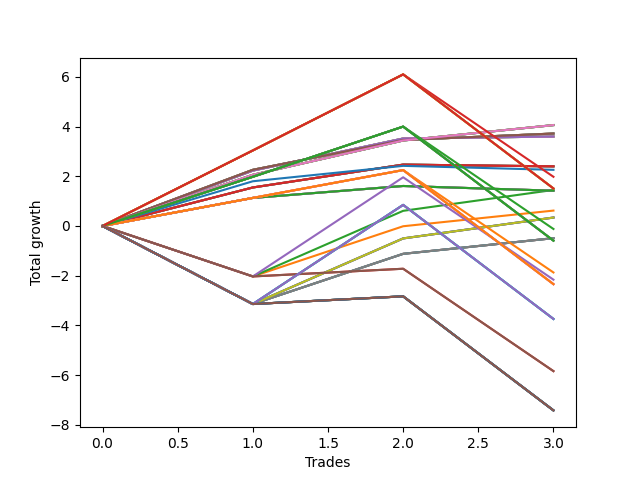

# Long Wallace 020 
- Symbol: NVDA_Unlimited
- Date Range: 02/08/2022 - 07/08/2022
- Trading Period: 7:20-12:30
- Number of Trades: 3



| Name | Win Percent | Profit | Avg Profit / Trade | Avg Time / Trade |      | Name | Win Percent | Profit | Avg Profit / Trade | Avg Time / Trade |
| ---- | ----------- | ------ | ------------------ | ---------------- | ---- | ---- | ----------- | ------ | ------------------ | ---------------- |
| Sorted By <br> Profit | | | | | | Sorted By <br> Win Percentage ||||
| Sixty-Eight | 100.00 | 2030.00 | 676.67 | 41:06 |     | Sixty-Eight | 100.00 | 2030.00 | 676.67 | 41:06 |
| Sixty | 100.00 | 2030.00 | 676.67 | 41:06 |     | Sixty | 100.00 | 2030.00 | 676.67 | 41:06 |
| Fifty-Two | 100.00 | 2030.00 | 676.67 | 41:06 |     | Fifty-Two | 100.00 | 2030.00 | 676.67 | 41:06 |
| Forty-Four | 100.00 | 2030.00 | 676.67 | 41:06 |     | Forty-Four | 100.00 | 2030.00 | 676.67 | 41:06 |
| Four | 100.00 | 2030.00 | 676.67 | 41:06 |     | Four | 100.00 | 2030.00 | 676.67 | 41:06 |
| Sixty-Seven | 100.00 | 1860.00 | 620.00 | 19:05 |     | Sixty-Seven | 100.00 | 1860.00 | 620.00 | 19:05 |
| Fifty-Nine | 100.00 | 1860.00 | 620.00 | 19:05 |     | Fifty-Nine | 100.00 | 1860.00 | 620.00 | 19:05 |
| Fifty-One | 100.00 | 1860.00 | 620.00 | 19:05 |     | Fifty-One | 100.00 | 1860.00 | 620.00 | 19:05 |
| Forty-Three | 100.00 | 1860.00 | 620.00 | 19:05 |     | Forty-Three | 100.00 | 1860.00 | 620.00 | 19:05 |
| Three | 100.00 | 1860.00 | 620.00 | 19:05 |     | Three | 100.00 | 1860.00 | 620.00 | 19:05 |
| Sixty-Six | 100.00 | 1800.00 | 600.00 | 15:35 |     | Sixty-Six | 100.00 | 1800.00 | 600.00 | 15:35 |
| Fifty-Eight | 100.00 | 1800.00 | 600.00 | 15:35 |     | Fifty-Eight | 100.00 | 1800.00 | 600.00 | 15:35 |
| Fifty | 100.00 | 1800.00 | 600.00 | 15:35 |     | Fifty | 100.00 | 1800.00 | 600.00 | 15:35 |
| Forty-Two | 100.00 | 1800.00 | 600.00 | 15:35 |     | Forty-Two | 100.00 | 1800.00 | 600.00 | 15:35 |
| Two | 100.00 | 1800.00 | 600.00 | 15:35 |     | Two | 100.00 | 1800.00 | 600.00 | 15:35 |
| Sixty-Five | 66.67 | 1200.00 | 400.00 | 13:03 |     | Sixty-Five | 66.67 | 1200.00 | 400.00 | 13:03 |
| Fifty-Seven | 66.67 | 1200.00 | 400.00 | 13:03 |     | Fifty-Seven | 66.67 | 1200.00 | 400.00 | 13:03 |
| Forty-Nine | 66.67 | 1200.00 | 400.00 | 13:03 |     | Forty-Nine | 66.67 | 1200.00 | 400.00 | 13:03 |
| Forty-One | 66.67 | 1200.00 | 400.00 | 13:03 |     | Forty-One | 66.67 | 1200.00 | 400.00 | 13:03 |
| One | 66.67 | 1200.00 | 400.00 | 13:03 |     | One | 66.67 | 1200.00 | 400.00 | 13:03 |
| Seventy-Three | 66.67 | 1130.00 | 376.67 | 13:25 |     | Seventy-Three | 66.67 | 1130.00 | 376.67 | 13:25 |
| One Hundred Eighteen | 66.67 | 990.00 | 330.00 | 115:03 |     | One Hundred Eighteen | 66.67 | 990.00 | 330.00 | 115:03 |
| One Hundred Twenty-Eight | 66.67 | 755.00 | 251.67 | 121:03 |     | One Hundred Twenty-Eight | 66.67 | 755.00 | 251.67 | 121:03 |
| One Hundred Twenty-Three | 66.67 | 755.00 | 251.67 | 121:03 |     | One Hundred Twenty-Three | 66.67 | 755.00 | 251.67 | 121:03 |
| One Hundred Thirteen | 66.67 | 755.00 | 251.67 | 121:03 |     | One Hundred Thirteen | 66.67 | 755.00 | 251.67 | 121:03 |
| Eighty-Three | 66.67 | 755.00 | 251.67 | 121:03 |     | Eighty-Three | 66.67 | 755.00 | 251.67 | 121:03 |
| Fifty-Four | 66.67 | 725.00 | 241.67 | 69:51 |     | Fifty-Four | 66.67 | 725.00 | 241.67 | 69:51 |
| Sixty-Four | 66.67 | 710.00 | 236.67 | 08:26 |     | Sixty-Four | 66.67 | 710.00 | 236.67 | 08:26 |
| Fifty-Six | 66.67 | 710.00 | 236.67 | 08:26 |     | Fifty-Six | 66.67 | 710.00 | 236.67 | 08:26 |
| Forty-Eight | 66.67 | 710.00 | 236.67 | 08:26 |     | Forty-Eight | 66.67 | 710.00 | 236.67 | 08:26 |
| Forty | 66.67 | 710.00 | 236.67 | 08:26 |     | Forty | 66.67 | 710.00 | 236.67 | 08:26 |
| Zero | 66.67 | 710.00 | 236.67 | 08:26 |     | Zero | 66.67 | 710.00 | 236.67 | 08:26 |
| Fifty-Three | 66.67 | 310.00 | 103.33 | 65:55 |     | Fifty-Three | 66.67 | 310.00 | 103.33 | 65:55 |
| Seventy | 66.67 | 170.00 | 56.67 | 74:55 |     | Seventy | 66.67 | 170.00 | 56.67 | 74:55 |
| Sixty-Two | 66.67 | 170.00 | 56.67 | 74:55 |     | Sixty-Two | 66.67 | 170.00 | 56.67 | 74:55 |
| Forty-Six | 66.67 | 170.00 | 56.67 | 74:55 |     | Forty-Six | 66.67 | 170.00 | 56.67 | 74:55 |
| Six | 66.67 | 170.00 | 56.67 | 74:55 |     | Six | 66.67 | 170.00 | 56.67 | 74:55 |
| One Hundred Seventeen | 66.67 | -60.00 | -20.00 | 99:58 |     | One Hundred Seventeen | 66.67 | -60.00 | -20.00 | 99:58 |
| Sixty-Nine | 66.67 | -245.00 | -81.67 | 70:58 |     | Sixty-Nine | 66.67 | -245.00 | -81.67 | 70:58 |
| Sixty-One | 66.67 | -245.00 | -81.67 | 70:58 |     | Sixty-One | 66.67 | -245.00 | -81.67 | 70:58 |
| Forty-Five | 66.67 | -245.00 | -81.67 | 70:58 |     | Forty-Five | 66.67 | -245.00 | -81.67 | 70:58 |
| Five | 66.67 | -245.00 | -81.67 | 70:58 |     | Five | 66.67 | -245.00 | -81.67 | 70:58 |
| One Hundred Twenty-Seven | 66.67 | -295.00 | -98.33 | 105:58 |     | One Hundred Twenty-Seven | 66.67 | -295.00 | -98.33 | 105:58 |
| One Hundred Twenty-Two | 66.67 | -295.00 | -98.33 | 105:58 |     | One Hundred Twenty-Two | 66.67 | -295.00 | -98.33 | 105:58 |
| One Hundred Twelve | 66.67 | -295.00 | -98.33 | 105:58 |     | One Hundred Twelve | 66.67 | -295.00 | -98.33 | 105:58 |
| Eighty-Two | 66.67 | -295.00 | -98.33 | 105:58 |     | Eighty-Two | 66.67 | -295.00 | -98.33 | 105:58 |
| One Hundred Sixteen | 66.67 | -935.00 | -311.67 | 90:50 |     | One Hundred Sixteen | 66.67 | -935.00 | -311.67 | 90:50 |
| One Hundred Ninteen | 33.33 | -1080.00 | -360.00 | 158:41 |     | One Hundred Twenty-Six | 66.67 | -1170.00 | -390.00 | 96:50 |
| One Hundred Twenty-Six | 66.67 | -1170.00 | -390.00 | 96:50 |     | One Hundred Twenty-One | 66.67 | -1170.00 | -390.00 | 96:50 |
| One Hundred Twenty-One | 66.67 | -1170.00 | -390.00 | 96:50 |     | One Hundred Eleven | 66.67 | -1170.00 | -390.00 | 96:50 |
| One Hundred Eleven | 66.67 | -1170.00 | -390.00 | 96:50 |     | Eighty-One | 66.67 | -1170.00 | -390.00 | 96:50 |
| Eighty-One | 66.67 | -1170.00 | -390.00 | 96:50 |     | One Hundred Ninteen | 33.33 | -1080.00 | -360.00 | 158:41 |
| One Hundred Twenty-Nine | 33.33 | -1870.00 | -623.33 | 169:45 |     | One Hundred Twenty-Nine | 33.33 | -1870.00 | -623.33 | 169:45 |
| One Hundred Twenty-Four | 33.33 | -1870.00 | -623.33 | 169:45 |     | One Hundred Twenty-Four | 33.33 | -1870.00 | -623.33 | 169:45 |
| One Hundred Fourteen | 33.33 | -1870.00 | -623.33 | 169:45 |     | One Hundred Fourteen | 33.33 | -1870.00 | -623.33 | 169:45 |
| Eighty-Four | 33.33 | -1870.00 | -623.33 | 169:45 |     | Eighty-Four | 33.33 | -1870.00 | -623.33 | 169:45 |
| One Hundred Twenty | 33.33 | -2920.00 | -973.33 | 173:36 |     | One Hundred Twenty | 33.33 | -2920.00 | -973.33 | 173:36 |
| Fifty-Five | 33.33 | -2920.00 | -973.33 | 173:36 |     | Fifty-Five | 33.33 | -2920.00 | -973.33 | 173:36 |
| One Hundred Thirty | 33.33 | -3710.00 | -1236.67 | 184:40 |     | One Hundred Thirty | 33.33 | -3710.00 | -1236.67 | 184:40 |
| One Hundred Twenty-Five | 33.33 | -3710.00 | -1236.67 | 184:40 |     | One Hundred Twenty-Five | 33.33 | -3710.00 | -1236.67 | 184:40 |
| One Hundred Fifteen | 33.33 | -3710.00 | -1236.67 | 184:40 |     | One Hundred Fifteen | 33.33 | -3710.00 | -1236.67 | 184:40 |
| Eighty-Five | 33.33 | -3710.00 | -1236.67 | 184:40 |     | Eighty-Five | 33.33 | -3710.00 | -1236.67 | 184:40 |
| Seventy-One | 33.33 | -3710.00 | -1236.67 | 184:40 |     | Seventy-One | 33.33 | -3710.00 | -1236.67 | 184:40 |
| Sixty-Three | 33.33 | -3710.00 | -1236.67 | 184:40 |     | Sixty-Three | 33.33 | -3710.00 | -1236.67 | 184:40 |
| Forty-Seven | 33.33 | -3710.00 | -1236.67 | 184:40 |     | Forty-Seven | 33.33 | -3710.00 | -1236.67 | 184:40 |
| Seven | 33.33 | -3710.00 | -1236.67 | 184:40 |     | Seven | 33.33 | -3710.00 | -1236.67 | 184:40 |

## NO STOPLOSS

### Test Zero
* Sell when price hits the middle line of the 20p bollinger
* No Stoploss
* Results:
```
Total Trades: 3
Percent Up: 66.67
Percent Down: 33.33
Total Points Moved Up: 1.42
Potential Profit: 710.00
Total Points Ups: 1.61 Count Ups: 2
Total Points Downs: -0.19 Count Downs: 1
```

<details><summary>Trades</summary>

<code>In: 2022-02-10 10:39:00		Out: 2022-02-10 10:40:50		Total Position Time: 01:50		Total Move Up: 1.13		Total to Date: 1.13</code> <br />
<code>In: 2022-03-31 10:18:00		Out: 2022-03-31 10:26:30		Total Position Time: 08:30		Total Move Up: 0.48		Total to Date: 1.61</code> <br />
<code>In: 2022-06-09 08:10:00		Out: 2022-06-09 08:25:00		Total Position Time: 15:00		Total Move Up: -0.19		Total to Date: 1.42</code> <br />


</details>

### Test One
* Sell when the price hits the upper line of the 20p 1std bollinger
* No Stoploss
* Results:
```
Total Trades: 3
Percent Up: 66.67
Percent Down: 33.33
Total Points Moved Up: 2.40
Potential Profit: 1200.00
Total Points Ups: 2.47 Count Ups: 2
Total Points Downs: -0.07 Count Downs: 1
```

<details><summary>Trades</summary>

<code>In: 2022-02-10 10:39:00		Out: 2022-02-10 10:43:25		Total Position Time: 04:25		Total Move Up: 1.55		Total to Date: 1.55</code> <br />
<code>In: 2022-03-31 10:18:00		Out: 2022-03-31 10:29:20		Total Position Time: 11:20		Total Move Up: 0.92		Total to Date: 2.47</code> <br />
<code>In: 2022-06-09 08:10:00		Out: 2022-06-09 08:33:25		Total Position Time: 23:25		Total Move Up: -0.07		Total to Date: 2.40</code> <br />


</details>

### Test Two
* Sell when the price hits the upper line of the 20p 2std bollinger
* No Stoploss
* Results:
```
Total Trades: 3
Percent Up: 100.00
Percent Down: 0.00
Total Points Moved Up: 3.60
Potential Profit: 1800.00
Total Points Ups: 3.60 Count Ups: 3
Total Points Downs: 0.00 Count Downs: 0
```

<details><summary>Trades</summary>

<code>In: 2022-02-10 10:39:00		Out: 2022-02-10 10:46:50		Total Position Time: 07:50		Total Move Up: 2.23		Total to Date: 2.23</code> <br />
<code>In: 2022-03-31 10:18:00		Out: 2022-03-31 10:31:45		Total Position Time: 13:45		Total Move Up: 1.29		Total to Date: 3.52</code> <br />
<code>In: 2022-06-09 08:10:00		Out: 2022-06-09 08:35:10		Total Position Time: 25:10		Total Move Up: 0.08		Total to Date: 3.60</code> <br />


</details>

### Test Three
* Sell when price hits the middle line of the 50p bollinger
* No Stoploss
* Results:
```
Total Trades: 3
Percent Up: 100.00
Percent Down: 0.00
Total Points Moved Up: 3.72
Potential Profit: 1860.00
Total Points Ups: 3.72 Count Ups: 3
Total Points Downs: 0.00 Count Downs: 0
```

<details><summary>Trades</summary>

<code>In: 2022-02-10 10:39:00		Out: 2022-02-10 10:58:20		Total Position Time: 19:20		Total Move Up: 2.26		Total to Date: 2.26</code> <br />
<code>In: 2022-03-31 10:18:00		Out: 2022-03-31 10:29:50		Total Position Time: 11:50		Total Move Up: 1.20		Total to Date: 3.46</code> <br />
<code>In: 2022-06-09 08:10:00		Out: 2022-06-09 08:36:05		Total Position Time: 26:05		Total Move Up: 0.26		Total to Date: 3.72</code> <br />


</details>

### Test Four
* Sell when the price hits the upper line of the 50p 1std bollinger
* No Stoploss
* Results:
```
Total Trades: 3
Percent Up: 100.00
Percent Down: 0.00
Total Points Moved Up: 4.06
Potential Profit: 2030.00
Total Points Ups: 4.06 Count Ups: 3
Total Points Downs: 0.00 Count Downs: 0
```

<details><summary>Trades</summary>

<code>In: 2022-02-10 10:39:00		Out: 2022-02-10 11:36:45		Total Position Time: 57:45		Total Move Up: 2.06		Total to Date: 2.06</code> <br />
<code>In: 2022-03-31 10:18:00		Out: 2022-03-31 10:50:20		Total Position Time: 32:20		Total Move Up: 1.38		Total to Date: 3.44</code> <br />
<code>In: 2022-06-09 08:10:00		Out: 2022-06-09 08:43:15		Total Position Time: 33:15		Total Move Up: 0.62		Total to Date: 4.06</code> <br />


</details>

### Test Five
* Sell when the price hits the upper line of the 50p 2std bollinger
* No Stoploss
* Results:
```
Total Trades: 3
Percent Up: 66.67
Percent Down: 33.33
Total Points Moved Up: -0.49
Potential Profit: -245.00
Total Points Ups: 2.65 Count Ups: 2
Total Points Downs: -3.14 Count Downs: 1
```

<details><summary>Trades</summary>

<code>In: 2022-02-10 10:39:00		Out: 2022-02-10 12:47:00		Total Position Time: 128:00		Total Move Up: -3.14		Total to Date: -3.14</code> <br />
<code>In: 2022-03-31 10:18:00		Out: 2022-03-31 10:51:30		Total Position Time: 33:30		Total Move Up: 2.02		Total to Date: -1.12</code> <br />
<code>In: 2022-06-09 08:10:00		Out: 2022-06-09 09:01:25		Total Position Time: 51:25		Total Move Up: 0.63		Total to Date: -0.49</code> <br />


</details>

### Test Six
* Sell when the price hits the middle line of the 1std VWAP
* No Stoploss
* Results:
```
Total Trades: 3
Percent Up: 66.67
Percent Down: 33.33
Total Points Moved Up: 0.34
Potential Profit: 170.00
Total Points Ups: 3.48 Count Ups: 2
Total Points Downs: -3.14 Count Downs: 1
```

<details><summary>Trades</summary>

<code>In: 2022-02-10 10:39:00		Out: 2022-02-10 12:47:00		Total Position Time: 128:00		Total Move Up: -3.14		Total to Date: -3.14</code> <br />
<code>In: 2022-03-31 10:18:00		Out: 2022-03-31 11:20:55		Total Position Time: 62:55		Total Move Up: 2.64		Total to Date: -0.50</code> <br />
<code>In: 2022-06-09 08:10:00		Out: 2022-06-09 08:43:50		Total Position Time: 33:50		Total Move Up: 0.84		Total to Date: 0.34</code> <br />


</details>

### Test Seven
* Sell when the price hits the upper line of the 1std VWAP
* No Stoploss
* Results:
```
Total Trades: 3
Percent Up: 33.33
Percent Down: 66.67
Total Points Moved Up: -7.42
Potential Profit: -3710.00
Total Points Ups: 0.31 Count Ups: 1
Total Points Downs: -7.73 Count Downs: 2
```

<details><summary>Trades</summary>

<code>In: 2022-02-10 10:39:00		Out: 2022-02-10 12:47:00		Total Position Time: 128:00		Total Move Up: -3.14		Total to Date: -3.14</code> <br />
<code>In: 2022-03-31 10:18:00		Out: 2022-03-31 12:47:00		Total Position Time: 149:00		Total Move Up: 0.31		Total to Date: -2.83</code> <br />
<code>In: 2022-06-09 08:10:00		Out: 2022-06-09 12:47:00		Total Position Time: 277:00		Total Move Up: -4.59		Total to Date: -7.42</code> <br />


</details>

## STOPLOSS OF 5

### Test Forty
* Sell when price hits the middle line of the 20p bollinger
* Stoploss is 5 points
* Results:
```
Total Trades: 3
Percent Up: 66.67
Percent Down: 33.33
Total Points Moved Up: 1.42
Potential Profit: 710.00
Total Points Ups: 1.61 Count Ups: 2
Total Points Downs: -0.19 Count Downs: 1
```

<details><summary>Trades</summary>

<code>In: 2022-02-10 10:39:00		Out: 2022-02-10 10:40:50		Total Position Time: 01:50		Total Move Up: 1.13		Total to Date: 1.13</code> <br />
<code>In: 2022-03-31 10:18:00		Out: 2022-03-31 10:26:30		Total Position Time: 08:30		Total Move Up: 0.48		Total to Date: 1.61</code> <br />
<code>In: 2022-06-09 08:10:00		Out: 2022-06-09 08:25:00		Total Position Time: 15:00		Total Move Up: -0.19		Total to Date: 1.42</code> <br />


</details>

### Test Forty-One
* Sell when the price hits the upper line of the 20p 1std bollinger
* Stoploss is 5 points
* Results:
```
Total Trades: 3
Percent Up: 66.67
Percent Down: 33.33
Total Points Moved Up: 2.40
Potential Profit: 1200.00
Total Points Ups: 2.47 Count Ups: 2
Total Points Downs: -0.07 Count Downs: 1
```

<details><summary>Trades</summary>

<code>In: 2022-02-10 10:39:00		Out: 2022-02-10 10:43:25		Total Position Time: 04:25		Total Move Up: 1.55		Total to Date: 1.55</code> <br />
<code>In: 2022-03-31 10:18:00		Out: 2022-03-31 10:29:20		Total Position Time: 11:20		Total Move Up: 0.92		Total to Date: 2.47</code> <br />
<code>In: 2022-06-09 08:10:00		Out: 2022-06-09 08:33:25		Total Position Time: 23:25		Total Move Up: -0.07		Total to Date: 2.40</code> <br />


</details>

### Test Forty-Two
* Sell when the price hits the upper line of the 20p 2std bollinger
* Stoploss is 5 points
* Results:
```
Total Trades: 3
Percent Up: 100.00
Percent Down: 0.00
Total Points Moved Up: 3.60
Potential Profit: 1800.00
Total Points Ups: 3.60 Count Ups: 3
Total Points Downs: 0.00 Count Downs: 0
```

<details><summary>Trades</summary>

<code>In: 2022-02-10 10:39:00		Out: 2022-02-10 10:46:50		Total Position Time: 07:50		Total Move Up: 2.23		Total to Date: 2.23</code> <br />
<code>In: 2022-03-31 10:18:00		Out: 2022-03-31 10:31:45		Total Position Time: 13:45		Total Move Up: 1.29		Total to Date: 3.52</code> <br />
<code>In: 2022-06-09 08:10:00		Out: 2022-06-09 08:35:10		Total Position Time: 25:10		Total Move Up: 0.08		Total to Date: 3.60</code> <br />


</details>

### Test Forty-Three
* Sell when price hits the middle line of the 50p bollinger
* Stoploss is 5 points
* Results:
```
Total Trades: 3
Percent Up: 100.00
Percent Down: 0.00
Total Points Moved Up: 3.72
Potential Profit: 1860.00
Total Points Ups: 3.72 Count Ups: 3
Total Points Downs: 0.00 Count Downs: 0
```

<details><summary>Trades</summary>

<code>In: 2022-02-10 10:39:00		Out: 2022-02-10 10:58:20		Total Position Time: 19:20		Total Move Up: 2.26		Total to Date: 2.26</code> <br />
<code>In: 2022-03-31 10:18:00		Out: 2022-03-31 10:29:50		Total Position Time: 11:50		Total Move Up: 1.20		Total to Date: 3.46</code> <br />
<code>In: 2022-06-09 08:10:00		Out: 2022-06-09 08:36:05		Total Position Time: 26:05		Total Move Up: 0.26		Total to Date: 3.72</code> <br />


</details>

### Test Forty-Four
* Sell when the price hits the upper line of the 50p 1std bollinger
* Stoploss is 5 points
* Results:
```
Total Trades: 3
Percent Up: 100.00
Percent Down: 0.00
Total Points Moved Up: 4.06
Potential Profit: 2030.00
Total Points Ups: 4.06 Count Ups: 3
Total Points Downs: 0.00 Count Downs: 0
```

<details><summary>Trades</summary>

<code>In: 2022-02-10 10:39:00		Out: 2022-02-10 11:36:45		Total Position Time: 57:45		Total Move Up: 2.06		Total to Date: 2.06</code> <br />
<code>In: 2022-03-31 10:18:00		Out: 2022-03-31 10:50:20		Total Position Time: 32:20		Total Move Up: 1.38		Total to Date: 3.44</code> <br />
<code>In: 2022-06-09 08:10:00		Out: 2022-06-09 08:43:15		Total Position Time: 33:15		Total Move Up: 0.62		Total to Date: 4.06</code> <br />


</details>

### Test Forty-Five
* Sell when the price hits the upper line of the 50p 2std bollinger
* Stoploss is 5 points
* Results:
```
Total Trades: 3
Percent Up: 66.67
Percent Down: 33.33
Total Points Moved Up: -0.49
Potential Profit: -245.00
Total Points Ups: 2.65 Count Ups: 2
Total Points Downs: -3.14 Count Downs: 1
```

<details><summary>Trades</summary>

<code>In: 2022-02-10 10:39:00		Out: 2022-02-10 12:47:00		Total Position Time: 128:00		Total Move Up: -3.14		Total to Date: -3.14</code> <br />
<code>In: 2022-03-31 10:18:00		Out: 2022-03-31 10:51:30		Total Position Time: 33:30		Total Move Up: 2.02		Total to Date: -1.12</code> <br />
<code>In: 2022-06-09 08:10:00		Out: 2022-06-09 09:01:25		Total Position Time: 51:25		Total Move Up: 0.63		Total to Date: -0.49</code> <br />


</details>

### Test Forty-Six
* Sell when the price hits the middle line of the 1std VWAP
* Stoploss is 5 points
* Results:
```
Total Trades: 3
Percent Up: 66.67
Percent Down: 33.33
Total Points Moved Up: 0.34
Potential Profit: 170.00
Total Points Ups: 3.48 Count Ups: 2
Total Points Downs: -3.14 Count Downs: 1
```

<details><summary>Trades</summary>

<code>In: 2022-02-10 10:39:00		Out: 2022-02-10 12:47:00		Total Position Time: 128:00		Total Move Up: -3.14		Total to Date: -3.14</code> <br />
<code>In: 2022-03-31 10:18:00		Out: 2022-03-31 11:20:55		Total Position Time: 62:55		Total Move Up: 2.64		Total to Date: -0.50</code> <br />
<code>In: 2022-06-09 08:10:00		Out: 2022-06-09 08:43:50		Total Position Time: 33:50		Total Move Up: 0.84		Total to Date: 0.34</code> <br />


</details>

### Test Forty-Seven
* Sell when the price hits the upper line of the 1std VWAP
* Stoploss is 5 points
* Results:
```
Total Trades: 3
Percent Up: 33.33
Percent Down: 66.67
Total Points Moved Up: -7.42
Potential Profit: -3710.00
Total Points Ups: 0.31 Count Ups: 1
Total Points Downs: -7.73 Count Downs: 2
```

<details><summary>Trades</summary>

<code>In: 2022-02-10 10:39:00		Out: 2022-02-10 12:47:00		Total Position Time: 128:00		Total Move Up: -3.14		Total to Date: -3.14</code> <br />
<code>In: 2022-03-31 10:18:00		Out: 2022-03-31 12:47:00		Total Position Time: 149:00		Total Move Up: 0.31		Total to Date: -2.83</code> <br />
<code>In: 2022-06-09 08:10:00		Out: 2022-06-09 12:47:00		Total Position Time: 277:00		Total Move Up: -4.59		Total to Date: -7.42</code> <br />


</details>

## TRAIL STOP OF 5

### Test Forty-Eight
* Sell when price hits the middle line of the 20p bollinger
* Trailing Stop is 5 points
* Results:
```
Total Trades: 3
Percent Up: 66.67
Percent Down: 33.33
Total Points Moved Up: 1.42
Potential Profit: 710.00
Total Points Ups: 1.61 Count Ups: 2
Total Points Downs: -0.19 Count Downs: 1
```

<details><summary>Trades</summary>

<code>In: 2022-02-10 10:39:00		Out: 2022-02-10 10:40:50		Total Position Time: 01:50		Total Move Up: 1.13		Total to Date: 1.13</code> <br />
<code>In: 2022-03-31 10:18:00		Out: 2022-03-31 10:26:30		Total Position Time: 08:30		Total Move Up: 0.48		Total to Date: 1.61</code> <br />
<code>In: 2022-06-09 08:10:00		Out: 2022-06-09 08:25:00		Total Position Time: 15:00		Total Move Up: -0.19		Total to Date: 1.42</code> <br />


</details>

### Test Forty-Nine
* Sell when the price hits the upper line of the 20p 1std bollinger
* Trailing Stop is 5 points
* Results:
```
Total Trades: 3
Percent Up: 66.67
Percent Down: 33.33
Total Points Moved Up: 2.40
Potential Profit: 1200.00
Total Points Ups: 2.47 Count Ups: 2
Total Points Downs: -0.07 Count Downs: 1
```

<details><summary>Trades</summary>

<code>In: 2022-02-10 10:39:00		Out: 2022-02-10 10:43:25		Total Position Time: 04:25		Total Move Up: 1.55		Total to Date: 1.55</code> <br />
<code>In: 2022-03-31 10:18:00		Out: 2022-03-31 10:29:20		Total Position Time: 11:20		Total Move Up: 0.92		Total to Date: 2.47</code> <br />
<code>In: 2022-06-09 08:10:00		Out: 2022-06-09 08:33:25		Total Position Time: 23:25		Total Move Up: -0.07		Total to Date: 2.40</code> <br />


</details>

### Test Fifty
* Sell when the price hits the upper line of the 20p 2std bollinger
* Trailing Stop is 5 points
* Results:
```
Total Trades: 3
Percent Up: 100.00
Percent Down: 0.00
Total Points Moved Up: 3.60
Potential Profit: 1800.00
Total Points Ups: 3.60 Count Ups: 3
Total Points Downs: 0.00 Count Downs: 0
```

<details><summary>Trades</summary>

<code>In: 2022-02-10 10:39:00		Out: 2022-02-10 10:46:50		Total Position Time: 07:50		Total Move Up: 2.23		Total to Date: 2.23</code> <br />
<code>In: 2022-03-31 10:18:00		Out: 2022-03-31 10:31:45		Total Position Time: 13:45		Total Move Up: 1.29		Total to Date: 3.52</code> <br />
<code>In: 2022-06-09 08:10:00		Out: 2022-06-09 08:35:10		Total Position Time: 25:10		Total Move Up: 0.08		Total to Date: 3.60</code> <br />


</details>

### Test Fifty-One
* Sell when price hits the middle line of the 50p bollinger
* Trailing Stop is 5 points
* Results:
```
Total Trades: 3
Percent Up: 100.00
Percent Down: 0.00
Total Points Moved Up: 3.72
Potential Profit: 1860.00
Total Points Ups: 3.72 Count Ups: 3
Total Points Downs: 0.00 Count Downs: 0
```

<details><summary>Trades</summary>

<code>In: 2022-02-10 10:39:00		Out: 2022-02-10 10:58:20		Total Position Time: 19:20		Total Move Up: 2.26		Total to Date: 2.26</code> <br />
<code>In: 2022-03-31 10:18:00		Out: 2022-03-31 10:29:50		Total Position Time: 11:50		Total Move Up: 1.20		Total to Date: 3.46</code> <br />
<code>In: 2022-06-09 08:10:00		Out: 2022-06-09 08:36:05		Total Position Time: 26:05		Total Move Up: 0.26		Total to Date: 3.72</code> <br />


</details>

### Test Fifty-Two
* Sell when the price hits the upper line of the 50p 1std bollinger
* Trailing Stop is 5 points
* Results:
```
Total Trades: 3
Percent Up: 100.00
Percent Down: 0.00
Total Points Moved Up: 4.06
Potential Profit: 2030.00
Total Points Ups: 4.06 Count Ups: 3
Total Points Downs: 0.00 Count Downs: 0
```

<details><summary>Trades</summary>

<code>In: 2022-02-10 10:39:00		Out: 2022-02-10 11:36:45		Total Position Time: 57:45		Total Move Up: 2.06		Total to Date: 2.06</code> <br />
<code>In: 2022-03-31 10:18:00		Out: 2022-03-31 10:50:20		Total Position Time: 32:20		Total Move Up: 1.38		Total to Date: 3.44</code> <br />
<code>In: 2022-06-09 08:10:00		Out: 2022-06-09 08:43:15		Total Position Time: 33:15		Total Move Up: 0.62		Total to Date: 4.06</code> <br />


</details>

### Test Fifty-Three
* Sell when the price hits the upper line of the 50p 2std bollinger
* Trailing Stop is 5 points
* Results:
```
Total Trades: 3
Percent Up: 66.67
Percent Down: 33.33
Total Points Moved Up: 0.62
Potential Profit: 310.00
Total Points Ups: 2.65 Count Ups: 2
Total Points Downs: -2.03 Count Downs: 1
```

<details><summary>Trades</summary>

<code>In: 2022-02-10 10:39:00		Out: 2022-02-10 12:31:50		Total Position Time: 112:50		Total Move Up: -2.03		Total to Date: -2.03</code> <br />
<code>In: 2022-03-31 10:18:00		Out: 2022-03-31 10:51:30		Total Position Time: 33:30		Total Move Up: 2.02		Total to Date: -0.01</code> <br />
<code>In: 2022-06-09 08:10:00		Out: 2022-06-09 09:01:25		Total Position Time: 51:25		Total Move Up: 0.63		Total to Date: 0.62</code> <br />


</details>

### Test Fifty-Four
* Sell when the price hits the middle line of the 1std VWAP
* Trailing Stop is 5 points
* Results:
```
Total Trades: 3
Percent Up: 66.67
Percent Down: 33.33
Total Points Moved Up: 1.45
Potential Profit: 725.00
Total Points Ups: 3.48 Count Ups: 2
Total Points Downs: -2.03 Count Downs: 1
```

<details><summary>Trades</summary>

<code>In: 2022-02-10 10:39:00		Out: 2022-02-10 12:31:50		Total Position Time: 112:50		Total Move Up: -2.03		Total to Date: -2.03</code> <br />
<code>In: 2022-03-31 10:18:00		Out: 2022-03-31 11:20:55		Total Position Time: 62:55		Total Move Up: 2.64		Total to Date: 0.61</code> <br />
<code>In: 2022-06-09 08:10:00		Out: 2022-06-09 08:43:50		Total Position Time: 33:50		Total Move Up: 0.84		Total to Date: 1.45</code> <br />


</details>

### Test Fifty-Five
* Sell when the price hits the upper line of the 1std VWAP
* Trailing Stop is 5 points
* Results:
```
Total Trades: 3
Percent Up: 33.33
Percent Down: 66.67
Total Points Moved Up: -5.84
Potential Profit: -2920.00
Total Points Ups: 0.31 Count Ups: 1
Total Points Downs: -6.15 Count Downs: 2
```

<details><summary>Trades</summary>

<code>In: 2022-02-10 10:39:00		Out: 2022-02-10 12:31:50		Total Position Time: 112:50		Total Move Up: -2.03		Total to Date: -2.03</code> <br />
<code>In: 2022-03-31 10:18:00		Out: 2022-03-31 12:47:00		Total Position Time: 149:00		Total Move Up: 0.31		Total to Date: -1.72</code> <br />
<code>In: 2022-06-09 08:10:00		Out: 2022-06-09 12:29:00		Total Position Time: 259:00		Total Move Up: -4.12		Total to Date: -5.84</code> <br />


</details>

## STOPLOSS OF 10

### Test Fifty-Six
* Sell when price hits the middle line of the 20p bollinger
* Stoploss is 10 points
* Results:
```
Total Trades: 3
Percent Up: 66.67
Percent Down: 33.33
Total Points Moved Up: 1.42
Potential Profit: 710.00
Total Points Ups: 1.61 Count Ups: 2
Total Points Downs: -0.19 Count Downs: 1
```

<details><summary>Trades</summary>

<code>In: 2022-02-10 10:39:00		Out: 2022-02-10 10:40:50		Total Position Time: 01:50		Total Move Up: 1.13		Total to Date: 1.13</code> <br />
<code>In: 2022-03-31 10:18:00		Out: 2022-03-31 10:26:30		Total Position Time: 08:30		Total Move Up: 0.48		Total to Date: 1.61</code> <br />
<code>In: 2022-06-09 08:10:00		Out: 2022-06-09 08:25:00		Total Position Time: 15:00		Total Move Up: -0.19		Total to Date: 1.42</code> <br />


</details>

### Test Fifty-Seven
* Sell when the price hits the upper line of the 20p 1std bollinger
* Stoploss is 10 points
* Results:
```
Total Trades: 3
Percent Up: 66.67
Percent Down: 33.33
Total Points Moved Up: 2.40
Potential Profit: 1200.00
Total Points Ups: 2.47 Count Ups: 2
Total Points Downs: -0.07 Count Downs: 1
```

<details><summary>Trades</summary>

<code>In: 2022-02-10 10:39:00		Out: 2022-02-10 10:43:25		Total Position Time: 04:25		Total Move Up: 1.55		Total to Date: 1.55</code> <br />
<code>In: 2022-03-31 10:18:00		Out: 2022-03-31 10:29:20		Total Position Time: 11:20		Total Move Up: 0.92		Total to Date: 2.47</code> <br />
<code>In: 2022-06-09 08:10:00		Out: 2022-06-09 08:33:25		Total Position Time: 23:25		Total Move Up: -0.07		Total to Date: 2.40</code> <br />


</details>

### Test Fifty-Eight
* Sell when the price hits the upper line of the 20p 2std bollinger
* Stoploss is 10 points
* Results:
```
Total Trades: 3
Percent Up: 100.00
Percent Down: 0.00
Total Points Moved Up: 3.60
Potential Profit: 1800.00
Total Points Ups: 3.60 Count Ups: 3
Total Points Downs: 0.00 Count Downs: 0
```

<details><summary>Trades</summary>

<code>In: 2022-02-10 10:39:00		Out: 2022-02-10 10:46:50		Total Position Time: 07:50		Total Move Up: 2.23		Total to Date: 2.23</code> <br />
<code>In: 2022-03-31 10:18:00		Out: 2022-03-31 10:31:45		Total Position Time: 13:45		Total Move Up: 1.29		Total to Date: 3.52</code> <br />
<code>In: 2022-06-09 08:10:00		Out: 2022-06-09 08:35:10		Total Position Time: 25:10		Total Move Up: 0.08		Total to Date: 3.60</code> <br />


</details>

### Test Fifty-Nine
* Sell when price hits the middle line of the 50p bollinger
* Stoploss is 10 points
* Results:
```
Total Trades: 3
Percent Up: 100.00
Percent Down: 0.00
Total Points Moved Up: 3.72
Potential Profit: 1860.00
Total Points Ups: 3.72 Count Ups: 3
Total Points Downs: 0.00 Count Downs: 0
```

<details><summary>Trades</summary>

<code>In: 2022-02-10 10:39:00		Out: 2022-02-10 10:58:20		Total Position Time: 19:20		Total Move Up: 2.26		Total to Date: 2.26</code> <br />
<code>In: 2022-03-31 10:18:00		Out: 2022-03-31 10:29:50		Total Position Time: 11:50		Total Move Up: 1.20		Total to Date: 3.46</code> <br />
<code>In: 2022-06-09 08:10:00		Out: 2022-06-09 08:36:05		Total Position Time: 26:05		Total Move Up: 0.26		Total to Date: 3.72</code> <br />


</details>

### Test Sixty
* Sell when the price hits the upper line of the 50p 1std bollinger
* Stoploss is 10 points
* Results:
```
Total Trades: 3
Percent Up: 100.00
Percent Down: 0.00
Total Points Moved Up: 4.06
Potential Profit: 2030.00
Total Points Ups: 4.06 Count Ups: 3
Total Points Downs: 0.00 Count Downs: 0
```

<details><summary>Trades</summary>

<code>In: 2022-02-10 10:39:00		Out: 2022-02-10 11:36:45		Total Position Time: 57:45		Total Move Up: 2.06		Total to Date: 2.06</code> <br />
<code>In: 2022-03-31 10:18:00		Out: 2022-03-31 10:50:20		Total Position Time: 32:20		Total Move Up: 1.38		Total to Date: 3.44</code> <br />
<code>In: 2022-06-09 08:10:00		Out: 2022-06-09 08:43:15		Total Position Time: 33:15		Total Move Up: 0.62		Total to Date: 4.06</code> <br />


</details>

### Test Sixty-One
* Sell when the price hits the upper line of the 50p 2std bollinger
* Stoploss is 10 points
* Results:
```
Total Trades: 3
Percent Up: 66.67
Percent Down: 33.33
Total Points Moved Up: -0.49
Potential Profit: -245.00
Total Points Ups: 2.65 Count Ups: 2
Total Points Downs: -3.14 Count Downs: 1
```

<details><summary>Trades</summary>

<code>In: 2022-02-10 10:39:00		Out: 2022-02-10 12:47:00		Total Position Time: 128:00		Total Move Up: -3.14		Total to Date: -3.14</code> <br />
<code>In: 2022-03-31 10:18:00		Out: 2022-03-31 10:51:30		Total Position Time: 33:30		Total Move Up: 2.02		Total to Date: -1.12</code> <br />
<code>In: 2022-06-09 08:10:00		Out: 2022-06-09 09:01:25		Total Position Time: 51:25		Total Move Up: 0.63		Total to Date: -0.49</code> <br />


</details>

### Test Sixty-Two
* Sell when the price hits the middle line of the 1std VWAP
* Stoploss is 10 points
* Results:
```
Total Trades: 3
Percent Up: 66.67
Percent Down: 33.33
Total Points Moved Up: 0.34
Potential Profit: 170.00
Total Points Ups: 3.48 Count Ups: 2
Total Points Downs: -3.14 Count Downs: 1
```

<details><summary>Trades</summary>

<code>In: 2022-02-10 10:39:00		Out: 2022-02-10 12:47:00		Total Position Time: 128:00		Total Move Up: -3.14		Total to Date: -3.14</code> <br />
<code>In: 2022-03-31 10:18:00		Out: 2022-03-31 11:20:55		Total Position Time: 62:55		Total Move Up: 2.64		Total to Date: -0.50</code> <br />
<code>In: 2022-06-09 08:10:00		Out: 2022-06-09 08:43:50		Total Position Time: 33:50		Total Move Up: 0.84		Total to Date: 0.34</code> <br />


</details>

### Test Sixty-Three
* Sell when the price hits the upper line of the 1std VWAP
* Stoploss is 10 points
* Results:
```
Total Trades: 3
Percent Up: 33.33
Percent Down: 66.67
Total Points Moved Up: -7.42
Potential Profit: -3710.00
Total Points Ups: 0.31 Count Ups: 1
Total Points Downs: -7.73 Count Downs: 2
```

<details><summary>Trades</summary>

<code>In: 2022-02-10 10:39:00		Out: 2022-02-10 12:47:00		Total Position Time: 128:00		Total Move Up: -3.14		Total to Date: -3.14</code> <br />
<code>In: 2022-03-31 10:18:00		Out: 2022-03-31 12:47:00		Total Position Time: 149:00		Total Move Up: 0.31		Total to Date: -2.83</code> <br />
<code>In: 2022-06-09 08:10:00		Out: 2022-06-09 12:47:00		Total Position Time: 277:00		Total Move Up: -4.59		Total to Date: -7.42</code> <br />


</details>

## TRAIL STOP OF 10

### Test Sixty-Four
* Sell when price hits the middle line of the 20p bollinger
* Trailing Stop is 10 points
* Results:
```
Total Trades: 3
Percent Up: 66.67
Percent Down: 33.33
Total Points Moved Up: 1.42
Potential Profit: 710.00
Total Points Ups: 1.61 Count Ups: 2
Total Points Downs: -0.19 Count Downs: 1
```

<details><summary>Trades</summary>

<code>In: 2022-02-10 10:39:00		Out: 2022-02-10 10:40:50		Total Position Time: 01:50		Total Move Up: 1.13		Total to Date: 1.13</code> <br />
<code>In: 2022-03-31 10:18:00		Out: 2022-03-31 10:26:30		Total Position Time: 08:30		Total Move Up: 0.48		Total to Date: 1.61</code> <br />
<code>In: 2022-06-09 08:10:00		Out: 2022-06-09 08:25:00		Total Position Time: 15:00		Total Move Up: -0.19		Total to Date: 1.42</code> <br />


</details>

### Test Sixty-Five
* Sell when the price hits the upper line of the 20p 1std bollinger
* Trailing Stop is 10 points
* Results:
```
Total Trades: 3
Percent Up: 66.67
Percent Down: 33.33
Total Points Moved Up: 2.40
Potential Profit: 1200.00
Total Points Ups: 2.47 Count Ups: 2
Total Points Downs: -0.07 Count Downs: 1
```

<details><summary>Trades</summary>

<code>In: 2022-02-10 10:39:00		Out: 2022-02-10 10:43:25		Total Position Time: 04:25		Total Move Up: 1.55		Total to Date: 1.55</code> <br />
<code>In: 2022-03-31 10:18:00		Out: 2022-03-31 10:29:20		Total Position Time: 11:20		Total Move Up: 0.92		Total to Date: 2.47</code> <br />
<code>In: 2022-06-09 08:10:00		Out: 2022-06-09 08:33:25		Total Position Time: 23:25		Total Move Up: -0.07		Total to Date: 2.40</code> <br />


</details>

### Test Sixty-Six
* Sell when the price hits the upper line of the 20p 2std bollinger
* Trailing Stop is 10 points
* Results:
```
Total Trades: 3
Percent Up: 100.00
Percent Down: 0.00
Total Points Moved Up: 3.60
Potential Profit: 1800.00
Total Points Ups: 3.60 Count Ups: 3
Total Points Downs: 0.00 Count Downs: 0
```

<details><summary>Trades</summary>

<code>In: 2022-02-10 10:39:00		Out: 2022-02-10 10:46:50		Total Position Time: 07:50		Total Move Up: 2.23		Total to Date: 2.23</code> <br />
<code>In: 2022-03-31 10:18:00		Out: 2022-03-31 10:31:45		Total Position Time: 13:45		Total Move Up: 1.29		Total to Date: 3.52</code> <br />
<code>In: 2022-06-09 08:10:00		Out: 2022-06-09 08:35:10		Total Position Time: 25:10		Total Move Up: 0.08		Total to Date: 3.60</code> <br />


</details>

### Test Sixty-Seven
* Sell when price hits the middle line of the 50p bollinger
* Trailing Stop is 10 points
* Results:
```
Total Trades: 3
Percent Up: 100.00
Percent Down: 0.00
Total Points Moved Up: 3.72
Potential Profit: 1860.00
Total Points Ups: 3.72 Count Ups: 3
Total Points Downs: 0.00 Count Downs: 0
```

<details><summary>Trades</summary>

<code>In: 2022-02-10 10:39:00		Out: 2022-02-10 10:58:20		Total Position Time: 19:20		Total Move Up: 2.26		Total to Date: 2.26</code> <br />
<code>In: 2022-03-31 10:18:00		Out: 2022-03-31 10:29:50		Total Position Time: 11:50		Total Move Up: 1.20		Total to Date: 3.46</code> <br />
<code>In: 2022-06-09 08:10:00		Out: 2022-06-09 08:36:05		Total Position Time: 26:05		Total Move Up: 0.26		Total to Date: 3.72</code> <br />


</details>

### Test Sixty-Eight
* Sell when the price hits the upper line of the 50p 1std bollinger
* Trailing Stop is 10 points
* Results:
```
Total Trades: 3
Percent Up: 100.00
Percent Down: 0.00
Total Points Moved Up: 4.06
Potential Profit: 2030.00
Total Points Ups: 4.06 Count Ups: 3
Total Points Downs: 0.00 Count Downs: 0
```

<details><summary>Trades</summary>

<code>In: 2022-02-10 10:39:00		Out: 2022-02-10 11:36:45		Total Position Time: 57:45		Total Move Up: 2.06		Total to Date: 2.06</code> <br />
<code>In: 2022-03-31 10:18:00		Out: 2022-03-31 10:50:20		Total Position Time: 32:20		Total Move Up: 1.38		Total to Date: 3.44</code> <br />
<code>In: 2022-06-09 08:10:00		Out: 2022-06-09 08:43:15		Total Position Time: 33:15		Total Move Up: 0.62		Total to Date: 4.06</code> <br />


</details>

### Test Sixty-Nine
* Sell when the price hits the upper line of the 50p 2std bollinger
* Trailing Stop is 10 points
* Results:
```
Total Trades: 3
Percent Up: 66.67
Percent Down: 33.33
Total Points Moved Up: -0.49
Potential Profit: -245.00
Total Points Ups: 2.65 Count Ups: 2
Total Points Downs: -3.14 Count Downs: 1
```

<details><summary>Trades</summary>

<code>In: 2022-02-10 10:39:00		Out: 2022-02-10 12:47:00		Total Position Time: 128:00		Total Move Up: -3.14		Total to Date: -3.14</code> <br />
<code>In: 2022-03-31 10:18:00		Out: 2022-03-31 10:51:30		Total Position Time: 33:30		Total Move Up: 2.02		Total to Date: -1.12</code> <br />
<code>In: 2022-06-09 08:10:00		Out: 2022-06-09 09:01:25		Total Position Time: 51:25		Total Move Up: 0.63		Total to Date: -0.49</code> <br />


</details>

### Test Seventy
* Sell when the price hits the middle line of the 1std VWAP
* Trailing Stop is 10 points
* Results:
```
Total Trades: 3
Percent Up: 66.67
Percent Down: 33.33
Total Points Moved Up: 0.34
Potential Profit: 170.00
Total Points Ups: 3.48 Count Ups: 2
Total Points Downs: -3.14 Count Downs: 1
```

<details><summary>Trades</summary>

<code>In: 2022-02-10 10:39:00		Out: 2022-02-10 12:47:00		Total Position Time: 128:00		Total Move Up: -3.14		Total to Date: -3.14</code> <br />
<code>In: 2022-03-31 10:18:00		Out: 2022-03-31 11:20:55		Total Position Time: 62:55		Total Move Up: 2.64		Total to Date: -0.50</code> <br />
<code>In: 2022-06-09 08:10:00		Out: 2022-06-09 08:43:50		Total Position Time: 33:50		Total Move Up: 0.84		Total to Date: 0.34</code> <br />


</details>

### Test Seventy-One
* Sell when the price hits the upper line of the 1std VWAP
* Trailing Stop is 10 points
* Results:
```
Total Trades: 3
Percent Up: 33.33
Percent Down: 66.67
Total Points Moved Up: -7.42
Potential Profit: -3710.00
Total Points Ups: 0.31 Count Ups: 1
Total Points Downs: -7.73 Count Downs: 2
```

<details><summary>Trades</summary>

<code>In: 2022-02-10 10:39:00		Out: 2022-02-10 12:47:00		Total Position Time: 128:00		Total Move Up: -3.14		Total to Date: -3.14</code> <br />
<code>In: 2022-03-31 10:18:00		Out: 2022-03-31 12:47:00		Total Position Time: 149:00		Total Move Up: 0.31		Total to Date: -2.83</code> <br />
<code>In: 2022-06-09 08:10:00		Out: 2022-06-09 12:47:00		Total Position Time: 277:00		Total Move Up: -4.59		Total to Date: -7.42</code> <br />


</details>

## SPECIAL EXIT CONDITIONS 

### Test Seventy-Three
* Sell when the linear regression slope changes to negative
* No Stoploss
* Results:
```
Total Trades: 3
Percent Up: 66.67
Percent Down: 33.33
Total Points Moved Up: 2.26
Potential Profit: 1130.00
Total Points Ups: 2.42 Count Ups: 2
Total Points Downs: -0.16 Count Downs: 1
```

<details><summary>Trades</summary>

<code>In: 2022-02-10 10:39:00		Out: 2022-02-10 10:54:05		Total Position Time: 15:05		Total Move Up: 1.80		Total to Date: 1.80</code> <br />
<code>In: 2022-03-31 10:18:00		Out: 2022-03-31 10:38:05		Total Position Time: 20:05		Total Move Up: 0.62		Total to Date: 2.42</code> <br />
<code>In: 2022-06-09 08:10:00		Out: 2022-06-09 08:15:05		Total Position Time: 05:05		Total Move Up: -0.16		Total to Date: 2.26</code> <br />


</details>

## TAKE PROFIT

### Test Eighty-One
* Take Profit of 1 Point
* No Stoploss
* Results:
```
Total Trades: 3
Percent Up: 66.67
Percent Down: 33.33
Total Points Moved Up: -2.34
Potential Profit: -1170.00
Total Points Ups: 2.25 Count Ups: 2
Total Points Downs: -4.59 Count Downs: 1
```

<details><summary>Trades</summary>

<code>In: 2022-02-10 10:39:00		Out: 2022-02-10 10:40:50		Total Position Time: 01:50		Total Move Up: 1.13		Total to Date: 1.13</code> <br />
<code>In: 2022-03-31 10:18:00		Out: 2022-03-31 10:29:40		Total Position Time: 11:40		Total Move Up: 1.12		Total to Date: 2.25</code> <br />
<code>In: 2022-06-09 08:10:00		Out: 2022-06-09 12:47:00		Total Position Time: 277:00		Total Move Up: -4.59		Total to Date: -2.34</code> <br />


</details>

### Test Eighty-Two
* Take Profit of 2 Point
* No Stoploss
* Results:
```
Total Trades: 3
Percent Up: 66.67
Percent Down: 33.33
Total Points Moved Up: -0.59
Potential Profit: -295.00
Total Points Ups: 4.00 Count Ups: 2
Total Points Downs: -4.59 Count Downs: 1
```

<details><summary>Trades</summary>

<code>In: 2022-02-10 10:39:00		Out: 2022-02-10 10:46:25		Total Position Time: 07:25		Total Move Up: 1.98		Total to Date: 1.98</code> <br />
<code>In: 2022-03-31 10:18:00		Out: 2022-03-31 10:51:30		Total Position Time: 33:30		Total Move Up: 2.02		Total to Date: 4.00</code> <br />
<code>In: 2022-06-09 08:10:00		Out: 2022-06-09 12:47:00		Total Position Time: 277:00		Total Move Up: -4.59		Total to Date: -0.59</code> <br />


</details>

### Test Eighty-Three
* Take Profit of 3 Point
* No Stoploss
* Results:
```
Total Trades: 3
Percent Up: 66.67
Percent Down: 33.33
Total Points Moved Up: 1.51
Potential Profit: 755.00
Total Points Ups: 6.10 Count Ups: 2
Total Points Downs: -4.59 Count Downs: 1
```

<details><summary>Trades</summary>

<code>In: 2022-02-10 10:39:00		Out: 2022-02-10 11:00:30		Total Position Time: 21:30		Total Move Up: 3.04		Total to Date: 3.04</code> <br />
<code>In: 2022-03-31 10:18:00		Out: 2022-03-31 11:22:40		Total Position Time: 64:40		Total Move Up: 3.06		Total to Date: 6.10</code> <br />
<code>In: 2022-06-09 08:10:00		Out: 2022-06-09 12:47:00		Total Position Time: 277:00		Total Move Up: -4.59		Total to Date: 1.51</code> <br />


</details>

### Test Eighty-Four
* Take Profit of 4 Point
* No Stoploss
* Results:
```
Total Trades: 3
Percent Up: 33.33
Percent Down: 66.67
Total Points Moved Up: -3.74
Potential Profit: -1870.00
Total Points Ups: 3.99 Count Ups: 1
Total Points Downs: -7.73 Count Downs: 2
```

<details><summary>Trades</summary>

<code>In: 2022-02-10 10:39:00		Out: 2022-02-10 12:47:00		Total Position Time: 128:00		Total Move Up: -3.14		Total to Date: -3.14</code> <br />
<code>In: 2022-03-31 10:18:00		Out: 2022-03-31 12:02:15		Total Position Time: 104:15		Total Move Up: 3.99		Total to Date: 0.85</code> <br />
<code>In: 2022-06-09 08:10:00		Out: 2022-06-09 12:47:00		Total Position Time: 277:00		Total Move Up: -4.59		Total to Date: -3.74</code> <br />


</details>

### Test Eighty-Five
* Take Profit of 5 Point
* No Stoploss
* Results:
```
Total Trades: 3
Percent Up: 33.33
Percent Down: 66.67
Total Points Moved Up: -7.42
Potential Profit: -3710.00
Total Points Ups: 0.31 Count Ups: 1
Total Points Downs: -7.73 Count Downs: 2
```

<details><summary>Trades</summary>

<code>In: 2022-02-10 10:39:00		Out: 2022-02-10 12:47:00		Total Position Time: 128:00		Total Move Up: -3.14		Total to Date: -3.14</code> <br />
<code>In: 2022-03-31 10:18:00		Out: 2022-03-31 12:47:00		Total Position Time: 149:00		Total Move Up: 0.31		Total to Date: -2.83</code> <br />
<code>In: 2022-06-09 08:10:00		Out: 2022-06-09 12:47:00		Total Position Time: 277:00		Total Move Up: -4.59		Total to Date: -7.42</code> <br />


</details>

## TAKE PROFIT Stoploss of Five

### Test One Hundred Eleven
* Take Profit of 1 Point
* Stoploss is 5 points
* Results:
```
Total Trades: 3
Percent Up: 66.67
Percent Down: 33.33
Total Points Moved Up: -2.34
Potential Profit: -1170.00
Total Points Ups: 2.25 Count Ups: 2
Total Points Downs: -4.59 Count Downs: 1
```

<details><summary>Trades</summary>

<code>In: 2022-02-10 10:39:00		Out: 2022-02-10 10:40:50		Total Position Time: 01:50		Total Move Up: 1.13		Total to Date: 1.13</code> <br />
<code>In: 2022-03-31 10:18:00		Out: 2022-03-31 10:29:40		Total Position Time: 11:40		Total Move Up: 1.12		Total to Date: 2.25</code> <br />
<code>In: 2022-06-09 08:10:00		Out: 2022-06-09 12:47:00		Total Position Time: 277:00		Total Move Up: -4.59		Total to Date: -2.34</code> <br />


</details>

### Test One Hundred Twelve
* Take Profit of 2 Point
* Stoploss is 5 points
* Results:
```
Total Trades: 3
Percent Up: 66.67
Percent Down: 33.33
Total Points Moved Up: -0.59
Potential Profit: -295.00
Total Points Ups: 4.00 Count Ups: 2
Total Points Downs: -4.59 Count Downs: 1
```

<details><summary>Trades</summary>

<code>In: 2022-02-10 10:39:00		Out: 2022-02-10 10:46:25		Total Position Time: 07:25		Total Move Up: 1.98		Total to Date: 1.98</code> <br />
<code>In: 2022-03-31 10:18:00		Out: 2022-03-31 10:51:30		Total Position Time: 33:30		Total Move Up: 2.02		Total to Date: 4.00</code> <br />
<code>In: 2022-06-09 08:10:00		Out: 2022-06-09 12:47:00		Total Position Time: 277:00		Total Move Up: -4.59		Total to Date: -0.59</code> <br />


</details>

### Test One Hundred Thirteen
* Take Profit of 3 Point
* Stoploss is 5 points
* Results:
```
Total Trades: 3
Percent Up: 66.67
Percent Down: 33.33
Total Points Moved Up: 1.51
Potential Profit: 755.00
Total Points Ups: 6.10 Count Ups: 2
Total Points Downs: -4.59 Count Downs: 1
```

<details><summary>Trades</summary>

<code>In: 2022-02-10 10:39:00		Out: 2022-02-10 11:00:30		Total Position Time: 21:30		Total Move Up: 3.04		Total to Date: 3.04</code> <br />
<code>In: 2022-03-31 10:18:00		Out: 2022-03-31 11:22:40		Total Position Time: 64:40		Total Move Up: 3.06		Total to Date: 6.10</code> <br />
<code>In: 2022-06-09 08:10:00		Out: 2022-06-09 12:47:00		Total Position Time: 277:00		Total Move Up: -4.59		Total to Date: 1.51</code> <br />


</details>

### Test One Hundred Fourteen
* Take Profit of 4 Point
* Stoploss is 5 points
* Results:
```
Total Trades: 3
Percent Up: 33.33
Percent Down: 66.67
Total Points Moved Up: -3.74
Potential Profit: -1870.00
Total Points Ups: 3.99 Count Ups: 1
Total Points Downs: -7.73 Count Downs: 2
```

<details><summary>Trades</summary>

<code>In: 2022-02-10 10:39:00		Out: 2022-02-10 12:47:00		Total Position Time: 128:00		Total Move Up: -3.14		Total to Date: -3.14</code> <br />
<code>In: 2022-03-31 10:18:00		Out: 2022-03-31 12:02:15		Total Position Time: 104:15		Total Move Up: 3.99		Total to Date: 0.85</code> <br />
<code>In: 2022-06-09 08:10:00		Out: 2022-06-09 12:47:00		Total Position Time: 277:00		Total Move Up: -4.59		Total to Date: -3.74</code> <br />


</details>

### Test One Hundred Fifteen
* Take Profit of 5 Point
* Stoploss is 5 points
* Results:
```
Total Trades: 3
Percent Up: 33.33
Percent Down: 66.67
Total Points Moved Up: -7.42
Potential Profit: -3710.00
Total Points Ups: 0.31 Count Ups: 1
Total Points Downs: -7.73 Count Downs: 2
```

<details><summary>Trades</summary>

<code>In: 2022-02-10 10:39:00		Out: 2022-02-10 12:47:00		Total Position Time: 128:00		Total Move Up: -3.14		Total to Date: -3.14</code> <br />
<code>In: 2022-03-31 10:18:00		Out: 2022-03-31 12:47:00		Total Position Time: 149:00		Total Move Up: 0.31		Total to Date: -2.83</code> <br />
<code>In: 2022-06-09 08:10:00		Out: 2022-06-09 12:47:00		Total Position Time: 277:00		Total Move Up: -4.59		Total to Date: -7.42</code> <br />


</details>

## TAKE PROFIT Trailstop of Five

### Test One Hundred Sixteen
* Take Profit of 1 Point
* Trailing stop is 5 points
* Results:
```
Total Trades: 3
Percent Up: 66.67
Percent Down: 33.33
Total Points Moved Up: -1.87
Potential Profit: -935.00
Total Points Ups: 2.25 Count Ups: 2
Total Points Downs: -4.12 Count Downs: 1
```

<details><summary>Trades</summary>

<code>In: 2022-02-10 10:39:00		Out: 2022-02-10 10:40:50		Total Position Time: 01:50		Total Move Up: 1.13		Total to Date: 1.13</code> <br />
<code>In: 2022-03-31 10:18:00		Out: 2022-03-31 10:29:40		Total Position Time: 11:40		Total Move Up: 1.12		Total to Date: 2.25</code> <br />
<code>In: 2022-06-09 08:10:00		Out: 2022-06-09 12:29:00		Total Position Time: 259:00		Total Move Up: -4.12		Total to Date: -1.87</code> <br />


</details>

### Test One Hundred Seventeen
* Take Profit of 2 Point
* Trailing stop is 5 points
* Results:
```
Total Trades: 3
Percent Up: 66.67
Percent Down: 33.33
Total Points Moved Up: -0.12
Potential Profit: -60.00
Total Points Ups: 4.00 Count Ups: 2
Total Points Downs: -4.12 Count Downs: 1
```

<details><summary>Trades</summary>

<code>In: 2022-02-10 10:39:00		Out: 2022-02-10 10:46:25		Total Position Time: 07:25		Total Move Up: 1.98		Total to Date: 1.98</code> <br />
<code>In: 2022-03-31 10:18:00		Out: 2022-03-31 10:51:30		Total Position Time: 33:30		Total Move Up: 2.02		Total to Date: 4.00</code> <br />
<code>In: 2022-06-09 08:10:00		Out: 2022-06-09 12:29:00		Total Position Time: 259:00		Total Move Up: -4.12		Total to Date: -0.12</code> <br />


</details>

### Test One Hundred Eighteen
* Take Profit of 3 Point
* Trailing stop is 5 points
* Results:
```
Total Trades: 3
Percent Up: 66.67
Percent Down: 33.33
Total Points Moved Up: 1.98
Potential Profit: 990.00
Total Points Ups: 6.10 Count Ups: 2
Total Points Downs: -4.12 Count Downs: 1
```

<details><summary>Trades</summary>

<code>In: 2022-02-10 10:39:00		Out: 2022-02-10 11:00:30		Total Position Time: 21:30		Total Move Up: 3.04		Total to Date: 3.04</code> <br />
<code>In: 2022-03-31 10:18:00		Out: 2022-03-31 11:22:40		Total Position Time: 64:40		Total Move Up: 3.06		Total to Date: 6.10</code> <br />
<code>In: 2022-06-09 08:10:00		Out: 2022-06-09 12:29:00		Total Position Time: 259:00		Total Move Up: -4.12		Total to Date: 1.98</code> <br />


</details>

### Test One Hundred Ninteen
* Take Profit of 4 Point
* Trailing stop is 5 points
* Results:
```
Total Trades: 3
Percent Up: 33.33
Percent Down: 66.67
Total Points Moved Up: -2.16
Potential Profit: -1080.00
Total Points Ups: 3.99 Count Ups: 1
Total Points Downs: -6.15 Count Downs: 2
```

<details><summary>Trades</summary>

<code>In: 2022-02-10 10:39:00		Out: 2022-02-10 12:31:50		Total Position Time: 112:50		Total Move Up: -2.03		Total to Date: -2.03</code> <br />
<code>In: 2022-03-31 10:18:00		Out: 2022-03-31 12:02:15		Total Position Time: 104:15		Total Move Up: 3.99		Total to Date: 1.96</code> <br />
<code>In: 2022-06-09 08:10:00		Out: 2022-06-09 12:29:00		Total Position Time: 259:00		Total Move Up: -4.12		Total to Date: -2.16</code> <br />


</details>

### Test One Hundred Twenty
* Take Profit of 5 Point
* Trailing stop is 5 points
* Results:
```
Total Trades: 3
Percent Up: 33.33
Percent Down: 66.67
Total Points Moved Up: -5.84
Potential Profit: -2920.00
Total Points Ups: 0.31 Count Ups: 1
Total Points Downs: -6.15 Count Downs: 2
```

<details><summary>Trades</summary>

<code>In: 2022-02-10 10:39:00		Out: 2022-02-10 12:31:50		Total Position Time: 112:50		Total Move Up: -2.03		Total to Date: -2.03</code> <br />
<code>In: 2022-03-31 10:18:00		Out: 2022-03-31 12:47:00		Total Position Time: 149:00		Total Move Up: 0.31		Total to Date: -1.72</code> <br />
<code>In: 2022-06-09 08:10:00		Out: 2022-06-09 12:29:00		Total Position Time: 259:00		Total Move Up: -4.12		Total to Date: -5.84</code> <br />


</details>

## TAKE PROFIT Stoploss of Ten

### Test One Hundred Twenty-One
* Take Profit of 1 Point
* Stoploss is 10 points
* Results:
```
Total Trades: 3
Percent Up: 66.67
Percent Down: 33.33
Total Points Moved Up: -2.34
Potential Profit: -1170.00
Total Points Ups: 2.25 Count Ups: 2
Total Points Downs: -4.59 Count Downs: 1
```

<details><summary>Trades</summary>

<code>In: 2022-02-10 10:39:00		Out: 2022-02-10 10:40:50		Total Position Time: 01:50		Total Move Up: 1.13		Total to Date: 1.13</code> <br />
<code>In: 2022-03-31 10:18:00		Out: 2022-03-31 10:29:40		Total Position Time: 11:40		Total Move Up: 1.12		Total to Date: 2.25</code> <br />
<code>In: 2022-06-09 08:10:00		Out: 2022-06-09 12:47:00		Total Position Time: 277:00		Total Move Up: -4.59		Total to Date: -2.34</code> <br />


</details>

### Test One Hundred Twenty-Two
* Take Profit of 2 Point
* Stoploss is 10 points
* Results:
```
Total Trades: 3
Percent Up: 66.67
Percent Down: 33.33
Total Points Moved Up: -0.59
Potential Profit: -295.00
Total Points Ups: 4.00 Count Ups: 2
Total Points Downs: -4.59 Count Downs: 1
```

<details><summary>Trades</summary>

<code>In: 2022-02-10 10:39:00		Out: 2022-02-10 10:46:25		Total Position Time: 07:25		Total Move Up: 1.98		Total to Date: 1.98</code> <br />
<code>In: 2022-03-31 10:18:00		Out: 2022-03-31 10:51:30		Total Position Time: 33:30		Total Move Up: 2.02		Total to Date: 4.00</code> <br />
<code>In: 2022-06-09 08:10:00		Out: 2022-06-09 12:47:00		Total Position Time: 277:00		Total Move Up: -4.59		Total to Date: -0.59</code> <br />


</details>

### Test One Hundred Twenty-Three
* Take Profit of 3 Point
* Stoploss is 10 points
* Results:
```
Total Trades: 3
Percent Up: 66.67
Percent Down: 33.33
Total Points Moved Up: 1.51
Potential Profit: 755.00
Total Points Ups: 6.10 Count Ups: 2
Total Points Downs: -4.59 Count Downs: 1
```

<details><summary>Trades</summary>

<code>In: 2022-02-10 10:39:00		Out: 2022-02-10 11:00:30		Total Position Time: 21:30		Total Move Up: 3.04		Total to Date: 3.04</code> <br />
<code>In: 2022-03-31 10:18:00		Out: 2022-03-31 11:22:40		Total Position Time: 64:40		Total Move Up: 3.06		Total to Date: 6.10</code> <br />
<code>In: 2022-06-09 08:10:00		Out: 2022-06-09 12:47:00		Total Position Time: 277:00		Total Move Up: -4.59		Total to Date: 1.51</code> <br />


</details>

### Test One Hundred Twenty-Four
* Take Profit of 4 Point
* Stoploss is 10 points
* Results:
```
Total Trades: 3
Percent Up: 33.33
Percent Down: 66.67
Total Points Moved Up: -3.74
Potential Profit: -1870.00
Total Points Ups: 3.99 Count Ups: 1
Total Points Downs: -7.73 Count Downs: 2
```

<details><summary>Trades</summary>

<code>In: 2022-02-10 10:39:00		Out: 2022-02-10 12:47:00		Total Position Time: 128:00		Total Move Up: -3.14		Total to Date: -3.14</code> <br />
<code>In: 2022-03-31 10:18:00		Out: 2022-03-31 12:02:15		Total Position Time: 104:15		Total Move Up: 3.99		Total to Date: 0.85</code> <br />
<code>In: 2022-06-09 08:10:00		Out: 2022-06-09 12:47:00		Total Position Time: 277:00		Total Move Up: -4.59		Total to Date: -3.74</code> <br />


</details>

### Test One Hundred Twenty-Five
* Take Profit of 5 Point
* Stoploss is 10 points
* Results:
```
Total Trades: 3
Percent Up: 33.33
Percent Down: 66.67
Total Points Moved Up: -7.42
Potential Profit: -3710.00
Total Points Ups: 0.31 Count Ups: 1
Total Points Downs: -7.73 Count Downs: 2
```

<details><summary>Trades</summary>

<code>In: 2022-02-10 10:39:00		Out: 2022-02-10 12:47:00		Total Position Time: 128:00		Total Move Up: -3.14		Total to Date: -3.14</code> <br />
<code>In: 2022-03-31 10:18:00		Out: 2022-03-31 12:47:00		Total Position Time: 149:00		Total Move Up: 0.31		Total to Date: -2.83</code> <br />
<code>In: 2022-06-09 08:10:00		Out: 2022-06-09 12:47:00		Total Position Time: 277:00		Total Move Up: -4.59		Total to Date: -7.42</code> <br />


</details>

## TAKE PROFIT Trailstop of Ten

### Test One Hundred Twenty-Six
* Take Profit of 1 Point
* Trailing stop is 10 points
* Results:
```
Total Trades: 3
Percent Up: 66.67
Percent Down: 33.33
Total Points Moved Up: -2.34
Potential Profit: -1170.00
Total Points Ups: 2.25 Count Ups: 2
Total Points Downs: -4.59 Count Downs: 1
```

<details><summary>Trades</summary>

<code>In: 2022-02-10 10:39:00		Out: 2022-02-10 10:40:50		Total Position Time: 01:50		Total Move Up: 1.13		Total to Date: 1.13</code> <br />
<code>In: 2022-03-31 10:18:00		Out: 2022-03-31 10:29:40		Total Position Time: 11:40		Total Move Up: 1.12		Total to Date: 2.25</code> <br />
<code>In: 2022-06-09 08:10:00		Out: 2022-06-09 12:47:00		Total Position Time: 277:00		Total Move Up: -4.59		Total to Date: -2.34</code> <br />


</details>

### Test One Hundred Twenty-Seven
* Take Profit of 2 Point
* Trailing stop is 10 points
* Results:
```
Total Trades: 3
Percent Up: 66.67
Percent Down: 33.33
Total Points Moved Up: -0.59
Potential Profit: -295.00
Total Points Ups: 4.00 Count Ups: 2
Total Points Downs: -4.59 Count Downs: 1
```

<details><summary>Trades</summary>

<code>In: 2022-02-10 10:39:00		Out: 2022-02-10 10:46:25		Total Position Time: 07:25		Total Move Up: 1.98		Total to Date: 1.98</code> <br />
<code>In: 2022-03-31 10:18:00		Out: 2022-03-31 10:51:30		Total Position Time: 33:30		Total Move Up: 2.02		Total to Date: 4.00</code> <br />
<code>In: 2022-06-09 08:10:00		Out: 2022-06-09 12:47:00		Total Position Time: 277:00		Total Move Up: -4.59		Total to Date: -0.59</code> <br />


</details>

### Test One Hundred Twenty-Eight
* Take Profit of 3 Point
* Trailing stop is 10 points
* Results:
```
Total Trades: 3
Percent Up: 66.67
Percent Down: 33.33
Total Points Moved Up: 1.51
Potential Profit: 755.00
Total Points Ups: 6.10 Count Ups: 2
Total Points Downs: -4.59 Count Downs: 1
```

<details><summary>Trades</summary>

<code>In: 2022-02-10 10:39:00		Out: 2022-02-10 11:00:30		Total Position Time: 21:30		Total Move Up: 3.04		Total to Date: 3.04</code> <br />
<code>In: 2022-03-31 10:18:00		Out: 2022-03-31 11:22:40		Total Position Time: 64:40		Total Move Up: 3.06		Total to Date: 6.10</code> <br />
<code>In: 2022-06-09 08:10:00		Out: 2022-06-09 12:47:00		Total Position Time: 277:00		Total Move Up: -4.59		Total to Date: 1.51</code> <br />


</details>

### Test One Hundred Twenty-Nine
* Take Profit of 4 Point
* Trailing stop is 10 points
* Results:
```
Total Trades: 3
Percent Up: 33.33
Percent Down: 66.67
Total Points Moved Up: -3.74
Potential Profit: -1870.00
Total Points Ups: 3.99 Count Ups: 1
Total Points Downs: -7.73 Count Downs: 2
```

<details><summary>Trades</summary>

<code>In: 2022-02-10 10:39:00		Out: 2022-02-10 12:47:00		Total Position Time: 128:00		Total Move Up: -3.14		Total to Date: -3.14</code> <br />
<code>In: 2022-03-31 10:18:00		Out: 2022-03-31 12:02:15		Total Position Time: 104:15		Total Move Up: 3.99		Total to Date: 0.85</code> <br />
<code>In: 2022-06-09 08:10:00		Out: 2022-06-09 12:47:00		Total Position Time: 277:00		Total Move Up: -4.59		Total to Date: -3.74</code> <br />


</details>

### Test One Hundred Thirty
* Take Profit of 5 Point
* Trailing stop is 10 points
* Results:
```
Total Trades: 3
Percent Up: 33.33
Percent Down: 66.67
Total Points Moved Up: -7.42
Potential Profit: -3710.00
Total Points Ups: 0.31 Count Ups: 1
Total Points Downs: -7.73 Count Downs: 2
```

<details><summary>Trades</summary>

<code>In: 2022-02-10 10:39:00		Out: 2022-02-10 12:47:00		Total Position Time: 128:00		Total Move Up: -3.14		Total to Date: -3.14</code> <br />
<code>In: 2022-03-31 10:18:00		Out: 2022-03-31 12:47:00		Total Position Time: 149:00		Total Move Up: 0.31		Total to Date: -2.83</code> <br />
<code>In: 2022-06-09 08:10:00		Out: 2022-06-09 12:47:00		Total Position Time: 277:00		Total Move Up: -4.59		Total to Date: -7.42</code> <br />


</details>