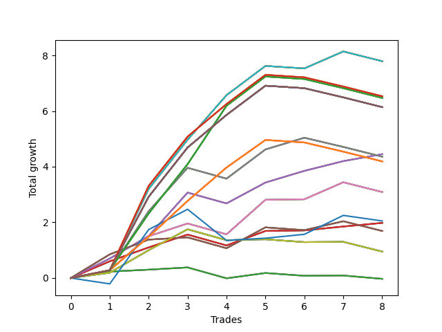

# Short Bulldog 004 
- Symbol: NVDA_Unlimited
- Date Range: 02/08/2022 - 07/08/2022
- Trading Period: 7:20-12:30
- Number of Trades: 8



| Name | Win Percent | Profit | Avg Profit / Trade | Avg Time / Trade |      | Name | Win Percent | Profit | Avg Profit / Trade | Avg Time / Trade |
| ---- | ----------- | ------ | ------------------ | ---------------- | ---- | ---- | ----------- | ------ | ------------------ | ---------------- |
| Sorted By <br> Profit | | | | | | Sorted By <br> Win Percentage ||||
| Seventy-One | 75.00 | 3895.00 | 486.88 | 25:45 |     | Sixty-Six | 87.50 | 2225.00 | 278.12 | 12:18 |
| Sixty-Three | 75.00 | 3895.00 | 486.88 | 25:45 |     | Fifty-Eight | 87.50 | 2225.00 | 278.12 | 12:18 |
| Fifty-Five | 75.00 | 3895.00 | 486.88 | 25:45 |     | Fifty | 87.50 | 2225.00 | 278.12 | 12:18 |
| Forty-Seven | 75.00 | 3895.00 | 486.88 | 25:45 |     | Forty-Two | 87.50 | 2225.00 | 278.12 | 12:18 |
| Seven | 75.00 | 3895.00 | 486.88 | 25:45 |     | Two | 87.50 | 2225.00 | 278.12 | 12:18 |
| One Hundred Twenty-Eight | 62.50 | 3265.00 | 408.13 | 29:13 |     | Sixty-Five | 87.50 | 990.00 | 123.75 | 05:24 |
| One Hundred Twenty-Three | 62.50 | 3265.00 | 408.13 | 29:13 |     | Fifty-Seven | 87.50 | 990.00 | 123.75 | 05:24 |
| One Hundred Eighteen | 62.50 | 3265.00 | 408.13 | 29:13 |     | Forty-Nine | 87.50 | 990.00 | 123.75 | 05:24 |
| One Hundred Thirteen | 62.50 | 3265.00 | 408.13 | 29:13 |     | Forty-One | 87.50 | 990.00 | 123.75 | 05:24 |
| Eighty-Three | 62.50 | 3265.00 | 408.13 | 29:13 |     | One | 87.50 | 990.00 | 123.75 | 05:24 |
| One Hundred Twenty-Seven | 62.50 | 3235.00 | 404.38 | 27:51 |     | Seventy-One | 75.00 | 3895.00 | 486.88 | 25:45 |
| One Hundred Twenty-Two | 62.50 | 3235.00 | 404.38 | 27:51 |     | Sixty-Three | 75.00 | 3895.00 | 486.88 | 25:45 |
| One Hundred Seventeen | 62.50 | 3235.00 | 404.38 | 27:51 |     | Fifty-Five | 75.00 | 3895.00 | 486.88 | 25:45 |
| One Hundred Twelve | 62.50 | 3235.00 | 404.38 | 27:51 |     | Forty-Seven | 75.00 | 3895.00 | 486.88 | 25:45 |
| Eighty-Two | 62.50 | 3235.00 | 404.38 | 27:51 |     | Seven | 75.00 | 3895.00 | 486.88 | 25:45 |
| One Hundred Thirty | 62.50 | 3070.00 | 383.75 | 29:18 |     | Sixty-Eight | 75.00 | 1545.00 | 193.13 | 13:19 |
| One Hundred Twenty-Nine | 62.50 | 3070.00 | 383.75 | 29:18 |     | Sixty | 75.00 | 1545.00 | 193.13 | 13:19 |
| One Hundred Twenty-Five | 62.50 | 3070.00 | 383.75 | 29:18 |     | Fifty-Two | 75.00 | 1545.00 | 193.13 | 13:19 |
| One Hundred Twenty-Four | 62.50 | 3070.00 | 383.75 | 29:18 |     | Forty-Four | 75.00 | 1545.00 | 193.13 | 13:19 |
| One Hundred Twenty | 62.50 | 3070.00 | 383.75 | 29:18 |     | Four | 75.00 | 1545.00 | 193.13 | 13:19 |
| One Hundred Ninteen | 62.50 | 3070.00 | 383.75 | 29:18 |     | One Hundred Twenty-Eight | 62.50 | 3265.00 | 408.13 | 29:13 |
| One Hundred Fifteen | 62.50 | 3070.00 | 383.75 | 29:18 |     | One Hundred Twenty-Three | 62.50 | 3265.00 | 408.13 | 29:13 |
| One Hundred Fourteen | 62.50 | 3070.00 | 383.75 | 29:18 |     | One Hundred Eighteen | 62.50 | 3265.00 | 408.13 | 29:13 |
| Eighty-Five | 62.50 | 3070.00 | 383.75 | 29:18 |     | One Hundred Thirteen | 62.50 | 3265.00 | 408.13 | 29:13 |
| Eighty-Four | 62.50 | 3070.00 | 383.75 | 29:18 |     | Eighty-Three | 62.50 | 3265.00 | 408.13 | 29:13 |
| Sixty-Six | 87.50 | 2225.00 | 278.12 | 12:18 |     | One Hundred Twenty-Seven | 62.50 | 3235.00 | 404.38 | 27:51 |
| Fifty-Eight | 87.50 | 2225.00 | 278.12 | 12:18 |     | One Hundred Twenty-Two | 62.50 | 3235.00 | 404.38 | 27:51 |
| Fifty | 87.50 | 2225.00 | 278.12 | 12:18 |     | One Hundred Seventeen | 62.50 | 3235.00 | 404.38 | 27:51 |
| Forty-Two | 87.50 | 2225.00 | 278.12 | 12:18 |     | One Hundred Twelve | 62.50 | 3235.00 | 404.38 | 27:51 |
| Two | 87.50 | 2225.00 | 278.12 | 12:18 |     | Eighty-Two | 62.50 | 3235.00 | 404.38 | 27:51 |
| Sixty-Nine | 62.50 | 2180.00 | 272.50 | 21:20 |     | One Hundred Thirty | 62.50 | 3070.00 | 383.75 | 29:18 |
| Sixty-One | 62.50 | 2180.00 | 272.50 | 21:20 |     | One Hundred Twenty-Nine | 62.50 | 3070.00 | 383.75 | 29:18 |
| Fifty-Three | 62.50 | 2180.00 | 272.50 | 21:20 |     | One Hundred Twenty-Five | 62.50 | 3070.00 | 383.75 | 29:18 |
| Forty-Five | 62.50 | 2180.00 | 272.50 | 21:20 |     | One Hundred Twenty-Four | 62.50 | 3070.00 | 383.75 | 29:18 |
| Five | 62.50 | 2180.00 | 272.50 | 21:20 |     | One Hundred Twenty | 62.50 | 3070.00 | 383.75 | 29:18 |
| One Hundred Twenty-Six | 62.50 | 2095.00 | 261.88 | 25:28 |     | One Hundred Ninteen | 62.50 | 3070.00 | 383.75 | 29:18 |
| One Hundred Twenty-One | 62.50 | 2095.00 | 261.88 | 25:28 |     | One Hundred Fifteen | 62.50 | 3070.00 | 383.75 | 29:18 |
| One Hundred Sixteen | 62.50 | 2095.00 | 261.88 | 25:28 |     | One Hundred Fourteen | 62.50 | 3070.00 | 383.75 | 29:18 |
| One Hundred Eleven | 62.50 | 2095.00 | 261.88 | 25:28 |     | Eighty-Five | 62.50 | 3070.00 | 383.75 | 29:18 |
| Eighty-One | 62.50 | 2095.00 | 261.88 | 25:28 |     | Eighty-Four | 62.50 | 3070.00 | 383.75 | 29:18 |
| Sixty-Eight | 75.00 | 1545.00 | 193.13 | 13:19 |     | Sixty-Nine | 62.50 | 2180.00 | 272.50 | 21:20 |
| Sixty | 75.00 | 1545.00 | 193.13 | 13:19 |     | Sixty-One | 62.50 | 2180.00 | 272.50 | 21:20 |
| Fifty-Two | 75.00 | 1545.00 | 193.13 | 13:19 |     | Fifty-Three | 62.50 | 2180.00 | 272.50 | 21:20 |
| Forty-Four | 75.00 | 1545.00 | 193.13 | 13:19 |     | Forty-Five | 62.50 | 2180.00 | 272.50 | 21:20 |
| Four | 75.00 | 1545.00 | 193.13 | 13:19 |     | Five | 62.50 | 2180.00 | 272.50 | 21:20 |
| Seventy-Three | 62.50 | 1025.00 | 128.13 | 10:50 |     | One Hundred Twenty-Six | 62.50 | 2095.00 | 261.88 | 25:28 |
| Sixty-Five | 87.50 | 990.00 | 123.75 | 05:24 |     | One Hundred Twenty-One | 62.50 | 2095.00 | 261.88 | 25:28 |
| Fifty-Seven | 87.50 | 990.00 | 123.75 | 05:24 |     | One Hundred Sixteen | 62.50 | 2095.00 | 261.88 | 25:28 |
| Forty-Nine | 87.50 | 990.00 | 123.75 | 05:24 |     | One Hundred Eleven | 62.50 | 2095.00 | 261.88 | 25:28 |
| Forty-One | 87.50 | 990.00 | 123.75 | 05:24 |     | Eighty-One | 62.50 | 2095.00 | 261.88 | 25:28 |
| One | 87.50 | 990.00 | 123.75 | 05:24 |     | Seventy-Three | 62.50 | 1025.00 | 128.13 | 10:50 |
| Sixty-Seven | 62.50 | 845.00 | 105.63 | 07:39 |     | Sixty-Seven | 62.50 | 845.00 | 105.63 | 07:39 |
| Fifty-Nine | 62.50 | 845.00 | 105.63 | 07:39 |     | Fifty-Nine | 62.50 | 845.00 | 105.63 | 07:39 |
| Fifty-One | 62.50 | 845.00 | 105.63 | 07:39 |     | Fifty-One | 62.50 | 845.00 | 105.63 | 07:39 |
| Forty-Three | 62.50 | 845.00 | 105.63 | 07:39 |     | Forty-Three | 62.50 | 845.00 | 105.63 | 07:39 |
| Three | 62.50 | 845.00 | 105.63 | 07:39 |     | Three | 62.50 | 845.00 | 105.63 | 07:39 |
| Seventy | 62.50 | 475.00 | 59.38 | 08:25 |     | Seventy | 62.50 | 475.00 | 59.38 | 08:25 |
| Sixty-Two | 62.50 | 475.00 | 59.38 | 08:25 |     | Sixty-Two | 62.50 | 475.00 | 59.38 | 08:25 |
| Fifty-Four | 62.50 | 475.00 | 59.38 | 08:25 |     | Fifty-Four | 62.50 | 475.00 | 59.38 | 08:25 |
| Forty-Six | 62.50 | 475.00 | 59.38 | 08:25 |     | Forty-Six | 62.50 | 475.00 | 59.38 | 08:25 |
| Six | 62.50 | 475.00 | 59.38 | 08:25 |     | Six | 62.50 | 475.00 | 59.38 | 08:25 |
| Sixty-Four | 62.50 | -15.00 | -1.88 | 02:54 |     | Sixty-Four | 62.50 | -15.00 | -1.88 | 02:54 |
| Fifty-Six | 62.50 | -15.00 | -1.88 | 02:54 |     | Fifty-Six | 62.50 | -15.00 | -1.88 | 02:54 |
| Forty-Eight | 62.50 | -15.00 | -1.88 | 02:54 |     | Forty-Eight | 62.50 | -15.00 | -1.88 | 02:54 |
| Forty | 62.50 | -15.00 | -1.88 | 02:54 |     | Forty | 62.50 | -15.00 | -1.88 | 02:54 |
| Zero | 62.50 | -15.00 | -1.88 | 02:54 |     | Zero | 62.50 | -15.00 | -1.88 | 02:54 |

## NO STOPLOSS

### Test Zero
* Sell when price hits the middle line of the 20p bollinger
* No Stoploss
* Results:
```
Total Trades: 8
Percent Up: 37.50
Percent Down: 62.50
Total Points Moved Down: -0.03
Potential Profit: -15.00
Total Points Ups: 0.61 Count Ups: 3
Total Points Downs: 0.58 Count Downs: 5
```

<details><summary>Trades</summary>

<code>In: 2022-03-31 11:27:00		Out: 2022-03-31 11:31:10		Total Position Time: 04:10		Total Move Down: 0.23		Total to Date: 0.23</code> <br />
<code>In: 2022-03-31 12:06:00		Out: 2022-03-31 12:11:15		Total Position Time: 05:15		Total Move Down: 0.07		Total to Date: 0.30</code> <br />
<code>In: 2022-05-04 10:38:00		Out: 2022-05-04 10:38:55		Total Position Time: 00:55		Total Move Down: 0.08		Total to Date: 0.38</code> <br />
<code>In: 2022-05-04 11:08:00		Out: 2022-05-04 11:08:10		Total Position Time: 00:10		Total Move Down: -0.39		Total to Date: -0.01</code> <br />
<code>In: 2022-05-05 10:13:00		Out: 2022-05-05 10:14:00		Total Position Time: 01:00		Total Move Down: 0.19		Total to Date: 0.18</code> <br />
<code>In: 2022-06-10 12:04:00		Out: 2022-06-10 12:04:10		Total Position Time: 00:10		Total Move Down: -0.10		Total to Date: 0.08</code> <br />
<code>In: 2022-06-29 10:13:00		Out: 2022-06-29 10:13:10		Total Position Time: 00:10		Total Move Down: 0.01		Total to Date: 0.09</code> <br />
<code>In: 2022-06-29 12:21:00		Out: 2022-06-29 12:32:25		Total Position Time: 11:25		Total Move Down: -0.12		Total to Date: -0.03</code> <br />


</details>

### Test One
* Sell when the price hits the upper line of the 20p 1std bollinger
* No Stoploss
* Results:
```
Total Trades: 8
Percent Up: 12.50
Percent Down: 87.50
Total Points Moved Down: 1.98
Potential Profit: 990.00
Total Points Ups: 0.39 Count Ups: 1
Total Points Downs: 2.37 Count Downs: 7
```

<details><summary>Trades</summary>

<code>In: 2022-03-31 11:27:00		Out: 2022-03-31 11:35:00		Total Position Time: 08:00		Total Move Down: 0.60		Total to Date: 0.60</code> <br />
<code>In: 2022-03-31 12:06:00		Out: 2022-03-31 12:16:35		Total Position Time: 10:35		Total Move Down: 0.50		Total to Date: 1.10</code> <br />
<code>In: 2022-05-04 10:38:00		Out: 2022-05-04 10:41:05		Total Position Time: 03:05		Total Move Down: 0.46		Total to Date: 1.56</code> <br />
<code>In: 2022-05-04 11:08:00		Out: 2022-05-04 11:08:10		Total Position Time: 00:10		Total Move Down: -0.39		Total to Date: 1.17</code> <br />
<code>In: 2022-05-05 10:13:00		Out: 2022-05-05 10:20:20		Total Position Time: 07:20		Total Move Down: 0.52		Total to Date: 1.69</code> <br />
<code>In: 2022-06-10 12:04:00		Out: 2022-06-10 12:04:40		Total Position Time: 00:40		Total Move Down: 0.02		Total to Date: 1.71</code> <br />
<code>In: 2022-06-29 10:13:00		Out: 2022-06-29 10:14:00		Total Position Time: 01:00		Total Move Down: 0.14		Total to Date: 1.85</code> <br />
<code>In: 2022-06-29 12:21:00		Out: 2022-06-29 12:33:25		Total Position Time: 12:25		Total Move Down: 0.13		Total to Date: 1.98</code> <br />


</details>

### Test Two
* Sell when the price hits the upper line of the 20p 2std bollinger
* No Stoploss
* Results:
```
Total Trades: 8
Percent Up: 12.50
Percent Down: 87.50
Total Points Moved Down: 4.45
Potential Profit: 2225.00
Total Points Ups: 0.39 Count Ups: 1
Total Points Downs: 4.84 Count Downs: 7
```

<details><summary>Trades</summary>

<code>In: 2022-03-31 11:27:00		Out: 2022-03-31 11:46:00		Total Position Time: 19:00		Total Move Down: 0.70		Total to Date: 0.70</code> <br />
<code>In: 2022-03-31 12:06:00		Out: 2022-03-31 12:18:10		Total Position Time: 12:10		Total Move Down: 0.81		Total to Date: 1.51</code> <br />
<code>In: 2022-05-04 10:38:00		Out: 2022-05-04 11:07:30		Total Position Time: 29:30		Total Move Down: 1.56		Total to Date: 3.07</code> <br />
<code>In: 2022-05-04 11:08:00		Out: 2022-05-04 11:08:10		Total Position Time: 00:10		Total Move Down: -0.39		Total to Date: 2.68</code> <br />
<code>In: 2022-05-05 10:13:00		Out: 2022-05-05 10:30:30		Total Position Time: 17:30		Total Move Down: 0.75		Total to Date: 3.43</code> <br />
<code>In: 2022-06-10 12:04:00		Out: 2022-06-10 12:08:50		Total Position Time: 04:50		Total Move Down: 0.42		Total to Date: 3.85</code> <br />
<code>In: 2022-06-29 10:13:00		Out: 2022-06-29 10:15:00		Total Position Time: 02:00		Total Move Down: 0.35		Total to Date: 4.20</code> <br />
<code>In: 2022-06-29 12:21:00		Out: 2022-06-29 12:34:15		Total Position Time: 13:15		Total Move Down: 0.25		Total to Date: 4.45</code> <br />


</details>

### Test Three
* Sell when price hits the middle line of the 50p bollinger
* No Stoploss
* Results:
```
Total Trades: 8
Percent Up: 37.50
Percent Down: 62.50
Total Points Moved Down: 1.69
Potential Profit: 845.00
Total Points Ups: 0.84 Count Ups: 3
Total Points Downs: 2.53 Count Downs: 5
```

<details><summary>Trades</summary>

<code>In: 2022-03-31 11:27:00		Out: 2022-03-31 11:35:50		Total Position Time: 08:50		Total Move Down: 0.85		Total to Date: 0.85</code> <br />
<code>In: 2022-03-31 12:06:00		Out: 2022-03-31 12:16:40		Total Position Time: 10:40		Total Move Down: 0.53		Total to Date: 1.38</code> <br />
<code>In: 2022-05-04 10:38:00		Out: 2022-05-04 10:38:55		Total Position Time: 00:55		Total Move Down: 0.08		Total to Date: 1.46</code> <br />
<code>In: 2022-05-04 11:08:00		Out: 2022-05-04 11:08:10		Total Position Time: 00:10		Total Move Down: -0.39		Total to Date: 1.07</code> <br />
<code>In: 2022-05-05 10:13:00		Out: 2022-05-05 10:26:35		Total Position Time: 13:35		Total Move Down: 0.75		Total to Date: 1.82</code> <br />
<code>In: 2022-06-10 12:04:00		Out: 2022-06-10 12:04:10		Total Position Time: 00:10		Total Move Down: -0.10		Total to Date: 1.72</code> <br />
<code>In: 2022-06-29 10:13:00		Out: 2022-06-29 10:14:55		Total Position Time: 01:55		Total Move Down: 0.32		Total to Date: 2.04</code> <br />
<code>In: 2022-06-29 12:21:00		Out: 2022-06-29 12:46:00		Total Position Time: 25:00		Total Move Down: -0.35		Total to Date: 1.69</code> <br />


</details>

### Test Four
* Sell when the price hits the upper line of the 50p 1std bollinger
* No Stoploss
* Results:
```
Total Trades: 8
Percent Up: 25.00
Percent Down: 75.00
Total Points Moved Down: 3.09
Potential Profit: 1545.00
Total Points Ups: 0.74 Count Ups: 2
Total Points Downs: 3.83 Count Downs: 6
```

<details><summary>Trades</summary>

<code>In: 2022-03-31 11:27:00		Out: 2022-03-31 11:56:55		Total Position Time: 29:55		Total Move Down: 0.28		Total to Date: 0.28</code> <br />
<code>In: 2022-03-31 12:06:00		Out: 2022-03-31 12:19:50		Total Position Time: 13:50		Total Move Down: 1.22		Total to Date: 1.50</code> <br />
<code>In: 2022-05-04 10:38:00		Out: 2022-05-04 10:41:05		Total Position Time: 03:05		Total Move Down: 0.46		Total to Date: 1.96</code> <br />
<code>In: 2022-05-04 11:08:00		Out: 2022-05-04 11:08:10		Total Position Time: 00:10		Total Move Down: -0.39		Total to Date: 1.57</code> <br />
<code>In: 2022-05-05 10:13:00		Out: 2022-05-05 10:38:55		Total Position Time: 25:55		Total Move Down: 1.24		Total to Date: 2.81</code> <br />
<code>In: 2022-06-10 12:04:00		Out: 2022-06-10 12:04:40		Total Position Time: 00:40		Total Move Down: 0.02		Total to Date: 2.83</code> <br />
<code>In: 2022-06-29 10:13:00		Out: 2022-06-29 10:21:00		Total Position Time: 08:00		Total Move Down: 0.61		Total to Date: 3.44</code> <br />
<code>In: 2022-06-29 12:21:00		Out: 2022-06-29 12:46:00		Total Position Time: 25:00		Total Move Down: -0.35		Total to Date: 3.09</code> <br />


</details>

### Test Five
* Sell when the price hits the upper line of the 50p 2std bollinger
* No Stoploss
* Results:
```
Total Trades: 8
Percent Up: 37.50
Percent Down: 62.50
Total Points Moved Down: 4.36
Potential Profit: 2180.00
Total Points Ups: 1.07 Count Ups: 3
Total Points Downs: 5.43 Count Downs: 5
```

<details><summary>Trades</summary>

<code>In: 2022-03-31 11:27:00		Out: 2022-03-31 11:56:55		Total Position Time: 29:55		Total Move Down: 0.28		Total to Date: 0.28</code> <br />
<code>In: 2022-03-31 12:06:00		Out: 2022-03-31 12:27:25		Total Position Time: 21:25		Total Move Down: 2.12		Total to Date: 2.40</code> <br />
<code>In: 2022-05-04 10:38:00		Out: 2022-05-04 11:07:30		Total Position Time: 29:30		Total Move Down: 1.56		Total to Date: 3.96</code> <br />
<code>In: 2022-05-04 11:08:00		Out: 2022-05-04 11:08:10		Total Position Time: 00:10		Total Move Down: -0.39		Total to Date: 3.57</code> <br />
<code>In: 2022-05-05 10:13:00		Out: 2022-05-05 10:42:55		Total Position Time: 29:55		Total Move Down: 1.05		Total to Date: 4.62</code> <br />
<code>In: 2022-06-10 12:04:00		Out: 2022-06-10 12:08:50		Total Position Time: 04:50		Total Move Down: 0.42		Total to Date: 5.04</code> <br />
<code>In: 2022-06-29 10:13:00		Out: 2022-06-29 10:42:55		Total Position Time: 29:55		Total Move Down: -0.33		Total to Date: 4.71</code> <br />
<code>In: 2022-06-29 12:21:00		Out: 2022-06-29 12:46:00		Total Position Time: 25:00		Total Move Down: -0.35		Total to Date: 4.36</code> <br />


</details>

### Test Six
* Sell when the price hits the middle line of the 1std VWAP
* No Stoploss
* Results:
```
Total Trades: 8
Percent Up: 37.50
Percent Down: 62.50
Total Points Moved Down: 0.95
Potential Profit: 475.00
Total Points Ups: 0.84 Count Ups: 3
Total Points Downs: 1.79 Count Downs: 5
```

<details><summary>Trades</summary>

<code>In: 2022-03-31 11:27:00		Out: 2022-03-31 11:27:10		Total Position Time: 00:10		Total Move Down: 0.19		Total to Date: 0.19</code> <br />
<code>In: 2022-03-31 12:06:00		Out: 2022-03-31 12:18:10		Total Position Time: 12:10		Total Move Down: 0.81		Total to Date: 1.00</code> <br />
<code>In: 2022-05-04 10:38:00		Out: 2022-05-04 11:07:20		Total Position Time: 29:20		Total Move Down: 0.75		Total to Date: 1.75</code> <br />
<code>In: 2022-05-04 11:08:00		Out: 2022-05-04 11:08:10		Total Position Time: 00:10		Total Move Down: -0.39		Total to Date: 1.36</code> <br />
<code>In: 2022-05-05 10:13:00		Out: 2022-05-05 10:13:10		Total Position Time: 00:10		Total Move Down: 0.03		Total to Date: 1.39</code> <br />
<code>In: 2022-06-10 12:04:00		Out: 2022-06-10 12:04:10		Total Position Time: 00:10		Total Move Down: -0.10		Total to Date: 1.29</code> <br />
<code>In: 2022-06-29 10:13:00		Out: 2022-06-29 10:13:10		Total Position Time: 00:10		Total Move Down: 0.01		Total to Date: 1.30</code> <br />
<code>In: 2022-06-29 12:21:00		Out: 2022-06-29 12:46:00		Total Position Time: 25:00		Total Move Down: -0.35		Total to Date: 0.95</code> <br />


</details>

### Test Seven
* Sell when the price hits the upper line of the 1std VWAP
* No Stoploss
* Results:
```
Total Trades: 8
Percent Up: 25.00
Percent Down: 75.00
Total Points Moved Down: 7.79
Potential Profit: 3895.00
Total Points Ups: 0.44 Count Ups: 2
Total Points Downs: 8.23 Count Downs: 6
```

<details><summary>Trades</summary>

<code>In: 2022-03-31 11:27:00		Out: 2022-03-31 11:56:55		Total Position Time: 29:55		Total Move Down: 0.28		Total to Date: 0.28</code> <br />
<code>In: 2022-03-31 12:06:00		Out: 2022-03-31 12:33:05		Total Position Time: 27:05		Total Move Down: 2.92		Total to Date: 3.20</code> <br />
<code>In: 2022-05-04 10:38:00		Out: 2022-05-04 11:07:55		Total Position Time: 29:55		Total Move Down: 1.77		Total to Date: 4.97</code> <br />
<code>In: 2022-05-04 11:08:00		Out: 2022-05-04 11:34:15		Total Position Time: 26:15		Total Move Down: 1.60		Total to Date: 6.57</code> <br />
<code>In: 2022-05-05 10:13:00		Out: 2022-05-05 10:42:55		Total Position Time: 29:55		Total Move Down: 1.05		Total to Date: 7.62</code> <br />
<code>In: 2022-06-10 12:04:00		Out: 2022-06-10 12:33:55		Total Position Time: 29:55		Total Move Down: -0.09		Total to Date: 7.53</code> <br />
<code>In: 2022-06-29 10:13:00		Out: 2022-06-29 10:21:00		Total Position Time: 08:00		Total Move Down: 0.61		Total to Date: 8.14</code> <br />
<code>In: 2022-06-29 12:21:00		Out: 2022-06-29 12:46:00		Total Position Time: 25:00		Total Move Down: -0.35		Total to Date: 7.79</code> <br />


</details>

## STOPLOSS OF 5

### Test Forty
* Sell when price hits the middle line of the 20p bollinger
* Stoploss is -5 points
* Results:
```
Total Trades: 8
Percent Up: 37.50
Percent Down: 62.50
Total Points Moved Down: -0.03
Potential Profit: -15.00
Total Points Ups: 0.61 Count Ups: 3
Total Points Downs: 0.58 Count Downs: 5
```

<details><summary>Trades</summary>

<code>In: 2022-03-31 11:27:00		Out: 2022-03-31 11:31:10		Total Position Time: 04:10		Total Move Down: 0.23		Total to Date: 0.23</code> <br />
<code>In: 2022-03-31 12:06:00		Out: 2022-03-31 12:11:15		Total Position Time: 05:15		Total Move Down: 0.07		Total to Date: 0.30</code> <br />
<code>In: 2022-05-04 10:38:00		Out: 2022-05-04 10:38:55		Total Position Time: 00:55		Total Move Down: 0.08		Total to Date: 0.38</code> <br />
<code>In: 2022-05-04 11:08:00		Out: 2022-05-04 11:08:10		Total Position Time: 00:10		Total Move Down: -0.39		Total to Date: -0.01</code> <br />
<code>In: 2022-05-05 10:13:00		Out: 2022-05-05 10:14:00		Total Position Time: 01:00		Total Move Down: 0.19		Total to Date: 0.18</code> <br />
<code>In: 2022-06-10 12:04:00		Out: 2022-06-10 12:04:10		Total Position Time: 00:10		Total Move Down: -0.10		Total to Date: 0.08</code> <br />
<code>In: 2022-06-29 10:13:00		Out: 2022-06-29 10:13:10		Total Position Time: 00:10		Total Move Down: 0.01		Total to Date: 0.09</code> <br />
<code>In: 2022-06-29 12:21:00		Out: 2022-06-29 12:32:25		Total Position Time: 11:25		Total Move Down: -0.12		Total to Date: -0.03</code> <br />


</details>

### Test Forty-One
* Sell when the price hits the upper line of the 20p 1std bollinger
* Stoploss is -5 points
* Results:
```
Total Trades: 8
Percent Up: 12.50
Percent Down: 87.50
Total Points Moved Down: 1.98
Potential Profit: 990.00
Total Points Ups: 0.39 Count Ups: 1
Total Points Downs: 2.37 Count Downs: 7
```

<details><summary>Trades</summary>

<code>In: 2022-03-31 11:27:00		Out: 2022-03-31 11:35:00		Total Position Time: 08:00		Total Move Down: 0.60		Total to Date: 0.60</code> <br />
<code>In: 2022-03-31 12:06:00		Out: 2022-03-31 12:16:35		Total Position Time: 10:35		Total Move Down: 0.50		Total to Date: 1.10</code> <br />
<code>In: 2022-05-04 10:38:00		Out: 2022-05-04 10:41:05		Total Position Time: 03:05		Total Move Down: 0.46		Total to Date: 1.56</code> <br />
<code>In: 2022-05-04 11:08:00		Out: 2022-05-04 11:08:10		Total Position Time: 00:10		Total Move Down: -0.39		Total to Date: 1.17</code> <br />
<code>In: 2022-05-05 10:13:00		Out: 2022-05-05 10:20:20		Total Position Time: 07:20		Total Move Down: 0.52		Total to Date: 1.69</code> <br />
<code>In: 2022-06-10 12:04:00		Out: 2022-06-10 12:04:40		Total Position Time: 00:40		Total Move Down: 0.02		Total to Date: 1.71</code> <br />
<code>In: 2022-06-29 10:13:00		Out: 2022-06-29 10:14:00		Total Position Time: 01:00		Total Move Down: 0.14		Total to Date: 1.85</code> <br />
<code>In: 2022-06-29 12:21:00		Out: 2022-06-29 12:33:25		Total Position Time: 12:25		Total Move Down: 0.13		Total to Date: 1.98</code> <br />


</details>

### Test Forty-Two
* Sell when the price hits the upper line of the 20p 2std bollinger
* Stoploss is -5 points
* Results:
```
Total Trades: 8
Percent Up: 12.50
Percent Down: 87.50
Total Points Moved Down: 4.45
Potential Profit: 2225.00
Total Points Ups: 0.39 Count Ups: 1
Total Points Downs: 4.84 Count Downs: 7
```

<details><summary>Trades</summary>

<code>In: 2022-03-31 11:27:00		Out: 2022-03-31 11:46:00		Total Position Time: 19:00		Total Move Down: 0.70		Total to Date: 0.70</code> <br />
<code>In: 2022-03-31 12:06:00		Out: 2022-03-31 12:18:10		Total Position Time: 12:10		Total Move Down: 0.81		Total to Date: 1.51</code> <br />
<code>In: 2022-05-04 10:38:00		Out: 2022-05-04 11:07:30		Total Position Time: 29:30		Total Move Down: 1.56		Total to Date: 3.07</code> <br />
<code>In: 2022-05-04 11:08:00		Out: 2022-05-04 11:08:10		Total Position Time: 00:10		Total Move Down: -0.39		Total to Date: 2.68</code> <br />
<code>In: 2022-05-05 10:13:00		Out: 2022-05-05 10:30:30		Total Position Time: 17:30		Total Move Down: 0.75		Total to Date: 3.43</code> <br />
<code>In: 2022-06-10 12:04:00		Out: 2022-06-10 12:08:50		Total Position Time: 04:50		Total Move Down: 0.42		Total to Date: 3.85</code> <br />
<code>In: 2022-06-29 10:13:00		Out: 2022-06-29 10:15:00		Total Position Time: 02:00		Total Move Down: 0.35		Total to Date: 4.20</code> <br />
<code>In: 2022-06-29 12:21:00		Out: 2022-06-29 12:34:15		Total Position Time: 13:15		Total Move Down: 0.25		Total to Date: 4.45</code> <br />


</details>

### Test Forty-Three
* Sell when price hits the middle line of the 50p bollinger
* Stoploss is -5 points
* Results:
```
Total Trades: 8
Percent Up: 37.50
Percent Down: 62.50
Total Points Moved Down: 1.69
Potential Profit: 845.00
Total Points Ups: 0.84 Count Ups: 3
Total Points Downs: 2.53 Count Downs: 5
```

<details><summary>Trades</summary>

<code>In: 2022-03-31 11:27:00		Out: 2022-03-31 11:35:50		Total Position Time: 08:50		Total Move Down: 0.85		Total to Date: 0.85</code> <br />
<code>In: 2022-03-31 12:06:00		Out: 2022-03-31 12:16:40		Total Position Time: 10:40		Total Move Down: 0.53		Total to Date: 1.38</code> <br />
<code>In: 2022-05-04 10:38:00		Out: 2022-05-04 10:38:55		Total Position Time: 00:55		Total Move Down: 0.08		Total to Date: 1.46</code> <br />
<code>In: 2022-05-04 11:08:00		Out: 2022-05-04 11:08:10		Total Position Time: 00:10		Total Move Down: -0.39		Total to Date: 1.07</code> <br />
<code>In: 2022-05-05 10:13:00		Out: 2022-05-05 10:26:35		Total Position Time: 13:35		Total Move Down: 0.75		Total to Date: 1.82</code> <br />
<code>In: 2022-06-10 12:04:00		Out: 2022-06-10 12:04:10		Total Position Time: 00:10		Total Move Down: -0.10		Total to Date: 1.72</code> <br />
<code>In: 2022-06-29 10:13:00		Out: 2022-06-29 10:14:55		Total Position Time: 01:55		Total Move Down: 0.32		Total to Date: 2.04</code> <br />
<code>In: 2022-06-29 12:21:00		Out: 2022-06-29 12:46:00		Total Position Time: 25:00		Total Move Down: -0.35		Total to Date: 1.69</code> <br />


</details>

### Test Forty-Four
* Sell when the price hits the upper line of the 50p 1std bollinger
* Stoploss is -5 points
* Results:
```
Total Trades: 8
Percent Up: 25.00
Percent Down: 75.00
Total Points Moved Down: 3.09
Potential Profit: 1545.00
Total Points Ups: 0.74 Count Ups: 2
Total Points Downs: 3.83 Count Downs: 6
```

<details><summary>Trades</summary>

<code>In: 2022-03-31 11:27:00		Out: 2022-03-31 11:56:55		Total Position Time: 29:55		Total Move Down: 0.28		Total to Date: 0.28</code> <br />
<code>In: 2022-03-31 12:06:00		Out: 2022-03-31 12:19:50		Total Position Time: 13:50		Total Move Down: 1.22		Total to Date: 1.50</code> <br />
<code>In: 2022-05-04 10:38:00		Out: 2022-05-04 10:41:05		Total Position Time: 03:05		Total Move Down: 0.46		Total to Date: 1.96</code> <br />
<code>In: 2022-05-04 11:08:00		Out: 2022-05-04 11:08:10		Total Position Time: 00:10		Total Move Down: -0.39		Total to Date: 1.57</code> <br />
<code>In: 2022-05-05 10:13:00		Out: 2022-05-05 10:38:55		Total Position Time: 25:55		Total Move Down: 1.24		Total to Date: 2.81</code> <br />
<code>In: 2022-06-10 12:04:00		Out: 2022-06-10 12:04:40		Total Position Time: 00:40		Total Move Down: 0.02		Total to Date: 2.83</code> <br />
<code>In: 2022-06-29 10:13:00		Out: 2022-06-29 10:21:00		Total Position Time: 08:00		Total Move Down: 0.61		Total to Date: 3.44</code> <br />
<code>In: 2022-06-29 12:21:00		Out: 2022-06-29 12:46:00		Total Position Time: 25:00		Total Move Down: -0.35		Total to Date: 3.09</code> <br />


</details>

### Test Forty-Five
* Sell when the price hits the upper line of the 50p 2std bollinger
* Stoploss is -5 points
* Results:
```
Total Trades: 8
Percent Up: 37.50
Percent Down: 62.50
Total Points Moved Down: 4.36
Potential Profit: 2180.00
Total Points Ups: 1.07 Count Ups: 3
Total Points Downs: 5.43 Count Downs: 5
```

<details><summary>Trades</summary>

<code>In: 2022-03-31 11:27:00		Out: 2022-03-31 11:56:55		Total Position Time: 29:55		Total Move Down: 0.28		Total to Date: 0.28</code> <br />
<code>In: 2022-03-31 12:06:00		Out: 2022-03-31 12:27:25		Total Position Time: 21:25		Total Move Down: 2.12		Total to Date: 2.40</code> <br />
<code>In: 2022-05-04 10:38:00		Out: 2022-05-04 11:07:30		Total Position Time: 29:30		Total Move Down: 1.56		Total to Date: 3.96</code> <br />
<code>In: 2022-05-04 11:08:00		Out: 2022-05-04 11:08:10		Total Position Time: 00:10		Total Move Down: -0.39		Total to Date: 3.57</code> <br />
<code>In: 2022-05-05 10:13:00		Out: 2022-05-05 10:42:55		Total Position Time: 29:55		Total Move Down: 1.05		Total to Date: 4.62</code> <br />
<code>In: 2022-06-10 12:04:00		Out: 2022-06-10 12:08:50		Total Position Time: 04:50		Total Move Down: 0.42		Total to Date: 5.04</code> <br />
<code>In: 2022-06-29 10:13:00		Out: 2022-06-29 10:42:55		Total Position Time: 29:55		Total Move Down: -0.33		Total to Date: 4.71</code> <br />
<code>In: 2022-06-29 12:21:00		Out: 2022-06-29 12:46:00		Total Position Time: 25:00		Total Move Down: -0.35		Total to Date: 4.36</code> <br />


</details>

### Test Forty-Six
* Sell when the price hits the middle line of the 1std VWAP
* Stoploss is -5 points
* Results:
```
Total Trades: 8
Percent Up: 37.50
Percent Down: 62.50
Total Points Moved Down: 0.95
Potential Profit: 475.00
Total Points Ups: 0.84 Count Ups: 3
Total Points Downs: 1.79 Count Downs: 5
```

<details><summary>Trades</summary>

<code>In: 2022-03-31 11:27:00		Out: 2022-03-31 11:27:10		Total Position Time: 00:10		Total Move Down: 0.19		Total to Date: 0.19</code> <br />
<code>In: 2022-03-31 12:06:00		Out: 2022-03-31 12:18:10		Total Position Time: 12:10		Total Move Down: 0.81		Total to Date: 1.00</code> <br />
<code>In: 2022-05-04 10:38:00		Out: 2022-05-04 11:07:20		Total Position Time: 29:20		Total Move Down: 0.75		Total to Date: 1.75</code> <br />
<code>In: 2022-05-04 11:08:00		Out: 2022-05-04 11:08:10		Total Position Time: 00:10		Total Move Down: -0.39		Total to Date: 1.36</code> <br />
<code>In: 2022-05-05 10:13:00		Out: 2022-05-05 10:13:10		Total Position Time: 00:10		Total Move Down: 0.03		Total to Date: 1.39</code> <br />
<code>In: 2022-06-10 12:04:00		Out: 2022-06-10 12:04:10		Total Position Time: 00:10		Total Move Down: -0.10		Total to Date: 1.29</code> <br />
<code>In: 2022-06-29 10:13:00		Out: 2022-06-29 10:13:10		Total Position Time: 00:10		Total Move Down: 0.01		Total to Date: 1.30</code> <br />
<code>In: 2022-06-29 12:21:00		Out: 2022-06-29 12:46:00		Total Position Time: 25:00		Total Move Down: -0.35		Total to Date: 0.95</code> <br />


</details>

### Test Forty-Seven
* Sell when the price hits the upper line of the 1std VWAP
* Stoploss is -5 points
* Results:
```
Total Trades: 8
Percent Up: 25.00
Percent Down: 75.00
Total Points Moved Down: 7.79
Potential Profit: 3895.00
Total Points Ups: 0.44 Count Ups: 2
Total Points Downs: 8.23 Count Downs: 6
```

<details><summary>Trades</summary>

<code>In: 2022-03-31 11:27:00		Out: 2022-03-31 11:56:55		Total Position Time: 29:55		Total Move Down: 0.28		Total to Date: 0.28</code> <br />
<code>In: 2022-03-31 12:06:00		Out: 2022-03-31 12:33:05		Total Position Time: 27:05		Total Move Down: 2.92		Total to Date: 3.20</code> <br />
<code>In: 2022-05-04 10:38:00		Out: 2022-05-04 11:07:55		Total Position Time: 29:55		Total Move Down: 1.77		Total to Date: 4.97</code> <br />
<code>In: 2022-05-04 11:08:00		Out: 2022-05-04 11:34:15		Total Position Time: 26:15		Total Move Down: 1.60		Total to Date: 6.57</code> <br />
<code>In: 2022-05-05 10:13:00		Out: 2022-05-05 10:42:55		Total Position Time: 29:55		Total Move Down: 1.05		Total to Date: 7.62</code> <br />
<code>In: 2022-06-10 12:04:00		Out: 2022-06-10 12:33:55		Total Position Time: 29:55		Total Move Down: -0.09		Total to Date: 7.53</code> <br />
<code>In: 2022-06-29 10:13:00		Out: 2022-06-29 10:21:00		Total Position Time: 08:00		Total Move Down: 0.61		Total to Date: 8.14</code> <br />
<code>In: 2022-06-29 12:21:00		Out: 2022-06-29 12:46:00		Total Position Time: 25:00		Total Move Down: -0.35		Total to Date: 7.79</code> <br />


</details>

## TRAIL STOP OF 5

### Test Forty-Eight
* Sell when price hits the middle line of the 20p bollinger
* Trailing Stop is -5 points
* Results:
```
Total Trades: 8
Percent Up: 37.50
Percent Down: 62.50
Total Points Moved Down: -0.03
Potential Profit: -15.00
Total Points Ups: 0.61 Count Ups: 3
Total Points Downs: 0.58 Count Downs: 5
```

<details><summary>Trades</summary>

<code>In: 2022-03-31 11:27:00		Out: 2022-03-31 11:31:10		Total Position Time: 04:10		Total Move Down: 0.23		Total to Date: 0.23</code> <br />
<code>In: 2022-03-31 12:06:00		Out: 2022-03-31 12:11:15		Total Position Time: 05:15		Total Move Down: 0.07		Total to Date: 0.30</code> <br />
<code>In: 2022-05-04 10:38:00		Out: 2022-05-04 10:38:55		Total Position Time: 00:55		Total Move Down: 0.08		Total to Date: 0.38</code> <br />
<code>In: 2022-05-04 11:08:00		Out: 2022-05-04 11:08:10		Total Position Time: 00:10		Total Move Down: -0.39		Total to Date: -0.01</code> <br />
<code>In: 2022-05-05 10:13:00		Out: 2022-05-05 10:14:00		Total Position Time: 01:00		Total Move Down: 0.19		Total to Date: 0.18</code> <br />
<code>In: 2022-06-10 12:04:00		Out: 2022-06-10 12:04:10		Total Position Time: 00:10		Total Move Down: -0.10		Total to Date: 0.08</code> <br />
<code>In: 2022-06-29 10:13:00		Out: 2022-06-29 10:13:10		Total Position Time: 00:10		Total Move Down: 0.01		Total to Date: 0.09</code> <br />
<code>In: 2022-06-29 12:21:00		Out: 2022-06-29 12:32:25		Total Position Time: 11:25		Total Move Down: -0.12		Total to Date: -0.03</code> <br />


</details>

### Test Forty-Nine
* Sell when the price hits the upper line of the 20p 1std bollinger
* Trailing Stop is -5 points
* Results:
```
Total Trades: 8
Percent Up: 12.50
Percent Down: 87.50
Total Points Moved Down: 1.98
Potential Profit: 990.00
Total Points Ups: 0.39 Count Ups: 1
Total Points Downs: 2.37 Count Downs: 7
```

<details><summary>Trades</summary>

<code>In: 2022-03-31 11:27:00		Out: 2022-03-31 11:35:00		Total Position Time: 08:00		Total Move Down: 0.60		Total to Date: 0.60</code> <br />
<code>In: 2022-03-31 12:06:00		Out: 2022-03-31 12:16:35		Total Position Time: 10:35		Total Move Down: 0.50		Total to Date: 1.10</code> <br />
<code>In: 2022-05-04 10:38:00		Out: 2022-05-04 10:41:05		Total Position Time: 03:05		Total Move Down: 0.46		Total to Date: 1.56</code> <br />
<code>In: 2022-05-04 11:08:00		Out: 2022-05-04 11:08:10		Total Position Time: 00:10		Total Move Down: -0.39		Total to Date: 1.17</code> <br />
<code>In: 2022-05-05 10:13:00		Out: 2022-05-05 10:20:20		Total Position Time: 07:20		Total Move Down: 0.52		Total to Date: 1.69</code> <br />
<code>In: 2022-06-10 12:04:00		Out: 2022-06-10 12:04:40		Total Position Time: 00:40		Total Move Down: 0.02		Total to Date: 1.71</code> <br />
<code>In: 2022-06-29 10:13:00		Out: 2022-06-29 10:14:00		Total Position Time: 01:00		Total Move Down: 0.14		Total to Date: 1.85</code> <br />
<code>In: 2022-06-29 12:21:00		Out: 2022-06-29 12:33:25		Total Position Time: 12:25		Total Move Down: 0.13		Total to Date: 1.98</code> <br />


</details>

### Test Fifty
* Sell when the price hits the upper line of the 20p 2std bollinger
* Trailing Stop is -5 points
* Results:
```
Total Trades: 8
Percent Up: 12.50
Percent Down: 87.50
Total Points Moved Down: 4.45
Potential Profit: 2225.00
Total Points Ups: 0.39 Count Ups: 1
Total Points Downs: 4.84 Count Downs: 7
```

<details><summary>Trades</summary>

<code>In: 2022-03-31 11:27:00		Out: 2022-03-31 11:46:00		Total Position Time: 19:00		Total Move Down: 0.70		Total to Date: 0.70</code> <br />
<code>In: 2022-03-31 12:06:00		Out: 2022-03-31 12:18:10		Total Position Time: 12:10		Total Move Down: 0.81		Total to Date: 1.51</code> <br />
<code>In: 2022-05-04 10:38:00		Out: 2022-05-04 11:07:30		Total Position Time: 29:30		Total Move Down: 1.56		Total to Date: 3.07</code> <br />
<code>In: 2022-05-04 11:08:00		Out: 2022-05-04 11:08:10		Total Position Time: 00:10		Total Move Down: -0.39		Total to Date: 2.68</code> <br />
<code>In: 2022-05-05 10:13:00		Out: 2022-05-05 10:30:30		Total Position Time: 17:30		Total Move Down: 0.75		Total to Date: 3.43</code> <br />
<code>In: 2022-06-10 12:04:00		Out: 2022-06-10 12:08:50		Total Position Time: 04:50		Total Move Down: 0.42		Total to Date: 3.85</code> <br />
<code>In: 2022-06-29 10:13:00		Out: 2022-06-29 10:15:00		Total Position Time: 02:00		Total Move Down: 0.35		Total to Date: 4.20</code> <br />
<code>In: 2022-06-29 12:21:00		Out: 2022-06-29 12:34:15		Total Position Time: 13:15		Total Move Down: 0.25		Total to Date: 4.45</code> <br />


</details>

### Test Fifty-One
* Sell when price hits the middle line of the 50p bollinger
* Trailing Stop is -5 points
* Results:
```
Total Trades: 8
Percent Up: 37.50
Percent Down: 62.50
Total Points Moved Down: 1.69
Potential Profit: 845.00
Total Points Ups: 0.84 Count Ups: 3
Total Points Downs: 2.53 Count Downs: 5
```

<details><summary>Trades</summary>

<code>In: 2022-03-31 11:27:00		Out: 2022-03-31 11:35:50		Total Position Time: 08:50		Total Move Down: 0.85		Total to Date: 0.85</code> <br />
<code>In: 2022-03-31 12:06:00		Out: 2022-03-31 12:16:40		Total Position Time: 10:40		Total Move Down: 0.53		Total to Date: 1.38</code> <br />
<code>In: 2022-05-04 10:38:00		Out: 2022-05-04 10:38:55		Total Position Time: 00:55		Total Move Down: 0.08		Total to Date: 1.46</code> <br />
<code>In: 2022-05-04 11:08:00		Out: 2022-05-04 11:08:10		Total Position Time: 00:10		Total Move Down: -0.39		Total to Date: 1.07</code> <br />
<code>In: 2022-05-05 10:13:00		Out: 2022-05-05 10:26:35		Total Position Time: 13:35		Total Move Down: 0.75		Total to Date: 1.82</code> <br />
<code>In: 2022-06-10 12:04:00		Out: 2022-06-10 12:04:10		Total Position Time: 00:10		Total Move Down: -0.10		Total to Date: 1.72</code> <br />
<code>In: 2022-06-29 10:13:00		Out: 2022-06-29 10:14:55		Total Position Time: 01:55		Total Move Down: 0.32		Total to Date: 2.04</code> <br />
<code>In: 2022-06-29 12:21:00		Out: 2022-06-29 12:46:00		Total Position Time: 25:00		Total Move Down: -0.35		Total to Date: 1.69</code> <br />


</details>

### Test Fifty-Two
* Sell when the price hits the upper line of the 50p 1std bollinger
* Trailing Stop is -5 points
* Results:
```
Total Trades: 8
Percent Up: 25.00
Percent Down: 75.00
Total Points Moved Down: 3.09
Potential Profit: 1545.00
Total Points Ups: 0.74 Count Ups: 2
Total Points Downs: 3.83 Count Downs: 6
```

<details><summary>Trades</summary>

<code>In: 2022-03-31 11:27:00		Out: 2022-03-31 11:56:55		Total Position Time: 29:55		Total Move Down: 0.28		Total to Date: 0.28</code> <br />
<code>In: 2022-03-31 12:06:00		Out: 2022-03-31 12:19:50		Total Position Time: 13:50		Total Move Down: 1.22		Total to Date: 1.50</code> <br />
<code>In: 2022-05-04 10:38:00		Out: 2022-05-04 10:41:05		Total Position Time: 03:05		Total Move Down: 0.46		Total to Date: 1.96</code> <br />
<code>In: 2022-05-04 11:08:00		Out: 2022-05-04 11:08:10		Total Position Time: 00:10		Total Move Down: -0.39		Total to Date: 1.57</code> <br />
<code>In: 2022-05-05 10:13:00		Out: 2022-05-05 10:38:55		Total Position Time: 25:55		Total Move Down: 1.24		Total to Date: 2.81</code> <br />
<code>In: 2022-06-10 12:04:00		Out: 2022-06-10 12:04:40		Total Position Time: 00:40		Total Move Down: 0.02		Total to Date: 2.83</code> <br />
<code>In: 2022-06-29 10:13:00		Out: 2022-06-29 10:21:00		Total Position Time: 08:00		Total Move Down: 0.61		Total to Date: 3.44</code> <br />
<code>In: 2022-06-29 12:21:00		Out: 2022-06-29 12:46:00		Total Position Time: 25:00		Total Move Down: -0.35		Total to Date: 3.09</code> <br />


</details>

### Test Fifty-Three
* Sell when the price hits the upper line of the 50p 2std bollinger
* Trailing Stop is -5 points
* Results:
```
Total Trades: 8
Percent Up: 37.50
Percent Down: 62.50
Total Points Moved Down: 4.36
Potential Profit: 2180.00
Total Points Ups: 1.07 Count Ups: 3
Total Points Downs: 5.43 Count Downs: 5
```

<details><summary>Trades</summary>

<code>In: 2022-03-31 11:27:00		Out: 2022-03-31 11:56:55		Total Position Time: 29:55		Total Move Down: 0.28		Total to Date: 0.28</code> <br />
<code>In: 2022-03-31 12:06:00		Out: 2022-03-31 12:27:25		Total Position Time: 21:25		Total Move Down: 2.12		Total to Date: 2.40</code> <br />
<code>In: 2022-05-04 10:38:00		Out: 2022-05-04 11:07:30		Total Position Time: 29:30		Total Move Down: 1.56		Total to Date: 3.96</code> <br />
<code>In: 2022-05-04 11:08:00		Out: 2022-05-04 11:08:10		Total Position Time: 00:10		Total Move Down: -0.39		Total to Date: 3.57</code> <br />
<code>In: 2022-05-05 10:13:00		Out: 2022-05-05 10:42:55		Total Position Time: 29:55		Total Move Down: 1.05		Total to Date: 4.62</code> <br />
<code>In: 2022-06-10 12:04:00		Out: 2022-06-10 12:08:50		Total Position Time: 04:50		Total Move Down: 0.42		Total to Date: 5.04</code> <br />
<code>In: 2022-06-29 10:13:00		Out: 2022-06-29 10:42:55		Total Position Time: 29:55		Total Move Down: -0.33		Total to Date: 4.71</code> <br />
<code>In: 2022-06-29 12:21:00		Out: 2022-06-29 12:46:00		Total Position Time: 25:00		Total Move Down: -0.35		Total to Date: 4.36</code> <br />


</details>

### Test Fifty-Four
* Sell when the price hits the middle line of the 1std VWAP
* Trailing Stop is -5 points
* Results:
```
Total Trades: 8
Percent Up: 37.50
Percent Down: 62.50
Total Points Moved Down: 0.95
Potential Profit: 475.00
Total Points Ups: 0.84 Count Ups: 3
Total Points Downs: 1.79 Count Downs: 5
```

<details><summary>Trades</summary>

<code>In: 2022-03-31 11:27:00		Out: 2022-03-31 11:27:10		Total Position Time: 00:10		Total Move Down: 0.19		Total to Date: 0.19</code> <br />
<code>In: 2022-03-31 12:06:00		Out: 2022-03-31 12:18:10		Total Position Time: 12:10		Total Move Down: 0.81		Total to Date: 1.00</code> <br />
<code>In: 2022-05-04 10:38:00		Out: 2022-05-04 11:07:20		Total Position Time: 29:20		Total Move Down: 0.75		Total to Date: 1.75</code> <br />
<code>In: 2022-05-04 11:08:00		Out: 2022-05-04 11:08:10		Total Position Time: 00:10		Total Move Down: -0.39		Total to Date: 1.36</code> <br />
<code>In: 2022-05-05 10:13:00		Out: 2022-05-05 10:13:10		Total Position Time: 00:10		Total Move Down: 0.03		Total to Date: 1.39</code> <br />
<code>In: 2022-06-10 12:04:00		Out: 2022-06-10 12:04:10		Total Position Time: 00:10		Total Move Down: -0.10		Total to Date: 1.29</code> <br />
<code>In: 2022-06-29 10:13:00		Out: 2022-06-29 10:13:10		Total Position Time: 00:10		Total Move Down: 0.01		Total to Date: 1.30</code> <br />
<code>In: 2022-06-29 12:21:00		Out: 2022-06-29 12:46:00		Total Position Time: 25:00		Total Move Down: -0.35		Total to Date: 0.95</code> <br />


</details>

### Test Fifty-Five
* Sell when the price hits the upper line of the 1std VWAP
* Trailing Stop is -5 points
* Results:
```
Total Trades: 8
Percent Up: 25.00
Percent Down: 75.00
Total Points Moved Down: 7.79
Potential Profit: 3895.00
Total Points Ups: 0.44 Count Ups: 2
Total Points Downs: 8.23 Count Downs: 6
```

<details><summary>Trades</summary>

<code>In: 2022-03-31 11:27:00		Out: 2022-03-31 11:56:55		Total Position Time: 29:55		Total Move Down: 0.28		Total to Date: 0.28</code> <br />
<code>In: 2022-03-31 12:06:00		Out: 2022-03-31 12:33:05		Total Position Time: 27:05		Total Move Down: 2.92		Total to Date: 3.20</code> <br />
<code>In: 2022-05-04 10:38:00		Out: 2022-05-04 11:07:55		Total Position Time: 29:55		Total Move Down: 1.77		Total to Date: 4.97</code> <br />
<code>In: 2022-05-04 11:08:00		Out: 2022-05-04 11:34:15		Total Position Time: 26:15		Total Move Down: 1.60		Total to Date: 6.57</code> <br />
<code>In: 2022-05-05 10:13:00		Out: 2022-05-05 10:42:55		Total Position Time: 29:55		Total Move Down: 1.05		Total to Date: 7.62</code> <br />
<code>In: 2022-06-10 12:04:00		Out: 2022-06-10 12:33:55		Total Position Time: 29:55		Total Move Down: -0.09		Total to Date: 7.53</code> <br />
<code>In: 2022-06-29 10:13:00		Out: 2022-06-29 10:21:00		Total Position Time: 08:00		Total Move Down: 0.61		Total to Date: 8.14</code> <br />
<code>In: 2022-06-29 12:21:00		Out: 2022-06-29 12:46:00		Total Position Time: 25:00		Total Move Down: -0.35		Total to Date: 7.79</code> <br />


</details>

## STOPLOSS OF 10

### Test Fifty-Six
* Sell when price hits the middle line of the 20p bollinger
* Stoploss is -10 points
* Results:
```
Total Trades: 8
Percent Up: 37.50
Percent Down: 62.50
Total Points Moved Down: -0.03
Potential Profit: -15.00
Total Points Ups: 0.61 Count Ups: 3
Total Points Downs: 0.58 Count Downs: 5
```

<details><summary>Trades</summary>

<code>In: 2022-03-31 11:27:00		Out: 2022-03-31 11:31:10		Total Position Time: 04:10		Total Move Down: 0.23		Total to Date: 0.23</code> <br />
<code>In: 2022-03-31 12:06:00		Out: 2022-03-31 12:11:15		Total Position Time: 05:15		Total Move Down: 0.07		Total to Date: 0.30</code> <br />
<code>In: 2022-05-04 10:38:00		Out: 2022-05-04 10:38:55		Total Position Time: 00:55		Total Move Down: 0.08		Total to Date: 0.38</code> <br />
<code>In: 2022-05-04 11:08:00		Out: 2022-05-04 11:08:10		Total Position Time: 00:10		Total Move Down: -0.39		Total to Date: -0.01</code> <br />
<code>In: 2022-05-05 10:13:00		Out: 2022-05-05 10:14:00		Total Position Time: 01:00		Total Move Down: 0.19		Total to Date: 0.18</code> <br />
<code>In: 2022-06-10 12:04:00		Out: 2022-06-10 12:04:10		Total Position Time: 00:10		Total Move Down: -0.10		Total to Date: 0.08</code> <br />
<code>In: 2022-06-29 10:13:00		Out: 2022-06-29 10:13:10		Total Position Time: 00:10		Total Move Down: 0.01		Total to Date: 0.09</code> <br />
<code>In: 2022-06-29 12:21:00		Out: 2022-06-29 12:32:25		Total Position Time: 11:25		Total Move Down: -0.12		Total to Date: -0.03</code> <br />


</details>

### Test Fifty-Seven
* Sell when the price hits the upper line of the 20p 1std bollinger
* Stoploss is -10 points
* Results:
```
Total Trades: 8
Percent Up: 12.50
Percent Down: 87.50
Total Points Moved Down: 1.98
Potential Profit: 990.00
Total Points Ups: 0.39 Count Ups: 1
Total Points Downs: 2.37 Count Downs: 7
```

<details><summary>Trades</summary>

<code>In: 2022-03-31 11:27:00		Out: 2022-03-31 11:35:00		Total Position Time: 08:00		Total Move Down: 0.60		Total to Date: 0.60</code> <br />
<code>In: 2022-03-31 12:06:00		Out: 2022-03-31 12:16:35		Total Position Time: 10:35		Total Move Down: 0.50		Total to Date: 1.10</code> <br />
<code>In: 2022-05-04 10:38:00		Out: 2022-05-04 10:41:05		Total Position Time: 03:05		Total Move Down: 0.46		Total to Date: 1.56</code> <br />
<code>In: 2022-05-04 11:08:00		Out: 2022-05-04 11:08:10		Total Position Time: 00:10		Total Move Down: -0.39		Total to Date: 1.17</code> <br />
<code>In: 2022-05-05 10:13:00		Out: 2022-05-05 10:20:20		Total Position Time: 07:20		Total Move Down: 0.52		Total to Date: 1.69</code> <br />
<code>In: 2022-06-10 12:04:00		Out: 2022-06-10 12:04:40		Total Position Time: 00:40		Total Move Down: 0.02		Total to Date: 1.71</code> <br />
<code>In: 2022-06-29 10:13:00		Out: 2022-06-29 10:14:00		Total Position Time: 01:00		Total Move Down: 0.14		Total to Date: 1.85</code> <br />
<code>In: 2022-06-29 12:21:00		Out: 2022-06-29 12:33:25		Total Position Time: 12:25		Total Move Down: 0.13		Total to Date: 1.98</code> <br />


</details>

### Test Fifty-Eight
* Sell when the price hits the upper line of the 20p 2std bollinger
* Stoploss is -10 points
* Results:
```
Total Trades: 8
Percent Up: 12.50
Percent Down: 87.50
Total Points Moved Down: 4.45
Potential Profit: 2225.00
Total Points Ups: 0.39 Count Ups: 1
Total Points Downs: 4.84 Count Downs: 7
```

<details><summary>Trades</summary>

<code>In: 2022-03-31 11:27:00		Out: 2022-03-31 11:46:00		Total Position Time: 19:00		Total Move Down: 0.70		Total to Date: 0.70</code> <br />
<code>In: 2022-03-31 12:06:00		Out: 2022-03-31 12:18:10		Total Position Time: 12:10		Total Move Down: 0.81		Total to Date: 1.51</code> <br />
<code>In: 2022-05-04 10:38:00		Out: 2022-05-04 11:07:30		Total Position Time: 29:30		Total Move Down: 1.56		Total to Date: 3.07</code> <br />
<code>In: 2022-05-04 11:08:00		Out: 2022-05-04 11:08:10		Total Position Time: 00:10		Total Move Down: -0.39		Total to Date: 2.68</code> <br />
<code>In: 2022-05-05 10:13:00		Out: 2022-05-05 10:30:30		Total Position Time: 17:30		Total Move Down: 0.75		Total to Date: 3.43</code> <br />
<code>In: 2022-06-10 12:04:00		Out: 2022-06-10 12:08:50		Total Position Time: 04:50		Total Move Down: 0.42		Total to Date: 3.85</code> <br />
<code>In: 2022-06-29 10:13:00		Out: 2022-06-29 10:15:00		Total Position Time: 02:00		Total Move Down: 0.35		Total to Date: 4.20</code> <br />
<code>In: 2022-06-29 12:21:00		Out: 2022-06-29 12:34:15		Total Position Time: 13:15		Total Move Down: 0.25		Total to Date: 4.45</code> <br />


</details>

### Test Fifty-Nine
* Sell when price hits the middle line of the 50p bollinger
* Stoploss is -10 points
* Results:
```
Total Trades: 8
Percent Up: 37.50
Percent Down: 62.50
Total Points Moved Down: 1.69
Potential Profit: 845.00
Total Points Ups: 0.84 Count Ups: 3
Total Points Downs: 2.53 Count Downs: 5
```

<details><summary>Trades</summary>

<code>In: 2022-03-31 11:27:00		Out: 2022-03-31 11:35:50		Total Position Time: 08:50		Total Move Down: 0.85		Total to Date: 0.85</code> <br />
<code>In: 2022-03-31 12:06:00		Out: 2022-03-31 12:16:40		Total Position Time: 10:40		Total Move Down: 0.53		Total to Date: 1.38</code> <br />
<code>In: 2022-05-04 10:38:00		Out: 2022-05-04 10:38:55		Total Position Time: 00:55		Total Move Down: 0.08		Total to Date: 1.46</code> <br />
<code>In: 2022-05-04 11:08:00		Out: 2022-05-04 11:08:10		Total Position Time: 00:10		Total Move Down: -0.39		Total to Date: 1.07</code> <br />
<code>In: 2022-05-05 10:13:00		Out: 2022-05-05 10:26:35		Total Position Time: 13:35		Total Move Down: 0.75		Total to Date: 1.82</code> <br />
<code>In: 2022-06-10 12:04:00		Out: 2022-06-10 12:04:10		Total Position Time: 00:10		Total Move Down: -0.10		Total to Date: 1.72</code> <br />
<code>In: 2022-06-29 10:13:00		Out: 2022-06-29 10:14:55		Total Position Time: 01:55		Total Move Down: 0.32		Total to Date: 2.04</code> <br />
<code>In: 2022-06-29 12:21:00		Out: 2022-06-29 12:46:00		Total Position Time: 25:00		Total Move Down: -0.35		Total to Date: 1.69</code> <br />


</details>

### Test Sixty
* Sell when the price hits the upper line of the 50p 1std bollinger
* Stoploss is -10 points
* Results:
```
Total Trades: 8
Percent Up: 25.00
Percent Down: 75.00
Total Points Moved Down: 3.09
Potential Profit: 1545.00
Total Points Ups: 0.74 Count Ups: 2
Total Points Downs: 3.83 Count Downs: 6
```

<details><summary>Trades</summary>

<code>In: 2022-03-31 11:27:00		Out: 2022-03-31 11:56:55		Total Position Time: 29:55		Total Move Down: 0.28		Total to Date: 0.28</code> <br />
<code>In: 2022-03-31 12:06:00		Out: 2022-03-31 12:19:50		Total Position Time: 13:50		Total Move Down: 1.22		Total to Date: 1.50</code> <br />
<code>In: 2022-05-04 10:38:00		Out: 2022-05-04 10:41:05		Total Position Time: 03:05		Total Move Down: 0.46		Total to Date: 1.96</code> <br />
<code>In: 2022-05-04 11:08:00		Out: 2022-05-04 11:08:10		Total Position Time: 00:10		Total Move Down: -0.39		Total to Date: 1.57</code> <br />
<code>In: 2022-05-05 10:13:00		Out: 2022-05-05 10:38:55		Total Position Time: 25:55		Total Move Down: 1.24		Total to Date: 2.81</code> <br />
<code>In: 2022-06-10 12:04:00		Out: 2022-06-10 12:04:40		Total Position Time: 00:40		Total Move Down: 0.02		Total to Date: 2.83</code> <br />
<code>In: 2022-06-29 10:13:00		Out: 2022-06-29 10:21:00		Total Position Time: 08:00		Total Move Down: 0.61		Total to Date: 3.44</code> <br />
<code>In: 2022-06-29 12:21:00		Out: 2022-06-29 12:46:00		Total Position Time: 25:00		Total Move Down: -0.35		Total to Date: 3.09</code> <br />


</details>

### Test Sixty-One
* Sell when the price hits the upper line of the 50p 2std bollinger
* Stoploss is -10 points
* Results:
```
Total Trades: 8
Percent Up: 37.50
Percent Down: 62.50
Total Points Moved Down: 4.36
Potential Profit: 2180.00
Total Points Ups: 1.07 Count Ups: 3
Total Points Downs: 5.43 Count Downs: 5
```

<details><summary>Trades</summary>

<code>In: 2022-03-31 11:27:00		Out: 2022-03-31 11:56:55		Total Position Time: 29:55		Total Move Down: 0.28		Total to Date: 0.28</code> <br />
<code>In: 2022-03-31 12:06:00		Out: 2022-03-31 12:27:25		Total Position Time: 21:25		Total Move Down: 2.12		Total to Date: 2.40</code> <br />
<code>In: 2022-05-04 10:38:00		Out: 2022-05-04 11:07:30		Total Position Time: 29:30		Total Move Down: 1.56		Total to Date: 3.96</code> <br />
<code>In: 2022-05-04 11:08:00		Out: 2022-05-04 11:08:10		Total Position Time: 00:10		Total Move Down: -0.39		Total to Date: 3.57</code> <br />
<code>In: 2022-05-05 10:13:00		Out: 2022-05-05 10:42:55		Total Position Time: 29:55		Total Move Down: 1.05		Total to Date: 4.62</code> <br />
<code>In: 2022-06-10 12:04:00		Out: 2022-06-10 12:08:50		Total Position Time: 04:50		Total Move Down: 0.42		Total to Date: 5.04</code> <br />
<code>In: 2022-06-29 10:13:00		Out: 2022-06-29 10:42:55		Total Position Time: 29:55		Total Move Down: -0.33		Total to Date: 4.71</code> <br />
<code>In: 2022-06-29 12:21:00		Out: 2022-06-29 12:46:00		Total Position Time: 25:00		Total Move Down: -0.35		Total to Date: 4.36</code> <br />


</details>

### Test Sixty-Two
* Sell when the price hits the middle line of the 1std VWAP
* Stoploss is -10 points
* Results:
```
Total Trades: 8
Percent Up: 37.50
Percent Down: 62.50
Total Points Moved Down: 0.95
Potential Profit: 475.00
Total Points Ups: 0.84 Count Ups: 3
Total Points Downs: 1.79 Count Downs: 5
```

<details><summary>Trades</summary>

<code>In: 2022-03-31 11:27:00		Out: 2022-03-31 11:27:10		Total Position Time: 00:10		Total Move Down: 0.19		Total to Date: 0.19</code> <br />
<code>In: 2022-03-31 12:06:00		Out: 2022-03-31 12:18:10		Total Position Time: 12:10		Total Move Down: 0.81		Total to Date: 1.00</code> <br />
<code>In: 2022-05-04 10:38:00		Out: 2022-05-04 11:07:20		Total Position Time: 29:20		Total Move Down: 0.75		Total to Date: 1.75</code> <br />
<code>In: 2022-05-04 11:08:00		Out: 2022-05-04 11:08:10		Total Position Time: 00:10		Total Move Down: -0.39		Total to Date: 1.36</code> <br />
<code>In: 2022-05-05 10:13:00		Out: 2022-05-05 10:13:10		Total Position Time: 00:10		Total Move Down: 0.03		Total to Date: 1.39</code> <br />
<code>In: 2022-06-10 12:04:00		Out: 2022-06-10 12:04:10		Total Position Time: 00:10		Total Move Down: -0.10		Total to Date: 1.29</code> <br />
<code>In: 2022-06-29 10:13:00		Out: 2022-06-29 10:13:10		Total Position Time: 00:10		Total Move Down: 0.01		Total to Date: 1.30</code> <br />
<code>In: 2022-06-29 12:21:00		Out: 2022-06-29 12:46:00		Total Position Time: 25:00		Total Move Down: -0.35		Total to Date: 0.95</code> <br />


</details>

### Test Sixty-Three
* Sell when the price hits the upper line of the 1std VWAP
* Stoploss is -10 points
* Results:
```
Total Trades: 8
Percent Up: 25.00
Percent Down: 75.00
Total Points Moved Down: 7.79
Potential Profit: 3895.00
Total Points Ups: 0.44 Count Ups: 2
Total Points Downs: 8.23 Count Downs: 6
```

<details><summary>Trades</summary>

<code>In: 2022-03-31 11:27:00		Out: 2022-03-31 11:56:55		Total Position Time: 29:55		Total Move Down: 0.28		Total to Date: 0.28</code> <br />
<code>In: 2022-03-31 12:06:00		Out: 2022-03-31 12:33:05		Total Position Time: 27:05		Total Move Down: 2.92		Total to Date: 3.20</code> <br />
<code>In: 2022-05-04 10:38:00		Out: 2022-05-04 11:07:55		Total Position Time: 29:55		Total Move Down: 1.77		Total to Date: 4.97</code> <br />
<code>In: 2022-05-04 11:08:00		Out: 2022-05-04 11:34:15		Total Position Time: 26:15		Total Move Down: 1.60		Total to Date: 6.57</code> <br />
<code>In: 2022-05-05 10:13:00		Out: 2022-05-05 10:42:55		Total Position Time: 29:55		Total Move Down: 1.05		Total to Date: 7.62</code> <br />
<code>In: 2022-06-10 12:04:00		Out: 2022-06-10 12:33:55		Total Position Time: 29:55		Total Move Down: -0.09		Total to Date: 7.53</code> <br />
<code>In: 2022-06-29 10:13:00		Out: 2022-06-29 10:21:00		Total Position Time: 08:00		Total Move Down: 0.61		Total to Date: 8.14</code> <br />
<code>In: 2022-06-29 12:21:00		Out: 2022-06-29 12:46:00		Total Position Time: 25:00		Total Move Down: -0.35		Total to Date: 7.79</code> <br />


</details>

## TRAIL STOP OF 10

### Test Sixty-Four
* Sell when price hits the middle line of the 20p bollinger
* Trailing Stop is -10 points
* Results:
```
Total Trades: 8
Percent Up: 37.50
Percent Down: 62.50
Total Points Moved Down: -0.03
Potential Profit: -15.00
Total Points Ups: 0.61 Count Ups: 3
Total Points Downs: 0.58 Count Downs: 5
```

<details><summary>Trades</summary>

<code>In: 2022-03-31 11:27:00		Out: 2022-03-31 11:31:10		Total Position Time: 04:10		Total Move Down: 0.23		Total to Date: 0.23</code> <br />
<code>In: 2022-03-31 12:06:00		Out: 2022-03-31 12:11:15		Total Position Time: 05:15		Total Move Down: 0.07		Total to Date: 0.30</code> <br />
<code>In: 2022-05-04 10:38:00		Out: 2022-05-04 10:38:55		Total Position Time: 00:55		Total Move Down: 0.08		Total to Date: 0.38</code> <br />
<code>In: 2022-05-04 11:08:00		Out: 2022-05-04 11:08:10		Total Position Time: 00:10		Total Move Down: -0.39		Total to Date: -0.01</code> <br />
<code>In: 2022-05-05 10:13:00		Out: 2022-05-05 10:14:00		Total Position Time: 01:00		Total Move Down: 0.19		Total to Date: 0.18</code> <br />
<code>In: 2022-06-10 12:04:00		Out: 2022-06-10 12:04:10		Total Position Time: 00:10		Total Move Down: -0.10		Total to Date: 0.08</code> <br />
<code>In: 2022-06-29 10:13:00		Out: 2022-06-29 10:13:10		Total Position Time: 00:10		Total Move Down: 0.01		Total to Date: 0.09</code> <br />
<code>In: 2022-06-29 12:21:00		Out: 2022-06-29 12:32:25		Total Position Time: 11:25		Total Move Down: -0.12		Total to Date: -0.03</code> <br />


</details>

### Test Sixty-Five
* Sell when the price hits the upper line of the 20p 1std bollinger
* Trailing Stop is -10 points
* Results:
```
Total Trades: 8
Percent Up: 12.50
Percent Down: 87.50
Total Points Moved Down: 1.98
Potential Profit: 990.00
Total Points Ups: 0.39 Count Ups: 1
Total Points Downs: 2.37 Count Downs: 7
```

<details><summary>Trades</summary>

<code>In: 2022-03-31 11:27:00		Out: 2022-03-31 11:35:00		Total Position Time: 08:00		Total Move Down: 0.60		Total to Date: 0.60</code> <br />
<code>In: 2022-03-31 12:06:00		Out: 2022-03-31 12:16:35		Total Position Time: 10:35		Total Move Down: 0.50		Total to Date: 1.10</code> <br />
<code>In: 2022-05-04 10:38:00		Out: 2022-05-04 10:41:05		Total Position Time: 03:05		Total Move Down: 0.46		Total to Date: 1.56</code> <br />
<code>In: 2022-05-04 11:08:00		Out: 2022-05-04 11:08:10		Total Position Time: 00:10		Total Move Down: -0.39		Total to Date: 1.17</code> <br />
<code>In: 2022-05-05 10:13:00		Out: 2022-05-05 10:20:20		Total Position Time: 07:20		Total Move Down: 0.52		Total to Date: 1.69</code> <br />
<code>In: 2022-06-10 12:04:00		Out: 2022-06-10 12:04:40		Total Position Time: 00:40		Total Move Down: 0.02		Total to Date: 1.71</code> <br />
<code>In: 2022-06-29 10:13:00		Out: 2022-06-29 10:14:00		Total Position Time: 01:00		Total Move Down: 0.14		Total to Date: 1.85</code> <br />
<code>In: 2022-06-29 12:21:00		Out: 2022-06-29 12:33:25		Total Position Time: 12:25		Total Move Down: 0.13		Total to Date: 1.98</code> <br />


</details>

### Test Sixty-Six
* Sell when the price hits the upper line of the 20p 2std bollinger
* Trailing Stop is -10 points
* Results:
```
Total Trades: 8
Percent Up: 12.50
Percent Down: 87.50
Total Points Moved Down: 4.45
Potential Profit: 2225.00
Total Points Ups: 0.39 Count Ups: 1
Total Points Downs: 4.84 Count Downs: 7
```

<details><summary>Trades</summary>

<code>In: 2022-03-31 11:27:00		Out: 2022-03-31 11:46:00		Total Position Time: 19:00		Total Move Down: 0.70		Total to Date: 0.70</code> <br />
<code>In: 2022-03-31 12:06:00		Out: 2022-03-31 12:18:10		Total Position Time: 12:10		Total Move Down: 0.81		Total to Date: 1.51</code> <br />
<code>In: 2022-05-04 10:38:00		Out: 2022-05-04 11:07:30		Total Position Time: 29:30		Total Move Down: 1.56		Total to Date: 3.07</code> <br />
<code>In: 2022-05-04 11:08:00		Out: 2022-05-04 11:08:10		Total Position Time: 00:10		Total Move Down: -0.39		Total to Date: 2.68</code> <br />
<code>In: 2022-05-05 10:13:00		Out: 2022-05-05 10:30:30		Total Position Time: 17:30		Total Move Down: 0.75		Total to Date: 3.43</code> <br />
<code>In: 2022-06-10 12:04:00		Out: 2022-06-10 12:08:50		Total Position Time: 04:50		Total Move Down: 0.42		Total to Date: 3.85</code> <br />
<code>In: 2022-06-29 10:13:00		Out: 2022-06-29 10:15:00		Total Position Time: 02:00		Total Move Down: 0.35		Total to Date: 4.20</code> <br />
<code>In: 2022-06-29 12:21:00		Out: 2022-06-29 12:34:15		Total Position Time: 13:15		Total Move Down: 0.25		Total to Date: 4.45</code> <br />


</details>

### Test Sixty-Seven
* Sell when price hits the middle line of the 50p bollinger
* Trailing Stop is -10 points
* Results:
```
Total Trades: 8
Percent Up: 37.50
Percent Down: 62.50
Total Points Moved Down: 1.69
Potential Profit: 845.00
Total Points Ups: 0.84 Count Ups: 3
Total Points Downs: 2.53 Count Downs: 5
```

<details><summary>Trades</summary>

<code>In: 2022-03-31 11:27:00		Out: 2022-03-31 11:35:50		Total Position Time: 08:50		Total Move Down: 0.85		Total to Date: 0.85</code> <br />
<code>In: 2022-03-31 12:06:00		Out: 2022-03-31 12:16:40		Total Position Time: 10:40		Total Move Down: 0.53		Total to Date: 1.38</code> <br />
<code>In: 2022-05-04 10:38:00		Out: 2022-05-04 10:38:55		Total Position Time: 00:55		Total Move Down: 0.08		Total to Date: 1.46</code> <br />
<code>In: 2022-05-04 11:08:00		Out: 2022-05-04 11:08:10		Total Position Time: 00:10		Total Move Down: -0.39		Total to Date: 1.07</code> <br />
<code>In: 2022-05-05 10:13:00		Out: 2022-05-05 10:26:35		Total Position Time: 13:35		Total Move Down: 0.75		Total to Date: 1.82</code> <br />
<code>In: 2022-06-10 12:04:00		Out: 2022-06-10 12:04:10		Total Position Time: 00:10		Total Move Down: -0.10		Total to Date: 1.72</code> <br />
<code>In: 2022-06-29 10:13:00		Out: 2022-06-29 10:14:55		Total Position Time: 01:55		Total Move Down: 0.32		Total to Date: 2.04</code> <br />
<code>In: 2022-06-29 12:21:00		Out: 2022-06-29 12:46:00		Total Position Time: 25:00		Total Move Down: -0.35		Total to Date: 1.69</code> <br />


</details>

### Test Sixty-Eight
* Sell when the price hits the upper line of the 50p 1std bollinger
* Trailing Stop is -10 points
* Results:
```
Total Trades: 8
Percent Up: 25.00
Percent Down: 75.00
Total Points Moved Down: 3.09
Potential Profit: 1545.00
Total Points Ups: 0.74 Count Ups: 2
Total Points Downs: 3.83 Count Downs: 6
```

<details><summary>Trades</summary>

<code>In: 2022-03-31 11:27:00		Out: 2022-03-31 11:56:55		Total Position Time: 29:55		Total Move Down: 0.28		Total to Date: 0.28</code> <br />
<code>In: 2022-03-31 12:06:00		Out: 2022-03-31 12:19:50		Total Position Time: 13:50		Total Move Down: 1.22		Total to Date: 1.50</code> <br />
<code>In: 2022-05-04 10:38:00		Out: 2022-05-04 10:41:05		Total Position Time: 03:05		Total Move Down: 0.46		Total to Date: 1.96</code> <br />
<code>In: 2022-05-04 11:08:00		Out: 2022-05-04 11:08:10		Total Position Time: 00:10		Total Move Down: -0.39		Total to Date: 1.57</code> <br />
<code>In: 2022-05-05 10:13:00		Out: 2022-05-05 10:38:55		Total Position Time: 25:55		Total Move Down: 1.24		Total to Date: 2.81</code> <br />
<code>In: 2022-06-10 12:04:00		Out: 2022-06-10 12:04:40		Total Position Time: 00:40		Total Move Down: 0.02		Total to Date: 2.83</code> <br />
<code>In: 2022-06-29 10:13:00		Out: 2022-06-29 10:21:00		Total Position Time: 08:00		Total Move Down: 0.61		Total to Date: 3.44</code> <br />
<code>In: 2022-06-29 12:21:00		Out: 2022-06-29 12:46:00		Total Position Time: 25:00		Total Move Down: -0.35		Total to Date: 3.09</code> <br />


</details>

### Test Sixty-Nine
* Sell when the price hits the upper line of the 50p 2std bollinger
* Trailing Stop is -10 points
* Results:
```
Total Trades: 8
Percent Up: 37.50
Percent Down: 62.50
Total Points Moved Down: 4.36
Potential Profit: 2180.00
Total Points Ups: 1.07 Count Ups: 3
Total Points Downs: 5.43 Count Downs: 5
```

<details><summary>Trades</summary>

<code>In: 2022-03-31 11:27:00		Out: 2022-03-31 11:56:55		Total Position Time: 29:55		Total Move Down: 0.28		Total to Date: 0.28</code> <br />
<code>In: 2022-03-31 12:06:00		Out: 2022-03-31 12:27:25		Total Position Time: 21:25		Total Move Down: 2.12		Total to Date: 2.40</code> <br />
<code>In: 2022-05-04 10:38:00		Out: 2022-05-04 11:07:30		Total Position Time: 29:30		Total Move Down: 1.56		Total to Date: 3.96</code> <br />
<code>In: 2022-05-04 11:08:00		Out: 2022-05-04 11:08:10		Total Position Time: 00:10		Total Move Down: -0.39		Total to Date: 3.57</code> <br />
<code>In: 2022-05-05 10:13:00		Out: 2022-05-05 10:42:55		Total Position Time: 29:55		Total Move Down: 1.05		Total to Date: 4.62</code> <br />
<code>In: 2022-06-10 12:04:00		Out: 2022-06-10 12:08:50		Total Position Time: 04:50		Total Move Down: 0.42		Total to Date: 5.04</code> <br />
<code>In: 2022-06-29 10:13:00		Out: 2022-06-29 10:42:55		Total Position Time: 29:55		Total Move Down: -0.33		Total to Date: 4.71</code> <br />
<code>In: 2022-06-29 12:21:00		Out: 2022-06-29 12:46:00		Total Position Time: 25:00		Total Move Down: -0.35		Total to Date: 4.36</code> <br />


</details>

### Test Seventy
* Sell when the price hits the middle line of the 1std VWAP
* Trailing Stop is -10 points
* Results:
```
Total Trades: 8
Percent Up: 37.50
Percent Down: 62.50
Total Points Moved Down: 0.95
Potential Profit: 475.00
Total Points Ups: 0.84 Count Ups: 3
Total Points Downs: 1.79 Count Downs: 5
```

<details><summary>Trades</summary>

<code>In: 2022-03-31 11:27:00		Out: 2022-03-31 11:27:10		Total Position Time: 00:10		Total Move Down: 0.19		Total to Date: 0.19</code> <br />
<code>In: 2022-03-31 12:06:00		Out: 2022-03-31 12:18:10		Total Position Time: 12:10		Total Move Down: 0.81		Total to Date: 1.00</code> <br />
<code>In: 2022-05-04 10:38:00		Out: 2022-05-04 11:07:20		Total Position Time: 29:20		Total Move Down: 0.75		Total to Date: 1.75</code> <br />
<code>In: 2022-05-04 11:08:00		Out: 2022-05-04 11:08:10		Total Position Time: 00:10		Total Move Down: -0.39		Total to Date: 1.36</code> <br />
<code>In: 2022-05-05 10:13:00		Out: 2022-05-05 10:13:10		Total Position Time: 00:10		Total Move Down: 0.03		Total to Date: 1.39</code> <br />
<code>In: 2022-06-10 12:04:00		Out: 2022-06-10 12:04:10		Total Position Time: 00:10		Total Move Down: -0.10		Total to Date: 1.29</code> <br />
<code>In: 2022-06-29 10:13:00		Out: 2022-06-29 10:13:10		Total Position Time: 00:10		Total Move Down: 0.01		Total to Date: 1.30</code> <br />
<code>In: 2022-06-29 12:21:00		Out: 2022-06-29 12:46:00		Total Position Time: 25:00		Total Move Down: -0.35		Total to Date: 0.95</code> <br />


</details>

### Test Seventy-One
* Sell when the price hits the upper line of the 1std VWAP
* Trailing Stop is -10 points
* Results:
```
Total Trades: 8
Percent Up: 25.00
Percent Down: 75.00
Total Points Moved Down: 7.79
Potential Profit: 3895.00
Total Points Ups: 0.44 Count Ups: 2
Total Points Downs: 8.23 Count Downs: 6
```

<details><summary>Trades</summary>

<code>In: 2022-03-31 11:27:00		Out: 2022-03-31 11:56:55		Total Position Time: 29:55		Total Move Down: 0.28		Total to Date: 0.28</code> <br />
<code>In: 2022-03-31 12:06:00		Out: 2022-03-31 12:33:05		Total Position Time: 27:05		Total Move Down: 2.92		Total to Date: 3.20</code> <br />
<code>In: 2022-05-04 10:38:00		Out: 2022-05-04 11:07:55		Total Position Time: 29:55		Total Move Down: 1.77		Total to Date: 4.97</code> <br />
<code>In: 2022-05-04 11:08:00		Out: 2022-05-04 11:34:15		Total Position Time: 26:15		Total Move Down: 1.60		Total to Date: 6.57</code> <br />
<code>In: 2022-05-05 10:13:00		Out: 2022-05-05 10:42:55		Total Position Time: 29:55		Total Move Down: 1.05		Total to Date: 7.62</code> <br />
<code>In: 2022-06-10 12:04:00		Out: 2022-06-10 12:33:55		Total Position Time: 29:55		Total Move Down: -0.09		Total to Date: 7.53</code> <br />
<code>In: 2022-06-29 10:13:00		Out: 2022-06-29 10:21:00		Total Position Time: 08:00		Total Move Down: 0.61		Total to Date: 8.14</code> <br />
<code>In: 2022-06-29 12:21:00		Out: 2022-06-29 12:46:00		Total Position Time: 25:00		Total Move Down: -0.35		Total to Date: 7.79</code> <br />


</details>

## SPECIAL EXIT CONDITIONS 

### Test Seventy-Three
* Sell when the linear regression slope changes to negative
* No Stoploss
* Results:
```
Total Trades: 8
Percent Up: 37.50
Percent Down: 62.50
Total Points Moved Down: 2.05
Potential Profit: 1025.00
Total Points Ups: 1.53 Count Ups: 3
Total Points Downs: 3.58 Count Downs: 5
```

<details><summary>Trades</summary>

<code>In: 2022-03-31 11:27:00		Out: 2022-03-31 11:37:05		Total Position Time: 10:05		Total Move Down: -0.21		Total to Date: -0.21</code> <br />
<code>In: 2022-03-31 12:06:00		Out: 2022-03-31 12:30:05		Total Position Time: 24:05		Total Move Down: 1.95		Total to Date: 1.74</code> <br />
<code>In: 2022-05-04 10:38:00		Out: 2022-05-04 10:50:05		Total Position Time: 12:05		Total Move Down: 0.73		Total to Date: 2.47</code> <br />
<code>In: 2022-05-04 11:08:00		Out: 2022-05-04 11:18:05		Total Position Time: 10:05		Total Move Down: -1.12		Total to Date: 1.35</code> <br />
<code>In: 2022-05-05 10:13:00		Out: 2022-05-05 10:22:05		Total Position Time: 09:05		Total Move Down: 0.08		Total to Date: 1.43</code> <br />
<code>In: 2022-06-10 12:04:00		Out: 2022-06-10 12:12:05		Total Position Time: 08:05		Total Move Down: 0.14		Total to Date: 1.57</code> <br />
<code>In: 2022-06-29 10:13:00		Out: 2022-06-29 10:25:05		Total Position Time: 12:05		Total Move Down: 0.68		Total to Date: 2.25</code> <br />
<code>In: 2022-06-29 12:21:00		Out: 2022-06-29 12:22:05		Total Position Time: 01:05		Total Move Down: -0.20		Total to Date: 2.05</code> <br />


</details>

## TAKE PROFIT

### Test Eighty-One
* Take Profit of 1 Point
* No Stoploss
* Results:
```
Total Trades: 8
Percent Up: 37.50
Percent Down: 62.50
Total Points Moved Down: 4.19
Potential Profit: 2095.00
Total Points Ups: 0.77 Count Ups: 3
Total Points Downs: 4.96 Count Downs: 5
```

<details><summary>Trades</summary>

<code>In: 2022-03-31 11:27:00		Out: 2022-03-31 11:56:55		Total Position Time: 29:55		Total Move Down: 0.28		Total to Date: 0.28</code> <br />
<code>In: 2022-03-31 12:06:00		Out: 2022-03-31 12:19:40		Total Position Time: 13:40		Total Move Down: 1.20		Total to Date: 1.48</code> <br />
<code>In: 2022-05-04 10:38:00		Out: 2022-05-04 11:07:25		Total Position Time: 29:25		Total Move Down: 1.29		Total to Date: 2.77</code> <br />
<code>In: 2022-05-04 11:08:00		Out: 2022-05-04 11:34:05		Total Position Time: 26:05		Total Move Down: 1.20		Total to Date: 3.97</code> <br />
<code>In: 2022-05-05 10:13:00		Out: 2022-05-05 10:32:55		Total Position Time: 19:55		Total Move Down: 0.99		Total to Date: 4.96</code> <br />
<code>In: 2022-06-10 12:04:00		Out: 2022-06-10 12:33:55		Total Position Time: 29:55		Total Move Down: -0.09		Total to Date: 4.87</code> <br />
<code>In: 2022-06-29 10:13:00		Out: 2022-06-29 10:42:55		Total Position Time: 29:55		Total Move Down: -0.33		Total to Date: 4.54</code> <br />
<code>In: 2022-06-29 12:21:00		Out: 2022-06-29 12:46:00		Total Position Time: 25:00		Total Move Down: -0.35		Total to Date: 4.19</code> <br />


</details>

### Test Eighty-Two
* Take Profit of 2 Point
* No Stoploss
* Results:
```
Total Trades: 8
Percent Up: 37.50
Percent Down: 62.50
Total Points Moved Down: 6.47
Potential Profit: 3235.00
Total Points Ups: 0.77 Count Ups: 3
Total Points Downs: 7.24 Count Downs: 5
```

<details><summary>Trades</summary>

<code>In: 2022-03-31 11:27:00		Out: 2022-03-31 11:56:55		Total Position Time: 29:55		Total Move Down: 0.28		Total to Date: 0.28</code> <br />
<code>In: 2022-03-31 12:06:00		Out: 2022-03-31 12:27:10		Total Position Time: 21:10		Total Move Down: 2.04		Total to Date: 2.32</code> <br />
<code>In: 2022-05-04 10:38:00		Out: 2022-05-04 11:07:55		Total Position Time: 29:55		Total Move Down: 1.77		Total to Date: 4.09</code> <br />
<code>In: 2022-05-04 11:08:00		Out: 2022-05-04 11:35:05		Total Position Time: 27:05		Total Move Down: 2.10		Total to Date: 6.19</code> <br />
<code>In: 2022-05-05 10:13:00		Out: 2022-05-05 10:42:55		Total Position Time: 29:55		Total Move Down: 1.05		Total to Date: 7.24</code> <br />
<code>In: 2022-06-10 12:04:00		Out: 2022-06-10 12:33:55		Total Position Time: 29:55		Total Move Down: -0.09		Total to Date: 7.15</code> <br />
<code>In: 2022-06-29 10:13:00		Out: 2022-06-29 10:42:55		Total Position Time: 29:55		Total Move Down: -0.33		Total to Date: 6.82</code> <br />
<code>In: 2022-06-29 12:21:00		Out: 2022-06-29 12:46:00		Total Position Time: 25:00		Total Move Down: -0.35		Total to Date: 6.47</code> <br />


</details>

### Test Eighty-Three
* Take Profit of 3 Point
* No Stoploss
* Results:
```
Total Trades: 8
Percent Up: 37.50
Percent Down: 62.50
Total Points Moved Down: 6.53
Potential Profit: 3265.00
Total Points Ups: 0.77 Count Ups: 3
Total Points Downs: 7.30 Count Downs: 5
```

<details><summary>Trades</summary>

<code>In: 2022-03-31 11:27:00		Out: 2022-03-31 11:56:55		Total Position Time: 29:55		Total Move Down: 0.28		Total to Date: 0.28</code> <br />
<code>In: 2022-03-31 12:06:00		Out: 2022-03-31 12:35:15		Total Position Time: 29:15		Total Move Down: 3.03		Total to Date: 3.31</code> <br />
<code>In: 2022-05-04 10:38:00		Out: 2022-05-04 11:07:55		Total Position Time: 29:55		Total Move Down: 1.77		Total to Date: 5.08</code> <br />
<code>In: 2022-05-04 11:08:00		Out: 2022-05-04 11:37:55		Total Position Time: 29:55		Total Move Down: 1.17		Total to Date: 6.25</code> <br />
<code>In: 2022-05-05 10:13:00		Out: 2022-05-05 10:42:55		Total Position Time: 29:55		Total Move Down: 1.05		Total to Date: 7.30</code> <br />
<code>In: 2022-06-10 12:04:00		Out: 2022-06-10 12:33:55		Total Position Time: 29:55		Total Move Down: -0.09		Total to Date: 7.21</code> <br />
<code>In: 2022-06-29 10:13:00		Out: 2022-06-29 10:42:55		Total Position Time: 29:55		Total Move Down: -0.33		Total to Date: 6.88</code> <br />
<code>In: 2022-06-29 12:21:00		Out: 2022-06-29 12:46:00		Total Position Time: 25:00		Total Move Down: -0.35		Total to Date: 6.53</code> <br />


</details>

### Test Eighty-Four
* Take Profit of 4 Point
* No Stoploss
* Results:
```
Total Trades: 8
Percent Up: 37.50
Percent Down: 62.50
Total Points Moved Down: 6.14
Potential Profit: 3070.00
Total Points Ups: 0.77 Count Ups: 3
Total Points Downs: 6.91 Count Downs: 5
```

<details><summary>Trades</summary>

<code>In: 2022-03-31 11:27:00		Out: 2022-03-31 11:56:55		Total Position Time: 29:55		Total Move Down: 0.28		Total to Date: 0.28</code> <br />
<code>In: 2022-03-31 12:06:00		Out: 2022-03-31 12:35:55		Total Position Time: 29:55		Total Move Down: 2.64		Total to Date: 2.92</code> <br />
<code>In: 2022-05-04 10:38:00		Out: 2022-05-04 11:07:55		Total Position Time: 29:55		Total Move Down: 1.77		Total to Date: 4.69</code> <br />
<code>In: 2022-05-04 11:08:00		Out: 2022-05-04 11:37:55		Total Position Time: 29:55		Total Move Down: 1.17		Total to Date: 5.86</code> <br />
<code>In: 2022-05-05 10:13:00		Out: 2022-05-05 10:42:55		Total Position Time: 29:55		Total Move Down: 1.05		Total to Date: 6.91</code> <br />
<code>In: 2022-06-10 12:04:00		Out: 2022-06-10 12:33:55		Total Position Time: 29:55		Total Move Down: -0.09		Total to Date: 6.82</code> <br />
<code>In: 2022-06-29 10:13:00		Out: 2022-06-29 10:42:55		Total Position Time: 29:55		Total Move Down: -0.33		Total to Date: 6.49</code> <br />
<code>In: 2022-06-29 12:21:00		Out: 2022-06-29 12:46:00		Total Position Time: 25:00		Total Move Down: -0.35		Total to Date: 6.14</code> <br />


</details>

### Test Eighty-Five
* Take Profit of 5 Point
* No Stoploss
* Results:
```
Total Trades: 8
Percent Up: 37.50
Percent Down: 62.50
Total Points Moved Down: 6.14
Potential Profit: 3070.00
Total Points Ups: 0.77 Count Ups: 3
Total Points Downs: 6.91 Count Downs: 5
```

<details><summary>Trades</summary>

<code>In: 2022-03-31 11:27:00		Out: 2022-03-31 11:56:55		Total Position Time: 29:55		Total Move Down: 0.28		Total to Date: 0.28</code> <br />
<code>In: 2022-03-31 12:06:00		Out: 2022-03-31 12:35:55		Total Position Time: 29:55		Total Move Down: 2.64		Total to Date: 2.92</code> <br />
<code>In: 2022-05-04 10:38:00		Out: 2022-05-04 11:07:55		Total Position Time: 29:55		Total Move Down: 1.77		Total to Date: 4.69</code> <br />
<code>In: 2022-05-04 11:08:00		Out: 2022-05-04 11:37:55		Total Position Time: 29:55		Total Move Down: 1.17		Total to Date: 5.86</code> <br />
<code>In: 2022-05-05 10:13:00		Out: 2022-05-05 10:42:55		Total Position Time: 29:55		Total Move Down: 1.05		Total to Date: 6.91</code> <br />
<code>In: 2022-06-10 12:04:00		Out: 2022-06-10 12:33:55		Total Position Time: 29:55		Total Move Down: -0.09		Total to Date: 6.82</code> <br />
<code>In: 2022-06-29 10:13:00		Out: 2022-06-29 10:42:55		Total Position Time: 29:55		Total Move Down: -0.33		Total to Date: 6.49</code> <br />
<code>In: 2022-06-29 12:21:00		Out: 2022-06-29 12:46:00		Total Position Time: 25:00		Total Move Down: -0.35		Total to Date: 6.14</code> <br />


</details>

## TAKE PROFIT Stoploss of Five

### Test One Hundred Eleven
* Take Profit of 1 Point
* Stoploss is -5 points
* Results:
```
Total Trades: 8
Percent Up: 37.50
Percent Down: 62.50
Total Points Moved Down: 4.19
Potential Profit: 2095.00
Total Points Ups: 0.77 Count Ups: 3
Total Points Downs: 4.96 Count Downs: 5
```

<details><summary>Trades</summary>

<code>In: 2022-03-31 11:27:00		Out: 2022-03-31 11:56:55		Total Position Time: 29:55		Total Move Down: 0.28		Total to Date: 0.28</code> <br />
<code>In: 2022-03-31 12:06:00		Out: 2022-03-31 12:19:40		Total Position Time: 13:40		Total Move Down: 1.20		Total to Date: 1.48</code> <br />
<code>In: 2022-05-04 10:38:00		Out: 2022-05-04 11:07:25		Total Position Time: 29:25		Total Move Down: 1.29		Total to Date: 2.77</code> <br />
<code>In: 2022-05-04 11:08:00		Out: 2022-05-04 11:34:05		Total Position Time: 26:05		Total Move Down: 1.20		Total to Date: 3.97</code> <br />
<code>In: 2022-05-05 10:13:00		Out: 2022-05-05 10:32:55		Total Position Time: 19:55		Total Move Down: 0.99		Total to Date: 4.96</code> <br />
<code>In: 2022-06-10 12:04:00		Out: 2022-06-10 12:33:55		Total Position Time: 29:55		Total Move Down: -0.09		Total to Date: 4.87</code> <br />
<code>In: 2022-06-29 10:13:00		Out: 2022-06-29 10:42:55		Total Position Time: 29:55		Total Move Down: -0.33		Total to Date: 4.54</code> <br />
<code>In: 2022-06-29 12:21:00		Out: 2022-06-29 12:46:00		Total Position Time: 25:00		Total Move Down: -0.35		Total to Date: 4.19</code> <br />


</details>

### Test One Hundred Twelve
* Take Profit of 2 Point
* Stoploss is -5 points
* Results:
```
Total Trades: 8
Percent Up: 37.50
Percent Down: 62.50
Total Points Moved Down: 6.47
Potential Profit: 3235.00
Total Points Ups: 0.77 Count Ups: 3
Total Points Downs: 7.24 Count Downs: 5
```

<details><summary>Trades</summary>

<code>In: 2022-03-31 11:27:00		Out: 2022-03-31 11:56:55		Total Position Time: 29:55		Total Move Down: 0.28		Total to Date: 0.28</code> <br />
<code>In: 2022-03-31 12:06:00		Out: 2022-03-31 12:27:10		Total Position Time: 21:10		Total Move Down: 2.04		Total to Date: 2.32</code> <br />
<code>In: 2022-05-04 10:38:00		Out: 2022-05-04 11:07:55		Total Position Time: 29:55		Total Move Down: 1.77		Total to Date: 4.09</code> <br />
<code>In: 2022-05-04 11:08:00		Out: 2022-05-04 11:35:05		Total Position Time: 27:05		Total Move Down: 2.10		Total to Date: 6.19</code> <br />
<code>In: 2022-05-05 10:13:00		Out: 2022-05-05 10:42:55		Total Position Time: 29:55		Total Move Down: 1.05		Total to Date: 7.24</code> <br />
<code>In: 2022-06-10 12:04:00		Out: 2022-06-10 12:33:55		Total Position Time: 29:55		Total Move Down: -0.09		Total to Date: 7.15</code> <br />
<code>In: 2022-06-29 10:13:00		Out: 2022-06-29 10:42:55		Total Position Time: 29:55		Total Move Down: -0.33		Total to Date: 6.82</code> <br />
<code>In: 2022-06-29 12:21:00		Out: 2022-06-29 12:46:00		Total Position Time: 25:00		Total Move Down: -0.35		Total to Date: 6.47</code> <br />


</details>

### Test One Hundred Thirteen
* Take Profit of 3 Point
* Stoploss is -5 points
* Results:
```
Total Trades: 8
Percent Up: 37.50
Percent Down: 62.50
Total Points Moved Down: 6.53
Potential Profit: 3265.00
Total Points Ups: 0.77 Count Ups: 3
Total Points Downs: 7.30 Count Downs: 5
```

<details><summary>Trades</summary>

<code>In: 2022-03-31 11:27:00		Out: 2022-03-31 11:56:55		Total Position Time: 29:55		Total Move Down: 0.28		Total to Date: 0.28</code> <br />
<code>In: 2022-03-31 12:06:00		Out: 2022-03-31 12:35:15		Total Position Time: 29:15		Total Move Down: 3.03		Total to Date: 3.31</code> <br />
<code>In: 2022-05-04 10:38:00		Out: 2022-05-04 11:07:55		Total Position Time: 29:55		Total Move Down: 1.77		Total to Date: 5.08</code> <br />
<code>In: 2022-05-04 11:08:00		Out: 2022-05-04 11:37:55		Total Position Time: 29:55		Total Move Down: 1.17		Total to Date: 6.25</code> <br />
<code>In: 2022-05-05 10:13:00		Out: 2022-05-05 10:42:55		Total Position Time: 29:55		Total Move Down: 1.05		Total to Date: 7.30</code> <br />
<code>In: 2022-06-10 12:04:00		Out: 2022-06-10 12:33:55		Total Position Time: 29:55		Total Move Down: -0.09		Total to Date: 7.21</code> <br />
<code>In: 2022-06-29 10:13:00		Out: 2022-06-29 10:42:55		Total Position Time: 29:55		Total Move Down: -0.33		Total to Date: 6.88</code> <br />
<code>In: 2022-06-29 12:21:00		Out: 2022-06-29 12:46:00		Total Position Time: 25:00		Total Move Down: -0.35		Total to Date: 6.53</code> <br />


</details>

### Test One Hundred Fourteen
* Take Profit of 4 Point
* Stoploss is -5 points
* Results:
```
Total Trades: 8
Percent Up: 37.50
Percent Down: 62.50
Total Points Moved Down: 6.14
Potential Profit: 3070.00
Total Points Ups: 0.77 Count Ups: 3
Total Points Downs: 6.91 Count Downs: 5
```

<details><summary>Trades</summary>

<code>In: 2022-03-31 11:27:00		Out: 2022-03-31 11:56:55		Total Position Time: 29:55		Total Move Down: 0.28		Total to Date: 0.28</code> <br />
<code>In: 2022-03-31 12:06:00		Out: 2022-03-31 12:35:55		Total Position Time: 29:55		Total Move Down: 2.64		Total to Date: 2.92</code> <br />
<code>In: 2022-05-04 10:38:00		Out: 2022-05-04 11:07:55		Total Position Time: 29:55		Total Move Down: 1.77		Total to Date: 4.69</code> <br />
<code>In: 2022-05-04 11:08:00		Out: 2022-05-04 11:37:55		Total Position Time: 29:55		Total Move Down: 1.17		Total to Date: 5.86</code> <br />
<code>In: 2022-05-05 10:13:00		Out: 2022-05-05 10:42:55		Total Position Time: 29:55		Total Move Down: 1.05		Total to Date: 6.91</code> <br />
<code>In: 2022-06-10 12:04:00		Out: 2022-06-10 12:33:55		Total Position Time: 29:55		Total Move Down: -0.09		Total to Date: 6.82</code> <br />
<code>In: 2022-06-29 10:13:00		Out: 2022-06-29 10:42:55		Total Position Time: 29:55		Total Move Down: -0.33		Total to Date: 6.49</code> <br />
<code>In: 2022-06-29 12:21:00		Out: 2022-06-29 12:46:00		Total Position Time: 25:00		Total Move Down: -0.35		Total to Date: 6.14</code> <br />


</details>

### Test One Hundred Fifteen
* Take Profit of 5 Point
* Stoploss is -5 points
* Results:
```
Total Trades: 8
Percent Up: 37.50
Percent Down: 62.50
Total Points Moved Down: 6.14
Potential Profit: 3070.00
Total Points Ups: 0.77 Count Ups: 3
Total Points Downs: 6.91 Count Downs: 5
```

<details><summary>Trades</summary>

<code>In: 2022-03-31 11:27:00		Out: 2022-03-31 11:56:55		Total Position Time: 29:55		Total Move Down: 0.28		Total to Date: 0.28</code> <br />
<code>In: 2022-03-31 12:06:00		Out: 2022-03-31 12:35:55		Total Position Time: 29:55		Total Move Down: 2.64		Total to Date: 2.92</code> <br />
<code>In: 2022-05-04 10:38:00		Out: 2022-05-04 11:07:55		Total Position Time: 29:55		Total Move Down: 1.77		Total to Date: 4.69</code> <br />
<code>In: 2022-05-04 11:08:00		Out: 2022-05-04 11:37:55		Total Position Time: 29:55		Total Move Down: 1.17		Total to Date: 5.86</code> <br />
<code>In: 2022-05-05 10:13:00		Out: 2022-05-05 10:42:55		Total Position Time: 29:55		Total Move Down: 1.05		Total to Date: 6.91</code> <br />
<code>In: 2022-06-10 12:04:00		Out: 2022-06-10 12:33:55		Total Position Time: 29:55		Total Move Down: -0.09		Total to Date: 6.82</code> <br />
<code>In: 2022-06-29 10:13:00		Out: 2022-06-29 10:42:55		Total Position Time: 29:55		Total Move Down: -0.33		Total to Date: 6.49</code> <br />
<code>In: 2022-06-29 12:21:00		Out: 2022-06-29 12:46:00		Total Position Time: 25:00		Total Move Down: -0.35		Total to Date: 6.14</code> <br />


</details>

## TAKE PROFIT Trailstop of Five

### Test One Hundred Sixteen
* Take Profit of 1 Point
* Trailing stop is -5 points
* Results:
```
Total Trades: 8
Percent Up: 37.50
Percent Down: 62.50
Total Points Moved Down: 4.19
Potential Profit: 2095.00
Total Points Ups: 0.77 Count Ups: 3
Total Points Downs: 4.96 Count Downs: 5
```

<details><summary>Trades</summary>

<code>In: 2022-03-31 11:27:00		Out: 2022-03-31 11:56:55		Total Position Time: 29:55		Total Move Down: 0.28		Total to Date: 0.28</code> <br />
<code>In: 2022-03-31 12:06:00		Out: 2022-03-31 12:19:40		Total Position Time: 13:40		Total Move Down: 1.20		Total to Date: 1.48</code> <br />
<code>In: 2022-05-04 10:38:00		Out: 2022-05-04 11:07:25		Total Position Time: 29:25		Total Move Down: 1.29		Total to Date: 2.77</code> <br />
<code>In: 2022-05-04 11:08:00		Out: 2022-05-04 11:34:05		Total Position Time: 26:05		Total Move Down: 1.20		Total to Date: 3.97</code> <br />
<code>In: 2022-05-05 10:13:00		Out: 2022-05-05 10:32:55		Total Position Time: 19:55		Total Move Down: 0.99		Total to Date: 4.96</code> <br />
<code>In: 2022-06-10 12:04:00		Out: 2022-06-10 12:33:55		Total Position Time: 29:55		Total Move Down: -0.09		Total to Date: 4.87</code> <br />
<code>In: 2022-06-29 10:13:00		Out: 2022-06-29 10:42:55		Total Position Time: 29:55		Total Move Down: -0.33		Total to Date: 4.54</code> <br />
<code>In: 2022-06-29 12:21:00		Out: 2022-06-29 12:46:00		Total Position Time: 25:00		Total Move Down: -0.35		Total to Date: 4.19</code> <br />


</details>

### Test One Hundred Seventeen
* Take Profit of 2 Point
* Trailing stop is -5 points
* Results:
```
Total Trades: 8
Percent Up: 37.50
Percent Down: 62.50
Total Points Moved Down: 6.47
Potential Profit: 3235.00
Total Points Ups: 0.77 Count Ups: 3
Total Points Downs: 7.24 Count Downs: 5
```

<details><summary>Trades</summary>

<code>In: 2022-03-31 11:27:00		Out: 2022-03-31 11:56:55		Total Position Time: 29:55		Total Move Down: 0.28		Total to Date: 0.28</code> <br />
<code>In: 2022-03-31 12:06:00		Out: 2022-03-31 12:27:10		Total Position Time: 21:10		Total Move Down: 2.04		Total to Date: 2.32</code> <br />
<code>In: 2022-05-04 10:38:00		Out: 2022-05-04 11:07:55		Total Position Time: 29:55		Total Move Down: 1.77		Total to Date: 4.09</code> <br />
<code>In: 2022-05-04 11:08:00		Out: 2022-05-04 11:35:05		Total Position Time: 27:05		Total Move Down: 2.10		Total to Date: 6.19</code> <br />
<code>In: 2022-05-05 10:13:00		Out: 2022-05-05 10:42:55		Total Position Time: 29:55		Total Move Down: 1.05		Total to Date: 7.24</code> <br />
<code>In: 2022-06-10 12:04:00		Out: 2022-06-10 12:33:55		Total Position Time: 29:55		Total Move Down: -0.09		Total to Date: 7.15</code> <br />
<code>In: 2022-06-29 10:13:00		Out: 2022-06-29 10:42:55		Total Position Time: 29:55		Total Move Down: -0.33		Total to Date: 6.82</code> <br />
<code>In: 2022-06-29 12:21:00		Out: 2022-06-29 12:46:00		Total Position Time: 25:00		Total Move Down: -0.35		Total to Date: 6.47</code> <br />


</details>

### Test One Hundred Eighteen
* Take Profit of 3 Point
* Trailing stop is -5 points
* Results:
```
Total Trades: 8
Percent Up: 37.50
Percent Down: 62.50
Total Points Moved Down: 6.53
Potential Profit: 3265.00
Total Points Ups: 0.77 Count Ups: 3
Total Points Downs: 7.30 Count Downs: 5
```

<details><summary>Trades</summary>

<code>In: 2022-03-31 11:27:00		Out: 2022-03-31 11:56:55		Total Position Time: 29:55		Total Move Down: 0.28		Total to Date: 0.28</code> <br />
<code>In: 2022-03-31 12:06:00		Out: 2022-03-31 12:35:15		Total Position Time: 29:15		Total Move Down: 3.03		Total to Date: 3.31</code> <br />
<code>In: 2022-05-04 10:38:00		Out: 2022-05-04 11:07:55		Total Position Time: 29:55		Total Move Down: 1.77		Total to Date: 5.08</code> <br />
<code>In: 2022-05-04 11:08:00		Out: 2022-05-04 11:37:55		Total Position Time: 29:55		Total Move Down: 1.17		Total to Date: 6.25</code> <br />
<code>In: 2022-05-05 10:13:00		Out: 2022-05-05 10:42:55		Total Position Time: 29:55		Total Move Down: 1.05		Total to Date: 7.30</code> <br />
<code>In: 2022-06-10 12:04:00		Out: 2022-06-10 12:33:55		Total Position Time: 29:55		Total Move Down: -0.09		Total to Date: 7.21</code> <br />
<code>In: 2022-06-29 10:13:00		Out: 2022-06-29 10:42:55		Total Position Time: 29:55		Total Move Down: -0.33		Total to Date: 6.88</code> <br />
<code>In: 2022-06-29 12:21:00		Out: 2022-06-29 12:46:00		Total Position Time: 25:00		Total Move Down: -0.35		Total to Date: 6.53</code> <br />


</details>

### Test One Hundred Ninteen
* Take Profit of 4 Point
* Trailing stop is -5 points
* Results:
```
Total Trades: 8
Percent Up: 37.50
Percent Down: 62.50
Total Points Moved Down: 6.14
Potential Profit: 3070.00
Total Points Ups: 0.77 Count Ups: 3
Total Points Downs: 6.91 Count Downs: 5
```

<details><summary>Trades</summary>

<code>In: 2022-03-31 11:27:00		Out: 2022-03-31 11:56:55		Total Position Time: 29:55		Total Move Down: 0.28		Total to Date: 0.28</code> <br />
<code>In: 2022-03-31 12:06:00		Out: 2022-03-31 12:35:55		Total Position Time: 29:55		Total Move Down: 2.64		Total to Date: 2.92</code> <br />
<code>In: 2022-05-04 10:38:00		Out: 2022-05-04 11:07:55		Total Position Time: 29:55		Total Move Down: 1.77		Total to Date: 4.69</code> <br />
<code>In: 2022-05-04 11:08:00		Out: 2022-05-04 11:37:55		Total Position Time: 29:55		Total Move Down: 1.17		Total to Date: 5.86</code> <br />
<code>In: 2022-05-05 10:13:00		Out: 2022-05-05 10:42:55		Total Position Time: 29:55		Total Move Down: 1.05		Total to Date: 6.91</code> <br />
<code>In: 2022-06-10 12:04:00		Out: 2022-06-10 12:33:55		Total Position Time: 29:55		Total Move Down: -0.09		Total to Date: 6.82</code> <br />
<code>In: 2022-06-29 10:13:00		Out: 2022-06-29 10:42:55		Total Position Time: 29:55		Total Move Down: -0.33		Total to Date: 6.49</code> <br />
<code>In: 2022-06-29 12:21:00		Out: 2022-06-29 12:46:00		Total Position Time: 25:00		Total Move Down: -0.35		Total to Date: 6.14</code> <br />


</details>

### Test One Hundred Twenty
* Take Profit of 5 Point
* Trailing stop is -5 points
* Results:
```
Total Trades: 8
Percent Up: 37.50
Percent Down: 62.50
Total Points Moved Down: 6.14
Potential Profit: 3070.00
Total Points Ups: 0.77 Count Ups: 3
Total Points Downs: 6.91 Count Downs: 5
```

<details><summary>Trades</summary>

<code>In: 2022-03-31 11:27:00		Out: 2022-03-31 11:56:55		Total Position Time: 29:55		Total Move Down: 0.28		Total to Date: 0.28</code> <br />
<code>In: 2022-03-31 12:06:00		Out: 2022-03-31 12:35:55		Total Position Time: 29:55		Total Move Down: 2.64		Total to Date: 2.92</code> <br />
<code>In: 2022-05-04 10:38:00		Out: 2022-05-04 11:07:55		Total Position Time: 29:55		Total Move Down: 1.77		Total to Date: 4.69</code> <br />
<code>In: 2022-05-04 11:08:00		Out: 2022-05-04 11:37:55		Total Position Time: 29:55		Total Move Down: 1.17		Total to Date: 5.86</code> <br />
<code>In: 2022-05-05 10:13:00		Out: 2022-05-05 10:42:55		Total Position Time: 29:55		Total Move Down: 1.05		Total to Date: 6.91</code> <br />
<code>In: 2022-06-10 12:04:00		Out: 2022-06-10 12:33:55		Total Position Time: 29:55		Total Move Down: -0.09		Total to Date: 6.82</code> <br />
<code>In: 2022-06-29 10:13:00		Out: 2022-06-29 10:42:55		Total Position Time: 29:55		Total Move Down: -0.33		Total to Date: 6.49</code> <br />
<code>In: 2022-06-29 12:21:00		Out: 2022-06-29 12:46:00		Total Position Time: 25:00		Total Move Down: -0.35		Total to Date: 6.14</code> <br />


</details>

## TAKE PROFIT Stoploss of Ten

### Test One Hundred Twenty-One
* Take Profit of 1 Point
* Stoploss is -10 points
* Results:
```
Total Trades: 8
Percent Up: 37.50
Percent Down: 62.50
Total Points Moved Down: 4.19
Potential Profit: 2095.00
Total Points Ups: 0.77 Count Ups: 3
Total Points Downs: 4.96 Count Downs: 5
```

<details><summary>Trades</summary>

<code>In: 2022-03-31 11:27:00		Out: 2022-03-31 11:56:55		Total Position Time: 29:55		Total Move Down: 0.28		Total to Date: 0.28</code> <br />
<code>In: 2022-03-31 12:06:00		Out: 2022-03-31 12:19:40		Total Position Time: 13:40		Total Move Down: 1.20		Total to Date: 1.48</code> <br />
<code>In: 2022-05-04 10:38:00		Out: 2022-05-04 11:07:25		Total Position Time: 29:25		Total Move Down: 1.29		Total to Date: 2.77</code> <br />
<code>In: 2022-05-04 11:08:00		Out: 2022-05-04 11:34:05		Total Position Time: 26:05		Total Move Down: 1.20		Total to Date: 3.97</code> <br />
<code>In: 2022-05-05 10:13:00		Out: 2022-05-05 10:32:55		Total Position Time: 19:55		Total Move Down: 0.99		Total to Date: 4.96</code> <br />
<code>In: 2022-06-10 12:04:00		Out: 2022-06-10 12:33:55		Total Position Time: 29:55		Total Move Down: -0.09		Total to Date: 4.87</code> <br />
<code>In: 2022-06-29 10:13:00		Out: 2022-06-29 10:42:55		Total Position Time: 29:55		Total Move Down: -0.33		Total to Date: 4.54</code> <br />
<code>In: 2022-06-29 12:21:00		Out: 2022-06-29 12:46:00		Total Position Time: 25:00		Total Move Down: -0.35		Total to Date: 4.19</code> <br />


</details>

### Test One Hundred Twenty-Two
* Take Profit of 2 Point
* Stoploss is -10 points
* Results:
```
Total Trades: 8
Percent Up: 37.50
Percent Down: 62.50
Total Points Moved Down: 6.47
Potential Profit: 3235.00
Total Points Ups: 0.77 Count Ups: 3
Total Points Downs: 7.24 Count Downs: 5
```

<details><summary>Trades</summary>

<code>In: 2022-03-31 11:27:00		Out: 2022-03-31 11:56:55		Total Position Time: 29:55		Total Move Down: 0.28		Total to Date: 0.28</code> <br />
<code>In: 2022-03-31 12:06:00		Out: 2022-03-31 12:27:10		Total Position Time: 21:10		Total Move Down: 2.04		Total to Date: 2.32</code> <br />
<code>In: 2022-05-04 10:38:00		Out: 2022-05-04 11:07:55		Total Position Time: 29:55		Total Move Down: 1.77		Total to Date: 4.09</code> <br />
<code>In: 2022-05-04 11:08:00		Out: 2022-05-04 11:35:05		Total Position Time: 27:05		Total Move Down: 2.10		Total to Date: 6.19</code> <br />
<code>In: 2022-05-05 10:13:00		Out: 2022-05-05 10:42:55		Total Position Time: 29:55		Total Move Down: 1.05		Total to Date: 7.24</code> <br />
<code>In: 2022-06-10 12:04:00		Out: 2022-06-10 12:33:55		Total Position Time: 29:55		Total Move Down: -0.09		Total to Date: 7.15</code> <br />
<code>In: 2022-06-29 10:13:00		Out: 2022-06-29 10:42:55		Total Position Time: 29:55		Total Move Down: -0.33		Total to Date: 6.82</code> <br />
<code>In: 2022-06-29 12:21:00		Out: 2022-06-29 12:46:00		Total Position Time: 25:00		Total Move Down: -0.35		Total to Date: 6.47</code> <br />


</details>

### Test One Hundred Twenty-Three
* Take Profit of 3 Point
* Stoploss is -10 points
* Results:
```
Total Trades: 8
Percent Up: 37.50
Percent Down: 62.50
Total Points Moved Down: 6.53
Potential Profit: 3265.00
Total Points Ups: 0.77 Count Ups: 3
Total Points Downs: 7.30 Count Downs: 5
```

<details><summary>Trades</summary>

<code>In: 2022-03-31 11:27:00		Out: 2022-03-31 11:56:55		Total Position Time: 29:55		Total Move Down: 0.28		Total to Date: 0.28</code> <br />
<code>In: 2022-03-31 12:06:00		Out: 2022-03-31 12:35:15		Total Position Time: 29:15		Total Move Down: 3.03		Total to Date: 3.31</code> <br />
<code>In: 2022-05-04 10:38:00		Out: 2022-05-04 11:07:55		Total Position Time: 29:55		Total Move Down: 1.77		Total to Date: 5.08</code> <br />
<code>In: 2022-05-04 11:08:00		Out: 2022-05-04 11:37:55		Total Position Time: 29:55		Total Move Down: 1.17		Total to Date: 6.25</code> <br />
<code>In: 2022-05-05 10:13:00		Out: 2022-05-05 10:42:55		Total Position Time: 29:55		Total Move Down: 1.05		Total to Date: 7.30</code> <br />
<code>In: 2022-06-10 12:04:00		Out: 2022-06-10 12:33:55		Total Position Time: 29:55		Total Move Down: -0.09		Total to Date: 7.21</code> <br />
<code>In: 2022-06-29 10:13:00		Out: 2022-06-29 10:42:55		Total Position Time: 29:55		Total Move Down: -0.33		Total to Date: 6.88</code> <br />
<code>In: 2022-06-29 12:21:00		Out: 2022-06-29 12:46:00		Total Position Time: 25:00		Total Move Down: -0.35		Total to Date: 6.53</code> <br />


</details>

### Test One Hundred Twenty-Four
* Take Profit of 4 Point
* Stoploss is -10 points
* Results:
```
Total Trades: 8
Percent Up: 37.50
Percent Down: 62.50
Total Points Moved Down: 6.14
Potential Profit: 3070.00
Total Points Ups: 0.77 Count Ups: 3
Total Points Downs: 6.91 Count Downs: 5
```

<details><summary>Trades</summary>

<code>In: 2022-03-31 11:27:00		Out: 2022-03-31 11:56:55		Total Position Time: 29:55		Total Move Down: 0.28		Total to Date: 0.28</code> <br />
<code>In: 2022-03-31 12:06:00		Out: 2022-03-31 12:35:55		Total Position Time: 29:55		Total Move Down: 2.64		Total to Date: 2.92</code> <br />
<code>In: 2022-05-04 10:38:00		Out: 2022-05-04 11:07:55		Total Position Time: 29:55		Total Move Down: 1.77		Total to Date: 4.69</code> <br />
<code>In: 2022-05-04 11:08:00		Out: 2022-05-04 11:37:55		Total Position Time: 29:55		Total Move Down: 1.17		Total to Date: 5.86</code> <br />
<code>In: 2022-05-05 10:13:00		Out: 2022-05-05 10:42:55		Total Position Time: 29:55		Total Move Down: 1.05		Total to Date: 6.91</code> <br />
<code>In: 2022-06-10 12:04:00		Out: 2022-06-10 12:33:55		Total Position Time: 29:55		Total Move Down: -0.09		Total to Date: 6.82</code> <br />
<code>In: 2022-06-29 10:13:00		Out: 2022-06-29 10:42:55		Total Position Time: 29:55		Total Move Down: -0.33		Total to Date: 6.49</code> <br />
<code>In: 2022-06-29 12:21:00		Out: 2022-06-29 12:46:00		Total Position Time: 25:00		Total Move Down: -0.35		Total to Date: 6.14</code> <br />


</details>

### Test One Hundred Twenty-Five
* Take Profit of 5 Point
* Stoploss is -10 points
* Results:
```
Total Trades: 8
Percent Up: 37.50
Percent Down: 62.50
Total Points Moved Down: 6.14
Potential Profit: 3070.00
Total Points Ups: 0.77 Count Ups: 3
Total Points Downs: 6.91 Count Downs: 5
```

<details><summary>Trades</summary>

<code>In: 2022-03-31 11:27:00		Out: 2022-03-31 11:56:55		Total Position Time: 29:55		Total Move Down: 0.28		Total to Date: 0.28</code> <br />
<code>In: 2022-03-31 12:06:00		Out: 2022-03-31 12:35:55		Total Position Time: 29:55		Total Move Down: 2.64		Total to Date: 2.92</code> <br />
<code>In: 2022-05-04 10:38:00		Out: 2022-05-04 11:07:55		Total Position Time: 29:55		Total Move Down: 1.77		Total to Date: 4.69</code> <br />
<code>In: 2022-05-04 11:08:00		Out: 2022-05-04 11:37:55		Total Position Time: 29:55		Total Move Down: 1.17		Total to Date: 5.86</code> <br />
<code>In: 2022-05-05 10:13:00		Out: 2022-05-05 10:42:55		Total Position Time: 29:55		Total Move Down: 1.05		Total to Date: 6.91</code> <br />
<code>In: 2022-06-10 12:04:00		Out: 2022-06-10 12:33:55		Total Position Time: 29:55		Total Move Down: -0.09		Total to Date: 6.82</code> <br />
<code>In: 2022-06-29 10:13:00		Out: 2022-06-29 10:42:55		Total Position Time: 29:55		Total Move Down: -0.33		Total to Date: 6.49</code> <br />
<code>In: 2022-06-29 12:21:00		Out: 2022-06-29 12:46:00		Total Position Time: 25:00		Total Move Down: -0.35		Total to Date: 6.14</code> <br />


</details>

## TAKE PROFIT Trailstop of Ten

### Test One Hundred Twenty-Six
* Take Profit of 1 Point
* Trailing stop is -10 points
* Results:
```
Total Trades: 8
Percent Up: 37.50
Percent Down: 62.50
Total Points Moved Down: 4.19
Potential Profit: 2095.00
Total Points Ups: 0.77 Count Ups: 3
Total Points Downs: 4.96 Count Downs: 5
```

<details><summary>Trades</summary>

<code>In: 2022-03-31 11:27:00		Out: 2022-03-31 11:56:55		Total Position Time: 29:55		Total Move Down: 0.28		Total to Date: 0.28</code> <br />
<code>In: 2022-03-31 12:06:00		Out: 2022-03-31 12:19:40		Total Position Time: 13:40		Total Move Down: 1.20		Total to Date: 1.48</code> <br />
<code>In: 2022-05-04 10:38:00		Out: 2022-05-04 11:07:25		Total Position Time: 29:25		Total Move Down: 1.29		Total to Date: 2.77</code> <br />
<code>In: 2022-05-04 11:08:00		Out: 2022-05-04 11:34:05		Total Position Time: 26:05		Total Move Down: 1.20		Total to Date: 3.97</code> <br />
<code>In: 2022-05-05 10:13:00		Out: 2022-05-05 10:32:55		Total Position Time: 19:55		Total Move Down: 0.99		Total to Date: 4.96</code> <br />
<code>In: 2022-06-10 12:04:00		Out: 2022-06-10 12:33:55		Total Position Time: 29:55		Total Move Down: -0.09		Total to Date: 4.87</code> <br />
<code>In: 2022-06-29 10:13:00		Out: 2022-06-29 10:42:55		Total Position Time: 29:55		Total Move Down: -0.33		Total to Date: 4.54</code> <br />
<code>In: 2022-06-29 12:21:00		Out: 2022-06-29 12:46:00		Total Position Time: 25:00		Total Move Down: -0.35		Total to Date: 4.19</code> <br />


</details>

### Test One Hundred Twenty-Seven
* Take Profit of 2 Point
* Trailing stop is -10 points
* Results:
```
Total Trades: 8
Percent Up: 37.50
Percent Down: 62.50
Total Points Moved Down: 6.47
Potential Profit: 3235.00
Total Points Ups: 0.77 Count Ups: 3
Total Points Downs: 7.24 Count Downs: 5
```

<details><summary>Trades</summary>

<code>In: 2022-03-31 11:27:00		Out: 2022-03-31 11:56:55		Total Position Time: 29:55		Total Move Down: 0.28		Total to Date: 0.28</code> <br />
<code>In: 2022-03-31 12:06:00		Out: 2022-03-31 12:27:10		Total Position Time: 21:10		Total Move Down: 2.04		Total to Date: 2.32</code> <br />
<code>In: 2022-05-04 10:38:00		Out: 2022-05-04 11:07:55		Total Position Time: 29:55		Total Move Down: 1.77		Total to Date: 4.09</code> <br />
<code>In: 2022-05-04 11:08:00		Out: 2022-05-04 11:35:05		Total Position Time: 27:05		Total Move Down: 2.10		Total to Date: 6.19</code> <br />
<code>In: 2022-05-05 10:13:00		Out: 2022-05-05 10:42:55		Total Position Time: 29:55		Total Move Down: 1.05		Total to Date: 7.24</code> <br />
<code>In: 2022-06-10 12:04:00		Out: 2022-06-10 12:33:55		Total Position Time: 29:55		Total Move Down: -0.09		Total to Date: 7.15</code> <br />
<code>In: 2022-06-29 10:13:00		Out: 2022-06-29 10:42:55		Total Position Time: 29:55		Total Move Down: -0.33		Total to Date: 6.82</code> <br />
<code>In: 2022-06-29 12:21:00		Out: 2022-06-29 12:46:00		Total Position Time: 25:00		Total Move Down: -0.35		Total to Date: 6.47</code> <br />


</details>

### Test One Hundred Twenty-Eight
* Take Profit of 3 Point
* Trailing stop is -10 points
* Results:
```
Total Trades: 8
Percent Up: 37.50
Percent Down: 62.50
Total Points Moved Down: 6.53
Potential Profit: 3265.00
Total Points Ups: 0.77 Count Ups: 3
Total Points Downs: 7.30 Count Downs: 5
```

<details><summary>Trades</summary>

<code>In: 2022-03-31 11:27:00		Out: 2022-03-31 11:56:55		Total Position Time: 29:55		Total Move Down: 0.28		Total to Date: 0.28</code> <br />
<code>In: 2022-03-31 12:06:00		Out: 2022-03-31 12:35:15		Total Position Time: 29:15		Total Move Down: 3.03		Total to Date: 3.31</code> <br />
<code>In: 2022-05-04 10:38:00		Out: 2022-05-04 11:07:55		Total Position Time: 29:55		Total Move Down: 1.77		Total to Date: 5.08</code> <br />
<code>In: 2022-05-04 11:08:00		Out: 2022-05-04 11:37:55		Total Position Time: 29:55		Total Move Down: 1.17		Total to Date: 6.25</code> <br />
<code>In: 2022-05-05 10:13:00		Out: 2022-05-05 10:42:55		Total Position Time: 29:55		Total Move Down: 1.05		Total to Date: 7.30</code> <br />
<code>In: 2022-06-10 12:04:00		Out: 2022-06-10 12:33:55		Total Position Time: 29:55		Total Move Down: -0.09		Total to Date: 7.21</code> <br />
<code>In: 2022-06-29 10:13:00		Out: 2022-06-29 10:42:55		Total Position Time: 29:55		Total Move Down: -0.33		Total to Date: 6.88</code> <br />
<code>In: 2022-06-29 12:21:00		Out: 2022-06-29 12:46:00		Total Position Time: 25:00		Total Move Down: -0.35		Total to Date: 6.53</code> <br />


</details>

### Test One Hundred Twenty-Nine
* Take Profit of 4 Point
* Trailing stop is -10 points
* Results:
```
Total Trades: 8
Percent Up: 37.50
Percent Down: 62.50
Total Points Moved Down: 6.14
Potential Profit: 3070.00
Total Points Ups: 0.77 Count Ups: 3
Total Points Downs: 6.91 Count Downs: 5
```

<details><summary>Trades</summary>

<code>In: 2022-03-31 11:27:00		Out: 2022-03-31 11:56:55		Total Position Time: 29:55		Total Move Down: 0.28		Total to Date: 0.28</code> <br />
<code>In: 2022-03-31 12:06:00		Out: 2022-03-31 12:35:55		Total Position Time: 29:55		Total Move Down: 2.64		Total to Date: 2.92</code> <br />
<code>In: 2022-05-04 10:38:00		Out: 2022-05-04 11:07:55		Total Position Time: 29:55		Total Move Down: 1.77		Total to Date: 4.69</code> <br />
<code>In: 2022-05-04 11:08:00		Out: 2022-05-04 11:37:55		Total Position Time: 29:55		Total Move Down: 1.17		Total to Date: 5.86</code> <br />
<code>In: 2022-05-05 10:13:00		Out: 2022-05-05 10:42:55		Total Position Time: 29:55		Total Move Down: 1.05		Total to Date: 6.91</code> <br />
<code>In: 2022-06-10 12:04:00		Out: 2022-06-10 12:33:55		Total Position Time: 29:55		Total Move Down: -0.09		Total to Date: 6.82</code> <br />
<code>In: 2022-06-29 10:13:00		Out: 2022-06-29 10:42:55		Total Position Time: 29:55		Total Move Down: -0.33		Total to Date: 6.49</code> <br />
<code>In: 2022-06-29 12:21:00		Out: 2022-06-29 12:46:00		Total Position Time: 25:00		Total Move Down: -0.35		Total to Date: 6.14</code> <br />


</details>

### Test One Hundred Thirty
* Take Profit of 5 Point
* Trailing stop is -10 points
* Results:
```
Total Trades: 8
Percent Up: 37.50
Percent Down: 62.50
Total Points Moved Down: 6.14
Potential Profit: 3070.00
Total Points Ups: 0.77 Count Ups: 3
Total Points Downs: 6.91 Count Downs: 5
```

<details><summary>Trades</summary>

<code>In: 2022-03-31 11:27:00		Out: 2022-03-31 11:56:55		Total Position Time: 29:55		Total Move Down: 0.28		Total to Date: 0.28</code> <br />
<code>In: 2022-03-31 12:06:00		Out: 2022-03-31 12:35:55		Total Position Time: 29:55		Total Move Down: 2.64		Total to Date: 2.92</code> <br />
<code>In: 2022-05-04 10:38:00		Out: 2022-05-04 11:07:55		Total Position Time: 29:55		Total Move Down: 1.77		Total to Date: 4.69</code> <br />
<code>In: 2022-05-04 11:08:00		Out: 2022-05-04 11:37:55		Total Position Time: 29:55		Total Move Down: 1.17		Total to Date: 5.86</code> <br />
<code>In: 2022-05-05 10:13:00		Out: 2022-05-05 10:42:55		Total Position Time: 29:55		Total Move Down: 1.05		Total to Date: 6.91</code> <br />
<code>In: 2022-06-10 12:04:00		Out: 2022-06-10 12:33:55		Total Position Time: 29:55		Total Move Down: -0.09		Total to Date: 6.82</code> <br />
<code>In: 2022-06-29 10:13:00		Out: 2022-06-29 10:42:55		Total Position Time: 29:55		Total Move Down: -0.33		Total to Date: 6.49</code> <br />
<code>In: 2022-06-29 12:21:00		Out: 2022-06-29 12:46:00		Total Position Time: 25:00		Total Move Down: -0.35		Total to Date: 6.14</code> <br />


</details>