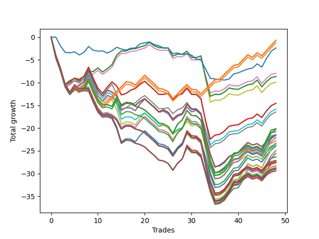

# Short Bulldog 005 
- Symbol: NVDA_Unlimited
- Date Range: 02/08/2022 - 07/08/2022
- Trading Period: 7:20-12:30
- Number of Trades: 48



| Name | Win Percent | Profit | Avg Profit / Trade | Avg Time / Trade |      | Name | Win Percent | Profit | Avg Profit / Trade | Avg Time / Trade |
| ---- | ----------- | ------ | ------------------ | ---------------- | ---- | ---- | ----------- | ------ | ------------------ | ---------------- |
| Sorted By <br> Profit | | | | | | Sorted By <br> Win Percentage ||||
| One Hundred Twenty-Six | 56.25 | -345.00 | -7.19 | 18:48 |     | Sixty-Five | 60.42 | -7270.00 | -151.46 | 18:42 |
| One Hundred Twenty-One | 56.25 | -345.00 | -7.19 | 18:48 |     | Fifty-Seven | 60.42 | -7270.00 | -151.46 | 18:42 |
| One Hundred Eleven | 56.25 | -345.00 | -7.19 | 18:48 |     | One | 60.42 | -7270.00 | -151.46 | 18:42 |
| Eighty-One | 56.25 | -345.00 | -7.19 | 18:48 |     | Forty-One | 60.42 | -7910.00 | -164.79 | 18:34 |
| One Hundred Sixteen | 56.25 | -610.00 | -12.71 | 18:44 |     | Forty-Nine | 60.42 | -8220.00 | -171.25 | 18:08 |
| Seventy-Three | 50.00 | -1185.00 | -24.69 | 11:35 |     | Forty-Eight | 58.33 | -3960.00 | -82.50 | 13:18 |
| Forty-Eight | 58.33 | -3960.00 | -82.50 | 13:18 |     | Sixty-Four | 58.33 | -4315.00 | -89.90 | 13:40 |
| Sixty-Four | 58.33 | -4315.00 | -89.90 | 13:40 |     | Fifty-Six | 58.33 | -4315.00 | -89.90 | 13:40 |
| Fifty-Six | 58.33 | -4315.00 | -89.90 | 13:40 |     | Zero | 58.33 | -4315.00 | -89.90 | 13:40 |
| Zero | 58.33 | -4315.00 | -89.90 | 13:40 |     | Forty | 58.33 | -4955.00 | -103.23 | 13:32 |
| Forty | 58.33 | -4955.00 | -103.23 | 13:32 |     | One Hundred Twenty-Six | 56.25 | -345.00 | -7.19 | 18:48 |
| Sixty-Five | 60.42 | -7270.00 | -151.46 | 18:42 |     | One Hundred Twenty-One | 56.25 | -345.00 | -7.19 | 18:48 |
| Fifty-Seven | 60.42 | -7270.00 | -151.46 | 18:42 |     | One Hundred Eleven | 56.25 | -345.00 | -7.19 | 18:48 |
| One | 60.42 | -7270.00 | -151.46 | 18:42 |     | Eighty-One | 56.25 | -345.00 | -7.19 | 18:48 |
| Forty-One | 60.42 | -7910.00 | -164.79 | 18:34 |     | One Hundred Sixteen | 56.25 | -610.00 | -12.71 | 18:44 |
| Forty-Nine | 60.42 | -8220.00 | -171.25 | 18:08 |     | Seventy-Three | 50.00 | -1185.00 | -24.69 | 11:35 |
| One Hundred Twenty-Seven | 41.67 | -10075.00 | -209.90 | 26:51 |     | Sixty-Six | 50.00 | -10135.00 | -211.15 | 22:53 |
| One Hundred Twenty-Two | 41.67 | -10075.00 | -209.90 | 26:51 |     | Fifty-Eight | 50.00 | -10135.00 | -211.15 | 22:53 |
| Eighty-Two | 41.67 | -10075.00 | -209.90 | 26:51 |     | Two | 50.00 | -10135.00 | -211.15 | 22:53 |
| Sixty-Six | 50.00 | -10135.00 | -211.15 | 22:53 |     | Forty-Two | 50.00 | -10775.00 | -224.48 | 22:45 |
| Fifty-Eight | 50.00 | -10135.00 | -211.15 | 22:53 |     | Fifty | 50.00 | -11085.00 | -230.94 | 22:20 |
| Two | 50.00 | -10135.00 | -211.15 | 22:53 |     | Sixty-Seven | 47.92 | -10755.00 | -224.06 | 23:31 |
| One Hundred Seventeen | 41.67 | -10380.00 | -216.25 | 26:22 |     | Fifty-Nine | 47.92 | -10755.00 | -224.06 | 23:31 |
| One Hundred Twelve | 41.67 | -10715.00 | -223.23 | 26:43 |     | Three | 47.92 | -10755.00 | -224.06 | 23:31 |
| Sixty-Seven | 47.92 | -10755.00 | -224.06 | 23:31 |     | Forty-Three | 47.92 | -11395.00 | -237.40 | 23:24 |
| Fifty-Nine | 47.92 | -10755.00 | -224.06 | 23:31 |     | Fifty-One | 47.92 | -11705.00 | -243.85 | 22:58 |
| Three | 47.92 | -10755.00 | -224.06 | 23:31 |     | One Hundred Twenty-Seven | 41.67 | -10075.00 | -209.90 | 26:51 |
| Forty-Two | 50.00 | -10775.00 | -224.48 | 22:45 |     | One Hundred Twenty-Two | 41.67 | -10075.00 | -209.90 | 26:51 |
| Sixty-Eight | 41.67 | -11020.00 | -229.58 | 25:32 |     | Eighty-Two | 41.67 | -10075.00 | -209.90 | 26:51 |
| Sixty | 41.67 | -11020.00 | -229.58 | 25:32 |     | One Hundred Seventeen | 41.67 | -10380.00 | -216.25 | 26:22 |
| Four | 41.67 | -11020.00 | -229.58 | 25:32 |     | One Hundred Twelve | 41.67 | -10715.00 | -223.23 | 26:43 |
| Fifty | 50.00 | -11085.00 | -230.94 | 22:20 |     | Sixty-Eight | 41.67 | -11020.00 | -229.58 | 25:32 |
| Forty-Three | 47.92 | -11395.00 | -237.40 | 23:24 |     | Sixty | 41.67 | -11020.00 | -229.58 | 25:32 |
| Forty-Four | 41.67 | -11660.00 | -242.92 | 25:25 |     | Four | 41.67 | -11020.00 | -229.58 | 25:32 |
| Fifty-One | 47.92 | -11705.00 | -243.85 | 22:58 |     | Forty-Four | 41.67 | -11660.00 | -242.92 | 25:25 |
| Seventy | 37.50 | -11810.00 | -246.04 | 26:44 |     | Fifty-Two | 41.67 | -11970.00 | -249.37 | 24:59 |
| Sixty-Two | 37.50 | -11810.00 | -246.04 | 26:44 |     | Seventy | 37.50 | -11810.00 | -246.04 | 26:44 |
| Six | 37.50 | -11810.00 | -246.04 | 26:44 |     | Sixty-Two | 37.50 | -11810.00 | -246.04 | 26:44 |
| Fifty-Two | 41.67 | -11970.00 | -249.37 | 24:59 |     | Six | 37.50 | -11810.00 | -246.04 | 26:44 |
| Forty-Six | 37.50 | -12450.00 | -259.37 | 26:36 |     | Forty-Six | 37.50 | -12450.00 | -259.37 | 26:36 |
| Fifty-Four | 37.50 | -12760.00 | -265.83 | 26:10 |     | Fifty-Four | 37.50 | -12760.00 | -265.83 | 26:10 |
| Sixty-Nine | 37.50 | -13175.00 | -274.48 | 27:47 |     | Sixty-Nine | 37.50 | -13175.00 | -274.48 | 27:47 |
| Sixty-One | 37.50 | -13175.00 | -274.48 | 27:47 |     | Sixty-One | 37.50 | -13175.00 | -274.48 | 27:47 |
| Five | 37.50 | -13175.00 | -274.48 | 27:47 |     | Five | 37.50 | -13175.00 | -274.48 | 27:47 |
| One Hundred Twenty-Eight | 37.50 | -13560.00 | -282.50 | 28:51 |     | One Hundred Twenty-Eight | 37.50 | -13560.00 | -282.50 | 28:51 |
| One Hundred Twenty-Three | 37.50 | -13560.00 | -282.50 | 28:51 |     | One Hundred Twenty-Three | 37.50 | -13560.00 | -282.50 | 28:51 |
| Eighty-Three | 37.50 | -13560.00 | -282.50 | 28:51 |     | Eighty-Three | 37.50 | -13560.00 | -282.50 | 28:51 |
| One Hundred Thirty | 37.50 | -13740.00 | -286.25 | 28:55 |     | One Hundred Thirty | 37.50 | -13740.00 | -286.25 | 28:55 |
| One Hundred Twenty-Nine | 37.50 | -13740.00 | -286.25 | 28:55 |     | One Hundred Twenty-Nine | 37.50 | -13740.00 | -286.25 | 28:55 |
| One Hundred Twenty-Five | 37.50 | -13740.00 | -286.25 | 28:55 |     | One Hundred Twenty-Five | 37.50 | -13740.00 | -286.25 | 28:55 |
| One Hundred Twenty-Four | 37.50 | -13740.00 | -286.25 | 28:55 |     | One Hundred Twenty-Four | 37.50 | -13740.00 | -286.25 | 28:55 |
| Eighty-Five | 37.50 | -13740.00 | -286.25 | 28:55 |     | Eighty-Five | 37.50 | -13740.00 | -286.25 | 28:55 |
| Eighty-Four | 37.50 | -13740.00 | -286.25 | 28:55 |     | Eighty-Four | 37.50 | -13740.00 | -286.25 | 28:55 |
| Seventy-One | 37.50 | -13740.00 | -286.25 | 28:55 |     | Seventy-One | 37.50 | -13740.00 | -286.25 | 28:55 |
| Sixty-Three | 37.50 | -13740.00 | -286.25 | 28:55 |     | Sixty-Three | 37.50 | -13740.00 | -286.25 | 28:55 |
| Seven | 37.50 | -13740.00 | -286.25 | 28:55 |     | Seven | 37.50 | -13740.00 | -286.25 | 28:55 |
| Forty-Five | 37.50 | -13815.00 | -287.81 | 27:40 |     | Forty-Five | 37.50 | -13815.00 | -287.81 | 27:40 |
| Fifty-Three | 37.50 | -14125.00 | -294.27 | 27:14 |     | Fifty-Three | 37.50 | -14125.00 | -294.27 | 27:14 |
| One Hundred Thirteen | 37.50 | -14200.00 | -295.83 | 28:44 |     | One Hundred Thirteen | 37.50 | -14200.00 | -295.83 | 28:44 |
| One Hundred Fifteen | 37.50 | -14380.00 | -299.58 | 28:47 |     | One Hundred Fifteen | 37.50 | -14380.00 | -299.58 | 28:47 |
| One Hundred Fourteen | 37.50 | -14380.00 | -299.58 | 28:47 |     | One Hundred Fourteen | 37.50 | -14380.00 | -299.58 | 28:47 |
| Forty-Seven | 37.50 | -14380.00 | -299.58 | 28:47 |     | Forty-Seven | 37.50 | -14380.00 | -299.58 | 28:47 |
| One Hundred Eighteen | 37.50 | -14510.00 | -302.29 | 28:18 |     | One Hundred Eighteen | 37.50 | -14510.00 | -302.29 | 28:18 |
| One Hundred Twenty | 37.50 | -14690.00 | -306.04 | 28:22 |     | One Hundred Twenty | 37.50 | -14690.00 | -306.04 | 28:22 |
| One Hundred Ninteen | 37.50 | -14690.00 | -306.04 | 28:22 |     | One Hundred Ninteen | 37.50 | -14690.00 | -306.04 | 28:22 |
| Fifty-Five | 37.50 | -14690.00 | -306.04 | 28:22 |     | Fifty-Five | 37.50 | -14690.00 | -306.04 | 28:22 |

## NO STOPLOSS

### Test Zero
* Sell when price hits the middle line of the 20p bollinger
* No Stoploss
* Results:
```
Total Trades: 48
Percent Up: 41.67
Percent Down: 58.33
Total Points Moved Down: -8.63
Potential Profit: -4315.00
Total Points Ups: 27.03 Count Ups: 20
Total Points Downs: 18.40 Count Downs: 28
```

<details><summary>Trades</summary>

<code>In: 2022-02-09 07:45:00		Out: 2022-02-09 08:14:55		Total Position Time: 29:55		Total Move Down: -3.99		Total to Date: -3.99</code> <br />
<code>In: 2022-02-09 07:53:00		Out: 2022-02-09 08:22:55		Total Position Time: 29:55		Total Move Down: -2.89		Total to Date: -6.88</code> <br />
<code>In: 2022-02-09 07:58:00		Out: 2022-02-09 08:27:55		Total Position Time: 29:55		Total Move Down: -3.50		Total to Date: -10.38</code> <br />
<code>In: 2022-02-14 07:51:00		Out: 2022-02-14 08:00:30		Total Position Time: 09:30		Total Move Down: 0.84		Total to Date: -9.54</code> <br />
<code>In: 2022-02-16 07:46:00		Out: 2022-02-16 07:58:55		Total Position Time: 12:55		Total Move Down: 0.45		Total to Date: -9.09</code> <br />
<code>In: 2022-02-16 11:26:00		Out: 2022-02-16 11:41:05		Total Position Time: 15:05		Total Move Down: -0.53		Total to Date: -9.62</code> <br />
<code>In: 2022-02-16 12:06:00		Out: 2022-02-16 12:13:50		Total Position Time: 07:50		Total Move Down: 0.98		Total to Date: -8.64</code> <br />
<code>In: 2022-02-24 10:51:00		Out: 2022-02-24 10:57:20		Total Position Time: 06:20		Total Move Down: 0.98		Total to Date: -7.66</code> <br />
<code>In: 2022-02-24 11:36:00		Out: 2022-02-24 11:47:35		Total Position Time: 11:35		Total Move Down: 0.12		Total to Date: -7.54</code> <br />
<code>In: 2022-02-24 11:38:00		Out: 2022-02-24 11:47:35		Total Position Time: 09:35		Total Move Down: 0.79		Total to Date: -6.75</code> <br />
<code>In: 2022-02-24 12:29:00		Out: 2022-02-24 12:44:05		Total Position Time: 15:05		Total Move Down: -0.90		Total to Date: -7.65</code> <br />
<code>In: 2022-02-25 07:49:00		Out: 2022-02-25 07:59:40		Total Position Time: 10:40		Total Move Down: 0.73		Total to Date: -6.92</code> <br />
<code>In: 2022-03-02 08:10:00		Out: 2022-03-02 08:18:35		Total Position Time: 08:35		Total Move Down: 0.86		Total to Date: -6.06</code> <br />
<code>In: 2022-03-08 09:21:00		Out: 2022-03-08 09:25:40		Total Position Time: 04:40		Total Move Down: 2.10		Total to Date: -3.96</code> <br />
<code>In: 2022-03-08 09:23:00		Out: 2022-03-08 09:25:40		Total Position Time: 02:40		Total Move Down: 0.94		Total to Date: -3.02</code> <br />
<code>In: 2022-03-09 09:36:00		Out: 2022-03-09 09:52:45		Total Position Time: 16:45		Total Move Down: -0.00		Total to Date: -3.02</code> <br />
<code>In: 2022-03-10 11:06:00		Out: 2022-03-10 11:21:45		Total Position Time: 15:45		Total Move Down: 0.44		Total to Date: -2.58</code> <br />
<code>In: 2022-03-10 11:07:00		Out: 2022-03-10 11:21:45		Total Position Time: 14:45		Total Move Down: 0.07		Total to Date: -2.51</code> <br />
<code>In: 2022-03-10 11:51:00		Out: 2022-03-10 12:00:20		Total Position Time: 09:20		Total Move Down: 0.36		Total to Date: -2.15</code> <br />
<code>In: 2022-03-17 12:06:00		Out: 2022-03-17 12:08:50		Total Position Time: 02:50		Total Move Down: 0.29		Total to Date: -1.86</code> <br />
<code>In: 2022-03-17 12:29:00		Out: 2022-03-17 12:35:50		Total Position Time: 06:50		Total Move Down: 0.74		Total to Date: -1.12</code> <br />
<code>In: 2022-03-28 12:12:00		Out: 2022-03-28 12:39:35		Total Position Time: 27:35		Total Move Down: -0.74		Total to Date: -1.86</code> <br />
<code>In: 2022-03-28 12:16:00		Out: 2022-03-28 12:39:35		Total Position Time: 23:35		Total Move Down: -0.43		Total to Date: -2.29</code> <br />
<code>In: 2022-03-29 12:25:00		Out: 2022-03-29 12:38:20		Total Position Time: 13:20		Total Move Down: -0.06		Total to Date: -2.35</code> <br />
<code>In: 2022-04-13 12:09:00		Out: 2022-04-13 12:27:10		Total Position Time: 18:10		Total Move Down: -0.00		Total to Date: -2.35</code> <br />
<code>In: 2022-04-18 10:37:00		Out: 2022-04-18 11:04:15		Total Position Time: 27:15		Total Move Down: -1.81		Total to Date: -4.16</code> <br />
<code>In: 2022-04-18 11:27:00		Out: 2022-04-18 11:40:45		Total Position Time: 13:45		Total Move Down: 0.44		Total to Date: -3.72</code> <br />
<code>In: 2022-04-18 11:28:00		Out: 2022-04-18 11:40:45		Total Position Time: 12:45		Total Move Down: -0.04		Total to Date: -3.76</code> <br />
<code>In: 2022-05-02 07:32:00		Out: 2022-05-02 07:44:25		Total Position Time: 12:25		Total Move Down: 0.68		Total to Date: -3.08</code> <br />
<code>In: 2022-05-02 12:15:00		Out: 2022-05-02 12:39:35		Total Position Time: 24:35		Total Move Down: -1.36		Total to Date: -4.44</code> <br />
<code>In: 2022-05-02 12:29:00		Out: 2022-05-02 12:39:35		Total Position Time: 10:35		Total Move Down: -0.04		Total to Date: -4.48</code> <br />
<code>In: 2022-05-03 10:17:00		Out: 2022-05-03 10:28:05		Total Position Time: 11:05		Total Move Down: 0.37		Total to Date: -4.11</code> <br />
<code>In: 2022-05-04 11:49:00		Out: 2022-05-04 12:18:55		Total Position Time: 29:55		Total Move Down: -4.91		Total to Date: -9.02</code> <br />
<code>In: 2022-05-04 11:50:00		Out: 2022-05-04 12:19:55		Total Position Time: 29:55		Total Move Down: -3.98		Total to Date: -13.00</code> <br />
<code>In: 2022-05-06 07:51:00		Out: 2022-05-06 08:03:20		Total Position Time: 12:20		Total Move Down: 0.46		Total to Date: -12.54</code> <br />
<code>In: 2022-05-31 07:33:00		Out: 2022-05-31 07:50:05		Total Position Time: 17:05		Total Move Down: -0.07		Total to Date: -12.61</code> <br />
<code>In: 2022-06-07 07:48:00		Out: 2022-06-07 07:57:35		Total Position Time: 09:35		Total Move Down: 0.54		Total to Date: -12.07</code> <br />
<code>In: 2022-06-07 07:50:00		Out: 2022-06-07 07:57:35		Total Position Time: 07:35		Total Move Down: 0.91		Total to Date: -11.16</code> <br />
<code>In: 2022-06-09 07:33:00		Out: 2022-06-09 07:42:05		Total Position Time: 09:05		Total Move Down: -0.23		Total to Date: -11.39</code> <br />
<code>In: 2022-06-22 11:10:00		Out: 2022-06-22 11:24:20		Total Position Time: 14:20		Total Move Down: -0.06		Total to Date: -11.45</code> <br />
<code>In: 2022-06-23 07:42:00		Out: 2022-06-23 07:49:50		Total Position Time: 07:50		Total Move Down: 0.52		Total to Date: -10.93</code> <br />
<code>In: 2022-06-23 07:43:00		Out: 2022-06-23 07:49:50		Total Position Time: 06:50		Total Move Down: 0.46		Total to Date: -10.47</code> <br />
<code>In: 2022-06-30 08:25:00		Out: 2022-06-30 08:35:20		Total Position Time: 10:20		Total Move Down: 0.17		Total to Date: -10.30</code> <br />
<code>In: 2022-06-30 08:28:00		Out: 2022-06-30 08:35:20		Total Position Time: 07:20		Total Move Down: 0.88		Total to Date: -9.42</code> <br />
<code>In: 2022-07-05 07:29:00		Out: 2022-07-05 07:47:40		Total Position Time: 18:40		Total Move Down: -1.49		Total to Date: -10.91</code> <br />
<code>In: 2022-07-06 11:08:00		Out: 2022-07-06 11:10:10		Total Position Time: 02:10		Total Move Down: 1.17		Total to Date: -9.74</code> <br />
<code>In: 2022-07-06 11:09:00		Out: 2022-07-06 11:10:10		Total Position Time: 01:10		Total Move Down: 0.84		Total to Date: -8.90</code> <br />
<code>In: 2022-07-07 08:13:00		Out: 2022-07-07 08:19:15		Total Position Time: 06:15		Total Move Down: 0.27		Total to Date: -8.63</code> <br />


</details>

### Test One
* Sell when the price hits the upper line of the 20p 1std bollinger
* No Stoploss
* Results:
```
Total Trades: 48
Percent Up: 39.58
Percent Down: 60.42
Total Points Moved Down: -14.54
Potential Profit: -7270.00
Total Points Ups: 35.44 Count Ups: 19
Total Points Downs: 20.90 Count Downs: 29
```

<details><summary>Trades</summary>

<code>In: 2022-02-09 07:45:00		Out: 2022-02-09 08:14:55		Total Position Time: 29:55		Total Move Down: -3.99		Total to Date: -3.99</code> <br />
<code>In: 2022-02-09 07:53:00		Out: 2022-02-09 08:22:55		Total Position Time: 29:55		Total Move Down: -2.89		Total to Date: -6.88</code> <br />
<code>In: 2022-02-09 07:58:00		Out: 2022-02-09 08:27:55		Total Position Time: 29:55		Total Move Down: -3.50		Total to Date: -10.38</code> <br />
<code>In: 2022-02-14 07:51:00		Out: 2022-02-14 08:06:20		Total Position Time: 15:20		Total Move Down: 0.47		Total to Date: -9.91</code> <br />
<code>In: 2022-02-16 07:46:00		Out: 2022-02-16 08:00:25		Total Position Time: 14:25		Total Move Down: 0.91		Total to Date: -9.00</code> <br />
<code>In: 2022-02-16 11:26:00		Out: 2022-02-16 11:44:10		Total Position Time: 18:10		Total Move Down: -0.29		Total to Date: -9.29</code> <br />
<code>In: 2022-02-16 12:06:00		Out: 2022-02-16 12:21:05		Total Position Time: 15:05		Total Move Down: 0.67		Total to Date: -8.62</code> <br />
<code>In: 2022-02-24 10:51:00		Out: 2022-02-24 11:01:25		Total Position Time: 10:25		Total Move Down: 2.03		Total to Date: -6.59</code> <br />
<code>In: 2022-02-24 11:36:00		Out: 2022-02-24 12:05:55		Total Position Time: 29:55		Total Move Down: -2.47		Total to Date: -9.06</code> <br />
<code>In: 2022-02-24 11:38:00		Out: 2022-02-24 12:07:55		Total Position Time: 29:55		Total Move Down: -2.16		Total to Date: -11.22</code> <br />
<code>In: 2022-02-24 12:29:00		Out: 2022-02-24 12:46:00		Total Position Time: 17:00		Total Move Down: -1.13		Total to Date: -12.35</code> <br />
<code>In: 2022-02-25 07:49:00		Out: 2022-02-25 08:00:35		Total Position Time: 11:35		Total Move Down: 1.38		Total to Date: -10.97</code> <br />
<code>In: 2022-03-02 08:10:00		Out: 2022-03-02 08:22:55		Total Position Time: 12:55		Total Move Down: 1.13		Total to Date: -9.84</code> <br />
<code>In: 2022-03-08 09:21:00		Out: 2022-03-08 09:50:55		Total Position Time: 29:55		Total Move Down: -0.86		Total to Date: -10.70</code> <br />
<code>In: 2022-03-08 09:23:00		Out: 2022-03-08 09:52:55		Total Position Time: 29:55		Total Move Down: -1.99		Total to Date: -12.69</code> <br />
<code>In: 2022-03-09 09:36:00		Out: 2022-03-09 10:00:15		Total Position Time: 24:15		Total Move Down: 0.31		Total to Date: -12.38</code> <br />
<code>In: 2022-03-10 11:06:00		Out: 2022-03-10 11:23:00		Total Position Time: 17:00		Total Move Down: 0.74		Total to Date: -11.64</code> <br />
<code>In: 2022-03-10 11:07:00		Out: 2022-03-10 11:23:00		Total Position Time: 16:00		Total Move Down: 0.37		Total to Date: -11.27</code> <br />
<code>In: 2022-03-10 11:51:00		Out: 2022-03-10 12:01:15		Total Position Time: 10:15		Total Move Down: 0.92		Total to Date: -10.35</code> <br />
<code>In: 2022-03-17 12:06:00		Out: 2022-03-17 12:11:45		Total Position Time: 05:45		Total Move Down: 0.65		Total to Date: -9.70</code> <br />
<code>In: 2022-03-17 12:29:00		Out: 2022-03-17 12:46:00		Total Position Time: 17:00		Total Move Down: -0.95		Total to Date: -10.65</code> <br />
<code>In: 2022-03-28 12:12:00		Out: 2022-03-28 12:41:55		Total Position Time: 29:55		Total Move Down: -0.89		Total to Date: -11.54</code> <br />
<code>In: 2022-03-28 12:16:00		Out: 2022-03-28 12:45:55		Total Position Time: 29:55		Total Move Down: -1.05		Total to Date: -12.59</code> <br />
<code>In: 2022-03-29 12:25:00		Out: 2022-03-29 12:42:10		Total Position Time: 17:10		Total Move Down: 0.04		Total to Date: -12.55</code> <br />
<code>In: 2022-04-13 12:09:00		Out: 2022-04-13 12:27:25		Total Position Time: 18:25		Total Move Down: 0.17		Total to Date: -12.38</code> <br />
<code>In: 2022-04-18 10:37:00		Out: 2022-04-18 11:06:10		Total Position Time: 29:10		Total Move Down: -1.30		Total to Date: -13.68</code> <br />
<code>In: 2022-04-18 11:27:00		Out: 2022-04-18 11:41:20		Total Position Time: 14:20		Total Move Down: 0.86		Total to Date: -12.82</code> <br />
<code>In: 2022-04-18 11:28:00		Out: 2022-04-18 11:41:20		Total Position Time: 13:20		Total Move Down: 0.38		Total to Date: -12.44</code> <br />
<code>In: 2022-05-02 07:32:00		Out: 2022-05-02 07:44:55		Total Position Time: 12:55		Total Move Down: 1.22		Total to Date: -11.22</code> <br />
<code>In: 2022-05-02 12:15:00		Out: 2022-05-02 12:44:10		Total Position Time: 29:10		Total Move Down: -1.34		Total to Date: -12.56</code> <br />
<code>In: 2022-05-02 12:29:00		Out: 2022-05-02 12:44:10		Total Position Time: 15:10		Total Move Down: -0.02		Total to Date: -12.58</code> <br />
<code>In: 2022-05-03 10:17:00		Out: 2022-05-03 10:46:55		Total Position Time: 29:55		Total Move Down: -0.96		Total to Date: -13.54</code> <br />
<code>In: 2022-05-04 11:49:00		Out: 2022-05-04 12:18:55		Total Position Time: 29:55		Total Move Down: -4.91		Total to Date: -18.45</code> <br />
<code>In: 2022-05-04 11:50:00		Out: 2022-05-04 12:19:55		Total Position Time: 29:55		Total Move Down: -3.98		Total to Date: -22.43</code> <br />
<code>In: 2022-05-06 07:51:00		Out: 2022-05-06 08:05:15		Total Position Time: 14:15		Total Move Down: 0.89		Total to Date: -21.54</code> <br />
<code>In: 2022-05-31 07:33:00		Out: 2022-05-31 07:56:35		Total Position Time: 23:35		Total Move Down: 0.18		Total to Date: -21.36</code> <br />
<code>In: 2022-06-07 07:48:00		Out: 2022-06-07 08:04:45		Total Position Time: 16:45		Total Move Down: 0.70		Total to Date: -20.66</code> <br />
<code>In: 2022-06-07 07:50:00		Out: 2022-06-07 08:04:45		Total Position Time: 14:45		Total Move Down: 1.07		Total to Date: -19.59</code> <br />
<code>In: 2022-06-09 07:33:00		Out: 2022-06-09 07:45:30		Total Position Time: 12:30		Total Move Down: 0.22		Total to Date: -19.37</code> <br />
<code>In: 2022-06-22 11:10:00		Out: 2022-06-22 11:26:10		Total Position Time: 16:10		Total Move Down: 0.12		Total to Date: -19.25</code> <br />
<code>In: 2022-06-23 07:42:00		Out: 2022-06-23 07:54:10		Total Position Time: 12:10		Total Move Down: 0.69		Total to Date: -18.56</code> <br />
<code>In: 2022-06-23 07:43:00		Out: 2022-06-23 07:54:10		Total Position Time: 11:10		Total Move Down: 0.63		Total to Date: -17.93</code> <br />
<code>In: 2022-06-30 08:25:00		Out: 2022-06-30 08:40:45		Total Position Time: 15:45		Total Move Down: 0.16		Total to Date: -17.77</code> <br />
<code>In: 2022-06-30 08:28:00		Out: 2022-06-30 08:40:45		Total Position Time: 12:45		Total Move Down: 0.87		Total to Date: -16.90</code> <br />
<code>In: 2022-07-05 07:29:00		Out: 2022-07-05 07:50:35		Total Position Time: 21:35		Total Move Down: -0.76		Total to Date: -17.66</code> <br />
<code>In: 2022-07-06 11:08:00		Out: 2022-07-06 11:11:10		Total Position Time: 03:10		Total Move Down: 1.46		Total to Date: -16.20</code> <br />
<code>In: 2022-07-06 11:09:00		Out: 2022-07-06 11:11:10		Total Position Time: 02:10		Total Move Down: 1.13		Total to Date: -15.07</code> <br />
<code>In: 2022-07-07 08:13:00		Out: 2022-07-07 08:20:05		Total Position Time: 07:05		Total Move Down: 0.53		Total to Date: -14.54</code> <br />


</details>

### Test Two
* Sell when the price hits the upper line of the 20p 2std bollinger
* No Stoploss
* Results:
```
Total Trades: 48
Percent Up: 50.00
Percent Down: 50.00
Total Points Moved Down: -20.27
Potential Profit: -10135.00
Total Points Ups: 41.55 Count Ups: 24
Total Points Downs: 21.28 Count Downs: 24
```

<details><summary>Trades</summary>

<code>In: 2022-02-09 07:45:00		Out: 2022-02-09 08:14:55		Total Position Time: 29:55		Total Move Down: -3.99		Total to Date: -3.99</code> <br />
<code>In: 2022-02-09 07:53:00		Out: 2022-02-09 08:22:55		Total Position Time: 29:55		Total Move Down: -2.89		Total to Date: -6.88</code> <br />
<code>In: 2022-02-09 07:58:00		Out: 2022-02-09 08:27:55		Total Position Time: 29:55		Total Move Down: -3.50		Total to Date: -10.38</code> <br />
<code>In: 2022-02-14 07:51:00		Out: 2022-02-14 08:20:55		Total Position Time: 29:55		Total Move Down: -1.69		Total to Date: -12.07</code> <br />
<code>In: 2022-02-16 07:46:00		Out: 2022-02-16 08:05:15		Total Position Time: 19:15		Total Move Down: 0.90		Total to Date: -11.17</code> <br />
<code>In: 2022-02-16 11:26:00		Out: 2022-02-16 11:48:00		Total Position Time: 22:00		Total Move Down: 0.02		Total to Date: -11.15</code> <br />
<code>In: 2022-02-16 12:06:00		Out: 2022-02-16 12:35:55		Total Position Time: 29:55		Total Move Down: 0.22		Total to Date: -10.93</code> <br />
<code>In: 2022-02-24 10:51:00		Out: 2022-02-24 11:06:35		Total Position Time: 15:35		Total Move Down: 2.64		Total to Date: -8.29</code> <br />
<code>In: 2022-02-24 11:36:00		Out: 2022-02-24 12:05:55		Total Position Time: 29:55		Total Move Down: -2.47		Total to Date: -10.76</code> <br />
<code>In: 2022-02-24 11:38:00		Out: 2022-02-24 12:07:55		Total Position Time: 29:55		Total Move Down: -2.16		Total to Date: -12.92</code> <br />
<code>In: 2022-02-24 12:29:00		Out: 2022-02-24 12:46:00		Total Position Time: 17:00		Total Move Down: -1.13		Total to Date: -14.05</code> <br />
<code>In: 2022-02-25 07:49:00		Out: 2022-02-25 08:07:20		Total Position Time: 18:20		Total Move Down: 1.24		Total to Date: -12.81</code> <br />
<code>In: 2022-03-02 08:10:00		Out: 2022-03-02 08:39:55		Total Position Time: 29:55		Total Move Down: -0.40		Total to Date: -13.21</code> <br />
<code>In: 2022-03-08 09:21:00		Out: 2022-03-08 09:50:55		Total Position Time: 29:55		Total Move Down: -0.86		Total to Date: -14.07</code> <br />
<code>In: 2022-03-08 09:23:00		Out: 2022-03-08 09:52:55		Total Position Time: 29:55		Total Move Down: -1.99		Total to Date: -16.06</code> <br />
<code>In: 2022-03-09 09:36:00		Out: 2022-03-09 10:02:15		Total Position Time: 26:15		Total Move Down: 0.58		Total to Date: -15.48</code> <br />
<code>In: 2022-03-10 11:06:00		Out: 2022-03-10 11:35:55		Total Position Time: 29:55		Total Move Down: -0.08		Total to Date: -15.56</code> <br />
<code>In: 2022-03-10 11:07:00		Out: 2022-03-10 11:36:55		Total Position Time: 29:55		Total Move Down: -0.59		Total to Date: -16.15</code> <br />
<code>In: 2022-03-10 11:51:00		Out: 2022-03-10 12:04:45		Total Position Time: 13:45		Total Move Down: 1.49		Total to Date: -14.66</code> <br />
<code>In: 2022-03-17 12:06:00		Out: 2022-03-17 12:14:00		Total Position Time: 08:00		Total Move Down: 1.06		Total to Date: -13.60</code> <br />
<code>In: 2022-03-17 12:29:00		Out: 2022-03-17 12:46:00		Total Position Time: 17:00		Total Move Down: -0.95		Total to Date: -14.55</code> <br />
<code>In: 2022-03-28 12:12:00		Out: 2022-03-28 12:41:55		Total Position Time: 29:55		Total Move Down: -0.89		Total to Date: -15.44</code> <br />
<code>In: 2022-03-28 12:16:00		Out: 2022-03-28 12:45:55		Total Position Time: 29:55		Total Move Down: -1.05		Total to Date: -16.49</code> <br />
<code>In: 2022-03-29 12:25:00		Out: 2022-03-29 12:43:10		Total Position Time: 18:10		Total Move Down: 0.23		Total to Date: -16.26</code> <br />
<code>In: 2022-04-13 12:09:00		Out: 2022-04-13 12:38:55		Total Position Time: 29:55		Total Move Down: -0.55		Total to Date: -16.81</code> <br />
<code>In: 2022-04-18 10:37:00		Out: 2022-04-18 11:06:55		Total Position Time: 29:55		Total Move Down: -1.50		Total to Date: -18.31</code> <br />
<code>In: 2022-04-18 11:27:00		Out: 2022-04-18 11:43:10		Total Position Time: 16:10		Total Move Down: 0.91		Total to Date: -17.40</code> <br />
<code>In: 2022-04-18 11:28:00		Out: 2022-04-18 11:43:10		Total Position Time: 15:10		Total Move Down: 0.43		Total to Date: -16.97</code> <br />
<code>In: 2022-05-02 07:32:00		Out: 2022-05-02 07:46:05		Total Position Time: 14:05		Total Move Down: 1.62		Total to Date: -15.35</code> <br />
<code>In: 2022-05-02 12:15:00		Out: 2022-05-02 12:44:55		Total Position Time: 29:55		Total Move Down: -1.09		Total to Date: -16.44</code> <br />
<code>In: 2022-05-02 12:29:00		Out: 2022-05-02 12:45:05		Total Position Time: 16:05		Total Move Down: 0.39		Total to Date: -16.05</code> <br />
<code>In: 2022-05-03 10:17:00		Out: 2022-05-03 10:46:55		Total Position Time: 29:55		Total Move Down: -0.96		Total to Date: -17.01</code> <br />
<code>In: 2022-05-04 11:49:00		Out: 2022-05-04 12:18:55		Total Position Time: 29:55		Total Move Down: -4.91		Total to Date: -21.92</code> <br />
<code>In: 2022-05-04 11:50:00		Out: 2022-05-04 12:19:55		Total Position Time: 29:55		Total Move Down: -3.98		Total to Date: -25.90</code> <br />
<code>In: 2022-05-06 07:51:00		Out: 2022-05-06 08:20:55		Total Position Time: 29:55		Total Move Down: -2.69		Total to Date: -28.59</code> <br />
<code>In: 2022-05-31 07:33:00		Out: 2022-05-31 07:58:05		Total Position Time: 25:05		Total Move Down: 0.46		Total to Date: -28.13</code> <br />
<code>In: 2022-06-07 07:48:00		Out: 2022-06-07 08:05:10		Total Position Time: 17:10		Total Move Down: 0.77		Total to Date: -27.36</code> <br />
<code>In: 2022-06-07 07:50:00		Out: 2022-06-07 08:05:10		Total Position Time: 15:10		Total Move Down: 1.14		Total to Date: -26.22</code> <br />
<code>In: 2022-06-09 07:33:00		Out: 2022-06-09 07:46:30		Total Position Time: 13:30		Total Move Down: 0.44		Total to Date: -25.78</code> <br />
<code>In: 2022-06-22 11:10:00		Out: 2022-06-22 11:29:20		Total Position Time: 19:20		Total Move Down: 0.35		Total to Date: -25.43</code> <br />
<code>In: 2022-06-23 07:42:00		Out: 2022-06-23 08:00:40		Total Position Time: 18:40		Total Move Down: 0.76		Total to Date: -24.67</code> <br />
<code>In: 2022-06-23 07:43:00		Out: 2022-06-23 08:00:40		Total Position Time: 17:40		Total Move Down: 0.70		Total to Date: -23.97</code> <br />
<code>In: 2022-06-30 08:25:00		Out: 2022-06-30 08:54:55		Total Position Time: 29:55		Total Move Down: -0.57		Total to Date: -24.54</code> <br />
<code>In: 2022-06-30 08:28:00		Out: 2022-06-30 08:57:55		Total Position Time: 29:55		Total Move Down: 0.30		Total to Date: -24.24</code> <br />
<code>In: 2022-07-05 07:29:00		Out: 2022-07-05 07:58:55		Total Position Time: 29:55		Total Move Down: -0.66		Total to Date: -24.90</code> <br />
<code>In: 2022-07-06 11:08:00		Out: 2022-07-06 11:12:15		Total Position Time: 04:15		Total Move Down: 2.09		Total to Date: -22.81</code> <br />
<code>In: 2022-07-06 11:09:00		Out: 2022-07-06 11:12:15		Total Position Time: 03:15		Total Move Down: 1.76		Total to Date: -21.05</code> <br />
<code>In: 2022-07-07 08:13:00		Out: 2022-07-07 08:22:45		Total Position Time: 09:45		Total Move Down: 0.78		Total to Date: -20.27</code> <br />


</details>

### Test Three
* Sell when price hits the middle line of the 50p bollinger
* No Stoploss
* Results:
```
Total Trades: 48
Percent Up: 52.08
Percent Down: 47.92
Total Points Moved Down: -21.51
Potential Profit: -10755.00
Total Points Ups: 41.62 Count Ups: 25
Total Points Downs: 20.11 Count Downs: 23
```

<details><summary>Trades</summary>

<code>In: 2022-02-09 07:45:00		Out: 2022-02-09 08:14:55		Total Position Time: 29:55		Total Move Down: -3.99		Total to Date: -3.99</code> <br />
<code>In: 2022-02-09 07:53:00		Out: 2022-02-09 08:22:55		Total Position Time: 29:55		Total Move Down: -2.89		Total to Date: -6.88</code> <br />
<code>In: 2022-02-09 07:58:00		Out: 2022-02-09 08:27:55		Total Position Time: 29:55		Total Move Down: -3.50		Total to Date: -10.38</code> <br />
<code>In: 2022-02-14 07:51:00		Out: 2022-02-14 08:20:55		Total Position Time: 29:55		Total Move Down: -1.69		Total to Date: -12.07</code> <br />
<code>In: 2022-02-16 07:46:00		Out: 2022-02-16 08:12:25		Total Position Time: 26:25		Total Move Down: 0.93		Total to Date: -11.14</code> <br />
<code>In: 2022-02-16 11:26:00		Out: 2022-02-16 11:53:45		Total Position Time: 27:45		Total Move Down: 0.57		Total to Date: -10.57</code> <br />
<code>In: 2022-02-16 12:06:00		Out: 2022-02-16 12:34:05		Total Position Time: 28:05		Total Move Down: 0.79		Total to Date: -9.78</code> <br />
<code>In: 2022-02-24 10:51:00		Out: 2022-02-24 11:06:35		Total Position Time: 15:35		Total Move Down: 2.64		Total to Date: -7.14</code> <br />
<code>In: 2022-02-24 11:36:00		Out: 2022-02-24 12:05:55		Total Position Time: 29:55		Total Move Down: -2.47		Total to Date: -9.61</code> <br />
<code>In: 2022-02-24 11:38:00		Out: 2022-02-24 12:07:55		Total Position Time: 29:55		Total Move Down: -2.16		Total to Date: -11.77</code> <br />
<code>In: 2022-02-24 12:29:00		Out: 2022-02-24 12:46:00		Total Position Time: 17:00		Total Move Down: -1.13		Total to Date: -12.90</code> <br />
<code>In: 2022-02-25 07:49:00		Out: 2022-02-25 08:07:20		Total Position Time: 18:20		Total Move Down: 1.24		Total to Date: -11.66</code> <br />
<code>In: 2022-03-02 08:10:00		Out: 2022-03-02 08:39:55		Total Position Time: 29:55		Total Move Down: -0.40		Total to Date: -12.06</code> <br />
<code>In: 2022-03-08 09:21:00		Out: 2022-03-08 09:50:55		Total Position Time: 29:55		Total Move Down: -0.86		Total to Date: -12.92</code> <br />
<code>In: 2022-03-08 09:23:00		Out: 2022-03-08 09:52:55		Total Position Time: 29:55		Total Move Down: -1.99		Total to Date: -14.91</code> <br />
<code>In: 2022-03-09 09:36:00		Out: 2022-03-09 10:03:05		Total Position Time: 27:05		Total Move Down: 0.57		Total to Date: -14.34</code> <br />
<code>In: 2022-03-10 11:06:00		Out: 2022-03-10 11:35:55		Total Position Time: 29:55		Total Move Down: -0.08		Total to Date: -14.42</code> <br />
<code>In: 2022-03-10 11:07:00		Out: 2022-03-10 11:36:55		Total Position Time: 29:55		Total Move Down: -0.59		Total to Date: -15.01</code> <br />
<code>In: 2022-03-10 11:51:00		Out: 2022-03-10 12:01:15		Total Position Time: 10:15		Total Move Down: 0.92		Total to Date: -14.09</code> <br />
<code>In: 2022-03-17 12:06:00		Out: 2022-03-17 12:11:15		Total Position Time: 05:15		Total Move Down: 0.58		Total to Date: -13.51</code> <br />
<code>In: 2022-03-17 12:29:00		Out: 2022-03-17 12:46:00		Total Position Time: 17:00		Total Move Down: -0.95		Total to Date: -14.46</code> <br />
<code>In: 2022-03-28 12:12:00		Out: 2022-03-28 12:41:55		Total Position Time: 29:55		Total Move Down: -0.89		Total to Date: -15.35</code> <br />
<code>In: 2022-03-28 12:16:00		Out: 2022-03-28 12:45:55		Total Position Time: 29:55		Total Move Down: -1.05		Total to Date: -16.40</code> <br />
<code>In: 2022-03-29 12:25:00		Out: 2022-03-29 12:43:30		Total Position Time: 18:30		Total Move Down: 0.44		Total to Date: -15.96</code> <br />
<code>In: 2022-04-13 12:09:00		Out: 2022-04-13 12:38:55		Total Position Time: 29:55		Total Move Down: -0.55		Total to Date: -16.51</code> <br />
<code>In: 2022-04-18 10:37:00		Out: 2022-04-18 11:06:55		Total Position Time: 29:55		Total Move Down: -1.50		Total to Date: -18.01</code> <br />
<code>In: 2022-04-18 11:27:00		Out: 2022-04-18 11:41:15		Total Position Time: 14:15		Total Move Down: 0.86		Total to Date: -17.15</code> <br />
<code>In: 2022-04-18 11:28:00		Out: 2022-04-18 11:41:15		Total Position Time: 13:15		Total Move Down: 0.38		Total to Date: -16.77</code> <br />
<code>In: 2022-05-02 07:32:00		Out: 2022-05-02 07:47:20		Total Position Time: 15:20		Total Move Down: 2.01		Total to Date: -14.76</code> <br />
<code>In: 2022-05-02 12:15:00		Out: 2022-05-02 12:44:55		Total Position Time: 29:55		Total Move Down: -1.09		Total to Date: -15.85</code> <br />
<code>In: 2022-05-02 12:29:00		Out: 2022-05-02 12:46:00		Total Position Time: 17:00		Total Move Down: -0.07		Total to Date: -15.92</code> <br />
<code>In: 2022-05-03 10:17:00		Out: 2022-05-03 10:46:55		Total Position Time: 29:55		Total Move Down: -0.96		Total to Date: -16.88</code> <br />
<code>In: 2022-05-04 11:49:00		Out: 2022-05-04 12:18:55		Total Position Time: 29:55		Total Move Down: -4.91		Total to Date: -21.79</code> <br />
<code>In: 2022-05-04 11:50:00		Out: 2022-05-04 12:19:55		Total Position Time: 29:55		Total Move Down: -3.98		Total to Date: -25.77</code> <br />
<code>In: 2022-05-06 07:51:00		Out: 2022-05-06 08:20:55		Total Position Time: 29:55		Total Move Down: -2.69		Total to Date: -28.46</code> <br />
<code>In: 2022-05-31 07:33:00		Out: 2022-05-31 08:02:55		Total Position Time: 29:55		Total Move Down: 0.16		Total to Date: -28.30</code> <br />
<code>In: 2022-06-07 07:48:00		Out: 2022-06-07 08:17:55		Total Position Time: 29:55		Total Move Down: 0.72		Total to Date: -27.58</code> <br />
<code>In: 2022-06-07 07:50:00		Out: 2022-06-07 08:18:15		Total Position Time: 28:15		Total Move Down: 1.26		Total to Date: -26.32</code> <br />
<code>In: 2022-06-09 07:33:00		Out: 2022-06-09 07:47:00		Total Position Time: 14:00		Total Move Down: 0.61		Total to Date: -25.71</code> <br />
<code>In: 2022-06-22 11:10:00		Out: 2022-06-22 11:29:35		Total Position Time: 19:35		Total Move Down: 0.42		Total to Date: -25.29</code> <br />
<code>In: 2022-06-23 07:42:00		Out: 2022-06-23 08:01:10		Total Position Time: 19:10		Total Move Down: 1.10		Total to Date: -24.19</code> <br />
<code>In: 2022-06-23 07:43:00		Out: 2022-06-23 08:01:10		Total Position Time: 18:10		Total Move Down: 1.04		Total to Date: -23.15</code> <br />
<code>In: 2022-06-30 08:25:00		Out: 2022-06-30 08:54:55		Total Position Time: 29:55		Total Move Down: -0.57		Total to Date: -23.72</code> <br />
<code>In: 2022-06-30 08:28:00		Out: 2022-06-30 08:57:55		Total Position Time: 29:55		Total Move Down: 0.30		Total to Date: -23.42</code> <br />
<code>In: 2022-07-05 07:29:00		Out: 2022-07-05 07:58:55		Total Position Time: 29:55		Total Move Down: -0.66		Total to Date: -24.08</code> <br />
<code>In: 2022-07-06 11:08:00		Out: 2022-07-06 11:10:10		Total Position Time: 02:10		Total Move Down: 1.17		Total to Date: -22.91</code> <br />
<code>In: 2022-07-06 11:09:00		Out: 2022-07-06 11:10:10		Total Position Time: 01:10		Total Move Down: 0.84		Total to Date: -22.07</code> <br />
<code>In: 2022-07-07 08:13:00		Out: 2022-07-07 08:20:55		Total Position Time: 07:55		Total Move Down: 0.56		Total to Date: -21.51</code> <br />


</details>

### Test Four
* Sell when the price hits the upper line of the 50p 1std bollinger
* No Stoploss
* Results:
```
Total Trades: 48
Percent Up: 58.33
Percent Down: 41.67
Total Points Moved Down: -22.04
Potential Profit: -11020.00
Total Points Ups: 42.60 Count Ups: 28
Total Points Downs: 20.56 Count Downs: 20
```

<details><summary>Trades</summary>

<code>In: 2022-02-09 07:45:00		Out: 2022-02-09 08:14:55		Total Position Time: 29:55		Total Move Down: -3.99		Total to Date: -3.99</code> <br />
<code>In: 2022-02-09 07:53:00		Out: 2022-02-09 08:22:55		Total Position Time: 29:55		Total Move Down: -2.89		Total to Date: -6.88</code> <br />
<code>In: 2022-02-09 07:58:00		Out: 2022-02-09 08:27:55		Total Position Time: 29:55		Total Move Down: -3.50		Total to Date: -10.38</code> <br />
<code>In: 2022-02-14 07:51:00		Out: 2022-02-14 08:20:55		Total Position Time: 29:55		Total Move Down: -1.69		Total to Date: -12.07</code> <br />
<code>In: 2022-02-16 07:46:00		Out: 2022-02-16 08:15:05		Total Position Time: 29:05		Total Move Down: 1.69		Total to Date: -10.38</code> <br />
<code>In: 2022-02-16 11:26:00		Out: 2022-02-16 11:55:55		Total Position Time: 29:55		Total Move Down: -0.72		Total to Date: -11.10</code> <br />
<code>In: 2022-02-16 12:06:00		Out: 2022-02-16 12:35:55		Total Position Time: 29:55		Total Move Down: 0.22		Total to Date: -10.88</code> <br />
<code>In: 2022-02-24 10:51:00		Out: 2022-02-24 11:20:55		Total Position Time: 29:55		Total Move Down: -0.08		Total to Date: -10.96</code> <br />
<code>In: 2022-02-24 11:36:00		Out: 2022-02-24 12:05:55		Total Position Time: 29:55		Total Move Down: -2.47		Total to Date: -13.43</code> <br />
<code>In: 2022-02-24 11:38:00		Out: 2022-02-24 12:07:55		Total Position Time: 29:55		Total Move Down: -2.16		Total to Date: -15.59</code> <br />
<code>In: 2022-02-24 12:29:00		Out: 2022-02-24 12:46:00		Total Position Time: 17:00		Total Move Down: -1.13		Total to Date: -16.72</code> <br />
<code>In: 2022-02-25 07:49:00		Out: 2022-02-25 08:18:55		Total Position Time: 29:55		Total Move Down: 0.11		Total to Date: -16.61</code> <br />
<code>In: 2022-03-02 08:10:00		Out: 2022-03-02 08:39:55		Total Position Time: 29:55		Total Move Down: -0.40		Total to Date: -17.01</code> <br />
<code>In: 2022-03-08 09:21:00		Out: 2022-03-08 09:50:55		Total Position Time: 29:55		Total Move Down: -0.86		Total to Date: -17.87</code> <br />
<code>In: 2022-03-08 09:23:00		Out: 2022-03-08 09:52:55		Total Position Time: 29:55		Total Move Down: -1.99		Total to Date: -19.86</code> <br />
<code>In: 2022-03-09 09:36:00		Out: 2022-03-09 10:05:55		Total Position Time: 29:55		Total Move Down: 0.67		Total to Date: -19.19</code> <br />
<code>In: 2022-03-10 11:06:00		Out: 2022-03-10 11:35:55		Total Position Time: 29:55		Total Move Down: -0.08		Total to Date: -19.27</code> <br />
<code>In: 2022-03-10 11:07:00		Out: 2022-03-10 11:36:55		Total Position Time: 29:55		Total Move Down: -0.59		Total to Date: -19.86</code> <br />
<code>In: 2022-03-10 11:51:00		Out: 2022-03-10 12:04:50		Total Position Time: 13:50		Total Move Down: 1.37		Total to Date: -18.49</code> <br />
<code>In: 2022-03-17 12:06:00		Out: 2022-03-17 12:14:00		Total Position Time: 08:00		Total Move Down: 1.06		Total to Date: -17.43</code> <br />
<code>In: 2022-03-17 12:29:00		Out: 2022-03-17 12:46:00		Total Position Time: 17:00		Total Move Down: -0.95		Total to Date: -18.38</code> <br />
<code>In: 2022-03-28 12:12:00		Out: 2022-03-28 12:41:55		Total Position Time: 29:55		Total Move Down: -0.89		Total to Date: -19.27</code> <br />
<code>In: 2022-03-28 12:16:00		Out: 2022-03-28 12:45:55		Total Position Time: 29:55		Total Move Down: -1.05		Total to Date: -20.32</code> <br />
<code>In: 2022-03-29 12:25:00		Out: 2022-03-29 12:46:00		Total Position Time: 21:00		Total Move Down: -0.18		Total to Date: -20.50</code> <br />
<code>In: 2022-04-13 12:09:00		Out: 2022-04-13 12:38:55		Total Position Time: 29:55		Total Move Down: -0.55		Total to Date: -21.05</code> <br />
<code>In: 2022-04-18 10:37:00		Out: 2022-04-18 11:06:55		Total Position Time: 29:55		Total Move Down: -1.50		Total to Date: -22.55</code> <br />
<code>In: 2022-04-18 11:27:00		Out: 2022-04-18 11:46:10		Total Position Time: 19:10		Total Move Down: 1.44		Total to Date: -21.11</code> <br />
<code>In: 2022-04-18 11:28:00		Out: 2022-04-18 11:46:10		Total Position Time: 18:10		Total Move Down: 0.96		Total to Date: -20.15</code> <br />
<code>In: 2022-05-02 07:32:00		Out: 2022-05-02 08:01:55		Total Position Time: 29:55		Total Move Down: 2.68		Total to Date: -17.47</code> <br />
<code>In: 2022-05-02 12:15:00		Out: 2022-05-02 12:44:55		Total Position Time: 29:55		Total Move Down: -1.09		Total to Date: -18.56</code> <br />
<code>In: 2022-05-02 12:29:00		Out: 2022-05-02 12:46:00		Total Position Time: 17:00		Total Move Down: -0.07		Total to Date: -18.63</code> <br />
<code>In: 2022-05-03 10:17:00		Out: 2022-05-03 10:46:55		Total Position Time: 29:55		Total Move Down: -0.96		Total to Date: -19.59</code> <br />
<code>In: 2022-05-04 11:49:00		Out: 2022-05-04 12:18:55		Total Position Time: 29:55		Total Move Down: -4.91		Total to Date: -24.50</code> <br />
<code>In: 2022-05-04 11:50:00		Out: 2022-05-04 12:19:55		Total Position Time: 29:55		Total Move Down: -3.98		Total to Date: -28.48</code> <br />
<code>In: 2022-05-06 07:51:00		Out: 2022-05-06 08:20:55		Total Position Time: 29:55		Total Move Down: -2.69		Total to Date: -31.17</code> <br />
<code>In: 2022-05-31 07:33:00		Out: 2022-05-31 08:02:55		Total Position Time: 29:55		Total Move Down: 0.16		Total to Date: -31.01</code> <br />
<code>In: 2022-06-07 07:48:00		Out: 2022-06-07 08:17:55		Total Position Time: 29:55		Total Move Down: 0.72		Total to Date: -30.29</code> <br />
<code>In: 2022-06-07 07:50:00		Out: 2022-06-07 08:19:55		Total Position Time: 29:55		Total Move Down: 1.40		Total to Date: -28.89</code> <br />
<code>In: 2022-06-09 07:33:00		Out: 2022-06-09 07:52:30		Total Position Time: 19:30		Total Move Down: 1.35		Total to Date: -27.54</code> <br />
<code>In: 2022-06-22 11:10:00		Out: 2022-06-22 11:39:55		Total Position Time: 29:55		Total Move Down: 0.17		Total to Date: -27.37</code> <br />
<code>In: 2022-06-23 07:42:00		Out: 2022-06-23 08:04:15		Total Position Time: 22:15		Total Move Down: 1.39		Total to Date: -25.98</code> <br />
<code>In: 2022-06-23 07:43:00		Out: 2022-06-23 08:04:15		Total Position Time: 21:15		Total Move Down: 1.33		Total to Date: -24.65</code> <br />
<code>In: 2022-06-30 08:25:00		Out: 2022-06-30 08:54:55		Total Position Time: 29:55		Total Move Down: -0.57		Total to Date: -25.22</code> <br />
<code>In: 2022-06-30 08:28:00		Out: 2022-06-30 08:57:55		Total Position Time: 29:55		Total Move Down: 0.30		Total to Date: -24.92</code> <br />
<code>In: 2022-07-05 07:29:00		Out: 2022-07-05 07:58:55		Total Position Time: 29:55		Total Move Down: -0.66		Total to Date: -25.58</code> <br />
<code>In: 2022-07-06 11:08:00		Out: 2022-07-06 11:11:10		Total Position Time: 03:10		Total Move Down: 1.46		Total to Date: -24.12</code> <br />
<code>In: 2022-07-06 11:09:00		Out: 2022-07-06 11:11:10		Total Position Time: 02:10		Total Move Down: 1.13		Total to Date: -22.99</code> <br />
<code>In: 2022-07-07 08:13:00		Out: 2022-07-07 08:23:25		Total Position Time: 10:25		Total Move Down: 0.95		Total to Date: -22.04</code> <br />


</details>

### Test Five
* Sell when the price hits the upper line of the 50p 2std bollinger
* No Stoploss
* Results:
```
Total Trades: 48
Percent Up: 62.50
Percent Down: 37.50
Total Points Moved Down: -26.35
Potential Profit: -13175.00
Total Points Ups: 43.42 Count Ups: 30
Total Points Downs: 17.07 Count Downs: 18
```

<details><summary>Trades</summary>

<code>In: 2022-02-09 07:45:00		Out: 2022-02-09 08:14:55		Total Position Time: 29:55		Total Move Down: -3.99		Total to Date: -3.99</code> <br />
<code>In: 2022-02-09 07:53:00		Out: 2022-02-09 08:22:55		Total Position Time: 29:55		Total Move Down: -2.89		Total to Date: -6.88</code> <br />
<code>In: 2022-02-09 07:58:00		Out: 2022-02-09 08:27:55		Total Position Time: 29:55		Total Move Down: -3.50		Total to Date: -10.38</code> <br />
<code>In: 2022-02-14 07:51:00		Out: 2022-02-14 08:20:55		Total Position Time: 29:55		Total Move Down: -1.69		Total to Date: -12.07</code> <br />
<code>In: 2022-02-16 07:46:00		Out: 2022-02-16 08:15:55		Total Position Time: 29:55		Total Move Down: 1.36		Total to Date: -10.71</code> <br />
<code>In: 2022-02-16 11:26:00		Out: 2022-02-16 11:55:55		Total Position Time: 29:55		Total Move Down: -0.72		Total to Date: -11.43</code> <br />
<code>In: 2022-02-16 12:06:00		Out: 2022-02-16 12:35:55		Total Position Time: 29:55		Total Move Down: 0.22		Total to Date: -11.21</code> <br />
<code>In: 2022-02-24 10:51:00		Out: 2022-02-24 11:20:55		Total Position Time: 29:55		Total Move Down: -0.08		Total to Date: -11.29</code> <br />
<code>In: 2022-02-24 11:36:00		Out: 2022-02-24 12:05:55		Total Position Time: 29:55		Total Move Down: -2.47		Total to Date: -13.76</code> <br />
<code>In: 2022-02-24 11:38:00		Out: 2022-02-24 12:07:55		Total Position Time: 29:55		Total Move Down: -2.16		Total to Date: -15.92</code> <br />
<code>In: 2022-02-24 12:29:00		Out: 2022-02-24 12:46:00		Total Position Time: 17:00		Total Move Down: -1.13		Total to Date: -17.05</code> <br />
<code>In: 2022-02-25 07:49:00		Out: 2022-02-25 08:18:55		Total Position Time: 29:55		Total Move Down: 0.11		Total to Date: -16.94</code> <br />
<code>In: 2022-03-02 08:10:00		Out: 2022-03-02 08:39:55		Total Position Time: 29:55		Total Move Down: -0.40		Total to Date: -17.34</code> <br />
<code>In: 2022-03-08 09:21:00		Out: 2022-03-08 09:50:55		Total Position Time: 29:55		Total Move Down: -0.86		Total to Date: -18.20</code> <br />
<code>In: 2022-03-08 09:23:00		Out: 2022-03-08 09:52:55		Total Position Time: 29:55		Total Move Down: -1.99		Total to Date: -20.19</code> <br />
<code>In: 2022-03-09 09:36:00		Out: 2022-03-09 10:05:55		Total Position Time: 29:55		Total Move Down: 0.67		Total to Date: -19.52</code> <br />
<code>In: 2022-03-10 11:06:00		Out: 2022-03-10 11:35:55		Total Position Time: 29:55		Total Move Down: -0.08		Total to Date: -19.60</code> <br />
<code>In: 2022-03-10 11:07:00		Out: 2022-03-10 11:36:55		Total Position Time: 29:55		Total Move Down: -0.59		Total to Date: -20.19</code> <br />
<code>In: 2022-03-10 11:51:00		Out: 2022-03-10 12:20:55		Total Position Time: 29:55		Total Move Down: -0.29		Total to Date: -20.48</code> <br />
<code>In: 2022-03-17 12:06:00		Out: 2022-03-17 12:35:55		Total Position Time: 29:55		Total Move Down: -0.53		Total to Date: -21.01</code> <br />
<code>In: 2022-03-17 12:29:00		Out: 2022-03-17 12:46:00		Total Position Time: 17:00		Total Move Down: -0.95		Total to Date: -21.96</code> <br />
<code>In: 2022-03-28 12:12:00		Out: 2022-03-28 12:41:55		Total Position Time: 29:55		Total Move Down: -0.89		Total to Date: -22.85</code> <br />
<code>In: 2022-03-28 12:16:00		Out: 2022-03-28 12:45:55		Total Position Time: 29:55		Total Move Down: -1.05		Total to Date: -23.90</code> <br />
<code>In: 2022-03-29 12:25:00		Out: 2022-03-29 12:46:00		Total Position Time: 21:00		Total Move Down: -0.18		Total to Date: -24.08</code> <br />
<code>In: 2022-04-13 12:09:00		Out: 2022-04-13 12:38:55		Total Position Time: 29:55		Total Move Down: -0.55		Total to Date: -24.63</code> <br />
<code>In: 2022-04-18 10:37:00		Out: 2022-04-18 11:06:55		Total Position Time: 29:55		Total Move Down: -1.50		Total to Date: -26.13</code> <br />
<code>In: 2022-04-18 11:27:00		Out: 2022-04-18 11:56:55		Total Position Time: 29:55		Total Move Down: 1.54		Total to Date: -24.59</code> <br />
<code>In: 2022-04-18 11:28:00		Out: 2022-04-18 11:57:55		Total Position Time: 29:55		Total Move Down: 0.95		Total to Date: -23.64</code> <br />
<code>In: 2022-05-02 07:32:00		Out: 2022-05-02 08:01:55		Total Position Time: 29:55		Total Move Down: 2.68		Total to Date: -20.96</code> <br />
<code>In: 2022-05-02 12:15:00		Out: 2022-05-02 12:44:55		Total Position Time: 29:55		Total Move Down: -1.09		Total to Date: -22.05</code> <br />
<code>In: 2022-05-02 12:29:00		Out: 2022-05-02 12:46:00		Total Position Time: 17:00		Total Move Down: -0.07		Total to Date: -22.12</code> <br />
<code>In: 2022-05-03 10:17:00		Out: 2022-05-03 10:46:55		Total Position Time: 29:55		Total Move Down: -0.96		Total to Date: -23.08</code> <br />
<code>In: 2022-05-04 11:49:00		Out: 2022-05-04 12:18:55		Total Position Time: 29:55		Total Move Down: -4.91		Total to Date: -27.99</code> <br />
<code>In: 2022-05-04 11:50:00		Out: 2022-05-04 12:19:55		Total Position Time: 29:55		Total Move Down: -3.98		Total to Date: -31.97</code> <br />
<code>In: 2022-05-06 07:51:00		Out: 2022-05-06 08:20:55		Total Position Time: 29:55		Total Move Down: -2.69		Total to Date: -34.66</code> <br />
<code>In: 2022-05-31 07:33:00		Out: 2022-05-31 08:02:55		Total Position Time: 29:55		Total Move Down: 0.16		Total to Date: -34.50</code> <br />
<code>In: 2022-06-07 07:48:00		Out: 2022-06-07 08:17:55		Total Position Time: 29:55		Total Move Down: 0.72		Total to Date: -33.78</code> <br />
<code>In: 2022-06-07 07:50:00		Out: 2022-06-07 08:19:55		Total Position Time: 29:55		Total Move Down: 1.40		Total to Date: -32.38</code> <br />
<code>In: 2022-06-09 07:33:00		Out: 2022-06-09 08:02:05		Total Position Time: 29:05		Total Move Down: 1.89		Total to Date: -30.49</code> <br />
<code>In: 2022-06-22 11:10:00		Out: 2022-06-22 11:39:55		Total Position Time: 29:55		Total Move Down: 0.17		Total to Date: -30.32</code> <br />
<code>In: 2022-06-23 07:42:00		Out: 2022-06-23 08:11:55		Total Position Time: 29:55		Total Move Down: 0.91		Total to Date: -29.41</code> <br />
<code>In: 2022-06-23 07:43:00		Out: 2022-06-23 08:12:55		Total Position Time: 29:55		Total Move Down: 0.71		Total to Date: -28.70</code> <br />
<code>In: 2022-06-30 08:25:00		Out: 2022-06-30 08:54:55		Total Position Time: 29:55		Total Move Down: -0.57		Total to Date: -29.27</code> <br />
<code>In: 2022-06-30 08:28:00		Out: 2022-06-30 08:57:55		Total Position Time: 29:55		Total Move Down: 0.30		Total to Date: -28.97</code> <br />
<code>In: 2022-07-05 07:29:00		Out: 2022-07-05 07:58:55		Total Position Time: 29:55		Total Move Down: -0.66		Total to Date: -29.63</code> <br />
<code>In: 2022-07-06 11:08:00		Out: 2022-07-06 11:11:45		Total Position Time: 03:45		Total Move Down: 1.66		Total to Date: -27.97</code> <br />
<code>In: 2022-07-06 11:09:00		Out: 2022-07-06 11:11:45		Total Position Time: 02:45		Total Move Down: 1.33		Total to Date: -26.64</code> <br />
<code>In: 2022-07-07 08:13:00		Out: 2022-07-07 08:42:55		Total Position Time: 29:55		Total Move Down: 0.29		Total to Date: -26.35</code> <br />


</details>

### Test Six
* Sell when the price hits the middle line of the 1std VWAP
* No Stoploss
* Results:
```
Total Trades: 48
Percent Up: 62.50
Percent Down: 37.50
Total Points Moved Down: -23.62
Potential Profit: -11810.00
Total Points Ups: 43.42 Count Ups: 30
Total Points Downs: 19.80 Count Downs: 18
```

<details><summary>Trades</summary>

<code>In: 2022-02-09 07:45:00		Out: 2022-02-09 08:14:55		Total Position Time: 29:55		Total Move Down: -3.99		Total to Date: -3.99</code> <br />
<code>In: 2022-02-09 07:53:00		Out: 2022-02-09 08:22:55		Total Position Time: 29:55		Total Move Down: -2.89		Total to Date: -6.88</code> <br />
<code>In: 2022-02-09 07:58:00		Out: 2022-02-09 08:27:55		Total Position Time: 29:55		Total Move Down: -3.50		Total to Date: -10.38</code> <br />
<code>In: 2022-02-14 07:51:00		Out: 2022-02-14 08:20:55		Total Position Time: 29:55		Total Move Down: -1.69		Total to Date: -12.07</code> <br />
<code>In: 2022-02-16 07:46:00		Out: 2022-02-16 08:15:55		Total Position Time: 29:55		Total Move Down: 1.36		Total to Date: -10.71</code> <br />
<code>In: 2022-02-16 11:26:00		Out: 2022-02-16 11:55:55		Total Position Time: 29:55		Total Move Down: -0.72		Total to Date: -11.43</code> <br />
<code>In: 2022-02-16 12:06:00		Out: 2022-02-16 12:35:55		Total Position Time: 29:55		Total Move Down: 0.22		Total to Date: -11.21</code> <br />
<code>In: 2022-02-24 10:51:00		Out: 2022-02-24 11:20:55		Total Position Time: 29:55		Total Move Down: -0.08		Total to Date: -11.29</code> <br />
<code>In: 2022-02-24 11:36:00		Out: 2022-02-24 12:05:55		Total Position Time: 29:55		Total Move Down: -2.47		Total to Date: -13.76</code> <br />
<code>In: 2022-02-24 11:38:00		Out: 2022-02-24 12:07:55		Total Position Time: 29:55		Total Move Down: -2.16		Total to Date: -15.92</code> <br />
<code>In: 2022-02-24 12:29:00		Out: 2022-02-24 12:46:00		Total Position Time: 17:00		Total Move Down: -1.13		Total to Date: -17.05</code> <br />
<code>In: 2022-02-25 07:49:00		Out: 2022-02-25 08:18:55		Total Position Time: 29:55		Total Move Down: 0.11		Total to Date: -16.94</code> <br />
<code>In: 2022-03-02 08:10:00		Out: 2022-03-02 08:39:55		Total Position Time: 29:55		Total Move Down: -0.40		Total to Date: -17.34</code> <br />
<code>In: 2022-03-08 09:21:00		Out: 2022-03-08 09:50:55		Total Position Time: 29:55		Total Move Down: -0.86		Total to Date: -18.20</code> <br />
<code>In: 2022-03-08 09:23:00		Out: 2022-03-08 09:52:55		Total Position Time: 29:55		Total Move Down: -1.99		Total to Date: -20.19</code> <br />
<code>In: 2022-03-09 09:36:00		Out: 2022-03-09 10:05:55		Total Position Time: 29:55		Total Move Down: 0.67		Total to Date: -19.52</code> <br />
<code>In: 2022-03-10 11:06:00		Out: 2022-03-10 11:35:55		Total Position Time: 29:55		Total Move Down: -0.08		Total to Date: -19.60</code> <br />
<code>In: 2022-03-10 11:07:00		Out: 2022-03-10 11:36:55		Total Position Time: 29:55		Total Move Down: -0.59		Total to Date: -20.19</code> <br />
<code>In: 2022-03-10 11:51:00		Out: 2022-03-10 12:20:55		Total Position Time: 29:55		Total Move Down: -0.29		Total to Date: -20.48</code> <br />
<code>In: 2022-03-17 12:06:00		Out: 2022-03-17 12:35:55		Total Position Time: 29:55		Total Move Down: -0.53		Total to Date: -21.01</code> <br />
<code>In: 2022-03-17 12:29:00		Out: 2022-03-17 12:46:00		Total Position Time: 17:00		Total Move Down: -0.95		Total to Date: -21.96</code> <br />
<code>In: 2022-03-28 12:12:00		Out: 2022-03-28 12:41:55		Total Position Time: 29:55		Total Move Down: -0.89		Total to Date: -22.85</code> <br />
<code>In: 2022-03-28 12:16:00		Out: 2022-03-28 12:45:55		Total Position Time: 29:55		Total Move Down: -1.05		Total to Date: -23.90</code> <br />
<code>In: 2022-03-29 12:25:00		Out: 2022-03-29 12:46:00		Total Position Time: 21:00		Total Move Down: -0.18		Total to Date: -24.08</code> <br />
<code>In: 2022-04-13 12:09:00		Out: 2022-04-13 12:38:55		Total Position Time: 29:55		Total Move Down: -0.55		Total to Date: -24.63</code> <br />
<code>In: 2022-04-18 10:37:00		Out: 2022-04-18 11:06:55		Total Position Time: 29:55		Total Move Down: -1.50		Total to Date: -26.13</code> <br />
<code>In: 2022-04-18 11:27:00		Out: 2022-04-18 11:56:55		Total Position Time: 29:55		Total Move Down: 1.54		Total to Date: -24.59</code> <br />
<code>In: 2022-04-18 11:28:00		Out: 2022-04-18 11:57:55		Total Position Time: 29:55		Total Move Down: 0.95		Total to Date: -23.64</code> <br />
<code>In: 2022-05-02 07:32:00		Out: 2022-05-02 07:50:30		Total Position Time: 18:30		Total Move Down: 2.47		Total to Date: -21.17</code> <br />
<code>In: 2022-05-02 12:15:00		Out: 2022-05-02 12:44:55		Total Position Time: 29:55		Total Move Down: -1.09		Total to Date: -22.26</code> <br />
<code>In: 2022-05-02 12:29:00		Out: 2022-05-02 12:46:00		Total Position Time: 17:00		Total Move Down: -0.07		Total to Date: -22.33</code> <br />
<code>In: 2022-05-03 10:17:00		Out: 2022-05-03 10:46:55		Total Position Time: 29:55		Total Move Down: -0.96		Total to Date: -23.29</code> <br />
<code>In: 2022-05-04 11:49:00		Out: 2022-05-04 12:18:55		Total Position Time: 29:55		Total Move Down: -4.91		Total to Date: -28.20</code> <br />
<code>In: 2022-05-04 11:50:00		Out: 2022-05-04 12:19:55		Total Position Time: 29:55		Total Move Down: -3.98		Total to Date: -32.18</code> <br />
<code>In: 2022-05-06 07:51:00		Out: 2022-05-06 08:20:55		Total Position Time: 29:55		Total Move Down: -2.69		Total to Date: -34.87</code> <br />
<code>In: 2022-05-31 07:33:00		Out: 2022-05-31 08:02:55		Total Position Time: 29:55		Total Move Down: 0.16		Total to Date: -34.71</code> <br />
<code>In: 2022-06-07 07:48:00		Out: 2022-06-07 08:17:55		Total Position Time: 29:55		Total Move Down: 0.72		Total to Date: -33.99</code> <br />
<code>In: 2022-06-07 07:50:00		Out: 2022-06-07 08:19:55		Total Position Time: 29:55		Total Move Down: 1.40		Total to Date: -32.59</code> <br />
<code>In: 2022-06-09 07:33:00		Out: 2022-06-09 07:52:10		Total Position Time: 19:10		Total Move Down: 1.21		Total to Date: -31.38</code> <br />
<code>In: 2022-06-22 11:10:00		Out: 2022-06-22 11:39:55		Total Position Time: 29:55		Total Move Down: 0.17		Total to Date: -31.21</code> <br />
<code>In: 2022-06-23 07:42:00		Out: 2022-06-23 08:05:10		Total Position Time: 23:10		Total Move Down: 1.72		Total to Date: -29.49</code> <br />
<code>In: 2022-06-23 07:43:00		Out: 2022-06-23 08:05:10		Total Position Time: 22:10		Total Move Down: 1.66		Total to Date: -27.83</code> <br />
<code>In: 2022-06-30 08:25:00		Out: 2022-06-30 08:54:55		Total Position Time: 29:55		Total Move Down: -0.57		Total to Date: -28.40</code> <br />
<code>In: 2022-06-30 08:28:00		Out: 2022-06-30 08:57:55		Total Position Time: 29:55		Total Move Down: 0.30		Total to Date: -28.10</code> <br />
<code>In: 2022-07-05 07:29:00		Out: 2022-07-05 07:58:55		Total Position Time: 29:55		Total Move Down: -0.66		Total to Date: -28.76</code> <br />
<code>In: 2022-07-06 11:08:00		Out: 2022-07-06 11:12:20		Total Position Time: 04:20		Total Move Down: 2.17		Total to Date: -26.59</code> <br />
<code>In: 2022-07-06 11:09:00		Out: 2022-07-06 11:12:20		Total Position Time: 03:20		Total Move Down: 1.84		Total to Date: -24.75</code> <br />
<code>In: 2022-07-07 08:13:00		Out: 2022-07-07 08:26:40		Total Position Time: 13:40		Total Move Down: 1.13		Total to Date: -23.62</code> <br />


</details>

### Test Seven
* Sell when the price hits the upper line of the 1std VWAP
* No Stoploss
* Results:
```
Total Trades: 48
Percent Up: 62.50
Percent Down: 37.50
Total Points Moved Down: -27.48
Potential Profit: -13740.00
Total Points Ups: 43.42 Count Ups: 30
Total Points Downs: 15.94 Count Downs: 18
```

<details><summary>Trades</summary>

<code>In: 2022-02-09 07:45:00		Out: 2022-02-09 08:14:55		Total Position Time: 29:55		Total Move Down: -3.99		Total to Date: -3.99</code> <br />
<code>In: 2022-02-09 07:53:00		Out: 2022-02-09 08:22:55		Total Position Time: 29:55		Total Move Down: -2.89		Total to Date: -6.88</code> <br />
<code>In: 2022-02-09 07:58:00		Out: 2022-02-09 08:27:55		Total Position Time: 29:55		Total Move Down: -3.50		Total to Date: -10.38</code> <br />
<code>In: 2022-02-14 07:51:00		Out: 2022-02-14 08:20:55		Total Position Time: 29:55		Total Move Down: -1.69		Total to Date: -12.07</code> <br />
<code>In: 2022-02-16 07:46:00		Out: 2022-02-16 08:15:55		Total Position Time: 29:55		Total Move Down: 1.36		Total to Date: -10.71</code> <br />
<code>In: 2022-02-16 11:26:00		Out: 2022-02-16 11:55:55		Total Position Time: 29:55		Total Move Down: -0.72		Total to Date: -11.43</code> <br />
<code>In: 2022-02-16 12:06:00		Out: 2022-02-16 12:35:55		Total Position Time: 29:55		Total Move Down: 0.22		Total to Date: -11.21</code> <br />
<code>In: 2022-02-24 10:51:00		Out: 2022-02-24 11:20:55		Total Position Time: 29:55		Total Move Down: -0.08		Total to Date: -11.29</code> <br />
<code>In: 2022-02-24 11:36:00		Out: 2022-02-24 12:05:55		Total Position Time: 29:55		Total Move Down: -2.47		Total to Date: -13.76</code> <br />
<code>In: 2022-02-24 11:38:00		Out: 2022-02-24 12:07:55		Total Position Time: 29:55		Total Move Down: -2.16		Total to Date: -15.92</code> <br />
<code>In: 2022-02-24 12:29:00		Out: 2022-02-24 12:46:00		Total Position Time: 17:00		Total Move Down: -1.13		Total to Date: -17.05</code> <br />
<code>In: 2022-02-25 07:49:00		Out: 2022-02-25 08:18:55		Total Position Time: 29:55		Total Move Down: 0.11		Total to Date: -16.94</code> <br />
<code>In: 2022-03-02 08:10:00		Out: 2022-03-02 08:39:55		Total Position Time: 29:55		Total Move Down: -0.40		Total to Date: -17.34</code> <br />
<code>In: 2022-03-08 09:21:00		Out: 2022-03-08 09:50:55		Total Position Time: 29:55		Total Move Down: -0.86		Total to Date: -18.20</code> <br />
<code>In: 2022-03-08 09:23:00		Out: 2022-03-08 09:52:55		Total Position Time: 29:55		Total Move Down: -1.99		Total to Date: -20.19</code> <br />
<code>In: 2022-03-09 09:36:00		Out: 2022-03-09 10:05:55		Total Position Time: 29:55		Total Move Down: 0.67		Total to Date: -19.52</code> <br />
<code>In: 2022-03-10 11:06:00		Out: 2022-03-10 11:35:55		Total Position Time: 29:55		Total Move Down: -0.08		Total to Date: -19.60</code> <br />
<code>In: 2022-03-10 11:07:00		Out: 2022-03-10 11:36:55		Total Position Time: 29:55		Total Move Down: -0.59		Total to Date: -20.19</code> <br />
<code>In: 2022-03-10 11:51:00		Out: 2022-03-10 12:20:55		Total Position Time: 29:55		Total Move Down: -0.29		Total to Date: -20.48</code> <br />
<code>In: 2022-03-17 12:06:00		Out: 2022-03-17 12:35:55		Total Position Time: 29:55		Total Move Down: -0.53		Total to Date: -21.01</code> <br />
<code>In: 2022-03-17 12:29:00		Out: 2022-03-17 12:46:00		Total Position Time: 17:00		Total Move Down: -0.95		Total to Date: -21.96</code> <br />
<code>In: 2022-03-28 12:12:00		Out: 2022-03-28 12:41:55		Total Position Time: 29:55		Total Move Down: -0.89		Total to Date: -22.85</code> <br />
<code>In: 2022-03-28 12:16:00		Out: 2022-03-28 12:45:55		Total Position Time: 29:55		Total Move Down: -1.05		Total to Date: -23.90</code> <br />
<code>In: 2022-03-29 12:25:00		Out: 2022-03-29 12:46:00		Total Position Time: 21:00		Total Move Down: -0.18		Total to Date: -24.08</code> <br />
<code>In: 2022-04-13 12:09:00		Out: 2022-04-13 12:38:55		Total Position Time: 29:55		Total Move Down: -0.55		Total to Date: -24.63</code> <br />
<code>In: 2022-04-18 10:37:00		Out: 2022-04-18 11:06:55		Total Position Time: 29:55		Total Move Down: -1.50		Total to Date: -26.13</code> <br />
<code>In: 2022-04-18 11:27:00		Out: 2022-04-18 11:56:55		Total Position Time: 29:55		Total Move Down: 1.54		Total to Date: -24.59</code> <br />
<code>In: 2022-04-18 11:28:00		Out: 2022-04-18 11:57:55		Total Position Time: 29:55		Total Move Down: 0.95		Total to Date: -23.64</code> <br />
<code>In: 2022-05-02 07:32:00		Out: 2022-05-02 08:01:55		Total Position Time: 29:55		Total Move Down: 2.68		Total to Date: -20.96</code> <br />
<code>In: 2022-05-02 12:15:00		Out: 2022-05-02 12:44:55		Total Position Time: 29:55		Total Move Down: -1.09		Total to Date: -22.05</code> <br />
<code>In: 2022-05-02 12:29:00		Out: 2022-05-02 12:46:00		Total Position Time: 17:00		Total Move Down: -0.07		Total to Date: -22.12</code> <br />
<code>In: 2022-05-03 10:17:00		Out: 2022-05-03 10:46:55		Total Position Time: 29:55		Total Move Down: -0.96		Total to Date: -23.08</code> <br />
<code>In: 2022-05-04 11:49:00		Out: 2022-05-04 12:18:55		Total Position Time: 29:55		Total Move Down: -4.91		Total to Date: -27.99</code> <br />
<code>In: 2022-05-04 11:50:00		Out: 2022-05-04 12:19:55		Total Position Time: 29:55		Total Move Down: -3.98		Total to Date: -31.97</code> <br />
<code>In: 2022-05-06 07:51:00		Out: 2022-05-06 08:20:55		Total Position Time: 29:55		Total Move Down: -2.69		Total to Date: -34.66</code> <br />
<code>In: 2022-05-31 07:33:00		Out: 2022-05-31 08:02:55		Total Position Time: 29:55		Total Move Down: 0.16		Total to Date: -34.50</code> <br />
<code>In: 2022-06-07 07:48:00		Out: 2022-06-07 08:17:55		Total Position Time: 29:55		Total Move Down: 0.72		Total to Date: -33.78</code> <br />
<code>In: 2022-06-07 07:50:00		Out: 2022-06-07 08:19:55		Total Position Time: 29:55		Total Move Down: 1.40		Total to Date: -32.38</code> <br />
<code>In: 2022-06-09 07:33:00		Out: 2022-06-09 08:02:55		Total Position Time: 29:55		Total Move Down: 1.84		Total to Date: -30.54</code> <br />
<code>In: 2022-06-22 11:10:00		Out: 2022-06-22 11:39:55		Total Position Time: 29:55		Total Move Down: 0.17		Total to Date: -30.37</code> <br />
<code>In: 2022-06-23 07:42:00		Out: 2022-06-23 08:11:55		Total Position Time: 29:55		Total Move Down: 0.91		Total to Date: -29.46</code> <br />
<code>In: 2022-06-23 07:43:00		Out: 2022-06-23 08:12:55		Total Position Time: 29:55		Total Move Down: 0.71		Total to Date: -28.75</code> <br />
<code>In: 2022-06-30 08:25:00		Out: 2022-06-30 08:54:55		Total Position Time: 29:55		Total Move Down: -0.57		Total to Date: -29.32</code> <br />
<code>In: 2022-06-30 08:28:00		Out: 2022-06-30 08:57:55		Total Position Time: 29:55		Total Move Down: 0.30		Total to Date: -29.02</code> <br />
<code>In: 2022-07-05 07:29:00		Out: 2022-07-05 07:58:55		Total Position Time: 29:55		Total Move Down: -0.66		Total to Date: -29.68</code> <br />
<code>In: 2022-07-06 11:08:00		Out: 2022-07-06 11:37:55		Total Position Time: 29:55		Total Move Down: 1.24		Total to Date: -28.44</code> <br />
<code>In: 2022-07-06 11:09:00		Out: 2022-07-06 11:38:55		Total Position Time: 29:55		Total Move Down: 0.67		Total to Date: -27.77</code> <br />
<code>In: 2022-07-07 08:13:00		Out: 2022-07-07 08:42:55		Total Position Time: 29:55		Total Move Down: 0.29		Total to Date: -27.48</code> <br />


</details>

## STOPLOSS OF 5

### Test Forty
* Sell when price hits the middle line of the 20p bollinger
* Stoploss is -5 points
* Results:
```
Total Trades: 48
Percent Up: 41.67
Percent Down: 58.33
Total Points Moved Down: -9.91
Potential Profit: -4955.00
Total Points Ups: 28.31 Count Ups: 20
Total Points Downs: 18.40 Count Downs: 28
```

<details><summary>Trades</summary>

<code>In: 2022-02-09 07:45:00		Out: 2022-02-09 08:14:55		Total Position Time: 29:55		Total Move Down: -3.99		Total to Date: -3.99</code> <br />
<code>In: 2022-02-09 07:53:00		Out: 2022-02-09 08:22:55		Total Position Time: 29:55		Total Move Down: -2.89		Total to Date: -6.88</code> <br />
<code>In: 2022-02-09 07:58:00		Out: 2022-02-09 08:27:55		Total Position Time: 29:55		Total Move Down: -3.50		Total to Date: -10.38</code> <br />
<code>In: 2022-02-14 07:51:00		Out: 2022-02-14 08:00:30		Total Position Time: 09:30		Total Move Down: 0.84		Total to Date: -9.54</code> <br />
<code>In: 2022-02-16 07:46:00		Out: 2022-02-16 07:58:55		Total Position Time: 12:55		Total Move Down: 0.45		Total to Date: -9.09</code> <br />
<code>In: 2022-02-16 11:26:00		Out: 2022-02-16 11:41:05		Total Position Time: 15:05		Total Move Down: -0.53		Total to Date: -9.62</code> <br />
<code>In: 2022-02-16 12:06:00		Out: 2022-02-16 12:13:50		Total Position Time: 07:50		Total Move Down: 0.98		Total to Date: -8.64</code> <br />
<code>In: 2022-02-24 10:51:00		Out: 2022-02-24 10:57:20		Total Position Time: 06:20		Total Move Down: 0.98		Total to Date: -7.66</code> <br />
<code>In: 2022-02-24 11:36:00		Out: 2022-02-24 11:47:35		Total Position Time: 11:35		Total Move Down: 0.12		Total to Date: -7.54</code> <br />
<code>In: 2022-02-24 11:38:00		Out: 2022-02-24 11:47:35		Total Position Time: 09:35		Total Move Down: 0.79		Total to Date: -6.75</code> <br />
<code>In: 2022-02-24 12:29:00		Out: 2022-02-24 12:44:05		Total Position Time: 15:05		Total Move Down: -0.90		Total to Date: -7.65</code> <br />
<code>In: 2022-02-25 07:49:00		Out: 2022-02-25 07:59:40		Total Position Time: 10:40		Total Move Down: 0.73		Total to Date: -6.92</code> <br />
<code>In: 2022-03-02 08:10:00		Out: 2022-03-02 08:18:35		Total Position Time: 08:35		Total Move Down: 0.86		Total to Date: -6.06</code> <br />
<code>In: 2022-03-08 09:21:00		Out: 2022-03-08 09:25:40		Total Position Time: 04:40		Total Move Down: 2.10		Total to Date: -3.96</code> <br />
<code>In: 2022-03-08 09:23:00		Out: 2022-03-08 09:25:40		Total Position Time: 02:40		Total Move Down: 0.94		Total to Date: -3.02</code> <br />
<code>In: 2022-03-09 09:36:00		Out: 2022-03-09 09:52:45		Total Position Time: 16:45		Total Move Down: -0.00		Total to Date: -3.02</code> <br />
<code>In: 2022-03-10 11:06:00		Out: 2022-03-10 11:21:45		Total Position Time: 15:45		Total Move Down: 0.44		Total to Date: -2.58</code> <br />
<code>In: 2022-03-10 11:07:00		Out: 2022-03-10 11:21:45		Total Position Time: 14:45		Total Move Down: 0.07		Total to Date: -2.51</code> <br />
<code>In: 2022-03-10 11:51:00		Out: 2022-03-10 12:00:20		Total Position Time: 09:20		Total Move Down: 0.36		Total to Date: -2.15</code> <br />
<code>In: 2022-03-17 12:06:00		Out: 2022-03-17 12:08:50		Total Position Time: 02:50		Total Move Down: 0.29		Total to Date: -1.86</code> <br />
<code>In: 2022-03-17 12:29:00		Out: 2022-03-17 12:35:50		Total Position Time: 06:50		Total Move Down: 0.74		Total to Date: -1.12</code> <br />
<code>In: 2022-03-28 12:12:00		Out: 2022-03-28 12:39:35		Total Position Time: 27:35		Total Move Down: -0.74		Total to Date: -1.86</code> <br />
<code>In: 2022-03-28 12:16:00		Out: 2022-03-28 12:39:35		Total Position Time: 23:35		Total Move Down: -0.43		Total to Date: -2.29</code> <br />
<code>In: 2022-03-29 12:25:00		Out: 2022-03-29 12:38:20		Total Position Time: 13:20		Total Move Down: -0.06		Total to Date: -2.35</code> <br />
<code>In: 2022-04-13 12:09:00		Out: 2022-04-13 12:27:10		Total Position Time: 18:10		Total Move Down: -0.00		Total to Date: -2.35</code> <br />
<code>In: 2022-04-18 10:37:00		Out: 2022-04-18 11:04:15		Total Position Time: 27:15		Total Move Down: -1.81		Total to Date: -4.16</code> <br />
<code>In: 2022-04-18 11:27:00		Out: 2022-04-18 11:40:45		Total Position Time: 13:45		Total Move Down: 0.44		Total to Date: -3.72</code> <br />
<code>In: 2022-04-18 11:28:00		Out: 2022-04-18 11:40:45		Total Position Time: 12:45		Total Move Down: -0.04		Total to Date: -3.76</code> <br />
<code>In: 2022-05-02 07:32:00		Out: 2022-05-02 07:44:25		Total Position Time: 12:25		Total Move Down: 0.68		Total to Date: -3.08</code> <br />
<code>In: 2022-05-02 12:15:00		Out: 2022-05-02 12:39:35		Total Position Time: 24:35		Total Move Down: -1.36		Total to Date: -4.44</code> <br />
<code>In: 2022-05-02 12:29:00		Out: 2022-05-02 12:39:35		Total Position Time: 10:35		Total Move Down: -0.04		Total to Date: -4.48</code> <br />
<code>In: 2022-05-03 10:17:00		Out: 2022-05-03 10:28:05		Total Position Time: 11:05		Total Move Down: 0.37		Total to Date: -4.11</code> <br />
<code>In: 2022-05-04 11:49:00		Out: 2022-05-04 12:16:20		Total Position Time: 27:20		Total Move Down: -5.05		Total to Date: -9.16</code> <br />
<code>In: 2022-05-04 11:50:00		Out: 2022-05-04 12:16:20		Total Position Time: 26:20		Total Move Down: -5.12		Total to Date: -14.28</code> <br />
<code>In: 2022-05-06 07:51:00		Out: 2022-05-06 08:03:20		Total Position Time: 12:20		Total Move Down: 0.46		Total to Date: -13.82</code> <br />
<code>In: 2022-05-31 07:33:00		Out: 2022-05-31 07:50:05		Total Position Time: 17:05		Total Move Down: -0.07		Total to Date: -13.89</code> <br />
<code>In: 2022-06-07 07:48:00		Out: 2022-06-07 07:57:35		Total Position Time: 09:35		Total Move Down: 0.54		Total to Date: -13.35</code> <br />
<code>In: 2022-06-07 07:50:00		Out: 2022-06-07 07:57:35		Total Position Time: 07:35		Total Move Down: 0.91		Total to Date: -12.44</code> <br />
<code>In: 2022-06-09 07:33:00		Out: 2022-06-09 07:42:05		Total Position Time: 09:05		Total Move Down: -0.23		Total to Date: -12.67</code> <br />
<code>In: 2022-06-22 11:10:00		Out: 2022-06-22 11:24:20		Total Position Time: 14:20		Total Move Down: -0.06		Total to Date: -12.73</code> <br />
<code>In: 2022-06-23 07:42:00		Out: 2022-06-23 07:49:50		Total Position Time: 07:50		Total Move Down: 0.52		Total to Date: -12.21</code> <br />
<code>In: 2022-06-23 07:43:00		Out: 2022-06-23 07:49:50		Total Position Time: 06:50		Total Move Down: 0.46		Total to Date: -11.75</code> <br />
<code>In: 2022-06-30 08:25:00		Out: 2022-06-30 08:35:20		Total Position Time: 10:20		Total Move Down: 0.17		Total to Date: -11.58</code> <br />
<code>In: 2022-06-30 08:28:00		Out: 2022-06-30 08:35:20		Total Position Time: 07:20		Total Move Down: 0.88		Total to Date: -10.70</code> <br />
<code>In: 2022-07-05 07:29:00		Out: 2022-07-05 07:47:40		Total Position Time: 18:40		Total Move Down: -1.49		Total to Date: -12.19</code> <br />
<code>In: 2022-07-06 11:08:00		Out: 2022-07-06 11:10:10		Total Position Time: 02:10		Total Move Down: 1.17		Total to Date: -11.02</code> <br />
<code>In: 2022-07-06 11:09:00		Out: 2022-07-06 11:10:10		Total Position Time: 01:10		Total Move Down: 0.84		Total to Date: -10.18</code> <br />
<code>In: 2022-07-07 08:13:00		Out: 2022-07-07 08:19:15		Total Position Time: 06:15		Total Move Down: 0.27		Total to Date: -9.91</code> <br />


</details>

### Test Forty-One
* Sell when the price hits the upper line of the 20p 1std bollinger
* Stoploss is -5 points
* Results:
```
Total Trades: 48
Percent Up: 39.58
Percent Down: 60.42
Total Points Moved Down: -15.82
Potential Profit: -7910.00
Total Points Ups: 36.72 Count Ups: 19
Total Points Downs: 20.90 Count Downs: 29
```

<details><summary>Trades</summary>

<code>In: 2022-02-09 07:45:00		Out: 2022-02-09 08:14:55		Total Position Time: 29:55		Total Move Down: -3.99		Total to Date: -3.99</code> <br />
<code>In: 2022-02-09 07:53:00		Out: 2022-02-09 08:22:55		Total Position Time: 29:55		Total Move Down: -2.89		Total to Date: -6.88</code> <br />
<code>In: 2022-02-09 07:58:00		Out: 2022-02-09 08:27:55		Total Position Time: 29:55		Total Move Down: -3.50		Total to Date: -10.38</code> <br />
<code>In: 2022-02-14 07:51:00		Out: 2022-02-14 08:06:20		Total Position Time: 15:20		Total Move Down: 0.47		Total to Date: -9.91</code> <br />
<code>In: 2022-02-16 07:46:00		Out: 2022-02-16 08:00:25		Total Position Time: 14:25		Total Move Down: 0.91		Total to Date: -9.00</code> <br />
<code>In: 2022-02-16 11:26:00		Out: 2022-02-16 11:44:10		Total Position Time: 18:10		Total Move Down: -0.29		Total to Date: -9.29</code> <br />
<code>In: 2022-02-16 12:06:00		Out: 2022-02-16 12:21:05		Total Position Time: 15:05		Total Move Down: 0.67		Total to Date: -8.62</code> <br />
<code>In: 2022-02-24 10:51:00		Out: 2022-02-24 11:01:25		Total Position Time: 10:25		Total Move Down: 2.03		Total to Date: -6.59</code> <br />
<code>In: 2022-02-24 11:36:00		Out: 2022-02-24 12:05:55		Total Position Time: 29:55		Total Move Down: -2.47		Total to Date: -9.06</code> <br />
<code>In: 2022-02-24 11:38:00		Out: 2022-02-24 12:07:55		Total Position Time: 29:55		Total Move Down: -2.16		Total to Date: -11.22</code> <br />
<code>In: 2022-02-24 12:29:00		Out: 2022-02-24 12:46:00		Total Position Time: 17:00		Total Move Down: -1.13		Total to Date: -12.35</code> <br />
<code>In: 2022-02-25 07:49:00		Out: 2022-02-25 08:00:35		Total Position Time: 11:35		Total Move Down: 1.38		Total to Date: -10.97</code> <br />
<code>In: 2022-03-02 08:10:00		Out: 2022-03-02 08:22:55		Total Position Time: 12:55		Total Move Down: 1.13		Total to Date: -9.84</code> <br />
<code>In: 2022-03-08 09:21:00		Out: 2022-03-08 09:50:55		Total Position Time: 29:55		Total Move Down: -0.86		Total to Date: -10.70</code> <br />
<code>In: 2022-03-08 09:23:00		Out: 2022-03-08 09:52:55		Total Position Time: 29:55		Total Move Down: -1.99		Total to Date: -12.69</code> <br />
<code>In: 2022-03-09 09:36:00		Out: 2022-03-09 10:00:15		Total Position Time: 24:15		Total Move Down: 0.31		Total to Date: -12.38</code> <br />
<code>In: 2022-03-10 11:06:00		Out: 2022-03-10 11:23:00		Total Position Time: 17:00		Total Move Down: 0.74		Total to Date: -11.64</code> <br />
<code>In: 2022-03-10 11:07:00		Out: 2022-03-10 11:23:00		Total Position Time: 16:00		Total Move Down: 0.37		Total to Date: -11.27</code> <br />
<code>In: 2022-03-10 11:51:00		Out: 2022-03-10 12:01:15		Total Position Time: 10:15		Total Move Down: 0.92		Total to Date: -10.35</code> <br />
<code>In: 2022-03-17 12:06:00		Out: 2022-03-17 12:11:45		Total Position Time: 05:45		Total Move Down: 0.65		Total to Date: -9.70</code> <br />
<code>In: 2022-03-17 12:29:00		Out: 2022-03-17 12:46:00		Total Position Time: 17:00		Total Move Down: -0.95		Total to Date: -10.65</code> <br />
<code>In: 2022-03-28 12:12:00		Out: 2022-03-28 12:41:55		Total Position Time: 29:55		Total Move Down: -0.89		Total to Date: -11.54</code> <br />
<code>In: 2022-03-28 12:16:00		Out: 2022-03-28 12:45:55		Total Position Time: 29:55		Total Move Down: -1.05		Total to Date: -12.59</code> <br />
<code>In: 2022-03-29 12:25:00		Out: 2022-03-29 12:42:10		Total Position Time: 17:10		Total Move Down: 0.04		Total to Date: -12.55</code> <br />
<code>In: 2022-04-13 12:09:00		Out: 2022-04-13 12:27:25		Total Position Time: 18:25		Total Move Down: 0.17		Total to Date: -12.38</code> <br />
<code>In: 2022-04-18 10:37:00		Out: 2022-04-18 11:06:10		Total Position Time: 29:10		Total Move Down: -1.30		Total to Date: -13.68</code> <br />
<code>In: 2022-04-18 11:27:00		Out: 2022-04-18 11:41:20		Total Position Time: 14:20		Total Move Down: 0.86		Total to Date: -12.82</code> <br />
<code>In: 2022-04-18 11:28:00		Out: 2022-04-18 11:41:20		Total Position Time: 13:20		Total Move Down: 0.38		Total to Date: -12.44</code> <br />
<code>In: 2022-05-02 07:32:00		Out: 2022-05-02 07:44:55		Total Position Time: 12:55		Total Move Down: 1.22		Total to Date: -11.22</code> <br />
<code>In: 2022-05-02 12:15:00		Out: 2022-05-02 12:44:10		Total Position Time: 29:10		Total Move Down: -1.34		Total to Date: -12.56</code> <br />
<code>In: 2022-05-02 12:29:00		Out: 2022-05-02 12:44:10		Total Position Time: 15:10		Total Move Down: -0.02		Total to Date: -12.58</code> <br />
<code>In: 2022-05-03 10:17:00		Out: 2022-05-03 10:46:55		Total Position Time: 29:55		Total Move Down: -0.96		Total to Date: -13.54</code> <br />
<code>In: 2022-05-04 11:49:00		Out: 2022-05-04 12:16:20		Total Position Time: 27:20		Total Move Down: -5.05		Total to Date: -18.59</code> <br />
<code>In: 2022-05-04 11:50:00		Out: 2022-05-04 12:16:20		Total Position Time: 26:20		Total Move Down: -5.12		Total to Date: -23.71</code> <br />
<code>In: 2022-05-06 07:51:00		Out: 2022-05-06 08:05:15		Total Position Time: 14:15		Total Move Down: 0.89		Total to Date: -22.82</code> <br />
<code>In: 2022-05-31 07:33:00		Out: 2022-05-31 07:56:35		Total Position Time: 23:35		Total Move Down: 0.18		Total to Date: -22.64</code> <br />
<code>In: 2022-06-07 07:48:00		Out: 2022-06-07 08:04:45		Total Position Time: 16:45		Total Move Down: 0.70		Total to Date: -21.94</code> <br />
<code>In: 2022-06-07 07:50:00		Out: 2022-06-07 08:04:45		Total Position Time: 14:45		Total Move Down: 1.07		Total to Date: -20.87</code> <br />
<code>In: 2022-06-09 07:33:00		Out: 2022-06-09 07:45:30		Total Position Time: 12:30		Total Move Down: 0.22		Total to Date: -20.65</code> <br />
<code>In: 2022-06-22 11:10:00		Out: 2022-06-22 11:26:10		Total Position Time: 16:10		Total Move Down: 0.12		Total to Date: -20.53</code> <br />
<code>In: 2022-06-23 07:42:00		Out: 2022-06-23 07:54:10		Total Position Time: 12:10		Total Move Down: 0.69		Total to Date: -19.84</code> <br />
<code>In: 2022-06-23 07:43:00		Out: 2022-06-23 07:54:10		Total Position Time: 11:10		Total Move Down: 0.63		Total to Date: -19.21</code> <br />
<code>In: 2022-06-30 08:25:00		Out: 2022-06-30 08:40:45		Total Position Time: 15:45		Total Move Down: 0.16		Total to Date: -19.05</code> <br />
<code>In: 2022-06-30 08:28:00		Out: 2022-06-30 08:40:45		Total Position Time: 12:45		Total Move Down: 0.87		Total to Date: -18.18</code> <br />
<code>In: 2022-07-05 07:29:00		Out: 2022-07-05 07:50:35		Total Position Time: 21:35		Total Move Down: -0.76		Total to Date: -18.94</code> <br />
<code>In: 2022-07-06 11:08:00		Out: 2022-07-06 11:11:10		Total Position Time: 03:10		Total Move Down: 1.46		Total to Date: -17.48</code> <br />
<code>In: 2022-07-06 11:09:00		Out: 2022-07-06 11:11:10		Total Position Time: 02:10		Total Move Down: 1.13		Total to Date: -16.35</code> <br />
<code>In: 2022-07-07 08:13:00		Out: 2022-07-07 08:20:05		Total Position Time: 07:05		Total Move Down: 0.53		Total to Date: -15.82</code> <br />


</details>

### Test Forty-Two
* Sell when the price hits the upper line of the 20p 2std bollinger
* Stoploss is -5 points
* Results:
```
Total Trades: 48
Percent Up: 50.00
Percent Down: 50.00
Total Points Moved Down: -21.55
Potential Profit: -10775.00
Total Points Ups: 42.83 Count Ups: 24
Total Points Downs: 21.28 Count Downs: 24
```

<details><summary>Trades</summary>

<code>In: 2022-02-09 07:45:00		Out: 2022-02-09 08:14:55		Total Position Time: 29:55		Total Move Down: -3.99		Total to Date: -3.99</code> <br />
<code>In: 2022-02-09 07:53:00		Out: 2022-02-09 08:22:55		Total Position Time: 29:55		Total Move Down: -2.89		Total to Date: -6.88</code> <br />
<code>In: 2022-02-09 07:58:00		Out: 2022-02-09 08:27:55		Total Position Time: 29:55		Total Move Down: -3.50		Total to Date: -10.38</code> <br />
<code>In: 2022-02-14 07:51:00		Out: 2022-02-14 08:20:55		Total Position Time: 29:55		Total Move Down: -1.69		Total to Date: -12.07</code> <br />
<code>In: 2022-02-16 07:46:00		Out: 2022-02-16 08:05:15		Total Position Time: 19:15		Total Move Down: 0.90		Total to Date: -11.17</code> <br />
<code>In: 2022-02-16 11:26:00		Out: 2022-02-16 11:48:00		Total Position Time: 22:00		Total Move Down: 0.02		Total to Date: -11.15</code> <br />
<code>In: 2022-02-16 12:06:00		Out: 2022-02-16 12:35:55		Total Position Time: 29:55		Total Move Down: 0.22		Total to Date: -10.93</code> <br />
<code>In: 2022-02-24 10:51:00		Out: 2022-02-24 11:06:35		Total Position Time: 15:35		Total Move Down: 2.64		Total to Date: -8.29</code> <br />
<code>In: 2022-02-24 11:36:00		Out: 2022-02-24 12:05:55		Total Position Time: 29:55		Total Move Down: -2.47		Total to Date: -10.76</code> <br />
<code>In: 2022-02-24 11:38:00		Out: 2022-02-24 12:07:55		Total Position Time: 29:55		Total Move Down: -2.16		Total to Date: -12.92</code> <br />
<code>In: 2022-02-24 12:29:00		Out: 2022-02-24 12:46:00		Total Position Time: 17:00		Total Move Down: -1.13		Total to Date: -14.05</code> <br />
<code>In: 2022-02-25 07:49:00		Out: 2022-02-25 08:07:20		Total Position Time: 18:20		Total Move Down: 1.24		Total to Date: -12.81</code> <br />
<code>In: 2022-03-02 08:10:00		Out: 2022-03-02 08:39:55		Total Position Time: 29:55		Total Move Down: -0.40		Total to Date: -13.21</code> <br />
<code>In: 2022-03-08 09:21:00		Out: 2022-03-08 09:50:55		Total Position Time: 29:55		Total Move Down: -0.86		Total to Date: -14.07</code> <br />
<code>In: 2022-03-08 09:23:00		Out: 2022-03-08 09:52:55		Total Position Time: 29:55		Total Move Down: -1.99		Total to Date: -16.06</code> <br />
<code>In: 2022-03-09 09:36:00		Out: 2022-03-09 10:02:15		Total Position Time: 26:15		Total Move Down: 0.58		Total to Date: -15.48</code> <br />
<code>In: 2022-03-10 11:06:00		Out: 2022-03-10 11:35:55		Total Position Time: 29:55		Total Move Down: -0.08		Total to Date: -15.56</code> <br />
<code>In: 2022-03-10 11:07:00		Out: 2022-03-10 11:36:55		Total Position Time: 29:55		Total Move Down: -0.59		Total to Date: -16.15</code> <br />
<code>In: 2022-03-10 11:51:00		Out: 2022-03-10 12:04:45		Total Position Time: 13:45		Total Move Down: 1.49		Total to Date: -14.66</code> <br />
<code>In: 2022-03-17 12:06:00		Out: 2022-03-17 12:14:00		Total Position Time: 08:00		Total Move Down: 1.06		Total to Date: -13.60</code> <br />
<code>In: 2022-03-17 12:29:00		Out: 2022-03-17 12:46:00		Total Position Time: 17:00		Total Move Down: -0.95		Total to Date: -14.55</code> <br />
<code>In: 2022-03-28 12:12:00		Out: 2022-03-28 12:41:55		Total Position Time: 29:55		Total Move Down: -0.89		Total to Date: -15.44</code> <br />
<code>In: 2022-03-28 12:16:00		Out: 2022-03-28 12:45:55		Total Position Time: 29:55		Total Move Down: -1.05		Total to Date: -16.49</code> <br />
<code>In: 2022-03-29 12:25:00		Out: 2022-03-29 12:43:10		Total Position Time: 18:10		Total Move Down: 0.23		Total to Date: -16.26</code> <br />
<code>In: 2022-04-13 12:09:00		Out: 2022-04-13 12:38:55		Total Position Time: 29:55		Total Move Down: -0.55		Total to Date: -16.81</code> <br />
<code>In: 2022-04-18 10:37:00		Out: 2022-04-18 11:06:55		Total Position Time: 29:55		Total Move Down: -1.50		Total to Date: -18.31</code> <br />
<code>In: 2022-04-18 11:27:00		Out: 2022-04-18 11:43:10		Total Position Time: 16:10		Total Move Down: 0.91		Total to Date: -17.40</code> <br />
<code>In: 2022-04-18 11:28:00		Out: 2022-04-18 11:43:10		Total Position Time: 15:10		Total Move Down: 0.43		Total to Date: -16.97</code> <br />
<code>In: 2022-05-02 07:32:00		Out: 2022-05-02 07:46:05		Total Position Time: 14:05		Total Move Down: 1.62		Total to Date: -15.35</code> <br />
<code>In: 2022-05-02 12:15:00		Out: 2022-05-02 12:44:55		Total Position Time: 29:55		Total Move Down: -1.09		Total to Date: -16.44</code> <br />
<code>In: 2022-05-02 12:29:00		Out: 2022-05-02 12:45:05		Total Position Time: 16:05		Total Move Down: 0.39		Total to Date: -16.05</code> <br />
<code>In: 2022-05-03 10:17:00		Out: 2022-05-03 10:46:55		Total Position Time: 29:55		Total Move Down: -0.96		Total to Date: -17.01</code> <br />
<code>In: 2022-05-04 11:49:00		Out: 2022-05-04 12:16:20		Total Position Time: 27:20		Total Move Down: -5.05		Total to Date: -22.06</code> <br />
<code>In: 2022-05-04 11:50:00		Out: 2022-05-04 12:16:20		Total Position Time: 26:20		Total Move Down: -5.12		Total to Date: -27.18</code> <br />
<code>In: 2022-05-06 07:51:00		Out: 2022-05-06 08:20:55		Total Position Time: 29:55		Total Move Down: -2.69		Total to Date: -29.87</code> <br />
<code>In: 2022-05-31 07:33:00		Out: 2022-05-31 07:58:05		Total Position Time: 25:05		Total Move Down: 0.46		Total to Date: -29.41</code> <br />
<code>In: 2022-06-07 07:48:00		Out: 2022-06-07 08:05:10		Total Position Time: 17:10		Total Move Down: 0.77		Total to Date: -28.64</code> <br />
<code>In: 2022-06-07 07:50:00		Out: 2022-06-07 08:05:10		Total Position Time: 15:10		Total Move Down: 1.14		Total to Date: -27.50</code> <br />
<code>In: 2022-06-09 07:33:00		Out: 2022-06-09 07:46:30		Total Position Time: 13:30		Total Move Down: 0.44		Total to Date: -27.06</code> <br />
<code>In: 2022-06-22 11:10:00		Out: 2022-06-22 11:29:20		Total Position Time: 19:20		Total Move Down: 0.35		Total to Date: -26.71</code> <br />
<code>In: 2022-06-23 07:42:00		Out: 2022-06-23 08:00:40		Total Position Time: 18:40		Total Move Down: 0.76		Total to Date: -25.95</code> <br />
<code>In: 2022-06-23 07:43:00		Out: 2022-06-23 08:00:40		Total Position Time: 17:40		Total Move Down: 0.70		Total to Date: -25.25</code> <br />
<code>In: 2022-06-30 08:25:00		Out: 2022-06-30 08:54:55		Total Position Time: 29:55		Total Move Down: -0.57		Total to Date: -25.82</code> <br />
<code>In: 2022-06-30 08:28:00		Out: 2022-06-30 08:57:55		Total Position Time: 29:55		Total Move Down: 0.30		Total to Date: -25.52</code> <br />
<code>In: 2022-07-05 07:29:00		Out: 2022-07-05 07:58:55		Total Position Time: 29:55		Total Move Down: -0.66		Total to Date: -26.18</code> <br />
<code>In: 2022-07-06 11:08:00		Out: 2022-07-06 11:12:15		Total Position Time: 04:15		Total Move Down: 2.09		Total to Date: -24.09</code> <br />
<code>In: 2022-07-06 11:09:00		Out: 2022-07-06 11:12:15		Total Position Time: 03:15		Total Move Down: 1.76		Total to Date: -22.33</code> <br />
<code>In: 2022-07-07 08:13:00		Out: 2022-07-07 08:22:45		Total Position Time: 09:45		Total Move Down: 0.78		Total to Date: -21.55</code> <br />


</details>

### Test Forty-Three
* Sell when price hits the middle line of the 50p bollinger
* Stoploss is -5 points
* Results:
```
Total Trades: 48
Percent Up: 52.08
Percent Down: 47.92
Total Points Moved Down: -22.79
Potential Profit: -11395.00
Total Points Ups: 42.90 Count Ups: 25
Total Points Downs: 20.11 Count Downs: 23
```

<details><summary>Trades</summary>

<code>In: 2022-02-09 07:45:00		Out: 2022-02-09 08:14:55		Total Position Time: 29:55		Total Move Down: -3.99		Total to Date: -3.99</code> <br />
<code>In: 2022-02-09 07:53:00		Out: 2022-02-09 08:22:55		Total Position Time: 29:55		Total Move Down: -2.89		Total to Date: -6.88</code> <br />
<code>In: 2022-02-09 07:58:00		Out: 2022-02-09 08:27:55		Total Position Time: 29:55		Total Move Down: -3.50		Total to Date: -10.38</code> <br />
<code>In: 2022-02-14 07:51:00		Out: 2022-02-14 08:20:55		Total Position Time: 29:55		Total Move Down: -1.69		Total to Date: -12.07</code> <br />
<code>In: 2022-02-16 07:46:00		Out: 2022-02-16 08:12:25		Total Position Time: 26:25		Total Move Down: 0.93		Total to Date: -11.14</code> <br />
<code>In: 2022-02-16 11:26:00		Out: 2022-02-16 11:53:45		Total Position Time: 27:45		Total Move Down: 0.57		Total to Date: -10.57</code> <br />
<code>In: 2022-02-16 12:06:00		Out: 2022-02-16 12:34:05		Total Position Time: 28:05		Total Move Down: 0.79		Total to Date: -9.78</code> <br />
<code>In: 2022-02-24 10:51:00		Out: 2022-02-24 11:06:35		Total Position Time: 15:35		Total Move Down: 2.64		Total to Date: -7.14</code> <br />
<code>In: 2022-02-24 11:36:00		Out: 2022-02-24 12:05:55		Total Position Time: 29:55		Total Move Down: -2.47		Total to Date: -9.61</code> <br />
<code>In: 2022-02-24 11:38:00		Out: 2022-02-24 12:07:55		Total Position Time: 29:55		Total Move Down: -2.16		Total to Date: -11.77</code> <br />
<code>In: 2022-02-24 12:29:00		Out: 2022-02-24 12:46:00		Total Position Time: 17:00		Total Move Down: -1.13		Total to Date: -12.90</code> <br />
<code>In: 2022-02-25 07:49:00		Out: 2022-02-25 08:07:20		Total Position Time: 18:20		Total Move Down: 1.24		Total to Date: -11.66</code> <br />
<code>In: 2022-03-02 08:10:00		Out: 2022-03-02 08:39:55		Total Position Time: 29:55		Total Move Down: -0.40		Total to Date: -12.06</code> <br />
<code>In: 2022-03-08 09:21:00		Out: 2022-03-08 09:50:55		Total Position Time: 29:55		Total Move Down: -0.86		Total to Date: -12.92</code> <br />
<code>In: 2022-03-08 09:23:00		Out: 2022-03-08 09:52:55		Total Position Time: 29:55		Total Move Down: -1.99		Total to Date: -14.91</code> <br />
<code>In: 2022-03-09 09:36:00		Out: 2022-03-09 10:03:05		Total Position Time: 27:05		Total Move Down: 0.57		Total to Date: -14.34</code> <br />
<code>In: 2022-03-10 11:06:00		Out: 2022-03-10 11:35:55		Total Position Time: 29:55		Total Move Down: -0.08		Total to Date: -14.42</code> <br />
<code>In: 2022-03-10 11:07:00		Out: 2022-03-10 11:36:55		Total Position Time: 29:55		Total Move Down: -0.59		Total to Date: -15.01</code> <br />
<code>In: 2022-03-10 11:51:00		Out: 2022-03-10 12:01:15		Total Position Time: 10:15		Total Move Down: 0.92		Total to Date: -14.09</code> <br />
<code>In: 2022-03-17 12:06:00		Out: 2022-03-17 12:11:15		Total Position Time: 05:15		Total Move Down: 0.58		Total to Date: -13.51</code> <br />
<code>In: 2022-03-17 12:29:00		Out: 2022-03-17 12:46:00		Total Position Time: 17:00		Total Move Down: -0.95		Total to Date: -14.46</code> <br />
<code>In: 2022-03-28 12:12:00		Out: 2022-03-28 12:41:55		Total Position Time: 29:55		Total Move Down: -0.89		Total to Date: -15.35</code> <br />
<code>In: 2022-03-28 12:16:00		Out: 2022-03-28 12:45:55		Total Position Time: 29:55		Total Move Down: -1.05		Total to Date: -16.40</code> <br />
<code>In: 2022-03-29 12:25:00		Out: 2022-03-29 12:43:30		Total Position Time: 18:30		Total Move Down: 0.44		Total to Date: -15.96</code> <br />
<code>In: 2022-04-13 12:09:00		Out: 2022-04-13 12:38:55		Total Position Time: 29:55		Total Move Down: -0.55		Total to Date: -16.51</code> <br />
<code>In: 2022-04-18 10:37:00		Out: 2022-04-18 11:06:55		Total Position Time: 29:55		Total Move Down: -1.50		Total to Date: -18.01</code> <br />
<code>In: 2022-04-18 11:27:00		Out: 2022-04-18 11:41:15		Total Position Time: 14:15		Total Move Down: 0.86		Total to Date: -17.15</code> <br />
<code>In: 2022-04-18 11:28:00		Out: 2022-04-18 11:41:15		Total Position Time: 13:15		Total Move Down: 0.38		Total to Date: -16.77</code> <br />
<code>In: 2022-05-02 07:32:00		Out: 2022-05-02 07:47:20		Total Position Time: 15:20		Total Move Down: 2.01		Total to Date: -14.76</code> <br />
<code>In: 2022-05-02 12:15:00		Out: 2022-05-02 12:44:55		Total Position Time: 29:55		Total Move Down: -1.09		Total to Date: -15.85</code> <br />
<code>In: 2022-05-02 12:29:00		Out: 2022-05-02 12:46:00		Total Position Time: 17:00		Total Move Down: -0.07		Total to Date: -15.92</code> <br />
<code>In: 2022-05-03 10:17:00		Out: 2022-05-03 10:46:55		Total Position Time: 29:55		Total Move Down: -0.96		Total to Date: -16.88</code> <br />
<code>In: 2022-05-04 11:49:00		Out: 2022-05-04 12:16:20		Total Position Time: 27:20		Total Move Down: -5.05		Total to Date: -21.93</code> <br />
<code>In: 2022-05-04 11:50:00		Out: 2022-05-04 12:16:20		Total Position Time: 26:20		Total Move Down: -5.12		Total to Date: -27.05</code> <br />
<code>In: 2022-05-06 07:51:00		Out: 2022-05-06 08:20:55		Total Position Time: 29:55		Total Move Down: -2.69		Total to Date: -29.74</code> <br />
<code>In: 2022-05-31 07:33:00		Out: 2022-05-31 08:02:55		Total Position Time: 29:55		Total Move Down: 0.16		Total to Date: -29.58</code> <br />
<code>In: 2022-06-07 07:48:00		Out: 2022-06-07 08:17:55		Total Position Time: 29:55		Total Move Down: 0.72		Total to Date: -28.86</code> <br />
<code>In: 2022-06-07 07:50:00		Out: 2022-06-07 08:18:15		Total Position Time: 28:15		Total Move Down: 1.26		Total to Date: -27.60</code> <br />
<code>In: 2022-06-09 07:33:00		Out: 2022-06-09 07:47:00		Total Position Time: 14:00		Total Move Down: 0.61		Total to Date: -26.99</code> <br />
<code>In: 2022-06-22 11:10:00		Out: 2022-06-22 11:29:35		Total Position Time: 19:35		Total Move Down: 0.42		Total to Date: -26.57</code> <br />
<code>In: 2022-06-23 07:42:00		Out: 2022-06-23 08:01:10		Total Position Time: 19:10		Total Move Down: 1.10		Total to Date: -25.47</code> <br />
<code>In: 2022-06-23 07:43:00		Out: 2022-06-23 08:01:10		Total Position Time: 18:10		Total Move Down: 1.04		Total to Date: -24.43</code> <br />
<code>In: 2022-06-30 08:25:00		Out: 2022-06-30 08:54:55		Total Position Time: 29:55		Total Move Down: -0.57		Total to Date: -25.00</code> <br />
<code>In: 2022-06-30 08:28:00		Out: 2022-06-30 08:57:55		Total Position Time: 29:55		Total Move Down: 0.30		Total to Date: -24.70</code> <br />
<code>In: 2022-07-05 07:29:00		Out: 2022-07-05 07:58:55		Total Position Time: 29:55		Total Move Down: -0.66		Total to Date: -25.36</code> <br />
<code>In: 2022-07-06 11:08:00		Out: 2022-07-06 11:10:10		Total Position Time: 02:10		Total Move Down: 1.17		Total to Date: -24.19</code> <br />
<code>In: 2022-07-06 11:09:00		Out: 2022-07-06 11:10:10		Total Position Time: 01:10		Total Move Down: 0.84		Total to Date: -23.35</code> <br />
<code>In: 2022-07-07 08:13:00		Out: 2022-07-07 08:20:55		Total Position Time: 07:55		Total Move Down: 0.56		Total to Date: -22.79</code> <br />


</details>

### Test Forty-Four
* Sell when the price hits the upper line of the 50p 1std bollinger
* Stoploss is -5 points
* Results:
```
Total Trades: 48
Percent Up: 58.33
Percent Down: 41.67
Total Points Moved Down: -23.32
Potential Profit: -11660.00
Total Points Ups: 43.88 Count Ups: 28
Total Points Downs: 20.56 Count Downs: 20
```

<details><summary>Trades</summary>

<code>In: 2022-02-09 07:45:00		Out: 2022-02-09 08:14:55		Total Position Time: 29:55		Total Move Down: -3.99		Total to Date: -3.99</code> <br />
<code>In: 2022-02-09 07:53:00		Out: 2022-02-09 08:22:55		Total Position Time: 29:55		Total Move Down: -2.89		Total to Date: -6.88</code> <br />
<code>In: 2022-02-09 07:58:00		Out: 2022-02-09 08:27:55		Total Position Time: 29:55		Total Move Down: -3.50		Total to Date: -10.38</code> <br />
<code>In: 2022-02-14 07:51:00		Out: 2022-02-14 08:20:55		Total Position Time: 29:55		Total Move Down: -1.69		Total to Date: -12.07</code> <br />
<code>In: 2022-02-16 07:46:00		Out: 2022-02-16 08:15:05		Total Position Time: 29:05		Total Move Down: 1.69		Total to Date: -10.38</code> <br />
<code>In: 2022-02-16 11:26:00		Out: 2022-02-16 11:55:55		Total Position Time: 29:55		Total Move Down: -0.72		Total to Date: -11.10</code> <br />
<code>In: 2022-02-16 12:06:00		Out: 2022-02-16 12:35:55		Total Position Time: 29:55		Total Move Down: 0.22		Total to Date: -10.88</code> <br />
<code>In: 2022-02-24 10:51:00		Out: 2022-02-24 11:20:55		Total Position Time: 29:55		Total Move Down: -0.08		Total to Date: -10.96</code> <br />
<code>In: 2022-02-24 11:36:00		Out: 2022-02-24 12:05:55		Total Position Time: 29:55		Total Move Down: -2.47		Total to Date: -13.43</code> <br />
<code>In: 2022-02-24 11:38:00		Out: 2022-02-24 12:07:55		Total Position Time: 29:55		Total Move Down: -2.16		Total to Date: -15.59</code> <br />
<code>In: 2022-02-24 12:29:00		Out: 2022-02-24 12:46:00		Total Position Time: 17:00		Total Move Down: -1.13		Total to Date: -16.72</code> <br />
<code>In: 2022-02-25 07:49:00		Out: 2022-02-25 08:18:55		Total Position Time: 29:55		Total Move Down: 0.11		Total to Date: -16.61</code> <br />
<code>In: 2022-03-02 08:10:00		Out: 2022-03-02 08:39:55		Total Position Time: 29:55		Total Move Down: -0.40		Total to Date: -17.01</code> <br />
<code>In: 2022-03-08 09:21:00		Out: 2022-03-08 09:50:55		Total Position Time: 29:55		Total Move Down: -0.86		Total to Date: -17.87</code> <br />
<code>In: 2022-03-08 09:23:00		Out: 2022-03-08 09:52:55		Total Position Time: 29:55		Total Move Down: -1.99		Total to Date: -19.86</code> <br />
<code>In: 2022-03-09 09:36:00		Out: 2022-03-09 10:05:55		Total Position Time: 29:55		Total Move Down: 0.67		Total to Date: -19.19</code> <br />
<code>In: 2022-03-10 11:06:00		Out: 2022-03-10 11:35:55		Total Position Time: 29:55		Total Move Down: -0.08		Total to Date: -19.27</code> <br />
<code>In: 2022-03-10 11:07:00		Out: 2022-03-10 11:36:55		Total Position Time: 29:55		Total Move Down: -0.59		Total to Date: -19.86</code> <br />
<code>In: 2022-03-10 11:51:00		Out: 2022-03-10 12:04:50		Total Position Time: 13:50		Total Move Down: 1.37		Total to Date: -18.49</code> <br />
<code>In: 2022-03-17 12:06:00		Out: 2022-03-17 12:14:00		Total Position Time: 08:00		Total Move Down: 1.06		Total to Date: -17.43</code> <br />
<code>In: 2022-03-17 12:29:00		Out: 2022-03-17 12:46:00		Total Position Time: 17:00		Total Move Down: -0.95		Total to Date: -18.38</code> <br />
<code>In: 2022-03-28 12:12:00		Out: 2022-03-28 12:41:55		Total Position Time: 29:55		Total Move Down: -0.89		Total to Date: -19.27</code> <br />
<code>In: 2022-03-28 12:16:00		Out: 2022-03-28 12:45:55		Total Position Time: 29:55		Total Move Down: -1.05		Total to Date: -20.32</code> <br />
<code>In: 2022-03-29 12:25:00		Out: 2022-03-29 12:46:00		Total Position Time: 21:00		Total Move Down: -0.18		Total to Date: -20.50</code> <br />
<code>In: 2022-04-13 12:09:00		Out: 2022-04-13 12:38:55		Total Position Time: 29:55		Total Move Down: -0.55		Total to Date: -21.05</code> <br />
<code>In: 2022-04-18 10:37:00		Out: 2022-04-18 11:06:55		Total Position Time: 29:55		Total Move Down: -1.50		Total to Date: -22.55</code> <br />
<code>In: 2022-04-18 11:27:00		Out: 2022-04-18 11:46:10		Total Position Time: 19:10		Total Move Down: 1.44		Total to Date: -21.11</code> <br />
<code>In: 2022-04-18 11:28:00		Out: 2022-04-18 11:46:10		Total Position Time: 18:10		Total Move Down: 0.96		Total to Date: -20.15</code> <br />
<code>In: 2022-05-02 07:32:00		Out: 2022-05-02 08:01:55		Total Position Time: 29:55		Total Move Down: 2.68		Total to Date: -17.47</code> <br />
<code>In: 2022-05-02 12:15:00		Out: 2022-05-02 12:44:55		Total Position Time: 29:55		Total Move Down: -1.09		Total to Date: -18.56</code> <br />
<code>In: 2022-05-02 12:29:00		Out: 2022-05-02 12:46:00		Total Position Time: 17:00		Total Move Down: -0.07		Total to Date: -18.63</code> <br />
<code>In: 2022-05-03 10:17:00		Out: 2022-05-03 10:46:55		Total Position Time: 29:55		Total Move Down: -0.96		Total to Date: -19.59</code> <br />
<code>In: 2022-05-04 11:49:00		Out: 2022-05-04 12:16:20		Total Position Time: 27:20		Total Move Down: -5.05		Total to Date: -24.64</code> <br />
<code>In: 2022-05-04 11:50:00		Out: 2022-05-04 12:16:20		Total Position Time: 26:20		Total Move Down: -5.12		Total to Date: -29.76</code> <br />
<code>In: 2022-05-06 07:51:00		Out: 2022-05-06 08:20:55		Total Position Time: 29:55		Total Move Down: -2.69		Total to Date: -32.45</code> <br />
<code>In: 2022-05-31 07:33:00		Out: 2022-05-31 08:02:55		Total Position Time: 29:55		Total Move Down: 0.16		Total to Date: -32.29</code> <br />
<code>In: 2022-06-07 07:48:00		Out: 2022-06-07 08:17:55		Total Position Time: 29:55		Total Move Down: 0.72		Total to Date: -31.57</code> <br />
<code>In: 2022-06-07 07:50:00		Out: 2022-06-07 08:19:55		Total Position Time: 29:55		Total Move Down: 1.40		Total to Date: -30.17</code> <br />
<code>In: 2022-06-09 07:33:00		Out: 2022-06-09 07:52:30		Total Position Time: 19:30		Total Move Down: 1.35		Total to Date: -28.82</code> <br />
<code>In: 2022-06-22 11:10:00		Out: 2022-06-22 11:39:55		Total Position Time: 29:55		Total Move Down: 0.17		Total to Date: -28.65</code> <br />
<code>In: 2022-06-23 07:42:00		Out: 2022-06-23 08:04:15		Total Position Time: 22:15		Total Move Down: 1.39		Total to Date: -27.26</code> <br />
<code>In: 2022-06-23 07:43:00		Out: 2022-06-23 08:04:15		Total Position Time: 21:15		Total Move Down: 1.33		Total to Date: -25.93</code> <br />
<code>In: 2022-06-30 08:25:00		Out: 2022-06-30 08:54:55		Total Position Time: 29:55		Total Move Down: -0.57		Total to Date: -26.50</code> <br />
<code>In: 2022-06-30 08:28:00		Out: 2022-06-30 08:57:55		Total Position Time: 29:55		Total Move Down: 0.30		Total to Date: -26.20</code> <br />
<code>In: 2022-07-05 07:29:00		Out: 2022-07-05 07:58:55		Total Position Time: 29:55		Total Move Down: -0.66		Total to Date: -26.86</code> <br />
<code>In: 2022-07-06 11:08:00		Out: 2022-07-06 11:11:10		Total Position Time: 03:10		Total Move Down: 1.46		Total to Date: -25.40</code> <br />
<code>In: 2022-07-06 11:09:00		Out: 2022-07-06 11:11:10		Total Position Time: 02:10		Total Move Down: 1.13		Total to Date: -24.27</code> <br />
<code>In: 2022-07-07 08:13:00		Out: 2022-07-07 08:23:25		Total Position Time: 10:25		Total Move Down: 0.95		Total to Date: -23.32</code> <br />


</details>

### Test Forty-Five
* Sell when the price hits the upper line of the 50p 2std bollinger
* Stoploss is -5 points
* Results:
```
Total Trades: 48
Percent Up: 62.50
Percent Down: 37.50
Total Points Moved Down: -27.63
Potential Profit: -13815.00
Total Points Ups: 44.70 Count Ups: 30
Total Points Downs: 17.07 Count Downs: 18
```

<details><summary>Trades</summary>

<code>In: 2022-02-09 07:45:00		Out: 2022-02-09 08:14:55		Total Position Time: 29:55		Total Move Down: -3.99		Total to Date: -3.99</code> <br />
<code>In: 2022-02-09 07:53:00		Out: 2022-02-09 08:22:55		Total Position Time: 29:55		Total Move Down: -2.89		Total to Date: -6.88</code> <br />
<code>In: 2022-02-09 07:58:00		Out: 2022-02-09 08:27:55		Total Position Time: 29:55		Total Move Down: -3.50		Total to Date: -10.38</code> <br />
<code>In: 2022-02-14 07:51:00		Out: 2022-02-14 08:20:55		Total Position Time: 29:55		Total Move Down: -1.69		Total to Date: -12.07</code> <br />
<code>In: 2022-02-16 07:46:00		Out: 2022-02-16 08:15:55		Total Position Time: 29:55		Total Move Down: 1.36		Total to Date: -10.71</code> <br />
<code>In: 2022-02-16 11:26:00		Out: 2022-02-16 11:55:55		Total Position Time: 29:55		Total Move Down: -0.72		Total to Date: -11.43</code> <br />
<code>In: 2022-02-16 12:06:00		Out: 2022-02-16 12:35:55		Total Position Time: 29:55		Total Move Down: 0.22		Total to Date: -11.21</code> <br />
<code>In: 2022-02-24 10:51:00		Out: 2022-02-24 11:20:55		Total Position Time: 29:55		Total Move Down: -0.08		Total to Date: -11.29</code> <br />
<code>In: 2022-02-24 11:36:00		Out: 2022-02-24 12:05:55		Total Position Time: 29:55		Total Move Down: -2.47		Total to Date: -13.76</code> <br />
<code>In: 2022-02-24 11:38:00		Out: 2022-02-24 12:07:55		Total Position Time: 29:55		Total Move Down: -2.16		Total to Date: -15.92</code> <br />
<code>In: 2022-02-24 12:29:00		Out: 2022-02-24 12:46:00		Total Position Time: 17:00		Total Move Down: -1.13		Total to Date: -17.05</code> <br />
<code>In: 2022-02-25 07:49:00		Out: 2022-02-25 08:18:55		Total Position Time: 29:55		Total Move Down: 0.11		Total to Date: -16.94</code> <br />
<code>In: 2022-03-02 08:10:00		Out: 2022-03-02 08:39:55		Total Position Time: 29:55		Total Move Down: -0.40		Total to Date: -17.34</code> <br />
<code>In: 2022-03-08 09:21:00		Out: 2022-03-08 09:50:55		Total Position Time: 29:55		Total Move Down: -0.86		Total to Date: -18.20</code> <br />
<code>In: 2022-03-08 09:23:00		Out: 2022-03-08 09:52:55		Total Position Time: 29:55		Total Move Down: -1.99		Total to Date: -20.19</code> <br />
<code>In: 2022-03-09 09:36:00		Out: 2022-03-09 10:05:55		Total Position Time: 29:55		Total Move Down: 0.67		Total to Date: -19.52</code> <br />
<code>In: 2022-03-10 11:06:00		Out: 2022-03-10 11:35:55		Total Position Time: 29:55		Total Move Down: -0.08		Total to Date: -19.60</code> <br />
<code>In: 2022-03-10 11:07:00		Out: 2022-03-10 11:36:55		Total Position Time: 29:55		Total Move Down: -0.59		Total to Date: -20.19</code> <br />
<code>In: 2022-03-10 11:51:00		Out: 2022-03-10 12:20:55		Total Position Time: 29:55		Total Move Down: -0.29		Total to Date: -20.48</code> <br />
<code>In: 2022-03-17 12:06:00		Out: 2022-03-17 12:35:55		Total Position Time: 29:55		Total Move Down: -0.53		Total to Date: -21.01</code> <br />
<code>In: 2022-03-17 12:29:00		Out: 2022-03-17 12:46:00		Total Position Time: 17:00		Total Move Down: -0.95		Total to Date: -21.96</code> <br />
<code>In: 2022-03-28 12:12:00		Out: 2022-03-28 12:41:55		Total Position Time: 29:55		Total Move Down: -0.89		Total to Date: -22.85</code> <br />
<code>In: 2022-03-28 12:16:00		Out: 2022-03-28 12:45:55		Total Position Time: 29:55		Total Move Down: -1.05		Total to Date: -23.90</code> <br />
<code>In: 2022-03-29 12:25:00		Out: 2022-03-29 12:46:00		Total Position Time: 21:00		Total Move Down: -0.18		Total to Date: -24.08</code> <br />
<code>In: 2022-04-13 12:09:00		Out: 2022-04-13 12:38:55		Total Position Time: 29:55		Total Move Down: -0.55		Total to Date: -24.63</code> <br />
<code>In: 2022-04-18 10:37:00		Out: 2022-04-18 11:06:55		Total Position Time: 29:55		Total Move Down: -1.50		Total to Date: -26.13</code> <br />
<code>In: 2022-04-18 11:27:00		Out: 2022-04-18 11:56:55		Total Position Time: 29:55		Total Move Down: 1.54		Total to Date: -24.59</code> <br />
<code>In: 2022-04-18 11:28:00		Out: 2022-04-18 11:57:55		Total Position Time: 29:55		Total Move Down: 0.95		Total to Date: -23.64</code> <br />
<code>In: 2022-05-02 07:32:00		Out: 2022-05-02 08:01:55		Total Position Time: 29:55		Total Move Down: 2.68		Total to Date: -20.96</code> <br />
<code>In: 2022-05-02 12:15:00		Out: 2022-05-02 12:44:55		Total Position Time: 29:55		Total Move Down: -1.09		Total to Date: -22.05</code> <br />
<code>In: 2022-05-02 12:29:00		Out: 2022-05-02 12:46:00		Total Position Time: 17:00		Total Move Down: -0.07		Total to Date: -22.12</code> <br />
<code>In: 2022-05-03 10:17:00		Out: 2022-05-03 10:46:55		Total Position Time: 29:55		Total Move Down: -0.96		Total to Date: -23.08</code> <br />
<code>In: 2022-05-04 11:49:00		Out: 2022-05-04 12:16:20		Total Position Time: 27:20		Total Move Down: -5.05		Total to Date: -28.13</code> <br />
<code>In: 2022-05-04 11:50:00		Out: 2022-05-04 12:16:20		Total Position Time: 26:20		Total Move Down: -5.12		Total to Date: -33.25</code> <br />
<code>In: 2022-05-06 07:51:00		Out: 2022-05-06 08:20:55		Total Position Time: 29:55		Total Move Down: -2.69		Total to Date: -35.94</code> <br />
<code>In: 2022-05-31 07:33:00		Out: 2022-05-31 08:02:55		Total Position Time: 29:55		Total Move Down: 0.16		Total to Date: -35.78</code> <br />
<code>In: 2022-06-07 07:48:00		Out: 2022-06-07 08:17:55		Total Position Time: 29:55		Total Move Down: 0.72		Total to Date: -35.06</code> <br />
<code>In: 2022-06-07 07:50:00		Out: 2022-06-07 08:19:55		Total Position Time: 29:55		Total Move Down: 1.40		Total to Date: -33.66</code> <br />
<code>In: 2022-06-09 07:33:00		Out: 2022-06-09 08:02:05		Total Position Time: 29:05		Total Move Down: 1.89		Total to Date: -31.77</code> <br />
<code>In: 2022-06-22 11:10:00		Out: 2022-06-22 11:39:55		Total Position Time: 29:55		Total Move Down: 0.17		Total to Date: -31.60</code> <br />
<code>In: 2022-06-23 07:42:00		Out: 2022-06-23 08:11:55		Total Position Time: 29:55		Total Move Down: 0.91		Total to Date: -30.69</code> <br />
<code>In: 2022-06-23 07:43:00		Out: 2022-06-23 08:12:55		Total Position Time: 29:55		Total Move Down: 0.71		Total to Date: -29.98</code> <br />
<code>In: 2022-06-30 08:25:00		Out: 2022-06-30 08:54:55		Total Position Time: 29:55		Total Move Down: -0.57		Total to Date: -30.55</code> <br />
<code>In: 2022-06-30 08:28:00		Out: 2022-06-30 08:57:55		Total Position Time: 29:55		Total Move Down: 0.30		Total to Date: -30.25</code> <br />
<code>In: 2022-07-05 07:29:00		Out: 2022-07-05 07:58:55		Total Position Time: 29:55		Total Move Down: -0.66		Total to Date: -30.91</code> <br />
<code>In: 2022-07-06 11:08:00		Out: 2022-07-06 11:11:45		Total Position Time: 03:45		Total Move Down: 1.66		Total to Date: -29.25</code> <br />
<code>In: 2022-07-06 11:09:00		Out: 2022-07-06 11:11:45		Total Position Time: 02:45		Total Move Down: 1.33		Total to Date: -27.92</code> <br />
<code>In: 2022-07-07 08:13:00		Out: 2022-07-07 08:42:55		Total Position Time: 29:55		Total Move Down: 0.29		Total to Date: -27.63</code> <br />


</details>

### Test Forty-Six
* Sell when the price hits the middle line of the 1std VWAP
* Stoploss is -5 points
* Results:
```
Total Trades: 48
Percent Up: 62.50
Percent Down: 37.50
Total Points Moved Down: -24.90
Potential Profit: -12450.00
Total Points Ups: 44.70 Count Ups: 30
Total Points Downs: 19.80 Count Downs: 18
```

<details><summary>Trades</summary>

<code>In: 2022-02-09 07:45:00		Out: 2022-02-09 08:14:55		Total Position Time: 29:55		Total Move Down: -3.99		Total to Date: -3.99</code> <br />
<code>In: 2022-02-09 07:53:00		Out: 2022-02-09 08:22:55		Total Position Time: 29:55		Total Move Down: -2.89		Total to Date: -6.88</code> <br />
<code>In: 2022-02-09 07:58:00		Out: 2022-02-09 08:27:55		Total Position Time: 29:55		Total Move Down: -3.50		Total to Date: -10.38</code> <br />
<code>In: 2022-02-14 07:51:00		Out: 2022-02-14 08:20:55		Total Position Time: 29:55		Total Move Down: -1.69		Total to Date: -12.07</code> <br />
<code>In: 2022-02-16 07:46:00		Out: 2022-02-16 08:15:55		Total Position Time: 29:55		Total Move Down: 1.36		Total to Date: -10.71</code> <br />
<code>In: 2022-02-16 11:26:00		Out: 2022-02-16 11:55:55		Total Position Time: 29:55		Total Move Down: -0.72		Total to Date: -11.43</code> <br />
<code>In: 2022-02-16 12:06:00		Out: 2022-02-16 12:35:55		Total Position Time: 29:55		Total Move Down: 0.22		Total to Date: -11.21</code> <br />
<code>In: 2022-02-24 10:51:00		Out: 2022-02-24 11:20:55		Total Position Time: 29:55		Total Move Down: -0.08		Total to Date: -11.29</code> <br />
<code>In: 2022-02-24 11:36:00		Out: 2022-02-24 12:05:55		Total Position Time: 29:55		Total Move Down: -2.47		Total to Date: -13.76</code> <br />
<code>In: 2022-02-24 11:38:00		Out: 2022-02-24 12:07:55		Total Position Time: 29:55		Total Move Down: -2.16		Total to Date: -15.92</code> <br />
<code>In: 2022-02-24 12:29:00		Out: 2022-02-24 12:46:00		Total Position Time: 17:00		Total Move Down: -1.13		Total to Date: -17.05</code> <br />
<code>In: 2022-02-25 07:49:00		Out: 2022-02-25 08:18:55		Total Position Time: 29:55		Total Move Down: 0.11		Total to Date: -16.94</code> <br />
<code>In: 2022-03-02 08:10:00		Out: 2022-03-02 08:39:55		Total Position Time: 29:55		Total Move Down: -0.40		Total to Date: -17.34</code> <br />
<code>In: 2022-03-08 09:21:00		Out: 2022-03-08 09:50:55		Total Position Time: 29:55		Total Move Down: -0.86		Total to Date: -18.20</code> <br />
<code>In: 2022-03-08 09:23:00		Out: 2022-03-08 09:52:55		Total Position Time: 29:55		Total Move Down: -1.99		Total to Date: -20.19</code> <br />
<code>In: 2022-03-09 09:36:00		Out: 2022-03-09 10:05:55		Total Position Time: 29:55		Total Move Down: 0.67		Total to Date: -19.52</code> <br />
<code>In: 2022-03-10 11:06:00		Out: 2022-03-10 11:35:55		Total Position Time: 29:55		Total Move Down: -0.08		Total to Date: -19.60</code> <br />
<code>In: 2022-03-10 11:07:00		Out: 2022-03-10 11:36:55		Total Position Time: 29:55		Total Move Down: -0.59		Total to Date: -20.19</code> <br />
<code>In: 2022-03-10 11:51:00		Out: 2022-03-10 12:20:55		Total Position Time: 29:55		Total Move Down: -0.29		Total to Date: -20.48</code> <br />
<code>In: 2022-03-17 12:06:00		Out: 2022-03-17 12:35:55		Total Position Time: 29:55		Total Move Down: -0.53		Total to Date: -21.01</code> <br />
<code>In: 2022-03-17 12:29:00		Out: 2022-03-17 12:46:00		Total Position Time: 17:00		Total Move Down: -0.95		Total to Date: -21.96</code> <br />
<code>In: 2022-03-28 12:12:00		Out: 2022-03-28 12:41:55		Total Position Time: 29:55		Total Move Down: -0.89		Total to Date: -22.85</code> <br />
<code>In: 2022-03-28 12:16:00		Out: 2022-03-28 12:45:55		Total Position Time: 29:55		Total Move Down: -1.05		Total to Date: -23.90</code> <br />
<code>In: 2022-03-29 12:25:00		Out: 2022-03-29 12:46:00		Total Position Time: 21:00		Total Move Down: -0.18		Total to Date: -24.08</code> <br />
<code>In: 2022-04-13 12:09:00		Out: 2022-04-13 12:38:55		Total Position Time: 29:55		Total Move Down: -0.55		Total to Date: -24.63</code> <br />
<code>In: 2022-04-18 10:37:00		Out: 2022-04-18 11:06:55		Total Position Time: 29:55		Total Move Down: -1.50		Total to Date: -26.13</code> <br />
<code>In: 2022-04-18 11:27:00		Out: 2022-04-18 11:56:55		Total Position Time: 29:55		Total Move Down: 1.54		Total to Date: -24.59</code> <br />
<code>In: 2022-04-18 11:28:00		Out: 2022-04-18 11:57:55		Total Position Time: 29:55		Total Move Down: 0.95		Total to Date: -23.64</code> <br />
<code>In: 2022-05-02 07:32:00		Out: 2022-05-02 07:50:30		Total Position Time: 18:30		Total Move Down: 2.47		Total to Date: -21.17</code> <br />
<code>In: 2022-05-02 12:15:00		Out: 2022-05-02 12:44:55		Total Position Time: 29:55		Total Move Down: -1.09		Total to Date: -22.26</code> <br />
<code>In: 2022-05-02 12:29:00		Out: 2022-05-02 12:46:00		Total Position Time: 17:00		Total Move Down: -0.07		Total to Date: -22.33</code> <br />
<code>In: 2022-05-03 10:17:00		Out: 2022-05-03 10:46:55		Total Position Time: 29:55		Total Move Down: -0.96		Total to Date: -23.29</code> <br />
<code>In: 2022-05-04 11:49:00		Out: 2022-05-04 12:16:20		Total Position Time: 27:20		Total Move Down: -5.05		Total to Date: -28.34</code> <br />
<code>In: 2022-05-04 11:50:00		Out: 2022-05-04 12:16:20		Total Position Time: 26:20		Total Move Down: -5.12		Total to Date: -33.46</code> <br />
<code>In: 2022-05-06 07:51:00		Out: 2022-05-06 08:20:55		Total Position Time: 29:55		Total Move Down: -2.69		Total to Date: -36.15</code> <br />
<code>In: 2022-05-31 07:33:00		Out: 2022-05-31 08:02:55		Total Position Time: 29:55		Total Move Down: 0.16		Total to Date: -35.99</code> <br />
<code>In: 2022-06-07 07:48:00		Out: 2022-06-07 08:17:55		Total Position Time: 29:55		Total Move Down: 0.72		Total to Date: -35.27</code> <br />
<code>In: 2022-06-07 07:50:00		Out: 2022-06-07 08:19:55		Total Position Time: 29:55		Total Move Down: 1.40		Total to Date: -33.87</code> <br />
<code>In: 2022-06-09 07:33:00		Out: 2022-06-09 07:52:10		Total Position Time: 19:10		Total Move Down: 1.21		Total to Date: -32.66</code> <br />
<code>In: 2022-06-22 11:10:00		Out: 2022-06-22 11:39:55		Total Position Time: 29:55		Total Move Down: 0.17		Total to Date: -32.49</code> <br />
<code>In: 2022-06-23 07:42:00		Out: 2022-06-23 08:05:10		Total Position Time: 23:10		Total Move Down: 1.72		Total to Date: -30.77</code> <br />
<code>In: 2022-06-23 07:43:00		Out: 2022-06-23 08:05:10		Total Position Time: 22:10		Total Move Down: 1.66		Total to Date: -29.11</code> <br />
<code>In: 2022-06-30 08:25:00		Out: 2022-06-30 08:54:55		Total Position Time: 29:55		Total Move Down: -0.57		Total to Date: -29.68</code> <br />
<code>In: 2022-06-30 08:28:00		Out: 2022-06-30 08:57:55		Total Position Time: 29:55		Total Move Down: 0.30		Total to Date: -29.38</code> <br />
<code>In: 2022-07-05 07:29:00		Out: 2022-07-05 07:58:55		Total Position Time: 29:55		Total Move Down: -0.66		Total to Date: -30.04</code> <br />
<code>In: 2022-07-06 11:08:00		Out: 2022-07-06 11:12:20		Total Position Time: 04:20		Total Move Down: 2.17		Total to Date: -27.87</code> <br />
<code>In: 2022-07-06 11:09:00		Out: 2022-07-06 11:12:20		Total Position Time: 03:20		Total Move Down: 1.84		Total to Date: -26.03</code> <br />
<code>In: 2022-07-07 08:13:00		Out: 2022-07-07 08:26:40		Total Position Time: 13:40		Total Move Down: 1.13		Total to Date: -24.90</code> <br />


</details>

### Test Forty-Seven
* Sell when the price hits the upper line of the 1std VWAP
* Stoploss is -5 points
* Results:
```
Total Trades: 48
Percent Up: 62.50
Percent Down: 37.50
Total Points Moved Down: -28.76
Potential Profit: -14380.00
Total Points Ups: 44.70 Count Ups: 30
Total Points Downs: 15.94 Count Downs: 18
```

<details><summary>Trades</summary>

<code>In: 2022-02-09 07:45:00		Out: 2022-02-09 08:14:55		Total Position Time: 29:55		Total Move Down: -3.99		Total to Date: -3.99</code> <br />
<code>In: 2022-02-09 07:53:00		Out: 2022-02-09 08:22:55		Total Position Time: 29:55		Total Move Down: -2.89		Total to Date: -6.88</code> <br />
<code>In: 2022-02-09 07:58:00		Out: 2022-02-09 08:27:55		Total Position Time: 29:55		Total Move Down: -3.50		Total to Date: -10.38</code> <br />
<code>In: 2022-02-14 07:51:00		Out: 2022-02-14 08:20:55		Total Position Time: 29:55		Total Move Down: -1.69		Total to Date: -12.07</code> <br />
<code>In: 2022-02-16 07:46:00		Out: 2022-02-16 08:15:55		Total Position Time: 29:55		Total Move Down: 1.36		Total to Date: -10.71</code> <br />
<code>In: 2022-02-16 11:26:00		Out: 2022-02-16 11:55:55		Total Position Time: 29:55		Total Move Down: -0.72		Total to Date: -11.43</code> <br />
<code>In: 2022-02-16 12:06:00		Out: 2022-02-16 12:35:55		Total Position Time: 29:55		Total Move Down: 0.22		Total to Date: -11.21</code> <br />
<code>In: 2022-02-24 10:51:00		Out: 2022-02-24 11:20:55		Total Position Time: 29:55		Total Move Down: -0.08		Total to Date: -11.29</code> <br />
<code>In: 2022-02-24 11:36:00		Out: 2022-02-24 12:05:55		Total Position Time: 29:55		Total Move Down: -2.47		Total to Date: -13.76</code> <br />
<code>In: 2022-02-24 11:38:00		Out: 2022-02-24 12:07:55		Total Position Time: 29:55		Total Move Down: -2.16		Total to Date: -15.92</code> <br />
<code>In: 2022-02-24 12:29:00		Out: 2022-02-24 12:46:00		Total Position Time: 17:00		Total Move Down: -1.13		Total to Date: -17.05</code> <br />
<code>In: 2022-02-25 07:49:00		Out: 2022-02-25 08:18:55		Total Position Time: 29:55		Total Move Down: 0.11		Total to Date: -16.94</code> <br />
<code>In: 2022-03-02 08:10:00		Out: 2022-03-02 08:39:55		Total Position Time: 29:55		Total Move Down: -0.40		Total to Date: -17.34</code> <br />
<code>In: 2022-03-08 09:21:00		Out: 2022-03-08 09:50:55		Total Position Time: 29:55		Total Move Down: -0.86		Total to Date: -18.20</code> <br />
<code>In: 2022-03-08 09:23:00		Out: 2022-03-08 09:52:55		Total Position Time: 29:55		Total Move Down: -1.99		Total to Date: -20.19</code> <br />
<code>In: 2022-03-09 09:36:00		Out: 2022-03-09 10:05:55		Total Position Time: 29:55		Total Move Down: 0.67		Total to Date: -19.52</code> <br />
<code>In: 2022-03-10 11:06:00		Out: 2022-03-10 11:35:55		Total Position Time: 29:55		Total Move Down: -0.08		Total to Date: -19.60</code> <br />
<code>In: 2022-03-10 11:07:00		Out: 2022-03-10 11:36:55		Total Position Time: 29:55		Total Move Down: -0.59		Total to Date: -20.19</code> <br />
<code>In: 2022-03-10 11:51:00		Out: 2022-03-10 12:20:55		Total Position Time: 29:55		Total Move Down: -0.29		Total to Date: -20.48</code> <br />
<code>In: 2022-03-17 12:06:00		Out: 2022-03-17 12:35:55		Total Position Time: 29:55		Total Move Down: -0.53		Total to Date: -21.01</code> <br />
<code>In: 2022-03-17 12:29:00		Out: 2022-03-17 12:46:00		Total Position Time: 17:00		Total Move Down: -0.95		Total to Date: -21.96</code> <br />
<code>In: 2022-03-28 12:12:00		Out: 2022-03-28 12:41:55		Total Position Time: 29:55		Total Move Down: -0.89		Total to Date: -22.85</code> <br />
<code>In: 2022-03-28 12:16:00		Out: 2022-03-28 12:45:55		Total Position Time: 29:55		Total Move Down: -1.05		Total to Date: -23.90</code> <br />
<code>In: 2022-03-29 12:25:00		Out: 2022-03-29 12:46:00		Total Position Time: 21:00		Total Move Down: -0.18		Total to Date: -24.08</code> <br />
<code>In: 2022-04-13 12:09:00		Out: 2022-04-13 12:38:55		Total Position Time: 29:55		Total Move Down: -0.55		Total to Date: -24.63</code> <br />
<code>In: 2022-04-18 10:37:00		Out: 2022-04-18 11:06:55		Total Position Time: 29:55		Total Move Down: -1.50		Total to Date: -26.13</code> <br />
<code>In: 2022-04-18 11:27:00		Out: 2022-04-18 11:56:55		Total Position Time: 29:55		Total Move Down: 1.54		Total to Date: -24.59</code> <br />
<code>In: 2022-04-18 11:28:00		Out: 2022-04-18 11:57:55		Total Position Time: 29:55		Total Move Down: 0.95		Total to Date: -23.64</code> <br />
<code>In: 2022-05-02 07:32:00		Out: 2022-05-02 08:01:55		Total Position Time: 29:55		Total Move Down: 2.68		Total to Date: -20.96</code> <br />
<code>In: 2022-05-02 12:15:00		Out: 2022-05-02 12:44:55		Total Position Time: 29:55		Total Move Down: -1.09		Total to Date: -22.05</code> <br />
<code>In: 2022-05-02 12:29:00		Out: 2022-05-02 12:46:00		Total Position Time: 17:00		Total Move Down: -0.07		Total to Date: -22.12</code> <br />
<code>In: 2022-05-03 10:17:00		Out: 2022-05-03 10:46:55		Total Position Time: 29:55		Total Move Down: -0.96		Total to Date: -23.08</code> <br />
<code>In: 2022-05-04 11:49:00		Out: 2022-05-04 12:16:20		Total Position Time: 27:20		Total Move Down: -5.05		Total to Date: -28.13</code> <br />
<code>In: 2022-05-04 11:50:00		Out: 2022-05-04 12:16:20		Total Position Time: 26:20		Total Move Down: -5.12		Total to Date: -33.25</code> <br />
<code>In: 2022-05-06 07:51:00		Out: 2022-05-06 08:20:55		Total Position Time: 29:55		Total Move Down: -2.69		Total to Date: -35.94</code> <br />
<code>In: 2022-05-31 07:33:00		Out: 2022-05-31 08:02:55		Total Position Time: 29:55		Total Move Down: 0.16		Total to Date: -35.78</code> <br />
<code>In: 2022-06-07 07:48:00		Out: 2022-06-07 08:17:55		Total Position Time: 29:55		Total Move Down: 0.72		Total to Date: -35.06</code> <br />
<code>In: 2022-06-07 07:50:00		Out: 2022-06-07 08:19:55		Total Position Time: 29:55		Total Move Down: 1.40		Total to Date: -33.66</code> <br />
<code>In: 2022-06-09 07:33:00		Out: 2022-06-09 08:02:55		Total Position Time: 29:55		Total Move Down: 1.84		Total to Date: -31.82</code> <br />
<code>In: 2022-06-22 11:10:00		Out: 2022-06-22 11:39:55		Total Position Time: 29:55		Total Move Down: 0.17		Total to Date: -31.65</code> <br />
<code>In: 2022-06-23 07:42:00		Out: 2022-06-23 08:11:55		Total Position Time: 29:55		Total Move Down: 0.91		Total to Date: -30.74</code> <br />
<code>In: 2022-06-23 07:43:00		Out: 2022-06-23 08:12:55		Total Position Time: 29:55		Total Move Down: 0.71		Total to Date: -30.03</code> <br />
<code>In: 2022-06-30 08:25:00		Out: 2022-06-30 08:54:55		Total Position Time: 29:55		Total Move Down: -0.57		Total to Date: -30.60</code> <br />
<code>In: 2022-06-30 08:28:00		Out: 2022-06-30 08:57:55		Total Position Time: 29:55		Total Move Down: 0.30		Total to Date: -30.30</code> <br />
<code>In: 2022-07-05 07:29:00		Out: 2022-07-05 07:58:55		Total Position Time: 29:55		Total Move Down: -0.66		Total to Date: -30.96</code> <br />
<code>In: 2022-07-06 11:08:00		Out: 2022-07-06 11:37:55		Total Position Time: 29:55		Total Move Down: 1.24		Total to Date: -29.72</code> <br />
<code>In: 2022-07-06 11:09:00		Out: 2022-07-06 11:38:55		Total Position Time: 29:55		Total Move Down: 0.67		Total to Date: -29.05</code> <br />
<code>In: 2022-07-07 08:13:00		Out: 2022-07-07 08:42:55		Total Position Time: 29:55		Total Move Down: 0.29		Total to Date: -28.76</code> <br />


</details>

## TRAIL STOP OF 5

### Test Forty-Eight
* Sell when price hits the middle line of the 20p bollinger
* Trailing Stop is -5 points
* Results:
```
Total Trades: 48
Percent Up: 41.67
Percent Down: 58.33
Total Points Moved Down: -7.92
Potential Profit: -3960.00
Total Points Ups: 26.32 Count Ups: 20
Total Points Downs: 18.40 Count Downs: 28
```

<details><summary>Trades</summary>

<code>In: 2022-02-09 07:45:00		Out: 2022-02-09 08:11:55		Total Position Time: 26:55		Total Move Down: -4.52		Total to Date: -4.52</code> <br />
<code>In: 2022-02-09 07:53:00		Out: 2022-02-09 08:22:55		Total Position Time: 29:55		Total Move Down: -2.89		Total to Date: -7.41</code> <br />
<code>In: 2022-02-09 07:58:00		Out: 2022-02-09 08:27:55		Total Position Time: 29:55		Total Move Down: -3.50		Total to Date: -10.91</code> <br />
<code>In: 2022-02-14 07:51:00		Out: 2022-02-14 08:00:30		Total Position Time: 09:30		Total Move Down: 0.84		Total to Date: -10.07</code> <br />
<code>In: 2022-02-16 07:46:00		Out: 2022-02-16 07:58:55		Total Position Time: 12:55		Total Move Down: 0.45		Total to Date: -9.62</code> <br />
<code>In: 2022-02-16 11:26:00		Out: 2022-02-16 11:41:05		Total Position Time: 15:05		Total Move Down: -0.53		Total to Date: -10.15</code> <br />
<code>In: 2022-02-16 12:06:00		Out: 2022-02-16 12:13:50		Total Position Time: 07:50		Total Move Down: 0.98		Total to Date: -9.17</code> <br />
<code>In: 2022-02-24 10:51:00		Out: 2022-02-24 10:57:20		Total Position Time: 06:20		Total Move Down: 0.98		Total to Date: -8.19</code> <br />
<code>In: 2022-02-24 11:36:00		Out: 2022-02-24 11:47:35		Total Position Time: 11:35		Total Move Down: 0.12		Total to Date: -8.07</code> <br />
<code>In: 2022-02-24 11:38:00		Out: 2022-02-24 11:47:35		Total Position Time: 09:35		Total Move Down: 0.79		Total to Date: -7.28</code> <br />
<code>In: 2022-02-24 12:29:00		Out: 2022-02-24 12:44:05		Total Position Time: 15:05		Total Move Down: -0.90		Total to Date: -8.18</code> <br />
<code>In: 2022-02-25 07:49:00		Out: 2022-02-25 07:59:40		Total Position Time: 10:40		Total Move Down: 0.73		Total to Date: -7.45</code> <br />
<code>In: 2022-03-02 08:10:00		Out: 2022-03-02 08:18:35		Total Position Time: 08:35		Total Move Down: 0.86		Total to Date: -6.59</code> <br />
<code>In: 2022-03-08 09:21:00		Out: 2022-03-08 09:25:40		Total Position Time: 04:40		Total Move Down: 2.10		Total to Date: -4.49</code> <br />
<code>In: 2022-03-08 09:23:00		Out: 2022-03-08 09:25:40		Total Position Time: 02:40		Total Move Down: 0.94		Total to Date: -3.55</code> <br />
<code>In: 2022-03-09 09:36:00		Out: 2022-03-09 09:52:45		Total Position Time: 16:45		Total Move Down: -0.00		Total to Date: -3.55</code> <br />
<code>In: 2022-03-10 11:06:00		Out: 2022-03-10 11:21:45		Total Position Time: 15:45		Total Move Down: 0.44		Total to Date: -3.11</code> <br />
<code>In: 2022-03-10 11:07:00		Out: 2022-03-10 11:21:45		Total Position Time: 14:45		Total Move Down: 0.07		Total to Date: -3.04</code> <br />
<code>In: 2022-03-10 11:51:00		Out: 2022-03-10 12:00:20		Total Position Time: 09:20		Total Move Down: 0.36		Total to Date: -2.68</code> <br />
<code>In: 2022-03-17 12:06:00		Out: 2022-03-17 12:08:50		Total Position Time: 02:50		Total Move Down: 0.29		Total to Date: -2.39</code> <br />
<code>In: 2022-03-17 12:29:00		Out: 2022-03-17 12:35:50		Total Position Time: 06:50		Total Move Down: 0.74		Total to Date: -1.65</code> <br />
<code>In: 2022-03-28 12:12:00		Out: 2022-03-28 12:39:35		Total Position Time: 27:35		Total Move Down: -0.74		Total to Date: -2.39</code> <br />
<code>In: 2022-03-28 12:16:00		Out: 2022-03-28 12:39:35		Total Position Time: 23:35		Total Move Down: -0.43		Total to Date: -2.82</code> <br />
<code>In: 2022-03-29 12:25:00		Out: 2022-03-29 12:38:20		Total Position Time: 13:20		Total Move Down: -0.06		Total to Date: -2.88</code> <br />
<code>In: 2022-04-13 12:09:00		Out: 2022-04-13 12:27:10		Total Position Time: 18:10		Total Move Down: -0.00		Total to Date: -2.88</code> <br />
<code>In: 2022-04-18 10:37:00		Out: 2022-04-18 11:04:15		Total Position Time: 27:15		Total Move Down: -1.81		Total to Date: -4.69</code> <br />
<code>In: 2022-04-18 11:27:00		Out: 2022-04-18 11:40:45		Total Position Time: 13:45		Total Move Down: 0.44		Total to Date: -4.25</code> <br />
<code>In: 2022-04-18 11:28:00		Out: 2022-04-18 11:40:45		Total Position Time: 12:45		Total Move Down: -0.04		Total to Date: -4.29</code> <br />
<code>In: 2022-05-02 07:32:00		Out: 2022-05-02 07:44:25		Total Position Time: 12:25		Total Move Down: 0.68		Total to Date: -3.61</code> <br />
<code>In: 2022-05-02 12:15:00		Out: 2022-05-02 12:39:35		Total Position Time: 24:35		Total Move Down: -1.36		Total to Date: -4.97</code> <br />
<code>In: 2022-05-02 12:29:00		Out: 2022-05-02 12:39:35		Total Position Time: 10:35		Total Move Down: -0.04		Total to Date: -5.01</code> <br />
<code>In: 2022-05-03 10:17:00		Out: 2022-05-03 10:28:05		Total Position Time: 11:05		Total Move Down: 0.37		Total to Date: -4.64</code> <br />
<code>In: 2022-05-04 11:49:00		Out: 2022-05-04 12:12:25		Total Position Time: 23:25		Total Move Down: -3.79		Total to Date: -8.43</code> <br />
<code>In: 2022-05-04 11:50:00		Out: 2022-05-04 12:12:25		Total Position Time: 22:25		Total Move Down: -3.86		Total to Date: -12.29</code> <br />
<code>In: 2022-05-06 07:51:00		Out: 2022-05-06 08:03:20		Total Position Time: 12:20		Total Move Down: 0.46		Total to Date: -11.83</code> <br />
<code>In: 2022-05-31 07:33:00		Out: 2022-05-31 07:50:05		Total Position Time: 17:05		Total Move Down: -0.07		Total to Date: -11.90</code> <br />
<code>In: 2022-06-07 07:48:00		Out: 2022-06-07 07:57:35		Total Position Time: 09:35		Total Move Down: 0.54		Total to Date: -11.36</code> <br />
<code>In: 2022-06-07 07:50:00		Out: 2022-06-07 07:57:35		Total Position Time: 07:35		Total Move Down: 0.91		Total to Date: -10.45</code> <br />
<code>In: 2022-06-09 07:33:00		Out: 2022-06-09 07:42:05		Total Position Time: 09:05		Total Move Down: -0.23		Total to Date: -10.68</code> <br />
<code>In: 2022-06-22 11:10:00		Out: 2022-06-22 11:24:20		Total Position Time: 14:20		Total Move Down: -0.06		Total to Date: -10.74</code> <br />
<code>In: 2022-06-23 07:42:00		Out: 2022-06-23 07:49:50		Total Position Time: 07:50		Total Move Down: 0.52		Total to Date: -10.22</code> <br />
<code>In: 2022-06-23 07:43:00		Out: 2022-06-23 07:49:50		Total Position Time: 06:50		Total Move Down: 0.46		Total to Date: -9.76</code> <br />
<code>In: 2022-06-30 08:25:00		Out: 2022-06-30 08:35:20		Total Position Time: 10:20		Total Move Down: 0.17		Total to Date: -9.59</code> <br />
<code>In: 2022-06-30 08:28:00		Out: 2022-06-30 08:35:20		Total Position Time: 07:20		Total Move Down: 0.88		Total to Date: -8.71</code> <br />
<code>In: 2022-07-05 07:29:00		Out: 2022-07-05 07:47:40		Total Position Time: 18:40		Total Move Down: -1.49		Total to Date: -10.20</code> <br />
<code>In: 2022-07-06 11:08:00		Out: 2022-07-06 11:10:10		Total Position Time: 02:10		Total Move Down: 1.17		Total to Date: -9.03</code> <br />
<code>In: 2022-07-06 11:09:00		Out: 2022-07-06 11:10:10		Total Position Time: 01:10		Total Move Down: 0.84		Total to Date: -8.19</code> <br />
<code>In: 2022-07-07 08:13:00		Out: 2022-07-07 08:19:15		Total Position Time: 06:15		Total Move Down: 0.27		Total to Date: -7.92</code> <br />


</details>

### Test Forty-Nine
* Sell when the price hits the upper line of the 20p 1std bollinger
* Trailing Stop is -5 points
* Results:
```
Total Trades: 48
Percent Up: 39.58
Percent Down: 60.42
Total Points Moved Down: -16.44
Potential Profit: -8220.00
Total Points Ups: 37.34 Count Ups: 19
Total Points Downs: 20.90 Count Downs: 29
```

<details><summary>Trades</summary>

<code>In: 2022-02-09 07:45:00		Out: 2022-02-09 08:11:55		Total Position Time: 26:55		Total Move Down: -4.52		Total to Date: -4.52</code> <br />
<code>In: 2022-02-09 07:53:00		Out: 2022-02-09 08:22:55		Total Position Time: 29:55		Total Move Down: -2.89		Total to Date: -7.41</code> <br />
<code>In: 2022-02-09 07:58:00		Out: 2022-02-09 08:27:55		Total Position Time: 29:55		Total Move Down: -3.50		Total to Date: -10.91</code> <br />
<code>In: 2022-02-14 07:51:00		Out: 2022-02-14 08:06:20		Total Position Time: 15:20		Total Move Down: 0.47		Total to Date: -10.44</code> <br />
<code>In: 2022-02-16 07:46:00		Out: 2022-02-16 08:00:25		Total Position Time: 14:25		Total Move Down: 0.91		Total to Date: -9.53</code> <br />
<code>In: 2022-02-16 11:26:00		Out: 2022-02-16 11:44:10		Total Position Time: 18:10		Total Move Down: -0.29		Total to Date: -9.82</code> <br />
<code>In: 2022-02-16 12:06:00		Out: 2022-02-16 12:21:05		Total Position Time: 15:05		Total Move Down: 0.67		Total to Date: -9.15</code> <br />
<code>In: 2022-02-24 10:51:00		Out: 2022-02-24 11:01:25		Total Position Time: 10:25		Total Move Down: 2.03		Total to Date: -7.12</code> <br />
<code>In: 2022-02-24 11:36:00		Out: 2022-02-24 12:05:55		Total Position Time: 29:55		Total Move Down: -2.47		Total to Date: -9.59</code> <br />
<code>In: 2022-02-24 11:38:00		Out: 2022-02-24 12:07:55		Total Position Time: 29:55		Total Move Down: -2.16		Total to Date: -11.75</code> <br />
<code>In: 2022-02-24 12:29:00		Out: 2022-02-24 12:46:00		Total Position Time: 17:00		Total Move Down: -1.13		Total to Date: -12.88</code> <br />
<code>In: 2022-02-25 07:49:00		Out: 2022-02-25 08:00:35		Total Position Time: 11:35		Total Move Down: 1.38		Total to Date: -11.50</code> <br />
<code>In: 2022-03-02 08:10:00		Out: 2022-03-02 08:22:55		Total Position Time: 12:55		Total Move Down: 1.13		Total to Date: -10.37</code> <br />
<code>In: 2022-03-08 09:21:00		Out: 2022-03-08 09:47:05		Total Position Time: 26:05		Total Move Down: -2.15		Total to Date: -12.52</code> <br />
<code>In: 2022-03-08 09:23:00		Out: 2022-03-08 09:47:05		Total Position Time: 24:05		Total Move Down: -3.31		Total to Date: -15.83</code> <br />
<code>In: 2022-03-09 09:36:00		Out: 2022-03-09 10:00:15		Total Position Time: 24:15		Total Move Down: 0.31		Total to Date: -15.52</code> <br />
<code>In: 2022-03-10 11:06:00		Out: 2022-03-10 11:23:00		Total Position Time: 17:00		Total Move Down: 0.74		Total to Date: -14.78</code> <br />
<code>In: 2022-03-10 11:07:00		Out: 2022-03-10 11:23:00		Total Position Time: 16:00		Total Move Down: 0.37		Total to Date: -14.41</code> <br />
<code>In: 2022-03-10 11:51:00		Out: 2022-03-10 12:01:15		Total Position Time: 10:15		Total Move Down: 0.92		Total to Date: -13.49</code> <br />
<code>In: 2022-03-17 12:06:00		Out: 2022-03-17 12:11:45		Total Position Time: 05:45		Total Move Down: 0.65		Total to Date: -12.84</code> <br />
<code>In: 2022-03-17 12:29:00		Out: 2022-03-17 12:46:00		Total Position Time: 17:00		Total Move Down: -0.95		Total to Date: -13.79</code> <br />
<code>In: 2022-03-28 12:12:00		Out: 2022-03-28 12:41:55		Total Position Time: 29:55		Total Move Down: -0.89		Total to Date: -14.68</code> <br />
<code>In: 2022-03-28 12:16:00		Out: 2022-03-28 12:45:55		Total Position Time: 29:55		Total Move Down: -1.05		Total to Date: -15.73</code> <br />
<code>In: 2022-03-29 12:25:00		Out: 2022-03-29 12:42:10		Total Position Time: 17:10		Total Move Down: 0.04		Total to Date: -15.69</code> <br />
<code>In: 2022-04-13 12:09:00		Out: 2022-04-13 12:27:25		Total Position Time: 18:25		Total Move Down: 0.17		Total to Date: -15.52</code> <br />
<code>In: 2022-04-18 10:37:00		Out: 2022-04-18 11:06:10		Total Position Time: 29:10		Total Move Down: -1.30		Total to Date: -16.82</code> <br />
<code>In: 2022-04-18 11:27:00		Out: 2022-04-18 11:41:20		Total Position Time: 14:20		Total Move Down: 0.86		Total to Date: -15.96</code> <br />
<code>In: 2022-04-18 11:28:00		Out: 2022-04-18 11:41:20		Total Position Time: 13:20		Total Move Down: 0.38		Total to Date: -15.58</code> <br />
<code>In: 2022-05-02 07:32:00		Out: 2022-05-02 07:44:55		Total Position Time: 12:55		Total Move Down: 1.22		Total to Date: -14.36</code> <br />
<code>In: 2022-05-02 12:15:00		Out: 2022-05-02 12:44:10		Total Position Time: 29:10		Total Move Down: -1.34		Total to Date: -15.70</code> <br />
<code>In: 2022-05-02 12:29:00		Out: 2022-05-02 12:44:10		Total Position Time: 15:10		Total Move Down: -0.02		Total to Date: -15.72</code> <br />
<code>In: 2022-05-03 10:17:00		Out: 2022-05-03 10:46:55		Total Position Time: 29:55		Total Move Down: -0.96		Total to Date: -16.68</code> <br />
<code>In: 2022-05-04 11:49:00		Out: 2022-05-04 12:12:25		Total Position Time: 23:25		Total Move Down: -3.79		Total to Date: -20.47</code> <br />
<code>In: 2022-05-04 11:50:00		Out: 2022-05-04 12:12:25		Total Position Time: 22:25		Total Move Down: -3.86		Total to Date: -24.33</code> <br />
<code>In: 2022-05-06 07:51:00		Out: 2022-05-06 08:05:15		Total Position Time: 14:15		Total Move Down: 0.89		Total to Date: -23.44</code> <br />
<code>In: 2022-05-31 07:33:00		Out: 2022-05-31 07:56:35		Total Position Time: 23:35		Total Move Down: 0.18		Total to Date: -23.26</code> <br />
<code>In: 2022-06-07 07:48:00		Out: 2022-06-07 08:04:45		Total Position Time: 16:45		Total Move Down: 0.70		Total to Date: -22.56</code> <br />
<code>In: 2022-06-07 07:50:00		Out: 2022-06-07 08:04:45		Total Position Time: 14:45		Total Move Down: 1.07		Total to Date: -21.49</code> <br />
<code>In: 2022-06-09 07:33:00		Out: 2022-06-09 07:45:30		Total Position Time: 12:30		Total Move Down: 0.22		Total to Date: -21.27</code> <br />
<code>In: 2022-06-22 11:10:00		Out: 2022-06-22 11:26:10		Total Position Time: 16:10		Total Move Down: 0.12		Total to Date: -21.15</code> <br />
<code>In: 2022-06-23 07:42:00		Out: 2022-06-23 07:54:10		Total Position Time: 12:10		Total Move Down: 0.69		Total to Date: -20.46</code> <br />
<code>In: 2022-06-23 07:43:00		Out: 2022-06-23 07:54:10		Total Position Time: 11:10		Total Move Down: 0.63		Total to Date: -19.83</code> <br />
<code>In: 2022-06-30 08:25:00		Out: 2022-06-30 08:40:45		Total Position Time: 15:45		Total Move Down: 0.16		Total to Date: -19.67</code> <br />
<code>In: 2022-06-30 08:28:00		Out: 2022-06-30 08:40:45		Total Position Time: 12:45		Total Move Down: 0.87		Total to Date: -18.80</code> <br />
<code>In: 2022-07-05 07:29:00		Out: 2022-07-05 07:50:35		Total Position Time: 21:35		Total Move Down: -0.76		Total to Date: -19.56</code> <br />
<code>In: 2022-07-06 11:08:00		Out: 2022-07-06 11:11:10		Total Position Time: 03:10		Total Move Down: 1.46		Total to Date: -18.10</code> <br />
<code>In: 2022-07-06 11:09:00		Out: 2022-07-06 11:11:10		Total Position Time: 02:10		Total Move Down: 1.13		Total to Date: -16.97</code> <br />
<code>In: 2022-07-07 08:13:00		Out: 2022-07-07 08:20:05		Total Position Time: 07:05		Total Move Down: 0.53		Total to Date: -16.44</code> <br />


</details>

### Test Fifty
* Sell when the price hits the upper line of the 20p 2std bollinger
* Trailing Stop is -5 points
* Results:
```
Total Trades: 48
Percent Up: 50.00
Percent Down: 50.00
Total Points Moved Down: -22.17
Potential Profit: -11085.00
Total Points Ups: 43.45 Count Ups: 24
Total Points Downs: 21.28 Count Downs: 24
```

<details><summary>Trades</summary>

<code>In: 2022-02-09 07:45:00		Out: 2022-02-09 08:11:55		Total Position Time: 26:55		Total Move Down: -4.52		Total to Date: -4.52</code> <br />
<code>In: 2022-02-09 07:53:00		Out: 2022-02-09 08:22:55		Total Position Time: 29:55		Total Move Down: -2.89		Total to Date: -7.41</code> <br />
<code>In: 2022-02-09 07:58:00		Out: 2022-02-09 08:27:55		Total Position Time: 29:55		Total Move Down: -3.50		Total to Date: -10.91</code> <br />
<code>In: 2022-02-14 07:51:00		Out: 2022-02-14 08:20:55		Total Position Time: 29:55		Total Move Down: -1.69		Total to Date: -12.60</code> <br />
<code>In: 2022-02-16 07:46:00		Out: 2022-02-16 08:05:15		Total Position Time: 19:15		Total Move Down: 0.90		Total to Date: -11.70</code> <br />
<code>In: 2022-02-16 11:26:00		Out: 2022-02-16 11:48:00		Total Position Time: 22:00		Total Move Down: 0.02		Total to Date: -11.68</code> <br />
<code>In: 2022-02-16 12:06:00		Out: 2022-02-16 12:35:55		Total Position Time: 29:55		Total Move Down: 0.22		Total to Date: -11.46</code> <br />
<code>In: 2022-02-24 10:51:00		Out: 2022-02-24 11:06:35		Total Position Time: 15:35		Total Move Down: 2.64		Total to Date: -8.82</code> <br />
<code>In: 2022-02-24 11:36:00		Out: 2022-02-24 12:05:55		Total Position Time: 29:55		Total Move Down: -2.47		Total to Date: -11.29</code> <br />
<code>In: 2022-02-24 11:38:00		Out: 2022-02-24 12:07:55		Total Position Time: 29:55		Total Move Down: -2.16		Total to Date: -13.45</code> <br />
<code>In: 2022-02-24 12:29:00		Out: 2022-02-24 12:46:00		Total Position Time: 17:00		Total Move Down: -1.13		Total to Date: -14.58</code> <br />
<code>In: 2022-02-25 07:49:00		Out: 2022-02-25 08:07:20		Total Position Time: 18:20		Total Move Down: 1.24		Total to Date: -13.34</code> <br />
<code>In: 2022-03-02 08:10:00		Out: 2022-03-02 08:39:55		Total Position Time: 29:55		Total Move Down: -0.40		Total to Date: -13.74</code> <br />
<code>In: 2022-03-08 09:21:00		Out: 2022-03-08 09:47:05		Total Position Time: 26:05		Total Move Down: -2.15		Total to Date: -15.89</code> <br />
<code>In: 2022-03-08 09:23:00		Out: 2022-03-08 09:47:05		Total Position Time: 24:05		Total Move Down: -3.31		Total to Date: -19.20</code> <br />
<code>In: 2022-03-09 09:36:00		Out: 2022-03-09 10:02:15		Total Position Time: 26:15		Total Move Down: 0.58		Total to Date: -18.62</code> <br />
<code>In: 2022-03-10 11:06:00		Out: 2022-03-10 11:35:55		Total Position Time: 29:55		Total Move Down: -0.08		Total to Date: -18.70</code> <br />
<code>In: 2022-03-10 11:07:00		Out: 2022-03-10 11:36:55		Total Position Time: 29:55		Total Move Down: -0.59		Total to Date: -19.29</code> <br />
<code>In: 2022-03-10 11:51:00		Out: 2022-03-10 12:04:45		Total Position Time: 13:45		Total Move Down: 1.49		Total to Date: -17.80</code> <br />
<code>In: 2022-03-17 12:06:00		Out: 2022-03-17 12:14:00		Total Position Time: 08:00		Total Move Down: 1.06		Total to Date: -16.74</code> <br />
<code>In: 2022-03-17 12:29:00		Out: 2022-03-17 12:46:00		Total Position Time: 17:00		Total Move Down: -0.95		Total to Date: -17.69</code> <br />
<code>In: 2022-03-28 12:12:00		Out: 2022-03-28 12:41:55		Total Position Time: 29:55		Total Move Down: -0.89		Total to Date: -18.58</code> <br />
<code>In: 2022-03-28 12:16:00		Out: 2022-03-28 12:45:55		Total Position Time: 29:55		Total Move Down: -1.05		Total to Date: -19.63</code> <br />
<code>In: 2022-03-29 12:25:00		Out: 2022-03-29 12:43:10		Total Position Time: 18:10		Total Move Down: 0.23		Total to Date: -19.40</code> <br />
<code>In: 2022-04-13 12:09:00		Out: 2022-04-13 12:38:55		Total Position Time: 29:55		Total Move Down: -0.55		Total to Date: -19.95</code> <br />
<code>In: 2022-04-18 10:37:00		Out: 2022-04-18 11:06:55		Total Position Time: 29:55		Total Move Down: -1.50		Total to Date: -21.45</code> <br />
<code>In: 2022-04-18 11:27:00		Out: 2022-04-18 11:43:10		Total Position Time: 16:10		Total Move Down: 0.91		Total to Date: -20.54</code> <br />
<code>In: 2022-04-18 11:28:00		Out: 2022-04-18 11:43:10		Total Position Time: 15:10		Total Move Down: 0.43		Total to Date: -20.11</code> <br />
<code>In: 2022-05-02 07:32:00		Out: 2022-05-02 07:46:05		Total Position Time: 14:05		Total Move Down: 1.62		Total to Date: -18.49</code> <br />
<code>In: 2022-05-02 12:15:00		Out: 2022-05-02 12:44:55		Total Position Time: 29:55		Total Move Down: -1.09		Total to Date: -19.58</code> <br />
<code>In: 2022-05-02 12:29:00		Out: 2022-05-02 12:45:05		Total Position Time: 16:05		Total Move Down: 0.39		Total to Date: -19.19</code> <br />
<code>In: 2022-05-03 10:17:00		Out: 2022-05-03 10:46:55		Total Position Time: 29:55		Total Move Down: -0.96		Total to Date: -20.15</code> <br />
<code>In: 2022-05-04 11:49:00		Out: 2022-05-04 12:12:25		Total Position Time: 23:25		Total Move Down: -3.79		Total to Date: -23.94</code> <br />
<code>In: 2022-05-04 11:50:00		Out: 2022-05-04 12:12:25		Total Position Time: 22:25		Total Move Down: -3.86		Total to Date: -27.80</code> <br />
<code>In: 2022-05-06 07:51:00		Out: 2022-05-06 08:20:55		Total Position Time: 29:55		Total Move Down: -2.69		Total to Date: -30.49</code> <br />
<code>In: 2022-05-31 07:33:00		Out: 2022-05-31 07:58:05		Total Position Time: 25:05		Total Move Down: 0.46		Total to Date: -30.03</code> <br />
<code>In: 2022-06-07 07:48:00		Out: 2022-06-07 08:05:10		Total Position Time: 17:10		Total Move Down: 0.77		Total to Date: -29.26</code> <br />
<code>In: 2022-06-07 07:50:00		Out: 2022-06-07 08:05:10		Total Position Time: 15:10		Total Move Down: 1.14		Total to Date: -28.12</code> <br />
<code>In: 2022-06-09 07:33:00		Out: 2022-06-09 07:46:30		Total Position Time: 13:30		Total Move Down: 0.44		Total to Date: -27.68</code> <br />
<code>In: 2022-06-22 11:10:00		Out: 2022-06-22 11:29:20		Total Position Time: 19:20		Total Move Down: 0.35		Total to Date: -27.33</code> <br />
<code>In: 2022-06-23 07:42:00		Out: 2022-06-23 08:00:40		Total Position Time: 18:40		Total Move Down: 0.76		Total to Date: -26.57</code> <br />
<code>In: 2022-06-23 07:43:00		Out: 2022-06-23 08:00:40		Total Position Time: 17:40		Total Move Down: 0.70		Total to Date: -25.87</code> <br />
<code>In: 2022-06-30 08:25:00		Out: 2022-06-30 08:54:55		Total Position Time: 29:55		Total Move Down: -0.57		Total to Date: -26.44</code> <br />
<code>In: 2022-06-30 08:28:00		Out: 2022-06-30 08:57:55		Total Position Time: 29:55		Total Move Down: 0.30		Total to Date: -26.14</code> <br />
<code>In: 2022-07-05 07:29:00		Out: 2022-07-05 07:58:55		Total Position Time: 29:55		Total Move Down: -0.66		Total to Date: -26.80</code> <br />
<code>In: 2022-07-06 11:08:00		Out: 2022-07-06 11:12:15		Total Position Time: 04:15		Total Move Down: 2.09		Total to Date: -24.71</code> <br />
<code>In: 2022-07-06 11:09:00		Out: 2022-07-06 11:12:15		Total Position Time: 03:15		Total Move Down: 1.76		Total to Date: -22.95</code> <br />
<code>In: 2022-07-07 08:13:00		Out: 2022-07-07 08:22:45		Total Position Time: 09:45		Total Move Down: 0.78		Total to Date: -22.17</code> <br />


</details>

### Test Fifty-One
* Sell when price hits the middle line of the 50p bollinger
* Trailing Stop is -5 points
* Results:
```
Total Trades: 48
Percent Up: 52.08
Percent Down: 47.92
Total Points Moved Down: -23.41
Potential Profit: -11705.00
Total Points Ups: 43.52 Count Ups: 25
Total Points Downs: 20.11 Count Downs: 23
```

<details><summary>Trades</summary>

<code>In: 2022-02-09 07:45:00		Out: 2022-02-09 08:11:55		Total Position Time: 26:55		Total Move Down: -4.52		Total to Date: -4.52</code> <br />
<code>In: 2022-02-09 07:53:00		Out: 2022-02-09 08:22:55		Total Position Time: 29:55		Total Move Down: -2.89		Total to Date: -7.41</code> <br />
<code>In: 2022-02-09 07:58:00		Out: 2022-02-09 08:27:55		Total Position Time: 29:55		Total Move Down: -3.50		Total to Date: -10.91</code> <br />
<code>In: 2022-02-14 07:51:00		Out: 2022-02-14 08:20:55		Total Position Time: 29:55		Total Move Down: -1.69		Total to Date: -12.60</code> <br />
<code>In: 2022-02-16 07:46:00		Out: 2022-02-16 08:12:25		Total Position Time: 26:25		Total Move Down: 0.93		Total to Date: -11.67</code> <br />
<code>In: 2022-02-16 11:26:00		Out: 2022-02-16 11:53:45		Total Position Time: 27:45		Total Move Down: 0.57		Total to Date: -11.10</code> <br />
<code>In: 2022-02-16 12:06:00		Out: 2022-02-16 12:34:05		Total Position Time: 28:05		Total Move Down: 0.79		Total to Date: -10.31</code> <br />
<code>In: 2022-02-24 10:51:00		Out: 2022-02-24 11:06:35		Total Position Time: 15:35		Total Move Down: 2.64		Total to Date: -7.67</code> <br />
<code>In: 2022-02-24 11:36:00		Out: 2022-02-24 12:05:55		Total Position Time: 29:55		Total Move Down: -2.47		Total to Date: -10.14</code> <br />
<code>In: 2022-02-24 11:38:00		Out: 2022-02-24 12:07:55		Total Position Time: 29:55		Total Move Down: -2.16		Total to Date: -12.30</code> <br />
<code>In: 2022-02-24 12:29:00		Out: 2022-02-24 12:46:00		Total Position Time: 17:00		Total Move Down: -1.13		Total to Date: -13.43</code> <br />
<code>In: 2022-02-25 07:49:00		Out: 2022-02-25 08:07:20		Total Position Time: 18:20		Total Move Down: 1.24		Total to Date: -12.19</code> <br />
<code>In: 2022-03-02 08:10:00		Out: 2022-03-02 08:39:55		Total Position Time: 29:55		Total Move Down: -0.40		Total to Date: -12.59</code> <br />
<code>In: 2022-03-08 09:21:00		Out: 2022-03-08 09:47:05		Total Position Time: 26:05		Total Move Down: -2.15		Total to Date: -14.74</code> <br />
<code>In: 2022-03-08 09:23:00		Out: 2022-03-08 09:47:05		Total Position Time: 24:05		Total Move Down: -3.31		Total to Date: -18.05</code> <br />
<code>In: 2022-03-09 09:36:00		Out: 2022-03-09 10:03:05		Total Position Time: 27:05		Total Move Down: 0.57		Total to Date: -17.48</code> <br />
<code>In: 2022-03-10 11:06:00		Out: 2022-03-10 11:35:55		Total Position Time: 29:55		Total Move Down: -0.08		Total to Date: -17.56</code> <br />
<code>In: 2022-03-10 11:07:00		Out: 2022-03-10 11:36:55		Total Position Time: 29:55		Total Move Down: -0.59		Total to Date: -18.15</code> <br />
<code>In: 2022-03-10 11:51:00		Out: 2022-03-10 12:01:15		Total Position Time: 10:15		Total Move Down: 0.92		Total to Date: -17.23</code> <br />
<code>In: 2022-03-17 12:06:00		Out: 2022-03-17 12:11:15		Total Position Time: 05:15		Total Move Down: 0.58		Total to Date: -16.65</code> <br />
<code>In: 2022-03-17 12:29:00		Out: 2022-03-17 12:46:00		Total Position Time: 17:00		Total Move Down: -0.95		Total to Date: -17.60</code> <br />
<code>In: 2022-03-28 12:12:00		Out: 2022-03-28 12:41:55		Total Position Time: 29:55		Total Move Down: -0.89		Total to Date: -18.49</code> <br />
<code>In: 2022-03-28 12:16:00		Out: 2022-03-28 12:45:55		Total Position Time: 29:55		Total Move Down: -1.05		Total to Date: -19.54</code> <br />
<code>In: 2022-03-29 12:25:00		Out: 2022-03-29 12:43:30		Total Position Time: 18:30		Total Move Down: 0.44		Total to Date: -19.10</code> <br />
<code>In: 2022-04-13 12:09:00		Out: 2022-04-13 12:38:55		Total Position Time: 29:55		Total Move Down: -0.55		Total to Date: -19.65</code> <br />
<code>In: 2022-04-18 10:37:00		Out: 2022-04-18 11:06:55		Total Position Time: 29:55		Total Move Down: -1.50		Total to Date: -21.15</code> <br />
<code>In: 2022-04-18 11:27:00		Out: 2022-04-18 11:41:15		Total Position Time: 14:15		Total Move Down: 0.86		Total to Date: -20.29</code> <br />
<code>In: 2022-04-18 11:28:00		Out: 2022-04-18 11:41:15		Total Position Time: 13:15		Total Move Down: 0.38		Total to Date: -19.91</code> <br />
<code>In: 2022-05-02 07:32:00		Out: 2022-05-02 07:47:20		Total Position Time: 15:20		Total Move Down: 2.01		Total to Date: -17.90</code> <br />
<code>In: 2022-05-02 12:15:00		Out: 2022-05-02 12:44:55		Total Position Time: 29:55		Total Move Down: -1.09		Total to Date: -18.99</code> <br />
<code>In: 2022-05-02 12:29:00		Out: 2022-05-02 12:46:00		Total Position Time: 17:00		Total Move Down: -0.07		Total to Date: -19.06</code> <br />
<code>In: 2022-05-03 10:17:00		Out: 2022-05-03 10:46:55		Total Position Time: 29:55		Total Move Down: -0.96		Total to Date: -20.02</code> <br />
<code>In: 2022-05-04 11:49:00		Out: 2022-05-04 12:12:25		Total Position Time: 23:25		Total Move Down: -3.79		Total to Date: -23.81</code> <br />
<code>In: 2022-05-04 11:50:00		Out: 2022-05-04 12:12:25		Total Position Time: 22:25		Total Move Down: -3.86		Total to Date: -27.67</code> <br />
<code>In: 2022-05-06 07:51:00		Out: 2022-05-06 08:20:55		Total Position Time: 29:55		Total Move Down: -2.69		Total to Date: -30.36</code> <br />
<code>In: 2022-05-31 07:33:00		Out: 2022-05-31 08:02:55		Total Position Time: 29:55		Total Move Down: 0.16		Total to Date: -30.20</code> <br />
<code>In: 2022-06-07 07:48:00		Out: 2022-06-07 08:17:55		Total Position Time: 29:55		Total Move Down: 0.72		Total to Date: -29.48</code> <br />
<code>In: 2022-06-07 07:50:00		Out: 2022-06-07 08:18:15		Total Position Time: 28:15		Total Move Down: 1.26		Total to Date: -28.22</code> <br />
<code>In: 2022-06-09 07:33:00		Out: 2022-06-09 07:47:00		Total Position Time: 14:00		Total Move Down: 0.61		Total to Date: -27.61</code> <br />
<code>In: 2022-06-22 11:10:00		Out: 2022-06-22 11:29:35		Total Position Time: 19:35		Total Move Down: 0.42		Total to Date: -27.19</code> <br />
<code>In: 2022-06-23 07:42:00		Out: 2022-06-23 08:01:10		Total Position Time: 19:10		Total Move Down: 1.10		Total to Date: -26.09</code> <br />
<code>In: 2022-06-23 07:43:00		Out: 2022-06-23 08:01:10		Total Position Time: 18:10		Total Move Down: 1.04		Total to Date: -25.05</code> <br />
<code>In: 2022-06-30 08:25:00		Out: 2022-06-30 08:54:55		Total Position Time: 29:55		Total Move Down: -0.57		Total to Date: -25.62</code> <br />
<code>In: 2022-06-30 08:28:00		Out: 2022-06-30 08:57:55		Total Position Time: 29:55		Total Move Down: 0.30		Total to Date: -25.32</code> <br />
<code>In: 2022-07-05 07:29:00		Out: 2022-07-05 07:58:55		Total Position Time: 29:55		Total Move Down: -0.66		Total to Date: -25.98</code> <br />
<code>In: 2022-07-06 11:08:00		Out: 2022-07-06 11:10:10		Total Position Time: 02:10		Total Move Down: 1.17		Total to Date: -24.81</code> <br />
<code>In: 2022-07-06 11:09:00		Out: 2022-07-06 11:10:10		Total Position Time: 01:10		Total Move Down: 0.84		Total to Date: -23.97</code> <br />
<code>In: 2022-07-07 08:13:00		Out: 2022-07-07 08:20:55		Total Position Time: 07:55		Total Move Down: 0.56		Total to Date: -23.41</code> <br />


</details>

### Test Fifty-Two
* Sell when the price hits the upper line of the 50p 1std bollinger
* Trailing Stop is -5 points
* Results:
```
Total Trades: 48
Percent Up: 58.33
Percent Down: 41.67
Total Points Moved Down: -23.94
Potential Profit: -11970.00
Total Points Ups: 44.50 Count Ups: 28
Total Points Downs: 20.56 Count Downs: 20
```

<details><summary>Trades</summary>

<code>In: 2022-02-09 07:45:00		Out: 2022-02-09 08:11:55		Total Position Time: 26:55		Total Move Down: -4.52		Total to Date: -4.52</code> <br />
<code>In: 2022-02-09 07:53:00		Out: 2022-02-09 08:22:55		Total Position Time: 29:55		Total Move Down: -2.89		Total to Date: -7.41</code> <br />
<code>In: 2022-02-09 07:58:00		Out: 2022-02-09 08:27:55		Total Position Time: 29:55		Total Move Down: -3.50		Total to Date: -10.91</code> <br />
<code>In: 2022-02-14 07:51:00		Out: 2022-02-14 08:20:55		Total Position Time: 29:55		Total Move Down: -1.69		Total to Date: -12.60</code> <br />
<code>In: 2022-02-16 07:46:00		Out: 2022-02-16 08:15:05		Total Position Time: 29:05		Total Move Down: 1.69		Total to Date: -10.91</code> <br />
<code>In: 2022-02-16 11:26:00		Out: 2022-02-16 11:55:55		Total Position Time: 29:55		Total Move Down: -0.72		Total to Date: -11.63</code> <br />
<code>In: 2022-02-16 12:06:00		Out: 2022-02-16 12:35:55		Total Position Time: 29:55		Total Move Down: 0.22		Total to Date: -11.41</code> <br />
<code>In: 2022-02-24 10:51:00		Out: 2022-02-24 11:20:55		Total Position Time: 29:55		Total Move Down: -0.08		Total to Date: -11.49</code> <br />
<code>In: 2022-02-24 11:36:00		Out: 2022-02-24 12:05:55		Total Position Time: 29:55		Total Move Down: -2.47		Total to Date: -13.96</code> <br />
<code>In: 2022-02-24 11:38:00		Out: 2022-02-24 12:07:55		Total Position Time: 29:55		Total Move Down: -2.16		Total to Date: -16.12</code> <br />
<code>In: 2022-02-24 12:29:00		Out: 2022-02-24 12:46:00		Total Position Time: 17:00		Total Move Down: -1.13		Total to Date: -17.25</code> <br />
<code>In: 2022-02-25 07:49:00		Out: 2022-02-25 08:18:55		Total Position Time: 29:55		Total Move Down: 0.11		Total to Date: -17.14</code> <br />
<code>In: 2022-03-02 08:10:00		Out: 2022-03-02 08:39:55		Total Position Time: 29:55		Total Move Down: -0.40		Total to Date: -17.54</code> <br />
<code>In: 2022-03-08 09:21:00		Out: 2022-03-08 09:47:05		Total Position Time: 26:05		Total Move Down: -2.15		Total to Date: -19.69</code> <br />
<code>In: 2022-03-08 09:23:00		Out: 2022-03-08 09:47:05		Total Position Time: 24:05		Total Move Down: -3.31		Total to Date: -23.00</code> <br />
<code>In: 2022-03-09 09:36:00		Out: 2022-03-09 10:05:55		Total Position Time: 29:55		Total Move Down: 0.67		Total to Date: -22.33</code> <br />
<code>In: 2022-03-10 11:06:00		Out: 2022-03-10 11:35:55		Total Position Time: 29:55		Total Move Down: -0.08		Total to Date: -22.41</code> <br />
<code>In: 2022-03-10 11:07:00		Out: 2022-03-10 11:36:55		Total Position Time: 29:55		Total Move Down: -0.59		Total to Date: -23.00</code> <br />
<code>In: 2022-03-10 11:51:00		Out: 2022-03-10 12:04:50		Total Position Time: 13:50		Total Move Down: 1.37		Total to Date: -21.63</code> <br />
<code>In: 2022-03-17 12:06:00		Out: 2022-03-17 12:14:00		Total Position Time: 08:00		Total Move Down: 1.06		Total to Date: -20.57</code> <br />
<code>In: 2022-03-17 12:29:00		Out: 2022-03-17 12:46:00		Total Position Time: 17:00		Total Move Down: -0.95		Total to Date: -21.52</code> <br />
<code>In: 2022-03-28 12:12:00		Out: 2022-03-28 12:41:55		Total Position Time: 29:55		Total Move Down: -0.89		Total to Date: -22.41</code> <br />
<code>In: 2022-03-28 12:16:00		Out: 2022-03-28 12:45:55		Total Position Time: 29:55		Total Move Down: -1.05		Total to Date: -23.46</code> <br />
<code>In: 2022-03-29 12:25:00		Out: 2022-03-29 12:46:00		Total Position Time: 21:00		Total Move Down: -0.18		Total to Date: -23.64</code> <br />
<code>In: 2022-04-13 12:09:00		Out: 2022-04-13 12:38:55		Total Position Time: 29:55		Total Move Down: -0.55		Total to Date: -24.19</code> <br />
<code>In: 2022-04-18 10:37:00		Out: 2022-04-18 11:06:55		Total Position Time: 29:55		Total Move Down: -1.50		Total to Date: -25.69</code> <br />
<code>In: 2022-04-18 11:27:00		Out: 2022-04-18 11:46:10		Total Position Time: 19:10		Total Move Down: 1.44		Total to Date: -24.25</code> <br />
<code>In: 2022-04-18 11:28:00		Out: 2022-04-18 11:46:10		Total Position Time: 18:10		Total Move Down: 0.96		Total to Date: -23.29</code> <br />
<code>In: 2022-05-02 07:32:00		Out: 2022-05-02 08:01:55		Total Position Time: 29:55		Total Move Down: 2.68		Total to Date: -20.61</code> <br />
<code>In: 2022-05-02 12:15:00		Out: 2022-05-02 12:44:55		Total Position Time: 29:55		Total Move Down: -1.09		Total to Date: -21.70</code> <br />
<code>In: 2022-05-02 12:29:00		Out: 2022-05-02 12:46:00		Total Position Time: 17:00		Total Move Down: -0.07		Total to Date: -21.77</code> <br />
<code>In: 2022-05-03 10:17:00		Out: 2022-05-03 10:46:55		Total Position Time: 29:55		Total Move Down: -0.96		Total to Date: -22.73</code> <br />
<code>In: 2022-05-04 11:49:00		Out: 2022-05-04 12:12:25		Total Position Time: 23:25		Total Move Down: -3.79		Total to Date: -26.52</code> <br />
<code>In: 2022-05-04 11:50:00		Out: 2022-05-04 12:12:25		Total Position Time: 22:25		Total Move Down: -3.86		Total to Date: -30.38</code> <br />
<code>In: 2022-05-06 07:51:00		Out: 2022-05-06 08:20:55		Total Position Time: 29:55		Total Move Down: -2.69		Total to Date: -33.07</code> <br />
<code>In: 2022-05-31 07:33:00		Out: 2022-05-31 08:02:55		Total Position Time: 29:55		Total Move Down: 0.16		Total to Date: -32.91</code> <br />
<code>In: 2022-06-07 07:48:00		Out: 2022-06-07 08:17:55		Total Position Time: 29:55		Total Move Down: 0.72		Total to Date: -32.19</code> <br />
<code>In: 2022-06-07 07:50:00		Out: 2022-06-07 08:19:55		Total Position Time: 29:55		Total Move Down: 1.40		Total to Date: -30.79</code> <br />
<code>In: 2022-06-09 07:33:00		Out: 2022-06-09 07:52:30		Total Position Time: 19:30		Total Move Down: 1.35		Total to Date: -29.44</code> <br />
<code>In: 2022-06-22 11:10:00		Out: 2022-06-22 11:39:55		Total Position Time: 29:55		Total Move Down: 0.17		Total to Date: -29.27</code> <br />
<code>In: 2022-06-23 07:42:00		Out: 2022-06-23 08:04:15		Total Position Time: 22:15		Total Move Down: 1.39		Total to Date: -27.88</code> <br />
<code>In: 2022-06-23 07:43:00		Out: 2022-06-23 08:04:15		Total Position Time: 21:15		Total Move Down: 1.33		Total to Date: -26.55</code> <br />
<code>In: 2022-06-30 08:25:00		Out: 2022-06-30 08:54:55		Total Position Time: 29:55		Total Move Down: -0.57		Total to Date: -27.12</code> <br />
<code>In: 2022-06-30 08:28:00		Out: 2022-06-30 08:57:55		Total Position Time: 29:55		Total Move Down: 0.30		Total to Date: -26.82</code> <br />
<code>In: 2022-07-05 07:29:00		Out: 2022-07-05 07:58:55		Total Position Time: 29:55		Total Move Down: -0.66		Total to Date: -27.48</code> <br />
<code>In: 2022-07-06 11:08:00		Out: 2022-07-06 11:11:10		Total Position Time: 03:10		Total Move Down: 1.46		Total to Date: -26.02</code> <br />
<code>In: 2022-07-06 11:09:00		Out: 2022-07-06 11:11:10		Total Position Time: 02:10		Total Move Down: 1.13		Total to Date: -24.89</code> <br />
<code>In: 2022-07-07 08:13:00		Out: 2022-07-07 08:23:25		Total Position Time: 10:25		Total Move Down: 0.95		Total to Date: -23.94</code> <br />


</details>

### Test Fifty-Three
* Sell when the price hits the upper line of the 50p 2std bollinger
* Trailing Stop is -5 points
* Results:
```
Total Trades: 48
Percent Up: 62.50
Percent Down: 37.50
Total Points Moved Down: -28.25
Potential Profit: -14125.00
Total Points Ups: 45.32 Count Ups: 30
Total Points Downs: 17.07 Count Downs: 18
```

<details><summary>Trades</summary>

<code>In: 2022-02-09 07:45:00		Out: 2022-02-09 08:11:55		Total Position Time: 26:55		Total Move Down: -4.52		Total to Date: -4.52</code> <br />
<code>In: 2022-02-09 07:53:00		Out: 2022-02-09 08:22:55		Total Position Time: 29:55		Total Move Down: -2.89		Total to Date: -7.41</code> <br />
<code>In: 2022-02-09 07:58:00		Out: 2022-02-09 08:27:55		Total Position Time: 29:55		Total Move Down: -3.50		Total to Date: -10.91</code> <br />
<code>In: 2022-02-14 07:51:00		Out: 2022-02-14 08:20:55		Total Position Time: 29:55		Total Move Down: -1.69		Total to Date: -12.60</code> <br />
<code>In: 2022-02-16 07:46:00		Out: 2022-02-16 08:15:55		Total Position Time: 29:55		Total Move Down: 1.36		Total to Date: -11.24</code> <br />
<code>In: 2022-02-16 11:26:00		Out: 2022-02-16 11:55:55		Total Position Time: 29:55		Total Move Down: -0.72		Total to Date: -11.96</code> <br />
<code>In: 2022-02-16 12:06:00		Out: 2022-02-16 12:35:55		Total Position Time: 29:55		Total Move Down: 0.22		Total to Date: -11.74</code> <br />
<code>In: 2022-02-24 10:51:00		Out: 2022-02-24 11:20:55		Total Position Time: 29:55		Total Move Down: -0.08		Total to Date: -11.82</code> <br />
<code>In: 2022-02-24 11:36:00		Out: 2022-02-24 12:05:55		Total Position Time: 29:55		Total Move Down: -2.47		Total to Date: -14.29</code> <br />
<code>In: 2022-02-24 11:38:00		Out: 2022-02-24 12:07:55		Total Position Time: 29:55		Total Move Down: -2.16		Total to Date: -16.45</code> <br />
<code>In: 2022-02-24 12:29:00		Out: 2022-02-24 12:46:00		Total Position Time: 17:00		Total Move Down: -1.13		Total to Date: -17.58</code> <br />
<code>In: 2022-02-25 07:49:00		Out: 2022-02-25 08:18:55		Total Position Time: 29:55		Total Move Down: 0.11		Total to Date: -17.47</code> <br />
<code>In: 2022-03-02 08:10:00		Out: 2022-03-02 08:39:55		Total Position Time: 29:55		Total Move Down: -0.40		Total to Date: -17.87</code> <br />
<code>In: 2022-03-08 09:21:00		Out: 2022-03-08 09:47:05		Total Position Time: 26:05		Total Move Down: -2.15		Total to Date: -20.02</code> <br />
<code>In: 2022-03-08 09:23:00		Out: 2022-03-08 09:47:05		Total Position Time: 24:05		Total Move Down: -3.31		Total to Date: -23.33</code> <br />
<code>In: 2022-03-09 09:36:00		Out: 2022-03-09 10:05:55		Total Position Time: 29:55		Total Move Down: 0.67		Total to Date: -22.66</code> <br />
<code>In: 2022-03-10 11:06:00		Out: 2022-03-10 11:35:55		Total Position Time: 29:55		Total Move Down: -0.08		Total to Date: -22.74</code> <br />
<code>In: 2022-03-10 11:07:00		Out: 2022-03-10 11:36:55		Total Position Time: 29:55		Total Move Down: -0.59		Total to Date: -23.33</code> <br />
<code>In: 2022-03-10 11:51:00		Out: 2022-03-10 12:20:55		Total Position Time: 29:55		Total Move Down: -0.29		Total to Date: -23.62</code> <br />
<code>In: 2022-03-17 12:06:00		Out: 2022-03-17 12:35:55		Total Position Time: 29:55		Total Move Down: -0.53		Total to Date: -24.15</code> <br />
<code>In: 2022-03-17 12:29:00		Out: 2022-03-17 12:46:00		Total Position Time: 17:00		Total Move Down: -0.95		Total to Date: -25.10</code> <br />
<code>In: 2022-03-28 12:12:00		Out: 2022-03-28 12:41:55		Total Position Time: 29:55		Total Move Down: -0.89		Total to Date: -25.99</code> <br />
<code>In: 2022-03-28 12:16:00		Out: 2022-03-28 12:45:55		Total Position Time: 29:55		Total Move Down: -1.05		Total to Date: -27.04</code> <br />
<code>In: 2022-03-29 12:25:00		Out: 2022-03-29 12:46:00		Total Position Time: 21:00		Total Move Down: -0.18		Total to Date: -27.22</code> <br />
<code>In: 2022-04-13 12:09:00		Out: 2022-04-13 12:38:55		Total Position Time: 29:55		Total Move Down: -0.55		Total to Date: -27.77</code> <br />
<code>In: 2022-04-18 10:37:00		Out: 2022-04-18 11:06:55		Total Position Time: 29:55		Total Move Down: -1.50		Total to Date: -29.27</code> <br />
<code>In: 2022-04-18 11:27:00		Out: 2022-04-18 11:56:55		Total Position Time: 29:55		Total Move Down: 1.54		Total to Date: -27.73</code> <br />
<code>In: 2022-04-18 11:28:00		Out: 2022-04-18 11:57:55		Total Position Time: 29:55		Total Move Down: 0.95		Total to Date: -26.78</code> <br />
<code>In: 2022-05-02 07:32:00		Out: 2022-05-02 08:01:55		Total Position Time: 29:55		Total Move Down: 2.68		Total to Date: -24.10</code> <br />
<code>In: 2022-05-02 12:15:00		Out: 2022-05-02 12:44:55		Total Position Time: 29:55		Total Move Down: -1.09		Total to Date: -25.19</code> <br />
<code>In: 2022-05-02 12:29:00		Out: 2022-05-02 12:46:00		Total Position Time: 17:00		Total Move Down: -0.07		Total to Date: -25.26</code> <br />
<code>In: 2022-05-03 10:17:00		Out: 2022-05-03 10:46:55		Total Position Time: 29:55		Total Move Down: -0.96		Total to Date: -26.22</code> <br />
<code>In: 2022-05-04 11:49:00		Out: 2022-05-04 12:12:25		Total Position Time: 23:25		Total Move Down: -3.79		Total to Date: -30.01</code> <br />
<code>In: 2022-05-04 11:50:00		Out: 2022-05-04 12:12:25		Total Position Time: 22:25		Total Move Down: -3.86		Total to Date: -33.87</code> <br />
<code>In: 2022-05-06 07:51:00		Out: 2022-05-06 08:20:55		Total Position Time: 29:55		Total Move Down: -2.69		Total to Date: -36.56</code> <br />
<code>In: 2022-05-31 07:33:00		Out: 2022-05-31 08:02:55		Total Position Time: 29:55		Total Move Down: 0.16		Total to Date: -36.40</code> <br />
<code>In: 2022-06-07 07:48:00		Out: 2022-06-07 08:17:55		Total Position Time: 29:55		Total Move Down: 0.72		Total to Date: -35.68</code> <br />
<code>In: 2022-06-07 07:50:00		Out: 2022-06-07 08:19:55		Total Position Time: 29:55		Total Move Down: 1.40		Total to Date: -34.28</code> <br />
<code>In: 2022-06-09 07:33:00		Out: 2022-06-09 08:02:05		Total Position Time: 29:05		Total Move Down: 1.89		Total to Date: -32.39</code> <br />
<code>In: 2022-06-22 11:10:00		Out: 2022-06-22 11:39:55		Total Position Time: 29:55		Total Move Down: 0.17		Total to Date: -32.22</code> <br />
<code>In: 2022-06-23 07:42:00		Out: 2022-06-23 08:11:55		Total Position Time: 29:55		Total Move Down: 0.91		Total to Date: -31.31</code> <br />
<code>In: 2022-06-23 07:43:00		Out: 2022-06-23 08:12:55		Total Position Time: 29:55		Total Move Down: 0.71		Total to Date: -30.60</code> <br />
<code>In: 2022-06-30 08:25:00		Out: 2022-06-30 08:54:55		Total Position Time: 29:55		Total Move Down: -0.57		Total to Date: -31.17</code> <br />
<code>In: 2022-06-30 08:28:00		Out: 2022-06-30 08:57:55		Total Position Time: 29:55		Total Move Down: 0.30		Total to Date: -30.87</code> <br />
<code>In: 2022-07-05 07:29:00		Out: 2022-07-05 07:58:55		Total Position Time: 29:55		Total Move Down: -0.66		Total to Date: -31.53</code> <br />
<code>In: 2022-07-06 11:08:00		Out: 2022-07-06 11:11:45		Total Position Time: 03:45		Total Move Down: 1.66		Total to Date: -29.87</code> <br />
<code>In: 2022-07-06 11:09:00		Out: 2022-07-06 11:11:45		Total Position Time: 02:45		Total Move Down: 1.33		Total to Date: -28.54</code> <br />
<code>In: 2022-07-07 08:13:00		Out: 2022-07-07 08:42:55		Total Position Time: 29:55		Total Move Down: 0.29		Total to Date: -28.25</code> <br />


</details>

### Test Fifty-Four
* Sell when the price hits the middle line of the 1std VWAP
* Trailing Stop is -5 points
* Results:
```
Total Trades: 48
Percent Up: 62.50
Percent Down: 37.50
Total Points Moved Down: -25.52
Potential Profit: -12760.00
Total Points Ups: 45.32 Count Ups: 30
Total Points Downs: 19.80 Count Downs: 18
```

<details><summary>Trades</summary>

<code>In: 2022-02-09 07:45:00		Out: 2022-02-09 08:11:55		Total Position Time: 26:55		Total Move Down: -4.52		Total to Date: -4.52</code> <br />
<code>In: 2022-02-09 07:53:00		Out: 2022-02-09 08:22:55		Total Position Time: 29:55		Total Move Down: -2.89		Total to Date: -7.41</code> <br />
<code>In: 2022-02-09 07:58:00		Out: 2022-02-09 08:27:55		Total Position Time: 29:55		Total Move Down: -3.50		Total to Date: -10.91</code> <br />
<code>In: 2022-02-14 07:51:00		Out: 2022-02-14 08:20:55		Total Position Time: 29:55		Total Move Down: -1.69		Total to Date: -12.60</code> <br />
<code>In: 2022-02-16 07:46:00		Out: 2022-02-16 08:15:55		Total Position Time: 29:55		Total Move Down: 1.36		Total to Date: -11.24</code> <br />
<code>In: 2022-02-16 11:26:00		Out: 2022-02-16 11:55:55		Total Position Time: 29:55		Total Move Down: -0.72		Total to Date: -11.96</code> <br />
<code>In: 2022-02-16 12:06:00		Out: 2022-02-16 12:35:55		Total Position Time: 29:55		Total Move Down: 0.22		Total to Date: -11.74</code> <br />
<code>In: 2022-02-24 10:51:00		Out: 2022-02-24 11:20:55		Total Position Time: 29:55		Total Move Down: -0.08		Total to Date: -11.82</code> <br />
<code>In: 2022-02-24 11:36:00		Out: 2022-02-24 12:05:55		Total Position Time: 29:55		Total Move Down: -2.47		Total to Date: -14.29</code> <br />
<code>In: 2022-02-24 11:38:00		Out: 2022-02-24 12:07:55		Total Position Time: 29:55		Total Move Down: -2.16		Total to Date: -16.45</code> <br />
<code>In: 2022-02-24 12:29:00		Out: 2022-02-24 12:46:00		Total Position Time: 17:00		Total Move Down: -1.13		Total to Date: -17.58</code> <br />
<code>In: 2022-02-25 07:49:00		Out: 2022-02-25 08:18:55		Total Position Time: 29:55		Total Move Down: 0.11		Total to Date: -17.47</code> <br />
<code>In: 2022-03-02 08:10:00		Out: 2022-03-02 08:39:55		Total Position Time: 29:55		Total Move Down: -0.40		Total to Date: -17.87</code> <br />
<code>In: 2022-03-08 09:21:00		Out: 2022-03-08 09:47:05		Total Position Time: 26:05		Total Move Down: -2.15		Total to Date: -20.02</code> <br />
<code>In: 2022-03-08 09:23:00		Out: 2022-03-08 09:47:05		Total Position Time: 24:05		Total Move Down: -3.31		Total to Date: -23.33</code> <br />
<code>In: 2022-03-09 09:36:00		Out: 2022-03-09 10:05:55		Total Position Time: 29:55		Total Move Down: 0.67		Total to Date: -22.66</code> <br />
<code>In: 2022-03-10 11:06:00		Out: 2022-03-10 11:35:55		Total Position Time: 29:55		Total Move Down: -0.08		Total to Date: -22.74</code> <br />
<code>In: 2022-03-10 11:07:00		Out: 2022-03-10 11:36:55		Total Position Time: 29:55		Total Move Down: -0.59		Total to Date: -23.33</code> <br />
<code>In: 2022-03-10 11:51:00		Out: 2022-03-10 12:20:55		Total Position Time: 29:55		Total Move Down: -0.29		Total to Date: -23.62</code> <br />
<code>In: 2022-03-17 12:06:00		Out: 2022-03-17 12:35:55		Total Position Time: 29:55		Total Move Down: -0.53		Total to Date: -24.15</code> <br />
<code>In: 2022-03-17 12:29:00		Out: 2022-03-17 12:46:00		Total Position Time: 17:00		Total Move Down: -0.95		Total to Date: -25.10</code> <br />
<code>In: 2022-03-28 12:12:00		Out: 2022-03-28 12:41:55		Total Position Time: 29:55		Total Move Down: -0.89		Total to Date: -25.99</code> <br />
<code>In: 2022-03-28 12:16:00		Out: 2022-03-28 12:45:55		Total Position Time: 29:55		Total Move Down: -1.05		Total to Date: -27.04</code> <br />
<code>In: 2022-03-29 12:25:00		Out: 2022-03-29 12:46:00		Total Position Time: 21:00		Total Move Down: -0.18		Total to Date: -27.22</code> <br />
<code>In: 2022-04-13 12:09:00		Out: 2022-04-13 12:38:55		Total Position Time: 29:55		Total Move Down: -0.55		Total to Date: -27.77</code> <br />
<code>In: 2022-04-18 10:37:00		Out: 2022-04-18 11:06:55		Total Position Time: 29:55		Total Move Down: -1.50		Total to Date: -29.27</code> <br />
<code>In: 2022-04-18 11:27:00		Out: 2022-04-18 11:56:55		Total Position Time: 29:55		Total Move Down: 1.54		Total to Date: -27.73</code> <br />
<code>In: 2022-04-18 11:28:00		Out: 2022-04-18 11:57:55		Total Position Time: 29:55		Total Move Down: 0.95		Total to Date: -26.78</code> <br />
<code>In: 2022-05-02 07:32:00		Out: 2022-05-02 07:50:30		Total Position Time: 18:30		Total Move Down: 2.47		Total to Date: -24.31</code> <br />
<code>In: 2022-05-02 12:15:00		Out: 2022-05-02 12:44:55		Total Position Time: 29:55		Total Move Down: -1.09		Total to Date: -25.40</code> <br />
<code>In: 2022-05-02 12:29:00		Out: 2022-05-02 12:46:00		Total Position Time: 17:00		Total Move Down: -0.07		Total to Date: -25.47</code> <br />
<code>In: 2022-05-03 10:17:00		Out: 2022-05-03 10:46:55		Total Position Time: 29:55		Total Move Down: -0.96		Total to Date: -26.43</code> <br />
<code>In: 2022-05-04 11:49:00		Out: 2022-05-04 12:12:25		Total Position Time: 23:25		Total Move Down: -3.79		Total to Date: -30.22</code> <br />
<code>In: 2022-05-04 11:50:00		Out: 2022-05-04 12:12:25		Total Position Time: 22:25		Total Move Down: -3.86		Total to Date: -34.08</code> <br />
<code>In: 2022-05-06 07:51:00		Out: 2022-05-06 08:20:55		Total Position Time: 29:55		Total Move Down: -2.69		Total to Date: -36.77</code> <br />
<code>In: 2022-05-31 07:33:00		Out: 2022-05-31 08:02:55		Total Position Time: 29:55		Total Move Down: 0.16		Total to Date: -36.61</code> <br />
<code>In: 2022-06-07 07:48:00		Out: 2022-06-07 08:17:55		Total Position Time: 29:55		Total Move Down: 0.72		Total to Date: -35.89</code> <br />
<code>In: 2022-06-07 07:50:00		Out: 2022-06-07 08:19:55		Total Position Time: 29:55		Total Move Down: 1.40		Total to Date: -34.49</code> <br />
<code>In: 2022-06-09 07:33:00		Out: 2022-06-09 07:52:10		Total Position Time: 19:10		Total Move Down: 1.21		Total to Date: -33.28</code> <br />
<code>In: 2022-06-22 11:10:00		Out: 2022-06-22 11:39:55		Total Position Time: 29:55		Total Move Down: 0.17		Total to Date: -33.11</code> <br />
<code>In: 2022-06-23 07:42:00		Out: 2022-06-23 08:05:10		Total Position Time: 23:10		Total Move Down: 1.72		Total to Date: -31.39</code> <br />
<code>In: 2022-06-23 07:43:00		Out: 2022-06-23 08:05:10		Total Position Time: 22:10		Total Move Down: 1.66		Total to Date: -29.73</code> <br />
<code>In: 2022-06-30 08:25:00		Out: 2022-06-30 08:54:55		Total Position Time: 29:55		Total Move Down: -0.57		Total to Date: -30.30</code> <br />
<code>In: 2022-06-30 08:28:00		Out: 2022-06-30 08:57:55		Total Position Time: 29:55		Total Move Down: 0.30		Total to Date: -30.00</code> <br />
<code>In: 2022-07-05 07:29:00		Out: 2022-07-05 07:58:55		Total Position Time: 29:55		Total Move Down: -0.66		Total to Date: -30.66</code> <br />
<code>In: 2022-07-06 11:08:00		Out: 2022-07-06 11:12:20		Total Position Time: 04:20		Total Move Down: 2.17		Total to Date: -28.49</code> <br />
<code>In: 2022-07-06 11:09:00		Out: 2022-07-06 11:12:20		Total Position Time: 03:20		Total Move Down: 1.84		Total to Date: -26.65</code> <br />
<code>In: 2022-07-07 08:13:00		Out: 2022-07-07 08:26:40		Total Position Time: 13:40		Total Move Down: 1.13		Total to Date: -25.52</code> <br />


</details>

### Test Fifty-Five
* Sell when the price hits the upper line of the 1std VWAP
* Trailing Stop is -5 points
* Results:
```
Total Trades: 48
Percent Up: 62.50
Percent Down: 37.50
Total Points Moved Down: -29.38
Potential Profit: -14690.00
Total Points Ups: 45.32 Count Ups: 30
Total Points Downs: 15.94 Count Downs: 18
```

<details><summary>Trades</summary>

<code>In: 2022-02-09 07:45:00		Out: 2022-02-09 08:11:55		Total Position Time: 26:55		Total Move Down: -4.52		Total to Date: -4.52</code> <br />
<code>In: 2022-02-09 07:53:00		Out: 2022-02-09 08:22:55		Total Position Time: 29:55		Total Move Down: -2.89		Total to Date: -7.41</code> <br />
<code>In: 2022-02-09 07:58:00		Out: 2022-02-09 08:27:55		Total Position Time: 29:55		Total Move Down: -3.50		Total to Date: -10.91</code> <br />
<code>In: 2022-02-14 07:51:00		Out: 2022-02-14 08:20:55		Total Position Time: 29:55		Total Move Down: -1.69		Total to Date: -12.60</code> <br />
<code>In: 2022-02-16 07:46:00		Out: 2022-02-16 08:15:55		Total Position Time: 29:55		Total Move Down: 1.36		Total to Date: -11.24</code> <br />
<code>In: 2022-02-16 11:26:00		Out: 2022-02-16 11:55:55		Total Position Time: 29:55		Total Move Down: -0.72		Total to Date: -11.96</code> <br />
<code>In: 2022-02-16 12:06:00		Out: 2022-02-16 12:35:55		Total Position Time: 29:55		Total Move Down: 0.22		Total to Date: -11.74</code> <br />
<code>In: 2022-02-24 10:51:00		Out: 2022-02-24 11:20:55		Total Position Time: 29:55		Total Move Down: -0.08		Total to Date: -11.82</code> <br />
<code>In: 2022-02-24 11:36:00		Out: 2022-02-24 12:05:55		Total Position Time: 29:55		Total Move Down: -2.47		Total to Date: -14.29</code> <br />
<code>In: 2022-02-24 11:38:00		Out: 2022-02-24 12:07:55		Total Position Time: 29:55		Total Move Down: -2.16		Total to Date: -16.45</code> <br />
<code>In: 2022-02-24 12:29:00		Out: 2022-02-24 12:46:00		Total Position Time: 17:00		Total Move Down: -1.13		Total to Date: -17.58</code> <br />
<code>In: 2022-02-25 07:49:00		Out: 2022-02-25 08:18:55		Total Position Time: 29:55		Total Move Down: 0.11		Total to Date: -17.47</code> <br />
<code>In: 2022-03-02 08:10:00		Out: 2022-03-02 08:39:55		Total Position Time: 29:55		Total Move Down: -0.40		Total to Date: -17.87</code> <br />
<code>In: 2022-03-08 09:21:00		Out: 2022-03-08 09:47:05		Total Position Time: 26:05		Total Move Down: -2.15		Total to Date: -20.02</code> <br />
<code>In: 2022-03-08 09:23:00		Out: 2022-03-08 09:47:05		Total Position Time: 24:05		Total Move Down: -3.31		Total to Date: -23.33</code> <br />
<code>In: 2022-03-09 09:36:00		Out: 2022-03-09 10:05:55		Total Position Time: 29:55		Total Move Down: 0.67		Total to Date: -22.66</code> <br />
<code>In: 2022-03-10 11:06:00		Out: 2022-03-10 11:35:55		Total Position Time: 29:55		Total Move Down: -0.08		Total to Date: -22.74</code> <br />
<code>In: 2022-03-10 11:07:00		Out: 2022-03-10 11:36:55		Total Position Time: 29:55		Total Move Down: -0.59		Total to Date: -23.33</code> <br />
<code>In: 2022-03-10 11:51:00		Out: 2022-03-10 12:20:55		Total Position Time: 29:55		Total Move Down: -0.29		Total to Date: -23.62</code> <br />
<code>In: 2022-03-17 12:06:00		Out: 2022-03-17 12:35:55		Total Position Time: 29:55		Total Move Down: -0.53		Total to Date: -24.15</code> <br />
<code>In: 2022-03-17 12:29:00		Out: 2022-03-17 12:46:00		Total Position Time: 17:00		Total Move Down: -0.95		Total to Date: -25.10</code> <br />
<code>In: 2022-03-28 12:12:00		Out: 2022-03-28 12:41:55		Total Position Time: 29:55		Total Move Down: -0.89		Total to Date: -25.99</code> <br />
<code>In: 2022-03-28 12:16:00		Out: 2022-03-28 12:45:55		Total Position Time: 29:55		Total Move Down: -1.05		Total to Date: -27.04</code> <br />
<code>In: 2022-03-29 12:25:00		Out: 2022-03-29 12:46:00		Total Position Time: 21:00		Total Move Down: -0.18		Total to Date: -27.22</code> <br />
<code>In: 2022-04-13 12:09:00		Out: 2022-04-13 12:38:55		Total Position Time: 29:55		Total Move Down: -0.55		Total to Date: -27.77</code> <br />
<code>In: 2022-04-18 10:37:00		Out: 2022-04-18 11:06:55		Total Position Time: 29:55		Total Move Down: -1.50		Total to Date: -29.27</code> <br />
<code>In: 2022-04-18 11:27:00		Out: 2022-04-18 11:56:55		Total Position Time: 29:55		Total Move Down: 1.54		Total to Date: -27.73</code> <br />
<code>In: 2022-04-18 11:28:00		Out: 2022-04-18 11:57:55		Total Position Time: 29:55		Total Move Down: 0.95		Total to Date: -26.78</code> <br />
<code>In: 2022-05-02 07:32:00		Out: 2022-05-02 08:01:55		Total Position Time: 29:55		Total Move Down: 2.68		Total to Date: -24.10</code> <br />
<code>In: 2022-05-02 12:15:00		Out: 2022-05-02 12:44:55		Total Position Time: 29:55		Total Move Down: -1.09		Total to Date: -25.19</code> <br />
<code>In: 2022-05-02 12:29:00		Out: 2022-05-02 12:46:00		Total Position Time: 17:00		Total Move Down: -0.07		Total to Date: -25.26</code> <br />
<code>In: 2022-05-03 10:17:00		Out: 2022-05-03 10:46:55		Total Position Time: 29:55		Total Move Down: -0.96		Total to Date: -26.22</code> <br />
<code>In: 2022-05-04 11:49:00		Out: 2022-05-04 12:12:25		Total Position Time: 23:25		Total Move Down: -3.79		Total to Date: -30.01</code> <br />
<code>In: 2022-05-04 11:50:00		Out: 2022-05-04 12:12:25		Total Position Time: 22:25		Total Move Down: -3.86		Total to Date: -33.87</code> <br />
<code>In: 2022-05-06 07:51:00		Out: 2022-05-06 08:20:55		Total Position Time: 29:55		Total Move Down: -2.69		Total to Date: -36.56</code> <br />
<code>In: 2022-05-31 07:33:00		Out: 2022-05-31 08:02:55		Total Position Time: 29:55		Total Move Down: 0.16		Total to Date: -36.40</code> <br />
<code>In: 2022-06-07 07:48:00		Out: 2022-06-07 08:17:55		Total Position Time: 29:55		Total Move Down: 0.72		Total to Date: -35.68</code> <br />
<code>In: 2022-06-07 07:50:00		Out: 2022-06-07 08:19:55		Total Position Time: 29:55		Total Move Down: 1.40		Total to Date: -34.28</code> <br />
<code>In: 2022-06-09 07:33:00		Out: 2022-06-09 08:02:55		Total Position Time: 29:55		Total Move Down: 1.84		Total to Date: -32.44</code> <br />
<code>In: 2022-06-22 11:10:00		Out: 2022-06-22 11:39:55		Total Position Time: 29:55		Total Move Down: 0.17		Total to Date: -32.27</code> <br />
<code>In: 2022-06-23 07:42:00		Out: 2022-06-23 08:11:55		Total Position Time: 29:55		Total Move Down: 0.91		Total to Date: -31.36</code> <br />
<code>In: 2022-06-23 07:43:00		Out: 2022-06-23 08:12:55		Total Position Time: 29:55		Total Move Down: 0.71		Total to Date: -30.65</code> <br />
<code>In: 2022-06-30 08:25:00		Out: 2022-06-30 08:54:55		Total Position Time: 29:55		Total Move Down: -0.57		Total to Date: -31.22</code> <br />
<code>In: 2022-06-30 08:28:00		Out: 2022-06-30 08:57:55		Total Position Time: 29:55		Total Move Down: 0.30		Total to Date: -30.92</code> <br />
<code>In: 2022-07-05 07:29:00		Out: 2022-07-05 07:58:55		Total Position Time: 29:55		Total Move Down: -0.66		Total to Date: -31.58</code> <br />
<code>In: 2022-07-06 11:08:00		Out: 2022-07-06 11:37:55		Total Position Time: 29:55		Total Move Down: 1.24		Total to Date: -30.34</code> <br />
<code>In: 2022-07-06 11:09:00		Out: 2022-07-06 11:38:55		Total Position Time: 29:55		Total Move Down: 0.67		Total to Date: -29.67</code> <br />
<code>In: 2022-07-07 08:13:00		Out: 2022-07-07 08:42:55		Total Position Time: 29:55		Total Move Down: 0.29		Total to Date: -29.38</code> <br />


</details>

## STOPLOSS OF 10

### Test Fifty-Six
* Sell when price hits the middle line of the 20p bollinger
* Stoploss is -10 points
* Results:
```
Total Trades: 48
Percent Up: 41.67
Percent Down: 58.33
Total Points Moved Down: -8.63
Potential Profit: -4315.00
Total Points Ups: 27.03 Count Ups: 20
Total Points Downs: 18.40 Count Downs: 28
```

<details><summary>Trades</summary>

<code>In: 2022-02-09 07:45:00		Out: 2022-02-09 08:14:55		Total Position Time: 29:55		Total Move Down: -3.99		Total to Date: -3.99</code> <br />
<code>In: 2022-02-09 07:53:00		Out: 2022-02-09 08:22:55		Total Position Time: 29:55		Total Move Down: -2.89		Total to Date: -6.88</code> <br />
<code>In: 2022-02-09 07:58:00		Out: 2022-02-09 08:27:55		Total Position Time: 29:55		Total Move Down: -3.50		Total to Date: -10.38</code> <br />
<code>In: 2022-02-14 07:51:00		Out: 2022-02-14 08:00:30		Total Position Time: 09:30		Total Move Down: 0.84		Total to Date: -9.54</code> <br />
<code>In: 2022-02-16 07:46:00		Out: 2022-02-16 07:58:55		Total Position Time: 12:55		Total Move Down: 0.45		Total to Date: -9.09</code> <br />
<code>In: 2022-02-16 11:26:00		Out: 2022-02-16 11:41:05		Total Position Time: 15:05		Total Move Down: -0.53		Total to Date: -9.62</code> <br />
<code>In: 2022-02-16 12:06:00		Out: 2022-02-16 12:13:50		Total Position Time: 07:50		Total Move Down: 0.98		Total to Date: -8.64</code> <br />
<code>In: 2022-02-24 10:51:00		Out: 2022-02-24 10:57:20		Total Position Time: 06:20		Total Move Down: 0.98		Total to Date: -7.66</code> <br />
<code>In: 2022-02-24 11:36:00		Out: 2022-02-24 11:47:35		Total Position Time: 11:35		Total Move Down: 0.12		Total to Date: -7.54</code> <br />
<code>In: 2022-02-24 11:38:00		Out: 2022-02-24 11:47:35		Total Position Time: 09:35		Total Move Down: 0.79		Total to Date: -6.75</code> <br />
<code>In: 2022-02-24 12:29:00		Out: 2022-02-24 12:44:05		Total Position Time: 15:05		Total Move Down: -0.90		Total to Date: -7.65</code> <br />
<code>In: 2022-02-25 07:49:00		Out: 2022-02-25 07:59:40		Total Position Time: 10:40		Total Move Down: 0.73		Total to Date: -6.92</code> <br />
<code>In: 2022-03-02 08:10:00		Out: 2022-03-02 08:18:35		Total Position Time: 08:35		Total Move Down: 0.86		Total to Date: -6.06</code> <br />
<code>In: 2022-03-08 09:21:00		Out: 2022-03-08 09:25:40		Total Position Time: 04:40		Total Move Down: 2.10		Total to Date: -3.96</code> <br />
<code>In: 2022-03-08 09:23:00		Out: 2022-03-08 09:25:40		Total Position Time: 02:40		Total Move Down: 0.94		Total to Date: -3.02</code> <br />
<code>In: 2022-03-09 09:36:00		Out: 2022-03-09 09:52:45		Total Position Time: 16:45		Total Move Down: -0.00		Total to Date: -3.02</code> <br />
<code>In: 2022-03-10 11:06:00		Out: 2022-03-10 11:21:45		Total Position Time: 15:45		Total Move Down: 0.44		Total to Date: -2.58</code> <br />
<code>In: 2022-03-10 11:07:00		Out: 2022-03-10 11:21:45		Total Position Time: 14:45		Total Move Down: 0.07		Total to Date: -2.51</code> <br />
<code>In: 2022-03-10 11:51:00		Out: 2022-03-10 12:00:20		Total Position Time: 09:20		Total Move Down: 0.36		Total to Date: -2.15</code> <br />
<code>In: 2022-03-17 12:06:00		Out: 2022-03-17 12:08:50		Total Position Time: 02:50		Total Move Down: 0.29		Total to Date: -1.86</code> <br />
<code>In: 2022-03-17 12:29:00		Out: 2022-03-17 12:35:50		Total Position Time: 06:50		Total Move Down: 0.74		Total to Date: -1.12</code> <br />
<code>In: 2022-03-28 12:12:00		Out: 2022-03-28 12:39:35		Total Position Time: 27:35		Total Move Down: -0.74		Total to Date: -1.86</code> <br />
<code>In: 2022-03-28 12:16:00		Out: 2022-03-28 12:39:35		Total Position Time: 23:35		Total Move Down: -0.43		Total to Date: -2.29</code> <br />
<code>In: 2022-03-29 12:25:00		Out: 2022-03-29 12:38:20		Total Position Time: 13:20		Total Move Down: -0.06		Total to Date: -2.35</code> <br />
<code>In: 2022-04-13 12:09:00		Out: 2022-04-13 12:27:10		Total Position Time: 18:10		Total Move Down: -0.00		Total to Date: -2.35</code> <br />
<code>In: 2022-04-18 10:37:00		Out: 2022-04-18 11:04:15		Total Position Time: 27:15		Total Move Down: -1.81		Total to Date: -4.16</code> <br />
<code>In: 2022-04-18 11:27:00		Out: 2022-04-18 11:40:45		Total Position Time: 13:45		Total Move Down: 0.44		Total to Date: -3.72</code> <br />
<code>In: 2022-04-18 11:28:00		Out: 2022-04-18 11:40:45		Total Position Time: 12:45		Total Move Down: -0.04		Total to Date: -3.76</code> <br />
<code>In: 2022-05-02 07:32:00		Out: 2022-05-02 07:44:25		Total Position Time: 12:25		Total Move Down: 0.68		Total to Date: -3.08</code> <br />
<code>In: 2022-05-02 12:15:00		Out: 2022-05-02 12:39:35		Total Position Time: 24:35		Total Move Down: -1.36		Total to Date: -4.44</code> <br />
<code>In: 2022-05-02 12:29:00		Out: 2022-05-02 12:39:35		Total Position Time: 10:35		Total Move Down: -0.04		Total to Date: -4.48</code> <br />
<code>In: 2022-05-03 10:17:00		Out: 2022-05-03 10:28:05		Total Position Time: 11:05		Total Move Down: 0.37		Total to Date: -4.11</code> <br />
<code>In: 2022-05-04 11:49:00		Out: 2022-05-04 12:18:55		Total Position Time: 29:55		Total Move Down: -4.91		Total to Date: -9.02</code> <br />
<code>In: 2022-05-04 11:50:00		Out: 2022-05-04 12:19:55		Total Position Time: 29:55		Total Move Down: -3.98		Total to Date: -13.00</code> <br />
<code>In: 2022-05-06 07:51:00		Out: 2022-05-06 08:03:20		Total Position Time: 12:20		Total Move Down: 0.46		Total to Date: -12.54</code> <br />
<code>In: 2022-05-31 07:33:00		Out: 2022-05-31 07:50:05		Total Position Time: 17:05		Total Move Down: -0.07		Total to Date: -12.61</code> <br />
<code>In: 2022-06-07 07:48:00		Out: 2022-06-07 07:57:35		Total Position Time: 09:35		Total Move Down: 0.54		Total to Date: -12.07</code> <br />
<code>In: 2022-06-07 07:50:00		Out: 2022-06-07 07:57:35		Total Position Time: 07:35		Total Move Down: 0.91		Total to Date: -11.16</code> <br />
<code>In: 2022-06-09 07:33:00		Out: 2022-06-09 07:42:05		Total Position Time: 09:05		Total Move Down: -0.23		Total to Date: -11.39</code> <br />
<code>In: 2022-06-22 11:10:00		Out: 2022-06-22 11:24:20		Total Position Time: 14:20		Total Move Down: -0.06		Total to Date: -11.45</code> <br />
<code>In: 2022-06-23 07:42:00		Out: 2022-06-23 07:49:50		Total Position Time: 07:50		Total Move Down: 0.52		Total to Date: -10.93</code> <br />
<code>In: 2022-06-23 07:43:00		Out: 2022-06-23 07:49:50		Total Position Time: 06:50		Total Move Down: 0.46		Total to Date: -10.47</code> <br />
<code>In: 2022-06-30 08:25:00		Out: 2022-06-30 08:35:20		Total Position Time: 10:20		Total Move Down: 0.17		Total to Date: -10.30</code> <br />
<code>In: 2022-06-30 08:28:00		Out: 2022-06-30 08:35:20		Total Position Time: 07:20		Total Move Down: 0.88		Total to Date: -9.42</code> <br />
<code>In: 2022-07-05 07:29:00		Out: 2022-07-05 07:47:40		Total Position Time: 18:40		Total Move Down: -1.49		Total to Date: -10.91</code> <br />
<code>In: 2022-07-06 11:08:00		Out: 2022-07-06 11:10:10		Total Position Time: 02:10		Total Move Down: 1.17		Total to Date: -9.74</code> <br />
<code>In: 2022-07-06 11:09:00		Out: 2022-07-06 11:10:10		Total Position Time: 01:10		Total Move Down: 0.84		Total to Date: -8.90</code> <br />
<code>In: 2022-07-07 08:13:00		Out: 2022-07-07 08:19:15		Total Position Time: 06:15		Total Move Down: 0.27		Total to Date: -8.63</code> <br />


</details>

### Test Fifty-Seven
* Sell when the price hits the upper line of the 20p 1std bollinger
* Stoploss is -10 points
* Results:
```
Total Trades: 48
Percent Up: 39.58
Percent Down: 60.42
Total Points Moved Down: -14.54
Potential Profit: -7270.00
Total Points Ups: 35.44 Count Ups: 19
Total Points Downs: 20.90 Count Downs: 29
```

<details><summary>Trades</summary>

<code>In: 2022-02-09 07:45:00		Out: 2022-02-09 08:14:55		Total Position Time: 29:55		Total Move Down: -3.99		Total to Date: -3.99</code> <br />
<code>In: 2022-02-09 07:53:00		Out: 2022-02-09 08:22:55		Total Position Time: 29:55		Total Move Down: -2.89		Total to Date: -6.88</code> <br />
<code>In: 2022-02-09 07:58:00		Out: 2022-02-09 08:27:55		Total Position Time: 29:55		Total Move Down: -3.50		Total to Date: -10.38</code> <br />
<code>In: 2022-02-14 07:51:00		Out: 2022-02-14 08:06:20		Total Position Time: 15:20		Total Move Down: 0.47		Total to Date: -9.91</code> <br />
<code>In: 2022-02-16 07:46:00		Out: 2022-02-16 08:00:25		Total Position Time: 14:25		Total Move Down: 0.91		Total to Date: -9.00</code> <br />
<code>In: 2022-02-16 11:26:00		Out: 2022-02-16 11:44:10		Total Position Time: 18:10		Total Move Down: -0.29		Total to Date: -9.29</code> <br />
<code>In: 2022-02-16 12:06:00		Out: 2022-02-16 12:21:05		Total Position Time: 15:05		Total Move Down: 0.67		Total to Date: -8.62</code> <br />
<code>In: 2022-02-24 10:51:00		Out: 2022-02-24 11:01:25		Total Position Time: 10:25		Total Move Down: 2.03		Total to Date: -6.59</code> <br />
<code>In: 2022-02-24 11:36:00		Out: 2022-02-24 12:05:55		Total Position Time: 29:55		Total Move Down: -2.47		Total to Date: -9.06</code> <br />
<code>In: 2022-02-24 11:38:00		Out: 2022-02-24 12:07:55		Total Position Time: 29:55		Total Move Down: -2.16		Total to Date: -11.22</code> <br />
<code>In: 2022-02-24 12:29:00		Out: 2022-02-24 12:46:00		Total Position Time: 17:00		Total Move Down: -1.13		Total to Date: -12.35</code> <br />
<code>In: 2022-02-25 07:49:00		Out: 2022-02-25 08:00:35		Total Position Time: 11:35		Total Move Down: 1.38		Total to Date: -10.97</code> <br />
<code>In: 2022-03-02 08:10:00		Out: 2022-03-02 08:22:55		Total Position Time: 12:55		Total Move Down: 1.13		Total to Date: -9.84</code> <br />
<code>In: 2022-03-08 09:21:00		Out: 2022-03-08 09:50:55		Total Position Time: 29:55		Total Move Down: -0.86		Total to Date: -10.70</code> <br />
<code>In: 2022-03-08 09:23:00		Out: 2022-03-08 09:52:55		Total Position Time: 29:55		Total Move Down: -1.99		Total to Date: -12.69</code> <br />
<code>In: 2022-03-09 09:36:00		Out: 2022-03-09 10:00:15		Total Position Time: 24:15		Total Move Down: 0.31		Total to Date: -12.38</code> <br />
<code>In: 2022-03-10 11:06:00		Out: 2022-03-10 11:23:00		Total Position Time: 17:00		Total Move Down: 0.74		Total to Date: -11.64</code> <br />
<code>In: 2022-03-10 11:07:00		Out: 2022-03-10 11:23:00		Total Position Time: 16:00		Total Move Down: 0.37		Total to Date: -11.27</code> <br />
<code>In: 2022-03-10 11:51:00		Out: 2022-03-10 12:01:15		Total Position Time: 10:15		Total Move Down: 0.92		Total to Date: -10.35</code> <br />
<code>In: 2022-03-17 12:06:00		Out: 2022-03-17 12:11:45		Total Position Time: 05:45		Total Move Down: 0.65		Total to Date: -9.70</code> <br />
<code>In: 2022-03-17 12:29:00		Out: 2022-03-17 12:46:00		Total Position Time: 17:00		Total Move Down: -0.95		Total to Date: -10.65</code> <br />
<code>In: 2022-03-28 12:12:00		Out: 2022-03-28 12:41:55		Total Position Time: 29:55		Total Move Down: -0.89		Total to Date: -11.54</code> <br />
<code>In: 2022-03-28 12:16:00		Out: 2022-03-28 12:45:55		Total Position Time: 29:55		Total Move Down: -1.05		Total to Date: -12.59</code> <br />
<code>In: 2022-03-29 12:25:00		Out: 2022-03-29 12:42:10		Total Position Time: 17:10		Total Move Down: 0.04		Total to Date: -12.55</code> <br />
<code>In: 2022-04-13 12:09:00		Out: 2022-04-13 12:27:25		Total Position Time: 18:25		Total Move Down: 0.17		Total to Date: -12.38</code> <br />
<code>In: 2022-04-18 10:37:00		Out: 2022-04-18 11:06:10		Total Position Time: 29:10		Total Move Down: -1.30		Total to Date: -13.68</code> <br />
<code>In: 2022-04-18 11:27:00		Out: 2022-04-18 11:41:20		Total Position Time: 14:20		Total Move Down: 0.86		Total to Date: -12.82</code> <br />
<code>In: 2022-04-18 11:28:00		Out: 2022-04-18 11:41:20		Total Position Time: 13:20		Total Move Down: 0.38		Total to Date: -12.44</code> <br />
<code>In: 2022-05-02 07:32:00		Out: 2022-05-02 07:44:55		Total Position Time: 12:55		Total Move Down: 1.22		Total to Date: -11.22</code> <br />
<code>In: 2022-05-02 12:15:00		Out: 2022-05-02 12:44:10		Total Position Time: 29:10		Total Move Down: -1.34		Total to Date: -12.56</code> <br />
<code>In: 2022-05-02 12:29:00		Out: 2022-05-02 12:44:10		Total Position Time: 15:10		Total Move Down: -0.02		Total to Date: -12.58</code> <br />
<code>In: 2022-05-03 10:17:00		Out: 2022-05-03 10:46:55		Total Position Time: 29:55		Total Move Down: -0.96		Total to Date: -13.54</code> <br />
<code>In: 2022-05-04 11:49:00		Out: 2022-05-04 12:18:55		Total Position Time: 29:55		Total Move Down: -4.91		Total to Date: -18.45</code> <br />
<code>In: 2022-05-04 11:50:00		Out: 2022-05-04 12:19:55		Total Position Time: 29:55		Total Move Down: -3.98		Total to Date: -22.43</code> <br />
<code>In: 2022-05-06 07:51:00		Out: 2022-05-06 08:05:15		Total Position Time: 14:15		Total Move Down: 0.89		Total to Date: -21.54</code> <br />
<code>In: 2022-05-31 07:33:00		Out: 2022-05-31 07:56:35		Total Position Time: 23:35		Total Move Down: 0.18		Total to Date: -21.36</code> <br />
<code>In: 2022-06-07 07:48:00		Out: 2022-06-07 08:04:45		Total Position Time: 16:45		Total Move Down: 0.70		Total to Date: -20.66</code> <br />
<code>In: 2022-06-07 07:50:00		Out: 2022-06-07 08:04:45		Total Position Time: 14:45		Total Move Down: 1.07		Total to Date: -19.59</code> <br />
<code>In: 2022-06-09 07:33:00		Out: 2022-06-09 07:45:30		Total Position Time: 12:30		Total Move Down: 0.22		Total to Date: -19.37</code> <br />
<code>In: 2022-06-22 11:10:00		Out: 2022-06-22 11:26:10		Total Position Time: 16:10		Total Move Down: 0.12		Total to Date: -19.25</code> <br />
<code>In: 2022-06-23 07:42:00		Out: 2022-06-23 07:54:10		Total Position Time: 12:10		Total Move Down: 0.69		Total to Date: -18.56</code> <br />
<code>In: 2022-06-23 07:43:00		Out: 2022-06-23 07:54:10		Total Position Time: 11:10		Total Move Down: 0.63		Total to Date: -17.93</code> <br />
<code>In: 2022-06-30 08:25:00		Out: 2022-06-30 08:40:45		Total Position Time: 15:45		Total Move Down: 0.16		Total to Date: -17.77</code> <br />
<code>In: 2022-06-30 08:28:00		Out: 2022-06-30 08:40:45		Total Position Time: 12:45		Total Move Down: 0.87		Total to Date: -16.90</code> <br />
<code>In: 2022-07-05 07:29:00		Out: 2022-07-05 07:50:35		Total Position Time: 21:35		Total Move Down: -0.76		Total to Date: -17.66</code> <br />
<code>In: 2022-07-06 11:08:00		Out: 2022-07-06 11:11:10		Total Position Time: 03:10		Total Move Down: 1.46		Total to Date: -16.20</code> <br />
<code>In: 2022-07-06 11:09:00		Out: 2022-07-06 11:11:10		Total Position Time: 02:10		Total Move Down: 1.13		Total to Date: -15.07</code> <br />
<code>In: 2022-07-07 08:13:00		Out: 2022-07-07 08:20:05		Total Position Time: 07:05		Total Move Down: 0.53		Total to Date: -14.54</code> <br />


</details>

### Test Fifty-Eight
* Sell when the price hits the upper line of the 20p 2std bollinger
* Stoploss is -10 points
* Results:
```
Total Trades: 48
Percent Up: 50.00
Percent Down: 50.00
Total Points Moved Down: -20.27
Potential Profit: -10135.00
Total Points Ups: 41.55 Count Ups: 24
Total Points Downs: 21.28 Count Downs: 24
```

<details><summary>Trades</summary>

<code>In: 2022-02-09 07:45:00		Out: 2022-02-09 08:14:55		Total Position Time: 29:55		Total Move Down: -3.99		Total to Date: -3.99</code> <br />
<code>In: 2022-02-09 07:53:00		Out: 2022-02-09 08:22:55		Total Position Time: 29:55		Total Move Down: -2.89		Total to Date: -6.88</code> <br />
<code>In: 2022-02-09 07:58:00		Out: 2022-02-09 08:27:55		Total Position Time: 29:55		Total Move Down: -3.50		Total to Date: -10.38</code> <br />
<code>In: 2022-02-14 07:51:00		Out: 2022-02-14 08:20:55		Total Position Time: 29:55		Total Move Down: -1.69		Total to Date: -12.07</code> <br />
<code>In: 2022-02-16 07:46:00		Out: 2022-02-16 08:05:15		Total Position Time: 19:15		Total Move Down: 0.90		Total to Date: -11.17</code> <br />
<code>In: 2022-02-16 11:26:00		Out: 2022-02-16 11:48:00		Total Position Time: 22:00		Total Move Down: 0.02		Total to Date: -11.15</code> <br />
<code>In: 2022-02-16 12:06:00		Out: 2022-02-16 12:35:55		Total Position Time: 29:55		Total Move Down: 0.22		Total to Date: -10.93</code> <br />
<code>In: 2022-02-24 10:51:00		Out: 2022-02-24 11:06:35		Total Position Time: 15:35		Total Move Down: 2.64		Total to Date: -8.29</code> <br />
<code>In: 2022-02-24 11:36:00		Out: 2022-02-24 12:05:55		Total Position Time: 29:55		Total Move Down: -2.47		Total to Date: -10.76</code> <br />
<code>In: 2022-02-24 11:38:00		Out: 2022-02-24 12:07:55		Total Position Time: 29:55		Total Move Down: -2.16		Total to Date: -12.92</code> <br />
<code>In: 2022-02-24 12:29:00		Out: 2022-02-24 12:46:00		Total Position Time: 17:00		Total Move Down: -1.13		Total to Date: -14.05</code> <br />
<code>In: 2022-02-25 07:49:00		Out: 2022-02-25 08:07:20		Total Position Time: 18:20		Total Move Down: 1.24		Total to Date: -12.81</code> <br />
<code>In: 2022-03-02 08:10:00		Out: 2022-03-02 08:39:55		Total Position Time: 29:55		Total Move Down: -0.40		Total to Date: -13.21</code> <br />
<code>In: 2022-03-08 09:21:00		Out: 2022-03-08 09:50:55		Total Position Time: 29:55		Total Move Down: -0.86		Total to Date: -14.07</code> <br />
<code>In: 2022-03-08 09:23:00		Out: 2022-03-08 09:52:55		Total Position Time: 29:55		Total Move Down: -1.99		Total to Date: -16.06</code> <br />
<code>In: 2022-03-09 09:36:00		Out: 2022-03-09 10:02:15		Total Position Time: 26:15		Total Move Down: 0.58		Total to Date: -15.48</code> <br />
<code>In: 2022-03-10 11:06:00		Out: 2022-03-10 11:35:55		Total Position Time: 29:55		Total Move Down: -0.08		Total to Date: -15.56</code> <br />
<code>In: 2022-03-10 11:07:00		Out: 2022-03-10 11:36:55		Total Position Time: 29:55		Total Move Down: -0.59		Total to Date: -16.15</code> <br />
<code>In: 2022-03-10 11:51:00		Out: 2022-03-10 12:04:45		Total Position Time: 13:45		Total Move Down: 1.49		Total to Date: -14.66</code> <br />
<code>In: 2022-03-17 12:06:00		Out: 2022-03-17 12:14:00		Total Position Time: 08:00		Total Move Down: 1.06		Total to Date: -13.60</code> <br />
<code>In: 2022-03-17 12:29:00		Out: 2022-03-17 12:46:00		Total Position Time: 17:00		Total Move Down: -0.95		Total to Date: -14.55</code> <br />
<code>In: 2022-03-28 12:12:00		Out: 2022-03-28 12:41:55		Total Position Time: 29:55		Total Move Down: -0.89		Total to Date: -15.44</code> <br />
<code>In: 2022-03-28 12:16:00		Out: 2022-03-28 12:45:55		Total Position Time: 29:55		Total Move Down: -1.05		Total to Date: -16.49</code> <br />
<code>In: 2022-03-29 12:25:00		Out: 2022-03-29 12:43:10		Total Position Time: 18:10		Total Move Down: 0.23		Total to Date: -16.26</code> <br />
<code>In: 2022-04-13 12:09:00		Out: 2022-04-13 12:38:55		Total Position Time: 29:55		Total Move Down: -0.55		Total to Date: -16.81</code> <br />
<code>In: 2022-04-18 10:37:00		Out: 2022-04-18 11:06:55		Total Position Time: 29:55		Total Move Down: -1.50		Total to Date: -18.31</code> <br />
<code>In: 2022-04-18 11:27:00		Out: 2022-04-18 11:43:10		Total Position Time: 16:10		Total Move Down: 0.91		Total to Date: -17.40</code> <br />
<code>In: 2022-04-18 11:28:00		Out: 2022-04-18 11:43:10		Total Position Time: 15:10		Total Move Down: 0.43		Total to Date: -16.97</code> <br />
<code>In: 2022-05-02 07:32:00		Out: 2022-05-02 07:46:05		Total Position Time: 14:05		Total Move Down: 1.62		Total to Date: -15.35</code> <br />
<code>In: 2022-05-02 12:15:00		Out: 2022-05-02 12:44:55		Total Position Time: 29:55		Total Move Down: -1.09		Total to Date: -16.44</code> <br />
<code>In: 2022-05-02 12:29:00		Out: 2022-05-02 12:45:05		Total Position Time: 16:05		Total Move Down: 0.39		Total to Date: -16.05</code> <br />
<code>In: 2022-05-03 10:17:00		Out: 2022-05-03 10:46:55		Total Position Time: 29:55		Total Move Down: -0.96		Total to Date: -17.01</code> <br />
<code>In: 2022-05-04 11:49:00		Out: 2022-05-04 12:18:55		Total Position Time: 29:55		Total Move Down: -4.91		Total to Date: -21.92</code> <br />
<code>In: 2022-05-04 11:50:00		Out: 2022-05-04 12:19:55		Total Position Time: 29:55		Total Move Down: -3.98		Total to Date: -25.90</code> <br />
<code>In: 2022-05-06 07:51:00		Out: 2022-05-06 08:20:55		Total Position Time: 29:55		Total Move Down: -2.69		Total to Date: -28.59</code> <br />
<code>In: 2022-05-31 07:33:00		Out: 2022-05-31 07:58:05		Total Position Time: 25:05		Total Move Down: 0.46		Total to Date: -28.13</code> <br />
<code>In: 2022-06-07 07:48:00		Out: 2022-06-07 08:05:10		Total Position Time: 17:10		Total Move Down: 0.77		Total to Date: -27.36</code> <br />
<code>In: 2022-06-07 07:50:00		Out: 2022-06-07 08:05:10		Total Position Time: 15:10		Total Move Down: 1.14		Total to Date: -26.22</code> <br />
<code>In: 2022-06-09 07:33:00		Out: 2022-06-09 07:46:30		Total Position Time: 13:30		Total Move Down: 0.44		Total to Date: -25.78</code> <br />
<code>In: 2022-06-22 11:10:00		Out: 2022-06-22 11:29:20		Total Position Time: 19:20		Total Move Down: 0.35		Total to Date: -25.43</code> <br />
<code>In: 2022-06-23 07:42:00		Out: 2022-06-23 08:00:40		Total Position Time: 18:40		Total Move Down: 0.76		Total to Date: -24.67</code> <br />
<code>In: 2022-06-23 07:43:00		Out: 2022-06-23 08:00:40		Total Position Time: 17:40		Total Move Down: 0.70		Total to Date: -23.97</code> <br />
<code>In: 2022-06-30 08:25:00		Out: 2022-06-30 08:54:55		Total Position Time: 29:55		Total Move Down: -0.57		Total to Date: -24.54</code> <br />
<code>In: 2022-06-30 08:28:00		Out: 2022-06-30 08:57:55		Total Position Time: 29:55		Total Move Down: 0.30		Total to Date: -24.24</code> <br />
<code>In: 2022-07-05 07:29:00		Out: 2022-07-05 07:58:55		Total Position Time: 29:55		Total Move Down: -0.66		Total to Date: -24.90</code> <br />
<code>In: 2022-07-06 11:08:00		Out: 2022-07-06 11:12:15		Total Position Time: 04:15		Total Move Down: 2.09		Total to Date: -22.81</code> <br />
<code>In: 2022-07-06 11:09:00		Out: 2022-07-06 11:12:15		Total Position Time: 03:15		Total Move Down: 1.76		Total to Date: -21.05</code> <br />
<code>In: 2022-07-07 08:13:00		Out: 2022-07-07 08:22:45		Total Position Time: 09:45		Total Move Down: 0.78		Total to Date: -20.27</code> <br />


</details>

### Test Fifty-Nine
* Sell when price hits the middle line of the 50p bollinger
* Stoploss is -10 points
* Results:
```
Total Trades: 48
Percent Up: 52.08
Percent Down: 47.92
Total Points Moved Down: -21.51
Potential Profit: -10755.00
Total Points Ups: 41.62 Count Ups: 25
Total Points Downs: 20.11 Count Downs: 23
```

<details><summary>Trades</summary>

<code>In: 2022-02-09 07:45:00		Out: 2022-02-09 08:14:55		Total Position Time: 29:55		Total Move Down: -3.99		Total to Date: -3.99</code> <br />
<code>In: 2022-02-09 07:53:00		Out: 2022-02-09 08:22:55		Total Position Time: 29:55		Total Move Down: -2.89		Total to Date: -6.88</code> <br />
<code>In: 2022-02-09 07:58:00		Out: 2022-02-09 08:27:55		Total Position Time: 29:55		Total Move Down: -3.50		Total to Date: -10.38</code> <br />
<code>In: 2022-02-14 07:51:00		Out: 2022-02-14 08:20:55		Total Position Time: 29:55		Total Move Down: -1.69		Total to Date: -12.07</code> <br />
<code>In: 2022-02-16 07:46:00		Out: 2022-02-16 08:12:25		Total Position Time: 26:25		Total Move Down: 0.93		Total to Date: -11.14</code> <br />
<code>In: 2022-02-16 11:26:00		Out: 2022-02-16 11:53:45		Total Position Time: 27:45		Total Move Down: 0.57		Total to Date: -10.57</code> <br />
<code>In: 2022-02-16 12:06:00		Out: 2022-02-16 12:34:05		Total Position Time: 28:05		Total Move Down: 0.79		Total to Date: -9.78</code> <br />
<code>In: 2022-02-24 10:51:00		Out: 2022-02-24 11:06:35		Total Position Time: 15:35		Total Move Down: 2.64		Total to Date: -7.14</code> <br />
<code>In: 2022-02-24 11:36:00		Out: 2022-02-24 12:05:55		Total Position Time: 29:55		Total Move Down: -2.47		Total to Date: -9.61</code> <br />
<code>In: 2022-02-24 11:38:00		Out: 2022-02-24 12:07:55		Total Position Time: 29:55		Total Move Down: -2.16		Total to Date: -11.77</code> <br />
<code>In: 2022-02-24 12:29:00		Out: 2022-02-24 12:46:00		Total Position Time: 17:00		Total Move Down: -1.13		Total to Date: -12.90</code> <br />
<code>In: 2022-02-25 07:49:00		Out: 2022-02-25 08:07:20		Total Position Time: 18:20		Total Move Down: 1.24		Total to Date: -11.66</code> <br />
<code>In: 2022-03-02 08:10:00		Out: 2022-03-02 08:39:55		Total Position Time: 29:55		Total Move Down: -0.40		Total to Date: -12.06</code> <br />
<code>In: 2022-03-08 09:21:00		Out: 2022-03-08 09:50:55		Total Position Time: 29:55		Total Move Down: -0.86		Total to Date: -12.92</code> <br />
<code>In: 2022-03-08 09:23:00		Out: 2022-03-08 09:52:55		Total Position Time: 29:55		Total Move Down: -1.99		Total to Date: -14.91</code> <br />
<code>In: 2022-03-09 09:36:00		Out: 2022-03-09 10:03:05		Total Position Time: 27:05		Total Move Down: 0.57		Total to Date: -14.34</code> <br />
<code>In: 2022-03-10 11:06:00		Out: 2022-03-10 11:35:55		Total Position Time: 29:55		Total Move Down: -0.08		Total to Date: -14.42</code> <br />
<code>In: 2022-03-10 11:07:00		Out: 2022-03-10 11:36:55		Total Position Time: 29:55		Total Move Down: -0.59		Total to Date: -15.01</code> <br />
<code>In: 2022-03-10 11:51:00		Out: 2022-03-10 12:01:15		Total Position Time: 10:15		Total Move Down: 0.92		Total to Date: -14.09</code> <br />
<code>In: 2022-03-17 12:06:00		Out: 2022-03-17 12:11:15		Total Position Time: 05:15		Total Move Down: 0.58		Total to Date: -13.51</code> <br />
<code>In: 2022-03-17 12:29:00		Out: 2022-03-17 12:46:00		Total Position Time: 17:00		Total Move Down: -0.95		Total to Date: -14.46</code> <br />
<code>In: 2022-03-28 12:12:00		Out: 2022-03-28 12:41:55		Total Position Time: 29:55		Total Move Down: -0.89		Total to Date: -15.35</code> <br />
<code>In: 2022-03-28 12:16:00		Out: 2022-03-28 12:45:55		Total Position Time: 29:55		Total Move Down: -1.05		Total to Date: -16.40</code> <br />
<code>In: 2022-03-29 12:25:00		Out: 2022-03-29 12:43:30		Total Position Time: 18:30		Total Move Down: 0.44		Total to Date: -15.96</code> <br />
<code>In: 2022-04-13 12:09:00		Out: 2022-04-13 12:38:55		Total Position Time: 29:55		Total Move Down: -0.55		Total to Date: -16.51</code> <br />
<code>In: 2022-04-18 10:37:00		Out: 2022-04-18 11:06:55		Total Position Time: 29:55		Total Move Down: -1.50		Total to Date: -18.01</code> <br />
<code>In: 2022-04-18 11:27:00		Out: 2022-04-18 11:41:15		Total Position Time: 14:15		Total Move Down: 0.86		Total to Date: -17.15</code> <br />
<code>In: 2022-04-18 11:28:00		Out: 2022-04-18 11:41:15		Total Position Time: 13:15		Total Move Down: 0.38		Total to Date: -16.77</code> <br />
<code>In: 2022-05-02 07:32:00		Out: 2022-05-02 07:47:20		Total Position Time: 15:20		Total Move Down: 2.01		Total to Date: -14.76</code> <br />
<code>In: 2022-05-02 12:15:00		Out: 2022-05-02 12:44:55		Total Position Time: 29:55		Total Move Down: -1.09		Total to Date: -15.85</code> <br />
<code>In: 2022-05-02 12:29:00		Out: 2022-05-02 12:46:00		Total Position Time: 17:00		Total Move Down: -0.07		Total to Date: -15.92</code> <br />
<code>In: 2022-05-03 10:17:00		Out: 2022-05-03 10:46:55		Total Position Time: 29:55		Total Move Down: -0.96		Total to Date: -16.88</code> <br />
<code>In: 2022-05-04 11:49:00		Out: 2022-05-04 12:18:55		Total Position Time: 29:55		Total Move Down: -4.91		Total to Date: -21.79</code> <br />
<code>In: 2022-05-04 11:50:00		Out: 2022-05-04 12:19:55		Total Position Time: 29:55		Total Move Down: -3.98		Total to Date: -25.77</code> <br />
<code>In: 2022-05-06 07:51:00		Out: 2022-05-06 08:20:55		Total Position Time: 29:55		Total Move Down: -2.69		Total to Date: -28.46</code> <br />
<code>In: 2022-05-31 07:33:00		Out: 2022-05-31 08:02:55		Total Position Time: 29:55		Total Move Down: 0.16		Total to Date: -28.30</code> <br />
<code>In: 2022-06-07 07:48:00		Out: 2022-06-07 08:17:55		Total Position Time: 29:55		Total Move Down: 0.72		Total to Date: -27.58</code> <br />
<code>In: 2022-06-07 07:50:00		Out: 2022-06-07 08:18:15		Total Position Time: 28:15		Total Move Down: 1.26		Total to Date: -26.32</code> <br />
<code>In: 2022-06-09 07:33:00		Out: 2022-06-09 07:47:00		Total Position Time: 14:00		Total Move Down: 0.61		Total to Date: -25.71</code> <br />
<code>In: 2022-06-22 11:10:00		Out: 2022-06-22 11:29:35		Total Position Time: 19:35		Total Move Down: 0.42		Total to Date: -25.29</code> <br />
<code>In: 2022-06-23 07:42:00		Out: 2022-06-23 08:01:10		Total Position Time: 19:10		Total Move Down: 1.10		Total to Date: -24.19</code> <br />
<code>In: 2022-06-23 07:43:00		Out: 2022-06-23 08:01:10		Total Position Time: 18:10		Total Move Down: 1.04		Total to Date: -23.15</code> <br />
<code>In: 2022-06-30 08:25:00		Out: 2022-06-30 08:54:55		Total Position Time: 29:55		Total Move Down: -0.57		Total to Date: -23.72</code> <br />
<code>In: 2022-06-30 08:28:00		Out: 2022-06-30 08:57:55		Total Position Time: 29:55		Total Move Down: 0.30		Total to Date: -23.42</code> <br />
<code>In: 2022-07-05 07:29:00		Out: 2022-07-05 07:58:55		Total Position Time: 29:55		Total Move Down: -0.66		Total to Date: -24.08</code> <br />
<code>In: 2022-07-06 11:08:00		Out: 2022-07-06 11:10:10		Total Position Time: 02:10		Total Move Down: 1.17		Total to Date: -22.91</code> <br />
<code>In: 2022-07-06 11:09:00		Out: 2022-07-06 11:10:10		Total Position Time: 01:10		Total Move Down: 0.84		Total to Date: -22.07</code> <br />
<code>In: 2022-07-07 08:13:00		Out: 2022-07-07 08:20:55		Total Position Time: 07:55		Total Move Down: 0.56		Total to Date: -21.51</code> <br />


</details>

### Test Sixty
* Sell when the price hits the upper line of the 50p 1std bollinger
* Stoploss is -10 points
* Results:
```
Total Trades: 48
Percent Up: 58.33
Percent Down: 41.67
Total Points Moved Down: -22.04
Potential Profit: -11020.00
Total Points Ups: 42.60 Count Ups: 28
Total Points Downs: 20.56 Count Downs: 20
```

<details><summary>Trades</summary>

<code>In: 2022-02-09 07:45:00		Out: 2022-02-09 08:14:55		Total Position Time: 29:55		Total Move Down: -3.99		Total to Date: -3.99</code> <br />
<code>In: 2022-02-09 07:53:00		Out: 2022-02-09 08:22:55		Total Position Time: 29:55		Total Move Down: -2.89		Total to Date: -6.88</code> <br />
<code>In: 2022-02-09 07:58:00		Out: 2022-02-09 08:27:55		Total Position Time: 29:55		Total Move Down: -3.50		Total to Date: -10.38</code> <br />
<code>In: 2022-02-14 07:51:00		Out: 2022-02-14 08:20:55		Total Position Time: 29:55		Total Move Down: -1.69		Total to Date: -12.07</code> <br />
<code>In: 2022-02-16 07:46:00		Out: 2022-02-16 08:15:05		Total Position Time: 29:05		Total Move Down: 1.69		Total to Date: -10.38</code> <br />
<code>In: 2022-02-16 11:26:00		Out: 2022-02-16 11:55:55		Total Position Time: 29:55		Total Move Down: -0.72		Total to Date: -11.10</code> <br />
<code>In: 2022-02-16 12:06:00		Out: 2022-02-16 12:35:55		Total Position Time: 29:55		Total Move Down: 0.22		Total to Date: -10.88</code> <br />
<code>In: 2022-02-24 10:51:00		Out: 2022-02-24 11:20:55		Total Position Time: 29:55		Total Move Down: -0.08		Total to Date: -10.96</code> <br />
<code>In: 2022-02-24 11:36:00		Out: 2022-02-24 12:05:55		Total Position Time: 29:55		Total Move Down: -2.47		Total to Date: -13.43</code> <br />
<code>In: 2022-02-24 11:38:00		Out: 2022-02-24 12:07:55		Total Position Time: 29:55		Total Move Down: -2.16		Total to Date: -15.59</code> <br />
<code>In: 2022-02-24 12:29:00		Out: 2022-02-24 12:46:00		Total Position Time: 17:00		Total Move Down: -1.13		Total to Date: -16.72</code> <br />
<code>In: 2022-02-25 07:49:00		Out: 2022-02-25 08:18:55		Total Position Time: 29:55		Total Move Down: 0.11		Total to Date: -16.61</code> <br />
<code>In: 2022-03-02 08:10:00		Out: 2022-03-02 08:39:55		Total Position Time: 29:55		Total Move Down: -0.40		Total to Date: -17.01</code> <br />
<code>In: 2022-03-08 09:21:00		Out: 2022-03-08 09:50:55		Total Position Time: 29:55		Total Move Down: -0.86		Total to Date: -17.87</code> <br />
<code>In: 2022-03-08 09:23:00		Out: 2022-03-08 09:52:55		Total Position Time: 29:55		Total Move Down: -1.99		Total to Date: -19.86</code> <br />
<code>In: 2022-03-09 09:36:00		Out: 2022-03-09 10:05:55		Total Position Time: 29:55		Total Move Down: 0.67		Total to Date: -19.19</code> <br />
<code>In: 2022-03-10 11:06:00		Out: 2022-03-10 11:35:55		Total Position Time: 29:55		Total Move Down: -0.08		Total to Date: -19.27</code> <br />
<code>In: 2022-03-10 11:07:00		Out: 2022-03-10 11:36:55		Total Position Time: 29:55		Total Move Down: -0.59		Total to Date: -19.86</code> <br />
<code>In: 2022-03-10 11:51:00		Out: 2022-03-10 12:04:50		Total Position Time: 13:50		Total Move Down: 1.37		Total to Date: -18.49</code> <br />
<code>In: 2022-03-17 12:06:00		Out: 2022-03-17 12:14:00		Total Position Time: 08:00		Total Move Down: 1.06		Total to Date: -17.43</code> <br />
<code>In: 2022-03-17 12:29:00		Out: 2022-03-17 12:46:00		Total Position Time: 17:00		Total Move Down: -0.95		Total to Date: -18.38</code> <br />
<code>In: 2022-03-28 12:12:00		Out: 2022-03-28 12:41:55		Total Position Time: 29:55		Total Move Down: -0.89		Total to Date: -19.27</code> <br />
<code>In: 2022-03-28 12:16:00		Out: 2022-03-28 12:45:55		Total Position Time: 29:55		Total Move Down: -1.05		Total to Date: -20.32</code> <br />
<code>In: 2022-03-29 12:25:00		Out: 2022-03-29 12:46:00		Total Position Time: 21:00		Total Move Down: -0.18		Total to Date: -20.50</code> <br />
<code>In: 2022-04-13 12:09:00		Out: 2022-04-13 12:38:55		Total Position Time: 29:55		Total Move Down: -0.55		Total to Date: -21.05</code> <br />
<code>In: 2022-04-18 10:37:00		Out: 2022-04-18 11:06:55		Total Position Time: 29:55		Total Move Down: -1.50		Total to Date: -22.55</code> <br />
<code>In: 2022-04-18 11:27:00		Out: 2022-04-18 11:46:10		Total Position Time: 19:10		Total Move Down: 1.44		Total to Date: -21.11</code> <br />
<code>In: 2022-04-18 11:28:00		Out: 2022-04-18 11:46:10		Total Position Time: 18:10		Total Move Down: 0.96		Total to Date: -20.15</code> <br />
<code>In: 2022-05-02 07:32:00		Out: 2022-05-02 08:01:55		Total Position Time: 29:55		Total Move Down: 2.68		Total to Date: -17.47</code> <br />
<code>In: 2022-05-02 12:15:00		Out: 2022-05-02 12:44:55		Total Position Time: 29:55		Total Move Down: -1.09		Total to Date: -18.56</code> <br />
<code>In: 2022-05-02 12:29:00		Out: 2022-05-02 12:46:00		Total Position Time: 17:00		Total Move Down: -0.07		Total to Date: -18.63</code> <br />
<code>In: 2022-05-03 10:17:00		Out: 2022-05-03 10:46:55		Total Position Time: 29:55		Total Move Down: -0.96		Total to Date: -19.59</code> <br />
<code>In: 2022-05-04 11:49:00		Out: 2022-05-04 12:18:55		Total Position Time: 29:55		Total Move Down: -4.91		Total to Date: -24.50</code> <br />
<code>In: 2022-05-04 11:50:00		Out: 2022-05-04 12:19:55		Total Position Time: 29:55		Total Move Down: -3.98		Total to Date: -28.48</code> <br />
<code>In: 2022-05-06 07:51:00		Out: 2022-05-06 08:20:55		Total Position Time: 29:55		Total Move Down: -2.69		Total to Date: -31.17</code> <br />
<code>In: 2022-05-31 07:33:00		Out: 2022-05-31 08:02:55		Total Position Time: 29:55		Total Move Down: 0.16		Total to Date: -31.01</code> <br />
<code>In: 2022-06-07 07:48:00		Out: 2022-06-07 08:17:55		Total Position Time: 29:55		Total Move Down: 0.72		Total to Date: -30.29</code> <br />
<code>In: 2022-06-07 07:50:00		Out: 2022-06-07 08:19:55		Total Position Time: 29:55		Total Move Down: 1.40		Total to Date: -28.89</code> <br />
<code>In: 2022-06-09 07:33:00		Out: 2022-06-09 07:52:30		Total Position Time: 19:30		Total Move Down: 1.35		Total to Date: -27.54</code> <br />
<code>In: 2022-06-22 11:10:00		Out: 2022-06-22 11:39:55		Total Position Time: 29:55		Total Move Down: 0.17		Total to Date: -27.37</code> <br />
<code>In: 2022-06-23 07:42:00		Out: 2022-06-23 08:04:15		Total Position Time: 22:15		Total Move Down: 1.39		Total to Date: -25.98</code> <br />
<code>In: 2022-06-23 07:43:00		Out: 2022-06-23 08:04:15		Total Position Time: 21:15		Total Move Down: 1.33		Total to Date: -24.65</code> <br />
<code>In: 2022-06-30 08:25:00		Out: 2022-06-30 08:54:55		Total Position Time: 29:55		Total Move Down: -0.57		Total to Date: -25.22</code> <br />
<code>In: 2022-06-30 08:28:00		Out: 2022-06-30 08:57:55		Total Position Time: 29:55		Total Move Down: 0.30		Total to Date: -24.92</code> <br />
<code>In: 2022-07-05 07:29:00		Out: 2022-07-05 07:58:55		Total Position Time: 29:55		Total Move Down: -0.66		Total to Date: -25.58</code> <br />
<code>In: 2022-07-06 11:08:00		Out: 2022-07-06 11:11:10		Total Position Time: 03:10		Total Move Down: 1.46		Total to Date: -24.12</code> <br />
<code>In: 2022-07-06 11:09:00		Out: 2022-07-06 11:11:10		Total Position Time: 02:10		Total Move Down: 1.13		Total to Date: -22.99</code> <br />
<code>In: 2022-07-07 08:13:00		Out: 2022-07-07 08:23:25		Total Position Time: 10:25		Total Move Down: 0.95		Total to Date: -22.04</code> <br />


</details>

### Test Sixty-One
* Sell when the price hits the upper line of the 50p 2std bollinger
* Stoploss is -10 points
* Results:
```
Total Trades: 48
Percent Up: 62.50
Percent Down: 37.50
Total Points Moved Down: -26.35
Potential Profit: -13175.00
Total Points Ups: 43.42 Count Ups: 30
Total Points Downs: 17.07 Count Downs: 18
```

<details><summary>Trades</summary>

<code>In: 2022-02-09 07:45:00		Out: 2022-02-09 08:14:55		Total Position Time: 29:55		Total Move Down: -3.99		Total to Date: -3.99</code> <br />
<code>In: 2022-02-09 07:53:00		Out: 2022-02-09 08:22:55		Total Position Time: 29:55		Total Move Down: -2.89		Total to Date: -6.88</code> <br />
<code>In: 2022-02-09 07:58:00		Out: 2022-02-09 08:27:55		Total Position Time: 29:55		Total Move Down: -3.50		Total to Date: -10.38</code> <br />
<code>In: 2022-02-14 07:51:00		Out: 2022-02-14 08:20:55		Total Position Time: 29:55		Total Move Down: -1.69		Total to Date: -12.07</code> <br />
<code>In: 2022-02-16 07:46:00		Out: 2022-02-16 08:15:55		Total Position Time: 29:55		Total Move Down: 1.36		Total to Date: -10.71</code> <br />
<code>In: 2022-02-16 11:26:00		Out: 2022-02-16 11:55:55		Total Position Time: 29:55		Total Move Down: -0.72		Total to Date: -11.43</code> <br />
<code>In: 2022-02-16 12:06:00		Out: 2022-02-16 12:35:55		Total Position Time: 29:55		Total Move Down: 0.22		Total to Date: -11.21</code> <br />
<code>In: 2022-02-24 10:51:00		Out: 2022-02-24 11:20:55		Total Position Time: 29:55		Total Move Down: -0.08		Total to Date: -11.29</code> <br />
<code>In: 2022-02-24 11:36:00		Out: 2022-02-24 12:05:55		Total Position Time: 29:55		Total Move Down: -2.47		Total to Date: -13.76</code> <br />
<code>In: 2022-02-24 11:38:00		Out: 2022-02-24 12:07:55		Total Position Time: 29:55		Total Move Down: -2.16		Total to Date: -15.92</code> <br />
<code>In: 2022-02-24 12:29:00		Out: 2022-02-24 12:46:00		Total Position Time: 17:00		Total Move Down: -1.13		Total to Date: -17.05</code> <br />
<code>In: 2022-02-25 07:49:00		Out: 2022-02-25 08:18:55		Total Position Time: 29:55		Total Move Down: 0.11		Total to Date: -16.94</code> <br />
<code>In: 2022-03-02 08:10:00		Out: 2022-03-02 08:39:55		Total Position Time: 29:55		Total Move Down: -0.40		Total to Date: -17.34</code> <br />
<code>In: 2022-03-08 09:21:00		Out: 2022-03-08 09:50:55		Total Position Time: 29:55		Total Move Down: -0.86		Total to Date: -18.20</code> <br />
<code>In: 2022-03-08 09:23:00		Out: 2022-03-08 09:52:55		Total Position Time: 29:55		Total Move Down: -1.99		Total to Date: -20.19</code> <br />
<code>In: 2022-03-09 09:36:00		Out: 2022-03-09 10:05:55		Total Position Time: 29:55		Total Move Down: 0.67		Total to Date: -19.52</code> <br />
<code>In: 2022-03-10 11:06:00		Out: 2022-03-10 11:35:55		Total Position Time: 29:55		Total Move Down: -0.08		Total to Date: -19.60</code> <br />
<code>In: 2022-03-10 11:07:00		Out: 2022-03-10 11:36:55		Total Position Time: 29:55		Total Move Down: -0.59		Total to Date: -20.19</code> <br />
<code>In: 2022-03-10 11:51:00		Out: 2022-03-10 12:20:55		Total Position Time: 29:55		Total Move Down: -0.29		Total to Date: -20.48</code> <br />
<code>In: 2022-03-17 12:06:00		Out: 2022-03-17 12:35:55		Total Position Time: 29:55		Total Move Down: -0.53		Total to Date: -21.01</code> <br />
<code>In: 2022-03-17 12:29:00		Out: 2022-03-17 12:46:00		Total Position Time: 17:00		Total Move Down: -0.95		Total to Date: -21.96</code> <br />
<code>In: 2022-03-28 12:12:00		Out: 2022-03-28 12:41:55		Total Position Time: 29:55		Total Move Down: -0.89		Total to Date: -22.85</code> <br />
<code>In: 2022-03-28 12:16:00		Out: 2022-03-28 12:45:55		Total Position Time: 29:55		Total Move Down: -1.05		Total to Date: -23.90</code> <br />
<code>In: 2022-03-29 12:25:00		Out: 2022-03-29 12:46:00		Total Position Time: 21:00		Total Move Down: -0.18		Total to Date: -24.08</code> <br />
<code>In: 2022-04-13 12:09:00		Out: 2022-04-13 12:38:55		Total Position Time: 29:55		Total Move Down: -0.55		Total to Date: -24.63</code> <br />
<code>In: 2022-04-18 10:37:00		Out: 2022-04-18 11:06:55		Total Position Time: 29:55		Total Move Down: -1.50		Total to Date: -26.13</code> <br />
<code>In: 2022-04-18 11:27:00		Out: 2022-04-18 11:56:55		Total Position Time: 29:55		Total Move Down: 1.54		Total to Date: -24.59</code> <br />
<code>In: 2022-04-18 11:28:00		Out: 2022-04-18 11:57:55		Total Position Time: 29:55		Total Move Down: 0.95		Total to Date: -23.64</code> <br />
<code>In: 2022-05-02 07:32:00		Out: 2022-05-02 08:01:55		Total Position Time: 29:55		Total Move Down: 2.68		Total to Date: -20.96</code> <br />
<code>In: 2022-05-02 12:15:00		Out: 2022-05-02 12:44:55		Total Position Time: 29:55		Total Move Down: -1.09		Total to Date: -22.05</code> <br />
<code>In: 2022-05-02 12:29:00		Out: 2022-05-02 12:46:00		Total Position Time: 17:00		Total Move Down: -0.07		Total to Date: -22.12</code> <br />
<code>In: 2022-05-03 10:17:00		Out: 2022-05-03 10:46:55		Total Position Time: 29:55		Total Move Down: -0.96		Total to Date: -23.08</code> <br />
<code>In: 2022-05-04 11:49:00		Out: 2022-05-04 12:18:55		Total Position Time: 29:55		Total Move Down: -4.91		Total to Date: -27.99</code> <br />
<code>In: 2022-05-04 11:50:00		Out: 2022-05-04 12:19:55		Total Position Time: 29:55		Total Move Down: -3.98		Total to Date: -31.97</code> <br />
<code>In: 2022-05-06 07:51:00		Out: 2022-05-06 08:20:55		Total Position Time: 29:55		Total Move Down: -2.69		Total to Date: -34.66</code> <br />
<code>In: 2022-05-31 07:33:00		Out: 2022-05-31 08:02:55		Total Position Time: 29:55		Total Move Down: 0.16		Total to Date: -34.50</code> <br />
<code>In: 2022-06-07 07:48:00		Out: 2022-06-07 08:17:55		Total Position Time: 29:55		Total Move Down: 0.72		Total to Date: -33.78</code> <br />
<code>In: 2022-06-07 07:50:00		Out: 2022-06-07 08:19:55		Total Position Time: 29:55		Total Move Down: 1.40		Total to Date: -32.38</code> <br />
<code>In: 2022-06-09 07:33:00		Out: 2022-06-09 08:02:05		Total Position Time: 29:05		Total Move Down: 1.89		Total to Date: -30.49</code> <br />
<code>In: 2022-06-22 11:10:00		Out: 2022-06-22 11:39:55		Total Position Time: 29:55		Total Move Down: 0.17		Total to Date: -30.32</code> <br />
<code>In: 2022-06-23 07:42:00		Out: 2022-06-23 08:11:55		Total Position Time: 29:55		Total Move Down: 0.91		Total to Date: -29.41</code> <br />
<code>In: 2022-06-23 07:43:00		Out: 2022-06-23 08:12:55		Total Position Time: 29:55		Total Move Down: 0.71		Total to Date: -28.70</code> <br />
<code>In: 2022-06-30 08:25:00		Out: 2022-06-30 08:54:55		Total Position Time: 29:55		Total Move Down: -0.57		Total to Date: -29.27</code> <br />
<code>In: 2022-06-30 08:28:00		Out: 2022-06-30 08:57:55		Total Position Time: 29:55		Total Move Down: 0.30		Total to Date: -28.97</code> <br />
<code>In: 2022-07-05 07:29:00		Out: 2022-07-05 07:58:55		Total Position Time: 29:55		Total Move Down: -0.66		Total to Date: -29.63</code> <br />
<code>In: 2022-07-06 11:08:00		Out: 2022-07-06 11:11:45		Total Position Time: 03:45		Total Move Down: 1.66		Total to Date: -27.97</code> <br />
<code>In: 2022-07-06 11:09:00		Out: 2022-07-06 11:11:45		Total Position Time: 02:45		Total Move Down: 1.33		Total to Date: -26.64</code> <br />
<code>In: 2022-07-07 08:13:00		Out: 2022-07-07 08:42:55		Total Position Time: 29:55		Total Move Down: 0.29		Total to Date: -26.35</code> <br />


</details>

### Test Sixty-Two
* Sell when the price hits the middle line of the 1std VWAP
* Stoploss is -10 points
* Results:
```
Total Trades: 48
Percent Up: 62.50
Percent Down: 37.50
Total Points Moved Down: -23.62
Potential Profit: -11810.00
Total Points Ups: 43.42 Count Ups: 30
Total Points Downs: 19.80 Count Downs: 18
```

<details><summary>Trades</summary>

<code>In: 2022-02-09 07:45:00		Out: 2022-02-09 08:14:55		Total Position Time: 29:55		Total Move Down: -3.99		Total to Date: -3.99</code> <br />
<code>In: 2022-02-09 07:53:00		Out: 2022-02-09 08:22:55		Total Position Time: 29:55		Total Move Down: -2.89		Total to Date: -6.88</code> <br />
<code>In: 2022-02-09 07:58:00		Out: 2022-02-09 08:27:55		Total Position Time: 29:55		Total Move Down: -3.50		Total to Date: -10.38</code> <br />
<code>In: 2022-02-14 07:51:00		Out: 2022-02-14 08:20:55		Total Position Time: 29:55		Total Move Down: -1.69		Total to Date: -12.07</code> <br />
<code>In: 2022-02-16 07:46:00		Out: 2022-02-16 08:15:55		Total Position Time: 29:55		Total Move Down: 1.36		Total to Date: -10.71</code> <br />
<code>In: 2022-02-16 11:26:00		Out: 2022-02-16 11:55:55		Total Position Time: 29:55		Total Move Down: -0.72		Total to Date: -11.43</code> <br />
<code>In: 2022-02-16 12:06:00		Out: 2022-02-16 12:35:55		Total Position Time: 29:55		Total Move Down: 0.22		Total to Date: -11.21</code> <br />
<code>In: 2022-02-24 10:51:00		Out: 2022-02-24 11:20:55		Total Position Time: 29:55		Total Move Down: -0.08		Total to Date: -11.29</code> <br />
<code>In: 2022-02-24 11:36:00		Out: 2022-02-24 12:05:55		Total Position Time: 29:55		Total Move Down: -2.47		Total to Date: -13.76</code> <br />
<code>In: 2022-02-24 11:38:00		Out: 2022-02-24 12:07:55		Total Position Time: 29:55		Total Move Down: -2.16		Total to Date: -15.92</code> <br />
<code>In: 2022-02-24 12:29:00		Out: 2022-02-24 12:46:00		Total Position Time: 17:00		Total Move Down: -1.13		Total to Date: -17.05</code> <br />
<code>In: 2022-02-25 07:49:00		Out: 2022-02-25 08:18:55		Total Position Time: 29:55		Total Move Down: 0.11		Total to Date: -16.94</code> <br />
<code>In: 2022-03-02 08:10:00		Out: 2022-03-02 08:39:55		Total Position Time: 29:55		Total Move Down: -0.40		Total to Date: -17.34</code> <br />
<code>In: 2022-03-08 09:21:00		Out: 2022-03-08 09:50:55		Total Position Time: 29:55		Total Move Down: -0.86		Total to Date: -18.20</code> <br />
<code>In: 2022-03-08 09:23:00		Out: 2022-03-08 09:52:55		Total Position Time: 29:55		Total Move Down: -1.99		Total to Date: -20.19</code> <br />
<code>In: 2022-03-09 09:36:00		Out: 2022-03-09 10:05:55		Total Position Time: 29:55		Total Move Down: 0.67		Total to Date: -19.52</code> <br />
<code>In: 2022-03-10 11:06:00		Out: 2022-03-10 11:35:55		Total Position Time: 29:55		Total Move Down: -0.08		Total to Date: -19.60</code> <br />
<code>In: 2022-03-10 11:07:00		Out: 2022-03-10 11:36:55		Total Position Time: 29:55		Total Move Down: -0.59		Total to Date: -20.19</code> <br />
<code>In: 2022-03-10 11:51:00		Out: 2022-03-10 12:20:55		Total Position Time: 29:55		Total Move Down: -0.29		Total to Date: -20.48</code> <br />
<code>In: 2022-03-17 12:06:00		Out: 2022-03-17 12:35:55		Total Position Time: 29:55		Total Move Down: -0.53		Total to Date: -21.01</code> <br />
<code>In: 2022-03-17 12:29:00		Out: 2022-03-17 12:46:00		Total Position Time: 17:00		Total Move Down: -0.95		Total to Date: -21.96</code> <br />
<code>In: 2022-03-28 12:12:00		Out: 2022-03-28 12:41:55		Total Position Time: 29:55		Total Move Down: -0.89		Total to Date: -22.85</code> <br />
<code>In: 2022-03-28 12:16:00		Out: 2022-03-28 12:45:55		Total Position Time: 29:55		Total Move Down: -1.05		Total to Date: -23.90</code> <br />
<code>In: 2022-03-29 12:25:00		Out: 2022-03-29 12:46:00		Total Position Time: 21:00		Total Move Down: -0.18		Total to Date: -24.08</code> <br />
<code>In: 2022-04-13 12:09:00		Out: 2022-04-13 12:38:55		Total Position Time: 29:55		Total Move Down: -0.55		Total to Date: -24.63</code> <br />
<code>In: 2022-04-18 10:37:00		Out: 2022-04-18 11:06:55		Total Position Time: 29:55		Total Move Down: -1.50		Total to Date: -26.13</code> <br />
<code>In: 2022-04-18 11:27:00		Out: 2022-04-18 11:56:55		Total Position Time: 29:55		Total Move Down: 1.54		Total to Date: -24.59</code> <br />
<code>In: 2022-04-18 11:28:00		Out: 2022-04-18 11:57:55		Total Position Time: 29:55		Total Move Down: 0.95		Total to Date: -23.64</code> <br />
<code>In: 2022-05-02 07:32:00		Out: 2022-05-02 07:50:30		Total Position Time: 18:30		Total Move Down: 2.47		Total to Date: -21.17</code> <br />
<code>In: 2022-05-02 12:15:00		Out: 2022-05-02 12:44:55		Total Position Time: 29:55		Total Move Down: -1.09		Total to Date: -22.26</code> <br />
<code>In: 2022-05-02 12:29:00		Out: 2022-05-02 12:46:00		Total Position Time: 17:00		Total Move Down: -0.07		Total to Date: -22.33</code> <br />
<code>In: 2022-05-03 10:17:00		Out: 2022-05-03 10:46:55		Total Position Time: 29:55		Total Move Down: -0.96		Total to Date: -23.29</code> <br />
<code>In: 2022-05-04 11:49:00		Out: 2022-05-04 12:18:55		Total Position Time: 29:55		Total Move Down: -4.91		Total to Date: -28.20</code> <br />
<code>In: 2022-05-04 11:50:00		Out: 2022-05-04 12:19:55		Total Position Time: 29:55		Total Move Down: -3.98		Total to Date: -32.18</code> <br />
<code>In: 2022-05-06 07:51:00		Out: 2022-05-06 08:20:55		Total Position Time: 29:55		Total Move Down: -2.69		Total to Date: -34.87</code> <br />
<code>In: 2022-05-31 07:33:00		Out: 2022-05-31 08:02:55		Total Position Time: 29:55		Total Move Down: 0.16		Total to Date: -34.71</code> <br />
<code>In: 2022-06-07 07:48:00		Out: 2022-06-07 08:17:55		Total Position Time: 29:55		Total Move Down: 0.72		Total to Date: -33.99</code> <br />
<code>In: 2022-06-07 07:50:00		Out: 2022-06-07 08:19:55		Total Position Time: 29:55		Total Move Down: 1.40		Total to Date: -32.59</code> <br />
<code>In: 2022-06-09 07:33:00		Out: 2022-06-09 07:52:10		Total Position Time: 19:10		Total Move Down: 1.21		Total to Date: -31.38</code> <br />
<code>In: 2022-06-22 11:10:00		Out: 2022-06-22 11:39:55		Total Position Time: 29:55		Total Move Down: 0.17		Total to Date: -31.21</code> <br />
<code>In: 2022-06-23 07:42:00		Out: 2022-06-23 08:05:10		Total Position Time: 23:10		Total Move Down: 1.72		Total to Date: -29.49</code> <br />
<code>In: 2022-06-23 07:43:00		Out: 2022-06-23 08:05:10		Total Position Time: 22:10		Total Move Down: 1.66		Total to Date: -27.83</code> <br />
<code>In: 2022-06-30 08:25:00		Out: 2022-06-30 08:54:55		Total Position Time: 29:55		Total Move Down: -0.57		Total to Date: -28.40</code> <br />
<code>In: 2022-06-30 08:28:00		Out: 2022-06-30 08:57:55		Total Position Time: 29:55		Total Move Down: 0.30		Total to Date: -28.10</code> <br />
<code>In: 2022-07-05 07:29:00		Out: 2022-07-05 07:58:55		Total Position Time: 29:55		Total Move Down: -0.66		Total to Date: -28.76</code> <br />
<code>In: 2022-07-06 11:08:00		Out: 2022-07-06 11:12:20		Total Position Time: 04:20		Total Move Down: 2.17		Total to Date: -26.59</code> <br />
<code>In: 2022-07-06 11:09:00		Out: 2022-07-06 11:12:20		Total Position Time: 03:20		Total Move Down: 1.84		Total to Date: -24.75</code> <br />
<code>In: 2022-07-07 08:13:00		Out: 2022-07-07 08:26:40		Total Position Time: 13:40		Total Move Down: 1.13		Total to Date: -23.62</code> <br />


</details>

### Test Sixty-Three
* Sell when the price hits the upper line of the 1std VWAP
* Stoploss is -10 points
* Results:
```
Total Trades: 48
Percent Up: 62.50
Percent Down: 37.50
Total Points Moved Down: -27.48
Potential Profit: -13740.00
Total Points Ups: 43.42 Count Ups: 30
Total Points Downs: 15.94 Count Downs: 18
```

<details><summary>Trades</summary>

<code>In: 2022-02-09 07:45:00		Out: 2022-02-09 08:14:55		Total Position Time: 29:55		Total Move Down: -3.99		Total to Date: -3.99</code> <br />
<code>In: 2022-02-09 07:53:00		Out: 2022-02-09 08:22:55		Total Position Time: 29:55		Total Move Down: -2.89		Total to Date: -6.88</code> <br />
<code>In: 2022-02-09 07:58:00		Out: 2022-02-09 08:27:55		Total Position Time: 29:55		Total Move Down: -3.50		Total to Date: -10.38</code> <br />
<code>In: 2022-02-14 07:51:00		Out: 2022-02-14 08:20:55		Total Position Time: 29:55		Total Move Down: -1.69		Total to Date: -12.07</code> <br />
<code>In: 2022-02-16 07:46:00		Out: 2022-02-16 08:15:55		Total Position Time: 29:55		Total Move Down: 1.36		Total to Date: -10.71</code> <br />
<code>In: 2022-02-16 11:26:00		Out: 2022-02-16 11:55:55		Total Position Time: 29:55		Total Move Down: -0.72		Total to Date: -11.43</code> <br />
<code>In: 2022-02-16 12:06:00		Out: 2022-02-16 12:35:55		Total Position Time: 29:55		Total Move Down: 0.22		Total to Date: -11.21</code> <br />
<code>In: 2022-02-24 10:51:00		Out: 2022-02-24 11:20:55		Total Position Time: 29:55		Total Move Down: -0.08		Total to Date: -11.29</code> <br />
<code>In: 2022-02-24 11:36:00		Out: 2022-02-24 12:05:55		Total Position Time: 29:55		Total Move Down: -2.47		Total to Date: -13.76</code> <br />
<code>In: 2022-02-24 11:38:00		Out: 2022-02-24 12:07:55		Total Position Time: 29:55		Total Move Down: -2.16		Total to Date: -15.92</code> <br />
<code>In: 2022-02-24 12:29:00		Out: 2022-02-24 12:46:00		Total Position Time: 17:00		Total Move Down: -1.13		Total to Date: -17.05</code> <br />
<code>In: 2022-02-25 07:49:00		Out: 2022-02-25 08:18:55		Total Position Time: 29:55		Total Move Down: 0.11		Total to Date: -16.94</code> <br />
<code>In: 2022-03-02 08:10:00		Out: 2022-03-02 08:39:55		Total Position Time: 29:55		Total Move Down: -0.40		Total to Date: -17.34</code> <br />
<code>In: 2022-03-08 09:21:00		Out: 2022-03-08 09:50:55		Total Position Time: 29:55		Total Move Down: -0.86		Total to Date: -18.20</code> <br />
<code>In: 2022-03-08 09:23:00		Out: 2022-03-08 09:52:55		Total Position Time: 29:55		Total Move Down: -1.99		Total to Date: -20.19</code> <br />
<code>In: 2022-03-09 09:36:00		Out: 2022-03-09 10:05:55		Total Position Time: 29:55		Total Move Down: 0.67		Total to Date: -19.52</code> <br />
<code>In: 2022-03-10 11:06:00		Out: 2022-03-10 11:35:55		Total Position Time: 29:55		Total Move Down: -0.08		Total to Date: -19.60</code> <br />
<code>In: 2022-03-10 11:07:00		Out: 2022-03-10 11:36:55		Total Position Time: 29:55		Total Move Down: -0.59		Total to Date: -20.19</code> <br />
<code>In: 2022-03-10 11:51:00		Out: 2022-03-10 12:20:55		Total Position Time: 29:55		Total Move Down: -0.29		Total to Date: -20.48</code> <br />
<code>In: 2022-03-17 12:06:00		Out: 2022-03-17 12:35:55		Total Position Time: 29:55		Total Move Down: -0.53		Total to Date: -21.01</code> <br />
<code>In: 2022-03-17 12:29:00		Out: 2022-03-17 12:46:00		Total Position Time: 17:00		Total Move Down: -0.95		Total to Date: -21.96</code> <br />
<code>In: 2022-03-28 12:12:00		Out: 2022-03-28 12:41:55		Total Position Time: 29:55		Total Move Down: -0.89		Total to Date: -22.85</code> <br />
<code>In: 2022-03-28 12:16:00		Out: 2022-03-28 12:45:55		Total Position Time: 29:55		Total Move Down: -1.05		Total to Date: -23.90</code> <br />
<code>In: 2022-03-29 12:25:00		Out: 2022-03-29 12:46:00		Total Position Time: 21:00		Total Move Down: -0.18		Total to Date: -24.08</code> <br />
<code>In: 2022-04-13 12:09:00		Out: 2022-04-13 12:38:55		Total Position Time: 29:55		Total Move Down: -0.55		Total to Date: -24.63</code> <br />
<code>In: 2022-04-18 10:37:00		Out: 2022-04-18 11:06:55		Total Position Time: 29:55		Total Move Down: -1.50		Total to Date: -26.13</code> <br />
<code>In: 2022-04-18 11:27:00		Out: 2022-04-18 11:56:55		Total Position Time: 29:55		Total Move Down: 1.54		Total to Date: -24.59</code> <br />
<code>In: 2022-04-18 11:28:00		Out: 2022-04-18 11:57:55		Total Position Time: 29:55		Total Move Down: 0.95		Total to Date: -23.64</code> <br />
<code>In: 2022-05-02 07:32:00		Out: 2022-05-02 08:01:55		Total Position Time: 29:55		Total Move Down: 2.68		Total to Date: -20.96</code> <br />
<code>In: 2022-05-02 12:15:00		Out: 2022-05-02 12:44:55		Total Position Time: 29:55		Total Move Down: -1.09		Total to Date: -22.05</code> <br />
<code>In: 2022-05-02 12:29:00		Out: 2022-05-02 12:46:00		Total Position Time: 17:00		Total Move Down: -0.07		Total to Date: -22.12</code> <br />
<code>In: 2022-05-03 10:17:00		Out: 2022-05-03 10:46:55		Total Position Time: 29:55		Total Move Down: -0.96		Total to Date: -23.08</code> <br />
<code>In: 2022-05-04 11:49:00		Out: 2022-05-04 12:18:55		Total Position Time: 29:55		Total Move Down: -4.91		Total to Date: -27.99</code> <br />
<code>In: 2022-05-04 11:50:00		Out: 2022-05-04 12:19:55		Total Position Time: 29:55		Total Move Down: -3.98		Total to Date: -31.97</code> <br />
<code>In: 2022-05-06 07:51:00		Out: 2022-05-06 08:20:55		Total Position Time: 29:55		Total Move Down: -2.69		Total to Date: -34.66</code> <br />
<code>In: 2022-05-31 07:33:00		Out: 2022-05-31 08:02:55		Total Position Time: 29:55		Total Move Down: 0.16		Total to Date: -34.50</code> <br />
<code>In: 2022-06-07 07:48:00		Out: 2022-06-07 08:17:55		Total Position Time: 29:55		Total Move Down: 0.72		Total to Date: -33.78</code> <br />
<code>In: 2022-06-07 07:50:00		Out: 2022-06-07 08:19:55		Total Position Time: 29:55		Total Move Down: 1.40		Total to Date: -32.38</code> <br />
<code>In: 2022-06-09 07:33:00		Out: 2022-06-09 08:02:55		Total Position Time: 29:55		Total Move Down: 1.84		Total to Date: -30.54</code> <br />
<code>In: 2022-06-22 11:10:00		Out: 2022-06-22 11:39:55		Total Position Time: 29:55		Total Move Down: 0.17		Total to Date: -30.37</code> <br />
<code>In: 2022-06-23 07:42:00		Out: 2022-06-23 08:11:55		Total Position Time: 29:55		Total Move Down: 0.91		Total to Date: -29.46</code> <br />
<code>In: 2022-06-23 07:43:00		Out: 2022-06-23 08:12:55		Total Position Time: 29:55		Total Move Down: 0.71		Total to Date: -28.75</code> <br />
<code>In: 2022-06-30 08:25:00		Out: 2022-06-30 08:54:55		Total Position Time: 29:55		Total Move Down: -0.57		Total to Date: -29.32</code> <br />
<code>In: 2022-06-30 08:28:00		Out: 2022-06-30 08:57:55		Total Position Time: 29:55		Total Move Down: 0.30		Total to Date: -29.02</code> <br />
<code>In: 2022-07-05 07:29:00		Out: 2022-07-05 07:58:55		Total Position Time: 29:55		Total Move Down: -0.66		Total to Date: -29.68</code> <br />
<code>In: 2022-07-06 11:08:00		Out: 2022-07-06 11:37:55		Total Position Time: 29:55		Total Move Down: 1.24		Total to Date: -28.44</code> <br />
<code>In: 2022-07-06 11:09:00		Out: 2022-07-06 11:38:55		Total Position Time: 29:55		Total Move Down: 0.67		Total to Date: -27.77</code> <br />
<code>In: 2022-07-07 08:13:00		Out: 2022-07-07 08:42:55		Total Position Time: 29:55		Total Move Down: 0.29		Total to Date: -27.48</code> <br />


</details>

## TRAIL STOP OF 10

### Test Sixty-Four
* Sell when price hits the middle line of the 20p bollinger
* Trailing Stop is -10 points
* Results:
```
Total Trades: 48
Percent Up: 41.67
Percent Down: 58.33
Total Points Moved Down: -8.63
Potential Profit: -4315.00
Total Points Ups: 27.03 Count Ups: 20
Total Points Downs: 18.40 Count Downs: 28
```

<details><summary>Trades</summary>

<code>In: 2022-02-09 07:45:00		Out: 2022-02-09 08:14:55		Total Position Time: 29:55		Total Move Down: -3.99		Total to Date: -3.99</code> <br />
<code>In: 2022-02-09 07:53:00		Out: 2022-02-09 08:22:55		Total Position Time: 29:55		Total Move Down: -2.89		Total to Date: -6.88</code> <br />
<code>In: 2022-02-09 07:58:00		Out: 2022-02-09 08:27:55		Total Position Time: 29:55		Total Move Down: -3.50		Total to Date: -10.38</code> <br />
<code>In: 2022-02-14 07:51:00		Out: 2022-02-14 08:00:30		Total Position Time: 09:30		Total Move Down: 0.84		Total to Date: -9.54</code> <br />
<code>In: 2022-02-16 07:46:00		Out: 2022-02-16 07:58:55		Total Position Time: 12:55		Total Move Down: 0.45		Total to Date: -9.09</code> <br />
<code>In: 2022-02-16 11:26:00		Out: 2022-02-16 11:41:05		Total Position Time: 15:05		Total Move Down: -0.53		Total to Date: -9.62</code> <br />
<code>In: 2022-02-16 12:06:00		Out: 2022-02-16 12:13:50		Total Position Time: 07:50		Total Move Down: 0.98		Total to Date: -8.64</code> <br />
<code>In: 2022-02-24 10:51:00		Out: 2022-02-24 10:57:20		Total Position Time: 06:20		Total Move Down: 0.98		Total to Date: -7.66</code> <br />
<code>In: 2022-02-24 11:36:00		Out: 2022-02-24 11:47:35		Total Position Time: 11:35		Total Move Down: 0.12		Total to Date: -7.54</code> <br />
<code>In: 2022-02-24 11:38:00		Out: 2022-02-24 11:47:35		Total Position Time: 09:35		Total Move Down: 0.79		Total to Date: -6.75</code> <br />
<code>In: 2022-02-24 12:29:00		Out: 2022-02-24 12:44:05		Total Position Time: 15:05		Total Move Down: -0.90		Total to Date: -7.65</code> <br />
<code>In: 2022-02-25 07:49:00		Out: 2022-02-25 07:59:40		Total Position Time: 10:40		Total Move Down: 0.73		Total to Date: -6.92</code> <br />
<code>In: 2022-03-02 08:10:00		Out: 2022-03-02 08:18:35		Total Position Time: 08:35		Total Move Down: 0.86		Total to Date: -6.06</code> <br />
<code>In: 2022-03-08 09:21:00		Out: 2022-03-08 09:25:40		Total Position Time: 04:40		Total Move Down: 2.10		Total to Date: -3.96</code> <br />
<code>In: 2022-03-08 09:23:00		Out: 2022-03-08 09:25:40		Total Position Time: 02:40		Total Move Down: 0.94		Total to Date: -3.02</code> <br />
<code>In: 2022-03-09 09:36:00		Out: 2022-03-09 09:52:45		Total Position Time: 16:45		Total Move Down: -0.00		Total to Date: -3.02</code> <br />
<code>In: 2022-03-10 11:06:00		Out: 2022-03-10 11:21:45		Total Position Time: 15:45		Total Move Down: 0.44		Total to Date: -2.58</code> <br />
<code>In: 2022-03-10 11:07:00		Out: 2022-03-10 11:21:45		Total Position Time: 14:45		Total Move Down: 0.07		Total to Date: -2.51</code> <br />
<code>In: 2022-03-10 11:51:00		Out: 2022-03-10 12:00:20		Total Position Time: 09:20		Total Move Down: 0.36		Total to Date: -2.15</code> <br />
<code>In: 2022-03-17 12:06:00		Out: 2022-03-17 12:08:50		Total Position Time: 02:50		Total Move Down: 0.29		Total to Date: -1.86</code> <br />
<code>In: 2022-03-17 12:29:00		Out: 2022-03-17 12:35:50		Total Position Time: 06:50		Total Move Down: 0.74		Total to Date: -1.12</code> <br />
<code>In: 2022-03-28 12:12:00		Out: 2022-03-28 12:39:35		Total Position Time: 27:35		Total Move Down: -0.74		Total to Date: -1.86</code> <br />
<code>In: 2022-03-28 12:16:00		Out: 2022-03-28 12:39:35		Total Position Time: 23:35		Total Move Down: -0.43		Total to Date: -2.29</code> <br />
<code>In: 2022-03-29 12:25:00		Out: 2022-03-29 12:38:20		Total Position Time: 13:20		Total Move Down: -0.06		Total to Date: -2.35</code> <br />
<code>In: 2022-04-13 12:09:00		Out: 2022-04-13 12:27:10		Total Position Time: 18:10		Total Move Down: -0.00		Total to Date: -2.35</code> <br />
<code>In: 2022-04-18 10:37:00		Out: 2022-04-18 11:04:15		Total Position Time: 27:15		Total Move Down: -1.81		Total to Date: -4.16</code> <br />
<code>In: 2022-04-18 11:27:00		Out: 2022-04-18 11:40:45		Total Position Time: 13:45		Total Move Down: 0.44		Total to Date: -3.72</code> <br />
<code>In: 2022-04-18 11:28:00		Out: 2022-04-18 11:40:45		Total Position Time: 12:45		Total Move Down: -0.04		Total to Date: -3.76</code> <br />
<code>In: 2022-05-02 07:32:00		Out: 2022-05-02 07:44:25		Total Position Time: 12:25		Total Move Down: 0.68		Total to Date: -3.08</code> <br />
<code>In: 2022-05-02 12:15:00		Out: 2022-05-02 12:39:35		Total Position Time: 24:35		Total Move Down: -1.36		Total to Date: -4.44</code> <br />
<code>In: 2022-05-02 12:29:00		Out: 2022-05-02 12:39:35		Total Position Time: 10:35		Total Move Down: -0.04		Total to Date: -4.48</code> <br />
<code>In: 2022-05-03 10:17:00		Out: 2022-05-03 10:28:05		Total Position Time: 11:05		Total Move Down: 0.37		Total to Date: -4.11</code> <br />
<code>In: 2022-05-04 11:49:00		Out: 2022-05-04 12:18:55		Total Position Time: 29:55		Total Move Down: -4.91		Total to Date: -9.02</code> <br />
<code>In: 2022-05-04 11:50:00		Out: 2022-05-04 12:19:55		Total Position Time: 29:55		Total Move Down: -3.98		Total to Date: -13.00</code> <br />
<code>In: 2022-05-06 07:51:00		Out: 2022-05-06 08:03:20		Total Position Time: 12:20		Total Move Down: 0.46		Total to Date: -12.54</code> <br />
<code>In: 2022-05-31 07:33:00		Out: 2022-05-31 07:50:05		Total Position Time: 17:05		Total Move Down: -0.07		Total to Date: -12.61</code> <br />
<code>In: 2022-06-07 07:48:00		Out: 2022-06-07 07:57:35		Total Position Time: 09:35		Total Move Down: 0.54		Total to Date: -12.07</code> <br />
<code>In: 2022-06-07 07:50:00		Out: 2022-06-07 07:57:35		Total Position Time: 07:35		Total Move Down: 0.91		Total to Date: -11.16</code> <br />
<code>In: 2022-06-09 07:33:00		Out: 2022-06-09 07:42:05		Total Position Time: 09:05		Total Move Down: -0.23		Total to Date: -11.39</code> <br />
<code>In: 2022-06-22 11:10:00		Out: 2022-06-22 11:24:20		Total Position Time: 14:20		Total Move Down: -0.06		Total to Date: -11.45</code> <br />
<code>In: 2022-06-23 07:42:00		Out: 2022-06-23 07:49:50		Total Position Time: 07:50		Total Move Down: 0.52		Total to Date: -10.93</code> <br />
<code>In: 2022-06-23 07:43:00		Out: 2022-06-23 07:49:50		Total Position Time: 06:50		Total Move Down: 0.46		Total to Date: -10.47</code> <br />
<code>In: 2022-06-30 08:25:00		Out: 2022-06-30 08:35:20		Total Position Time: 10:20		Total Move Down: 0.17		Total to Date: -10.30</code> <br />
<code>In: 2022-06-30 08:28:00		Out: 2022-06-30 08:35:20		Total Position Time: 07:20		Total Move Down: 0.88		Total to Date: -9.42</code> <br />
<code>In: 2022-07-05 07:29:00		Out: 2022-07-05 07:47:40		Total Position Time: 18:40		Total Move Down: -1.49		Total to Date: -10.91</code> <br />
<code>In: 2022-07-06 11:08:00		Out: 2022-07-06 11:10:10		Total Position Time: 02:10		Total Move Down: 1.17		Total to Date: -9.74</code> <br />
<code>In: 2022-07-06 11:09:00		Out: 2022-07-06 11:10:10		Total Position Time: 01:10		Total Move Down: 0.84		Total to Date: -8.90</code> <br />
<code>In: 2022-07-07 08:13:00		Out: 2022-07-07 08:19:15		Total Position Time: 06:15		Total Move Down: 0.27		Total to Date: -8.63</code> <br />


</details>

### Test Sixty-Five
* Sell when the price hits the upper line of the 20p 1std bollinger
* Trailing Stop is -10 points
* Results:
```
Total Trades: 48
Percent Up: 39.58
Percent Down: 60.42
Total Points Moved Down: -14.54
Potential Profit: -7270.00
Total Points Ups: 35.44 Count Ups: 19
Total Points Downs: 20.90 Count Downs: 29
```

<details><summary>Trades</summary>

<code>In: 2022-02-09 07:45:00		Out: 2022-02-09 08:14:55		Total Position Time: 29:55		Total Move Down: -3.99		Total to Date: -3.99</code> <br />
<code>In: 2022-02-09 07:53:00		Out: 2022-02-09 08:22:55		Total Position Time: 29:55		Total Move Down: -2.89		Total to Date: -6.88</code> <br />
<code>In: 2022-02-09 07:58:00		Out: 2022-02-09 08:27:55		Total Position Time: 29:55		Total Move Down: -3.50		Total to Date: -10.38</code> <br />
<code>In: 2022-02-14 07:51:00		Out: 2022-02-14 08:06:20		Total Position Time: 15:20		Total Move Down: 0.47		Total to Date: -9.91</code> <br />
<code>In: 2022-02-16 07:46:00		Out: 2022-02-16 08:00:25		Total Position Time: 14:25		Total Move Down: 0.91		Total to Date: -9.00</code> <br />
<code>In: 2022-02-16 11:26:00		Out: 2022-02-16 11:44:10		Total Position Time: 18:10		Total Move Down: -0.29		Total to Date: -9.29</code> <br />
<code>In: 2022-02-16 12:06:00		Out: 2022-02-16 12:21:05		Total Position Time: 15:05		Total Move Down: 0.67		Total to Date: -8.62</code> <br />
<code>In: 2022-02-24 10:51:00		Out: 2022-02-24 11:01:25		Total Position Time: 10:25		Total Move Down: 2.03		Total to Date: -6.59</code> <br />
<code>In: 2022-02-24 11:36:00		Out: 2022-02-24 12:05:55		Total Position Time: 29:55		Total Move Down: -2.47		Total to Date: -9.06</code> <br />
<code>In: 2022-02-24 11:38:00		Out: 2022-02-24 12:07:55		Total Position Time: 29:55		Total Move Down: -2.16		Total to Date: -11.22</code> <br />
<code>In: 2022-02-24 12:29:00		Out: 2022-02-24 12:46:00		Total Position Time: 17:00		Total Move Down: -1.13		Total to Date: -12.35</code> <br />
<code>In: 2022-02-25 07:49:00		Out: 2022-02-25 08:00:35		Total Position Time: 11:35		Total Move Down: 1.38		Total to Date: -10.97</code> <br />
<code>In: 2022-03-02 08:10:00		Out: 2022-03-02 08:22:55		Total Position Time: 12:55		Total Move Down: 1.13		Total to Date: -9.84</code> <br />
<code>In: 2022-03-08 09:21:00		Out: 2022-03-08 09:50:55		Total Position Time: 29:55		Total Move Down: -0.86		Total to Date: -10.70</code> <br />
<code>In: 2022-03-08 09:23:00		Out: 2022-03-08 09:52:55		Total Position Time: 29:55		Total Move Down: -1.99		Total to Date: -12.69</code> <br />
<code>In: 2022-03-09 09:36:00		Out: 2022-03-09 10:00:15		Total Position Time: 24:15		Total Move Down: 0.31		Total to Date: -12.38</code> <br />
<code>In: 2022-03-10 11:06:00		Out: 2022-03-10 11:23:00		Total Position Time: 17:00		Total Move Down: 0.74		Total to Date: -11.64</code> <br />
<code>In: 2022-03-10 11:07:00		Out: 2022-03-10 11:23:00		Total Position Time: 16:00		Total Move Down: 0.37		Total to Date: -11.27</code> <br />
<code>In: 2022-03-10 11:51:00		Out: 2022-03-10 12:01:15		Total Position Time: 10:15		Total Move Down: 0.92		Total to Date: -10.35</code> <br />
<code>In: 2022-03-17 12:06:00		Out: 2022-03-17 12:11:45		Total Position Time: 05:45		Total Move Down: 0.65		Total to Date: -9.70</code> <br />
<code>In: 2022-03-17 12:29:00		Out: 2022-03-17 12:46:00		Total Position Time: 17:00		Total Move Down: -0.95		Total to Date: -10.65</code> <br />
<code>In: 2022-03-28 12:12:00		Out: 2022-03-28 12:41:55		Total Position Time: 29:55		Total Move Down: -0.89		Total to Date: -11.54</code> <br />
<code>In: 2022-03-28 12:16:00		Out: 2022-03-28 12:45:55		Total Position Time: 29:55		Total Move Down: -1.05		Total to Date: -12.59</code> <br />
<code>In: 2022-03-29 12:25:00		Out: 2022-03-29 12:42:10		Total Position Time: 17:10		Total Move Down: 0.04		Total to Date: -12.55</code> <br />
<code>In: 2022-04-13 12:09:00		Out: 2022-04-13 12:27:25		Total Position Time: 18:25		Total Move Down: 0.17		Total to Date: -12.38</code> <br />
<code>In: 2022-04-18 10:37:00		Out: 2022-04-18 11:06:10		Total Position Time: 29:10		Total Move Down: -1.30		Total to Date: -13.68</code> <br />
<code>In: 2022-04-18 11:27:00		Out: 2022-04-18 11:41:20		Total Position Time: 14:20		Total Move Down: 0.86		Total to Date: -12.82</code> <br />
<code>In: 2022-04-18 11:28:00		Out: 2022-04-18 11:41:20		Total Position Time: 13:20		Total Move Down: 0.38		Total to Date: -12.44</code> <br />
<code>In: 2022-05-02 07:32:00		Out: 2022-05-02 07:44:55		Total Position Time: 12:55		Total Move Down: 1.22		Total to Date: -11.22</code> <br />
<code>In: 2022-05-02 12:15:00		Out: 2022-05-02 12:44:10		Total Position Time: 29:10		Total Move Down: -1.34		Total to Date: -12.56</code> <br />
<code>In: 2022-05-02 12:29:00		Out: 2022-05-02 12:44:10		Total Position Time: 15:10		Total Move Down: -0.02		Total to Date: -12.58</code> <br />
<code>In: 2022-05-03 10:17:00		Out: 2022-05-03 10:46:55		Total Position Time: 29:55		Total Move Down: -0.96		Total to Date: -13.54</code> <br />
<code>In: 2022-05-04 11:49:00		Out: 2022-05-04 12:18:55		Total Position Time: 29:55		Total Move Down: -4.91		Total to Date: -18.45</code> <br />
<code>In: 2022-05-04 11:50:00		Out: 2022-05-04 12:19:55		Total Position Time: 29:55		Total Move Down: -3.98		Total to Date: -22.43</code> <br />
<code>In: 2022-05-06 07:51:00		Out: 2022-05-06 08:05:15		Total Position Time: 14:15		Total Move Down: 0.89		Total to Date: -21.54</code> <br />
<code>In: 2022-05-31 07:33:00		Out: 2022-05-31 07:56:35		Total Position Time: 23:35		Total Move Down: 0.18		Total to Date: -21.36</code> <br />
<code>In: 2022-06-07 07:48:00		Out: 2022-06-07 08:04:45		Total Position Time: 16:45		Total Move Down: 0.70		Total to Date: -20.66</code> <br />
<code>In: 2022-06-07 07:50:00		Out: 2022-06-07 08:04:45		Total Position Time: 14:45		Total Move Down: 1.07		Total to Date: -19.59</code> <br />
<code>In: 2022-06-09 07:33:00		Out: 2022-06-09 07:45:30		Total Position Time: 12:30		Total Move Down: 0.22		Total to Date: -19.37</code> <br />
<code>In: 2022-06-22 11:10:00		Out: 2022-06-22 11:26:10		Total Position Time: 16:10		Total Move Down: 0.12		Total to Date: -19.25</code> <br />
<code>In: 2022-06-23 07:42:00		Out: 2022-06-23 07:54:10		Total Position Time: 12:10		Total Move Down: 0.69		Total to Date: -18.56</code> <br />
<code>In: 2022-06-23 07:43:00		Out: 2022-06-23 07:54:10		Total Position Time: 11:10		Total Move Down: 0.63		Total to Date: -17.93</code> <br />
<code>In: 2022-06-30 08:25:00		Out: 2022-06-30 08:40:45		Total Position Time: 15:45		Total Move Down: 0.16		Total to Date: -17.77</code> <br />
<code>In: 2022-06-30 08:28:00		Out: 2022-06-30 08:40:45		Total Position Time: 12:45		Total Move Down: 0.87		Total to Date: -16.90</code> <br />
<code>In: 2022-07-05 07:29:00		Out: 2022-07-05 07:50:35		Total Position Time: 21:35		Total Move Down: -0.76		Total to Date: -17.66</code> <br />
<code>In: 2022-07-06 11:08:00		Out: 2022-07-06 11:11:10		Total Position Time: 03:10		Total Move Down: 1.46		Total to Date: -16.20</code> <br />
<code>In: 2022-07-06 11:09:00		Out: 2022-07-06 11:11:10		Total Position Time: 02:10		Total Move Down: 1.13		Total to Date: -15.07</code> <br />
<code>In: 2022-07-07 08:13:00		Out: 2022-07-07 08:20:05		Total Position Time: 07:05		Total Move Down: 0.53		Total to Date: -14.54</code> <br />


</details>

### Test Sixty-Six
* Sell when the price hits the upper line of the 20p 2std bollinger
* Trailing Stop is -10 points
* Results:
```
Total Trades: 48
Percent Up: 50.00
Percent Down: 50.00
Total Points Moved Down: -20.27
Potential Profit: -10135.00
Total Points Ups: 41.55 Count Ups: 24
Total Points Downs: 21.28 Count Downs: 24
```

<details><summary>Trades</summary>

<code>In: 2022-02-09 07:45:00		Out: 2022-02-09 08:14:55		Total Position Time: 29:55		Total Move Down: -3.99		Total to Date: -3.99</code> <br />
<code>In: 2022-02-09 07:53:00		Out: 2022-02-09 08:22:55		Total Position Time: 29:55		Total Move Down: -2.89		Total to Date: -6.88</code> <br />
<code>In: 2022-02-09 07:58:00		Out: 2022-02-09 08:27:55		Total Position Time: 29:55		Total Move Down: -3.50		Total to Date: -10.38</code> <br />
<code>In: 2022-02-14 07:51:00		Out: 2022-02-14 08:20:55		Total Position Time: 29:55		Total Move Down: -1.69		Total to Date: -12.07</code> <br />
<code>In: 2022-02-16 07:46:00		Out: 2022-02-16 08:05:15		Total Position Time: 19:15		Total Move Down: 0.90		Total to Date: -11.17</code> <br />
<code>In: 2022-02-16 11:26:00		Out: 2022-02-16 11:48:00		Total Position Time: 22:00		Total Move Down: 0.02		Total to Date: -11.15</code> <br />
<code>In: 2022-02-16 12:06:00		Out: 2022-02-16 12:35:55		Total Position Time: 29:55		Total Move Down: 0.22		Total to Date: -10.93</code> <br />
<code>In: 2022-02-24 10:51:00		Out: 2022-02-24 11:06:35		Total Position Time: 15:35		Total Move Down: 2.64		Total to Date: -8.29</code> <br />
<code>In: 2022-02-24 11:36:00		Out: 2022-02-24 12:05:55		Total Position Time: 29:55		Total Move Down: -2.47		Total to Date: -10.76</code> <br />
<code>In: 2022-02-24 11:38:00		Out: 2022-02-24 12:07:55		Total Position Time: 29:55		Total Move Down: -2.16		Total to Date: -12.92</code> <br />
<code>In: 2022-02-24 12:29:00		Out: 2022-02-24 12:46:00		Total Position Time: 17:00		Total Move Down: -1.13		Total to Date: -14.05</code> <br />
<code>In: 2022-02-25 07:49:00		Out: 2022-02-25 08:07:20		Total Position Time: 18:20		Total Move Down: 1.24		Total to Date: -12.81</code> <br />
<code>In: 2022-03-02 08:10:00		Out: 2022-03-02 08:39:55		Total Position Time: 29:55		Total Move Down: -0.40		Total to Date: -13.21</code> <br />
<code>In: 2022-03-08 09:21:00		Out: 2022-03-08 09:50:55		Total Position Time: 29:55		Total Move Down: -0.86		Total to Date: -14.07</code> <br />
<code>In: 2022-03-08 09:23:00		Out: 2022-03-08 09:52:55		Total Position Time: 29:55		Total Move Down: -1.99		Total to Date: -16.06</code> <br />
<code>In: 2022-03-09 09:36:00		Out: 2022-03-09 10:02:15		Total Position Time: 26:15		Total Move Down: 0.58		Total to Date: -15.48</code> <br />
<code>In: 2022-03-10 11:06:00		Out: 2022-03-10 11:35:55		Total Position Time: 29:55		Total Move Down: -0.08		Total to Date: -15.56</code> <br />
<code>In: 2022-03-10 11:07:00		Out: 2022-03-10 11:36:55		Total Position Time: 29:55		Total Move Down: -0.59		Total to Date: -16.15</code> <br />
<code>In: 2022-03-10 11:51:00		Out: 2022-03-10 12:04:45		Total Position Time: 13:45		Total Move Down: 1.49		Total to Date: -14.66</code> <br />
<code>In: 2022-03-17 12:06:00		Out: 2022-03-17 12:14:00		Total Position Time: 08:00		Total Move Down: 1.06		Total to Date: -13.60</code> <br />
<code>In: 2022-03-17 12:29:00		Out: 2022-03-17 12:46:00		Total Position Time: 17:00		Total Move Down: -0.95		Total to Date: -14.55</code> <br />
<code>In: 2022-03-28 12:12:00		Out: 2022-03-28 12:41:55		Total Position Time: 29:55		Total Move Down: -0.89		Total to Date: -15.44</code> <br />
<code>In: 2022-03-28 12:16:00		Out: 2022-03-28 12:45:55		Total Position Time: 29:55		Total Move Down: -1.05		Total to Date: -16.49</code> <br />
<code>In: 2022-03-29 12:25:00		Out: 2022-03-29 12:43:10		Total Position Time: 18:10		Total Move Down: 0.23		Total to Date: -16.26</code> <br />
<code>In: 2022-04-13 12:09:00		Out: 2022-04-13 12:38:55		Total Position Time: 29:55		Total Move Down: -0.55		Total to Date: -16.81</code> <br />
<code>In: 2022-04-18 10:37:00		Out: 2022-04-18 11:06:55		Total Position Time: 29:55		Total Move Down: -1.50		Total to Date: -18.31</code> <br />
<code>In: 2022-04-18 11:27:00		Out: 2022-04-18 11:43:10		Total Position Time: 16:10		Total Move Down: 0.91		Total to Date: -17.40</code> <br />
<code>In: 2022-04-18 11:28:00		Out: 2022-04-18 11:43:10		Total Position Time: 15:10		Total Move Down: 0.43		Total to Date: -16.97</code> <br />
<code>In: 2022-05-02 07:32:00		Out: 2022-05-02 07:46:05		Total Position Time: 14:05		Total Move Down: 1.62		Total to Date: -15.35</code> <br />
<code>In: 2022-05-02 12:15:00		Out: 2022-05-02 12:44:55		Total Position Time: 29:55		Total Move Down: -1.09		Total to Date: -16.44</code> <br />
<code>In: 2022-05-02 12:29:00		Out: 2022-05-02 12:45:05		Total Position Time: 16:05		Total Move Down: 0.39		Total to Date: -16.05</code> <br />
<code>In: 2022-05-03 10:17:00		Out: 2022-05-03 10:46:55		Total Position Time: 29:55		Total Move Down: -0.96		Total to Date: -17.01</code> <br />
<code>In: 2022-05-04 11:49:00		Out: 2022-05-04 12:18:55		Total Position Time: 29:55		Total Move Down: -4.91		Total to Date: -21.92</code> <br />
<code>In: 2022-05-04 11:50:00		Out: 2022-05-04 12:19:55		Total Position Time: 29:55		Total Move Down: -3.98		Total to Date: -25.90</code> <br />
<code>In: 2022-05-06 07:51:00		Out: 2022-05-06 08:20:55		Total Position Time: 29:55		Total Move Down: -2.69		Total to Date: -28.59</code> <br />
<code>In: 2022-05-31 07:33:00		Out: 2022-05-31 07:58:05		Total Position Time: 25:05		Total Move Down: 0.46		Total to Date: -28.13</code> <br />
<code>In: 2022-06-07 07:48:00		Out: 2022-06-07 08:05:10		Total Position Time: 17:10		Total Move Down: 0.77		Total to Date: -27.36</code> <br />
<code>In: 2022-06-07 07:50:00		Out: 2022-06-07 08:05:10		Total Position Time: 15:10		Total Move Down: 1.14		Total to Date: -26.22</code> <br />
<code>In: 2022-06-09 07:33:00		Out: 2022-06-09 07:46:30		Total Position Time: 13:30		Total Move Down: 0.44		Total to Date: -25.78</code> <br />
<code>In: 2022-06-22 11:10:00		Out: 2022-06-22 11:29:20		Total Position Time: 19:20		Total Move Down: 0.35		Total to Date: -25.43</code> <br />
<code>In: 2022-06-23 07:42:00		Out: 2022-06-23 08:00:40		Total Position Time: 18:40		Total Move Down: 0.76		Total to Date: -24.67</code> <br />
<code>In: 2022-06-23 07:43:00		Out: 2022-06-23 08:00:40		Total Position Time: 17:40		Total Move Down: 0.70		Total to Date: -23.97</code> <br />
<code>In: 2022-06-30 08:25:00		Out: 2022-06-30 08:54:55		Total Position Time: 29:55		Total Move Down: -0.57		Total to Date: -24.54</code> <br />
<code>In: 2022-06-30 08:28:00		Out: 2022-06-30 08:57:55		Total Position Time: 29:55		Total Move Down: 0.30		Total to Date: -24.24</code> <br />
<code>In: 2022-07-05 07:29:00		Out: 2022-07-05 07:58:55		Total Position Time: 29:55		Total Move Down: -0.66		Total to Date: -24.90</code> <br />
<code>In: 2022-07-06 11:08:00		Out: 2022-07-06 11:12:15		Total Position Time: 04:15		Total Move Down: 2.09		Total to Date: -22.81</code> <br />
<code>In: 2022-07-06 11:09:00		Out: 2022-07-06 11:12:15		Total Position Time: 03:15		Total Move Down: 1.76		Total to Date: -21.05</code> <br />
<code>In: 2022-07-07 08:13:00		Out: 2022-07-07 08:22:45		Total Position Time: 09:45		Total Move Down: 0.78		Total to Date: -20.27</code> <br />


</details>

### Test Sixty-Seven
* Sell when price hits the middle line of the 50p bollinger
* Trailing Stop is -10 points
* Results:
```
Total Trades: 48
Percent Up: 52.08
Percent Down: 47.92
Total Points Moved Down: -21.51
Potential Profit: -10755.00
Total Points Ups: 41.62 Count Ups: 25
Total Points Downs: 20.11 Count Downs: 23
```

<details><summary>Trades</summary>

<code>In: 2022-02-09 07:45:00		Out: 2022-02-09 08:14:55		Total Position Time: 29:55		Total Move Down: -3.99		Total to Date: -3.99</code> <br />
<code>In: 2022-02-09 07:53:00		Out: 2022-02-09 08:22:55		Total Position Time: 29:55		Total Move Down: -2.89		Total to Date: -6.88</code> <br />
<code>In: 2022-02-09 07:58:00		Out: 2022-02-09 08:27:55		Total Position Time: 29:55		Total Move Down: -3.50		Total to Date: -10.38</code> <br />
<code>In: 2022-02-14 07:51:00		Out: 2022-02-14 08:20:55		Total Position Time: 29:55		Total Move Down: -1.69		Total to Date: -12.07</code> <br />
<code>In: 2022-02-16 07:46:00		Out: 2022-02-16 08:12:25		Total Position Time: 26:25		Total Move Down: 0.93		Total to Date: -11.14</code> <br />
<code>In: 2022-02-16 11:26:00		Out: 2022-02-16 11:53:45		Total Position Time: 27:45		Total Move Down: 0.57		Total to Date: -10.57</code> <br />
<code>In: 2022-02-16 12:06:00		Out: 2022-02-16 12:34:05		Total Position Time: 28:05		Total Move Down: 0.79		Total to Date: -9.78</code> <br />
<code>In: 2022-02-24 10:51:00		Out: 2022-02-24 11:06:35		Total Position Time: 15:35		Total Move Down: 2.64		Total to Date: -7.14</code> <br />
<code>In: 2022-02-24 11:36:00		Out: 2022-02-24 12:05:55		Total Position Time: 29:55		Total Move Down: -2.47		Total to Date: -9.61</code> <br />
<code>In: 2022-02-24 11:38:00		Out: 2022-02-24 12:07:55		Total Position Time: 29:55		Total Move Down: -2.16		Total to Date: -11.77</code> <br />
<code>In: 2022-02-24 12:29:00		Out: 2022-02-24 12:46:00		Total Position Time: 17:00		Total Move Down: -1.13		Total to Date: -12.90</code> <br />
<code>In: 2022-02-25 07:49:00		Out: 2022-02-25 08:07:20		Total Position Time: 18:20		Total Move Down: 1.24		Total to Date: -11.66</code> <br />
<code>In: 2022-03-02 08:10:00		Out: 2022-03-02 08:39:55		Total Position Time: 29:55		Total Move Down: -0.40		Total to Date: -12.06</code> <br />
<code>In: 2022-03-08 09:21:00		Out: 2022-03-08 09:50:55		Total Position Time: 29:55		Total Move Down: -0.86		Total to Date: -12.92</code> <br />
<code>In: 2022-03-08 09:23:00		Out: 2022-03-08 09:52:55		Total Position Time: 29:55		Total Move Down: -1.99		Total to Date: -14.91</code> <br />
<code>In: 2022-03-09 09:36:00		Out: 2022-03-09 10:03:05		Total Position Time: 27:05		Total Move Down: 0.57		Total to Date: -14.34</code> <br />
<code>In: 2022-03-10 11:06:00		Out: 2022-03-10 11:35:55		Total Position Time: 29:55		Total Move Down: -0.08		Total to Date: -14.42</code> <br />
<code>In: 2022-03-10 11:07:00		Out: 2022-03-10 11:36:55		Total Position Time: 29:55		Total Move Down: -0.59		Total to Date: -15.01</code> <br />
<code>In: 2022-03-10 11:51:00		Out: 2022-03-10 12:01:15		Total Position Time: 10:15		Total Move Down: 0.92		Total to Date: -14.09</code> <br />
<code>In: 2022-03-17 12:06:00		Out: 2022-03-17 12:11:15		Total Position Time: 05:15		Total Move Down: 0.58		Total to Date: -13.51</code> <br />
<code>In: 2022-03-17 12:29:00		Out: 2022-03-17 12:46:00		Total Position Time: 17:00		Total Move Down: -0.95		Total to Date: -14.46</code> <br />
<code>In: 2022-03-28 12:12:00		Out: 2022-03-28 12:41:55		Total Position Time: 29:55		Total Move Down: -0.89		Total to Date: -15.35</code> <br />
<code>In: 2022-03-28 12:16:00		Out: 2022-03-28 12:45:55		Total Position Time: 29:55		Total Move Down: -1.05		Total to Date: -16.40</code> <br />
<code>In: 2022-03-29 12:25:00		Out: 2022-03-29 12:43:30		Total Position Time: 18:30		Total Move Down: 0.44		Total to Date: -15.96</code> <br />
<code>In: 2022-04-13 12:09:00		Out: 2022-04-13 12:38:55		Total Position Time: 29:55		Total Move Down: -0.55		Total to Date: -16.51</code> <br />
<code>In: 2022-04-18 10:37:00		Out: 2022-04-18 11:06:55		Total Position Time: 29:55		Total Move Down: -1.50		Total to Date: -18.01</code> <br />
<code>In: 2022-04-18 11:27:00		Out: 2022-04-18 11:41:15		Total Position Time: 14:15		Total Move Down: 0.86		Total to Date: -17.15</code> <br />
<code>In: 2022-04-18 11:28:00		Out: 2022-04-18 11:41:15		Total Position Time: 13:15		Total Move Down: 0.38		Total to Date: -16.77</code> <br />
<code>In: 2022-05-02 07:32:00		Out: 2022-05-02 07:47:20		Total Position Time: 15:20		Total Move Down: 2.01		Total to Date: -14.76</code> <br />
<code>In: 2022-05-02 12:15:00		Out: 2022-05-02 12:44:55		Total Position Time: 29:55		Total Move Down: -1.09		Total to Date: -15.85</code> <br />
<code>In: 2022-05-02 12:29:00		Out: 2022-05-02 12:46:00		Total Position Time: 17:00		Total Move Down: -0.07		Total to Date: -15.92</code> <br />
<code>In: 2022-05-03 10:17:00		Out: 2022-05-03 10:46:55		Total Position Time: 29:55		Total Move Down: -0.96		Total to Date: -16.88</code> <br />
<code>In: 2022-05-04 11:49:00		Out: 2022-05-04 12:18:55		Total Position Time: 29:55		Total Move Down: -4.91		Total to Date: -21.79</code> <br />
<code>In: 2022-05-04 11:50:00		Out: 2022-05-04 12:19:55		Total Position Time: 29:55		Total Move Down: -3.98		Total to Date: -25.77</code> <br />
<code>In: 2022-05-06 07:51:00		Out: 2022-05-06 08:20:55		Total Position Time: 29:55		Total Move Down: -2.69		Total to Date: -28.46</code> <br />
<code>In: 2022-05-31 07:33:00		Out: 2022-05-31 08:02:55		Total Position Time: 29:55		Total Move Down: 0.16		Total to Date: -28.30</code> <br />
<code>In: 2022-06-07 07:48:00		Out: 2022-06-07 08:17:55		Total Position Time: 29:55		Total Move Down: 0.72		Total to Date: -27.58</code> <br />
<code>In: 2022-06-07 07:50:00		Out: 2022-06-07 08:18:15		Total Position Time: 28:15		Total Move Down: 1.26		Total to Date: -26.32</code> <br />
<code>In: 2022-06-09 07:33:00		Out: 2022-06-09 07:47:00		Total Position Time: 14:00		Total Move Down: 0.61		Total to Date: -25.71</code> <br />
<code>In: 2022-06-22 11:10:00		Out: 2022-06-22 11:29:35		Total Position Time: 19:35		Total Move Down: 0.42		Total to Date: -25.29</code> <br />
<code>In: 2022-06-23 07:42:00		Out: 2022-06-23 08:01:10		Total Position Time: 19:10		Total Move Down: 1.10		Total to Date: -24.19</code> <br />
<code>In: 2022-06-23 07:43:00		Out: 2022-06-23 08:01:10		Total Position Time: 18:10		Total Move Down: 1.04		Total to Date: -23.15</code> <br />
<code>In: 2022-06-30 08:25:00		Out: 2022-06-30 08:54:55		Total Position Time: 29:55		Total Move Down: -0.57		Total to Date: -23.72</code> <br />
<code>In: 2022-06-30 08:28:00		Out: 2022-06-30 08:57:55		Total Position Time: 29:55		Total Move Down: 0.30		Total to Date: -23.42</code> <br />
<code>In: 2022-07-05 07:29:00		Out: 2022-07-05 07:58:55		Total Position Time: 29:55		Total Move Down: -0.66		Total to Date: -24.08</code> <br />
<code>In: 2022-07-06 11:08:00		Out: 2022-07-06 11:10:10		Total Position Time: 02:10		Total Move Down: 1.17		Total to Date: -22.91</code> <br />
<code>In: 2022-07-06 11:09:00		Out: 2022-07-06 11:10:10		Total Position Time: 01:10		Total Move Down: 0.84		Total to Date: -22.07</code> <br />
<code>In: 2022-07-07 08:13:00		Out: 2022-07-07 08:20:55		Total Position Time: 07:55		Total Move Down: 0.56		Total to Date: -21.51</code> <br />


</details>

### Test Sixty-Eight
* Sell when the price hits the upper line of the 50p 1std bollinger
* Trailing Stop is -10 points
* Results:
```
Total Trades: 48
Percent Up: 58.33
Percent Down: 41.67
Total Points Moved Down: -22.04
Potential Profit: -11020.00
Total Points Ups: 42.60 Count Ups: 28
Total Points Downs: 20.56 Count Downs: 20
```

<details><summary>Trades</summary>

<code>In: 2022-02-09 07:45:00		Out: 2022-02-09 08:14:55		Total Position Time: 29:55		Total Move Down: -3.99		Total to Date: -3.99</code> <br />
<code>In: 2022-02-09 07:53:00		Out: 2022-02-09 08:22:55		Total Position Time: 29:55		Total Move Down: -2.89		Total to Date: -6.88</code> <br />
<code>In: 2022-02-09 07:58:00		Out: 2022-02-09 08:27:55		Total Position Time: 29:55		Total Move Down: -3.50		Total to Date: -10.38</code> <br />
<code>In: 2022-02-14 07:51:00		Out: 2022-02-14 08:20:55		Total Position Time: 29:55		Total Move Down: -1.69		Total to Date: -12.07</code> <br />
<code>In: 2022-02-16 07:46:00		Out: 2022-02-16 08:15:05		Total Position Time: 29:05		Total Move Down: 1.69		Total to Date: -10.38</code> <br />
<code>In: 2022-02-16 11:26:00		Out: 2022-02-16 11:55:55		Total Position Time: 29:55		Total Move Down: -0.72		Total to Date: -11.10</code> <br />
<code>In: 2022-02-16 12:06:00		Out: 2022-02-16 12:35:55		Total Position Time: 29:55		Total Move Down: 0.22		Total to Date: -10.88</code> <br />
<code>In: 2022-02-24 10:51:00		Out: 2022-02-24 11:20:55		Total Position Time: 29:55		Total Move Down: -0.08		Total to Date: -10.96</code> <br />
<code>In: 2022-02-24 11:36:00		Out: 2022-02-24 12:05:55		Total Position Time: 29:55		Total Move Down: -2.47		Total to Date: -13.43</code> <br />
<code>In: 2022-02-24 11:38:00		Out: 2022-02-24 12:07:55		Total Position Time: 29:55		Total Move Down: -2.16		Total to Date: -15.59</code> <br />
<code>In: 2022-02-24 12:29:00		Out: 2022-02-24 12:46:00		Total Position Time: 17:00		Total Move Down: -1.13		Total to Date: -16.72</code> <br />
<code>In: 2022-02-25 07:49:00		Out: 2022-02-25 08:18:55		Total Position Time: 29:55		Total Move Down: 0.11		Total to Date: -16.61</code> <br />
<code>In: 2022-03-02 08:10:00		Out: 2022-03-02 08:39:55		Total Position Time: 29:55		Total Move Down: -0.40		Total to Date: -17.01</code> <br />
<code>In: 2022-03-08 09:21:00		Out: 2022-03-08 09:50:55		Total Position Time: 29:55		Total Move Down: -0.86		Total to Date: -17.87</code> <br />
<code>In: 2022-03-08 09:23:00		Out: 2022-03-08 09:52:55		Total Position Time: 29:55		Total Move Down: -1.99		Total to Date: -19.86</code> <br />
<code>In: 2022-03-09 09:36:00		Out: 2022-03-09 10:05:55		Total Position Time: 29:55		Total Move Down: 0.67		Total to Date: -19.19</code> <br />
<code>In: 2022-03-10 11:06:00		Out: 2022-03-10 11:35:55		Total Position Time: 29:55		Total Move Down: -0.08		Total to Date: -19.27</code> <br />
<code>In: 2022-03-10 11:07:00		Out: 2022-03-10 11:36:55		Total Position Time: 29:55		Total Move Down: -0.59		Total to Date: -19.86</code> <br />
<code>In: 2022-03-10 11:51:00		Out: 2022-03-10 12:04:50		Total Position Time: 13:50		Total Move Down: 1.37		Total to Date: -18.49</code> <br />
<code>In: 2022-03-17 12:06:00		Out: 2022-03-17 12:14:00		Total Position Time: 08:00		Total Move Down: 1.06		Total to Date: -17.43</code> <br />
<code>In: 2022-03-17 12:29:00		Out: 2022-03-17 12:46:00		Total Position Time: 17:00		Total Move Down: -0.95		Total to Date: -18.38</code> <br />
<code>In: 2022-03-28 12:12:00		Out: 2022-03-28 12:41:55		Total Position Time: 29:55		Total Move Down: -0.89		Total to Date: -19.27</code> <br />
<code>In: 2022-03-28 12:16:00		Out: 2022-03-28 12:45:55		Total Position Time: 29:55		Total Move Down: -1.05		Total to Date: -20.32</code> <br />
<code>In: 2022-03-29 12:25:00		Out: 2022-03-29 12:46:00		Total Position Time: 21:00		Total Move Down: -0.18		Total to Date: -20.50</code> <br />
<code>In: 2022-04-13 12:09:00		Out: 2022-04-13 12:38:55		Total Position Time: 29:55		Total Move Down: -0.55		Total to Date: -21.05</code> <br />
<code>In: 2022-04-18 10:37:00		Out: 2022-04-18 11:06:55		Total Position Time: 29:55		Total Move Down: -1.50		Total to Date: -22.55</code> <br />
<code>In: 2022-04-18 11:27:00		Out: 2022-04-18 11:46:10		Total Position Time: 19:10		Total Move Down: 1.44		Total to Date: -21.11</code> <br />
<code>In: 2022-04-18 11:28:00		Out: 2022-04-18 11:46:10		Total Position Time: 18:10		Total Move Down: 0.96		Total to Date: -20.15</code> <br />
<code>In: 2022-05-02 07:32:00		Out: 2022-05-02 08:01:55		Total Position Time: 29:55		Total Move Down: 2.68		Total to Date: -17.47</code> <br />
<code>In: 2022-05-02 12:15:00		Out: 2022-05-02 12:44:55		Total Position Time: 29:55		Total Move Down: -1.09		Total to Date: -18.56</code> <br />
<code>In: 2022-05-02 12:29:00		Out: 2022-05-02 12:46:00		Total Position Time: 17:00		Total Move Down: -0.07		Total to Date: -18.63</code> <br />
<code>In: 2022-05-03 10:17:00		Out: 2022-05-03 10:46:55		Total Position Time: 29:55		Total Move Down: -0.96		Total to Date: -19.59</code> <br />
<code>In: 2022-05-04 11:49:00		Out: 2022-05-04 12:18:55		Total Position Time: 29:55		Total Move Down: -4.91		Total to Date: -24.50</code> <br />
<code>In: 2022-05-04 11:50:00		Out: 2022-05-04 12:19:55		Total Position Time: 29:55		Total Move Down: -3.98		Total to Date: -28.48</code> <br />
<code>In: 2022-05-06 07:51:00		Out: 2022-05-06 08:20:55		Total Position Time: 29:55		Total Move Down: -2.69		Total to Date: -31.17</code> <br />
<code>In: 2022-05-31 07:33:00		Out: 2022-05-31 08:02:55		Total Position Time: 29:55		Total Move Down: 0.16		Total to Date: -31.01</code> <br />
<code>In: 2022-06-07 07:48:00		Out: 2022-06-07 08:17:55		Total Position Time: 29:55		Total Move Down: 0.72		Total to Date: -30.29</code> <br />
<code>In: 2022-06-07 07:50:00		Out: 2022-06-07 08:19:55		Total Position Time: 29:55		Total Move Down: 1.40		Total to Date: -28.89</code> <br />
<code>In: 2022-06-09 07:33:00		Out: 2022-06-09 07:52:30		Total Position Time: 19:30		Total Move Down: 1.35		Total to Date: -27.54</code> <br />
<code>In: 2022-06-22 11:10:00		Out: 2022-06-22 11:39:55		Total Position Time: 29:55		Total Move Down: 0.17		Total to Date: -27.37</code> <br />
<code>In: 2022-06-23 07:42:00		Out: 2022-06-23 08:04:15		Total Position Time: 22:15		Total Move Down: 1.39		Total to Date: -25.98</code> <br />
<code>In: 2022-06-23 07:43:00		Out: 2022-06-23 08:04:15		Total Position Time: 21:15		Total Move Down: 1.33		Total to Date: -24.65</code> <br />
<code>In: 2022-06-30 08:25:00		Out: 2022-06-30 08:54:55		Total Position Time: 29:55		Total Move Down: -0.57		Total to Date: -25.22</code> <br />
<code>In: 2022-06-30 08:28:00		Out: 2022-06-30 08:57:55		Total Position Time: 29:55		Total Move Down: 0.30		Total to Date: -24.92</code> <br />
<code>In: 2022-07-05 07:29:00		Out: 2022-07-05 07:58:55		Total Position Time: 29:55		Total Move Down: -0.66		Total to Date: -25.58</code> <br />
<code>In: 2022-07-06 11:08:00		Out: 2022-07-06 11:11:10		Total Position Time: 03:10		Total Move Down: 1.46		Total to Date: -24.12</code> <br />
<code>In: 2022-07-06 11:09:00		Out: 2022-07-06 11:11:10		Total Position Time: 02:10		Total Move Down: 1.13		Total to Date: -22.99</code> <br />
<code>In: 2022-07-07 08:13:00		Out: 2022-07-07 08:23:25		Total Position Time: 10:25		Total Move Down: 0.95		Total to Date: -22.04</code> <br />


</details>

### Test Sixty-Nine
* Sell when the price hits the upper line of the 50p 2std bollinger
* Trailing Stop is -10 points
* Results:
```
Total Trades: 48
Percent Up: 62.50
Percent Down: 37.50
Total Points Moved Down: -26.35
Potential Profit: -13175.00
Total Points Ups: 43.42 Count Ups: 30
Total Points Downs: 17.07 Count Downs: 18
```

<details><summary>Trades</summary>

<code>In: 2022-02-09 07:45:00		Out: 2022-02-09 08:14:55		Total Position Time: 29:55		Total Move Down: -3.99		Total to Date: -3.99</code> <br />
<code>In: 2022-02-09 07:53:00		Out: 2022-02-09 08:22:55		Total Position Time: 29:55		Total Move Down: -2.89		Total to Date: -6.88</code> <br />
<code>In: 2022-02-09 07:58:00		Out: 2022-02-09 08:27:55		Total Position Time: 29:55		Total Move Down: -3.50		Total to Date: -10.38</code> <br />
<code>In: 2022-02-14 07:51:00		Out: 2022-02-14 08:20:55		Total Position Time: 29:55		Total Move Down: -1.69		Total to Date: -12.07</code> <br />
<code>In: 2022-02-16 07:46:00		Out: 2022-02-16 08:15:55		Total Position Time: 29:55		Total Move Down: 1.36		Total to Date: -10.71</code> <br />
<code>In: 2022-02-16 11:26:00		Out: 2022-02-16 11:55:55		Total Position Time: 29:55		Total Move Down: -0.72		Total to Date: -11.43</code> <br />
<code>In: 2022-02-16 12:06:00		Out: 2022-02-16 12:35:55		Total Position Time: 29:55		Total Move Down: 0.22		Total to Date: -11.21</code> <br />
<code>In: 2022-02-24 10:51:00		Out: 2022-02-24 11:20:55		Total Position Time: 29:55		Total Move Down: -0.08		Total to Date: -11.29</code> <br />
<code>In: 2022-02-24 11:36:00		Out: 2022-02-24 12:05:55		Total Position Time: 29:55		Total Move Down: -2.47		Total to Date: -13.76</code> <br />
<code>In: 2022-02-24 11:38:00		Out: 2022-02-24 12:07:55		Total Position Time: 29:55		Total Move Down: -2.16		Total to Date: -15.92</code> <br />
<code>In: 2022-02-24 12:29:00		Out: 2022-02-24 12:46:00		Total Position Time: 17:00		Total Move Down: -1.13		Total to Date: -17.05</code> <br />
<code>In: 2022-02-25 07:49:00		Out: 2022-02-25 08:18:55		Total Position Time: 29:55		Total Move Down: 0.11		Total to Date: -16.94</code> <br />
<code>In: 2022-03-02 08:10:00		Out: 2022-03-02 08:39:55		Total Position Time: 29:55		Total Move Down: -0.40		Total to Date: -17.34</code> <br />
<code>In: 2022-03-08 09:21:00		Out: 2022-03-08 09:50:55		Total Position Time: 29:55		Total Move Down: -0.86		Total to Date: -18.20</code> <br />
<code>In: 2022-03-08 09:23:00		Out: 2022-03-08 09:52:55		Total Position Time: 29:55		Total Move Down: -1.99		Total to Date: -20.19</code> <br />
<code>In: 2022-03-09 09:36:00		Out: 2022-03-09 10:05:55		Total Position Time: 29:55		Total Move Down: 0.67		Total to Date: -19.52</code> <br />
<code>In: 2022-03-10 11:06:00		Out: 2022-03-10 11:35:55		Total Position Time: 29:55		Total Move Down: -0.08		Total to Date: -19.60</code> <br />
<code>In: 2022-03-10 11:07:00		Out: 2022-03-10 11:36:55		Total Position Time: 29:55		Total Move Down: -0.59		Total to Date: -20.19</code> <br />
<code>In: 2022-03-10 11:51:00		Out: 2022-03-10 12:20:55		Total Position Time: 29:55		Total Move Down: -0.29		Total to Date: -20.48</code> <br />
<code>In: 2022-03-17 12:06:00		Out: 2022-03-17 12:35:55		Total Position Time: 29:55		Total Move Down: -0.53		Total to Date: -21.01</code> <br />
<code>In: 2022-03-17 12:29:00		Out: 2022-03-17 12:46:00		Total Position Time: 17:00		Total Move Down: -0.95		Total to Date: -21.96</code> <br />
<code>In: 2022-03-28 12:12:00		Out: 2022-03-28 12:41:55		Total Position Time: 29:55		Total Move Down: -0.89		Total to Date: -22.85</code> <br />
<code>In: 2022-03-28 12:16:00		Out: 2022-03-28 12:45:55		Total Position Time: 29:55		Total Move Down: -1.05		Total to Date: -23.90</code> <br />
<code>In: 2022-03-29 12:25:00		Out: 2022-03-29 12:46:00		Total Position Time: 21:00		Total Move Down: -0.18		Total to Date: -24.08</code> <br />
<code>In: 2022-04-13 12:09:00		Out: 2022-04-13 12:38:55		Total Position Time: 29:55		Total Move Down: -0.55		Total to Date: -24.63</code> <br />
<code>In: 2022-04-18 10:37:00		Out: 2022-04-18 11:06:55		Total Position Time: 29:55		Total Move Down: -1.50		Total to Date: -26.13</code> <br />
<code>In: 2022-04-18 11:27:00		Out: 2022-04-18 11:56:55		Total Position Time: 29:55		Total Move Down: 1.54		Total to Date: -24.59</code> <br />
<code>In: 2022-04-18 11:28:00		Out: 2022-04-18 11:57:55		Total Position Time: 29:55		Total Move Down: 0.95		Total to Date: -23.64</code> <br />
<code>In: 2022-05-02 07:32:00		Out: 2022-05-02 08:01:55		Total Position Time: 29:55		Total Move Down: 2.68		Total to Date: -20.96</code> <br />
<code>In: 2022-05-02 12:15:00		Out: 2022-05-02 12:44:55		Total Position Time: 29:55		Total Move Down: -1.09		Total to Date: -22.05</code> <br />
<code>In: 2022-05-02 12:29:00		Out: 2022-05-02 12:46:00		Total Position Time: 17:00		Total Move Down: -0.07		Total to Date: -22.12</code> <br />
<code>In: 2022-05-03 10:17:00		Out: 2022-05-03 10:46:55		Total Position Time: 29:55		Total Move Down: -0.96		Total to Date: -23.08</code> <br />
<code>In: 2022-05-04 11:49:00		Out: 2022-05-04 12:18:55		Total Position Time: 29:55		Total Move Down: -4.91		Total to Date: -27.99</code> <br />
<code>In: 2022-05-04 11:50:00		Out: 2022-05-04 12:19:55		Total Position Time: 29:55		Total Move Down: -3.98		Total to Date: -31.97</code> <br />
<code>In: 2022-05-06 07:51:00		Out: 2022-05-06 08:20:55		Total Position Time: 29:55		Total Move Down: -2.69		Total to Date: -34.66</code> <br />
<code>In: 2022-05-31 07:33:00		Out: 2022-05-31 08:02:55		Total Position Time: 29:55		Total Move Down: 0.16		Total to Date: -34.50</code> <br />
<code>In: 2022-06-07 07:48:00		Out: 2022-06-07 08:17:55		Total Position Time: 29:55		Total Move Down: 0.72		Total to Date: -33.78</code> <br />
<code>In: 2022-06-07 07:50:00		Out: 2022-06-07 08:19:55		Total Position Time: 29:55		Total Move Down: 1.40		Total to Date: -32.38</code> <br />
<code>In: 2022-06-09 07:33:00		Out: 2022-06-09 08:02:05		Total Position Time: 29:05		Total Move Down: 1.89		Total to Date: -30.49</code> <br />
<code>In: 2022-06-22 11:10:00		Out: 2022-06-22 11:39:55		Total Position Time: 29:55		Total Move Down: 0.17		Total to Date: -30.32</code> <br />
<code>In: 2022-06-23 07:42:00		Out: 2022-06-23 08:11:55		Total Position Time: 29:55		Total Move Down: 0.91		Total to Date: -29.41</code> <br />
<code>In: 2022-06-23 07:43:00		Out: 2022-06-23 08:12:55		Total Position Time: 29:55		Total Move Down: 0.71		Total to Date: -28.70</code> <br />
<code>In: 2022-06-30 08:25:00		Out: 2022-06-30 08:54:55		Total Position Time: 29:55		Total Move Down: -0.57		Total to Date: -29.27</code> <br />
<code>In: 2022-06-30 08:28:00		Out: 2022-06-30 08:57:55		Total Position Time: 29:55		Total Move Down: 0.30		Total to Date: -28.97</code> <br />
<code>In: 2022-07-05 07:29:00		Out: 2022-07-05 07:58:55		Total Position Time: 29:55		Total Move Down: -0.66		Total to Date: -29.63</code> <br />
<code>In: 2022-07-06 11:08:00		Out: 2022-07-06 11:11:45		Total Position Time: 03:45		Total Move Down: 1.66		Total to Date: -27.97</code> <br />
<code>In: 2022-07-06 11:09:00		Out: 2022-07-06 11:11:45		Total Position Time: 02:45		Total Move Down: 1.33		Total to Date: -26.64</code> <br />
<code>In: 2022-07-07 08:13:00		Out: 2022-07-07 08:42:55		Total Position Time: 29:55		Total Move Down: 0.29		Total to Date: -26.35</code> <br />


</details>

### Test Seventy
* Sell when the price hits the middle line of the 1std VWAP
* Trailing Stop is -10 points
* Results:
```
Total Trades: 48
Percent Up: 62.50
Percent Down: 37.50
Total Points Moved Down: -23.62
Potential Profit: -11810.00
Total Points Ups: 43.42 Count Ups: 30
Total Points Downs: 19.80 Count Downs: 18
```

<details><summary>Trades</summary>

<code>In: 2022-02-09 07:45:00		Out: 2022-02-09 08:14:55		Total Position Time: 29:55		Total Move Down: -3.99		Total to Date: -3.99</code> <br />
<code>In: 2022-02-09 07:53:00		Out: 2022-02-09 08:22:55		Total Position Time: 29:55		Total Move Down: -2.89		Total to Date: -6.88</code> <br />
<code>In: 2022-02-09 07:58:00		Out: 2022-02-09 08:27:55		Total Position Time: 29:55		Total Move Down: -3.50		Total to Date: -10.38</code> <br />
<code>In: 2022-02-14 07:51:00		Out: 2022-02-14 08:20:55		Total Position Time: 29:55		Total Move Down: -1.69		Total to Date: -12.07</code> <br />
<code>In: 2022-02-16 07:46:00		Out: 2022-02-16 08:15:55		Total Position Time: 29:55		Total Move Down: 1.36		Total to Date: -10.71</code> <br />
<code>In: 2022-02-16 11:26:00		Out: 2022-02-16 11:55:55		Total Position Time: 29:55		Total Move Down: -0.72		Total to Date: -11.43</code> <br />
<code>In: 2022-02-16 12:06:00		Out: 2022-02-16 12:35:55		Total Position Time: 29:55		Total Move Down: 0.22		Total to Date: -11.21</code> <br />
<code>In: 2022-02-24 10:51:00		Out: 2022-02-24 11:20:55		Total Position Time: 29:55		Total Move Down: -0.08		Total to Date: -11.29</code> <br />
<code>In: 2022-02-24 11:36:00		Out: 2022-02-24 12:05:55		Total Position Time: 29:55		Total Move Down: -2.47		Total to Date: -13.76</code> <br />
<code>In: 2022-02-24 11:38:00		Out: 2022-02-24 12:07:55		Total Position Time: 29:55		Total Move Down: -2.16		Total to Date: -15.92</code> <br />
<code>In: 2022-02-24 12:29:00		Out: 2022-02-24 12:46:00		Total Position Time: 17:00		Total Move Down: -1.13		Total to Date: -17.05</code> <br />
<code>In: 2022-02-25 07:49:00		Out: 2022-02-25 08:18:55		Total Position Time: 29:55		Total Move Down: 0.11		Total to Date: -16.94</code> <br />
<code>In: 2022-03-02 08:10:00		Out: 2022-03-02 08:39:55		Total Position Time: 29:55		Total Move Down: -0.40		Total to Date: -17.34</code> <br />
<code>In: 2022-03-08 09:21:00		Out: 2022-03-08 09:50:55		Total Position Time: 29:55		Total Move Down: -0.86		Total to Date: -18.20</code> <br />
<code>In: 2022-03-08 09:23:00		Out: 2022-03-08 09:52:55		Total Position Time: 29:55		Total Move Down: -1.99		Total to Date: -20.19</code> <br />
<code>In: 2022-03-09 09:36:00		Out: 2022-03-09 10:05:55		Total Position Time: 29:55		Total Move Down: 0.67		Total to Date: -19.52</code> <br />
<code>In: 2022-03-10 11:06:00		Out: 2022-03-10 11:35:55		Total Position Time: 29:55		Total Move Down: -0.08		Total to Date: -19.60</code> <br />
<code>In: 2022-03-10 11:07:00		Out: 2022-03-10 11:36:55		Total Position Time: 29:55		Total Move Down: -0.59		Total to Date: -20.19</code> <br />
<code>In: 2022-03-10 11:51:00		Out: 2022-03-10 12:20:55		Total Position Time: 29:55		Total Move Down: -0.29		Total to Date: -20.48</code> <br />
<code>In: 2022-03-17 12:06:00		Out: 2022-03-17 12:35:55		Total Position Time: 29:55		Total Move Down: -0.53		Total to Date: -21.01</code> <br />
<code>In: 2022-03-17 12:29:00		Out: 2022-03-17 12:46:00		Total Position Time: 17:00		Total Move Down: -0.95		Total to Date: -21.96</code> <br />
<code>In: 2022-03-28 12:12:00		Out: 2022-03-28 12:41:55		Total Position Time: 29:55		Total Move Down: -0.89		Total to Date: -22.85</code> <br />
<code>In: 2022-03-28 12:16:00		Out: 2022-03-28 12:45:55		Total Position Time: 29:55		Total Move Down: -1.05		Total to Date: -23.90</code> <br />
<code>In: 2022-03-29 12:25:00		Out: 2022-03-29 12:46:00		Total Position Time: 21:00		Total Move Down: -0.18		Total to Date: -24.08</code> <br />
<code>In: 2022-04-13 12:09:00		Out: 2022-04-13 12:38:55		Total Position Time: 29:55		Total Move Down: -0.55		Total to Date: -24.63</code> <br />
<code>In: 2022-04-18 10:37:00		Out: 2022-04-18 11:06:55		Total Position Time: 29:55		Total Move Down: -1.50		Total to Date: -26.13</code> <br />
<code>In: 2022-04-18 11:27:00		Out: 2022-04-18 11:56:55		Total Position Time: 29:55		Total Move Down: 1.54		Total to Date: -24.59</code> <br />
<code>In: 2022-04-18 11:28:00		Out: 2022-04-18 11:57:55		Total Position Time: 29:55		Total Move Down: 0.95		Total to Date: -23.64</code> <br />
<code>In: 2022-05-02 07:32:00		Out: 2022-05-02 07:50:30		Total Position Time: 18:30		Total Move Down: 2.47		Total to Date: -21.17</code> <br />
<code>In: 2022-05-02 12:15:00		Out: 2022-05-02 12:44:55		Total Position Time: 29:55		Total Move Down: -1.09		Total to Date: -22.26</code> <br />
<code>In: 2022-05-02 12:29:00		Out: 2022-05-02 12:46:00		Total Position Time: 17:00		Total Move Down: -0.07		Total to Date: -22.33</code> <br />
<code>In: 2022-05-03 10:17:00		Out: 2022-05-03 10:46:55		Total Position Time: 29:55		Total Move Down: -0.96		Total to Date: -23.29</code> <br />
<code>In: 2022-05-04 11:49:00		Out: 2022-05-04 12:18:55		Total Position Time: 29:55		Total Move Down: -4.91		Total to Date: -28.20</code> <br />
<code>In: 2022-05-04 11:50:00		Out: 2022-05-04 12:19:55		Total Position Time: 29:55		Total Move Down: -3.98		Total to Date: -32.18</code> <br />
<code>In: 2022-05-06 07:51:00		Out: 2022-05-06 08:20:55		Total Position Time: 29:55		Total Move Down: -2.69		Total to Date: -34.87</code> <br />
<code>In: 2022-05-31 07:33:00		Out: 2022-05-31 08:02:55		Total Position Time: 29:55		Total Move Down: 0.16		Total to Date: -34.71</code> <br />
<code>In: 2022-06-07 07:48:00		Out: 2022-06-07 08:17:55		Total Position Time: 29:55		Total Move Down: 0.72		Total to Date: -33.99</code> <br />
<code>In: 2022-06-07 07:50:00		Out: 2022-06-07 08:19:55		Total Position Time: 29:55		Total Move Down: 1.40		Total to Date: -32.59</code> <br />
<code>In: 2022-06-09 07:33:00		Out: 2022-06-09 07:52:10		Total Position Time: 19:10		Total Move Down: 1.21		Total to Date: -31.38</code> <br />
<code>In: 2022-06-22 11:10:00		Out: 2022-06-22 11:39:55		Total Position Time: 29:55		Total Move Down: 0.17		Total to Date: -31.21</code> <br />
<code>In: 2022-06-23 07:42:00		Out: 2022-06-23 08:05:10		Total Position Time: 23:10		Total Move Down: 1.72		Total to Date: -29.49</code> <br />
<code>In: 2022-06-23 07:43:00		Out: 2022-06-23 08:05:10		Total Position Time: 22:10		Total Move Down: 1.66		Total to Date: -27.83</code> <br />
<code>In: 2022-06-30 08:25:00		Out: 2022-06-30 08:54:55		Total Position Time: 29:55		Total Move Down: -0.57		Total to Date: -28.40</code> <br />
<code>In: 2022-06-30 08:28:00		Out: 2022-06-30 08:57:55		Total Position Time: 29:55		Total Move Down: 0.30		Total to Date: -28.10</code> <br />
<code>In: 2022-07-05 07:29:00		Out: 2022-07-05 07:58:55		Total Position Time: 29:55		Total Move Down: -0.66		Total to Date: -28.76</code> <br />
<code>In: 2022-07-06 11:08:00		Out: 2022-07-06 11:12:20		Total Position Time: 04:20		Total Move Down: 2.17		Total to Date: -26.59</code> <br />
<code>In: 2022-07-06 11:09:00		Out: 2022-07-06 11:12:20		Total Position Time: 03:20		Total Move Down: 1.84		Total to Date: -24.75</code> <br />
<code>In: 2022-07-07 08:13:00		Out: 2022-07-07 08:26:40		Total Position Time: 13:40		Total Move Down: 1.13		Total to Date: -23.62</code> <br />


</details>

### Test Seventy-One
* Sell when the price hits the upper line of the 1std VWAP
* Trailing Stop is -10 points
* Results:
```
Total Trades: 48
Percent Up: 62.50
Percent Down: 37.50
Total Points Moved Down: -27.48
Potential Profit: -13740.00
Total Points Ups: 43.42 Count Ups: 30
Total Points Downs: 15.94 Count Downs: 18
```

<details><summary>Trades</summary>

<code>In: 2022-02-09 07:45:00		Out: 2022-02-09 08:14:55		Total Position Time: 29:55		Total Move Down: -3.99		Total to Date: -3.99</code> <br />
<code>In: 2022-02-09 07:53:00		Out: 2022-02-09 08:22:55		Total Position Time: 29:55		Total Move Down: -2.89		Total to Date: -6.88</code> <br />
<code>In: 2022-02-09 07:58:00		Out: 2022-02-09 08:27:55		Total Position Time: 29:55		Total Move Down: -3.50		Total to Date: -10.38</code> <br />
<code>In: 2022-02-14 07:51:00		Out: 2022-02-14 08:20:55		Total Position Time: 29:55		Total Move Down: -1.69		Total to Date: -12.07</code> <br />
<code>In: 2022-02-16 07:46:00		Out: 2022-02-16 08:15:55		Total Position Time: 29:55		Total Move Down: 1.36		Total to Date: -10.71</code> <br />
<code>In: 2022-02-16 11:26:00		Out: 2022-02-16 11:55:55		Total Position Time: 29:55		Total Move Down: -0.72		Total to Date: -11.43</code> <br />
<code>In: 2022-02-16 12:06:00		Out: 2022-02-16 12:35:55		Total Position Time: 29:55		Total Move Down: 0.22		Total to Date: -11.21</code> <br />
<code>In: 2022-02-24 10:51:00		Out: 2022-02-24 11:20:55		Total Position Time: 29:55		Total Move Down: -0.08		Total to Date: -11.29</code> <br />
<code>In: 2022-02-24 11:36:00		Out: 2022-02-24 12:05:55		Total Position Time: 29:55		Total Move Down: -2.47		Total to Date: -13.76</code> <br />
<code>In: 2022-02-24 11:38:00		Out: 2022-02-24 12:07:55		Total Position Time: 29:55		Total Move Down: -2.16		Total to Date: -15.92</code> <br />
<code>In: 2022-02-24 12:29:00		Out: 2022-02-24 12:46:00		Total Position Time: 17:00		Total Move Down: -1.13		Total to Date: -17.05</code> <br />
<code>In: 2022-02-25 07:49:00		Out: 2022-02-25 08:18:55		Total Position Time: 29:55		Total Move Down: 0.11		Total to Date: -16.94</code> <br />
<code>In: 2022-03-02 08:10:00		Out: 2022-03-02 08:39:55		Total Position Time: 29:55		Total Move Down: -0.40		Total to Date: -17.34</code> <br />
<code>In: 2022-03-08 09:21:00		Out: 2022-03-08 09:50:55		Total Position Time: 29:55		Total Move Down: -0.86		Total to Date: -18.20</code> <br />
<code>In: 2022-03-08 09:23:00		Out: 2022-03-08 09:52:55		Total Position Time: 29:55		Total Move Down: -1.99		Total to Date: -20.19</code> <br />
<code>In: 2022-03-09 09:36:00		Out: 2022-03-09 10:05:55		Total Position Time: 29:55		Total Move Down: 0.67		Total to Date: -19.52</code> <br />
<code>In: 2022-03-10 11:06:00		Out: 2022-03-10 11:35:55		Total Position Time: 29:55		Total Move Down: -0.08		Total to Date: -19.60</code> <br />
<code>In: 2022-03-10 11:07:00		Out: 2022-03-10 11:36:55		Total Position Time: 29:55		Total Move Down: -0.59		Total to Date: -20.19</code> <br />
<code>In: 2022-03-10 11:51:00		Out: 2022-03-10 12:20:55		Total Position Time: 29:55		Total Move Down: -0.29		Total to Date: -20.48</code> <br />
<code>In: 2022-03-17 12:06:00		Out: 2022-03-17 12:35:55		Total Position Time: 29:55		Total Move Down: -0.53		Total to Date: -21.01</code> <br />
<code>In: 2022-03-17 12:29:00		Out: 2022-03-17 12:46:00		Total Position Time: 17:00		Total Move Down: -0.95		Total to Date: -21.96</code> <br />
<code>In: 2022-03-28 12:12:00		Out: 2022-03-28 12:41:55		Total Position Time: 29:55		Total Move Down: -0.89		Total to Date: -22.85</code> <br />
<code>In: 2022-03-28 12:16:00		Out: 2022-03-28 12:45:55		Total Position Time: 29:55		Total Move Down: -1.05		Total to Date: -23.90</code> <br />
<code>In: 2022-03-29 12:25:00		Out: 2022-03-29 12:46:00		Total Position Time: 21:00		Total Move Down: -0.18		Total to Date: -24.08</code> <br />
<code>In: 2022-04-13 12:09:00		Out: 2022-04-13 12:38:55		Total Position Time: 29:55		Total Move Down: -0.55		Total to Date: -24.63</code> <br />
<code>In: 2022-04-18 10:37:00		Out: 2022-04-18 11:06:55		Total Position Time: 29:55		Total Move Down: -1.50		Total to Date: -26.13</code> <br />
<code>In: 2022-04-18 11:27:00		Out: 2022-04-18 11:56:55		Total Position Time: 29:55		Total Move Down: 1.54		Total to Date: -24.59</code> <br />
<code>In: 2022-04-18 11:28:00		Out: 2022-04-18 11:57:55		Total Position Time: 29:55		Total Move Down: 0.95		Total to Date: -23.64</code> <br />
<code>In: 2022-05-02 07:32:00		Out: 2022-05-02 08:01:55		Total Position Time: 29:55		Total Move Down: 2.68		Total to Date: -20.96</code> <br />
<code>In: 2022-05-02 12:15:00		Out: 2022-05-02 12:44:55		Total Position Time: 29:55		Total Move Down: -1.09		Total to Date: -22.05</code> <br />
<code>In: 2022-05-02 12:29:00		Out: 2022-05-02 12:46:00		Total Position Time: 17:00		Total Move Down: -0.07		Total to Date: -22.12</code> <br />
<code>In: 2022-05-03 10:17:00		Out: 2022-05-03 10:46:55		Total Position Time: 29:55		Total Move Down: -0.96		Total to Date: -23.08</code> <br />
<code>In: 2022-05-04 11:49:00		Out: 2022-05-04 12:18:55		Total Position Time: 29:55		Total Move Down: -4.91		Total to Date: -27.99</code> <br />
<code>In: 2022-05-04 11:50:00		Out: 2022-05-04 12:19:55		Total Position Time: 29:55		Total Move Down: -3.98		Total to Date: -31.97</code> <br />
<code>In: 2022-05-06 07:51:00		Out: 2022-05-06 08:20:55		Total Position Time: 29:55		Total Move Down: -2.69		Total to Date: -34.66</code> <br />
<code>In: 2022-05-31 07:33:00		Out: 2022-05-31 08:02:55		Total Position Time: 29:55		Total Move Down: 0.16		Total to Date: -34.50</code> <br />
<code>In: 2022-06-07 07:48:00		Out: 2022-06-07 08:17:55		Total Position Time: 29:55		Total Move Down: 0.72		Total to Date: -33.78</code> <br />
<code>In: 2022-06-07 07:50:00		Out: 2022-06-07 08:19:55		Total Position Time: 29:55		Total Move Down: 1.40		Total to Date: -32.38</code> <br />
<code>In: 2022-06-09 07:33:00		Out: 2022-06-09 08:02:55		Total Position Time: 29:55		Total Move Down: 1.84		Total to Date: -30.54</code> <br />
<code>In: 2022-06-22 11:10:00		Out: 2022-06-22 11:39:55		Total Position Time: 29:55		Total Move Down: 0.17		Total to Date: -30.37</code> <br />
<code>In: 2022-06-23 07:42:00		Out: 2022-06-23 08:11:55		Total Position Time: 29:55		Total Move Down: 0.91		Total to Date: -29.46</code> <br />
<code>In: 2022-06-23 07:43:00		Out: 2022-06-23 08:12:55		Total Position Time: 29:55		Total Move Down: 0.71		Total to Date: -28.75</code> <br />
<code>In: 2022-06-30 08:25:00		Out: 2022-06-30 08:54:55		Total Position Time: 29:55		Total Move Down: -0.57		Total to Date: -29.32</code> <br />
<code>In: 2022-06-30 08:28:00		Out: 2022-06-30 08:57:55		Total Position Time: 29:55		Total Move Down: 0.30		Total to Date: -29.02</code> <br />
<code>In: 2022-07-05 07:29:00		Out: 2022-07-05 07:58:55		Total Position Time: 29:55		Total Move Down: -0.66		Total to Date: -29.68</code> <br />
<code>In: 2022-07-06 11:08:00		Out: 2022-07-06 11:37:55		Total Position Time: 29:55		Total Move Down: 1.24		Total to Date: -28.44</code> <br />
<code>In: 2022-07-06 11:09:00		Out: 2022-07-06 11:38:55		Total Position Time: 29:55		Total Move Down: 0.67		Total to Date: -27.77</code> <br />
<code>In: 2022-07-07 08:13:00		Out: 2022-07-07 08:42:55		Total Position Time: 29:55		Total Move Down: 0.29		Total to Date: -27.48</code> <br />


</details>

## SPECIAL EXIT CONDITIONS 

### Test Seventy-Three
* Sell when the linear regression slope changes to negative
* No Stoploss
* Results:
```
Total Trades: 48
Percent Up: 50.00
Percent Down: 50.00
Total Points Moved Down: -2.37
Potential Profit: -1185.00
Total Points Ups: 15.72 Count Ups: 24
Total Points Downs: 13.35 Count Downs: 24
```

<details><summary>Trades</summary>

<code>In: 2022-02-09 07:45:00		Out: 2022-02-09 07:47:05		Total Position Time: 02:05		Total Move Down: 0.04		Total to Date: 0.04</code> <br />
<code>In: 2022-02-09 07:53:00		Out: 2022-02-09 08:10:05		Total Position Time: 17:05		Total Move Down: -1.97		Total to Date: -1.93</code> <br />
<code>In: 2022-02-09 07:58:00		Out: 2022-02-09 08:10:05		Total Position Time: 12:05		Total Move Down: -1.38		Total to Date: -3.31</code> <br />
<code>In: 2022-02-14 07:51:00		Out: 2022-02-14 07:54:05		Total Position Time: 03:05		Total Move Down: -0.14		Total to Date: -3.45</code> <br />
<code>In: 2022-02-16 07:46:00		Out: 2022-02-16 07:50:05		Total Position Time: 04:05		Total Move Down: 0.24		Total to Date: -3.21</code> <br />
<code>In: 2022-02-16 11:26:00		Out: 2022-02-16 11:46:05		Total Position Time: 20:05		Total Move Down: -0.69		Total to Date: -3.90</code> <br />
<code>In: 2022-02-16 12:06:00		Out: 2022-02-16 12:20:05		Total Position Time: 14:05		Total Move Down: 0.55		Total to Date: -3.35</code> <br />
<code>In: 2022-02-24 10:51:00		Out: 2022-02-24 11:06:05		Total Position Time: 15:05		Total Move Down: 1.31		Total to Date: -2.04</code> <br />
<code>In: 2022-02-24 11:36:00		Out: 2022-02-24 11:49:05		Total Position Time: 13:05		Total Move Down: -0.84		Total to Date: -2.88</code> <br />
<code>In: 2022-02-24 11:38:00		Out: 2022-02-24 11:49:05		Total Position Time: 11:05		Total Move Down: -0.17		Total to Date: -3.05</code> <br />
<code>In: 2022-02-24 12:29:00		Out: 2022-02-24 12:31:05		Total Position Time: 02:05		Total Move Down: 0.03		Total to Date: -3.02</code> <br />
<code>In: 2022-02-25 07:49:00		Out: 2022-02-25 07:58:05		Total Position Time: 09:05		Total Move Down: -0.47		Total to Date: -3.49</code> <br />
<code>In: 2022-03-02 08:10:00		Out: 2022-03-02 08:26:05		Total Position Time: 16:05		Total Move Down: 0.50		Total to Date: -2.99</code> <br />
<code>In: 2022-03-08 09:21:00		Out: 2022-03-08 09:34:05		Total Position Time: 13:05		Total Move Down: 0.78		Total to Date: -2.21</code> <br />
<code>In: 2022-03-08 09:23:00		Out: 2022-03-08 09:34:05		Total Position Time: 11:05		Total Move Down: -0.38		Total to Date: -2.59</code> <br />
<code>In: 2022-03-09 09:36:00		Out: 2022-03-09 09:48:05		Total Position Time: 12:05		Total Move Down: -0.26		Total to Date: -2.85</code> <br />
<code>In: 2022-03-10 11:06:00		Out: 2022-03-10 11:13:05		Total Position Time: 07:05		Total Move Down: 0.43		Total to Date: -2.42</code> <br />
<code>In: 2022-03-10 11:07:00		Out: 2022-03-10 11:13:05		Total Position Time: 06:05		Total Move Down: 0.06		Total to Date: -2.36</code> <br />
<code>In: 2022-03-10 11:51:00		Out: 2022-03-10 12:11:05		Total Position Time: 20:05		Total Move Down: 0.92		Total to Date: -1.44</code> <br />
<code>In: 2022-03-17 12:06:00		Out: 2022-03-17 12:17:05		Total Position Time: 11:05		Total Move Down: 0.20		Total to Date: -1.24</code> <br />
<code>In: 2022-03-17 12:29:00		Out: 2022-03-17 12:32:05		Total Position Time: 03:05		Total Move Down: 0.21		Total to Date: -1.03</code> <br />
<code>In: 2022-03-28 12:12:00		Out: 2022-03-28 12:26:05		Total Position Time: 14:05		Total Move Down: -0.58		Total to Date: -1.61</code> <br />
<code>In: 2022-03-28 12:16:00		Out: 2022-03-28 12:26:05		Total Position Time: 10:05		Total Move Down: -0.27		Total to Date: -1.88</code> <br />
<code>In: 2022-03-29 12:25:00		Out: 2022-03-29 12:35:05		Total Position Time: 10:05		Total Move Down: -0.46		Total to Date: -2.34</code> <br />
<code>In: 2022-04-13 12:09:00		Out: 2022-04-13 12:20:05		Total Position Time: 11:05		Total Move Down: -0.06		Total to Date: -2.40</code> <br />
<code>In: 2022-04-18 10:37:00		Out: 2022-04-18 10:45:05		Total Position Time: 08:05		Total Move Down: -1.22		Total to Date: -3.62</code> <br />
<code>In: 2022-04-18 11:27:00		Out: 2022-04-18 11:34:05		Total Position Time: 07:05		Total Move Down: 0.15		Total to Date: -3.47</code> <br />
<code>In: 2022-04-18 11:28:00		Out: 2022-04-18 11:34:05		Total Position Time: 06:05		Total Move Down: -0.33		Total to Date: -3.80</code> <br />
<code>In: 2022-05-02 07:32:00		Out: 2022-05-02 07:43:05		Total Position Time: 11:05		Total Move Down: 0.16		Total to Date: -3.64</code> <br />
<code>In: 2022-05-02 12:15:00		Out: 2022-05-02 12:19:05		Total Position Time: 04:05		Total Move Down: -0.30		Total to Date: -3.94</code> <br />
<code>In: 2022-05-02 12:29:00		Out: 2022-05-02 12:42:05		Total Position Time: 13:05		Total Move Down: -0.88		Total to Date: -4.82</code> <br />
<code>In: 2022-05-03 10:17:00		Out: 2022-05-03 10:31:05		Total Position Time: 14:05		Total Move Down: -0.21		Total to Date: -5.03</code> <br />
<code>In: 2022-05-04 11:49:00		Out: 2022-05-04 12:01:05		Total Position Time: 12:05		Total Move Down: -1.96		Total to Date: -6.99</code> <br />
<code>In: 2022-05-04 11:50:00		Out: 2022-05-04 12:01:05		Total Position Time: 11:05		Total Move Down: -2.03		Total to Date: -9.02</code> <br />
<code>In: 2022-05-06 07:51:00		Out: 2022-05-06 07:55:05		Total Position Time: 04:05		Total Move Down: -0.17		Total to Date: -9.19</code> <br />
<code>In: 2022-05-31 07:33:00		Out: 2022-05-31 07:39:05		Total Position Time: 06:05		Total Move Down: -0.10		Total to Date: -9.29</code> <br />
<code>In: 2022-06-07 07:48:00		Out: 2022-06-07 07:53:05		Total Position Time: 05:05		Total Move Down: -0.14		Total to Date: -9.43</code> <br />
<code>In: 2022-06-07 07:50:00		Out: 2022-06-07 07:53:05		Total Position Time: 03:05		Total Move Down: 0.23		Total to Date: -9.20</code> <br />
<code>In: 2022-06-09 07:33:00		Out: 2022-06-09 07:56:05		Total Position Time: 23:05		Total Move Down: 1.13		Total to Date: -8.07</code> <br />
<code>In: 2022-06-22 11:10:00		Out: 2022-06-22 11:33:05		Total Position Time: 23:05		Total Move Down: 0.24		Total to Date: -7.83</code> <br />
<code>In: 2022-06-23 07:42:00		Out: 2022-06-23 07:59:05		Total Position Time: 17:05		Total Move Down: 0.44		Total to Date: -7.39</code> <br />
<code>In: 2022-06-23 07:43:00		Out: 2022-06-23 07:59:05		Total Position Time: 16:05		Total Move Down: 0.38		Total to Date: -7.01</code> <br />
<code>In: 2022-06-30 08:25:00		Out: 2022-06-30 08:43:05		Total Position Time: 18:05		Total Move Down: 0.22		Total to Date: -6.79</code> <br />
<code>In: 2022-06-30 08:28:00		Out: 2022-06-30 08:43:05		Total Position Time: 15:05		Total Move Down: 0.93		Total to Date: -5.86</code> <br />
<code>In: 2022-07-05 07:29:00		Out: 2022-07-05 07:56:05		Total Position Time: 27:05		Total Move Down: -0.71		Total to Date: -6.57</code> <br />
<code>In: 2022-07-06 11:08:00		Out: 2022-07-06 11:21:05		Total Position Time: 13:05		Total Move Down: 1.91		Total to Date: -4.66</code> <br />
<code>In: 2022-07-06 11:09:00		Out: 2022-07-06 11:21:05		Total Position Time: 12:05		Total Move Down: 1.58		Total to Date: -3.08</code> <br />
<code>In: 2022-07-07 08:13:00		Out: 2022-07-07 08:31:05		Total Position Time: 18:05		Total Move Down: 0.71		Total to Date: -2.37</code> <br />


</details>

## TAKE PROFIT

### Test Eighty-One
* Take Profit of 1 Point
* No Stoploss
* Results:
```
Total Trades: 48
Percent Up: 43.75
Percent Down: 56.25
Total Points Moved Down: -0.69
Potential Profit: -345.00
Total Points Ups: 27.69 Count Ups: 21
Total Points Downs: 27.00 Count Downs: 27
```

<details><summary>Trades</summary>

<code>In: 2022-02-09 07:45:00		Out: 2022-02-09 08:14:55		Total Position Time: 29:55		Total Move Down: -3.99		Total to Date: -3.99</code> <br />
<code>In: 2022-02-09 07:53:00		Out: 2022-02-09 08:22:55		Total Position Time: 29:55		Total Move Down: -2.89		Total to Date: -6.88</code> <br />
<code>In: 2022-02-09 07:58:00		Out: 2022-02-09 08:27:55		Total Position Time: 29:55		Total Move Down: -3.50		Total to Date: -10.38</code> <br />
<code>In: 2022-02-14 07:51:00		Out: 2022-02-14 08:20:55		Total Position Time: 29:55		Total Move Down: -1.69		Total to Date: -12.07</code> <br />
<code>In: 2022-02-16 07:46:00		Out: 2022-02-16 08:06:05		Total Position Time: 20:05		Total Move Down: 1.15		Total to Date: -10.92</code> <br />
<code>In: 2022-02-16 11:26:00		Out: 2022-02-16 11:55:55		Total Position Time: 29:55		Total Move Down: -0.72		Total to Date: -11.64</code> <br />
<code>In: 2022-02-16 12:06:00		Out: 2022-02-16 12:13:55		Total Position Time: 07:55		Total Move Down: 1.28		Total to Date: -10.36</code> <br />
<code>In: 2022-02-24 10:51:00		Out: 2022-02-24 10:57:15		Total Position Time: 06:15		Total Move Down: 1.08		Total to Date: -9.28</code> <br />
<code>In: 2022-02-24 11:36:00		Out: 2022-02-24 12:05:55		Total Position Time: 29:55		Total Move Down: -2.47		Total to Date: -11.75</code> <br />
<code>In: 2022-02-24 11:38:00		Out: 2022-02-24 12:07:55		Total Position Time: 29:55		Total Move Down: -2.16		Total to Date: -13.91</code> <br />
<code>In: 2022-02-24 12:29:00		Out: 2022-02-24 12:46:00		Total Position Time: 17:00		Total Move Down: -1.13		Total to Date: -15.04</code> <br />
<code>In: 2022-02-25 07:49:00		Out: 2022-02-25 08:00:20		Total Position Time: 11:20		Total Move Down: 0.97		Total to Date: -14.07</code> <br />
<code>In: 2022-03-02 08:10:00		Out: 2022-03-02 08:21:35		Total Position Time: 11:35		Total Move Down: 1.03		Total to Date: -13.04</code> <br />
<code>In: 2022-03-08 09:21:00		Out: 2022-03-08 09:22:50		Total Position Time: 01:50		Total Move Down: 1.15		Total to Date: -11.89</code> <br />
<code>In: 2022-03-08 09:23:00		Out: 2022-03-08 09:25:45		Total Position Time: 02:45		Total Move Down: 0.99		Total to Date: -10.90</code> <br />
<code>In: 2022-03-09 09:36:00		Out: 2022-03-09 10:03:30		Total Position Time: 27:30		Total Move Down: 1.07		Total to Date: -9.83</code> <br />
<code>In: 2022-03-10 11:06:00		Out: 2022-03-10 11:35:55		Total Position Time: 29:55		Total Move Down: -0.08		Total to Date: -9.91</code> <br />
<code>In: 2022-03-10 11:07:00		Out: 2022-03-10 11:36:55		Total Position Time: 29:55		Total Move Down: -0.59		Total to Date: -10.50</code> <br />
<code>In: 2022-03-10 11:51:00		Out: 2022-03-10 12:04:15		Total Position Time: 13:15		Total Move Down: 1.06		Total to Date: -9.44</code> <br />
<code>In: 2022-03-17 12:06:00		Out: 2022-03-17 12:14:00		Total Position Time: 08:00		Total Move Down: 1.06		Total to Date: -8.38</code> <br />
<code>In: 2022-03-17 12:29:00		Out: 2022-03-17 12:46:00		Total Position Time: 17:00		Total Move Down: -0.95		Total to Date: -9.33</code> <br />
<code>In: 2022-03-28 12:12:00		Out: 2022-03-28 12:41:55		Total Position Time: 29:55		Total Move Down: -0.89		Total to Date: -10.22</code> <br />
<code>In: 2022-03-28 12:16:00		Out: 2022-03-28 12:45:55		Total Position Time: 29:55		Total Move Down: -1.05		Total to Date: -11.27</code> <br />
<code>In: 2022-03-29 12:25:00		Out: 2022-03-29 12:46:00		Total Position Time: 21:00		Total Move Down: -0.18		Total to Date: -11.45</code> <br />
<code>In: 2022-04-13 12:09:00		Out: 2022-04-13 12:38:55		Total Position Time: 29:55		Total Move Down: -0.55		Total to Date: -12.00</code> <br />
<code>In: 2022-04-18 10:37:00		Out: 2022-04-18 11:06:55		Total Position Time: 29:55		Total Move Down: -1.50		Total to Date: -13.50</code> <br />
<code>In: 2022-04-18 11:27:00		Out: 2022-04-18 11:44:10		Total Position Time: 17:10		Total Move Down: 1.01		Total to Date: -12.49</code> <br />
<code>In: 2022-04-18 11:28:00		Out: 2022-04-18 11:46:20		Total Position Time: 18:20		Total Move Down: 1.06		Total to Date: -11.43</code> <br />
<code>In: 2022-05-02 07:32:00		Out: 2022-05-02 07:36:15		Total Position Time: 04:15		Total Move Down: 1.03		Total to Date: -10.40</code> <br />
<code>In: 2022-05-02 12:15:00		Out: 2022-05-02 12:44:55		Total Position Time: 29:55		Total Move Down: -1.09		Total to Date: -11.49</code> <br />
<code>In: 2022-05-02 12:29:00		Out: 2022-05-02 12:46:00		Total Position Time: 17:00		Total Move Down: -0.07		Total to Date: -11.56</code> <br />
<code>In: 2022-05-03 10:17:00		Out: 2022-05-03 10:46:55		Total Position Time: 29:55		Total Move Down: -0.96		Total to Date: -12.52</code> <br />
<code>In: 2022-05-04 11:49:00		Out: 2022-05-04 11:50:55		Total Position Time: 01:55		Total Move Down: 1.09		Total to Date: -11.43</code> <br />
<code>In: 2022-05-04 11:50:00		Out: 2022-05-04 11:50:55		Total Position Time: 00:55		Total Move Down: 1.02		Total to Date: -10.41</code> <br />
<code>In: 2022-05-06 07:51:00		Out: 2022-05-06 07:52:40		Total Position Time: 01:40		Total Move Down: 1.03		Total to Date: -9.38</code> <br />
<code>In: 2022-05-31 07:33:00		Out: 2022-05-31 08:02:55		Total Position Time: 29:55		Total Move Down: 0.16		Total to Date: -9.22</code> <br />
<code>In: 2022-06-07 07:48:00		Out: 2022-06-07 08:05:45		Total Position Time: 17:45		Total Move Down: 1.05		Total to Date: -8.17</code> <br />
<code>In: 2022-06-07 07:50:00		Out: 2022-06-07 07:58:50		Total Position Time: 08:50		Total Move Down: 0.99		Total to Date: -7.18</code> <br />
<code>In: 2022-06-09 07:33:00		Out: 2022-06-09 07:51:05		Total Position Time: 18:05		Total Move Down: 1.00		Total to Date: -6.18</code> <br />
<code>In: 2022-06-22 11:10:00		Out: 2022-06-22 11:39:55		Total Position Time: 29:55		Total Move Down: 0.17		Total to Date: -6.01</code> <br />
<code>In: 2022-06-23 07:42:00		Out: 2022-06-23 08:01:10		Total Position Time: 19:10		Total Move Down: 1.10		Total to Date: -4.91</code> <br />
<code>In: 2022-06-23 07:43:00		Out: 2022-06-23 08:01:10		Total Position Time: 18:10		Total Move Down: 1.04		Total to Date: -3.87</code> <br />
<code>In: 2022-06-30 08:25:00		Out: 2022-06-30 08:54:55		Total Position Time: 29:55		Total Move Down: -0.57		Total to Date: -4.44</code> <br />
<code>In: 2022-06-30 08:28:00		Out: 2022-06-30 08:35:50		Total Position Time: 07:50		Total Move Down: 1.01		Total to Date: -3.43</code> <br />
<code>In: 2022-07-05 07:29:00		Out: 2022-07-05 07:58:55		Total Position Time: 29:55		Total Move Down: -0.66		Total to Date: -4.09</code> <br />
<code>In: 2022-07-06 11:08:00		Out: 2022-07-06 11:10:10		Total Position Time: 02:10		Total Move Down: 1.17		Total to Date: -2.92</code> <br />
<code>In: 2022-07-06 11:09:00		Out: 2022-07-06 11:11:10		Total Position Time: 02:10		Total Move Down: 1.13		Total to Date: -1.79</code> <br />
<code>In: 2022-07-07 08:13:00		Out: 2022-07-07 08:26:35		Total Position Time: 13:35		Total Move Down: 1.10		Total to Date: -0.69</code> <br />


</details>

### Test Eighty-Two
* Take Profit of 2 Point
* No Stoploss
* Results:
```
Total Trades: 48
Percent Up: 58.33
Percent Down: 41.67
Total Points Moved Down: -20.15
Potential Profit: -10075.00
Total Points Ups: 42.48 Count Ups: 28
Total Points Downs: 22.33 Count Downs: 20
```

<details><summary>Trades</summary>

<code>In: 2022-02-09 07:45:00		Out: 2022-02-09 08:14:55		Total Position Time: 29:55		Total Move Down: -3.99		Total to Date: -3.99</code> <br />
<code>In: 2022-02-09 07:53:00		Out: 2022-02-09 08:22:55		Total Position Time: 29:55		Total Move Down: -2.89		Total to Date: -6.88</code> <br />
<code>In: 2022-02-09 07:58:00		Out: 2022-02-09 08:27:55		Total Position Time: 29:55		Total Move Down: -3.50		Total to Date: -10.38</code> <br />
<code>In: 2022-02-14 07:51:00		Out: 2022-02-14 08:20:55		Total Position Time: 29:55		Total Move Down: -1.69		Total to Date: -12.07</code> <br />
<code>In: 2022-02-16 07:46:00		Out: 2022-02-16 08:15:55		Total Position Time: 29:55		Total Move Down: 1.36		Total to Date: -10.71</code> <br />
<code>In: 2022-02-16 11:26:00		Out: 2022-02-16 11:55:55		Total Position Time: 29:55		Total Move Down: -0.72		Total to Date: -11.43</code> <br />
<code>In: 2022-02-16 12:06:00		Out: 2022-02-16 12:35:55		Total Position Time: 29:55		Total Move Down: 0.22		Total to Date: -11.21</code> <br />
<code>In: 2022-02-24 10:51:00		Out: 2022-02-24 11:01:25		Total Position Time: 10:25		Total Move Down: 2.03		Total to Date: -9.18</code> <br />
<code>In: 2022-02-24 11:36:00		Out: 2022-02-24 12:05:55		Total Position Time: 29:55		Total Move Down: -2.47		Total to Date: -11.65</code> <br />
<code>In: 2022-02-24 11:38:00		Out: 2022-02-24 12:07:55		Total Position Time: 29:55		Total Move Down: -2.16		Total to Date: -13.81</code> <br />
<code>In: 2022-02-24 12:29:00		Out: 2022-02-24 12:46:00		Total Position Time: 17:00		Total Move Down: -1.13		Total to Date: -14.94</code> <br />
<code>In: 2022-02-25 07:49:00		Out: 2022-02-25 08:18:55		Total Position Time: 29:55		Total Move Down: 0.11		Total to Date: -14.83</code> <br />
<code>In: 2022-03-02 08:10:00		Out: 2022-03-02 08:39:55		Total Position Time: 29:55		Total Move Down: -0.40		Total to Date: -15.23</code> <br />
<code>In: 2022-03-08 09:21:00		Out: 2022-03-08 09:25:35		Total Position Time: 04:35		Total Move Down: 2.03		Total to Date: -13.20</code> <br />
<code>In: 2022-03-08 09:23:00		Out: 2022-03-08 09:52:55		Total Position Time: 29:55		Total Move Down: -1.99		Total to Date: -15.19</code> <br />
<code>In: 2022-03-09 09:36:00		Out: 2022-03-09 10:05:55		Total Position Time: 29:55		Total Move Down: 0.67		Total to Date: -14.52</code> <br />
<code>In: 2022-03-10 11:06:00		Out: 2022-03-10 11:35:55		Total Position Time: 29:55		Total Move Down: -0.08		Total to Date: -14.60</code> <br />
<code>In: 2022-03-10 11:07:00		Out: 2022-03-10 11:36:55		Total Position Time: 29:55		Total Move Down: -0.59		Total to Date: -15.19</code> <br />
<code>In: 2022-03-10 11:51:00		Out: 2022-03-10 12:20:55		Total Position Time: 29:55		Total Move Down: -0.29		Total to Date: -15.48</code> <br />
<code>In: 2022-03-17 12:06:00		Out: 2022-03-17 12:35:55		Total Position Time: 29:55		Total Move Down: -0.53		Total to Date: -16.01</code> <br />
<code>In: 2022-03-17 12:29:00		Out: 2022-03-17 12:46:00		Total Position Time: 17:00		Total Move Down: -0.95		Total to Date: -16.96</code> <br />
<code>In: 2022-03-28 12:12:00		Out: 2022-03-28 12:41:55		Total Position Time: 29:55		Total Move Down: -0.89		Total to Date: -17.85</code> <br />
<code>In: 2022-03-28 12:16:00		Out: 2022-03-28 12:45:55		Total Position Time: 29:55		Total Move Down: -1.05		Total to Date: -18.90</code> <br />
<code>In: 2022-03-29 12:25:00		Out: 2022-03-29 12:46:00		Total Position Time: 21:00		Total Move Down: -0.18		Total to Date: -19.08</code> <br />
<code>In: 2022-04-13 12:09:00		Out: 2022-04-13 12:38:55		Total Position Time: 29:55		Total Move Down: -0.55		Total to Date: -19.63</code> <br />
<code>In: 2022-04-18 10:37:00		Out: 2022-04-18 11:06:55		Total Position Time: 29:55		Total Move Down: -1.50		Total to Date: -21.13</code> <br />
<code>In: 2022-04-18 11:27:00		Out: 2022-04-18 11:55:35		Total Position Time: 28:35		Total Move Down: 1.99		Total to Date: -19.14</code> <br />
<code>In: 2022-04-18 11:28:00		Out: 2022-04-18 11:57:55		Total Position Time: 29:55		Total Move Down: 0.95		Total to Date: -18.19</code> <br />
<code>In: 2022-05-02 07:32:00		Out: 2022-05-02 07:47:15		Total Position Time: 15:15		Total Move Down: 2.07		Total to Date: -16.12</code> <br />
<code>In: 2022-05-02 12:15:00		Out: 2022-05-02 12:44:55		Total Position Time: 29:55		Total Move Down: -1.09		Total to Date: -17.21</code> <br />
<code>In: 2022-05-02 12:29:00		Out: 2022-05-02 12:46:00		Total Position Time: 17:00		Total Move Down: -0.07		Total to Date: -17.28</code> <br />
<code>In: 2022-05-03 10:17:00		Out: 2022-05-03 10:46:55		Total Position Time: 29:55		Total Move Down: -0.96		Total to Date: -18.24</code> <br />
<code>In: 2022-05-04 11:49:00		Out: 2022-05-04 12:18:55		Total Position Time: 29:55		Total Move Down: -4.91		Total to Date: -23.15</code> <br />
<code>In: 2022-05-04 11:50:00		Out: 2022-05-04 12:19:55		Total Position Time: 29:55		Total Move Down: -3.98		Total to Date: -27.13</code> <br />
<code>In: 2022-05-06 07:51:00		Out: 2022-05-06 08:20:55		Total Position Time: 29:55		Total Move Down: -2.69		Total to Date: -29.82</code> <br />
<code>In: 2022-05-31 07:33:00		Out: 2022-05-31 08:02:55		Total Position Time: 29:55		Total Move Down: 0.16		Total to Date: -29.66</code> <br />
<code>In: 2022-06-07 07:48:00		Out: 2022-06-07 08:17:55		Total Position Time: 29:55		Total Move Down: 0.72		Total to Date: -28.94</code> <br />
<code>In: 2022-06-07 07:50:00		Out: 2022-06-07 08:19:55		Total Position Time: 29:55		Total Move Down: 1.40		Total to Date: -27.54</code> <br />
<code>In: 2022-06-09 07:33:00		Out: 2022-06-09 08:02:25		Total Position Time: 29:25		Total Move Down: 2.03		Total to Date: -25.51</code> <br />
<code>In: 2022-06-22 11:10:00		Out: 2022-06-22 11:39:55		Total Position Time: 29:55		Total Move Down: 0.17		Total to Date: -25.34</code> <br />
<code>In: 2022-06-23 07:42:00		Out: 2022-06-23 08:11:55		Total Position Time: 29:55		Total Move Down: 0.91		Total to Date: -24.43</code> <br />
<code>In: 2022-06-23 07:43:00		Out: 2022-06-23 08:12:55		Total Position Time: 29:55		Total Move Down: 0.71		Total to Date: -23.72</code> <br />
<code>In: 2022-06-30 08:25:00		Out: 2022-06-30 08:54:55		Total Position Time: 29:55		Total Move Down: -0.57		Total to Date: -24.29</code> <br />
<code>In: 2022-06-30 08:28:00		Out: 2022-06-30 08:57:55		Total Position Time: 29:55		Total Move Down: 0.30		Total to Date: -23.99</code> <br />
<code>In: 2022-07-05 07:29:00		Out: 2022-07-05 07:58:55		Total Position Time: 29:55		Total Move Down: -0.66		Total to Date: -24.65</code> <br />
<code>In: 2022-07-06 11:08:00		Out: 2022-07-06 11:12:15		Total Position Time: 04:15		Total Move Down: 2.09		Total to Date: -22.56</code> <br />
<code>In: 2022-07-06 11:09:00		Out: 2022-07-06 11:26:35		Total Position Time: 17:35		Total Move Down: 2.12		Total to Date: -20.44</code> <br />
<code>In: 2022-07-07 08:13:00		Out: 2022-07-07 08:42:55		Total Position Time: 29:55		Total Move Down: 0.29		Total to Date: -20.15</code> <br />


</details>

### Test Eighty-Three
* Take Profit of 3 Point
* No Stoploss
* Results:
```
Total Trades: 48
Percent Up: 62.50
Percent Down: 37.50
Total Points Moved Down: -27.12
Potential Profit: -13560.00
Total Points Ups: 43.42 Count Ups: 30
Total Points Downs: 16.30 Count Downs: 18
```

<details><summary>Trades</summary>

<code>In: 2022-02-09 07:45:00		Out: 2022-02-09 08:14:55		Total Position Time: 29:55		Total Move Down: -3.99		Total to Date: -3.99</code> <br />
<code>In: 2022-02-09 07:53:00		Out: 2022-02-09 08:22:55		Total Position Time: 29:55		Total Move Down: -2.89		Total to Date: -6.88</code> <br />
<code>In: 2022-02-09 07:58:00		Out: 2022-02-09 08:27:55		Total Position Time: 29:55		Total Move Down: -3.50		Total to Date: -10.38</code> <br />
<code>In: 2022-02-14 07:51:00		Out: 2022-02-14 08:20:55		Total Position Time: 29:55		Total Move Down: -1.69		Total to Date: -12.07</code> <br />
<code>In: 2022-02-16 07:46:00		Out: 2022-02-16 08:15:55		Total Position Time: 29:55		Total Move Down: 1.36		Total to Date: -10.71</code> <br />
<code>In: 2022-02-16 11:26:00		Out: 2022-02-16 11:55:55		Total Position Time: 29:55		Total Move Down: -0.72		Total to Date: -11.43</code> <br />
<code>In: 2022-02-16 12:06:00		Out: 2022-02-16 12:35:55		Total Position Time: 29:55		Total Move Down: 0.22		Total to Date: -11.21</code> <br />
<code>In: 2022-02-24 10:51:00		Out: 2022-02-24 11:20:55		Total Position Time: 29:55		Total Move Down: -0.08		Total to Date: -11.29</code> <br />
<code>In: 2022-02-24 11:36:00		Out: 2022-02-24 12:05:55		Total Position Time: 29:55		Total Move Down: -2.47		Total to Date: -13.76</code> <br />
<code>In: 2022-02-24 11:38:00		Out: 2022-02-24 12:07:55		Total Position Time: 29:55		Total Move Down: -2.16		Total to Date: -15.92</code> <br />
<code>In: 2022-02-24 12:29:00		Out: 2022-02-24 12:46:00		Total Position Time: 17:00		Total Move Down: -1.13		Total to Date: -17.05</code> <br />
<code>In: 2022-02-25 07:49:00		Out: 2022-02-25 08:18:55		Total Position Time: 29:55		Total Move Down: 0.11		Total to Date: -16.94</code> <br />
<code>In: 2022-03-02 08:10:00		Out: 2022-03-02 08:39:55		Total Position Time: 29:55		Total Move Down: -0.40		Total to Date: -17.34</code> <br />
<code>In: 2022-03-08 09:21:00		Out: 2022-03-08 09:50:55		Total Position Time: 29:55		Total Move Down: -0.86		Total to Date: -18.20</code> <br />
<code>In: 2022-03-08 09:23:00		Out: 2022-03-08 09:52:55		Total Position Time: 29:55		Total Move Down: -1.99		Total to Date: -20.19</code> <br />
<code>In: 2022-03-09 09:36:00		Out: 2022-03-09 10:05:55		Total Position Time: 29:55		Total Move Down: 0.67		Total to Date: -19.52</code> <br />
<code>In: 2022-03-10 11:06:00		Out: 2022-03-10 11:35:55		Total Position Time: 29:55		Total Move Down: -0.08		Total to Date: -19.60</code> <br />
<code>In: 2022-03-10 11:07:00		Out: 2022-03-10 11:36:55		Total Position Time: 29:55		Total Move Down: -0.59		Total to Date: -20.19</code> <br />
<code>In: 2022-03-10 11:51:00		Out: 2022-03-10 12:20:55		Total Position Time: 29:55		Total Move Down: -0.29		Total to Date: -20.48</code> <br />
<code>In: 2022-03-17 12:06:00		Out: 2022-03-17 12:35:55		Total Position Time: 29:55		Total Move Down: -0.53		Total to Date: -21.01</code> <br />
<code>In: 2022-03-17 12:29:00		Out: 2022-03-17 12:46:00		Total Position Time: 17:00		Total Move Down: -0.95		Total to Date: -21.96</code> <br />
<code>In: 2022-03-28 12:12:00		Out: 2022-03-28 12:41:55		Total Position Time: 29:55		Total Move Down: -0.89		Total to Date: -22.85</code> <br />
<code>In: 2022-03-28 12:16:00		Out: 2022-03-28 12:45:55		Total Position Time: 29:55		Total Move Down: -1.05		Total to Date: -23.90</code> <br />
<code>In: 2022-03-29 12:25:00		Out: 2022-03-29 12:46:00		Total Position Time: 21:00		Total Move Down: -0.18		Total to Date: -24.08</code> <br />
<code>In: 2022-04-13 12:09:00		Out: 2022-04-13 12:38:55		Total Position Time: 29:55		Total Move Down: -0.55		Total to Date: -24.63</code> <br />
<code>In: 2022-04-18 10:37:00		Out: 2022-04-18 11:06:55		Total Position Time: 29:55		Total Move Down: -1.50		Total to Date: -26.13</code> <br />
<code>In: 2022-04-18 11:27:00		Out: 2022-04-18 11:56:55		Total Position Time: 29:55		Total Move Down: 1.54		Total to Date: -24.59</code> <br />
<code>In: 2022-04-18 11:28:00		Out: 2022-04-18 11:57:55		Total Position Time: 29:55		Total Move Down: 0.95		Total to Date: -23.64</code> <br />
<code>In: 2022-05-02 07:32:00		Out: 2022-05-02 07:59:05		Total Position Time: 27:05		Total Move Down: 3.04		Total to Date: -20.60</code> <br />
<code>In: 2022-05-02 12:15:00		Out: 2022-05-02 12:44:55		Total Position Time: 29:55		Total Move Down: -1.09		Total to Date: -21.69</code> <br />
<code>In: 2022-05-02 12:29:00		Out: 2022-05-02 12:46:00		Total Position Time: 17:00		Total Move Down: -0.07		Total to Date: -21.76</code> <br />
<code>In: 2022-05-03 10:17:00		Out: 2022-05-03 10:46:55		Total Position Time: 29:55		Total Move Down: -0.96		Total to Date: -22.72</code> <br />
<code>In: 2022-05-04 11:49:00		Out: 2022-05-04 12:18:55		Total Position Time: 29:55		Total Move Down: -4.91		Total to Date: -27.63</code> <br />
<code>In: 2022-05-04 11:50:00		Out: 2022-05-04 12:19:55		Total Position Time: 29:55		Total Move Down: -3.98		Total to Date: -31.61</code> <br />
<code>In: 2022-05-06 07:51:00		Out: 2022-05-06 08:20:55		Total Position Time: 29:55		Total Move Down: -2.69		Total to Date: -34.30</code> <br />
<code>In: 2022-05-31 07:33:00		Out: 2022-05-31 08:02:55		Total Position Time: 29:55		Total Move Down: 0.16		Total to Date: -34.14</code> <br />
<code>In: 2022-06-07 07:48:00		Out: 2022-06-07 08:17:55		Total Position Time: 29:55		Total Move Down: 0.72		Total to Date: -33.42</code> <br />
<code>In: 2022-06-07 07:50:00		Out: 2022-06-07 08:19:55		Total Position Time: 29:55		Total Move Down: 1.40		Total to Date: -32.02</code> <br />
<code>In: 2022-06-09 07:33:00		Out: 2022-06-09 08:02:55		Total Position Time: 29:55		Total Move Down: 1.84		Total to Date: -30.18</code> <br />
<code>In: 2022-06-22 11:10:00		Out: 2022-06-22 11:39:55		Total Position Time: 29:55		Total Move Down: 0.17		Total to Date: -30.01</code> <br />
<code>In: 2022-06-23 07:42:00		Out: 2022-06-23 08:11:55		Total Position Time: 29:55		Total Move Down: 0.91		Total to Date: -29.10</code> <br />
<code>In: 2022-06-23 07:43:00		Out: 2022-06-23 08:12:55		Total Position Time: 29:55		Total Move Down: 0.71		Total to Date: -28.39</code> <br />
<code>In: 2022-06-30 08:25:00		Out: 2022-06-30 08:54:55		Total Position Time: 29:55		Total Move Down: -0.57		Total to Date: -28.96</code> <br />
<code>In: 2022-06-30 08:28:00		Out: 2022-06-30 08:57:55		Total Position Time: 29:55		Total Move Down: 0.30		Total to Date: -28.66</code> <br />
<code>In: 2022-07-05 07:29:00		Out: 2022-07-05 07:58:55		Total Position Time: 29:55		Total Move Down: -0.66		Total to Date: -29.32</code> <br />
<code>In: 2022-07-06 11:08:00		Out: 2022-07-06 11:37:55		Total Position Time: 29:55		Total Move Down: 1.24		Total to Date: -28.08</code> <br />
<code>In: 2022-07-06 11:09:00		Out: 2022-07-06 11:38:55		Total Position Time: 29:55		Total Move Down: 0.67		Total to Date: -27.41</code> <br />
<code>In: 2022-07-07 08:13:00		Out: 2022-07-07 08:42:55		Total Position Time: 29:55		Total Move Down: 0.29		Total to Date: -27.12</code> <br />


</details>

### Test Eighty-Four
* Take Profit of 4 Point
* No Stoploss
* Results:
```
Total Trades: 48
Percent Up: 62.50
Percent Down: 37.50
Total Points Moved Down: -27.48
Potential Profit: -13740.00
Total Points Ups: 43.42 Count Ups: 30
Total Points Downs: 15.94 Count Downs: 18
```

<details><summary>Trades</summary>

<code>In: 2022-02-09 07:45:00		Out: 2022-02-09 08:14:55		Total Position Time: 29:55		Total Move Down: -3.99		Total to Date: -3.99</code> <br />
<code>In: 2022-02-09 07:53:00		Out: 2022-02-09 08:22:55		Total Position Time: 29:55		Total Move Down: -2.89		Total to Date: -6.88</code> <br />
<code>In: 2022-02-09 07:58:00		Out: 2022-02-09 08:27:55		Total Position Time: 29:55		Total Move Down: -3.50		Total to Date: -10.38</code> <br />
<code>In: 2022-02-14 07:51:00		Out: 2022-02-14 08:20:55		Total Position Time: 29:55		Total Move Down: -1.69		Total to Date: -12.07</code> <br />
<code>In: 2022-02-16 07:46:00		Out: 2022-02-16 08:15:55		Total Position Time: 29:55		Total Move Down: 1.36		Total to Date: -10.71</code> <br />
<code>In: 2022-02-16 11:26:00		Out: 2022-02-16 11:55:55		Total Position Time: 29:55		Total Move Down: -0.72		Total to Date: -11.43</code> <br />
<code>In: 2022-02-16 12:06:00		Out: 2022-02-16 12:35:55		Total Position Time: 29:55		Total Move Down: 0.22		Total to Date: -11.21</code> <br />
<code>In: 2022-02-24 10:51:00		Out: 2022-02-24 11:20:55		Total Position Time: 29:55		Total Move Down: -0.08		Total to Date: -11.29</code> <br />
<code>In: 2022-02-24 11:36:00		Out: 2022-02-24 12:05:55		Total Position Time: 29:55		Total Move Down: -2.47		Total to Date: -13.76</code> <br />
<code>In: 2022-02-24 11:38:00		Out: 2022-02-24 12:07:55		Total Position Time: 29:55		Total Move Down: -2.16		Total to Date: -15.92</code> <br />
<code>In: 2022-02-24 12:29:00		Out: 2022-02-24 12:46:00		Total Position Time: 17:00		Total Move Down: -1.13		Total to Date: -17.05</code> <br />
<code>In: 2022-02-25 07:49:00		Out: 2022-02-25 08:18:55		Total Position Time: 29:55		Total Move Down: 0.11		Total to Date: -16.94</code> <br />
<code>In: 2022-03-02 08:10:00		Out: 2022-03-02 08:39:55		Total Position Time: 29:55		Total Move Down: -0.40		Total to Date: -17.34</code> <br />
<code>In: 2022-03-08 09:21:00		Out: 2022-03-08 09:50:55		Total Position Time: 29:55		Total Move Down: -0.86		Total to Date: -18.20</code> <br />
<code>In: 2022-03-08 09:23:00		Out: 2022-03-08 09:52:55		Total Position Time: 29:55		Total Move Down: -1.99		Total to Date: -20.19</code> <br />
<code>In: 2022-03-09 09:36:00		Out: 2022-03-09 10:05:55		Total Position Time: 29:55		Total Move Down: 0.67		Total to Date: -19.52</code> <br />
<code>In: 2022-03-10 11:06:00		Out: 2022-03-10 11:35:55		Total Position Time: 29:55		Total Move Down: -0.08		Total to Date: -19.60</code> <br />
<code>In: 2022-03-10 11:07:00		Out: 2022-03-10 11:36:55		Total Position Time: 29:55		Total Move Down: -0.59		Total to Date: -20.19</code> <br />
<code>In: 2022-03-10 11:51:00		Out: 2022-03-10 12:20:55		Total Position Time: 29:55		Total Move Down: -0.29		Total to Date: -20.48</code> <br />
<code>In: 2022-03-17 12:06:00		Out: 2022-03-17 12:35:55		Total Position Time: 29:55		Total Move Down: -0.53		Total to Date: -21.01</code> <br />
<code>In: 2022-03-17 12:29:00		Out: 2022-03-17 12:46:00		Total Position Time: 17:00		Total Move Down: -0.95		Total to Date: -21.96</code> <br />
<code>In: 2022-03-28 12:12:00		Out: 2022-03-28 12:41:55		Total Position Time: 29:55		Total Move Down: -0.89		Total to Date: -22.85</code> <br />
<code>In: 2022-03-28 12:16:00		Out: 2022-03-28 12:45:55		Total Position Time: 29:55		Total Move Down: -1.05		Total to Date: -23.90</code> <br />
<code>In: 2022-03-29 12:25:00		Out: 2022-03-29 12:46:00		Total Position Time: 21:00		Total Move Down: -0.18		Total to Date: -24.08</code> <br />
<code>In: 2022-04-13 12:09:00		Out: 2022-04-13 12:38:55		Total Position Time: 29:55		Total Move Down: -0.55		Total to Date: -24.63</code> <br />
<code>In: 2022-04-18 10:37:00		Out: 2022-04-18 11:06:55		Total Position Time: 29:55		Total Move Down: -1.50		Total to Date: -26.13</code> <br />
<code>In: 2022-04-18 11:27:00		Out: 2022-04-18 11:56:55		Total Position Time: 29:55		Total Move Down: 1.54		Total to Date: -24.59</code> <br />
<code>In: 2022-04-18 11:28:00		Out: 2022-04-18 11:57:55		Total Position Time: 29:55		Total Move Down: 0.95		Total to Date: -23.64</code> <br />
<code>In: 2022-05-02 07:32:00		Out: 2022-05-02 08:01:55		Total Position Time: 29:55		Total Move Down: 2.68		Total to Date: -20.96</code> <br />
<code>In: 2022-05-02 12:15:00		Out: 2022-05-02 12:44:55		Total Position Time: 29:55		Total Move Down: -1.09		Total to Date: -22.05</code> <br />
<code>In: 2022-05-02 12:29:00		Out: 2022-05-02 12:46:00		Total Position Time: 17:00		Total Move Down: -0.07		Total to Date: -22.12</code> <br />
<code>In: 2022-05-03 10:17:00		Out: 2022-05-03 10:46:55		Total Position Time: 29:55		Total Move Down: -0.96		Total to Date: -23.08</code> <br />
<code>In: 2022-05-04 11:49:00		Out: 2022-05-04 12:18:55		Total Position Time: 29:55		Total Move Down: -4.91		Total to Date: -27.99</code> <br />
<code>In: 2022-05-04 11:50:00		Out: 2022-05-04 12:19:55		Total Position Time: 29:55		Total Move Down: -3.98		Total to Date: -31.97</code> <br />
<code>In: 2022-05-06 07:51:00		Out: 2022-05-06 08:20:55		Total Position Time: 29:55		Total Move Down: -2.69		Total to Date: -34.66</code> <br />
<code>In: 2022-05-31 07:33:00		Out: 2022-05-31 08:02:55		Total Position Time: 29:55		Total Move Down: 0.16		Total to Date: -34.50</code> <br />
<code>In: 2022-06-07 07:48:00		Out: 2022-06-07 08:17:55		Total Position Time: 29:55		Total Move Down: 0.72		Total to Date: -33.78</code> <br />
<code>In: 2022-06-07 07:50:00		Out: 2022-06-07 08:19:55		Total Position Time: 29:55		Total Move Down: 1.40		Total to Date: -32.38</code> <br />
<code>In: 2022-06-09 07:33:00		Out: 2022-06-09 08:02:55		Total Position Time: 29:55		Total Move Down: 1.84		Total to Date: -30.54</code> <br />
<code>In: 2022-06-22 11:10:00		Out: 2022-06-22 11:39:55		Total Position Time: 29:55		Total Move Down: 0.17		Total to Date: -30.37</code> <br />
<code>In: 2022-06-23 07:42:00		Out: 2022-06-23 08:11:55		Total Position Time: 29:55		Total Move Down: 0.91		Total to Date: -29.46</code> <br />
<code>In: 2022-06-23 07:43:00		Out: 2022-06-23 08:12:55		Total Position Time: 29:55		Total Move Down: 0.71		Total to Date: -28.75</code> <br />
<code>In: 2022-06-30 08:25:00		Out: 2022-06-30 08:54:55		Total Position Time: 29:55		Total Move Down: -0.57		Total to Date: -29.32</code> <br />
<code>In: 2022-06-30 08:28:00		Out: 2022-06-30 08:57:55		Total Position Time: 29:55		Total Move Down: 0.30		Total to Date: -29.02</code> <br />
<code>In: 2022-07-05 07:29:00		Out: 2022-07-05 07:58:55		Total Position Time: 29:55		Total Move Down: -0.66		Total to Date: -29.68</code> <br />
<code>In: 2022-07-06 11:08:00		Out: 2022-07-06 11:37:55		Total Position Time: 29:55		Total Move Down: 1.24		Total to Date: -28.44</code> <br />
<code>In: 2022-07-06 11:09:00		Out: 2022-07-06 11:38:55		Total Position Time: 29:55		Total Move Down: 0.67		Total to Date: -27.77</code> <br />
<code>In: 2022-07-07 08:13:00		Out: 2022-07-07 08:42:55		Total Position Time: 29:55		Total Move Down: 0.29		Total to Date: -27.48</code> <br />


</details>

### Test Eighty-Five
* Take Profit of 5 Point
* No Stoploss
* Results:
```
Total Trades: 48
Percent Up: 62.50
Percent Down: 37.50
Total Points Moved Down: -27.48
Potential Profit: -13740.00
Total Points Ups: 43.42 Count Ups: 30
Total Points Downs: 15.94 Count Downs: 18
```

<details><summary>Trades</summary>

<code>In: 2022-02-09 07:45:00		Out: 2022-02-09 08:14:55		Total Position Time: 29:55		Total Move Down: -3.99		Total to Date: -3.99</code> <br />
<code>In: 2022-02-09 07:53:00		Out: 2022-02-09 08:22:55		Total Position Time: 29:55		Total Move Down: -2.89		Total to Date: -6.88</code> <br />
<code>In: 2022-02-09 07:58:00		Out: 2022-02-09 08:27:55		Total Position Time: 29:55		Total Move Down: -3.50		Total to Date: -10.38</code> <br />
<code>In: 2022-02-14 07:51:00		Out: 2022-02-14 08:20:55		Total Position Time: 29:55		Total Move Down: -1.69		Total to Date: -12.07</code> <br />
<code>In: 2022-02-16 07:46:00		Out: 2022-02-16 08:15:55		Total Position Time: 29:55		Total Move Down: 1.36		Total to Date: -10.71</code> <br />
<code>In: 2022-02-16 11:26:00		Out: 2022-02-16 11:55:55		Total Position Time: 29:55		Total Move Down: -0.72		Total to Date: -11.43</code> <br />
<code>In: 2022-02-16 12:06:00		Out: 2022-02-16 12:35:55		Total Position Time: 29:55		Total Move Down: 0.22		Total to Date: -11.21</code> <br />
<code>In: 2022-02-24 10:51:00		Out: 2022-02-24 11:20:55		Total Position Time: 29:55		Total Move Down: -0.08		Total to Date: -11.29</code> <br />
<code>In: 2022-02-24 11:36:00		Out: 2022-02-24 12:05:55		Total Position Time: 29:55		Total Move Down: -2.47		Total to Date: -13.76</code> <br />
<code>In: 2022-02-24 11:38:00		Out: 2022-02-24 12:07:55		Total Position Time: 29:55		Total Move Down: -2.16		Total to Date: -15.92</code> <br />
<code>In: 2022-02-24 12:29:00		Out: 2022-02-24 12:46:00		Total Position Time: 17:00		Total Move Down: -1.13		Total to Date: -17.05</code> <br />
<code>In: 2022-02-25 07:49:00		Out: 2022-02-25 08:18:55		Total Position Time: 29:55		Total Move Down: 0.11		Total to Date: -16.94</code> <br />
<code>In: 2022-03-02 08:10:00		Out: 2022-03-02 08:39:55		Total Position Time: 29:55		Total Move Down: -0.40		Total to Date: -17.34</code> <br />
<code>In: 2022-03-08 09:21:00		Out: 2022-03-08 09:50:55		Total Position Time: 29:55		Total Move Down: -0.86		Total to Date: -18.20</code> <br />
<code>In: 2022-03-08 09:23:00		Out: 2022-03-08 09:52:55		Total Position Time: 29:55		Total Move Down: -1.99		Total to Date: -20.19</code> <br />
<code>In: 2022-03-09 09:36:00		Out: 2022-03-09 10:05:55		Total Position Time: 29:55		Total Move Down: 0.67		Total to Date: -19.52</code> <br />
<code>In: 2022-03-10 11:06:00		Out: 2022-03-10 11:35:55		Total Position Time: 29:55		Total Move Down: -0.08		Total to Date: -19.60</code> <br />
<code>In: 2022-03-10 11:07:00		Out: 2022-03-10 11:36:55		Total Position Time: 29:55		Total Move Down: -0.59		Total to Date: -20.19</code> <br />
<code>In: 2022-03-10 11:51:00		Out: 2022-03-10 12:20:55		Total Position Time: 29:55		Total Move Down: -0.29		Total to Date: -20.48</code> <br />
<code>In: 2022-03-17 12:06:00		Out: 2022-03-17 12:35:55		Total Position Time: 29:55		Total Move Down: -0.53		Total to Date: -21.01</code> <br />
<code>In: 2022-03-17 12:29:00		Out: 2022-03-17 12:46:00		Total Position Time: 17:00		Total Move Down: -0.95		Total to Date: -21.96</code> <br />
<code>In: 2022-03-28 12:12:00		Out: 2022-03-28 12:41:55		Total Position Time: 29:55		Total Move Down: -0.89		Total to Date: -22.85</code> <br />
<code>In: 2022-03-28 12:16:00		Out: 2022-03-28 12:45:55		Total Position Time: 29:55		Total Move Down: -1.05		Total to Date: -23.90</code> <br />
<code>In: 2022-03-29 12:25:00		Out: 2022-03-29 12:46:00		Total Position Time: 21:00		Total Move Down: -0.18		Total to Date: -24.08</code> <br />
<code>In: 2022-04-13 12:09:00		Out: 2022-04-13 12:38:55		Total Position Time: 29:55		Total Move Down: -0.55		Total to Date: -24.63</code> <br />
<code>In: 2022-04-18 10:37:00		Out: 2022-04-18 11:06:55		Total Position Time: 29:55		Total Move Down: -1.50		Total to Date: -26.13</code> <br />
<code>In: 2022-04-18 11:27:00		Out: 2022-04-18 11:56:55		Total Position Time: 29:55		Total Move Down: 1.54		Total to Date: -24.59</code> <br />
<code>In: 2022-04-18 11:28:00		Out: 2022-04-18 11:57:55		Total Position Time: 29:55		Total Move Down: 0.95		Total to Date: -23.64</code> <br />
<code>In: 2022-05-02 07:32:00		Out: 2022-05-02 08:01:55		Total Position Time: 29:55		Total Move Down: 2.68		Total to Date: -20.96</code> <br />
<code>In: 2022-05-02 12:15:00		Out: 2022-05-02 12:44:55		Total Position Time: 29:55		Total Move Down: -1.09		Total to Date: -22.05</code> <br />
<code>In: 2022-05-02 12:29:00		Out: 2022-05-02 12:46:00		Total Position Time: 17:00		Total Move Down: -0.07		Total to Date: -22.12</code> <br />
<code>In: 2022-05-03 10:17:00		Out: 2022-05-03 10:46:55		Total Position Time: 29:55		Total Move Down: -0.96		Total to Date: -23.08</code> <br />
<code>In: 2022-05-04 11:49:00		Out: 2022-05-04 12:18:55		Total Position Time: 29:55		Total Move Down: -4.91		Total to Date: -27.99</code> <br />
<code>In: 2022-05-04 11:50:00		Out: 2022-05-04 12:19:55		Total Position Time: 29:55		Total Move Down: -3.98		Total to Date: -31.97</code> <br />
<code>In: 2022-05-06 07:51:00		Out: 2022-05-06 08:20:55		Total Position Time: 29:55		Total Move Down: -2.69		Total to Date: -34.66</code> <br />
<code>In: 2022-05-31 07:33:00		Out: 2022-05-31 08:02:55		Total Position Time: 29:55		Total Move Down: 0.16		Total to Date: -34.50</code> <br />
<code>In: 2022-06-07 07:48:00		Out: 2022-06-07 08:17:55		Total Position Time: 29:55		Total Move Down: 0.72		Total to Date: -33.78</code> <br />
<code>In: 2022-06-07 07:50:00		Out: 2022-06-07 08:19:55		Total Position Time: 29:55		Total Move Down: 1.40		Total to Date: -32.38</code> <br />
<code>In: 2022-06-09 07:33:00		Out: 2022-06-09 08:02:55		Total Position Time: 29:55		Total Move Down: 1.84		Total to Date: -30.54</code> <br />
<code>In: 2022-06-22 11:10:00		Out: 2022-06-22 11:39:55		Total Position Time: 29:55		Total Move Down: 0.17		Total to Date: -30.37</code> <br />
<code>In: 2022-06-23 07:42:00		Out: 2022-06-23 08:11:55		Total Position Time: 29:55		Total Move Down: 0.91		Total to Date: -29.46</code> <br />
<code>In: 2022-06-23 07:43:00		Out: 2022-06-23 08:12:55		Total Position Time: 29:55		Total Move Down: 0.71		Total to Date: -28.75</code> <br />
<code>In: 2022-06-30 08:25:00		Out: 2022-06-30 08:54:55		Total Position Time: 29:55		Total Move Down: -0.57		Total to Date: -29.32</code> <br />
<code>In: 2022-06-30 08:28:00		Out: 2022-06-30 08:57:55		Total Position Time: 29:55		Total Move Down: 0.30		Total to Date: -29.02</code> <br />
<code>In: 2022-07-05 07:29:00		Out: 2022-07-05 07:58:55		Total Position Time: 29:55		Total Move Down: -0.66		Total to Date: -29.68</code> <br />
<code>In: 2022-07-06 11:08:00		Out: 2022-07-06 11:37:55		Total Position Time: 29:55		Total Move Down: 1.24		Total to Date: -28.44</code> <br />
<code>In: 2022-07-06 11:09:00		Out: 2022-07-06 11:38:55		Total Position Time: 29:55		Total Move Down: 0.67		Total to Date: -27.77</code> <br />
<code>In: 2022-07-07 08:13:00		Out: 2022-07-07 08:42:55		Total Position Time: 29:55		Total Move Down: 0.29		Total to Date: -27.48</code> <br />


</details>

## TAKE PROFIT Stoploss of Five

### Test One Hundred Eleven
* Take Profit of 1 Point
* Stoploss is -5 points
* Results:
```
Total Trades: 48
Percent Up: 43.75
Percent Down: 56.25
Total Points Moved Down: -0.69
Potential Profit: -345.00
Total Points Ups: 27.69 Count Ups: 21
Total Points Downs: 27.00 Count Downs: 27
```

<details><summary>Trades</summary>

<code>In: 2022-02-09 07:45:00		Out: 2022-02-09 08:14:55		Total Position Time: 29:55		Total Move Down: -3.99		Total to Date: -3.99</code> <br />
<code>In: 2022-02-09 07:53:00		Out: 2022-02-09 08:22:55		Total Position Time: 29:55		Total Move Down: -2.89		Total to Date: -6.88</code> <br />
<code>In: 2022-02-09 07:58:00		Out: 2022-02-09 08:27:55		Total Position Time: 29:55		Total Move Down: -3.50		Total to Date: -10.38</code> <br />
<code>In: 2022-02-14 07:51:00		Out: 2022-02-14 08:20:55		Total Position Time: 29:55		Total Move Down: -1.69		Total to Date: -12.07</code> <br />
<code>In: 2022-02-16 07:46:00		Out: 2022-02-16 08:06:05		Total Position Time: 20:05		Total Move Down: 1.15		Total to Date: -10.92</code> <br />
<code>In: 2022-02-16 11:26:00		Out: 2022-02-16 11:55:55		Total Position Time: 29:55		Total Move Down: -0.72		Total to Date: -11.64</code> <br />
<code>In: 2022-02-16 12:06:00		Out: 2022-02-16 12:13:55		Total Position Time: 07:55		Total Move Down: 1.28		Total to Date: -10.36</code> <br />
<code>In: 2022-02-24 10:51:00		Out: 2022-02-24 10:57:15		Total Position Time: 06:15		Total Move Down: 1.08		Total to Date: -9.28</code> <br />
<code>In: 2022-02-24 11:36:00		Out: 2022-02-24 12:05:55		Total Position Time: 29:55		Total Move Down: -2.47		Total to Date: -11.75</code> <br />
<code>In: 2022-02-24 11:38:00		Out: 2022-02-24 12:07:55		Total Position Time: 29:55		Total Move Down: -2.16		Total to Date: -13.91</code> <br />
<code>In: 2022-02-24 12:29:00		Out: 2022-02-24 12:46:00		Total Position Time: 17:00		Total Move Down: -1.13		Total to Date: -15.04</code> <br />
<code>In: 2022-02-25 07:49:00		Out: 2022-02-25 08:00:20		Total Position Time: 11:20		Total Move Down: 0.97		Total to Date: -14.07</code> <br />
<code>In: 2022-03-02 08:10:00		Out: 2022-03-02 08:21:35		Total Position Time: 11:35		Total Move Down: 1.03		Total to Date: -13.04</code> <br />
<code>In: 2022-03-08 09:21:00		Out: 2022-03-08 09:22:50		Total Position Time: 01:50		Total Move Down: 1.15		Total to Date: -11.89</code> <br />
<code>In: 2022-03-08 09:23:00		Out: 2022-03-08 09:25:45		Total Position Time: 02:45		Total Move Down: 0.99		Total to Date: -10.90</code> <br />
<code>In: 2022-03-09 09:36:00		Out: 2022-03-09 10:03:30		Total Position Time: 27:30		Total Move Down: 1.07		Total to Date: -9.83</code> <br />
<code>In: 2022-03-10 11:06:00		Out: 2022-03-10 11:35:55		Total Position Time: 29:55		Total Move Down: -0.08		Total to Date: -9.91</code> <br />
<code>In: 2022-03-10 11:07:00		Out: 2022-03-10 11:36:55		Total Position Time: 29:55		Total Move Down: -0.59		Total to Date: -10.50</code> <br />
<code>In: 2022-03-10 11:51:00		Out: 2022-03-10 12:04:15		Total Position Time: 13:15		Total Move Down: 1.06		Total to Date: -9.44</code> <br />
<code>In: 2022-03-17 12:06:00		Out: 2022-03-17 12:14:00		Total Position Time: 08:00		Total Move Down: 1.06		Total to Date: -8.38</code> <br />
<code>In: 2022-03-17 12:29:00		Out: 2022-03-17 12:46:00		Total Position Time: 17:00		Total Move Down: -0.95		Total to Date: -9.33</code> <br />
<code>In: 2022-03-28 12:12:00		Out: 2022-03-28 12:41:55		Total Position Time: 29:55		Total Move Down: -0.89		Total to Date: -10.22</code> <br />
<code>In: 2022-03-28 12:16:00		Out: 2022-03-28 12:45:55		Total Position Time: 29:55		Total Move Down: -1.05		Total to Date: -11.27</code> <br />
<code>In: 2022-03-29 12:25:00		Out: 2022-03-29 12:46:00		Total Position Time: 21:00		Total Move Down: -0.18		Total to Date: -11.45</code> <br />
<code>In: 2022-04-13 12:09:00		Out: 2022-04-13 12:38:55		Total Position Time: 29:55		Total Move Down: -0.55		Total to Date: -12.00</code> <br />
<code>In: 2022-04-18 10:37:00		Out: 2022-04-18 11:06:55		Total Position Time: 29:55		Total Move Down: -1.50		Total to Date: -13.50</code> <br />
<code>In: 2022-04-18 11:27:00		Out: 2022-04-18 11:44:10		Total Position Time: 17:10		Total Move Down: 1.01		Total to Date: -12.49</code> <br />
<code>In: 2022-04-18 11:28:00		Out: 2022-04-18 11:46:20		Total Position Time: 18:20		Total Move Down: 1.06		Total to Date: -11.43</code> <br />
<code>In: 2022-05-02 07:32:00		Out: 2022-05-02 07:36:15		Total Position Time: 04:15		Total Move Down: 1.03		Total to Date: -10.40</code> <br />
<code>In: 2022-05-02 12:15:00		Out: 2022-05-02 12:44:55		Total Position Time: 29:55		Total Move Down: -1.09		Total to Date: -11.49</code> <br />
<code>In: 2022-05-02 12:29:00		Out: 2022-05-02 12:46:00		Total Position Time: 17:00		Total Move Down: -0.07		Total to Date: -11.56</code> <br />
<code>In: 2022-05-03 10:17:00		Out: 2022-05-03 10:46:55		Total Position Time: 29:55		Total Move Down: -0.96		Total to Date: -12.52</code> <br />
<code>In: 2022-05-04 11:49:00		Out: 2022-05-04 11:50:55		Total Position Time: 01:55		Total Move Down: 1.09		Total to Date: -11.43</code> <br />
<code>In: 2022-05-04 11:50:00		Out: 2022-05-04 11:50:55		Total Position Time: 00:55		Total Move Down: 1.02		Total to Date: -10.41</code> <br />
<code>In: 2022-05-06 07:51:00		Out: 2022-05-06 07:52:40		Total Position Time: 01:40		Total Move Down: 1.03		Total to Date: -9.38</code> <br />
<code>In: 2022-05-31 07:33:00		Out: 2022-05-31 08:02:55		Total Position Time: 29:55		Total Move Down: 0.16		Total to Date: -9.22</code> <br />
<code>In: 2022-06-07 07:48:00		Out: 2022-06-07 08:05:45		Total Position Time: 17:45		Total Move Down: 1.05		Total to Date: -8.17</code> <br />
<code>In: 2022-06-07 07:50:00		Out: 2022-06-07 07:58:50		Total Position Time: 08:50		Total Move Down: 0.99		Total to Date: -7.18</code> <br />
<code>In: 2022-06-09 07:33:00		Out: 2022-06-09 07:51:05		Total Position Time: 18:05		Total Move Down: 1.00		Total to Date: -6.18</code> <br />
<code>In: 2022-06-22 11:10:00		Out: 2022-06-22 11:39:55		Total Position Time: 29:55		Total Move Down: 0.17		Total to Date: -6.01</code> <br />
<code>In: 2022-06-23 07:42:00		Out: 2022-06-23 08:01:10		Total Position Time: 19:10		Total Move Down: 1.10		Total to Date: -4.91</code> <br />
<code>In: 2022-06-23 07:43:00		Out: 2022-06-23 08:01:10		Total Position Time: 18:10		Total Move Down: 1.04		Total to Date: -3.87</code> <br />
<code>In: 2022-06-30 08:25:00		Out: 2022-06-30 08:54:55		Total Position Time: 29:55		Total Move Down: -0.57		Total to Date: -4.44</code> <br />
<code>In: 2022-06-30 08:28:00		Out: 2022-06-30 08:35:50		Total Position Time: 07:50		Total Move Down: 1.01		Total to Date: -3.43</code> <br />
<code>In: 2022-07-05 07:29:00		Out: 2022-07-05 07:58:55		Total Position Time: 29:55		Total Move Down: -0.66		Total to Date: -4.09</code> <br />
<code>In: 2022-07-06 11:08:00		Out: 2022-07-06 11:10:10		Total Position Time: 02:10		Total Move Down: 1.17		Total to Date: -2.92</code> <br />
<code>In: 2022-07-06 11:09:00		Out: 2022-07-06 11:11:10		Total Position Time: 02:10		Total Move Down: 1.13		Total to Date: -1.79</code> <br />
<code>In: 2022-07-07 08:13:00		Out: 2022-07-07 08:26:35		Total Position Time: 13:35		Total Move Down: 1.10		Total to Date: -0.69</code> <br />


</details>

### Test One Hundred Twelve
* Take Profit of 2 Point
* Stoploss is -5 points
* Results:
```
Total Trades: 48
Percent Up: 58.33
Percent Down: 41.67
Total Points Moved Down: -21.43
Potential Profit: -10715.00
Total Points Ups: 43.76 Count Ups: 28
Total Points Downs: 22.33 Count Downs: 20
```

<details><summary>Trades</summary>

<code>In: 2022-02-09 07:45:00		Out: 2022-02-09 08:14:55		Total Position Time: 29:55		Total Move Down: -3.99		Total to Date: -3.99</code> <br />
<code>In: 2022-02-09 07:53:00		Out: 2022-02-09 08:22:55		Total Position Time: 29:55		Total Move Down: -2.89		Total to Date: -6.88</code> <br />
<code>In: 2022-02-09 07:58:00		Out: 2022-02-09 08:27:55		Total Position Time: 29:55		Total Move Down: -3.50		Total to Date: -10.38</code> <br />
<code>In: 2022-02-14 07:51:00		Out: 2022-02-14 08:20:55		Total Position Time: 29:55		Total Move Down: -1.69		Total to Date: -12.07</code> <br />
<code>In: 2022-02-16 07:46:00		Out: 2022-02-16 08:15:55		Total Position Time: 29:55		Total Move Down: 1.36		Total to Date: -10.71</code> <br />
<code>In: 2022-02-16 11:26:00		Out: 2022-02-16 11:55:55		Total Position Time: 29:55		Total Move Down: -0.72		Total to Date: -11.43</code> <br />
<code>In: 2022-02-16 12:06:00		Out: 2022-02-16 12:35:55		Total Position Time: 29:55		Total Move Down: 0.22		Total to Date: -11.21</code> <br />
<code>In: 2022-02-24 10:51:00		Out: 2022-02-24 11:01:25		Total Position Time: 10:25		Total Move Down: 2.03		Total to Date: -9.18</code> <br />
<code>In: 2022-02-24 11:36:00		Out: 2022-02-24 12:05:55		Total Position Time: 29:55		Total Move Down: -2.47		Total to Date: -11.65</code> <br />
<code>In: 2022-02-24 11:38:00		Out: 2022-02-24 12:07:55		Total Position Time: 29:55		Total Move Down: -2.16		Total to Date: -13.81</code> <br />
<code>In: 2022-02-24 12:29:00		Out: 2022-02-24 12:46:00		Total Position Time: 17:00		Total Move Down: -1.13		Total to Date: -14.94</code> <br />
<code>In: 2022-02-25 07:49:00		Out: 2022-02-25 08:18:55		Total Position Time: 29:55		Total Move Down: 0.11		Total to Date: -14.83</code> <br />
<code>In: 2022-03-02 08:10:00		Out: 2022-03-02 08:39:55		Total Position Time: 29:55		Total Move Down: -0.40		Total to Date: -15.23</code> <br />
<code>In: 2022-03-08 09:21:00		Out: 2022-03-08 09:25:35		Total Position Time: 04:35		Total Move Down: 2.03		Total to Date: -13.20</code> <br />
<code>In: 2022-03-08 09:23:00		Out: 2022-03-08 09:52:55		Total Position Time: 29:55		Total Move Down: -1.99		Total to Date: -15.19</code> <br />
<code>In: 2022-03-09 09:36:00		Out: 2022-03-09 10:05:55		Total Position Time: 29:55		Total Move Down: 0.67		Total to Date: -14.52</code> <br />
<code>In: 2022-03-10 11:06:00		Out: 2022-03-10 11:35:55		Total Position Time: 29:55		Total Move Down: -0.08		Total to Date: -14.60</code> <br />
<code>In: 2022-03-10 11:07:00		Out: 2022-03-10 11:36:55		Total Position Time: 29:55		Total Move Down: -0.59		Total to Date: -15.19</code> <br />
<code>In: 2022-03-10 11:51:00		Out: 2022-03-10 12:20:55		Total Position Time: 29:55		Total Move Down: -0.29		Total to Date: -15.48</code> <br />
<code>In: 2022-03-17 12:06:00		Out: 2022-03-17 12:35:55		Total Position Time: 29:55		Total Move Down: -0.53		Total to Date: -16.01</code> <br />
<code>In: 2022-03-17 12:29:00		Out: 2022-03-17 12:46:00		Total Position Time: 17:00		Total Move Down: -0.95		Total to Date: -16.96</code> <br />
<code>In: 2022-03-28 12:12:00		Out: 2022-03-28 12:41:55		Total Position Time: 29:55		Total Move Down: -0.89		Total to Date: -17.85</code> <br />
<code>In: 2022-03-28 12:16:00		Out: 2022-03-28 12:45:55		Total Position Time: 29:55		Total Move Down: -1.05		Total to Date: -18.90</code> <br />
<code>In: 2022-03-29 12:25:00		Out: 2022-03-29 12:46:00		Total Position Time: 21:00		Total Move Down: -0.18		Total to Date: -19.08</code> <br />
<code>In: 2022-04-13 12:09:00		Out: 2022-04-13 12:38:55		Total Position Time: 29:55		Total Move Down: -0.55		Total to Date: -19.63</code> <br />
<code>In: 2022-04-18 10:37:00		Out: 2022-04-18 11:06:55		Total Position Time: 29:55		Total Move Down: -1.50		Total to Date: -21.13</code> <br />
<code>In: 2022-04-18 11:27:00		Out: 2022-04-18 11:55:35		Total Position Time: 28:35		Total Move Down: 1.99		Total to Date: -19.14</code> <br />
<code>In: 2022-04-18 11:28:00		Out: 2022-04-18 11:57:55		Total Position Time: 29:55		Total Move Down: 0.95		Total to Date: -18.19</code> <br />
<code>In: 2022-05-02 07:32:00		Out: 2022-05-02 07:47:15		Total Position Time: 15:15		Total Move Down: 2.07		Total to Date: -16.12</code> <br />
<code>In: 2022-05-02 12:15:00		Out: 2022-05-02 12:44:55		Total Position Time: 29:55		Total Move Down: -1.09		Total to Date: -17.21</code> <br />
<code>In: 2022-05-02 12:29:00		Out: 2022-05-02 12:46:00		Total Position Time: 17:00		Total Move Down: -0.07		Total to Date: -17.28</code> <br />
<code>In: 2022-05-03 10:17:00		Out: 2022-05-03 10:46:55		Total Position Time: 29:55		Total Move Down: -0.96		Total to Date: -18.24</code> <br />
<code>In: 2022-05-04 11:49:00		Out: 2022-05-04 12:16:20		Total Position Time: 27:20		Total Move Down: -5.05		Total to Date: -23.29</code> <br />
<code>In: 2022-05-04 11:50:00		Out: 2022-05-04 12:16:20		Total Position Time: 26:20		Total Move Down: -5.12		Total to Date: -28.41</code> <br />
<code>In: 2022-05-06 07:51:00		Out: 2022-05-06 08:20:55		Total Position Time: 29:55		Total Move Down: -2.69		Total to Date: -31.10</code> <br />
<code>In: 2022-05-31 07:33:00		Out: 2022-05-31 08:02:55		Total Position Time: 29:55		Total Move Down: 0.16		Total to Date: -30.94</code> <br />
<code>In: 2022-06-07 07:48:00		Out: 2022-06-07 08:17:55		Total Position Time: 29:55		Total Move Down: 0.72		Total to Date: -30.22</code> <br />
<code>In: 2022-06-07 07:50:00		Out: 2022-06-07 08:19:55		Total Position Time: 29:55		Total Move Down: 1.40		Total to Date: -28.82</code> <br />
<code>In: 2022-06-09 07:33:00		Out: 2022-06-09 08:02:25		Total Position Time: 29:25		Total Move Down: 2.03		Total to Date: -26.79</code> <br />
<code>In: 2022-06-22 11:10:00		Out: 2022-06-22 11:39:55		Total Position Time: 29:55		Total Move Down: 0.17		Total to Date: -26.62</code> <br />
<code>In: 2022-06-23 07:42:00		Out: 2022-06-23 08:11:55		Total Position Time: 29:55		Total Move Down: 0.91		Total to Date: -25.71</code> <br />
<code>In: 2022-06-23 07:43:00		Out: 2022-06-23 08:12:55		Total Position Time: 29:55		Total Move Down: 0.71		Total to Date: -25.00</code> <br />
<code>In: 2022-06-30 08:25:00		Out: 2022-06-30 08:54:55		Total Position Time: 29:55		Total Move Down: -0.57		Total to Date: -25.57</code> <br />
<code>In: 2022-06-30 08:28:00		Out: 2022-06-30 08:57:55		Total Position Time: 29:55		Total Move Down: 0.30		Total to Date: -25.27</code> <br />
<code>In: 2022-07-05 07:29:00		Out: 2022-07-05 07:58:55		Total Position Time: 29:55		Total Move Down: -0.66		Total to Date: -25.93</code> <br />
<code>In: 2022-07-06 11:08:00		Out: 2022-07-06 11:12:15		Total Position Time: 04:15		Total Move Down: 2.09		Total to Date: -23.84</code> <br />
<code>In: 2022-07-06 11:09:00		Out: 2022-07-06 11:26:35		Total Position Time: 17:35		Total Move Down: 2.12		Total to Date: -21.72</code> <br />
<code>In: 2022-07-07 08:13:00		Out: 2022-07-07 08:42:55		Total Position Time: 29:55		Total Move Down: 0.29		Total to Date: -21.43</code> <br />


</details>

### Test One Hundred Thirteen
* Take Profit of 3 Point
* Stoploss is -5 points
* Results:
```
Total Trades: 48
Percent Up: 62.50
Percent Down: 37.50
Total Points Moved Down: -28.40
Potential Profit: -14200.00
Total Points Ups: 44.70 Count Ups: 30
Total Points Downs: 16.30 Count Downs: 18
```

<details><summary>Trades</summary>

<code>In: 2022-02-09 07:45:00		Out: 2022-02-09 08:14:55		Total Position Time: 29:55		Total Move Down: -3.99		Total to Date: -3.99</code> <br />
<code>In: 2022-02-09 07:53:00		Out: 2022-02-09 08:22:55		Total Position Time: 29:55		Total Move Down: -2.89		Total to Date: -6.88</code> <br />
<code>In: 2022-02-09 07:58:00		Out: 2022-02-09 08:27:55		Total Position Time: 29:55		Total Move Down: -3.50		Total to Date: -10.38</code> <br />
<code>In: 2022-02-14 07:51:00		Out: 2022-02-14 08:20:55		Total Position Time: 29:55		Total Move Down: -1.69		Total to Date: -12.07</code> <br />
<code>In: 2022-02-16 07:46:00		Out: 2022-02-16 08:15:55		Total Position Time: 29:55		Total Move Down: 1.36		Total to Date: -10.71</code> <br />
<code>In: 2022-02-16 11:26:00		Out: 2022-02-16 11:55:55		Total Position Time: 29:55		Total Move Down: -0.72		Total to Date: -11.43</code> <br />
<code>In: 2022-02-16 12:06:00		Out: 2022-02-16 12:35:55		Total Position Time: 29:55		Total Move Down: 0.22		Total to Date: -11.21</code> <br />
<code>In: 2022-02-24 10:51:00		Out: 2022-02-24 11:20:55		Total Position Time: 29:55		Total Move Down: -0.08		Total to Date: -11.29</code> <br />
<code>In: 2022-02-24 11:36:00		Out: 2022-02-24 12:05:55		Total Position Time: 29:55		Total Move Down: -2.47		Total to Date: -13.76</code> <br />
<code>In: 2022-02-24 11:38:00		Out: 2022-02-24 12:07:55		Total Position Time: 29:55		Total Move Down: -2.16		Total to Date: -15.92</code> <br />
<code>In: 2022-02-24 12:29:00		Out: 2022-02-24 12:46:00		Total Position Time: 17:00		Total Move Down: -1.13		Total to Date: -17.05</code> <br />
<code>In: 2022-02-25 07:49:00		Out: 2022-02-25 08:18:55		Total Position Time: 29:55		Total Move Down: 0.11		Total to Date: -16.94</code> <br />
<code>In: 2022-03-02 08:10:00		Out: 2022-03-02 08:39:55		Total Position Time: 29:55		Total Move Down: -0.40		Total to Date: -17.34</code> <br />
<code>In: 2022-03-08 09:21:00		Out: 2022-03-08 09:50:55		Total Position Time: 29:55		Total Move Down: -0.86		Total to Date: -18.20</code> <br />
<code>In: 2022-03-08 09:23:00		Out: 2022-03-08 09:52:55		Total Position Time: 29:55		Total Move Down: -1.99		Total to Date: -20.19</code> <br />
<code>In: 2022-03-09 09:36:00		Out: 2022-03-09 10:05:55		Total Position Time: 29:55		Total Move Down: 0.67		Total to Date: -19.52</code> <br />
<code>In: 2022-03-10 11:06:00		Out: 2022-03-10 11:35:55		Total Position Time: 29:55		Total Move Down: -0.08		Total to Date: -19.60</code> <br />
<code>In: 2022-03-10 11:07:00		Out: 2022-03-10 11:36:55		Total Position Time: 29:55		Total Move Down: -0.59		Total to Date: -20.19</code> <br />
<code>In: 2022-03-10 11:51:00		Out: 2022-03-10 12:20:55		Total Position Time: 29:55		Total Move Down: -0.29		Total to Date: -20.48</code> <br />
<code>In: 2022-03-17 12:06:00		Out: 2022-03-17 12:35:55		Total Position Time: 29:55		Total Move Down: -0.53		Total to Date: -21.01</code> <br />
<code>In: 2022-03-17 12:29:00		Out: 2022-03-17 12:46:00		Total Position Time: 17:00		Total Move Down: -0.95		Total to Date: -21.96</code> <br />
<code>In: 2022-03-28 12:12:00		Out: 2022-03-28 12:41:55		Total Position Time: 29:55		Total Move Down: -0.89		Total to Date: -22.85</code> <br />
<code>In: 2022-03-28 12:16:00		Out: 2022-03-28 12:45:55		Total Position Time: 29:55		Total Move Down: -1.05		Total to Date: -23.90</code> <br />
<code>In: 2022-03-29 12:25:00		Out: 2022-03-29 12:46:00		Total Position Time: 21:00		Total Move Down: -0.18		Total to Date: -24.08</code> <br />
<code>In: 2022-04-13 12:09:00		Out: 2022-04-13 12:38:55		Total Position Time: 29:55		Total Move Down: -0.55		Total to Date: -24.63</code> <br />
<code>In: 2022-04-18 10:37:00		Out: 2022-04-18 11:06:55		Total Position Time: 29:55		Total Move Down: -1.50		Total to Date: -26.13</code> <br />
<code>In: 2022-04-18 11:27:00		Out: 2022-04-18 11:56:55		Total Position Time: 29:55		Total Move Down: 1.54		Total to Date: -24.59</code> <br />
<code>In: 2022-04-18 11:28:00		Out: 2022-04-18 11:57:55		Total Position Time: 29:55		Total Move Down: 0.95		Total to Date: -23.64</code> <br />
<code>In: 2022-05-02 07:32:00		Out: 2022-05-02 07:59:05		Total Position Time: 27:05		Total Move Down: 3.04		Total to Date: -20.60</code> <br />
<code>In: 2022-05-02 12:15:00		Out: 2022-05-02 12:44:55		Total Position Time: 29:55		Total Move Down: -1.09		Total to Date: -21.69</code> <br />
<code>In: 2022-05-02 12:29:00		Out: 2022-05-02 12:46:00		Total Position Time: 17:00		Total Move Down: -0.07		Total to Date: -21.76</code> <br />
<code>In: 2022-05-03 10:17:00		Out: 2022-05-03 10:46:55		Total Position Time: 29:55		Total Move Down: -0.96		Total to Date: -22.72</code> <br />
<code>In: 2022-05-04 11:49:00		Out: 2022-05-04 12:16:20		Total Position Time: 27:20		Total Move Down: -5.05		Total to Date: -27.77</code> <br />
<code>In: 2022-05-04 11:50:00		Out: 2022-05-04 12:16:20		Total Position Time: 26:20		Total Move Down: -5.12		Total to Date: -32.89</code> <br />
<code>In: 2022-05-06 07:51:00		Out: 2022-05-06 08:20:55		Total Position Time: 29:55		Total Move Down: -2.69		Total to Date: -35.58</code> <br />
<code>In: 2022-05-31 07:33:00		Out: 2022-05-31 08:02:55		Total Position Time: 29:55		Total Move Down: 0.16		Total to Date: -35.42</code> <br />
<code>In: 2022-06-07 07:48:00		Out: 2022-06-07 08:17:55		Total Position Time: 29:55		Total Move Down: 0.72		Total to Date: -34.70</code> <br />
<code>In: 2022-06-07 07:50:00		Out: 2022-06-07 08:19:55		Total Position Time: 29:55		Total Move Down: 1.40		Total to Date: -33.30</code> <br />
<code>In: 2022-06-09 07:33:00		Out: 2022-06-09 08:02:55		Total Position Time: 29:55		Total Move Down: 1.84		Total to Date: -31.46</code> <br />
<code>In: 2022-06-22 11:10:00		Out: 2022-06-22 11:39:55		Total Position Time: 29:55		Total Move Down: 0.17		Total to Date: -31.29</code> <br />
<code>In: 2022-06-23 07:42:00		Out: 2022-06-23 08:11:55		Total Position Time: 29:55		Total Move Down: 0.91		Total to Date: -30.38</code> <br />
<code>In: 2022-06-23 07:43:00		Out: 2022-06-23 08:12:55		Total Position Time: 29:55		Total Move Down: 0.71		Total to Date: -29.67</code> <br />
<code>In: 2022-06-30 08:25:00		Out: 2022-06-30 08:54:55		Total Position Time: 29:55		Total Move Down: -0.57		Total to Date: -30.24</code> <br />
<code>In: 2022-06-30 08:28:00		Out: 2022-06-30 08:57:55		Total Position Time: 29:55		Total Move Down: 0.30		Total to Date: -29.94</code> <br />
<code>In: 2022-07-05 07:29:00		Out: 2022-07-05 07:58:55		Total Position Time: 29:55		Total Move Down: -0.66		Total to Date: -30.60</code> <br />
<code>In: 2022-07-06 11:08:00		Out: 2022-07-06 11:37:55		Total Position Time: 29:55		Total Move Down: 1.24		Total to Date: -29.36</code> <br />
<code>In: 2022-07-06 11:09:00		Out: 2022-07-06 11:38:55		Total Position Time: 29:55		Total Move Down: 0.67		Total to Date: -28.69</code> <br />
<code>In: 2022-07-07 08:13:00		Out: 2022-07-07 08:42:55		Total Position Time: 29:55		Total Move Down: 0.29		Total to Date: -28.40</code> <br />


</details>

### Test One Hundred Fourteen
* Take Profit of 4 Point
* Stoploss is -5 points
* Results:
```
Total Trades: 48
Percent Up: 62.50
Percent Down: 37.50
Total Points Moved Down: -28.76
Potential Profit: -14380.00
Total Points Ups: 44.70 Count Ups: 30
Total Points Downs: 15.94 Count Downs: 18
```

<details><summary>Trades</summary>

<code>In: 2022-02-09 07:45:00		Out: 2022-02-09 08:14:55		Total Position Time: 29:55		Total Move Down: -3.99		Total to Date: -3.99</code> <br />
<code>In: 2022-02-09 07:53:00		Out: 2022-02-09 08:22:55		Total Position Time: 29:55		Total Move Down: -2.89		Total to Date: -6.88</code> <br />
<code>In: 2022-02-09 07:58:00		Out: 2022-02-09 08:27:55		Total Position Time: 29:55		Total Move Down: -3.50		Total to Date: -10.38</code> <br />
<code>In: 2022-02-14 07:51:00		Out: 2022-02-14 08:20:55		Total Position Time: 29:55		Total Move Down: -1.69		Total to Date: -12.07</code> <br />
<code>In: 2022-02-16 07:46:00		Out: 2022-02-16 08:15:55		Total Position Time: 29:55		Total Move Down: 1.36		Total to Date: -10.71</code> <br />
<code>In: 2022-02-16 11:26:00		Out: 2022-02-16 11:55:55		Total Position Time: 29:55		Total Move Down: -0.72		Total to Date: -11.43</code> <br />
<code>In: 2022-02-16 12:06:00		Out: 2022-02-16 12:35:55		Total Position Time: 29:55		Total Move Down: 0.22		Total to Date: -11.21</code> <br />
<code>In: 2022-02-24 10:51:00		Out: 2022-02-24 11:20:55		Total Position Time: 29:55		Total Move Down: -0.08		Total to Date: -11.29</code> <br />
<code>In: 2022-02-24 11:36:00		Out: 2022-02-24 12:05:55		Total Position Time: 29:55		Total Move Down: -2.47		Total to Date: -13.76</code> <br />
<code>In: 2022-02-24 11:38:00		Out: 2022-02-24 12:07:55		Total Position Time: 29:55		Total Move Down: -2.16		Total to Date: -15.92</code> <br />
<code>In: 2022-02-24 12:29:00		Out: 2022-02-24 12:46:00		Total Position Time: 17:00		Total Move Down: -1.13		Total to Date: -17.05</code> <br />
<code>In: 2022-02-25 07:49:00		Out: 2022-02-25 08:18:55		Total Position Time: 29:55		Total Move Down: 0.11		Total to Date: -16.94</code> <br />
<code>In: 2022-03-02 08:10:00		Out: 2022-03-02 08:39:55		Total Position Time: 29:55		Total Move Down: -0.40		Total to Date: -17.34</code> <br />
<code>In: 2022-03-08 09:21:00		Out: 2022-03-08 09:50:55		Total Position Time: 29:55		Total Move Down: -0.86		Total to Date: -18.20</code> <br />
<code>In: 2022-03-08 09:23:00		Out: 2022-03-08 09:52:55		Total Position Time: 29:55		Total Move Down: -1.99		Total to Date: -20.19</code> <br />
<code>In: 2022-03-09 09:36:00		Out: 2022-03-09 10:05:55		Total Position Time: 29:55		Total Move Down: 0.67		Total to Date: -19.52</code> <br />
<code>In: 2022-03-10 11:06:00		Out: 2022-03-10 11:35:55		Total Position Time: 29:55		Total Move Down: -0.08		Total to Date: -19.60</code> <br />
<code>In: 2022-03-10 11:07:00		Out: 2022-03-10 11:36:55		Total Position Time: 29:55		Total Move Down: -0.59		Total to Date: -20.19</code> <br />
<code>In: 2022-03-10 11:51:00		Out: 2022-03-10 12:20:55		Total Position Time: 29:55		Total Move Down: -0.29		Total to Date: -20.48</code> <br />
<code>In: 2022-03-17 12:06:00		Out: 2022-03-17 12:35:55		Total Position Time: 29:55		Total Move Down: -0.53		Total to Date: -21.01</code> <br />
<code>In: 2022-03-17 12:29:00		Out: 2022-03-17 12:46:00		Total Position Time: 17:00		Total Move Down: -0.95		Total to Date: -21.96</code> <br />
<code>In: 2022-03-28 12:12:00		Out: 2022-03-28 12:41:55		Total Position Time: 29:55		Total Move Down: -0.89		Total to Date: -22.85</code> <br />
<code>In: 2022-03-28 12:16:00		Out: 2022-03-28 12:45:55		Total Position Time: 29:55		Total Move Down: -1.05		Total to Date: -23.90</code> <br />
<code>In: 2022-03-29 12:25:00		Out: 2022-03-29 12:46:00		Total Position Time: 21:00		Total Move Down: -0.18		Total to Date: -24.08</code> <br />
<code>In: 2022-04-13 12:09:00		Out: 2022-04-13 12:38:55		Total Position Time: 29:55		Total Move Down: -0.55		Total to Date: -24.63</code> <br />
<code>In: 2022-04-18 10:37:00		Out: 2022-04-18 11:06:55		Total Position Time: 29:55		Total Move Down: -1.50		Total to Date: -26.13</code> <br />
<code>In: 2022-04-18 11:27:00		Out: 2022-04-18 11:56:55		Total Position Time: 29:55		Total Move Down: 1.54		Total to Date: -24.59</code> <br />
<code>In: 2022-04-18 11:28:00		Out: 2022-04-18 11:57:55		Total Position Time: 29:55		Total Move Down: 0.95		Total to Date: -23.64</code> <br />
<code>In: 2022-05-02 07:32:00		Out: 2022-05-02 08:01:55		Total Position Time: 29:55		Total Move Down: 2.68		Total to Date: -20.96</code> <br />
<code>In: 2022-05-02 12:15:00		Out: 2022-05-02 12:44:55		Total Position Time: 29:55		Total Move Down: -1.09		Total to Date: -22.05</code> <br />
<code>In: 2022-05-02 12:29:00		Out: 2022-05-02 12:46:00		Total Position Time: 17:00		Total Move Down: -0.07		Total to Date: -22.12</code> <br />
<code>In: 2022-05-03 10:17:00		Out: 2022-05-03 10:46:55		Total Position Time: 29:55		Total Move Down: -0.96		Total to Date: -23.08</code> <br />
<code>In: 2022-05-04 11:49:00		Out: 2022-05-04 12:16:20		Total Position Time: 27:20		Total Move Down: -5.05		Total to Date: -28.13</code> <br />
<code>In: 2022-05-04 11:50:00		Out: 2022-05-04 12:16:20		Total Position Time: 26:20		Total Move Down: -5.12		Total to Date: -33.25</code> <br />
<code>In: 2022-05-06 07:51:00		Out: 2022-05-06 08:20:55		Total Position Time: 29:55		Total Move Down: -2.69		Total to Date: -35.94</code> <br />
<code>In: 2022-05-31 07:33:00		Out: 2022-05-31 08:02:55		Total Position Time: 29:55		Total Move Down: 0.16		Total to Date: -35.78</code> <br />
<code>In: 2022-06-07 07:48:00		Out: 2022-06-07 08:17:55		Total Position Time: 29:55		Total Move Down: 0.72		Total to Date: -35.06</code> <br />
<code>In: 2022-06-07 07:50:00		Out: 2022-06-07 08:19:55		Total Position Time: 29:55		Total Move Down: 1.40		Total to Date: -33.66</code> <br />
<code>In: 2022-06-09 07:33:00		Out: 2022-06-09 08:02:55		Total Position Time: 29:55		Total Move Down: 1.84		Total to Date: -31.82</code> <br />
<code>In: 2022-06-22 11:10:00		Out: 2022-06-22 11:39:55		Total Position Time: 29:55		Total Move Down: 0.17		Total to Date: -31.65</code> <br />
<code>In: 2022-06-23 07:42:00		Out: 2022-06-23 08:11:55		Total Position Time: 29:55		Total Move Down: 0.91		Total to Date: -30.74</code> <br />
<code>In: 2022-06-23 07:43:00		Out: 2022-06-23 08:12:55		Total Position Time: 29:55		Total Move Down: 0.71		Total to Date: -30.03</code> <br />
<code>In: 2022-06-30 08:25:00		Out: 2022-06-30 08:54:55		Total Position Time: 29:55		Total Move Down: -0.57		Total to Date: -30.60</code> <br />
<code>In: 2022-06-30 08:28:00		Out: 2022-06-30 08:57:55		Total Position Time: 29:55		Total Move Down: 0.30		Total to Date: -30.30</code> <br />
<code>In: 2022-07-05 07:29:00		Out: 2022-07-05 07:58:55		Total Position Time: 29:55		Total Move Down: -0.66		Total to Date: -30.96</code> <br />
<code>In: 2022-07-06 11:08:00		Out: 2022-07-06 11:37:55		Total Position Time: 29:55		Total Move Down: 1.24		Total to Date: -29.72</code> <br />
<code>In: 2022-07-06 11:09:00		Out: 2022-07-06 11:38:55		Total Position Time: 29:55		Total Move Down: 0.67		Total to Date: -29.05</code> <br />
<code>In: 2022-07-07 08:13:00		Out: 2022-07-07 08:42:55		Total Position Time: 29:55		Total Move Down: 0.29		Total to Date: -28.76</code> <br />


</details>

### Test One Hundred Fifteen
* Take Profit of 5 Point
* Stoploss is -5 points
* Results:
```
Total Trades: 48
Percent Up: 62.50
Percent Down: 37.50
Total Points Moved Down: -28.76
Potential Profit: -14380.00
Total Points Ups: 44.70 Count Ups: 30
Total Points Downs: 15.94 Count Downs: 18
```

<details><summary>Trades</summary>

<code>In: 2022-02-09 07:45:00		Out: 2022-02-09 08:14:55		Total Position Time: 29:55		Total Move Down: -3.99		Total to Date: -3.99</code> <br />
<code>In: 2022-02-09 07:53:00		Out: 2022-02-09 08:22:55		Total Position Time: 29:55		Total Move Down: -2.89		Total to Date: -6.88</code> <br />
<code>In: 2022-02-09 07:58:00		Out: 2022-02-09 08:27:55		Total Position Time: 29:55		Total Move Down: -3.50		Total to Date: -10.38</code> <br />
<code>In: 2022-02-14 07:51:00		Out: 2022-02-14 08:20:55		Total Position Time: 29:55		Total Move Down: -1.69		Total to Date: -12.07</code> <br />
<code>In: 2022-02-16 07:46:00		Out: 2022-02-16 08:15:55		Total Position Time: 29:55		Total Move Down: 1.36		Total to Date: -10.71</code> <br />
<code>In: 2022-02-16 11:26:00		Out: 2022-02-16 11:55:55		Total Position Time: 29:55		Total Move Down: -0.72		Total to Date: -11.43</code> <br />
<code>In: 2022-02-16 12:06:00		Out: 2022-02-16 12:35:55		Total Position Time: 29:55		Total Move Down: 0.22		Total to Date: -11.21</code> <br />
<code>In: 2022-02-24 10:51:00		Out: 2022-02-24 11:20:55		Total Position Time: 29:55		Total Move Down: -0.08		Total to Date: -11.29</code> <br />
<code>In: 2022-02-24 11:36:00		Out: 2022-02-24 12:05:55		Total Position Time: 29:55		Total Move Down: -2.47		Total to Date: -13.76</code> <br />
<code>In: 2022-02-24 11:38:00		Out: 2022-02-24 12:07:55		Total Position Time: 29:55		Total Move Down: -2.16		Total to Date: -15.92</code> <br />
<code>In: 2022-02-24 12:29:00		Out: 2022-02-24 12:46:00		Total Position Time: 17:00		Total Move Down: -1.13		Total to Date: -17.05</code> <br />
<code>In: 2022-02-25 07:49:00		Out: 2022-02-25 08:18:55		Total Position Time: 29:55		Total Move Down: 0.11		Total to Date: -16.94</code> <br />
<code>In: 2022-03-02 08:10:00		Out: 2022-03-02 08:39:55		Total Position Time: 29:55		Total Move Down: -0.40		Total to Date: -17.34</code> <br />
<code>In: 2022-03-08 09:21:00		Out: 2022-03-08 09:50:55		Total Position Time: 29:55		Total Move Down: -0.86		Total to Date: -18.20</code> <br />
<code>In: 2022-03-08 09:23:00		Out: 2022-03-08 09:52:55		Total Position Time: 29:55		Total Move Down: -1.99		Total to Date: -20.19</code> <br />
<code>In: 2022-03-09 09:36:00		Out: 2022-03-09 10:05:55		Total Position Time: 29:55		Total Move Down: 0.67		Total to Date: -19.52</code> <br />
<code>In: 2022-03-10 11:06:00		Out: 2022-03-10 11:35:55		Total Position Time: 29:55		Total Move Down: -0.08		Total to Date: -19.60</code> <br />
<code>In: 2022-03-10 11:07:00		Out: 2022-03-10 11:36:55		Total Position Time: 29:55		Total Move Down: -0.59		Total to Date: -20.19</code> <br />
<code>In: 2022-03-10 11:51:00		Out: 2022-03-10 12:20:55		Total Position Time: 29:55		Total Move Down: -0.29		Total to Date: -20.48</code> <br />
<code>In: 2022-03-17 12:06:00		Out: 2022-03-17 12:35:55		Total Position Time: 29:55		Total Move Down: -0.53		Total to Date: -21.01</code> <br />
<code>In: 2022-03-17 12:29:00		Out: 2022-03-17 12:46:00		Total Position Time: 17:00		Total Move Down: -0.95		Total to Date: -21.96</code> <br />
<code>In: 2022-03-28 12:12:00		Out: 2022-03-28 12:41:55		Total Position Time: 29:55		Total Move Down: -0.89		Total to Date: -22.85</code> <br />
<code>In: 2022-03-28 12:16:00		Out: 2022-03-28 12:45:55		Total Position Time: 29:55		Total Move Down: -1.05		Total to Date: -23.90</code> <br />
<code>In: 2022-03-29 12:25:00		Out: 2022-03-29 12:46:00		Total Position Time: 21:00		Total Move Down: -0.18		Total to Date: -24.08</code> <br />
<code>In: 2022-04-13 12:09:00		Out: 2022-04-13 12:38:55		Total Position Time: 29:55		Total Move Down: -0.55		Total to Date: -24.63</code> <br />
<code>In: 2022-04-18 10:37:00		Out: 2022-04-18 11:06:55		Total Position Time: 29:55		Total Move Down: -1.50		Total to Date: -26.13</code> <br />
<code>In: 2022-04-18 11:27:00		Out: 2022-04-18 11:56:55		Total Position Time: 29:55		Total Move Down: 1.54		Total to Date: -24.59</code> <br />
<code>In: 2022-04-18 11:28:00		Out: 2022-04-18 11:57:55		Total Position Time: 29:55		Total Move Down: 0.95		Total to Date: -23.64</code> <br />
<code>In: 2022-05-02 07:32:00		Out: 2022-05-02 08:01:55		Total Position Time: 29:55		Total Move Down: 2.68		Total to Date: -20.96</code> <br />
<code>In: 2022-05-02 12:15:00		Out: 2022-05-02 12:44:55		Total Position Time: 29:55		Total Move Down: -1.09		Total to Date: -22.05</code> <br />
<code>In: 2022-05-02 12:29:00		Out: 2022-05-02 12:46:00		Total Position Time: 17:00		Total Move Down: -0.07		Total to Date: -22.12</code> <br />
<code>In: 2022-05-03 10:17:00		Out: 2022-05-03 10:46:55		Total Position Time: 29:55		Total Move Down: -0.96		Total to Date: -23.08</code> <br />
<code>In: 2022-05-04 11:49:00		Out: 2022-05-04 12:16:20		Total Position Time: 27:20		Total Move Down: -5.05		Total to Date: -28.13</code> <br />
<code>In: 2022-05-04 11:50:00		Out: 2022-05-04 12:16:20		Total Position Time: 26:20		Total Move Down: -5.12		Total to Date: -33.25</code> <br />
<code>In: 2022-05-06 07:51:00		Out: 2022-05-06 08:20:55		Total Position Time: 29:55		Total Move Down: -2.69		Total to Date: -35.94</code> <br />
<code>In: 2022-05-31 07:33:00		Out: 2022-05-31 08:02:55		Total Position Time: 29:55		Total Move Down: 0.16		Total to Date: -35.78</code> <br />
<code>In: 2022-06-07 07:48:00		Out: 2022-06-07 08:17:55		Total Position Time: 29:55		Total Move Down: 0.72		Total to Date: -35.06</code> <br />
<code>In: 2022-06-07 07:50:00		Out: 2022-06-07 08:19:55		Total Position Time: 29:55		Total Move Down: 1.40		Total to Date: -33.66</code> <br />
<code>In: 2022-06-09 07:33:00		Out: 2022-06-09 08:02:55		Total Position Time: 29:55		Total Move Down: 1.84		Total to Date: -31.82</code> <br />
<code>In: 2022-06-22 11:10:00		Out: 2022-06-22 11:39:55		Total Position Time: 29:55		Total Move Down: 0.17		Total to Date: -31.65</code> <br />
<code>In: 2022-06-23 07:42:00		Out: 2022-06-23 08:11:55		Total Position Time: 29:55		Total Move Down: 0.91		Total to Date: -30.74</code> <br />
<code>In: 2022-06-23 07:43:00		Out: 2022-06-23 08:12:55		Total Position Time: 29:55		Total Move Down: 0.71		Total to Date: -30.03</code> <br />
<code>In: 2022-06-30 08:25:00		Out: 2022-06-30 08:54:55		Total Position Time: 29:55		Total Move Down: -0.57		Total to Date: -30.60</code> <br />
<code>In: 2022-06-30 08:28:00		Out: 2022-06-30 08:57:55		Total Position Time: 29:55		Total Move Down: 0.30		Total to Date: -30.30</code> <br />
<code>In: 2022-07-05 07:29:00		Out: 2022-07-05 07:58:55		Total Position Time: 29:55		Total Move Down: -0.66		Total to Date: -30.96</code> <br />
<code>In: 2022-07-06 11:08:00		Out: 2022-07-06 11:37:55		Total Position Time: 29:55		Total Move Down: 1.24		Total to Date: -29.72</code> <br />
<code>In: 2022-07-06 11:09:00		Out: 2022-07-06 11:38:55		Total Position Time: 29:55		Total Move Down: 0.67		Total to Date: -29.05</code> <br />
<code>In: 2022-07-07 08:13:00		Out: 2022-07-07 08:42:55		Total Position Time: 29:55		Total Move Down: 0.29		Total to Date: -28.76</code> <br />


</details>

## TAKE PROFIT Trailstop of Five

### Test One Hundred Sixteen
* Take Profit of 1 Point
* Trailing stop is -5 points
* Results:
```
Total Trades: 48
Percent Up: 43.75
Percent Down: 56.25
Total Points Moved Down: -1.22
Potential Profit: -610.00
Total Points Ups: 28.22 Count Ups: 21
Total Points Downs: 27.00 Count Downs: 27
```

<details><summary>Trades</summary>

<code>In: 2022-02-09 07:45:00		Out: 2022-02-09 08:11:55		Total Position Time: 26:55		Total Move Down: -4.52		Total to Date: -4.52</code> <br />
<code>In: 2022-02-09 07:53:00		Out: 2022-02-09 08:22:55		Total Position Time: 29:55		Total Move Down: -2.89		Total to Date: -7.41</code> <br />
<code>In: 2022-02-09 07:58:00		Out: 2022-02-09 08:27:55		Total Position Time: 29:55		Total Move Down: -3.50		Total to Date: -10.91</code> <br />
<code>In: 2022-02-14 07:51:00		Out: 2022-02-14 08:20:55		Total Position Time: 29:55		Total Move Down: -1.69		Total to Date: -12.60</code> <br />
<code>In: 2022-02-16 07:46:00		Out: 2022-02-16 08:06:05		Total Position Time: 20:05		Total Move Down: 1.15		Total to Date: -11.45</code> <br />
<code>In: 2022-02-16 11:26:00		Out: 2022-02-16 11:55:55		Total Position Time: 29:55		Total Move Down: -0.72		Total to Date: -12.17</code> <br />
<code>In: 2022-02-16 12:06:00		Out: 2022-02-16 12:13:55		Total Position Time: 07:55		Total Move Down: 1.28		Total to Date: -10.89</code> <br />
<code>In: 2022-02-24 10:51:00		Out: 2022-02-24 10:57:15		Total Position Time: 06:15		Total Move Down: 1.08		Total to Date: -9.81</code> <br />
<code>In: 2022-02-24 11:36:00		Out: 2022-02-24 12:05:55		Total Position Time: 29:55		Total Move Down: -2.47		Total to Date: -12.28</code> <br />
<code>In: 2022-02-24 11:38:00		Out: 2022-02-24 12:07:55		Total Position Time: 29:55		Total Move Down: -2.16		Total to Date: -14.44</code> <br />
<code>In: 2022-02-24 12:29:00		Out: 2022-02-24 12:46:00		Total Position Time: 17:00		Total Move Down: -1.13		Total to Date: -15.57</code> <br />
<code>In: 2022-02-25 07:49:00		Out: 2022-02-25 08:00:20		Total Position Time: 11:20		Total Move Down: 0.97		Total to Date: -14.60</code> <br />
<code>In: 2022-03-02 08:10:00		Out: 2022-03-02 08:21:35		Total Position Time: 11:35		Total Move Down: 1.03		Total to Date: -13.57</code> <br />
<code>In: 2022-03-08 09:21:00		Out: 2022-03-08 09:22:50		Total Position Time: 01:50		Total Move Down: 1.15		Total to Date: -12.42</code> <br />
<code>In: 2022-03-08 09:23:00		Out: 2022-03-08 09:25:45		Total Position Time: 02:45		Total Move Down: 0.99		Total to Date: -11.43</code> <br />
<code>In: 2022-03-09 09:36:00		Out: 2022-03-09 10:03:30		Total Position Time: 27:30		Total Move Down: 1.07		Total to Date: -10.36</code> <br />
<code>In: 2022-03-10 11:06:00		Out: 2022-03-10 11:35:55		Total Position Time: 29:55		Total Move Down: -0.08		Total to Date: -10.44</code> <br />
<code>In: 2022-03-10 11:07:00		Out: 2022-03-10 11:36:55		Total Position Time: 29:55		Total Move Down: -0.59		Total to Date: -11.03</code> <br />
<code>In: 2022-03-10 11:51:00		Out: 2022-03-10 12:04:15		Total Position Time: 13:15		Total Move Down: 1.06		Total to Date: -9.97</code> <br />
<code>In: 2022-03-17 12:06:00		Out: 2022-03-17 12:14:00		Total Position Time: 08:00		Total Move Down: 1.06		Total to Date: -8.91</code> <br />
<code>In: 2022-03-17 12:29:00		Out: 2022-03-17 12:46:00		Total Position Time: 17:00		Total Move Down: -0.95		Total to Date: -9.86</code> <br />
<code>In: 2022-03-28 12:12:00		Out: 2022-03-28 12:41:55		Total Position Time: 29:55		Total Move Down: -0.89		Total to Date: -10.75</code> <br />
<code>In: 2022-03-28 12:16:00		Out: 2022-03-28 12:45:55		Total Position Time: 29:55		Total Move Down: -1.05		Total to Date: -11.80</code> <br />
<code>In: 2022-03-29 12:25:00		Out: 2022-03-29 12:46:00		Total Position Time: 21:00		Total Move Down: -0.18		Total to Date: -11.98</code> <br />
<code>In: 2022-04-13 12:09:00		Out: 2022-04-13 12:38:55		Total Position Time: 29:55		Total Move Down: -0.55		Total to Date: -12.53</code> <br />
<code>In: 2022-04-18 10:37:00		Out: 2022-04-18 11:06:55		Total Position Time: 29:55		Total Move Down: -1.50		Total to Date: -14.03</code> <br />
<code>In: 2022-04-18 11:27:00		Out: 2022-04-18 11:44:10		Total Position Time: 17:10		Total Move Down: 1.01		Total to Date: -13.02</code> <br />
<code>In: 2022-04-18 11:28:00		Out: 2022-04-18 11:46:20		Total Position Time: 18:20		Total Move Down: 1.06		Total to Date: -11.96</code> <br />
<code>In: 2022-05-02 07:32:00		Out: 2022-05-02 07:36:15		Total Position Time: 04:15		Total Move Down: 1.03		Total to Date: -10.93</code> <br />
<code>In: 2022-05-02 12:15:00		Out: 2022-05-02 12:44:55		Total Position Time: 29:55		Total Move Down: -1.09		Total to Date: -12.02</code> <br />
<code>In: 2022-05-02 12:29:00		Out: 2022-05-02 12:46:00		Total Position Time: 17:00		Total Move Down: -0.07		Total to Date: -12.09</code> <br />
<code>In: 2022-05-03 10:17:00		Out: 2022-05-03 10:46:55		Total Position Time: 29:55		Total Move Down: -0.96		Total to Date: -13.05</code> <br />
<code>In: 2022-05-04 11:49:00		Out: 2022-05-04 11:50:55		Total Position Time: 01:55		Total Move Down: 1.09		Total to Date: -11.96</code> <br />
<code>In: 2022-05-04 11:50:00		Out: 2022-05-04 11:50:55		Total Position Time: 00:55		Total Move Down: 1.02		Total to Date: -10.94</code> <br />
<code>In: 2022-05-06 07:51:00		Out: 2022-05-06 07:52:40		Total Position Time: 01:40		Total Move Down: 1.03		Total to Date: -9.91</code> <br />
<code>In: 2022-05-31 07:33:00		Out: 2022-05-31 08:02:55		Total Position Time: 29:55		Total Move Down: 0.16		Total to Date: -9.75</code> <br />
<code>In: 2022-06-07 07:48:00		Out: 2022-06-07 08:05:45		Total Position Time: 17:45		Total Move Down: 1.05		Total to Date: -8.70</code> <br />
<code>In: 2022-06-07 07:50:00		Out: 2022-06-07 07:58:50		Total Position Time: 08:50		Total Move Down: 0.99		Total to Date: -7.71</code> <br />
<code>In: 2022-06-09 07:33:00		Out: 2022-06-09 07:51:05		Total Position Time: 18:05		Total Move Down: 1.00		Total to Date: -6.71</code> <br />
<code>In: 2022-06-22 11:10:00		Out: 2022-06-22 11:39:55		Total Position Time: 29:55		Total Move Down: 0.17		Total to Date: -6.54</code> <br />
<code>In: 2022-06-23 07:42:00		Out: 2022-06-23 08:01:10		Total Position Time: 19:10		Total Move Down: 1.10		Total to Date: -5.44</code> <br />
<code>In: 2022-06-23 07:43:00		Out: 2022-06-23 08:01:10		Total Position Time: 18:10		Total Move Down: 1.04		Total to Date: -4.40</code> <br />
<code>In: 2022-06-30 08:25:00		Out: 2022-06-30 08:54:55		Total Position Time: 29:55		Total Move Down: -0.57		Total to Date: -4.97</code> <br />
<code>In: 2022-06-30 08:28:00		Out: 2022-06-30 08:35:50		Total Position Time: 07:50		Total Move Down: 1.01		Total to Date: -3.96</code> <br />
<code>In: 2022-07-05 07:29:00		Out: 2022-07-05 07:58:55		Total Position Time: 29:55		Total Move Down: -0.66		Total to Date: -4.62</code> <br />
<code>In: 2022-07-06 11:08:00		Out: 2022-07-06 11:10:10		Total Position Time: 02:10		Total Move Down: 1.17		Total to Date: -3.45</code> <br />
<code>In: 2022-07-06 11:09:00		Out: 2022-07-06 11:11:10		Total Position Time: 02:10		Total Move Down: 1.13		Total to Date: -2.32</code> <br />
<code>In: 2022-07-07 08:13:00		Out: 2022-07-07 08:26:35		Total Position Time: 13:35		Total Move Down: 1.10		Total to Date: -1.22</code> <br />


</details>

### Test One Hundred Seventeen
* Take Profit of 2 Point
* Trailing stop is -5 points
* Results:
```
Total Trades: 48
Percent Up: 58.33
Percent Down: 41.67
Total Points Moved Down: -20.76
Potential Profit: -10380.00
Total Points Ups: 43.09 Count Ups: 28
Total Points Downs: 22.33 Count Downs: 20
```

<details><summary>Trades</summary>

<code>In: 2022-02-09 07:45:00		Out: 2022-02-09 08:11:55		Total Position Time: 26:55		Total Move Down: -4.52		Total to Date: -4.52</code> <br />
<code>In: 2022-02-09 07:53:00		Out: 2022-02-09 08:22:55		Total Position Time: 29:55		Total Move Down: -2.89		Total to Date: -7.41</code> <br />
<code>In: 2022-02-09 07:58:00		Out: 2022-02-09 08:27:55		Total Position Time: 29:55		Total Move Down: -3.50		Total to Date: -10.91</code> <br />
<code>In: 2022-02-14 07:51:00		Out: 2022-02-14 08:20:55		Total Position Time: 29:55		Total Move Down: -1.69		Total to Date: -12.60</code> <br />
<code>In: 2022-02-16 07:46:00		Out: 2022-02-16 08:15:55		Total Position Time: 29:55		Total Move Down: 1.36		Total to Date: -11.24</code> <br />
<code>In: 2022-02-16 11:26:00		Out: 2022-02-16 11:55:55		Total Position Time: 29:55		Total Move Down: -0.72		Total to Date: -11.96</code> <br />
<code>In: 2022-02-16 12:06:00		Out: 2022-02-16 12:35:55		Total Position Time: 29:55		Total Move Down: 0.22		Total to Date: -11.74</code> <br />
<code>In: 2022-02-24 10:51:00		Out: 2022-02-24 11:01:25		Total Position Time: 10:25		Total Move Down: 2.03		Total to Date: -9.71</code> <br />
<code>In: 2022-02-24 11:36:00		Out: 2022-02-24 12:05:55		Total Position Time: 29:55		Total Move Down: -2.47		Total to Date: -12.18</code> <br />
<code>In: 2022-02-24 11:38:00		Out: 2022-02-24 12:07:55		Total Position Time: 29:55		Total Move Down: -2.16		Total to Date: -14.34</code> <br />
<code>In: 2022-02-24 12:29:00		Out: 2022-02-24 12:46:00		Total Position Time: 17:00		Total Move Down: -1.13		Total to Date: -15.47</code> <br />
<code>In: 2022-02-25 07:49:00		Out: 2022-02-25 08:18:55		Total Position Time: 29:55		Total Move Down: 0.11		Total to Date: -15.36</code> <br />
<code>In: 2022-03-02 08:10:00		Out: 2022-03-02 08:39:55		Total Position Time: 29:55		Total Move Down: -0.40		Total to Date: -15.76</code> <br />
<code>In: 2022-03-08 09:21:00		Out: 2022-03-08 09:25:35		Total Position Time: 04:35		Total Move Down: 2.03		Total to Date: -13.73</code> <br />
<code>In: 2022-03-08 09:23:00		Out: 2022-03-08 09:47:05		Total Position Time: 24:05		Total Move Down: -3.31		Total to Date: -17.04</code> <br />
<code>In: 2022-03-09 09:36:00		Out: 2022-03-09 10:05:55		Total Position Time: 29:55		Total Move Down: 0.67		Total to Date: -16.37</code> <br />
<code>In: 2022-03-10 11:06:00		Out: 2022-03-10 11:35:55		Total Position Time: 29:55		Total Move Down: -0.08		Total to Date: -16.45</code> <br />
<code>In: 2022-03-10 11:07:00		Out: 2022-03-10 11:36:55		Total Position Time: 29:55		Total Move Down: -0.59		Total to Date: -17.04</code> <br />
<code>In: 2022-03-10 11:51:00		Out: 2022-03-10 12:20:55		Total Position Time: 29:55		Total Move Down: -0.29		Total to Date: -17.33</code> <br />
<code>In: 2022-03-17 12:06:00		Out: 2022-03-17 12:35:55		Total Position Time: 29:55		Total Move Down: -0.53		Total to Date: -17.86</code> <br />
<code>In: 2022-03-17 12:29:00		Out: 2022-03-17 12:46:00		Total Position Time: 17:00		Total Move Down: -0.95		Total to Date: -18.81</code> <br />
<code>In: 2022-03-28 12:12:00		Out: 2022-03-28 12:41:55		Total Position Time: 29:55		Total Move Down: -0.89		Total to Date: -19.70</code> <br />
<code>In: 2022-03-28 12:16:00		Out: 2022-03-28 12:45:55		Total Position Time: 29:55		Total Move Down: -1.05		Total to Date: -20.75</code> <br />
<code>In: 2022-03-29 12:25:00		Out: 2022-03-29 12:46:00		Total Position Time: 21:00		Total Move Down: -0.18		Total to Date: -20.93</code> <br />
<code>In: 2022-04-13 12:09:00		Out: 2022-04-13 12:38:55		Total Position Time: 29:55		Total Move Down: -0.55		Total to Date: -21.48</code> <br />
<code>In: 2022-04-18 10:37:00		Out: 2022-04-18 11:06:55		Total Position Time: 29:55		Total Move Down: -1.50		Total to Date: -22.98</code> <br />
<code>In: 2022-04-18 11:27:00		Out: 2022-04-18 11:55:35		Total Position Time: 28:35		Total Move Down: 1.99		Total to Date: -20.99</code> <br />
<code>In: 2022-04-18 11:28:00		Out: 2022-04-18 11:57:55		Total Position Time: 29:55		Total Move Down: 0.95		Total to Date: -20.04</code> <br />
<code>In: 2022-05-02 07:32:00		Out: 2022-05-02 07:47:15		Total Position Time: 15:15		Total Move Down: 2.07		Total to Date: -17.97</code> <br />
<code>In: 2022-05-02 12:15:00		Out: 2022-05-02 12:44:55		Total Position Time: 29:55		Total Move Down: -1.09		Total to Date: -19.06</code> <br />
<code>In: 2022-05-02 12:29:00		Out: 2022-05-02 12:46:00		Total Position Time: 17:00		Total Move Down: -0.07		Total to Date: -19.13</code> <br />
<code>In: 2022-05-03 10:17:00		Out: 2022-05-03 10:46:55		Total Position Time: 29:55		Total Move Down: -0.96		Total to Date: -20.09</code> <br />
<code>In: 2022-05-04 11:49:00		Out: 2022-05-04 12:12:25		Total Position Time: 23:25		Total Move Down: -3.79		Total to Date: -23.88</code> <br />
<code>In: 2022-05-04 11:50:00		Out: 2022-05-04 12:12:25		Total Position Time: 22:25		Total Move Down: -3.86		Total to Date: -27.74</code> <br />
<code>In: 2022-05-06 07:51:00		Out: 2022-05-06 08:20:55		Total Position Time: 29:55		Total Move Down: -2.69		Total to Date: -30.43</code> <br />
<code>In: 2022-05-31 07:33:00		Out: 2022-05-31 08:02:55		Total Position Time: 29:55		Total Move Down: 0.16		Total to Date: -30.27</code> <br />
<code>In: 2022-06-07 07:48:00		Out: 2022-06-07 08:17:55		Total Position Time: 29:55		Total Move Down: 0.72		Total to Date: -29.55</code> <br />
<code>In: 2022-06-07 07:50:00		Out: 2022-06-07 08:19:55		Total Position Time: 29:55		Total Move Down: 1.40		Total to Date: -28.15</code> <br />
<code>In: 2022-06-09 07:33:00		Out: 2022-06-09 08:02:25		Total Position Time: 29:25		Total Move Down: 2.03		Total to Date: -26.12</code> <br />
<code>In: 2022-06-22 11:10:00		Out: 2022-06-22 11:39:55		Total Position Time: 29:55		Total Move Down: 0.17		Total to Date: -25.95</code> <br />
<code>In: 2022-06-23 07:42:00		Out: 2022-06-23 08:11:55		Total Position Time: 29:55		Total Move Down: 0.91		Total to Date: -25.04</code> <br />
<code>In: 2022-06-23 07:43:00		Out: 2022-06-23 08:12:55		Total Position Time: 29:55		Total Move Down: 0.71		Total to Date: -24.33</code> <br />
<code>In: 2022-06-30 08:25:00		Out: 2022-06-30 08:54:55		Total Position Time: 29:55		Total Move Down: -0.57		Total to Date: -24.90</code> <br />
<code>In: 2022-06-30 08:28:00		Out: 2022-06-30 08:57:55		Total Position Time: 29:55		Total Move Down: 0.30		Total to Date: -24.60</code> <br />
<code>In: 2022-07-05 07:29:00		Out: 2022-07-05 07:58:55		Total Position Time: 29:55		Total Move Down: -0.66		Total to Date: -25.26</code> <br />
<code>In: 2022-07-06 11:08:00		Out: 2022-07-06 11:12:15		Total Position Time: 04:15		Total Move Down: 2.09		Total to Date: -23.17</code> <br />
<code>In: 2022-07-06 11:09:00		Out: 2022-07-06 11:26:35		Total Position Time: 17:35		Total Move Down: 2.12		Total to Date: -21.05</code> <br />
<code>In: 2022-07-07 08:13:00		Out: 2022-07-07 08:42:55		Total Position Time: 29:55		Total Move Down: 0.29		Total to Date: -20.76</code> <br />


</details>

### Test One Hundred Eighteen
* Take Profit of 3 Point
* Trailing stop is -5 points
* Results:
```
Total Trades: 48
Percent Up: 62.50
Percent Down: 37.50
Total Points Moved Down: -29.02
Potential Profit: -14510.00
Total Points Ups: 45.32 Count Ups: 30
Total Points Downs: 16.30 Count Downs: 18
```

<details><summary>Trades</summary>

<code>In: 2022-02-09 07:45:00		Out: 2022-02-09 08:11:55		Total Position Time: 26:55		Total Move Down: -4.52		Total to Date: -4.52</code> <br />
<code>In: 2022-02-09 07:53:00		Out: 2022-02-09 08:22:55		Total Position Time: 29:55		Total Move Down: -2.89		Total to Date: -7.41</code> <br />
<code>In: 2022-02-09 07:58:00		Out: 2022-02-09 08:27:55		Total Position Time: 29:55		Total Move Down: -3.50		Total to Date: -10.91</code> <br />
<code>In: 2022-02-14 07:51:00		Out: 2022-02-14 08:20:55		Total Position Time: 29:55		Total Move Down: -1.69		Total to Date: -12.60</code> <br />
<code>In: 2022-02-16 07:46:00		Out: 2022-02-16 08:15:55		Total Position Time: 29:55		Total Move Down: 1.36		Total to Date: -11.24</code> <br />
<code>In: 2022-02-16 11:26:00		Out: 2022-02-16 11:55:55		Total Position Time: 29:55		Total Move Down: -0.72		Total to Date: -11.96</code> <br />
<code>In: 2022-02-16 12:06:00		Out: 2022-02-16 12:35:55		Total Position Time: 29:55		Total Move Down: 0.22		Total to Date: -11.74</code> <br />
<code>In: 2022-02-24 10:51:00		Out: 2022-02-24 11:20:55		Total Position Time: 29:55		Total Move Down: -0.08		Total to Date: -11.82</code> <br />
<code>In: 2022-02-24 11:36:00		Out: 2022-02-24 12:05:55		Total Position Time: 29:55		Total Move Down: -2.47		Total to Date: -14.29</code> <br />
<code>In: 2022-02-24 11:38:00		Out: 2022-02-24 12:07:55		Total Position Time: 29:55		Total Move Down: -2.16		Total to Date: -16.45</code> <br />
<code>In: 2022-02-24 12:29:00		Out: 2022-02-24 12:46:00		Total Position Time: 17:00		Total Move Down: -1.13		Total to Date: -17.58</code> <br />
<code>In: 2022-02-25 07:49:00		Out: 2022-02-25 08:18:55		Total Position Time: 29:55		Total Move Down: 0.11		Total to Date: -17.47</code> <br />
<code>In: 2022-03-02 08:10:00		Out: 2022-03-02 08:39:55		Total Position Time: 29:55		Total Move Down: -0.40		Total to Date: -17.87</code> <br />
<code>In: 2022-03-08 09:21:00		Out: 2022-03-08 09:47:05		Total Position Time: 26:05		Total Move Down: -2.15		Total to Date: -20.02</code> <br />
<code>In: 2022-03-08 09:23:00		Out: 2022-03-08 09:47:05		Total Position Time: 24:05		Total Move Down: -3.31		Total to Date: -23.33</code> <br />
<code>In: 2022-03-09 09:36:00		Out: 2022-03-09 10:05:55		Total Position Time: 29:55		Total Move Down: 0.67		Total to Date: -22.66</code> <br />
<code>In: 2022-03-10 11:06:00		Out: 2022-03-10 11:35:55		Total Position Time: 29:55		Total Move Down: -0.08		Total to Date: -22.74</code> <br />
<code>In: 2022-03-10 11:07:00		Out: 2022-03-10 11:36:55		Total Position Time: 29:55		Total Move Down: -0.59		Total to Date: -23.33</code> <br />
<code>In: 2022-03-10 11:51:00		Out: 2022-03-10 12:20:55		Total Position Time: 29:55		Total Move Down: -0.29		Total to Date: -23.62</code> <br />
<code>In: 2022-03-17 12:06:00		Out: 2022-03-17 12:35:55		Total Position Time: 29:55		Total Move Down: -0.53		Total to Date: -24.15</code> <br />
<code>In: 2022-03-17 12:29:00		Out: 2022-03-17 12:46:00		Total Position Time: 17:00		Total Move Down: -0.95		Total to Date: -25.10</code> <br />
<code>In: 2022-03-28 12:12:00		Out: 2022-03-28 12:41:55		Total Position Time: 29:55		Total Move Down: -0.89		Total to Date: -25.99</code> <br />
<code>In: 2022-03-28 12:16:00		Out: 2022-03-28 12:45:55		Total Position Time: 29:55		Total Move Down: -1.05		Total to Date: -27.04</code> <br />
<code>In: 2022-03-29 12:25:00		Out: 2022-03-29 12:46:00		Total Position Time: 21:00		Total Move Down: -0.18		Total to Date: -27.22</code> <br />
<code>In: 2022-04-13 12:09:00		Out: 2022-04-13 12:38:55		Total Position Time: 29:55		Total Move Down: -0.55		Total to Date: -27.77</code> <br />
<code>In: 2022-04-18 10:37:00		Out: 2022-04-18 11:06:55		Total Position Time: 29:55		Total Move Down: -1.50		Total to Date: -29.27</code> <br />
<code>In: 2022-04-18 11:27:00		Out: 2022-04-18 11:56:55		Total Position Time: 29:55		Total Move Down: 1.54		Total to Date: -27.73</code> <br />
<code>In: 2022-04-18 11:28:00		Out: 2022-04-18 11:57:55		Total Position Time: 29:55		Total Move Down: 0.95		Total to Date: -26.78</code> <br />
<code>In: 2022-05-02 07:32:00		Out: 2022-05-02 07:59:05		Total Position Time: 27:05		Total Move Down: 3.04		Total to Date: -23.74</code> <br />
<code>In: 2022-05-02 12:15:00		Out: 2022-05-02 12:44:55		Total Position Time: 29:55		Total Move Down: -1.09		Total to Date: -24.83</code> <br />
<code>In: 2022-05-02 12:29:00		Out: 2022-05-02 12:46:00		Total Position Time: 17:00		Total Move Down: -0.07		Total to Date: -24.90</code> <br />
<code>In: 2022-05-03 10:17:00		Out: 2022-05-03 10:46:55		Total Position Time: 29:55		Total Move Down: -0.96		Total to Date: -25.86</code> <br />
<code>In: 2022-05-04 11:49:00		Out: 2022-05-04 12:12:25		Total Position Time: 23:25		Total Move Down: -3.79		Total to Date: -29.65</code> <br />
<code>In: 2022-05-04 11:50:00		Out: 2022-05-04 12:12:25		Total Position Time: 22:25		Total Move Down: -3.86		Total to Date: -33.51</code> <br />
<code>In: 2022-05-06 07:51:00		Out: 2022-05-06 08:20:55		Total Position Time: 29:55		Total Move Down: -2.69		Total to Date: -36.20</code> <br />
<code>In: 2022-05-31 07:33:00		Out: 2022-05-31 08:02:55		Total Position Time: 29:55		Total Move Down: 0.16		Total to Date: -36.04</code> <br />
<code>In: 2022-06-07 07:48:00		Out: 2022-06-07 08:17:55		Total Position Time: 29:55		Total Move Down: 0.72		Total to Date: -35.32</code> <br />
<code>In: 2022-06-07 07:50:00		Out: 2022-06-07 08:19:55		Total Position Time: 29:55		Total Move Down: 1.40		Total to Date: -33.92</code> <br />
<code>In: 2022-06-09 07:33:00		Out: 2022-06-09 08:02:55		Total Position Time: 29:55		Total Move Down: 1.84		Total to Date: -32.08</code> <br />
<code>In: 2022-06-22 11:10:00		Out: 2022-06-22 11:39:55		Total Position Time: 29:55		Total Move Down: 0.17		Total to Date: -31.91</code> <br />
<code>In: 2022-06-23 07:42:00		Out: 2022-06-23 08:11:55		Total Position Time: 29:55		Total Move Down: 0.91		Total to Date: -31.00</code> <br />
<code>In: 2022-06-23 07:43:00		Out: 2022-06-23 08:12:55		Total Position Time: 29:55		Total Move Down: 0.71		Total to Date: -30.29</code> <br />
<code>In: 2022-06-30 08:25:00		Out: 2022-06-30 08:54:55		Total Position Time: 29:55		Total Move Down: -0.57		Total to Date: -30.86</code> <br />
<code>In: 2022-06-30 08:28:00		Out: 2022-06-30 08:57:55		Total Position Time: 29:55		Total Move Down: 0.30		Total to Date: -30.56</code> <br />
<code>In: 2022-07-05 07:29:00		Out: 2022-07-05 07:58:55		Total Position Time: 29:55		Total Move Down: -0.66		Total to Date: -31.22</code> <br />
<code>In: 2022-07-06 11:08:00		Out: 2022-07-06 11:37:55		Total Position Time: 29:55		Total Move Down: 1.24		Total to Date: -29.98</code> <br />
<code>In: 2022-07-06 11:09:00		Out: 2022-07-06 11:38:55		Total Position Time: 29:55		Total Move Down: 0.67		Total to Date: -29.31</code> <br />
<code>In: 2022-07-07 08:13:00		Out: 2022-07-07 08:42:55		Total Position Time: 29:55		Total Move Down: 0.29		Total to Date: -29.02</code> <br />


</details>

### Test One Hundred Ninteen
* Take Profit of 4 Point
* Trailing stop is -5 points
* Results:
```
Total Trades: 48
Percent Up: 62.50
Percent Down: 37.50
Total Points Moved Down: -29.38
Potential Profit: -14690.00
Total Points Ups: 45.32 Count Ups: 30
Total Points Downs: 15.94 Count Downs: 18
```

<details><summary>Trades</summary>

<code>In: 2022-02-09 07:45:00		Out: 2022-02-09 08:11:55		Total Position Time: 26:55		Total Move Down: -4.52		Total to Date: -4.52</code> <br />
<code>In: 2022-02-09 07:53:00		Out: 2022-02-09 08:22:55		Total Position Time: 29:55		Total Move Down: -2.89		Total to Date: -7.41</code> <br />
<code>In: 2022-02-09 07:58:00		Out: 2022-02-09 08:27:55		Total Position Time: 29:55		Total Move Down: -3.50		Total to Date: -10.91</code> <br />
<code>In: 2022-02-14 07:51:00		Out: 2022-02-14 08:20:55		Total Position Time: 29:55		Total Move Down: -1.69		Total to Date: -12.60</code> <br />
<code>In: 2022-02-16 07:46:00		Out: 2022-02-16 08:15:55		Total Position Time: 29:55		Total Move Down: 1.36		Total to Date: -11.24</code> <br />
<code>In: 2022-02-16 11:26:00		Out: 2022-02-16 11:55:55		Total Position Time: 29:55		Total Move Down: -0.72		Total to Date: -11.96</code> <br />
<code>In: 2022-02-16 12:06:00		Out: 2022-02-16 12:35:55		Total Position Time: 29:55		Total Move Down: 0.22		Total to Date: -11.74</code> <br />
<code>In: 2022-02-24 10:51:00		Out: 2022-02-24 11:20:55		Total Position Time: 29:55		Total Move Down: -0.08		Total to Date: -11.82</code> <br />
<code>In: 2022-02-24 11:36:00		Out: 2022-02-24 12:05:55		Total Position Time: 29:55		Total Move Down: -2.47		Total to Date: -14.29</code> <br />
<code>In: 2022-02-24 11:38:00		Out: 2022-02-24 12:07:55		Total Position Time: 29:55		Total Move Down: -2.16		Total to Date: -16.45</code> <br />
<code>In: 2022-02-24 12:29:00		Out: 2022-02-24 12:46:00		Total Position Time: 17:00		Total Move Down: -1.13		Total to Date: -17.58</code> <br />
<code>In: 2022-02-25 07:49:00		Out: 2022-02-25 08:18:55		Total Position Time: 29:55		Total Move Down: 0.11		Total to Date: -17.47</code> <br />
<code>In: 2022-03-02 08:10:00		Out: 2022-03-02 08:39:55		Total Position Time: 29:55		Total Move Down: -0.40		Total to Date: -17.87</code> <br />
<code>In: 2022-03-08 09:21:00		Out: 2022-03-08 09:47:05		Total Position Time: 26:05		Total Move Down: -2.15		Total to Date: -20.02</code> <br />
<code>In: 2022-03-08 09:23:00		Out: 2022-03-08 09:47:05		Total Position Time: 24:05		Total Move Down: -3.31		Total to Date: -23.33</code> <br />
<code>In: 2022-03-09 09:36:00		Out: 2022-03-09 10:05:55		Total Position Time: 29:55		Total Move Down: 0.67		Total to Date: -22.66</code> <br />
<code>In: 2022-03-10 11:06:00		Out: 2022-03-10 11:35:55		Total Position Time: 29:55		Total Move Down: -0.08		Total to Date: -22.74</code> <br />
<code>In: 2022-03-10 11:07:00		Out: 2022-03-10 11:36:55		Total Position Time: 29:55		Total Move Down: -0.59		Total to Date: -23.33</code> <br />
<code>In: 2022-03-10 11:51:00		Out: 2022-03-10 12:20:55		Total Position Time: 29:55		Total Move Down: -0.29		Total to Date: -23.62</code> <br />
<code>In: 2022-03-17 12:06:00		Out: 2022-03-17 12:35:55		Total Position Time: 29:55		Total Move Down: -0.53		Total to Date: -24.15</code> <br />
<code>In: 2022-03-17 12:29:00		Out: 2022-03-17 12:46:00		Total Position Time: 17:00		Total Move Down: -0.95		Total to Date: -25.10</code> <br />
<code>In: 2022-03-28 12:12:00		Out: 2022-03-28 12:41:55		Total Position Time: 29:55		Total Move Down: -0.89		Total to Date: -25.99</code> <br />
<code>In: 2022-03-28 12:16:00		Out: 2022-03-28 12:45:55		Total Position Time: 29:55		Total Move Down: -1.05		Total to Date: -27.04</code> <br />
<code>In: 2022-03-29 12:25:00		Out: 2022-03-29 12:46:00		Total Position Time: 21:00		Total Move Down: -0.18		Total to Date: -27.22</code> <br />
<code>In: 2022-04-13 12:09:00		Out: 2022-04-13 12:38:55		Total Position Time: 29:55		Total Move Down: -0.55		Total to Date: -27.77</code> <br />
<code>In: 2022-04-18 10:37:00		Out: 2022-04-18 11:06:55		Total Position Time: 29:55		Total Move Down: -1.50		Total to Date: -29.27</code> <br />
<code>In: 2022-04-18 11:27:00		Out: 2022-04-18 11:56:55		Total Position Time: 29:55		Total Move Down: 1.54		Total to Date: -27.73</code> <br />
<code>In: 2022-04-18 11:28:00		Out: 2022-04-18 11:57:55		Total Position Time: 29:55		Total Move Down: 0.95		Total to Date: -26.78</code> <br />
<code>In: 2022-05-02 07:32:00		Out: 2022-05-02 08:01:55		Total Position Time: 29:55		Total Move Down: 2.68		Total to Date: -24.10</code> <br />
<code>In: 2022-05-02 12:15:00		Out: 2022-05-02 12:44:55		Total Position Time: 29:55		Total Move Down: -1.09		Total to Date: -25.19</code> <br />
<code>In: 2022-05-02 12:29:00		Out: 2022-05-02 12:46:00		Total Position Time: 17:00		Total Move Down: -0.07		Total to Date: -25.26</code> <br />
<code>In: 2022-05-03 10:17:00		Out: 2022-05-03 10:46:55		Total Position Time: 29:55		Total Move Down: -0.96		Total to Date: -26.22</code> <br />
<code>In: 2022-05-04 11:49:00		Out: 2022-05-04 12:12:25		Total Position Time: 23:25		Total Move Down: -3.79		Total to Date: -30.01</code> <br />
<code>In: 2022-05-04 11:50:00		Out: 2022-05-04 12:12:25		Total Position Time: 22:25		Total Move Down: -3.86		Total to Date: -33.87</code> <br />
<code>In: 2022-05-06 07:51:00		Out: 2022-05-06 08:20:55		Total Position Time: 29:55		Total Move Down: -2.69		Total to Date: -36.56</code> <br />
<code>In: 2022-05-31 07:33:00		Out: 2022-05-31 08:02:55		Total Position Time: 29:55		Total Move Down: 0.16		Total to Date: -36.40</code> <br />
<code>In: 2022-06-07 07:48:00		Out: 2022-06-07 08:17:55		Total Position Time: 29:55		Total Move Down: 0.72		Total to Date: -35.68</code> <br />
<code>In: 2022-06-07 07:50:00		Out: 2022-06-07 08:19:55		Total Position Time: 29:55		Total Move Down: 1.40		Total to Date: -34.28</code> <br />
<code>In: 2022-06-09 07:33:00		Out: 2022-06-09 08:02:55		Total Position Time: 29:55		Total Move Down: 1.84		Total to Date: -32.44</code> <br />
<code>In: 2022-06-22 11:10:00		Out: 2022-06-22 11:39:55		Total Position Time: 29:55		Total Move Down: 0.17		Total to Date: -32.27</code> <br />
<code>In: 2022-06-23 07:42:00		Out: 2022-06-23 08:11:55		Total Position Time: 29:55		Total Move Down: 0.91		Total to Date: -31.36</code> <br />
<code>In: 2022-06-23 07:43:00		Out: 2022-06-23 08:12:55		Total Position Time: 29:55		Total Move Down: 0.71		Total to Date: -30.65</code> <br />
<code>In: 2022-06-30 08:25:00		Out: 2022-06-30 08:54:55		Total Position Time: 29:55		Total Move Down: -0.57		Total to Date: -31.22</code> <br />
<code>In: 2022-06-30 08:28:00		Out: 2022-06-30 08:57:55		Total Position Time: 29:55		Total Move Down: 0.30		Total to Date: -30.92</code> <br />
<code>In: 2022-07-05 07:29:00		Out: 2022-07-05 07:58:55		Total Position Time: 29:55		Total Move Down: -0.66		Total to Date: -31.58</code> <br />
<code>In: 2022-07-06 11:08:00		Out: 2022-07-06 11:37:55		Total Position Time: 29:55		Total Move Down: 1.24		Total to Date: -30.34</code> <br />
<code>In: 2022-07-06 11:09:00		Out: 2022-07-06 11:38:55		Total Position Time: 29:55		Total Move Down: 0.67		Total to Date: -29.67</code> <br />
<code>In: 2022-07-07 08:13:00		Out: 2022-07-07 08:42:55		Total Position Time: 29:55		Total Move Down: 0.29		Total to Date: -29.38</code> <br />


</details>

### Test One Hundred Twenty
* Take Profit of 5 Point
* Trailing stop is -5 points
* Results:
```
Total Trades: 48
Percent Up: 62.50
Percent Down: 37.50
Total Points Moved Down: -29.38
Potential Profit: -14690.00
Total Points Ups: 45.32 Count Ups: 30
Total Points Downs: 15.94 Count Downs: 18
```

<details><summary>Trades</summary>

<code>In: 2022-02-09 07:45:00		Out: 2022-02-09 08:11:55		Total Position Time: 26:55		Total Move Down: -4.52		Total to Date: -4.52</code> <br />
<code>In: 2022-02-09 07:53:00		Out: 2022-02-09 08:22:55		Total Position Time: 29:55		Total Move Down: -2.89		Total to Date: -7.41</code> <br />
<code>In: 2022-02-09 07:58:00		Out: 2022-02-09 08:27:55		Total Position Time: 29:55		Total Move Down: -3.50		Total to Date: -10.91</code> <br />
<code>In: 2022-02-14 07:51:00		Out: 2022-02-14 08:20:55		Total Position Time: 29:55		Total Move Down: -1.69		Total to Date: -12.60</code> <br />
<code>In: 2022-02-16 07:46:00		Out: 2022-02-16 08:15:55		Total Position Time: 29:55		Total Move Down: 1.36		Total to Date: -11.24</code> <br />
<code>In: 2022-02-16 11:26:00		Out: 2022-02-16 11:55:55		Total Position Time: 29:55		Total Move Down: -0.72		Total to Date: -11.96</code> <br />
<code>In: 2022-02-16 12:06:00		Out: 2022-02-16 12:35:55		Total Position Time: 29:55		Total Move Down: 0.22		Total to Date: -11.74</code> <br />
<code>In: 2022-02-24 10:51:00		Out: 2022-02-24 11:20:55		Total Position Time: 29:55		Total Move Down: -0.08		Total to Date: -11.82</code> <br />
<code>In: 2022-02-24 11:36:00		Out: 2022-02-24 12:05:55		Total Position Time: 29:55		Total Move Down: -2.47		Total to Date: -14.29</code> <br />
<code>In: 2022-02-24 11:38:00		Out: 2022-02-24 12:07:55		Total Position Time: 29:55		Total Move Down: -2.16		Total to Date: -16.45</code> <br />
<code>In: 2022-02-24 12:29:00		Out: 2022-02-24 12:46:00		Total Position Time: 17:00		Total Move Down: -1.13		Total to Date: -17.58</code> <br />
<code>In: 2022-02-25 07:49:00		Out: 2022-02-25 08:18:55		Total Position Time: 29:55		Total Move Down: 0.11		Total to Date: -17.47</code> <br />
<code>In: 2022-03-02 08:10:00		Out: 2022-03-02 08:39:55		Total Position Time: 29:55		Total Move Down: -0.40		Total to Date: -17.87</code> <br />
<code>In: 2022-03-08 09:21:00		Out: 2022-03-08 09:47:05		Total Position Time: 26:05		Total Move Down: -2.15		Total to Date: -20.02</code> <br />
<code>In: 2022-03-08 09:23:00		Out: 2022-03-08 09:47:05		Total Position Time: 24:05		Total Move Down: -3.31		Total to Date: -23.33</code> <br />
<code>In: 2022-03-09 09:36:00		Out: 2022-03-09 10:05:55		Total Position Time: 29:55		Total Move Down: 0.67		Total to Date: -22.66</code> <br />
<code>In: 2022-03-10 11:06:00		Out: 2022-03-10 11:35:55		Total Position Time: 29:55		Total Move Down: -0.08		Total to Date: -22.74</code> <br />
<code>In: 2022-03-10 11:07:00		Out: 2022-03-10 11:36:55		Total Position Time: 29:55		Total Move Down: -0.59		Total to Date: -23.33</code> <br />
<code>In: 2022-03-10 11:51:00		Out: 2022-03-10 12:20:55		Total Position Time: 29:55		Total Move Down: -0.29		Total to Date: -23.62</code> <br />
<code>In: 2022-03-17 12:06:00		Out: 2022-03-17 12:35:55		Total Position Time: 29:55		Total Move Down: -0.53		Total to Date: -24.15</code> <br />
<code>In: 2022-03-17 12:29:00		Out: 2022-03-17 12:46:00		Total Position Time: 17:00		Total Move Down: -0.95		Total to Date: -25.10</code> <br />
<code>In: 2022-03-28 12:12:00		Out: 2022-03-28 12:41:55		Total Position Time: 29:55		Total Move Down: -0.89		Total to Date: -25.99</code> <br />
<code>In: 2022-03-28 12:16:00		Out: 2022-03-28 12:45:55		Total Position Time: 29:55		Total Move Down: -1.05		Total to Date: -27.04</code> <br />
<code>In: 2022-03-29 12:25:00		Out: 2022-03-29 12:46:00		Total Position Time: 21:00		Total Move Down: -0.18		Total to Date: -27.22</code> <br />
<code>In: 2022-04-13 12:09:00		Out: 2022-04-13 12:38:55		Total Position Time: 29:55		Total Move Down: -0.55		Total to Date: -27.77</code> <br />
<code>In: 2022-04-18 10:37:00		Out: 2022-04-18 11:06:55		Total Position Time: 29:55		Total Move Down: -1.50		Total to Date: -29.27</code> <br />
<code>In: 2022-04-18 11:27:00		Out: 2022-04-18 11:56:55		Total Position Time: 29:55		Total Move Down: 1.54		Total to Date: -27.73</code> <br />
<code>In: 2022-04-18 11:28:00		Out: 2022-04-18 11:57:55		Total Position Time: 29:55		Total Move Down: 0.95		Total to Date: -26.78</code> <br />
<code>In: 2022-05-02 07:32:00		Out: 2022-05-02 08:01:55		Total Position Time: 29:55		Total Move Down: 2.68		Total to Date: -24.10</code> <br />
<code>In: 2022-05-02 12:15:00		Out: 2022-05-02 12:44:55		Total Position Time: 29:55		Total Move Down: -1.09		Total to Date: -25.19</code> <br />
<code>In: 2022-05-02 12:29:00		Out: 2022-05-02 12:46:00		Total Position Time: 17:00		Total Move Down: -0.07		Total to Date: -25.26</code> <br />
<code>In: 2022-05-03 10:17:00		Out: 2022-05-03 10:46:55		Total Position Time: 29:55		Total Move Down: -0.96		Total to Date: -26.22</code> <br />
<code>In: 2022-05-04 11:49:00		Out: 2022-05-04 12:12:25		Total Position Time: 23:25		Total Move Down: -3.79		Total to Date: -30.01</code> <br />
<code>In: 2022-05-04 11:50:00		Out: 2022-05-04 12:12:25		Total Position Time: 22:25		Total Move Down: -3.86		Total to Date: -33.87</code> <br />
<code>In: 2022-05-06 07:51:00		Out: 2022-05-06 08:20:55		Total Position Time: 29:55		Total Move Down: -2.69		Total to Date: -36.56</code> <br />
<code>In: 2022-05-31 07:33:00		Out: 2022-05-31 08:02:55		Total Position Time: 29:55		Total Move Down: 0.16		Total to Date: -36.40</code> <br />
<code>In: 2022-06-07 07:48:00		Out: 2022-06-07 08:17:55		Total Position Time: 29:55		Total Move Down: 0.72		Total to Date: -35.68</code> <br />
<code>In: 2022-06-07 07:50:00		Out: 2022-06-07 08:19:55		Total Position Time: 29:55		Total Move Down: 1.40		Total to Date: -34.28</code> <br />
<code>In: 2022-06-09 07:33:00		Out: 2022-06-09 08:02:55		Total Position Time: 29:55		Total Move Down: 1.84		Total to Date: -32.44</code> <br />
<code>In: 2022-06-22 11:10:00		Out: 2022-06-22 11:39:55		Total Position Time: 29:55		Total Move Down: 0.17		Total to Date: -32.27</code> <br />
<code>In: 2022-06-23 07:42:00		Out: 2022-06-23 08:11:55		Total Position Time: 29:55		Total Move Down: 0.91		Total to Date: -31.36</code> <br />
<code>In: 2022-06-23 07:43:00		Out: 2022-06-23 08:12:55		Total Position Time: 29:55		Total Move Down: 0.71		Total to Date: -30.65</code> <br />
<code>In: 2022-06-30 08:25:00		Out: 2022-06-30 08:54:55		Total Position Time: 29:55		Total Move Down: -0.57		Total to Date: -31.22</code> <br />
<code>In: 2022-06-30 08:28:00		Out: 2022-06-30 08:57:55		Total Position Time: 29:55		Total Move Down: 0.30		Total to Date: -30.92</code> <br />
<code>In: 2022-07-05 07:29:00		Out: 2022-07-05 07:58:55		Total Position Time: 29:55		Total Move Down: -0.66		Total to Date: -31.58</code> <br />
<code>In: 2022-07-06 11:08:00		Out: 2022-07-06 11:37:55		Total Position Time: 29:55		Total Move Down: 1.24		Total to Date: -30.34</code> <br />
<code>In: 2022-07-06 11:09:00		Out: 2022-07-06 11:38:55		Total Position Time: 29:55		Total Move Down: 0.67		Total to Date: -29.67</code> <br />
<code>In: 2022-07-07 08:13:00		Out: 2022-07-07 08:42:55		Total Position Time: 29:55		Total Move Down: 0.29		Total to Date: -29.38</code> <br />


</details>

## TAKE PROFIT Stoploss of Ten

### Test One Hundred Twenty-One
* Take Profit of 1 Point
* Stoploss is -10 points
* Results:
```
Total Trades: 48
Percent Up: 43.75
Percent Down: 56.25
Total Points Moved Down: -0.69
Potential Profit: -345.00
Total Points Ups: 27.69 Count Ups: 21
Total Points Downs: 27.00 Count Downs: 27
```

<details><summary>Trades</summary>

<code>In: 2022-02-09 07:45:00		Out: 2022-02-09 08:14:55		Total Position Time: 29:55		Total Move Down: -3.99		Total to Date: -3.99</code> <br />
<code>In: 2022-02-09 07:53:00		Out: 2022-02-09 08:22:55		Total Position Time: 29:55		Total Move Down: -2.89		Total to Date: -6.88</code> <br />
<code>In: 2022-02-09 07:58:00		Out: 2022-02-09 08:27:55		Total Position Time: 29:55		Total Move Down: -3.50		Total to Date: -10.38</code> <br />
<code>In: 2022-02-14 07:51:00		Out: 2022-02-14 08:20:55		Total Position Time: 29:55		Total Move Down: -1.69		Total to Date: -12.07</code> <br />
<code>In: 2022-02-16 07:46:00		Out: 2022-02-16 08:06:05		Total Position Time: 20:05		Total Move Down: 1.15		Total to Date: -10.92</code> <br />
<code>In: 2022-02-16 11:26:00		Out: 2022-02-16 11:55:55		Total Position Time: 29:55		Total Move Down: -0.72		Total to Date: -11.64</code> <br />
<code>In: 2022-02-16 12:06:00		Out: 2022-02-16 12:13:55		Total Position Time: 07:55		Total Move Down: 1.28		Total to Date: -10.36</code> <br />
<code>In: 2022-02-24 10:51:00		Out: 2022-02-24 10:57:15		Total Position Time: 06:15		Total Move Down: 1.08		Total to Date: -9.28</code> <br />
<code>In: 2022-02-24 11:36:00		Out: 2022-02-24 12:05:55		Total Position Time: 29:55		Total Move Down: -2.47		Total to Date: -11.75</code> <br />
<code>In: 2022-02-24 11:38:00		Out: 2022-02-24 12:07:55		Total Position Time: 29:55		Total Move Down: -2.16		Total to Date: -13.91</code> <br />
<code>In: 2022-02-24 12:29:00		Out: 2022-02-24 12:46:00		Total Position Time: 17:00		Total Move Down: -1.13		Total to Date: -15.04</code> <br />
<code>In: 2022-02-25 07:49:00		Out: 2022-02-25 08:00:20		Total Position Time: 11:20		Total Move Down: 0.97		Total to Date: -14.07</code> <br />
<code>In: 2022-03-02 08:10:00		Out: 2022-03-02 08:21:35		Total Position Time: 11:35		Total Move Down: 1.03		Total to Date: -13.04</code> <br />
<code>In: 2022-03-08 09:21:00		Out: 2022-03-08 09:22:50		Total Position Time: 01:50		Total Move Down: 1.15		Total to Date: -11.89</code> <br />
<code>In: 2022-03-08 09:23:00		Out: 2022-03-08 09:25:45		Total Position Time: 02:45		Total Move Down: 0.99		Total to Date: -10.90</code> <br />
<code>In: 2022-03-09 09:36:00		Out: 2022-03-09 10:03:30		Total Position Time: 27:30		Total Move Down: 1.07		Total to Date: -9.83</code> <br />
<code>In: 2022-03-10 11:06:00		Out: 2022-03-10 11:35:55		Total Position Time: 29:55		Total Move Down: -0.08		Total to Date: -9.91</code> <br />
<code>In: 2022-03-10 11:07:00		Out: 2022-03-10 11:36:55		Total Position Time: 29:55		Total Move Down: -0.59		Total to Date: -10.50</code> <br />
<code>In: 2022-03-10 11:51:00		Out: 2022-03-10 12:04:15		Total Position Time: 13:15		Total Move Down: 1.06		Total to Date: -9.44</code> <br />
<code>In: 2022-03-17 12:06:00		Out: 2022-03-17 12:14:00		Total Position Time: 08:00		Total Move Down: 1.06		Total to Date: -8.38</code> <br />
<code>In: 2022-03-17 12:29:00		Out: 2022-03-17 12:46:00		Total Position Time: 17:00		Total Move Down: -0.95		Total to Date: -9.33</code> <br />
<code>In: 2022-03-28 12:12:00		Out: 2022-03-28 12:41:55		Total Position Time: 29:55		Total Move Down: -0.89		Total to Date: -10.22</code> <br />
<code>In: 2022-03-28 12:16:00		Out: 2022-03-28 12:45:55		Total Position Time: 29:55		Total Move Down: -1.05		Total to Date: -11.27</code> <br />
<code>In: 2022-03-29 12:25:00		Out: 2022-03-29 12:46:00		Total Position Time: 21:00		Total Move Down: -0.18		Total to Date: -11.45</code> <br />
<code>In: 2022-04-13 12:09:00		Out: 2022-04-13 12:38:55		Total Position Time: 29:55		Total Move Down: -0.55		Total to Date: -12.00</code> <br />
<code>In: 2022-04-18 10:37:00		Out: 2022-04-18 11:06:55		Total Position Time: 29:55		Total Move Down: -1.50		Total to Date: -13.50</code> <br />
<code>In: 2022-04-18 11:27:00		Out: 2022-04-18 11:44:10		Total Position Time: 17:10		Total Move Down: 1.01		Total to Date: -12.49</code> <br />
<code>In: 2022-04-18 11:28:00		Out: 2022-04-18 11:46:20		Total Position Time: 18:20		Total Move Down: 1.06		Total to Date: -11.43</code> <br />
<code>In: 2022-05-02 07:32:00		Out: 2022-05-02 07:36:15		Total Position Time: 04:15		Total Move Down: 1.03		Total to Date: -10.40</code> <br />
<code>In: 2022-05-02 12:15:00		Out: 2022-05-02 12:44:55		Total Position Time: 29:55		Total Move Down: -1.09		Total to Date: -11.49</code> <br />
<code>In: 2022-05-02 12:29:00		Out: 2022-05-02 12:46:00		Total Position Time: 17:00		Total Move Down: -0.07		Total to Date: -11.56</code> <br />
<code>In: 2022-05-03 10:17:00		Out: 2022-05-03 10:46:55		Total Position Time: 29:55		Total Move Down: -0.96		Total to Date: -12.52</code> <br />
<code>In: 2022-05-04 11:49:00		Out: 2022-05-04 11:50:55		Total Position Time: 01:55		Total Move Down: 1.09		Total to Date: -11.43</code> <br />
<code>In: 2022-05-04 11:50:00		Out: 2022-05-04 11:50:55		Total Position Time: 00:55		Total Move Down: 1.02		Total to Date: -10.41</code> <br />
<code>In: 2022-05-06 07:51:00		Out: 2022-05-06 07:52:40		Total Position Time: 01:40		Total Move Down: 1.03		Total to Date: -9.38</code> <br />
<code>In: 2022-05-31 07:33:00		Out: 2022-05-31 08:02:55		Total Position Time: 29:55		Total Move Down: 0.16		Total to Date: -9.22</code> <br />
<code>In: 2022-06-07 07:48:00		Out: 2022-06-07 08:05:45		Total Position Time: 17:45		Total Move Down: 1.05		Total to Date: -8.17</code> <br />
<code>In: 2022-06-07 07:50:00		Out: 2022-06-07 07:58:50		Total Position Time: 08:50		Total Move Down: 0.99		Total to Date: -7.18</code> <br />
<code>In: 2022-06-09 07:33:00		Out: 2022-06-09 07:51:05		Total Position Time: 18:05		Total Move Down: 1.00		Total to Date: -6.18</code> <br />
<code>In: 2022-06-22 11:10:00		Out: 2022-06-22 11:39:55		Total Position Time: 29:55		Total Move Down: 0.17		Total to Date: -6.01</code> <br />
<code>In: 2022-06-23 07:42:00		Out: 2022-06-23 08:01:10		Total Position Time: 19:10		Total Move Down: 1.10		Total to Date: -4.91</code> <br />
<code>In: 2022-06-23 07:43:00		Out: 2022-06-23 08:01:10		Total Position Time: 18:10		Total Move Down: 1.04		Total to Date: -3.87</code> <br />
<code>In: 2022-06-30 08:25:00		Out: 2022-06-30 08:54:55		Total Position Time: 29:55		Total Move Down: -0.57		Total to Date: -4.44</code> <br />
<code>In: 2022-06-30 08:28:00		Out: 2022-06-30 08:35:50		Total Position Time: 07:50		Total Move Down: 1.01		Total to Date: -3.43</code> <br />
<code>In: 2022-07-05 07:29:00		Out: 2022-07-05 07:58:55		Total Position Time: 29:55		Total Move Down: -0.66		Total to Date: -4.09</code> <br />
<code>In: 2022-07-06 11:08:00		Out: 2022-07-06 11:10:10		Total Position Time: 02:10		Total Move Down: 1.17		Total to Date: -2.92</code> <br />
<code>In: 2022-07-06 11:09:00		Out: 2022-07-06 11:11:10		Total Position Time: 02:10		Total Move Down: 1.13		Total to Date: -1.79</code> <br />
<code>In: 2022-07-07 08:13:00		Out: 2022-07-07 08:26:35		Total Position Time: 13:35		Total Move Down: 1.10		Total to Date: -0.69</code> <br />


</details>

### Test One Hundred Twenty-Two
* Take Profit of 2 Point
* Stoploss is -10 points
* Results:
```
Total Trades: 48
Percent Up: 58.33
Percent Down: 41.67
Total Points Moved Down: -20.15
Potential Profit: -10075.00
Total Points Ups: 42.48 Count Ups: 28
Total Points Downs: 22.33 Count Downs: 20
```

<details><summary>Trades</summary>

<code>In: 2022-02-09 07:45:00		Out: 2022-02-09 08:14:55		Total Position Time: 29:55		Total Move Down: -3.99		Total to Date: -3.99</code> <br />
<code>In: 2022-02-09 07:53:00		Out: 2022-02-09 08:22:55		Total Position Time: 29:55		Total Move Down: -2.89		Total to Date: -6.88</code> <br />
<code>In: 2022-02-09 07:58:00		Out: 2022-02-09 08:27:55		Total Position Time: 29:55		Total Move Down: -3.50		Total to Date: -10.38</code> <br />
<code>In: 2022-02-14 07:51:00		Out: 2022-02-14 08:20:55		Total Position Time: 29:55		Total Move Down: -1.69		Total to Date: -12.07</code> <br />
<code>In: 2022-02-16 07:46:00		Out: 2022-02-16 08:15:55		Total Position Time: 29:55		Total Move Down: 1.36		Total to Date: -10.71</code> <br />
<code>In: 2022-02-16 11:26:00		Out: 2022-02-16 11:55:55		Total Position Time: 29:55		Total Move Down: -0.72		Total to Date: -11.43</code> <br />
<code>In: 2022-02-16 12:06:00		Out: 2022-02-16 12:35:55		Total Position Time: 29:55		Total Move Down: 0.22		Total to Date: -11.21</code> <br />
<code>In: 2022-02-24 10:51:00		Out: 2022-02-24 11:01:25		Total Position Time: 10:25		Total Move Down: 2.03		Total to Date: -9.18</code> <br />
<code>In: 2022-02-24 11:36:00		Out: 2022-02-24 12:05:55		Total Position Time: 29:55		Total Move Down: -2.47		Total to Date: -11.65</code> <br />
<code>In: 2022-02-24 11:38:00		Out: 2022-02-24 12:07:55		Total Position Time: 29:55		Total Move Down: -2.16		Total to Date: -13.81</code> <br />
<code>In: 2022-02-24 12:29:00		Out: 2022-02-24 12:46:00		Total Position Time: 17:00		Total Move Down: -1.13		Total to Date: -14.94</code> <br />
<code>In: 2022-02-25 07:49:00		Out: 2022-02-25 08:18:55		Total Position Time: 29:55		Total Move Down: 0.11		Total to Date: -14.83</code> <br />
<code>In: 2022-03-02 08:10:00		Out: 2022-03-02 08:39:55		Total Position Time: 29:55		Total Move Down: -0.40		Total to Date: -15.23</code> <br />
<code>In: 2022-03-08 09:21:00		Out: 2022-03-08 09:25:35		Total Position Time: 04:35		Total Move Down: 2.03		Total to Date: -13.20</code> <br />
<code>In: 2022-03-08 09:23:00		Out: 2022-03-08 09:52:55		Total Position Time: 29:55		Total Move Down: -1.99		Total to Date: -15.19</code> <br />
<code>In: 2022-03-09 09:36:00		Out: 2022-03-09 10:05:55		Total Position Time: 29:55		Total Move Down: 0.67		Total to Date: -14.52</code> <br />
<code>In: 2022-03-10 11:06:00		Out: 2022-03-10 11:35:55		Total Position Time: 29:55		Total Move Down: -0.08		Total to Date: -14.60</code> <br />
<code>In: 2022-03-10 11:07:00		Out: 2022-03-10 11:36:55		Total Position Time: 29:55		Total Move Down: -0.59		Total to Date: -15.19</code> <br />
<code>In: 2022-03-10 11:51:00		Out: 2022-03-10 12:20:55		Total Position Time: 29:55		Total Move Down: -0.29		Total to Date: -15.48</code> <br />
<code>In: 2022-03-17 12:06:00		Out: 2022-03-17 12:35:55		Total Position Time: 29:55		Total Move Down: -0.53		Total to Date: -16.01</code> <br />
<code>In: 2022-03-17 12:29:00		Out: 2022-03-17 12:46:00		Total Position Time: 17:00		Total Move Down: -0.95		Total to Date: -16.96</code> <br />
<code>In: 2022-03-28 12:12:00		Out: 2022-03-28 12:41:55		Total Position Time: 29:55		Total Move Down: -0.89		Total to Date: -17.85</code> <br />
<code>In: 2022-03-28 12:16:00		Out: 2022-03-28 12:45:55		Total Position Time: 29:55		Total Move Down: -1.05		Total to Date: -18.90</code> <br />
<code>In: 2022-03-29 12:25:00		Out: 2022-03-29 12:46:00		Total Position Time: 21:00		Total Move Down: -0.18		Total to Date: -19.08</code> <br />
<code>In: 2022-04-13 12:09:00		Out: 2022-04-13 12:38:55		Total Position Time: 29:55		Total Move Down: -0.55		Total to Date: -19.63</code> <br />
<code>In: 2022-04-18 10:37:00		Out: 2022-04-18 11:06:55		Total Position Time: 29:55		Total Move Down: -1.50		Total to Date: -21.13</code> <br />
<code>In: 2022-04-18 11:27:00		Out: 2022-04-18 11:55:35		Total Position Time: 28:35		Total Move Down: 1.99		Total to Date: -19.14</code> <br />
<code>In: 2022-04-18 11:28:00		Out: 2022-04-18 11:57:55		Total Position Time: 29:55		Total Move Down: 0.95		Total to Date: -18.19</code> <br />
<code>In: 2022-05-02 07:32:00		Out: 2022-05-02 07:47:15		Total Position Time: 15:15		Total Move Down: 2.07		Total to Date: -16.12</code> <br />
<code>In: 2022-05-02 12:15:00		Out: 2022-05-02 12:44:55		Total Position Time: 29:55		Total Move Down: -1.09		Total to Date: -17.21</code> <br />
<code>In: 2022-05-02 12:29:00		Out: 2022-05-02 12:46:00		Total Position Time: 17:00		Total Move Down: -0.07		Total to Date: -17.28</code> <br />
<code>In: 2022-05-03 10:17:00		Out: 2022-05-03 10:46:55		Total Position Time: 29:55		Total Move Down: -0.96		Total to Date: -18.24</code> <br />
<code>In: 2022-05-04 11:49:00		Out: 2022-05-04 12:18:55		Total Position Time: 29:55		Total Move Down: -4.91		Total to Date: -23.15</code> <br />
<code>In: 2022-05-04 11:50:00		Out: 2022-05-04 12:19:55		Total Position Time: 29:55		Total Move Down: -3.98		Total to Date: -27.13</code> <br />
<code>In: 2022-05-06 07:51:00		Out: 2022-05-06 08:20:55		Total Position Time: 29:55		Total Move Down: -2.69		Total to Date: -29.82</code> <br />
<code>In: 2022-05-31 07:33:00		Out: 2022-05-31 08:02:55		Total Position Time: 29:55		Total Move Down: 0.16		Total to Date: -29.66</code> <br />
<code>In: 2022-06-07 07:48:00		Out: 2022-06-07 08:17:55		Total Position Time: 29:55		Total Move Down: 0.72		Total to Date: -28.94</code> <br />
<code>In: 2022-06-07 07:50:00		Out: 2022-06-07 08:19:55		Total Position Time: 29:55		Total Move Down: 1.40		Total to Date: -27.54</code> <br />
<code>In: 2022-06-09 07:33:00		Out: 2022-06-09 08:02:25		Total Position Time: 29:25		Total Move Down: 2.03		Total to Date: -25.51</code> <br />
<code>In: 2022-06-22 11:10:00		Out: 2022-06-22 11:39:55		Total Position Time: 29:55		Total Move Down: 0.17		Total to Date: -25.34</code> <br />
<code>In: 2022-06-23 07:42:00		Out: 2022-06-23 08:11:55		Total Position Time: 29:55		Total Move Down: 0.91		Total to Date: -24.43</code> <br />
<code>In: 2022-06-23 07:43:00		Out: 2022-06-23 08:12:55		Total Position Time: 29:55		Total Move Down: 0.71		Total to Date: -23.72</code> <br />
<code>In: 2022-06-30 08:25:00		Out: 2022-06-30 08:54:55		Total Position Time: 29:55		Total Move Down: -0.57		Total to Date: -24.29</code> <br />
<code>In: 2022-06-30 08:28:00		Out: 2022-06-30 08:57:55		Total Position Time: 29:55		Total Move Down: 0.30		Total to Date: -23.99</code> <br />
<code>In: 2022-07-05 07:29:00		Out: 2022-07-05 07:58:55		Total Position Time: 29:55		Total Move Down: -0.66		Total to Date: -24.65</code> <br />
<code>In: 2022-07-06 11:08:00		Out: 2022-07-06 11:12:15		Total Position Time: 04:15		Total Move Down: 2.09		Total to Date: -22.56</code> <br />
<code>In: 2022-07-06 11:09:00		Out: 2022-07-06 11:26:35		Total Position Time: 17:35		Total Move Down: 2.12		Total to Date: -20.44</code> <br />
<code>In: 2022-07-07 08:13:00		Out: 2022-07-07 08:42:55		Total Position Time: 29:55		Total Move Down: 0.29		Total to Date: -20.15</code> <br />


</details>

### Test One Hundred Twenty-Three
* Take Profit of 3 Point
* Stoploss is -10 points
* Results:
```
Total Trades: 48
Percent Up: 62.50
Percent Down: 37.50
Total Points Moved Down: -27.12
Potential Profit: -13560.00
Total Points Ups: 43.42 Count Ups: 30
Total Points Downs: 16.30 Count Downs: 18
```

<details><summary>Trades</summary>

<code>In: 2022-02-09 07:45:00		Out: 2022-02-09 08:14:55		Total Position Time: 29:55		Total Move Down: -3.99		Total to Date: -3.99</code> <br />
<code>In: 2022-02-09 07:53:00		Out: 2022-02-09 08:22:55		Total Position Time: 29:55		Total Move Down: -2.89		Total to Date: -6.88</code> <br />
<code>In: 2022-02-09 07:58:00		Out: 2022-02-09 08:27:55		Total Position Time: 29:55		Total Move Down: -3.50		Total to Date: -10.38</code> <br />
<code>In: 2022-02-14 07:51:00		Out: 2022-02-14 08:20:55		Total Position Time: 29:55		Total Move Down: -1.69		Total to Date: -12.07</code> <br />
<code>In: 2022-02-16 07:46:00		Out: 2022-02-16 08:15:55		Total Position Time: 29:55		Total Move Down: 1.36		Total to Date: -10.71</code> <br />
<code>In: 2022-02-16 11:26:00		Out: 2022-02-16 11:55:55		Total Position Time: 29:55		Total Move Down: -0.72		Total to Date: -11.43</code> <br />
<code>In: 2022-02-16 12:06:00		Out: 2022-02-16 12:35:55		Total Position Time: 29:55		Total Move Down: 0.22		Total to Date: -11.21</code> <br />
<code>In: 2022-02-24 10:51:00		Out: 2022-02-24 11:20:55		Total Position Time: 29:55		Total Move Down: -0.08		Total to Date: -11.29</code> <br />
<code>In: 2022-02-24 11:36:00		Out: 2022-02-24 12:05:55		Total Position Time: 29:55		Total Move Down: -2.47		Total to Date: -13.76</code> <br />
<code>In: 2022-02-24 11:38:00		Out: 2022-02-24 12:07:55		Total Position Time: 29:55		Total Move Down: -2.16		Total to Date: -15.92</code> <br />
<code>In: 2022-02-24 12:29:00		Out: 2022-02-24 12:46:00		Total Position Time: 17:00		Total Move Down: -1.13		Total to Date: -17.05</code> <br />
<code>In: 2022-02-25 07:49:00		Out: 2022-02-25 08:18:55		Total Position Time: 29:55		Total Move Down: 0.11		Total to Date: -16.94</code> <br />
<code>In: 2022-03-02 08:10:00		Out: 2022-03-02 08:39:55		Total Position Time: 29:55		Total Move Down: -0.40		Total to Date: -17.34</code> <br />
<code>In: 2022-03-08 09:21:00		Out: 2022-03-08 09:50:55		Total Position Time: 29:55		Total Move Down: -0.86		Total to Date: -18.20</code> <br />
<code>In: 2022-03-08 09:23:00		Out: 2022-03-08 09:52:55		Total Position Time: 29:55		Total Move Down: -1.99		Total to Date: -20.19</code> <br />
<code>In: 2022-03-09 09:36:00		Out: 2022-03-09 10:05:55		Total Position Time: 29:55		Total Move Down: 0.67		Total to Date: -19.52</code> <br />
<code>In: 2022-03-10 11:06:00		Out: 2022-03-10 11:35:55		Total Position Time: 29:55		Total Move Down: -0.08		Total to Date: -19.60</code> <br />
<code>In: 2022-03-10 11:07:00		Out: 2022-03-10 11:36:55		Total Position Time: 29:55		Total Move Down: -0.59		Total to Date: -20.19</code> <br />
<code>In: 2022-03-10 11:51:00		Out: 2022-03-10 12:20:55		Total Position Time: 29:55		Total Move Down: -0.29		Total to Date: -20.48</code> <br />
<code>In: 2022-03-17 12:06:00		Out: 2022-03-17 12:35:55		Total Position Time: 29:55		Total Move Down: -0.53		Total to Date: -21.01</code> <br />
<code>In: 2022-03-17 12:29:00		Out: 2022-03-17 12:46:00		Total Position Time: 17:00		Total Move Down: -0.95		Total to Date: -21.96</code> <br />
<code>In: 2022-03-28 12:12:00		Out: 2022-03-28 12:41:55		Total Position Time: 29:55		Total Move Down: -0.89		Total to Date: -22.85</code> <br />
<code>In: 2022-03-28 12:16:00		Out: 2022-03-28 12:45:55		Total Position Time: 29:55		Total Move Down: -1.05		Total to Date: -23.90</code> <br />
<code>In: 2022-03-29 12:25:00		Out: 2022-03-29 12:46:00		Total Position Time: 21:00		Total Move Down: -0.18		Total to Date: -24.08</code> <br />
<code>In: 2022-04-13 12:09:00		Out: 2022-04-13 12:38:55		Total Position Time: 29:55		Total Move Down: -0.55		Total to Date: -24.63</code> <br />
<code>In: 2022-04-18 10:37:00		Out: 2022-04-18 11:06:55		Total Position Time: 29:55		Total Move Down: -1.50		Total to Date: -26.13</code> <br />
<code>In: 2022-04-18 11:27:00		Out: 2022-04-18 11:56:55		Total Position Time: 29:55		Total Move Down: 1.54		Total to Date: -24.59</code> <br />
<code>In: 2022-04-18 11:28:00		Out: 2022-04-18 11:57:55		Total Position Time: 29:55		Total Move Down: 0.95		Total to Date: -23.64</code> <br />
<code>In: 2022-05-02 07:32:00		Out: 2022-05-02 07:59:05		Total Position Time: 27:05		Total Move Down: 3.04		Total to Date: -20.60</code> <br />
<code>In: 2022-05-02 12:15:00		Out: 2022-05-02 12:44:55		Total Position Time: 29:55		Total Move Down: -1.09		Total to Date: -21.69</code> <br />
<code>In: 2022-05-02 12:29:00		Out: 2022-05-02 12:46:00		Total Position Time: 17:00		Total Move Down: -0.07		Total to Date: -21.76</code> <br />
<code>In: 2022-05-03 10:17:00		Out: 2022-05-03 10:46:55		Total Position Time: 29:55		Total Move Down: -0.96		Total to Date: -22.72</code> <br />
<code>In: 2022-05-04 11:49:00		Out: 2022-05-04 12:18:55		Total Position Time: 29:55		Total Move Down: -4.91		Total to Date: -27.63</code> <br />
<code>In: 2022-05-04 11:50:00		Out: 2022-05-04 12:19:55		Total Position Time: 29:55		Total Move Down: -3.98		Total to Date: -31.61</code> <br />
<code>In: 2022-05-06 07:51:00		Out: 2022-05-06 08:20:55		Total Position Time: 29:55		Total Move Down: -2.69		Total to Date: -34.30</code> <br />
<code>In: 2022-05-31 07:33:00		Out: 2022-05-31 08:02:55		Total Position Time: 29:55		Total Move Down: 0.16		Total to Date: -34.14</code> <br />
<code>In: 2022-06-07 07:48:00		Out: 2022-06-07 08:17:55		Total Position Time: 29:55		Total Move Down: 0.72		Total to Date: -33.42</code> <br />
<code>In: 2022-06-07 07:50:00		Out: 2022-06-07 08:19:55		Total Position Time: 29:55		Total Move Down: 1.40		Total to Date: -32.02</code> <br />
<code>In: 2022-06-09 07:33:00		Out: 2022-06-09 08:02:55		Total Position Time: 29:55		Total Move Down: 1.84		Total to Date: -30.18</code> <br />
<code>In: 2022-06-22 11:10:00		Out: 2022-06-22 11:39:55		Total Position Time: 29:55		Total Move Down: 0.17		Total to Date: -30.01</code> <br />
<code>In: 2022-06-23 07:42:00		Out: 2022-06-23 08:11:55		Total Position Time: 29:55		Total Move Down: 0.91		Total to Date: -29.10</code> <br />
<code>In: 2022-06-23 07:43:00		Out: 2022-06-23 08:12:55		Total Position Time: 29:55		Total Move Down: 0.71		Total to Date: -28.39</code> <br />
<code>In: 2022-06-30 08:25:00		Out: 2022-06-30 08:54:55		Total Position Time: 29:55		Total Move Down: -0.57		Total to Date: -28.96</code> <br />
<code>In: 2022-06-30 08:28:00		Out: 2022-06-30 08:57:55		Total Position Time: 29:55		Total Move Down: 0.30		Total to Date: -28.66</code> <br />
<code>In: 2022-07-05 07:29:00		Out: 2022-07-05 07:58:55		Total Position Time: 29:55		Total Move Down: -0.66		Total to Date: -29.32</code> <br />
<code>In: 2022-07-06 11:08:00		Out: 2022-07-06 11:37:55		Total Position Time: 29:55		Total Move Down: 1.24		Total to Date: -28.08</code> <br />
<code>In: 2022-07-06 11:09:00		Out: 2022-07-06 11:38:55		Total Position Time: 29:55		Total Move Down: 0.67		Total to Date: -27.41</code> <br />
<code>In: 2022-07-07 08:13:00		Out: 2022-07-07 08:42:55		Total Position Time: 29:55		Total Move Down: 0.29		Total to Date: -27.12</code> <br />


</details>

### Test One Hundred Twenty-Four
* Take Profit of 4 Point
* Stoploss is -10 points
* Results:
```
Total Trades: 48
Percent Up: 62.50
Percent Down: 37.50
Total Points Moved Down: -27.48
Potential Profit: -13740.00
Total Points Ups: 43.42 Count Ups: 30
Total Points Downs: 15.94 Count Downs: 18
```

<details><summary>Trades</summary>

<code>In: 2022-02-09 07:45:00		Out: 2022-02-09 08:14:55		Total Position Time: 29:55		Total Move Down: -3.99		Total to Date: -3.99</code> <br />
<code>In: 2022-02-09 07:53:00		Out: 2022-02-09 08:22:55		Total Position Time: 29:55		Total Move Down: -2.89		Total to Date: -6.88</code> <br />
<code>In: 2022-02-09 07:58:00		Out: 2022-02-09 08:27:55		Total Position Time: 29:55		Total Move Down: -3.50		Total to Date: -10.38</code> <br />
<code>In: 2022-02-14 07:51:00		Out: 2022-02-14 08:20:55		Total Position Time: 29:55		Total Move Down: -1.69		Total to Date: -12.07</code> <br />
<code>In: 2022-02-16 07:46:00		Out: 2022-02-16 08:15:55		Total Position Time: 29:55		Total Move Down: 1.36		Total to Date: -10.71</code> <br />
<code>In: 2022-02-16 11:26:00		Out: 2022-02-16 11:55:55		Total Position Time: 29:55		Total Move Down: -0.72		Total to Date: -11.43</code> <br />
<code>In: 2022-02-16 12:06:00		Out: 2022-02-16 12:35:55		Total Position Time: 29:55		Total Move Down: 0.22		Total to Date: -11.21</code> <br />
<code>In: 2022-02-24 10:51:00		Out: 2022-02-24 11:20:55		Total Position Time: 29:55		Total Move Down: -0.08		Total to Date: -11.29</code> <br />
<code>In: 2022-02-24 11:36:00		Out: 2022-02-24 12:05:55		Total Position Time: 29:55		Total Move Down: -2.47		Total to Date: -13.76</code> <br />
<code>In: 2022-02-24 11:38:00		Out: 2022-02-24 12:07:55		Total Position Time: 29:55		Total Move Down: -2.16		Total to Date: -15.92</code> <br />
<code>In: 2022-02-24 12:29:00		Out: 2022-02-24 12:46:00		Total Position Time: 17:00		Total Move Down: -1.13		Total to Date: -17.05</code> <br />
<code>In: 2022-02-25 07:49:00		Out: 2022-02-25 08:18:55		Total Position Time: 29:55		Total Move Down: 0.11		Total to Date: -16.94</code> <br />
<code>In: 2022-03-02 08:10:00		Out: 2022-03-02 08:39:55		Total Position Time: 29:55		Total Move Down: -0.40		Total to Date: -17.34</code> <br />
<code>In: 2022-03-08 09:21:00		Out: 2022-03-08 09:50:55		Total Position Time: 29:55		Total Move Down: -0.86		Total to Date: -18.20</code> <br />
<code>In: 2022-03-08 09:23:00		Out: 2022-03-08 09:52:55		Total Position Time: 29:55		Total Move Down: -1.99		Total to Date: -20.19</code> <br />
<code>In: 2022-03-09 09:36:00		Out: 2022-03-09 10:05:55		Total Position Time: 29:55		Total Move Down: 0.67		Total to Date: -19.52</code> <br />
<code>In: 2022-03-10 11:06:00		Out: 2022-03-10 11:35:55		Total Position Time: 29:55		Total Move Down: -0.08		Total to Date: -19.60</code> <br />
<code>In: 2022-03-10 11:07:00		Out: 2022-03-10 11:36:55		Total Position Time: 29:55		Total Move Down: -0.59		Total to Date: -20.19</code> <br />
<code>In: 2022-03-10 11:51:00		Out: 2022-03-10 12:20:55		Total Position Time: 29:55		Total Move Down: -0.29		Total to Date: -20.48</code> <br />
<code>In: 2022-03-17 12:06:00		Out: 2022-03-17 12:35:55		Total Position Time: 29:55		Total Move Down: -0.53		Total to Date: -21.01</code> <br />
<code>In: 2022-03-17 12:29:00		Out: 2022-03-17 12:46:00		Total Position Time: 17:00		Total Move Down: -0.95		Total to Date: -21.96</code> <br />
<code>In: 2022-03-28 12:12:00		Out: 2022-03-28 12:41:55		Total Position Time: 29:55		Total Move Down: -0.89		Total to Date: -22.85</code> <br />
<code>In: 2022-03-28 12:16:00		Out: 2022-03-28 12:45:55		Total Position Time: 29:55		Total Move Down: -1.05		Total to Date: -23.90</code> <br />
<code>In: 2022-03-29 12:25:00		Out: 2022-03-29 12:46:00		Total Position Time: 21:00		Total Move Down: -0.18		Total to Date: -24.08</code> <br />
<code>In: 2022-04-13 12:09:00		Out: 2022-04-13 12:38:55		Total Position Time: 29:55		Total Move Down: -0.55		Total to Date: -24.63</code> <br />
<code>In: 2022-04-18 10:37:00		Out: 2022-04-18 11:06:55		Total Position Time: 29:55		Total Move Down: -1.50		Total to Date: -26.13</code> <br />
<code>In: 2022-04-18 11:27:00		Out: 2022-04-18 11:56:55		Total Position Time: 29:55		Total Move Down: 1.54		Total to Date: -24.59</code> <br />
<code>In: 2022-04-18 11:28:00		Out: 2022-04-18 11:57:55		Total Position Time: 29:55		Total Move Down: 0.95		Total to Date: -23.64</code> <br />
<code>In: 2022-05-02 07:32:00		Out: 2022-05-02 08:01:55		Total Position Time: 29:55		Total Move Down: 2.68		Total to Date: -20.96</code> <br />
<code>In: 2022-05-02 12:15:00		Out: 2022-05-02 12:44:55		Total Position Time: 29:55		Total Move Down: -1.09		Total to Date: -22.05</code> <br />
<code>In: 2022-05-02 12:29:00		Out: 2022-05-02 12:46:00		Total Position Time: 17:00		Total Move Down: -0.07		Total to Date: -22.12</code> <br />
<code>In: 2022-05-03 10:17:00		Out: 2022-05-03 10:46:55		Total Position Time: 29:55		Total Move Down: -0.96		Total to Date: -23.08</code> <br />
<code>In: 2022-05-04 11:49:00		Out: 2022-05-04 12:18:55		Total Position Time: 29:55		Total Move Down: -4.91		Total to Date: -27.99</code> <br />
<code>In: 2022-05-04 11:50:00		Out: 2022-05-04 12:19:55		Total Position Time: 29:55		Total Move Down: -3.98		Total to Date: -31.97</code> <br />
<code>In: 2022-05-06 07:51:00		Out: 2022-05-06 08:20:55		Total Position Time: 29:55		Total Move Down: -2.69		Total to Date: -34.66</code> <br />
<code>In: 2022-05-31 07:33:00		Out: 2022-05-31 08:02:55		Total Position Time: 29:55		Total Move Down: 0.16		Total to Date: -34.50</code> <br />
<code>In: 2022-06-07 07:48:00		Out: 2022-06-07 08:17:55		Total Position Time: 29:55		Total Move Down: 0.72		Total to Date: -33.78</code> <br />
<code>In: 2022-06-07 07:50:00		Out: 2022-06-07 08:19:55		Total Position Time: 29:55		Total Move Down: 1.40		Total to Date: -32.38</code> <br />
<code>In: 2022-06-09 07:33:00		Out: 2022-06-09 08:02:55		Total Position Time: 29:55		Total Move Down: 1.84		Total to Date: -30.54</code> <br />
<code>In: 2022-06-22 11:10:00		Out: 2022-06-22 11:39:55		Total Position Time: 29:55		Total Move Down: 0.17		Total to Date: -30.37</code> <br />
<code>In: 2022-06-23 07:42:00		Out: 2022-06-23 08:11:55		Total Position Time: 29:55		Total Move Down: 0.91		Total to Date: -29.46</code> <br />
<code>In: 2022-06-23 07:43:00		Out: 2022-06-23 08:12:55		Total Position Time: 29:55		Total Move Down: 0.71		Total to Date: -28.75</code> <br />
<code>In: 2022-06-30 08:25:00		Out: 2022-06-30 08:54:55		Total Position Time: 29:55		Total Move Down: -0.57		Total to Date: -29.32</code> <br />
<code>In: 2022-06-30 08:28:00		Out: 2022-06-30 08:57:55		Total Position Time: 29:55		Total Move Down: 0.30		Total to Date: -29.02</code> <br />
<code>In: 2022-07-05 07:29:00		Out: 2022-07-05 07:58:55		Total Position Time: 29:55		Total Move Down: -0.66		Total to Date: -29.68</code> <br />
<code>In: 2022-07-06 11:08:00		Out: 2022-07-06 11:37:55		Total Position Time: 29:55		Total Move Down: 1.24		Total to Date: -28.44</code> <br />
<code>In: 2022-07-06 11:09:00		Out: 2022-07-06 11:38:55		Total Position Time: 29:55		Total Move Down: 0.67		Total to Date: -27.77</code> <br />
<code>In: 2022-07-07 08:13:00		Out: 2022-07-07 08:42:55		Total Position Time: 29:55		Total Move Down: 0.29		Total to Date: -27.48</code> <br />


</details>

### Test One Hundred Twenty-Five
* Take Profit of 5 Point
* Stoploss is -10 points
* Results:
```
Total Trades: 48
Percent Up: 62.50
Percent Down: 37.50
Total Points Moved Down: -27.48
Potential Profit: -13740.00
Total Points Ups: 43.42 Count Ups: 30
Total Points Downs: 15.94 Count Downs: 18
```

<details><summary>Trades</summary>

<code>In: 2022-02-09 07:45:00		Out: 2022-02-09 08:14:55		Total Position Time: 29:55		Total Move Down: -3.99		Total to Date: -3.99</code> <br />
<code>In: 2022-02-09 07:53:00		Out: 2022-02-09 08:22:55		Total Position Time: 29:55		Total Move Down: -2.89		Total to Date: -6.88</code> <br />
<code>In: 2022-02-09 07:58:00		Out: 2022-02-09 08:27:55		Total Position Time: 29:55		Total Move Down: -3.50		Total to Date: -10.38</code> <br />
<code>In: 2022-02-14 07:51:00		Out: 2022-02-14 08:20:55		Total Position Time: 29:55		Total Move Down: -1.69		Total to Date: -12.07</code> <br />
<code>In: 2022-02-16 07:46:00		Out: 2022-02-16 08:15:55		Total Position Time: 29:55		Total Move Down: 1.36		Total to Date: -10.71</code> <br />
<code>In: 2022-02-16 11:26:00		Out: 2022-02-16 11:55:55		Total Position Time: 29:55		Total Move Down: -0.72		Total to Date: -11.43</code> <br />
<code>In: 2022-02-16 12:06:00		Out: 2022-02-16 12:35:55		Total Position Time: 29:55		Total Move Down: 0.22		Total to Date: -11.21</code> <br />
<code>In: 2022-02-24 10:51:00		Out: 2022-02-24 11:20:55		Total Position Time: 29:55		Total Move Down: -0.08		Total to Date: -11.29</code> <br />
<code>In: 2022-02-24 11:36:00		Out: 2022-02-24 12:05:55		Total Position Time: 29:55		Total Move Down: -2.47		Total to Date: -13.76</code> <br />
<code>In: 2022-02-24 11:38:00		Out: 2022-02-24 12:07:55		Total Position Time: 29:55		Total Move Down: -2.16		Total to Date: -15.92</code> <br />
<code>In: 2022-02-24 12:29:00		Out: 2022-02-24 12:46:00		Total Position Time: 17:00		Total Move Down: -1.13		Total to Date: -17.05</code> <br />
<code>In: 2022-02-25 07:49:00		Out: 2022-02-25 08:18:55		Total Position Time: 29:55		Total Move Down: 0.11		Total to Date: -16.94</code> <br />
<code>In: 2022-03-02 08:10:00		Out: 2022-03-02 08:39:55		Total Position Time: 29:55		Total Move Down: -0.40		Total to Date: -17.34</code> <br />
<code>In: 2022-03-08 09:21:00		Out: 2022-03-08 09:50:55		Total Position Time: 29:55		Total Move Down: -0.86		Total to Date: -18.20</code> <br />
<code>In: 2022-03-08 09:23:00		Out: 2022-03-08 09:52:55		Total Position Time: 29:55		Total Move Down: -1.99		Total to Date: -20.19</code> <br />
<code>In: 2022-03-09 09:36:00		Out: 2022-03-09 10:05:55		Total Position Time: 29:55		Total Move Down: 0.67		Total to Date: -19.52</code> <br />
<code>In: 2022-03-10 11:06:00		Out: 2022-03-10 11:35:55		Total Position Time: 29:55		Total Move Down: -0.08		Total to Date: -19.60</code> <br />
<code>In: 2022-03-10 11:07:00		Out: 2022-03-10 11:36:55		Total Position Time: 29:55		Total Move Down: -0.59		Total to Date: -20.19</code> <br />
<code>In: 2022-03-10 11:51:00		Out: 2022-03-10 12:20:55		Total Position Time: 29:55		Total Move Down: -0.29		Total to Date: -20.48</code> <br />
<code>In: 2022-03-17 12:06:00		Out: 2022-03-17 12:35:55		Total Position Time: 29:55		Total Move Down: -0.53		Total to Date: -21.01</code> <br />
<code>In: 2022-03-17 12:29:00		Out: 2022-03-17 12:46:00		Total Position Time: 17:00		Total Move Down: -0.95		Total to Date: -21.96</code> <br />
<code>In: 2022-03-28 12:12:00		Out: 2022-03-28 12:41:55		Total Position Time: 29:55		Total Move Down: -0.89		Total to Date: -22.85</code> <br />
<code>In: 2022-03-28 12:16:00		Out: 2022-03-28 12:45:55		Total Position Time: 29:55		Total Move Down: -1.05		Total to Date: -23.90</code> <br />
<code>In: 2022-03-29 12:25:00		Out: 2022-03-29 12:46:00		Total Position Time: 21:00		Total Move Down: -0.18		Total to Date: -24.08</code> <br />
<code>In: 2022-04-13 12:09:00		Out: 2022-04-13 12:38:55		Total Position Time: 29:55		Total Move Down: -0.55		Total to Date: -24.63</code> <br />
<code>In: 2022-04-18 10:37:00		Out: 2022-04-18 11:06:55		Total Position Time: 29:55		Total Move Down: -1.50		Total to Date: -26.13</code> <br />
<code>In: 2022-04-18 11:27:00		Out: 2022-04-18 11:56:55		Total Position Time: 29:55		Total Move Down: 1.54		Total to Date: -24.59</code> <br />
<code>In: 2022-04-18 11:28:00		Out: 2022-04-18 11:57:55		Total Position Time: 29:55		Total Move Down: 0.95		Total to Date: -23.64</code> <br />
<code>In: 2022-05-02 07:32:00		Out: 2022-05-02 08:01:55		Total Position Time: 29:55		Total Move Down: 2.68		Total to Date: -20.96</code> <br />
<code>In: 2022-05-02 12:15:00		Out: 2022-05-02 12:44:55		Total Position Time: 29:55		Total Move Down: -1.09		Total to Date: -22.05</code> <br />
<code>In: 2022-05-02 12:29:00		Out: 2022-05-02 12:46:00		Total Position Time: 17:00		Total Move Down: -0.07		Total to Date: -22.12</code> <br />
<code>In: 2022-05-03 10:17:00		Out: 2022-05-03 10:46:55		Total Position Time: 29:55		Total Move Down: -0.96		Total to Date: -23.08</code> <br />
<code>In: 2022-05-04 11:49:00		Out: 2022-05-04 12:18:55		Total Position Time: 29:55		Total Move Down: -4.91		Total to Date: -27.99</code> <br />
<code>In: 2022-05-04 11:50:00		Out: 2022-05-04 12:19:55		Total Position Time: 29:55		Total Move Down: -3.98		Total to Date: -31.97</code> <br />
<code>In: 2022-05-06 07:51:00		Out: 2022-05-06 08:20:55		Total Position Time: 29:55		Total Move Down: -2.69		Total to Date: -34.66</code> <br />
<code>In: 2022-05-31 07:33:00		Out: 2022-05-31 08:02:55		Total Position Time: 29:55		Total Move Down: 0.16		Total to Date: -34.50</code> <br />
<code>In: 2022-06-07 07:48:00		Out: 2022-06-07 08:17:55		Total Position Time: 29:55		Total Move Down: 0.72		Total to Date: -33.78</code> <br />
<code>In: 2022-06-07 07:50:00		Out: 2022-06-07 08:19:55		Total Position Time: 29:55		Total Move Down: 1.40		Total to Date: -32.38</code> <br />
<code>In: 2022-06-09 07:33:00		Out: 2022-06-09 08:02:55		Total Position Time: 29:55		Total Move Down: 1.84		Total to Date: -30.54</code> <br />
<code>In: 2022-06-22 11:10:00		Out: 2022-06-22 11:39:55		Total Position Time: 29:55		Total Move Down: 0.17		Total to Date: -30.37</code> <br />
<code>In: 2022-06-23 07:42:00		Out: 2022-06-23 08:11:55		Total Position Time: 29:55		Total Move Down: 0.91		Total to Date: -29.46</code> <br />
<code>In: 2022-06-23 07:43:00		Out: 2022-06-23 08:12:55		Total Position Time: 29:55		Total Move Down: 0.71		Total to Date: -28.75</code> <br />
<code>In: 2022-06-30 08:25:00		Out: 2022-06-30 08:54:55		Total Position Time: 29:55		Total Move Down: -0.57		Total to Date: -29.32</code> <br />
<code>In: 2022-06-30 08:28:00		Out: 2022-06-30 08:57:55		Total Position Time: 29:55		Total Move Down: 0.30		Total to Date: -29.02</code> <br />
<code>In: 2022-07-05 07:29:00		Out: 2022-07-05 07:58:55		Total Position Time: 29:55		Total Move Down: -0.66		Total to Date: -29.68</code> <br />
<code>In: 2022-07-06 11:08:00		Out: 2022-07-06 11:37:55		Total Position Time: 29:55		Total Move Down: 1.24		Total to Date: -28.44</code> <br />
<code>In: 2022-07-06 11:09:00		Out: 2022-07-06 11:38:55		Total Position Time: 29:55		Total Move Down: 0.67		Total to Date: -27.77</code> <br />
<code>In: 2022-07-07 08:13:00		Out: 2022-07-07 08:42:55		Total Position Time: 29:55		Total Move Down: 0.29		Total to Date: -27.48</code> <br />


</details>

## TAKE PROFIT Trailstop of Ten

### Test One Hundred Twenty-Six
* Take Profit of 1 Point
* Trailing stop is -10 points
* Results:
```
Total Trades: 48
Percent Up: 43.75
Percent Down: 56.25
Total Points Moved Down: -0.69
Potential Profit: -345.00
Total Points Ups: 27.69 Count Ups: 21
Total Points Downs: 27.00 Count Downs: 27
```

<details><summary>Trades</summary>

<code>In: 2022-02-09 07:45:00		Out: 2022-02-09 08:14:55		Total Position Time: 29:55		Total Move Down: -3.99		Total to Date: -3.99</code> <br />
<code>In: 2022-02-09 07:53:00		Out: 2022-02-09 08:22:55		Total Position Time: 29:55		Total Move Down: -2.89		Total to Date: -6.88</code> <br />
<code>In: 2022-02-09 07:58:00		Out: 2022-02-09 08:27:55		Total Position Time: 29:55		Total Move Down: -3.50		Total to Date: -10.38</code> <br />
<code>In: 2022-02-14 07:51:00		Out: 2022-02-14 08:20:55		Total Position Time: 29:55		Total Move Down: -1.69		Total to Date: -12.07</code> <br />
<code>In: 2022-02-16 07:46:00		Out: 2022-02-16 08:06:05		Total Position Time: 20:05		Total Move Down: 1.15		Total to Date: -10.92</code> <br />
<code>In: 2022-02-16 11:26:00		Out: 2022-02-16 11:55:55		Total Position Time: 29:55		Total Move Down: -0.72		Total to Date: -11.64</code> <br />
<code>In: 2022-02-16 12:06:00		Out: 2022-02-16 12:13:55		Total Position Time: 07:55		Total Move Down: 1.28		Total to Date: -10.36</code> <br />
<code>In: 2022-02-24 10:51:00		Out: 2022-02-24 10:57:15		Total Position Time: 06:15		Total Move Down: 1.08		Total to Date: -9.28</code> <br />
<code>In: 2022-02-24 11:36:00		Out: 2022-02-24 12:05:55		Total Position Time: 29:55		Total Move Down: -2.47		Total to Date: -11.75</code> <br />
<code>In: 2022-02-24 11:38:00		Out: 2022-02-24 12:07:55		Total Position Time: 29:55		Total Move Down: -2.16		Total to Date: -13.91</code> <br />
<code>In: 2022-02-24 12:29:00		Out: 2022-02-24 12:46:00		Total Position Time: 17:00		Total Move Down: -1.13		Total to Date: -15.04</code> <br />
<code>In: 2022-02-25 07:49:00		Out: 2022-02-25 08:00:20		Total Position Time: 11:20		Total Move Down: 0.97		Total to Date: -14.07</code> <br />
<code>In: 2022-03-02 08:10:00		Out: 2022-03-02 08:21:35		Total Position Time: 11:35		Total Move Down: 1.03		Total to Date: -13.04</code> <br />
<code>In: 2022-03-08 09:21:00		Out: 2022-03-08 09:22:50		Total Position Time: 01:50		Total Move Down: 1.15		Total to Date: -11.89</code> <br />
<code>In: 2022-03-08 09:23:00		Out: 2022-03-08 09:25:45		Total Position Time: 02:45		Total Move Down: 0.99		Total to Date: -10.90</code> <br />
<code>In: 2022-03-09 09:36:00		Out: 2022-03-09 10:03:30		Total Position Time: 27:30		Total Move Down: 1.07		Total to Date: -9.83</code> <br />
<code>In: 2022-03-10 11:06:00		Out: 2022-03-10 11:35:55		Total Position Time: 29:55		Total Move Down: -0.08		Total to Date: -9.91</code> <br />
<code>In: 2022-03-10 11:07:00		Out: 2022-03-10 11:36:55		Total Position Time: 29:55		Total Move Down: -0.59		Total to Date: -10.50</code> <br />
<code>In: 2022-03-10 11:51:00		Out: 2022-03-10 12:04:15		Total Position Time: 13:15		Total Move Down: 1.06		Total to Date: -9.44</code> <br />
<code>In: 2022-03-17 12:06:00		Out: 2022-03-17 12:14:00		Total Position Time: 08:00		Total Move Down: 1.06		Total to Date: -8.38</code> <br />
<code>In: 2022-03-17 12:29:00		Out: 2022-03-17 12:46:00		Total Position Time: 17:00		Total Move Down: -0.95		Total to Date: -9.33</code> <br />
<code>In: 2022-03-28 12:12:00		Out: 2022-03-28 12:41:55		Total Position Time: 29:55		Total Move Down: -0.89		Total to Date: -10.22</code> <br />
<code>In: 2022-03-28 12:16:00		Out: 2022-03-28 12:45:55		Total Position Time: 29:55		Total Move Down: -1.05		Total to Date: -11.27</code> <br />
<code>In: 2022-03-29 12:25:00		Out: 2022-03-29 12:46:00		Total Position Time: 21:00		Total Move Down: -0.18		Total to Date: -11.45</code> <br />
<code>In: 2022-04-13 12:09:00		Out: 2022-04-13 12:38:55		Total Position Time: 29:55		Total Move Down: -0.55		Total to Date: -12.00</code> <br />
<code>In: 2022-04-18 10:37:00		Out: 2022-04-18 11:06:55		Total Position Time: 29:55		Total Move Down: -1.50		Total to Date: -13.50</code> <br />
<code>In: 2022-04-18 11:27:00		Out: 2022-04-18 11:44:10		Total Position Time: 17:10		Total Move Down: 1.01		Total to Date: -12.49</code> <br />
<code>In: 2022-04-18 11:28:00		Out: 2022-04-18 11:46:20		Total Position Time: 18:20		Total Move Down: 1.06		Total to Date: -11.43</code> <br />
<code>In: 2022-05-02 07:32:00		Out: 2022-05-02 07:36:15		Total Position Time: 04:15		Total Move Down: 1.03		Total to Date: -10.40</code> <br />
<code>In: 2022-05-02 12:15:00		Out: 2022-05-02 12:44:55		Total Position Time: 29:55		Total Move Down: -1.09		Total to Date: -11.49</code> <br />
<code>In: 2022-05-02 12:29:00		Out: 2022-05-02 12:46:00		Total Position Time: 17:00		Total Move Down: -0.07		Total to Date: -11.56</code> <br />
<code>In: 2022-05-03 10:17:00		Out: 2022-05-03 10:46:55		Total Position Time: 29:55		Total Move Down: -0.96		Total to Date: -12.52</code> <br />
<code>In: 2022-05-04 11:49:00		Out: 2022-05-04 11:50:55		Total Position Time: 01:55		Total Move Down: 1.09		Total to Date: -11.43</code> <br />
<code>In: 2022-05-04 11:50:00		Out: 2022-05-04 11:50:55		Total Position Time: 00:55		Total Move Down: 1.02		Total to Date: -10.41</code> <br />
<code>In: 2022-05-06 07:51:00		Out: 2022-05-06 07:52:40		Total Position Time: 01:40		Total Move Down: 1.03		Total to Date: -9.38</code> <br />
<code>In: 2022-05-31 07:33:00		Out: 2022-05-31 08:02:55		Total Position Time: 29:55		Total Move Down: 0.16		Total to Date: -9.22</code> <br />
<code>In: 2022-06-07 07:48:00		Out: 2022-06-07 08:05:45		Total Position Time: 17:45		Total Move Down: 1.05		Total to Date: -8.17</code> <br />
<code>In: 2022-06-07 07:50:00		Out: 2022-06-07 07:58:50		Total Position Time: 08:50		Total Move Down: 0.99		Total to Date: -7.18</code> <br />
<code>In: 2022-06-09 07:33:00		Out: 2022-06-09 07:51:05		Total Position Time: 18:05		Total Move Down: 1.00		Total to Date: -6.18</code> <br />
<code>In: 2022-06-22 11:10:00		Out: 2022-06-22 11:39:55		Total Position Time: 29:55		Total Move Down: 0.17		Total to Date: -6.01</code> <br />
<code>In: 2022-06-23 07:42:00		Out: 2022-06-23 08:01:10		Total Position Time: 19:10		Total Move Down: 1.10		Total to Date: -4.91</code> <br />
<code>In: 2022-06-23 07:43:00		Out: 2022-06-23 08:01:10		Total Position Time: 18:10		Total Move Down: 1.04		Total to Date: -3.87</code> <br />
<code>In: 2022-06-30 08:25:00		Out: 2022-06-30 08:54:55		Total Position Time: 29:55		Total Move Down: -0.57		Total to Date: -4.44</code> <br />
<code>In: 2022-06-30 08:28:00		Out: 2022-06-30 08:35:50		Total Position Time: 07:50		Total Move Down: 1.01		Total to Date: -3.43</code> <br />
<code>In: 2022-07-05 07:29:00		Out: 2022-07-05 07:58:55		Total Position Time: 29:55		Total Move Down: -0.66		Total to Date: -4.09</code> <br />
<code>In: 2022-07-06 11:08:00		Out: 2022-07-06 11:10:10		Total Position Time: 02:10		Total Move Down: 1.17		Total to Date: -2.92</code> <br />
<code>In: 2022-07-06 11:09:00		Out: 2022-07-06 11:11:10		Total Position Time: 02:10		Total Move Down: 1.13		Total to Date: -1.79</code> <br />
<code>In: 2022-07-07 08:13:00		Out: 2022-07-07 08:26:35		Total Position Time: 13:35		Total Move Down: 1.10		Total to Date: -0.69</code> <br />


</details>

### Test One Hundred Twenty-Seven
* Take Profit of 2 Point
* Trailing stop is -10 points
* Results:
```
Total Trades: 48
Percent Up: 58.33
Percent Down: 41.67
Total Points Moved Down: -20.15
Potential Profit: -10075.00
Total Points Ups: 42.48 Count Ups: 28
Total Points Downs: 22.33 Count Downs: 20
```

<details><summary>Trades</summary>

<code>In: 2022-02-09 07:45:00		Out: 2022-02-09 08:14:55		Total Position Time: 29:55		Total Move Down: -3.99		Total to Date: -3.99</code> <br />
<code>In: 2022-02-09 07:53:00		Out: 2022-02-09 08:22:55		Total Position Time: 29:55		Total Move Down: -2.89		Total to Date: -6.88</code> <br />
<code>In: 2022-02-09 07:58:00		Out: 2022-02-09 08:27:55		Total Position Time: 29:55		Total Move Down: -3.50		Total to Date: -10.38</code> <br />
<code>In: 2022-02-14 07:51:00		Out: 2022-02-14 08:20:55		Total Position Time: 29:55		Total Move Down: -1.69		Total to Date: -12.07</code> <br />
<code>In: 2022-02-16 07:46:00		Out: 2022-02-16 08:15:55		Total Position Time: 29:55		Total Move Down: 1.36		Total to Date: -10.71</code> <br />
<code>In: 2022-02-16 11:26:00		Out: 2022-02-16 11:55:55		Total Position Time: 29:55		Total Move Down: -0.72		Total to Date: -11.43</code> <br />
<code>In: 2022-02-16 12:06:00		Out: 2022-02-16 12:35:55		Total Position Time: 29:55		Total Move Down: 0.22		Total to Date: -11.21</code> <br />
<code>In: 2022-02-24 10:51:00		Out: 2022-02-24 11:01:25		Total Position Time: 10:25		Total Move Down: 2.03		Total to Date: -9.18</code> <br />
<code>In: 2022-02-24 11:36:00		Out: 2022-02-24 12:05:55		Total Position Time: 29:55		Total Move Down: -2.47		Total to Date: -11.65</code> <br />
<code>In: 2022-02-24 11:38:00		Out: 2022-02-24 12:07:55		Total Position Time: 29:55		Total Move Down: -2.16		Total to Date: -13.81</code> <br />
<code>In: 2022-02-24 12:29:00		Out: 2022-02-24 12:46:00		Total Position Time: 17:00		Total Move Down: -1.13		Total to Date: -14.94</code> <br />
<code>In: 2022-02-25 07:49:00		Out: 2022-02-25 08:18:55		Total Position Time: 29:55		Total Move Down: 0.11		Total to Date: -14.83</code> <br />
<code>In: 2022-03-02 08:10:00		Out: 2022-03-02 08:39:55		Total Position Time: 29:55		Total Move Down: -0.40		Total to Date: -15.23</code> <br />
<code>In: 2022-03-08 09:21:00		Out: 2022-03-08 09:25:35		Total Position Time: 04:35		Total Move Down: 2.03		Total to Date: -13.20</code> <br />
<code>In: 2022-03-08 09:23:00		Out: 2022-03-08 09:52:55		Total Position Time: 29:55		Total Move Down: -1.99		Total to Date: -15.19</code> <br />
<code>In: 2022-03-09 09:36:00		Out: 2022-03-09 10:05:55		Total Position Time: 29:55		Total Move Down: 0.67		Total to Date: -14.52</code> <br />
<code>In: 2022-03-10 11:06:00		Out: 2022-03-10 11:35:55		Total Position Time: 29:55		Total Move Down: -0.08		Total to Date: -14.60</code> <br />
<code>In: 2022-03-10 11:07:00		Out: 2022-03-10 11:36:55		Total Position Time: 29:55		Total Move Down: -0.59		Total to Date: -15.19</code> <br />
<code>In: 2022-03-10 11:51:00		Out: 2022-03-10 12:20:55		Total Position Time: 29:55		Total Move Down: -0.29		Total to Date: -15.48</code> <br />
<code>In: 2022-03-17 12:06:00		Out: 2022-03-17 12:35:55		Total Position Time: 29:55		Total Move Down: -0.53		Total to Date: -16.01</code> <br />
<code>In: 2022-03-17 12:29:00		Out: 2022-03-17 12:46:00		Total Position Time: 17:00		Total Move Down: -0.95		Total to Date: -16.96</code> <br />
<code>In: 2022-03-28 12:12:00		Out: 2022-03-28 12:41:55		Total Position Time: 29:55		Total Move Down: -0.89		Total to Date: -17.85</code> <br />
<code>In: 2022-03-28 12:16:00		Out: 2022-03-28 12:45:55		Total Position Time: 29:55		Total Move Down: -1.05		Total to Date: -18.90</code> <br />
<code>In: 2022-03-29 12:25:00		Out: 2022-03-29 12:46:00		Total Position Time: 21:00		Total Move Down: -0.18		Total to Date: -19.08</code> <br />
<code>In: 2022-04-13 12:09:00		Out: 2022-04-13 12:38:55		Total Position Time: 29:55		Total Move Down: -0.55		Total to Date: -19.63</code> <br />
<code>In: 2022-04-18 10:37:00		Out: 2022-04-18 11:06:55		Total Position Time: 29:55		Total Move Down: -1.50		Total to Date: -21.13</code> <br />
<code>In: 2022-04-18 11:27:00		Out: 2022-04-18 11:55:35		Total Position Time: 28:35		Total Move Down: 1.99		Total to Date: -19.14</code> <br />
<code>In: 2022-04-18 11:28:00		Out: 2022-04-18 11:57:55		Total Position Time: 29:55		Total Move Down: 0.95		Total to Date: -18.19</code> <br />
<code>In: 2022-05-02 07:32:00		Out: 2022-05-02 07:47:15		Total Position Time: 15:15		Total Move Down: 2.07		Total to Date: -16.12</code> <br />
<code>In: 2022-05-02 12:15:00		Out: 2022-05-02 12:44:55		Total Position Time: 29:55		Total Move Down: -1.09		Total to Date: -17.21</code> <br />
<code>In: 2022-05-02 12:29:00		Out: 2022-05-02 12:46:00		Total Position Time: 17:00		Total Move Down: -0.07		Total to Date: -17.28</code> <br />
<code>In: 2022-05-03 10:17:00		Out: 2022-05-03 10:46:55		Total Position Time: 29:55		Total Move Down: -0.96		Total to Date: -18.24</code> <br />
<code>In: 2022-05-04 11:49:00		Out: 2022-05-04 12:18:55		Total Position Time: 29:55		Total Move Down: -4.91		Total to Date: -23.15</code> <br />
<code>In: 2022-05-04 11:50:00		Out: 2022-05-04 12:19:55		Total Position Time: 29:55		Total Move Down: -3.98		Total to Date: -27.13</code> <br />
<code>In: 2022-05-06 07:51:00		Out: 2022-05-06 08:20:55		Total Position Time: 29:55		Total Move Down: -2.69		Total to Date: -29.82</code> <br />
<code>In: 2022-05-31 07:33:00		Out: 2022-05-31 08:02:55		Total Position Time: 29:55		Total Move Down: 0.16		Total to Date: -29.66</code> <br />
<code>In: 2022-06-07 07:48:00		Out: 2022-06-07 08:17:55		Total Position Time: 29:55		Total Move Down: 0.72		Total to Date: -28.94</code> <br />
<code>In: 2022-06-07 07:50:00		Out: 2022-06-07 08:19:55		Total Position Time: 29:55		Total Move Down: 1.40		Total to Date: -27.54</code> <br />
<code>In: 2022-06-09 07:33:00		Out: 2022-06-09 08:02:25		Total Position Time: 29:25		Total Move Down: 2.03		Total to Date: -25.51</code> <br />
<code>In: 2022-06-22 11:10:00		Out: 2022-06-22 11:39:55		Total Position Time: 29:55		Total Move Down: 0.17		Total to Date: -25.34</code> <br />
<code>In: 2022-06-23 07:42:00		Out: 2022-06-23 08:11:55		Total Position Time: 29:55		Total Move Down: 0.91		Total to Date: -24.43</code> <br />
<code>In: 2022-06-23 07:43:00		Out: 2022-06-23 08:12:55		Total Position Time: 29:55		Total Move Down: 0.71		Total to Date: -23.72</code> <br />
<code>In: 2022-06-30 08:25:00		Out: 2022-06-30 08:54:55		Total Position Time: 29:55		Total Move Down: -0.57		Total to Date: -24.29</code> <br />
<code>In: 2022-06-30 08:28:00		Out: 2022-06-30 08:57:55		Total Position Time: 29:55		Total Move Down: 0.30		Total to Date: -23.99</code> <br />
<code>In: 2022-07-05 07:29:00		Out: 2022-07-05 07:58:55		Total Position Time: 29:55		Total Move Down: -0.66		Total to Date: -24.65</code> <br />
<code>In: 2022-07-06 11:08:00		Out: 2022-07-06 11:12:15		Total Position Time: 04:15		Total Move Down: 2.09		Total to Date: -22.56</code> <br />
<code>In: 2022-07-06 11:09:00		Out: 2022-07-06 11:26:35		Total Position Time: 17:35		Total Move Down: 2.12		Total to Date: -20.44</code> <br />
<code>In: 2022-07-07 08:13:00		Out: 2022-07-07 08:42:55		Total Position Time: 29:55		Total Move Down: 0.29		Total to Date: -20.15</code> <br />


</details>

### Test One Hundred Twenty-Eight
* Take Profit of 3 Point
* Trailing stop is -10 points
* Results:
```
Total Trades: 48
Percent Up: 62.50
Percent Down: 37.50
Total Points Moved Down: -27.12
Potential Profit: -13560.00
Total Points Ups: 43.42 Count Ups: 30
Total Points Downs: 16.30 Count Downs: 18
```

<details><summary>Trades</summary>

<code>In: 2022-02-09 07:45:00		Out: 2022-02-09 08:14:55		Total Position Time: 29:55		Total Move Down: -3.99		Total to Date: -3.99</code> <br />
<code>In: 2022-02-09 07:53:00		Out: 2022-02-09 08:22:55		Total Position Time: 29:55		Total Move Down: -2.89		Total to Date: -6.88</code> <br />
<code>In: 2022-02-09 07:58:00		Out: 2022-02-09 08:27:55		Total Position Time: 29:55		Total Move Down: -3.50		Total to Date: -10.38</code> <br />
<code>In: 2022-02-14 07:51:00		Out: 2022-02-14 08:20:55		Total Position Time: 29:55		Total Move Down: -1.69		Total to Date: -12.07</code> <br />
<code>In: 2022-02-16 07:46:00		Out: 2022-02-16 08:15:55		Total Position Time: 29:55		Total Move Down: 1.36		Total to Date: -10.71</code> <br />
<code>In: 2022-02-16 11:26:00		Out: 2022-02-16 11:55:55		Total Position Time: 29:55		Total Move Down: -0.72		Total to Date: -11.43</code> <br />
<code>In: 2022-02-16 12:06:00		Out: 2022-02-16 12:35:55		Total Position Time: 29:55		Total Move Down: 0.22		Total to Date: -11.21</code> <br />
<code>In: 2022-02-24 10:51:00		Out: 2022-02-24 11:20:55		Total Position Time: 29:55		Total Move Down: -0.08		Total to Date: -11.29</code> <br />
<code>In: 2022-02-24 11:36:00		Out: 2022-02-24 12:05:55		Total Position Time: 29:55		Total Move Down: -2.47		Total to Date: -13.76</code> <br />
<code>In: 2022-02-24 11:38:00		Out: 2022-02-24 12:07:55		Total Position Time: 29:55		Total Move Down: -2.16		Total to Date: -15.92</code> <br />
<code>In: 2022-02-24 12:29:00		Out: 2022-02-24 12:46:00		Total Position Time: 17:00		Total Move Down: -1.13		Total to Date: -17.05</code> <br />
<code>In: 2022-02-25 07:49:00		Out: 2022-02-25 08:18:55		Total Position Time: 29:55		Total Move Down: 0.11		Total to Date: -16.94</code> <br />
<code>In: 2022-03-02 08:10:00		Out: 2022-03-02 08:39:55		Total Position Time: 29:55		Total Move Down: -0.40		Total to Date: -17.34</code> <br />
<code>In: 2022-03-08 09:21:00		Out: 2022-03-08 09:50:55		Total Position Time: 29:55		Total Move Down: -0.86		Total to Date: -18.20</code> <br />
<code>In: 2022-03-08 09:23:00		Out: 2022-03-08 09:52:55		Total Position Time: 29:55		Total Move Down: -1.99		Total to Date: -20.19</code> <br />
<code>In: 2022-03-09 09:36:00		Out: 2022-03-09 10:05:55		Total Position Time: 29:55		Total Move Down: 0.67		Total to Date: -19.52</code> <br />
<code>In: 2022-03-10 11:06:00		Out: 2022-03-10 11:35:55		Total Position Time: 29:55		Total Move Down: -0.08		Total to Date: -19.60</code> <br />
<code>In: 2022-03-10 11:07:00		Out: 2022-03-10 11:36:55		Total Position Time: 29:55		Total Move Down: -0.59		Total to Date: -20.19</code> <br />
<code>In: 2022-03-10 11:51:00		Out: 2022-03-10 12:20:55		Total Position Time: 29:55		Total Move Down: -0.29		Total to Date: -20.48</code> <br />
<code>In: 2022-03-17 12:06:00		Out: 2022-03-17 12:35:55		Total Position Time: 29:55		Total Move Down: -0.53		Total to Date: -21.01</code> <br />
<code>In: 2022-03-17 12:29:00		Out: 2022-03-17 12:46:00		Total Position Time: 17:00		Total Move Down: -0.95		Total to Date: -21.96</code> <br />
<code>In: 2022-03-28 12:12:00		Out: 2022-03-28 12:41:55		Total Position Time: 29:55		Total Move Down: -0.89		Total to Date: -22.85</code> <br />
<code>In: 2022-03-28 12:16:00		Out: 2022-03-28 12:45:55		Total Position Time: 29:55		Total Move Down: -1.05		Total to Date: -23.90</code> <br />
<code>In: 2022-03-29 12:25:00		Out: 2022-03-29 12:46:00		Total Position Time: 21:00		Total Move Down: -0.18		Total to Date: -24.08</code> <br />
<code>In: 2022-04-13 12:09:00		Out: 2022-04-13 12:38:55		Total Position Time: 29:55		Total Move Down: -0.55		Total to Date: -24.63</code> <br />
<code>In: 2022-04-18 10:37:00		Out: 2022-04-18 11:06:55		Total Position Time: 29:55		Total Move Down: -1.50		Total to Date: -26.13</code> <br />
<code>In: 2022-04-18 11:27:00		Out: 2022-04-18 11:56:55		Total Position Time: 29:55		Total Move Down: 1.54		Total to Date: -24.59</code> <br />
<code>In: 2022-04-18 11:28:00		Out: 2022-04-18 11:57:55		Total Position Time: 29:55		Total Move Down: 0.95		Total to Date: -23.64</code> <br />
<code>In: 2022-05-02 07:32:00		Out: 2022-05-02 07:59:05		Total Position Time: 27:05		Total Move Down: 3.04		Total to Date: -20.60</code> <br />
<code>In: 2022-05-02 12:15:00		Out: 2022-05-02 12:44:55		Total Position Time: 29:55		Total Move Down: -1.09		Total to Date: -21.69</code> <br />
<code>In: 2022-05-02 12:29:00		Out: 2022-05-02 12:46:00		Total Position Time: 17:00		Total Move Down: -0.07		Total to Date: -21.76</code> <br />
<code>In: 2022-05-03 10:17:00		Out: 2022-05-03 10:46:55		Total Position Time: 29:55		Total Move Down: -0.96		Total to Date: -22.72</code> <br />
<code>In: 2022-05-04 11:49:00		Out: 2022-05-04 12:18:55		Total Position Time: 29:55		Total Move Down: -4.91		Total to Date: -27.63</code> <br />
<code>In: 2022-05-04 11:50:00		Out: 2022-05-04 12:19:55		Total Position Time: 29:55		Total Move Down: -3.98		Total to Date: -31.61</code> <br />
<code>In: 2022-05-06 07:51:00		Out: 2022-05-06 08:20:55		Total Position Time: 29:55		Total Move Down: -2.69		Total to Date: -34.30</code> <br />
<code>In: 2022-05-31 07:33:00		Out: 2022-05-31 08:02:55		Total Position Time: 29:55		Total Move Down: 0.16		Total to Date: -34.14</code> <br />
<code>In: 2022-06-07 07:48:00		Out: 2022-06-07 08:17:55		Total Position Time: 29:55		Total Move Down: 0.72		Total to Date: -33.42</code> <br />
<code>In: 2022-06-07 07:50:00		Out: 2022-06-07 08:19:55		Total Position Time: 29:55		Total Move Down: 1.40		Total to Date: -32.02</code> <br />
<code>In: 2022-06-09 07:33:00		Out: 2022-06-09 08:02:55		Total Position Time: 29:55		Total Move Down: 1.84		Total to Date: -30.18</code> <br />
<code>In: 2022-06-22 11:10:00		Out: 2022-06-22 11:39:55		Total Position Time: 29:55		Total Move Down: 0.17		Total to Date: -30.01</code> <br />
<code>In: 2022-06-23 07:42:00		Out: 2022-06-23 08:11:55		Total Position Time: 29:55		Total Move Down: 0.91		Total to Date: -29.10</code> <br />
<code>In: 2022-06-23 07:43:00		Out: 2022-06-23 08:12:55		Total Position Time: 29:55		Total Move Down: 0.71		Total to Date: -28.39</code> <br />
<code>In: 2022-06-30 08:25:00		Out: 2022-06-30 08:54:55		Total Position Time: 29:55		Total Move Down: -0.57		Total to Date: -28.96</code> <br />
<code>In: 2022-06-30 08:28:00		Out: 2022-06-30 08:57:55		Total Position Time: 29:55		Total Move Down: 0.30		Total to Date: -28.66</code> <br />
<code>In: 2022-07-05 07:29:00		Out: 2022-07-05 07:58:55		Total Position Time: 29:55		Total Move Down: -0.66		Total to Date: -29.32</code> <br />
<code>In: 2022-07-06 11:08:00		Out: 2022-07-06 11:37:55		Total Position Time: 29:55		Total Move Down: 1.24		Total to Date: -28.08</code> <br />
<code>In: 2022-07-06 11:09:00		Out: 2022-07-06 11:38:55		Total Position Time: 29:55		Total Move Down: 0.67		Total to Date: -27.41</code> <br />
<code>In: 2022-07-07 08:13:00		Out: 2022-07-07 08:42:55		Total Position Time: 29:55		Total Move Down: 0.29		Total to Date: -27.12</code> <br />


</details>

### Test One Hundred Twenty-Nine
* Take Profit of 4 Point
* Trailing stop is -10 points
* Results:
```
Total Trades: 48
Percent Up: 62.50
Percent Down: 37.50
Total Points Moved Down: -27.48
Potential Profit: -13740.00
Total Points Ups: 43.42 Count Ups: 30
Total Points Downs: 15.94 Count Downs: 18
```

<details><summary>Trades</summary>

<code>In: 2022-02-09 07:45:00		Out: 2022-02-09 08:14:55		Total Position Time: 29:55		Total Move Down: -3.99		Total to Date: -3.99</code> <br />
<code>In: 2022-02-09 07:53:00		Out: 2022-02-09 08:22:55		Total Position Time: 29:55		Total Move Down: -2.89		Total to Date: -6.88</code> <br />
<code>In: 2022-02-09 07:58:00		Out: 2022-02-09 08:27:55		Total Position Time: 29:55		Total Move Down: -3.50		Total to Date: -10.38</code> <br />
<code>In: 2022-02-14 07:51:00		Out: 2022-02-14 08:20:55		Total Position Time: 29:55		Total Move Down: -1.69		Total to Date: -12.07</code> <br />
<code>In: 2022-02-16 07:46:00		Out: 2022-02-16 08:15:55		Total Position Time: 29:55		Total Move Down: 1.36		Total to Date: -10.71</code> <br />
<code>In: 2022-02-16 11:26:00		Out: 2022-02-16 11:55:55		Total Position Time: 29:55		Total Move Down: -0.72		Total to Date: -11.43</code> <br />
<code>In: 2022-02-16 12:06:00		Out: 2022-02-16 12:35:55		Total Position Time: 29:55		Total Move Down: 0.22		Total to Date: -11.21</code> <br />
<code>In: 2022-02-24 10:51:00		Out: 2022-02-24 11:20:55		Total Position Time: 29:55		Total Move Down: -0.08		Total to Date: -11.29</code> <br />
<code>In: 2022-02-24 11:36:00		Out: 2022-02-24 12:05:55		Total Position Time: 29:55		Total Move Down: -2.47		Total to Date: -13.76</code> <br />
<code>In: 2022-02-24 11:38:00		Out: 2022-02-24 12:07:55		Total Position Time: 29:55		Total Move Down: -2.16		Total to Date: -15.92</code> <br />
<code>In: 2022-02-24 12:29:00		Out: 2022-02-24 12:46:00		Total Position Time: 17:00		Total Move Down: -1.13		Total to Date: -17.05</code> <br />
<code>In: 2022-02-25 07:49:00		Out: 2022-02-25 08:18:55		Total Position Time: 29:55		Total Move Down: 0.11		Total to Date: -16.94</code> <br />
<code>In: 2022-03-02 08:10:00		Out: 2022-03-02 08:39:55		Total Position Time: 29:55		Total Move Down: -0.40		Total to Date: -17.34</code> <br />
<code>In: 2022-03-08 09:21:00		Out: 2022-03-08 09:50:55		Total Position Time: 29:55		Total Move Down: -0.86		Total to Date: -18.20</code> <br />
<code>In: 2022-03-08 09:23:00		Out: 2022-03-08 09:52:55		Total Position Time: 29:55		Total Move Down: -1.99		Total to Date: -20.19</code> <br />
<code>In: 2022-03-09 09:36:00		Out: 2022-03-09 10:05:55		Total Position Time: 29:55		Total Move Down: 0.67		Total to Date: -19.52</code> <br />
<code>In: 2022-03-10 11:06:00		Out: 2022-03-10 11:35:55		Total Position Time: 29:55		Total Move Down: -0.08		Total to Date: -19.60</code> <br />
<code>In: 2022-03-10 11:07:00		Out: 2022-03-10 11:36:55		Total Position Time: 29:55		Total Move Down: -0.59		Total to Date: -20.19</code> <br />
<code>In: 2022-03-10 11:51:00		Out: 2022-03-10 12:20:55		Total Position Time: 29:55		Total Move Down: -0.29		Total to Date: -20.48</code> <br />
<code>In: 2022-03-17 12:06:00		Out: 2022-03-17 12:35:55		Total Position Time: 29:55		Total Move Down: -0.53		Total to Date: -21.01</code> <br />
<code>In: 2022-03-17 12:29:00		Out: 2022-03-17 12:46:00		Total Position Time: 17:00		Total Move Down: -0.95		Total to Date: -21.96</code> <br />
<code>In: 2022-03-28 12:12:00		Out: 2022-03-28 12:41:55		Total Position Time: 29:55		Total Move Down: -0.89		Total to Date: -22.85</code> <br />
<code>In: 2022-03-28 12:16:00		Out: 2022-03-28 12:45:55		Total Position Time: 29:55		Total Move Down: -1.05		Total to Date: -23.90</code> <br />
<code>In: 2022-03-29 12:25:00		Out: 2022-03-29 12:46:00		Total Position Time: 21:00		Total Move Down: -0.18		Total to Date: -24.08</code> <br />
<code>In: 2022-04-13 12:09:00		Out: 2022-04-13 12:38:55		Total Position Time: 29:55		Total Move Down: -0.55		Total to Date: -24.63</code> <br />
<code>In: 2022-04-18 10:37:00		Out: 2022-04-18 11:06:55		Total Position Time: 29:55		Total Move Down: -1.50		Total to Date: -26.13</code> <br />
<code>In: 2022-04-18 11:27:00		Out: 2022-04-18 11:56:55		Total Position Time: 29:55		Total Move Down: 1.54		Total to Date: -24.59</code> <br />
<code>In: 2022-04-18 11:28:00		Out: 2022-04-18 11:57:55		Total Position Time: 29:55		Total Move Down: 0.95		Total to Date: -23.64</code> <br />
<code>In: 2022-05-02 07:32:00		Out: 2022-05-02 08:01:55		Total Position Time: 29:55		Total Move Down: 2.68		Total to Date: -20.96</code> <br />
<code>In: 2022-05-02 12:15:00		Out: 2022-05-02 12:44:55		Total Position Time: 29:55		Total Move Down: -1.09		Total to Date: -22.05</code> <br />
<code>In: 2022-05-02 12:29:00		Out: 2022-05-02 12:46:00		Total Position Time: 17:00		Total Move Down: -0.07		Total to Date: -22.12</code> <br />
<code>In: 2022-05-03 10:17:00		Out: 2022-05-03 10:46:55		Total Position Time: 29:55		Total Move Down: -0.96		Total to Date: -23.08</code> <br />
<code>In: 2022-05-04 11:49:00		Out: 2022-05-04 12:18:55		Total Position Time: 29:55		Total Move Down: -4.91		Total to Date: -27.99</code> <br />
<code>In: 2022-05-04 11:50:00		Out: 2022-05-04 12:19:55		Total Position Time: 29:55		Total Move Down: -3.98		Total to Date: -31.97</code> <br />
<code>In: 2022-05-06 07:51:00		Out: 2022-05-06 08:20:55		Total Position Time: 29:55		Total Move Down: -2.69		Total to Date: -34.66</code> <br />
<code>In: 2022-05-31 07:33:00		Out: 2022-05-31 08:02:55		Total Position Time: 29:55		Total Move Down: 0.16		Total to Date: -34.50</code> <br />
<code>In: 2022-06-07 07:48:00		Out: 2022-06-07 08:17:55		Total Position Time: 29:55		Total Move Down: 0.72		Total to Date: -33.78</code> <br />
<code>In: 2022-06-07 07:50:00		Out: 2022-06-07 08:19:55		Total Position Time: 29:55		Total Move Down: 1.40		Total to Date: -32.38</code> <br />
<code>In: 2022-06-09 07:33:00		Out: 2022-06-09 08:02:55		Total Position Time: 29:55		Total Move Down: 1.84		Total to Date: -30.54</code> <br />
<code>In: 2022-06-22 11:10:00		Out: 2022-06-22 11:39:55		Total Position Time: 29:55		Total Move Down: 0.17		Total to Date: -30.37</code> <br />
<code>In: 2022-06-23 07:42:00		Out: 2022-06-23 08:11:55		Total Position Time: 29:55		Total Move Down: 0.91		Total to Date: -29.46</code> <br />
<code>In: 2022-06-23 07:43:00		Out: 2022-06-23 08:12:55		Total Position Time: 29:55		Total Move Down: 0.71		Total to Date: -28.75</code> <br />
<code>In: 2022-06-30 08:25:00		Out: 2022-06-30 08:54:55		Total Position Time: 29:55		Total Move Down: -0.57		Total to Date: -29.32</code> <br />
<code>In: 2022-06-30 08:28:00		Out: 2022-06-30 08:57:55		Total Position Time: 29:55		Total Move Down: 0.30		Total to Date: -29.02</code> <br />
<code>In: 2022-07-05 07:29:00		Out: 2022-07-05 07:58:55		Total Position Time: 29:55		Total Move Down: -0.66		Total to Date: -29.68</code> <br />
<code>In: 2022-07-06 11:08:00		Out: 2022-07-06 11:37:55		Total Position Time: 29:55		Total Move Down: 1.24		Total to Date: -28.44</code> <br />
<code>In: 2022-07-06 11:09:00		Out: 2022-07-06 11:38:55		Total Position Time: 29:55		Total Move Down: 0.67		Total to Date: -27.77</code> <br />
<code>In: 2022-07-07 08:13:00		Out: 2022-07-07 08:42:55		Total Position Time: 29:55		Total Move Down: 0.29		Total to Date: -27.48</code> <br />


</details>

### Test One Hundred Thirty
* Take Profit of 5 Point
* Trailing stop is -10 points
* Results:
```
Total Trades: 48
Percent Up: 62.50
Percent Down: 37.50
Total Points Moved Down: -27.48
Potential Profit: -13740.00
Total Points Ups: 43.42 Count Ups: 30
Total Points Downs: 15.94 Count Downs: 18
```

<details><summary>Trades</summary>

<code>In: 2022-02-09 07:45:00		Out: 2022-02-09 08:14:55		Total Position Time: 29:55		Total Move Down: -3.99		Total to Date: -3.99</code> <br />
<code>In: 2022-02-09 07:53:00		Out: 2022-02-09 08:22:55		Total Position Time: 29:55		Total Move Down: -2.89		Total to Date: -6.88</code> <br />
<code>In: 2022-02-09 07:58:00		Out: 2022-02-09 08:27:55		Total Position Time: 29:55		Total Move Down: -3.50		Total to Date: -10.38</code> <br />
<code>In: 2022-02-14 07:51:00		Out: 2022-02-14 08:20:55		Total Position Time: 29:55		Total Move Down: -1.69		Total to Date: -12.07</code> <br />
<code>In: 2022-02-16 07:46:00		Out: 2022-02-16 08:15:55		Total Position Time: 29:55		Total Move Down: 1.36		Total to Date: -10.71</code> <br />
<code>In: 2022-02-16 11:26:00		Out: 2022-02-16 11:55:55		Total Position Time: 29:55		Total Move Down: -0.72		Total to Date: -11.43</code> <br />
<code>In: 2022-02-16 12:06:00		Out: 2022-02-16 12:35:55		Total Position Time: 29:55		Total Move Down: 0.22		Total to Date: -11.21</code> <br />
<code>In: 2022-02-24 10:51:00		Out: 2022-02-24 11:20:55		Total Position Time: 29:55		Total Move Down: -0.08		Total to Date: -11.29</code> <br />
<code>In: 2022-02-24 11:36:00		Out: 2022-02-24 12:05:55		Total Position Time: 29:55		Total Move Down: -2.47		Total to Date: -13.76</code> <br />
<code>In: 2022-02-24 11:38:00		Out: 2022-02-24 12:07:55		Total Position Time: 29:55		Total Move Down: -2.16		Total to Date: -15.92</code> <br />
<code>In: 2022-02-24 12:29:00		Out: 2022-02-24 12:46:00		Total Position Time: 17:00		Total Move Down: -1.13		Total to Date: -17.05</code> <br />
<code>In: 2022-02-25 07:49:00		Out: 2022-02-25 08:18:55		Total Position Time: 29:55		Total Move Down: 0.11		Total to Date: -16.94</code> <br />
<code>In: 2022-03-02 08:10:00		Out: 2022-03-02 08:39:55		Total Position Time: 29:55		Total Move Down: -0.40		Total to Date: -17.34</code> <br />
<code>In: 2022-03-08 09:21:00		Out: 2022-03-08 09:50:55		Total Position Time: 29:55		Total Move Down: -0.86		Total to Date: -18.20</code> <br />
<code>In: 2022-03-08 09:23:00		Out: 2022-03-08 09:52:55		Total Position Time: 29:55		Total Move Down: -1.99		Total to Date: -20.19</code> <br />
<code>In: 2022-03-09 09:36:00		Out: 2022-03-09 10:05:55		Total Position Time: 29:55		Total Move Down: 0.67		Total to Date: -19.52</code> <br />
<code>In: 2022-03-10 11:06:00		Out: 2022-03-10 11:35:55		Total Position Time: 29:55		Total Move Down: -0.08		Total to Date: -19.60</code> <br />
<code>In: 2022-03-10 11:07:00		Out: 2022-03-10 11:36:55		Total Position Time: 29:55		Total Move Down: -0.59		Total to Date: -20.19</code> <br />
<code>In: 2022-03-10 11:51:00		Out: 2022-03-10 12:20:55		Total Position Time: 29:55		Total Move Down: -0.29		Total to Date: -20.48</code> <br />
<code>In: 2022-03-17 12:06:00		Out: 2022-03-17 12:35:55		Total Position Time: 29:55		Total Move Down: -0.53		Total to Date: -21.01</code> <br />
<code>In: 2022-03-17 12:29:00		Out: 2022-03-17 12:46:00		Total Position Time: 17:00		Total Move Down: -0.95		Total to Date: -21.96</code> <br />
<code>In: 2022-03-28 12:12:00		Out: 2022-03-28 12:41:55		Total Position Time: 29:55		Total Move Down: -0.89		Total to Date: -22.85</code> <br />
<code>In: 2022-03-28 12:16:00		Out: 2022-03-28 12:45:55		Total Position Time: 29:55		Total Move Down: -1.05		Total to Date: -23.90</code> <br />
<code>In: 2022-03-29 12:25:00		Out: 2022-03-29 12:46:00		Total Position Time: 21:00		Total Move Down: -0.18		Total to Date: -24.08</code> <br />
<code>In: 2022-04-13 12:09:00		Out: 2022-04-13 12:38:55		Total Position Time: 29:55		Total Move Down: -0.55		Total to Date: -24.63</code> <br />
<code>In: 2022-04-18 10:37:00		Out: 2022-04-18 11:06:55		Total Position Time: 29:55		Total Move Down: -1.50		Total to Date: -26.13</code> <br />
<code>In: 2022-04-18 11:27:00		Out: 2022-04-18 11:56:55		Total Position Time: 29:55		Total Move Down: 1.54		Total to Date: -24.59</code> <br />
<code>In: 2022-04-18 11:28:00		Out: 2022-04-18 11:57:55		Total Position Time: 29:55		Total Move Down: 0.95		Total to Date: -23.64</code> <br />
<code>In: 2022-05-02 07:32:00		Out: 2022-05-02 08:01:55		Total Position Time: 29:55		Total Move Down: 2.68		Total to Date: -20.96</code> <br />
<code>In: 2022-05-02 12:15:00		Out: 2022-05-02 12:44:55		Total Position Time: 29:55		Total Move Down: -1.09		Total to Date: -22.05</code> <br />
<code>In: 2022-05-02 12:29:00		Out: 2022-05-02 12:46:00		Total Position Time: 17:00		Total Move Down: -0.07		Total to Date: -22.12</code> <br />
<code>In: 2022-05-03 10:17:00		Out: 2022-05-03 10:46:55		Total Position Time: 29:55		Total Move Down: -0.96		Total to Date: -23.08</code> <br />
<code>In: 2022-05-04 11:49:00		Out: 2022-05-04 12:18:55		Total Position Time: 29:55		Total Move Down: -4.91		Total to Date: -27.99</code> <br />
<code>In: 2022-05-04 11:50:00		Out: 2022-05-04 12:19:55		Total Position Time: 29:55		Total Move Down: -3.98		Total to Date: -31.97</code> <br />
<code>In: 2022-05-06 07:51:00		Out: 2022-05-06 08:20:55		Total Position Time: 29:55		Total Move Down: -2.69		Total to Date: -34.66</code> <br />
<code>In: 2022-05-31 07:33:00		Out: 2022-05-31 08:02:55		Total Position Time: 29:55		Total Move Down: 0.16		Total to Date: -34.50</code> <br />
<code>In: 2022-06-07 07:48:00		Out: 2022-06-07 08:17:55		Total Position Time: 29:55		Total Move Down: 0.72		Total to Date: -33.78</code> <br />
<code>In: 2022-06-07 07:50:00		Out: 2022-06-07 08:19:55		Total Position Time: 29:55		Total Move Down: 1.40		Total to Date: -32.38</code> <br />
<code>In: 2022-06-09 07:33:00		Out: 2022-06-09 08:02:55		Total Position Time: 29:55		Total Move Down: 1.84		Total to Date: -30.54</code> <br />
<code>In: 2022-06-22 11:10:00		Out: 2022-06-22 11:39:55		Total Position Time: 29:55		Total Move Down: 0.17		Total to Date: -30.37</code> <br />
<code>In: 2022-06-23 07:42:00		Out: 2022-06-23 08:11:55		Total Position Time: 29:55		Total Move Down: 0.91		Total to Date: -29.46</code> <br />
<code>In: 2022-06-23 07:43:00		Out: 2022-06-23 08:12:55		Total Position Time: 29:55		Total Move Down: 0.71		Total to Date: -28.75</code> <br />
<code>In: 2022-06-30 08:25:00		Out: 2022-06-30 08:54:55		Total Position Time: 29:55		Total Move Down: -0.57		Total to Date: -29.32</code> <br />
<code>In: 2022-06-30 08:28:00		Out: 2022-06-30 08:57:55		Total Position Time: 29:55		Total Move Down: 0.30		Total to Date: -29.02</code> <br />
<code>In: 2022-07-05 07:29:00		Out: 2022-07-05 07:58:55		Total Position Time: 29:55		Total Move Down: -0.66		Total to Date: -29.68</code> <br />
<code>In: 2022-07-06 11:08:00		Out: 2022-07-06 11:37:55		Total Position Time: 29:55		Total Move Down: 1.24		Total to Date: -28.44</code> <br />
<code>In: 2022-07-06 11:09:00		Out: 2022-07-06 11:38:55		Total Position Time: 29:55		Total Move Down: 0.67		Total to Date: -27.77</code> <br />
<code>In: 2022-07-07 08:13:00		Out: 2022-07-07 08:42:55		Total Position Time: 29:55		Total Move Down: 0.29		Total to Date: -27.48</code> <br />


</details>