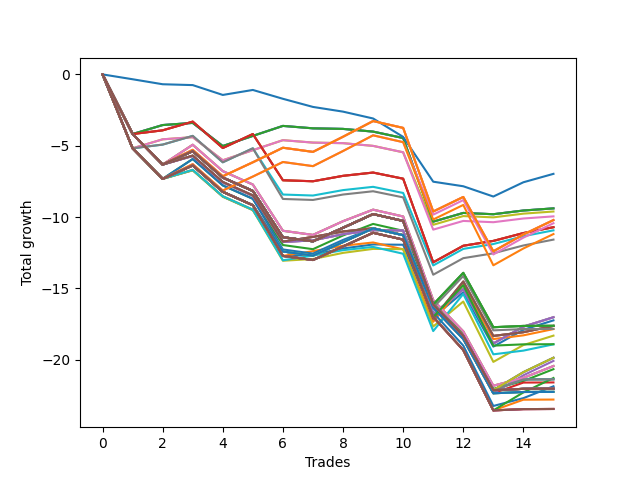

# Short Bulldog 006 
- Symbol: NVDA_Unlimited
- Date Range: 02/08/2022 - 07/08/2022
- Trading Period: 7:20-12:30
- Number of Trades: 15



| Name | Win Percent | Profit | Avg Profit / Trade | Avg Time / Trade |      | Name | Win Percent | Profit | Avg Profit / Trade | Avg Time / Trade |
| ---- | ----------- | ------ | ------------------ | ---------------- | ---- | ---- | ----------- | ------ | ------------------ | ---------------- |
| Sorted By <br> Profit | | | | | | Sorted By <br> Win Percentage ||||
| Seventy-Three | 20.00 | -3485.00 | -232.33 | 07:29 |     | Sixty-Five | 60.00 | -5355.00 | -357.00 | 15:40 |
| Sixty-Four | 46.67 | -4695.00 | -313.00 | 11:39 |     | Fifty-Seven | 60.00 | -5355.00 | -357.00 | 15:40 |
| Fifty-Six | 46.67 | -4695.00 | -313.00 | 11:39 |     | One | 60.00 | -5355.00 | -357.00 | 15:40 |
| Zero | 46.67 | -4695.00 | -313.00 | 11:39 |     | Forty-One | 60.00 | -5465.00 | -364.33 | 14:52 |
| Forty | 46.67 | -4805.00 | -320.33 | 10:51 |     | Forty-Nine | 60.00 | -5790.00 | -386.00 | 14:26 |
| Forty-Eight | 46.67 | -4975.00 | -331.67 | 10:52 |     | One Hundred Twenty-Six | 53.33 | -5105.00 | -340.33 | 18:09 |
| One Hundred Twenty-Six | 53.33 | -5105.00 | -340.33 | 18:09 |     | One Hundred Twenty-One | 53.33 | -5105.00 | -340.33 | 18:09 |
| One Hundred Twenty-One | 53.33 | -5105.00 | -340.33 | 18:09 |     | Eighty-One | 53.33 | -5105.00 | -340.33 | 18:09 |
| Eighty-One | 53.33 | -5105.00 | -340.33 | 18:09 |     | One Hundred Eleven | 53.33 | -5215.00 | -347.67 | 17:21 |
| One Hundred Eleven | 53.33 | -5215.00 | -347.67 | 17:21 |     | One Hundred Sixteen | 53.33 | -5595.00 | -373.00 | 17:20 |
| Sixty-Five | 60.00 | -5355.00 | -357.00 | 15:40 |     | Sixty-Four | 46.67 | -4695.00 | -313.00 | 11:39 |
| Fifty-Seven | 60.00 | -5355.00 | -357.00 | 15:40 |     | Fifty-Six | 46.67 | -4695.00 | -313.00 | 11:39 |
| One | 60.00 | -5355.00 | -357.00 | 15:40 |     | Zero | 46.67 | -4695.00 | -313.00 | 11:39 |
| Forty-One | 60.00 | -5465.00 | -364.33 | 14:52 |     | Forty | 46.67 | -4805.00 | -320.33 | 10:51 |
| One Hundred Sixteen | 53.33 | -5595.00 | -373.00 | 17:20 |     | Forty-Eight | 46.67 | -4975.00 | -331.67 | 10:52 |
| Forty-Nine | 60.00 | -5790.00 | -386.00 | 14:26 |     | Sixty-Six | 46.67 | -8510.00 | -567.33 | 20:04 |
| Sixty-Six | 46.67 | -8510.00 | -567.33 | 20:04 |     | Fifty-Eight | 46.67 | -8510.00 | -567.33 | 20:04 |
| Fifty-Eight | 46.67 | -8510.00 | -567.33 | 20:04 |     | Two | 46.67 | -8510.00 | -567.33 | 20:04 |
| Two | 46.67 | -8510.00 | -567.33 | 20:04 |     | Forty-Two | 46.67 | -8620.00 | -574.67 | 19:16 |
| Forty-Two | 46.67 | -8620.00 | -574.67 | 19:16 |     | Sixty-Seven | 46.67 | -8815.00 | -587.67 | 20:13 |
| One Hundred Twenty-Seven | 40.00 | -8810.00 | -587.33 | 26:26 |     | Fifty-Nine | 46.67 | -8815.00 | -587.67 | 20:13 |
| One Hundred Twenty-Two | 40.00 | -8810.00 | -587.33 | 26:26 |     | Three | 46.67 | -8815.00 | -587.67 | 20:13 |
| Eighty-Two | 40.00 | -8810.00 | -587.33 | 26:26 |     | Forty-Three | 46.67 | -8925.00 | -595.00 | 19:25 |
| Sixty-Seven | 46.67 | -8815.00 | -587.67 | 20:13 |     | Fifty | 46.67 | -9155.00 | -610.33 | 18:48 |
| Fifty-Nine | 46.67 | -8815.00 | -587.67 | 20:13 |     | Fifty-One | 46.67 | -9460.00 | -630.67 | 18:58 |
| Three | 46.67 | -8815.00 | -587.67 | 20:13 |     | One Hundred Twenty-Seven | 40.00 | -8810.00 | -587.33 | 26:26 |
| One Hundred Twelve | 40.00 | -8920.00 | -594.67 | 25:38 |     | One Hundred Twenty-Two | 40.00 | -8810.00 | -587.33 | 26:26 |
| Forty-Three | 46.67 | -8925.00 | -595.00 | 19:25 |     | Eighty-Two | 40.00 | -8810.00 | -587.33 | 26:26 |
| Fifty | 46.67 | -9155.00 | -610.33 | 18:48 |     | One Hundred Twelve | 40.00 | -8920.00 | -594.67 | 25:38 |
| One Hundred Seventeen | 40.00 | -9455.00 | -630.33 | 25:11 |     | One Hundred Seventeen | 40.00 | -9455.00 | -630.33 | 25:11 |
| Fifty-One | 46.67 | -9460.00 | -630.67 | 18:58 |     | Seventy | 33.33 | -9930.00 | -662.00 | 24:24 |
| Seventy | 33.33 | -9930.00 | -662.00 | 24:24 |     | Sixty-Two | 33.33 | -9930.00 | -662.00 | 24:24 |
| Sixty-Two | 33.33 | -9930.00 | -662.00 | 24:24 |     | Six | 33.33 | -9930.00 | -662.00 | 24:24 |
| Six | 33.33 | -9930.00 | -662.00 | 24:24 |     | Forty-Six | 33.33 | -10040.00 | -669.33 | 23:36 |
| Forty-Six | 33.33 | -10040.00 | -669.33 | 23:36 |     | Sixty-Eight | 33.33 | -10220.00 | -681.33 | 22:21 |
| Sixty-Eight | 33.33 | -10220.00 | -681.33 | 22:21 |     | Sixty | 33.33 | -10220.00 | -681.33 | 22:21 |
| Sixty | 33.33 | -10220.00 | -681.33 | 22:21 |     | Four | 33.33 | -10220.00 | -681.33 | 22:21 |
| Four | 33.33 | -10220.00 | -681.33 | 22:21 |     | Forty-Four | 33.33 | -10330.00 | -688.67 | 21:33 |
| Forty-Four | 33.33 | -10330.00 | -688.67 | 21:33 |     | Fifty-Four | 33.33 | -10640.00 | -709.33 | 22:52 |
| Fifty-Four | 33.33 | -10640.00 | -709.33 | 22:52 |     | Sixty-Nine | 33.33 | -10685.00 | -712.33 | 25:31 |
| Sixty-Nine | 33.33 | -10685.00 | -712.33 | 25:31 |     | Sixty-One | 33.33 | -10685.00 | -712.33 | 25:31 |
| Sixty-One | 33.33 | -10685.00 | -712.33 | 25:31 |     | Five | 33.33 | -10685.00 | -712.33 | 25:31 |
| Five | 33.33 | -10685.00 | -712.33 | 25:31 |     | Forty-Five | 33.33 | -10795.00 | -719.67 | 24:43 |
| Forty-Five | 33.33 | -10795.00 | -719.67 | 24:43 |     | Fifty-Two | 33.33 | -10930.00 | -728.67 | 20:49 |
| Fifty-Two | 33.33 | -10930.00 | -728.67 | 20:49 |     | One Hundred Thirty | 33.33 | -11015.00 | -734.33 | 27:24 |
| One Hundred Thirty | 33.33 | -11015.00 | -734.33 | 27:24 |     | One Hundred Twenty-Nine | 33.33 | -11015.00 | -734.33 | 27:24 |
| One Hundred Twenty-Nine | 33.33 | -11015.00 | -734.33 | 27:24 |     | One Hundred Twenty-Eight | 33.33 | -11015.00 | -734.33 | 27:24 |
| One Hundred Twenty-Eight | 33.33 | -11015.00 | -734.33 | 27:24 |     | One Hundred Twenty-Five | 33.33 | -11015.00 | -734.33 | 27:24 |
| One Hundred Twenty-Five | 33.33 | -11015.00 | -734.33 | 27:24 |     | One Hundred Twenty-Four | 33.33 | -11015.00 | -734.33 | 27:24 |
| One Hundred Twenty-Four | 33.33 | -11015.00 | -734.33 | 27:24 |     | One Hundred Twenty-Three | 33.33 | -11015.00 | -734.33 | 27:24 |
| One Hundred Twenty-Three | 33.33 | -11015.00 | -734.33 | 27:24 |     | Eighty-Five | 33.33 | -11015.00 | -734.33 | 27:24 |
| Eighty-Five | 33.33 | -11015.00 | -734.33 | 27:24 |     | Eighty-Four | 33.33 | -11015.00 | -734.33 | 27:24 |
| Eighty-Four | 33.33 | -11015.00 | -734.33 | 27:24 |     | Eighty-Three | 33.33 | -11015.00 | -734.33 | 27:24 |
| Eighty-Three | 33.33 | -11015.00 | -734.33 | 27:24 |     | Seventy-One | 33.33 | -11015.00 | -734.33 | 27:24 |
| Seventy-One | 33.33 | -11015.00 | -734.33 | 27:24 |     | Sixty-Three | 33.33 | -11015.00 | -734.33 | 27:24 |
| Sixty-Three | 33.33 | -11015.00 | -734.33 | 27:24 |     | Seven | 33.33 | -11015.00 | -734.33 | 27:24 |
| Seven | 33.33 | -11015.00 | -734.33 | 27:24 |     | One Hundred Fifteen | 33.33 | -11125.00 | -741.67 | 26:36 |
| One Hundred Fifteen | 33.33 | -11125.00 | -741.67 | 26:36 |     | One Hundred Fourteen | 33.33 | -11125.00 | -741.67 | 26:36 |
| One Hundred Fourteen | 33.33 | -11125.00 | -741.67 | 26:36 |     | One Hundred Thirteen | 33.33 | -11125.00 | -741.67 | 26:36 |
| One Hundred Thirteen | 33.33 | -11125.00 | -741.67 | 26:36 |     | Forty-Seven | 33.33 | -11125.00 | -741.67 | 26:36 |
| Forty-Seven | 33.33 | -11125.00 | -741.67 | 26:36 |     | Fifty-Three | 33.33 | -11395.00 | -759.67 | 23:59 |
| Fifty-Three | 33.33 | -11395.00 | -759.67 | 23:59 |     | One Hundred Twenty | 33.33 | -11725.00 | -781.67 | 25:51 |
| One Hundred Twenty | 33.33 | -11725.00 | -781.67 | 25:51 |     | One Hundred Ninteen | 33.33 | -11725.00 | -781.67 | 25:51 |
| One Hundred Ninteen | 33.33 | -11725.00 | -781.67 | 25:51 |     | One Hundred Eighteen | 33.33 | -11725.00 | -781.67 | 25:51 |
| One Hundred Eighteen | 33.33 | -11725.00 | -781.67 | 25:51 |     | Fifty-Five | 33.33 | -11725.00 | -781.67 | 25:51 |
| Fifty-Five | 33.33 | -11725.00 | -781.67 | 25:51 |     | Seventy-Three | 20.00 | -3485.00 | -232.33 | 07:29 |

## NO STOPLOSS

### Test Zero
* Sell when price hits the middle line of the 20p bollinger
* No Stoploss
* Results:
```
Total Trades: 15
Percent Up: 53.33
Percent Down: 46.67
Total Points Moved Down: -9.39
Potential Profit: -4695.00
Total Points Ups: 12.60 Count Ups: 8
Total Points Downs: 3.21 Count Downs: 7
```

<details><summary>Trades</summary>

<code>In: 2022-02-09 07:46:00		Out: 2022-02-09 08:15:55		Total Position Time: 29:55		Total Move Down: -4.18		Total to Date: -4.18</code> <br />
<code>In: 2022-02-14 07:52:00		Out: 2022-02-14 08:00:30		Total Position Time: 08:30		Total Move Down: 0.63		Total to Date: -3.55</code> <br />
<code>In: 2022-02-16 07:47:00		Out: 2022-02-16 07:58:55		Total Position Time: 11:55		Total Move Down: 0.15		Total to Date: -3.40</code> <br />
<code>In: 2022-02-24 12:30:00		Out: 2022-02-24 12:44:05		Total Position Time: 14:05		Total Move Down: -1.62		Total to Date: -5.02</code> <br />
<code>In: 2022-03-02 08:11:00		Out: 2022-03-02 08:18:35		Total Position Time: 07:35		Total Move Down: 0.71		Total to Date: -4.31</code> <br />
<code>In: 2022-03-08 09:24:00		Out: 2022-03-08 09:25:40		Total Position Time: 01:40		Total Move Down: 0.70		Total to Date: -3.61</code> <br />
<code>In: 2022-03-29 12:26:00		Out: 2022-03-29 12:38:20		Total Position Time: 12:20		Total Move Down: -0.17		Total to Date: -3.78</code> <br />
<code>In: 2022-04-18 11:28:00		Out: 2022-04-18 11:40:45		Total Position Time: 12:45		Total Move Down: -0.04		Total to Date: -3.82</code> <br />
<code>In: 2022-04-18 11:29:00		Out: 2022-04-18 11:40:45		Total Position Time: 11:45		Total Move Down: -0.19		Total to Date: -4.01</code> <br />
<code>In: 2022-05-02 12:30:00		Out: 2022-05-02 12:39:35		Total Position Time: 09:35		Total Move Down: -0.45		Total to Date: -4.46</code> <br />
<code>In: 2022-05-04 11:51:00		Out: 2022-05-04 12:20:55		Total Position Time: 29:55		Total Move Down: -5.86		Total to Date: -10.32</code> <br />
<code>In: 2022-05-06 07:21:00		Out: 2022-05-06 07:29:05		Total Position Time: 08:05		Total Move Down: 0.61		Total to Date: -9.71</code> <br />
<code>In: 2022-05-06 07:52:00		Out: 2022-05-06 08:03:20		Total Position Time: 11:20		Total Move Down: -0.09		Total to Date: -9.80</code> <br />
<code>In: 2022-07-06 11:10:00		Out: 2022-07-06 11:10:10		Total Position Time: 00:10		Total Move Down: 0.26		Total to Date: -9.54</code> <br />
<code>In: 2022-07-07 08:14:00		Out: 2022-07-07 08:19:15		Total Position Time: 05:15		Total Move Down: 0.15		Total to Date: -9.39</code> <br />


</details>

### Test One
* Sell when the price hits the upper line of the 20p 1std bollinger
* No Stoploss
* Results:
```
Total Trades: 15
Percent Up: 40.00
Percent Down: 60.00
Total Points Moved Down: -10.71
Potential Profit: -5355.00
Total Points Ups: 15.63 Count Ups: 6
Total Points Downs: 4.92 Count Downs: 9
```

<details><summary>Trades</summary>

<code>In: 2022-02-09 07:46:00		Out: 2022-02-09 08:15:55		Total Position Time: 29:55		Total Move Down: -4.18		Total to Date: -4.18</code> <br />
<code>In: 2022-02-14 07:52:00		Out: 2022-02-14 08:06:20		Total Position Time: 14:20		Total Move Down: 0.26		Total to Date: -3.92</code> <br />
<code>In: 2022-02-16 07:47:00		Out: 2022-02-16 08:00:25		Total Position Time: 13:25		Total Move Down: 0.61		Total to Date: -3.31</code> <br />
<code>In: 2022-02-24 12:30:00		Out: 2022-02-24 12:46:00		Total Position Time: 16:00		Total Move Down: -1.85		Total to Date: -5.16</code> <br />
<code>In: 2022-03-02 08:11:00		Out: 2022-03-02 08:22:55		Total Position Time: 11:55		Total Move Down: 0.98		Total to Date: -4.18</code> <br />
<code>In: 2022-03-08 09:24:00		Out: 2022-03-08 09:53:55		Total Position Time: 29:55		Total Move Down: -3.24		Total to Date: -7.42</code> <br />
<code>In: 2022-03-29 12:26:00		Out: 2022-03-29 12:42:10		Total Position Time: 16:10		Total Move Down: -0.07		Total to Date: -7.49</code> <br />
<code>In: 2022-04-18 11:28:00		Out: 2022-04-18 11:41:20		Total Position Time: 13:20		Total Move Down: 0.38		Total to Date: -7.11</code> <br />
<code>In: 2022-04-18 11:29:00		Out: 2022-04-18 11:41:20		Total Position Time: 12:20		Total Move Down: 0.23		Total to Date: -6.88</code> <br />
<code>In: 2022-05-02 12:30:00		Out: 2022-05-02 12:44:10		Total Position Time: 14:10		Total Move Down: -0.43		Total to Date: -7.31</code> <br />
<code>In: 2022-05-04 11:51:00		Out: 2022-05-04 12:20:55		Total Position Time: 29:55		Total Move Down: -5.86		Total to Date: -13.17</code> <br />
<code>In: 2022-05-06 07:21:00		Out: 2022-05-06 07:34:10		Total Position Time: 13:10		Total Move Down: 1.16		Total to Date: -12.01</code> <br />
<code>In: 2022-05-06 07:52:00		Out: 2022-05-06 08:05:15		Total Position Time: 13:15		Total Move Down: 0.34		Total to Date: -11.67</code> <br />
<code>In: 2022-07-06 11:10:00		Out: 2022-07-06 11:11:10		Total Position Time: 01:10		Total Move Down: 0.55		Total to Date: -11.12</code> <br />
<code>In: 2022-07-07 08:14:00		Out: 2022-07-07 08:20:05		Total Position Time: 06:05		Total Move Down: 0.41		Total to Date: -10.71</code> <br />


</details>

### Test Two
* Sell when the price hits the upper line of the 20p 2std bollinger
* No Stoploss
* Results:
```
Total Trades: 15
Percent Up: 53.33
Percent Down: 46.67
Total Points Moved Down: -17.02
Potential Profit: -8510.00
Total Points Ups: 22.04 Count Ups: 8
Total Points Downs: 5.02 Count Downs: 7
```

<details><summary>Trades</summary>

<code>In: 2022-02-09 07:46:00		Out: 2022-02-09 08:15:55		Total Position Time: 29:55		Total Move Down: -4.18		Total to Date: -4.18</code> <br />
<code>In: 2022-02-14 07:52:00		Out: 2022-02-14 08:21:55		Total Position Time: 29:55		Total Move Down: -2.14		Total to Date: -6.32</code> <br />
<code>In: 2022-02-16 07:47:00		Out: 2022-02-16 08:05:15		Total Position Time: 18:15		Total Move Down: 0.60		Total to Date: -5.72</code> <br />
<code>In: 2022-02-24 12:30:00		Out: 2022-02-24 12:46:00		Total Position Time: 16:00		Total Move Down: -1.85		Total to Date: -7.57</code> <br />
<code>In: 2022-03-02 08:11:00		Out: 2022-03-02 08:40:55		Total Position Time: 29:55		Total Move Down: -0.94		Total to Date: -8.51</code> <br />
<code>In: 2022-03-08 09:24:00		Out: 2022-03-08 09:53:55		Total Position Time: 29:55		Total Move Down: -3.24		Total to Date: -11.75</code> <br />
<code>In: 2022-03-29 12:26:00		Out: 2022-03-29 12:43:10		Total Position Time: 17:10		Total Move Down: 0.12		Total to Date: -11.63</code> <br />
<code>In: 2022-04-18 11:28:00		Out: 2022-04-18 11:43:10		Total Position Time: 15:10		Total Move Down: 0.43		Total to Date: -11.20</code> <br />
<code>In: 2022-04-18 11:29:00		Out: 2022-04-18 11:43:10		Total Position Time: 14:10		Total Move Down: 0.28		Total to Date: -10.92</code> <br />
<code>In: 2022-05-02 12:30:00		Out: 2022-05-02 12:45:05		Total Position Time: 15:05		Total Move Down: -0.02		Total to Date: -10.94</code> <br />
<code>In: 2022-05-04 11:51:00		Out: 2022-05-04 12:20:55		Total Position Time: 29:55		Total Move Down: -5.86		Total to Date: -16.80</code> <br />
<code>In: 2022-05-06 07:21:00		Out: 2022-05-06 07:35:45		Total Position Time: 14:45		Total Move Down: 1.75		Total to Date: -15.05</code> <br />
<code>In: 2022-05-06 07:52:00		Out: 2022-05-06 08:21:55		Total Position Time: 29:55		Total Move Down: -3.81		Total to Date: -18.86</code> <br />
<code>In: 2022-07-06 11:10:00		Out: 2022-07-06 11:12:15		Total Position Time: 02:15		Total Move Down: 1.18		Total to Date: -17.68</code> <br />
<code>In: 2022-07-07 08:14:00		Out: 2022-07-07 08:22:45		Total Position Time: 08:45		Total Move Down: 0.66		Total to Date: -17.02</code> <br />


</details>

### Test Three
* Sell when price hits the middle line of the 50p bollinger
* No Stoploss
* Results:
```
Total Trades: 15
Percent Up: 53.33
Percent Down: 46.67
Total Points Moved Down: -17.63
Potential Profit: -8815.00
Total Points Ups: 22.50 Count Ups: 8
Total Points Downs: 4.87 Count Downs: 7
```

<details><summary>Trades</summary>

<code>In: 2022-02-09 07:46:00		Out: 2022-02-09 08:15:55		Total Position Time: 29:55		Total Move Down: -4.18		Total to Date: -4.18</code> <br />
<code>In: 2022-02-14 07:52:00		Out: 2022-02-14 08:21:55		Total Position Time: 29:55		Total Move Down: -2.14		Total to Date: -6.32</code> <br />
<code>In: 2022-02-16 07:47:00		Out: 2022-02-16 08:12:25		Total Position Time: 25:25		Total Move Down: 0.63		Total to Date: -5.69</code> <br />
<code>In: 2022-02-24 12:30:00		Out: 2022-02-24 12:46:00		Total Position Time: 16:00		Total Move Down: -1.85		Total to Date: -7.54</code> <br />
<code>In: 2022-03-02 08:11:00		Out: 2022-03-02 08:40:55		Total Position Time: 29:55		Total Move Down: -0.94		Total to Date: -8.48</code> <br />
<code>In: 2022-03-08 09:24:00		Out: 2022-03-08 09:53:55		Total Position Time: 29:55		Total Move Down: -3.24		Total to Date: -11.72</code> <br />
<code>In: 2022-03-29 12:26:00		Out: 2022-03-29 12:43:30		Total Position Time: 17:30		Total Move Down: 0.33		Total to Date: -11.39</code> <br />
<code>In: 2022-04-18 11:28:00		Out: 2022-04-18 11:41:15		Total Position Time: 13:15		Total Move Down: 0.38		Total to Date: -11.01</code> <br />
<code>In: 2022-04-18 11:29:00		Out: 2022-04-18 11:41:15		Total Position Time: 12:15		Total Move Down: 0.23		Total to Date: -10.78</code> <br />
<code>In: 2022-05-02 12:30:00		Out: 2022-05-02 12:46:00		Total Position Time: 16:00		Total Move Down: -0.48		Total to Date: -11.26</code> <br />
<code>In: 2022-05-04 11:51:00		Out: 2022-05-04 12:20:55		Total Position Time: 29:55		Total Move Down: -5.86		Total to Date: -17.12</code> <br />
<code>In: 2022-05-06 07:21:00		Out: 2022-05-06 07:37:25		Total Position Time: 16:25		Total Move Down: 2.60		Total to Date: -14.52</code> <br />
<code>In: 2022-05-06 07:52:00		Out: 2022-05-06 08:21:55		Total Position Time: 29:55		Total Move Down: -3.81		Total to Date: -18.33</code> <br />
<code>In: 2022-07-06 11:10:00		Out: 2022-07-06 11:10:10		Total Position Time: 00:10		Total Move Down: 0.26		Total to Date: -18.07</code> <br />
<code>In: 2022-07-07 08:14:00		Out: 2022-07-07 08:20:55		Total Position Time: 06:55		Total Move Down: 0.44		Total to Date: -17.63</code> <br />


</details>

### Test Four
* Sell when the price hits the upper line of the 50p 1std bollinger
* No Stoploss
* Results:
```
Total Trades: 15
Percent Up: 66.67
Percent Down: 33.33
Total Points Moved Down: -20.44
Potential Profit: -10220.00
Total Points Ups: 24.98 Count Ups: 10
Total Points Downs: 4.54 Count Downs: 5
```

<details><summary>Trades</summary>

<code>In: 2022-02-09 07:46:00		Out: 2022-02-09 08:15:55		Total Position Time: 29:55		Total Move Down: -4.18		Total to Date: -4.18</code> <br />
<code>In: 2022-02-14 07:52:00		Out: 2022-02-14 08:21:55		Total Position Time: 29:55		Total Move Down: -2.14		Total to Date: -6.32</code> <br />
<code>In: 2022-02-16 07:47:00		Out: 2022-02-16 08:15:05		Total Position Time: 28:05		Total Move Down: 1.39		Total to Date: -4.93</code> <br />
<code>In: 2022-02-24 12:30:00		Out: 2022-02-24 12:46:00		Total Position Time: 16:00		Total Move Down: -1.85		Total to Date: -6.78</code> <br />
<code>In: 2022-03-02 08:11:00		Out: 2022-03-02 08:40:55		Total Position Time: 29:55		Total Move Down: -0.94		Total to Date: -7.72</code> <br />
<code>In: 2022-03-08 09:24:00		Out: 2022-03-08 09:53:55		Total Position Time: 29:55		Total Move Down: -3.24		Total to Date: -10.96</code> <br />
<code>In: 2022-03-29 12:26:00		Out: 2022-03-29 12:46:00		Total Position Time: 20:00		Total Move Down: -0.29		Total to Date: -11.25</code> <br />
<code>In: 2022-04-18 11:28:00		Out: 2022-04-18 11:46:10		Total Position Time: 18:10		Total Move Down: 0.96		Total to Date: -10.29</code> <br />
<code>In: 2022-04-18 11:29:00		Out: 2022-04-18 11:46:10		Total Position Time: 17:10		Total Move Down: 0.81		Total to Date: -9.48</code> <br />
<code>In: 2022-05-02 12:30:00		Out: 2022-05-02 12:46:00		Total Position Time: 16:00		Total Move Down: -0.48		Total to Date: -9.96</code> <br />
<code>In: 2022-05-04 11:51:00		Out: 2022-05-04 12:20:55		Total Position Time: 29:55		Total Move Down: -5.86		Total to Date: -15.82</code> <br />
<code>In: 2022-05-06 07:21:00		Out: 2022-05-06 07:50:55		Total Position Time: 29:55		Total Move Down: -2.19		Total to Date: -18.01</code> <br />
<code>In: 2022-05-06 07:52:00		Out: 2022-05-06 08:21:55		Total Position Time: 29:55		Total Move Down: -3.81		Total to Date: -21.82</code> <br />
<code>In: 2022-07-06 11:10:00		Out: 2022-07-06 11:11:10		Total Position Time: 01:10		Total Move Down: 0.55		Total to Date: -21.27</code> <br />
<code>In: 2022-07-07 08:14:00		Out: 2022-07-07 08:23:25		Total Position Time: 09:25		Total Move Down: 0.83		Total to Date: -20.44</code> <br />


</details>

### Test Five
* Sell when the price hits the upper line of the 50p 2std bollinger
* No Stoploss
* Results:
```
Total Trades: 15
Percent Up: 66.67
Percent Down: 33.33
Total Points Moved Down: -21.37
Potential Profit: -10685.00
Total Points Ups: 24.98 Count Ups: 10
Total Points Downs: 3.61 Count Downs: 5
```

<details><summary>Trades</summary>

<code>In: 2022-02-09 07:46:00		Out: 2022-02-09 08:15:55		Total Position Time: 29:55		Total Move Down: -4.18		Total to Date: -4.18</code> <br />
<code>In: 2022-02-14 07:52:00		Out: 2022-02-14 08:21:55		Total Position Time: 29:55		Total Move Down: -2.14		Total to Date: -6.32</code> <br />
<code>In: 2022-02-16 07:47:00		Out: 2022-02-16 08:16:55		Total Position Time: 29:55		Total Move Down: 0.94		Total to Date: -5.38</code> <br />
<code>In: 2022-02-24 12:30:00		Out: 2022-02-24 12:46:00		Total Position Time: 16:00		Total Move Down: -1.85		Total to Date: -7.23</code> <br />
<code>In: 2022-03-02 08:11:00		Out: 2022-03-02 08:40:55		Total Position Time: 29:55		Total Move Down: -0.94		Total to Date: -8.17</code> <br />
<code>In: 2022-03-08 09:24:00		Out: 2022-03-08 09:53:55		Total Position Time: 29:55		Total Move Down: -3.24		Total to Date: -11.41</code> <br />
<code>In: 2022-03-29 12:26:00		Out: 2022-03-29 12:46:00		Total Position Time: 20:00		Total Move Down: -0.29		Total to Date: -11.70</code> <br />
<code>In: 2022-04-18 11:28:00		Out: 2022-04-18 11:57:55		Total Position Time: 29:55		Total Move Down: 0.95		Total to Date: -10.75</code> <br />
<code>In: 2022-04-18 11:29:00		Out: 2022-04-18 11:58:55		Total Position Time: 29:55		Total Move Down: 0.96		Total to Date: -9.79</code> <br />
<code>In: 2022-05-02 12:30:00		Out: 2022-05-02 12:46:00		Total Position Time: 16:00		Total Move Down: -0.48		Total to Date: -10.27</code> <br />
<code>In: 2022-05-04 11:51:00		Out: 2022-05-04 12:20:55		Total Position Time: 29:55		Total Move Down: -5.86		Total to Date: -16.13</code> <br />
<code>In: 2022-05-06 07:21:00		Out: 2022-05-06 07:50:55		Total Position Time: 29:55		Total Move Down: -2.19		Total to Date: -18.32</code> <br />
<code>In: 2022-05-06 07:52:00		Out: 2022-05-06 08:21:55		Total Position Time: 29:55		Total Move Down: -3.81		Total to Date: -22.13</code> <br />
<code>In: 2022-07-06 11:10:00		Out: 2022-07-06 11:11:45		Total Position Time: 01:45		Total Move Down: 0.75		Total to Date: -21.38</code> <br />
<code>In: 2022-07-07 08:14:00		Out: 2022-07-07 08:43:55		Total Position Time: 29:55		Total Move Down: 0.01		Total to Date: -21.37</code> <br />


</details>

### Test Six
* Sell when the price hits the middle line of the 1std VWAP
* No Stoploss
* Results:
```
Total Trades: 15
Percent Up: 66.67
Percent Down: 33.33
Total Points Moved Down: -19.86
Potential Profit: -9930.00
Total Points Ups: 24.98 Count Ups: 10
Total Points Downs: 5.12 Count Downs: 5
```

<details><summary>Trades</summary>

<code>In: 2022-02-09 07:46:00		Out: 2022-02-09 08:15:55		Total Position Time: 29:55		Total Move Down: -4.18		Total to Date: -4.18</code> <br />
<code>In: 2022-02-14 07:52:00		Out: 2022-02-14 08:21:55		Total Position Time: 29:55		Total Move Down: -2.14		Total to Date: -6.32</code> <br />
<code>In: 2022-02-16 07:47:00		Out: 2022-02-16 08:16:55		Total Position Time: 29:55		Total Move Down: 0.94		Total to Date: -5.38</code> <br />
<code>In: 2022-02-24 12:30:00		Out: 2022-02-24 12:46:00		Total Position Time: 16:00		Total Move Down: -1.85		Total to Date: -7.23</code> <br />
<code>In: 2022-03-02 08:11:00		Out: 2022-03-02 08:40:55		Total Position Time: 29:55		Total Move Down: -0.94		Total to Date: -8.17</code> <br />
<code>In: 2022-03-08 09:24:00		Out: 2022-03-08 09:53:55		Total Position Time: 29:55		Total Move Down: -3.24		Total to Date: -11.41</code> <br />
<code>In: 2022-03-29 12:26:00		Out: 2022-03-29 12:46:00		Total Position Time: 20:00		Total Move Down: -0.29		Total to Date: -11.70</code> <br />
<code>In: 2022-04-18 11:28:00		Out: 2022-04-18 11:57:55		Total Position Time: 29:55		Total Move Down: 0.95		Total to Date: -10.75</code> <br />
<code>In: 2022-04-18 11:29:00		Out: 2022-04-18 11:58:55		Total Position Time: 29:55		Total Move Down: 0.96		Total to Date: -9.79</code> <br />
<code>In: 2022-05-02 12:30:00		Out: 2022-05-02 12:46:00		Total Position Time: 16:00		Total Move Down: -0.48		Total to Date: -10.27</code> <br />
<code>In: 2022-05-04 11:51:00		Out: 2022-05-04 12:20:55		Total Position Time: 29:55		Total Move Down: -5.86		Total to Date: -16.13</code> <br />
<code>In: 2022-05-06 07:21:00		Out: 2022-05-06 07:50:55		Total Position Time: 29:55		Total Move Down: -2.19		Total to Date: -18.32</code> <br />
<code>In: 2022-05-06 07:52:00		Out: 2022-05-06 08:21:55		Total Position Time: 29:55		Total Move Down: -3.81		Total to Date: -22.13</code> <br />
<code>In: 2022-07-06 11:10:00		Out: 2022-07-06 11:12:20		Total Position Time: 02:20		Total Move Down: 1.26		Total to Date: -20.87</code> <br />
<code>In: 2022-07-07 08:14:00		Out: 2022-07-07 08:26:40		Total Position Time: 12:40		Total Move Down: 1.01		Total to Date: -19.86</code> <br />


</details>

### Test Seven
* Sell when the price hits the upper line of the 1std VWAP
* No Stoploss
* Results:
```
Total Trades: 15
Percent Up: 66.67
Percent Down: 33.33
Total Points Moved Down: -22.03
Potential Profit: -11015.00
Total Points Ups: 24.98 Count Ups: 10
Total Points Downs: 2.95 Count Downs: 5
```

<details><summary>Trades</summary>

<code>In: 2022-02-09 07:46:00		Out: 2022-02-09 08:15:55		Total Position Time: 29:55		Total Move Down: -4.18		Total to Date: -4.18</code> <br />
<code>In: 2022-02-14 07:52:00		Out: 2022-02-14 08:21:55		Total Position Time: 29:55		Total Move Down: -2.14		Total to Date: -6.32</code> <br />
<code>In: 2022-02-16 07:47:00		Out: 2022-02-16 08:16:55		Total Position Time: 29:55		Total Move Down: 0.94		Total to Date: -5.38</code> <br />
<code>In: 2022-02-24 12:30:00		Out: 2022-02-24 12:46:00		Total Position Time: 16:00		Total Move Down: -1.85		Total to Date: -7.23</code> <br />
<code>In: 2022-03-02 08:11:00		Out: 2022-03-02 08:40:55		Total Position Time: 29:55		Total Move Down: -0.94		Total to Date: -8.17</code> <br />
<code>In: 2022-03-08 09:24:00		Out: 2022-03-08 09:53:55		Total Position Time: 29:55		Total Move Down: -3.24		Total to Date: -11.41</code> <br />
<code>In: 2022-03-29 12:26:00		Out: 2022-03-29 12:46:00		Total Position Time: 20:00		Total Move Down: -0.29		Total to Date: -11.70</code> <br />
<code>In: 2022-04-18 11:28:00		Out: 2022-04-18 11:57:55		Total Position Time: 29:55		Total Move Down: 0.95		Total to Date: -10.75</code> <br />
<code>In: 2022-04-18 11:29:00		Out: 2022-04-18 11:58:55		Total Position Time: 29:55		Total Move Down: 0.96		Total to Date: -9.79</code> <br />
<code>In: 2022-05-02 12:30:00		Out: 2022-05-02 12:46:00		Total Position Time: 16:00		Total Move Down: -0.48		Total to Date: -10.27</code> <br />
<code>In: 2022-05-04 11:51:00		Out: 2022-05-04 12:20:55		Total Position Time: 29:55		Total Move Down: -5.86		Total to Date: -16.13</code> <br />
<code>In: 2022-05-06 07:21:00		Out: 2022-05-06 07:50:55		Total Position Time: 29:55		Total Move Down: -2.19		Total to Date: -18.32</code> <br />
<code>In: 2022-05-06 07:52:00		Out: 2022-05-06 08:21:55		Total Position Time: 29:55		Total Move Down: -3.81		Total to Date: -22.13</code> <br />
<code>In: 2022-07-06 11:10:00		Out: 2022-07-06 11:39:55		Total Position Time: 29:55		Total Move Down: 0.09		Total to Date: -22.04</code> <br />
<code>In: 2022-07-07 08:14:00		Out: 2022-07-07 08:43:55		Total Position Time: 29:55		Total Move Down: 0.01		Total to Date: -22.03</code> <br />


</details>

## STOPLOSS OF 5

### Test Forty
* Sell when price hits the middle line of the 20p bollinger
* Stoploss is -5 points
* Results:
```
Total Trades: 15
Percent Up: 53.33
Percent Down: 46.67
Total Points Moved Down: -9.61
Potential Profit: -4805.00
Total Points Ups: 12.82 Count Ups: 8
Total Points Downs: 3.21 Count Downs: 7
```

<details><summary>Trades</summary>

<code>In: 2022-02-09 07:46:00		Out: 2022-02-09 08:12:10		Total Position Time: 26:10		Total Move Down: -5.18		Total to Date: -5.18</code> <br />
<code>In: 2022-02-14 07:52:00		Out: 2022-02-14 08:00:30		Total Position Time: 08:30		Total Move Down: 0.63		Total to Date: -4.55</code> <br />
<code>In: 2022-02-16 07:47:00		Out: 2022-02-16 07:58:55		Total Position Time: 11:55		Total Move Down: 0.15		Total to Date: -4.40</code> <br />
<code>In: 2022-02-24 12:30:00		Out: 2022-02-24 12:44:05		Total Position Time: 14:05		Total Move Down: -1.62		Total to Date: -6.02</code> <br />
<code>In: 2022-03-02 08:11:00		Out: 2022-03-02 08:18:35		Total Position Time: 07:35		Total Move Down: 0.71		Total to Date: -5.31</code> <br />
<code>In: 2022-03-08 09:24:00		Out: 2022-03-08 09:25:40		Total Position Time: 01:40		Total Move Down: 0.70		Total to Date: -4.61</code> <br />
<code>In: 2022-03-29 12:26:00		Out: 2022-03-29 12:38:20		Total Position Time: 12:20		Total Move Down: -0.17		Total to Date: -4.78</code> <br />
<code>In: 2022-04-18 11:28:00		Out: 2022-04-18 11:40:45		Total Position Time: 12:45		Total Move Down: -0.04		Total to Date: -4.82</code> <br />
<code>In: 2022-04-18 11:29:00		Out: 2022-04-18 11:40:45		Total Position Time: 11:45		Total Move Down: -0.19		Total to Date: -5.01</code> <br />
<code>In: 2022-05-02 12:30:00		Out: 2022-05-02 12:39:35		Total Position Time: 09:35		Total Move Down: -0.45		Total to Date: -5.46</code> <br />
<code>In: 2022-05-04 11:51:00		Out: 2022-05-04 12:12:40		Total Position Time: 21:40		Total Move Down: -5.08		Total to Date: -10.54</code> <br />
<code>In: 2022-05-06 07:21:00		Out: 2022-05-06 07:29:05		Total Position Time: 08:05		Total Move Down: 0.61		Total to Date: -9.93</code> <br />
<code>In: 2022-05-06 07:52:00		Out: 2022-05-06 08:03:20		Total Position Time: 11:20		Total Move Down: -0.09		Total to Date: -10.02</code> <br />
<code>In: 2022-07-06 11:10:00		Out: 2022-07-06 11:10:10		Total Position Time: 00:10		Total Move Down: 0.26		Total to Date: -9.76</code> <br />
<code>In: 2022-07-07 08:14:00		Out: 2022-07-07 08:19:15		Total Position Time: 05:15		Total Move Down: 0.15		Total to Date: -9.61</code> <br />


</details>

### Test Forty-One
* Sell when the price hits the upper line of the 20p 1std bollinger
* Stoploss is -5 points
* Results:
```
Total Trades: 15
Percent Up: 40.00
Percent Down: 60.00
Total Points Moved Down: -10.93
Potential Profit: -5465.00
Total Points Ups: 15.85 Count Ups: 6
Total Points Downs: 4.92 Count Downs: 9
```

<details><summary>Trades</summary>

<code>In: 2022-02-09 07:46:00		Out: 2022-02-09 08:12:10		Total Position Time: 26:10		Total Move Down: -5.18		Total to Date: -5.18</code> <br />
<code>In: 2022-02-14 07:52:00		Out: 2022-02-14 08:06:20		Total Position Time: 14:20		Total Move Down: 0.26		Total to Date: -4.92</code> <br />
<code>In: 2022-02-16 07:47:00		Out: 2022-02-16 08:00:25		Total Position Time: 13:25		Total Move Down: 0.61		Total to Date: -4.31</code> <br />
<code>In: 2022-02-24 12:30:00		Out: 2022-02-24 12:46:00		Total Position Time: 16:00		Total Move Down: -1.85		Total to Date: -6.16</code> <br />
<code>In: 2022-03-02 08:11:00		Out: 2022-03-02 08:22:55		Total Position Time: 11:55		Total Move Down: 0.98		Total to Date: -5.18</code> <br />
<code>In: 2022-03-08 09:24:00		Out: 2022-03-08 09:53:55		Total Position Time: 29:55		Total Move Down: -3.24		Total to Date: -8.42</code> <br />
<code>In: 2022-03-29 12:26:00		Out: 2022-03-29 12:42:10		Total Position Time: 16:10		Total Move Down: -0.07		Total to Date: -8.49</code> <br />
<code>In: 2022-04-18 11:28:00		Out: 2022-04-18 11:41:20		Total Position Time: 13:20		Total Move Down: 0.38		Total to Date: -8.11</code> <br />
<code>In: 2022-04-18 11:29:00		Out: 2022-04-18 11:41:20		Total Position Time: 12:20		Total Move Down: 0.23		Total to Date: -7.88</code> <br />
<code>In: 2022-05-02 12:30:00		Out: 2022-05-02 12:44:10		Total Position Time: 14:10		Total Move Down: -0.43		Total to Date: -8.31</code> <br />
<code>In: 2022-05-04 11:51:00		Out: 2022-05-04 12:12:40		Total Position Time: 21:40		Total Move Down: -5.08		Total to Date: -13.39</code> <br />
<code>In: 2022-05-06 07:21:00		Out: 2022-05-06 07:34:10		Total Position Time: 13:10		Total Move Down: 1.16		Total to Date: -12.23</code> <br />
<code>In: 2022-05-06 07:52:00		Out: 2022-05-06 08:05:15		Total Position Time: 13:15		Total Move Down: 0.34		Total to Date: -11.89</code> <br />
<code>In: 2022-07-06 11:10:00		Out: 2022-07-06 11:11:10		Total Position Time: 01:10		Total Move Down: 0.55		Total to Date: -11.34</code> <br />
<code>In: 2022-07-07 08:14:00		Out: 2022-07-07 08:20:05		Total Position Time: 06:05		Total Move Down: 0.41		Total to Date: -10.93</code> <br />


</details>

### Test Forty-Two
* Sell when the price hits the upper line of the 20p 2std bollinger
* Stoploss is -5 points
* Results:
```
Total Trades: 15
Percent Up: 53.33
Percent Down: 46.67
Total Points Moved Down: -17.24
Potential Profit: -8620.00
Total Points Ups: 22.26 Count Ups: 8
Total Points Downs: 5.02 Count Downs: 7
```

<details><summary>Trades</summary>

<code>In: 2022-02-09 07:46:00		Out: 2022-02-09 08:12:10		Total Position Time: 26:10		Total Move Down: -5.18		Total to Date: -5.18</code> <br />
<code>In: 2022-02-14 07:52:00		Out: 2022-02-14 08:21:55		Total Position Time: 29:55		Total Move Down: -2.14		Total to Date: -7.32</code> <br />
<code>In: 2022-02-16 07:47:00		Out: 2022-02-16 08:05:15		Total Position Time: 18:15		Total Move Down: 0.60		Total to Date: -6.72</code> <br />
<code>In: 2022-02-24 12:30:00		Out: 2022-02-24 12:46:00		Total Position Time: 16:00		Total Move Down: -1.85		Total to Date: -8.57</code> <br />
<code>In: 2022-03-02 08:11:00		Out: 2022-03-02 08:40:55		Total Position Time: 29:55		Total Move Down: -0.94		Total to Date: -9.51</code> <br />
<code>In: 2022-03-08 09:24:00		Out: 2022-03-08 09:53:55		Total Position Time: 29:55		Total Move Down: -3.24		Total to Date: -12.75</code> <br />
<code>In: 2022-03-29 12:26:00		Out: 2022-03-29 12:43:10		Total Position Time: 17:10		Total Move Down: 0.12		Total to Date: -12.63</code> <br />
<code>In: 2022-04-18 11:28:00		Out: 2022-04-18 11:43:10		Total Position Time: 15:10		Total Move Down: 0.43		Total to Date: -12.20</code> <br />
<code>In: 2022-04-18 11:29:00		Out: 2022-04-18 11:43:10		Total Position Time: 14:10		Total Move Down: 0.28		Total to Date: -11.92</code> <br />
<code>In: 2022-05-02 12:30:00		Out: 2022-05-02 12:45:05		Total Position Time: 15:05		Total Move Down: -0.02		Total to Date: -11.94</code> <br />
<code>In: 2022-05-04 11:51:00		Out: 2022-05-04 12:12:40		Total Position Time: 21:40		Total Move Down: -5.08		Total to Date: -17.02</code> <br />
<code>In: 2022-05-06 07:21:00		Out: 2022-05-06 07:35:45		Total Position Time: 14:45		Total Move Down: 1.75		Total to Date: -15.27</code> <br />
<code>In: 2022-05-06 07:52:00		Out: 2022-05-06 08:21:55		Total Position Time: 29:55		Total Move Down: -3.81		Total to Date: -19.08</code> <br />
<code>In: 2022-07-06 11:10:00		Out: 2022-07-06 11:12:15		Total Position Time: 02:15		Total Move Down: 1.18		Total to Date: -17.90</code> <br />
<code>In: 2022-07-07 08:14:00		Out: 2022-07-07 08:22:45		Total Position Time: 08:45		Total Move Down: 0.66		Total to Date: -17.24</code> <br />


</details>

### Test Forty-Three
* Sell when price hits the middle line of the 50p bollinger
* Stoploss is -5 points
* Results:
```
Total Trades: 15
Percent Up: 53.33
Percent Down: 46.67
Total Points Moved Down: -17.85
Potential Profit: -8925.00
Total Points Ups: 22.72 Count Ups: 8
Total Points Downs: 4.87 Count Downs: 7
```

<details><summary>Trades</summary>

<code>In: 2022-02-09 07:46:00		Out: 2022-02-09 08:12:10		Total Position Time: 26:10		Total Move Down: -5.18		Total to Date: -5.18</code> <br />
<code>In: 2022-02-14 07:52:00		Out: 2022-02-14 08:21:55		Total Position Time: 29:55		Total Move Down: -2.14		Total to Date: -7.32</code> <br />
<code>In: 2022-02-16 07:47:00		Out: 2022-02-16 08:12:25		Total Position Time: 25:25		Total Move Down: 0.63		Total to Date: -6.69</code> <br />
<code>In: 2022-02-24 12:30:00		Out: 2022-02-24 12:46:00		Total Position Time: 16:00		Total Move Down: -1.85		Total to Date: -8.54</code> <br />
<code>In: 2022-03-02 08:11:00		Out: 2022-03-02 08:40:55		Total Position Time: 29:55		Total Move Down: -0.94		Total to Date: -9.48</code> <br />
<code>In: 2022-03-08 09:24:00		Out: 2022-03-08 09:53:55		Total Position Time: 29:55		Total Move Down: -3.24		Total to Date: -12.72</code> <br />
<code>In: 2022-03-29 12:26:00		Out: 2022-03-29 12:43:30		Total Position Time: 17:30		Total Move Down: 0.33		Total to Date: -12.39</code> <br />
<code>In: 2022-04-18 11:28:00		Out: 2022-04-18 11:41:15		Total Position Time: 13:15		Total Move Down: 0.38		Total to Date: -12.01</code> <br />
<code>In: 2022-04-18 11:29:00		Out: 2022-04-18 11:41:15		Total Position Time: 12:15		Total Move Down: 0.23		Total to Date: -11.78</code> <br />
<code>In: 2022-05-02 12:30:00		Out: 2022-05-02 12:46:00		Total Position Time: 16:00		Total Move Down: -0.48		Total to Date: -12.26</code> <br />
<code>In: 2022-05-04 11:51:00		Out: 2022-05-04 12:12:40		Total Position Time: 21:40		Total Move Down: -5.08		Total to Date: -17.34</code> <br />
<code>In: 2022-05-06 07:21:00		Out: 2022-05-06 07:37:25		Total Position Time: 16:25		Total Move Down: 2.60		Total to Date: -14.74</code> <br />
<code>In: 2022-05-06 07:52:00		Out: 2022-05-06 08:21:55		Total Position Time: 29:55		Total Move Down: -3.81		Total to Date: -18.55</code> <br />
<code>In: 2022-07-06 11:10:00		Out: 2022-07-06 11:10:10		Total Position Time: 00:10		Total Move Down: 0.26		Total to Date: -18.29</code> <br />
<code>In: 2022-07-07 08:14:00		Out: 2022-07-07 08:20:55		Total Position Time: 06:55		Total Move Down: 0.44		Total to Date: -17.85</code> <br />


</details>

### Test Forty-Four
* Sell when the price hits the upper line of the 50p 1std bollinger
* Stoploss is -5 points
* Results:
```
Total Trades: 15
Percent Up: 66.67
Percent Down: 33.33
Total Points Moved Down: -20.66
Potential Profit: -10330.00
Total Points Ups: 25.20 Count Ups: 10
Total Points Downs: 4.54 Count Downs: 5
```

<details><summary>Trades</summary>

<code>In: 2022-02-09 07:46:00		Out: 2022-02-09 08:12:10		Total Position Time: 26:10		Total Move Down: -5.18		Total to Date: -5.18</code> <br />
<code>In: 2022-02-14 07:52:00		Out: 2022-02-14 08:21:55		Total Position Time: 29:55		Total Move Down: -2.14		Total to Date: -7.32</code> <br />
<code>In: 2022-02-16 07:47:00		Out: 2022-02-16 08:15:05		Total Position Time: 28:05		Total Move Down: 1.39		Total to Date: -5.93</code> <br />
<code>In: 2022-02-24 12:30:00		Out: 2022-02-24 12:46:00		Total Position Time: 16:00		Total Move Down: -1.85		Total to Date: -7.78</code> <br />
<code>In: 2022-03-02 08:11:00		Out: 2022-03-02 08:40:55		Total Position Time: 29:55		Total Move Down: -0.94		Total to Date: -8.72</code> <br />
<code>In: 2022-03-08 09:24:00		Out: 2022-03-08 09:53:55		Total Position Time: 29:55		Total Move Down: -3.24		Total to Date: -11.96</code> <br />
<code>In: 2022-03-29 12:26:00		Out: 2022-03-29 12:46:00		Total Position Time: 20:00		Total Move Down: -0.29		Total to Date: -12.25</code> <br />
<code>In: 2022-04-18 11:28:00		Out: 2022-04-18 11:46:10		Total Position Time: 18:10		Total Move Down: 0.96		Total to Date: -11.29</code> <br />
<code>In: 2022-04-18 11:29:00		Out: 2022-04-18 11:46:10		Total Position Time: 17:10		Total Move Down: 0.81		Total to Date: -10.48</code> <br />
<code>In: 2022-05-02 12:30:00		Out: 2022-05-02 12:46:00		Total Position Time: 16:00		Total Move Down: -0.48		Total to Date: -10.96</code> <br />
<code>In: 2022-05-04 11:51:00		Out: 2022-05-04 12:12:40		Total Position Time: 21:40		Total Move Down: -5.08		Total to Date: -16.04</code> <br />
<code>In: 2022-05-06 07:21:00		Out: 2022-05-06 07:50:55		Total Position Time: 29:55		Total Move Down: -2.19		Total to Date: -18.23</code> <br />
<code>In: 2022-05-06 07:52:00		Out: 2022-05-06 08:21:55		Total Position Time: 29:55		Total Move Down: -3.81		Total to Date: -22.04</code> <br />
<code>In: 2022-07-06 11:10:00		Out: 2022-07-06 11:11:10		Total Position Time: 01:10		Total Move Down: 0.55		Total to Date: -21.49</code> <br />
<code>In: 2022-07-07 08:14:00		Out: 2022-07-07 08:23:25		Total Position Time: 09:25		Total Move Down: 0.83		Total to Date: -20.66</code> <br />


</details>

### Test Forty-Five
* Sell when the price hits the upper line of the 50p 2std bollinger
* Stoploss is -5 points
* Results:
```
Total Trades: 15
Percent Up: 66.67
Percent Down: 33.33
Total Points Moved Down: -21.59
Potential Profit: -10795.00
Total Points Ups: 25.20 Count Ups: 10
Total Points Downs: 3.61 Count Downs: 5
```

<details><summary>Trades</summary>

<code>In: 2022-02-09 07:46:00		Out: 2022-02-09 08:12:10		Total Position Time: 26:10		Total Move Down: -5.18		Total to Date: -5.18</code> <br />
<code>In: 2022-02-14 07:52:00		Out: 2022-02-14 08:21:55		Total Position Time: 29:55		Total Move Down: -2.14		Total to Date: -7.32</code> <br />
<code>In: 2022-02-16 07:47:00		Out: 2022-02-16 08:16:55		Total Position Time: 29:55		Total Move Down: 0.94		Total to Date: -6.38</code> <br />
<code>In: 2022-02-24 12:30:00		Out: 2022-02-24 12:46:00		Total Position Time: 16:00		Total Move Down: -1.85		Total to Date: -8.23</code> <br />
<code>In: 2022-03-02 08:11:00		Out: 2022-03-02 08:40:55		Total Position Time: 29:55		Total Move Down: -0.94		Total to Date: -9.17</code> <br />
<code>In: 2022-03-08 09:24:00		Out: 2022-03-08 09:53:55		Total Position Time: 29:55		Total Move Down: -3.24		Total to Date: -12.41</code> <br />
<code>In: 2022-03-29 12:26:00		Out: 2022-03-29 12:46:00		Total Position Time: 20:00		Total Move Down: -0.29		Total to Date: -12.70</code> <br />
<code>In: 2022-04-18 11:28:00		Out: 2022-04-18 11:57:55		Total Position Time: 29:55		Total Move Down: 0.95		Total to Date: -11.75</code> <br />
<code>In: 2022-04-18 11:29:00		Out: 2022-04-18 11:58:55		Total Position Time: 29:55		Total Move Down: 0.96		Total to Date: -10.79</code> <br />
<code>In: 2022-05-02 12:30:00		Out: 2022-05-02 12:46:00		Total Position Time: 16:00		Total Move Down: -0.48		Total to Date: -11.27</code> <br />
<code>In: 2022-05-04 11:51:00		Out: 2022-05-04 12:12:40		Total Position Time: 21:40		Total Move Down: -5.08		Total to Date: -16.35</code> <br />
<code>In: 2022-05-06 07:21:00		Out: 2022-05-06 07:50:55		Total Position Time: 29:55		Total Move Down: -2.19		Total to Date: -18.54</code> <br />
<code>In: 2022-05-06 07:52:00		Out: 2022-05-06 08:21:55		Total Position Time: 29:55		Total Move Down: -3.81		Total to Date: -22.35</code> <br />
<code>In: 2022-07-06 11:10:00		Out: 2022-07-06 11:11:45		Total Position Time: 01:45		Total Move Down: 0.75		Total to Date: -21.60</code> <br />
<code>In: 2022-07-07 08:14:00		Out: 2022-07-07 08:43:55		Total Position Time: 29:55		Total Move Down: 0.01		Total to Date: -21.59</code> <br />


</details>

### Test Forty-Six
* Sell when the price hits the middle line of the 1std VWAP
* Stoploss is -5 points
* Results:
```
Total Trades: 15
Percent Up: 66.67
Percent Down: 33.33
Total Points Moved Down: -20.08
Potential Profit: -10040.00
Total Points Ups: 25.20 Count Ups: 10
Total Points Downs: 5.12 Count Downs: 5
```

<details><summary>Trades</summary>

<code>In: 2022-02-09 07:46:00		Out: 2022-02-09 08:12:10		Total Position Time: 26:10		Total Move Down: -5.18		Total to Date: -5.18</code> <br />
<code>In: 2022-02-14 07:52:00		Out: 2022-02-14 08:21:55		Total Position Time: 29:55		Total Move Down: -2.14		Total to Date: -7.32</code> <br />
<code>In: 2022-02-16 07:47:00		Out: 2022-02-16 08:16:55		Total Position Time: 29:55		Total Move Down: 0.94		Total to Date: -6.38</code> <br />
<code>In: 2022-02-24 12:30:00		Out: 2022-02-24 12:46:00		Total Position Time: 16:00		Total Move Down: -1.85		Total to Date: -8.23</code> <br />
<code>In: 2022-03-02 08:11:00		Out: 2022-03-02 08:40:55		Total Position Time: 29:55		Total Move Down: -0.94		Total to Date: -9.17</code> <br />
<code>In: 2022-03-08 09:24:00		Out: 2022-03-08 09:53:55		Total Position Time: 29:55		Total Move Down: -3.24		Total to Date: -12.41</code> <br />
<code>In: 2022-03-29 12:26:00		Out: 2022-03-29 12:46:00		Total Position Time: 20:00		Total Move Down: -0.29		Total to Date: -12.70</code> <br />
<code>In: 2022-04-18 11:28:00		Out: 2022-04-18 11:57:55		Total Position Time: 29:55		Total Move Down: 0.95		Total to Date: -11.75</code> <br />
<code>In: 2022-04-18 11:29:00		Out: 2022-04-18 11:58:55		Total Position Time: 29:55		Total Move Down: 0.96		Total to Date: -10.79</code> <br />
<code>In: 2022-05-02 12:30:00		Out: 2022-05-02 12:46:00		Total Position Time: 16:00		Total Move Down: -0.48		Total to Date: -11.27</code> <br />
<code>In: 2022-05-04 11:51:00		Out: 2022-05-04 12:12:40		Total Position Time: 21:40		Total Move Down: -5.08		Total to Date: -16.35</code> <br />
<code>In: 2022-05-06 07:21:00		Out: 2022-05-06 07:50:55		Total Position Time: 29:55		Total Move Down: -2.19		Total to Date: -18.54</code> <br />
<code>In: 2022-05-06 07:52:00		Out: 2022-05-06 08:21:55		Total Position Time: 29:55		Total Move Down: -3.81		Total to Date: -22.35</code> <br />
<code>In: 2022-07-06 11:10:00		Out: 2022-07-06 11:12:20		Total Position Time: 02:20		Total Move Down: 1.26		Total to Date: -21.09</code> <br />
<code>In: 2022-07-07 08:14:00		Out: 2022-07-07 08:26:40		Total Position Time: 12:40		Total Move Down: 1.01		Total to Date: -20.08</code> <br />


</details>

### Test Forty-Seven
* Sell when the price hits the upper line of the 1std VWAP
* Stoploss is -5 points
* Results:
```
Total Trades: 15
Percent Up: 66.67
Percent Down: 33.33
Total Points Moved Down: -22.25
Potential Profit: -11125.00
Total Points Ups: 25.20 Count Ups: 10
Total Points Downs: 2.95 Count Downs: 5
```

<details><summary>Trades</summary>

<code>In: 2022-02-09 07:46:00		Out: 2022-02-09 08:12:10		Total Position Time: 26:10		Total Move Down: -5.18		Total to Date: -5.18</code> <br />
<code>In: 2022-02-14 07:52:00		Out: 2022-02-14 08:21:55		Total Position Time: 29:55		Total Move Down: -2.14		Total to Date: -7.32</code> <br />
<code>In: 2022-02-16 07:47:00		Out: 2022-02-16 08:16:55		Total Position Time: 29:55		Total Move Down: 0.94		Total to Date: -6.38</code> <br />
<code>In: 2022-02-24 12:30:00		Out: 2022-02-24 12:46:00		Total Position Time: 16:00		Total Move Down: -1.85		Total to Date: -8.23</code> <br />
<code>In: 2022-03-02 08:11:00		Out: 2022-03-02 08:40:55		Total Position Time: 29:55		Total Move Down: -0.94		Total to Date: -9.17</code> <br />
<code>In: 2022-03-08 09:24:00		Out: 2022-03-08 09:53:55		Total Position Time: 29:55		Total Move Down: -3.24		Total to Date: -12.41</code> <br />
<code>In: 2022-03-29 12:26:00		Out: 2022-03-29 12:46:00		Total Position Time: 20:00		Total Move Down: -0.29		Total to Date: -12.70</code> <br />
<code>In: 2022-04-18 11:28:00		Out: 2022-04-18 11:57:55		Total Position Time: 29:55		Total Move Down: 0.95		Total to Date: -11.75</code> <br />
<code>In: 2022-04-18 11:29:00		Out: 2022-04-18 11:58:55		Total Position Time: 29:55		Total Move Down: 0.96		Total to Date: -10.79</code> <br />
<code>In: 2022-05-02 12:30:00		Out: 2022-05-02 12:46:00		Total Position Time: 16:00		Total Move Down: -0.48		Total to Date: -11.27</code> <br />
<code>In: 2022-05-04 11:51:00		Out: 2022-05-04 12:12:40		Total Position Time: 21:40		Total Move Down: -5.08		Total to Date: -16.35</code> <br />
<code>In: 2022-05-06 07:21:00		Out: 2022-05-06 07:50:55		Total Position Time: 29:55		Total Move Down: -2.19		Total to Date: -18.54</code> <br />
<code>In: 2022-05-06 07:52:00		Out: 2022-05-06 08:21:55		Total Position Time: 29:55		Total Move Down: -3.81		Total to Date: -22.35</code> <br />
<code>In: 2022-07-06 11:10:00		Out: 2022-07-06 11:39:55		Total Position Time: 29:55		Total Move Down: 0.09		Total to Date: -22.26</code> <br />
<code>In: 2022-07-07 08:14:00		Out: 2022-07-07 08:43:55		Total Position Time: 29:55		Total Move Down: 0.01		Total to Date: -22.25</code> <br />


</details>

## TRAIL STOP OF 5

### Test Forty-Eight
* Sell when price hits the middle line of the 20p bollinger
* Trailing Stop is -5 points
* Results:
```
Total Trades: 15
Percent Up: 53.33
Percent Down: 46.67
Total Points Moved Down: -9.95
Potential Profit: -4975.00
Total Points Ups: 13.16 Count Ups: 8
Total Points Downs: 3.21 Count Downs: 7
```

<details><summary>Trades</summary>

<code>In: 2022-02-09 07:46:00		Out: 2022-02-09 08:12:10		Total Position Time: 26:10		Total Move Down: -5.18		Total to Date: -5.18</code> <br />
<code>In: 2022-02-14 07:52:00		Out: 2022-02-14 08:00:30		Total Position Time: 08:30		Total Move Down: 0.63		Total to Date: -4.55</code> <br />
<code>In: 2022-02-16 07:47:00		Out: 2022-02-16 07:58:55		Total Position Time: 11:55		Total Move Down: 0.15		Total to Date: -4.40</code> <br />
<code>In: 2022-02-24 12:30:00		Out: 2022-02-24 12:44:05		Total Position Time: 14:05		Total Move Down: -1.62		Total to Date: -6.02</code> <br />
<code>In: 2022-03-02 08:11:00		Out: 2022-03-02 08:18:35		Total Position Time: 07:35		Total Move Down: 0.71		Total to Date: -5.31</code> <br />
<code>In: 2022-03-08 09:24:00		Out: 2022-03-08 09:25:40		Total Position Time: 01:40		Total Move Down: 0.70		Total to Date: -4.61</code> <br />
<code>In: 2022-03-29 12:26:00		Out: 2022-03-29 12:38:20		Total Position Time: 12:20		Total Move Down: -0.17		Total to Date: -4.78</code> <br />
<code>In: 2022-04-18 11:28:00		Out: 2022-04-18 11:40:45		Total Position Time: 12:45		Total Move Down: -0.04		Total to Date: -4.82</code> <br />
<code>In: 2022-04-18 11:29:00		Out: 2022-04-18 11:40:45		Total Position Time: 11:45		Total Move Down: -0.19		Total to Date: -5.01</code> <br />
<code>In: 2022-05-02 12:30:00		Out: 2022-05-02 12:39:35		Total Position Time: 09:35		Total Move Down: -0.45		Total to Date: -5.46</code> <br />
<code>In: 2022-05-04 11:51:00		Out: 2022-05-04 12:13:00		Total Position Time: 22:00		Total Move Down: -5.42		Total to Date: -10.88</code> <br />
<code>In: 2022-05-06 07:21:00		Out: 2022-05-06 07:29:05		Total Position Time: 08:05		Total Move Down: 0.61		Total to Date: -10.27</code> <br />
<code>In: 2022-05-06 07:52:00		Out: 2022-05-06 08:03:20		Total Position Time: 11:20		Total Move Down: -0.09		Total to Date: -10.36</code> <br />
<code>In: 2022-07-06 11:10:00		Out: 2022-07-06 11:10:10		Total Position Time: 00:10		Total Move Down: 0.26		Total to Date: -10.10</code> <br />
<code>In: 2022-07-07 08:14:00		Out: 2022-07-07 08:19:15		Total Position Time: 05:15		Total Move Down: 0.15		Total to Date: -9.95</code> <br />


</details>

### Test Forty-Nine
* Sell when the price hits the upper line of the 20p 1std bollinger
* Trailing Stop is -5 points
* Results:
```
Total Trades: 15
Percent Up: 40.00
Percent Down: 60.00
Total Points Moved Down: -11.58
Potential Profit: -5790.00
Total Points Ups: 16.50 Count Ups: 6
Total Points Downs: 4.92 Count Downs: 9
```

<details><summary>Trades</summary>

<code>In: 2022-02-09 07:46:00		Out: 2022-02-09 08:12:10		Total Position Time: 26:10		Total Move Down: -5.18		Total to Date: -5.18</code> <br />
<code>In: 2022-02-14 07:52:00		Out: 2022-02-14 08:06:20		Total Position Time: 14:20		Total Move Down: 0.26		Total to Date: -4.92</code> <br />
<code>In: 2022-02-16 07:47:00		Out: 2022-02-16 08:00:25		Total Position Time: 13:25		Total Move Down: 0.61		Total to Date: -4.31</code> <br />
<code>In: 2022-02-24 12:30:00		Out: 2022-02-24 12:46:00		Total Position Time: 16:00		Total Move Down: -1.85		Total to Date: -6.16</code> <br />
<code>In: 2022-03-02 08:11:00		Out: 2022-03-02 08:22:55		Total Position Time: 11:55		Total Move Down: 0.98		Total to Date: -5.18</code> <br />
<code>In: 2022-03-08 09:24:00		Out: 2022-03-08 09:47:05		Total Position Time: 23:05		Total Move Down: -3.55		Total to Date: -8.73</code> <br />
<code>In: 2022-03-29 12:26:00		Out: 2022-03-29 12:42:10		Total Position Time: 16:10		Total Move Down: -0.07		Total to Date: -8.80</code> <br />
<code>In: 2022-04-18 11:28:00		Out: 2022-04-18 11:41:20		Total Position Time: 13:20		Total Move Down: 0.38		Total to Date: -8.42</code> <br />
<code>In: 2022-04-18 11:29:00		Out: 2022-04-18 11:41:20		Total Position Time: 12:20		Total Move Down: 0.23		Total to Date: -8.19</code> <br />
<code>In: 2022-05-02 12:30:00		Out: 2022-05-02 12:44:10		Total Position Time: 14:10		Total Move Down: -0.43		Total to Date: -8.62</code> <br />
<code>In: 2022-05-04 11:51:00		Out: 2022-05-04 12:13:00		Total Position Time: 22:00		Total Move Down: -5.42		Total to Date: -14.04</code> <br />
<code>In: 2022-05-06 07:21:00		Out: 2022-05-06 07:34:10		Total Position Time: 13:10		Total Move Down: 1.16		Total to Date: -12.88</code> <br />
<code>In: 2022-05-06 07:52:00		Out: 2022-05-06 08:05:15		Total Position Time: 13:15		Total Move Down: 0.34		Total to Date: -12.54</code> <br />
<code>In: 2022-07-06 11:10:00		Out: 2022-07-06 11:11:10		Total Position Time: 01:10		Total Move Down: 0.55		Total to Date: -11.99</code> <br />
<code>In: 2022-07-07 08:14:00		Out: 2022-07-07 08:20:05		Total Position Time: 06:05		Total Move Down: 0.41		Total to Date: -11.58</code> <br />


</details>

### Test Fifty
* Sell when the price hits the upper line of the 20p 2std bollinger
* Trailing Stop is -5 points
* Results:
```
Total Trades: 15
Percent Up: 53.33
Percent Down: 46.67
Total Points Moved Down: -18.31
Potential Profit: -9155.00
Total Points Ups: 23.33 Count Ups: 8
Total Points Downs: 5.02 Count Downs: 7
```

<details><summary>Trades</summary>

<code>In: 2022-02-09 07:46:00		Out: 2022-02-09 08:12:10		Total Position Time: 26:10		Total Move Down: -5.18		Total to Date: -5.18</code> <br />
<code>In: 2022-02-14 07:52:00		Out: 2022-02-14 08:21:55		Total Position Time: 29:55		Total Move Down: -2.14		Total to Date: -7.32</code> <br />
<code>In: 2022-02-16 07:47:00		Out: 2022-02-16 08:05:15		Total Position Time: 18:15		Total Move Down: 0.60		Total to Date: -6.72</code> <br />
<code>In: 2022-02-24 12:30:00		Out: 2022-02-24 12:46:00		Total Position Time: 16:00		Total Move Down: -1.85		Total to Date: -8.57</code> <br />
<code>In: 2022-03-02 08:11:00		Out: 2022-03-02 08:40:55		Total Position Time: 29:55		Total Move Down: -0.94		Total to Date: -9.51</code> <br />
<code>In: 2022-03-08 09:24:00		Out: 2022-03-08 09:47:05		Total Position Time: 23:05		Total Move Down: -3.55		Total to Date: -13.06</code> <br />
<code>In: 2022-03-29 12:26:00		Out: 2022-03-29 12:43:10		Total Position Time: 17:10		Total Move Down: 0.12		Total to Date: -12.94</code> <br />
<code>In: 2022-04-18 11:28:00		Out: 2022-04-18 11:43:10		Total Position Time: 15:10		Total Move Down: 0.43		Total to Date: -12.51</code> <br />
<code>In: 2022-04-18 11:29:00		Out: 2022-04-18 11:43:10		Total Position Time: 14:10		Total Move Down: 0.28		Total to Date: -12.23</code> <br />
<code>In: 2022-05-02 12:30:00		Out: 2022-05-02 12:45:05		Total Position Time: 15:05		Total Move Down: -0.02		Total to Date: -12.25</code> <br />
<code>In: 2022-05-04 11:51:00		Out: 2022-05-04 12:13:00		Total Position Time: 22:00		Total Move Down: -5.42		Total to Date: -17.67</code> <br />
<code>In: 2022-05-06 07:21:00		Out: 2022-05-06 07:35:45		Total Position Time: 14:45		Total Move Down: 1.75		Total to Date: -15.92</code> <br />
<code>In: 2022-05-06 07:52:00		Out: 2022-05-06 08:21:30		Total Position Time: 29:30		Total Move Down: -4.23		Total to Date: -20.15</code> <br />
<code>In: 2022-07-06 11:10:00		Out: 2022-07-06 11:12:15		Total Position Time: 02:15		Total Move Down: 1.18		Total to Date: -18.97</code> <br />
<code>In: 2022-07-07 08:14:00		Out: 2022-07-07 08:22:45		Total Position Time: 08:45		Total Move Down: 0.66		Total to Date: -18.31</code> <br />


</details>

### Test Fifty-One
* Sell when price hits the middle line of the 50p bollinger
* Trailing Stop is -5 points
* Results:
```
Total Trades: 15
Percent Up: 53.33
Percent Down: 46.67
Total Points Moved Down: -18.92
Potential Profit: -9460.00
Total Points Ups: 23.79 Count Ups: 8
Total Points Downs: 4.87 Count Downs: 7
```

<details><summary>Trades</summary>

<code>In: 2022-02-09 07:46:00		Out: 2022-02-09 08:12:10		Total Position Time: 26:10		Total Move Down: -5.18		Total to Date: -5.18</code> <br />
<code>In: 2022-02-14 07:52:00		Out: 2022-02-14 08:21:55		Total Position Time: 29:55		Total Move Down: -2.14		Total to Date: -7.32</code> <br />
<code>In: 2022-02-16 07:47:00		Out: 2022-02-16 08:12:25		Total Position Time: 25:25		Total Move Down: 0.63		Total to Date: -6.69</code> <br />
<code>In: 2022-02-24 12:30:00		Out: 2022-02-24 12:46:00		Total Position Time: 16:00		Total Move Down: -1.85		Total to Date: -8.54</code> <br />
<code>In: 2022-03-02 08:11:00		Out: 2022-03-02 08:40:55		Total Position Time: 29:55		Total Move Down: -0.94		Total to Date: -9.48</code> <br />
<code>In: 2022-03-08 09:24:00		Out: 2022-03-08 09:47:05		Total Position Time: 23:05		Total Move Down: -3.55		Total to Date: -13.03</code> <br />
<code>In: 2022-03-29 12:26:00		Out: 2022-03-29 12:43:30		Total Position Time: 17:30		Total Move Down: 0.33		Total to Date: -12.70</code> <br />
<code>In: 2022-04-18 11:28:00		Out: 2022-04-18 11:41:15		Total Position Time: 13:15		Total Move Down: 0.38		Total to Date: -12.32</code> <br />
<code>In: 2022-04-18 11:29:00		Out: 2022-04-18 11:41:15		Total Position Time: 12:15		Total Move Down: 0.23		Total to Date: -12.09</code> <br />
<code>In: 2022-05-02 12:30:00		Out: 2022-05-02 12:46:00		Total Position Time: 16:00		Total Move Down: -0.48		Total to Date: -12.57</code> <br />
<code>In: 2022-05-04 11:51:00		Out: 2022-05-04 12:13:00		Total Position Time: 22:00		Total Move Down: -5.42		Total to Date: -17.99</code> <br />
<code>In: 2022-05-06 07:21:00		Out: 2022-05-06 07:37:25		Total Position Time: 16:25		Total Move Down: 2.60		Total to Date: -15.39</code> <br />
<code>In: 2022-05-06 07:52:00		Out: 2022-05-06 08:21:30		Total Position Time: 29:30		Total Move Down: -4.23		Total to Date: -19.62</code> <br />
<code>In: 2022-07-06 11:10:00		Out: 2022-07-06 11:10:10		Total Position Time: 00:10		Total Move Down: 0.26		Total to Date: -19.36</code> <br />
<code>In: 2022-07-07 08:14:00		Out: 2022-07-07 08:20:55		Total Position Time: 06:55		Total Move Down: 0.44		Total to Date: -18.92</code> <br />


</details>

### Test Fifty-Two
* Sell when the price hits the upper line of the 50p 1std bollinger
* Trailing Stop is -5 points
* Results:
```
Total Trades: 15
Percent Up: 66.67
Percent Down: 33.33
Total Points Moved Down: -21.86
Potential Profit: -10930.00
Total Points Ups: 26.40 Count Ups: 10
Total Points Downs: 4.54 Count Downs: 5
```

<details><summary>Trades</summary>

<code>In: 2022-02-09 07:46:00		Out: 2022-02-09 08:12:10		Total Position Time: 26:10		Total Move Down: -5.18		Total to Date: -5.18</code> <br />
<code>In: 2022-02-14 07:52:00		Out: 2022-02-14 08:21:55		Total Position Time: 29:55		Total Move Down: -2.14		Total to Date: -7.32</code> <br />
<code>In: 2022-02-16 07:47:00		Out: 2022-02-16 08:15:05		Total Position Time: 28:05		Total Move Down: 1.39		Total to Date: -5.93</code> <br />
<code>In: 2022-02-24 12:30:00		Out: 2022-02-24 12:46:00		Total Position Time: 16:00		Total Move Down: -1.85		Total to Date: -7.78</code> <br />
<code>In: 2022-03-02 08:11:00		Out: 2022-03-02 08:40:55		Total Position Time: 29:55		Total Move Down: -0.94		Total to Date: -8.72</code> <br />
<code>In: 2022-03-08 09:24:00		Out: 2022-03-08 09:47:05		Total Position Time: 23:05		Total Move Down: -3.55		Total to Date: -12.27</code> <br />
<code>In: 2022-03-29 12:26:00		Out: 2022-03-29 12:46:00		Total Position Time: 20:00		Total Move Down: -0.29		Total to Date: -12.56</code> <br />
<code>In: 2022-04-18 11:28:00		Out: 2022-04-18 11:46:10		Total Position Time: 18:10		Total Move Down: 0.96		Total to Date: -11.60</code> <br />
<code>In: 2022-04-18 11:29:00		Out: 2022-04-18 11:46:10		Total Position Time: 17:10		Total Move Down: 0.81		Total to Date: -10.79</code> <br />
<code>In: 2022-05-02 12:30:00		Out: 2022-05-02 12:46:00		Total Position Time: 16:00		Total Move Down: -0.48		Total to Date: -11.27</code> <br />
<code>In: 2022-05-04 11:51:00		Out: 2022-05-04 12:13:00		Total Position Time: 22:00		Total Move Down: -5.42		Total to Date: -16.69</code> <br />
<code>In: 2022-05-06 07:21:00		Out: 2022-05-06 07:46:45		Total Position Time: 25:45		Total Move Down: -2.32		Total to Date: -19.01</code> <br />
<code>In: 2022-05-06 07:52:00		Out: 2022-05-06 08:21:30		Total Position Time: 29:30		Total Move Down: -4.23		Total to Date: -23.24</code> <br />
<code>In: 2022-07-06 11:10:00		Out: 2022-07-06 11:11:10		Total Position Time: 01:10		Total Move Down: 0.55		Total to Date: -22.69</code> <br />
<code>In: 2022-07-07 08:14:00		Out: 2022-07-07 08:23:25		Total Position Time: 09:25		Total Move Down: 0.83		Total to Date: -21.86</code> <br />


</details>

### Test Fifty-Three
* Sell when the price hits the upper line of the 50p 2std bollinger
* Trailing Stop is -5 points
* Results:
```
Total Trades: 15
Percent Up: 66.67
Percent Down: 33.33
Total Points Moved Down: -22.79
Potential Profit: -11395.00
Total Points Ups: 26.40 Count Ups: 10
Total Points Downs: 3.61 Count Downs: 5
```

<details><summary>Trades</summary>

<code>In: 2022-02-09 07:46:00		Out: 2022-02-09 08:12:10		Total Position Time: 26:10		Total Move Down: -5.18		Total to Date: -5.18</code> <br />
<code>In: 2022-02-14 07:52:00		Out: 2022-02-14 08:21:55		Total Position Time: 29:55		Total Move Down: -2.14		Total to Date: -7.32</code> <br />
<code>In: 2022-02-16 07:47:00		Out: 2022-02-16 08:16:55		Total Position Time: 29:55		Total Move Down: 0.94		Total to Date: -6.38</code> <br />
<code>In: 2022-02-24 12:30:00		Out: 2022-02-24 12:46:00		Total Position Time: 16:00		Total Move Down: -1.85		Total to Date: -8.23</code> <br />
<code>In: 2022-03-02 08:11:00		Out: 2022-03-02 08:40:55		Total Position Time: 29:55		Total Move Down: -0.94		Total to Date: -9.17</code> <br />
<code>In: 2022-03-08 09:24:00		Out: 2022-03-08 09:47:05		Total Position Time: 23:05		Total Move Down: -3.55		Total to Date: -12.72</code> <br />
<code>In: 2022-03-29 12:26:00		Out: 2022-03-29 12:46:00		Total Position Time: 20:00		Total Move Down: -0.29		Total to Date: -13.01</code> <br />
<code>In: 2022-04-18 11:28:00		Out: 2022-04-18 11:57:55		Total Position Time: 29:55		Total Move Down: 0.95		Total to Date: -12.06</code> <br />
<code>In: 2022-04-18 11:29:00		Out: 2022-04-18 11:58:55		Total Position Time: 29:55		Total Move Down: 0.96		Total to Date: -11.10</code> <br />
<code>In: 2022-05-02 12:30:00		Out: 2022-05-02 12:46:00		Total Position Time: 16:00		Total Move Down: -0.48		Total to Date: -11.58</code> <br />
<code>In: 2022-05-04 11:51:00		Out: 2022-05-04 12:13:00		Total Position Time: 22:00		Total Move Down: -5.42		Total to Date: -17.00</code> <br />
<code>In: 2022-05-06 07:21:00		Out: 2022-05-06 07:46:45		Total Position Time: 25:45		Total Move Down: -2.32		Total to Date: -19.32</code> <br />
<code>In: 2022-05-06 07:52:00		Out: 2022-05-06 08:21:30		Total Position Time: 29:30		Total Move Down: -4.23		Total to Date: -23.55</code> <br />
<code>In: 2022-07-06 11:10:00		Out: 2022-07-06 11:11:45		Total Position Time: 01:45		Total Move Down: 0.75		Total to Date: -22.80</code> <br />
<code>In: 2022-07-07 08:14:00		Out: 2022-07-07 08:43:55		Total Position Time: 29:55		Total Move Down: 0.01		Total to Date: -22.79</code> <br />


</details>

### Test Fifty-Four
* Sell when the price hits the middle line of the 1std VWAP
* Trailing Stop is -5 points
* Results:
```
Total Trades: 15
Percent Up: 66.67
Percent Down: 33.33
Total Points Moved Down: -21.28
Potential Profit: -10640.00
Total Points Ups: 26.40 Count Ups: 10
Total Points Downs: 5.12 Count Downs: 5
```

<details><summary>Trades</summary>

<code>In: 2022-02-09 07:46:00		Out: 2022-02-09 08:12:10		Total Position Time: 26:10		Total Move Down: -5.18		Total to Date: -5.18</code> <br />
<code>In: 2022-02-14 07:52:00		Out: 2022-02-14 08:21:55		Total Position Time: 29:55		Total Move Down: -2.14		Total to Date: -7.32</code> <br />
<code>In: 2022-02-16 07:47:00		Out: 2022-02-16 08:16:55		Total Position Time: 29:55		Total Move Down: 0.94		Total to Date: -6.38</code> <br />
<code>In: 2022-02-24 12:30:00		Out: 2022-02-24 12:46:00		Total Position Time: 16:00		Total Move Down: -1.85		Total to Date: -8.23</code> <br />
<code>In: 2022-03-02 08:11:00		Out: 2022-03-02 08:40:55		Total Position Time: 29:55		Total Move Down: -0.94		Total to Date: -9.17</code> <br />
<code>In: 2022-03-08 09:24:00		Out: 2022-03-08 09:47:05		Total Position Time: 23:05		Total Move Down: -3.55		Total to Date: -12.72</code> <br />
<code>In: 2022-03-29 12:26:00		Out: 2022-03-29 12:46:00		Total Position Time: 20:00		Total Move Down: -0.29		Total to Date: -13.01</code> <br />
<code>In: 2022-04-18 11:28:00		Out: 2022-04-18 11:57:55		Total Position Time: 29:55		Total Move Down: 0.95		Total to Date: -12.06</code> <br />
<code>In: 2022-04-18 11:29:00		Out: 2022-04-18 11:58:55		Total Position Time: 29:55		Total Move Down: 0.96		Total to Date: -11.10</code> <br />
<code>In: 2022-05-02 12:30:00		Out: 2022-05-02 12:46:00		Total Position Time: 16:00		Total Move Down: -0.48		Total to Date: -11.58</code> <br />
<code>In: 2022-05-04 11:51:00		Out: 2022-05-04 12:13:00		Total Position Time: 22:00		Total Move Down: -5.42		Total to Date: -17.00</code> <br />
<code>In: 2022-05-06 07:21:00		Out: 2022-05-06 07:46:45		Total Position Time: 25:45		Total Move Down: -2.32		Total to Date: -19.32</code> <br />
<code>In: 2022-05-06 07:52:00		Out: 2022-05-06 08:21:30		Total Position Time: 29:30		Total Move Down: -4.23		Total to Date: -23.55</code> <br />
<code>In: 2022-07-06 11:10:00		Out: 2022-07-06 11:12:20		Total Position Time: 02:20		Total Move Down: 1.26		Total to Date: -22.29</code> <br />
<code>In: 2022-07-07 08:14:00		Out: 2022-07-07 08:26:40		Total Position Time: 12:40		Total Move Down: 1.01		Total to Date: -21.28</code> <br />


</details>

### Test Fifty-Five
* Sell when the price hits the upper line of the 1std VWAP
* Trailing Stop is -5 points
* Results:
```
Total Trades: 15
Percent Up: 66.67
Percent Down: 33.33
Total Points Moved Down: -23.45
Potential Profit: -11725.00
Total Points Ups: 26.40 Count Ups: 10
Total Points Downs: 2.95 Count Downs: 5
```

<details><summary>Trades</summary>

<code>In: 2022-02-09 07:46:00		Out: 2022-02-09 08:12:10		Total Position Time: 26:10		Total Move Down: -5.18		Total to Date: -5.18</code> <br />
<code>In: 2022-02-14 07:52:00		Out: 2022-02-14 08:21:55		Total Position Time: 29:55		Total Move Down: -2.14		Total to Date: -7.32</code> <br />
<code>In: 2022-02-16 07:47:00		Out: 2022-02-16 08:16:55		Total Position Time: 29:55		Total Move Down: 0.94		Total to Date: -6.38</code> <br />
<code>In: 2022-02-24 12:30:00		Out: 2022-02-24 12:46:00		Total Position Time: 16:00		Total Move Down: -1.85		Total to Date: -8.23</code> <br />
<code>In: 2022-03-02 08:11:00		Out: 2022-03-02 08:40:55		Total Position Time: 29:55		Total Move Down: -0.94		Total to Date: -9.17</code> <br />
<code>In: 2022-03-08 09:24:00		Out: 2022-03-08 09:47:05		Total Position Time: 23:05		Total Move Down: -3.55		Total to Date: -12.72</code> <br />
<code>In: 2022-03-29 12:26:00		Out: 2022-03-29 12:46:00		Total Position Time: 20:00		Total Move Down: -0.29		Total to Date: -13.01</code> <br />
<code>In: 2022-04-18 11:28:00		Out: 2022-04-18 11:57:55		Total Position Time: 29:55		Total Move Down: 0.95		Total to Date: -12.06</code> <br />
<code>In: 2022-04-18 11:29:00		Out: 2022-04-18 11:58:55		Total Position Time: 29:55		Total Move Down: 0.96		Total to Date: -11.10</code> <br />
<code>In: 2022-05-02 12:30:00		Out: 2022-05-02 12:46:00		Total Position Time: 16:00		Total Move Down: -0.48		Total to Date: -11.58</code> <br />
<code>In: 2022-05-04 11:51:00		Out: 2022-05-04 12:13:00		Total Position Time: 22:00		Total Move Down: -5.42		Total to Date: -17.00</code> <br />
<code>In: 2022-05-06 07:21:00		Out: 2022-05-06 07:46:45		Total Position Time: 25:45		Total Move Down: -2.32		Total to Date: -19.32</code> <br />
<code>In: 2022-05-06 07:52:00		Out: 2022-05-06 08:21:30		Total Position Time: 29:30		Total Move Down: -4.23		Total to Date: -23.55</code> <br />
<code>In: 2022-07-06 11:10:00		Out: 2022-07-06 11:39:55		Total Position Time: 29:55		Total Move Down: 0.09		Total to Date: -23.46</code> <br />
<code>In: 2022-07-07 08:14:00		Out: 2022-07-07 08:43:55		Total Position Time: 29:55		Total Move Down: 0.01		Total to Date: -23.45</code> <br />


</details>

## STOPLOSS OF 10

### Test Fifty-Six
* Sell when price hits the middle line of the 20p bollinger
* Stoploss is -10 points
* Results:
```
Total Trades: 15
Percent Up: 53.33
Percent Down: 46.67
Total Points Moved Down: -9.39
Potential Profit: -4695.00
Total Points Ups: 12.60 Count Ups: 8
Total Points Downs: 3.21 Count Downs: 7
```

<details><summary>Trades</summary>

<code>In: 2022-02-09 07:46:00		Out: 2022-02-09 08:15:55		Total Position Time: 29:55		Total Move Down: -4.18		Total to Date: -4.18</code> <br />
<code>In: 2022-02-14 07:52:00		Out: 2022-02-14 08:00:30		Total Position Time: 08:30		Total Move Down: 0.63		Total to Date: -3.55</code> <br />
<code>In: 2022-02-16 07:47:00		Out: 2022-02-16 07:58:55		Total Position Time: 11:55		Total Move Down: 0.15		Total to Date: -3.40</code> <br />
<code>In: 2022-02-24 12:30:00		Out: 2022-02-24 12:44:05		Total Position Time: 14:05		Total Move Down: -1.62		Total to Date: -5.02</code> <br />
<code>In: 2022-03-02 08:11:00		Out: 2022-03-02 08:18:35		Total Position Time: 07:35		Total Move Down: 0.71		Total to Date: -4.31</code> <br />
<code>In: 2022-03-08 09:24:00		Out: 2022-03-08 09:25:40		Total Position Time: 01:40		Total Move Down: 0.70		Total to Date: -3.61</code> <br />
<code>In: 2022-03-29 12:26:00		Out: 2022-03-29 12:38:20		Total Position Time: 12:20		Total Move Down: -0.17		Total to Date: -3.78</code> <br />
<code>In: 2022-04-18 11:28:00		Out: 2022-04-18 11:40:45		Total Position Time: 12:45		Total Move Down: -0.04		Total to Date: -3.82</code> <br />
<code>In: 2022-04-18 11:29:00		Out: 2022-04-18 11:40:45		Total Position Time: 11:45		Total Move Down: -0.19		Total to Date: -4.01</code> <br />
<code>In: 2022-05-02 12:30:00		Out: 2022-05-02 12:39:35		Total Position Time: 09:35		Total Move Down: -0.45		Total to Date: -4.46</code> <br />
<code>In: 2022-05-04 11:51:00		Out: 2022-05-04 12:20:55		Total Position Time: 29:55		Total Move Down: -5.86		Total to Date: -10.32</code> <br />
<code>In: 2022-05-06 07:21:00		Out: 2022-05-06 07:29:05		Total Position Time: 08:05		Total Move Down: 0.61		Total to Date: -9.71</code> <br />
<code>In: 2022-05-06 07:52:00		Out: 2022-05-06 08:03:20		Total Position Time: 11:20		Total Move Down: -0.09		Total to Date: -9.80</code> <br />
<code>In: 2022-07-06 11:10:00		Out: 2022-07-06 11:10:10		Total Position Time: 00:10		Total Move Down: 0.26		Total to Date: -9.54</code> <br />
<code>In: 2022-07-07 08:14:00		Out: 2022-07-07 08:19:15		Total Position Time: 05:15		Total Move Down: 0.15		Total to Date: -9.39</code> <br />


</details>

### Test Fifty-Seven
* Sell when the price hits the upper line of the 20p 1std bollinger
* Stoploss is -10 points
* Results:
```
Total Trades: 15
Percent Up: 40.00
Percent Down: 60.00
Total Points Moved Down: -10.71
Potential Profit: -5355.00
Total Points Ups: 15.63 Count Ups: 6
Total Points Downs: 4.92 Count Downs: 9
```

<details><summary>Trades</summary>

<code>In: 2022-02-09 07:46:00		Out: 2022-02-09 08:15:55		Total Position Time: 29:55		Total Move Down: -4.18		Total to Date: -4.18</code> <br />
<code>In: 2022-02-14 07:52:00		Out: 2022-02-14 08:06:20		Total Position Time: 14:20		Total Move Down: 0.26		Total to Date: -3.92</code> <br />
<code>In: 2022-02-16 07:47:00		Out: 2022-02-16 08:00:25		Total Position Time: 13:25		Total Move Down: 0.61		Total to Date: -3.31</code> <br />
<code>In: 2022-02-24 12:30:00		Out: 2022-02-24 12:46:00		Total Position Time: 16:00		Total Move Down: -1.85		Total to Date: -5.16</code> <br />
<code>In: 2022-03-02 08:11:00		Out: 2022-03-02 08:22:55		Total Position Time: 11:55		Total Move Down: 0.98		Total to Date: -4.18</code> <br />
<code>In: 2022-03-08 09:24:00		Out: 2022-03-08 09:53:55		Total Position Time: 29:55		Total Move Down: -3.24		Total to Date: -7.42</code> <br />
<code>In: 2022-03-29 12:26:00		Out: 2022-03-29 12:42:10		Total Position Time: 16:10		Total Move Down: -0.07		Total to Date: -7.49</code> <br />
<code>In: 2022-04-18 11:28:00		Out: 2022-04-18 11:41:20		Total Position Time: 13:20		Total Move Down: 0.38		Total to Date: -7.11</code> <br />
<code>In: 2022-04-18 11:29:00		Out: 2022-04-18 11:41:20		Total Position Time: 12:20		Total Move Down: 0.23		Total to Date: -6.88</code> <br />
<code>In: 2022-05-02 12:30:00		Out: 2022-05-02 12:44:10		Total Position Time: 14:10		Total Move Down: -0.43		Total to Date: -7.31</code> <br />
<code>In: 2022-05-04 11:51:00		Out: 2022-05-04 12:20:55		Total Position Time: 29:55		Total Move Down: -5.86		Total to Date: -13.17</code> <br />
<code>In: 2022-05-06 07:21:00		Out: 2022-05-06 07:34:10		Total Position Time: 13:10		Total Move Down: 1.16		Total to Date: -12.01</code> <br />
<code>In: 2022-05-06 07:52:00		Out: 2022-05-06 08:05:15		Total Position Time: 13:15		Total Move Down: 0.34		Total to Date: -11.67</code> <br />
<code>In: 2022-07-06 11:10:00		Out: 2022-07-06 11:11:10		Total Position Time: 01:10		Total Move Down: 0.55		Total to Date: -11.12</code> <br />
<code>In: 2022-07-07 08:14:00		Out: 2022-07-07 08:20:05		Total Position Time: 06:05		Total Move Down: 0.41		Total to Date: -10.71</code> <br />


</details>

### Test Fifty-Eight
* Sell when the price hits the upper line of the 20p 2std bollinger
* Stoploss is -10 points
* Results:
```
Total Trades: 15
Percent Up: 53.33
Percent Down: 46.67
Total Points Moved Down: -17.02
Potential Profit: -8510.00
Total Points Ups: 22.04 Count Ups: 8
Total Points Downs: 5.02 Count Downs: 7
```

<details><summary>Trades</summary>

<code>In: 2022-02-09 07:46:00		Out: 2022-02-09 08:15:55		Total Position Time: 29:55		Total Move Down: -4.18		Total to Date: -4.18</code> <br />
<code>In: 2022-02-14 07:52:00		Out: 2022-02-14 08:21:55		Total Position Time: 29:55		Total Move Down: -2.14		Total to Date: -6.32</code> <br />
<code>In: 2022-02-16 07:47:00		Out: 2022-02-16 08:05:15		Total Position Time: 18:15		Total Move Down: 0.60		Total to Date: -5.72</code> <br />
<code>In: 2022-02-24 12:30:00		Out: 2022-02-24 12:46:00		Total Position Time: 16:00		Total Move Down: -1.85		Total to Date: -7.57</code> <br />
<code>In: 2022-03-02 08:11:00		Out: 2022-03-02 08:40:55		Total Position Time: 29:55		Total Move Down: -0.94		Total to Date: -8.51</code> <br />
<code>In: 2022-03-08 09:24:00		Out: 2022-03-08 09:53:55		Total Position Time: 29:55		Total Move Down: -3.24		Total to Date: -11.75</code> <br />
<code>In: 2022-03-29 12:26:00		Out: 2022-03-29 12:43:10		Total Position Time: 17:10		Total Move Down: 0.12		Total to Date: -11.63</code> <br />
<code>In: 2022-04-18 11:28:00		Out: 2022-04-18 11:43:10		Total Position Time: 15:10		Total Move Down: 0.43		Total to Date: -11.20</code> <br />
<code>In: 2022-04-18 11:29:00		Out: 2022-04-18 11:43:10		Total Position Time: 14:10		Total Move Down: 0.28		Total to Date: -10.92</code> <br />
<code>In: 2022-05-02 12:30:00		Out: 2022-05-02 12:45:05		Total Position Time: 15:05		Total Move Down: -0.02		Total to Date: -10.94</code> <br />
<code>In: 2022-05-04 11:51:00		Out: 2022-05-04 12:20:55		Total Position Time: 29:55		Total Move Down: -5.86		Total to Date: -16.80</code> <br />
<code>In: 2022-05-06 07:21:00		Out: 2022-05-06 07:35:45		Total Position Time: 14:45		Total Move Down: 1.75		Total to Date: -15.05</code> <br />
<code>In: 2022-05-06 07:52:00		Out: 2022-05-06 08:21:55		Total Position Time: 29:55		Total Move Down: -3.81		Total to Date: -18.86</code> <br />
<code>In: 2022-07-06 11:10:00		Out: 2022-07-06 11:12:15		Total Position Time: 02:15		Total Move Down: 1.18		Total to Date: -17.68</code> <br />
<code>In: 2022-07-07 08:14:00		Out: 2022-07-07 08:22:45		Total Position Time: 08:45		Total Move Down: 0.66		Total to Date: -17.02</code> <br />


</details>

### Test Fifty-Nine
* Sell when price hits the middle line of the 50p bollinger
* Stoploss is -10 points
* Results:
```
Total Trades: 15
Percent Up: 53.33
Percent Down: 46.67
Total Points Moved Down: -17.63
Potential Profit: -8815.00
Total Points Ups: 22.50 Count Ups: 8
Total Points Downs: 4.87 Count Downs: 7
```

<details><summary>Trades</summary>

<code>In: 2022-02-09 07:46:00		Out: 2022-02-09 08:15:55		Total Position Time: 29:55		Total Move Down: -4.18		Total to Date: -4.18</code> <br />
<code>In: 2022-02-14 07:52:00		Out: 2022-02-14 08:21:55		Total Position Time: 29:55		Total Move Down: -2.14		Total to Date: -6.32</code> <br />
<code>In: 2022-02-16 07:47:00		Out: 2022-02-16 08:12:25		Total Position Time: 25:25		Total Move Down: 0.63		Total to Date: -5.69</code> <br />
<code>In: 2022-02-24 12:30:00		Out: 2022-02-24 12:46:00		Total Position Time: 16:00		Total Move Down: -1.85		Total to Date: -7.54</code> <br />
<code>In: 2022-03-02 08:11:00		Out: 2022-03-02 08:40:55		Total Position Time: 29:55		Total Move Down: -0.94		Total to Date: -8.48</code> <br />
<code>In: 2022-03-08 09:24:00		Out: 2022-03-08 09:53:55		Total Position Time: 29:55		Total Move Down: -3.24		Total to Date: -11.72</code> <br />
<code>In: 2022-03-29 12:26:00		Out: 2022-03-29 12:43:30		Total Position Time: 17:30		Total Move Down: 0.33		Total to Date: -11.39</code> <br />
<code>In: 2022-04-18 11:28:00		Out: 2022-04-18 11:41:15		Total Position Time: 13:15		Total Move Down: 0.38		Total to Date: -11.01</code> <br />
<code>In: 2022-04-18 11:29:00		Out: 2022-04-18 11:41:15		Total Position Time: 12:15		Total Move Down: 0.23		Total to Date: -10.78</code> <br />
<code>In: 2022-05-02 12:30:00		Out: 2022-05-02 12:46:00		Total Position Time: 16:00		Total Move Down: -0.48		Total to Date: -11.26</code> <br />
<code>In: 2022-05-04 11:51:00		Out: 2022-05-04 12:20:55		Total Position Time: 29:55		Total Move Down: -5.86		Total to Date: -17.12</code> <br />
<code>In: 2022-05-06 07:21:00		Out: 2022-05-06 07:37:25		Total Position Time: 16:25		Total Move Down: 2.60		Total to Date: -14.52</code> <br />
<code>In: 2022-05-06 07:52:00		Out: 2022-05-06 08:21:55		Total Position Time: 29:55		Total Move Down: -3.81		Total to Date: -18.33</code> <br />
<code>In: 2022-07-06 11:10:00		Out: 2022-07-06 11:10:10		Total Position Time: 00:10		Total Move Down: 0.26		Total to Date: -18.07</code> <br />
<code>In: 2022-07-07 08:14:00		Out: 2022-07-07 08:20:55		Total Position Time: 06:55		Total Move Down: 0.44		Total to Date: -17.63</code> <br />


</details>

### Test Sixty
* Sell when the price hits the upper line of the 50p 1std bollinger
* Stoploss is -10 points
* Results:
```
Total Trades: 15
Percent Up: 66.67
Percent Down: 33.33
Total Points Moved Down: -20.44
Potential Profit: -10220.00
Total Points Ups: 24.98 Count Ups: 10
Total Points Downs: 4.54 Count Downs: 5
```

<details><summary>Trades</summary>

<code>In: 2022-02-09 07:46:00		Out: 2022-02-09 08:15:55		Total Position Time: 29:55		Total Move Down: -4.18		Total to Date: -4.18</code> <br />
<code>In: 2022-02-14 07:52:00		Out: 2022-02-14 08:21:55		Total Position Time: 29:55		Total Move Down: -2.14		Total to Date: -6.32</code> <br />
<code>In: 2022-02-16 07:47:00		Out: 2022-02-16 08:15:05		Total Position Time: 28:05		Total Move Down: 1.39		Total to Date: -4.93</code> <br />
<code>In: 2022-02-24 12:30:00		Out: 2022-02-24 12:46:00		Total Position Time: 16:00		Total Move Down: -1.85		Total to Date: -6.78</code> <br />
<code>In: 2022-03-02 08:11:00		Out: 2022-03-02 08:40:55		Total Position Time: 29:55		Total Move Down: -0.94		Total to Date: -7.72</code> <br />
<code>In: 2022-03-08 09:24:00		Out: 2022-03-08 09:53:55		Total Position Time: 29:55		Total Move Down: -3.24		Total to Date: -10.96</code> <br />
<code>In: 2022-03-29 12:26:00		Out: 2022-03-29 12:46:00		Total Position Time: 20:00		Total Move Down: -0.29		Total to Date: -11.25</code> <br />
<code>In: 2022-04-18 11:28:00		Out: 2022-04-18 11:46:10		Total Position Time: 18:10		Total Move Down: 0.96		Total to Date: -10.29</code> <br />
<code>In: 2022-04-18 11:29:00		Out: 2022-04-18 11:46:10		Total Position Time: 17:10		Total Move Down: 0.81		Total to Date: -9.48</code> <br />
<code>In: 2022-05-02 12:30:00		Out: 2022-05-02 12:46:00		Total Position Time: 16:00		Total Move Down: -0.48		Total to Date: -9.96</code> <br />
<code>In: 2022-05-04 11:51:00		Out: 2022-05-04 12:20:55		Total Position Time: 29:55		Total Move Down: -5.86		Total to Date: -15.82</code> <br />
<code>In: 2022-05-06 07:21:00		Out: 2022-05-06 07:50:55		Total Position Time: 29:55		Total Move Down: -2.19		Total to Date: -18.01</code> <br />
<code>In: 2022-05-06 07:52:00		Out: 2022-05-06 08:21:55		Total Position Time: 29:55		Total Move Down: -3.81		Total to Date: -21.82</code> <br />
<code>In: 2022-07-06 11:10:00		Out: 2022-07-06 11:11:10		Total Position Time: 01:10		Total Move Down: 0.55		Total to Date: -21.27</code> <br />
<code>In: 2022-07-07 08:14:00		Out: 2022-07-07 08:23:25		Total Position Time: 09:25		Total Move Down: 0.83		Total to Date: -20.44</code> <br />


</details>

### Test Sixty-One
* Sell when the price hits the upper line of the 50p 2std bollinger
* Stoploss is -10 points
* Results:
```
Total Trades: 15
Percent Up: 66.67
Percent Down: 33.33
Total Points Moved Down: -21.37
Potential Profit: -10685.00
Total Points Ups: 24.98 Count Ups: 10
Total Points Downs: 3.61 Count Downs: 5
```

<details><summary>Trades</summary>

<code>In: 2022-02-09 07:46:00		Out: 2022-02-09 08:15:55		Total Position Time: 29:55		Total Move Down: -4.18		Total to Date: -4.18</code> <br />
<code>In: 2022-02-14 07:52:00		Out: 2022-02-14 08:21:55		Total Position Time: 29:55		Total Move Down: -2.14		Total to Date: -6.32</code> <br />
<code>In: 2022-02-16 07:47:00		Out: 2022-02-16 08:16:55		Total Position Time: 29:55		Total Move Down: 0.94		Total to Date: -5.38</code> <br />
<code>In: 2022-02-24 12:30:00		Out: 2022-02-24 12:46:00		Total Position Time: 16:00		Total Move Down: -1.85		Total to Date: -7.23</code> <br />
<code>In: 2022-03-02 08:11:00		Out: 2022-03-02 08:40:55		Total Position Time: 29:55		Total Move Down: -0.94		Total to Date: -8.17</code> <br />
<code>In: 2022-03-08 09:24:00		Out: 2022-03-08 09:53:55		Total Position Time: 29:55		Total Move Down: -3.24		Total to Date: -11.41</code> <br />
<code>In: 2022-03-29 12:26:00		Out: 2022-03-29 12:46:00		Total Position Time: 20:00		Total Move Down: -0.29		Total to Date: -11.70</code> <br />
<code>In: 2022-04-18 11:28:00		Out: 2022-04-18 11:57:55		Total Position Time: 29:55		Total Move Down: 0.95		Total to Date: -10.75</code> <br />
<code>In: 2022-04-18 11:29:00		Out: 2022-04-18 11:58:55		Total Position Time: 29:55		Total Move Down: 0.96		Total to Date: -9.79</code> <br />
<code>In: 2022-05-02 12:30:00		Out: 2022-05-02 12:46:00		Total Position Time: 16:00		Total Move Down: -0.48		Total to Date: -10.27</code> <br />
<code>In: 2022-05-04 11:51:00		Out: 2022-05-04 12:20:55		Total Position Time: 29:55		Total Move Down: -5.86		Total to Date: -16.13</code> <br />
<code>In: 2022-05-06 07:21:00		Out: 2022-05-06 07:50:55		Total Position Time: 29:55		Total Move Down: -2.19		Total to Date: -18.32</code> <br />
<code>In: 2022-05-06 07:52:00		Out: 2022-05-06 08:21:55		Total Position Time: 29:55		Total Move Down: -3.81		Total to Date: -22.13</code> <br />
<code>In: 2022-07-06 11:10:00		Out: 2022-07-06 11:11:45		Total Position Time: 01:45		Total Move Down: 0.75		Total to Date: -21.38</code> <br />
<code>In: 2022-07-07 08:14:00		Out: 2022-07-07 08:43:55		Total Position Time: 29:55		Total Move Down: 0.01		Total to Date: -21.37</code> <br />


</details>

### Test Sixty-Two
* Sell when the price hits the middle line of the 1std VWAP
* Stoploss is -10 points
* Results:
```
Total Trades: 15
Percent Up: 66.67
Percent Down: 33.33
Total Points Moved Down: -19.86
Potential Profit: -9930.00
Total Points Ups: 24.98 Count Ups: 10
Total Points Downs: 5.12 Count Downs: 5
```

<details><summary>Trades</summary>

<code>In: 2022-02-09 07:46:00		Out: 2022-02-09 08:15:55		Total Position Time: 29:55		Total Move Down: -4.18		Total to Date: -4.18</code> <br />
<code>In: 2022-02-14 07:52:00		Out: 2022-02-14 08:21:55		Total Position Time: 29:55		Total Move Down: -2.14		Total to Date: -6.32</code> <br />
<code>In: 2022-02-16 07:47:00		Out: 2022-02-16 08:16:55		Total Position Time: 29:55		Total Move Down: 0.94		Total to Date: -5.38</code> <br />
<code>In: 2022-02-24 12:30:00		Out: 2022-02-24 12:46:00		Total Position Time: 16:00		Total Move Down: -1.85		Total to Date: -7.23</code> <br />
<code>In: 2022-03-02 08:11:00		Out: 2022-03-02 08:40:55		Total Position Time: 29:55		Total Move Down: -0.94		Total to Date: -8.17</code> <br />
<code>In: 2022-03-08 09:24:00		Out: 2022-03-08 09:53:55		Total Position Time: 29:55		Total Move Down: -3.24		Total to Date: -11.41</code> <br />
<code>In: 2022-03-29 12:26:00		Out: 2022-03-29 12:46:00		Total Position Time: 20:00		Total Move Down: -0.29		Total to Date: -11.70</code> <br />
<code>In: 2022-04-18 11:28:00		Out: 2022-04-18 11:57:55		Total Position Time: 29:55		Total Move Down: 0.95		Total to Date: -10.75</code> <br />
<code>In: 2022-04-18 11:29:00		Out: 2022-04-18 11:58:55		Total Position Time: 29:55		Total Move Down: 0.96		Total to Date: -9.79</code> <br />
<code>In: 2022-05-02 12:30:00		Out: 2022-05-02 12:46:00		Total Position Time: 16:00		Total Move Down: -0.48		Total to Date: -10.27</code> <br />
<code>In: 2022-05-04 11:51:00		Out: 2022-05-04 12:20:55		Total Position Time: 29:55		Total Move Down: -5.86		Total to Date: -16.13</code> <br />
<code>In: 2022-05-06 07:21:00		Out: 2022-05-06 07:50:55		Total Position Time: 29:55		Total Move Down: -2.19		Total to Date: -18.32</code> <br />
<code>In: 2022-05-06 07:52:00		Out: 2022-05-06 08:21:55		Total Position Time: 29:55		Total Move Down: -3.81		Total to Date: -22.13</code> <br />
<code>In: 2022-07-06 11:10:00		Out: 2022-07-06 11:12:20		Total Position Time: 02:20		Total Move Down: 1.26		Total to Date: -20.87</code> <br />
<code>In: 2022-07-07 08:14:00		Out: 2022-07-07 08:26:40		Total Position Time: 12:40		Total Move Down: 1.01		Total to Date: -19.86</code> <br />


</details>

### Test Sixty-Three
* Sell when the price hits the upper line of the 1std VWAP
* Stoploss is -10 points
* Results:
```
Total Trades: 15
Percent Up: 66.67
Percent Down: 33.33
Total Points Moved Down: -22.03
Potential Profit: -11015.00
Total Points Ups: 24.98 Count Ups: 10
Total Points Downs: 2.95 Count Downs: 5
```

<details><summary>Trades</summary>

<code>In: 2022-02-09 07:46:00		Out: 2022-02-09 08:15:55		Total Position Time: 29:55		Total Move Down: -4.18		Total to Date: -4.18</code> <br />
<code>In: 2022-02-14 07:52:00		Out: 2022-02-14 08:21:55		Total Position Time: 29:55		Total Move Down: -2.14		Total to Date: -6.32</code> <br />
<code>In: 2022-02-16 07:47:00		Out: 2022-02-16 08:16:55		Total Position Time: 29:55		Total Move Down: 0.94		Total to Date: -5.38</code> <br />
<code>In: 2022-02-24 12:30:00		Out: 2022-02-24 12:46:00		Total Position Time: 16:00		Total Move Down: -1.85		Total to Date: -7.23</code> <br />
<code>In: 2022-03-02 08:11:00		Out: 2022-03-02 08:40:55		Total Position Time: 29:55		Total Move Down: -0.94		Total to Date: -8.17</code> <br />
<code>In: 2022-03-08 09:24:00		Out: 2022-03-08 09:53:55		Total Position Time: 29:55		Total Move Down: -3.24		Total to Date: -11.41</code> <br />
<code>In: 2022-03-29 12:26:00		Out: 2022-03-29 12:46:00		Total Position Time: 20:00		Total Move Down: -0.29		Total to Date: -11.70</code> <br />
<code>In: 2022-04-18 11:28:00		Out: 2022-04-18 11:57:55		Total Position Time: 29:55		Total Move Down: 0.95		Total to Date: -10.75</code> <br />
<code>In: 2022-04-18 11:29:00		Out: 2022-04-18 11:58:55		Total Position Time: 29:55		Total Move Down: 0.96		Total to Date: -9.79</code> <br />
<code>In: 2022-05-02 12:30:00		Out: 2022-05-02 12:46:00		Total Position Time: 16:00		Total Move Down: -0.48		Total to Date: -10.27</code> <br />
<code>In: 2022-05-04 11:51:00		Out: 2022-05-04 12:20:55		Total Position Time: 29:55		Total Move Down: -5.86		Total to Date: -16.13</code> <br />
<code>In: 2022-05-06 07:21:00		Out: 2022-05-06 07:50:55		Total Position Time: 29:55		Total Move Down: -2.19		Total to Date: -18.32</code> <br />
<code>In: 2022-05-06 07:52:00		Out: 2022-05-06 08:21:55		Total Position Time: 29:55		Total Move Down: -3.81		Total to Date: -22.13</code> <br />
<code>In: 2022-07-06 11:10:00		Out: 2022-07-06 11:39:55		Total Position Time: 29:55		Total Move Down: 0.09		Total to Date: -22.04</code> <br />
<code>In: 2022-07-07 08:14:00		Out: 2022-07-07 08:43:55		Total Position Time: 29:55		Total Move Down: 0.01		Total to Date: -22.03</code> <br />


</details>

## TRAIL STOP OF 10

### Test Sixty-Four
* Sell when price hits the middle line of the 20p bollinger
* Trailing Stop is -10 points
* Results:
```
Total Trades: 15
Percent Up: 53.33
Percent Down: 46.67
Total Points Moved Down: -9.39
Potential Profit: -4695.00
Total Points Ups: 12.60 Count Ups: 8
Total Points Downs: 3.21 Count Downs: 7
```

<details><summary>Trades</summary>

<code>In: 2022-02-09 07:46:00		Out: 2022-02-09 08:15:55		Total Position Time: 29:55		Total Move Down: -4.18		Total to Date: -4.18</code> <br />
<code>In: 2022-02-14 07:52:00		Out: 2022-02-14 08:00:30		Total Position Time: 08:30		Total Move Down: 0.63		Total to Date: -3.55</code> <br />
<code>In: 2022-02-16 07:47:00		Out: 2022-02-16 07:58:55		Total Position Time: 11:55		Total Move Down: 0.15		Total to Date: -3.40</code> <br />
<code>In: 2022-02-24 12:30:00		Out: 2022-02-24 12:44:05		Total Position Time: 14:05		Total Move Down: -1.62		Total to Date: -5.02</code> <br />
<code>In: 2022-03-02 08:11:00		Out: 2022-03-02 08:18:35		Total Position Time: 07:35		Total Move Down: 0.71		Total to Date: -4.31</code> <br />
<code>In: 2022-03-08 09:24:00		Out: 2022-03-08 09:25:40		Total Position Time: 01:40		Total Move Down: 0.70		Total to Date: -3.61</code> <br />
<code>In: 2022-03-29 12:26:00		Out: 2022-03-29 12:38:20		Total Position Time: 12:20		Total Move Down: -0.17		Total to Date: -3.78</code> <br />
<code>In: 2022-04-18 11:28:00		Out: 2022-04-18 11:40:45		Total Position Time: 12:45		Total Move Down: -0.04		Total to Date: -3.82</code> <br />
<code>In: 2022-04-18 11:29:00		Out: 2022-04-18 11:40:45		Total Position Time: 11:45		Total Move Down: -0.19		Total to Date: -4.01</code> <br />
<code>In: 2022-05-02 12:30:00		Out: 2022-05-02 12:39:35		Total Position Time: 09:35		Total Move Down: -0.45		Total to Date: -4.46</code> <br />
<code>In: 2022-05-04 11:51:00		Out: 2022-05-04 12:20:55		Total Position Time: 29:55		Total Move Down: -5.86		Total to Date: -10.32</code> <br />
<code>In: 2022-05-06 07:21:00		Out: 2022-05-06 07:29:05		Total Position Time: 08:05		Total Move Down: 0.61		Total to Date: -9.71</code> <br />
<code>In: 2022-05-06 07:52:00		Out: 2022-05-06 08:03:20		Total Position Time: 11:20		Total Move Down: -0.09		Total to Date: -9.80</code> <br />
<code>In: 2022-07-06 11:10:00		Out: 2022-07-06 11:10:10		Total Position Time: 00:10		Total Move Down: 0.26		Total to Date: -9.54</code> <br />
<code>In: 2022-07-07 08:14:00		Out: 2022-07-07 08:19:15		Total Position Time: 05:15		Total Move Down: 0.15		Total to Date: -9.39</code> <br />


</details>

### Test Sixty-Five
* Sell when the price hits the upper line of the 20p 1std bollinger
* Trailing Stop is -10 points
* Results:
```
Total Trades: 15
Percent Up: 40.00
Percent Down: 60.00
Total Points Moved Down: -10.71
Potential Profit: -5355.00
Total Points Ups: 15.63 Count Ups: 6
Total Points Downs: 4.92 Count Downs: 9
```

<details><summary>Trades</summary>

<code>In: 2022-02-09 07:46:00		Out: 2022-02-09 08:15:55		Total Position Time: 29:55		Total Move Down: -4.18		Total to Date: -4.18</code> <br />
<code>In: 2022-02-14 07:52:00		Out: 2022-02-14 08:06:20		Total Position Time: 14:20		Total Move Down: 0.26		Total to Date: -3.92</code> <br />
<code>In: 2022-02-16 07:47:00		Out: 2022-02-16 08:00:25		Total Position Time: 13:25		Total Move Down: 0.61		Total to Date: -3.31</code> <br />
<code>In: 2022-02-24 12:30:00		Out: 2022-02-24 12:46:00		Total Position Time: 16:00		Total Move Down: -1.85		Total to Date: -5.16</code> <br />
<code>In: 2022-03-02 08:11:00		Out: 2022-03-02 08:22:55		Total Position Time: 11:55		Total Move Down: 0.98		Total to Date: -4.18</code> <br />
<code>In: 2022-03-08 09:24:00		Out: 2022-03-08 09:53:55		Total Position Time: 29:55		Total Move Down: -3.24		Total to Date: -7.42</code> <br />
<code>In: 2022-03-29 12:26:00		Out: 2022-03-29 12:42:10		Total Position Time: 16:10		Total Move Down: -0.07		Total to Date: -7.49</code> <br />
<code>In: 2022-04-18 11:28:00		Out: 2022-04-18 11:41:20		Total Position Time: 13:20		Total Move Down: 0.38		Total to Date: -7.11</code> <br />
<code>In: 2022-04-18 11:29:00		Out: 2022-04-18 11:41:20		Total Position Time: 12:20		Total Move Down: 0.23		Total to Date: -6.88</code> <br />
<code>In: 2022-05-02 12:30:00		Out: 2022-05-02 12:44:10		Total Position Time: 14:10		Total Move Down: -0.43		Total to Date: -7.31</code> <br />
<code>In: 2022-05-04 11:51:00		Out: 2022-05-04 12:20:55		Total Position Time: 29:55		Total Move Down: -5.86		Total to Date: -13.17</code> <br />
<code>In: 2022-05-06 07:21:00		Out: 2022-05-06 07:34:10		Total Position Time: 13:10		Total Move Down: 1.16		Total to Date: -12.01</code> <br />
<code>In: 2022-05-06 07:52:00		Out: 2022-05-06 08:05:15		Total Position Time: 13:15		Total Move Down: 0.34		Total to Date: -11.67</code> <br />
<code>In: 2022-07-06 11:10:00		Out: 2022-07-06 11:11:10		Total Position Time: 01:10		Total Move Down: 0.55		Total to Date: -11.12</code> <br />
<code>In: 2022-07-07 08:14:00		Out: 2022-07-07 08:20:05		Total Position Time: 06:05		Total Move Down: 0.41		Total to Date: -10.71</code> <br />


</details>

### Test Sixty-Six
* Sell when the price hits the upper line of the 20p 2std bollinger
* Trailing Stop is -10 points
* Results:
```
Total Trades: 15
Percent Up: 53.33
Percent Down: 46.67
Total Points Moved Down: -17.02
Potential Profit: -8510.00
Total Points Ups: 22.04 Count Ups: 8
Total Points Downs: 5.02 Count Downs: 7
```

<details><summary>Trades</summary>

<code>In: 2022-02-09 07:46:00		Out: 2022-02-09 08:15:55		Total Position Time: 29:55		Total Move Down: -4.18		Total to Date: -4.18</code> <br />
<code>In: 2022-02-14 07:52:00		Out: 2022-02-14 08:21:55		Total Position Time: 29:55		Total Move Down: -2.14		Total to Date: -6.32</code> <br />
<code>In: 2022-02-16 07:47:00		Out: 2022-02-16 08:05:15		Total Position Time: 18:15		Total Move Down: 0.60		Total to Date: -5.72</code> <br />
<code>In: 2022-02-24 12:30:00		Out: 2022-02-24 12:46:00		Total Position Time: 16:00		Total Move Down: -1.85		Total to Date: -7.57</code> <br />
<code>In: 2022-03-02 08:11:00		Out: 2022-03-02 08:40:55		Total Position Time: 29:55		Total Move Down: -0.94		Total to Date: -8.51</code> <br />
<code>In: 2022-03-08 09:24:00		Out: 2022-03-08 09:53:55		Total Position Time: 29:55		Total Move Down: -3.24		Total to Date: -11.75</code> <br />
<code>In: 2022-03-29 12:26:00		Out: 2022-03-29 12:43:10		Total Position Time: 17:10		Total Move Down: 0.12		Total to Date: -11.63</code> <br />
<code>In: 2022-04-18 11:28:00		Out: 2022-04-18 11:43:10		Total Position Time: 15:10		Total Move Down: 0.43		Total to Date: -11.20</code> <br />
<code>In: 2022-04-18 11:29:00		Out: 2022-04-18 11:43:10		Total Position Time: 14:10		Total Move Down: 0.28		Total to Date: -10.92</code> <br />
<code>In: 2022-05-02 12:30:00		Out: 2022-05-02 12:45:05		Total Position Time: 15:05		Total Move Down: -0.02		Total to Date: -10.94</code> <br />
<code>In: 2022-05-04 11:51:00		Out: 2022-05-04 12:20:55		Total Position Time: 29:55		Total Move Down: -5.86		Total to Date: -16.80</code> <br />
<code>In: 2022-05-06 07:21:00		Out: 2022-05-06 07:35:45		Total Position Time: 14:45		Total Move Down: 1.75		Total to Date: -15.05</code> <br />
<code>In: 2022-05-06 07:52:00		Out: 2022-05-06 08:21:55		Total Position Time: 29:55		Total Move Down: -3.81		Total to Date: -18.86</code> <br />
<code>In: 2022-07-06 11:10:00		Out: 2022-07-06 11:12:15		Total Position Time: 02:15		Total Move Down: 1.18		Total to Date: -17.68</code> <br />
<code>In: 2022-07-07 08:14:00		Out: 2022-07-07 08:22:45		Total Position Time: 08:45		Total Move Down: 0.66		Total to Date: -17.02</code> <br />


</details>

### Test Sixty-Seven
* Sell when price hits the middle line of the 50p bollinger
* Trailing Stop is -10 points
* Results:
```
Total Trades: 15
Percent Up: 53.33
Percent Down: 46.67
Total Points Moved Down: -17.63
Potential Profit: -8815.00
Total Points Ups: 22.50 Count Ups: 8
Total Points Downs: 4.87 Count Downs: 7
```

<details><summary>Trades</summary>

<code>In: 2022-02-09 07:46:00		Out: 2022-02-09 08:15:55		Total Position Time: 29:55		Total Move Down: -4.18		Total to Date: -4.18</code> <br />
<code>In: 2022-02-14 07:52:00		Out: 2022-02-14 08:21:55		Total Position Time: 29:55		Total Move Down: -2.14		Total to Date: -6.32</code> <br />
<code>In: 2022-02-16 07:47:00		Out: 2022-02-16 08:12:25		Total Position Time: 25:25		Total Move Down: 0.63		Total to Date: -5.69</code> <br />
<code>In: 2022-02-24 12:30:00		Out: 2022-02-24 12:46:00		Total Position Time: 16:00		Total Move Down: -1.85		Total to Date: -7.54</code> <br />
<code>In: 2022-03-02 08:11:00		Out: 2022-03-02 08:40:55		Total Position Time: 29:55		Total Move Down: -0.94		Total to Date: -8.48</code> <br />
<code>In: 2022-03-08 09:24:00		Out: 2022-03-08 09:53:55		Total Position Time: 29:55		Total Move Down: -3.24		Total to Date: -11.72</code> <br />
<code>In: 2022-03-29 12:26:00		Out: 2022-03-29 12:43:30		Total Position Time: 17:30		Total Move Down: 0.33		Total to Date: -11.39</code> <br />
<code>In: 2022-04-18 11:28:00		Out: 2022-04-18 11:41:15		Total Position Time: 13:15		Total Move Down: 0.38		Total to Date: -11.01</code> <br />
<code>In: 2022-04-18 11:29:00		Out: 2022-04-18 11:41:15		Total Position Time: 12:15		Total Move Down: 0.23		Total to Date: -10.78</code> <br />
<code>In: 2022-05-02 12:30:00		Out: 2022-05-02 12:46:00		Total Position Time: 16:00		Total Move Down: -0.48		Total to Date: -11.26</code> <br />
<code>In: 2022-05-04 11:51:00		Out: 2022-05-04 12:20:55		Total Position Time: 29:55		Total Move Down: -5.86		Total to Date: -17.12</code> <br />
<code>In: 2022-05-06 07:21:00		Out: 2022-05-06 07:37:25		Total Position Time: 16:25		Total Move Down: 2.60		Total to Date: -14.52</code> <br />
<code>In: 2022-05-06 07:52:00		Out: 2022-05-06 08:21:55		Total Position Time: 29:55		Total Move Down: -3.81		Total to Date: -18.33</code> <br />
<code>In: 2022-07-06 11:10:00		Out: 2022-07-06 11:10:10		Total Position Time: 00:10		Total Move Down: 0.26		Total to Date: -18.07</code> <br />
<code>In: 2022-07-07 08:14:00		Out: 2022-07-07 08:20:55		Total Position Time: 06:55		Total Move Down: 0.44		Total to Date: -17.63</code> <br />


</details>

### Test Sixty-Eight
* Sell when the price hits the upper line of the 50p 1std bollinger
* Trailing Stop is -10 points
* Results:
```
Total Trades: 15
Percent Up: 66.67
Percent Down: 33.33
Total Points Moved Down: -20.44
Potential Profit: -10220.00
Total Points Ups: 24.98 Count Ups: 10
Total Points Downs: 4.54 Count Downs: 5
```

<details><summary>Trades</summary>

<code>In: 2022-02-09 07:46:00		Out: 2022-02-09 08:15:55		Total Position Time: 29:55		Total Move Down: -4.18		Total to Date: -4.18</code> <br />
<code>In: 2022-02-14 07:52:00		Out: 2022-02-14 08:21:55		Total Position Time: 29:55		Total Move Down: -2.14		Total to Date: -6.32</code> <br />
<code>In: 2022-02-16 07:47:00		Out: 2022-02-16 08:15:05		Total Position Time: 28:05		Total Move Down: 1.39		Total to Date: -4.93</code> <br />
<code>In: 2022-02-24 12:30:00		Out: 2022-02-24 12:46:00		Total Position Time: 16:00		Total Move Down: -1.85		Total to Date: -6.78</code> <br />
<code>In: 2022-03-02 08:11:00		Out: 2022-03-02 08:40:55		Total Position Time: 29:55		Total Move Down: -0.94		Total to Date: -7.72</code> <br />
<code>In: 2022-03-08 09:24:00		Out: 2022-03-08 09:53:55		Total Position Time: 29:55		Total Move Down: -3.24		Total to Date: -10.96</code> <br />
<code>In: 2022-03-29 12:26:00		Out: 2022-03-29 12:46:00		Total Position Time: 20:00		Total Move Down: -0.29		Total to Date: -11.25</code> <br />
<code>In: 2022-04-18 11:28:00		Out: 2022-04-18 11:46:10		Total Position Time: 18:10		Total Move Down: 0.96		Total to Date: -10.29</code> <br />
<code>In: 2022-04-18 11:29:00		Out: 2022-04-18 11:46:10		Total Position Time: 17:10		Total Move Down: 0.81		Total to Date: -9.48</code> <br />
<code>In: 2022-05-02 12:30:00		Out: 2022-05-02 12:46:00		Total Position Time: 16:00		Total Move Down: -0.48		Total to Date: -9.96</code> <br />
<code>In: 2022-05-04 11:51:00		Out: 2022-05-04 12:20:55		Total Position Time: 29:55		Total Move Down: -5.86		Total to Date: -15.82</code> <br />
<code>In: 2022-05-06 07:21:00		Out: 2022-05-06 07:50:55		Total Position Time: 29:55		Total Move Down: -2.19		Total to Date: -18.01</code> <br />
<code>In: 2022-05-06 07:52:00		Out: 2022-05-06 08:21:55		Total Position Time: 29:55		Total Move Down: -3.81		Total to Date: -21.82</code> <br />
<code>In: 2022-07-06 11:10:00		Out: 2022-07-06 11:11:10		Total Position Time: 01:10		Total Move Down: 0.55		Total to Date: -21.27</code> <br />
<code>In: 2022-07-07 08:14:00		Out: 2022-07-07 08:23:25		Total Position Time: 09:25		Total Move Down: 0.83		Total to Date: -20.44</code> <br />


</details>

### Test Sixty-Nine
* Sell when the price hits the upper line of the 50p 2std bollinger
* Trailing Stop is -10 points
* Results:
```
Total Trades: 15
Percent Up: 66.67
Percent Down: 33.33
Total Points Moved Down: -21.37
Potential Profit: -10685.00
Total Points Ups: 24.98 Count Ups: 10
Total Points Downs: 3.61 Count Downs: 5
```

<details><summary>Trades</summary>

<code>In: 2022-02-09 07:46:00		Out: 2022-02-09 08:15:55		Total Position Time: 29:55		Total Move Down: -4.18		Total to Date: -4.18</code> <br />
<code>In: 2022-02-14 07:52:00		Out: 2022-02-14 08:21:55		Total Position Time: 29:55		Total Move Down: -2.14		Total to Date: -6.32</code> <br />
<code>In: 2022-02-16 07:47:00		Out: 2022-02-16 08:16:55		Total Position Time: 29:55		Total Move Down: 0.94		Total to Date: -5.38</code> <br />
<code>In: 2022-02-24 12:30:00		Out: 2022-02-24 12:46:00		Total Position Time: 16:00		Total Move Down: -1.85		Total to Date: -7.23</code> <br />
<code>In: 2022-03-02 08:11:00		Out: 2022-03-02 08:40:55		Total Position Time: 29:55		Total Move Down: -0.94		Total to Date: -8.17</code> <br />
<code>In: 2022-03-08 09:24:00		Out: 2022-03-08 09:53:55		Total Position Time: 29:55		Total Move Down: -3.24		Total to Date: -11.41</code> <br />
<code>In: 2022-03-29 12:26:00		Out: 2022-03-29 12:46:00		Total Position Time: 20:00		Total Move Down: -0.29		Total to Date: -11.70</code> <br />
<code>In: 2022-04-18 11:28:00		Out: 2022-04-18 11:57:55		Total Position Time: 29:55		Total Move Down: 0.95		Total to Date: -10.75</code> <br />
<code>In: 2022-04-18 11:29:00		Out: 2022-04-18 11:58:55		Total Position Time: 29:55		Total Move Down: 0.96		Total to Date: -9.79</code> <br />
<code>In: 2022-05-02 12:30:00		Out: 2022-05-02 12:46:00		Total Position Time: 16:00		Total Move Down: -0.48		Total to Date: -10.27</code> <br />
<code>In: 2022-05-04 11:51:00		Out: 2022-05-04 12:20:55		Total Position Time: 29:55		Total Move Down: -5.86		Total to Date: -16.13</code> <br />
<code>In: 2022-05-06 07:21:00		Out: 2022-05-06 07:50:55		Total Position Time: 29:55		Total Move Down: -2.19		Total to Date: -18.32</code> <br />
<code>In: 2022-05-06 07:52:00		Out: 2022-05-06 08:21:55		Total Position Time: 29:55		Total Move Down: -3.81		Total to Date: -22.13</code> <br />
<code>In: 2022-07-06 11:10:00		Out: 2022-07-06 11:11:45		Total Position Time: 01:45		Total Move Down: 0.75		Total to Date: -21.38</code> <br />
<code>In: 2022-07-07 08:14:00		Out: 2022-07-07 08:43:55		Total Position Time: 29:55		Total Move Down: 0.01		Total to Date: -21.37</code> <br />


</details>

### Test Seventy
* Sell when the price hits the middle line of the 1std VWAP
* Trailing Stop is -10 points
* Results:
```
Total Trades: 15
Percent Up: 66.67
Percent Down: 33.33
Total Points Moved Down: -19.86
Potential Profit: -9930.00
Total Points Ups: 24.98 Count Ups: 10
Total Points Downs: 5.12 Count Downs: 5
```

<details><summary>Trades</summary>

<code>In: 2022-02-09 07:46:00		Out: 2022-02-09 08:15:55		Total Position Time: 29:55		Total Move Down: -4.18		Total to Date: -4.18</code> <br />
<code>In: 2022-02-14 07:52:00		Out: 2022-02-14 08:21:55		Total Position Time: 29:55		Total Move Down: -2.14		Total to Date: -6.32</code> <br />
<code>In: 2022-02-16 07:47:00		Out: 2022-02-16 08:16:55		Total Position Time: 29:55		Total Move Down: 0.94		Total to Date: -5.38</code> <br />
<code>In: 2022-02-24 12:30:00		Out: 2022-02-24 12:46:00		Total Position Time: 16:00		Total Move Down: -1.85		Total to Date: -7.23</code> <br />
<code>In: 2022-03-02 08:11:00		Out: 2022-03-02 08:40:55		Total Position Time: 29:55		Total Move Down: -0.94		Total to Date: -8.17</code> <br />
<code>In: 2022-03-08 09:24:00		Out: 2022-03-08 09:53:55		Total Position Time: 29:55		Total Move Down: -3.24		Total to Date: -11.41</code> <br />
<code>In: 2022-03-29 12:26:00		Out: 2022-03-29 12:46:00		Total Position Time: 20:00		Total Move Down: -0.29		Total to Date: -11.70</code> <br />
<code>In: 2022-04-18 11:28:00		Out: 2022-04-18 11:57:55		Total Position Time: 29:55		Total Move Down: 0.95		Total to Date: -10.75</code> <br />
<code>In: 2022-04-18 11:29:00		Out: 2022-04-18 11:58:55		Total Position Time: 29:55		Total Move Down: 0.96		Total to Date: -9.79</code> <br />
<code>In: 2022-05-02 12:30:00		Out: 2022-05-02 12:46:00		Total Position Time: 16:00		Total Move Down: -0.48		Total to Date: -10.27</code> <br />
<code>In: 2022-05-04 11:51:00		Out: 2022-05-04 12:20:55		Total Position Time: 29:55		Total Move Down: -5.86		Total to Date: -16.13</code> <br />
<code>In: 2022-05-06 07:21:00		Out: 2022-05-06 07:50:55		Total Position Time: 29:55		Total Move Down: -2.19		Total to Date: -18.32</code> <br />
<code>In: 2022-05-06 07:52:00		Out: 2022-05-06 08:21:55		Total Position Time: 29:55		Total Move Down: -3.81		Total to Date: -22.13</code> <br />
<code>In: 2022-07-06 11:10:00		Out: 2022-07-06 11:12:20		Total Position Time: 02:20		Total Move Down: 1.26		Total to Date: -20.87</code> <br />
<code>In: 2022-07-07 08:14:00		Out: 2022-07-07 08:26:40		Total Position Time: 12:40		Total Move Down: 1.01		Total to Date: -19.86</code> <br />


</details>

### Test Seventy-One
* Sell when the price hits the upper line of the 1std VWAP
* Trailing Stop is -10 points
* Results:
```
Total Trades: 15
Percent Up: 66.67
Percent Down: 33.33
Total Points Moved Down: -22.03
Potential Profit: -11015.00
Total Points Ups: 24.98 Count Ups: 10
Total Points Downs: 2.95 Count Downs: 5
```

<details><summary>Trades</summary>

<code>In: 2022-02-09 07:46:00		Out: 2022-02-09 08:15:55		Total Position Time: 29:55		Total Move Down: -4.18		Total to Date: -4.18</code> <br />
<code>In: 2022-02-14 07:52:00		Out: 2022-02-14 08:21:55		Total Position Time: 29:55		Total Move Down: -2.14		Total to Date: -6.32</code> <br />
<code>In: 2022-02-16 07:47:00		Out: 2022-02-16 08:16:55		Total Position Time: 29:55		Total Move Down: 0.94		Total to Date: -5.38</code> <br />
<code>In: 2022-02-24 12:30:00		Out: 2022-02-24 12:46:00		Total Position Time: 16:00		Total Move Down: -1.85		Total to Date: -7.23</code> <br />
<code>In: 2022-03-02 08:11:00		Out: 2022-03-02 08:40:55		Total Position Time: 29:55		Total Move Down: -0.94		Total to Date: -8.17</code> <br />
<code>In: 2022-03-08 09:24:00		Out: 2022-03-08 09:53:55		Total Position Time: 29:55		Total Move Down: -3.24		Total to Date: -11.41</code> <br />
<code>In: 2022-03-29 12:26:00		Out: 2022-03-29 12:46:00		Total Position Time: 20:00		Total Move Down: -0.29		Total to Date: -11.70</code> <br />
<code>In: 2022-04-18 11:28:00		Out: 2022-04-18 11:57:55		Total Position Time: 29:55		Total Move Down: 0.95		Total to Date: -10.75</code> <br />
<code>In: 2022-04-18 11:29:00		Out: 2022-04-18 11:58:55		Total Position Time: 29:55		Total Move Down: 0.96		Total to Date: -9.79</code> <br />
<code>In: 2022-05-02 12:30:00		Out: 2022-05-02 12:46:00		Total Position Time: 16:00		Total Move Down: -0.48		Total to Date: -10.27</code> <br />
<code>In: 2022-05-04 11:51:00		Out: 2022-05-04 12:20:55		Total Position Time: 29:55		Total Move Down: -5.86		Total to Date: -16.13</code> <br />
<code>In: 2022-05-06 07:21:00		Out: 2022-05-06 07:50:55		Total Position Time: 29:55		Total Move Down: -2.19		Total to Date: -18.32</code> <br />
<code>In: 2022-05-06 07:52:00		Out: 2022-05-06 08:21:55		Total Position Time: 29:55		Total Move Down: -3.81		Total to Date: -22.13</code> <br />
<code>In: 2022-07-06 11:10:00		Out: 2022-07-06 11:39:55		Total Position Time: 29:55		Total Move Down: 0.09		Total to Date: -22.04</code> <br />
<code>In: 2022-07-07 08:14:00		Out: 2022-07-07 08:43:55		Total Position Time: 29:55		Total Move Down: 0.01		Total to Date: -22.03</code> <br />


</details>

## SPECIAL EXIT CONDITIONS 

### Test Seventy-Three
* Sell when the linear regression slope changes to negative
* No Stoploss
* Results:
```
Total Trades: 15
Percent Up: 80.00
Percent Down: 20.00
Total Points Moved Down: -6.97
Potential Profit: -3485.00
Total Points Ups: 8.91 Count Ups: 12
Total Points Downs: 1.94 Count Downs: 3
```

<details><summary>Trades</summary>

<code>In: 2022-02-09 07:46:00		Out: 2022-02-09 07:47:05		Total Position Time: 01:05		Total Move Down: -0.34		Total to Date: -0.34</code> <br />
<code>In: 2022-02-14 07:52:00		Out: 2022-02-14 07:54:05		Total Position Time: 02:05		Total Move Down: -0.35		Total to Date: -0.69</code> <br />
<code>In: 2022-02-16 07:47:00		Out: 2022-02-16 07:50:05		Total Position Time: 03:05		Total Move Down: -0.06		Total to Date: -0.75</code> <br />
<code>In: 2022-02-24 12:30:00		Out: 2022-02-24 12:31:05		Total Position Time: 01:05		Total Move Down: -0.69		Total to Date: -1.44</code> <br />
<code>In: 2022-03-02 08:11:00		Out: 2022-03-02 08:26:05		Total Position Time: 15:05		Total Move Down: 0.35		Total to Date: -1.09</code> <br />
<code>In: 2022-03-08 09:24:00		Out: 2022-03-08 09:34:05		Total Position Time: 10:05		Total Move Down: -0.62		Total to Date: -1.71</code> <br />
<code>In: 2022-03-29 12:26:00		Out: 2022-03-29 12:35:05		Total Position Time: 09:05		Total Move Down: -0.57		Total to Date: -2.28</code> <br />
<code>In: 2022-04-18 11:28:00		Out: 2022-04-18 11:34:05		Total Position Time: 06:05		Total Move Down: -0.33		Total to Date: -2.61</code> <br />
<code>In: 2022-04-18 11:29:00		Out: 2022-04-18 11:34:05		Total Position Time: 05:05		Total Move Down: -0.48		Total to Date: -3.09</code> <br />
<code>In: 2022-05-02 12:30:00		Out: 2022-05-02 12:42:05		Total Position Time: 12:05		Total Move Down: -1.29		Total to Date: -4.38</code> <br />
<code>In: 2022-05-04 11:51:00		Out: 2022-05-04 12:01:05		Total Position Time: 10:05		Total Move Down: -3.14		Total to Date: -7.52</code> <br />
<code>In: 2022-05-06 07:21:00		Out: 2022-05-06 07:27:05		Total Position Time: 06:05		Total Move Down: -0.32		Total to Date: -7.84</code> <br />
<code>In: 2022-05-06 07:52:00		Out: 2022-05-06 07:55:05		Total Position Time: 03:05		Total Move Down: -0.72		Total to Date: -8.56</code> <br />
<code>In: 2022-07-06 11:10:00		Out: 2022-07-06 11:21:05		Total Position Time: 11:05		Total Move Down: 1.00		Total to Date: -7.56</code> <br />
<code>In: 2022-07-07 08:14:00		Out: 2022-07-07 08:31:05		Total Position Time: 17:05		Total Move Down: 0.59		Total to Date: -6.97</code> <br />


</details>

## TAKE PROFIT

### Test Eighty-One
* Take Profit of 1 Point
* No Stoploss
* Results:
```
Total Trades: 15
Percent Up: 46.67
Percent Down: 53.33
Total Points Moved Down: -10.21
Potential Profit: -5105.00
Total Points Ups: 18.61 Count Ups: 7
Total Points Downs: 8.40 Count Downs: 8
```

<details><summary>Trades</summary>

<code>In: 2022-02-09 07:46:00		Out: 2022-02-09 08:15:55		Total Position Time: 29:55		Total Move Down: -4.18		Total to Date: -4.18</code> <br />
<code>In: 2022-02-14 07:52:00		Out: 2022-02-14 08:21:55		Total Position Time: 29:55		Total Move Down: -2.14		Total to Date: -6.32</code> <br />
<code>In: 2022-02-16 07:47:00		Out: 2022-02-16 08:13:10		Total Position Time: 26:10		Total Move Down: 1.03		Total to Date: -5.29</code> <br />
<code>In: 2022-02-24 12:30:00		Out: 2022-02-24 12:46:00		Total Position Time: 16:00		Total Move Down: -1.85		Total to Date: -7.14</code> <br />
<code>In: 2022-03-02 08:11:00		Out: 2022-03-02 08:22:55		Total Position Time: 11:55		Total Move Down: 0.98		Total to Date: -6.16</code> <br />
<code>In: 2022-03-08 09:24:00		Out: 2022-03-08 09:26:30		Total Position Time: 02:30		Total Move Down: 1.02		Total to Date: -5.14</code> <br />
<code>In: 2022-03-29 12:26:00		Out: 2022-03-29 12:46:00		Total Position Time: 20:00		Total Move Down: -0.29		Total to Date: -5.43</code> <br />
<code>In: 2022-04-18 11:28:00		Out: 2022-04-18 11:46:20		Total Position Time: 18:20		Total Move Down: 1.06		Total to Date: -4.37</code> <br />
<code>In: 2022-04-18 11:29:00		Out: 2022-04-18 11:46:45		Total Position Time: 17:45		Total Move Down: 1.10		Total to Date: -3.27</code> <br />
<code>In: 2022-05-02 12:30:00		Out: 2022-05-02 12:46:00		Total Position Time: 16:00		Total Move Down: -0.48		Total to Date: -3.75</code> <br />
<code>In: 2022-05-04 11:51:00		Out: 2022-05-04 12:20:55		Total Position Time: 29:55		Total Move Down: -5.86		Total to Date: -9.61</code> <br />
<code>In: 2022-05-06 07:21:00		Out: 2022-05-06 07:30:00		Total Position Time: 09:00		Total Move Down: 1.02		Total to Date: -8.59</code> <br />
<code>In: 2022-05-06 07:52:00		Out: 2022-05-06 08:21:55		Total Position Time: 29:55		Total Move Down: -3.81		Total to Date: -12.40</code> <br />
<code>In: 2022-07-06 11:10:00		Out: 2022-07-06 11:12:15		Total Position Time: 02:15		Total Move Down: 1.18		Total to Date: -11.22</code> <br />
<code>In: 2022-07-07 08:14:00		Out: 2022-07-07 08:26:40		Total Position Time: 12:40		Total Move Down: 1.01		Total to Date: -10.21</code> <br />


</details>

### Test Eighty-Two
* Take Profit of 2 Point
* No Stoploss
* Results:
```
Total Trades: 15
Percent Up: 60.00
Percent Down: 40.00
Total Points Moved Down: -17.62
Potential Profit: -8810.00
Total Points Ups: 22.79 Count Ups: 9
Total Points Downs: 5.17 Count Downs: 6
```

<details><summary>Trades</summary>

<code>In: 2022-02-09 07:46:00		Out: 2022-02-09 08:15:55		Total Position Time: 29:55		Total Move Down: -4.18		Total to Date: -4.18</code> <br />
<code>In: 2022-02-14 07:52:00		Out: 2022-02-14 08:21:55		Total Position Time: 29:55		Total Move Down: -2.14		Total to Date: -6.32</code> <br />
<code>In: 2022-02-16 07:47:00		Out: 2022-02-16 08:16:55		Total Position Time: 29:55		Total Move Down: 0.94		Total to Date: -5.38</code> <br />
<code>In: 2022-02-24 12:30:00		Out: 2022-02-24 12:46:00		Total Position Time: 16:00		Total Move Down: -1.85		Total to Date: -7.23</code> <br />
<code>In: 2022-03-02 08:11:00		Out: 2022-03-02 08:40:55		Total Position Time: 29:55		Total Move Down: -0.94		Total to Date: -8.17</code> <br />
<code>In: 2022-03-08 09:24:00		Out: 2022-03-08 09:53:55		Total Position Time: 29:55		Total Move Down: -3.24		Total to Date: -11.41</code> <br />
<code>In: 2022-03-29 12:26:00		Out: 2022-03-29 12:46:00		Total Position Time: 20:00		Total Move Down: -0.29		Total to Date: -11.70</code> <br />
<code>In: 2022-04-18 11:28:00		Out: 2022-04-18 11:57:55		Total Position Time: 29:55		Total Move Down: 0.95		Total to Date: -10.75</code> <br />
<code>In: 2022-04-18 11:29:00		Out: 2022-04-18 11:58:55		Total Position Time: 29:55		Total Move Down: 0.96		Total to Date: -9.79</code> <br />
<code>In: 2022-05-02 12:30:00		Out: 2022-05-02 12:46:00		Total Position Time: 16:00		Total Move Down: -0.48		Total to Date: -10.27</code> <br />
<code>In: 2022-05-04 11:51:00		Out: 2022-05-04 12:20:55		Total Position Time: 29:55		Total Move Down: -5.86		Total to Date: -16.13</code> <br />
<code>In: 2022-05-06 07:21:00		Out: 2022-05-06 07:36:35		Total Position Time: 15:35		Total Move Down: 2.22		Total to Date: -13.91</code> <br />
<code>In: 2022-05-06 07:52:00		Out: 2022-05-06 08:21:55		Total Position Time: 29:55		Total Move Down: -3.81		Total to Date: -17.72</code> <br />
<code>In: 2022-07-06 11:10:00		Out: 2022-07-06 11:39:55		Total Position Time: 29:55		Total Move Down: 0.09		Total to Date: -17.63</code> <br />
<code>In: 2022-07-07 08:14:00		Out: 2022-07-07 08:43:55		Total Position Time: 29:55		Total Move Down: 0.01		Total to Date: -17.62</code> <br />


</details>

### Test Eighty-Three
* Take Profit of 3 Point
* No Stoploss
* Results:
```
Total Trades: 15
Percent Up: 66.67
Percent Down: 33.33
Total Points Moved Down: -22.03
Potential Profit: -11015.00
Total Points Ups: 24.98 Count Ups: 10
Total Points Downs: 2.95 Count Downs: 5
```

<details><summary>Trades</summary>

<code>In: 2022-02-09 07:46:00		Out: 2022-02-09 08:15:55		Total Position Time: 29:55		Total Move Down: -4.18		Total to Date: -4.18</code> <br />
<code>In: 2022-02-14 07:52:00		Out: 2022-02-14 08:21:55		Total Position Time: 29:55		Total Move Down: -2.14		Total to Date: -6.32</code> <br />
<code>In: 2022-02-16 07:47:00		Out: 2022-02-16 08:16:55		Total Position Time: 29:55		Total Move Down: 0.94		Total to Date: -5.38</code> <br />
<code>In: 2022-02-24 12:30:00		Out: 2022-02-24 12:46:00		Total Position Time: 16:00		Total Move Down: -1.85		Total to Date: -7.23</code> <br />
<code>In: 2022-03-02 08:11:00		Out: 2022-03-02 08:40:55		Total Position Time: 29:55		Total Move Down: -0.94		Total to Date: -8.17</code> <br />
<code>In: 2022-03-08 09:24:00		Out: 2022-03-08 09:53:55		Total Position Time: 29:55		Total Move Down: -3.24		Total to Date: -11.41</code> <br />
<code>In: 2022-03-29 12:26:00		Out: 2022-03-29 12:46:00		Total Position Time: 20:00		Total Move Down: -0.29		Total to Date: -11.70</code> <br />
<code>In: 2022-04-18 11:28:00		Out: 2022-04-18 11:57:55		Total Position Time: 29:55		Total Move Down: 0.95		Total to Date: -10.75</code> <br />
<code>In: 2022-04-18 11:29:00		Out: 2022-04-18 11:58:55		Total Position Time: 29:55		Total Move Down: 0.96		Total to Date: -9.79</code> <br />
<code>In: 2022-05-02 12:30:00		Out: 2022-05-02 12:46:00		Total Position Time: 16:00		Total Move Down: -0.48		Total to Date: -10.27</code> <br />
<code>In: 2022-05-04 11:51:00		Out: 2022-05-04 12:20:55		Total Position Time: 29:55		Total Move Down: -5.86		Total to Date: -16.13</code> <br />
<code>In: 2022-05-06 07:21:00		Out: 2022-05-06 07:50:55		Total Position Time: 29:55		Total Move Down: -2.19		Total to Date: -18.32</code> <br />
<code>In: 2022-05-06 07:52:00		Out: 2022-05-06 08:21:55		Total Position Time: 29:55		Total Move Down: -3.81		Total to Date: -22.13</code> <br />
<code>In: 2022-07-06 11:10:00		Out: 2022-07-06 11:39:55		Total Position Time: 29:55		Total Move Down: 0.09		Total to Date: -22.04</code> <br />
<code>In: 2022-07-07 08:14:00		Out: 2022-07-07 08:43:55		Total Position Time: 29:55		Total Move Down: 0.01		Total to Date: -22.03</code> <br />


</details>

### Test Eighty-Four
* Take Profit of 4 Point
* No Stoploss
* Results:
```
Total Trades: 15
Percent Up: 66.67
Percent Down: 33.33
Total Points Moved Down: -22.03
Potential Profit: -11015.00
Total Points Ups: 24.98 Count Ups: 10
Total Points Downs: 2.95 Count Downs: 5
```

<details><summary>Trades</summary>

<code>In: 2022-02-09 07:46:00		Out: 2022-02-09 08:15:55		Total Position Time: 29:55		Total Move Down: -4.18		Total to Date: -4.18</code> <br />
<code>In: 2022-02-14 07:52:00		Out: 2022-02-14 08:21:55		Total Position Time: 29:55		Total Move Down: -2.14		Total to Date: -6.32</code> <br />
<code>In: 2022-02-16 07:47:00		Out: 2022-02-16 08:16:55		Total Position Time: 29:55		Total Move Down: 0.94		Total to Date: -5.38</code> <br />
<code>In: 2022-02-24 12:30:00		Out: 2022-02-24 12:46:00		Total Position Time: 16:00		Total Move Down: -1.85		Total to Date: -7.23</code> <br />
<code>In: 2022-03-02 08:11:00		Out: 2022-03-02 08:40:55		Total Position Time: 29:55		Total Move Down: -0.94		Total to Date: -8.17</code> <br />
<code>In: 2022-03-08 09:24:00		Out: 2022-03-08 09:53:55		Total Position Time: 29:55		Total Move Down: -3.24		Total to Date: -11.41</code> <br />
<code>In: 2022-03-29 12:26:00		Out: 2022-03-29 12:46:00		Total Position Time: 20:00		Total Move Down: -0.29		Total to Date: -11.70</code> <br />
<code>In: 2022-04-18 11:28:00		Out: 2022-04-18 11:57:55		Total Position Time: 29:55		Total Move Down: 0.95		Total to Date: -10.75</code> <br />
<code>In: 2022-04-18 11:29:00		Out: 2022-04-18 11:58:55		Total Position Time: 29:55		Total Move Down: 0.96		Total to Date: -9.79</code> <br />
<code>In: 2022-05-02 12:30:00		Out: 2022-05-02 12:46:00		Total Position Time: 16:00		Total Move Down: -0.48		Total to Date: -10.27</code> <br />
<code>In: 2022-05-04 11:51:00		Out: 2022-05-04 12:20:55		Total Position Time: 29:55		Total Move Down: -5.86		Total to Date: -16.13</code> <br />
<code>In: 2022-05-06 07:21:00		Out: 2022-05-06 07:50:55		Total Position Time: 29:55		Total Move Down: -2.19		Total to Date: -18.32</code> <br />
<code>In: 2022-05-06 07:52:00		Out: 2022-05-06 08:21:55		Total Position Time: 29:55		Total Move Down: -3.81		Total to Date: -22.13</code> <br />
<code>In: 2022-07-06 11:10:00		Out: 2022-07-06 11:39:55		Total Position Time: 29:55		Total Move Down: 0.09		Total to Date: -22.04</code> <br />
<code>In: 2022-07-07 08:14:00		Out: 2022-07-07 08:43:55		Total Position Time: 29:55		Total Move Down: 0.01		Total to Date: -22.03</code> <br />


</details>

### Test Eighty-Five
* Take Profit of 5 Point
* No Stoploss
* Results:
```
Total Trades: 15
Percent Up: 66.67
Percent Down: 33.33
Total Points Moved Down: -22.03
Potential Profit: -11015.00
Total Points Ups: 24.98 Count Ups: 10
Total Points Downs: 2.95 Count Downs: 5
```

<details><summary>Trades</summary>

<code>In: 2022-02-09 07:46:00		Out: 2022-02-09 08:15:55		Total Position Time: 29:55		Total Move Down: -4.18		Total to Date: -4.18</code> <br />
<code>In: 2022-02-14 07:52:00		Out: 2022-02-14 08:21:55		Total Position Time: 29:55		Total Move Down: -2.14		Total to Date: -6.32</code> <br />
<code>In: 2022-02-16 07:47:00		Out: 2022-02-16 08:16:55		Total Position Time: 29:55		Total Move Down: 0.94		Total to Date: -5.38</code> <br />
<code>In: 2022-02-24 12:30:00		Out: 2022-02-24 12:46:00		Total Position Time: 16:00		Total Move Down: -1.85		Total to Date: -7.23</code> <br />
<code>In: 2022-03-02 08:11:00		Out: 2022-03-02 08:40:55		Total Position Time: 29:55		Total Move Down: -0.94		Total to Date: -8.17</code> <br />
<code>In: 2022-03-08 09:24:00		Out: 2022-03-08 09:53:55		Total Position Time: 29:55		Total Move Down: -3.24		Total to Date: -11.41</code> <br />
<code>In: 2022-03-29 12:26:00		Out: 2022-03-29 12:46:00		Total Position Time: 20:00		Total Move Down: -0.29		Total to Date: -11.70</code> <br />
<code>In: 2022-04-18 11:28:00		Out: 2022-04-18 11:57:55		Total Position Time: 29:55		Total Move Down: 0.95		Total to Date: -10.75</code> <br />
<code>In: 2022-04-18 11:29:00		Out: 2022-04-18 11:58:55		Total Position Time: 29:55		Total Move Down: 0.96		Total to Date: -9.79</code> <br />
<code>In: 2022-05-02 12:30:00		Out: 2022-05-02 12:46:00		Total Position Time: 16:00		Total Move Down: -0.48		Total to Date: -10.27</code> <br />
<code>In: 2022-05-04 11:51:00		Out: 2022-05-04 12:20:55		Total Position Time: 29:55		Total Move Down: -5.86		Total to Date: -16.13</code> <br />
<code>In: 2022-05-06 07:21:00		Out: 2022-05-06 07:50:55		Total Position Time: 29:55		Total Move Down: -2.19		Total to Date: -18.32</code> <br />
<code>In: 2022-05-06 07:52:00		Out: 2022-05-06 08:21:55		Total Position Time: 29:55		Total Move Down: -3.81		Total to Date: -22.13</code> <br />
<code>In: 2022-07-06 11:10:00		Out: 2022-07-06 11:39:55		Total Position Time: 29:55		Total Move Down: 0.09		Total to Date: -22.04</code> <br />
<code>In: 2022-07-07 08:14:00		Out: 2022-07-07 08:43:55		Total Position Time: 29:55		Total Move Down: 0.01		Total to Date: -22.03</code> <br />


</details>

## TAKE PROFIT Stoploss of Five

### Test One Hundred Eleven
* Take Profit of 1 Point
* Stoploss is -5 points
* Results:
```
Total Trades: 15
Percent Up: 46.67
Percent Down: 53.33
Total Points Moved Down: -10.43
Potential Profit: -5215.00
Total Points Ups: 18.83 Count Ups: 7
Total Points Downs: 8.40 Count Downs: 8
```

<details><summary>Trades</summary>

<code>In: 2022-02-09 07:46:00		Out: 2022-02-09 08:12:10		Total Position Time: 26:10		Total Move Down: -5.18		Total to Date: -5.18</code> <br />
<code>In: 2022-02-14 07:52:00		Out: 2022-02-14 08:21:55		Total Position Time: 29:55		Total Move Down: -2.14		Total to Date: -7.32</code> <br />
<code>In: 2022-02-16 07:47:00		Out: 2022-02-16 08:13:10		Total Position Time: 26:10		Total Move Down: 1.03		Total to Date: -6.29</code> <br />
<code>In: 2022-02-24 12:30:00		Out: 2022-02-24 12:46:00		Total Position Time: 16:00		Total Move Down: -1.85		Total to Date: -8.14</code> <br />
<code>In: 2022-03-02 08:11:00		Out: 2022-03-02 08:22:55		Total Position Time: 11:55		Total Move Down: 0.98		Total to Date: -7.16</code> <br />
<code>In: 2022-03-08 09:24:00		Out: 2022-03-08 09:26:30		Total Position Time: 02:30		Total Move Down: 1.02		Total to Date: -6.14</code> <br />
<code>In: 2022-03-29 12:26:00		Out: 2022-03-29 12:46:00		Total Position Time: 20:00		Total Move Down: -0.29		Total to Date: -6.43</code> <br />
<code>In: 2022-04-18 11:28:00		Out: 2022-04-18 11:46:20		Total Position Time: 18:20		Total Move Down: 1.06		Total to Date: -5.37</code> <br />
<code>In: 2022-04-18 11:29:00		Out: 2022-04-18 11:46:45		Total Position Time: 17:45		Total Move Down: 1.10		Total to Date: -4.27</code> <br />
<code>In: 2022-05-02 12:30:00		Out: 2022-05-02 12:46:00		Total Position Time: 16:00		Total Move Down: -0.48		Total to Date: -4.75</code> <br />
<code>In: 2022-05-04 11:51:00		Out: 2022-05-04 12:12:40		Total Position Time: 21:40		Total Move Down: -5.08		Total to Date: -9.83</code> <br />
<code>In: 2022-05-06 07:21:00		Out: 2022-05-06 07:30:00		Total Position Time: 09:00		Total Move Down: 1.02		Total to Date: -8.81</code> <br />
<code>In: 2022-05-06 07:52:00		Out: 2022-05-06 08:21:55		Total Position Time: 29:55		Total Move Down: -3.81		Total to Date: -12.62</code> <br />
<code>In: 2022-07-06 11:10:00		Out: 2022-07-06 11:12:15		Total Position Time: 02:15		Total Move Down: 1.18		Total to Date: -11.44</code> <br />
<code>In: 2022-07-07 08:14:00		Out: 2022-07-07 08:26:40		Total Position Time: 12:40		Total Move Down: 1.01		Total to Date: -10.43</code> <br />


</details>

### Test One Hundred Twelve
* Take Profit of 2 Point
* Stoploss is -5 points
* Results:
```
Total Trades: 15
Percent Up: 60.00
Percent Down: 40.00
Total Points Moved Down: -17.84
Potential Profit: -8920.00
Total Points Ups: 23.01 Count Ups: 9
Total Points Downs: 5.17 Count Downs: 6
```

<details><summary>Trades</summary>

<code>In: 2022-02-09 07:46:00		Out: 2022-02-09 08:12:10		Total Position Time: 26:10		Total Move Down: -5.18		Total to Date: -5.18</code> <br />
<code>In: 2022-02-14 07:52:00		Out: 2022-02-14 08:21:55		Total Position Time: 29:55		Total Move Down: -2.14		Total to Date: -7.32</code> <br />
<code>In: 2022-02-16 07:47:00		Out: 2022-02-16 08:16:55		Total Position Time: 29:55		Total Move Down: 0.94		Total to Date: -6.38</code> <br />
<code>In: 2022-02-24 12:30:00		Out: 2022-02-24 12:46:00		Total Position Time: 16:00		Total Move Down: -1.85		Total to Date: -8.23</code> <br />
<code>In: 2022-03-02 08:11:00		Out: 2022-03-02 08:40:55		Total Position Time: 29:55		Total Move Down: -0.94		Total to Date: -9.17</code> <br />
<code>In: 2022-03-08 09:24:00		Out: 2022-03-08 09:53:55		Total Position Time: 29:55		Total Move Down: -3.24		Total to Date: -12.41</code> <br />
<code>In: 2022-03-29 12:26:00		Out: 2022-03-29 12:46:00		Total Position Time: 20:00		Total Move Down: -0.29		Total to Date: -12.70</code> <br />
<code>In: 2022-04-18 11:28:00		Out: 2022-04-18 11:57:55		Total Position Time: 29:55		Total Move Down: 0.95		Total to Date: -11.75</code> <br />
<code>In: 2022-04-18 11:29:00		Out: 2022-04-18 11:58:55		Total Position Time: 29:55		Total Move Down: 0.96		Total to Date: -10.79</code> <br />
<code>In: 2022-05-02 12:30:00		Out: 2022-05-02 12:46:00		Total Position Time: 16:00		Total Move Down: -0.48		Total to Date: -11.27</code> <br />
<code>In: 2022-05-04 11:51:00		Out: 2022-05-04 12:12:40		Total Position Time: 21:40		Total Move Down: -5.08		Total to Date: -16.35</code> <br />
<code>In: 2022-05-06 07:21:00		Out: 2022-05-06 07:36:35		Total Position Time: 15:35		Total Move Down: 2.22		Total to Date: -14.13</code> <br />
<code>In: 2022-05-06 07:52:00		Out: 2022-05-06 08:21:55		Total Position Time: 29:55		Total Move Down: -3.81		Total to Date: -17.94</code> <br />
<code>In: 2022-07-06 11:10:00		Out: 2022-07-06 11:39:55		Total Position Time: 29:55		Total Move Down: 0.09		Total to Date: -17.85</code> <br />
<code>In: 2022-07-07 08:14:00		Out: 2022-07-07 08:43:55		Total Position Time: 29:55		Total Move Down: 0.01		Total to Date: -17.84</code> <br />


</details>

### Test One Hundred Thirteen
* Take Profit of 3 Point
* Stoploss is -5 points
* Results:
```
Total Trades: 15
Percent Up: 66.67
Percent Down: 33.33
Total Points Moved Down: -22.25
Potential Profit: -11125.00
Total Points Ups: 25.20 Count Ups: 10
Total Points Downs: 2.95 Count Downs: 5
```

<details><summary>Trades</summary>

<code>In: 2022-02-09 07:46:00		Out: 2022-02-09 08:12:10		Total Position Time: 26:10		Total Move Down: -5.18		Total to Date: -5.18</code> <br />
<code>In: 2022-02-14 07:52:00		Out: 2022-02-14 08:21:55		Total Position Time: 29:55		Total Move Down: -2.14		Total to Date: -7.32</code> <br />
<code>In: 2022-02-16 07:47:00		Out: 2022-02-16 08:16:55		Total Position Time: 29:55		Total Move Down: 0.94		Total to Date: -6.38</code> <br />
<code>In: 2022-02-24 12:30:00		Out: 2022-02-24 12:46:00		Total Position Time: 16:00		Total Move Down: -1.85		Total to Date: -8.23</code> <br />
<code>In: 2022-03-02 08:11:00		Out: 2022-03-02 08:40:55		Total Position Time: 29:55		Total Move Down: -0.94		Total to Date: -9.17</code> <br />
<code>In: 2022-03-08 09:24:00		Out: 2022-03-08 09:53:55		Total Position Time: 29:55		Total Move Down: -3.24		Total to Date: -12.41</code> <br />
<code>In: 2022-03-29 12:26:00		Out: 2022-03-29 12:46:00		Total Position Time: 20:00		Total Move Down: -0.29		Total to Date: -12.70</code> <br />
<code>In: 2022-04-18 11:28:00		Out: 2022-04-18 11:57:55		Total Position Time: 29:55		Total Move Down: 0.95		Total to Date: -11.75</code> <br />
<code>In: 2022-04-18 11:29:00		Out: 2022-04-18 11:58:55		Total Position Time: 29:55		Total Move Down: 0.96		Total to Date: -10.79</code> <br />
<code>In: 2022-05-02 12:30:00		Out: 2022-05-02 12:46:00		Total Position Time: 16:00		Total Move Down: -0.48		Total to Date: -11.27</code> <br />
<code>In: 2022-05-04 11:51:00		Out: 2022-05-04 12:12:40		Total Position Time: 21:40		Total Move Down: -5.08		Total to Date: -16.35</code> <br />
<code>In: 2022-05-06 07:21:00		Out: 2022-05-06 07:50:55		Total Position Time: 29:55		Total Move Down: -2.19		Total to Date: -18.54</code> <br />
<code>In: 2022-05-06 07:52:00		Out: 2022-05-06 08:21:55		Total Position Time: 29:55		Total Move Down: -3.81		Total to Date: -22.35</code> <br />
<code>In: 2022-07-06 11:10:00		Out: 2022-07-06 11:39:55		Total Position Time: 29:55		Total Move Down: 0.09		Total to Date: -22.26</code> <br />
<code>In: 2022-07-07 08:14:00		Out: 2022-07-07 08:43:55		Total Position Time: 29:55		Total Move Down: 0.01		Total to Date: -22.25</code> <br />


</details>

### Test One Hundred Fourteen
* Take Profit of 4 Point
* Stoploss is -5 points
* Results:
```
Total Trades: 15
Percent Up: 66.67
Percent Down: 33.33
Total Points Moved Down: -22.25
Potential Profit: -11125.00
Total Points Ups: 25.20 Count Ups: 10
Total Points Downs: 2.95 Count Downs: 5
```

<details><summary>Trades</summary>

<code>In: 2022-02-09 07:46:00		Out: 2022-02-09 08:12:10		Total Position Time: 26:10		Total Move Down: -5.18		Total to Date: -5.18</code> <br />
<code>In: 2022-02-14 07:52:00		Out: 2022-02-14 08:21:55		Total Position Time: 29:55		Total Move Down: -2.14		Total to Date: -7.32</code> <br />
<code>In: 2022-02-16 07:47:00		Out: 2022-02-16 08:16:55		Total Position Time: 29:55		Total Move Down: 0.94		Total to Date: -6.38</code> <br />
<code>In: 2022-02-24 12:30:00		Out: 2022-02-24 12:46:00		Total Position Time: 16:00		Total Move Down: -1.85		Total to Date: -8.23</code> <br />
<code>In: 2022-03-02 08:11:00		Out: 2022-03-02 08:40:55		Total Position Time: 29:55		Total Move Down: -0.94		Total to Date: -9.17</code> <br />
<code>In: 2022-03-08 09:24:00		Out: 2022-03-08 09:53:55		Total Position Time: 29:55		Total Move Down: -3.24		Total to Date: -12.41</code> <br />
<code>In: 2022-03-29 12:26:00		Out: 2022-03-29 12:46:00		Total Position Time: 20:00		Total Move Down: -0.29		Total to Date: -12.70</code> <br />
<code>In: 2022-04-18 11:28:00		Out: 2022-04-18 11:57:55		Total Position Time: 29:55		Total Move Down: 0.95		Total to Date: -11.75</code> <br />
<code>In: 2022-04-18 11:29:00		Out: 2022-04-18 11:58:55		Total Position Time: 29:55		Total Move Down: 0.96		Total to Date: -10.79</code> <br />
<code>In: 2022-05-02 12:30:00		Out: 2022-05-02 12:46:00		Total Position Time: 16:00		Total Move Down: -0.48		Total to Date: -11.27</code> <br />
<code>In: 2022-05-04 11:51:00		Out: 2022-05-04 12:12:40		Total Position Time: 21:40		Total Move Down: -5.08		Total to Date: -16.35</code> <br />
<code>In: 2022-05-06 07:21:00		Out: 2022-05-06 07:50:55		Total Position Time: 29:55		Total Move Down: -2.19		Total to Date: -18.54</code> <br />
<code>In: 2022-05-06 07:52:00		Out: 2022-05-06 08:21:55		Total Position Time: 29:55		Total Move Down: -3.81		Total to Date: -22.35</code> <br />
<code>In: 2022-07-06 11:10:00		Out: 2022-07-06 11:39:55		Total Position Time: 29:55		Total Move Down: 0.09		Total to Date: -22.26</code> <br />
<code>In: 2022-07-07 08:14:00		Out: 2022-07-07 08:43:55		Total Position Time: 29:55		Total Move Down: 0.01		Total to Date: -22.25</code> <br />


</details>

### Test One Hundred Fifteen
* Take Profit of 5 Point
* Stoploss is -5 points
* Results:
```
Total Trades: 15
Percent Up: 66.67
Percent Down: 33.33
Total Points Moved Down: -22.25
Potential Profit: -11125.00
Total Points Ups: 25.20 Count Ups: 10
Total Points Downs: 2.95 Count Downs: 5
```

<details><summary>Trades</summary>

<code>In: 2022-02-09 07:46:00		Out: 2022-02-09 08:12:10		Total Position Time: 26:10		Total Move Down: -5.18		Total to Date: -5.18</code> <br />
<code>In: 2022-02-14 07:52:00		Out: 2022-02-14 08:21:55		Total Position Time: 29:55		Total Move Down: -2.14		Total to Date: -7.32</code> <br />
<code>In: 2022-02-16 07:47:00		Out: 2022-02-16 08:16:55		Total Position Time: 29:55		Total Move Down: 0.94		Total to Date: -6.38</code> <br />
<code>In: 2022-02-24 12:30:00		Out: 2022-02-24 12:46:00		Total Position Time: 16:00		Total Move Down: -1.85		Total to Date: -8.23</code> <br />
<code>In: 2022-03-02 08:11:00		Out: 2022-03-02 08:40:55		Total Position Time: 29:55		Total Move Down: -0.94		Total to Date: -9.17</code> <br />
<code>In: 2022-03-08 09:24:00		Out: 2022-03-08 09:53:55		Total Position Time: 29:55		Total Move Down: -3.24		Total to Date: -12.41</code> <br />
<code>In: 2022-03-29 12:26:00		Out: 2022-03-29 12:46:00		Total Position Time: 20:00		Total Move Down: -0.29		Total to Date: -12.70</code> <br />
<code>In: 2022-04-18 11:28:00		Out: 2022-04-18 11:57:55		Total Position Time: 29:55		Total Move Down: 0.95		Total to Date: -11.75</code> <br />
<code>In: 2022-04-18 11:29:00		Out: 2022-04-18 11:58:55		Total Position Time: 29:55		Total Move Down: 0.96		Total to Date: -10.79</code> <br />
<code>In: 2022-05-02 12:30:00		Out: 2022-05-02 12:46:00		Total Position Time: 16:00		Total Move Down: -0.48		Total to Date: -11.27</code> <br />
<code>In: 2022-05-04 11:51:00		Out: 2022-05-04 12:12:40		Total Position Time: 21:40		Total Move Down: -5.08		Total to Date: -16.35</code> <br />
<code>In: 2022-05-06 07:21:00		Out: 2022-05-06 07:50:55		Total Position Time: 29:55		Total Move Down: -2.19		Total to Date: -18.54</code> <br />
<code>In: 2022-05-06 07:52:00		Out: 2022-05-06 08:21:55		Total Position Time: 29:55		Total Move Down: -3.81		Total to Date: -22.35</code> <br />
<code>In: 2022-07-06 11:10:00		Out: 2022-07-06 11:39:55		Total Position Time: 29:55		Total Move Down: 0.09		Total to Date: -22.26</code> <br />
<code>In: 2022-07-07 08:14:00		Out: 2022-07-07 08:43:55		Total Position Time: 29:55		Total Move Down: 0.01		Total to Date: -22.25</code> <br />


</details>

## TAKE PROFIT Trailstop of Five

### Test One Hundred Sixteen
* Take Profit of 1 Point
* Trailing stop is -5 points
* Results:
```
Total Trades: 15
Percent Up: 46.67
Percent Down: 53.33
Total Points Moved Down: -11.19
Potential Profit: -5595.00
Total Points Ups: 19.59 Count Ups: 7
Total Points Downs: 8.40 Count Downs: 8
```

<details><summary>Trades</summary>

<code>In: 2022-02-09 07:46:00		Out: 2022-02-09 08:12:10		Total Position Time: 26:10		Total Move Down: -5.18		Total to Date: -5.18</code> <br />
<code>In: 2022-02-14 07:52:00		Out: 2022-02-14 08:21:55		Total Position Time: 29:55		Total Move Down: -2.14		Total to Date: -7.32</code> <br />
<code>In: 2022-02-16 07:47:00		Out: 2022-02-16 08:13:10		Total Position Time: 26:10		Total Move Down: 1.03		Total to Date: -6.29</code> <br />
<code>In: 2022-02-24 12:30:00		Out: 2022-02-24 12:46:00		Total Position Time: 16:00		Total Move Down: -1.85		Total to Date: -8.14</code> <br />
<code>In: 2022-03-02 08:11:00		Out: 2022-03-02 08:22:55		Total Position Time: 11:55		Total Move Down: 0.98		Total to Date: -7.16</code> <br />
<code>In: 2022-03-08 09:24:00		Out: 2022-03-08 09:26:30		Total Position Time: 02:30		Total Move Down: 1.02		Total to Date: -6.14</code> <br />
<code>In: 2022-03-29 12:26:00		Out: 2022-03-29 12:46:00		Total Position Time: 20:00		Total Move Down: -0.29		Total to Date: -6.43</code> <br />
<code>In: 2022-04-18 11:28:00		Out: 2022-04-18 11:46:20		Total Position Time: 18:20		Total Move Down: 1.06		Total to Date: -5.37</code> <br />
<code>In: 2022-04-18 11:29:00		Out: 2022-04-18 11:46:45		Total Position Time: 17:45		Total Move Down: 1.10		Total to Date: -4.27</code> <br />
<code>In: 2022-05-02 12:30:00		Out: 2022-05-02 12:46:00		Total Position Time: 16:00		Total Move Down: -0.48		Total to Date: -4.75</code> <br />
<code>In: 2022-05-04 11:51:00		Out: 2022-05-04 12:13:00		Total Position Time: 22:00		Total Move Down: -5.42		Total to Date: -10.17</code> <br />
<code>In: 2022-05-06 07:21:00		Out: 2022-05-06 07:30:00		Total Position Time: 09:00		Total Move Down: 1.02		Total to Date: -9.15</code> <br />
<code>In: 2022-05-06 07:52:00		Out: 2022-05-06 08:21:30		Total Position Time: 29:30		Total Move Down: -4.23		Total to Date: -13.38</code> <br />
<code>In: 2022-07-06 11:10:00		Out: 2022-07-06 11:12:15		Total Position Time: 02:15		Total Move Down: 1.18		Total to Date: -12.20</code> <br />
<code>In: 2022-07-07 08:14:00		Out: 2022-07-07 08:26:40		Total Position Time: 12:40		Total Move Down: 1.01		Total to Date: -11.19</code> <br />


</details>

### Test One Hundred Seventeen
* Take Profit of 2 Point
* Trailing stop is -5 points
* Results:
```
Total Trades: 15
Percent Up: 60.00
Percent Down: 40.00
Total Points Moved Down: -18.91
Potential Profit: -9455.00
Total Points Ups: 24.08 Count Ups: 9
Total Points Downs: 5.17 Count Downs: 6
```

<details><summary>Trades</summary>

<code>In: 2022-02-09 07:46:00		Out: 2022-02-09 08:12:10		Total Position Time: 26:10		Total Move Down: -5.18		Total to Date: -5.18</code> <br />
<code>In: 2022-02-14 07:52:00		Out: 2022-02-14 08:21:55		Total Position Time: 29:55		Total Move Down: -2.14		Total to Date: -7.32</code> <br />
<code>In: 2022-02-16 07:47:00		Out: 2022-02-16 08:16:55		Total Position Time: 29:55		Total Move Down: 0.94		Total to Date: -6.38</code> <br />
<code>In: 2022-02-24 12:30:00		Out: 2022-02-24 12:46:00		Total Position Time: 16:00		Total Move Down: -1.85		Total to Date: -8.23</code> <br />
<code>In: 2022-03-02 08:11:00		Out: 2022-03-02 08:40:55		Total Position Time: 29:55		Total Move Down: -0.94		Total to Date: -9.17</code> <br />
<code>In: 2022-03-08 09:24:00		Out: 2022-03-08 09:47:05		Total Position Time: 23:05		Total Move Down: -3.55		Total to Date: -12.72</code> <br />
<code>In: 2022-03-29 12:26:00		Out: 2022-03-29 12:46:00		Total Position Time: 20:00		Total Move Down: -0.29		Total to Date: -13.01</code> <br />
<code>In: 2022-04-18 11:28:00		Out: 2022-04-18 11:57:55		Total Position Time: 29:55		Total Move Down: 0.95		Total to Date: -12.06</code> <br />
<code>In: 2022-04-18 11:29:00		Out: 2022-04-18 11:58:55		Total Position Time: 29:55		Total Move Down: 0.96		Total to Date: -11.10</code> <br />
<code>In: 2022-05-02 12:30:00		Out: 2022-05-02 12:46:00		Total Position Time: 16:00		Total Move Down: -0.48		Total to Date: -11.58</code> <br />
<code>In: 2022-05-04 11:51:00		Out: 2022-05-04 12:13:00		Total Position Time: 22:00		Total Move Down: -5.42		Total to Date: -17.00</code> <br />
<code>In: 2022-05-06 07:21:00		Out: 2022-05-06 07:36:35		Total Position Time: 15:35		Total Move Down: 2.22		Total to Date: -14.78</code> <br />
<code>In: 2022-05-06 07:52:00		Out: 2022-05-06 08:21:30		Total Position Time: 29:30		Total Move Down: -4.23		Total to Date: -19.01</code> <br />
<code>In: 2022-07-06 11:10:00		Out: 2022-07-06 11:39:55		Total Position Time: 29:55		Total Move Down: 0.09		Total to Date: -18.92</code> <br />
<code>In: 2022-07-07 08:14:00		Out: 2022-07-07 08:43:55		Total Position Time: 29:55		Total Move Down: 0.01		Total to Date: -18.91</code> <br />


</details>

### Test One Hundred Eighteen
* Take Profit of 3 Point
* Trailing stop is -5 points
* Results:
```
Total Trades: 15
Percent Up: 66.67
Percent Down: 33.33
Total Points Moved Down: -23.45
Potential Profit: -11725.00
Total Points Ups: 26.40 Count Ups: 10
Total Points Downs: 2.95 Count Downs: 5
```

<details><summary>Trades</summary>

<code>In: 2022-02-09 07:46:00		Out: 2022-02-09 08:12:10		Total Position Time: 26:10		Total Move Down: -5.18		Total to Date: -5.18</code> <br />
<code>In: 2022-02-14 07:52:00		Out: 2022-02-14 08:21:55		Total Position Time: 29:55		Total Move Down: -2.14		Total to Date: -7.32</code> <br />
<code>In: 2022-02-16 07:47:00		Out: 2022-02-16 08:16:55		Total Position Time: 29:55		Total Move Down: 0.94		Total to Date: -6.38</code> <br />
<code>In: 2022-02-24 12:30:00		Out: 2022-02-24 12:46:00		Total Position Time: 16:00		Total Move Down: -1.85		Total to Date: -8.23</code> <br />
<code>In: 2022-03-02 08:11:00		Out: 2022-03-02 08:40:55		Total Position Time: 29:55		Total Move Down: -0.94		Total to Date: -9.17</code> <br />
<code>In: 2022-03-08 09:24:00		Out: 2022-03-08 09:47:05		Total Position Time: 23:05		Total Move Down: -3.55		Total to Date: -12.72</code> <br />
<code>In: 2022-03-29 12:26:00		Out: 2022-03-29 12:46:00		Total Position Time: 20:00		Total Move Down: -0.29		Total to Date: -13.01</code> <br />
<code>In: 2022-04-18 11:28:00		Out: 2022-04-18 11:57:55		Total Position Time: 29:55		Total Move Down: 0.95		Total to Date: -12.06</code> <br />
<code>In: 2022-04-18 11:29:00		Out: 2022-04-18 11:58:55		Total Position Time: 29:55		Total Move Down: 0.96		Total to Date: -11.10</code> <br />
<code>In: 2022-05-02 12:30:00		Out: 2022-05-02 12:46:00		Total Position Time: 16:00		Total Move Down: -0.48		Total to Date: -11.58</code> <br />
<code>In: 2022-05-04 11:51:00		Out: 2022-05-04 12:13:00		Total Position Time: 22:00		Total Move Down: -5.42		Total to Date: -17.00</code> <br />
<code>In: 2022-05-06 07:21:00		Out: 2022-05-06 07:46:45		Total Position Time: 25:45		Total Move Down: -2.32		Total to Date: -19.32</code> <br />
<code>In: 2022-05-06 07:52:00		Out: 2022-05-06 08:21:30		Total Position Time: 29:30		Total Move Down: -4.23		Total to Date: -23.55</code> <br />
<code>In: 2022-07-06 11:10:00		Out: 2022-07-06 11:39:55		Total Position Time: 29:55		Total Move Down: 0.09		Total to Date: -23.46</code> <br />
<code>In: 2022-07-07 08:14:00		Out: 2022-07-07 08:43:55		Total Position Time: 29:55		Total Move Down: 0.01		Total to Date: -23.45</code> <br />


</details>

### Test One Hundred Ninteen
* Take Profit of 4 Point
* Trailing stop is -5 points
* Results:
```
Total Trades: 15
Percent Up: 66.67
Percent Down: 33.33
Total Points Moved Down: -23.45
Potential Profit: -11725.00
Total Points Ups: 26.40 Count Ups: 10
Total Points Downs: 2.95 Count Downs: 5
```

<details><summary>Trades</summary>

<code>In: 2022-02-09 07:46:00		Out: 2022-02-09 08:12:10		Total Position Time: 26:10		Total Move Down: -5.18		Total to Date: -5.18</code> <br />
<code>In: 2022-02-14 07:52:00		Out: 2022-02-14 08:21:55		Total Position Time: 29:55		Total Move Down: -2.14		Total to Date: -7.32</code> <br />
<code>In: 2022-02-16 07:47:00		Out: 2022-02-16 08:16:55		Total Position Time: 29:55		Total Move Down: 0.94		Total to Date: -6.38</code> <br />
<code>In: 2022-02-24 12:30:00		Out: 2022-02-24 12:46:00		Total Position Time: 16:00		Total Move Down: -1.85		Total to Date: -8.23</code> <br />
<code>In: 2022-03-02 08:11:00		Out: 2022-03-02 08:40:55		Total Position Time: 29:55		Total Move Down: -0.94		Total to Date: -9.17</code> <br />
<code>In: 2022-03-08 09:24:00		Out: 2022-03-08 09:47:05		Total Position Time: 23:05		Total Move Down: -3.55		Total to Date: -12.72</code> <br />
<code>In: 2022-03-29 12:26:00		Out: 2022-03-29 12:46:00		Total Position Time: 20:00		Total Move Down: -0.29		Total to Date: -13.01</code> <br />
<code>In: 2022-04-18 11:28:00		Out: 2022-04-18 11:57:55		Total Position Time: 29:55		Total Move Down: 0.95		Total to Date: -12.06</code> <br />
<code>In: 2022-04-18 11:29:00		Out: 2022-04-18 11:58:55		Total Position Time: 29:55		Total Move Down: 0.96		Total to Date: -11.10</code> <br />
<code>In: 2022-05-02 12:30:00		Out: 2022-05-02 12:46:00		Total Position Time: 16:00		Total Move Down: -0.48		Total to Date: -11.58</code> <br />
<code>In: 2022-05-04 11:51:00		Out: 2022-05-04 12:13:00		Total Position Time: 22:00		Total Move Down: -5.42		Total to Date: -17.00</code> <br />
<code>In: 2022-05-06 07:21:00		Out: 2022-05-06 07:46:45		Total Position Time: 25:45		Total Move Down: -2.32		Total to Date: -19.32</code> <br />
<code>In: 2022-05-06 07:52:00		Out: 2022-05-06 08:21:30		Total Position Time: 29:30		Total Move Down: -4.23		Total to Date: -23.55</code> <br />
<code>In: 2022-07-06 11:10:00		Out: 2022-07-06 11:39:55		Total Position Time: 29:55		Total Move Down: 0.09		Total to Date: -23.46</code> <br />
<code>In: 2022-07-07 08:14:00		Out: 2022-07-07 08:43:55		Total Position Time: 29:55		Total Move Down: 0.01		Total to Date: -23.45</code> <br />


</details>

### Test One Hundred Twenty
* Take Profit of 5 Point
* Trailing stop is -5 points
* Results:
```
Total Trades: 15
Percent Up: 66.67
Percent Down: 33.33
Total Points Moved Down: -23.45
Potential Profit: -11725.00
Total Points Ups: 26.40 Count Ups: 10
Total Points Downs: 2.95 Count Downs: 5
```

<details><summary>Trades</summary>

<code>In: 2022-02-09 07:46:00		Out: 2022-02-09 08:12:10		Total Position Time: 26:10		Total Move Down: -5.18		Total to Date: -5.18</code> <br />
<code>In: 2022-02-14 07:52:00		Out: 2022-02-14 08:21:55		Total Position Time: 29:55		Total Move Down: -2.14		Total to Date: -7.32</code> <br />
<code>In: 2022-02-16 07:47:00		Out: 2022-02-16 08:16:55		Total Position Time: 29:55		Total Move Down: 0.94		Total to Date: -6.38</code> <br />
<code>In: 2022-02-24 12:30:00		Out: 2022-02-24 12:46:00		Total Position Time: 16:00		Total Move Down: -1.85		Total to Date: -8.23</code> <br />
<code>In: 2022-03-02 08:11:00		Out: 2022-03-02 08:40:55		Total Position Time: 29:55		Total Move Down: -0.94		Total to Date: -9.17</code> <br />
<code>In: 2022-03-08 09:24:00		Out: 2022-03-08 09:47:05		Total Position Time: 23:05		Total Move Down: -3.55		Total to Date: -12.72</code> <br />
<code>In: 2022-03-29 12:26:00		Out: 2022-03-29 12:46:00		Total Position Time: 20:00		Total Move Down: -0.29		Total to Date: -13.01</code> <br />
<code>In: 2022-04-18 11:28:00		Out: 2022-04-18 11:57:55		Total Position Time: 29:55		Total Move Down: 0.95		Total to Date: -12.06</code> <br />
<code>In: 2022-04-18 11:29:00		Out: 2022-04-18 11:58:55		Total Position Time: 29:55		Total Move Down: 0.96		Total to Date: -11.10</code> <br />
<code>In: 2022-05-02 12:30:00		Out: 2022-05-02 12:46:00		Total Position Time: 16:00		Total Move Down: -0.48		Total to Date: -11.58</code> <br />
<code>In: 2022-05-04 11:51:00		Out: 2022-05-04 12:13:00		Total Position Time: 22:00		Total Move Down: -5.42		Total to Date: -17.00</code> <br />
<code>In: 2022-05-06 07:21:00		Out: 2022-05-06 07:46:45		Total Position Time: 25:45		Total Move Down: -2.32		Total to Date: -19.32</code> <br />
<code>In: 2022-05-06 07:52:00		Out: 2022-05-06 08:21:30		Total Position Time: 29:30		Total Move Down: -4.23		Total to Date: -23.55</code> <br />
<code>In: 2022-07-06 11:10:00		Out: 2022-07-06 11:39:55		Total Position Time: 29:55		Total Move Down: 0.09		Total to Date: -23.46</code> <br />
<code>In: 2022-07-07 08:14:00		Out: 2022-07-07 08:43:55		Total Position Time: 29:55		Total Move Down: 0.01		Total to Date: -23.45</code> <br />


</details>

## TAKE PROFIT Stoploss of Ten

### Test One Hundred Twenty-One
* Take Profit of 1 Point
* Stoploss is -10 points
* Results:
```
Total Trades: 15
Percent Up: 46.67
Percent Down: 53.33
Total Points Moved Down: -10.21
Potential Profit: -5105.00
Total Points Ups: 18.61 Count Ups: 7
Total Points Downs: 8.40 Count Downs: 8
```

<details><summary>Trades</summary>

<code>In: 2022-02-09 07:46:00		Out: 2022-02-09 08:15:55		Total Position Time: 29:55		Total Move Down: -4.18		Total to Date: -4.18</code> <br />
<code>In: 2022-02-14 07:52:00		Out: 2022-02-14 08:21:55		Total Position Time: 29:55		Total Move Down: -2.14		Total to Date: -6.32</code> <br />
<code>In: 2022-02-16 07:47:00		Out: 2022-02-16 08:13:10		Total Position Time: 26:10		Total Move Down: 1.03		Total to Date: -5.29</code> <br />
<code>In: 2022-02-24 12:30:00		Out: 2022-02-24 12:46:00		Total Position Time: 16:00		Total Move Down: -1.85		Total to Date: -7.14</code> <br />
<code>In: 2022-03-02 08:11:00		Out: 2022-03-02 08:22:55		Total Position Time: 11:55		Total Move Down: 0.98		Total to Date: -6.16</code> <br />
<code>In: 2022-03-08 09:24:00		Out: 2022-03-08 09:26:30		Total Position Time: 02:30		Total Move Down: 1.02		Total to Date: -5.14</code> <br />
<code>In: 2022-03-29 12:26:00		Out: 2022-03-29 12:46:00		Total Position Time: 20:00		Total Move Down: -0.29		Total to Date: -5.43</code> <br />
<code>In: 2022-04-18 11:28:00		Out: 2022-04-18 11:46:20		Total Position Time: 18:20		Total Move Down: 1.06		Total to Date: -4.37</code> <br />
<code>In: 2022-04-18 11:29:00		Out: 2022-04-18 11:46:45		Total Position Time: 17:45		Total Move Down: 1.10		Total to Date: -3.27</code> <br />
<code>In: 2022-05-02 12:30:00		Out: 2022-05-02 12:46:00		Total Position Time: 16:00		Total Move Down: -0.48		Total to Date: -3.75</code> <br />
<code>In: 2022-05-04 11:51:00		Out: 2022-05-04 12:20:55		Total Position Time: 29:55		Total Move Down: -5.86		Total to Date: -9.61</code> <br />
<code>In: 2022-05-06 07:21:00		Out: 2022-05-06 07:30:00		Total Position Time: 09:00		Total Move Down: 1.02		Total to Date: -8.59</code> <br />
<code>In: 2022-05-06 07:52:00		Out: 2022-05-06 08:21:55		Total Position Time: 29:55		Total Move Down: -3.81		Total to Date: -12.40</code> <br />
<code>In: 2022-07-06 11:10:00		Out: 2022-07-06 11:12:15		Total Position Time: 02:15		Total Move Down: 1.18		Total to Date: -11.22</code> <br />
<code>In: 2022-07-07 08:14:00		Out: 2022-07-07 08:26:40		Total Position Time: 12:40		Total Move Down: 1.01		Total to Date: -10.21</code> <br />


</details>

### Test One Hundred Twenty-Two
* Take Profit of 2 Point
* Stoploss is -10 points
* Results:
```
Total Trades: 15
Percent Up: 60.00
Percent Down: 40.00
Total Points Moved Down: -17.62
Potential Profit: -8810.00
Total Points Ups: 22.79 Count Ups: 9
Total Points Downs: 5.17 Count Downs: 6
```

<details><summary>Trades</summary>

<code>In: 2022-02-09 07:46:00		Out: 2022-02-09 08:15:55		Total Position Time: 29:55		Total Move Down: -4.18		Total to Date: -4.18</code> <br />
<code>In: 2022-02-14 07:52:00		Out: 2022-02-14 08:21:55		Total Position Time: 29:55		Total Move Down: -2.14		Total to Date: -6.32</code> <br />
<code>In: 2022-02-16 07:47:00		Out: 2022-02-16 08:16:55		Total Position Time: 29:55		Total Move Down: 0.94		Total to Date: -5.38</code> <br />
<code>In: 2022-02-24 12:30:00		Out: 2022-02-24 12:46:00		Total Position Time: 16:00		Total Move Down: -1.85		Total to Date: -7.23</code> <br />
<code>In: 2022-03-02 08:11:00		Out: 2022-03-02 08:40:55		Total Position Time: 29:55		Total Move Down: -0.94		Total to Date: -8.17</code> <br />
<code>In: 2022-03-08 09:24:00		Out: 2022-03-08 09:53:55		Total Position Time: 29:55		Total Move Down: -3.24		Total to Date: -11.41</code> <br />
<code>In: 2022-03-29 12:26:00		Out: 2022-03-29 12:46:00		Total Position Time: 20:00		Total Move Down: -0.29		Total to Date: -11.70</code> <br />
<code>In: 2022-04-18 11:28:00		Out: 2022-04-18 11:57:55		Total Position Time: 29:55		Total Move Down: 0.95		Total to Date: -10.75</code> <br />
<code>In: 2022-04-18 11:29:00		Out: 2022-04-18 11:58:55		Total Position Time: 29:55		Total Move Down: 0.96		Total to Date: -9.79</code> <br />
<code>In: 2022-05-02 12:30:00		Out: 2022-05-02 12:46:00		Total Position Time: 16:00		Total Move Down: -0.48		Total to Date: -10.27</code> <br />
<code>In: 2022-05-04 11:51:00		Out: 2022-05-04 12:20:55		Total Position Time: 29:55		Total Move Down: -5.86		Total to Date: -16.13</code> <br />
<code>In: 2022-05-06 07:21:00		Out: 2022-05-06 07:36:35		Total Position Time: 15:35		Total Move Down: 2.22		Total to Date: -13.91</code> <br />
<code>In: 2022-05-06 07:52:00		Out: 2022-05-06 08:21:55		Total Position Time: 29:55		Total Move Down: -3.81		Total to Date: -17.72</code> <br />
<code>In: 2022-07-06 11:10:00		Out: 2022-07-06 11:39:55		Total Position Time: 29:55		Total Move Down: 0.09		Total to Date: -17.63</code> <br />
<code>In: 2022-07-07 08:14:00		Out: 2022-07-07 08:43:55		Total Position Time: 29:55		Total Move Down: 0.01		Total to Date: -17.62</code> <br />


</details>

### Test One Hundred Twenty-Three
* Take Profit of 3 Point
* Stoploss is -10 points
* Results:
```
Total Trades: 15
Percent Up: 66.67
Percent Down: 33.33
Total Points Moved Down: -22.03
Potential Profit: -11015.00
Total Points Ups: 24.98 Count Ups: 10
Total Points Downs: 2.95 Count Downs: 5
```

<details><summary>Trades</summary>

<code>In: 2022-02-09 07:46:00		Out: 2022-02-09 08:15:55		Total Position Time: 29:55		Total Move Down: -4.18		Total to Date: -4.18</code> <br />
<code>In: 2022-02-14 07:52:00		Out: 2022-02-14 08:21:55		Total Position Time: 29:55		Total Move Down: -2.14		Total to Date: -6.32</code> <br />
<code>In: 2022-02-16 07:47:00		Out: 2022-02-16 08:16:55		Total Position Time: 29:55		Total Move Down: 0.94		Total to Date: -5.38</code> <br />
<code>In: 2022-02-24 12:30:00		Out: 2022-02-24 12:46:00		Total Position Time: 16:00		Total Move Down: -1.85		Total to Date: -7.23</code> <br />
<code>In: 2022-03-02 08:11:00		Out: 2022-03-02 08:40:55		Total Position Time: 29:55		Total Move Down: -0.94		Total to Date: -8.17</code> <br />
<code>In: 2022-03-08 09:24:00		Out: 2022-03-08 09:53:55		Total Position Time: 29:55		Total Move Down: -3.24		Total to Date: -11.41</code> <br />
<code>In: 2022-03-29 12:26:00		Out: 2022-03-29 12:46:00		Total Position Time: 20:00		Total Move Down: -0.29		Total to Date: -11.70</code> <br />
<code>In: 2022-04-18 11:28:00		Out: 2022-04-18 11:57:55		Total Position Time: 29:55		Total Move Down: 0.95		Total to Date: -10.75</code> <br />
<code>In: 2022-04-18 11:29:00		Out: 2022-04-18 11:58:55		Total Position Time: 29:55		Total Move Down: 0.96		Total to Date: -9.79</code> <br />
<code>In: 2022-05-02 12:30:00		Out: 2022-05-02 12:46:00		Total Position Time: 16:00		Total Move Down: -0.48		Total to Date: -10.27</code> <br />
<code>In: 2022-05-04 11:51:00		Out: 2022-05-04 12:20:55		Total Position Time: 29:55		Total Move Down: -5.86		Total to Date: -16.13</code> <br />
<code>In: 2022-05-06 07:21:00		Out: 2022-05-06 07:50:55		Total Position Time: 29:55		Total Move Down: -2.19		Total to Date: -18.32</code> <br />
<code>In: 2022-05-06 07:52:00		Out: 2022-05-06 08:21:55		Total Position Time: 29:55		Total Move Down: -3.81		Total to Date: -22.13</code> <br />
<code>In: 2022-07-06 11:10:00		Out: 2022-07-06 11:39:55		Total Position Time: 29:55		Total Move Down: 0.09		Total to Date: -22.04</code> <br />
<code>In: 2022-07-07 08:14:00		Out: 2022-07-07 08:43:55		Total Position Time: 29:55		Total Move Down: 0.01		Total to Date: -22.03</code> <br />


</details>

### Test One Hundred Twenty-Four
* Take Profit of 4 Point
* Stoploss is -10 points
* Results:
```
Total Trades: 15
Percent Up: 66.67
Percent Down: 33.33
Total Points Moved Down: -22.03
Potential Profit: -11015.00
Total Points Ups: 24.98 Count Ups: 10
Total Points Downs: 2.95 Count Downs: 5
```

<details><summary>Trades</summary>

<code>In: 2022-02-09 07:46:00		Out: 2022-02-09 08:15:55		Total Position Time: 29:55		Total Move Down: -4.18		Total to Date: -4.18</code> <br />
<code>In: 2022-02-14 07:52:00		Out: 2022-02-14 08:21:55		Total Position Time: 29:55		Total Move Down: -2.14		Total to Date: -6.32</code> <br />
<code>In: 2022-02-16 07:47:00		Out: 2022-02-16 08:16:55		Total Position Time: 29:55		Total Move Down: 0.94		Total to Date: -5.38</code> <br />
<code>In: 2022-02-24 12:30:00		Out: 2022-02-24 12:46:00		Total Position Time: 16:00		Total Move Down: -1.85		Total to Date: -7.23</code> <br />
<code>In: 2022-03-02 08:11:00		Out: 2022-03-02 08:40:55		Total Position Time: 29:55		Total Move Down: -0.94		Total to Date: -8.17</code> <br />
<code>In: 2022-03-08 09:24:00		Out: 2022-03-08 09:53:55		Total Position Time: 29:55		Total Move Down: -3.24		Total to Date: -11.41</code> <br />
<code>In: 2022-03-29 12:26:00		Out: 2022-03-29 12:46:00		Total Position Time: 20:00		Total Move Down: -0.29		Total to Date: -11.70</code> <br />
<code>In: 2022-04-18 11:28:00		Out: 2022-04-18 11:57:55		Total Position Time: 29:55		Total Move Down: 0.95		Total to Date: -10.75</code> <br />
<code>In: 2022-04-18 11:29:00		Out: 2022-04-18 11:58:55		Total Position Time: 29:55		Total Move Down: 0.96		Total to Date: -9.79</code> <br />
<code>In: 2022-05-02 12:30:00		Out: 2022-05-02 12:46:00		Total Position Time: 16:00		Total Move Down: -0.48		Total to Date: -10.27</code> <br />
<code>In: 2022-05-04 11:51:00		Out: 2022-05-04 12:20:55		Total Position Time: 29:55		Total Move Down: -5.86		Total to Date: -16.13</code> <br />
<code>In: 2022-05-06 07:21:00		Out: 2022-05-06 07:50:55		Total Position Time: 29:55		Total Move Down: -2.19		Total to Date: -18.32</code> <br />
<code>In: 2022-05-06 07:52:00		Out: 2022-05-06 08:21:55		Total Position Time: 29:55		Total Move Down: -3.81		Total to Date: -22.13</code> <br />
<code>In: 2022-07-06 11:10:00		Out: 2022-07-06 11:39:55		Total Position Time: 29:55		Total Move Down: 0.09		Total to Date: -22.04</code> <br />
<code>In: 2022-07-07 08:14:00		Out: 2022-07-07 08:43:55		Total Position Time: 29:55		Total Move Down: 0.01		Total to Date: -22.03</code> <br />


</details>

### Test One Hundred Twenty-Five
* Take Profit of 5 Point
* Stoploss is -10 points
* Results:
```
Total Trades: 15
Percent Up: 66.67
Percent Down: 33.33
Total Points Moved Down: -22.03
Potential Profit: -11015.00
Total Points Ups: 24.98 Count Ups: 10
Total Points Downs: 2.95 Count Downs: 5
```

<details><summary>Trades</summary>

<code>In: 2022-02-09 07:46:00		Out: 2022-02-09 08:15:55		Total Position Time: 29:55		Total Move Down: -4.18		Total to Date: -4.18</code> <br />
<code>In: 2022-02-14 07:52:00		Out: 2022-02-14 08:21:55		Total Position Time: 29:55		Total Move Down: -2.14		Total to Date: -6.32</code> <br />
<code>In: 2022-02-16 07:47:00		Out: 2022-02-16 08:16:55		Total Position Time: 29:55		Total Move Down: 0.94		Total to Date: -5.38</code> <br />
<code>In: 2022-02-24 12:30:00		Out: 2022-02-24 12:46:00		Total Position Time: 16:00		Total Move Down: -1.85		Total to Date: -7.23</code> <br />
<code>In: 2022-03-02 08:11:00		Out: 2022-03-02 08:40:55		Total Position Time: 29:55		Total Move Down: -0.94		Total to Date: -8.17</code> <br />
<code>In: 2022-03-08 09:24:00		Out: 2022-03-08 09:53:55		Total Position Time: 29:55		Total Move Down: -3.24		Total to Date: -11.41</code> <br />
<code>In: 2022-03-29 12:26:00		Out: 2022-03-29 12:46:00		Total Position Time: 20:00		Total Move Down: -0.29		Total to Date: -11.70</code> <br />
<code>In: 2022-04-18 11:28:00		Out: 2022-04-18 11:57:55		Total Position Time: 29:55		Total Move Down: 0.95		Total to Date: -10.75</code> <br />
<code>In: 2022-04-18 11:29:00		Out: 2022-04-18 11:58:55		Total Position Time: 29:55		Total Move Down: 0.96		Total to Date: -9.79</code> <br />
<code>In: 2022-05-02 12:30:00		Out: 2022-05-02 12:46:00		Total Position Time: 16:00		Total Move Down: -0.48		Total to Date: -10.27</code> <br />
<code>In: 2022-05-04 11:51:00		Out: 2022-05-04 12:20:55		Total Position Time: 29:55		Total Move Down: -5.86		Total to Date: -16.13</code> <br />
<code>In: 2022-05-06 07:21:00		Out: 2022-05-06 07:50:55		Total Position Time: 29:55		Total Move Down: -2.19		Total to Date: -18.32</code> <br />
<code>In: 2022-05-06 07:52:00		Out: 2022-05-06 08:21:55		Total Position Time: 29:55		Total Move Down: -3.81		Total to Date: -22.13</code> <br />
<code>In: 2022-07-06 11:10:00		Out: 2022-07-06 11:39:55		Total Position Time: 29:55		Total Move Down: 0.09		Total to Date: -22.04</code> <br />
<code>In: 2022-07-07 08:14:00		Out: 2022-07-07 08:43:55		Total Position Time: 29:55		Total Move Down: 0.01		Total to Date: -22.03</code> <br />


</details>

## TAKE PROFIT Trailstop of Ten

### Test One Hundred Twenty-Six
* Take Profit of 1 Point
* Trailing stop is -10 points
* Results:
```
Total Trades: 15
Percent Up: 46.67
Percent Down: 53.33
Total Points Moved Down: -10.21
Potential Profit: -5105.00
Total Points Ups: 18.61 Count Ups: 7
Total Points Downs: 8.40 Count Downs: 8
```

<details><summary>Trades</summary>

<code>In: 2022-02-09 07:46:00		Out: 2022-02-09 08:15:55		Total Position Time: 29:55		Total Move Down: -4.18		Total to Date: -4.18</code> <br />
<code>In: 2022-02-14 07:52:00		Out: 2022-02-14 08:21:55		Total Position Time: 29:55		Total Move Down: -2.14		Total to Date: -6.32</code> <br />
<code>In: 2022-02-16 07:47:00		Out: 2022-02-16 08:13:10		Total Position Time: 26:10		Total Move Down: 1.03		Total to Date: -5.29</code> <br />
<code>In: 2022-02-24 12:30:00		Out: 2022-02-24 12:46:00		Total Position Time: 16:00		Total Move Down: -1.85		Total to Date: -7.14</code> <br />
<code>In: 2022-03-02 08:11:00		Out: 2022-03-02 08:22:55		Total Position Time: 11:55		Total Move Down: 0.98		Total to Date: -6.16</code> <br />
<code>In: 2022-03-08 09:24:00		Out: 2022-03-08 09:26:30		Total Position Time: 02:30		Total Move Down: 1.02		Total to Date: -5.14</code> <br />
<code>In: 2022-03-29 12:26:00		Out: 2022-03-29 12:46:00		Total Position Time: 20:00		Total Move Down: -0.29		Total to Date: -5.43</code> <br />
<code>In: 2022-04-18 11:28:00		Out: 2022-04-18 11:46:20		Total Position Time: 18:20		Total Move Down: 1.06		Total to Date: -4.37</code> <br />
<code>In: 2022-04-18 11:29:00		Out: 2022-04-18 11:46:45		Total Position Time: 17:45		Total Move Down: 1.10		Total to Date: -3.27</code> <br />
<code>In: 2022-05-02 12:30:00		Out: 2022-05-02 12:46:00		Total Position Time: 16:00		Total Move Down: -0.48		Total to Date: -3.75</code> <br />
<code>In: 2022-05-04 11:51:00		Out: 2022-05-04 12:20:55		Total Position Time: 29:55		Total Move Down: -5.86		Total to Date: -9.61</code> <br />
<code>In: 2022-05-06 07:21:00		Out: 2022-05-06 07:30:00		Total Position Time: 09:00		Total Move Down: 1.02		Total to Date: -8.59</code> <br />
<code>In: 2022-05-06 07:52:00		Out: 2022-05-06 08:21:55		Total Position Time: 29:55		Total Move Down: -3.81		Total to Date: -12.40</code> <br />
<code>In: 2022-07-06 11:10:00		Out: 2022-07-06 11:12:15		Total Position Time: 02:15		Total Move Down: 1.18		Total to Date: -11.22</code> <br />
<code>In: 2022-07-07 08:14:00		Out: 2022-07-07 08:26:40		Total Position Time: 12:40		Total Move Down: 1.01		Total to Date: -10.21</code> <br />


</details>

### Test One Hundred Twenty-Seven
* Take Profit of 2 Point
* Trailing stop is -10 points
* Results:
```
Total Trades: 15
Percent Up: 60.00
Percent Down: 40.00
Total Points Moved Down: -17.62
Potential Profit: -8810.00
Total Points Ups: 22.79 Count Ups: 9
Total Points Downs: 5.17 Count Downs: 6
```

<details><summary>Trades</summary>

<code>In: 2022-02-09 07:46:00		Out: 2022-02-09 08:15:55		Total Position Time: 29:55		Total Move Down: -4.18		Total to Date: -4.18</code> <br />
<code>In: 2022-02-14 07:52:00		Out: 2022-02-14 08:21:55		Total Position Time: 29:55		Total Move Down: -2.14		Total to Date: -6.32</code> <br />
<code>In: 2022-02-16 07:47:00		Out: 2022-02-16 08:16:55		Total Position Time: 29:55		Total Move Down: 0.94		Total to Date: -5.38</code> <br />
<code>In: 2022-02-24 12:30:00		Out: 2022-02-24 12:46:00		Total Position Time: 16:00		Total Move Down: -1.85		Total to Date: -7.23</code> <br />
<code>In: 2022-03-02 08:11:00		Out: 2022-03-02 08:40:55		Total Position Time: 29:55		Total Move Down: -0.94		Total to Date: -8.17</code> <br />
<code>In: 2022-03-08 09:24:00		Out: 2022-03-08 09:53:55		Total Position Time: 29:55		Total Move Down: -3.24		Total to Date: -11.41</code> <br />
<code>In: 2022-03-29 12:26:00		Out: 2022-03-29 12:46:00		Total Position Time: 20:00		Total Move Down: -0.29		Total to Date: -11.70</code> <br />
<code>In: 2022-04-18 11:28:00		Out: 2022-04-18 11:57:55		Total Position Time: 29:55		Total Move Down: 0.95		Total to Date: -10.75</code> <br />
<code>In: 2022-04-18 11:29:00		Out: 2022-04-18 11:58:55		Total Position Time: 29:55		Total Move Down: 0.96		Total to Date: -9.79</code> <br />
<code>In: 2022-05-02 12:30:00		Out: 2022-05-02 12:46:00		Total Position Time: 16:00		Total Move Down: -0.48		Total to Date: -10.27</code> <br />
<code>In: 2022-05-04 11:51:00		Out: 2022-05-04 12:20:55		Total Position Time: 29:55		Total Move Down: -5.86		Total to Date: -16.13</code> <br />
<code>In: 2022-05-06 07:21:00		Out: 2022-05-06 07:36:35		Total Position Time: 15:35		Total Move Down: 2.22		Total to Date: -13.91</code> <br />
<code>In: 2022-05-06 07:52:00		Out: 2022-05-06 08:21:55		Total Position Time: 29:55		Total Move Down: -3.81		Total to Date: -17.72</code> <br />
<code>In: 2022-07-06 11:10:00		Out: 2022-07-06 11:39:55		Total Position Time: 29:55		Total Move Down: 0.09		Total to Date: -17.63</code> <br />
<code>In: 2022-07-07 08:14:00		Out: 2022-07-07 08:43:55		Total Position Time: 29:55		Total Move Down: 0.01		Total to Date: -17.62</code> <br />


</details>

### Test One Hundred Twenty-Eight
* Take Profit of 3 Point
* Trailing stop is -10 points
* Results:
```
Total Trades: 15
Percent Up: 66.67
Percent Down: 33.33
Total Points Moved Down: -22.03
Potential Profit: -11015.00
Total Points Ups: 24.98 Count Ups: 10
Total Points Downs: 2.95 Count Downs: 5
```

<details><summary>Trades</summary>

<code>In: 2022-02-09 07:46:00		Out: 2022-02-09 08:15:55		Total Position Time: 29:55		Total Move Down: -4.18		Total to Date: -4.18</code> <br />
<code>In: 2022-02-14 07:52:00		Out: 2022-02-14 08:21:55		Total Position Time: 29:55		Total Move Down: -2.14		Total to Date: -6.32</code> <br />
<code>In: 2022-02-16 07:47:00		Out: 2022-02-16 08:16:55		Total Position Time: 29:55		Total Move Down: 0.94		Total to Date: -5.38</code> <br />
<code>In: 2022-02-24 12:30:00		Out: 2022-02-24 12:46:00		Total Position Time: 16:00		Total Move Down: -1.85		Total to Date: -7.23</code> <br />
<code>In: 2022-03-02 08:11:00		Out: 2022-03-02 08:40:55		Total Position Time: 29:55		Total Move Down: -0.94		Total to Date: -8.17</code> <br />
<code>In: 2022-03-08 09:24:00		Out: 2022-03-08 09:53:55		Total Position Time: 29:55		Total Move Down: -3.24		Total to Date: -11.41</code> <br />
<code>In: 2022-03-29 12:26:00		Out: 2022-03-29 12:46:00		Total Position Time: 20:00		Total Move Down: -0.29		Total to Date: -11.70</code> <br />
<code>In: 2022-04-18 11:28:00		Out: 2022-04-18 11:57:55		Total Position Time: 29:55		Total Move Down: 0.95		Total to Date: -10.75</code> <br />
<code>In: 2022-04-18 11:29:00		Out: 2022-04-18 11:58:55		Total Position Time: 29:55		Total Move Down: 0.96		Total to Date: -9.79</code> <br />
<code>In: 2022-05-02 12:30:00		Out: 2022-05-02 12:46:00		Total Position Time: 16:00		Total Move Down: -0.48		Total to Date: -10.27</code> <br />
<code>In: 2022-05-04 11:51:00		Out: 2022-05-04 12:20:55		Total Position Time: 29:55		Total Move Down: -5.86		Total to Date: -16.13</code> <br />
<code>In: 2022-05-06 07:21:00		Out: 2022-05-06 07:50:55		Total Position Time: 29:55		Total Move Down: -2.19		Total to Date: -18.32</code> <br />
<code>In: 2022-05-06 07:52:00		Out: 2022-05-06 08:21:55		Total Position Time: 29:55		Total Move Down: -3.81		Total to Date: -22.13</code> <br />
<code>In: 2022-07-06 11:10:00		Out: 2022-07-06 11:39:55		Total Position Time: 29:55		Total Move Down: 0.09		Total to Date: -22.04</code> <br />
<code>In: 2022-07-07 08:14:00		Out: 2022-07-07 08:43:55		Total Position Time: 29:55		Total Move Down: 0.01		Total to Date: -22.03</code> <br />


</details>

### Test One Hundred Twenty-Nine
* Take Profit of 4 Point
* Trailing stop is -10 points
* Results:
```
Total Trades: 15
Percent Up: 66.67
Percent Down: 33.33
Total Points Moved Down: -22.03
Potential Profit: -11015.00
Total Points Ups: 24.98 Count Ups: 10
Total Points Downs: 2.95 Count Downs: 5
```

<details><summary>Trades</summary>

<code>In: 2022-02-09 07:46:00		Out: 2022-02-09 08:15:55		Total Position Time: 29:55		Total Move Down: -4.18		Total to Date: -4.18</code> <br />
<code>In: 2022-02-14 07:52:00		Out: 2022-02-14 08:21:55		Total Position Time: 29:55		Total Move Down: -2.14		Total to Date: -6.32</code> <br />
<code>In: 2022-02-16 07:47:00		Out: 2022-02-16 08:16:55		Total Position Time: 29:55		Total Move Down: 0.94		Total to Date: -5.38</code> <br />
<code>In: 2022-02-24 12:30:00		Out: 2022-02-24 12:46:00		Total Position Time: 16:00		Total Move Down: -1.85		Total to Date: -7.23</code> <br />
<code>In: 2022-03-02 08:11:00		Out: 2022-03-02 08:40:55		Total Position Time: 29:55		Total Move Down: -0.94		Total to Date: -8.17</code> <br />
<code>In: 2022-03-08 09:24:00		Out: 2022-03-08 09:53:55		Total Position Time: 29:55		Total Move Down: -3.24		Total to Date: -11.41</code> <br />
<code>In: 2022-03-29 12:26:00		Out: 2022-03-29 12:46:00		Total Position Time: 20:00		Total Move Down: -0.29		Total to Date: -11.70</code> <br />
<code>In: 2022-04-18 11:28:00		Out: 2022-04-18 11:57:55		Total Position Time: 29:55		Total Move Down: 0.95		Total to Date: -10.75</code> <br />
<code>In: 2022-04-18 11:29:00		Out: 2022-04-18 11:58:55		Total Position Time: 29:55		Total Move Down: 0.96		Total to Date: -9.79</code> <br />
<code>In: 2022-05-02 12:30:00		Out: 2022-05-02 12:46:00		Total Position Time: 16:00		Total Move Down: -0.48		Total to Date: -10.27</code> <br />
<code>In: 2022-05-04 11:51:00		Out: 2022-05-04 12:20:55		Total Position Time: 29:55		Total Move Down: -5.86		Total to Date: -16.13</code> <br />
<code>In: 2022-05-06 07:21:00		Out: 2022-05-06 07:50:55		Total Position Time: 29:55		Total Move Down: -2.19		Total to Date: -18.32</code> <br />
<code>In: 2022-05-06 07:52:00		Out: 2022-05-06 08:21:55		Total Position Time: 29:55		Total Move Down: -3.81		Total to Date: -22.13</code> <br />
<code>In: 2022-07-06 11:10:00		Out: 2022-07-06 11:39:55		Total Position Time: 29:55		Total Move Down: 0.09		Total to Date: -22.04</code> <br />
<code>In: 2022-07-07 08:14:00		Out: 2022-07-07 08:43:55		Total Position Time: 29:55		Total Move Down: 0.01		Total to Date: -22.03</code> <br />


</details>

### Test One Hundred Thirty
* Take Profit of 5 Point
* Trailing stop is -10 points
* Results:
```
Total Trades: 15
Percent Up: 66.67
Percent Down: 33.33
Total Points Moved Down: -22.03
Potential Profit: -11015.00
Total Points Ups: 24.98 Count Ups: 10
Total Points Downs: 2.95 Count Downs: 5
```

<details><summary>Trades</summary>

<code>In: 2022-02-09 07:46:00		Out: 2022-02-09 08:15:55		Total Position Time: 29:55		Total Move Down: -4.18		Total to Date: -4.18</code> <br />
<code>In: 2022-02-14 07:52:00		Out: 2022-02-14 08:21:55		Total Position Time: 29:55		Total Move Down: -2.14		Total to Date: -6.32</code> <br />
<code>In: 2022-02-16 07:47:00		Out: 2022-02-16 08:16:55		Total Position Time: 29:55		Total Move Down: 0.94		Total to Date: -5.38</code> <br />
<code>In: 2022-02-24 12:30:00		Out: 2022-02-24 12:46:00		Total Position Time: 16:00		Total Move Down: -1.85		Total to Date: -7.23</code> <br />
<code>In: 2022-03-02 08:11:00		Out: 2022-03-02 08:40:55		Total Position Time: 29:55		Total Move Down: -0.94		Total to Date: -8.17</code> <br />
<code>In: 2022-03-08 09:24:00		Out: 2022-03-08 09:53:55		Total Position Time: 29:55		Total Move Down: -3.24		Total to Date: -11.41</code> <br />
<code>In: 2022-03-29 12:26:00		Out: 2022-03-29 12:46:00		Total Position Time: 20:00		Total Move Down: -0.29		Total to Date: -11.70</code> <br />
<code>In: 2022-04-18 11:28:00		Out: 2022-04-18 11:57:55		Total Position Time: 29:55		Total Move Down: 0.95		Total to Date: -10.75</code> <br />
<code>In: 2022-04-18 11:29:00		Out: 2022-04-18 11:58:55		Total Position Time: 29:55		Total Move Down: 0.96		Total to Date: -9.79</code> <br />
<code>In: 2022-05-02 12:30:00		Out: 2022-05-02 12:46:00		Total Position Time: 16:00		Total Move Down: -0.48		Total to Date: -10.27</code> <br />
<code>In: 2022-05-04 11:51:00		Out: 2022-05-04 12:20:55		Total Position Time: 29:55		Total Move Down: -5.86		Total to Date: -16.13</code> <br />
<code>In: 2022-05-06 07:21:00		Out: 2022-05-06 07:50:55		Total Position Time: 29:55		Total Move Down: -2.19		Total to Date: -18.32</code> <br />
<code>In: 2022-05-06 07:52:00		Out: 2022-05-06 08:21:55		Total Position Time: 29:55		Total Move Down: -3.81		Total to Date: -22.13</code> <br />
<code>In: 2022-07-06 11:10:00		Out: 2022-07-06 11:39:55		Total Position Time: 29:55		Total Move Down: 0.09		Total to Date: -22.04</code> <br />
<code>In: 2022-07-07 08:14:00		Out: 2022-07-07 08:43:55		Total Position Time: 29:55		Total Move Down: 0.01		Total to Date: -22.03</code> <br />


</details>