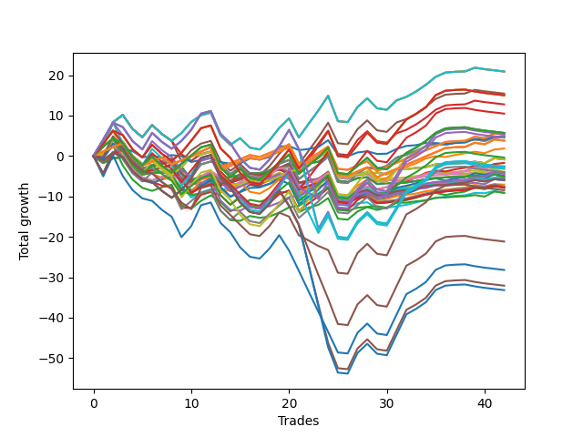

# Short Pointer 001 
- Symbol: NVDA_Unlimited
- Date Range: 02/08/2022 - 07/08/2022
- Trading Period: 7:20-12:30
- Number of Trades: 42



| Name | Win Percent | Profit | Avg Profit / Trade | Avg Time / Trade |      | Name | Win Percent | Profit | Avg Profit / Trade | Avg Time / Trade |
| ---- | ----------- | ------ | ------------------ | ---------------- | ---- | ---- | ----------- | ------ | ------------------ | ---------------- |
| Sorted By <br> Profit | | | | | | Sorted By <br> Win Percentage ||||
| Seventy-One | 61.90 | 10450.00 | 248.81 | 81:59 |     | Forty | 76.19 | -1970.00 | -46.90 | 09:06 |
| Sixty-Three | 61.90 | 10450.00 | 248.81 | 81:59 |     | Forty-Eight | 76.19 | -2235.00 | -53.21 | 09:07 |
| Seven | 61.90 | 10450.00 | 248.81 | 81:59 |     | Sixty-Four | 76.19 | -2595.00 | -61.79 | 09:43 |
| Forty-Seven | 59.52 | 7715.00 | 183.69 | 76:34 |     | Fifty-Six | 76.19 | -2595.00 | -61.79 | 09:43 |
| One Hundred Twenty-Eight | 54.76 | 7510.00 | 178.81 | 95:21 |     | Zero | 76.19 | -2595.00 | -61.79 | 09:43 |
| One Hundred Twenty-Three | 54.76 | 7510.00 | 178.81 | 95:21 |     | One Hundred Eleven | 73.81 | 2670.00 | 63.57 | 44:19 |
| Eighty-Three | 54.76 | 7510.00 | 178.81 | 95:21 |     | One Hundred Sixteen | 73.81 | 2635.00 | 62.74 | 44:00 |
| Fifty-Five | 57.14 | 6380.00 | 151.90 | 74:37 |     | One Hundred Twenty-Six | 73.81 | 1900.00 | 45.24 | 46:05 |
| One Hundred Eighteen | 52.38 | 5240.00 | 124.76 | 86:48 |     | One Hundred Twenty-One | 73.81 | 1900.00 | 45.24 | 46:05 |
| One Hundred Twenty-Seven | 57.14 | 2850.00 | 67.86 | 77:46 |     | Eighty-One | 73.81 | 1900.00 | 45.24 | 46:05 |
| One Hundred Twenty-Two | 57.14 | 2850.00 | 67.86 | 77:46 |     | Fifty | 69.05 | -1605.00 | -38.21 | 22:14 |
| Eighty-Two | 57.14 | 2850.00 | 67.86 | 77:46 |     | Sixty-Six | 69.05 | -2170.00 | -51.67 | 24:18 |
| One Hundred Thirteen | 52.38 | 2780.00 | 66.19 | 88:52 |     | Fifty-Eight | 69.05 | -2170.00 | -51.67 | 24:18 |
| One Hundred Ninteen | 45.24 | 2685.00 | 63.93 | 95:16 |     | Two | 69.05 | -2170.00 | -51.67 | 24:18 |
| One Hundred Eleven | 73.81 | 2670.00 | 63.57 | 44:19 |     | Forty-Two | 69.05 | -2420.00 | -57.62 | 23:09 |
| One Hundred Sixteen | 73.81 | 2635.00 | 62.74 | 44:00 |     | Fifty-One | 69.05 | -2730.00 | -65.00 | 17:32 |
| Sixty-Nine | 54.76 | 2445.00 | 58.21 | 45:48 |     | Sixty-Seven | 69.05 | -2940.00 | -70.00 | 19:38 |
| Sixty-One | 54.76 | 2445.00 | 58.21 | 45:48 |     | Fifty-Nine | 69.05 | -2940.00 | -70.00 | 19:38 |
| Five | 54.76 | 2445.00 | 58.21 | 45:48 |     | Three | 69.05 | -2940.00 | -70.00 | 19:38 |
| Seventy-Three | 57.14 | 2290.00 | 54.52 | 12:32 |     | Forty-Three | 69.05 | -3545.00 | -84.40 | 18:27 |
| One Hundred Twenty-Nine | 50.00 | 2270.00 | 54.05 | 105:25 |     | Forty-Nine | 69.05 | -3775.00 | -89.88 | 14:05 |
| One Hundred Twenty-Six | 73.81 | 1900.00 | 45.24 | 46:05 |     | Sixty-Five | 69.05 | -3930.00 | -93.57 | 16:02 |
| One Hundred Twenty-One | 73.81 | 1900.00 | 45.24 | 46:05 |     | Fifty-Seven | 69.05 | -3930.00 | -93.57 | 16:02 |
| Eighty-One | 73.81 | 1900.00 | 45.24 | 46:05 |     | One | 69.05 | -3930.00 | -93.57 | 16:02 |
| Fifty-Three | 54.76 | 925.00 | 22.02 | 42:25 |     | Forty-One | 69.05 | -4590.00 | -109.29 | 15:00 |
| One Hundred Seventeen | 54.76 | -190.00 | -4.52 | 72:39 |     | Seventy | 66.67 | -420.00 | -10.00 | 55:53 |
| Seventy | 66.67 | -420.00 | -10.00 | 55:53 |     | Sixty-Two | 66.67 | -420.00 | -10.00 | 55:53 |
| Sixty-Two | 66.67 | -420.00 | -10.00 | 55:53 |     | Six | 66.67 | -420.00 | -10.00 | 55:53 |
| Six | 66.67 | -420.00 | -10.00 | 55:53 |     | Forty-Six | 64.29 | -3020.00 | -71.90 | 50:33 |
| Forty-Five | 54.76 | -860.00 | -20.48 | 43:32 |     | Seventy-One | 61.90 | 10450.00 | 248.81 | 81:59 |
| Sixty-Eight | 59.52 | -1300.00 | -30.95 | 30:26 |     | Sixty-Three | 61.90 | 10450.00 | 248.81 | 81:59 |
| Sixty | 59.52 | -1300.00 | -30.95 | 30:26 |     | Seven | 61.90 | 10450.00 | 248.81 | 81:59 |
| Four | 59.52 | -1300.00 | -30.95 | 30:26 |     | Fifty-Four | 61.90 | -4550.00 | -108.33 | 48:54 |
| One Hundred Fourteen | 47.62 | -1330.00 | -31.67 | 98:32 |     | Forty-Seven | 59.52 | 7715.00 | 183.69 | 76:34 |
| Eighty-Four | 50.00 | -1370.00 | -32.62 | 107:49 |     | Sixty-Eight | 59.52 | -1300.00 | -30.95 | 30:26 |
| One Hundred Twenty-Four | 50.00 | -1585.00 | -37.74 | 106:22 |     | Sixty | 59.52 | -1300.00 | -30.95 | 30:26 |
| Fifty | 69.05 | -1605.00 | -38.21 | 22:14 |     | Four | 59.52 | -1300.00 | -30.95 | 30:26 |
| Forty | 76.19 | -1970.00 | -46.90 | 09:06 |     | Fifty-Two | 59.52 | -2055.00 | -48.93 | 27:10 |
| One Hundred Twelve | 54.76 | -2010.00 | -47.86 | 73:48 |     | Forty-Four | 59.52 | -3840.00 | -91.43 | 28:18 |
| Fifty-Two | 59.52 | -2055.00 | -48.93 | 27:10 |     | Fifty-Five | 57.14 | 6380.00 | 151.90 | 74:37 |
| Sixty-Six | 69.05 | -2170.00 | -51.67 | 24:18 |     | One Hundred Twenty-Seven | 57.14 | 2850.00 | 67.86 | 77:46 |
| Fifty-Eight | 69.05 | -2170.00 | -51.67 | 24:18 |     | One Hundred Twenty-Two | 57.14 | 2850.00 | 67.86 | 77:46 |
| Two | 69.05 | -2170.00 | -51.67 | 24:18 |     | Eighty-Two | 57.14 | 2850.00 | 67.86 | 77:46 |
| Forty-Eight | 76.19 | -2235.00 | -53.21 | 09:07 |     | Seventy-Three | 57.14 | 2290.00 | 54.52 | 12:32 |
| Forty-Two | 69.05 | -2420.00 | -57.62 | 23:09 |     | One Hundred Twenty-Eight | 54.76 | 7510.00 | 178.81 | 95:21 |
| Sixty-Four | 76.19 | -2595.00 | -61.79 | 09:43 |     | One Hundred Twenty-Three | 54.76 | 7510.00 | 178.81 | 95:21 |
| Fifty-Six | 76.19 | -2595.00 | -61.79 | 09:43 |     | Eighty-Three | 54.76 | 7510.00 | 178.81 | 95:21 |
| Zero | 76.19 | -2595.00 | -61.79 | 09:43 |     | Sixty-Nine | 54.76 | 2445.00 | 58.21 | 45:48 |
| Fifty-One | 69.05 | -2730.00 | -65.00 | 17:32 |     | Sixty-One | 54.76 | 2445.00 | 58.21 | 45:48 |
| Sixty-Seven | 69.05 | -2940.00 | -70.00 | 19:38 |     | Five | 54.76 | 2445.00 | 58.21 | 45:48 |
| Fifty-Nine | 69.05 | -2940.00 | -70.00 | 19:38 |     | Fifty-Three | 54.76 | 925.00 | 22.02 | 42:25 |
| Three | 69.05 | -2940.00 | -70.00 | 19:38 |     | One Hundred Seventeen | 54.76 | -190.00 | -4.52 | 72:39 |
| Forty-Six | 64.29 | -3020.00 | -71.90 | 50:33 |     | Forty-Five | 54.76 | -860.00 | -20.48 | 43:32 |
| Forty-Three | 69.05 | -3545.00 | -84.40 | 18:27 |     | One Hundred Twelve | 54.76 | -2010.00 | -47.86 | 73:48 |
| Forty-Nine | 69.05 | -3775.00 | -89.88 | 14:05 |     | One Hundred Eighteen | 52.38 | 5240.00 | 124.76 | 86:48 |
| Forty-Four | 59.52 | -3840.00 | -91.43 | 28:18 |     | One Hundred Thirteen | 52.38 | 2780.00 | 66.19 | 88:52 |
| Sixty-Five | 69.05 | -3930.00 | -93.57 | 16:02 |     | One Hundred Twenty-Nine | 50.00 | 2270.00 | 54.05 | 105:25 |
| Fifty-Seven | 69.05 | -3930.00 | -93.57 | 16:02 |     | Eighty-Four | 50.00 | -1370.00 | -32.62 | 107:49 |
| One | 69.05 | -3930.00 | -93.57 | 16:02 |     | One Hundred Twenty-Four | 50.00 | -1585.00 | -37.74 | 106:22 |
| One Hundred Twenty | 35.71 | -4235.00 | -100.83 | 105:24 |     | One Hundred Fourteen | 47.62 | -1330.00 | -31.67 | 98:32 |
| Fifty-Four | 61.90 | -4550.00 | -108.33 | 48:54 |     | One Hundred Ninteen | 45.24 | 2685.00 | 63.93 | 95:16 |
| Forty-One | 69.05 | -4590.00 | -109.29 | 15:00 |     | One Hundred Thirty | 40.48 | -10585.00 | -252.02 | 119:37 |
| One Hundred Thirty | 40.48 | -10585.00 | -252.02 | 119:37 |     | Eighty-Five | 40.48 | -16045.00 | -382.02 | 123:13 |
| One Hundred Fifteen | 38.10 | -14100.00 | -335.71 | 112:09 |     | One Hundred Twenty-Five | 40.48 | -16595.00 | -395.12 | 121:02 |
| Eighty-Five | 40.48 | -16045.00 | -382.02 | 123:13 |     | One Hundred Fifteen | 38.10 | -14100.00 | -335.71 | 112:09 |
| One Hundred Twenty-Five | 40.48 | -16595.00 | -395.12 | 121:02 |     | One Hundred Twenty | 35.71 | -4235.00 | -100.83 | 105:24 |

## NO STOPLOSS

### Test Zero
* Sell when price hits the middle line of the 20p bollinger
* No Stoploss
* Results:
```
Total Trades: 42
Percent Up: 23.81
Percent Down: 76.19
Total Points Moved Down: -5.19
Potential Profit: -2595.00
Total Points Ups: 19.28 Count Ups: 10
Total Points Downs: 14.09 Count Downs: 32
```

<details><summary>Trades</summary>

<code>In: 2022-02-16 07:33:00		Out: 2022-02-16 07:58:55		Total Position Time: 25:55		Total Move Down: -1.73		Total to Date: -1.73</code> <br />
<code>In: 2022-02-22 07:31:00		Out: 2022-02-22 07:33:00		Total Position Time: 02:00		Total Move Down: 1.15		Total to Date: -0.58</code> <br />
<code>In: 2022-02-22 11:34:00		Out: 2022-02-22 11:42:40		Total Position Time: 08:40		Total Move Down: 0.29		Total to Date: -0.29</code> <br />
<code>In: 2022-02-24 12:10:00		Out: 2022-02-24 12:45:05		Total Position Time: 35:05		Total Move Down: -2.86		Total to Date: -3.15</code> <br />
<code>In: 2022-02-24 12:30:00		Out: 2022-02-24 12:45:05		Total Position Time: 15:05		Total Move Down: -1.44		Total to Date: -4.59</code> <br />
<code>In: 2022-02-25 07:51:00		Out: 2022-02-25 08:00:05		Total Position Time: 09:05		Total Move Down: 0.43		Total to Date: -4.16</code> <br />
<code>In: 2022-03-02 08:35:00		Out: 2022-03-02 08:42:10		Total Position Time: 07:10		Total Move Down: 0.10		Total to Date: -4.06</code> <br />
<code>In: 2022-03-02 09:18:00		Out: 2022-03-02 09:24:05		Total Position Time: 06:05		Total Move Down: 0.41		Total to Date: -3.65</code> <br />
<code>In: 2022-03-08 09:23:00		Out: 2022-03-08 09:26:15		Total Position Time: 03:15		Total Move Down: 0.99		Total to Date: -2.66</code> <br />
<code>In: 2022-03-08 09:42:00		Out: 2022-03-08 10:20:30		Total Position Time: 38:30		Total Move Down: -3.30		Total to Date: -5.96</code> <br />
<code>In: 2022-03-10 07:22:00		Out: 2022-03-10 07:26:35		Total Position Time: 04:35		Total Move Down: 0.92		Total to Date: -5.04</code> <br />
<code>In: 2022-03-10 11:55:00		Out: 2022-03-10 12:00:25		Total Position Time: 05:25		Total Move Down: 0.30		Total to Date: -4.74</code> <br />
<code>In: 2022-03-15 07:42:00		Out: 2022-03-15 07:57:25		Total Position Time: 15:25		Total Move Down: -0.74		Total to Date: -5.48</code> <br />
<code>In: 2022-03-17 12:06:00		Out: 2022-03-17 12:10:45		Total Position Time: 04:45		Total Move Down: 0.25		Total to Date: -5.23</code> <br />
<code>In: 2022-03-29 08:52:00		Out: 2022-03-29 08:56:30		Total Position Time: 04:30		Total Move Down: 0.51		Total to Date: -4.72</code> <br />
<code>In: 2022-03-29 11:04:00		Out: 2022-03-29 11:05:20		Total Position Time: 01:20		Total Move Down: 0.39		Total to Date: -4.33</code> <br />
<code>In: 2022-03-29 12:28:00		Out: 2022-03-29 12:38:45		Total Position Time: 10:45		Total Move Down: 0.02		Total to Date: -4.31</code> <br />
<code>In: 2022-03-31 11:26:00		Out: 2022-03-31 11:31:30		Total Position Time: 05:30		Total Move Down: 0.48		Total to Date: -3.83</code> <br />
<code>In: 2022-03-31 12:05:00		Out: 2022-03-31 12:11:35		Total Position Time: 06:35		Total Move Down: 0.45		Total to Date: -3.38</code> <br />
<code>In: 2022-05-02 09:02:00		Out: 2022-05-02 09:03:55		Total Position Time: 01:55		Total Move Down: 0.90		Total to Date: -2.48</code> <br />
<code>In: 2022-05-02 11:52:00		Out: 2022-05-02 11:59:00		Total Position Time: 07:00		Total Move Down: 0.39		Total to Date: -2.09</code> <br />
<code>In: 2022-05-04 10:06:00		Out: 2022-05-04 10:09:00		Total Position Time: 03:00		Total Move Down: 0.39		Total to Date: -1.70</code> <br />
<code>In: 2022-05-04 10:37:00		Out: 2022-05-04 10:38:55		Total Position Time: 01:55		Total Move Down: 0.24		Total to Date: -1.46</code> <br />
<code>In: 2022-05-04 11:07:00		Out: 2022-05-04 11:08:10		Total Position Time: 01:10		Total Move Down: 1.66		Total to Date: 0.20</code> <br />
<code>In: 2022-05-04 11:51:00		Out: 2022-05-04 12:38:40		Total Position Time: 47:40		Total Move Down: -6.33		Total to Date: -6.13</code> <br />
<code>In: 2022-05-04 12:19:00		Out: 2022-05-04 12:38:40		Total Position Time: 19:40		Total Move Down: -0.31		Total to Date: -6.44</code> <br />
<code>In: 2022-05-05 10:12:00		Out: 2022-05-05 10:14:05		Total Position Time: 02:05		Total Move Down: 0.94		Total to Date: -5.50</code> <br />
<code>In: 2022-06-06 11:01:00		Out: 2022-06-06 11:07:35		Total Position Time: 06:35		Total Move Down: 0.24		Total to Date: -5.26</code> <br />
<code>In: 2022-06-07 07:31:00		Out: 2022-06-07 07:58:25		Total Position Time: 27:25		Total Move Down: -1.66		Total to Date: -6.92</code> <br />
<code>In: 2022-06-07 11:17:00		Out: 2022-06-07 11:24:35		Total Position Time: 07:35		Total Move Down: 0.19		Total to Date: -6.73</code> <br />
<code>In: 2022-06-09 07:33:00		Out: 2022-06-09 07:42:10		Total Position Time: 09:10		Total Move Down: 0.02		Total to Date: -6.71</code> <br />
<code>In: 2022-06-09 10:14:00		Out: 2022-06-09 10:15:45		Total Position Time: 01:45		Total Move Down: 0.16		Total to Date: -6.55</code> <br />
<code>In: 2022-06-10 12:03:00		Out: 2022-06-10 12:04:10		Total Position Time: 01:10		Total Move Down: 0.34		Total to Date: -6.21</code> <br />
<code>In: 2022-06-10 12:29:00		Out: 2022-06-10 12:30:50		Total Position Time: 01:50		Total Move Down: 0.44		Total to Date: -5.77</code> <br />
<code>In: 2022-06-21 10:01:00		Out: 2022-06-21 10:05:50		Total Position Time: 04:50		Total Move Down: 0.31		Total to Date: -5.46</code> <br />
<code>In: 2022-06-22 10:24:00		Out: 2022-06-22 10:28:10		Total Position Time: 04:10		Total Move Down: 0.16		Total to Date: -5.30</code> <br />
<code>In: 2022-06-24 11:51:00		Out: 2022-06-24 11:54:25		Total Position Time: 03:25		Total Move Down: 0.13		Total to Date: -5.17</code> <br />
<code>In: 2022-06-24 11:52:00		Out: 2022-06-24 11:54:25		Total Position Time: 02:25		Total Move Down: 0.03		Total to Date: -5.14</code> <br />
<code>In: 2022-06-29 10:12:00		Out: 2022-06-29 10:13:10		Total Position Time: 01:10		Total Move Down: 0.31		Total to Date: -4.83</code> <br />
<code>In: 2022-06-29 12:12:00		Out: 2022-06-29 12:33:15		Total Position Time: 21:15		Total Move Down: -0.29		Total to Date: -5.12</code> <br />
<code>In: 2022-07-06 11:10:00		Out: 2022-07-06 11:11:10		Total Position Time: 01:10		Total Move Down: 0.55		Total to Date: -4.57</code> <br />
<code>In: 2022-07-08 11:26:00		Out: 2022-07-08 11:46:45		Total Position Time: 20:45		Total Move Down: -0.62		Total to Date: -5.19</code> <br />


</details>

### Test One
* Sell when the price hits the upper line of the 20p 1std bollinger
* No Stoploss
* Results:
```
Total Trades: 42
Percent Up: 30.95
Percent Down: 69.05
Total Points Moved Down: -7.86
Potential Profit: -3930.00
Total Points Ups: 27.53 Count Ups: 13
Total Points Downs: 19.67 Count Downs: 29
```

<details><summary>Trades</summary>

<code>In: 2022-02-16 07:33:00		Out: 2022-02-16 08:00:25		Total Position Time: 27:25		Total Move Down: -1.27		Total to Date: -1.27</code> <br />
<code>In: 2022-02-22 07:31:00		Out: 2022-02-22 07:37:10		Total Position Time: 06:10		Total Move Down: 1.64		Total to Date: 0.37</code> <br />
<code>In: 2022-02-22 11:34:00		Out: 2022-02-22 11:44:25		Total Position Time: 10:25		Total Move Down: 1.16		Total to Date: 1.53</code> <br />
<code>In: 2022-02-24 12:10:00		Out: 2022-02-24 12:47:00		Total Position Time: 37:00		Total Move Down: -3.48		Total to Date: -1.95</code> <br />
<code>In: 2022-02-24 12:30:00		Out: 2022-02-24 12:47:00		Total Position Time: 17:00		Total Move Down: -2.06		Total to Date: -4.01</code> <br />
<code>In: 2022-02-25 07:51:00		Out: 2022-02-25 08:06:00		Total Position Time: 15:00		Total Move Down: 0.50		Total to Date: -3.51</code> <br />
<code>In: 2022-03-02 08:35:00		Out: 2022-03-02 08:44:20		Total Position Time: 09:20		Total Move Down: 0.61		Total to Date: -2.90</code> <br />
<code>In: 2022-03-02 09:18:00		Out: 2022-03-02 09:26:10		Total Position Time: 08:10		Total Move Down: 0.77		Total to Date: -2.13</code> <br />
<code>In: 2022-03-08 09:23:00		Out: 2022-03-08 10:21:50		Total Position Time: 58:50		Total Move Down: -3.87		Total to Date: -6.00</code> <br />
<code>In: 2022-03-08 09:42:00		Out: 2022-03-08 10:21:50		Total Position Time: 39:50		Total Move Down: -3.07		Total to Date: -9.07</code> <br />
<code>In: 2022-03-10 07:22:00		Out: 2022-03-10 07:31:45		Total Position Time: 09:45		Total Move Down: 1.29		Total to Date: -7.78</code> <br />
<code>In: 2022-03-10 11:55:00		Out: 2022-03-10 12:01:15		Total Position Time: 06:15		Total Move Down: 0.78		Total to Date: -7.00</code> <br />
<code>In: 2022-03-15 07:42:00		Out: 2022-03-15 07:58:05		Total Position Time: 16:05		Total Move Down: -0.25		Total to Date: -7.25</code> <br />
<code>In: 2022-03-17 12:06:00		Out: 2022-03-17 12:12:35		Total Position Time: 06:35		Total Move Down: 0.62		Total to Date: -6.63</code> <br />
<code>In: 2022-03-29 08:52:00		Out: 2022-03-29 09:00:20		Total Position Time: 08:20		Total Move Down: 0.89		Total to Date: -5.74</code> <br />
<code>In: 2022-03-29 11:04:00		Out: 2022-03-29 11:06:20		Total Position Time: 02:20		Total Move Down: 0.83		Total to Date: -4.91</code> <br />
<code>In: 2022-03-29 12:28:00		Out: 2022-03-29 12:43:10		Total Position Time: 15:10		Total Move Down: 0.15		Total to Date: -4.76</code> <br />
<code>In: 2022-03-31 11:26:00		Out: 2022-03-31 11:35:15		Total Position Time: 09:15		Total Move Down: 0.74		Total to Date: -4.02</code> <br />
<code>In: 2022-03-31 12:05:00		Out: 2022-03-31 12:16:50		Total Position Time: 11:50		Total Move Down: 0.74		Total to Date: -3.28</code> <br />
<code>In: 2022-05-02 09:02:00		Out: 2022-05-02 09:38:40		Total Position Time: 36:40		Total Move Down: -1.21		Total to Date: -4.49</code> <br />
<code>In: 2022-05-02 11:52:00		Out: 2022-05-02 12:44:50		Total Position Time: 52:50		Total Move Down: -3.70		Total to Date: -8.19</code> <br />
<code>In: 2022-05-04 10:06:00		Out: 2022-05-04 10:11:35		Total Position Time: 05:35		Total Move Down: 0.80		Total to Date: -7.39</code> <br />
<code>In: 2022-05-04 10:37:00		Out: 2022-05-04 10:41:05		Total Position Time: 04:05		Total Move Down: 0.62		Total to Date: -6.77</code> <br />
<code>In: 2022-05-04 11:07:00		Out: 2022-05-04 11:08:10		Total Position Time: 01:10		Total Move Down: 1.66		Total to Date: -5.11</code> <br />
<code>In: 2022-05-04 11:51:00		Out: 2022-05-04 12:46:15		Total Position Time: 55:15		Total Move Down: -6.27		Total to Date: -11.38</code> <br />
<code>In: 2022-05-04 12:19:00		Out: 2022-05-04 12:46:15		Total Position Time: 27:15		Total Move Down: -0.25		Total to Date: -11.63</code> <br />
<code>In: 2022-05-05 10:12:00		Out: 2022-05-05 10:20:50		Total Position Time: 08:50		Total Move Down: 1.25		Total to Date: -10.38</code> <br />
<code>In: 2022-06-06 11:01:00		Out: 2022-06-06 11:15:00		Total Position Time: 14:00		Total Move Down: 0.23		Total to Date: -10.15</code> <br />
<code>In: 2022-06-07 07:31:00		Out: 2022-06-07 08:04:45		Total Position Time: 33:45		Total Move Down: -1.52		Total to Date: -11.67</code> <br />
<code>In: 2022-06-07 11:17:00		Out: 2022-06-07 11:30:55		Total Position Time: 13:55		Total Move Down: 0.18		Total to Date: -11.49</code> <br />
<code>In: 2022-06-09 07:33:00		Out: 2022-06-09 07:45:35		Total Position Time: 12:35		Total Move Down: 0.35		Total to Date: -11.14</code> <br />
<code>In: 2022-06-09 10:14:00		Out: 2022-06-09 10:16:40		Total Position Time: 02:40		Total Move Down: 0.38		Total to Date: -10.76</code> <br />
<code>In: 2022-06-10 12:03:00		Out: 2022-06-10 12:05:10		Total Position Time: 02:10		Total Move Down: 0.59		Total to Date: -10.17</code> <br />
<code>In: 2022-06-10 12:29:00		Out: 2022-06-10 12:33:15		Total Position Time: 04:15		Total Move Down: 0.62		Total to Date: -9.55</code> <br />
<code>In: 2022-06-21 10:01:00		Out: 2022-06-21 10:06:15		Total Position Time: 05:15		Total Move Down: 0.48		Total to Date: -9.07</code> <br />
<code>In: 2022-06-22 10:24:00		Out: 2022-06-22 10:35:05		Total Position Time: 11:05		Total Move Down: 0.32		Total to Date: -8.75</code> <br />
<code>In: 2022-06-24 11:51:00		Out: 2022-06-24 12:01:30		Total Position Time: 10:30		Total Move Down: 0.22		Total to Date: -8.53</code> <br />
<code>In: 2022-06-24 11:52:00		Out: 2022-06-24 12:01:30		Total Position Time: 09:30		Total Move Down: 0.12		Total to Date: -8.41</code> <br />
<code>In: 2022-06-29 10:12:00		Out: 2022-06-29 10:14:05		Total Position Time: 02:05		Total Move Down: 0.58		Total to Date: -7.83</code> <br />
<code>In: 2022-06-29 12:12:00		Out: 2022-06-29 12:33:25		Total Position Time: 21:25		Total Move Down: -0.06		Total to Date: -7.89</code> <br />
<code>In: 2022-07-06 11:10:00		Out: 2022-07-06 11:11:10		Total Position Time: 01:10		Total Move Down: 0.55		Total to Date: -7.34</code> <br />
<code>In: 2022-07-08 11:26:00		Out: 2022-07-08 11:49:15		Total Position Time: 23:15		Total Move Down: -0.52		Total to Date: -7.86</code> <br />


</details>

### Test Two
* Sell when the price hits the upper line of the 20p 2std bollinger
* No Stoploss
* Results:
```
Total Trades: 42
Percent Up: 30.95
Percent Down: 69.05
Total Points Moved Down: -4.34
Potential Profit: -2170.00
Total Points Ups: 31.88 Count Ups: 13
Total Points Downs: 27.54 Count Downs: 29
```

<details><summary>Trades</summary>

<code>In: 2022-02-16 07:33:00		Out: 2022-02-16 08:05:15		Total Position Time: 32:15		Total Move Down: -1.28		Total to Date: -1.28</code> <br />
<code>In: 2022-02-22 07:31:00		Out: 2022-02-22 07:39:55		Total Position Time: 08:55		Total Move Down: 2.04		Total to Date: 0.76</code> <br />
<code>In: 2022-02-22 11:34:00		Out: 2022-02-22 11:46:15		Total Position Time: 12:15		Total Move Down: 1.63		Total to Date: 2.39</code> <br />
<code>In: 2022-02-24 12:10:00		Out: 2022-02-24 12:47:00		Total Position Time: 37:00		Total Move Down: -3.48		Total to Date: -1.09</code> <br />
<code>In: 2022-02-24 12:30:00		Out: 2022-02-24 12:47:00		Total Position Time: 17:00		Total Move Down: -2.06		Total to Date: -3.15</code> <br />
<code>In: 2022-02-25 07:51:00		Out: 2022-02-25 08:07:20		Total Position Time: 16:20		Total Move Down: 0.89		Total to Date: -2.26</code> <br />
<code>In: 2022-03-02 08:35:00		Out: 2022-03-02 08:49:30		Total Position Time: 14:30		Total Move Down: 0.95		Total to Date: -1.31</code> <br />
<code>In: 2022-03-02 09:18:00		Out: 2022-03-02 09:51:20		Total Position Time: 33:20		Total Move Down: 0.64		Total to Date: -0.67</code> <br />
<code>In: 2022-03-08 09:23:00		Out: 2022-03-08 10:23:15		Total Position Time: 60:15		Total Move Down: -3.66		Total to Date: -4.33</code> <br />
<code>In: 2022-03-08 09:42:00		Out: 2022-03-08 10:23:15		Total Position Time: 41:15		Total Move Down: -2.86		Total to Date: -7.19</code> <br />
<code>In: 2022-03-10 07:22:00		Out: 2022-03-10 07:33:15		Total Position Time: 11:15		Total Move Down: 1.78		Total to Date: -5.41</code> <br />
<code>In: 2022-03-10 11:55:00		Out: 2022-03-10 12:07:05		Total Position Time: 12:05		Total Move Down: 1.37		Total to Date: -4.04</code> <br />
<code>In: 2022-03-15 07:42:00		Out: 2022-03-15 08:46:10		Total Position Time: 64:10		Total Move Down: -2.34		Total to Date: -6.38</code> <br />
<code>In: 2022-03-17 12:06:00		Out: 2022-03-17 12:47:00		Total Position Time: 41:00		Total Move Down: -2.34		Total to Date: -8.72</code> <br />
<code>In: 2022-03-29 08:52:00		Out: 2022-03-29 09:01:40		Total Position Time: 09:40		Total Move Down: 1.20		Total to Date: -7.52</code> <br />
<code>In: 2022-03-29 11:04:00		Out: 2022-03-29 11:16:05		Total Position Time: 12:05		Total Move Down: 1.01		Total to Date: -6.51</code> <br />
<code>In: 2022-03-29 12:28:00		Out: 2022-03-29 12:43:10		Total Position Time: 15:10		Total Move Down: 0.15		Total to Date: -6.36</code> <br />
<code>In: 2022-03-31 11:26:00		Out: 2022-03-31 11:46:20		Total Position Time: 20:20		Total Move Down: 0.87		Total to Date: -5.49</code> <br />
<code>In: 2022-03-31 12:05:00		Out: 2022-03-31 12:18:15		Total Position Time: 13:15		Total Move Down: 1.01		Total to Date: -4.48</code> <br />
<code>In: 2022-05-02 09:02:00		Out: 2022-05-02 09:39:30		Total Position Time: 37:30		Total Move Down: -0.98		Total to Date: -5.46</code> <br />
<code>In: 2022-05-02 11:52:00		Out: 2022-05-02 12:47:00		Total Position Time: 55:00		Total Move Down: -4.73		Total to Date: -10.19</code> <br />
<code>In: 2022-05-04 10:06:00		Out: 2022-05-04 11:07:30		Total Position Time: 61:30		Total Move Down: 1.78		Total to Date: -8.41</code> <br />
<code>In: 2022-05-04 10:37:00		Out: 2022-05-04 11:07:30		Total Position Time: 30:30		Total Move Down: 1.72		Total to Date: -6.69</code> <br />
<code>In: 2022-05-04 11:07:00		Out: 2022-05-04 11:20:50		Total Position Time: 13:50		Total Move Down: 2.37		Total to Date: -4.32</code> <br />
<code>In: 2022-05-04 11:51:00		Out: 2022-05-04 12:47:00		Total Position Time: 56:00		Total Move Down: -6.27		Total to Date: -10.59</code> <br />
<code>In: 2022-05-04 12:19:00		Out: 2022-05-04 12:47:00		Total Position Time: 28:00		Total Move Down: -0.25		Total to Date: -10.84</code> <br />
<code>In: 2022-05-05 10:12:00		Out: 2022-05-05 10:32:05		Total Position Time: 20:05		Total Move Down: 1.38		Total to Date: -9.46</code> <br />
<code>In: 2022-06-06 11:01:00		Out: 2022-06-06 11:15:10		Total Position Time: 14:10		Total Move Down: 0.52		Total to Date: -8.94</code> <br />
<code>In: 2022-06-07 07:31:00		Out: 2022-06-07 08:05:20		Total Position Time: 34:20		Total Move Down: -1.29		Total to Date: -10.23</code> <br />
<code>In: 2022-06-07 11:17:00		Out: 2022-06-07 11:38:05		Total Position Time: 21:05		Total Move Down: 0.34		Total to Date: -9.89</code> <br />
<code>In: 2022-06-09 07:33:00		Out: 2022-06-09 07:47:00		Total Position Time: 14:00		Total Move Down: 0.61		Total to Date: -9.28</code> <br />
<code>In: 2022-06-09 10:14:00		Out: 2022-06-09 10:18:55		Total Position Time: 04:55		Total Move Down: 0.43		Total to Date: -8.85</code> <br />
<code>In: 2022-06-10 12:03:00		Out: 2022-06-10 12:09:00		Total Position Time: 06:00		Total Move Down: 0.92		Total to Date: -7.93</code> <br />
<code>In: 2022-06-10 12:29:00		Out: 2022-06-10 12:42:40		Total Position Time: 13:40		Total Move Down: 1.06		Total to Date: -6.87</code> <br />
<code>In: 2022-06-21 10:01:00		Out: 2022-06-21 10:29:55		Total Position Time: 28:55		Total Move Down: 0.42		Total to Date: -6.45</code> <br />
<code>In: 2022-06-22 10:24:00		Out: 2022-06-22 10:57:05		Total Position Time: 33:05		Total Move Down: 0.05		Total to Date: -6.40</code> <br />
<code>In: 2022-06-24 11:51:00		Out: 2022-06-24 12:03:15		Total Position Time: 12:15		Total Move Down: 0.29		Total to Date: -6.11</code> <br />
<code>In: 2022-06-24 11:52:00		Out: 2022-06-24 12:03:15		Total Position Time: 11:15		Total Move Down: 0.19		Total to Date: -5.92</code> <br />
<code>In: 2022-06-29 10:12:00		Out: 2022-06-29 10:15:05		Total Position Time: 03:05		Total Move Down: 0.67		Total to Date: -5.25</code> <br />
<code>In: 2022-06-29 12:12:00		Out: 2022-06-29 12:35:15		Total Position Time: 23:15		Total Move Down: 0.07		Total to Date: -5.18</code> <br />
<code>In: 2022-07-06 11:10:00		Out: 2022-07-06 11:12:15		Total Position Time: 02:15		Total Move Down: 1.18		Total to Date: -4.00</code> <br />
<code>In: 2022-07-08 11:26:00		Out: 2022-07-08 11:50:00		Total Position Time: 24:00		Total Move Down: -0.34		Total to Date: -4.34</code> <br />


</details>

### Test Three
* Sell when price hits the middle line of the 50p bollinger
* No Stoploss
* Results:
```
Total Trades: 42
Percent Up: 30.95
Percent Down: 69.05
Total Points Moved Down: -5.88
Potential Profit: -2940.00
Total Points Ups: 27.51 Count Ups: 13
Total Points Downs: 21.63 Count Downs: 29
```

<details><summary>Trades</summary>

<code>In: 2022-02-16 07:33:00		Out: 2022-02-16 08:12:30		Total Position Time: 39:30		Total Move Down: -1.12		Total to Date: -1.12</code> <br />
<code>In: 2022-02-22 07:31:00		Out: 2022-02-22 07:37:20		Total Position Time: 06:20		Total Move Down: 1.95		Total to Date: 0.83</code> <br />
<code>In: 2022-02-22 11:34:00		Out: 2022-02-22 11:44:30		Total Position Time: 10:30		Total Move Down: 1.27		Total to Date: 2.10</code> <br />
<code>In: 2022-02-24 12:10:00		Out: 2022-02-24 12:47:00		Total Position Time: 37:00		Total Move Down: -3.48		Total to Date: -1.38</code> <br />
<code>In: 2022-02-24 12:30:00		Out: 2022-02-24 12:47:00		Total Position Time: 17:00		Total Move Down: -2.06		Total to Date: -3.44</code> <br />
<code>In: 2022-02-25 07:51:00		Out: 2022-02-25 08:07:25		Total Position Time: 16:25		Total Move Down: 0.94		Total to Date: -2.50</code> <br />
<code>In: 2022-03-02 08:35:00		Out: 2022-03-02 08:49:00		Total Position Time: 14:00		Total Move Down: 0.62		Total to Date: -1.88</code> <br />
<code>In: 2022-03-02 09:18:00		Out: 2022-03-02 09:25:30		Total Position Time: 07:30		Total Move Down: 0.58		Total to Date: -1.30</code> <br />
<code>In: 2022-03-08 09:23:00		Out: 2022-03-08 10:24:45		Total Position Time: 61:45		Total Move Down: -2.95		Total to Date: -4.25</code> <br />
<code>In: 2022-03-08 09:42:00		Out: 2022-03-08 10:24:45		Total Position Time: 42:45		Total Move Down: -2.15		Total to Date: -6.40</code> <br />
<code>In: 2022-03-10 07:22:00		Out: 2022-03-10 07:26:35		Total Position Time: 04:35		Total Move Down: 0.92		Total to Date: -5.48</code> <br />
<code>In: 2022-03-10 11:55:00		Out: 2022-03-10 12:01:25		Total Position Time: 06:25		Total Move Down: 0.82		Total to Date: -4.66</code> <br />
<code>In: 2022-03-15 07:42:00		Out: 2022-03-15 08:48:10		Total Position Time: 66:10		Total Move Down: -2.22		Total to Date: -6.88</code> <br />
<code>In: 2022-03-17 12:06:00		Out: 2022-03-17 12:11:45		Total Position Time: 05:45		Total Move Down: 0.65		Total to Date: -6.23</code> <br />
<code>In: 2022-03-29 08:52:00		Out: 2022-03-29 08:58:35		Total Position Time: 06:35		Total Move Down: 0.76		Total to Date: -5.47</code> <br />
<code>In: 2022-03-29 11:04:00		Out: 2022-03-29 11:16:05		Total Position Time: 12:05		Total Move Down: 1.01		Total to Date: -4.46</code> <br />
<code>In: 2022-03-29 12:28:00		Out: 2022-03-29 12:47:00		Total Position Time: 19:00		Total Move Down: -0.46		Total to Date: -4.92</code> <br />
<code>In: 2022-03-31 11:26:00		Out: 2022-03-31 11:35:50		Total Position Time: 09:50		Total Move Down: 0.97		Total to Date: -3.95</code> <br />
<code>In: 2022-03-31 12:05:00		Out: 2022-03-31 12:18:10		Total Position Time: 13:10		Total Move Down: 0.98		Total to Date: -2.97</code> <br />
<code>In: 2022-05-02 09:02:00		Out: 2022-05-02 09:04:00		Total Position Time: 02:00		Total Move Down: 1.07		Total to Date: -1.90</code> <br />
<code>In: 2022-05-02 11:52:00		Out: 2022-05-02 12:47:00		Total Position Time: 55:00		Total Move Down: -4.73		Total to Date: -6.63</code> <br />
<code>In: 2022-05-04 10:06:00		Out: 2022-05-04 10:11:05		Total Position Time: 05:05		Total Move Down: 0.54		Total to Date: -6.09</code> <br />
<code>In: 2022-05-04 10:37:00		Out: 2022-05-04 10:39:05		Total Position Time: 02:05		Total Move Down: 0.42		Total to Date: -5.67</code> <br />
<code>In: 2022-05-04 11:07:00		Out: 2022-05-04 11:08:10		Total Position Time: 01:10		Total Move Down: 1.66		Total to Date: -4.01</code> <br />
<code>In: 2022-05-04 11:51:00		Out: 2022-05-04 12:47:00		Total Position Time: 56:00		Total Move Down: -6.27		Total to Date: -10.28</code> <br />
<code>In: 2022-05-04 12:19:00		Out: 2022-05-04 12:47:00		Total Position Time: 28:00		Total Move Down: -0.25		Total to Date: -10.53</code> <br />
<code>In: 2022-05-05 10:12:00		Out: 2022-05-05 10:30:35		Total Position Time: 18:35		Total Move Down: 1.49		Total to Date: -9.04</code> <br />
<code>In: 2022-06-06 11:01:00		Out: 2022-06-06 11:20:20		Total Position Time: 19:20		Total Move Down: 0.61		Total to Date: -8.43</code> <br />
<code>In: 2022-06-07 07:31:00		Out: 2022-06-07 08:18:15		Total Position Time: 47:15		Total Move Down: -1.33		Total to Date: -9.76</code> <br />
<code>In: 2022-06-07 11:17:00		Out: 2022-06-07 11:38:05		Total Position Time: 21:05		Total Move Down: 0.34		Total to Date: -9.42</code> <br />
<code>In: 2022-06-09 07:33:00		Out: 2022-06-09 07:47:25		Total Position Time: 14:25		Total Move Down: 0.70		Total to Date: -8.72</code> <br />
<code>In: 2022-06-09 10:14:00		Out: 2022-06-09 10:16:30		Total Position Time: 02:30		Total Move Down: 0.31		Total to Date: -8.41</code> <br />
<code>In: 2022-06-10 12:03:00		Out: 2022-06-10 12:04:10		Total Position Time: 01:10		Total Move Down: 0.34		Total to Date: -8.07</code> <br />
<code>In: 2022-06-10 12:29:00		Out: 2022-06-10 12:33:10		Total Position Time: 04:10		Total Move Down: 0.58		Total to Date: -7.49</code> <br />
<code>In: 2022-06-21 10:01:00		Out: 2022-06-21 10:22:55		Total Position Time: 21:55		Total Move Down: 0.27		Total to Date: -7.22</code> <br />
<code>In: 2022-06-22 10:24:00		Out: 2022-06-22 10:57:05		Total Position Time: 33:05		Total Move Down: 0.05		Total to Date: -7.17</code> <br />
<code>In: 2022-06-24 11:51:00		Out: 2022-06-24 12:05:40		Total Position Time: 14:40		Total Move Down: 0.34		Total to Date: -6.83</code> <br />
<code>In: 2022-06-24 11:52:00		Out: 2022-06-24 12:05:40		Total Position Time: 13:40		Total Move Down: 0.24		Total to Date: -6.59</code> <br />
<code>In: 2022-06-29 10:12:00		Out: 2022-06-29 10:15:00		Total Position Time: 03:00		Total Move Down: 0.65		Total to Date: -5.94</code> <br />
<code>In: 2022-06-29 12:12:00		Out: 2022-06-29 12:47:00		Total Position Time: 35:00		Total Move Down: -0.36		Total to Date: -6.30</code> <br />
<code>In: 2022-07-06 11:10:00		Out: 2022-07-06 11:11:10		Total Position Time: 01:10		Total Move Down: 0.55		Total to Date: -5.75</code> <br />
<code>In: 2022-07-08 11:26:00		Out: 2022-07-08 11:54:10		Total Position Time: 28:10		Total Move Down: -0.13		Total to Date: -5.88</code> <br />


</details>

### Test Four
* Sell when the price hits the upper line of the 50p 1std bollinger
* No Stoploss
* Results:
```
Total Trades: 42
Percent Up: 40.48
Percent Down: 59.52
Total Points Moved Down: -2.60
Potential Profit: -1300.00
Total Points Ups: 29.14 Count Ups: 17
Total Points Downs: 26.54 Count Downs: 25
```

<details><summary>Trades</summary>

<code>In: 2022-02-16 07:33:00		Out: 2022-02-16 08:15:05		Total Position Time: 42:05		Total Move Down: -0.49		Total to Date: -0.49</code> <br />
<code>In: 2022-02-22 07:31:00		Out: 2022-02-22 07:43:15		Total Position Time: 12:15		Total Move Down: 3.23		Total to Date: 2.74</code> <br />
<code>In: 2022-02-22 11:34:00		Out: 2022-02-22 12:40:55		Total Position Time: 66:55		Total Move Down: -2.51		Total to Date: 0.23</code> <br />
<code>In: 2022-02-24 12:10:00		Out: 2022-02-24 12:47:00		Total Position Time: 37:00		Total Move Down: -3.48		Total to Date: -3.25</code> <br />
<code>In: 2022-02-24 12:30:00		Out: 2022-02-24 12:47:00		Total Position Time: 17:00		Total Move Down: -2.06		Total to Date: -5.31</code> <br />
<code>In: 2022-02-25 07:51:00		Out: 2022-02-25 09:09:35		Total Position Time: 78:35		Total Move Down: -0.75		Total to Date: -6.06</code> <br />
<code>In: 2022-03-02 08:35:00		Out: 2022-03-02 08:54:20		Total Position Time: 19:20		Total Move Down: 0.88		Total to Date: -5.18</code> <br />
<code>In: 2022-03-02 09:18:00		Out: 2022-03-02 09:51:20		Total Position Time: 33:20		Total Move Down: 0.64		Total to Date: -4.54</code> <br />
<code>In: 2022-03-08 09:23:00		Out: 2022-03-08 10:26:40		Total Position Time: 63:40		Total Move Down: -1.65		Total to Date: -6.19</code> <br />
<code>In: 2022-03-08 09:42:00		Out: 2022-03-08 10:26:40		Total Position Time: 44:40		Total Move Down: -0.85		Total to Date: -7.04</code> <br />
<code>In: 2022-03-10 07:22:00		Out: 2022-03-10 07:33:20		Total Position Time: 11:20		Total Move Down: 1.93		Total to Date: -5.11</code> <br />
<code>In: 2022-03-10 11:55:00		Out: 2022-03-10 12:07:05		Total Position Time: 12:05		Total Move Down: 1.37		Total to Date: -3.74</code> <br />
<code>In: 2022-03-15 07:42:00		Out: 2022-03-15 08:54:35		Total Position Time: 72:35		Total Move Down: -1.65		Total to Date: -5.39</code> <br />
<code>In: 2022-03-17 12:06:00		Out: 2022-03-17 12:47:00		Total Position Time: 41:00		Total Move Down: -2.34		Total to Date: -7.73</code> <br />
<code>In: 2022-03-29 08:52:00		Out: 2022-03-29 09:01:40		Total Position Time: 09:40		Total Move Down: 1.20		Total to Date: -6.53</code> <br />
<code>In: 2022-03-29 11:04:00		Out: 2022-03-29 11:21:20		Total Position Time: 17:20		Total Move Down: 1.69		Total to Date: -4.84</code> <br />
<code>In: 2022-03-29 12:28:00		Out: 2022-03-29 12:47:00		Total Position Time: 19:00		Total Move Down: -0.46		Total to Date: -5.30</code> <br />
<code>In: 2022-03-31 11:26:00		Out: 2022-03-31 12:20:15		Total Position Time: 54:15		Total Move Down: 0.70		Total to Date: -4.60</code> <br />
<code>In: 2022-03-31 12:05:00		Out: 2022-03-31 12:20:15		Total Position Time: 15:15		Total Move Down: 1.54		Total to Date: -3.06</code> <br />
<code>In: 2022-05-02 09:02:00		Out: 2022-05-02 09:50:15		Total Position Time: 48:15		Total Move Down: 0.21		Total to Date: -2.85</code> <br />
<code>In: 2022-05-02 11:52:00		Out: 2022-05-02 12:47:00		Total Position Time: 55:00		Total Move Down: -4.73		Total to Date: -7.58</code> <br />
<code>In: 2022-05-04 10:06:00		Out: 2022-05-04 10:12:10		Total Position Time: 06:10		Total Move Down: 1.06		Total to Date: -6.52</code> <br />
<code>In: 2022-05-04 10:37:00		Out: 2022-05-04 10:41:55		Total Position Time: 04:55		Total Move Down: 0.70		Total to Date: -5.82</code> <br />
<code>In: 2022-05-04 11:07:00		Out: 2022-05-04 11:08:10		Total Position Time: 01:10		Total Move Down: 1.66		Total to Date: -4.16</code> <br />
<code>In: 2022-05-04 11:51:00		Out: 2022-05-04 12:47:00		Total Position Time: 56:00		Total Move Down: -6.27		Total to Date: -10.43</code> <br />
<code>In: 2022-05-04 12:19:00		Out: 2022-05-04 12:47:00		Total Position Time: 28:00		Total Move Down: -0.25		Total to Date: -10.68</code> <br />
<code>In: 2022-05-05 10:12:00		Out: 2022-05-05 10:39:05		Total Position Time: 27:05		Total Move Down: 2.02		Total to Date: -8.66</code> <br />
<code>In: 2022-06-06 11:01:00		Out: 2022-06-06 11:22:40		Total Position Time: 21:40		Total Move Down: 1.10		Total to Date: -7.56</code> <br />
<code>In: 2022-06-07 07:31:00		Out: 2022-06-07 08:22:30		Total Position Time: 51:30		Total Move Down: -0.72		Total to Date: -8.28</code> <br />
<code>In: 2022-06-07 11:17:00		Out: 2022-06-07 11:43:00		Total Position Time: 26:00		Total Move Down: 0.58		Total to Date: -7.70</code> <br />
<code>In: 2022-06-09 07:33:00		Out: 2022-06-09 07:52:30		Total Position Time: 19:30		Total Move Down: 1.35		Total to Date: -6.35</code> <br />
<code>In: 2022-06-09 10:14:00		Out: 2022-06-09 10:22:35		Total Position Time: 08:35		Total Move Down: 0.50		Total to Date: -5.85</code> <br />
<code>In: 2022-06-10 12:03:00		Out: 2022-06-10 12:05:10		Total Position Time: 02:10		Total Move Down: 0.59		Total to Date: -5.26</code> <br />
<code>In: 2022-06-10 12:29:00		Out: 2022-06-10 12:42:10		Total Position Time: 13:10		Total Move Down: 0.81		Total to Date: -4.45</code> <br />
<code>In: 2022-06-21 10:01:00		Out: 2022-06-21 10:29:55		Total Position Time: 28:55		Total Move Down: 0.42		Total to Date: -4.03</code> <br />
<code>In: 2022-06-22 10:24:00		Out: 2022-06-22 11:48:05		Total Position Time: 84:05		Total Move Down: -0.55		Total to Date: -4.58</code> <br />
<code>In: 2022-06-24 11:51:00		Out: 2022-06-24 12:12:15		Total Position Time: 21:15		Total Move Down: 0.48		Total to Date: -4.10</code> <br />
<code>In: 2022-06-24 11:52:00		Out: 2022-06-24 12:12:15		Total Position Time: 20:15		Total Move Down: 0.38		Total to Date: -3.72</code> <br />
<code>In: 2022-06-29 10:12:00		Out: 2022-06-29 10:21:05		Total Position Time: 09:05		Total Move Down: 0.95		Total to Date: -2.77</code> <br />
<code>In: 2022-06-29 12:12:00		Out: 2022-06-29 12:47:00		Total Position Time: 35:00		Total Move Down: -0.36		Total to Date: -3.13</code> <br />
<code>In: 2022-07-06 11:10:00		Out: 2022-07-06 11:11:10		Total Position Time: 01:10		Total Move Down: 0.55		Total to Date: -2.58</code> <br />
<code>In: 2022-07-08 11:26:00		Out: 2022-07-08 12:08:00		Total Position Time: 42:00		Total Move Down: -0.02		Total to Date: -2.60</code> <br />


</details>

### Test Five
* Sell when the price hits the upper line of the 50p 2std bollinger
* No Stoploss
* Results:
```
Total Trades: 42
Percent Up: 45.24
Percent Down: 54.76
Total Points Moved Down: 4.89
Potential Profit: 2445.00
Total Points Ups: 28.35 Count Ups: 19
Total Points Downs: 33.24 Count Downs: 23
```

<details><summary>Trades</summary>

<code>In: 2022-02-16 07:33:00		Out: 2022-02-16 08:48:50		Total Position Time: 75:50		Total Move Down: -0.43		Total to Date: -0.43</code> <br />
<code>In: 2022-02-22 07:31:00		Out: 2022-02-22 07:59:25		Total Position Time: 28:25		Total Move Down: 4.86		Total to Date: 4.43</code> <br />
<code>In: 2022-02-22 11:34:00		Out: 2022-02-22 12:42:30		Total Position Time: 68:30		Total Move Down: -1.83		Total to Date: 2.60</code> <br />
<code>In: 2022-02-24 12:10:00		Out: 2022-02-24 12:47:00		Total Position Time: 37:00		Total Move Down: -3.48		Total to Date: -0.88</code> <br />
<code>In: 2022-02-24 12:30:00		Out: 2022-02-24 12:47:00		Total Position Time: 17:00		Total Move Down: -2.06		Total to Date: -2.94</code> <br />
<code>In: 2022-02-25 07:51:00		Out: 2022-02-25 09:12:25		Total Position Time: 81:25		Total Move Down: -0.20		Total to Date: -3.14</code> <br />
<code>In: 2022-03-02 08:35:00		Out: 2022-03-02 10:49:40		Total Position Time: 134:40		Total Move Down: -0.94		Total to Date: -4.08</code> <br />
<code>In: 2022-03-02 09:18:00		Out: 2022-03-02 10:49:40		Total Position Time: 91:40		Total Move Down: -0.42		Total to Date: -4.50</code> <br />
<code>In: 2022-03-08 09:23:00		Out: 2022-03-08 10:30:45		Total Position Time: 67:45		Total Move Down: -0.80		Total to Date: -5.30</code> <br />
<code>In: 2022-03-08 09:42:00		Out: 2022-03-08 10:30:45		Total Position Time: 48:45		Total Move Down: -0.00		Total to Date: -5.30</code> <br />
<code>In: 2022-03-10 07:22:00		Out: 2022-03-10 07:44:55		Total Position Time: 22:55		Total Move Down: 3.24		Total to Date: -2.06</code> <br />
<code>In: 2022-03-10 11:55:00		Out: 2022-03-10 12:47:00		Total Position Time: 52:00		Total Move Down: 0.67		Total to Date: -1.39</code> <br />
<code>In: 2022-03-15 07:42:00		Out: 2022-03-15 08:55:25		Total Position Time: 73:25		Total Move Down: -0.80		Total to Date: -2.19</code> <br />
<code>In: 2022-03-17 12:06:00		Out: 2022-03-17 12:47:00		Total Position Time: 41:00		Total Move Down: -2.34		Total to Date: -4.53</code> <br />
<code>In: 2022-03-29 08:52:00		Out: 2022-03-29 09:02:20		Total Position Time: 10:20		Total Move Down: 1.83		Total to Date: -2.70</code> <br />
<code>In: 2022-03-29 11:04:00		Out: 2022-03-29 12:47:00		Total Position Time: 103:00		Total Move Down: -2.34		Total to Date: -5.04</code> <br />
<code>In: 2022-03-29 12:28:00		Out: 2022-03-29 12:47:00		Total Position Time: 19:00		Total Move Down: -0.46		Total to Date: -5.50</code> <br />
<code>In: 2022-03-31 11:26:00		Out: 2022-03-31 12:27:10		Total Position Time: 61:10		Total Move Down: 1.37		Total to Date: -4.13</code> <br />
<code>In: 2022-03-31 12:05:00		Out: 2022-03-31 12:27:10		Total Position Time: 22:10		Total Move Down: 2.21		Total to Date: -1.92</code> <br />
<code>In: 2022-05-02 09:02:00		Out: 2022-05-02 09:57:30		Total Position Time: 55:30		Total Move Down: 0.94		Total to Date: -0.98</code> <br />
<code>In: 2022-05-02 11:52:00		Out: 2022-05-02 12:47:00		Total Position Time: 55:00		Total Move Down: -4.73		Total to Date: -5.71</code> <br />
<code>In: 2022-05-04 10:06:00		Out: 2022-05-04 11:07:30		Total Position Time: 61:30		Total Move Down: 1.78		Total to Date: -3.93</code> <br />
<code>In: 2022-05-04 10:37:00		Out: 2022-05-04 11:07:30		Total Position Time: 30:30		Total Move Down: 1.72		Total to Date: -2.21</code> <br />
<code>In: 2022-05-04 11:07:00		Out: 2022-05-04 11:20:40		Total Position Time: 13:40		Total Move Down: 2.04		Total to Date: -0.17</code> <br />
<code>In: 2022-05-04 11:51:00		Out: 2022-05-04 12:47:00		Total Position Time: 56:00		Total Move Down: -6.27		Total to Date: -6.44</code> <br />
<code>In: 2022-05-04 12:19:00		Out: 2022-05-04 12:47:00		Total Position Time: 28:00		Total Move Down: -0.25		Total to Date: -6.69</code> <br />
<code>In: 2022-05-05 10:12:00		Out: 2022-05-05 10:49:55		Total Position Time: 37:55		Total Move Down: 2.39		Total to Date: -4.30</code> <br />
<code>In: 2022-06-06 11:01:00		Out: 2022-06-06 11:26:20		Total Position Time: 25:20		Total Move Down: 1.47		Total to Date: -2.83</code> <br />
<code>In: 2022-06-07 07:31:00		Out: 2022-06-07 08:28:40		Total Position Time: 57:40		Total Move Down: -0.45		Total to Date: -3.28</code> <br />
<code>In: 2022-06-07 11:17:00		Out: 2022-06-07 11:43:40		Total Position Time: 26:40		Total Move Down: 0.85		Total to Date: -2.43</code> <br />
<code>In: 2022-06-09 07:33:00		Out: 2022-06-09 08:02:25		Total Position Time: 29:25		Total Move Down: 2.03		Total to Date: -0.40</code> <br />
<code>In: 2022-06-09 10:14:00		Out: 2022-06-09 10:27:15		Total Position Time: 13:15		Total Move Down: 0.73		Total to Date: 0.33</code> <br />
<code>In: 2022-06-10 12:03:00		Out: 2022-06-10 12:09:00		Total Position Time: 06:00		Total Move Down: 0.92		Total to Date: 1.25</code> <br />
<code>In: 2022-06-10 12:29:00		Out: 2022-06-10 12:43:20		Total Position Time: 14:20		Total Move Down: 1.19		Total to Date: 2.44</code> <br />
<code>In: 2022-06-21 10:01:00		Out: 2022-06-21 10:40:15		Total Position Time: 39:15		Total Move Down: 0.54		Total to Date: 2.98</code> <br />
<code>In: 2022-06-22 10:24:00		Out: 2022-06-22 11:50:50		Total Position Time: 86:50		Total Move Down: -0.19		Total to Date: 2.79</code> <br />
<code>In: 2022-06-24 11:51:00		Out: 2022-06-24 12:26:15		Total Position Time: 35:15		Total Move Down: 0.51		Total to Date: 3.30</code> <br />
<code>In: 2022-06-24 11:52:00		Out: 2022-06-24 12:26:15		Total Position Time: 34:15		Total Move Down: 0.41		Total to Date: 3.71</code> <br />
<code>In: 2022-06-29 10:12:00		Out: 2022-06-29 11:33:05		Total Position Time: 81:05		Total Move Down: 0.39		Total to Date: 4.10</code> <br />
<code>In: 2022-06-29 12:12:00		Out: 2022-06-29 12:47:00		Total Position Time: 35:00		Total Move Down: -0.36		Total to Date: 3.74</code> <br />
<code>In: 2022-07-06 11:10:00		Out: 2022-07-06 11:12:05		Total Position Time: 02:05		Total Move Down: 0.89		Total to Date: 4.63</code> <br />
<code>In: 2022-07-08 11:26:00		Out: 2022-07-08 12:09:40		Total Position Time: 43:40		Total Move Down: 0.26		Total to Date: 4.89</code> <br />


</details>

### Test Six
* Sell when the price hits the middle line of the 1std VWAP
* No Stoploss
* Results:
```
Total Trades: 42
Percent Up: 33.33
Percent Down: 66.67
Total Points Moved Down: -0.84
Potential Profit: -420.00
Total Points Ups: 26.09 Count Ups: 14
Total Points Downs: 25.25 Count Downs: 28
```

<details><summary>Trades</summary>

<code>In: 2022-02-16 07:33:00		Out: 2022-02-16 09:00:35		Total Position Time: 87:35		Total Move Down: 0.44		Total to Date: 0.44</code> <br />
<code>In: 2022-02-22 07:31:00		Out: 2022-02-22 07:47:10		Total Position Time: 16:10		Total Move Down: 3.53		Total to Date: 3.97</code> <br />
<code>In: 2022-02-22 11:34:00		Out: 2022-02-22 11:35:10		Total Position Time: 01:10		Total Move Down: -0.45		Total to Date: 3.52</code> <br />
<code>In: 2022-02-24 12:10:00		Out: 2022-02-24 12:47:00		Total Position Time: 37:00		Total Move Down: -3.48		Total to Date: 0.04</code> <br />
<code>In: 2022-02-24 12:30:00		Out: 2022-02-24 12:47:00		Total Position Time: 17:00		Total Move Down: -2.06		Total to Date: -2.02</code> <br />
<code>In: 2022-02-25 07:51:00		Out: 2022-02-25 09:50:20		Total Position Time: 119:20		Total Move Down: 1.22		Total to Date: -0.80</code> <br />
<code>In: 2022-03-02 08:35:00		Out: 2022-03-02 12:47:00		Total Position Time: 252:00		Total Move Down: -2.22		Total to Date: -3.02</code> <br />
<code>In: 2022-03-02 09:18:00		Out: 2022-03-02 12:47:00		Total Position Time: 209:00		Total Move Down: -1.70		Total to Date: -4.72</code> <br />
<code>In: 2022-03-08 09:23:00		Out: 2022-03-08 12:47:00		Total Position Time: 204:00		Total Move Down: 1.93		Total to Date: -2.79</code> <br />
<code>In: 2022-03-08 09:42:00		Out: 2022-03-08 12:47:00		Total Position Time: 185:00		Total Move Down: 2.73		Total to Date: -0.06</code> <br />
<code>In: 2022-03-10 07:22:00		Out: 2022-03-10 07:24:05		Total Position Time: 02:05		Total Move Down: 0.44		Total to Date: 0.38</code> <br />
<code>In: 2022-03-10 11:55:00		Out: 2022-03-10 12:47:00		Total Position Time: 52:00		Total Move Down: 0.67		Total to Date: 1.05</code> <br />
<code>In: 2022-03-15 07:42:00		Out: 2022-03-15 12:47:00		Total Position Time: 305:00		Total Move Down: -5.66		Total to Date: -4.61</code> <br />
<code>In: 2022-03-17 12:06:00		Out: 2022-03-17 12:47:00		Total Position Time: 41:00		Total Move Down: -2.34		Total to Date: -6.95</code> <br />
<code>In: 2022-03-29 08:52:00		Out: 2022-03-29 08:53:10		Total Position Time: 01:10		Total Move Down: -0.18		Total to Date: -7.13</code> <br />
<code>In: 2022-03-29 11:04:00		Out: 2022-03-29 11:18:30		Total Position Time: 14:30		Total Move Down: 1.21		Total to Date: -5.92</code> <br />
<code>In: 2022-03-29 12:28:00		Out: 2022-03-29 12:47:00		Total Position Time: 19:00		Total Move Down: -0.46		Total to Date: -6.38</code> <br />
<code>In: 2022-03-31 11:26:00		Out: 2022-03-31 11:27:10		Total Position Time: 01:10		Total Move Down: 0.31		Total to Date: -6.07</code> <br />
<code>In: 2022-03-31 12:05:00		Out: 2022-03-31 12:18:10		Total Position Time: 13:10		Total Move Down: 0.98		Total to Date: -5.09</code> <br />
<code>In: 2022-05-02 09:02:00		Out: 2022-05-02 09:04:05		Total Position Time: 02:05		Total Move Down: 1.30		Total to Date: -3.79</code> <br />
<code>In: 2022-05-02 11:52:00		Out: 2022-05-02 11:58:55		Total Position Time: 06:55		Total Move Down: 0.37		Total to Date: -3.42</code> <br />
<code>In: 2022-05-04 10:06:00		Out: 2022-05-04 11:07:25		Total Position Time: 61:25		Total Move Down: 1.51		Total to Date: -1.91</code> <br />
<code>In: 2022-05-04 10:37:00		Out: 2022-05-04 11:07:25		Total Position Time: 30:25		Total Move Down: 1.45		Total to Date: -0.46</code> <br />
<code>In: 2022-05-04 11:07:00		Out: 2022-05-04 11:08:10		Total Position Time: 01:10		Total Move Down: 1.66		Total to Date: 1.20</code> <br />
<code>In: 2022-05-04 11:51:00		Out: 2022-05-04 12:47:00		Total Position Time: 56:00		Total Move Down: -6.27		Total to Date: -5.07</code> <br />
<code>In: 2022-05-04 12:19:00		Out: 2022-05-04 12:47:00		Total Position Time: 28:00		Total Move Down: -0.25		Total to Date: -5.32</code> <br />
<code>In: 2022-05-05 10:12:00		Out: 2022-05-05 10:13:45		Total Position Time: 01:45		Total Move Down: 0.77		Total to Date: -4.55</code> <br />
<code>In: 2022-06-06 11:01:00		Out: 2022-06-06 11:07:50		Total Position Time: 06:50		Total Move Down: 0.24		Total to Date: -4.31</code> <br />
<code>In: 2022-06-07 07:31:00		Out: 2022-06-07 08:31:00		Total Position Time: 60:00		Total Move Down: 0.15		Total to Date: -4.16</code> <br />
<code>In: 2022-06-07 11:17:00		Out: 2022-06-07 12:47:00		Total Position Time: 90:00		Total Move Down: -0.37		Total to Date: -4.53</code> <br />
<code>In: 2022-06-09 07:33:00		Out: 2022-06-09 07:52:10		Total Position Time: 19:10		Total Move Down: 1.21		Total to Date: -3.32</code> <br />
<code>In: 2022-06-09 10:14:00		Out: 2022-06-09 10:15:10		Total Position Time: 01:10		Total Move Down: 0.03		Total to Date: -3.29</code> <br />
<code>In: 2022-06-10 12:03:00		Out: 2022-06-10 12:04:10		Total Position Time: 01:10		Total Move Down: 0.34		Total to Date: -2.95</code> <br />
<code>In: 2022-06-10 12:29:00		Out: 2022-06-10 12:30:20		Total Position Time: 01:20		Total Move Down: 0.19		Total to Date: -2.76</code> <br />
<code>In: 2022-06-21 10:01:00		Out: 2022-06-21 10:43:30		Total Position Time: 42:30		Total Move Down: 0.68		Total to Date: -2.08</code> <br />
<code>In: 2022-06-22 10:24:00		Out: 2022-06-22 12:26:35		Total Position Time: 122:35		Total Move Down: 0.07		Total to Date: -2.01</code> <br />
<code>In: 2022-06-24 11:51:00		Out: 2022-06-24 12:47:00		Total Position Time: 56:00		Total Move Down: 0.19		Total to Date: -1.82</code> <br />
<code>In: 2022-06-24 11:52:00		Out: 2022-06-24 12:47:00		Total Position Time: 55:00		Total Move Down: 0.09		Total to Date: -1.73</code> <br />
<code>In: 2022-06-29 10:12:00		Out: 2022-06-29 10:13:10		Total Position Time: 01:10		Total Move Down: 0.31		Total to Date: -1.42</code> <br />
<code>In: 2022-06-29 12:12:00		Out: 2022-06-29 12:47:00		Total Position Time: 35:00		Total Move Down: -0.36		Total to Date: -1.78</code> <br />
<code>In: 2022-07-06 11:10:00		Out: 2022-07-06 11:19:20		Total Position Time: 09:20		Total Move Down: 1.23		Total to Date: -0.55</code> <br />
<code>In: 2022-07-08 11:26:00		Out: 2022-07-08 12:47:00		Total Position Time: 81:00		Total Move Down: -0.29		Total to Date: -0.84</code> <br />


</details>

### Test Seven
* Sell when the price hits the upper line of the 1std VWAP
* No Stoploss
* Results:
```
Total Trades: 42
Percent Up: 38.10
Percent Down: 61.90
Total Points Moved Down: 20.90
Potential Profit: 10450.00
Total Points Ups: 35.28 Count Ups: 16
Total Points Downs: 56.18 Count Downs: 26
```

<details><summary>Trades</summary>

<code>In: 2022-02-16 07:33:00		Out: 2022-02-16 09:18:20		Total Position Time: 105:20		Total Move Down: 2.32		Total to Date: 2.32</code> <br />
<code>In: 2022-02-22 07:31:00		Out: 2022-02-22 08:16:25		Total Position Time: 45:25		Total Move Down: 6.00		Total to Date: 8.32</code> <br />
<code>In: 2022-02-22 11:34:00		Out: 2022-02-22 11:46:30		Total Position Time: 12:30		Total Move Down: 1.85		Total to Date: 10.17</code> <br />
<code>In: 2022-02-24 12:10:00		Out: 2022-02-24 12:47:00		Total Position Time: 37:00		Total Move Down: -3.48		Total to Date: 6.69</code> <br />
<code>In: 2022-02-24 12:30:00		Out: 2022-02-24 12:47:00		Total Position Time: 17:00		Total Move Down: -2.06		Total to Date: 4.63</code> <br />
<code>In: 2022-02-25 07:51:00		Out: 2022-02-25 10:56:00		Total Position Time: 185:00		Total Move Down: 3.03		Total to Date: 7.66</code> <br />
<code>In: 2022-03-02 08:35:00		Out: 2022-03-02 12:47:00		Total Position Time: 252:00		Total Move Down: -2.22		Total to Date: 5.44</code> <br />
<code>In: 2022-03-02 09:18:00		Out: 2022-03-02 12:47:00		Total Position Time: 209:00		Total Move Down: -1.70		Total to Date: 3.74</code> <br />
<code>In: 2022-03-08 09:23:00		Out: 2022-03-08 12:47:00		Total Position Time: 204:00		Total Move Down: 1.93		Total to Date: 5.67</code> <br />
<code>In: 2022-03-08 09:42:00		Out: 2022-03-08 12:47:00		Total Position Time: 185:00		Total Move Down: 2.73		Total to Date: 8.40</code> <br />
<code>In: 2022-03-10 07:22:00		Out: 2022-03-10 07:33:00		Total Position Time: 11:00		Total Move Down: 1.67		Total to Date: 10.07</code> <br />
<code>In: 2022-03-10 11:55:00		Out: 2022-03-10 12:47:00		Total Position Time: 52:00		Total Move Down: 0.67		Total to Date: 10.74</code> <br />
<code>In: 2022-03-15 07:42:00		Out: 2022-03-15 12:47:00		Total Position Time: 305:00		Total Move Down: -5.66		Total to Date: 5.08</code> <br />
<code>In: 2022-03-17 12:06:00		Out: 2022-03-17 12:47:00		Total Position Time: 41:00		Total Move Down: -2.34		Total to Date: 2.74</code> <br />
<code>In: 2022-03-29 08:52:00		Out: 2022-03-29 09:02:10		Total Position Time: 10:10		Total Move Down: 1.66		Total to Date: 4.40</code> <br />
<code>In: 2022-03-29 11:04:00		Out: 2022-03-29 12:47:00		Total Position Time: 103:00		Total Move Down: -2.34		Total to Date: 2.06</code> <br />
<code>In: 2022-03-29 12:28:00		Out: 2022-03-29 12:47:00		Total Position Time: 19:00		Total Move Down: -0.46		Total to Date: 1.60</code> <br />
<code>In: 2022-03-31 11:26:00		Out: 2022-03-31 12:33:05		Total Position Time: 67:05		Total Move Down: 2.25		Total to Date: 3.85</code> <br />
<code>In: 2022-03-31 12:05:00		Out: 2022-03-31 12:33:05		Total Position Time: 28:05		Total Move Down: 3.09		Total to Date: 6.94</code> <br />
<code>In: 2022-05-02 09:02:00		Out: 2022-05-02 10:20:10		Total Position Time: 78:10		Total Move Down: 2.37		Total to Date: 9.31</code> <br />
<code>In: 2022-05-02 11:52:00		Out: 2022-05-02 12:47:00		Total Position Time: 55:00		Total Move Down: -4.73		Total to Date: 4.58</code> <br />
<code>In: 2022-05-04 10:06:00		Out: 2022-05-04 11:34:15		Total Position Time: 88:15		Total Move Down: 3.36		Total to Date: 7.94</code> <br />
<code>In: 2022-05-04 10:37:00		Out: 2022-05-04 11:34:15		Total Position Time: 57:15		Total Move Down: 3.30		Total to Date: 11.24</code> <br />
<code>In: 2022-05-04 11:07:00		Out: 2022-05-04 11:34:15		Total Position Time: 27:15		Total Move Down: 3.65		Total to Date: 14.89</code> <br />
<code>In: 2022-05-04 11:51:00		Out: 2022-05-04 12:47:00		Total Position Time: 56:00		Total Move Down: -6.27		Total to Date: 8.62</code> <br />
<code>In: 2022-05-04 12:19:00		Out: 2022-05-04 12:47:00		Total Position Time: 28:00		Total Move Down: -0.25		Total to Date: 8.37</code> <br />
<code>In: 2022-05-05 10:12:00		Out: 2022-05-05 10:54:25		Total Position Time: 42:25		Total Move Down: 3.72		Total to Date: 12.09</code> <br />
<code>In: 2022-06-06 11:01:00		Out: 2022-06-06 11:38:15		Total Position Time: 37:15		Total Move Down: 2.19		Total to Date: 14.28</code> <br />
<code>In: 2022-06-07 07:31:00		Out: 2022-06-07 12:47:00		Total Position Time: 316:00		Total Move Down: -2.47		Total to Date: 11.81</code> <br />
<code>In: 2022-06-07 11:17:00		Out: 2022-06-07 12:47:00		Total Position Time: 90:00		Total Move Down: -0.37		Total to Date: 11.44</code> <br />
<code>In: 2022-06-09 07:33:00		Out: 2022-06-09 08:07:25		Total Position Time: 34:25		Total Move Down: 2.32		Total to Date: 13.76</code> <br />
<code>In: 2022-06-09 10:14:00		Out: 2022-06-09 10:29:15		Total Position Time: 15:15		Total Move Down: 0.86		Total to Date: 14.62</code> <br />
<code>In: 2022-06-10 12:03:00		Out: 2022-06-10 12:47:00		Total Position Time: 44:00		Total Move Down: 1.35		Total to Date: 15.97</code> <br />
<code>In: 2022-06-10 12:29:00		Out: 2022-06-10 12:47:00		Total Position Time: 18:00		Total Move Down: 1.65		Total to Date: 17.62</code> <br />
<code>In: 2022-06-21 10:01:00		Out: 2022-06-21 11:38:35		Total Position Time: 97:35		Total Move Down: 1.96		Total to Date: 19.58</code> <br />
<code>In: 2022-06-22 10:24:00		Out: 2022-06-22 12:41:20		Total Position Time: 137:20		Total Move Down: 1.06		Total to Date: 20.64</code> <br />
<code>In: 2022-06-24 11:51:00		Out: 2022-06-24 12:47:00		Total Position Time: 56:00		Total Move Down: 0.19		Total to Date: 20.83</code> <br />
<code>In: 2022-06-24 11:52:00		Out: 2022-06-24 12:47:00		Total Position Time: 55:00		Total Move Down: 0.09		Total to Date: 20.92</code> <br />
<code>In: 2022-06-29 10:12:00		Out: 2022-06-29 10:21:00		Total Position Time: 09:00		Total Move Down: 0.91		Total to Date: 21.83</code> <br />
<code>In: 2022-06-29 12:12:00		Out: 2022-06-29 12:47:00		Total Position Time: 35:00		Total Move Down: -0.36		Total to Date: 21.47</code> <br />
<code>In: 2022-07-06 11:10:00		Out: 2022-07-06 12:47:00		Total Position Time: 97:00		Total Move Down: -0.28		Total to Date: 21.19</code> <br />
<code>In: 2022-07-08 11:26:00		Out: 2022-07-08 12:47:00		Total Position Time: 81:00		Total Move Down: -0.29		Total to Date: 20.90</code> <br />


</details>

## STOPLOSS OF 5

### Test Forty
* Sell when price hits the middle line of the 20p bollinger
* Stoploss is -5 points
* Results:
```
Total Trades: 42
Percent Up: 23.81
Percent Down: 76.19
Total Points Moved Down: -3.94
Potential Profit: -1970.00
Total Points Ups: 18.03 Count Ups: 10
Total Points Downs: 14.09 Count Downs: 32
```

<details><summary>Trades</summary>

<code>In: 2022-02-16 07:33:00		Out: 2022-02-16 07:58:55		Total Position Time: 25:55		Total Move Down: -1.73		Total to Date: -1.73</code> <br />
<code>In: 2022-02-22 07:31:00		Out: 2022-02-22 07:33:00		Total Position Time: 02:00		Total Move Down: 1.15		Total to Date: -0.58</code> <br />
<code>In: 2022-02-22 11:34:00		Out: 2022-02-22 11:42:40		Total Position Time: 08:40		Total Move Down: 0.29		Total to Date: -0.29</code> <br />
<code>In: 2022-02-24 12:10:00		Out: 2022-02-24 12:45:05		Total Position Time: 35:05		Total Move Down: -2.86		Total to Date: -3.15</code> <br />
<code>In: 2022-02-24 12:30:00		Out: 2022-02-24 12:45:05		Total Position Time: 15:05		Total Move Down: -1.44		Total to Date: -4.59</code> <br />
<code>In: 2022-02-25 07:51:00		Out: 2022-02-25 08:00:05		Total Position Time: 09:05		Total Move Down: 0.43		Total to Date: -4.16</code> <br />
<code>In: 2022-03-02 08:35:00		Out: 2022-03-02 08:42:10		Total Position Time: 07:10		Total Move Down: 0.10		Total to Date: -4.06</code> <br />
<code>In: 2022-03-02 09:18:00		Out: 2022-03-02 09:24:05		Total Position Time: 06:05		Total Move Down: 0.41		Total to Date: -3.65</code> <br />
<code>In: 2022-03-08 09:23:00		Out: 2022-03-08 09:26:15		Total Position Time: 03:15		Total Move Down: 0.99		Total to Date: -2.66</code> <br />
<code>In: 2022-03-08 09:42:00		Out: 2022-03-08 10:20:30		Total Position Time: 38:30		Total Move Down: -3.30		Total to Date: -5.96</code> <br />
<code>In: 2022-03-10 07:22:00		Out: 2022-03-10 07:26:35		Total Position Time: 04:35		Total Move Down: 0.92		Total to Date: -5.04</code> <br />
<code>In: 2022-03-10 11:55:00		Out: 2022-03-10 12:00:25		Total Position Time: 05:25		Total Move Down: 0.30		Total to Date: -4.74</code> <br />
<code>In: 2022-03-15 07:42:00		Out: 2022-03-15 07:57:25		Total Position Time: 15:25		Total Move Down: -0.74		Total to Date: -5.48</code> <br />
<code>In: 2022-03-17 12:06:00		Out: 2022-03-17 12:10:45		Total Position Time: 04:45		Total Move Down: 0.25		Total to Date: -5.23</code> <br />
<code>In: 2022-03-29 08:52:00		Out: 2022-03-29 08:56:30		Total Position Time: 04:30		Total Move Down: 0.51		Total to Date: -4.72</code> <br />
<code>In: 2022-03-29 11:04:00		Out: 2022-03-29 11:05:20		Total Position Time: 01:20		Total Move Down: 0.39		Total to Date: -4.33</code> <br />
<code>In: 2022-03-29 12:28:00		Out: 2022-03-29 12:38:45		Total Position Time: 10:45		Total Move Down: 0.02		Total to Date: -4.31</code> <br />
<code>In: 2022-03-31 11:26:00		Out: 2022-03-31 11:31:30		Total Position Time: 05:30		Total Move Down: 0.48		Total to Date: -3.83</code> <br />
<code>In: 2022-03-31 12:05:00		Out: 2022-03-31 12:11:35		Total Position Time: 06:35		Total Move Down: 0.45		Total to Date: -3.38</code> <br />
<code>In: 2022-05-02 09:02:00		Out: 2022-05-02 09:03:55		Total Position Time: 01:55		Total Move Down: 0.90		Total to Date: -2.48</code> <br />
<code>In: 2022-05-02 11:52:00		Out: 2022-05-02 11:59:00		Total Position Time: 07:00		Total Move Down: 0.39		Total to Date: -2.09</code> <br />
<code>In: 2022-05-04 10:06:00		Out: 2022-05-04 10:09:00		Total Position Time: 03:00		Total Move Down: 0.39		Total to Date: -1.70</code> <br />
<code>In: 2022-05-04 10:37:00		Out: 2022-05-04 10:38:55		Total Position Time: 01:55		Total Move Down: 0.24		Total to Date: -1.46</code> <br />
<code>In: 2022-05-04 11:07:00		Out: 2022-05-04 11:08:10		Total Position Time: 01:10		Total Move Down: 1.66		Total to Date: 0.20</code> <br />
<code>In: 2022-05-04 11:51:00		Out: 2022-05-04 12:12:40		Total Position Time: 21:40		Total Move Down: -5.08		Total to Date: -4.88</code> <br />
<code>In: 2022-05-04 12:19:00		Out: 2022-05-04 12:38:40		Total Position Time: 19:40		Total Move Down: -0.31		Total to Date: -5.19</code> <br />
<code>In: 2022-05-05 10:12:00		Out: 2022-05-05 10:14:05		Total Position Time: 02:05		Total Move Down: 0.94		Total to Date: -4.25</code> <br />
<code>In: 2022-06-06 11:01:00		Out: 2022-06-06 11:07:35		Total Position Time: 06:35		Total Move Down: 0.24		Total to Date: -4.01</code> <br />
<code>In: 2022-06-07 07:31:00		Out: 2022-06-07 07:58:25		Total Position Time: 27:25		Total Move Down: -1.66		Total to Date: -5.67</code> <br />
<code>In: 2022-06-07 11:17:00		Out: 2022-06-07 11:24:35		Total Position Time: 07:35		Total Move Down: 0.19		Total to Date: -5.48</code> <br />
<code>In: 2022-06-09 07:33:00		Out: 2022-06-09 07:42:10		Total Position Time: 09:10		Total Move Down: 0.02		Total to Date: -5.46</code> <br />
<code>In: 2022-06-09 10:14:00		Out: 2022-06-09 10:15:45		Total Position Time: 01:45		Total Move Down: 0.16		Total to Date: -5.30</code> <br />
<code>In: 2022-06-10 12:03:00		Out: 2022-06-10 12:04:10		Total Position Time: 01:10		Total Move Down: 0.34		Total to Date: -4.96</code> <br />
<code>In: 2022-06-10 12:29:00		Out: 2022-06-10 12:30:50		Total Position Time: 01:50		Total Move Down: 0.44		Total to Date: -4.52</code> <br />
<code>In: 2022-06-21 10:01:00		Out: 2022-06-21 10:05:50		Total Position Time: 04:50		Total Move Down: 0.31		Total to Date: -4.21</code> <br />
<code>In: 2022-06-22 10:24:00		Out: 2022-06-22 10:28:10		Total Position Time: 04:10		Total Move Down: 0.16		Total to Date: -4.05</code> <br />
<code>In: 2022-06-24 11:51:00		Out: 2022-06-24 11:54:25		Total Position Time: 03:25		Total Move Down: 0.13		Total to Date: -3.92</code> <br />
<code>In: 2022-06-24 11:52:00		Out: 2022-06-24 11:54:25		Total Position Time: 02:25		Total Move Down: 0.03		Total to Date: -3.89</code> <br />
<code>In: 2022-06-29 10:12:00		Out: 2022-06-29 10:13:10		Total Position Time: 01:10		Total Move Down: 0.31		Total to Date: -3.58</code> <br />
<code>In: 2022-06-29 12:12:00		Out: 2022-06-29 12:33:15		Total Position Time: 21:15		Total Move Down: -0.29		Total to Date: -3.87</code> <br />
<code>In: 2022-07-06 11:10:00		Out: 2022-07-06 11:11:10		Total Position Time: 01:10		Total Move Down: 0.55		Total to Date: -3.32</code> <br />
<code>In: 2022-07-08 11:26:00		Out: 2022-07-08 11:46:45		Total Position Time: 20:45		Total Move Down: -0.62		Total to Date: -3.94</code> <br />


</details>

### Test Forty-One
* Sell when the price hits the upper line of the 20p 1std bollinger
* Stoploss is -5 points
* Results:
```
Total Trades: 42
Percent Up: 30.95
Percent Down: 69.05
Total Points Moved Down: -9.18
Potential Profit: -4590.00
Total Points Ups: 28.85 Count Ups: 13
Total Points Downs: 19.67 Count Downs: 29
```

<details><summary>Trades</summary>

<code>In: 2022-02-16 07:33:00		Out: 2022-02-16 08:00:25		Total Position Time: 27:25		Total Move Down: -1.27		Total to Date: -1.27</code> <br />
<code>In: 2022-02-22 07:31:00		Out: 2022-02-22 07:37:10		Total Position Time: 06:10		Total Move Down: 1.64		Total to Date: 0.37</code> <br />
<code>In: 2022-02-22 11:34:00		Out: 2022-02-22 11:44:25		Total Position Time: 10:25		Total Move Down: 1.16		Total to Date: 1.53</code> <br />
<code>In: 2022-02-24 12:10:00		Out: 2022-02-24 12:47:00		Total Position Time: 37:00		Total Move Down: -3.48		Total to Date: -1.95</code> <br />
<code>In: 2022-02-24 12:30:00		Out: 2022-02-24 12:47:00		Total Position Time: 17:00		Total Move Down: -2.06		Total to Date: -4.01</code> <br />
<code>In: 2022-02-25 07:51:00		Out: 2022-02-25 08:06:00		Total Position Time: 15:00		Total Move Down: 0.50		Total to Date: -3.51</code> <br />
<code>In: 2022-03-02 08:35:00		Out: 2022-03-02 08:44:20		Total Position Time: 09:20		Total Move Down: 0.61		Total to Date: -2.90</code> <br />
<code>In: 2022-03-02 09:18:00		Out: 2022-03-02 09:26:10		Total Position Time: 08:10		Total Move Down: 0.77		Total to Date: -2.13</code> <br />
<code>In: 2022-03-08 09:23:00		Out: 2022-03-08 10:13:10		Total Position Time: 50:10		Total Move Down: -5.08		Total to Date: -7.21</code> <br />
<code>In: 2022-03-08 09:42:00		Out: 2022-03-08 10:21:50		Total Position Time: 39:50		Total Move Down: -3.07		Total to Date: -10.28</code> <br />
<code>In: 2022-03-10 07:22:00		Out: 2022-03-10 07:31:45		Total Position Time: 09:45		Total Move Down: 1.29		Total to Date: -8.99</code> <br />
<code>In: 2022-03-10 11:55:00		Out: 2022-03-10 12:01:15		Total Position Time: 06:15		Total Move Down: 0.78		Total to Date: -8.21</code> <br />
<code>In: 2022-03-15 07:42:00		Out: 2022-03-15 07:58:05		Total Position Time: 16:05		Total Move Down: -0.25		Total to Date: -8.46</code> <br />
<code>In: 2022-03-17 12:06:00		Out: 2022-03-17 12:12:35		Total Position Time: 06:35		Total Move Down: 0.62		Total to Date: -7.84</code> <br />
<code>In: 2022-03-29 08:52:00		Out: 2022-03-29 09:00:20		Total Position Time: 08:20		Total Move Down: 0.89		Total to Date: -6.95</code> <br />
<code>In: 2022-03-29 11:04:00		Out: 2022-03-29 11:06:20		Total Position Time: 02:20		Total Move Down: 0.83		Total to Date: -6.12</code> <br />
<code>In: 2022-03-29 12:28:00		Out: 2022-03-29 12:43:10		Total Position Time: 15:10		Total Move Down: 0.15		Total to Date: -5.97</code> <br />
<code>In: 2022-03-31 11:26:00		Out: 2022-03-31 11:35:15		Total Position Time: 09:15		Total Move Down: 0.74		Total to Date: -5.23</code> <br />
<code>In: 2022-03-31 12:05:00		Out: 2022-03-31 12:16:50		Total Position Time: 11:50		Total Move Down: 0.74		Total to Date: -4.49</code> <br />
<code>In: 2022-05-02 09:02:00		Out: 2022-05-02 09:38:40		Total Position Time: 36:40		Total Move Down: -1.21		Total to Date: -5.70</code> <br />
<code>In: 2022-05-02 11:52:00		Out: 2022-05-02 12:43:20		Total Position Time: 51:20		Total Move Down: -5.00		Total to Date: -10.70</code> <br />
<code>In: 2022-05-04 10:06:00		Out: 2022-05-04 10:11:35		Total Position Time: 05:35		Total Move Down: 0.80		Total to Date: -9.90</code> <br />
<code>In: 2022-05-04 10:37:00		Out: 2022-05-04 10:41:05		Total Position Time: 04:05		Total Move Down: 0.62		Total to Date: -9.28</code> <br />
<code>In: 2022-05-04 11:07:00		Out: 2022-05-04 11:08:10		Total Position Time: 01:10		Total Move Down: 1.66		Total to Date: -7.62</code> <br />
<code>In: 2022-05-04 11:51:00		Out: 2022-05-04 12:12:40		Total Position Time: 21:40		Total Move Down: -5.08		Total to Date: -12.70</code> <br />
<code>In: 2022-05-04 12:19:00		Out: 2022-05-04 12:46:15		Total Position Time: 27:15		Total Move Down: -0.25		Total to Date: -12.95</code> <br />
<code>In: 2022-05-05 10:12:00		Out: 2022-05-05 10:20:50		Total Position Time: 08:50		Total Move Down: 1.25		Total to Date: -11.70</code> <br />
<code>In: 2022-06-06 11:01:00		Out: 2022-06-06 11:15:00		Total Position Time: 14:00		Total Move Down: 0.23		Total to Date: -11.47</code> <br />
<code>In: 2022-06-07 07:31:00		Out: 2022-06-07 08:04:45		Total Position Time: 33:45		Total Move Down: -1.52		Total to Date: -12.99</code> <br />
<code>In: 2022-06-07 11:17:00		Out: 2022-06-07 11:30:55		Total Position Time: 13:55		Total Move Down: 0.18		Total to Date: -12.81</code> <br />
<code>In: 2022-06-09 07:33:00		Out: 2022-06-09 07:45:35		Total Position Time: 12:35		Total Move Down: 0.35		Total to Date: -12.46</code> <br />
<code>In: 2022-06-09 10:14:00		Out: 2022-06-09 10:16:40		Total Position Time: 02:40		Total Move Down: 0.38		Total to Date: -12.08</code> <br />
<code>In: 2022-06-10 12:03:00		Out: 2022-06-10 12:05:10		Total Position Time: 02:10		Total Move Down: 0.59		Total to Date: -11.49</code> <br />
<code>In: 2022-06-10 12:29:00		Out: 2022-06-10 12:33:15		Total Position Time: 04:15		Total Move Down: 0.62		Total to Date: -10.87</code> <br />
<code>In: 2022-06-21 10:01:00		Out: 2022-06-21 10:06:15		Total Position Time: 05:15		Total Move Down: 0.48		Total to Date: -10.39</code> <br />
<code>In: 2022-06-22 10:24:00		Out: 2022-06-22 10:35:05		Total Position Time: 11:05		Total Move Down: 0.32		Total to Date: -10.07</code> <br />
<code>In: 2022-06-24 11:51:00		Out: 2022-06-24 12:01:30		Total Position Time: 10:30		Total Move Down: 0.22		Total to Date: -9.85</code> <br />
<code>In: 2022-06-24 11:52:00		Out: 2022-06-24 12:01:30		Total Position Time: 09:30		Total Move Down: 0.12		Total to Date: -9.73</code> <br />
<code>In: 2022-06-29 10:12:00		Out: 2022-06-29 10:14:05		Total Position Time: 02:05		Total Move Down: 0.58		Total to Date: -9.15</code> <br />
<code>In: 2022-06-29 12:12:00		Out: 2022-06-29 12:33:25		Total Position Time: 21:25		Total Move Down: -0.06		Total to Date: -9.21</code> <br />
<code>In: 2022-07-06 11:10:00		Out: 2022-07-06 11:11:10		Total Position Time: 01:10		Total Move Down: 0.55		Total to Date: -8.66</code> <br />
<code>In: 2022-07-08 11:26:00		Out: 2022-07-08 11:49:15		Total Position Time: 23:15		Total Move Down: -0.52		Total to Date: -9.18</code> <br />


</details>

### Test Forty-Two
* Sell when the price hits the upper line of the 20p 2std bollinger
* Stoploss is -5 points
* Results:
```
Total Trades: 42
Percent Up: 30.95
Percent Down: 69.05
Total Points Moved Down: -4.84
Potential Profit: -2420.00
Total Points Ups: 32.38 Count Ups: 13
Total Points Downs: 27.54 Count Downs: 29
```

<details><summary>Trades</summary>

<code>In: 2022-02-16 07:33:00		Out: 2022-02-16 08:05:15		Total Position Time: 32:15		Total Move Down: -1.28		Total to Date: -1.28</code> <br />
<code>In: 2022-02-22 07:31:00		Out: 2022-02-22 07:39:55		Total Position Time: 08:55		Total Move Down: 2.04		Total to Date: 0.76</code> <br />
<code>In: 2022-02-22 11:34:00		Out: 2022-02-22 11:46:15		Total Position Time: 12:15		Total Move Down: 1.63		Total to Date: 2.39</code> <br />
<code>In: 2022-02-24 12:10:00		Out: 2022-02-24 12:47:00		Total Position Time: 37:00		Total Move Down: -3.48		Total to Date: -1.09</code> <br />
<code>In: 2022-02-24 12:30:00		Out: 2022-02-24 12:47:00		Total Position Time: 17:00		Total Move Down: -2.06		Total to Date: -3.15</code> <br />
<code>In: 2022-02-25 07:51:00		Out: 2022-02-25 08:07:20		Total Position Time: 16:20		Total Move Down: 0.89		Total to Date: -2.26</code> <br />
<code>In: 2022-03-02 08:35:00		Out: 2022-03-02 08:49:30		Total Position Time: 14:30		Total Move Down: 0.95		Total to Date: -1.31</code> <br />
<code>In: 2022-03-02 09:18:00		Out: 2022-03-02 09:51:20		Total Position Time: 33:20		Total Move Down: 0.64		Total to Date: -0.67</code> <br />
<code>In: 2022-03-08 09:23:00		Out: 2022-03-08 10:13:10		Total Position Time: 50:10		Total Move Down: -5.08		Total to Date: -5.75</code> <br />
<code>In: 2022-03-08 09:42:00		Out: 2022-03-08 10:23:15		Total Position Time: 41:15		Total Move Down: -2.86		Total to Date: -8.61</code> <br />
<code>In: 2022-03-10 07:22:00		Out: 2022-03-10 07:33:15		Total Position Time: 11:15		Total Move Down: 1.78		Total to Date: -6.83</code> <br />
<code>In: 2022-03-10 11:55:00		Out: 2022-03-10 12:07:05		Total Position Time: 12:05		Total Move Down: 1.37		Total to Date: -5.46</code> <br />
<code>In: 2022-03-15 07:42:00		Out: 2022-03-15 08:46:10		Total Position Time: 64:10		Total Move Down: -2.34		Total to Date: -7.80</code> <br />
<code>In: 2022-03-17 12:06:00		Out: 2022-03-17 12:47:00		Total Position Time: 41:00		Total Move Down: -2.34		Total to Date: -10.14</code> <br />
<code>In: 2022-03-29 08:52:00		Out: 2022-03-29 09:01:40		Total Position Time: 09:40		Total Move Down: 1.20		Total to Date: -8.94</code> <br />
<code>In: 2022-03-29 11:04:00		Out: 2022-03-29 11:16:05		Total Position Time: 12:05		Total Move Down: 1.01		Total to Date: -7.93</code> <br />
<code>In: 2022-03-29 12:28:00		Out: 2022-03-29 12:43:10		Total Position Time: 15:10		Total Move Down: 0.15		Total to Date: -7.78</code> <br />
<code>In: 2022-03-31 11:26:00		Out: 2022-03-31 11:46:20		Total Position Time: 20:20		Total Move Down: 0.87		Total to Date: -6.91</code> <br />
<code>In: 2022-03-31 12:05:00		Out: 2022-03-31 12:18:15		Total Position Time: 13:15		Total Move Down: 1.01		Total to Date: -5.90</code> <br />
<code>In: 2022-05-02 09:02:00		Out: 2022-05-02 09:39:30		Total Position Time: 37:30		Total Move Down: -0.98		Total to Date: -6.88</code> <br />
<code>In: 2022-05-02 11:52:00		Out: 2022-05-02 12:43:20		Total Position Time: 51:20		Total Move Down: -5.00		Total to Date: -11.88</code> <br />
<code>In: 2022-05-04 10:06:00		Out: 2022-05-04 11:07:30		Total Position Time: 61:30		Total Move Down: 1.78		Total to Date: -10.10</code> <br />
<code>In: 2022-05-04 10:37:00		Out: 2022-05-04 11:07:30		Total Position Time: 30:30		Total Move Down: 1.72		Total to Date: -8.38</code> <br />
<code>In: 2022-05-04 11:07:00		Out: 2022-05-04 11:20:50		Total Position Time: 13:50		Total Move Down: 2.37		Total to Date: -6.01</code> <br />
<code>In: 2022-05-04 11:51:00		Out: 2022-05-04 12:12:40		Total Position Time: 21:40		Total Move Down: -5.08		Total to Date: -11.09</code> <br />
<code>In: 2022-05-04 12:19:00		Out: 2022-05-04 12:47:00		Total Position Time: 28:00		Total Move Down: -0.25		Total to Date: -11.34</code> <br />
<code>In: 2022-05-05 10:12:00		Out: 2022-05-05 10:32:05		Total Position Time: 20:05		Total Move Down: 1.38		Total to Date: -9.96</code> <br />
<code>In: 2022-06-06 11:01:00		Out: 2022-06-06 11:15:10		Total Position Time: 14:10		Total Move Down: 0.52		Total to Date: -9.44</code> <br />
<code>In: 2022-06-07 07:31:00		Out: 2022-06-07 08:05:20		Total Position Time: 34:20		Total Move Down: -1.29		Total to Date: -10.73</code> <br />
<code>In: 2022-06-07 11:17:00		Out: 2022-06-07 11:38:05		Total Position Time: 21:05		Total Move Down: 0.34		Total to Date: -10.39</code> <br />
<code>In: 2022-06-09 07:33:00		Out: 2022-06-09 07:47:00		Total Position Time: 14:00		Total Move Down: 0.61		Total to Date: -9.78</code> <br />
<code>In: 2022-06-09 10:14:00		Out: 2022-06-09 10:18:55		Total Position Time: 04:55		Total Move Down: 0.43		Total to Date: -9.35</code> <br />
<code>In: 2022-06-10 12:03:00		Out: 2022-06-10 12:09:00		Total Position Time: 06:00		Total Move Down: 0.92		Total to Date: -8.43</code> <br />
<code>In: 2022-06-10 12:29:00		Out: 2022-06-10 12:42:40		Total Position Time: 13:40		Total Move Down: 1.06		Total to Date: -7.37</code> <br />
<code>In: 2022-06-21 10:01:00		Out: 2022-06-21 10:29:55		Total Position Time: 28:55		Total Move Down: 0.42		Total to Date: -6.95</code> <br />
<code>In: 2022-06-22 10:24:00		Out: 2022-06-22 10:57:05		Total Position Time: 33:05		Total Move Down: 0.05		Total to Date: -6.90</code> <br />
<code>In: 2022-06-24 11:51:00		Out: 2022-06-24 12:03:15		Total Position Time: 12:15		Total Move Down: 0.29		Total to Date: -6.61</code> <br />
<code>In: 2022-06-24 11:52:00		Out: 2022-06-24 12:03:15		Total Position Time: 11:15		Total Move Down: 0.19		Total to Date: -6.42</code> <br />
<code>In: 2022-06-29 10:12:00		Out: 2022-06-29 10:15:05		Total Position Time: 03:05		Total Move Down: 0.67		Total to Date: -5.75</code> <br />
<code>In: 2022-06-29 12:12:00		Out: 2022-06-29 12:35:15		Total Position Time: 23:15		Total Move Down: 0.07		Total to Date: -5.68</code> <br />
<code>In: 2022-07-06 11:10:00		Out: 2022-07-06 11:12:15		Total Position Time: 02:15		Total Move Down: 1.18		Total to Date: -4.50</code> <br />
<code>In: 2022-07-08 11:26:00		Out: 2022-07-08 11:50:00		Total Position Time: 24:00		Total Move Down: -0.34		Total to Date: -4.84</code> <br />


</details>

### Test Forty-Three
* Sell when price hits the middle line of the 50p bollinger
* Stoploss is -5 points
* Results:
```
Total Trades: 42
Percent Up: 30.95
Percent Down: 69.05
Total Points Moved Down: -7.09
Potential Profit: -3545.00
Total Points Ups: 28.72 Count Ups: 13
Total Points Downs: 21.63 Count Downs: 29
```

<details><summary>Trades</summary>

<code>In: 2022-02-16 07:33:00		Out: 2022-02-16 08:12:30		Total Position Time: 39:30		Total Move Down: -1.12		Total to Date: -1.12</code> <br />
<code>In: 2022-02-22 07:31:00		Out: 2022-02-22 07:37:20		Total Position Time: 06:20		Total Move Down: 1.95		Total to Date: 0.83</code> <br />
<code>In: 2022-02-22 11:34:00		Out: 2022-02-22 11:44:30		Total Position Time: 10:30		Total Move Down: 1.27		Total to Date: 2.10</code> <br />
<code>In: 2022-02-24 12:10:00		Out: 2022-02-24 12:47:00		Total Position Time: 37:00		Total Move Down: -3.48		Total to Date: -1.38</code> <br />
<code>In: 2022-02-24 12:30:00		Out: 2022-02-24 12:47:00		Total Position Time: 17:00		Total Move Down: -2.06		Total to Date: -3.44</code> <br />
<code>In: 2022-02-25 07:51:00		Out: 2022-02-25 08:07:25		Total Position Time: 16:25		Total Move Down: 0.94		Total to Date: -2.50</code> <br />
<code>In: 2022-03-02 08:35:00		Out: 2022-03-02 08:49:00		Total Position Time: 14:00		Total Move Down: 0.62		Total to Date: -1.88</code> <br />
<code>In: 2022-03-02 09:18:00		Out: 2022-03-02 09:25:30		Total Position Time: 07:30		Total Move Down: 0.58		Total to Date: -1.30</code> <br />
<code>In: 2022-03-08 09:23:00		Out: 2022-03-08 10:13:10		Total Position Time: 50:10		Total Move Down: -5.08		Total to Date: -6.38</code> <br />
<code>In: 2022-03-08 09:42:00		Out: 2022-03-08 10:24:45		Total Position Time: 42:45		Total Move Down: -2.15		Total to Date: -8.53</code> <br />
<code>In: 2022-03-10 07:22:00		Out: 2022-03-10 07:26:35		Total Position Time: 04:35		Total Move Down: 0.92		Total to Date: -7.61</code> <br />
<code>In: 2022-03-10 11:55:00		Out: 2022-03-10 12:01:25		Total Position Time: 06:25		Total Move Down: 0.82		Total to Date: -6.79</code> <br />
<code>In: 2022-03-15 07:42:00		Out: 2022-03-15 08:48:10		Total Position Time: 66:10		Total Move Down: -2.22		Total to Date: -9.01</code> <br />
<code>In: 2022-03-17 12:06:00		Out: 2022-03-17 12:11:45		Total Position Time: 05:45		Total Move Down: 0.65		Total to Date: -8.36</code> <br />
<code>In: 2022-03-29 08:52:00		Out: 2022-03-29 08:58:35		Total Position Time: 06:35		Total Move Down: 0.76		Total to Date: -7.60</code> <br />
<code>In: 2022-03-29 11:04:00		Out: 2022-03-29 11:16:05		Total Position Time: 12:05		Total Move Down: 1.01		Total to Date: -6.59</code> <br />
<code>In: 2022-03-29 12:28:00		Out: 2022-03-29 12:47:00		Total Position Time: 19:00		Total Move Down: -0.46		Total to Date: -7.05</code> <br />
<code>In: 2022-03-31 11:26:00		Out: 2022-03-31 11:35:50		Total Position Time: 09:50		Total Move Down: 0.97		Total to Date: -6.08</code> <br />
<code>In: 2022-03-31 12:05:00		Out: 2022-03-31 12:18:10		Total Position Time: 13:10		Total Move Down: 0.98		Total to Date: -5.10</code> <br />
<code>In: 2022-05-02 09:02:00		Out: 2022-05-02 09:04:00		Total Position Time: 02:00		Total Move Down: 1.07		Total to Date: -4.03</code> <br />
<code>In: 2022-05-02 11:52:00		Out: 2022-05-02 12:43:20		Total Position Time: 51:20		Total Move Down: -5.00		Total to Date: -9.03</code> <br />
<code>In: 2022-05-04 10:06:00		Out: 2022-05-04 10:11:05		Total Position Time: 05:05		Total Move Down: 0.54		Total to Date: -8.49</code> <br />
<code>In: 2022-05-04 10:37:00		Out: 2022-05-04 10:39:05		Total Position Time: 02:05		Total Move Down: 0.42		Total to Date: -8.07</code> <br />
<code>In: 2022-05-04 11:07:00		Out: 2022-05-04 11:08:10		Total Position Time: 01:10		Total Move Down: 1.66		Total to Date: -6.41</code> <br />
<code>In: 2022-05-04 11:51:00		Out: 2022-05-04 12:12:40		Total Position Time: 21:40		Total Move Down: -5.08		Total to Date: -11.49</code> <br />
<code>In: 2022-05-04 12:19:00		Out: 2022-05-04 12:47:00		Total Position Time: 28:00		Total Move Down: -0.25		Total to Date: -11.74</code> <br />
<code>In: 2022-05-05 10:12:00		Out: 2022-05-05 10:30:35		Total Position Time: 18:35		Total Move Down: 1.49		Total to Date: -10.25</code> <br />
<code>In: 2022-06-06 11:01:00		Out: 2022-06-06 11:20:20		Total Position Time: 19:20		Total Move Down: 0.61		Total to Date: -9.64</code> <br />
<code>In: 2022-06-07 07:31:00		Out: 2022-06-07 08:18:15		Total Position Time: 47:15		Total Move Down: -1.33		Total to Date: -10.97</code> <br />
<code>In: 2022-06-07 11:17:00		Out: 2022-06-07 11:38:05		Total Position Time: 21:05		Total Move Down: 0.34		Total to Date: -10.63</code> <br />
<code>In: 2022-06-09 07:33:00		Out: 2022-06-09 07:47:25		Total Position Time: 14:25		Total Move Down: 0.70		Total to Date: -9.93</code> <br />
<code>In: 2022-06-09 10:14:00		Out: 2022-06-09 10:16:30		Total Position Time: 02:30		Total Move Down: 0.31		Total to Date: -9.62</code> <br />
<code>In: 2022-06-10 12:03:00		Out: 2022-06-10 12:04:10		Total Position Time: 01:10		Total Move Down: 0.34		Total to Date: -9.28</code> <br />
<code>In: 2022-06-10 12:29:00		Out: 2022-06-10 12:33:10		Total Position Time: 04:10		Total Move Down: 0.58		Total to Date: -8.70</code> <br />
<code>In: 2022-06-21 10:01:00		Out: 2022-06-21 10:22:55		Total Position Time: 21:55		Total Move Down: 0.27		Total to Date: -8.43</code> <br />
<code>In: 2022-06-22 10:24:00		Out: 2022-06-22 10:57:05		Total Position Time: 33:05		Total Move Down: 0.05		Total to Date: -8.38</code> <br />
<code>In: 2022-06-24 11:51:00		Out: 2022-06-24 12:05:40		Total Position Time: 14:40		Total Move Down: 0.34		Total to Date: -8.04</code> <br />
<code>In: 2022-06-24 11:52:00		Out: 2022-06-24 12:05:40		Total Position Time: 13:40		Total Move Down: 0.24		Total to Date: -7.80</code> <br />
<code>In: 2022-06-29 10:12:00		Out: 2022-06-29 10:15:00		Total Position Time: 03:00		Total Move Down: 0.65		Total to Date: -7.15</code> <br />
<code>In: 2022-06-29 12:12:00		Out: 2022-06-29 12:47:00		Total Position Time: 35:00		Total Move Down: -0.36		Total to Date: -7.51</code> <br />
<code>In: 2022-07-06 11:10:00		Out: 2022-07-06 11:11:10		Total Position Time: 01:10		Total Move Down: 0.55		Total to Date: -6.96</code> <br />
<code>In: 2022-07-08 11:26:00		Out: 2022-07-08 11:54:10		Total Position Time: 28:10		Total Move Down: -0.13		Total to Date: -7.09</code> <br />


</details>

### Test Forty-Four
* Sell when the price hits the upper line of the 50p 1std bollinger
* Stoploss is -5 points
* Results:
```
Total Trades: 42
Percent Up: 40.48
Percent Down: 59.52
Total Points Moved Down: -7.68
Potential Profit: -3840.00
Total Points Ups: 34.22 Count Ups: 17
Total Points Downs: 26.54 Count Downs: 25
```

<details><summary>Trades</summary>

<code>In: 2022-02-16 07:33:00		Out: 2022-02-16 08:15:05		Total Position Time: 42:05		Total Move Down: -0.49		Total to Date: -0.49</code> <br />
<code>In: 2022-02-22 07:31:00		Out: 2022-02-22 07:43:15		Total Position Time: 12:15		Total Move Down: 3.23		Total to Date: 2.74</code> <br />
<code>In: 2022-02-22 11:34:00		Out: 2022-02-22 12:02:50		Total Position Time: 28:50		Total Move Down: -5.08		Total to Date: -2.34</code> <br />
<code>In: 2022-02-24 12:10:00		Out: 2022-02-24 12:47:00		Total Position Time: 37:00		Total Move Down: -3.48		Total to Date: -5.82</code> <br />
<code>In: 2022-02-24 12:30:00		Out: 2022-02-24 12:47:00		Total Position Time: 17:00		Total Move Down: -2.06		Total to Date: -7.88</code> <br />
<code>In: 2022-02-25 07:51:00		Out: 2022-02-25 09:09:35		Total Position Time: 78:35		Total Move Down: -0.75		Total to Date: -8.63</code> <br />
<code>In: 2022-03-02 08:35:00		Out: 2022-03-02 08:54:20		Total Position Time: 19:20		Total Move Down: 0.88		Total to Date: -7.75</code> <br />
<code>In: 2022-03-02 09:18:00		Out: 2022-03-02 09:51:20		Total Position Time: 33:20		Total Move Down: 0.64		Total to Date: -7.11</code> <br />
<code>In: 2022-03-08 09:23:00		Out: 2022-03-08 10:13:10		Total Position Time: 50:10		Total Move Down: -5.08		Total to Date: -12.19</code> <br />
<code>In: 2022-03-08 09:42:00		Out: 2022-03-08 10:26:40		Total Position Time: 44:40		Total Move Down: -0.85		Total to Date: -13.04</code> <br />
<code>In: 2022-03-10 07:22:00		Out: 2022-03-10 07:33:20		Total Position Time: 11:20		Total Move Down: 1.93		Total to Date: -11.11</code> <br />
<code>In: 2022-03-10 11:55:00		Out: 2022-03-10 12:07:05		Total Position Time: 12:05		Total Move Down: 1.37		Total to Date: -9.74</code> <br />
<code>In: 2022-03-15 07:42:00		Out: 2022-03-15 08:54:35		Total Position Time: 72:35		Total Move Down: -1.65		Total to Date: -11.39</code> <br />
<code>In: 2022-03-17 12:06:00		Out: 2022-03-17 12:47:00		Total Position Time: 41:00		Total Move Down: -2.34		Total to Date: -13.73</code> <br />
<code>In: 2022-03-29 08:52:00		Out: 2022-03-29 09:01:40		Total Position Time: 09:40		Total Move Down: 1.20		Total to Date: -12.53</code> <br />
<code>In: 2022-03-29 11:04:00		Out: 2022-03-29 11:21:20		Total Position Time: 17:20		Total Move Down: 1.69		Total to Date: -10.84</code> <br />
<code>In: 2022-03-29 12:28:00		Out: 2022-03-29 12:47:00		Total Position Time: 19:00		Total Move Down: -0.46		Total to Date: -11.30</code> <br />
<code>In: 2022-03-31 11:26:00		Out: 2022-03-31 12:20:15		Total Position Time: 54:15		Total Move Down: 0.70		Total to Date: -10.60</code> <br />
<code>In: 2022-03-31 12:05:00		Out: 2022-03-31 12:20:15		Total Position Time: 15:15		Total Move Down: 1.54		Total to Date: -9.06</code> <br />
<code>In: 2022-05-02 09:02:00		Out: 2022-05-02 09:50:15		Total Position Time: 48:15		Total Move Down: 0.21		Total to Date: -8.85</code> <br />
<code>In: 2022-05-02 11:52:00		Out: 2022-05-02 12:43:20		Total Position Time: 51:20		Total Move Down: -5.00		Total to Date: -13.85</code> <br />
<code>In: 2022-05-04 10:06:00		Out: 2022-05-04 10:12:10		Total Position Time: 06:10		Total Move Down: 1.06		Total to Date: -12.79</code> <br />
<code>In: 2022-05-04 10:37:00		Out: 2022-05-04 10:41:55		Total Position Time: 04:55		Total Move Down: 0.70		Total to Date: -12.09</code> <br />
<code>In: 2022-05-04 11:07:00		Out: 2022-05-04 11:08:10		Total Position Time: 01:10		Total Move Down: 1.66		Total to Date: -10.43</code> <br />
<code>In: 2022-05-04 11:51:00		Out: 2022-05-04 12:12:40		Total Position Time: 21:40		Total Move Down: -5.08		Total to Date: -15.51</code> <br />
<code>In: 2022-05-04 12:19:00		Out: 2022-05-04 12:47:00		Total Position Time: 28:00		Total Move Down: -0.25		Total to Date: -15.76</code> <br />
<code>In: 2022-05-05 10:12:00		Out: 2022-05-05 10:39:05		Total Position Time: 27:05		Total Move Down: 2.02		Total to Date: -13.74</code> <br />
<code>In: 2022-06-06 11:01:00		Out: 2022-06-06 11:22:40		Total Position Time: 21:40		Total Move Down: 1.10		Total to Date: -12.64</code> <br />
<code>In: 2022-06-07 07:31:00		Out: 2022-06-07 08:22:30		Total Position Time: 51:30		Total Move Down: -0.72		Total to Date: -13.36</code> <br />
<code>In: 2022-06-07 11:17:00		Out: 2022-06-07 11:43:00		Total Position Time: 26:00		Total Move Down: 0.58		Total to Date: -12.78</code> <br />
<code>In: 2022-06-09 07:33:00		Out: 2022-06-09 07:52:30		Total Position Time: 19:30		Total Move Down: 1.35		Total to Date: -11.43</code> <br />
<code>In: 2022-06-09 10:14:00		Out: 2022-06-09 10:22:35		Total Position Time: 08:35		Total Move Down: 0.50		Total to Date: -10.93</code> <br />
<code>In: 2022-06-10 12:03:00		Out: 2022-06-10 12:05:10		Total Position Time: 02:10		Total Move Down: 0.59		Total to Date: -10.34</code> <br />
<code>In: 2022-06-10 12:29:00		Out: 2022-06-10 12:42:10		Total Position Time: 13:10		Total Move Down: 0.81		Total to Date: -9.53</code> <br />
<code>In: 2022-06-21 10:01:00		Out: 2022-06-21 10:29:55		Total Position Time: 28:55		Total Move Down: 0.42		Total to Date: -9.11</code> <br />
<code>In: 2022-06-22 10:24:00		Out: 2022-06-22 11:48:05		Total Position Time: 84:05		Total Move Down: -0.55		Total to Date: -9.66</code> <br />
<code>In: 2022-06-24 11:51:00		Out: 2022-06-24 12:12:15		Total Position Time: 21:15		Total Move Down: 0.48		Total to Date: -9.18</code> <br />
<code>In: 2022-06-24 11:52:00		Out: 2022-06-24 12:12:15		Total Position Time: 20:15		Total Move Down: 0.38		Total to Date: -8.80</code> <br />
<code>In: 2022-06-29 10:12:00		Out: 2022-06-29 10:21:05		Total Position Time: 09:05		Total Move Down: 0.95		Total to Date: -7.85</code> <br />
<code>In: 2022-06-29 12:12:00		Out: 2022-06-29 12:47:00		Total Position Time: 35:00		Total Move Down: -0.36		Total to Date: -8.21</code> <br />
<code>In: 2022-07-06 11:10:00		Out: 2022-07-06 11:11:10		Total Position Time: 01:10		Total Move Down: 0.55		Total to Date: -7.66</code> <br />
<code>In: 2022-07-08 11:26:00		Out: 2022-07-08 12:08:00		Total Position Time: 42:00		Total Move Down: -0.02		Total to Date: -7.68</code> <br />


</details>

### Test Forty-Five
* Sell when the price hits the upper line of the 50p 2std bollinger
* Stoploss is -5 points
* Results:
```
Total Trades: 42
Percent Up: 45.24
Percent Down: 54.76
Total Points Moved Down: -1.72
Potential Profit: -860.00
Total Points Ups: 34.96 Count Ups: 19
Total Points Downs: 33.24 Count Downs: 23
```

<details><summary>Trades</summary>

<code>In: 2022-02-16 07:33:00		Out: 2022-02-16 08:48:50		Total Position Time: 75:50		Total Move Down: -0.43		Total to Date: -0.43</code> <br />
<code>In: 2022-02-22 07:31:00		Out: 2022-02-22 07:59:25		Total Position Time: 28:25		Total Move Down: 4.86		Total to Date: 4.43</code> <br />
<code>In: 2022-02-22 11:34:00		Out: 2022-02-22 12:02:50		Total Position Time: 28:50		Total Move Down: -5.08		Total to Date: -0.65</code> <br />
<code>In: 2022-02-24 12:10:00		Out: 2022-02-24 12:47:00		Total Position Time: 37:00		Total Move Down: -3.48		Total to Date: -4.13</code> <br />
<code>In: 2022-02-24 12:30:00		Out: 2022-02-24 12:47:00		Total Position Time: 17:00		Total Move Down: -2.06		Total to Date: -6.19</code> <br />
<code>In: 2022-02-25 07:51:00		Out: 2022-02-25 09:12:25		Total Position Time: 81:25		Total Move Down: -0.20		Total to Date: -6.39</code> <br />
<code>In: 2022-03-02 08:35:00		Out: 2022-03-02 10:49:40		Total Position Time: 134:40		Total Move Down: -0.94		Total to Date: -7.33</code> <br />
<code>In: 2022-03-02 09:18:00		Out: 2022-03-02 10:49:40		Total Position Time: 91:40		Total Move Down: -0.42		Total to Date: -7.75</code> <br />
<code>In: 2022-03-08 09:23:00		Out: 2022-03-08 10:13:10		Total Position Time: 50:10		Total Move Down: -5.08		Total to Date: -12.83</code> <br />
<code>In: 2022-03-08 09:42:00		Out: 2022-03-08 10:30:45		Total Position Time: 48:45		Total Move Down: -0.00		Total to Date: -12.83</code> <br />
<code>In: 2022-03-10 07:22:00		Out: 2022-03-10 07:44:55		Total Position Time: 22:55		Total Move Down: 3.24		Total to Date: -9.59</code> <br />
<code>In: 2022-03-10 11:55:00		Out: 2022-03-10 12:47:00		Total Position Time: 52:00		Total Move Down: 0.67		Total to Date: -8.92</code> <br />
<code>In: 2022-03-15 07:42:00		Out: 2022-03-15 08:55:25		Total Position Time: 73:25		Total Move Down: -0.80		Total to Date: -9.72</code> <br />
<code>In: 2022-03-17 12:06:00		Out: 2022-03-17 12:47:00		Total Position Time: 41:00		Total Move Down: -2.34		Total to Date: -12.06</code> <br />
<code>In: 2022-03-29 08:52:00		Out: 2022-03-29 09:02:20		Total Position Time: 10:20		Total Move Down: 1.83		Total to Date: -10.23</code> <br />
<code>In: 2022-03-29 11:04:00		Out: 2022-03-29 12:47:00		Total Position Time: 103:00		Total Move Down: -2.34		Total to Date: -12.57</code> <br />
<code>In: 2022-03-29 12:28:00		Out: 2022-03-29 12:47:00		Total Position Time: 19:00		Total Move Down: -0.46		Total to Date: -13.03</code> <br />
<code>In: 2022-03-31 11:26:00		Out: 2022-03-31 12:27:10		Total Position Time: 61:10		Total Move Down: 1.37		Total to Date: -11.66</code> <br />
<code>In: 2022-03-31 12:05:00		Out: 2022-03-31 12:27:10		Total Position Time: 22:10		Total Move Down: 2.21		Total to Date: -9.45</code> <br />
<code>In: 2022-05-02 09:02:00		Out: 2022-05-02 09:57:30		Total Position Time: 55:30		Total Move Down: 0.94		Total to Date: -8.51</code> <br />
<code>In: 2022-05-02 11:52:00		Out: 2022-05-02 12:43:20		Total Position Time: 51:20		Total Move Down: -5.00		Total to Date: -13.51</code> <br />
<code>In: 2022-05-04 10:06:00		Out: 2022-05-04 11:07:30		Total Position Time: 61:30		Total Move Down: 1.78		Total to Date: -11.73</code> <br />
<code>In: 2022-05-04 10:37:00		Out: 2022-05-04 11:07:30		Total Position Time: 30:30		Total Move Down: 1.72		Total to Date: -10.01</code> <br />
<code>In: 2022-05-04 11:07:00		Out: 2022-05-04 11:20:40		Total Position Time: 13:40		Total Move Down: 2.04		Total to Date: -7.97</code> <br />
<code>In: 2022-05-04 11:51:00		Out: 2022-05-04 12:12:40		Total Position Time: 21:40		Total Move Down: -5.08		Total to Date: -13.05</code> <br />
<code>In: 2022-05-04 12:19:00		Out: 2022-05-04 12:47:00		Total Position Time: 28:00		Total Move Down: -0.25		Total to Date: -13.30</code> <br />
<code>In: 2022-05-05 10:12:00		Out: 2022-05-05 10:49:55		Total Position Time: 37:55		Total Move Down: 2.39		Total to Date: -10.91</code> <br />
<code>In: 2022-06-06 11:01:00		Out: 2022-06-06 11:26:20		Total Position Time: 25:20		Total Move Down: 1.47		Total to Date: -9.44</code> <br />
<code>In: 2022-06-07 07:31:00		Out: 2022-06-07 08:28:40		Total Position Time: 57:40		Total Move Down: -0.45		Total to Date: -9.89</code> <br />
<code>In: 2022-06-07 11:17:00		Out: 2022-06-07 11:43:40		Total Position Time: 26:40		Total Move Down: 0.85		Total to Date: -9.04</code> <br />
<code>In: 2022-06-09 07:33:00		Out: 2022-06-09 08:02:25		Total Position Time: 29:25		Total Move Down: 2.03		Total to Date: -7.01</code> <br />
<code>In: 2022-06-09 10:14:00		Out: 2022-06-09 10:27:15		Total Position Time: 13:15		Total Move Down: 0.73		Total to Date: -6.28</code> <br />
<code>In: 2022-06-10 12:03:00		Out: 2022-06-10 12:09:00		Total Position Time: 06:00		Total Move Down: 0.92		Total to Date: -5.36</code> <br />
<code>In: 2022-06-10 12:29:00		Out: 2022-06-10 12:43:20		Total Position Time: 14:20		Total Move Down: 1.19		Total to Date: -4.17</code> <br />
<code>In: 2022-06-21 10:01:00		Out: 2022-06-21 10:40:15		Total Position Time: 39:15		Total Move Down: 0.54		Total to Date: -3.63</code> <br />
<code>In: 2022-06-22 10:24:00		Out: 2022-06-22 11:50:50		Total Position Time: 86:50		Total Move Down: -0.19		Total to Date: -3.82</code> <br />
<code>In: 2022-06-24 11:51:00		Out: 2022-06-24 12:26:15		Total Position Time: 35:15		Total Move Down: 0.51		Total to Date: -3.31</code> <br />
<code>In: 2022-06-24 11:52:00		Out: 2022-06-24 12:26:15		Total Position Time: 34:15		Total Move Down: 0.41		Total to Date: -2.90</code> <br />
<code>In: 2022-06-29 10:12:00		Out: 2022-06-29 11:33:05		Total Position Time: 81:05		Total Move Down: 0.39		Total to Date: -2.51</code> <br />
<code>In: 2022-06-29 12:12:00		Out: 2022-06-29 12:47:00		Total Position Time: 35:00		Total Move Down: -0.36		Total to Date: -2.87</code> <br />
<code>In: 2022-07-06 11:10:00		Out: 2022-07-06 11:12:05		Total Position Time: 02:05		Total Move Down: 0.89		Total to Date: -1.98</code> <br />
<code>In: 2022-07-08 11:26:00		Out: 2022-07-08 12:09:40		Total Position Time: 43:40		Total Move Down: 0.26		Total to Date: -1.72</code> <br />


</details>

### Test Forty-Six
* Sell when the price hits the middle line of the 1std VWAP
* Stoploss is -5 points
* Results:
```
Total Trades: 42
Percent Up: 35.71
Percent Down: 64.29
Total Points Moved Down: -6.04
Potential Profit: -3020.00
Total Points Ups: 29.36 Count Ups: 15
Total Points Downs: 23.32 Count Downs: 27
```

<details><summary>Trades</summary>

<code>In: 2022-02-16 07:33:00		Out: 2022-02-16 09:00:35		Total Position Time: 87:35		Total Move Down: 0.44		Total to Date: 0.44</code> <br />
<code>In: 2022-02-22 07:31:00		Out: 2022-02-22 07:47:10		Total Position Time: 16:10		Total Move Down: 3.53		Total to Date: 3.97</code> <br />
<code>In: 2022-02-22 11:34:00		Out: 2022-02-22 11:35:10		Total Position Time: 01:10		Total Move Down: -0.45		Total to Date: 3.52</code> <br />
<code>In: 2022-02-24 12:10:00		Out: 2022-02-24 12:47:00		Total Position Time: 37:00		Total Move Down: -3.48		Total to Date: 0.04</code> <br />
<code>In: 2022-02-24 12:30:00		Out: 2022-02-24 12:47:00		Total Position Time: 17:00		Total Move Down: -2.06		Total to Date: -2.02</code> <br />
<code>In: 2022-02-25 07:51:00		Out: 2022-02-25 09:50:20		Total Position Time: 119:20		Total Move Down: 1.22		Total to Date: -0.80</code> <br />
<code>In: 2022-03-02 08:35:00		Out: 2022-03-02 12:47:00		Total Position Time: 252:00		Total Move Down: -2.22		Total to Date: -3.02</code> <br />
<code>In: 2022-03-02 09:18:00		Out: 2022-03-02 12:47:00		Total Position Time: 209:00		Total Move Down: -1.70		Total to Date: -4.72</code> <br />
<code>In: 2022-03-08 09:23:00		Out: 2022-03-08 10:13:10		Total Position Time: 50:10		Total Move Down: -5.08		Total to Date: -9.80</code> <br />
<code>In: 2022-03-08 09:42:00		Out: 2022-03-08 12:47:00		Total Position Time: 185:00		Total Move Down: 2.73		Total to Date: -7.07</code> <br />
<code>In: 2022-03-10 07:22:00		Out: 2022-03-10 07:24:05		Total Position Time: 02:05		Total Move Down: 0.44		Total to Date: -6.63</code> <br />
<code>In: 2022-03-10 11:55:00		Out: 2022-03-10 12:47:00		Total Position Time: 52:00		Total Move Down: 0.67		Total to Date: -5.96</code> <br />
<code>In: 2022-03-15 07:42:00		Out: 2022-03-15 12:11:05		Total Position Time: 269:05		Total Move Down: -5.04		Total to Date: -11.00</code> <br />
<code>In: 2022-03-17 12:06:00		Out: 2022-03-17 12:47:00		Total Position Time: 41:00		Total Move Down: -2.34		Total to Date: -13.34</code> <br />
<code>In: 2022-03-29 08:52:00		Out: 2022-03-29 08:53:10		Total Position Time: 01:10		Total Move Down: -0.18		Total to Date: -13.52</code> <br />
<code>In: 2022-03-29 11:04:00		Out: 2022-03-29 11:18:30		Total Position Time: 14:30		Total Move Down: 1.21		Total to Date: -12.31</code> <br />
<code>In: 2022-03-29 12:28:00		Out: 2022-03-29 12:47:00		Total Position Time: 19:00		Total Move Down: -0.46		Total to Date: -12.77</code> <br />
<code>In: 2022-03-31 11:26:00		Out: 2022-03-31 11:27:10		Total Position Time: 01:10		Total Move Down: 0.31		Total to Date: -12.46</code> <br />
<code>In: 2022-03-31 12:05:00		Out: 2022-03-31 12:18:10		Total Position Time: 13:10		Total Move Down: 0.98		Total to Date: -11.48</code> <br />
<code>In: 2022-05-02 09:02:00		Out: 2022-05-02 09:04:05		Total Position Time: 02:05		Total Move Down: 1.30		Total to Date: -10.18</code> <br />
<code>In: 2022-05-02 11:52:00		Out: 2022-05-02 11:58:55		Total Position Time: 06:55		Total Move Down: 0.37		Total to Date: -9.81</code> <br />
<code>In: 2022-05-04 10:06:00		Out: 2022-05-04 11:07:25		Total Position Time: 61:25		Total Move Down: 1.51		Total to Date: -8.30</code> <br />
<code>In: 2022-05-04 10:37:00		Out: 2022-05-04 11:07:25		Total Position Time: 30:25		Total Move Down: 1.45		Total to Date: -6.85</code> <br />
<code>In: 2022-05-04 11:07:00		Out: 2022-05-04 11:08:10		Total Position Time: 01:10		Total Move Down: 1.66		Total to Date: -5.19</code> <br />
<code>In: 2022-05-04 11:51:00		Out: 2022-05-04 12:12:40		Total Position Time: 21:40		Total Move Down: -5.08		Total to Date: -10.27</code> <br />
<code>In: 2022-05-04 12:19:00		Out: 2022-05-04 12:47:00		Total Position Time: 28:00		Total Move Down: -0.25		Total to Date: -10.52</code> <br />
<code>In: 2022-05-05 10:12:00		Out: 2022-05-05 10:13:45		Total Position Time: 01:45		Total Move Down: 0.77		Total to Date: -9.75</code> <br />
<code>In: 2022-06-06 11:01:00		Out: 2022-06-06 11:07:50		Total Position Time: 06:50		Total Move Down: 0.24		Total to Date: -9.51</code> <br />
<code>In: 2022-06-07 07:31:00		Out: 2022-06-07 08:31:00		Total Position Time: 60:00		Total Move Down: 0.15		Total to Date: -9.36</code> <br />
<code>In: 2022-06-07 11:17:00		Out: 2022-06-07 12:47:00		Total Position Time: 90:00		Total Move Down: -0.37		Total to Date: -9.73</code> <br />
<code>In: 2022-06-09 07:33:00		Out: 2022-06-09 07:52:10		Total Position Time: 19:10		Total Move Down: 1.21		Total to Date: -8.52</code> <br />
<code>In: 2022-06-09 10:14:00		Out: 2022-06-09 10:15:10		Total Position Time: 01:10		Total Move Down: 0.03		Total to Date: -8.49</code> <br />
<code>In: 2022-06-10 12:03:00		Out: 2022-06-10 12:04:10		Total Position Time: 01:10		Total Move Down: 0.34		Total to Date: -8.15</code> <br />
<code>In: 2022-06-10 12:29:00		Out: 2022-06-10 12:30:20		Total Position Time: 01:20		Total Move Down: 0.19		Total to Date: -7.96</code> <br />
<code>In: 2022-06-21 10:01:00		Out: 2022-06-21 10:43:30		Total Position Time: 42:30		Total Move Down: 0.68		Total to Date: -7.28</code> <br />
<code>In: 2022-06-22 10:24:00		Out: 2022-06-22 12:26:35		Total Position Time: 122:35		Total Move Down: 0.07		Total to Date: -7.21</code> <br />
<code>In: 2022-06-24 11:51:00		Out: 2022-06-24 12:47:00		Total Position Time: 56:00		Total Move Down: 0.19		Total to Date: -7.02</code> <br />
<code>In: 2022-06-24 11:52:00		Out: 2022-06-24 12:47:00		Total Position Time: 55:00		Total Move Down: 0.09		Total to Date: -6.93</code> <br />
<code>In: 2022-06-29 10:12:00		Out: 2022-06-29 10:13:10		Total Position Time: 01:10		Total Move Down: 0.31		Total to Date: -6.62</code> <br />
<code>In: 2022-06-29 12:12:00		Out: 2022-06-29 12:47:00		Total Position Time: 35:00		Total Move Down: -0.36		Total to Date: -6.98</code> <br />
<code>In: 2022-07-06 11:10:00		Out: 2022-07-06 11:19:20		Total Position Time: 09:20		Total Move Down: 1.23		Total to Date: -5.75</code> <br />
<code>In: 2022-07-08 11:26:00		Out: 2022-07-08 12:47:00		Total Position Time: 81:00		Total Move Down: -0.29		Total to Date: -6.04</code> <br />


</details>

### Test Forty-Seven
* Sell when the price hits the upper line of the 1std VWAP
* Stoploss is -5 points
* Results:
```
Total Trades: 42
Percent Up: 40.48
Percent Down: 59.52
Total Points Moved Down: 15.43
Potential Profit: 7715.00
Total Points Ups: 38.82 Count Ups: 17
Total Points Downs: 54.25 Count Downs: 25
```

<details><summary>Trades</summary>

<code>In: 2022-02-16 07:33:00		Out: 2022-02-16 09:18:20		Total Position Time: 105:20		Total Move Down: 2.32		Total to Date: 2.32</code> <br />
<code>In: 2022-02-22 07:31:00		Out: 2022-02-22 08:16:25		Total Position Time: 45:25		Total Move Down: 6.00		Total to Date: 8.32</code> <br />
<code>In: 2022-02-22 11:34:00		Out: 2022-02-22 11:46:30		Total Position Time: 12:30		Total Move Down: 1.85		Total to Date: 10.17</code> <br />
<code>In: 2022-02-24 12:10:00		Out: 2022-02-24 12:47:00		Total Position Time: 37:00		Total Move Down: -3.48		Total to Date: 6.69</code> <br />
<code>In: 2022-02-24 12:30:00		Out: 2022-02-24 12:47:00		Total Position Time: 17:00		Total Move Down: -2.06		Total to Date: 4.63</code> <br />
<code>In: 2022-02-25 07:51:00		Out: 2022-02-25 10:56:00		Total Position Time: 185:00		Total Move Down: 3.03		Total to Date: 7.66</code> <br />
<code>In: 2022-03-02 08:35:00		Out: 2022-03-02 12:47:00		Total Position Time: 252:00		Total Move Down: -2.22		Total to Date: 5.44</code> <br />
<code>In: 2022-03-02 09:18:00		Out: 2022-03-02 12:47:00		Total Position Time: 209:00		Total Move Down: -1.70		Total to Date: 3.74</code> <br />
<code>In: 2022-03-08 09:23:00		Out: 2022-03-08 10:13:10		Total Position Time: 50:10		Total Move Down: -5.08		Total to Date: -1.34</code> <br />
<code>In: 2022-03-08 09:42:00		Out: 2022-03-08 12:47:00		Total Position Time: 185:00		Total Move Down: 2.73		Total to Date: 1.39</code> <br />
<code>In: 2022-03-10 07:22:00		Out: 2022-03-10 07:33:00		Total Position Time: 11:00		Total Move Down: 1.67		Total to Date: 3.06</code> <br />
<code>In: 2022-03-10 11:55:00		Out: 2022-03-10 12:47:00		Total Position Time: 52:00		Total Move Down: 0.67		Total to Date: 3.73</code> <br />
<code>In: 2022-03-15 07:42:00		Out: 2022-03-15 12:11:05		Total Position Time: 269:05		Total Move Down: -5.04		Total to Date: -1.31</code> <br />
<code>In: 2022-03-17 12:06:00		Out: 2022-03-17 12:47:00		Total Position Time: 41:00		Total Move Down: -2.34		Total to Date: -3.65</code> <br />
<code>In: 2022-03-29 08:52:00		Out: 2022-03-29 09:02:10		Total Position Time: 10:10		Total Move Down: 1.66		Total to Date: -1.99</code> <br />
<code>In: 2022-03-29 11:04:00		Out: 2022-03-29 12:47:00		Total Position Time: 103:00		Total Move Down: -2.34		Total to Date: -4.33</code> <br />
<code>In: 2022-03-29 12:28:00		Out: 2022-03-29 12:47:00		Total Position Time: 19:00		Total Move Down: -0.46		Total to Date: -4.79</code> <br />
<code>In: 2022-03-31 11:26:00		Out: 2022-03-31 12:33:05		Total Position Time: 67:05		Total Move Down: 2.25		Total to Date: -2.54</code> <br />
<code>In: 2022-03-31 12:05:00		Out: 2022-03-31 12:33:05		Total Position Time: 28:05		Total Move Down: 3.09		Total to Date: 0.55</code> <br />
<code>In: 2022-05-02 09:02:00		Out: 2022-05-02 10:20:10		Total Position Time: 78:10		Total Move Down: 2.37		Total to Date: 2.92</code> <br />
<code>In: 2022-05-02 11:52:00		Out: 2022-05-02 12:43:20		Total Position Time: 51:20		Total Move Down: -5.00		Total to Date: -2.08</code> <br />
<code>In: 2022-05-04 10:06:00		Out: 2022-05-04 11:34:15		Total Position Time: 88:15		Total Move Down: 3.36		Total to Date: 1.28</code> <br />
<code>In: 2022-05-04 10:37:00		Out: 2022-05-04 11:34:15		Total Position Time: 57:15		Total Move Down: 3.30		Total to Date: 4.58</code> <br />
<code>In: 2022-05-04 11:07:00		Out: 2022-05-04 11:34:15		Total Position Time: 27:15		Total Move Down: 3.65		Total to Date: 8.23</code> <br />
<code>In: 2022-05-04 11:51:00		Out: 2022-05-04 12:12:40		Total Position Time: 21:40		Total Move Down: -5.08		Total to Date: 3.15</code> <br />
<code>In: 2022-05-04 12:19:00		Out: 2022-05-04 12:47:00		Total Position Time: 28:00		Total Move Down: -0.25		Total to Date: 2.90</code> <br />
<code>In: 2022-05-05 10:12:00		Out: 2022-05-05 10:54:25		Total Position Time: 42:25		Total Move Down: 3.72		Total to Date: 6.62</code> <br />
<code>In: 2022-06-06 11:01:00		Out: 2022-06-06 11:38:15		Total Position Time: 37:15		Total Move Down: 2.19		Total to Date: 8.81</code> <br />
<code>In: 2022-06-07 07:31:00		Out: 2022-06-07 12:47:00		Total Position Time: 316:00		Total Move Down: -2.47		Total to Date: 6.34</code> <br />
<code>In: 2022-06-07 11:17:00		Out: 2022-06-07 12:47:00		Total Position Time: 90:00		Total Move Down: -0.37		Total to Date: 5.97</code> <br />
<code>In: 2022-06-09 07:33:00		Out: 2022-06-09 08:07:25		Total Position Time: 34:25		Total Move Down: 2.32		Total to Date: 8.29</code> <br />
<code>In: 2022-06-09 10:14:00		Out: 2022-06-09 10:29:15		Total Position Time: 15:15		Total Move Down: 0.86		Total to Date: 9.15</code> <br />
<code>In: 2022-06-10 12:03:00		Out: 2022-06-10 12:47:00		Total Position Time: 44:00		Total Move Down: 1.35		Total to Date: 10.50</code> <br />
<code>In: 2022-06-10 12:29:00		Out: 2022-06-10 12:47:00		Total Position Time: 18:00		Total Move Down: 1.65		Total to Date: 12.15</code> <br />
<code>In: 2022-06-21 10:01:00		Out: 2022-06-21 11:38:35		Total Position Time: 97:35		Total Move Down: 1.96		Total to Date: 14.11</code> <br />
<code>In: 2022-06-22 10:24:00		Out: 2022-06-22 12:41:20		Total Position Time: 137:20		Total Move Down: 1.06		Total to Date: 15.17</code> <br />
<code>In: 2022-06-24 11:51:00		Out: 2022-06-24 12:47:00		Total Position Time: 56:00		Total Move Down: 0.19		Total to Date: 15.36</code> <br />
<code>In: 2022-06-24 11:52:00		Out: 2022-06-24 12:47:00		Total Position Time: 55:00		Total Move Down: 0.09		Total to Date: 15.45</code> <br />
<code>In: 2022-06-29 10:12:00		Out: 2022-06-29 10:21:00		Total Position Time: 09:00		Total Move Down: 0.91		Total to Date: 16.36</code> <br />
<code>In: 2022-06-29 12:12:00		Out: 2022-06-29 12:47:00		Total Position Time: 35:00		Total Move Down: -0.36		Total to Date: 16.00</code> <br />
<code>In: 2022-07-06 11:10:00		Out: 2022-07-06 12:47:00		Total Position Time: 97:00		Total Move Down: -0.28		Total to Date: 15.72</code> <br />
<code>In: 2022-07-08 11:26:00		Out: 2022-07-08 12:47:00		Total Position Time: 81:00		Total Move Down: -0.29		Total to Date: 15.43</code> <br />


</details>

## TRAIL STOP OF 5

### Test Forty-Eight
* Sell when price hits the middle line of the 20p bollinger
* Trailing Stop is -5 points
* Results:
```
Total Trades: 42
Percent Up: 23.81
Percent Down: 76.19
Total Points Moved Down: -4.47
Potential Profit: -2235.00
Total Points Ups: 18.56 Count Ups: 10
Total Points Downs: 14.09 Count Downs: 32
```

<details><summary>Trades</summary>

<code>In: 2022-02-16 07:33:00		Out: 2022-02-16 07:58:55		Total Position Time: 25:55		Total Move Down: -1.73		Total to Date: -1.73</code> <br />
<code>In: 2022-02-22 07:31:00		Out: 2022-02-22 07:33:00		Total Position Time: 02:00		Total Move Down: 1.15		Total to Date: -0.58</code> <br />
<code>In: 2022-02-22 11:34:00		Out: 2022-02-22 11:42:40		Total Position Time: 08:40		Total Move Down: 0.29		Total to Date: -0.29</code> <br />
<code>In: 2022-02-24 12:10:00		Out: 2022-02-24 12:45:05		Total Position Time: 35:05		Total Move Down: -2.86		Total to Date: -3.15</code> <br />
<code>In: 2022-02-24 12:30:00		Out: 2022-02-24 12:45:05		Total Position Time: 15:05		Total Move Down: -1.44		Total to Date: -4.59</code> <br />
<code>In: 2022-02-25 07:51:00		Out: 2022-02-25 08:00:05		Total Position Time: 09:05		Total Move Down: 0.43		Total to Date: -4.16</code> <br />
<code>In: 2022-03-02 08:35:00		Out: 2022-03-02 08:42:10		Total Position Time: 07:10		Total Move Down: 0.10		Total to Date: -4.06</code> <br />
<code>In: 2022-03-02 09:18:00		Out: 2022-03-02 09:24:05		Total Position Time: 06:05		Total Move Down: 0.41		Total to Date: -3.65</code> <br />
<code>In: 2022-03-08 09:23:00		Out: 2022-03-08 09:26:15		Total Position Time: 03:15		Total Move Down: 0.99		Total to Date: -2.66</code> <br />
<code>In: 2022-03-08 09:42:00		Out: 2022-03-08 10:20:30		Total Position Time: 38:30		Total Move Down: -3.30		Total to Date: -5.96</code> <br />
<code>In: 2022-03-10 07:22:00		Out: 2022-03-10 07:26:35		Total Position Time: 04:35		Total Move Down: 0.92		Total to Date: -5.04</code> <br />
<code>In: 2022-03-10 11:55:00		Out: 2022-03-10 12:00:25		Total Position Time: 05:25		Total Move Down: 0.30		Total to Date: -4.74</code> <br />
<code>In: 2022-03-15 07:42:00		Out: 2022-03-15 07:57:25		Total Position Time: 15:25		Total Move Down: -0.74		Total to Date: -5.48</code> <br />
<code>In: 2022-03-17 12:06:00		Out: 2022-03-17 12:10:45		Total Position Time: 04:45		Total Move Down: 0.25		Total to Date: -5.23</code> <br />
<code>In: 2022-03-29 08:52:00		Out: 2022-03-29 08:56:30		Total Position Time: 04:30		Total Move Down: 0.51		Total to Date: -4.72</code> <br />
<code>In: 2022-03-29 11:04:00		Out: 2022-03-29 11:05:20		Total Position Time: 01:20		Total Move Down: 0.39		Total to Date: -4.33</code> <br />
<code>In: 2022-03-29 12:28:00		Out: 2022-03-29 12:38:45		Total Position Time: 10:45		Total Move Down: 0.02		Total to Date: -4.31</code> <br />
<code>In: 2022-03-31 11:26:00		Out: 2022-03-31 11:31:30		Total Position Time: 05:30		Total Move Down: 0.48		Total to Date: -3.83</code> <br />
<code>In: 2022-03-31 12:05:00		Out: 2022-03-31 12:11:35		Total Position Time: 06:35		Total Move Down: 0.45		Total to Date: -3.38</code> <br />
<code>In: 2022-05-02 09:02:00		Out: 2022-05-02 09:03:55		Total Position Time: 01:55		Total Move Down: 0.90		Total to Date: -2.48</code> <br />
<code>In: 2022-05-02 11:52:00		Out: 2022-05-02 11:59:00		Total Position Time: 07:00		Total Move Down: 0.39		Total to Date: -2.09</code> <br />
<code>In: 2022-05-04 10:06:00		Out: 2022-05-04 10:09:00		Total Position Time: 03:00		Total Move Down: 0.39		Total to Date: -1.70</code> <br />
<code>In: 2022-05-04 10:37:00		Out: 2022-05-04 10:38:55		Total Position Time: 01:55		Total Move Down: 0.24		Total to Date: -1.46</code> <br />
<code>In: 2022-05-04 11:07:00		Out: 2022-05-04 11:08:10		Total Position Time: 01:10		Total Move Down: 1.66		Total to Date: 0.20</code> <br />
<code>In: 2022-05-04 11:51:00		Out: 2022-05-04 12:13:15		Total Position Time: 22:15		Total Move Down: -5.61		Total to Date: -5.41</code> <br />
<code>In: 2022-05-04 12:19:00		Out: 2022-05-04 12:38:40		Total Position Time: 19:40		Total Move Down: -0.31		Total to Date: -5.72</code> <br />
<code>In: 2022-05-05 10:12:00		Out: 2022-05-05 10:14:05		Total Position Time: 02:05		Total Move Down: 0.94		Total to Date: -4.78</code> <br />
<code>In: 2022-06-06 11:01:00		Out: 2022-06-06 11:07:35		Total Position Time: 06:35		Total Move Down: 0.24		Total to Date: -4.54</code> <br />
<code>In: 2022-06-07 07:31:00		Out: 2022-06-07 07:58:25		Total Position Time: 27:25		Total Move Down: -1.66		Total to Date: -6.20</code> <br />
<code>In: 2022-06-07 11:17:00		Out: 2022-06-07 11:24:35		Total Position Time: 07:35		Total Move Down: 0.19		Total to Date: -6.01</code> <br />
<code>In: 2022-06-09 07:33:00		Out: 2022-06-09 07:42:10		Total Position Time: 09:10		Total Move Down: 0.02		Total to Date: -5.99</code> <br />
<code>In: 2022-06-09 10:14:00		Out: 2022-06-09 10:15:45		Total Position Time: 01:45		Total Move Down: 0.16		Total to Date: -5.83</code> <br />
<code>In: 2022-06-10 12:03:00		Out: 2022-06-10 12:04:10		Total Position Time: 01:10		Total Move Down: 0.34		Total to Date: -5.49</code> <br />
<code>In: 2022-06-10 12:29:00		Out: 2022-06-10 12:30:50		Total Position Time: 01:50		Total Move Down: 0.44		Total to Date: -5.05</code> <br />
<code>In: 2022-06-21 10:01:00		Out: 2022-06-21 10:05:50		Total Position Time: 04:50		Total Move Down: 0.31		Total to Date: -4.74</code> <br />
<code>In: 2022-06-22 10:24:00		Out: 2022-06-22 10:28:10		Total Position Time: 04:10		Total Move Down: 0.16		Total to Date: -4.58</code> <br />
<code>In: 2022-06-24 11:51:00		Out: 2022-06-24 11:54:25		Total Position Time: 03:25		Total Move Down: 0.13		Total to Date: -4.45</code> <br />
<code>In: 2022-06-24 11:52:00		Out: 2022-06-24 11:54:25		Total Position Time: 02:25		Total Move Down: 0.03		Total to Date: -4.42</code> <br />
<code>In: 2022-06-29 10:12:00		Out: 2022-06-29 10:13:10		Total Position Time: 01:10		Total Move Down: 0.31		Total to Date: -4.11</code> <br />
<code>In: 2022-06-29 12:12:00		Out: 2022-06-29 12:33:15		Total Position Time: 21:15		Total Move Down: -0.29		Total to Date: -4.40</code> <br />
<code>In: 2022-07-06 11:10:00		Out: 2022-07-06 11:11:10		Total Position Time: 01:10		Total Move Down: 0.55		Total to Date: -3.85</code> <br />
<code>In: 2022-07-08 11:26:00		Out: 2022-07-08 11:46:45		Total Position Time: 20:45		Total Move Down: -0.62		Total to Date: -4.47</code> <br />


</details>

### Test Forty-Nine
* Sell when the price hits the upper line of the 20p 1std bollinger
* Trailing Stop is -5 points
* Results:
```
Total Trades: 42
Percent Up: 30.95
Percent Down: 69.05
Total Points Moved Down: -7.55
Potential Profit: -3775.00
Total Points Ups: 27.22 Count Ups: 13
Total Points Downs: 19.67 Count Downs: 29
```

<details><summary>Trades</summary>

<code>In: 2022-02-16 07:33:00		Out: 2022-02-16 08:00:25		Total Position Time: 27:25		Total Move Down: -1.27		Total to Date: -1.27</code> <br />
<code>In: 2022-02-22 07:31:00		Out: 2022-02-22 07:37:10		Total Position Time: 06:10		Total Move Down: 1.64		Total to Date: 0.37</code> <br />
<code>In: 2022-02-22 11:34:00		Out: 2022-02-22 11:44:25		Total Position Time: 10:25		Total Move Down: 1.16		Total to Date: 1.53</code> <br />
<code>In: 2022-02-24 12:10:00		Out: 2022-02-24 12:47:00		Total Position Time: 37:00		Total Move Down: -3.48		Total to Date: -1.95</code> <br />
<code>In: 2022-02-24 12:30:00		Out: 2022-02-24 12:47:00		Total Position Time: 17:00		Total Move Down: -2.06		Total to Date: -4.01</code> <br />
<code>In: 2022-02-25 07:51:00		Out: 2022-02-25 08:06:00		Total Position Time: 15:00		Total Move Down: 0.50		Total to Date: -3.51</code> <br />
<code>In: 2022-03-02 08:35:00		Out: 2022-03-02 08:44:20		Total Position Time: 09:20		Total Move Down: 0.61		Total to Date: -2.90</code> <br />
<code>In: 2022-03-02 09:18:00		Out: 2022-03-02 09:26:10		Total Position Time: 08:10		Total Move Down: 0.77		Total to Date: -2.13</code> <br />
<code>In: 2022-03-08 09:23:00		Out: 2022-03-08 09:47:05		Total Position Time: 24:05		Total Move Down: -3.31		Total to Date: -5.44</code> <br />
<code>In: 2022-03-08 09:42:00		Out: 2022-03-08 10:21:50		Total Position Time: 39:50		Total Move Down: -3.07		Total to Date: -8.51</code> <br />
<code>In: 2022-03-10 07:22:00		Out: 2022-03-10 07:31:45		Total Position Time: 09:45		Total Move Down: 1.29		Total to Date: -7.22</code> <br />
<code>In: 2022-03-10 11:55:00		Out: 2022-03-10 12:01:15		Total Position Time: 06:15		Total Move Down: 0.78		Total to Date: -6.44</code> <br />
<code>In: 2022-03-15 07:42:00		Out: 2022-03-15 07:58:05		Total Position Time: 16:05		Total Move Down: -0.25		Total to Date: -6.69</code> <br />
<code>In: 2022-03-17 12:06:00		Out: 2022-03-17 12:12:35		Total Position Time: 06:35		Total Move Down: 0.62		Total to Date: -6.07</code> <br />
<code>In: 2022-03-29 08:52:00		Out: 2022-03-29 09:00:20		Total Position Time: 08:20		Total Move Down: 0.89		Total to Date: -5.18</code> <br />
<code>In: 2022-03-29 11:04:00		Out: 2022-03-29 11:06:20		Total Position Time: 02:20		Total Move Down: 0.83		Total to Date: -4.35</code> <br />
<code>In: 2022-03-29 12:28:00		Out: 2022-03-29 12:43:10		Total Position Time: 15:10		Total Move Down: 0.15		Total to Date: -4.20</code> <br />
<code>In: 2022-03-31 11:26:00		Out: 2022-03-31 11:35:15		Total Position Time: 09:15		Total Move Down: 0.74		Total to Date: -3.46</code> <br />
<code>In: 2022-03-31 12:05:00		Out: 2022-03-31 12:16:50		Total Position Time: 11:50		Total Move Down: 0.74		Total to Date: -2.72</code> <br />
<code>In: 2022-05-02 09:02:00		Out: 2022-05-02 09:38:40		Total Position Time: 36:40		Total Move Down: -1.21		Total to Date: -3.93</code> <br />
<code>In: 2022-05-02 11:52:00		Out: 2022-05-02 12:30:35		Total Position Time: 38:35		Total Move Down: -4.61		Total to Date: -8.54</code> <br />
<code>In: 2022-05-04 10:06:00		Out: 2022-05-04 10:11:35		Total Position Time: 05:35		Total Move Down: 0.80		Total to Date: -7.74</code> <br />
<code>In: 2022-05-04 10:37:00		Out: 2022-05-04 10:41:05		Total Position Time: 04:05		Total Move Down: 0.62		Total to Date: -7.12</code> <br />
<code>In: 2022-05-04 11:07:00		Out: 2022-05-04 11:08:10		Total Position Time: 01:10		Total Move Down: 1.66		Total to Date: -5.46</code> <br />
<code>In: 2022-05-04 11:51:00		Out: 2022-05-04 12:13:15		Total Position Time: 22:15		Total Move Down: -5.61		Total to Date: -11.07</code> <br />
<code>In: 2022-05-04 12:19:00		Out: 2022-05-04 12:46:15		Total Position Time: 27:15		Total Move Down: -0.25		Total to Date: -11.32</code> <br />
<code>In: 2022-05-05 10:12:00		Out: 2022-05-05 10:20:50		Total Position Time: 08:50		Total Move Down: 1.25		Total to Date: -10.07</code> <br />
<code>In: 2022-06-06 11:01:00		Out: 2022-06-06 11:15:00		Total Position Time: 14:00		Total Move Down: 0.23		Total to Date: -9.84</code> <br />
<code>In: 2022-06-07 07:31:00		Out: 2022-06-07 08:04:45		Total Position Time: 33:45		Total Move Down: -1.52		Total to Date: -11.36</code> <br />
<code>In: 2022-06-07 11:17:00		Out: 2022-06-07 11:30:55		Total Position Time: 13:55		Total Move Down: 0.18		Total to Date: -11.18</code> <br />
<code>In: 2022-06-09 07:33:00		Out: 2022-06-09 07:45:35		Total Position Time: 12:35		Total Move Down: 0.35		Total to Date: -10.83</code> <br />
<code>In: 2022-06-09 10:14:00		Out: 2022-06-09 10:16:40		Total Position Time: 02:40		Total Move Down: 0.38		Total to Date: -10.45</code> <br />
<code>In: 2022-06-10 12:03:00		Out: 2022-06-10 12:05:10		Total Position Time: 02:10		Total Move Down: 0.59		Total to Date: -9.86</code> <br />
<code>In: 2022-06-10 12:29:00		Out: 2022-06-10 12:33:15		Total Position Time: 04:15		Total Move Down: 0.62		Total to Date: -9.24</code> <br />
<code>In: 2022-06-21 10:01:00		Out: 2022-06-21 10:06:15		Total Position Time: 05:15		Total Move Down: 0.48		Total to Date: -8.76</code> <br />
<code>In: 2022-06-22 10:24:00		Out: 2022-06-22 10:35:05		Total Position Time: 11:05		Total Move Down: 0.32		Total to Date: -8.44</code> <br />
<code>In: 2022-06-24 11:51:00		Out: 2022-06-24 12:01:30		Total Position Time: 10:30		Total Move Down: 0.22		Total to Date: -8.22</code> <br />
<code>In: 2022-06-24 11:52:00		Out: 2022-06-24 12:01:30		Total Position Time: 09:30		Total Move Down: 0.12		Total to Date: -8.10</code> <br />
<code>In: 2022-06-29 10:12:00		Out: 2022-06-29 10:14:05		Total Position Time: 02:05		Total Move Down: 0.58		Total to Date: -7.52</code> <br />
<code>In: 2022-06-29 12:12:00		Out: 2022-06-29 12:33:25		Total Position Time: 21:25		Total Move Down: -0.06		Total to Date: -7.58</code> <br />
<code>In: 2022-07-06 11:10:00		Out: 2022-07-06 11:11:10		Total Position Time: 01:10		Total Move Down: 0.55		Total to Date: -7.03</code> <br />
<code>In: 2022-07-08 11:26:00		Out: 2022-07-08 11:49:15		Total Position Time: 23:15		Total Move Down: -0.52		Total to Date: -7.55</code> <br />


</details>

### Test Fifty
* Sell when the price hits the upper line of the 20p 2std bollinger
* Trailing Stop is -5 points
* Results:
```
Total Trades: 42
Percent Up: 30.95
Percent Down: 69.05
Total Points Moved Down: -3.21
Potential Profit: -1605.00
Total Points Ups: 30.75 Count Ups: 13
Total Points Downs: 27.54 Count Downs: 29
```

<details><summary>Trades</summary>

<code>In: 2022-02-16 07:33:00		Out: 2022-02-16 08:05:15		Total Position Time: 32:15		Total Move Down: -1.28		Total to Date: -1.28</code> <br />
<code>In: 2022-02-22 07:31:00		Out: 2022-02-22 07:39:55		Total Position Time: 08:55		Total Move Down: 2.04		Total to Date: 0.76</code> <br />
<code>In: 2022-02-22 11:34:00		Out: 2022-02-22 11:46:15		Total Position Time: 12:15		Total Move Down: 1.63		Total to Date: 2.39</code> <br />
<code>In: 2022-02-24 12:10:00		Out: 2022-02-24 12:47:00		Total Position Time: 37:00		Total Move Down: -3.48		Total to Date: -1.09</code> <br />
<code>In: 2022-02-24 12:30:00		Out: 2022-02-24 12:47:00		Total Position Time: 17:00		Total Move Down: -2.06		Total to Date: -3.15</code> <br />
<code>In: 2022-02-25 07:51:00		Out: 2022-02-25 08:07:20		Total Position Time: 16:20		Total Move Down: 0.89		Total to Date: -2.26</code> <br />
<code>In: 2022-03-02 08:35:00		Out: 2022-03-02 08:49:30		Total Position Time: 14:30		Total Move Down: 0.95		Total to Date: -1.31</code> <br />
<code>In: 2022-03-02 09:18:00		Out: 2022-03-02 09:51:20		Total Position Time: 33:20		Total Move Down: 0.64		Total to Date: -0.67</code> <br />
<code>In: 2022-03-08 09:23:00		Out: 2022-03-08 09:47:05		Total Position Time: 24:05		Total Move Down: -3.31		Total to Date: -3.98</code> <br />
<code>In: 2022-03-08 09:42:00		Out: 2022-03-08 10:23:15		Total Position Time: 41:15		Total Move Down: -2.86		Total to Date: -6.84</code> <br />
<code>In: 2022-03-10 07:22:00		Out: 2022-03-10 07:33:15		Total Position Time: 11:15		Total Move Down: 1.78		Total to Date: -5.06</code> <br />
<code>In: 2022-03-10 11:55:00		Out: 2022-03-10 12:07:05		Total Position Time: 12:05		Total Move Down: 1.37		Total to Date: -3.69</code> <br />
<code>In: 2022-03-15 07:42:00		Out: 2022-03-15 08:46:10		Total Position Time: 64:10		Total Move Down: -2.34		Total to Date: -6.03</code> <br />
<code>In: 2022-03-17 12:06:00		Out: 2022-03-17 12:47:00		Total Position Time: 41:00		Total Move Down: -2.34		Total to Date: -8.37</code> <br />
<code>In: 2022-03-29 08:52:00		Out: 2022-03-29 09:01:40		Total Position Time: 09:40		Total Move Down: 1.20		Total to Date: -7.17</code> <br />
<code>In: 2022-03-29 11:04:00		Out: 2022-03-29 11:16:05		Total Position Time: 12:05		Total Move Down: 1.01		Total to Date: -6.16</code> <br />
<code>In: 2022-03-29 12:28:00		Out: 2022-03-29 12:43:10		Total Position Time: 15:10		Total Move Down: 0.15		Total to Date: -6.01</code> <br />
<code>In: 2022-03-31 11:26:00		Out: 2022-03-31 11:46:20		Total Position Time: 20:20		Total Move Down: 0.87		Total to Date: -5.14</code> <br />
<code>In: 2022-03-31 12:05:00		Out: 2022-03-31 12:18:15		Total Position Time: 13:15		Total Move Down: 1.01		Total to Date: -4.13</code> <br />
<code>In: 2022-05-02 09:02:00		Out: 2022-05-02 09:39:30		Total Position Time: 37:30		Total Move Down: -0.98		Total to Date: -5.11</code> <br />
<code>In: 2022-05-02 11:52:00		Out: 2022-05-02 12:30:35		Total Position Time: 38:35		Total Move Down: -4.61		Total to Date: -9.72</code> <br />
<code>In: 2022-05-04 10:06:00		Out: 2022-05-04 11:07:30		Total Position Time: 61:30		Total Move Down: 1.78		Total to Date: -7.94</code> <br />
<code>In: 2022-05-04 10:37:00		Out: 2022-05-04 11:07:30		Total Position Time: 30:30		Total Move Down: 1.72		Total to Date: -6.22</code> <br />
<code>In: 2022-05-04 11:07:00		Out: 2022-05-04 11:20:50		Total Position Time: 13:50		Total Move Down: 2.37		Total to Date: -3.85</code> <br />
<code>In: 2022-05-04 11:51:00		Out: 2022-05-04 12:13:15		Total Position Time: 22:15		Total Move Down: -5.61		Total to Date: -9.46</code> <br />
<code>In: 2022-05-04 12:19:00		Out: 2022-05-04 12:47:00		Total Position Time: 28:00		Total Move Down: -0.25		Total to Date: -9.71</code> <br />
<code>In: 2022-05-05 10:12:00		Out: 2022-05-05 10:32:05		Total Position Time: 20:05		Total Move Down: 1.38		Total to Date: -8.33</code> <br />
<code>In: 2022-06-06 11:01:00		Out: 2022-06-06 11:15:10		Total Position Time: 14:10		Total Move Down: 0.52		Total to Date: -7.81</code> <br />
<code>In: 2022-06-07 07:31:00		Out: 2022-06-07 08:05:20		Total Position Time: 34:20		Total Move Down: -1.29		Total to Date: -9.10</code> <br />
<code>In: 2022-06-07 11:17:00		Out: 2022-06-07 11:38:05		Total Position Time: 21:05		Total Move Down: 0.34		Total to Date: -8.76</code> <br />
<code>In: 2022-06-09 07:33:00		Out: 2022-06-09 07:47:00		Total Position Time: 14:00		Total Move Down: 0.61		Total to Date: -8.15</code> <br />
<code>In: 2022-06-09 10:14:00		Out: 2022-06-09 10:18:55		Total Position Time: 04:55		Total Move Down: 0.43		Total to Date: -7.72</code> <br />
<code>In: 2022-06-10 12:03:00		Out: 2022-06-10 12:09:00		Total Position Time: 06:00		Total Move Down: 0.92		Total to Date: -6.80</code> <br />
<code>In: 2022-06-10 12:29:00		Out: 2022-06-10 12:42:40		Total Position Time: 13:40		Total Move Down: 1.06		Total to Date: -5.74</code> <br />
<code>In: 2022-06-21 10:01:00		Out: 2022-06-21 10:29:55		Total Position Time: 28:55		Total Move Down: 0.42		Total to Date: -5.32</code> <br />
<code>In: 2022-06-22 10:24:00		Out: 2022-06-22 10:57:05		Total Position Time: 33:05		Total Move Down: 0.05		Total to Date: -5.27</code> <br />
<code>In: 2022-06-24 11:51:00		Out: 2022-06-24 12:03:15		Total Position Time: 12:15		Total Move Down: 0.29		Total to Date: -4.98</code> <br />
<code>In: 2022-06-24 11:52:00		Out: 2022-06-24 12:03:15		Total Position Time: 11:15		Total Move Down: 0.19		Total to Date: -4.79</code> <br />
<code>In: 2022-06-29 10:12:00		Out: 2022-06-29 10:15:05		Total Position Time: 03:05		Total Move Down: 0.67		Total to Date: -4.12</code> <br />
<code>In: 2022-06-29 12:12:00		Out: 2022-06-29 12:35:15		Total Position Time: 23:15		Total Move Down: 0.07		Total to Date: -4.05</code> <br />
<code>In: 2022-07-06 11:10:00		Out: 2022-07-06 11:12:15		Total Position Time: 02:15		Total Move Down: 1.18		Total to Date: -2.87</code> <br />
<code>In: 2022-07-08 11:26:00		Out: 2022-07-08 11:50:00		Total Position Time: 24:00		Total Move Down: -0.34		Total to Date: -3.21</code> <br />


</details>

### Test Fifty-One
* Sell when price hits the middle line of the 50p bollinger
* Trailing Stop is -5 points
* Results:
```
Total Trades: 42
Percent Up: 30.95
Percent Down: 69.05
Total Points Moved Down: -5.46
Potential Profit: -2730.00
Total Points Ups: 27.09 Count Ups: 13
Total Points Downs: 21.63 Count Downs: 29
```

<details><summary>Trades</summary>

<code>In: 2022-02-16 07:33:00		Out: 2022-02-16 08:12:30		Total Position Time: 39:30		Total Move Down: -1.12		Total to Date: -1.12</code> <br />
<code>In: 2022-02-22 07:31:00		Out: 2022-02-22 07:37:20		Total Position Time: 06:20		Total Move Down: 1.95		Total to Date: 0.83</code> <br />
<code>In: 2022-02-22 11:34:00		Out: 2022-02-22 11:44:30		Total Position Time: 10:30		Total Move Down: 1.27		Total to Date: 2.10</code> <br />
<code>In: 2022-02-24 12:10:00		Out: 2022-02-24 12:47:00		Total Position Time: 37:00		Total Move Down: -3.48		Total to Date: -1.38</code> <br />
<code>In: 2022-02-24 12:30:00		Out: 2022-02-24 12:47:00		Total Position Time: 17:00		Total Move Down: -2.06		Total to Date: -3.44</code> <br />
<code>In: 2022-02-25 07:51:00		Out: 2022-02-25 08:07:25		Total Position Time: 16:25		Total Move Down: 0.94		Total to Date: -2.50</code> <br />
<code>In: 2022-03-02 08:35:00		Out: 2022-03-02 08:49:00		Total Position Time: 14:00		Total Move Down: 0.62		Total to Date: -1.88</code> <br />
<code>In: 2022-03-02 09:18:00		Out: 2022-03-02 09:25:30		Total Position Time: 07:30		Total Move Down: 0.58		Total to Date: -1.30</code> <br />
<code>In: 2022-03-08 09:23:00		Out: 2022-03-08 09:47:05		Total Position Time: 24:05		Total Move Down: -3.31		Total to Date: -4.61</code> <br />
<code>In: 2022-03-08 09:42:00		Out: 2022-03-08 10:24:45		Total Position Time: 42:45		Total Move Down: -2.15		Total to Date: -6.76</code> <br />
<code>In: 2022-03-10 07:22:00		Out: 2022-03-10 07:26:35		Total Position Time: 04:35		Total Move Down: 0.92		Total to Date: -5.84</code> <br />
<code>In: 2022-03-10 11:55:00		Out: 2022-03-10 12:01:25		Total Position Time: 06:25		Total Move Down: 0.82		Total to Date: -5.02</code> <br />
<code>In: 2022-03-15 07:42:00		Out: 2022-03-15 08:48:10		Total Position Time: 66:10		Total Move Down: -2.22		Total to Date: -7.24</code> <br />
<code>In: 2022-03-17 12:06:00		Out: 2022-03-17 12:11:45		Total Position Time: 05:45		Total Move Down: 0.65		Total to Date: -6.59</code> <br />
<code>In: 2022-03-29 08:52:00		Out: 2022-03-29 08:58:35		Total Position Time: 06:35		Total Move Down: 0.76		Total to Date: -5.83</code> <br />
<code>In: 2022-03-29 11:04:00		Out: 2022-03-29 11:16:05		Total Position Time: 12:05		Total Move Down: 1.01		Total to Date: -4.82</code> <br />
<code>In: 2022-03-29 12:28:00		Out: 2022-03-29 12:47:00		Total Position Time: 19:00		Total Move Down: -0.46		Total to Date: -5.28</code> <br />
<code>In: 2022-03-31 11:26:00		Out: 2022-03-31 11:35:50		Total Position Time: 09:50		Total Move Down: 0.97		Total to Date: -4.31</code> <br />
<code>In: 2022-03-31 12:05:00		Out: 2022-03-31 12:18:10		Total Position Time: 13:10		Total Move Down: 0.98		Total to Date: -3.33</code> <br />
<code>In: 2022-05-02 09:02:00		Out: 2022-05-02 09:04:00		Total Position Time: 02:00		Total Move Down: 1.07		Total to Date: -2.26</code> <br />
<code>In: 2022-05-02 11:52:00		Out: 2022-05-02 12:30:35		Total Position Time: 38:35		Total Move Down: -4.61		Total to Date: -6.87</code> <br />
<code>In: 2022-05-04 10:06:00		Out: 2022-05-04 10:11:05		Total Position Time: 05:05		Total Move Down: 0.54		Total to Date: -6.33</code> <br />
<code>In: 2022-05-04 10:37:00		Out: 2022-05-04 10:39:05		Total Position Time: 02:05		Total Move Down: 0.42		Total to Date: -5.91</code> <br />
<code>In: 2022-05-04 11:07:00		Out: 2022-05-04 11:08:10		Total Position Time: 01:10		Total Move Down: 1.66		Total to Date: -4.25</code> <br />
<code>In: 2022-05-04 11:51:00		Out: 2022-05-04 12:13:15		Total Position Time: 22:15		Total Move Down: -5.61		Total to Date: -9.86</code> <br />
<code>In: 2022-05-04 12:19:00		Out: 2022-05-04 12:47:00		Total Position Time: 28:00		Total Move Down: -0.25		Total to Date: -10.11</code> <br />
<code>In: 2022-05-05 10:12:00		Out: 2022-05-05 10:30:35		Total Position Time: 18:35		Total Move Down: 1.49		Total to Date: -8.62</code> <br />
<code>In: 2022-06-06 11:01:00		Out: 2022-06-06 11:20:20		Total Position Time: 19:20		Total Move Down: 0.61		Total to Date: -8.01</code> <br />
<code>In: 2022-06-07 07:31:00		Out: 2022-06-07 08:18:15		Total Position Time: 47:15		Total Move Down: -1.33		Total to Date: -9.34</code> <br />
<code>In: 2022-06-07 11:17:00		Out: 2022-06-07 11:38:05		Total Position Time: 21:05		Total Move Down: 0.34		Total to Date: -9.00</code> <br />
<code>In: 2022-06-09 07:33:00		Out: 2022-06-09 07:47:25		Total Position Time: 14:25		Total Move Down: 0.70		Total to Date: -8.30</code> <br />
<code>In: 2022-06-09 10:14:00		Out: 2022-06-09 10:16:30		Total Position Time: 02:30		Total Move Down: 0.31		Total to Date: -7.99</code> <br />
<code>In: 2022-06-10 12:03:00		Out: 2022-06-10 12:04:10		Total Position Time: 01:10		Total Move Down: 0.34		Total to Date: -7.65</code> <br />
<code>In: 2022-06-10 12:29:00		Out: 2022-06-10 12:33:10		Total Position Time: 04:10		Total Move Down: 0.58		Total to Date: -7.07</code> <br />
<code>In: 2022-06-21 10:01:00		Out: 2022-06-21 10:22:55		Total Position Time: 21:55		Total Move Down: 0.27		Total to Date: -6.80</code> <br />
<code>In: 2022-06-22 10:24:00		Out: 2022-06-22 10:57:05		Total Position Time: 33:05		Total Move Down: 0.05		Total to Date: -6.75</code> <br />
<code>In: 2022-06-24 11:51:00		Out: 2022-06-24 12:05:40		Total Position Time: 14:40		Total Move Down: 0.34		Total to Date: -6.41</code> <br />
<code>In: 2022-06-24 11:52:00		Out: 2022-06-24 12:05:40		Total Position Time: 13:40		Total Move Down: 0.24		Total to Date: -6.17</code> <br />
<code>In: 2022-06-29 10:12:00		Out: 2022-06-29 10:15:00		Total Position Time: 03:00		Total Move Down: 0.65		Total to Date: -5.52</code> <br />
<code>In: 2022-06-29 12:12:00		Out: 2022-06-29 12:47:00		Total Position Time: 35:00		Total Move Down: -0.36		Total to Date: -5.88</code> <br />
<code>In: 2022-07-06 11:10:00		Out: 2022-07-06 11:11:10		Total Position Time: 01:10		Total Move Down: 0.55		Total to Date: -5.33</code> <br />
<code>In: 2022-07-08 11:26:00		Out: 2022-07-08 11:54:10		Total Position Time: 28:10		Total Move Down: -0.13		Total to Date: -5.46</code> <br />


</details>

### Test Fifty-Two
* Sell when the price hits the upper line of the 50p 1std bollinger
* Trailing Stop is -5 points
* Results:
```
Total Trades: 42
Percent Up: 40.48
Percent Down: 59.52
Total Points Moved Down: -4.11
Potential Profit: -2055.00
Total Points Ups: 30.65 Count Ups: 17
Total Points Downs: 26.54 Count Downs: 25
```

<details><summary>Trades</summary>

<code>In: 2022-02-16 07:33:00		Out: 2022-02-16 08:15:05		Total Position Time: 42:05		Total Move Down: -0.49		Total to Date: -0.49</code> <br />
<code>In: 2022-02-22 07:31:00		Out: 2022-02-22 07:43:15		Total Position Time: 12:15		Total Move Down: 3.23		Total to Date: 2.74</code> <br />
<code>In: 2022-02-22 11:34:00		Out: 2022-02-22 11:53:40		Total Position Time: 19:40		Total Move Down: -3.14		Total to Date: -0.40</code> <br />
<code>In: 2022-02-24 12:10:00		Out: 2022-02-24 12:47:00		Total Position Time: 37:00		Total Move Down: -3.48		Total to Date: -3.88</code> <br />
<code>In: 2022-02-24 12:30:00		Out: 2022-02-24 12:47:00		Total Position Time: 17:00		Total Move Down: -2.06		Total to Date: -5.94</code> <br />
<code>In: 2022-02-25 07:51:00		Out: 2022-02-25 09:09:35		Total Position Time: 78:35		Total Move Down: -0.75		Total to Date: -6.69</code> <br />
<code>In: 2022-03-02 08:35:00		Out: 2022-03-02 08:54:20		Total Position Time: 19:20		Total Move Down: 0.88		Total to Date: -5.81</code> <br />
<code>In: 2022-03-02 09:18:00		Out: 2022-03-02 09:51:20		Total Position Time: 33:20		Total Move Down: 0.64		Total to Date: -5.17</code> <br />
<code>In: 2022-03-08 09:23:00		Out: 2022-03-08 09:47:05		Total Position Time: 24:05		Total Move Down: -3.31		Total to Date: -8.48</code> <br />
<code>In: 2022-03-08 09:42:00		Out: 2022-03-08 10:26:40		Total Position Time: 44:40		Total Move Down: -0.85		Total to Date: -9.33</code> <br />
<code>In: 2022-03-10 07:22:00		Out: 2022-03-10 07:33:20		Total Position Time: 11:20		Total Move Down: 1.93		Total to Date: -7.40</code> <br />
<code>In: 2022-03-10 11:55:00		Out: 2022-03-10 12:07:05		Total Position Time: 12:05		Total Move Down: 1.37		Total to Date: -6.03</code> <br />
<code>In: 2022-03-15 07:42:00		Out: 2022-03-15 08:54:35		Total Position Time: 72:35		Total Move Down: -1.65		Total to Date: -7.68</code> <br />
<code>In: 2022-03-17 12:06:00		Out: 2022-03-17 12:47:00		Total Position Time: 41:00		Total Move Down: -2.34		Total to Date: -10.02</code> <br />
<code>In: 2022-03-29 08:52:00		Out: 2022-03-29 09:01:40		Total Position Time: 09:40		Total Move Down: 1.20		Total to Date: -8.82</code> <br />
<code>In: 2022-03-29 11:04:00		Out: 2022-03-29 11:21:20		Total Position Time: 17:20		Total Move Down: 1.69		Total to Date: -7.13</code> <br />
<code>In: 2022-03-29 12:28:00		Out: 2022-03-29 12:47:00		Total Position Time: 19:00		Total Move Down: -0.46		Total to Date: -7.59</code> <br />
<code>In: 2022-03-31 11:26:00		Out: 2022-03-31 12:20:15		Total Position Time: 54:15		Total Move Down: 0.70		Total to Date: -6.89</code> <br />
<code>In: 2022-03-31 12:05:00		Out: 2022-03-31 12:20:15		Total Position Time: 15:15		Total Move Down: 1.54		Total to Date: -5.35</code> <br />
<code>In: 2022-05-02 09:02:00		Out: 2022-05-02 09:50:15		Total Position Time: 48:15		Total Move Down: 0.21		Total to Date: -5.14</code> <br />
<code>In: 2022-05-02 11:52:00		Out: 2022-05-02 12:30:35		Total Position Time: 38:35		Total Move Down: -4.61		Total to Date: -9.75</code> <br />
<code>In: 2022-05-04 10:06:00		Out: 2022-05-04 10:12:10		Total Position Time: 06:10		Total Move Down: 1.06		Total to Date: -8.69</code> <br />
<code>In: 2022-05-04 10:37:00		Out: 2022-05-04 10:41:55		Total Position Time: 04:55		Total Move Down: 0.70		Total to Date: -7.99</code> <br />
<code>In: 2022-05-04 11:07:00		Out: 2022-05-04 11:08:10		Total Position Time: 01:10		Total Move Down: 1.66		Total to Date: -6.33</code> <br />
<code>In: 2022-05-04 11:51:00		Out: 2022-05-04 12:13:15		Total Position Time: 22:15		Total Move Down: -5.61		Total to Date: -11.94</code> <br />
<code>In: 2022-05-04 12:19:00		Out: 2022-05-04 12:47:00		Total Position Time: 28:00		Total Move Down: -0.25		Total to Date: -12.19</code> <br />
<code>In: 2022-05-05 10:12:00		Out: 2022-05-05 10:39:05		Total Position Time: 27:05		Total Move Down: 2.02		Total to Date: -10.17</code> <br />
<code>In: 2022-06-06 11:01:00		Out: 2022-06-06 11:22:40		Total Position Time: 21:40		Total Move Down: 1.10		Total to Date: -9.07</code> <br />
<code>In: 2022-06-07 07:31:00		Out: 2022-06-07 08:22:30		Total Position Time: 51:30		Total Move Down: -0.72		Total to Date: -9.79</code> <br />
<code>In: 2022-06-07 11:17:00		Out: 2022-06-07 11:43:00		Total Position Time: 26:00		Total Move Down: 0.58		Total to Date: -9.21</code> <br />
<code>In: 2022-06-09 07:33:00		Out: 2022-06-09 07:52:30		Total Position Time: 19:30		Total Move Down: 1.35		Total to Date: -7.86</code> <br />
<code>In: 2022-06-09 10:14:00		Out: 2022-06-09 10:22:35		Total Position Time: 08:35		Total Move Down: 0.50		Total to Date: -7.36</code> <br />
<code>In: 2022-06-10 12:03:00		Out: 2022-06-10 12:05:10		Total Position Time: 02:10		Total Move Down: 0.59		Total to Date: -6.77</code> <br />
<code>In: 2022-06-10 12:29:00		Out: 2022-06-10 12:42:10		Total Position Time: 13:10		Total Move Down: 0.81		Total to Date: -5.96</code> <br />
<code>In: 2022-06-21 10:01:00		Out: 2022-06-21 10:29:55		Total Position Time: 28:55		Total Move Down: 0.42		Total to Date: -5.54</code> <br />
<code>In: 2022-06-22 10:24:00		Out: 2022-06-22 11:48:05		Total Position Time: 84:05		Total Move Down: -0.55		Total to Date: -6.09</code> <br />
<code>In: 2022-06-24 11:51:00		Out: 2022-06-24 12:12:15		Total Position Time: 21:15		Total Move Down: 0.48		Total to Date: -5.61</code> <br />
<code>In: 2022-06-24 11:52:00		Out: 2022-06-24 12:12:15		Total Position Time: 20:15		Total Move Down: 0.38		Total to Date: -5.23</code> <br />
<code>In: 2022-06-29 10:12:00		Out: 2022-06-29 10:21:05		Total Position Time: 09:05		Total Move Down: 0.95		Total to Date: -4.28</code> <br />
<code>In: 2022-06-29 12:12:00		Out: 2022-06-29 12:47:00		Total Position Time: 35:00		Total Move Down: -0.36		Total to Date: -4.64</code> <br />
<code>In: 2022-07-06 11:10:00		Out: 2022-07-06 11:11:10		Total Position Time: 01:10		Total Move Down: 0.55		Total to Date: -4.09</code> <br />
<code>In: 2022-07-08 11:26:00		Out: 2022-07-08 12:08:00		Total Position Time: 42:00		Total Move Down: -0.02		Total to Date: -4.11</code> <br />


</details>

### Test Fifty-Three
* Sell when the price hits the upper line of the 50p 2std bollinger
* Trailing Stop is -5 points
* Results:
```
Total Trades: 42
Percent Up: 45.24
Percent Down: 54.76
Total Points Moved Down: 1.85
Potential Profit: 925.00
Total Points Ups: 31.39 Count Ups: 19
Total Points Downs: 33.24 Count Downs: 23
```

<details><summary>Trades</summary>

<code>In: 2022-02-16 07:33:00		Out: 2022-02-16 08:48:50		Total Position Time: 75:50		Total Move Down: -0.43		Total to Date: -0.43</code> <br />
<code>In: 2022-02-22 07:31:00		Out: 2022-02-22 07:59:25		Total Position Time: 28:25		Total Move Down: 4.86		Total to Date: 4.43</code> <br />
<code>In: 2022-02-22 11:34:00		Out: 2022-02-22 11:53:40		Total Position Time: 19:40		Total Move Down: -3.14		Total to Date: 1.29</code> <br />
<code>In: 2022-02-24 12:10:00		Out: 2022-02-24 12:47:00		Total Position Time: 37:00		Total Move Down: -3.48		Total to Date: -2.19</code> <br />
<code>In: 2022-02-24 12:30:00		Out: 2022-02-24 12:47:00		Total Position Time: 17:00		Total Move Down: -2.06		Total to Date: -4.25</code> <br />
<code>In: 2022-02-25 07:51:00		Out: 2022-02-25 09:12:25		Total Position Time: 81:25		Total Move Down: -0.20		Total to Date: -4.45</code> <br />
<code>In: 2022-03-02 08:35:00		Out: 2022-03-02 10:49:40		Total Position Time: 134:40		Total Move Down: -0.94		Total to Date: -5.39</code> <br />
<code>In: 2022-03-02 09:18:00		Out: 2022-03-02 10:49:40		Total Position Time: 91:40		Total Move Down: -0.42		Total to Date: -5.81</code> <br />
<code>In: 2022-03-08 09:23:00		Out: 2022-03-08 09:47:05		Total Position Time: 24:05		Total Move Down: -3.31		Total to Date: -9.12</code> <br />
<code>In: 2022-03-08 09:42:00		Out: 2022-03-08 10:30:45		Total Position Time: 48:45		Total Move Down: -0.00		Total to Date: -9.12</code> <br />
<code>In: 2022-03-10 07:22:00		Out: 2022-03-10 07:44:55		Total Position Time: 22:55		Total Move Down: 3.24		Total to Date: -5.88</code> <br />
<code>In: 2022-03-10 11:55:00		Out: 2022-03-10 12:47:00		Total Position Time: 52:00		Total Move Down: 0.67		Total to Date: -5.21</code> <br />
<code>In: 2022-03-15 07:42:00		Out: 2022-03-15 08:55:25		Total Position Time: 73:25		Total Move Down: -0.80		Total to Date: -6.01</code> <br />
<code>In: 2022-03-17 12:06:00		Out: 2022-03-17 12:47:00		Total Position Time: 41:00		Total Move Down: -2.34		Total to Date: -8.35</code> <br />
<code>In: 2022-03-29 08:52:00		Out: 2022-03-29 09:02:20		Total Position Time: 10:20		Total Move Down: 1.83		Total to Date: -6.52</code> <br />
<code>In: 2022-03-29 11:04:00		Out: 2022-03-29 12:47:00		Total Position Time: 103:00		Total Move Down: -2.34		Total to Date: -8.86</code> <br />
<code>In: 2022-03-29 12:28:00		Out: 2022-03-29 12:47:00		Total Position Time: 19:00		Total Move Down: -0.46		Total to Date: -9.32</code> <br />
<code>In: 2022-03-31 11:26:00		Out: 2022-03-31 12:27:10		Total Position Time: 61:10		Total Move Down: 1.37		Total to Date: -7.95</code> <br />
<code>In: 2022-03-31 12:05:00		Out: 2022-03-31 12:27:10		Total Position Time: 22:10		Total Move Down: 2.21		Total to Date: -5.74</code> <br />
<code>In: 2022-05-02 09:02:00		Out: 2022-05-02 09:57:30		Total Position Time: 55:30		Total Move Down: 0.94		Total to Date: -4.80</code> <br />
<code>In: 2022-05-02 11:52:00		Out: 2022-05-02 12:30:35		Total Position Time: 38:35		Total Move Down: -4.61		Total to Date: -9.41</code> <br />
<code>In: 2022-05-04 10:06:00		Out: 2022-05-04 11:07:30		Total Position Time: 61:30		Total Move Down: 1.78		Total to Date: -7.63</code> <br />
<code>In: 2022-05-04 10:37:00		Out: 2022-05-04 11:07:30		Total Position Time: 30:30		Total Move Down: 1.72		Total to Date: -5.91</code> <br />
<code>In: 2022-05-04 11:07:00		Out: 2022-05-04 11:20:40		Total Position Time: 13:40		Total Move Down: 2.04		Total to Date: -3.87</code> <br />
<code>In: 2022-05-04 11:51:00		Out: 2022-05-04 12:13:15		Total Position Time: 22:15		Total Move Down: -5.61		Total to Date: -9.48</code> <br />
<code>In: 2022-05-04 12:19:00		Out: 2022-05-04 12:47:00		Total Position Time: 28:00		Total Move Down: -0.25		Total to Date: -9.73</code> <br />
<code>In: 2022-05-05 10:12:00		Out: 2022-05-05 10:49:55		Total Position Time: 37:55		Total Move Down: 2.39		Total to Date: -7.34</code> <br />
<code>In: 2022-06-06 11:01:00		Out: 2022-06-06 11:26:20		Total Position Time: 25:20		Total Move Down: 1.47		Total to Date: -5.87</code> <br />
<code>In: 2022-06-07 07:31:00		Out: 2022-06-07 08:28:40		Total Position Time: 57:40		Total Move Down: -0.45		Total to Date: -6.32</code> <br />
<code>In: 2022-06-07 11:17:00		Out: 2022-06-07 11:43:40		Total Position Time: 26:40		Total Move Down: 0.85		Total to Date: -5.47</code> <br />
<code>In: 2022-06-09 07:33:00		Out: 2022-06-09 08:02:25		Total Position Time: 29:25		Total Move Down: 2.03		Total to Date: -3.44</code> <br />
<code>In: 2022-06-09 10:14:00		Out: 2022-06-09 10:27:15		Total Position Time: 13:15		Total Move Down: 0.73		Total to Date: -2.71</code> <br />
<code>In: 2022-06-10 12:03:00		Out: 2022-06-10 12:09:00		Total Position Time: 06:00		Total Move Down: 0.92		Total to Date: -1.79</code> <br />
<code>In: 2022-06-10 12:29:00		Out: 2022-06-10 12:43:20		Total Position Time: 14:20		Total Move Down: 1.19		Total to Date: -0.60</code> <br />
<code>In: 2022-06-21 10:01:00		Out: 2022-06-21 10:40:15		Total Position Time: 39:15		Total Move Down: 0.54		Total to Date: -0.06</code> <br />
<code>In: 2022-06-22 10:24:00		Out: 2022-06-22 11:50:50		Total Position Time: 86:50		Total Move Down: -0.19		Total to Date: -0.25</code> <br />
<code>In: 2022-06-24 11:51:00		Out: 2022-06-24 12:26:15		Total Position Time: 35:15		Total Move Down: 0.51		Total to Date: 0.26</code> <br />
<code>In: 2022-06-24 11:52:00		Out: 2022-06-24 12:26:15		Total Position Time: 34:15		Total Move Down: 0.41		Total to Date: 0.67</code> <br />
<code>In: 2022-06-29 10:12:00		Out: 2022-06-29 11:33:05		Total Position Time: 81:05		Total Move Down: 0.39		Total to Date: 1.06</code> <br />
<code>In: 2022-06-29 12:12:00		Out: 2022-06-29 12:47:00		Total Position Time: 35:00		Total Move Down: -0.36		Total to Date: 0.70</code> <br />
<code>In: 2022-07-06 11:10:00		Out: 2022-07-06 11:12:05		Total Position Time: 02:05		Total Move Down: 0.89		Total to Date: 1.59</code> <br />
<code>In: 2022-07-08 11:26:00		Out: 2022-07-08 12:09:40		Total Position Time: 43:40		Total Move Down: 0.26		Total to Date: 1.85</code> <br />


</details>

### Test Fifty-Four
* Sell when the price hits the middle line of the 1std VWAP
* Trailing Stop is -5 points
* Results:
```
Total Trades: 42
Percent Up: 38.10
Percent Down: 61.90
Total Points Moved Down: -9.10
Potential Profit: -4550.00
Total Points Ups: 29.69 Count Ups: 16
Total Points Downs: 20.59 Count Downs: 26
```

<details><summary>Trades</summary>

<code>In: 2022-02-16 07:33:00		Out: 2022-02-16 09:00:35		Total Position Time: 87:35		Total Move Down: 0.44		Total to Date: 0.44</code> <br />
<code>In: 2022-02-22 07:31:00		Out: 2022-02-22 07:47:10		Total Position Time: 16:10		Total Move Down: 3.53		Total to Date: 3.97</code> <br />
<code>In: 2022-02-22 11:34:00		Out: 2022-02-22 11:35:10		Total Position Time: 01:10		Total Move Down: -0.45		Total to Date: 3.52</code> <br />
<code>In: 2022-02-24 12:10:00		Out: 2022-02-24 12:47:00		Total Position Time: 37:00		Total Move Down: -3.48		Total to Date: 0.04</code> <br />
<code>In: 2022-02-24 12:30:00		Out: 2022-02-24 12:47:00		Total Position Time: 17:00		Total Move Down: -2.06		Total to Date: -2.02</code> <br />
<code>In: 2022-02-25 07:51:00		Out: 2022-02-25 09:50:20		Total Position Time: 119:20		Total Move Down: 1.22		Total to Date: -0.80</code> <br />
<code>In: 2022-03-02 08:35:00		Out: 2022-03-02 12:47:00		Total Position Time: 252:00		Total Move Down: -2.22		Total to Date: -3.02</code> <br />
<code>In: 2022-03-02 09:18:00		Out: 2022-03-02 12:47:00		Total Position Time: 209:00		Total Move Down: -1.70		Total to Date: -4.72</code> <br />
<code>In: 2022-03-08 09:23:00		Out: 2022-03-08 09:47:05		Total Position Time: 24:05		Total Move Down: -3.31		Total to Date: -8.03</code> <br />
<code>In: 2022-03-08 09:42:00		Out: 2022-03-08 12:04:25		Total Position Time: 142:25		Total Move Down: -1.64		Total to Date: -9.67</code> <br />
<code>In: 2022-03-10 07:22:00		Out: 2022-03-10 07:24:05		Total Position Time: 02:05		Total Move Down: 0.44		Total to Date: -9.23</code> <br />
<code>In: 2022-03-10 11:55:00		Out: 2022-03-10 12:47:00		Total Position Time: 52:00		Total Move Down: 0.67		Total to Date: -8.56</code> <br />
<code>In: 2022-03-15 07:42:00		Out: 2022-03-15 12:10:05		Total Position Time: 268:05		Total Move Down: -4.97		Total to Date: -13.53</code> <br />
<code>In: 2022-03-17 12:06:00		Out: 2022-03-17 12:47:00		Total Position Time: 41:00		Total Move Down: -2.34		Total to Date: -15.87</code> <br />
<code>In: 2022-03-29 08:52:00		Out: 2022-03-29 08:53:10		Total Position Time: 01:10		Total Move Down: -0.18		Total to Date: -16.05</code> <br />
<code>In: 2022-03-29 11:04:00		Out: 2022-03-29 11:18:30		Total Position Time: 14:30		Total Move Down: 1.21		Total to Date: -14.84</code> <br />
<code>In: 2022-03-29 12:28:00		Out: 2022-03-29 12:47:00		Total Position Time: 19:00		Total Move Down: -0.46		Total to Date: -15.30</code> <br />
<code>In: 2022-03-31 11:26:00		Out: 2022-03-31 11:27:10		Total Position Time: 01:10		Total Move Down: 0.31		Total to Date: -14.99</code> <br />
<code>In: 2022-03-31 12:05:00		Out: 2022-03-31 12:18:10		Total Position Time: 13:10		Total Move Down: 0.98		Total to Date: -14.01</code> <br />
<code>In: 2022-05-02 09:02:00		Out: 2022-05-02 09:04:05		Total Position Time: 02:05		Total Move Down: 1.30		Total to Date: -12.71</code> <br />
<code>In: 2022-05-02 11:52:00		Out: 2022-05-02 11:58:55		Total Position Time: 06:55		Total Move Down: 0.37		Total to Date: -12.34</code> <br />
<code>In: 2022-05-04 10:06:00		Out: 2022-05-04 11:07:25		Total Position Time: 61:25		Total Move Down: 1.51		Total to Date: -10.83</code> <br />
<code>In: 2022-05-04 10:37:00		Out: 2022-05-04 11:07:25		Total Position Time: 30:25		Total Move Down: 1.45		Total to Date: -9.38</code> <br />
<code>In: 2022-05-04 11:07:00		Out: 2022-05-04 11:08:10		Total Position Time: 01:10		Total Move Down: 1.66		Total to Date: -7.72</code> <br />
<code>In: 2022-05-04 11:51:00		Out: 2022-05-04 12:13:15		Total Position Time: 22:15		Total Move Down: -5.61		Total to Date: -13.33</code> <br />
<code>In: 2022-05-04 12:19:00		Out: 2022-05-04 12:47:00		Total Position Time: 28:00		Total Move Down: -0.25		Total to Date: -13.58</code> <br />
<code>In: 2022-05-05 10:12:00		Out: 2022-05-05 10:13:45		Total Position Time: 01:45		Total Move Down: 0.77		Total to Date: -12.81</code> <br />
<code>In: 2022-06-06 11:01:00		Out: 2022-06-06 11:07:50		Total Position Time: 06:50		Total Move Down: 0.24		Total to Date: -12.57</code> <br />
<code>In: 2022-06-07 07:31:00		Out: 2022-06-07 08:31:00		Total Position Time: 60:00		Total Move Down: 0.15		Total to Date: -12.42</code> <br />
<code>In: 2022-06-07 11:17:00		Out: 2022-06-07 12:47:00		Total Position Time: 90:00		Total Move Down: -0.37		Total to Date: -12.79</code> <br />
<code>In: 2022-06-09 07:33:00		Out: 2022-06-09 07:52:10		Total Position Time: 19:10		Total Move Down: 1.21		Total to Date: -11.58</code> <br />
<code>In: 2022-06-09 10:14:00		Out: 2022-06-09 10:15:10		Total Position Time: 01:10		Total Move Down: 0.03		Total to Date: -11.55</code> <br />
<code>In: 2022-06-10 12:03:00		Out: 2022-06-10 12:04:10		Total Position Time: 01:10		Total Move Down: 0.34		Total to Date: -11.21</code> <br />
<code>In: 2022-06-10 12:29:00		Out: 2022-06-10 12:30:20		Total Position Time: 01:20		Total Move Down: 0.19		Total to Date: -11.02</code> <br />
<code>In: 2022-06-21 10:01:00		Out: 2022-06-21 10:43:30		Total Position Time: 42:30		Total Move Down: 0.68		Total to Date: -10.34</code> <br />
<code>In: 2022-06-22 10:24:00		Out: 2022-06-22 12:26:35		Total Position Time: 122:35		Total Move Down: 0.07		Total to Date: -10.27</code> <br />
<code>In: 2022-06-24 11:51:00		Out: 2022-06-24 12:47:00		Total Position Time: 56:00		Total Move Down: 0.19		Total to Date: -10.08</code> <br />
<code>In: 2022-06-24 11:52:00		Out: 2022-06-24 12:47:00		Total Position Time: 55:00		Total Move Down: 0.09		Total to Date: -9.99</code> <br />
<code>In: 2022-06-29 10:12:00		Out: 2022-06-29 10:13:10		Total Position Time: 01:10		Total Move Down: 0.31		Total to Date: -9.68</code> <br />
<code>In: 2022-06-29 12:12:00		Out: 2022-06-29 12:47:00		Total Position Time: 35:00		Total Move Down: -0.36		Total to Date: -10.04</code> <br />
<code>In: 2022-07-06 11:10:00		Out: 2022-07-06 11:19:20		Total Position Time: 09:20		Total Move Down: 1.23		Total to Date: -8.81</code> <br />
<code>In: 2022-07-08 11:26:00		Out: 2022-07-08 12:47:00		Total Position Time: 81:00		Total Move Down: -0.29		Total to Date: -9.10</code> <br />


</details>

### Test Fifty-Five
* Sell when the price hits the upper line of the 1std VWAP
* Trailing Stop is -5 points
* Results:
```
Total Trades: 42
Percent Up: 42.86
Percent Down: 57.14
Total Points Moved Down: 12.76
Potential Profit: 6380.00
Total Points Ups: 38.76 Count Ups: 18
Total Points Downs: 51.52 Count Downs: 24
```

<details><summary>Trades</summary>

<code>In: 2022-02-16 07:33:00		Out: 2022-02-16 09:18:20		Total Position Time: 105:20		Total Move Down: 2.32		Total to Date: 2.32</code> <br />
<code>In: 2022-02-22 07:31:00		Out: 2022-02-22 08:16:25		Total Position Time: 45:25		Total Move Down: 6.00		Total to Date: 8.32</code> <br />
<code>In: 2022-02-22 11:34:00		Out: 2022-02-22 11:46:30		Total Position Time: 12:30		Total Move Down: 1.85		Total to Date: 10.17</code> <br />
<code>In: 2022-02-24 12:10:00		Out: 2022-02-24 12:47:00		Total Position Time: 37:00		Total Move Down: -3.48		Total to Date: 6.69</code> <br />
<code>In: 2022-02-24 12:30:00		Out: 2022-02-24 12:47:00		Total Position Time: 17:00		Total Move Down: -2.06		Total to Date: 4.63</code> <br />
<code>In: 2022-02-25 07:51:00		Out: 2022-02-25 10:56:00		Total Position Time: 185:00		Total Move Down: 3.03		Total to Date: 7.66</code> <br />
<code>In: 2022-03-02 08:35:00		Out: 2022-03-02 12:47:00		Total Position Time: 252:00		Total Move Down: -2.22		Total to Date: 5.44</code> <br />
<code>In: 2022-03-02 09:18:00		Out: 2022-03-02 12:47:00		Total Position Time: 209:00		Total Move Down: -1.70		Total to Date: 3.74</code> <br />
<code>In: 2022-03-08 09:23:00		Out: 2022-03-08 09:47:05		Total Position Time: 24:05		Total Move Down: -3.31		Total to Date: 0.43</code> <br />
<code>In: 2022-03-08 09:42:00		Out: 2022-03-08 12:04:25		Total Position Time: 142:25		Total Move Down: -1.64		Total to Date: -1.21</code> <br />
<code>In: 2022-03-10 07:22:00		Out: 2022-03-10 07:33:00		Total Position Time: 11:00		Total Move Down: 1.67		Total to Date: 0.46</code> <br />
<code>In: 2022-03-10 11:55:00		Out: 2022-03-10 12:47:00		Total Position Time: 52:00		Total Move Down: 0.67		Total to Date: 1.13</code> <br />
<code>In: 2022-03-15 07:42:00		Out: 2022-03-15 12:10:05		Total Position Time: 268:05		Total Move Down: -4.97		Total to Date: -3.84</code> <br />
<code>In: 2022-03-17 12:06:00		Out: 2022-03-17 12:47:00		Total Position Time: 41:00		Total Move Down: -2.34		Total to Date: -6.18</code> <br />
<code>In: 2022-03-29 08:52:00		Out: 2022-03-29 09:02:10		Total Position Time: 10:10		Total Move Down: 1.66		Total to Date: -4.52</code> <br />
<code>In: 2022-03-29 11:04:00		Out: 2022-03-29 12:47:00		Total Position Time: 103:00		Total Move Down: -2.34		Total to Date: -6.86</code> <br />
<code>In: 2022-03-29 12:28:00		Out: 2022-03-29 12:47:00		Total Position Time: 19:00		Total Move Down: -0.46		Total to Date: -7.32</code> <br />
<code>In: 2022-03-31 11:26:00		Out: 2022-03-31 12:33:05		Total Position Time: 67:05		Total Move Down: 2.25		Total to Date: -5.07</code> <br />
<code>In: 2022-03-31 12:05:00		Out: 2022-03-31 12:33:05		Total Position Time: 28:05		Total Move Down: 3.09		Total to Date: -1.98</code> <br />
<code>In: 2022-05-02 09:02:00		Out: 2022-05-02 10:20:10		Total Position Time: 78:10		Total Move Down: 2.37		Total to Date: 0.39</code> <br />
<code>In: 2022-05-02 11:52:00		Out: 2022-05-02 12:30:35		Total Position Time: 38:35		Total Move Down: -4.61		Total to Date: -4.22</code> <br />
<code>In: 2022-05-04 10:06:00		Out: 2022-05-04 11:34:15		Total Position Time: 88:15		Total Move Down: 3.36		Total to Date: -0.86</code> <br />
<code>In: 2022-05-04 10:37:00		Out: 2022-05-04 11:34:15		Total Position Time: 57:15		Total Move Down: 3.30		Total to Date: 2.44</code> <br />
<code>In: 2022-05-04 11:07:00		Out: 2022-05-04 11:34:15		Total Position Time: 27:15		Total Move Down: 3.65		Total to Date: 6.09</code> <br />
<code>In: 2022-05-04 11:51:00		Out: 2022-05-04 12:13:15		Total Position Time: 22:15		Total Move Down: -5.61		Total to Date: 0.48</code> <br />
<code>In: 2022-05-04 12:19:00		Out: 2022-05-04 12:47:00		Total Position Time: 28:00		Total Move Down: -0.25		Total to Date: 0.23</code> <br />
<code>In: 2022-05-05 10:12:00		Out: 2022-05-05 10:54:25		Total Position Time: 42:25		Total Move Down: 3.72		Total to Date: 3.95</code> <br />
<code>In: 2022-06-06 11:01:00		Out: 2022-06-06 11:38:15		Total Position Time: 37:15		Total Move Down: 2.19		Total to Date: 6.14</code> <br />
<code>In: 2022-06-07 07:31:00		Out: 2022-06-07 12:47:00		Total Position Time: 316:00		Total Move Down: -2.47		Total to Date: 3.67</code> <br />
<code>In: 2022-06-07 11:17:00		Out: 2022-06-07 12:47:00		Total Position Time: 90:00		Total Move Down: -0.37		Total to Date: 3.30</code> <br />
<code>In: 2022-06-09 07:33:00		Out: 2022-06-09 08:07:25		Total Position Time: 34:25		Total Move Down: 2.32		Total to Date: 5.62</code> <br />
<code>In: 2022-06-09 10:14:00		Out: 2022-06-09 10:29:15		Total Position Time: 15:15		Total Move Down: 0.86		Total to Date: 6.48</code> <br />
<code>In: 2022-06-10 12:03:00		Out: 2022-06-10 12:47:00		Total Position Time: 44:00		Total Move Down: 1.35		Total to Date: 7.83</code> <br />
<code>In: 2022-06-10 12:29:00		Out: 2022-06-10 12:47:00		Total Position Time: 18:00		Total Move Down: 1.65		Total to Date: 9.48</code> <br />
<code>In: 2022-06-21 10:01:00		Out: 2022-06-21 11:38:35		Total Position Time: 97:35		Total Move Down: 1.96		Total to Date: 11.44</code> <br />
<code>In: 2022-06-22 10:24:00		Out: 2022-06-22 12:41:20		Total Position Time: 137:20		Total Move Down: 1.06		Total to Date: 12.50</code> <br />
<code>In: 2022-06-24 11:51:00		Out: 2022-06-24 12:47:00		Total Position Time: 56:00		Total Move Down: 0.19		Total to Date: 12.69</code> <br />
<code>In: 2022-06-24 11:52:00		Out: 2022-06-24 12:47:00		Total Position Time: 55:00		Total Move Down: 0.09		Total to Date: 12.78</code> <br />
<code>In: 2022-06-29 10:12:00		Out: 2022-06-29 10:21:00		Total Position Time: 09:00		Total Move Down: 0.91		Total to Date: 13.69</code> <br />
<code>In: 2022-06-29 12:12:00		Out: 2022-06-29 12:47:00		Total Position Time: 35:00		Total Move Down: -0.36		Total to Date: 13.33</code> <br />
<code>In: 2022-07-06 11:10:00		Out: 2022-07-06 12:47:00		Total Position Time: 97:00		Total Move Down: -0.28		Total to Date: 13.05</code> <br />
<code>In: 2022-07-08 11:26:00		Out: 2022-07-08 12:47:00		Total Position Time: 81:00		Total Move Down: -0.29		Total to Date: 12.76</code> <br />


</details>

## STOPLOSS OF 10

### Test Fifty-Six
* Sell when price hits the middle line of the 20p bollinger
* Stoploss is -10 points
* Results:
```
Total Trades: 42
Percent Up: 23.81
Percent Down: 76.19
Total Points Moved Down: -5.19
Potential Profit: -2595.00
Total Points Ups: 19.28 Count Ups: 10
Total Points Downs: 14.09 Count Downs: 32
```

<details><summary>Trades</summary>

<code>In: 2022-02-16 07:33:00		Out: 2022-02-16 07:58:55		Total Position Time: 25:55		Total Move Down: -1.73		Total to Date: -1.73</code> <br />
<code>In: 2022-02-22 07:31:00		Out: 2022-02-22 07:33:00		Total Position Time: 02:00		Total Move Down: 1.15		Total to Date: -0.58</code> <br />
<code>In: 2022-02-22 11:34:00		Out: 2022-02-22 11:42:40		Total Position Time: 08:40		Total Move Down: 0.29		Total to Date: -0.29</code> <br />
<code>In: 2022-02-24 12:10:00		Out: 2022-02-24 12:45:05		Total Position Time: 35:05		Total Move Down: -2.86		Total to Date: -3.15</code> <br />
<code>In: 2022-02-24 12:30:00		Out: 2022-02-24 12:45:05		Total Position Time: 15:05		Total Move Down: -1.44		Total to Date: -4.59</code> <br />
<code>In: 2022-02-25 07:51:00		Out: 2022-02-25 08:00:05		Total Position Time: 09:05		Total Move Down: 0.43		Total to Date: -4.16</code> <br />
<code>In: 2022-03-02 08:35:00		Out: 2022-03-02 08:42:10		Total Position Time: 07:10		Total Move Down: 0.10		Total to Date: -4.06</code> <br />
<code>In: 2022-03-02 09:18:00		Out: 2022-03-02 09:24:05		Total Position Time: 06:05		Total Move Down: 0.41		Total to Date: -3.65</code> <br />
<code>In: 2022-03-08 09:23:00		Out: 2022-03-08 09:26:15		Total Position Time: 03:15		Total Move Down: 0.99		Total to Date: -2.66</code> <br />
<code>In: 2022-03-08 09:42:00		Out: 2022-03-08 10:20:30		Total Position Time: 38:30		Total Move Down: -3.30		Total to Date: -5.96</code> <br />
<code>In: 2022-03-10 07:22:00		Out: 2022-03-10 07:26:35		Total Position Time: 04:35		Total Move Down: 0.92		Total to Date: -5.04</code> <br />
<code>In: 2022-03-10 11:55:00		Out: 2022-03-10 12:00:25		Total Position Time: 05:25		Total Move Down: 0.30		Total to Date: -4.74</code> <br />
<code>In: 2022-03-15 07:42:00		Out: 2022-03-15 07:57:25		Total Position Time: 15:25		Total Move Down: -0.74		Total to Date: -5.48</code> <br />
<code>In: 2022-03-17 12:06:00		Out: 2022-03-17 12:10:45		Total Position Time: 04:45		Total Move Down: 0.25		Total to Date: -5.23</code> <br />
<code>In: 2022-03-29 08:52:00		Out: 2022-03-29 08:56:30		Total Position Time: 04:30		Total Move Down: 0.51		Total to Date: -4.72</code> <br />
<code>In: 2022-03-29 11:04:00		Out: 2022-03-29 11:05:20		Total Position Time: 01:20		Total Move Down: 0.39		Total to Date: -4.33</code> <br />
<code>In: 2022-03-29 12:28:00		Out: 2022-03-29 12:38:45		Total Position Time: 10:45		Total Move Down: 0.02		Total to Date: -4.31</code> <br />
<code>In: 2022-03-31 11:26:00		Out: 2022-03-31 11:31:30		Total Position Time: 05:30		Total Move Down: 0.48		Total to Date: -3.83</code> <br />
<code>In: 2022-03-31 12:05:00		Out: 2022-03-31 12:11:35		Total Position Time: 06:35		Total Move Down: 0.45		Total to Date: -3.38</code> <br />
<code>In: 2022-05-02 09:02:00		Out: 2022-05-02 09:03:55		Total Position Time: 01:55		Total Move Down: 0.90		Total to Date: -2.48</code> <br />
<code>In: 2022-05-02 11:52:00		Out: 2022-05-02 11:59:00		Total Position Time: 07:00		Total Move Down: 0.39		Total to Date: -2.09</code> <br />
<code>In: 2022-05-04 10:06:00		Out: 2022-05-04 10:09:00		Total Position Time: 03:00		Total Move Down: 0.39		Total to Date: -1.70</code> <br />
<code>In: 2022-05-04 10:37:00		Out: 2022-05-04 10:38:55		Total Position Time: 01:55		Total Move Down: 0.24		Total to Date: -1.46</code> <br />
<code>In: 2022-05-04 11:07:00		Out: 2022-05-04 11:08:10		Total Position Time: 01:10		Total Move Down: 1.66		Total to Date: 0.20</code> <br />
<code>In: 2022-05-04 11:51:00		Out: 2022-05-04 12:38:40		Total Position Time: 47:40		Total Move Down: -6.33		Total to Date: -6.13</code> <br />
<code>In: 2022-05-04 12:19:00		Out: 2022-05-04 12:38:40		Total Position Time: 19:40		Total Move Down: -0.31		Total to Date: -6.44</code> <br />
<code>In: 2022-05-05 10:12:00		Out: 2022-05-05 10:14:05		Total Position Time: 02:05		Total Move Down: 0.94		Total to Date: -5.50</code> <br />
<code>In: 2022-06-06 11:01:00		Out: 2022-06-06 11:07:35		Total Position Time: 06:35		Total Move Down: 0.24		Total to Date: -5.26</code> <br />
<code>In: 2022-06-07 07:31:00		Out: 2022-06-07 07:58:25		Total Position Time: 27:25		Total Move Down: -1.66		Total to Date: -6.92</code> <br />
<code>In: 2022-06-07 11:17:00		Out: 2022-06-07 11:24:35		Total Position Time: 07:35		Total Move Down: 0.19		Total to Date: -6.73</code> <br />
<code>In: 2022-06-09 07:33:00		Out: 2022-06-09 07:42:10		Total Position Time: 09:10		Total Move Down: 0.02		Total to Date: -6.71</code> <br />
<code>In: 2022-06-09 10:14:00		Out: 2022-06-09 10:15:45		Total Position Time: 01:45		Total Move Down: 0.16		Total to Date: -6.55</code> <br />
<code>In: 2022-06-10 12:03:00		Out: 2022-06-10 12:04:10		Total Position Time: 01:10		Total Move Down: 0.34		Total to Date: -6.21</code> <br />
<code>In: 2022-06-10 12:29:00		Out: 2022-06-10 12:30:50		Total Position Time: 01:50		Total Move Down: 0.44		Total to Date: -5.77</code> <br />
<code>In: 2022-06-21 10:01:00		Out: 2022-06-21 10:05:50		Total Position Time: 04:50		Total Move Down: 0.31		Total to Date: -5.46</code> <br />
<code>In: 2022-06-22 10:24:00		Out: 2022-06-22 10:28:10		Total Position Time: 04:10		Total Move Down: 0.16		Total to Date: -5.30</code> <br />
<code>In: 2022-06-24 11:51:00		Out: 2022-06-24 11:54:25		Total Position Time: 03:25		Total Move Down: 0.13		Total to Date: -5.17</code> <br />
<code>In: 2022-06-24 11:52:00		Out: 2022-06-24 11:54:25		Total Position Time: 02:25		Total Move Down: 0.03		Total to Date: -5.14</code> <br />
<code>In: 2022-06-29 10:12:00		Out: 2022-06-29 10:13:10		Total Position Time: 01:10		Total Move Down: 0.31		Total to Date: -4.83</code> <br />
<code>In: 2022-06-29 12:12:00		Out: 2022-06-29 12:33:15		Total Position Time: 21:15		Total Move Down: -0.29		Total to Date: -5.12</code> <br />
<code>In: 2022-07-06 11:10:00		Out: 2022-07-06 11:11:10		Total Position Time: 01:10		Total Move Down: 0.55		Total to Date: -4.57</code> <br />
<code>In: 2022-07-08 11:26:00		Out: 2022-07-08 11:46:45		Total Position Time: 20:45		Total Move Down: -0.62		Total to Date: -5.19</code> <br />


</details>

### Test Fifty-Seven
* Sell when the price hits the upper line of the 20p 1std bollinger
* Stoploss is -10 points
* Results:
```
Total Trades: 42
Percent Up: 30.95
Percent Down: 69.05
Total Points Moved Down: -7.86
Potential Profit: -3930.00
Total Points Ups: 27.53 Count Ups: 13
Total Points Downs: 19.67 Count Downs: 29
```

<details><summary>Trades</summary>

<code>In: 2022-02-16 07:33:00		Out: 2022-02-16 08:00:25		Total Position Time: 27:25		Total Move Down: -1.27		Total to Date: -1.27</code> <br />
<code>In: 2022-02-22 07:31:00		Out: 2022-02-22 07:37:10		Total Position Time: 06:10		Total Move Down: 1.64		Total to Date: 0.37</code> <br />
<code>In: 2022-02-22 11:34:00		Out: 2022-02-22 11:44:25		Total Position Time: 10:25		Total Move Down: 1.16		Total to Date: 1.53</code> <br />
<code>In: 2022-02-24 12:10:00		Out: 2022-02-24 12:47:00		Total Position Time: 37:00		Total Move Down: -3.48		Total to Date: -1.95</code> <br />
<code>In: 2022-02-24 12:30:00		Out: 2022-02-24 12:47:00		Total Position Time: 17:00		Total Move Down: -2.06		Total to Date: -4.01</code> <br />
<code>In: 2022-02-25 07:51:00		Out: 2022-02-25 08:06:00		Total Position Time: 15:00		Total Move Down: 0.50		Total to Date: -3.51</code> <br />
<code>In: 2022-03-02 08:35:00		Out: 2022-03-02 08:44:20		Total Position Time: 09:20		Total Move Down: 0.61		Total to Date: -2.90</code> <br />
<code>In: 2022-03-02 09:18:00		Out: 2022-03-02 09:26:10		Total Position Time: 08:10		Total Move Down: 0.77		Total to Date: -2.13</code> <br />
<code>In: 2022-03-08 09:23:00		Out: 2022-03-08 10:21:50		Total Position Time: 58:50		Total Move Down: -3.87		Total to Date: -6.00</code> <br />
<code>In: 2022-03-08 09:42:00		Out: 2022-03-08 10:21:50		Total Position Time: 39:50		Total Move Down: -3.07		Total to Date: -9.07</code> <br />
<code>In: 2022-03-10 07:22:00		Out: 2022-03-10 07:31:45		Total Position Time: 09:45		Total Move Down: 1.29		Total to Date: -7.78</code> <br />
<code>In: 2022-03-10 11:55:00		Out: 2022-03-10 12:01:15		Total Position Time: 06:15		Total Move Down: 0.78		Total to Date: -7.00</code> <br />
<code>In: 2022-03-15 07:42:00		Out: 2022-03-15 07:58:05		Total Position Time: 16:05		Total Move Down: -0.25		Total to Date: -7.25</code> <br />
<code>In: 2022-03-17 12:06:00		Out: 2022-03-17 12:12:35		Total Position Time: 06:35		Total Move Down: 0.62		Total to Date: -6.63</code> <br />
<code>In: 2022-03-29 08:52:00		Out: 2022-03-29 09:00:20		Total Position Time: 08:20		Total Move Down: 0.89		Total to Date: -5.74</code> <br />
<code>In: 2022-03-29 11:04:00		Out: 2022-03-29 11:06:20		Total Position Time: 02:20		Total Move Down: 0.83		Total to Date: -4.91</code> <br />
<code>In: 2022-03-29 12:28:00		Out: 2022-03-29 12:43:10		Total Position Time: 15:10		Total Move Down: 0.15		Total to Date: -4.76</code> <br />
<code>In: 2022-03-31 11:26:00		Out: 2022-03-31 11:35:15		Total Position Time: 09:15		Total Move Down: 0.74		Total to Date: -4.02</code> <br />
<code>In: 2022-03-31 12:05:00		Out: 2022-03-31 12:16:50		Total Position Time: 11:50		Total Move Down: 0.74		Total to Date: -3.28</code> <br />
<code>In: 2022-05-02 09:02:00		Out: 2022-05-02 09:38:40		Total Position Time: 36:40		Total Move Down: -1.21		Total to Date: -4.49</code> <br />
<code>In: 2022-05-02 11:52:00		Out: 2022-05-02 12:44:50		Total Position Time: 52:50		Total Move Down: -3.70		Total to Date: -8.19</code> <br />
<code>In: 2022-05-04 10:06:00		Out: 2022-05-04 10:11:35		Total Position Time: 05:35		Total Move Down: 0.80		Total to Date: -7.39</code> <br />
<code>In: 2022-05-04 10:37:00		Out: 2022-05-04 10:41:05		Total Position Time: 04:05		Total Move Down: 0.62		Total to Date: -6.77</code> <br />
<code>In: 2022-05-04 11:07:00		Out: 2022-05-04 11:08:10		Total Position Time: 01:10		Total Move Down: 1.66		Total to Date: -5.11</code> <br />
<code>In: 2022-05-04 11:51:00		Out: 2022-05-04 12:46:15		Total Position Time: 55:15		Total Move Down: -6.27		Total to Date: -11.38</code> <br />
<code>In: 2022-05-04 12:19:00		Out: 2022-05-04 12:46:15		Total Position Time: 27:15		Total Move Down: -0.25		Total to Date: -11.63</code> <br />
<code>In: 2022-05-05 10:12:00		Out: 2022-05-05 10:20:50		Total Position Time: 08:50		Total Move Down: 1.25		Total to Date: -10.38</code> <br />
<code>In: 2022-06-06 11:01:00		Out: 2022-06-06 11:15:00		Total Position Time: 14:00		Total Move Down: 0.23		Total to Date: -10.15</code> <br />
<code>In: 2022-06-07 07:31:00		Out: 2022-06-07 08:04:45		Total Position Time: 33:45		Total Move Down: -1.52		Total to Date: -11.67</code> <br />
<code>In: 2022-06-07 11:17:00		Out: 2022-06-07 11:30:55		Total Position Time: 13:55		Total Move Down: 0.18		Total to Date: -11.49</code> <br />
<code>In: 2022-06-09 07:33:00		Out: 2022-06-09 07:45:35		Total Position Time: 12:35		Total Move Down: 0.35		Total to Date: -11.14</code> <br />
<code>In: 2022-06-09 10:14:00		Out: 2022-06-09 10:16:40		Total Position Time: 02:40		Total Move Down: 0.38		Total to Date: -10.76</code> <br />
<code>In: 2022-06-10 12:03:00		Out: 2022-06-10 12:05:10		Total Position Time: 02:10		Total Move Down: 0.59		Total to Date: -10.17</code> <br />
<code>In: 2022-06-10 12:29:00		Out: 2022-06-10 12:33:15		Total Position Time: 04:15		Total Move Down: 0.62		Total to Date: -9.55</code> <br />
<code>In: 2022-06-21 10:01:00		Out: 2022-06-21 10:06:15		Total Position Time: 05:15		Total Move Down: 0.48		Total to Date: -9.07</code> <br />
<code>In: 2022-06-22 10:24:00		Out: 2022-06-22 10:35:05		Total Position Time: 11:05		Total Move Down: 0.32		Total to Date: -8.75</code> <br />
<code>In: 2022-06-24 11:51:00		Out: 2022-06-24 12:01:30		Total Position Time: 10:30		Total Move Down: 0.22		Total to Date: -8.53</code> <br />
<code>In: 2022-06-24 11:52:00		Out: 2022-06-24 12:01:30		Total Position Time: 09:30		Total Move Down: 0.12		Total to Date: -8.41</code> <br />
<code>In: 2022-06-29 10:12:00		Out: 2022-06-29 10:14:05		Total Position Time: 02:05		Total Move Down: 0.58		Total to Date: -7.83</code> <br />
<code>In: 2022-06-29 12:12:00		Out: 2022-06-29 12:33:25		Total Position Time: 21:25		Total Move Down: -0.06		Total to Date: -7.89</code> <br />
<code>In: 2022-07-06 11:10:00		Out: 2022-07-06 11:11:10		Total Position Time: 01:10		Total Move Down: 0.55		Total to Date: -7.34</code> <br />
<code>In: 2022-07-08 11:26:00		Out: 2022-07-08 11:49:15		Total Position Time: 23:15		Total Move Down: -0.52		Total to Date: -7.86</code> <br />


</details>

### Test Fifty-Eight
* Sell when the price hits the upper line of the 20p 2std bollinger
* Stoploss is -10 points
* Results:
```
Total Trades: 42
Percent Up: 30.95
Percent Down: 69.05
Total Points Moved Down: -4.34
Potential Profit: -2170.00
Total Points Ups: 31.88 Count Ups: 13
Total Points Downs: 27.54 Count Downs: 29
```

<details><summary>Trades</summary>

<code>In: 2022-02-16 07:33:00		Out: 2022-02-16 08:05:15		Total Position Time: 32:15		Total Move Down: -1.28		Total to Date: -1.28</code> <br />
<code>In: 2022-02-22 07:31:00		Out: 2022-02-22 07:39:55		Total Position Time: 08:55		Total Move Down: 2.04		Total to Date: 0.76</code> <br />
<code>In: 2022-02-22 11:34:00		Out: 2022-02-22 11:46:15		Total Position Time: 12:15		Total Move Down: 1.63		Total to Date: 2.39</code> <br />
<code>In: 2022-02-24 12:10:00		Out: 2022-02-24 12:47:00		Total Position Time: 37:00		Total Move Down: -3.48		Total to Date: -1.09</code> <br />
<code>In: 2022-02-24 12:30:00		Out: 2022-02-24 12:47:00		Total Position Time: 17:00		Total Move Down: -2.06		Total to Date: -3.15</code> <br />
<code>In: 2022-02-25 07:51:00		Out: 2022-02-25 08:07:20		Total Position Time: 16:20		Total Move Down: 0.89		Total to Date: -2.26</code> <br />
<code>In: 2022-03-02 08:35:00		Out: 2022-03-02 08:49:30		Total Position Time: 14:30		Total Move Down: 0.95		Total to Date: -1.31</code> <br />
<code>In: 2022-03-02 09:18:00		Out: 2022-03-02 09:51:20		Total Position Time: 33:20		Total Move Down: 0.64		Total to Date: -0.67</code> <br />
<code>In: 2022-03-08 09:23:00		Out: 2022-03-08 10:23:15		Total Position Time: 60:15		Total Move Down: -3.66		Total to Date: -4.33</code> <br />
<code>In: 2022-03-08 09:42:00		Out: 2022-03-08 10:23:15		Total Position Time: 41:15		Total Move Down: -2.86		Total to Date: -7.19</code> <br />
<code>In: 2022-03-10 07:22:00		Out: 2022-03-10 07:33:15		Total Position Time: 11:15		Total Move Down: 1.78		Total to Date: -5.41</code> <br />
<code>In: 2022-03-10 11:55:00		Out: 2022-03-10 12:07:05		Total Position Time: 12:05		Total Move Down: 1.37		Total to Date: -4.04</code> <br />
<code>In: 2022-03-15 07:42:00		Out: 2022-03-15 08:46:10		Total Position Time: 64:10		Total Move Down: -2.34		Total to Date: -6.38</code> <br />
<code>In: 2022-03-17 12:06:00		Out: 2022-03-17 12:47:00		Total Position Time: 41:00		Total Move Down: -2.34		Total to Date: -8.72</code> <br />
<code>In: 2022-03-29 08:52:00		Out: 2022-03-29 09:01:40		Total Position Time: 09:40		Total Move Down: 1.20		Total to Date: -7.52</code> <br />
<code>In: 2022-03-29 11:04:00		Out: 2022-03-29 11:16:05		Total Position Time: 12:05		Total Move Down: 1.01		Total to Date: -6.51</code> <br />
<code>In: 2022-03-29 12:28:00		Out: 2022-03-29 12:43:10		Total Position Time: 15:10		Total Move Down: 0.15		Total to Date: -6.36</code> <br />
<code>In: 2022-03-31 11:26:00		Out: 2022-03-31 11:46:20		Total Position Time: 20:20		Total Move Down: 0.87		Total to Date: -5.49</code> <br />
<code>In: 2022-03-31 12:05:00		Out: 2022-03-31 12:18:15		Total Position Time: 13:15		Total Move Down: 1.01		Total to Date: -4.48</code> <br />
<code>In: 2022-05-02 09:02:00		Out: 2022-05-02 09:39:30		Total Position Time: 37:30		Total Move Down: -0.98		Total to Date: -5.46</code> <br />
<code>In: 2022-05-02 11:52:00		Out: 2022-05-02 12:47:00		Total Position Time: 55:00		Total Move Down: -4.73		Total to Date: -10.19</code> <br />
<code>In: 2022-05-04 10:06:00		Out: 2022-05-04 11:07:30		Total Position Time: 61:30		Total Move Down: 1.78		Total to Date: -8.41</code> <br />
<code>In: 2022-05-04 10:37:00		Out: 2022-05-04 11:07:30		Total Position Time: 30:30		Total Move Down: 1.72		Total to Date: -6.69</code> <br />
<code>In: 2022-05-04 11:07:00		Out: 2022-05-04 11:20:50		Total Position Time: 13:50		Total Move Down: 2.37		Total to Date: -4.32</code> <br />
<code>In: 2022-05-04 11:51:00		Out: 2022-05-04 12:47:00		Total Position Time: 56:00		Total Move Down: -6.27		Total to Date: -10.59</code> <br />
<code>In: 2022-05-04 12:19:00		Out: 2022-05-04 12:47:00		Total Position Time: 28:00		Total Move Down: -0.25		Total to Date: -10.84</code> <br />
<code>In: 2022-05-05 10:12:00		Out: 2022-05-05 10:32:05		Total Position Time: 20:05		Total Move Down: 1.38		Total to Date: -9.46</code> <br />
<code>In: 2022-06-06 11:01:00		Out: 2022-06-06 11:15:10		Total Position Time: 14:10		Total Move Down: 0.52		Total to Date: -8.94</code> <br />
<code>In: 2022-06-07 07:31:00		Out: 2022-06-07 08:05:20		Total Position Time: 34:20		Total Move Down: -1.29		Total to Date: -10.23</code> <br />
<code>In: 2022-06-07 11:17:00		Out: 2022-06-07 11:38:05		Total Position Time: 21:05		Total Move Down: 0.34		Total to Date: -9.89</code> <br />
<code>In: 2022-06-09 07:33:00		Out: 2022-06-09 07:47:00		Total Position Time: 14:00		Total Move Down: 0.61		Total to Date: -9.28</code> <br />
<code>In: 2022-06-09 10:14:00		Out: 2022-06-09 10:18:55		Total Position Time: 04:55		Total Move Down: 0.43		Total to Date: -8.85</code> <br />
<code>In: 2022-06-10 12:03:00		Out: 2022-06-10 12:09:00		Total Position Time: 06:00		Total Move Down: 0.92		Total to Date: -7.93</code> <br />
<code>In: 2022-06-10 12:29:00		Out: 2022-06-10 12:42:40		Total Position Time: 13:40		Total Move Down: 1.06		Total to Date: -6.87</code> <br />
<code>In: 2022-06-21 10:01:00		Out: 2022-06-21 10:29:55		Total Position Time: 28:55		Total Move Down: 0.42		Total to Date: -6.45</code> <br />
<code>In: 2022-06-22 10:24:00		Out: 2022-06-22 10:57:05		Total Position Time: 33:05		Total Move Down: 0.05		Total to Date: -6.40</code> <br />
<code>In: 2022-06-24 11:51:00		Out: 2022-06-24 12:03:15		Total Position Time: 12:15		Total Move Down: 0.29		Total to Date: -6.11</code> <br />
<code>In: 2022-06-24 11:52:00		Out: 2022-06-24 12:03:15		Total Position Time: 11:15		Total Move Down: 0.19		Total to Date: -5.92</code> <br />
<code>In: 2022-06-29 10:12:00		Out: 2022-06-29 10:15:05		Total Position Time: 03:05		Total Move Down: 0.67		Total to Date: -5.25</code> <br />
<code>In: 2022-06-29 12:12:00		Out: 2022-06-29 12:35:15		Total Position Time: 23:15		Total Move Down: 0.07		Total to Date: -5.18</code> <br />
<code>In: 2022-07-06 11:10:00		Out: 2022-07-06 11:12:15		Total Position Time: 02:15		Total Move Down: 1.18		Total to Date: -4.00</code> <br />
<code>In: 2022-07-08 11:26:00		Out: 2022-07-08 11:50:00		Total Position Time: 24:00		Total Move Down: -0.34		Total to Date: -4.34</code> <br />


</details>

### Test Fifty-Nine
* Sell when price hits the middle line of the 50p bollinger
* Stoploss is -10 points
* Results:
```
Total Trades: 42
Percent Up: 30.95
Percent Down: 69.05
Total Points Moved Down: -5.88
Potential Profit: -2940.00
Total Points Ups: 27.51 Count Ups: 13
Total Points Downs: 21.63 Count Downs: 29
```

<details><summary>Trades</summary>

<code>In: 2022-02-16 07:33:00		Out: 2022-02-16 08:12:30		Total Position Time: 39:30		Total Move Down: -1.12		Total to Date: -1.12</code> <br />
<code>In: 2022-02-22 07:31:00		Out: 2022-02-22 07:37:20		Total Position Time: 06:20		Total Move Down: 1.95		Total to Date: 0.83</code> <br />
<code>In: 2022-02-22 11:34:00		Out: 2022-02-22 11:44:30		Total Position Time: 10:30		Total Move Down: 1.27		Total to Date: 2.10</code> <br />
<code>In: 2022-02-24 12:10:00		Out: 2022-02-24 12:47:00		Total Position Time: 37:00		Total Move Down: -3.48		Total to Date: -1.38</code> <br />
<code>In: 2022-02-24 12:30:00		Out: 2022-02-24 12:47:00		Total Position Time: 17:00		Total Move Down: -2.06		Total to Date: -3.44</code> <br />
<code>In: 2022-02-25 07:51:00		Out: 2022-02-25 08:07:25		Total Position Time: 16:25		Total Move Down: 0.94		Total to Date: -2.50</code> <br />
<code>In: 2022-03-02 08:35:00		Out: 2022-03-02 08:49:00		Total Position Time: 14:00		Total Move Down: 0.62		Total to Date: -1.88</code> <br />
<code>In: 2022-03-02 09:18:00		Out: 2022-03-02 09:25:30		Total Position Time: 07:30		Total Move Down: 0.58		Total to Date: -1.30</code> <br />
<code>In: 2022-03-08 09:23:00		Out: 2022-03-08 10:24:45		Total Position Time: 61:45		Total Move Down: -2.95		Total to Date: -4.25</code> <br />
<code>In: 2022-03-08 09:42:00		Out: 2022-03-08 10:24:45		Total Position Time: 42:45		Total Move Down: -2.15		Total to Date: -6.40</code> <br />
<code>In: 2022-03-10 07:22:00		Out: 2022-03-10 07:26:35		Total Position Time: 04:35		Total Move Down: 0.92		Total to Date: -5.48</code> <br />
<code>In: 2022-03-10 11:55:00		Out: 2022-03-10 12:01:25		Total Position Time: 06:25		Total Move Down: 0.82		Total to Date: -4.66</code> <br />
<code>In: 2022-03-15 07:42:00		Out: 2022-03-15 08:48:10		Total Position Time: 66:10		Total Move Down: -2.22		Total to Date: -6.88</code> <br />
<code>In: 2022-03-17 12:06:00		Out: 2022-03-17 12:11:45		Total Position Time: 05:45		Total Move Down: 0.65		Total to Date: -6.23</code> <br />
<code>In: 2022-03-29 08:52:00		Out: 2022-03-29 08:58:35		Total Position Time: 06:35		Total Move Down: 0.76		Total to Date: -5.47</code> <br />
<code>In: 2022-03-29 11:04:00		Out: 2022-03-29 11:16:05		Total Position Time: 12:05		Total Move Down: 1.01		Total to Date: -4.46</code> <br />
<code>In: 2022-03-29 12:28:00		Out: 2022-03-29 12:47:00		Total Position Time: 19:00		Total Move Down: -0.46		Total to Date: -4.92</code> <br />
<code>In: 2022-03-31 11:26:00		Out: 2022-03-31 11:35:50		Total Position Time: 09:50		Total Move Down: 0.97		Total to Date: -3.95</code> <br />
<code>In: 2022-03-31 12:05:00		Out: 2022-03-31 12:18:10		Total Position Time: 13:10		Total Move Down: 0.98		Total to Date: -2.97</code> <br />
<code>In: 2022-05-02 09:02:00		Out: 2022-05-02 09:04:00		Total Position Time: 02:00		Total Move Down: 1.07		Total to Date: -1.90</code> <br />
<code>In: 2022-05-02 11:52:00		Out: 2022-05-02 12:47:00		Total Position Time: 55:00		Total Move Down: -4.73		Total to Date: -6.63</code> <br />
<code>In: 2022-05-04 10:06:00		Out: 2022-05-04 10:11:05		Total Position Time: 05:05		Total Move Down: 0.54		Total to Date: -6.09</code> <br />
<code>In: 2022-05-04 10:37:00		Out: 2022-05-04 10:39:05		Total Position Time: 02:05		Total Move Down: 0.42		Total to Date: -5.67</code> <br />
<code>In: 2022-05-04 11:07:00		Out: 2022-05-04 11:08:10		Total Position Time: 01:10		Total Move Down: 1.66		Total to Date: -4.01</code> <br />
<code>In: 2022-05-04 11:51:00		Out: 2022-05-04 12:47:00		Total Position Time: 56:00		Total Move Down: -6.27		Total to Date: -10.28</code> <br />
<code>In: 2022-05-04 12:19:00		Out: 2022-05-04 12:47:00		Total Position Time: 28:00		Total Move Down: -0.25		Total to Date: -10.53</code> <br />
<code>In: 2022-05-05 10:12:00		Out: 2022-05-05 10:30:35		Total Position Time: 18:35		Total Move Down: 1.49		Total to Date: -9.04</code> <br />
<code>In: 2022-06-06 11:01:00		Out: 2022-06-06 11:20:20		Total Position Time: 19:20		Total Move Down: 0.61		Total to Date: -8.43</code> <br />
<code>In: 2022-06-07 07:31:00		Out: 2022-06-07 08:18:15		Total Position Time: 47:15		Total Move Down: -1.33		Total to Date: -9.76</code> <br />
<code>In: 2022-06-07 11:17:00		Out: 2022-06-07 11:38:05		Total Position Time: 21:05		Total Move Down: 0.34		Total to Date: -9.42</code> <br />
<code>In: 2022-06-09 07:33:00		Out: 2022-06-09 07:47:25		Total Position Time: 14:25		Total Move Down: 0.70		Total to Date: -8.72</code> <br />
<code>In: 2022-06-09 10:14:00		Out: 2022-06-09 10:16:30		Total Position Time: 02:30		Total Move Down: 0.31		Total to Date: -8.41</code> <br />
<code>In: 2022-06-10 12:03:00		Out: 2022-06-10 12:04:10		Total Position Time: 01:10		Total Move Down: 0.34		Total to Date: -8.07</code> <br />
<code>In: 2022-06-10 12:29:00		Out: 2022-06-10 12:33:10		Total Position Time: 04:10		Total Move Down: 0.58		Total to Date: -7.49</code> <br />
<code>In: 2022-06-21 10:01:00		Out: 2022-06-21 10:22:55		Total Position Time: 21:55		Total Move Down: 0.27		Total to Date: -7.22</code> <br />
<code>In: 2022-06-22 10:24:00		Out: 2022-06-22 10:57:05		Total Position Time: 33:05		Total Move Down: 0.05		Total to Date: -7.17</code> <br />
<code>In: 2022-06-24 11:51:00		Out: 2022-06-24 12:05:40		Total Position Time: 14:40		Total Move Down: 0.34		Total to Date: -6.83</code> <br />
<code>In: 2022-06-24 11:52:00		Out: 2022-06-24 12:05:40		Total Position Time: 13:40		Total Move Down: 0.24		Total to Date: -6.59</code> <br />
<code>In: 2022-06-29 10:12:00		Out: 2022-06-29 10:15:00		Total Position Time: 03:00		Total Move Down: 0.65		Total to Date: -5.94</code> <br />
<code>In: 2022-06-29 12:12:00		Out: 2022-06-29 12:47:00		Total Position Time: 35:00		Total Move Down: -0.36		Total to Date: -6.30</code> <br />
<code>In: 2022-07-06 11:10:00		Out: 2022-07-06 11:11:10		Total Position Time: 01:10		Total Move Down: 0.55		Total to Date: -5.75</code> <br />
<code>In: 2022-07-08 11:26:00		Out: 2022-07-08 11:54:10		Total Position Time: 28:10		Total Move Down: -0.13		Total to Date: -5.88</code> <br />


</details>

### Test Sixty
* Sell when the price hits the upper line of the 50p 1std bollinger
* Stoploss is -10 points
* Results:
```
Total Trades: 42
Percent Up: 40.48
Percent Down: 59.52
Total Points Moved Down: -2.60
Potential Profit: -1300.00
Total Points Ups: 29.14 Count Ups: 17
Total Points Downs: 26.54 Count Downs: 25
```

<details><summary>Trades</summary>

<code>In: 2022-02-16 07:33:00		Out: 2022-02-16 08:15:05		Total Position Time: 42:05		Total Move Down: -0.49		Total to Date: -0.49</code> <br />
<code>In: 2022-02-22 07:31:00		Out: 2022-02-22 07:43:15		Total Position Time: 12:15		Total Move Down: 3.23		Total to Date: 2.74</code> <br />
<code>In: 2022-02-22 11:34:00		Out: 2022-02-22 12:40:55		Total Position Time: 66:55		Total Move Down: -2.51		Total to Date: 0.23</code> <br />
<code>In: 2022-02-24 12:10:00		Out: 2022-02-24 12:47:00		Total Position Time: 37:00		Total Move Down: -3.48		Total to Date: -3.25</code> <br />
<code>In: 2022-02-24 12:30:00		Out: 2022-02-24 12:47:00		Total Position Time: 17:00		Total Move Down: -2.06		Total to Date: -5.31</code> <br />
<code>In: 2022-02-25 07:51:00		Out: 2022-02-25 09:09:35		Total Position Time: 78:35		Total Move Down: -0.75		Total to Date: -6.06</code> <br />
<code>In: 2022-03-02 08:35:00		Out: 2022-03-02 08:54:20		Total Position Time: 19:20		Total Move Down: 0.88		Total to Date: -5.18</code> <br />
<code>In: 2022-03-02 09:18:00		Out: 2022-03-02 09:51:20		Total Position Time: 33:20		Total Move Down: 0.64		Total to Date: -4.54</code> <br />
<code>In: 2022-03-08 09:23:00		Out: 2022-03-08 10:26:40		Total Position Time: 63:40		Total Move Down: -1.65		Total to Date: -6.19</code> <br />
<code>In: 2022-03-08 09:42:00		Out: 2022-03-08 10:26:40		Total Position Time: 44:40		Total Move Down: -0.85		Total to Date: -7.04</code> <br />
<code>In: 2022-03-10 07:22:00		Out: 2022-03-10 07:33:20		Total Position Time: 11:20		Total Move Down: 1.93		Total to Date: -5.11</code> <br />
<code>In: 2022-03-10 11:55:00		Out: 2022-03-10 12:07:05		Total Position Time: 12:05		Total Move Down: 1.37		Total to Date: -3.74</code> <br />
<code>In: 2022-03-15 07:42:00		Out: 2022-03-15 08:54:35		Total Position Time: 72:35		Total Move Down: -1.65		Total to Date: -5.39</code> <br />
<code>In: 2022-03-17 12:06:00		Out: 2022-03-17 12:47:00		Total Position Time: 41:00		Total Move Down: -2.34		Total to Date: -7.73</code> <br />
<code>In: 2022-03-29 08:52:00		Out: 2022-03-29 09:01:40		Total Position Time: 09:40		Total Move Down: 1.20		Total to Date: -6.53</code> <br />
<code>In: 2022-03-29 11:04:00		Out: 2022-03-29 11:21:20		Total Position Time: 17:20		Total Move Down: 1.69		Total to Date: -4.84</code> <br />
<code>In: 2022-03-29 12:28:00		Out: 2022-03-29 12:47:00		Total Position Time: 19:00		Total Move Down: -0.46		Total to Date: -5.30</code> <br />
<code>In: 2022-03-31 11:26:00		Out: 2022-03-31 12:20:15		Total Position Time: 54:15		Total Move Down: 0.70		Total to Date: -4.60</code> <br />
<code>In: 2022-03-31 12:05:00		Out: 2022-03-31 12:20:15		Total Position Time: 15:15		Total Move Down: 1.54		Total to Date: -3.06</code> <br />
<code>In: 2022-05-02 09:02:00		Out: 2022-05-02 09:50:15		Total Position Time: 48:15		Total Move Down: 0.21		Total to Date: -2.85</code> <br />
<code>In: 2022-05-02 11:52:00		Out: 2022-05-02 12:47:00		Total Position Time: 55:00		Total Move Down: -4.73		Total to Date: -7.58</code> <br />
<code>In: 2022-05-04 10:06:00		Out: 2022-05-04 10:12:10		Total Position Time: 06:10		Total Move Down: 1.06		Total to Date: -6.52</code> <br />
<code>In: 2022-05-04 10:37:00		Out: 2022-05-04 10:41:55		Total Position Time: 04:55		Total Move Down: 0.70		Total to Date: -5.82</code> <br />
<code>In: 2022-05-04 11:07:00		Out: 2022-05-04 11:08:10		Total Position Time: 01:10		Total Move Down: 1.66		Total to Date: -4.16</code> <br />
<code>In: 2022-05-04 11:51:00		Out: 2022-05-04 12:47:00		Total Position Time: 56:00		Total Move Down: -6.27		Total to Date: -10.43</code> <br />
<code>In: 2022-05-04 12:19:00		Out: 2022-05-04 12:47:00		Total Position Time: 28:00		Total Move Down: -0.25		Total to Date: -10.68</code> <br />
<code>In: 2022-05-05 10:12:00		Out: 2022-05-05 10:39:05		Total Position Time: 27:05		Total Move Down: 2.02		Total to Date: -8.66</code> <br />
<code>In: 2022-06-06 11:01:00		Out: 2022-06-06 11:22:40		Total Position Time: 21:40		Total Move Down: 1.10		Total to Date: -7.56</code> <br />
<code>In: 2022-06-07 07:31:00		Out: 2022-06-07 08:22:30		Total Position Time: 51:30		Total Move Down: -0.72		Total to Date: -8.28</code> <br />
<code>In: 2022-06-07 11:17:00		Out: 2022-06-07 11:43:00		Total Position Time: 26:00		Total Move Down: 0.58		Total to Date: -7.70</code> <br />
<code>In: 2022-06-09 07:33:00		Out: 2022-06-09 07:52:30		Total Position Time: 19:30		Total Move Down: 1.35		Total to Date: -6.35</code> <br />
<code>In: 2022-06-09 10:14:00		Out: 2022-06-09 10:22:35		Total Position Time: 08:35		Total Move Down: 0.50		Total to Date: -5.85</code> <br />
<code>In: 2022-06-10 12:03:00		Out: 2022-06-10 12:05:10		Total Position Time: 02:10		Total Move Down: 0.59		Total to Date: -5.26</code> <br />
<code>In: 2022-06-10 12:29:00		Out: 2022-06-10 12:42:10		Total Position Time: 13:10		Total Move Down: 0.81		Total to Date: -4.45</code> <br />
<code>In: 2022-06-21 10:01:00		Out: 2022-06-21 10:29:55		Total Position Time: 28:55		Total Move Down: 0.42		Total to Date: -4.03</code> <br />
<code>In: 2022-06-22 10:24:00		Out: 2022-06-22 11:48:05		Total Position Time: 84:05		Total Move Down: -0.55		Total to Date: -4.58</code> <br />
<code>In: 2022-06-24 11:51:00		Out: 2022-06-24 12:12:15		Total Position Time: 21:15		Total Move Down: 0.48		Total to Date: -4.10</code> <br />
<code>In: 2022-06-24 11:52:00		Out: 2022-06-24 12:12:15		Total Position Time: 20:15		Total Move Down: 0.38		Total to Date: -3.72</code> <br />
<code>In: 2022-06-29 10:12:00		Out: 2022-06-29 10:21:05		Total Position Time: 09:05		Total Move Down: 0.95		Total to Date: -2.77</code> <br />
<code>In: 2022-06-29 12:12:00		Out: 2022-06-29 12:47:00		Total Position Time: 35:00		Total Move Down: -0.36		Total to Date: -3.13</code> <br />
<code>In: 2022-07-06 11:10:00		Out: 2022-07-06 11:11:10		Total Position Time: 01:10		Total Move Down: 0.55		Total to Date: -2.58</code> <br />
<code>In: 2022-07-08 11:26:00		Out: 2022-07-08 12:08:00		Total Position Time: 42:00		Total Move Down: -0.02		Total to Date: -2.60</code> <br />


</details>

### Test Sixty-One
* Sell when the price hits the upper line of the 50p 2std bollinger
* Stoploss is -10 points
* Results:
```
Total Trades: 42
Percent Up: 45.24
Percent Down: 54.76
Total Points Moved Down: 4.89
Potential Profit: 2445.00
Total Points Ups: 28.35 Count Ups: 19
Total Points Downs: 33.24 Count Downs: 23
```

<details><summary>Trades</summary>

<code>In: 2022-02-16 07:33:00		Out: 2022-02-16 08:48:50		Total Position Time: 75:50		Total Move Down: -0.43		Total to Date: -0.43</code> <br />
<code>In: 2022-02-22 07:31:00		Out: 2022-02-22 07:59:25		Total Position Time: 28:25		Total Move Down: 4.86		Total to Date: 4.43</code> <br />
<code>In: 2022-02-22 11:34:00		Out: 2022-02-22 12:42:30		Total Position Time: 68:30		Total Move Down: -1.83		Total to Date: 2.60</code> <br />
<code>In: 2022-02-24 12:10:00		Out: 2022-02-24 12:47:00		Total Position Time: 37:00		Total Move Down: -3.48		Total to Date: -0.88</code> <br />
<code>In: 2022-02-24 12:30:00		Out: 2022-02-24 12:47:00		Total Position Time: 17:00		Total Move Down: -2.06		Total to Date: -2.94</code> <br />
<code>In: 2022-02-25 07:51:00		Out: 2022-02-25 09:12:25		Total Position Time: 81:25		Total Move Down: -0.20		Total to Date: -3.14</code> <br />
<code>In: 2022-03-02 08:35:00		Out: 2022-03-02 10:49:40		Total Position Time: 134:40		Total Move Down: -0.94		Total to Date: -4.08</code> <br />
<code>In: 2022-03-02 09:18:00		Out: 2022-03-02 10:49:40		Total Position Time: 91:40		Total Move Down: -0.42		Total to Date: -4.50</code> <br />
<code>In: 2022-03-08 09:23:00		Out: 2022-03-08 10:30:45		Total Position Time: 67:45		Total Move Down: -0.80		Total to Date: -5.30</code> <br />
<code>In: 2022-03-08 09:42:00		Out: 2022-03-08 10:30:45		Total Position Time: 48:45		Total Move Down: -0.00		Total to Date: -5.30</code> <br />
<code>In: 2022-03-10 07:22:00		Out: 2022-03-10 07:44:55		Total Position Time: 22:55		Total Move Down: 3.24		Total to Date: -2.06</code> <br />
<code>In: 2022-03-10 11:55:00		Out: 2022-03-10 12:47:00		Total Position Time: 52:00		Total Move Down: 0.67		Total to Date: -1.39</code> <br />
<code>In: 2022-03-15 07:42:00		Out: 2022-03-15 08:55:25		Total Position Time: 73:25		Total Move Down: -0.80		Total to Date: -2.19</code> <br />
<code>In: 2022-03-17 12:06:00		Out: 2022-03-17 12:47:00		Total Position Time: 41:00		Total Move Down: -2.34		Total to Date: -4.53</code> <br />
<code>In: 2022-03-29 08:52:00		Out: 2022-03-29 09:02:20		Total Position Time: 10:20		Total Move Down: 1.83		Total to Date: -2.70</code> <br />
<code>In: 2022-03-29 11:04:00		Out: 2022-03-29 12:47:00		Total Position Time: 103:00		Total Move Down: -2.34		Total to Date: -5.04</code> <br />
<code>In: 2022-03-29 12:28:00		Out: 2022-03-29 12:47:00		Total Position Time: 19:00		Total Move Down: -0.46		Total to Date: -5.50</code> <br />
<code>In: 2022-03-31 11:26:00		Out: 2022-03-31 12:27:10		Total Position Time: 61:10		Total Move Down: 1.37		Total to Date: -4.13</code> <br />
<code>In: 2022-03-31 12:05:00		Out: 2022-03-31 12:27:10		Total Position Time: 22:10		Total Move Down: 2.21		Total to Date: -1.92</code> <br />
<code>In: 2022-05-02 09:02:00		Out: 2022-05-02 09:57:30		Total Position Time: 55:30		Total Move Down: 0.94		Total to Date: -0.98</code> <br />
<code>In: 2022-05-02 11:52:00		Out: 2022-05-02 12:47:00		Total Position Time: 55:00		Total Move Down: -4.73		Total to Date: -5.71</code> <br />
<code>In: 2022-05-04 10:06:00		Out: 2022-05-04 11:07:30		Total Position Time: 61:30		Total Move Down: 1.78		Total to Date: -3.93</code> <br />
<code>In: 2022-05-04 10:37:00		Out: 2022-05-04 11:07:30		Total Position Time: 30:30		Total Move Down: 1.72		Total to Date: -2.21</code> <br />
<code>In: 2022-05-04 11:07:00		Out: 2022-05-04 11:20:40		Total Position Time: 13:40		Total Move Down: 2.04		Total to Date: -0.17</code> <br />
<code>In: 2022-05-04 11:51:00		Out: 2022-05-04 12:47:00		Total Position Time: 56:00		Total Move Down: -6.27		Total to Date: -6.44</code> <br />
<code>In: 2022-05-04 12:19:00		Out: 2022-05-04 12:47:00		Total Position Time: 28:00		Total Move Down: -0.25		Total to Date: -6.69</code> <br />
<code>In: 2022-05-05 10:12:00		Out: 2022-05-05 10:49:55		Total Position Time: 37:55		Total Move Down: 2.39		Total to Date: -4.30</code> <br />
<code>In: 2022-06-06 11:01:00		Out: 2022-06-06 11:26:20		Total Position Time: 25:20		Total Move Down: 1.47		Total to Date: -2.83</code> <br />
<code>In: 2022-06-07 07:31:00		Out: 2022-06-07 08:28:40		Total Position Time: 57:40		Total Move Down: -0.45		Total to Date: -3.28</code> <br />
<code>In: 2022-06-07 11:17:00		Out: 2022-06-07 11:43:40		Total Position Time: 26:40		Total Move Down: 0.85		Total to Date: -2.43</code> <br />
<code>In: 2022-06-09 07:33:00		Out: 2022-06-09 08:02:25		Total Position Time: 29:25		Total Move Down: 2.03		Total to Date: -0.40</code> <br />
<code>In: 2022-06-09 10:14:00		Out: 2022-06-09 10:27:15		Total Position Time: 13:15		Total Move Down: 0.73		Total to Date: 0.33</code> <br />
<code>In: 2022-06-10 12:03:00		Out: 2022-06-10 12:09:00		Total Position Time: 06:00		Total Move Down: 0.92		Total to Date: 1.25</code> <br />
<code>In: 2022-06-10 12:29:00		Out: 2022-06-10 12:43:20		Total Position Time: 14:20		Total Move Down: 1.19		Total to Date: 2.44</code> <br />
<code>In: 2022-06-21 10:01:00		Out: 2022-06-21 10:40:15		Total Position Time: 39:15		Total Move Down: 0.54		Total to Date: 2.98</code> <br />
<code>In: 2022-06-22 10:24:00		Out: 2022-06-22 11:50:50		Total Position Time: 86:50		Total Move Down: -0.19		Total to Date: 2.79</code> <br />
<code>In: 2022-06-24 11:51:00		Out: 2022-06-24 12:26:15		Total Position Time: 35:15		Total Move Down: 0.51		Total to Date: 3.30</code> <br />
<code>In: 2022-06-24 11:52:00		Out: 2022-06-24 12:26:15		Total Position Time: 34:15		Total Move Down: 0.41		Total to Date: 3.71</code> <br />
<code>In: 2022-06-29 10:12:00		Out: 2022-06-29 11:33:05		Total Position Time: 81:05		Total Move Down: 0.39		Total to Date: 4.10</code> <br />
<code>In: 2022-06-29 12:12:00		Out: 2022-06-29 12:47:00		Total Position Time: 35:00		Total Move Down: -0.36		Total to Date: 3.74</code> <br />
<code>In: 2022-07-06 11:10:00		Out: 2022-07-06 11:12:05		Total Position Time: 02:05		Total Move Down: 0.89		Total to Date: 4.63</code> <br />
<code>In: 2022-07-08 11:26:00		Out: 2022-07-08 12:09:40		Total Position Time: 43:40		Total Move Down: 0.26		Total to Date: 4.89</code> <br />


</details>

### Test Sixty-Two
* Sell when the price hits the middle line of the 1std VWAP
* Stoploss is -10 points
* Results:
```
Total Trades: 42
Percent Up: 33.33
Percent Down: 66.67
Total Points Moved Down: -0.84
Potential Profit: -420.00
Total Points Ups: 26.09 Count Ups: 14
Total Points Downs: 25.25 Count Downs: 28
```

<details><summary>Trades</summary>

<code>In: 2022-02-16 07:33:00		Out: 2022-02-16 09:00:35		Total Position Time: 87:35		Total Move Down: 0.44		Total to Date: 0.44</code> <br />
<code>In: 2022-02-22 07:31:00		Out: 2022-02-22 07:47:10		Total Position Time: 16:10		Total Move Down: 3.53		Total to Date: 3.97</code> <br />
<code>In: 2022-02-22 11:34:00		Out: 2022-02-22 11:35:10		Total Position Time: 01:10		Total Move Down: -0.45		Total to Date: 3.52</code> <br />
<code>In: 2022-02-24 12:10:00		Out: 2022-02-24 12:47:00		Total Position Time: 37:00		Total Move Down: -3.48		Total to Date: 0.04</code> <br />
<code>In: 2022-02-24 12:30:00		Out: 2022-02-24 12:47:00		Total Position Time: 17:00		Total Move Down: -2.06		Total to Date: -2.02</code> <br />
<code>In: 2022-02-25 07:51:00		Out: 2022-02-25 09:50:20		Total Position Time: 119:20		Total Move Down: 1.22		Total to Date: -0.80</code> <br />
<code>In: 2022-03-02 08:35:00		Out: 2022-03-02 12:47:00		Total Position Time: 252:00		Total Move Down: -2.22		Total to Date: -3.02</code> <br />
<code>In: 2022-03-02 09:18:00		Out: 2022-03-02 12:47:00		Total Position Time: 209:00		Total Move Down: -1.70		Total to Date: -4.72</code> <br />
<code>In: 2022-03-08 09:23:00		Out: 2022-03-08 12:47:00		Total Position Time: 204:00		Total Move Down: 1.93		Total to Date: -2.79</code> <br />
<code>In: 2022-03-08 09:42:00		Out: 2022-03-08 12:47:00		Total Position Time: 185:00		Total Move Down: 2.73		Total to Date: -0.06</code> <br />
<code>In: 2022-03-10 07:22:00		Out: 2022-03-10 07:24:05		Total Position Time: 02:05		Total Move Down: 0.44		Total to Date: 0.38</code> <br />
<code>In: 2022-03-10 11:55:00		Out: 2022-03-10 12:47:00		Total Position Time: 52:00		Total Move Down: 0.67		Total to Date: 1.05</code> <br />
<code>In: 2022-03-15 07:42:00		Out: 2022-03-15 12:47:00		Total Position Time: 305:00		Total Move Down: -5.66		Total to Date: -4.61</code> <br />
<code>In: 2022-03-17 12:06:00		Out: 2022-03-17 12:47:00		Total Position Time: 41:00		Total Move Down: -2.34		Total to Date: -6.95</code> <br />
<code>In: 2022-03-29 08:52:00		Out: 2022-03-29 08:53:10		Total Position Time: 01:10		Total Move Down: -0.18		Total to Date: -7.13</code> <br />
<code>In: 2022-03-29 11:04:00		Out: 2022-03-29 11:18:30		Total Position Time: 14:30		Total Move Down: 1.21		Total to Date: -5.92</code> <br />
<code>In: 2022-03-29 12:28:00		Out: 2022-03-29 12:47:00		Total Position Time: 19:00		Total Move Down: -0.46		Total to Date: -6.38</code> <br />
<code>In: 2022-03-31 11:26:00		Out: 2022-03-31 11:27:10		Total Position Time: 01:10		Total Move Down: 0.31		Total to Date: -6.07</code> <br />
<code>In: 2022-03-31 12:05:00		Out: 2022-03-31 12:18:10		Total Position Time: 13:10		Total Move Down: 0.98		Total to Date: -5.09</code> <br />
<code>In: 2022-05-02 09:02:00		Out: 2022-05-02 09:04:05		Total Position Time: 02:05		Total Move Down: 1.30		Total to Date: -3.79</code> <br />
<code>In: 2022-05-02 11:52:00		Out: 2022-05-02 11:58:55		Total Position Time: 06:55		Total Move Down: 0.37		Total to Date: -3.42</code> <br />
<code>In: 2022-05-04 10:06:00		Out: 2022-05-04 11:07:25		Total Position Time: 61:25		Total Move Down: 1.51		Total to Date: -1.91</code> <br />
<code>In: 2022-05-04 10:37:00		Out: 2022-05-04 11:07:25		Total Position Time: 30:25		Total Move Down: 1.45		Total to Date: -0.46</code> <br />
<code>In: 2022-05-04 11:07:00		Out: 2022-05-04 11:08:10		Total Position Time: 01:10		Total Move Down: 1.66		Total to Date: 1.20</code> <br />
<code>In: 2022-05-04 11:51:00		Out: 2022-05-04 12:47:00		Total Position Time: 56:00		Total Move Down: -6.27		Total to Date: -5.07</code> <br />
<code>In: 2022-05-04 12:19:00		Out: 2022-05-04 12:47:00		Total Position Time: 28:00		Total Move Down: -0.25		Total to Date: -5.32</code> <br />
<code>In: 2022-05-05 10:12:00		Out: 2022-05-05 10:13:45		Total Position Time: 01:45		Total Move Down: 0.77		Total to Date: -4.55</code> <br />
<code>In: 2022-06-06 11:01:00		Out: 2022-06-06 11:07:50		Total Position Time: 06:50		Total Move Down: 0.24		Total to Date: -4.31</code> <br />
<code>In: 2022-06-07 07:31:00		Out: 2022-06-07 08:31:00		Total Position Time: 60:00		Total Move Down: 0.15		Total to Date: -4.16</code> <br />
<code>In: 2022-06-07 11:17:00		Out: 2022-06-07 12:47:00		Total Position Time: 90:00		Total Move Down: -0.37		Total to Date: -4.53</code> <br />
<code>In: 2022-06-09 07:33:00		Out: 2022-06-09 07:52:10		Total Position Time: 19:10		Total Move Down: 1.21		Total to Date: -3.32</code> <br />
<code>In: 2022-06-09 10:14:00		Out: 2022-06-09 10:15:10		Total Position Time: 01:10		Total Move Down: 0.03		Total to Date: -3.29</code> <br />
<code>In: 2022-06-10 12:03:00		Out: 2022-06-10 12:04:10		Total Position Time: 01:10		Total Move Down: 0.34		Total to Date: -2.95</code> <br />
<code>In: 2022-06-10 12:29:00		Out: 2022-06-10 12:30:20		Total Position Time: 01:20		Total Move Down: 0.19		Total to Date: -2.76</code> <br />
<code>In: 2022-06-21 10:01:00		Out: 2022-06-21 10:43:30		Total Position Time: 42:30		Total Move Down: 0.68		Total to Date: -2.08</code> <br />
<code>In: 2022-06-22 10:24:00		Out: 2022-06-22 12:26:35		Total Position Time: 122:35		Total Move Down: 0.07		Total to Date: -2.01</code> <br />
<code>In: 2022-06-24 11:51:00		Out: 2022-06-24 12:47:00		Total Position Time: 56:00		Total Move Down: 0.19		Total to Date: -1.82</code> <br />
<code>In: 2022-06-24 11:52:00		Out: 2022-06-24 12:47:00		Total Position Time: 55:00		Total Move Down: 0.09		Total to Date: -1.73</code> <br />
<code>In: 2022-06-29 10:12:00		Out: 2022-06-29 10:13:10		Total Position Time: 01:10		Total Move Down: 0.31		Total to Date: -1.42</code> <br />
<code>In: 2022-06-29 12:12:00		Out: 2022-06-29 12:47:00		Total Position Time: 35:00		Total Move Down: -0.36		Total to Date: -1.78</code> <br />
<code>In: 2022-07-06 11:10:00		Out: 2022-07-06 11:19:20		Total Position Time: 09:20		Total Move Down: 1.23		Total to Date: -0.55</code> <br />
<code>In: 2022-07-08 11:26:00		Out: 2022-07-08 12:47:00		Total Position Time: 81:00		Total Move Down: -0.29		Total to Date: -0.84</code> <br />


</details>

### Test Sixty-Three
* Sell when the price hits the upper line of the 1std VWAP
* Stoploss is -10 points
* Results:
```
Total Trades: 42
Percent Up: 38.10
Percent Down: 61.90
Total Points Moved Down: 20.90
Potential Profit: 10450.00
Total Points Ups: 35.28 Count Ups: 16
Total Points Downs: 56.18 Count Downs: 26
```

<details><summary>Trades</summary>

<code>In: 2022-02-16 07:33:00		Out: 2022-02-16 09:18:20		Total Position Time: 105:20		Total Move Down: 2.32		Total to Date: 2.32</code> <br />
<code>In: 2022-02-22 07:31:00		Out: 2022-02-22 08:16:25		Total Position Time: 45:25		Total Move Down: 6.00		Total to Date: 8.32</code> <br />
<code>In: 2022-02-22 11:34:00		Out: 2022-02-22 11:46:30		Total Position Time: 12:30		Total Move Down: 1.85		Total to Date: 10.17</code> <br />
<code>In: 2022-02-24 12:10:00		Out: 2022-02-24 12:47:00		Total Position Time: 37:00		Total Move Down: -3.48		Total to Date: 6.69</code> <br />
<code>In: 2022-02-24 12:30:00		Out: 2022-02-24 12:47:00		Total Position Time: 17:00		Total Move Down: -2.06		Total to Date: 4.63</code> <br />
<code>In: 2022-02-25 07:51:00		Out: 2022-02-25 10:56:00		Total Position Time: 185:00		Total Move Down: 3.03		Total to Date: 7.66</code> <br />
<code>In: 2022-03-02 08:35:00		Out: 2022-03-02 12:47:00		Total Position Time: 252:00		Total Move Down: -2.22		Total to Date: 5.44</code> <br />
<code>In: 2022-03-02 09:18:00		Out: 2022-03-02 12:47:00		Total Position Time: 209:00		Total Move Down: -1.70		Total to Date: 3.74</code> <br />
<code>In: 2022-03-08 09:23:00		Out: 2022-03-08 12:47:00		Total Position Time: 204:00		Total Move Down: 1.93		Total to Date: 5.67</code> <br />
<code>In: 2022-03-08 09:42:00		Out: 2022-03-08 12:47:00		Total Position Time: 185:00		Total Move Down: 2.73		Total to Date: 8.40</code> <br />
<code>In: 2022-03-10 07:22:00		Out: 2022-03-10 07:33:00		Total Position Time: 11:00		Total Move Down: 1.67		Total to Date: 10.07</code> <br />
<code>In: 2022-03-10 11:55:00		Out: 2022-03-10 12:47:00		Total Position Time: 52:00		Total Move Down: 0.67		Total to Date: 10.74</code> <br />
<code>In: 2022-03-15 07:42:00		Out: 2022-03-15 12:47:00		Total Position Time: 305:00		Total Move Down: -5.66		Total to Date: 5.08</code> <br />
<code>In: 2022-03-17 12:06:00		Out: 2022-03-17 12:47:00		Total Position Time: 41:00		Total Move Down: -2.34		Total to Date: 2.74</code> <br />
<code>In: 2022-03-29 08:52:00		Out: 2022-03-29 09:02:10		Total Position Time: 10:10		Total Move Down: 1.66		Total to Date: 4.40</code> <br />
<code>In: 2022-03-29 11:04:00		Out: 2022-03-29 12:47:00		Total Position Time: 103:00		Total Move Down: -2.34		Total to Date: 2.06</code> <br />
<code>In: 2022-03-29 12:28:00		Out: 2022-03-29 12:47:00		Total Position Time: 19:00		Total Move Down: -0.46		Total to Date: 1.60</code> <br />
<code>In: 2022-03-31 11:26:00		Out: 2022-03-31 12:33:05		Total Position Time: 67:05		Total Move Down: 2.25		Total to Date: 3.85</code> <br />
<code>In: 2022-03-31 12:05:00		Out: 2022-03-31 12:33:05		Total Position Time: 28:05		Total Move Down: 3.09		Total to Date: 6.94</code> <br />
<code>In: 2022-05-02 09:02:00		Out: 2022-05-02 10:20:10		Total Position Time: 78:10		Total Move Down: 2.37		Total to Date: 9.31</code> <br />
<code>In: 2022-05-02 11:52:00		Out: 2022-05-02 12:47:00		Total Position Time: 55:00		Total Move Down: -4.73		Total to Date: 4.58</code> <br />
<code>In: 2022-05-04 10:06:00		Out: 2022-05-04 11:34:15		Total Position Time: 88:15		Total Move Down: 3.36		Total to Date: 7.94</code> <br />
<code>In: 2022-05-04 10:37:00		Out: 2022-05-04 11:34:15		Total Position Time: 57:15		Total Move Down: 3.30		Total to Date: 11.24</code> <br />
<code>In: 2022-05-04 11:07:00		Out: 2022-05-04 11:34:15		Total Position Time: 27:15		Total Move Down: 3.65		Total to Date: 14.89</code> <br />
<code>In: 2022-05-04 11:51:00		Out: 2022-05-04 12:47:00		Total Position Time: 56:00		Total Move Down: -6.27		Total to Date: 8.62</code> <br />
<code>In: 2022-05-04 12:19:00		Out: 2022-05-04 12:47:00		Total Position Time: 28:00		Total Move Down: -0.25		Total to Date: 8.37</code> <br />
<code>In: 2022-05-05 10:12:00		Out: 2022-05-05 10:54:25		Total Position Time: 42:25		Total Move Down: 3.72		Total to Date: 12.09</code> <br />
<code>In: 2022-06-06 11:01:00		Out: 2022-06-06 11:38:15		Total Position Time: 37:15		Total Move Down: 2.19		Total to Date: 14.28</code> <br />
<code>In: 2022-06-07 07:31:00		Out: 2022-06-07 12:47:00		Total Position Time: 316:00		Total Move Down: -2.47		Total to Date: 11.81</code> <br />
<code>In: 2022-06-07 11:17:00		Out: 2022-06-07 12:47:00		Total Position Time: 90:00		Total Move Down: -0.37		Total to Date: 11.44</code> <br />
<code>In: 2022-06-09 07:33:00		Out: 2022-06-09 08:07:25		Total Position Time: 34:25		Total Move Down: 2.32		Total to Date: 13.76</code> <br />
<code>In: 2022-06-09 10:14:00		Out: 2022-06-09 10:29:15		Total Position Time: 15:15		Total Move Down: 0.86		Total to Date: 14.62</code> <br />
<code>In: 2022-06-10 12:03:00		Out: 2022-06-10 12:47:00		Total Position Time: 44:00		Total Move Down: 1.35		Total to Date: 15.97</code> <br />
<code>In: 2022-06-10 12:29:00		Out: 2022-06-10 12:47:00		Total Position Time: 18:00		Total Move Down: 1.65		Total to Date: 17.62</code> <br />
<code>In: 2022-06-21 10:01:00		Out: 2022-06-21 11:38:35		Total Position Time: 97:35		Total Move Down: 1.96		Total to Date: 19.58</code> <br />
<code>In: 2022-06-22 10:24:00		Out: 2022-06-22 12:41:20		Total Position Time: 137:20		Total Move Down: 1.06		Total to Date: 20.64</code> <br />
<code>In: 2022-06-24 11:51:00		Out: 2022-06-24 12:47:00		Total Position Time: 56:00		Total Move Down: 0.19		Total to Date: 20.83</code> <br />
<code>In: 2022-06-24 11:52:00		Out: 2022-06-24 12:47:00		Total Position Time: 55:00		Total Move Down: 0.09		Total to Date: 20.92</code> <br />
<code>In: 2022-06-29 10:12:00		Out: 2022-06-29 10:21:00		Total Position Time: 09:00		Total Move Down: 0.91		Total to Date: 21.83</code> <br />
<code>In: 2022-06-29 12:12:00		Out: 2022-06-29 12:47:00		Total Position Time: 35:00		Total Move Down: -0.36		Total to Date: 21.47</code> <br />
<code>In: 2022-07-06 11:10:00		Out: 2022-07-06 12:47:00		Total Position Time: 97:00		Total Move Down: -0.28		Total to Date: 21.19</code> <br />
<code>In: 2022-07-08 11:26:00		Out: 2022-07-08 12:47:00		Total Position Time: 81:00		Total Move Down: -0.29		Total to Date: 20.90</code> <br />


</details>

## TRAIL STOP OF 10

### Test Sixty-Four
* Sell when price hits the middle line of the 20p bollinger
* Trailing Stop is -10 points
* Results:
```
Total Trades: 42
Percent Up: 23.81
Percent Down: 76.19
Total Points Moved Down: -5.19
Potential Profit: -2595.00
Total Points Ups: 19.28 Count Ups: 10
Total Points Downs: 14.09 Count Downs: 32
```

<details><summary>Trades</summary>

<code>In: 2022-02-16 07:33:00		Out: 2022-02-16 07:58:55		Total Position Time: 25:55		Total Move Down: -1.73		Total to Date: -1.73</code> <br />
<code>In: 2022-02-22 07:31:00		Out: 2022-02-22 07:33:00		Total Position Time: 02:00		Total Move Down: 1.15		Total to Date: -0.58</code> <br />
<code>In: 2022-02-22 11:34:00		Out: 2022-02-22 11:42:40		Total Position Time: 08:40		Total Move Down: 0.29		Total to Date: -0.29</code> <br />
<code>In: 2022-02-24 12:10:00		Out: 2022-02-24 12:45:05		Total Position Time: 35:05		Total Move Down: -2.86		Total to Date: -3.15</code> <br />
<code>In: 2022-02-24 12:30:00		Out: 2022-02-24 12:45:05		Total Position Time: 15:05		Total Move Down: -1.44		Total to Date: -4.59</code> <br />
<code>In: 2022-02-25 07:51:00		Out: 2022-02-25 08:00:05		Total Position Time: 09:05		Total Move Down: 0.43		Total to Date: -4.16</code> <br />
<code>In: 2022-03-02 08:35:00		Out: 2022-03-02 08:42:10		Total Position Time: 07:10		Total Move Down: 0.10		Total to Date: -4.06</code> <br />
<code>In: 2022-03-02 09:18:00		Out: 2022-03-02 09:24:05		Total Position Time: 06:05		Total Move Down: 0.41		Total to Date: -3.65</code> <br />
<code>In: 2022-03-08 09:23:00		Out: 2022-03-08 09:26:15		Total Position Time: 03:15		Total Move Down: 0.99		Total to Date: -2.66</code> <br />
<code>In: 2022-03-08 09:42:00		Out: 2022-03-08 10:20:30		Total Position Time: 38:30		Total Move Down: -3.30		Total to Date: -5.96</code> <br />
<code>In: 2022-03-10 07:22:00		Out: 2022-03-10 07:26:35		Total Position Time: 04:35		Total Move Down: 0.92		Total to Date: -5.04</code> <br />
<code>In: 2022-03-10 11:55:00		Out: 2022-03-10 12:00:25		Total Position Time: 05:25		Total Move Down: 0.30		Total to Date: -4.74</code> <br />
<code>In: 2022-03-15 07:42:00		Out: 2022-03-15 07:57:25		Total Position Time: 15:25		Total Move Down: -0.74		Total to Date: -5.48</code> <br />
<code>In: 2022-03-17 12:06:00		Out: 2022-03-17 12:10:45		Total Position Time: 04:45		Total Move Down: 0.25		Total to Date: -5.23</code> <br />
<code>In: 2022-03-29 08:52:00		Out: 2022-03-29 08:56:30		Total Position Time: 04:30		Total Move Down: 0.51		Total to Date: -4.72</code> <br />
<code>In: 2022-03-29 11:04:00		Out: 2022-03-29 11:05:20		Total Position Time: 01:20		Total Move Down: 0.39		Total to Date: -4.33</code> <br />
<code>In: 2022-03-29 12:28:00		Out: 2022-03-29 12:38:45		Total Position Time: 10:45		Total Move Down: 0.02		Total to Date: -4.31</code> <br />
<code>In: 2022-03-31 11:26:00		Out: 2022-03-31 11:31:30		Total Position Time: 05:30		Total Move Down: 0.48		Total to Date: -3.83</code> <br />
<code>In: 2022-03-31 12:05:00		Out: 2022-03-31 12:11:35		Total Position Time: 06:35		Total Move Down: 0.45		Total to Date: -3.38</code> <br />
<code>In: 2022-05-02 09:02:00		Out: 2022-05-02 09:03:55		Total Position Time: 01:55		Total Move Down: 0.90		Total to Date: -2.48</code> <br />
<code>In: 2022-05-02 11:52:00		Out: 2022-05-02 11:59:00		Total Position Time: 07:00		Total Move Down: 0.39		Total to Date: -2.09</code> <br />
<code>In: 2022-05-04 10:06:00		Out: 2022-05-04 10:09:00		Total Position Time: 03:00		Total Move Down: 0.39		Total to Date: -1.70</code> <br />
<code>In: 2022-05-04 10:37:00		Out: 2022-05-04 10:38:55		Total Position Time: 01:55		Total Move Down: 0.24		Total to Date: -1.46</code> <br />
<code>In: 2022-05-04 11:07:00		Out: 2022-05-04 11:08:10		Total Position Time: 01:10		Total Move Down: 1.66		Total to Date: 0.20</code> <br />
<code>In: 2022-05-04 11:51:00		Out: 2022-05-04 12:38:40		Total Position Time: 47:40		Total Move Down: -6.33		Total to Date: -6.13</code> <br />
<code>In: 2022-05-04 12:19:00		Out: 2022-05-04 12:38:40		Total Position Time: 19:40		Total Move Down: -0.31		Total to Date: -6.44</code> <br />
<code>In: 2022-05-05 10:12:00		Out: 2022-05-05 10:14:05		Total Position Time: 02:05		Total Move Down: 0.94		Total to Date: -5.50</code> <br />
<code>In: 2022-06-06 11:01:00		Out: 2022-06-06 11:07:35		Total Position Time: 06:35		Total Move Down: 0.24		Total to Date: -5.26</code> <br />
<code>In: 2022-06-07 07:31:00		Out: 2022-06-07 07:58:25		Total Position Time: 27:25		Total Move Down: -1.66		Total to Date: -6.92</code> <br />
<code>In: 2022-06-07 11:17:00		Out: 2022-06-07 11:24:35		Total Position Time: 07:35		Total Move Down: 0.19		Total to Date: -6.73</code> <br />
<code>In: 2022-06-09 07:33:00		Out: 2022-06-09 07:42:10		Total Position Time: 09:10		Total Move Down: 0.02		Total to Date: -6.71</code> <br />
<code>In: 2022-06-09 10:14:00		Out: 2022-06-09 10:15:45		Total Position Time: 01:45		Total Move Down: 0.16		Total to Date: -6.55</code> <br />
<code>In: 2022-06-10 12:03:00		Out: 2022-06-10 12:04:10		Total Position Time: 01:10		Total Move Down: 0.34		Total to Date: -6.21</code> <br />
<code>In: 2022-06-10 12:29:00		Out: 2022-06-10 12:30:50		Total Position Time: 01:50		Total Move Down: 0.44		Total to Date: -5.77</code> <br />
<code>In: 2022-06-21 10:01:00		Out: 2022-06-21 10:05:50		Total Position Time: 04:50		Total Move Down: 0.31		Total to Date: -5.46</code> <br />
<code>In: 2022-06-22 10:24:00		Out: 2022-06-22 10:28:10		Total Position Time: 04:10		Total Move Down: 0.16		Total to Date: -5.30</code> <br />
<code>In: 2022-06-24 11:51:00		Out: 2022-06-24 11:54:25		Total Position Time: 03:25		Total Move Down: 0.13		Total to Date: -5.17</code> <br />
<code>In: 2022-06-24 11:52:00		Out: 2022-06-24 11:54:25		Total Position Time: 02:25		Total Move Down: 0.03		Total to Date: -5.14</code> <br />
<code>In: 2022-06-29 10:12:00		Out: 2022-06-29 10:13:10		Total Position Time: 01:10		Total Move Down: 0.31		Total to Date: -4.83</code> <br />
<code>In: 2022-06-29 12:12:00		Out: 2022-06-29 12:33:15		Total Position Time: 21:15		Total Move Down: -0.29		Total to Date: -5.12</code> <br />
<code>In: 2022-07-06 11:10:00		Out: 2022-07-06 11:11:10		Total Position Time: 01:10		Total Move Down: 0.55		Total to Date: -4.57</code> <br />
<code>In: 2022-07-08 11:26:00		Out: 2022-07-08 11:46:45		Total Position Time: 20:45		Total Move Down: -0.62		Total to Date: -5.19</code> <br />


</details>

### Test Sixty-Five
* Sell when the price hits the upper line of the 20p 1std bollinger
* Trailing Stop is -10 points
* Results:
```
Total Trades: 42
Percent Up: 30.95
Percent Down: 69.05
Total Points Moved Down: -7.86
Potential Profit: -3930.00
Total Points Ups: 27.53 Count Ups: 13
Total Points Downs: 19.67 Count Downs: 29
```

<details><summary>Trades</summary>

<code>In: 2022-02-16 07:33:00		Out: 2022-02-16 08:00:25		Total Position Time: 27:25		Total Move Down: -1.27		Total to Date: -1.27</code> <br />
<code>In: 2022-02-22 07:31:00		Out: 2022-02-22 07:37:10		Total Position Time: 06:10		Total Move Down: 1.64		Total to Date: 0.37</code> <br />
<code>In: 2022-02-22 11:34:00		Out: 2022-02-22 11:44:25		Total Position Time: 10:25		Total Move Down: 1.16		Total to Date: 1.53</code> <br />
<code>In: 2022-02-24 12:10:00		Out: 2022-02-24 12:47:00		Total Position Time: 37:00		Total Move Down: -3.48		Total to Date: -1.95</code> <br />
<code>In: 2022-02-24 12:30:00		Out: 2022-02-24 12:47:00		Total Position Time: 17:00		Total Move Down: -2.06		Total to Date: -4.01</code> <br />
<code>In: 2022-02-25 07:51:00		Out: 2022-02-25 08:06:00		Total Position Time: 15:00		Total Move Down: 0.50		Total to Date: -3.51</code> <br />
<code>In: 2022-03-02 08:35:00		Out: 2022-03-02 08:44:20		Total Position Time: 09:20		Total Move Down: 0.61		Total to Date: -2.90</code> <br />
<code>In: 2022-03-02 09:18:00		Out: 2022-03-02 09:26:10		Total Position Time: 08:10		Total Move Down: 0.77		Total to Date: -2.13</code> <br />
<code>In: 2022-03-08 09:23:00		Out: 2022-03-08 10:21:50		Total Position Time: 58:50		Total Move Down: -3.87		Total to Date: -6.00</code> <br />
<code>In: 2022-03-08 09:42:00		Out: 2022-03-08 10:21:50		Total Position Time: 39:50		Total Move Down: -3.07		Total to Date: -9.07</code> <br />
<code>In: 2022-03-10 07:22:00		Out: 2022-03-10 07:31:45		Total Position Time: 09:45		Total Move Down: 1.29		Total to Date: -7.78</code> <br />
<code>In: 2022-03-10 11:55:00		Out: 2022-03-10 12:01:15		Total Position Time: 06:15		Total Move Down: 0.78		Total to Date: -7.00</code> <br />
<code>In: 2022-03-15 07:42:00		Out: 2022-03-15 07:58:05		Total Position Time: 16:05		Total Move Down: -0.25		Total to Date: -7.25</code> <br />
<code>In: 2022-03-17 12:06:00		Out: 2022-03-17 12:12:35		Total Position Time: 06:35		Total Move Down: 0.62		Total to Date: -6.63</code> <br />
<code>In: 2022-03-29 08:52:00		Out: 2022-03-29 09:00:20		Total Position Time: 08:20		Total Move Down: 0.89		Total to Date: -5.74</code> <br />
<code>In: 2022-03-29 11:04:00		Out: 2022-03-29 11:06:20		Total Position Time: 02:20		Total Move Down: 0.83		Total to Date: -4.91</code> <br />
<code>In: 2022-03-29 12:28:00		Out: 2022-03-29 12:43:10		Total Position Time: 15:10		Total Move Down: 0.15		Total to Date: -4.76</code> <br />
<code>In: 2022-03-31 11:26:00		Out: 2022-03-31 11:35:15		Total Position Time: 09:15		Total Move Down: 0.74		Total to Date: -4.02</code> <br />
<code>In: 2022-03-31 12:05:00		Out: 2022-03-31 12:16:50		Total Position Time: 11:50		Total Move Down: 0.74		Total to Date: -3.28</code> <br />
<code>In: 2022-05-02 09:02:00		Out: 2022-05-02 09:38:40		Total Position Time: 36:40		Total Move Down: -1.21		Total to Date: -4.49</code> <br />
<code>In: 2022-05-02 11:52:00		Out: 2022-05-02 12:44:50		Total Position Time: 52:50		Total Move Down: -3.70		Total to Date: -8.19</code> <br />
<code>In: 2022-05-04 10:06:00		Out: 2022-05-04 10:11:35		Total Position Time: 05:35		Total Move Down: 0.80		Total to Date: -7.39</code> <br />
<code>In: 2022-05-04 10:37:00		Out: 2022-05-04 10:41:05		Total Position Time: 04:05		Total Move Down: 0.62		Total to Date: -6.77</code> <br />
<code>In: 2022-05-04 11:07:00		Out: 2022-05-04 11:08:10		Total Position Time: 01:10		Total Move Down: 1.66		Total to Date: -5.11</code> <br />
<code>In: 2022-05-04 11:51:00		Out: 2022-05-04 12:46:15		Total Position Time: 55:15		Total Move Down: -6.27		Total to Date: -11.38</code> <br />
<code>In: 2022-05-04 12:19:00		Out: 2022-05-04 12:46:15		Total Position Time: 27:15		Total Move Down: -0.25		Total to Date: -11.63</code> <br />
<code>In: 2022-05-05 10:12:00		Out: 2022-05-05 10:20:50		Total Position Time: 08:50		Total Move Down: 1.25		Total to Date: -10.38</code> <br />
<code>In: 2022-06-06 11:01:00		Out: 2022-06-06 11:15:00		Total Position Time: 14:00		Total Move Down: 0.23		Total to Date: -10.15</code> <br />
<code>In: 2022-06-07 07:31:00		Out: 2022-06-07 08:04:45		Total Position Time: 33:45		Total Move Down: -1.52		Total to Date: -11.67</code> <br />
<code>In: 2022-06-07 11:17:00		Out: 2022-06-07 11:30:55		Total Position Time: 13:55		Total Move Down: 0.18		Total to Date: -11.49</code> <br />
<code>In: 2022-06-09 07:33:00		Out: 2022-06-09 07:45:35		Total Position Time: 12:35		Total Move Down: 0.35		Total to Date: -11.14</code> <br />
<code>In: 2022-06-09 10:14:00		Out: 2022-06-09 10:16:40		Total Position Time: 02:40		Total Move Down: 0.38		Total to Date: -10.76</code> <br />
<code>In: 2022-06-10 12:03:00		Out: 2022-06-10 12:05:10		Total Position Time: 02:10		Total Move Down: 0.59		Total to Date: -10.17</code> <br />
<code>In: 2022-06-10 12:29:00		Out: 2022-06-10 12:33:15		Total Position Time: 04:15		Total Move Down: 0.62		Total to Date: -9.55</code> <br />
<code>In: 2022-06-21 10:01:00		Out: 2022-06-21 10:06:15		Total Position Time: 05:15		Total Move Down: 0.48		Total to Date: -9.07</code> <br />
<code>In: 2022-06-22 10:24:00		Out: 2022-06-22 10:35:05		Total Position Time: 11:05		Total Move Down: 0.32		Total to Date: -8.75</code> <br />
<code>In: 2022-06-24 11:51:00		Out: 2022-06-24 12:01:30		Total Position Time: 10:30		Total Move Down: 0.22		Total to Date: -8.53</code> <br />
<code>In: 2022-06-24 11:52:00		Out: 2022-06-24 12:01:30		Total Position Time: 09:30		Total Move Down: 0.12		Total to Date: -8.41</code> <br />
<code>In: 2022-06-29 10:12:00		Out: 2022-06-29 10:14:05		Total Position Time: 02:05		Total Move Down: 0.58		Total to Date: -7.83</code> <br />
<code>In: 2022-06-29 12:12:00		Out: 2022-06-29 12:33:25		Total Position Time: 21:25		Total Move Down: -0.06		Total to Date: -7.89</code> <br />
<code>In: 2022-07-06 11:10:00		Out: 2022-07-06 11:11:10		Total Position Time: 01:10		Total Move Down: 0.55		Total to Date: -7.34</code> <br />
<code>In: 2022-07-08 11:26:00		Out: 2022-07-08 11:49:15		Total Position Time: 23:15		Total Move Down: -0.52		Total to Date: -7.86</code> <br />


</details>

### Test Sixty-Six
* Sell when the price hits the upper line of the 20p 2std bollinger
* Trailing Stop is -10 points
* Results:
```
Total Trades: 42
Percent Up: 30.95
Percent Down: 69.05
Total Points Moved Down: -4.34
Potential Profit: -2170.00
Total Points Ups: 31.88 Count Ups: 13
Total Points Downs: 27.54 Count Downs: 29
```

<details><summary>Trades</summary>

<code>In: 2022-02-16 07:33:00		Out: 2022-02-16 08:05:15		Total Position Time: 32:15		Total Move Down: -1.28		Total to Date: -1.28</code> <br />
<code>In: 2022-02-22 07:31:00		Out: 2022-02-22 07:39:55		Total Position Time: 08:55		Total Move Down: 2.04		Total to Date: 0.76</code> <br />
<code>In: 2022-02-22 11:34:00		Out: 2022-02-22 11:46:15		Total Position Time: 12:15		Total Move Down: 1.63		Total to Date: 2.39</code> <br />
<code>In: 2022-02-24 12:10:00		Out: 2022-02-24 12:47:00		Total Position Time: 37:00		Total Move Down: -3.48		Total to Date: -1.09</code> <br />
<code>In: 2022-02-24 12:30:00		Out: 2022-02-24 12:47:00		Total Position Time: 17:00		Total Move Down: -2.06		Total to Date: -3.15</code> <br />
<code>In: 2022-02-25 07:51:00		Out: 2022-02-25 08:07:20		Total Position Time: 16:20		Total Move Down: 0.89		Total to Date: -2.26</code> <br />
<code>In: 2022-03-02 08:35:00		Out: 2022-03-02 08:49:30		Total Position Time: 14:30		Total Move Down: 0.95		Total to Date: -1.31</code> <br />
<code>In: 2022-03-02 09:18:00		Out: 2022-03-02 09:51:20		Total Position Time: 33:20		Total Move Down: 0.64		Total to Date: -0.67</code> <br />
<code>In: 2022-03-08 09:23:00		Out: 2022-03-08 10:23:15		Total Position Time: 60:15		Total Move Down: -3.66		Total to Date: -4.33</code> <br />
<code>In: 2022-03-08 09:42:00		Out: 2022-03-08 10:23:15		Total Position Time: 41:15		Total Move Down: -2.86		Total to Date: -7.19</code> <br />
<code>In: 2022-03-10 07:22:00		Out: 2022-03-10 07:33:15		Total Position Time: 11:15		Total Move Down: 1.78		Total to Date: -5.41</code> <br />
<code>In: 2022-03-10 11:55:00		Out: 2022-03-10 12:07:05		Total Position Time: 12:05		Total Move Down: 1.37		Total to Date: -4.04</code> <br />
<code>In: 2022-03-15 07:42:00		Out: 2022-03-15 08:46:10		Total Position Time: 64:10		Total Move Down: -2.34		Total to Date: -6.38</code> <br />
<code>In: 2022-03-17 12:06:00		Out: 2022-03-17 12:47:00		Total Position Time: 41:00		Total Move Down: -2.34		Total to Date: -8.72</code> <br />
<code>In: 2022-03-29 08:52:00		Out: 2022-03-29 09:01:40		Total Position Time: 09:40		Total Move Down: 1.20		Total to Date: -7.52</code> <br />
<code>In: 2022-03-29 11:04:00		Out: 2022-03-29 11:16:05		Total Position Time: 12:05		Total Move Down: 1.01		Total to Date: -6.51</code> <br />
<code>In: 2022-03-29 12:28:00		Out: 2022-03-29 12:43:10		Total Position Time: 15:10		Total Move Down: 0.15		Total to Date: -6.36</code> <br />
<code>In: 2022-03-31 11:26:00		Out: 2022-03-31 11:46:20		Total Position Time: 20:20		Total Move Down: 0.87		Total to Date: -5.49</code> <br />
<code>In: 2022-03-31 12:05:00		Out: 2022-03-31 12:18:15		Total Position Time: 13:15		Total Move Down: 1.01		Total to Date: -4.48</code> <br />
<code>In: 2022-05-02 09:02:00		Out: 2022-05-02 09:39:30		Total Position Time: 37:30		Total Move Down: -0.98		Total to Date: -5.46</code> <br />
<code>In: 2022-05-02 11:52:00		Out: 2022-05-02 12:47:00		Total Position Time: 55:00		Total Move Down: -4.73		Total to Date: -10.19</code> <br />
<code>In: 2022-05-04 10:06:00		Out: 2022-05-04 11:07:30		Total Position Time: 61:30		Total Move Down: 1.78		Total to Date: -8.41</code> <br />
<code>In: 2022-05-04 10:37:00		Out: 2022-05-04 11:07:30		Total Position Time: 30:30		Total Move Down: 1.72		Total to Date: -6.69</code> <br />
<code>In: 2022-05-04 11:07:00		Out: 2022-05-04 11:20:50		Total Position Time: 13:50		Total Move Down: 2.37		Total to Date: -4.32</code> <br />
<code>In: 2022-05-04 11:51:00		Out: 2022-05-04 12:47:00		Total Position Time: 56:00		Total Move Down: -6.27		Total to Date: -10.59</code> <br />
<code>In: 2022-05-04 12:19:00		Out: 2022-05-04 12:47:00		Total Position Time: 28:00		Total Move Down: -0.25		Total to Date: -10.84</code> <br />
<code>In: 2022-05-05 10:12:00		Out: 2022-05-05 10:32:05		Total Position Time: 20:05		Total Move Down: 1.38		Total to Date: -9.46</code> <br />
<code>In: 2022-06-06 11:01:00		Out: 2022-06-06 11:15:10		Total Position Time: 14:10		Total Move Down: 0.52		Total to Date: -8.94</code> <br />
<code>In: 2022-06-07 07:31:00		Out: 2022-06-07 08:05:20		Total Position Time: 34:20		Total Move Down: -1.29		Total to Date: -10.23</code> <br />
<code>In: 2022-06-07 11:17:00		Out: 2022-06-07 11:38:05		Total Position Time: 21:05		Total Move Down: 0.34		Total to Date: -9.89</code> <br />
<code>In: 2022-06-09 07:33:00		Out: 2022-06-09 07:47:00		Total Position Time: 14:00		Total Move Down: 0.61		Total to Date: -9.28</code> <br />
<code>In: 2022-06-09 10:14:00		Out: 2022-06-09 10:18:55		Total Position Time: 04:55		Total Move Down: 0.43		Total to Date: -8.85</code> <br />
<code>In: 2022-06-10 12:03:00		Out: 2022-06-10 12:09:00		Total Position Time: 06:00		Total Move Down: 0.92		Total to Date: -7.93</code> <br />
<code>In: 2022-06-10 12:29:00		Out: 2022-06-10 12:42:40		Total Position Time: 13:40		Total Move Down: 1.06		Total to Date: -6.87</code> <br />
<code>In: 2022-06-21 10:01:00		Out: 2022-06-21 10:29:55		Total Position Time: 28:55		Total Move Down: 0.42		Total to Date: -6.45</code> <br />
<code>In: 2022-06-22 10:24:00		Out: 2022-06-22 10:57:05		Total Position Time: 33:05		Total Move Down: 0.05		Total to Date: -6.40</code> <br />
<code>In: 2022-06-24 11:51:00		Out: 2022-06-24 12:03:15		Total Position Time: 12:15		Total Move Down: 0.29		Total to Date: -6.11</code> <br />
<code>In: 2022-06-24 11:52:00		Out: 2022-06-24 12:03:15		Total Position Time: 11:15		Total Move Down: 0.19		Total to Date: -5.92</code> <br />
<code>In: 2022-06-29 10:12:00		Out: 2022-06-29 10:15:05		Total Position Time: 03:05		Total Move Down: 0.67		Total to Date: -5.25</code> <br />
<code>In: 2022-06-29 12:12:00		Out: 2022-06-29 12:35:15		Total Position Time: 23:15		Total Move Down: 0.07		Total to Date: -5.18</code> <br />
<code>In: 2022-07-06 11:10:00		Out: 2022-07-06 11:12:15		Total Position Time: 02:15		Total Move Down: 1.18		Total to Date: -4.00</code> <br />
<code>In: 2022-07-08 11:26:00		Out: 2022-07-08 11:50:00		Total Position Time: 24:00		Total Move Down: -0.34		Total to Date: -4.34</code> <br />


</details>

### Test Sixty-Seven
* Sell when price hits the middle line of the 50p bollinger
* Trailing Stop is -10 points
* Results:
```
Total Trades: 42
Percent Up: 30.95
Percent Down: 69.05
Total Points Moved Down: -5.88
Potential Profit: -2940.00
Total Points Ups: 27.51 Count Ups: 13
Total Points Downs: 21.63 Count Downs: 29
```

<details><summary>Trades</summary>

<code>In: 2022-02-16 07:33:00		Out: 2022-02-16 08:12:30		Total Position Time: 39:30		Total Move Down: -1.12		Total to Date: -1.12</code> <br />
<code>In: 2022-02-22 07:31:00		Out: 2022-02-22 07:37:20		Total Position Time: 06:20		Total Move Down: 1.95		Total to Date: 0.83</code> <br />
<code>In: 2022-02-22 11:34:00		Out: 2022-02-22 11:44:30		Total Position Time: 10:30		Total Move Down: 1.27		Total to Date: 2.10</code> <br />
<code>In: 2022-02-24 12:10:00		Out: 2022-02-24 12:47:00		Total Position Time: 37:00		Total Move Down: -3.48		Total to Date: -1.38</code> <br />
<code>In: 2022-02-24 12:30:00		Out: 2022-02-24 12:47:00		Total Position Time: 17:00		Total Move Down: -2.06		Total to Date: -3.44</code> <br />
<code>In: 2022-02-25 07:51:00		Out: 2022-02-25 08:07:25		Total Position Time: 16:25		Total Move Down: 0.94		Total to Date: -2.50</code> <br />
<code>In: 2022-03-02 08:35:00		Out: 2022-03-02 08:49:00		Total Position Time: 14:00		Total Move Down: 0.62		Total to Date: -1.88</code> <br />
<code>In: 2022-03-02 09:18:00		Out: 2022-03-02 09:25:30		Total Position Time: 07:30		Total Move Down: 0.58		Total to Date: -1.30</code> <br />
<code>In: 2022-03-08 09:23:00		Out: 2022-03-08 10:24:45		Total Position Time: 61:45		Total Move Down: -2.95		Total to Date: -4.25</code> <br />
<code>In: 2022-03-08 09:42:00		Out: 2022-03-08 10:24:45		Total Position Time: 42:45		Total Move Down: -2.15		Total to Date: -6.40</code> <br />
<code>In: 2022-03-10 07:22:00		Out: 2022-03-10 07:26:35		Total Position Time: 04:35		Total Move Down: 0.92		Total to Date: -5.48</code> <br />
<code>In: 2022-03-10 11:55:00		Out: 2022-03-10 12:01:25		Total Position Time: 06:25		Total Move Down: 0.82		Total to Date: -4.66</code> <br />
<code>In: 2022-03-15 07:42:00		Out: 2022-03-15 08:48:10		Total Position Time: 66:10		Total Move Down: -2.22		Total to Date: -6.88</code> <br />
<code>In: 2022-03-17 12:06:00		Out: 2022-03-17 12:11:45		Total Position Time: 05:45		Total Move Down: 0.65		Total to Date: -6.23</code> <br />
<code>In: 2022-03-29 08:52:00		Out: 2022-03-29 08:58:35		Total Position Time: 06:35		Total Move Down: 0.76		Total to Date: -5.47</code> <br />
<code>In: 2022-03-29 11:04:00		Out: 2022-03-29 11:16:05		Total Position Time: 12:05		Total Move Down: 1.01		Total to Date: -4.46</code> <br />
<code>In: 2022-03-29 12:28:00		Out: 2022-03-29 12:47:00		Total Position Time: 19:00		Total Move Down: -0.46		Total to Date: -4.92</code> <br />
<code>In: 2022-03-31 11:26:00		Out: 2022-03-31 11:35:50		Total Position Time: 09:50		Total Move Down: 0.97		Total to Date: -3.95</code> <br />
<code>In: 2022-03-31 12:05:00		Out: 2022-03-31 12:18:10		Total Position Time: 13:10		Total Move Down: 0.98		Total to Date: -2.97</code> <br />
<code>In: 2022-05-02 09:02:00		Out: 2022-05-02 09:04:00		Total Position Time: 02:00		Total Move Down: 1.07		Total to Date: -1.90</code> <br />
<code>In: 2022-05-02 11:52:00		Out: 2022-05-02 12:47:00		Total Position Time: 55:00		Total Move Down: -4.73		Total to Date: -6.63</code> <br />
<code>In: 2022-05-04 10:06:00		Out: 2022-05-04 10:11:05		Total Position Time: 05:05		Total Move Down: 0.54		Total to Date: -6.09</code> <br />
<code>In: 2022-05-04 10:37:00		Out: 2022-05-04 10:39:05		Total Position Time: 02:05		Total Move Down: 0.42		Total to Date: -5.67</code> <br />
<code>In: 2022-05-04 11:07:00		Out: 2022-05-04 11:08:10		Total Position Time: 01:10		Total Move Down: 1.66		Total to Date: -4.01</code> <br />
<code>In: 2022-05-04 11:51:00		Out: 2022-05-04 12:47:00		Total Position Time: 56:00		Total Move Down: -6.27		Total to Date: -10.28</code> <br />
<code>In: 2022-05-04 12:19:00		Out: 2022-05-04 12:47:00		Total Position Time: 28:00		Total Move Down: -0.25		Total to Date: -10.53</code> <br />
<code>In: 2022-05-05 10:12:00		Out: 2022-05-05 10:30:35		Total Position Time: 18:35		Total Move Down: 1.49		Total to Date: -9.04</code> <br />
<code>In: 2022-06-06 11:01:00		Out: 2022-06-06 11:20:20		Total Position Time: 19:20		Total Move Down: 0.61		Total to Date: -8.43</code> <br />
<code>In: 2022-06-07 07:31:00		Out: 2022-06-07 08:18:15		Total Position Time: 47:15		Total Move Down: -1.33		Total to Date: -9.76</code> <br />
<code>In: 2022-06-07 11:17:00		Out: 2022-06-07 11:38:05		Total Position Time: 21:05		Total Move Down: 0.34		Total to Date: -9.42</code> <br />
<code>In: 2022-06-09 07:33:00		Out: 2022-06-09 07:47:25		Total Position Time: 14:25		Total Move Down: 0.70		Total to Date: -8.72</code> <br />
<code>In: 2022-06-09 10:14:00		Out: 2022-06-09 10:16:30		Total Position Time: 02:30		Total Move Down: 0.31		Total to Date: -8.41</code> <br />
<code>In: 2022-06-10 12:03:00		Out: 2022-06-10 12:04:10		Total Position Time: 01:10		Total Move Down: 0.34		Total to Date: -8.07</code> <br />
<code>In: 2022-06-10 12:29:00		Out: 2022-06-10 12:33:10		Total Position Time: 04:10		Total Move Down: 0.58		Total to Date: -7.49</code> <br />
<code>In: 2022-06-21 10:01:00		Out: 2022-06-21 10:22:55		Total Position Time: 21:55		Total Move Down: 0.27		Total to Date: -7.22</code> <br />
<code>In: 2022-06-22 10:24:00		Out: 2022-06-22 10:57:05		Total Position Time: 33:05		Total Move Down: 0.05		Total to Date: -7.17</code> <br />
<code>In: 2022-06-24 11:51:00		Out: 2022-06-24 12:05:40		Total Position Time: 14:40		Total Move Down: 0.34		Total to Date: -6.83</code> <br />
<code>In: 2022-06-24 11:52:00		Out: 2022-06-24 12:05:40		Total Position Time: 13:40		Total Move Down: 0.24		Total to Date: -6.59</code> <br />
<code>In: 2022-06-29 10:12:00		Out: 2022-06-29 10:15:00		Total Position Time: 03:00		Total Move Down: 0.65		Total to Date: -5.94</code> <br />
<code>In: 2022-06-29 12:12:00		Out: 2022-06-29 12:47:00		Total Position Time: 35:00		Total Move Down: -0.36		Total to Date: -6.30</code> <br />
<code>In: 2022-07-06 11:10:00		Out: 2022-07-06 11:11:10		Total Position Time: 01:10		Total Move Down: 0.55		Total to Date: -5.75</code> <br />
<code>In: 2022-07-08 11:26:00		Out: 2022-07-08 11:54:10		Total Position Time: 28:10		Total Move Down: -0.13		Total to Date: -5.88</code> <br />


</details>

### Test Sixty-Eight
* Sell when the price hits the upper line of the 50p 1std bollinger
* Trailing Stop is -10 points
* Results:
```
Total Trades: 42
Percent Up: 40.48
Percent Down: 59.52
Total Points Moved Down: -2.60
Potential Profit: -1300.00
Total Points Ups: 29.14 Count Ups: 17
Total Points Downs: 26.54 Count Downs: 25
```

<details><summary>Trades</summary>

<code>In: 2022-02-16 07:33:00		Out: 2022-02-16 08:15:05		Total Position Time: 42:05		Total Move Down: -0.49		Total to Date: -0.49</code> <br />
<code>In: 2022-02-22 07:31:00		Out: 2022-02-22 07:43:15		Total Position Time: 12:15		Total Move Down: 3.23		Total to Date: 2.74</code> <br />
<code>In: 2022-02-22 11:34:00		Out: 2022-02-22 12:40:55		Total Position Time: 66:55		Total Move Down: -2.51		Total to Date: 0.23</code> <br />
<code>In: 2022-02-24 12:10:00		Out: 2022-02-24 12:47:00		Total Position Time: 37:00		Total Move Down: -3.48		Total to Date: -3.25</code> <br />
<code>In: 2022-02-24 12:30:00		Out: 2022-02-24 12:47:00		Total Position Time: 17:00		Total Move Down: -2.06		Total to Date: -5.31</code> <br />
<code>In: 2022-02-25 07:51:00		Out: 2022-02-25 09:09:35		Total Position Time: 78:35		Total Move Down: -0.75		Total to Date: -6.06</code> <br />
<code>In: 2022-03-02 08:35:00		Out: 2022-03-02 08:54:20		Total Position Time: 19:20		Total Move Down: 0.88		Total to Date: -5.18</code> <br />
<code>In: 2022-03-02 09:18:00		Out: 2022-03-02 09:51:20		Total Position Time: 33:20		Total Move Down: 0.64		Total to Date: -4.54</code> <br />
<code>In: 2022-03-08 09:23:00		Out: 2022-03-08 10:26:40		Total Position Time: 63:40		Total Move Down: -1.65		Total to Date: -6.19</code> <br />
<code>In: 2022-03-08 09:42:00		Out: 2022-03-08 10:26:40		Total Position Time: 44:40		Total Move Down: -0.85		Total to Date: -7.04</code> <br />
<code>In: 2022-03-10 07:22:00		Out: 2022-03-10 07:33:20		Total Position Time: 11:20		Total Move Down: 1.93		Total to Date: -5.11</code> <br />
<code>In: 2022-03-10 11:55:00		Out: 2022-03-10 12:07:05		Total Position Time: 12:05		Total Move Down: 1.37		Total to Date: -3.74</code> <br />
<code>In: 2022-03-15 07:42:00		Out: 2022-03-15 08:54:35		Total Position Time: 72:35		Total Move Down: -1.65		Total to Date: -5.39</code> <br />
<code>In: 2022-03-17 12:06:00		Out: 2022-03-17 12:47:00		Total Position Time: 41:00		Total Move Down: -2.34		Total to Date: -7.73</code> <br />
<code>In: 2022-03-29 08:52:00		Out: 2022-03-29 09:01:40		Total Position Time: 09:40		Total Move Down: 1.20		Total to Date: -6.53</code> <br />
<code>In: 2022-03-29 11:04:00		Out: 2022-03-29 11:21:20		Total Position Time: 17:20		Total Move Down: 1.69		Total to Date: -4.84</code> <br />
<code>In: 2022-03-29 12:28:00		Out: 2022-03-29 12:47:00		Total Position Time: 19:00		Total Move Down: -0.46		Total to Date: -5.30</code> <br />
<code>In: 2022-03-31 11:26:00		Out: 2022-03-31 12:20:15		Total Position Time: 54:15		Total Move Down: 0.70		Total to Date: -4.60</code> <br />
<code>In: 2022-03-31 12:05:00		Out: 2022-03-31 12:20:15		Total Position Time: 15:15		Total Move Down: 1.54		Total to Date: -3.06</code> <br />
<code>In: 2022-05-02 09:02:00		Out: 2022-05-02 09:50:15		Total Position Time: 48:15		Total Move Down: 0.21		Total to Date: -2.85</code> <br />
<code>In: 2022-05-02 11:52:00		Out: 2022-05-02 12:47:00		Total Position Time: 55:00		Total Move Down: -4.73		Total to Date: -7.58</code> <br />
<code>In: 2022-05-04 10:06:00		Out: 2022-05-04 10:12:10		Total Position Time: 06:10		Total Move Down: 1.06		Total to Date: -6.52</code> <br />
<code>In: 2022-05-04 10:37:00		Out: 2022-05-04 10:41:55		Total Position Time: 04:55		Total Move Down: 0.70		Total to Date: -5.82</code> <br />
<code>In: 2022-05-04 11:07:00		Out: 2022-05-04 11:08:10		Total Position Time: 01:10		Total Move Down: 1.66		Total to Date: -4.16</code> <br />
<code>In: 2022-05-04 11:51:00		Out: 2022-05-04 12:47:00		Total Position Time: 56:00		Total Move Down: -6.27		Total to Date: -10.43</code> <br />
<code>In: 2022-05-04 12:19:00		Out: 2022-05-04 12:47:00		Total Position Time: 28:00		Total Move Down: -0.25		Total to Date: -10.68</code> <br />
<code>In: 2022-05-05 10:12:00		Out: 2022-05-05 10:39:05		Total Position Time: 27:05		Total Move Down: 2.02		Total to Date: -8.66</code> <br />
<code>In: 2022-06-06 11:01:00		Out: 2022-06-06 11:22:40		Total Position Time: 21:40		Total Move Down: 1.10		Total to Date: -7.56</code> <br />
<code>In: 2022-06-07 07:31:00		Out: 2022-06-07 08:22:30		Total Position Time: 51:30		Total Move Down: -0.72		Total to Date: -8.28</code> <br />
<code>In: 2022-06-07 11:17:00		Out: 2022-06-07 11:43:00		Total Position Time: 26:00		Total Move Down: 0.58		Total to Date: -7.70</code> <br />
<code>In: 2022-06-09 07:33:00		Out: 2022-06-09 07:52:30		Total Position Time: 19:30		Total Move Down: 1.35		Total to Date: -6.35</code> <br />
<code>In: 2022-06-09 10:14:00		Out: 2022-06-09 10:22:35		Total Position Time: 08:35		Total Move Down: 0.50		Total to Date: -5.85</code> <br />
<code>In: 2022-06-10 12:03:00		Out: 2022-06-10 12:05:10		Total Position Time: 02:10		Total Move Down: 0.59		Total to Date: -5.26</code> <br />
<code>In: 2022-06-10 12:29:00		Out: 2022-06-10 12:42:10		Total Position Time: 13:10		Total Move Down: 0.81		Total to Date: -4.45</code> <br />
<code>In: 2022-06-21 10:01:00		Out: 2022-06-21 10:29:55		Total Position Time: 28:55		Total Move Down: 0.42		Total to Date: -4.03</code> <br />
<code>In: 2022-06-22 10:24:00		Out: 2022-06-22 11:48:05		Total Position Time: 84:05		Total Move Down: -0.55		Total to Date: -4.58</code> <br />
<code>In: 2022-06-24 11:51:00		Out: 2022-06-24 12:12:15		Total Position Time: 21:15		Total Move Down: 0.48		Total to Date: -4.10</code> <br />
<code>In: 2022-06-24 11:52:00		Out: 2022-06-24 12:12:15		Total Position Time: 20:15		Total Move Down: 0.38		Total to Date: -3.72</code> <br />
<code>In: 2022-06-29 10:12:00		Out: 2022-06-29 10:21:05		Total Position Time: 09:05		Total Move Down: 0.95		Total to Date: -2.77</code> <br />
<code>In: 2022-06-29 12:12:00		Out: 2022-06-29 12:47:00		Total Position Time: 35:00		Total Move Down: -0.36		Total to Date: -3.13</code> <br />
<code>In: 2022-07-06 11:10:00		Out: 2022-07-06 11:11:10		Total Position Time: 01:10		Total Move Down: 0.55		Total to Date: -2.58</code> <br />
<code>In: 2022-07-08 11:26:00		Out: 2022-07-08 12:08:00		Total Position Time: 42:00		Total Move Down: -0.02		Total to Date: -2.60</code> <br />


</details>

### Test Sixty-Nine
* Sell when the price hits the upper line of the 50p 2std bollinger
* Trailing Stop is -10 points
* Results:
```
Total Trades: 42
Percent Up: 45.24
Percent Down: 54.76
Total Points Moved Down: 4.89
Potential Profit: 2445.00
Total Points Ups: 28.35 Count Ups: 19
Total Points Downs: 33.24 Count Downs: 23
```

<details><summary>Trades</summary>

<code>In: 2022-02-16 07:33:00		Out: 2022-02-16 08:48:50		Total Position Time: 75:50		Total Move Down: -0.43		Total to Date: -0.43</code> <br />
<code>In: 2022-02-22 07:31:00		Out: 2022-02-22 07:59:25		Total Position Time: 28:25		Total Move Down: 4.86		Total to Date: 4.43</code> <br />
<code>In: 2022-02-22 11:34:00		Out: 2022-02-22 12:42:30		Total Position Time: 68:30		Total Move Down: -1.83		Total to Date: 2.60</code> <br />
<code>In: 2022-02-24 12:10:00		Out: 2022-02-24 12:47:00		Total Position Time: 37:00		Total Move Down: -3.48		Total to Date: -0.88</code> <br />
<code>In: 2022-02-24 12:30:00		Out: 2022-02-24 12:47:00		Total Position Time: 17:00		Total Move Down: -2.06		Total to Date: -2.94</code> <br />
<code>In: 2022-02-25 07:51:00		Out: 2022-02-25 09:12:25		Total Position Time: 81:25		Total Move Down: -0.20		Total to Date: -3.14</code> <br />
<code>In: 2022-03-02 08:35:00		Out: 2022-03-02 10:49:40		Total Position Time: 134:40		Total Move Down: -0.94		Total to Date: -4.08</code> <br />
<code>In: 2022-03-02 09:18:00		Out: 2022-03-02 10:49:40		Total Position Time: 91:40		Total Move Down: -0.42		Total to Date: -4.50</code> <br />
<code>In: 2022-03-08 09:23:00		Out: 2022-03-08 10:30:45		Total Position Time: 67:45		Total Move Down: -0.80		Total to Date: -5.30</code> <br />
<code>In: 2022-03-08 09:42:00		Out: 2022-03-08 10:30:45		Total Position Time: 48:45		Total Move Down: -0.00		Total to Date: -5.30</code> <br />
<code>In: 2022-03-10 07:22:00		Out: 2022-03-10 07:44:55		Total Position Time: 22:55		Total Move Down: 3.24		Total to Date: -2.06</code> <br />
<code>In: 2022-03-10 11:55:00		Out: 2022-03-10 12:47:00		Total Position Time: 52:00		Total Move Down: 0.67		Total to Date: -1.39</code> <br />
<code>In: 2022-03-15 07:42:00		Out: 2022-03-15 08:55:25		Total Position Time: 73:25		Total Move Down: -0.80		Total to Date: -2.19</code> <br />
<code>In: 2022-03-17 12:06:00		Out: 2022-03-17 12:47:00		Total Position Time: 41:00		Total Move Down: -2.34		Total to Date: -4.53</code> <br />
<code>In: 2022-03-29 08:52:00		Out: 2022-03-29 09:02:20		Total Position Time: 10:20		Total Move Down: 1.83		Total to Date: -2.70</code> <br />
<code>In: 2022-03-29 11:04:00		Out: 2022-03-29 12:47:00		Total Position Time: 103:00		Total Move Down: -2.34		Total to Date: -5.04</code> <br />
<code>In: 2022-03-29 12:28:00		Out: 2022-03-29 12:47:00		Total Position Time: 19:00		Total Move Down: -0.46		Total to Date: -5.50</code> <br />
<code>In: 2022-03-31 11:26:00		Out: 2022-03-31 12:27:10		Total Position Time: 61:10		Total Move Down: 1.37		Total to Date: -4.13</code> <br />
<code>In: 2022-03-31 12:05:00		Out: 2022-03-31 12:27:10		Total Position Time: 22:10		Total Move Down: 2.21		Total to Date: -1.92</code> <br />
<code>In: 2022-05-02 09:02:00		Out: 2022-05-02 09:57:30		Total Position Time: 55:30		Total Move Down: 0.94		Total to Date: -0.98</code> <br />
<code>In: 2022-05-02 11:52:00		Out: 2022-05-02 12:47:00		Total Position Time: 55:00		Total Move Down: -4.73		Total to Date: -5.71</code> <br />
<code>In: 2022-05-04 10:06:00		Out: 2022-05-04 11:07:30		Total Position Time: 61:30		Total Move Down: 1.78		Total to Date: -3.93</code> <br />
<code>In: 2022-05-04 10:37:00		Out: 2022-05-04 11:07:30		Total Position Time: 30:30		Total Move Down: 1.72		Total to Date: -2.21</code> <br />
<code>In: 2022-05-04 11:07:00		Out: 2022-05-04 11:20:40		Total Position Time: 13:40		Total Move Down: 2.04		Total to Date: -0.17</code> <br />
<code>In: 2022-05-04 11:51:00		Out: 2022-05-04 12:47:00		Total Position Time: 56:00		Total Move Down: -6.27		Total to Date: -6.44</code> <br />
<code>In: 2022-05-04 12:19:00		Out: 2022-05-04 12:47:00		Total Position Time: 28:00		Total Move Down: -0.25		Total to Date: -6.69</code> <br />
<code>In: 2022-05-05 10:12:00		Out: 2022-05-05 10:49:55		Total Position Time: 37:55		Total Move Down: 2.39		Total to Date: -4.30</code> <br />
<code>In: 2022-06-06 11:01:00		Out: 2022-06-06 11:26:20		Total Position Time: 25:20		Total Move Down: 1.47		Total to Date: -2.83</code> <br />
<code>In: 2022-06-07 07:31:00		Out: 2022-06-07 08:28:40		Total Position Time: 57:40		Total Move Down: -0.45		Total to Date: -3.28</code> <br />
<code>In: 2022-06-07 11:17:00		Out: 2022-06-07 11:43:40		Total Position Time: 26:40		Total Move Down: 0.85		Total to Date: -2.43</code> <br />
<code>In: 2022-06-09 07:33:00		Out: 2022-06-09 08:02:25		Total Position Time: 29:25		Total Move Down: 2.03		Total to Date: -0.40</code> <br />
<code>In: 2022-06-09 10:14:00		Out: 2022-06-09 10:27:15		Total Position Time: 13:15		Total Move Down: 0.73		Total to Date: 0.33</code> <br />
<code>In: 2022-06-10 12:03:00		Out: 2022-06-10 12:09:00		Total Position Time: 06:00		Total Move Down: 0.92		Total to Date: 1.25</code> <br />
<code>In: 2022-06-10 12:29:00		Out: 2022-06-10 12:43:20		Total Position Time: 14:20		Total Move Down: 1.19		Total to Date: 2.44</code> <br />
<code>In: 2022-06-21 10:01:00		Out: 2022-06-21 10:40:15		Total Position Time: 39:15		Total Move Down: 0.54		Total to Date: 2.98</code> <br />
<code>In: 2022-06-22 10:24:00		Out: 2022-06-22 11:50:50		Total Position Time: 86:50		Total Move Down: -0.19		Total to Date: 2.79</code> <br />
<code>In: 2022-06-24 11:51:00		Out: 2022-06-24 12:26:15		Total Position Time: 35:15		Total Move Down: 0.51		Total to Date: 3.30</code> <br />
<code>In: 2022-06-24 11:52:00		Out: 2022-06-24 12:26:15		Total Position Time: 34:15		Total Move Down: 0.41		Total to Date: 3.71</code> <br />
<code>In: 2022-06-29 10:12:00		Out: 2022-06-29 11:33:05		Total Position Time: 81:05		Total Move Down: 0.39		Total to Date: 4.10</code> <br />
<code>In: 2022-06-29 12:12:00		Out: 2022-06-29 12:47:00		Total Position Time: 35:00		Total Move Down: -0.36		Total to Date: 3.74</code> <br />
<code>In: 2022-07-06 11:10:00		Out: 2022-07-06 11:12:05		Total Position Time: 02:05		Total Move Down: 0.89		Total to Date: 4.63</code> <br />
<code>In: 2022-07-08 11:26:00		Out: 2022-07-08 12:09:40		Total Position Time: 43:40		Total Move Down: 0.26		Total to Date: 4.89</code> <br />


</details>

### Test Seventy
* Sell when the price hits the middle line of the 1std VWAP
* Trailing Stop is -10 points
* Results:
```
Total Trades: 42
Percent Up: 33.33
Percent Down: 66.67
Total Points Moved Down: -0.84
Potential Profit: -420.00
Total Points Ups: 26.09 Count Ups: 14
Total Points Downs: 25.25 Count Downs: 28
```

<details><summary>Trades</summary>

<code>In: 2022-02-16 07:33:00		Out: 2022-02-16 09:00:35		Total Position Time: 87:35		Total Move Down: 0.44		Total to Date: 0.44</code> <br />
<code>In: 2022-02-22 07:31:00		Out: 2022-02-22 07:47:10		Total Position Time: 16:10		Total Move Down: 3.53		Total to Date: 3.97</code> <br />
<code>In: 2022-02-22 11:34:00		Out: 2022-02-22 11:35:10		Total Position Time: 01:10		Total Move Down: -0.45		Total to Date: 3.52</code> <br />
<code>In: 2022-02-24 12:10:00		Out: 2022-02-24 12:47:00		Total Position Time: 37:00		Total Move Down: -3.48		Total to Date: 0.04</code> <br />
<code>In: 2022-02-24 12:30:00		Out: 2022-02-24 12:47:00		Total Position Time: 17:00		Total Move Down: -2.06		Total to Date: -2.02</code> <br />
<code>In: 2022-02-25 07:51:00		Out: 2022-02-25 09:50:20		Total Position Time: 119:20		Total Move Down: 1.22		Total to Date: -0.80</code> <br />
<code>In: 2022-03-02 08:35:00		Out: 2022-03-02 12:47:00		Total Position Time: 252:00		Total Move Down: -2.22		Total to Date: -3.02</code> <br />
<code>In: 2022-03-02 09:18:00		Out: 2022-03-02 12:47:00		Total Position Time: 209:00		Total Move Down: -1.70		Total to Date: -4.72</code> <br />
<code>In: 2022-03-08 09:23:00		Out: 2022-03-08 12:47:00		Total Position Time: 204:00		Total Move Down: 1.93		Total to Date: -2.79</code> <br />
<code>In: 2022-03-08 09:42:00		Out: 2022-03-08 12:47:00		Total Position Time: 185:00		Total Move Down: 2.73		Total to Date: -0.06</code> <br />
<code>In: 2022-03-10 07:22:00		Out: 2022-03-10 07:24:05		Total Position Time: 02:05		Total Move Down: 0.44		Total to Date: 0.38</code> <br />
<code>In: 2022-03-10 11:55:00		Out: 2022-03-10 12:47:00		Total Position Time: 52:00		Total Move Down: 0.67		Total to Date: 1.05</code> <br />
<code>In: 2022-03-15 07:42:00		Out: 2022-03-15 12:47:00		Total Position Time: 305:00		Total Move Down: -5.66		Total to Date: -4.61</code> <br />
<code>In: 2022-03-17 12:06:00		Out: 2022-03-17 12:47:00		Total Position Time: 41:00		Total Move Down: -2.34		Total to Date: -6.95</code> <br />
<code>In: 2022-03-29 08:52:00		Out: 2022-03-29 08:53:10		Total Position Time: 01:10		Total Move Down: -0.18		Total to Date: -7.13</code> <br />
<code>In: 2022-03-29 11:04:00		Out: 2022-03-29 11:18:30		Total Position Time: 14:30		Total Move Down: 1.21		Total to Date: -5.92</code> <br />
<code>In: 2022-03-29 12:28:00		Out: 2022-03-29 12:47:00		Total Position Time: 19:00		Total Move Down: -0.46		Total to Date: -6.38</code> <br />
<code>In: 2022-03-31 11:26:00		Out: 2022-03-31 11:27:10		Total Position Time: 01:10		Total Move Down: 0.31		Total to Date: -6.07</code> <br />
<code>In: 2022-03-31 12:05:00		Out: 2022-03-31 12:18:10		Total Position Time: 13:10		Total Move Down: 0.98		Total to Date: -5.09</code> <br />
<code>In: 2022-05-02 09:02:00		Out: 2022-05-02 09:04:05		Total Position Time: 02:05		Total Move Down: 1.30		Total to Date: -3.79</code> <br />
<code>In: 2022-05-02 11:52:00		Out: 2022-05-02 11:58:55		Total Position Time: 06:55		Total Move Down: 0.37		Total to Date: -3.42</code> <br />
<code>In: 2022-05-04 10:06:00		Out: 2022-05-04 11:07:25		Total Position Time: 61:25		Total Move Down: 1.51		Total to Date: -1.91</code> <br />
<code>In: 2022-05-04 10:37:00		Out: 2022-05-04 11:07:25		Total Position Time: 30:25		Total Move Down: 1.45		Total to Date: -0.46</code> <br />
<code>In: 2022-05-04 11:07:00		Out: 2022-05-04 11:08:10		Total Position Time: 01:10		Total Move Down: 1.66		Total to Date: 1.20</code> <br />
<code>In: 2022-05-04 11:51:00		Out: 2022-05-04 12:47:00		Total Position Time: 56:00		Total Move Down: -6.27		Total to Date: -5.07</code> <br />
<code>In: 2022-05-04 12:19:00		Out: 2022-05-04 12:47:00		Total Position Time: 28:00		Total Move Down: -0.25		Total to Date: -5.32</code> <br />
<code>In: 2022-05-05 10:12:00		Out: 2022-05-05 10:13:45		Total Position Time: 01:45		Total Move Down: 0.77		Total to Date: -4.55</code> <br />
<code>In: 2022-06-06 11:01:00		Out: 2022-06-06 11:07:50		Total Position Time: 06:50		Total Move Down: 0.24		Total to Date: -4.31</code> <br />
<code>In: 2022-06-07 07:31:00		Out: 2022-06-07 08:31:00		Total Position Time: 60:00		Total Move Down: 0.15		Total to Date: -4.16</code> <br />
<code>In: 2022-06-07 11:17:00		Out: 2022-06-07 12:47:00		Total Position Time: 90:00		Total Move Down: -0.37		Total to Date: -4.53</code> <br />
<code>In: 2022-06-09 07:33:00		Out: 2022-06-09 07:52:10		Total Position Time: 19:10		Total Move Down: 1.21		Total to Date: -3.32</code> <br />
<code>In: 2022-06-09 10:14:00		Out: 2022-06-09 10:15:10		Total Position Time: 01:10		Total Move Down: 0.03		Total to Date: -3.29</code> <br />
<code>In: 2022-06-10 12:03:00		Out: 2022-06-10 12:04:10		Total Position Time: 01:10		Total Move Down: 0.34		Total to Date: -2.95</code> <br />
<code>In: 2022-06-10 12:29:00		Out: 2022-06-10 12:30:20		Total Position Time: 01:20		Total Move Down: 0.19		Total to Date: -2.76</code> <br />
<code>In: 2022-06-21 10:01:00		Out: 2022-06-21 10:43:30		Total Position Time: 42:30		Total Move Down: 0.68		Total to Date: -2.08</code> <br />
<code>In: 2022-06-22 10:24:00		Out: 2022-06-22 12:26:35		Total Position Time: 122:35		Total Move Down: 0.07		Total to Date: -2.01</code> <br />
<code>In: 2022-06-24 11:51:00		Out: 2022-06-24 12:47:00		Total Position Time: 56:00		Total Move Down: 0.19		Total to Date: -1.82</code> <br />
<code>In: 2022-06-24 11:52:00		Out: 2022-06-24 12:47:00		Total Position Time: 55:00		Total Move Down: 0.09		Total to Date: -1.73</code> <br />
<code>In: 2022-06-29 10:12:00		Out: 2022-06-29 10:13:10		Total Position Time: 01:10		Total Move Down: 0.31		Total to Date: -1.42</code> <br />
<code>In: 2022-06-29 12:12:00		Out: 2022-06-29 12:47:00		Total Position Time: 35:00		Total Move Down: -0.36		Total to Date: -1.78</code> <br />
<code>In: 2022-07-06 11:10:00		Out: 2022-07-06 11:19:20		Total Position Time: 09:20		Total Move Down: 1.23		Total to Date: -0.55</code> <br />
<code>In: 2022-07-08 11:26:00		Out: 2022-07-08 12:47:00		Total Position Time: 81:00		Total Move Down: -0.29		Total to Date: -0.84</code> <br />


</details>

### Test Seventy-One
* Sell when the price hits the upper line of the 1std VWAP
* Trailing Stop is -10 points
* Results:
```
Total Trades: 42
Percent Up: 38.10
Percent Down: 61.90
Total Points Moved Down: 20.90
Potential Profit: 10450.00
Total Points Ups: 35.28 Count Ups: 16
Total Points Downs: 56.18 Count Downs: 26
```

<details><summary>Trades</summary>

<code>In: 2022-02-16 07:33:00		Out: 2022-02-16 09:18:20		Total Position Time: 105:20		Total Move Down: 2.32		Total to Date: 2.32</code> <br />
<code>In: 2022-02-22 07:31:00		Out: 2022-02-22 08:16:25		Total Position Time: 45:25		Total Move Down: 6.00		Total to Date: 8.32</code> <br />
<code>In: 2022-02-22 11:34:00		Out: 2022-02-22 11:46:30		Total Position Time: 12:30		Total Move Down: 1.85		Total to Date: 10.17</code> <br />
<code>In: 2022-02-24 12:10:00		Out: 2022-02-24 12:47:00		Total Position Time: 37:00		Total Move Down: -3.48		Total to Date: 6.69</code> <br />
<code>In: 2022-02-24 12:30:00		Out: 2022-02-24 12:47:00		Total Position Time: 17:00		Total Move Down: -2.06		Total to Date: 4.63</code> <br />
<code>In: 2022-02-25 07:51:00		Out: 2022-02-25 10:56:00		Total Position Time: 185:00		Total Move Down: 3.03		Total to Date: 7.66</code> <br />
<code>In: 2022-03-02 08:35:00		Out: 2022-03-02 12:47:00		Total Position Time: 252:00		Total Move Down: -2.22		Total to Date: 5.44</code> <br />
<code>In: 2022-03-02 09:18:00		Out: 2022-03-02 12:47:00		Total Position Time: 209:00		Total Move Down: -1.70		Total to Date: 3.74</code> <br />
<code>In: 2022-03-08 09:23:00		Out: 2022-03-08 12:47:00		Total Position Time: 204:00		Total Move Down: 1.93		Total to Date: 5.67</code> <br />
<code>In: 2022-03-08 09:42:00		Out: 2022-03-08 12:47:00		Total Position Time: 185:00		Total Move Down: 2.73		Total to Date: 8.40</code> <br />
<code>In: 2022-03-10 07:22:00		Out: 2022-03-10 07:33:00		Total Position Time: 11:00		Total Move Down: 1.67		Total to Date: 10.07</code> <br />
<code>In: 2022-03-10 11:55:00		Out: 2022-03-10 12:47:00		Total Position Time: 52:00		Total Move Down: 0.67		Total to Date: 10.74</code> <br />
<code>In: 2022-03-15 07:42:00		Out: 2022-03-15 12:47:00		Total Position Time: 305:00		Total Move Down: -5.66		Total to Date: 5.08</code> <br />
<code>In: 2022-03-17 12:06:00		Out: 2022-03-17 12:47:00		Total Position Time: 41:00		Total Move Down: -2.34		Total to Date: 2.74</code> <br />
<code>In: 2022-03-29 08:52:00		Out: 2022-03-29 09:02:10		Total Position Time: 10:10		Total Move Down: 1.66		Total to Date: 4.40</code> <br />
<code>In: 2022-03-29 11:04:00		Out: 2022-03-29 12:47:00		Total Position Time: 103:00		Total Move Down: -2.34		Total to Date: 2.06</code> <br />
<code>In: 2022-03-29 12:28:00		Out: 2022-03-29 12:47:00		Total Position Time: 19:00		Total Move Down: -0.46		Total to Date: 1.60</code> <br />
<code>In: 2022-03-31 11:26:00		Out: 2022-03-31 12:33:05		Total Position Time: 67:05		Total Move Down: 2.25		Total to Date: 3.85</code> <br />
<code>In: 2022-03-31 12:05:00		Out: 2022-03-31 12:33:05		Total Position Time: 28:05		Total Move Down: 3.09		Total to Date: 6.94</code> <br />
<code>In: 2022-05-02 09:02:00		Out: 2022-05-02 10:20:10		Total Position Time: 78:10		Total Move Down: 2.37		Total to Date: 9.31</code> <br />
<code>In: 2022-05-02 11:52:00		Out: 2022-05-02 12:47:00		Total Position Time: 55:00		Total Move Down: -4.73		Total to Date: 4.58</code> <br />
<code>In: 2022-05-04 10:06:00		Out: 2022-05-04 11:34:15		Total Position Time: 88:15		Total Move Down: 3.36		Total to Date: 7.94</code> <br />
<code>In: 2022-05-04 10:37:00		Out: 2022-05-04 11:34:15		Total Position Time: 57:15		Total Move Down: 3.30		Total to Date: 11.24</code> <br />
<code>In: 2022-05-04 11:07:00		Out: 2022-05-04 11:34:15		Total Position Time: 27:15		Total Move Down: 3.65		Total to Date: 14.89</code> <br />
<code>In: 2022-05-04 11:51:00		Out: 2022-05-04 12:47:00		Total Position Time: 56:00		Total Move Down: -6.27		Total to Date: 8.62</code> <br />
<code>In: 2022-05-04 12:19:00		Out: 2022-05-04 12:47:00		Total Position Time: 28:00		Total Move Down: -0.25		Total to Date: 8.37</code> <br />
<code>In: 2022-05-05 10:12:00		Out: 2022-05-05 10:54:25		Total Position Time: 42:25		Total Move Down: 3.72		Total to Date: 12.09</code> <br />
<code>In: 2022-06-06 11:01:00		Out: 2022-06-06 11:38:15		Total Position Time: 37:15		Total Move Down: 2.19		Total to Date: 14.28</code> <br />
<code>In: 2022-06-07 07:31:00		Out: 2022-06-07 12:47:00		Total Position Time: 316:00		Total Move Down: -2.47		Total to Date: 11.81</code> <br />
<code>In: 2022-06-07 11:17:00		Out: 2022-06-07 12:47:00		Total Position Time: 90:00		Total Move Down: -0.37		Total to Date: 11.44</code> <br />
<code>In: 2022-06-09 07:33:00		Out: 2022-06-09 08:07:25		Total Position Time: 34:25		Total Move Down: 2.32		Total to Date: 13.76</code> <br />
<code>In: 2022-06-09 10:14:00		Out: 2022-06-09 10:29:15		Total Position Time: 15:15		Total Move Down: 0.86		Total to Date: 14.62</code> <br />
<code>In: 2022-06-10 12:03:00		Out: 2022-06-10 12:47:00		Total Position Time: 44:00		Total Move Down: 1.35		Total to Date: 15.97</code> <br />
<code>In: 2022-06-10 12:29:00		Out: 2022-06-10 12:47:00		Total Position Time: 18:00		Total Move Down: 1.65		Total to Date: 17.62</code> <br />
<code>In: 2022-06-21 10:01:00		Out: 2022-06-21 11:38:35		Total Position Time: 97:35		Total Move Down: 1.96		Total to Date: 19.58</code> <br />
<code>In: 2022-06-22 10:24:00		Out: 2022-06-22 12:41:20		Total Position Time: 137:20		Total Move Down: 1.06		Total to Date: 20.64</code> <br />
<code>In: 2022-06-24 11:51:00		Out: 2022-06-24 12:47:00		Total Position Time: 56:00		Total Move Down: 0.19		Total to Date: 20.83</code> <br />
<code>In: 2022-06-24 11:52:00		Out: 2022-06-24 12:47:00		Total Position Time: 55:00		Total Move Down: 0.09		Total to Date: 20.92</code> <br />
<code>In: 2022-06-29 10:12:00		Out: 2022-06-29 10:21:00		Total Position Time: 09:00		Total Move Down: 0.91		Total to Date: 21.83</code> <br />
<code>In: 2022-06-29 12:12:00		Out: 2022-06-29 12:47:00		Total Position Time: 35:00		Total Move Down: -0.36		Total to Date: 21.47</code> <br />
<code>In: 2022-07-06 11:10:00		Out: 2022-07-06 12:47:00		Total Position Time: 97:00		Total Move Down: -0.28		Total to Date: 21.19</code> <br />
<code>In: 2022-07-08 11:26:00		Out: 2022-07-08 12:47:00		Total Position Time: 81:00		Total Move Down: -0.29		Total to Date: 20.90</code> <br />


</details>

## SPECIAL EXIT CONDITIONS 

### Test Seventy-Three
* Sell when the linear regression slope changes to negative
* No Stoploss
* Results:
```
Total Trades: 42
Percent Up: 42.86
Percent Down: 57.14
Total Points Moved Down: 4.58
Potential Profit: 2290.00
Total Points Ups: 14.44 Count Ups: 18
Total Points Downs: 19.02 Count Downs: 24
```

<details><summary>Trades</summary>

<code>In: 2022-02-16 07:33:00		Out: 2022-02-16 07:37:05		Total Position Time: 04:05		Total Move Down: -0.64		Total to Date: -0.64</code> <br />
<code>In: 2022-02-22 07:31:00		Out: 2022-02-22 07:52:05		Total Position Time: 21:05		Total Move Down: 3.71		Total to Date: 3.07</code> <br />
<code>In: 2022-02-22 11:34:00		Out: 2022-02-22 11:51:05		Total Position Time: 17:05		Total Move Down: -1.25		Total to Date: 1.82</code> <br />
<code>In: 2022-02-24 12:10:00		Out: 2022-02-24 12:15:05		Total Position Time: 05:05		Total Move Down: -0.62		Total to Date: 1.20</code> <br />
<code>In: 2022-02-24 12:30:00		Out: 2022-02-24 12:33:05		Total Position Time: 03:05		Total Move Down: -1.56		Total to Date: -0.36</code> <br />
<code>In: 2022-02-25 07:51:00		Out: 2022-02-25 08:00:05		Total Position Time: 09:05		Total Move Down: 0.43		Total to Date: 0.07</code> <br />
<code>In: 2022-03-02 08:35:00		Out: 2022-03-02 08:41:05		Total Position Time: 06:05		Total Move Down: -0.49		Total to Date: -0.42</code> <br />
<code>In: 2022-03-02 09:18:00		Out: 2022-03-02 09:32:05		Total Position Time: 14:05		Total Move Down: 0.65		Total to Date: 0.23</code> <br />
<code>In: 2022-03-08 09:23:00		Out: 2022-03-08 09:36:05		Total Position Time: 13:05		Total Move Down: -0.26		Total to Date: -0.03</code> <br />
<code>In: 2022-03-08 09:42:00		Out: 2022-03-08 09:45:05		Total Position Time: 03:05		Total Move Down: -1.46		Total to Date: -1.49</code> <br />
<code>In: 2022-03-10 07:22:00		Out: 2022-03-10 07:25:05		Total Position Time: 03:05		Total Move Down: 0.50		Total to Date: -0.99</code> <br />
<code>In: 2022-03-10 11:55:00		Out: 2022-03-10 12:13:05		Total Position Time: 18:05		Total Move Down: 0.51		Total to Date: -0.48</code> <br />
<code>In: 2022-03-15 07:42:00		Out: 2022-03-15 07:57:05		Total Position Time: 15:05		Total Move Down: -1.05		Total to Date: -1.53</code> <br />
<code>In: 2022-03-17 12:06:00		Out: 2022-03-17 12:19:05		Total Position Time: 13:05		Total Move Down: -0.37		Total to Date: -1.90</code> <br />
<code>In: 2022-03-29 08:52:00		Out: 2022-03-29 08:56:05		Total Position Time: 04:05		Total Move Down: 0.04		Total to Date: -1.86</code> <br />
<code>In: 2022-03-29 11:04:00		Out: 2022-03-29 11:26:05		Total Position Time: 22:05		Total Move Down: 1.26		Total to Date: -0.60</code> <br />
<code>In: 2022-03-29 12:28:00		Out: 2022-03-29 12:37:05		Total Position Time: 09:05		Total Move Down: -0.30		Total to Date: -0.90</code> <br />
<code>In: 2022-03-31 11:26:00		Out: 2022-03-31 11:39:05		Total Position Time: 13:05		Total Move Down: 0.63		Total to Date: -0.27</code> <br />
<code>In: 2022-03-31 12:05:00		Out: 2022-03-31 12:32:05		Total Position Time: 27:05		Total Move Down: 2.61		Total to Date: 2.34</code> <br />
<code>In: 2022-05-02 09:02:00		Out: 2022-05-02 09:12:05		Total Position Time: 10:05		Total Move Down: 0.14		Total to Date: 2.48</code> <br />
<code>In: 2022-05-02 11:52:00		Out: 2022-05-02 12:06:05		Total Position Time: 14:05		Total Move Down: -1.03		Total to Date: 1.45</code> <br />
<code>In: 2022-05-04 10:06:00		Out: 2022-05-04 10:09:05		Total Position Time: 03:05		Total Move Down: 0.28		Total to Date: 1.73</code> <br />
<code>In: 2022-05-04 10:37:00		Out: 2022-05-04 10:52:05		Total Position Time: 15:05		Total Move Down: 0.49		Total to Date: 2.22</code> <br />
<code>In: 2022-05-04 11:07:00		Out: 2022-05-04 11:20:05		Total Position Time: 13:05		Total Move Down: 1.69		Total to Date: 3.91</code> <br />
<code>In: 2022-05-04 11:51:00		Out: 2022-05-04 12:03:05		Total Position Time: 12:05		Total Move Down: -3.63		Total to Date: 0.28</code> <br />
<code>In: 2022-05-04 12:19:00		Out: 2022-05-04 12:30:05		Total Position Time: 11:05		Total Move Down: -0.38		Total to Date: -0.10</code> <br />
<code>In: 2022-05-05 10:12:00		Out: 2022-05-05 10:24:05		Total Position Time: 12:05		Total Move Down: 0.97		Total to Date: 0.87</code> <br />
<code>In: 2022-06-06 11:01:00		Out: 2022-06-06 11:15:05		Total Position Time: 14:05		Total Move Down: 0.29		Total to Date: 1.16</code> <br />
<code>In: 2022-06-07 07:31:00		Out: 2022-06-07 07:39:05		Total Position Time: 08:05		Total Move Down: -0.66		Total to Date: 0.50</code> <br />
<code>In: 2022-06-07 11:17:00		Out: 2022-06-07 11:30:05		Total Position Time: 13:05		Total Move Down: 0.07		Total to Date: 0.57</code> <br />
<code>In: 2022-06-09 07:33:00		Out: 2022-06-09 07:58:05		Total Position Time: 25:05		Total Move Down: 1.18		Total to Date: 1.75</code> <br />
<code>In: 2022-06-09 10:14:00		Out: 2022-06-09 10:28:05		Total Position Time: 14:05		Total Move Down: 0.74		Total to Date: 2.49</code> <br />
<code>In: 2022-06-10 12:03:00		Out: 2022-06-10 12:14:05		Total Position Time: 11:05		Total Move Down: 0.19		Total to Date: 2.68</code> <br />
<code>In: 2022-06-10 12:29:00		Out: 2022-06-10 12:41:05		Total Position Time: 12:05		Total Move Down: 0.57		Total to Date: 3.25</code> <br />
<code>In: 2022-06-21 10:01:00		Out: 2022-06-21 10:12:05		Total Position Time: 11:05		Total Move Down: -0.07		Total to Date: 3.18</code> <br />
<code>In: 2022-06-22 10:24:00		Out: 2022-06-22 10:38:05		Total Position Time: 14:05		Total Move Down: -0.21		Total to Date: 2.97</code> <br />
<code>In: 2022-06-24 11:51:00		Out: 2022-06-24 12:02:05		Total Position Time: 11:05		Total Move Down: 0.22		Total to Date: 3.19</code> <br />
<code>In: 2022-06-24 11:52:00		Out: 2022-06-24 12:02:05		Total Position Time: 10:05		Total Move Down: 0.12		Total to Date: 3.31</code> <br />
<code>In: 2022-06-29 10:12:00		Out: 2022-06-29 10:27:05		Total Position Time: 15:05		Total Move Down: 0.90		Total to Date: 4.21</code> <br />
<code>In: 2022-06-29 12:12:00		Out: 2022-06-29 12:20:05		Total Position Time: 08:05		Total Move Down: -0.19		Total to Date: 4.02</code> <br />
<code>In: 2022-07-06 11:10:00		Out: 2022-07-06 11:23:05		Total Position Time: 13:05		Total Move Down: 0.83		Total to Date: 4.85</code> <br />
<code>In: 2022-07-08 11:26:00		Out: 2022-07-08 12:01:05		Total Position Time: 35:05		Total Move Down: -0.27		Total to Date: 4.58</code> <br />


</details>

## TAKE PROFIT

### Test Eighty-One
* Take Profit of 1 Point
* No Stoploss
* Results:
```
Total Trades: 42
Percent Up: 26.19
Percent Down: 73.81
Total Points Moved Down: 3.80
Potential Profit: 1900.00
Total Points Ups: 27.73 Count Ups: 11
Total Points Downs: 31.53 Count Downs: 31
```

<details><summary>Trades</summary>

<code>In: 2022-02-16 07:33:00		Out: 2022-02-16 09:09:25		Total Position Time: 96:25		Total Move Down: 1.13		Total to Date: 1.13</code> <br />
<code>In: 2022-02-22 07:31:00		Out: 2022-02-22 07:32:55		Total Position Time: 01:55		Total Move Down: 1.07		Total to Date: 2.20</code> <br />
<code>In: 2022-02-22 11:34:00		Out: 2022-02-22 11:43:30		Total Position Time: 09:30		Total Move Down: 0.95		Total to Date: 3.15</code> <br />
<code>In: 2022-02-24 12:10:00		Out: 2022-02-24 12:47:00		Total Position Time: 37:00		Total Move Down: -3.48		Total to Date: -0.33</code> <br />
<code>In: 2022-02-24 12:30:00		Out: 2022-02-24 12:47:00		Total Position Time: 17:00		Total Move Down: -2.06		Total to Date: -2.39</code> <br />
<code>In: 2022-02-25 07:51:00		Out: 2022-02-25 08:00:35		Total Position Time: 09:35		Total Move Down: 1.03		Total to Date: -1.36</code> <br />
<code>In: 2022-03-02 08:35:00		Out: 2022-03-02 08:49:35		Total Position Time: 14:35		Total Move Down: 1.00		Total to Date: -0.36</code> <br />
<code>In: 2022-03-02 09:18:00		Out: 2022-03-02 12:47:00		Total Position Time: 209:00		Total Move Down: -1.70		Total to Date: -2.06</code> <br />
<code>In: 2022-03-08 09:23:00		Out: 2022-03-08 09:25:45		Total Position Time: 02:45		Total Move Down: 0.99		Total to Date: -1.07</code> <br />
<code>In: 2022-03-08 09:42:00		Out: 2022-03-08 10:54:35		Total Position Time: 72:35		Total Move Down: 1.06		Total to Date: -0.01</code> <br />
<code>In: 2022-03-10 07:22:00		Out: 2022-03-10 07:29:35		Total Position Time: 07:35		Total Move Down: 1.11		Total to Date: 1.10</code> <br />
<code>In: 2022-03-10 11:55:00		Out: 2022-03-10 12:04:25		Total Position Time: 09:25		Total Move Down: 1.06		Total to Date: 2.16</code> <br />
<code>In: 2022-03-15 07:42:00		Out: 2022-03-15 12:47:00		Total Position Time: 305:00		Total Move Down: -5.66		Total to Date: -3.50</code> <br />
<code>In: 2022-03-17 12:06:00		Out: 2022-03-17 12:14:00		Total Position Time: 08:00		Total Move Down: 1.06		Total to Date: -2.44</code> <br />
<code>In: 2022-03-29 08:52:00		Out: 2022-03-29 09:00:25		Total Position Time: 08:25		Total Move Down: 1.00		Total to Date: -1.44</code> <br />
<code>In: 2022-03-29 11:04:00		Out: 2022-03-29 11:16:05		Total Position Time: 12:05		Total Move Down: 1.01		Total to Date: -0.43</code> <br />
<code>In: 2022-03-29 12:28:00		Out: 2022-03-29 12:47:00		Total Position Time: 19:00		Total Move Down: -0.46		Total to Date: -0.89</code> <br />
<code>In: 2022-03-31 11:26:00		Out: 2022-03-31 11:35:50		Total Position Time: 09:50		Total Move Down: 0.97		Total to Date: 0.08</code> <br />
<code>In: 2022-03-31 12:05:00		Out: 2022-03-31 12:18:15		Total Position Time: 13:15		Total Move Down: 1.01		Total to Date: 1.09</code> <br />
<code>In: 2022-05-02 09:02:00		Out: 2022-05-02 09:04:00		Total Position Time: 02:00		Total Move Down: 1.07		Total to Date: 2.16</code> <br />
<code>In: 2022-05-02 11:52:00		Out: 2022-05-02 12:47:00		Total Position Time: 55:00		Total Move Down: -4.73		Total to Date: -2.57</code> <br />
<code>In: 2022-05-04 10:06:00		Out: 2022-05-04 10:12:10		Total Position Time: 06:10		Total Move Down: 1.06		Total to Date: -1.51</code> <br />
<code>In: 2022-05-04 10:37:00		Out: 2022-05-04 11:07:25		Total Position Time: 30:25		Total Move Down: 1.45		Total to Date: -0.06</code> <br />
<code>In: 2022-05-04 11:07:00		Out: 2022-05-04 11:08:10		Total Position Time: 01:10		Total Move Down: 1.66		Total to Date: 1.60</code> <br />
<code>In: 2022-05-04 11:51:00		Out: 2022-05-04 12:47:00		Total Position Time: 56:00		Total Move Down: -6.27		Total to Date: -4.67</code> <br />
<code>In: 2022-05-04 12:19:00		Out: 2022-05-04 12:47:00		Total Position Time: 28:00		Total Move Down: -0.25		Total to Date: -4.92</code> <br />
<code>In: 2022-05-05 10:12:00		Out: 2022-05-05 10:14:15		Total Position Time: 02:15		Total Move Down: 1.10		Total to Date: -3.82</code> <br />
<code>In: 2022-06-06 11:01:00		Out: 2022-06-06 11:22:25		Total Position Time: 21:25		Total Move Down: 1.01		Total to Date: -2.81</code> <br />
<code>In: 2022-06-07 07:31:00		Out: 2022-06-07 12:47:00		Total Position Time: 316:00		Total Move Down: -2.47		Total to Date: -5.28</code> <br />
<code>In: 2022-06-07 11:17:00		Out: 2022-06-07 11:44:30		Total Position Time: 27:30		Total Move Down: 1.09		Total to Date: -4.19</code> <br />
<code>In: 2022-06-09 07:33:00		Out: 2022-06-09 07:51:05		Total Position Time: 18:05		Total Move Down: 1.00		Total to Date: -3.19</code> <br />
<code>In: 2022-06-09 10:14:00		Out: 2022-06-09 10:30:10		Total Position Time: 16:10		Total Move Down: 1.05		Total to Date: -2.14</code> <br />
<code>In: 2022-06-10 12:03:00		Out: 2022-06-10 12:44:05		Total Position Time: 41:05		Total Move Down: 1.00		Total to Date: -1.14</code> <br />
<code>In: 2022-06-10 12:29:00		Out: 2022-06-10 12:42:40		Total Position Time: 13:40		Total Move Down: 1.06		Total to Date: -0.08</code> <br />
<code>In: 2022-06-21 10:01:00		Out: 2022-06-21 11:00:15		Total Position Time: 59:15		Total Move Down: 1.01		Total to Date: 0.93</code> <br />
<code>In: 2022-06-22 10:24:00		Out: 2022-06-22 12:41:05		Total Position Time: 137:05		Total Move Down: 1.04		Total to Date: 1.97</code> <br />
<code>In: 2022-06-24 11:51:00		Out: 2022-06-24 12:47:00		Total Position Time: 56:00		Total Move Down: 0.19		Total to Date: 2.16</code> <br />
<code>In: 2022-06-24 11:52:00		Out: 2022-06-24 12:47:00		Total Position Time: 55:00		Total Move Down: 0.09		Total to Date: 2.25</code> <br />
<code>In: 2022-06-29 10:12:00		Out: 2022-06-29 10:24:20		Total Position Time: 12:20		Total Move Down: 1.02		Total to Date: 3.27</code> <br />
<code>In: 2022-06-29 12:12:00		Out: 2022-06-29 12:47:00		Total Position Time: 35:00		Total Move Down: -0.36		Total to Date: 2.91</code> <br />
<code>In: 2022-07-06 11:10:00		Out: 2022-07-06 11:12:15		Total Position Time: 02:15		Total Move Down: 1.18		Total to Date: 4.09</code> <br />
<code>In: 2022-07-08 11:26:00		Out: 2022-07-08 12:47:00		Total Position Time: 81:00		Total Move Down: -0.29		Total to Date: 3.80</code> <br />


</details>

### Test Eighty-Two
* Take Profit of 2 Point
* No Stoploss
* Results:
```
Total Trades: 42
Percent Up: 42.86
Percent Down: 57.14
Total Points Moved Down: 5.70
Potential Profit: 2850.00
Total Points Ups: 36.84 Count Ups: 18
Total Points Downs: 42.54 Count Downs: 24
```

<details><summary>Trades</summary>

<code>In: 2022-02-16 07:33:00		Out: 2022-02-16 09:18:20		Total Position Time: 105:20		Total Move Down: 2.32		Total to Date: 2.32</code> <br />
<code>In: 2022-02-22 07:31:00		Out: 2022-02-22 07:37:30		Total Position Time: 06:30		Total Move Down: 1.98		Total to Date: 4.30</code> <br />
<code>In: 2022-02-22 11:34:00		Out: 2022-02-22 12:47:00		Total Position Time: 73:00		Total Move Down: -1.09		Total to Date: 3.21</code> <br />
<code>In: 2022-02-24 12:10:00		Out: 2022-02-24 12:47:00		Total Position Time: 37:00		Total Move Down: -3.48		Total to Date: -0.27</code> <br />
<code>In: 2022-02-24 12:30:00		Out: 2022-02-24 12:47:00		Total Position Time: 17:00		Total Move Down: -2.06		Total to Date: -2.33</code> <br />
<code>In: 2022-02-25 07:51:00		Out: 2022-02-25 09:54:50		Total Position Time: 123:50		Total Move Down: 2.16		Total to Date: -0.17</code> <br />
<code>In: 2022-03-02 08:35:00		Out: 2022-03-02 12:47:00		Total Position Time: 252:00		Total Move Down: -2.22		Total to Date: -2.39</code> <br />
<code>In: 2022-03-02 09:18:00		Out: 2022-03-02 12:47:00		Total Position Time: 209:00		Total Move Down: -1.70		Total to Date: -4.09</code> <br />
<code>In: 2022-03-08 09:23:00		Out: 2022-03-08 11:01:40		Total Position Time: 98:40		Total Move Down: 2.19		Total to Date: -1.90</code> <br />
<code>In: 2022-03-08 09:42:00		Out: 2022-03-08 11:00:15		Total Position Time: 78:15		Total Move Down: 2.01		Total to Date: 0.11</code> <br />
<code>In: 2022-03-10 07:22:00		Out: 2022-03-10 07:33:30		Total Position Time: 11:30		Total Move Down: 2.03		Total to Date: 2.14</code> <br />
<code>In: 2022-03-10 11:55:00		Out: 2022-03-10 12:47:00		Total Position Time: 52:00		Total Move Down: 0.67		Total to Date: 2.81</code> <br />
<code>In: 2022-03-15 07:42:00		Out: 2022-03-15 12:47:00		Total Position Time: 305:00		Total Move Down: -5.66		Total to Date: -2.85</code> <br />
<code>In: 2022-03-17 12:06:00		Out: 2022-03-17 12:47:00		Total Position Time: 41:00		Total Move Down: -2.34		Total to Date: -5.19</code> <br />
<code>In: 2022-03-29 08:52:00		Out: 2022-03-29 09:32:10		Total Position Time: 40:10		Total Move Down: 2.04		Total to Date: -3.15</code> <br />
<code>In: 2022-03-29 11:04:00		Out: 2022-03-29 12:47:00		Total Position Time: 103:00		Total Move Down: -2.34		Total to Date: -5.49</code> <br />
<code>In: 2022-03-29 12:28:00		Out: 2022-03-29 12:47:00		Total Position Time: 19:00		Total Move Down: -0.46		Total to Date: -5.95</code> <br />
<code>In: 2022-03-31 11:26:00		Out: 2022-03-31 12:33:05		Total Position Time: 67:05		Total Move Down: 2.25		Total to Date: -3.70</code> <br />
<code>In: 2022-03-31 12:05:00		Out: 2022-03-31 12:24:10		Total Position Time: 19:10		Total Move Down: 2.03		Total to Date: -1.67</code> <br />
<code>In: 2022-05-02 09:02:00		Out: 2022-05-02 10:03:25		Total Position Time: 61:25		Total Move Down: 1.98		Total to Date: 0.31</code> <br />
<code>In: 2022-05-02 11:52:00		Out: 2022-05-02 12:47:00		Total Position Time: 55:00		Total Move Down: -4.73		Total to Date: -4.42</code> <br />
<code>In: 2022-05-04 10:06:00		Out: 2022-05-04 11:07:40		Total Position Time: 61:40		Total Move Down: 2.07		Total to Date: -2.35</code> <br />
<code>In: 2022-05-04 10:37:00		Out: 2022-05-04 11:07:40		Total Position Time: 30:40		Total Move Down: 2.01		Total to Date: -0.34</code> <br />
<code>In: 2022-05-04 11:07:00		Out: 2022-05-04 11:20:50		Total Position Time: 13:50		Total Move Down: 2.37		Total to Date: 2.03</code> <br />
<code>In: 2022-05-04 11:51:00		Out: 2022-05-04 12:47:00		Total Position Time: 56:00		Total Move Down: -6.27		Total to Date: -4.24</code> <br />
<code>In: 2022-05-04 12:19:00		Out: 2022-05-04 12:47:00		Total Position Time: 28:00		Total Move Down: -0.25		Total to Date: -4.49</code> <br />
<code>In: 2022-05-05 10:12:00		Out: 2022-05-05 10:39:00		Total Position Time: 27:00		Total Move Down: 2.02		Total to Date: -2.47</code> <br />
<code>In: 2022-06-06 11:01:00		Out: 2022-06-06 11:29:05		Total Position Time: 28:05		Total Move Down: 2.01		Total to Date: -0.46</code> <br />
<code>In: 2022-06-07 07:31:00		Out: 2022-06-07 12:47:00		Total Position Time: 316:00		Total Move Down: -2.47		Total to Date: -2.93</code> <br />
<code>In: 2022-06-07 11:17:00		Out: 2022-06-07 12:47:00		Total Position Time: 90:00		Total Move Down: -0.37		Total to Date: -3.30</code> <br />
<code>In: 2022-06-09 07:33:00		Out: 2022-06-09 08:02:25		Total Position Time: 29:25		Total Move Down: 2.03		Total to Date: -1.27</code> <br />
<code>In: 2022-06-09 10:14:00		Out: 2022-06-09 10:43:20		Total Position Time: 29:20		Total Move Down: 2.00		Total to Date: 0.73</code> <br />
<code>In: 2022-06-10 12:03:00		Out: 2022-06-10 12:47:00		Total Position Time: 44:00		Total Move Down: 1.35		Total to Date: 2.08</code> <br />
<code>In: 2022-06-10 12:29:00		Out: 2022-06-10 12:47:00		Total Position Time: 18:00		Total Move Down: 1.65		Total to Date: 3.73</code> <br />
<code>In: 2022-06-21 10:01:00		Out: 2022-06-21 11:38:45		Total Position Time: 97:45		Total Move Down: 2.00		Total to Date: 5.73</code> <br />
<code>In: 2022-06-22 10:24:00		Out: 2022-06-22 12:47:00		Total Position Time: 143:00		Total Move Down: 1.09		Total to Date: 6.82</code> <br />
<code>In: 2022-06-24 11:51:00		Out: 2022-06-24 12:47:00		Total Position Time: 56:00		Total Move Down: 0.19		Total to Date: 7.01</code> <br />
<code>In: 2022-06-24 11:52:00		Out: 2022-06-24 12:47:00		Total Position Time: 55:00		Total Move Down: 0.09		Total to Date: 7.10</code> <br />
<code>In: 2022-06-29 10:12:00		Out: 2022-06-29 12:47:00		Total Position Time: 155:00		Total Move Down: -0.47		Total to Date: 6.63</code> <br />
<code>In: 2022-06-29 12:12:00		Out: 2022-06-29 12:47:00		Total Position Time: 35:00		Total Move Down: -0.36		Total to Date: 6.27</code> <br />
<code>In: 2022-07-06 11:10:00		Out: 2022-07-06 12:47:00		Total Position Time: 97:00		Total Move Down: -0.28		Total to Date: 5.99</code> <br />
<code>In: 2022-07-08 11:26:00		Out: 2022-07-08 12:47:00		Total Position Time: 81:00		Total Move Down: -0.29		Total to Date: 5.70</code> <br />


</details>

### Test Eighty-Three
* Take Profit of 3 Point
* No Stoploss
* Results:
```
Total Trades: 42
Percent Up: 45.24
Percent Down: 54.76
Total Points Moved Down: 15.02
Potential Profit: 7510.00
Total Points Ups: 40.55 Count Ups: 19
Total Points Downs: 55.57 Count Downs: 23
```

<details><summary>Trades</summary>

<code>In: 2022-02-16 07:33:00		Out: 2022-02-16 09:31:15		Total Position Time: 118:15		Total Move Down: 3.03		Total to Date: 3.03</code> <br />
<code>In: 2022-02-22 07:31:00		Out: 2022-02-22 07:43:15		Total Position Time: 12:15		Total Move Down: 3.23		Total to Date: 6.26</code> <br />
<code>In: 2022-02-22 11:34:00		Out: 2022-02-22 12:47:00		Total Position Time: 73:00		Total Move Down: -1.09		Total to Date: 5.17</code> <br />
<code>In: 2022-02-24 12:10:00		Out: 2022-02-24 12:47:00		Total Position Time: 37:00		Total Move Down: -3.48		Total to Date: 1.69</code> <br />
<code>In: 2022-02-24 12:30:00		Out: 2022-02-24 12:47:00		Total Position Time: 17:00		Total Move Down: -2.06		Total to Date: -0.37</code> <br />
<code>In: 2022-02-25 07:51:00		Out: 2022-02-25 10:56:40		Total Position Time: 185:40		Total Move Down: 3.13		Total to Date: 2.76</code> <br />
<code>In: 2022-03-02 08:35:00		Out: 2022-03-02 12:47:00		Total Position Time: 252:00		Total Move Down: -2.22		Total to Date: 0.54</code> <br />
<code>In: 2022-03-02 09:18:00		Out: 2022-03-02 12:47:00		Total Position Time: 209:00		Total Move Down: -1.70		Total to Date: -1.16</code> <br />
<code>In: 2022-03-08 09:23:00		Out: 2022-03-08 12:47:00		Total Position Time: 204:00		Total Move Down: 1.93		Total to Date: 0.77</code> <br />
<code>In: 2022-03-08 09:42:00		Out: 2022-03-08 11:01:40		Total Position Time: 79:40		Total Move Down: 2.99		Total to Date: 3.76</code> <br />
<code>In: 2022-03-10 07:22:00		Out: 2022-03-10 07:44:20		Total Position Time: 22:20		Total Move Down: 3.11		Total to Date: 6.87</code> <br />
<code>In: 2022-03-10 11:55:00		Out: 2022-03-10 12:47:00		Total Position Time: 52:00		Total Move Down: 0.67		Total to Date: 7.54</code> <br />
<code>In: 2022-03-15 07:42:00		Out: 2022-03-15 12:47:00		Total Position Time: 305:00		Total Move Down: -5.66		Total to Date: 1.88</code> <br />
<code>In: 2022-03-17 12:06:00		Out: 2022-03-17 12:47:00		Total Position Time: 41:00		Total Move Down: -2.34		Total to Date: -0.46</code> <br />
<code>In: 2022-03-29 08:52:00		Out: 2022-03-29 12:47:00		Total Position Time: 235:00		Total Move Down: -3.71		Total to Date: -4.17</code> <br />
<code>In: 2022-03-29 11:04:00		Out: 2022-03-29 12:47:00		Total Position Time: 103:00		Total Move Down: -2.34		Total to Date: -6.51</code> <br />
<code>In: 2022-03-29 12:28:00		Out: 2022-03-29 12:47:00		Total Position Time: 19:00		Total Move Down: -0.46		Total to Date: -6.97</code> <br />
<code>In: 2022-03-31 11:26:00		Out: 2022-03-31 12:47:00		Total Position Time: 81:00		Total Move Down: 2.48		Total to Date: -4.49</code> <br />
<code>In: 2022-03-31 12:05:00		Out: 2022-03-31 12:33:05		Total Position Time: 28:05		Total Move Down: 3.09		Total to Date: -1.40</code> <br />
<code>In: 2022-05-02 09:02:00		Out: 2022-05-02 10:42:15		Total Position Time: 100:15		Total Move Down: 3.00		Total to Date: 1.60</code> <br />
<code>In: 2022-05-02 11:52:00		Out: 2022-05-02 12:47:00		Total Position Time: 55:00		Total Move Down: -4.73		Total to Date: -3.13</code> <br />
<code>In: 2022-05-04 10:06:00		Out: 2022-05-04 11:34:05		Total Position Time: 88:05		Total Move Down: 2.96		Total to Date: -0.17</code> <br />
<code>In: 2022-05-04 10:37:00		Out: 2022-05-04 11:34:10		Total Position Time: 57:10		Total Move Down: 3.15		Total to Date: 2.98</code> <br />
<code>In: 2022-05-04 11:07:00		Out: 2022-05-04 11:34:05		Total Position Time: 27:05		Total Move Down: 3.25		Total to Date: 6.23</code> <br />
<code>In: 2022-05-04 11:51:00		Out: 2022-05-04 12:47:00		Total Position Time: 56:00		Total Move Down: -6.27		Total to Date: -0.04</code> <br />
<code>In: 2022-05-04 12:19:00		Out: 2022-05-04 12:47:00		Total Position Time: 28:00		Total Move Down: -0.25		Total to Date: -0.29</code> <br />
<code>In: 2022-05-05 10:12:00		Out: 2022-05-05 10:51:05		Total Position Time: 39:05		Total Move Down: 3.02		Total to Date: 2.73</code> <br />
<code>In: 2022-06-06 11:01:00		Out: 2022-06-06 12:20:10		Total Position Time: 79:10		Total Move Down: 3.09		Total to Date: 5.82</code> <br />
<code>In: 2022-06-07 07:31:00		Out: 2022-06-07 12:47:00		Total Position Time: 316:00		Total Move Down: -2.47		Total to Date: 3.35</code> <br />
<code>In: 2022-06-07 11:17:00		Out: 2022-06-07 12:47:00		Total Position Time: 90:00		Total Move Down: -0.37		Total to Date: 2.98</code> <br />
<code>In: 2022-06-09 07:33:00		Out: 2022-06-09 08:18:45		Total Position Time: 45:45		Total Move Down: 3.03		Total to Date: 6.01</code> <br />
<code>In: 2022-06-09 10:14:00		Out: 2022-06-09 11:59:00		Total Position Time: 105:00		Total Move Down: 3.04		Total to Date: 9.05</code> <br />
<code>In: 2022-06-10 12:03:00		Out: 2022-06-10 12:47:00		Total Position Time: 44:00		Total Move Down: 1.35		Total to Date: 10.40</code> <br />
<code>In: 2022-06-10 12:29:00		Out: 2022-06-10 12:47:00		Total Position Time: 18:00		Total Move Down: 1.65		Total to Date: 12.05</code> <br />
<code>In: 2022-06-21 10:01:00		Out: 2022-06-21 12:40:55		Total Position Time: 159:55		Total Move Down: 3.00		Total to Date: 15.05</code> <br />
<code>In: 2022-06-22 10:24:00		Out: 2022-06-22 12:47:00		Total Position Time: 143:00		Total Move Down: 1.09		Total to Date: 16.14</code> <br />
<code>In: 2022-06-24 11:51:00		Out: 2022-06-24 12:47:00		Total Position Time: 56:00		Total Move Down: 0.19		Total to Date: 16.33</code> <br />
<code>In: 2022-06-24 11:52:00		Out: 2022-06-24 12:47:00		Total Position Time: 55:00		Total Move Down: 0.09		Total to Date: 16.42</code> <br />
<code>In: 2022-06-29 10:12:00		Out: 2022-06-29 12:47:00		Total Position Time: 155:00		Total Move Down: -0.47		Total to Date: 15.95</code> <br />
<code>In: 2022-06-29 12:12:00		Out: 2022-06-29 12:47:00		Total Position Time: 35:00		Total Move Down: -0.36		Total to Date: 15.59</code> <br />
<code>In: 2022-07-06 11:10:00		Out: 2022-07-06 12:47:00		Total Position Time: 97:00		Total Move Down: -0.28		Total to Date: 15.31</code> <br />
<code>In: 2022-07-08 11:26:00		Out: 2022-07-08 12:47:00		Total Position Time: 81:00		Total Move Down: -0.29		Total to Date: 15.02</code> <br />


</details>

### Test Eighty-Four
* Take Profit of 4 Point
* No Stoploss
* Results:
```
Total Trades: 42
Percent Up: 50.00
Percent Down: 50.00
Total Points Moved Down: -2.74
Potential Profit: -1370.00
Total Points Ups: 60.23 Count Ups: 21
Total Points Downs: 57.49 Count Downs: 21
```

<details><summary>Trades</summary>

<code>In: 2022-02-16 07:33:00		Out: 2022-02-16 10:01:35		Total Position Time: 148:35		Total Move Down: 4.04		Total to Date: 4.04</code> <br />
<code>In: 2022-02-22 07:31:00		Out: 2022-02-22 07:51:30		Total Position Time: 20:30		Total Move Down: 4.21		Total to Date: 8.25</code> <br />
<code>In: 2022-02-22 11:34:00		Out: 2022-02-22 12:47:00		Total Position Time: 73:00		Total Move Down: -1.09		Total to Date: 7.16</code> <br />
<code>In: 2022-02-24 12:10:00		Out: 2022-02-24 12:47:00		Total Position Time: 37:00		Total Move Down: -3.48		Total to Date: 3.68</code> <br />
<code>In: 2022-02-24 12:30:00		Out: 2022-02-24 12:47:00		Total Position Time: 17:00		Total Move Down: -2.06		Total to Date: 1.62</code> <br />
<code>In: 2022-02-25 07:51:00		Out: 2022-02-25 11:07:50		Total Position Time: 196:50		Total Move Down: 4.10		Total to Date: 5.72</code> <br />
<code>In: 2022-03-02 08:35:00		Out: 2022-03-02 12:47:00		Total Position Time: 252:00		Total Move Down: -2.22		Total to Date: 3.50</code> <br />
<code>In: 2022-03-02 09:18:00		Out: 2022-03-02 12:47:00		Total Position Time: 209:00		Total Move Down: -1.70		Total to Date: 1.80</code> <br />
<code>In: 2022-03-08 09:23:00		Out: 2022-03-08 12:47:00		Total Position Time: 204:00		Total Move Down: 1.93		Total to Date: 3.73</code> <br />
<code>In: 2022-03-08 09:42:00		Out: 2022-03-08 12:47:00		Total Position Time: 185:00		Total Move Down: 2.73		Total to Date: 6.46</code> <br />
<code>In: 2022-03-10 07:22:00		Out: 2022-03-10 07:55:15		Total Position Time: 33:15		Total Move Down: 4.00		Total to Date: 10.46</code> <br />
<code>In: 2022-03-10 11:55:00		Out: 2022-03-10 12:47:00		Total Position Time: 52:00		Total Move Down: 0.67		Total to Date: 11.13</code> <br />
<code>In: 2022-03-15 07:42:00		Out: 2022-03-15 12:47:00		Total Position Time: 305:00		Total Move Down: -5.66		Total to Date: 5.47</code> <br />
<code>In: 2022-03-17 12:06:00		Out: 2022-03-17 12:47:00		Total Position Time: 41:00		Total Move Down: -2.34		Total to Date: 3.13</code> <br />
<code>In: 2022-03-29 08:52:00		Out: 2022-03-29 12:47:00		Total Position Time: 235:00		Total Move Down: -3.71		Total to Date: -0.58</code> <br />
<code>In: 2022-03-29 11:04:00		Out: 2022-03-29 12:47:00		Total Position Time: 103:00		Total Move Down: -2.34		Total to Date: -2.92</code> <br />
<code>In: 2022-03-29 12:28:00		Out: 2022-03-29 12:47:00		Total Position Time: 19:00		Total Move Down: -0.46		Total to Date: -3.38</code> <br />
<code>In: 2022-03-31 11:26:00		Out: 2022-03-31 12:47:00		Total Position Time: 81:00		Total Move Down: 2.48		Total to Date: -0.90</code> <br />
<code>In: 2022-03-31 12:05:00		Out: 2022-03-31 12:47:00		Total Position Time: 42:00		Total Move Down: 3.32		Total to Date: 2.42</code> <br />
<code>In: 2022-05-02 09:02:00		Out: 2022-05-02 10:48:10		Total Position Time: 106:10		Total Move Down: 4.04		Total to Date: 6.46</code> <br />
<code>In: 2022-05-02 11:52:00		Out: 2022-05-02 12:47:00		Total Position Time: 55:00		Total Move Down: -4.73		Total to Date: 1.73</code> <br />
<code>In: 2022-05-04 10:06:00		Out: 2022-05-04 12:47:00		Total Position Time: 161:00		Total Move Down: -9.81		Total to Date: -8.08</code> <br />
<code>In: 2022-05-04 10:37:00		Out: 2022-05-04 12:47:00		Total Position Time: 130:00		Total Move Down: -9.87		Total to Date: -17.95</code> <br />
<code>In: 2022-05-04 11:07:00		Out: 2022-05-04 11:35:05		Total Position Time: 28:05		Total Move Down: 4.15		Total to Date: -13.80</code> <br />
<code>In: 2022-05-04 11:51:00		Out: 2022-05-04 12:47:00		Total Position Time: 56:00		Total Move Down: -6.27		Total to Date: -20.07</code> <br />
<code>In: 2022-05-04 12:19:00		Out: 2022-05-04 12:47:00		Total Position Time: 28:00		Total Move Down: -0.25		Total to Date: -20.32</code> <br />
<code>In: 2022-05-05 10:12:00		Out: 2022-05-05 10:55:55		Total Position Time: 43:55		Total Move Down: 4.08		Total to Date: -16.24</code> <br />
<code>In: 2022-06-06 11:01:00		Out: 2022-06-06 12:47:00		Total Position Time: 106:00		Total Move Down: 2.29		Total to Date: -13.95</code> <br />
<code>In: 2022-06-07 07:31:00		Out: 2022-06-07 12:47:00		Total Position Time: 316:00		Total Move Down: -2.47		Total to Date: -16.42</code> <br />
<code>In: 2022-06-07 11:17:00		Out: 2022-06-07 12:47:00		Total Position Time: 90:00		Total Move Down: -0.37		Total to Date: -16.79</code> <br />
<code>In: 2022-06-09 07:33:00		Out: 2022-06-09 10:44:50		Total Position Time: 191:50		Total Move Down: 4.01		Total to Date: -12.78</code> <br />
<code>In: 2022-06-09 10:14:00		Out: 2022-06-09 12:06:25		Total Position Time: 112:25		Total Move Down: 4.06		Total to Date: -8.72</code> <br />
<code>In: 2022-06-10 12:03:00		Out: 2022-06-10 12:47:00		Total Position Time: 44:00		Total Move Down: 1.35		Total to Date: -7.37</code> <br />
<code>In: 2022-06-10 12:29:00		Out: 2022-06-10 12:47:00		Total Position Time: 18:00		Total Move Down: 1.65		Total to Date: -5.72</code> <br />
<code>In: 2022-06-21 10:01:00		Out: 2022-06-21 12:47:00		Total Position Time: 166:00		Total Move Down: 3.01		Total to Date: -2.71</code> <br />
<code>In: 2022-06-22 10:24:00		Out: 2022-06-22 12:47:00		Total Position Time: 143:00		Total Move Down: 1.09		Total to Date: -1.62</code> <br />
<code>In: 2022-06-24 11:51:00		Out: 2022-06-24 12:47:00		Total Position Time: 56:00		Total Move Down: 0.19		Total to Date: -1.43</code> <br />
<code>In: 2022-06-24 11:52:00		Out: 2022-06-24 12:47:00		Total Position Time: 55:00		Total Move Down: 0.09		Total to Date: -1.34</code> <br />
<code>In: 2022-06-29 10:12:00		Out: 2022-06-29 12:47:00		Total Position Time: 155:00		Total Move Down: -0.47		Total to Date: -1.81</code> <br />
<code>In: 2022-06-29 12:12:00		Out: 2022-06-29 12:47:00		Total Position Time: 35:00		Total Move Down: -0.36		Total to Date: -2.17</code> <br />
<code>In: 2022-07-06 11:10:00		Out: 2022-07-06 12:47:00		Total Position Time: 97:00		Total Move Down: -0.28		Total to Date: -2.45</code> <br />
<code>In: 2022-07-08 11:26:00		Out: 2022-07-08 12:47:00		Total Position Time: 81:00		Total Move Down: -0.29		Total to Date: -2.74</code> <br />


</details>

### Test Eighty-Five
* Take Profit of 5 Point
* No Stoploss
* Results:
```
Total Trades: 42
Percent Up: 59.52
Percent Down: 40.48
Total Points Moved Down: -32.09
Potential Profit: -16045.00
Total Points Ups: 78.49 Count Ups: 25
Total Points Downs: 46.40 Count Downs: 17
```

<details><summary>Trades</summary>

<code>In: 2022-02-16 07:33:00		Out: 2022-02-16 12:47:00		Total Position Time: 314:00		Total Move Down: -4.34		Total to Date: -4.34</code> <br />
<code>In: 2022-02-22 07:31:00		Out: 2022-02-22 08:09:20		Total Position Time: 38:20		Total Move Down: 5.17		Total to Date: 0.83</code> <br />
<code>In: 2022-02-22 11:34:00		Out: 2022-02-22 12:47:00		Total Position Time: 73:00		Total Move Down: -1.09		Total to Date: -0.26</code> <br />
<code>In: 2022-02-24 12:10:00		Out: 2022-02-24 12:47:00		Total Position Time: 37:00		Total Move Down: -3.48		Total to Date: -3.74</code> <br />
<code>In: 2022-02-24 12:30:00		Out: 2022-02-24 12:47:00		Total Position Time: 17:00		Total Move Down: -2.06		Total to Date: -5.80</code> <br />
<code>In: 2022-02-25 07:51:00		Out: 2022-02-25 12:47:00		Total Position Time: 296:00		Total Move Down: -0.61		Total to Date: -6.41</code> <br />
<code>In: 2022-03-02 08:35:00		Out: 2022-03-02 12:47:00		Total Position Time: 252:00		Total Move Down: -2.22		Total to Date: -8.63</code> <br />
<code>In: 2022-03-02 09:18:00		Out: 2022-03-02 12:47:00		Total Position Time: 209:00		Total Move Down: -1.70		Total to Date: -10.33</code> <br />
<code>In: 2022-03-08 09:23:00		Out: 2022-03-08 12:47:00		Total Position Time: 204:00		Total Move Down: 1.93		Total to Date: -8.40</code> <br />
<code>In: 2022-03-08 09:42:00		Out: 2022-03-08 12:47:00		Total Position Time: 185:00		Total Move Down: 2.73		Total to Date: -5.67</code> <br />
<code>In: 2022-03-10 07:22:00		Out: 2022-03-10 08:25:20		Total Position Time: 63:20		Total Move Down: 5.20		Total to Date: -0.47</code> <br />
<code>In: 2022-03-10 11:55:00		Out: 2022-03-10 12:47:00		Total Position Time: 52:00		Total Move Down: 0.67		Total to Date: 0.20</code> <br />
<code>In: 2022-03-15 07:42:00		Out: 2022-03-15 12:47:00		Total Position Time: 305:00		Total Move Down: -5.66		Total to Date: -5.46</code> <br />
<code>In: 2022-03-17 12:06:00		Out: 2022-03-17 12:47:00		Total Position Time: 41:00		Total Move Down: -2.34		Total to Date: -7.80</code> <br />
<code>In: 2022-03-29 08:52:00		Out: 2022-03-29 12:47:00		Total Position Time: 235:00		Total Move Down: -3.71		Total to Date: -11.51</code> <br />
<code>In: 2022-03-29 11:04:00		Out: 2022-03-29 12:47:00		Total Position Time: 103:00		Total Move Down: -2.34		Total to Date: -13.85</code> <br />
<code>In: 2022-03-29 12:28:00		Out: 2022-03-29 12:47:00		Total Position Time: 19:00		Total Move Down: -0.46		Total to Date: -14.31</code> <br />
<code>In: 2022-03-31 11:26:00		Out: 2022-03-31 12:47:00		Total Position Time: 81:00		Total Move Down: 2.48		Total to Date: -11.83</code> <br />
<code>In: 2022-03-31 12:05:00		Out: 2022-03-31 12:47:00		Total Position Time: 42:00		Total Move Down: 3.32		Total to Date: -8.51</code> <br />
<code>In: 2022-05-02 09:02:00		Out: 2022-05-02 12:47:00		Total Position Time: 225:00		Total Move Down: -3.79		Total to Date: -12.30</code> <br />
<code>In: 2022-05-02 11:52:00		Out: 2022-05-02 12:47:00		Total Position Time: 55:00		Total Move Down: -4.73		Total to Date: -17.03</code> <br />
<code>In: 2022-05-04 10:06:00		Out: 2022-05-04 12:47:00		Total Position Time: 161:00		Total Move Down: -9.81		Total to Date: -26.84</code> <br />
<code>In: 2022-05-04 10:37:00		Out: 2022-05-04 12:47:00		Total Position Time: 130:00		Total Move Down: -9.87		Total to Date: -36.71</code> <br />
<code>In: 2022-05-04 11:07:00		Out: 2022-05-04 12:47:00		Total Position Time: 100:00		Total Move Down: -9.52		Total to Date: -46.23</code> <br />
<code>In: 2022-05-04 11:51:00		Out: 2022-05-04 12:47:00		Total Position Time: 56:00		Total Move Down: -6.27		Total to Date: -52.50</code> <br />
<code>In: 2022-05-04 12:19:00		Out: 2022-05-04 12:47:00		Total Position Time: 28:00		Total Move Down: -0.25		Total to Date: -52.75</code> <br />
<code>In: 2022-05-05 10:12:00		Out: 2022-05-05 11:27:05		Total Position Time: 75:05		Total Move Down: 5.11		Total to Date: -47.64</code> <br />
<code>In: 2022-06-06 11:01:00		Out: 2022-06-06 12:47:00		Total Position Time: 106:00		Total Move Down: 2.29		Total to Date: -45.35</code> <br />
<code>In: 2022-06-07 07:31:00		Out: 2022-06-07 12:47:00		Total Position Time: 316:00		Total Move Down: -2.47		Total to Date: -47.82</code> <br />
<code>In: 2022-06-07 11:17:00		Out: 2022-06-07 12:47:00		Total Position Time: 90:00		Total Move Down: -0.37		Total to Date: -48.19</code> <br />
<code>In: 2022-06-09 07:33:00		Out: 2022-06-09 11:59:25		Total Position Time: 266:25		Total Move Down: 5.08		Total to Date: -43.11</code> <br />
<code>In: 2022-06-09 10:14:00		Out: 2022-06-09 12:44:00		Total Position Time: 150:00		Total Move Down: 5.04		Total to Date: -38.07</code> <br />
<code>In: 2022-06-10 12:03:00		Out: 2022-06-10 12:47:00		Total Position Time: 44:00		Total Move Down: 1.35		Total to Date: -36.72</code> <br />
<code>In: 2022-06-10 12:29:00		Out: 2022-06-10 12:47:00		Total Position Time: 18:00		Total Move Down: 1.65		Total to Date: -35.07</code> <br />
<code>In: 2022-06-21 10:01:00		Out: 2022-06-21 12:47:00		Total Position Time: 166:00		Total Move Down: 3.01		Total to Date: -32.06</code> <br />
<code>In: 2022-06-22 10:24:00		Out: 2022-06-22 12:47:00		Total Position Time: 143:00		Total Move Down: 1.09		Total to Date: -30.97</code> <br />
<code>In: 2022-06-24 11:51:00		Out: 2022-06-24 12:47:00		Total Position Time: 56:00		Total Move Down: 0.19		Total to Date: -30.78</code> <br />
<code>In: 2022-06-24 11:52:00		Out: 2022-06-24 12:47:00		Total Position Time: 55:00		Total Move Down: 0.09		Total to Date: -30.69</code> <br />
<code>In: 2022-06-29 10:12:00		Out: 2022-06-29 12:47:00		Total Position Time: 155:00		Total Move Down: -0.47		Total to Date: -31.16</code> <br />
<code>In: 2022-06-29 12:12:00		Out: 2022-06-29 12:47:00		Total Position Time: 35:00		Total Move Down: -0.36		Total to Date: -31.52</code> <br />
<code>In: 2022-07-06 11:10:00		Out: 2022-07-06 12:47:00		Total Position Time: 97:00		Total Move Down: -0.28		Total to Date: -31.80</code> <br />
<code>In: 2022-07-08 11:26:00		Out: 2022-07-08 12:47:00		Total Position Time: 81:00		Total Move Down: -0.29		Total to Date: -32.09</code> <br />


</details>

## TAKE PROFIT Stoploss of Five

### Test One Hundred Eleven
* Take Profit of 1 Point
* Stoploss is -5 points
* Results:
```
Total Trades: 42
Percent Up: 26.19
Percent Down: 73.81
Total Points Moved Down: 5.34
Potential Profit: 2670.00
Total Points Ups: 26.19 Count Ups: 11
Total Points Downs: 31.53 Count Downs: 31
```

<details><summary>Trades</summary>

<code>In: 2022-02-16 07:33:00		Out: 2022-02-16 09:09:25		Total Position Time: 96:25		Total Move Down: 1.13		Total to Date: 1.13</code> <br />
<code>In: 2022-02-22 07:31:00		Out: 2022-02-22 07:32:55		Total Position Time: 01:55		Total Move Down: 1.07		Total to Date: 2.20</code> <br />
<code>In: 2022-02-22 11:34:00		Out: 2022-02-22 11:43:30		Total Position Time: 09:30		Total Move Down: 0.95		Total to Date: 3.15</code> <br />
<code>In: 2022-02-24 12:10:00		Out: 2022-02-24 12:47:00		Total Position Time: 37:00		Total Move Down: -3.48		Total to Date: -0.33</code> <br />
<code>In: 2022-02-24 12:30:00		Out: 2022-02-24 12:47:00		Total Position Time: 17:00		Total Move Down: -2.06		Total to Date: -2.39</code> <br />
<code>In: 2022-02-25 07:51:00		Out: 2022-02-25 08:00:35		Total Position Time: 09:35		Total Move Down: 1.03		Total to Date: -1.36</code> <br />
<code>In: 2022-03-02 08:35:00		Out: 2022-03-02 08:49:35		Total Position Time: 14:35		Total Move Down: 1.00		Total to Date: -0.36</code> <br />
<code>In: 2022-03-02 09:18:00		Out: 2022-03-02 12:47:00		Total Position Time: 209:00		Total Move Down: -1.70		Total to Date: -2.06</code> <br />
<code>In: 2022-03-08 09:23:00		Out: 2022-03-08 09:25:45		Total Position Time: 02:45		Total Move Down: 0.99		Total to Date: -1.07</code> <br />
<code>In: 2022-03-08 09:42:00		Out: 2022-03-08 10:54:35		Total Position Time: 72:35		Total Move Down: 1.06		Total to Date: -0.01</code> <br />
<code>In: 2022-03-10 07:22:00		Out: 2022-03-10 07:29:35		Total Position Time: 07:35		Total Move Down: 1.11		Total to Date: 1.10</code> <br />
<code>In: 2022-03-10 11:55:00		Out: 2022-03-10 12:04:25		Total Position Time: 09:25		Total Move Down: 1.06		Total to Date: 2.16</code> <br />
<code>In: 2022-03-15 07:42:00		Out: 2022-03-15 12:11:05		Total Position Time: 269:05		Total Move Down: -5.04		Total to Date: -2.88</code> <br />
<code>In: 2022-03-17 12:06:00		Out: 2022-03-17 12:14:00		Total Position Time: 08:00		Total Move Down: 1.06		Total to Date: -1.82</code> <br />
<code>In: 2022-03-29 08:52:00		Out: 2022-03-29 09:00:25		Total Position Time: 08:25		Total Move Down: 1.00		Total to Date: -0.82</code> <br />
<code>In: 2022-03-29 11:04:00		Out: 2022-03-29 11:16:05		Total Position Time: 12:05		Total Move Down: 1.01		Total to Date: 0.19</code> <br />
<code>In: 2022-03-29 12:28:00		Out: 2022-03-29 12:47:00		Total Position Time: 19:00		Total Move Down: -0.46		Total to Date: -0.27</code> <br />
<code>In: 2022-03-31 11:26:00		Out: 2022-03-31 11:35:50		Total Position Time: 09:50		Total Move Down: 0.97		Total to Date: 0.70</code> <br />
<code>In: 2022-03-31 12:05:00		Out: 2022-03-31 12:18:15		Total Position Time: 13:15		Total Move Down: 1.01		Total to Date: 1.71</code> <br />
<code>In: 2022-05-02 09:02:00		Out: 2022-05-02 09:04:00		Total Position Time: 02:00		Total Move Down: 1.07		Total to Date: 2.78</code> <br />
<code>In: 2022-05-02 11:52:00		Out: 2022-05-02 12:43:20		Total Position Time: 51:20		Total Move Down: -5.00		Total to Date: -2.22</code> <br />
<code>In: 2022-05-04 10:06:00		Out: 2022-05-04 10:12:10		Total Position Time: 06:10		Total Move Down: 1.06		Total to Date: -1.16</code> <br />
<code>In: 2022-05-04 10:37:00		Out: 2022-05-04 11:07:25		Total Position Time: 30:25		Total Move Down: 1.45		Total to Date: 0.29</code> <br />
<code>In: 2022-05-04 11:07:00		Out: 2022-05-04 11:08:10		Total Position Time: 01:10		Total Move Down: 1.66		Total to Date: 1.95</code> <br />
<code>In: 2022-05-04 11:51:00		Out: 2022-05-04 12:12:40		Total Position Time: 21:40		Total Move Down: -5.08		Total to Date: -3.13</code> <br />
<code>In: 2022-05-04 12:19:00		Out: 2022-05-04 12:47:00		Total Position Time: 28:00		Total Move Down: -0.25		Total to Date: -3.38</code> <br />
<code>In: 2022-05-05 10:12:00		Out: 2022-05-05 10:14:15		Total Position Time: 02:15		Total Move Down: 1.10		Total to Date: -2.28</code> <br />
<code>In: 2022-06-06 11:01:00		Out: 2022-06-06 11:22:25		Total Position Time: 21:25		Total Move Down: 1.01		Total to Date: -1.27</code> <br />
<code>In: 2022-06-07 07:31:00		Out: 2022-06-07 12:47:00		Total Position Time: 316:00		Total Move Down: -2.47		Total to Date: -3.74</code> <br />
<code>In: 2022-06-07 11:17:00		Out: 2022-06-07 11:44:30		Total Position Time: 27:30		Total Move Down: 1.09		Total to Date: -2.65</code> <br />
<code>In: 2022-06-09 07:33:00		Out: 2022-06-09 07:51:05		Total Position Time: 18:05		Total Move Down: 1.00		Total to Date: -1.65</code> <br />
<code>In: 2022-06-09 10:14:00		Out: 2022-06-09 10:30:10		Total Position Time: 16:10		Total Move Down: 1.05		Total to Date: -0.60</code> <br />
<code>In: 2022-06-10 12:03:00		Out: 2022-06-10 12:44:05		Total Position Time: 41:05		Total Move Down: 1.00		Total to Date: 0.40</code> <br />
<code>In: 2022-06-10 12:29:00		Out: 2022-06-10 12:42:40		Total Position Time: 13:40		Total Move Down: 1.06		Total to Date: 1.46</code> <br />
<code>In: 2022-06-21 10:01:00		Out: 2022-06-21 11:00:15		Total Position Time: 59:15		Total Move Down: 1.01		Total to Date: 2.47</code> <br />
<code>In: 2022-06-22 10:24:00		Out: 2022-06-22 12:41:05		Total Position Time: 137:05		Total Move Down: 1.04		Total to Date: 3.51</code> <br />
<code>In: 2022-06-24 11:51:00		Out: 2022-06-24 12:47:00		Total Position Time: 56:00		Total Move Down: 0.19		Total to Date: 3.70</code> <br />
<code>In: 2022-06-24 11:52:00		Out: 2022-06-24 12:47:00		Total Position Time: 55:00		Total Move Down: 0.09		Total to Date: 3.79</code> <br />
<code>In: 2022-06-29 10:12:00		Out: 2022-06-29 10:24:20		Total Position Time: 12:20		Total Move Down: 1.02		Total to Date: 4.81</code> <br />
<code>In: 2022-06-29 12:12:00		Out: 2022-06-29 12:47:00		Total Position Time: 35:00		Total Move Down: -0.36		Total to Date: 4.45</code> <br />
<code>In: 2022-07-06 11:10:00		Out: 2022-07-06 11:12:15		Total Position Time: 02:15		Total Move Down: 1.18		Total to Date: 5.63</code> <br />
<code>In: 2022-07-08 11:26:00		Out: 2022-07-08 12:47:00		Total Position Time: 81:00		Total Move Down: -0.29		Total to Date: 5.34</code> <br />


</details>

### Test One Hundred Twelve
* Take Profit of 2 Point
* Stoploss is -5 points
* Results:
```
Total Trades: 42
Percent Up: 45.24
Percent Down: 54.76
Total Points Moved Down: -4.02
Potential Profit: -2010.00
Total Points Ups: 44.37 Count Ups: 19
Total Points Downs: 40.35 Count Downs: 23
```

<details><summary>Trades</summary>

<code>In: 2022-02-16 07:33:00		Out: 2022-02-16 09:18:20		Total Position Time: 105:20		Total Move Down: 2.32		Total to Date: 2.32</code> <br />
<code>In: 2022-02-22 07:31:00		Out: 2022-02-22 07:37:30		Total Position Time: 06:30		Total Move Down: 1.98		Total to Date: 4.30</code> <br />
<code>In: 2022-02-22 11:34:00		Out: 2022-02-22 12:02:50		Total Position Time: 28:50		Total Move Down: -5.08		Total to Date: -0.78</code> <br />
<code>In: 2022-02-24 12:10:00		Out: 2022-02-24 12:47:00		Total Position Time: 37:00		Total Move Down: -3.48		Total to Date: -4.26</code> <br />
<code>In: 2022-02-24 12:30:00		Out: 2022-02-24 12:47:00		Total Position Time: 17:00		Total Move Down: -2.06		Total to Date: -6.32</code> <br />
<code>In: 2022-02-25 07:51:00		Out: 2022-02-25 09:54:50		Total Position Time: 123:50		Total Move Down: 2.16		Total to Date: -4.16</code> <br />
<code>In: 2022-03-02 08:35:00		Out: 2022-03-02 12:47:00		Total Position Time: 252:00		Total Move Down: -2.22		Total to Date: -6.38</code> <br />
<code>In: 2022-03-02 09:18:00		Out: 2022-03-02 12:47:00		Total Position Time: 209:00		Total Move Down: -1.70		Total to Date: -8.08</code> <br />
<code>In: 2022-03-08 09:23:00		Out: 2022-03-08 10:13:10		Total Position Time: 50:10		Total Move Down: -5.08		Total to Date: -13.16</code> <br />
<code>In: 2022-03-08 09:42:00		Out: 2022-03-08 11:00:15		Total Position Time: 78:15		Total Move Down: 2.01		Total to Date: -11.15</code> <br />
<code>In: 2022-03-10 07:22:00		Out: 2022-03-10 07:33:30		Total Position Time: 11:30		Total Move Down: 2.03		Total to Date: -9.12</code> <br />
<code>In: 2022-03-10 11:55:00		Out: 2022-03-10 12:47:00		Total Position Time: 52:00		Total Move Down: 0.67		Total to Date: -8.45</code> <br />
<code>In: 2022-03-15 07:42:00		Out: 2022-03-15 12:11:05		Total Position Time: 269:05		Total Move Down: -5.04		Total to Date: -13.49</code> <br />
<code>In: 2022-03-17 12:06:00		Out: 2022-03-17 12:47:00		Total Position Time: 41:00		Total Move Down: -2.34		Total to Date: -15.83</code> <br />
<code>In: 2022-03-29 08:52:00		Out: 2022-03-29 09:32:10		Total Position Time: 40:10		Total Move Down: 2.04		Total to Date: -13.79</code> <br />
<code>In: 2022-03-29 11:04:00		Out: 2022-03-29 12:47:00		Total Position Time: 103:00		Total Move Down: -2.34		Total to Date: -16.13</code> <br />
<code>In: 2022-03-29 12:28:00		Out: 2022-03-29 12:47:00		Total Position Time: 19:00		Total Move Down: -0.46		Total to Date: -16.59</code> <br />
<code>In: 2022-03-31 11:26:00		Out: 2022-03-31 12:33:05		Total Position Time: 67:05		Total Move Down: 2.25		Total to Date: -14.34</code> <br />
<code>In: 2022-03-31 12:05:00		Out: 2022-03-31 12:24:10		Total Position Time: 19:10		Total Move Down: 2.03		Total to Date: -12.31</code> <br />
<code>In: 2022-05-02 09:02:00		Out: 2022-05-02 10:03:25		Total Position Time: 61:25		Total Move Down: 1.98		Total to Date: -10.33</code> <br />
<code>In: 2022-05-02 11:52:00		Out: 2022-05-02 12:43:20		Total Position Time: 51:20		Total Move Down: -5.00		Total to Date: -15.33</code> <br />
<code>In: 2022-05-04 10:06:00		Out: 2022-05-04 11:07:40		Total Position Time: 61:40		Total Move Down: 2.07		Total to Date: -13.26</code> <br />
<code>In: 2022-05-04 10:37:00		Out: 2022-05-04 11:07:40		Total Position Time: 30:40		Total Move Down: 2.01		Total to Date: -11.25</code> <br />
<code>In: 2022-05-04 11:07:00		Out: 2022-05-04 11:20:50		Total Position Time: 13:50		Total Move Down: 2.37		Total to Date: -8.88</code> <br />
<code>In: 2022-05-04 11:51:00		Out: 2022-05-04 12:12:40		Total Position Time: 21:40		Total Move Down: -5.08		Total to Date: -13.96</code> <br />
<code>In: 2022-05-04 12:19:00		Out: 2022-05-04 12:47:00		Total Position Time: 28:00		Total Move Down: -0.25		Total to Date: -14.21</code> <br />
<code>In: 2022-05-05 10:12:00		Out: 2022-05-05 10:39:00		Total Position Time: 27:00		Total Move Down: 2.02		Total to Date: -12.19</code> <br />
<code>In: 2022-06-06 11:01:00		Out: 2022-06-06 11:29:05		Total Position Time: 28:05		Total Move Down: 2.01		Total to Date: -10.18</code> <br />
<code>In: 2022-06-07 07:31:00		Out: 2022-06-07 12:47:00		Total Position Time: 316:00		Total Move Down: -2.47		Total to Date: -12.65</code> <br />
<code>In: 2022-06-07 11:17:00		Out: 2022-06-07 12:47:00		Total Position Time: 90:00		Total Move Down: -0.37		Total to Date: -13.02</code> <br />
<code>In: 2022-06-09 07:33:00		Out: 2022-06-09 08:02:25		Total Position Time: 29:25		Total Move Down: 2.03		Total to Date: -10.99</code> <br />
<code>In: 2022-06-09 10:14:00		Out: 2022-06-09 10:43:20		Total Position Time: 29:20		Total Move Down: 2.00		Total to Date: -8.99</code> <br />
<code>In: 2022-06-10 12:03:00		Out: 2022-06-10 12:47:00		Total Position Time: 44:00		Total Move Down: 1.35		Total to Date: -7.64</code> <br />
<code>In: 2022-06-10 12:29:00		Out: 2022-06-10 12:47:00		Total Position Time: 18:00		Total Move Down: 1.65		Total to Date: -5.99</code> <br />
<code>In: 2022-06-21 10:01:00		Out: 2022-06-21 11:38:45		Total Position Time: 97:45		Total Move Down: 2.00		Total to Date: -3.99</code> <br />
<code>In: 2022-06-22 10:24:00		Out: 2022-06-22 12:47:00		Total Position Time: 143:00		Total Move Down: 1.09		Total to Date: -2.90</code> <br />
<code>In: 2022-06-24 11:51:00		Out: 2022-06-24 12:47:00		Total Position Time: 56:00		Total Move Down: 0.19		Total to Date: -2.71</code> <br />
<code>In: 2022-06-24 11:52:00		Out: 2022-06-24 12:47:00		Total Position Time: 55:00		Total Move Down: 0.09		Total to Date: -2.62</code> <br />
<code>In: 2022-06-29 10:12:00		Out: 2022-06-29 12:47:00		Total Position Time: 155:00		Total Move Down: -0.47		Total to Date: -3.09</code> <br />
<code>In: 2022-06-29 12:12:00		Out: 2022-06-29 12:47:00		Total Position Time: 35:00		Total Move Down: -0.36		Total to Date: -3.45</code> <br />
<code>In: 2022-07-06 11:10:00		Out: 2022-07-06 12:47:00		Total Position Time: 97:00		Total Move Down: -0.28		Total to Date: -3.73</code> <br />
<code>In: 2022-07-08 11:26:00		Out: 2022-07-08 12:47:00		Total Position Time: 81:00		Total Move Down: -0.29		Total to Date: -4.02</code> <br />


</details>

### Test One Hundred Thirteen
* Take Profit of 3 Point
* Stoploss is -5 points
* Results:
```
Total Trades: 42
Percent Up: 47.62
Percent Down: 52.38
Total Points Moved Down: 5.56
Potential Profit: 2780.00
Total Points Ups: 48.08 Count Ups: 20
Total Points Downs: 53.64 Count Downs: 22
```

<details><summary>Trades</summary>

<code>In: 2022-02-16 07:33:00		Out: 2022-02-16 09:31:15		Total Position Time: 118:15		Total Move Down: 3.03		Total to Date: 3.03</code> <br />
<code>In: 2022-02-22 07:31:00		Out: 2022-02-22 07:43:15		Total Position Time: 12:15		Total Move Down: 3.23		Total to Date: 6.26</code> <br />
<code>In: 2022-02-22 11:34:00		Out: 2022-02-22 12:02:50		Total Position Time: 28:50		Total Move Down: -5.08		Total to Date: 1.18</code> <br />
<code>In: 2022-02-24 12:10:00		Out: 2022-02-24 12:47:00		Total Position Time: 37:00		Total Move Down: -3.48		Total to Date: -2.30</code> <br />
<code>In: 2022-02-24 12:30:00		Out: 2022-02-24 12:47:00		Total Position Time: 17:00		Total Move Down: -2.06		Total to Date: -4.36</code> <br />
<code>In: 2022-02-25 07:51:00		Out: 2022-02-25 10:56:40		Total Position Time: 185:40		Total Move Down: 3.13		Total to Date: -1.23</code> <br />
<code>In: 2022-03-02 08:35:00		Out: 2022-03-02 12:47:00		Total Position Time: 252:00		Total Move Down: -2.22		Total to Date: -3.45</code> <br />
<code>In: 2022-03-02 09:18:00		Out: 2022-03-02 12:47:00		Total Position Time: 209:00		Total Move Down: -1.70		Total to Date: -5.15</code> <br />
<code>In: 2022-03-08 09:23:00		Out: 2022-03-08 10:13:10		Total Position Time: 50:10		Total Move Down: -5.08		Total to Date: -10.23</code> <br />
<code>In: 2022-03-08 09:42:00		Out: 2022-03-08 11:01:40		Total Position Time: 79:40		Total Move Down: 2.99		Total to Date: -7.24</code> <br />
<code>In: 2022-03-10 07:22:00		Out: 2022-03-10 07:44:20		Total Position Time: 22:20		Total Move Down: 3.11		Total to Date: -4.13</code> <br />
<code>In: 2022-03-10 11:55:00		Out: 2022-03-10 12:47:00		Total Position Time: 52:00		Total Move Down: 0.67		Total to Date: -3.46</code> <br />
<code>In: 2022-03-15 07:42:00		Out: 2022-03-15 12:11:05		Total Position Time: 269:05		Total Move Down: -5.04		Total to Date: -8.50</code> <br />
<code>In: 2022-03-17 12:06:00		Out: 2022-03-17 12:47:00		Total Position Time: 41:00		Total Move Down: -2.34		Total to Date: -10.84</code> <br />
<code>In: 2022-03-29 08:52:00		Out: 2022-03-29 12:47:00		Total Position Time: 235:00		Total Move Down: -3.71		Total to Date: -14.55</code> <br />
<code>In: 2022-03-29 11:04:00		Out: 2022-03-29 12:47:00		Total Position Time: 103:00		Total Move Down: -2.34		Total to Date: -16.89</code> <br />
<code>In: 2022-03-29 12:28:00		Out: 2022-03-29 12:47:00		Total Position Time: 19:00		Total Move Down: -0.46		Total to Date: -17.35</code> <br />
<code>In: 2022-03-31 11:26:00		Out: 2022-03-31 12:47:00		Total Position Time: 81:00		Total Move Down: 2.48		Total to Date: -14.87</code> <br />
<code>In: 2022-03-31 12:05:00		Out: 2022-03-31 12:33:05		Total Position Time: 28:05		Total Move Down: 3.09		Total to Date: -11.78</code> <br />
<code>In: 2022-05-02 09:02:00		Out: 2022-05-02 10:42:15		Total Position Time: 100:15		Total Move Down: 3.00		Total to Date: -8.78</code> <br />
<code>In: 2022-05-02 11:52:00		Out: 2022-05-02 12:43:20		Total Position Time: 51:20		Total Move Down: -5.00		Total to Date: -13.78</code> <br />
<code>In: 2022-05-04 10:06:00		Out: 2022-05-04 11:34:05		Total Position Time: 88:05		Total Move Down: 2.96		Total to Date: -10.82</code> <br />
<code>In: 2022-05-04 10:37:00		Out: 2022-05-04 11:34:10		Total Position Time: 57:10		Total Move Down: 3.15		Total to Date: -7.67</code> <br />
<code>In: 2022-05-04 11:07:00		Out: 2022-05-04 11:34:05		Total Position Time: 27:05		Total Move Down: 3.25		Total to Date: -4.42</code> <br />
<code>In: 2022-05-04 11:51:00		Out: 2022-05-04 12:12:40		Total Position Time: 21:40		Total Move Down: -5.08		Total to Date: -9.50</code> <br />
<code>In: 2022-05-04 12:19:00		Out: 2022-05-04 12:47:00		Total Position Time: 28:00		Total Move Down: -0.25		Total to Date: -9.75</code> <br />
<code>In: 2022-05-05 10:12:00		Out: 2022-05-05 10:51:05		Total Position Time: 39:05		Total Move Down: 3.02		Total to Date: -6.73</code> <br />
<code>In: 2022-06-06 11:01:00		Out: 2022-06-06 12:20:10		Total Position Time: 79:10		Total Move Down: 3.09		Total to Date: -3.64</code> <br />
<code>In: 2022-06-07 07:31:00		Out: 2022-06-07 12:47:00		Total Position Time: 316:00		Total Move Down: -2.47		Total to Date: -6.11</code> <br />
<code>In: 2022-06-07 11:17:00		Out: 2022-06-07 12:47:00		Total Position Time: 90:00		Total Move Down: -0.37		Total to Date: -6.48</code> <br />
<code>In: 2022-06-09 07:33:00		Out: 2022-06-09 08:18:45		Total Position Time: 45:45		Total Move Down: 3.03		Total to Date: -3.45</code> <br />
<code>In: 2022-06-09 10:14:00		Out: 2022-06-09 11:59:00		Total Position Time: 105:00		Total Move Down: 3.04		Total to Date: -0.41</code> <br />
<code>In: 2022-06-10 12:03:00		Out: 2022-06-10 12:47:00		Total Position Time: 44:00		Total Move Down: 1.35		Total to Date: 0.94</code> <br />
<code>In: 2022-06-10 12:29:00		Out: 2022-06-10 12:47:00		Total Position Time: 18:00		Total Move Down: 1.65		Total to Date: 2.59</code> <br />
<code>In: 2022-06-21 10:01:00		Out: 2022-06-21 12:40:55		Total Position Time: 159:55		Total Move Down: 3.00		Total to Date: 5.59</code> <br />
<code>In: 2022-06-22 10:24:00		Out: 2022-06-22 12:47:00		Total Position Time: 143:00		Total Move Down: 1.09		Total to Date: 6.68</code> <br />
<code>In: 2022-06-24 11:51:00		Out: 2022-06-24 12:47:00		Total Position Time: 56:00		Total Move Down: 0.19		Total to Date: 6.87</code> <br />
<code>In: 2022-06-24 11:52:00		Out: 2022-06-24 12:47:00		Total Position Time: 55:00		Total Move Down: 0.09		Total to Date: 6.96</code> <br />
<code>In: 2022-06-29 10:12:00		Out: 2022-06-29 12:47:00		Total Position Time: 155:00		Total Move Down: -0.47		Total to Date: 6.49</code> <br />
<code>In: 2022-06-29 12:12:00		Out: 2022-06-29 12:47:00		Total Position Time: 35:00		Total Move Down: -0.36		Total to Date: 6.13</code> <br />
<code>In: 2022-07-06 11:10:00		Out: 2022-07-06 12:47:00		Total Position Time: 97:00		Total Move Down: -0.28		Total to Date: 5.85</code> <br />
<code>In: 2022-07-08 11:26:00		Out: 2022-07-08 12:47:00		Total Position Time: 81:00		Total Move Down: -0.29		Total to Date: 5.56</code> <br />


</details>

### Test One Hundred Fourteen
* Take Profit of 4 Point
* Stoploss is -5 points
* Results:
```
Total Trades: 42
Percent Up: 52.38
Percent Down: 47.62
Total Points Moved Down: -2.66
Potential Profit: -1330.00
Total Points Ups: 58.22 Count Ups: 22
Total Points Downs: 55.56 Count Downs: 20
```

<details><summary>Trades</summary>

<code>In: 2022-02-16 07:33:00		Out: 2022-02-16 10:01:35		Total Position Time: 148:35		Total Move Down: 4.04		Total to Date: 4.04</code> <br />
<code>In: 2022-02-22 07:31:00		Out: 2022-02-22 07:51:30		Total Position Time: 20:30		Total Move Down: 4.21		Total to Date: 8.25</code> <br />
<code>In: 2022-02-22 11:34:00		Out: 2022-02-22 12:02:50		Total Position Time: 28:50		Total Move Down: -5.08		Total to Date: 3.17</code> <br />
<code>In: 2022-02-24 12:10:00		Out: 2022-02-24 12:47:00		Total Position Time: 37:00		Total Move Down: -3.48		Total to Date: -0.31</code> <br />
<code>In: 2022-02-24 12:30:00		Out: 2022-02-24 12:47:00		Total Position Time: 17:00		Total Move Down: -2.06		Total to Date: -2.37</code> <br />
<code>In: 2022-02-25 07:51:00		Out: 2022-02-25 11:07:50		Total Position Time: 196:50		Total Move Down: 4.10		Total to Date: 1.73</code> <br />
<code>In: 2022-03-02 08:35:00		Out: 2022-03-02 12:47:00		Total Position Time: 252:00		Total Move Down: -2.22		Total to Date: -0.49</code> <br />
<code>In: 2022-03-02 09:18:00		Out: 2022-03-02 12:47:00		Total Position Time: 209:00		Total Move Down: -1.70		Total to Date: -2.19</code> <br />
<code>In: 2022-03-08 09:23:00		Out: 2022-03-08 10:13:10		Total Position Time: 50:10		Total Move Down: -5.08		Total to Date: -7.27</code> <br />
<code>In: 2022-03-08 09:42:00		Out: 2022-03-08 12:47:00		Total Position Time: 185:00		Total Move Down: 2.73		Total to Date: -4.54</code> <br />
<code>In: 2022-03-10 07:22:00		Out: 2022-03-10 07:55:15		Total Position Time: 33:15		Total Move Down: 4.00		Total to Date: -0.54</code> <br />
<code>In: 2022-03-10 11:55:00		Out: 2022-03-10 12:47:00		Total Position Time: 52:00		Total Move Down: 0.67		Total to Date: 0.13</code> <br />
<code>In: 2022-03-15 07:42:00		Out: 2022-03-15 12:11:05		Total Position Time: 269:05		Total Move Down: -5.04		Total to Date: -4.91</code> <br />
<code>In: 2022-03-17 12:06:00		Out: 2022-03-17 12:47:00		Total Position Time: 41:00		Total Move Down: -2.34		Total to Date: -7.25</code> <br />
<code>In: 2022-03-29 08:52:00		Out: 2022-03-29 12:47:00		Total Position Time: 235:00		Total Move Down: -3.71		Total to Date: -10.96</code> <br />
<code>In: 2022-03-29 11:04:00		Out: 2022-03-29 12:47:00		Total Position Time: 103:00		Total Move Down: -2.34		Total to Date: -13.30</code> <br />
<code>In: 2022-03-29 12:28:00		Out: 2022-03-29 12:47:00		Total Position Time: 19:00		Total Move Down: -0.46		Total to Date: -13.76</code> <br />
<code>In: 2022-03-31 11:26:00		Out: 2022-03-31 12:47:00		Total Position Time: 81:00		Total Move Down: 2.48		Total to Date: -11.28</code> <br />
<code>In: 2022-03-31 12:05:00		Out: 2022-03-31 12:47:00		Total Position Time: 42:00		Total Move Down: 3.32		Total to Date: -7.96</code> <br />
<code>In: 2022-05-02 09:02:00		Out: 2022-05-02 10:48:10		Total Position Time: 106:10		Total Move Down: 4.04		Total to Date: -3.92</code> <br />
<code>In: 2022-05-02 11:52:00		Out: 2022-05-02 12:43:20		Total Position Time: 51:20		Total Move Down: -5.00		Total to Date: -8.92</code> <br />
<code>In: 2022-05-04 10:06:00		Out: 2022-05-04 11:48:20		Total Position Time: 102:20		Total Move Down: -5.12		Total to Date: -14.04</code> <br />
<code>In: 2022-05-04 10:37:00		Out: 2022-05-04 11:48:00		Total Position Time: 71:00		Total Move Down: -5.02		Total to Date: -19.06</code> <br />
<code>In: 2022-05-04 11:07:00		Out: 2022-05-04 11:35:05		Total Position Time: 28:05		Total Move Down: 4.15		Total to Date: -14.91</code> <br />
<code>In: 2022-05-04 11:51:00		Out: 2022-05-04 12:12:40		Total Position Time: 21:40		Total Move Down: -5.08		Total to Date: -19.99</code> <br />
<code>In: 2022-05-04 12:19:00		Out: 2022-05-04 12:47:00		Total Position Time: 28:00		Total Move Down: -0.25		Total to Date: -20.24</code> <br />
<code>In: 2022-05-05 10:12:00		Out: 2022-05-05 10:55:55		Total Position Time: 43:55		Total Move Down: 4.08		Total to Date: -16.16</code> <br />
<code>In: 2022-06-06 11:01:00		Out: 2022-06-06 12:47:00		Total Position Time: 106:00		Total Move Down: 2.29		Total to Date: -13.87</code> <br />
<code>In: 2022-06-07 07:31:00		Out: 2022-06-07 12:47:00		Total Position Time: 316:00		Total Move Down: -2.47		Total to Date: -16.34</code> <br />
<code>In: 2022-06-07 11:17:00		Out: 2022-06-07 12:47:00		Total Position Time: 90:00		Total Move Down: -0.37		Total to Date: -16.71</code> <br />
<code>In: 2022-06-09 07:33:00		Out: 2022-06-09 10:44:50		Total Position Time: 191:50		Total Move Down: 4.01		Total to Date: -12.70</code> <br />
<code>In: 2022-06-09 10:14:00		Out: 2022-06-09 12:06:25		Total Position Time: 112:25		Total Move Down: 4.06		Total to Date: -8.64</code> <br />
<code>In: 2022-06-10 12:03:00		Out: 2022-06-10 12:47:00		Total Position Time: 44:00		Total Move Down: 1.35		Total to Date: -7.29</code> <br />
<code>In: 2022-06-10 12:29:00		Out: 2022-06-10 12:47:00		Total Position Time: 18:00		Total Move Down: 1.65		Total to Date: -5.64</code> <br />
<code>In: 2022-06-21 10:01:00		Out: 2022-06-21 12:47:00		Total Position Time: 166:00		Total Move Down: 3.01		Total to Date: -2.63</code> <br />
<code>In: 2022-06-22 10:24:00		Out: 2022-06-22 12:47:00		Total Position Time: 143:00		Total Move Down: 1.09		Total to Date: -1.54</code> <br />
<code>In: 2022-06-24 11:51:00		Out: 2022-06-24 12:47:00		Total Position Time: 56:00		Total Move Down: 0.19		Total to Date: -1.35</code> <br />
<code>In: 2022-06-24 11:52:00		Out: 2022-06-24 12:47:00		Total Position Time: 55:00		Total Move Down: 0.09		Total to Date: -1.26</code> <br />
<code>In: 2022-06-29 10:12:00		Out: 2022-06-29 12:47:00		Total Position Time: 155:00		Total Move Down: -0.47		Total to Date: -1.73</code> <br />
<code>In: 2022-06-29 12:12:00		Out: 2022-06-29 12:47:00		Total Position Time: 35:00		Total Move Down: -0.36		Total to Date: -2.09</code> <br />
<code>In: 2022-07-06 11:10:00		Out: 2022-07-06 12:47:00		Total Position Time: 97:00		Total Move Down: -0.28		Total to Date: -2.37</code> <br />
<code>In: 2022-07-08 11:26:00		Out: 2022-07-08 12:47:00		Total Position Time: 81:00		Total Move Down: -0.29		Total to Date: -2.66</code> <br />


</details>

### Test One Hundred Fifteen
* Take Profit of 5 Point
* Stoploss is -5 points
* Results:
```
Total Trades: 42
Percent Up: 61.90
Percent Down: 38.10
Total Points Moved Down: -28.20
Potential Profit: -14100.00
Total Points Ups: 72.67 Count Ups: 26
Total Points Downs: 44.47 Count Downs: 16
```

<details><summary>Trades</summary>

<code>In: 2022-02-16 07:33:00		Out: 2022-02-16 12:30:05		Total Position Time: 297:05		Total Move Down: -5.04		Total to Date: -5.04</code> <br />
<code>In: 2022-02-22 07:31:00		Out: 2022-02-22 08:09:20		Total Position Time: 38:20		Total Move Down: 5.17		Total to Date: 0.13</code> <br />
<code>In: 2022-02-22 11:34:00		Out: 2022-02-22 12:02:50		Total Position Time: 28:50		Total Move Down: -5.08		Total to Date: -4.95</code> <br />
<code>In: 2022-02-24 12:10:00		Out: 2022-02-24 12:47:00		Total Position Time: 37:00		Total Move Down: -3.48		Total to Date: -8.43</code> <br />
<code>In: 2022-02-24 12:30:00		Out: 2022-02-24 12:47:00		Total Position Time: 17:00		Total Move Down: -2.06		Total to Date: -10.49</code> <br />
<code>In: 2022-02-25 07:51:00		Out: 2022-02-25 12:47:00		Total Position Time: 296:00		Total Move Down: -0.61		Total to Date: -11.10</code> <br />
<code>In: 2022-03-02 08:35:00		Out: 2022-03-02 12:47:00		Total Position Time: 252:00		Total Move Down: -2.22		Total to Date: -13.32</code> <br />
<code>In: 2022-03-02 09:18:00		Out: 2022-03-02 12:47:00		Total Position Time: 209:00		Total Move Down: -1.70		Total to Date: -15.02</code> <br />
<code>In: 2022-03-08 09:23:00		Out: 2022-03-08 10:13:10		Total Position Time: 50:10		Total Move Down: -5.08		Total to Date: -20.10</code> <br />
<code>In: 2022-03-08 09:42:00		Out: 2022-03-08 12:47:00		Total Position Time: 185:00		Total Move Down: 2.73		Total to Date: -17.37</code> <br />
<code>In: 2022-03-10 07:22:00		Out: 2022-03-10 08:25:20		Total Position Time: 63:20		Total Move Down: 5.20		Total to Date: -12.17</code> <br />
<code>In: 2022-03-10 11:55:00		Out: 2022-03-10 12:47:00		Total Position Time: 52:00		Total Move Down: 0.67		Total to Date: -11.50</code> <br />
<code>In: 2022-03-15 07:42:00		Out: 2022-03-15 12:11:05		Total Position Time: 269:05		Total Move Down: -5.04		Total to Date: -16.54</code> <br />
<code>In: 2022-03-17 12:06:00		Out: 2022-03-17 12:47:00		Total Position Time: 41:00		Total Move Down: -2.34		Total to Date: -18.88</code> <br />
<code>In: 2022-03-29 08:52:00		Out: 2022-03-29 12:47:00		Total Position Time: 235:00		Total Move Down: -3.71		Total to Date: -22.59</code> <br />
<code>In: 2022-03-29 11:04:00		Out: 2022-03-29 12:47:00		Total Position Time: 103:00		Total Move Down: -2.34		Total to Date: -24.93</code> <br />
<code>In: 2022-03-29 12:28:00		Out: 2022-03-29 12:47:00		Total Position Time: 19:00		Total Move Down: -0.46		Total to Date: -25.39</code> <br />
<code>In: 2022-03-31 11:26:00		Out: 2022-03-31 12:47:00		Total Position Time: 81:00		Total Move Down: 2.48		Total to Date: -22.91</code> <br />
<code>In: 2022-03-31 12:05:00		Out: 2022-03-31 12:47:00		Total Position Time: 42:00		Total Move Down: 3.32		Total to Date: -19.59</code> <br />
<code>In: 2022-05-02 09:02:00		Out: 2022-05-02 12:47:00		Total Position Time: 225:00		Total Move Down: -3.79		Total to Date: -23.38</code> <br />
<code>In: 2022-05-02 11:52:00		Out: 2022-05-02 12:43:20		Total Position Time: 51:20		Total Move Down: -5.00		Total to Date: -28.38</code> <br />
<code>In: 2022-05-04 10:06:00		Out: 2022-05-04 11:48:20		Total Position Time: 102:20		Total Move Down: -5.12		Total to Date: -33.50</code> <br />
<code>In: 2022-05-04 10:37:00		Out: 2022-05-04 11:48:00		Total Position Time: 71:00		Total Move Down: -5.02		Total to Date: -38.52</code> <br />
<code>In: 2022-05-04 11:07:00		Out: 2022-05-04 11:48:45		Total Position Time: 41:45		Total Move Down: -5.01		Total to Date: -43.53</code> <br />
<code>In: 2022-05-04 11:51:00		Out: 2022-05-04 12:12:40		Total Position Time: 21:40		Total Move Down: -5.08		Total to Date: -48.61</code> <br />
<code>In: 2022-05-04 12:19:00		Out: 2022-05-04 12:47:00		Total Position Time: 28:00		Total Move Down: -0.25		Total to Date: -48.86</code> <br />
<code>In: 2022-05-05 10:12:00		Out: 2022-05-05 11:27:05		Total Position Time: 75:05		Total Move Down: 5.11		Total to Date: -43.75</code> <br />
<code>In: 2022-06-06 11:01:00		Out: 2022-06-06 12:47:00		Total Position Time: 106:00		Total Move Down: 2.29		Total to Date: -41.46</code> <br />
<code>In: 2022-06-07 07:31:00		Out: 2022-06-07 12:47:00		Total Position Time: 316:00		Total Move Down: -2.47		Total to Date: -43.93</code> <br />
<code>In: 2022-06-07 11:17:00		Out: 2022-06-07 12:47:00		Total Position Time: 90:00		Total Move Down: -0.37		Total to Date: -44.30</code> <br />
<code>In: 2022-06-09 07:33:00		Out: 2022-06-09 11:59:25		Total Position Time: 266:25		Total Move Down: 5.08		Total to Date: -39.22</code> <br />
<code>In: 2022-06-09 10:14:00		Out: 2022-06-09 12:44:00		Total Position Time: 150:00		Total Move Down: 5.04		Total to Date: -34.18</code> <br />
<code>In: 2022-06-10 12:03:00		Out: 2022-06-10 12:47:00		Total Position Time: 44:00		Total Move Down: 1.35		Total to Date: -32.83</code> <br />
<code>In: 2022-06-10 12:29:00		Out: 2022-06-10 12:47:00		Total Position Time: 18:00		Total Move Down: 1.65		Total to Date: -31.18</code> <br />
<code>In: 2022-06-21 10:01:00		Out: 2022-06-21 12:47:00		Total Position Time: 166:00		Total Move Down: 3.01		Total to Date: -28.17</code> <br />
<code>In: 2022-06-22 10:24:00		Out: 2022-06-22 12:47:00		Total Position Time: 143:00		Total Move Down: 1.09		Total to Date: -27.08</code> <br />
<code>In: 2022-06-24 11:51:00		Out: 2022-06-24 12:47:00		Total Position Time: 56:00		Total Move Down: 0.19		Total to Date: -26.89</code> <br />
<code>In: 2022-06-24 11:52:00		Out: 2022-06-24 12:47:00		Total Position Time: 55:00		Total Move Down: 0.09		Total to Date: -26.80</code> <br />
<code>In: 2022-06-29 10:12:00		Out: 2022-06-29 12:47:00		Total Position Time: 155:00		Total Move Down: -0.47		Total to Date: -27.27</code> <br />
<code>In: 2022-06-29 12:12:00		Out: 2022-06-29 12:47:00		Total Position Time: 35:00		Total Move Down: -0.36		Total to Date: -27.63</code> <br />
<code>In: 2022-07-06 11:10:00		Out: 2022-07-06 12:47:00		Total Position Time: 97:00		Total Move Down: -0.28		Total to Date: -27.91</code> <br />
<code>In: 2022-07-08 11:26:00		Out: 2022-07-08 12:47:00		Total Position Time: 81:00		Total Move Down: -0.29		Total to Date: -28.20</code> <br />


</details>

## TAKE PROFIT Trailstop of Five

### Test One Hundred Sixteen
* Take Profit of 1 Point
* Trailing stop is -5 points
* Results:
```
Total Trades: 42
Percent Up: 26.19
Percent Down: 73.81
Total Points Moved Down: 5.27
Potential Profit: 2635.00
Total Points Ups: 26.26 Count Ups: 11
Total Points Downs: 31.53 Count Downs: 31
```

<details><summary>Trades</summary>

<code>In: 2022-02-16 07:33:00		Out: 2022-02-16 09:09:25		Total Position Time: 96:25		Total Move Down: 1.13		Total to Date: 1.13</code> <br />
<code>In: 2022-02-22 07:31:00		Out: 2022-02-22 07:32:55		Total Position Time: 01:55		Total Move Down: 1.07		Total to Date: 2.20</code> <br />
<code>In: 2022-02-22 11:34:00		Out: 2022-02-22 11:43:30		Total Position Time: 09:30		Total Move Down: 0.95		Total to Date: 3.15</code> <br />
<code>In: 2022-02-24 12:10:00		Out: 2022-02-24 12:47:00		Total Position Time: 37:00		Total Move Down: -3.48		Total to Date: -0.33</code> <br />
<code>In: 2022-02-24 12:30:00		Out: 2022-02-24 12:47:00		Total Position Time: 17:00		Total Move Down: -2.06		Total to Date: -2.39</code> <br />
<code>In: 2022-02-25 07:51:00		Out: 2022-02-25 08:00:35		Total Position Time: 09:35		Total Move Down: 1.03		Total to Date: -1.36</code> <br />
<code>In: 2022-03-02 08:35:00		Out: 2022-03-02 08:49:35		Total Position Time: 14:35		Total Move Down: 1.00		Total to Date: -0.36</code> <br />
<code>In: 2022-03-02 09:18:00		Out: 2022-03-02 12:47:00		Total Position Time: 209:00		Total Move Down: -1.70		Total to Date: -2.06</code> <br />
<code>In: 2022-03-08 09:23:00		Out: 2022-03-08 09:25:45		Total Position Time: 02:45		Total Move Down: 0.99		Total to Date: -1.07</code> <br />
<code>In: 2022-03-08 09:42:00		Out: 2022-03-08 10:54:35		Total Position Time: 72:35		Total Move Down: 1.06		Total to Date: -0.01</code> <br />
<code>In: 2022-03-10 07:22:00		Out: 2022-03-10 07:29:35		Total Position Time: 07:35		Total Move Down: 1.11		Total to Date: 1.10</code> <br />
<code>In: 2022-03-10 11:55:00		Out: 2022-03-10 12:04:25		Total Position Time: 09:25		Total Move Down: 1.06		Total to Date: 2.16</code> <br />
<code>In: 2022-03-15 07:42:00		Out: 2022-03-15 12:10:05		Total Position Time: 268:05		Total Move Down: -4.97		Total to Date: -2.81</code> <br />
<code>In: 2022-03-17 12:06:00		Out: 2022-03-17 12:14:00		Total Position Time: 08:00		Total Move Down: 1.06		Total to Date: -1.75</code> <br />
<code>In: 2022-03-29 08:52:00		Out: 2022-03-29 09:00:25		Total Position Time: 08:25		Total Move Down: 1.00		Total to Date: -0.75</code> <br />
<code>In: 2022-03-29 11:04:00		Out: 2022-03-29 11:16:05		Total Position Time: 12:05		Total Move Down: 1.01		Total to Date: 0.26</code> <br />
<code>In: 2022-03-29 12:28:00		Out: 2022-03-29 12:47:00		Total Position Time: 19:00		Total Move Down: -0.46		Total to Date: -0.20</code> <br />
<code>In: 2022-03-31 11:26:00		Out: 2022-03-31 11:35:50		Total Position Time: 09:50		Total Move Down: 0.97		Total to Date: 0.77</code> <br />
<code>In: 2022-03-31 12:05:00		Out: 2022-03-31 12:18:15		Total Position Time: 13:15		Total Move Down: 1.01		Total to Date: 1.78</code> <br />
<code>In: 2022-05-02 09:02:00		Out: 2022-05-02 09:04:00		Total Position Time: 02:00		Total Move Down: 1.07		Total to Date: 2.85</code> <br />
<code>In: 2022-05-02 11:52:00		Out: 2022-05-02 12:30:35		Total Position Time: 38:35		Total Move Down: -4.61		Total to Date: -1.76</code> <br />
<code>In: 2022-05-04 10:06:00		Out: 2022-05-04 10:12:10		Total Position Time: 06:10		Total Move Down: 1.06		Total to Date: -0.70</code> <br />
<code>In: 2022-05-04 10:37:00		Out: 2022-05-04 11:07:25		Total Position Time: 30:25		Total Move Down: 1.45		Total to Date: 0.75</code> <br />
<code>In: 2022-05-04 11:07:00		Out: 2022-05-04 11:08:10		Total Position Time: 01:10		Total Move Down: 1.66		Total to Date: 2.41</code> <br />
<code>In: 2022-05-04 11:51:00		Out: 2022-05-04 12:13:15		Total Position Time: 22:15		Total Move Down: -5.61		Total to Date: -3.20</code> <br />
<code>In: 2022-05-04 12:19:00		Out: 2022-05-04 12:47:00		Total Position Time: 28:00		Total Move Down: -0.25		Total to Date: -3.45</code> <br />
<code>In: 2022-05-05 10:12:00		Out: 2022-05-05 10:14:15		Total Position Time: 02:15		Total Move Down: 1.10		Total to Date: -2.35</code> <br />
<code>In: 2022-06-06 11:01:00		Out: 2022-06-06 11:22:25		Total Position Time: 21:25		Total Move Down: 1.01		Total to Date: -1.34</code> <br />
<code>In: 2022-06-07 07:31:00		Out: 2022-06-07 12:47:00		Total Position Time: 316:00		Total Move Down: -2.47		Total to Date: -3.81</code> <br />
<code>In: 2022-06-07 11:17:00		Out: 2022-06-07 11:44:30		Total Position Time: 27:30		Total Move Down: 1.09		Total to Date: -2.72</code> <br />
<code>In: 2022-06-09 07:33:00		Out: 2022-06-09 07:51:05		Total Position Time: 18:05		Total Move Down: 1.00		Total to Date: -1.72</code> <br />
<code>In: 2022-06-09 10:14:00		Out: 2022-06-09 10:30:10		Total Position Time: 16:10		Total Move Down: 1.05		Total to Date: -0.67</code> <br />
<code>In: 2022-06-10 12:03:00		Out: 2022-06-10 12:44:05		Total Position Time: 41:05		Total Move Down: 1.00		Total to Date: 0.33</code> <br />
<code>In: 2022-06-10 12:29:00		Out: 2022-06-10 12:42:40		Total Position Time: 13:40		Total Move Down: 1.06		Total to Date: 1.39</code> <br />
<code>In: 2022-06-21 10:01:00		Out: 2022-06-21 11:00:15		Total Position Time: 59:15		Total Move Down: 1.01		Total to Date: 2.40</code> <br />
<code>In: 2022-06-22 10:24:00		Out: 2022-06-22 12:41:05		Total Position Time: 137:05		Total Move Down: 1.04		Total to Date: 3.44</code> <br />
<code>In: 2022-06-24 11:51:00		Out: 2022-06-24 12:47:00		Total Position Time: 56:00		Total Move Down: 0.19		Total to Date: 3.63</code> <br />
<code>In: 2022-06-24 11:52:00		Out: 2022-06-24 12:47:00		Total Position Time: 55:00		Total Move Down: 0.09		Total to Date: 3.72</code> <br />
<code>In: 2022-06-29 10:12:00		Out: 2022-06-29 10:24:20		Total Position Time: 12:20		Total Move Down: 1.02		Total to Date: 4.74</code> <br />
<code>In: 2022-06-29 12:12:00		Out: 2022-06-29 12:47:00		Total Position Time: 35:00		Total Move Down: -0.36		Total to Date: 4.38</code> <br />
<code>In: 2022-07-06 11:10:00		Out: 2022-07-06 11:12:15		Total Position Time: 02:15		Total Move Down: 1.18		Total to Date: 5.56</code> <br />
<code>In: 2022-07-08 11:26:00		Out: 2022-07-08 12:47:00		Total Position Time: 81:00		Total Move Down: -0.29		Total to Date: 5.27</code> <br />


</details>

### Test One Hundred Seventeen
* Take Profit of 2 Point
* Trailing stop is -5 points
* Results:
```
Total Trades: 42
Percent Up: 45.24
Percent Down: 54.76
Total Points Moved Down: -0.38
Potential Profit: -190.00
Total Points Ups: 40.73 Count Ups: 19
Total Points Downs: 40.35 Count Downs: 23
```

<details><summary>Trades</summary>

<code>In: 2022-02-16 07:33:00		Out: 2022-02-16 09:18:20		Total Position Time: 105:20		Total Move Down: 2.32		Total to Date: 2.32</code> <br />
<code>In: 2022-02-22 07:31:00		Out: 2022-02-22 07:37:30		Total Position Time: 06:30		Total Move Down: 1.98		Total to Date: 4.30</code> <br />
<code>In: 2022-02-22 11:34:00		Out: 2022-02-22 11:53:40		Total Position Time: 19:40		Total Move Down: -3.14		Total to Date: 1.16</code> <br />
<code>In: 2022-02-24 12:10:00		Out: 2022-02-24 12:47:00		Total Position Time: 37:00		Total Move Down: -3.48		Total to Date: -2.32</code> <br />
<code>In: 2022-02-24 12:30:00		Out: 2022-02-24 12:47:00		Total Position Time: 17:00		Total Move Down: -2.06		Total to Date: -4.38</code> <br />
<code>In: 2022-02-25 07:51:00		Out: 2022-02-25 09:54:50		Total Position Time: 123:50		Total Move Down: 2.16		Total to Date: -2.22</code> <br />
<code>In: 2022-03-02 08:35:00		Out: 2022-03-02 12:47:00		Total Position Time: 252:00		Total Move Down: -2.22		Total to Date: -4.44</code> <br />
<code>In: 2022-03-02 09:18:00		Out: 2022-03-02 12:47:00		Total Position Time: 209:00		Total Move Down: -1.70		Total to Date: -6.14</code> <br />
<code>In: 2022-03-08 09:23:00		Out: 2022-03-08 09:47:05		Total Position Time: 24:05		Total Move Down: -3.31		Total to Date: -9.45</code> <br />
<code>In: 2022-03-08 09:42:00		Out: 2022-03-08 11:00:15		Total Position Time: 78:15		Total Move Down: 2.01		Total to Date: -7.44</code> <br />
<code>In: 2022-03-10 07:22:00		Out: 2022-03-10 07:33:30		Total Position Time: 11:30		Total Move Down: 2.03		Total to Date: -5.41</code> <br />
<code>In: 2022-03-10 11:55:00		Out: 2022-03-10 12:47:00		Total Position Time: 52:00		Total Move Down: 0.67		Total to Date: -4.74</code> <br />
<code>In: 2022-03-15 07:42:00		Out: 2022-03-15 12:10:05		Total Position Time: 268:05		Total Move Down: -4.97		Total to Date: -9.71</code> <br />
<code>In: 2022-03-17 12:06:00		Out: 2022-03-17 12:47:00		Total Position Time: 41:00		Total Move Down: -2.34		Total to Date: -12.05</code> <br />
<code>In: 2022-03-29 08:52:00		Out: 2022-03-29 09:32:10		Total Position Time: 40:10		Total Move Down: 2.04		Total to Date: -10.01</code> <br />
<code>In: 2022-03-29 11:04:00		Out: 2022-03-29 12:47:00		Total Position Time: 103:00		Total Move Down: -2.34		Total to Date: -12.35</code> <br />
<code>In: 2022-03-29 12:28:00		Out: 2022-03-29 12:47:00		Total Position Time: 19:00		Total Move Down: -0.46		Total to Date: -12.81</code> <br />
<code>In: 2022-03-31 11:26:00		Out: 2022-03-31 12:33:05		Total Position Time: 67:05		Total Move Down: 2.25		Total to Date: -10.56</code> <br />
<code>In: 2022-03-31 12:05:00		Out: 2022-03-31 12:24:10		Total Position Time: 19:10		Total Move Down: 2.03		Total to Date: -8.53</code> <br />
<code>In: 2022-05-02 09:02:00		Out: 2022-05-02 10:03:25		Total Position Time: 61:25		Total Move Down: 1.98		Total to Date: -6.55</code> <br />
<code>In: 2022-05-02 11:52:00		Out: 2022-05-02 12:30:35		Total Position Time: 38:35		Total Move Down: -4.61		Total to Date: -11.16</code> <br />
<code>In: 2022-05-04 10:06:00		Out: 2022-05-04 11:07:40		Total Position Time: 61:40		Total Move Down: 2.07		Total to Date: -9.09</code> <br />
<code>In: 2022-05-04 10:37:00		Out: 2022-05-04 11:07:40		Total Position Time: 30:40		Total Move Down: 2.01		Total to Date: -7.08</code> <br />
<code>In: 2022-05-04 11:07:00		Out: 2022-05-04 11:20:50		Total Position Time: 13:50		Total Move Down: 2.37		Total to Date: -4.71</code> <br />
<code>In: 2022-05-04 11:51:00		Out: 2022-05-04 12:13:15		Total Position Time: 22:15		Total Move Down: -5.61		Total to Date: -10.32</code> <br />
<code>In: 2022-05-04 12:19:00		Out: 2022-05-04 12:47:00		Total Position Time: 28:00		Total Move Down: -0.25		Total to Date: -10.57</code> <br />
<code>In: 2022-05-05 10:12:00		Out: 2022-05-05 10:39:00		Total Position Time: 27:00		Total Move Down: 2.02		Total to Date: -8.55</code> <br />
<code>In: 2022-06-06 11:01:00		Out: 2022-06-06 11:29:05		Total Position Time: 28:05		Total Move Down: 2.01		Total to Date: -6.54</code> <br />
<code>In: 2022-06-07 07:31:00		Out: 2022-06-07 12:47:00		Total Position Time: 316:00		Total Move Down: -2.47		Total to Date: -9.01</code> <br />
<code>In: 2022-06-07 11:17:00		Out: 2022-06-07 12:47:00		Total Position Time: 90:00		Total Move Down: -0.37		Total to Date: -9.38</code> <br />
<code>In: 2022-06-09 07:33:00		Out: 2022-06-09 08:02:25		Total Position Time: 29:25		Total Move Down: 2.03		Total to Date: -7.35</code> <br />
<code>In: 2022-06-09 10:14:00		Out: 2022-06-09 10:43:20		Total Position Time: 29:20		Total Move Down: 2.00		Total to Date: -5.35</code> <br />
<code>In: 2022-06-10 12:03:00		Out: 2022-06-10 12:47:00		Total Position Time: 44:00		Total Move Down: 1.35		Total to Date: -4.00</code> <br />
<code>In: 2022-06-10 12:29:00		Out: 2022-06-10 12:47:00		Total Position Time: 18:00		Total Move Down: 1.65		Total to Date: -2.35</code> <br />
<code>In: 2022-06-21 10:01:00		Out: 2022-06-21 11:38:45		Total Position Time: 97:45		Total Move Down: 2.00		Total to Date: -0.35</code> <br />
<code>In: 2022-06-22 10:24:00		Out: 2022-06-22 12:47:00		Total Position Time: 143:00		Total Move Down: 1.09		Total to Date: 0.74</code> <br />
<code>In: 2022-06-24 11:51:00		Out: 2022-06-24 12:47:00		Total Position Time: 56:00		Total Move Down: 0.19		Total to Date: 0.93</code> <br />
<code>In: 2022-06-24 11:52:00		Out: 2022-06-24 12:47:00		Total Position Time: 55:00		Total Move Down: 0.09		Total to Date: 1.02</code> <br />
<code>In: 2022-06-29 10:12:00		Out: 2022-06-29 12:47:00		Total Position Time: 155:00		Total Move Down: -0.47		Total to Date: 0.55</code> <br />
<code>In: 2022-06-29 12:12:00		Out: 2022-06-29 12:47:00		Total Position Time: 35:00		Total Move Down: -0.36		Total to Date: 0.19</code> <br />
<code>In: 2022-07-06 11:10:00		Out: 2022-07-06 12:47:00		Total Position Time: 97:00		Total Move Down: -0.28		Total to Date: -0.09</code> <br />
<code>In: 2022-07-08 11:26:00		Out: 2022-07-08 12:47:00		Total Position Time: 81:00		Total Move Down: -0.29		Total to Date: -0.38</code> <br />


</details>

### Test One Hundred Eighteen
* Take Profit of 3 Point
* Trailing stop is -5 points
* Results:
```
Total Trades: 42
Percent Up: 47.62
Percent Down: 52.38
Total Points Moved Down: 10.48
Potential Profit: 5240.00
Total Points Ups: 43.16 Count Ups: 20
Total Points Downs: 53.64 Count Downs: 22
```

<details><summary>Trades</summary>

<code>In: 2022-02-16 07:33:00		Out: 2022-02-16 09:31:15		Total Position Time: 118:15		Total Move Down: 3.03		Total to Date: 3.03</code> <br />
<code>In: 2022-02-22 07:31:00		Out: 2022-02-22 07:43:15		Total Position Time: 12:15		Total Move Down: 3.23		Total to Date: 6.26</code> <br />
<code>In: 2022-02-22 11:34:00		Out: 2022-02-22 11:53:40		Total Position Time: 19:40		Total Move Down: -3.14		Total to Date: 3.12</code> <br />
<code>In: 2022-02-24 12:10:00		Out: 2022-02-24 12:47:00		Total Position Time: 37:00		Total Move Down: -3.48		Total to Date: -0.36</code> <br />
<code>In: 2022-02-24 12:30:00		Out: 2022-02-24 12:47:00		Total Position Time: 17:00		Total Move Down: -2.06		Total to Date: -2.42</code> <br />
<code>In: 2022-02-25 07:51:00		Out: 2022-02-25 10:56:40		Total Position Time: 185:40		Total Move Down: 3.13		Total to Date: 0.71</code> <br />
<code>In: 2022-03-02 08:35:00		Out: 2022-03-02 12:47:00		Total Position Time: 252:00		Total Move Down: -2.22		Total to Date: -1.51</code> <br />
<code>In: 2022-03-02 09:18:00		Out: 2022-03-02 12:47:00		Total Position Time: 209:00		Total Move Down: -1.70		Total to Date: -3.21</code> <br />
<code>In: 2022-03-08 09:23:00		Out: 2022-03-08 09:47:05		Total Position Time: 24:05		Total Move Down: -3.31		Total to Date: -6.52</code> <br />
<code>In: 2022-03-08 09:42:00		Out: 2022-03-08 11:01:40		Total Position Time: 79:40		Total Move Down: 2.99		Total to Date: -3.53</code> <br />
<code>In: 2022-03-10 07:22:00		Out: 2022-03-10 07:44:20		Total Position Time: 22:20		Total Move Down: 3.11		Total to Date: -0.42</code> <br />
<code>In: 2022-03-10 11:55:00		Out: 2022-03-10 12:47:00		Total Position Time: 52:00		Total Move Down: 0.67		Total to Date: 0.25</code> <br />
<code>In: 2022-03-15 07:42:00		Out: 2022-03-15 12:10:05		Total Position Time: 268:05		Total Move Down: -4.97		Total to Date: -4.72</code> <br />
<code>In: 2022-03-17 12:06:00		Out: 2022-03-17 12:47:00		Total Position Time: 41:00		Total Move Down: -2.34		Total to Date: -7.06</code> <br />
<code>In: 2022-03-29 08:52:00		Out: 2022-03-29 12:08:25		Total Position Time: 196:25		Total Move Down: -2.43		Total to Date: -9.49</code> <br />
<code>In: 2022-03-29 11:04:00		Out: 2022-03-29 12:47:00		Total Position Time: 103:00		Total Move Down: -2.34		Total to Date: -11.83</code> <br />
<code>In: 2022-03-29 12:28:00		Out: 2022-03-29 12:47:00		Total Position Time: 19:00		Total Move Down: -0.46		Total to Date: -12.29</code> <br />
<code>In: 2022-03-31 11:26:00		Out: 2022-03-31 12:47:00		Total Position Time: 81:00		Total Move Down: 2.48		Total to Date: -9.81</code> <br />
<code>In: 2022-03-31 12:05:00		Out: 2022-03-31 12:33:05		Total Position Time: 28:05		Total Move Down: 3.09		Total to Date: -6.72</code> <br />
<code>In: 2022-05-02 09:02:00		Out: 2022-05-02 10:42:15		Total Position Time: 100:15		Total Move Down: 3.00		Total to Date: -3.72</code> <br />
<code>In: 2022-05-02 11:52:00		Out: 2022-05-02 12:30:35		Total Position Time: 38:35		Total Move Down: -4.61		Total to Date: -8.33</code> <br />
<code>In: 2022-05-04 10:06:00		Out: 2022-05-04 11:34:05		Total Position Time: 88:05		Total Move Down: 2.96		Total to Date: -5.37</code> <br />
<code>In: 2022-05-04 10:37:00		Out: 2022-05-04 11:34:10		Total Position Time: 57:10		Total Move Down: 3.15		Total to Date: -2.22</code> <br />
<code>In: 2022-05-04 11:07:00		Out: 2022-05-04 11:34:05		Total Position Time: 27:05		Total Move Down: 3.25		Total to Date: 1.03</code> <br />
<code>In: 2022-05-04 11:51:00		Out: 2022-05-04 12:13:15		Total Position Time: 22:15		Total Move Down: -5.61		Total to Date: -4.58</code> <br />
<code>In: 2022-05-04 12:19:00		Out: 2022-05-04 12:47:00		Total Position Time: 28:00		Total Move Down: -0.25		Total to Date: -4.83</code> <br />
<code>In: 2022-05-05 10:12:00		Out: 2022-05-05 10:51:05		Total Position Time: 39:05		Total Move Down: 3.02		Total to Date: -1.81</code> <br />
<code>In: 2022-06-06 11:01:00		Out: 2022-06-06 12:20:10		Total Position Time: 79:10		Total Move Down: 3.09		Total to Date: 1.28</code> <br />
<code>In: 2022-06-07 07:31:00		Out: 2022-06-07 12:47:00		Total Position Time: 316:00		Total Move Down: -2.47		Total to Date: -1.19</code> <br />
<code>In: 2022-06-07 11:17:00		Out: 2022-06-07 12:47:00		Total Position Time: 90:00		Total Move Down: -0.37		Total to Date: -1.56</code> <br />
<code>In: 2022-06-09 07:33:00		Out: 2022-06-09 08:18:45		Total Position Time: 45:45		Total Move Down: 3.03		Total to Date: 1.47</code> <br />
<code>In: 2022-06-09 10:14:00		Out: 2022-06-09 11:59:00		Total Position Time: 105:00		Total Move Down: 3.04		Total to Date: 4.51</code> <br />
<code>In: 2022-06-10 12:03:00		Out: 2022-06-10 12:47:00		Total Position Time: 44:00		Total Move Down: 1.35		Total to Date: 5.86</code> <br />
<code>In: 2022-06-10 12:29:00		Out: 2022-06-10 12:47:00		Total Position Time: 18:00		Total Move Down: 1.65		Total to Date: 7.51</code> <br />
<code>In: 2022-06-21 10:01:00		Out: 2022-06-21 12:40:55		Total Position Time: 159:55		Total Move Down: 3.00		Total to Date: 10.51</code> <br />
<code>In: 2022-06-22 10:24:00		Out: 2022-06-22 12:47:00		Total Position Time: 143:00		Total Move Down: 1.09		Total to Date: 11.60</code> <br />
<code>In: 2022-06-24 11:51:00		Out: 2022-06-24 12:47:00		Total Position Time: 56:00		Total Move Down: 0.19		Total to Date: 11.79</code> <br />
<code>In: 2022-06-24 11:52:00		Out: 2022-06-24 12:47:00		Total Position Time: 55:00		Total Move Down: 0.09		Total to Date: 11.88</code> <br />
<code>In: 2022-06-29 10:12:00		Out: 2022-06-29 12:47:00		Total Position Time: 155:00		Total Move Down: -0.47		Total to Date: 11.41</code> <br />
<code>In: 2022-06-29 12:12:00		Out: 2022-06-29 12:47:00		Total Position Time: 35:00		Total Move Down: -0.36		Total to Date: 11.05</code> <br />
<code>In: 2022-07-06 11:10:00		Out: 2022-07-06 12:47:00		Total Position Time: 97:00		Total Move Down: -0.28		Total to Date: 10.77</code> <br />
<code>In: 2022-07-08 11:26:00		Out: 2022-07-08 12:47:00		Total Position Time: 81:00		Total Move Down: -0.29		Total to Date: 10.48</code> <br />


</details>

### Test One Hundred Ninteen
* Take Profit of 4 Point
* Trailing stop is -5 points
* Results:
```
Total Trades: 42
Percent Up: 54.76
Percent Down: 45.24
Total Points Moved Down: 5.37
Potential Profit: 2685.00
Total Points Ups: 47.46 Count Ups: 23
Total Points Downs: 52.83 Count Downs: 19
```

<details><summary>Trades</summary>

<code>In: 2022-02-16 07:33:00		Out: 2022-02-16 10:01:35		Total Position Time: 148:35		Total Move Down: 4.04		Total to Date: 4.04</code> <br />
<code>In: 2022-02-22 07:31:00		Out: 2022-02-22 07:51:30		Total Position Time: 20:30		Total Move Down: 4.21		Total to Date: 8.25</code> <br />
<code>In: 2022-02-22 11:34:00		Out: 2022-02-22 11:53:40		Total Position Time: 19:40		Total Move Down: -3.14		Total to Date: 5.11</code> <br />
<code>In: 2022-02-24 12:10:00		Out: 2022-02-24 12:47:00		Total Position Time: 37:00		Total Move Down: -3.48		Total to Date: 1.63</code> <br />
<code>In: 2022-02-24 12:30:00		Out: 2022-02-24 12:47:00		Total Position Time: 17:00		Total Move Down: -2.06		Total to Date: -0.43</code> <br />
<code>In: 2022-02-25 07:51:00		Out: 2022-02-25 11:07:50		Total Position Time: 196:50		Total Move Down: 4.10		Total to Date: 3.67</code> <br />
<code>In: 2022-03-02 08:35:00		Out: 2022-03-02 12:47:00		Total Position Time: 252:00		Total Move Down: -2.22		Total to Date: 1.45</code> <br />
<code>In: 2022-03-02 09:18:00		Out: 2022-03-02 12:47:00		Total Position Time: 209:00		Total Move Down: -1.70		Total to Date: -0.25</code> <br />
<code>In: 2022-03-08 09:23:00		Out: 2022-03-08 09:47:05		Total Position Time: 24:05		Total Move Down: -3.31		Total to Date: -3.56</code> <br />
<code>In: 2022-03-08 09:42:00		Out: 2022-03-08 12:04:25		Total Position Time: 142:25		Total Move Down: -1.64		Total to Date: -5.20</code> <br />
<code>In: 2022-03-10 07:22:00		Out: 2022-03-10 07:55:15		Total Position Time: 33:15		Total Move Down: 4.00		Total to Date: -1.20</code> <br />
<code>In: 2022-03-10 11:55:00		Out: 2022-03-10 12:47:00		Total Position Time: 52:00		Total Move Down: 0.67		Total to Date: -0.53</code> <br />
<code>In: 2022-03-15 07:42:00		Out: 2022-03-15 12:10:05		Total Position Time: 268:05		Total Move Down: -4.97		Total to Date: -5.50</code> <br />
<code>In: 2022-03-17 12:06:00		Out: 2022-03-17 12:47:00		Total Position Time: 41:00		Total Move Down: -2.34		Total to Date: -7.84</code> <br />
<code>In: 2022-03-29 08:52:00		Out: 2022-03-29 12:08:25		Total Position Time: 196:25		Total Move Down: -2.43		Total to Date: -10.27</code> <br />
<code>In: 2022-03-29 11:04:00		Out: 2022-03-29 12:47:00		Total Position Time: 103:00		Total Move Down: -2.34		Total to Date: -12.61</code> <br />
<code>In: 2022-03-29 12:28:00		Out: 2022-03-29 12:47:00		Total Position Time: 19:00		Total Move Down: -0.46		Total to Date: -13.07</code> <br />
<code>In: 2022-03-31 11:26:00		Out: 2022-03-31 12:47:00		Total Position Time: 81:00		Total Move Down: 2.48		Total to Date: -10.59</code> <br />
<code>In: 2022-03-31 12:05:00		Out: 2022-03-31 12:47:00		Total Position Time: 42:00		Total Move Down: 3.32		Total to Date: -7.27</code> <br />
<code>In: 2022-05-02 09:02:00		Out: 2022-05-02 10:48:10		Total Position Time: 106:10		Total Move Down: 4.04		Total to Date: -3.23</code> <br />
<code>In: 2022-05-02 11:52:00		Out: 2022-05-02 12:30:35		Total Position Time: 38:35		Total Move Down: -4.61		Total to Date: -7.84</code> <br />
<code>In: 2022-05-04 10:06:00		Out: 2022-05-04 11:44:15		Total Position Time: 98:15		Total Move Down: -1.30		Total to Date: -9.14</code> <br />
<code>In: 2022-05-04 10:37:00		Out: 2022-05-04 11:44:15		Total Position Time: 67:15		Total Move Down: -1.36		Total to Date: -10.50</code> <br />
<code>In: 2022-05-04 11:07:00		Out: 2022-05-04 11:35:05		Total Position Time: 28:05		Total Move Down: 4.15		Total to Date: -6.35</code> <br />
<code>In: 2022-05-04 11:51:00		Out: 2022-05-04 12:13:15		Total Position Time: 22:15		Total Move Down: -5.61		Total to Date: -11.96</code> <br />
<code>In: 2022-05-04 12:19:00		Out: 2022-05-04 12:47:00		Total Position Time: 28:00		Total Move Down: -0.25		Total to Date: -12.21</code> <br />
<code>In: 2022-05-05 10:12:00		Out: 2022-05-05 10:55:55		Total Position Time: 43:55		Total Move Down: 4.08		Total to Date: -8.13</code> <br />
<code>In: 2022-06-06 11:01:00		Out: 2022-06-06 12:47:00		Total Position Time: 106:00		Total Move Down: 2.29		Total to Date: -5.84</code> <br />
<code>In: 2022-06-07 07:31:00		Out: 2022-06-07 12:47:00		Total Position Time: 316:00		Total Move Down: -2.47		Total to Date: -8.31</code> <br />
<code>In: 2022-06-07 11:17:00		Out: 2022-06-07 12:47:00		Total Position Time: 90:00		Total Move Down: -0.37		Total to Date: -8.68</code> <br />
<code>In: 2022-06-09 07:33:00		Out: 2022-06-09 10:44:50		Total Position Time: 191:50		Total Move Down: 4.01		Total to Date: -4.67</code> <br />
<code>In: 2022-06-09 10:14:00		Out: 2022-06-09 12:06:25		Total Position Time: 112:25		Total Move Down: 4.06		Total to Date: -0.61</code> <br />
<code>In: 2022-06-10 12:03:00		Out: 2022-06-10 12:47:00		Total Position Time: 44:00		Total Move Down: 1.35		Total to Date: 0.74</code> <br />
<code>In: 2022-06-10 12:29:00		Out: 2022-06-10 12:47:00		Total Position Time: 18:00		Total Move Down: 1.65		Total to Date: 2.39</code> <br />
<code>In: 2022-06-21 10:01:00		Out: 2022-06-21 12:47:00		Total Position Time: 166:00		Total Move Down: 3.01		Total to Date: 5.40</code> <br />
<code>In: 2022-06-22 10:24:00		Out: 2022-06-22 12:47:00		Total Position Time: 143:00		Total Move Down: 1.09		Total to Date: 6.49</code> <br />
<code>In: 2022-06-24 11:51:00		Out: 2022-06-24 12:47:00		Total Position Time: 56:00		Total Move Down: 0.19		Total to Date: 6.68</code> <br />
<code>In: 2022-06-24 11:52:00		Out: 2022-06-24 12:47:00		Total Position Time: 55:00		Total Move Down: 0.09		Total to Date: 6.77</code> <br />
<code>In: 2022-06-29 10:12:00		Out: 2022-06-29 12:47:00		Total Position Time: 155:00		Total Move Down: -0.47		Total to Date: 6.30</code> <br />
<code>In: 2022-06-29 12:12:00		Out: 2022-06-29 12:47:00		Total Position Time: 35:00		Total Move Down: -0.36		Total to Date: 5.94</code> <br />
<code>In: 2022-07-06 11:10:00		Out: 2022-07-06 12:47:00		Total Position Time: 97:00		Total Move Down: -0.28		Total to Date: 5.66</code> <br />
<code>In: 2022-07-08 11:26:00		Out: 2022-07-08 12:47:00		Total Position Time: 81:00		Total Move Down: -0.29		Total to Date: 5.37</code> <br />


</details>

### Test One Hundred Twenty
* Take Profit of 5 Point
* Trailing stop is -5 points
* Results:
```
Total Trades: 42
Percent Up: 64.29
Percent Down: 35.71
Total Points Moved Down: -8.47
Potential Profit: -4235.00
Total Points Ups: 50.21 Count Ups: 27
Total Points Downs: 41.74 Count Downs: 15
```

<details><summary>Trades</summary>

<code>In: 2022-02-16 07:33:00		Out: 2022-02-16 11:08:30		Total Position Time: 215:30		Total Move Down: -0.29		Total to Date: -0.29</code> <br />
<code>In: 2022-02-22 07:31:00		Out: 2022-02-22 08:09:20		Total Position Time: 38:20		Total Move Down: 5.17		Total to Date: 4.88</code> <br />
<code>In: 2022-02-22 11:34:00		Out: 2022-02-22 11:53:40		Total Position Time: 19:40		Total Move Down: -3.14		Total to Date: 1.74</code> <br />
<code>In: 2022-02-24 12:10:00		Out: 2022-02-24 12:47:00		Total Position Time: 37:00		Total Move Down: -3.48		Total to Date: -1.74</code> <br />
<code>In: 2022-02-24 12:30:00		Out: 2022-02-24 12:47:00		Total Position Time: 17:00		Total Move Down: -2.06		Total to Date: -3.80</code> <br />
<code>In: 2022-02-25 07:51:00		Out: 2022-02-25 12:24:10		Total Position Time: 273:10		Total Move Down: -0.47		Total to Date: -4.27</code> <br />
<code>In: 2022-03-02 08:35:00		Out: 2022-03-02 12:47:00		Total Position Time: 252:00		Total Move Down: -2.22		Total to Date: -6.49</code> <br />
<code>In: 2022-03-02 09:18:00		Out: 2022-03-02 12:47:00		Total Position Time: 209:00		Total Move Down: -1.70		Total to Date: -8.19</code> <br />
<code>In: 2022-03-08 09:23:00		Out: 2022-03-08 09:47:05		Total Position Time: 24:05		Total Move Down: -3.31		Total to Date: -11.50</code> <br />
<code>In: 2022-03-08 09:42:00		Out: 2022-03-08 12:04:25		Total Position Time: 142:25		Total Move Down: -1.64		Total to Date: -13.14</code> <br />
<code>In: 2022-03-10 07:22:00		Out: 2022-03-10 08:25:20		Total Position Time: 63:20		Total Move Down: 5.20		Total to Date: -7.94</code> <br />
<code>In: 2022-03-10 11:55:00		Out: 2022-03-10 12:47:00		Total Position Time: 52:00		Total Move Down: 0.67		Total to Date: -7.27</code> <br />
<code>In: 2022-03-15 07:42:00		Out: 2022-03-15 12:10:05		Total Position Time: 268:05		Total Move Down: -4.97		Total to Date: -12.24</code> <br />
<code>In: 2022-03-17 12:06:00		Out: 2022-03-17 12:47:00		Total Position Time: 41:00		Total Move Down: -2.34		Total to Date: -14.58</code> <br />
<code>In: 2022-03-29 08:52:00		Out: 2022-03-29 12:08:25		Total Position Time: 196:25		Total Move Down: -2.43		Total to Date: -17.01</code> <br />
<code>In: 2022-03-29 11:04:00		Out: 2022-03-29 12:47:00		Total Position Time: 103:00		Total Move Down: -2.34		Total to Date: -19.35</code> <br />
<code>In: 2022-03-29 12:28:00		Out: 2022-03-29 12:47:00		Total Position Time: 19:00		Total Move Down: -0.46		Total to Date: -19.81</code> <br />
<code>In: 2022-03-31 11:26:00		Out: 2022-03-31 12:47:00		Total Position Time: 81:00		Total Move Down: 2.48		Total to Date: -17.33</code> <br />
<code>In: 2022-03-31 12:05:00		Out: 2022-03-31 12:47:00		Total Position Time: 42:00		Total Move Down: 3.32		Total to Date: -14.01</code> <br />
<code>In: 2022-05-02 09:02:00		Out: 2022-05-02 12:10:15		Total Position Time: 188:15		Total Move Down: -0.98		Total to Date: -14.99</code> <br />
<code>In: 2022-05-02 11:52:00		Out: 2022-05-02 12:30:35		Total Position Time: 38:35		Total Move Down: -4.61		Total to Date: -19.60</code> <br />
<code>In: 2022-05-04 10:06:00		Out: 2022-05-04 11:44:15		Total Position Time: 98:15		Total Move Down: -1.30		Total to Date: -20.90</code> <br />
<code>In: 2022-05-04 10:37:00		Out: 2022-05-04 11:44:15		Total Position Time: 67:15		Total Move Down: -1.36		Total to Date: -22.26</code> <br />
<code>In: 2022-05-04 11:07:00		Out: 2022-05-04 11:44:15		Total Position Time: 37:15		Total Move Down: -1.01		Total to Date: -23.27</code> <br />
<code>In: 2022-05-04 11:51:00		Out: 2022-05-04 12:13:15		Total Position Time: 22:15		Total Move Down: -5.61		Total to Date: -28.88</code> <br />
<code>In: 2022-05-04 12:19:00		Out: 2022-05-04 12:47:00		Total Position Time: 28:00		Total Move Down: -0.25		Total to Date: -29.13</code> <br />
<code>In: 2022-05-05 10:12:00		Out: 2022-05-05 11:27:05		Total Position Time: 75:05		Total Move Down: 5.11		Total to Date: -24.02</code> <br />
<code>In: 2022-06-06 11:01:00		Out: 2022-06-06 12:47:00		Total Position Time: 106:00		Total Move Down: 2.29		Total to Date: -21.73</code> <br />
<code>In: 2022-06-07 07:31:00		Out: 2022-06-07 12:47:00		Total Position Time: 316:00		Total Move Down: -2.47		Total to Date: -24.20</code> <br />
<code>In: 2022-06-07 11:17:00		Out: 2022-06-07 12:47:00		Total Position Time: 90:00		Total Move Down: -0.37		Total to Date: -24.57</code> <br />
<code>In: 2022-06-09 07:33:00		Out: 2022-06-09 11:59:25		Total Position Time: 266:25		Total Move Down: 5.08		Total to Date: -19.49</code> <br />
<code>In: 2022-06-09 10:14:00		Out: 2022-06-09 12:44:00		Total Position Time: 150:00		Total Move Down: 5.04		Total to Date: -14.45</code> <br />
<code>In: 2022-06-10 12:03:00		Out: 2022-06-10 12:47:00		Total Position Time: 44:00		Total Move Down: 1.35		Total to Date: -13.10</code> <br />
<code>In: 2022-06-10 12:29:00		Out: 2022-06-10 12:47:00		Total Position Time: 18:00		Total Move Down: 1.65		Total to Date: -11.45</code> <br />
<code>In: 2022-06-21 10:01:00		Out: 2022-06-21 12:47:00		Total Position Time: 166:00		Total Move Down: 3.01		Total to Date: -8.44</code> <br />
<code>In: 2022-06-22 10:24:00		Out: 2022-06-22 12:47:00		Total Position Time: 143:00		Total Move Down: 1.09		Total to Date: -7.35</code> <br />
<code>In: 2022-06-24 11:51:00		Out: 2022-06-24 12:47:00		Total Position Time: 56:00		Total Move Down: 0.19		Total to Date: -7.16</code> <br />
<code>In: 2022-06-24 11:52:00		Out: 2022-06-24 12:47:00		Total Position Time: 55:00		Total Move Down: 0.09		Total to Date: -7.07</code> <br />
<code>In: 2022-06-29 10:12:00		Out: 2022-06-29 12:47:00		Total Position Time: 155:00		Total Move Down: -0.47		Total to Date: -7.54</code> <br />
<code>In: 2022-06-29 12:12:00		Out: 2022-06-29 12:47:00		Total Position Time: 35:00		Total Move Down: -0.36		Total to Date: -7.90</code> <br />
<code>In: 2022-07-06 11:10:00		Out: 2022-07-06 12:47:00		Total Position Time: 97:00		Total Move Down: -0.28		Total to Date: -8.18</code> <br />
<code>In: 2022-07-08 11:26:00		Out: 2022-07-08 12:47:00		Total Position Time: 81:00		Total Move Down: -0.29		Total to Date: -8.47</code> <br />


</details>

## TAKE PROFIT Stoploss of Ten

### Test One Hundred Twenty-One
* Take Profit of 1 Point
* Stoploss is -10 points
* Results:
```
Total Trades: 42
Percent Up: 26.19
Percent Down: 73.81
Total Points Moved Down: 3.80
Potential Profit: 1900.00
Total Points Ups: 27.73 Count Ups: 11
Total Points Downs: 31.53 Count Downs: 31
```

<details><summary>Trades</summary>

<code>In: 2022-02-16 07:33:00		Out: 2022-02-16 09:09:25		Total Position Time: 96:25		Total Move Down: 1.13		Total to Date: 1.13</code> <br />
<code>In: 2022-02-22 07:31:00		Out: 2022-02-22 07:32:55		Total Position Time: 01:55		Total Move Down: 1.07		Total to Date: 2.20</code> <br />
<code>In: 2022-02-22 11:34:00		Out: 2022-02-22 11:43:30		Total Position Time: 09:30		Total Move Down: 0.95		Total to Date: 3.15</code> <br />
<code>In: 2022-02-24 12:10:00		Out: 2022-02-24 12:47:00		Total Position Time: 37:00		Total Move Down: -3.48		Total to Date: -0.33</code> <br />
<code>In: 2022-02-24 12:30:00		Out: 2022-02-24 12:47:00		Total Position Time: 17:00		Total Move Down: -2.06		Total to Date: -2.39</code> <br />
<code>In: 2022-02-25 07:51:00		Out: 2022-02-25 08:00:35		Total Position Time: 09:35		Total Move Down: 1.03		Total to Date: -1.36</code> <br />
<code>In: 2022-03-02 08:35:00		Out: 2022-03-02 08:49:35		Total Position Time: 14:35		Total Move Down: 1.00		Total to Date: -0.36</code> <br />
<code>In: 2022-03-02 09:18:00		Out: 2022-03-02 12:47:00		Total Position Time: 209:00		Total Move Down: -1.70		Total to Date: -2.06</code> <br />
<code>In: 2022-03-08 09:23:00		Out: 2022-03-08 09:25:45		Total Position Time: 02:45		Total Move Down: 0.99		Total to Date: -1.07</code> <br />
<code>In: 2022-03-08 09:42:00		Out: 2022-03-08 10:54:35		Total Position Time: 72:35		Total Move Down: 1.06		Total to Date: -0.01</code> <br />
<code>In: 2022-03-10 07:22:00		Out: 2022-03-10 07:29:35		Total Position Time: 07:35		Total Move Down: 1.11		Total to Date: 1.10</code> <br />
<code>In: 2022-03-10 11:55:00		Out: 2022-03-10 12:04:25		Total Position Time: 09:25		Total Move Down: 1.06		Total to Date: 2.16</code> <br />
<code>In: 2022-03-15 07:42:00		Out: 2022-03-15 12:47:00		Total Position Time: 305:00		Total Move Down: -5.66		Total to Date: -3.50</code> <br />
<code>In: 2022-03-17 12:06:00		Out: 2022-03-17 12:14:00		Total Position Time: 08:00		Total Move Down: 1.06		Total to Date: -2.44</code> <br />
<code>In: 2022-03-29 08:52:00		Out: 2022-03-29 09:00:25		Total Position Time: 08:25		Total Move Down: 1.00		Total to Date: -1.44</code> <br />
<code>In: 2022-03-29 11:04:00		Out: 2022-03-29 11:16:05		Total Position Time: 12:05		Total Move Down: 1.01		Total to Date: -0.43</code> <br />
<code>In: 2022-03-29 12:28:00		Out: 2022-03-29 12:47:00		Total Position Time: 19:00		Total Move Down: -0.46		Total to Date: -0.89</code> <br />
<code>In: 2022-03-31 11:26:00		Out: 2022-03-31 11:35:50		Total Position Time: 09:50		Total Move Down: 0.97		Total to Date: 0.08</code> <br />
<code>In: 2022-03-31 12:05:00		Out: 2022-03-31 12:18:15		Total Position Time: 13:15		Total Move Down: 1.01		Total to Date: 1.09</code> <br />
<code>In: 2022-05-02 09:02:00		Out: 2022-05-02 09:04:00		Total Position Time: 02:00		Total Move Down: 1.07		Total to Date: 2.16</code> <br />
<code>In: 2022-05-02 11:52:00		Out: 2022-05-02 12:47:00		Total Position Time: 55:00		Total Move Down: -4.73		Total to Date: -2.57</code> <br />
<code>In: 2022-05-04 10:06:00		Out: 2022-05-04 10:12:10		Total Position Time: 06:10		Total Move Down: 1.06		Total to Date: -1.51</code> <br />
<code>In: 2022-05-04 10:37:00		Out: 2022-05-04 11:07:25		Total Position Time: 30:25		Total Move Down: 1.45		Total to Date: -0.06</code> <br />
<code>In: 2022-05-04 11:07:00		Out: 2022-05-04 11:08:10		Total Position Time: 01:10		Total Move Down: 1.66		Total to Date: 1.60</code> <br />
<code>In: 2022-05-04 11:51:00		Out: 2022-05-04 12:47:00		Total Position Time: 56:00		Total Move Down: -6.27		Total to Date: -4.67</code> <br />
<code>In: 2022-05-04 12:19:00		Out: 2022-05-04 12:47:00		Total Position Time: 28:00		Total Move Down: -0.25		Total to Date: -4.92</code> <br />
<code>In: 2022-05-05 10:12:00		Out: 2022-05-05 10:14:15		Total Position Time: 02:15		Total Move Down: 1.10		Total to Date: -3.82</code> <br />
<code>In: 2022-06-06 11:01:00		Out: 2022-06-06 11:22:25		Total Position Time: 21:25		Total Move Down: 1.01		Total to Date: -2.81</code> <br />
<code>In: 2022-06-07 07:31:00		Out: 2022-06-07 12:47:00		Total Position Time: 316:00		Total Move Down: -2.47		Total to Date: -5.28</code> <br />
<code>In: 2022-06-07 11:17:00		Out: 2022-06-07 11:44:30		Total Position Time: 27:30		Total Move Down: 1.09		Total to Date: -4.19</code> <br />
<code>In: 2022-06-09 07:33:00		Out: 2022-06-09 07:51:05		Total Position Time: 18:05		Total Move Down: 1.00		Total to Date: -3.19</code> <br />
<code>In: 2022-06-09 10:14:00		Out: 2022-06-09 10:30:10		Total Position Time: 16:10		Total Move Down: 1.05		Total to Date: -2.14</code> <br />
<code>In: 2022-06-10 12:03:00		Out: 2022-06-10 12:44:05		Total Position Time: 41:05		Total Move Down: 1.00		Total to Date: -1.14</code> <br />
<code>In: 2022-06-10 12:29:00		Out: 2022-06-10 12:42:40		Total Position Time: 13:40		Total Move Down: 1.06		Total to Date: -0.08</code> <br />
<code>In: 2022-06-21 10:01:00		Out: 2022-06-21 11:00:15		Total Position Time: 59:15		Total Move Down: 1.01		Total to Date: 0.93</code> <br />
<code>In: 2022-06-22 10:24:00		Out: 2022-06-22 12:41:05		Total Position Time: 137:05		Total Move Down: 1.04		Total to Date: 1.97</code> <br />
<code>In: 2022-06-24 11:51:00		Out: 2022-06-24 12:47:00		Total Position Time: 56:00		Total Move Down: 0.19		Total to Date: 2.16</code> <br />
<code>In: 2022-06-24 11:52:00		Out: 2022-06-24 12:47:00		Total Position Time: 55:00		Total Move Down: 0.09		Total to Date: 2.25</code> <br />
<code>In: 2022-06-29 10:12:00		Out: 2022-06-29 10:24:20		Total Position Time: 12:20		Total Move Down: 1.02		Total to Date: 3.27</code> <br />
<code>In: 2022-06-29 12:12:00		Out: 2022-06-29 12:47:00		Total Position Time: 35:00		Total Move Down: -0.36		Total to Date: 2.91</code> <br />
<code>In: 2022-07-06 11:10:00		Out: 2022-07-06 11:12:15		Total Position Time: 02:15		Total Move Down: 1.18		Total to Date: 4.09</code> <br />
<code>In: 2022-07-08 11:26:00		Out: 2022-07-08 12:47:00		Total Position Time: 81:00		Total Move Down: -0.29		Total to Date: 3.80</code> <br />


</details>

### Test One Hundred Twenty-Two
* Take Profit of 2 Point
* Stoploss is -10 points
* Results:
```
Total Trades: 42
Percent Up: 42.86
Percent Down: 57.14
Total Points Moved Down: 5.70
Potential Profit: 2850.00
Total Points Ups: 36.84 Count Ups: 18
Total Points Downs: 42.54 Count Downs: 24
```

<details><summary>Trades</summary>

<code>In: 2022-02-16 07:33:00		Out: 2022-02-16 09:18:20		Total Position Time: 105:20		Total Move Down: 2.32		Total to Date: 2.32</code> <br />
<code>In: 2022-02-22 07:31:00		Out: 2022-02-22 07:37:30		Total Position Time: 06:30		Total Move Down: 1.98		Total to Date: 4.30</code> <br />
<code>In: 2022-02-22 11:34:00		Out: 2022-02-22 12:47:00		Total Position Time: 73:00		Total Move Down: -1.09		Total to Date: 3.21</code> <br />
<code>In: 2022-02-24 12:10:00		Out: 2022-02-24 12:47:00		Total Position Time: 37:00		Total Move Down: -3.48		Total to Date: -0.27</code> <br />
<code>In: 2022-02-24 12:30:00		Out: 2022-02-24 12:47:00		Total Position Time: 17:00		Total Move Down: -2.06		Total to Date: -2.33</code> <br />
<code>In: 2022-02-25 07:51:00		Out: 2022-02-25 09:54:50		Total Position Time: 123:50		Total Move Down: 2.16		Total to Date: -0.17</code> <br />
<code>In: 2022-03-02 08:35:00		Out: 2022-03-02 12:47:00		Total Position Time: 252:00		Total Move Down: -2.22		Total to Date: -2.39</code> <br />
<code>In: 2022-03-02 09:18:00		Out: 2022-03-02 12:47:00		Total Position Time: 209:00		Total Move Down: -1.70		Total to Date: -4.09</code> <br />
<code>In: 2022-03-08 09:23:00		Out: 2022-03-08 11:01:40		Total Position Time: 98:40		Total Move Down: 2.19		Total to Date: -1.90</code> <br />
<code>In: 2022-03-08 09:42:00		Out: 2022-03-08 11:00:15		Total Position Time: 78:15		Total Move Down: 2.01		Total to Date: 0.11</code> <br />
<code>In: 2022-03-10 07:22:00		Out: 2022-03-10 07:33:30		Total Position Time: 11:30		Total Move Down: 2.03		Total to Date: 2.14</code> <br />
<code>In: 2022-03-10 11:55:00		Out: 2022-03-10 12:47:00		Total Position Time: 52:00		Total Move Down: 0.67		Total to Date: 2.81</code> <br />
<code>In: 2022-03-15 07:42:00		Out: 2022-03-15 12:47:00		Total Position Time: 305:00		Total Move Down: -5.66		Total to Date: -2.85</code> <br />
<code>In: 2022-03-17 12:06:00		Out: 2022-03-17 12:47:00		Total Position Time: 41:00		Total Move Down: -2.34		Total to Date: -5.19</code> <br />
<code>In: 2022-03-29 08:52:00		Out: 2022-03-29 09:32:10		Total Position Time: 40:10		Total Move Down: 2.04		Total to Date: -3.15</code> <br />
<code>In: 2022-03-29 11:04:00		Out: 2022-03-29 12:47:00		Total Position Time: 103:00		Total Move Down: -2.34		Total to Date: -5.49</code> <br />
<code>In: 2022-03-29 12:28:00		Out: 2022-03-29 12:47:00		Total Position Time: 19:00		Total Move Down: -0.46		Total to Date: -5.95</code> <br />
<code>In: 2022-03-31 11:26:00		Out: 2022-03-31 12:33:05		Total Position Time: 67:05		Total Move Down: 2.25		Total to Date: -3.70</code> <br />
<code>In: 2022-03-31 12:05:00		Out: 2022-03-31 12:24:10		Total Position Time: 19:10		Total Move Down: 2.03		Total to Date: -1.67</code> <br />
<code>In: 2022-05-02 09:02:00		Out: 2022-05-02 10:03:25		Total Position Time: 61:25		Total Move Down: 1.98		Total to Date: 0.31</code> <br />
<code>In: 2022-05-02 11:52:00		Out: 2022-05-02 12:47:00		Total Position Time: 55:00		Total Move Down: -4.73		Total to Date: -4.42</code> <br />
<code>In: 2022-05-04 10:06:00		Out: 2022-05-04 11:07:40		Total Position Time: 61:40		Total Move Down: 2.07		Total to Date: -2.35</code> <br />
<code>In: 2022-05-04 10:37:00		Out: 2022-05-04 11:07:40		Total Position Time: 30:40		Total Move Down: 2.01		Total to Date: -0.34</code> <br />
<code>In: 2022-05-04 11:07:00		Out: 2022-05-04 11:20:50		Total Position Time: 13:50		Total Move Down: 2.37		Total to Date: 2.03</code> <br />
<code>In: 2022-05-04 11:51:00		Out: 2022-05-04 12:47:00		Total Position Time: 56:00		Total Move Down: -6.27		Total to Date: -4.24</code> <br />
<code>In: 2022-05-04 12:19:00		Out: 2022-05-04 12:47:00		Total Position Time: 28:00		Total Move Down: -0.25		Total to Date: -4.49</code> <br />
<code>In: 2022-05-05 10:12:00		Out: 2022-05-05 10:39:00		Total Position Time: 27:00		Total Move Down: 2.02		Total to Date: -2.47</code> <br />
<code>In: 2022-06-06 11:01:00		Out: 2022-06-06 11:29:05		Total Position Time: 28:05		Total Move Down: 2.01		Total to Date: -0.46</code> <br />
<code>In: 2022-06-07 07:31:00		Out: 2022-06-07 12:47:00		Total Position Time: 316:00		Total Move Down: -2.47		Total to Date: -2.93</code> <br />
<code>In: 2022-06-07 11:17:00		Out: 2022-06-07 12:47:00		Total Position Time: 90:00		Total Move Down: -0.37		Total to Date: -3.30</code> <br />
<code>In: 2022-06-09 07:33:00		Out: 2022-06-09 08:02:25		Total Position Time: 29:25		Total Move Down: 2.03		Total to Date: -1.27</code> <br />
<code>In: 2022-06-09 10:14:00		Out: 2022-06-09 10:43:20		Total Position Time: 29:20		Total Move Down: 2.00		Total to Date: 0.73</code> <br />
<code>In: 2022-06-10 12:03:00		Out: 2022-06-10 12:47:00		Total Position Time: 44:00		Total Move Down: 1.35		Total to Date: 2.08</code> <br />
<code>In: 2022-06-10 12:29:00		Out: 2022-06-10 12:47:00		Total Position Time: 18:00		Total Move Down: 1.65		Total to Date: 3.73</code> <br />
<code>In: 2022-06-21 10:01:00		Out: 2022-06-21 11:38:45		Total Position Time: 97:45		Total Move Down: 2.00		Total to Date: 5.73</code> <br />
<code>In: 2022-06-22 10:24:00		Out: 2022-06-22 12:47:00		Total Position Time: 143:00		Total Move Down: 1.09		Total to Date: 6.82</code> <br />
<code>In: 2022-06-24 11:51:00		Out: 2022-06-24 12:47:00		Total Position Time: 56:00		Total Move Down: 0.19		Total to Date: 7.01</code> <br />
<code>In: 2022-06-24 11:52:00		Out: 2022-06-24 12:47:00		Total Position Time: 55:00		Total Move Down: 0.09		Total to Date: 7.10</code> <br />
<code>In: 2022-06-29 10:12:00		Out: 2022-06-29 12:47:00		Total Position Time: 155:00		Total Move Down: -0.47		Total to Date: 6.63</code> <br />
<code>In: 2022-06-29 12:12:00		Out: 2022-06-29 12:47:00		Total Position Time: 35:00		Total Move Down: -0.36		Total to Date: 6.27</code> <br />
<code>In: 2022-07-06 11:10:00		Out: 2022-07-06 12:47:00		Total Position Time: 97:00		Total Move Down: -0.28		Total to Date: 5.99</code> <br />
<code>In: 2022-07-08 11:26:00		Out: 2022-07-08 12:47:00		Total Position Time: 81:00		Total Move Down: -0.29		Total to Date: 5.70</code> <br />


</details>

### Test One Hundred Twenty-Three
* Take Profit of 3 Point
* Stoploss is -10 points
* Results:
```
Total Trades: 42
Percent Up: 45.24
Percent Down: 54.76
Total Points Moved Down: 15.02
Potential Profit: 7510.00
Total Points Ups: 40.55 Count Ups: 19
Total Points Downs: 55.57 Count Downs: 23
```

<details><summary>Trades</summary>

<code>In: 2022-02-16 07:33:00		Out: 2022-02-16 09:31:15		Total Position Time: 118:15		Total Move Down: 3.03		Total to Date: 3.03</code> <br />
<code>In: 2022-02-22 07:31:00		Out: 2022-02-22 07:43:15		Total Position Time: 12:15		Total Move Down: 3.23		Total to Date: 6.26</code> <br />
<code>In: 2022-02-22 11:34:00		Out: 2022-02-22 12:47:00		Total Position Time: 73:00		Total Move Down: -1.09		Total to Date: 5.17</code> <br />
<code>In: 2022-02-24 12:10:00		Out: 2022-02-24 12:47:00		Total Position Time: 37:00		Total Move Down: -3.48		Total to Date: 1.69</code> <br />
<code>In: 2022-02-24 12:30:00		Out: 2022-02-24 12:47:00		Total Position Time: 17:00		Total Move Down: -2.06		Total to Date: -0.37</code> <br />
<code>In: 2022-02-25 07:51:00		Out: 2022-02-25 10:56:40		Total Position Time: 185:40		Total Move Down: 3.13		Total to Date: 2.76</code> <br />
<code>In: 2022-03-02 08:35:00		Out: 2022-03-02 12:47:00		Total Position Time: 252:00		Total Move Down: -2.22		Total to Date: 0.54</code> <br />
<code>In: 2022-03-02 09:18:00		Out: 2022-03-02 12:47:00		Total Position Time: 209:00		Total Move Down: -1.70		Total to Date: -1.16</code> <br />
<code>In: 2022-03-08 09:23:00		Out: 2022-03-08 12:47:00		Total Position Time: 204:00		Total Move Down: 1.93		Total to Date: 0.77</code> <br />
<code>In: 2022-03-08 09:42:00		Out: 2022-03-08 11:01:40		Total Position Time: 79:40		Total Move Down: 2.99		Total to Date: 3.76</code> <br />
<code>In: 2022-03-10 07:22:00		Out: 2022-03-10 07:44:20		Total Position Time: 22:20		Total Move Down: 3.11		Total to Date: 6.87</code> <br />
<code>In: 2022-03-10 11:55:00		Out: 2022-03-10 12:47:00		Total Position Time: 52:00		Total Move Down: 0.67		Total to Date: 7.54</code> <br />
<code>In: 2022-03-15 07:42:00		Out: 2022-03-15 12:47:00		Total Position Time: 305:00		Total Move Down: -5.66		Total to Date: 1.88</code> <br />
<code>In: 2022-03-17 12:06:00		Out: 2022-03-17 12:47:00		Total Position Time: 41:00		Total Move Down: -2.34		Total to Date: -0.46</code> <br />
<code>In: 2022-03-29 08:52:00		Out: 2022-03-29 12:47:00		Total Position Time: 235:00		Total Move Down: -3.71		Total to Date: -4.17</code> <br />
<code>In: 2022-03-29 11:04:00		Out: 2022-03-29 12:47:00		Total Position Time: 103:00		Total Move Down: -2.34		Total to Date: -6.51</code> <br />
<code>In: 2022-03-29 12:28:00		Out: 2022-03-29 12:47:00		Total Position Time: 19:00		Total Move Down: -0.46		Total to Date: -6.97</code> <br />
<code>In: 2022-03-31 11:26:00		Out: 2022-03-31 12:47:00		Total Position Time: 81:00		Total Move Down: 2.48		Total to Date: -4.49</code> <br />
<code>In: 2022-03-31 12:05:00		Out: 2022-03-31 12:33:05		Total Position Time: 28:05		Total Move Down: 3.09		Total to Date: -1.40</code> <br />
<code>In: 2022-05-02 09:02:00		Out: 2022-05-02 10:42:15		Total Position Time: 100:15		Total Move Down: 3.00		Total to Date: 1.60</code> <br />
<code>In: 2022-05-02 11:52:00		Out: 2022-05-02 12:47:00		Total Position Time: 55:00		Total Move Down: -4.73		Total to Date: -3.13</code> <br />
<code>In: 2022-05-04 10:06:00		Out: 2022-05-04 11:34:05		Total Position Time: 88:05		Total Move Down: 2.96		Total to Date: -0.17</code> <br />
<code>In: 2022-05-04 10:37:00		Out: 2022-05-04 11:34:10		Total Position Time: 57:10		Total Move Down: 3.15		Total to Date: 2.98</code> <br />
<code>In: 2022-05-04 11:07:00		Out: 2022-05-04 11:34:05		Total Position Time: 27:05		Total Move Down: 3.25		Total to Date: 6.23</code> <br />
<code>In: 2022-05-04 11:51:00		Out: 2022-05-04 12:47:00		Total Position Time: 56:00		Total Move Down: -6.27		Total to Date: -0.04</code> <br />
<code>In: 2022-05-04 12:19:00		Out: 2022-05-04 12:47:00		Total Position Time: 28:00		Total Move Down: -0.25		Total to Date: -0.29</code> <br />
<code>In: 2022-05-05 10:12:00		Out: 2022-05-05 10:51:05		Total Position Time: 39:05		Total Move Down: 3.02		Total to Date: 2.73</code> <br />
<code>In: 2022-06-06 11:01:00		Out: 2022-06-06 12:20:10		Total Position Time: 79:10		Total Move Down: 3.09		Total to Date: 5.82</code> <br />
<code>In: 2022-06-07 07:31:00		Out: 2022-06-07 12:47:00		Total Position Time: 316:00		Total Move Down: -2.47		Total to Date: 3.35</code> <br />
<code>In: 2022-06-07 11:17:00		Out: 2022-06-07 12:47:00		Total Position Time: 90:00		Total Move Down: -0.37		Total to Date: 2.98</code> <br />
<code>In: 2022-06-09 07:33:00		Out: 2022-06-09 08:18:45		Total Position Time: 45:45		Total Move Down: 3.03		Total to Date: 6.01</code> <br />
<code>In: 2022-06-09 10:14:00		Out: 2022-06-09 11:59:00		Total Position Time: 105:00		Total Move Down: 3.04		Total to Date: 9.05</code> <br />
<code>In: 2022-06-10 12:03:00		Out: 2022-06-10 12:47:00		Total Position Time: 44:00		Total Move Down: 1.35		Total to Date: 10.40</code> <br />
<code>In: 2022-06-10 12:29:00		Out: 2022-06-10 12:47:00		Total Position Time: 18:00		Total Move Down: 1.65		Total to Date: 12.05</code> <br />
<code>In: 2022-06-21 10:01:00		Out: 2022-06-21 12:40:55		Total Position Time: 159:55		Total Move Down: 3.00		Total to Date: 15.05</code> <br />
<code>In: 2022-06-22 10:24:00		Out: 2022-06-22 12:47:00		Total Position Time: 143:00		Total Move Down: 1.09		Total to Date: 16.14</code> <br />
<code>In: 2022-06-24 11:51:00		Out: 2022-06-24 12:47:00		Total Position Time: 56:00		Total Move Down: 0.19		Total to Date: 16.33</code> <br />
<code>In: 2022-06-24 11:52:00		Out: 2022-06-24 12:47:00		Total Position Time: 55:00		Total Move Down: 0.09		Total to Date: 16.42</code> <br />
<code>In: 2022-06-29 10:12:00		Out: 2022-06-29 12:47:00		Total Position Time: 155:00		Total Move Down: -0.47		Total to Date: 15.95</code> <br />
<code>In: 2022-06-29 12:12:00		Out: 2022-06-29 12:47:00		Total Position Time: 35:00		Total Move Down: -0.36		Total to Date: 15.59</code> <br />
<code>In: 2022-07-06 11:10:00		Out: 2022-07-06 12:47:00		Total Position Time: 97:00		Total Move Down: -0.28		Total to Date: 15.31</code> <br />
<code>In: 2022-07-08 11:26:00		Out: 2022-07-08 12:47:00		Total Position Time: 81:00		Total Move Down: -0.29		Total to Date: 15.02</code> <br />


</details>

### Test One Hundred Twenty-Four
* Take Profit of 4 Point
* Stoploss is -10 points
* Results:
```
Total Trades: 42
Percent Up: 50.00
Percent Down: 50.00
Total Points Moved Down: -3.17
Potential Profit: -1585.00
Total Points Ups: 60.66 Count Ups: 21
Total Points Downs: 57.49 Count Downs: 21
```

<details><summary>Trades</summary>

<code>In: 2022-02-16 07:33:00		Out: 2022-02-16 10:01:35		Total Position Time: 148:35		Total Move Down: 4.04		Total to Date: 4.04</code> <br />
<code>In: 2022-02-22 07:31:00		Out: 2022-02-22 07:51:30		Total Position Time: 20:30		Total Move Down: 4.21		Total to Date: 8.25</code> <br />
<code>In: 2022-02-22 11:34:00		Out: 2022-02-22 12:47:00		Total Position Time: 73:00		Total Move Down: -1.09		Total to Date: 7.16</code> <br />
<code>In: 2022-02-24 12:10:00		Out: 2022-02-24 12:47:00		Total Position Time: 37:00		Total Move Down: -3.48		Total to Date: 3.68</code> <br />
<code>In: 2022-02-24 12:30:00		Out: 2022-02-24 12:47:00		Total Position Time: 17:00		Total Move Down: -2.06		Total to Date: 1.62</code> <br />
<code>In: 2022-02-25 07:51:00		Out: 2022-02-25 11:07:50		Total Position Time: 196:50		Total Move Down: 4.10		Total to Date: 5.72</code> <br />
<code>In: 2022-03-02 08:35:00		Out: 2022-03-02 12:47:00		Total Position Time: 252:00		Total Move Down: -2.22		Total to Date: 3.50</code> <br />
<code>In: 2022-03-02 09:18:00		Out: 2022-03-02 12:47:00		Total Position Time: 209:00		Total Move Down: -1.70		Total to Date: 1.80</code> <br />
<code>In: 2022-03-08 09:23:00		Out: 2022-03-08 12:47:00		Total Position Time: 204:00		Total Move Down: 1.93		Total to Date: 3.73</code> <br />
<code>In: 2022-03-08 09:42:00		Out: 2022-03-08 12:47:00		Total Position Time: 185:00		Total Move Down: 2.73		Total to Date: 6.46</code> <br />
<code>In: 2022-03-10 07:22:00		Out: 2022-03-10 07:55:15		Total Position Time: 33:15		Total Move Down: 4.00		Total to Date: 10.46</code> <br />
<code>In: 2022-03-10 11:55:00		Out: 2022-03-10 12:47:00		Total Position Time: 52:00		Total Move Down: 0.67		Total to Date: 11.13</code> <br />
<code>In: 2022-03-15 07:42:00		Out: 2022-03-15 12:47:00		Total Position Time: 305:00		Total Move Down: -5.66		Total to Date: 5.47</code> <br />
<code>In: 2022-03-17 12:06:00		Out: 2022-03-17 12:47:00		Total Position Time: 41:00		Total Move Down: -2.34		Total to Date: 3.13</code> <br />
<code>In: 2022-03-29 08:52:00		Out: 2022-03-29 12:47:00		Total Position Time: 235:00		Total Move Down: -3.71		Total to Date: -0.58</code> <br />
<code>In: 2022-03-29 11:04:00		Out: 2022-03-29 12:47:00		Total Position Time: 103:00		Total Move Down: -2.34		Total to Date: -2.92</code> <br />
<code>In: 2022-03-29 12:28:00		Out: 2022-03-29 12:47:00		Total Position Time: 19:00		Total Move Down: -0.46		Total to Date: -3.38</code> <br />
<code>In: 2022-03-31 11:26:00		Out: 2022-03-31 12:47:00		Total Position Time: 81:00		Total Move Down: 2.48		Total to Date: -0.90</code> <br />
<code>In: 2022-03-31 12:05:00		Out: 2022-03-31 12:47:00		Total Position Time: 42:00		Total Move Down: 3.32		Total to Date: 2.42</code> <br />
<code>In: 2022-05-02 09:02:00		Out: 2022-05-02 10:48:10		Total Position Time: 106:10		Total Move Down: 4.04		Total to Date: 6.46</code> <br />
<code>In: 2022-05-02 11:52:00		Out: 2022-05-02 12:47:00		Total Position Time: 55:00		Total Move Down: -4.73		Total to Date: 1.73</code> <br />
<code>In: 2022-05-04 10:06:00		Out: 2022-05-04 12:16:35		Total Position Time: 130:35		Total Move Down: -10.03		Total to Date: -8.30</code> <br />
<code>In: 2022-05-04 10:37:00		Out: 2022-05-04 12:16:30		Total Position Time: 99:30		Total Move Down: -10.08		Total to Date: -18.38</code> <br />
<code>In: 2022-05-04 11:07:00		Out: 2022-05-04 11:35:05		Total Position Time: 28:05		Total Move Down: 4.15		Total to Date: -14.23</code> <br />
<code>In: 2022-05-04 11:51:00		Out: 2022-05-04 12:47:00		Total Position Time: 56:00		Total Move Down: -6.27		Total to Date: -20.50</code> <br />
<code>In: 2022-05-04 12:19:00		Out: 2022-05-04 12:47:00		Total Position Time: 28:00		Total Move Down: -0.25		Total to Date: -20.75</code> <br />
<code>In: 2022-05-05 10:12:00		Out: 2022-05-05 10:55:55		Total Position Time: 43:55		Total Move Down: 4.08		Total to Date: -16.67</code> <br />
<code>In: 2022-06-06 11:01:00		Out: 2022-06-06 12:47:00		Total Position Time: 106:00		Total Move Down: 2.29		Total to Date: -14.38</code> <br />
<code>In: 2022-06-07 07:31:00		Out: 2022-06-07 12:47:00		Total Position Time: 316:00		Total Move Down: -2.47		Total to Date: -16.85</code> <br />
<code>In: 2022-06-07 11:17:00		Out: 2022-06-07 12:47:00		Total Position Time: 90:00		Total Move Down: -0.37		Total to Date: -17.22</code> <br />
<code>In: 2022-06-09 07:33:00		Out: 2022-06-09 10:44:50		Total Position Time: 191:50		Total Move Down: 4.01		Total to Date: -13.21</code> <br />
<code>In: 2022-06-09 10:14:00		Out: 2022-06-09 12:06:25		Total Position Time: 112:25		Total Move Down: 4.06		Total to Date: -9.15</code> <br />
<code>In: 2022-06-10 12:03:00		Out: 2022-06-10 12:47:00		Total Position Time: 44:00		Total Move Down: 1.35		Total to Date: -7.80</code> <br />
<code>In: 2022-06-10 12:29:00		Out: 2022-06-10 12:47:00		Total Position Time: 18:00		Total Move Down: 1.65		Total to Date: -6.15</code> <br />
<code>In: 2022-06-21 10:01:00		Out: 2022-06-21 12:47:00		Total Position Time: 166:00		Total Move Down: 3.01		Total to Date: -3.14</code> <br />
<code>In: 2022-06-22 10:24:00		Out: 2022-06-22 12:47:00		Total Position Time: 143:00		Total Move Down: 1.09		Total to Date: -2.05</code> <br />
<code>In: 2022-06-24 11:51:00		Out: 2022-06-24 12:47:00		Total Position Time: 56:00		Total Move Down: 0.19		Total to Date: -1.86</code> <br />
<code>In: 2022-06-24 11:52:00		Out: 2022-06-24 12:47:00		Total Position Time: 55:00		Total Move Down: 0.09		Total to Date: -1.77</code> <br />
<code>In: 2022-06-29 10:12:00		Out: 2022-06-29 12:47:00		Total Position Time: 155:00		Total Move Down: -0.47		Total to Date: -2.24</code> <br />
<code>In: 2022-06-29 12:12:00		Out: 2022-06-29 12:47:00		Total Position Time: 35:00		Total Move Down: -0.36		Total to Date: -2.60</code> <br />
<code>In: 2022-07-06 11:10:00		Out: 2022-07-06 12:47:00		Total Position Time: 97:00		Total Move Down: -0.28		Total to Date: -2.88</code> <br />
<code>In: 2022-07-08 11:26:00		Out: 2022-07-08 12:47:00		Total Position Time: 81:00		Total Move Down: -0.29		Total to Date: -3.17</code> <br />


</details>

### Test One Hundred Twenty-Five
* Take Profit of 5 Point
* Stoploss is -10 points
* Results:
```
Total Trades: 42
Percent Up: 59.52
Percent Down: 40.48
Total Points Moved Down: -33.19
Potential Profit: -16595.00
Total Points Ups: 79.59 Count Ups: 25
Total Points Downs: 46.40 Count Downs: 17
```

<details><summary>Trades</summary>

<code>In: 2022-02-16 07:33:00		Out: 2022-02-16 12:47:00		Total Position Time: 314:00		Total Move Down: -4.34		Total to Date: -4.34</code> <br />
<code>In: 2022-02-22 07:31:00		Out: 2022-02-22 08:09:20		Total Position Time: 38:20		Total Move Down: 5.17		Total to Date: 0.83</code> <br />
<code>In: 2022-02-22 11:34:00		Out: 2022-02-22 12:47:00		Total Position Time: 73:00		Total Move Down: -1.09		Total to Date: -0.26</code> <br />
<code>In: 2022-02-24 12:10:00		Out: 2022-02-24 12:47:00		Total Position Time: 37:00		Total Move Down: -3.48		Total to Date: -3.74</code> <br />
<code>In: 2022-02-24 12:30:00		Out: 2022-02-24 12:47:00		Total Position Time: 17:00		Total Move Down: -2.06		Total to Date: -5.80</code> <br />
<code>In: 2022-02-25 07:51:00		Out: 2022-02-25 12:47:00		Total Position Time: 296:00		Total Move Down: -0.61		Total to Date: -6.41</code> <br />
<code>In: 2022-03-02 08:35:00		Out: 2022-03-02 12:47:00		Total Position Time: 252:00		Total Move Down: -2.22		Total to Date: -8.63</code> <br />
<code>In: 2022-03-02 09:18:00		Out: 2022-03-02 12:47:00		Total Position Time: 209:00		Total Move Down: -1.70		Total to Date: -10.33</code> <br />
<code>In: 2022-03-08 09:23:00		Out: 2022-03-08 12:47:00		Total Position Time: 204:00		Total Move Down: 1.93		Total to Date: -8.40</code> <br />
<code>In: 2022-03-08 09:42:00		Out: 2022-03-08 12:47:00		Total Position Time: 185:00		Total Move Down: 2.73		Total to Date: -5.67</code> <br />
<code>In: 2022-03-10 07:22:00		Out: 2022-03-10 08:25:20		Total Position Time: 63:20		Total Move Down: 5.20		Total to Date: -0.47</code> <br />
<code>In: 2022-03-10 11:55:00		Out: 2022-03-10 12:47:00		Total Position Time: 52:00		Total Move Down: 0.67		Total to Date: 0.20</code> <br />
<code>In: 2022-03-15 07:42:00		Out: 2022-03-15 12:47:00		Total Position Time: 305:00		Total Move Down: -5.66		Total to Date: -5.46</code> <br />
<code>In: 2022-03-17 12:06:00		Out: 2022-03-17 12:47:00		Total Position Time: 41:00		Total Move Down: -2.34		Total to Date: -7.80</code> <br />
<code>In: 2022-03-29 08:52:00		Out: 2022-03-29 12:47:00		Total Position Time: 235:00		Total Move Down: -3.71		Total to Date: -11.51</code> <br />
<code>In: 2022-03-29 11:04:00		Out: 2022-03-29 12:47:00		Total Position Time: 103:00		Total Move Down: -2.34		Total to Date: -13.85</code> <br />
<code>In: 2022-03-29 12:28:00		Out: 2022-03-29 12:47:00		Total Position Time: 19:00		Total Move Down: -0.46		Total to Date: -14.31</code> <br />
<code>In: 2022-03-31 11:26:00		Out: 2022-03-31 12:47:00		Total Position Time: 81:00		Total Move Down: 2.48		Total to Date: -11.83</code> <br />
<code>In: 2022-03-31 12:05:00		Out: 2022-03-31 12:47:00		Total Position Time: 42:00		Total Move Down: 3.32		Total to Date: -8.51</code> <br />
<code>In: 2022-05-02 09:02:00		Out: 2022-05-02 12:47:00		Total Position Time: 225:00		Total Move Down: -3.79		Total to Date: -12.30</code> <br />
<code>In: 2022-05-02 11:52:00		Out: 2022-05-02 12:47:00		Total Position Time: 55:00		Total Move Down: -4.73		Total to Date: -17.03</code> <br />
<code>In: 2022-05-04 10:06:00		Out: 2022-05-04 12:16:35		Total Position Time: 130:35		Total Move Down: -10.03		Total to Date: -27.06</code> <br />
<code>In: 2022-05-04 10:37:00		Out: 2022-05-04 12:16:30		Total Position Time: 99:30		Total Move Down: -10.08		Total to Date: -37.14</code> <br />
<code>In: 2022-05-04 11:07:00		Out: 2022-05-04 12:16:50		Total Position Time: 69:50		Total Move Down: -10.19		Total to Date: -47.33</code> <br />
<code>In: 2022-05-04 11:51:00		Out: 2022-05-04 12:47:00		Total Position Time: 56:00		Total Move Down: -6.27		Total to Date: -53.60</code> <br />
<code>In: 2022-05-04 12:19:00		Out: 2022-05-04 12:47:00		Total Position Time: 28:00		Total Move Down: -0.25		Total to Date: -53.85</code> <br />
<code>In: 2022-05-05 10:12:00		Out: 2022-05-05 11:27:05		Total Position Time: 75:05		Total Move Down: 5.11		Total to Date: -48.74</code> <br />
<code>In: 2022-06-06 11:01:00		Out: 2022-06-06 12:47:00		Total Position Time: 106:00		Total Move Down: 2.29		Total to Date: -46.45</code> <br />
<code>In: 2022-06-07 07:31:00		Out: 2022-06-07 12:47:00		Total Position Time: 316:00		Total Move Down: -2.47		Total to Date: -48.92</code> <br />
<code>In: 2022-06-07 11:17:00		Out: 2022-06-07 12:47:00		Total Position Time: 90:00		Total Move Down: -0.37		Total to Date: -49.29</code> <br />
<code>In: 2022-06-09 07:33:00		Out: 2022-06-09 11:59:25		Total Position Time: 266:25		Total Move Down: 5.08		Total to Date: -44.21</code> <br />
<code>In: 2022-06-09 10:14:00		Out: 2022-06-09 12:44:00		Total Position Time: 150:00		Total Move Down: 5.04		Total to Date: -39.17</code> <br />
<code>In: 2022-06-10 12:03:00		Out: 2022-06-10 12:47:00		Total Position Time: 44:00		Total Move Down: 1.35		Total to Date: -37.82</code> <br />
<code>In: 2022-06-10 12:29:00		Out: 2022-06-10 12:47:00		Total Position Time: 18:00		Total Move Down: 1.65		Total to Date: -36.17</code> <br />
<code>In: 2022-06-21 10:01:00		Out: 2022-06-21 12:47:00		Total Position Time: 166:00		Total Move Down: 3.01		Total to Date: -33.16</code> <br />
<code>In: 2022-06-22 10:24:00		Out: 2022-06-22 12:47:00		Total Position Time: 143:00		Total Move Down: 1.09		Total to Date: -32.07</code> <br />
<code>In: 2022-06-24 11:51:00		Out: 2022-06-24 12:47:00		Total Position Time: 56:00		Total Move Down: 0.19		Total to Date: -31.88</code> <br />
<code>In: 2022-06-24 11:52:00		Out: 2022-06-24 12:47:00		Total Position Time: 55:00		Total Move Down: 0.09		Total to Date: -31.79</code> <br />
<code>In: 2022-06-29 10:12:00		Out: 2022-06-29 12:47:00		Total Position Time: 155:00		Total Move Down: -0.47		Total to Date: -32.26</code> <br />
<code>In: 2022-06-29 12:12:00		Out: 2022-06-29 12:47:00		Total Position Time: 35:00		Total Move Down: -0.36		Total to Date: -32.62</code> <br />
<code>In: 2022-07-06 11:10:00		Out: 2022-07-06 12:47:00		Total Position Time: 97:00		Total Move Down: -0.28		Total to Date: -32.90</code> <br />
<code>In: 2022-07-08 11:26:00		Out: 2022-07-08 12:47:00		Total Position Time: 81:00		Total Move Down: -0.29		Total to Date: -33.19</code> <br />


</details>

## TAKE PROFIT Trailstop of Ten

### Test One Hundred Twenty-Six
* Take Profit of 1 Point
* Trailing stop is -10 points
* Results:
```
Total Trades: 42
Percent Up: 26.19
Percent Down: 73.81
Total Points Moved Down: 3.80
Potential Profit: 1900.00
Total Points Ups: 27.73 Count Ups: 11
Total Points Downs: 31.53 Count Downs: 31
```

<details><summary>Trades</summary>

<code>In: 2022-02-16 07:33:00		Out: 2022-02-16 09:09:25		Total Position Time: 96:25		Total Move Down: 1.13		Total to Date: 1.13</code> <br />
<code>In: 2022-02-22 07:31:00		Out: 2022-02-22 07:32:55		Total Position Time: 01:55		Total Move Down: 1.07		Total to Date: 2.20</code> <br />
<code>In: 2022-02-22 11:34:00		Out: 2022-02-22 11:43:30		Total Position Time: 09:30		Total Move Down: 0.95		Total to Date: 3.15</code> <br />
<code>In: 2022-02-24 12:10:00		Out: 2022-02-24 12:47:00		Total Position Time: 37:00		Total Move Down: -3.48		Total to Date: -0.33</code> <br />
<code>In: 2022-02-24 12:30:00		Out: 2022-02-24 12:47:00		Total Position Time: 17:00		Total Move Down: -2.06		Total to Date: -2.39</code> <br />
<code>In: 2022-02-25 07:51:00		Out: 2022-02-25 08:00:35		Total Position Time: 09:35		Total Move Down: 1.03		Total to Date: -1.36</code> <br />
<code>In: 2022-03-02 08:35:00		Out: 2022-03-02 08:49:35		Total Position Time: 14:35		Total Move Down: 1.00		Total to Date: -0.36</code> <br />
<code>In: 2022-03-02 09:18:00		Out: 2022-03-02 12:47:00		Total Position Time: 209:00		Total Move Down: -1.70		Total to Date: -2.06</code> <br />
<code>In: 2022-03-08 09:23:00		Out: 2022-03-08 09:25:45		Total Position Time: 02:45		Total Move Down: 0.99		Total to Date: -1.07</code> <br />
<code>In: 2022-03-08 09:42:00		Out: 2022-03-08 10:54:35		Total Position Time: 72:35		Total Move Down: 1.06		Total to Date: -0.01</code> <br />
<code>In: 2022-03-10 07:22:00		Out: 2022-03-10 07:29:35		Total Position Time: 07:35		Total Move Down: 1.11		Total to Date: 1.10</code> <br />
<code>In: 2022-03-10 11:55:00		Out: 2022-03-10 12:04:25		Total Position Time: 09:25		Total Move Down: 1.06		Total to Date: 2.16</code> <br />
<code>In: 2022-03-15 07:42:00		Out: 2022-03-15 12:47:00		Total Position Time: 305:00		Total Move Down: -5.66		Total to Date: -3.50</code> <br />
<code>In: 2022-03-17 12:06:00		Out: 2022-03-17 12:14:00		Total Position Time: 08:00		Total Move Down: 1.06		Total to Date: -2.44</code> <br />
<code>In: 2022-03-29 08:52:00		Out: 2022-03-29 09:00:25		Total Position Time: 08:25		Total Move Down: 1.00		Total to Date: -1.44</code> <br />
<code>In: 2022-03-29 11:04:00		Out: 2022-03-29 11:16:05		Total Position Time: 12:05		Total Move Down: 1.01		Total to Date: -0.43</code> <br />
<code>In: 2022-03-29 12:28:00		Out: 2022-03-29 12:47:00		Total Position Time: 19:00		Total Move Down: -0.46		Total to Date: -0.89</code> <br />
<code>In: 2022-03-31 11:26:00		Out: 2022-03-31 11:35:50		Total Position Time: 09:50		Total Move Down: 0.97		Total to Date: 0.08</code> <br />
<code>In: 2022-03-31 12:05:00		Out: 2022-03-31 12:18:15		Total Position Time: 13:15		Total Move Down: 1.01		Total to Date: 1.09</code> <br />
<code>In: 2022-05-02 09:02:00		Out: 2022-05-02 09:04:00		Total Position Time: 02:00		Total Move Down: 1.07		Total to Date: 2.16</code> <br />
<code>In: 2022-05-02 11:52:00		Out: 2022-05-02 12:47:00		Total Position Time: 55:00		Total Move Down: -4.73		Total to Date: -2.57</code> <br />
<code>In: 2022-05-04 10:06:00		Out: 2022-05-04 10:12:10		Total Position Time: 06:10		Total Move Down: 1.06		Total to Date: -1.51</code> <br />
<code>In: 2022-05-04 10:37:00		Out: 2022-05-04 11:07:25		Total Position Time: 30:25		Total Move Down: 1.45		Total to Date: -0.06</code> <br />
<code>In: 2022-05-04 11:07:00		Out: 2022-05-04 11:08:10		Total Position Time: 01:10		Total Move Down: 1.66		Total to Date: 1.60</code> <br />
<code>In: 2022-05-04 11:51:00		Out: 2022-05-04 12:47:00		Total Position Time: 56:00		Total Move Down: -6.27		Total to Date: -4.67</code> <br />
<code>In: 2022-05-04 12:19:00		Out: 2022-05-04 12:47:00		Total Position Time: 28:00		Total Move Down: -0.25		Total to Date: -4.92</code> <br />
<code>In: 2022-05-05 10:12:00		Out: 2022-05-05 10:14:15		Total Position Time: 02:15		Total Move Down: 1.10		Total to Date: -3.82</code> <br />
<code>In: 2022-06-06 11:01:00		Out: 2022-06-06 11:22:25		Total Position Time: 21:25		Total Move Down: 1.01		Total to Date: -2.81</code> <br />
<code>In: 2022-06-07 07:31:00		Out: 2022-06-07 12:47:00		Total Position Time: 316:00		Total Move Down: -2.47		Total to Date: -5.28</code> <br />
<code>In: 2022-06-07 11:17:00		Out: 2022-06-07 11:44:30		Total Position Time: 27:30		Total Move Down: 1.09		Total to Date: -4.19</code> <br />
<code>In: 2022-06-09 07:33:00		Out: 2022-06-09 07:51:05		Total Position Time: 18:05		Total Move Down: 1.00		Total to Date: -3.19</code> <br />
<code>In: 2022-06-09 10:14:00		Out: 2022-06-09 10:30:10		Total Position Time: 16:10		Total Move Down: 1.05		Total to Date: -2.14</code> <br />
<code>In: 2022-06-10 12:03:00		Out: 2022-06-10 12:44:05		Total Position Time: 41:05		Total Move Down: 1.00		Total to Date: -1.14</code> <br />
<code>In: 2022-06-10 12:29:00		Out: 2022-06-10 12:42:40		Total Position Time: 13:40		Total Move Down: 1.06		Total to Date: -0.08</code> <br />
<code>In: 2022-06-21 10:01:00		Out: 2022-06-21 11:00:15		Total Position Time: 59:15		Total Move Down: 1.01		Total to Date: 0.93</code> <br />
<code>In: 2022-06-22 10:24:00		Out: 2022-06-22 12:41:05		Total Position Time: 137:05		Total Move Down: 1.04		Total to Date: 1.97</code> <br />
<code>In: 2022-06-24 11:51:00		Out: 2022-06-24 12:47:00		Total Position Time: 56:00		Total Move Down: 0.19		Total to Date: 2.16</code> <br />
<code>In: 2022-06-24 11:52:00		Out: 2022-06-24 12:47:00		Total Position Time: 55:00		Total Move Down: 0.09		Total to Date: 2.25</code> <br />
<code>In: 2022-06-29 10:12:00		Out: 2022-06-29 10:24:20		Total Position Time: 12:20		Total Move Down: 1.02		Total to Date: 3.27</code> <br />
<code>In: 2022-06-29 12:12:00		Out: 2022-06-29 12:47:00		Total Position Time: 35:00		Total Move Down: -0.36		Total to Date: 2.91</code> <br />
<code>In: 2022-07-06 11:10:00		Out: 2022-07-06 11:12:15		Total Position Time: 02:15		Total Move Down: 1.18		Total to Date: 4.09</code> <br />
<code>In: 2022-07-08 11:26:00		Out: 2022-07-08 12:47:00		Total Position Time: 81:00		Total Move Down: -0.29		Total to Date: 3.80</code> <br />


</details>

### Test One Hundred Twenty-Seven
* Take Profit of 2 Point
* Trailing stop is -10 points
* Results:
```
Total Trades: 42
Percent Up: 42.86
Percent Down: 57.14
Total Points Moved Down: 5.70
Potential Profit: 2850.00
Total Points Ups: 36.84 Count Ups: 18
Total Points Downs: 42.54 Count Downs: 24
```

<details><summary>Trades</summary>

<code>In: 2022-02-16 07:33:00		Out: 2022-02-16 09:18:20		Total Position Time: 105:20		Total Move Down: 2.32		Total to Date: 2.32</code> <br />
<code>In: 2022-02-22 07:31:00		Out: 2022-02-22 07:37:30		Total Position Time: 06:30		Total Move Down: 1.98		Total to Date: 4.30</code> <br />
<code>In: 2022-02-22 11:34:00		Out: 2022-02-22 12:47:00		Total Position Time: 73:00		Total Move Down: -1.09		Total to Date: 3.21</code> <br />
<code>In: 2022-02-24 12:10:00		Out: 2022-02-24 12:47:00		Total Position Time: 37:00		Total Move Down: -3.48		Total to Date: -0.27</code> <br />
<code>In: 2022-02-24 12:30:00		Out: 2022-02-24 12:47:00		Total Position Time: 17:00		Total Move Down: -2.06		Total to Date: -2.33</code> <br />
<code>In: 2022-02-25 07:51:00		Out: 2022-02-25 09:54:50		Total Position Time: 123:50		Total Move Down: 2.16		Total to Date: -0.17</code> <br />
<code>In: 2022-03-02 08:35:00		Out: 2022-03-02 12:47:00		Total Position Time: 252:00		Total Move Down: -2.22		Total to Date: -2.39</code> <br />
<code>In: 2022-03-02 09:18:00		Out: 2022-03-02 12:47:00		Total Position Time: 209:00		Total Move Down: -1.70		Total to Date: -4.09</code> <br />
<code>In: 2022-03-08 09:23:00		Out: 2022-03-08 11:01:40		Total Position Time: 98:40		Total Move Down: 2.19		Total to Date: -1.90</code> <br />
<code>In: 2022-03-08 09:42:00		Out: 2022-03-08 11:00:15		Total Position Time: 78:15		Total Move Down: 2.01		Total to Date: 0.11</code> <br />
<code>In: 2022-03-10 07:22:00		Out: 2022-03-10 07:33:30		Total Position Time: 11:30		Total Move Down: 2.03		Total to Date: 2.14</code> <br />
<code>In: 2022-03-10 11:55:00		Out: 2022-03-10 12:47:00		Total Position Time: 52:00		Total Move Down: 0.67		Total to Date: 2.81</code> <br />
<code>In: 2022-03-15 07:42:00		Out: 2022-03-15 12:47:00		Total Position Time: 305:00		Total Move Down: -5.66		Total to Date: -2.85</code> <br />
<code>In: 2022-03-17 12:06:00		Out: 2022-03-17 12:47:00		Total Position Time: 41:00		Total Move Down: -2.34		Total to Date: -5.19</code> <br />
<code>In: 2022-03-29 08:52:00		Out: 2022-03-29 09:32:10		Total Position Time: 40:10		Total Move Down: 2.04		Total to Date: -3.15</code> <br />
<code>In: 2022-03-29 11:04:00		Out: 2022-03-29 12:47:00		Total Position Time: 103:00		Total Move Down: -2.34		Total to Date: -5.49</code> <br />
<code>In: 2022-03-29 12:28:00		Out: 2022-03-29 12:47:00		Total Position Time: 19:00		Total Move Down: -0.46		Total to Date: -5.95</code> <br />
<code>In: 2022-03-31 11:26:00		Out: 2022-03-31 12:33:05		Total Position Time: 67:05		Total Move Down: 2.25		Total to Date: -3.70</code> <br />
<code>In: 2022-03-31 12:05:00		Out: 2022-03-31 12:24:10		Total Position Time: 19:10		Total Move Down: 2.03		Total to Date: -1.67</code> <br />
<code>In: 2022-05-02 09:02:00		Out: 2022-05-02 10:03:25		Total Position Time: 61:25		Total Move Down: 1.98		Total to Date: 0.31</code> <br />
<code>In: 2022-05-02 11:52:00		Out: 2022-05-02 12:47:00		Total Position Time: 55:00		Total Move Down: -4.73		Total to Date: -4.42</code> <br />
<code>In: 2022-05-04 10:06:00		Out: 2022-05-04 11:07:40		Total Position Time: 61:40		Total Move Down: 2.07		Total to Date: -2.35</code> <br />
<code>In: 2022-05-04 10:37:00		Out: 2022-05-04 11:07:40		Total Position Time: 30:40		Total Move Down: 2.01		Total to Date: -0.34</code> <br />
<code>In: 2022-05-04 11:07:00		Out: 2022-05-04 11:20:50		Total Position Time: 13:50		Total Move Down: 2.37		Total to Date: 2.03</code> <br />
<code>In: 2022-05-04 11:51:00		Out: 2022-05-04 12:47:00		Total Position Time: 56:00		Total Move Down: -6.27		Total to Date: -4.24</code> <br />
<code>In: 2022-05-04 12:19:00		Out: 2022-05-04 12:47:00		Total Position Time: 28:00		Total Move Down: -0.25		Total to Date: -4.49</code> <br />
<code>In: 2022-05-05 10:12:00		Out: 2022-05-05 10:39:00		Total Position Time: 27:00		Total Move Down: 2.02		Total to Date: -2.47</code> <br />
<code>In: 2022-06-06 11:01:00		Out: 2022-06-06 11:29:05		Total Position Time: 28:05		Total Move Down: 2.01		Total to Date: -0.46</code> <br />
<code>In: 2022-06-07 07:31:00		Out: 2022-06-07 12:47:00		Total Position Time: 316:00		Total Move Down: -2.47		Total to Date: -2.93</code> <br />
<code>In: 2022-06-07 11:17:00		Out: 2022-06-07 12:47:00		Total Position Time: 90:00		Total Move Down: -0.37		Total to Date: -3.30</code> <br />
<code>In: 2022-06-09 07:33:00		Out: 2022-06-09 08:02:25		Total Position Time: 29:25		Total Move Down: 2.03		Total to Date: -1.27</code> <br />
<code>In: 2022-06-09 10:14:00		Out: 2022-06-09 10:43:20		Total Position Time: 29:20		Total Move Down: 2.00		Total to Date: 0.73</code> <br />
<code>In: 2022-06-10 12:03:00		Out: 2022-06-10 12:47:00		Total Position Time: 44:00		Total Move Down: 1.35		Total to Date: 2.08</code> <br />
<code>In: 2022-06-10 12:29:00		Out: 2022-06-10 12:47:00		Total Position Time: 18:00		Total Move Down: 1.65		Total to Date: 3.73</code> <br />
<code>In: 2022-06-21 10:01:00		Out: 2022-06-21 11:38:45		Total Position Time: 97:45		Total Move Down: 2.00		Total to Date: 5.73</code> <br />
<code>In: 2022-06-22 10:24:00		Out: 2022-06-22 12:47:00		Total Position Time: 143:00		Total Move Down: 1.09		Total to Date: 6.82</code> <br />
<code>In: 2022-06-24 11:51:00		Out: 2022-06-24 12:47:00		Total Position Time: 56:00		Total Move Down: 0.19		Total to Date: 7.01</code> <br />
<code>In: 2022-06-24 11:52:00		Out: 2022-06-24 12:47:00		Total Position Time: 55:00		Total Move Down: 0.09		Total to Date: 7.10</code> <br />
<code>In: 2022-06-29 10:12:00		Out: 2022-06-29 12:47:00		Total Position Time: 155:00		Total Move Down: -0.47		Total to Date: 6.63</code> <br />
<code>In: 2022-06-29 12:12:00		Out: 2022-06-29 12:47:00		Total Position Time: 35:00		Total Move Down: -0.36		Total to Date: 6.27</code> <br />
<code>In: 2022-07-06 11:10:00		Out: 2022-07-06 12:47:00		Total Position Time: 97:00		Total Move Down: -0.28		Total to Date: 5.99</code> <br />
<code>In: 2022-07-08 11:26:00		Out: 2022-07-08 12:47:00		Total Position Time: 81:00		Total Move Down: -0.29		Total to Date: 5.70</code> <br />


</details>

### Test One Hundred Twenty-Eight
* Take Profit of 3 Point
* Trailing stop is -10 points
* Results:
```
Total Trades: 42
Percent Up: 45.24
Percent Down: 54.76
Total Points Moved Down: 15.02
Potential Profit: 7510.00
Total Points Ups: 40.55 Count Ups: 19
Total Points Downs: 55.57 Count Downs: 23
```

<details><summary>Trades</summary>

<code>In: 2022-02-16 07:33:00		Out: 2022-02-16 09:31:15		Total Position Time: 118:15		Total Move Down: 3.03		Total to Date: 3.03</code> <br />
<code>In: 2022-02-22 07:31:00		Out: 2022-02-22 07:43:15		Total Position Time: 12:15		Total Move Down: 3.23		Total to Date: 6.26</code> <br />
<code>In: 2022-02-22 11:34:00		Out: 2022-02-22 12:47:00		Total Position Time: 73:00		Total Move Down: -1.09		Total to Date: 5.17</code> <br />
<code>In: 2022-02-24 12:10:00		Out: 2022-02-24 12:47:00		Total Position Time: 37:00		Total Move Down: -3.48		Total to Date: 1.69</code> <br />
<code>In: 2022-02-24 12:30:00		Out: 2022-02-24 12:47:00		Total Position Time: 17:00		Total Move Down: -2.06		Total to Date: -0.37</code> <br />
<code>In: 2022-02-25 07:51:00		Out: 2022-02-25 10:56:40		Total Position Time: 185:40		Total Move Down: 3.13		Total to Date: 2.76</code> <br />
<code>In: 2022-03-02 08:35:00		Out: 2022-03-02 12:47:00		Total Position Time: 252:00		Total Move Down: -2.22		Total to Date: 0.54</code> <br />
<code>In: 2022-03-02 09:18:00		Out: 2022-03-02 12:47:00		Total Position Time: 209:00		Total Move Down: -1.70		Total to Date: -1.16</code> <br />
<code>In: 2022-03-08 09:23:00		Out: 2022-03-08 12:47:00		Total Position Time: 204:00		Total Move Down: 1.93		Total to Date: 0.77</code> <br />
<code>In: 2022-03-08 09:42:00		Out: 2022-03-08 11:01:40		Total Position Time: 79:40		Total Move Down: 2.99		Total to Date: 3.76</code> <br />
<code>In: 2022-03-10 07:22:00		Out: 2022-03-10 07:44:20		Total Position Time: 22:20		Total Move Down: 3.11		Total to Date: 6.87</code> <br />
<code>In: 2022-03-10 11:55:00		Out: 2022-03-10 12:47:00		Total Position Time: 52:00		Total Move Down: 0.67		Total to Date: 7.54</code> <br />
<code>In: 2022-03-15 07:42:00		Out: 2022-03-15 12:47:00		Total Position Time: 305:00		Total Move Down: -5.66		Total to Date: 1.88</code> <br />
<code>In: 2022-03-17 12:06:00		Out: 2022-03-17 12:47:00		Total Position Time: 41:00		Total Move Down: -2.34		Total to Date: -0.46</code> <br />
<code>In: 2022-03-29 08:52:00		Out: 2022-03-29 12:47:00		Total Position Time: 235:00		Total Move Down: -3.71		Total to Date: -4.17</code> <br />
<code>In: 2022-03-29 11:04:00		Out: 2022-03-29 12:47:00		Total Position Time: 103:00		Total Move Down: -2.34		Total to Date: -6.51</code> <br />
<code>In: 2022-03-29 12:28:00		Out: 2022-03-29 12:47:00		Total Position Time: 19:00		Total Move Down: -0.46		Total to Date: -6.97</code> <br />
<code>In: 2022-03-31 11:26:00		Out: 2022-03-31 12:47:00		Total Position Time: 81:00		Total Move Down: 2.48		Total to Date: -4.49</code> <br />
<code>In: 2022-03-31 12:05:00		Out: 2022-03-31 12:33:05		Total Position Time: 28:05		Total Move Down: 3.09		Total to Date: -1.40</code> <br />
<code>In: 2022-05-02 09:02:00		Out: 2022-05-02 10:42:15		Total Position Time: 100:15		Total Move Down: 3.00		Total to Date: 1.60</code> <br />
<code>In: 2022-05-02 11:52:00		Out: 2022-05-02 12:47:00		Total Position Time: 55:00		Total Move Down: -4.73		Total to Date: -3.13</code> <br />
<code>In: 2022-05-04 10:06:00		Out: 2022-05-04 11:34:05		Total Position Time: 88:05		Total Move Down: 2.96		Total to Date: -0.17</code> <br />
<code>In: 2022-05-04 10:37:00		Out: 2022-05-04 11:34:10		Total Position Time: 57:10		Total Move Down: 3.15		Total to Date: 2.98</code> <br />
<code>In: 2022-05-04 11:07:00		Out: 2022-05-04 11:34:05		Total Position Time: 27:05		Total Move Down: 3.25		Total to Date: 6.23</code> <br />
<code>In: 2022-05-04 11:51:00		Out: 2022-05-04 12:47:00		Total Position Time: 56:00		Total Move Down: -6.27		Total to Date: -0.04</code> <br />
<code>In: 2022-05-04 12:19:00		Out: 2022-05-04 12:47:00		Total Position Time: 28:00		Total Move Down: -0.25		Total to Date: -0.29</code> <br />
<code>In: 2022-05-05 10:12:00		Out: 2022-05-05 10:51:05		Total Position Time: 39:05		Total Move Down: 3.02		Total to Date: 2.73</code> <br />
<code>In: 2022-06-06 11:01:00		Out: 2022-06-06 12:20:10		Total Position Time: 79:10		Total Move Down: 3.09		Total to Date: 5.82</code> <br />
<code>In: 2022-06-07 07:31:00		Out: 2022-06-07 12:47:00		Total Position Time: 316:00		Total Move Down: -2.47		Total to Date: 3.35</code> <br />
<code>In: 2022-06-07 11:17:00		Out: 2022-06-07 12:47:00		Total Position Time: 90:00		Total Move Down: -0.37		Total to Date: 2.98</code> <br />
<code>In: 2022-06-09 07:33:00		Out: 2022-06-09 08:18:45		Total Position Time: 45:45		Total Move Down: 3.03		Total to Date: 6.01</code> <br />
<code>In: 2022-06-09 10:14:00		Out: 2022-06-09 11:59:00		Total Position Time: 105:00		Total Move Down: 3.04		Total to Date: 9.05</code> <br />
<code>In: 2022-06-10 12:03:00		Out: 2022-06-10 12:47:00		Total Position Time: 44:00		Total Move Down: 1.35		Total to Date: 10.40</code> <br />
<code>In: 2022-06-10 12:29:00		Out: 2022-06-10 12:47:00		Total Position Time: 18:00		Total Move Down: 1.65		Total to Date: 12.05</code> <br />
<code>In: 2022-06-21 10:01:00		Out: 2022-06-21 12:40:55		Total Position Time: 159:55		Total Move Down: 3.00		Total to Date: 15.05</code> <br />
<code>In: 2022-06-22 10:24:00		Out: 2022-06-22 12:47:00		Total Position Time: 143:00		Total Move Down: 1.09		Total to Date: 16.14</code> <br />
<code>In: 2022-06-24 11:51:00		Out: 2022-06-24 12:47:00		Total Position Time: 56:00		Total Move Down: 0.19		Total to Date: 16.33</code> <br />
<code>In: 2022-06-24 11:52:00		Out: 2022-06-24 12:47:00		Total Position Time: 55:00		Total Move Down: 0.09		Total to Date: 16.42</code> <br />
<code>In: 2022-06-29 10:12:00		Out: 2022-06-29 12:47:00		Total Position Time: 155:00		Total Move Down: -0.47		Total to Date: 15.95</code> <br />
<code>In: 2022-06-29 12:12:00		Out: 2022-06-29 12:47:00		Total Position Time: 35:00		Total Move Down: -0.36		Total to Date: 15.59</code> <br />
<code>In: 2022-07-06 11:10:00		Out: 2022-07-06 12:47:00		Total Position Time: 97:00		Total Move Down: -0.28		Total to Date: 15.31</code> <br />
<code>In: 2022-07-08 11:26:00		Out: 2022-07-08 12:47:00		Total Position Time: 81:00		Total Move Down: -0.29		Total to Date: 15.02</code> <br />


</details>

### Test One Hundred Twenty-Nine
* Take Profit of 4 Point
* Trailing stop is -10 points
* Results:
```
Total Trades: 42
Percent Up: 50.00
Percent Down: 50.00
Total Points Moved Down: 4.54
Potential Profit: 2270.00
Total Points Ups: 52.95 Count Ups: 21
Total Points Downs: 57.49 Count Downs: 21
```

<details><summary>Trades</summary>

<code>In: 2022-02-16 07:33:00		Out: 2022-02-16 10:01:35		Total Position Time: 148:35		Total Move Down: 4.04		Total to Date: 4.04</code> <br />
<code>In: 2022-02-22 07:31:00		Out: 2022-02-22 07:51:30		Total Position Time: 20:30		Total Move Down: 4.21		Total to Date: 8.25</code> <br />
<code>In: 2022-02-22 11:34:00		Out: 2022-02-22 12:47:00		Total Position Time: 73:00		Total Move Down: -1.09		Total to Date: 7.16</code> <br />
<code>In: 2022-02-24 12:10:00		Out: 2022-02-24 12:47:00		Total Position Time: 37:00		Total Move Down: -3.48		Total to Date: 3.68</code> <br />
<code>In: 2022-02-24 12:30:00		Out: 2022-02-24 12:47:00		Total Position Time: 17:00		Total Move Down: -2.06		Total to Date: 1.62</code> <br />
<code>In: 2022-02-25 07:51:00		Out: 2022-02-25 11:07:50		Total Position Time: 196:50		Total Move Down: 4.10		Total to Date: 5.72</code> <br />
<code>In: 2022-03-02 08:35:00		Out: 2022-03-02 12:47:00		Total Position Time: 252:00		Total Move Down: -2.22		Total to Date: 3.50</code> <br />
<code>In: 2022-03-02 09:18:00		Out: 2022-03-02 12:47:00		Total Position Time: 209:00		Total Move Down: -1.70		Total to Date: 1.80</code> <br />
<code>In: 2022-03-08 09:23:00		Out: 2022-03-08 12:47:00		Total Position Time: 204:00		Total Move Down: 1.93		Total to Date: 3.73</code> <br />
<code>In: 2022-03-08 09:42:00		Out: 2022-03-08 12:47:00		Total Position Time: 185:00		Total Move Down: 2.73		Total to Date: 6.46</code> <br />
<code>In: 2022-03-10 07:22:00		Out: 2022-03-10 07:55:15		Total Position Time: 33:15		Total Move Down: 4.00		Total to Date: 10.46</code> <br />
<code>In: 2022-03-10 11:55:00		Out: 2022-03-10 12:47:00		Total Position Time: 52:00		Total Move Down: 0.67		Total to Date: 11.13</code> <br />
<code>In: 2022-03-15 07:42:00		Out: 2022-03-15 12:47:00		Total Position Time: 305:00		Total Move Down: -5.66		Total to Date: 5.47</code> <br />
<code>In: 2022-03-17 12:06:00		Out: 2022-03-17 12:47:00		Total Position Time: 41:00		Total Move Down: -2.34		Total to Date: 3.13</code> <br />
<code>In: 2022-03-29 08:52:00		Out: 2022-03-29 12:47:00		Total Position Time: 235:00		Total Move Down: -3.71		Total to Date: -0.58</code> <br />
<code>In: 2022-03-29 11:04:00		Out: 2022-03-29 12:47:00		Total Position Time: 103:00		Total Move Down: -2.34		Total to Date: -2.92</code> <br />
<code>In: 2022-03-29 12:28:00		Out: 2022-03-29 12:47:00		Total Position Time: 19:00		Total Move Down: -0.46		Total to Date: -3.38</code> <br />
<code>In: 2022-03-31 11:26:00		Out: 2022-03-31 12:47:00		Total Position Time: 81:00		Total Move Down: 2.48		Total to Date: -0.90</code> <br />
<code>In: 2022-03-31 12:05:00		Out: 2022-03-31 12:47:00		Total Position Time: 42:00		Total Move Down: 3.32		Total to Date: 2.42</code> <br />
<code>In: 2022-05-02 09:02:00		Out: 2022-05-02 10:48:10		Total Position Time: 106:10		Total Move Down: 4.04		Total to Date: 6.46</code> <br />
<code>In: 2022-05-02 11:52:00		Out: 2022-05-02 12:47:00		Total Position Time: 55:00		Total Move Down: -4.73		Total to Date: 1.73</code> <br />
<code>In: 2022-05-04 10:06:00		Out: 2022-05-04 11:56:35		Total Position Time: 110:35		Total Move Down: -6.17		Total to Date: -4.44</code> <br />
<code>In: 2022-05-04 10:37:00		Out: 2022-05-04 11:56:35		Total Position Time: 79:35		Total Move Down: -6.23		Total to Date: -10.67</code> <br />
<code>In: 2022-05-04 11:07:00		Out: 2022-05-04 11:35:05		Total Position Time: 28:05		Total Move Down: 4.15		Total to Date: -6.52</code> <br />
<code>In: 2022-05-04 11:51:00		Out: 2022-05-04 12:47:00		Total Position Time: 56:00		Total Move Down: -6.27		Total to Date: -12.79</code> <br />
<code>In: 2022-05-04 12:19:00		Out: 2022-05-04 12:47:00		Total Position Time: 28:00		Total Move Down: -0.25		Total to Date: -13.04</code> <br />
<code>In: 2022-05-05 10:12:00		Out: 2022-05-05 10:55:55		Total Position Time: 43:55		Total Move Down: 4.08		Total to Date: -8.96</code> <br />
<code>In: 2022-06-06 11:01:00		Out: 2022-06-06 12:47:00		Total Position Time: 106:00		Total Move Down: 2.29		Total to Date: -6.67</code> <br />
<code>In: 2022-06-07 07:31:00		Out: 2022-06-07 12:47:00		Total Position Time: 316:00		Total Move Down: -2.47		Total to Date: -9.14</code> <br />
<code>In: 2022-06-07 11:17:00		Out: 2022-06-07 12:47:00		Total Position Time: 90:00		Total Move Down: -0.37		Total to Date: -9.51</code> <br />
<code>In: 2022-06-09 07:33:00		Out: 2022-06-09 10:44:50		Total Position Time: 191:50		Total Move Down: 4.01		Total to Date: -5.50</code> <br />
<code>In: 2022-06-09 10:14:00		Out: 2022-06-09 12:06:25		Total Position Time: 112:25		Total Move Down: 4.06		Total to Date: -1.44</code> <br />
<code>In: 2022-06-10 12:03:00		Out: 2022-06-10 12:47:00		Total Position Time: 44:00		Total Move Down: 1.35		Total to Date: -0.09</code> <br />
<code>In: 2022-06-10 12:29:00		Out: 2022-06-10 12:47:00		Total Position Time: 18:00		Total Move Down: 1.65		Total to Date: 1.56</code> <br />
<code>In: 2022-06-21 10:01:00		Out: 2022-06-21 12:47:00		Total Position Time: 166:00		Total Move Down: 3.01		Total to Date: 4.57</code> <br />
<code>In: 2022-06-22 10:24:00		Out: 2022-06-22 12:47:00		Total Position Time: 143:00		Total Move Down: 1.09		Total to Date: 5.66</code> <br />
<code>In: 2022-06-24 11:51:00		Out: 2022-06-24 12:47:00		Total Position Time: 56:00		Total Move Down: 0.19		Total to Date: 5.85</code> <br />
<code>In: 2022-06-24 11:52:00		Out: 2022-06-24 12:47:00		Total Position Time: 55:00		Total Move Down: 0.09		Total to Date: 5.94</code> <br />
<code>In: 2022-06-29 10:12:00		Out: 2022-06-29 12:47:00		Total Position Time: 155:00		Total Move Down: -0.47		Total to Date: 5.47</code> <br />
<code>In: 2022-06-29 12:12:00		Out: 2022-06-29 12:47:00		Total Position Time: 35:00		Total Move Down: -0.36		Total to Date: 5.11</code> <br />
<code>In: 2022-07-06 11:10:00		Out: 2022-07-06 12:47:00		Total Position Time: 97:00		Total Move Down: -0.28		Total to Date: 4.83</code> <br />
<code>In: 2022-07-08 11:26:00		Out: 2022-07-08 12:47:00		Total Position Time: 81:00		Total Move Down: -0.29		Total to Date: 4.54</code> <br />


</details>

### Test One Hundred Thirty
* Take Profit of 5 Point
* Trailing stop is -10 points
* Results:
```
Total Trades: 42
Percent Up: 59.52
Percent Down: 40.48
Total Points Moved Down: -21.17
Potential Profit: -10585.00
Total Points Ups: 67.57 Count Ups: 25
Total Points Downs: 46.40 Count Downs: 17
```

<details><summary>Trades</summary>

<code>In: 2022-02-16 07:33:00		Out: 2022-02-16 12:47:00		Total Position Time: 314:00		Total Move Down: -4.34		Total to Date: -4.34</code> <br />
<code>In: 2022-02-22 07:31:00		Out: 2022-02-22 08:09:20		Total Position Time: 38:20		Total Move Down: 5.17		Total to Date: 0.83</code> <br />
<code>In: 2022-02-22 11:34:00		Out: 2022-02-22 12:47:00		Total Position Time: 73:00		Total Move Down: -1.09		Total to Date: -0.26</code> <br />
<code>In: 2022-02-24 12:10:00		Out: 2022-02-24 12:47:00		Total Position Time: 37:00		Total Move Down: -3.48		Total to Date: -3.74</code> <br />
<code>In: 2022-02-24 12:30:00		Out: 2022-02-24 12:47:00		Total Position Time: 17:00		Total Move Down: -2.06		Total to Date: -5.80</code> <br />
<code>In: 2022-02-25 07:51:00		Out: 2022-02-25 12:47:00		Total Position Time: 296:00		Total Move Down: -0.61		Total to Date: -6.41</code> <br />
<code>In: 2022-03-02 08:35:00		Out: 2022-03-02 12:47:00		Total Position Time: 252:00		Total Move Down: -2.22		Total to Date: -8.63</code> <br />
<code>In: 2022-03-02 09:18:00		Out: 2022-03-02 12:47:00		Total Position Time: 209:00		Total Move Down: -1.70		Total to Date: -10.33</code> <br />
<code>In: 2022-03-08 09:23:00		Out: 2022-03-08 12:47:00		Total Position Time: 204:00		Total Move Down: 1.93		Total to Date: -8.40</code> <br />
<code>In: 2022-03-08 09:42:00		Out: 2022-03-08 12:47:00		Total Position Time: 185:00		Total Move Down: 2.73		Total to Date: -5.67</code> <br />
<code>In: 2022-03-10 07:22:00		Out: 2022-03-10 08:25:20		Total Position Time: 63:20		Total Move Down: 5.20		Total to Date: -0.47</code> <br />
<code>In: 2022-03-10 11:55:00		Out: 2022-03-10 12:47:00		Total Position Time: 52:00		Total Move Down: 0.67		Total to Date: 0.20</code> <br />
<code>In: 2022-03-15 07:42:00		Out: 2022-03-15 12:47:00		Total Position Time: 305:00		Total Move Down: -5.66		Total to Date: -5.46</code> <br />
<code>In: 2022-03-17 12:06:00		Out: 2022-03-17 12:47:00		Total Position Time: 41:00		Total Move Down: -2.34		Total to Date: -7.80</code> <br />
<code>In: 2022-03-29 08:52:00		Out: 2022-03-29 12:47:00		Total Position Time: 235:00		Total Move Down: -3.71		Total to Date: -11.51</code> <br />
<code>In: 2022-03-29 11:04:00		Out: 2022-03-29 12:47:00		Total Position Time: 103:00		Total Move Down: -2.34		Total to Date: -13.85</code> <br />
<code>In: 2022-03-29 12:28:00		Out: 2022-03-29 12:47:00		Total Position Time: 19:00		Total Move Down: -0.46		Total to Date: -14.31</code> <br />
<code>In: 2022-03-31 11:26:00		Out: 2022-03-31 12:47:00		Total Position Time: 81:00		Total Move Down: 2.48		Total to Date: -11.83</code> <br />
<code>In: 2022-03-31 12:05:00		Out: 2022-03-31 12:47:00		Total Position Time: 42:00		Total Move Down: 3.32		Total to Date: -8.51</code> <br />
<code>In: 2022-05-02 09:02:00		Out: 2022-05-02 12:47:00		Total Position Time: 225:00		Total Move Down: -3.79		Total to Date: -12.30</code> <br />
<code>In: 2022-05-02 11:52:00		Out: 2022-05-02 12:47:00		Total Position Time: 55:00		Total Move Down: -4.73		Total to Date: -17.03</code> <br />
<code>In: 2022-05-04 10:06:00		Out: 2022-05-04 11:56:35		Total Position Time: 110:35		Total Move Down: -6.17		Total to Date: -23.20</code> <br />
<code>In: 2022-05-04 10:37:00		Out: 2022-05-04 11:56:35		Total Position Time: 79:35		Total Move Down: -6.23		Total to Date: -29.43</code> <br />
<code>In: 2022-05-04 11:07:00		Out: 2022-05-04 11:56:35		Total Position Time: 49:35		Total Move Down: -5.88		Total to Date: -35.31</code> <br />
<code>In: 2022-05-04 11:51:00		Out: 2022-05-04 12:47:00		Total Position Time: 56:00		Total Move Down: -6.27		Total to Date: -41.58</code> <br />
<code>In: 2022-05-04 12:19:00		Out: 2022-05-04 12:47:00		Total Position Time: 28:00		Total Move Down: -0.25		Total to Date: -41.83</code> <br />
<code>In: 2022-05-05 10:12:00		Out: 2022-05-05 11:27:05		Total Position Time: 75:05		Total Move Down: 5.11		Total to Date: -36.72</code> <br />
<code>In: 2022-06-06 11:01:00		Out: 2022-06-06 12:47:00		Total Position Time: 106:00		Total Move Down: 2.29		Total to Date: -34.43</code> <br />
<code>In: 2022-06-07 07:31:00		Out: 2022-06-07 12:47:00		Total Position Time: 316:00		Total Move Down: -2.47		Total to Date: -36.90</code> <br />
<code>In: 2022-06-07 11:17:00		Out: 2022-06-07 12:47:00		Total Position Time: 90:00		Total Move Down: -0.37		Total to Date: -37.27</code> <br />
<code>In: 2022-06-09 07:33:00		Out: 2022-06-09 11:59:25		Total Position Time: 266:25		Total Move Down: 5.08		Total to Date: -32.19</code> <br />
<code>In: 2022-06-09 10:14:00		Out: 2022-06-09 12:44:00		Total Position Time: 150:00		Total Move Down: 5.04		Total to Date: -27.15</code> <br />
<code>In: 2022-06-10 12:03:00		Out: 2022-06-10 12:47:00		Total Position Time: 44:00		Total Move Down: 1.35		Total to Date: -25.80</code> <br />
<code>In: 2022-06-10 12:29:00		Out: 2022-06-10 12:47:00		Total Position Time: 18:00		Total Move Down: 1.65		Total to Date: -24.15</code> <br />
<code>In: 2022-06-21 10:01:00		Out: 2022-06-21 12:47:00		Total Position Time: 166:00		Total Move Down: 3.01		Total to Date: -21.14</code> <br />
<code>In: 2022-06-22 10:24:00		Out: 2022-06-22 12:47:00		Total Position Time: 143:00		Total Move Down: 1.09		Total to Date: -20.05</code> <br />
<code>In: 2022-06-24 11:51:00		Out: 2022-06-24 12:47:00		Total Position Time: 56:00		Total Move Down: 0.19		Total to Date: -19.86</code> <br />
<code>In: 2022-06-24 11:52:00		Out: 2022-06-24 12:47:00		Total Position Time: 55:00		Total Move Down: 0.09		Total to Date: -19.77</code> <br />
<code>In: 2022-06-29 10:12:00		Out: 2022-06-29 12:47:00		Total Position Time: 155:00		Total Move Down: -0.47		Total to Date: -20.24</code> <br />
<code>In: 2022-06-29 12:12:00		Out: 2022-06-29 12:47:00		Total Position Time: 35:00		Total Move Down: -0.36		Total to Date: -20.60</code> <br />
<code>In: 2022-07-06 11:10:00		Out: 2022-07-06 12:47:00		Total Position Time: 97:00		Total Move Down: -0.28		Total to Date: -20.88</code> <br />
<code>In: 2022-07-08 11:26:00		Out: 2022-07-08 12:47:00		Total Position Time: 81:00		Total Move Down: -0.29		Total to Date: -21.17</code> <br />


</details>