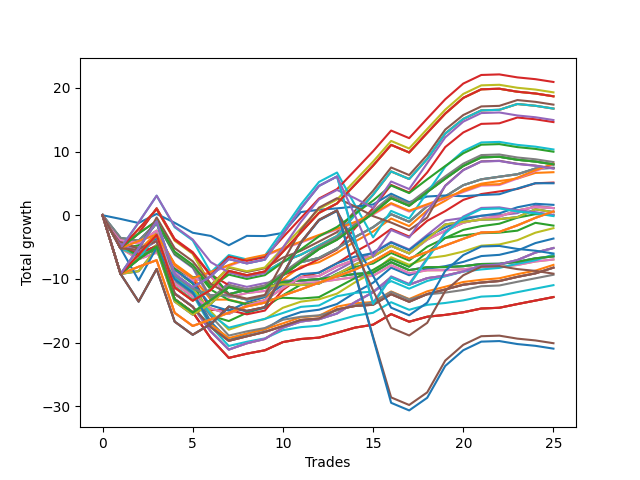

# Short Pointer 002 
- Symbol: NVDA_Unlimited
- Date Range: 02/08/2022 - 07/08/2022
- Trading Period: 7:20-12:30
- Number of Trades: 25



| Name | Win Percent | Profit | Avg Profit / Trade | Avg Time / Trade |      | Name | Win Percent | Profit | Avg Profit / Trade | Avg Time / Trade |
| ---- | ----------- | ------ | ------------------ | ---------------- | ---- | ---- | ----------- | ------ | ------------------ | ---------------- |
| Sorted By <br> Profit | | | | | | Sorted By <br> Win Percentage ||||
| One Hundred Eighteen | 64.00 | 10465.00 | 418.60 | 73:03 |     | One Hundred Sixteen | 84.00 | 4045.00 | 161.80 | 22:08 |
| One Hundred Thirteen | 64.00 | 9650.00 | 386.00 | 73:50 |     | One Hundred Eleven | 84.00 | 3975.00 | 159.00 | 22:12 |
| One Hundred Twenty-Eight | 68.00 | 9340.00 | 373.60 | 92:56 |     | One Hundred Twenty-Six | 84.00 | 300.00 | 12.00 | 34:49 |
| One Hundred Twenty-Three | 68.00 | 9340.00 | 373.60 | 92:56 |     | One Hundred Twenty-One | 84.00 | 300.00 | 12.00 | 34:49 |
| Eighty-Three | 68.00 | 9340.00 | 373.60 | 92:56 |     | Eighty-One | 84.00 | 300.00 | 12.00 | 34:49 |
| Forty-Seven | 68.00 | 8685.00 | 347.40 | 66:06 |     | Sixty-Four | 76.00 | -3230.00 | -129.20 | 09:23 |
| Seventy-One | 72.00 | 8375.00 | 335.00 | 85:12 |     | Fifty-Six | 76.00 | -3230.00 | -129.20 | 09:23 |
| Sixty-Three | 72.00 | 8375.00 | 335.00 | 85:12 |     | Zero | 76.00 | -3230.00 | -129.20 | 09:23 |
| Seven | 72.00 | 8375.00 | 335.00 | 85:12 |     | Forty-Eight | 76.00 | -3475.00 | -139.00 | 08:38 |
| One Hundred Ninteen | 52.00 | 7475.00 | 299.00 | 80:14 |     | Forty | 76.00 | -3475.00 | -139.00 | 08:38 |
| Fifty-Five | 64.00 | 7315.00 | 292.60 | 63:36 |     | Seventy-One | 72.00 | 8375.00 | 335.00 | 85:12 |
| One Hundred Fourteen | 56.00 | 5165.00 | 206.60 | 83:02 |     | Sixty-Three | 72.00 | 8375.00 | 335.00 | 85:12 |
| One Hundred Seventeen | 64.00 | 4990.00 | 199.60 | 52:21 |     | Seven | 72.00 | 8375.00 | 335.00 | 85:12 |
| One Hundred Twelve | 64.00 | 4175.00 | 167.00 | 53:09 |     | Seventy | 72.00 | 245.00 | 9.80 | 60:53 |
| One Hundred Sixteen | 84.00 | 4045.00 | 161.80 | 22:08 |     | Sixty-Two | 72.00 | 245.00 | 9.80 | 60:53 |
| One Hundred Twenty-Seven | 68.00 | 3995.00 | 159.80 | 68:02 |     | Six | 72.00 | 245.00 | 9.80 | 60:53 |
| One Hundred Twenty-Two | 68.00 | 3995.00 | 159.80 | 68:02 |     | Fifty | 72.00 | -1015.00 | -40.60 | 17:35 |
| Eighty-Two | 68.00 | 3995.00 | 159.80 | 68:02 |     | Forty-Two | 72.00 | -1830.00 | -73.20 | 18:22 |
| One Hundred Eleven | 84.00 | 3975.00 | 159.00 | 22:12 |     | Sixty-Six | 72.00 | -2575.00 | -103.00 | 21:57 |
| Sixty-Nine | 68.00 | 3720.00 | 148.80 | 41:00 |     | Fifty-Eight | 72.00 | -2575.00 | -103.00 | 21:57 |
| Sixty-One | 68.00 | 3720.00 | 148.80 | 41:00 |     | Two | 72.00 | -2575.00 | -103.00 | 21:57 |
| Five | 68.00 | 3720.00 | 148.80 | 41:00 |     | Fifty-One | 72.00 | -3085.00 | -123.40 | 13:59 |
| One Hundred Twenty | 44.00 | 3680.00 | 147.20 | 87:13 |     | Forty-Three | 72.00 | -3900.00 | -156.00 | 14:46 |
| One Hundred Twenty-Nine | 60.00 | 3665.00 | 146.60 | 102:48 |     | Sixty-Seven | 72.00 | -4115.00 | -164.60 | 18:29 |
| Fifty-Three | 68.00 | 3380.00 | 135.20 | 35:35 |     | Fifty-Nine | 72.00 | -4115.00 | -164.60 | 18:29 |
| Forty-Five | 68.00 | 2565.00 | 102.60 | 36:23 |     | Three | 72.00 | -4115.00 | -164.60 | 18:29 |
| Seventy-Three | 60.00 | 2510.00 | 100.40 | 09:26 |     | Forty-Nine | 72.00 | -4675.00 | -187.00 | 12:03 |
| Fifty-Two | 68.00 | 815.00 | 32.60 | 19:33 |     | Forty-One | 72.00 | -5490.00 | -219.60 | 12:50 |
| Sixty-Eight | 68.00 | 565.00 | 22.60 | 24:32 |     | Sixty-Five | 72.00 | -6425.00 | -257.00 | 16:20 |
| Sixty | 68.00 | 565.00 | 22.60 | 24:32 |     | Fifty-Seven | 72.00 | -6425.00 | -257.00 | 16:20 |
| Four | 68.00 | 565.00 | 22.60 | 24:32 |     | One | 72.00 | -6425.00 | -257.00 | 16:20 |
| Forty-Six | 68.00 | 555.00 | 22.20 | 41:47 |     | One Hundred Twenty-Eight | 68.00 | 9340.00 | 373.60 | 92:56 |
| One Hundred Twenty-Six | 84.00 | 300.00 | 12.00 | 34:49 |     | One Hundred Twenty-Three | 68.00 | 9340.00 | 373.60 | 92:56 |
| One Hundred Twenty-One | 84.00 | 300.00 | 12.00 | 34:49 |     | Eighty-Three | 68.00 | 9340.00 | 373.60 | 92:56 |
| Eighty-One | 84.00 | 300.00 | 12.00 | 34:49 |     | Forty-Seven | 68.00 | 8685.00 | 347.40 | 66:06 |
| Seventy | 72.00 | 245.00 | 9.80 | 60:53 |     | One Hundred Twenty-Seven | 68.00 | 3995.00 | 159.80 | 68:02 |
| Sixty-Two | 72.00 | 245.00 | 9.80 | 60:53 |     | One Hundred Twenty-Two | 68.00 | 3995.00 | 159.80 | 68:02 |
| Six | 72.00 | 245.00 | 9.80 | 60:53 |     | Eighty-Two | 68.00 | 3995.00 | 159.80 | 68:02 |
| Eighty-Four | 60.00 | 25.00 | 1.00 | 106:50 |     | Sixty-Nine | 68.00 | 3720.00 | 148.80 | 41:00 |
| Forty-Four | 68.00 | 0.00 | 0.00 | 20:20 |     | Sixty-One | 68.00 | 3720.00 | 148.80 | 41:00 |
| One Hundred Twenty-Four | 60.00 | -65.00 | -2.60 | 104:24 |     | Five | 68.00 | 3720.00 | 148.80 | 41:00 |
| Fifty-Four | 64.00 | -815.00 | -32.60 | 39:17 |     | Fifty-Three | 68.00 | 3380.00 | 135.20 | 35:35 |
| Fifty | 72.00 | -1015.00 | -40.60 | 17:35 |     | Forty-Five | 68.00 | 2565.00 | 102.60 | 36:23 |
| Forty-Two | 72.00 | -1830.00 | -73.20 | 18:22 |     | Fifty-Two | 68.00 | 815.00 | 32.60 | 19:33 |
| Sixty-Six | 72.00 | -2575.00 | -103.00 | 21:57 |     | Sixty-Eight | 68.00 | 565.00 | 22.60 | 24:32 |
| Fifty-Eight | 72.00 | -2575.00 | -103.00 | 21:57 |     | Sixty | 68.00 | 565.00 | 22.60 | 24:32 |
| Two | 72.00 | -2575.00 | -103.00 | 21:57 |     | Four | 68.00 | 565.00 | 22.60 | 24:32 |
| One Hundred Fifteen | 48.00 | -3005.00 | -120.20 | 93:28 |     | Forty-Six | 68.00 | 555.00 | 22.20 | 41:47 |
| Fifty-One | 72.00 | -3085.00 | -123.40 | 13:59 |     | Forty-Four | 68.00 | 0.00 | 0.00 | 20:20 |
| Sixty-Four | 76.00 | -3230.00 | -129.20 | 09:23 |     | One Hundred Eighteen | 64.00 | 10465.00 | 418.60 | 73:03 |
| Fifty-Six | 76.00 | -3230.00 | -129.20 | 09:23 |     | One Hundred Thirteen | 64.00 | 9650.00 | 386.00 | 73:50 |
| Zero | 76.00 | -3230.00 | -129.20 | 09:23 |     | Fifty-Five | 64.00 | 7315.00 | 292.60 | 63:36 |
| Forty-Eight | 76.00 | -3475.00 | -139.00 | 08:38 |     | One Hundred Seventeen | 64.00 | 4990.00 | 199.60 | 52:21 |
| Forty | 76.00 | -3475.00 | -139.00 | 08:38 |     | One Hundred Twelve | 64.00 | 4175.00 | 167.00 | 53:09 |
| Forty-Three | 72.00 | -3900.00 | -156.00 | 14:46 |     | Fifty-Four | 64.00 | -815.00 | -32.60 | 39:17 |
| Sixty-Seven | 72.00 | -4115.00 | -164.60 | 18:29 |     | One Hundred Twenty-Nine | 60.00 | 3665.00 | 146.60 | 102:48 |
| Fifty-Nine | 72.00 | -4115.00 | -164.60 | 18:29 |     | Seventy-Three | 60.00 | 2510.00 | 100.40 | 09:26 |
| Three | 72.00 | -4115.00 | -164.60 | 18:29 |     | Eighty-Four | 60.00 | 25.00 | 1.00 | 106:50 |
| One Hundred Thirty | 52.00 | -4590.00 | -183.60 | 114:14 |     | One Hundred Twenty-Four | 60.00 | -65.00 | -2.60 | 104:24 |
| Forty-Nine | 72.00 | -4675.00 | -187.00 | 12:03 |     | One Hundred Fourteen | 56.00 | 5165.00 | 206.60 | 83:02 |
| Forty-One | 72.00 | -5490.00 | -219.60 | 12:50 |     | One Hundred Ninteen | 52.00 | 7475.00 | 299.00 | 80:14 |
| Sixty-Five | 72.00 | -6425.00 | -257.00 | 16:20 |     | One Hundred Thirty | 52.00 | -4590.00 | -183.60 | 114:14 |
| Fifty-Seven | 72.00 | -6425.00 | -257.00 | 16:20 |     | Eighty-Five | 52.00 | -10050.00 | -402.00 | 120:17 |
| One | 72.00 | -6425.00 | -257.00 | 16:20 |     | One Hundred Twenty-Five | 52.00 | -10475.00 | -419.00 | 116:38 |
| Eighty-Five | 52.00 | -10050.00 | -402.00 | 120:17 |     | One Hundred Fifteen | 48.00 | -3005.00 | -120.20 | 93:28 |
| One Hundred Twenty-Five | 52.00 | -10475.00 | -419.00 | 116:38 |     | One Hundred Twenty | 44.00 | 3680.00 | 147.20 | 87:13 |

## NO STOPLOSS

### Test Zero
* Sell when price hits the middle line of the 20p bollinger
* No Stoploss
* Results:
```
Total Trades: 25
Percent Up: 24.00
Percent Down: 76.00
Total Points Moved Down: -6.46
Potential Profit: -3230.00
Total Points Ups: 15.42 Count Ups: 6
Total Points Downs: 8.96 Count Downs: 19
```

<details><summary>Trades</summary>

<code>In: 2022-02-09 07:46:00		Out: 2022-02-09 08:30:40		Total Position Time: 44:40		Total Move Down: -4.69		Total to Date: -4.69</code> <br />
<code>In: 2022-02-16 07:33:00		Out: 2022-02-16 07:58:55		Total Position Time: 25:55		Total Move Down: -1.73		Total to Date: -6.42</code> <br />
<code>In: 2022-02-18 12:05:00		Out: 2022-02-18 12:08:20		Total Position Time: 03:20		Total Move Down: 1.03		Total to Date: -5.39</code> <br />
<code>In: 2022-02-24 11:24:00		Out: 2022-02-24 11:55:35		Total Position Time: 31:35		Total Move Down: -3.01		Total to Date: -8.40</code> <br />
<code>In: 2022-02-24 12:30:00		Out: 2022-02-24 12:45:05		Total Position Time: 15:05		Total Move Down: -1.44		Total to Date: -9.84</code> <br />
<code>In: 2022-03-08 09:24:00		Out: 2022-03-08 09:26:15		Total Position Time: 02:15		Total Move Down: 0.75		Total to Date: -9.09</code> <br />
<code>In: 2022-03-08 09:42:00		Out: 2022-03-08 10:20:30		Total Position Time: 38:30		Total Move Down: -3.30		Total to Date: -12.39</code> <br />
<code>In: 2022-03-09 10:32:00		Out: 2022-03-09 10:33:10		Total Position Time: 01:10		Total Move Down: 0.66		Total to Date: -11.73</code> <br />
<code>In: 2022-03-09 12:12:00		Out: 2022-03-09 12:16:10		Total Position Time: 04:10		Total Move Down: 0.33		Total to Date: -11.40</code> <br />
<code>In: 2022-03-10 07:22:00		Out: 2022-03-10 07:26:35		Total Position Time: 04:35		Total Move Down: 0.92		Total to Date: -10.48</code> <br />
<code>In: 2022-03-11 07:54:00		Out: 2022-03-11 07:55:35		Total Position Time: 01:35		Total Move Down: 0.24		Total to Date: -10.24</code> <br />
<code>In: 2022-03-11 10:52:00		Out: 2022-03-11 10:53:10		Total Position Time: 01:10		Total Move Down: 0.22		Total to Date: -10.02</code> <br />
<code>In: 2022-03-18 12:28:00		Out: 2022-03-18 12:30:55		Total Position Time: 02:55		Total Move Down: 0.41		Total to Date: -9.61</code> <br />
<code>In: 2022-05-04 10:06:00		Out: 2022-05-04 10:09:00		Total Position Time: 03:00		Total Move Down: 0.39		Total to Date: -9.22</code> <br />
<code>In: 2022-05-04 10:38:00		Out: 2022-05-04 10:39:10		Total Position Time: 01:10		Total Move Down: 0.19		Total to Date: -9.03</code> <br />
<code>In: 2022-05-04 11:07:00		Out: 2022-05-04 11:08:10		Total Position Time: 01:10		Total Move Down: 1.66		Total to Date: -7.37</code> <br />
<code>In: 2022-05-04 12:20:00		Out: 2022-05-04 12:38:40		Total Position Time: 18:40		Total Move Down: -1.25		Total to Date: -8.62</code> <br />
<code>In: 2022-05-31 07:49:00		Out: 2022-05-31 07:53:45		Total Position Time: 04:45		Total Move Down: 0.46		Total to Date: -8.16</code> <br />
<code>In: 2022-05-31 09:47:00		Out: 2022-05-31 09:57:30		Total Position Time: 10:30		Total Move Down: 0.02		Total to Date: -8.14</code> <br />
<code>In: 2022-06-03 10:06:00		Out: 2022-06-03 10:14:05		Total Position Time: 08:05		Total Move Down: 0.14		Total to Date: -8.00</code> <br />
<code>In: 2022-06-10 12:03:00		Out: 2022-06-10 12:04:10		Total Position Time: 01:10		Total Move Down: 0.34		Total to Date: -7.66</code> <br />
<code>In: 2022-06-24 11:52:00		Out: 2022-06-24 11:54:25		Total Position Time: 02:25		Total Move Down: 0.03		Total to Date: -7.63</code> <br />
<code>In: 2022-06-29 10:12:00		Out: 2022-06-29 10:13:10		Total Position Time: 01:10		Total Move Down: 0.31		Total to Date: -7.32</code> <br />
<code>In: 2022-07-06 11:10:00		Out: 2022-07-06 11:11:10		Total Position Time: 01:10		Total Move Down: 0.55		Total to Date: -6.77</code> <br />
<code>In: 2022-07-08 10:52:00		Out: 2022-07-08 10:56:30		Total Position Time: 04:30		Total Move Down: 0.31		Total to Date: -6.46</code> <br />


</details>

### Test One
* Sell when the price hits the upper line of the 20p 1std bollinger
* No Stoploss
* Results:
```
Total Trades: 25
Percent Up: 28.00
Percent Down: 72.00
Total Points Moved Down: -12.85
Potential Profit: -6425.00
Total Points Ups: 24.64 Count Ups: 7
Total Points Downs: 11.79 Count Downs: 18
```

<details><summary>Trades</summary>

<code>In: 2022-02-09 07:46:00		Out: 2022-02-09 08:42:00		Total Position Time: 56:00		Total Move Down: -4.67		Total to Date: -4.67</code> <br />
<code>In: 2022-02-16 07:33:00		Out: 2022-02-16 08:00:25		Total Position Time: 27:25		Total Move Down: -1.27		Total to Date: -5.94</code> <br />
<code>In: 2022-02-18 12:05:00		Out: 2022-02-18 12:15:05		Total Position Time: 10:05		Total Move Down: 1.05		Total to Date: -4.89</code> <br />
<code>In: 2022-02-24 11:24:00		Out: 2022-02-24 12:47:00		Total Position Time: 83:00		Total Move Down: -8.27		Total to Date: -13.16</code> <br />
<code>In: 2022-02-24 12:30:00		Out: 2022-02-24 12:47:00		Total Position Time: 17:00		Total Move Down: -2.06		Total to Date: -15.22</code> <br />
<code>In: 2022-03-08 09:24:00		Out: 2022-03-08 10:21:50		Total Position Time: 57:50		Total Move Down: -4.11		Total to Date: -19.33</code> <br />
<code>In: 2022-03-08 09:42:00		Out: 2022-03-08 10:21:50		Total Position Time: 39:50		Total Move Down: -3.07		Total to Date: -22.40</code> <br />
<code>In: 2022-03-09 10:32:00		Out: 2022-03-09 10:33:10		Total Position Time: 01:10		Total Move Down: 0.66		Total to Date: -21.74</code> <br />
<code>In: 2022-03-09 12:12:00		Out: 2022-03-09 12:18:35		Total Position Time: 06:35		Total Move Down: 0.53		Total to Date: -21.21</code> <br />
<code>In: 2022-03-10 07:22:00		Out: 2022-03-10 07:31:45		Total Position Time: 09:45		Total Move Down: 1.29		Total to Date: -19.92</code> <br />
<code>In: 2022-03-11 07:54:00		Out: 2022-03-11 07:58:30		Total Position Time: 04:30		Total Move Down: 0.48		Total to Date: -19.44</code> <br />
<code>In: 2022-03-11 10:52:00		Out: 2022-03-11 10:53:10		Total Position Time: 01:10		Total Move Down: 0.22		Total to Date: -19.22</code> <br />
<code>In: 2022-03-18 12:28:00		Out: 2022-03-18 12:36:35		Total Position Time: 08:35		Total Move Down: 0.77		Total to Date: -18.45</code> <br />
<code>In: 2022-05-04 10:06:00		Out: 2022-05-04 10:11:35		Total Position Time: 05:35		Total Move Down: 0.80		Total to Date: -17.65</code> <br />
<code>In: 2022-05-04 10:38:00		Out: 2022-05-04 10:41:05		Total Position Time: 03:05		Total Move Down: 0.46		Total to Date: -17.19</code> <br />
<code>In: 2022-05-04 11:07:00		Out: 2022-05-04 11:08:10		Total Position Time: 01:10		Total Move Down: 1.66		Total to Date: -15.53</code> <br />
<code>In: 2022-05-04 12:20:00		Out: 2022-05-04 12:46:15		Total Position Time: 26:15		Total Move Down: -1.19		Total to Date: -16.72</code> <br />
<code>In: 2022-05-31 07:49:00		Out: 2022-05-31 07:57:20		Total Position Time: 08:20		Total Move Down: 0.78		Total to Date: -15.94</code> <br />
<code>In: 2022-05-31 09:47:00		Out: 2022-05-31 09:57:50		Total Position Time: 10:50		Total Move Down: 0.29		Total to Date: -15.65</code> <br />
<code>In: 2022-06-03 10:06:00		Out: 2022-06-03 10:14:55		Total Position Time: 08:55		Total Move Down: 0.41		Total to Date: -15.24</code> <br />
<code>In: 2022-06-10 12:03:00		Out: 2022-06-10 12:05:10		Total Position Time: 02:10		Total Move Down: 0.59		Total to Date: -14.65</code> <br />
<code>In: 2022-06-24 11:52:00		Out: 2022-06-24 12:01:30		Total Position Time: 09:30		Total Move Down: 0.12		Total to Date: -14.53</code> <br />
<code>In: 2022-06-29 10:12:00		Out: 2022-06-29 10:14:05		Total Position Time: 02:05		Total Move Down: 0.58		Total to Date: -13.95</code> <br />
<code>In: 2022-07-06 11:10:00		Out: 2022-07-06 11:11:10		Total Position Time: 01:10		Total Move Down: 0.55		Total to Date: -13.40</code> <br />
<code>In: 2022-07-08 10:52:00		Out: 2022-07-08 10:58:20		Total Position Time: 06:20		Total Move Down: 0.55		Total to Date: -12.85</code> <br />


</details>

### Test Two
* Sell when the price hits the upper line of the 20p 2std bollinger
* No Stoploss
* Results:
```
Total Trades: 25
Percent Up: 28.00
Percent Down: 72.00
Total Points Moved Down: -5.15
Potential Profit: -2575.00
Total Points Ups: 24.06 Count Ups: 7
Total Points Downs: 18.91 Count Downs: 18
```

<details><summary>Trades</summary>

<code>In: 2022-02-09 07:46:00		Out: 2022-02-09 08:42:40		Total Position Time: 56:40		Total Move Down: -4.50		Total to Date: -4.50</code> <br />
<code>In: 2022-02-16 07:33:00		Out: 2022-02-16 08:05:15		Total Position Time: 32:15		Total Move Down: -1.28		Total to Date: -5.78</code> <br />
<code>In: 2022-02-18 12:05:00		Out: 2022-02-18 12:18:35		Total Position Time: 13:35		Total Move Down: 1.77		Total to Date: -4.01</code> <br />
<code>In: 2022-02-24 11:24:00		Out: 2022-02-24 12:47:00		Total Position Time: 83:00		Total Move Down: -8.27		Total to Date: -12.28</code> <br />
<code>In: 2022-02-24 12:30:00		Out: 2022-02-24 12:47:00		Total Position Time: 17:00		Total Move Down: -2.06		Total to Date: -14.34</code> <br />
<code>In: 2022-03-08 09:24:00		Out: 2022-03-08 10:23:15		Total Position Time: 59:15		Total Move Down: -3.90		Total to Date: -18.24</code> <br />
<code>In: 2022-03-08 09:42:00		Out: 2022-03-08 10:23:15		Total Position Time: 41:15		Total Move Down: -2.86		Total to Date: -21.10</code> <br />
<code>In: 2022-03-09 10:32:00		Out: 2022-03-09 10:39:05		Total Position Time: 07:05		Total Move Down: 0.99		Total to Date: -20.11</code> <br />
<code>In: 2022-03-09 12:12:00		Out: 2022-03-09 12:26:25		Total Position Time: 14:25		Total Move Down: 0.68		Total to Date: -19.43</code> <br />
<code>In: 2022-03-10 07:22:00		Out: 2022-03-10 07:33:15		Total Position Time: 11:15		Total Move Down: 1.78		Total to Date: -17.65</code> <br />
<code>In: 2022-03-11 07:54:00		Out: 2022-03-11 08:00:30		Total Position Time: 06:30		Total Move Down: 0.96		Total to Date: -16.69</code> <br />
<code>In: 2022-03-11 10:52:00		Out: 2022-03-11 10:53:20		Total Position Time: 01:20		Total Move Down: 0.36		Total to Date: -16.33</code> <br />
<code>In: 2022-03-18 12:28:00		Out: 2022-03-18 12:37:10		Total Position Time: 09:10		Total Move Down: 0.90		Total to Date: -15.43</code> <br />
<code>In: 2022-05-04 10:06:00		Out: 2022-05-04 11:07:30		Total Position Time: 61:30		Total Move Down: 1.78		Total to Date: -13.65</code> <br />
<code>In: 2022-05-04 10:38:00		Out: 2022-05-04 11:07:30		Total Position Time: 29:30		Total Move Down: 1.56		Total to Date: -12.09</code> <br />
<code>In: 2022-05-04 11:07:00		Out: 2022-05-04 11:20:50		Total Position Time: 13:50		Total Move Down: 2.37		Total to Date: -9.72</code> <br />
<code>In: 2022-05-04 12:20:00		Out: 2022-05-04 12:47:00		Total Position Time: 27:00		Total Move Down: -1.19		Total to Date: -10.91</code> <br />
<code>In: 2022-05-31 07:49:00		Out: 2022-05-31 08:00:05		Total Position Time: 11:05		Total Move Down: 1.03		Total to Date: -9.88</code> <br />
<code>In: 2022-05-31 09:47:00		Out: 2022-05-31 09:59:10		Total Position Time: 12:10		Total Move Down: 0.39		Total to Date: -9.49</code> <br />
<code>In: 2022-06-03 10:06:00		Out: 2022-06-03 10:15:40		Total Position Time: 09:40		Total Move Down: 0.67		Total to Date: -8.82</code> <br />
<code>In: 2022-06-10 12:03:00		Out: 2022-06-10 12:09:00		Total Position Time: 06:00		Total Move Down: 0.92		Total to Date: -7.90</code> <br />
<code>In: 2022-06-24 11:52:00		Out: 2022-06-24 12:03:15		Total Position Time: 11:15		Total Move Down: 0.19		Total to Date: -7.71</code> <br />
<code>In: 2022-06-29 10:12:00		Out: 2022-06-29 10:15:05		Total Position Time: 03:05		Total Move Down: 0.67		Total to Date: -7.04</code> <br />
<code>In: 2022-07-06 11:10:00		Out: 2022-07-06 11:12:15		Total Position Time: 02:15		Total Move Down: 1.18		Total to Date: -5.86</code> <br />
<code>In: 2022-07-08 10:52:00		Out: 2022-07-08 11:00:50		Total Position Time: 08:50		Total Move Down: 0.71		Total to Date: -5.15</code> <br />


</details>

### Test Three
* Sell when price hits the middle line of the 50p bollinger
* No Stoploss
* Results:
```
Total Trades: 25
Percent Up: 28.00
Percent Down: 72.00
Total Points Moved Down: -8.23
Potential Profit: -4115.00
Total Points Ups: 22.13 Count Ups: 7
Total Points Downs: 13.90 Count Downs: 18
```

<details><summary>Trades</summary>

<code>In: 2022-02-09 07:46:00		Out: 2022-02-09 08:44:35		Total Position Time: 58:35		Total Move Down: -4.15		Total to Date: -4.15</code> <br />
<code>In: 2022-02-16 07:33:00		Out: 2022-02-16 08:12:30		Total Position Time: 39:30		Total Move Down: -1.12		Total to Date: -5.27</code> <br />
<code>In: 2022-02-18 12:05:00		Out: 2022-02-18 12:17:20		Total Position Time: 12:20		Total Move Down: 1.22		Total to Date: -4.05</code> <br />
<code>In: 2022-02-24 11:24:00		Out: 2022-02-24 12:47:00		Total Position Time: 83:00		Total Move Down: -8.27		Total to Date: -12.32</code> <br />
<code>In: 2022-02-24 12:30:00		Out: 2022-02-24 12:47:00		Total Position Time: 17:00		Total Move Down: -2.06		Total to Date: -14.38</code> <br />
<code>In: 2022-03-08 09:24:00		Out: 2022-03-08 10:24:45		Total Position Time: 60:45		Total Move Down: -3.19		Total to Date: -17.57</code> <br />
<code>In: 2022-03-08 09:42:00		Out: 2022-03-08 10:24:45		Total Position Time: 42:45		Total Move Down: -2.15		Total to Date: -19.72</code> <br />
<code>In: 2022-03-09 10:32:00		Out: 2022-03-09 10:38:55		Total Position Time: 06:55		Total Move Down: 0.71		Total to Date: -19.01</code> <br />
<code>In: 2022-03-09 12:12:00		Out: 2022-03-09 12:26:25		Total Position Time: 14:25		Total Move Down: 0.68		Total to Date: -18.33</code> <br />
<code>In: 2022-03-10 07:22:00		Out: 2022-03-10 07:26:35		Total Position Time: 04:35		Total Move Down: 0.92		Total to Date: -17.41</code> <br />
<code>In: 2022-03-11 07:54:00		Out: 2022-03-11 08:00:30		Total Position Time: 06:30		Total Move Down: 0.96		Total to Date: -16.45</code> <br />
<code>In: 2022-03-11 10:52:00		Out: 2022-03-11 10:53:10		Total Position Time: 01:10		Total Move Down: 0.22		Total to Date: -16.23</code> <br />
<code>In: 2022-03-18 12:28:00		Out: 2022-03-18 12:38:05		Total Position Time: 10:05		Total Move Down: 1.44		Total to Date: -14.79</code> <br />
<code>In: 2022-05-04 10:06:00		Out: 2022-05-04 10:11:05		Total Position Time: 05:05		Total Move Down: 0.54		Total to Date: -14.25</code> <br />
<code>In: 2022-05-04 10:38:00		Out: 2022-05-04 10:39:10		Total Position Time: 01:10		Total Move Down: 0.19		Total to Date: -14.06</code> <br />
<code>In: 2022-05-04 11:07:00		Out: 2022-05-04 11:08:10		Total Position Time: 01:10		Total Move Down: 1.66		Total to Date: -12.40</code> <br />
<code>In: 2022-05-04 12:20:00		Out: 2022-05-04 12:47:00		Total Position Time: 27:00		Total Move Down: -1.19		Total to Date: -13.59</code> <br />
<code>In: 2022-05-31 07:49:00		Out: 2022-05-31 08:06:35		Total Position Time: 17:35		Total Move Down: 1.21		Total to Date: -12.38</code> <br />
<code>In: 2022-05-31 09:47:00		Out: 2022-05-31 10:01:10		Total Position Time: 14:10		Total Move Down: 0.72		Total to Date: -11.66</code> <br />
<code>In: 2022-06-03 10:06:00		Out: 2022-06-03 10:15:50		Total Position Time: 09:50		Total Move Down: 0.75		Total to Date: -10.91</code> <br />
<code>In: 2022-06-10 12:03:00		Out: 2022-06-10 12:04:10		Total Position Time: 01:10		Total Move Down: 0.34		Total to Date: -10.57</code> <br />
<code>In: 2022-06-24 11:52:00		Out: 2022-06-24 12:05:40		Total Position Time: 13:40		Total Move Down: 0.24		Total to Date: -10.33</code> <br />
<code>In: 2022-06-29 10:12:00		Out: 2022-06-29 10:15:00		Total Position Time: 03:00		Total Move Down: 0.65		Total to Date: -9.68</code> <br />
<code>In: 2022-07-06 11:10:00		Out: 2022-07-06 11:11:10		Total Position Time: 01:10		Total Move Down: 0.55		Total to Date: -9.13</code> <br />
<code>In: 2022-07-08 10:52:00		Out: 2022-07-08 11:01:45		Total Position Time: 09:45		Total Move Down: 0.90		Total to Date: -8.23</code> <br />


</details>

### Test Four
* Sell when the price hits the upper line of the 50p 1std bollinger
* No Stoploss
* Results:
```
Total Trades: 25
Percent Up: 32.00
Percent Down: 68.00
Total Points Moved Down: 1.13
Potential Profit: 565.00
Total Points Ups: 18.81 Count Ups: 8
Total Points Downs: 19.94 Count Downs: 17
```

<details><summary>Trades</summary>

<code>In: 2022-02-09 07:46:00		Out: 2022-02-09 08:54:45		Total Position Time: 68:45		Total Move Down: -3.89		Total to Date: -3.89</code> <br />
<code>In: 2022-02-16 07:33:00		Out: 2022-02-16 08:15:05		Total Position Time: 42:05		Total Move Down: -0.49		Total to Date: -4.38</code> <br />
<code>In: 2022-02-18 12:05:00		Out: 2022-02-18 12:19:05		Total Position Time: 14:05		Total Move Down: 1.96		Total to Date: -2.42</code> <br />
<code>In: 2022-02-24 11:24:00		Out: 2022-02-24 12:47:00		Total Position Time: 83:00		Total Move Down: -8.27		Total to Date: -10.69</code> <br />
<code>In: 2022-02-24 12:30:00		Out: 2022-02-24 12:47:00		Total Position Time: 17:00		Total Move Down: -2.06		Total to Date: -12.75</code> <br />
<code>In: 2022-03-08 09:24:00		Out: 2022-03-08 10:26:40		Total Position Time: 62:40		Total Move Down: -1.89		Total to Date: -14.64</code> <br />
<code>In: 2022-03-08 09:42:00		Out: 2022-03-08 10:26:40		Total Position Time: 44:40		Total Move Down: -0.85		Total to Date: -15.49</code> <br />
<code>In: 2022-03-09 10:32:00		Out: 2022-03-09 10:46:30		Total Position Time: 14:30		Total Move Down: 1.31		Total to Date: -14.18</code> <br />
<code>In: 2022-03-09 12:12:00		Out: 2022-03-09 12:39:40		Total Position Time: 27:40		Total Move Down: 0.82		Total to Date: -13.36</code> <br />
<code>In: 2022-03-10 07:22:00		Out: 2022-03-10 07:33:20		Total Position Time: 11:20		Total Move Down: 1.93		Total to Date: -11.43</code> <br />
<code>In: 2022-03-11 07:54:00		Out: 2022-03-11 08:05:15		Total Position Time: 11:15		Total Move Down: 1.68		Total to Date: -9.75</code> <br />
<code>In: 2022-03-11 10:52:00		Out: 2022-03-11 10:53:10		Total Position Time: 01:10		Total Move Down: 0.22		Total to Date: -9.53</code> <br />
<code>In: 2022-03-18 12:28:00		Out: 2022-03-18 12:47:00		Total Position Time: 19:00		Total Move Down: 1.48		Total to Date: -8.05</code> <br />
<code>In: 2022-05-04 10:06:00		Out: 2022-05-04 10:12:10		Total Position Time: 06:10		Total Move Down: 1.06		Total to Date: -6.99</code> <br />
<code>In: 2022-05-04 10:38:00		Out: 2022-05-04 10:41:55		Total Position Time: 03:55		Total Move Down: 0.54		Total to Date: -6.45</code> <br />
<code>In: 2022-05-04 11:07:00		Out: 2022-05-04 11:08:10		Total Position Time: 01:10		Total Move Down: 1.66		Total to Date: -4.79</code> <br />
<code>In: 2022-05-04 12:20:00		Out: 2022-05-04 12:47:00		Total Position Time: 27:00		Total Move Down: -1.19		Total to Date: -5.98</code> <br />
<code>In: 2022-05-31 07:49:00		Out: 2022-05-31 08:08:45		Total Position Time: 19:45		Total Move Down: 2.16		Total to Date: -3.82</code> <br />
<code>In: 2022-05-31 09:47:00		Out: 2022-05-31 10:03:50		Total Position Time: 16:50		Total Move Down: 1.38		Total to Date: -2.44</code> <br />
<code>In: 2022-06-03 10:06:00		Out: 2022-06-03 10:18:55		Total Position Time: 12:55		Total Move Down: 1.27		Total to Date: -1.17</code> <br />
<code>In: 2022-06-10 12:03:00		Out: 2022-06-10 12:05:10		Total Position Time: 02:10		Total Move Down: 0.59		Total to Date: -0.58</code> <br />
<code>In: 2022-06-24 11:52:00		Out: 2022-06-24 12:12:15		Total Position Time: 20:15		Total Move Down: 0.38		Total to Date: -0.20</code> <br />
<code>In: 2022-06-29 10:12:00		Out: 2022-06-29 10:21:05		Total Position Time: 09:05		Total Move Down: 0.95		Total to Date: 0.75</code> <br />
<code>In: 2022-07-06 11:10:00		Out: 2022-07-06 11:11:10		Total Position Time: 01:10		Total Move Down: 0.55		Total to Date: 1.30</code> <br />
<code>In: 2022-07-08 10:52:00		Out: 2022-07-08 12:08:00		Total Position Time: 76:00		Total Move Down: -0.17		Total to Date: 1.13</code> <br />


</details>

### Test Five
* Sell when the price hits the upper line of the 50p 2std bollinger
* No Stoploss
* Results:
```
Total Trades: 25
Percent Up: 32.00
Percent Down: 68.00
Total Points Moved Down: 7.44
Potential Profit: 3720.00
Total Points Ups: 17.23 Count Ups: 8
Total Points Downs: 24.67 Count Downs: 17
```

<details><summary>Trades</summary>

<code>In: 2022-02-09 07:46:00		Out: 2022-02-09 09:01:10		Total Position Time: 75:10		Total Move Down: -3.56		Total to Date: -3.56</code> <br />
<code>In: 2022-02-16 07:33:00		Out: 2022-02-16 08:48:50		Total Position Time: 75:50		Total Move Down: -0.43		Total to Date: -3.99</code> <br />
<code>In: 2022-02-18 12:05:00		Out: 2022-02-18 12:19:45		Total Position Time: 14:45		Total Move Down: 2.79		Total to Date: -1.20</code> <br />
<code>In: 2022-02-24 11:24:00		Out: 2022-02-24 12:47:00		Total Position Time: 83:00		Total Move Down: -8.27		Total to Date: -9.47</code> <br />
<code>In: 2022-02-24 12:30:00		Out: 2022-02-24 12:47:00		Total Position Time: 17:00		Total Move Down: -2.06		Total to Date: -11.53</code> <br />
<code>In: 2022-03-08 09:24:00		Out: 2022-03-08 10:30:45		Total Position Time: 66:45		Total Move Down: -1.04		Total to Date: -12.57</code> <br />
<code>In: 2022-03-08 09:42:00		Out: 2022-03-08 10:30:45		Total Position Time: 48:45		Total Move Down: -0.00		Total to Date: -12.57</code> <br />
<code>In: 2022-03-09 10:32:00		Out: 2022-03-09 12:47:00		Total Position Time: 135:00		Total Move Down: -0.68		Total to Date: -13.25</code> <br />
<code>In: 2022-03-09 12:12:00		Out: 2022-03-09 12:47:00		Total Position Time: 35:00		Total Move Down: 0.59		Total to Date: -12.66</code> <br />
<code>In: 2022-03-10 07:22:00		Out: 2022-03-10 07:44:55		Total Position Time: 22:55		Total Move Down: 3.24		Total to Date: -9.42</code> <br />
<code>In: 2022-03-11 07:54:00		Out: 2022-03-11 08:06:05		Total Position Time: 12:05		Total Move Down: 2.04		Total to Date: -7.38</code> <br />
<code>In: 2022-03-11 10:52:00		Out: 2022-03-11 10:58:25		Total Position Time: 06:25		Total Move Down: 0.68		Total to Date: -6.70</code> <br />
<code>In: 2022-03-18 12:28:00		Out: 2022-03-18 12:47:00		Total Position Time: 19:00		Total Move Down: 1.48		Total to Date: -5.22</code> <br />
<code>In: 2022-05-04 10:06:00		Out: 2022-05-04 11:07:30		Total Position Time: 61:30		Total Move Down: 1.78		Total to Date: -3.44</code> <br />
<code>In: 2022-05-04 10:38:00		Out: 2022-05-04 11:07:30		Total Position Time: 29:30		Total Move Down: 1.56		Total to Date: -1.88</code> <br />
<code>In: 2022-05-04 11:07:00		Out: 2022-05-04 11:20:40		Total Position Time: 13:40		Total Move Down: 2.04		Total to Date: 0.16</code> <br />
<code>In: 2022-05-04 12:20:00		Out: 2022-05-04 12:47:00		Total Position Time: 27:00		Total Move Down: -1.19		Total to Date: -1.03</code> <br />
<code>In: 2022-05-31 07:49:00		Out: 2022-05-31 08:15:00		Total Position Time: 26:00		Total Move Down: 2.46		Total to Date: 1.43</code> <br />
<code>In: 2022-05-31 09:47:00		Out: 2022-05-31 10:16:00		Total Position Time: 29:00		Total Move Down: 1.53		Total to Date: 2.96</code> <br />
<code>In: 2022-06-03 10:06:00		Out: 2022-06-03 10:31:35		Total Position Time: 25:35		Total Move Down: 1.76		Total to Date: 4.72</code> <br />
<code>In: 2022-06-10 12:03:00		Out: 2022-06-10 12:09:00		Total Position Time: 06:00		Total Move Down: 0.92		Total to Date: 5.64</code> <br />
<code>In: 2022-06-24 11:52:00		Out: 2022-06-24 12:26:15		Total Position Time: 34:15		Total Move Down: 0.41		Total to Date: 6.05</code> <br />
<code>In: 2022-06-29 10:12:00		Out: 2022-06-29 11:33:05		Total Position Time: 81:05		Total Move Down: 0.39		Total to Date: 6.44</code> <br />
<code>In: 2022-07-06 11:10:00		Out: 2022-07-06 11:12:05		Total Position Time: 02:05		Total Move Down: 0.89		Total to Date: 7.33</code> <br />
<code>In: 2022-07-08 10:52:00		Out: 2022-07-08 12:09:40		Total Position Time: 77:40		Total Move Down: 0.11		Total to Date: 7.44</code> <br />


</details>

### Test Six
* Sell when the price hits the middle line of the 1std VWAP
* No Stoploss
* Results:
```
Total Trades: 25
Percent Up: 28.00
Percent Down: 72.00
Total Points Moved Down: 0.49
Potential Profit: 245.00
Total Points Ups: 21.98 Count Ups: 7
Total Points Downs: 22.47 Count Downs: 18
```

<details><summary>Trades</summary>

<code>In: 2022-02-09 07:46:00		Out: 2022-02-09 12:47:00		Total Position Time: 301:00		Total Move Down: -9.22		Total to Date: -9.22</code> <br />
<code>In: 2022-02-16 07:33:00		Out: 2022-02-16 09:00:35		Total Position Time: 87:35		Total Move Down: 0.44		Total to Date: -8.78</code> <br />
<code>In: 2022-02-18 12:05:00		Out: 2022-02-18 12:22:10		Total Position Time: 17:10		Total Move Down: 3.50		Total to Date: -5.28</code> <br />
<code>In: 2022-02-24 11:24:00		Out: 2022-02-24 12:47:00		Total Position Time: 83:00		Total Move Down: -8.27		Total to Date: -13.55</code> <br />
<code>In: 2022-02-24 12:30:00		Out: 2022-02-24 12:47:00		Total Position Time: 17:00		Total Move Down: -2.06		Total to Date: -15.61</code> <br />
<code>In: 2022-03-08 09:24:00		Out: 2022-03-08 12:47:00		Total Position Time: 203:00		Total Move Down: 1.69		Total to Date: -13.92</code> <br />
<code>In: 2022-03-08 09:42:00		Out: 2022-03-08 12:47:00		Total Position Time: 185:00		Total Move Down: 2.73		Total to Date: -11.19</code> <br />
<code>In: 2022-03-09 10:32:00		Out: 2022-03-09 12:47:00		Total Position Time: 135:00		Total Move Down: -0.68		Total to Date: -11.87</code> <br />
<code>In: 2022-03-09 12:12:00		Out: 2022-03-09 12:47:00		Total Position Time: 35:00		Total Move Down: 0.59		Total to Date: -11.28</code> <br />
<code>In: 2022-03-10 07:22:00		Out: 2022-03-10 07:24:05		Total Position Time: 02:05		Total Move Down: 0.44		Total to Date: -10.84</code> <br />
<code>In: 2022-03-11 07:54:00		Out: 2022-03-11 07:55:10		Total Position Time: 01:10		Total Move Down: -0.12		Total to Date: -10.96</code> <br />
<code>In: 2022-03-11 10:52:00		Out: 2022-03-11 10:53:10		Total Position Time: 01:10		Total Move Down: 0.22		Total to Date: -10.74</code> <br />
<code>In: 2022-03-18 12:28:00		Out: 2022-03-18 12:47:00		Total Position Time: 19:00		Total Move Down: 1.48		Total to Date: -9.26</code> <br />
<code>In: 2022-05-04 10:06:00		Out: 2022-05-04 11:07:25		Total Position Time: 61:25		Total Move Down: 1.51		Total to Date: -7.75</code> <br />
<code>In: 2022-05-04 10:38:00		Out: 2022-05-04 11:07:25		Total Position Time: 29:25		Total Move Down: 1.29		Total to Date: -6.46</code> <br />
<code>In: 2022-05-04 11:07:00		Out: 2022-05-04 11:08:10		Total Position Time: 01:10		Total Move Down: 1.66		Total to Date: -4.80</code> <br />
<code>In: 2022-05-04 12:20:00		Out: 2022-05-04 12:47:00		Total Position Time: 27:00		Total Move Down: -1.19		Total to Date: -5.99</code> <br />
<code>In: 2022-05-31 07:49:00		Out: 2022-05-31 08:14:40		Total Position Time: 25:40		Total Move Down: 2.28		Total to Date: -3.71</code> <br />
<code>In: 2022-05-31 09:47:00		Out: 2022-05-31 11:26:40		Total Position Time: 99:40		Total Move Down: 2.26		Total to Date: -1.45</code> <br />
<code>In: 2022-06-03 10:06:00		Out: 2022-06-03 10:14:55		Total Position Time: 08:55		Total Move Down: 0.41		Total to Date: -1.04</code> <br />
<code>In: 2022-06-10 12:03:00		Out: 2022-06-10 12:04:10		Total Position Time: 01:10		Total Move Down: 0.34		Total to Date: -0.70</code> <br />
<code>In: 2022-06-24 11:52:00		Out: 2022-06-24 12:47:00		Total Position Time: 55:00		Total Move Down: 0.09		Total to Date: -0.61</code> <br />
<code>In: 2022-06-29 10:12:00		Out: 2022-06-29 10:13:10		Total Position Time: 01:10		Total Move Down: 0.31		Total to Date: -0.30</code> <br />
<code>In: 2022-07-06 11:10:00		Out: 2022-07-06 11:19:20		Total Position Time: 09:20		Total Move Down: 1.23		Total to Date: 0.93</code> <br />
<code>In: 2022-07-08 10:52:00		Out: 2022-07-08 12:47:00		Total Position Time: 115:00		Total Move Down: -0.44		Total to Date: 0.49</code> <br />


</details>

### Test Seven
* Sell when the price hits the upper line of the 1std VWAP
* No Stoploss
* Results:
```
Total Trades: 25
Percent Up: 28.00
Percent Down: 72.00
Total Points Moved Down: 16.75
Potential Profit: 8375.00
Total Points Ups: 22.14 Count Ups: 7
Total Points Downs: 38.89 Count Downs: 18
```

<details><summary>Trades</summary>

<code>In: 2022-02-09 07:46:00		Out: 2022-02-09 12:47:00		Total Position Time: 301:00		Total Move Down: -9.22		Total to Date: -9.22</code> <br />
<code>In: 2022-02-16 07:33:00		Out: 2022-02-16 09:18:20		Total Position Time: 105:20		Total Move Down: 2.32		Total to Date: -6.90</code> <br />
<code>In: 2022-02-18 12:05:00		Out: 2022-02-18 12:47:00		Total Position Time: 42:00		Total Move Down: 3.95		Total to Date: -2.95</code> <br />
<code>In: 2022-02-24 11:24:00		Out: 2022-02-24 12:47:00		Total Position Time: 83:00		Total Move Down: -8.27		Total to Date: -11.22</code> <br />
<code>In: 2022-02-24 12:30:00		Out: 2022-02-24 12:47:00		Total Position Time: 17:00		Total Move Down: -2.06		Total to Date: -13.28</code> <br />
<code>In: 2022-03-08 09:24:00		Out: 2022-03-08 12:47:00		Total Position Time: 203:00		Total Move Down: 1.69		Total to Date: -11.59</code> <br />
<code>In: 2022-03-08 09:42:00		Out: 2022-03-08 12:47:00		Total Position Time: 185:00		Total Move Down: 2.73		Total to Date: -8.86</code> <br />
<code>In: 2022-03-09 10:32:00		Out: 2022-03-09 12:47:00		Total Position Time: 135:00		Total Move Down: -0.68		Total to Date: -9.54</code> <br />
<code>In: 2022-03-09 12:12:00		Out: 2022-03-09 12:47:00		Total Position Time: 35:00		Total Move Down: 0.59		Total to Date: -8.95</code> <br />
<code>In: 2022-03-10 07:22:00		Out: 2022-03-10 07:33:00		Total Position Time: 11:00		Total Move Down: 1.67		Total to Date: -7.28</code> <br />
<code>In: 2022-03-11 07:54:00		Out: 2022-03-11 08:01:20		Total Position Time: 07:20		Total Move Down: 1.09		Total to Date: -6.19</code> <br />
<code>In: 2022-03-11 10:52:00		Out: 2022-03-11 12:06:55		Total Position Time: 74:55		Total Move Down: 1.44		Total to Date: -4.75</code> <br />
<code>In: 2022-03-18 12:28:00		Out: 2022-03-18 12:47:00		Total Position Time: 19:00		Total Move Down: 1.48		Total to Date: -3.27</code> <br />
<code>In: 2022-05-04 10:06:00		Out: 2022-05-04 11:34:15		Total Position Time: 88:15		Total Move Down: 3.36		Total to Date: 0.09</code> <br />
<code>In: 2022-05-04 10:38:00		Out: 2022-05-04 11:34:15		Total Position Time: 56:15		Total Move Down: 3.14		Total to Date: 3.23</code> <br />
<code>In: 2022-05-04 11:07:00		Out: 2022-05-04 11:34:15		Total Position Time: 27:15		Total Move Down: 3.65		Total to Date: 6.88</code> <br />
<code>In: 2022-05-04 12:20:00		Out: 2022-05-04 12:47:00		Total Position Time: 27:00		Total Move Down: -1.19		Total to Date: 5.69</code> <br />
<code>In: 2022-05-31 07:49:00		Out: 2022-05-31 11:45:45		Total Position Time: 236:45		Total Move Down: 3.15		Total to Date: 8.84</code> <br />
<code>In: 2022-05-31 09:47:00		Out: 2022-05-31 11:45:45		Total Position Time: 118:45		Total Move Down: 3.99		Total to Date: 12.83</code> <br />
<code>In: 2022-06-03 10:06:00		Out: 2022-06-03 10:43:20		Total Position Time: 37:20		Total Move Down: 2.29		Total to Date: 15.12</code> <br />
<code>In: 2022-06-10 12:03:00		Out: 2022-06-10 12:47:00		Total Position Time: 44:00		Total Move Down: 1.35		Total to Date: 16.47</code> <br />
<code>In: 2022-06-24 11:52:00		Out: 2022-06-24 12:47:00		Total Position Time: 55:00		Total Move Down: 0.09		Total to Date: 16.56</code> <br />
<code>In: 2022-06-29 10:12:00		Out: 2022-06-29 10:21:00		Total Position Time: 09:00		Total Move Down: 0.91		Total to Date: 17.47</code> <br />
<code>In: 2022-07-06 11:10:00		Out: 2022-07-06 12:47:00		Total Position Time: 97:00		Total Move Down: -0.28		Total to Date: 17.19</code> <br />
<code>In: 2022-07-08 10:52:00		Out: 2022-07-08 12:47:00		Total Position Time: 115:00		Total Move Down: -0.44		Total to Date: 16.75</code> <br />


</details>

## STOPLOSS OF 5

### Test Forty
* Sell when price hits the middle line of the 20p bollinger
* Stoploss is -5 points
* Results:
```
Total Trades: 25
Percent Up: 24.00
Percent Down: 76.00
Total Points Moved Down: -6.95
Potential Profit: -3475.00
Total Points Ups: 15.91 Count Ups: 6
Total Points Downs: 8.96 Count Downs: 19
```

<details><summary>Trades</summary>

<code>In: 2022-02-09 07:46:00		Out: 2022-02-09 08:12:10		Total Position Time: 26:10		Total Move Down: -5.18		Total to Date: -5.18</code> <br />
<code>In: 2022-02-16 07:33:00		Out: 2022-02-16 07:58:55		Total Position Time: 25:55		Total Move Down: -1.73		Total to Date: -6.91</code> <br />
<code>In: 2022-02-18 12:05:00		Out: 2022-02-18 12:08:20		Total Position Time: 03:20		Total Move Down: 1.03		Total to Date: -5.88</code> <br />
<code>In: 2022-02-24 11:24:00		Out: 2022-02-24 11:55:35		Total Position Time: 31:35		Total Move Down: -3.01		Total to Date: -8.89</code> <br />
<code>In: 2022-02-24 12:30:00		Out: 2022-02-24 12:45:05		Total Position Time: 15:05		Total Move Down: -1.44		Total to Date: -10.33</code> <br />
<code>In: 2022-03-08 09:24:00		Out: 2022-03-08 09:26:15		Total Position Time: 02:15		Total Move Down: 0.75		Total to Date: -9.58</code> <br />
<code>In: 2022-03-08 09:42:00		Out: 2022-03-08 10:20:30		Total Position Time: 38:30		Total Move Down: -3.30		Total to Date: -12.88</code> <br />
<code>In: 2022-03-09 10:32:00		Out: 2022-03-09 10:33:10		Total Position Time: 01:10		Total Move Down: 0.66		Total to Date: -12.22</code> <br />
<code>In: 2022-03-09 12:12:00		Out: 2022-03-09 12:16:10		Total Position Time: 04:10		Total Move Down: 0.33		Total to Date: -11.89</code> <br />
<code>In: 2022-03-10 07:22:00		Out: 2022-03-10 07:26:35		Total Position Time: 04:35		Total Move Down: 0.92		Total to Date: -10.97</code> <br />
<code>In: 2022-03-11 07:54:00		Out: 2022-03-11 07:55:35		Total Position Time: 01:35		Total Move Down: 0.24		Total to Date: -10.73</code> <br />
<code>In: 2022-03-11 10:52:00		Out: 2022-03-11 10:53:10		Total Position Time: 01:10		Total Move Down: 0.22		Total to Date: -10.51</code> <br />
<code>In: 2022-03-18 12:28:00		Out: 2022-03-18 12:30:55		Total Position Time: 02:55		Total Move Down: 0.41		Total to Date: -10.10</code> <br />
<code>In: 2022-05-04 10:06:00		Out: 2022-05-04 10:09:00		Total Position Time: 03:00		Total Move Down: 0.39		Total to Date: -9.71</code> <br />
<code>In: 2022-05-04 10:38:00		Out: 2022-05-04 10:39:10		Total Position Time: 01:10		Total Move Down: 0.19		Total to Date: -9.52</code> <br />
<code>In: 2022-05-04 11:07:00		Out: 2022-05-04 11:08:10		Total Position Time: 01:10		Total Move Down: 1.66		Total to Date: -7.86</code> <br />
<code>In: 2022-05-04 12:20:00		Out: 2022-05-04 12:38:40		Total Position Time: 18:40		Total Move Down: -1.25		Total to Date: -9.11</code> <br />
<code>In: 2022-05-31 07:49:00		Out: 2022-05-31 07:53:45		Total Position Time: 04:45		Total Move Down: 0.46		Total to Date: -8.65</code> <br />
<code>In: 2022-05-31 09:47:00		Out: 2022-05-31 09:57:30		Total Position Time: 10:30		Total Move Down: 0.02		Total to Date: -8.63</code> <br />
<code>In: 2022-06-03 10:06:00		Out: 2022-06-03 10:14:05		Total Position Time: 08:05		Total Move Down: 0.14		Total to Date: -8.49</code> <br />
<code>In: 2022-06-10 12:03:00		Out: 2022-06-10 12:04:10		Total Position Time: 01:10		Total Move Down: 0.34		Total to Date: -8.15</code> <br />
<code>In: 2022-06-24 11:52:00		Out: 2022-06-24 11:54:25		Total Position Time: 02:25		Total Move Down: 0.03		Total to Date: -8.12</code> <br />
<code>In: 2022-06-29 10:12:00		Out: 2022-06-29 10:13:10		Total Position Time: 01:10		Total Move Down: 0.31		Total to Date: -7.81</code> <br />
<code>In: 2022-07-06 11:10:00		Out: 2022-07-06 11:11:10		Total Position Time: 01:10		Total Move Down: 0.55		Total to Date: -7.26</code> <br />
<code>In: 2022-07-08 10:52:00		Out: 2022-07-08 10:56:30		Total Position Time: 04:30		Total Move Down: 0.31		Total to Date: -6.95</code> <br />


</details>

### Test Forty-One
* Sell when the price hits the upper line of the 20p 1std bollinger
* Stoploss is -5 points
* Results:
```
Total Trades: 25
Percent Up: 28.00
Percent Down: 72.00
Total Points Moved Down: -10.98
Potential Profit: -5490.00
Total Points Ups: 22.77 Count Ups: 7
Total Points Downs: 11.79 Count Downs: 18
```

<details><summary>Trades</summary>

<code>In: 2022-02-09 07:46:00		Out: 2022-02-09 08:12:10		Total Position Time: 26:10		Total Move Down: -5.18		Total to Date: -5.18</code> <br />
<code>In: 2022-02-16 07:33:00		Out: 2022-02-16 08:00:25		Total Position Time: 27:25		Total Move Down: -1.27		Total to Date: -6.45</code> <br />
<code>In: 2022-02-18 12:05:00		Out: 2022-02-18 12:15:05		Total Position Time: 10:05		Total Move Down: 1.05		Total to Date: -5.40</code> <br />
<code>In: 2022-02-24 11:24:00		Out: 2022-02-24 12:06:15		Total Position Time: 42:15		Total Move Down: -4.96		Total to Date: -10.36</code> <br />
<code>In: 2022-02-24 12:30:00		Out: 2022-02-24 12:47:00		Total Position Time: 17:00		Total Move Down: -2.06		Total to Date: -12.42</code> <br />
<code>In: 2022-03-08 09:24:00		Out: 2022-03-08 10:05:05		Total Position Time: 41:05		Total Move Down: -5.04		Total to Date: -17.46</code> <br />
<code>In: 2022-03-08 09:42:00		Out: 2022-03-08 10:21:50		Total Position Time: 39:50		Total Move Down: -3.07		Total to Date: -20.53</code> <br />
<code>In: 2022-03-09 10:32:00		Out: 2022-03-09 10:33:10		Total Position Time: 01:10		Total Move Down: 0.66		Total to Date: -19.87</code> <br />
<code>In: 2022-03-09 12:12:00		Out: 2022-03-09 12:18:35		Total Position Time: 06:35		Total Move Down: 0.53		Total to Date: -19.34</code> <br />
<code>In: 2022-03-10 07:22:00		Out: 2022-03-10 07:31:45		Total Position Time: 09:45		Total Move Down: 1.29		Total to Date: -18.05</code> <br />
<code>In: 2022-03-11 07:54:00		Out: 2022-03-11 07:58:30		Total Position Time: 04:30		Total Move Down: 0.48		Total to Date: -17.57</code> <br />
<code>In: 2022-03-11 10:52:00		Out: 2022-03-11 10:53:10		Total Position Time: 01:10		Total Move Down: 0.22		Total to Date: -17.35</code> <br />
<code>In: 2022-03-18 12:28:00		Out: 2022-03-18 12:36:35		Total Position Time: 08:35		Total Move Down: 0.77		Total to Date: -16.58</code> <br />
<code>In: 2022-05-04 10:06:00		Out: 2022-05-04 10:11:35		Total Position Time: 05:35		Total Move Down: 0.80		Total to Date: -15.78</code> <br />
<code>In: 2022-05-04 10:38:00		Out: 2022-05-04 10:41:05		Total Position Time: 03:05		Total Move Down: 0.46		Total to Date: -15.32</code> <br />
<code>In: 2022-05-04 11:07:00		Out: 2022-05-04 11:08:10		Total Position Time: 01:10		Total Move Down: 1.66		Total to Date: -13.66</code> <br />
<code>In: 2022-05-04 12:20:00		Out: 2022-05-04 12:46:15		Total Position Time: 26:15		Total Move Down: -1.19		Total to Date: -14.85</code> <br />
<code>In: 2022-05-31 07:49:00		Out: 2022-05-31 07:57:20		Total Position Time: 08:20		Total Move Down: 0.78		Total to Date: -14.07</code> <br />
<code>In: 2022-05-31 09:47:00		Out: 2022-05-31 09:57:50		Total Position Time: 10:50		Total Move Down: 0.29		Total to Date: -13.78</code> <br />
<code>In: 2022-06-03 10:06:00		Out: 2022-06-03 10:14:55		Total Position Time: 08:55		Total Move Down: 0.41		Total to Date: -13.37</code> <br />
<code>In: 2022-06-10 12:03:00		Out: 2022-06-10 12:05:10		Total Position Time: 02:10		Total Move Down: 0.59		Total to Date: -12.78</code> <br />
<code>In: 2022-06-24 11:52:00		Out: 2022-06-24 12:01:30		Total Position Time: 09:30		Total Move Down: 0.12		Total to Date: -12.66</code> <br />
<code>In: 2022-06-29 10:12:00		Out: 2022-06-29 10:14:05		Total Position Time: 02:05		Total Move Down: 0.58		Total to Date: -12.08</code> <br />
<code>In: 2022-07-06 11:10:00		Out: 2022-07-06 11:11:10		Total Position Time: 01:10		Total Move Down: 0.55		Total to Date: -11.53</code> <br />
<code>In: 2022-07-08 10:52:00		Out: 2022-07-08 10:58:20		Total Position Time: 06:20		Total Move Down: 0.55		Total to Date: -10.98</code> <br />


</details>

### Test Forty-Two
* Sell when the price hits the upper line of the 20p 2std bollinger
* Stoploss is -5 points
* Results:
```
Total Trades: 25
Percent Up: 28.00
Percent Down: 72.00
Total Points Moved Down: -3.66
Potential Profit: -1830.00
Total Points Ups: 22.57 Count Ups: 7
Total Points Downs: 18.91 Count Downs: 18
```

<details><summary>Trades</summary>

<code>In: 2022-02-09 07:46:00		Out: 2022-02-09 08:12:10		Total Position Time: 26:10		Total Move Down: -5.18		Total to Date: -5.18</code> <br />
<code>In: 2022-02-16 07:33:00		Out: 2022-02-16 08:05:15		Total Position Time: 32:15		Total Move Down: -1.28		Total to Date: -6.46</code> <br />
<code>In: 2022-02-18 12:05:00		Out: 2022-02-18 12:18:35		Total Position Time: 13:35		Total Move Down: 1.77		Total to Date: -4.69</code> <br />
<code>In: 2022-02-24 11:24:00		Out: 2022-02-24 12:06:15		Total Position Time: 42:15		Total Move Down: -4.96		Total to Date: -9.65</code> <br />
<code>In: 2022-02-24 12:30:00		Out: 2022-02-24 12:47:00		Total Position Time: 17:00		Total Move Down: -2.06		Total to Date: -11.71</code> <br />
<code>In: 2022-03-08 09:24:00		Out: 2022-03-08 10:05:05		Total Position Time: 41:05		Total Move Down: -5.04		Total to Date: -16.75</code> <br />
<code>In: 2022-03-08 09:42:00		Out: 2022-03-08 10:23:15		Total Position Time: 41:15		Total Move Down: -2.86		Total to Date: -19.61</code> <br />
<code>In: 2022-03-09 10:32:00		Out: 2022-03-09 10:39:05		Total Position Time: 07:05		Total Move Down: 0.99		Total to Date: -18.62</code> <br />
<code>In: 2022-03-09 12:12:00		Out: 2022-03-09 12:26:25		Total Position Time: 14:25		Total Move Down: 0.68		Total to Date: -17.94</code> <br />
<code>In: 2022-03-10 07:22:00		Out: 2022-03-10 07:33:15		Total Position Time: 11:15		Total Move Down: 1.78		Total to Date: -16.16</code> <br />
<code>In: 2022-03-11 07:54:00		Out: 2022-03-11 08:00:30		Total Position Time: 06:30		Total Move Down: 0.96		Total to Date: -15.20</code> <br />
<code>In: 2022-03-11 10:52:00		Out: 2022-03-11 10:53:20		Total Position Time: 01:20		Total Move Down: 0.36		Total to Date: -14.84</code> <br />
<code>In: 2022-03-18 12:28:00		Out: 2022-03-18 12:37:10		Total Position Time: 09:10		Total Move Down: 0.90		Total to Date: -13.94</code> <br />
<code>In: 2022-05-04 10:06:00		Out: 2022-05-04 11:07:30		Total Position Time: 61:30		Total Move Down: 1.78		Total to Date: -12.16</code> <br />
<code>In: 2022-05-04 10:38:00		Out: 2022-05-04 11:07:30		Total Position Time: 29:30		Total Move Down: 1.56		Total to Date: -10.60</code> <br />
<code>In: 2022-05-04 11:07:00		Out: 2022-05-04 11:20:50		Total Position Time: 13:50		Total Move Down: 2.37		Total to Date: -8.23</code> <br />
<code>In: 2022-05-04 12:20:00		Out: 2022-05-04 12:47:00		Total Position Time: 27:00		Total Move Down: -1.19		Total to Date: -9.42</code> <br />
<code>In: 2022-05-31 07:49:00		Out: 2022-05-31 08:00:05		Total Position Time: 11:05		Total Move Down: 1.03		Total to Date: -8.39</code> <br />
<code>In: 2022-05-31 09:47:00		Out: 2022-05-31 09:59:10		Total Position Time: 12:10		Total Move Down: 0.39		Total to Date: -8.00</code> <br />
<code>In: 2022-06-03 10:06:00		Out: 2022-06-03 10:15:40		Total Position Time: 09:40		Total Move Down: 0.67		Total to Date: -7.33</code> <br />
<code>In: 2022-06-10 12:03:00		Out: 2022-06-10 12:09:00		Total Position Time: 06:00		Total Move Down: 0.92		Total to Date: -6.41</code> <br />
<code>In: 2022-06-24 11:52:00		Out: 2022-06-24 12:03:15		Total Position Time: 11:15		Total Move Down: 0.19		Total to Date: -6.22</code> <br />
<code>In: 2022-06-29 10:12:00		Out: 2022-06-29 10:15:05		Total Position Time: 03:05		Total Move Down: 0.67		Total to Date: -5.55</code> <br />
<code>In: 2022-07-06 11:10:00		Out: 2022-07-06 11:12:15		Total Position Time: 02:15		Total Move Down: 1.18		Total to Date: -4.37</code> <br />
<code>In: 2022-07-08 10:52:00		Out: 2022-07-08 11:00:50		Total Position Time: 08:50		Total Move Down: 0.71		Total to Date: -3.66</code> <br />


</details>

### Test Forty-Three
* Sell when price hits the middle line of the 50p bollinger
* Stoploss is -5 points
* Results:
```
Total Trades: 25
Percent Up: 28.00
Percent Down: 72.00
Total Points Moved Down: -7.80
Potential Profit: -3900.00
Total Points Ups: 21.70 Count Ups: 7
Total Points Downs: 13.90 Count Downs: 18
```

<details><summary>Trades</summary>

<code>In: 2022-02-09 07:46:00		Out: 2022-02-09 08:12:10		Total Position Time: 26:10		Total Move Down: -5.18		Total to Date: -5.18</code> <br />
<code>In: 2022-02-16 07:33:00		Out: 2022-02-16 08:12:30		Total Position Time: 39:30		Total Move Down: -1.12		Total to Date: -6.30</code> <br />
<code>In: 2022-02-18 12:05:00		Out: 2022-02-18 12:17:20		Total Position Time: 12:20		Total Move Down: 1.22		Total to Date: -5.08</code> <br />
<code>In: 2022-02-24 11:24:00		Out: 2022-02-24 12:06:15		Total Position Time: 42:15		Total Move Down: -4.96		Total to Date: -10.04</code> <br />
<code>In: 2022-02-24 12:30:00		Out: 2022-02-24 12:47:00		Total Position Time: 17:00		Total Move Down: -2.06		Total to Date: -12.10</code> <br />
<code>In: 2022-03-08 09:24:00		Out: 2022-03-08 10:05:05		Total Position Time: 41:05		Total Move Down: -5.04		Total to Date: -17.14</code> <br />
<code>In: 2022-03-08 09:42:00		Out: 2022-03-08 10:24:45		Total Position Time: 42:45		Total Move Down: -2.15		Total to Date: -19.29</code> <br />
<code>In: 2022-03-09 10:32:00		Out: 2022-03-09 10:38:55		Total Position Time: 06:55		Total Move Down: 0.71		Total to Date: -18.58</code> <br />
<code>In: 2022-03-09 12:12:00		Out: 2022-03-09 12:26:25		Total Position Time: 14:25		Total Move Down: 0.68		Total to Date: -17.90</code> <br />
<code>In: 2022-03-10 07:22:00		Out: 2022-03-10 07:26:35		Total Position Time: 04:35		Total Move Down: 0.92		Total to Date: -16.98</code> <br />
<code>In: 2022-03-11 07:54:00		Out: 2022-03-11 08:00:30		Total Position Time: 06:30		Total Move Down: 0.96		Total to Date: -16.02</code> <br />
<code>In: 2022-03-11 10:52:00		Out: 2022-03-11 10:53:10		Total Position Time: 01:10		Total Move Down: 0.22		Total to Date: -15.80</code> <br />
<code>In: 2022-03-18 12:28:00		Out: 2022-03-18 12:38:05		Total Position Time: 10:05		Total Move Down: 1.44		Total to Date: -14.36</code> <br />
<code>In: 2022-05-04 10:06:00		Out: 2022-05-04 10:11:05		Total Position Time: 05:05		Total Move Down: 0.54		Total to Date: -13.82</code> <br />
<code>In: 2022-05-04 10:38:00		Out: 2022-05-04 10:39:10		Total Position Time: 01:10		Total Move Down: 0.19		Total to Date: -13.63</code> <br />
<code>In: 2022-05-04 11:07:00		Out: 2022-05-04 11:08:10		Total Position Time: 01:10		Total Move Down: 1.66		Total to Date: -11.97</code> <br />
<code>In: 2022-05-04 12:20:00		Out: 2022-05-04 12:47:00		Total Position Time: 27:00		Total Move Down: -1.19		Total to Date: -13.16</code> <br />
<code>In: 2022-05-31 07:49:00		Out: 2022-05-31 08:06:35		Total Position Time: 17:35		Total Move Down: 1.21		Total to Date: -11.95</code> <br />
<code>In: 2022-05-31 09:47:00		Out: 2022-05-31 10:01:10		Total Position Time: 14:10		Total Move Down: 0.72		Total to Date: -11.23</code> <br />
<code>In: 2022-06-03 10:06:00		Out: 2022-06-03 10:15:50		Total Position Time: 09:50		Total Move Down: 0.75		Total to Date: -10.48</code> <br />
<code>In: 2022-06-10 12:03:00		Out: 2022-06-10 12:04:10		Total Position Time: 01:10		Total Move Down: 0.34		Total to Date: -10.14</code> <br />
<code>In: 2022-06-24 11:52:00		Out: 2022-06-24 12:05:40		Total Position Time: 13:40		Total Move Down: 0.24		Total to Date: -9.90</code> <br />
<code>In: 2022-06-29 10:12:00		Out: 2022-06-29 10:15:00		Total Position Time: 03:00		Total Move Down: 0.65		Total to Date: -9.25</code> <br />
<code>In: 2022-07-06 11:10:00		Out: 2022-07-06 11:11:10		Total Position Time: 01:10		Total Move Down: 0.55		Total to Date: -8.70</code> <br />
<code>In: 2022-07-08 10:52:00		Out: 2022-07-08 11:01:45		Total Position Time: 09:45		Total Move Down: 0.90		Total to Date: -7.80</code> <br />


</details>

### Test Forty-Four
* Sell when the price hits the upper line of the 50p 1std bollinger
* Stoploss is -5 points
* Results:
```
Total Trades: 25
Percent Up: 32.00
Percent Down: 68.00
Total Points Moved Down: 0.00
Potential Profit: 0.00
Total Points Ups: 19.94 Count Ups: 8
Total Points Downs: 19.94 Count Downs: 17
```

<details><summary>Trades</summary>

<code>In: 2022-02-09 07:46:00		Out: 2022-02-09 08:12:10		Total Position Time: 26:10		Total Move Down: -5.18		Total to Date: -5.18</code> <br />
<code>In: 2022-02-16 07:33:00		Out: 2022-02-16 08:15:05		Total Position Time: 42:05		Total Move Down: -0.49		Total to Date: -5.67</code> <br />
<code>In: 2022-02-18 12:05:00		Out: 2022-02-18 12:19:05		Total Position Time: 14:05		Total Move Down: 1.96		Total to Date: -3.71</code> <br />
<code>In: 2022-02-24 11:24:00		Out: 2022-02-24 12:06:15		Total Position Time: 42:15		Total Move Down: -4.96		Total to Date: -8.67</code> <br />
<code>In: 2022-02-24 12:30:00		Out: 2022-02-24 12:47:00		Total Position Time: 17:00		Total Move Down: -2.06		Total to Date: -10.73</code> <br />
<code>In: 2022-03-08 09:24:00		Out: 2022-03-08 10:05:05		Total Position Time: 41:05		Total Move Down: -5.04		Total to Date: -15.77</code> <br />
<code>In: 2022-03-08 09:42:00		Out: 2022-03-08 10:26:40		Total Position Time: 44:40		Total Move Down: -0.85		Total to Date: -16.62</code> <br />
<code>In: 2022-03-09 10:32:00		Out: 2022-03-09 10:46:30		Total Position Time: 14:30		Total Move Down: 1.31		Total to Date: -15.31</code> <br />
<code>In: 2022-03-09 12:12:00		Out: 2022-03-09 12:39:40		Total Position Time: 27:40		Total Move Down: 0.82		Total to Date: -14.49</code> <br />
<code>In: 2022-03-10 07:22:00		Out: 2022-03-10 07:33:20		Total Position Time: 11:20		Total Move Down: 1.93		Total to Date: -12.56</code> <br />
<code>In: 2022-03-11 07:54:00		Out: 2022-03-11 08:05:15		Total Position Time: 11:15		Total Move Down: 1.68		Total to Date: -10.88</code> <br />
<code>In: 2022-03-11 10:52:00		Out: 2022-03-11 10:53:10		Total Position Time: 01:10		Total Move Down: 0.22		Total to Date: -10.66</code> <br />
<code>In: 2022-03-18 12:28:00		Out: 2022-03-18 12:47:00		Total Position Time: 19:00		Total Move Down: 1.48		Total to Date: -9.18</code> <br />
<code>In: 2022-05-04 10:06:00		Out: 2022-05-04 10:12:10		Total Position Time: 06:10		Total Move Down: 1.06		Total to Date: -8.12</code> <br />
<code>In: 2022-05-04 10:38:00		Out: 2022-05-04 10:41:55		Total Position Time: 03:55		Total Move Down: 0.54		Total to Date: -7.58</code> <br />
<code>In: 2022-05-04 11:07:00		Out: 2022-05-04 11:08:10		Total Position Time: 01:10		Total Move Down: 1.66		Total to Date: -5.92</code> <br />
<code>In: 2022-05-04 12:20:00		Out: 2022-05-04 12:47:00		Total Position Time: 27:00		Total Move Down: -1.19		Total to Date: -7.11</code> <br />
<code>In: 2022-05-31 07:49:00		Out: 2022-05-31 08:08:45		Total Position Time: 19:45		Total Move Down: 2.16		Total to Date: -4.95</code> <br />
<code>In: 2022-05-31 09:47:00		Out: 2022-05-31 10:03:50		Total Position Time: 16:50		Total Move Down: 1.38		Total to Date: -3.57</code> <br />
<code>In: 2022-06-03 10:06:00		Out: 2022-06-03 10:18:55		Total Position Time: 12:55		Total Move Down: 1.27		Total to Date: -2.30</code> <br />
<code>In: 2022-06-10 12:03:00		Out: 2022-06-10 12:05:10		Total Position Time: 02:10		Total Move Down: 0.59		Total to Date: -1.71</code> <br />
<code>In: 2022-06-24 11:52:00		Out: 2022-06-24 12:12:15		Total Position Time: 20:15		Total Move Down: 0.38		Total to Date: -1.33</code> <br />
<code>In: 2022-06-29 10:12:00		Out: 2022-06-29 10:21:05		Total Position Time: 09:05		Total Move Down: 0.95		Total to Date: -0.38</code> <br />
<code>In: 2022-07-06 11:10:00		Out: 2022-07-06 11:11:10		Total Position Time: 01:10		Total Move Down: 0.55		Total to Date: 0.17</code> <br />
<code>In: 2022-07-08 10:52:00		Out: 2022-07-08 12:08:00		Total Position Time: 76:00		Total Move Down: -0.17		Total to Date: 0.00</code> <br />


</details>

### Test Forty-Five
* Sell when the price hits the upper line of the 50p 2std bollinger
* Stoploss is -5 points
* Results:
```
Total Trades: 25
Percent Up: 32.00
Percent Down: 68.00
Total Points Moved Down: 5.13
Potential Profit: 2565.00
Total Points Ups: 19.54 Count Ups: 8
Total Points Downs: 24.67 Count Downs: 17
```

<details><summary>Trades</summary>

<code>In: 2022-02-09 07:46:00		Out: 2022-02-09 08:12:10		Total Position Time: 26:10		Total Move Down: -5.18		Total to Date: -5.18</code> <br />
<code>In: 2022-02-16 07:33:00		Out: 2022-02-16 08:48:50		Total Position Time: 75:50		Total Move Down: -0.43		Total to Date: -5.61</code> <br />
<code>In: 2022-02-18 12:05:00		Out: 2022-02-18 12:19:45		Total Position Time: 14:45		Total Move Down: 2.79		Total to Date: -2.82</code> <br />
<code>In: 2022-02-24 11:24:00		Out: 2022-02-24 12:06:15		Total Position Time: 42:15		Total Move Down: -4.96		Total to Date: -7.78</code> <br />
<code>In: 2022-02-24 12:30:00		Out: 2022-02-24 12:47:00		Total Position Time: 17:00		Total Move Down: -2.06		Total to Date: -9.84</code> <br />
<code>In: 2022-03-08 09:24:00		Out: 2022-03-08 10:05:05		Total Position Time: 41:05		Total Move Down: -5.04		Total to Date: -14.88</code> <br />
<code>In: 2022-03-08 09:42:00		Out: 2022-03-08 10:30:45		Total Position Time: 48:45		Total Move Down: -0.00		Total to Date: -14.88</code> <br />
<code>In: 2022-03-09 10:32:00		Out: 2022-03-09 12:47:00		Total Position Time: 135:00		Total Move Down: -0.68		Total to Date: -15.56</code> <br />
<code>In: 2022-03-09 12:12:00		Out: 2022-03-09 12:47:00		Total Position Time: 35:00		Total Move Down: 0.59		Total to Date: -14.97</code> <br />
<code>In: 2022-03-10 07:22:00		Out: 2022-03-10 07:44:55		Total Position Time: 22:55		Total Move Down: 3.24		Total to Date: -11.73</code> <br />
<code>In: 2022-03-11 07:54:00		Out: 2022-03-11 08:06:05		Total Position Time: 12:05		Total Move Down: 2.04		Total to Date: -9.69</code> <br />
<code>In: 2022-03-11 10:52:00		Out: 2022-03-11 10:58:25		Total Position Time: 06:25		Total Move Down: 0.68		Total to Date: -9.01</code> <br />
<code>In: 2022-03-18 12:28:00		Out: 2022-03-18 12:47:00		Total Position Time: 19:00		Total Move Down: 1.48		Total to Date: -7.53</code> <br />
<code>In: 2022-05-04 10:06:00		Out: 2022-05-04 11:07:30		Total Position Time: 61:30		Total Move Down: 1.78		Total to Date: -5.75</code> <br />
<code>In: 2022-05-04 10:38:00		Out: 2022-05-04 11:07:30		Total Position Time: 29:30		Total Move Down: 1.56		Total to Date: -4.19</code> <br />
<code>In: 2022-05-04 11:07:00		Out: 2022-05-04 11:20:40		Total Position Time: 13:40		Total Move Down: 2.04		Total to Date: -2.15</code> <br />
<code>In: 2022-05-04 12:20:00		Out: 2022-05-04 12:47:00		Total Position Time: 27:00		Total Move Down: -1.19		Total to Date: -3.34</code> <br />
<code>In: 2022-05-31 07:49:00		Out: 2022-05-31 08:15:00		Total Position Time: 26:00		Total Move Down: 2.46		Total to Date: -0.88</code> <br />
<code>In: 2022-05-31 09:47:00		Out: 2022-05-31 10:16:00		Total Position Time: 29:00		Total Move Down: 1.53		Total to Date: 0.65</code> <br />
<code>In: 2022-06-03 10:06:00		Out: 2022-06-03 10:31:35		Total Position Time: 25:35		Total Move Down: 1.76		Total to Date: 2.41</code> <br />
<code>In: 2022-06-10 12:03:00		Out: 2022-06-10 12:09:00		Total Position Time: 06:00		Total Move Down: 0.92		Total to Date: 3.33</code> <br />
<code>In: 2022-06-24 11:52:00		Out: 2022-06-24 12:26:15		Total Position Time: 34:15		Total Move Down: 0.41		Total to Date: 3.74</code> <br />
<code>In: 2022-06-29 10:12:00		Out: 2022-06-29 11:33:05		Total Position Time: 81:05		Total Move Down: 0.39		Total to Date: 4.13</code> <br />
<code>In: 2022-07-06 11:10:00		Out: 2022-07-06 11:12:05		Total Position Time: 02:05		Total Move Down: 0.89		Total to Date: 5.02</code> <br />
<code>In: 2022-07-08 10:52:00		Out: 2022-07-08 12:09:40		Total Position Time: 77:40		Total Move Down: 0.11		Total to Date: 5.13</code> <br />


</details>

### Test Forty-Six
* Sell when the price hits the middle line of the 1std VWAP
* Stoploss is -5 points
* Results:
```
Total Trades: 25
Percent Up: 32.00
Percent Down: 68.00
Total Points Moved Down: 1.11
Potential Profit: 555.00
Total Points Ups: 19.67 Count Ups: 8
Total Points Downs: 20.78 Count Downs: 17
```

<details><summary>Trades</summary>

<code>In: 2022-02-09 07:46:00		Out: 2022-02-09 08:12:10		Total Position Time: 26:10		Total Move Down: -5.18		Total to Date: -5.18</code> <br />
<code>In: 2022-02-16 07:33:00		Out: 2022-02-16 09:00:35		Total Position Time: 87:35		Total Move Down: 0.44		Total to Date: -4.74</code> <br />
<code>In: 2022-02-18 12:05:00		Out: 2022-02-18 12:22:10		Total Position Time: 17:10		Total Move Down: 3.50		Total to Date: -1.24</code> <br />
<code>In: 2022-02-24 11:24:00		Out: 2022-02-24 12:06:15		Total Position Time: 42:15		Total Move Down: -4.96		Total to Date: -6.20</code> <br />
<code>In: 2022-02-24 12:30:00		Out: 2022-02-24 12:47:00		Total Position Time: 17:00		Total Move Down: -2.06		Total to Date: -8.26</code> <br />
<code>In: 2022-03-08 09:24:00		Out: 2022-03-08 10:05:05		Total Position Time: 41:05		Total Move Down: -5.04		Total to Date: -13.30</code> <br />
<code>In: 2022-03-08 09:42:00		Out: 2022-03-08 12:47:00		Total Position Time: 185:00		Total Move Down: 2.73		Total to Date: -10.57</code> <br />
<code>In: 2022-03-09 10:32:00		Out: 2022-03-09 12:47:00		Total Position Time: 135:00		Total Move Down: -0.68		Total to Date: -11.25</code> <br />
<code>In: 2022-03-09 12:12:00		Out: 2022-03-09 12:47:00		Total Position Time: 35:00		Total Move Down: 0.59		Total to Date: -10.66</code> <br />
<code>In: 2022-03-10 07:22:00		Out: 2022-03-10 07:24:05		Total Position Time: 02:05		Total Move Down: 0.44		Total to Date: -10.22</code> <br />
<code>In: 2022-03-11 07:54:00		Out: 2022-03-11 07:55:10		Total Position Time: 01:10		Total Move Down: -0.12		Total to Date: -10.34</code> <br />
<code>In: 2022-03-11 10:52:00		Out: 2022-03-11 10:53:10		Total Position Time: 01:10		Total Move Down: 0.22		Total to Date: -10.12</code> <br />
<code>In: 2022-03-18 12:28:00		Out: 2022-03-18 12:47:00		Total Position Time: 19:00		Total Move Down: 1.48		Total to Date: -8.64</code> <br />
<code>In: 2022-05-04 10:06:00		Out: 2022-05-04 11:07:25		Total Position Time: 61:25		Total Move Down: 1.51		Total to Date: -7.13</code> <br />
<code>In: 2022-05-04 10:38:00		Out: 2022-05-04 11:07:25		Total Position Time: 29:25		Total Move Down: 1.29		Total to Date: -5.84</code> <br />
<code>In: 2022-05-04 11:07:00		Out: 2022-05-04 11:08:10		Total Position Time: 01:10		Total Move Down: 1.66		Total to Date: -4.18</code> <br />
<code>In: 2022-05-04 12:20:00		Out: 2022-05-04 12:47:00		Total Position Time: 27:00		Total Move Down: -1.19		Total to Date: -5.37</code> <br />
<code>In: 2022-05-31 07:49:00		Out: 2022-05-31 08:14:40		Total Position Time: 25:40		Total Move Down: 2.28		Total to Date: -3.09</code> <br />
<code>In: 2022-05-31 09:47:00		Out: 2022-05-31 11:26:40		Total Position Time: 99:40		Total Move Down: 2.26		Total to Date: -0.83</code> <br />
<code>In: 2022-06-03 10:06:00		Out: 2022-06-03 10:14:55		Total Position Time: 08:55		Total Move Down: 0.41		Total to Date: -0.42</code> <br />
<code>In: 2022-06-10 12:03:00		Out: 2022-06-10 12:04:10		Total Position Time: 01:10		Total Move Down: 0.34		Total to Date: -0.08</code> <br />
<code>In: 2022-06-24 11:52:00		Out: 2022-06-24 12:47:00		Total Position Time: 55:00		Total Move Down: 0.09		Total to Date: 0.01</code> <br />
<code>In: 2022-06-29 10:12:00		Out: 2022-06-29 10:13:10		Total Position Time: 01:10		Total Move Down: 0.31		Total to Date: 0.32</code> <br />
<code>In: 2022-07-06 11:10:00		Out: 2022-07-06 11:19:20		Total Position Time: 09:20		Total Move Down: 1.23		Total to Date: 1.55</code> <br />
<code>In: 2022-07-08 10:52:00		Out: 2022-07-08 12:47:00		Total Position Time: 115:00		Total Move Down: -0.44		Total to Date: 1.11</code> <br />


</details>

### Test Forty-Seven
* Sell when the price hits the upper line of the 1std VWAP
* Stoploss is -5 points
* Results:
```
Total Trades: 25
Percent Up: 32.00
Percent Down: 68.00
Total Points Moved Down: 17.37
Potential Profit: 8685.00
Total Points Ups: 19.83 Count Ups: 8
Total Points Downs: 37.20 Count Downs: 17
```

<details><summary>Trades</summary>

<code>In: 2022-02-09 07:46:00		Out: 2022-02-09 08:12:10		Total Position Time: 26:10		Total Move Down: -5.18		Total to Date: -5.18</code> <br />
<code>In: 2022-02-16 07:33:00		Out: 2022-02-16 09:18:20		Total Position Time: 105:20		Total Move Down: 2.32		Total to Date: -2.86</code> <br />
<code>In: 2022-02-18 12:05:00		Out: 2022-02-18 12:47:00		Total Position Time: 42:00		Total Move Down: 3.95		Total to Date: 1.09</code> <br />
<code>In: 2022-02-24 11:24:00		Out: 2022-02-24 12:06:15		Total Position Time: 42:15		Total Move Down: -4.96		Total to Date: -3.87</code> <br />
<code>In: 2022-02-24 12:30:00		Out: 2022-02-24 12:47:00		Total Position Time: 17:00		Total Move Down: -2.06		Total to Date: -5.93</code> <br />
<code>In: 2022-03-08 09:24:00		Out: 2022-03-08 10:05:05		Total Position Time: 41:05		Total Move Down: -5.04		Total to Date: -10.97</code> <br />
<code>In: 2022-03-08 09:42:00		Out: 2022-03-08 12:47:00		Total Position Time: 185:00		Total Move Down: 2.73		Total to Date: -8.24</code> <br />
<code>In: 2022-03-09 10:32:00		Out: 2022-03-09 12:47:00		Total Position Time: 135:00		Total Move Down: -0.68		Total to Date: -8.92</code> <br />
<code>In: 2022-03-09 12:12:00		Out: 2022-03-09 12:47:00		Total Position Time: 35:00		Total Move Down: 0.59		Total to Date: -8.33</code> <br />
<code>In: 2022-03-10 07:22:00		Out: 2022-03-10 07:33:00		Total Position Time: 11:00		Total Move Down: 1.67		Total to Date: -6.66</code> <br />
<code>In: 2022-03-11 07:54:00		Out: 2022-03-11 08:01:20		Total Position Time: 07:20		Total Move Down: 1.09		Total to Date: -5.57</code> <br />
<code>In: 2022-03-11 10:52:00		Out: 2022-03-11 12:06:55		Total Position Time: 74:55		Total Move Down: 1.44		Total to Date: -4.13</code> <br />
<code>In: 2022-03-18 12:28:00		Out: 2022-03-18 12:47:00		Total Position Time: 19:00		Total Move Down: 1.48		Total to Date: -2.65</code> <br />
<code>In: 2022-05-04 10:06:00		Out: 2022-05-04 11:34:15		Total Position Time: 88:15		Total Move Down: 3.36		Total to Date: 0.71</code> <br />
<code>In: 2022-05-04 10:38:00		Out: 2022-05-04 11:34:15		Total Position Time: 56:15		Total Move Down: 3.14		Total to Date: 3.85</code> <br />
<code>In: 2022-05-04 11:07:00		Out: 2022-05-04 11:34:15		Total Position Time: 27:15		Total Move Down: 3.65		Total to Date: 7.50</code> <br />
<code>In: 2022-05-04 12:20:00		Out: 2022-05-04 12:47:00		Total Position Time: 27:00		Total Move Down: -1.19		Total to Date: 6.31</code> <br />
<code>In: 2022-05-31 07:49:00		Out: 2022-05-31 11:45:45		Total Position Time: 236:45		Total Move Down: 3.15		Total to Date: 9.46</code> <br />
<code>In: 2022-05-31 09:47:00		Out: 2022-05-31 11:45:45		Total Position Time: 118:45		Total Move Down: 3.99		Total to Date: 13.45</code> <br />
<code>In: 2022-06-03 10:06:00		Out: 2022-06-03 10:43:20		Total Position Time: 37:20		Total Move Down: 2.29		Total to Date: 15.74</code> <br />
<code>In: 2022-06-10 12:03:00		Out: 2022-06-10 12:47:00		Total Position Time: 44:00		Total Move Down: 1.35		Total to Date: 17.09</code> <br />
<code>In: 2022-06-24 11:52:00		Out: 2022-06-24 12:47:00		Total Position Time: 55:00		Total Move Down: 0.09		Total to Date: 17.18</code> <br />
<code>In: 2022-06-29 10:12:00		Out: 2022-06-29 10:21:00		Total Position Time: 09:00		Total Move Down: 0.91		Total to Date: 18.09</code> <br />
<code>In: 2022-07-06 11:10:00		Out: 2022-07-06 12:47:00		Total Position Time: 97:00		Total Move Down: -0.28		Total to Date: 17.81</code> <br />
<code>In: 2022-07-08 10:52:00		Out: 2022-07-08 12:47:00		Total Position Time: 115:00		Total Move Down: -0.44		Total to Date: 17.37</code> <br />


</details>

## TRAIL STOP OF 5

### Test Forty-Eight
* Sell when price hits the middle line of the 20p bollinger
* Trailing Stop is -5 points
* Results:
```
Total Trades: 25
Percent Up: 24.00
Percent Down: 76.00
Total Points Moved Down: -6.95
Potential Profit: -3475.00
Total Points Ups: 15.91 Count Ups: 6
Total Points Downs: 8.96 Count Downs: 19
```

<details><summary>Trades</summary>

<code>In: 2022-02-09 07:46:00		Out: 2022-02-09 08:12:10		Total Position Time: 26:10		Total Move Down: -5.18		Total to Date: -5.18</code> <br />
<code>In: 2022-02-16 07:33:00		Out: 2022-02-16 07:58:55		Total Position Time: 25:55		Total Move Down: -1.73		Total to Date: -6.91</code> <br />
<code>In: 2022-02-18 12:05:00		Out: 2022-02-18 12:08:20		Total Position Time: 03:20		Total Move Down: 1.03		Total to Date: -5.88</code> <br />
<code>In: 2022-02-24 11:24:00		Out: 2022-02-24 11:55:35		Total Position Time: 31:35		Total Move Down: -3.01		Total to Date: -8.89</code> <br />
<code>In: 2022-02-24 12:30:00		Out: 2022-02-24 12:45:05		Total Position Time: 15:05		Total Move Down: -1.44		Total to Date: -10.33</code> <br />
<code>In: 2022-03-08 09:24:00		Out: 2022-03-08 09:26:15		Total Position Time: 02:15		Total Move Down: 0.75		Total to Date: -9.58</code> <br />
<code>In: 2022-03-08 09:42:00		Out: 2022-03-08 10:20:30		Total Position Time: 38:30		Total Move Down: -3.30		Total to Date: -12.88</code> <br />
<code>In: 2022-03-09 10:32:00		Out: 2022-03-09 10:33:10		Total Position Time: 01:10		Total Move Down: 0.66		Total to Date: -12.22</code> <br />
<code>In: 2022-03-09 12:12:00		Out: 2022-03-09 12:16:10		Total Position Time: 04:10		Total Move Down: 0.33		Total to Date: -11.89</code> <br />
<code>In: 2022-03-10 07:22:00		Out: 2022-03-10 07:26:35		Total Position Time: 04:35		Total Move Down: 0.92		Total to Date: -10.97</code> <br />
<code>In: 2022-03-11 07:54:00		Out: 2022-03-11 07:55:35		Total Position Time: 01:35		Total Move Down: 0.24		Total to Date: -10.73</code> <br />
<code>In: 2022-03-11 10:52:00		Out: 2022-03-11 10:53:10		Total Position Time: 01:10		Total Move Down: 0.22		Total to Date: -10.51</code> <br />
<code>In: 2022-03-18 12:28:00		Out: 2022-03-18 12:30:55		Total Position Time: 02:55		Total Move Down: 0.41		Total to Date: -10.10</code> <br />
<code>In: 2022-05-04 10:06:00		Out: 2022-05-04 10:09:00		Total Position Time: 03:00		Total Move Down: 0.39		Total to Date: -9.71</code> <br />
<code>In: 2022-05-04 10:38:00		Out: 2022-05-04 10:39:10		Total Position Time: 01:10		Total Move Down: 0.19		Total to Date: -9.52</code> <br />
<code>In: 2022-05-04 11:07:00		Out: 2022-05-04 11:08:10		Total Position Time: 01:10		Total Move Down: 1.66		Total to Date: -7.86</code> <br />
<code>In: 2022-05-04 12:20:00		Out: 2022-05-04 12:38:40		Total Position Time: 18:40		Total Move Down: -1.25		Total to Date: -9.11</code> <br />
<code>In: 2022-05-31 07:49:00		Out: 2022-05-31 07:53:45		Total Position Time: 04:45		Total Move Down: 0.46		Total to Date: -8.65</code> <br />
<code>In: 2022-05-31 09:47:00		Out: 2022-05-31 09:57:30		Total Position Time: 10:30		Total Move Down: 0.02		Total to Date: -8.63</code> <br />
<code>In: 2022-06-03 10:06:00		Out: 2022-06-03 10:14:05		Total Position Time: 08:05		Total Move Down: 0.14		Total to Date: -8.49</code> <br />
<code>In: 2022-06-10 12:03:00		Out: 2022-06-10 12:04:10		Total Position Time: 01:10		Total Move Down: 0.34		Total to Date: -8.15</code> <br />
<code>In: 2022-06-24 11:52:00		Out: 2022-06-24 11:54:25		Total Position Time: 02:25		Total Move Down: 0.03		Total to Date: -8.12</code> <br />
<code>In: 2022-06-29 10:12:00		Out: 2022-06-29 10:13:10		Total Position Time: 01:10		Total Move Down: 0.31		Total to Date: -7.81</code> <br />
<code>In: 2022-07-06 11:10:00		Out: 2022-07-06 11:11:10		Total Position Time: 01:10		Total Move Down: 0.55		Total to Date: -7.26</code> <br />
<code>In: 2022-07-08 10:52:00		Out: 2022-07-08 10:56:30		Total Position Time: 04:30		Total Move Down: 0.31		Total to Date: -6.95</code> <br />


</details>

### Test Forty-Nine
* Sell when the price hits the upper line of the 20p 1std bollinger
* Trailing Stop is -5 points
* Results:
```
Total Trades: 25
Percent Up: 28.00
Percent Down: 72.00
Total Points Moved Down: -9.35
Potential Profit: -4675.00
Total Points Ups: 21.14 Count Ups: 7
Total Points Downs: 11.79 Count Downs: 18
```

<details><summary>Trades</summary>

<code>In: 2022-02-09 07:46:00		Out: 2022-02-09 08:12:10		Total Position Time: 26:10		Total Move Down: -5.18		Total to Date: -5.18</code> <br />
<code>In: 2022-02-16 07:33:00		Out: 2022-02-16 08:00:25		Total Position Time: 27:25		Total Move Down: -1.27		Total to Date: -6.45</code> <br />
<code>In: 2022-02-18 12:05:00		Out: 2022-02-18 12:15:05		Total Position Time: 10:05		Total Move Down: 1.05		Total to Date: -5.40</code> <br />
<code>In: 2022-02-24 11:24:00		Out: 2022-02-24 12:04:30		Total Position Time: 40:30		Total Move Down: -4.82		Total to Date: -10.22</code> <br />
<code>In: 2022-02-24 12:30:00		Out: 2022-02-24 12:47:00		Total Position Time: 17:00		Total Move Down: -2.06		Total to Date: -12.28</code> <br />
<code>In: 2022-03-08 09:24:00		Out: 2022-03-08 09:47:05		Total Position Time: 23:05		Total Move Down: -3.55		Total to Date: -15.83</code> <br />
<code>In: 2022-03-08 09:42:00		Out: 2022-03-08 10:21:50		Total Position Time: 39:50		Total Move Down: -3.07		Total to Date: -18.90</code> <br />
<code>In: 2022-03-09 10:32:00		Out: 2022-03-09 10:33:10		Total Position Time: 01:10		Total Move Down: 0.66		Total to Date: -18.24</code> <br />
<code>In: 2022-03-09 12:12:00		Out: 2022-03-09 12:18:35		Total Position Time: 06:35		Total Move Down: 0.53		Total to Date: -17.71</code> <br />
<code>In: 2022-03-10 07:22:00		Out: 2022-03-10 07:31:45		Total Position Time: 09:45		Total Move Down: 1.29		Total to Date: -16.42</code> <br />
<code>In: 2022-03-11 07:54:00		Out: 2022-03-11 07:58:30		Total Position Time: 04:30		Total Move Down: 0.48		Total to Date: -15.94</code> <br />
<code>In: 2022-03-11 10:52:00		Out: 2022-03-11 10:53:10		Total Position Time: 01:10		Total Move Down: 0.22		Total to Date: -15.72</code> <br />
<code>In: 2022-03-18 12:28:00		Out: 2022-03-18 12:36:35		Total Position Time: 08:35		Total Move Down: 0.77		Total to Date: -14.95</code> <br />
<code>In: 2022-05-04 10:06:00		Out: 2022-05-04 10:11:35		Total Position Time: 05:35		Total Move Down: 0.80		Total to Date: -14.15</code> <br />
<code>In: 2022-05-04 10:38:00		Out: 2022-05-04 10:41:05		Total Position Time: 03:05		Total Move Down: 0.46		Total to Date: -13.69</code> <br />
<code>In: 2022-05-04 11:07:00		Out: 2022-05-04 11:08:10		Total Position Time: 01:10		Total Move Down: 1.66		Total to Date: -12.03</code> <br />
<code>In: 2022-05-04 12:20:00		Out: 2022-05-04 12:46:15		Total Position Time: 26:15		Total Move Down: -1.19		Total to Date: -13.22</code> <br />
<code>In: 2022-05-31 07:49:00		Out: 2022-05-31 07:57:20		Total Position Time: 08:20		Total Move Down: 0.78		Total to Date: -12.44</code> <br />
<code>In: 2022-05-31 09:47:00		Out: 2022-05-31 09:57:50		Total Position Time: 10:50		Total Move Down: 0.29		Total to Date: -12.15</code> <br />
<code>In: 2022-06-03 10:06:00		Out: 2022-06-03 10:14:55		Total Position Time: 08:55		Total Move Down: 0.41		Total to Date: -11.74</code> <br />
<code>In: 2022-06-10 12:03:00		Out: 2022-06-10 12:05:10		Total Position Time: 02:10		Total Move Down: 0.59		Total to Date: -11.15</code> <br />
<code>In: 2022-06-24 11:52:00		Out: 2022-06-24 12:01:30		Total Position Time: 09:30		Total Move Down: 0.12		Total to Date: -11.03</code> <br />
<code>In: 2022-06-29 10:12:00		Out: 2022-06-29 10:14:05		Total Position Time: 02:05		Total Move Down: 0.58		Total to Date: -10.45</code> <br />
<code>In: 2022-07-06 11:10:00		Out: 2022-07-06 11:11:10		Total Position Time: 01:10		Total Move Down: 0.55		Total to Date: -9.90</code> <br />
<code>In: 2022-07-08 10:52:00		Out: 2022-07-08 10:58:20		Total Position Time: 06:20		Total Move Down: 0.55		Total to Date: -9.35</code> <br />


</details>

### Test Fifty
* Sell when the price hits the upper line of the 20p 2std bollinger
* Trailing Stop is -5 points
* Results:
```
Total Trades: 25
Percent Up: 28.00
Percent Down: 72.00
Total Points Moved Down: -2.03
Potential Profit: -1015.00
Total Points Ups: 20.94 Count Ups: 7
Total Points Downs: 18.91 Count Downs: 18
```

<details><summary>Trades</summary>

<code>In: 2022-02-09 07:46:00		Out: 2022-02-09 08:12:10		Total Position Time: 26:10		Total Move Down: -5.18		Total to Date: -5.18</code> <br />
<code>In: 2022-02-16 07:33:00		Out: 2022-02-16 08:05:15		Total Position Time: 32:15		Total Move Down: -1.28		Total to Date: -6.46</code> <br />
<code>In: 2022-02-18 12:05:00		Out: 2022-02-18 12:18:35		Total Position Time: 13:35		Total Move Down: 1.77		Total to Date: -4.69</code> <br />
<code>In: 2022-02-24 11:24:00		Out: 2022-02-24 12:04:30		Total Position Time: 40:30		Total Move Down: -4.82		Total to Date: -9.51</code> <br />
<code>In: 2022-02-24 12:30:00		Out: 2022-02-24 12:47:00		Total Position Time: 17:00		Total Move Down: -2.06		Total to Date: -11.57</code> <br />
<code>In: 2022-03-08 09:24:00		Out: 2022-03-08 09:47:05		Total Position Time: 23:05		Total Move Down: -3.55		Total to Date: -15.12</code> <br />
<code>In: 2022-03-08 09:42:00		Out: 2022-03-08 10:23:15		Total Position Time: 41:15		Total Move Down: -2.86		Total to Date: -17.98</code> <br />
<code>In: 2022-03-09 10:32:00		Out: 2022-03-09 10:39:05		Total Position Time: 07:05		Total Move Down: 0.99		Total to Date: -16.99</code> <br />
<code>In: 2022-03-09 12:12:00		Out: 2022-03-09 12:26:25		Total Position Time: 14:25		Total Move Down: 0.68		Total to Date: -16.31</code> <br />
<code>In: 2022-03-10 07:22:00		Out: 2022-03-10 07:33:15		Total Position Time: 11:15		Total Move Down: 1.78		Total to Date: -14.53</code> <br />
<code>In: 2022-03-11 07:54:00		Out: 2022-03-11 08:00:30		Total Position Time: 06:30		Total Move Down: 0.96		Total to Date: -13.57</code> <br />
<code>In: 2022-03-11 10:52:00		Out: 2022-03-11 10:53:20		Total Position Time: 01:20		Total Move Down: 0.36		Total to Date: -13.21</code> <br />
<code>In: 2022-03-18 12:28:00		Out: 2022-03-18 12:37:10		Total Position Time: 09:10		Total Move Down: 0.90		Total to Date: -12.31</code> <br />
<code>In: 2022-05-04 10:06:00		Out: 2022-05-04 11:07:30		Total Position Time: 61:30		Total Move Down: 1.78		Total to Date: -10.53</code> <br />
<code>In: 2022-05-04 10:38:00		Out: 2022-05-04 11:07:30		Total Position Time: 29:30		Total Move Down: 1.56		Total to Date: -8.97</code> <br />
<code>In: 2022-05-04 11:07:00		Out: 2022-05-04 11:20:50		Total Position Time: 13:50		Total Move Down: 2.37		Total to Date: -6.60</code> <br />
<code>In: 2022-05-04 12:20:00		Out: 2022-05-04 12:47:00		Total Position Time: 27:00		Total Move Down: -1.19		Total to Date: -7.79</code> <br />
<code>In: 2022-05-31 07:49:00		Out: 2022-05-31 08:00:05		Total Position Time: 11:05		Total Move Down: 1.03		Total to Date: -6.76</code> <br />
<code>In: 2022-05-31 09:47:00		Out: 2022-05-31 09:59:10		Total Position Time: 12:10		Total Move Down: 0.39		Total to Date: -6.37</code> <br />
<code>In: 2022-06-03 10:06:00		Out: 2022-06-03 10:15:40		Total Position Time: 09:40		Total Move Down: 0.67		Total to Date: -5.70</code> <br />
<code>In: 2022-06-10 12:03:00		Out: 2022-06-10 12:09:00		Total Position Time: 06:00		Total Move Down: 0.92		Total to Date: -4.78</code> <br />
<code>In: 2022-06-24 11:52:00		Out: 2022-06-24 12:03:15		Total Position Time: 11:15		Total Move Down: 0.19		Total to Date: -4.59</code> <br />
<code>In: 2022-06-29 10:12:00		Out: 2022-06-29 10:15:05		Total Position Time: 03:05		Total Move Down: 0.67		Total to Date: -3.92</code> <br />
<code>In: 2022-07-06 11:10:00		Out: 2022-07-06 11:12:15		Total Position Time: 02:15		Total Move Down: 1.18		Total to Date: -2.74</code> <br />
<code>In: 2022-07-08 10:52:00		Out: 2022-07-08 11:00:50		Total Position Time: 08:50		Total Move Down: 0.71		Total to Date: -2.03</code> <br />


</details>

### Test Fifty-One
* Sell when price hits the middle line of the 50p bollinger
* Trailing Stop is -5 points
* Results:
```
Total Trades: 25
Percent Up: 28.00
Percent Down: 72.00
Total Points Moved Down: -6.17
Potential Profit: -3085.00
Total Points Ups: 20.07 Count Ups: 7
Total Points Downs: 13.90 Count Downs: 18
```

<details><summary>Trades</summary>

<code>In: 2022-02-09 07:46:00		Out: 2022-02-09 08:12:10		Total Position Time: 26:10		Total Move Down: -5.18		Total to Date: -5.18</code> <br />
<code>In: 2022-02-16 07:33:00		Out: 2022-02-16 08:12:30		Total Position Time: 39:30		Total Move Down: -1.12		Total to Date: -6.30</code> <br />
<code>In: 2022-02-18 12:05:00		Out: 2022-02-18 12:17:20		Total Position Time: 12:20		Total Move Down: 1.22		Total to Date: -5.08</code> <br />
<code>In: 2022-02-24 11:24:00		Out: 2022-02-24 12:04:30		Total Position Time: 40:30		Total Move Down: -4.82		Total to Date: -9.90</code> <br />
<code>In: 2022-02-24 12:30:00		Out: 2022-02-24 12:47:00		Total Position Time: 17:00		Total Move Down: -2.06		Total to Date: -11.96</code> <br />
<code>In: 2022-03-08 09:24:00		Out: 2022-03-08 09:47:05		Total Position Time: 23:05		Total Move Down: -3.55		Total to Date: -15.51</code> <br />
<code>In: 2022-03-08 09:42:00		Out: 2022-03-08 10:24:45		Total Position Time: 42:45		Total Move Down: -2.15		Total to Date: -17.66</code> <br />
<code>In: 2022-03-09 10:32:00		Out: 2022-03-09 10:38:55		Total Position Time: 06:55		Total Move Down: 0.71		Total to Date: -16.95</code> <br />
<code>In: 2022-03-09 12:12:00		Out: 2022-03-09 12:26:25		Total Position Time: 14:25		Total Move Down: 0.68		Total to Date: -16.27</code> <br />
<code>In: 2022-03-10 07:22:00		Out: 2022-03-10 07:26:35		Total Position Time: 04:35		Total Move Down: 0.92		Total to Date: -15.35</code> <br />
<code>In: 2022-03-11 07:54:00		Out: 2022-03-11 08:00:30		Total Position Time: 06:30		Total Move Down: 0.96		Total to Date: -14.39</code> <br />
<code>In: 2022-03-11 10:52:00		Out: 2022-03-11 10:53:10		Total Position Time: 01:10		Total Move Down: 0.22		Total to Date: -14.17</code> <br />
<code>In: 2022-03-18 12:28:00		Out: 2022-03-18 12:38:05		Total Position Time: 10:05		Total Move Down: 1.44		Total to Date: -12.73</code> <br />
<code>In: 2022-05-04 10:06:00		Out: 2022-05-04 10:11:05		Total Position Time: 05:05		Total Move Down: 0.54		Total to Date: -12.19</code> <br />
<code>In: 2022-05-04 10:38:00		Out: 2022-05-04 10:39:10		Total Position Time: 01:10		Total Move Down: 0.19		Total to Date: -12.00</code> <br />
<code>In: 2022-05-04 11:07:00		Out: 2022-05-04 11:08:10		Total Position Time: 01:10		Total Move Down: 1.66		Total to Date: -10.34</code> <br />
<code>In: 2022-05-04 12:20:00		Out: 2022-05-04 12:47:00		Total Position Time: 27:00		Total Move Down: -1.19		Total to Date: -11.53</code> <br />
<code>In: 2022-05-31 07:49:00		Out: 2022-05-31 08:06:35		Total Position Time: 17:35		Total Move Down: 1.21		Total to Date: -10.32</code> <br />
<code>In: 2022-05-31 09:47:00		Out: 2022-05-31 10:01:10		Total Position Time: 14:10		Total Move Down: 0.72		Total to Date: -9.60</code> <br />
<code>In: 2022-06-03 10:06:00		Out: 2022-06-03 10:15:50		Total Position Time: 09:50		Total Move Down: 0.75		Total to Date: -8.85</code> <br />
<code>In: 2022-06-10 12:03:00		Out: 2022-06-10 12:04:10		Total Position Time: 01:10		Total Move Down: 0.34		Total to Date: -8.51</code> <br />
<code>In: 2022-06-24 11:52:00		Out: 2022-06-24 12:05:40		Total Position Time: 13:40		Total Move Down: 0.24		Total to Date: -8.27</code> <br />
<code>In: 2022-06-29 10:12:00		Out: 2022-06-29 10:15:00		Total Position Time: 03:00		Total Move Down: 0.65		Total to Date: -7.62</code> <br />
<code>In: 2022-07-06 11:10:00		Out: 2022-07-06 11:11:10		Total Position Time: 01:10		Total Move Down: 0.55		Total to Date: -7.07</code> <br />
<code>In: 2022-07-08 10:52:00		Out: 2022-07-08 11:01:45		Total Position Time: 09:45		Total Move Down: 0.90		Total to Date: -6.17</code> <br />


</details>

### Test Fifty-Two
* Sell when the price hits the upper line of the 50p 1std bollinger
* Trailing Stop is -5 points
* Results:
```
Total Trades: 25
Percent Up: 32.00
Percent Down: 68.00
Total Points Moved Down: 1.63
Potential Profit: 815.00
Total Points Ups: 18.31 Count Ups: 8
Total Points Downs: 19.94 Count Downs: 17
```

<details><summary>Trades</summary>

<code>In: 2022-02-09 07:46:00		Out: 2022-02-09 08:12:10		Total Position Time: 26:10		Total Move Down: -5.18		Total to Date: -5.18</code> <br />
<code>In: 2022-02-16 07:33:00		Out: 2022-02-16 08:15:05		Total Position Time: 42:05		Total Move Down: -0.49		Total to Date: -5.67</code> <br />
<code>In: 2022-02-18 12:05:00		Out: 2022-02-18 12:19:05		Total Position Time: 14:05		Total Move Down: 1.96		Total to Date: -3.71</code> <br />
<code>In: 2022-02-24 11:24:00		Out: 2022-02-24 12:04:30		Total Position Time: 40:30		Total Move Down: -4.82		Total to Date: -8.53</code> <br />
<code>In: 2022-02-24 12:30:00		Out: 2022-02-24 12:47:00		Total Position Time: 17:00		Total Move Down: -2.06		Total to Date: -10.59</code> <br />
<code>In: 2022-03-08 09:24:00		Out: 2022-03-08 09:47:05		Total Position Time: 23:05		Total Move Down: -3.55		Total to Date: -14.14</code> <br />
<code>In: 2022-03-08 09:42:00		Out: 2022-03-08 10:26:40		Total Position Time: 44:40		Total Move Down: -0.85		Total to Date: -14.99</code> <br />
<code>In: 2022-03-09 10:32:00		Out: 2022-03-09 10:46:30		Total Position Time: 14:30		Total Move Down: 1.31		Total to Date: -13.68</code> <br />
<code>In: 2022-03-09 12:12:00		Out: 2022-03-09 12:39:40		Total Position Time: 27:40		Total Move Down: 0.82		Total to Date: -12.86</code> <br />
<code>In: 2022-03-10 07:22:00		Out: 2022-03-10 07:33:20		Total Position Time: 11:20		Total Move Down: 1.93		Total to Date: -10.93</code> <br />
<code>In: 2022-03-11 07:54:00		Out: 2022-03-11 08:05:15		Total Position Time: 11:15		Total Move Down: 1.68		Total to Date: -9.25</code> <br />
<code>In: 2022-03-11 10:52:00		Out: 2022-03-11 10:53:10		Total Position Time: 01:10		Total Move Down: 0.22		Total to Date: -9.03</code> <br />
<code>In: 2022-03-18 12:28:00		Out: 2022-03-18 12:47:00		Total Position Time: 19:00		Total Move Down: 1.48		Total to Date: -7.55</code> <br />
<code>In: 2022-05-04 10:06:00		Out: 2022-05-04 10:12:10		Total Position Time: 06:10		Total Move Down: 1.06		Total to Date: -6.49</code> <br />
<code>In: 2022-05-04 10:38:00		Out: 2022-05-04 10:41:55		Total Position Time: 03:55		Total Move Down: 0.54		Total to Date: -5.95</code> <br />
<code>In: 2022-05-04 11:07:00		Out: 2022-05-04 11:08:10		Total Position Time: 01:10		Total Move Down: 1.66		Total to Date: -4.29</code> <br />
<code>In: 2022-05-04 12:20:00		Out: 2022-05-04 12:47:00		Total Position Time: 27:00		Total Move Down: -1.19		Total to Date: -5.48</code> <br />
<code>In: 2022-05-31 07:49:00		Out: 2022-05-31 08:08:45		Total Position Time: 19:45		Total Move Down: 2.16		Total to Date: -3.32</code> <br />
<code>In: 2022-05-31 09:47:00		Out: 2022-05-31 10:03:50		Total Position Time: 16:50		Total Move Down: 1.38		Total to Date: -1.94</code> <br />
<code>In: 2022-06-03 10:06:00		Out: 2022-06-03 10:18:55		Total Position Time: 12:55		Total Move Down: 1.27		Total to Date: -0.67</code> <br />
<code>In: 2022-06-10 12:03:00		Out: 2022-06-10 12:05:10		Total Position Time: 02:10		Total Move Down: 0.59		Total to Date: -0.08</code> <br />
<code>In: 2022-06-24 11:52:00		Out: 2022-06-24 12:12:15		Total Position Time: 20:15		Total Move Down: 0.38		Total to Date: 0.30</code> <br />
<code>In: 2022-06-29 10:12:00		Out: 2022-06-29 10:21:05		Total Position Time: 09:05		Total Move Down: 0.95		Total to Date: 1.25</code> <br />
<code>In: 2022-07-06 11:10:00		Out: 2022-07-06 11:11:10		Total Position Time: 01:10		Total Move Down: 0.55		Total to Date: 1.80</code> <br />
<code>In: 2022-07-08 10:52:00		Out: 2022-07-08 12:08:00		Total Position Time: 76:00		Total Move Down: -0.17		Total to Date: 1.63</code> <br />


</details>

### Test Fifty-Three
* Sell when the price hits the upper line of the 50p 2std bollinger
* Trailing Stop is -5 points
* Results:
```
Total Trades: 25
Percent Up: 32.00
Percent Down: 68.00
Total Points Moved Down: 6.76
Potential Profit: 3380.00
Total Points Ups: 17.91 Count Ups: 8
Total Points Downs: 24.67 Count Downs: 17
```

<details><summary>Trades</summary>

<code>In: 2022-02-09 07:46:00		Out: 2022-02-09 08:12:10		Total Position Time: 26:10		Total Move Down: -5.18		Total to Date: -5.18</code> <br />
<code>In: 2022-02-16 07:33:00		Out: 2022-02-16 08:48:50		Total Position Time: 75:50		Total Move Down: -0.43		Total to Date: -5.61</code> <br />
<code>In: 2022-02-18 12:05:00		Out: 2022-02-18 12:19:45		Total Position Time: 14:45		Total Move Down: 2.79		Total to Date: -2.82</code> <br />
<code>In: 2022-02-24 11:24:00		Out: 2022-02-24 12:04:30		Total Position Time: 40:30		Total Move Down: -4.82		Total to Date: -7.64</code> <br />
<code>In: 2022-02-24 12:30:00		Out: 2022-02-24 12:47:00		Total Position Time: 17:00		Total Move Down: -2.06		Total to Date: -9.70</code> <br />
<code>In: 2022-03-08 09:24:00		Out: 2022-03-08 09:47:05		Total Position Time: 23:05		Total Move Down: -3.55		Total to Date: -13.25</code> <br />
<code>In: 2022-03-08 09:42:00		Out: 2022-03-08 10:30:45		Total Position Time: 48:45		Total Move Down: -0.00		Total to Date: -13.25</code> <br />
<code>In: 2022-03-09 10:32:00		Out: 2022-03-09 12:47:00		Total Position Time: 135:00		Total Move Down: -0.68		Total to Date: -13.93</code> <br />
<code>In: 2022-03-09 12:12:00		Out: 2022-03-09 12:47:00		Total Position Time: 35:00		Total Move Down: 0.59		Total to Date: -13.34</code> <br />
<code>In: 2022-03-10 07:22:00		Out: 2022-03-10 07:44:55		Total Position Time: 22:55		Total Move Down: 3.24		Total to Date: -10.10</code> <br />
<code>In: 2022-03-11 07:54:00		Out: 2022-03-11 08:06:05		Total Position Time: 12:05		Total Move Down: 2.04		Total to Date: -8.06</code> <br />
<code>In: 2022-03-11 10:52:00		Out: 2022-03-11 10:58:25		Total Position Time: 06:25		Total Move Down: 0.68		Total to Date: -7.38</code> <br />
<code>In: 2022-03-18 12:28:00		Out: 2022-03-18 12:47:00		Total Position Time: 19:00		Total Move Down: 1.48		Total to Date: -5.90</code> <br />
<code>In: 2022-05-04 10:06:00		Out: 2022-05-04 11:07:30		Total Position Time: 61:30		Total Move Down: 1.78		Total to Date: -4.12</code> <br />
<code>In: 2022-05-04 10:38:00		Out: 2022-05-04 11:07:30		Total Position Time: 29:30		Total Move Down: 1.56		Total to Date: -2.56</code> <br />
<code>In: 2022-05-04 11:07:00		Out: 2022-05-04 11:20:40		Total Position Time: 13:40		Total Move Down: 2.04		Total to Date: -0.52</code> <br />
<code>In: 2022-05-04 12:20:00		Out: 2022-05-04 12:47:00		Total Position Time: 27:00		Total Move Down: -1.19		Total to Date: -1.71</code> <br />
<code>In: 2022-05-31 07:49:00		Out: 2022-05-31 08:15:00		Total Position Time: 26:00		Total Move Down: 2.46		Total to Date: 0.75</code> <br />
<code>In: 2022-05-31 09:47:00		Out: 2022-05-31 10:16:00		Total Position Time: 29:00		Total Move Down: 1.53		Total to Date: 2.28</code> <br />
<code>In: 2022-06-03 10:06:00		Out: 2022-06-03 10:31:35		Total Position Time: 25:35		Total Move Down: 1.76		Total to Date: 4.04</code> <br />
<code>In: 2022-06-10 12:03:00		Out: 2022-06-10 12:09:00		Total Position Time: 06:00		Total Move Down: 0.92		Total to Date: 4.96</code> <br />
<code>In: 2022-06-24 11:52:00		Out: 2022-06-24 12:26:15		Total Position Time: 34:15		Total Move Down: 0.41		Total to Date: 5.37</code> <br />
<code>In: 2022-06-29 10:12:00		Out: 2022-06-29 11:33:05		Total Position Time: 81:05		Total Move Down: 0.39		Total to Date: 5.76</code> <br />
<code>In: 2022-07-06 11:10:00		Out: 2022-07-06 11:12:05		Total Position Time: 02:05		Total Move Down: 0.89		Total to Date: 6.65</code> <br />
<code>In: 2022-07-08 10:52:00		Out: 2022-07-08 12:09:40		Total Position Time: 77:40		Total Move Down: 0.11		Total to Date: 6.76</code> <br />


</details>

### Test Fifty-Four
* Sell when the price hits the middle line of the 1std VWAP
* Trailing Stop is -5 points
* Results:
```
Total Trades: 25
Percent Up: 36.00
Percent Down: 64.00
Total Points Moved Down: -1.63
Potential Profit: -815.00
Total Points Ups: 19.68 Count Ups: 9
Total Points Downs: 18.05 Count Downs: 16
```

<details><summary>Trades</summary>

<code>In: 2022-02-09 07:46:00		Out: 2022-02-09 08:12:10		Total Position Time: 26:10		Total Move Down: -5.18		Total to Date: -5.18</code> <br />
<code>In: 2022-02-16 07:33:00		Out: 2022-02-16 09:00:35		Total Position Time: 87:35		Total Move Down: 0.44		Total to Date: -4.74</code> <br />
<code>In: 2022-02-18 12:05:00		Out: 2022-02-18 12:22:10		Total Position Time: 17:10		Total Move Down: 3.50		Total to Date: -1.24</code> <br />
<code>In: 2022-02-24 11:24:00		Out: 2022-02-24 12:04:30		Total Position Time: 40:30		Total Move Down: -4.82		Total to Date: -6.06</code> <br />
<code>In: 2022-02-24 12:30:00		Out: 2022-02-24 12:47:00		Total Position Time: 17:00		Total Move Down: -2.06		Total to Date: -8.12</code> <br />
<code>In: 2022-03-08 09:24:00		Out: 2022-03-08 09:47:05		Total Position Time: 23:05		Total Move Down: -3.55		Total to Date: -11.67</code> <br />
<code>In: 2022-03-08 09:42:00		Out: 2022-03-08 12:04:25		Total Position Time: 142:25		Total Move Down: -1.64		Total to Date: -13.31</code> <br />
<code>In: 2022-03-09 10:32:00		Out: 2022-03-09 12:47:00		Total Position Time: 135:00		Total Move Down: -0.68		Total to Date: -13.99</code> <br />
<code>In: 2022-03-09 12:12:00		Out: 2022-03-09 12:47:00		Total Position Time: 35:00		Total Move Down: 0.59		Total to Date: -13.40</code> <br />
<code>In: 2022-03-10 07:22:00		Out: 2022-03-10 07:24:05		Total Position Time: 02:05		Total Move Down: 0.44		Total to Date: -12.96</code> <br />
<code>In: 2022-03-11 07:54:00		Out: 2022-03-11 07:55:10		Total Position Time: 01:10		Total Move Down: -0.12		Total to Date: -13.08</code> <br />
<code>In: 2022-03-11 10:52:00		Out: 2022-03-11 10:53:10		Total Position Time: 01:10		Total Move Down: 0.22		Total to Date: -12.86</code> <br />
<code>In: 2022-03-18 12:28:00		Out: 2022-03-18 12:47:00		Total Position Time: 19:00		Total Move Down: 1.48		Total to Date: -11.38</code> <br />
<code>In: 2022-05-04 10:06:00		Out: 2022-05-04 11:07:25		Total Position Time: 61:25		Total Move Down: 1.51		Total to Date: -9.87</code> <br />
<code>In: 2022-05-04 10:38:00		Out: 2022-05-04 11:07:25		Total Position Time: 29:25		Total Move Down: 1.29		Total to Date: -8.58</code> <br />
<code>In: 2022-05-04 11:07:00		Out: 2022-05-04 11:08:10		Total Position Time: 01:10		Total Move Down: 1.66		Total to Date: -6.92</code> <br />
<code>In: 2022-05-04 12:20:00		Out: 2022-05-04 12:47:00		Total Position Time: 27:00		Total Move Down: -1.19		Total to Date: -8.11</code> <br />
<code>In: 2022-05-31 07:49:00		Out: 2022-05-31 08:14:40		Total Position Time: 25:40		Total Move Down: 2.28		Total to Date: -5.83</code> <br />
<code>In: 2022-05-31 09:47:00		Out: 2022-05-31 11:26:40		Total Position Time: 99:40		Total Move Down: 2.26		Total to Date: -3.57</code> <br />
<code>In: 2022-06-03 10:06:00		Out: 2022-06-03 10:14:55		Total Position Time: 08:55		Total Move Down: 0.41		Total to Date: -3.16</code> <br />
<code>In: 2022-06-10 12:03:00		Out: 2022-06-10 12:04:10		Total Position Time: 01:10		Total Move Down: 0.34		Total to Date: -2.82</code> <br />
<code>In: 2022-06-24 11:52:00		Out: 2022-06-24 12:47:00		Total Position Time: 55:00		Total Move Down: 0.09		Total to Date: -2.73</code> <br />
<code>In: 2022-06-29 10:12:00		Out: 2022-06-29 10:13:10		Total Position Time: 01:10		Total Move Down: 0.31		Total to Date: -2.42</code> <br />
<code>In: 2022-07-06 11:10:00		Out: 2022-07-06 11:19:20		Total Position Time: 09:20		Total Move Down: 1.23		Total to Date: -1.19</code> <br />
<code>In: 2022-07-08 10:52:00		Out: 2022-07-08 12:47:00		Total Position Time: 115:00		Total Move Down: -0.44		Total to Date: -1.63</code> <br />


</details>

### Test Fifty-Five
* Sell when the price hits the upper line of the 1std VWAP
* Trailing Stop is -5 points
* Results:
```
Total Trades: 25
Percent Up: 36.00
Percent Down: 64.00
Total Points Moved Down: 14.63
Potential Profit: 7315.00
Total Points Ups: 19.84 Count Ups: 9
Total Points Downs: 34.47 Count Downs: 16
```

<details><summary>Trades</summary>

<code>In: 2022-02-09 07:46:00		Out: 2022-02-09 08:12:10		Total Position Time: 26:10		Total Move Down: -5.18		Total to Date: -5.18</code> <br />
<code>In: 2022-02-16 07:33:00		Out: 2022-02-16 09:18:20		Total Position Time: 105:20		Total Move Down: 2.32		Total to Date: -2.86</code> <br />
<code>In: 2022-02-18 12:05:00		Out: 2022-02-18 12:47:00		Total Position Time: 42:00		Total Move Down: 3.95		Total to Date: 1.09</code> <br />
<code>In: 2022-02-24 11:24:00		Out: 2022-02-24 12:04:30		Total Position Time: 40:30		Total Move Down: -4.82		Total to Date: -3.73</code> <br />
<code>In: 2022-02-24 12:30:00		Out: 2022-02-24 12:47:00		Total Position Time: 17:00		Total Move Down: -2.06		Total to Date: -5.79</code> <br />
<code>In: 2022-03-08 09:24:00		Out: 2022-03-08 09:47:05		Total Position Time: 23:05		Total Move Down: -3.55		Total to Date: -9.34</code> <br />
<code>In: 2022-03-08 09:42:00		Out: 2022-03-08 12:04:25		Total Position Time: 142:25		Total Move Down: -1.64		Total to Date: -10.98</code> <br />
<code>In: 2022-03-09 10:32:00		Out: 2022-03-09 12:47:00		Total Position Time: 135:00		Total Move Down: -0.68		Total to Date: -11.66</code> <br />
<code>In: 2022-03-09 12:12:00		Out: 2022-03-09 12:47:00		Total Position Time: 35:00		Total Move Down: 0.59		Total to Date: -11.07</code> <br />
<code>In: 2022-03-10 07:22:00		Out: 2022-03-10 07:33:00		Total Position Time: 11:00		Total Move Down: 1.67		Total to Date: -9.40</code> <br />
<code>In: 2022-03-11 07:54:00		Out: 2022-03-11 08:01:20		Total Position Time: 07:20		Total Move Down: 1.09		Total to Date: -8.31</code> <br />
<code>In: 2022-03-11 10:52:00		Out: 2022-03-11 12:06:55		Total Position Time: 74:55		Total Move Down: 1.44		Total to Date: -6.87</code> <br />
<code>In: 2022-03-18 12:28:00		Out: 2022-03-18 12:47:00		Total Position Time: 19:00		Total Move Down: 1.48		Total to Date: -5.39</code> <br />
<code>In: 2022-05-04 10:06:00		Out: 2022-05-04 11:34:15		Total Position Time: 88:15		Total Move Down: 3.36		Total to Date: -2.03</code> <br />
<code>In: 2022-05-04 10:38:00		Out: 2022-05-04 11:34:15		Total Position Time: 56:15		Total Move Down: 3.14		Total to Date: 1.11</code> <br />
<code>In: 2022-05-04 11:07:00		Out: 2022-05-04 11:34:15		Total Position Time: 27:15		Total Move Down: 3.65		Total to Date: 4.76</code> <br />
<code>In: 2022-05-04 12:20:00		Out: 2022-05-04 12:47:00		Total Position Time: 27:00		Total Move Down: -1.19		Total to Date: 3.57</code> <br />
<code>In: 2022-05-31 07:49:00		Out: 2022-05-31 11:45:45		Total Position Time: 236:45		Total Move Down: 3.15		Total to Date: 6.72</code> <br />
<code>In: 2022-05-31 09:47:00		Out: 2022-05-31 11:45:45		Total Position Time: 118:45		Total Move Down: 3.99		Total to Date: 10.71</code> <br />
<code>In: 2022-06-03 10:06:00		Out: 2022-06-03 10:43:20		Total Position Time: 37:20		Total Move Down: 2.29		Total to Date: 13.00</code> <br />
<code>In: 2022-06-10 12:03:00		Out: 2022-06-10 12:47:00		Total Position Time: 44:00		Total Move Down: 1.35		Total to Date: 14.35</code> <br />
<code>In: 2022-06-24 11:52:00		Out: 2022-06-24 12:47:00		Total Position Time: 55:00		Total Move Down: 0.09		Total to Date: 14.44</code> <br />
<code>In: 2022-06-29 10:12:00		Out: 2022-06-29 10:21:00		Total Position Time: 09:00		Total Move Down: 0.91		Total to Date: 15.35</code> <br />
<code>In: 2022-07-06 11:10:00		Out: 2022-07-06 12:47:00		Total Position Time: 97:00		Total Move Down: -0.28		Total to Date: 15.07</code> <br />
<code>In: 2022-07-08 10:52:00		Out: 2022-07-08 12:47:00		Total Position Time: 115:00		Total Move Down: -0.44		Total to Date: 14.63</code> <br />


</details>

## STOPLOSS OF 10

### Test Fifty-Six
* Sell when price hits the middle line of the 20p bollinger
* Stoploss is -10 points
* Results:
```
Total Trades: 25
Percent Up: 24.00
Percent Down: 76.00
Total Points Moved Down: -6.46
Potential Profit: -3230.00
Total Points Ups: 15.42 Count Ups: 6
Total Points Downs: 8.96 Count Downs: 19
```

<details><summary>Trades</summary>

<code>In: 2022-02-09 07:46:00		Out: 2022-02-09 08:30:40		Total Position Time: 44:40		Total Move Down: -4.69		Total to Date: -4.69</code> <br />
<code>In: 2022-02-16 07:33:00		Out: 2022-02-16 07:58:55		Total Position Time: 25:55		Total Move Down: -1.73		Total to Date: -6.42</code> <br />
<code>In: 2022-02-18 12:05:00		Out: 2022-02-18 12:08:20		Total Position Time: 03:20		Total Move Down: 1.03		Total to Date: -5.39</code> <br />
<code>In: 2022-02-24 11:24:00		Out: 2022-02-24 11:55:35		Total Position Time: 31:35		Total Move Down: -3.01		Total to Date: -8.40</code> <br />
<code>In: 2022-02-24 12:30:00		Out: 2022-02-24 12:45:05		Total Position Time: 15:05		Total Move Down: -1.44		Total to Date: -9.84</code> <br />
<code>In: 2022-03-08 09:24:00		Out: 2022-03-08 09:26:15		Total Position Time: 02:15		Total Move Down: 0.75		Total to Date: -9.09</code> <br />
<code>In: 2022-03-08 09:42:00		Out: 2022-03-08 10:20:30		Total Position Time: 38:30		Total Move Down: -3.30		Total to Date: -12.39</code> <br />
<code>In: 2022-03-09 10:32:00		Out: 2022-03-09 10:33:10		Total Position Time: 01:10		Total Move Down: 0.66		Total to Date: -11.73</code> <br />
<code>In: 2022-03-09 12:12:00		Out: 2022-03-09 12:16:10		Total Position Time: 04:10		Total Move Down: 0.33		Total to Date: -11.40</code> <br />
<code>In: 2022-03-10 07:22:00		Out: 2022-03-10 07:26:35		Total Position Time: 04:35		Total Move Down: 0.92		Total to Date: -10.48</code> <br />
<code>In: 2022-03-11 07:54:00		Out: 2022-03-11 07:55:35		Total Position Time: 01:35		Total Move Down: 0.24		Total to Date: -10.24</code> <br />
<code>In: 2022-03-11 10:52:00		Out: 2022-03-11 10:53:10		Total Position Time: 01:10		Total Move Down: 0.22		Total to Date: -10.02</code> <br />
<code>In: 2022-03-18 12:28:00		Out: 2022-03-18 12:30:55		Total Position Time: 02:55		Total Move Down: 0.41		Total to Date: -9.61</code> <br />
<code>In: 2022-05-04 10:06:00		Out: 2022-05-04 10:09:00		Total Position Time: 03:00		Total Move Down: 0.39		Total to Date: -9.22</code> <br />
<code>In: 2022-05-04 10:38:00		Out: 2022-05-04 10:39:10		Total Position Time: 01:10		Total Move Down: 0.19		Total to Date: -9.03</code> <br />
<code>In: 2022-05-04 11:07:00		Out: 2022-05-04 11:08:10		Total Position Time: 01:10		Total Move Down: 1.66		Total to Date: -7.37</code> <br />
<code>In: 2022-05-04 12:20:00		Out: 2022-05-04 12:38:40		Total Position Time: 18:40		Total Move Down: -1.25		Total to Date: -8.62</code> <br />
<code>In: 2022-05-31 07:49:00		Out: 2022-05-31 07:53:45		Total Position Time: 04:45		Total Move Down: 0.46		Total to Date: -8.16</code> <br />
<code>In: 2022-05-31 09:47:00		Out: 2022-05-31 09:57:30		Total Position Time: 10:30		Total Move Down: 0.02		Total to Date: -8.14</code> <br />
<code>In: 2022-06-03 10:06:00		Out: 2022-06-03 10:14:05		Total Position Time: 08:05		Total Move Down: 0.14		Total to Date: -8.00</code> <br />
<code>In: 2022-06-10 12:03:00		Out: 2022-06-10 12:04:10		Total Position Time: 01:10		Total Move Down: 0.34		Total to Date: -7.66</code> <br />
<code>In: 2022-06-24 11:52:00		Out: 2022-06-24 11:54:25		Total Position Time: 02:25		Total Move Down: 0.03		Total to Date: -7.63</code> <br />
<code>In: 2022-06-29 10:12:00		Out: 2022-06-29 10:13:10		Total Position Time: 01:10		Total Move Down: 0.31		Total to Date: -7.32</code> <br />
<code>In: 2022-07-06 11:10:00		Out: 2022-07-06 11:11:10		Total Position Time: 01:10		Total Move Down: 0.55		Total to Date: -6.77</code> <br />
<code>In: 2022-07-08 10:52:00		Out: 2022-07-08 10:56:30		Total Position Time: 04:30		Total Move Down: 0.31		Total to Date: -6.46</code> <br />


</details>

### Test Fifty-Seven
* Sell when the price hits the upper line of the 20p 1std bollinger
* Stoploss is -10 points
* Results:
```
Total Trades: 25
Percent Up: 28.00
Percent Down: 72.00
Total Points Moved Down: -12.85
Potential Profit: -6425.00
Total Points Ups: 24.64 Count Ups: 7
Total Points Downs: 11.79 Count Downs: 18
```

<details><summary>Trades</summary>

<code>In: 2022-02-09 07:46:00		Out: 2022-02-09 08:42:00		Total Position Time: 56:00		Total Move Down: -4.67		Total to Date: -4.67</code> <br />
<code>In: 2022-02-16 07:33:00		Out: 2022-02-16 08:00:25		Total Position Time: 27:25		Total Move Down: -1.27		Total to Date: -5.94</code> <br />
<code>In: 2022-02-18 12:05:00		Out: 2022-02-18 12:15:05		Total Position Time: 10:05		Total Move Down: 1.05		Total to Date: -4.89</code> <br />
<code>In: 2022-02-24 11:24:00		Out: 2022-02-24 12:47:00		Total Position Time: 83:00		Total Move Down: -8.27		Total to Date: -13.16</code> <br />
<code>In: 2022-02-24 12:30:00		Out: 2022-02-24 12:47:00		Total Position Time: 17:00		Total Move Down: -2.06		Total to Date: -15.22</code> <br />
<code>In: 2022-03-08 09:24:00		Out: 2022-03-08 10:21:50		Total Position Time: 57:50		Total Move Down: -4.11		Total to Date: -19.33</code> <br />
<code>In: 2022-03-08 09:42:00		Out: 2022-03-08 10:21:50		Total Position Time: 39:50		Total Move Down: -3.07		Total to Date: -22.40</code> <br />
<code>In: 2022-03-09 10:32:00		Out: 2022-03-09 10:33:10		Total Position Time: 01:10		Total Move Down: 0.66		Total to Date: -21.74</code> <br />
<code>In: 2022-03-09 12:12:00		Out: 2022-03-09 12:18:35		Total Position Time: 06:35		Total Move Down: 0.53		Total to Date: -21.21</code> <br />
<code>In: 2022-03-10 07:22:00		Out: 2022-03-10 07:31:45		Total Position Time: 09:45		Total Move Down: 1.29		Total to Date: -19.92</code> <br />
<code>In: 2022-03-11 07:54:00		Out: 2022-03-11 07:58:30		Total Position Time: 04:30		Total Move Down: 0.48		Total to Date: -19.44</code> <br />
<code>In: 2022-03-11 10:52:00		Out: 2022-03-11 10:53:10		Total Position Time: 01:10		Total Move Down: 0.22		Total to Date: -19.22</code> <br />
<code>In: 2022-03-18 12:28:00		Out: 2022-03-18 12:36:35		Total Position Time: 08:35		Total Move Down: 0.77		Total to Date: -18.45</code> <br />
<code>In: 2022-05-04 10:06:00		Out: 2022-05-04 10:11:35		Total Position Time: 05:35		Total Move Down: 0.80		Total to Date: -17.65</code> <br />
<code>In: 2022-05-04 10:38:00		Out: 2022-05-04 10:41:05		Total Position Time: 03:05		Total Move Down: 0.46		Total to Date: -17.19</code> <br />
<code>In: 2022-05-04 11:07:00		Out: 2022-05-04 11:08:10		Total Position Time: 01:10		Total Move Down: 1.66		Total to Date: -15.53</code> <br />
<code>In: 2022-05-04 12:20:00		Out: 2022-05-04 12:46:15		Total Position Time: 26:15		Total Move Down: -1.19		Total to Date: -16.72</code> <br />
<code>In: 2022-05-31 07:49:00		Out: 2022-05-31 07:57:20		Total Position Time: 08:20		Total Move Down: 0.78		Total to Date: -15.94</code> <br />
<code>In: 2022-05-31 09:47:00		Out: 2022-05-31 09:57:50		Total Position Time: 10:50		Total Move Down: 0.29		Total to Date: -15.65</code> <br />
<code>In: 2022-06-03 10:06:00		Out: 2022-06-03 10:14:55		Total Position Time: 08:55		Total Move Down: 0.41		Total to Date: -15.24</code> <br />
<code>In: 2022-06-10 12:03:00		Out: 2022-06-10 12:05:10		Total Position Time: 02:10		Total Move Down: 0.59		Total to Date: -14.65</code> <br />
<code>In: 2022-06-24 11:52:00		Out: 2022-06-24 12:01:30		Total Position Time: 09:30		Total Move Down: 0.12		Total to Date: -14.53</code> <br />
<code>In: 2022-06-29 10:12:00		Out: 2022-06-29 10:14:05		Total Position Time: 02:05		Total Move Down: 0.58		Total to Date: -13.95</code> <br />
<code>In: 2022-07-06 11:10:00		Out: 2022-07-06 11:11:10		Total Position Time: 01:10		Total Move Down: 0.55		Total to Date: -13.40</code> <br />
<code>In: 2022-07-08 10:52:00		Out: 2022-07-08 10:58:20		Total Position Time: 06:20		Total Move Down: 0.55		Total to Date: -12.85</code> <br />


</details>

### Test Fifty-Eight
* Sell when the price hits the upper line of the 20p 2std bollinger
* Stoploss is -10 points
* Results:
```
Total Trades: 25
Percent Up: 28.00
Percent Down: 72.00
Total Points Moved Down: -5.15
Potential Profit: -2575.00
Total Points Ups: 24.06 Count Ups: 7
Total Points Downs: 18.91 Count Downs: 18
```

<details><summary>Trades</summary>

<code>In: 2022-02-09 07:46:00		Out: 2022-02-09 08:42:40		Total Position Time: 56:40		Total Move Down: -4.50		Total to Date: -4.50</code> <br />
<code>In: 2022-02-16 07:33:00		Out: 2022-02-16 08:05:15		Total Position Time: 32:15		Total Move Down: -1.28		Total to Date: -5.78</code> <br />
<code>In: 2022-02-18 12:05:00		Out: 2022-02-18 12:18:35		Total Position Time: 13:35		Total Move Down: 1.77		Total to Date: -4.01</code> <br />
<code>In: 2022-02-24 11:24:00		Out: 2022-02-24 12:47:00		Total Position Time: 83:00		Total Move Down: -8.27		Total to Date: -12.28</code> <br />
<code>In: 2022-02-24 12:30:00		Out: 2022-02-24 12:47:00		Total Position Time: 17:00		Total Move Down: -2.06		Total to Date: -14.34</code> <br />
<code>In: 2022-03-08 09:24:00		Out: 2022-03-08 10:23:15		Total Position Time: 59:15		Total Move Down: -3.90		Total to Date: -18.24</code> <br />
<code>In: 2022-03-08 09:42:00		Out: 2022-03-08 10:23:15		Total Position Time: 41:15		Total Move Down: -2.86		Total to Date: -21.10</code> <br />
<code>In: 2022-03-09 10:32:00		Out: 2022-03-09 10:39:05		Total Position Time: 07:05		Total Move Down: 0.99		Total to Date: -20.11</code> <br />
<code>In: 2022-03-09 12:12:00		Out: 2022-03-09 12:26:25		Total Position Time: 14:25		Total Move Down: 0.68		Total to Date: -19.43</code> <br />
<code>In: 2022-03-10 07:22:00		Out: 2022-03-10 07:33:15		Total Position Time: 11:15		Total Move Down: 1.78		Total to Date: -17.65</code> <br />
<code>In: 2022-03-11 07:54:00		Out: 2022-03-11 08:00:30		Total Position Time: 06:30		Total Move Down: 0.96		Total to Date: -16.69</code> <br />
<code>In: 2022-03-11 10:52:00		Out: 2022-03-11 10:53:20		Total Position Time: 01:20		Total Move Down: 0.36		Total to Date: -16.33</code> <br />
<code>In: 2022-03-18 12:28:00		Out: 2022-03-18 12:37:10		Total Position Time: 09:10		Total Move Down: 0.90		Total to Date: -15.43</code> <br />
<code>In: 2022-05-04 10:06:00		Out: 2022-05-04 11:07:30		Total Position Time: 61:30		Total Move Down: 1.78		Total to Date: -13.65</code> <br />
<code>In: 2022-05-04 10:38:00		Out: 2022-05-04 11:07:30		Total Position Time: 29:30		Total Move Down: 1.56		Total to Date: -12.09</code> <br />
<code>In: 2022-05-04 11:07:00		Out: 2022-05-04 11:20:50		Total Position Time: 13:50		Total Move Down: 2.37		Total to Date: -9.72</code> <br />
<code>In: 2022-05-04 12:20:00		Out: 2022-05-04 12:47:00		Total Position Time: 27:00		Total Move Down: -1.19		Total to Date: -10.91</code> <br />
<code>In: 2022-05-31 07:49:00		Out: 2022-05-31 08:00:05		Total Position Time: 11:05		Total Move Down: 1.03		Total to Date: -9.88</code> <br />
<code>In: 2022-05-31 09:47:00		Out: 2022-05-31 09:59:10		Total Position Time: 12:10		Total Move Down: 0.39		Total to Date: -9.49</code> <br />
<code>In: 2022-06-03 10:06:00		Out: 2022-06-03 10:15:40		Total Position Time: 09:40		Total Move Down: 0.67		Total to Date: -8.82</code> <br />
<code>In: 2022-06-10 12:03:00		Out: 2022-06-10 12:09:00		Total Position Time: 06:00		Total Move Down: 0.92		Total to Date: -7.90</code> <br />
<code>In: 2022-06-24 11:52:00		Out: 2022-06-24 12:03:15		Total Position Time: 11:15		Total Move Down: 0.19		Total to Date: -7.71</code> <br />
<code>In: 2022-06-29 10:12:00		Out: 2022-06-29 10:15:05		Total Position Time: 03:05		Total Move Down: 0.67		Total to Date: -7.04</code> <br />
<code>In: 2022-07-06 11:10:00		Out: 2022-07-06 11:12:15		Total Position Time: 02:15		Total Move Down: 1.18		Total to Date: -5.86</code> <br />
<code>In: 2022-07-08 10:52:00		Out: 2022-07-08 11:00:50		Total Position Time: 08:50		Total Move Down: 0.71		Total to Date: -5.15</code> <br />


</details>

### Test Fifty-Nine
* Sell when price hits the middle line of the 50p bollinger
* Stoploss is -10 points
* Results:
```
Total Trades: 25
Percent Up: 28.00
Percent Down: 72.00
Total Points Moved Down: -8.23
Potential Profit: -4115.00
Total Points Ups: 22.13 Count Ups: 7
Total Points Downs: 13.90 Count Downs: 18
```

<details><summary>Trades</summary>

<code>In: 2022-02-09 07:46:00		Out: 2022-02-09 08:44:35		Total Position Time: 58:35		Total Move Down: -4.15		Total to Date: -4.15</code> <br />
<code>In: 2022-02-16 07:33:00		Out: 2022-02-16 08:12:30		Total Position Time: 39:30		Total Move Down: -1.12		Total to Date: -5.27</code> <br />
<code>In: 2022-02-18 12:05:00		Out: 2022-02-18 12:17:20		Total Position Time: 12:20		Total Move Down: 1.22		Total to Date: -4.05</code> <br />
<code>In: 2022-02-24 11:24:00		Out: 2022-02-24 12:47:00		Total Position Time: 83:00		Total Move Down: -8.27		Total to Date: -12.32</code> <br />
<code>In: 2022-02-24 12:30:00		Out: 2022-02-24 12:47:00		Total Position Time: 17:00		Total Move Down: -2.06		Total to Date: -14.38</code> <br />
<code>In: 2022-03-08 09:24:00		Out: 2022-03-08 10:24:45		Total Position Time: 60:45		Total Move Down: -3.19		Total to Date: -17.57</code> <br />
<code>In: 2022-03-08 09:42:00		Out: 2022-03-08 10:24:45		Total Position Time: 42:45		Total Move Down: -2.15		Total to Date: -19.72</code> <br />
<code>In: 2022-03-09 10:32:00		Out: 2022-03-09 10:38:55		Total Position Time: 06:55		Total Move Down: 0.71		Total to Date: -19.01</code> <br />
<code>In: 2022-03-09 12:12:00		Out: 2022-03-09 12:26:25		Total Position Time: 14:25		Total Move Down: 0.68		Total to Date: -18.33</code> <br />
<code>In: 2022-03-10 07:22:00		Out: 2022-03-10 07:26:35		Total Position Time: 04:35		Total Move Down: 0.92		Total to Date: -17.41</code> <br />
<code>In: 2022-03-11 07:54:00		Out: 2022-03-11 08:00:30		Total Position Time: 06:30		Total Move Down: 0.96		Total to Date: -16.45</code> <br />
<code>In: 2022-03-11 10:52:00		Out: 2022-03-11 10:53:10		Total Position Time: 01:10		Total Move Down: 0.22		Total to Date: -16.23</code> <br />
<code>In: 2022-03-18 12:28:00		Out: 2022-03-18 12:38:05		Total Position Time: 10:05		Total Move Down: 1.44		Total to Date: -14.79</code> <br />
<code>In: 2022-05-04 10:06:00		Out: 2022-05-04 10:11:05		Total Position Time: 05:05		Total Move Down: 0.54		Total to Date: -14.25</code> <br />
<code>In: 2022-05-04 10:38:00		Out: 2022-05-04 10:39:10		Total Position Time: 01:10		Total Move Down: 0.19		Total to Date: -14.06</code> <br />
<code>In: 2022-05-04 11:07:00		Out: 2022-05-04 11:08:10		Total Position Time: 01:10		Total Move Down: 1.66		Total to Date: -12.40</code> <br />
<code>In: 2022-05-04 12:20:00		Out: 2022-05-04 12:47:00		Total Position Time: 27:00		Total Move Down: -1.19		Total to Date: -13.59</code> <br />
<code>In: 2022-05-31 07:49:00		Out: 2022-05-31 08:06:35		Total Position Time: 17:35		Total Move Down: 1.21		Total to Date: -12.38</code> <br />
<code>In: 2022-05-31 09:47:00		Out: 2022-05-31 10:01:10		Total Position Time: 14:10		Total Move Down: 0.72		Total to Date: -11.66</code> <br />
<code>In: 2022-06-03 10:06:00		Out: 2022-06-03 10:15:50		Total Position Time: 09:50		Total Move Down: 0.75		Total to Date: -10.91</code> <br />
<code>In: 2022-06-10 12:03:00		Out: 2022-06-10 12:04:10		Total Position Time: 01:10		Total Move Down: 0.34		Total to Date: -10.57</code> <br />
<code>In: 2022-06-24 11:52:00		Out: 2022-06-24 12:05:40		Total Position Time: 13:40		Total Move Down: 0.24		Total to Date: -10.33</code> <br />
<code>In: 2022-06-29 10:12:00		Out: 2022-06-29 10:15:00		Total Position Time: 03:00		Total Move Down: 0.65		Total to Date: -9.68</code> <br />
<code>In: 2022-07-06 11:10:00		Out: 2022-07-06 11:11:10		Total Position Time: 01:10		Total Move Down: 0.55		Total to Date: -9.13</code> <br />
<code>In: 2022-07-08 10:52:00		Out: 2022-07-08 11:01:45		Total Position Time: 09:45		Total Move Down: 0.90		Total to Date: -8.23</code> <br />


</details>

### Test Sixty
* Sell when the price hits the upper line of the 50p 1std bollinger
* Stoploss is -10 points
* Results:
```
Total Trades: 25
Percent Up: 32.00
Percent Down: 68.00
Total Points Moved Down: 1.13
Potential Profit: 565.00
Total Points Ups: 18.81 Count Ups: 8
Total Points Downs: 19.94 Count Downs: 17
```

<details><summary>Trades</summary>

<code>In: 2022-02-09 07:46:00		Out: 2022-02-09 08:54:45		Total Position Time: 68:45		Total Move Down: -3.89		Total to Date: -3.89</code> <br />
<code>In: 2022-02-16 07:33:00		Out: 2022-02-16 08:15:05		Total Position Time: 42:05		Total Move Down: -0.49		Total to Date: -4.38</code> <br />
<code>In: 2022-02-18 12:05:00		Out: 2022-02-18 12:19:05		Total Position Time: 14:05		Total Move Down: 1.96		Total to Date: -2.42</code> <br />
<code>In: 2022-02-24 11:24:00		Out: 2022-02-24 12:47:00		Total Position Time: 83:00		Total Move Down: -8.27		Total to Date: -10.69</code> <br />
<code>In: 2022-02-24 12:30:00		Out: 2022-02-24 12:47:00		Total Position Time: 17:00		Total Move Down: -2.06		Total to Date: -12.75</code> <br />
<code>In: 2022-03-08 09:24:00		Out: 2022-03-08 10:26:40		Total Position Time: 62:40		Total Move Down: -1.89		Total to Date: -14.64</code> <br />
<code>In: 2022-03-08 09:42:00		Out: 2022-03-08 10:26:40		Total Position Time: 44:40		Total Move Down: -0.85		Total to Date: -15.49</code> <br />
<code>In: 2022-03-09 10:32:00		Out: 2022-03-09 10:46:30		Total Position Time: 14:30		Total Move Down: 1.31		Total to Date: -14.18</code> <br />
<code>In: 2022-03-09 12:12:00		Out: 2022-03-09 12:39:40		Total Position Time: 27:40		Total Move Down: 0.82		Total to Date: -13.36</code> <br />
<code>In: 2022-03-10 07:22:00		Out: 2022-03-10 07:33:20		Total Position Time: 11:20		Total Move Down: 1.93		Total to Date: -11.43</code> <br />
<code>In: 2022-03-11 07:54:00		Out: 2022-03-11 08:05:15		Total Position Time: 11:15		Total Move Down: 1.68		Total to Date: -9.75</code> <br />
<code>In: 2022-03-11 10:52:00		Out: 2022-03-11 10:53:10		Total Position Time: 01:10		Total Move Down: 0.22		Total to Date: -9.53</code> <br />
<code>In: 2022-03-18 12:28:00		Out: 2022-03-18 12:47:00		Total Position Time: 19:00		Total Move Down: 1.48		Total to Date: -8.05</code> <br />
<code>In: 2022-05-04 10:06:00		Out: 2022-05-04 10:12:10		Total Position Time: 06:10		Total Move Down: 1.06		Total to Date: -6.99</code> <br />
<code>In: 2022-05-04 10:38:00		Out: 2022-05-04 10:41:55		Total Position Time: 03:55		Total Move Down: 0.54		Total to Date: -6.45</code> <br />
<code>In: 2022-05-04 11:07:00		Out: 2022-05-04 11:08:10		Total Position Time: 01:10		Total Move Down: 1.66		Total to Date: -4.79</code> <br />
<code>In: 2022-05-04 12:20:00		Out: 2022-05-04 12:47:00		Total Position Time: 27:00		Total Move Down: -1.19		Total to Date: -5.98</code> <br />
<code>In: 2022-05-31 07:49:00		Out: 2022-05-31 08:08:45		Total Position Time: 19:45		Total Move Down: 2.16		Total to Date: -3.82</code> <br />
<code>In: 2022-05-31 09:47:00		Out: 2022-05-31 10:03:50		Total Position Time: 16:50		Total Move Down: 1.38		Total to Date: -2.44</code> <br />
<code>In: 2022-06-03 10:06:00		Out: 2022-06-03 10:18:55		Total Position Time: 12:55		Total Move Down: 1.27		Total to Date: -1.17</code> <br />
<code>In: 2022-06-10 12:03:00		Out: 2022-06-10 12:05:10		Total Position Time: 02:10		Total Move Down: 0.59		Total to Date: -0.58</code> <br />
<code>In: 2022-06-24 11:52:00		Out: 2022-06-24 12:12:15		Total Position Time: 20:15		Total Move Down: 0.38		Total to Date: -0.20</code> <br />
<code>In: 2022-06-29 10:12:00		Out: 2022-06-29 10:21:05		Total Position Time: 09:05		Total Move Down: 0.95		Total to Date: 0.75</code> <br />
<code>In: 2022-07-06 11:10:00		Out: 2022-07-06 11:11:10		Total Position Time: 01:10		Total Move Down: 0.55		Total to Date: 1.30</code> <br />
<code>In: 2022-07-08 10:52:00		Out: 2022-07-08 12:08:00		Total Position Time: 76:00		Total Move Down: -0.17		Total to Date: 1.13</code> <br />


</details>

### Test Sixty-One
* Sell when the price hits the upper line of the 50p 2std bollinger
* Stoploss is -10 points
* Results:
```
Total Trades: 25
Percent Up: 32.00
Percent Down: 68.00
Total Points Moved Down: 7.44
Potential Profit: 3720.00
Total Points Ups: 17.23 Count Ups: 8
Total Points Downs: 24.67 Count Downs: 17
```

<details><summary>Trades</summary>

<code>In: 2022-02-09 07:46:00		Out: 2022-02-09 09:01:10		Total Position Time: 75:10		Total Move Down: -3.56		Total to Date: -3.56</code> <br />
<code>In: 2022-02-16 07:33:00		Out: 2022-02-16 08:48:50		Total Position Time: 75:50		Total Move Down: -0.43		Total to Date: -3.99</code> <br />
<code>In: 2022-02-18 12:05:00		Out: 2022-02-18 12:19:45		Total Position Time: 14:45		Total Move Down: 2.79		Total to Date: -1.20</code> <br />
<code>In: 2022-02-24 11:24:00		Out: 2022-02-24 12:47:00		Total Position Time: 83:00		Total Move Down: -8.27		Total to Date: -9.47</code> <br />
<code>In: 2022-02-24 12:30:00		Out: 2022-02-24 12:47:00		Total Position Time: 17:00		Total Move Down: -2.06		Total to Date: -11.53</code> <br />
<code>In: 2022-03-08 09:24:00		Out: 2022-03-08 10:30:45		Total Position Time: 66:45		Total Move Down: -1.04		Total to Date: -12.57</code> <br />
<code>In: 2022-03-08 09:42:00		Out: 2022-03-08 10:30:45		Total Position Time: 48:45		Total Move Down: -0.00		Total to Date: -12.57</code> <br />
<code>In: 2022-03-09 10:32:00		Out: 2022-03-09 12:47:00		Total Position Time: 135:00		Total Move Down: -0.68		Total to Date: -13.25</code> <br />
<code>In: 2022-03-09 12:12:00		Out: 2022-03-09 12:47:00		Total Position Time: 35:00		Total Move Down: 0.59		Total to Date: -12.66</code> <br />
<code>In: 2022-03-10 07:22:00		Out: 2022-03-10 07:44:55		Total Position Time: 22:55		Total Move Down: 3.24		Total to Date: -9.42</code> <br />
<code>In: 2022-03-11 07:54:00		Out: 2022-03-11 08:06:05		Total Position Time: 12:05		Total Move Down: 2.04		Total to Date: -7.38</code> <br />
<code>In: 2022-03-11 10:52:00		Out: 2022-03-11 10:58:25		Total Position Time: 06:25		Total Move Down: 0.68		Total to Date: -6.70</code> <br />
<code>In: 2022-03-18 12:28:00		Out: 2022-03-18 12:47:00		Total Position Time: 19:00		Total Move Down: 1.48		Total to Date: -5.22</code> <br />
<code>In: 2022-05-04 10:06:00		Out: 2022-05-04 11:07:30		Total Position Time: 61:30		Total Move Down: 1.78		Total to Date: -3.44</code> <br />
<code>In: 2022-05-04 10:38:00		Out: 2022-05-04 11:07:30		Total Position Time: 29:30		Total Move Down: 1.56		Total to Date: -1.88</code> <br />
<code>In: 2022-05-04 11:07:00		Out: 2022-05-04 11:20:40		Total Position Time: 13:40		Total Move Down: 2.04		Total to Date: 0.16</code> <br />
<code>In: 2022-05-04 12:20:00		Out: 2022-05-04 12:47:00		Total Position Time: 27:00		Total Move Down: -1.19		Total to Date: -1.03</code> <br />
<code>In: 2022-05-31 07:49:00		Out: 2022-05-31 08:15:00		Total Position Time: 26:00		Total Move Down: 2.46		Total to Date: 1.43</code> <br />
<code>In: 2022-05-31 09:47:00		Out: 2022-05-31 10:16:00		Total Position Time: 29:00		Total Move Down: 1.53		Total to Date: 2.96</code> <br />
<code>In: 2022-06-03 10:06:00		Out: 2022-06-03 10:31:35		Total Position Time: 25:35		Total Move Down: 1.76		Total to Date: 4.72</code> <br />
<code>In: 2022-06-10 12:03:00		Out: 2022-06-10 12:09:00		Total Position Time: 06:00		Total Move Down: 0.92		Total to Date: 5.64</code> <br />
<code>In: 2022-06-24 11:52:00		Out: 2022-06-24 12:26:15		Total Position Time: 34:15		Total Move Down: 0.41		Total to Date: 6.05</code> <br />
<code>In: 2022-06-29 10:12:00		Out: 2022-06-29 11:33:05		Total Position Time: 81:05		Total Move Down: 0.39		Total to Date: 6.44</code> <br />
<code>In: 2022-07-06 11:10:00		Out: 2022-07-06 11:12:05		Total Position Time: 02:05		Total Move Down: 0.89		Total to Date: 7.33</code> <br />
<code>In: 2022-07-08 10:52:00		Out: 2022-07-08 12:09:40		Total Position Time: 77:40		Total Move Down: 0.11		Total to Date: 7.44</code> <br />


</details>

### Test Sixty-Two
* Sell when the price hits the middle line of the 1std VWAP
* Stoploss is -10 points
* Results:
```
Total Trades: 25
Percent Up: 28.00
Percent Down: 72.00
Total Points Moved Down: 0.49
Potential Profit: 245.00
Total Points Ups: 21.98 Count Ups: 7
Total Points Downs: 22.47 Count Downs: 18
```

<details><summary>Trades</summary>

<code>In: 2022-02-09 07:46:00		Out: 2022-02-09 12:47:00		Total Position Time: 301:00		Total Move Down: -9.22		Total to Date: -9.22</code> <br />
<code>In: 2022-02-16 07:33:00		Out: 2022-02-16 09:00:35		Total Position Time: 87:35		Total Move Down: 0.44		Total to Date: -8.78</code> <br />
<code>In: 2022-02-18 12:05:00		Out: 2022-02-18 12:22:10		Total Position Time: 17:10		Total Move Down: 3.50		Total to Date: -5.28</code> <br />
<code>In: 2022-02-24 11:24:00		Out: 2022-02-24 12:47:00		Total Position Time: 83:00		Total Move Down: -8.27		Total to Date: -13.55</code> <br />
<code>In: 2022-02-24 12:30:00		Out: 2022-02-24 12:47:00		Total Position Time: 17:00		Total Move Down: -2.06		Total to Date: -15.61</code> <br />
<code>In: 2022-03-08 09:24:00		Out: 2022-03-08 12:47:00		Total Position Time: 203:00		Total Move Down: 1.69		Total to Date: -13.92</code> <br />
<code>In: 2022-03-08 09:42:00		Out: 2022-03-08 12:47:00		Total Position Time: 185:00		Total Move Down: 2.73		Total to Date: -11.19</code> <br />
<code>In: 2022-03-09 10:32:00		Out: 2022-03-09 12:47:00		Total Position Time: 135:00		Total Move Down: -0.68		Total to Date: -11.87</code> <br />
<code>In: 2022-03-09 12:12:00		Out: 2022-03-09 12:47:00		Total Position Time: 35:00		Total Move Down: 0.59		Total to Date: -11.28</code> <br />
<code>In: 2022-03-10 07:22:00		Out: 2022-03-10 07:24:05		Total Position Time: 02:05		Total Move Down: 0.44		Total to Date: -10.84</code> <br />
<code>In: 2022-03-11 07:54:00		Out: 2022-03-11 07:55:10		Total Position Time: 01:10		Total Move Down: -0.12		Total to Date: -10.96</code> <br />
<code>In: 2022-03-11 10:52:00		Out: 2022-03-11 10:53:10		Total Position Time: 01:10		Total Move Down: 0.22		Total to Date: -10.74</code> <br />
<code>In: 2022-03-18 12:28:00		Out: 2022-03-18 12:47:00		Total Position Time: 19:00		Total Move Down: 1.48		Total to Date: -9.26</code> <br />
<code>In: 2022-05-04 10:06:00		Out: 2022-05-04 11:07:25		Total Position Time: 61:25		Total Move Down: 1.51		Total to Date: -7.75</code> <br />
<code>In: 2022-05-04 10:38:00		Out: 2022-05-04 11:07:25		Total Position Time: 29:25		Total Move Down: 1.29		Total to Date: -6.46</code> <br />
<code>In: 2022-05-04 11:07:00		Out: 2022-05-04 11:08:10		Total Position Time: 01:10		Total Move Down: 1.66		Total to Date: -4.80</code> <br />
<code>In: 2022-05-04 12:20:00		Out: 2022-05-04 12:47:00		Total Position Time: 27:00		Total Move Down: -1.19		Total to Date: -5.99</code> <br />
<code>In: 2022-05-31 07:49:00		Out: 2022-05-31 08:14:40		Total Position Time: 25:40		Total Move Down: 2.28		Total to Date: -3.71</code> <br />
<code>In: 2022-05-31 09:47:00		Out: 2022-05-31 11:26:40		Total Position Time: 99:40		Total Move Down: 2.26		Total to Date: -1.45</code> <br />
<code>In: 2022-06-03 10:06:00		Out: 2022-06-03 10:14:55		Total Position Time: 08:55		Total Move Down: 0.41		Total to Date: -1.04</code> <br />
<code>In: 2022-06-10 12:03:00		Out: 2022-06-10 12:04:10		Total Position Time: 01:10		Total Move Down: 0.34		Total to Date: -0.70</code> <br />
<code>In: 2022-06-24 11:52:00		Out: 2022-06-24 12:47:00		Total Position Time: 55:00		Total Move Down: 0.09		Total to Date: -0.61</code> <br />
<code>In: 2022-06-29 10:12:00		Out: 2022-06-29 10:13:10		Total Position Time: 01:10		Total Move Down: 0.31		Total to Date: -0.30</code> <br />
<code>In: 2022-07-06 11:10:00		Out: 2022-07-06 11:19:20		Total Position Time: 09:20		Total Move Down: 1.23		Total to Date: 0.93</code> <br />
<code>In: 2022-07-08 10:52:00		Out: 2022-07-08 12:47:00		Total Position Time: 115:00		Total Move Down: -0.44		Total to Date: 0.49</code> <br />


</details>

### Test Sixty-Three
* Sell when the price hits the upper line of the 1std VWAP
* Stoploss is -10 points
* Results:
```
Total Trades: 25
Percent Up: 28.00
Percent Down: 72.00
Total Points Moved Down: 16.75
Potential Profit: 8375.00
Total Points Ups: 22.14 Count Ups: 7
Total Points Downs: 38.89 Count Downs: 18
```

<details><summary>Trades</summary>

<code>In: 2022-02-09 07:46:00		Out: 2022-02-09 12:47:00		Total Position Time: 301:00		Total Move Down: -9.22		Total to Date: -9.22</code> <br />
<code>In: 2022-02-16 07:33:00		Out: 2022-02-16 09:18:20		Total Position Time: 105:20		Total Move Down: 2.32		Total to Date: -6.90</code> <br />
<code>In: 2022-02-18 12:05:00		Out: 2022-02-18 12:47:00		Total Position Time: 42:00		Total Move Down: 3.95		Total to Date: -2.95</code> <br />
<code>In: 2022-02-24 11:24:00		Out: 2022-02-24 12:47:00		Total Position Time: 83:00		Total Move Down: -8.27		Total to Date: -11.22</code> <br />
<code>In: 2022-02-24 12:30:00		Out: 2022-02-24 12:47:00		Total Position Time: 17:00		Total Move Down: -2.06		Total to Date: -13.28</code> <br />
<code>In: 2022-03-08 09:24:00		Out: 2022-03-08 12:47:00		Total Position Time: 203:00		Total Move Down: 1.69		Total to Date: -11.59</code> <br />
<code>In: 2022-03-08 09:42:00		Out: 2022-03-08 12:47:00		Total Position Time: 185:00		Total Move Down: 2.73		Total to Date: -8.86</code> <br />
<code>In: 2022-03-09 10:32:00		Out: 2022-03-09 12:47:00		Total Position Time: 135:00		Total Move Down: -0.68		Total to Date: -9.54</code> <br />
<code>In: 2022-03-09 12:12:00		Out: 2022-03-09 12:47:00		Total Position Time: 35:00		Total Move Down: 0.59		Total to Date: -8.95</code> <br />
<code>In: 2022-03-10 07:22:00		Out: 2022-03-10 07:33:00		Total Position Time: 11:00		Total Move Down: 1.67		Total to Date: -7.28</code> <br />
<code>In: 2022-03-11 07:54:00		Out: 2022-03-11 08:01:20		Total Position Time: 07:20		Total Move Down: 1.09		Total to Date: -6.19</code> <br />
<code>In: 2022-03-11 10:52:00		Out: 2022-03-11 12:06:55		Total Position Time: 74:55		Total Move Down: 1.44		Total to Date: -4.75</code> <br />
<code>In: 2022-03-18 12:28:00		Out: 2022-03-18 12:47:00		Total Position Time: 19:00		Total Move Down: 1.48		Total to Date: -3.27</code> <br />
<code>In: 2022-05-04 10:06:00		Out: 2022-05-04 11:34:15		Total Position Time: 88:15		Total Move Down: 3.36		Total to Date: 0.09</code> <br />
<code>In: 2022-05-04 10:38:00		Out: 2022-05-04 11:34:15		Total Position Time: 56:15		Total Move Down: 3.14		Total to Date: 3.23</code> <br />
<code>In: 2022-05-04 11:07:00		Out: 2022-05-04 11:34:15		Total Position Time: 27:15		Total Move Down: 3.65		Total to Date: 6.88</code> <br />
<code>In: 2022-05-04 12:20:00		Out: 2022-05-04 12:47:00		Total Position Time: 27:00		Total Move Down: -1.19		Total to Date: 5.69</code> <br />
<code>In: 2022-05-31 07:49:00		Out: 2022-05-31 11:45:45		Total Position Time: 236:45		Total Move Down: 3.15		Total to Date: 8.84</code> <br />
<code>In: 2022-05-31 09:47:00		Out: 2022-05-31 11:45:45		Total Position Time: 118:45		Total Move Down: 3.99		Total to Date: 12.83</code> <br />
<code>In: 2022-06-03 10:06:00		Out: 2022-06-03 10:43:20		Total Position Time: 37:20		Total Move Down: 2.29		Total to Date: 15.12</code> <br />
<code>In: 2022-06-10 12:03:00		Out: 2022-06-10 12:47:00		Total Position Time: 44:00		Total Move Down: 1.35		Total to Date: 16.47</code> <br />
<code>In: 2022-06-24 11:52:00		Out: 2022-06-24 12:47:00		Total Position Time: 55:00		Total Move Down: 0.09		Total to Date: 16.56</code> <br />
<code>In: 2022-06-29 10:12:00		Out: 2022-06-29 10:21:00		Total Position Time: 09:00		Total Move Down: 0.91		Total to Date: 17.47</code> <br />
<code>In: 2022-07-06 11:10:00		Out: 2022-07-06 12:47:00		Total Position Time: 97:00		Total Move Down: -0.28		Total to Date: 17.19</code> <br />
<code>In: 2022-07-08 10:52:00		Out: 2022-07-08 12:47:00		Total Position Time: 115:00		Total Move Down: -0.44		Total to Date: 16.75</code> <br />


</details>

## TRAIL STOP OF 10

### Test Sixty-Four
* Sell when price hits the middle line of the 20p bollinger
* Trailing Stop is -10 points
* Results:
```
Total Trades: 25
Percent Up: 24.00
Percent Down: 76.00
Total Points Moved Down: -6.46
Potential Profit: -3230.00
Total Points Ups: 15.42 Count Ups: 6
Total Points Downs: 8.96 Count Downs: 19
```

<details><summary>Trades</summary>

<code>In: 2022-02-09 07:46:00		Out: 2022-02-09 08:30:40		Total Position Time: 44:40		Total Move Down: -4.69		Total to Date: -4.69</code> <br />
<code>In: 2022-02-16 07:33:00		Out: 2022-02-16 07:58:55		Total Position Time: 25:55		Total Move Down: -1.73		Total to Date: -6.42</code> <br />
<code>In: 2022-02-18 12:05:00		Out: 2022-02-18 12:08:20		Total Position Time: 03:20		Total Move Down: 1.03		Total to Date: -5.39</code> <br />
<code>In: 2022-02-24 11:24:00		Out: 2022-02-24 11:55:35		Total Position Time: 31:35		Total Move Down: -3.01		Total to Date: -8.40</code> <br />
<code>In: 2022-02-24 12:30:00		Out: 2022-02-24 12:45:05		Total Position Time: 15:05		Total Move Down: -1.44		Total to Date: -9.84</code> <br />
<code>In: 2022-03-08 09:24:00		Out: 2022-03-08 09:26:15		Total Position Time: 02:15		Total Move Down: 0.75		Total to Date: -9.09</code> <br />
<code>In: 2022-03-08 09:42:00		Out: 2022-03-08 10:20:30		Total Position Time: 38:30		Total Move Down: -3.30		Total to Date: -12.39</code> <br />
<code>In: 2022-03-09 10:32:00		Out: 2022-03-09 10:33:10		Total Position Time: 01:10		Total Move Down: 0.66		Total to Date: -11.73</code> <br />
<code>In: 2022-03-09 12:12:00		Out: 2022-03-09 12:16:10		Total Position Time: 04:10		Total Move Down: 0.33		Total to Date: -11.40</code> <br />
<code>In: 2022-03-10 07:22:00		Out: 2022-03-10 07:26:35		Total Position Time: 04:35		Total Move Down: 0.92		Total to Date: -10.48</code> <br />
<code>In: 2022-03-11 07:54:00		Out: 2022-03-11 07:55:35		Total Position Time: 01:35		Total Move Down: 0.24		Total to Date: -10.24</code> <br />
<code>In: 2022-03-11 10:52:00		Out: 2022-03-11 10:53:10		Total Position Time: 01:10		Total Move Down: 0.22		Total to Date: -10.02</code> <br />
<code>In: 2022-03-18 12:28:00		Out: 2022-03-18 12:30:55		Total Position Time: 02:55		Total Move Down: 0.41		Total to Date: -9.61</code> <br />
<code>In: 2022-05-04 10:06:00		Out: 2022-05-04 10:09:00		Total Position Time: 03:00		Total Move Down: 0.39		Total to Date: -9.22</code> <br />
<code>In: 2022-05-04 10:38:00		Out: 2022-05-04 10:39:10		Total Position Time: 01:10		Total Move Down: 0.19		Total to Date: -9.03</code> <br />
<code>In: 2022-05-04 11:07:00		Out: 2022-05-04 11:08:10		Total Position Time: 01:10		Total Move Down: 1.66		Total to Date: -7.37</code> <br />
<code>In: 2022-05-04 12:20:00		Out: 2022-05-04 12:38:40		Total Position Time: 18:40		Total Move Down: -1.25		Total to Date: -8.62</code> <br />
<code>In: 2022-05-31 07:49:00		Out: 2022-05-31 07:53:45		Total Position Time: 04:45		Total Move Down: 0.46		Total to Date: -8.16</code> <br />
<code>In: 2022-05-31 09:47:00		Out: 2022-05-31 09:57:30		Total Position Time: 10:30		Total Move Down: 0.02		Total to Date: -8.14</code> <br />
<code>In: 2022-06-03 10:06:00		Out: 2022-06-03 10:14:05		Total Position Time: 08:05		Total Move Down: 0.14		Total to Date: -8.00</code> <br />
<code>In: 2022-06-10 12:03:00		Out: 2022-06-10 12:04:10		Total Position Time: 01:10		Total Move Down: 0.34		Total to Date: -7.66</code> <br />
<code>In: 2022-06-24 11:52:00		Out: 2022-06-24 11:54:25		Total Position Time: 02:25		Total Move Down: 0.03		Total to Date: -7.63</code> <br />
<code>In: 2022-06-29 10:12:00		Out: 2022-06-29 10:13:10		Total Position Time: 01:10		Total Move Down: 0.31		Total to Date: -7.32</code> <br />
<code>In: 2022-07-06 11:10:00		Out: 2022-07-06 11:11:10		Total Position Time: 01:10		Total Move Down: 0.55		Total to Date: -6.77</code> <br />
<code>In: 2022-07-08 10:52:00		Out: 2022-07-08 10:56:30		Total Position Time: 04:30		Total Move Down: 0.31		Total to Date: -6.46</code> <br />


</details>

### Test Sixty-Five
* Sell when the price hits the upper line of the 20p 1std bollinger
* Trailing Stop is -10 points
* Results:
```
Total Trades: 25
Percent Up: 28.00
Percent Down: 72.00
Total Points Moved Down: -12.85
Potential Profit: -6425.00
Total Points Ups: 24.64 Count Ups: 7
Total Points Downs: 11.79 Count Downs: 18
```

<details><summary>Trades</summary>

<code>In: 2022-02-09 07:46:00		Out: 2022-02-09 08:42:00		Total Position Time: 56:00		Total Move Down: -4.67		Total to Date: -4.67</code> <br />
<code>In: 2022-02-16 07:33:00		Out: 2022-02-16 08:00:25		Total Position Time: 27:25		Total Move Down: -1.27		Total to Date: -5.94</code> <br />
<code>In: 2022-02-18 12:05:00		Out: 2022-02-18 12:15:05		Total Position Time: 10:05		Total Move Down: 1.05		Total to Date: -4.89</code> <br />
<code>In: 2022-02-24 11:24:00		Out: 2022-02-24 12:47:00		Total Position Time: 83:00		Total Move Down: -8.27		Total to Date: -13.16</code> <br />
<code>In: 2022-02-24 12:30:00		Out: 2022-02-24 12:47:00		Total Position Time: 17:00		Total Move Down: -2.06		Total to Date: -15.22</code> <br />
<code>In: 2022-03-08 09:24:00		Out: 2022-03-08 10:21:50		Total Position Time: 57:50		Total Move Down: -4.11		Total to Date: -19.33</code> <br />
<code>In: 2022-03-08 09:42:00		Out: 2022-03-08 10:21:50		Total Position Time: 39:50		Total Move Down: -3.07		Total to Date: -22.40</code> <br />
<code>In: 2022-03-09 10:32:00		Out: 2022-03-09 10:33:10		Total Position Time: 01:10		Total Move Down: 0.66		Total to Date: -21.74</code> <br />
<code>In: 2022-03-09 12:12:00		Out: 2022-03-09 12:18:35		Total Position Time: 06:35		Total Move Down: 0.53		Total to Date: -21.21</code> <br />
<code>In: 2022-03-10 07:22:00		Out: 2022-03-10 07:31:45		Total Position Time: 09:45		Total Move Down: 1.29		Total to Date: -19.92</code> <br />
<code>In: 2022-03-11 07:54:00		Out: 2022-03-11 07:58:30		Total Position Time: 04:30		Total Move Down: 0.48		Total to Date: -19.44</code> <br />
<code>In: 2022-03-11 10:52:00		Out: 2022-03-11 10:53:10		Total Position Time: 01:10		Total Move Down: 0.22		Total to Date: -19.22</code> <br />
<code>In: 2022-03-18 12:28:00		Out: 2022-03-18 12:36:35		Total Position Time: 08:35		Total Move Down: 0.77		Total to Date: -18.45</code> <br />
<code>In: 2022-05-04 10:06:00		Out: 2022-05-04 10:11:35		Total Position Time: 05:35		Total Move Down: 0.80		Total to Date: -17.65</code> <br />
<code>In: 2022-05-04 10:38:00		Out: 2022-05-04 10:41:05		Total Position Time: 03:05		Total Move Down: 0.46		Total to Date: -17.19</code> <br />
<code>In: 2022-05-04 11:07:00		Out: 2022-05-04 11:08:10		Total Position Time: 01:10		Total Move Down: 1.66		Total to Date: -15.53</code> <br />
<code>In: 2022-05-04 12:20:00		Out: 2022-05-04 12:46:15		Total Position Time: 26:15		Total Move Down: -1.19		Total to Date: -16.72</code> <br />
<code>In: 2022-05-31 07:49:00		Out: 2022-05-31 07:57:20		Total Position Time: 08:20		Total Move Down: 0.78		Total to Date: -15.94</code> <br />
<code>In: 2022-05-31 09:47:00		Out: 2022-05-31 09:57:50		Total Position Time: 10:50		Total Move Down: 0.29		Total to Date: -15.65</code> <br />
<code>In: 2022-06-03 10:06:00		Out: 2022-06-03 10:14:55		Total Position Time: 08:55		Total Move Down: 0.41		Total to Date: -15.24</code> <br />
<code>In: 2022-06-10 12:03:00		Out: 2022-06-10 12:05:10		Total Position Time: 02:10		Total Move Down: 0.59		Total to Date: -14.65</code> <br />
<code>In: 2022-06-24 11:52:00		Out: 2022-06-24 12:01:30		Total Position Time: 09:30		Total Move Down: 0.12		Total to Date: -14.53</code> <br />
<code>In: 2022-06-29 10:12:00		Out: 2022-06-29 10:14:05		Total Position Time: 02:05		Total Move Down: 0.58		Total to Date: -13.95</code> <br />
<code>In: 2022-07-06 11:10:00		Out: 2022-07-06 11:11:10		Total Position Time: 01:10		Total Move Down: 0.55		Total to Date: -13.40</code> <br />
<code>In: 2022-07-08 10:52:00		Out: 2022-07-08 10:58:20		Total Position Time: 06:20		Total Move Down: 0.55		Total to Date: -12.85</code> <br />


</details>

### Test Sixty-Six
* Sell when the price hits the upper line of the 20p 2std bollinger
* Trailing Stop is -10 points
* Results:
```
Total Trades: 25
Percent Up: 28.00
Percent Down: 72.00
Total Points Moved Down: -5.15
Potential Profit: -2575.00
Total Points Ups: 24.06 Count Ups: 7
Total Points Downs: 18.91 Count Downs: 18
```

<details><summary>Trades</summary>

<code>In: 2022-02-09 07:46:00		Out: 2022-02-09 08:42:40		Total Position Time: 56:40		Total Move Down: -4.50		Total to Date: -4.50</code> <br />
<code>In: 2022-02-16 07:33:00		Out: 2022-02-16 08:05:15		Total Position Time: 32:15		Total Move Down: -1.28		Total to Date: -5.78</code> <br />
<code>In: 2022-02-18 12:05:00		Out: 2022-02-18 12:18:35		Total Position Time: 13:35		Total Move Down: 1.77		Total to Date: -4.01</code> <br />
<code>In: 2022-02-24 11:24:00		Out: 2022-02-24 12:47:00		Total Position Time: 83:00		Total Move Down: -8.27		Total to Date: -12.28</code> <br />
<code>In: 2022-02-24 12:30:00		Out: 2022-02-24 12:47:00		Total Position Time: 17:00		Total Move Down: -2.06		Total to Date: -14.34</code> <br />
<code>In: 2022-03-08 09:24:00		Out: 2022-03-08 10:23:15		Total Position Time: 59:15		Total Move Down: -3.90		Total to Date: -18.24</code> <br />
<code>In: 2022-03-08 09:42:00		Out: 2022-03-08 10:23:15		Total Position Time: 41:15		Total Move Down: -2.86		Total to Date: -21.10</code> <br />
<code>In: 2022-03-09 10:32:00		Out: 2022-03-09 10:39:05		Total Position Time: 07:05		Total Move Down: 0.99		Total to Date: -20.11</code> <br />
<code>In: 2022-03-09 12:12:00		Out: 2022-03-09 12:26:25		Total Position Time: 14:25		Total Move Down: 0.68		Total to Date: -19.43</code> <br />
<code>In: 2022-03-10 07:22:00		Out: 2022-03-10 07:33:15		Total Position Time: 11:15		Total Move Down: 1.78		Total to Date: -17.65</code> <br />
<code>In: 2022-03-11 07:54:00		Out: 2022-03-11 08:00:30		Total Position Time: 06:30		Total Move Down: 0.96		Total to Date: -16.69</code> <br />
<code>In: 2022-03-11 10:52:00		Out: 2022-03-11 10:53:20		Total Position Time: 01:20		Total Move Down: 0.36		Total to Date: -16.33</code> <br />
<code>In: 2022-03-18 12:28:00		Out: 2022-03-18 12:37:10		Total Position Time: 09:10		Total Move Down: 0.90		Total to Date: -15.43</code> <br />
<code>In: 2022-05-04 10:06:00		Out: 2022-05-04 11:07:30		Total Position Time: 61:30		Total Move Down: 1.78		Total to Date: -13.65</code> <br />
<code>In: 2022-05-04 10:38:00		Out: 2022-05-04 11:07:30		Total Position Time: 29:30		Total Move Down: 1.56		Total to Date: -12.09</code> <br />
<code>In: 2022-05-04 11:07:00		Out: 2022-05-04 11:20:50		Total Position Time: 13:50		Total Move Down: 2.37		Total to Date: -9.72</code> <br />
<code>In: 2022-05-04 12:20:00		Out: 2022-05-04 12:47:00		Total Position Time: 27:00		Total Move Down: -1.19		Total to Date: -10.91</code> <br />
<code>In: 2022-05-31 07:49:00		Out: 2022-05-31 08:00:05		Total Position Time: 11:05		Total Move Down: 1.03		Total to Date: -9.88</code> <br />
<code>In: 2022-05-31 09:47:00		Out: 2022-05-31 09:59:10		Total Position Time: 12:10		Total Move Down: 0.39		Total to Date: -9.49</code> <br />
<code>In: 2022-06-03 10:06:00		Out: 2022-06-03 10:15:40		Total Position Time: 09:40		Total Move Down: 0.67		Total to Date: -8.82</code> <br />
<code>In: 2022-06-10 12:03:00		Out: 2022-06-10 12:09:00		Total Position Time: 06:00		Total Move Down: 0.92		Total to Date: -7.90</code> <br />
<code>In: 2022-06-24 11:52:00		Out: 2022-06-24 12:03:15		Total Position Time: 11:15		Total Move Down: 0.19		Total to Date: -7.71</code> <br />
<code>In: 2022-06-29 10:12:00		Out: 2022-06-29 10:15:05		Total Position Time: 03:05		Total Move Down: 0.67		Total to Date: -7.04</code> <br />
<code>In: 2022-07-06 11:10:00		Out: 2022-07-06 11:12:15		Total Position Time: 02:15		Total Move Down: 1.18		Total to Date: -5.86</code> <br />
<code>In: 2022-07-08 10:52:00		Out: 2022-07-08 11:00:50		Total Position Time: 08:50		Total Move Down: 0.71		Total to Date: -5.15</code> <br />


</details>

### Test Sixty-Seven
* Sell when price hits the middle line of the 50p bollinger
* Trailing Stop is -10 points
* Results:
```
Total Trades: 25
Percent Up: 28.00
Percent Down: 72.00
Total Points Moved Down: -8.23
Potential Profit: -4115.00
Total Points Ups: 22.13 Count Ups: 7
Total Points Downs: 13.90 Count Downs: 18
```

<details><summary>Trades</summary>

<code>In: 2022-02-09 07:46:00		Out: 2022-02-09 08:44:35		Total Position Time: 58:35		Total Move Down: -4.15		Total to Date: -4.15</code> <br />
<code>In: 2022-02-16 07:33:00		Out: 2022-02-16 08:12:30		Total Position Time: 39:30		Total Move Down: -1.12		Total to Date: -5.27</code> <br />
<code>In: 2022-02-18 12:05:00		Out: 2022-02-18 12:17:20		Total Position Time: 12:20		Total Move Down: 1.22		Total to Date: -4.05</code> <br />
<code>In: 2022-02-24 11:24:00		Out: 2022-02-24 12:47:00		Total Position Time: 83:00		Total Move Down: -8.27		Total to Date: -12.32</code> <br />
<code>In: 2022-02-24 12:30:00		Out: 2022-02-24 12:47:00		Total Position Time: 17:00		Total Move Down: -2.06		Total to Date: -14.38</code> <br />
<code>In: 2022-03-08 09:24:00		Out: 2022-03-08 10:24:45		Total Position Time: 60:45		Total Move Down: -3.19		Total to Date: -17.57</code> <br />
<code>In: 2022-03-08 09:42:00		Out: 2022-03-08 10:24:45		Total Position Time: 42:45		Total Move Down: -2.15		Total to Date: -19.72</code> <br />
<code>In: 2022-03-09 10:32:00		Out: 2022-03-09 10:38:55		Total Position Time: 06:55		Total Move Down: 0.71		Total to Date: -19.01</code> <br />
<code>In: 2022-03-09 12:12:00		Out: 2022-03-09 12:26:25		Total Position Time: 14:25		Total Move Down: 0.68		Total to Date: -18.33</code> <br />
<code>In: 2022-03-10 07:22:00		Out: 2022-03-10 07:26:35		Total Position Time: 04:35		Total Move Down: 0.92		Total to Date: -17.41</code> <br />
<code>In: 2022-03-11 07:54:00		Out: 2022-03-11 08:00:30		Total Position Time: 06:30		Total Move Down: 0.96		Total to Date: -16.45</code> <br />
<code>In: 2022-03-11 10:52:00		Out: 2022-03-11 10:53:10		Total Position Time: 01:10		Total Move Down: 0.22		Total to Date: -16.23</code> <br />
<code>In: 2022-03-18 12:28:00		Out: 2022-03-18 12:38:05		Total Position Time: 10:05		Total Move Down: 1.44		Total to Date: -14.79</code> <br />
<code>In: 2022-05-04 10:06:00		Out: 2022-05-04 10:11:05		Total Position Time: 05:05		Total Move Down: 0.54		Total to Date: -14.25</code> <br />
<code>In: 2022-05-04 10:38:00		Out: 2022-05-04 10:39:10		Total Position Time: 01:10		Total Move Down: 0.19		Total to Date: -14.06</code> <br />
<code>In: 2022-05-04 11:07:00		Out: 2022-05-04 11:08:10		Total Position Time: 01:10		Total Move Down: 1.66		Total to Date: -12.40</code> <br />
<code>In: 2022-05-04 12:20:00		Out: 2022-05-04 12:47:00		Total Position Time: 27:00		Total Move Down: -1.19		Total to Date: -13.59</code> <br />
<code>In: 2022-05-31 07:49:00		Out: 2022-05-31 08:06:35		Total Position Time: 17:35		Total Move Down: 1.21		Total to Date: -12.38</code> <br />
<code>In: 2022-05-31 09:47:00		Out: 2022-05-31 10:01:10		Total Position Time: 14:10		Total Move Down: 0.72		Total to Date: -11.66</code> <br />
<code>In: 2022-06-03 10:06:00		Out: 2022-06-03 10:15:50		Total Position Time: 09:50		Total Move Down: 0.75		Total to Date: -10.91</code> <br />
<code>In: 2022-06-10 12:03:00		Out: 2022-06-10 12:04:10		Total Position Time: 01:10		Total Move Down: 0.34		Total to Date: -10.57</code> <br />
<code>In: 2022-06-24 11:52:00		Out: 2022-06-24 12:05:40		Total Position Time: 13:40		Total Move Down: 0.24		Total to Date: -10.33</code> <br />
<code>In: 2022-06-29 10:12:00		Out: 2022-06-29 10:15:00		Total Position Time: 03:00		Total Move Down: 0.65		Total to Date: -9.68</code> <br />
<code>In: 2022-07-06 11:10:00		Out: 2022-07-06 11:11:10		Total Position Time: 01:10		Total Move Down: 0.55		Total to Date: -9.13</code> <br />
<code>In: 2022-07-08 10:52:00		Out: 2022-07-08 11:01:45		Total Position Time: 09:45		Total Move Down: 0.90		Total to Date: -8.23</code> <br />


</details>

### Test Sixty-Eight
* Sell when the price hits the upper line of the 50p 1std bollinger
* Trailing Stop is -10 points
* Results:
```
Total Trades: 25
Percent Up: 32.00
Percent Down: 68.00
Total Points Moved Down: 1.13
Potential Profit: 565.00
Total Points Ups: 18.81 Count Ups: 8
Total Points Downs: 19.94 Count Downs: 17
```

<details><summary>Trades</summary>

<code>In: 2022-02-09 07:46:00		Out: 2022-02-09 08:54:45		Total Position Time: 68:45		Total Move Down: -3.89		Total to Date: -3.89</code> <br />
<code>In: 2022-02-16 07:33:00		Out: 2022-02-16 08:15:05		Total Position Time: 42:05		Total Move Down: -0.49		Total to Date: -4.38</code> <br />
<code>In: 2022-02-18 12:05:00		Out: 2022-02-18 12:19:05		Total Position Time: 14:05		Total Move Down: 1.96		Total to Date: -2.42</code> <br />
<code>In: 2022-02-24 11:24:00		Out: 2022-02-24 12:47:00		Total Position Time: 83:00		Total Move Down: -8.27		Total to Date: -10.69</code> <br />
<code>In: 2022-02-24 12:30:00		Out: 2022-02-24 12:47:00		Total Position Time: 17:00		Total Move Down: -2.06		Total to Date: -12.75</code> <br />
<code>In: 2022-03-08 09:24:00		Out: 2022-03-08 10:26:40		Total Position Time: 62:40		Total Move Down: -1.89		Total to Date: -14.64</code> <br />
<code>In: 2022-03-08 09:42:00		Out: 2022-03-08 10:26:40		Total Position Time: 44:40		Total Move Down: -0.85		Total to Date: -15.49</code> <br />
<code>In: 2022-03-09 10:32:00		Out: 2022-03-09 10:46:30		Total Position Time: 14:30		Total Move Down: 1.31		Total to Date: -14.18</code> <br />
<code>In: 2022-03-09 12:12:00		Out: 2022-03-09 12:39:40		Total Position Time: 27:40		Total Move Down: 0.82		Total to Date: -13.36</code> <br />
<code>In: 2022-03-10 07:22:00		Out: 2022-03-10 07:33:20		Total Position Time: 11:20		Total Move Down: 1.93		Total to Date: -11.43</code> <br />
<code>In: 2022-03-11 07:54:00		Out: 2022-03-11 08:05:15		Total Position Time: 11:15		Total Move Down: 1.68		Total to Date: -9.75</code> <br />
<code>In: 2022-03-11 10:52:00		Out: 2022-03-11 10:53:10		Total Position Time: 01:10		Total Move Down: 0.22		Total to Date: -9.53</code> <br />
<code>In: 2022-03-18 12:28:00		Out: 2022-03-18 12:47:00		Total Position Time: 19:00		Total Move Down: 1.48		Total to Date: -8.05</code> <br />
<code>In: 2022-05-04 10:06:00		Out: 2022-05-04 10:12:10		Total Position Time: 06:10		Total Move Down: 1.06		Total to Date: -6.99</code> <br />
<code>In: 2022-05-04 10:38:00		Out: 2022-05-04 10:41:55		Total Position Time: 03:55		Total Move Down: 0.54		Total to Date: -6.45</code> <br />
<code>In: 2022-05-04 11:07:00		Out: 2022-05-04 11:08:10		Total Position Time: 01:10		Total Move Down: 1.66		Total to Date: -4.79</code> <br />
<code>In: 2022-05-04 12:20:00		Out: 2022-05-04 12:47:00		Total Position Time: 27:00		Total Move Down: -1.19		Total to Date: -5.98</code> <br />
<code>In: 2022-05-31 07:49:00		Out: 2022-05-31 08:08:45		Total Position Time: 19:45		Total Move Down: 2.16		Total to Date: -3.82</code> <br />
<code>In: 2022-05-31 09:47:00		Out: 2022-05-31 10:03:50		Total Position Time: 16:50		Total Move Down: 1.38		Total to Date: -2.44</code> <br />
<code>In: 2022-06-03 10:06:00		Out: 2022-06-03 10:18:55		Total Position Time: 12:55		Total Move Down: 1.27		Total to Date: -1.17</code> <br />
<code>In: 2022-06-10 12:03:00		Out: 2022-06-10 12:05:10		Total Position Time: 02:10		Total Move Down: 0.59		Total to Date: -0.58</code> <br />
<code>In: 2022-06-24 11:52:00		Out: 2022-06-24 12:12:15		Total Position Time: 20:15		Total Move Down: 0.38		Total to Date: -0.20</code> <br />
<code>In: 2022-06-29 10:12:00		Out: 2022-06-29 10:21:05		Total Position Time: 09:05		Total Move Down: 0.95		Total to Date: 0.75</code> <br />
<code>In: 2022-07-06 11:10:00		Out: 2022-07-06 11:11:10		Total Position Time: 01:10		Total Move Down: 0.55		Total to Date: 1.30</code> <br />
<code>In: 2022-07-08 10:52:00		Out: 2022-07-08 12:08:00		Total Position Time: 76:00		Total Move Down: -0.17		Total to Date: 1.13</code> <br />


</details>

### Test Sixty-Nine
* Sell when the price hits the upper line of the 50p 2std bollinger
* Trailing Stop is -10 points
* Results:
```
Total Trades: 25
Percent Up: 32.00
Percent Down: 68.00
Total Points Moved Down: 7.44
Potential Profit: 3720.00
Total Points Ups: 17.23 Count Ups: 8
Total Points Downs: 24.67 Count Downs: 17
```

<details><summary>Trades</summary>

<code>In: 2022-02-09 07:46:00		Out: 2022-02-09 09:01:10		Total Position Time: 75:10		Total Move Down: -3.56		Total to Date: -3.56</code> <br />
<code>In: 2022-02-16 07:33:00		Out: 2022-02-16 08:48:50		Total Position Time: 75:50		Total Move Down: -0.43		Total to Date: -3.99</code> <br />
<code>In: 2022-02-18 12:05:00		Out: 2022-02-18 12:19:45		Total Position Time: 14:45		Total Move Down: 2.79		Total to Date: -1.20</code> <br />
<code>In: 2022-02-24 11:24:00		Out: 2022-02-24 12:47:00		Total Position Time: 83:00		Total Move Down: -8.27		Total to Date: -9.47</code> <br />
<code>In: 2022-02-24 12:30:00		Out: 2022-02-24 12:47:00		Total Position Time: 17:00		Total Move Down: -2.06		Total to Date: -11.53</code> <br />
<code>In: 2022-03-08 09:24:00		Out: 2022-03-08 10:30:45		Total Position Time: 66:45		Total Move Down: -1.04		Total to Date: -12.57</code> <br />
<code>In: 2022-03-08 09:42:00		Out: 2022-03-08 10:30:45		Total Position Time: 48:45		Total Move Down: -0.00		Total to Date: -12.57</code> <br />
<code>In: 2022-03-09 10:32:00		Out: 2022-03-09 12:47:00		Total Position Time: 135:00		Total Move Down: -0.68		Total to Date: -13.25</code> <br />
<code>In: 2022-03-09 12:12:00		Out: 2022-03-09 12:47:00		Total Position Time: 35:00		Total Move Down: 0.59		Total to Date: -12.66</code> <br />
<code>In: 2022-03-10 07:22:00		Out: 2022-03-10 07:44:55		Total Position Time: 22:55		Total Move Down: 3.24		Total to Date: -9.42</code> <br />
<code>In: 2022-03-11 07:54:00		Out: 2022-03-11 08:06:05		Total Position Time: 12:05		Total Move Down: 2.04		Total to Date: -7.38</code> <br />
<code>In: 2022-03-11 10:52:00		Out: 2022-03-11 10:58:25		Total Position Time: 06:25		Total Move Down: 0.68		Total to Date: -6.70</code> <br />
<code>In: 2022-03-18 12:28:00		Out: 2022-03-18 12:47:00		Total Position Time: 19:00		Total Move Down: 1.48		Total to Date: -5.22</code> <br />
<code>In: 2022-05-04 10:06:00		Out: 2022-05-04 11:07:30		Total Position Time: 61:30		Total Move Down: 1.78		Total to Date: -3.44</code> <br />
<code>In: 2022-05-04 10:38:00		Out: 2022-05-04 11:07:30		Total Position Time: 29:30		Total Move Down: 1.56		Total to Date: -1.88</code> <br />
<code>In: 2022-05-04 11:07:00		Out: 2022-05-04 11:20:40		Total Position Time: 13:40		Total Move Down: 2.04		Total to Date: 0.16</code> <br />
<code>In: 2022-05-04 12:20:00		Out: 2022-05-04 12:47:00		Total Position Time: 27:00		Total Move Down: -1.19		Total to Date: -1.03</code> <br />
<code>In: 2022-05-31 07:49:00		Out: 2022-05-31 08:15:00		Total Position Time: 26:00		Total Move Down: 2.46		Total to Date: 1.43</code> <br />
<code>In: 2022-05-31 09:47:00		Out: 2022-05-31 10:16:00		Total Position Time: 29:00		Total Move Down: 1.53		Total to Date: 2.96</code> <br />
<code>In: 2022-06-03 10:06:00		Out: 2022-06-03 10:31:35		Total Position Time: 25:35		Total Move Down: 1.76		Total to Date: 4.72</code> <br />
<code>In: 2022-06-10 12:03:00		Out: 2022-06-10 12:09:00		Total Position Time: 06:00		Total Move Down: 0.92		Total to Date: 5.64</code> <br />
<code>In: 2022-06-24 11:52:00		Out: 2022-06-24 12:26:15		Total Position Time: 34:15		Total Move Down: 0.41		Total to Date: 6.05</code> <br />
<code>In: 2022-06-29 10:12:00		Out: 2022-06-29 11:33:05		Total Position Time: 81:05		Total Move Down: 0.39		Total to Date: 6.44</code> <br />
<code>In: 2022-07-06 11:10:00		Out: 2022-07-06 11:12:05		Total Position Time: 02:05		Total Move Down: 0.89		Total to Date: 7.33</code> <br />
<code>In: 2022-07-08 10:52:00		Out: 2022-07-08 12:09:40		Total Position Time: 77:40		Total Move Down: 0.11		Total to Date: 7.44</code> <br />


</details>

### Test Seventy
* Sell when the price hits the middle line of the 1std VWAP
* Trailing Stop is -10 points
* Results:
```
Total Trades: 25
Percent Up: 28.00
Percent Down: 72.00
Total Points Moved Down: 0.49
Potential Profit: 245.00
Total Points Ups: 21.98 Count Ups: 7
Total Points Downs: 22.47 Count Downs: 18
```

<details><summary>Trades</summary>

<code>In: 2022-02-09 07:46:00		Out: 2022-02-09 12:47:00		Total Position Time: 301:00		Total Move Down: -9.22		Total to Date: -9.22</code> <br />
<code>In: 2022-02-16 07:33:00		Out: 2022-02-16 09:00:35		Total Position Time: 87:35		Total Move Down: 0.44		Total to Date: -8.78</code> <br />
<code>In: 2022-02-18 12:05:00		Out: 2022-02-18 12:22:10		Total Position Time: 17:10		Total Move Down: 3.50		Total to Date: -5.28</code> <br />
<code>In: 2022-02-24 11:24:00		Out: 2022-02-24 12:47:00		Total Position Time: 83:00		Total Move Down: -8.27		Total to Date: -13.55</code> <br />
<code>In: 2022-02-24 12:30:00		Out: 2022-02-24 12:47:00		Total Position Time: 17:00		Total Move Down: -2.06		Total to Date: -15.61</code> <br />
<code>In: 2022-03-08 09:24:00		Out: 2022-03-08 12:47:00		Total Position Time: 203:00		Total Move Down: 1.69		Total to Date: -13.92</code> <br />
<code>In: 2022-03-08 09:42:00		Out: 2022-03-08 12:47:00		Total Position Time: 185:00		Total Move Down: 2.73		Total to Date: -11.19</code> <br />
<code>In: 2022-03-09 10:32:00		Out: 2022-03-09 12:47:00		Total Position Time: 135:00		Total Move Down: -0.68		Total to Date: -11.87</code> <br />
<code>In: 2022-03-09 12:12:00		Out: 2022-03-09 12:47:00		Total Position Time: 35:00		Total Move Down: 0.59		Total to Date: -11.28</code> <br />
<code>In: 2022-03-10 07:22:00		Out: 2022-03-10 07:24:05		Total Position Time: 02:05		Total Move Down: 0.44		Total to Date: -10.84</code> <br />
<code>In: 2022-03-11 07:54:00		Out: 2022-03-11 07:55:10		Total Position Time: 01:10		Total Move Down: -0.12		Total to Date: -10.96</code> <br />
<code>In: 2022-03-11 10:52:00		Out: 2022-03-11 10:53:10		Total Position Time: 01:10		Total Move Down: 0.22		Total to Date: -10.74</code> <br />
<code>In: 2022-03-18 12:28:00		Out: 2022-03-18 12:47:00		Total Position Time: 19:00		Total Move Down: 1.48		Total to Date: -9.26</code> <br />
<code>In: 2022-05-04 10:06:00		Out: 2022-05-04 11:07:25		Total Position Time: 61:25		Total Move Down: 1.51		Total to Date: -7.75</code> <br />
<code>In: 2022-05-04 10:38:00		Out: 2022-05-04 11:07:25		Total Position Time: 29:25		Total Move Down: 1.29		Total to Date: -6.46</code> <br />
<code>In: 2022-05-04 11:07:00		Out: 2022-05-04 11:08:10		Total Position Time: 01:10		Total Move Down: 1.66		Total to Date: -4.80</code> <br />
<code>In: 2022-05-04 12:20:00		Out: 2022-05-04 12:47:00		Total Position Time: 27:00		Total Move Down: -1.19		Total to Date: -5.99</code> <br />
<code>In: 2022-05-31 07:49:00		Out: 2022-05-31 08:14:40		Total Position Time: 25:40		Total Move Down: 2.28		Total to Date: -3.71</code> <br />
<code>In: 2022-05-31 09:47:00		Out: 2022-05-31 11:26:40		Total Position Time: 99:40		Total Move Down: 2.26		Total to Date: -1.45</code> <br />
<code>In: 2022-06-03 10:06:00		Out: 2022-06-03 10:14:55		Total Position Time: 08:55		Total Move Down: 0.41		Total to Date: -1.04</code> <br />
<code>In: 2022-06-10 12:03:00		Out: 2022-06-10 12:04:10		Total Position Time: 01:10		Total Move Down: 0.34		Total to Date: -0.70</code> <br />
<code>In: 2022-06-24 11:52:00		Out: 2022-06-24 12:47:00		Total Position Time: 55:00		Total Move Down: 0.09		Total to Date: -0.61</code> <br />
<code>In: 2022-06-29 10:12:00		Out: 2022-06-29 10:13:10		Total Position Time: 01:10		Total Move Down: 0.31		Total to Date: -0.30</code> <br />
<code>In: 2022-07-06 11:10:00		Out: 2022-07-06 11:19:20		Total Position Time: 09:20		Total Move Down: 1.23		Total to Date: 0.93</code> <br />
<code>In: 2022-07-08 10:52:00		Out: 2022-07-08 12:47:00		Total Position Time: 115:00		Total Move Down: -0.44		Total to Date: 0.49</code> <br />


</details>

### Test Seventy-One
* Sell when the price hits the upper line of the 1std VWAP
* Trailing Stop is -10 points
* Results:
```
Total Trades: 25
Percent Up: 28.00
Percent Down: 72.00
Total Points Moved Down: 16.75
Potential Profit: 8375.00
Total Points Ups: 22.14 Count Ups: 7
Total Points Downs: 38.89 Count Downs: 18
```

<details><summary>Trades</summary>

<code>In: 2022-02-09 07:46:00		Out: 2022-02-09 12:47:00		Total Position Time: 301:00		Total Move Down: -9.22		Total to Date: -9.22</code> <br />
<code>In: 2022-02-16 07:33:00		Out: 2022-02-16 09:18:20		Total Position Time: 105:20		Total Move Down: 2.32		Total to Date: -6.90</code> <br />
<code>In: 2022-02-18 12:05:00		Out: 2022-02-18 12:47:00		Total Position Time: 42:00		Total Move Down: 3.95		Total to Date: -2.95</code> <br />
<code>In: 2022-02-24 11:24:00		Out: 2022-02-24 12:47:00		Total Position Time: 83:00		Total Move Down: -8.27		Total to Date: -11.22</code> <br />
<code>In: 2022-02-24 12:30:00		Out: 2022-02-24 12:47:00		Total Position Time: 17:00		Total Move Down: -2.06		Total to Date: -13.28</code> <br />
<code>In: 2022-03-08 09:24:00		Out: 2022-03-08 12:47:00		Total Position Time: 203:00		Total Move Down: 1.69		Total to Date: -11.59</code> <br />
<code>In: 2022-03-08 09:42:00		Out: 2022-03-08 12:47:00		Total Position Time: 185:00		Total Move Down: 2.73		Total to Date: -8.86</code> <br />
<code>In: 2022-03-09 10:32:00		Out: 2022-03-09 12:47:00		Total Position Time: 135:00		Total Move Down: -0.68		Total to Date: -9.54</code> <br />
<code>In: 2022-03-09 12:12:00		Out: 2022-03-09 12:47:00		Total Position Time: 35:00		Total Move Down: 0.59		Total to Date: -8.95</code> <br />
<code>In: 2022-03-10 07:22:00		Out: 2022-03-10 07:33:00		Total Position Time: 11:00		Total Move Down: 1.67		Total to Date: -7.28</code> <br />
<code>In: 2022-03-11 07:54:00		Out: 2022-03-11 08:01:20		Total Position Time: 07:20		Total Move Down: 1.09		Total to Date: -6.19</code> <br />
<code>In: 2022-03-11 10:52:00		Out: 2022-03-11 12:06:55		Total Position Time: 74:55		Total Move Down: 1.44		Total to Date: -4.75</code> <br />
<code>In: 2022-03-18 12:28:00		Out: 2022-03-18 12:47:00		Total Position Time: 19:00		Total Move Down: 1.48		Total to Date: -3.27</code> <br />
<code>In: 2022-05-04 10:06:00		Out: 2022-05-04 11:34:15		Total Position Time: 88:15		Total Move Down: 3.36		Total to Date: 0.09</code> <br />
<code>In: 2022-05-04 10:38:00		Out: 2022-05-04 11:34:15		Total Position Time: 56:15		Total Move Down: 3.14		Total to Date: 3.23</code> <br />
<code>In: 2022-05-04 11:07:00		Out: 2022-05-04 11:34:15		Total Position Time: 27:15		Total Move Down: 3.65		Total to Date: 6.88</code> <br />
<code>In: 2022-05-04 12:20:00		Out: 2022-05-04 12:47:00		Total Position Time: 27:00		Total Move Down: -1.19		Total to Date: 5.69</code> <br />
<code>In: 2022-05-31 07:49:00		Out: 2022-05-31 11:45:45		Total Position Time: 236:45		Total Move Down: 3.15		Total to Date: 8.84</code> <br />
<code>In: 2022-05-31 09:47:00		Out: 2022-05-31 11:45:45		Total Position Time: 118:45		Total Move Down: 3.99		Total to Date: 12.83</code> <br />
<code>In: 2022-06-03 10:06:00		Out: 2022-06-03 10:43:20		Total Position Time: 37:20		Total Move Down: 2.29		Total to Date: 15.12</code> <br />
<code>In: 2022-06-10 12:03:00		Out: 2022-06-10 12:47:00		Total Position Time: 44:00		Total Move Down: 1.35		Total to Date: 16.47</code> <br />
<code>In: 2022-06-24 11:52:00		Out: 2022-06-24 12:47:00		Total Position Time: 55:00		Total Move Down: 0.09		Total to Date: 16.56</code> <br />
<code>In: 2022-06-29 10:12:00		Out: 2022-06-29 10:21:00		Total Position Time: 09:00		Total Move Down: 0.91		Total to Date: 17.47</code> <br />
<code>In: 2022-07-06 11:10:00		Out: 2022-07-06 12:47:00		Total Position Time: 97:00		Total Move Down: -0.28		Total to Date: 17.19</code> <br />
<code>In: 2022-07-08 10:52:00		Out: 2022-07-08 12:47:00		Total Position Time: 115:00		Total Move Down: -0.44		Total to Date: 16.75</code> <br />


</details>

## SPECIAL EXIT CONDITIONS 

### Test Seventy-Three
* Sell when the linear regression slope changes to negative
* No Stoploss
* Results:
```
Total Trades: 25
Percent Up: 40.00
Percent Down: 60.00
Total Points Moved Down: 5.02
Potential Profit: 2510.00
Total Points Ups: 7.61 Count Ups: 10
Total Points Downs: 12.63 Count Downs: 15
```

<details><summary>Trades</summary>

<code>In: 2022-02-09 07:46:00		Out: 2022-02-09 07:49:05		Total Position Time: 03:05		Total Move Down: -0.58		Total to Date: -0.58</code> <br />
<code>In: 2022-02-16 07:33:00		Out: 2022-02-16 07:37:05		Total Position Time: 04:05		Total Move Down: -0.64		Total to Date: -1.22</code> <br />
<code>In: 2022-02-18 12:05:00		Out: 2022-02-18 12:18:05		Total Position Time: 13:05		Total Move Down: 1.43		Total to Date: 0.21</code> <br />
<code>In: 2022-02-24 11:24:00		Out: 2022-02-24 11:31:05		Total Position Time: 07:05		Total Move Down: -1.40		Total to Date: -1.19</code> <br />
<code>In: 2022-02-24 12:30:00		Out: 2022-02-24 12:33:05		Total Position Time: 03:05		Total Move Down: -1.56		Total to Date: -2.75</code> <br />
<code>In: 2022-03-08 09:24:00		Out: 2022-03-08 09:36:05		Total Position Time: 12:05		Total Move Down: -0.50		Total to Date: -3.25</code> <br />
<code>In: 2022-03-08 09:42:00		Out: 2022-03-08 09:45:05		Total Position Time: 03:05		Total Move Down: -1.46		Total to Date: -4.71</code> <br />
<code>In: 2022-03-09 10:32:00		Out: 2022-03-09 10:48:05		Total Position Time: 16:05		Total Move Down: 1.47		Total to Date: -3.24</code> <br />
<code>In: 2022-03-09 12:12:00		Out: 2022-03-09 12:15:05		Total Position Time: 03:05		Total Move Down: -0.03		Total to Date: -3.27</code> <br />
<code>In: 2022-03-10 07:22:00		Out: 2022-03-10 07:25:05		Total Position Time: 03:05		Total Move Down: 0.50		Total to Date: -2.77</code> <br />
<code>In: 2022-03-11 07:54:00		Out: 2022-03-11 08:20:05		Total Position Time: 26:05		Total Move Down: 3.27		Total to Date: 0.50</code> <br />
<code>In: 2022-03-11 10:52:00		Out: 2022-03-11 11:05:05		Total Position Time: 13:05		Total Move Down: 0.36		Total to Date: 0.86</code> <br />
<code>In: 2022-03-18 12:28:00		Out: 2022-03-18 12:36:05		Total Position Time: 08:05		Total Move Down: 0.22		Total to Date: 1.08</code> <br />
<code>In: 2022-05-04 10:06:00		Out: 2022-05-04 10:09:05		Total Position Time: 03:05		Total Move Down: 0.28		Total to Date: 1.36</code> <br />
<code>In: 2022-05-04 10:38:00		Out: 2022-05-04 10:52:05		Total Position Time: 14:05		Total Move Down: 0.33		Total to Date: 1.69</code> <br />
<code>In: 2022-05-04 11:07:00		Out: 2022-05-04 11:20:05		Total Position Time: 13:05		Total Move Down: 1.69		Total to Date: 3.38</code> <br />
<code>In: 2022-05-04 12:20:00		Out: 2022-05-04 12:30:05		Total Position Time: 10:05		Total Move Down: -1.32		Total to Date: 2.06</code> <br />
<code>In: 2022-05-31 07:49:00		Out: 2022-05-31 08:03:05		Total Position Time: 14:05		Total Move Down: 0.88		Total to Date: 2.94</code> <br />
<code>In: 2022-05-31 09:47:00		Out: 2022-05-31 09:58:05		Total Position Time: 11:05		Total Move Down: 0.16		Total to Date: 3.10</code> <br />
<code>In: 2022-06-03 10:06:00		Out: 2022-06-03 10:09:05		Total Position Time: 03:05		Total Move Down: -0.11		Total to Date: 2.99</code> <br />
<code>In: 2022-06-10 12:03:00		Out: 2022-06-10 12:14:05		Total Position Time: 11:05		Total Move Down: 0.19		Total to Date: 3.18</code> <br />
<code>In: 2022-06-24 11:52:00		Out: 2022-06-24 12:02:05		Total Position Time: 10:05		Total Move Down: 0.12		Total to Date: 3.30</code> <br />
<code>In: 2022-06-29 10:12:00		Out: 2022-06-29 10:27:05		Total Position Time: 15:05		Total Move Down: 0.90		Total to Date: 4.20</code> <br />
<code>In: 2022-07-06 11:10:00		Out: 2022-07-06 11:23:05		Total Position Time: 13:05		Total Move Down: 0.83		Total to Date: 5.03</code> <br />
<code>In: 2022-07-08 10:52:00		Out: 2022-07-08 10:55:05		Total Position Time: 03:05		Total Move Down: -0.01		Total to Date: 5.02</code> <br />


</details>

## TAKE PROFIT

### Test Eighty-One
* Take Profit of 1 Point
* No Stoploss
* Results:
```
Total Trades: 25
Percent Up: 16.00
Percent Down: 84.00
Total Points Moved Down: 0.60
Potential Profit: 300.00
Total Points Ups: 20.74 Count Ups: 4
Total Points Downs: 21.34 Count Downs: 21
```

<details><summary>Trades</summary>

<code>In: 2022-02-09 07:46:00		Out: 2022-02-09 12:47:00		Total Position Time: 301:00		Total Move Down: -9.22		Total to Date: -9.22</code> <br />
<code>In: 2022-02-16 07:33:00		Out: 2022-02-16 09:09:25		Total Position Time: 96:25		Total Move Down: 1.13		Total to Date: -8.09</code> <br />
<code>In: 2022-02-18 12:05:00		Out: 2022-02-18 12:08:20		Total Position Time: 03:20		Total Move Down: 1.03		Total to Date: -7.06</code> <br />
<code>In: 2022-02-24 11:24:00		Out: 2022-02-24 12:47:00		Total Position Time: 83:00		Total Move Down: -8.27		Total to Date: -15.33</code> <br />
<code>In: 2022-02-24 12:30:00		Out: 2022-02-24 12:47:00		Total Position Time: 17:00		Total Move Down: -2.06		Total to Date: -17.39</code> <br />
<code>In: 2022-03-08 09:24:00		Out: 2022-03-08 09:26:30		Total Position Time: 02:30		Total Move Down: 1.02		Total to Date: -16.37</code> <br />
<code>In: 2022-03-08 09:42:00		Out: 2022-03-08 10:54:35		Total Position Time: 72:35		Total Move Down: 1.06		Total to Date: -15.31</code> <br />
<code>In: 2022-03-09 10:32:00		Out: 2022-03-09 10:39:05		Total Position Time: 07:05		Total Move Down: 0.99		Total to Date: -14.32</code> <br />
<code>In: 2022-03-09 12:12:00		Out: 2022-03-09 12:47:00		Total Position Time: 35:00		Total Move Down: 0.59		Total to Date: -13.73</code> <br />
<code>In: 2022-03-10 07:22:00		Out: 2022-03-10 07:29:35		Total Position Time: 07:35		Total Move Down: 1.11		Total to Date: -12.62</code> <br />
<code>In: 2022-03-11 07:54:00		Out: 2022-03-11 08:00:35		Total Position Time: 06:35		Total Move Down: 0.98		Total to Date: -11.64</code> <br />
<code>In: 2022-03-11 10:52:00		Out: 2022-03-11 11:00:05		Total Position Time: 08:05		Total Move Down: 1.05		Total to Date: -10.59</code> <br />
<code>In: 2022-03-18 12:28:00		Out: 2022-03-18 12:37:20		Total Position Time: 09:20		Total Move Down: 0.99		Total to Date: -9.60</code> <br />
<code>In: 2022-05-04 10:06:00		Out: 2022-05-04 10:12:10		Total Position Time: 06:10		Total Move Down: 1.06		Total to Date: -8.54</code> <br />
<code>In: 2022-05-04 10:38:00		Out: 2022-05-04 11:07:25		Total Position Time: 29:25		Total Move Down: 1.29		Total to Date: -7.25</code> <br />
<code>In: 2022-05-04 11:07:00		Out: 2022-05-04 11:08:10		Total Position Time: 01:10		Total Move Down: 1.66		Total to Date: -5.59</code> <br />
<code>In: 2022-05-04 12:20:00		Out: 2022-05-04 12:47:00		Total Position Time: 27:00		Total Move Down: -1.19		Total to Date: -6.78</code> <br />
<code>In: 2022-05-31 07:49:00		Out: 2022-05-31 07:57:45		Total Position Time: 08:45		Total Move Down: 1.01		Total to Date: -5.77</code> <br />
<code>In: 2022-05-31 09:47:00		Out: 2022-05-31 10:02:45		Total Position Time: 15:45		Total Move Down: 1.02		Total to Date: -4.75</code> <br />
<code>In: 2022-06-03 10:06:00		Out: 2022-06-03 10:18:05		Total Position Time: 12:05		Total Move Down: 1.05		Total to Date: -3.70</code> <br />
<code>In: 2022-06-10 12:03:00		Out: 2022-06-10 12:44:05		Total Position Time: 41:05		Total Move Down: 1.00		Total to Date: -2.70</code> <br />
<code>In: 2022-06-24 11:52:00		Out: 2022-06-24 12:47:00		Total Position Time: 55:00		Total Move Down: 0.09		Total to Date: -2.61</code> <br />
<code>In: 2022-06-29 10:12:00		Out: 2022-06-29 10:24:20		Total Position Time: 12:20		Total Move Down: 1.02		Total to Date: -1.59</code> <br />
<code>In: 2022-07-06 11:10:00		Out: 2022-07-06 11:12:15		Total Position Time: 02:15		Total Move Down: 1.18		Total to Date: -0.41</code> <br />
<code>In: 2022-07-08 10:52:00		Out: 2022-07-08 11:02:10		Total Position Time: 10:10		Total Move Down: 1.01		Total to Date: 0.60</code> <br />


</details>

### Test Eighty-Two
* Take Profit of 2 Point
* No Stoploss
* Results:
```
Total Trades: 25
Percent Up: 32.00
Percent Down: 68.00
Total Points Moved Down: 7.99
Potential Profit: 3995.00
Total Points Ups: 22.61 Count Ups: 8
Total Points Downs: 30.60 Count Downs: 17
```

<details><summary>Trades</summary>

<code>In: 2022-02-09 07:46:00		Out: 2022-02-09 12:47:00		Total Position Time: 301:00		Total Move Down: -9.22		Total to Date: -9.22</code> <br />
<code>In: 2022-02-16 07:33:00		Out: 2022-02-16 09:18:20		Total Position Time: 105:20		Total Move Down: 2.32		Total to Date: -6.90</code> <br />
<code>In: 2022-02-18 12:05:00		Out: 2022-02-18 12:19:05		Total Position Time: 14:05		Total Move Down: 1.96		Total to Date: -4.94</code> <br />
<code>In: 2022-02-24 11:24:00		Out: 2022-02-24 12:47:00		Total Position Time: 83:00		Total Move Down: -8.27		Total to Date: -13.21</code> <br />
<code>In: 2022-02-24 12:30:00		Out: 2022-02-24 12:47:00		Total Position Time: 17:00		Total Move Down: -2.06		Total to Date: -15.27</code> <br />
<code>In: 2022-03-08 09:24:00		Out: 2022-03-08 11:01:40		Total Position Time: 97:40		Total Move Down: 1.95		Total to Date: -13.32</code> <br />
<code>In: 2022-03-08 09:42:00		Out: 2022-03-08 11:00:15		Total Position Time: 78:15		Total Move Down: 2.01		Total to Date: -11.31</code> <br />
<code>In: 2022-03-09 10:32:00		Out: 2022-03-09 12:47:00		Total Position Time: 135:00		Total Move Down: -0.68		Total to Date: -11.99</code> <br />
<code>In: 2022-03-09 12:12:00		Out: 2022-03-09 12:47:00		Total Position Time: 35:00		Total Move Down: 0.59		Total to Date: -11.40</code> <br />
<code>In: 2022-03-10 07:22:00		Out: 2022-03-10 07:33:30		Total Position Time: 11:30		Total Move Down: 2.03		Total to Date: -9.37</code> <br />
<code>In: 2022-03-11 07:54:00		Out: 2022-03-11 08:06:00		Total Position Time: 12:00		Total Move Down: 2.03		Total to Date: -7.34</code> <br />
<code>In: 2022-03-11 10:52:00		Out: 2022-03-11 12:25:50		Total Position Time: 93:50		Total Move Down: 2.03		Total to Date: -5.31</code> <br />
<code>In: 2022-03-18 12:28:00		Out: 2022-03-18 12:47:00		Total Position Time: 19:00		Total Move Down: 1.48		Total to Date: -3.83</code> <br />
<code>In: 2022-05-04 10:06:00		Out: 2022-05-04 11:07:40		Total Position Time: 61:40		Total Move Down: 2.07		Total to Date: -1.76</code> <br />
<code>In: 2022-05-04 10:38:00		Out: 2022-05-04 11:21:20		Total Position Time: 43:20		Total Move Down: 2.07		Total to Date: 0.31</code> <br />
<code>In: 2022-05-04 11:07:00		Out: 2022-05-04 11:20:50		Total Position Time: 13:50		Total Move Down: 2.37		Total to Date: 2.68</code> <br />
<code>In: 2022-05-04 12:20:00		Out: 2022-05-04 12:47:00		Total Position Time: 27:00		Total Move Down: -1.19		Total to Date: 1.49</code> <br />
<code>In: 2022-05-31 07:49:00		Out: 2022-05-31 08:08:45		Total Position Time: 19:45		Total Move Down: 2.16		Total to Date: 3.65</code> <br />
<code>In: 2022-05-31 09:47:00		Out: 2022-05-31 10:17:35		Total Position Time: 30:35		Total Move Down: 2.09		Total to Date: 5.74</code> <br />
<code>In: 2022-06-03 10:06:00		Out: 2022-06-03 10:42:05		Total Position Time: 36:05		Total Move Down: 2.00		Total to Date: 7.74</code> <br />
<code>In: 2022-06-10 12:03:00		Out: 2022-06-10 12:47:00		Total Position Time: 44:00		Total Move Down: 1.35		Total to Date: 9.09</code> <br />
<code>In: 2022-06-24 11:52:00		Out: 2022-06-24 12:47:00		Total Position Time: 55:00		Total Move Down: 0.09		Total to Date: 9.18</code> <br />
<code>In: 2022-06-29 10:12:00		Out: 2022-06-29 12:47:00		Total Position Time: 155:00		Total Move Down: -0.47		Total to Date: 8.71</code> <br />
<code>In: 2022-07-06 11:10:00		Out: 2022-07-06 12:47:00		Total Position Time: 97:00		Total Move Down: -0.28		Total to Date: 8.43</code> <br />
<code>In: 2022-07-08 10:52:00		Out: 2022-07-08 12:47:00		Total Position Time: 115:00		Total Move Down: -0.44		Total to Date: 7.99</code> <br />


</details>

### Test Eighty-Three
* Take Profit of 3 Point
* No Stoploss
* Results:
```
Total Trades: 25
Percent Up: 32.00
Percent Down: 68.00
Total Points Moved Down: 18.68
Potential Profit: 9340.00
Total Points Ups: 22.61 Count Ups: 8
Total Points Downs: 41.29 Count Downs: 17
```

<details><summary>Trades</summary>

<code>In: 2022-02-09 07:46:00		Out: 2022-02-09 12:47:00		Total Position Time: 301:00		Total Move Down: -9.22		Total to Date: -9.22</code> <br />
<code>In: 2022-02-16 07:33:00		Out: 2022-02-16 09:31:15		Total Position Time: 118:15		Total Move Down: 3.03		Total to Date: -6.19</code> <br />
<code>In: 2022-02-18 12:05:00		Out: 2022-02-18 12:21:55		Total Position Time: 16:55		Total Move Down: 3.10		Total to Date: -3.09</code> <br />
<code>In: 2022-02-24 11:24:00		Out: 2022-02-24 12:47:00		Total Position Time: 83:00		Total Move Down: -8.27		Total to Date: -11.36</code> <br />
<code>In: 2022-02-24 12:30:00		Out: 2022-02-24 12:47:00		Total Position Time: 17:00		Total Move Down: -2.06		Total to Date: -13.42</code> <br />
<code>In: 2022-03-08 09:24:00		Out: 2022-03-08 12:47:00		Total Position Time: 203:00		Total Move Down: 1.69		Total to Date: -11.73</code> <br />
<code>In: 2022-03-08 09:42:00		Out: 2022-03-08 11:01:40		Total Position Time: 79:40		Total Move Down: 2.99		Total to Date: -8.74</code> <br />
<code>In: 2022-03-09 10:32:00		Out: 2022-03-09 12:47:00		Total Position Time: 135:00		Total Move Down: -0.68		Total to Date: -9.42</code> <br />
<code>In: 2022-03-09 12:12:00		Out: 2022-03-09 12:47:00		Total Position Time: 35:00		Total Move Down: 0.59		Total to Date: -8.83</code> <br />
<code>In: 2022-03-10 07:22:00		Out: 2022-03-10 07:44:20		Total Position Time: 22:20		Total Move Down: 3.11		Total to Date: -5.72</code> <br />
<code>In: 2022-03-11 07:54:00		Out: 2022-03-11 08:10:25		Total Position Time: 16:25		Total Move Down: 3.04		Total to Date: -2.68</code> <br />
<code>In: 2022-03-11 10:52:00		Out: 2022-03-11 12:33:05		Total Position Time: 101:05		Total Move Down: 3.05		Total to Date: 0.37</code> <br />
<code>In: 2022-03-18 12:28:00		Out: 2022-03-18 12:47:00		Total Position Time: 19:00		Total Move Down: 1.48		Total to Date: 1.85</code> <br />
<code>In: 2022-05-04 10:06:00		Out: 2022-05-04 11:34:05		Total Position Time: 88:05		Total Move Down: 2.96		Total to Date: 4.81</code> <br />
<code>In: 2022-05-04 10:38:00		Out: 2022-05-04 11:34:10		Total Position Time: 56:10		Total Move Down: 2.99		Total to Date: 7.80</code> <br />
<code>In: 2022-05-04 11:07:00		Out: 2022-05-04 11:34:05		Total Position Time: 27:05		Total Move Down: 3.25		Total to Date: 11.05</code> <br />
<code>In: 2022-05-04 12:20:00		Out: 2022-05-04 12:47:00		Total Position Time: 27:00		Total Move Down: -1.19		Total to Date: 9.86</code> <br />
<code>In: 2022-05-31 07:49:00		Out: 2022-05-31 11:45:20		Total Position Time: 236:20		Total Move Down: 3.07		Total to Date: 12.93</code> <br />
<code>In: 2022-05-31 09:47:00		Out: 2022-05-31 11:41:10		Total Position Time: 114:10		Total Move Down: 3.03		Total to Date: 15.96</code> <br />
<code>In: 2022-06-03 10:06:00		Out: 2022-06-03 12:47:00		Total Position Time: 161:00		Total Move Down: 2.47		Total to Date: 18.43</code> <br />
<code>In: 2022-06-10 12:03:00		Out: 2022-06-10 12:47:00		Total Position Time: 44:00		Total Move Down: 1.35		Total to Date: 19.78</code> <br />
<code>In: 2022-06-24 11:52:00		Out: 2022-06-24 12:47:00		Total Position Time: 55:00		Total Move Down: 0.09		Total to Date: 19.87</code> <br />
<code>In: 2022-06-29 10:12:00		Out: 2022-06-29 12:47:00		Total Position Time: 155:00		Total Move Down: -0.47		Total to Date: 19.40</code> <br />
<code>In: 2022-07-06 11:10:00		Out: 2022-07-06 12:47:00		Total Position Time: 97:00		Total Move Down: -0.28		Total to Date: 19.12</code> <br />
<code>In: 2022-07-08 10:52:00		Out: 2022-07-08 12:47:00		Total Position Time: 115:00		Total Move Down: -0.44		Total to Date: 18.68</code> <br />


</details>

### Test Eighty-Four
* Take Profit of 4 Point
* No Stoploss
* Results:
```
Total Trades: 25
Percent Up: 40.00
Percent Down: 60.00
Total Points Moved Down: 0.05
Potential Profit: 25.00
Total Points Ups: 42.45 Count Ups: 10
Total Points Downs: 42.50 Count Downs: 15
```

<details><summary>Trades</summary>

<code>In: 2022-02-09 07:46:00		Out: 2022-02-09 12:47:00		Total Position Time: 301:00		Total Move Down: -9.22		Total to Date: -9.22</code> <br />
<code>In: 2022-02-16 07:33:00		Out: 2022-02-16 10:01:35		Total Position Time: 148:35		Total Move Down: 4.04		Total to Date: -5.18</code> <br />
<code>In: 2022-02-18 12:05:00		Out: 2022-02-18 12:30:25		Total Position Time: 25:25		Total Move Down: 4.21		Total to Date: -0.97</code> <br />
<code>In: 2022-02-24 11:24:00		Out: 2022-02-24 12:47:00		Total Position Time: 83:00		Total Move Down: -8.27		Total to Date: -9.24</code> <br />
<code>In: 2022-02-24 12:30:00		Out: 2022-02-24 12:47:00		Total Position Time: 17:00		Total Move Down: -2.06		Total to Date: -11.30</code> <br />
<code>In: 2022-03-08 09:24:00		Out: 2022-03-08 12:47:00		Total Position Time: 203:00		Total Move Down: 1.69		Total to Date: -9.61</code> <br />
<code>In: 2022-03-08 09:42:00		Out: 2022-03-08 12:47:00		Total Position Time: 185:00		Total Move Down: 2.73		Total to Date: -6.88</code> <br />
<code>In: 2022-03-09 10:32:00		Out: 2022-03-09 12:47:00		Total Position Time: 135:00		Total Move Down: -0.68		Total to Date: -7.56</code> <br />
<code>In: 2022-03-09 12:12:00		Out: 2022-03-09 12:47:00		Total Position Time: 35:00		Total Move Down: 0.59		Total to Date: -6.97</code> <br />
<code>In: 2022-03-10 07:22:00		Out: 2022-03-10 07:55:15		Total Position Time: 33:15		Total Move Down: 4.00		Total to Date: -2.97</code> <br />
<code>In: 2022-03-11 07:54:00		Out: 2022-03-11 08:28:15		Total Position Time: 34:15		Total Move Down: 4.06		Total to Date: 1.09</code> <br />
<code>In: 2022-03-11 10:52:00		Out: 2022-03-11 12:47:00		Total Position Time: 115:00		Total Move Down: 3.52		Total to Date: 4.61</code> <br />
<code>In: 2022-03-18 12:28:00		Out: 2022-03-18 12:47:00		Total Position Time: 19:00		Total Move Down: 1.48		Total to Date: 6.09</code> <br />
<code>In: 2022-05-04 10:06:00		Out: 2022-05-04 12:47:00		Total Position Time: 161:00		Total Move Down: -9.81		Total to Date: -3.72</code> <br />
<code>In: 2022-05-04 10:38:00		Out: 2022-05-04 12:47:00		Total Position Time: 129:00		Total Move Down: -10.03		Total to Date: -13.75</code> <br />
<code>In: 2022-05-04 11:07:00		Out: 2022-05-04 11:35:05		Total Position Time: 28:05		Total Move Down: 4.15		Total to Date: -9.60</code> <br />
<code>In: 2022-05-04 12:20:00		Out: 2022-05-04 12:47:00		Total Position Time: 27:00		Total Move Down: -1.19		Total to Date: -10.79</code> <br />
<code>In: 2022-05-31 07:49:00		Out: 2022-05-31 11:54:45		Total Position Time: 245:45		Total Move Down: 4.06		Total to Date: -6.73</code> <br />
<code>In: 2022-05-31 09:47:00		Out: 2022-05-31 11:45:50		Total Position Time: 118:50		Total Move Down: 4.06		Total to Date: -2.67</code> <br />
<code>In: 2022-06-03 10:06:00		Out: 2022-06-03 12:47:00		Total Position Time: 161:00		Total Move Down: 2.47		Total to Date: -0.20</code> <br />
<code>In: 2022-06-10 12:03:00		Out: 2022-06-10 12:47:00		Total Position Time: 44:00		Total Move Down: 1.35		Total to Date: 1.15</code> <br />
<code>In: 2022-06-24 11:52:00		Out: 2022-06-24 12:47:00		Total Position Time: 55:00		Total Move Down: 0.09		Total to Date: 1.24</code> <br />
<code>In: 2022-06-29 10:12:00		Out: 2022-06-29 12:47:00		Total Position Time: 155:00		Total Move Down: -0.47		Total to Date: 0.77</code> <br />
<code>In: 2022-07-06 11:10:00		Out: 2022-07-06 12:47:00		Total Position Time: 97:00		Total Move Down: -0.28		Total to Date: 0.49</code> <br />
<code>In: 2022-07-08 10:52:00		Out: 2022-07-08 12:47:00		Total Position Time: 115:00		Total Move Down: -0.44		Total to Date: 0.05</code> <br />


</details>

### Test Eighty-Five
* Take Profit of 5 Point
* No Stoploss
* Results:
```
Total Trades: 25
Percent Up: 48.00
Percent Down: 52.00
Total Points Moved Down: -20.10
Potential Profit: -10050.00
Total Points Ups: 56.31 Count Ups: 12
Total Points Downs: 36.21 Count Downs: 13
```

<details><summary>Trades</summary>

<code>In: 2022-02-09 07:46:00		Out: 2022-02-09 12:47:00		Total Position Time: 301:00		Total Move Down: -9.22		Total to Date: -9.22</code> <br />
<code>In: 2022-02-16 07:33:00		Out: 2022-02-16 12:47:00		Total Position Time: 314:00		Total Move Down: -4.34		Total to Date: -13.56</code> <br />
<code>In: 2022-02-18 12:05:00		Out: 2022-02-18 12:33:35		Total Position Time: 28:35		Total Move Down: 5.12		Total to Date: -8.44</code> <br />
<code>In: 2022-02-24 11:24:00		Out: 2022-02-24 12:47:00		Total Position Time: 83:00		Total Move Down: -8.27		Total to Date: -16.71</code> <br />
<code>In: 2022-02-24 12:30:00		Out: 2022-02-24 12:47:00		Total Position Time: 17:00		Total Move Down: -2.06		Total to Date: -18.77</code> <br />
<code>In: 2022-03-08 09:24:00		Out: 2022-03-08 12:47:00		Total Position Time: 203:00		Total Move Down: 1.69		Total to Date: -17.08</code> <br />
<code>In: 2022-03-08 09:42:00		Out: 2022-03-08 12:47:00		Total Position Time: 185:00		Total Move Down: 2.73		Total to Date: -14.35</code> <br />
<code>In: 2022-03-09 10:32:00		Out: 2022-03-09 12:47:00		Total Position Time: 135:00		Total Move Down: -0.68		Total to Date: -15.03</code> <br />
<code>In: 2022-03-09 12:12:00		Out: 2022-03-09 12:47:00		Total Position Time: 35:00		Total Move Down: 0.59		Total to Date: -14.44</code> <br />
<code>In: 2022-03-10 07:22:00		Out: 2022-03-10 08:25:20		Total Position Time: 63:20		Total Move Down: 5.20		Total to Date: -9.24</code> <br />
<code>In: 2022-03-11 07:54:00		Out: 2022-03-11 08:32:20		Total Position Time: 38:20		Total Move Down: 4.99		Total to Date: -4.25</code> <br />
<code>In: 2022-03-11 10:52:00		Out: 2022-03-11 12:47:00		Total Position Time: 115:00		Total Move Down: 3.52		Total to Date: -0.73</code> <br />
<code>In: 2022-03-18 12:28:00		Out: 2022-03-18 12:47:00		Total Position Time: 19:00		Total Move Down: 1.48		Total to Date: 0.75</code> <br />
<code>In: 2022-05-04 10:06:00		Out: 2022-05-04 12:47:00		Total Position Time: 161:00		Total Move Down: -9.81		Total to Date: -9.06</code> <br />
<code>In: 2022-05-04 10:38:00		Out: 2022-05-04 12:47:00		Total Position Time: 129:00		Total Move Down: -10.03		Total to Date: -19.09</code> <br />
<code>In: 2022-05-04 11:07:00		Out: 2022-05-04 12:47:00		Total Position Time: 100:00		Total Move Down: -9.52		Total to Date: -28.61</code> <br />
<code>In: 2022-05-04 12:20:00		Out: 2022-05-04 12:47:00		Total Position Time: 27:00		Total Move Down: -1.19		Total to Date: -29.80</code> <br />
<code>In: 2022-05-31 07:49:00		Out: 2022-05-31 12:47:00		Total Position Time: 298:00		Total Move Down: 1.98		Total to Date: -27.82</code> <br />
<code>In: 2022-05-31 09:47:00		Out: 2022-05-31 11:55:05		Total Position Time: 128:05		Total Move Down: 5.00		Total to Date: -22.82</code> <br />
<code>In: 2022-06-03 10:06:00		Out: 2022-06-03 12:47:00		Total Position Time: 161:00		Total Move Down: 2.47		Total to Date: -20.35</code> <br />
<code>In: 2022-06-10 12:03:00		Out: 2022-06-10 12:47:00		Total Position Time: 44:00		Total Move Down: 1.35		Total to Date: -19.00</code> <br />
<code>In: 2022-06-24 11:52:00		Out: 2022-06-24 12:47:00		Total Position Time: 55:00		Total Move Down: 0.09		Total to Date: -18.91</code> <br />
<code>In: 2022-06-29 10:12:00		Out: 2022-06-29 12:47:00		Total Position Time: 155:00		Total Move Down: -0.47		Total to Date: -19.38</code> <br />
<code>In: 2022-07-06 11:10:00		Out: 2022-07-06 12:47:00		Total Position Time: 97:00		Total Move Down: -0.28		Total to Date: -19.66</code> <br />
<code>In: 2022-07-08 10:52:00		Out: 2022-07-08 12:47:00		Total Position Time: 115:00		Total Move Down: -0.44		Total to Date: -20.10</code> <br />


</details>

## TAKE PROFIT Stoploss of Five

### Test One Hundred Eleven
* Take Profit of 1 Point
* Stoploss is -5 points
* Results:
```
Total Trades: 25
Percent Up: 16.00
Percent Down: 84.00
Total Points Moved Down: 7.95
Potential Profit: 3975.00
Total Points Ups: 13.39 Count Ups: 4
Total Points Downs: 21.34 Count Downs: 21
```

<details><summary>Trades</summary>

<code>In: 2022-02-09 07:46:00		Out: 2022-02-09 08:12:10		Total Position Time: 26:10		Total Move Down: -5.18		Total to Date: -5.18</code> <br />
<code>In: 2022-02-16 07:33:00		Out: 2022-02-16 09:09:25		Total Position Time: 96:25		Total Move Down: 1.13		Total to Date: -4.05</code> <br />
<code>In: 2022-02-18 12:05:00		Out: 2022-02-18 12:08:20		Total Position Time: 03:20		Total Move Down: 1.03		Total to Date: -3.02</code> <br />
<code>In: 2022-02-24 11:24:00		Out: 2022-02-24 12:06:15		Total Position Time: 42:15		Total Move Down: -4.96		Total to Date: -7.98</code> <br />
<code>In: 2022-02-24 12:30:00		Out: 2022-02-24 12:47:00		Total Position Time: 17:00		Total Move Down: -2.06		Total to Date: -10.04</code> <br />
<code>In: 2022-03-08 09:24:00		Out: 2022-03-08 09:26:30		Total Position Time: 02:30		Total Move Down: 1.02		Total to Date: -9.02</code> <br />
<code>In: 2022-03-08 09:42:00		Out: 2022-03-08 10:54:35		Total Position Time: 72:35		Total Move Down: 1.06		Total to Date: -7.96</code> <br />
<code>In: 2022-03-09 10:32:00		Out: 2022-03-09 10:39:05		Total Position Time: 07:05		Total Move Down: 0.99		Total to Date: -6.97</code> <br />
<code>In: 2022-03-09 12:12:00		Out: 2022-03-09 12:47:00		Total Position Time: 35:00		Total Move Down: 0.59		Total to Date: -6.38</code> <br />
<code>In: 2022-03-10 07:22:00		Out: 2022-03-10 07:29:35		Total Position Time: 07:35		Total Move Down: 1.11		Total to Date: -5.27</code> <br />
<code>In: 2022-03-11 07:54:00		Out: 2022-03-11 08:00:35		Total Position Time: 06:35		Total Move Down: 0.98		Total to Date: -4.29</code> <br />
<code>In: 2022-03-11 10:52:00		Out: 2022-03-11 11:00:05		Total Position Time: 08:05		Total Move Down: 1.05		Total to Date: -3.24</code> <br />
<code>In: 2022-03-18 12:28:00		Out: 2022-03-18 12:37:20		Total Position Time: 09:20		Total Move Down: 0.99		Total to Date: -2.25</code> <br />
<code>In: 2022-05-04 10:06:00		Out: 2022-05-04 10:12:10		Total Position Time: 06:10		Total Move Down: 1.06		Total to Date: -1.19</code> <br />
<code>In: 2022-05-04 10:38:00		Out: 2022-05-04 11:07:25		Total Position Time: 29:25		Total Move Down: 1.29		Total to Date: 0.10</code> <br />
<code>In: 2022-05-04 11:07:00		Out: 2022-05-04 11:08:10		Total Position Time: 01:10		Total Move Down: 1.66		Total to Date: 1.76</code> <br />
<code>In: 2022-05-04 12:20:00		Out: 2022-05-04 12:47:00		Total Position Time: 27:00		Total Move Down: -1.19		Total to Date: 0.57</code> <br />
<code>In: 2022-05-31 07:49:00		Out: 2022-05-31 07:57:45		Total Position Time: 08:45		Total Move Down: 1.01		Total to Date: 1.58</code> <br />
<code>In: 2022-05-31 09:47:00		Out: 2022-05-31 10:02:45		Total Position Time: 15:45		Total Move Down: 1.02		Total to Date: 2.60</code> <br />
<code>In: 2022-06-03 10:06:00		Out: 2022-06-03 10:18:05		Total Position Time: 12:05		Total Move Down: 1.05		Total to Date: 3.65</code> <br />
<code>In: 2022-06-10 12:03:00		Out: 2022-06-10 12:44:05		Total Position Time: 41:05		Total Move Down: 1.00		Total to Date: 4.65</code> <br />
<code>In: 2022-06-24 11:52:00		Out: 2022-06-24 12:47:00		Total Position Time: 55:00		Total Move Down: 0.09		Total to Date: 4.74</code> <br />
<code>In: 2022-06-29 10:12:00		Out: 2022-06-29 10:24:20		Total Position Time: 12:20		Total Move Down: 1.02		Total to Date: 5.76</code> <br />
<code>In: 2022-07-06 11:10:00		Out: 2022-07-06 11:12:15		Total Position Time: 02:15		Total Move Down: 1.18		Total to Date: 6.94</code> <br />
<code>In: 2022-07-08 10:52:00		Out: 2022-07-08 11:02:10		Total Position Time: 10:10		Total Move Down: 1.01		Total to Date: 7.95</code> <br />


</details>

### Test One Hundred Twelve
* Take Profit of 2 Point
* Stoploss is -5 points
* Results:
```
Total Trades: 25
Percent Up: 36.00
Percent Down: 64.00
Total Points Moved Down: 8.35
Potential Profit: 4175.00
Total Points Ups: 20.30 Count Ups: 9
Total Points Downs: 28.65 Count Downs: 16
```

<details><summary>Trades</summary>

<code>In: 2022-02-09 07:46:00		Out: 2022-02-09 08:12:10		Total Position Time: 26:10		Total Move Down: -5.18		Total to Date: -5.18</code> <br />
<code>In: 2022-02-16 07:33:00		Out: 2022-02-16 09:18:20		Total Position Time: 105:20		Total Move Down: 2.32		Total to Date: -2.86</code> <br />
<code>In: 2022-02-18 12:05:00		Out: 2022-02-18 12:19:05		Total Position Time: 14:05		Total Move Down: 1.96		Total to Date: -0.90</code> <br />
<code>In: 2022-02-24 11:24:00		Out: 2022-02-24 12:06:15		Total Position Time: 42:15		Total Move Down: -4.96		Total to Date: -5.86</code> <br />
<code>In: 2022-02-24 12:30:00		Out: 2022-02-24 12:47:00		Total Position Time: 17:00		Total Move Down: -2.06		Total to Date: -7.92</code> <br />
<code>In: 2022-03-08 09:24:00		Out: 2022-03-08 10:05:05		Total Position Time: 41:05		Total Move Down: -5.04		Total to Date: -12.96</code> <br />
<code>In: 2022-03-08 09:42:00		Out: 2022-03-08 11:00:15		Total Position Time: 78:15		Total Move Down: 2.01		Total to Date: -10.95</code> <br />
<code>In: 2022-03-09 10:32:00		Out: 2022-03-09 12:47:00		Total Position Time: 135:00		Total Move Down: -0.68		Total to Date: -11.63</code> <br />
<code>In: 2022-03-09 12:12:00		Out: 2022-03-09 12:47:00		Total Position Time: 35:00		Total Move Down: 0.59		Total to Date: -11.04</code> <br />
<code>In: 2022-03-10 07:22:00		Out: 2022-03-10 07:33:30		Total Position Time: 11:30		Total Move Down: 2.03		Total to Date: -9.01</code> <br />
<code>In: 2022-03-11 07:54:00		Out: 2022-03-11 08:06:00		Total Position Time: 12:00		Total Move Down: 2.03		Total to Date: -6.98</code> <br />
<code>In: 2022-03-11 10:52:00		Out: 2022-03-11 12:25:50		Total Position Time: 93:50		Total Move Down: 2.03		Total to Date: -4.95</code> <br />
<code>In: 2022-03-18 12:28:00		Out: 2022-03-18 12:47:00		Total Position Time: 19:00		Total Move Down: 1.48		Total to Date: -3.47</code> <br />
<code>In: 2022-05-04 10:06:00		Out: 2022-05-04 11:07:40		Total Position Time: 61:40		Total Move Down: 2.07		Total to Date: -1.40</code> <br />
<code>In: 2022-05-04 10:38:00		Out: 2022-05-04 11:21:20		Total Position Time: 43:20		Total Move Down: 2.07		Total to Date: 0.67</code> <br />
<code>In: 2022-05-04 11:07:00		Out: 2022-05-04 11:20:50		Total Position Time: 13:50		Total Move Down: 2.37		Total to Date: 3.04</code> <br />
<code>In: 2022-05-04 12:20:00		Out: 2022-05-04 12:47:00		Total Position Time: 27:00		Total Move Down: -1.19		Total to Date: 1.85</code> <br />
<code>In: 2022-05-31 07:49:00		Out: 2022-05-31 08:08:45		Total Position Time: 19:45		Total Move Down: 2.16		Total to Date: 4.01</code> <br />
<code>In: 2022-05-31 09:47:00		Out: 2022-05-31 10:17:35		Total Position Time: 30:35		Total Move Down: 2.09		Total to Date: 6.10</code> <br />
<code>In: 2022-06-03 10:06:00		Out: 2022-06-03 10:42:05		Total Position Time: 36:05		Total Move Down: 2.00		Total to Date: 8.10</code> <br />
<code>In: 2022-06-10 12:03:00		Out: 2022-06-10 12:47:00		Total Position Time: 44:00		Total Move Down: 1.35		Total to Date: 9.45</code> <br />
<code>In: 2022-06-24 11:52:00		Out: 2022-06-24 12:47:00		Total Position Time: 55:00		Total Move Down: 0.09		Total to Date: 9.54</code> <br />
<code>In: 2022-06-29 10:12:00		Out: 2022-06-29 12:47:00		Total Position Time: 155:00		Total Move Down: -0.47		Total to Date: 9.07</code> <br />
<code>In: 2022-07-06 11:10:00		Out: 2022-07-06 12:47:00		Total Position Time: 97:00		Total Move Down: -0.28		Total to Date: 8.79</code> <br />
<code>In: 2022-07-08 10:52:00		Out: 2022-07-08 12:47:00		Total Position Time: 115:00		Total Move Down: -0.44		Total to Date: 8.35</code> <br />


</details>

### Test One Hundred Thirteen
* Take Profit of 3 Point
* Stoploss is -5 points
* Results:
```
Total Trades: 25
Percent Up: 36.00
Percent Down: 64.00
Total Points Moved Down: 19.30
Potential Profit: 9650.00
Total Points Ups: 20.30 Count Ups: 9
Total Points Downs: 39.60 Count Downs: 16
```

<details><summary>Trades</summary>

<code>In: 2022-02-09 07:46:00		Out: 2022-02-09 08:12:10		Total Position Time: 26:10		Total Move Down: -5.18		Total to Date: -5.18</code> <br />
<code>In: 2022-02-16 07:33:00		Out: 2022-02-16 09:31:15		Total Position Time: 118:15		Total Move Down: 3.03		Total to Date: -2.15</code> <br />
<code>In: 2022-02-18 12:05:00		Out: 2022-02-18 12:21:55		Total Position Time: 16:55		Total Move Down: 3.10		Total to Date: 0.95</code> <br />
<code>In: 2022-02-24 11:24:00		Out: 2022-02-24 12:06:15		Total Position Time: 42:15		Total Move Down: -4.96		Total to Date: -4.01</code> <br />
<code>In: 2022-02-24 12:30:00		Out: 2022-02-24 12:47:00		Total Position Time: 17:00		Total Move Down: -2.06		Total to Date: -6.07</code> <br />
<code>In: 2022-03-08 09:24:00		Out: 2022-03-08 10:05:05		Total Position Time: 41:05		Total Move Down: -5.04		Total to Date: -11.11</code> <br />
<code>In: 2022-03-08 09:42:00		Out: 2022-03-08 11:01:40		Total Position Time: 79:40		Total Move Down: 2.99		Total to Date: -8.12</code> <br />
<code>In: 2022-03-09 10:32:00		Out: 2022-03-09 12:47:00		Total Position Time: 135:00		Total Move Down: -0.68		Total to Date: -8.80</code> <br />
<code>In: 2022-03-09 12:12:00		Out: 2022-03-09 12:47:00		Total Position Time: 35:00		Total Move Down: 0.59		Total to Date: -8.21</code> <br />
<code>In: 2022-03-10 07:22:00		Out: 2022-03-10 07:44:20		Total Position Time: 22:20		Total Move Down: 3.11		Total to Date: -5.10</code> <br />
<code>In: 2022-03-11 07:54:00		Out: 2022-03-11 08:10:25		Total Position Time: 16:25		Total Move Down: 3.04		Total to Date: -2.06</code> <br />
<code>In: 2022-03-11 10:52:00		Out: 2022-03-11 12:33:05		Total Position Time: 101:05		Total Move Down: 3.05		Total to Date: 0.99</code> <br />
<code>In: 2022-03-18 12:28:00		Out: 2022-03-18 12:47:00		Total Position Time: 19:00		Total Move Down: 1.48		Total to Date: 2.47</code> <br />
<code>In: 2022-05-04 10:06:00		Out: 2022-05-04 11:34:05		Total Position Time: 88:05		Total Move Down: 2.96		Total to Date: 5.43</code> <br />
<code>In: 2022-05-04 10:38:00		Out: 2022-05-04 11:34:10		Total Position Time: 56:10		Total Move Down: 2.99		Total to Date: 8.42</code> <br />
<code>In: 2022-05-04 11:07:00		Out: 2022-05-04 11:34:05		Total Position Time: 27:05		Total Move Down: 3.25		Total to Date: 11.67</code> <br />
<code>In: 2022-05-04 12:20:00		Out: 2022-05-04 12:47:00		Total Position Time: 27:00		Total Move Down: -1.19		Total to Date: 10.48</code> <br />
<code>In: 2022-05-31 07:49:00		Out: 2022-05-31 11:45:20		Total Position Time: 236:20		Total Move Down: 3.07		Total to Date: 13.55</code> <br />
<code>In: 2022-05-31 09:47:00		Out: 2022-05-31 11:41:10		Total Position Time: 114:10		Total Move Down: 3.03		Total to Date: 16.58</code> <br />
<code>In: 2022-06-03 10:06:00		Out: 2022-06-03 12:47:00		Total Position Time: 161:00		Total Move Down: 2.47		Total to Date: 19.05</code> <br />
<code>In: 2022-06-10 12:03:00		Out: 2022-06-10 12:47:00		Total Position Time: 44:00		Total Move Down: 1.35		Total to Date: 20.40</code> <br />
<code>In: 2022-06-24 11:52:00		Out: 2022-06-24 12:47:00		Total Position Time: 55:00		Total Move Down: 0.09		Total to Date: 20.49</code> <br />
<code>In: 2022-06-29 10:12:00		Out: 2022-06-29 12:47:00		Total Position Time: 155:00		Total Move Down: -0.47		Total to Date: 20.02</code> <br />
<code>In: 2022-07-06 11:10:00		Out: 2022-07-06 12:47:00		Total Position Time: 97:00		Total Move Down: -0.28		Total to Date: 19.74</code> <br />
<code>In: 2022-07-08 10:52:00		Out: 2022-07-08 12:47:00		Total Position Time: 115:00		Total Move Down: -0.44		Total to Date: 19.30</code> <br />


</details>

### Test One Hundred Fourteen
* Take Profit of 4 Point
* Stoploss is -5 points
* Results:
```
Total Trades: 25
Percent Up: 44.00
Percent Down: 56.00
Total Points Moved Down: 10.33
Potential Profit: 5165.00
Total Points Ups: 30.48 Count Ups: 11
Total Points Downs: 40.81 Count Downs: 14
```

<details><summary>Trades</summary>

<code>In: 2022-02-09 07:46:00		Out: 2022-02-09 08:12:10		Total Position Time: 26:10		Total Move Down: -5.18		Total to Date: -5.18</code> <br />
<code>In: 2022-02-16 07:33:00		Out: 2022-02-16 10:01:35		Total Position Time: 148:35		Total Move Down: 4.04		Total to Date: -1.14</code> <br />
<code>In: 2022-02-18 12:05:00		Out: 2022-02-18 12:30:25		Total Position Time: 25:25		Total Move Down: 4.21		Total to Date: 3.07</code> <br />
<code>In: 2022-02-24 11:24:00		Out: 2022-02-24 12:06:15		Total Position Time: 42:15		Total Move Down: -4.96		Total to Date: -1.89</code> <br />
<code>In: 2022-02-24 12:30:00		Out: 2022-02-24 12:47:00		Total Position Time: 17:00		Total Move Down: -2.06		Total to Date: -3.95</code> <br />
<code>In: 2022-03-08 09:24:00		Out: 2022-03-08 10:05:05		Total Position Time: 41:05		Total Move Down: -5.04		Total to Date: -8.99</code> <br />
<code>In: 2022-03-08 09:42:00		Out: 2022-03-08 12:47:00		Total Position Time: 185:00		Total Move Down: 2.73		Total to Date: -6.26</code> <br />
<code>In: 2022-03-09 10:32:00		Out: 2022-03-09 12:47:00		Total Position Time: 135:00		Total Move Down: -0.68		Total to Date: -6.94</code> <br />
<code>In: 2022-03-09 12:12:00		Out: 2022-03-09 12:47:00		Total Position Time: 35:00		Total Move Down: 0.59		Total to Date: -6.35</code> <br />
<code>In: 2022-03-10 07:22:00		Out: 2022-03-10 07:55:15		Total Position Time: 33:15		Total Move Down: 4.00		Total to Date: -2.35</code> <br />
<code>In: 2022-03-11 07:54:00		Out: 2022-03-11 08:28:15		Total Position Time: 34:15		Total Move Down: 4.06		Total to Date: 1.71</code> <br />
<code>In: 2022-03-11 10:52:00		Out: 2022-03-11 12:47:00		Total Position Time: 115:00		Total Move Down: 3.52		Total to Date: 5.23</code> <br />
<code>In: 2022-03-18 12:28:00		Out: 2022-03-18 12:47:00		Total Position Time: 19:00		Total Move Down: 1.48		Total to Date: 6.71</code> <br />
<code>In: 2022-05-04 10:06:00		Out: 2022-05-04 11:48:20		Total Position Time: 102:20		Total Move Down: -5.12		Total to Date: 1.59</code> <br />
<code>In: 2022-05-04 10:38:00		Out: 2022-05-04 11:47:55		Total Position Time: 69:55		Total Move Down: -5.06		Total to Date: -3.47</code> <br />
<code>In: 2022-05-04 11:07:00		Out: 2022-05-04 11:35:05		Total Position Time: 28:05		Total Move Down: 4.15		Total to Date: 0.68</code> <br />
<code>In: 2022-05-04 12:20:00		Out: 2022-05-04 12:47:00		Total Position Time: 27:00		Total Move Down: -1.19		Total to Date: -0.51</code> <br />
<code>In: 2022-05-31 07:49:00		Out: 2022-05-31 11:54:45		Total Position Time: 245:45		Total Move Down: 4.06		Total to Date: 3.55</code> <br />
<code>In: 2022-05-31 09:47:00		Out: 2022-05-31 11:45:50		Total Position Time: 118:50		Total Move Down: 4.06		Total to Date: 7.61</code> <br />
<code>In: 2022-06-03 10:06:00		Out: 2022-06-03 12:47:00		Total Position Time: 161:00		Total Move Down: 2.47		Total to Date: 10.08</code> <br />
<code>In: 2022-06-10 12:03:00		Out: 2022-06-10 12:47:00		Total Position Time: 44:00		Total Move Down: 1.35		Total to Date: 11.43</code> <br />
<code>In: 2022-06-24 11:52:00		Out: 2022-06-24 12:47:00		Total Position Time: 55:00		Total Move Down: 0.09		Total to Date: 11.52</code> <br />
<code>In: 2022-06-29 10:12:00		Out: 2022-06-29 12:47:00		Total Position Time: 155:00		Total Move Down: -0.47		Total to Date: 11.05</code> <br />
<code>In: 2022-07-06 11:10:00		Out: 2022-07-06 12:47:00		Total Position Time: 97:00		Total Move Down: -0.28		Total to Date: 10.77</code> <br />
<code>In: 2022-07-08 10:52:00		Out: 2022-07-08 12:47:00		Total Position Time: 115:00		Total Move Down: -0.44		Total to Date: 10.33</code> <br />


</details>

### Test One Hundred Fifteen
* Take Profit of 5 Point
* Stoploss is -5 points
* Results:
```
Total Trades: 25
Percent Up: 52.00
Percent Down: 48.00
Total Points Moved Down: -6.01
Potential Profit: -3005.00
Total Points Ups: 40.53 Count Ups: 13
Total Points Downs: 34.52 Count Downs: 12
```

<details><summary>Trades</summary>

<code>In: 2022-02-09 07:46:00		Out: 2022-02-09 08:12:10		Total Position Time: 26:10		Total Move Down: -5.18		Total to Date: -5.18</code> <br />
<code>In: 2022-02-16 07:33:00		Out: 2022-02-16 12:30:05		Total Position Time: 297:05		Total Move Down: -5.04		Total to Date: -10.22</code> <br />
<code>In: 2022-02-18 12:05:00		Out: 2022-02-18 12:33:35		Total Position Time: 28:35		Total Move Down: 5.12		Total to Date: -5.10</code> <br />
<code>In: 2022-02-24 11:24:00		Out: 2022-02-24 12:06:15		Total Position Time: 42:15		Total Move Down: -4.96		Total to Date: -10.06</code> <br />
<code>In: 2022-02-24 12:30:00		Out: 2022-02-24 12:47:00		Total Position Time: 17:00		Total Move Down: -2.06		Total to Date: -12.12</code> <br />
<code>In: 2022-03-08 09:24:00		Out: 2022-03-08 10:05:05		Total Position Time: 41:05		Total Move Down: -5.04		Total to Date: -17.16</code> <br />
<code>In: 2022-03-08 09:42:00		Out: 2022-03-08 12:47:00		Total Position Time: 185:00		Total Move Down: 2.73		Total to Date: -14.43</code> <br />
<code>In: 2022-03-09 10:32:00		Out: 2022-03-09 12:47:00		Total Position Time: 135:00		Total Move Down: -0.68		Total to Date: -15.11</code> <br />
<code>In: 2022-03-09 12:12:00		Out: 2022-03-09 12:47:00		Total Position Time: 35:00		Total Move Down: 0.59		Total to Date: -14.52</code> <br />
<code>In: 2022-03-10 07:22:00		Out: 2022-03-10 08:25:20		Total Position Time: 63:20		Total Move Down: 5.20		Total to Date: -9.32</code> <br />
<code>In: 2022-03-11 07:54:00		Out: 2022-03-11 08:32:20		Total Position Time: 38:20		Total Move Down: 4.99		Total to Date: -4.33</code> <br />
<code>In: 2022-03-11 10:52:00		Out: 2022-03-11 12:47:00		Total Position Time: 115:00		Total Move Down: 3.52		Total to Date: -0.81</code> <br />
<code>In: 2022-03-18 12:28:00		Out: 2022-03-18 12:47:00		Total Position Time: 19:00		Total Move Down: 1.48		Total to Date: 0.67</code> <br />
<code>In: 2022-05-04 10:06:00		Out: 2022-05-04 11:48:20		Total Position Time: 102:20		Total Move Down: -5.12		Total to Date: -4.45</code> <br />
<code>In: 2022-05-04 10:38:00		Out: 2022-05-04 11:47:55		Total Position Time: 69:55		Total Move Down: -5.06		Total to Date: -9.51</code> <br />
<code>In: 2022-05-04 11:07:00		Out: 2022-05-04 11:48:45		Total Position Time: 41:45		Total Move Down: -5.01		Total to Date: -14.52</code> <br />
<code>In: 2022-05-04 12:20:00		Out: 2022-05-04 12:47:00		Total Position Time: 27:00		Total Move Down: -1.19		Total to Date: -15.71</code> <br />
<code>In: 2022-05-31 07:49:00		Out: 2022-05-31 12:47:00		Total Position Time: 298:00		Total Move Down: 1.98		Total to Date: -13.73</code> <br />
<code>In: 2022-05-31 09:47:00		Out: 2022-05-31 11:55:05		Total Position Time: 128:05		Total Move Down: 5.00		Total to Date: -8.73</code> <br />
<code>In: 2022-06-03 10:06:00		Out: 2022-06-03 12:47:00		Total Position Time: 161:00		Total Move Down: 2.47		Total to Date: -6.26</code> <br />
<code>In: 2022-06-10 12:03:00		Out: 2022-06-10 12:47:00		Total Position Time: 44:00		Total Move Down: 1.35		Total to Date: -4.91</code> <br />
<code>In: 2022-06-24 11:52:00		Out: 2022-06-24 12:47:00		Total Position Time: 55:00		Total Move Down: 0.09		Total to Date: -4.82</code> <br />
<code>In: 2022-06-29 10:12:00		Out: 2022-06-29 12:47:00		Total Position Time: 155:00		Total Move Down: -0.47		Total to Date: -5.29</code> <br />
<code>In: 2022-07-06 11:10:00		Out: 2022-07-06 12:47:00		Total Position Time: 97:00		Total Move Down: -0.28		Total to Date: -5.57</code> <br />
<code>In: 2022-07-08 10:52:00		Out: 2022-07-08 12:47:00		Total Position Time: 115:00		Total Move Down: -0.44		Total to Date: -6.01</code> <br />


</details>

## TAKE PROFIT Trailstop of Five

### Test One Hundred Sixteen
* Take Profit of 1 Point
* Trailing stop is -5 points
* Results:
```
Total Trades: 25
Percent Up: 16.00
Percent Down: 84.00
Total Points Moved Down: 8.09
Potential Profit: 4045.00
Total Points Ups: 13.25 Count Ups: 4
Total Points Downs: 21.34 Count Downs: 21
```

<details><summary>Trades</summary>

<code>In: 2022-02-09 07:46:00		Out: 2022-02-09 08:12:10		Total Position Time: 26:10		Total Move Down: -5.18		Total to Date: -5.18</code> <br />
<code>In: 2022-02-16 07:33:00		Out: 2022-02-16 09:09:25		Total Position Time: 96:25		Total Move Down: 1.13		Total to Date: -4.05</code> <br />
<code>In: 2022-02-18 12:05:00		Out: 2022-02-18 12:08:20		Total Position Time: 03:20		Total Move Down: 1.03		Total to Date: -3.02</code> <br />
<code>In: 2022-02-24 11:24:00		Out: 2022-02-24 12:04:30		Total Position Time: 40:30		Total Move Down: -4.82		Total to Date: -7.84</code> <br />
<code>In: 2022-02-24 12:30:00		Out: 2022-02-24 12:47:00		Total Position Time: 17:00		Total Move Down: -2.06		Total to Date: -9.90</code> <br />
<code>In: 2022-03-08 09:24:00		Out: 2022-03-08 09:26:30		Total Position Time: 02:30		Total Move Down: 1.02		Total to Date: -8.88</code> <br />
<code>In: 2022-03-08 09:42:00		Out: 2022-03-08 10:54:35		Total Position Time: 72:35		Total Move Down: 1.06		Total to Date: -7.82</code> <br />
<code>In: 2022-03-09 10:32:00		Out: 2022-03-09 10:39:05		Total Position Time: 07:05		Total Move Down: 0.99		Total to Date: -6.83</code> <br />
<code>In: 2022-03-09 12:12:00		Out: 2022-03-09 12:47:00		Total Position Time: 35:00		Total Move Down: 0.59		Total to Date: -6.24</code> <br />
<code>In: 2022-03-10 07:22:00		Out: 2022-03-10 07:29:35		Total Position Time: 07:35		Total Move Down: 1.11		Total to Date: -5.13</code> <br />
<code>In: 2022-03-11 07:54:00		Out: 2022-03-11 08:00:35		Total Position Time: 06:35		Total Move Down: 0.98		Total to Date: -4.15</code> <br />
<code>In: 2022-03-11 10:52:00		Out: 2022-03-11 11:00:05		Total Position Time: 08:05		Total Move Down: 1.05		Total to Date: -3.10</code> <br />
<code>In: 2022-03-18 12:28:00		Out: 2022-03-18 12:37:20		Total Position Time: 09:20		Total Move Down: 0.99		Total to Date: -2.11</code> <br />
<code>In: 2022-05-04 10:06:00		Out: 2022-05-04 10:12:10		Total Position Time: 06:10		Total Move Down: 1.06		Total to Date: -1.05</code> <br />
<code>In: 2022-05-04 10:38:00		Out: 2022-05-04 11:07:25		Total Position Time: 29:25		Total Move Down: 1.29		Total to Date: 0.24</code> <br />
<code>In: 2022-05-04 11:07:00		Out: 2022-05-04 11:08:10		Total Position Time: 01:10		Total Move Down: 1.66		Total to Date: 1.90</code> <br />
<code>In: 2022-05-04 12:20:00		Out: 2022-05-04 12:47:00		Total Position Time: 27:00		Total Move Down: -1.19		Total to Date: 0.71</code> <br />
<code>In: 2022-05-31 07:49:00		Out: 2022-05-31 07:57:45		Total Position Time: 08:45		Total Move Down: 1.01		Total to Date: 1.72</code> <br />
<code>In: 2022-05-31 09:47:00		Out: 2022-05-31 10:02:45		Total Position Time: 15:45		Total Move Down: 1.02		Total to Date: 2.74</code> <br />
<code>In: 2022-06-03 10:06:00		Out: 2022-06-03 10:18:05		Total Position Time: 12:05		Total Move Down: 1.05		Total to Date: 3.79</code> <br />
<code>In: 2022-06-10 12:03:00		Out: 2022-06-10 12:44:05		Total Position Time: 41:05		Total Move Down: 1.00		Total to Date: 4.79</code> <br />
<code>In: 2022-06-24 11:52:00		Out: 2022-06-24 12:47:00		Total Position Time: 55:00		Total Move Down: 0.09		Total to Date: 4.88</code> <br />
<code>In: 2022-06-29 10:12:00		Out: 2022-06-29 10:24:20		Total Position Time: 12:20		Total Move Down: 1.02		Total to Date: 5.90</code> <br />
<code>In: 2022-07-06 11:10:00		Out: 2022-07-06 11:12:15		Total Position Time: 02:15		Total Move Down: 1.18		Total to Date: 7.08</code> <br />
<code>In: 2022-07-08 10:52:00		Out: 2022-07-08 11:02:10		Total Position Time: 10:10		Total Move Down: 1.01		Total to Date: 8.09</code> <br />


</details>

### Test One Hundred Seventeen
* Take Profit of 2 Point
* Trailing stop is -5 points
* Results:
```
Total Trades: 25
Percent Up: 36.00
Percent Down: 64.00
Total Points Moved Down: 9.98
Potential Profit: 4990.00
Total Points Ups: 18.67 Count Ups: 9
Total Points Downs: 28.65 Count Downs: 16
```

<details><summary>Trades</summary>

<code>In: 2022-02-09 07:46:00		Out: 2022-02-09 08:12:10		Total Position Time: 26:10		Total Move Down: -5.18		Total to Date: -5.18</code> <br />
<code>In: 2022-02-16 07:33:00		Out: 2022-02-16 09:18:20		Total Position Time: 105:20		Total Move Down: 2.32		Total to Date: -2.86</code> <br />
<code>In: 2022-02-18 12:05:00		Out: 2022-02-18 12:19:05		Total Position Time: 14:05		Total Move Down: 1.96		Total to Date: -0.90</code> <br />
<code>In: 2022-02-24 11:24:00		Out: 2022-02-24 12:04:30		Total Position Time: 40:30		Total Move Down: -4.82		Total to Date: -5.72</code> <br />
<code>In: 2022-02-24 12:30:00		Out: 2022-02-24 12:47:00		Total Position Time: 17:00		Total Move Down: -2.06		Total to Date: -7.78</code> <br />
<code>In: 2022-03-08 09:24:00		Out: 2022-03-08 09:47:05		Total Position Time: 23:05		Total Move Down: -3.55		Total to Date: -11.33</code> <br />
<code>In: 2022-03-08 09:42:00		Out: 2022-03-08 11:00:15		Total Position Time: 78:15		Total Move Down: 2.01		Total to Date: -9.32</code> <br />
<code>In: 2022-03-09 10:32:00		Out: 2022-03-09 12:47:00		Total Position Time: 135:00		Total Move Down: -0.68		Total to Date: -10.00</code> <br />
<code>In: 2022-03-09 12:12:00		Out: 2022-03-09 12:47:00		Total Position Time: 35:00		Total Move Down: 0.59		Total to Date: -9.41</code> <br />
<code>In: 2022-03-10 07:22:00		Out: 2022-03-10 07:33:30		Total Position Time: 11:30		Total Move Down: 2.03		Total to Date: -7.38</code> <br />
<code>In: 2022-03-11 07:54:00		Out: 2022-03-11 08:06:00		Total Position Time: 12:00		Total Move Down: 2.03		Total to Date: -5.35</code> <br />
<code>In: 2022-03-11 10:52:00		Out: 2022-03-11 12:25:50		Total Position Time: 93:50		Total Move Down: 2.03		Total to Date: -3.32</code> <br />
<code>In: 2022-03-18 12:28:00		Out: 2022-03-18 12:47:00		Total Position Time: 19:00		Total Move Down: 1.48		Total to Date: -1.84</code> <br />
<code>In: 2022-05-04 10:06:00		Out: 2022-05-04 11:07:40		Total Position Time: 61:40		Total Move Down: 2.07		Total to Date: 0.23</code> <br />
<code>In: 2022-05-04 10:38:00		Out: 2022-05-04 11:21:20		Total Position Time: 43:20		Total Move Down: 2.07		Total to Date: 2.30</code> <br />
<code>In: 2022-05-04 11:07:00		Out: 2022-05-04 11:20:50		Total Position Time: 13:50		Total Move Down: 2.37		Total to Date: 4.67</code> <br />
<code>In: 2022-05-04 12:20:00		Out: 2022-05-04 12:47:00		Total Position Time: 27:00		Total Move Down: -1.19		Total to Date: 3.48</code> <br />
<code>In: 2022-05-31 07:49:00		Out: 2022-05-31 08:08:45		Total Position Time: 19:45		Total Move Down: 2.16		Total to Date: 5.64</code> <br />
<code>In: 2022-05-31 09:47:00		Out: 2022-05-31 10:17:35		Total Position Time: 30:35		Total Move Down: 2.09		Total to Date: 7.73</code> <br />
<code>In: 2022-06-03 10:06:00		Out: 2022-06-03 10:42:05		Total Position Time: 36:05		Total Move Down: 2.00		Total to Date: 9.73</code> <br />
<code>In: 2022-06-10 12:03:00		Out: 2022-06-10 12:47:00		Total Position Time: 44:00		Total Move Down: 1.35		Total to Date: 11.08</code> <br />
<code>In: 2022-06-24 11:52:00		Out: 2022-06-24 12:47:00		Total Position Time: 55:00		Total Move Down: 0.09		Total to Date: 11.17</code> <br />
<code>In: 2022-06-29 10:12:00		Out: 2022-06-29 12:47:00		Total Position Time: 155:00		Total Move Down: -0.47		Total to Date: 10.70</code> <br />
<code>In: 2022-07-06 11:10:00		Out: 2022-07-06 12:47:00		Total Position Time: 97:00		Total Move Down: -0.28		Total to Date: 10.42</code> <br />
<code>In: 2022-07-08 10:52:00		Out: 2022-07-08 12:47:00		Total Position Time: 115:00		Total Move Down: -0.44		Total to Date: 9.98</code> <br />


</details>

### Test One Hundred Eighteen
* Take Profit of 3 Point
* Trailing stop is -5 points
* Results:
```
Total Trades: 25
Percent Up: 36.00
Percent Down: 64.00
Total Points Moved Down: 20.93
Potential Profit: 10465.00
Total Points Ups: 18.67 Count Ups: 9
Total Points Downs: 39.60 Count Downs: 16
```

<details><summary>Trades</summary>

<code>In: 2022-02-09 07:46:00		Out: 2022-02-09 08:12:10		Total Position Time: 26:10		Total Move Down: -5.18		Total to Date: -5.18</code> <br />
<code>In: 2022-02-16 07:33:00		Out: 2022-02-16 09:31:15		Total Position Time: 118:15		Total Move Down: 3.03		Total to Date: -2.15</code> <br />
<code>In: 2022-02-18 12:05:00		Out: 2022-02-18 12:21:55		Total Position Time: 16:55		Total Move Down: 3.10		Total to Date: 0.95</code> <br />
<code>In: 2022-02-24 11:24:00		Out: 2022-02-24 12:04:30		Total Position Time: 40:30		Total Move Down: -4.82		Total to Date: -3.87</code> <br />
<code>In: 2022-02-24 12:30:00		Out: 2022-02-24 12:47:00		Total Position Time: 17:00		Total Move Down: -2.06		Total to Date: -5.93</code> <br />
<code>In: 2022-03-08 09:24:00		Out: 2022-03-08 09:47:05		Total Position Time: 23:05		Total Move Down: -3.55		Total to Date: -9.48</code> <br />
<code>In: 2022-03-08 09:42:00		Out: 2022-03-08 11:01:40		Total Position Time: 79:40		Total Move Down: 2.99		Total to Date: -6.49</code> <br />
<code>In: 2022-03-09 10:32:00		Out: 2022-03-09 12:47:00		Total Position Time: 135:00		Total Move Down: -0.68		Total to Date: -7.17</code> <br />
<code>In: 2022-03-09 12:12:00		Out: 2022-03-09 12:47:00		Total Position Time: 35:00		Total Move Down: 0.59		Total to Date: -6.58</code> <br />
<code>In: 2022-03-10 07:22:00		Out: 2022-03-10 07:44:20		Total Position Time: 22:20		Total Move Down: 3.11		Total to Date: -3.47</code> <br />
<code>In: 2022-03-11 07:54:00		Out: 2022-03-11 08:10:25		Total Position Time: 16:25		Total Move Down: 3.04		Total to Date: -0.43</code> <br />
<code>In: 2022-03-11 10:52:00		Out: 2022-03-11 12:33:05		Total Position Time: 101:05		Total Move Down: 3.05		Total to Date: 2.62</code> <br />
<code>In: 2022-03-18 12:28:00		Out: 2022-03-18 12:47:00		Total Position Time: 19:00		Total Move Down: 1.48		Total to Date: 4.10</code> <br />
<code>In: 2022-05-04 10:06:00		Out: 2022-05-04 11:34:05		Total Position Time: 88:05		Total Move Down: 2.96		Total to Date: 7.06</code> <br />
<code>In: 2022-05-04 10:38:00		Out: 2022-05-04 11:34:10		Total Position Time: 56:10		Total Move Down: 2.99		Total to Date: 10.05</code> <br />
<code>In: 2022-05-04 11:07:00		Out: 2022-05-04 11:34:05		Total Position Time: 27:05		Total Move Down: 3.25		Total to Date: 13.30</code> <br />
<code>In: 2022-05-04 12:20:00		Out: 2022-05-04 12:47:00		Total Position Time: 27:00		Total Move Down: -1.19		Total to Date: 12.11</code> <br />
<code>In: 2022-05-31 07:49:00		Out: 2022-05-31 11:45:20		Total Position Time: 236:20		Total Move Down: 3.07		Total to Date: 15.18</code> <br />
<code>In: 2022-05-31 09:47:00		Out: 2022-05-31 11:41:10		Total Position Time: 114:10		Total Move Down: 3.03		Total to Date: 18.21</code> <br />
<code>In: 2022-06-03 10:06:00		Out: 2022-06-03 12:47:00		Total Position Time: 161:00		Total Move Down: 2.47		Total to Date: 20.68</code> <br />
<code>In: 2022-06-10 12:03:00		Out: 2022-06-10 12:47:00		Total Position Time: 44:00		Total Move Down: 1.35		Total to Date: 22.03</code> <br />
<code>In: 2022-06-24 11:52:00		Out: 2022-06-24 12:47:00		Total Position Time: 55:00		Total Move Down: 0.09		Total to Date: 22.12</code> <br />
<code>In: 2022-06-29 10:12:00		Out: 2022-06-29 12:47:00		Total Position Time: 155:00		Total Move Down: -0.47		Total to Date: 21.65</code> <br />
<code>In: 2022-07-06 11:10:00		Out: 2022-07-06 12:47:00		Total Position Time: 97:00		Total Move Down: -0.28		Total to Date: 21.37</code> <br />
<code>In: 2022-07-08 10:52:00		Out: 2022-07-08 12:47:00		Total Position Time: 115:00		Total Move Down: -0.44		Total to Date: 20.93</code> <br />


</details>

### Test One Hundred Ninteen
* Take Profit of 4 Point
* Trailing stop is -5 points
* Results:
```
Total Trades: 25
Percent Up: 48.00
Percent Down: 52.00
Total Points Moved Down: 14.95
Potential Profit: 7475.00
Total Points Ups: 23.13 Count Ups: 12
Total Points Downs: 38.08 Count Downs: 13
```

<details><summary>Trades</summary>

<code>In: 2022-02-09 07:46:00		Out: 2022-02-09 08:12:10		Total Position Time: 26:10		Total Move Down: -5.18		Total to Date: -5.18</code> <br />
<code>In: 2022-02-16 07:33:00		Out: 2022-02-16 10:01:35		Total Position Time: 148:35		Total Move Down: 4.04		Total to Date: -1.14</code> <br />
<code>In: 2022-02-18 12:05:00		Out: 2022-02-18 12:30:25		Total Position Time: 25:25		Total Move Down: 4.21		Total to Date: 3.07</code> <br />
<code>In: 2022-02-24 11:24:00		Out: 2022-02-24 12:04:30		Total Position Time: 40:30		Total Move Down: -4.82		Total to Date: -1.75</code> <br />
<code>In: 2022-02-24 12:30:00		Out: 2022-02-24 12:47:00		Total Position Time: 17:00		Total Move Down: -2.06		Total to Date: -3.81</code> <br />
<code>In: 2022-03-08 09:24:00		Out: 2022-03-08 09:47:05		Total Position Time: 23:05		Total Move Down: -3.55		Total to Date: -7.36</code> <br />
<code>In: 2022-03-08 09:42:00		Out: 2022-03-08 12:04:25		Total Position Time: 142:25		Total Move Down: -1.64		Total to Date: -9.00</code> <br />
<code>In: 2022-03-09 10:32:00		Out: 2022-03-09 12:47:00		Total Position Time: 135:00		Total Move Down: -0.68		Total to Date: -9.68</code> <br />
<code>In: 2022-03-09 12:12:00		Out: 2022-03-09 12:47:00		Total Position Time: 35:00		Total Move Down: 0.59		Total to Date: -9.09</code> <br />
<code>In: 2022-03-10 07:22:00		Out: 2022-03-10 07:55:15		Total Position Time: 33:15		Total Move Down: 4.00		Total to Date: -5.09</code> <br />
<code>In: 2022-03-11 07:54:00		Out: 2022-03-11 08:28:15		Total Position Time: 34:15		Total Move Down: 4.06		Total to Date: -1.03</code> <br />
<code>In: 2022-03-11 10:52:00		Out: 2022-03-11 12:47:00		Total Position Time: 115:00		Total Move Down: 3.52		Total to Date: 2.49</code> <br />
<code>In: 2022-03-18 12:28:00		Out: 2022-03-18 12:47:00		Total Position Time: 19:00		Total Move Down: 1.48		Total to Date: 3.97</code> <br />
<code>In: 2022-05-04 10:06:00		Out: 2022-05-04 11:44:15		Total Position Time: 98:15		Total Move Down: -1.30		Total to Date: 2.67</code> <br />
<code>In: 2022-05-04 10:38:00		Out: 2022-05-04 11:44:15		Total Position Time: 66:15		Total Move Down: -1.52		Total to Date: 1.15</code> <br />
<code>In: 2022-05-04 11:07:00		Out: 2022-05-04 11:35:05		Total Position Time: 28:05		Total Move Down: 4.15		Total to Date: 5.30</code> <br />
<code>In: 2022-05-04 12:20:00		Out: 2022-05-04 12:47:00		Total Position Time: 27:00		Total Move Down: -1.19		Total to Date: 4.11</code> <br />
<code>In: 2022-05-31 07:49:00		Out: 2022-05-31 11:54:45		Total Position Time: 245:45		Total Move Down: 4.06		Total to Date: 8.17</code> <br />
<code>In: 2022-05-31 09:47:00		Out: 2022-05-31 11:45:50		Total Position Time: 118:50		Total Move Down: 4.06		Total to Date: 12.23</code> <br />
<code>In: 2022-06-03 10:06:00		Out: 2022-06-03 12:47:00		Total Position Time: 161:00		Total Move Down: 2.47		Total to Date: 14.70</code> <br />
<code>In: 2022-06-10 12:03:00		Out: 2022-06-10 12:47:00		Total Position Time: 44:00		Total Move Down: 1.35		Total to Date: 16.05</code> <br />
<code>In: 2022-06-24 11:52:00		Out: 2022-06-24 12:47:00		Total Position Time: 55:00		Total Move Down: 0.09		Total to Date: 16.14</code> <br />
<code>In: 2022-06-29 10:12:00		Out: 2022-06-29 12:47:00		Total Position Time: 155:00		Total Move Down: -0.47		Total to Date: 15.67</code> <br />
<code>In: 2022-07-06 11:10:00		Out: 2022-07-06 12:47:00		Total Position Time: 97:00		Total Move Down: -0.28		Total to Date: 15.39</code> <br />
<code>In: 2022-07-08 10:52:00		Out: 2022-07-08 12:47:00		Total Position Time: 115:00		Total Move Down: -0.44		Total to Date: 14.95</code> <br />


</details>

### Test One Hundred Twenty
* Take Profit of 5 Point
* Trailing stop is -5 points
* Results:
```
Total Trades: 25
Percent Up: 56.00
Percent Down: 44.00
Total Points Moved Down: 7.36
Potential Profit: 3680.00
Total Points Ups: 24.43 Count Ups: 14
Total Points Downs: 31.79 Count Downs: 11
```

<details><summary>Trades</summary>

<code>In: 2022-02-09 07:46:00		Out: 2022-02-09 08:12:10		Total Position Time: 26:10		Total Move Down: -5.18		Total to Date: -5.18</code> <br />
<code>In: 2022-02-16 07:33:00		Out: 2022-02-16 11:08:30		Total Position Time: 215:30		Total Move Down: -0.29		Total to Date: -5.47</code> <br />
<code>In: 2022-02-18 12:05:00		Out: 2022-02-18 12:33:35		Total Position Time: 28:35		Total Move Down: 5.12		Total to Date: -0.35</code> <br />
<code>In: 2022-02-24 11:24:00		Out: 2022-02-24 12:04:30		Total Position Time: 40:30		Total Move Down: -4.82		Total to Date: -5.17</code> <br />
<code>In: 2022-02-24 12:30:00		Out: 2022-02-24 12:47:00		Total Position Time: 17:00		Total Move Down: -2.06		Total to Date: -7.23</code> <br />
<code>In: 2022-03-08 09:24:00		Out: 2022-03-08 09:47:05		Total Position Time: 23:05		Total Move Down: -3.55		Total to Date: -10.78</code> <br />
<code>In: 2022-03-08 09:42:00		Out: 2022-03-08 12:04:25		Total Position Time: 142:25		Total Move Down: -1.64		Total to Date: -12.42</code> <br />
<code>In: 2022-03-09 10:32:00		Out: 2022-03-09 12:47:00		Total Position Time: 135:00		Total Move Down: -0.68		Total to Date: -13.10</code> <br />
<code>In: 2022-03-09 12:12:00		Out: 2022-03-09 12:47:00		Total Position Time: 35:00		Total Move Down: 0.59		Total to Date: -12.51</code> <br />
<code>In: 2022-03-10 07:22:00		Out: 2022-03-10 08:25:20		Total Position Time: 63:20		Total Move Down: 5.20		Total to Date: -7.31</code> <br />
<code>In: 2022-03-11 07:54:00		Out: 2022-03-11 08:32:20		Total Position Time: 38:20		Total Move Down: 4.99		Total to Date: -2.32</code> <br />
<code>In: 2022-03-11 10:52:00		Out: 2022-03-11 12:47:00		Total Position Time: 115:00		Total Move Down: 3.52		Total to Date: 1.20</code> <br />
<code>In: 2022-03-18 12:28:00		Out: 2022-03-18 12:47:00		Total Position Time: 19:00		Total Move Down: 1.48		Total to Date: 2.68</code> <br />
<code>In: 2022-05-04 10:06:00		Out: 2022-05-04 11:44:15		Total Position Time: 98:15		Total Move Down: -1.30		Total to Date: 1.38</code> <br />
<code>In: 2022-05-04 10:38:00		Out: 2022-05-04 11:44:15		Total Position Time: 66:15		Total Move Down: -1.52		Total to Date: -0.14</code> <br />
<code>In: 2022-05-04 11:07:00		Out: 2022-05-04 11:44:15		Total Position Time: 37:15		Total Move Down: -1.01		Total to Date: -1.15</code> <br />
<code>In: 2022-05-04 12:20:00		Out: 2022-05-04 12:47:00		Total Position Time: 27:00		Total Move Down: -1.19		Total to Date: -2.34</code> <br />
<code>In: 2022-05-31 07:49:00		Out: 2022-05-31 12:47:00		Total Position Time: 298:00		Total Move Down: 1.98		Total to Date: -0.36</code> <br />
<code>In: 2022-05-31 09:47:00		Out: 2022-05-31 11:55:05		Total Position Time: 128:05		Total Move Down: 5.00		Total to Date: 4.64</code> <br />
<code>In: 2022-06-03 10:06:00		Out: 2022-06-03 12:47:00		Total Position Time: 161:00		Total Move Down: 2.47		Total to Date: 7.11</code> <br />
<code>In: 2022-06-10 12:03:00		Out: 2022-06-10 12:47:00		Total Position Time: 44:00		Total Move Down: 1.35		Total to Date: 8.46</code> <br />
<code>In: 2022-06-24 11:52:00		Out: 2022-06-24 12:47:00		Total Position Time: 55:00		Total Move Down: 0.09		Total to Date: 8.55</code> <br />
<code>In: 2022-06-29 10:12:00		Out: 2022-06-29 12:47:00		Total Position Time: 155:00		Total Move Down: -0.47		Total to Date: 8.08</code> <br />
<code>In: 2022-07-06 11:10:00		Out: 2022-07-06 12:47:00		Total Position Time: 97:00		Total Move Down: -0.28		Total to Date: 7.80</code> <br />
<code>In: 2022-07-08 10:52:00		Out: 2022-07-08 12:47:00		Total Position Time: 115:00		Total Move Down: -0.44		Total to Date: 7.36</code> <br />


</details>

## TAKE PROFIT Stoploss of Ten

### Test One Hundred Twenty-One
* Take Profit of 1 Point
* Stoploss is -10 points
* Results:
```
Total Trades: 25
Percent Up: 16.00
Percent Down: 84.00
Total Points Moved Down: 0.60
Potential Profit: 300.00
Total Points Ups: 20.74 Count Ups: 4
Total Points Downs: 21.34 Count Downs: 21
```

<details><summary>Trades</summary>

<code>In: 2022-02-09 07:46:00		Out: 2022-02-09 12:47:00		Total Position Time: 301:00		Total Move Down: -9.22		Total to Date: -9.22</code> <br />
<code>In: 2022-02-16 07:33:00		Out: 2022-02-16 09:09:25		Total Position Time: 96:25		Total Move Down: 1.13		Total to Date: -8.09</code> <br />
<code>In: 2022-02-18 12:05:00		Out: 2022-02-18 12:08:20		Total Position Time: 03:20		Total Move Down: 1.03		Total to Date: -7.06</code> <br />
<code>In: 2022-02-24 11:24:00		Out: 2022-02-24 12:47:00		Total Position Time: 83:00		Total Move Down: -8.27		Total to Date: -15.33</code> <br />
<code>In: 2022-02-24 12:30:00		Out: 2022-02-24 12:47:00		Total Position Time: 17:00		Total Move Down: -2.06		Total to Date: -17.39</code> <br />
<code>In: 2022-03-08 09:24:00		Out: 2022-03-08 09:26:30		Total Position Time: 02:30		Total Move Down: 1.02		Total to Date: -16.37</code> <br />
<code>In: 2022-03-08 09:42:00		Out: 2022-03-08 10:54:35		Total Position Time: 72:35		Total Move Down: 1.06		Total to Date: -15.31</code> <br />
<code>In: 2022-03-09 10:32:00		Out: 2022-03-09 10:39:05		Total Position Time: 07:05		Total Move Down: 0.99		Total to Date: -14.32</code> <br />
<code>In: 2022-03-09 12:12:00		Out: 2022-03-09 12:47:00		Total Position Time: 35:00		Total Move Down: 0.59		Total to Date: -13.73</code> <br />
<code>In: 2022-03-10 07:22:00		Out: 2022-03-10 07:29:35		Total Position Time: 07:35		Total Move Down: 1.11		Total to Date: -12.62</code> <br />
<code>In: 2022-03-11 07:54:00		Out: 2022-03-11 08:00:35		Total Position Time: 06:35		Total Move Down: 0.98		Total to Date: -11.64</code> <br />
<code>In: 2022-03-11 10:52:00		Out: 2022-03-11 11:00:05		Total Position Time: 08:05		Total Move Down: 1.05		Total to Date: -10.59</code> <br />
<code>In: 2022-03-18 12:28:00		Out: 2022-03-18 12:37:20		Total Position Time: 09:20		Total Move Down: 0.99		Total to Date: -9.60</code> <br />
<code>In: 2022-05-04 10:06:00		Out: 2022-05-04 10:12:10		Total Position Time: 06:10		Total Move Down: 1.06		Total to Date: -8.54</code> <br />
<code>In: 2022-05-04 10:38:00		Out: 2022-05-04 11:07:25		Total Position Time: 29:25		Total Move Down: 1.29		Total to Date: -7.25</code> <br />
<code>In: 2022-05-04 11:07:00		Out: 2022-05-04 11:08:10		Total Position Time: 01:10		Total Move Down: 1.66		Total to Date: -5.59</code> <br />
<code>In: 2022-05-04 12:20:00		Out: 2022-05-04 12:47:00		Total Position Time: 27:00		Total Move Down: -1.19		Total to Date: -6.78</code> <br />
<code>In: 2022-05-31 07:49:00		Out: 2022-05-31 07:57:45		Total Position Time: 08:45		Total Move Down: 1.01		Total to Date: -5.77</code> <br />
<code>In: 2022-05-31 09:47:00		Out: 2022-05-31 10:02:45		Total Position Time: 15:45		Total Move Down: 1.02		Total to Date: -4.75</code> <br />
<code>In: 2022-06-03 10:06:00		Out: 2022-06-03 10:18:05		Total Position Time: 12:05		Total Move Down: 1.05		Total to Date: -3.70</code> <br />
<code>In: 2022-06-10 12:03:00		Out: 2022-06-10 12:44:05		Total Position Time: 41:05		Total Move Down: 1.00		Total to Date: -2.70</code> <br />
<code>In: 2022-06-24 11:52:00		Out: 2022-06-24 12:47:00		Total Position Time: 55:00		Total Move Down: 0.09		Total to Date: -2.61</code> <br />
<code>In: 2022-06-29 10:12:00		Out: 2022-06-29 10:24:20		Total Position Time: 12:20		Total Move Down: 1.02		Total to Date: -1.59</code> <br />
<code>In: 2022-07-06 11:10:00		Out: 2022-07-06 11:12:15		Total Position Time: 02:15		Total Move Down: 1.18		Total to Date: -0.41</code> <br />
<code>In: 2022-07-08 10:52:00		Out: 2022-07-08 11:02:10		Total Position Time: 10:10		Total Move Down: 1.01		Total to Date: 0.60</code> <br />


</details>

### Test One Hundred Twenty-Two
* Take Profit of 2 Point
* Stoploss is -10 points
* Results:
```
Total Trades: 25
Percent Up: 32.00
Percent Down: 68.00
Total Points Moved Down: 7.99
Potential Profit: 3995.00
Total Points Ups: 22.61 Count Ups: 8
Total Points Downs: 30.60 Count Downs: 17
```

<details><summary>Trades</summary>

<code>In: 2022-02-09 07:46:00		Out: 2022-02-09 12:47:00		Total Position Time: 301:00		Total Move Down: -9.22		Total to Date: -9.22</code> <br />
<code>In: 2022-02-16 07:33:00		Out: 2022-02-16 09:18:20		Total Position Time: 105:20		Total Move Down: 2.32		Total to Date: -6.90</code> <br />
<code>In: 2022-02-18 12:05:00		Out: 2022-02-18 12:19:05		Total Position Time: 14:05		Total Move Down: 1.96		Total to Date: -4.94</code> <br />
<code>In: 2022-02-24 11:24:00		Out: 2022-02-24 12:47:00		Total Position Time: 83:00		Total Move Down: -8.27		Total to Date: -13.21</code> <br />
<code>In: 2022-02-24 12:30:00		Out: 2022-02-24 12:47:00		Total Position Time: 17:00		Total Move Down: -2.06		Total to Date: -15.27</code> <br />
<code>In: 2022-03-08 09:24:00		Out: 2022-03-08 11:01:40		Total Position Time: 97:40		Total Move Down: 1.95		Total to Date: -13.32</code> <br />
<code>In: 2022-03-08 09:42:00		Out: 2022-03-08 11:00:15		Total Position Time: 78:15		Total Move Down: 2.01		Total to Date: -11.31</code> <br />
<code>In: 2022-03-09 10:32:00		Out: 2022-03-09 12:47:00		Total Position Time: 135:00		Total Move Down: -0.68		Total to Date: -11.99</code> <br />
<code>In: 2022-03-09 12:12:00		Out: 2022-03-09 12:47:00		Total Position Time: 35:00		Total Move Down: 0.59		Total to Date: -11.40</code> <br />
<code>In: 2022-03-10 07:22:00		Out: 2022-03-10 07:33:30		Total Position Time: 11:30		Total Move Down: 2.03		Total to Date: -9.37</code> <br />
<code>In: 2022-03-11 07:54:00		Out: 2022-03-11 08:06:00		Total Position Time: 12:00		Total Move Down: 2.03		Total to Date: -7.34</code> <br />
<code>In: 2022-03-11 10:52:00		Out: 2022-03-11 12:25:50		Total Position Time: 93:50		Total Move Down: 2.03		Total to Date: -5.31</code> <br />
<code>In: 2022-03-18 12:28:00		Out: 2022-03-18 12:47:00		Total Position Time: 19:00		Total Move Down: 1.48		Total to Date: -3.83</code> <br />
<code>In: 2022-05-04 10:06:00		Out: 2022-05-04 11:07:40		Total Position Time: 61:40		Total Move Down: 2.07		Total to Date: -1.76</code> <br />
<code>In: 2022-05-04 10:38:00		Out: 2022-05-04 11:21:20		Total Position Time: 43:20		Total Move Down: 2.07		Total to Date: 0.31</code> <br />
<code>In: 2022-05-04 11:07:00		Out: 2022-05-04 11:20:50		Total Position Time: 13:50		Total Move Down: 2.37		Total to Date: 2.68</code> <br />
<code>In: 2022-05-04 12:20:00		Out: 2022-05-04 12:47:00		Total Position Time: 27:00		Total Move Down: -1.19		Total to Date: 1.49</code> <br />
<code>In: 2022-05-31 07:49:00		Out: 2022-05-31 08:08:45		Total Position Time: 19:45		Total Move Down: 2.16		Total to Date: 3.65</code> <br />
<code>In: 2022-05-31 09:47:00		Out: 2022-05-31 10:17:35		Total Position Time: 30:35		Total Move Down: 2.09		Total to Date: 5.74</code> <br />
<code>In: 2022-06-03 10:06:00		Out: 2022-06-03 10:42:05		Total Position Time: 36:05		Total Move Down: 2.00		Total to Date: 7.74</code> <br />
<code>In: 2022-06-10 12:03:00		Out: 2022-06-10 12:47:00		Total Position Time: 44:00		Total Move Down: 1.35		Total to Date: 9.09</code> <br />
<code>In: 2022-06-24 11:52:00		Out: 2022-06-24 12:47:00		Total Position Time: 55:00		Total Move Down: 0.09		Total to Date: 9.18</code> <br />
<code>In: 2022-06-29 10:12:00		Out: 2022-06-29 12:47:00		Total Position Time: 155:00		Total Move Down: -0.47		Total to Date: 8.71</code> <br />
<code>In: 2022-07-06 11:10:00		Out: 2022-07-06 12:47:00		Total Position Time: 97:00		Total Move Down: -0.28		Total to Date: 8.43</code> <br />
<code>In: 2022-07-08 10:52:00		Out: 2022-07-08 12:47:00		Total Position Time: 115:00		Total Move Down: -0.44		Total to Date: 7.99</code> <br />


</details>

### Test One Hundred Twenty-Three
* Take Profit of 3 Point
* Stoploss is -10 points
* Results:
```
Total Trades: 25
Percent Up: 32.00
Percent Down: 68.00
Total Points Moved Down: 18.68
Potential Profit: 9340.00
Total Points Ups: 22.61 Count Ups: 8
Total Points Downs: 41.29 Count Downs: 17
```

<details><summary>Trades</summary>

<code>In: 2022-02-09 07:46:00		Out: 2022-02-09 12:47:00		Total Position Time: 301:00		Total Move Down: -9.22		Total to Date: -9.22</code> <br />
<code>In: 2022-02-16 07:33:00		Out: 2022-02-16 09:31:15		Total Position Time: 118:15		Total Move Down: 3.03		Total to Date: -6.19</code> <br />
<code>In: 2022-02-18 12:05:00		Out: 2022-02-18 12:21:55		Total Position Time: 16:55		Total Move Down: 3.10		Total to Date: -3.09</code> <br />
<code>In: 2022-02-24 11:24:00		Out: 2022-02-24 12:47:00		Total Position Time: 83:00		Total Move Down: -8.27		Total to Date: -11.36</code> <br />
<code>In: 2022-02-24 12:30:00		Out: 2022-02-24 12:47:00		Total Position Time: 17:00		Total Move Down: -2.06		Total to Date: -13.42</code> <br />
<code>In: 2022-03-08 09:24:00		Out: 2022-03-08 12:47:00		Total Position Time: 203:00		Total Move Down: 1.69		Total to Date: -11.73</code> <br />
<code>In: 2022-03-08 09:42:00		Out: 2022-03-08 11:01:40		Total Position Time: 79:40		Total Move Down: 2.99		Total to Date: -8.74</code> <br />
<code>In: 2022-03-09 10:32:00		Out: 2022-03-09 12:47:00		Total Position Time: 135:00		Total Move Down: -0.68		Total to Date: -9.42</code> <br />
<code>In: 2022-03-09 12:12:00		Out: 2022-03-09 12:47:00		Total Position Time: 35:00		Total Move Down: 0.59		Total to Date: -8.83</code> <br />
<code>In: 2022-03-10 07:22:00		Out: 2022-03-10 07:44:20		Total Position Time: 22:20		Total Move Down: 3.11		Total to Date: -5.72</code> <br />
<code>In: 2022-03-11 07:54:00		Out: 2022-03-11 08:10:25		Total Position Time: 16:25		Total Move Down: 3.04		Total to Date: -2.68</code> <br />
<code>In: 2022-03-11 10:52:00		Out: 2022-03-11 12:33:05		Total Position Time: 101:05		Total Move Down: 3.05		Total to Date: 0.37</code> <br />
<code>In: 2022-03-18 12:28:00		Out: 2022-03-18 12:47:00		Total Position Time: 19:00		Total Move Down: 1.48		Total to Date: 1.85</code> <br />
<code>In: 2022-05-04 10:06:00		Out: 2022-05-04 11:34:05		Total Position Time: 88:05		Total Move Down: 2.96		Total to Date: 4.81</code> <br />
<code>In: 2022-05-04 10:38:00		Out: 2022-05-04 11:34:10		Total Position Time: 56:10		Total Move Down: 2.99		Total to Date: 7.80</code> <br />
<code>In: 2022-05-04 11:07:00		Out: 2022-05-04 11:34:05		Total Position Time: 27:05		Total Move Down: 3.25		Total to Date: 11.05</code> <br />
<code>In: 2022-05-04 12:20:00		Out: 2022-05-04 12:47:00		Total Position Time: 27:00		Total Move Down: -1.19		Total to Date: 9.86</code> <br />
<code>In: 2022-05-31 07:49:00		Out: 2022-05-31 11:45:20		Total Position Time: 236:20		Total Move Down: 3.07		Total to Date: 12.93</code> <br />
<code>In: 2022-05-31 09:47:00		Out: 2022-05-31 11:41:10		Total Position Time: 114:10		Total Move Down: 3.03		Total to Date: 15.96</code> <br />
<code>In: 2022-06-03 10:06:00		Out: 2022-06-03 12:47:00		Total Position Time: 161:00		Total Move Down: 2.47		Total to Date: 18.43</code> <br />
<code>In: 2022-06-10 12:03:00		Out: 2022-06-10 12:47:00		Total Position Time: 44:00		Total Move Down: 1.35		Total to Date: 19.78</code> <br />
<code>In: 2022-06-24 11:52:00		Out: 2022-06-24 12:47:00		Total Position Time: 55:00		Total Move Down: 0.09		Total to Date: 19.87</code> <br />
<code>In: 2022-06-29 10:12:00		Out: 2022-06-29 12:47:00		Total Position Time: 155:00		Total Move Down: -0.47		Total to Date: 19.40</code> <br />
<code>In: 2022-07-06 11:10:00		Out: 2022-07-06 12:47:00		Total Position Time: 97:00		Total Move Down: -0.28		Total to Date: 19.12</code> <br />
<code>In: 2022-07-08 10:52:00		Out: 2022-07-08 12:47:00		Total Position Time: 115:00		Total Move Down: -0.44		Total to Date: 18.68</code> <br />


</details>

### Test One Hundred Twenty-Four
* Take Profit of 4 Point
* Stoploss is -10 points
* Results:
```
Total Trades: 25
Percent Up: 40.00
Percent Down: 60.00
Total Points Moved Down: -0.13
Potential Profit: -65.00
Total Points Ups: 42.63 Count Ups: 10
Total Points Downs: 42.50 Count Downs: 15
```

<details><summary>Trades</summary>

<code>In: 2022-02-09 07:46:00		Out: 2022-02-09 12:47:00		Total Position Time: 301:00		Total Move Down: -9.22		Total to Date: -9.22</code> <br />
<code>In: 2022-02-16 07:33:00		Out: 2022-02-16 10:01:35		Total Position Time: 148:35		Total Move Down: 4.04		Total to Date: -5.18</code> <br />
<code>In: 2022-02-18 12:05:00		Out: 2022-02-18 12:30:25		Total Position Time: 25:25		Total Move Down: 4.21		Total to Date: -0.97</code> <br />
<code>In: 2022-02-24 11:24:00		Out: 2022-02-24 12:47:00		Total Position Time: 83:00		Total Move Down: -8.27		Total to Date: -9.24</code> <br />
<code>In: 2022-02-24 12:30:00		Out: 2022-02-24 12:47:00		Total Position Time: 17:00		Total Move Down: -2.06		Total to Date: -11.30</code> <br />
<code>In: 2022-03-08 09:24:00		Out: 2022-03-08 12:47:00		Total Position Time: 203:00		Total Move Down: 1.69		Total to Date: -9.61</code> <br />
<code>In: 2022-03-08 09:42:00		Out: 2022-03-08 12:47:00		Total Position Time: 185:00		Total Move Down: 2.73		Total to Date: -6.88</code> <br />
<code>In: 2022-03-09 10:32:00		Out: 2022-03-09 12:47:00		Total Position Time: 135:00		Total Move Down: -0.68		Total to Date: -7.56</code> <br />
<code>In: 2022-03-09 12:12:00		Out: 2022-03-09 12:47:00		Total Position Time: 35:00		Total Move Down: 0.59		Total to Date: -6.97</code> <br />
<code>In: 2022-03-10 07:22:00		Out: 2022-03-10 07:55:15		Total Position Time: 33:15		Total Move Down: 4.00		Total to Date: -2.97</code> <br />
<code>In: 2022-03-11 07:54:00		Out: 2022-03-11 08:28:15		Total Position Time: 34:15		Total Move Down: 4.06		Total to Date: 1.09</code> <br />
<code>In: 2022-03-11 10:52:00		Out: 2022-03-11 12:47:00		Total Position Time: 115:00		Total Move Down: 3.52		Total to Date: 4.61</code> <br />
<code>In: 2022-03-18 12:28:00		Out: 2022-03-18 12:47:00		Total Position Time: 19:00		Total Move Down: 1.48		Total to Date: 6.09</code> <br />
<code>In: 2022-05-04 10:06:00		Out: 2022-05-04 12:16:35		Total Position Time: 130:35		Total Move Down: -10.03		Total to Date: -3.94</code> <br />
<code>In: 2022-05-04 10:38:00		Out: 2022-05-04 12:16:20		Total Position Time: 98:20		Total Move Down: -9.99		Total to Date: -13.93</code> <br />
<code>In: 2022-05-04 11:07:00		Out: 2022-05-04 11:35:05		Total Position Time: 28:05		Total Move Down: 4.15		Total to Date: -9.78</code> <br />
<code>In: 2022-05-04 12:20:00		Out: 2022-05-04 12:47:00		Total Position Time: 27:00		Total Move Down: -1.19		Total to Date: -10.97</code> <br />
<code>In: 2022-05-31 07:49:00		Out: 2022-05-31 11:54:45		Total Position Time: 245:45		Total Move Down: 4.06		Total to Date: -6.91</code> <br />
<code>In: 2022-05-31 09:47:00		Out: 2022-05-31 11:45:50		Total Position Time: 118:50		Total Move Down: 4.06		Total to Date: -2.85</code> <br />
<code>In: 2022-06-03 10:06:00		Out: 2022-06-03 12:47:00		Total Position Time: 161:00		Total Move Down: 2.47		Total to Date: -0.38</code> <br />
<code>In: 2022-06-10 12:03:00		Out: 2022-06-10 12:47:00		Total Position Time: 44:00		Total Move Down: 1.35		Total to Date: 0.97</code> <br />
<code>In: 2022-06-24 11:52:00		Out: 2022-06-24 12:47:00		Total Position Time: 55:00		Total Move Down: 0.09		Total to Date: 1.06</code> <br />
<code>In: 2022-06-29 10:12:00		Out: 2022-06-29 12:47:00		Total Position Time: 155:00		Total Move Down: -0.47		Total to Date: 0.59</code> <br />
<code>In: 2022-07-06 11:10:00		Out: 2022-07-06 12:47:00		Total Position Time: 97:00		Total Move Down: -0.28		Total to Date: 0.31</code> <br />
<code>In: 2022-07-08 10:52:00		Out: 2022-07-08 12:47:00		Total Position Time: 115:00		Total Move Down: -0.44		Total to Date: -0.13</code> <br />


</details>

### Test One Hundred Twenty-Five
* Take Profit of 5 Point
* Stoploss is -10 points
* Results:
```
Total Trades: 25
Percent Up: 48.00
Percent Down: 52.00
Total Points Moved Down: -20.95
Potential Profit: -10475.00
Total Points Ups: 57.16 Count Ups: 12
Total Points Downs: 36.21 Count Downs: 13
```

<details><summary>Trades</summary>

<code>In: 2022-02-09 07:46:00		Out: 2022-02-09 12:47:00		Total Position Time: 301:00		Total Move Down: -9.22		Total to Date: -9.22</code> <br />
<code>In: 2022-02-16 07:33:00		Out: 2022-02-16 12:47:00		Total Position Time: 314:00		Total Move Down: -4.34		Total to Date: -13.56</code> <br />
<code>In: 2022-02-18 12:05:00		Out: 2022-02-18 12:33:35		Total Position Time: 28:35		Total Move Down: 5.12		Total to Date: -8.44</code> <br />
<code>In: 2022-02-24 11:24:00		Out: 2022-02-24 12:47:00		Total Position Time: 83:00		Total Move Down: -8.27		Total to Date: -16.71</code> <br />
<code>In: 2022-02-24 12:30:00		Out: 2022-02-24 12:47:00		Total Position Time: 17:00		Total Move Down: -2.06		Total to Date: -18.77</code> <br />
<code>In: 2022-03-08 09:24:00		Out: 2022-03-08 12:47:00		Total Position Time: 203:00		Total Move Down: 1.69		Total to Date: -17.08</code> <br />
<code>In: 2022-03-08 09:42:00		Out: 2022-03-08 12:47:00		Total Position Time: 185:00		Total Move Down: 2.73		Total to Date: -14.35</code> <br />
<code>In: 2022-03-09 10:32:00		Out: 2022-03-09 12:47:00		Total Position Time: 135:00		Total Move Down: -0.68		Total to Date: -15.03</code> <br />
<code>In: 2022-03-09 12:12:00		Out: 2022-03-09 12:47:00		Total Position Time: 35:00		Total Move Down: 0.59		Total to Date: -14.44</code> <br />
<code>In: 2022-03-10 07:22:00		Out: 2022-03-10 08:25:20		Total Position Time: 63:20		Total Move Down: 5.20		Total to Date: -9.24</code> <br />
<code>In: 2022-03-11 07:54:00		Out: 2022-03-11 08:32:20		Total Position Time: 38:20		Total Move Down: 4.99		Total to Date: -4.25</code> <br />
<code>In: 2022-03-11 10:52:00		Out: 2022-03-11 12:47:00		Total Position Time: 115:00		Total Move Down: 3.52		Total to Date: -0.73</code> <br />
<code>In: 2022-03-18 12:28:00		Out: 2022-03-18 12:47:00		Total Position Time: 19:00		Total Move Down: 1.48		Total to Date: 0.75</code> <br />
<code>In: 2022-05-04 10:06:00		Out: 2022-05-04 12:16:35		Total Position Time: 130:35		Total Move Down: -10.03		Total to Date: -9.28</code> <br />
<code>In: 2022-05-04 10:38:00		Out: 2022-05-04 12:16:20		Total Position Time: 98:20		Total Move Down: -9.99		Total to Date: -19.27</code> <br />
<code>In: 2022-05-04 11:07:00		Out: 2022-05-04 12:16:50		Total Position Time: 69:50		Total Move Down: -10.19		Total to Date: -29.46</code> <br />
<code>In: 2022-05-04 12:20:00		Out: 2022-05-04 12:47:00		Total Position Time: 27:00		Total Move Down: -1.19		Total to Date: -30.65</code> <br />
<code>In: 2022-05-31 07:49:00		Out: 2022-05-31 12:47:00		Total Position Time: 298:00		Total Move Down: 1.98		Total to Date: -28.67</code> <br />
<code>In: 2022-05-31 09:47:00		Out: 2022-05-31 11:55:05		Total Position Time: 128:05		Total Move Down: 5.00		Total to Date: -23.67</code> <br />
<code>In: 2022-06-03 10:06:00		Out: 2022-06-03 12:47:00		Total Position Time: 161:00		Total Move Down: 2.47		Total to Date: -21.20</code> <br />
<code>In: 2022-06-10 12:03:00		Out: 2022-06-10 12:47:00		Total Position Time: 44:00		Total Move Down: 1.35		Total to Date: -19.85</code> <br />
<code>In: 2022-06-24 11:52:00		Out: 2022-06-24 12:47:00		Total Position Time: 55:00		Total Move Down: 0.09		Total to Date: -19.76</code> <br />
<code>In: 2022-06-29 10:12:00		Out: 2022-06-29 12:47:00		Total Position Time: 155:00		Total Move Down: -0.47		Total to Date: -20.23</code> <br />
<code>In: 2022-07-06 11:10:00		Out: 2022-07-06 12:47:00		Total Position Time: 97:00		Total Move Down: -0.28		Total to Date: -20.51</code> <br />
<code>In: 2022-07-08 10:52:00		Out: 2022-07-08 12:47:00		Total Position Time: 115:00		Total Move Down: -0.44		Total to Date: -20.95</code> <br />


</details>

## TAKE PROFIT Trailstop of Ten

### Test One Hundred Twenty-Six
* Take Profit of 1 Point
* Trailing stop is -10 points
* Results:
```
Total Trades: 25
Percent Up: 16.00
Percent Down: 84.00
Total Points Moved Down: 0.60
Potential Profit: 300.00
Total Points Ups: 20.74 Count Ups: 4
Total Points Downs: 21.34 Count Downs: 21
```

<details><summary>Trades</summary>

<code>In: 2022-02-09 07:46:00		Out: 2022-02-09 12:47:00		Total Position Time: 301:00		Total Move Down: -9.22		Total to Date: -9.22</code> <br />
<code>In: 2022-02-16 07:33:00		Out: 2022-02-16 09:09:25		Total Position Time: 96:25		Total Move Down: 1.13		Total to Date: -8.09</code> <br />
<code>In: 2022-02-18 12:05:00		Out: 2022-02-18 12:08:20		Total Position Time: 03:20		Total Move Down: 1.03		Total to Date: -7.06</code> <br />
<code>In: 2022-02-24 11:24:00		Out: 2022-02-24 12:47:00		Total Position Time: 83:00		Total Move Down: -8.27		Total to Date: -15.33</code> <br />
<code>In: 2022-02-24 12:30:00		Out: 2022-02-24 12:47:00		Total Position Time: 17:00		Total Move Down: -2.06		Total to Date: -17.39</code> <br />
<code>In: 2022-03-08 09:24:00		Out: 2022-03-08 09:26:30		Total Position Time: 02:30		Total Move Down: 1.02		Total to Date: -16.37</code> <br />
<code>In: 2022-03-08 09:42:00		Out: 2022-03-08 10:54:35		Total Position Time: 72:35		Total Move Down: 1.06		Total to Date: -15.31</code> <br />
<code>In: 2022-03-09 10:32:00		Out: 2022-03-09 10:39:05		Total Position Time: 07:05		Total Move Down: 0.99		Total to Date: -14.32</code> <br />
<code>In: 2022-03-09 12:12:00		Out: 2022-03-09 12:47:00		Total Position Time: 35:00		Total Move Down: 0.59		Total to Date: -13.73</code> <br />
<code>In: 2022-03-10 07:22:00		Out: 2022-03-10 07:29:35		Total Position Time: 07:35		Total Move Down: 1.11		Total to Date: -12.62</code> <br />
<code>In: 2022-03-11 07:54:00		Out: 2022-03-11 08:00:35		Total Position Time: 06:35		Total Move Down: 0.98		Total to Date: -11.64</code> <br />
<code>In: 2022-03-11 10:52:00		Out: 2022-03-11 11:00:05		Total Position Time: 08:05		Total Move Down: 1.05		Total to Date: -10.59</code> <br />
<code>In: 2022-03-18 12:28:00		Out: 2022-03-18 12:37:20		Total Position Time: 09:20		Total Move Down: 0.99		Total to Date: -9.60</code> <br />
<code>In: 2022-05-04 10:06:00		Out: 2022-05-04 10:12:10		Total Position Time: 06:10		Total Move Down: 1.06		Total to Date: -8.54</code> <br />
<code>In: 2022-05-04 10:38:00		Out: 2022-05-04 11:07:25		Total Position Time: 29:25		Total Move Down: 1.29		Total to Date: -7.25</code> <br />
<code>In: 2022-05-04 11:07:00		Out: 2022-05-04 11:08:10		Total Position Time: 01:10		Total Move Down: 1.66		Total to Date: -5.59</code> <br />
<code>In: 2022-05-04 12:20:00		Out: 2022-05-04 12:47:00		Total Position Time: 27:00		Total Move Down: -1.19		Total to Date: -6.78</code> <br />
<code>In: 2022-05-31 07:49:00		Out: 2022-05-31 07:57:45		Total Position Time: 08:45		Total Move Down: 1.01		Total to Date: -5.77</code> <br />
<code>In: 2022-05-31 09:47:00		Out: 2022-05-31 10:02:45		Total Position Time: 15:45		Total Move Down: 1.02		Total to Date: -4.75</code> <br />
<code>In: 2022-06-03 10:06:00		Out: 2022-06-03 10:18:05		Total Position Time: 12:05		Total Move Down: 1.05		Total to Date: -3.70</code> <br />
<code>In: 2022-06-10 12:03:00		Out: 2022-06-10 12:44:05		Total Position Time: 41:05		Total Move Down: 1.00		Total to Date: -2.70</code> <br />
<code>In: 2022-06-24 11:52:00		Out: 2022-06-24 12:47:00		Total Position Time: 55:00		Total Move Down: 0.09		Total to Date: -2.61</code> <br />
<code>In: 2022-06-29 10:12:00		Out: 2022-06-29 10:24:20		Total Position Time: 12:20		Total Move Down: 1.02		Total to Date: -1.59</code> <br />
<code>In: 2022-07-06 11:10:00		Out: 2022-07-06 11:12:15		Total Position Time: 02:15		Total Move Down: 1.18		Total to Date: -0.41</code> <br />
<code>In: 2022-07-08 10:52:00		Out: 2022-07-08 11:02:10		Total Position Time: 10:10		Total Move Down: 1.01		Total to Date: 0.60</code> <br />


</details>

### Test One Hundred Twenty-Seven
* Take Profit of 2 Point
* Trailing stop is -10 points
* Results:
```
Total Trades: 25
Percent Up: 32.00
Percent Down: 68.00
Total Points Moved Down: 7.99
Potential Profit: 3995.00
Total Points Ups: 22.61 Count Ups: 8
Total Points Downs: 30.60 Count Downs: 17
```

<details><summary>Trades</summary>

<code>In: 2022-02-09 07:46:00		Out: 2022-02-09 12:47:00		Total Position Time: 301:00		Total Move Down: -9.22		Total to Date: -9.22</code> <br />
<code>In: 2022-02-16 07:33:00		Out: 2022-02-16 09:18:20		Total Position Time: 105:20		Total Move Down: 2.32		Total to Date: -6.90</code> <br />
<code>In: 2022-02-18 12:05:00		Out: 2022-02-18 12:19:05		Total Position Time: 14:05		Total Move Down: 1.96		Total to Date: -4.94</code> <br />
<code>In: 2022-02-24 11:24:00		Out: 2022-02-24 12:47:00		Total Position Time: 83:00		Total Move Down: -8.27		Total to Date: -13.21</code> <br />
<code>In: 2022-02-24 12:30:00		Out: 2022-02-24 12:47:00		Total Position Time: 17:00		Total Move Down: -2.06		Total to Date: -15.27</code> <br />
<code>In: 2022-03-08 09:24:00		Out: 2022-03-08 11:01:40		Total Position Time: 97:40		Total Move Down: 1.95		Total to Date: -13.32</code> <br />
<code>In: 2022-03-08 09:42:00		Out: 2022-03-08 11:00:15		Total Position Time: 78:15		Total Move Down: 2.01		Total to Date: -11.31</code> <br />
<code>In: 2022-03-09 10:32:00		Out: 2022-03-09 12:47:00		Total Position Time: 135:00		Total Move Down: -0.68		Total to Date: -11.99</code> <br />
<code>In: 2022-03-09 12:12:00		Out: 2022-03-09 12:47:00		Total Position Time: 35:00		Total Move Down: 0.59		Total to Date: -11.40</code> <br />
<code>In: 2022-03-10 07:22:00		Out: 2022-03-10 07:33:30		Total Position Time: 11:30		Total Move Down: 2.03		Total to Date: -9.37</code> <br />
<code>In: 2022-03-11 07:54:00		Out: 2022-03-11 08:06:00		Total Position Time: 12:00		Total Move Down: 2.03		Total to Date: -7.34</code> <br />
<code>In: 2022-03-11 10:52:00		Out: 2022-03-11 12:25:50		Total Position Time: 93:50		Total Move Down: 2.03		Total to Date: -5.31</code> <br />
<code>In: 2022-03-18 12:28:00		Out: 2022-03-18 12:47:00		Total Position Time: 19:00		Total Move Down: 1.48		Total to Date: -3.83</code> <br />
<code>In: 2022-05-04 10:06:00		Out: 2022-05-04 11:07:40		Total Position Time: 61:40		Total Move Down: 2.07		Total to Date: -1.76</code> <br />
<code>In: 2022-05-04 10:38:00		Out: 2022-05-04 11:21:20		Total Position Time: 43:20		Total Move Down: 2.07		Total to Date: 0.31</code> <br />
<code>In: 2022-05-04 11:07:00		Out: 2022-05-04 11:20:50		Total Position Time: 13:50		Total Move Down: 2.37		Total to Date: 2.68</code> <br />
<code>In: 2022-05-04 12:20:00		Out: 2022-05-04 12:47:00		Total Position Time: 27:00		Total Move Down: -1.19		Total to Date: 1.49</code> <br />
<code>In: 2022-05-31 07:49:00		Out: 2022-05-31 08:08:45		Total Position Time: 19:45		Total Move Down: 2.16		Total to Date: 3.65</code> <br />
<code>In: 2022-05-31 09:47:00		Out: 2022-05-31 10:17:35		Total Position Time: 30:35		Total Move Down: 2.09		Total to Date: 5.74</code> <br />
<code>In: 2022-06-03 10:06:00		Out: 2022-06-03 10:42:05		Total Position Time: 36:05		Total Move Down: 2.00		Total to Date: 7.74</code> <br />
<code>In: 2022-06-10 12:03:00		Out: 2022-06-10 12:47:00		Total Position Time: 44:00		Total Move Down: 1.35		Total to Date: 9.09</code> <br />
<code>In: 2022-06-24 11:52:00		Out: 2022-06-24 12:47:00		Total Position Time: 55:00		Total Move Down: 0.09		Total to Date: 9.18</code> <br />
<code>In: 2022-06-29 10:12:00		Out: 2022-06-29 12:47:00		Total Position Time: 155:00		Total Move Down: -0.47		Total to Date: 8.71</code> <br />
<code>In: 2022-07-06 11:10:00		Out: 2022-07-06 12:47:00		Total Position Time: 97:00		Total Move Down: -0.28		Total to Date: 8.43</code> <br />
<code>In: 2022-07-08 10:52:00		Out: 2022-07-08 12:47:00		Total Position Time: 115:00		Total Move Down: -0.44		Total to Date: 7.99</code> <br />


</details>

### Test One Hundred Twenty-Eight
* Take Profit of 3 Point
* Trailing stop is -10 points
* Results:
```
Total Trades: 25
Percent Up: 32.00
Percent Down: 68.00
Total Points Moved Down: 18.68
Potential Profit: 9340.00
Total Points Ups: 22.61 Count Ups: 8
Total Points Downs: 41.29 Count Downs: 17
```

<details><summary>Trades</summary>

<code>In: 2022-02-09 07:46:00		Out: 2022-02-09 12:47:00		Total Position Time: 301:00		Total Move Down: -9.22		Total to Date: -9.22</code> <br />
<code>In: 2022-02-16 07:33:00		Out: 2022-02-16 09:31:15		Total Position Time: 118:15		Total Move Down: 3.03		Total to Date: -6.19</code> <br />
<code>In: 2022-02-18 12:05:00		Out: 2022-02-18 12:21:55		Total Position Time: 16:55		Total Move Down: 3.10		Total to Date: -3.09</code> <br />
<code>In: 2022-02-24 11:24:00		Out: 2022-02-24 12:47:00		Total Position Time: 83:00		Total Move Down: -8.27		Total to Date: -11.36</code> <br />
<code>In: 2022-02-24 12:30:00		Out: 2022-02-24 12:47:00		Total Position Time: 17:00		Total Move Down: -2.06		Total to Date: -13.42</code> <br />
<code>In: 2022-03-08 09:24:00		Out: 2022-03-08 12:47:00		Total Position Time: 203:00		Total Move Down: 1.69		Total to Date: -11.73</code> <br />
<code>In: 2022-03-08 09:42:00		Out: 2022-03-08 11:01:40		Total Position Time: 79:40		Total Move Down: 2.99		Total to Date: -8.74</code> <br />
<code>In: 2022-03-09 10:32:00		Out: 2022-03-09 12:47:00		Total Position Time: 135:00		Total Move Down: -0.68		Total to Date: -9.42</code> <br />
<code>In: 2022-03-09 12:12:00		Out: 2022-03-09 12:47:00		Total Position Time: 35:00		Total Move Down: 0.59		Total to Date: -8.83</code> <br />
<code>In: 2022-03-10 07:22:00		Out: 2022-03-10 07:44:20		Total Position Time: 22:20		Total Move Down: 3.11		Total to Date: -5.72</code> <br />
<code>In: 2022-03-11 07:54:00		Out: 2022-03-11 08:10:25		Total Position Time: 16:25		Total Move Down: 3.04		Total to Date: -2.68</code> <br />
<code>In: 2022-03-11 10:52:00		Out: 2022-03-11 12:33:05		Total Position Time: 101:05		Total Move Down: 3.05		Total to Date: 0.37</code> <br />
<code>In: 2022-03-18 12:28:00		Out: 2022-03-18 12:47:00		Total Position Time: 19:00		Total Move Down: 1.48		Total to Date: 1.85</code> <br />
<code>In: 2022-05-04 10:06:00		Out: 2022-05-04 11:34:05		Total Position Time: 88:05		Total Move Down: 2.96		Total to Date: 4.81</code> <br />
<code>In: 2022-05-04 10:38:00		Out: 2022-05-04 11:34:10		Total Position Time: 56:10		Total Move Down: 2.99		Total to Date: 7.80</code> <br />
<code>In: 2022-05-04 11:07:00		Out: 2022-05-04 11:34:05		Total Position Time: 27:05		Total Move Down: 3.25		Total to Date: 11.05</code> <br />
<code>In: 2022-05-04 12:20:00		Out: 2022-05-04 12:47:00		Total Position Time: 27:00		Total Move Down: -1.19		Total to Date: 9.86</code> <br />
<code>In: 2022-05-31 07:49:00		Out: 2022-05-31 11:45:20		Total Position Time: 236:20		Total Move Down: 3.07		Total to Date: 12.93</code> <br />
<code>In: 2022-05-31 09:47:00		Out: 2022-05-31 11:41:10		Total Position Time: 114:10		Total Move Down: 3.03		Total to Date: 15.96</code> <br />
<code>In: 2022-06-03 10:06:00		Out: 2022-06-03 12:47:00		Total Position Time: 161:00		Total Move Down: 2.47		Total to Date: 18.43</code> <br />
<code>In: 2022-06-10 12:03:00		Out: 2022-06-10 12:47:00		Total Position Time: 44:00		Total Move Down: 1.35		Total to Date: 19.78</code> <br />
<code>In: 2022-06-24 11:52:00		Out: 2022-06-24 12:47:00		Total Position Time: 55:00		Total Move Down: 0.09		Total to Date: 19.87</code> <br />
<code>In: 2022-06-29 10:12:00		Out: 2022-06-29 12:47:00		Total Position Time: 155:00		Total Move Down: -0.47		Total to Date: 19.40</code> <br />
<code>In: 2022-07-06 11:10:00		Out: 2022-07-06 12:47:00		Total Position Time: 97:00		Total Move Down: -0.28		Total to Date: 19.12</code> <br />
<code>In: 2022-07-08 10:52:00		Out: 2022-07-08 12:47:00		Total Position Time: 115:00		Total Move Down: -0.44		Total to Date: 18.68</code> <br />


</details>

### Test One Hundred Twenty-Nine
* Take Profit of 4 Point
* Trailing stop is -10 points
* Results:
```
Total Trades: 25
Percent Up: 40.00
Percent Down: 60.00
Total Points Moved Down: 7.33
Potential Profit: 3665.00
Total Points Ups: 35.17 Count Ups: 10
Total Points Downs: 42.50 Count Downs: 15
```

<details><summary>Trades</summary>

<code>In: 2022-02-09 07:46:00		Out: 2022-02-09 12:47:00		Total Position Time: 301:00		Total Move Down: -9.22		Total to Date: -9.22</code> <br />
<code>In: 2022-02-16 07:33:00		Out: 2022-02-16 10:01:35		Total Position Time: 148:35		Total Move Down: 4.04		Total to Date: -5.18</code> <br />
<code>In: 2022-02-18 12:05:00		Out: 2022-02-18 12:30:25		Total Position Time: 25:25		Total Move Down: 4.21		Total to Date: -0.97</code> <br />
<code>In: 2022-02-24 11:24:00		Out: 2022-02-24 12:47:00		Total Position Time: 83:00		Total Move Down: -8.27		Total to Date: -9.24</code> <br />
<code>In: 2022-02-24 12:30:00		Out: 2022-02-24 12:47:00		Total Position Time: 17:00		Total Move Down: -2.06		Total to Date: -11.30</code> <br />
<code>In: 2022-03-08 09:24:00		Out: 2022-03-08 12:47:00		Total Position Time: 203:00		Total Move Down: 1.69		Total to Date: -9.61</code> <br />
<code>In: 2022-03-08 09:42:00		Out: 2022-03-08 12:47:00		Total Position Time: 185:00		Total Move Down: 2.73		Total to Date: -6.88</code> <br />
<code>In: 2022-03-09 10:32:00		Out: 2022-03-09 12:47:00		Total Position Time: 135:00		Total Move Down: -0.68		Total to Date: -7.56</code> <br />
<code>In: 2022-03-09 12:12:00		Out: 2022-03-09 12:47:00		Total Position Time: 35:00		Total Move Down: 0.59		Total to Date: -6.97</code> <br />
<code>In: 2022-03-10 07:22:00		Out: 2022-03-10 07:55:15		Total Position Time: 33:15		Total Move Down: 4.00		Total to Date: -2.97</code> <br />
<code>In: 2022-03-11 07:54:00		Out: 2022-03-11 08:28:15		Total Position Time: 34:15		Total Move Down: 4.06		Total to Date: 1.09</code> <br />
<code>In: 2022-03-11 10:52:00		Out: 2022-03-11 12:47:00		Total Position Time: 115:00		Total Move Down: 3.52		Total to Date: 4.61</code> <br />
<code>In: 2022-03-18 12:28:00		Out: 2022-03-18 12:47:00		Total Position Time: 19:00		Total Move Down: 1.48		Total to Date: 6.09</code> <br />
<code>In: 2022-05-04 10:06:00		Out: 2022-05-04 11:56:35		Total Position Time: 110:35		Total Move Down: -6.17		Total to Date: -0.08</code> <br />
<code>In: 2022-05-04 10:38:00		Out: 2022-05-04 11:56:35		Total Position Time: 78:35		Total Move Down: -6.39		Total to Date: -6.47</code> <br />
<code>In: 2022-05-04 11:07:00		Out: 2022-05-04 11:35:05		Total Position Time: 28:05		Total Move Down: 4.15		Total to Date: -2.32</code> <br />
<code>In: 2022-05-04 12:20:00		Out: 2022-05-04 12:47:00		Total Position Time: 27:00		Total Move Down: -1.19		Total to Date: -3.51</code> <br />
<code>In: 2022-05-31 07:49:00		Out: 2022-05-31 11:54:45		Total Position Time: 245:45		Total Move Down: 4.06		Total to Date: 0.55</code> <br />
<code>In: 2022-05-31 09:47:00		Out: 2022-05-31 11:45:50		Total Position Time: 118:50		Total Move Down: 4.06		Total to Date: 4.61</code> <br />
<code>In: 2022-06-03 10:06:00		Out: 2022-06-03 12:47:00		Total Position Time: 161:00		Total Move Down: 2.47		Total to Date: 7.08</code> <br />
<code>In: 2022-06-10 12:03:00		Out: 2022-06-10 12:47:00		Total Position Time: 44:00		Total Move Down: 1.35		Total to Date: 8.43</code> <br />
<code>In: 2022-06-24 11:52:00		Out: 2022-06-24 12:47:00		Total Position Time: 55:00		Total Move Down: 0.09		Total to Date: 8.52</code> <br />
<code>In: 2022-06-29 10:12:00		Out: 2022-06-29 12:47:00		Total Position Time: 155:00		Total Move Down: -0.47		Total to Date: 8.05</code> <br />
<code>In: 2022-07-06 11:10:00		Out: 2022-07-06 12:47:00		Total Position Time: 97:00		Total Move Down: -0.28		Total to Date: 7.77</code> <br />
<code>In: 2022-07-08 10:52:00		Out: 2022-07-08 12:47:00		Total Position Time: 115:00		Total Move Down: -0.44		Total to Date: 7.33</code> <br />


</details>

### Test One Hundred Thirty
* Take Profit of 5 Point
* Trailing stop is -10 points
* Results:
```
Total Trades: 25
Percent Up: 48.00
Percent Down: 52.00
Total Points Moved Down: -9.18
Potential Profit: -4590.00
Total Points Ups: 45.39 Count Ups: 12
Total Points Downs: 36.21 Count Downs: 13
```

<details><summary>Trades</summary>

<code>In: 2022-02-09 07:46:00		Out: 2022-02-09 12:47:00		Total Position Time: 301:00		Total Move Down: -9.22		Total to Date: -9.22</code> <br />
<code>In: 2022-02-16 07:33:00		Out: 2022-02-16 12:47:00		Total Position Time: 314:00		Total Move Down: -4.34		Total to Date: -13.56</code> <br />
<code>In: 2022-02-18 12:05:00		Out: 2022-02-18 12:33:35		Total Position Time: 28:35		Total Move Down: 5.12		Total to Date: -8.44</code> <br />
<code>In: 2022-02-24 11:24:00		Out: 2022-02-24 12:47:00		Total Position Time: 83:00		Total Move Down: -8.27		Total to Date: -16.71</code> <br />
<code>In: 2022-02-24 12:30:00		Out: 2022-02-24 12:47:00		Total Position Time: 17:00		Total Move Down: -2.06		Total to Date: -18.77</code> <br />
<code>In: 2022-03-08 09:24:00		Out: 2022-03-08 12:47:00		Total Position Time: 203:00		Total Move Down: 1.69		Total to Date: -17.08</code> <br />
<code>In: 2022-03-08 09:42:00		Out: 2022-03-08 12:47:00		Total Position Time: 185:00		Total Move Down: 2.73		Total to Date: -14.35</code> <br />
<code>In: 2022-03-09 10:32:00		Out: 2022-03-09 12:47:00		Total Position Time: 135:00		Total Move Down: -0.68		Total to Date: -15.03</code> <br />
<code>In: 2022-03-09 12:12:00		Out: 2022-03-09 12:47:00		Total Position Time: 35:00		Total Move Down: 0.59		Total to Date: -14.44</code> <br />
<code>In: 2022-03-10 07:22:00		Out: 2022-03-10 08:25:20		Total Position Time: 63:20		Total Move Down: 5.20		Total to Date: -9.24</code> <br />
<code>In: 2022-03-11 07:54:00		Out: 2022-03-11 08:32:20		Total Position Time: 38:20		Total Move Down: 4.99		Total to Date: -4.25</code> <br />
<code>In: 2022-03-11 10:52:00		Out: 2022-03-11 12:47:00		Total Position Time: 115:00		Total Move Down: 3.52		Total to Date: -0.73</code> <br />
<code>In: 2022-03-18 12:28:00		Out: 2022-03-18 12:47:00		Total Position Time: 19:00		Total Move Down: 1.48		Total to Date: 0.75</code> <br />
<code>In: 2022-05-04 10:06:00		Out: 2022-05-04 11:56:35		Total Position Time: 110:35		Total Move Down: -6.17		Total to Date: -5.42</code> <br />
<code>In: 2022-05-04 10:38:00		Out: 2022-05-04 11:56:35		Total Position Time: 78:35		Total Move Down: -6.39		Total to Date: -11.81</code> <br />
<code>In: 2022-05-04 11:07:00		Out: 2022-05-04 11:56:35		Total Position Time: 49:35		Total Move Down: -5.88		Total to Date: -17.69</code> <br />
<code>In: 2022-05-04 12:20:00		Out: 2022-05-04 12:47:00		Total Position Time: 27:00		Total Move Down: -1.19		Total to Date: -18.88</code> <br />
<code>In: 2022-05-31 07:49:00		Out: 2022-05-31 12:47:00		Total Position Time: 298:00		Total Move Down: 1.98		Total to Date: -16.90</code> <br />
<code>In: 2022-05-31 09:47:00		Out: 2022-05-31 11:55:05		Total Position Time: 128:05		Total Move Down: 5.00		Total to Date: -11.90</code> <br />
<code>In: 2022-06-03 10:06:00		Out: 2022-06-03 12:47:00		Total Position Time: 161:00		Total Move Down: 2.47		Total to Date: -9.43</code> <br />
<code>In: 2022-06-10 12:03:00		Out: 2022-06-10 12:47:00		Total Position Time: 44:00		Total Move Down: 1.35		Total to Date: -8.08</code> <br />
<code>In: 2022-06-24 11:52:00		Out: 2022-06-24 12:47:00		Total Position Time: 55:00		Total Move Down: 0.09		Total to Date: -7.99</code> <br />
<code>In: 2022-06-29 10:12:00		Out: 2022-06-29 12:47:00		Total Position Time: 155:00		Total Move Down: -0.47		Total to Date: -8.46</code> <br />
<code>In: 2022-07-06 11:10:00		Out: 2022-07-06 12:47:00		Total Position Time: 97:00		Total Move Down: -0.28		Total to Date: -8.74</code> <br />
<code>In: 2022-07-08 10:52:00		Out: 2022-07-08 12:47:00		Total Position Time: 115:00		Total Move Down: -0.44		Total to Date: -9.18</code> <br />


</details>