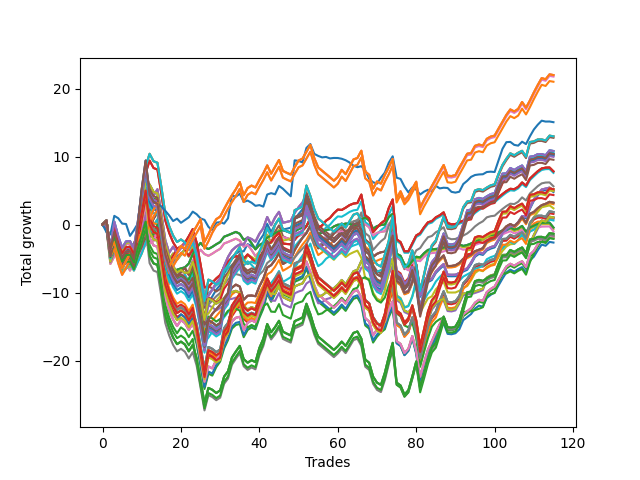

# Short Pointer 003 
- Symbol: NVDA_Unlimited
- Date Range: 02/08/2022 - 07/08/2022
- Trading Period: 7:20-12:30
- Number of Trades: 115



| Name | Win Percent | Profit | Avg Profit / Trade | Avg Time / Trade |      | Name | Win Percent | Profit | Avg Profit / Trade | Avg Time / Trade |
| ---- | ----------- | ------ | ------------------ | ---------------- | ---- | ---- | ----------- | ------ | ------------------ | ---------------- |
| Sorted By <br> Profit | | | | | | Sorted By <br> Win Percentage ||||
| One Hundred Twenty-Six | 69.57 | 10995.00 | 95.61 | 18:41 |     | Sixty-Seven | 73.91 | 1605.00 | 13.96 | 16:17 |
| One Hundred Twenty-One | 69.57 | 10995.00 | 95.61 | 18:41 |     | Fifty-Nine | 73.91 | 1605.00 | 13.96 | 16:17 |
| Eighty-One | 69.57 | 10995.00 | 95.61 | 18:41 |     | Three | 73.91 | 1605.00 | 13.96 | 16:17 |
| One Hundred Eleven | 69.57 | 10885.00 | 94.65 | 18:35 |     | Forty-Three | 73.91 | 1495.00 | 13.00 | 16:11 |
| One Hundred Sixteen | 69.57 | 10505.00 | 91.35 | 18:35 |     | Fifty-One | 73.91 | 300.00 | 2.61 | 16:04 |
| Seventy-Three | 46.09 | 7530.00 | 65.48 | 10:32 |     | Sixty-Five | 72.17 | 3910.00 | 34.00 | 12:30 |
| Seventy-One | 55.65 | 6490.00 | 56.43 | 27:47 |     | Fifty-Seven | 72.17 | 3910.00 | 34.00 | 12:30 |
| Sixty-Three | 55.65 | 6490.00 | 56.43 | 27:47 |     | One | 72.17 | 3910.00 | 34.00 | 12:30 |
| Seven | 55.65 | 6490.00 | 56.43 | 27:47 |     | Forty-One | 72.17 | 3800.00 | 33.04 | 12:23 |
| Forty-Seven | 55.65 | 6380.00 | 55.48 | 27:41 |     | Forty-Nine | 72.17 | 2815.00 | 24.48 | 12:17 |
| One Hundred Twenty-Nine | 54.78 | 5410.00 | 47.04 | 28:45 |     | Sixty-Four | 72.17 | -220.00 | -1.91 | 07:44 |
| One Hundred Twenty-Four | 54.78 | 5410.00 | 47.04 | 28:45 |     | Fifty-Six | 72.17 | -220.00 | -1.91 | 07:44 |
| Eighty-Four | 54.78 | 5410.00 | 47.04 | 28:45 |     | Zero | 72.17 | -220.00 | -1.91 | 07:44 |
| One Hundred Fourteen | 54.78 | 5270.00 | 45.83 | 28:38 |     | Forty | 72.17 | -330.00 | -2.87 | 07:38 |
| One Hundred Thirty | 54.78 | 5195.00 | 45.17 | 29:05 |     | Forty-Eight | 72.17 | -500.00 | -4.35 | 07:38 |
| One Hundred Twenty-Five | 54.78 | 5195.00 | 45.17 | 29:05 |     | One Hundred Twenty-Six | 69.57 | 10995.00 | 95.61 | 18:41 |
| Eighty-Five | 54.78 | 5195.00 | 45.17 | 29:05 |     | One Hundred Twenty-One | 69.57 | 10995.00 | 95.61 | 18:41 |
| Fifty-Five | 55.65 | 5120.00 | 44.52 | 27:32 |     | Eighty-One | 69.57 | 10995.00 | 95.61 | 18:41 |
| One Hundred Fifteen | 54.78 | 5055.00 | 43.96 | 28:58 |     | One Hundred Eleven | 69.57 | 10885.00 | 94.65 | 18:35 |
| One Hundred Ninteen | 54.78 | 4980.00 | 43.30 | 28:25 |     | One Hundred Sixteen | 69.57 | 10505.00 | 91.35 | 18:35 |
| One Hundred Twenty | 54.78 | 4765.00 | 41.43 | 28:45 |     | Sixty-Six | 65.22 | 2500.00 | 21.74 | 18:11 |
| Sixty-Five | 72.17 | 3910.00 | 34.00 | 12:30 |     | Fifty-Eight | 65.22 | 2500.00 | 21.74 | 18:11 |
| Fifty-Seven | 72.17 | 3910.00 | 34.00 | 12:30 |     | Two | 65.22 | 2500.00 | 21.74 | 18:11 |
| One | 72.17 | 3910.00 | 34.00 | 12:30 |     | Forty-Two | 65.22 | 2390.00 | 20.78 | 18:04 |
| Forty-One | 72.17 | 3800.00 | 33.04 | 12:23 |     | Fifty | 65.22 | 1195.00 | 10.39 | 17:58 |
| Forty-Nine | 72.17 | 2815.00 | 24.48 | 12:17 |     | Seventy | 60.00 | 525.00 | 4.57 | 20:15 |
| One Hundred Twenty-Eight | 54.78 | 2600.00 | 22.61 | 28:05 |     | Sixty-Two | 60.00 | 525.00 | 4.57 | 20:15 |
| One Hundred Twenty-Three | 54.78 | 2600.00 | 22.61 | 28:05 |     | Six | 60.00 | 525.00 | 4.57 | 20:15 |
| Eighty-Three | 54.78 | 2600.00 | 22.61 | 28:05 |     | Forty-Six | 60.00 | 415.00 | 3.61 | 20:09 |
| Sixty-Six | 65.22 | 2500.00 | 21.74 | 18:11 |     | Fifty-Four | 60.00 | -845.00 | -7.35 | 20:00 |
| Fifty-Eight | 65.22 | 2500.00 | 21.74 | 18:11 |     | Sixty-Eight | 58.26 | -895.00 | -7.78 | 22:17 |
| Two | 65.22 | 2500.00 | 21.74 | 18:11 |     | Sixty | 58.26 | -895.00 | -7.78 | 22:17 |
| One Hundred Thirteen | 54.78 | 2460.00 | 21.39 | 27:58 |     | Four | 58.26 | -895.00 | -7.78 | 22:17 |
| Forty-Two | 65.22 | 2390.00 | 20.78 | 18:04 |     | Forty-Four | 58.26 | -1035.00 | -9.00 | 22:11 |
| One Hundred Eighteen | 54.78 | 2170.00 | 18.87 | 27:45 |     | Fifty-Two | 58.26 | -1325.00 | -11.52 | 21:57 |
| Sixty-Seven | 73.91 | 1605.00 | 13.96 | 16:17 |     | Seventy-One | 55.65 | 6490.00 | 56.43 | 27:47 |
| Fifty-Nine | 73.91 | 1605.00 | 13.96 | 16:17 |     | Sixty-Three | 55.65 | 6490.00 | 56.43 | 27:47 |
| Three | 73.91 | 1605.00 | 13.96 | 16:17 |     | Seven | 55.65 | 6490.00 | 56.43 | 27:47 |
| Forty-Three | 73.91 | 1495.00 | 13.00 | 16:11 |     | Forty-Seven | 55.65 | 6380.00 | 55.48 | 27:41 |
| Fifty | 65.22 | 1195.00 | 10.39 | 17:58 |     | Fifty-Five | 55.65 | 5120.00 | 44.52 | 27:32 |
| Sixty-Nine | 54.78 | 920.00 | 8.00 | 26:20 |     | One Hundred Twenty-Seven | 55.65 | -680.00 | -5.91 | 26:45 |
| Sixty-One | 54.78 | 920.00 | 8.00 | 26:20 |     | One Hundred Twenty-Two | 55.65 | -680.00 | -5.91 | 26:45 |
| Five | 54.78 | 920.00 | 8.00 | 26:20 |     | Eighty-Two | 55.65 | -680.00 | -5.91 | 26:45 |
| Forty-Five | 54.78 | 780.00 | 6.78 | 26:14 |     | One Hundred Twelve | 55.65 | -820.00 | -7.13 | 26:39 |
| Seventy | 60.00 | 525.00 | 4.57 | 20:15 |     | One Hundred Seventeen | 55.65 | -1045.00 | -9.09 | 26:27 |
| Sixty-Two | 60.00 | 525.00 | 4.57 | 20:15 |     | One Hundred Twenty-Nine | 54.78 | 5410.00 | 47.04 | 28:45 |
| Six | 60.00 | 525.00 | 4.57 | 20:15 |     | One Hundred Twenty-Four | 54.78 | 5410.00 | 47.04 | 28:45 |
| Fifty-Three | 54.78 | 490.00 | 4.26 | 26:00 |     | Eighty-Four | 54.78 | 5410.00 | 47.04 | 28:45 |
| Forty-Six | 60.00 | 415.00 | 3.61 | 20:09 |     | One Hundred Fourteen | 54.78 | 5270.00 | 45.83 | 28:38 |
| Fifty-One | 73.91 | 300.00 | 2.61 | 16:04 |     | One Hundred Thirty | 54.78 | 5195.00 | 45.17 | 29:05 |
| Sixty-Four | 72.17 | -220.00 | -1.91 | 07:44 |     | One Hundred Twenty-Five | 54.78 | 5195.00 | 45.17 | 29:05 |
| Fifty-Six | 72.17 | -220.00 | -1.91 | 07:44 |     | Eighty-Five | 54.78 | 5195.00 | 45.17 | 29:05 |
| Zero | 72.17 | -220.00 | -1.91 | 07:44 |     | One Hundred Fifteen | 54.78 | 5055.00 | 43.96 | 28:58 |
| Forty | 72.17 | -330.00 | -2.87 | 07:38 |     | One Hundred Ninteen | 54.78 | 4980.00 | 43.30 | 28:25 |
| Forty-Eight | 72.17 | -500.00 | -4.35 | 07:38 |     | One Hundred Twenty | 54.78 | 4765.00 | 41.43 | 28:45 |
| One Hundred Twenty-Seven | 55.65 | -680.00 | -5.91 | 26:45 |     | One Hundred Twenty-Eight | 54.78 | 2600.00 | 22.61 | 28:05 |
| One Hundred Twenty-Two | 55.65 | -680.00 | -5.91 | 26:45 |     | One Hundred Twenty-Three | 54.78 | 2600.00 | 22.61 | 28:05 |
| Eighty-Two | 55.65 | -680.00 | -5.91 | 26:45 |     | Eighty-Three | 54.78 | 2600.00 | 22.61 | 28:05 |
| One Hundred Twelve | 55.65 | -820.00 | -7.13 | 26:39 |     | One Hundred Thirteen | 54.78 | 2460.00 | 21.39 | 27:58 |
| Fifty-Four | 60.00 | -845.00 | -7.35 | 20:00 |     | One Hundred Eighteen | 54.78 | 2170.00 | 18.87 | 27:45 |
| Sixty-Eight | 58.26 | -895.00 | -7.78 | 22:17 |     | Sixty-Nine | 54.78 | 920.00 | 8.00 | 26:20 |
| Sixty | 58.26 | -895.00 | -7.78 | 22:17 |     | Sixty-One | 54.78 | 920.00 | 8.00 | 26:20 |
| Four | 58.26 | -895.00 | -7.78 | 22:17 |     | Five | 54.78 | 920.00 | 8.00 | 26:20 |
| Forty-Four | 58.26 | -1035.00 | -9.00 | 22:11 |     | Forty-Five | 54.78 | 780.00 | 6.78 | 26:14 |
| One Hundred Seventeen | 55.65 | -1045.00 | -9.09 | 26:27 |     | Fifty-Three | 54.78 | 490.00 | 4.26 | 26:00 |
| Fifty-Two | 58.26 | -1325.00 | -11.52 | 21:57 |     | Seventy-Three | 46.09 | 7530.00 | 65.48 | 10:32 |

## NO STOPLOSS

### Test Zero
* Sell when price hits the middle line of the 20p bollinger
* No Stoploss
* Results:
```
Total Trades: 115
Percent Up: 27.83
Percent Down: 72.17
Total Points Moved Down: -0.44
Potential Profit: -220.00
Total Points Ups: 33.31 Count Ups: 32
Total Points Downs: 32.87 Count Downs: 83
```

<details><summary>Trades</summary>

<code>In: 2022-02-08 09:36:00		Out: 2022-02-08 09:51:20		Total Position Time: 15:20		Total Move Down: -0.62		Total to Date: -0.62</code> <br />
<code>In: 2022-02-09 07:46:00		Out: 2022-02-09 08:15:55		Total Position Time: 29:55		Total Move Down: -4.18		Total to Date: -4.80</code> <br />
<code>In: 2022-02-10 07:44:00		Out: 2022-02-10 07:47:15		Total Position Time: 03:15		Total Move Down: 1.11		Total to Date: -3.69</code> <br />
<code>In: 2022-02-14 07:52:00		Out: 2022-02-14 08:00:30		Total Position Time: 08:30		Total Move Down: 0.63		Total to Date: -3.06</code> <br />
<code>In: 2022-02-16 07:33:00		Out: 2022-02-16 07:58:55		Total Position Time: 25:55		Total Move Down: -1.73		Total to Date: -4.79</code> <br />
<code>In: 2022-02-16 07:47:00		Out: 2022-02-16 07:58:55		Total Position Time: 11:55		Total Move Down: 0.15		Total to Date: -4.64</code> <br />
<code>In: 2022-02-17 08:17:00		Out: 2022-02-17 08:33:15		Total Position Time: 16:15		Total Move Down: -1.13		Total to Date: -5.77</code> <br />
<code>In: 2022-02-18 11:34:00		Out: 2022-02-18 11:39:35		Total Position Time: 05:35		Total Move Down: 1.14		Total to Date: -4.63</code> <br />
<code>In: 2022-02-18 12:04:00		Out: 2022-02-18 12:07:35		Total Position Time: 03:35		Total Move Down: 0.90		Total to Date: -3.73</code> <br />
<code>In: 2022-02-18 12:05:00		Out: 2022-02-18 12:07:35		Total Position Time: 02:35		Total Move Down: 0.83		Total to Date: -2.90</code> <br />
<code>In: 2022-02-22 07:31:00		Out: 2022-02-22 07:32:45		Total Position Time: 01:45		Total Move Down: 0.94		Total to Date: -1.96</code> <br />
<code>In: 2022-02-22 11:34:00		Out: 2022-02-22 11:42:35		Total Position Time: 08:35		Total Move Down: 0.20		Total to Date: -1.76</code> <br />
<code>In: 2022-02-24 07:52:00		Out: 2022-02-24 08:02:50		Total Position Time: 10:50		Total Move Down: 0.34		Total to Date: -1.42</code> <br />
<code>In: 2022-02-24 10:42:00		Out: 2022-02-24 10:45:45		Total Position Time: 03:45		Total Move Down: 1.40		Total to Date: -0.02</code> <br />
<code>In: 2022-02-24 11:24:00		Out: 2022-02-24 11:47:35		Total Position Time: 23:35		Total Move Down: -2.18		Total to Date: -2.20</code> <br />
<code>In: 2022-02-24 12:10:00		Out: 2022-02-24 12:39:55		Total Position Time: 29:55		Total Move Down: -3.91		Total to Date: -6.11</code> <br />
<code>In: 2022-02-24 12:30:00		Out: 2022-02-24 12:44:05		Total Position Time: 14:05		Total Move Down: -1.62		Total to Date: -7.73</code> <br />
<code>In: 2022-02-25 07:51:00		Out: 2022-02-25 07:59:40		Total Position Time: 08:40		Total Move Down: 0.38		Total to Date: -7.35</code> <br />
<code>In: 2022-03-02 08:11:00		Out: 2022-03-02 08:18:35		Total Position Time: 07:35		Total Move Down: 0.71		Total to Date: -6.64</code> <br />
<code>In: 2022-03-02 08:35:00		Out: 2022-03-02 08:35:35		Total Position Time: 00:35		Total Move Down: 0.19		Total to Date: -6.45</code> <br />
<code>In: 2022-03-02 09:18:00		Out: 2022-03-02 09:23:30		Total Position Time: 05:30		Total Move Down: 0.15		Total to Date: -6.30</code> <br />
<code>In: 2022-03-03 08:46:00		Out: 2022-03-03 08:46:55		Total Position Time: 00:55		Total Move Down: 0.56		Total to Date: -5.74</code> <br />
<code>In: 2022-03-03 09:39:00		Out: 2022-03-03 09:41:50		Total Position Time: 02:50		Total Move Down: 1.40		Total to Date: -4.34</code> <br />
<code>In: 2022-03-08 09:23:00		Out: 2022-03-08 09:25:40		Total Position Time: 02:40		Total Move Down: 0.94		Total to Date: -3.40</code> <br />
<code>In: 2022-03-08 09:24:00		Out: 2022-03-08 09:25:40		Total Position Time: 01:40		Total Move Down: 0.70		Total to Date: -2.70</code> <br />
<code>In: 2022-03-08 09:42:00		Out: 2022-03-08 09:51:30		Total Position Time: 09:30		Total Move Down: -0.64		Total to Date: -3.34</code> <br />
<code>In: 2022-03-08 10:06:00		Out: 2022-03-08 10:19:15		Total Position Time: 13:15		Total Move Down: -0.26		Total to Date: -3.60</code> <br />
<code>In: 2022-03-09 09:51:00		Out: 2022-03-09 09:52:45		Total Position Time: 01:45		Total Move Down: 0.32		Total to Date: -3.28</code> <br />
<code>In: 2022-03-09 10:32:00		Out: 2022-03-09 10:32:15		Total Position Time: 00:15		Total Move Down: 0.38		Total to Date: -2.90</code> <br />
<code>In: 2022-03-09 12:12:00		Out: 2022-03-09 12:15:30		Total Position Time: 03:30		Total Move Down: 0.33		Total to Date: -2.57</code> <br />
<code>In: 2022-03-10 07:22:00		Out: 2022-03-10 07:24:25		Total Position Time: 02:25		Total Move Down: 0.78		Total to Date: -1.79</code> <br />
<code>In: 2022-03-10 11:55:00		Out: 2022-03-10 12:00:20		Total Position Time: 05:20		Total Move Down: 0.22		Total to Date: -1.57</code> <br />
<code>In: 2022-03-11 07:54:00		Out: 2022-03-11 07:54:20		Total Position Time: 00:20		Total Move Down: 0.25		Total to Date: -1.32</code> <br />
<code>In: 2022-03-11 10:28:00		Out: 2022-03-11 10:32:05		Total Position Time: 04:05		Total Move Down: 0.24		Total to Date: -1.08</code> <br />
<code>In: 2022-03-11 10:52:00		Out: 2022-03-11 10:52:10		Total Position Time: 00:10		Total Move Down: -0.28		Total to Date: -1.36</code> <br />
<code>In: 2022-03-15 07:42:00		Out: 2022-03-15 07:56:10		Total Position Time: 14:10		Total Move Down: -0.90		Total to Date: -2.26</code> <br />
<code>In: 2022-03-17 12:06:00		Out: 2022-03-17 12:08:50		Total Position Time: 02:50		Total Move Down: 0.29		Total to Date: -1.97</code> <br />
<code>In: 2022-03-18 12:13:00		Out: 2022-03-18 12:30:45		Total Position Time: 17:45		Total Move Down: -0.77		Total to Date: -2.74</code> <br />
<code>In: 2022-03-18 12:14:00		Out: 2022-03-18 12:30:45		Total Position Time: 16:45		Total Move Down: -0.91		Total to Date: -3.65</code> <br />
<code>In: 2022-03-18 12:27:00		Out: 2022-03-18 12:30:45		Total Position Time: 03:45		Total Move Down: 0.64		Total to Date: -3.01</code> <br />
<code>In: 2022-03-18 12:28:00		Out: 2022-03-18 12:30:45		Total Position Time: 02:45		Total Move Down: 0.31		Total to Date: -2.70</code> <br />
<code>In: 2022-03-28 07:53:00		Out: 2022-03-28 07:57:10		Total Position Time: 04:10		Total Move Down: 0.80		Total to Date: -1.90</code> <br />
<code>In: 2022-03-28 11:28:00		Out: 2022-03-28 11:35:05		Total Position Time: 07:05		Total Move Down: 0.27		Total to Date: -1.63</code> <br />
<code>In: 2022-03-29 08:52:00		Out: 2022-03-29 08:56:25		Total Position Time: 04:25		Total Move Down: 0.38		Total to Date: -1.25</code> <br />
<code>In: 2022-03-29 11:04:00		Out: 2022-03-29 11:05:15		Total Position Time: 01:15		Total Move Down: 0.25		Total to Date: -1.00</code> <br />
<code>In: 2022-03-29 11:56:00		Out: 2022-03-29 12:01:05		Total Position Time: 05:05		Total Move Down: 0.17		Total to Date: -0.83</code> <br />
<code>In: 2022-03-29 12:26:00		Out: 2022-03-29 12:38:20		Total Position Time: 12:20		Total Move Down: -0.17		Total to Date: -1.00</code> <br />
<code>In: 2022-03-29 12:28:00		Out: 2022-03-29 12:38:20		Total Position Time: 10:20		Total Move Down: -0.14		Total to Date: -1.14</code> <br />
<code>In: 2022-03-30 07:39:00		Out: 2022-03-30 07:42:05		Total Position Time: 03:05		Total Move Down: 0.12		Total to Date: -1.02</code> <br />
<code>In: 2022-03-31 11:26:00		Out: 2022-03-31 11:31:10		Total Position Time: 05:10		Total Move Down: 0.35		Total to Date: -0.67</code> <br />
<code>In: 2022-03-31 11:27:00		Out: 2022-03-31 11:31:10		Total Position Time: 04:10		Total Move Down: 0.23		Total to Date: -0.44</code> <br />
<code>In: 2022-03-31 12:05:00		Out: 2022-03-31 12:11:15		Total Position Time: 06:15		Total Move Down: 0.24		Total to Date: -0.20</code> <br />
<code>In: 2022-04-07 11:29:00		Out: 2022-04-07 11:29:30		Total Position Time: 00:30		Total Move Down: 0.80		Total to Date: 0.60</code> <br />
<code>In: 2022-04-07 11:57:00		Out: 2022-04-07 12:19:25		Total Position Time: 22:25		Total Move Down: -1.54		Total to Date: -0.94</code> <br />
<code>In: 2022-04-07 12:04:00		Out: 2022-04-07 12:19:25		Total Position Time: 15:25		Total Move Down: -0.40		Total to Date: -1.34</code> <br />
<code>In: 2022-04-08 09:24:00		Out: 2022-04-08 09:31:35		Total Position Time: 07:35		Total Move Down: 0.12		Total to Date: -1.22</code> <br />
<code>In: 2022-04-08 09:28:00		Out: 2022-04-08 09:31:35		Total Position Time: 03:35		Total Move Down: 0.41		Total to Date: -0.81</code> <br />
<code>In: 2022-04-08 09:24:00		Out: 2022-04-08 09:31:35		Total Position Time: 07:35		Total Move Down: 0.12		Total to Date: -0.69</code> <br />
<code>In: 2022-04-08 09:28:00		Out: 2022-04-08 09:31:35		Total Position Time: 03:35		Total Move Down: 0.41		Total to Date: -0.28</code> <br />
<code>In: 2022-04-11 11:54:00		Out: 2022-04-11 12:01:05		Total Position Time: 07:05		Total Move Down: 0.25		Total to Date: -0.03</code> <br />
<code>In: 2022-04-13 08:10:00		Out: 2022-04-13 08:20:55		Total Position Time: 10:55		Total Move Down: 0.02		Total to Date: -0.01</code> <br />
<code>In: 2022-04-13 11:51:00		Out: 2022-04-13 12:00:40		Total Position Time: 09:40		Total Move Down: 0.15		Total to Date: 0.14</code> <br />
<code>In: 2022-04-18 11:28:00		Out: 2022-04-18 11:40:45		Total Position Time: 12:45		Total Move Down: -0.04		Total to Date: 0.10</code> <br />
<code>In: 2022-04-18 11:29:00		Out: 2022-04-18 11:40:45		Total Position Time: 11:45		Total Move Down: -0.19		Total to Date: -0.09</code> <br />
<code>In: 2022-04-19 07:44:00		Out: 2022-04-19 07:55:20		Total Position Time: 11:20		Total Move Down: -0.05		Total to Date: -0.14</code> <br />
<code>In: 2022-05-02 09:02:00		Out: 2022-05-02 09:03:55		Total Position Time: 01:55		Total Move Down: 0.90		Total to Date: 0.76</code> <br />
<code>In: 2022-05-02 11:52:00		Out: 2022-05-02 11:58:05		Total Position Time: 06:05		Total Move Down: 0.28		Total to Date: 1.04</code> <br />
<code>In: 2022-05-02 12:30:00		Out: 2022-05-02 12:39:35		Total Position Time: 09:35		Total Move Down: -0.45		Total to Date: 0.59</code> <br />
<code>In: 2022-05-03 10:03:00		Out: 2022-05-03 10:28:05		Total Position Time: 25:05		Total Move Down: -1.21		Total to Date: -0.62</code> <br />
<code>In: 2022-05-04 10:06:00		Out: 2022-05-04 10:09:00		Total Position Time: 03:00		Total Move Down: 0.39		Total to Date: -0.23</code> <br />
<code>In: 2022-05-04 10:37:00		Out: 2022-05-04 10:38:00		Total Position Time: 01:00		Total Move Down: 0.16		Total to Date: -0.07</code> <br />
<code>In: 2022-05-04 10:38:00		Out: 2022-05-04 10:38:55		Total Position Time: 00:55		Total Move Down: 0.08		Total to Date: 0.01</code> <br />
<code>In: 2022-05-04 11:03:00		Out: 2022-05-04 11:07:05		Total Position Time: 04:05		Total Move Down: 1.09		Total to Date: 1.10</code> <br />
<code>In: 2022-05-04 11:07:00		Out: 2022-05-04 11:07:10		Total Position Time: 00:10		Total Move Down: 0.47		Total to Date: 1.57</code> <br />
<code>In: 2022-05-04 11:51:00		Out: 2022-05-04 12:20:55		Total Position Time: 29:55		Total Move Down: -5.86		Total to Date: -4.29</code> <br />
<code>In: 2022-05-04 12:19:00		Out: 2022-05-04 12:38:40		Total Position Time: 19:40		Total Move Down: -0.31		Total to Date: -4.60</code> <br />
<code>In: 2022-05-04 12:20:00		Out: 2022-05-04 12:38:40		Total Position Time: 18:40		Total Move Down: -1.25		Total to Date: -5.85</code> <br />
<code>In: 2022-05-05 10:05:00		Out: 2022-05-05 10:14:00		Total Position Time: 09:00		Total Move Down: -0.33		Total to Date: -6.18</code> <br />
<code>In: 2022-05-05 10:12:00		Out: 2022-05-05 10:14:00		Total Position Time: 02:00		Total Move Down: 0.83		Total to Date: -5.35</code> <br />
<code>In: 2022-05-06 07:21:00		Out: 2022-05-06 07:29:05		Total Position Time: 08:05		Total Move Down: 0.61		Total to Date: -4.74</code> <br />
<code>In: 2022-05-06 07:52:00		Out: 2022-05-06 08:03:20		Total Position Time: 11:20		Total Move Down: -0.09		Total to Date: -4.83</code> <br />
<code>In: 2022-05-31 07:48:00		Out: 2022-05-31 07:50:05		Total Position Time: 02:05		Total Move Down: 0.62		Total to Date: -4.21</code> <br />
<code>In: 2022-05-31 07:49:00		Out: 2022-05-31 07:50:05		Total Position Time: 01:05		Total Move Down: 0.48		Total to Date: -3.73</code> <br />
<code>In: 2022-05-31 09:47:00		Out: 2022-05-31 09:53:25		Total Position Time: 06:25		Total Move Down: 0.09		Total to Date: -3.64</code> <br />
<code>In: 2022-06-02 08:45:00		Out: 2022-06-02 08:54:20		Total Position Time: 09:20		Total Move Down: 0.05		Total to Date: -3.59</code> <br />
<code>In: 2022-06-03 10:06:00		Out: 2022-06-03 10:13:25		Total Position Time: 07:25		Total Move Down: 0.04		Total to Date: -3.55</code> <br />
<code>In: 2022-06-06 11:01:00		Out: 2022-06-06 11:07:20		Total Position Time: 06:20		Total Move Down: 0.16		Total to Date: -3.39</code> <br />
<code>In: 2022-06-07 07:31:00		Out: 2022-06-07 07:36:15		Total Position Time: 05:15		Total Move Down: 0.18		Total to Date: -3.21</code> <br />
<code>In: 2022-06-07 10:12:00		Out: 2022-06-07 10:23:45		Total Position Time: 11:45		Total Move Down: -0.03		Total to Date: -3.24</code> <br />
<code>In: 2022-06-07 11:12:00		Out: 2022-06-07 11:20:25		Total Position Time: 08:25		Total Move Down: 0.04		Total to Date: -3.20</code> <br />
<code>In: 2022-06-07 11:17:00		Out: 2022-06-07 11:20:25		Total Position Time: 03:25		Total Move Down: 0.28		Total to Date: -2.92</code> <br />
<code>In: 2022-06-09 07:33:00		Out: 2022-06-09 07:42:05		Total Position Time: 09:05		Total Move Down: -0.23		Total to Date: -3.15</code> <br />
<code>In: 2022-06-09 10:14:00		Out: 2022-06-09 10:15:35		Total Position Time: 01:35		Total Move Down: 0.14		Total to Date: -3.01</code> <br />
<code>In: 2022-06-10 12:03:00		Out: 2022-06-10 12:03:25		Total Position Time: 00:25		Total Move Down: 0.22		Total to Date: -2.79</code> <br />
<code>In: 2022-06-10 12:29:00		Out: 2022-06-10 12:30:30		Total Position Time: 01:30		Total Move Down: 0.34		Total to Date: -2.45</code> <br />
<code>In: 2022-06-21 10:01:00		Out: 2022-06-21 10:05:45		Total Position Time: 04:45		Total Move Down: 0.21		Total to Date: -2.24</code> <br />
<code>In: 2022-06-22 10:24:00		Out: 2022-06-22 10:27:55		Total Position Time: 03:55		Total Move Down: 0.13		Total to Date: -2.11</code> <br />
<code>In: 2022-06-23 07:45:00		Out: 2022-06-23 07:49:50		Total Position Time: 04:50		Total Move Down: 0.41		Total to Date: -1.70</code> <br />
<code>In: 2022-06-24 11:51:00		Out: 2022-06-24 11:54:10		Total Position Time: 03:10		Total Move Down: 0.16		Total to Date: -1.54</code> <br />
<code>In: 2022-06-24 11:52:00		Out: 2022-06-24 11:54:10		Total Position Time: 02:10		Total Move Down: 0.06		Total to Date: -1.48</code> <br />
<code>In: 2022-06-27 08:47:00		Out: 2022-06-27 08:51:30		Total Position Time: 04:30		Total Move Down: 0.32		Total to Date: -1.16</code> <br />
<code>In: 2022-06-27 08:48:00		Out: 2022-06-27 08:51:30		Total Position Time: 03:30		Total Move Down: 0.29		Total to Date: -0.87</code> <br />
<code>In: 2022-06-29 10:12:00		Out: 2022-06-29 10:12:30		Total Position Time: 00:30		Total Move Down: 0.23		Total to Date: -0.64</code> <br />
<code>In: 2022-06-29 11:09:00		Out: 2022-06-29 11:11:30		Total Position Time: 02:30		Total Move Down: 0.21		Total to Date: -0.43</code> <br />
<code>In: 2022-06-29 12:12:00		Out: 2022-06-29 12:32:25		Total Position Time: 20:25		Total Move Down: -0.31		Total to Date: -0.74</code> <br />
<code>In: 2022-06-30 09:29:00		Out: 2022-06-30 09:38:00		Total Position Time: 09:00		Total Move Down: 0.15		Total to Date: -0.59</code> <br />
<code>In: 2022-07-05 11:41:00		Out: 2022-07-05 11:45:45		Total Position Time: 04:45		Total Move Down: 0.39		Total to Date: -0.20</code> <br />
<code>In: 2022-07-06 07:50:00		Out: 2022-07-06 08:04:10		Total Position Time: 14:10		Total Move Down: -0.86		Total to Date: -1.06</code> <br />
<code>In: 2022-07-06 08:02:00		Out: 2022-07-06 08:04:10		Total Position Time: 02:10		Total Move Down: 0.63		Total to Date: -0.43</code> <br />
<code>In: 2022-07-06 11:10:00		Out: 2022-07-06 11:10:10		Total Position Time: 00:10		Total Move Down: 0.26		Total to Date: -0.17</code> <br />
<code>In: 2022-07-07 08:13:00		Out: 2022-07-07 08:19:15		Total Position Time: 06:15		Total Move Down: 0.27		Total to Date: 0.10</code> <br />
<code>In: 2022-07-07 08:14:00		Out: 2022-07-07 08:19:15		Total Position Time: 05:15		Total Move Down: 0.15		Total to Date: 0.25</code> <br />
<code>In: 2022-07-07 09:31:00		Out: 2022-07-07 09:40:30		Total Position Time: 09:30		Total Move Down: 0.02		Total to Date: 0.27</code> <br />
<code>In: 2022-07-07 11:17:00		Out: 2022-07-07 11:30:00		Total Position Time: 13:00		Total Move Down: 0.01		Total to Date: 0.28</code> <br />
<code>In: 2022-07-08 11:26:00		Out: 2022-07-08 11:46:05		Total Position Time: 20:05		Total Move Down: -0.72		Total to Date: -0.44</code> <br />


</details>

### Test One
* Sell when the price hits the upper line of the 20p 1std bollinger
* No Stoploss
* Results:
```
Total Trades: 115
Percent Up: 27.83
Percent Down: 72.17
Total Points Moved Down: 7.82
Potential Profit: 3910.00
Total Points Ups: 45.05 Count Ups: 32
Total Points Downs: 52.87 Count Downs: 83
```

<details><summary>Trades</summary>

<code>In: 2022-02-08 09:36:00		Out: 2022-02-08 09:56:30		Total Position Time: 20:30		Total Move Down: -0.37		Total to Date: -0.37</code> <br />
<code>In: 2022-02-09 07:46:00		Out: 2022-02-09 08:15:55		Total Position Time: 29:55		Total Move Down: -4.18		Total to Date: -4.55</code> <br />
<code>In: 2022-02-10 07:44:00		Out: 2022-02-10 07:50:40		Total Position Time: 06:40		Total Move Down: 1.49		Total to Date: -3.06</code> <br />
<code>In: 2022-02-14 07:52:00		Out: 2022-02-14 08:06:20		Total Position Time: 14:20		Total Move Down: 0.26		Total to Date: -2.80</code> <br />
<code>In: 2022-02-16 07:33:00		Out: 2022-02-16 08:00:25		Total Position Time: 27:25		Total Move Down: -1.27		Total to Date: -4.07</code> <br />
<code>In: 2022-02-16 07:47:00		Out: 2022-02-16 08:00:25		Total Position Time: 13:25		Total Move Down: 0.61		Total to Date: -3.46</code> <br />
<code>In: 2022-02-17 08:17:00		Out: 2022-02-17 08:33:50		Total Position Time: 16:50		Total Move Down: -0.48		Total to Date: -3.94</code> <br />
<code>In: 2022-02-18 11:34:00		Out: 2022-02-18 11:45:00		Total Position Time: 11:00		Total Move Down: 1.15		Total to Date: -2.79</code> <br />
<code>In: 2022-02-18 12:04:00		Out: 2022-02-18 12:14:10		Total Position Time: 10:10		Total Move Down: 1.18		Total to Date: -1.61</code> <br />
<code>In: 2022-02-18 12:05:00		Out: 2022-02-18 12:14:10		Total Position Time: 09:10		Total Move Down: 1.11		Total to Date: -0.50</code> <br />
<code>In: 2022-02-22 07:31:00		Out: 2022-02-22 07:36:55		Total Position Time: 05:55		Total Move Down: 1.58		Total to Date: 1.08</code> <br />
<code>In: 2022-02-22 11:34:00		Out: 2022-02-22 11:44:20		Total Position Time: 10:20		Total Move Down: 1.10		Total to Date: 2.18</code> <br />
<code>In: 2022-02-24 07:52:00		Out: 2022-02-24 08:04:05		Total Position Time: 12:05		Total Move Down: 1.16		Total to Date: 3.34</code> <br />
<code>In: 2022-02-24 10:42:00		Out: 2022-02-24 11:01:25		Total Position Time: 19:25		Total Move Down: 0.33		Total to Date: 3.67</code> <br />
<code>In: 2022-02-24 11:24:00		Out: 2022-02-24 11:53:55		Total Position Time: 29:55		Total Move Down: -3.57		Total to Date: 0.10</code> <br />
<code>In: 2022-02-24 12:10:00		Out: 2022-02-24 12:39:55		Total Position Time: 29:55		Total Move Down: -3.91		Total to Date: -3.81</code> <br />
<code>In: 2022-02-24 12:30:00		Out: 2022-02-24 12:46:00		Total Position Time: 16:00		Total Move Down: -1.85		Total to Date: -5.66</code> <br />
<code>In: 2022-02-25 07:51:00		Out: 2022-02-25 08:00:35		Total Position Time: 09:35		Total Move Down: 1.03		Total to Date: -4.63</code> <br />
<code>In: 2022-03-02 08:11:00		Out: 2022-03-02 08:22:55		Total Position Time: 11:55		Total Move Down: 0.98		Total to Date: -3.65</code> <br />
<code>In: 2022-03-02 08:35:00		Out: 2022-03-02 08:43:55		Total Position Time: 08:55		Total Move Down: 0.38		Total to Date: -3.27</code> <br />
<code>In: 2022-03-02 09:18:00		Out: 2022-03-02 09:25:30		Total Position Time: 07:30		Total Move Down: 0.58		Total to Date: -2.69</code> <br />
<code>In: 2022-03-03 08:46:00		Out: 2022-03-03 08:49:30		Total Position Time: 03:30		Total Move Down: 0.97		Total to Date: -1.72</code> <br />
<code>In: 2022-03-03 09:39:00		Out: 2022-03-03 09:53:20		Total Position Time: 14:20		Total Move Down: 1.05		Total to Date: -0.67</code> <br />
<code>In: 2022-03-08 09:23:00		Out: 2022-03-08 09:52:55		Total Position Time: 29:55		Total Move Down: -1.99		Total to Date: -2.66</code> <br />
<code>In: 2022-03-08 09:24:00		Out: 2022-03-08 09:53:55		Total Position Time: 29:55		Total Move Down: -3.24		Total to Date: -5.90</code> <br />
<code>In: 2022-03-08 09:42:00		Out: 2022-03-08 10:11:55		Total Position Time: 29:55		Total Move Down: -3.34		Total to Date: -9.24</code> <br />
<code>In: 2022-03-08 10:06:00		Out: 2022-03-08 10:21:25		Total Position Time: 15:25		Total Move Down: 0.07		Total to Date: -9.17</code> <br />
<code>In: 2022-03-09 09:51:00		Out: 2022-03-09 10:00:15		Total Position Time: 09:15		Total Move Down: 0.63		Total to Date: -8.54</code> <br />
<code>In: 2022-03-09 10:32:00		Out: 2022-03-09 10:33:00		Total Position Time: 01:00		Total Move Down: 0.61		Total to Date: -7.93</code> <br />
<code>In: 2022-03-09 12:12:00		Out: 2022-03-09 12:18:30		Total Position Time: 06:30		Total Move Down: 0.50		Total to Date: -7.43</code> <br />
<code>In: 2022-03-10 07:22:00		Out: 2022-03-10 07:30:05		Total Position Time: 08:05		Total Move Down: 1.21		Total to Date: -6.22</code> <br />
<code>In: 2022-03-10 11:55:00		Out: 2022-03-10 12:01:15		Total Position Time: 06:15		Total Move Down: 0.78		Total to Date: -5.44</code> <br />
<code>In: 2022-03-11 07:54:00		Out: 2022-03-11 07:56:35		Total Position Time: 02:35		Total Move Down: 0.52		Total to Date: -4.92</code> <br />
<code>In: 2022-03-11 10:28:00		Out: 2022-03-11 10:39:00		Total Position Time: 11:00		Total Move Down: 0.27		Total to Date: -4.65</code> <br />
<code>In: 2022-03-11 10:52:00		Out: 2022-03-11 10:52:30		Total Position Time: 00:30		Total Move Down: -0.15		Total to Date: -4.80</code> <br />
<code>In: 2022-03-15 07:42:00		Out: 2022-03-15 07:58:05		Total Position Time: 16:05		Total Move Down: -0.25		Total to Date: -5.05</code> <br />
<code>In: 2022-03-17 12:06:00		Out: 2022-03-17 12:11:45		Total Position Time: 05:45		Total Move Down: 0.65		Total to Date: -4.40</code> <br />
<code>In: 2022-03-18 12:13:00		Out: 2022-03-18 12:36:30		Total Position Time: 23:30		Total Move Down: -0.53		Total to Date: -4.93</code> <br />
<code>In: 2022-03-18 12:14:00		Out: 2022-03-18 12:36:30		Total Position Time: 22:30		Total Move Down: -0.67		Total to Date: -5.60</code> <br />
<code>In: 2022-03-18 12:27:00		Out: 2022-03-18 12:36:30		Total Position Time: 09:30		Total Move Down: 0.88		Total to Date: -4.72</code> <br />
<code>In: 2022-03-18 12:28:00		Out: 2022-03-18 12:36:30		Total Position Time: 08:30		Total Move Down: 0.55		Total to Date: -4.17</code> <br />
<code>In: 2022-03-28 07:53:00		Out: 2022-03-28 08:00:15		Total Position Time: 07:15		Total Move Down: 1.15		Total to Date: -3.02</code> <br />
<code>In: 2022-03-28 11:28:00		Out: 2022-03-28 11:40:10		Total Position Time: 12:10		Total Move Down: 0.45		Total to Date: -2.57</code> <br />
<code>In: 2022-03-29 08:52:00		Out: 2022-03-29 08:59:10		Total Position Time: 07:10		Total Move Down: 0.78		Total to Date: -1.79</code> <br />
<code>In: 2022-03-29 11:04:00		Out: 2022-03-29 11:06:05		Total Position Time: 02:05		Total Move Down: 0.60		Total to Date: -1.19</code> <br />
<code>In: 2022-03-29 11:56:00		Out: 2022-03-29 12:25:55		Total Position Time: 29:55		Total Move Down: -1.60		Total to Date: -2.79</code> <br />
<code>In: 2022-03-29 12:26:00		Out: 2022-03-29 12:42:10		Total Position Time: 16:10		Total Move Down: -0.07		Total to Date: -2.86</code> <br />
<code>In: 2022-03-29 12:28:00		Out: 2022-03-29 12:42:10		Total Position Time: 14:10		Total Move Down: -0.04		Total to Date: -2.90</code> <br />
<code>In: 2022-03-30 07:39:00		Out: 2022-03-30 07:44:50		Total Position Time: 05:50		Total Move Down: 0.66		Total to Date: -2.24</code> <br />
<code>In: 2022-03-31 11:26:00		Out: 2022-03-31 11:35:00		Total Position Time: 09:00		Total Move Down: 0.72		Total to Date: -1.52</code> <br />
<code>In: 2022-03-31 11:27:00		Out: 2022-03-31 11:35:00		Total Position Time: 08:00		Total Move Down: 0.60		Total to Date: -0.92</code> <br />
<code>In: 2022-03-31 12:05:00		Out: 2022-03-31 12:16:35		Total Position Time: 11:35		Total Move Down: 0.67		Total to Date: -0.25</code> <br />
<code>In: 2022-04-07 11:29:00		Out: 2022-04-07 11:36:45		Total Position Time: 07:45		Total Move Down: 1.21		Total to Date: 0.96</code> <br />
<code>In: 2022-04-07 11:57:00		Out: 2022-04-07 12:20:35		Total Position Time: 23:35		Total Move Down: -1.31		Total to Date: -0.35</code> <br />
<code>In: 2022-04-07 12:04:00		Out: 2022-04-07 12:20:35		Total Position Time: 16:35		Total Move Down: -0.17		Total to Date: -0.52</code> <br />
<code>In: 2022-04-08 09:24:00		Out: 2022-04-08 09:35:55		Total Position Time: 11:55		Total Move Down: 0.40		Total to Date: -0.12</code> <br />
<code>In: 2022-04-08 09:28:00		Out: 2022-04-08 09:35:55		Total Position Time: 07:55		Total Move Down: 0.69		Total to Date: 0.57</code> <br />
<code>In: 2022-04-08 09:24:00		Out: 2022-04-08 09:35:55		Total Position Time: 11:55		Total Move Down: 0.40		Total to Date: 0.97</code> <br />
<code>In: 2022-04-08 09:28:00		Out: 2022-04-08 09:35:55		Total Position Time: 07:55		Total Move Down: 0.69		Total to Date: 1.66</code> <br />
<code>In: 2022-04-11 11:54:00		Out: 2022-04-11 12:04:15		Total Position Time: 10:15		Total Move Down: 0.54		Total to Date: 2.20</code> <br />
<code>In: 2022-04-13 08:10:00		Out: 2022-04-13 08:29:35		Total Position Time: 19:35		Total Move Down: -0.05		Total to Date: 2.15</code> <br />
<code>In: 2022-04-13 11:51:00		Out: 2022-04-13 12:01:15		Total Position Time: 10:15		Total Move Down: 0.33		Total to Date: 2.48</code> <br />
<code>In: 2022-04-18 11:28:00		Out: 2022-04-18 11:41:20		Total Position Time: 13:20		Total Move Down: 0.38		Total to Date: 2.86</code> <br />
<code>In: 2022-04-18 11:29:00		Out: 2022-04-18 11:41:20		Total Position Time: 12:20		Total Move Down: 0.23		Total to Date: 3.09</code> <br />
<code>In: 2022-04-19 07:44:00		Out: 2022-04-19 07:59:45		Total Position Time: 15:45		Total Move Down: 0.08		Total to Date: 3.17</code> <br />
<code>In: 2022-05-02 09:02:00		Out: 2022-05-02 09:04:10		Total Position Time: 02:10		Total Move Down: 1.24		Total to Date: 4.41</code> <br />
<code>In: 2022-05-02 11:52:00		Out: 2022-05-02 12:21:55		Total Position Time: 29:55		Total Move Down: -3.06		Total to Date: 1.35</code> <br />
<code>In: 2022-05-02 12:30:00		Out: 2022-05-02 12:44:10		Total Position Time: 14:10		Total Move Down: -0.43		Total to Date: 0.92</code> <br />
<code>In: 2022-05-03 10:03:00		Out: 2022-05-03 10:32:55		Total Position Time: 29:55		Total Move Down: -2.04		Total to Date: -1.12</code> <br />
<code>In: 2022-05-04 10:06:00		Out: 2022-05-04 10:11:25		Total Position Time: 05:25		Total Move Down: 0.67		Total to Date: -0.45</code> <br />
<code>In: 2022-05-04 10:37:00		Out: 2022-05-04 10:41:05		Total Position Time: 04:05		Total Move Down: 0.62		Total to Date: 0.17</code> <br />
<code>In: 2022-05-04 10:38:00		Out: 2022-05-04 10:41:05		Total Position Time: 03:05		Total Move Down: 0.46		Total to Date: 0.63</code> <br />
<code>In: 2022-05-04 11:03:00		Out: 2022-05-04 11:07:20		Total Position Time: 04:20		Total Move Down: 1.80		Total to Date: 2.43</code> <br />
<code>In: 2022-05-04 11:07:00		Out: 2022-05-04 11:07:20		Total Position Time: 00:20		Total Move Down: 1.26		Total to Date: 3.69</code> <br />
<code>In: 2022-05-04 11:51:00		Out: 2022-05-04 12:20:55		Total Position Time: 29:55		Total Move Down: -5.86		Total to Date: -2.17</code> <br />
<code>In: 2022-05-04 12:19:00		Out: 2022-05-04 12:46:00		Total Position Time: 27:00		Total Move Down: -0.41		Total to Date: -2.58</code> <br />
<code>In: 2022-05-04 12:20:00		Out: 2022-05-04 12:46:00		Total Position Time: 26:00		Total Move Down: -1.35		Total to Date: -3.93</code> <br />
<code>In: 2022-05-05 10:05:00		Out: 2022-05-05 10:20:20		Total Position Time: 15:20		Total Move Down: -0.00		Total to Date: -3.93</code> <br />
<code>In: 2022-05-05 10:12:00		Out: 2022-05-05 10:20:20		Total Position Time: 08:20		Total Move Down: 1.16		Total to Date: -2.77</code> <br />
<code>In: 2022-05-06 07:21:00		Out: 2022-05-06 07:34:10		Total Position Time: 13:10		Total Move Down: 1.16		Total to Date: -1.61</code> <br />
<code>In: 2022-05-06 07:52:00		Out: 2022-05-06 08:05:15		Total Position Time: 13:15		Total Move Down: 0.34		Total to Date: -1.27</code> <br />
<code>In: 2022-05-31 07:48:00		Out: 2022-05-31 07:56:35		Total Position Time: 08:35		Total Move Down: 0.87		Total to Date: -0.40</code> <br />
<code>In: 2022-05-31 07:49:00		Out: 2022-05-31 07:56:35		Total Position Time: 07:35		Total Move Down: 0.73		Total to Date: 0.33</code> <br />
<code>In: 2022-05-31 09:47:00		Out: 2022-05-31 09:57:45		Total Position Time: 10:45		Total Move Down: 0.18		Total to Date: 0.51</code> <br />
<code>In: 2022-06-02 08:45:00		Out: 2022-06-02 08:55:40		Total Position Time: 10:40		Total Move Down: 0.55		Total to Date: 1.06</code> <br />
<code>In: 2022-06-03 10:06:00		Out: 2022-06-03 10:14:45		Total Position Time: 08:45		Total Move Down: 0.31		Total to Date: 1.37</code> <br />
<code>In: 2022-06-06 11:01:00		Out: 2022-06-06 11:09:05		Total Position Time: 08:05		Total Move Down: 0.43		Total to Date: 1.80</code> <br />
<code>In: 2022-06-07 07:31:00		Out: 2022-06-07 08:00:55		Total Position Time: 29:55		Total Move Down: -1.57		Total to Date: 0.23</code> <br />
<code>In: 2022-06-07 10:12:00		Out: 2022-06-07 10:30:20		Total Position Time: 18:20		Total Move Down: -0.20		Total to Date: 0.03</code> <br />
<code>In: 2022-06-07 11:12:00		Out: 2022-06-07 11:25:40		Total Position Time: 13:40		Total Move Down: 0.04		Total to Date: 0.07</code> <br />
<code>In: 2022-06-07 11:17:00		Out: 2022-06-07 11:25:40		Total Position Time: 08:40		Total Move Down: 0.28		Total to Date: 0.35</code> <br />
<code>In: 2022-06-09 07:33:00		Out: 2022-06-09 07:45:30		Total Position Time: 12:30		Total Move Down: 0.22		Total to Date: 0.57</code> <br />
<code>In: 2022-06-09 10:14:00		Out: 2022-06-09 10:16:30		Total Position Time: 02:30		Total Move Down: 0.31		Total to Date: 0.88</code> <br />
<code>In: 2022-06-10 12:03:00		Out: 2022-06-10 12:04:40		Total Position Time: 01:40		Total Move Down: 0.46		Total to Date: 1.34</code> <br />
<code>In: 2022-06-10 12:29:00		Out: 2022-06-10 12:33:10		Total Position Time: 04:10		Total Move Down: 0.58		Total to Date: 1.92</code> <br />
<code>In: 2022-06-21 10:01:00		Out: 2022-06-21 10:06:10		Total Position Time: 05:10		Total Move Down: 0.43		Total to Date: 2.35</code> <br />
<code>In: 2022-06-22 10:24:00		Out: 2022-06-22 10:35:05		Total Position Time: 11:05		Total Move Down: 0.32		Total to Date: 2.67</code> <br />
<code>In: 2022-06-23 07:45:00		Out: 2022-06-23 07:54:10		Total Position Time: 09:10		Total Move Down: 0.58		Total to Date: 3.25</code> <br />
<code>In: 2022-06-24 11:51:00		Out: 2022-06-24 12:01:20		Total Position Time: 10:20		Total Move Down: 0.17		Total to Date: 3.42</code> <br />
<code>In: 2022-06-24 11:52:00		Out: 2022-06-24 12:01:20		Total Position Time: 09:20		Total Move Down: 0.07		Total to Date: 3.49</code> <br />
<code>In: 2022-06-27 08:47:00		Out: 2022-06-27 08:54:45		Total Position Time: 07:45		Total Move Down: 0.51		Total to Date: 4.00</code> <br />
<code>In: 2022-06-27 08:48:00		Out: 2022-06-27 08:54:45		Total Position Time: 06:45		Total Move Down: 0.48		Total to Date: 4.48</code> <br />
<code>In: 2022-06-29 10:12:00		Out: 2022-06-29 10:14:00		Total Position Time: 02:00		Total Move Down: 0.44		Total to Date: 4.92</code> <br />
<code>In: 2022-06-29 11:09:00		Out: 2022-06-29 11:15:25		Total Position Time: 06:25		Total Move Down: 0.34		Total to Date: 5.26</code> <br />
<code>In: 2022-06-29 12:12:00		Out: 2022-06-29 12:33:25		Total Position Time: 21:25		Total Move Down: -0.06		Total to Date: 5.20</code> <br />
<code>In: 2022-06-30 09:29:00		Out: 2022-06-30 09:42:40		Total Position Time: 13:40		Total Move Down: 0.34		Total to Date: 5.54</code> <br />
<code>In: 2022-07-05 11:41:00		Out: 2022-07-05 11:48:20		Total Position Time: 07:20		Total Move Down: 0.65		Total to Date: 6.19</code> <br />
<code>In: 2022-07-06 07:50:00		Out: 2022-07-06 08:08:30		Total Position Time: 18:30		Total Move Down: -0.46		Total to Date: 5.73</code> <br />
<code>In: 2022-07-06 08:02:00		Out: 2022-07-06 08:08:30		Total Position Time: 06:30		Total Move Down: 1.03		Total to Date: 6.76</code> <br />
<code>In: 2022-07-06 11:10:00		Out: 2022-07-06 11:11:10		Total Position Time: 01:10		Total Move Down: 0.55		Total to Date: 7.31</code> <br />
<code>In: 2022-07-07 08:13:00		Out: 2022-07-07 08:20:05		Total Position Time: 07:05		Total Move Down: 0.53		Total to Date: 7.84</code> <br />
<code>In: 2022-07-07 08:14:00		Out: 2022-07-07 08:20:05		Total Position Time: 06:05		Total Move Down: 0.41		Total to Date: 8.25</code> <br />
<code>In: 2022-07-07 09:31:00		Out: 2022-07-07 09:42:05		Total Position Time: 11:05		Total Move Down: 0.12		Total to Date: 8.37</code> <br />
<code>In: 2022-07-07 11:17:00		Out: 2022-07-07 11:31:15		Total Position Time: 14:15		Total Move Down: 0.02		Total to Date: 8.39</code> <br />
<code>In: 2022-07-08 11:26:00		Out: 2022-07-08 11:49:05		Total Position Time: 23:05		Total Move Down: -0.57		Total to Date: 7.82</code> <br />


</details>

### Test Two
* Sell when the price hits the upper line of the 20p 2std bollinger
* No Stoploss
* Results:
```
Total Trades: 115
Percent Up: 34.78
Percent Down: 65.22
Total Points Moved Down: 5.00
Potential Profit: 2500.00
Total Points Ups: 60.12 Count Ups: 40
Total Points Downs: 65.12 Count Downs: 75
```

<details><summary>Trades</summary>

<code>In: 2022-02-08 09:36:00		Out: 2022-02-08 09:57:40		Total Position Time: 21:40		Total Move Down: -0.26		Total to Date: -0.26</code> <br />
<code>In: 2022-02-09 07:46:00		Out: 2022-02-09 08:15:55		Total Position Time: 29:55		Total Move Down: -4.18		Total to Date: -4.44</code> <br />
<code>In: 2022-02-10 07:44:00		Out: 2022-02-10 07:53:00		Total Position Time: 09:00		Total Move Down: 2.37		Total to Date: -2.07</code> <br />
<code>In: 2022-02-14 07:52:00		Out: 2022-02-14 08:21:55		Total Position Time: 29:55		Total Move Down: -2.14		Total to Date: -4.21</code> <br />
<code>In: 2022-02-16 07:33:00		Out: 2022-02-16 08:02:55		Total Position Time: 29:55		Total Move Down: -1.71		Total to Date: -5.92</code> <br />
<code>In: 2022-02-16 07:47:00		Out: 2022-02-16 08:05:15		Total Position Time: 18:15		Total Move Down: 0.60		Total to Date: -5.32</code> <br />
<code>In: 2022-02-17 08:17:00		Out: 2022-02-17 08:36:45		Total Position Time: 19:45		Total Move Down: 0.04		Total to Date: -5.28</code> <br />
<code>In: 2022-02-18 11:34:00		Out: 2022-02-18 11:49:30		Total Position Time: 15:30		Total Move Down: 1.52		Total to Date: -3.76</code> <br />
<code>In: 2022-02-18 12:04:00		Out: 2022-02-18 12:17:40		Total Position Time: 13:40		Total Move Down: 1.54		Total to Date: -2.22</code> <br />
<code>In: 2022-02-18 12:05:00		Out: 2022-02-18 12:17:40		Total Position Time: 12:40		Total Move Down: 1.47		Total to Date: -0.75</code> <br />
<code>In: 2022-02-22 07:31:00		Out: 2022-02-22 07:39:40		Total Position Time: 08:40		Total Move Down: 1.92		Total to Date: 1.17</code> <br />
<code>In: 2022-02-22 11:34:00		Out: 2022-02-22 11:45:15		Total Position Time: 11:15		Total Move Down: 1.61		Total to Date: 2.78</code> <br />
<code>In: 2022-02-24 07:52:00		Out: 2022-02-24 08:06:20		Total Position Time: 14:20		Total Move Down: 1.47		Total to Date: 4.25</code> <br />
<code>In: 2022-02-24 10:42:00		Out: 2022-02-24 11:06:35		Total Position Time: 24:35		Total Move Down: 0.94		Total to Date: 5.19</code> <br />
<code>In: 2022-02-24 11:24:00		Out: 2022-02-24 11:53:55		Total Position Time: 29:55		Total Move Down: -3.57		Total to Date: 1.62</code> <br />
<code>In: 2022-02-24 12:10:00		Out: 2022-02-24 12:39:55		Total Position Time: 29:55		Total Move Down: -3.91		Total to Date: -2.29</code> <br />
<code>In: 2022-02-24 12:30:00		Out: 2022-02-24 12:46:00		Total Position Time: 16:00		Total Move Down: -1.85		Total to Date: -4.14</code> <br />
<code>In: 2022-02-25 07:51:00		Out: 2022-02-25 08:07:20		Total Position Time: 16:20		Total Move Down: 0.89		Total to Date: -3.25</code> <br />
<code>In: 2022-03-02 08:11:00		Out: 2022-03-02 08:40:55		Total Position Time: 29:55		Total Move Down: -0.94		Total to Date: -4.19</code> <br />
<code>In: 2022-03-02 08:35:00		Out: 2022-03-02 08:44:30		Total Position Time: 09:30		Total Move Down: 0.73		Total to Date: -3.46</code> <br />
<code>In: 2022-03-02 09:18:00		Out: 2022-03-02 09:30:20		Total Position Time: 12:20		Total Move Down: 0.75		Total to Date: -2.71</code> <br />
<code>In: 2022-03-03 08:46:00		Out: 2022-03-03 09:15:55		Total Position Time: 29:55		Total Move Down: -1.01		Total to Date: -3.72</code> <br />
<code>In: 2022-03-03 09:39:00		Out: 2022-03-03 09:59:55		Total Position Time: 20:55		Total Move Down: 1.46		Total to Date: -2.26</code> <br />
<code>In: 2022-03-08 09:23:00		Out: 2022-03-08 09:52:55		Total Position Time: 29:55		Total Move Down: -1.99		Total to Date: -4.25</code> <br />
<code>In: 2022-03-08 09:24:00		Out: 2022-03-08 09:53:55		Total Position Time: 29:55		Total Move Down: -3.24		Total to Date: -7.49</code> <br />
<code>In: 2022-03-08 09:42:00		Out: 2022-03-08 10:11:55		Total Position Time: 29:55		Total Move Down: -3.34		Total to Date: -10.83</code> <br />
<code>In: 2022-03-08 10:06:00		Out: 2022-03-08 10:23:15		Total Position Time: 17:15		Total Move Down: 0.36		Total to Date: -10.47</code> <br />
<code>In: 2022-03-09 09:51:00		Out: 2022-03-09 10:02:15		Total Position Time: 11:15		Total Move Down: 0.90		Total to Date: -9.57</code> <br />
<code>In: 2022-03-09 10:32:00		Out: 2022-03-09 10:39:05		Total Position Time: 07:05		Total Move Down: 0.99		Total to Date: -8.58</code> <br />
<code>In: 2022-03-09 12:12:00		Out: 2022-03-09 12:26:25		Total Position Time: 14:25		Total Move Down: 0.68		Total to Date: -7.90</code> <br />
<code>In: 2022-03-10 07:22:00		Out: 2022-03-10 07:33:15		Total Position Time: 11:15		Total Move Down: 1.78		Total to Date: -6.12</code> <br />
<code>In: 2022-03-10 11:55:00		Out: 2022-03-10 12:04:45		Total Position Time: 09:45		Total Move Down: 1.35		Total to Date: -4.77</code> <br />
<code>In: 2022-03-11 07:54:00		Out: 2022-03-11 08:00:30		Total Position Time: 06:30		Total Move Down: 0.96		Total to Date: -3.81</code> <br />
<code>In: 2022-03-11 10:28:00		Out: 2022-03-11 10:39:20		Total Position Time: 11:20		Total Move Down: 0.52		Total to Date: -3.29</code> <br />
<code>In: 2022-03-11 10:52:00		Out: 2022-03-11 10:53:20		Total Position Time: 01:20		Total Move Down: 0.36		Total to Date: -2.93</code> <br />
<code>In: 2022-03-15 07:42:00		Out: 2022-03-15 07:58:20		Total Position Time: 16:20		Total Move Down: -0.01		Total to Date: -2.94</code> <br />
<code>In: 2022-03-17 12:06:00		Out: 2022-03-17 12:14:00		Total Position Time: 08:00		Total Move Down: 1.06		Total to Date: -1.88</code> <br />
<code>In: 2022-03-18 12:13:00		Out: 2022-03-18 12:36:40		Total Position Time: 23:40		Total Move Down: -0.25		Total to Date: -2.13</code> <br />
<code>In: 2022-03-18 12:14:00		Out: 2022-03-18 12:36:40		Total Position Time: 22:40		Total Move Down: -0.39		Total to Date: -2.52</code> <br />
<code>In: 2022-03-18 12:27:00		Out: 2022-03-18 12:36:40		Total Position Time: 09:40		Total Move Down: 1.16		Total to Date: -1.36</code> <br />
<code>In: 2022-03-18 12:28:00		Out: 2022-03-18 12:36:40		Total Position Time: 08:40		Total Move Down: 0.83		Total to Date: -0.53</code> <br />
<code>In: 2022-03-28 07:53:00		Out: 2022-03-28 08:01:40		Total Position Time: 08:40		Total Move Down: 1.64		Total to Date: 1.11</code> <br />
<code>In: 2022-03-28 11:28:00		Out: 2022-03-28 11:57:55		Total Position Time: 29:55		Total Move Down: -1.21		Total to Date: -0.10</code> <br />
<code>In: 2022-03-29 08:52:00		Out: 2022-03-29 09:01:25		Total Position Time: 09:25		Total Move Down: 1.14		Total to Date: 1.04</code> <br />
<code>In: 2022-03-29 11:04:00		Out: 2022-03-29 11:06:20		Total Position Time: 02:20		Total Move Down: 0.83		Total to Date: 1.87</code> <br />
<code>In: 2022-03-29 11:56:00		Out: 2022-03-29 12:25:55		Total Position Time: 29:55		Total Move Down: -1.60		Total to Date: 0.27</code> <br />
<code>In: 2022-03-29 12:26:00		Out: 2022-03-29 12:43:10		Total Position Time: 17:10		Total Move Down: 0.12		Total to Date: 0.39</code> <br />
<code>In: 2022-03-29 12:28:00		Out: 2022-03-29 12:43:10		Total Position Time: 15:10		Total Move Down: 0.15		Total to Date: 0.54</code> <br />
<code>In: 2022-03-30 07:39:00		Out: 2022-03-30 07:50:15		Total Position Time: 11:15		Total Move Down: 1.19		Total to Date: 1.73</code> <br />
<code>In: 2022-03-31 11:26:00		Out: 2022-03-31 11:46:00		Total Position Time: 20:00		Total Move Down: 0.82		Total to Date: 2.55</code> <br />
<code>In: 2022-03-31 11:27:00		Out: 2022-03-31 11:46:00		Total Position Time: 19:00		Total Move Down: 0.70		Total to Date: 3.25</code> <br />
<code>In: 2022-03-31 12:05:00		Out: 2022-03-31 12:18:10		Total Position Time: 13:10		Total Move Down: 0.98		Total to Date: 4.23</code> <br />
<code>In: 2022-04-07 11:29:00		Out: 2022-04-07 11:58:55		Total Position Time: 29:55		Total Move Down: -1.53		Total to Date: 2.70</code> <br />
<code>In: 2022-04-07 11:57:00		Out: 2022-04-07 12:26:55		Total Position Time: 29:55		Total Move Down: -1.95		Total to Date: 0.75</code> <br />
<code>In: 2022-04-07 12:04:00		Out: 2022-04-07 12:33:55		Total Position Time: 29:55		Total Move Down: -1.37		Total to Date: -0.62</code> <br />
<code>In: 2022-04-08 09:24:00		Out: 2022-04-08 09:53:55		Total Position Time: 29:55		Total Move Down: -0.48		Total to Date: -1.10</code> <br />
<code>In: 2022-04-08 09:28:00		Out: 2022-04-08 09:57:55		Total Position Time: 29:55		Total Move Down: -0.49		Total to Date: -1.59</code> <br />
<code>In: 2022-04-08 09:24:00		Out: 2022-04-08 09:53:55		Total Position Time: 29:55		Total Move Down: -0.48		Total to Date: -2.07</code> <br />
<code>In: 2022-04-08 09:28:00		Out: 2022-04-08 09:57:55		Total Position Time: 29:55		Total Move Down: -0.49		Total to Date: -2.56</code> <br />
<code>In: 2022-04-11 11:54:00		Out: 2022-04-11 12:04:55		Total Position Time: 10:55		Total Move Down: 0.74		Total to Date: -1.82</code> <br />
<code>In: 2022-04-13 08:10:00		Out: 2022-04-13 08:33:55		Total Position Time: 23:55		Total Move Down: 0.30		Total to Date: -1.52</code> <br />
<code>In: 2022-04-13 11:51:00		Out: 2022-04-13 12:20:55		Total Position Time: 29:55		Total Move Down: -0.63		Total to Date: -2.15</code> <br />
<code>In: 2022-04-18 11:28:00		Out: 2022-04-18 11:43:10		Total Position Time: 15:10		Total Move Down: 0.43		Total to Date: -1.72</code> <br />
<code>In: 2022-04-18 11:29:00		Out: 2022-04-18 11:43:10		Total Position Time: 14:10		Total Move Down: 0.28		Total to Date: -1.44</code> <br />
<code>In: 2022-04-19 07:44:00		Out: 2022-04-19 07:59:55		Total Position Time: 15:55		Total Move Down: 0.24		Total to Date: -1.20</code> <br />
<code>In: 2022-05-02 09:02:00		Out: 2022-05-02 09:31:55		Total Position Time: 29:55		Total Move Down: -1.06		Total to Date: -2.26</code> <br />
<code>In: 2022-05-02 11:52:00		Out: 2022-05-02 12:21:55		Total Position Time: 29:55		Total Move Down: -3.06		Total to Date: -5.32</code> <br />
<code>In: 2022-05-02 12:30:00		Out: 2022-05-02 12:45:05		Total Position Time: 15:05		Total Move Down: -0.02		Total to Date: -5.34</code> <br />
<code>In: 2022-05-03 10:03:00		Out: 2022-05-03 10:32:55		Total Position Time: 29:55		Total Move Down: -2.04		Total to Date: -7.38</code> <br />
<code>In: 2022-05-04 10:06:00		Out: 2022-05-04 10:35:55		Total Position Time: 29:55		Total Move Down: -0.89		Total to Date: -8.27</code> <br />
<code>In: 2022-05-04 10:37:00		Out: 2022-05-04 11:06:55		Total Position Time: 29:55		Total Move Down: -0.32		Total to Date: -8.59</code> <br />
<code>In: 2022-05-04 10:38:00		Out: 2022-05-04 11:07:30		Total Position Time: 29:30		Total Move Down: 1.56		Total to Date: -7.03</code> <br />
<code>In: 2022-05-04 11:03:00		Out: 2022-05-04 11:07:30		Total Position Time: 04:30		Total Move Down: 2.61		Total to Date: -4.42</code> <br />
<code>In: 2022-05-04 11:07:00		Out: 2022-05-04 11:07:30		Total Position Time: 00:30		Total Move Down: 2.07		Total to Date: -2.35</code> <br />
<code>In: 2022-05-04 11:51:00		Out: 2022-05-04 12:20:55		Total Position Time: 29:55		Total Move Down: -5.86		Total to Date: -8.21</code> <br />
<code>In: 2022-05-04 12:19:00		Out: 2022-05-04 12:46:00		Total Position Time: 27:00		Total Move Down: -0.41		Total to Date: -8.62</code> <br />
<code>In: 2022-05-04 12:20:00		Out: 2022-05-04 12:46:00		Total Position Time: 26:00		Total Move Down: -1.35		Total to Date: -9.97</code> <br />
<code>In: 2022-05-05 10:05:00		Out: 2022-05-05 10:30:30		Total Position Time: 25:30		Total Move Down: 0.23		Total to Date: -9.74</code> <br />
<code>In: 2022-05-05 10:12:00		Out: 2022-05-05 10:30:30		Total Position Time: 18:30		Total Move Down: 1.39		Total to Date: -8.35</code> <br />
<code>In: 2022-05-06 07:21:00		Out: 2022-05-06 07:35:45		Total Position Time: 14:45		Total Move Down: 1.75		Total to Date: -6.60</code> <br />
<code>In: 2022-05-06 07:52:00		Out: 2022-05-06 08:21:55		Total Position Time: 29:55		Total Move Down: -3.81		Total to Date: -10.41</code> <br />
<code>In: 2022-05-31 07:48:00		Out: 2022-05-31 07:58:05		Total Position Time: 10:05		Total Move Down: 1.15		Total to Date: -9.26</code> <br />
<code>In: 2022-05-31 07:49:00		Out: 2022-05-31 07:58:05		Total Position Time: 09:05		Total Move Down: 1.01		Total to Date: -8.25</code> <br />
<code>In: 2022-05-31 09:47:00		Out: 2022-05-31 09:58:40		Total Position Time: 11:40		Total Move Down: 0.31		Total to Date: -7.94</code> <br />
<code>In: 2022-06-02 08:45:00		Out: 2022-06-02 08:56:50		Total Position Time: 11:50		Total Move Down: 1.03		Total to Date: -6.91</code> <br />
<code>In: 2022-06-03 10:06:00		Out: 2022-06-03 10:15:10		Total Position Time: 09:10		Total Move Down: 0.59		Total to Date: -6.32</code> <br />
<code>In: 2022-06-06 11:01:00		Out: 2022-06-06 11:15:10		Total Position Time: 14:10		Total Move Down: 0.52		Total to Date: -5.80</code> <br />
<code>In: 2022-06-07 07:31:00		Out: 2022-06-07 08:00:55		Total Position Time: 29:55		Total Move Down: -1.57		Total to Date: -7.37</code> <br />
<code>In: 2022-06-07 10:12:00		Out: 2022-06-07 10:34:10		Total Position Time: 22:10		Total Move Down: -0.02		Total to Date: -7.39</code> <br />
<code>In: 2022-06-07 11:12:00		Out: 2022-06-07 11:38:00		Total Position Time: 26:00		Total Move Down: 0.01		Total to Date: -7.38</code> <br />
<code>In: 2022-06-07 11:17:00		Out: 2022-06-07 11:38:00		Total Position Time: 21:00		Total Move Down: 0.25		Total to Date: -7.13</code> <br />
<code>In: 2022-06-09 07:33:00		Out: 2022-06-09 07:46:30		Total Position Time: 13:30		Total Move Down: 0.44		Total to Date: -6.69</code> <br />
<code>In: 2022-06-09 10:14:00		Out: 2022-06-09 10:18:35		Total Position Time: 04:35		Total Move Down: 0.25		Total to Date: -6.44</code> <br />
<code>In: 2022-06-10 12:03:00		Out: 2022-06-10 12:08:50		Total Position Time: 05:50		Total Move Down: 0.86		Total to Date: -5.58</code> <br />
<code>In: 2022-06-10 12:29:00		Out: 2022-06-10 12:42:40		Total Position Time: 13:40		Total Move Down: 1.06		Total to Date: -4.52</code> <br />
<code>In: 2022-06-21 10:01:00		Out: 2022-06-21 10:29:50		Total Position Time: 28:50		Total Move Down: 0.42		Total to Date: -4.10</code> <br />
<code>In: 2022-06-22 10:24:00		Out: 2022-06-22 10:53:55		Total Position Time: 29:55		Total Move Down: -0.15		Total to Date: -4.25</code> <br />
<code>In: 2022-06-23 07:45:00		Out: 2022-06-23 08:00:40		Total Position Time: 15:40		Total Move Down: 0.65		Total to Date: -3.60</code> <br />
<code>In: 2022-06-24 11:51:00		Out: 2022-06-24 12:03:00		Total Position Time: 12:00		Total Move Down: 0.28		Total to Date: -3.32</code> <br />
<code>In: 2022-06-24 11:52:00		Out: 2022-06-24 12:03:00		Total Position Time: 11:00		Total Move Down: 0.18		Total to Date: -3.14</code> <br />
<code>In: 2022-06-27 08:47:00		Out: 2022-06-27 08:56:40		Total Position Time: 09:40		Total Move Down: 0.95		Total to Date: -2.19</code> <br />
<code>In: 2022-06-27 08:48:00		Out: 2022-06-27 08:56:40		Total Position Time: 08:40		Total Move Down: 0.92		Total to Date: -1.27</code> <br />
<code>In: 2022-06-29 10:12:00		Out: 2022-06-29 10:15:00		Total Position Time: 03:00		Total Move Down: 0.65		Total to Date: -0.62</code> <br />
<code>In: 2022-06-29 11:09:00		Out: 2022-06-29 11:20:35		Total Position Time: 11:35		Total Move Down: 0.33		Total to Date: -0.29</code> <br />
<code>In: 2022-06-29 12:12:00		Out: 2022-06-29 12:34:15		Total Position Time: 22:15		Total Move Down: 0.06		Total to Date: -0.23</code> <br />
<code>In: 2022-06-30 09:29:00		Out: 2022-06-30 09:56:10		Total Position Time: 27:10		Total Move Down: 0.57		Total to Date: 0.34</code> <br />
<code>In: 2022-07-05 11:41:00		Out: 2022-07-05 11:52:50		Total Position Time: 11:50		Total Move Down: 0.92		Total to Date: 1.26</code> <br />
<code>In: 2022-07-06 07:50:00		Out: 2022-07-06 08:10:15		Total Position Time: 20:15		Total Move Down: -0.11		Total to Date: 1.15</code> <br />
<code>In: 2022-07-06 08:02:00		Out: 2022-07-06 08:10:15		Total Position Time: 08:15		Total Move Down: 1.38		Total to Date: 2.53</code> <br />
<code>In: 2022-07-06 11:10:00		Out: 2022-07-06 11:12:15		Total Position Time: 02:15		Total Move Down: 1.18		Total to Date: 3.71</code> <br />
<code>In: 2022-07-07 08:13:00		Out: 2022-07-07 08:22:45		Total Position Time: 09:45		Total Move Down: 0.78		Total to Date: 4.49</code> <br />
<code>In: 2022-07-07 08:14:00		Out: 2022-07-07 08:22:45		Total Position Time: 08:45		Total Move Down: 0.66		Total to Date: 5.15</code> <br />
<code>In: 2022-07-07 09:31:00		Out: 2022-07-07 09:50:00		Total Position Time: 19:00		Total Move Down: 0.14		Total to Date: 5.29</code> <br />
<code>In: 2022-07-07 11:17:00		Out: 2022-07-07 11:33:25		Total Position Time: 16:25		Total Move Down: 0.14		Total to Date: 5.43</code> <br />
<code>In: 2022-07-08 11:26:00		Out: 2022-07-08 11:49:25		Total Position Time: 23:25		Total Move Down: -0.43		Total to Date: 5.00</code> <br />


</details>

### Test Three
* Sell when price hits the middle line of the 50p bollinger
* No Stoploss
* Results:
```
Total Trades: 115
Percent Up: 26.09
Percent Down: 73.91
Total Points Moved Down: 3.21
Potential Profit: 1605.00
Total Points Ups: 56.73 Count Ups: 30
Total Points Downs: 59.94 Count Downs: 85
```

<details><summary>Trades</summary>

<code>In: 2022-02-08 09:36:00		Out: 2022-02-08 10:00:30		Total Position Time: 24:30		Total Move Down: 0.17		Total to Date: 0.17</code> <br />
<code>In: 2022-02-09 07:46:00		Out: 2022-02-09 08:15:55		Total Position Time: 29:55		Total Move Down: -4.18		Total to Date: -4.01</code> <br />
<code>In: 2022-02-10 07:44:00		Out: 2022-02-10 07:52:05		Total Position Time: 08:05		Total Move Down: 1.72		Total to Date: -2.29</code> <br />
<code>In: 2022-02-14 07:52:00		Out: 2022-02-14 08:21:55		Total Position Time: 29:55		Total Move Down: -2.14		Total to Date: -4.43</code> <br />
<code>In: 2022-02-16 07:33:00		Out: 2022-02-16 08:02:55		Total Position Time: 29:55		Total Move Down: -1.71		Total to Date: -6.14</code> <br />
<code>In: 2022-02-16 07:47:00		Out: 2022-02-16 08:12:25		Total Position Time: 25:25		Total Move Down: 0.63		Total to Date: -5.51</code> <br />
<code>In: 2022-02-17 08:17:00		Out: 2022-02-17 08:39:05		Total Position Time: 22:05		Total Move Down: 0.87		Total to Date: -4.64</code> <br />
<code>In: 2022-02-18 11:34:00		Out: 2022-02-18 12:03:55		Total Position Time: 29:55		Total Move Down: -1.13		Total to Date: -5.77</code> <br />
<code>In: 2022-02-18 12:04:00		Out: 2022-02-18 12:17:20		Total Position Time: 13:20		Total Move Down: 1.29		Total to Date: -4.48</code> <br />
<code>In: 2022-02-18 12:05:00		Out: 2022-02-18 12:17:20		Total Position Time: 12:20		Total Move Down: 1.22		Total to Date: -3.26</code> <br />
<code>In: 2022-02-22 07:31:00		Out: 2022-02-22 07:37:10		Total Position Time: 06:10		Total Move Down: 1.64		Total to Date: -1.62</code> <br />
<code>In: 2022-02-22 11:34:00		Out: 2022-02-22 11:44:25		Total Position Time: 10:25		Total Move Down: 1.16		Total to Date: -0.46</code> <br />
<code>In: 2022-02-24 07:52:00		Out: 2022-02-24 08:03:50		Total Position Time: 11:50		Total Move Down: 1.31		Total to Date: 0.85</code> <br />
<code>In: 2022-02-24 10:42:00		Out: 2022-02-24 11:06:35		Total Position Time: 24:35		Total Move Down: 0.94		Total to Date: 1.79</code> <br />
<code>In: 2022-02-24 11:24:00		Out: 2022-02-24 11:53:55		Total Position Time: 29:55		Total Move Down: -3.57		Total to Date: -1.78</code> <br />
<code>In: 2022-02-24 12:10:00		Out: 2022-02-24 12:39:55		Total Position Time: 29:55		Total Move Down: -3.91		Total to Date: -5.69</code> <br />
<code>In: 2022-02-24 12:30:00		Out: 2022-02-24 12:46:00		Total Position Time: 16:00		Total Move Down: -1.85		Total to Date: -7.54</code> <br />
<code>In: 2022-02-25 07:51:00		Out: 2022-02-25 08:07:20		Total Position Time: 16:20		Total Move Down: 0.89		Total to Date: -6.65</code> <br />
<code>In: 2022-03-02 08:11:00		Out: 2022-03-02 08:40:55		Total Position Time: 29:55		Total Move Down: -0.94		Total to Date: -7.59</code> <br />
<code>In: 2022-03-02 08:35:00		Out: 2022-03-02 08:49:00		Total Position Time: 14:00		Total Move Down: 0.62		Total to Date: -6.97</code> <br />
<code>In: 2022-03-02 09:18:00		Out: 2022-03-02 09:25:30		Total Position Time: 07:30		Total Move Down: 0.58		Total to Date: -6.39</code> <br />
<code>In: 2022-03-03 08:46:00		Out: 2022-03-03 09:15:55		Total Position Time: 29:55		Total Move Down: -1.01		Total to Date: -7.40</code> <br />
<code>In: 2022-03-03 09:39:00		Out: 2022-03-03 09:41:40		Total Position Time: 02:40		Total Move Down: 1.27		Total to Date: -6.13</code> <br />
<code>In: 2022-03-08 09:23:00		Out: 2022-03-08 09:52:55		Total Position Time: 29:55		Total Move Down: -1.99		Total to Date: -8.12</code> <br />
<code>In: 2022-03-08 09:24:00		Out: 2022-03-08 09:53:55		Total Position Time: 29:55		Total Move Down: -3.24		Total to Date: -11.36</code> <br />
<code>In: 2022-03-08 09:42:00		Out: 2022-03-08 10:11:55		Total Position Time: 29:55		Total Move Down: -3.34		Total to Date: -14.70</code> <br />
<code>In: 2022-03-08 10:06:00		Out: 2022-03-08 10:24:20		Total Position Time: 18:20		Total Move Down: 0.68		Total to Date: -14.02</code> <br />
<code>In: 2022-03-09 09:51:00		Out: 2022-03-09 10:03:05		Total Position Time: 12:05		Total Move Down: 0.89		Total to Date: -13.13</code> <br />
<code>In: 2022-03-09 10:32:00		Out: 2022-03-09 10:38:45		Total Position Time: 06:45		Total Move Down: 0.66		Total to Date: -12.47</code> <br />
<code>In: 2022-03-09 12:12:00		Out: 2022-03-09 12:26:25		Total Position Time: 14:25		Total Move Down: 0.68		Total to Date: -11.79</code> <br />
<code>In: 2022-03-10 07:22:00		Out: 2022-03-10 07:24:35		Total Position Time: 02:35		Total Move Down: 0.77		Total to Date: -11.02</code> <br />
<code>In: 2022-03-10 11:55:00		Out: 2022-03-10 12:01:15		Total Position Time: 06:15		Total Move Down: 0.78		Total to Date: -10.24</code> <br />
<code>In: 2022-03-11 07:54:00		Out: 2022-03-11 08:00:30		Total Position Time: 06:30		Total Move Down: 0.96		Total to Date: -9.28</code> <br />
<code>In: 2022-03-11 10:28:00		Out: 2022-03-11 10:39:25		Total Position Time: 11:25		Total Move Down: 0.44		Total to Date: -8.84</code> <br />
<code>In: 2022-03-11 10:52:00		Out: 2022-03-11 10:52:10		Total Position Time: 00:10		Total Move Down: -0.28		Total to Date: -9.12</code> <br />
<code>In: 2022-03-15 07:42:00		Out: 2022-03-15 08:11:55		Total Position Time: 29:55		Total Move Down: -1.94		Total to Date: -11.06</code> <br />
<code>In: 2022-03-17 12:06:00		Out: 2022-03-17 12:11:15		Total Position Time: 05:15		Total Move Down: 0.58		Total to Date: -10.48</code> <br />
<code>In: 2022-03-18 12:13:00		Out: 2022-03-18 12:37:40		Total Position Time: 24:40		Total Move Down: 0.04		Total to Date: -10.44</code> <br />
<code>In: 2022-03-18 12:14:00		Out: 2022-03-18 12:37:40		Total Position Time: 23:40		Total Move Down: -0.10		Total to Date: -10.54</code> <br />
<code>In: 2022-03-18 12:27:00		Out: 2022-03-18 12:37:40		Total Position Time: 10:40		Total Move Down: 1.45		Total to Date: -9.09</code> <br />
<code>In: 2022-03-18 12:28:00		Out: 2022-03-18 12:37:40		Total Position Time: 09:40		Total Move Down: 1.12		Total to Date: -7.97</code> <br />
<code>In: 2022-03-28 07:53:00		Out: 2022-03-28 08:01:40		Total Position Time: 08:40		Total Move Down: 1.64		Total to Date: -6.33</code> <br />
<code>In: 2022-03-28 11:28:00		Out: 2022-03-28 11:35:35		Total Position Time: 07:35		Total Move Down: 0.36		Total to Date: -5.97</code> <br />
<code>In: 2022-03-29 08:52:00		Out: 2022-03-29 08:58:35		Total Position Time: 06:35		Total Move Down: 0.76		Total to Date: -5.21</code> <br />
<code>In: 2022-03-29 11:04:00		Out: 2022-03-29 11:16:05		Total Position Time: 12:05		Total Move Down: 1.01		Total to Date: -4.20</code> <br />
<code>In: 2022-03-29 11:56:00		Out: 2022-03-29 12:25:55		Total Position Time: 29:55		Total Move Down: -1.60		Total to Date: -5.80</code> <br />
<code>In: 2022-03-29 12:26:00		Out: 2022-03-29 12:43:30		Total Position Time: 17:30		Total Move Down: 0.33		Total to Date: -5.47</code> <br />
<code>In: 2022-03-29 12:28:00		Out: 2022-03-29 12:43:30		Total Position Time: 15:30		Total Move Down: 0.36		Total to Date: -5.11</code> <br />
<code>In: 2022-03-30 07:39:00		Out: 2022-03-30 07:51:55		Total Position Time: 12:55		Total Move Down: 1.35		Total to Date: -3.76</code> <br />
<code>In: 2022-03-31 11:26:00		Out: 2022-03-31 11:35:50		Total Position Time: 09:50		Total Move Down: 0.97		Total to Date: -2.79</code> <br />
<code>In: 2022-03-31 11:27:00		Out: 2022-03-31 11:35:50		Total Position Time: 08:50		Total Move Down: 0.85		Total to Date: -1.94</code> <br />
<code>In: 2022-03-31 12:05:00		Out: 2022-03-31 12:16:40		Total Position Time: 11:40		Total Move Down: 0.70		Total to Date: -1.24</code> <br />
<code>In: 2022-04-07 11:29:00		Out: 2022-04-07 11:33:45		Total Position Time: 04:45		Total Move Down: 1.07		Total to Date: -0.17</code> <br />
<code>In: 2022-04-07 11:57:00		Out: 2022-04-07 12:26:55		Total Position Time: 29:55		Total Move Down: -1.95		Total to Date: -2.12</code> <br />
<code>In: 2022-04-07 12:04:00		Out: 2022-04-07 12:33:55		Total Position Time: 29:55		Total Move Down: -1.37		Total to Date: -3.49</code> <br />
<code>In: 2022-04-08 09:24:00		Out: 2022-04-08 09:35:55		Total Position Time: 11:55		Total Move Down: 0.40		Total to Date: -3.09</code> <br />
<code>In: 2022-04-08 09:28:00		Out: 2022-04-08 09:35:55		Total Position Time: 07:55		Total Move Down: 0.69		Total to Date: -2.40</code> <br />
<code>In: 2022-04-08 09:24:00		Out: 2022-04-08 09:35:55		Total Position Time: 11:55		Total Move Down: 0.40		Total to Date: -2.00</code> <br />
<code>In: 2022-04-08 09:28:00		Out: 2022-04-08 09:35:55		Total Position Time: 07:55		Total Move Down: 0.69		Total to Date: -1.31</code> <br />
<code>In: 2022-04-11 11:54:00		Out: 2022-04-11 12:20:10		Total Position Time: 26:10		Total Move Down: 0.59		Total to Date: -0.72</code> <br />
<code>In: 2022-04-13 08:10:00		Out: 2022-04-13 08:34:35		Total Position Time: 24:35		Total Move Down: 0.28		Total to Date: -0.44</code> <br />
<code>In: 2022-04-13 11:51:00		Out: 2022-04-13 12:20:55		Total Position Time: 29:55		Total Move Down: -0.63		Total to Date: -1.07</code> <br />
<code>In: 2022-04-18 11:28:00		Out: 2022-04-18 11:41:15		Total Position Time: 13:15		Total Move Down: 0.38		Total to Date: -0.69</code> <br />
<code>In: 2022-04-18 11:29:00		Out: 2022-04-18 11:41:15		Total Position Time: 12:15		Total Move Down: 0.23		Total to Date: -0.46</code> <br />
<code>In: 2022-04-19 07:44:00		Out: 2022-04-19 08:13:55		Total Position Time: 29:55		Total Move Down: 0.21		Total to Date: -0.25</code> <br />
<code>In: 2022-05-02 09:02:00		Out: 2022-05-02 09:04:00		Total Position Time: 02:00		Total Move Down: 1.07		Total to Date: 0.82</code> <br />
<code>In: 2022-05-02 11:52:00		Out: 2022-05-02 12:21:55		Total Position Time: 29:55		Total Move Down: -3.06		Total to Date: -2.24</code> <br />
<code>In: 2022-05-02 12:30:00		Out: 2022-05-02 12:46:00		Total Position Time: 16:00		Total Move Down: -0.48		Total to Date: -2.72</code> <br />
<code>In: 2022-05-03 10:03:00		Out: 2022-05-03 10:32:55		Total Position Time: 29:55		Total Move Down: -2.04		Total to Date: -4.76</code> <br />
<code>In: 2022-05-04 10:06:00		Out: 2022-05-04 10:10:30		Total Position Time: 04:30		Total Move Down: 0.45		Total to Date: -4.31</code> <br />
<code>In: 2022-05-04 10:37:00		Out: 2022-05-04 10:38:55		Total Position Time: 01:55		Total Move Down: 0.24		Total to Date: -4.07</code> <br />
<code>In: 2022-05-04 10:38:00		Out: 2022-05-04 10:38:55		Total Position Time: 00:55		Total Move Down: 0.08		Total to Date: -3.99</code> <br />
<code>In: 2022-05-04 11:03:00		Out: 2022-05-04 11:07:05		Total Position Time: 04:05		Total Move Down: 1.09		Total to Date: -2.90</code> <br />
<code>In: 2022-05-04 11:07:00		Out: 2022-05-04 11:07:10		Total Position Time: 00:10		Total Move Down: 0.47		Total to Date: -2.43</code> <br />
<code>In: 2022-05-04 11:51:00		Out: 2022-05-04 12:20:55		Total Position Time: 29:55		Total Move Down: -5.86		Total to Date: -8.29</code> <br />
<code>In: 2022-05-04 12:19:00		Out: 2022-05-04 12:46:00		Total Position Time: 27:00		Total Move Down: -0.41		Total to Date: -8.70</code> <br />
<code>In: 2022-05-04 12:20:00		Out: 2022-05-04 12:46:00		Total Position Time: 26:00		Total Move Down: -1.35		Total to Date: -10.05</code> <br />
<code>In: 2022-05-05 10:05:00		Out: 2022-05-05 10:26:35		Total Position Time: 21:35		Total Move Down: 0.23		Total to Date: -9.82</code> <br />
<code>In: 2022-05-05 10:12:00		Out: 2022-05-05 10:26:35		Total Position Time: 14:35		Total Move Down: 1.39		Total to Date: -8.43</code> <br />
<code>In: 2022-05-06 07:21:00		Out: 2022-05-06 07:37:25		Total Position Time: 16:25		Total Move Down: 2.60		Total to Date: -5.83</code> <br />
<code>In: 2022-05-06 07:52:00		Out: 2022-05-06 08:21:55		Total Position Time: 29:55		Total Move Down: -3.81		Total to Date: -9.64</code> <br />
<code>In: 2022-05-31 07:48:00		Out: 2022-05-31 08:06:10		Total Position Time: 18:10		Total Move Down: 1.13		Total to Date: -8.51</code> <br />
<code>In: 2022-05-31 07:49:00		Out: 2022-05-31 08:06:10		Total Position Time: 17:10		Total Move Down: 0.99		Total to Date: -7.52</code> <br />
<code>In: 2022-05-31 09:47:00		Out: 2022-05-31 10:01:10		Total Position Time: 14:10		Total Move Down: 0.72		Total to Date: -6.80</code> <br />
<code>In: 2022-06-02 08:45:00		Out: 2022-06-02 08:56:50		Total Position Time: 11:50		Total Move Down: 1.03		Total to Date: -5.77</code> <br />
<code>In: 2022-06-03 10:06:00		Out: 2022-06-03 10:15:40		Total Position Time: 09:40		Total Move Down: 0.67		Total to Date: -5.10</code> <br />
<code>In: 2022-06-06 11:01:00		Out: 2022-06-06 11:19:20		Total Position Time: 18:20		Total Move Down: 0.56		Total to Date: -4.54</code> <br />
<code>In: 2022-06-07 07:31:00		Out: 2022-06-07 08:00:55		Total Position Time: 29:55		Total Move Down: -1.57		Total to Date: -6.11</code> <br />
<code>In: 2022-06-07 10:12:00		Out: 2022-06-07 10:39:00		Total Position Time: 27:00		Total Move Down: 0.02		Total to Date: -6.09</code> <br />
<code>In: 2022-06-07 11:12:00		Out: 2022-06-07 11:38:05		Total Position Time: 26:05		Total Move Down: 0.10		Total to Date: -5.99</code> <br />
<code>In: 2022-06-07 11:17:00		Out: 2022-06-07 11:38:05		Total Position Time: 21:05		Total Move Down: 0.34		Total to Date: -5.65</code> <br />
<code>In: 2022-06-09 07:33:00		Out: 2022-06-09 07:47:00		Total Position Time: 14:00		Total Move Down: 0.61		Total to Date: -5.04</code> <br />
<code>In: 2022-06-09 10:14:00		Out: 2022-06-09 10:16:30		Total Position Time: 02:30		Total Move Down: 0.31		Total to Date: -4.73</code> <br />
<code>In: 2022-06-10 12:03:00		Out: 2022-06-10 12:03:30		Total Position Time: 00:30		Total Move Down: 0.32		Total to Date: -4.41</code> <br />
<code>In: 2022-06-10 12:29:00		Out: 2022-06-10 12:31:00		Total Position Time: 02:00		Total Move Down: 0.49		Total to Date: -3.92</code> <br />
<code>In: 2022-06-21 10:01:00		Out: 2022-06-21 10:22:35		Total Position Time: 21:35		Total Move Down: 0.21		Total to Date: -3.71</code> <br />
<code>In: 2022-06-22 10:24:00		Out: 2022-06-22 10:35:10		Total Position Time: 11:10		Total Move Down: 0.23		Total to Date: -3.48</code> <br />
<code>In: 2022-06-23 07:45:00		Out: 2022-06-23 08:01:10		Total Position Time: 16:10		Total Move Down: 0.99		Total to Date: -2.49</code> <br />
<code>In: 2022-06-24 11:51:00		Out: 2022-06-24 12:05:30		Total Position Time: 14:30		Total Move Down: 0.30		Total to Date: -2.19</code> <br />
<code>In: 2022-06-24 11:52:00		Out: 2022-06-24 12:05:30		Total Position Time: 13:30		Total Move Down: 0.20		Total to Date: -1.99</code> <br />
<code>In: 2022-06-27 08:47:00		Out: 2022-06-27 08:55:00		Total Position Time: 08:00		Total Move Down: 0.57		Total to Date: -1.42</code> <br />
<code>In: 2022-06-27 08:48:00		Out: 2022-06-27 08:55:00		Total Position Time: 07:00		Total Move Down: 0.54		Total to Date: -0.88</code> <br />
<code>In: 2022-06-29 10:12:00		Out: 2022-06-29 10:14:55		Total Position Time: 02:55		Total Move Down: 0.62		Total to Date: -0.26</code> <br />
<code>In: 2022-06-29 11:09:00		Out: 2022-06-29 11:20:35		Total Position Time: 11:35		Total Move Down: 0.33		Total to Date: 0.07</code> <br />
<code>In: 2022-06-29 12:12:00		Out: 2022-06-29 12:41:55		Total Position Time: 29:55		Total Move Down: -0.29		Total to Date: -0.22</code> <br />
<code>In: 2022-06-30 09:29:00		Out: 2022-06-30 09:51:05		Total Position Time: 22:05		Total Move Down: 0.54		Total to Date: 0.32</code> <br />
<code>In: 2022-07-05 11:41:00		Out: 2022-07-05 11:50:45		Total Position Time: 09:45		Total Move Down: 0.79		Total to Date: 1.11</code> <br />
<code>In: 2022-07-06 07:50:00		Out: 2022-07-06 08:19:55		Total Position Time: 29:55		Total Move Down: -0.85		Total to Date: 0.26</code> <br />
<code>In: 2022-07-06 08:02:00		Out: 2022-07-06 08:22:35		Total Position Time: 20:35		Total Move Down: 1.33		Total to Date: 1.59</code> <br />
<code>In: 2022-07-06 11:10:00		Out: 2022-07-06 11:10:10		Total Position Time: 00:10		Total Move Down: 0.26		Total to Date: 1.85</code> <br />
<code>In: 2022-07-07 08:13:00		Out: 2022-07-07 08:20:55		Total Position Time: 07:55		Total Move Down: 0.56		Total to Date: 2.41</code> <br />
<code>In: 2022-07-07 08:14:00		Out: 2022-07-07 08:20:55		Total Position Time: 06:55		Total Move Down: 0.44		Total to Date: 2.85</code> <br />
<code>In: 2022-07-07 09:31:00		Out: 2022-07-07 09:50:10		Total Position Time: 19:10		Total Move Down: 0.20		Total to Date: 3.05</code> <br />
<code>In: 2022-07-07 11:17:00		Out: 2022-07-07 11:34:30		Total Position Time: 17:30		Total Move Down: 0.29		Total to Date: 3.34</code> <br />
<code>In: 2022-07-08 11:26:00		Out: 2022-07-08 11:54:10		Total Position Time: 28:10		Total Move Down: -0.13		Total to Date: 3.21</code> <br />


</details>

### Test Four
* Sell when the price hits the upper line of the 50p 1std bollinger
* No Stoploss
* Results:
```
Total Trades: 115
Percent Up: 41.74
Percent Down: 58.26
Total Points Moved Down: -1.79
Potential Profit: -895.00
Total Points Ups: 73.87 Count Ups: 48
Total Points Downs: 72.08 Count Downs: 67
```

<details><summary>Trades</summary>

<code>In: 2022-02-08 09:36:00		Out: 2022-02-08 10:05:55		Total Position Time: 29:55		Total Move Down: 0.57		Total to Date: 0.57</code> <br />
<code>In: 2022-02-09 07:46:00		Out: 2022-02-09 08:15:55		Total Position Time: 29:55		Total Move Down: -4.18		Total to Date: -3.61</code> <br />
<code>In: 2022-02-10 07:44:00		Out: 2022-02-10 07:53:20		Total Position Time: 09:20		Total Move Down: 3.20		Total to Date: -0.41</code> <br />
<code>In: 2022-02-14 07:52:00		Out: 2022-02-14 08:21:55		Total Position Time: 29:55		Total Move Down: -2.14		Total to Date: -2.55</code> <br />
<code>In: 2022-02-16 07:33:00		Out: 2022-02-16 08:02:55		Total Position Time: 29:55		Total Move Down: -1.71		Total to Date: -4.26</code> <br />
<code>In: 2022-02-16 07:47:00		Out: 2022-02-16 08:15:05		Total Position Time: 28:05		Total Move Down: 1.39		Total to Date: -2.87</code> <br />
<code>In: 2022-02-17 08:17:00		Out: 2022-02-17 08:46:55		Total Position Time: 29:55		Total Move Down: 0.05		Total to Date: -2.82</code> <br />
<code>In: 2022-02-18 11:34:00		Out: 2022-02-18 12:03:55		Total Position Time: 29:55		Total Move Down: -1.13		Total to Date: -3.95</code> <br />
<code>In: 2022-02-18 12:04:00		Out: 2022-02-18 12:19:05		Total Position Time: 15:05		Total Move Down: 2.03		Total to Date: -1.92</code> <br />
<code>In: 2022-02-18 12:05:00		Out: 2022-02-18 12:19:05		Total Position Time: 14:05		Total Move Down: 1.96		Total to Date: 0.04</code> <br />
<code>In: 2022-02-22 07:31:00		Out: 2022-02-22 07:41:55		Total Position Time: 10:55		Total Move Down: 3.02		Total to Date: 3.06</code> <br />
<code>In: 2022-02-22 11:34:00		Out: 2022-02-22 12:03:55		Total Position Time: 29:55		Total Move Down: -5.02		Total to Date: -1.96</code> <br />
<code>In: 2022-02-24 07:52:00		Out: 2022-02-24 08:21:55		Total Position Time: 29:55		Total Move Down: -1.09		Total to Date: -3.05</code> <br />
<code>In: 2022-02-24 10:42:00		Out: 2022-02-24 11:11:55		Total Position Time: 29:55		Total Move Down: -0.23		Total to Date: -3.28</code> <br />
<code>In: 2022-02-24 11:24:00		Out: 2022-02-24 11:53:55		Total Position Time: 29:55		Total Move Down: -3.57		Total to Date: -6.85</code> <br />
<code>In: 2022-02-24 12:10:00		Out: 2022-02-24 12:39:55		Total Position Time: 29:55		Total Move Down: -3.91		Total to Date: -10.76</code> <br />
<code>In: 2022-02-24 12:30:00		Out: 2022-02-24 12:46:00		Total Position Time: 16:00		Total Move Down: -1.85		Total to Date: -12.61</code> <br />
<code>In: 2022-02-25 07:51:00		Out: 2022-02-25 08:20:55		Total Position Time: 29:55		Total Move Down: -1.38		Total to Date: -13.99</code> <br />
<code>In: 2022-03-02 08:11:00		Out: 2022-03-02 08:40:55		Total Position Time: 29:55		Total Move Down: -0.94		Total to Date: -14.93</code> <br />
<code>In: 2022-03-02 08:35:00		Out: 2022-03-02 08:54:10		Total Position Time: 19:10		Total Move Down: 0.86		Total to Date: -14.07</code> <br />
<code>In: 2022-03-02 09:18:00		Out: 2022-03-02 09:47:55		Total Position Time: 29:55		Total Move Down: -0.42		Total to Date: -14.49</code> <br />
<code>In: 2022-03-03 08:46:00		Out: 2022-03-03 09:15:55		Total Position Time: 29:55		Total Move Down: -1.01		Total to Date: -15.50</code> <br />
<code>In: 2022-03-03 09:39:00		Out: 2022-03-03 10:08:55		Total Position Time: 29:55		Total Move Down: 0.94		Total to Date: -14.56</code> <br />
<code>In: 2022-03-08 09:23:00		Out: 2022-03-08 09:52:55		Total Position Time: 29:55		Total Move Down: -1.99		Total to Date: -16.55</code> <br />
<code>In: 2022-03-08 09:24:00		Out: 2022-03-08 09:53:55		Total Position Time: 29:55		Total Move Down: -3.24		Total to Date: -19.79</code> <br />
<code>In: 2022-03-08 09:42:00		Out: 2022-03-08 10:11:55		Total Position Time: 29:55		Total Move Down: -3.34		Total to Date: -23.13</code> <br />
<code>In: 2022-03-08 10:06:00		Out: 2022-03-08 10:26:25		Total Position Time: 20:25		Total Move Down: 2.25		Total to Date: -20.88</code> <br />
<code>In: 2022-03-09 09:51:00		Out: 2022-03-09 10:20:55		Total Position Time: 29:55		Total Move Down: -0.28		Total to Date: -21.16</code> <br />
<code>In: 2022-03-09 10:32:00		Out: 2022-03-09 10:46:25		Total Position Time: 14:25		Total Move Down: 1.25		Total to Date: -19.91</code> <br />
<code>In: 2022-03-09 12:12:00		Out: 2022-03-09 12:39:40		Total Position Time: 27:40		Total Move Down: 0.82		Total to Date: -19.09</code> <br />
<code>In: 2022-03-10 07:22:00		Out: 2022-03-10 07:33:20		Total Position Time: 11:20		Total Move Down: 1.93		Total to Date: -17.16</code> <br />
<code>In: 2022-03-10 11:55:00		Out: 2022-03-10 12:04:50		Total Position Time: 09:50		Total Move Down: 1.23		Total to Date: -15.93</code> <br />
<code>In: 2022-03-11 07:54:00		Out: 2022-03-11 08:05:15		Total Position Time: 11:15		Total Move Down: 1.68		Total to Date: -14.25</code> <br />
<code>In: 2022-03-11 10:28:00		Out: 2022-03-11 10:52:00		Total Position Time: 24:00		Total Move Down: 0.54		Total to Date: -13.71</code> <br />
<code>In: 2022-03-11 10:52:00		Out: 2022-03-11 10:53:05		Total Position Time: 01:05		Total Move Down: 0.14		Total to Date: -13.57</code> <br />
<code>In: 2022-03-15 07:42:00		Out: 2022-03-15 08:11:55		Total Position Time: 29:55		Total Move Down: -1.94		Total to Date: -15.51</code> <br />
<code>In: 2022-03-17 12:06:00		Out: 2022-03-17 12:14:00		Total Position Time: 08:00		Total Move Down: 1.06		Total to Date: -14.45</code> <br />
<code>In: 2022-03-18 12:13:00		Out: 2022-03-18 12:42:55		Total Position Time: 29:55		Total Move Down: 0.36		Total to Date: -14.09</code> <br />
<code>In: 2022-03-18 12:14:00		Out: 2022-03-18 12:43:55		Total Position Time: 29:55		Total Move Down: -0.27		Total to Date: -14.36</code> <br />
<code>In: 2022-03-18 12:27:00		Out: 2022-03-18 12:46:00		Total Position Time: 19:00		Total Move Down: 1.68		Total to Date: -12.68</code> <br />
<code>In: 2022-03-18 12:28:00		Out: 2022-03-18 12:46:00		Total Position Time: 18:00		Total Move Down: 1.35		Total to Date: -11.33</code> <br />
<code>In: 2022-03-28 07:53:00		Out: 2022-03-28 08:04:20		Total Position Time: 11:20		Total Move Down: 2.24		Total to Date: -9.09</code> <br />
<code>In: 2022-03-28 11:28:00		Out: 2022-03-28 11:57:55		Total Position Time: 29:55		Total Move Down: -1.21		Total to Date: -10.30</code> <br />
<code>In: 2022-03-29 08:52:00		Out: 2022-03-29 09:01:35		Total Position Time: 09:35		Total Move Down: 1.16		Total to Date: -9.14</code> <br />
<code>In: 2022-03-29 11:04:00		Out: 2022-03-29 11:20:20		Total Position Time: 16:20		Total Move Down: 1.56		Total to Date: -7.58</code> <br />
<code>In: 2022-03-29 11:56:00		Out: 2022-03-29 12:25:55		Total Position Time: 29:55		Total Move Down: -1.60		Total to Date: -9.18</code> <br />
<code>In: 2022-03-29 12:26:00		Out: 2022-03-29 12:46:00		Total Position Time: 20:00		Total Move Down: -0.29		Total to Date: -9.47</code> <br />
<code>In: 2022-03-29 12:28:00		Out: 2022-03-29 12:46:00		Total Position Time: 18:00		Total Move Down: -0.26		Total to Date: -9.73</code> <br />
<code>In: 2022-03-30 07:39:00		Out: 2022-03-30 07:56:20		Total Position Time: 17:20		Total Move Down: 2.37		Total to Date: -7.36</code> <br />
<code>In: 2022-03-31 11:26:00		Out: 2022-03-31 11:55:55		Total Position Time: 29:55		Total Move Down: 0.25		Total to Date: -7.11</code> <br />
<code>In: 2022-03-31 11:27:00		Out: 2022-03-31 11:56:55		Total Position Time: 29:55		Total Move Down: 0.28		Total to Date: -6.83</code> <br />
<code>In: 2022-03-31 12:05:00		Out: 2022-03-31 12:19:50		Total Position Time: 14:50		Total Move Down: 1.39		Total to Date: -5.44</code> <br />
<code>In: 2022-04-07 11:29:00		Out: 2022-04-07 11:58:55		Total Position Time: 29:55		Total Move Down: -1.53		Total to Date: -6.97</code> <br />
<code>In: 2022-04-07 11:57:00		Out: 2022-04-07 12:26:55		Total Position Time: 29:55		Total Move Down: -1.95		Total to Date: -8.92</code> <br />
<code>In: 2022-04-07 12:04:00		Out: 2022-04-07 12:33:55		Total Position Time: 29:55		Total Move Down: -1.37		Total to Date: -10.29</code> <br />
<code>In: 2022-04-08 09:24:00		Out: 2022-04-08 09:53:55		Total Position Time: 29:55		Total Move Down: -0.48		Total to Date: -10.77</code> <br />
<code>In: 2022-04-08 09:28:00		Out: 2022-04-08 09:57:55		Total Position Time: 29:55		Total Move Down: -0.49		Total to Date: -11.26</code> <br />
<code>In: 2022-04-08 09:24:00		Out: 2022-04-08 09:53:55		Total Position Time: 29:55		Total Move Down: -0.48		Total to Date: -11.74</code> <br />
<code>In: 2022-04-08 09:28:00		Out: 2022-04-08 09:57:55		Total Position Time: 29:55		Total Move Down: -0.49		Total to Date: -12.23</code> <br />
<code>In: 2022-04-11 11:54:00		Out: 2022-04-11 12:23:55		Total Position Time: 29:55		Total Move Down: 0.54		Total to Date: -11.69</code> <br />
<code>In: 2022-04-13 08:10:00		Out: 2022-04-13 08:39:55		Total Position Time: 29:55		Total Move Down: 0.68		Total to Date: -11.01</code> <br />
<code>In: 2022-04-13 11:51:00		Out: 2022-04-13 12:20:55		Total Position Time: 29:55		Total Move Down: -0.63		Total to Date: -11.64</code> <br />
<code>In: 2022-04-18 11:28:00		Out: 2022-04-18 11:46:10		Total Position Time: 18:10		Total Move Down: 0.96		Total to Date: -10.68</code> <br />
<code>In: 2022-04-18 11:29:00		Out: 2022-04-18 11:46:10		Total Position Time: 17:10		Total Move Down: 0.81		Total to Date: -9.87</code> <br />
<code>In: 2022-04-19 07:44:00		Out: 2022-04-19 08:13:55		Total Position Time: 29:55		Total Move Down: 0.21		Total to Date: -9.66</code> <br />
<code>In: 2022-05-02 09:02:00		Out: 2022-05-02 09:31:55		Total Position Time: 29:55		Total Move Down: -1.06		Total to Date: -10.72</code> <br />
<code>In: 2022-05-02 11:52:00		Out: 2022-05-02 12:21:55		Total Position Time: 29:55		Total Move Down: -3.06		Total to Date: -13.78</code> <br />
<code>In: 2022-05-02 12:30:00		Out: 2022-05-02 12:46:00		Total Position Time: 16:00		Total Move Down: -0.48		Total to Date: -14.26</code> <br />
<code>In: 2022-05-03 10:03:00		Out: 2022-05-03 10:32:55		Total Position Time: 29:55		Total Move Down: -2.04		Total to Date: -16.30</code> <br />
<code>In: 2022-05-04 10:06:00		Out: 2022-05-04 10:11:45		Total Position Time: 05:45		Total Move Down: 0.87		Total to Date: -15.43</code> <br />
<code>In: 2022-05-04 10:37:00		Out: 2022-05-04 10:41:05		Total Position Time: 04:05		Total Move Down: 0.62		Total to Date: -14.81</code> <br />
<code>In: 2022-05-04 10:38:00		Out: 2022-05-04 10:41:05		Total Position Time: 03:05		Total Move Down: 0.46		Total to Date: -14.35</code> <br />
<code>In: 2022-05-04 11:03:00		Out: 2022-05-04 11:07:20		Total Position Time: 04:20		Total Move Down: 1.80		Total to Date: -12.55</code> <br />
<code>In: 2022-05-04 11:07:00		Out: 2022-05-04 11:07:20		Total Position Time: 00:20		Total Move Down: 1.26		Total to Date: -11.29</code> <br />
<code>In: 2022-05-04 11:51:00		Out: 2022-05-04 12:20:55		Total Position Time: 29:55		Total Move Down: -5.86		Total to Date: -17.15</code> <br />
<code>In: 2022-05-04 12:19:00		Out: 2022-05-04 12:46:00		Total Position Time: 27:00		Total Move Down: -0.41		Total to Date: -17.56</code> <br />
<code>In: 2022-05-04 12:20:00		Out: 2022-05-04 12:46:00		Total Position Time: 26:00		Total Move Down: -1.35		Total to Date: -18.91</code> <br />
<code>In: 2022-05-05 10:05:00		Out: 2022-05-05 10:34:55		Total Position Time: 29:55		Total Move Down: 0.64		Total to Date: -18.27</code> <br />
<code>In: 2022-05-05 10:12:00		Out: 2022-05-05 10:38:55		Total Position Time: 26:55		Total Move Down: 1.88		Total to Date: -16.39</code> <br />
<code>In: 2022-05-06 07:21:00		Out: 2022-05-06 07:50:55		Total Position Time: 29:55		Total Move Down: -2.19		Total to Date: -18.58</code> <br />
<code>In: 2022-05-06 07:52:00		Out: 2022-05-06 08:21:55		Total Position Time: 29:55		Total Move Down: -3.81		Total to Date: -22.39</code> <br />
<code>In: 2022-05-31 07:48:00		Out: 2022-05-31 08:08:30		Total Position Time: 20:30		Total Move Down: 2.07		Total to Date: -20.32</code> <br />
<code>In: 2022-05-31 07:49:00		Out: 2022-05-31 08:08:30		Total Position Time: 19:30		Total Move Down: 1.93		Total to Date: -18.39</code> <br />
<code>In: 2022-05-31 09:47:00		Out: 2022-05-31 10:03:30		Total Position Time: 16:30		Total Move Down: 1.26		Total to Date: -17.13</code> <br />
<code>In: 2022-06-02 08:45:00		Out: 2022-06-02 09:08:55		Total Position Time: 23:55		Total Move Down: 1.31		Total to Date: -15.82</code> <br />
<code>In: 2022-06-03 10:06:00		Out: 2022-06-03 10:18:30		Total Position Time: 12:30		Total Move Down: 1.17		Total to Date: -14.65</code> <br />
<code>In: 2022-06-06 11:01:00		Out: 2022-06-06 11:22:30		Total Position Time: 21:30		Total Move Down: 1.00		Total to Date: -13.65</code> <br />
<code>In: 2022-06-07 07:31:00		Out: 2022-06-07 08:00:55		Total Position Time: 29:55		Total Move Down: -1.57		Total to Date: -15.22</code> <br />
<code>In: 2022-06-07 10:12:00		Out: 2022-06-07 10:41:55		Total Position Time: 29:55		Total Move Down: -0.06		Total to Date: -15.28</code> <br />
<code>In: 2022-06-07 11:12:00		Out: 2022-06-07 11:41:55		Total Position Time: 29:55		Total Move Down: 0.15		Total to Date: -15.13</code> <br />
<code>In: 2022-06-07 11:17:00		Out: 2022-06-07 11:43:00		Total Position Time: 26:00		Total Move Down: 0.58		Total to Date: -14.55</code> <br />
<code>In: 2022-06-09 07:33:00		Out: 2022-06-09 07:52:30		Total Position Time: 19:30		Total Move Down: 1.35		Total to Date: -13.20</code> <br />
<code>In: 2022-06-09 10:14:00		Out: 2022-06-09 10:22:10		Total Position Time: 08:10		Total Move Down: 0.44		Total to Date: -12.76</code> <br />
<code>In: 2022-06-10 12:03:00		Out: 2022-06-10 12:04:40		Total Position Time: 01:40		Total Move Down: 0.46		Total to Date: -12.30</code> <br />
<code>In: 2022-06-10 12:29:00		Out: 2022-06-10 12:42:10		Total Position Time: 13:10		Total Move Down: 0.81		Total to Date: -11.49</code> <br />
<code>In: 2022-06-21 10:01:00		Out: 2022-06-21 10:29:50		Total Position Time: 28:50		Total Move Down: 0.42		Total to Date: -11.07</code> <br />
<code>In: 2022-06-22 10:24:00		Out: 2022-06-22 10:53:55		Total Position Time: 29:55		Total Move Down: -0.15		Total to Date: -11.22</code> <br />
<code>In: 2022-06-23 07:45:00		Out: 2022-06-23 08:04:15		Total Position Time: 19:15		Total Move Down: 1.28		Total to Date: -9.94</code> <br />
<code>In: 2022-06-24 11:51:00		Out: 2022-06-24 12:11:00		Total Position Time: 20:00		Total Move Down: 0.46		Total to Date: -9.48</code> <br />
<code>In: 2022-06-24 11:52:00		Out: 2022-06-24 12:11:00		Total Position Time: 19:00		Total Move Down: 0.36		Total to Date: -9.12</code> <br />
<code>In: 2022-06-27 08:47:00		Out: 2022-06-27 08:57:50		Total Position Time: 10:50		Total Move Down: 1.03		Total to Date: -8.09</code> <br />
<code>In: 2022-06-27 08:48:00		Out: 2022-06-27 08:57:50		Total Position Time: 09:50		Total Move Down: 1.00		Total to Date: -7.09</code> <br />
<code>In: 2022-06-29 10:12:00		Out: 2022-06-29 10:21:00		Total Position Time: 09:00		Total Move Down: 0.91		Total to Date: -6.18</code> <br />
<code>In: 2022-06-29 11:09:00		Out: 2022-06-29 11:26:45		Total Position Time: 17:45		Total Move Down: 0.41		Total to Date: -5.77</code> <br />
<code>In: 2022-06-29 12:12:00		Out: 2022-06-29 12:41:55		Total Position Time: 29:55		Total Move Down: -0.29		Total to Date: -6.06</code> <br />
<code>In: 2022-06-30 09:29:00		Out: 2022-06-30 09:58:55		Total Position Time: 29:55		Total Move Down: 0.37		Total to Date: -5.69</code> <br />
<code>In: 2022-07-05 11:41:00		Out: 2022-07-05 12:10:55		Total Position Time: 29:55		Total Move Down: 0.29		Total to Date: -5.40</code> <br />
<code>In: 2022-07-06 07:50:00		Out: 2022-07-06 08:19:55		Total Position Time: 29:55		Total Move Down: -0.85		Total to Date: -6.25</code> <br />
<code>In: 2022-07-06 08:02:00		Out: 2022-07-06 08:27:20		Total Position Time: 25:20		Total Move Down: 1.83		Total to Date: -4.42</code> <br />
<code>In: 2022-07-06 11:10:00		Out: 2022-07-06 11:11:10		Total Position Time: 01:10		Total Move Down: 0.55		Total to Date: -3.87</code> <br />
<code>In: 2022-07-07 08:13:00		Out: 2022-07-07 08:23:25		Total Position Time: 10:25		Total Move Down: 0.95		Total to Date: -2.92</code> <br />
<code>In: 2022-07-07 08:14:00		Out: 2022-07-07 08:23:25		Total Position Time: 09:25		Total Move Down: 0.83		Total to Date: -2.09</code> <br />
<code>In: 2022-07-07 09:31:00		Out: 2022-07-07 10:00:55		Total Position Time: 29:55		Total Move Down: -0.17		Total to Date: -2.26</code> <br />
<code>In: 2022-07-07 11:17:00		Out: 2022-07-07 11:38:05		Total Position Time: 21:05		Total Move Down: 0.57		Total to Date: -1.69</code> <br />
<code>In: 2022-07-08 11:26:00		Out: 2022-07-08 11:55:55		Total Position Time: 29:55		Total Move Down: -0.10		Total to Date: -1.79</code> <br />


</details>

### Test Five
* Sell when the price hits the upper line of the 50p 2std bollinger
* No Stoploss
* Results:
```
Total Trades: 115
Percent Up: 45.22
Percent Down: 54.78
Total Points Moved Down: 1.84
Potential Profit: 920.00
Total Points Ups: 76.08 Count Ups: 52
Total Points Downs: 77.92 Count Downs: 63
```

<details><summary>Trades</summary>

<code>In: 2022-02-08 09:36:00		Out: 2022-02-08 10:05:55		Total Position Time: 29:55		Total Move Down: 0.57		Total to Date: 0.57</code> <br />
<code>In: 2022-02-09 07:46:00		Out: 2022-02-09 08:15:55		Total Position Time: 29:55		Total Move Down: -4.18		Total to Date: -3.61</code> <br />
<code>In: 2022-02-10 07:44:00		Out: 2022-02-10 08:13:55		Total Position Time: 29:55		Total Move Down: 2.54		Total to Date: -1.07</code> <br />
<code>In: 2022-02-14 07:52:00		Out: 2022-02-14 08:21:55		Total Position Time: 29:55		Total Move Down: -2.14		Total to Date: -3.21</code> <br />
<code>In: 2022-02-16 07:33:00		Out: 2022-02-16 08:02:55		Total Position Time: 29:55		Total Move Down: -1.71		Total to Date: -4.92</code> <br />
<code>In: 2022-02-16 07:47:00		Out: 2022-02-16 08:16:55		Total Position Time: 29:55		Total Move Down: 0.94		Total to Date: -3.98</code> <br />
<code>In: 2022-02-17 08:17:00		Out: 2022-02-17 08:46:55		Total Position Time: 29:55		Total Move Down: 0.05		Total to Date: -3.93</code> <br />
<code>In: 2022-02-18 11:34:00		Out: 2022-02-18 12:03:55		Total Position Time: 29:55		Total Move Down: -1.13		Total to Date: -5.06</code> <br />
<code>In: 2022-02-18 12:04:00		Out: 2022-02-18 12:19:45		Total Position Time: 15:45		Total Move Down: 2.86		Total to Date: -2.20</code> <br />
<code>In: 2022-02-18 12:05:00		Out: 2022-02-18 12:19:45		Total Position Time: 14:45		Total Move Down: 2.79		Total to Date: 0.59</code> <br />
<code>In: 2022-02-22 07:31:00		Out: 2022-02-22 07:59:25		Total Position Time: 28:25		Total Move Down: 4.86		Total to Date: 5.45</code> <br />
<code>In: 2022-02-22 11:34:00		Out: 2022-02-22 12:03:55		Total Position Time: 29:55		Total Move Down: -5.02		Total to Date: 0.43</code> <br />
<code>In: 2022-02-24 07:52:00		Out: 2022-02-24 08:21:55		Total Position Time: 29:55		Total Move Down: -1.09		Total to Date: -0.66</code> <br />
<code>In: 2022-02-24 10:42:00		Out: 2022-02-24 11:11:55		Total Position Time: 29:55		Total Move Down: -0.23		Total to Date: -0.89</code> <br />
<code>In: 2022-02-24 11:24:00		Out: 2022-02-24 11:53:55		Total Position Time: 29:55		Total Move Down: -3.57		Total to Date: -4.46</code> <br />
<code>In: 2022-02-24 12:10:00		Out: 2022-02-24 12:39:55		Total Position Time: 29:55		Total Move Down: -3.91		Total to Date: -8.37</code> <br />
<code>In: 2022-02-24 12:30:00		Out: 2022-02-24 12:46:00		Total Position Time: 16:00		Total Move Down: -1.85		Total to Date: -10.22</code> <br />
<code>In: 2022-02-25 07:51:00		Out: 2022-02-25 08:20:55		Total Position Time: 29:55		Total Move Down: -1.38		Total to Date: -11.60</code> <br />
<code>In: 2022-03-02 08:11:00		Out: 2022-03-02 08:40:55		Total Position Time: 29:55		Total Move Down: -0.94		Total to Date: -12.54</code> <br />
<code>In: 2022-03-02 08:35:00		Out: 2022-03-02 09:04:55		Total Position Time: 29:55		Total Move Down: 0.37		Total to Date: -12.17</code> <br />
<code>In: 2022-03-02 09:18:00		Out: 2022-03-02 09:47:55		Total Position Time: 29:55		Total Move Down: -0.42		Total to Date: -12.59</code> <br />
<code>In: 2022-03-03 08:46:00		Out: 2022-03-03 09:15:55		Total Position Time: 29:55		Total Move Down: -1.01		Total to Date: -13.60</code> <br />
<code>In: 2022-03-03 09:39:00		Out: 2022-03-03 10:08:55		Total Position Time: 29:55		Total Move Down: 0.94		Total to Date: -12.66</code> <br />
<code>In: 2022-03-08 09:23:00		Out: 2022-03-08 09:52:55		Total Position Time: 29:55		Total Move Down: -1.99		Total to Date: -14.65</code> <br />
<code>In: 2022-03-08 09:24:00		Out: 2022-03-08 09:53:55		Total Position Time: 29:55		Total Move Down: -3.24		Total to Date: -17.89</code> <br />
<code>In: 2022-03-08 09:42:00		Out: 2022-03-08 10:11:55		Total Position Time: 29:55		Total Move Down: -3.34		Total to Date: -21.23</code> <br />
<code>In: 2022-03-08 10:06:00		Out: 2022-03-08 10:30:45		Total Position Time: 24:45		Total Move Down: 3.22		Total to Date: -18.01</code> <br />
<code>In: 2022-03-09 09:51:00		Out: 2022-03-09 10:20:55		Total Position Time: 29:55		Total Move Down: -0.28		Total to Date: -18.29</code> <br />
<code>In: 2022-03-09 10:32:00		Out: 2022-03-09 11:01:55		Total Position Time: 29:55		Total Move Down: -0.47		Total to Date: -18.76</code> <br />
<code>In: 2022-03-09 12:12:00		Out: 2022-03-09 12:41:55		Total Position Time: 29:55		Total Move Down: 0.38		Total to Date: -18.38</code> <br />
<code>In: 2022-03-10 07:22:00		Out: 2022-03-10 07:44:25		Total Position Time: 22:25		Total Move Down: 3.14		Total to Date: -15.24</code> <br />
<code>In: 2022-03-10 11:55:00		Out: 2022-03-10 12:24:55		Total Position Time: 29:55		Total Move Down: 0.78		Total to Date: -14.46</code> <br />
<code>In: 2022-03-11 07:54:00		Out: 2022-03-11 08:06:00		Total Position Time: 12:00		Total Move Down: 2.03		Total to Date: -12.43</code> <br />
<code>In: 2022-03-11 10:28:00		Out: 2022-03-11 10:57:55		Total Position Time: 29:55		Total Move Down: 0.88		Total to Date: -11.55</code> <br />
<code>In: 2022-03-11 10:52:00		Out: 2022-03-11 10:58:25		Total Position Time: 06:25		Total Move Down: 0.68		Total to Date: -10.87</code> <br />
<code>In: 2022-03-15 07:42:00		Out: 2022-03-15 08:11:55		Total Position Time: 29:55		Total Move Down: -1.94		Total to Date: -12.81</code> <br />
<code>In: 2022-03-17 12:06:00		Out: 2022-03-17 12:35:55		Total Position Time: 29:55		Total Move Down: -0.53		Total to Date: -13.34</code> <br />
<code>In: 2022-03-18 12:13:00		Out: 2022-03-18 12:42:55		Total Position Time: 29:55		Total Move Down: 0.36		Total to Date: -12.98</code> <br />
<code>In: 2022-03-18 12:14:00		Out: 2022-03-18 12:43:55		Total Position Time: 29:55		Total Move Down: -0.27		Total to Date: -13.25</code> <br />
<code>In: 2022-03-18 12:27:00		Out: 2022-03-18 12:46:00		Total Position Time: 19:00		Total Move Down: 1.68		Total to Date: -11.57</code> <br />
<code>In: 2022-03-18 12:28:00		Out: 2022-03-18 12:46:00		Total Position Time: 18:00		Total Move Down: 1.35		Total to Date: -10.22</code> <br />
<code>In: 2022-03-28 07:53:00		Out: 2022-03-28 08:22:55		Total Position Time: 29:55		Total Move Down: 1.65		Total to Date: -8.57</code> <br />
<code>In: 2022-03-28 11:28:00		Out: 2022-03-28 11:57:55		Total Position Time: 29:55		Total Move Down: -1.21		Total to Date: -9.78</code> <br />
<code>In: 2022-03-29 08:52:00		Out: 2022-03-29 09:02:20		Total Position Time: 10:20		Total Move Down: 1.83		Total to Date: -7.95</code> <br />
<code>In: 2022-03-29 11:04:00		Out: 2022-03-29 11:33:55		Total Position Time: 29:55		Total Move Down: 0.93		Total to Date: -7.02</code> <br />
<code>In: 2022-03-29 11:56:00		Out: 2022-03-29 12:25:55		Total Position Time: 29:55		Total Move Down: -1.60		Total to Date: -8.62</code> <br />
<code>In: 2022-03-29 12:26:00		Out: 2022-03-29 12:46:00		Total Position Time: 20:00		Total Move Down: -0.29		Total to Date: -8.91</code> <br />
<code>In: 2022-03-29 12:28:00		Out: 2022-03-29 12:46:00		Total Position Time: 18:00		Total Move Down: -0.26		Total to Date: -9.17</code> <br />
<code>In: 2022-03-30 07:39:00		Out: 2022-03-30 07:58:40		Total Position Time: 19:40		Total Move Down: 3.46		Total to Date: -5.71</code> <br />
<code>In: 2022-03-31 11:26:00		Out: 2022-03-31 11:55:55		Total Position Time: 29:55		Total Move Down: 0.25		Total to Date: -5.46</code> <br />
<code>In: 2022-03-31 11:27:00		Out: 2022-03-31 11:56:55		Total Position Time: 29:55		Total Move Down: 0.28		Total to Date: -5.18</code> <br />
<code>In: 2022-03-31 12:05:00		Out: 2022-03-31 12:27:25		Total Position Time: 22:25		Total Move Down: 2.29		Total to Date: -2.89</code> <br />
<code>In: 2022-04-07 11:29:00		Out: 2022-04-07 11:58:55		Total Position Time: 29:55		Total Move Down: -1.53		Total to Date: -4.42</code> <br />
<code>In: 2022-04-07 11:57:00		Out: 2022-04-07 12:26:55		Total Position Time: 29:55		Total Move Down: -1.95		Total to Date: -6.37</code> <br />
<code>In: 2022-04-07 12:04:00		Out: 2022-04-07 12:33:55		Total Position Time: 29:55		Total Move Down: -1.37		Total to Date: -7.74</code> <br />
<code>In: 2022-04-08 09:24:00		Out: 2022-04-08 09:53:55		Total Position Time: 29:55		Total Move Down: -0.48		Total to Date: -8.22</code> <br />
<code>In: 2022-04-08 09:28:00		Out: 2022-04-08 09:57:55		Total Position Time: 29:55		Total Move Down: -0.49		Total to Date: -8.71</code> <br />
<code>In: 2022-04-08 09:24:00		Out: 2022-04-08 09:53:55		Total Position Time: 29:55		Total Move Down: -0.48		Total to Date: -9.19</code> <br />
<code>In: 2022-04-08 09:28:00		Out: 2022-04-08 09:57:55		Total Position Time: 29:55		Total Move Down: -0.49		Total to Date: -9.68</code> <br />
<code>In: 2022-04-11 11:54:00		Out: 2022-04-11 12:23:55		Total Position Time: 29:55		Total Move Down: 0.54		Total to Date: -9.14</code> <br />
<code>In: 2022-04-13 08:10:00		Out: 2022-04-13 08:39:55		Total Position Time: 29:55		Total Move Down: 0.68		Total to Date: -8.46</code> <br />
<code>In: 2022-04-13 11:51:00		Out: 2022-04-13 12:20:55		Total Position Time: 29:55		Total Move Down: -0.63		Total to Date: -9.09</code> <br />
<code>In: 2022-04-18 11:28:00		Out: 2022-04-18 11:57:55		Total Position Time: 29:55		Total Move Down: 0.95		Total to Date: -8.14</code> <br />
<code>In: 2022-04-18 11:29:00		Out: 2022-04-18 11:58:55		Total Position Time: 29:55		Total Move Down: 0.96		Total to Date: -7.18</code> <br />
<code>In: 2022-04-19 07:44:00		Out: 2022-04-19 08:13:55		Total Position Time: 29:55		Total Move Down: 0.21		Total to Date: -6.97</code> <br />
<code>In: 2022-05-02 09:02:00		Out: 2022-05-02 09:31:55		Total Position Time: 29:55		Total Move Down: -1.06		Total to Date: -8.03</code> <br />
<code>In: 2022-05-02 11:52:00		Out: 2022-05-02 12:21:55		Total Position Time: 29:55		Total Move Down: -3.06		Total to Date: -11.09</code> <br />
<code>In: 2022-05-02 12:30:00		Out: 2022-05-02 12:46:00		Total Position Time: 16:00		Total Move Down: -0.48		Total to Date: -11.57</code> <br />
<code>In: 2022-05-03 10:03:00		Out: 2022-05-03 10:32:55		Total Position Time: 29:55		Total Move Down: -2.04		Total to Date: -13.61</code> <br />
<code>In: 2022-05-04 10:06:00		Out: 2022-05-04 10:35:55		Total Position Time: 29:55		Total Move Down: -0.89		Total to Date: -14.50</code> <br />
<code>In: 2022-05-04 10:37:00		Out: 2022-05-04 11:06:55		Total Position Time: 29:55		Total Move Down: -0.32		Total to Date: -14.82</code> <br />
<code>In: 2022-05-04 10:38:00		Out: 2022-05-04 11:07:30		Total Position Time: 29:30		Total Move Down: 1.56		Total to Date: -13.26</code> <br />
<code>In: 2022-05-04 11:03:00		Out: 2022-05-04 11:07:30		Total Position Time: 04:30		Total Move Down: 2.61		Total to Date: -10.65</code> <br />
<code>In: 2022-05-04 11:07:00		Out: 2022-05-04 11:07:30		Total Position Time: 00:30		Total Move Down: 2.07		Total to Date: -8.58</code> <br />
<code>In: 2022-05-04 11:51:00		Out: 2022-05-04 12:20:55		Total Position Time: 29:55		Total Move Down: -5.86		Total to Date: -14.44</code> <br />
<code>In: 2022-05-04 12:19:00		Out: 2022-05-04 12:46:00		Total Position Time: 27:00		Total Move Down: -0.41		Total to Date: -14.85</code> <br />
<code>In: 2022-05-04 12:20:00		Out: 2022-05-04 12:46:00		Total Position Time: 26:00		Total Move Down: -1.35		Total to Date: -16.20</code> <br />
<code>In: 2022-05-05 10:05:00		Out: 2022-05-05 10:34:55		Total Position Time: 29:55		Total Move Down: 0.64		Total to Date: -15.56</code> <br />
<code>In: 2022-05-05 10:12:00		Out: 2022-05-05 10:41:55		Total Position Time: 29:55		Total Move Down: 1.91		Total to Date: -13.65</code> <br />
<code>In: 2022-05-06 07:21:00		Out: 2022-05-06 07:50:55		Total Position Time: 29:55		Total Move Down: -2.19		Total to Date: -15.84</code> <br />
<code>In: 2022-05-06 07:52:00		Out: 2022-05-06 08:21:55		Total Position Time: 29:55		Total Move Down: -3.81		Total to Date: -19.65</code> <br />
<code>In: 2022-05-31 07:48:00		Out: 2022-05-31 08:14:45		Total Position Time: 26:45		Total Move Down: 2.42		Total to Date: -17.23</code> <br />
<code>In: 2022-05-31 07:49:00		Out: 2022-05-31 08:14:45		Total Position Time: 25:45		Total Move Down: 2.28		Total to Date: -14.95</code> <br />
<code>In: 2022-05-31 09:47:00		Out: 2022-05-31 10:15:35		Total Position Time: 28:35		Total Move Down: 1.44		Total to Date: -13.51</code> <br />
<code>In: 2022-06-02 08:45:00		Out: 2022-06-02 09:14:55		Total Position Time: 29:55		Total Move Down: 0.70		Total to Date: -12.81</code> <br />
<code>In: 2022-06-03 10:06:00		Out: 2022-06-03 10:30:30		Total Position Time: 24:30		Total Move Down: 1.59		Total to Date: -11.22</code> <br />
<code>In: 2022-06-06 11:01:00		Out: 2022-06-06 11:24:10		Total Position Time: 23:10		Total Move Down: 1.41		Total to Date: -9.81</code> <br />
<code>In: 2022-06-07 07:31:00		Out: 2022-06-07 08:00:55		Total Position Time: 29:55		Total Move Down: -1.57		Total to Date: -11.38</code> <br />
<code>In: 2022-06-07 10:12:00		Out: 2022-06-07 10:41:55		Total Position Time: 29:55		Total Move Down: -0.06		Total to Date: -11.44</code> <br />
<code>In: 2022-06-07 11:12:00		Out: 2022-06-07 11:41:55		Total Position Time: 29:55		Total Move Down: 0.15		Total to Date: -11.29</code> <br />
<code>In: 2022-06-07 11:17:00		Out: 2022-06-07 11:43:35		Total Position Time: 26:35		Total Move Down: 0.78		Total to Date: -10.51</code> <br />
<code>In: 2022-06-09 07:33:00		Out: 2022-06-09 08:02:05		Total Position Time: 29:05		Total Move Down: 1.89		Total to Date: -8.62</code> <br />
<code>In: 2022-06-09 10:14:00		Out: 2022-06-09 10:23:50		Total Position Time: 09:50		Total Move Down: 0.62		Total to Date: -8.00</code> <br />
<code>In: 2022-06-10 12:03:00		Out: 2022-06-10 12:08:50		Total Position Time: 05:50		Total Move Down: 0.86		Total to Date: -7.14</code> <br />
<code>In: 2022-06-10 12:29:00		Out: 2022-06-10 12:43:15		Total Position Time: 14:15		Total Move Down: 1.18		Total to Date: -5.96</code> <br />
<code>In: 2022-06-21 10:01:00		Out: 2022-06-21 10:30:55		Total Position Time: 29:55		Total Move Down: 0.19		Total to Date: -5.77</code> <br />
<code>In: 2022-06-22 10:24:00		Out: 2022-06-22 10:53:55		Total Position Time: 29:55		Total Move Down: -0.15		Total to Date: -5.92</code> <br />
<code>In: 2022-06-23 07:45:00		Out: 2022-06-23 08:14:55		Total Position Time: 29:55		Total Move Down: 0.38		Total to Date: -5.54</code> <br />
<code>In: 2022-06-24 11:51:00		Out: 2022-06-24 12:20:55		Total Position Time: 29:55		Total Move Down: 0.33		Total to Date: -5.21</code> <br />
<code>In: 2022-06-24 11:52:00		Out: 2022-06-24 12:21:55		Total Position Time: 29:55		Total Move Down: 0.15		Total to Date: -5.06</code> <br />
<code>In: 2022-06-27 08:47:00		Out: 2022-06-27 09:02:00		Total Position Time: 15:00		Total Move Down: 1.48		Total to Date: -3.58</code> <br />
<code>In: 2022-06-27 08:48:00		Out: 2022-06-27 09:02:00		Total Position Time: 14:00		Total Move Down: 1.45		Total to Date: -2.13</code> <br />
<code>In: 2022-06-29 10:12:00		Out: 2022-06-29 10:41:55		Total Position Time: 29:55		Total Move Down: 0.04		Total to Date: -2.09</code> <br />
<code>In: 2022-06-29 11:09:00		Out: 2022-06-29 11:32:50		Total Position Time: 23:50		Total Move Down: 0.58		Total to Date: -1.51</code> <br />
<code>In: 2022-06-29 12:12:00		Out: 2022-06-29 12:41:55		Total Position Time: 29:55		Total Move Down: -0.29		Total to Date: -1.80</code> <br />
<code>In: 2022-06-30 09:29:00		Out: 2022-06-30 09:58:55		Total Position Time: 29:55		Total Move Down: 0.37		Total to Date: -1.43</code> <br />
<code>In: 2022-07-05 11:41:00		Out: 2022-07-05 12:10:55		Total Position Time: 29:55		Total Move Down: 0.29		Total to Date: -1.14</code> <br />
<code>In: 2022-07-06 07:50:00		Out: 2022-07-06 08:19:55		Total Position Time: 29:55		Total Move Down: -0.85		Total to Date: -1.99</code> <br />
<code>In: 2022-07-06 08:02:00		Out: 2022-07-06 08:31:05		Total Position Time: 29:05		Total Move Down: 2.24		Total to Date: 0.25</code> <br />
<code>In: 2022-07-06 11:10:00		Out: 2022-07-06 11:11:45		Total Position Time: 01:45		Total Move Down: 0.75		Total to Date: 1.00</code> <br />
<code>In: 2022-07-07 08:13:00		Out: 2022-07-07 08:42:55		Total Position Time: 29:55		Total Move Down: 0.29		Total to Date: 1.29</code> <br />
<code>In: 2022-07-07 08:14:00		Out: 2022-07-07 08:43:55		Total Position Time: 29:55		Total Move Down: 0.01		Total to Date: 1.30</code> <br />
<code>In: 2022-07-07 09:31:00		Out: 2022-07-07 10:00:55		Total Position Time: 29:55		Total Move Down: -0.17		Total to Date: 1.13</code> <br />
<code>In: 2022-07-07 11:17:00		Out: 2022-07-07 11:44:05		Total Position Time: 27:05		Total Move Down: 0.81		Total to Date: 1.94</code> <br />
<code>In: 2022-07-08 11:26:00		Out: 2022-07-08 11:55:55		Total Position Time: 29:55		Total Move Down: -0.10		Total to Date: 1.84</code> <br />


</details>

### Test Six
* Sell when the price hits the middle line of the 1std VWAP
* No Stoploss
* Results:
```
Total Trades: 115
Percent Up: 40.00
Percent Down: 60.00
Total Points Moved Down: 1.05
Potential Profit: 525.00
Total Points Ups: 63.01 Count Ups: 46
Total Points Downs: 64.06 Count Downs: 69
```

<details><summary>Trades</summary>

<code>In: 2022-02-08 09:36:00		Out: 2022-02-08 10:05:55		Total Position Time: 29:55		Total Move Down: 0.57		Total to Date: 0.57</code> <br />
<code>In: 2022-02-09 07:46:00		Out: 2022-02-09 08:15:55		Total Position Time: 29:55		Total Move Down: -4.18		Total to Date: -3.61</code> <br />
<code>In: 2022-02-10 07:44:00		Out: 2022-02-10 07:55:30		Total Position Time: 11:30		Total Move Down: 3.77		Total to Date: 0.16</code> <br />
<code>In: 2022-02-14 07:52:00		Out: 2022-02-14 08:21:55		Total Position Time: 29:55		Total Move Down: -2.14		Total to Date: -1.98</code> <br />
<code>In: 2022-02-16 07:33:00		Out: 2022-02-16 08:02:55		Total Position Time: 29:55		Total Move Down: -1.71		Total to Date: -3.69</code> <br />
<code>In: 2022-02-16 07:47:00		Out: 2022-02-16 08:16:55		Total Position Time: 29:55		Total Move Down: 0.94		Total to Date: -2.75</code> <br />
<code>In: 2022-02-17 08:17:00		Out: 2022-02-17 08:36:50		Total Position Time: 19:50		Total Move Down: 0.15		Total to Date: -2.60</code> <br />
<code>In: 2022-02-18 11:34:00		Out: 2022-02-18 12:03:55		Total Position Time: 29:55		Total Move Down: -1.13		Total to Date: -3.73</code> <br />
<code>In: 2022-02-18 12:04:00		Out: 2022-02-18 12:22:05		Total Position Time: 18:05		Total Move Down: 3.30		Total to Date: -0.43</code> <br />
<code>In: 2022-02-18 12:05:00		Out: 2022-02-18 12:22:05		Total Position Time: 17:05		Total Move Down: 3.23		Total to Date: 2.80</code> <br />
<code>In: 2022-02-22 07:31:00		Out: 2022-02-22 07:47:00		Total Position Time: 16:00		Total Move Down: 3.22		Total to Date: 6.02</code> <br />
<code>In: 2022-02-22 11:34:00		Out: 2022-02-22 11:34:10		Total Position Time: 00:10		Total Move Down: -0.11		Total to Date: 5.91</code> <br />
<code>In: 2022-02-24 07:52:00		Out: 2022-02-24 08:21:55		Total Position Time: 29:55		Total Move Down: -1.09		Total to Date: 4.82</code> <br />
<code>In: 2022-02-24 10:42:00		Out: 2022-02-24 11:11:55		Total Position Time: 29:55		Total Move Down: -0.23		Total to Date: 4.59</code> <br />
<code>In: 2022-02-24 11:24:00		Out: 2022-02-24 11:53:55		Total Position Time: 29:55		Total Move Down: -3.57		Total to Date: 1.02</code> <br />
<code>In: 2022-02-24 12:10:00		Out: 2022-02-24 12:39:55		Total Position Time: 29:55		Total Move Down: -3.91		Total to Date: -2.89</code> <br />
<code>In: 2022-02-24 12:30:00		Out: 2022-02-24 12:46:00		Total Position Time: 16:00		Total Move Down: -1.85		Total to Date: -4.74</code> <br />
<code>In: 2022-02-25 07:51:00		Out: 2022-02-25 08:20:55		Total Position Time: 29:55		Total Move Down: -1.38		Total to Date: -6.12</code> <br />
<code>In: 2022-03-02 08:11:00		Out: 2022-03-02 08:40:55		Total Position Time: 29:55		Total Move Down: -0.94		Total to Date: -7.06</code> <br />
<code>In: 2022-03-02 08:35:00		Out: 2022-03-02 09:04:55		Total Position Time: 29:55		Total Move Down: 0.37		Total to Date: -6.69</code> <br />
<code>In: 2022-03-02 09:18:00		Out: 2022-03-02 09:47:55		Total Position Time: 29:55		Total Move Down: -0.42		Total to Date: -7.11</code> <br />
<code>In: 2022-03-03 08:46:00		Out: 2022-03-03 08:46:10		Total Position Time: 00:10		Total Move Down: 0.05		Total to Date: -7.06</code> <br />
<code>In: 2022-03-03 09:39:00		Out: 2022-03-03 09:43:05		Total Position Time: 04:05		Total Move Down: 1.59		Total to Date: -5.47</code> <br />
<code>In: 2022-03-08 09:23:00		Out: 2022-03-08 09:52:55		Total Position Time: 29:55		Total Move Down: -1.99		Total to Date: -7.46</code> <br />
<code>In: 2022-03-08 09:24:00		Out: 2022-03-08 09:53:55		Total Position Time: 29:55		Total Move Down: -3.24		Total to Date: -10.70</code> <br />
<code>In: 2022-03-08 09:42:00		Out: 2022-03-08 10:11:55		Total Position Time: 29:55		Total Move Down: -3.34		Total to Date: -14.04</code> <br />
<code>In: 2022-03-08 10:06:00		Out: 2022-03-08 10:35:55		Total Position Time: 29:55		Total Move Down: 3.15		Total to Date: -10.89</code> <br />
<code>In: 2022-03-09 09:51:00		Out: 2022-03-09 10:20:55		Total Position Time: 29:55		Total Move Down: -0.28		Total to Date: -11.17</code> <br />
<code>In: 2022-03-09 10:32:00		Out: 2022-03-09 11:01:55		Total Position Time: 29:55		Total Move Down: -0.47		Total to Date: -11.64</code> <br />
<code>In: 2022-03-09 12:12:00		Out: 2022-03-09 12:41:55		Total Position Time: 29:55		Total Move Down: 0.38		Total to Date: -11.26</code> <br />
<code>In: 2022-03-10 07:22:00		Out: 2022-03-10 07:24:05		Total Position Time: 02:05		Total Move Down: 0.44		Total to Date: -10.82</code> <br />
<code>In: 2022-03-10 11:55:00		Out: 2022-03-10 12:24:55		Total Position Time: 29:55		Total Move Down: 0.78		Total to Date: -10.04</code> <br />
<code>In: 2022-03-11 07:54:00		Out: 2022-03-11 07:54:10		Total Position Time: 00:10		Total Move Down: 0.11		Total to Date: -9.93</code> <br />
<code>In: 2022-03-11 10:28:00		Out: 2022-03-11 10:28:10		Total Position Time: 00:10		Total Move Down: 0.18		Total to Date: -9.75</code> <br />
<code>In: 2022-03-11 10:52:00		Out: 2022-03-11 10:52:10		Total Position Time: 00:10		Total Move Down: -0.28		Total to Date: -10.03</code> <br />
<code>In: 2022-03-15 07:42:00		Out: 2022-03-15 08:11:55		Total Position Time: 29:55		Total Move Down: -1.94		Total to Date: -11.97</code> <br />
<code>In: 2022-03-17 12:06:00		Out: 2022-03-17 12:35:55		Total Position Time: 29:55		Total Move Down: -0.53		Total to Date: -12.50</code> <br />
<code>In: 2022-03-18 12:13:00		Out: 2022-03-18 12:42:55		Total Position Time: 29:55		Total Move Down: 0.36		Total to Date: -12.14</code> <br />
<code>In: 2022-03-18 12:14:00		Out: 2022-03-18 12:43:55		Total Position Time: 29:55		Total Move Down: -0.27		Total to Date: -12.41</code> <br />
<code>In: 2022-03-18 12:27:00		Out: 2022-03-18 12:46:00		Total Position Time: 19:00		Total Move Down: 1.68		Total to Date: -10.73</code> <br />
<code>In: 2022-03-18 12:28:00		Out: 2022-03-18 12:46:00		Total Position Time: 18:00		Total Move Down: 1.35		Total to Date: -9.38</code> <br />
<code>In: 2022-03-28 07:53:00		Out: 2022-03-28 07:56:30		Total Position Time: 03:30		Total Move Down: 0.41		Total to Date: -8.97</code> <br />
<code>In: 2022-03-28 11:28:00		Out: 2022-03-28 11:57:55		Total Position Time: 29:55		Total Move Down: -1.21		Total to Date: -10.18</code> <br />
<code>In: 2022-03-29 08:52:00		Out: 2022-03-29 08:52:10		Total Position Time: 00:10		Total Move Down: -0.04		Total to Date: -10.22</code> <br />
<code>In: 2022-03-29 11:04:00		Out: 2022-03-29 11:16:40		Total Position Time: 12:40		Total Move Down: 1.15		Total to Date: -9.07</code> <br />
<code>In: 2022-03-29 11:56:00		Out: 2022-03-29 12:25:55		Total Position Time: 29:55		Total Move Down: -1.60		Total to Date: -10.67</code> <br />
<code>In: 2022-03-29 12:26:00		Out: 2022-03-29 12:46:00		Total Position Time: 20:00		Total Move Down: -0.29		Total to Date: -10.96</code> <br />
<code>In: 2022-03-29 12:28:00		Out: 2022-03-29 12:46:00		Total Position Time: 18:00		Total Move Down: -0.26		Total to Date: -11.22</code> <br />
<code>In: 2022-03-30 07:39:00		Out: 2022-03-30 07:54:30		Total Position Time: 15:30		Total Move Down: 2.10		Total to Date: -9.12</code> <br />
<code>In: 2022-03-31 11:26:00		Out: 2022-03-31 11:26:10		Total Position Time: 00:10		Total Move Down: 0.27		Total to Date: -8.85</code> <br />
<code>In: 2022-03-31 11:27:00		Out: 2022-03-31 11:27:10		Total Position Time: 00:10		Total Move Down: 0.19		Total to Date: -8.66</code> <br />
<code>In: 2022-03-31 12:05:00		Out: 2022-03-31 12:18:10		Total Position Time: 13:10		Total Move Down: 0.98		Total to Date: -7.68</code> <br />
<code>In: 2022-04-07 11:29:00		Out: 2022-04-07 11:29:10		Total Position Time: 00:10		Total Move Down: 0.41		Total to Date: -7.27</code> <br />
<code>In: 2022-04-07 11:57:00		Out: 2022-04-07 12:26:55		Total Position Time: 29:55		Total Move Down: -1.95		Total to Date: -9.22</code> <br />
<code>In: 2022-04-07 12:04:00		Out: 2022-04-07 12:33:55		Total Position Time: 29:55		Total Move Down: -1.37		Total to Date: -10.59</code> <br />
<code>In: 2022-04-08 09:24:00		Out: 2022-04-08 09:32:50		Total Position Time: 08:50		Total Move Down: 0.16		Total to Date: -10.43</code> <br />
<code>In: 2022-04-08 09:28:00		Out: 2022-04-08 09:32:50		Total Position Time: 04:50		Total Move Down: 0.45		Total to Date: -9.98</code> <br />
<code>In: 2022-04-08 09:24:00		Out: 2022-04-08 09:32:50		Total Position Time: 08:50		Total Move Down: 0.16		Total to Date: -9.82</code> <br />
<code>In: 2022-04-08 09:28:00		Out: 2022-04-08 09:32:50		Total Position Time: 04:50		Total Move Down: 0.45		Total to Date: -9.37</code> <br />
<code>In: 2022-04-11 11:54:00		Out: 2022-04-11 12:23:55		Total Position Time: 29:55		Total Move Down: 0.54		Total to Date: -8.83</code> <br />
<code>In: 2022-04-13 08:10:00		Out: 2022-04-13 08:39:55		Total Position Time: 29:55		Total Move Down: 0.68		Total to Date: -8.15</code> <br />
<code>In: 2022-04-13 11:51:00		Out: 2022-04-13 12:20:55		Total Position Time: 29:55		Total Move Down: -0.63		Total to Date: -8.78</code> <br />
<code>In: 2022-04-18 11:28:00		Out: 2022-04-18 11:57:55		Total Position Time: 29:55		Total Move Down: 0.95		Total to Date: -7.83</code> <br />
<code>In: 2022-04-18 11:29:00		Out: 2022-04-18 11:58:55		Total Position Time: 29:55		Total Move Down: 0.96		Total to Date: -6.87</code> <br />
<code>In: 2022-04-19 07:44:00		Out: 2022-04-19 08:13:55		Total Position Time: 29:55		Total Move Down: 0.21		Total to Date: -6.66</code> <br />
<code>In: 2022-05-02 09:02:00		Out: 2022-05-02 09:04:05		Total Position Time: 02:05		Total Move Down: 1.30		Total to Date: -5.36</code> <br />
<code>In: 2022-05-02 11:52:00		Out: 2022-05-02 11:58:30		Total Position Time: 06:30		Total Move Down: 0.24		Total to Date: -5.12</code> <br />
<code>In: 2022-05-02 12:30:00		Out: 2022-05-02 12:46:00		Total Position Time: 16:00		Total Move Down: -0.48		Total to Date: -5.60</code> <br />
<code>In: 2022-05-03 10:03:00		Out: 2022-05-03 10:32:55		Total Position Time: 29:55		Total Move Down: -2.04		Total to Date: -7.64</code> <br />
<code>In: 2022-05-04 10:06:00		Out: 2022-05-04 10:35:55		Total Position Time: 29:55		Total Move Down: -0.89		Total to Date: -8.53</code> <br />
<code>In: 2022-05-04 10:37:00		Out: 2022-05-04 11:06:55		Total Position Time: 29:55		Total Move Down: -0.32		Total to Date: -8.85</code> <br />
<code>In: 2022-05-04 10:38:00		Out: 2022-05-04 11:07:20		Total Position Time: 29:20		Total Move Down: 0.75		Total to Date: -8.10</code> <br />
<code>In: 2022-05-04 11:03:00		Out: 2022-05-04 11:07:20		Total Position Time: 04:20		Total Move Down: 1.80		Total to Date: -6.30</code> <br />
<code>In: 2022-05-04 11:07:00		Out: 2022-05-04 11:07:20		Total Position Time: 00:20		Total Move Down: 1.26		Total to Date: -5.04</code> <br />
<code>In: 2022-05-04 11:51:00		Out: 2022-05-04 12:20:55		Total Position Time: 29:55		Total Move Down: -5.86		Total to Date: -10.90</code> <br />
<code>In: 2022-05-04 12:19:00		Out: 2022-05-04 12:46:00		Total Position Time: 27:00		Total Move Down: -0.41		Total to Date: -11.31</code> <br />
<code>In: 2022-05-04 12:20:00		Out: 2022-05-04 12:46:00		Total Position Time: 26:00		Total Move Down: -1.35		Total to Date: -12.66</code> <br />
<code>In: 2022-05-05 10:05:00		Out: 2022-05-05 10:05:10		Total Position Time: 00:10		Total Move Down: -0.27		Total to Date: -12.93</code> <br />
<code>In: 2022-05-05 10:12:00		Out: 2022-05-05 10:12:50		Total Position Time: 00:50		Total Move Down: 0.74		Total to Date: -12.19</code> <br />
<code>In: 2022-05-06 07:21:00		Out: 2022-05-06 07:50:55		Total Position Time: 29:55		Total Move Down: -2.19		Total to Date: -14.38</code> <br />
<code>In: 2022-05-06 07:52:00		Out: 2022-05-06 08:21:55		Total Position Time: 29:55		Total Move Down: -3.81		Total to Date: -18.19</code> <br />
<code>In: 2022-05-31 07:48:00		Out: 2022-05-31 08:09:05		Total Position Time: 21:05		Total Move Down: 2.19		Total to Date: -16.00</code> <br />
<code>In: 2022-05-31 07:49:00		Out: 2022-05-31 08:09:05		Total Position Time: 20:05		Total Move Down: 2.05		Total to Date: -13.95</code> <br />
<code>In: 2022-05-31 09:47:00		Out: 2022-05-31 10:16:55		Total Position Time: 29:55		Total Move Down: 1.67		Total to Date: -12.28</code> <br />
<code>In: 2022-06-02 08:45:00		Out: 2022-06-02 09:14:55		Total Position Time: 29:55		Total Move Down: 0.70		Total to Date: -11.58</code> <br />
<code>In: 2022-06-03 10:06:00		Out: 2022-06-03 10:14:55		Total Position Time: 08:55		Total Move Down: 0.41		Total to Date: -11.17</code> <br />
<code>In: 2022-06-06 11:01:00		Out: 2022-06-06 11:07:35		Total Position Time: 06:35		Total Move Down: 0.24		Total to Date: -10.93</code> <br />
<code>In: 2022-06-07 07:31:00		Out: 2022-06-07 08:00:55		Total Position Time: 29:55		Total Move Down: -1.57		Total to Date: -12.50</code> <br />
<code>In: 2022-06-07 10:12:00		Out: 2022-06-07 10:41:55		Total Position Time: 29:55		Total Move Down: -0.06		Total to Date: -12.56</code> <br />
<code>In: 2022-06-07 11:12:00		Out: 2022-06-07 11:41:55		Total Position Time: 29:55		Total Move Down: 0.15		Total to Date: -12.41</code> <br />
<code>In: 2022-06-07 11:17:00		Out: 2022-06-07 11:46:55		Total Position Time: 29:55		Total Move Down: 1.03		Total to Date: -11.38</code> <br />
<code>In: 2022-06-09 07:33:00		Out: 2022-06-09 07:52:10		Total Position Time: 19:10		Total Move Down: 1.21		Total to Date: -10.17</code> <br />
<code>In: 2022-06-09 10:14:00		Out: 2022-06-09 10:14:10		Total Position Time: 00:10		Total Move Down: 0.11		Total to Date: -10.06</code> <br />
<code>In: 2022-06-10 12:03:00		Out: 2022-06-10 12:03:10		Total Position Time: 00:10		Total Move Down: 0.03		Total to Date: -10.03</code> <br />
<code>In: 2022-06-10 12:29:00		Out: 2022-06-10 12:30:20		Total Position Time: 01:20		Total Move Down: 0.19		Total to Date: -9.84</code> <br />
<code>In: 2022-06-21 10:01:00		Out: 2022-06-21 10:30:55		Total Position Time: 29:55		Total Move Down: 0.19		Total to Date: -9.65</code> <br />
<code>In: 2022-06-22 10:24:00		Out: 2022-06-22 10:35:10		Total Position Time: 11:10		Total Move Down: 0.23		Total to Date: -9.42</code> <br />
<code>In: 2022-06-23 07:45:00		Out: 2022-06-23 08:05:10		Total Position Time: 20:10		Total Move Down: 1.61		Total to Date: -7.81</code> <br />
<code>In: 2022-06-24 11:51:00		Out: 2022-06-24 12:20:55		Total Position Time: 29:55		Total Move Down: 0.33		Total to Date: -7.48</code> <br />
<code>In: 2022-06-24 11:52:00		Out: 2022-06-24 12:21:55		Total Position Time: 29:55		Total Move Down: 0.15		Total to Date: -7.33</code> <br />
<code>In: 2022-06-27 08:47:00		Out: 2022-06-27 09:16:55		Total Position Time: 29:55		Total Move Down: 1.54		Total to Date: -5.79</code> <br />
<code>In: 2022-06-27 08:48:00		Out: 2022-06-27 09:17:55		Total Position Time: 29:55		Total Move Down: 1.32		Total to Date: -4.47</code> <br />
<code>In: 2022-06-29 10:12:00		Out: 2022-06-29 10:12:10		Total Position Time: 00:10		Total Move Down: 0.03		Total to Date: -4.44</code> <br />
<code>In: 2022-06-29 11:09:00		Out: 2022-06-29 11:15:15		Total Position Time: 06:15		Total Move Down: 0.29		Total to Date: -4.15</code> <br />
<code>In: 2022-06-29 12:12:00		Out: 2022-06-29 12:41:55		Total Position Time: 29:55		Total Move Down: -0.29		Total to Date: -4.44</code> <br />
<code>In: 2022-06-30 09:29:00		Out: 2022-06-30 09:58:55		Total Position Time: 29:55		Total Move Down: 0.37		Total to Date: -4.07</code> <br />
<code>In: 2022-07-05 11:41:00		Out: 2022-07-05 12:10:55		Total Position Time: 29:55		Total Move Down: 0.29		Total to Date: -3.78</code> <br />
<code>In: 2022-07-06 07:50:00		Out: 2022-07-06 08:19:55		Total Position Time: 29:55		Total Move Down: -0.85		Total to Date: -4.63</code> <br />
<code>In: 2022-07-06 08:02:00		Out: 2022-07-06 08:27:20		Total Position Time: 25:20		Total Move Down: 1.83		Total to Date: -2.80</code> <br />
<code>In: 2022-07-06 11:10:00		Out: 2022-07-06 11:12:20		Total Position Time: 02:20		Total Move Down: 1.26		Total to Date: -1.54</code> <br />
<code>In: 2022-07-07 08:13:00		Out: 2022-07-07 08:26:40		Total Position Time: 13:40		Total Move Down: 1.13		Total to Date: -0.41</code> <br />
<code>In: 2022-07-07 08:14:00		Out: 2022-07-07 08:26:40		Total Position Time: 12:40		Total Move Down: 1.01		Total to Date: 0.60</code> <br />
<code>In: 2022-07-07 09:31:00		Out: 2022-07-07 10:00:55		Total Position Time: 29:55		Total Move Down: -0.17		Total to Date: 0.43</code> <br />
<code>In: 2022-07-07 11:17:00		Out: 2022-07-07 11:46:55		Total Position Time: 29:55		Total Move Down: 0.72		Total to Date: 1.15</code> <br />
<code>In: 2022-07-08 11:26:00		Out: 2022-07-08 11:55:55		Total Position Time: 29:55		Total Move Down: -0.10		Total to Date: 1.05</code> <br />


</details>

### Test Seven
* Sell when the price hits the upper line of the 1std VWAP
* No Stoploss
* Results:
```
Total Trades: 115
Percent Up: 44.35
Percent Down: 55.65
Total Points Moved Down: 12.98
Potential Profit: 6490.00
Total Points Ups: 71.06 Count Ups: 51
Total Points Downs: 84.04 Count Downs: 64
```

<details><summary>Trades</summary>

<code>In: 2022-02-08 09:36:00		Out: 2022-02-08 10:05:55		Total Position Time: 29:55		Total Move Down: 0.57		Total to Date: 0.57</code> <br />
<code>In: 2022-02-09 07:46:00		Out: 2022-02-09 08:15:55		Total Position Time: 29:55		Total Move Down: -4.18		Total to Date: -3.61</code> <br />
<code>In: 2022-02-10 07:44:00		Out: 2022-02-10 08:13:55		Total Position Time: 29:55		Total Move Down: 2.54		Total to Date: -1.07</code> <br />
<code>In: 2022-02-14 07:52:00		Out: 2022-02-14 08:21:55		Total Position Time: 29:55		Total Move Down: -2.14		Total to Date: -3.21</code> <br />
<code>In: 2022-02-16 07:33:00		Out: 2022-02-16 08:02:55		Total Position Time: 29:55		Total Move Down: -1.71		Total to Date: -4.92</code> <br />
<code>In: 2022-02-16 07:47:00		Out: 2022-02-16 08:16:55		Total Position Time: 29:55		Total Move Down: 0.94		Total to Date: -3.98</code> <br />
<code>In: 2022-02-17 08:17:00		Out: 2022-02-17 08:46:55		Total Position Time: 29:55		Total Move Down: 0.05		Total to Date: -3.93</code> <br />
<code>In: 2022-02-18 11:34:00		Out: 2022-02-18 12:03:55		Total Position Time: 29:55		Total Move Down: -1.13		Total to Date: -5.06</code> <br />
<code>In: 2022-02-18 12:04:00		Out: 2022-02-18 12:33:55		Total Position Time: 29:55		Total Move Down: 5.01		Total to Date: -0.05</code> <br />
<code>In: 2022-02-18 12:05:00		Out: 2022-02-18 12:34:55		Total Position Time: 29:55		Total Move Down: 4.45		Total to Date: 4.40</code> <br />
<code>In: 2022-02-22 07:31:00		Out: 2022-02-22 08:00:55		Total Position Time: 29:55		Total Move Down: 4.16		Total to Date: 8.56</code> <br />
<code>In: 2022-02-22 11:34:00		Out: 2022-02-22 11:46:30		Total Position Time: 12:30		Total Move Down: 1.85		Total to Date: 10.41</code> <br />
<code>In: 2022-02-24 07:52:00		Out: 2022-02-24 08:21:55		Total Position Time: 29:55		Total Move Down: -1.09		Total to Date: 9.32</code> <br />
<code>In: 2022-02-24 10:42:00		Out: 2022-02-24 11:11:55		Total Position Time: 29:55		Total Move Down: -0.23		Total to Date: 9.09</code> <br />
<code>In: 2022-02-24 11:24:00		Out: 2022-02-24 11:53:55		Total Position Time: 29:55		Total Move Down: -3.57		Total to Date: 5.52</code> <br />
<code>In: 2022-02-24 12:10:00		Out: 2022-02-24 12:39:55		Total Position Time: 29:55		Total Move Down: -3.91		Total to Date: 1.61</code> <br />
<code>In: 2022-02-24 12:30:00		Out: 2022-02-24 12:46:00		Total Position Time: 16:00		Total Move Down: -1.85		Total to Date: -0.24</code> <br />
<code>In: 2022-02-25 07:51:00		Out: 2022-02-25 08:20:55		Total Position Time: 29:55		Total Move Down: -1.38		Total to Date: -1.62</code> <br />
<code>In: 2022-03-02 08:11:00		Out: 2022-03-02 08:40:55		Total Position Time: 29:55		Total Move Down: -0.94		Total to Date: -2.56</code> <br />
<code>In: 2022-03-02 08:35:00		Out: 2022-03-02 09:04:55		Total Position Time: 29:55		Total Move Down: 0.37		Total to Date: -2.19</code> <br />
<code>In: 2022-03-02 09:18:00		Out: 2022-03-02 09:47:55		Total Position Time: 29:55		Total Move Down: -0.42		Total to Date: -2.61</code> <br />
<code>In: 2022-03-03 08:46:00		Out: 2022-03-03 09:15:55		Total Position Time: 29:55		Total Move Down: -1.01		Total to Date: -3.62</code> <br />
<code>In: 2022-03-03 09:39:00		Out: 2022-03-03 10:08:55		Total Position Time: 29:55		Total Move Down: 0.94		Total to Date: -2.68</code> <br />
<code>In: 2022-03-08 09:23:00		Out: 2022-03-08 09:52:55		Total Position Time: 29:55		Total Move Down: -1.99		Total to Date: -4.67</code> <br />
<code>In: 2022-03-08 09:24:00		Out: 2022-03-08 09:53:55		Total Position Time: 29:55		Total Move Down: -3.24		Total to Date: -7.91</code> <br />
<code>In: 2022-03-08 09:42:00		Out: 2022-03-08 10:11:55		Total Position Time: 29:55		Total Move Down: -3.34		Total to Date: -11.25</code> <br />
<code>In: 2022-03-08 10:06:00		Out: 2022-03-08 10:35:55		Total Position Time: 29:55		Total Move Down: 3.15		Total to Date: -8.10</code> <br />
<code>In: 2022-03-09 09:51:00		Out: 2022-03-09 10:20:55		Total Position Time: 29:55		Total Move Down: -0.28		Total to Date: -8.38</code> <br />
<code>In: 2022-03-09 10:32:00		Out: 2022-03-09 11:01:55		Total Position Time: 29:55		Total Move Down: -0.47		Total to Date: -8.85</code> <br />
<code>In: 2022-03-09 12:12:00		Out: 2022-03-09 12:41:55		Total Position Time: 29:55		Total Move Down: 0.38		Total to Date: -8.47</code> <br />
<code>In: 2022-03-10 07:22:00		Out: 2022-03-10 07:33:00		Total Position Time: 11:00		Total Move Down: 1.67		Total to Date: -6.80</code> <br />
<code>In: 2022-03-10 11:55:00		Out: 2022-03-10 12:24:55		Total Position Time: 29:55		Total Move Down: 0.78		Total to Date: -6.02</code> <br />
<code>In: 2022-03-11 07:54:00		Out: 2022-03-11 08:00:35		Total Position Time: 06:35		Total Move Down: 0.98		Total to Date: -5.04</code> <br />
<code>In: 2022-03-11 10:28:00		Out: 2022-03-11 10:57:55		Total Position Time: 29:55		Total Move Down: 0.88		Total to Date: -4.16</code> <br />
<code>In: 2022-03-11 10:52:00		Out: 2022-03-11 11:21:55		Total Position Time: 29:55		Total Move Down: 0.83		Total to Date: -3.33</code> <br />
<code>In: 2022-03-15 07:42:00		Out: 2022-03-15 08:11:55		Total Position Time: 29:55		Total Move Down: -1.94		Total to Date: -5.27</code> <br />
<code>In: 2022-03-17 12:06:00		Out: 2022-03-17 12:35:55		Total Position Time: 29:55		Total Move Down: -0.53		Total to Date: -5.80</code> <br />
<code>In: 2022-03-18 12:13:00		Out: 2022-03-18 12:42:55		Total Position Time: 29:55		Total Move Down: 0.36		Total to Date: -5.44</code> <br />
<code>In: 2022-03-18 12:14:00		Out: 2022-03-18 12:43:55		Total Position Time: 29:55		Total Move Down: -0.27		Total to Date: -5.71</code> <br />
<code>In: 2022-03-18 12:27:00		Out: 2022-03-18 12:46:00		Total Position Time: 19:00		Total Move Down: 1.68		Total to Date: -4.03</code> <br />
<code>In: 2022-03-18 12:28:00		Out: 2022-03-18 12:46:00		Total Position Time: 18:00		Total Move Down: 1.35		Total to Date: -2.68</code> <br />
<code>In: 2022-03-28 07:53:00		Out: 2022-03-28 08:01:45		Total Position Time: 08:45		Total Move Down: 2.18		Total to Date: -0.50</code> <br />
<code>In: 2022-03-28 11:28:00		Out: 2022-03-28 11:57:55		Total Position Time: 29:55		Total Move Down: -1.21		Total to Date: -1.71</code> <br />
<code>In: 2022-03-29 08:52:00		Out: 2022-03-29 09:02:10		Total Position Time: 10:10		Total Move Down: 1.66		Total to Date: -0.05</code> <br />
<code>In: 2022-03-29 11:04:00		Out: 2022-03-29 11:33:55		Total Position Time: 29:55		Total Move Down: 0.93		Total to Date: 0.88</code> <br />
<code>In: 2022-03-29 11:56:00		Out: 2022-03-29 12:25:55		Total Position Time: 29:55		Total Move Down: -1.60		Total to Date: -0.72</code> <br />
<code>In: 2022-03-29 12:26:00		Out: 2022-03-29 12:46:00		Total Position Time: 20:00		Total Move Down: -0.29		Total to Date: -1.01</code> <br />
<code>In: 2022-03-29 12:28:00		Out: 2022-03-29 12:46:00		Total Position Time: 18:00		Total Move Down: -0.26		Total to Date: -1.27</code> <br />
<code>In: 2022-03-30 07:39:00		Out: 2022-03-30 07:58:15		Total Position Time: 19:15		Total Move Down: 3.39		Total to Date: 2.12</code> <br />
<code>In: 2022-03-31 11:26:00		Out: 2022-03-31 11:55:55		Total Position Time: 29:55		Total Move Down: 0.25		Total to Date: 2.37</code> <br />
<code>In: 2022-03-31 11:27:00		Out: 2022-03-31 11:56:55		Total Position Time: 29:55		Total Move Down: 0.28		Total to Date: 2.65</code> <br />
<code>In: 2022-03-31 12:05:00		Out: 2022-03-31 12:33:05		Total Position Time: 28:05		Total Move Down: 3.09		Total to Date: 5.74</code> <br />
<code>In: 2022-04-07 11:29:00		Out: 2022-04-07 11:58:55		Total Position Time: 29:55		Total Move Down: -1.53		Total to Date: 4.21</code> <br />
<code>In: 2022-04-07 11:57:00		Out: 2022-04-07 12:26:55		Total Position Time: 29:55		Total Move Down: -1.95		Total to Date: 2.26</code> <br />
<code>In: 2022-04-07 12:04:00		Out: 2022-04-07 12:33:55		Total Position Time: 29:55		Total Move Down: -1.37		Total to Date: 0.89</code> <br />
<code>In: 2022-04-08 09:24:00		Out: 2022-04-08 09:53:55		Total Position Time: 29:55		Total Move Down: -0.48		Total to Date: 0.41</code> <br />
<code>In: 2022-04-08 09:28:00		Out: 2022-04-08 09:57:55		Total Position Time: 29:55		Total Move Down: -0.49		Total to Date: -0.08</code> <br />
<code>In: 2022-04-08 09:24:00		Out: 2022-04-08 09:53:55		Total Position Time: 29:55		Total Move Down: -0.48		Total to Date: -0.56</code> <br />
<code>In: 2022-04-08 09:28:00		Out: 2022-04-08 09:57:55		Total Position Time: 29:55		Total Move Down: -0.49		Total to Date: -1.05</code> <br />
<code>In: 2022-04-11 11:54:00		Out: 2022-04-11 12:23:55		Total Position Time: 29:55		Total Move Down: 0.54		Total to Date: -0.51</code> <br />
<code>In: 2022-04-13 08:10:00		Out: 2022-04-13 08:39:55		Total Position Time: 29:55		Total Move Down: 0.68		Total to Date: 0.17</code> <br />
<code>In: 2022-04-13 11:51:00		Out: 2022-04-13 12:20:55		Total Position Time: 29:55		Total Move Down: -0.63		Total to Date: -0.46</code> <br />
<code>In: 2022-04-18 11:28:00		Out: 2022-04-18 11:57:55		Total Position Time: 29:55		Total Move Down: 0.95		Total to Date: 0.49</code> <br />
<code>In: 2022-04-18 11:29:00		Out: 2022-04-18 11:58:55		Total Position Time: 29:55		Total Move Down: 0.96		Total to Date: 1.45</code> <br />
<code>In: 2022-04-19 07:44:00		Out: 2022-04-19 08:13:55		Total Position Time: 29:55		Total Move Down: 0.21		Total to Date: 1.66</code> <br />
<code>In: 2022-05-02 09:02:00		Out: 2022-05-02 09:31:55		Total Position Time: 29:55		Total Move Down: -1.06		Total to Date: 0.60</code> <br />
<code>In: 2022-05-02 11:52:00		Out: 2022-05-02 12:21:55		Total Position Time: 29:55		Total Move Down: -3.06		Total to Date: -2.46</code> <br />
<code>In: 2022-05-02 12:30:00		Out: 2022-05-02 12:46:00		Total Position Time: 16:00		Total Move Down: -0.48		Total to Date: -2.94</code> <br />
<code>In: 2022-05-03 10:03:00		Out: 2022-05-03 10:32:55		Total Position Time: 29:55		Total Move Down: -2.04		Total to Date: -4.98</code> <br />
<code>In: 2022-05-04 10:06:00		Out: 2022-05-04 10:35:55		Total Position Time: 29:55		Total Move Down: -0.89		Total to Date: -5.87</code> <br />
<code>In: 2022-05-04 10:37:00		Out: 2022-05-04 11:06:55		Total Position Time: 29:55		Total Move Down: -0.32		Total to Date: -6.19</code> <br />
<code>In: 2022-05-04 10:38:00		Out: 2022-05-04 11:07:55		Total Position Time: 29:55		Total Move Down: 1.77		Total to Date: -4.42</code> <br />
<code>In: 2022-05-04 11:03:00		Out: 2022-05-04 11:32:55		Total Position Time: 29:55		Total Move Down: 2.05		Total to Date: -2.37</code> <br />
<code>In: 2022-05-04 11:07:00		Out: 2022-05-04 11:34:15		Total Position Time: 27:15		Total Move Down: 3.65		Total to Date: 1.28</code> <br />
<code>In: 2022-05-04 11:51:00		Out: 2022-05-04 12:20:55		Total Position Time: 29:55		Total Move Down: -5.86		Total to Date: -4.58</code> <br />
<code>In: 2022-05-04 12:19:00		Out: 2022-05-04 12:46:00		Total Position Time: 27:00		Total Move Down: -0.41		Total to Date: -4.99</code> <br />
<code>In: 2022-05-04 12:20:00		Out: 2022-05-04 12:46:00		Total Position Time: 26:00		Total Move Down: -1.35		Total to Date: -6.34</code> <br />
<code>In: 2022-05-05 10:05:00		Out: 2022-05-05 10:34:55		Total Position Time: 29:55		Total Move Down: 0.64		Total to Date: -5.70</code> <br />
<code>In: 2022-05-05 10:12:00		Out: 2022-05-05 10:41:55		Total Position Time: 29:55		Total Move Down: 1.91		Total to Date: -3.79</code> <br />
<code>In: 2022-05-06 07:21:00		Out: 2022-05-06 07:50:55		Total Position Time: 29:55		Total Move Down: -2.19		Total to Date: -5.98</code> <br />
<code>In: 2022-05-06 07:52:00		Out: 2022-05-06 08:21:55		Total Position Time: 29:55		Total Move Down: -3.81		Total to Date: -9.79</code> <br />
<code>In: 2022-05-31 07:48:00		Out: 2022-05-31 08:17:55		Total Position Time: 29:55		Total Move Down: 2.47		Total to Date: -7.32</code> <br />
<code>In: 2022-05-31 07:49:00		Out: 2022-05-31 08:18:55		Total Position Time: 29:55		Total Move Down: 2.61		Total to Date: -4.71</code> <br />
<code>In: 2022-05-31 09:47:00		Out: 2022-05-31 10:16:55		Total Position Time: 29:55		Total Move Down: 1.67		Total to Date: -3.04</code> <br />
<code>In: 2022-06-02 08:45:00		Out: 2022-06-02 09:14:55		Total Position Time: 29:55		Total Move Down: 0.70		Total to Date: -2.34</code> <br />
<code>In: 2022-06-03 10:06:00		Out: 2022-06-03 10:35:55		Total Position Time: 29:55		Total Move Down: 1.83		Total to Date: -0.51</code> <br />
<code>In: 2022-06-06 11:01:00		Out: 2022-06-06 11:30:55		Total Position Time: 29:55		Total Move Down: 1.68		Total to Date: 1.17</code> <br />
<code>In: 2022-06-07 07:31:00		Out: 2022-06-07 08:00:55		Total Position Time: 29:55		Total Move Down: -1.57		Total to Date: -0.40</code> <br />
<code>In: 2022-06-07 10:12:00		Out: 2022-06-07 10:41:55		Total Position Time: 29:55		Total Move Down: -0.06		Total to Date: -0.46</code> <br />
<code>In: 2022-06-07 11:12:00		Out: 2022-06-07 11:41:55		Total Position Time: 29:55		Total Move Down: 0.15		Total to Date: -0.31</code> <br />
<code>In: 2022-06-07 11:17:00		Out: 2022-06-07 11:46:55		Total Position Time: 29:55		Total Move Down: 1.03		Total to Date: 0.72</code> <br />
<code>In: 2022-06-09 07:33:00		Out: 2022-06-09 08:02:55		Total Position Time: 29:55		Total Move Down: 1.84		Total to Date: 2.56</code> <br />
<code>In: 2022-06-09 10:14:00		Out: 2022-06-09 10:28:45		Total Position Time: 14:45		Total Move Down: 0.83		Total to Date: 3.39</code> <br />
<code>In: 2022-06-10 12:03:00		Out: 2022-06-10 12:32:55		Total Position Time: 29:55		Total Move Down: 0.10		Total to Date: 3.49</code> <br />
<code>In: 2022-06-10 12:29:00		Out: 2022-06-10 12:46:00		Total Position Time: 17:00		Total Move Down: 1.53		Total to Date: 5.02</code> <br />
<code>In: 2022-06-21 10:01:00		Out: 2022-06-21 10:30:55		Total Position Time: 29:55		Total Move Down: 0.19		Total to Date: 5.21</code> <br />
<code>In: 2022-06-22 10:24:00		Out: 2022-06-22 10:53:55		Total Position Time: 29:55		Total Move Down: -0.15		Total to Date: 5.06</code> <br />
<code>In: 2022-06-23 07:45:00		Out: 2022-06-23 08:14:55		Total Position Time: 29:55		Total Move Down: 0.38		Total to Date: 5.44</code> <br />
<code>In: 2022-06-24 11:51:00		Out: 2022-06-24 12:20:55		Total Position Time: 29:55		Total Move Down: 0.33		Total to Date: 5.77</code> <br />
<code>In: 2022-06-24 11:52:00		Out: 2022-06-24 12:21:55		Total Position Time: 29:55		Total Move Down: 0.15		Total to Date: 5.92</code> <br />
<code>In: 2022-06-27 08:47:00		Out: 2022-06-27 09:16:55		Total Position Time: 29:55		Total Move Down: 1.54		Total to Date: 7.46</code> <br />
<code>In: 2022-06-27 08:48:00		Out: 2022-06-27 09:17:55		Total Position Time: 29:55		Total Move Down: 1.32		Total to Date: 8.78</code> <br />
<code>In: 2022-06-29 10:12:00		Out: 2022-06-29 10:21:00		Total Position Time: 09:00		Total Move Down: 0.91		Total to Date: 9.69</code> <br />
<code>In: 2022-06-29 11:09:00		Out: 2022-06-29 11:38:55		Total Position Time: 29:55		Total Move Down: 0.79		Total to Date: 10.48</code> <br />
<code>In: 2022-06-29 12:12:00		Out: 2022-06-29 12:41:55		Total Position Time: 29:55		Total Move Down: -0.29		Total to Date: 10.19</code> <br />
<code>In: 2022-06-30 09:29:00		Out: 2022-06-30 09:58:55		Total Position Time: 29:55		Total Move Down: 0.37		Total to Date: 10.56</code> <br />
<code>In: 2022-07-05 11:41:00		Out: 2022-07-05 12:10:55		Total Position Time: 29:55		Total Move Down: 0.29		Total to Date: 10.85</code> <br />
<code>In: 2022-07-06 07:50:00		Out: 2022-07-06 08:19:55		Total Position Time: 29:55		Total Move Down: -0.85		Total to Date: 10.00</code> <br />
<code>In: 2022-07-06 08:02:00		Out: 2022-07-06 08:31:55		Total Position Time: 29:55		Total Move Down: 2.14		Total to Date: 12.14</code> <br />
<code>In: 2022-07-06 11:10:00		Out: 2022-07-06 11:39:55		Total Position Time: 29:55		Total Move Down: 0.09		Total to Date: 12.23</code> <br />
<code>In: 2022-07-07 08:13:00		Out: 2022-07-07 08:42:55		Total Position Time: 29:55		Total Move Down: 0.29		Total to Date: 12.52</code> <br />
<code>In: 2022-07-07 08:14:00		Out: 2022-07-07 08:43:55		Total Position Time: 29:55		Total Move Down: 0.01		Total to Date: 12.53</code> <br />
<code>In: 2022-07-07 09:31:00		Out: 2022-07-07 10:00:55		Total Position Time: 29:55		Total Move Down: -0.17		Total to Date: 12.36</code> <br />
<code>In: 2022-07-07 11:17:00		Out: 2022-07-07 11:46:55		Total Position Time: 29:55		Total Move Down: 0.72		Total to Date: 13.08</code> <br />
<code>In: 2022-07-08 11:26:00		Out: 2022-07-08 11:55:55		Total Position Time: 29:55		Total Move Down: -0.10		Total to Date: 12.98</code> <br />


</details>

## STOPLOSS OF 5

### Test Forty
* Sell when price hits the middle line of the 20p bollinger
* Stoploss is -5 points
* Results:
```
Total Trades: 115
Percent Up: 27.83
Percent Down: 72.17
Total Points Moved Down: -0.66
Potential Profit: -330.00
Total Points Ups: 33.53 Count Ups: 32
Total Points Downs: 32.87 Count Downs: 83
```

<details><summary>Trades</summary>

<code>In: 2022-02-08 09:36:00		Out: 2022-02-08 09:51:20		Total Position Time: 15:20		Total Move Down: -0.62		Total to Date: -0.62</code> <br />
<code>In: 2022-02-09 07:46:00		Out: 2022-02-09 08:12:10		Total Position Time: 26:10		Total Move Down: -5.18		Total to Date: -5.80</code> <br />
<code>In: 2022-02-10 07:44:00		Out: 2022-02-10 07:47:15		Total Position Time: 03:15		Total Move Down: 1.11		Total to Date: -4.69</code> <br />
<code>In: 2022-02-14 07:52:00		Out: 2022-02-14 08:00:30		Total Position Time: 08:30		Total Move Down: 0.63		Total to Date: -4.06</code> <br />
<code>In: 2022-02-16 07:33:00		Out: 2022-02-16 07:58:55		Total Position Time: 25:55		Total Move Down: -1.73		Total to Date: -5.79</code> <br />
<code>In: 2022-02-16 07:47:00		Out: 2022-02-16 07:58:55		Total Position Time: 11:55		Total Move Down: 0.15		Total to Date: -5.64</code> <br />
<code>In: 2022-02-17 08:17:00		Out: 2022-02-17 08:33:15		Total Position Time: 16:15		Total Move Down: -1.13		Total to Date: -6.77</code> <br />
<code>In: 2022-02-18 11:34:00		Out: 2022-02-18 11:39:35		Total Position Time: 05:35		Total Move Down: 1.14		Total to Date: -5.63</code> <br />
<code>In: 2022-02-18 12:04:00		Out: 2022-02-18 12:07:35		Total Position Time: 03:35		Total Move Down: 0.90		Total to Date: -4.73</code> <br />
<code>In: 2022-02-18 12:05:00		Out: 2022-02-18 12:07:35		Total Position Time: 02:35		Total Move Down: 0.83		Total to Date: -3.90</code> <br />
<code>In: 2022-02-22 07:31:00		Out: 2022-02-22 07:32:45		Total Position Time: 01:45		Total Move Down: 0.94		Total to Date: -2.96</code> <br />
<code>In: 2022-02-22 11:34:00		Out: 2022-02-22 11:42:35		Total Position Time: 08:35		Total Move Down: 0.20		Total to Date: -2.76</code> <br />
<code>In: 2022-02-24 07:52:00		Out: 2022-02-24 08:02:50		Total Position Time: 10:50		Total Move Down: 0.34		Total to Date: -2.42</code> <br />
<code>In: 2022-02-24 10:42:00		Out: 2022-02-24 10:45:45		Total Position Time: 03:45		Total Move Down: 1.40		Total to Date: -1.02</code> <br />
<code>In: 2022-02-24 11:24:00		Out: 2022-02-24 11:47:35		Total Position Time: 23:35		Total Move Down: -2.18		Total to Date: -3.20</code> <br />
<code>In: 2022-02-24 12:10:00		Out: 2022-02-24 12:39:55		Total Position Time: 29:55		Total Move Down: -3.91		Total to Date: -7.11</code> <br />
<code>In: 2022-02-24 12:30:00		Out: 2022-02-24 12:44:05		Total Position Time: 14:05		Total Move Down: -1.62		Total to Date: -8.73</code> <br />
<code>In: 2022-02-25 07:51:00		Out: 2022-02-25 07:59:40		Total Position Time: 08:40		Total Move Down: 0.38		Total to Date: -8.35</code> <br />
<code>In: 2022-03-02 08:11:00		Out: 2022-03-02 08:18:35		Total Position Time: 07:35		Total Move Down: 0.71		Total to Date: -7.64</code> <br />
<code>In: 2022-03-02 08:35:00		Out: 2022-03-02 08:35:35		Total Position Time: 00:35		Total Move Down: 0.19		Total to Date: -7.45</code> <br />
<code>In: 2022-03-02 09:18:00		Out: 2022-03-02 09:23:30		Total Position Time: 05:30		Total Move Down: 0.15		Total to Date: -7.30</code> <br />
<code>In: 2022-03-03 08:46:00		Out: 2022-03-03 08:46:55		Total Position Time: 00:55		Total Move Down: 0.56		Total to Date: -6.74</code> <br />
<code>In: 2022-03-03 09:39:00		Out: 2022-03-03 09:41:50		Total Position Time: 02:50		Total Move Down: 1.40		Total to Date: -5.34</code> <br />
<code>In: 2022-03-08 09:23:00		Out: 2022-03-08 09:25:40		Total Position Time: 02:40		Total Move Down: 0.94		Total to Date: -4.40</code> <br />
<code>In: 2022-03-08 09:24:00		Out: 2022-03-08 09:25:40		Total Position Time: 01:40		Total Move Down: 0.70		Total to Date: -3.70</code> <br />
<code>In: 2022-03-08 09:42:00		Out: 2022-03-08 09:51:30		Total Position Time: 09:30		Total Move Down: -0.64		Total to Date: -4.34</code> <br />
<code>In: 2022-03-08 10:06:00		Out: 2022-03-08 10:19:15		Total Position Time: 13:15		Total Move Down: -0.26		Total to Date: -4.60</code> <br />
<code>In: 2022-03-09 09:51:00		Out: 2022-03-09 09:52:45		Total Position Time: 01:45		Total Move Down: 0.32		Total to Date: -4.28</code> <br />
<code>In: 2022-03-09 10:32:00		Out: 2022-03-09 10:32:15		Total Position Time: 00:15		Total Move Down: 0.38		Total to Date: -3.90</code> <br />
<code>In: 2022-03-09 12:12:00		Out: 2022-03-09 12:15:30		Total Position Time: 03:30		Total Move Down: 0.33		Total to Date: -3.57</code> <br />
<code>In: 2022-03-10 07:22:00		Out: 2022-03-10 07:24:25		Total Position Time: 02:25		Total Move Down: 0.78		Total to Date: -2.79</code> <br />
<code>In: 2022-03-10 11:55:00		Out: 2022-03-10 12:00:20		Total Position Time: 05:20		Total Move Down: 0.22		Total to Date: -2.57</code> <br />
<code>In: 2022-03-11 07:54:00		Out: 2022-03-11 07:54:20		Total Position Time: 00:20		Total Move Down: 0.25		Total to Date: -2.32</code> <br />
<code>In: 2022-03-11 10:28:00		Out: 2022-03-11 10:32:05		Total Position Time: 04:05		Total Move Down: 0.24		Total to Date: -2.08</code> <br />
<code>In: 2022-03-11 10:52:00		Out: 2022-03-11 10:52:10		Total Position Time: 00:10		Total Move Down: -0.28		Total to Date: -2.36</code> <br />
<code>In: 2022-03-15 07:42:00		Out: 2022-03-15 07:56:10		Total Position Time: 14:10		Total Move Down: -0.90		Total to Date: -3.26</code> <br />
<code>In: 2022-03-17 12:06:00		Out: 2022-03-17 12:08:50		Total Position Time: 02:50		Total Move Down: 0.29		Total to Date: -2.97</code> <br />
<code>In: 2022-03-18 12:13:00		Out: 2022-03-18 12:30:45		Total Position Time: 17:45		Total Move Down: -0.77		Total to Date: -3.74</code> <br />
<code>In: 2022-03-18 12:14:00		Out: 2022-03-18 12:30:45		Total Position Time: 16:45		Total Move Down: -0.91		Total to Date: -4.65</code> <br />
<code>In: 2022-03-18 12:27:00		Out: 2022-03-18 12:30:45		Total Position Time: 03:45		Total Move Down: 0.64		Total to Date: -4.01</code> <br />
<code>In: 2022-03-18 12:28:00		Out: 2022-03-18 12:30:45		Total Position Time: 02:45		Total Move Down: 0.31		Total to Date: -3.70</code> <br />
<code>In: 2022-03-28 07:53:00		Out: 2022-03-28 07:57:10		Total Position Time: 04:10		Total Move Down: 0.80		Total to Date: -2.90</code> <br />
<code>In: 2022-03-28 11:28:00		Out: 2022-03-28 11:35:05		Total Position Time: 07:05		Total Move Down: 0.27		Total to Date: -2.63</code> <br />
<code>In: 2022-03-29 08:52:00		Out: 2022-03-29 08:56:25		Total Position Time: 04:25		Total Move Down: 0.38		Total to Date: -2.25</code> <br />
<code>In: 2022-03-29 11:04:00		Out: 2022-03-29 11:05:15		Total Position Time: 01:15		Total Move Down: 0.25		Total to Date: -2.00</code> <br />
<code>In: 2022-03-29 11:56:00		Out: 2022-03-29 12:01:05		Total Position Time: 05:05		Total Move Down: 0.17		Total to Date: -1.83</code> <br />
<code>In: 2022-03-29 12:26:00		Out: 2022-03-29 12:38:20		Total Position Time: 12:20		Total Move Down: -0.17		Total to Date: -2.00</code> <br />
<code>In: 2022-03-29 12:28:00		Out: 2022-03-29 12:38:20		Total Position Time: 10:20		Total Move Down: -0.14		Total to Date: -2.14</code> <br />
<code>In: 2022-03-30 07:39:00		Out: 2022-03-30 07:42:05		Total Position Time: 03:05		Total Move Down: 0.12		Total to Date: -2.02</code> <br />
<code>In: 2022-03-31 11:26:00		Out: 2022-03-31 11:31:10		Total Position Time: 05:10		Total Move Down: 0.35		Total to Date: -1.67</code> <br />
<code>In: 2022-03-31 11:27:00		Out: 2022-03-31 11:31:10		Total Position Time: 04:10		Total Move Down: 0.23		Total to Date: -1.44</code> <br />
<code>In: 2022-03-31 12:05:00		Out: 2022-03-31 12:11:15		Total Position Time: 06:15		Total Move Down: 0.24		Total to Date: -1.20</code> <br />
<code>In: 2022-04-07 11:29:00		Out: 2022-04-07 11:29:30		Total Position Time: 00:30		Total Move Down: 0.80		Total to Date: -0.40</code> <br />
<code>In: 2022-04-07 11:57:00		Out: 2022-04-07 12:19:25		Total Position Time: 22:25		Total Move Down: -1.54		Total to Date: -1.94</code> <br />
<code>In: 2022-04-07 12:04:00		Out: 2022-04-07 12:19:25		Total Position Time: 15:25		Total Move Down: -0.40		Total to Date: -2.34</code> <br />
<code>In: 2022-04-08 09:24:00		Out: 2022-04-08 09:31:35		Total Position Time: 07:35		Total Move Down: 0.12		Total to Date: -2.22</code> <br />
<code>In: 2022-04-08 09:28:00		Out: 2022-04-08 09:31:35		Total Position Time: 03:35		Total Move Down: 0.41		Total to Date: -1.81</code> <br />
<code>In: 2022-04-08 09:24:00		Out: 2022-04-08 09:31:35		Total Position Time: 07:35		Total Move Down: 0.12		Total to Date: -1.69</code> <br />
<code>In: 2022-04-08 09:28:00		Out: 2022-04-08 09:31:35		Total Position Time: 03:35		Total Move Down: 0.41		Total to Date: -1.28</code> <br />
<code>In: 2022-04-11 11:54:00		Out: 2022-04-11 12:01:05		Total Position Time: 07:05		Total Move Down: 0.25		Total to Date: -1.03</code> <br />
<code>In: 2022-04-13 08:10:00		Out: 2022-04-13 08:20:55		Total Position Time: 10:55		Total Move Down: 0.02		Total to Date: -1.01</code> <br />
<code>In: 2022-04-13 11:51:00		Out: 2022-04-13 12:00:40		Total Position Time: 09:40		Total Move Down: 0.15		Total to Date: -0.86</code> <br />
<code>In: 2022-04-18 11:28:00		Out: 2022-04-18 11:40:45		Total Position Time: 12:45		Total Move Down: -0.04		Total to Date: -0.90</code> <br />
<code>In: 2022-04-18 11:29:00		Out: 2022-04-18 11:40:45		Total Position Time: 11:45		Total Move Down: -0.19		Total to Date: -1.09</code> <br />
<code>In: 2022-04-19 07:44:00		Out: 2022-04-19 07:55:20		Total Position Time: 11:20		Total Move Down: -0.05		Total to Date: -1.14</code> <br />
<code>In: 2022-05-02 09:02:00		Out: 2022-05-02 09:03:55		Total Position Time: 01:55		Total Move Down: 0.90		Total to Date: -0.24</code> <br />
<code>In: 2022-05-02 11:52:00		Out: 2022-05-02 11:58:05		Total Position Time: 06:05		Total Move Down: 0.28		Total to Date: 0.04</code> <br />
<code>In: 2022-05-02 12:30:00		Out: 2022-05-02 12:39:35		Total Position Time: 09:35		Total Move Down: -0.45		Total to Date: -0.41</code> <br />
<code>In: 2022-05-03 10:03:00		Out: 2022-05-03 10:28:05		Total Position Time: 25:05		Total Move Down: -1.21		Total to Date: -1.62</code> <br />
<code>In: 2022-05-04 10:06:00		Out: 2022-05-04 10:09:00		Total Position Time: 03:00		Total Move Down: 0.39		Total to Date: -1.23</code> <br />
<code>In: 2022-05-04 10:37:00		Out: 2022-05-04 10:38:00		Total Position Time: 01:00		Total Move Down: 0.16		Total to Date: -1.07</code> <br />
<code>In: 2022-05-04 10:38:00		Out: 2022-05-04 10:38:55		Total Position Time: 00:55		Total Move Down: 0.08		Total to Date: -0.99</code> <br />
<code>In: 2022-05-04 11:03:00		Out: 2022-05-04 11:07:05		Total Position Time: 04:05		Total Move Down: 1.09		Total to Date: 0.10</code> <br />
<code>In: 2022-05-04 11:07:00		Out: 2022-05-04 11:07:10		Total Position Time: 00:10		Total Move Down: 0.47		Total to Date: 0.57</code> <br />
<code>In: 2022-05-04 11:51:00		Out: 2022-05-04 12:12:40		Total Position Time: 21:40		Total Move Down: -5.08		Total to Date: -4.51</code> <br />
<code>In: 2022-05-04 12:19:00		Out: 2022-05-04 12:38:40		Total Position Time: 19:40		Total Move Down: -0.31		Total to Date: -4.82</code> <br />
<code>In: 2022-05-04 12:20:00		Out: 2022-05-04 12:38:40		Total Position Time: 18:40		Total Move Down: -1.25		Total to Date: -6.07</code> <br />
<code>In: 2022-05-05 10:05:00		Out: 2022-05-05 10:14:00		Total Position Time: 09:00		Total Move Down: -0.33		Total to Date: -6.40</code> <br />
<code>In: 2022-05-05 10:12:00		Out: 2022-05-05 10:14:00		Total Position Time: 02:00		Total Move Down: 0.83		Total to Date: -5.57</code> <br />
<code>In: 2022-05-06 07:21:00		Out: 2022-05-06 07:29:05		Total Position Time: 08:05		Total Move Down: 0.61		Total to Date: -4.96</code> <br />
<code>In: 2022-05-06 07:52:00		Out: 2022-05-06 08:03:20		Total Position Time: 11:20		Total Move Down: -0.09		Total to Date: -5.05</code> <br />
<code>In: 2022-05-31 07:48:00		Out: 2022-05-31 07:50:05		Total Position Time: 02:05		Total Move Down: 0.62		Total to Date: -4.43</code> <br />
<code>In: 2022-05-31 07:49:00		Out: 2022-05-31 07:50:05		Total Position Time: 01:05		Total Move Down: 0.48		Total to Date: -3.95</code> <br />
<code>In: 2022-05-31 09:47:00		Out: 2022-05-31 09:53:25		Total Position Time: 06:25		Total Move Down: 0.09		Total to Date: -3.86</code> <br />
<code>In: 2022-06-02 08:45:00		Out: 2022-06-02 08:54:20		Total Position Time: 09:20		Total Move Down: 0.05		Total to Date: -3.81</code> <br />
<code>In: 2022-06-03 10:06:00		Out: 2022-06-03 10:13:25		Total Position Time: 07:25		Total Move Down: 0.04		Total to Date: -3.77</code> <br />
<code>In: 2022-06-06 11:01:00		Out: 2022-06-06 11:07:20		Total Position Time: 06:20		Total Move Down: 0.16		Total to Date: -3.61</code> <br />
<code>In: 2022-06-07 07:31:00		Out: 2022-06-07 07:36:15		Total Position Time: 05:15		Total Move Down: 0.18		Total to Date: -3.43</code> <br />
<code>In: 2022-06-07 10:12:00		Out: 2022-06-07 10:23:45		Total Position Time: 11:45		Total Move Down: -0.03		Total to Date: -3.46</code> <br />
<code>In: 2022-06-07 11:12:00		Out: 2022-06-07 11:20:25		Total Position Time: 08:25		Total Move Down: 0.04		Total to Date: -3.42</code> <br />
<code>In: 2022-06-07 11:17:00		Out: 2022-06-07 11:20:25		Total Position Time: 03:25		Total Move Down: 0.28		Total to Date: -3.14</code> <br />
<code>In: 2022-06-09 07:33:00		Out: 2022-06-09 07:42:05		Total Position Time: 09:05		Total Move Down: -0.23		Total to Date: -3.37</code> <br />
<code>In: 2022-06-09 10:14:00		Out: 2022-06-09 10:15:35		Total Position Time: 01:35		Total Move Down: 0.14		Total to Date: -3.23</code> <br />
<code>In: 2022-06-10 12:03:00		Out: 2022-06-10 12:03:25		Total Position Time: 00:25		Total Move Down: 0.22		Total to Date: -3.01</code> <br />
<code>In: 2022-06-10 12:29:00		Out: 2022-06-10 12:30:30		Total Position Time: 01:30		Total Move Down: 0.34		Total to Date: -2.67</code> <br />
<code>In: 2022-06-21 10:01:00		Out: 2022-06-21 10:05:45		Total Position Time: 04:45		Total Move Down: 0.21		Total to Date: -2.46</code> <br />
<code>In: 2022-06-22 10:24:00		Out: 2022-06-22 10:27:55		Total Position Time: 03:55		Total Move Down: 0.13		Total to Date: -2.33</code> <br />
<code>In: 2022-06-23 07:45:00		Out: 2022-06-23 07:49:50		Total Position Time: 04:50		Total Move Down: 0.41		Total to Date: -1.92</code> <br />
<code>In: 2022-06-24 11:51:00		Out: 2022-06-24 11:54:10		Total Position Time: 03:10		Total Move Down: 0.16		Total to Date: -1.76</code> <br />
<code>In: 2022-06-24 11:52:00		Out: 2022-06-24 11:54:10		Total Position Time: 02:10		Total Move Down: 0.06		Total to Date: -1.70</code> <br />
<code>In: 2022-06-27 08:47:00		Out: 2022-06-27 08:51:30		Total Position Time: 04:30		Total Move Down: 0.32		Total to Date: -1.38</code> <br />
<code>In: 2022-06-27 08:48:00		Out: 2022-06-27 08:51:30		Total Position Time: 03:30		Total Move Down: 0.29		Total to Date: -1.09</code> <br />
<code>In: 2022-06-29 10:12:00		Out: 2022-06-29 10:12:30		Total Position Time: 00:30		Total Move Down: 0.23		Total to Date: -0.86</code> <br />
<code>In: 2022-06-29 11:09:00		Out: 2022-06-29 11:11:30		Total Position Time: 02:30		Total Move Down: 0.21		Total to Date: -0.65</code> <br />
<code>In: 2022-06-29 12:12:00		Out: 2022-06-29 12:32:25		Total Position Time: 20:25		Total Move Down: -0.31		Total to Date: -0.96</code> <br />
<code>In: 2022-06-30 09:29:00		Out: 2022-06-30 09:38:00		Total Position Time: 09:00		Total Move Down: 0.15		Total to Date: -0.81</code> <br />
<code>In: 2022-07-05 11:41:00		Out: 2022-07-05 11:45:45		Total Position Time: 04:45		Total Move Down: 0.39		Total to Date: -0.42</code> <br />
<code>In: 2022-07-06 07:50:00		Out: 2022-07-06 08:04:10		Total Position Time: 14:10		Total Move Down: -0.86		Total to Date: -1.28</code> <br />
<code>In: 2022-07-06 08:02:00		Out: 2022-07-06 08:04:10		Total Position Time: 02:10		Total Move Down: 0.63		Total to Date: -0.65</code> <br />
<code>In: 2022-07-06 11:10:00		Out: 2022-07-06 11:10:10		Total Position Time: 00:10		Total Move Down: 0.26		Total to Date: -0.39</code> <br />
<code>In: 2022-07-07 08:13:00		Out: 2022-07-07 08:19:15		Total Position Time: 06:15		Total Move Down: 0.27		Total to Date: -0.12</code> <br />
<code>In: 2022-07-07 08:14:00		Out: 2022-07-07 08:19:15		Total Position Time: 05:15		Total Move Down: 0.15		Total to Date: 0.03</code> <br />
<code>In: 2022-07-07 09:31:00		Out: 2022-07-07 09:40:30		Total Position Time: 09:30		Total Move Down: 0.02		Total to Date: 0.05</code> <br />
<code>In: 2022-07-07 11:17:00		Out: 2022-07-07 11:30:00		Total Position Time: 13:00		Total Move Down: 0.01		Total to Date: 0.06</code> <br />
<code>In: 2022-07-08 11:26:00		Out: 2022-07-08 11:46:05		Total Position Time: 20:05		Total Move Down: -0.72		Total to Date: -0.66</code> <br />


</details>

### Test Forty-One
* Sell when the price hits the upper line of the 20p 1std bollinger
* Stoploss is -5 points
* Results:
```
Total Trades: 115
Percent Up: 27.83
Percent Down: 72.17
Total Points Moved Down: 7.60
Potential Profit: 3800.00
Total Points Ups: 45.27 Count Ups: 32
Total Points Downs: 52.87 Count Downs: 83
```

<details><summary>Trades</summary>

<code>In: 2022-02-08 09:36:00		Out: 2022-02-08 09:56:30		Total Position Time: 20:30		Total Move Down: -0.37		Total to Date: -0.37</code> <br />
<code>In: 2022-02-09 07:46:00		Out: 2022-02-09 08:12:10		Total Position Time: 26:10		Total Move Down: -5.18		Total to Date: -5.55</code> <br />
<code>In: 2022-02-10 07:44:00		Out: 2022-02-10 07:50:40		Total Position Time: 06:40		Total Move Down: 1.49		Total to Date: -4.06</code> <br />
<code>In: 2022-02-14 07:52:00		Out: 2022-02-14 08:06:20		Total Position Time: 14:20		Total Move Down: 0.26		Total to Date: -3.80</code> <br />
<code>In: 2022-02-16 07:33:00		Out: 2022-02-16 08:00:25		Total Position Time: 27:25		Total Move Down: -1.27		Total to Date: -5.07</code> <br />
<code>In: 2022-02-16 07:47:00		Out: 2022-02-16 08:00:25		Total Position Time: 13:25		Total Move Down: 0.61		Total to Date: -4.46</code> <br />
<code>In: 2022-02-17 08:17:00		Out: 2022-02-17 08:33:50		Total Position Time: 16:50		Total Move Down: -0.48		Total to Date: -4.94</code> <br />
<code>In: 2022-02-18 11:34:00		Out: 2022-02-18 11:45:00		Total Position Time: 11:00		Total Move Down: 1.15		Total to Date: -3.79</code> <br />
<code>In: 2022-02-18 12:04:00		Out: 2022-02-18 12:14:10		Total Position Time: 10:10		Total Move Down: 1.18		Total to Date: -2.61</code> <br />
<code>In: 2022-02-18 12:05:00		Out: 2022-02-18 12:14:10		Total Position Time: 09:10		Total Move Down: 1.11		Total to Date: -1.50</code> <br />
<code>In: 2022-02-22 07:31:00		Out: 2022-02-22 07:36:55		Total Position Time: 05:55		Total Move Down: 1.58		Total to Date: 0.08</code> <br />
<code>In: 2022-02-22 11:34:00		Out: 2022-02-22 11:44:20		Total Position Time: 10:20		Total Move Down: 1.10		Total to Date: 1.18</code> <br />
<code>In: 2022-02-24 07:52:00		Out: 2022-02-24 08:04:05		Total Position Time: 12:05		Total Move Down: 1.16		Total to Date: 2.34</code> <br />
<code>In: 2022-02-24 10:42:00		Out: 2022-02-24 11:01:25		Total Position Time: 19:25		Total Move Down: 0.33		Total to Date: 2.67</code> <br />
<code>In: 2022-02-24 11:24:00		Out: 2022-02-24 11:53:55		Total Position Time: 29:55		Total Move Down: -3.57		Total to Date: -0.90</code> <br />
<code>In: 2022-02-24 12:10:00		Out: 2022-02-24 12:39:55		Total Position Time: 29:55		Total Move Down: -3.91		Total to Date: -4.81</code> <br />
<code>In: 2022-02-24 12:30:00		Out: 2022-02-24 12:46:00		Total Position Time: 16:00		Total Move Down: -1.85		Total to Date: -6.66</code> <br />
<code>In: 2022-02-25 07:51:00		Out: 2022-02-25 08:00:35		Total Position Time: 09:35		Total Move Down: 1.03		Total to Date: -5.63</code> <br />
<code>In: 2022-03-02 08:11:00		Out: 2022-03-02 08:22:55		Total Position Time: 11:55		Total Move Down: 0.98		Total to Date: -4.65</code> <br />
<code>In: 2022-03-02 08:35:00		Out: 2022-03-02 08:43:55		Total Position Time: 08:55		Total Move Down: 0.38		Total to Date: -4.27</code> <br />
<code>In: 2022-03-02 09:18:00		Out: 2022-03-02 09:25:30		Total Position Time: 07:30		Total Move Down: 0.58		Total to Date: -3.69</code> <br />
<code>In: 2022-03-03 08:46:00		Out: 2022-03-03 08:49:30		Total Position Time: 03:30		Total Move Down: 0.97		Total to Date: -2.72</code> <br />
<code>In: 2022-03-03 09:39:00		Out: 2022-03-03 09:53:20		Total Position Time: 14:20		Total Move Down: 1.05		Total to Date: -1.67</code> <br />
<code>In: 2022-03-08 09:23:00		Out: 2022-03-08 09:52:55		Total Position Time: 29:55		Total Move Down: -1.99		Total to Date: -3.66</code> <br />
<code>In: 2022-03-08 09:24:00		Out: 2022-03-08 09:53:55		Total Position Time: 29:55		Total Move Down: -3.24		Total to Date: -6.90</code> <br />
<code>In: 2022-03-08 09:42:00		Out: 2022-03-08 10:11:55		Total Position Time: 29:55		Total Move Down: -3.34		Total to Date: -10.24</code> <br />
<code>In: 2022-03-08 10:06:00		Out: 2022-03-08 10:21:25		Total Position Time: 15:25		Total Move Down: 0.07		Total to Date: -10.17</code> <br />
<code>In: 2022-03-09 09:51:00		Out: 2022-03-09 10:00:15		Total Position Time: 09:15		Total Move Down: 0.63		Total to Date: -9.54</code> <br />
<code>In: 2022-03-09 10:32:00		Out: 2022-03-09 10:33:00		Total Position Time: 01:00		Total Move Down: 0.61		Total to Date: -8.93</code> <br />
<code>In: 2022-03-09 12:12:00		Out: 2022-03-09 12:18:30		Total Position Time: 06:30		Total Move Down: 0.50		Total to Date: -8.43</code> <br />
<code>In: 2022-03-10 07:22:00		Out: 2022-03-10 07:30:05		Total Position Time: 08:05		Total Move Down: 1.21		Total to Date: -7.22</code> <br />
<code>In: 2022-03-10 11:55:00		Out: 2022-03-10 12:01:15		Total Position Time: 06:15		Total Move Down: 0.78		Total to Date: -6.44</code> <br />
<code>In: 2022-03-11 07:54:00		Out: 2022-03-11 07:56:35		Total Position Time: 02:35		Total Move Down: 0.52		Total to Date: -5.92</code> <br />
<code>In: 2022-03-11 10:28:00		Out: 2022-03-11 10:39:00		Total Position Time: 11:00		Total Move Down: 0.27		Total to Date: -5.65</code> <br />
<code>In: 2022-03-11 10:52:00		Out: 2022-03-11 10:52:30		Total Position Time: 00:30		Total Move Down: -0.15		Total to Date: -5.80</code> <br />
<code>In: 2022-03-15 07:42:00		Out: 2022-03-15 07:58:05		Total Position Time: 16:05		Total Move Down: -0.25		Total to Date: -6.05</code> <br />
<code>In: 2022-03-17 12:06:00		Out: 2022-03-17 12:11:45		Total Position Time: 05:45		Total Move Down: 0.65		Total to Date: -5.40</code> <br />
<code>In: 2022-03-18 12:13:00		Out: 2022-03-18 12:36:30		Total Position Time: 23:30		Total Move Down: -0.53		Total to Date: -5.93</code> <br />
<code>In: 2022-03-18 12:14:00		Out: 2022-03-18 12:36:30		Total Position Time: 22:30		Total Move Down: -0.67		Total to Date: -6.60</code> <br />
<code>In: 2022-03-18 12:27:00		Out: 2022-03-18 12:36:30		Total Position Time: 09:30		Total Move Down: 0.88		Total to Date: -5.72</code> <br />
<code>In: 2022-03-18 12:28:00		Out: 2022-03-18 12:36:30		Total Position Time: 08:30		Total Move Down: 0.55		Total to Date: -5.17</code> <br />
<code>In: 2022-03-28 07:53:00		Out: 2022-03-28 08:00:15		Total Position Time: 07:15		Total Move Down: 1.15		Total to Date: -4.02</code> <br />
<code>In: 2022-03-28 11:28:00		Out: 2022-03-28 11:40:10		Total Position Time: 12:10		Total Move Down: 0.45		Total to Date: -3.57</code> <br />
<code>In: 2022-03-29 08:52:00		Out: 2022-03-29 08:59:10		Total Position Time: 07:10		Total Move Down: 0.78		Total to Date: -2.79</code> <br />
<code>In: 2022-03-29 11:04:00		Out: 2022-03-29 11:06:05		Total Position Time: 02:05		Total Move Down: 0.60		Total to Date: -2.19</code> <br />
<code>In: 2022-03-29 11:56:00		Out: 2022-03-29 12:25:55		Total Position Time: 29:55		Total Move Down: -1.60		Total to Date: -3.79</code> <br />
<code>In: 2022-03-29 12:26:00		Out: 2022-03-29 12:42:10		Total Position Time: 16:10		Total Move Down: -0.07		Total to Date: -3.86</code> <br />
<code>In: 2022-03-29 12:28:00		Out: 2022-03-29 12:42:10		Total Position Time: 14:10		Total Move Down: -0.04		Total to Date: -3.90</code> <br />
<code>In: 2022-03-30 07:39:00		Out: 2022-03-30 07:44:50		Total Position Time: 05:50		Total Move Down: 0.66		Total to Date: -3.24</code> <br />
<code>In: 2022-03-31 11:26:00		Out: 2022-03-31 11:35:00		Total Position Time: 09:00		Total Move Down: 0.72		Total to Date: -2.52</code> <br />
<code>In: 2022-03-31 11:27:00		Out: 2022-03-31 11:35:00		Total Position Time: 08:00		Total Move Down: 0.60		Total to Date: -1.92</code> <br />
<code>In: 2022-03-31 12:05:00		Out: 2022-03-31 12:16:35		Total Position Time: 11:35		Total Move Down: 0.67		Total to Date: -1.25</code> <br />
<code>In: 2022-04-07 11:29:00		Out: 2022-04-07 11:36:45		Total Position Time: 07:45		Total Move Down: 1.21		Total to Date: -0.04</code> <br />
<code>In: 2022-04-07 11:57:00		Out: 2022-04-07 12:20:35		Total Position Time: 23:35		Total Move Down: -1.31		Total to Date: -1.35</code> <br />
<code>In: 2022-04-07 12:04:00		Out: 2022-04-07 12:20:35		Total Position Time: 16:35		Total Move Down: -0.17		Total to Date: -1.52</code> <br />
<code>In: 2022-04-08 09:24:00		Out: 2022-04-08 09:35:55		Total Position Time: 11:55		Total Move Down: 0.40		Total to Date: -1.12</code> <br />
<code>In: 2022-04-08 09:28:00		Out: 2022-04-08 09:35:55		Total Position Time: 07:55		Total Move Down: 0.69		Total to Date: -0.43</code> <br />
<code>In: 2022-04-08 09:24:00		Out: 2022-04-08 09:35:55		Total Position Time: 11:55		Total Move Down: 0.40		Total to Date: -0.03</code> <br />
<code>In: 2022-04-08 09:28:00		Out: 2022-04-08 09:35:55		Total Position Time: 07:55		Total Move Down: 0.69		Total to Date: 0.66</code> <br />
<code>In: 2022-04-11 11:54:00		Out: 2022-04-11 12:04:15		Total Position Time: 10:15		Total Move Down: 0.54		Total to Date: 1.20</code> <br />
<code>In: 2022-04-13 08:10:00		Out: 2022-04-13 08:29:35		Total Position Time: 19:35		Total Move Down: -0.05		Total to Date: 1.15</code> <br />
<code>In: 2022-04-13 11:51:00		Out: 2022-04-13 12:01:15		Total Position Time: 10:15		Total Move Down: 0.33		Total to Date: 1.48</code> <br />
<code>In: 2022-04-18 11:28:00		Out: 2022-04-18 11:41:20		Total Position Time: 13:20		Total Move Down: 0.38		Total to Date: 1.86</code> <br />
<code>In: 2022-04-18 11:29:00		Out: 2022-04-18 11:41:20		Total Position Time: 12:20		Total Move Down: 0.23		Total to Date: 2.09</code> <br />
<code>In: 2022-04-19 07:44:00		Out: 2022-04-19 07:59:45		Total Position Time: 15:45		Total Move Down: 0.08		Total to Date: 2.17</code> <br />
<code>In: 2022-05-02 09:02:00		Out: 2022-05-02 09:04:10		Total Position Time: 02:10		Total Move Down: 1.24		Total to Date: 3.41</code> <br />
<code>In: 2022-05-02 11:52:00		Out: 2022-05-02 12:21:55		Total Position Time: 29:55		Total Move Down: -3.06		Total to Date: 0.35</code> <br />
<code>In: 2022-05-02 12:30:00		Out: 2022-05-02 12:44:10		Total Position Time: 14:10		Total Move Down: -0.43		Total to Date: -0.08</code> <br />
<code>In: 2022-05-03 10:03:00		Out: 2022-05-03 10:32:55		Total Position Time: 29:55		Total Move Down: -2.04		Total to Date: -2.12</code> <br />
<code>In: 2022-05-04 10:06:00		Out: 2022-05-04 10:11:25		Total Position Time: 05:25		Total Move Down: 0.67		Total to Date: -1.45</code> <br />
<code>In: 2022-05-04 10:37:00		Out: 2022-05-04 10:41:05		Total Position Time: 04:05		Total Move Down: 0.62		Total to Date: -0.83</code> <br />
<code>In: 2022-05-04 10:38:00		Out: 2022-05-04 10:41:05		Total Position Time: 03:05		Total Move Down: 0.46		Total to Date: -0.37</code> <br />
<code>In: 2022-05-04 11:03:00		Out: 2022-05-04 11:07:20		Total Position Time: 04:20		Total Move Down: 1.80		Total to Date: 1.43</code> <br />
<code>In: 2022-05-04 11:07:00		Out: 2022-05-04 11:07:20		Total Position Time: 00:20		Total Move Down: 1.26		Total to Date: 2.69</code> <br />
<code>In: 2022-05-04 11:51:00		Out: 2022-05-04 12:12:40		Total Position Time: 21:40		Total Move Down: -5.08		Total to Date: -2.39</code> <br />
<code>In: 2022-05-04 12:19:00		Out: 2022-05-04 12:46:00		Total Position Time: 27:00		Total Move Down: -0.41		Total to Date: -2.80</code> <br />
<code>In: 2022-05-04 12:20:00		Out: 2022-05-04 12:46:00		Total Position Time: 26:00		Total Move Down: -1.35		Total to Date: -4.15</code> <br />
<code>In: 2022-05-05 10:05:00		Out: 2022-05-05 10:20:20		Total Position Time: 15:20		Total Move Down: -0.00		Total to Date: -4.15</code> <br />
<code>In: 2022-05-05 10:12:00		Out: 2022-05-05 10:20:20		Total Position Time: 08:20		Total Move Down: 1.16		Total to Date: -2.99</code> <br />
<code>In: 2022-05-06 07:21:00		Out: 2022-05-06 07:34:10		Total Position Time: 13:10		Total Move Down: 1.16		Total to Date: -1.83</code> <br />
<code>In: 2022-05-06 07:52:00		Out: 2022-05-06 08:05:15		Total Position Time: 13:15		Total Move Down: 0.34		Total to Date: -1.49</code> <br />
<code>In: 2022-05-31 07:48:00		Out: 2022-05-31 07:56:35		Total Position Time: 08:35		Total Move Down: 0.87		Total to Date: -0.62</code> <br />
<code>In: 2022-05-31 07:49:00		Out: 2022-05-31 07:56:35		Total Position Time: 07:35		Total Move Down: 0.73		Total to Date: 0.11</code> <br />
<code>In: 2022-05-31 09:47:00		Out: 2022-05-31 09:57:45		Total Position Time: 10:45		Total Move Down: 0.18		Total to Date: 0.29</code> <br />
<code>In: 2022-06-02 08:45:00		Out: 2022-06-02 08:55:40		Total Position Time: 10:40		Total Move Down: 0.55		Total to Date: 0.84</code> <br />
<code>In: 2022-06-03 10:06:00		Out: 2022-06-03 10:14:45		Total Position Time: 08:45		Total Move Down: 0.31		Total to Date: 1.15</code> <br />
<code>In: 2022-06-06 11:01:00		Out: 2022-06-06 11:09:05		Total Position Time: 08:05		Total Move Down: 0.43		Total to Date: 1.58</code> <br />
<code>In: 2022-06-07 07:31:00		Out: 2022-06-07 08:00:55		Total Position Time: 29:55		Total Move Down: -1.57		Total to Date: 0.01</code> <br />
<code>In: 2022-06-07 10:12:00		Out: 2022-06-07 10:30:20		Total Position Time: 18:20		Total Move Down: -0.20		Total to Date: -0.19</code> <br />
<code>In: 2022-06-07 11:12:00		Out: 2022-06-07 11:25:40		Total Position Time: 13:40		Total Move Down: 0.04		Total to Date: -0.15</code> <br />
<code>In: 2022-06-07 11:17:00		Out: 2022-06-07 11:25:40		Total Position Time: 08:40		Total Move Down: 0.28		Total to Date: 0.13</code> <br />
<code>In: 2022-06-09 07:33:00		Out: 2022-06-09 07:45:30		Total Position Time: 12:30		Total Move Down: 0.22		Total to Date: 0.35</code> <br />
<code>In: 2022-06-09 10:14:00		Out: 2022-06-09 10:16:30		Total Position Time: 02:30		Total Move Down: 0.31		Total to Date: 0.66</code> <br />
<code>In: 2022-06-10 12:03:00		Out: 2022-06-10 12:04:40		Total Position Time: 01:40		Total Move Down: 0.46		Total to Date: 1.12</code> <br />
<code>In: 2022-06-10 12:29:00		Out: 2022-06-10 12:33:10		Total Position Time: 04:10		Total Move Down: 0.58		Total to Date: 1.70</code> <br />
<code>In: 2022-06-21 10:01:00		Out: 2022-06-21 10:06:10		Total Position Time: 05:10		Total Move Down: 0.43		Total to Date: 2.13</code> <br />
<code>In: 2022-06-22 10:24:00		Out: 2022-06-22 10:35:05		Total Position Time: 11:05		Total Move Down: 0.32		Total to Date: 2.45</code> <br />
<code>In: 2022-06-23 07:45:00		Out: 2022-06-23 07:54:10		Total Position Time: 09:10		Total Move Down: 0.58		Total to Date: 3.03</code> <br />
<code>In: 2022-06-24 11:51:00		Out: 2022-06-24 12:01:20		Total Position Time: 10:20		Total Move Down: 0.17		Total to Date: 3.20</code> <br />
<code>In: 2022-06-24 11:52:00		Out: 2022-06-24 12:01:20		Total Position Time: 09:20		Total Move Down: 0.07		Total to Date: 3.27</code> <br />
<code>In: 2022-06-27 08:47:00		Out: 2022-06-27 08:54:45		Total Position Time: 07:45		Total Move Down: 0.51		Total to Date: 3.78</code> <br />
<code>In: 2022-06-27 08:48:00		Out: 2022-06-27 08:54:45		Total Position Time: 06:45		Total Move Down: 0.48		Total to Date: 4.26</code> <br />
<code>In: 2022-06-29 10:12:00		Out: 2022-06-29 10:14:00		Total Position Time: 02:00		Total Move Down: 0.44		Total to Date: 4.70</code> <br />
<code>In: 2022-06-29 11:09:00		Out: 2022-06-29 11:15:25		Total Position Time: 06:25		Total Move Down: 0.34		Total to Date: 5.04</code> <br />
<code>In: 2022-06-29 12:12:00		Out: 2022-06-29 12:33:25		Total Position Time: 21:25		Total Move Down: -0.06		Total to Date: 4.98</code> <br />
<code>In: 2022-06-30 09:29:00		Out: 2022-06-30 09:42:40		Total Position Time: 13:40		Total Move Down: 0.34		Total to Date: 5.32</code> <br />
<code>In: 2022-07-05 11:41:00		Out: 2022-07-05 11:48:20		Total Position Time: 07:20		Total Move Down: 0.65		Total to Date: 5.97</code> <br />
<code>In: 2022-07-06 07:50:00		Out: 2022-07-06 08:08:30		Total Position Time: 18:30		Total Move Down: -0.46		Total to Date: 5.51</code> <br />
<code>In: 2022-07-06 08:02:00		Out: 2022-07-06 08:08:30		Total Position Time: 06:30		Total Move Down: 1.03		Total to Date: 6.54</code> <br />
<code>In: 2022-07-06 11:10:00		Out: 2022-07-06 11:11:10		Total Position Time: 01:10		Total Move Down: 0.55		Total to Date: 7.09</code> <br />
<code>In: 2022-07-07 08:13:00		Out: 2022-07-07 08:20:05		Total Position Time: 07:05		Total Move Down: 0.53		Total to Date: 7.62</code> <br />
<code>In: 2022-07-07 08:14:00		Out: 2022-07-07 08:20:05		Total Position Time: 06:05		Total Move Down: 0.41		Total to Date: 8.03</code> <br />
<code>In: 2022-07-07 09:31:00		Out: 2022-07-07 09:42:05		Total Position Time: 11:05		Total Move Down: 0.12		Total to Date: 8.15</code> <br />
<code>In: 2022-07-07 11:17:00		Out: 2022-07-07 11:31:15		Total Position Time: 14:15		Total Move Down: 0.02		Total to Date: 8.17</code> <br />
<code>In: 2022-07-08 11:26:00		Out: 2022-07-08 11:49:05		Total Position Time: 23:05		Total Move Down: -0.57		Total to Date: 7.60</code> <br />


</details>

### Test Forty-Two
* Sell when the price hits the upper line of the 20p 2std bollinger
* Stoploss is -5 points
* Results:
```
Total Trades: 115
Percent Up: 34.78
Percent Down: 65.22
Total Points Moved Down: 4.78
Potential Profit: 2390.00
Total Points Ups: 60.34 Count Ups: 40
Total Points Downs: 65.12 Count Downs: 75
```

<details><summary>Trades</summary>

<code>In: 2022-02-08 09:36:00		Out: 2022-02-08 09:57:40		Total Position Time: 21:40		Total Move Down: -0.26		Total to Date: -0.26</code> <br />
<code>In: 2022-02-09 07:46:00		Out: 2022-02-09 08:12:10		Total Position Time: 26:10		Total Move Down: -5.18		Total to Date: -5.44</code> <br />
<code>In: 2022-02-10 07:44:00		Out: 2022-02-10 07:53:00		Total Position Time: 09:00		Total Move Down: 2.37		Total to Date: -3.07</code> <br />
<code>In: 2022-02-14 07:52:00		Out: 2022-02-14 08:21:55		Total Position Time: 29:55		Total Move Down: -2.14		Total to Date: -5.21</code> <br />
<code>In: 2022-02-16 07:33:00		Out: 2022-02-16 08:02:55		Total Position Time: 29:55		Total Move Down: -1.71		Total to Date: -6.92</code> <br />
<code>In: 2022-02-16 07:47:00		Out: 2022-02-16 08:05:15		Total Position Time: 18:15		Total Move Down: 0.60		Total to Date: -6.32</code> <br />
<code>In: 2022-02-17 08:17:00		Out: 2022-02-17 08:36:45		Total Position Time: 19:45		Total Move Down: 0.04		Total to Date: -6.28</code> <br />
<code>In: 2022-02-18 11:34:00		Out: 2022-02-18 11:49:30		Total Position Time: 15:30		Total Move Down: 1.52		Total to Date: -4.76</code> <br />
<code>In: 2022-02-18 12:04:00		Out: 2022-02-18 12:17:40		Total Position Time: 13:40		Total Move Down: 1.54		Total to Date: -3.22</code> <br />
<code>In: 2022-02-18 12:05:00		Out: 2022-02-18 12:17:40		Total Position Time: 12:40		Total Move Down: 1.47		Total to Date: -1.75</code> <br />
<code>In: 2022-02-22 07:31:00		Out: 2022-02-22 07:39:40		Total Position Time: 08:40		Total Move Down: 1.92		Total to Date: 0.17</code> <br />
<code>In: 2022-02-22 11:34:00		Out: 2022-02-22 11:45:15		Total Position Time: 11:15		Total Move Down: 1.61		Total to Date: 1.78</code> <br />
<code>In: 2022-02-24 07:52:00		Out: 2022-02-24 08:06:20		Total Position Time: 14:20		Total Move Down: 1.47		Total to Date: 3.25</code> <br />
<code>In: 2022-02-24 10:42:00		Out: 2022-02-24 11:06:35		Total Position Time: 24:35		Total Move Down: 0.94		Total to Date: 4.19</code> <br />
<code>In: 2022-02-24 11:24:00		Out: 2022-02-24 11:53:55		Total Position Time: 29:55		Total Move Down: -3.57		Total to Date: 0.62</code> <br />
<code>In: 2022-02-24 12:10:00		Out: 2022-02-24 12:39:55		Total Position Time: 29:55		Total Move Down: -3.91		Total to Date: -3.29</code> <br />
<code>In: 2022-02-24 12:30:00		Out: 2022-02-24 12:46:00		Total Position Time: 16:00		Total Move Down: -1.85		Total to Date: -5.14</code> <br />
<code>In: 2022-02-25 07:51:00		Out: 2022-02-25 08:07:20		Total Position Time: 16:20		Total Move Down: 0.89		Total to Date: -4.25</code> <br />
<code>In: 2022-03-02 08:11:00		Out: 2022-03-02 08:40:55		Total Position Time: 29:55		Total Move Down: -0.94		Total to Date: -5.19</code> <br />
<code>In: 2022-03-02 08:35:00		Out: 2022-03-02 08:44:30		Total Position Time: 09:30		Total Move Down: 0.73		Total to Date: -4.46</code> <br />
<code>In: 2022-03-02 09:18:00		Out: 2022-03-02 09:30:20		Total Position Time: 12:20		Total Move Down: 0.75		Total to Date: -3.71</code> <br />
<code>In: 2022-03-03 08:46:00		Out: 2022-03-03 09:15:55		Total Position Time: 29:55		Total Move Down: -1.01		Total to Date: -4.72</code> <br />
<code>In: 2022-03-03 09:39:00		Out: 2022-03-03 09:59:55		Total Position Time: 20:55		Total Move Down: 1.46		Total to Date: -3.26</code> <br />
<code>In: 2022-03-08 09:23:00		Out: 2022-03-08 09:52:55		Total Position Time: 29:55		Total Move Down: -1.99		Total to Date: -5.25</code> <br />
<code>In: 2022-03-08 09:24:00		Out: 2022-03-08 09:53:55		Total Position Time: 29:55		Total Move Down: -3.24		Total to Date: -8.49</code> <br />
<code>In: 2022-03-08 09:42:00		Out: 2022-03-08 10:11:55		Total Position Time: 29:55		Total Move Down: -3.34		Total to Date: -11.83</code> <br />
<code>In: 2022-03-08 10:06:00		Out: 2022-03-08 10:23:15		Total Position Time: 17:15		Total Move Down: 0.36		Total to Date: -11.47</code> <br />
<code>In: 2022-03-09 09:51:00		Out: 2022-03-09 10:02:15		Total Position Time: 11:15		Total Move Down: 0.90		Total to Date: -10.57</code> <br />
<code>In: 2022-03-09 10:32:00		Out: 2022-03-09 10:39:05		Total Position Time: 07:05		Total Move Down: 0.99		Total to Date: -9.58</code> <br />
<code>In: 2022-03-09 12:12:00		Out: 2022-03-09 12:26:25		Total Position Time: 14:25		Total Move Down: 0.68		Total to Date: -8.90</code> <br />
<code>In: 2022-03-10 07:22:00		Out: 2022-03-10 07:33:15		Total Position Time: 11:15		Total Move Down: 1.78		Total to Date: -7.12</code> <br />
<code>In: 2022-03-10 11:55:00		Out: 2022-03-10 12:04:45		Total Position Time: 09:45		Total Move Down: 1.35		Total to Date: -5.77</code> <br />
<code>In: 2022-03-11 07:54:00		Out: 2022-03-11 08:00:30		Total Position Time: 06:30		Total Move Down: 0.96		Total to Date: -4.81</code> <br />
<code>In: 2022-03-11 10:28:00		Out: 2022-03-11 10:39:20		Total Position Time: 11:20		Total Move Down: 0.52		Total to Date: -4.29</code> <br />
<code>In: 2022-03-11 10:52:00		Out: 2022-03-11 10:53:20		Total Position Time: 01:20		Total Move Down: 0.36		Total to Date: -3.93</code> <br />
<code>In: 2022-03-15 07:42:00		Out: 2022-03-15 07:58:20		Total Position Time: 16:20		Total Move Down: -0.01		Total to Date: -3.94</code> <br />
<code>In: 2022-03-17 12:06:00		Out: 2022-03-17 12:14:00		Total Position Time: 08:00		Total Move Down: 1.06		Total to Date: -2.88</code> <br />
<code>In: 2022-03-18 12:13:00		Out: 2022-03-18 12:36:40		Total Position Time: 23:40		Total Move Down: -0.25		Total to Date: -3.13</code> <br />
<code>In: 2022-03-18 12:14:00		Out: 2022-03-18 12:36:40		Total Position Time: 22:40		Total Move Down: -0.39		Total to Date: -3.52</code> <br />
<code>In: 2022-03-18 12:27:00		Out: 2022-03-18 12:36:40		Total Position Time: 09:40		Total Move Down: 1.16		Total to Date: -2.36</code> <br />
<code>In: 2022-03-18 12:28:00		Out: 2022-03-18 12:36:40		Total Position Time: 08:40		Total Move Down: 0.83		Total to Date: -1.53</code> <br />
<code>In: 2022-03-28 07:53:00		Out: 2022-03-28 08:01:40		Total Position Time: 08:40		Total Move Down: 1.64		Total to Date: 0.11</code> <br />
<code>In: 2022-03-28 11:28:00		Out: 2022-03-28 11:57:55		Total Position Time: 29:55		Total Move Down: -1.21		Total to Date: -1.10</code> <br />
<code>In: 2022-03-29 08:52:00		Out: 2022-03-29 09:01:25		Total Position Time: 09:25		Total Move Down: 1.14		Total to Date: 0.04</code> <br />
<code>In: 2022-03-29 11:04:00		Out: 2022-03-29 11:06:20		Total Position Time: 02:20		Total Move Down: 0.83		Total to Date: 0.87</code> <br />
<code>In: 2022-03-29 11:56:00		Out: 2022-03-29 12:25:55		Total Position Time: 29:55		Total Move Down: -1.60		Total to Date: -0.73</code> <br />
<code>In: 2022-03-29 12:26:00		Out: 2022-03-29 12:43:10		Total Position Time: 17:10		Total Move Down: 0.12		Total to Date: -0.61</code> <br />
<code>In: 2022-03-29 12:28:00		Out: 2022-03-29 12:43:10		Total Position Time: 15:10		Total Move Down: 0.15		Total to Date: -0.46</code> <br />
<code>In: 2022-03-30 07:39:00		Out: 2022-03-30 07:50:15		Total Position Time: 11:15		Total Move Down: 1.19		Total to Date: 0.73</code> <br />
<code>In: 2022-03-31 11:26:00		Out: 2022-03-31 11:46:00		Total Position Time: 20:00		Total Move Down: 0.82		Total to Date: 1.55</code> <br />
<code>In: 2022-03-31 11:27:00		Out: 2022-03-31 11:46:00		Total Position Time: 19:00		Total Move Down: 0.70		Total to Date: 2.25</code> <br />
<code>In: 2022-03-31 12:05:00		Out: 2022-03-31 12:18:10		Total Position Time: 13:10		Total Move Down: 0.98		Total to Date: 3.23</code> <br />
<code>In: 2022-04-07 11:29:00		Out: 2022-04-07 11:58:55		Total Position Time: 29:55		Total Move Down: -1.53		Total to Date: 1.70</code> <br />
<code>In: 2022-04-07 11:57:00		Out: 2022-04-07 12:26:55		Total Position Time: 29:55		Total Move Down: -1.95		Total to Date: -0.25</code> <br />
<code>In: 2022-04-07 12:04:00		Out: 2022-04-07 12:33:55		Total Position Time: 29:55		Total Move Down: -1.37		Total to Date: -1.62</code> <br />
<code>In: 2022-04-08 09:24:00		Out: 2022-04-08 09:53:55		Total Position Time: 29:55		Total Move Down: -0.48		Total to Date: -2.10</code> <br />
<code>In: 2022-04-08 09:28:00		Out: 2022-04-08 09:57:55		Total Position Time: 29:55		Total Move Down: -0.49		Total to Date: -2.59</code> <br />
<code>In: 2022-04-08 09:24:00		Out: 2022-04-08 09:53:55		Total Position Time: 29:55		Total Move Down: -0.48		Total to Date: -3.07</code> <br />
<code>In: 2022-04-08 09:28:00		Out: 2022-04-08 09:57:55		Total Position Time: 29:55		Total Move Down: -0.49		Total to Date: -3.56</code> <br />
<code>In: 2022-04-11 11:54:00		Out: 2022-04-11 12:04:55		Total Position Time: 10:55		Total Move Down: 0.74		Total to Date: -2.82</code> <br />
<code>In: 2022-04-13 08:10:00		Out: 2022-04-13 08:33:55		Total Position Time: 23:55		Total Move Down: 0.30		Total to Date: -2.52</code> <br />
<code>In: 2022-04-13 11:51:00		Out: 2022-04-13 12:20:55		Total Position Time: 29:55		Total Move Down: -0.63		Total to Date: -3.15</code> <br />
<code>In: 2022-04-18 11:28:00		Out: 2022-04-18 11:43:10		Total Position Time: 15:10		Total Move Down: 0.43		Total to Date: -2.72</code> <br />
<code>In: 2022-04-18 11:29:00		Out: 2022-04-18 11:43:10		Total Position Time: 14:10		Total Move Down: 0.28		Total to Date: -2.44</code> <br />
<code>In: 2022-04-19 07:44:00		Out: 2022-04-19 07:59:55		Total Position Time: 15:55		Total Move Down: 0.24		Total to Date: -2.20</code> <br />
<code>In: 2022-05-02 09:02:00		Out: 2022-05-02 09:31:55		Total Position Time: 29:55		Total Move Down: -1.06		Total to Date: -3.26</code> <br />
<code>In: 2022-05-02 11:52:00		Out: 2022-05-02 12:21:55		Total Position Time: 29:55		Total Move Down: -3.06		Total to Date: -6.32</code> <br />
<code>In: 2022-05-02 12:30:00		Out: 2022-05-02 12:45:05		Total Position Time: 15:05		Total Move Down: -0.02		Total to Date: -6.34</code> <br />
<code>In: 2022-05-03 10:03:00		Out: 2022-05-03 10:32:55		Total Position Time: 29:55		Total Move Down: -2.04		Total to Date: -8.38</code> <br />
<code>In: 2022-05-04 10:06:00		Out: 2022-05-04 10:35:55		Total Position Time: 29:55		Total Move Down: -0.89		Total to Date: -9.27</code> <br />
<code>In: 2022-05-04 10:37:00		Out: 2022-05-04 11:06:55		Total Position Time: 29:55		Total Move Down: -0.32		Total to Date: -9.59</code> <br />
<code>In: 2022-05-04 10:38:00		Out: 2022-05-04 11:07:30		Total Position Time: 29:30		Total Move Down: 1.56		Total to Date: -8.03</code> <br />
<code>In: 2022-05-04 11:03:00		Out: 2022-05-04 11:07:30		Total Position Time: 04:30		Total Move Down: 2.61		Total to Date: -5.42</code> <br />
<code>In: 2022-05-04 11:07:00		Out: 2022-05-04 11:07:30		Total Position Time: 00:30		Total Move Down: 2.07		Total to Date: -3.35</code> <br />
<code>In: 2022-05-04 11:51:00		Out: 2022-05-04 12:12:40		Total Position Time: 21:40		Total Move Down: -5.08		Total to Date: -8.43</code> <br />
<code>In: 2022-05-04 12:19:00		Out: 2022-05-04 12:46:00		Total Position Time: 27:00		Total Move Down: -0.41		Total to Date: -8.84</code> <br />
<code>In: 2022-05-04 12:20:00		Out: 2022-05-04 12:46:00		Total Position Time: 26:00		Total Move Down: -1.35		Total to Date: -10.19</code> <br />
<code>In: 2022-05-05 10:05:00		Out: 2022-05-05 10:30:30		Total Position Time: 25:30		Total Move Down: 0.23		Total to Date: -9.96</code> <br />
<code>In: 2022-05-05 10:12:00		Out: 2022-05-05 10:30:30		Total Position Time: 18:30		Total Move Down: 1.39		Total to Date: -8.57</code> <br />
<code>In: 2022-05-06 07:21:00		Out: 2022-05-06 07:35:45		Total Position Time: 14:45		Total Move Down: 1.75		Total to Date: -6.82</code> <br />
<code>In: 2022-05-06 07:52:00		Out: 2022-05-06 08:21:55		Total Position Time: 29:55		Total Move Down: -3.81		Total to Date: -10.63</code> <br />
<code>In: 2022-05-31 07:48:00		Out: 2022-05-31 07:58:05		Total Position Time: 10:05		Total Move Down: 1.15		Total to Date: -9.48</code> <br />
<code>In: 2022-05-31 07:49:00		Out: 2022-05-31 07:58:05		Total Position Time: 09:05		Total Move Down: 1.01		Total to Date: -8.47</code> <br />
<code>In: 2022-05-31 09:47:00		Out: 2022-05-31 09:58:40		Total Position Time: 11:40		Total Move Down: 0.31		Total to Date: -8.16</code> <br />
<code>In: 2022-06-02 08:45:00		Out: 2022-06-02 08:56:50		Total Position Time: 11:50		Total Move Down: 1.03		Total to Date: -7.13</code> <br />
<code>In: 2022-06-03 10:06:00		Out: 2022-06-03 10:15:10		Total Position Time: 09:10		Total Move Down: 0.59		Total to Date: -6.54</code> <br />
<code>In: 2022-06-06 11:01:00		Out: 2022-06-06 11:15:10		Total Position Time: 14:10		Total Move Down: 0.52		Total to Date: -6.02</code> <br />
<code>In: 2022-06-07 07:31:00		Out: 2022-06-07 08:00:55		Total Position Time: 29:55		Total Move Down: -1.57		Total to Date: -7.59</code> <br />
<code>In: 2022-06-07 10:12:00		Out: 2022-06-07 10:34:10		Total Position Time: 22:10		Total Move Down: -0.02		Total to Date: -7.61</code> <br />
<code>In: 2022-06-07 11:12:00		Out: 2022-06-07 11:38:00		Total Position Time: 26:00		Total Move Down: 0.01		Total to Date: -7.60</code> <br />
<code>In: 2022-06-07 11:17:00		Out: 2022-06-07 11:38:00		Total Position Time: 21:00		Total Move Down: 0.25		Total to Date: -7.35</code> <br />
<code>In: 2022-06-09 07:33:00		Out: 2022-06-09 07:46:30		Total Position Time: 13:30		Total Move Down: 0.44		Total to Date: -6.91</code> <br />
<code>In: 2022-06-09 10:14:00		Out: 2022-06-09 10:18:35		Total Position Time: 04:35		Total Move Down: 0.25		Total to Date: -6.66</code> <br />
<code>In: 2022-06-10 12:03:00		Out: 2022-06-10 12:08:50		Total Position Time: 05:50		Total Move Down: 0.86		Total to Date: -5.80</code> <br />
<code>In: 2022-06-10 12:29:00		Out: 2022-06-10 12:42:40		Total Position Time: 13:40		Total Move Down: 1.06		Total to Date: -4.74</code> <br />
<code>In: 2022-06-21 10:01:00		Out: 2022-06-21 10:29:50		Total Position Time: 28:50		Total Move Down: 0.42		Total to Date: -4.32</code> <br />
<code>In: 2022-06-22 10:24:00		Out: 2022-06-22 10:53:55		Total Position Time: 29:55		Total Move Down: -0.15		Total to Date: -4.47</code> <br />
<code>In: 2022-06-23 07:45:00		Out: 2022-06-23 08:00:40		Total Position Time: 15:40		Total Move Down: 0.65		Total to Date: -3.82</code> <br />
<code>In: 2022-06-24 11:51:00		Out: 2022-06-24 12:03:00		Total Position Time: 12:00		Total Move Down: 0.28		Total to Date: -3.54</code> <br />
<code>In: 2022-06-24 11:52:00		Out: 2022-06-24 12:03:00		Total Position Time: 11:00		Total Move Down: 0.18		Total to Date: -3.36</code> <br />
<code>In: 2022-06-27 08:47:00		Out: 2022-06-27 08:56:40		Total Position Time: 09:40		Total Move Down: 0.95		Total to Date: -2.41</code> <br />
<code>In: 2022-06-27 08:48:00		Out: 2022-06-27 08:56:40		Total Position Time: 08:40		Total Move Down: 0.92		Total to Date: -1.49</code> <br />
<code>In: 2022-06-29 10:12:00		Out: 2022-06-29 10:15:00		Total Position Time: 03:00		Total Move Down: 0.65		Total to Date: -0.84</code> <br />
<code>In: 2022-06-29 11:09:00		Out: 2022-06-29 11:20:35		Total Position Time: 11:35		Total Move Down: 0.33		Total to Date: -0.51</code> <br />
<code>In: 2022-06-29 12:12:00		Out: 2022-06-29 12:34:15		Total Position Time: 22:15		Total Move Down: 0.06		Total to Date: -0.45</code> <br />
<code>In: 2022-06-30 09:29:00		Out: 2022-06-30 09:56:10		Total Position Time: 27:10		Total Move Down: 0.57		Total to Date: 0.12</code> <br />
<code>In: 2022-07-05 11:41:00		Out: 2022-07-05 11:52:50		Total Position Time: 11:50		Total Move Down: 0.92		Total to Date: 1.04</code> <br />
<code>In: 2022-07-06 07:50:00		Out: 2022-07-06 08:10:15		Total Position Time: 20:15		Total Move Down: -0.11		Total to Date: 0.93</code> <br />
<code>In: 2022-07-06 08:02:00		Out: 2022-07-06 08:10:15		Total Position Time: 08:15		Total Move Down: 1.38		Total to Date: 2.31</code> <br />
<code>In: 2022-07-06 11:10:00		Out: 2022-07-06 11:12:15		Total Position Time: 02:15		Total Move Down: 1.18		Total to Date: 3.49</code> <br />
<code>In: 2022-07-07 08:13:00		Out: 2022-07-07 08:22:45		Total Position Time: 09:45		Total Move Down: 0.78		Total to Date: 4.27</code> <br />
<code>In: 2022-07-07 08:14:00		Out: 2022-07-07 08:22:45		Total Position Time: 08:45		Total Move Down: 0.66		Total to Date: 4.93</code> <br />
<code>In: 2022-07-07 09:31:00		Out: 2022-07-07 09:50:00		Total Position Time: 19:00		Total Move Down: 0.14		Total to Date: 5.07</code> <br />
<code>In: 2022-07-07 11:17:00		Out: 2022-07-07 11:33:25		Total Position Time: 16:25		Total Move Down: 0.14		Total to Date: 5.21</code> <br />
<code>In: 2022-07-08 11:26:00		Out: 2022-07-08 11:49:25		Total Position Time: 23:25		Total Move Down: -0.43		Total to Date: 4.78</code> <br />


</details>

### Test Forty-Three
* Sell when price hits the middle line of the 50p bollinger
* Stoploss is -5 points
* Results:
```
Total Trades: 115
Percent Up: 26.09
Percent Down: 73.91
Total Points Moved Down: 2.99
Potential Profit: 1495.00
Total Points Ups: 56.95 Count Ups: 30
Total Points Downs: 59.94 Count Downs: 85
```

<details><summary>Trades</summary>

<code>In: 2022-02-08 09:36:00		Out: 2022-02-08 10:00:30		Total Position Time: 24:30		Total Move Down: 0.17		Total to Date: 0.17</code> <br />
<code>In: 2022-02-09 07:46:00		Out: 2022-02-09 08:12:10		Total Position Time: 26:10		Total Move Down: -5.18		Total to Date: -5.01</code> <br />
<code>In: 2022-02-10 07:44:00		Out: 2022-02-10 07:52:05		Total Position Time: 08:05		Total Move Down: 1.72		Total to Date: -3.29</code> <br />
<code>In: 2022-02-14 07:52:00		Out: 2022-02-14 08:21:55		Total Position Time: 29:55		Total Move Down: -2.14		Total to Date: -5.43</code> <br />
<code>In: 2022-02-16 07:33:00		Out: 2022-02-16 08:02:55		Total Position Time: 29:55		Total Move Down: -1.71		Total to Date: -7.14</code> <br />
<code>In: 2022-02-16 07:47:00		Out: 2022-02-16 08:12:25		Total Position Time: 25:25		Total Move Down: 0.63		Total to Date: -6.51</code> <br />
<code>In: 2022-02-17 08:17:00		Out: 2022-02-17 08:39:05		Total Position Time: 22:05		Total Move Down: 0.87		Total to Date: -5.64</code> <br />
<code>In: 2022-02-18 11:34:00		Out: 2022-02-18 12:03:55		Total Position Time: 29:55		Total Move Down: -1.13		Total to Date: -6.77</code> <br />
<code>In: 2022-02-18 12:04:00		Out: 2022-02-18 12:17:20		Total Position Time: 13:20		Total Move Down: 1.29		Total to Date: -5.48</code> <br />
<code>In: 2022-02-18 12:05:00		Out: 2022-02-18 12:17:20		Total Position Time: 12:20		Total Move Down: 1.22		Total to Date: -4.26</code> <br />
<code>In: 2022-02-22 07:31:00		Out: 2022-02-22 07:37:10		Total Position Time: 06:10		Total Move Down: 1.64		Total to Date: -2.62</code> <br />
<code>In: 2022-02-22 11:34:00		Out: 2022-02-22 11:44:25		Total Position Time: 10:25		Total Move Down: 1.16		Total to Date: -1.46</code> <br />
<code>In: 2022-02-24 07:52:00		Out: 2022-02-24 08:03:50		Total Position Time: 11:50		Total Move Down: 1.31		Total to Date: -0.15</code> <br />
<code>In: 2022-02-24 10:42:00		Out: 2022-02-24 11:06:35		Total Position Time: 24:35		Total Move Down: 0.94		Total to Date: 0.79</code> <br />
<code>In: 2022-02-24 11:24:00		Out: 2022-02-24 11:53:55		Total Position Time: 29:55		Total Move Down: -3.57		Total to Date: -2.78</code> <br />
<code>In: 2022-02-24 12:10:00		Out: 2022-02-24 12:39:55		Total Position Time: 29:55		Total Move Down: -3.91		Total to Date: -6.69</code> <br />
<code>In: 2022-02-24 12:30:00		Out: 2022-02-24 12:46:00		Total Position Time: 16:00		Total Move Down: -1.85		Total to Date: -8.54</code> <br />
<code>In: 2022-02-25 07:51:00		Out: 2022-02-25 08:07:20		Total Position Time: 16:20		Total Move Down: 0.89		Total to Date: -7.65</code> <br />
<code>In: 2022-03-02 08:11:00		Out: 2022-03-02 08:40:55		Total Position Time: 29:55		Total Move Down: -0.94		Total to Date: -8.59</code> <br />
<code>In: 2022-03-02 08:35:00		Out: 2022-03-02 08:49:00		Total Position Time: 14:00		Total Move Down: 0.62		Total to Date: -7.97</code> <br />
<code>In: 2022-03-02 09:18:00		Out: 2022-03-02 09:25:30		Total Position Time: 07:30		Total Move Down: 0.58		Total to Date: -7.39</code> <br />
<code>In: 2022-03-03 08:46:00		Out: 2022-03-03 09:15:55		Total Position Time: 29:55		Total Move Down: -1.01		Total to Date: -8.40</code> <br />
<code>In: 2022-03-03 09:39:00		Out: 2022-03-03 09:41:40		Total Position Time: 02:40		Total Move Down: 1.27		Total to Date: -7.13</code> <br />
<code>In: 2022-03-08 09:23:00		Out: 2022-03-08 09:52:55		Total Position Time: 29:55		Total Move Down: -1.99		Total to Date: -9.12</code> <br />
<code>In: 2022-03-08 09:24:00		Out: 2022-03-08 09:53:55		Total Position Time: 29:55		Total Move Down: -3.24		Total to Date: -12.36</code> <br />
<code>In: 2022-03-08 09:42:00		Out: 2022-03-08 10:11:55		Total Position Time: 29:55		Total Move Down: -3.34		Total to Date: -15.70</code> <br />
<code>In: 2022-03-08 10:06:00		Out: 2022-03-08 10:24:20		Total Position Time: 18:20		Total Move Down: 0.68		Total to Date: -15.02</code> <br />
<code>In: 2022-03-09 09:51:00		Out: 2022-03-09 10:03:05		Total Position Time: 12:05		Total Move Down: 0.89		Total to Date: -14.13</code> <br />
<code>In: 2022-03-09 10:32:00		Out: 2022-03-09 10:38:45		Total Position Time: 06:45		Total Move Down: 0.66		Total to Date: -13.47</code> <br />
<code>In: 2022-03-09 12:12:00		Out: 2022-03-09 12:26:25		Total Position Time: 14:25		Total Move Down: 0.68		Total to Date: -12.79</code> <br />
<code>In: 2022-03-10 07:22:00		Out: 2022-03-10 07:24:35		Total Position Time: 02:35		Total Move Down: 0.77		Total to Date: -12.02</code> <br />
<code>In: 2022-03-10 11:55:00		Out: 2022-03-10 12:01:15		Total Position Time: 06:15		Total Move Down: 0.78		Total to Date: -11.24</code> <br />
<code>In: 2022-03-11 07:54:00		Out: 2022-03-11 08:00:30		Total Position Time: 06:30		Total Move Down: 0.96		Total to Date: -10.28</code> <br />
<code>In: 2022-03-11 10:28:00		Out: 2022-03-11 10:39:25		Total Position Time: 11:25		Total Move Down: 0.44		Total to Date: -9.84</code> <br />
<code>In: 2022-03-11 10:52:00		Out: 2022-03-11 10:52:10		Total Position Time: 00:10		Total Move Down: -0.28		Total to Date: -10.12</code> <br />
<code>In: 2022-03-15 07:42:00		Out: 2022-03-15 08:11:55		Total Position Time: 29:55		Total Move Down: -1.94		Total to Date: -12.06</code> <br />
<code>In: 2022-03-17 12:06:00		Out: 2022-03-17 12:11:15		Total Position Time: 05:15		Total Move Down: 0.58		Total to Date: -11.48</code> <br />
<code>In: 2022-03-18 12:13:00		Out: 2022-03-18 12:37:40		Total Position Time: 24:40		Total Move Down: 0.04		Total to Date: -11.44</code> <br />
<code>In: 2022-03-18 12:14:00		Out: 2022-03-18 12:37:40		Total Position Time: 23:40		Total Move Down: -0.10		Total to Date: -11.54</code> <br />
<code>In: 2022-03-18 12:27:00		Out: 2022-03-18 12:37:40		Total Position Time: 10:40		Total Move Down: 1.45		Total to Date: -10.09</code> <br />
<code>In: 2022-03-18 12:28:00		Out: 2022-03-18 12:37:40		Total Position Time: 09:40		Total Move Down: 1.12		Total to Date: -8.97</code> <br />
<code>In: 2022-03-28 07:53:00		Out: 2022-03-28 08:01:40		Total Position Time: 08:40		Total Move Down: 1.64		Total to Date: -7.33</code> <br />
<code>In: 2022-03-28 11:28:00		Out: 2022-03-28 11:35:35		Total Position Time: 07:35		Total Move Down: 0.36		Total to Date: -6.97</code> <br />
<code>In: 2022-03-29 08:52:00		Out: 2022-03-29 08:58:35		Total Position Time: 06:35		Total Move Down: 0.76		Total to Date: -6.21</code> <br />
<code>In: 2022-03-29 11:04:00		Out: 2022-03-29 11:16:05		Total Position Time: 12:05		Total Move Down: 1.01		Total to Date: -5.20</code> <br />
<code>In: 2022-03-29 11:56:00		Out: 2022-03-29 12:25:55		Total Position Time: 29:55		Total Move Down: -1.60		Total to Date: -6.80</code> <br />
<code>In: 2022-03-29 12:26:00		Out: 2022-03-29 12:43:30		Total Position Time: 17:30		Total Move Down: 0.33		Total to Date: -6.47</code> <br />
<code>In: 2022-03-29 12:28:00		Out: 2022-03-29 12:43:30		Total Position Time: 15:30		Total Move Down: 0.36		Total to Date: -6.11</code> <br />
<code>In: 2022-03-30 07:39:00		Out: 2022-03-30 07:51:55		Total Position Time: 12:55		Total Move Down: 1.35		Total to Date: -4.76</code> <br />
<code>In: 2022-03-31 11:26:00		Out: 2022-03-31 11:35:50		Total Position Time: 09:50		Total Move Down: 0.97		Total to Date: -3.79</code> <br />
<code>In: 2022-03-31 11:27:00		Out: 2022-03-31 11:35:50		Total Position Time: 08:50		Total Move Down: 0.85		Total to Date: -2.94</code> <br />
<code>In: 2022-03-31 12:05:00		Out: 2022-03-31 12:16:40		Total Position Time: 11:40		Total Move Down: 0.70		Total to Date: -2.24</code> <br />
<code>In: 2022-04-07 11:29:00		Out: 2022-04-07 11:33:45		Total Position Time: 04:45		Total Move Down: 1.07		Total to Date: -1.17</code> <br />
<code>In: 2022-04-07 11:57:00		Out: 2022-04-07 12:26:55		Total Position Time: 29:55		Total Move Down: -1.95		Total to Date: -3.12</code> <br />
<code>In: 2022-04-07 12:04:00		Out: 2022-04-07 12:33:55		Total Position Time: 29:55		Total Move Down: -1.37		Total to Date: -4.49</code> <br />
<code>In: 2022-04-08 09:24:00		Out: 2022-04-08 09:35:55		Total Position Time: 11:55		Total Move Down: 0.40		Total to Date: -4.09</code> <br />
<code>In: 2022-04-08 09:28:00		Out: 2022-04-08 09:35:55		Total Position Time: 07:55		Total Move Down: 0.69		Total to Date: -3.40</code> <br />
<code>In: 2022-04-08 09:24:00		Out: 2022-04-08 09:35:55		Total Position Time: 11:55		Total Move Down: 0.40		Total to Date: -3.00</code> <br />
<code>In: 2022-04-08 09:28:00		Out: 2022-04-08 09:35:55		Total Position Time: 07:55		Total Move Down: 0.69		Total to Date: -2.31</code> <br />
<code>In: 2022-04-11 11:54:00		Out: 2022-04-11 12:20:10		Total Position Time: 26:10		Total Move Down: 0.59		Total to Date: -1.72</code> <br />
<code>In: 2022-04-13 08:10:00		Out: 2022-04-13 08:34:35		Total Position Time: 24:35		Total Move Down: 0.28		Total to Date: -1.44</code> <br />
<code>In: 2022-04-13 11:51:00		Out: 2022-04-13 12:20:55		Total Position Time: 29:55		Total Move Down: -0.63		Total to Date: -2.07</code> <br />
<code>In: 2022-04-18 11:28:00		Out: 2022-04-18 11:41:15		Total Position Time: 13:15		Total Move Down: 0.38		Total to Date: -1.69</code> <br />
<code>In: 2022-04-18 11:29:00		Out: 2022-04-18 11:41:15		Total Position Time: 12:15		Total Move Down: 0.23		Total to Date: -1.46</code> <br />
<code>In: 2022-04-19 07:44:00		Out: 2022-04-19 08:13:55		Total Position Time: 29:55		Total Move Down: 0.21		Total to Date: -1.25</code> <br />
<code>In: 2022-05-02 09:02:00		Out: 2022-05-02 09:04:00		Total Position Time: 02:00		Total Move Down: 1.07		Total to Date: -0.18</code> <br />
<code>In: 2022-05-02 11:52:00		Out: 2022-05-02 12:21:55		Total Position Time: 29:55		Total Move Down: -3.06		Total to Date: -3.24</code> <br />
<code>In: 2022-05-02 12:30:00		Out: 2022-05-02 12:46:00		Total Position Time: 16:00		Total Move Down: -0.48		Total to Date: -3.72</code> <br />
<code>In: 2022-05-03 10:03:00		Out: 2022-05-03 10:32:55		Total Position Time: 29:55		Total Move Down: -2.04		Total to Date: -5.76</code> <br />
<code>In: 2022-05-04 10:06:00		Out: 2022-05-04 10:10:30		Total Position Time: 04:30		Total Move Down: 0.45		Total to Date: -5.31</code> <br />
<code>In: 2022-05-04 10:37:00		Out: 2022-05-04 10:38:55		Total Position Time: 01:55		Total Move Down: 0.24		Total to Date: -5.07</code> <br />
<code>In: 2022-05-04 10:38:00		Out: 2022-05-04 10:38:55		Total Position Time: 00:55		Total Move Down: 0.08		Total to Date: -4.99</code> <br />
<code>In: 2022-05-04 11:03:00		Out: 2022-05-04 11:07:05		Total Position Time: 04:05		Total Move Down: 1.09		Total to Date: -3.90</code> <br />
<code>In: 2022-05-04 11:07:00		Out: 2022-05-04 11:07:10		Total Position Time: 00:10		Total Move Down: 0.47		Total to Date: -3.43</code> <br />
<code>In: 2022-05-04 11:51:00		Out: 2022-05-04 12:12:40		Total Position Time: 21:40		Total Move Down: -5.08		Total to Date: -8.51</code> <br />
<code>In: 2022-05-04 12:19:00		Out: 2022-05-04 12:46:00		Total Position Time: 27:00		Total Move Down: -0.41		Total to Date: -8.92</code> <br />
<code>In: 2022-05-04 12:20:00		Out: 2022-05-04 12:46:00		Total Position Time: 26:00		Total Move Down: -1.35		Total to Date: -10.27</code> <br />
<code>In: 2022-05-05 10:05:00		Out: 2022-05-05 10:26:35		Total Position Time: 21:35		Total Move Down: 0.23		Total to Date: -10.04</code> <br />
<code>In: 2022-05-05 10:12:00		Out: 2022-05-05 10:26:35		Total Position Time: 14:35		Total Move Down: 1.39		Total to Date: -8.65</code> <br />
<code>In: 2022-05-06 07:21:00		Out: 2022-05-06 07:37:25		Total Position Time: 16:25		Total Move Down: 2.60		Total to Date: -6.05</code> <br />
<code>In: 2022-05-06 07:52:00		Out: 2022-05-06 08:21:55		Total Position Time: 29:55		Total Move Down: -3.81		Total to Date: -9.86</code> <br />
<code>In: 2022-05-31 07:48:00		Out: 2022-05-31 08:06:10		Total Position Time: 18:10		Total Move Down: 1.13		Total to Date: -8.73</code> <br />
<code>In: 2022-05-31 07:49:00		Out: 2022-05-31 08:06:10		Total Position Time: 17:10		Total Move Down: 0.99		Total to Date: -7.74</code> <br />
<code>In: 2022-05-31 09:47:00		Out: 2022-05-31 10:01:10		Total Position Time: 14:10		Total Move Down: 0.72		Total to Date: -7.02</code> <br />
<code>In: 2022-06-02 08:45:00		Out: 2022-06-02 08:56:50		Total Position Time: 11:50		Total Move Down: 1.03		Total to Date: -5.99</code> <br />
<code>In: 2022-06-03 10:06:00		Out: 2022-06-03 10:15:40		Total Position Time: 09:40		Total Move Down: 0.67		Total to Date: -5.32</code> <br />
<code>In: 2022-06-06 11:01:00		Out: 2022-06-06 11:19:20		Total Position Time: 18:20		Total Move Down: 0.56		Total to Date: -4.76</code> <br />
<code>In: 2022-06-07 07:31:00		Out: 2022-06-07 08:00:55		Total Position Time: 29:55		Total Move Down: -1.57		Total to Date: -6.33</code> <br />
<code>In: 2022-06-07 10:12:00		Out: 2022-06-07 10:39:00		Total Position Time: 27:00		Total Move Down: 0.02		Total to Date: -6.31</code> <br />
<code>In: 2022-06-07 11:12:00		Out: 2022-06-07 11:38:05		Total Position Time: 26:05		Total Move Down: 0.10		Total to Date: -6.21</code> <br />
<code>In: 2022-06-07 11:17:00		Out: 2022-06-07 11:38:05		Total Position Time: 21:05		Total Move Down: 0.34		Total to Date: -5.87</code> <br />
<code>In: 2022-06-09 07:33:00		Out: 2022-06-09 07:47:00		Total Position Time: 14:00		Total Move Down: 0.61		Total to Date: -5.26</code> <br />
<code>In: 2022-06-09 10:14:00		Out: 2022-06-09 10:16:30		Total Position Time: 02:30		Total Move Down: 0.31		Total to Date: -4.95</code> <br />
<code>In: 2022-06-10 12:03:00		Out: 2022-06-10 12:03:30		Total Position Time: 00:30		Total Move Down: 0.32		Total to Date: -4.63</code> <br />
<code>In: 2022-06-10 12:29:00		Out: 2022-06-10 12:31:00		Total Position Time: 02:00		Total Move Down: 0.49		Total to Date: -4.14</code> <br />
<code>In: 2022-06-21 10:01:00		Out: 2022-06-21 10:22:35		Total Position Time: 21:35		Total Move Down: 0.21		Total to Date: -3.93</code> <br />
<code>In: 2022-06-22 10:24:00		Out: 2022-06-22 10:35:10		Total Position Time: 11:10		Total Move Down: 0.23		Total to Date: -3.70</code> <br />
<code>In: 2022-06-23 07:45:00		Out: 2022-06-23 08:01:10		Total Position Time: 16:10		Total Move Down: 0.99		Total to Date: -2.71</code> <br />
<code>In: 2022-06-24 11:51:00		Out: 2022-06-24 12:05:30		Total Position Time: 14:30		Total Move Down: 0.30		Total to Date: -2.41</code> <br />
<code>In: 2022-06-24 11:52:00		Out: 2022-06-24 12:05:30		Total Position Time: 13:30		Total Move Down: 0.20		Total to Date: -2.21</code> <br />
<code>In: 2022-06-27 08:47:00		Out: 2022-06-27 08:55:00		Total Position Time: 08:00		Total Move Down: 0.57		Total to Date: -1.64</code> <br />
<code>In: 2022-06-27 08:48:00		Out: 2022-06-27 08:55:00		Total Position Time: 07:00		Total Move Down: 0.54		Total to Date: -1.10</code> <br />
<code>In: 2022-06-29 10:12:00		Out: 2022-06-29 10:14:55		Total Position Time: 02:55		Total Move Down: 0.62		Total to Date: -0.48</code> <br />
<code>In: 2022-06-29 11:09:00		Out: 2022-06-29 11:20:35		Total Position Time: 11:35		Total Move Down: 0.33		Total to Date: -0.15</code> <br />
<code>In: 2022-06-29 12:12:00		Out: 2022-06-29 12:41:55		Total Position Time: 29:55		Total Move Down: -0.29		Total to Date: -0.44</code> <br />
<code>In: 2022-06-30 09:29:00		Out: 2022-06-30 09:51:05		Total Position Time: 22:05		Total Move Down: 0.54		Total to Date: 0.10</code> <br />
<code>In: 2022-07-05 11:41:00		Out: 2022-07-05 11:50:45		Total Position Time: 09:45		Total Move Down: 0.79		Total to Date: 0.89</code> <br />
<code>In: 2022-07-06 07:50:00		Out: 2022-07-06 08:19:55		Total Position Time: 29:55		Total Move Down: -0.85		Total to Date: 0.04</code> <br />
<code>In: 2022-07-06 08:02:00		Out: 2022-07-06 08:22:35		Total Position Time: 20:35		Total Move Down: 1.33		Total to Date: 1.37</code> <br />
<code>In: 2022-07-06 11:10:00		Out: 2022-07-06 11:10:10		Total Position Time: 00:10		Total Move Down: 0.26		Total to Date: 1.63</code> <br />
<code>In: 2022-07-07 08:13:00		Out: 2022-07-07 08:20:55		Total Position Time: 07:55		Total Move Down: 0.56		Total to Date: 2.19</code> <br />
<code>In: 2022-07-07 08:14:00		Out: 2022-07-07 08:20:55		Total Position Time: 06:55		Total Move Down: 0.44		Total to Date: 2.63</code> <br />
<code>In: 2022-07-07 09:31:00		Out: 2022-07-07 09:50:10		Total Position Time: 19:10		Total Move Down: 0.20		Total to Date: 2.83</code> <br />
<code>In: 2022-07-07 11:17:00		Out: 2022-07-07 11:34:30		Total Position Time: 17:30		Total Move Down: 0.29		Total to Date: 3.12</code> <br />
<code>In: 2022-07-08 11:26:00		Out: 2022-07-08 11:54:10		Total Position Time: 28:10		Total Move Down: -0.13		Total to Date: 2.99</code> <br />


</details>

### Test Forty-Four
* Sell when the price hits the upper line of the 50p 1std bollinger
* Stoploss is -5 points
* Results:
```
Total Trades: 115
Percent Up: 41.74
Percent Down: 58.26
Total Points Moved Down: -2.07
Potential Profit: -1035.00
Total Points Ups: 74.15 Count Ups: 48
Total Points Downs: 72.08 Count Downs: 67
```

<details><summary>Trades</summary>

<code>In: 2022-02-08 09:36:00		Out: 2022-02-08 10:05:55		Total Position Time: 29:55		Total Move Down: 0.57		Total to Date: 0.57</code> <br />
<code>In: 2022-02-09 07:46:00		Out: 2022-02-09 08:12:10		Total Position Time: 26:10		Total Move Down: -5.18		Total to Date: -4.61</code> <br />
<code>In: 2022-02-10 07:44:00		Out: 2022-02-10 07:53:20		Total Position Time: 09:20		Total Move Down: 3.20		Total to Date: -1.41</code> <br />
<code>In: 2022-02-14 07:52:00		Out: 2022-02-14 08:21:55		Total Position Time: 29:55		Total Move Down: -2.14		Total to Date: -3.55</code> <br />
<code>In: 2022-02-16 07:33:00		Out: 2022-02-16 08:02:55		Total Position Time: 29:55		Total Move Down: -1.71		Total to Date: -5.26</code> <br />
<code>In: 2022-02-16 07:47:00		Out: 2022-02-16 08:15:05		Total Position Time: 28:05		Total Move Down: 1.39		Total to Date: -3.87</code> <br />
<code>In: 2022-02-17 08:17:00		Out: 2022-02-17 08:46:55		Total Position Time: 29:55		Total Move Down: 0.05		Total to Date: -3.82</code> <br />
<code>In: 2022-02-18 11:34:00		Out: 2022-02-18 12:03:55		Total Position Time: 29:55		Total Move Down: -1.13		Total to Date: -4.95</code> <br />
<code>In: 2022-02-18 12:04:00		Out: 2022-02-18 12:19:05		Total Position Time: 15:05		Total Move Down: 2.03		Total to Date: -2.92</code> <br />
<code>In: 2022-02-18 12:05:00		Out: 2022-02-18 12:19:05		Total Position Time: 14:05		Total Move Down: 1.96		Total to Date: -0.96</code> <br />
<code>In: 2022-02-22 07:31:00		Out: 2022-02-22 07:41:55		Total Position Time: 10:55		Total Move Down: 3.02		Total to Date: 2.06</code> <br />
<code>In: 2022-02-22 11:34:00		Out: 2022-02-22 12:02:50		Total Position Time: 28:50		Total Move Down: -5.08		Total to Date: -3.02</code> <br />
<code>In: 2022-02-24 07:52:00		Out: 2022-02-24 08:21:55		Total Position Time: 29:55		Total Move Down: -1.09		Total to Date: -4.11</code> <br />
<code>In: 2022-02-24 10:42:00		Out: 2022-02-24 11:11:55		Total Position Time: 29:55		Total Move Down: -0.23		Total to Date: -4.34</code> <br />
<code>In: 2022-02-24 11:24:00		Out: 2022-02-24 11:53:55		Total Position Time: 29:55		Total Move Down: -3.57		Total to Date: -7.91</code> <br />
<code>In: 2022-02-24 12:10:00		Out: 2022-02-24 12:39:55		Total Position Time: 29:55		Total Move Down: -3.91		Total to Date: -11.82</code> <br />
<code>In: 2022-02-24 12:30:00		Out: 2022-02-24 12:46:00		Total Position Time: 16:00		Total Move Down: -1.85		Total to Date: -13.67</code> <br />
<code>In: 2022-02-25 07:51:00		Out: 2022-02-25 08:20:55		Total Position Time: 29:55		Total Move Down: -1.38		Total to Date: -15.05</code> <br />
<code>In: 2022-03-02 08:11:00		Out: 2022-03-02 08:40:55		Total Position Time: 29:55		Total Move Down: -0.94		Total to Date: -15.99</code> <br />
<code>In: 2022-03-02 08:35:00		Out: 2022-03-02 08:54:10		Total Position Time: 19:10		Total Move Down: 0.86		Total to Date: -15.13</code> <br />
<code>In: 2022-03-02 09:18:00		Out: 2022-03-02 09:47:55		Total Position Time: 29:55		Total Move Down: -0.42		Total to Date: -15.55</code> <br />
<code>In: 2022-03-03 08:46:00		Out: 2022-03-03 09:15:55		Total Position Time: 29:55		Total Move Down: -1.01		Total to Date: -16.56</code> <br />
<code>In: 2022-03-03 09:39:00		Out: 2022-03-03 10:08:55		Total Position Time: 29:55		Total Move Down: 0.94		Total to Date: -15.62</code> <br />
<code>In: 2022-03-08 09:23:00		Out: 2022-03-08 09:52:55		Total Position Time: 29:55		Total Move Down: -1.99		Total to Date: -17.61</code> <br />
<code>In: 2022-03-08 09:24:00		Out: 2022-03-08 09:53:55		Total Position Time: 29:55		Total Move Down: -3.24		Total to Date: -20.85</code> <br />
<code>In: 2022-03-08 09:42:00		Out: 2022-03-08 10:11:55		Total Position Time: 29:55		Total Move Down: -3.34		Total to Date: -24.19</code> <br />
<code>In: 2022-03-08 10:06:00		Out: 2022-03-08 10:26:25		Total Position Time: 20:25		Total Move Down: 2.25		Total to Date: -21.94</code> <br />
<code>In: 2022-03-09 09:51:00		Out: 2022-03-09 10:20:55		Total Position Time: 29:55		Total Move Down: -0.28		Total to Date: -22.22</code> <br />
<code>In: 2022-03-09 10:32:00		Out: 2022-03-09 10:46:25		Total Position Time: 14:25		Total Move Down: 1.25		Total to Date: -20.97</code> <br />
<code>In: 2022-03-09 12:12:00		Out: 2022-03-09 12:39:40		Total Position Time: 27:40		Total Move Down: 0.82		Total to Date: -20.15</code> <br />
<code>In: 2022-03-10 07:22:00		Out: 2022-03-10 07:33:20		Total Position Time: 11:20		Total Move Down: 1.93		Total to Date: -18.22</code> <br />
<code>In: 2022-03-10 11:55:00		Out: 2022-03-10 12:04:50		Total Position Time: 09:50		Total Move Down: 1.23		Total to Date: -16.99</code> <br />
<code>In: 2022-03-11 07:54:00		Out: 2022-03-11 08:05:15		Total Position Time: 11:15		Total Move Down: 1.68		Total to Date: -15.31</code> <br />
<code>In: 2022-03-11 10:28:00		Out: 2022-03-11 10:52:00		Total Position Time: 24:00		Total Move Down: 0.54		Total to Date: -14.77</code> <br />
<code>In: 2022-03-11 10:52:00		Out: 2022-03-11 10:53:05		Total Position Time: 01:05		Total Move Down: 0.14		Total to Date: -14.63</code> <br />
<code>In: 2022-03-15 07:42:00		Out: 2022-03-15 08:11:55		Total Position Time: 29:55		Total Move Down: -1.94		Total to Date: -16.57</code> <br />
<code>In: 2022-03-17 12:06:00		Out: 2022-03-17 12:14:00		Total Position Time: 08:00		Total Move Down: 1.06		Total to Date: -15.51</code> <br />
<code>In: 2022-03-18 12:13:00		Out: 2022-03-18 12:42:55		Total Position Time: 29:55		Total Move Down: 0.36		Total to Date: -15.15</code> <br />
<code>In: 2022-03-18 12:14:00		Out: 2022-03-18 12:43:55		Total Position Time: 29:55		Total Move Down: -0.27		Total to Date: -15.42</code> <br />
<code>In: 2022-03-18 12:27:00		Out: 2022-03-18 12:46:00		Total Position Time: 19:00		Total Move Down: 1.68		Total to Date: -13.74</code> <br />
<code>In: 2022-03-18 12:28:00		Out: 2022-03-18 12:46:00		Total Position Time: 18:00		Total Move Down: 1.35		Total to Date: -12.39</code> <br />
<code>In: 2022-03-28 07:53:00		Out: 2022-03-28 08:04:20		Total Position Time: 11:20		Total Move Down: 2.24		Total to Date: -10.15</code> <br />
<code>In: 2022-03-28 11:28:00		Out: 2022-03-28 11:57:55		Total Position Time: 29:55		Total Move Down: -1.21		Total to Date: -11.36</code> <br />
<code>In: 2022-03-29 08:52:00		Out: 2022-03-29 09:01:35		Total Position Time: 09:35		Total Move Down: 1.16		Total to Date: -10.20</code> <br />
<code>In: 2022-03-29 11:04:00		Out: 2022-03-29 11:20:20		Total Position Time: 16:20		Total Move Down: 1.56		Total to Date: -8.64</code> <br />
<code>In: 2022-03-29 11:56:00		Out: 2022-03-29 12:25:55		Total Position Time: 29:55		Total Move Down: -1.60		Total to Date: -10.24</code> <br />
<code>In: 2022-03-29 12:26:00		Out: 2022-03-29 12:46:00		Total Position Time: 20:00		Total Move Down: -0.29		Total to Date: -10.53</code> <br />
<code>In: 2022-03-29 12:28:00		Out: 2022-03-29 12:46:00		Total Position Time: 18:00		Total Move Down: -0.26		Total to Date: -10.79</code> <br />
<code>In: 2022-03-30 07:39:00		Out: 2022-03-30 07:56:20		Total Position Time: 17:20		Total Move Down: 2.37		Total to Date: -8.42</code> <br />
<code>In: 2022-03-31 11:26:00		Out: 2022-03-31 11:55:55		Total Position Time: 29:55		Total Move Down: 0.25		Total to Date: -8.17</code> <br />
<code>In: 2022-03-31 11:27:00		Out: 2022-03-31 11:56:55		Total Position Time: 29:55		Total Move Down: 0.28		Total to Date: -7.89</code> <br />
<code>In: 2022-03-31 12:05:00		Out: 2022-03-31 12:19:50		Total Position Time: 14:50		Total Move Down: 1.39		Total to Date: -6.50</code> <br />
<code>In: 2022-04-07 11:29:00		Out: 2022-04-07 11:58:55		Total Position Time: 29:55		Total Move Down: -1.53		Total to Date: -8.03</code> <br />
<code>In: 2022-04-07 11:57:00		Out: 2022-04-07 12:26:55		Total Position Time: 29:55		Total Move Down: -1.95		Total to Date: -9.98</code> <br />
<code>In: 2022-04-07 12:04:00		Out: 2022-04-07 12:33:55		Total Position Time: 29:55		Total Move Down: -1.37		Total to Date: -11.35</code> <br />
<code>In: 2022-04-08 09:24:00		Out: 2022-04-08 09:53:55		Total Position Time: 29:55		Total Move Down: -0.48		Total to Date: -11.83</code> <br />
<code>In: 2022-04-08 09:28:00		Out: 2022-04-08 09:57:55		Total Position Time: 29:55		Total Move Down: -0.49		Total to Date: -12.32</code> <br />
<code>In: 2022-04-08 09:24:00		Out: 2022-04-08 09:53:55		Total Position Time: 29:55		Total Move Down: -0.48		Total to Date: -12.80</code> <br />
<code>In: 2022-04-08 09:28:00		Out: 2022-04-08 09:57:55		Total Position Time: 29:55		Total Move Down: -0.49		Total to Date: -13.29</code> <br />
<code>In: 2022-04-11 11:54:00		Out: 2022-04-11 12:23:55		Total Position Time: 29:55		Total Move Down: 0.54		Total to Date: -12.75</code> <br />
<code>In: 2022-04-13 08:10:00		Out: 2022-04-13 08:39:55		Total Position Time: 29:55		Total Move Down: 0.68		Total to Date: -12.07</code> <br />
<code>In: 2022-04-13 11:51:00		Out: 2022-04-13 12:20:55		Total Position Time: 29:55		Total Move Down: -0.63		Total to Date: -12.70</code> <br />
<code>In: 2022-04-18 11:28:00		Out: 2022-04-18 11:46:10		Total Position Time: 18:10		Total Move Down: 0.96		Total to Date: -11.74</code> <br />
<code>In: 2022-04-18 11:29:00		Out: 2022-04-18 11:46:10		Total Position Time: 17:10		Total Move Down: 0.81		Total to Date: -10.93</code> <br />
<code>In: 2022-04-19 07:44:00		Out: 2022-04-19 08:13:55		Total Position Time: 29:55		Total Move Down: 0.21		Total to Date: -10.72</code> <br />
<code>In: 2022-05-02 09:02:00		Out: 2022-05-02 09:31:55		Total Position Time: 29:55		Total Move Down: -1.06		Total to Date: -11.78</code> <br />
<code>In: 2022-05-02 11:52:00		Out: 2022-05-02 12:21:55		Total Position Time: 29:55		Total Move Down: -3.06		Total to Date: -14.84</code> <br />
<code>In: 2022-05-02 12:30:00		Out: 2022-05-02 12:46:00		Total Position Time: 16:00		Total Move Down: -0.48		Total to Date: -15.32</code> <br />
<code>In: 2022-05-03 10:03:00		Out: 2022-05-03 10:32:55		Total Position Time: 29:55		Total Move Down: -2.04		Total to Date: -17.36</code> <br />
<code>In: 2022-05-04 10:06:00		Out: 2022-05-04 10:11:45		Total Position Time: 05:45		Total Move Down: 0.87		Total to Date: -16.49</code> <br />
<code>In: 2022-05-04 10:37:00		Out: 2022-05-04 10:41:05		Total Position Time: 04:05		Total Move Down: 0.62		Total to Date: -15.87</code> <br />
<code>In: 2022-05-04 10:38:00		Out: 2022-05-04 10:41:05		Total Position Time: 03:05		Total Move Down: 0.46		Total to Date: -15.41</code> <br />
<code>In: 2022-05-04 11:03:00		Out: 2022-05-04 11:07:20		Total Position Time: 04:20		Total Move Down: 1.80		Total to Date: -13.61</code> <br />
<code>In: 2022-05-04 11:07:00		Out: 2022-05-04 11:07:20		Total Position Time: 00:20		Total Move Down: 1.26		Total to Date: -12.35</code> <br />
<code>In: 2022-05-04 11:51:00		Out: 2022-05-04 12:12:40		Total Position Time: 21:40		Total Move Down: -5.08		Total to Date: -17.43</code> <br />
<code>In: 2022-05-04 12:19:00		Out: 2022-05-04 12:46:00		Total Position Time: 27:00		Total Move Down: -0.41		Total to Date: -17.84</code> <br />
<code>In: 2022-05-04 12:20:00		Out: 2022-05-04 12:46:00		Total Position Time: 26:00		Total Move Down: -1.35		Total to Date: -19.19</code> <br />
<code>In: 2022-05-05 10:05:00		Out: 2022-05-05 10:34:55		Total Position Time: 29:55		Total Move Down: 0.64		Total to Date: -18.55</code> <br />
<code>In: 2022-05-05 10:12:00		Out: 2022-05-05 10:38:55		Total Position Time: 26:55		Total Move Down: 1.88		Total to Date: -16.67</code> <br />
<code>In: 2022-05-06 07:21:00		Out: 2022-05-06 07:50:55		Total Position Time: 29:55		Total Move Down: -2.19		Total to Date: -18.86</code> <br />
<code>In: 2022-05-06 07:52:00		Out: 2022-05-06 08:21:55		Total Position Time: 29:55		Total Move Down: -3.81		Total to Date: -22.67</code> <br />
<code>In: 2022-05-31 07:48:00		Out: 2022-05-31 08:08:30		Total Position Time: 20:30		Total Move Down: 2.07		Total to Date: -20.60</code> <br />
<code>In: 2022-05-31 07:49:00		Out: 2022-05-31 08:08:30		Total Position Time: 19:30		Total Move Down: 1.93		Total to Date: -18.67</code> <br />
<code>In: 2022-05-31 09:47:00		Out: 2022-05-31 10:03:30		Total Position Time: 16:30		Total Move Down: 1.26		Total to Date: -17.41</code> <br />
<code>In: 2022-06-02 08:45:00		Out: 2022-06-02 09:08:55		Total Position Time: 23:55		Total Move Down: 1.31		Total to Date: -16.10</code> <br />
<code>In: 2022-06-03 10:06:00		Out: 2022-06-03 10:18:30		Total Position Time: 12:30		Total Move Down: 1.17		Total to Date: -14.93</code> <br />
<code>In: 2022-06-06 11:01:00		Out: 2022-06-06 11:22:30		Total Position Time: 21:30		Total Move Down: 1.00		Total to Date: -13.93</code> <br />
<code>In: 2022-06-07 07:31:00		Out: 2022-06-07 08:00:55		Total Position Time: 29:55		Total Move Down: -1.57		Total to Date: -15.50</code> <br />
<code>In: 2022-06-07 10:12:00		Out: 2022-06-07 10:41:55		Total Position Time: 29:55		Total Move Down: -0.06		Total to Date: -15.56</code> <br />
<code>In: 2022-06-07 11:12:00		Out: 2022-06-07 11:41:55		Total Position Time: 29:55		Total Move Down: 0.15		Total to Date: -15.41</code> <br />
<code>In: 2022-06-07 11:17:00		Out: 2022-06-07 11:43:00		Total Position Time: 26:00		Total Move Down: 0.58		Total to Date: -14.83</code> <br />
<code>In: 2022-06-09 07:33:00		Out: 2022-06-09 07:52:30		Total Position Time: 19:30		Total Move Down: 1.35		Total to Date: -13.48</code> <br />
<code>In: 2022-06-09 10:14:00		Out: 2022-06-09 10:22:10		Total Position Time: 08:10		Total Move Down: 0.44		Total to Date: -13.04</code> <br />
<code>In: 2022-06-10 12:03:00		Out: 2022-06-10 12:04:40		Total Position Time: 01:40		Total Move Down: 0.46		Total to Date: -12.58</code> <br />
<code>In: 2022-06-10 12:29:00		Out: 2022-06-10 12:42:10		Total Position Time: 13:10		Total Move Down: 0.81		Total to Date: -11.77</code> <br />
<code>In: 2022-06-21 10:01:00		Out: 2022-06-21 10:29:50		Total Position Time: 28:50		Total Move Down: 0.42		Total to Date: -11.35</code> <br />
<code>In: 2022-06-22 10:24:00		Out: 2022-06-22 10:53:55		Total Position Time: 29:55		Total Move Down: -0.15		Total to Date: -11.50</code> <br />
<code>In: 2022-06-23 07:45:00		Out: 2022-06-23 08:04:15		Total Position Time: 19:15		Total Move Down: 1.28		Total to Date: -10.22</code> <br />
<code>In: 2022-06-24 11:51:00		Out: 2022-06-24 12:11:00		Total Position Time: 20:00		Total Move Down: 0.46		Total to Date: -9.76</code> <br />
<code>In: 2022-06-24 11:52:00		Out: 2022-06-24 12:11:00		Total Position Time: 19:00		Total Move Down: 0.36		Total to Date: -9.40</code> <br />
<code>In: 2022-06-27 08:47:00		Out: 2022-06-27 08:57:50		Total Position Time: 10:50		Total Move Down: 1.03		Total to Date: -8.37</code> <br />
<code>In: 2022-06-27 08:48:00		Out: 2022-06-27 08:57:50		Total Position Time: 09:50		Total Move Down: 1.00		Total to Date: -7.37</code> <br />
<code>In: 2022-06-29 10:12:00		Out: 2022-06-29 10:21:00		Total Position Time: 09:00		Total Move Down: 0.91		Total to Date: -6.46</code> <br />
<code>In: 2022-06-29 11:09:00		Out: 2022-06-29 11:26:45		Total Position Time: 17:45		Total Move Down: 0.41		Total to Date: -6.05</code> <br />
<code>In: 2022-06-29 12:12:00		Out: 2022-06-29 12:41:55		Total Position Time: 29:55		Total Move Down: -0.29		Total to Date: -6.34</code> <br />
<code>In: 2022-06-30 09:29:00		Out: 2022-06-30 09:58:55		Total Position Time: 29:55		Total Move Down: 0.37		Total to Date: -5.97</code> <br />
<code>In: 2022-07-05 11:41:00		Out: 2022-07-05 12:10:55		Total Position Time: 29:55		Total Move Down: 0.29		Total to Date: -5.68</code> <br />
<code>In: 2022-07-06 07:50:00		Out: 2022-07-06 08:19:55		Total Position Time: 29:55		Total Move Down: -0.85		Total to Date: -6.53</code> <br />
<code>In: 2022-07-06 08:02:00		Out: 2022-07-06 08:27:20		Total Position Time: 25:20		Total Move Down: 1.83		Total to Date: -4.70</code> <br />
<code>In: 2022-07-06 11:10:00		Out: 2022-07-06 11:11:10		Total Position Time: 01:10		Total Move Down: 0.55		Total to Date: -4.15</code> <br />
<code>In: 2022-07-07 08:13:00		Out: 2022-07-07 08:23:25		Total Position Time: 10:25		Total Move Down: 0.95		Total to Date: -3.20</code> <br />
<code>In: 2022-07-07 08:14:00		Out: 2022-07-07 08:23:25		Total Position Time: 09:25		Total Move Down: 0.83		Total to Date: -2.37</code> <br />
<code>In: 2022-07-07 09:31:00		Out: 2022-07-07 10:00:55		Total Position Time: 29:55		Total Move Down: -0.17		Total to Date: -2.54</code> <br />
<code>In: 2022-07-07 11:17:00		Out: 2022-07-07 11:38:05		Total Position Time: 21:05		Total Move Down: 0.57		Total to Date: -1.97</code> <br />
<code>In: 2022-07-08 11:26:00		Out: 2022-07-08 11:55:55		Total Position Time: 29:55		Total Move Down: -0.10		Total to Date: -2.07</code> <br />


</details>

### Test Forty-Five
* Sell when the price hits the upper line of the 50p 2std bollinger
* Stoploss is -5 points
* Results:
```
Total Trades: 115
Percent Up: 45.22
Percent Down: 54.78
Total Points Moved Down: 1.56
Potential Profit: 780.00
Total Points Ups: 76.36 Count Ups: 52
Total Points Downs: 77.92 Count Downs: 63
```

<details><summary>Trades</summary>

<code>In: 2022-02-08 09:36:00		Out: 2022-02-08 10:05:55		Total Position Time: 29:55		Total Move Down: 0.57		Total to Date: 0.57</code> <br />
<code>In: 2022-02-09 07:46:00		Out: 2022-02-09 08:12:10		Total Position Time: 26:10		Total Move Down: -5.18		Total to Date: -4.61</code> <br />
<code>In: 2022-02-10 07:44:00		Out: 2022-02-10 08:13:55		Total Position Time: 29:55		Total Move Down: 2.54		Total to Date: -2.07</code> <br />
<code>In: 2022-02-14 07:52:00		Out: 2022-02-14 08:21:55		Total Position Time: 29:55		Total Move Down: -2.14		Total to Date: -4.21</code> <br />
<code>In: 2022-02-16 07:33:00		Out: 2022-02-16 08:02:55		Total Position Time: 29:55		Total Move Down: -1.71		Total to Date: -5.92</code> <br />
<code>In: 2022-02-16 07:47:00		Out: 2022-02-16 08:16:55		Total Position Time: 29:55		Total Move Down: 0.94		Total to Date: -4.98</code> <br />
<code>In: 2022-02-17 08:17:00		Out: 2022-02-17 08:46:55		Total Position Time: 29:55		Total Move Down: 0.05		Total to Date: -4.93</code> <br />
<code>In: 2022-02-18 11:34:00		Out: 2022-02-18 12:03:55		Total Position Time: 29:55		Total Move Down: -1.13		Total to Date: -6.06</code> <br />
<code>In: 2022-02-18 12:04:00		Out: 2022-02-18 12:19:45		Total Position Time: 15:45		Total Move Down: 2.86		Total to Date: -3.20</code> <br />
<code>In: 2022-02-18 12:05:00		Out: 2022-02-18 12:19:45		Total Position Time: 14:45		Total Move Down: 2.79		Total to Date: -0.41</code> <br />
<code>In: 2022-02-22 07:31:00		Out: 2022-02-22 07:59:25		Total Position Time: 28:25		Total Move Down: 4.86		Total to Date: 4.45</code> <br />
<code>In: 2022-02-22 11:34:00		Out: 2022-02-22 12:02:50		Total Position Time: 28:50		Total Move Down: -5.08		Total to Date: -0.63</code> <br />
<code>In: 2022-02-24 07:52:00		Out: 2022-02-24 08:21:55		Total Position Time: 29:55		Total Move Down: -1.09		Total to Date: -1.72</code> <br />
<code>In: 2022-02-24 10:42:00		Out: 2022-02-24 11:11:55		Total Position Time: 29:55		Total Move Down: -0.23		Total to Date: -1.95</code> <br />
<code>In: 2022-02-24 11:24:00		Out: 2022-02-24 11:53:55		Total Position Time: 29:55		Total Move Down: -3.57		Total to Date: -5.52</code> <br />
<code>In: 2022-02-24 12:10:00		Out: 2022-02-24 12:39:55		Total Position Time: 29:55		Total Move Down: -3.91		Total to Date: -9.43</code> <br />
<code>In: 2022-02-24 12:30:00		Out: 2022-02-24 12:46:00		Total Position Time: 16:00		Total Move Down: -1.85		Total to Date: -11.28</code> <br />
<code>In: 2022-02-25 07:51:00		Out: 2022-02-25 08:20:55		Total Position Time: 29:55		Total Move Down: -1.38		Total to Date: -12.66</code> <br />
<code>In: 2022-03-02 08:11:00		Out: 2022-03-02 08:40:55		Total Position Time: 29:55		Total Move Down: -0.94		Total to Date: -13.60</code> <br />
<code>In: 2022-03-02 08:35:00		Out: 2022-03-02 09:04:55		Total Position Time: 29:55		Total Move Down: 0.37		Total to Date: -13.23</code> <br />
<code>In: 2022-03-02 09:18:00		Out: 2022-03-02 09:47:55		Total Position Time: 29:55		Total Move Down: -0.42		Total to Date: -13.65</code> <br />
<code>In: 2022-03-03 08:46:00		Out: 2022-03-03 09:15:55		Total Position Time: 29:55		Total Move Down: -1.01		Total to Date: -14.66</code> <br />
<code>In: 2022-03-03 09:39:00		Out: 2022-03-03 10:08:55		Total Position Time: 29:55		Total Move Down: 0.94		Total to Date: -13.72</code> <br />
<code>In: 2022-03-08 09:23:00		Out: 2022-03-08 09:52:55		Total Position Time: 29:55		Total Move Down: -1.99		Total to Date: -15.71</code> <br />
<code>In: 2022-03-08 09:24:00		Out: 2022-03-08 09:53:55		Total Position Time: 29:55		Total Move Down: -3.24		Total to Date: -18.95</code> <br />
<code>In: 2022-03-08 09:42:00		Out: 2022-03-08 10:11:55		Total Position Time: 29:55		Total Move Down: -3.34		Total to Date: -22.29</code> <br />
<code>In: 2022-03-08 10:06:00		Out: 2022-03-08 10:30:45		Total Position Time: 24:45		Total Move Down: 3.22		Total to Date: -19.07</code> <br />
<code>In: 2022-03-09 09:51:00		Out: 2022-03-09 10:20:55		Total Position Time: 29:55		Total Move Down: -0.28		Total to Date: -19.35</code> <br />
<code>In: 2022-03-09 10:32:00		Out: 2022-03-09 11:01:55		Total Position Time: 29:55		Total Move Down: -0.47		Total to Date: -19.82</code> <br />
<code>In: 2022-03-09 12:12:00		Out: 2022-03-09 12:41:55		Total Position Time: 29:55		Total Move Down: 0.38		Total to Date: -19.44</code> <br />
<code>In: 2022-03-10 07:22:00		Out: 2022-03-10 07:44:25		Total Position Time: 22:25		Total Move Down: 3.14		Total to Date: -16.30</code> <br />
<code>In: 2022-03-10 11:55:00		Out: 2022-03-10 12:24:55		Total Position Time: 29:55		Total Move Down: 0.78		Total to Date: -15.52</code> <br />
<code>In: 2022-03-11 07:54:00		Out: 2022-03-11 08:06:00		Total Position Time: 12:00		Total Move Down: 2.03		Total to Date: -13.49</code> <br />
<code>In: 2022-03-11 10:28:00		Out: 2022-03-11 10:57:55		Total Position Time: 29:55		Total Move Down: 0.88		Total to Date: -12.61</code> <br />
<code>In: 2022-03-11 10:52:00		Out: 2022-03-11 10:58:25		Total Position Time: 06:25		Total Move Down: 0.68		Total to Date: -11.93</code> <br />
<code>In: 2022-03-15 07:42:00		Out: 2022-03-15 08:11:55		Total Position Time: 29:55		Total Move Down: -1.94		Total to Date: -13.87</code> <br />
<code>In: 2022-03-17 12:06:00		Out: 2022-03-17 12:35:55		Total Position Time: 29:55		Total Move Down: -0.53		Total to Date: -14.40</code> <br />
<code>In: 2022-03-18 12:13:00		Out: 2022-03-18 12:42:55		Total Position Time: 29:55		Total Move Down: 0.36		Total to Date: -14.04</code> <br />
<code>In: 2022-03-18 12:14:00		Out: 2022-03-18 12:43:55		Total Position Time: 29:55		Total Move Down: -0.27		Total to Date: -14.31</code> <br />
<code>In: 2022-03-18 12:27:00		Out: 2022-03-18 12:46:00		Total Position Time: 19:00		Total Move Down: 1.68		Total to Date: -12.63</code> <br />
<code>In: 2022-03-18 12:28:00		Out: 2022-03-18 12:46:00		Total Position Time: 18:00		Total Move Down: 1.35		Total to Date: -11.28</code> <br />
<code>In: 2022-03-28 07:53:00		Out: 2022-03-28 08:22:55		Total Position Time: 29:55		Total Move Down: 1.65		Total to Date: -9.63</code> <br />
<code>In: 2022-03-28 11:28:00		Out: 2022-03-28 11:57:55		Total Position Time: 29:55		Total Move Down: -1.21		Total to Date: -10.84</code> <br />
<code>In: 2022-03-29 08:52:00		Out: 2022-03-29 09:02:20		Total Position Time: 10:20		Total Move Down: 1.83		Total to Date: -9.01</code> <br />
<code>In: 2022-03-29 11:04:00		Out: 2022-03-29 11:33:55		Total Position Time: 29:55		Total Move Down: 0.93		Total to Date: -8.08</code> <br />
<code>In: 2022-03-29 11:56:00		Out: 2022-03-29 12:25:55		Total Position Time: 29:55		Total Move Down: -1.60		Total to Date: -9.68</code> <br />
<code>In: 2022-03-29 12:26:00		Out: 2022-03-29 12:46:00		Total Position Time: 20:00		Total Move Down: -0.29		Total to Date: -9.97</code> <br />
<code>In: 2022-03-29 12:28:00		Out: 2022-03-29 12:46:00		Total Position Time: 18:00		Total Move Down: -0.26		Total to Date: -10.23</code> <br />
<code>In: 2022-03-30 07:39:00		Out: 2022-03-30 07:58:40		Total Position Time: 19:40		Total Move Down: 3.46		Total to Date: -6.77</code> <br />
<code>In: 2022-03-31 11:26:00		Out: 2022-03-31 11:55:55		Total Position Time: 29:55		Total Move Down: 0.25		Total to Date: -6.52</code> <br />
<code>In: 2022-03-31 11:27:00		Out: 2022-03-31 11:56:55		Total Position Time: 29:55		Total Move Down: 0.28		Total to Date: -6.24</code> <br />
<code>In: 2022-03-31 12:05:00		Out: 2022-03-31 12:27:25		Total Position Time: 22:25		Total Move Down: 2.29		Total to Date: -3.95</code> <br />
<code>In: 2022-04-07 11:29:00		Out: 2022-04-07 11:58:55		Total Position Time: 29:55		Total Move Down: -1.53		Total to Date: -5.48</code> <br />
<code>In: 2022-04-07 11:57:00		Out: 2022-04-07 12:26:55		Total Position Time: 29:55		Total Move Down: -1.95		Total to Date: -7.43</code> <br />
<code>In: 2022-04-07 12:04:00		Out: 2022-04-07 12:33:55		Total Position Time: 29:55		Total Move Down: -1.37		Total to Date: -8.80</code> <br />
<code>In: 2022-04-08 09:24:00		Out: 2022-04-08 09:53:55		Total Position Time: 29:55		Total Move Down: -0.48		Total to Date: -9.28</code> <br />
<code>In: 2022-04-08 09:28:00		Out: 2022-04-08 09:57:55		Total Position Time: 29:55		Total Move Down: -0.49		Total to Date: -9.77</code> <br />
<code>In: 2022-04-08 09:24:00		Out: 2022-04-08 09:53:55		Total Position Time: 29:55		Total Move Down: -0.48		Total to Date: -10.25</code> <br />
<code>In: 2022-04-08 09:28:00		Out: 2022-04-08 09:57:55		Total Position Time: 29:55		Total Move Down: -0.49		Total to Date: -10.74</code> <br />
<code>In: 2022-04-11 11:54:00		Out: 2022-04-11 12:23:55		Total Position Time: 29:55		Total Move Down: 0.54		Total to Date: -10.20</code> <br />
<code>In: 2022-04-13 08:10:00		Out: 2022-04-13 08:39:55		Total Position Time: 29:55		Total Move Down: 0.68		Total to Date: -9.52</code> <br />
<code>In: 2022-04-13 11:51:00		Out: 2022-04-13 12:20:55		Total Position Time: 29:55		Total Move Down: -0.63		Total to Date: -10.15</code> <br />
<code>In: 2022-04-18 11:28:00		Out: 2022-04-18 11:57:55		Total Position Time: 29:55		Total Move Down: 0.95		Total to Date: -9.20</code> <br />
<code>In: 2022-04-18 11:29:00		Out: 2022-04-18 11:58:55		Total Position Time: 29:55		Total Move Down: 0.96		Total to Date: -8.24</code> <br />
<code>In: 2022-04-19 07:44:00		Out: 2022-04-19 08:13:55		Total Position Time: 29:55		Total Move Down: 0.21		Total to Date: -8.03</code> <br />
<code>In: 2022-05-02 09:02:00		Out: 2022-05-02 09:31:55		Total Position Time: 29:55		Total Move Down: -1.06		Total to Date: -9.09</code> <br />
<code>In: 2022-05-02 11:52:00		Out: 2022-05-02 12:21:55		Total Position Time: 29:55		Total Move Down: -3.06		Total to Date: -12.15</code> <br />
<code>In: 2022-05-02 12:30:00		Out: 2022-05-02 12:46:00		Total Position Time: 16:00		Total Move Down: -0.48		Total to Date: -12.63</code> <br />
<code>In: 2022-05-03 10:03:00		Out: 2022-05-03 10:32:55		Total Position Time: 29:55		Total Move Down: -2.04		Total to Date: -14.67</code> <br />
<code>In: 2022-05-04 10:06:00		Out: 2022-05-04 10:35:55		Total Position Time: 29:55		Total Move Down: -0.89		Total to Date: -15.56</code> <br />
<code>In: 2022-05-04 10:37:00		Out: 2022-05-04 11:06:55		Total Position Time: 29:55		Total Move Down: -0.32		Total to Date: -15.88</code> <br />
<code>In: 2022-05-04 10:38:00		Out: 2022-05-04 11:07:30		Total Position Time: 29:30		Total Move Down: 1.56		Total to Date: -14.32</code> <br />
<code>In: 2022-05-04 11:03:00		Out: 2022-05-04 11:07:30		Total Position Time: 04:30		Total Move Down: 2.61		Total to Date: -11.71</code> <br />
<code>In: 2022-05-04 11:07:00		Out: 2022-05-04 11:07:30		Total Position Time: 00:30		Total Move Down: 2.07		Total to Date: -9.64</code> <br />
<code>In: 2022-05-04 11:51:00		Out: 2022-05-04 12:12:40		Total Position Time: 21:40		Total Move Down: -5.08		Total to Date: -14.72</code> <br />
<code>In: 2022-05-04 12:19:00		Out: 2022-05-04 12:46:00		Total Position Time: 27:00		Total Move Down: -0.41		Total to Date: -15.13</code> <br />
<code>In: 2022-05-04 12:20:00		Out: 2022-05-04 12:46:00		Total Position Time: 26:00		Total Move Down: -1.35		Total to Date: -16.48</code> <br />
<code>In: 2022-05-05 10:05:00		Out: 2022-05-05 10:34:55		Total Position Time: 29:55		Total Move Down: 0.64		Total to Date: -15.84</code> <br />
<code>In: 2022-05-05 10:12:00		Out: 2022-05-05 10:41:55		Total Position Time: 29:55		Total Move Down: 1.91		Total to Date: -13.93</code> <br />
<code>In: 2022-05-06 07:21:00		Out: 2022-05-06 07:50:55		Total Position Time: 29:55		Total Move Down: -2.19		Total to Date: -16.12</code> <br />
<code>In: 2022-05-06 07:52:00		Out: 2022-05-06 08:21:55		Total Position Time: 29:55		Total Move Down: -3.81		Total to Date: -19.93</code> <br />
<code>In: 2022-05-31 07:48:00		Out: 2022-05-31 08:14:45		Total Position Time: 26:45		Total Move Down: 2.42		Total to Date: -17.51</code> <br />
<code>In: 2022-05-31 07:49:00		Out: 2022-05-31 08:14:45		Total Position Time: 25:45		Total Move Down: 2.28		Total to Date: -15.23</code> <br />
<code>In: 2022-05-31 09:47:00		Out: 2022-05-31 10:15:35		Total Position Time: 28:35		Total Move Down: 1.44		Total to Date: -13.79</code> <br />
<code>In: 2022-06-02 08:45:00		Out: 2022-06-02 09:14:55		Total Position Time: 29:55		Total Move Down: 0.70		Total to Date: -13.09</code> <br />
<code>In: 2022-06-03 10:06:00		Out: 2022-06-03 10:30:30		Total Position Time: 24:30		Total Move Down: 1.59		Total to Date: -11.50</code> <br />
<code>In: 2022-06-06 11:01:00		Out: 2022-06-06 11:24:10		Total Position Time: 23:10		Total Move Down: 1.41		Total to Date: -10.09</code> <br />
<code>In: 2022-06-07 07:31:00		Out: 2022-06-07 08:00:55		Total Position Time: 29:55		Total Move Down: -1.57		Total to Date: -11.66</code> <br />
<code>In: 2022-06-07 10:12:00		Out: 2022-06-07 10:41:55		Total Position Time: 29:55		Total Move Down: -0.06		Total to Date: -11.72</code> <br />
<code>In: 2022-06-07 11:12:00		Out: 2022-06-07 11:41:55		Total Position Time: 29:55		Total Move Down: 0.15		Total to Date: -11.57</code> <br />
<code>In: 2022-06-07 11:17:00		Out: 2022-06-07 11:43:35		Total Position Time: 26:35		Total Move Down: 0.78		Total to Date: -10.79</code> <br />
<code>In: 2022-06-09 07:33:00		Out: 2022-06-09 08:02:05		Total Position Time: 29:05		Total Move Down: 1.89		Total to Date: -8.90</code> <br />
<code>In: 2022-06-09 10:14:00		Out: 2022-06-09 10:23:50		Total Position Time: 09:50		Total Move Down: 0.62		Total to Date: -8.28</code> <br />
<code>In: 2022-06-10 12:03:00		Out: 2022-06-10 12:08:50		Total Position Time: 05:50		Total Move Down: 0.86		Total to Date: -7.42</code> <br />
<code>In: 2022-06-10 12:29:00		Out: 2022-06-10 12:43:15		Total Position Time: 14:15		Total Move Down: 1.18		Total to Date: -6.24</code> <br />
<code>In: 2022-06-21 10:01:00		Out: 2022-06-21 10:30:55		Total Position Time: 29:55		Total Move Down: 0.19		Total to Date: -6.05</code> <br />
<code>In: 2022-06-22 10:24:00		Out: 2022-06-22 10:53:55		Total Position Time: 29:55		Total Move Down: -0.15		Total to Date: -6.20</code> <br />
<code>In: 2022-06-23 07:45:00		Out: 2022-06-23 08:14:55		Total Position Time: 29:55		Total Move Down: 0.38		Total to Date: -5.82</code> <br />
<code>In: 2022-06-24 11:51:00		Out: 2022-06-24 12:20:55		Total Position Time: 29:55		Total Move Down: 0.33		Total to Date: -5.49</code> <br />
<code>In: 2022-06-24 11:52:00		Out: 2022-06-24 12:21:55		Total Position Time: 29:55		Total Move Down: 0.15		Total to Date: -5.34</code> <br />
<code>In: 2022-06-27 08:47:00		Out: 2022-06-27 09:02:00		Total Position Time: 15:00		Total Move Down: 1.48		Total to Date: -3.86</code> <br />
<code>In: 2022-06-27 08:48:00		Out: 2022-06-27 09:02:00		Total Position Time: 14:00		Total Move Down: 1.45		Total to Date: -2.41</code> <br />
<code>In: 2022-06-29 10:12:00		Out: 2022-06-29 10:41:55		Total Position Time: 29:55		Total Move Down: 0.04		Total to Date: -2.37</code> <br />
<code>In: 2022-06-29 11:09:00		Out: 2022-06-29 11:32:50		Total Position Time: 23:50		Total Move Down: 0.58		Total to Date: -1.79</code> <br />
<code>In: 2022-06-29 12:12:00		Out: 2022-06-29 12:41:55		Total Position Time: 29:55		Total Move Down: -0.29		Total to Date: -2.08</code> <br />
<code>In: 2022-06-30 09:29:00		Out: 2022-06-30 09:58:55		Total Position Time: 29:55		Total Move Down: 0.37		Total to Date: -1.71</code> <br />
<code>In: 2022-07-05 11:41:00		Out: 2022-07-05 12:10:55		Total Position Time: 29:55		Total Move Down: 0.29		Total to Date: -1.42</code> <br />
<code>In: 2022-07-06 07:50:00		Out: 2022-07-06 08:19:55		Total Position Time: 29:55		Total Move Down: -0.85		Total to Date: -2.27</code> <br />
<code>In: 2022-07-06 08:02:00		Out: 2022-07-06 08:31:05		Total Position Time: 29:05		Total Move Down: 2.24		Total to Date: -0.03</code> <br />
<code>In: 2022-07-06 11:10:00		Out: 2022-07-06 11:11:45		Total Position Time: 01:45		Total Move Down: 0.75		Total to Date: 0.72</code> <br />
<code>In: 2022-07-07 08:13:00		Out: 2022-07-07 08:42:55		Total Position Time: 29:55		Total Move Down: 0.29		Total to Date: 1.01</code> <br />
<code>In: 2022-07-07 08:14:00		Out: 2022-07-07 08:43:55		Total Position Time: 29:55		Total Move Down: 0.01		Total to Date: 1.02</code> <br />
<code>In: 2022-07-07 09:31:00		Out: 2022-07-07 10:00:55		Total Position Time: 29:55		Total Move Down: -0.17		Total to Date: 0.85</code> <br />
<code>In: 2022-07-07 11:17:00		Out: 2022-07-07 11:44:05		Total Position Time: 27:05		Total Move Down: 0.81		Total to Date: 1.66</code> <br />
<code>In: 2022-07-08 11:26:00		Out: 2022-07-08 11:55:55		Total Position Time: 29:55		Total Move Down: -0.10		Total to Date: 1.56</code> <br />


</details>

### Test Forty-Six
* Sell when the price hits the middle line of the 1std VWAP
* Stoploss is -5 points
* Results:
```
Total Trades: 115
Percent Up: 40.00
Percent Down: 60.00
Total Points Moved Down: 0.83
Potential Profit: 415.00
Total Points Ups: 63.23 Count Ups: 46
Total Points Downs: 64.06 Count Downs: 69
```

<details><summary>Trades</summary>

<code>In: 2022-02-08 09:36:00		Out: 2022-02-08 10:05:55		Total Position Time: 29:55		Total Move Down: 0.57		Total to Date: 0.57</code> <br />
<code>In: 2022-02-09 07:46:00		Out: 2022-02-09 08:12:10		Total Position Time: 26:10		Total Move Down: -5.18		Total to Date: -4.61</code> <br />
<code>In: 2022-02-10 07:44:00		Out: 2022-02-10 07:55:30		Total Position Time: 11:30		Total Move Down: 3.77		Total to Date: -0.84</code> <br />
<code>In: 2022-02-14 07:52:00		Out: 2022-02-14 08:21:55		Total Position Time: 29:55		Total Move Down: -2.14		Total to Date: -2.98</code> <br />
<code>In: 2022-02-16 07:33:00		Out: 2022-02-16 08:02:55		Total Position Time: 29:55		Total Move Down: -1.71		Total to Date: -4.69</code> <br />
<code>In: 2022-02-16 07:47:00		Out: 2022-02-16 08:16:55		Total Position Time: 29:55		Total Move Down: 0.94		Total to Date: -3.75</code> <br />
<code>In: 2022-02-17 08:17:00		Out: 2022-02-17 08:36:50		Total Position Time: 19:50		Total Move Down: 0.15		Total to Date: -3.60</code> <br />
<code>In: 2022-02-18 11:34:00		Out: 2022-02-18 12:03:55		Total Position Time: 29:55		Total Move Down: -1.13		Total to Date: -4.73</code> <br />
<code>In: 2022-02-18 12:04:00		Out: 2022-02-18 12:22:05		Total Position Time: 18:05		Total Move Down: 3.30		Total to Date: -1.43</code> <br />
<code>In: 2022-02-18 12:05:00		Out: 2022-02-18 12:22:05		Total Position Time: 17:05		Total Move Down: 3.23		Total to Date: 1.80</code> <br />
<code>In: 2022-02-22 07:31:00		Out: 2022-02-22 07:47:00		Total Position Time: 16:00		Total Move Down: 3.22		Total to Date: 5.02</code> <br />
<code>In: 2022-02-22 11:34:00		Out: 2022-02-22 11:34:10		Total Position Time: 00:10		Total Move Down: -0.11		Total to Date: 4.91</code> <br />
<code>In: 2022-02-24 07:52:00		Out: 2022-02-24 08:21:55		Total Position Time: 29:55		Total Move Down: -1.09		Total to Date: 3.82</code> <br />
<code>In: 2022-02-24 10:42:00		Out: 2022-02-24 11:11:55		Total Position Time: 29:55		Total Move Down: -0.23		Total to Date: 3.59</code> <br />
<code>In: 2022-02-24 11:24:00		Out: 2022-02-24 11:53:55		Total Position Time: 29:55		Total Move Down: -3.57		Total to Date: 0.02</code> <br />
<code>In: 2022-02-24 12:10:00		Out: 2022-02-24 12:39:55		Total Position Time: 29:55		Total Move Down: -3.91		Total to Date: -3.89</code> <br />
<code>In: 2022-02-24 12:30:00		Out: 2022-02-24 12:46:00		Total Position Time: 16:00		Total Move Down: -1.85		Total to Date: -5.74</code> <br />
<code>In: 2022-02-25 07:51:00		Out: 2022-02-25 08:20:55		Total Position Time: 29:55		Total Move Down: -1.38		Total to Date: -7.12</code> <br />
<code>In: 2022-03-02 08:11:00		Out: 2022-03-02 08:40:55		Total Position Time: 29:55		Total Move Down: -0.94		Total to Date: -8.06</code> <br />
<code>In: 2022-03-02 08:35:00		Out: 2022-03-02 09:04:55		Total Position Time: 29:55		Total Move Down: 0.37		Total to Date: -7.69</code> <br />
<code>In: 2022-03-02 09:18:00		Out: 2022-03-02 09:47:55		Total Position Time: 29:55		Total Move Down: -0.42		Total to Date: -8.11</code> <br />
<code>In: 2022-03-03 08:46:00		Out: 2022-03-03 08:46:10		Total Position Time: 00:10		Total Move Down: 0.05		Total to Date: -8.06</code> <br />
<code>In: 2022-03-03 09:39:00		Out: 2022-03-03 09:43:05		Total Position Time: 04:05		Total Move Down: 1.59		Total to Date: -6.47</code> <br />
<code>In: 2022-03-08 09:23:00		Out: 2022-03-08 09:52:55		Total Position Time: 29:55		Total Move Down: -1.99		Total to Date: -8.46</code> <br />
<code>In: 2022-03-08 09:24:00		Out: 2022-03-08 09:53:55		Total Position Time: 29:55		Total Move Down: -3.24		Total to Date: -11.70</code> <br />
<code>In: 2022-03-08 09:42:00		Out: 2022-03-08 10:11:55		Total Position Time: 29:55		Total Move Down: -3.34		Total to Date: -15.04</code> <br />
<code>In: 2022-03-08 10:06:00		Out: 2022-03-08 10:35:55		Total Position Time: 29:55		Total Move Down: 3.15		Total to Date: -11.89</code> <br />
<code>In: 2022-03-09 09:51:00		Out: 2022-03-09 10:20:55		Total Position Time: 29:55		Total Move Down: -0.28		Total to Date: -12.17</code> <br />
<code>In: 2022-03-09 10:32:00		Out: 2022-03-09 11:01:55		Total Position Time: 29:55		Total Move Down: -0.47		Total to Date: -12.64</code> <br />
<code>In: 2022-03-09 12:12:00		Out: 2022-03-09 12:41:55		Total Position Time: 29:55		Total Move Down: 0.38		Total to Date: -12.26</code> <br />
<code>In: 2022-03-10 07:22:00		Out: 2022-03-10 07:24:05		Total Position Time: 02:05		Total Move Down: 0.44		Total to Date: -11.82</code> <br />
<code>In: 2022-03-10 11:55:00		Out: 2022-03-10 12:24:55		Total Position Time: 29:55		Total Move Down: 0.78		Total to Date: -11.04</code> <br />
<code>In: 2022-03-11 07:54:00		Out: 2022-03-11 07:54:10		Total Position Time: 00:10		Total Move Down: 0.11		Total to Date: -10.93</code> <br />
<code>In: 2022-03-11 10:28:00		Out: 2022-03-11 10:28:10		Total Position Time: 00:10		Total Move Down: 0.18		Total to Date: -10.75</code> <br />
<code>In: 2022-03-11 10:52:00		Out: 2022-03-11 10:52:10		Total Position Time: 00:10		Total Move Down: -0.28		Total to Date: -11.03</code> <br />
<code>In: 2022-03-15 07:42:00		Out: 2022-03-15 08:11:55		Total Position Time: 29:55		Total Move Down: -1.94		Total to Date: -12.97</code> <br />
<code>In: 2022-03-17 12:06:00		Out: 2022-03-17 12:35:55		Total Position Time: 29:55		Total Move Down: -0.53		Total to Date: -13.50</code> <br />
<code>In: 2022-03-18 12:13:00		Out: 2022-03-18 12:42:55		Total Position Time: 29:55		Total Move Down: 0.36		Total to Date: -13.14</code> <br />
<code>In: 2022-03-18 12:14:00		Out: 2022-03-18 12:43:55		Total Position Time: 29:55		Total Move Down: -0.27		Total to Date: -13.41</code> <br />
<code>In: 2022-03-18 12:27:00		Out: 2022-03-18 12:46:00		Total Position Time: 19:00		Total Move Down: 1.68		Total to Date: -11.73</code> <br />
<code>In: 2022-03-18 12:28:00		Out: 2022-03-18 12:46:00		Total Position Time: 18:00		Total Move Down: 1.35		Total to Date: -10.38</code> <br />
<code>In: 2022-03-28 07:53:00		Out: 2022-03-28 07:56:30		Total Position Time: 03:30		Total Move Down: 0.41		Total to Date: -9.97</code> <br />
<code>In: 2022-03-28 11:28:00		Out: 2022-03-28 11:57:55		Total Position Time: 29:55		Total Move Down: -1.21		Total to Date: -11.18</code> <br />
<code>In: 2022-03-29 08:52:00		Out: 2022-03-29 08:52:10		Total Position Time: 00:10		Total Move Down: -0.04		Total to Date: -11.22</code> <br />
<code>In: 2022-03-29 11:04:00		Out: 2022-03-29 11:16:40		Total Position Time: 12:40		Total Move Down: 1.15		Total to Date: -10.07</code> <br />
<code>In: 2022-03-29 11:56:00		Out: 2022-03-29 12:25:55		Total Position Time: 29:55		Total Move Down: -1.60		Total to Date: -11.67</code> <br />
<code>In: 2022-03-29 12:26:00		Out: 2022-03-29 12:46:00		Total Position Time: 20:00		Total Move Down: -0.29		Total to Date: -11.96</code> <br />
<code>In: 2022-03-29 12:28:00		Out: 2022-03-29 12:46:00		Total Position Time: 18:00		Total Move Down: -0.26		Total to Date: -12.22</code> <br />
<code>In: 2022-03-30 07:39:00		Out: 2022-03-30 07:54:30		Total Position Time: 15:30		Total Move Down: 2.10		Total to Date: -10.12</code> <br />
<code>In: 2022-03-31 11:26:00		Out: 2022-03-31 11:26:10		Total Position Time: 00:10		Total Move Down: 0.27		Total to Date: -9.85</code> <br />
<code>In: 2022-03-31 11:27:00		Out: 2022-03-31 11:27:10		Total Position Time: 00:10		Total Move Down: 0.19		Total to Date: -9.66</code> <br />
<code>In: 2022-03-31 12:05:00		Out: 2022-03-31 12:18:10		Total Position Time: 13:10		Total Move Down: 0.98		Total to Date: -8.68</code> <br />
<code>In: 2022-04-07 11:29:00		Out: 2022-04-07 11:29:10		Total Position Time: 00:10		Total Move Down: 0.41		Total to Date: -8.27</code> <br />
<code>In: 2022-04-07 11:57:00		Out: 2022-04-07 12:26:55		Total Position Time: 29:55		Total Move Down: -1.95		Total to Date: -10.22</code> <br />
<code>In: 2022-04-07 12:04:00		Out: 2022-04-07 12:33:55		Total Position Time: 29:55		Total Move Down: -1.37		Total to Date: -11.59</code> <br />
<code>In: 2022-04-08 09:24:00		Out: 2022-04-08 09:32:50		Total Position Time: 08:50		Total Move Down: 0.16		Total to Date: -11.43</code> <br />
<code>In: 2022-04-08 09:28:00		Out: 2022-04-08 09:32:50		Total Position Time: 04:50		Total Move Down: 0.45		Total to Date: -10.98</code> <br />
<code>In: 2022-04-08 09:24:00		Out: 2022-04-08 09:32:50		Total Position Time: 08:50		Total Move Down: 0.16		Total to Date: -10.82</code> <br />
<code>In: 2022-04-08 09:28:00		Out: 2022-04-08 09:32:50		Total Position Time: 04:50		Total Move Down: 0.45		Total to Date: -10.37</code> <br />
<code>In: 2022-04-11 11:54:00		Out: 2022-04-11 12:23:55		Total Position Time: 29:55		Total Move Down: 0.54		Total to Date: -9.83</code> <br />
<code>In: 2022-04-13 08:10:00		Out: 2022-04-13 08:39:55		Total Position Time: 29:55		Total Move Down: 0.68		Total to Date: -9.15</code> <br />
<code>In: 2022-04-13 11:51:00		Out: 2022-04-13 12:20:55		Total Position Time: 29:55		Total Move Down: -0.63		Total to Date: -9.78</code> <br />
<code>In: 2022-04-18 11:28:00		Out: 2022-04-18 11:57:55		Total Position Time: 29:55		Total Move Down: 0.95		Total to Date: -8.83</code> <br />
<code>In: 2022-04-18 11:29:00		Out: 2022-04-18 11:58:55		Total Position Time: 29:55		Total Move Down: 0.96		Total to Date: -7.87</code> <br />
<code>In: 2022-04-19 07:44:00		Out: 2022-04-19 08:13:55		Total Position Time: 29:55		Total Move Down: 0.21		Total to Date: -7.66</code> <br />
<code>In: 2022-05-02 09:02:00		Out: 2022-05-02 09:04:05		Total Position Time: 02:05		Total Move Down: 1.30		Total to Date: -6.36</code> <br />
<code>In: 2022-05-02 11:52:00		Out: 2022-05-02 11:58:30		Total Position Time: 06:30		Total Move Down: 0.24		Total to Date: -6.12</code> <br />
<code>In: 2022-05-02 12:30:00		Out: 2022-05-02 12:46:00		Total Position Time: 16:00		Total Move Down: -0.48		Total to Date: -6.60</code> <br />
<code>In: 2022-05-03 10:03:00		Out: 2022-05-03 10:32:55		Total Position Time: 29:55		Total Move Down: -2.04		Total to Date: -8.64</code> <br />
<code>In: 2022-05-04 10:06:00		Out: 2022-05-04 10:35:55		Total Position Time: 29:55		Total Move Down: -0.89		Total to Date: -9.53</code> <br />
<code>In: 2022-05-04 10:37:00		Out: 2022-05-04 11:06:55		Total Position Time: 29:55		Total Move Down: -0.32		Total to Date: -9.85</code> <br />
<code>In: 2022-05-04 10:38:00		Out: 2022-05-04 11:07:20		Total Position Time: 29:20		Total Move Down: 0.75		Total to Date: -9.10</code> <br />
<code>In: 2022-05-04 11:03:00		Out: 2022-05-04 11:07:20		Total Position Time: 04:20		Total Move Down: 1.80		Total to Date: -7.30</code> <br />
<code>In: 2022-05-04 11:07:00		Out: 2022-05-04 11:07:20		Total Position Time: 00:20		Total Move Down: 1.26		Total to Date: -6.04</code> <br />
<code>In: 2022-05-04 11:51:00		Out: 2022-05-04 12:12:40		Total Position Time: 21:40		Total Move Down: -5.08		Total to Date: -11.12</code> <br />
<code>In: 2022-05-04 12:19:00		Out: 2022-05-04 12:46:00		Total Position Time: 27:00		Total Move Down: -0.41		Total to Date: -11.53</code> <br />
<code>In: 2022-05-04 12:20:00		Out: 2022-05-04 12:46:00		Total Position Time: 26:00		Total Move Down: -1.35		Total to Date: -12.88</code> <br />
<code>In: 2022-05-05 10:05:00		Out: 2022-05-05 10:05:10		Total Position Time: 00:10		Total Move Down: -0.27		Total to Date: -13.15</code> <br />
<code>In: 2022-05-05 10:12:00		Out: 2022-05-05 10:12:50		Total Position Time: 00:50		Total Move Down: 0.74		Total to Date: -12.41</code> <br />
<code>In: 2022-05-06 07:21:00		Out: 2022-05-06 07:50:55		Total Position Time: 29:55		Total Move Down: -2.19		Total to Date: -14.60</code> <br />
<code>In: 2022-05-06 07:52:00		Out: 2022-05-06 08:21:55		Total Position Time: 29:55		Total Move Down: -3.81		Total to Date: -18.41</code> <br />
<code>In: 2022-05-31 07:48:00		Out: 2022-05-31 08:09:05		Total Position Time: 21:05		Total Move Down: 2.19		Total to Date: -16.22</code> <br />
<code>In: 2022-05-31 07:49:00		Out: 2022-05-31 08:09:05		Total Position Time: 20:05		Total Move Down: 2.05		Total to Date: -14.17</code> <br />
<code>In: 2022-05-31 09:47:00		Out: 2022-05-31 10:16:55		Total Position Time: 29:55		Total Move Down: 1.67		Total to Date: -12.50</code> <br />
<code>In: 2022-06-02 08:45:00		Out: 2022-06-02 09:14:55		Total Position Time: 29:55		Total Move Down: 0.70		Total to Date: -11.80</code> <br />
<code>In: 2022-06-03 10:06:00		Out: 2022-06-03 10:14:55		Total Position Time: 08:55		Total Move Down: 0.41		Total to Date: -11.39</code> <br />
<code>In: 2022-06-06 11:01:00		Out: 2022-06-06 11:07:35		Total Position Time: 06:35		Total Move Down: 0.24		Total to Date: -11.15</code> <br />
<code>In: 2022-06-07 07:31:00		Out: 2022-06-07 08:00:55		Total Position Time: 29:55		Total Move Down: -1.57		Total to Date: -12.72</code> <br />
<code>In: 2022-06-07 10:12:00		Out: 2022-06-07 10:41:55		Total Position Time: 29:55		Total Move Down: -0.06		Total to Date: -12.78</code> <br />
<code>In: 2022-06-07 11:12:00		Out: 2022-06-07 11:41:55		Total Position Time: 29:55		Total Move Down: 0.15		Total to Date: -12.63</code> <br />
<code>In: 2022-06-07 11:17:00		Out: 2022-06-07 11:46:55		Total Position Time: 29:55		Total Move Down: 1.03		Total to Date: -11.60</code> <br />
<code>In: 2022-06-09 07:33:00		Out: 2022-06-09 07:52:10		Total Position Time: 19:10		Total Move Down: 1.21		Total to Date: -10.39</code> <br />
<code>In: 2022-06-09 10:14:00		Out: 2022-06-09 10:14:10		Total Position Time: 00:10		Total Move Down: 0.11		Total to Date: -10.28</code> <br />
<code>In: 2022-06-10 12:03:00		Out: 2022-06-10 12:03:10		Total Position Time: 00:10		Total Move Down: 0.03		Total to Date: -10.25</code> <br />
<code>In: 2022-06-10 12:29:00		Out: 2022-06-10 12:30:20		Total Position Time: 01:20		Total Move Down: 0.19		Total to Date: -10.06</code> <br />
<code>In: 2022-06-21 10:01:00		Out: 2022-06-21 10:30:55		Total Position Time: 29:55		Total Move Down: 0.19		Total to Date: -9.87</code> <br />
<code>In: 2022-06-22 10:24:00		Out: 2022-06-22 10:35:10		Total Position Time: 11:10		Total Move Down: 0.23		Total to Date: -9.64</code> <br />
<code>In: 2022-06-23 07:45:00		Out: 2022-06-23 08:05:10		Total Position Time: 20:10		Total Move Down: 1.61		Total to Date: -8.03</code> <br />
<code>In: 2022-06-24 11:51:00		Out: 2022-06-24 12:20:55		Total Position Time: 29:55		Total Move Down: 0.33		Total to Date: -7.70</code> <br />
<code>In: 2022-06-24 11:52:00		Out: 2022-06-24 12:21:55		Total Position Time: 29:55		Total Move Down: 0.15		Total to Date: -7.55</code> <br />
<code>In: 2022-06-27 08:47:00		Out: 2022-06-27 09:16:55		Total Position Time: 29:55		Total Move Down: 1.54		Total to Date: -6.01</code> <br />
<code>In: 2022-06-27 08:48:00		Out: 2022-06-27 09:17:55		Total Position Time: 29:55		Total Move Down: 1.32		Total to Date: -4.69</code> <br />
<code>In: 2022-06-29 10:12:00		Out: 2022-06-29 10:12:10		Total Position Time: 00:10		Total Move Down: 0.03		Total to Date: -4.66</code> <br />
<code>In: 2022-06-29 11:09:00		Out: 2022-06-29 11:15:15		Total Position Time: 06:15		Total Move Down: 0.29		Total to Date: -4.37</code> <br />
<code>In: 2022-06-29 12:12:00		Out: 2022-06-29 12:41:55		Total Position Time: 29:55		Total Move Down: -0.29		Total to Date: -4.66</code> <br />
<code>In: 2022-06-30 09:29:00		Out: 2022-06-30 09:58:55		Total Position Time: 29:55		Total Move Down: 0.37		Total to Date: -4.29</code> <br />
<code>In: 2022-07-05 11:41:00		Out: 2022-07-05 12:10:55		Total Position Time: 29:55		Total Move Down: 0.29		Total to Date: -4.00</code> <br />
<code>In: 2022-07-06 07:50:00		Out: 2022-07-06 08:19:55		Total Position Time: 29:55		Total Move Down: -0.85		Total to Date: -4.85</code> <br />
<code>In: 2022-07-06 08:02:00		Out: 2022-07-06 08:27:20		Total Position Time: 25:20		Total Move Down: 1.83		Total to Date: -3.02</code> <br />
<code>In: 2022-07-06 11:10:00		Out: 2022-07-06 11:12:20		Total Position Time: 02:20		Total Move Down: 1.26		Total to Date: -1.76</code> <br />
<code>In: 2022-07-07 08:13:00		Out: 2022-07-07 08:26:40		Total Position Time: 13:40		Total Move Down: 1.13		Total to Date: -0.63</code> <br />
<code>In: 2022-07-07 08:14:00		Out: 2022-07-07 08:26:40		Total Position Time: 12:40		Total Move Down: 1.01		Total to Date: 0.38</code> <br />
<code>In: 2022-07-07 09:31:00		Out: 2022-07-07 10:00:55		Total Position Time: 29:55		Total Move Down: -0.17		Total to Date: 0.21</code> <br />
<code>In: 2022-07-07 11:17:00		Out: 2022-07-07 11:46:55		Total Position Time: 29:55		Total Move Down: 0.72		Total to Date: 0.93</code> <br />
<code>In: 2022-07-08 11:26:00		Out: 2022-07-08 11:55:55		Total Position Time: 29:55		Total Move Down: -0.10		Total to Date: 0.83</code> <br />


</details>

### Test Forty-Seven
* Sell when the price hits the upper line of the 1std VWAP
* Stoploss is -5 points
* Results:
```
Total Trades: 115
Percent Up: 44.35
Percent Down: 55.65
Total Points Moved Down: 12.76
Potential Profit: 6380.00
Total Points Ups: 71.28 Count Ups: 51
Total Points Downs: 84.04 Count Downs: 64
```

<details><summary>Trades</summary>

<code>In: 2022-02-08 09:36:00		Out: 2022-02-08 10:05:55		Total Position Time: 29:55		Total Move Down: 0.57		Total to Date: 0.57</code> <br />
<code>In: 2022-02-09 07:46:00		Out: 2022-02-09 08:12:10		Total Position Time: 26:10		Total Move Down: -5.18		Total to Date: -4.61</code> <br />
<code>In: 2022-02-10 07:44:00		Out: 2022-02-10 08:13:55		Total Position Time: 29:55		Total Move Down: 2.54		Total to Date: -2.07</code> <br />
<code>In: 2022-02-14 07:52:00		Out: 2022-02-14 08:21:55		Total Position Time: 29:55		Total Move Down: -2.14		Total to Date: -4.21</code> <br />
<code>In: 2022-02-16 07:33:00		Out: 2022-02-16 08:02:55		Total Position Time: 29:55		Total Move Down: -1.71		Total to Date: -5.92</code> <br />
<code>In: 2022-02-16 07:47:00		Out: 2022-02-16 08:16:55		Total Position Time: 29:55		Total Move Down: 0.94		Total to Date: -4.98</code> <br />
<code>In: 2022-02-17 08:17:00		Out: 2022-02-17 08:46:55		Total Position Time: 29:55		Total Move Down: 0.05		Total to Date: -4.93</code> <br />
<code>In: 2022-02-18 11:34:00		Out: 2022-02-18 12:03:55		Total Position Time: 29:55		Total Move Down: -1.13		Total to Date: -6.06</code> <br />
<code>In: 2022-02-18 12:04:00		Out: 2022-02-18 12:33:55		Total Position Time: 29:55		Total Move Down: 5.01		Total to Date: -1.05</code> <br />
<code>In: 2022-02-18 12:05:00		Out: 2022-02-18 12:34:55		Total Position Time: 29:55		Total Move Down: 4.45		Total to Date: 3.40</code> <br />
<code>In: 2022-02-22 07:31:00		Out: 2022-02-22 08:00:55		Total Position Time: 29:55		Total Move Down: 4.16		Total to Date: 7.56</code> <br />
<code>In: 2022-02-22 11:34:00		Out: 2022-02-22 11:46:30		Total Position Time: 12:30		Total Move Down: 1.85		Total to Date: 9.41</code> <br />
<code>In: 2022-02-24 07:52:00		Out: 2022-02-24 08:21:55		Total Position Time: 29:55		Total Move Down: -1.09		Total to Date: 8.32</code> <br />
<code>In: 2022-02-24 10:42:00		Out: 2022-02-24 11:11:55		Total Position Time: 29:55		Total Move Down: -0.23		Total to Date: 8.09</code> <br />
<code>In: 2022-02-24 11:24:00		Out: 2022-02-24 11:53:55		Total Position Time: 29:55		Total Move Down: -3.57		Total to Date: 4.52</code> <br />
<code>In: 2022-02-24 12:10:00		Out: 2022-02-24 12:39:55		Total Position Time: 29:55		Total Move Down: -3.91		Total to Date: 0.61</code> <br />
<code>In: 2022-02-24 12:30:00		Out: 2022-02-24 12:46:00		Total Position Time: 16:00		Total Move Down: -1.85		Total to Date: -1.24</code> <br />
<code>In: 2022-02-25 07:51:00		Out: 2022-02-25 08:20:55		Total Position Time: 29:55		Total Move Down: -1.38		Total to Date: -2.62</code> <br />
<code>In: 2022-03-02 08:11:00		Out: 2022-03-02 08:40:55		Total Position Time: 29:55		Total Move Down: -0.94		Total to Date: -3.56</code> <br />
<code>In: 2022-03-02 08:35:00		Out: 2022-03-02 09:04:55		Total Position Time: 29:55		Total Move Down: 0.37		Total to Date: -3.19</code> <br />
<code>In: 2022-03-02 09:18:00		Out: 2022-03-02 09:47:55		Total Position Time: 29:55		Total Move Down: -0.42		Total to Date: -3.61</code> <br />
<code>In: 2022-03-03 08:46:00		Out: 2022-03-03 09:15:55		Total Position Time: 29:55		Total Move Down: -1.01		Total to Date: -4.62</code> <br />
<code>In: 2022-03-03 09:39:00		Out: 2022-03-03 10:08:55		Total Position Time: 29:55		Total Move Down: 0.94		Total to Date: -3.68</code> <br />
<code>In: 2022-03-08 09:23:00		Out: 2022-03-08 09:52:55		Total Position Time: 29:55		Total Move Down: -1.99		Total to Date: -5.67</code> <br />
<code>In: 2022-03-08 09:24:00		Out: 2022-03-08 09:53:55		Total Position Time: 29:55		Total Move Down: -3.24		Total to Date: -8.91</code> <br />
<code>In: 2022-03-08 09:42:00		Out: 2022-03-08 10:11:55		Total Position Time: 29:55		Total Move Down: -3.34		Total to Date: -12.25</code> <br />
<code>In: 2022-03-08 10:06:00		Out: 2022-03-08 10:35:55		Total Position Time: 29:55		Total Move Down: 3.15		Total to Date: -9.10</code> <br />
<code>In: 2022-03-09 09:51:00		Out: 2022-03-09 10:20:55		Total Position Time: 29:55		Total Move Down: -0.28		Total to Date: -9.38</code> <br />
<code>In: 2022-03-09 10:32:00		Out: 2022-03-09 11:01:55		Total Position Time: 29:55		Total Move Down: -0.47		Total to Date: -9.85</code> <br />
<code>In: 2022-03-09 12:12:00		Out: 2022-03-09 12:41:55		Total Position Time: 29:55		Total Move Down: 0.38		Total to Date: -9.47</code> <br />
<code>In: 2022-03-10 07:22:00		Out: 2022-03-10 07:33:00		Total Position Time: 11:00		Total Move Down: 1.67		Total to Date: -7.80</code> <br />
<code>In: 2022-03-10 11:55:00		Out: 2022-03-10 12:24:55		Total Position Time: 29:55		Total Move Down: 0.78		Total to Date: -7.02</code> <br />
<code>In: 2022-03-11 07:54:00		Out: 2022-03-11 08:00:35		Total Position Time: 06:35		Total Move Down: 0.98		Total to Date: -6.04</code> <br />
<code>In: 2022-03-11 10:28:00		Out: 2022-03-11 10:57:55		Total Position Time: 29:55		Total Move Down: 0.88		Total to Date: -5.16</code> <br />
<code>In: 2022-03-11 10:52:00		Out: 2022-03-11 11:21:55		Total Position Time: 29:55		Total Move Down: 0.83		Total to Date: -4.33</code> <br />
<code>In: 2022-03-15 07:42:00		Out: 2022-03-15 08:11:55		Total Position Time: 29:55		Total Move Down: -1.94		Total to Date: -6.27</code> <br />
<code>In: 2022-03-17 12:06:00		Out: 2022-03-17 12:35:55		Total Position Time: 29:55		Total Move Down: -0.53		Total to Date: -6.80</code> <br />
<code>In: 2022-03-18 12:13:00		Out: 2022-03-18 12:42:55		Total Position Time: 29:55		Total Move Down: 0.36		Total to Date: -6.44</code> <br />
<code>In: 2022-03-18 12:14:00		Out: 2022-03-18 12:43:55		Total Position Time: 29:55		Total Move Down: -0.27		Total to Date: -6.71</code> <br />
<code>In: 2022-03-18 12:27:00		Out: 2022-03-18 12:46:00		Total Position Time: 19:00		Total Move Down: 1.68		Total to Date: -5.03</code> <br />
<code>In: 2022-03-18 12:28:00		Out: 2022-03-18 12:46:00		Total Position Time: 18:00		Total Move Down: 1.35		Total to Date: -3.68</code> <br />
<code>In: 2022-03-28 07:53:00		Out: 2022-03-28 08:01:45		Total Position Time: 08:45		Total Move Down: 2.18		Total to Date: -1.50</code> <br />
<code>In: 2022-03-28 11:28:00		Out: 2022-03-28 11:57:55		Total Position Time: 29:55		Total Move Down: -1.21		Total to Date: -2.71</code> <br />
<code>In: 2022-03-29 08:52:00		Out: 2022-03-29 09:02:10		Total Position Time: 10:10		Total Move Down: 1.66		Total to Date: -1.05</code> <br />
<code>In: 2022-03-29 11:04:00		Out: 2022-03-29 11:33:55		Total Position Time: 29:55		Total Move Down: 0.93		Total to Date: -0.12</code> <br />
<code>In: 2022-03-29 11:56:00		Out: 2022-03-29 12:25:55		Total Position Time: 29:55		Total Move Down: -1.60		Total to Date: -1.72</code> <br />
<code>In: 2022-03-29 12:26:00		Out: 2022-03-29 12:46:00		Total Position Time: 20:00		Total Move Down: -0.29		Total to Date: -2.01</code> <br />
<code>In: 2022-03-29 12:28:00		Out: 2022-03-29 12:46:00		Total Position Time: 18:00		Total Move Down: -0.26		Total to Date: -2.27</code> <br />
<code>In: 2022-03-30 07:39:00		Out: 2022-03-30 07:58:15		Total Position Time: 19:15		Total Move Down: 3.39		Total to Date: 1.12</code> <br />
<code>In: 2022-03-31 11:26:00		Out: 2022-03-31 11:55:55		Total Position Time: 29:55		Total Move Down: 0.25		Total to Date: 1.37</code> <br />
<code>In: 2022-03-31 11:27:00		Out: 2022-03-31 11:56:55		Total Position Time: 29:55		Total Move Down: 0.28		Total to Date: 1.65</code> <br />
<code>In: 2022-03-31 12:05:00		Out: 2022-03-31 12:33:05		Total Position Time: 28:05		Total Move Down: 3.09		Total to Date: 4.74</code> <br />
<code>In: 2022-04-07 11:29:00		Out: 2022-04-07 11:58:55		Total Position Time: 29:55		Total Move Down: -1.53		Total to Date: 3.21</code> <br />
<code>In: 2022-04-07 11:57:00		Out: 2022-04-07 12:26:55		Total Position Time: 29:55		Total Move Down: -1.95		Total to Date: 1.26</code> <br />
<code>In: 2022-04-07 12:04:00		Out: 2022-04-07 12:33:55		Total Position Time: 29:55		Total Move Down: -1.37		Total to Date: -0.11</code> <br />
<code>In: 2022-04-08 09:24:00		Out: 2022-04-08 09:53:55		Total Position Time: 29:55		Total Move Down: -0.48		Total to Date: -0.59</code> <br />
<code>In: 2022-04-08 09:28:00		Out: 2022-04-08 09:57:55		Total Position Time: 29:55		Total Move Down: -0.49		Total to Date: -1.08</code> <br />
<code>In: 2022-04-08 09:24:00		Out: 2022-04-08 09:53:55		Total Position Time: 29:55		Total Move Down: -0.48		Total to Date: -1.56</code> <br />
<code>In: 2022-04-08 09:28:00		Out: 2022-04-08 09:57:55		Total Position Time: 29:55		Total Move Down: -0.49		Total to Date: -2.05</code> <br />
<code>In: 2022-04-11 11:54:00		Out: 2022-04-11 12:23:55		Total Position Time: 29:55		Total Move Down: 0.54		Total to Date: -1.51</code> <br />
<code>In: 2022-04-13 08:10:00		Out: 2022-04-13 08:39:55		Total Position Time: 29:55		Total Move Down: 0.68		Total to Date: -0.83</code> <br />
<code>In: 2022-04-13 11:51:00		Out: 2022-04-13 12:20:55		Total Position Time: 29:55		Total Move Down: -0.63		Total to Date: -1.46</code> <br />
<code>In: 2022-04-18 11:28:00		Out: 2022-04-18 11:57:55		Total Position Time: 29:55		Total Move Down: 0.95		Total to Date: -0.51</code> <br />
<code>In: 2022-04-18 11:29:00		Out: 2022-04-18 11:58:55		Total Position Time: 29:55		Total Move Down: 0.96		Total to Date: 0.45</code> <br />
<code>In: 2022-04-19 07:44:00		Out: 2022-04-19 08:13:55		Total Position Time: 29:55		Total Move Down: 0.21		Total to Date: 0.66</code> <br />
<code>In: 2022-05-02 09:02:00		Out: 2022-05-02 09:31:55		Total Position Time: 29:55		Total Move Down: -1.06		Total to Date: -0.40</code> <br />
<code>In: 2022-05-02 11:52:00		Out: 2022-05-02 12:21:55		Total Position Time: 29:55		Total Move Down: -3.06		Total to Date: -3.46</code> <br />
<code>In: 2022-05-02 12:30:00		Out: 2022-05-02 12:46:00		Total Position Time: 16:00		Total Move Down: -0.48		Total to Date: -3.94</code> <br />
<code>In: 2022-05-03 10:03:00		Out: 2022-05-03 10:32:55		Total Position Time: 29:55		Total Move Down: -2.04		Total to Date: -5.98</code> <br />
<code>In: 2022-05-04 10:06:00		Out: 2022-05-04 10:35:55		Total Position Time: 29:55		Total Move Down: -0.89		Total to Date: -6.87</code> <br />
<code>In: 2022-05-04 10:37:00		Out: 2022-05-04 11:06:55		Total Position Time: 29:55		Total Move Down: -0.32		Total to Date: -7.19</code> <br />
<code>In: 2022-05-04 10:38:00		Out: 2022-05-04 11:07:55		Total Position Time: 29:55		Total Move Down: 1.77		Total to Date: -5.42</code> <br />
<code>In: 2022-05-04 11:03:00		Out: 2022-05-04 11:32:55		Total Position Time: 29:55		Total Move Down: 2.05		Total to Date: -3.37</code> <br />
<code>In: 2022-05-04 11:07:00		Out: 2022-05-04 11:34:15		Total Position Time: 27:15		Total Move Down: 3.65		Total to Date: 0.28</code> <br />
<code>In: 2022-05-04 11:51:00		Out: 2022-05-04 12:12:40		Total Position Time: 21:40		Total Move Down: -5.08		Total to Date: -4.80</code> <br />
<code>In: 2022-05-04 12:19:00		Out: 2022-05-04 12:46:00		Total Position Time: 27:00		Total Move Down: -0.41		Total to Date: -5.21</code> <br />
<code>In: 2022-05-04 12:20:00		Out: 2022-05-04 12:46:00		Total Position Time: 26:00		Total Move Down: -1.35		Total to Date: -6.56</code> <br />
<code>In: 2022-05-05 10:05:00		Out: 2022-05-05 10:34:55		Total Position Time: 29:55		Total Move Down: 0.64		Total to Date: -5.92</code> <br />
<code>In: 2022-05-05 10:12:00		Out: 2022-05-05 10:41:55		Total Position Time: 29:55		Total Move Down: 1.91		Total to Date: -4.01</code> <br />
<code>In: 2022-05-06 07:21:00		Out: 2022-05-06 07:50:55		Total Position Time: 29:55		Total Move Down: -2.19		Total to Date: -6.20</code> <br />
<code>In: 2022-05-06 07:52:00		Out: 2022-05-06 08:21:55		Total Position Time: 29:55		Total Move Down: -3.81		Total to Date: -10.01</code> <br />
<code>In: 2022-05-31 07:48:00		Out: 2022-05-31 08:17:55		Total Position Time: 29:55		Total Move Down: 2.47		Total to Date: -7.54</code> <br />
<code>In: 2022-05-31 07:49:00		Out: 2022-05-31 08:18:55		Total Position Time: 29:55		Total Move Down: 2.61		Total to Date: -4.93</code> <br />
<code>In: 2022-05-31 09:47:00		Out: 2022-05-31 10:16:55		Total Position Time: 29:55		Total Move Down: 1.67		Total to Date: -3.26</code> <br />
<code>In: 2022-06-02 08:45:00		Out: 2022-06-02 09:14:55		Total Position Time: 29:55		Total Move Down: 0.70		Total to Date: -2.56</code> <br />
<code>In: 2022-06-03 10:06:00		Out: 2022-06-03 10:35:55		Total Position Time: 29:55		Total Move Down: 1.83		Total to Date: -0.73</code> <br />
<code>In: 2022-06-06 11:01:00		Out: 2022-06-06 11:30:55		Total Position Time: 29:55		Total Move Down: 1.68		Total to Date: 0.95</code> <br />
<code>In: 2022-06-07 07:31:00		Out: 2022-06-07 08:00:55		Total Position Time: 29:55		Total Move Down: -1.57		Total to Date: -0.62</code> <br />
<code>In: 2022-06-07 10:12:00		Out: 2022-06-07 10:41:55		Total Position Time: 29:55		Total Move Down: -0.06		Total to Date: -0.68</code> <br />
<code>In: 2022-06-07 11:12:00		Out: 2022-06-07 11:41:55		Total Position Time: 29:55		Total Move Down: 0.15		Total to Date: -0.53</code> <br />
<code>In: 2022-06-07 11:17:00		Out: 2022-06-07 11:46:55		Total Position Time: 29:55		Total Move Down: 1.03		Total to Date: 0.50</code> <br />
<code>In: 2022-06-09 07:33:00		Out: 2022-06-09 08:02:55		Total Position Time: 29:55		Total Move Down: 1.84		Total to Date: 2.34</code> <br />
<code>In: 2022-06-09 10:14:00		Out: 2022-06-09 10:28:45		Total Position Time: 14:45		Total Move Down: 0.83		Total to Date: 3.17</code> <br />
<code>In: 2022-06-10 12:03:00		Out: 2022-06-10 12:32:55		Total Position Time: 29:55		Total Move Down: 0.10		Total to Date: 3.27</code> <br />
<code>In: 2022-06-10 12:29:00		Out: 2022-06-10 12:46:00		Total Position Time: 17:00		Total Move Down: 1.53		Total to Date: 4.80</code> <br />
<code>In: 2022-06-21 10:01:00		Out: 2022-06-21 10:30:55		Total Position Time: 29:55		Total Move Down: 0.19		Total to Date: 4.99</code> <br />
<code>In: 2022-06-22 10:24:00		Out: 2022-06-22 10:53:55		Total Position Time: 29:55		Total Move Down: -0.15		Total to Date: 4.84</code> <br />
<code>In: 2022-06-23 07:45:00		Out: 2022-06-23 08:14:55		Total Position Time: 29:55		Total Move Down: 0.38		Total to Date: 5.22</code> <br />
<code>In: 2022-06-24 11:51:00		Out: 2022-06-24 12:20:55		Total Position Time: 29:55		Total Move Down: 0.33		Total to Date: 5.55</code> <br />
<code>In: 2022-06-24 11:52:00		Out: 2022-06-24 12:21:55		Total Position Time: 29:55		Total Move Down: 0.15		Total to Date: 5.70</code> <br />
<code>In: 2022-06-27 08:47:00		Out: 2022-06-27 09:16:55		Total Position Time: 29:55		Total Move Down: 1.54		Total to Date: 7.24</code> <br />
<code>In: 2022-06-27 08:48:00		Out: 2022-06-27 09:17:55		Total Position Time: 29:55		Total Move Down: 1.32		Total to Date: 8.56</code> <br />
<code>In: 2022-06-29 10:12:00		Out: 2022-06-29 10:21:00		Total Position Time: 09:00		Total Move Down: 0.91		Total to Date: 9.47</code> <br />
<code>In: 2022-06-29 11:09:00		Out: 2022-06-29 11:38:55		Total Position Time: 29:55		Total Move Down: 0.79		Total to Date: 10.26</code> <br />
<code>In: 2022-06-29 12:12:00		Out: 2022-06-29 12:41:55		Total Position Time: 29:55		Total Move Down: -0.29		Total to Date: 9.97</code> <br />
<code>In: 2022-06-30 09:29:00		Out: 2022-06-30 09:58:55		Total Position Time: 29:55		Total Move Down: 0.37		Total to Date: 10.34</code> <br />
<code>In: 2022-07-05 11:41:00		Out: 2022-07-05 12:10:55		Total Position Time: 29:55		Total Move Down: 0.29		Total to Date: 10.63</code> <br />
<code>In: 2022-07-06 07:50:00		Out: 2022-07-06 08:19:55		Total Position Time: 29:55		Total Move Down: -0.85		Total to Date: 9.78</code> <br />
<code>In: 2022-07-06 08:02:00		Out: 2022-07-06 08:31:55		Total Position Time: 29:55		Total Move Down: 2.14		Total to Date: 11.92</code> <br />
<code>In: 2022-07-06 11:10:00		Out: 2022-07-06 11:39:55		Total Position Time: 29:55		Total Move Down: 0.09		Total to Date: 12.01</code> <br />
<code>In: 2022-07-07 08:13:00		Out: 2022-07-07 08:42:55		Total Position Time: 29:55		Total Move Down: 0.29		Total to Date: 12.30</code> <br />
<code>In: 2022-07-07 08:14:00		Out: 2022-07-07 08:43:55		Total Position Time: 29:55		Total Move Down: 0.01		Total to Date: 12.31</code> <br />
<code>In: 2022-07-07 09:31:00		Out: 2022-07-07 10:00:55		Total Position Time: 29:55		Total Move Down: -0.17		Total to Date: 12.14</code> <br />
<code>In: 2022-07-07 11:17:00		Out: 2022-07-07 11:46:55		Total Position Time: 29:55		Total Move Down: 0.72		Total to Date: 12.86</code> <br />
<code>In: 2022-07-08 11:26:00		Out: 2022-07-08 11:55:55		Total Position Time: 29:55		Total Move Down: -0.10		Total to Date: 12.76</code> <br />


</details>

## TRAIL STOP OF 5

### Test Forty-Eight
* Sell when price hits the middle line of the 20p bollinger
* Trailing Stop is -5 points
* Results:
```
Total Trades: 115
Percent Up: 27.83
Percent Down: 72.17
Total Points Moved Down: -1.00
Potential Profit: -500.00
Total Points Ups: 33.87 Count Ups: 32
Total Points Downs: 32.87 Count Downs: 83
```

<details><summary>Trades</summary>

<code>In: 2022-02-08 09:36:00		Out: 2022-02-08 09:51:20		Total Position Time: 15:20		Total Move Down: -0.62		Total to Date: -0.62</code> <br />
<code>In: 2022-02-09 07:46:00		Out: 2022-02-09 08:12:10		Total Position Time: 26:10		Total Move Down: -5.18		Total to Date: -5.80</code> <br />
<code>In: 2022-02-10 07:44:00		Out: 2022-02-10 07:47:15		Total Position Time: 03:15		Total Move Down: 1.11		Total to Date: -4.69</code> <br />
<code>In: 2022-02-14 07:52:00		Out: 2022-02-14 08:00:30		Total Position Time: 08:30		Total Move Down: 0.63		Total to Date: -4.06</code> <br />
<code>In: 2022-02-16 07:33:00		Out: 2022-02-16 07:58:55		Total Position Time: 25:55		Total Move Down: -1.73		Total to Date: -5.79</code> <br />
<code>In: 2022-02-16 07:47:00		Out: 2022-02-16 07:58:55		Total Position Time: 11:55		Total Move Down: 0.15		Total to Date: -5.64</code> <br />
<code>In: 2022-02-17 08:17:00		Out: 2022-02-17 08:33:15		Total Position Time: 16:15		Total Move Down: -1.13		Total to Date: -6.77</code> <br />
<code>In: 2022-02-18 11:34:00		Out: 2022-02-18 11:39:35		Total Position Time: 05:35		Total Move Down: 1.14		Total to Date: -5.63</code> <br />
<code>In: 2022-02-18 12:04:00		Out: 2022-02-18 12:07:35		Total Position Time: 03:35		Total Move Down: 0.90		Total to Date: -4.73</code> <br />
<code>In: 2022-02-18 12:05:00		Out: 2022-02-18 12:07:35		Total Position Time: 02:35		Total Move Down: 0.83		Total to Date: -3.90</code> <br />
<code>In: 2022-02-22 07:31:00		Out: 2022-02-22 07:32:45		Total Position Time: 01:45		Total Move Down: 0.94		Total to Date: -2.96</code> <br />
<code>In: 2022-02-22 11:34:00		Out: 2022-02-22 11:42:35		Total Position Time: 08:35		Total Move Down: 0.20		Total to Date: -2.76</code> <br />
<code>In: 2022-02-24 07:52:00		Out: 2022-02-24 08:02:50		Total Position Time: 10:50		Total Move Down: 0.34		Total to Date: -2.42</code> <br />
<code>In: 2022-02-24 10:42:00		Out: 2022-02-24 10:45:45		Total Position Time: 03:45		Total Move Down: 1.40		Total to Date: -1.02</code> <br />
<code>In: 2022-02-24 11:24:00		Out: 2022-02-24 11:47:35		Total Position Time: 23:35		Total Move Down: -2.18		Total to Date: -3.20</code> <br />
<code>In: 2022-02-24 12:10:00		Out: 2022-02-24 12:39:55		Total Position Time: 29:55		Total Move Down: -3.91		Total to Date: -7.11</code> <br />
<code>In: 2022-02-24 12:30:00		Out: 2022-02-24 12:44:05		Total Position Time: 14:05		Total Move Down: -1.62		Total to Date: -8.73</code> <br />
<code>In: 2022-02-25 07:51:00		Out: 2022-02-25 07:59:40		Total Position Time: 08:40		Total Move Down: 0.38		Total to Date: -8.35</code> <br />
<code>In: 2022-03-02 08:11:00		Out: 2022-03-02 08:18:35		Total Position Time: 07:35		Total Move Down: 0.71		Total to Date: -7.64</code> <br />
<code>In: 2022-03-02 08:35:00		Out: 2022-03-02 08:35:35		Total Position Time: 00:35		Total Move Down: 0.19		Total to Date: -7.45</code> <br />
<code>In: 2022-03-02 09:18:00		Out: 2022-03-02 09:23:30		Total Position Time: 05:30		Total Move Down: 0.15		Total to Date: -7.30</code> <br />
<code>In: 2022-03-03 08:46:00		Out: 2022-03-03 08:46:55		Total Position Time: 00:55		Total Move Down: 0.56		Total to Date: -6.74</code> <br />
<code>In: 2022-03-03 09:39:00		Out: 2022-03-03 09:41:50		Total Position Time: 02:50		Total Move Down: 1.40		Total to Date: -5.34</code> <br />
<code>In: 2022-03-08 09:23:00		Out: 2022-03-08 09:25:40		Total Position Time: 02:40		Total Move Down: 0.94		Total to Date: -4.40</code> <br />
<code>In: 2022-03-08 09:24:00		Out: 2022-03-08 09:25:40		Total Position Time: 01:40		Total Move Down: 0.70		Total to Date: -3.70</code> <br />
<code>In: 2022-03-08 09:42:00		Out: 2022-03-08 09:51:30		Total Position Time: 09:30		Total Move Down: -0.64		Total to Date: -4.34</code> <br />
<code>In: 2022-03-08 10:06:00		Out: 2022-03-08 10:19:15		Total Position Time: 13:15		Total Move Down: -0.26		Total to Date: -4.60</code> <br />
<code>In: 2022-03-09 09:51:00		Out: 2022-03-09 09:52:45		Total Position Time: 01:45		Total Move Down: 0.32		Total to Date: -4.28</code> <br />
<code>In: 2022-03-09 10:32:00		Out: 2022-03-09 10:32:15		Total Position Time: 00:15		Total Move Down: 0.38		Total to Date: -3.90</code> <br />
<code>In: 2022-03-09 12:12:00		Out: 2022-03-09 12:15:30		Total Position Time: 03:30		Total Move Down: 0.33		Total to Date: -3.57</code> <br />
<code>In: 2022-03-10 07:22:00		Out: 2022-03-10 07:24:25		Total Position Time: 02:25		Total Move Down: 0.78		Total to Date: -2.79</code> <br />
<code>In: 2022-03-10 11:55:00		Out: 2022-03-10 12:00:20		Total Position Time: 05:20		Total Move Down: 0.22		Total to Date: -2.57</code> <br />
<code>In: 2022-03-11 07:54:00		Out: 2022-03-11 07:54:20		Total Position Time: 00:20		Total Move Down: 0.25		Total to Date: -2.32</code> <br />
<code>In: 2022-03-11 10:28:00		Out: 2022-03-11 10:32:05		Total Position Time: 04:05		Total Move Down: 0.24		Total to Date: -2.08</code> <br />
<code>In: 2022-03-11 10:52:00		Out: 2022-03-11 10:52:10		Total Position Time: 00:10		Total Move Down: -0.28		Total to Date: -2.36</code> <br />
<code>In: 2022-03-15 07:42:00		Out: 2022-03-15 07:56:10		Total Position Time: 14:10		Total Move Down: -0.90		Total to Date: -3.26</code> <br />
<code>In: 2022-03-17 12:06:00		Out: 2022-03-17 12:08:50		Total Position Time: 02:50		Total Move Down: 0.29		Total to Date: -2.97</code> <br />
<code>In: 2022-03-18 12:13:00		Out: 2022-03-18 12:30:45		Total Position Time: 17:45		Total Move Down: -0.77		Total to Date: -3.74</code> <br />
<code>In: 2022-03-18 12:14:00		Out: 2022-03-18 12:30:45		Total Position Time: 16:45		Total Move Down: -0.91		Total to Date: -4.65</code> <br />
<code>In: 2022-03-18 12:27:00		Out: 2022-03-18 12:30:45		Total Position Time: 03:45		Total Move Down: 0.64		Total to Date: -4.01</code> <br />
<code>In: 2022-03-18 12:28:00		Out: 2022-03-18 12:30:45		Total Position Time: 02:45		Total Move Down: 0.31		Total to Date: -3.70</code> <br />
<code>In: 2022-03-28 07:53:00		Out: 2022-03-28 07:57:10		Total Position Time: 04:10		Total Move Down: 0.80		Total to Date: -2.90</code> <br />
<code>In: 2022-03-28 11:28:00		Out: 2022-03-28 11:35:05		Total Position Time: 07:05		Total Move Down: 0.27		Total to Date: -2.63</code> <br />
<code>In: 2022-03-29 08:52:00		Out: 2022-03-29 08:56:25		Total Position Time: 04:25		Total Move Down: 0.38		Total to Date: -2.25</code> <br />
<code>In: 2022-03-29 11:04:00		Out: 2022-03-29 11:05:15		Total Position Time: 01:15		Total Move Down: 0.25		Total to Date: -2.00</code> <br />
<code>In: 2022-03-29 11:56:00		Out: 2022-03-29 12:01:05		Total Position Time: 05:05		Total Move Down: 0.17		Total to Date: -1.83</code> <br />
<code>In: 2022-03-29 12:26:00		Out: 2022-03-29 12:38:20		Total Position Time: 12:20		Total Move Down: -0.17		Total to Date: -2.00</code> <br />
<code>In: 2022-03-29 12:28:00		Out: 2022-03-29 12:38:20		Total Position Time: 10:20		Total Move Down: -0.14		Total to Date: -2.14</code> <br />
<code>In: 2022-03-30 07:39:00		Out: 2022-03-30 07:42:05		Total Position Time: 03:05		Total Move Down: 0.12		Total to Date: -2.02</code> <br />
<code>In: 2022-03-31 11:26:00		Out: 2022-03-31 11:31:10		Total Position Time: 05:10		Total Move Down: 0.35		Total to Date: -1.67</code> <br />
<code>In: 2022-03-31 11:27:00		Out: 2022-03-31 11:31:10		Total Position Time: 04:10		Total Move Down: 0.23		Total to Date: -1.44</code> <br />
<code>In: 2022-03-31 12:05:00		Out: 2022-03-31 12:11:15		Total Position Time: 06:15		Total Move Down: 0.24		Total to Date: -1.20</code> <br />
<code>In: 2022-04-07 11:29:00		Out: 2022-04-07 11:29:30		Total Position Time: 00:30		Total Move Down: 0.80		Total to Date: -0.40</code> <br />
<code>In: 2022-04-07 11:57:00		Out: 2022-04-07 12:19:25		Total Position Time: 22:25		Total Move Down: -1.54		Total to Date: -1.94</code> <br />
<code>In: 2022-04-07 12:04:00		Out: 2022-04-07 12:19:25		Total Position Time: 15:25		Total Move Down: -0.40		Total to Date: -2.34</code> <br />
<code>In: 2022-04-08 09:24:00		Out: 2022-04-08 09:31:35		Total Position Time: 07:35		Total Move Down: 0.12		Total to Date: -2.22</code> <br />
<code>In: 2022-04-08 09:28:00		Out: 2022-04-08 09:31:35		Total Position Time: 03:35		Total Move Down: 0.41		Total to Date: -1.81</code> <br />
<code>In: 2022-04-08 09:24:00		Out: 2022-04-08 09:31:35		Total Position Time: 07:35		Total Move Down: 0.12		Total to Date: -1.69</code> <br />
<code>In: 2022-04-08 09:28:00		Out: 2022-04-08 09:31:35		Total Position Time: 03:35		Total Move Down: 0.41		Total to Date: -1.28</code> <br />
<code>In: 2022-04-11 11:54:00		Out: 2022-04-11 12:01:05		Total Position Time: 07:05		Total Move Down: 0.25		Total to Date: -1.03</code> <br />
<code>In: 2022-04-13 08:10:00		Out: 2022-04-13 08:20:55		Total Position Time: 10:55		Total Move Down: 0.02		Total to Date: -1.01</code> <br />
<code>In: 2022-04-13 11:51:00		Out: 2022-04-13 12:00:40		Total Position Time: 09:40		Total Move Down: 0.15		Total to Date: -0.86</code> <br />
<code>In: 2022-04-18 11:28:00		Out: 2022-04-18 11:40:45		Total Position Time: 12:45		Total Move Down: -0.04		Total to Date: -0.90</code> <br />
<code>In: 2022-04-18 11:29:00		Out: 2022-04-18 11:40:45		Total Position Time: 11:45		Total Move Down: -0.19		Total to Date: -1.09</code> <br />
<code>In: 2022-04-19 07:44:00		Out: 2022-04-19 07:55:20		Total Position Time: 11:20		Total Move Down: -0.05		Total to Date: -1.14</code> <br />
<code>In: 2022-05-02 09:02:00		Out: 2022-05-02 09:03:55		Total Position Time: 01:55		Total Move Down: 0.90		Total to Date: -0.24</code> <br />
<code>In: 2022-05-02 11:52:00		Out: 2022-05-02 11:58:05		Total Position Time: 06:05		Total Move Down: 0.28		Total to Date: 0.04</code> <br />
<code>In: 2022-05-02 12:30:00		Out: 2022-05-02 12:39:35		Total Position Time: 09:35		Total Move Down: -0.45		Total to Date: -0.41</code> <br />
<code>In: 2022-05-03 10:03:00		Out: 2022-05-03 10:28:05		Total Position Time: 25:05		Total Move Down: -1.21		Total to Date: -1.62</code> <br />
<code>In: 2022-05-04 10:06:00		Out: 2022-05-04 10:09:00		Total Position Time: 03:00		Total Move Down: 0.39		Total to Date: -1.23</code> <br />
<code>In: 2022-05-04 10:37:00		Out: 2022-05-04 10:38:00		Total Position Time: 01:00		Total Move Down: 0.16		Total to Date: -1.07</code> <br />
<code>In: 2022-05-04 10:38:00		Out: 2022-05-04 10:38:55		Total Position Time: 00:55		Total Move Down: 0.08		Total to Date: -0.99</code> <br />
<code>In: 2022-05-04 11:03:00		Out: 2022-05-04 11:07:05		Total Position Time: 04:05		Total Move Down: 1.09		Total to Date: 0.10</code> <br />
<code>In: 2022-05-04 11:07:00		Out: 2022-05-04 11:07:10		Total Position Time: 00:10		Total Move Down: 0.47		Total to Date: 0.57</code> <br />
<code>In: 2022-05-04 11:51:00		Out: 2022-05-04 12:13:00		Total Position Time: 22:00		Total Move Down: -5.42		Total to Date: -4.85</code> <br />
<code>In: 2022-05-04 12:19:00		Out: 2022-05-04 12:38:40		Total Position Time: 19:40		Total Move Down: -0.31		Total to Date: -5.16</code> <br />
<code>In: 2022-05-04 12:20:00		Out: 2022-05-04 12:38:40		Total Position Time: 18:40		Total Move Down: -1.25		Total to Date: -6.41</code> <br />
<code>In: 2022-05-05 10:05:00		Out: 2022-05-05 10:14:00		Total Position Time: 09:00		Total Move Down: -0.33		Total to Date: -6.74</code> <br />
<code>In: 2022-05-05 10:12:00		Out: 2022-05-05 10:14:00		Total Position Time: 02:00		Total Move Down: 0.83		Total to Date: -5.91</code> <br />
<code>In: 2022-05-06 07:21:00		Out: 2022-05-06 07:29:05		Total Position Time: 08:05		Total Move Down: 0.61		Total to Date: -5.30</code> <br />
<code>In: 2022-05-06 07:52:00		Out: 2022-05-06 08:03:20		Total Position Time: 11:20		Total Move Down: -0.09		Total to Date: -5.39</code> <br />
<code>In: 2022-05-31 07:48:00		Out: 2022-05-31 07:50:05		Total Position Time: 02:05		Total Move Down: 0.62		Total to Date: -4.77</code> <br />
<code>In: 2022-05-31 07:49:00		Out: 2022-05-31 07:50:05		Total Position Time: 01:05		Total Move Down: 0.48		Total to Date: -4.29</code> <br />
<code>In: 2022-05-31 09:47:00		Out: 2022-05-31 09:53:25		Total Position Time: 06:25		Total Move Down: 0.09		Total to Date: -4.20</code> <br />
<code>In: 2022-06-02 08:45:00		Out: 2022-06-02 08:54:20		Total Position Time: 09:20		Total Move Down: 0.05		Total to Date: -4.15</code> <br />
<code>In: 2022-06-03 10:06:00		Out: 2022-06-03 10:13:25		Total Position Time: 07:25		Total Move Down: 0.04		Total to Date: -4.11</code> <br />
<code>In: 2022-06-06 11:01:00		Out: 2022-06-06 11:07:20		Total Position Time: 06:20		Total Move Down: 0.16		Total to Date: -3.95</code> <br />
<code>In: 2022-06-07 07:31:00		Out: 2022-06-07 07:36:15		Total Position Time: 05:15		Total Move Down: 0.18		Total to Date: -3.77</code> <br />
<code>In: 2022-06-07 10:12:00		Out: 2022-06-07 10:23:45		Total Position Time: 11:45		Total Move Down: -0.03		Total to Date: -3.80</code> <br />
<code>In: 2022-06-07 11:12:00		Out: 2022-06-07 11:20:25		Total Position Time: 08:25		Total Move Down: 0.04		Total to Date: -3.76</code> <br />
<code>In: 2022-06-07 11:17:00		Out: 2022-06-07 11:20:25		Total Position Time: 03:25		Total Move Down: 0.28		Total to Date: -3.48</code> <br />
<code>In: 2022-06-09 07:33:00		Out: 2022-06-09 07:42:05		Total Position Time: 09:05		Total Move Down: -0.23		Total to Date: -3.71</code> <br />
<code>In: 2022-06-09 10:14:00		Out: 2022-06-09 10:15:35		Total Position Time: 01:35		Total Move Down: 0.14		Total to Date: -3.57</code> <br />
<code>In: 2022-06-10 12:03:00		Out: 2022-06-10 12:03:25		Total Position Time: 00:25		Total Move Down: 0.22		Total to Date: -3.35</code> <br />
<code>In: 2022-06-10 12:29:00		Out: 2022-06-10 12:30:30		Total Position Time: 01:30		Total Move Down: 0.34		Total to Date: -3.01</code> <br />
<code>In: 2022-06-21 10:01:00		Out: 2022-06-21 10:05:45		Total Position Time: 04:45		Total Move Down: 0.21		Total to Date: -2.80</code> <br />
<code>In: 2022-06-22 10:24:00		Out: 2022-06-22 10:27:55		Total Position Time: 03:55		Total Move Down: 0.13		Total to Date: -2.67</code> <br />
<code>In: 2022-06-23 07:45:00		Out: 2022-06-23 07:49:50		Total Position Time: 04:50		Total Move Down: 0.41		Total to Date: -2.26</code> <br />
<code>In: 2022-06-24 11:51:00		Out: 2022-06-24 11:54:10		Total Position Time: 03:10		Total Move Down: 0.16		Total to Date: -2.10</code> <br />
<code>In: 2022-06-24 11:52:00		Out: 2022-06-24 11:54:10		Total Position Time: 02:10		Total Move Down: 0.06		Total to Date: -2.04</code> <br />
<code>In: 2022-06-27 08:47:00		Out: 2022-06-27 08:51:30		Total Position Time: 04:30		Total Move Down: 0.32		Total to Date: -1.72</code> <br />
<code>In: 2022-06-27 08:48:00		Out: 2022-06-27 08:51:30		Total Position Time: 03:30		Total Move Down: 0.29		Total to Date: -1.43</code> <br />
<code>In: 2022-06-29 10:12:00		Out: 2022-06-29 10:12:30		Total Position Time: 00:30		Total Move Down: 0.23		Total to Date: -1.20</code> <br />
<code>In: 2022-06-29 11:09:00		Out: 2022-06-29 11:11:30		Total Position Time: 02:30		Total Move Down: 0.21		Total to Date: -0.99</code> <br />
<code>In: 2022-06-29 12:12:00		Out: 2022-06-29 12:32:25		Total Position Time: 20:25		Total Move Down: -0.31		Total to Date: -1.30</code> <br />
<code>In: 2022-06-30 09:29:00		Out: 2022-06-30 09:38:00		Total Position Time: 09:00		Total Move Down: 0.15		Total to Date: -1.15</code> <br />
<code>In: 2022-07-05 11:41:00		Out: 2022-07-05 11:45:45		Total Position Time: 04:45		Total Move Down: 0.39		Total to Date: -0.76</code> <br />
<code>In: 2022-07-06 07:50:00		Out: 2022-07-06 08:04:10		Total Position Time: 14:10		Total Move Down: -0.86		Total to Date: -1.62</code> <br />
<code>In: 2022-07-06 08:02:00		Out: 2022-07-06 08:04:10		Total Position Time: 02:10		Total Move Down: 0.63		Total to Date: -0.99</code> <br />
<code>In: 2022-07-06 11:10:00		Out: 2022-07-06 11:10:10		Total Position Time: 00:10		Total Move Down: 0.26		Total to Date: -0.73</code> <br />
<code>In: 2022-07-07 08:13:00		Out: 2022-07-07 08:19:15		Total Position Time: 06:15		Total Move Down: 0.27		Total to Date: -0.46</code> <br />
<code>In: 2022-07-07 08:14:00		Out: 2022-07-07 08:19:15		Total Position Time: 05:15		Total Move Down: 0.15		Total to Date: -0.31</code> <br />
<code>In: 2022-07-07 09:31:00		Out: 2022-07-07 09:40:30		Total Position Time: 09:30		Total Move Down: 0.02		Total to Date: -0.29</code> <br />
<code>In: 2022-07-07 11:17:00		Out: 2022-07-07 11:30:00		Total Position Time: 13:00		Total Move Down: 0.01		Total to Date: -0.28</code> <br />
<code>In: 2022-07-08 11:26:00		Out: 2022-07-08 11:46:05		Total Position Time: 20:05		Total Move Down: -0.72		Total to Date: -1.00</code> <br />


</details>

### Test Forty-Nine
* Sell when the price hits the upper line of the 20p 1std bollinger
* Trailing Stop is -5 points
* Results:
```
Total Trades: 115
Percent Up: 27.83
Percent Down: 72.17
Total Points Moved Down: 5.63
Potential Profit: 2815.00
Total Points Ups: 47.24 Count Ups: 32
Total Points Downs: 52.87 Count Downs: 83
```

<details><summary>Trades</summary>

<code>In: 2022-02-08 09:36:00		Out: 2022-02-08 09:56:30		Total Position Time: 20:30		Total Move Down: -0.37		Total to Date: -0.37</code> <br />
<code>In: 2022-02-09 07:46:00		Out: 2022-02-09 08:12:10		Total Position Time: 26:10		Total Move Down: -5.18		Total to Date: -5.55</code> <br />
<code>In: 2022-02-10 07:44:00		Out: 2022-02-10 07:50:40		Total Position Time: 06:40		Total Move Down: 1.49		Total to Date: -4.06</code> <br />
<code>In: 2022-02-14 07:52:00		Out: 2022-02-14 08:06:20		Total Position Time: 14:20		Total Move Down: 0.26		Total to Date: -3.80</code> <br />
<code>In: 2022-02-16 07:33:00		Out: 2022-02-16 08:00:25		Total Position Time: 27:25		Total Move Down: -1.27		Total to Date: -5.07</code> <br />
<code>In: 2022-02-16 07:47:00		Out: 2022-02-16 08:00:25		Total Position Time: 13:25		Total Move Down: 0.61		Total to Date: -4.46</code> <br />
<code>In: 2022-02-17 08:17:00		Out: 2022-02-17 08:33:50		Total Position Time: 16:50		Total Move Down: -0.48		Total to Date: -4.94</code> <br />
<code>In: 2022-02-18 11:34:00		Out: 2022-02-18 11:45:00		Total Position Time: 11:00		Total Move Down: 1.15		Total to Date: -3.79</code> <br />
<code>In: 2022-02-18 12:04:00		Out: 2022-02-18 12:14:10		Total Position Time: 10:10		Total Move Down: 1.18		Total to Date: -2.61</code> <br />
<code>In: 2022-02-18 12:05:00		Out: 2022-02-18 12:14:10		Total Position Time: 09:10		Total Move Down: 1.11		Total to Date: -1.50</code> <br />
<code>In: 2022-02-22 07:31:00		Out: 2022-02-22 07:36:55		Total Position Time: 05:55		Total Move Down: 1.58		Total to Date: 0.08</code> <br />
<code>In: 2022-02-22 11:34:00		Out: 2022-02-22 11:44:20		Total Position Time: 10:20		Total Move Down: 1.10		Total to Date: 1.18</code> <br />
<code>In: 2022-02-24 07:52:00		Out: 2022-02-24 08:04:05		Total Position Time: 12:05		Total Move Down: 1.16		Total to Date: 2.34</code> <br />
<code>In: 2022-02-24 10:42:00		Out: 2022-02-24 11:01:25		Total Position Time: 19:25		Total Move Down: 0.33		Total to Date: 2.67</code> <br />
<code>In: 2022-02-24 11:24:00		Out: 2022-02-24 11:53:55		Total Position Time: 29:55		Total Move Down: -3.57		Total to Date: -0.90</code> <br />
<code>In: 2022-02-24 12:10:00		Out: 2022-02-24 12:39:55		Total Position Time: 29:55		Total Move Down: -3.91		Total to Date: -4.81</code> <br />
<code>In: 2022-02-24 12:30:00		Out: 2022-02-24 12:46:00		Total Position Time: 16:00		Total Move Down: -1.85		Total to Date: -6.66</code> <br />
<code>In: 2022-02-25 07:51:00		Out: 2022-02-25 08:00:35		Total Position Time: 09:35		Total Move Down: 1.03		Total to Date: -5.63</code> <br />
<code>In: 2022-03-02 08:11:00		Out: 2022-03-02 08:22:55		Total Position Time: 11:55		Total Move Down: 0.98		Total to Date: -4.65</code> <br />
<code>In: 2022-03-02 08:35:00		Out: 2022-03-02 08:43:55		Total Position Time: 08:55		Total Move Down: 0.38		Total to Date: -4.27</code> <br />
<code>In: 2022-03-02 09:18:00		Out: 2022-03-02 09:25:30		Total Position Time: 07:30		Total Move Down: 0.58		Total to Date: -3.69</code> <br />
<code>In: 2022-03-03 08:46:00		Out: 2022-03-03 08:49:30		Total Position Time: 03:30		Total Move Down: 0.97		Total to Date: -2.72</code> <br />
<code>In: 2022-03-03 09:39:00		Out: 2022-03-03 09:53:20		Total Position Time: 14:20		Total Move Down: 1.05		Total to Date: -1.67</code> <br />
<code>In: 2022-03-08 09:23:00		Out: 2022-03-08 09:47:05		Total Position Time: 24:05		Total Move Down: -3.31		Total to Date: -4.98</code> <br />
<code>In: 2022-03-08 09:24:00		Out: 2022-03-08 09:47:05		Total Position Time: 23:05		Total Move Down: -3.55		Total to Date: -8.53</code> <br />
<code>In: 2022-03-08 09:42:00		Out: 2022-03-08 10:11:55		Total Position Time: 29:55		Total Move Down: -3.34		Total to Date: -11.87</code> <br />
<code>In: 2022-03-08 10:06:00		Out: 2022-03-08 10:21:25		Total Position Time: 15:25		Total Move Down: 0.07		Total to Date: -11.80</code> <br />
<code>In: 2022-03-09 09:51:00		Out: 2022-03-09 10:00:15		Total Position Time: 09:15		Total Move Down: 0.63		Total to Date: -11.17</code> <br />
<code>In: 2022-03-09 10:32:00		Out: 2022-03-09 10:33:00		Total Position Time: 01:00		Total Move Down: 0.61		Total to Date: -10.56</code> <br />
<code>In: 2022-03-09 12:12:00		Out: 2022-03-09 12:18:30		Total Position Time: 06:30		Total Move Down: 0.50		Total to Date: -10.06</code> <br />
<code>In: 2022-03-10 07:22:00		Out: 2022-03-10 07:30:05		Total Position Time: 08:05		Total Move Down: 1.21		Total to Date: -8.85</code> <br />
<code>In: 2022-03-10 11:55:00		Out: 2022-03-10 12:01:15		Total Position Time: 06:15		Total Move Down: 0.78		Total to Date: -8.07</code> <br />
<code>In: 2022-03-11 07:54:00		Out: 2022-03-11 07:56:35		Total Position Time: 02:35		Total Move Down: 0.52		Total to Date: -7.55</code> <br />
<code>In: 2022-03-11 10:28:00		Out: 2022-03-11 10:39:00		Total Position Time: 11:00		Total Move Down: 0.27		Total to Date: -7.28</code> <br />
<code>In: 2022-03-11 10:52:00		Out: 2022-03-11 10:52:30		Total Position Time: 00:30		Total Move Down: -0.15		Total to Date: -7.43</code> <br />
<code>In: 2022-03-15 07:42:00		Out: 2022-03-15 07:58:05		Total Position Time: 16:05		Total Move Down: -0.25		Total to Date: -7.68</code> <br />
<code>In: 2022-03-17 12:06:00		Out: 2022-03-17 12:11:45		Total Position Time: 05:45		Total Move Down: 0.65		Total to Date: -7.03</code> <br />
<code>In: 2022-03-18 12:13:00		Out: 2022-03-18 12:36:30		Total Position Time: 23:30		Total Move Down: -0.53		Total to Date: -7.56</code> <br />
<code>In: 2022-03-18 12:14:00		Out: 2022-03-18 12:36:30		Total Position Time: 22:30		Total Move Down: -0.67		Total to Date: -8.23</code> <br />
<code>In: 2022-03-18 12:27:00		Out: 2022-03-18 12:36:30		Total Position Time: 09:30		Total Move Down: 0.88		Total to Date: -7.35</code> <br />
<code>In: 2022-03-18 12:28:00		Out: 2022-03-18 12:36:30		Total Position Time: 08:30		Total Move Down: 0.55		Total to Date: -6.80</code> <br />
<code>In: 2022-03-28 07:53:00		Out: 2022-03-28 08:00:15		Total Position Time: 07:15		Total Move Down: 1.15		Total to Date: -5.65</code> <br />
<code>In: 2022-03-28 11:28:00		Out: 2022-03-28 11:40:10		Total Position Time: 12:10		Total Move Down: 0.45		Total to Date: -5.20</code> <br />
<code>In: 2022-03-29 08:52:00		Out: 2022-03-29 08:59:10		Total Position Time: 07:10		Total Move Down: 0.78		Total to Date: -4.42</code> <br />
<code>In: 2022-03-29 11:04:00		Out: 2022-03-29 11:06:05		Total Position Time: 02:05		Total Move Down: 0.60		Total to Date: -3.82</code> <br />
<code>In: 2022-03-29 11:56:00		Out: 2022-03-29 12:25:55		Total Position Time: 29:55		Total Move Down: -1.60		Total to Date: -5.42</code> <br />
<code>In: 2022-03-29 12:26:00		Out: 2022-03-29 12:42:10		Total Position Time: 16:10		Total Move Down: -0.07		Total to Date: -5.49</code> <br />
<code>In: 2022-03-29 12:28:00		Out: 2022-03-29 12:42:10		Total Position Time: 14:10		Total Move Down: -0.04		Total to Date: -5.53</code> <br />
<code>In: 2022-03-30 07:39:00		Out: 2022-03-30 07:44:50		Total Position Time: 05:50		Total Move Down: 0.66		Total to Date: -4.87</code> <br />
<code>In: 2022-03-31 11:26:00		Out: 2022-03-31 11:35:00		Total Position Time: 09:00		Total Move Down: 0.72		Total to Date: -4.15</code> <br />
<code>In: 2022-03-31 11:27:00		Out: 2022-03-31 11:35:00		Total Position Time: 08:00		Total Move Down: 0.60		Total to Date: -3.55</code> <br />
<code>In: 2022-03-31 12:05:00		Out: 2022-03-31 12:16:35		Total Position Time: 11:35		Total Move Down: 0.67		Total to Date: -2.88</code> <br />
<code>In: 2022-04-07 11:29:00		Out: 2022-04-07 11:36:45		Total Position Time: 07:45		Total Move Down: 1.21		Total to Date: -1.67</code> <br />
<code>In: 2022-04-07 11:57:00		Out: 2022-04-07 12:20:35		Total Position Time: 23:35		Total Move Down: -1.31		Total to Date: -2.98</code> <br />
<code>In: 2022-04-07 12:04:00		Out: 2022-04-07 12:20:35		Total Position Time: 16:35		Total Move Down: -0.17		Total to Date: -3.15</code> <br />
<code>In: 2022-04-08 09:24:00		Out: 2022-04-08 09:35:55		Total Position Time: 11:55		Total Move Down: 0.40		Total to Date: -2.75</code> <br />
<code>In: 2022-04-08 09:28:00		Out: 2022-04-08 09:35:55		Total Position Time: 07:55		Total Move Down: 0.69		Total to Date: -2.06</code> <br />
<code>In: 2022-04-08 09:24:00		Out: 2022-04-08 09:35:55		Total Position Time: 11:55		Total Move Down: 0.40		Total to Date: -1.66</code> <br />
<code>In: 2022-04-08 09:28:00		Out: 2022-04-08 09:35:55		Total Position Time: 07:55		Total Move Down: 0.69		Total to Date: -0.97</code> <br />
<code>In: 2022-04-11 11:54:00		Out: 2022-04-11 12:04:15		Total Position Time: 10:15		Total Move Down: 0.54		Total to Date: -0.43</code> <br />
<code>In: 2022-04-13 08:10:00		Out: 2022-04-13 08:29:35		Total Position Time: 19:35		Total Move Down: -0.05		Total to Date: -0.48</code> <br />
<code>In: 2022-04-13 11:51:00		Out: 2022-04-13 12:01:15		Total Position Time: 10:15		Total Move Down: 0.33		Total to Date: -0.15</code> <br />
<code>In: 2022-04-18 11:28:00		Out: 2022-04-18 11:41:20		Total Position Time: 13:20		Total Move Down: 0.38		Total to Date: 0.23</code> <br />
<code>In: 2022-04-18 11:29:00		Out: 2022-04-18 11:41:20		Total Position Time: 12:20		Total Move Down: 0.23		Total to Date: 0.46</code> <br />
<code>In: 2022-04-19 07:44:00		Out: 2022-04-19 07:59:45		Total Position Time: 15:45		Total Move Down: 0.08		Total to Date: 0.54</code> <br />
<code>In: 2022-05-02 09:02:00		Out: 2022-05-02 09:04:10		Total Position Time: 02:10		Total Move Down: 1.24		Total to Date: 1.78</code> <br />
<code>In: 2022-05-02 11:52:00		Out: 2022-05-02 12:21:55		Total Position Time: 29:55		Total Move Down: -3.06		Total to Date: -1.28</code> <br />
<code>In: 2022-05-02 12:30:00		Out: 2022-05-02 12:44:10		Total Position Time: 14:10		Total Move Down: -0.43		Total to Date: -1.71</code> <br />
<code>In: 2022-05-03 10:03:00		Out: 2022-05-03 10:32:55		Total Position Time: 29:55		Total Move Down: -2.04		Total to Date: -3.75</code> <br />
<code>In: 2022-05-04 10:06:00		Out: 2022-05-04 10:11:25		Total Position Time: 05:25		Total Move Down: 0.67		Total to Date: -3.08</code> <br />
<code>In: 2022-05-04 10:37:00		Out: 2022-05-04 10:41:05		Total Position Time: 04:05		Total Move Down: 0.62		Total to Date: -2.46</code> <br />
<code>In: 2022-05-04 10:38:00		Out: 2022-05-04 10:41:05		Total Position Time: 03:05		Total Move Down: 0.46		Total to Date: -2.00</code> <br />
<code>In: 2022-05-04 11:03:00		Out: 2022-05-04 11:07:20		Total Position Time: 04:20		Total Move Down: 1.80		Total to Date: -0.20</code> <br />
<code>In: 2022-05-04 11:07:00		Out: 2022-05-04 11:07:20		Total Position Time: 00:20		Total Move Down: 1.26		Total to Date: 1.06</code> <br />
<code>In: 2022-05-04 11:51:00		Out: 2022-05-04 12:13:00		Total Position Time: 22:00		Total Move Down: -5.42		Total to Date: -4.36</code> <br />
<code>In: 2022-05-04 12:19:00		Out: 2022-05-04 12:46:00		Total Position Time: 27:00		Total Move Down: -0.41		Total to Date: -4.77</code> <br />
<code>In: 2022-05-04 12:20:00		Out: 2022-05-04 12:46:00		Total Position Time: 26:00		Total Move Down: -1.35		Total to Date: -6.12</code> <br />
<code>In: 2022-05-05 10:05:00		Out: 2022-05-05 10:20:20		Total Position Time: 15:20		Total Move Down: -0.00		Total to Date: -6.12</code> <br />
<code>In: 2022-05-05 10:12:00		Out: 2022-05-05 10:20:20		Total Position Time: 08:20		Total Move Down: 1.16		Total to Date: -4.96</code> <br />
<code>In: 2022-05-06 07:21:00		Out: 2022-05-06 07:34:10		Total Position Time: 13:10		Total Move Down: 1.16		Total to Date: -3.80</code> <br />
<code>In: 2022-05-06 07:52:00		Out: 2022-05-06 08:05:15		Total Position Time: 13:15		Total Move Down: 0.34		Total to Date: -3.46</code> <br />
<code>In: 2022-05-31 07:48:00		Out: 2022-05-31 07:56:35		Total Position Time: 08:35		Total Move Down: 0.87		Total to Date: -2.59</code> <br />
<code>In: 2022-05-31 07:49:00		Out: 2022-05-31 07:56:35		Total Position Time: 07:35		Total Move Down: 0.73		Total to Date: -1.86</code> <br />
<code>In: 2022-05-31 09:47:00		Out: 2022-05-31 09:57:45		Total Position Time: 10:45		Total Move Down: 0.18		Total to Date: -1.68</code> <br />
<code>In: 2022-06-02 08:45:00		Out: 2022-06-02 08:55:40		Total Position Time: 10:40		Total Move Down: 0.55		Total to Date: -1.13</code> <br />
<code>In: 2022-06-03 10:06:00		Out: 2022-06-03 10:14:45		Total Position Time: 08:45		Total Move Down: 0.31		Total to Date: -0.82</code> <br />
<code>In: 2022-06-06 11:01:00		Out: 2022-06-06 11:09:05		Total Position Time: 08:05		Total Move Down: 0.43		Total to Date: -0.39</code> <br />
<code>In: 2022-06-07 07:31:00		Out: 2022-06-07 08:00:55		Total Position Time: 29:55		Total Move Down: -1.57		Total to Date: -1.96</code> <br />
<code>In: 2022-06-07 10:12:00		Out: 2022-06-07 10:30:20		Total Position Time: 18:20		Total Move Down: -0.20		Total to Date: -2.16</code> <br />
<code>In: 2022-06-07 11:12:00		Out: 2022-06-07 11:25:40		Total Position Time: 13:40		Total Move Down: 0.04		Total to Date: -2.12</code> <br />
<code>In: 2022-06-07 11:17:00		Out: 2022-06-07 11:25:40		Total Position Time: 08:40		Total Move Down: 0.28		Total to Date: -1.84</code> <br />
<code>In: 2022-06-09 07:33:00		Out: 2022-06-09 07:45:30		Total Position Time: 12:30		Total Move Down: 0.22		Total to Date: -1.62</code> <br />
<code>In: 2022-06-09 10:14:00		Out: 2022-06-09 10:16:30		Total Position Time: 02:30		Total Move Down: 0.31		Total to Date: -1.31</code> <br />
<code>In: 2022-06-10 12:03:00		Out: 2022-06-10 12:04:40		Total Position Time: 01:40		Total Move Down: 0.46		Total to Date: -0.85</code> <br />
<code>In: 2022-06-10 12:29:00		Out: 2022-06-10 12:33:10		Total Position Time: 04:10		Total Move Down: 0.58		Total to Date: -0.27</code> <br />
<code>In: 2022-06-21 10:01:00		Out: 2022-06-21 10:06:10		Total Position Time: 05:10		Total Move Down: 0.43		Total to Date: 0.16</code> <br />
<code>In: 2022-06-22 10:24:00		Out: 2022-06-22 10:35:05		Total Position Time: 11:05		Total Move Down: 0.32		Total to Date: 0.48</code> <br />
<code>In: 2022-06-23 07:45:00		Out: 2022-06-23 07:54:10		Total Position Time: 09:10		Total Move Down: 0.58		Total to Date: 1.06</code> <br />
<code>In: 2022-06-24 11:51:00		Out: 2022-06-24 12:01:20		Total Position Time: 10:20		Total Move Down: 0.17		Total to Date: 1.23</code> <br />
<code>In: 2022-06-24 11:52:00		Out: 2022-06-24 12:01:20		Total Position Time: 09:20		Total Move Down: 0.07		Total to Date: 1.30</code> <br />
<code>In: 2022-06-27 08:47:00		Out: 2022-06-27 08:54:45		Total Position Time: 07:45		Total Move Down: 0.51		Total to Date: 1.81</code> <br />
<code>In: 2022-06-27 08:48:00		Out: 2022-06-27 08:54:45		Total Position Time: 06:45		Total Move Down: 0.48		Total to Date: 2.29</code> <br />
<code>In: 2022-06-29 10:12:00		Out: 2022-06-29 10:14:00		Total Position Time: 02:00		Total Move Down: 0.44		Total to Date: 2.73</code> <br />
<code>In: 2022-06-29 11:09:00		Out: 2022-06-29 11:15:25		Total Position Time: 06:25		Total Move Down: 0.34		Total to Date: 3.07</code> <br />
<code>In: 2022-06-29 12:12:00		Out: 2022-06-29 12:33:25		Total Position Time: 21:25		Total Move Down: -0.06		Total to Date: 3.01</code> <br />
<code>In: 2022-06-30 09:29:00		Out: 2022-06-30 09:42:40		Total Position Time: 13:40		Total Move Down: 0.34		Total to Date: 3.35</code> <br />
<code>In: 2022-07-05 11:41:00		Out: 2022-07-05 11:48:20		Total Position Time: 07:20		Total Move Down: 0.65		Total to Date: 4.00</code> <br />
<code>In: 2022-07-06 07:50:00		Out: 2022-07-06 08:08:30		Total Position Time: 18:30		Total Move Down: -0.46		Total to Date: 3.54</code> <br />
<code>In: 2022-07-06 08:02:00		Out: 2022-07-06 08:08:30		Total Position Time: 06:30		Total Move Down: 1.03		Total to Date: 4.57</code> <br />
<code>In: 2022-07-06 11:10:00		Out: 2022-07-06 11:11:10		Total Position Time: 01:10		Total Move Down: 0.55		Total to Date: 5.12</code> <br />
<code>In: 2022-07-07 08:13:00		Out: 2022-07-07 08:20:05		Total Position Time: 07:05		Total Move Down: 0.53		Total to Date: 5.65</code> <br />
<code>In: 2022-07-07 08:14:00		Out: 2022-07-07 08:20:05		Total Position Time: 06:05		Total Move Down: 0.41		Total to Date: 6.06</code> <br />
<code>In: 2022-07-07 09:31:00		Out: 2022-07-07 09:42:05		Total Position Time: 11:05		Total Move Down: 0.12		Total to Date: 6.18</code> <br />
<code>In: 2022-07-07 11:17:00		Out: 2022-07-07 11:31:15		Total Position Time: 14:15		Total Move Down: 0.02		Total to Date: 6.20</code> <br />
<code>In: 2022-07-08 11:26:00		Out: 2022-07-08 11:49:05		Total Position Time: 23:05		Total Move Down: -0.57		Total to Date: 5.63</code> <br />


</details>

### Test Fifty
* Sell when the price hits the upper line of the 20p 2std bollinger
* Trailing Stop is -5 points
* Results:
```
Total Trades: 115
Percent Up: 34.78
Percent Down: 65.22
Total Points Moved Down: 2.39
Potential Profit: 1195.00
Total Points Ups: 62.73 Count Ups: 40
Total Points Downs: 65.12 Count Downs: 75
```

<details><summary>Trades</summary>

<code>In: 2022-02-08 09:36:00		Out: 2022-02-08 09:57:40		Total Position Time: 21:40		Total Move Down: -0.26		Total to Date: -0.26</code> <br />
<code>In: 2022-02-09 07:46:00		Out: 2022-02-09 08:12:10		Total Position Time: 26:10		Total Move Down: -5.18		Total to Date: -5.44</code> <br />
<code>In: 2022-02-10 07:44:00		Out: 2022-02-10 07:53:00		Total Position Time: 09:00		Total Move Down: 2.37		Total to Date: -3.07</code> <br />
<code>In: 2022-02-14 07:52:00		Out: 2022-02-14 08:21:55		Total Position Time: 29:55		Total Move Down: -2.14		Total to Date: -5.21</code> <br />
<code>In: 2022-02-16 07:33:00		Out: 2022-02-16 08:02:55		Total Position Time: 29:55		Total Move Down: -1.71		Total to Date: -6.92</code> <br />
<code>In: 2022-02-16 07:47:00		Out: 2022-02-16 08:05:15		Total Position Time: 18:15		Total Move Down: 0.60		Total to Date: -6.32</code> <br />
<code>In: 2022-02-17 08:17:00		Out: 2022-02-17 08:36:45		Total Position Time: 19:45		Total Move Down: 0.04		Total to Date: -6.28</code> <br />
<code>In: 2022-02-18 11:34:00		Out: 2022-02-18 11:49:30		Total Position Time: 15:30		Total Move Down: 1.52		Total to Date: -4.76</code> <br />
<code>In: 2022-02-18 12:04:00		Out: 2022-02-18 12:17:40		Total Position Time: 13:40		Total Move Down: 1.54		Total to Date: -3.22</code> <br />
<code>In: 2022-02-18 12:05:00		Out: 2022-02-18 12:17:40		Total Position Time: 12:40		Total Move Down: 1.47		Total to Date: -1.75</code> <br />
<code>In: 2022-02-22 07:31:00		Out: 2022-02-22 07:39:40		Total Position Time: 08:40		Total Move Down: 1.92		Total to Date: 0.17</code> <br />
<code>In: 2022-02-22 11:34:00		Out: 2022-02-22 11:45:15		Total Position Time: 11:15		Total Move Down: 1.61		Total to Date: 1.78</code> <br />
<code>In: 2022-02-24 07:52:00		Out: 2022-02-24 08:06:20		Total Position Time: 14:20		Total Move Down: 1.47		Total to Date: 3.25</code> <br />
<code>In: 2022-02-24 10:42:00		Out: 2022-02-24 11:06:35		Total Position Time: 24:35		Total Move Down: 0.94		Total to Date: 4.19</code> <br />
<code>In: 2022-02-24 11:24:00		Out: 2022-02-24 11:53:55		Total Position Time: 29:55		Total Move Down: -3.57		Total to Date: 0.62</code> <br />
<code>In: 2022-02-24 12:10:00		Out: 2022-02-24 12:39:55		Total Position Time: 29:55		Total Move Down: -3.91		Total to Date: -3.29</code> <br />
<code>In: 2022-02-24 12:30:00		Out: 2022-02-24 12:46:00		Total Position Time: 16:00		Total Move Down: -1.85		Total to Date: -5.14</code> <br />
<code>In: 2022-02-25 07:51:00		Out: 2022-02-25 08:07:20		Total Position Time: 16:20		Total Move Down: 0.89		Total to Date: -4.25</code> <br />
<code>In: 2022-03-02 08:11:00		Out: 2022-03-02 08:40:55		Total Position Time: 29:55		Total Move Down: -0.94		Total to Date: -5.19</code> <br />
<code>In: 2022-03-02 08:35:00		Out: 2022-03-02 08:44:30		Total Position Time: 09:30		Total Move Down: 0.73		Total to Date: -4.46</code> <br />
<code>In: 2022-03-02 09:18:00		Out: 2022-03-02 09:30:20		Total Position Time: 12:20		Total Move Down: 0.75		Total to Date: -3.71</code> <br />
<code>In: 2022-03-03 08:46:00		Out: 2022-03-03 09:15:55		Total Position Time: 29:55		Total Move Down: -1.01		Total to Date: -4.72</code> <br />
<code>In: 2022-03-03 09:39:00		Out: 2022-03-03 09:59:55		Total Position Time: 20:55		Total Move Down: 1.46		Total to Date: -3.26</code> <br />
<code>In: 2022-03-08 09:23:00		Out: 2022-03-08 09:47:05		Total Position Time: 24:05		Total Move Down: -3.31		Total to Date: -6.57</code> <br />
<code>In: 2022-03-08 09:24:00		Out: 2022-03-08 09:47:05		Total Position Time: 23:05		Total Move Down: -3.55		Total to Date: -10.12</code> <br />
<code>In: 2022-03-08 09:42:00		Out: 2022-03-08 10:11:55		Total Position Time: 29:55		Total Move Down: -3.34		Total to Date: -13.46</code> <br />
<code>In: 2022-03-08 10:06:00		Out: 2022-03-08 10:23:15		Total Position Time: 17:15		Total Move Down: 0.36		Total to Date: -13.10</code> <br />
<code>In: 2022-03-09 09:51:00		Out: 2022-03-09 10:02:15		Total Position Time: 11:15		Total Move Down: 0.90		Total to Date: -12.20</code> <br />
<code>In: 2022-03-09 10:32:00		Out: 2022-03-09 10:39:05		Total Position Time: 07:05		Total Move Down: 0.99		Total to Date: -11.21</code> <br />
<code>In: 2022-03-09 12:12:00		Out: 2022-03-09 12:26:25		Total Position Time: 14:25		Total Move Down: 0.68		Total to Date: -10.53</code> <br />
<code>In: 2022-03-10 07:22:00		Out: 2022-03-10 07:33:15		Total Position Time: 11:15		Total Move Down: 1.78		Total to Date: -8.75</code> <br />
<code>In: 2022-03-10 11:55:00		Out: 2022-03-10 12:04:45		Total Position Time: 09:45		Total Move Down: 1.35		Total to Date: -7.40</code> <br />
<code>In: 2022-03-11 07:54:00		Out: 2022-03-11 08:00:30		Total Position Time: 06:30		Total Move Down: 0.96		Total to Date: -6.44</code> <br />
<code>In: 2022-03-11 10:28:00		Out: 2022-03-11 10:39:20		Total Position Time: 11:20		Total Move Down: 0.52		Total to Date: -5.92</code> <br />
<code>In: 2022-03-11 10:52:00		Out: 2022-03-11 10:53:20		Total Position Time: 01:20		Total Move Down: 0.36		Total to Date: -5.56</code> <br />
<code>In: 2022-03-15 07:42:00		Out: 2022-03-15 07:58:20		Total Position Time: 16:20		Total Move Down: -0.01		Total to Date: -5.57</code> <br />
<code>In: 2022-03-17 12:06:00		Out: 2022-03-17 12:14:00		Total Position Time: 08:00		Total Move Down: 1.06		Total to Date: -4.51</code> <br />
<code>In: 2022-03-18 12:13:00		Out: 2022-03-18 12:36:40		Total Position Time: 23:40		Total Move Down: -0.25		Total to Date: -4.76</code> <br />
<code>In: 2022-03-18 12:14:00		Out: 2022-03-18 12:36:40		Total Position Time: 22:40		Total Move Down: -0.39		Total to Date: -5.15</code> <br />
<code>In: 2022-03-18 12:27:00		Out: 2022-03-18 12:36:40		Total Position Time: 09:40		Total Move Down: 1.16		Total to Date: -3.99</code> <br />
<code>In: 2022-03-18 12:28:00		Out: 2022-03-18 12:36:40		Total Position Time: 08:40		Total Move Down: 0.83		Total to Date: -3.16</code> <br />
<code>In: 2022-03-28 07:53:00		Out: 2022-03-28 08:01:40		Total Position Time: 08:40		Total Move Down: 1.64		Total to Date: -1.52</code> <br />
<code>In: 2022-03-28 11:28:00		Out: 2022-03-28 11:57:55		Total Position Time: 29:55		Total Move Down: -1.21		Total to Date: -2.73</code> <br />
<code>In: 2022-03-29 08:52:00		Out: 2022-03-29 09:01:25		Total Position Time: 09:25		Total Move Down: 1.14		Total to Date: -1.59</code> <br />
<code>In: 2022-03-29 11:04:00		Out: 2022-03-29 11:06:20		Total Position Time: 02:20		Total Move Down: 0.83		Total to Date: -0.76</code> <br />
<code>In: 2022-03-29 11:56:00		Out: 2022-03-29 12:25:55		Total Position Time: 29:55		Total Move Down: -1.60		Total to Date: -2.36</code> <br />
<code>In: 2022-03-29 12:26:00		Out: 2022-03-29 12:43:10		Total Position Time: 17:10		Total Move Down: 0.12		Total to Date: -2.24</code> <br />
<code>In: 2022-03-29 12:28:00		Out: 2022-03-29 12:43:10		Total Position Time: 15:10		Total Move Down: 0.15		Total to Date: -2.09</code> <br />
<code>In: 2022-03-30 07:39:00		Out: 2022-03-30 07:50:15		Total Position Time: 11:15		Total Move Down: 1.19		Total to Date: -0.90</code> <br />
<code>In: 2022-03-31 11:26:00		Out: 2022-03-31 11:46:00		Total Position Time: 20:00		Total Move Down: 0.82		Total to Date: -0.08</code> <br />
<code>In: 2022-03-31 11:27:00		Out: 2022-03-31 11:46:00		Total Position Time: 19:00		Total Move Down: 0.70		Total to Date: 0.62</code> <br />
<code>In: 2022-03-31 12:05:00		Out: 2022-03-31 12:18:10		Total Position Time: 13:10		Total Move Down: 0.98		Total to Date: 1.60</code> <br />
<code>In: 2022-04-07 11:29:00		Out: 2022-04-07 11:58:55		Total Position Time: 29:55		Total Move Down: -1.53		Total to Date: 0.07</code> <br />
<code>In: 2022-04-07 11:57:00		Out: 2022-04-07 12:26:55		Total Position Time: 29:55		Total Move Down: -1.95		Total to Date: -1.88</code> <br />
<code>In: 2022-04-07 12:04:00		Out: 2022-04-07 12:33:55		Total Position Time: 29:55		Total Move Down: -1.37		Total to Date: -3.25</code> <br />
<code>In: 2022-04-08 09:24:00		Out: 2022-04-08 09:53:55		Total Position Time: 29:55		Total Move Down: -0.48		Total to Date: -3.73</code> <br />
<code>In: 2022-04-08 09:28:00		Out: 2022-04-08 09:57:55		Total Position Time: 29:55		Total Move Down: -0.49		Total to Date: -4.22</code> <br />
<code>In: 2022-04-08 09:24:00		Out: 2022-04-08 09:53:55		Total Position Time: 29:55		Total Move Down: -0.48		Total to Date: -4.70</code> <br />
<code>In: 2022-04-08 09:28:00		Out: 2022-04-08 09:57:55		Total Position Time: 29:55		Total Move Down: -0.49		Total to Date: -5.19</code> <br />
<code>In: 2022-04-11 11:54:00		Out: 2022-04-11 12:04:55		Total Position Time: 10:55		Total Move Down: 0.74		Total to Date: -4.45</code> <br />
<code>In: 2022-04-13 08:10:00		Out: 2022-04-13 08:33:55		Total Position Time: 23:55		Total Move Down: 0.30		Total to Date: -4.15</code> <br />
<code>In: 2022-04-13 11:51:00		Out: 2022-04-13 12:20:55		Total Position Time: 29:55		Total Move Down: -0.63		Total to Date: -4.78</code> <br />
<code>In: 2022-04-18 11:28:00		Out: 2022-04-18 11:43:10		Total Position Time: 15:10		Total Move Down: 0.43		Total to Date: -4.35</code> <br />
<code>In: 2022-04-18 11:29:00		Out: 2022-04-18 11:43:10		Total Position Time: 14:10		Total Move Down: 0.28		Total to Date: -4.07</code> <br />
<code>In: 2022-04-19 07:44:00		Out: 2022-04-19 07:59:55		Total Position Time: 15:55		Total Move Down: 0.24		Total to Date: -3.83</code> <br />
<code>In: 2022-05-02 09:02:00		Out: 2022-05-02 09:31:55		Total Position Time: 29:55		Total Move Down: -1.06		Total to Date: -4.89</code> <br />
<code>In: 2022-05-02 11:52:00		Out: 2022-05-02 12:21:55		Total Position Time: 29:55		Total Move Down: -3.06		Total to Date: -7.95</code> <br />
<code>In: 2022-05-02 12:30:00		Out: 2022-05-02 12:45:05		Total Position Time: 15:05		Total Move Down: -0.02		Total to Date: -7.97</code> <br />
<code>In: 2022-05-03 10:03:00		Out: 2022-05-03 10:32:55		Total Position Time: 29:55		Total Move Down: -2.04		Total to Date: -10.01</code> <br />
<code>In: 2022-05-04 10:06:00		Out: 2022-05-04 10:35:55		Total Position Time: 29:55		Total Move Down: -0.89		Total to Date: -10.90</code> <br />
<code>In: 2022-05-04 10:37:00		Out: 2022-05-04 11:06:55		Total Position Time: 29:55		Total Move Down: -0.32		Total to Date: -11.22</code> <br />
<code>In: 2022-05-04 10:38:00		Out: 2022-05-04 11:07:30		Total Position Time: 29:30		Total Move Down: 1.56		Total to Date: -9.66</code> <br />
<code>In: 2022-05-04 11:03:00		Out: 2022-05-04 11:07:30		Total Position Time: 04:30		Total Move Down: 2.61		Total to Date: -7.05</code> <br />
<code>In: 2022-05-04 11:07:00		Out: 2022-05-04 11:07:30		Total Position Time: 00:30		Total Move Down: 2.07		Total to Date: -4.98</code> <br />
<code>In: 2022-05-04 11:51:00		Out: 2022-05-04 12:13:00		Total Position Time: 22:00		Total Move Down: -5.42		Total to Date: -10.40</code> <br />
<code>In: 2022-05-04 12:19:00		Out: 2022-05-04 12:46:00		Total Position Time: 27:00		Total Move Down: -0.41		Total to Date: -10.81</code> <br />
<code>In: 2022-05-04 12:20:00		Out: 2022-05-04 12:46:00		Total Position Time: 26:00		Total Move Down: -1.35		Total to Date: -12.16</code> <br />
<code>In: 2022-05-05 10:05:00		Out: 2022-05-05 10:30:30		Total Position Time: 25:30		Total Move Down: 0.23		Total to Date: -11.93</code> <br />
<code>In: 2022-05-05 10:12:00		Out: 2022-05-05 10:30:30		Total Position Time: 18:30		Total Move Down: 1.39		Total to Date: -10.54</code> <br />
<code>In: 2022-05-06 07:21:00		Out: 2022-05-06 07:35:45		Total Position Time: 14:45		Total Move Down: 1.75		Total to Date: -8.79</code> <br />
<code>In: 2022-05-06 07:52:00		Out: 2022-05-06 08:21:30		Total Position Time: 29:30		Total Move Down: -4.23		Total to Date: -13.02</code> <br />
<code>In: 2022-05-31 07:48:00		Out: 2022-05-31 07:58:05		Total Position Time: 10:05		Total Move Down: 1.15		Total to Date: -11.87</code> <br />
<code>In: 2022-05-31 07:49:00		Out: 2022-05-31 07:58:05		Total Position Time: 09:05		Total Move Down: 1.01		Total to Date: -10.86</code> <br />
<code>In: 2022-05-31 09:47:00		Out: 2022-05-31 09:58:40		Total Position Time: 11:40		Total Move Down: 0.31		Total to Date: -10.55</code> <br />
<code>In: 2022-06-02 08:45:00		Out: 2022-06-02 08:56:50		Total Position Time: 11:50		Total Move Down: 1.03		Total to Date: -9.52</code> <br />
<code>In: 2022-06-03 10:06:00		Out: 2022-06-03 10:15:10		Total Position Time: 09:10		Total Move Down: 0.59		Total to Date: -8.93</code> <br />
<code>In: 2022-06-06 11:01:00		Out: 2022-06-06 11:15:10		Total Position Time: 14:10		Total Move Down: 0.52		Total to Date: -8.41</code> <br />
<code>In: 2022-06-07 07:31:00		Out: 2022-06-07 08:00:55		Total Position Time: 29:55		Total Move Down: -1.57		Total to Date: -9.98</code> <br />
<code>In: 2022-06-07 10:12:00		Out: 2022-06-07 10:34:10		Total Position Time: 22:10		Total Move Down: -0.02		Total to Date: -10.00</code> <br />
<code>In: 2022-06-07 11:12:00		Out: 2022-06-07 11:38:00		Total Position Time: 26:00		Total Move Down: 0.01		Total to Date: -9.99</code> <br />
<code>In: 2022-06-07 11:17:00		Out: 2022-06-07 11:38:00		Total Position Time: 21:00		Total Move Down: 0.25		Total to Date: -9.74</code> <br />
<code>In: 2022-06-09 07:33:00		Out: 2022-06-09 07:46:30		Total Position Time: 13:30		Total Move Down: 0.44		Total to Date: -9.30</code> <br />
<code>In: 2022-06-09 10:14:00		Out: 2022-06-09 10:18:35		Total Position Time: 04:35		Total Move Down: 0.25		Total to Date: -9.05</code> <br />
<code>In: 2022-06-10 12:03:00		Out: 2022-06-10 12:08:50		Total Position Time: 05:50		Total Move Down: 0.86		Total to Date: -8.19</code> <br />
<code>In: 2022-06-10 12:29:00		Out: 2022-06-10 12:42:40		Total Position Time: 13:40		Total Move Down: 1.06		Total to Date: -7.13</code> <br />
<code>In: 2022-06-21 10:01:00		Out: 2022-06-21 10:29:50		Total Position Time: 28:50		Total Move Down: 0.42		Total to Date: -6.71</code> <br />
<code>In: 2022-06-22 10:24:00		Out: 2022-06-22 10:53:55		Total Position Time: 29:55		Total Move Down: -0.15		Total to Date: -6.86</code> <br />
<code>In: 2022-06-23 07:45:00		Out: 2022-06-23 08:00:40		Total Position Time: 15:40		Total Move Down: 0.65		Total to Date: -6.21</code> <br />
<code>In: 2022-06-24 11:51:00		Out: 2022-06-24 12:03:00		Total Position Time: 12:00		Total Move Down: 0.28		Total to Date: -5.93</code> <br />
<code>In: 2022-06-24 11:52:00		Out: 2022-06-24 12:03:00		Total Position Time: 11:00		Total Move Down: 0.18		Total to Date: -5.75</code> <br />
<code>In: 2022-06-27 08:47:00		Out: 2022-06-27 08:56:40		Total Position Time: 09:40		Total Move Down: 0.95		Total to Date: -4.80</code> <br />
<code>In: 2022-06-27 08:48:00		Out: 2022-06-27 08:56:40		Total Position Time: 08:40		Total Move Down: 0.92		Total to Date: -3.88</code> <br />
<code>In: 2022-06-29 10:12:00		Out: 2022-06-29 10:15:00		Total Position Time: 03:00		Total Move Down: 0.65		Total to Date: -3.23</code> <br />
<code>In: 2022-06-29 11:09:00		Out: 2022-06-29 11:20:35		Total Position Time: 11:35		Total Move Down: 0.33		Total to Date: -2.90</code> <br />
<code>In: 2022-06-29 12:12:00		Out: 2022-06-29 12:34:15		Total Position Time: 22:15		Total Move Down: 0.06		Total to Date: -2.84</code> <br />
<code>In: 2022-06-30 09:29:00		Out: 2022-06-30 09:56:10		Total Position Time: 27:10		Total Move Down: 0.57		Total to Date: -2.27</code> <br />
<code>In: 2022-07-05 11:41:00		Out: 2022-07-05 11:52:50		Total Position Time: 11:50		Total Move Down: 0.92		Total to Date: -1.35</code> <br />
<code>In: 2022-07-06 07:50:00		Out: 2022-07-06 08:10:15		Total Position Time: 20:15		Total Move Down: -0.11		Total to Date: -1.46</code> <br />
<code>In: 2022-07-06 08:02:00		Out: 2022-07-06 08:10:15		Total Position Time: 08:15		Total Move Down: 1.38		Total to Date: -0.08</code> <br />
<code>In: 2022-07-06 11:10:00		Out: 2022-07-06 11:12:15		Total Position Time: 02:15		Total Move Down: 1.18		Total to Date: 1.10</code> <br />
<code>In: 2022-07-07 08:13:00		Out: 2022-07-07 08:22:45		Total Position Time: 09:45		Total Move Down: 0.78		Total to Date: 1.88</code> <br />
<code>In: 2022-07-07 08:14:00		Out: 2022-07-07 08:22:45		Total Position Time: 08:45		Total Move Down: 0.66		Total to Date: 2.54</code> <br />
<code>In: 2022-07-07 09:31:00		Out: 2022-07-07 09:50:00		Total Position Time: 19:00		Total Move Down: 0.14		Total to Date: 2.68</code> <br />
<code>In: 2022-07-07 11:17:00		Out: 2022-07-07 11:33:25		Total Position Time: 16:25		Total Move Down: 0.14		Total to Date: 2.82</code> <br />
<code>In: 2022-07-08 11:26:00		Out: 2022-07-08 11:49:25		Total Position Time: 23:25		Total Move Down: -0.43		Total to Date: 2.39</code> <br />


</details>

### Test Fifty-One
* Sell when price hits the middle line of the 50p bollinger
* Trailing Stop is -5 points
* Results:
```
Total Trades: 115
Percent Up: 26.09
Percent Down: 73.91
Total Points Moved Down: 0.60
Potential Profit: 300.00
Total Points Ups: 59.34 Count Ups: 30
Total Points Downs: 59.94 Count Downs: 85
```

<details><summary>Trades</summary>

<code>In: 2022-02-08 09:36:00		Out: 2022-02-08 10:00:30		Total Position Time: 24:30		Total Move Down: 0.17		Total to Date: 0.17</code> <br />
<code>In: 2022-02-09 07:46:00		Out: 2022-02-09 08:12:10		Total Position Time: 26:10		Total Move Down: -5.18		Total to Date: -5.01</code> <br />
<code>In: 2022-02-10 07:44:00		Out: 2022-02-10 07:52:05		Total Position Time: 08:05		Total Move Down: 1.72		Total to Date: -3.29</code> <br />
<code>In: 2022-02-14 07:52:00		Out: 2022-02-14 08:21:55		Total Position Time: 29:55		Total Move Down: -2.14		Total to Date: -5.43</code> <br />
<code>In: 2022-02-16 07:33:00		Out: 2022-02-16 08:02:55		Total Position Time: 29:55		Total Move Down: -1.71		Total to Date: -7.14</code> <br />
<code>In: 2022-02-16 07:47:00		Out: 2022-02-16 08:12:25		Total Position Time: 25:25		Total Move Down: 0.63		Total to Date: -6.51</code> <br />
<code>In: 2022-02-17 08:17:00		Out: 2022-02-17 08:39:05		Total Position Time: 22:05		Total Move Down: 0.87		Total to Date: -5.64</code> <br />
<code>In: 2022-02-18 11:34:00		Out: 2022-02-18 12:03:55		Total Position Time: 29:55		Total Move Down: -1.13		Total to Date: -6.77</code> <br />
<code>In: 2022-02-18 12:04:00		Out: 2022-02-18 12:17:20		Total Position Time: 13:20		Total Move Down: 1.29		Total to Date: -5.48</code> <br />
<code>In: 2022-02-18 12:05:00		Out: 2022-02-18 12:17:20		Total Position Time: 12:20		Total Move Down: 1.22		Total to Date: -4.26</code> <br />
<code>In: 2022-02-22 07:31:00		Out: 2022-02-22 07:37:10		Total Position Time: 06:10		Total Move Down: 1.64		Total to Date: -2.62</code> <br />
<code>In: 2022-02-22 11:34:00		Out: 2022-02-22 11:44:25		Total Position Time: 10:25		Total Move Down: 1.16		Total to Date: -1.46</code> <br />
<code>In: 2022-02-24 07:52:00		Out: 2022-02-24 08:03:50		Total Position Time: 11:50		Total Move Down: 1.31		Total to Date: -0.15</code> <br />
<code>In: 2022-02-24 10:42:00		Out: 2022-02-24 11:06:35		Total Position Time: 24:35		Total Move Down: 0.94		Total to Date: 0.79</code> <br />
<code>In: 2022-02-24 11:24:00		Out: 2022-02-24 11:53:55		Total Position Time: 29:55		Total Move Down: -3.57		Total to Date: -2.78</code> <br />
<code>In: 2022-02-24 12:10:00		Out: 2022-02-24 12:39:55		Total Position Time: 29:55		Total Move Down: -3.91		Total to Date: -6.69</code> <br />
<code>In: 2022-02-24 12:30:00		Out: 2022-02-24 12:46:00		Total Position Time: 16:00		Total Move Down: -1.85		Total to Date: -8.54</code> <br />
<code>In: 2022-02-25 07:51:00		Out: 2022-02-25 08:07:20		Total Position Time: 16:20		Total Move Down: 0.89		Total to Date: -7.65</code> <br />
<code>In: 2022-03-02 08:11:00		Out: 2022-03-02 08:40:55		Total Position Time: 29:55		Total Move Down: -0.94		Total to Date: -8.59</code> <br />
<code>In: 2022-03-02 08:35:00		Out: 2022-03-02 08:49:00		Total Position Time: 14:00		Total Move Down: 0.62		Total to Date: -7.97</code> <br />
<code>In: 2022-03-02 09:18:00		Out: 2022-03-02 09:25:30		Total Position Time: 07:30		Total Move Down: 0.58		Total to Date: -7.39</code> <br />
<code>In: 2022-03-03 08:46:00		Out: 2022-03-03 09:15:55		Total Position Time: 29:55		Total Move Down: -1.01		Total to Date: -8.40</code> <br />
<code>In: 2022-03-03 09:39:00		Out: 2022-03-03 09:41:40		Total Position Time: 02:40		Total Move Down: 1.27		Total to Date: -7.13</code> <br />
<code>In: 2022-03-08 09:23:00		Out: 2022-03-08 09:47:05		Total Position Time: 24:05		Total Move Down: -3.31		Total to Date: -10.44</code> <br />
<code>In: 2022-03-08 09:24:00		Out: 2022-03-08 09:47:05		Total Position Time: 23:05		Total Move Down: -3.55		Total to Date: -13.99</code> <br />
<code>In: 2022-03-08 09:42:00		Out: 2022-03-08 10:11:55		Total Position Time: 29:55		Total Move Down: -3.34		Total to Date: -17.33</code> <br />
<code>In: 2022-03-08 10:06:00		Out: 2022-03-08 10:24:20		Total Position Time: 18:20		Total Move Down: 0.68		Total to Date: -16.65</code> <br />
<code>In: 2022-03-09 09:51:00		Out: 2022-03-09 10:03:05		Total Position Time: 12:05		Total Move Down: 0.89		Total to Date: -15.76</code> <br />
<code>In: 2022-03-09 10:32:00		Out: 2022-03-09 10:38:45		Total Position Time: 06:45		Total Move Down: 0.66		Total to Date: -15.10</code> <br />
<code>In: 2022-03-09 12:12:00		Out: 2022-03-09 12:26:25		Total Position Time: 14:25		Total Move Down: 0.68		Total to Date: -14.42</code> <br />
<code>In: 2022-03-10 07:22:00		Out: 2022-03-10 07:24:35		Total Position Time: 02:35		Total Move Down: 0.77		Total to Date: -13.65</code> <br />
<code>In: 2022-03-10 11:55:00		Out: 2022-03-10 12:01:15		Total Position Time: 06:15		Total Move Down: 0.78		Total to Date: -12.87</code> <br />
<code>In: 2022-03-11 07:54:00		Out: 2022-03-11 08:00:30		Total Position Time: 06:30		Total Move Down: 0.96		Total to Date: -11.91</code> <br />
<code>In: 2022-03-11 10:28:00		Out: 2022-03-11 10:39:25		Total Position Time: 11:25		Total Move Down: 0.44		Total to Date: -11.47</code> <br />
<code>In: 2022-03-11 10:52:00		Out: 2022-03-11 10:52:10		Total Position Time: 00:10		Total Move Down: -0.28		Total to Date: -11.75</code> <br />
<code>In: 2022-03-15 07:42:00		Out: 2022-03-15 08:11:55		Total Position Time: 29:55		Total Move Down: -1.94		Total to Date: -13.69</code> <br />
<code>In: 2022-03-17 12:06:00		Out: 2022-03-17 12:11:15		Total Position Time: 05:15		Total Move Down: 0.58		Total to Date: -13.11</code> <br />
<code>In: 2022-03-18 12:13:00		Out: 2022-03-18 12:37:40		Total Position Time: 24:40		Total Move Down: 0.04		Total to Date: -13.07</code> <br />
<code>In: 2022-03-18 12:14:00		Out: 2022-03-18 12:37:40		Total Position Time: 23:40		Total Move Down: -0.10		Total to Date: -13.17</code> <br />
<code>In: 2022-03-18 12:27:00		Out: 2022-03-18 12:37:40		Total Position Time: 10:40		Total Move Down: 1.45		Total to Date: -11.72</code> <br />
<code>In: 2022-03-18 12:28:00		Out: 2022-03-18 12:37:40		Total Position Time: 09:40		Total Move Down: 1.12		Total to Date: -10.60</code> <br />
<code>In: 2022-03-28 07:53:00		Out: 2022-03-28 08:01:40		Total Position Time: 08:40		Total Move Down: 1.64		Total to Date: -8.96</code> <br />
<code>In: 2022-03-28 11:28:00		Out: 2022-03-28 11:35:35		Total Position Time: 07:35		Total Move Down: 0.36		Total to Date: -8.60</code> <br />
<code>In: 2022-03-29 08:52:00		Out: 2022-03-29 08:58:35		Total Position Time: 06:35		Total Move Down: 0.76		Total to Date: -7.84</code> <br />
<code>In: 2022-03-29 11:04:00		Out: 2022-03-29 11:16:05		Total Position Time: 12:05		Total Move Down: 1.01		Total to Date: -6.83</code> <br />
<code>In: 2022-03-29 11:56:00		Out: 2022-03-29 12:25:55		Total Position Time: 29:55		Total Move Down: -1.60		Total to Date: -8.43</code> <br />
<code>In: 2022-03-29 12:26:00		Out: 2022-03-29 12:43:30		Total Position Time: 17:30		Total Move Down: 0.33		Total to Date: -8.10</code> <br />
<code>In: 2022-03-29 12:28:00		Out: 2022-03-29 12:43:30		Total Position Time: 15:30		Total Move Down: 0.36		Total to Date: -7.74</code> <br />
<code>In: 2022-03-30 07:39:00		Out: 2022-03-30 07:51:55		Total Position Time: 12:55		Total Move Down: 1.35		Total to Date: -6.39</code> <br />
<code>In: 2022-03-31 11:26:00		Out: 2022-03-31 11:35:50		Total Position Time: 09:50		Total Move Down: 0.97		Total to Date: -5.42</code> <br />
<code>In: 2022-03-31 11:27:00		Out: 2022-03-31 11:35:50		Total Position Time: 08:50		Total Move Down: 0.85		Total to Date: -4.57</code> <br />
<code>In: 2022-03-31 12:05:00		Out: 2022-03-31 12:16:40		Total Position Time: 11:40		Total Move Down: 0.70		Total to Date: -3.87</code> <br />
<code>In: 2022-04-07 11:29:00		Out: 2022-04-07 11:33:45		Total Position Time: 04:45		Total Move Down: 1.07		Total to Date: -2.80</code> <br />
<code>In: 2022-04-07 11:57:00		Out: 2022-04-07 12:26:55		Total Position Time: 29:55		Total Move Down: -1.95		Total to Date: -4.75</code> <br />
<code>In: 2022-04-07 12:04:00		Out: 2022-04-07 12:33:55		Total Position Time: 29:55		Total Move Down: -1.37		Total to Date: -6.12</code> <br />
<code>In: 2022-04-08 09:24:00		Out: 2022-04-08 09:35:55		Total Position Time: 11:55		Total Move Down: 0.40		Total to Date: -5.72</code> <br />
<code>In: 2022-04-08 09:28:00		Out: 2022-04-08 09:35:55		Total Position Time: 07:55		Total Move Down: 0.69		Total to Date: -5.03</code> <br />
<code>In: 2022-04-08 09:24:00		Out: 2022-04-08 09:35:55		Total Position Time: 11:55		Total Move Down: 0.40		Total to Date: -4.63</code> <br />
<code>In: 2022-04-08 09:28:00		Out: 2022-04-08 09:35:55		Total Position Time: 07:55		Total Move Down: 0.69		Total to Date: -3.94</code> <br />
<code>In: 2022-04-11 11:54:00		Out: 2022-04-11 12:20:10		Total Position Time: 26:10		Total Move Down: 0.59		Total to Date: -3.35</code> <br />
<code>In: 2022-04-13 08:10:00		Out: 2022-04-13 08:34:35		Total Position Time: 24:35		Total Move Down: 0.28		Total to Date: -3.07</code> <br />
<code>In: 2022-04-13 11:51:00		Out: 2022-04-13 12:20:55		Total Position Time: 29:55		Total Move Down: -0.63		Total to Date: -3.70</code> <br />
<code>In: 2022-04-18 11:28:00		Out: 2022-04-18 11:41:15		Total Position Time: 13:15		Total Move Down: 0.38		Total to Date: -3.32</code> <br />
<code>In: 2022-04-18 11:29:00		Out: 2022-04-18 11:41:15		Total Position Time: 12:15		Total Move Down: 0.23		Total to Date: -3.09</code> <br />
<code>In: 2022-04-19 07:44:00		Out: 2022-04-19 08:13:55		Total Position Time: 29:55		Total Move Down: 0.21		Total to Date: -2.88</code> <br />
<code>In: 2022-05-02 09:02:00		Out: 2022-05-02 09:04:00		Total Position Time: 02:00		Total Move Down: 1.07		Total to Date: -1.81</code> <br />
<code>In: 2022-05-02 11:52:00		Out: 2022-05-02 12:21:55		Total Position Time: 29:55		Total Move Down: -3.06		Total to Date: -4.87</code> <br />
<code>In: 2022-05-02 12:30:00		Out: 2022-05-02 12:46:00		Total Position Time: 16:00		Total Move Down: -0.48		Total to Date: -5.35</code> <br />
<code>In: 2022-05-03 10:03:00		Out: 2022-05-03 10:32:55		Total Position Time: 29:55		Total Move Down: -2.04		Total to Date: -7.39</code> <br />
<code>In: 2022-05-04 10:06:00		Out: 2022-05-04 10:10:30		Total Position Time: 04:30		Total Move Down: 0.45		Total to Date: -6.94</code> <br />
<code>In: 2022-05-04 10:37:00		Out: 2022-05-04 10:38:55		Total Position Time: 01:55		Total Move Down: 0.24		Total to Date: -6.70</code> <br />
<code>In: 2022-05-04 10:38:00		Out: 2022-05-04 10:38:55		Total Position Time: 00:55		Total Move Down: 0.08		Total to Date: -6.62</code> <br />
<code>In: 2022-05-04 11:03:00		Out: 2022-05-04 11:07:05		Total Position Time: 04:05		Total Move Down: 1.09		Total to Date: -5.53</code> <br />
<code>In: 2022-05-04 11:07:00		Out: 2022-05-04 11:07:10		Total Position Time: 00:10		Total Move Down: 0.47		Total to Date: -5.06</code> <br />
<code>In: 2022-05-04 11:51:00		Out: 2022-05-04 12:13:00		Total Position Time: 22:00		Total Move Down: -5.42		Total to Date: -10.48</code> <br />
<code>In: 2022-05-04 12:19:00		Out: 2022-05-04 12:46:00		Total Position Time: 27:00		Total Move Down: -0.41		Total to Date: -10.89</code> <br />
<code>In: 2022-05-04 12:20:00		Out: 2022-05-04 12:46:00		Total Position Time: 26:00		Total Move Down: -1.35		Total to Date: -12.24</code> <br />
<code>In: 2022-05-05 10:05:00		Out: 2022-05-05 10:26:35		Total Position Time: 21:35		Total Move Down: 0.23		Total to Date: -12.01</code> <br />
<code>In: 2022-05-05 10:12:00		Out: 2022-05-05 10:26:35		Total Position Time: 14:35		Total Move Down: 1.39		Total to Date: -10.62</code> <br />
<code>In: 2022-05-06 07:21:00		Out: 2022-05-06 07:37:25		Total Position Time: 16:25		Total Move Down: 2.60		Total to Date: -8.02</code> <br />
<code>In: 2022-05-06 07:52:00		Out: 2022-05-06 08:21:30		Total Position Time: 29:30		Total Move Down: -4.23		Total to Date: -12.25</code> <br />
<code>In: 2022-05-31 07:48:00		Out: 2022-05-31 08:06:10		Total Position Time: 18:10		Total Move Down: 1.13		Total to Date: -11.12</code> <br />
<code>In: 2022-05-31 07:49:00		Out: 2022-05-31 08:06:10		Total Position Time: 17:10		Total Move Down: 0.99		Total to Date: -10.13</code> <br />
<code>In: 2022-05-31 09:47:00		Out: 2022-05-31 10:01:10		Total Position Time: 14:10		Total Move Down: 0.72		Total to Date: -9.41</code> <br />
<code>In: 2022-06-02 08:45:00		Out: 2022-06-02 08:56:50		Total Position Time: 11:50		Total Move Down: 1.03		Total to Date: -8.38</code> <br />
<code>In: 2022-06-03 10:06:00		Out: 2022-06-03 10:15:40		Total Position Time: 09:40		Total Move Down: 0.67		Total to Date: -7.71</code> <br />
<code>In: 2022-06-06 11:01:00		Out: 2022-06-06 11:19:20		Total Position Time: 18:20		Total Move Down: 0.56		Total to Date: -7.15</code> <br />
<code>In: 2022-06-07 07:31:00		Out: 2022-06-07 08:00:55		Total Position Time: 29:55		Total Move Down: -1.57		Total to Date: -8.72</code> <br />
<code>In: 2022-06-07 10:12:00		Out: 2022-06-07 10:39:00		Total Position Time: 27:00		Total Move Down: 0.02		Total to Date: -8.70</code> <br />
<code>In: 2022-06-07 11:12:00		Out: 2022-06-07 11:38:05		Total Position Time: 26:05		Total Move Down: 0.10		Total to Date: -8.60</code> <br />
<code>In: 2022-06-07 11:17:00		Out: 2022-06-07 11:38:05		Total Position Time: 21:05		Total Move Down: 0.34		Total to Date: -8.26</code> <br />
<code>In: 2022-06-09 07:33:00		Out: 2022-06-09 07:47:00		Total Position Time: 14:00		Total Move Down: 0.61		Total to Date: -7.65</code> <br />
<code>In: 2022-06-09 10:14:00		Out: 2022-06-09 10:16:30		Total Position Time: 02:30		Total Move Down: 0.31		Total to Date: -7.34</code> <br />
<code>In: 2022-06-10 12:03:00		Out: 2022-06-10 12:03:30		Total Position Time: 00:30		Total Move Down: 0.32		Total to Date: -7.02</code> <br />
<code>In: 2022-06-10 12:29:00		Out: 2022-06-10 12:31:00		Total Position Time: 02:00		Total Move Down: 0.49		Total to Date: -6.53</code> <br />
<code>In: 2022-06-21 10:01:00		Out: 2022-06-21 10:22:35		Total Position Time: 21:35		Total Move Down: 0.21		Total to Date: -6.32</code> <br />
<code>In: 2022-06-22 10:24:00		Out: 2022-06-22 10:35:10		Total Position Time: 11:10		Total Move Down: 0.23		Total to Date: -6.09</code> <br />
<code>In: 2022-06-23 07:45:00		Out: 2022-06-23 08:01:10		Total Position Time: 16:10		Total Move Down: 0.99		Total to Date: -5.10</code> <br />
<code>In: 2022-06-24 11:51:00		Out: 2022-06-24 12:05:30		Total Position Time: 14:30		Total Move Down: 0.30		Total to Date: -4.80</code> <br />
<code>In: 2022-06-24 11:52:00		Out: 2022-06-24 12:05:30		Total Position Time: 13:30		Total Move Down: 0.20		Total to Date: -4.60</code> <br />
<code>In: 2022-06-27 08:47:00		Out: 2022-06-27 08:55:00		Total Position Time: 08:00		Total Move Down: 0.57		Total to Date: -4.03</code> <br />
<code>In: 2022-06-27 08:48:00		Out: 2022-06-27 08:55:00		Total Position Time: 07:00		Total Move Down: 0.54		Total to Date: -3.49</code> <br />
<code>In: 2022-06-29 10:12:00		Out: 2022-06-29 10:14:55		Total Position Time: 02:55		Total Move Down: 0.62		Total to Date: -2.87</code> <br />
<code>In: 2022-06-29 11:09:00		Out: 2022-06-29 11:20:35		Total Position Time: 11:35		Total Move Down: 0.33		Total to Date: -2.54</code> <br />
<code>In: 2022-06-29 12:12:00		Out: 2022-06-29 12:41:55		Total Position Time: 29:55		Total Move Down: -0.29		Total to Date: -2.83</code> <br />
<code>In: 2022-06-30 09:29:00		Out: 2022-06-30 09:51:05		Total Position Time: 22:05		Total Move Down: 0.54		Total to Date: -2.29</code> <br />
<code>In: 2022-07-05 11:41:00		Out: 2022-07-05 11:50:45		Total Position Time: 09:45		Total Move Down: 0.79		Total to Date: -1.50</code> <br />
<code>In: 2022-07-06 07:50:00		Out: 2022-07-06 08:19:55		Total Position Time: 29:55		Total Move Down: -0.85		Total to Date: -2.35</code> <br />
<code>In: 2022-07-06 08:02:00		Out: 2022-07-06 08:22:35		Total Position Time: 20:35		Total Move Down: 1.33		Total to Date: -1.02</code> <br />
<code>In: 2022-07-06 11:10:00		Out: 2022-07-06 11:10:10		Total Position Time: 00:10		Total Move Down: 0.26		Total to Date: -0.76</code> <br />
<code>In: 2022-07-07 08:13:00		Out: 2022-07-07 08:20:55		Total Position Time: 07:55		Total Move Down: 0.56		Total to Date: -0.20</code> <br />
<code>In: 2022-07-07 08:14:00		Out: 2022-07-07 08:20:55		Total Position Time: 06:55		Total Move Down: 0.44		Total to Date: 0.24</code> <br />
<code>In: 2022-07-07 09:31:00		Out: 2022-07-07 09:50:10		Total Position Time: 19:10		Total Move Down: 0.20		Total to Date: 0.44</code> <br />
<code>In: 2022-07-07 11:17:00		Out: 2022-07-07 11:34:30		Total Position Time: 17:30		Total Move Down: 0.29		Total to Date: 0.73</code> <br />
<code>In: 2022-07-08 11:26:00		Out: 2022-07-08 11:54:10		Total Position Time: 28:10		Total Move Down: -0.13		Total to Date: 0.60</code> <br />


</details>

### Test Fifty-Two
* Sell when the price hits the upper line of the 50p 1std bollinger
* Trailing Stop is -5 points
* Results:
```
Total Trades: 115
Percent Up: 41.74
Percent Down: 58.26
Total Points Moved Down: -2.65
Potential Profit: -1325.00
Total Points Ups: 74.73 Count Ups: 48
Total Points Downs: 72.08 Count Downs: 67
```

<details><summary>Trades</summary>

<code>In: 2022-02-08 09:36:00		Out: 2022-02-08 10:05:55		Total Position Time: 29:55		Total Move Down: 0.57		Total to Date: 0.57</code> <br />
<code>In: 2022-02-09 07:46:00		Out: 2022-02-09 08:12:10		Total Position Time: 26:10		Total Move Down: -5.18		Total to Date: -4.61</code> <br />
<code>In: 2022-02-10 07:44:00		Out: 2022-02-10 07:53:20		Total Position Time: 09:20		Total Move Down: 3.20		Total to Date: -1.41</code> <br />
<code>In: 2022-02-14 07:52:00		Out: 2022-02-14 08:21:55		Total Position Time: 29:55		Total Move Down: -2.14		Total to Date: -3.55</code> <br />
<code>In: 2022-02-16 07:33:00		Out: 2022-02-16 08:02:55		Total Position Time: 29:55		Total Move Down: -1.71		Total to Date: -5.26</code> <br />
<code>In: 2022-02-16 07:47:00		Out: 2022-02-16 08:15:05		Total Position Time: 28:05		Total Move Down: 1.39		Total to Date: -3.87</code> <br />
<code>In: 2022-02-17 08:17:00		Out: 2022-02-17 08:46:55		Total Position Time: 29:55		Total Move Down: 0.05		Total to Date: -3.82</code> <br />
<code>In: 2022-02-18 11:34:00		Out: 2022-02-18 12:03:55		Total Position Time: 29:55		Total Move Down: -1.13		Total to Date: -4.95</code> <br />
<code>In: 2022-02-18 12:04:00		Out: 2022-02-18 12:19:05		Total Position Time: 15:05		Total Move Down: 2.03		Total to Date: -2.92</code> <br />
<code>In: 2022-02-18 12:05:00		Out: 2022-02-18 12:19:05		Total Position Time: 14:05		Total Move Down: 1.96		Total to Date: -0.96</code> <br />
<code>In: 2022-02-22 07:31:00		Out: 2022-02-22 07:41:55		Total Position Time: 10:55		Total Move Down: 3.02		Total to Date: 2.06</code> <br />
<code>In: 2022-02-22 11:34:00		Out: 2022-02-22 11:53:40		Total Position Time: 19:40		Total Move Down: -3.14		Total to Date: -1.08</code> <br />
<code>In: 2022-02-24 07:52:00		Out: 2022-02-24 08:21:55		Total Position Time: 29:55		Total Move Down: -1.09		Total to Date: -2.17</code> <br />
<code>In: 2022-02-24 10:42:00		Out: 2022-02-24 11:11:55		Total Position Time: 29:55		Total Move Down: -0.23		Total to Date: -2.40</code> <br />
<code>In: 2022-02-24 11:24:00		Out: 2022-02-24 11:53:55		Total Position Time: 29:55		Total Move Down: -3.57		Total to Date: -5.97</code> <br />
<code>In: 2022-02-24 12:10:00		Out: 2022-02-24 12:39:55		Total Position Time: 29:55		Total Move Down: -3.91		Total to Date: -9.88</code> <br />
<code>In: 2022-02-24 12:30:00		Out: 2022-02-24 12:46:00		Total Position Time: 16:00		Total Move Down: -1.85		Total to Date: -11.73</code> <br />
<code>In: 2022-02-25 07:51:00		Out: 2022-02-25 08:20:55		Total Position Time: 29:55		Total Move Down: -1.38		Total to Date: -13.11</code> <br />
<code>In: 2022-03-02 08:11:00		Out: 2022-03-02 08:40:55		Total Position Time: 29:55		Total Move Down: -0.94		Total to Date: -14.05</code> <br />
<code>In: 2022-03-02 08:35:00		Out: 2022-03-02 08:54:10		Total Position Time: 19:10		Total Move Down: 0.86		Total to Date: -13.19</code> <br />
<code>In: 2022-03-02 09:18:00		Out: 2022-03-02 09:47:55		Total Position Time: 29:55		Total Move Down: -0.42		Total to Date: -13.61</code> <br />
<code>In: 2022-03-03 08:46:00		Out: 2022-03-03 09:15:55		Total Position Time: 29:55		Total Move Down: -1.01		Total to Date: -14.62</code> <br />
<code>In: 2022-03-03 09:39:00		Out: 2022-03-03 10:08:55		Total Position Time: 29:55		Total Move Down: 0.94		Total to Date: -13.68</code> <br />
<code>In: 2022-03-08 09:23:00		Out: 2022-03-08 09:47:05		Total Position Time: 24:05		Total Move Down: -3.31		Total to Date: -16.99</code> <br />
<code>In: 2022-03-08 09:24:00		Out: 2022-03-08 09:47:05		Total Position Time: 23:05		Total Move Down: -3.55		Total to Date: -20.54</code> <br />
<code>In: 2022-03-08 09:42:00		Out: 2022-03-08 10:11:55		Total Position Time: 29:55		Total Move Down: -3.34		Total to Date: -23.88</code> <br />
<code>In: 2022-03-08 10:06:00		Out: 2022-03-08 10:26:25		Total Position Time: 20:25		Total Move Down: 2.25		Total to Date: -21.63</code> <br />
<code>In: 2022-03-09 09:51:00		Out: 2022-03-09 10:20:55		Total Position Time: 29:55		Total Move Down: -0.28		Total to Date: -21.91</code> <br />
<code>In: 2022-03-09 10:32:00		Out: 2022-03-09 10:46:25		Total Position Time: 14:25		Total Move Down: 1.25		Total to Date: -20.66</code> <br />
<code>In: 2022-03-09 12:12:00		Out: 2022-03-09 12:39:40		Total Position Time: 27:40		Total Move Down: 0.82		Total to Date: -19.84</code> <br />
<code>In: 2022-03-10 07:22:00		Out: 2022-03-10 07:33:20		Total Position Time: 11:20		Total Move Down: 1.93		Total to Date: -17.91</code> <br />
<code>In: 2022-03-10 11:55:00		Out: 2022-03-10 12:04:50		Total Position Time: 09:50		Total Move Down: 1.23		Total to Date: -16.68</code> <br />
<code>In: 2022-03-11 07:54:00		Out: 2022-03-11 08:05:15		Total Position Time: 11:15		Total Move Down: 1.68		Total to Date: -15.00</code> <br />
<code>In: 2022-03-11 10:28:00		Out: 2022-03-11 10:52:00		Total Position Time: 24:00		Total Move Down: 0.54		Total to Date: -14.46</code> <br />
<code>In: 2022-03-11 10:52:00		Out: 2022-03-11 10:53:05		Total Position Time: 01:05		Total Move Down: 0.14		Total to Date: -14.32</code> <br />
<code>In: 2022-03-15 07:42:00		Out: 2022-03-15 08:11:55		Total Position Time: 29:55		Total Move Down: -1.94		Total to Date: -16.26</code> <br />
<code>In: 2022-03-17 12:06:00		Out: 2022-03-17 12:14:00		Total Position Time: 08:00		Total Move Down: 1.06		Total to Date: -15.20</code> <br />
<code>In: 2022-03-18 12:13:00		Out: 2022-03-18 12:42:55		Total Position Time: 29:55		Total Move Down: 0.36		Total to Date: -14.84</code> <br />
<code>In: 2022-03-18 12:14:00		Out: 2022-03-18 12:43:55		Total Position Time: 29:55		Total Move Down: -0.27		Total to Date: -15.11</code> <br />
<code>In: 2022-03-18 12:27:00		Out: 2022-03-18 12:46:00		Total Position Time: 19:00		Total Move Down: 1.68		Total to Date: -13.43</code> <br />
<code>In: 2022-03-18 12:28:00		Out: 2022-03-18 12:46:00		Total Position Time: 18:00		Total Move Down: 1.35		Total to Date: -12.08</code> <br />
<code>In: 2022-03-28 07:53:00		Out: 2022-03-28 08:04:20		Total Position Time: 11:20		Total Move Down: 2.24		Total to Date: -9.84</code> <br />
<code>In: 2022-03-28 11:28:00		Out: 2022-03-28 11:57:55		Total Position Time: 29:55		Total Move Down: -1.21		Total to Date: -11.05</code> <br />
<code>In: 2022-03-29 08:52:00		Out: 2022-03-29 09:01:35		Total Position Time: 09:35		Total Move Down: 1.16		Total to Date: -9.89</code> <br />
<code>In: 2022-03-29 11:04:00		Out: 2022-03-29 11:20:20		Total Position Time: 16:20		Total Move Down: 1.56		Total to Date: -8.33</code> <br />
<code>In: 2022-03-29 11:56:00		Out: 2022-03-29 12:25:55		Total Position Time: 29:55		Total Move Down: -1.60		Total to Date: -9.93</code> <br />
<code>In: 2022-03-29 12:26:00		Out: 2022-03-29 12:46:00		Total Position Time: 20:00		Total Move Down: -0.29		Total to Date: -10.22</code> <br />
<code>In: 2022-03-29 12:28:00		Out: 2022-03-29 12:46:00		Total Position Time: 18:00		Total Move Down: -0.26		Total to Date: -10.48</code> <br />
<code>In: 2022-03-30 07:39:00		Out: 2022-03-30 07:56:20		Total Position Time: 17:20		Total Move Down: 2.37		Total to Date: -8.11</code> <br />
<code>In: 2022-03-31 11:26:00		Out: 2022-03-31 11:55:55		Total Position Time: 29:55		Total Move Down: 0.25		Total to Date: -7.86</code> <br />
<code>In: 2022-03-31 11:27:00		Out: 2022-03-31 11:56:55		Total Position Time: 29:55		Total Move Down: 0.28		Total to Date: -7.58</code> <br />
<code>In: 2022-03-31 12:05:00		Out: 2022-03-31 12:19:50		Total Position Time: 14:50		Total Move Down: 1.39		Total to Date: -6.19</code> <br />
<code>In: 2022-04-07 11:29:00		Out: 2022-04-07 11:58:55		Total Position Time: 29:55		Total Move Down: -1.53		Total to Date: -7.72</code> <br />
<code>In: 2022-04-07 11:57:00		Out: 2022-04-07 12:26:55		Total Position Time: 29:55		Total Move Down: -1.95		Total to Date: -9.67</code> <br />
<code>In: 2022-04-07 12:04:00		Out: 2022-04-07 12:33:55		Total Position Time: 29:55		Total Move Down: -1.37		Total to Date: -11.04</code> <br />
<code>In: 2022-04-08 09:24:00		Out: 2022-04-08 09:53:55		Total Position Time: 29:55		Total Move Down: -0.48		Total to Date: -11.52</code> <br />
<code>In: 2022-04-08 09:28:00		Out: 2022-04-08 09:57:55		Total Position Time: 29:55		Total Move Down: -0.49		Total to Date: -12.01</code> <br />
<code>In: 2022-04-08 09:24:00		Out: 2022-04-08 09:53:55		Total Position Time: 29:55		Total Move Down: -0.48		Total to Date: -12.49</code> <br />
<code>In: 2022-04-08 09:28:00		Out: 2022-04-08 09:57:55		Total Position Time: 29:55		Total Move Down: -0.49		Total to Date: -12.98</code> <br />
<code>In: 2022-04-11 11:54:00		Out: 2022-04-11 12:23:55		Total Position Time: 29:55		Total Move Down: 0.54		Total to Date: -12.44</code> <br />
<code>In: 2022-04-13 08:10:00		Out: 2022-04-13 08:39:55		Total Position Time: 29:55		Total Move Down: 0.68		Total to Date: -11.76</code> <br />
<code>In: 2022-04-13 11:51:00		Out: 2022-04-13 12:20:55		Total Position Time: 29:55		Total Move Down: -0.63		Total to Date: -12.39</code> <br />
<code>In: 2022-04-18 11:28:00		Out: 2022-04-18 11:46:10		Total Position Time: 18:10		Total Move Down: 0.96		Total to Date: -11.43</code> <br />
<code>In: 2022-04-18 11:29:00		Out: 2022-04-18 11:46:10		Total Position Time: 17:10		Total Move Down: 0.81		Total to Date: -10.62</code> <br />
<code>In: 2022-04-19 07:44:00		Out: 2022-04-19 08:13:55		Total Position Time: 29:55		Total Move Down: 0.21		Total to Date: -10.41</code> <br />
<code>In: 2022-05-02 09:02:00		Out: 2022-05-02 09:31:55		Total Position Time: 29:55		Total Move Down: -1.06		Total to Date: -11.47</code> <br />
<code>In: 2022-05-02 11:52:00		Out: 2022-05-02 12:21:55		Total Position Time: 29:55		Total Move Down: -3.06		Total to Date: -14.53</code> <br />
<code>In: 2022-05-02 12:30:00		Out: 2022-05-02 12:46:00		Total Position Time: 16:00		Total Move Down: -0.48		Total to Date: -15.01</code> <br />
<code>In: 2022-05-03 10:03:00		Out: 2022-05-03 10:32:55		Total Position Time: 29:55		Total Move Down: -2.04		Total to Date: -17.05</code> <br />
<code>In: 2022-05-04 10:06:00		Out: 2022-05-04 10:11:45		Total Position Time: 05:45		Total Move Down: 0.87		Total to Date: -16.18</code> <br />
<code>In: 2022-05-04 10:37:00		Out: 2022-05-04 10:41:05		Total Position Time: 04:05		Total Move Down: 0.62		Total to Date: -15.56</code> <br />
<code>In: 2022-05-04 10:38:00		Out: 2022-05-04 10:41:05		Total Position Time: 03:05		Total Move Down: 0.46		Total to Date: -15.10</code> <br />
<code>In: 2022-05-04 11:03:00		Out: 2022-05-04 11:07:20		Total Position Time: 04:20		Total Move Down: 1.80		Total to Date: -13.30</code> <br />
<code>In: 2022-05-04 11:07:00		Out: 2022-05-04 11:07:20		Total Position Time: 00:20		Total Move Down: 1.26		Total to Date: -12.04</code> <br />
<code>In: 2022-05-04 11:51:00		Out: 2022-05-04 12:13:00		Total Position Time: 22:00		Total Move Down: -5.42		Total to Date: -17.46</code> <br />
<code>In: 2022-05-04 12:19:00		Out: 2022-05-04 12:46:00		Total Position Time: 27:00		Total Move Down: -0.41		Total to Date: -17.87</code> <br />
<code>In: 2022-05-04 12:20:00		Out: 2022-05-04 12:46:00		Total Position Time: 26:00		Total Move Down: -1.35		Total to Date: -19.22</code> <br />
<code>In: 2022-05-05 10:05:00		Out: 2022-05-05 10:34:55		Total Position Time: 29:55		Total Move Down: 0.64		Total to Date: -18.58</code> <br />
<code>In: 2022-05-05 10:12:00		Out: 2022-05-05 10:38:55		Total Position Time: 26:55		Total Move Down: 1.88		Total to Date: -16.70</code> <br />
<code>In: 2022-05-06 07:21:00		Out: 2022-05-06 07:46:45		Total Position Time: 25:45		Total Move Down: -2.32		Total to Date: -19.02</code> <br />
<code>In: 2022-05-06 07:52:00		Out: 2022-05-06 08:21:30		Total Position Time: 29:30		Total Move Down: -4.23		Total to Date: -23.25</code> <br />
<code>In: 2022-05-31 07:48:00		Out: 2022-05-31 08:08:30		Total Position Time: 20:30		Total Move Down: 2.07		Total to Date: -21.18</code> <br />
<code>In: 2022-05-31 07:49:00		Out: 2022-05-31 08:08:30		Total Position Time: 19:30		Total Move Down: 1.93		Total to Date: -19.25</code> <br />
<code>In: 2022-05-31 09:47:00		Out: 2022-05-31 10:03:30		Total Position Time: 16:30		Total Move Down: 1.26		Total to Date: -17.99</code> <br />
<code>In: 2022-06-02 08:45:00		Out: 2022-06-02 09:08:55		Total Position Time: 23:55		Total Move Down: 1.31		Total to Date: -16.68</code> <br />
<code>In: 2022-06-03 10:06:00		Out: 2022-06-03 10:18:30		Total Position Time: 12:30		Total Move Down: 1.17		Total to Date: -15.51</code> <br />
<code>In: 2022-06-06 11:01:00		Out: 2022-06-06 11:22:30		Total Position Time: 21:30		Total Move Down: 1.00		Total to Date: -14.51</code> <br />
<code>In: 2022-06-07 07:31:00		Out: 2022-06-07 08:00:55		Total Position Time: 29:55		Total Move Down: -1.57		Total to Date: -16.08</code> <br />
<code>In: 2022-06-07 10:12:00		Out: 2022-06-07 10:41:55		Total Position Time: 29:55		Total Move Down: -0.06		Total to Date: -16.14</code> <br />
<code>In: 2022-06-07 11:12:00		Out: 2022-06-07 11:41:55		Total Position Time: 29:55		Total Move Down: 0.15		Total to Date: -15.99</code> <br />
<code>In: 2022-06-07 11:17:00		Out: 2022-06-07 11:43:00		Total Position Time: 26:00		Total Move Down: 0.58		Total to Date: -15.41</code> <br />
<code>In: 2022-06-09 07:33:00		Out: 2022-06-09 07:52:30		Total Position Time: 19:30		Total Move Down: 1.35		Total to Date: -14.06</code> <br />
<code>In: 2022-06-09 10:14:00		Out: 2022-06-09 10:22:10		Total Position Time: 08:10		Total Move Down: 0.44		Total to Date: -13.62</code> <br />
<code>In: 2022-06-10 12:03:00		Out: 2022-06-10 12:04:40		Total Position Time: 01:40		Total Move Down: 0.46		Total to Date: -13.16</code> <br />
<code>In: 2022-06-10 12:29:00		Out: 2022-06-10 12:42:10		Total Position Time: 13:10		Total Move Down: 0.81		Total to Date: -12.35</code> <br />
<code>In: 2022-06-21 10:01:00		Out: 2022-06-21 10:29:50		Total Position Time: 28:50		Total Move Down: 0.42		Total to Date: -11.93</code> <br />
<code>In: 2022-06-22 10:24:00		Out: 2022-06-22 10:53:55		Total Position Time: 29:55		Total Move Down: -0.15		Total to Date: -12.08</code> <br />
<code>In: 2022-06-23 07:45:00		Out: 2022-06-23 08:04:15		Total Position Time: 19:15		Total Move Down: 1.28		Total to Date: -10.80</code> <br />
<code>In: 2022-06-24 11:51:00		Out: 2022-06-24 12:11:00		Total Position Time: 20:00		Total Move Down: 0.46		Total to Date: -10.34</code> <br />
<code>In: 2022-06-24 11:52:00		Out: 2022-06-24 12:11:00		Total Position Time: 19:00		Total Move Down: 0.36		Total to Date: -9.98</code> <br />
<code>In: 2022-06-27 08:47:00		Out: 2022-06-27 08:57:50		Total Position Time: 10:50		Total Move Down: 1.03		Total to Date: -8.95</code> <br />
<code>In: 2022-06-27 08:48:00		Out: 2022-06-27 08:57:50		Total Position Time: 09:50		Total Move Down: 1.00		Total to Date: -7.95</code> <br />
<code>In: 2022-06-29 10:12:00		Out: 2022-06-29 10:21:00		Total Position Time: 09:00		Total Move Down: 0.91		Total to Date: -7.04</code> <br />
<code>In: 2022-06-29 11:09:00		Out: 2022-06-29 11:26:45		Total Position Time: 17:45		Total Move Down: 0.41		Total to Date: -6.63</code> <br />
<code>In: 2022-06-29 12:12:00		Out: 2022-06-29 12:41:55		Total Position Time: 29:55		Total Move Down: -0.29		Total to Date: -6.92</code> <br />
<code>In: 2022-06-30 09:29:00		Out: 2022-06-30 09:58:55		Total Position Time: 29:55		Total Move Down: 0.37		Total to Date: -6.55</code> <br />
<code>In: 2022-07-05 11:41:00		Out: 2022-07-05 12:10:55		Total Position Time: 29:55		Total Move Down: 0.29		Total to Date: -6.26</code> <br />
<code>In: 2022-07-06 07:50:00		Out: 2022-07-06 08:19:55		Total Position Time: 29:55		Total Move Down: -0.85		Total to Date: -7.11</code> <br />
<code>In: 2022-07-06 08:02:00		Out: 2022-07-06 08:27:20		Total Position Time: 25:20		Total Move Down: 1.83		Total to Date: -5.28</code> <br />
<code>In: 2022-07-06 11:10:00		Out: 2022-07-06 11:11:10		Total Position Time: 01:10		Total Move Down: 0.55		Total to Date: -4.73</code> <br />
<code>In: 2022-07-07 08:13:00		Out: 2022-07-07 08:23:25		Total Position Time: 10:25		Total Move Down: 0.95		Total to Date: -3.78</code> <br />
<code>In: 2022-07-07 08:14:00		Out: 2022-07-07 08:23:25		Total Position Time: 09:25		Total Move Down: 0.83		Total to Date: -2.95</code> <br />
<code>In: 2022-07-07 09:31:00		Out: 2022-07-07 10:00:55		Total Position Time: 29:55		Total Move Down: -0.17		Total to Date: -3.12</code> <br />
<code>In: 2022-07-07 11:17:00		Out: 2022-07-07 11:38:05		Total Position Time: 21:05		Total Move Down: 0.57		Total to Date: -2.55</code> <br />
<code>In: 2022-07-08 11:26:00		Out: 2022-07-08 11:55:55		Total Position Time: 29:55		Total Move Down: -0.10		Total to Date: -2.65</code> <br />


</details>

### Test Fifty-Three
* Sell when the price hits the upper line of the 50p 2std bollinger
* Trailing Stop is -5 points
* Results:
```
Total Trades: 115
Percent Up: 45.22
Percent Down: 54.78
Total Points Moved Down: 0.98
Potential Profit: 490.00
Total Points Ups: 76.94 Count Ups: 52
Total Points Downs: 77.92 Count Downs: 63
```

<details><summary>Trades</summary>

<code>In: 2022-02-08 09:36:00		Out: 2022-02-08 10:05:55		Total Position Time: 29:55		Total Move Down: 0.57		Total to Date: 0.57</code> <br />
<code>In: 2022-02-09 07:46:00		Out: 2022-02-09 08:12:10		Total Position Time: 26:10		Total Move Down: -5.18		Total to Date: -4.61</code> <br />
<code>In: 2022-02-10 07:44:00		Out: 2022-02-10 08:13:55		Total Position Time: 29:55		Total Move Down: 2.54		Total to Date: -2.07</code> <br />
<code>In: 2022-02-14 07:52:00		Out: 2022-02-14 08:21:55		Total Position Time: 29:55		Total Move Down: -2.14		Total to Date: -4.21</code> <br />
<code>In: 2022-02-16 07:33:00		Out: 2022-02-16 08:02:55		Total Position Time: 29:55		Total Move Down: -1.71		Total to Date: -5.92</code> <br />
<code>In: 2022-02-16 07:47:00		Out: 2022-02-16 08:16:55		Total Position Time: 29:55		Total Move Down: 0.94		Total to Date: -4.98</code> <br />
<code>In: 2022-02-17 08:17:00		Out: 2022-02-17 08:46:55		Total Position Time: 29:55		Total Move Down: 0.05		Total to Date: -4.93</code> <br />
<code>In: 2022-02-18 11:34:00		Out: 2022-02-18 12:03:55		Total Position Time: 29:55		Total Move Down: -1.13		Total to Date: -6.06</code> <br />
<code>In: 2022-02-18 12:04:00		Out: 2022-02-18 12:19:45		Total Position Time: 15:45		Total Move Down: 2.86		Total to Date: -3.20</code> <br />
<code>In: 2022-02-18 12:05:00		Out: 2022-02-18 12:19:45		Total Position Time: 14:45		Total Move Down: 2.79		Total to Date: -0.41</code> <br />
<code>In: 2022-02-22 07:31:00		Out: 2022-02-22 07:59:25		Total Position Time: 28:25		Total Move Down: 4.86		Total to Date: 4.45</code> <br />
<code>In: 2022-02-22 11:34:00		Out: 2022-02-22 11:53:40		Total Position Time: 19:40		Total Move Down: -3.14		Total to Date: 1.31</code> <br />
<code>In: 2022-02-24 07:52:00		Out: 2022-02-24 08:21:55		Total Position Time: 29:55		Total Move Down: -1.09		Total to Date: 0.22</code> <br />
<code>In: 2022-02-24 10:42:00		Out: 2022-02-24 11:11:55		Total Position Time: 29:55		Total Move Down: -0.23		Total to Date: -0.01</code> <br />
<code>In: 2022-02-24 11:24:00		Out: 2022-02-24 11:53:55		Total Position Time: 29:55		Total Move Down: -3.57		Total to Date: -3.58</code> <br />
<code>In: 2022-02-24 12:10:00		Out: 2022-02-24 12:39:55		Total Position Time: 29:55		Total Move Down: -3.91		Total to Date: -7.49</code> <br />
<code>In: 2022-02-24 12:30:00		Out: 2022-02-24 12:46:00		Total Position Time: 16:00		Total Move Down: -1.85		Total to Date: -9.34</code> <br />
<code>In: 2022-02-25 07:51:00		Out: 2022-02-25 08:20:55		Total Position Time: 29:55		Total Move Down: -1.38		Total to Date: -10.72</code> <br />
<code>In: 2022-03-02 08:11:00		Out: 2022-03-02 08:40:55		Total Position Time: 29:55		Total Move Down: -0.94		Total to Date: -11.66</code> <br />
<code>In: 2022-03-02 08:35:00		Out: 2022-03-02 09:04:55		Total Position Time: 29:55		Total Move Down: 0.37		Total to Date: -11.29</code> <br />
<code>In: 2022-03-02 09:18:00		Out: 2022-03-02 09:47:55		Total Position Time: 29:55		Total Move Down: -0.42		Total to Date: -11.71</code> <br />
<code>In: 2022-03-03 08:46:00		Out: 2022-03-03 09:15:55		Total Position Time: 29:55		Total Move Down: -1.01		Total to Date: -12.72</code> <br />
<code>In: 2022-03-03 09:39:00		Out: 2022-03-03 10:08:55		Total Position Time: 29:55		Total Move Down: 0.94		Total to Date: -11.78</code> <br />
<code>In: 2022-03-08 09:23:00		Out: 2022-03-08 09:47:05		Total Position Time: 24:05		Total Move Down: -3.31		Total to Date: -15.09</code> <br />
<code>In: 2022-03-08 09:24:00		Out: 2022-03-08 09:47:05		Total Position Time: 23:05		Total Move Down: -3.55		Total to Date: -18.64</code> <br />
<code>In: 2022-03-08 09:42:00		Out: 2022-03-08 10:11:55		Total Position Time: 29:55		Total Move Down: -3.34		Total to Date: -21.98</code> <br />
<code>In: 2022-03-08 10:06:00		Out: 2022-03-08 10:30:45		Total Position Time: 24:45		Total Move Down: 3.22		Total to Date: -18.76</code> <br />
<code>In: 2022-03-09 09:51:00		Out: 2022-03-09 10:20:55		Total Position Time: 29:55		Total Move Down: -0.28		Total to Date: -19.04</code> <br />
<code>In: 2022-03-09 10:32:00		Out: 2022-03-09 11:01:55		Total Position Time: 29:55		Total Move Down: -0.47		Total to Date: -19.51</code> <br />
<code>In: 2022-03-09 12:12:00		Out: 2022-03-09 12:41:55		Total Position Time: 29:55		Total Move Down: 0.38		Total to Date: -19.13</code> <br />
<code>In: 2022-03-10 07:22:00		Out: 2022-03-10 07:44:25		Total Position Time: 22:25		Total Move Down: 3.14		Total to Date: -15.99</code> <br />
<code>In: 2022-03-10 11:55:00		Out: 2022-03-10 12:24:55		Total Position Time: 29:55		Total Move Down: 0.78		Total to Date: -15.21</code> <br />
<code>In: 2022-03-11 07:54:00		Out: 2022-03-11 08:06:00		Total Position Time: 12:00		Total Move Down: 2.03		Total to Date: -13.18</code> <br />
<code>In: 2022-03-11 10:28:00		Out: 2022-03-11 10:57:55		Total Position Time: 29:55		Total Move Down: 0.88		Total to Date: -12.30</code> <br />
<code>In: 2022-03-11 10:52:00		Out: 2022-03-11 10:58:25		Total Position Time: 06:25		Total Move Down: 0.68		Total to Date: -11.62</code> <br />
<code>In: 2022-03-15 07:42:00		Out: 2022-03-15 08:11:55		Total Position Time: 29:55		Total Move Down: -1.94		Total to Date: -13.56</code> <br />
<code>In: 2022-03-17 12:06:00		Out: 2022-03-17 12:35:55		Total Position Time: 29:55		Total Move Down: -0.53		Total to Date: -14.09</code> <br />
<code>In: 2022-03-18 12:13:00		Out: 2022-03-18 12:42:55		Total Position Time: 29:55		Total Move Down: 0.36		Total to Date: -13.73</code> <br />
<code>In: 2022-03-18 12:14:00		Out: 2022-03-18 12:43:55		Total Position Time: 29:55		Total Move Down: -0.27		Total to Date: -14.00</code> <br />
<code>In: 2022-03-18 12:27:00		Out: 2022-03-18 12:46:00		Total Position Time: 19:00		Total Move Down: 1.68		Total to Date: -12.32</code> <br />
<code>In: 2022-03-18 12:28:00		Out: 2022-03-18 12:46:00		Total Position Time: 18:00		Total Move Down: 1.35		Total to Date: -10.97</code> <br />
<code>In: 2022-03-28 07:53:00		Out: 2022-03-28 08:22:55		Total Position Time: 29:55		Total Move Down: 1.65		Total to Date: -9.32</code> <br />
<code>In: 2022-03-28 11:28:00		Out: 2022-03-28 11:57:55		Total Position Time: 29:55		Total Move Down: -1.21		Total to Date: -10.53</code> <br />
<code>In: 2022-03-29 08:52:00		Out: 2022-03-29 09:02:20		Total Position Time: 10:20		Total Move Down: 1.83		Total to Date: -8.70</code> <br />
<code>In: 2022-03-29 11:04:00		Out: 2022-03-29 11:33:55		Total Position Time: 29:55		Total Move Down: 0.93		Total to Date: -7.77</code> <br />
<code>In: 2022-03-29 11:56:00		Out: 2022-03-29 12:25:55		Total Position Time: 29:55		Total Move Down: -1.60		Total to Date: -9.37</code> <br />
<code>In: 2022-03-29 12:26:00		Out: 2022-03-29 12:46:00		Total Position Time: 20:00		Total Move Down: -0.29		Total to Date: -9.66</code> <br />
<code>In: 2022-03-29 12:28:00		Out: 2022-03-29 12:46:00		Total Position Time: 18:00		Total Move Down: -0.26		Total to Date: -9.92</code> <br />
<code>In: 2022-03-30 07:39:00		Out: 2022-03-30 07:58:40		Total Position Time: 19:40		Total Move Down: 3.46		Total to Date: -6.46</code> <br />
<code>In: 2022-03-31 11:26:00		Out: 2022-03-31 11:55:55		Total Position Time: 29:55		Total Move Down: 0.25		Total to Date: -6.21</code> <br />
<code>In: 2022-03-31 11:27:00		Out: 2022-03-31 11:56:55		Total Position Time: 29:55		Total Move Down: 0.28		Total to Date: -5.93</code> <br />
<code>In: 2022-03-31 12:05:00		Out: 2022-03-31 12:27:25		Total Position Time: 22:25		Total Move Down: 2.29		Total to Date: -3.64</code> <br />
<code>In: 2022-04-07 11:29:00		Out: 2022-04-07 11:58:55		Total Position Time: 29:55		Total Move Down: -1.53		Total to Date: -5.17</code> <br />
<code>In: 2022-04-07 11:57:00		Out: 2022-04-07 12:26:55		Total Position Time: 29:55		Total Move Down: -1.95		Total to Date: -7.12</code> <br />
<code>In: 2022-04-07 12:04:00		Out: 2022-04-07 12:33:55		Total Position Time: 29:55		Total Move Down: -1.37		Total to Date: -8.49</code> <br />
<code>In: 2022-04-08 09:24:00		Out: 2022-04-08 09:53:55		Total Position Time: 29:55		Total Move Down: -0.48		Total to Date: -8.97</code> <br />
<code>In: 2022-04-08 09:28:00		Out: 2022-04-08 09:57:55		Total Position Time: 29:55		Total Move Down: -0.49		Total to Date: -9.46</code> <br />
<code>In: 2022-04-08 09:24:00		Out: 2022-04-08 09:53:55		Total Position Time: 29:55		Total Move Down: -0.48		Total to Date: -9.94</code> <br />
<code>In: 2022-04-08 09:28:00		Out: 2022-04-08 09:57:55		Total Position Time: 29:55		Total Move Down: -0.49		Total to Date: -10.43</code> <br />
<code>In: 2022-04-11 11:54:00		Out: 2022-04-11 12:23:55		Total Position Time: 29:55		Total Move Down: 0.54		Total to Date: -9.89</code> <br />
<code>In: 2022-04-13 08:10:00		Out: 2022-04-13 08:39:55		Total Position Time: 29:55		Total Move Down: 0.68		Total to Date: -9.21</code> <br />
<code>In: 2022-04-13 11:51:00		Out: 2022-04-13 12:20:55		Total Position Time: 29:55		Total Move Down: -0.63		Total to Date: -9.84</code> <br />
<code>In: 2022-04-18 11:28:00		Out: 2022-04-18 11:57:55		Total Position Time: 29:55		Total Move Down: 0.95		Total to Date: -8.89</code> <br />
<code>In: 2022-04-18 11:29:00		Out: 2022-04-18 11:58:55		Total Position Time: 29:55		Total Move Down: 0.96		Total to Date: -7.93</code> <br />
<code>In: 2022-04-19 07:44:00		Out: 2022-04-19 08:13:55		Total Position Time: 29:55		Total Move Down: 0.21		Total to Date: -7.72</code> <br />
<code>In: 2022-05-02 09:02:00		Out: 2022-05-02 09:31:55		Total Position Time: 29:55		Total Move Down: -1.06		Total to Date: -8.78</code> <br />
<code>In: 2022-05-02 11:52:00		Out: 2022-05-02 12:21:55		Total Position Time: 29:55		Total Move Down: -3.06		Total to Date: -11.84</code> <br />
<code>In: 2022-05-02 12:30:00		Out: 2022-05-02 12:46:00		Total Position Time: 16:00		Total Move Down: -0.48		Total to Date: -12.32</code> <br />
<code>In: 2022-05-03 10:03:00		Out: 2022-05-03 10:32:55		Total Position Time: 29:55		Total Move Down: -2.04		Total to Date: -14.36</code> <br />
<code>In: 2022-05-04 10:06:00		Out: 2022-05-04 10:35:55		Total Position Time: 29:55		Total Move Down: -0.89		Total to Date: -15.25</code> <br />
<code>In: 2022-05-04 10:37:00		Out: 2022-05-04 11:06:55		Total Position Time: 29:55		Total Move Down: -0.32		Total to Date: -15.57</code> <br />
<code>In: 2022-05-04 10:38:00		Out: 2022-05-04 11:07:30		Total Position Time: 29:30		Total Move Down: 1.56		Total to Date: -14.01</code> <br />
<code>In: 2022-05-04 11:03:00		Out: 2022-05-04 11:07:30		Total Position Time: 04:30		Total Move Down: 2.61		Total to Date: -11.40</code> <br />
<code>In: 2022-05-04 11:07:00		Out: 2022-05-04 11:07:30		Total Position Time: 00:30		Total Move Down: 2.07		Total to Date: -9.33</code> <br />
<code>In: 2022-05-04 11:51:00		Out: 2022-05-04 12:13:00		Total Position Time: 22:00		Total Move Down: -5.42		Total to Date: -14.75</code> <br />
<code>In: 2022-05-04 12:19:00		Out: 2022-05-04 12:46:00		Total Position Time: 27:00		Total Move Down: -0.41		Total to Date: -15.16</code> <br />
<code>In: 2022-05-04 12:20:00		Out: 2022-05-04 12:46:00		Total Position Time: 26:00		Total Move Down: -1.35		Total to Date: -16.51</code> <br />
<code>In: 2022-05-05 10:05:00		Out: 2022-05-05 10:34:55		Total Position Time: 29:55		Total Move Down: 0.64		Total to Date: -15.87</code> <br />
<code>In: 2022-05-05 10:12:00		Out: 2022-05-05 10:41:55		Total Position Time: 29:55		Total Move Down: 1.91		Total to Date: -13.96</code> <br />
<code>In: 2022-05-06 07:21:00		Out: 2022-05-06 07:46:45		Total Position Time: 25:45		Total Move Down: -2.32		Total to Date: -16.28</code> <br />
<code>In: 2022-05-06 07:52:00		Out: 2022-05-06 08:21:30		Total Position Time: 29:30		Total Move Down: -4.23		Total to Date: -20.51</code> <br />
<code>In: 2022-05-31 07:48:00		Out: 2022-05-31 08:14:45		Total Position Time: 26:45		Total Move Down: 2.42		Total to Date: -18.09</code> <br />
<code>In: 2022-05-31 07:49:00		Out: 2022-05-31 08:14:45		Total Position Time: 25:45		Total Move Down: 2.28		Total to Date: -15.81</code> <br />
<code>In: 2022-05-31 09:47:00		Out: 2022-05-31 10:15:35		Total Position Time: 28:35		Total Move Down: 1.44		Total to Date: -14.37</code> <br />
<code>In: 2022-06-02 08:45:00		Out: 2022-06-02 09:14:55		Total Position Time: 29:55		Total Move Down: 0.70		Total to Date: -13.67</code> <br />
<code>In: 2022-06-03 10:06:00		Out: 2022-06-03 10:30:30		Total Position Time: 24:30		Total Move Down: 1.59		Total to Date: -12.08</code> <br />
<code>In: 2022-06-06 11:01:00		Out: 2022-06-06 11:24:10		Total Position Time: 23:10		Total Move Down: 1.41		Total to Date: -10.67</code> <br />
<code>In: 2022-06-07 07:31:00		Out: 2022-06-07 08:00:55		Total Position Time: 29:55		Total Move Down: -1.57		Total to Date: -12.24</code> <br />
<code>In: 2022-06-07 10:12:00		Out: 2022-06-07 10:41:55		Total Position Time: 29:55		Total Move Down: -0.06		Total to Date: -12.30</code> <br />
<code>In: 2022-06-07 11:12:00		Out: 2022-06-07 11:41:55		Total Position Time: 29:55		Total Move Down: 0.15		Total to Date: -12.15</code> <br />
<code>In: 2022-06-07 11:17:00		Out: 2022-06-07 11:43:35		Total Position Time: 26:35		Total Move Down: 0.78		Total to Date: -11.37</code> <br />
<code>In: 2022-06-09 07:33:00		Out: 2022-06-09 08:02:05		Total Position Time: 29:05		Total Move Down: 1.89		Total to Date: -9.48</code> <br />
<code>In: 2022-06-09 10:14:00		Out: 2022-06-09 10:23:50		Total Position Time: 09:50		Total Move Down: 0.62		Total to Date: -8.86</code> <br />
<code>In: 2022-06-10 12:03:00		Out: 2022-06-10 12:08:50		Total Position Time: 05:50		Total Move Down: 0.86		Total to Date: -8.00</code> <br />
<code>In: 2022-06-10 12:29:00		Out: 2022-06-10 12:43:15		Total Position Time: 14:15		Total Move Down: 1.18		Total to Date: -6.82</code> <br />
<code>In: 2022-06-21 10:01:00		Out: 2022-06-21 10:30:55		Total Position Time: 29:55		Total Move Down: 0.19		Total to Date: -6.63</code> <br />
<code>In: 2022-06-22 10:24:00		Out: 2022-06-22 10:53:55		Total Position Time: 29:55		Total Move Down: -0.15		Total to Date: -6.78</code> <br />
<code>In: 2022-06-23 07:45:00		Out: 2022-06-23 08:14:55		Total Position Time: 29:55		Total Move Down: 0.38		Total to Date: -6.40</code> <br />
<code>In: 2022-06-24 11:51:00		Out: 2022-06-24 12:20:55		Total Position Time: 29:55		Total Move Down: 0.33		Total to Date: -6.07</code> <br />
<code>In: 2022-06-24 11:52:00		Out: 2022-06-24 12:21:55		Total Position Time: 29:55		Total Move Down: 0.15		Total to Date: -5.92</code> <br />
<code>In: 2022-06-27 08:47:00		Out: 2022-06-27 09:02:00		Total Position Time: 15:00		Total Move Down: 1.48		Total to Date: -4.44</code> <br />
<code>In: 2022-06-27 08:48:00		Out: 2022-06-27 09:02:00		Total Position Time: 14:00		Total Move Down: 1.45		Total to Date: -2.99</code> <br />
<code>In: 2022-06-29 10:12:00		Out: 2022-06-29 10:41:55		Total Position Time: 29:55		Total Move Down: 0.04		Total to Date: -2.95</code> <br />
<code>In: 2022-06-29 11:09:00		Out: 2022-06-29 11:32:50		Total Position Time: 23:50		Total Move Down: 0.58		Total to Date: -2.37</code> <br />
<code>In: 2022-06-29 12:12:00		Out: 2022-06-29 12:41:55		Total Position Time: 29:55		Total Move Down: -0.29		Total to Date: -2.66</code> <br />
<code>In: 2022-06-30 09:29:00		Out: 2022-06-30 09:58:55		Total Position Time: 29:55		Total Move Down: 0.37		Total to Date: -2.29</code> <br />
<code>In: 2022-07-05 11:41:00		Out: 2022-07-05 12:10:55		Total Position Time: 29:55		Total Move Down: 0.29		Total to Date: -2.00</code> <br />
<code>In: 2022-07-06 07:50:00		Out: 2022-07-06 08:19:55		Total Position Time: 29:55		Total Move Down: -0.85		Total to Date: -2.85</code> <br />
<code>In: 2022-07-06 08:02:00		Out: 2022-07-06 08:31:05		Total Position Time: 29:05		Total Move Down: 2.24		Total to Date: -0.61</code> <br />
<code>In: 2022-07-06 11:10:00		Out: 2022-07-06 11:11:45		Total Position Time: 01:45		Total Move Down: 0.75		Total to Date: 0.14</code> <br />
<code>In: 2022-07-07 08:13:00		Out: 2022-07-07 08:42:55		Total Position Time: 29:55		Total Move Down: 0.29		Total to Date: 0.43</code> <br />
<code>In: 2022-07-07 08:14:00		Out: 2022-07-07 08:43:55		Total Position Time: 29:55		Total Move Down: 0.01		Total to Date: 0.44</code> <br />
<code>In: 2022-07-07 09:31:00		Out: 2022-07-07 10:00:55		Total Position Time: 29:55		Total Move Down: -0.17		Total to Date: 0.27</code> <br />
<code>In: 2022-07-07 11:17:00		Out: 2022-07-07 11:44:05		Total Position Time: 27:05		Total Move Down: 0.81		Total to Date: 1.08</code> <br />
<code>In: 2022-07-08 11:26:00		Out: 2022-07-08 11:55:55		Total Position Time: 29:55		Total Move Down: -0.10		Total to Date: 0.98</code> <br />


</details>

### Test Fifty-Four
* Sell when the price hits the middle line of the 1std VWAP
* Trailing Stop is -5 points
* Results:
```
Total Trades: 115
Percent Up: 40.00
Percent Down: 60.00
Total Points Moved Down: -1.69
Potential Profit: -845.00
Total Points Ups: 65.75 Count Ups: 46
Total Points Downs: 64.06 Count Downs: 69
```

<details><summary>Trades</summary>

<code>In: 2022-02-08 09:36:00		Out: 2022-02-08 10:05:55		Total Position Time: 29:55		Total Move Down: 0.57		Total to Date: 0.57</code> <br />
<code>In: 2022-02-09 07:46:00		Out: 2022-02-09 08:12:10		Total Position Time: 26:10		Total Move Down: -5.18		Total to Date: -4.61</code> <br />
<code>In: 2022-02-10 07:44:00		Out: 2022-02-10 07:55:30		Total Position Time: 11:30		Total Move Down: 3.77		Total to Date: -0.84</code> <br />
<code>In: 2022-02-14 07:52:00		Out: 2022-02-14 08:21:55		Total Position Time: 29:55		Total Move Down: -2.14		Total to Date: -2.98</code> <br />
<code>In: 2022-02-16 07:33:00		Out: 2022-02-16 08:02:55		Total Position Time: 29:55		Total Move Down: -1.71		Total to Date: -4.69</code> <br />
<code>In: 2022-02-16 07:47:00		Out: 2022-02-16 08:16:55		Total Position Time: 29:55		Total Move Down: 0.94		Total to Date: -3.75</code> <br />
<code>In: 2022-02-17 08:17:00		Out: 2022-02-17 08:36:50		Total Position Time: 19:50		Total Move Down: 0.15		Total to Date: -3.60</code> <br />
<code>In: 2022-02-18 11:34:00		Out: 2022-02-18 12:03:55		Total Position Time: 29:55		Total Move Down: -1.13		Total to Date: -4.73</code> <br />
<code>In: 2022-02-18 12:04:00		Out: 2022-02-18 12:22:05		Total Position Time: 18:05		Total Move Down: 3.30		Total to Date: -1.43</code> <br />
<code>In: 2022-02-18 12:05:00		Out: 2022-02-18 12:22:05		Total Position Time: 17:05		Total Move Down: 3.23		Total to Date: 1.80</code> <br />
<code>In: 2022-02-22 07:31:00		Out: 2022-02-22 07:47:00		Total Position Time: 16:00		Total Move Down: 3.22		Total to Date: 5.02</code> <br />
<code>In: 2022-02-22 11:34:00		Out: 2022-02-22 11:34:10		Total Position Time: 00:10		Total Move Down: -0.11		Total to Date: 4.91</code> <br />
<code>In: 2022-02-24 07:52:00		Out: 2022-02-24 08:21:55		Total Position Time: 29:55		Total Move Down: -1.09		Total to Date: 3.82</code> <br />
<code>In: 2022-02-24 10:42:00		Out: 2022-02-24 11:11:55		Total Position Time: 29:55		Total Move Down: -0.23		Total to Date: 3.59</code> <br />
<code>In: 2022-02-24 11:24:00		Out: 2022-02-24 11:53:55		Total Position Time: 29:55		Total Move Down: -3.57		Total to Date: 0.02</code> <br />
<code>In: 2022-02-24 12:10:00		Out: 2022-02-24 12:39:55		Total Position Time: 29:55		Total Move Down: -3.91		Total to Date: -3.89</code> <br />
<code>In: 2022-02-24 12:30:00		Out: 2022-02-24 12:46:00		Total Position Time: 16:00		Total Move Down: -1.85		Total to Date: -5.74</code> <br />
<code>In: 2022-02-25 07:51:00		Out: 2022-02-25 08:20:55		Total Position Time: 29:55		Total Move Down: -1.38		Total to Date: -7.12</code> <br />
<code>In: 2022-03-02 08:11:00		Out: 2022-03-02 08:40:55		Total Position Time: 29:55		Total Move Down: -0.94		Total to Date: -8.06</code> <br />
<code>In: 2022-03-02 08:35:00		Out: 2022-03-02 09:04:55		Total Position Time: 29:55		Total Move Down: 0.37		Total to Date: -7.69</code> <br />
<code>In: 2022-03-02 09:18:00		Out: 2022-03-02 09:47:55		Total Position Time: 29:55		Total Move Down: -0.42		Total to Date: -8.11</code> <br />
<code>In: 2022-03-03 08:46:00		Out: 2022-03-03 08:46:10		Total Position Time: 00:10		Total Move Down: 0.05		Total to Date: -8.06</code> <br />
<code>In: 2022-03-03 09:39:00		Out: 2022-03-03 09:43:05		Total Position Time: 04:05		Total Move Down: 1.59		Total to Date: -6.47</code> <br />
<code>In: 2022-03-08 09:23:00		Out: 2022-03-08 09:47:05		Total Position Time: 24:05		Total Move Down: -3.31		Total to Date: -9.78</code> <br />
<code>In: 2022-03-08 09:24:00		Out: 2022-03-08 09:47:05		Total Position Time: 23:05		Total Move Down: -3.55		Total to Date: -13.33</code> <br />
<code>In: 2022-03-08 09:42:00		Out: 2022-03-08 10:11:55		Total Position Time: 29:55		Total Move Down: -3.34		Total to Date: -16.67</code> <br />
<code>In: 2022-03-08 10:06:00		Out: 2022-03-08 10:35:55		Total Position Time: 29:55		Total Move Down: 3.15		Total to Date: -13.52</code> <br />
<code>In: 2022-03-09 09:51:00		Out: 2022-03-09 10:20:55		Total Position Time: 29:55		Total Move Down: -0.28		Total to Date: -13.80</code> <br />
<code>In: 2022-03-09 10:32:00		Out: 2022-03-09 11:01:55		Total Position Time: 29:55		Total Move Down: -0.47		Total to Date: -14.27</code> <br />
<code>In: 2022-03-09 12:12:00		Out: 2022-03-09 12:41:55		Total Position Time: 29:55		Total Move Down: 0.38		Total to Date: -13.89</code> <br />
<code>In: 2022-03-10 07:22:00		Out: 2022-03-10 07:24:05		Total Position Time: 02:05		Total Move Down: 0.44		Total to Date: -13.45</code> <br />
<code>In: 2022-03-10 11:55:00		Out: 2022-03-10 12:24:55		Total Position Time: 29:55		Total Move Down: 0.78		Total to Date: -12.67</code> <br />
<code>In: 2022-03-11 07:54:00		Out: 2022-03-11 07:54:10		Total Position Time: 00:10		Total Move Down: 0.11		Total to Date: -12.56</code> <br />
<code>In: 2022-03-11 10:28:00		Out: 2022-03-11 10:28:10		Total Position Time: 00:10		Total Move Down: 0.18		Total to Date: -12.38</code> <br />
<code>In: 2022-03-11 10:52:00		Out: 2022-03-11 10:52:10		Total Position Time: 00:10		Total Move Down: -0.28		Total to Date: -12.66</code> <br />
<code>In: 2022-03-15 07:42:00		Out: 2022-03-15 08:11:55		Total Position Time: 29:55		Total Move Down: -1.94		Total to Date: -14.60</code> <br />
<code>In: 2022-03-17 12:06:00		Out: 2022-03-17 12:35:55		Total Position Time: 29:55		Total Move Down: -0.53		Total to Date: -15.13</code> <br />
<code>In: 2022-03-18 12:13:00		Out: 2022-03-18 12:42:55		Total Position Time: 29:55		Total Move Down: 0.36		Total to Date: -14.77</code> <br />
<code>In: 2022-03-18 12:14:00		Out: 2022-03-18 12:43:55		Total Position Time: 29:55		Total Move Down: -0.27		Total to Date: -15.04</code> <br />
<code>In: 2022-03-18 12:27:00		Out: 2022-03-18 12:46:00		Total Position Time: 19:00		Total Move Down: 1.68		Total to Date: -13.36</code> <br />
<code>In: 2022-03-18 12:28:00		Out: 2022-03-18 12:46:00		Total Position Time: 18:00		Total Move Down: 1.35		Total to Date: -12.01</code> <br />
<code>In: 2022-03-28 07:53:00		Out: 2022-03-28 07:56:30		Total Position Time: 03:30		Total Move Down: 0.41		Total to Date: -11.60</code> <br />
<code>In: 2022-03-28 11:28:00		Out: 2022-03-28 11:57:55		Total Position Time: 29:55		Total Move Down: -1.21		Total to Date: -12.81</code> <br />
<code>In: 2022-03-29 08:52:00		Out: 2022-03-29 08:52:10		Total Position Time: 00:10		Total Move Down: -0.04		Total to Date: -12.85</code> <br />
<code>In: 2022-03-29 11:04:00		Out: 2022-03-29 11:16:40		Total Position Time: 12:40		Total Move Down: 1.15		Total to Date: -11.70</code> <br />
<code>In: 2022-03-29 11:56:00		Out: 2022-03-29 12:25:55		Total Position Time: 29:55		Total Move Down: -1.60		Total to Date: -13.30</code> <br />
<code>In: 2022-03-29 12:26:00		Out: 2022-03-29 12:46:00		Total Position Time: 20:00		Total Move Down: -0.29		Total to Date: -13.59</code> <br />
<code>In: 2022-03-29 12:28:00		Out: 2022-03-29 12:46:00		Total Position Time: 18:00		Total Move Down: -0.26		Total to Date: -13.85</code> <br />
<code>In: 2022-03-30 07:39:00		Out: 2022-03-30 07:54:30		Total Position Time: 15:30		Total Move Down: 2.10		Total to Date: -11.75</code> <br />
<code>In: 2022-03-31 11:26:00		Out: 2022-03-31 11:26:10		Total Position Time: 00:10		Total Move Down: 0.27		Total to Date: -11.48</code> <br />
<code>In: 2022-03-31 11:27:00		Out: 2022-03-31 11:27:10		Total Position Time: 00:10		Total Move Down: 0.19		Total to Date: -11.29</code> <br />
<code>In: 2022-03-31 12:05:00		Out: 2022-03-31 12:18:10		Total Position Time: 13:10		Total Move Down: 0.98		Total to Date: -10.31</code> <br />
<code>In: 2022-04-07 11:29:00		Out: 2022-04-07 11:29:10		Total Position Time: 00:10		Total Move Down: 0.41		Total to Date: -9.90</code> <br />
<code>In: 2022-04-07 11:57:00		Out: 2022-04-07 12:26:55		Total Position Time: 29:55		Total Move Down: -1.95		Total to Date: -11.85</code> <br />
<code>In: 2022-04-07 12:04:00		Out: 2022-04-07 12:33:55		Total Position Time: 29:55		Total Move Down: -1.37		Total to Date: -13.22</code> <br />
<code>In: 2022-04-08 09:24:00		Out: 2022-04-08 09:32:50		Total Position Time: 08:50		Total Move Down: 0.16		Total to Date: -13.06</code> <br />
<code>In: 2022-04-08 09:28:00		Out: 2022-04-08 09:32:50		Total Position Time: 04:50		Total Move Down: 0.45		Total to Date: -12.61</code> <br />
<code>In: 2022-04-08 09:24:00		Out: 2022-04-08 09:32:50		Total Position Time: 08:50		Total Move Down: 0.16		Total to Date: -12.45</code> <br />
<code>In: 2022-04-08 09:28:00		Out: 2022-04-08 09:32:50		Total Position Time: 04:50		Total Move Down: 0.45		Total to Date: -12.00</code> <br />
<code>In: 2022-04-11 11:54:00		Out: 2022-04-11 12:23:55		Total Position Time: 29:55		Total Move Down: 0.54		Total to Date: -11.46</code> <br />
<code>In: 2022-04-13 08:10:00		Out: 2022-04-13 08:39:55		Total Position Time: 29:55		Total Move Down: 0.68		Total to Date: -10.78</code> <br />
<code>In: 2022-04-13 11:51:00		Out: 2022-04-13 12:20:55		Total Position Time: 29:55		Total Move Down: -0.63		Total to Date: -11.41</code> <br />
<code>In: 2022-04-18 11:28:00		Out: 2022-04-18 11:57:55		Total Position Time: 29:55		Total Move Down: 0.95		Total to Date: -10.46</code> <br />
<code>In: 2022-04-18 11:29:00		Out: 2022-04-18 11:58:55		Total Position Time: 29:55		Total Move Down: 0.96		Total to Date: -9.50</code> <br />
<code>In: 2022-04-19 07:44:00		Out: 2022-04-19 08:13:55		Total Position Time: 29:55		Total Move Down: 0.21		Total to Date: -9.29</code> <br />
<code>In: 2022-05-02 09:02:00		Out: 2022-05-02 09:04:05		Total Position Time: 02:05		Total Move Down: 1.30		Total to Date: -7.99</code> <br />
<code>In: 2022-05-02 11:52:00		Out: 2022-05-02 11:58:30		Total Position Time: 06:30		Total Move Down: 0.24		Total to Date: -7.75</code> <br />
<code>In: 2022-05-02 12:30:00		Out: 2022-05-02 12:46:00		Total Position Time: 16:00		Total Move Down: -0.48		Total to Date: -8.23</code> <br />
<code>In: 2022-05-03 10:03:00		Out: 2022-05-03 10:32:55		Total Position Time: 29:55		Total Move Down: -2.04		Total to Date: -10.27</code> <br />
<code>In: 2022-05-04 10:06:00		Out: 2022-05-04 10:35:55		Total Position Time: 29:55		Total Move Down: -0.89		Total to Date: -11.16</code> <br />
<code>In: 2022-05-04 10:37:00		Out: 2022-05-04 11:06:55		Total Position Time: 29:55		Total Move Down: -0.32		Total to Date: -11.48</code> <br />
<code>In: 2022-05-04 10:38:00		Out: 2022-05-04 11:07:20		Total Position Time: 29:20		Total Move Down: 0.75		Total to Date: -10.73</code> <br />
<code>In: 2022-05-04 11:03:00		Out: 2022-05-04 11:07:20		Total Position Time: 04:20		Total Move Down: 1.80		Total to Date: -8.93</code> <br />
<code>In: 2022-05-04 11:07:00		Out: 2022-05-04 11:07:20		Total Position Time: 00:20		Total Move Down: 1.26		Total to Date: -7.67</code> <br />
<code>In: 2022-05-04 11:51:00		Out: 2022-05-04 12:13:00		Total Position Time: 22:00		Total Move Down: -5.42		Total to Date: -13.09</code> <br />
<code>In: 2022-05-04 12:19:00		Out: 2022-05-04 12:46:00		Total Position Time: 27:00		Total Move Down: -0.41		Total to Date: -13.50</code> <br />
<code>In: 2022-05-04 12:20:00		Out: 2022-05-04 12:46:00		Total Position Time: 26:00		Total Move Down: -1.35		Total to Date: -14.85</code> <br />
<code>In: 2022-05-05 10:05:00		Out: 2022-05-05 10:05:10		Total Position Time: 00:10		Total Move Down: -0.27		Total to Date: -15.12</code> <br />
<code>In: 2022-05-05 10:12:00		Out: 2022-05-05 10:12:50		Total Position Time: 00:50		Total Move Down: 0.74		Total to Date: -14.38</code> <br />
<code>In: 2022-05-06 07:21:00		Out: 2022-05-06 07:46:45		Total Position Time: 25:45		Total Move Down: -2.32		Total to Date: -16.70</code> <br />
<code>In: 2022-05-06 07:52:00		Out: 2022-05-06 08:21:30		Total Position Time: 29:30		Total Move Down: -4.23		Total to Date: -20.93</code> <br />
<code>In: 2022-05-31 07:48:00		Out: 2022-05-31 08:09:05		Total Position Time: 21:05		Total Move Down: 2.19		Total to Date: -18.74</code> <br />
<code>In: 2022-05-31 07:49:00		Out: 2022-05-31 08:09:05		Total Position Time: 20:05		Total Move Down: 2.05		Total to Date: -16.69</code> <br />
<code>In: 2022-05-31 09:47:00		Out: 2022-05-31 10:16:55		Total Position Time: 29:55		Total Move Down: 1.67		Total to Date: -15.02</code> <br />
<code>In: 2022-06-02 08:45:00		Out: 2022-06-02 09:14:55		Total Position Time: 29:55		Total Move Down: 0.70		Total to Date: -14.32</code> <br />
<code>In: 2022-06-03 10:06:00		Out: 2022-06-03 10:14:55		Total Position Time: 08:55		Total Move Down: 0.41		Total to Date: -13.91</code> <br />
<code>In: 2022-06-06 11:01:00		Out: 2022-06-06 11:07:35		Total Position Time: 06:35		Total Move Down: 0.24		Total to Date: -13.67</code> <br />
<code>In: 2022-06-07 07:31:00		Out: 2022-06-07 08:00:55		Total Position Time: 29:55		Total Move Down: -1.57		Total to Date: -15.24</code> <br />
<code>In: 2022-06-07 10:12:00		Out: 2022-06-07 10:41:55		Total Position Time: 29:55		Total Move Down: -0.06		Total to Date: -15.30</code> <br />
<code>In: 2022-06-07 11:12:00		Out: 2022-06-07 11:41:55		Total Position Time: 29:55		Total Move Down: 0.15		Total to Date: -15.15</code> <br />
<code>In: 2022-06-07 11:17:00		Out: 2022-06-07 11:46:55		Total Position Time: 29:55		Total Move Down: 1.03		Total to Date: -14.12</code> <br />
<code>In: 2022-06-09 07:33:00		Out: 2022-06-09 07:52:10		Total Position Time: 19:10		Total Move Down: 1.21		Total to Date: -12.91</code> <br />
<code>In: 2022-06-09 10:14:00		Out: 2022-06-09 10:14:10		Total Position Time: 00:10		Total Move Down: 0.11		Total to Date: -12.80</code> <br />
<code>In: 2022-06-10 12:03:00		Out: 2022-06-10 12:03:10		Total Position Time: 00:10		Total Move Down: 0.03		Total to Date: -12.77</code> <br />
<code>In: 2022-06-10 12:29:00		Out: 2022-06-10 12:30:20		Total Position Time: 01:20		Total Move Down: 0.19		Total to Date: -12.58</code> <br />
<code>In: 2022-06-21 10:01:00		Out: 2022-06-21 10:30:55		Total Position Time: 29:55		Total Move Down: 0.19		Total to Date: -12.39</code> <br />
<code>In: 2022-06-22 10:24:00		Out: 2022-06-22 10:35:10		Total Position Time: 11:10		Total Move Down: 0.23		Total to Date: -12.16</code> <br />
<code>In: 2022-06-23 07:45:00		Out: 2022-06-23 08:05:10		Total Position Time: 20:10		Total Move Down: 1.61		Total to Date: -10.55</code> <br />
<code>In: 2022-06-24 11:51:00		Out: 2022-06-24 12:20:55		Total Position Time: 29:55		Total Move Down: 0.33		Total to Date: -10.22</code> <br />
<code>In: 2022-06-24 11:52:00		Out: 2022-06-24 12:21:55		Total Position Time: 29:55		Total Move Down: 0.15		Total to Date: -10.07</code> <br />
<code>In: 2022-06-27 08:47:00		Out: 2022-06-27 09:16:55		Total Position Time: 29:55		Total Move Down: 1.54		Total to Date: -8.53</code> <br />
<code>In: 2022-06-27 08:48:00		Out: 2022-06-27 09:17:55		Total Position Time: 29:55		Total Move Down: 1.32		Total to Date: -7.21</code> <br />
<code>In: 2022-06-29 10:12:00		Out: 2022-06-29 10:12:10		Total Position Time: 00:10		Total Move Down: 0.03		Total to Date: -7.18</code> <br />
<code>In: 2022-06-29 11:09:00		Out: 2022-06-29 11:15:15		Total Position Time: 06:15		Total Move Down: 0.29		Total to Date: -6.89</code> <br />
<code>In: 2022-06-29 12:12:00		Out: 2022-06-29 12:41:55		Total Position Time: 29:55		Total Move Down: -0.29		Total to Date: -7.18</code> <br />
<code>In: 2022-06-30 09:29:00		Out: 2022-06-30 09:58:55		Total Position Time: 29:55		Total Move Down: 0.37		Total to Date: -6.81</code> <br />
<code>In: 2022-07-05 11:41:00		Out: 2022-07-05 12:10:55		Total Position Time: 29:55		Total Move Down: 0.29		Total to Date: -6.52</code> <br />
<code>In: 2022-07-06 07:50:00		Out: 2022-07-06 08:19:55		Total Position Time: 29:55		Total Move Down: -0.85		Total to Date: -7.37</code> <br />
<code>In: 2022-07-06 08:02:00		Out: 2022-07-06 08:27:20		Total Position Time: 25:20		Total Move Down: 1.83		Total to Date: -5.54</code> <br />
<code>In: 2022-07-06 11:10:00		Out: 2022-07-06 11:12:20		Total Position Time: 02:20		Total Move Down: 1.26		Total to Date: -4.28</code> <br />
<code>In: 2022-07-07 08:13:00		Out: 2022-07-07 08:26:40		Total Position Time: 13:40		Total Move Down: 1.13		Total to Date: -3.15</code> <br />
<code>In: 2022-07-07 08:14:00		Out: 2022-07-07 08:26:40		Total Position Time: 12:40		Total Move Down: 1.01		Total to Date: -2.14</code> <br />
<code>In: 2022-07-07 09:31:00		Out: 2022-07-07 10:00:55		Total Position Time: 29:55		Total Move Down: -0.17		Total to Date: -2.31</code> <br />
<code>In: 2022-07-07 11:17:00		Out: 2022-07-07 11:46:55		Total Position Time: 29:55		Total Move Down: 0.72		Total to Date: -1.59</code> <br />
<code>In: 2022-07-08 11:26:00		Out: 2022-07-08 11:55:55		Total Position Time: 29:55		Total Move Down: -0.10		Total to Date: -1.69</code> <br />


</details>

### Test Fifty-Five
* Sell when the price hits the upper line of the 1std VWAP
* Trailing Stop is -5 points
* Results:
```
Total Trades: 115
Percent Up: 44.35
Percent Down: 55.65
Total Points Moved Down: 10.24
Potential Profit: 5120.00
Total Points Ups: 73.80 Count Ups: 51
Total Points Downs: 84.04 Count Downs: 64
```

<details><summary>Trades</summary>

<code>In: 2022-02-08 09:36:00		Out: 2022-02-08 10:05:55		Total Position Time: 29:55		Total Move Down: 0.57		Total to Date: 0.57</code> <br />
<code>In: 2022-02-09 07:46:00		Out: 2022-02-09 08:12:10		Total Position Time: 26:10		Total Move Down: -5.18		Total to Date: -4.61</code> <br />
<code>In: 2022-02-10 07:44:00		Out: 2022-02-10 08:13:55		Total Position Time: 29:55		Total Move Down: 2.54		Total to Date: -2.07</code> <br />
<code>In: 2022-02-14 07:52:00		Out: 2022-02-14 08:21:55		Total Position Time: 29:55		Total Move Down: -2.14		Total to Date: -4.21</code> <br />
<code>In: 2022-02-16 07:33:00		Out: 2022-02-16 08:02:55		Total Position Time: 29:55		Total Move Down: -1.71		Total to Date: -5.92</code> <br />
<code>In: 2022-02-16 07:47:00		Out: 2022-02-16 08:16:55		Total Position Time: 29:55		Total Move Down: 0.94		Total to Date: -4.98</code> <br />
<code>In: 2022-02-17 08:17:00		Out: 2022-02-17 08:46:55		Total Position Time: 29:55		Total Move Down: 0.05		Total to Date: -4.93</code> <br />
<code>In: 2022-02-18 11:34:00		Out: 2022-02-18 12:03:55		Total Position Time: 29:55		Total Move Down: -1.13		Total to Date: -6.06</code> <br />
<code>In: 2022-02-18 12:04:00		Out: 2022-02-18 12:33:55		Total Position Time: 29:55		Total Move Down: 5.01		Total to Date: -1.05</code> <br />
<code>In: 2022-02-18 12:05:00		Out: 2022-02-18 12:34:55		Total Position Time: 29:55		Total Move Down: 4.45		Total to Date: 3.40</code> <br />
<code>In: 2022-02-22 07:31:00		Out: 2022-02-22 08:00:55		Total Position Time: 29:55		Total Move Down: 4.16		Total to Date: 7.56</code> <br />
<code>In: 2022-02-22 11:34:00		Out: 2022-02-22 11:46:30		Total Position Time: 12:30		Total Move Down: 1.85		Total to Date: 9.41</code> <br />
<code>In: 2022-02-24 07:52:00		Out: 2022-02-24 08:21:55		Total Position Time: 29:55		Total Move Down: -1.09		Total to Date: 8.32</code> <br />
<code>In: 2022-02-24 10:42:00		Out: 2022-02-24 11:11:55		Total Position Time: 29:55		Total Move Down: -0.23		Total to Date: 8.09</code> <br />
<code>In: 2022-02-24 11:24:00		Out: 2022-02-24 11:53:55		Total Position Time: 29:55		Total Move Down: -3.57		Total to Date: 4.52</code> <br />
<code>In: 2022-02-24 12:10:00		Out: 2022-02-24 12:39:55		Total Position Time: 29:55		Total Move Down: -3.91		Total to Date: 0.61</code> <br />
<code>In: 2022-02-24 12:30:00		Out: 2022-02-24 12:46:00		Total Position Time: 16:00		Total Move Down: -1.85		Total to Date: -1.24</code> <br />
<code>In: 2022-02-25 07:51:00		Out: 2022-02-25 08:20:55		Total Position Time: 29:55		Total Move Down: -1.38		Total to Date: -2.62</code> <br />
<code>In: 2022-03-02 08:11:00		Out: 2022-03-02 08:40:55		Total Position Time: 29:55		Total Move Down: -0.94		Total to Date: -3.56</code> <br />
<code>In: 2022-03-02 08:35:00		Out: 2022-03-02 09:04:55		Total Position Time: 29:55		Total Move Down: 0.37		Total to Date: -3.19</code> <br />
<code>In: 2022-03-02 09:18:00		Out: 2022-03-02 09:47:55		Total Position Time: 29:55		Total Move Down: -0.42		Total to Date: -3.61</code> <br />
<code>In: 2022-03-03 08:46:00		Out: 2022-03-03 09:15:55		Total Position Time: 29:55		Total Move Down: -1.01		Total to Date: -4.62</code> <br />
<code>In: 2022-03-03 09:39:00		Out: 2022-03-03 10:08:55		Total Position Time: 29:55		Total Move Down: 0.94		Total to Date: -3.68</code> <br />
<code>In: 2022-03-08 09:23:00		Out: 2022-03-08 09:47:05		Total Position Time: 24:05		Total Move Down: -3.31		Total to Date: -6.99</code> <br />
<code>In: 2022-03-08 09:24:00		Out: 2022-03-08 09:47:05		Total Position Time: 23:05		Total Move Down: -3.55		Total to Date: -10.54</code> <br />
<code>In: 2022-03-08 09:42:00		Out: 2022-03-08 10:11:55		Total Position Time: 29:55		Total Move Down: -3.34		Total to Date: -13.88</code> <br />
<code>In: 2022-03-08 10:06:00		Out: 2022-03-08 10:35:55		Total Position Time: 29:55		Total Move Down: 3.15		Total to Date: -10.73</code> <br />
<code>In: 2022-03-09 09:51:00		Out: 2022-03-09 10:20:55		Total Position Time: 29:55		Total Move Down: -0.28		Total to Date: -11.01</code> <br />
<code>In: 2022-03-09 10:32:00		Out: 2022-03-09 11:01:55		Total Position Time: 29:55		Total Move Down: -0.47		Total to Date: -11.48</code> <br />
<code>In: 2022-03-09 12:12:00		Out: 2022-03-09 12:41:55		Total Position Time: 29:55		Total Move Down: 0.38		Total to Date: -11.10</code> <br />
<code>In: 2022-03-10 07:22:00		Out: 2022-03-10 07:33:00		Total Position Time: 11:00		Total Move Down: 1.67		Total to Date: -9.43</code> <br />
<code>In: 2022-03-10 11:55:00		Out: 2022-03-10 12:24:55		Total Position Time: 29:55		Total Move Down: 0.78		Total to Date: -8.65</code> <br />
<code>In: 2022-03-11 07:54:00		Out: 2022-03-11 08:00:35		Total Position Time: 06:35		Total Move Down: 0.98		Total to Date: -7.67</code> <br />
<code>In: 2022-03-11 10:28:00		Out: 2022-03-11 10:57:55		Total Position Time: 29:55		Total Move Down: 0.88		Total to Date: -6.79</code> <br />
<code>In: 2022-03-11 10:52:00		Out: 2022-03-11 11:21:55		Total Position Time: 29:55		Total Move Down: 0.83		Total to Date: -5.96</code> <br />
<code>In: 2022-03-15 07:42:00		Out: 2022-03-15 08:11:55		Total Position Time: 29:55		Total Move Down: -1.94		Total to Date: -7.90</code> <br />
<code>In: 2022-03-17 12:06:00		Out: 2022-03-17 12:35:55		Total Position Time: 29:55		Total Move Down: -0.53		Total to Date: -8.43</code> <br />
<code>In: 2022-03-18 12:13:00		Out: 2022-03-18 12:42:55		Total Position Time: 29:55		Total Move Down: 0.36		Total to Date: -8.07</code> <br />
<code>In: 2022-03-18 12:14:00		Out: 2022-03-18 12:43:55		Total Position Time: 29:55		Total Move Down: -0.27		Total to Date: -8.34</code> <br />
<code>In: 2022-03-18 12:27:00		Out: 2022-03-18 12:46:00		Total Position Time: 19:00		Total Move Down: 1.68		Total to Date: -6.66</code> <br />
<code>In: 2022-03-18 12:28:00		Out: 2022-03-18 12:46:00		Total Position Time: 18:00		Total Move Down: 1.35		Total to Date: -5.31</code> <br />
<code>In: 2022-03-28 07:53:00		Out: 2022-03-28 08:01:45		Total Position Time: 08:45		Total Move Down: 2.18		Total to Date: -3.13</code> <br />
<code>In: 2022-03-28 11:28:00		Out: 2022-03-28 11:57:55		Total Position Time: 29:55		Total Move Down: -1.21		Total to Date: -4.34</code> <br />
<code>In: 2022-03-29 08:52:00		Out: 2022-03-29 09:02:10		Total Position Time: 10:10		Total Move Down: 1.66		Total to Date: -2.68</code> <br />
<code>In: 2022-03-29 11:04:00		Out: 2022-03-29 11:33:55		Total Position Time: 29:55		Total Move Down: 0.93		Total to Date: -1.75</code> <br />
<code>In: 2022-03-29 11:56:00		Out: 2022-03-29 12:25:55		Total Position Time: 29:55		Total Move Down: -1.60		Total to Date: -3.35</code> <br />
<code>In: 2022-03-29 12:26:00		Out: 2022-03-29 12:46:00		Total Position Time: 20:00		Total Move Down: -0.29		Total to Date: -3.64</code> <br />
<code>In: 2022-03-29 12:28:00		Out: 2022-03-29 12:46:00		Total Position Time: 18:00		Total Move Down: -0.26		Total to Date: -3.90</code> <br />
<code>In: 2022-03-30 07:39:00		Out: 2022-03-30 07:58:15		Total Position Time: 19:15		Total Move Down: 3.39		Total to Date: -0.51</code> <br />
<code>In: 2022-03-31 11:26:00		Out: 2022-03-31 11:55:55		Total Position Time: 29:55		Total Move Down: 0.25		Total to Date: -0.26</code> <br />
<code>In: 2022-03-31 11:27:00		Out: 2022-03-31 11:56:55		Total Position Time: 29:55		Total Move Down: 0.28		Total to Date: 0.02</code> <br />
<code>In: 2022-03-31 12:05:00		Out: 2022-03-31 12:33:05		Total Position Time: 28:05		Total Move Down: 3.09		Total to Date: 3.11</code> <br />
<code>In: 2022-04-07 11:29:00		Out: 2022-04-07 11:58:55		Total Position Time: 29:55		Total Move Down: -1.53		Total to Date: 1.58</code> <br />
<code>In: 2022-04-07 11:57:00		Out: 2022-04-07 12:26:55		Total Position Time: 29:55		Total Move Down: -1.95		Total to Date: -0.37</code> <br />
<code>In: 2022-04-07 12:04:00		Out: 2022-04-07 12:33:55		Total Position Time: 29:55		Total Move Down: -1.37		Total to Date: -1.74</code> <br />
<code>In: 2022-04-08 09:24:00		Out: 2022-04-08 09:53:55		Total Position Time: 29:55		Total Move Down: -0.48		Total to Date: -2.22</code> <br />
<code>In: 2022-04-08 09:28:00		Out: 2022-04-08 09:57:55		Total Position Time: 29:55		Total Move Down: -0.49		Total to Date: -2.71</code> <br />
<code>In: 2022-04-08 09:24:00		Out: 2022-04-08 09:53:55		Total Position Time: 29:55		Total Move Down: -0.48		Total to Date: -3.19</code> <br />
<code>In: 2022-04-08 09:28:00		Out: 2022-04-08 09:57:55		Total Position Time: 29:55		Total Move Down: -0.49		Total to Date: -3.68</code> <br />
<code>In: 2022-04-11 11:54:00		Out: 2022-04-11 12:23:55		Total Position Time: 29:55		Total Move Down: 0.54		Total to Date: -3.14</code> <br />
<code>In: 2022-04-13 08:10:00		Out: 2022-04-13 08:39:55		Total Position Time: 29:55		Total Move Down: 0.68		Total to Date: -2.46</code> <br />
<code>In: 2022-04-13 11:51:00		Out: 2022-04-13 12:20:55		Total Position Time: 29:55		Total Move Down: -0.63		Total to Date: -3.09</code> <br />
<code>In: 2022-04-18 11:28:00		Out: 2022-04-18 11:57:55		Total Position Time: 29:55		Total Move Down: 0.95		Total to Date: -2.14</code> <br />
<code>In: 2022-04-18 11:29:00		Out: 2022-04-18 11:58:55		Total Position Time: 29:55		Total Move Down: 0.96		Total to Date: -1.18</code> <br />
<code>In: 2022-04-19 07:44:00		Out: 2022-04-19 08:13:55		Total Position Time: 29:55		Total Move Down: 0.21		Total to Date: -0.97</code> <br />
<code>In: 2022-05-02 09:02:00		Out: 2022-05-02 09:31:55		Total Position Time: 29:55		Total Move Down: -1.06		Total to Date: -2.03</code> <br />
<code>In: 2022-05-02 11:52:00		Out: 2022-05-02 12:21:55		Total Position Time: 29:55		Total Move Down: -3.06		Total to Date: -5.09</code> <br />
<code>In: 2022-05-02 12:30:00		Out: 2022-05-02 12:46:00		Total Position Time: 16:00		Total Move Down: -0.48		Total to Date: -5.57</code> <br />
<code>In: 2022-05-03 10:03:00		Out: 2022-05-03 10:32:55		Total Position Time: 29:55		Total Move Down: -2.04		Total to Date: -7.61</code> <br />
<code>In: 2022-05-04 10:06:00		Out: 2022-05-04 10:35:55		Total Position Time: 29:55		Total Move Down: -0.89		Total to Date: -8.50</code> <br />
<code>In: 2022-05-04 10:37:00		Out: 2022-05-04 11:06:55		Total Position Time: 29:55		Total Move Down: -0.32		Total to Date: -8.82</code> <br />
<code>In: 2022-05-04 10:38:00		Out: 2022-05-04 11:07:55		Total Position Time: 29:55		Total Move Down: 1.77		Total to Date: -7.05</code> <br />
<code>In: 2022-05-04 11:03:00		Out: 2022-05-04 11:32:55		Total Position Time: 29:55		Total Move Down: 2.05		Total to Date: -5.00</code> <br />
<code>In: 2022-05-04 11:07:00		Out: 2022-05-04 11:34:15		Total Position Time: 27:15		Total Move Down: 3.65		Total to Date: -1.35</code> <br />
<code>In: 2022-05-04 11:51:00		Out: 2022-05-04 12:13:00		Total Position Time: 22:00		Total Move Down: -5.42		Total to Date: -6.77</code> <br />
<code>In: 2022-05-04 12:19:00		Out: 2022-05-04 12:46:00		Total Position Time: 27:00		Total Move Down: -0.41		Total to Date: -7.18</code> <br />
<code>In: 2022-05-04 12:20:00		Out: 2022-05-04 12:46:00		Total Position Time: 26:00		Total Move Down: -1.35		Total to Date: -8.53</code> <br />
<code>In: 2022-05-05 10:05:00		Out: 2022-05-05 10:34:55		Total Position Time: 29:55		Total Move Down: 0.64		Total to Date: -7.89</code> <br />
<code>In: 2022-05-05 10:12:00		Out: 2022-05-05 10:41:55		Total Position Time: 29:55		Total Move Down: 1.91		Total to Date: -5.98</code> <br />
<code>In: 2022-05-06 07:21:00		Out: 2022-05-06 07:46:45		Total Position Time: 25:45		Total Move Down: -2.32		Total to Date: -8.30</code> <br />
<code>In: 2022-05-06 07:52:00		Out: 2022-05-06 08:21:30		Total Position Time: 29:30		Total Move Down: -4.23		Total to Date: -12.53</code> <br />
<code>In: 2022-05-31 07:48:00		Out: 2022-05-31 08:17:55		Total Position Time: 29:55		Total Move Down: 2.47		Total to Date: -10.06</code> <br />
<code>In: 2022-05-31 07:49:00		Out: 2022-05-31 08:18:55		Total Position Time: 29:55		Total Move Down: 2.61		Total to Date: -7.45</code> <br />
<code>In: 2022-05-31 09:47:00		Out: 2022-05-31 10:16:55		Total Position Time: 29:55		Total Move Down: 1.67		Total to Date: -5.78</code> <br />
<code>In: 2022-06-02 08:45:00		Out: 2022-06-02 09:14:55		Total Position Time: 29:55		Total Move Down: 0.70		Total to Date: -5.08</code> <br />
<code>In: 2022-06-03 10:06:00		Out: 2022-06-03 10:35:55		Total Position Time: 29:55		Total Move Down: 1.83		Total to Date: -3.25</code> <br />
<code>In: 2022-06-06 11:01:00		Out: 2022-06-06 11:30:55		Total Position Time: 29:55		Total Move Down: 1.68		Total to Date: -1.57</code> <br />
<code>In: 2022-06-07 07:31:00		Out: 2022-06-07 08:00:55		Total Position Time: 29:55		Total Move Down: -1.57		Total to Date: -3.14</code> <br />
<code>In: 2022-06-07 10:12:00		Out: 2022-06-07 10:41:55		Total Position Time: 29:55		Total Move Down: -0.06		Total to Date: -3.20</code> <br />
<code>In: 2022-06-07 11:12:00		Out: 2022-06-07 11:41:55		Total Position Time: 29:55		Total Move Down: 0.15		Total to Date: -3.05</code> <br />
<code>In: 2022-06-07 11:17:00		Out: 2022-06-07 11:46:55		Total Position Time: 29:55		Total Move Down: 1.03		Total to Date: -2.02</code> <br />
<code>In: 2022-06-09 07:33:00		Out: 2022-06-09 08:02:55		Total Position Time: 29:55		Total Move Down: 1.84		Total to Date: -0.18</code> <br />
<code>In: 2022-06-09 10:14:00		Out: 2022-06-09 10:28:45		Total Position Time: 14:45		Total Move Down: 0.83		Total to Date: 0.65</code> <br />
<code>In: 2022-06-10 12:03:00		Out: 2022-06-10 12:32:55		Total Position Time: 29:55		Total Move Down: 0.10		Total to Date: 0.75</code> <br />
<code>In: 2022-06-10 12:29:00		Out: 2022-06-10 12:46:00		Total Position Time: 17:00		Total Move Down: 1.53		Total to Date: 2.28</code> <br />
<code>In: 2022-06-21 10:01:00		Out: 2022-06-21 10:30:55		Total Position Time: 29:55		Total Move Down: 0.19		Total to Date: 2.47</code> <br />
<code>In: 2022-06-22 10:24:00		Out: 2022-06-22 10:53:55		Total Position Time: 29:55		Total Move Down: -0.15		Total to Date: 2.32</code> <br />
<code>In: 2022-06-23 07:45:00		Out: 2022-06-23 08:14:55		Total Position Time: 29:55		Total Move Down: 0.38		Total to Date: 2.70</code> <br />
<code>In: 2022-06-24 11:51:00		Out: 2022-06-24 12:20:55		Total Position Time: 29:55		Total Move Down: 0.33		Total to Date: 3.03</code> <br />
<code>In: 2022-06-24 11:52:00		Out: 2022-06-24 12:21:55		Total Position Time: 29:55		Total Move Down: 0.15		Total to Date: 3.18</code> <br />
<code>In: 2022-06-27 08:47:00		Out: 2022-06-27 09:16:55		Total Position Time: 29:55		Total Move Down: 1.54		Total to Date: 4.72</code> <br />
<code>In: 2022-06-27 08:48:00		Out: 2022-06-27 09:17:55		Total Position Time: 29:55		Total Move Down: 1.32		Total to Date: 6.04</code> <br />
<code>In: 2022-06-29 10:12:00		Out: 2022-06-29 10:21:00		Total Position Time: 09:00		Total Move Down: 0.91		Total to Date: 6.95</code> <br />
<code>In: 2022-06-29 11:09:00		Out: 2022-06-29 11:38:55		Total Position Time: 29:55		Total Move Down: 0.79		Total to Date: 7.74</code> <br />
<code>In: 2022-06-29 12:12:00		Out: 2022-06-29 12:41:55		Total Position Time: 29:55		Total Move Down: -0.29		Total to Date: 7.45</code> <br />
<code>In: 2022-06-30 09:29:00		Out: 2022-06-30 09:58:55		Total Position Time: 29:55		Total Move Down: 0.37		Total to Date: 7.82</code> <br />
<code>In: 2022-07-05 11:41:00		Out: 2022-07-05 12:10:55		Total Position Time: 29:55		Total Move Down: 0.29		Total to Date: 8.11</code> <br />
<code>In: 2022-07-06 07:50:00		Out: 2022-07-06 08:19:55		Total Position Time: 29:55		Total Move Down: -0.85		Total to Date: 7.26</code> <br />
<code>In: 2022-07-06 08:02:00		Out: 2022-07-06 08:31:55		Total Position Time: 29:55		Total Move Down: 2.14		Total to Date: 9.40</code> <br />
<code>In: 2022-07-06 11:10:00		Out: 2022-07-06 11:39:55		Total Position Time: 29:55		Total Move Down: 0.09		Total to Date: 9.49</code> <br />
<code>In: 2022-07-07 08:13:00		Out: 2022-07-07 08:42:55		Total Position Time: 29:55		Total Move Down: 0.29		Total to Date: 9.78</code> <br />
<code>In: 2022-07-07 08:14:00		Out: 2022-07-07 08:43:55		Total Position Time: 29:55		Total Move Down: 0.01		Total to Date: 9.79</code> <br />
<code>In: 2022-07-07 09:31:00		Out: 2022-07-07 10:00:55		Total Position Time: 29:55		Total Move Down: -0.17		Total to Date: 9.62</code> <br />
<code>In: 2022-07-07 11:17:00		Out: 2022-07-07 11:46:55		Total Position Time: 29:55		Total Move Down: 0.72		Total to Date: 10.34</code> <br />
<code>In: 2022-07-08 11:26:00		Out: 2022-07-08 11:55:55		Total Position Time: 29:55		Total Move Down: -0.10		Total to Date: 10.24</code> <br />


</details>

## STOPLOSS OF 10

### Test Fifty-Six
* Sell when price hits the middle line of the 20p bollinger
* Stoploss is -10 points
* Results:
```
Total Trades: 115
Percent Up: 27.83
Percent Down: 72.17
Total Points Moved Down: -0.44
Potential Profit: -220.00
Total Points Ups: 33.31 Count Ups: 32
Total Points Downs: 32.87 Count Downs: 83
```

<details><summary>Trades</summary>

<code>In: 2022-02-08 09:36:00		Out: 2022-02-08 09:51:20		Total Position Time: 15:20		Total Move Down: -0.62		Total to Date: -0.62</code> <br />
<code>In: 2022-02-09 07:46:00		Out: 2022-02-09 08:15:55		Total Position Time: 29:55		Total Move Down: -4.18		Total to Date: -4.80</code> <br />
<code>In: 2022-02-10 07:44:00		Out: 2022-02-10 07:47:15		Total Position Time: 03:15		Total Move Down: 1.11		Total to Date: -3.69</code> <br />
<code>In: 2022-02-14 07:52:00		Out: 2022-02-14 08:00:30		Total Position Time: 08:30		Total Move Down: 0.63		Total to Date: -3.06</code> <br />
<code>In: 2022-02-16 07:33:00		Out: 2022-02-16 07:58:55		Total Position Time: 25:55		Total Move Down: -1.73		Total to Date: -4.79</code> <br />
<code>In: 2022-02-16 07:47:00		Out: 2022-02-16 07:58:55		Total Position Time: 11:55		Total Move Down: 0.15		Total to Date: -4.64</code> <br />
<code>In: 2022-02-17 08:17:00		Out: 2022-02-17 08:33:15		Total Position Time: 16:15		Total Move Down: -1.13		Total to Date: -5.77</code> <br />
<code>In: 2022-02-18 11:34:00		Out: 2022-02-18 11:39:35		Total Position Time: 05:35		Total Move Down: 1.14		Total to Date: -4.63</code> <br />
<code>In: 2022-02-18 12:04:00		Out: 2022-02-18 12:07:35		Total Position Time: 03:35		Total Move Down: 0.90		Total to Date: -3.73</code> <br />
<code>In: 2022-02-18 12:05:00		Out: 2022-02-18 12:07:35		Total Position Time: 02:35		Total Move Down: 0.83		Total to Date: -2.90</code> <br />
<code>In: 2022-02-22 07:31:00		Out: 2022-02-22 07:32:45		Total Position Time: 01:45		Total Move Down: 0.94		Total to Date: -1.96</code> <br />
<code>In: 2022-02-22 11:34:00		Out: 2022-02-22 11:42:35		Total Position Time: 08:35		Total Move Down: 0.20		Total to Date: -1.76</code> <br />
<code>In: 2022-02-24 07:52:00		Out: 2022-02-24 08:02:50		Total Position Time: 10:50		Total Move Down: 0.34		Total to Date: -1.42</code> <br />
<code>In: 2022-02-24 10:42:00		Out: 2022-02-24 10:45:45		Total Position Time: 03:45		Total Move Down: 1.40		Total to Date: -0.02</code> <br />
<code>In: 2022-02-24 11:24:00		Out: 2022-02-24 11:47:35		Total Position Time: 23:35		Total Move Down: -2.18		Total to Date: -2.20</code> <br />
<code>In: 2022-02-24 12:10:00		Out: 2022-02-24 12:39:55		Total Position Time: 29:55		Total Move Down: -3.91		Total to Date: -6.11</code> <br />
<code>In: 2022-02-24 12:30:00		Out: 2022-02-24 12:44:05		Total Position Time: 14:05		Total Move Down: -1.62		Total to Date: -7.73</code> <br />
<code>In: 2022-02-25 07:51:00		Out: 2022-02-25 07:59:40		Total Position Time: 08:40		Total Move Down: 0.38		Total to Date: -7.35</code> <br />
<code>In: 2022-03-02 08:11:00		Out: 2022-03-02 08:18:35		Total Position Time: 07:35		Total Move Down: 0.71		Total to Date: -6.64</code> <br />
<code>In: 2022-03-02 08:35:00		Out: 2022-03-02 08:35:35		Total Position Time: 00:35		Total Move Down: 0.19		Total to Date: -6.45</code> <br />
<code>In: 2022-03-02 09:18:00		Out: 2022-03-02 09:23:30		Total Position Time: 05:30		Total Move Down: 0.15		Total to Date: -6.30</code> <br />
<code>In: 2022-03-03 08:46:00		Out: 2022-03-03 08:46:55		Total Position Time: 00:55		Total Move Down: 0.56		Total to Date: -5.74</code> <br />
<code>In: 2022-03-03 09:39:00		Out: 2022-03-03 09:41:50		Total Position Time: 02:50		Total Move Down: 1.40		Total to Date: -4.34</code> <br />
<code>In: 2022-03-08 09:23:00		Out: 2022-03-08 09:25:40		Total Position Time: 02:40		Total Move Down: 0.94		Total to Date: -3.40</code> <br />
<code>In: 2022-03-08 09:24:00		Out: 2022-03-08 09:25:40		Total Position Time: 01:40		Total Move Down: 0.70		Total to Date: -2.70</code> <br />
<code>In: 2022-03-08 09:42:00		Out: 2022-03-08 09:51:30		Total Position Time: 09:30		Total Move Down: -0.64		Total to Date: -3.34</code> <br />
<code>In: 2022-03-08 10:06:00		Out: 2022-03-08 10:19:15		Total Position Time: 13:15		Total Move Down: -0.26		Total to Date: -3.60</code> <br />
<code>In: 2022-03-09 09:51:00		Out: 2022-03-09 09:52:45		Total Position Time: 01:45		Total Move Down: 0.32		Total to Date: -3.28</code> <br />
<code>In: 2022-03-09 10:32:00		Out: 2022-03-09 10:32:15		Total Position Time: 00:15		Total Move Down: 0.38		Total to Date: -2.90</code> <br />
<code>In: 2022-03-09 12:12:00		Out: 2022-03-09 12:15:30		Total Position Time: 03:30		Total Move Down: 0.33		Total to Date: -2.57</code> <br />
<code>In: 2022-03-10 07:22:00		Out: 2022-03-10 07:24:25		Total Position Time: 02:25		Total Move Down: 0.78		Total to Date: -1.79</code> <br />
<code>In: 2022-03-10 11:55:00		Out: 2022-03-10 12:00:20		Total Position Time: 05:20		Total Move Down: 0.22		Total to Date: -1.57</code> <br />
<code>In: 2022-03-11 07:54:00		Out: 2022-03-11 07:54:20		Total Position Time: 00:20		Total Move Down: 0.25		Total to Date: -1.32</code> <br />
<code>In: 2022-03-11 10:28:00		Out: 2022-03-11 10:32:05		Total Position Time: 04:05		Total Move Down: 0.24		Total to Date: -1.08</code> <br />
<code>In: 2022-03-11 10:52:00		Out: 2022-03-11 10:52:10		Total Position Time: 00:10		Total Move Down: -0.28		Total to Date: -1.36</code> <br />
<code>In: 2022-03-15 07:42:00		Out: 2022-03-15 07:56:10		Total Position Time: 14:10		Total Move Down: -0.90		Total to Date: -2.26</code> <br />
<code>In: 2022-03-17 12:06:00		Out: 2022-03-17 12:08:50		Total Position Time: 02:50		Total Move Down: 0.29		Total to Date: -1.97</code> <br />
<code>In: 2022-03-18 12:13:00		Out: 2022-03-18 12:30:45		Total Position Time: 17:45		Total Move Down: -0.77		Total to Date: -2.74</code> <br />
<code>In: 2022-03-18 12:14:00		Out: 2022-03-18 12:30:45		Total Position Time: 16:45		Total Move Down: -0.91		Total to Date: -3.65</code> <br />
<code>In: 2022-03-18 12:27:00		Out: 2022-03-18 12:30:45		Total Position Time: 03:45		Total Move Down: 0.64		Total to Date: -3.01</code> <br />
<code>In: 2022-03-18 12:28:00		Out: 2022-03-18 12:30:45		Total Position Time: 02:45		Total Move Down: 0.31		Total to Date: -2.70</code> <br />
<code>In: 2022-03-28 07:53:00		Out: 2022-03-28 07:57:10		Total Position Time: 04:10		Total Move Down: 0.80		Total to Date: -1.90</code> <br />
<code>In: 2022-03-28 11:28:00		Out: 2022-03-28 11:35:05		Total Position Time: 07:05		Total Move Down: 0.27		Total to Date: -1.63</code> <br />
<code>In: 2022-03-29 08:52:00		Out: 2022-03-29 08:56:25		Total Position Time: 04:25		Total Move Down: 0.38		Total to Date: -1.25</code> <br />
<code>In: 2022-03-29 11:04:00		Out: 2022-03-29 11:05:15		Total Position Time: 01:15		Total Move Down: 0.25		Total to Date: -1.00</code> <br />
<code>In: 2022-03-29 11:56:00		Out: 2022-03-29 12:01:05		Total Position Time: 05:05		Total Move Down: 0.17		Total to Date: -0.83</code> <br />
<code>In: 2022-03-29 12:26:00		Out: 2022-03-29 12:38:20		Total Position Time: 12:20		Total Move Down: -0.17		Total to Date: -1.00</code> <br />
<code>In: 2022-03-29 12:28:00		Out: 2022-03-29 12:38:20		Total Position Time: 10:20		Total Move Down: -0.14		Total to Date: -1.14</code> <br />
<code>In: 2022-03-30 07:39:00		Out: 2022-03-30 07:42:05		Total Position Time: 03:05		Total Move Down: 0.12		Total to Date: -1.02</code> <br />
<code>In: 2022-03-31 11:26:00		Out: 2022-03-31 11:31:10		Total Position Time: 05:10		Total Move Down: 0.35		Total to Date: -0.67</code> <br />
<code>In: 2022-03-31 11:27:00		Out: 2022-03-31 11:31:10		Total Position Time: 04:10		Total Move Down: 0.23		Total to Date: -0.44</code> <br />
<code>In: 2022-03-31 12:05:00		Out: 2022-03-31 12:11:15		Total Position Time: 06:15		Total Move Down: 0.24		Total to Date: -0.20</code> <br />
<code>In: 2022-04-07 11:29:00		Out: 2022-04-07 11:29:30		Total Position Time: 00:30		Total Move Down: 0.80		Total to Date: 0.60</code> <br />
<code>In: 2022-04-07 11:57:00		Out: 2022-04-07 12:19:25		Total Position Time: 22:25		Total Move Down: -1.54		Total to Date: -0.94</code> <br />
<code>In: 2022-04-07 12:04:00		Out: 2022-04-07 12:19:25		Total Position Time: 15:25		Total Move Down: -0.40		Total to Date: -1.34</code> <br />
<code>In: 2022-04-08 09:24:00		Out: 2022-04-08 09:31:35		Total Position Time: 07:35		Total Move Down: 0.12		Total to Date: -1.22</code> <br />
<code>In: 2022-04-08 09:28:00		Out: 2022-04-08 09:31:35		Total Position Time: 03:35		Total Move Down: 0.41		Total to Date: -0.81</code> <br />
<code>In: 2022-04-08 09:24:00		Out: 2022-04-08 09:31:35		Total Position Time: 07:35		Total Move Down: 0.12		Total to Date: -0.69</code> <br />
<code>In: 2022-04-08 09:28:00		Out: 2022-04-08 09:31:35		Total Position Time: 03:35		Total Move Down: 0.41		Total to Date: -0.28</code> <br />
<code>In: 2022-04-11 11:54:00		Out: 2022-04-11 12:01:05		Total Position Time: 07:05		Total Move Down: 0.25		Total to Date: -0.03</code> <br />
<code>In: 2022-04-13 08:10:00		Out: 2022-04-13 08:20:55		Total Position Time: 10:55		Total Move Down: 0.02		Total to Date: -0.01</code> <br />
<code>In: 2022-04-13 11:51:00		Out: 2022-04-13 12:00:40		Total Position Time: 09:40		Total Move Down: 0.15		Total to Date: 0.14</code> <br />
<code>In: 2022-04-18 11:28:00		Out: 2022-04-18 11:40:45		Total Position Time: 12:45		Total Move Down: -0.04		Total to Date: 0.10</code> <br />
<code>In: 2022-04-18 11:29:00		Out: 2022-04-18 11:40:45		Total Position Time: 11:45		Total Move Down: -0.19		Total to Date: -0.09</code> <br />
<code>In: 2022-04-19 07:44:00		Out: 2022-04-19 07:55:20		Total Position Time: 11:20		Total Move Down: -0.05		Total to Date: -0.14</code> <br />
<code>In: 2022-05-02 09:02:00		Out: 2022-05-02 09:03:55		Total Position Time: 01:55		Total Move Down: 0.90		Total to Date: 0.76</code> <br />
<code>In: 2022-05-02 11:52:00		Out: 2022-05-02 11:58:05		Total Position Time: 06:05		Total Move Down: 0.28		Total to Date: 1.04</code> <br />
<code>In: 2022-05-02 12:30:00		Out: 2022-05-02 12:39:35		Total Position Time: 09:35		Total Move Down: -0.45		Total to Date: 0.59</code> <br />
<code>In: 2022-05-03 10:03:00		Out: 2022-05-03 10:28:05		Total Position Time: 25:05		Total Move Down: -1.21		Total to Date: -0.62</code> <br />
<code>In: 2022-05-04 10:06:00		Out: 2022-05-04 10:09:00		Total Position Time: 03:00		Total Move Down: 0.39		Total to Date: -0.23</code> <br />
<code>In: 2022-05-04 10:37:00		Out: 2022-05-04 10:38:00		Total Position Time: 01:00		Total Move Down: 0.16		Total to Date: -0.07</code> <br />
<code>In: 2022-05-04 10:38:00		Out: 2022-05-04 10:38:55		Total Position Time: 00:55		Total Move Down: 0.08		Total to Date: 0.01</code> <br />
<code>In: 2022-05-04 11:03:00		Out: 2022-05-04 11:07:05		Total Position Time: 04:05		Total Move Down: 1.09		Total to Date: 1.10</code> <br />
<code>In: 2022-05-04 11:07:00		Out: 2022-05-04 11:07:10		Total Position Time: 00:10		Total Move Down: 0.47		Total to Date: 1.57</code> <br />
<code>In: 2022-05-04 11:51:00		Out: 2022-05-04 12:20:55		Total Position Time: 29:55		Total Move Down: -5.86		Total to Date: -4.29</code> <br />
<code>In: 2022-05-04 12:19:00		Out: 2022-05-04 12:38:40		Total Position Time: 19:40		Total Move Down: -0.31		Total to Date: -4.60</code> <br />
<code>In: 2022-05-04 12:20:00		Out: 2022-05-04 12:38:40		Total Position Time: 18:40		Total Move Down: -1.25		Total to Date: -5.85</code> <br />
<code>In: 2022-05-05 10:05:00		Out: 2022-05-05 10:14:00		Total Position Time: 09:00		Total Move Down: -0.33		Total to Date: -6.18</code> <br />
<code>In: 2022-05-05 10:12:00		Out: 2022-05-05 10:14:00		Total Position Time: 02:00		Total Move Down: 0.83		Total to Date: -5.35</code> <br />
<code>In: 2022-05-06 07:21:00		Out: 2022-05-06 07:29:05		Total Position Time: 08:05		Total Move Down: 0.61		Total to Date: -4.74</code> <br />
<code>In: 2022-05-06 07:52:00		Out: 2022-05-06 08:03:20		Total Position Time: 11:20		Total Move Down: -0.09		Total to Date: -4.83</code> <br />
<code>In: 2022-05-31 07:48:00		Out: 2022-05-31 07:50:05		Total Position Time: 02:05		Total Move Down: 0.62		Total to Date: -4.21</code> <br />
<code>In: 2022-05-31 07:49:00		Out: 2022-05-31 07:50:05		Total Position Time: 01:05		Total Move Down: 0.48		Total to Date: -3.73</code> <br />
<code>In: 2022-05-31 09:47:00		Out: 2022-05-31 09:53:25		Total Position Time: 06:25		Total Move Down: 0.09		Total to Date: -3.64</code> <br />
<code>In: 2022-06-02 08:45:00		Out: 2022-06-02 08:54:20		Total Position Time: 09:20		Total Move Down: 0.05		Total to Date: -3.59</code> <br />
<code>In: 2022-06-03 10:06:00		Out: 2022-06-03 10:13:25		Total Position Time: 07:25		Total Move Down: 0.04		Total to Date: -3.55</code> <br />
<code>In: 2022-06-06 11:01:00		Out: 2022-06-06 11:07:20		Total Position Time: 06:20		Total Move Down: 0.16		Total to Date: -3.39</code> <br />
<code>In: 2022-06-07 07:31:00		Out: 2022-06-07 07:36:15		Total Position Time: 05:15		Total Move Down: 0.18		Total to Date: -3.21</code> <br />
<code>In: 2022-06-07 10:12:00		Out: 2022-06-07 10:23:45		Total Position Time: 11:45		Total Move Down: -0.03		Total to Date: -3.24</code> <br />
<code>In: 2022-06-07 11:12:00		Out: 2022-06-07 11:20:25		Total Position Time: 08:25		Total Move Down: 0.04		Total to Date: -3.20</code> <br />
<code>In: 2022-06-07 11:17:00		Out: 2022-06-07 11:20:25		Total Position Time: 03:25		Total Move Down: 0.28		Total to Date: -2.92</code> <br />
<code>In: 2022-06-09 07:33:00		Out: 2022-06-09 07:42:05		Total Position Time: 09:05		Total Move Down: -0.23		Total to Date: -3.15</code> <br />
<code>In: 2022-06-09 10:14:00		Out: 2022-06-09 10:15:35		Total Position Time: 01:35		Total Move Down: 0.14		Total to Date: -3.01</code> <br />
<code>In: 2022-06-10 12:03:00		Out: 2022-06-10 12:03:25		Total Position Time: 00:25		Total Move Down: 0.22		Total to Date: -2.79</code> <br />
<code>In: 2022-06-10 12:29:00		Out: 2022-06-10 12:30:30		Total Position Time: 01:30		Total Move Down: 0.34		Total to Date: -2.45</code> <br />
<code>In: 2022-06-21 10:01:00		Out: 2022-06-21 10:05:45		Total Position Time: 04:45		Total Move Down: 0.21		Total to Date: -2.24</code> <br />
<code>In: 2022-06-22 10:24:00		Out: 2022-06-22 10:27:55		Total Position Time: 03:55		Total Move Down: 0.13		Total to Date: -2.11</code> <br />
<code>In: 2022-06-23 07:45:00		Out: 2022-06-23 07:49:50		Total Position Time: 04:50		Total Move Down: 0.41		Total to Date: -1.70</code> <br />
<code>In: 2022-06-24 11:51:00		Out: 2022-06-24 11:54:10		Total Position Time: 03:10		Total Move Down: 0.16		Total to Date: -1.54</code> <br />
<code>In: 2022-06-24 11:52:00		Out: 2022-06-24 11:54:10		Total Position Time: 02:10		Total Move Down: 0.06		Total to Date: -1.48</code> <br />
<code>In: 2022-06-27 08:47:00		Out: 2022-06-27 08:51:30		Total Position Time: 04:30		Total Move Down: 0.32		Total to Date: -1.16</code> <br />
<code>In: 2022-06-27 08:48:00		Out: 2022-06-27 08:51:30		Total Position Time: 03:30		Total Move Down: 0.29		Total to Date: -0.87</code> <br />
<code>In: 2022-06-29 10:12:00		Out: 2022-06-29 10:12:30		Total Position Time: 00:30		Total Move Down: 0.23		Total to Date: -0.64</code> <br />
<code>In: 2022-06-29 11:09:00		Out: 2022-06-29 11:11:30		Total Position Time: 02:30		Total Move Down: 0.21		Total to Date: -0.43</code> <br />
<code>In: 2022-06-29 12:12:00		Out: 2022-06-29 12:32:25		Total Position Time: 20:25		Total Move Down: -0.31		Total to Date: -0.74</code> <br />
<code>In: 2022-06-30 09:29:00		Out: 2022-06-30 09:38:00		Total Position Time: 09:00		Total Move Down: 0.15		Total to Date: -0.59</code> <br />
<code>In: 2022-07-05 11:41:00		Out: 2022-07-05 11:45:45		Total Position Time: 04:45		Total Move Down: 0.39		Total to Date: -0.20</code> <br />
<code>In: 2022-07-06 07:50:00		Out: 2022-07-06 08:04:10		Total Position Time: 14:10		Total Move Down: -0.86		Total to Date: -1.06</code> <br />
<code>In: 2022-07-06 08:02:00		Out: 2022-07-06 08:04:10		Total Position Time: 02:10		Total Move Down: 0.63		Total to Date: -0.43</code> <br />
<code>In: 2022-07-06 11:10:00		Out: 2022-07-06 11:10:10		Total Position Time: 00:10		Total Move Down: 0.26		Total to Date: -0.17</code> <br />
<code>In: 2022-07-07 08:13:00		Out: 2022-07-07 08:19:15		Total Position Time: 06:15		Total Move Down: 0.27		Total to Date: 0.10</code> <br />
<code>In: 2022-07-07 08:14:00		Out: 2022-07-07 08:19:15		Total Position Time: 05:15		Total Move Down: 0.15		Total to Date: 0.25</code> <br />
<code>In: 2022-07-07 09:31:00		Out: 2022-07-07 09:40:30		Total Position Time: 09:30		Total Move Down: 0.02		Total to Date: 0.27</code> <br />
<code>In: 2022-07-07 11:17:00		Out: 2022-07-07 11:30:00		Total Position Time: 13:00		Total Move Down: 0.01		Total to Date: 0.28</code> <br />
<code>In: 2022-07-08 11:26:00		Out: 2022-07-08 11:46:05		Total Position Time: 20:05		Total Move Down: -0.72		Total to Date: -0.44</code> <br />


</details>

### Test Fifty-Seven
* Sell when the price hits the upper line of the 20p 1std bollinger
* Stoploss is -10 points
* Results:
```
Total Trades: 115
Percent Up: 27.83
Percent Down: 72.17
Total Points Moved Down: 7.82
Potential Profit: 3910.00
Total Points Ups: 45.05 Count Ups: 32
Total Points Downs: 52.87 Count Downs: 83
```

<details><summary>Trades</summary>

<code>In: 2022-02-08 09:36:00		Out: 2022-02-08 09:56:30		Total Position Time: 20:30		Total Move Down: -0.37		Total to Date: -0.37</code> <br />
<code>In: 2022-02-09 07:46:00		Out: 2022-02-09 08:15:55		Total Position Time: 29:55		Total Move Down: -4.18		Total to Date: -4.55</code> <br />
<code>In: 2022-02-10 07:44:00		Out: 2022-02-10 07:50:40		Total Position Time: 06:40		Total Move Down: 1.49		Total to Date: -3.06</code> <br />
<code>In: 2022-02-14 07:52:00		Out: 2022-02-14 08:06:20		Total Position Time: 14:20		Total Move Down: 0.26		Total to Date: -2.80</code> <br />
<code>In: 2022-02-16 07:33:00		Out: 2022-02-16 08:00:25		Total Position Time: 27:25		Total Move Down: -1.27		Total to Date: -4.07</code> <br />
<code>In: 2022-02-16 07:47:00		Out: 2022-02-16 08:00:25		Total Position Time: 13:25		Total Move Down: 0.61		Total to Date: -3.46</code> <br />
<code>In: 2022-02-17 08:17:00		Out: 2022-02-17 08:33:50		Total Position Time: 16:50		Total Move Down: -0.48		Total to Date: -3.94</code> <br />
<code>In: 2022-02-18 11:34:00		Out: 2022-02-18 11:45:00		Total Position Time: 11:00		Total Move Down: 1.15		Total to Date: -2.79</code> <br />
<code>In: 2022-02-18 12:04:00		Out: 2022-02-18 12:14:10		Total Position Time: 10:10		Total Move Down: 1.18		Total to Date: -1.61</code> <br />
<code>In: 2022-02-18 12:05:00		Out: 2022-02-18 12:14:10		Total Position Time: 09:10		Total Move Down: 1.11		Total to Date: -0.50</code> <br />
<code>In: 2022-02-22 07:31:00		Out: 2022-02-22 07:36:55		Total Position Time: 05:55		Total Move Down: 1.58		Total to Date: 1.08</code> <br />
<code>In: 2022-02-22 11:34:00		Out: 2022-02-22 11:44:20		Total Position Time: 10:20		Total Move Down: 1.10		Total to Date: 2.18</code> <br />
<code>In: 2022-02-24 07:52:00		Out: 2022-02-24 08:04:05		Total Position Time: 12:05		Total Move Down: 1.16		Total to Date: 3.34</code> <br />
<code>In: 2022-02-24 10:42:00		Out: 2022-02-24 11:01:25		Total Position Time: 19:25		Total Move Down: 0.33		Total to Date: 3.67</code> <br />
<code>In: 2022-02-24 11:24:00		Out: 2022-02-24 11:53:55		Total Position Time: 29:55		Total Move Down: -3.57		Total to Date: 0.10</code> <br />
<code>In: 2022-02-24 12:10:00		Out: 2022-02-24 12:39:55		Total Position Time: 29:55		Total Move Down: -3.91		Total to Date: -3.81</code> <br />
<code>In: 2022-02-24 12:30:00		Out: 2022-02-24 12:46:00		Total Position Time: 16:00		Total Move Down: -1.85		Total to Date: -5.66</code> <br />
<code>In: 2022-02-25 07:51:00		Out: 2022-02-25 08:00:35		Total Position Time: 09:35		Total Move Down: 1.03		Total to Date: -4.63</code> <br />
<code>In: 2022-03-02 08:11:00		Out: 2022-03-02 08:22:55		Total Position Time: 11:55		Total Move Down: 0.98		Total to Date: -3.65</code> <br />
<code>In: 2022-03-02 08:35:00		Out: 2022-03-02 08:43:55		Total Position Time: 08:55		Total Move Down: 0.38		Total to Date: -3.27</code> <br />
<code>In: 2022-03-02 09:18:00		Out: 2022-03-02 09:25:30		Total Position Time: 07:30		Total Move Down: 0.58		Total to Date: -2.69</code> <br />
<code>In: 2022-03-03 08:46:00		Out: 2022-03-03 08:49:30		Total Position Time: 03:30		Total Move Down: 0.97		Total to Date: -1.72</code> <br />
<code>In: 2022-03-03 09:39:00		Out: 2022-03-03 09:53:20		Total Position Time: 14:20		Total Move Down: 1.05		Total to Date: -0.67</code> <br />
<code>In: 2022-03-08 09:23:00		Out: 2022-03-08 09:52:55		Total Position Time: 29:55		Total Move Down: -1.99		Total to Date: -2.66</code> <br />
<code>In: 2022-03-08 09:24:00		Out: 2022-03-08 09:53:55		Total Position Time: 29:55		Total Move Down: -3.24		Total to Date: -5.90</code> <br />
<code>In: 2022-03-08 09:42:00		Out: 2022-03-08 10:11:55		Total Position Time: 29:55		Total Move Down: -3.34		Total to Date: -9.24</code> <br />
<code>In: 2022-03-08 10:06:00		Out: 2022-03-08 10:21:25		Total Position Time: 15:25		Total Move Down: 0.07		Total to Date: -9.17</code> <br />
<code>In: 2022-03-09 09:51:00		Out: 2022-03-09 10:00:15		Total Position Time: 09:15		Total Move Down: 0.63		Total to Date: -8.54</code> <br />
<code>In: 2022-03-09 10:32:00		Out: 2022-03-09 10:33:00		Total Position Time: 01:00		Total Move Down: 0.61		Total to Date: -7.93</code> <br />
<code>In: 2022-03-09 12:12:00		Out: 2022-03-09 12:18:30		Total Position Time: 06:30		Total Move Down: 0.50		Total to Date: -7.43</code> <br />
<code>In: 2022-03-10 07:22:00		Out: 2022-03-10 07:30:05		Total Position Time: 08:05		Total Move Down: 1.21		Total to Date: -6.22</code> <br />
<code>In: 2022-03-10 11:55:00		Out: 2022-03-10 12:01:15		Total Position Time: 06:15		Total Move Down: 0.78		Total to Date: -5.44</code> <br />
<code>In: 2022-03-11 07:54:00		Out: 2022-03-11 07:56:35		Total Position Time: 02:35		Total Move Down: 0.52		Total to Date: -4.92</code> <br />
<code>In: 2022-03-11 10:28:00		Out: 2022-03-11 10:39:00		Total Position Time: 11:00		Total Move Down: 0.27		Total to Date: -4.65</code> <br />
<code>In: 2022-03-11 10:52:00		Out: 2022-03-11 10:52:30		Total Position Time: 00:30		Total Move Down: -0.15		Total to Date: -4.80</code> <br />
<code>In: 2022-03-15 07:42:00		Out: 2022-03-15 07:58:05		Total Position Time: 16:05		Total Move Down: -0.25		Total to Date: -5.05</code> <br />
<code>In: 2022-03-17 12:06:00		Out: 2022-03-17 12:11:45		Total Position Time: 05:45		Total Move Down: 0.65		Total to Date: -4.40</code> <br />
<code>In: 2022-03-18 12:13:00		Out: 2022-03-18 12:36:30		Total Position Time: 23:30		Total Move Down: -0.53		Total to Date: -4.93</code> <br />
<code>In: 2022-03-18 12:14:00		Out: 2022-03-18 12:36:30		Total Position Time: 22:30		Total Move Down: -0.67		Total to Date: -5.60</code> <br />
<code>In: 2022-03-18 12:27:00		Out: 2022-03-18 12:36:30		Total Position Time: 09:30		Total Move Down: 0.88		Total to Date: -4.72</code> <br />
<code>In: 2022-03-18 12:28:00		Out: 2022-03-18 12:36:30		Total Position Time: 08:30		Total Move Down: 0.55		Total to Date: -4.17</code> <br />
<code>In: 2022-03-28 07:53:00		Out: 2022-03-28 08:00:15		Total Position Time: 07:15		Total Move Down: 1.15		Total to Date: -3.02</code> <br />
<code>In: 2022-03-28 11:28:00		Out: 2022-03-28 11:40:10		Total Position Time: 12:10		Total Move Down: 0.45		Total to Date: -2.57</code> <br />
<code>In: 2022-03-29 08:52:00		Out: 2022-03-29 08:59:10		Total Position Time: 07:10		Total Move Down: 0.78		Total to Date: -1.79</code> <br />
<code>In: 2022-03-29 11:04:00		Out: 2022-03-29 11:06:05		Total Position Time: 02:05		Total Move Down: 0.60		Total to Date: -1.19</code> <br />
<code>In: 2022-03-29 11:56:00		Out: 2022-03-29 12:25:55		Total Position Time: 29:55		Total Move Down: -1.60		Total to Date: -2.79</code> <br />
<code>In: 2022-03-29 12:26:00		Out: 2022-03-29 12:42:10		Total Position Time: 16:10		Total Move Down: -0.07		Total to Date: -2.86</code> <br />
<code>In: 2022-03-29 12:28:00		Out: 2022-03-29 12:42:10		Total Position Time: 14:10		Total Move Down: -0.04		Total to Date: -2.90</code> <br />
<code>In: 2022-03-30 07:39:00		Out: 2022-03-30 07:44:50		Total Position Time: 05:50		Total Move Down: 0.66		Total to Date: -2.24</code> <br />
<code>In: 2022-03-31 11:26:00		Out: 2022-03-31 11:35:00		Total Position Time: 09:00		Total Move Down: 0.72		Total to Date: -1.52</code> <br />
<code>In: 2022-03-31 11:27:00		Out: 2022-03-31 11:35:00		Total Position Time: 08:00		Total Move Down: 0.60		Total to Date: -0.92</code> <br />
<code>In: 2022-03-31 12:05:00		Out: 2022-03-31 12:16:35		Total Position Time: 11:35		Total Move Down: 0.67		Total to Date: -0.25</code> <br />
<code>In: 2022-04-07 11:29:00		Out: 2022-04-07 11:36:45		Total Position Time: 07:45		Total Move Down: 1.21		Total to Date: 0.96</code> <br />
<code>In: 2022-04-07 11:57:00		Out: 2022-04-07 12:20:35		Total Position Time: 23:35		Total Move Down: -1.31		Total to Date: -0.35</code> <br />
<code>In: 2022-04-07 12:04:00		Out: 2022-04-07 12:20:35		Total Position Time: 16:35		Total Move Down: -0.17		Total to Date: -0.52</code> <br />
<code>In: 2022-04-08 09:24:00		Out: 2022-04-08 09:35:55		Total Position Time: 11:55		Total Move Down: 0.40		Total to Date: -0.12</code> <br />
<code>In: 2022-04-08 09:28:00		Out: 2022-04-08 09:35:55		Total Position Time: 07:55		Total Move Down: 0.69		Total to Date: 0.57</code> <br />
<code>In: 2022-04-08 09:24:00		Out: 2022-04-08 09:35:55		Total Position Time: 11:55		Total Move Down: 0.40		Total to Date: 0.97</code> <br />
<code>In: 2022-04-08 09:28:00		Out: 2022-04-08 09:35:55		Total Position Time: 07:55		Total Move Down: 0.69		Total to Date: 1.66</code> <br />
<code>In: 2022-04-11 11:54:00		Out: 2022-04-11 12:04:15		Total Position Time: 10:15		Total Move Down: 0.54		Total to Date: 2.20</code> <br />
<code>In: 2022-04-13 08:10:00		Out: 2022-04-13 08:29:35		Total Position Time: 19:35		Total Move Down: -0.05		Total to Date: 2.15</code> <br />
<code>In: 2022-04-13 11:51:00		Out: 2022-04-13 12:01:15		Total Position Time: 10:15		Total Move Down: 0.33		Total to Date: 2.48</code> <br />
<code>In: 2022-04-18 11:28:00		Out: 2022-04-18 11:41:20		Total Position Time: 13:20		Total Move Down: 0.38		Total to Date: 2.86</code> <br />
<code>In: 2022-04-18 11:29:00		Out: 2022-04-18 11:41:20		Total Position Time: 12:20		Total Move Down: 0.23		Total to Date: 3.09</code> <br />
<code>In: 2022-04-19 07:44:00		Out: 2022-04-19 07:59:45		Total Position Time: 15:45		Total Move Down: 0.08		Total to Date: 3.17</code> <br />
<code>In: 2022-05-02 09:02:00		Out: 2022-05-02 09:04:10		Total Position Time: 02:10		Total Move Down: 1.24		Total to Date: 4.41</code> <br />
<code>In: 2022-05-02 11:52:00		Out: 2022-05-02 12:21:55		Total Position Time: 29:55		Total Move Down: -3.06		Total to Date: 1.35</code> <br />
<code>In: 2022-05-02 12:30:00		Out: 2022-05-02 12:44:10		Total Position Time: 14:10		Total Move Down: -0.43		Total to Date: 0.92</code> <br />
<code>In: 2022-05-03 10:03:00		Out: 2022-05-03 10:32:55		Total Position Time: 29:55		Total Move Down: -2.04		Total to Date: -1.12</code> <br />
<code>In: 2022-05-04 10:06:00		Out: 2022-05-04 10:11:25		Total Position Time: 05:25		Total Move Down: 0.67		Total to Date: -0.45</code> <br />
<code>In: 2022-05-04 10:37:00		Out: 2022-05-04 10:41:05		Total Position Time: 04:05		Total Move Down: 0.62		Total to Date: 0.17</code> <br />
<code>In: 2022-05-04 10:38:00		Out: 2022-05-04 10:41:05		Total Position Time: 03:05		Total Move Down: 0.46		Total to Date: 0.63</code> <br />
<code>In: 2022-05-04 11:03:00		Out: 2022-05-04 11:07:20		Total Position Time: 04:20		Total Move Down: 1.80		Total to Date: 2.43</code> <br />
<code>In: 2022-05-04 11:07:00		Out: 2022-05-04 11:07:20		Total Position Time: 00:20		Total Move Down: 1.26		Total to Date: 3.69</code> <br />
<code>In: 2022-05-04 11:51:00		Out: 2022-05-04 12:20:55		Total Position Time: 29:55		Total Move Down: -5.86		Total to Date: -2.17</code> <br />
<code>In: 2022-05-04 12:19:00		Out: 2022-05-04 12:46:00		Total Position Time: 27:00		Total Move Down: -0.41		Total to Date: -2.58</code> <br />
<code>In: 2022-05-04 12:20:00		Out: 2022-05-04 12:46:00		Total Position Time: 26:00		Total Move Down: -1.35		Total to Date: -3.93</code> <br />
<code>In: 2022-05-05 10:05:00		Out: 2022-05-05 10:20:20		Total Position Time: 15:20		Total Move Down: -0.00		Total to Date: -3.93</code> <br />
<code>In: 2022-05-05 10:12:00		Out: 2022-05-05 10:20:20		Total Position Time: 08:20		Total Move Down: 1.16		Total to Date: -2.77</code> <br />
<code>In: 2022-05-06 07:21:00		Out: 2022-05-06 07:34:10		Total Position Time: 13:10		Total Move Down: 1.16		Total to Date: -1.61</code> <br />
<code>In: 2022-05-06 07:52:00		Out: 2022-05-06 08:05:15		Total Position Time: 13:15		Total Move Down: 0.34		Total to Date: -1.27</code> <br />
<code>In: 2022-05-31 07:48:00		Out: 2022-05-31 07:56:35		Total Position Time: 08:35		Total Move Down: 0.87		Total to Date: -0.40</code> <br />
<code>In: 2022-05-31 07:49:00		Out: 2022-05-31 07:56:35		Total Position Time: 07:35		Total Move Down: 0.73		Total to Date: 0.33</code> <br />
<code>In: 2022-05-31 09:47:00		Out: 2022-05-31 09:57:45		Total Position Time: 10:45		Total Move Down: 0.18		Total to Date: 0.51</code> <br />
<code>In: 2022-06-02 08:45:00		Out: 2022-06-02 08:55:40		Total Position Time: 10:40		Total Move Down: 0.55		Total to Date: 1.06</code> <br />
<code>In: 2022-06-03 10:06:00		Out: 2022-06-03 10:14:45		Total Position Time: 08:45		Total Move Down: 0.31		Total to Date: 1.37</code> <br />
<code>In: 2022-06-06 11:01:00		Out: 2022-06-06 11:09:05		Total Position Time: 08:05		Total Move Down: 0.43		Total to Date: 1.80</code> <br />
<code>In: 2022-06-07 07:31:00		Out: 2022-06-07 08:00:55		Total Position Time: 29:55		Total Move Down: -1.57		Total to Date: 0.23</code> <br />
<code>In: 2022-06-07 10:12:00		Out: 2022-06-07 10:30:20		Total Position Time: 18:20		Total Move Down: -0.20		Total to Date: 0.03</code> <br />
<code>In: 2022-06-07 11:12:00		Out: 2022-06-07 11:25:40		Total Position Time: 13:40		Total Move Down: 0.04		Total to Date: 0.07</code> <br />
<code>In: 2022-06-07 11:17:00		Out: 2022-06-07 11:25:40		Total Position Time: 08:40		Total Move Down: 0.28		Total to Date: 0.35</code> <br />
<code>In: 2022-06-09 07:33:00		Out: 2022-06-09 07:45:30		Total Position Time: 12:30		Total Move Down: 0.22		Total to Date: 0.57</code> <br />
<code>In: 2022-06-09 10:14:00		Out: 2022-06-09 10:16:30		Total Position Time: 02:30		Total Move Down: 0.31		Total to Date: 0.88</code> <br />
<code>In: 2022-06-10 12:03:00		Out: 2022-06-10 12:04:40		Total Position Time: 01:40		Total Move Down: 0.46		Total to Date: 1.34</code> <br />
<code>In: 2022-06-10 12:29:00		Out: 2022-06-10 12:33:10		Total Position Time: 04:10		Total Move Down: 0.58		Total to Date: 1.92</code> <br />
<code>In: 2022-06-21 10:01:00		Out: 2022-06-21 10:06:10		Total Position Time: 05:10		Total Move Down: 0.43		Total to Date: 2.35</code> <br />
<code>In: 2022-06-22 10:24:00		Out: 2022-06-22 10:35:05		Total Position Time: 11:05		Total Move Down: 0.32		Total to Date: 2.67</code> <br />
<code>In: 2022-06-23 07:45:00		Out: 2022-06-23 07:54:10		Total Position Time: 09:10		Total Move Down: 0.58		Total to Date: 3.25</code> <br />
<code>In: 2022-06-24 11:51:00		Out: 2022-06-24 12:01:20		Total Position Time: 10:20		Total Move Down: 0.17		Total to Date: 3.42</code> <br />
<code>In: 2022-06-24 11:52:00		Out: 2022-06-24 12:01:20		Total Position Time: 09:20		Total Move Down: 0.07		Total to Date: 3.49</code> <br />
<code>In: 2022-06-27 08:47:00		Out: 2022-06-27 08:54:45		Total Position Time: 07:45		Total Move Down: 0.51		Total to Date: 4.00</code> <br />
<code>In: 2022-06-27 08:48:00		Out: 2022-06-27 08:54:45		Total Position Time: 06:45		Total Move Down: 0.48		Total to Date: 4.48</code> <br />
<code>In: 2022-06-29 10:12:00		Out: 2022-06-29 10:14:00		Total Position Time: 02:00		Total Move Down: 0.44		Total to Date: 4.92</code> <br />
<code>In: 2022-06-29 11:09:00		Out: 2022-06-29 11:15:25		Total Position Time: 06:25		Total Move Down: 0.34		Total to Date: 5.26</code> <br />
<code>In: 2022-06-29 12:12:00		Out: 2022-06-29 12:33:25		Total Position Time: 21:25		Total Move Down: -0.06		Total to Date: 5.20</code> <br />
<code>In: 2022-06-30 09:29:00		Out: 2022-06-30 09:42:40		Total Position Time: 13:40		Total Move Down: 0.34		Total to Date: 5.54</code> <br />
<code>In: 2022-07-05 11:41:00		Out: 2022-07-05 11:48:20		Total Position Time: 07:20		Total Move Down: 0.65		Total to Date: 6.19</code> <br />
<code>In: 2022-07-06 07:50:00		Out: 2022-07-06 08:08:30		Total Position Time: 18:30		Total Move Down: -0.46		Total to Date: 5.73</code> <br />
<code>In: 2022-07-06 08:02:00		Out: 2022-07-06 08:08:30		Total Position Time: 06:30		Total Move Down: 1.03		Total to Date: 6.76</code> <br />
<code>In: 2022-07-06 11:10:00		Out: 2022-07-06 11:11:10		Total Position Time: 01:10		Total Move Down: 0.55		Total to Date: 7.31</code> <br />
<code>In: 2022-07-07 08:13:00		Out: 2022-07-07 08:20:05		Total Position Time: 07:05		Total Move Down: 0.53		Total to Date: 7.84</code> <br />
<code>In: 2022-07-07 08:14:00		Out: 2022-07-07 08:20:05		Total Position Time: 06:05		Total Move Down: 0.41		Total to Date: 8.25</code> <br />
<code>In: 2022-07-07 09:31:00		Out: 2022-07-07 09:42:05		Total Position Time: 11:05		Total Move Down: 0.12		Total to Date: 8.37</code> <br />
<code>In: 2022-07-07 11:17:00		Out: 2022-07-07 11:31:15		Total Position Time: 14:15		Total Move Down: 0.02		Total to Date: 8.39</code> <br />
<code>In: 2022-07-08 11:26:00		Out: 2022-07-08 11:49:05		Total Position Time: 23:05		Total Move Down: -0.57		Total to Date: 7.82</code> <br />


</details>

### Test Fifty-Eight
* Sell when the price hits the upper line of the 20p 2std bollinger
* Stoploss is -10 points
* Results:
```
Total Trades: 115
Percent Up: 34.78
Percent Down: 65.22
Total Points Moved Down: 5.00
Potential Profit: 2500.00
Total Points Ups: 60.12 Count Ups: 40
Total Points Downs: 65.12 Count Downs: 75
```

<details><summary>Trades</summary>

<code>In: 2022-02-08 09:36:00		Out: 2022-02-08 09:57:40		Total Position Time: 21:40		Total Move Down: -0.26		Total to Date: -0.26</code> <br />
<code>In: 2022-02-09 07:46:00		Out: 2022-02-09 08:15:55		Total Position Time: 29:55		Total Move Down: -4.18		Total to Date: -4.44</code> <br />
<code>In: 2022-02-10 07:44:00		Out: 2022-02-10 07:53:00		Total Position Time: 09:00		Total Move Down: 2.37		Total to Date: -2.07</code> <br />
<code>In: 2022-02-14 07:52:00		Out: 2022-02-14 08:21:55		Total Position Time: 29:55		Total Move Down: -2.14		Total to Date: -4.21</code> <br />
<code>In: 2022-02-16 07:33:00		Out: 2022-02-16 08:02:55		Total Position Time: 29:55		Total Move Down: -1.71		Total to Date: -5.92</code> <br />
<code>In: 2022-02-16 07:47:00		Out: 2022-02-16 08:05:15		Total Position Time: 18:15		Total Move Down: 0.60		Total to Date: -5.32</code> <br />
<code>In: 2022-02-17 08:17:00		Out: 2022-02-17 08:36:45		Total Position Time: 19:45		Total Move Down: 0.04		Total to Date: -5.28</code> <br />
<code>In: 2022-02-18 11:34:00		Out: 2022-02-18 11:49:30		Total Position Time: 15:30		Total Move Down: 1.52		Total to Date: -3.76</code> <br />
<code>In: 2022-02-18 12:04:00		Out: 2022-02-18 12:17:40		Total Position Time: 13:40		Total Move Down: 1.54		Total to Date: -2.22</code> <br />
<code>In: 2022-02-18 12:05:00		Out: 2022-02-18 12:17:40		Total Position Time: 12:40		Total Move Down: 1.47		Total to Date: -0.75</code> <br />
<code>In: 2022-02-22 07:31:00		Out: 2022-02-22 07:39:40		Total Position Time: 08:40		Total Move Down: 1.92		Total to Date: 1.17</code> <br />
<code>In: 2022-02-22 11:34:00		Out: 2022-02-22 11:45:15		Total Position Time: 11:15		Total Move Down: 1.61		Total to Date: 2.78</code> <br />
<code>In: 2022-02-24 07:52:00		Out: 2022-02-24 08:06:20		Total Position Time: 14:20		Total Move Down: 1.47		Total to Date: 4.25</code> <br />
<code>In: 2022-02-24 10:42:00		Out: 2022-02-24 11:06:35		Total Position Time: 24:35		Total Move Down: 0.94		Total to Date: 5.19</code> <br />
<code>In: 2022-02-24 11:24:00		Out: 2022-02-24 11:53:55		Total Position Time: 29:55		Total Move Down: -3.57		Total to Date: 1.62</code> <br />
<code>In: 2022-02-24 12:10:00		Out: 2022-02-24 12:39:55		Total Position Time: 29:55		Total Move Down: -3.91		Total to Date: -2.29</code> <br />
<code>In: 2022-02-24 12:30:00		Out: 2022-02-24 12:46:00		Total Position Time: 16:00		Total Move Down: -1.85		Total to Date: -4.14</code> <br />
<code>In: 2022-02-25 07:51:00		Out: 2022-02-25 08:07:20		Total Position Time: 16:20		Total Move Down: 0.89		Total to Date: -3.25</code> <br />
<code>In: 2022-03-02 08:11:00		Out: 2022-03-02 08:40:55		Total Position Time: 29:55		Total Move Down: -0.94		Total to Date: -4.19</code> <br />
<code>In: 2022-03-02 08:35:00		Out: 2022-03-02 08:44:30		Total Position Time: 09:30		Total Move Down: 0.73		Total to Date: -3.46</code> <br />
<code>In: 2022-03-02 09:18:00		Out: 2022-03-02 09:30:20		Total Position Time: 12:20		Total Move Down: 0.75		Total to Date: -2.71</code> <br />
<code>In: 2022-03-03 08:46:00		Out: 2022-03-03 09:15:55		Total Position Time: 29:55		Total Move Down: -1.01		Total to Date: -3.72</code> <br />
<code>In: 2022-03-03 09:39:00		Out: 2022-03-03 09:59:55		Total Position Time: 20:55		Total Move Down: 1.46		Total to Date: -2.26</code> <br />
<code>In: 2022-03-08 09:23:00		Out: 2022-03-08 09:52:55		Total Position Time: 29:55		Total Move Down: -1.99		Total to Date: -4.25</code> <br />
<code>In: 2022-03-08 09:24:00		Out: 2022-03-08 09:53:55		Total Position Time: 29:55		Total Move Down: -3.24		Total to Date: -7.49</code> <br />
<code>In: 2022-03-08 09:42:00		Out: 2022-03-08 10:11:55		Total Position Time: 29:55		Total Move Down: -3.34		Total to Date: -10.83</code> <br />
<code>In: 2022-03-08 10:06:00		Out: 2022-03-08 10:23:15		Total Position Time: 17:15		Total Move Down: 0.36		Total to Date: -10.47</code> <br />
<code>In: 2022-03-09 09:51:00		Out: 2022-03-09 10:02:15		Total Position Time: 11:15		Total Move Down: 0.90		Total to Date: -9.57</code> <br />
<code>In: 2022-03-09 10:32:00		Out: 2022-03-09 10:39:05		Total Position Time: 07:05		Total Move Down: 0.99		Total to Date: -8.58</code> <br />
<code>In: 2022-03-09 12:12:00		Out: 2022-03-09 12:26:25		Total Position Time: 14:25		Total Move Down: 0.68		Total to Date: -7.90</code> <br />
<code>In: 2022-03-10 07:22:00		Out: 2022-03-10 07:33:15		Total Position Time: 11:15		Total Move Down: 1.78		Total to Date: -6.12</code> <br />
<code>In: 2022-03-10 11:55:00		Out: 2022-03-10 12:04:45		Total Position Time: 09:45		Total Move Down: 1.35		Total to Date: -4.77</code> <br />
<code>In: 2022-03-11 07:54:00		Out: 2022-03-11 08:00:30		Total Position Time: 06:30		Total Move Down: 0.96		Total to Date: -3.81</code> <br />
<code>In: 2022-03-11 10:28:00		Out: 2022-03-11 10:39:20		Total Position Time: 11:20		Total Move Down: 0.52		Total to Date: -3.29</code> <br />
<code>In: 2022-03-11 10:52:00		Out: 2022-03-11 10:53:20		Total Position Time: 01:20		Total Move Down: 0.36		Total to Date: -2.93</code> <br />
<code>In: 2022-03-15 07:42:00		Out: 2022-03-15 07:58:20		Total Position Time: 16:20		Total Move Down: -0.01		Total to Date: -2.94</code> <br />
<code>In: 2022-03-17 12:06:00		Out: 2022-03-17 12:14:00		Total Position Time: 08:00		Total Move Down: 1.06		Total to Date: -1.88</code> <br />
<code>In: 2022-03-18 12:13:00		Out: 2022-03-18 12:36:40		Total Position Time: 23:40		Total Move Down: -0.25		Total to Date: -2.13</code> <br />
<code>In: 2022-03-18 12:14:00		Out: 2022-03-18 12:36:40		Total Position Time: 22:40		Total Move Down: -0.39		Total to Date: -2.52</code> <br />
<code>In: 2022-03-18 12:27:00		Out: 2022-03-18 12:36:40		Total Position Time: 09:40		Total Move Down: 1.16		Total to Date: -1.36</code> <br />
<code>In: 2022-03-18 12:28:00		Out: 2022-03-18 12:36:40		Total Position Time: 08:40		Total Move Down: 0.83		Total to Date: -0.53</code> <br />
<code>In: 2022-03-28 07:53:00		Out: 2022-03-28 08:01:40		Total Position Time: 08:40		Total Move Down: 1.64		Total to Date: 1.11</code> <br />
<code>In: 2022-03-28 11:28:00		Out: 2022-03-28 11:57:55		Total Position Time: 29:55		Total Move Down: -1.21		Total to Date: -0.10</code> <br />
<code>In: 2022-03-29 08:52:00		Out: 2022-03-29 09:01:25		Total Position Time: 09:25		Total Move Down: 1.14		Total to Date: 1.04</code> <br />
<code>In: 2022-03-29 11:04:00		Out: 2022-03-29 11:06:20		Total Position Time: 02:20		Total Move Down: 0.83		Total to Date: 1.87</code> <br />
<code>In: 2022-03-29 11:56:00		Out: 2022-03-29 12:25:55		Total Position Time: 29:55		Total Move Down: -1.60		Total to Date: 0.27</code> <br />
<code>In: 2022-03-29 12:26:00		Out: 2022-03-29 12:43:10		Total Position Time: 17:10		Total Move Down: 0.12		Total to Date: 0.39</code> <br />
<code>In: 2022-03-29 12:28:00		Out: 2022-03-29 12:43:10		Total Position Time: 15:10		Total Move Down: 0.15		Total to Date: 0.54</code> <br />
<code>In: 2022-03-30 07:39:00		Out: 2022-03-30 07:50:15		Total Position Time: 11:15		Total Move Down: 1.19		Total to Date: 1.73</code> <br />
<code>In: 2022-03-31 11:26:00		Out: 2022-03-31 11:46:00		Total Position Time: 20:00		Total Move Down: 0.82		Total to Date: 2.55</code> <br />
<code>In: 2022-03-31 11:27:00		Out: 2022-03-31 11:46:00		Total Position Time: 19:00		Total Move Down: 0.70		Total to Date: 3.25</code> <br />
<code>In: 2022-03-31 12:05:00		Out: 2022-03-31 12:18:10		Total Position Time: 13:10		Total Move Down: 0.98		Total to Date: 4.23</code> <br />
<code>In: 2022-04-07 11:29:00		Out: 2022-04-07 11:58:55		Total Position Time: 29:55		Total Move Down: -1.53		Total to Date: 2.70</code> <br />
<code>In: 2022-04-07 11:57:00		Out: 2022-04-07 12:26:55		Total Position Time: 29:55		Total Move Down: -1.95		Total to Date: 0.75</code> <br />
<code>In: 2022-04-07 12:04:00		Out: 2022-04-07 12:33:55		Total Position Time: 29:55		Total Move Down: -1.37		Total to Date: -0.62</code> <br />
<code>In: 2022-04-08 09:24:00		Out: 2022-04-08 09:53:55		Total Position Time: 29:55		Total Move Down: -0.48		Total to Date: -1.10</code> <br />
<code>In: 2022-04-08 09:28:00		Out: 2022-04-08 09:57:55		Total Position Time: 29:55		Total Move Down: -0.49		Total to Date: -1.59</code> <br />
<code>In: 2022-04-08 09:24:00		Out: 2022-04-08 09:53:55		Total Position Time: 29:55		Total Move Down: -0.48		Total to Date: -2.07</code> <br />
<code>In: 2022-04-08 09:28:00		Out: 2022-04-08 09:57:55		Total Position Time: 29:55		Total Move Down: -0.49		Total to Date: -2.56</code> <br />
<code>In: 2022-04-11 11:54:00		Out: 2022-04-11 12:04:55		Total Position Time: 10:55		Total Move Down: 0.74		Total to Date: -1.82</code> <br />
<code>In: 2022-04-13 08:10:00		Out: 2022-04-13 08:33:55		Total Position Time: 23:55		Total Move Down: 0.30		Total to Date: -1.52</code> <br />
<code>In: 2022-04-13 11:51:00		Out: 2022-04-13 12:20:55		Total Position Time: 29:55		Total Move Down: -0.63		Total to Date: -2.15</code> <br />
<code>In: 2022-04-18 11:28:00		Out: 2022-04-18 11:43:10		Total Position Time: 15:10		Total Move Down: 0.43		Total to Date: -1.72</code> <br />
<code>In: 2022-04-18 11:29:00		Out: 2022-04-18 11:43:10		Total Position Time: 14:10		Total Move Down: 0.28		Total to Date: -1.44</code> <br />
<code>In: 2022-04-19 07:44:00		Out: 2022-04-19 07:59:55		Total Position Time: 15:55		Total Move Down: 0.24		Total to Date: -1.20</code> <br />
<code>In: 2022-05-02 09:02:00		Out: 2022-05-02 09:31:55		Total Position Time: 29:55		Total Move Down: -1.06		Total to Date: -2.26</code> <br />
<code>In: 2022-05-02 11:52:00		Out: 2022-05-02 12:21:55		Total Position Time: 29:55		Total Move Down: -3.06		Total to Date: -5.32</code> <br />
<code>In: 2022-05-02 12:30:00		Out: 2022-05-02 12:45:05		Total Position Time: 15:05		Total Move Down: -0.02		Total to Date: -5.34</code> <br />
<code>In: 2022-05-03 10:03:00		Out: 2022-05-03 10:32:55		Total Position Time: 29:55		Total Move Down: -2.04		Total to Date: -7.38</code> <br />
<code>In: 2022-05-04 10:06:00		Out: 2022-05-04 10:35:55		Total Position Time: 29:55		Total Move Down: -0.89		Total to Date: -8.27</code> <br />
<code>In: 2022-05-04 10:37:00		Out: 2022-05-04 11:06:55		Total Position Time: 29:55		Total Move Down: -0.32		Total to Date: -8.59</code> <br />
<code>In: 2022-05-04 10:38:00		Out: 2022-05-04 11:07:30		Total Position Time: 29:30		Total Move Down: 1.56		Total to Date: -7.03</code> <br />
<code>In: 2022-05-04 11:03:00		Out: 2022-05-04 11:07:30		Total Position Time: 04:30		Total Move Down: 2.61		Total to Date: -4.42</code> <br />
<code>In: 2022-05-04 11:07:00		Out: 2022-05-04 11:07:30		Total Position Time: 00:30		Total Move Down: 2.07		Total to Date: -2.35</code> <br />
<code>In: 2022-05-04 11:51:00		Out: 2022-05-04 12:20:55		Total Position Time: 29:55		Total Move Down: -5.86		Total to Date: -8.21</code> <br />
<code>In: 2022-05-04 12:19:00		Out: 2022-05-04 12:46:00		Total Position Time: 27:00		Total Move Down: -0.41		Total to Date: -8.62</code> <br />
<code>In: 2022-05-04 12:20:00		Out: 2022-05-04 12:46:00		Total Position Time: 26:00		Total Move Down: -1.35		Total to Date: -9.97</code> <br />
<code>In: 2022-05-05 10:05:00		Out: 2022-05-05 10:30:30		Total Position Time: 25:30		Total Move Down: 0.23		Total to Date: -9.74</code> <br />
<code>In: 2022-05-05 10:12:00		Out: 2022-05-05 10:30:30		Total Position Time: 18:30		Total Move Down: 1.39		Total to Date: -8.35</code> <br />
<code>In: 2022-05-06 07:21:00		Out: 2022-05-06 07:35:45		Total Position Time: 14:45		Total Move Down: 1.75		Total to Date: -6.60</code> <br />
<code>In: 2022-05-06 07:52:00		Out: 2022-05-06 08:21:55		Total Position Time: 29:55		Total Move Down: -3.81		Total to Date: -10.41</code> <br />
<code>In: 2022-05-31 07:48:00		Out: 2022-05-31 07:58:05		Total Position Time: 10:05		Total Move Down: 1.15		Total to Date: -9.26</code> <br />
<code>In: 2022-05-31 07:49:00		Out: 2022-05-31 07:58:05		Total Position Time: 09:05		Total Move Down: 1.01		Total to Date: -8.25</code> <br />
<code>In: 2022-05-31 09:47:00		Out: 2022-05-31 09:58:40		Total Position Time: 11:40		Total Move Down: 0.31		Total to Date: -7.94</code> <br />
<code>In: 2022-06-02 08:45:00		Out: 2022-06-02 08:56:50		Total Position Time: 11:50		Total Move Down: 1.03		Total to Date: -6.91</code> <br />
<code>In: 2022-06-03 10:06:00		Out: 2022-06-03 10:15:10		Total Position Time: 09:10		Total Move Down: 0.59		Total to Date: -6.32</code> <br />
<code>In: 2022-06-06 11:01:00		Out: 2022-06-06 11:15:10		Total Position Time: 14:10		Total Move Down: 0.52		Total to Date: -5.80</code> <br />
<code>In: 2022-06-07 07:31:00		Out: 2022-06-07 08:00:55		Total Position Time: 29:55		Total Move Down: -1.57		Total to Date: -7.37</code> <br />
<code>In: 2022-06-07 10:12:00		Out: 2022-06-07 10:34:10		Total Position Time: 22:10		Total Move Down: -0.02		Total to Date: -7.39</code> <br />
<code>In: 2022-06-07 11:12:00		Out: 2022-06-07 11:38:00		Total Position Time: 26:00		Total Move Down: 0.01		Total to Date: -7.38</code> <br />
<code>In: 2022-06-07 11:17:00		Out: 2022-06-07 11:38:00		Total Position Time: 21:00		Total Move Down: 0.25		Total to Date: -7.13</code> <br />
<code>In: 2022-06-09 07:33:00		Out: 2022-06-09 07:46:30		Total Position Time: 13:30		Total Move Down: 0.44		Total to Date: -6.69</code> <br />
<code>In: 2022-06-09 10:14:00		Out: 2022-06-09 10:18:35		Total Position Time: 04:35		Total Move Down: 0.25		Total to Date: -6.44</code> <br />
<code>In: 2022-06-10 12:03:00		Out: 2022-06-10 12:08:50		Total Position Time: 05:50		Total Move Down: 0.86		Total to Date: -5.58</code> <br />
<code>In: 2022-06-10 12:29:00		Out: 2022-06-10 12:42:40		Total Position Time: 13:40		Total Move Down: 1.06		Total to Date: -4.52</code> <br />
<code>In: 2022-06-21 10:01:00		Out: 2022-06-21 10:29:50		Total Position Time: 28:50		Total Move Down: 0.42		Total to Date: -4.10</code> <br />
<code>In: 2022-06-22 10:24:00		Out: 2022-06-22 10:53:55		Total Position Time: 29:55		Total Move Down: -0.15		Total to Date: -4.25</code> <br />
<code>In: 2022-06-23 07:45:00		Out: 2022-06-23 08:00:40		Total Position Time: 15:40		Total Move Down: 0.65		Total to Date: -3.60</code> <br />
<code>In: 2022-06-24 11:51:00		Out: 2022-06-24 12:03:00		Total Position Time: 12:00		Total Move Down: 0.28		Total to Date: -3.32</code> <br />
<code>In: 2022-06-24 11:52:00		Out: 2022-06-24 12:03:00		Total Position Time: 11:00		Total Move Down: 0.18		Total to Date: -3.14</code> <br />
<code>In: 2022-06-27 08:47:00		Out: 2022-06-27 08:56:40		Total Position Time: 09:40		Total Move Down: 0.95		Total to Date: -2.19</code> <br />
<code>In: 2022-06-27 08:48:00		Out: 2022-06-27 08:56:40		Total Position Time: 08:40		Total Move Down: 0.92		Total to Date: -1.27</code> <br />
<code>In: 2022-06-29 10:12:00		Out: 2022-06-29 10:15:00		Total Position Time: 03:00		Total Move Down: 0.65		Total to Date: -0.62</code> <br />
<code>In: 2022-06-29 11:09:00		Out: 2022-06-29 11:20:35		Total Position Time: 11:35		Total Move Down: 0.33		Total to Date: -0.29</code> <br />
<code>In: 2022-06-29 12:12:00		Out: 2022-06-29 12:34:15		Total Position Time: 22:15		Total Move Down: 0.06		Total to Date: -0.23</code> <br />
<code>In: 2022-06-30 09:29:00		Out: 2022-06-30 09:56:10		Total Position Time: 27:10		Total Move Down: 0.57		Total to Date: 0.34</code> <br />
<code>In: 2022-07-05 11:41:00		Out: 2022-07-05 11:52:50		Total Position Time: 11:50		Total Move Down: 0.92		Total to Date: 1.26</code> <br />
<code>In: 2022-07-06 07:50:00		Out: 2022-07-06 08:10:15		Total Position Time: 20:15		Total Move Down: -0.11		Total to Date: 1.15</code> <br />
<code>In: 2022-07-06 08:02:00		Out: 2022-07-06 08:10:15		Total Position Time: 08:15		Total Move Down: 1.38		Total to Date: 2.53</code> <br />
<code>In: 2022-07-06 11:10:00		Out: 2022-07-06 11:12:15		Total Position Time: 02:15		Total Move Down: 1.18		Total to Date: 3.71</code> <br />
<code>In: 2022-07-07 08:13:00		Out: 2022-07-07 08:22:45		Total Position Time: 09:45		Total Move Down: 0.78		Total to Date: 4.49</code> <br />
<code>In: 2022-07-07 08:14:00		Out: 2022-07-07 08:22:45		Total Position Time: 08:45		Total Move Down: 0.66		Total to Date: 5.15</code> <br />
<code>In: 2022-07-07 09:31:00		Out: 2022-07-07 09:50:00		Total Position Time: 19:00		Total Move Down: 0.14		Total to Date: 5.29</code> <br />
<code>In: 2022-07-07 11:17:00		Out: 2022-07-07 11:33:25		Total Position Time: 16:25		Total Move Down: 0.14		Total to Date: 5.43</code> <br />
<code>In: 2022-07-08 11:26:00		Out: 2022-07-08 11:49:25		Total Position Time: 23:25		Total Move Down: -0.43		Total to Date: 5.00</code> <br />


</details>

### Test Fifty-Nine
* Sell when price hits the middle line of the 50p bollinger
* Stoploss is -10 points
* Results:
```
Total Trades: 115
Percent Up: 26.09
Percent Down: 73.91
Total Points Moved Down: 3.21
Potential Profit: 1605.00
Total Points Ups: 56.73 Count Ups: 30
Total Points Downs: 59.94 Count Downs: 85
```

<details><summary>Trades</summary>

<code>In: 2022-02-08 09:36:00		Out: 2022-02-08 10:00:30		Total Position Time: 24:30		Total Move Down: 0.17		Total to Date: 0.17</code> <br />
<code>In: 2022-02-09 07:46:00		Out: 2022-02-09 08:15:55		Total Position Time: 29:55		Total Move Down: -4.18		Total to Date: -4.01</code> <br />
<code>In: 2022-02-10 07:44:00		Out: 2022-02-10 07:52:05		Total Position Time: 08:05		Total Move Down: 1.72		Total to Date: -2.29</code> <br />
<code>In: 2022-02-14 07:52:00		Out: 2022-02-14 08:21:55		Total Position Time: 29:55		Total Move Down: -2.14		Total to Date: -4.43</code> <br />
<code>In: 2022-02-16 07:33:00		Out: 2022-02-16 08:02:55		Total Position Time: 29:55		Total Move Down: -1.71		Total to Date: -6.14</code> <br />
<code>In: 2022-02-16 07:47:00		Out: 2022-02-16 08:12:25		Total Position Time: 25:25		Total Move Down: 0.63		Total to Date: -5.51</code> <br />
<code>In: 2022-02-17 08:17:00		Out: 2022-02-17 08:39:05		Total Position Time: 22:05		Total Move Down: 0.87		Total to Date: -4.64</code> <br />
<code>In: 2022-02-18 11:34:00		Out: 2022-02-18 12:03:55		Total Position Time: 29:55		Total Move Down: -1.13		Total to Date: -5.77</code> <br />
<code>In: 2022-02-18 12:04:00		Out: 2022-02-18 12:17:20		Total Position Time: 13:20		Total Move Down: 1.29		Total to Date: -4.48</code> <br />
<code>In: 2022-02-18 12:05:00		Out: 2022-02-18 12:17:20		Total Position Time: 12:20		Total Move Down: 1.22		Total to Date: -3.26</code> <br />
<code>In: 2022-02-22 07:31:00		Out: 2022-02-22 07:37:10		Total Position Time: 06:10		Total Move Down: 1.64		Total to Date: -1.62</code> <br />
<code>In: 2022-02-22 11:34:00		Out: 2022-02-22 11:44:25		Total Position Time: 10:25		Total Move Down: 1.16		Total to Date: -0.46</code> <br />
<code>In: 2022-02-24 07:52:00		Out: 2022-02-24 08:03:50		Total Position Time: 11:50		Total Move Down: 1.31		Total to Date: 0.85</code> <br />
<code>In: 2022-02-24 10:42:00		Out: 2022-02-24 11:06:35		Total Position Time: 24:35		Total Move Down: 0.94		Total to Date: 1.79</code> <br />
<code>In: 2022-02-24 11:24:00		Out: 2022-02-24 11:53:55		Total Position Time: 29:55		Total Move Down: -3.57		Total to Date: -1.78</code> <br />
<code>In: 2022-02-24 12:10:00		Out: 2022-02-24 12:39:55		Total Position Time: 29:55		Total Move Down: -3.91		Total to Date: -5.69</code> <br />
<code>In: 2022-02-24 12:30:00		Out: 2022-02-24 12:46:00		Total Position Time: 16:00		Total Move Down: -1.85		Total to Date: -7.54</code> <br />
<code>In: 2022-02-25 07:51:00		Out: 2022-02-25 08:07:20		Total Position Time: 16:20		Total Move Down: 0.89		Total to Date: -6.65</code> <br />
<code>In: 2022-03-02 08:11:00		Out: 2022-03-02 08:40:55		Total Position Time: 29:55		Total Move Down: -0.94		Total to Date: -7.59</code> <br />
<code>In: 2022-03-02 08:35:00		Out: 2022-03-02 08:49:00		Total Position Time: 14:00		Total Move Down: 0.62		Total to Date: -6.97</code> <br />
<code>In: 2022-03-02 09:18:00		Out: 2022-03-02 09:25:30		Total Position Time: 07:30		Total Move Down: 0.58		Total to Date: -6.39</code> <br />
<code>In: 2022-03-03 08:46:00		Out: 2022-03-03 09:15:55		Total Position Time: 29:55		Total Move Down: -1.01		Total to Date: -7.40</code> <br />
<code>In: 2022-03-03 09:39:00		Out: 2022-03-03 09:41:40		Total Position Time: 02:40		Total Move Down: 1.27		Total to Date: -6.13</code> <br />
<code>In: 2022-03-08 09:23:00		Out: 2022-03-08 09:52:55		Total Position Time: 29:55		Total Move Down: -1.99		Total to Date: -8.12</code> <br />
<code>In: 2022-03-08 09:24:00		Out: 2022-03-08 09:53:55		Total Position Time: 29:55		Total Move Down: -3.24		Total to Date: -11.36</code> <br />
<code>In: 2022-03-08 09:42:00		Out: 2022-03-08 10:11:55		Total Position Time: 29:55		Total Move Down: -3.34		Total to Date: -14.70</code> <br />
<code>In: 2022-03-08 10:06:00		Out: 2022-03-08 10:24:20		Total Position Time: 18:20		Total Move Down: 0.68		Total to Date: -14.02</code> <br />
<code>In: 2022-03-09 09:51:00		Out: 2022-03-09 10:03:05		Total Position Time: 12:05		Total Move Down: 0.89		Total to Date: -13.13</code> <br />
<code>In: 2022-03-09 10:32:00		Out: 2022-03-09 10:38:45		Total Position Time: 06:45		Total Move Down: 0.66		Total to Date: -12.47</code> <br />
<code>In: 2022-03-09 12:12:00		Out: 2022-03-09 12:26:25		Total Position Time: 14:25		Total Move Down: 0.68		Total to Date: -11.79</code> <br />
<code>In: 2022-03-10 07:22:00		Out: 2022-03-10 07:24:35		Total Position Time: 02:35		Total Move Down: 0.77		Total to Date: -11.02</code> <br />
<code>In: 2022-03-10 11:55:00		Out: 2022-03-10 12:01:15		Total Position Time: 06:15		Total Move Down: 0.78		Total to Date: -10.24</code> <br />
<code>In: 2022-03-11 07:54:00		Out: 2022-03-11 08:00:30		Total Position Time: 06:30		Total Move Down: 0.96		Total to Date: -9.28</code> <br />
<code>In: 2022-03-11 10:28:00		Out: 2022-03-11 10:39:25		Total Position Time: 11:25		Total Move Down: 0.44		Total to Date: -8.84</code> <br />
<code>In: 2022-03-11 10:52:00		Out: 2022-03-11 10:52:10		Total Position Time: 00:10		Total Move Down: -0.28		Total to Date: -9.12</code> <br />
<code>In: 2022-03-15 07:42:00		Out: 2022-03-15 08:11:55		Total Position Time: 29:55		Total Move Down: -1.94		Total to Date: -11.06</code> <br />
<code>In: 2022-03-17 12:06:00		Out: 2022-03-17 12:11:15		Total Position Time: 05:15		Total Move Down: 0.58		Total to Date: -10.48</code> <br />
<code>In: 2022-03-18 12:13:00		Out: 2022-03-18 12:37:40		Total Position Time: 24:40		Total Move Down: 0.04		Total to Date: -10.44</code> <br />
<code>In: 2022-03-18 12:14:00		Out: 2022-03-18 12:37:40		Total Position Time: 23:40		Total Move Down: -0.10		Total to Date: -10.54</code> <br />
<code>In: 2022-03-18 12:27:00		Out: 2022-03-18 12:37:40		Total Position Time: 10:40		Total Move Down: 1.45		Total to Date: -9.09</code> <br />
<code>In: 2022-03-18 12:28:00		Out: 2022-03-18 12:37:40		Total Position Time: 09:40		Total Move Down: 1.12		Total to Date: -7.97</code> <br />
<code>In: 2022-03-28 07:53:00		Out: 2022-03-28 08:01:40		Total Position Time: 08:40		Total Move Down: 1.64		Total to Date: -6.33</code> <br />
<code>In: 2022-03-28 11:28:00		Out: 2022-03-28 11:35:35		Total Position Time: 07:35		Total Move Down: 0.36		Total to Date: -5.97</code> <br />
<code>In: 2022-03-29 08:52:00		Out: 2022-03-29 08:58:35		Total Position Time: 06:35		Total Move Down: 0.76		Total to Date: -5.21</code> <br />
<code>In: 2022-03-29 11:04:00		Out: 2022-03-29 11:16:05		Total Position Time: 12:05		Total Move Down: 1.01		Total to Date: -4.20</code> <br />
<code>In: 2022-03-29 11:56:00		Out: 2022-03-29 12:25:55		Total Position Time: 29:55		Total Move Down: -1.60		Total to Date: -5.80</code> <br />
<code>In: 2022-03-29 12:26:00		Out: 2022-03-29 12:43:30		Total Position Time: 17:30		Total Move Down: 0.33		Total to Date: -5.47</code> <br />
<code>In: 2022-03-29 12:28:00		Out: 2022-03-29 12:43:30		Total Position Time: 15:30		Total Move Down: 0.36		Total to Date: -5.11</code> <br />
<code>In: 2022-03-30 07:39:00		Out: 2022-03-30 07:51:55		Total Position Time: 12:55		Total Move Down: 1.35		Total to Date: -3.76</code> <br />
<code>In: 2022-03-31 11:26:00		Out: 2022-03-31 11:35:50		Total Position Time: 09:50		Total Move Down: 0.97		Total to Date: -2.79</code> <br />
<code>In: 2022-03-31 11:27:00		Out: 2022-03-31 11:35:50		Total Position Time: 08:50		Total Move Down: 0.85		Total to Date: -1.94</code> <br />
<code>In: 2022-03-31 12:05:00		Out: 2022-03-31 12:16:40		Total Position Time: 11:40		Total Move Down: 0.70		Total to Date: -1.24</code> <br />
<code>In: 2022-04-07 11:29:00		Out: 2022-04-07 11:33:45		Total Position Time: 04:45		Total Move Down: 1.07		Total to Date: -0.17</code> <br />
<code>In: 2022-04-07 11:57:00		Out: 2022-04-07 12:26:55		Total Position Time: 29:55		Total Move Down: -1.95		Total to Date: -2.12</code> <br />
<code>In: 2022-04-07 12:04:00		Out: 2022-04-07 12:33:55		Total Position Time: 29:55		Total Move Down: -1.37		Total to Date: -3.49</code> <br />
<code>In: 2022-04-08 09:24:00		Out: 2022-04-08 09:35:55		Total Position Time: 11:55		Total Move Down: 0.40		Total to Date: -3.09</code> <br />
<code>In: 2022-04-08 09:28:00		Out: 2022-04-08 09:35:55		Total Position Time: 07:55		Total Move Down: 0.69		Total to Date: -2.40</code> <br />
<code>In: 2022-04-08 09:24:00		Out: 2022-04-08 09:35:55		Total Position Time: 11:55		Total Move Down: 0.40		Total to Date: -2.00</code> <br />
<code>In: 2022-04-08 09:28:00		Out: 2022-04-08 09:35:55		Total Position Time: 07:55		Total Move Down: 0.69		Total to Date: -1.31</code> <br />
<code>In: 2022-04-11 11:54:00		Out: 2022-04-11 12:20:10		Total Position Time: 26:10		Total Move Down: 0.59		Total to Date: -0.72</code> <br />
<code>In: 2022-04-13 08:10:00		Out: 2022-04-13 08:34:35		Total Position Time: 24:35		Total Move Down: 0.28		Total to Date: -0.44</code> <br />
<code>In: 2022-04-13 11:51:00		Out: 2022-04-13 12:20:55		Total Position Time: 29:55		Total Move Down: -0.63		Total to Date: -1.07</code> <br />
<code>In: 2022-04-18 11:28:00		Out: 2022-04-18 11:41:15		Total Position Time: 13:15		Total Move Down: 0.38		Total to Date: -0.69</code> <br />
<code>In: 2022-04-18 11:29:00		Out: 2022-04-18 11:41:15		Total Position Time: 12:15		Total Move Down: 0.23		Total to Date: -0.46</code> <br />
<code>In: 2022-04-19 07:44:00		Out: 2022-04-19 08:13:55		Total Position Time: 29:55		Total Move Down: 0.21		Total to Date: -0.25</code> <br />
<code>In: 2022-05-02 09:02:00		Out: 2022-05-02 09:04:00		Total Position Time: 02:00		Total Move Down: 1.07		Total to Date: 0.82</code> <br />
<code>In: 2022-05-02 11:52:00		Out: 2022-05-02 12:21:55		Total Position Time: 29:55		Total Move Down: -3.06		Total to Date: -2.24</code> <br />
<code>In: 2022-05-02 12:30:00		Out: 2022-05-02 12:46:00		Total Position Time: 16:00		Total Move Down: -0.48		Total to Date: -2.72</code> <br />
<code>In: 2022-05-03 10:03:00		Out: 2022-05-03 10:32:55		Total Position Time: 29:55		Total Move Down: -2.04		Total to Date: -4.76</code> <br />
<code>In: 2022-05-04 10:06:00		Out: 2022-05-04 10:10:30		Total Position Time: 04:30		Total Move Down: 0.45		Total to Date: -4.31</code> <br />
<code>In: 2022-05-04 10:37:00		Out: 2022-05-04 10:38:55		Total Position Time: 01:55		Total Move Down: 0.24		Total to Date: -4.07</code> <br />
<code>In: 2022-05-04 10:38:00		Out: 2022-05-04 10:38:55		Total Position Time: 00:55		Total Move Down: 0.08		Total to Date: -3.99</code> <br />
<code>In: 2022-05-04 11:03:00		Out: 2022-05-04 11:07:05		Total Position Time: 04:05		Total Move Down: 1.09		Total to Date: -2.90</code> <br />
<code>In: 2022-05-04 11:07:00		Out: 2022-05-04 11:07:10		Total Position Time: 00:10		Total Move Down: 0.47		Total to Date: -2.43</code> <br />
<code>In: 2022-05-04 11:51:00		Out: 2022-05-04 12:20:55		Total Position Time: 29:55		Total Move Down: -5.86		Total to Date: -8.29</code> <br />
<code>In: 2022-05-04 12:19:00		Out: 2022-05-04 12:46:00		Total Position Time: 27:00		Total Move Down: -0.41		Total to Date: -8.70</code> <br />
<code>In: 2022-05-04 12:20:00		Out: 2022-05-04 12:46:00		Total Position Time: 26:00		Total Move Down: -1.35		Total to Date: -10.05</code> <br />
<code>In: 2022-05-05 10:05:00		Out: 2022-05-05 10:26:35		Total Position Time: 21:35		Total Move Down: 0.23		Total to Date: -9.82</code> <br />
<code>In: 2022-05-05 10:12:00		Out: 2022-05-05 10:26:35		Total Position Time: 14:35		Total Move Down: 1.39		Total to Date: -8.43</code> <br />
<code>In: 2022-05-06 07:21:00		Out: 2022-05-06 07:37:25		Total Position Time: 16:25		Total Move Down: 2.60		Total to Date: -5.83</code> <br />
<code>In: 2022-05-06 07:52:00		Out: 2022-05-06 08:21:55		Total Position Time: 29:55		Total Move Down: -3.81		Total to Date: -9.64</code> <br />
<code>In: 2022-05-31 07:48:00		Out: 2022-05-31 08:06:10		Total Position Time: 18:10		Total Move Down: 1.13		Total to Date: -8.51</code> <br />
<code>In: 2022-05-31 07:49:00		Out: 2022-05-31 08:06:10		Total Position Time: 17:10		Total Move Down: 0.99		Total to Date: -7.52</code> <br />
<code>In: 2022-05-31 09:47:00		Out: 2022-05-31 10:01:10		Total Position Time: 14:10		Total Move Down: 0.72		Total to Date: -6.80</code> <br />
<code>In: 2022-06-02 08:45:00		Out: 2022-06-02 08:56:50		Total Position Time: 11:50		Total Move Down: 1.03		Total to Date: -5.77</code> <br />
<code>In: 2022-06-03 10:06:00		Out: 2022-06-03 10:15:40		Total Position Time: 09:40		Total Move Down: 0.67		Total to Date: -5.10</code> <br />
<code>In: 2022-06-06 11:01:00		Out: 2022-06-06 11:19:20		Total Position Time: 18:20		Total Move Down: 0.56		Total to Date: -4.54</code> <br />
<code>In: 2022-06-07 07:31:00		Out: 2022-06-07 08:00:55		Total Position Time: 29:55		Total Move Down: -1.57		Total to Date: -6.11</code> <br />
<code>In: 2022-06-07 10:12:00		Out: 2022-06-07 10:39:00		Total Position Time: 27:00		Total Move Down: 0.02		Total to Date: -6.09</code> <br />
<code>In: 2022-06-07 11:12:00		Out: 2022-06-07 11:38:05		Total Position Time: 26:05		Total Move Down: 0.10		Total to Date: -5.99</code> <br />
<code>In: 2022-06-07 11:17:00		Out: 2022-06-07 11:38:05		Total Position Time: 21:05		Total Move Down: 0.34		Total to Date: -5.65</code> <br />
<code>In: 2022-06-09 07:33:00		Out: 2022-06-09 07:47:00		Total Position Time: 14:00		Total Move Down: 0.61		Total to Date: -5.04</code> <br />
<code>In: 2022-06-09 10:14:00		Out: 2022-06-09 10:16:30		Total Position Time: 02:30		Total Move Down: 0.31		Total to Date: -4.73</code> <br />
<code>In: 2022-06-10 12:03:00		Out: 2022-06-10 12:03:30		Total Position Time: 00:30		Total Move Down: 0.32		Total to Date: -4.41</code> <br />
<code>In: 2022-06-10 12:29:00		Out: 2022-06-10 12:31:00		Total Position Time: 02:00		Total Move Down: 0.49		Total to Date: -3.92</code> <br />
<code>In: 2022-06-21 10:01:00		Out: 2022-06-21 10:22:35		Total Position Time: 21:35		Total Move Down: 0.21		Total to Date: -3.71</code> <br />
<code>In: 2022-06-22 10:24:00		Out: 2022-06-22 10:35:10		Total Position Time: 11:10		Total Move Down: 0.23		Total to Date: -3.48</code> <br />
<code>In: 2022-06-23 07:45:00		Out: 2022-06-23 08:01:10		Total Position Time: 16:10		Total Move Down: 0.99		Total to Date: -2.49</code> <br />
<code>In: 2022-06-24 11:51:00		Out: 2022-06-24 12:05:30		Total Position Time: 14:30		Total Move Down: 0.30		Total to Date: -2.19</code> <br />
<code>In: 2022-06-24 11:52:00		Out: 2022-06-24 12:05:30		Total Position Time: 13:30		Total Move Down: 0.20		Total to Date: -1.99</code> <br />
<code>In: 2022-06-27 08:47:00		Out: 2022-06-27 08:55:00		Total Position Time: 08:00		Total Move Down: 0.57		Total to Date: -1.42</code> <br />
<code>In: 2022-06-27 08:48:00		Out: 2022-06-27 08:55:00		Total Position Time: 07:00		Total Move Down: 0.54		Total to Date: -0.88</code> <br />
<code>In: 2022-06-29 10:12:00		Out: 2022-06-29 10:14:55		Total Position Time: 02:55		Total Move Down: 0.62		Total to Date: -0.26</code> <br />
<code>In: 2022-06-29 11:09:00		Out: 2022-06-29 11:20:35		Total Position Time: 11:35		Total Move Down: 0.33		Total to Date: 0.07</code> <br />
<code>In: 2022-06-29 12:12:00		Out: 2022-06-29 12:41:55		Total Position Time: 29:55		Total Move Down: -0.29		Total to Date: -0.22</code> <br />
<code>In: 2022-06-30 09:29:00		Out: 2022-06-30 09:51:05		Total Position Time: 22:05		Total Move Down: 0.54		Total to Date: 0.32</code> <br />
<code>In: 2022-07-05 11:41:00		Out: 2022-07-05 11:50:45		Total Position Time: 09:45		Total Move Down: 0.79		Total to Date: 1.11</code> <br />
<code>In: 2022-07-06 07:50:00		Out: 2022-07-06 08:19:55		Total Position Time: 29:55		Total Move Down: -0.85		Total to Date: 0.26</code> <br />
<code>In: 2022-07-06 08:02:00		Out: 2022-07-06 08:22:35		Total Position Time: 20:35		Total Move Down: 1.33		Total to Date: 1.59</code> <br />
<code>In: 2022-07-06 11:10:00		Out: 2022-07-06 11:10:10		Total Position Time: 00:10		Total Move Down: 0.26		Total to Date: 1.85</code> <br />
<code>In: 2022-07-07 08:13:00		Out: 2022-07-07 08:20:55		Total Position Time: 07:55		Total Move Down: 0.56		Total to Date: 2.41</code> <br />
<code>In: 2022-07-07 08:14:00		Out: 2022-07-07 08:20:55		Total Position Time: 06:55		Total Move Down: 0.44		Total to Date: 2.85</code> <br />
<code>In: 2022-07-07 09:31:00		Out: 2022-07-07 09:50:10		Total Position Time: 19:10		Total Move Down: 0.20		Total to Date: 3.05</code> <br />
<code>In: 2022-07-07 11:17:00		Out: 2022-07-07 11:34:30		Total Position Time: 17:30		Total Move Down: 0.29		Total to Date: 3.34</code> <br />
<code>In: 2022-07-08 11:26:00		Out: 2022-07-08 11:54:10		Total Position Time: 28:10		Total Move Down: -0.13		Total to Date: 3.21</code> <br />


</details>

### Test Sixty
* Sell when the price hits the upper line of the 50p 1std bollinger
* Stoploss is -10 points
* Results:
```
Total Trades: 115
Percent Up: 41.74
Percent Down: 58.26
Total Points Moved Down: -1.79
Potential Profit: -895.00
Total Points Ups: 73.87 Count Ups: 48
Total Points Downs: 72.08 Count Downs: 67
```

<details><summary>Trades</summary>

<code>In: 2022-02-08 09:36:00		Out: 2022-02-08 10:05:55		Total Position Time: 29:55		Total Move Down: 0.57		Total to Date: 0.57</code> <br />
<code>In: 2022-02-09 07:46:00		Out: 2022-02-09 08:15:55		Total Position Time: 29:55		Total Move Down: -4.18		Total to Date: -3.61</code> <br />
<code>In: 2022-02-10 07:44:00		Out: 2022-02-10 07:53:20		Total Position Time: 09:20		Total Move Down: 3.20		Total to Date: -0.41</code> <br />
<code>In: 2022-02-14 07:52:00		Out: 2022-02-14 08:21:55		Total Position Time: 29:55		Total Move Down: -2.14		Total to Date: -2.55</code> <br />
<code>In: 2022-02-16 07:33:00		Out: 2022-02-16 08:02:55		Total Position Time: 29:55		Total Move Down: -1.71		Total to Date: -4.26</code> <br />
<code>In: 2022-02-16 07:47:00		Out: 2022-02-16 08:15:05		Total Position Time: 28:05		Total Move Down: 1.39		Total to Date: -2.87</code> <br />
<code>In: 2022-02-17 08:17:00		Out: 2022-02-17 08:46:55		Total Position Time: 29:55		Total Move Down: 0.05		Total to Date: -2.82</code> <br />
<code>In: 2022-02-18 11:34:00		Out: 2022-02-18 12:03:55		Total Position Time: 29:55		Total Move Down: -1.13		Total to Date: -3.95</code> <br />
<code>In: 2022-02-18 12:04:00		Out: 2022-02-18 12:19:05		Total Position Time: 15:05		Total Move Down: 2.03		Total to Date: -1.92</code> <br />
<code>In: 2022-02-18 12:05:00		Out: 2022-02-18 12:19:05		Total Position Time: 14:05		Total Move Down: 1.96		Total to Date: 0.04</code> <br />
<code>In: 2022-02-22 07:31:00		Out: 2022-02-22 07:41:55		Total Position Time: 10:55		Total Move Down: 3.02		Total to Date: 3.06</code> <br />
<code>In: 2022-02-22 11:34:00		Out: 2022-02-22 12:03:55		Total Position Time: 29:55		Total Move Down: -5.02		Total to Date: -1.96</code> <br />
<code>In: 2022-02-24 07:52:00		Out: 2022-02-24 08:21:55		Total Position Time: 29:55		Total Move Down: -1.09		Total to Date: -3.05</code> <br />
<code>In: 2022-02-24 10:42:00		Out: 2022-02-24 11:11:55		Total Position Time: 29:55		Total Move Down: -0.23		Total to Date: -3.28</code> <br />
<code>In: 2022-02-24 11:24:00		Out: 2022-02-24 11:53:55		Total Position Time: 29:55		Total Move Down: -3.57		Total to Date: -6.85</code> <br />
<code>In: 2022-02-24 12:10:00		Out: 2022-02-24 12:39:55		Total Position Time: 29:55		Total Move Down: -3.91		Total to Date: -10.76</code> <br />
<code>In: 2022-02-24 12:30:00		Out: 2022-02-24 12:46:00		Total Position Time: 16:00		Total Move Down: -1.85		Total to Date: -12.61</code> <br />
<code>In: 2022-02-25 07:51:00		Out: 2022-02-25 08:20:55		Total Position Time: 29:55		Total Move Down: -1.38		Total to Date: -13.99</code> <br />
<code>In: 2022-03-02 08:11:00		Out: 2022-03-02 08:40:55		Total Position Time: 29:55		Total Move Down: -0.94		Total to Date: -14.93</code> <br />
<code>In: 2022-03-02 08:35:00		Out: 2022-03-02 08:54:10		Total Position Time: 19:10		Total Move Down: 0.86		Total to Date: -14.07</code> <br />
<code>In: 2022-03-02 09:18:00		Out: 2022-03-02 09:47:55		Total Position Time: 29:55		Total Move Down: -0.42		Total to Date: -14.49</code> <br />
<code>In: 2022-03-03 08:46:00		Out: 2022-03-03 09:15:55		Total Position Time: 29:55		Total Move Down: -1.01		Total to Date: -15.50</code> <br />
<code>In: 2022-03-03 09:39:00		Out: 2022-03-03 10:08:55		Total Position Time: 29:55		Total Move Down: 0.94		Total to Date: -14.56</code> <br />
<code>In: 2022-03-08 09:23:00		Out: 2022-03-08 09:52:55		Total Position Time: 29:55		Total Move Down: -1.99		Total to Date: -16.55</code> <br />
<code>In: 2022-03-08 09:24:00		Out: 2022-03-08 09:53:55		Total Position Time: 29:55		Total Move Down: -3.24		Total to Date: -19.79</code> <br />
<code>In: 2022-03-08 09:42:00		Out: 2022-03-08 10:11:55		Total Position Time: 29:55		Total Move Down: -3.34		Total to Date: -23.13</code> <br />
<code>In: 2022-03-08 10:06:00		Out: 2022-03-08 10:26:25		Total Position Time: 20:25		Total Move Down: 2.25		Total to Date: -20.88</code> <br />
<code>In: 2022-03-09 09:51:00		Out: 2022-03-09 10:20:55		Total Position Time: 29:55		Total Move Down: -0.28		Total to Date: -21.16</code> <br />
<code>In: 2022-03-09 10:32:00		Out: 2022-03-09 10:46:25		Total Position Time: 14:25		Total Move Down: 1.25		Total to Date: -19.91</code> <br />
<code>In: 2022-03-09 12:12:00		Out: 2022-03-09 12:39:40		Total Position Time: 27:40		Total Move Down: 0.82		Total to Date: -19.09</code> <br />
<code>In: 2022-03-10 07:22:00		Out: 2022-03-10 07:33:20		Total Position Time: 11:20		Total Move Down: 1.93		Total to Date: -17.16</code> <br />
<code>In: 2022-03-10 11:55:00		Out: 2022-03-10 12:04:50		Total Position Time: 09:50		Total Move Down: 1.23		Total to Date: -15.93</code> <br />
<code>In: 2022-03-11 07:54:00		Out: 2022-03-11 08:05:15		Total Position Time: 11:15		Total Move Down: 1.68		Total to Date: -14.25</code> <br />
<code>In: 2022-03-11 10:28:00		Out: 2022-03-11 10:52:00		Total Position Time: 24:00		Total Move Down: 0.54		Total to Date: -13.71</code> <br />
<code>In: 2022-03-11 10:52:00		Out: 2022-03-11 10:53:05		Total Position Time: 01:05		Total Move Down: 0.14		Total to Date: -13.57</code> <br />
<code>In: 2022-03-15 07:42:00		Out: 2022-03-15 08:11:55		Total Position Time: 29:55		Total Move Down: -1.94		Total to Date: -15.51</code> <br />
<code>In: 2022-03-17 12:06:00		Out: 2022-03-17 12:14:00		Total Position Time: 08:00		Total Move Down: 1.06		Total to Date: -14.45</code> <br />
<code>In: 2022-03-18 12:13:00		Out: 2022-03-18 12:42:55		Total Position Time: 29:55		Total Move Down: 0.36		Total to Date: -14.09</code> <br />
<code>In: 2022-03-18 12:14:00		Out: 2022-03-18 12:43:55		Total Position Time: 29:55		Total Move Down: -0.27		Total to Date: -14.36</code> <br />
<code>In: 2022-03-18 12:27:00		Out: 2022-03-18 12:46:00		Total Position Time: 19:00		Total Move Down: 1.68		Total to Date: -12.68</code> <br />
<code>In: 2022-03-18 12:28:00		Out: 2022-03-18 12:46:00		Total Position Time: 18:00		Total Move Down: 1.35		Total to Date: -11.33</code> <br />
<code>In: 2022-03-28 07:53:00		Out: 2022-03-28 08:04:20		Total Position Time: 11:20		Total Move Down: 2.24		Total to Date: -9.09</code> <br />
<code>In: 2022-03-28 11:28:00		Out: 2022-03-28 11:57:55		Total Position Time: 29:55		Total Move Down: -1.21		Total to Date: -10.30</code> <br />
<code>In: 2022-03-29 08:52:00		Out: 2022-03-29 09:01:35		Total Position Time: 09:35		Total Move Down: 1.16		Total to Date: -9.14</code> <br />
<code>In: 2022-03-29 11:04:00		Out: 2022-03-29 11:20:20		Total Position Time: 16:20		Total Move Down: 1.56		Total to Date: -7.58</code> <br />
<code>In: 2022-03-29 11:56:00		Out: 2022-03-29 12:25:55		Total Position Time: 29:55		Total Move Down: -1.60		Total to Date: -9.18</code> <br />
<code>In: 2022-03-29 12:26:00		Out: 2022-03-29 12:46:00		Total Position Time: 20:00		Total Move Down: -0.29		Total to Date: -9.47</code> <br />
<code>In: 2022-03-29 12:28:00		Out: 2022-03-29 12:46:00		Total Position Time: 18:00		Total Move Down: -0.26		Total to Date: -9.73</code> <br />
<code>In: 2022-03-30 07:39:00		Out: 2022-03-30 07:56:20		Total Position Time: 17:20		Total Move Down: 2.37		Total to Date: -7.36</code> <br />
<code>In: 2022-03-31 11:26:00		Out: 2022-03-31 11:55:55		Total Position Time: 29:55		Total Move Down: 0.25		Total to Date: -7.11</code> <br />
<code>In: 2022-03-31 11:27:00		Out: 2022-03-31 11:56:55		Total Position Time: 29:55		Total Move Down: 0.28		Total to Date: -6.83</code> <br />
<code>In: 2022-03-31 12:05:00		Out: 2022-03-31 12:19:50		Total Position Time: 14:50		Total Move Down: 1.39		Total to Date: -5.44</code> <br />
<code>In: 2022-04-07 11:29:00		Out: 2022-04-07 11:58:55		Total Position Time: 29:55		Total Move Down: -1.53		Total to Date: -6.97</code> <br />
<code>In: 2022-04-07 11:57:00		Out: 2022-04-07 12:26:55		Total Position Time: 29:55		Total Move Down: -1.95		Total to Date: -8.92</code> <br />
<code>In: 2022-04-07 12:04:00		Out: 2022-04-07 12:33:55		Total Position Time: 29:55		Total Move Down: -1.37		Total to Date: -10.29</code> <br />
<code>In: 2022-04-08 09:24:00		Out: 2022-04-08 09:53:55		Total Position Time: 29:55		Total Move Down: -0.48		Total to Date: -10.77</code> <br />
<code>In: 2022-04-08 09:28:00		Out: 2022-04-08 09:57:55		Total Position Time: 29:55		Total Move Down: -0.49		Total to Date: -11.26</code> <br />
<code>In: 2022-04-08 09:24:00		Out: 2022-04-08 09:53:55		Total Position Time: 29:55		Total Move Down: -0.48		Total to Date: -11.74</code> <br />
<code>In: 2022-04-08 09:28:00		Out: 2022-04-08 09:57:55		Total Position Time: 29:55		Total Move Down: -0.49		Total to Date: -12.23</code> <br />
<code>In: 2022-04-11 11:54:00		Out: 2022-04-11 12:23:55		Total Position Time: 29:55		Total Move Down: 0.54		Total to Date: -11.69</code> <br />
<code>In: 2022-04-13 08:10:00		Out: 2022-04-13 08:39:55		Total Position Time: 29:55		Total Move Down: 0.68		Total to Date: -11.01</code> <br />
<code>In: 2022-04-13 11:51:00		Out: 2022-04-13 12:20:55		Total Position Time: 29:55		Total Move Down: -0.63		Total to Date: -11.64</code> <br />
<code>In: 2022-04-18 11:28:00		Out: 2022-04-18 11:46:10		Total Position Time: 18:10		Total Move Down: 0.96		Total to Date: -10.68</code> <br />
<code>In: 2022-04-18 11:29:00		Out: 2022-04-18 11:46:10		Total Position Time: 17:10		Total Move Down: 0.81		Total to Date: -9.87</code> <br />
<code>In: 2022-04-19 07:44:00		Out: 2022-04-19 08:13:55		Total Position Time: 29:55		Total Move Down: 0.21		Total to Date: -9.66</code> <br />
<code>In: 2022-05-02 09:02:00		Out: 2022-05-02 09:31:55		Total Position Time: 29:55		Total Move Down: -1.06		Total to Date: -10.72</code> <br />
<code>In: 2022-05-02 11:52:00		Out: 2022-05-02 12:21:55		Total Position Time: 29:55		Total Move Down: -3.06		Total to Date: -13.78</code> <br />
<code>In: 2022-05-02 12:30:00		Out: 2022-05-02 12:46:00		Total Position Time: 16:00		Total Move Down: -0.48		Total to Date: -14.26</code> <br />
<code>In: 2022-05-03 10:03:00		Out: 2022-05-03 10:32:55		Total Position Time: 29:55		Total Move Down: -2.04		Total to Date: -16.30</code> <br />
<code>In: 2022-05-04 10:06:00		Out: 2022-05-04 10:11:45		Total Position Time: 05:45		Total Move Down: 0.87		Total to Date: -15.43</code> <br />
<code>In: 2022-05-04 10:37:00		Out: 2022-05-04 10:41:05		Total Position Time: 04:05		Total Move Down: 0.62		Total to Date: -14.81</code> <br />
<code>In: 2022-05-04 10:38:00		Out: 2022-05-04 10:41:05		Total Position Time: 03:05		Total Move Down: 0.46		Total to Date: -14.35</code> <br />
<code>In: 2022-05-04 11:03:00		Out: 2022-05-04 11:07:20		Total Position Time: 04:20		Total Move Down: 1.80		Total to Date: -12.55</code> <br />
<code>In: 2022-05-04 11:07:00		Out: 2022-05-04 11:07:20		Total Position Time: 00:20		Total Move Down: 1.26		Total to Date: -11.29</code> <br />
<code>In: 2022-05-04 11:51:00		Out: 2022-05-04 12:20:55		Total Position Time: 29:55		Total Move Down: -5.86		Total to Date: -17.15</code> <br />
<code>In: 2022-05-04 12:19:00		Out: 2022-05-04 12:46:00		Total Position Time: 27:00		Total Move Down: -0.41		Total to Date: -17.56</code> <br />
<code>In: 2022-05-04 12:20:00		Out: 2022-05-04 12:46:00		Total Position Time: 26:00		Total Move Down: -1.35		Total to Date: -18.91</code> <br />
<code>In: 2022-05-05 10:05:00		Out: 2022-05-05 10:34:55		Total Position Time: 29:55		Total Move Down: 0.64		Total to Date: -18.27</code> <br />
<code>In: 2022-05-05 10:12:00		Out: 2022-05-05 10:38:55		Total Position Time: 26:55		Total Move Down: 1.88		Total to Date: -16.39</code> <br />
<code>In: 2022-05-06 07:21:00		Out: 2022-05-06 07:50:55		Total Position Time: 29:55		Total Move Down: -2.19		Total to Date: -18.58</code> <br />
<code>In: 2022-05-06 07:52:00		Out: 2022-05-06 08:21:55		Total Position Time: 29:55		Total Move Down: -3.81		Total to Date: -22.39</code> <br />
<code>In: 2022-05-31 07:48:00		Out: 2022-05-31 08:08:30		Total Position Time: 20:30		Total Move Down: 2.07		Total to Date: -20.32</code> <br />
<code>In: 2022-05-31 07:49:00		Out: 2022-05-31 08:08:30		Total Position Time: 19:30		Total Move Down: 1.93		Total to Date: -18.39</code> <br />
<code>In: 2022-05-31 09:47:00		Out: 2022-05-31 10:03:30		Total Position Time: 16:30		Total Move Down: 1.26		Total to Date: -17.13</code> <br />
<code>In: 2022-06-02 08:45:00		Out: 2022-06-02 09:08:55		Total Position Time: 23:55		Total Move Down: 1.31		Total to Date: -15.82</code> <br />
<code>In: 2022-06-03 10:06:00		Out: 2022-06-03 10:18:30		Total Position Time: 12:30		Total Move Down: 1.17		Total to Date: -14.65</code> <br />
<code>In: 2022-06-06 11:01:00		Out: 2022-06-06 11:22:30		Total Position Time: 21:30		Total Move Down: 1.00		Total to Date: -13.65</code> <br />
<code>In: 2022-06-07 07:31:00		Out: 2022-06-07 08:00:55		Total Position Time: 29:55		Total Move Down: -1.57		Total to Date: -15.22</code> <br />
<code>In: 2022-06-07 10:12:00		Out: 2022-06-07 10:41:55		Total Position Time: 29:55		Total Move Down: -0.06		Total to Date: -15.28</code> <br />
<code>In: 2022-06-07 11:12:00		Out: 2022-06-07 11:41:55		Total Position Time: 29:55		Total Move Down: 0.15		Total to Date: -15.13</code> <br />
<code>In: 2022-06-07 11:17:00		Out: 2022-06-07 11:43:00		Total Position Time: 26:00		Total Move Down: 0.58		Total to Date: -14.55</code> <br />
<code>In: 2022-06-09 07:33:00		Out: 2022-06-09 07:52:30		Total Position Time: 19:30		Total Move Down: 1.35		Total to Date: -13.20</code> <br />
<code>In: 2022-06-09 10:14:00		Out: 2022-06-09 10:22:10		Total Position Time: 08:10		Total Move Down: 0.44		Total to Date: -12.76</code> <br />
<code>In: 2022-06-10 12:03:00		Out: 2022-06-10 12:04:40		Total Position Time: 01:40		Total Move Down: 0.46		Total to Date: -12.30</code> <br />
<code>In: 2022-06-10 12:29:00		Out: 2022-06-10 12:42:10		Total Position Time: 13:10		Total Move Down: 0.81		Total to Date: -11.49</code> <br />
<code>In: 2022-06-21 10:01:00		Out: 2022-06-21 10:29:50		Total Position Time: 28:50		Total Move Down: 0.42		Total to Date: -11.07</code> <br />
<code>In: 2022-06-22 10:24:00		Out: 2022-06-22 10:53:55		Total Position Time: 29:55		Total Move Down: -0.15		Total to Date: -11.22</code> <br />
<code>In: 2022-06-23 07:45:00		Out: 2022-06-23 08:04:15		Total Position Time: 19:15		Total Move Down: 1.28		Total to Date: -9.94</code> <br />
<code>In: 2022-06-24 11:51:00		Out: 2022-06-24 12:11:00		Total Position Time: 20:00		Total Move Down: 0.46		Total to Date: -9.48</code> <br />
<code>In: 2022-06-24 11:52:00		Out: 2022-06-24 12:11:00		Total Position Time: 19:00		Total Move Down: 0.36		Total to Date: -9.12</code> <br />
<code>In: 2022-06-27 08:47:00		Out: 2022-06-27 08:57:50		Total Position Time: 10:50		Total Move Down: 1.03		Total to Date: -8.09</code> <br />
<code>In: 2022-06-27 08:48:00		Out: 2022-06-27 08:57:50		Total Position Time: 09:50		Total Move Down: 1.00		Total to Date: -7.09</code> <br />
<code>In: 2022-06-29 10:12:00		Out: 2022-06-29 10:21:00		Total Position Time: 09:00		Total Move Down: 0.91		Total to Date: -6.18</code> <br />
<code>In: 2022-06-29 11:09:00		Out: 2022-06-29 11:26:45		Total Position Time: 17:45		Total Move Down: 0.41		Total to Date: -5.77</code> <br />
<code>In: 2022-06-29 12:12:00		Out: 2022-06-29 12:41:55		Total Position Time: 29:55		Total Move Down: -0.29		Total to Date: -6.06</code> <br />
<code>In: 2022-06-30 09:29:00		Out: 2022-06-30 09:58:55		Total Position Time: 29:55		Total Move Down: 0.37		Total to Date: -5.69</code> <br />
<code>In: 2022-07-05 11:41:00		Out: 2022-07-05 12:10:55		Total Position Time: 29:55		Total Move Down: 0.29		Total to Date: -5.40</code> <br />
<code>In: 2022-07-06 07:50:00		Out: 2022-07-06 08:19:55		Total Position Time: 29:55		Total Move Down: -0.85		Total to Date: -6.25</code> <br />
<code>In: 2022-07-06 08:02:00		Out: 2022-07-06 08:27:20		Total Position Time: 25:20		Total Move Down: 1.83		Total to Date: -4.42</code> <br />
<code>In: 2022-07-06 11:10:00		Out: 2022-07-06 11:11:10		Total Position Time: 01:10		Total Move Down: 0.55		Total to Date: -3.87</code> <br />
<code>In: 2022-07-07 08:13:00		Out: 2022-07-07 08:23:25		Total Position Time: 10:25		Total Move Down: 0.95		Total to Date: -2.92</code> <br />
<code>In: 2022-07-07 08:14:00		Out: 2022-07-07 08:23:25		Total Position Time: 09:25		Total Move Down: 0.83		Total to Date: -2.09</code> <br />
<code>In: 2022-07-07 09:31:00		Out: 2022-07-07 10:00:55		Total Position Time: 29:55		Total Move Down: -0.17		Total to Date: -2.26</code> <br />
<code>In: 2022-07-07 11:17:00		Out: 2022-07-07 11:38:05		Total Position Time: 21:05		Total Move Down: 0.57		Total to Date: -1.69</code> <br />
<code>In: 2022-07-08 11:26:00		Out: 2022-07-08 11:55:55		Total Position Time: 29:55		Total Move Down: -0.10		Total to Date: -1.79</code> <br />


</details>

### Test Sixty-One
* Sell when the price hits the upper line of the 50p 2std bollinger
* Stoploss is -10 points
* Results:
```
Total Trades: 115
Percent Up: 45.22
Percent Down: 54.78
Total Points Moved Down: 1.84
Potential Profit: 920.00
Total Points Ups: 76.08 Count Ups: 52
Total Points Downs: 77.92 Count Downs: 63
```

<details><summary>Trades</summary>

<code>In: 2022-02-08 09:36:00		Out: 2022-02-08 10:05:55		Total Position Time: 29:55		Total Move Down: 0.57		Total to Date: 0.57</code> <br />
<code>In: 2022-02-09 07:46:00		Out: 2022-02-09 08:15:55		Total Position Time: 29:55		Total Move Down: -4.18		Total to Date: -3.61</code> <br />
<code>In: 2022-02-10 07:44:00		Out: 2022-02-10 08:13:55		Total Position Time: 29:55		Total Move Down: 2.54		Total to Date: -1.07</code> <br />
<code>In: 2022-02-14 07:52:00		Out: 2022-02-14 08:21:55		Total Position Time: 29:55		Total Move Down: -2.14		Total to Date: -3.21</code> <br />
<code>In: 2022-02-16 07:33:00		Out: 2022-02-16 08:02:55		Total Position Time: 29:55		Total Move Down: -1.71		Total to Date: -4.92</code> <br />
<code>In: 2022-02-16 07:47:00		Out: 2022-02-16 08:16:55		Total Position Time: 29:55		Total Move Down: 0.94		Total to Date: -3.98</code> <br />
<code>In: 2022-02-17 08:17:00		Out: 2022-02-17 08:46:55		Total Position Time: 29:55		Total Move Down: 0.05		Total to Date: -3.93</code> <br />
<code>In: 2022-02-18 11:34:00		Out: 2022-02-18 12:03:55		Total Position Time: 29:55		Total Move Down: -1.13		Total to Date: -5.06</code> <br />
<code>In: 2022-02-18 12:04:00		Out: 2022-02-18 12:19:45		Total Position Time: 15:45		Total Move Down: 2.86		Total to Date: -2.20</code> <br />
<code>In: 2022-02-18 12:05:00		Out: 2022-02-18 12:19:45		Total Position Time: 14:45		Total Move Down: 2.79		Total to Date: 0.59</code> <br />
<code>In: 2022-02-22 07:31:00		Out: 2022-02-22 07:59:25		Total Position Time: 28:25		Total Move Down: 4.86		Total to Date: 5.45</code> <br />
<code>In: 2022-02-22 11:34:00		Out: 2022-02-22 12:03:55		Total Position Time: 29:55		Total Move Down: -5.02		Total to Date: 0.43</code> <br />
<code>In: 2022-02-24 07:52:00		Out: 2022-02-24 08:21:55		Total Position Time: 29:55		Total Move Down: -1.09		Total to Date: -0.66</code> <br />
<code>In: 2022-02-24 10:42:00		Out: 2022-02-24 11:11:55		Total Position Time: 29:55		Total Move Down: -0.23		Total to Date: -0.89</code> <br />
<code>In: 2022-02-24 11:24:00		Out: 2022-02-24 11:53:55		Total Position Time: 29:55		Total Move Down: -3.57		Total to Date: -4.46</code> <br />
<code>In: 2022-02-24 12:10:00		Out: 2022-02-24 12:39:55		Total Position Time: 29:55		Total Move Down: -3.91		Total to Date: -8.37</code> <br />
<code>In: 2022-02-24 12:30:00		Out: 2022-02-24 12:46:00		Total Position Time: 16:00		Total Move Down: -1.85		Total to Date: -10.22</code> <br />
<code>In: 2022-02-25 07:51:00		Out: 2022-02-25 08:20:55		Total Position Time: 29:55		Total Move Down: -1.38		Total to Date: -11.60</code> <br />
<code>In: 2022-03-02 08:11:00		Out: 2022-03-02 08:40:55		Total Position Time: 29:55		Total Move Down: -0.94		Total to Date: -12.54</code> <br />
<code>In: 2022-03-02 08:35:00		Out: 2022-03-02 09:04:55		Total Position Time: 29:55		Total Move Down: 0.37		Total to Date: -12.17</code> <br />
<code>In: 2022-03-02 09:18:00		Out: 2022-03-02 09:47:55		Total Position Time: 29:55		Total Move Down: -0.42		Total to Date: -12.59</code> <br />
<code>In: 2022-03-03 08:46:00		Out: 2022-03-03 09:15:55		Total Position Time: 29:55		Total Move Down: -1.01		Total to Date: -13.60</code> <br />
<code>In: 2022-03-03 09:39:00		Out: 2022-03-03 10:08:55		Total Position Time: 29:55		Total Move Down: 0.94		Total to Date: -12.66</code> <br />
<code>In: 2022-03-08 09:23:00		Out: 2022-03-08 09:52:55		Total Position Time: 29:55		Total Move Down: -1.99		Total to Date: -14.65</code> <br />
<code>In: 2022-03-08 09:24:00		Out: 2022-03-08 09:53:55		Total Position Time: 29:55		Total Move Down: -3.24		Total to Date: -17.89</code> <br />
<code>In: 2022-03-08 09:42:00		Out: 2022-03-08 10:11:55		Total Position Time: 29:55		Total Move Down: -3.34		Total to Date: -21.23</code> <br />
<code>In: 2022-03-08 10:06:00		Out: 2022-03-08 10:30:45		Total Position Time: 24:45		Total Move Down: 3.22		Total to Date: -18.01</code> <br />
<code>In: 2022-03-09 09:51:00		Out: 2022-03-09 10:20:55		Total Position Time: 29:55		Total Move Down: -0.28		Total to Date: -18.29</code> <br />
<code>In: 2022-03-09 10:32:00		Out: 2022-03-09 11:01:55		Total Position Time: 29:55		Total Move Down: -0.47		Total to Date: -18.76</code> <br />
<code>In: 2022-03-09 12:12:00		Out: 2022-03-09 12:41:55		Total Position Time: 29:55		Total Move Down: 0.38		Total to Date: -18.38</code> <br />
<code>In: 2022-03-10 07:22:00		Out: 2022-03-10 07:44:25		Total Position Time: 22:25		Total Move Down: 3.14		Total to Date: -15.24</code> <br />
<code>In: 2022-03-10 11:55:00		Out: 2022-03-10 12:24:55		Total Position Time: 29:55		Total Move Down: 0.78		Total to Date: -14.46</code> <br />
<code>In: 2022-03-11 07:54:00		Out: 2022-03-11 08:06:00		Total Position Time: 12:00		Total Move Down: 2.03		Total to Date: -12.43</code> <br />
<code>In: 2022-03-11 10:28:00		Out: 2022-03-11 10:57:55		Total Position Time: 29:55		Total Move Down: 0.88		Total to Date: -11.55</code> <br />
<code>In: 2022-03-11 10:52:00		Out: 2022-03-11 10:58:25		Total Position Time: 06:25		Total Move Down: 0.68		Total to Date: -10.87</code> <br />
<code>In: 2022-03-15 07:42:00		Out: 2022-03-15 08:11:55		Total Position Time: 29:55		Total Move Down: -1.94		Total to Date: -12.81</code> <br />
<code>In: 2022-03-17 12:06:00		Out: 2022-03-17 12:35:55		Total Position Time: 29:55		Total Move Down: -0.53		Total to Date: -13.34</code> <br />
<code>In: 2022-03-18 12:13:00		Out: 2022-03-18 12:42:55		Total Position Time: 29:55		Total Move Down: 0.36		Total to Date: -12.98</code> <br />
<code>In: 2022-03-18 12:14:00		Out: 2022-03-18 12:43:55		Total Position Time: 29:55		Total Move Down: -0.27		Total to Date: -13.25</code> <br />
<code>In: 2022-03-18 12:27:00		Out: 2022-03-18 12:46:00		Total Position Time: 19:00		Total Move Down: 1.68		Total to Date: -11.57</code> <br />
<code>In: 2022-03-18 12:28:00		Out: 2022-03-18 12:46:00		Total Position Time: 18:00		Total Move Down: 1.35		Total to Date: -10.22</code> <br />
<code>In: 2022-03-28 07:53:00		Out: 2022-03-28 08:22:55		Total Position Time: 29:55		Total Move Down: 1.65		Total to Date: -8.57</code> <br />
<code>In: 2022-03-28 11:28:00		Out: 2022-03-28 11:57:55		Total Position Time: 29:55		Total Move Down: -1.21		Total to Date: -9.78</code> <br />
<code>In: 2022-03-29 08:52:00		Out: 2022-03-29 09:02:20		Total Position Time: 10:20		Total Move Down: 1.83		Total to Date: -7.95</code> <br />
<code>In: 2022-03-29 11:04:00		Out: 2022-03-29 11:33:55		Total Position Time: 29:55		Total Move Down: 0.93		Total to Date: -7.02</code> <br />
<code>In: 2022-03-29 11:56:00		Out: 2022-03-29 12:25:55		Total Position Time: 29:55		Total Move Down: -1.60		Total to Date: -8.62</code> <br />
<code>In: 2022-03-29 12:26:00		Out: 2022-03-29 12:46:00		Total Position Time: 20:00		Total Move Down: -0.29		Total to Date: -8.91</code> <br />
<code>In: 2022-03-29 12:28:00		Out: 2022-03-29 12:46:00		Total Position Time: 18:00		Total Move Down: -0.26		Total to Date: -9.17</code> <br />
<code>In: 2022-03-30 07:39:00		Out: 2022-03-30 07:58:40		Total Position Time: 19:40		Total Move Down: 3.46		Total to Date: -5.71</code> <br />
<code>In: 2022-03-31 11:26:00		Out: 2022-03-31 11:55:55		Total Position Time: 29:55		Total Move Down: 0.25		Total to Date: -5.46</code> <br />
<code>In: 2022-03-31 11:27:00		Out: 2022-03-31 11:56:55		Total Position Time: 29:55		Total Move Down: 0.28		Total to Date: -5.18</code> <br />
<code>In: 2022-03-31 12:05:00		Out: 2022-03-31 12:27:25		Total Position Time: 22:25		Total Move Down: 2.29		Total to Date: -2.89</code> <br />
<code>In: 2022-04-07 11:29:00		Out: 2022-04-07 11:58:55		Total Position Time: 29:55		Total Move Down: -1.53		Total to Date: -4.42</code> <br />
<code>In: 2022-04-07 11:57:00		Out: 2022-04-07 12:26:55		Total Position Time: 29:55		Total Move Down: -1.95		Total to Date: -6.37</code> <br />
<code>In: 2022-04-07 12:04:00		Out: 2022-04-07 12:33:55		Total Position Time: 29:55		Total Move Down: -1.37		Total to Date: -7.74</code> <br />
<code>In: 2022-04-08 09:24:00		Out: 2022-04-08 09:53:55		Total Position Time: 29:55		Total Move Down: -0.48		Total to Date: -8.22</code> <br />
<code>In: 2022-04-08 09:28:00		Out: 2022-04-08 09:57:55		Total Position Time: 29:55		Total Move Down: -0.49		Total to Date: -8.71</code> <br />
<code>In: 2022-04-08 09:24:00		Out: 2022-04-08 09:53:55		Total Position Time: 29:55		Total Move Down: -0.48		Total to Date: -9.19</code> <br />
<code>In: 2022-04-08 09:28:00		Out: 2022-04-08 09:57:55		Total Position Time: 29:55		Total Move Down: -0.49		Total to Date: -9.68</code> <br />
<code>In: 2022-04-11 11:54:00		Out: 2022-04-11 12:23:55		Total Position Time: 29:55		Total Move Down: 0.54		Total to Date: -9.14</code> <br />
<code>In: 2022-04-13 08:10:00		Out: 2022-04-13 08:39:55		Total Position Time: 29:55		Total Move Down: 0.68		Total to Date: -8.46</code> <br />
<code>In: 2022-04-13 11:51:00		Out: 2022-04-13 12:20:55		Total Position Time: 29:55		Total Move Down: -0.63		Total to Date: -9.09</code> <br />
<code>In: 2022-04-18 11:28:00		Out: 2022-04-18 11:57:55		Total Position Time: 29:55		Total Move Down: 0.95		Total to Date: -8.14</code> <br />
<code>In: 2022-04-18 11:29:00		Out: 2022-04-18 11:58:55		Total Position Time: 29:55		Total Move Down: 0.96		Total to Date: -7.18</code> <br />
<code>In: 2022-04-19 07:44:00		Out: 2022-04-19 08:13:55		Total Position Time: 29:55		Total Move Down: 0.21		Total to Date: -6.97</code> <br />
<code>In: 2022-05-02 09:02:00		Out: 2022-05-02 09:31:55		Total Position Time: 29:55		Total Move Down: -1.06		Total to Date: -8.03</code> <br />
<code>In: 2022-05-02 11:52:00		Out: 2022-05-02 12:21:55		Total Position Time: 29:55		Total Move Down: -3.06		Total to Date: -11.09</code> <br />
<code>In: 2022-05-02 12:30:00		Out: 2022-05-02 12:46:00		Total Position Time: 16:00		Total Move Down: -0.48		Total to Date: -11.57</code> <br />
<code>In: 2022-05-03 10:03:00		Out: 2022-05-03 10:32:55		Total Position Time: 29:55		Total Move Down: -2.04		Total to Date: -13.61</code> <br />
<code>In: 2022-05-04 10:06:00		Out: 2022-05-04 10:35:55		Total Position Time: 29:55		Total Move Down: -0.89		Total to Date: -14.50</code> <br />
<code>In: 2022-05-04 10:37:00		Out: 2022-05-04 11:06:55		Total Position Time: 29:55		Total Move Down: -0.32		Total to Date: -14.82</code> <br />
<code>In: 2022-05-04 10:38:00		Out: 2022-05-04 11:07:30		Total Position Time: 29:30		Total Move Down: 1.56		Total to Date: -13.26</code> <br />
<code>In: 2022-05-04 11:03:00		Out: 2022-05-04 11:07:30		Total Position Time: 04:30		Total Move Down: 2.61		Total to Date: -10.65</code> <br />
<code>In: 2022-05-04 11:07:00		Out: 2022-05-04 11:07:30		Total Position Time: 00:30		Total Move Down: 2.07		Total to Date: -8.58</code> <br />
<code>In: 2022-05-04 11:51:00		Out: 2022-05-04 12:20:55		Total Position Time: 29:55		Total Move Down: -5.86		Total to Date: -14.44</code> <br />
<code>In: 2022-05-04 12:19:00		Out: 2022-05-04 12:46:00		Total Position Time: 27:00		Total Move Down: -0.41		Total to Date: -14.85</code> <br />
<code>In: 2022-05-04 12:20:00		Out: 2022-05-04 12:46:00		Total Position Time: 26:00		Total Move Down: -1.35		Total to Date: -16.20</code> <br />
<code>In: 2022-05-05 10:05:00		Out: 2022-05-05 10:34:55		Total Position Time: 29:55		Total Move Down: 0.64		Total to Date: -15.56</code> <br />
<code>In: 2022-05-05 10:12:00		Out: 2022-05-05 10:41:55		Total Position Time: 29:55		Total Move Down: 1.91		Total to Date: -13.65</code> <br />
<code>In: 2022-05-06 07:21:00		Out: 2022-05-06 07:50:55		Total Position Time: 29:55		Total Move Down: -2.19		Total to Date: -15.84</code> <br />
<code>In: 2022-05-06 07:52:00		Out: 2022-05-06 08:21:55		Total Position Time: 29:55		Total Move Down: -3.81		Total to Date: -19.65</code> <br />
<code>In: 2022-05-31 07:48:00		Out: 2022-05-31 08:14:45		Total Position Time: 26:45		Total Move Down: 2.42		Total to Date: -17.23</code> <br />
<code>In: 2022-05-31 07:49:00		Out: 2022-05-31 08:14:45		Total Position Time: 25:45		Total Move Down: 2.28		Total to Date: -14.95</code> <br />
<code>In: 2022-05-31 09:47:00		Out: 2022-05-31 10:15:35		Total Position Time: 28:35		Total Move Down: 1.44		Total to Date: -13.51</code> <br />
<code>In: 2022-06-02 08:45:00		Out: 2022-06-02 09:14:55		Total Position Time: 29:55		Total Move Down: 0.70		Total to Date: -12.81</code> <br />
<code>In: 2022-06-03 10:06:00		Out: 2022-06-03 10:30:30		Total Position Time: 24:30		Total Move Down: 1.59		Total to Date: -11.22</code> <br />
<code>In: 2022-06-06 11:01:00		Out: 2022-06-06 11:24:10		Total Position Time: 23:10		Total Move Down: 1.41		Total to Date: -9.81</code> <br />
<code>In: 2022-06-07 07:31:00		Out: 2022-06-07 08:00:55		Total Position Time: 29:55		Total Move Down: -1.57		Total to Date: -11.38</code> <br />
<code>In: 2022-06-07 10:12:00		Out: 2022-06-07 10:41:55		Total Position Time: 29:55		Total Move Down: -0.06		Total to Date: -11.44</code> <br />
<code>In: 2022-06-07 11:12:00		Out: 2022-06-07 11:41:55		Total Position Time: 29:55		Total Move Down: 0.15		Total to Date: -11.29</code> <br />
<code>In: 2022-06-07 11:17:00		Out: 2022-06-07 11:43:35		Total Position Time: 26:35		Total Move Down: 0.78		Total to Date: -10.51</code> <br />
<code>In: 2022-06-09 07:33:00		Out: 2022-06-09 08:02:05		Total Position Time: 29:05		Total Move Down: 1.89		Total to Date: -8.62</code> <br />
<code>In: 2022-06-09 10:14:00		Out: 2022-06-09 10:23:50		Total Position Time: 09:50		Total Move Down: 0.62		Total to Date: -8.00</code> <br />
<code>In: 2022-06-10 12:03:00		Out: 2022-06-10 12:08:50		Total Position Time: 05:50		Total Move Down: 0.86		Total to Date: -7.14</code> <br />
<code>In: 2022-06-10 12:29:00		Out: 2022-06-10 12:43:15		Total Position Time: 14:15		Total Move Down: 1.18		Total to Date: -5.96</code> <br />
<code>In: 2022-06-21 10:01:00		Out: 2022-06-21 10:30:55		Total Position Time: 29:55		Total Move Down: 0.19		Total to Date: -5.77</code> <br />
<code>In: 2022-06-22 10:24:00		Out: 2022-06-22 10:53:55		Total Position Time: 29:55		Total Move Down: -0.15		Total to Date: -5.92</code> <br />
<code>In: 2022-06-23 07:45:00		Out: 2022-06-23 08:14:55		Total Position Time: 29:55		Total Move Down: 0.38		Total to Date: -5.54</code> <br />
<code>In: 2022-06-24 11:51:00		Out: 2022-06-24 12:20:55		Total Position Time: 29:55		Total Move Down: 0.33		Total to Date: -5.21</code> <br />
<code>In: 2022-06-24 11:52:00		Out: 2022-06-24 12:21:55		Total Position Time: 29:55		Total Move Down: 0.15		Total to Date: -5.06</code> <br />
<code>In: 2022-06-27 08:47:00		Out: 2022-06-27 09:02:00		Total Position Time: 15:00		Total Move Down: 1.48		Total to Date: -3.58</code> <br />
<code>In: 2022-06-27 08:48:00		Out: 2022-06-27 09:02:00		Total Position Time: 14:00		Total Move Down: 1.45		Total to Date: -2.13</code> <br />
<code>In: 2022-06-29 10:12:00		Out: 2022-06-29 10:41:55		Total Position Time: 29:55		Total Move Down: 0.04		Total to Date: -2.09</code> <br />
<code>In: 2022-06-29 11:09:00		Out: 2022-06-29 11:32:50		Total Position Time: 23:50		Total Move Down: 0.58		Total to Date: -1.51</code> <br />
<code>In: 2022-06-29 12:12:00		Out: 2022-06-29 12:41:55		Total Position Time: 29:55		Total Move Down: -0.29		Total to Date: -1.80</code> <br />
<code>In: 2022-06-30 09:29:00		Out: 2022-06-30 09:58:55		Total Position Time: 29:55		Total Move Down: 0.37		Total to Date: -1.43</code> <br />
<code>In: 2022-07-05 11:41:00		Out: 2022-07-05 12:10:55		Total Position Time: 29:55		Total Move Down: 0.29		Total to Date: -1.14</code> <br />
<code>In: 2022-07-06 07:50:00		Out: 2022-07-06 08:19:55		Total Position Time: 29:55		Total Move Down: -0.85		Total to Date: -1.99</code> <br />
<code>In: 2022-07-06 08:02:00		Out: 2022-07-06 08:31:05		Total Position Time: 29:05		Total Move Down: 2.24		Total to Date: 0.25</code> <br />
<code>In: 2022-07-06 11:10:00		Out: 2022-07-06 11:11:45		Total Position Time: 01:45		Total Move Down: 0.75		Total to Date: 1.00</code> <br />
<code>In: 2022-07-07 08:13:00		Out: 2022-07-07 08:42:55		Total Position Time: 29:55		Total Move Down: 0.29		Total to Date: 1.29</code> <br />
<code>In: 2022-07-07 08:14:00		Out: 2022-07-07 08:43:55		Total Position Time: 29:55		Total Move Down: 0.01		Total to Date: 1.30</code> <br />
<code>In: 2022-07-07 09:31:00		Out: 2022-07-07 10:00:55		Total Position Time: 29:55		Total Move Down: -0.17		Total to Date: 1.13</code> <br />
<code>In: 2022-07-07 11:17:00		Out: 2022-07-07 11:44:05		Total Position Time: 27:05		Total Move Down: 0.81		Total to Date: 1.94</code> <br />
<code>In: 2022-07-08 11:26:00		Out: 2022-07-08 11:55:55		Total Position Time: 29:55		Total Move Down: -0.10		Total to Date: 1.84</code> <br />


</details>

### Test Sixty-Two
* Sell when the price hits the middle line of the 1std VWAP
* Stoploss is -10 points
* Results:
```
Total Trades: 115
Percent Up: 40.00
Percent Down: 60.00
Total Points Moved Down: 1.05
Potential Profit: 525.00
Total Points Ups: 63.01 Count Ups: 46
Total Points Downs: 64.06 Count Downs: 69
```

<details><summary>Trades</summary>

<code>In: 2022-02-08 09:36:00		Out: 2022-02-08 10:05:55		Total Position Time: 29:55		Total Move Down: 0.57		Total to Date: 0.57</code> <br />
<code>In: 2022-02-09 07:46:00		Out: 2022-02-09 08:15:55		Total Position Time: 29:55		Total Move Down: -4.18		Total to Date: -3.61</code> <br />
<code>In: 2022-02-10 07:44:00		Out: 2022-02-10 07:55:30		Total Position Time: 11:30		Total Move Down: 3.77		Total to Date: 0.16</code> <br />
<code>In: 2022-02-14 07:52:00		Out: 2022-02-14 08:21:55		Total Position Time: 29:55		Total Move Down: -2.14		Total to Date: -1.98</code> <br />
<code>In: 2022-02-16 07:33:00		Out: 2022-02-16 08:02:55		Total Position Time: 29:55		Total Move Down: -1.71		Total to Date: -3.69</code> <br />
<code>In: 2022-02-16 07:47:00		Out: 2022-02-16 08:16:55		Total Position Time: 29:55		Total Move Down: 0.94		Total to Date: -2.75</code> <br />
<code>In: 2022-02-17 08:17:00		Out: 2022-02-17 08:36:50		Total Position Time: 19:50		Total Move Down: 0.15		Total to Date: -2.60</code> <br />
<code>In: 2022-02-18 11:34:00		Out: 2022-02-18 12:03:55		Total Position Time: 29:55		Total Move Down: -1.13		Total to Date: -3.73</code> <br />
<code>In: 2022-02-18 12:04:00		Out: 2022-02-18 12:22:05		Total Position Time: 18:05		Total Move Down: 3.30		Total to Date: -0.43</code> <br />
<code>In: 2022-02-18 12:05:00		Out: 2022-02-18 12:22:05		Total Position Time: 17:05		Total Move Down: 3.23		Total to Date: 2.80</code> <br />
<code>In: 2022-02-22 07:31:00		Out: 2022-02-22 07:47:00		Total Position Time: 16:00		Total Move Down: 3.22		Total to Date: 6.02</code> <br />
<code>In: 2022-02-22 11:34:00		Out: 2022-02-22 11:34:10		Total Position Time: 00:10		Total Move Down: -0.11		Total to Date: 5.91</code> <br />
<code>In: 2022-02-24 07:52:00		Out: 2022-02-24 08:21:55		Total Position Time: 29:55		Total Move Down: -1.09		Total to Date: 4.82</code> <br />
<code>In: 2022-02-24 10:42:00		Out: 2022-02-24 11:11:55		Total Position Time: 29:55		Total Move Down: -0.23		Total to Date: 4.59</code> <br />
<code>In: 2022-02-24 11:24:00		Out: 2022-02-24 11:53:55		Total Position Time: 29:55		Total Move Down: -3.57		Total to Date: 1.02</code> <br />
<code>In: 2022-02-24 12:10:00		Out: 2022-02-24 12:39:55		Total Position Time: 29:55		Total Move Down: -3.91		Total to Date: -2.89</code> <br />
<code>In: 2022-02-24 12:30:00		Out: 2022-02-24 12:46:00		Total Position Time: 16:00		Total Move Down: -1.85		Total to Date: -4.74</code> <br />
<code>In: 2022-02-25 07:51:00		Out: 2022-02-25 08:20:55		Total Position Time: 29:55		Total Move Down: -1.38		Total to Date: -6.12</code> <br />
<code>In: 2022-03-02 08:11:00		Out: 2022-03-02 08:40:55		Total Position Time: 29:55		Total Move Down: -0.94		Total to Date: -7.06</code> <br />
<code>In: 2022-03-02 08:35:00		Out: 2022-03-02 09:04:55		Total Position Time: 29:55		Total Move Down: 0.37		Total to Date: -6.69</code> <br />
<code>In: 2022-03-02 09:18:00		Out: 2022-03-02 09:47:55		Total Position Time: 29:55		Total Move Down: -0.42		Total to Date: -7.11</code> <br />
<code>In: 2022-03-03 08:46:00		Out: 2022-03-03 08:46:10		Total Position Time: 00:10		Total Move Down: 0.05		Total to Date: -7.06</code> <br />
<code>In: 2022-03-03 09:39:00		Out: 2022-03-03 09:43:05		Total Position Time: 04:05		Total Move Down: 1.59		Total to Date: -5.47</code> <br />
<code>In: 2022-03-08 09:23:00		Out: 2022-03-08 09:52:55		Total Position Time: 29:55		Total Move Down: -1.99		Total to Date: -7.46</code> <br />
<code>In: 2022-03-08 09:24:00		Out: 2022-03-08 09:53:55		Total Position Time: 29:55		Total Move Down: -3.24		Total to Date: -10.70</code> <br />
<code>In: 2022-03-08 09:42:00		Out: 2022-03-08 10:11:55		Total Position Time: 29:55		Total Move Down: -3.34		Total to Date: -14.04</code> <br />
<code>In: 2022-03-08 10:06:00		Out: 2022-03-08 10:35:55		Total Position Time: 29:55		Total Move Down: 3.15		Total to Date: -10.89</code> <br />
<code>In: 2022-03-09 09:51:00		Out: 2022-03-09 10:20:55		Total Position Time: 29:55		Total Move Down: -0.28		Total to Date: -11.17</code> <br />
<code>In: 2022-03-09 10:32:00		Out: 2022-03-09 11:01:55		Total Position Time: 29:55		Total Move Down: -0.47		Total to Date: -11.64</code> <br />
<code>In: 2022-03-09 12:12:00		Out: 2022-03-09 12:41:55		Total Position Time: 29:55		Total Move Down: 0.38		Total to Date: -11.26</code> <br />
<code>In: 2022-03-10 07:22:00		Out: 2022-03-10 07:24:05		Total Position Time: 02:05		Total Move Down: 0.44		Total to Date: -10.82</code> <br />
<code>In: 2022-03-10 11:55:00		Out: 2022-03-10 12:24:55		Total Position Time: 29:55		Total Move Down: 0.78		Total to Date: -10.04</code> <br />
<code>In: 2022-03-11 07:54:00		Out: 2022-03-11 07:54:10		Total Position Time: 00:10		Total Move Down: 0.11		Total to Date: -9.93</code> <br />
<code>In: 2022-03-11 10:28:00		Out: 2022-03-11 10:28:10		Total Position Time: 00:10		Total Move Down: 0.18		Total to Date: -9.75</code> <br />
<code>In: 2022-03-11 10:52:00		Out: 2022-03-11 10:52:10		Total Position Time: 00:10		Total Move Down: -0.28		Total to Date: -10.03</code> <br />
<code>In: 2022-03-15 07:42:00		Out: 2022-03-15 08:11:55		Total Position Time: 29:55		Total Move Down: -1.94		Total to Date: -11.97</code> <br />
<code>In: 2022-03-17 12:06:00		Out: 2022-03-17 12:35:55		Total Position Time: 29:55		Total Move Down: -0.53		Total to Date: -12.50</code> <br />
<code>In: 2022-03-18 12:13:00		Out: 2022-03-18 12:42:55		Total Position Time: 29:55		Total Move Down: 0.36		Total to Date: -12.14</code> <br />
<code>In: 2022-03-18 12:14:00		Out: 2022-03-18 12:43:55		Total Position Time: 29:55		Total Move Down: -0.27		Total to Date: -12.41</code> <br />
<code>In: 2022-03-18 12:27:00		Out: 2022-03-18 12:46:00		Total Position Time: 19:00		Total Move Down: 1.68		Total to Date: -10.73</code> <br />
<code>In: 2022-03-18 12:28:00		Out: 2022-03-18 12:46:00		Total Position Time: 18:00		Total Move Down: 1.35		Total to Date: -9.38</code> <br />
<code>In: 2022-03-28 07:53:00		Out: 2022-03-28 07:56:30		Total Position Time: 03:30		Total Move Down: 0.41		Total to Date: -8.97</code> <br />
<code>In: 2022-03-28 11:28:00		Out: 2022-03-28 11:57:55		Total Position Time: 29:55		Total Move Down: -1.21		Total to Date: -10.18</code> <br />
<code>In: 2022-03-29 08:52:00		Out: 2022-03-29 08:52:10		Total Position Time: 00:10		Total Move Down: -0.04		Total to Date: -10.22</code> <br />
<code>In: 2022-03-29 11:04:00		Out: 2022-03-29 11:16:40		Total Position Time: 12:40		Total Move Down: 1.15		Total to Date: -9.07</code> <br />
<code>In: 2022-03-29 11:56:00		Out: 2022-03-29 12:25:55		Total Position Time: 29:55		Total Move Down: -1.60		Total to Date: -10.67</code> <br />
<code>In: 2022-03-29 12:26:00		Out: 2022-03-29 12:46:00		Total Position Time: 20:00		Total Move Down: -0.29		Total to Date: -10.96</code> <br />
<code>In: 2022-03-29 12:28:00		Out: 2022-03-29 12:46:00		Total Position Time: 18:00		Total Move Down: -0.26		Total to Date: -11.22</code> <br />
<code>In: 2022-03-30 07:39:00		Out: 2022-03-30 07:54:30		Total Position Time: 15:30		Total Move Down: 2.10		Total to Date: -9.12</code> <br />
<code>In: 2022-03-31 11:26:00		Out: 2022-03-31 11:26:10		Total Position Time: 00:10		Total Move Down: 0.27		Total to Date: -8.85</code> <br />
<code>In: 2022-03-31 11:27:00		Out: 2022-03-31 11:27:10		Total Position Time: 00:10		Total Move Down: 0.19		Total to Date: -8.66</code> <br />
<code>In: 2022-03-31 12:05:00		Out: 2022-03-31 12:18:10		Total Position Time: 13:10		Total Move Down: 0.98		Total to Date: -7.68</code> <br />
<code>In: 2022-04-07 11:29:00		Out: 2022-04-07 11:29:10		Total Position Time: 00:10		Total Move Down: 0.41		Total to Date: -7.27</code> <br />
<code>In: 2022-04-07 11:57:00		Out: 2022-04-07 12:26:55		Total Position Time: 29:55		Total Move Down: -1.95		Total to Date: -9.22</code> <br />
<code>In: 2022-04-07 12:04:00		Out: 2022-04-07 12:33:55		Total Position Time: 29:55		Total Move Down: -1.37		Total to Date: -10.59</code> <br />
<code>In: 2022-04-08 09:24:00		Out: 2022-04-08 09:32:50		Total Position Time: 08:50		Total Move Down: 0.16		Total to Date: -10.43</code> <br />
<code>In: 2022-04-08 09:28:00		Out: 2022-04-08 09:32:50		Total Position Time: 04:50		Total Move Down: 0.45		Total to Date: -9.98</code> <br />
<code>In: 2022-04-08 09:24:00		Out: 2022-04-08 09:32:50		Total Position Time: 08:50		Total Move Down: 0.16		Total to Date: -9.82</code> <br />
<code>In: 2022-04-08 09:28:00		Out: 2022-04-08 09:32:50		Total Position Time: 04:50		Total Move Down: 0.45		Total to Date: -9.37</code> <br />
<code>In: 2022-04-11 11:54:00		Out: 2022-04-11 12:23:55		Total Position Time: 29:55		Total Move Down: 0.54		Total to Date: -8.83</code> <br />
<code>In: 2022-04-13 08:10:00		Out: 2022-04-13 08:39:55		Total Position Time: 29:55		Total Move Down: 0.68		Total to Date: -8.15</code> <br />
<code>In: 2022-04-13 11:51:00		Out: 2022-04-13 12:20:55		Total Position Time: 29:55		Total Move Down: -0.63		Total to Date: -8.78</code> <br />
<code>In: 2022-04-18 11:28:00		Out: 2022-04-18 11:57:55		Total Position Time: 29:55		Total Move Down: 0.95		Total to Date: -7.83</code> <br />
<code>In: 2022-04-18 11:29:00		Out: 2022-04-18 11:58:55		Total Position Time: 29:55		Total Move Down: 0.96		Total to Date: -6.87</code> <br />
<code>In: 2022-04-19 07:44:00		Out: 2022-04-19 08:13:55		Total Position Time: 29:55		Total Move Down: 0.21		Total to Date: -6.66</code> <br />
<code>In: 2022-05-02 09:02:00		Out: 2022-05-02 09:04:05		Total Position Time: 02:05		Total Move Down: 1.30		Total to Date: -5.36</code> <br />
<code>In: 2022-05-02 11:52:00		Out: 2022-05-02 11:58:30		Total Position Time: 06:30		Total Move Down: 0.24		Total to Date: -5.12</code> <br />
<code>In: 2022-05-02 12:30:00		Out: 2022-05-02 12:46:00		Total Position Time: 16:00		Total Move Down: -0.48		Total to Date: -5.60</code> <br />
<code>In: 2022-05-03 10:03:00		Out: 2022-05-03 10:32:55		Total Position Time: 29:55		Total Move Down: -2.04		Total to Date: -7.64</code> <br />
<code>In: 2022-05-04 10:06:00		Out: 2022-05-04 10:35:55		Total Position Time: 29:55		Total Move Down: -0.89		Total to Date: -8.53</code> <br />
<code>In: 2022-05-04 10:37:00		Out: 2022-05-04 11:06:55		Total Position Time: 29:55		Total Move Down: -0.32		Total to Date: -8.85</code> <br />
<code>In: 2022-05-04 10:38:00		Out: 2022-05-04 11:07:20		Total Position Time: 29:20		Total Move Down: 0.75		Total to Date: -8.10</code> <br />
<code>In: 2022-05-04 11:03:00		Out: 2022-05-04 11:07:20		Total Position Time: 04:20		Total Move Down: 1.80		Total to Date: -6.30</code> <br />
<code>In: 2022-05-04 11:07:00		Out: 2022-05-04 11:07:20		Total Position Time: 00:20		Total Move Down: 1.26		Total to Date: -5.04</code> <br />
<code>In: 2022-05-04 11:51:00		Out: 2022-05-04 12:20:55		Total Position Time: 29:55		Total Move Down: -5.86		Total to Date: -10.90</code> <br />
<code>In: 2022-05-04 12:19:00		Out: 2022-05-04 12:46:00		Total Position Time: 27:00		Total Move Down: -0.41		Total to Date: -11.31</code> <br />
<code>In: 2022-05-04 12:20:00		Out: 2022-05-04 12:46:00		Total Position Time: 26:00		Total Move Down: -1.35		Total to Date: -12.66</code> <br />
<code>In: 2022-05-05 10:05:00		Out: 2022-05-05 10:05:10		Total Position Time: 00:10		Total Move Down: -0.27		Total to Date: -12.93</code> <br />
<code>In: 2022-05-05 10:12:00		Out: 2022-05-05 10:12:50		Total Position Time: 00:50		Total Move Down: 0.74		Total to Date: -12.19</code> <br />
<code>In: 2022-05-06 07:21:00		Out: 2022-05-06 07:50:55		Total Position Time: 29:55		Total Move Down: -2.19		Total to Date: -14.38</code> <br />
<code>In: 2022-05-06 07:52:00		Out: 2022-05-06 08:21:55		Total Position Time: 29:55		Total Move Down: -3.81		Total to Date: -18.19</code> <br />
<code>In: 2022-05-31 07:48:00		Out: 2022-05-31 08:09:05		Total Position Time: 21:05		Total Move Down: 2.19		Total to Date: -16.00</code> <br />
<code>In: 2022-05-31 07:49:00		Out: 2022-05-31 08:09:05		Total Position Time: 20:05		Total Move Down: 2.05		Total to Date: -13.95</code> <br />
<code>In: 2022-05-31 09:47:00		Out: 2022-05-31 10:16:55		Total Position Time: 29:55		Total Move Down: 1.67		Total to Date: -12.28</code> <br />
<code>In: 2022-06-02 08:45:00		Out: 2022-06-02 09:14:55		Total Position Time: 29:55		Total Move Down: 0.70		Total to Date: -11.58</code> <br />
<code>In: 2022-06-03 10:06:00		Out: 2022-06-03 10:14:55		Total Position Time: 08:55		Total Move Down: 0.41		Total to Date: -11.17</code> <br />
<code>In: 2022-06-06 11:01:00		Out: 2022-06-06 11:07:35		Total Position Time: 06:35		Total Move Down: 0.24		Total to Date: -10.93</code> <br />
<code>In: 2022-06-07 07:31:00		Out: 2022-06-07 08:00:55		Total Position Time: 29:55		Total Move Down: -1.57		Total to Date: -12.50</code> <br />
<code>In: 2022-06-07 10:12:00		Out: 2022-06-07 10:41:55		Total Position Time: 29:55		Total Move Down: -0.06		Total to Date: -12.56</code> <br />
<code>In: 2022-06-07 11:12:00		Out: 2022-06-07 11:41:55		Total Position Time: 29:55		Total Move Down: 0.15		Total to Date: -12.41</code> <br />
<code>In: 2022-06-07 11:17:00		Out: 2022-06-07 11:46:55		Total Position Time: 29:55		Total Move Down: 1.03		Total to Date: -11.38</code> <br />
<code>In: 2022-06-09 07:33:00		Out: 2022-06-09 07:52:10		Total Position Time: 19:10		Total Move Down: 1.21		Total to Date: -10.17</code> <br />
<code>In: 2022-06-09 10:14:00		Out: 2022-06-09 10:14:10		Total Position Time: 00:10		Total Move Down: 0.11		Total to Date: -10.06</code> <br />
<code>In: 2022-06-10 12:03:00		Out: 2022-06-10 12:03:10		Total Position Time: 00:10		Total Move Down: 0.03		Total to Date: -10.03</code> <br />
<code>In: 2022-06-10 12:29:00		Out: 2022-06-10 12:30:20		Total Position Time: 01:20		Total Move Down: 0.19		Total to Date: -9.84</code> <br />
<code>In: 2022-06-21 10:01:00		Out: 2022-06-21 10:30:55		Total Position Time: 29:55		Total Move Down: 0.19		Total to Date: -9.65</code> <br />
<code>In: 2022-06-22 10:24:00		Out: 2022-06-22 10:35:10		Total Position Time: 11:10		Total Move Down: 0.23		Total to Date: -9.42</code> <br />
<code>In: 2022-06-23 07:45:00		Out: 2022-06-23 08:05:10		Total Position Time: 20:10		Total Move Down: 1.61		Total to Date: -7.81</code> <br />
<code>In: 2022-06-24 11:51:00		Out: 2022-06-24 12:20:55		Total Position Time: 29:55		Total Move Down: 0.33		Total to Date: -7.48</code> <br />
<code>In: 2022-06-24 11:52:00		Out: 2022-06-24 12:21:55		Total Position Time: 29:55		Total Move Down: 0.15		Total to Date: -7.33</code> <br />
<code>In: 2022-06-27 08:47:00		Out: 2022-06-27 09:16:55		Total Position Time: 29:55		Total Move Down: 1.54		Total to Date: -5.79</code> <br />
<code>In: 2022-06-27 08:48:00		Out: 2022-06-27 09:17:55		Total Position Time: 29:55		Total Move Down: 1.32		Total to Date: -4.47</code> <br />
<code>In: 2022-06-29 10:12:00		Out: 2022-06-29 10:12:10		Total Position Time: 00:10		Total Move Down: 0.03		Total to Date: -4.44</code> <br />
<code>In: 2022-06-29 11:09:00		Out: 2022-06-29 11:15:15		Total Position Time: 06:15		Total Move Down: 0.29		Total to Date: -4.15</code> <br />
<code>In: 2022-06-29 12:12:00		Out: 2022-06-29 12:41:55		Total Position Time: 29:55		Total Move Down: -0.29		Total to Date: -4.44</code> <br />
<code>In: 2022-06-30 09:29:00		Out: 2022-06-30 09:58:55		Total Position Time: 29:55		Total Move Down: 0.37		Total to Date: -4.07</code> <br />
<code>In: 2022-07-05 11:41:00		Out: 2022-07-05 12:10:55		Total Position Time: 29:55		Total Move Down: 0.29		Total to Date: -3.78</code> <br />
<code>In: 2022-07-06 07:50:00		Out: 2022-07-06 08:19:55		Total Position Time: 29:55		Total Move Down: -0.85		Total to Date: -4.63</code> <br />
<code>In: 2022-07-06 08:02:00		Out: 2022-07-06 08:27:20		Total Position Time: 25:20		Total Move Down: 1.83		Total to Date: -2.80</code> <br />
<code>In: 2022-07-06 11:10:00		Out: 2022-07-06 11:12:20		Total Position Time: 02:20		Total Move Down: 1.26		Total to Date: -1.54</code> <br />
<code>In: 2022-07-07 08:13:00		Out: 2022-07-07 08:26:40		Total Position Time: 13:40		Total Move Down: 1.13		Total to Date: -0.41</code> <br />
<code>In: 2022-07-07 08:14:00		Out: 2022-07-07 08:26:40		Total Position Time: 12:40		Total Move Down: 1.01		Total to Date: 0.60</code> <br />
<code>In: 2022-07-07 09:31:00		Out: 2022-07-07 10:00:55		Total Position Time: 29:55		Total Move Down: -0.17		Total to Date: 0.43</code> <br />
<code>In: 2022-07-07 11:17:00		Out: 2022-07-07 11:46:55		Total Position Time: 29:55		Total Move Down: 0.72		Total to Date: 1.15</code> <br />
<code>In: 2022-07-08 11:26:00		Out: 2022-07-08 11:55:55		Total Position Time: 29:55		Total Move Down: -0.10		Total to Date: 1.05</code> <br />


</details>

### Test Sixty-Three
* Sell when the price hits the upper line of the 1std VWAP
* Stoploss is -10 points
* Results:
```
Total Trades: 115
Percent Up: 44.35
Percent Down: 55.65
Total Points Moved Down: 12.98
Potential Profit: 6490.00
Total Points Ups: 71.06 Count Ups: 51
Total Points Downs: 84.04 Count Downs: 64
```

<details><summary>Trades</summary>

<code>In: 2022-02-08 09:36:00		Out: 2022-02-08 10:05:55		Total Position Time: 29:55		Total Move Down: 0.57		Total to Date: 0.57</code> <br />
<code>In: 2022-02-09 07:46:00		Out: 2022-02-09 08:15:55		Total Position Time: 29:55		Total Move Down: -4.18		Total to Date: -3.61</code> <br />
<code>In: 2022-02-10 07:44:00		Out: 2022-02-10 08:13:55		Total Position Time: 29:55		Total Move Down: 2.54		Total to Date: -1.07</code> <br />
<code>In: 2022-02-14 07:52:00		Out: 2022-02-14 08:21:55		Total Position Time: 29:55		Total Move Down: -2.14		Total to Date: -3.21</code> <br />
<code>In: 2022-02-16 07:33:00		Out: 2022-02-16 08:02:55		Total Position Time: 29:55		Total Move Down: -1.71		Total to Date: -4.92</code> <br />
<code>In: 2022-02-16 07:47:00		Out: 2022-02-16 08:16:55		Total Position Time: 29:55		Total Move Down: 0.94		Total to Date: -3.98</code> <br />
<code>In: 2022-02-17 08:17:00		Out: 2022-02-17 08:46:55		Total Position Time: 29:55		Total Move Down: 0.05		Total to Date: -3.93</code> <br />
<code>In: 2022-02-18 11:34:00		Out: 2022-02-18 12:03:55		Total Position Time: 29:55		Total Move Down: -1.13		Total to Date: -5.06</code> <br />
<code>In: 2022-02-18 12:04:00		Out: 2022-02-18 12:33:55		Total Position Time: 29:55		Total Move Down: 5.01		Total to Date: -0.05</code> <br />
<code>In: 2022-02-18 12:05:00		Out: 2022-02-18 12:34:55		Total Position Time: 29:55		Total Move Down: 4.45		Total to Date: 4.40</code> <br />
<code>In: 2022-02-22 07:31:00		Out: 2022-02-22 08:00:55		Total Position Time: 29:55		Total Move Down: 4.16		Total to Date: 8.56</code> <br />
<code>In: 2022-02-22 11:34:00		Out: 2022-02-22 11:46:30		Total Position Time: 12:30		Total Move Down: 1.85		Total to Date: 10.41</code> <br />
<code>In: 2022-02-24 07:52:00		Out: 2022-02-24 08:21:55		Total Position Time: 29:55		Total Move Down: -1.09		Total to Date: 9.32</code> <br />
<code>In: 2022-02-24 10:42:00		Out: 2022-02-24 11:11:55		Total Position Time: 29:55		Total Move Down: -0.23		Total to Date: 9.09</code> <br />
<code>In: 2022-02-24 11:24:00		Out: 2022-02-24 11:53:55		Total Position Time: 29:55		Total Move Down: -3.57		Total to Date: 5.52</code> <br />
<code>In: 2022-02-24 12:10:00		Out: 2022-02-24 12:39:55		Total Position Time: 29:55		Total Move Down: -3.91		Total to Date: 1.61</code> <br />
<code>In: 2022-02-24 12:30:00		Out: 2022-02-24 12:46:00		Total Position Time: 16:00		Total Move Down: -1.85		Total to Date: -0.24</code> <br />
<code>In: 2022-02-25 07:51:00		Out: 2022-02-25 08:20:55		Total Position Time: 29:55		Total Move Down: -1.38		Total to Date: -1.62</code> <br />
<code>In: 2022-03-02 08:11:00		Out: 2022-03-02 08:40:55		Total Position Time: 29:55		Total Move Down: -0.94		Total to Date: -2.56</code> <br />
<code>In: 2022-03-02 08:35:00		Out: 2022-03-02 09:04:55		Total Position Time: 29:55		Total Move Down: 0.37		Total to Date: -2.19</code> <br />
<code>In: 2022-03-02 09:18:00		Out: 2022-03-02 09:47:55		Total Position Time: 29:55		Total Move Down: -0.42		Total to Date: -2.61</code> <br />
<code>In: 2022-03-03 08:46:00		Out: 2022-03-03 09:15:55		Total Position Time: 29:55		Total Move Down: -1.01		Total to Date: -3.62</code> <br />
<code>In: 2022-03-03 09:39:00		Out: 2022-03-03 10:08:55		Total Position Time: 29:55		Total Move Down: 0.94		Total to Date: -2.68</code> <br />
<code>In: 2022-03-08 09:23:00		Out: 2022-03-08 09:52:55		Total Position Time: 29:55		Total Move Down: -1.99		Total to Date: -4.67</code> <br />
<code>In: 2022-03-08 09:24:00		Out: 2022-03-08 09:53:55		Total Position Time: 29:55		Total Move Down: -3.24		Total to Date: -7.91</code> <br />
<code>In: 2022-03-08 09:42:00		Out: 2022-03-08 10:11:55		Total Position Time: 29:55		Total Move Down: -3.34		Total to Date: -11.25</code> <br />
<code>In: 2022-03-08 10:06:00		Out: 2022-03-08 10:35:55		Total Position Time: 29:55		Total Move Down: 3.15		Total to Date: -8.10</code> <br />
<code>In: 2022-03-09 09:51:00		Out: 2022-03-09 10:20:55		Total Position Time: 29:55		Total Move Down: -0.28		Total to Date: -8.38</code> <br />
<code>In: 2022-03-09 10:32:00		Out: 2022-03-09 11:01:55		Total Position Time: 29:55		Total Move Down: -0.47		Total to Date: -8.85</code> <br />
<code>In: 2022-03-09 12:12:00		Out: 2022-03-09 12:41:55		Total Position Time: 29:55		Total Move Down: 0.38		Total to Date: -8.47</code> <br />
<code>In: 2022-03-10 07:22:00		Out: 2022-03-10 07:33:00		Total Position Time: 11:00		Total Move Down: 1.67		Total to Date: -6.80</code> <br />
<code>In: 2022-03-10 11:55:00		Out: 2022-03-10 12:24:55		Total Position Time: 29:55		Total Move Down: 0.78		Total to Date: -6.02</code> <br />
<code>In: 2022-03-11 07:54:00		Out: 2022-03-11 08:00:35		Total Position Time: 06:35		Total Move Down: 0.98		Total to Date: -5.04</code> <br />
<code>In: 2022-03-11 10:28:00		Out: 2022-03-11 10:57:55		Total Position Time: 29:55		Total Move Down: 0.88		Total to Date: -4.16</code> <br />
<code>In: 2022-03-11 10:52:00		Out: 2022-03-11 11:21:55		Total Position Time: 29:55		Total Move Down: 0.83		Total to Date: -3.33</code> <br />
<code>In: 2022-03-15 07:42:00		Out: 2022-03-15 08:11:55		Total Position Time: 29:55		Total Move Down: -1.94		Total to Date: -5.27</code> <br />
<code>In: 2022-03-17 12:06:00		Out: 2022-03-17 12:35:55		Total Position Time: 29:55		Total Move Down: -0.53		Total to Date: -5.80</code> <br />
<code>In: 2022-03-18 12:13:00		Out: 2022-03-18 12:42:55		Total Position Time: 29:55		Total Move Down: 0.36		Total to Date: -5.44</code> <br />
<code>In: 2022-03-18 12:14:00		Out: 2022-03-18 12:43:55		Total Position Time: 29:55		Total Move Down: -0.27		Total to Date: -5.71</code> <br />
<code>In: 2022-03-18 12:27:00		Out: 2022-03-18 12:46:00		Total Position Time: 19:00		Total Move Down: 1.68		Total to Date: -4.03</code> <br />
<code>In: 2022-03-18 12:28:00		Out: 2022-03-18 12:46:00		Total Position Time: 18:00		Total Move Down: 1.35		Total to Date: -2.68</code> <br />
<code>In: 2022-03-28 07:53:00		Out: 2022-03-28 08:01:45		Total Position Time: 08:45		Total Move Down: 2.18		Total to Date: -0.50</code> <br />
<code>In: 2022-03-28 11:28:00		Out: 2022-03-28 11:57:55		Total Position Time: 29:55		Total Move Down: -1.21		Total to Date: -1.71</code> <br />
<code>In: 2022-03-29 08:52:00		Out: 2022-03-29 09:02:10		Total Position Time: 10:10		Total Move Down: 1.66		Total to Date: -0.05</code> <br />
<code>In: 2022-03-29 11:04:00		Out: 2022-03-29 11:33:55		Total Position Time: 29:55		Total Move Down: 0.93		Total to Date: 0.88</code> <br />
<code>In: 2022-03-29 11:56:00		Out: 2022-03-29 12:25:55		Total Position Time: 29:55		Total Move Down: -1.60		Total to Date: -0.72</code> <br />
<code>In: 2022-03-29 12:26:00		Out: 2022-03-29 12:46:00		Total Position Time: 20:00		Total Move Down: -0.29		Total to Date: -1.01</code> <br />
<code>In: 2022-03-29 12:28:00		Out: 2022-03-29 12:46:00		Total Position Time: 18:00		Total Move Down: -0.26		Total to Date: -1.27</code> <br />
<code>In: 2022-03-30 07:39:00		Out: 2022-03-30 07:58:15		Total Position Time: 19:15		Total Move Down: 3.39		Total to Date: 2.12</code> <br />
<code>In: 2022-03-31 11:26:00		Out: 2022-03-31 11:55:55		Total Position Time: 29:55		Total Move Down: 0.25		Total to Date: 2.37</code> <br />
<code>In: 2022-03-31 11:27:00		Out: 2022-03-31 11:56:55		Total Position Time: 29:55		Total Move Down: 0.28		Total to Date: 2.65</code> <br />
<code>In: 2022-03-31 12:05:00		Out: 2022-03-31 12:33:05		Total Position Time: 28:05		Total Move Down: 3.09		Total to Date: 5.74</code> <br />
<code>In: 2022-04-07 11:29:00		Out: 2022-04-07 11:58:55		Total Position Time: 29:55		Total Move Down: -1.53		Total to Date: 4.21</code> <br />
<code>In: 2022-04-07 11:57:00		Out: 2022-04-07 12:26:55		Total Position Time: 29:55		Total Move Down: -1.95		Total to Date: 2.26</code> <br />
<code>In: 2022-04-07 12:04:00		Out: 2022-04-07 12:33:55		Total Position Time: 29:55		Total Move Down: -1.37		Total to Date: 0.89</code> <br />
<code>In: 2022-04-08 09:24:00		Out: 2022-04-08 09:53:55		Total Position Time: 29:55		Total Move Down: -0.48		Total to Date: 0.41</code> <br />
<code>In: 2022-04-08 09:28:00		Out: 2022-04-08 09:57:55		Total Position Time: 29:55		Total Move Down: -0.49		Total to Date: -0.08</code> <br />
<code>In: 2022-04-08 09:24:00		Out: 2022-04-08 09:53:55		Total Position Time: 29:55		Total Move Down: -0.48		Total to Date: -0.56</code> <br />
<code>In: 2022-04-08 09:28:00		Out: 2022-04-08 09:57:55		Total Position Time: 29:55		Total Move Down: -0.49		Total to Date: -1.05</code> <br />
<code>In: 2022-04-11 11:54:00		Out: 2022-04-11 12:23:55		Total Position Time: 29:55		Total Move Down: 0.54		Total to Date: -0.51</code> <br />
<code>In: 2022-04-13 08:10:00		Out: 2022-04-13 08:39:55		Total Position Time: 29:55		Total Move Down: 0.68		Total to Date: 0.17</code> <br />
<code>In: 2022-04-13 11:51:00		Out: 2022-04-13 12:20:55		Total Position Time: 29:55		Total Move Down: -0.63		Total to Date: -0.46</code> <br />
<code>In: 2022-04-18 11:28:00		Out: 2022-04-18 11:57:55		Total Position Time: 29:55		Total Move Down: 0.95		Total to Date: 0.49</code> <br />
<code>In: 2022-04-18 11:29:00		Out: 2022-04-18 11:58:55		Total Position Time: 29:55		Total Move Down: 0.96		Total to Date: 1.45</code> <br />
<code>In: 2022-04-19 07:44:00		Out: 2022-04-19 08:13:55		Total Position Time: 29:55		Total Move Down: 0.21		Total to Date: 1.66</code> <br />
<code>In: 2022-05-02 09:02:00		Out: 2022-05-02 09:31:55		Total Position Time: 29:55		Total Move Down: -1.06		Total to Date: 0.60</code> <br />
<code>In: 2022-05-02 11:52:00		Out: 2022-05-02 12:21:55		Total Position Time: 29:55		Total Move Down: -3.06		Total to Date: -2.46</code> <br />
<code>In: 2022-05-02 12:30:00		Out: 2022-05-02 12:46:00		Total Position Time: 16:00		Total Move Down: -0.48		Total to Date: -2.94</code> <br />
<code>In: 2022-05-03 10:03:00		Out: 2022-05-03 10:32:55		Total Position Time: 29:55		Total Move Down: -2.04		Total to Date: -4.98</code> <br />
<code>In: 2022-05-04 10:06:00		Out: 2022-05-04 10:35:55		Total Position Time: 29:55		Total Move Down: -0.89		Total to Date: -5.87</code> <br />
<code>In: 2022-05-04 10:37:00		Out: 2022-05-04 11:06:55		Total Position Time: 29:55		Total Move Down: -0.32		Total to Date: -6.19</code> <br />
<code>In: 2022-05-04 10:38:00		Out: 2022-05-04 11:07:55		Total Position Time: 29:55		Total Move Down: 1.77		Total to Date: -4.42</code> <br />
<code>In: 2022-05-04 11:03:00		Out: 2022-05-04 11:32:55		Total Position Time: 29:55		Total Move Down: 2.05		Total to Date: -2.37</code> <br />
<code>In: 2022-05-04 11:07:00		Out: 2022-05-04 11:34:15		Total Position Time: 27:15		Total Move Down: 3.65		Total to Date: 1.28</code> <br />
<code>In: 2022-05-04 11:51:00		Out: 2022-05-04 12:20:55		Total Position Time: 29:55		Total Move Down: -5.86		Total to Date: -4.58</code> <br />
<code>In: 2022-05-04 12:19:00		Out: 2022-05-04 12:46:00		Total Position Time: 27:00		Total Move Down: -0.41		Total to Date: -4.99</code> <br />
<code>In: 2022-05-04 12:20:00		Out: 2022-05-04 12:46:00		Total Position Time: 26:00		Total Move Down: -1.35		Total to Date: -6.34</code> <br />
<code>In: 2022-05-05 10:05:00		Out: 2022-05-05 10:34:55		Total Position Time: 29:55		Total Move Down: 0.64		Total to Date: -5.70</code> <br />
<code>In: 2022-05-05 10:12:00		Out: 2022-05-05 10:41:55		Total Position Time: 29:55		Total Move Down: 1.91		Total to Date: -3.79</code> <br />
<code>In: 2022-05-06 07:21:00		Out: 2022-05-06 07:50:55		Total Position Time: 29:55		Total Move Down: -2.19		Total to Date: -5.98</code> <br />
<code>In: 2022-05-06 07:52:00		Out: 2022-05-06 08:21:55		Total Position Time: 29:55		Total Move Down: -3.81		Total to Date: -9.79</code> <br />
<code>In: 2022-05-31 07:48:00		Out: 2022-05-31 08:17:55		Total Position Time: 29:55		Total Move Down: 2.47		Total to Date: -7.32</code> <br />
<code>In: 2022-05-31 07:49:00		Out: 2022-05-31 08:18:55		Total Position Time: 29:55		Total Move Down: 2.61		Total to Date: -4.71</code> <br />
<code>In: 2022-05-31 09:47:00		Out: 2022-05-31 10:16:55		Total Position Time: 29:55		Total Move Down: 1.67		Total to Date: -3.04</code> <br />
<code>In: 2022-06-02 08:45:00		Out: 2022-06-02 09:14:55		Total Position Time: 29:55		Total Move Down: 0.70		Total to Date: -2.34</code> <br />
<code>In: 2022-06-03 10:06:00		Out: 2022-06-03 10:35:55		Total Position Time: 29:55		Total Move Down: 1.83		Total to Date: -0.51</code> <br />
<code>In: 2022-06-06 11:01:00		Out: 2022-06-06 11:30:55		Total Position Time: 29:55		Total Move Down: 1.68		Total to Date: 1.17</code> <br />
<code>In: 2022-06-07 07:31:00		Out: 2022-06-07 08:00:55		Total Position Time: 29:55		Total Move Down: -1.57		Total to Date: -0.40</code> <br />
<code>In: 2022-06-07 10:12:00		Out: 2022-06-07 10:41:55		Total Position Time: 29:55		Total Move Down: -0.06		Total to Date: -0.46</code> <br />
<code>In: 2022-06-07 11:12:00		Out: 2022-06-07 11:41:55		Total Position Time: 29:55		Total Move Down: 0.15		Total to Date: -0.31</code> <br />
<code>In: 2022-06-07 11:17:00		Out: 2022-06-07 11:46:55		Total Position Time: 29:55		Total Move Down: 1.03		Total to Date: 0.72</code> <br />
<code>In: 2022-06-09 07:33:00		Out: 2022-06-09 08:02:55		Total Position Time: 29:55		Total Move Down: 1.84		Total to Date: 2.56</code> <br />
<code>In: 2022-06-09 10:14:00		Out: 2022-06-09 10:28:45		Total Position Time: 14:45		Total Move Down: 0.83		Total to Date: 3.39</code> <br />
<code>In: 2022-06-10 12:03:00		Out: 2022-06-10 12:32:55		Total Position Time: 29:55		Total Move Down: 0.10		Total to Date: 3.49</code> <br />
<code>In: 2022-06-10 12:29:00		Out: 2022-06-10 12:46:00		Total Position Time: 17:00		Total Move Down: 1.53		Total to Date: 5.02</code> <br />
<code>In: 2022-06-21 10:01:00		Out: 2022-06-21 10:30:55		Total Position Time: 29:55		Total Move Down: 0.19		Total to Date: 5.21</code> <br />
<code>In: 2022-06-22 10:24:00		Out: 2022-06-22 10:53:55		Total Position Time: 29:55		Total Move Down: -0.15		Total to Date: 5.06</code> <br />
<code>In: 2022-06-23 07:45:00		Out: 2022-06-23 08:14:55		Total Position Time: 29:55		Total Move Down: 0.38		Total to Date: 5.44</code> <br />
<code>In: 2022-06-24 11:51:00		Out: 2022-06-24 12:20:55		Total Position Time: 29:55		Total Move Down: 0.33		Total to Date: 5.77</code> <br />
<code>In: 2022-06-24 11:52:00		Out: 2022-06-24 12:21:55		Total Position Time: 29:55		Total Move Down: 0.15		Total to Date: 5.92</code> <br />
<code>In: 2022-06-27 08:47:00		Out: 2022-06-27 09:16:55		Total Position Time: 29:55		Total Move Down: 1.54		Total to Date: 7.46</code> <br />
<code>In: 2022-06-27 08:48:00		Out: 2022-06-27 09:17:55		Total Position Time: 29:55		Total Move Down: 1.32		Total to Date: 8.78</code> <br />
<code>In: 2022-06-29 10:12:00		Out: 2022-06-29 10:21:00		Total Position Time: 09:00		Total Move Down: 0.91		Total to Date: 9.69</code> <br />
<code>In: 2022-06-29 11:09:00		Out: 2022-06-29 11:38:55		Total Position Time: 29:55		Total Move Down: 0.79		Total to Date: 10.48</code> <br />
<code>In: 2022-06-29 12:12:00		Out: 2022-06-29 12:41:55		Total Position Time: 29:55		Total Move Down: -0.29		Total to Date: 10.19</code> <br />
<code>In: 2022-06-30 09:29:00		Out: 2022-06-30 09:58:55		Total Position Time: 29:55		Total Move Down: 0.37		Total to Date: 10.56</code> <br />
<code>In: 2022-07-05 11:41:00		Out: 2022-07-05 12:10:55		Total Position Time: 29:55		Total Move Down: 0.29		Total to Date: 10.85</code> <br />
<code>In: 2022-07-06 07:50:00		Out: 2022-07-06 08:19:55		Total Position Time: 29:55		Total Move Down: -0.85		Total to Date: 10.00</code> <br />
<code>In: 2022-07-06 08:02:00		Out: 2022-07-06 08:31:55		Total Position Time: 29:55		Total Move Down: 2.14		Total to Date: 12.14</code> <br />
<code>In: 2022-07-06 11:10:00		Out: 2022-07-06 11:39:55		Total Position Time: 29:55		Total Move Down: 0.09		Total to Date: 12.23</code> <br />
<code>In: 2022-07-07 08:13:00		Out: 2022-07-07 08:42:55		Total Position Time: 29:55		Total Move Down: 0.29		Total to Date: 12.52</code> <br />
<code>In: 2022-07-07 08:14:00		Out: 2022-07-07 08:43:55		Total Position Time: 29:55		Total Move Down: 0.01		Total to Date: 12.53</code> <br />
<code>In: 2022-07-07 09:31:00		Out: 2022-07-07 10:00:55		Total Position Time: 29:55		Total Move Down: -0.17		Total to Date: 12.36</code> <br />
<code>In: 2022-07-07 11:17:00		Out: 2022-07-07 11:46:55		Total Position Time: 29:55		Total Move Down: 0.72		Total to Date: 13.08</code> <br />
<code>In: 2022-07-08 11:26:00		Out: 2022-07-08 11:55:55		Total Position Time: 29:55		Total Move Down: -0.10		Total to Date: 12.98</code> <br />


</details>

## TRAIL STOP OF 10

### Test Sixty-Four
* Sell when price hits the middle line of the 20p bollinger
* Trailing Stop is -10 points
* Results:
```
Total Trades: 115
Percent Up: 27.83
Percent Down: 72.17
Total Points Moved Down: -0.44
Potential Profit: -220.00
Total Points Ups: 33.31 Count Ups: 32
Total Points Downs: 32.87 Count Downs: 83
```

<details><summary>Trades</summary>

<code>In: 2022-02-08 09:36:00		Out: 2022-02-08 09:51:20		Total Position Time: 15:20		Total Move Down: -0.62		Total to Date: -0.62</code> <br />
<code>In: 2022-02-09 07:46:00		Out: 2022-02-09 08:15:55		Total Position Time: 29:55		Total Move Down: -4.18		Total to Date: -4.80</code> <br />
<code>In: 2022-02-10 07:44:00		Out: 2022-02-10 07:47:15		Total Position Time: 03:15		Total Move Down: 1.11		Total to Date: -3.69</code> <br />
<code>In: 2022-02-14 07:52:00		Out: 2022-02-14 08:00:30		Total Position Time: 08:30		Total Move Down: 0.63		Total to Date: -3.06</code> <br />
<code>In: 2022-02-16 07:33:00		Out: 2022-02-16 07:58:55		Total Position Time: 25:55		Total Move Down: -1.73		Total to Date: -4.79</code> <br />
<code>In: 2022-02-16 07:47:00		Out: 2022-02-16 07:58:55		Total Position Time: 11:55		Total Move Down: 0.15		Total to Date: -4.64</code> <br />
<code>In: 2022-02-17 08:17:00		Out: 2022-02-17 08:33:15		Total Position Time: 16:15		Total Move Down: -1.13		Total to Date: -5.77</code> <br />
<code>In: 2022-02-18 11:34:00		Out: 2022-02-18 11:39:35		Total Position Time: 05:35		Total Move Down: 1.14		Total to Date: -4.63</code> <br />
<code>In: 2022-02-18 12:04:00		Out: 2022-02-18 12:07:35		Total Position Time: 03:35		Total Move Down: 0.90		Total to Date: -3.73</code> <br />
<code>In: 2022-02-18 12:05:00		Out: 2022-02-18 12:07:35		Total Position Time: 02:35		Total Move Down: 0.83		Total to Date: -2.90</code> <br />
<code>In: 2022-02-22 07:31:00		Out: 2022-02-22 07:32:45		Total Position Time: 01:45		Total Move Down: 0.94		Total to Date: -1.96</code> <br />
<code>In: 2022-02-22 11:34:00		Out: 2022-02-22 11:42:35		Total Position Time: 08:35		Total Move Down: 0.20		Total to Date: -1.76</code> <br />
<code>In: 2022-02-24 07:52:00		Out: 2022-02-24 08:02:50		Total Position Time: 10:50		Total Move Down: 0.34		Total to Date: -1.42</code> <br />
<code>In: 2022-02-24 10:42:00		Out: 2022-02-24 10:45:45		Total Position Time: 03:45		Total Move Down: 1.40		Total to Date: -0.02</code> <br />
<code>In: 2022-02-24 11:24:00		Out: 2022-02-24 11:47:35		Total Position Time: 23:35		Total Move Down: -2.18		Total to Date: -2.20</code> <br />
<code>In: 2022-02-24 12:10:00		Out: 2022-02-24 12:39:55		Total Position Time: 29:55		Total Move Down: -3.91		Total to Date: -6.11</code> <br />
<code>In: 2022-02-24 12:30:00		Out: 2022-02-24 12:44:05		Total Position Time: 14:05		Total Move Down: -1.62		Total to Date: -7.73</code> <br />
<code>In: 2022-02-25 07:51:00		Out: 2022-02-25 07:59:40		Total Position Time: 08:40		Total Move Down: 0.38		Total to Date: -7.35</code> <br />
<code>In: 2022-03-02 08:11:00		Out: 2022-03-02 08:18:35		Total Position Time: 07:35		Total Move Down: 0.71		Total to Date: -6.64</code> <br />
<code>In: 2022-03-02 08:35:00		Out: 2022-03-02 08:35:35		Total Position Time: 00:35		Total Move Down: 0.19		Total to Date: -6.45</code> <br />
<code>In: 2022-03-02 09:18:00		Out: 2022-03-02 09:23:30		Total Position Time: 05:30		Total Move Down: 0.15		Total to Date: -6.30</code> <br />
<code>In: 2022-03-03 08:46:00		Out: 2022-03-03 08:46:55		Total Position Time: 00:55		Total Move Down: 0.56		Total to Date: -5.74</code> <br />
<code>In: 2022-03-03 09:39:00		Out: 2022-03-03 09:41:50		Total Position Time: 02:50		Total Move Down: 1.40		Total to Date: -4.34</code> <br />
<code>In: 2022-03-08 09:23:00		Out: 2022-03-08 09:25:40		Total Position Time: 02:40		Total Move Down: 0.94		Total to Date: -3.40</code> <br />
<code>In: 2022-03-08 09:24:00		Out: 2022-03-08 09:25:40		Total Position Time: 01:40		Total Move Down: 0.70		Total to Date: -2.70</code> <br />
<code>In: 2022-03-08 09:42:00		Out: 2022-03-08 09:51:30		Total Position Time: 09:30		Total Move Down: -0.64		Total to Date: -3.34</code> <br />
<code>In: 2022-03-08 10:06:00		Out: 2022-03-08 10:19:15		Total Position Time: 13:15		Total Move Down: -0.26		Total to Date: -3.60</code> <br />
<code>In: 2022-03-09 09:51:00		Out: 2022-03-09 09:52:45		Total Position Time: 01:45		Total Move Down: 0.32		Total to Date: -3.28</code> <br />
<code>In: 2022-03-09 10:32:00		Out: 2022-03-09 10:32:15		Total Position Time: 00:15		Total Move Down: 0.38		Total to Date: -2.90</code> <br />
<code>In: 2022-03-09 12:12:00		Out: 2022-03-09 12:15:30		Total Position Time: 03:30		Total Move Down: 0.33		Total to Date: -2.57</code> <br />
<code>In: 2022-03-10 07:22:00		Out: 2022-03-10 07:24:25		Total Position Time: 02:25		Total Move Down: 0.78		Total to Date: -1.79</code> <br />
<code>In: 2022-03-10 11:55:00		Out: 2022-03-10 12:00:20		Total Position Time: 05:20		Total Move Down: 0.22		Total to Date: -1.57</code> <br />
<code>In: 2022-03-11 07:54:00		Out: 2022-03-11 07:54:20		Total Position Time: 00:20		Total Move Down: 0.25		Total to Date: -1.32</code> <br />
<code>In: 2022-03-11 10:28:00		Out: 2022-03-11 10:32:05		Total Position Time: 04:05		Total Move Down: 0.24		Total to Date: -1.08</code> <br />
<code>In: 2022-03-11 10:52:00		Out: 2022-03-11 10:52:10		Total Position Time: 00:10		Total Move Down: -0.28		Total to Date: -1.36</code> <br />
<code>In: 2022-03-15 07:42:00		Out: 2022-03-15 07:56:10		Total Position Time: 14:10		Total Move Down: -0.90		Total to Date: -2.26</code> <br />
<code>In: 2022-03-17 12:06:00		Out: 2022-03-17 12:08:50		Total Position Time: 02:50		Total Move Down: 0.29		Total to Date: -1.97</code> <br />
<code>In: 2022-03-18 12:13:00		Out: 2022-03-18 12:30:45		Total Position Time: 17:45		Total Move Down: -0.77		Total to Date: -2.74</code> <br />
<code>In: 2022-03-18 12:14:00		Out: 2022-03-18 12:30:45		Total Position Time: 16:45		Total Move Down: -0.91		Total to Date: -3.65</code> <br />
<code>In: 2022-03-18 12:27:00		Out: 2022-03-18 12:30:45		Total Position Time: 03:45		Total Move Down: 0.64		Total to Date: -3.01</code> <br />
<code>In: 2022-03-18 12:28:00		Out: 2022-03-18 12:30:45		Total Position Time: 02:45		Total Move Down: 0.31		Total to Date: -2.70</code> <br />
<code>In: 2022-03-28 07:53:00		Out: 2022-03-28 07:57:10		Total Position Time: 04:10		Total Move Down: 0.80		Total to Date: -1.90</code> <br />
<code>In: 2022-03-28 11:28:00		Out: 2022-03-28 11:35:05		Total Position Time: 07:05		Total Move Down: 0.27		Total to Date: -1.63</code> <br />
<code>In: 2022-03-29 08:52:00		Out: 2022-03-29 08:56:25		Total Position Time: 04:25		Total Move Down: 0.38		Total to Date: -1.25</code> <br />
<code>In: 2022-03-29 11:04:00		Out: 2022-03-29 11:05:15		Total Position Time: 01:15		Total Move Down: 0.25		Total to Date: -1.00</code> <br />
<code>In: 2022-03-29 11:56:00		Out: 2022-03-29 12:01:05		Total Position Time: 05:05		Total Move Down: 0.17		Total to Date: -0.83</code> <br />
<code>In: 2022-03-29 12:26:00		Out: 2022-03-29 12:38:20		Total Position Time: 12:20		Total Move Down: -0.17		Total to Date: -1.00</code> <br />
<code>In: 2022-03-29 12:28:00		Out: 2022-03-29 12:38:20		Total Position Time: 10:20		Total Move Down: -0.14		Total to Date: -1.14</code> <br />
<code>In: 2022-03-30 07:39:00		Out: 2022-03-30 07:42:05		Total Position Time: 03:05		Total Move Down: 0.12		Total to Date: -1.02</code> <br />
<code>In: 2022-03-31 11:26:00		Out: 2022-03-31 11:31:10		Total Position Time: 05:10		Total Move Down: 0.35		Total to Date: -0.67</code> <br />
<code>In: 2022-03-31 11:27:00		Out: 2022-03-31 11:31:10		Total Position Time: 04:10		Total Move Down: 0.23		Total to Date: -0.44</code> <br />
<code>In: 2022-03-31 12:05:00		Out: 2022-03-31 12:11:15		Total Position Time: 06:15		Total Move Down: 0.24		Total to Date: -0.20</code> <br />
<code>In: 2022-04-07 11:29:00		Out: 2022-04-07 11:29:30		Total Position Time: 00:30		Total Move Down: 0.80		Total to Date: 0.60</code> <br />
<code>In: 2022-04-07 11:57:00		Out: 2022-04-07 12:19:25		Total Position Time: 22:25		Total Move Down: -1.54		Total to Date: -0.94</code> <br />
<code>In: 2022-04-07 12:04:00		Out: 2022-04-07 12:19:25		Total Position Time: 15:25		Total Move Down: -0.40		Total to Date: -1.34</code> <br />
<code>In: 2022-04-08 09:24:00		Out: 2022-04-08 09:31:35		Total Position Time: 07:35		Total Move Down: 0.12		Total to Date: -1.22</code> <br />
<code>In: 2022-04-08 09:28:00		Out: 2022-04-08 09:31:35		Total Position Time: 03:35		Total Move Down: 0.41		Total to Date: -0.81</code> <br />
<code>In: 2022-04-08 09:24:00		Out: 2022-04-08 09:31:35		Total Position Time: 07:35		Total Move Down: 0.12		Total to Date: -0.69</code> <br />
<code>In: 2022-04-08 09:28:00		Out: 2022-04-08 09:31:35		Total Position Time: 03:35		Total Move Down: 0.41		Total to Date: -0.28</code> <br />
<code>In: 2022-04-11 11:54:00		Out: 2022-04-11 12:01:05		Total Position Time: 07:05		Total Move Down: 0.25		Total to Date: -0.03</code> <br />
<code>In: 2022-04-13 08:10:00		Out: 2022-04-13 08:20:55		Total Position Time: 10:55		Total Move Down: 0.02		Total to Date: -0.01</code> <br />
<code>In: 2022-04-13 11:51:00		Out: 2022-04-13 12:00:40		Total Position Time: 09:40		Total Move Down: 0.15		Total to Date: 0.14</code> <br />
<code>In: 2022-04-18 11:28:00		Out: 2022-04-18 11:40:45		Total Position Time: 12:45		Total Move Down: -0.04		Total to Date: 0.10</code> <br />
<code>In: 2022-04-18 11:29:00		Out: 2022-04-18 11:40:45		Total Position Time: 11:45		Total Move Down: -0.19		Total to Date: -0.09</code> <br />
<code>In: 2022-04-19 07:44:00		Out: 2022-04-19 07:55:20		Total Position Time: 11:20		Total Move Down: -0.05		Total to Date: -0.14</code> <br />
<code>In: 2022-05-02 09:02:00		Out: 2022-05-02 09:03:55		Total Position Time: 01:55		Total Move Down: 0.90		Total to Date: 0.76</code> <br />
<code>In: 2022-05-02 11:52:00		Out: 2022-05-02 11:58:05		Total Position Time: 06:05		Total Move Down: 0.28		Total to Date: 1.04</code> <br />
<code>In: 2022-05-02 12:30:00		Out: 2022-05-02 12:39:35		Total Position Time: 09:35		Total Move Down: -0.45		Total to Date: 0.59</code> <br />
<code>In: 2022-05-03 10:03:00		Out: 2022-05-03 10:28:05		Total Position Time: 25:05		Total Move Down: -1.21		Total to Date: -0.62</code> <br />
<code>In: 2022-05-04 10:06:00		Out: 2022-05-04 10:09:00		Total Position Time: 03:00		Total Move Down: 0.39		Total to Date: -0.23</code> <br />
<code>In: 2022-05-04 10:37:00		Out: 2022-05-04 10:38:00		Total Position Time: 01:00		Total Move Down: 0.16		Total to Date: -0.07</code> <br />
<code>In: 2022-05-04 10:38:00		Out: 2022-05-04 10:38:55		Total Position Time: 00:55		Total Move Down: 0.08		Total to Date: 0.01</code> <br />
<code>In: 2022-05-04 11:03:00		Out: 2022-05-04 11:07:05		Total Position Time: 04:05		Total Move Down: 1.09		Total to Date: 1.10</code> <br />
<code>In: 2022-05-04 11:07:00		Out: 2022-05-04 11:07:10		Total Position Time: 00:10		Total Move Down: 0.47		Total to Date: 1.57</code> <br />
<code>In: 2022-05-04 11:51:00		Out: 2022-05-04 12:20:55		Total Position Time: 29:55		Total Move Down: -5.86		Total to Date: -4.29</code> <br />
<code>In: 2022-05-04 12:19:00		Out: 2022-05-04 12:38:40		Total Position Time: 19:40		Total Move Down: -0.31		Total to Date: -4.60</code> <br />
<code>In: 2022-05-04 12:20:00		Out: 2022-05-04 12:38:40		Total Position Time: 18:40		Total Move Down: -1.25		Total to Date: -5.85</code> <br />
<code>In: 2022-05-05 10:05:00		Out: 2022-05-05 10:14:00		Total Position Time: 09:00		Total Move Down: -0.33		Total to Date: -6.18</code> <br />
<code>In: 2022-05-05 10:12:00		Out: 2022-05-05 10:14:00		Total Position Time: 02:00		Total Move Down: 0.83		Total to Date: -5.35</code> <br />
<code>In: 2022-05-06 07:21:00		Out: 2022-05-06 07:29:05		Total Position Time: 08:05		Total Move Down: 0.61		Total to Date: -4.74</code> <br />
<code>In: 2022-05-06 07:52:00		Out: 2022-05-06 08:03:20		Total Position Time: 11:20		Total Move Down: -0.09		Total to Date: -4.83</code> <br />
<code>In: 2022-05-31 07:48:00		Out: 2022-05-31 07:50:05		Total Position Time: 02:05		Total Move Down: 0.62		Total to Date: -4.21</code> <br />
<code>In: 2022-05-31 07:49:00		Out: 2022-05-31 07:50:05		Total Position Time: 01:05		Total Move Down: 0.48		Total to Date: -3.73</code> <br />
<code>In: 2022-05-31 09:47:00		Out: 2022-05-31 09:53:25		Total Position Time: 06:25		Total Move Down: 0.09		Total to Date: -3.64</code> <br />
<code>In: 2022-06-02 08:45:00		Out: 2022-06-02 08:54:20		Total Position Time: 09:20		Total Move Down: 0.05		Total to Date: -3.59</code> <br />
<code>In: 2022-06-03 10:06:00		Out: 2022-06-03 10:13:25		Total Position Time: 07:25		Total Move Down: 0.04		Total to Date: -3.55</code> <br />
<code>In: 2022-06-06 11:01:00		Out: 2022-06-06 11:07:20		Total Position Time: 06:20		Total Move Down: 0.16		Total to Date: -3.39</code> <br />
<code>In: 2022-06-07 07:31:00		Out: 2022-06-07 07:36:15		Total Position Time: 05:15		Total Move Down: 0.18		Total to Date: -3.21</code> <br />
<code>In: 2022-06-07 10:12:00		Out: 2022-06-07 10:23:45		Total Position Time: 11:45		Total Move Down: -0.03		Total to Date: -3.24</code> <br />
<code>In: 2022-06-07 11:12:00		Out: 2022-06-07 11:20:25		Total Position Time: 08:25		Total Move Down: 0.04		Total to Date: -3.20</code> <br />
<code>In: 2022-06-07 11:17:00		Out: 2022-06-07 11:20:25		Total Position Time: 03:25		Total Move Down: 0.28		Total to Date: -2.92</code> <br />
<code>In: 2022-06-09 07:33:00		Out: 2022-06-09 07:42:05		Total Position Time: 09:05		Total Move Down: -0.23		Total to Date: -3.15</code> <br />
<code>In: 2022-06-09 10:14:00		Out: 2022-06-09 10:15:35		Total Position Time: 01:35		Total Move Down: 0.14		Total to Date: -3.01</code> <br />
<code>In: 2022-06-10 12:03:00		Out: 2022-06-10 12:03:25		Total Position Time: 00:25		Total Move Down: 0.22		Total to Date: -2.79</code> <br />
<code>In: 2022-06-10 12:29:00		Out: 2022-06-10 12:30:30		Total Position Time: 01:30		Total Move Down: 0.34		Total to Date: -2.45</code> <br />
<code>In: 2022-06-21 10:01:00		Out: 2022-06-21 10:05:45		Total Position Time: 04:45		Total Move Down: 0.21		Total to Date: -2.24</code> <br />
<code>In: 2022-06-22 10:24:00		Out: 2022-06-22 10:27:55		Total Position Time: 03:55		Total Move Down: 0.13		Total to Date: -2.11</code> <br />
<code>In: 2022-06-23 07:45:00		Out: 2022-06-23 07:49:50		Total Position Time: 04:50		Total Move Down: 0.41		Total to Date: -1.70</code> <br />
<code>In: 2022-06-24 11:51:00		Out: 2022-06-24 11:54:10		Total Position Time: 03:10		Total Move Down: 0.16		Total to Date: -1.54</code> <br />
<code>In: 2022-06-24 11:52:00		Out: 2022-06-24 11:54:10		Total Position Time: 02:10		Total Move Down: 0.06		Total to Date: -1.48</code> <br />
<code>In: 2022-06-27 08:47:00		Out: 2022-06-27 08:51:30		Total Position Time: 04:30		Total Move Down: 0.32		Total to Date: -1.16</code> <br />
<code>In: 2022-06-27 08:48:00		Out: 2022-06-27 08:51:30		Total Position Time: 03:30		Total Move Down: 0.29		Total to Date: -0.87</code> <br />
<code>In: 2022-06-29 10:12:00		Out: 2022-06-29 10:12:30		Total Position Time: 00:30		Total Move Down: 0.23		Total to Date: -0.64</code> <br />
<code>In: 2022-06-29 11:09:00		Out: 2022-06-29 11:11:30		Total Position Time: 02:30		Total Move Down: 0.21		Total to Date: -0.43</code> <br />
<code>In: 2022-06-29 12:12:00		Out: 2022-06-29 12:32:25		Total Position Time: 20:25		Total Move Down: -0.31		Total to Date: -0.74</code> <br />
<code>In: 2022-06-30 09:29:00		Out: 2022-06-30 09:38:00		Total Position Time: 09:00		Total Move Down: 0.15		Total to Date: -0.59</code> <br />
<code>In: 2022-07-05 11:41:00		Out: 2022-07-05 11:45:45		Total Position Time: 04:45		Total Move Down: 0.39		Total to Date: -0.20</code> <br />
<code>In: 2022-07-06 07:50:00		Out: 2022-07-06 08:04:10		Total Position Time: 14:10		Total Move Down: -0.86		Total to Date: -1.06</code> <br />
<code>In: 2022-07-06 08:02:00		Out: 2022-07-06 08:04:10		Total Position Time: 02:10		Total Move Down: 0.63		Total to Date: -0.43</code> <br />
<code>In: 2022-07-06 11:10:00		Out: 2022-07-06 11:10:10		Total Position Time: 00:10		Total Move Down: 0.26		Total to Date: -0.17</code> <br />
<code>In: 2022-07-07 08:13:00		Out: 2022-07-07 08:19:15		Total Position Time: 06:15		Total Move Down: 0.27		Total to Date: 0.10</code> <br />
<code>In: 2022-07-07 08:14:00		Out: 2022-07-07 08:19:15		Total Position Time: 05:15		Total Move Down: 0.15		Total to Date: 0.25</code> <br />
<code>In: 2022-07-07 09:31:00		Out: 2022-07-07 09:40:30		Total Position Time: 09:30		Total Move Down: 0.02		Total to Date: 0.27</code> <br />
<code>In: 2022-07-07 11:17:00		Out: 2022-07-07 11:30:00		Total Position Time: 13:00		Total Move Down: 0.01		Total to Date: 0.28</code> <br />
<code>In: 2022-07-08 11:26:00		Out: 2022-07-08 11:46:05		Total Position Time: 20:05		Total Move Down: -0.72		Total to Date: -0.44</code> <br />


</details>

### Test Sixty-Five
* Sell when the price hits the upper line of the 20p 1std bollinger
* Trailing Stop is -10 points
* Results:
```
Total Trades: 115
Percent Up: 27.83
Percent Down: 72.17
Total Points Moved Down: 7.82
Potential Profit: 3910.00
Total Points Ups: 45.05 Count Ups: 32
Total Points Downs: 52.87 Count Downs: 83
```

<details><summary>Trades</summary>

<code>In: 2022-02-08 09:36:00		Out: 2022-02-08 09:56:30		Total Position Time: 20:30		Total Move Down: -0.37		Total to Date: -0.37</code> <br />
<code>In: 2022-02-09 07:46:00		Out: 2022-02-09 08:15:55		Total Position Time: 29:55		Total Move Down: -4.18		Total to Date: -4.55</code> <br />
<code>In: 2022-02-10 07:44:00		Out: 2022-02-10 07:50:40		Total Position Time: 06:40		Total Move Down: 1.49		Total to Date: -3.06</code> <br />
<code>In: 2022-02-14 07:52:00		Out: 2022-02-14 08:06:20		Total Position Time: 14:20		Total Move Down: 0.26		Total to Date: -2.80</code> <br />
<code>In: 2022-02-16 07:33:00		Out: 2022-02-16 08:00:25		Total Position Time: 27:25		Total Move Down: -1.27		Total to Date: -4.07</code> <br />
<code>In: 2022-02-16 07:47:00		Out: 2022-02-16 08:00:25		Total Position Time: 13:25		Total Move Down: 0.61		Total to Date: -3.46</code> <br />
<code>In: 2022-02-17 08:17:00		Out: 2022-02-17 08:33:50		Total Position Time: 16:50		Total Move Down: -0.48		Total to Date: -3.94</code> <br />
<code>In: 2022-02-18 11:34:00		Out: 2022-02-18 11:45:00		Total Position Time: 11:00		Total Move Down: 1.15		Total to Date: -2.79</code> <br />
<code>In: 2022-02-18 12:04:00		Out: 2022-02-18 12:14:10		Total Position Time: 10:10		Total Move Down: 1.18		Total to Date: -1.61</code> <br />
<code>In: 2022-02-18 12:05:00		Out: 2022-02-18 12:14:10		Total Position Time: 09:10		Total Move Down: 1.11		Total to Date: -0.50</code> <br />
<code>In: 2022-02-22 07:31:00		Out: 2022-02-22 07:36:55		Total Position Time: 05:55		Total Move Down: 1.58		Total to Date: 1.08</code> <br />
<code>In: 2022-02-22 11:34:00		Out: 2022-02-22 11:44:20		Total Position Time: 10:20		Total Move Down: 1.10		Total to Date: 2.18</code> <br />
<code>In: 2022-02-24 07:52:00		Out: 2022-02-24 08:04:05		Total Position Time: 12:05		Total Move Down: 1.16		Total to Date: 3.34</code> <br />
<code>In: 2022-02-24 10:42:00		Out: 2022-02-24 11:01:25		Total Position Time: 19:25		Total Move Down: 0.33		Total to Date: 3.67</code> <br />
<code>In: 2022-02-24 11:24:00		Out: 2022-02-24 11:53:55		Total Position Time: 29:55		Total Move Down: -3.57		Total to Date: 0.10</code> <br />
<code>In: 2022-02-24 12:10:00		Out: 2022-02-24 12:39:55		Total Position Time: 29:55		Total Move Down: -3.91		Total to Date: -3.81</code> <br />
<code>In: 2022-02-24 12:30:00		Out: 2022-02-24 12:46:00		Total Position Time: 16:00		Total Move Down: -1.85		Total to Date: -5.66</code> <br />
<code>In: 2022-02-25 07:51:00		Out: 2022-02-25 08:00:35		Total Position Time: 09:35		Total Move Down: 1.03		Total to Date: -4.63</code> <br />
<code>In: 2022-03-02 08:11:00		Out: 2022-03-02 08:22:55		Total Position Time: 11:55		Total Move Down: 0.98		Total to Date: -3.65</code> <br />
<code>In: 2022-03-02 08:35:00		Out: 2022-03-02 08:43:55		Total Position Time: 08:55		Total Move Down: 0.38		Total to Date: -3.27</code> <br />
<code>In: 2022-03-02 09:18:00		Out: 2022-03-02 09:25:30		Total Position Time: 07:30		Total Move Down: 0.58		Total to Date: -2.69</code> <br />
<code>In: 2022-03-03 08:46:00		Out: 2022-03-03 08:49:30		Total Position Time: 03:30		Total Move Down: 0.97		Total to Date: -1.72</code> <br />
<code>In: 2022-03-03 09:39:00		Out: 2022-03-03 09:53:20		Total Position Time: 14:20		Total Move Down: 1.05		Total to Date: -0.67</code> <br />
<code>In: 2022-03-08 09:23:00		Out: 2022-03-08 09:52:55		Total Position Time: 29:55		Total Move Down: -1.99		Total to Date: -2.66</code> <br />
<code>In: 2022-03-08 09:24:00		Out: 2022-03-08 09:53:55		Total Position Time: 29:55		Total Move Down: -3.24		Total to Date: -5.90</code> <br />
<code>In: 2022-03-08 09:42:00		Out: 2022-03-08 10:11:55		Total Position Time: 29:55		Total Move Down: -3.34		Total to Date: -9.24</code> <br />
<code>In: 2022-03-08 10:06:00		Out: 2022-03-08 10:21:25		Total Position Time: 15:25		Total Move Down: 0.07		Total to Date: -9.17</code> <br />
<code>In: 2022-03-09 09:51:00		Out: 2022-03-09 10:00:15		Total Position Time: 09:15		Total Move Down: 0.63		Total to Date: -8.54</code> <br />
<code>In: 2022-03-09 10:32:00		Out: 2022-03-09 10:33:00		Total Position Time: 01:00		Total Move Down: 0.61		Total to Date: -7.93</code> <br />
<code>In: 2022-03-09 12:12:00		Out: 2022-03-09 12:18:30		Total Position Time: 06:30		Total Move Down: 0.50		Total to Date: -7.43</code> <br />
<code>In: 2022-03-10 07:22:00		Out: 2022-03-10 07:30:05		Total Position Time: 08:05		Total Move Down: 1.21		Total to Date: -6.22</code> <br />
<code>In: 2022-03-10 11:55:00		Out: 2022-03-10 12:01:15		Total Position Time: 06:15		Total Move Down: 0.78		Total to Date: -5.44</code> <br />
<code>In: 2022-03-11 07:54:00		Out: 2022-03-11 07:56:35		Total Position Time: 02:35		Total Move Down: 0.52		Total to Date: -4.92</code> <br />
<code>In: 2022-03-11 10:28:00		Out: 2022-03-11 10:39:00		Total Position Time: 11:00		Total Move Down: 0.27		Total to Date: -4.65</code> <br />
<code>In: 2022-03-11 10:52:00		Out: 2022-03-11 10:52:30		Total Position Time: 00:30		Total Move Down: -0.15		Total to Date: -4.80</code> <br />
<code>In: 2022-03-15 07:42:00		Out: 2022-03-15 07:58:05		Total Position Time: 16:05		Total Move Down: -0.25		Total to Date: -5.05</code> <br />
<code>In: 2022-03-17 12:06:00		Out: 2022-03-17 12:11:45		Total Position Time: 05:45		Total Move Down: 0.65		Total to Date: -4.40</code> <br />
<code>In: 2022-03-18 12:13:00		Out: 2022-03-18 12:36:30		Total Position Time: 23:30		Total Move Down: -0.53		Total to Date: -4.93</code> <br />
<code>In: 2022-03-18 12:14:00		Out: 2022-03-18 12:36:30		Total Position Time: 22:30		Total Move Down: -0.67		Total to Date: -5.60</code> <br />
<code>In: 2022-03-18 12:27:00		Out: 2022-03-18 12:36:30		Total Position Time: 09:30		Total Move Down: 0.88		Total to Date: -4.72</code> <br />
<code>In: 2022-03-18 12:28:00		Out: 2022-03-18 12:36:30		Total Position Time: 08:30		Total Move Down: 0.55		Total to Date: -4.17</code> <br />
<code>In: 2022-03-28 07:53:00		Out: 2022-03-28 08:00:15		Total Position Time: 07:15		Total Move Down: 1.15		Total to Date: -3.02</code> <br />
<code>In: 2022-03-28 11:28:00		Out: 2022-03-28 11:40:10		Total Position Time: 12:10		Total Move Down: 0.45		Total to Date: -2.57</code> <br />
<code>In: 2022-03-29 08:52:00		Out: 2022-03-29 08:59:10		Total Position Time: 07:10		Total Move Down: 0.78		Total to Date: -1.79</code> <br />
<code>In: 2022-03-29 11:04:00		Out: 2022-03-29 11:06:05		Total Position Time: 02:05		Total Move Down: 0.60		Total to Date: -1.19</code> <br />
<code>In: 2022-03-29 11:56:00		Out: 2022-03-29 12:25:55		Total Position Time: 29:55		Total Move Down: -1.60		Total to Date: -2.79</code> <br />
<code>In: 2022-03-29 12:26:00		Out: 2022-03-29 12:42:10		Total Position Time: 16:10		Total Move Down: -0.07		Total to Date: -2.86</code> <br />
<code>In: 2022-03-29 12:28:00		Out: 2022-03-29 12:42:10		Total Position Time: 14:10		Total Move Down: -0.04		Total to Date: -2.90</code> <br />
<code>In: 2022-03-30 07:39:00		Out: 2022-03-30 07:44:50		Total Position Time: 05:50		Total Move Down: 0.66		Total to Date: -2.24</code> <br />
<code>In: 2022-03-31 11:26:00		Out: 2022-03-31 11:35:00		Total Position Time: 09:00		Total Move Down: 0.72		Total to Date: -1.52</code> <br />
<code>In: 2022-03-31 11:27:00		Out: 2022-03-31 11:35:00		Total Position Time: 08:00		Total Move Down: 0.60		Total to Date: -0.92</code> <br />
<code>In: 2022-03-31 12:05:00		Out: 2022-03-31 12:16:35		Total Position Time: 11:35		Total Move Down: 0.67		Total to Date: -0.25</code> <br />
<code>In: 2022-04-07 11:29:00		Out: 2022-04-07 11:36:45		Total Position Time: 07:45		Total Move Down: 1.21		Total to Date: 0.96</code> <br />
<code>In: 2022-04-07 11:57:00		Out: 2022-04-07 12:20:35		Total Position Time: 23:35		Total Move Down: -1.31		Total to Date: -0.35</code> <br />
<code>In: 2022-04-07 12:04:00		Out: 2022-04-07 12:20:35		Total Position Time: 16:35		Total Move Down: -0.17		Total to Date: -0.52</code> <br />
<code>In: 2022-04-08 09:24:00		Out: 2022-04-08 09:35:55		Total Position Time: 11:55		Total Move Down: 0.40		Total to Date: -0.12</code> <br />
<code>In: 2022-04-08 09:28:00		Out: 2022-04-08 09:35:55		Total Position Time: 07:55		Total Move Down: 0.69		Total to Date: 0.57</code> <br />
<code>In: 2022-04-08 09:24:00		Out: 2022-04-08 09:35:55		Total Position Time: 11:55		Total Move Down: 0.40		Total to Date: 0.97</code> <br />
<code>In: 2022-04-08 09:28:00		Out: 2022-04-08 09:35:55		Total Position Time: 07:55		Total Move Down: 0.69		Total to Date: 1.66</code> <br />
<code>In: 2022-04-11 11:54:00		Out: 2022-04-11 12:04:15		Total Position Time: 10:15		Total Move Down: 0.54		Total to Date: 2.20</code> <br />
<code>In: 2022-04-13 08:10:00		Out: 2022-04-13 08:29:35		Total Position Time: 19:35		Total Move Down: -0.05		Total to Date: 2.15</code> <br />
<code>In: 2022-04-13 11:51:00		Out: 2022-04-13 12:01:15		Total Position Time: 10:15		Total Move Down: 0.33		Total to Date: 2.48</code> <br />
<code>In: 2022-04-18 11:28:00		Out: 2022-04-18 11:41:20		Total Position Time: 13:20		Total Move Down: 0.38		Total to Date: 2.86</code> <br />
<code>In: 2022-04-18 11:29:00		Out: 2022-04-18 11:41:20		Total Position Time: 12:20		Total Move Down: 0.23		Total to Date: 3.09</code> <br />
<code>In: 2022-04-19 07:44:00		Out: 2022-04-19 07:59:45		Total Position Time: 15:45		Total Move Down: 0.08		Total to Date: 3.17</code> <br />
<code>In: 2022-05-02 09:02:00		Out: 2022-05-02 09:04:10		Total Position Time: 02:10		Total Move Down: 1.24		Total to Date: 4.41</code> <br />
<code>In: 2022-05-02 11:52:00		Out: 2022-05-02 12:21:55		Total Position Time: 29:55		Total Move Down: -3.06		Total to Date: 1.35</code> <br />
<code>In: 2022-05-02 12:30:00		Out: 2022-05-02 12:44:10		Total Position Time: 14:10		Total Move Down: -0.43		Total to Date: 0.92</code> <br />
<code>In: 2022-05-03 10:03:00		Out: 2022-05-03 10:32:55		Total Position Time: 29:55		Total Move Down: -2.04		Total to Date: -1.12</code> <br />
<code>In: 2022-05-04 10:06:00		Out: 2022-05-04 10:11:25		Total Position Time: 05:25		Total Move Down: 0.67		Total to Date: -0.45</code> <br />
<code>In: 2022-05-04 10:37:00		Out: 2022-05-04 10:41:05		Total Position Time: 04:05		Total Move Down: 0.62		Total to Date: 0.17</code> <br />
<code>In: 2022-05-04 10:38:00		Out: 2022-05-04 10:41:05		Total Position Time: 03:05		Total Move Down: 0.46		Total to Date: 0.63</code> <br />
<code>In: 2022-05-04 11:03:00		Out: 2022-05-04 11:07:20		Total Position Time: 04:20		Total Move Down: 1.80		Total to Date: 2.43</code> <br />
<code>In: 2022-05-04 11:07:00		Out: 2022-05-04 11:07:20		Total Position Time: 00:20		Total Move Down: 1.26		Total to Date: 3.69</code> <br />
<code>In: 2022-05-04 11:51:00		Out: 2022-05-04 12:20:55		Total Position Time: 29:55		Total Move Down: -5.86		Total to Date: -2.17</code> <br />
<code>In: 2022-05-04 12:19:00		Out: 2022-05-04 12:46:00		Total Position Time: 27:00		Total Move Down: -0.41		Total to Date: -2.58</code> <br />
<code>In: 2022-05-04 12:20:00		Out: 2022-05-04 12:46:00		Total Position Time: 26:00		Total Move Down: -1.35		Total to Date: -3.93</code> <br />
<code>In: 2022-05-05 10:05:00		Out: 2022-05-05 10:20:20		Total Position Time: 15:20		Total Move Down: -0.00		Total to Date: -3.93</code> <br />
<code>In: 2022-05-05 10:12:00		Out: 2022-05-05 10:20:20		Total Position Time: 08:20		Total Move Down: 1.16		Total to Date: -2.77</code> <br />
<code>In: 2022-05-06 07:21:00		Out: 2022-05-06 07:34:10		Total Position Time: 13:10		Total Move Down: 1.16		Total to Date: -1.61</code> <br />
<code>In: 2022-05-06 07:52:00		Out: 2022-05-06 08:05:15		Total Position Time: 13:15		Total Move Down: 0.34		Total to Date: -1.27</code> <br />
<code>In: 2022-05-31 07:48:00		Out: 2022-05-31 07:56:35		Total Position Time: 08:35		Total Move Down: 0.87		Total to Date: -0.40</code> <br />
<code>In: 2022-05-31 07:49:00		Out: 2022-05-31 07:56:35		Total Position Time: 07:35		Total Move Down: 0.73		Total to Date: 0.33</code> <br />
<code>In: 2022-05-31 09:47:00		Out: 2022-05-31 09:57:45		Total Position Time: 10:45		Total Move Down: 0.18		Total to Date: 0.51</code> <br />
<code>In: 2022-06-02 08:45:00		Out: 2022-06-02 08:55:40		Total Position Time: 10:40		Total Move Down: 0.55		Total to Date: 1.06</code> <br />
<code>In: 2022-06-03 10:06:00		Out: 2022-06-03 10:14:45		Total Position Time: 08:45		Total Move Down: 0.31		Total to Date: 1.37</code> <br />
<code>In: 2022-06-06 11:01:00		Out: 2022-06-06 11:09:05		Total Position Time: 08:05		Total Move Down: 0.43		Total to Date: 1.80</code> <br />
<code>In: 2022-06-07 07:31:00		Out: 2022-06-07 08:00:55		Total Position Time: 29:55		Total Move Down: -1.57		Total to Date: 0.23</code> <br />
<code>In: 2022-06-07 10:12:00		Out: 2022-06-07 10:30:20		Total Position Time: 18:20		Total Move Down: -0.20		Total to Date: 0.03</code> <br />
<code>In: 2022-06-07 11:12:00		Out: 2022-06-07 11:25:40		Total Position Time: 13:40		Total Move Down: 0.04		Total to Date: 0.07</code> <br />
<code>In: 2022-06-07 11:17:00		Out: 2022-06-07 11:25:40		Total Position Time: 08:40		Total Move Down: 0.28		Total to Date: 0.35</code> <br />
<code>In: 2022-06-09 07:33:00		Out: 2022-06-09 07:45:30		Total Position Time: 12:30		Total Move Down: 0.22		Total to Date: 0.57</code> <br />
<code>In: 2022-06-09 10:14:00		Out: 2022-06-09 10:16:30		Total Position Time: 02:30		Total Move Down: 0.31		Total to Date: 0.88</code> <br />
<code>In: 2022-06-10 12:03:00		Out: 2022-06-10 12:04:40		Total Position Time: 01:40		Total Move Down: 0.46		Total to Date: 1.34</code> <br />
<code>In: 2022-06-10 12:29:00		Out: 2022-06-10 12:33:10		Total Position Time: 04:10		Total Move Down: 0.58		Total to Date: 1.92</code> <br />
<code>In: 2022-06-21 10:01:00		Out: 2022-06-21 10:06:10		Total Position Time: 05:10		Total Move Down: 0.43		Total to Date: 2.35</code> <br />
<code>In: 2022-06-22 10:24:00		Out: 2022-06-22 10:35:05		Total Position Time: 11:05		Total Move Down: 0.32		Total to Date: 2.67</code> <br />
<code>In: 2022-06-23 07:45:00		Out: 2022-06-23 07:54:10		Total Position Time: 09:10		Total Move Down: 0.58		Total to Date: 3.25</code> <br />
<code>In: 2022-06-24 11:51:00		Out: 2022-06-24 12:01:20		Total Position Time: 10:20		Total Move Down: 0.17		Total to Date: 3.42</code> <br />
<code>In: 2022-06-24 11:52:00		Out: 2022-06-24 12:01:20		Total Position Time: 09:20		Total Move Down: 0.07		Total to Date: 3.49</code> <br />
<code>In: 2022-06-27 08:47:00		Out: 2022-06-27 08:54:45		Total Position Time: 07:45		Total Move Down: 0.51		Total to Date: 4.00</code> <br />
<code>In: 2022-06-27 08:48:00		Out: 2022-06-27 08:54:45		Total Position Time: 06:45		Total Move Down: 0.48		Total to Date: 4.48</code> <br />
<code>In: 2022-06-29 10:12:00		Out: 2022-06-29 10:14:00		Total Position Time: 02:00		Total Move Down: 0.44		Total to Date: 4.92</code> <br />
<code>In: 2022-06-29 11:09:00		Out: 2022-06-29 11:15:25		Total Position Time: 06:25		Total Move Down: 0.34		Total to Date: 5.26</code> <br />
<code>In: 2022-06-29 12:12:00		Out: 2022-06-29 12:33:25		Total Position Time: 21:25		Total Move Down: -0.06		Total to Date: 5.20</code> <br />
<code>In: 2022-06-30 09:29:00		Out: 2022-06-30 09:42:40		Total Position Time: 13:40		Total Move Down: 0.34		Total to Date: 5.54</code> <br />
<code>In: 2022-07-05 11:41:00		Out: 2022-07-05 11:48:20		Total Position Time: 07:20		Total Move Down: 0.65		Total to Date: 6.19</code> <br />
<code>In: 2022-07-06 07:50:00		Out: 2022-07-06 08:08:30		Total Position Time: 18:30		Total Move Down: -0.46		Total to Date: 5.73</code> <br />
<code>In: 2022-07-06 08:02:00		Out: 2022-07-06 08:08:30		Total Position Time: 06:30		Total Move Down: 1.03		Total to Date: 6.76</code> <br />
<code>In: 2022-07-06 11:10:00		Out: 2022-07-06 11:11:10		Total Position Time: 01:10		Total Move Down: 0.55		Total to Date: 7.31</code> <br />
<code>In: 2022-07-07 08:13:00		Out: 2022-07-07 08:20:05		Total Position Time: 07:05		Total Move Down: 0.53		Total to Date: 7.84</code> <br />
<code>In: 2022-07-07 08:14:00		Out: 2022-07-07 08:20:05		Total Position Time: 06:05		Total Move Down: 0.41		Total to Date: 8.25</code> <br />
<code>In: 2022-07-07 09:31:00		Out: 2022-07-07 09:42:05		Total Position Time: 11:05		Total Move Down: 0.12		Total to Date: 8.37</code> <br />
<code>In: 2022-07-07 11:17:00		Out: 2022-07-07 11:31:15		Total Position Time: 14:15		Total Move Down: 0.02		Total to Date: 8.39</code> <br />
<code>In: 2022-07-08 11:26:00		Out: 2022-07-08 11:49:05		Total Position Time: 23:05		Total Move Down: -0.57		Total to Date: 7.82</code> <br />


</details>

### Test Sixty-Six
* Sell when the price hits the upper line of the 20p 2std bollinger
* Trailing Stop is -10 points
* Results:
```
Total Trades: 115
Percent Up: 34.78
Percent Down: 65.22
Total Points Moved Down: 5.00
Potential Profit: 2500.00
Total Points Ups: 60.12 Count Ups: 40
Total Points Downs: 65.12 Count Downs: 75
```

<details><summary>Trades</summary>

<code>In: 2022-02-08 09:36:00		Out: 2022-02-08 09:57:40		Total Position Time: 21:40		Total Move Down: -0.26		Total to Date: -0.26</code> <br />
<code>In: 2022-02-09 07:46:00		Out: 2022-02-09 08:15:55		Total Position Time: 29:55		Total Move Down: -4.18		Total to Date: -4.44</code> <br />
<code>In: 2022-02-10 07:44:00		Out: 2022-02-10 07:53:00		Total Position Time: 09:00		Total Move Down: 2.37		Total to Date: -2.07</code> <br />
<code>In: 2022-02-14 07:52:00		Out: 2022-02-14 08:21:55		Total Position Time: 29:55		Total Move Down: -2.14		Total to Date: -4.21</code> <br />
<code>In: 2022-02-16 07:33:00		Out: 2022-02-16 08:02:55		Total Position Time: 29:55		Total Move Down: -1.71		Total to Date: -5.92</code> <br />
<code>In: 2022-02-16 07:47:00		Out: 2022-02-16 08:05:15		Total Position Time: 18:15		Total Move Down: 0.60		Total to Date: -5.32</code> <br />
<code>In: 2022-02-17 08:17:00		Out: 2022-02-17 08:36:45		Total Position Time: 19:45		Total Move Down: 0.04		Total to Date: -5.28</code> <br />
<code>In: 2022-02-18 11:34:00		Out: 2022-02-18 11:49:30		Total Position Time: 15:30		Total Move Down: 1.52		Total to Date: -3.76</code> <br />
<code>In: 2022-02-18 12:04:00		Out: 2022-02-18 12:17:40		Total Position Time: 13:40		Total Move Down: 1.54		Total to Date: -2.22</code> <br />
<code>In: 2022-02-18 12:05:00		Out: 2022-02-18 12:17:40		Total Position Time: 12:40		Total Move Down: 1.47		Total to Date: -0.75</code> <br />
<code>In: 2022-02-22 07:31:00		Out: 2022-02-22 07:39:40		Total Position Time: 08:40		Total Move Down: 1.92		Total to Date: 1.17</code> <br />
<code>In: 2022-02-22 11:34:00		Out: 2022-02-22 11:45:15		Total Position Time: 11:15		Total Move Down: 1.61		Total to Date: 2.78</code> <br />
<code>In: 2022-02-24 07:52:00		Out: 2022-02-24 08:06:20		Total Position Time: 14:20		Total Move Down: 1.47		Total to Date: 4.25</code> <br />
<code>In: 2022-02-24 10:42:00		Out: 2022-02-24 11:06:35		Total Position Time: 24:35		Total Move Down: 0.94		Total to Date: 5.19</code> <br />
<code>In: 2022-02-24 11:24:00		Out: 2022-02-24 11:53:55		Total Position Time: 29:55		Total Move Down: -3.57		Total to Date: 1.62</code> <br />
<code>In: 2022-02-24 12:10:00		Out: 2022-02-24 12:39:55		Total Position Time: 29:55		Total Move Down: -3.91		Total to Date: -2.29</code> <br />
<code>In: 2022-02-24 12:30:00		Out: 2022-02-24 12:46:00		Total Position Time: 16:00		Total Move Down: -1.85		Total to Date: -4.14</code> <br />
<code>In: 2022-02-25 07:51:00		Out: 2022-02-25 08:07:20		Total Position Time: 16:20		Total Move Down: 0.89		Total to Date: -3.25</code> <br />
<code>In: 2022-03-02 08:11:00		Out: 2022-03-02 08:40:55		Total Position Time: 29:55		Total Move Down: -0.94		Total to Date: -4.19</code> <br />
<code>In: 2022-03-02 08:35:00		Out: 2022-03-02 08:44:30		Total Position Time: 09:30		Total Move Down: 0.73		Total to Date: -3.46</code> <br />
<code>In: 2022-03-02 09:18:00		Out: 2022-03-02 09:30:20		Total Position Time: 12:20		Total Move Down: 0.75		Total to Date: -2.71</code> <br />
<code>In: 2022-03-03 08:46:00		Out: 2022-03-03 09:15:55		Total Position Time: 29:55		Total Move Down: -1.01		Total to Date: -3.72</code> <br />
<code>In: 2022-03-03 09:39:00		Out: 2022-03-03 09:59:55		Total Position Time: 20:55		Total Move Down: 1.46		Total to Date: -2.26</code> <br />
<code>In: 2022-03-08 09:23:00		Out: 2022-03-08 09:52:55		Total Position Time: 29:55		Total Move Down: -1.99		Total to Date: -4.25</code> <br />
<code>In: 2022-03-08 09:24:00		Out: 2022-03-08 09:53:55		Total Position Time: 29:55		Total Move Down: -3.24		Total to Date: -7.49</code> <br />
<code>In: 2022-03-08 09:42:00		Out: 2022-03-08 10:11:55		Total Position Time: 29:55		Total Move Down: -3.34		Total to Date: -10.83</code> <br />
<code>In: 2022-03-08 10:06:00		Out: 2022-03-08 10:23:15		Total Position Time: 17:15		Total Move Down: 0.36		Total to Date: -10.47</code> <br />
<code>In: 2022-03-09 09:51:00		Out: 2022-03-09 10:02:15		Total Position Time: 11:15		Total Move Down: 0.90		Total to Date: -9.57</code> <br />
<code>In: 2022-03-09 10:32:00		Out: 2022-03-09 10:39:05		Total Position Time: 07:05		Total Move Down: 0.99		Total to Date: -8.58</code> <br />
<code>In: 2022-03-09 12:12:00		Out: 2022-03-09 12:26:25		Total Position Time: 14:25		Total Move Down: 0.68		Total to Date: -7.90</code> <br />
<code>In: 2022-03-10 07:22:00		Out: 2022-03-10 07:33:15		Total Position Time: 11:15		Total Move Down: 1.78		Total to Date: -6.12</code> <br />
<code>In: 2022-03-10 11:55:00		Out: 2022-03-10 12:04:45		Total Position Time: 09:45		Total Move Down: 1.35		Total to Date: -4.77</code> <br />
<code>In: 2022-03-11 07:54:00		Out: 2022-03-11 08:00:30		Total Position Time: 06:30		Total Move Down: 0.96		Total to Date: -3.81</code> <br />
<code>In: 2022-03-11 10:28:00		Out: 2022-03-11 10:39:20		Total Position Time: 11:20		Total Move Down: 0.52		Total to Date: -3.29</code> <br />
<code>In: 2022-03-11 10:52:00		Out: 2022-03-11 10:53:20		Total Position Time: 01:20		Total Move Down: 0.36		Total to Date: -2.93</code> <br />
<code>In: 2022-03-15 07:42:00		Out: 2022-03-15 07:58:20		Total Position Time: 16:20		Total Move Down: -0.01		Total to Date: -2.94</code> <br />
<code>In: 2022-03-17 12:06:00		Out: 2022-03-17 12:14:00		Total Position Time: 08:00		Total Move Down: 1.06		Total to Date: -1.88</code> <br />
<code>In: 2022-03-18 12:13:00		Out: 2022-03-18 12:36:40		Total Position Time: 23:40		Total Move Down: -0.25		Total to Date: -2.13</code> <br />
<code>In: 2022-03-18 12:14:00		Out: 2022-03-18 12:36:40		Total Position Time: 22:40		Total Move Down: -0.39		Total to Date: -2.52</code> <br />
<code>In: 2022-03-18 12:27:00		Out: 2022-03-18 12:36:40		Total Position Time: 09:40		Total Move Down: 1.16		Total to Date: -1.36</code> <br />
<code>In: 2022-03-18 12:28:00		Out: 2022-03-18 12:36:40		Total Position Time: 08:40		Total Move Down: 0.83		Total to Date: -0.53</code> <br />
<code>In: 2022-03-28 07:53:00		Out: 2022-03-28 08:01:40		Total Position Time: 08:40		Total Move Down: 1.64		Total to Date: 1.11</code> <br />
<code>In: 2022-03-28 11:28:00		Out: 2022-03-28 11:57:55		Total Position Time: 29:55		Total Move Down: -1.21		Total to Date: -0.10</code> <br />
<code>In: 2022-03-29 08:52:00		Out: 2022-03-29 09:01:25		Total Position Time: 09:25		Total Move Down: 1.14		Total to Date: 1.04</code> <br />
<code>In: 2022-03-29 11:04:00		Out: 2022-03-29 11:06:20		Total Position Time: 02:20		Total Move Down: 0.83		Total to Date: 1.87</code> <br />
<code>In: 2022-03-29 11:56:00		Out: 2022-03-29 12:25:55		Total Position Time: 29:55		Total Move Down: -1.60		Total to Date: 0.27</code> <br />
<code>In: 2022-03-29 12:26:00		Out: 2022-03-29 12:43:10		Total Position Time: 17:10		Total Move Down: 0.12		Total to Date: 0.39</code> <br />
<code>In: 2022-03-29 12:28:00		Out: 2022-03-29 12:43:10		Total Position Time: 15:10		Total Move Down: 0.15		Total to Date: 0.54</code> <br />
<code>In: 2022-03-30 07:39:00		Out: 2022-03-30 07:50:15		Total Position Time: 11:15		Total Move Down: 1.19		Total to Date: 1.73</code> <br />
<code>In: 2022-03-31 11:26:00		Out: 2022-03-31 11:46:00		Total Position Time: 20:00		Total Move Down: 0.82		Total to Date: 2.55</code> <br />
<code>In: 2022-03-31 11:27:00		Out: 2022-03-31 11:46:00		Total Position Time: 19:00		Total Move Down: 0.70		Total to Date: 3.25</code> <br />
<code>In: 2022-03-31 12:05:00		Out: 2022-03-31 12:18:10		Total Position Time: 13:10		Total Move Down: 0.98		Total to Date: 4.23</code> <br />
<code>In: 2022-04-07 11:29:00		Out: 2022-04-07 11:58:55		Total Position Time: 29:55		Total Move Down: -1.53		Total to Date: 2.70</code> <br />
<code>In: 2022-04-07 11:57:00		Out: 2022-04-07 12:26:55		Total Position Time: 29:55		Total Move Down: -1.95		Total to Date: 0.75</code> <br />
<code>In: 2022-04-07 12:04:00		Out: 2022-04-07 12:33:55		Total Position Time: 29:55		Total Move Down: -1.37		Total to Date: -0.62</code> <br />
<code>In: 2022-04-08 09:24:00		Out: 2022-04-08 09:53:55		Total Position Time: 29:55		Total Move Down: -0.48		Total to Date: -1.10</code> <br />
<code>In: 2022-04-08 09:28:00		Out: 2022-04-08 09:57:55		Total Position Time: 29:55		Total Move Down: -0.49		Total to Date: -1.59</code> <br />
<code>In: 2022-04-08 09:24:00		Out: 2022-04-08 09:53:55		Total Position Time: 29:55		Total Move Down: -0.48		Total to Date: -2.07</code> <br />
<code>In: 2022-04-08 09:28:00		Out: 2022-04-08 09:57:55		Total Position Time: 29:55		Total Move Down: -0.49		Total to Date: -2.56</code> <br />
<code>In: 2022-04-11 11:54:00		Out: 2022-04-11 12:04:55		Total Position Time: 10:55		Total Move Down: 0.74		Total to Date: -1.82</code> <br />
<code>In: 2022-04-13 08:10:00		Out: 2022-04-13 08:33:55		Total Position Time: 23:55		Total Move Down: 0.30		Total to Date: -1.52</code> <br />
<code>In: 2022-04-13 11:51:00		Out: 2022-04-13 12:20:55		Total Position Time: 29:55		Total Move Down: -0.63		Total to Date: -2.15</code> <br />
<code>In: 2022-04-18 11:28:00		Out: 2022-04-18 11:43:10		Total Position Time: 15:10		Total Move Down: 0.43		Total to Date: -1.72</code> <br />
<code>In: 2022-04-18 11:29:00		Out: 2022-04-18 11:43:10		Total Position Time: 14:10		Total Move Down: 0.28		Total to Date: -1.44</code> <br />
<code>In: 2022-04-19 07:44:00		Out: 2022-04-19 07:59:55		Total Position Time: 15:55		Total Move Down: 0.24		Total to Date: -1.20</code> <br />
<code>In: 2022-05-02 09:02:00		Out: 2022-05-02 09:31:55		Total Position Time: 29:55		Total Move Down: -1.06		Total to Date: -2.26</code> <br />
<code>In: 2022-05-02 11:52:00		Out: 2022-05-02 12:21:55		Total Position Time: 29:55		Total Move Down: -3.06		Total to Date: -5.32</code> <br />
<code>In: 2022-05-02 12:30:00		Out: 2022-05-02 12:45:05		Total Position Time: 15:05		Total Move Down: -0.02		Total to Date: -5.34</code> <br />
<code>In: 2022-05-03 10:03:00		Out: 2022-05-03 10:32:55		Total Position Time: 29:55		Total Move Down: -2.04		Total to Date: -7.38</code> <br />
<code>In: 2022-05-04 10:06:00		Out: 2022-05-04 10:35:55		Total Position Time: 29:55		Total Move Down: -0.89		Total to Date: -8.27</code> <br />
<code>In: 2022-05-04 10:37:00		Out: 2022-05-04 11:06:55		Total Position Time: 29:55		Total Move Down: -0.32		Total to Date: -8.59</code> <br />
<code>In: 2022-05-04 10:38:00		Out: 2022-05-04 11:07:30		Total Position Time: 29:30		Total Move Down: 1.56		Total to Date: -7.03</code> <br />
<code>In: 2022-05-04 11:03:00		Out: 2022-05-04 11:07:30		Total Position Time: 04:30		Total Move Down: 2.61		Total to Date: -4.42</code> <br />
<code>In: 2022-05-04 11:07:00		Out: 2022-05-04 11:07:30		Total Position Time: 00:30		Total Move Down: 2.07		Total to Date: -2.35</code> <br />
<code>In: 2022-05-04 11:51:00		Out: 2022-05-04 12:20:55		Total Position Time: 29:55		Total Move Down: -5.86		Total to Date: -8.21</code> <br />
<code>In: 2022-05-04 12:19:00		Out: 2022-05-04 12:46:00		Total Position Time: 27:00		Total Move Down: -0.41		Total to Date: -8.62</code> <br />
<code>In: 2022-05-04 12:20:00		Out: 2022-05-04 12:46:00		Total Position Time: 26:00		Total Move Down: -1.35		Total to Date: -9.97</code> <br />
<code>In: 2022-05-05 10:05:00		Out: 2022-05-05 10:30:30		Total Position Time: 25:30		Total Move Down: 0.23		Total to Date: -9.74</code> <br />
<code>In: 2022-05-05 10:12:00		Out: 2022-05-05 10:30:30		Total Position Time: 18:30		Total Move Down: 1.39		Total to Date: -8.35</code> <br />
<code>In: 2022-05-06 07:21:00		Out: 2022-05-06 07:35:45		Total Position Time: 14:45		Total Move Down: 1.75		Total to Date: -6.60</code> <br />
<code>In: 2022-05-06 07:52:00		Out: 2022-05-06 08:21:55		Total Position Time: 29:55		Total Move Down: -3.81		Total to Date: -10.41</code> <br />
<code>In: 2022-05-31 07:48:00		Out: 2022-05-31 07:58:05		Total Position Time: 10:05		Total Move Down: 1.15		Total to Date: -9.26</code> <br />
<code>In: 2022-05-31 07:49:00		Out: 2022-05-31 07:58:05		Total Position Time: 09:05		Total Move Down: 1.01		Total to Date: -8.25</code> <br />
<code>In: 2022-05-31 09:47:00		Out: 2022-05-31 09:58:40		Total Position Time: 11:40		Total Move Down: 0.31		Total to Date: -7.94</code> <br />
<code>In: 2022-06-02 08:45:00		Out: 2022-06-02 08:56:50		Total Position Time: 11:50		Total Move Down: 1.03		Total to Date: -6.91</code> <br />
<code>In: 2022-06-03 10:06:00		Out: 2022-06-03 10:15:10		Total Position Time: 09:10		Total Move Down: 0.59		Total to Date: -6.32</code> <br />
<code>In: 2022-06-06 11:01:00		Out: 2022-06-06 11:15:10		Total Position Time: 14:10		Total Move Down: 0.52		Total to Date: -5.80</code> <br />
<code>In: 2022-06-07 07:31:00		Out: 2022-06-07 08:00:55		Total Position Time: 29:55		Total Move Down: -1.57		Total to Date: -7.37</code> <br />
<code>In: 2022-06-07 10:12:00		Out: 2022-06-07 10:34:10		Total Position Time: 22:10		Total Move Down: -0.02		Total to Date: -7.39</code> <br />
<code>In: 2022-06-07 11:12:00		Out: 2022-06-07 11:38:00		Total Position Time: 26:00		Total Move Down: 0.01		Total to Date: -7.38</code> <br />
<code>In: 2022-06-07 11:17:00		Out: 2022-06-07 11:38:00		Total Position Time: 21:00		Total Move Down: 0.25		Total to Date: -7.13</code> <br />
<code>In: 2022-06-09 07:33:00		Out: 2022-06-09 07:46:30		Total Position Time: 13:30		Total Move Down: 0.44		Total to Date: -6.69</code> <br />
<code>In: 2022-06-09 10:14:00		Out: 2022-06-09 10:18:35		Total Position Time: 04:35		Total Move Down: 0.25		Total to Date: -6.44</code> <br />
<code>In: 2022-06-10 12:03:00		Out: 2022-06-10 12:08:50		Total Position Time: 05:50		Total Move Down: 0.86		Total to Date: -5.58</code> <br />
<code>In: 2022-06-10 12:29:00		Out: 2022-06-10 12:42:40		Total Position Time: 13:40		Total Move Down: 1.06		Total to Date: -4.52</code> <br />
<code>In: 2022-06-21 10:01:00		Out: 2022-06-21 10:29:50		Total Position Time: 28:50		Total Move Down: 0.42		Total to Date: -4.10</code> <br />
<code>In: 2022-06-22 10:24:00		Out: 2022-06-22 10:53:55		Total Position Time: 29:55		Total Move Down: -0.15		Total to Date: -4.25</code> <br />
<code>In: 2022-06-23 07:45:00		Out: 2022-06-23 08:00:40		Total Position Time: 15:40		Total Move Down: 0.65		Total to Date: -3.60</code> <br />
<code>In: 2022-06-24 11:51:00		Out: 2022-06-24 12:03:00		Total Position Time: 12:00		Total Move Down: 0.28		Total to Date: -3.32</code> <br />
<code>In: 2022-06-24 11:52:00		Out: 2022-06-24 12:03:00		Total Position Time: 11:00		Total Move Down: 0.18		Total to Date: -3.14</code> <br />
<code>In: 2022-06-27 08:47:00		Out: 2022-06-27 08:56:40		Total Position Time: 09:40		Total Move Down: 0.95		Total to Date: -2.19</code> <br />
<code>In: 2022-06-27 08:48:00		Out: 2022-06-27 08:56:40		Total Position Time: 08:40		Total Move Down: 0.92		Total to Date: -1.27</code> <br />
<code>In: 2022-06-29 10:12:00		Out: 2022-06-29 10:15:00		Total Position Time: 03:00		Total Move Down: 0.65		Total to Date: -0.62</code> <br />
<code>In: 2022-06-29 11:09:00		Out: 2022-06-29 11:20:35		Total Position Time: 11:35		Total Move Down: 0.33		Total to Date: -0.29</code> <br />
<code>In: 2022-06-29 12:12:00		Out: 2022-06-29 12:34:15		Total Position Time: 22:15		Total Move Down: 0.06		Total to Date: -0.23</code> <br />
<code>In: 2022-06-30 09:29:00		Out: 2022-06-30 09:56:10		Total Position Time: 27:10		Total Move Down: 0.57		Total to Date: 0.34</code> <br />
<code>In: 2022-07-05 11:41:00		Out: 2022-07-05 11:52:50		Total Position Time: 11:50		Total Move Down: 0.92		Total to Date: 1.26</code> <br />
<code>In: 2022-07-06 07:50:00		Out: 2022-07-06 08:10:15		Total Position Time: 20:15		Total Move Down: -0.11		Total to Date: 1.15</code> <br />
<code>In: 2022-07-06 08:02:00		Out: 2022-07-06 08:10:15		Total Position Time: 08:15		Total Move Down: 1.38		Total to Date: 2.53</code> <br />
<code>In: 2022-07-06 11:10:00		Out: 2022-07-06 11:12:15		Total Position Time: 02:15		Total Move Down: 1.18		Total to Date: 3.71</code> <br />
<code>In: 2022-07-07 08:13:00		Out: 2022-07-07 08:22:45		Total Position Time: 09:45		Total Move Down: 0.78		Total to Date: 4.49</code> <br />
<code>In: 2022-07-07 08:14:00		Out: 2022-07-07 08:22:45		Total Position Time: 08:45		Total Move Down: 0.66		Total to Date: 5.15</code> <br />
<code>In: 2022-07-07 09:31:00		Out: 2022-07-07 09:50:00		Total Position Time: 19:00		Total Move Down: 0.14		Total to Date: 5.29</code> <br />
<code>In: 2022-07-07 11:17:00		Out: 2022-07-07 11:33:25		Total Position Time: 16:25		Total Move Down: 0.14		Total to Date: 5.43</code> <br />
<code>In: 2022-07-08 11:26:00		Out: 2022-07-08 11:49:25		Total Position Time: 23:25		Total Move Down: -0.43		Total to Date: 5.00</code> <br />


</details>

### Test Sixty-Seven
* Sell when price hits the middle line of the 50p bollinger
* Trailing Stop is -10 points
* Results:
```
Total Trades: 115
Percent Up: 26.09
Percent Down: 73.91
Total Points Moved Down: 3.21
Potential Profit: 1605.00
Total Points Ups: 56.73 Count Ups: 30
Total Points Downs: 59.94 Count Downs: 85
```

<details><summary>Trades</summary>

<code>In: 2022-02-08 09:36:00		Out: 2022-02-08 10:00:30		Total Position Time: 24:30		Total Move Down: 0.17		Total to Date: 0.17</code> <br />
<code>In: 2022-02-09 07:46:00		Out: 2022-02-09 08:15:55		Total Position Time: 29:55		Total Move Down: -4.18		Total to Date: -4.01</code> <br />
<code>In: 2022-02-10 07:44:00		Out: 2022-02-10 07:52:05		Total Position Time: 08:05		Total Move Down: 1.72		Total to Date: -2.29</code> <br />
<code>In: 2022-02-14 07:52:00		Out: 2022-02-14 08:21:55		Total Position Time: 29:55		Total Move Down: -2.14		Total to Date: -4.43</code> <br />
<code>In: 2022-02-16 07:33:00		Out: 2022-02-16 08:02:55		Total Position Time: 29:55		Total Move Down: -1.71		Total to Date: -6.14</code> <br />
<code>In: 2022-02-16 07:47:00		Out: 2022-02-16 08:12:25		Total Position Time: 25:25		Total Move Down: 0.63		Total to Date: -5.51</code> <br />
<code>In: 2022-02-17 08:17:00		Out: 2022-02-17 08:39:05		Total Position Time: 22:05		Total Move Down: 0.87		Total to Date: -4.64</code> <br />
<code>In: 2022-02-18 11:34:00		Out: 2022-02-18 12:03:55		Total Position Time: 29:55		Total Move Down: -1.13		Total to Date: -5.77</code> <br />
<code>In: 2022-02-18 12:04:00		Out: 2022-02-18 12:17:20		Total Position Time: 13:20		Total Move Down: 1.29		Total to Date: -4.48</code> <br />
<code>In: 2022-02-18 12:05:00		Out: 2022-02-18 12:17:20		Total Position Time: 12:20		Total Move Down: 1.22		Total to Date: -3.26</code> <br />
<code>In: 2022-02-22 07:31:00		Out: 2022-02-22 07:37:10		Total Position Time: 06:10		Total Move Down: 1.64		Total to Date: -1.62</code> <br />
<code>In: 2022-02-22 11:34:00		Out: 2022-02-22 11:44:25		Total Position Time: 10:25		Total Move Down: 1.16		Total to Date: -0.46</code> <br />
<code>In: 2022-02-24 07:52:00		Out: 2022-02-24 08:03:50		Total Position Time: 11:50		Total Move Down: 1.31		Total to Date: 0.85</code> <br />
<code>In: 2022-02-24 10:42:00		Out: 2022-02-24 11:06:35		Total Position Time: 24:35		Total Move Down: 0.94		Total to Date: 1.79</code> <br />
<code>In: 2022-02-24 11:24:00		Out: 2022-02-24 11:53:55		Total Position Time: 29:55		Total Move Down: -3.57		Total to Date: -1.78</code> <br />
<code>In: 2022-02-24 12:10:00		Out: 2022-02-24 12:39:55		Total Position Time: 29:55		Total Move Down: -3.91		Total to Date: -5.69</code> <br />
<code>In: 2022-02-24 12:30:00		Out: 2022-02-24 12:46:00		Total Position Time: 16:00		Total Move Down: -1.85		Total to Date: -7.54</code> <br />
<code>In: 2022-02-25 07:51:00		Out: 2022-02-25 08:07:20		Total Position Time: 16:20		Total Move Down: 0.89		Total to Date: -6.65</code> <br />
<code>In: 2022-03-02 08:11:00		Out: 2022-03-02 08:40:55		Total Position Time: 29:55		Total Move Down: -0.94		Total to Date: -7.59</code> <br />
<code>In: 2022-03-02 08:35:00		Out: 2022-03-02 08:49:00		Total Position Time: 14:00		Total Move Down: 0.62		Total to Date: -6.97</code> <br />
<code>In: 2022-03-02 09:18:00		Out: 2022-03-02 09:25:30		Total Position Time: 07:30		Total Move Down: 0.58		Total to Date: -6.39</code> <br />
<code>In: 2022-03-03 08:46:00		Out: 2022-03-03 09:15:55		Total Position Time: 29:55		Total Move Down: -1.01		Total to Date: -7.40</code> <br />
<code>In: 2022-03-03 09:39:00		Out: 2022-03-03 09:41:40		Total Position Time: 02:40		Total Move Down: 1.27		Total to Date: -6.13</code> <br />
<code>In: 2022-03-08 09:23:00		Out: 2022-03-08 09:52:55		Total Position Time: 29:55		Total Move Down: -1.99		Total to Date: -8.12</code> <br />
<code>In: 2022-03-08 09:24:00		Out: 2022-03-08 09:53:55		Total Position Time: 29:55		Total Move Down: -3.24		Total to Date: -11.36</code> <br />
<code>In: 2022-03-08 09:42:00		Out: 2022-03-08 10:11:55		Total Position Time: 29:55		Total Move Down: -3.34		Total to Date: -14.70</code> <br />
<code>In: 2022-03-08 10:06:00		Out: 2022-03-08 10:24:20		Total Position Time: 18:20		Total Move Down: 0.68		Total to Date: -14.02</code> <br />
<code>In: 2022-03-09 09:51:00		Out: 2022-03-09 10:03:05		Total Position Time: 12:05		Total Move Down: 0.89		Total to Date: -13.13</code> <br />
<code>In: 2022-03-09 10:32:00		Out: 2022-03-09 10:38:45		Total Position Time: 06:45		Total Move Down: 0.66		Total to Date: -12.47</code> <br />
<code>In: 2022-03-09 12:12:00		Out: 2022-03-09 12:26:25		Total Position Time: 14:25		Total Move Down: 0.68		Total to Date: -11.79</code> <br />
<code>In: 2022-03-10 07:22:00		Out: 2022-03-10 07:24:35		Total Position Time: 02:35		Total Move Down: 0.77		Total to Date: -11.02</code> <br />
<code>In: 2022-03-10 11:55:00		Out: 2022-03-10 12:01:15		Total Position Time: 06:15		Total Move Down: 0.78		Total to Date: -10.24</code> <br />
<code>In: 2022-03-11 07:54:00		Out: 2022-03-11 08:00:30		Total Position Time: 06:30		Total Move Down: 0.96		Total to Date: -9.28</code> <br />
<code>In: 2022-03-11 10:28:00		Out: 2022-03-11 10:39:25		Total Position Time: 11:25		Total Move Down: 0.44		Total to Date: -8.84</code> <br />
<code>In: 2022-03-11 10:52:00		Out: 2022-03-11 10:52:10		Total Position Time: 00:10		Total Move Down: -0.28		Total to Date: -9.12</code> <br />
<code>In: 2022-03-15 07:42:00		Out: 2022-03-15 08:11:55		Total Position Time: 29:55		Total Move Down: -1.94		Total to Date: -11.06</code> <br />
<code>In: 2022-03-17 12:06:00		Out: 2022-03-17 12:11:15		Total Position Time: 05:15		Total Move Down: 0.58		Total to Date: -10.48</code> <br />
<code>In: 2022-03-18 12:13:00		Out: 2022-03-18 12:37:40		Total Position Time: 24:40		Total Move Down: 0.04		Total to Date: -10.44</code> <br />
<code>In: 2022-03-18 12:14:00		Out: 2022-03-18 12:37:40		Total Position Time: 23:40		Total Move Down: -0.10		Total to Date: -10.54</code> <br />
<code>In: 2022-03-18 12:27:00		Out: 2022-03-18 12:37:40		Total Position Time: 10:40		Total Move Down: 1.45		Total to Date: -9.09</code> <br />
<code>In: 2022-03-18 12:28:00		Out: 2022-03-18 12:37:40		Total Position Time: 09:40		Total Move Down: 1.12		Total to Date: -7.97</code> <br />
<code>In: 2022-03-28 07:53:00		Out: 2022-03-28 08:01:40		Total Position Time: 08:40		Total Move Down: 1.64		Total to Date: -6.33</code> <br />
<code>In: 2022-03-28 11:28:00		Out: 2022-03-28 11:35:35		Total Position Time: 07:35		Total Move Down: 0.36		Total to Date: -5.97</code> <br />
<code>In: 2022-03-29 08:52:00		Out: 2022-03-29 08:58:35		Total Position Time: 06:35		Total Move Down: 0.76		Total to Date: -5.21</code> <br />
<code>In: 2022-03-29 11:04:00		Out: 2022-03-29 11:16:05		Total Position Time: 12:05		Total Move Down: 1.01		Total to Date: -4.20</code> <br />
<code>In: 2022-03-29 11:56:00		Out: 2022-03-29 12:25:55		Total Position Time: 29:55		Total Move Down: -1.60		Total to Date: -5.80</code> <br />
<code>In: 2022-03-29 12:26:00		Out: 2022-03-29 12:43:30		Total Position Time: 17:30		Total Move Down: 0.33		Total to Date: -5.47</code> <br />
<code>In: 2022-03-29 12:28:00		Out: 2022-03-29 12:43:30		Total Position Time: 15:30		Total Move Down: 0.36		Total to Date: -5.11</code> <br />
<code>In: 2022-03-30 07:39:00		Out: 2022-03-30 07:51:55		Total Position Time: 12:55		Total Move Down: 1.35		Total to Date: -3.76</code> <br />
<code>In: 2022-03-31 11:26:00		Out: 2022-03-31 11:35:50		Total Position Time: 09:50		Total Move Down: 0.97		Total to Date: -2.79</code> <br />
<code>In: 2022-03-31 11:27:00		Out: 2022-03-31 11:35:50		Total Position Time: 08:50		Total Move Down: 0.85		Total to Date: -1.94</code> <br />
<code>In: 2022-03-31 12:05:00		Out: 2022-03-31 12:16:40		Total Position Time: 11:40		Total Move Down: 0.70		Total to Date: -1.24</code> <br />
<code>In: 2022-04-07 11:29:00		Out: 2022-04-07 11:33:45		Total Position Time: 04:45		Total Move Down: 1.07		Total to Date: -0.17</code> <br />
<code>In: 2022-04-07 11:57:00		Out: 2022-04-07 12:26:55		Total Position Time: 29:55		Total Move Down: -1.95		Total to Date: -2.12</code> <br />
<code>In: 2022-04-07 12:04:00		Out: 2022-04-07 12:33:55		Total Position Time: 29:55		Total Move Down: -1.37		Total to Date: -3.49</code> <br />
<code>In: 2022-04-08 09:24:00		Out: 2022-04-08 09:35:55		Total Position Time: 11:55		Total Move Down: 0.40		Total to Date: -3.09</code> <br />
<code>In: 2022-04-08 09:28:00		Out: 2022-04-08 09:35:55		Total Position Time: 07:55		Total Move Down: 0.69		Total to Date: -2.40</code> <br />
<code>In: 2022-04-08 09:24:00		Out: 2022-04-08 09:35:55		Total Position Time: 11:55		Total Move Down: 0.40		Total to Date: -2.00</code> <br />
<code>In: 2022-04-08 09:28:00		Out: 2022-04-08 09:35:55		Total Position Time: 07:55		Total Move Down: 0.69		Total to Date: -1.31</code> <br />
<code>In: 2022-04-11 11:54:00		Out: 2022-04-11 12:20:10		Total Position Time: 26:10		Total Move Down: 0.59		Total to Date: -0.72</code> <br />
<code>In: 2022-04-13 08:10:00		Out: 2022-04-13 08:34:35		Total Position Time: 24:35		Total Move Down: 0.28		Total to Date: -0.44</code> <br />
<code>In: 2022-04-13 11:51:00		Out: 2022-04-13 12:20:55		Total Position Time: 29:55		Total Move Down: -0.63		Total to Date: -1.07</code> <br />
<code>In: 2022-04-18 11:28:00		Out: 2022-04-18 11:41:15		Total Position Time: 13:15		Total Move Down: 0.38		Total to Date: -0.69</code> <br />
<code>In: 2022-04-18 11:29:00		Out: 2022-04-18 11:41:15		Total Position Time: 12:15		Total Move Down: 0.23		Total to Date: -0.46</code> <br />
<code>In: 2022-04-19 07:44:00		Out: 2022-04-19 08:13:55		Total Position Time: 29:55		Total Move Down: 0.21		Total to Date: -0.25</code> <br />
<code>In: 2022-05-02 09:02:00		Out: 2022-05-02 09:04:00		Total Position Time: 02:00		Total Move Down: 1.07		Total to Date: 0.82</code> <br />
<code>In: 2022-05-02 11:52:00		Out: 2022-05-02 12:21:55		Total Position Time: 29:55		Total Move Down: -3.06		Total to Date: -2.24</code> <br />
<code>In: 2022-05-02 12:30:00		Out: 2022-05-02 12:46:00		Total Position Time: 16:00		Total Move Down: -0.48		Total to Date: -2.72</code> <br />
<code>In: 2022-05-03 10:03:00		Out: 2022-05-03 10:32:55		Total Position Time: 29:55		Total Move Down: -2.04		Total to Date: -4.76</code> <br />
<code>In: 2022-05-04 10:06:00		Out: 2022-05-04 10:10:30		Total Position Time: 04:30		Total Move Down: 0.45		Total to Date: -4.31</code> <br />
<code>In: 2022-05-04 10:37:00		Out: 2022-05-04 10:38:55		Total Position Time: 01:55		Total Move Down: 0.24		Total to Date: -4.07</code> <br />
<code>In: 2022-05-04 10:38:00		Out: 2022-05-04 10:38:55		Total Position Time: 00:55		Total Move Down: 0.08		Total to Date: -3.99</code> <br />
<code>In: 2022-05-04 11:03:00		Out: 2022-05-04 11:07:05		Total Position Time: 04:05		Total Move Down: 1.09		Total to Date: -2.90</code> <br />
<code>In: 2022-05-04 11:07:00		Out: 2022-05-04 11:07:10		Total Position Time: 00:10		Total Move Down: 0.47		Total to Date: -2.43</code> <br />
<code>In: 2022-05-04 11:51:00		Out: 2022-05-04 12:20:55		Total Position Time: 29:55		Total Move Down: -5.86		Total to Date: -8.29</code> <br />
<code>In: 2022-05-04 12:19:00		Out: 2022-05-04 12:46:00		Total Position Time: 27:00		Total Move Down: -0.41		Total to Date: -8.70</code> <br />
<code>In: 2022-05-04 12:20:00		Out: 2022-05-04 12:46:00		Total Position Time: 26:00		Total Move Down: -1.35		Total to Date: -10.05</code> <br />
<code>In: 2022-05-05 10:05:00		Out: 2022-05-05 10:26:35		Total Position Time: 21:35		Total Move Down: 0.23		Total to Date: -9.82</code> <br />
<code>In: 2022-05-05 10:12:00		Out: 2022-05-05 10:26:35		Total Position Time: 14:35		Total Move Down: 1.39		Total to Date: -8.43</code> <br />
<code>In: 2022-05-06 07:21:00		Out: 2022-05-06 07:37:25		Total Position Time: 16:25		Total Move Down: 2.60		Total to Date: -5.83</code> <br />
<code>In: 2022-05-06 07:52:00		Out: 2022-05-06 08:21:55		Total Position Time: 29:55		Total Move Down: -3.81		Total to Date: -9.64</code> <br />
<code>In: 2022-05-31 07:48:00		Out: 2022-05-31 08:06:10		Total Position Time: 18:10		Total Move Down: 1.13		Total to Date: -8.51</code> <br />
<code>In: 2022-05-31 07:49:00		Out: 2022-05-31 08:06:10		Total Position Time: 17:10		Total Move Down: 0.99		Total to Date: -7.52</code> <br />
<code>In: 2022-05-31 09:47:00		Out: 2022-05-31 10:01:10		Total Position Time: 14:10		Total Move Down: 0.72		Total to Date: -6.80</code> <br />
<code>In: 2022-06-02 08:45:00		Out: 2022-06-02 08:56:50		Total Position Time: 11:50		Total Move Down: 1.03		Total to Date: -5.77</code> <br />
<code>In: 2022-06-03 10:06:00		Out: 2022-06-03 10:15:40		Total Position Time: 09:40		Total Move Down: 0.67		Total to Date: -5.10</code> <br />
<code>In: 2022-06-06 11:01:00		Out: 2022-06-06 11:19:20		Total Position Time: 18:20		Total Move Down: 0.56		Total to Date: -4.54</code> <br />
<code>In: 2022-06-07 07:31:00		Out: 2022-06-07 08:00:55		Total Position Time: 29:55		Total Move Down: -1.57		Total to Date: -6.11</code> <br />
<code>In: 2022-06-07 10:12:00		Out: 2022-06-07 10:39:00		Total Position Time: 27:00		Total Move Down: 0.02		Total to Date: -6.09</code> <br />
<code>In: 2022-06-07 11:12:00		Out: 2022-06-07 11:38:05		Total Position Time: 26:05		Total Move Down: 0.10		Total to Date: -5.99</code> <br />
<code>In: 2022-06-07 11:17:00		Out: 2022-06-07 11:38:05		Total Position Time: 21:05		Total Move Down: 0.34		Total to Date: -5.65</code> <br />
<code>In: 2022-06-09 07:33:00		Out: 2022-06-09 07:47:00		Total Position Time: 14:00		Total Move Down: 0.61		Total to Date: -5.04</code> <br />
<code>In: 2022-06-09 10:14:00		Out: 2022-06-09 10:16:30		Total Position Time: 02:30		Total Move Down: 0.31		Total to Date: -4.73</code> <br />
<code>In: 2022-06-10 12:03:00		Out: 2022-06-10 12:03:30		Total Position Time: 00:30		Total Move Down: 0.32		Total to Date: -4.41</code> <br />
<code>In: 2022-06-10 12:29:00		Out: 2022-06-10 12:31:00		Total Position Time: 02:00		Total Move Down: 0.49		Total to Date: -3.92</code> <br />
<code>In: 2022-06-21 10:01:00		Out: 2022-06-21 10:22:35		Total Position Time: 21:35		Total Move Down: 0.21		Total to Date: -3.71</code> <br />
<code>In: 2022-06-22 10:24:00		Out: 2022-06-22 10:35:10		Total Position Time: 11:10		Total Move Down: 0.23		Total to Date: -3.48</code> <br />
<code>In: 2022-06-23 07:45:00		Out: 2022-06-23 08:01:10		Total Position Time: 16:10		Total Move Down: 0.99		Total to Date: -2.49</code> <br />
<code>In: 2022-06-24 11:51:00		Out: 2022-06-24 12:05:30		Total Position Time: 14:30		Total Move Down: 0.30		Total to Date: -2.19</code> <br />
<code>In: 2022-06-24 11:52:00		Out: 2022-06-24 12:05:30		Total Position Time: 13:30		Total Move Down: 0.20		Total to Date: -1.99</code> <br />
<code>In: 2022-06-27 08:47:00		Out: 2022-06-27 08:55:00		Total Position Time: 08:00		Total Move Down: 0.57		Total to Date: -1.42</code> <br />
<code>In: 2022-06-27 08:48:00		Out: 2022-06-27 08:55:00		Total Position Time: 07:00		Total Move Down: 0.54		Total to Date: -0.88</code> <br />
<code>In: 2022-06-29 10:12:00		Out: 2022-06-29 10:14:55		Total Position Time: 02:55		Total Move Down: 0.62		Total to Date: -0.26</code> <br />
<code>In: 2022-06-29 11:09:00		Out: 2022-06-29 11:20:35		Total Position Time: 11:35		Total Move Down: 0.33		Total to Date: 0.07</code> <br />
<code>In: 2022-06-29 12:12:00		Out: 2022-06-29 12:41:55		Total Position Time: 29:55		Total Move Down: -0.29		Total to Date: -0.22</code> <br />
<code>In: 2022-06-30 09:29:00		Out: 2022-06-30 09:51:05		Total Position Time: 22:05		Total Move Down: 0.54		Total to Date: 0.32</code> <br />
<code>In: 2022-07-05 11:41:00		Out: 2022-07-05 11:50:45		Total Position Time: 09:45		Total Move Down: 0.79		Total to Date: 1.11</code> <br />
<code>In: 2022-07-06 07:50:00		Out: 2022-07-06 08:19:55		Total Position Time: 29:55		Total Move Down: -0.85		Total to Date: 0.26</code> <br />
<code>In: 2022-07-06 08:02:00		Out: 2022-07-06 08:22:35		Total Position Time: 20:35		Total Move Down: 1.33		Total to Date: 1.59</code> <br />
<code>In: 2022-07-06 11:10:00		Out: 2022-07-06 11:10:10		Total Position Time: 00:10		Total Move Down: 0.26		Total to Date: 1.85</code> <br />
<code>In: 2022-07-07 08:13:00		Out: 2022-07-07 08:20:55		Total Position Time: 07:55		Total Move Down: 0.56		Total to Date: 2.41</code> <br />
<code>In: 2022-07-07 08:14:00		Out: 2022-07-07 08:20:55		Total Position Time: 06:55		Total Move Down: 0.44		Total to Date: 2.85</code> <br />
<code>In: 2022-07-07 09:31:00		Out: 2022-07-07 09:50:10		Total Position Time: 19:10		Total Move Down: 0.20		Total to Date: 3.05</code> <br />
<code>In: 2022-07-07 11:17:00		Out: 2022-07-07 11:34:30		Total Position Time: 17:30		Total Move Down: 0.29		Total to Date: 3.34</code> <br />
<code>In: 2022-07-08 11:26:00		Out: 2022-07-08 11:54:10		Total Position Time: 28:10		Total Move Down: -0.13		Total to Date: 3.21</code> <br />


</details>

### Test Sixty-Eight
* Sell when the price hits the upper line of the 50p 1std bollinger
* Trailing Stop is -10 points
* Results:
```
Total Trades: 115
Percent Up: 41.74
Percent Down: 58.26
Total Points Moved Down: -1.79
Potential Profit: -895.00
Total Points Ups: 73.87 Count Ups: 48
Total Points Downs: 72.08 Count Downs: 67
```

<details><summary>Trades</summary>

<code>In: 2022-02-08 09:36:00		Out: 2022-02-08 10:05:55		Total Position Time: 29:55		Total Move Down: 0.57		Total to Date: 0.57</code> <br />
<code>In: 2022-02-09 07:46:00		Out: 2022-02-09 08:15:55		Total Position Time: 29:55		Total Move Down: -4.18		Total to Date: -3.61</code> <br />
<code>In: 2022-02-10 07:44:00		Out: 2022-02-10 07:53:20		Total Position Time: 09:20		Total Move Down: 3.20		Total to Date: -0.41</code> <br />
<code>In: 2022-02-14 07:52:00		Out: 2022-02-14 08:21:55		Total Position Time: 29:55		Total Move Down: -2.14		Total to Date: -2.55</code> <br />
<code>In: 2022-02-16 07:33:00		Out: 2022-02-16 08:02:55		Total Position Time: 29:55		Total Move Down: -1.71		Total to Date: -4.26</code> <br />
<code>In: 2022-02-16 07:47:00		Out: 2022-02-16 08:15:05		Total Position Time: 28:05		Total Move Down: 1.39		Total to Date: -2.87</code> <br />
<code>In: 2022-02-17 08:17:00		Out: 2022-02-17 08:46:55		Total Position Time: 29:55		Total Move Down: 0.05		Total to Date: -2.82</code> <br />
<code>In: 2022-02-18 11:34:00		Out: 2022-02-18 12:03:55		Total Position Time: 29:55		Total Move Down: -1.13		Total to Date: -3.95</code> <br />
<code>In: 2022-02-18 12:04:00		Out: 2022-02-18 12:19:05		Total Position Time: 15:05		Total Move Down: 2.03		Total to Date: -1.92</code> <br />
<code>In: 2022-02-18 12:05:00		Out: 2022-02-18 12:19:05		Total Position Time: 14:05		Total Move Down: 1.96		Total to Date: 0.04</code> <br />
<code>In: 2022-02-22 07:31:00		Out: 2022-02-22 07:41:55		Total Position Time: 10:55		Total Move Down: 3.02		Total to Date: 3.06</code> <br />
<code>In: 2022-02-22 11:34:00		Out: 2022-02-22 12:03:55		Total Position Time: 29:55		Total Move Down: -5.02		Total to Date: -1.96</code> <br />
<code>In: 2022-02-24 07:52:00		Out: 2022-02-24 08:21:55		Total Position Time: 29:55		Total Move Down: -1.09		Total to Date: -3.05</code> <br />
<code>In: 2022-02-24 10:42:00		Out: 2022-02-24 11:11:55		Total Position Time: 29:55		Total Move Down: -0.23		Total to Date: -3.28</code> <br />
<code>In: 2022-02-24 11:24:00		Out: 2022-02-24 11:53:55		Total Position Time: 29:55		Total Move Down: -3.57		Total to Date: -6.85</code> <br />
<code>In: 2022-02-24 12:10:00		Out: 2022-02-24 12:39:55		Total Position Time: 29:55		Total Move Down: -3.91		Total to Date: -10.76</code> <br />
<code>In: 2022-02-24 12:30:00		Out: 2022-02-24 12:46:00		Total Position Time: 16:00		Total Move Down: -1.85		Total to Date: -12.61</code> <br />
<code>In: 2022-02-25 07:51:00		Out: 2022-02-25 08:20:55		Total Position Time: 29:55		Total Move Down: -1.38		Total to Date: -13.99</code> <br />
<code>In: 2022-03-02 08:11:00		Out: 2022-03-02 08:40:55		Total Position Time: 29:55		Total Move Down: -0.94		Total to Date: -14.93</code> <br />
<code>In: 2022-03-02 08:35:00		Out: 2022-03-02 08:54:10		Total Position Time: 19:10		Total Move Down: 0.86		Total to Date: -14.07</code> <br />
<code>In: 2022-03-02 09:18:00		Out: 2022-03-02 09:47:55		Total Position Time: 29:55		Total Move Down: -0.42		Total to Date: -14.49</code> <br />
<code>In: 2022-03-03 08:46:00		Out: 2022-03-03 09:15:55		Total Position Time: 29:55		Total Move Down: -1.01		Total to Date: -15.50</code> <br />
<code>In: 2022-03-03 09:39:00		Out: 2022-03-03 10:08:55		Total Position Time: 29:55		Total Move Down: 0.94		Total to Date: -14.56</code> <br />
<code>In: 2022-03-08 09:23:00		Out: 2022-03-08 09:52:55		Total Position Time: 29:55		Total Move Down: -1.99		Total to Date: -16.55</code> <br />
<code>In: 2022-03-08 09:24:00		Out: 2022-03-08 09:53:55		Total Position Time: 29:55		Total Move Down: -3.24		Total to Date: -19.79</code> <br />
<code>In: 2022-03-08 09:42:00		Out: 2022-03-08 10:11:55		Total Position Time: 29:55		Total Move Down: -3.34		Total to Date: -23.13</code> <br />
<code>In: 2022-03-08 10:06:00		Out: 2022-03-08 10:26:25		Total Position Time: 20:25		Total Move Down: 2.25		Total to Date: -20.88</code> <br />
<code>In: 2022-03-09 09:51:00		Out: 2022-03-09 10:20:55		Total Position Time: 29:55		Total Move Down: -0.28		Total to Date: -21.16</code> <br />
<code>In: 2022-03-09 10:32:00		Out: 2022-03-09 10:46:25		Total Position Time: 14:25		Total Move Down: 1.25		Total to Date: -19.91</code> <br />
<code>In: 2022-03-09 12:12:00		Out: 2022-03-09 12:39:40		Total Position Time: 27:40		Total Move Down: 0.82		Total to Date: -19.09</code> <br />
<code>In: 2022-03-10 07:22:00		Out: 2022-03-10 07:33:20		Total Position Time: 11:20		Total Move Down: 1.93		Total to Date: -17.16</code> <br />
<code>In: 2022-03-10 11:55:00		Out: 2022-03-10 12:04:50		Total Position Time: 09:50		Total Move Down: 1.23		Total to Date: -15.93</code> <br />
<code>In: 2022-03-11 07:54:00		Out: 2022-03-11 08:05:15		Total Position Time: 11:15		Total Move Down: 1.68		Total to Date: -14.25</code> <br />
<code>In: 2022-03-11 10:28:00		Out: 2022-03-11 10:52:00		Total Position Time: 24:00		Total Move Down: 0.54		Total to Date: -13.71</code> <br />
<code>In: 2022-03-11 10:52:00		Out: 2022-03-11 10:53:05		Total Position Time: 01:05		Total Move Down: 0.14		Total to Date: -13.57</code> <br />
<code>In: 2022-03-15 07:42:00		Out: 2022-03-15 08:11:55		Total Position Time: 29:55		Total Move Down: -1.94		Total to Date: -15.51</code> <br />
<code>In: 2022-03-17 12:06:00		Out: 2022-03-17 12:14:00		Total Position Time: 08:00		Total Move Down: 1.06		Total to Date: -14.45</code> <br />
<code>In: 2022-03-18 12:13:00		Out: 2022-03-18 12:42:55		Total Position Time: 29:55		Total Move Down: 0.36		Total to Date: -14.09</code> <br />
<code>In: 2022-03-18 12:14:00		Out: 2022-03-18 12:43:55		Total Position Time: 29:55		Total Move Down: -0.27		Total to Date: -14.36</code> <br />
<code>In: 2022-03-18 12:27:00		Out: 2022-03-18 12:46:00		Total Position Time: 19:00		Total Move Down: 1.68		Total to Date: -12.68</code> <br />
<code>In: 2022-03-18 12:28:00		Out: 2022-03-18 12:46:00		Total Position Time: 18:00		Total Move Down: 1.35		Total to Date: -11.33</code> <br />
<code>In: 2022-03-28 07:53:00		Out: 2022-03-28 08:04:20		Total Position Time: 11:20		Total Move Down: 2.24		Total to Date: -9.09</code> <br />
<code>In: 2022-03-28 11:28:00		Out: 2022-03-28 11:57:55		Total Position Time: 29:55		Total Move Down: -1.21		Total to Date: -10.30</code> <br />
<code>In: 2022-03-29 08:52:00		Out: 2022-03-29 09:01:35		Total Position Time: 09:35		Total Move Down: 1.16		Total to Date: -9.14</code> <br />
<code>In: 2022-03-29 11:04:00		Out: 2022-03-29 11:20:20		Total Position Time: 16:20		Total Move Down: 1.56		Total to Date: -7.58</code> <br />
<code>In: 2022-03-29 11:56:00		Out: 2022-03-29 12:25:55		Total Position Time: 29:55		Total Move Down: -1.60		Total to Date: -9.18</code> <br />
<code>In: 2022-03-29 12:26:00		Out: 2022-03-29 12:46:00		Total Position Time: 20:00		Total Move Down: -0.29		Total to Date: -9.47</code> <br />
<code>In: 2022-03-29 12:28:00		Out: 2022-03-29 12:46:00		Total Position Time: 18:00		Total Move Down: -0.26		Total to Date: -9.73</code> <br />
<code>In: 2022-03-30 07:39:00		Out: 2022-03-30 07:56:20		Total Position Time: 17:20		Total Move Down: 2.37		Total to Date: -7.36</code> <br />
<code>In: 2022-03-31 11:26:00		Out: 2022-03-31 11:55:55		Total Position Time: 29:55		Total Move Down: 0.25		Total to Date: -7.11</code> <br />
<code>In: 2022-03-31 11:27:00		Out: 2022-03-31 11:56:55		Total Position Time: 29:55		Total Move Down: 0.28		Total to Date: -6.83</code> <br />
<code>In: 2022-03-31 12:05:00		Out: 2022-03-31 12:19:50		Total Position Time: 14:50		Total Move Down: 1.39		Total to Date: -5.44</code> <br />
<code>In: 2022-04-07 11:29:00		Out: 2022-04-07 11:58:55		Total Position Time: 29:55		Total Move Down: -1.53		Total to Date: -6.97</code> <br />
<code>In: 2022-04-07 11:57:00		Out: 2022-04-07 12:26:55		Total Position Time: 29:55		Total Move Down: -1.95		Total to Date: -8.92</code> <br />
<code>In: 2022-04-07 12:04:00		Out: 2022-04-07 12:33:55		Total Position Time: 29:55		Total Move Down: -1.37		Total to Date: -10.29</code> <br />
<code>In: 2022-04-08 09:24:00		Out: 2022-04-08 09:53:55		Total Position Time: 29:55		Total Move Down: -0.48		Total to Date: -10.77</code> <br />
<code>In: 2022-04-08 09:28:00		Out: 2022-04-08 09:57:55		Total Position Time: 29:55		Total Move Down: -0.49		Total to Date: -11.26</code> <br />
<code>In: 2022-04-08 09:24:00		Out: 2022-04-08 09:53:55		Total Position Time: 29:55		Total Move Down: -0.48		Total to Date: -11.74</code> <br />
<code>In: 2022-04-08 09:28:00		Out: 2022-04-08 09:57:55		Total Position Time: 29:55		Total Move Down: -0.49		Total to Date: -12.23</code> <br />
<code>In: 2022-04-11 11:54:00		Out: 2022-04-11 12:23:55		Total Position Time: 29:55		Total Move Down: 0.54		Total to Date: -11.69</code> <br />
<code>In: 2022-04-13 08:10:00		Out: 2022-04-13 08:39:55		Total Position Time: 29:55		Total Move Down: 0.68		Total to Date: -11.01</code> <br />
<code>In: 2022-04-13 11:51:00		Out: 2022-04-13 12:20:55		Total Position Time: 29:55		Total Move Down: -0.63		Total to Date: -11.64</code> <br />
<code>In: 2022-04-18 11:28:00		Out: 2022-04-18 11:46:10		Total Position Time: 18:10		Total Move Down: 0.96		Total to Date: -10.68</code> <br />
<code>In: 2022-04-18 11:29:00		Out: 2022-04-18 11:46:10		Total Position Time: 17:10		Total Move Down: 0.81		Total to Date: -9.87</code> <br />
<code>In: 2022-04-19 07:44:00		Out: 2022-04-19 08:13:55		Total Position Time: 29:55		Total Move Down: 0.21		Total to Date: -9.66</code> <br />
<code>In: 2022-05-02 09:02:00		Out: 2022-05-02 09:31:55		Total Position Time: 29:55		Total Move Down: -1.06		Total to Date: -10.72</code> <br />
<code>In: 2022-05-02 11:52:00		Out: 2022-05-02 12:21:55		Total Position Time: 29:55		Total Move Down: -3.06		Total to Date: -13.78</code> <br />
<code>In: 2022-05-02 12:30:00		Out: 2022-05-02 12:46:00		Total Position Time: 16:00		Total Move Down: -0.48		Total to Date: -14.26</code> <br />
<code>In: 2022-05-03 10:03:00		Out: 2022-05-03 10:32:55		Total Position Time: 29:55		Total Move Down: -2.04		Total to Date: -16.30</code> <br />
<code>In: 2022-05-04 10:06:00		Out: 2022-05-04 10:11:45		Total Position Time: 05:45		Total Move Down: 0.87		Total to Date: -15.43</code> <br />
<code>In: 2022-05-04 10:37:00		Out: 2022-05-04 10:41:05		Total Position Time: 04:05		Total Move Down: 0.62		Total to Date: -14.81</code> <br />
<code>In: 2022-05-04 10:38:00		Out: 2022-05-04 10:41:05		Total Position Time: 03:05		Total Move Down: 0.46		Total to Date: -14.35</code> <br />
<code>In: 2022-05-04 11:03:00		Out: 2022-05-04 11:07:20		Total Position Time: 04:20		Total Move Down: 1.80		Total to Date: -12.55</code> <br />
<code>In: 2022-05-04 11:07:00		Out: 2022-05-04 11:07:20		Total Position Time: 00:20		Total Move Down: 1.26		Total to Date: -11.29</code> <br />
<code>In: 2022-05-04 11:51:00		Out: 2022-05-04 12:20:55		Total Position Time: 29:55		Total Move Down: -5.86		Total to Date: -17.15</code> <br />
<code>In: 2022-05-04 12:19:00		Out: 2022-05-04 12:46:00		Total Position Time: 27:00		Total Move Down: -0.41		Total to Date: -17.56</code> <br />
<code>In: 2022-05-04 12:20:00		Out: 2022-05-04 12:46:00		Total Position Time: 26:00		Total Move Down: -1.35		Total to Date: -18.91</code> <br />
<code>In: 2022-05-05 10:05:00		Out: 2022-05-05 10:34:55		Total Position Time: 29:55		Total Move Down: 0.64		Total to Date: -18.27</code> <br />
<code>In: 2022-05-05 10:12:00		Out: 2022-05-05 10:38:55		Total Position Time: 26:55		Total Move Down: 1.88		Total to Date: -16.39</code> <br />
<code>In: 2022-05-06 07:21:00		Out: 2022-05-06 07:50:55		Total Position Time: 29:55		Total Move Down: -2.19		Total to Date: -18.58</code> <br />
<code>In: 2022-05-06 07:52:00		Out: 2022-05-06 08:21:55		Total Position Time: 29:55		Total Move Down: -3.81		Total to Date: -22.39</code> <br />
<code>In: 2022-05-31 07:48:00		Out: 2022-05-31 08:08:30		Total Position Time: 20:30		Total Move Down: 2.07		Total to Date: -20.32</code> <br />
<code>In: 2022-05-31 07:49:00		Out: 2022-05-31 08:08:30		Total Position Time: 19:30		Total Move Down: 1.93		Total to Date: -18.39</code> <br />
<code>In: 2022-05-31 09:47:00		Out: 2022-05-31 10:03:30		Total Position Time: 16:30		Total Move Down: 1.26		Total to Date: -17.13</code> <br />
<code>In: 2022-06-02 08:45:00		Out: 2022-06-02 09:08:55		Total Position Time: 23:55		Total Move Down: 1.31		Total to Date: -15.82</code> <br />
<code>In: 2022-06-03 10:06:00		Out: 2022-06-03 10:18:30		Total Position Time: 12:30		Total Move Down: 1.17		Total to Date: -14.65</code> <br />
<code>In: 2022-06-06 11:01:00		Out: 2022-06-06 11:22:30		Total Position Time: 21:30		Total Move Down: 1.00		Total to Date: -13.65</code> <br />
<code>In: 2022-06-07 07:31:00		Out: 2022-06-07 08:00:55		Total Position Time: 29:55		Total Move Down: -1.57		Total to Date: -15.22</code> <br />
<code>In: 2022-06-07 10:12:00		Out: 2022-06-07 10:41:55		Total Position Time: 29:55		Total Move Down: -0.06		Total to Date: -15.28</code> <br />
<code>In: 2022-06-07 11:12:00		Out: 2022-06-07 11:41:55		Total Position Time: 29:55		Total Move Down: 0.15		Total to Date: -15.13</code> <br />
<code>In: 2022-06-07 11:17:00		Out: 2022-06-07 11:43:00		Total Position Time: 26:00		Total Move Down: 0.58		Total to Date: -14.55</code> <br />
<code>In: 2022-06-09 07:33:00		Out: 2022-06-09 07:52:30		Total Position Time: 19:30		Total Move Down: 1.35		Total to Date: -13.20</code> <br />
<code>In: 2022-06-09 10:14:00		Out: 2022-06-09 10:22:10		Total Position Time: 08:10		Total Move Down: 0.44		Total to Date: -12.76</code> <br />
<code>In: 2022-06-10 12:03:00		Out: 2022-06-10 12:04:40		Total Position Time: 01:40		Total Move Down: 0.46		Total to Date: -12.30</code> <br />
<code>In: 2022-06-10 12:29:00		Out: 2022-06-10 12:42:10		Total Position Time: 13:10		Total Move Down: 0.81		Total to Date: -11.49</code> <br />
<code>In: 2022-06-21 10:01:00		Out: 2022-06-21 10:29:50		Total Position Time: 28:50		Total Move Down: 0.42		Total to Date: -11.07</code> <br />
<code>In: 2022-06-22 10:24:00		Out: 2022-06-22 10:53:55		Total Position Time: 29:55		Total Move Down: -0.15		Total to Date: -11.22</code> <br />
<code>In: 2022-06-23 07:45:00		Out: 2022-06-23 08:04:15		Total Position Time: 19:15		Total Move Down: 1.28		Total to Date: -9.94</code> <br />
<code>In: 2022-06-24 11:51:00		Out: 2022-06-24 12:11:00		Total Position Time: 20:00		Total Move Down: 0.46		Total to Date: -9.48</code> <br />
<code>In: 2022-06-24 11:52:00		Out: 2022-06-24 12:11:00		Total Position Time: 19:00		Total Move Down: 0.36		Total to Date: -9.12</code> <br />
<code>In: 2022-06-27 08:47:00		Out: 2022-06-27 08:57:50		Total Position Time: 10:50		Total Move Down: 1.03		Total to Date: -8.09</code> <br />
<code>In: 2022-06-27 08:48:00		Out: 2022-06-27 08:57:50		Total Position Time: 09:50		Total Move Down: 1.00		Total to Date: -7.09</code> <br />
<code>In: 2022-06-29 10:12:00		Out: 2022-06-29 10:21:00		Total Position Time: 09:00		Total Move Down: 0.91		Total to Date: -6.18</code> <br />
<code>In: 2022-06-29 11:09:00		Out: 2022-06-29 11:26:45		Total Position Time: 17:45		Total Move Down: 0.41		Total to Date: -5.77</code> <br />
<code>In: 2022-06-29 12:12:00		Out: 2022-06-29 12:41:55		Total Position Time: 29:55		Total Move Down: -0.29		Total to Date: -6.06</code> <br />
<code>In: 2022-06-30 09:29:00		Out: 2022-06-30 09:58:55		Total Position Time: 29:55		Total Move Down: 0.37		Total to Date: -5.69</code> <br />
<code>In: 2022-07-05 11:41:00		Out: 2022-07-05 12:10:55		Total Position Time: 29:55		Total Move Down: 0.29		Total to Date: -5.40</code> <br />
<code>In: 2022-07-06 07:50:00		Out: 2022-07-06 08:19:55		Total Position Time: 29:55		Total Move Down: -0.85		Total to Date: -6.25</code> <br />
<code>In: 2022-07-06 08:02:00		Out: 2022-07-06 08:27:20		Total Position Time: 25:20		Total Move Down: 1.83		Total to Date: -4.42</code> <br />
<code>In: 2022-07-06 11:10:00		Out: 2022-07-06 11:11:10		Total Position Time: 01:10		Total Move Down: 0.55		Total to Date: -3.87</code> <br />
<code>In: 2022-07-07 08:13:00		Out: 2022-07-07 08:23:25		Total Position Time: 10:25		Total Move Down: 0.95		Total to Date: -2.92</code> <br />
<code>In: 2022-07-07 08:14:00		Out: 2022-07-07 08:23:25		Total Position Time: 09:25		Total Move Down: 0.83		Total to Date: -2.09</code> <br />
<code>In: 2022-07-07 09:31:00		Out: 2022-07-07 10:00:55		Total Position Time: 29:55		Total Move Down: -0.17		Total to Date: -2.26</code> <br />
<code>In: 2022-07-07 11:17:00		Out: 2022-07-07 11:38:05		Total Position Time: 21:05		Total Move Down: 0.57		Total to Date: -1.69</code> <br />
<code>In: 2022-07-08 11:26:00		Out: 2022-07-08 11:55:55		Total Position Time: 29:55		Total Move Down: -0.10		Total to Date: -1.79</code> <br />


</details>

### Test Sixty-Nine
* Sell when the price hits the upper line of the 50p 2std bollinger
* Trailing Stop is -10 points
* Results:
```
Total Trades: 115
Percent Up: 45.22
Percent Down: 54.78
Total Points Moved Down: 1.84
Potential Profit: 920.00
Total Points Ups: 76.08 Count Ups: 52
Total Points Downs: 77.92 Count Downs: 63
```

<details><summary>Trades</summary>

<code>In: 2022-02-08 09:36:00		Out: 2022-02-08 10:05:55		Total Position Time: 29:55		Total Move Down: 0.57		Total to Date: 0.57</code> <br />
<code>In: 2022-02-09 07:46:00		Out: 2022-02-09 08:15:55		Total Position Time: 29:55		Total Move Down: -4.18		Total to Date: -3.61</code> <br />
<code>In: 2022-02-10 07:44:00		Out: 2022-02-10 08:13:55		Total Position Time: 29:55		Total Move Down: 2.54		Total to Date: -1.07</code> <br />
<code>In: 2022-02-14 07:52:00		Out: 2022-02-14 08:21:55		Total Position Time: 29:55		Total Move Down: -2.14		Total to Date: -3.21</code> <br />
<code>In: 2022-02-16 07:33:00		Out: 2022-02-16 08:02:55		Total Position Time: 29:55		Total Move Down: -1.71		Total to Date: -4.92</code> <br />
<code>In: 2022-02-16 07:47:00		Out: 2022-02-16 08:16:55		Total Position Time: 29:55		Total Move Down: 0.94		Total to Date: -3.98</code> <br />
<code>In: 2022-02-17 08:17:00		Out: 2022-02-17 08:46:55		Total Position Time: 29:55		Total Move Down: 0.05		Total to Date: -3.93</code> <br />
<code>In: 2022-02-18 11:34:00		Out: 2022-02-18 12:03:55		Total Position Time: 29:55		Total Move Down: -1.13		Total to Date: -5.06</code> <br />
<code>In: 2022-02-18 12:04:00		Out: 2022-02-18 12:19:45		Total Position Time: 15:45		Total Move Down: 2.86		Total to Date: -2.20</code> <br />
<code>In: 2022-02-18 12:05:00		Out: 2022-02-18 12:19:45		Total Position Time: 14:45		Total Move Down: 2.79		Total to Date: 0.59</code> <br />
<code>In: 2022-02-22 07:31:00		Out: 2022-02-22 07:59:25		Total Position Time: 28:25		Total Move Down: 4.86		Total to Date: 5.45</code> <br />
<code>In: 2022-02-22 11:34:00		Out: 2022-02-22 12:03:55		Total Position Time: 29:55		Total Move Down: -5.02		Total to Date: 0.43</code> <br />
<code>In: 2022-02-24 07:52:00		Out: 2022-02-24 08:21:55		Total Position Time: 29:55		Total Move Down: -1.09		Total to Date: -0.66</code> <br />
<code>In: 2022-02-24 10:42:00		Out: 2022-02-24 11:11:55		Total Position Time: 29:55		Total Move Down: -0.23		Total to Date: -0.89</code> <br />
<code>In: 2022-02-24 11:24:00		Out: 2022-02-24 11:53:55		Total Position Time: 29:55		Total Move Down: -3.57		Total to Date: -4.46</code> <br />
<code>In: 2022-02-24 12:10:00		Out: 2022-02-24 12:39:55		Total Position Time: 29:55		Total Move Down: -3.91		Total to Date: -8.37</code> <br />
<code>In: 2022-02-24 12:30:00		Out: 2022-02-24 12:46:00		Total Position Time: 16:00		Total Move Down: -1.85		Total to Date: -10.22</code> <br />
<code>In: 2022-02-25 07:51:00		Out: 2022-02-25 08:20:55		Total Position Time: 29:55		Total Move Down: -1.38		Total to Date: -11.60</code> <br />
<code>In: 2022-03-02 08:11:00		Out: 2022-03-02 08:40:55		Total Position Time: 29:55		Total Move Down: -0.94		Total to Date: -12.54</code> <br />
<code>In: 2022-03-02 08:35:00		Out: 2022-03-02 09:04:55		Total Position Time: 29:55		Total Move Down: 0.37		Total to Date: -12.17</code> <br />
<code>In: 2022-03-02 09:18:00		Out: 2022-03-02 09:47:55		Total Position Time: 29:55		Total Move Down: -0.42		Total to Date: -12.59</code> <br />
<code>In: 2022-03-03 08:46:00		Out: 2022-03-03 09:15:55		Total Position Time: 29:55		Total Move Down: -1.01		Total to Date: -13.60</code> <br />
<code>In: 2022-03-03 09:39:00		Out: 2022-03-03 10:08:55		Total Position Time: 29:55		Total Move Down: 0.94		Total to Date: -12.66</code> <br />
<code>In: 2022-03-08 09:23:00		Out: 2022-03-08 09:52:55		Total Position Time: 29:55		Total Move Down: -1.99		Total to Date: -14.65</code> <br />
<code>In: 2022-03-08 09:24:00		Out: 2022-03-08 09:53:55		Total Position Time: 29:55		Total Move Down: -3.24		Total to Date: -17.89</code> <br />
<code>In: 2022-03-08 09:42:00		Out: 2022-03-08 10:11:55		Total Position Time: 29:55		Total Move Down: -3.34		Total to Date: -21.23</code> <br />
<code>In: 2022-03-08 10:06:00		Out: 2022-03-08 10:30:45		Total Position Time: 24:45		Total Move Down: 3.22		Total to Date: -18.01</code> <br />
<code>In: 2022-03-09 09:51:00		Out: 2022-03-09 10:20:55		Total Position Time: 29:55		Total Move Down: -0.28		Total to Date: -18.29</code> <br />
<code>In: 2022-03-09 10:32:00		Out: 2022-03-09 11:01:55		Total Position Time: 29:55		Total Move Down: -0.47		Total to Date: -18.76</code> <br />
<code>In: 2022-03-09 12:12:00		Out: 2022-03-09 12:41:55		Total Position Time: 29:55		Total Move Down: 0.38		Total to Date: -18.38</code> <br />
<code>In: 2022-03-10 07:22:00		Out: 2022-03-10 07:44:25		Total Position Time: 22:25		Total Move Down: 3.14		Total to Date: -15.24</code> <br />
<code>In: 2022-03-10 11:55:00		Out: 2022-03-10 12:24:55		Total Position Time: 29:55		Total Move Down: 0.78		Total to Date: -14.46</code> <br />
<code>In: 2022-03-11 07:54:00		Out: 2022-03-11 08:06:00		Total Position Time: 12:00		Total Move Down: 2.03		Total to Date: -12.43</code> <br />
<code>In: 2022-03-11 10:28:00		Out: 2022-03-11 10:57:55		Total Position Time: 29:55		Total Move Down: 0.88		Total to Date: -11.55</code> <br />
<code>In: 2022-03-11 10:52:00		Out: 2022-03-11 10:58:25		Total Position Time: 06:25		Total Move Down: 0.68		Total to Date: -10.87</code> <br />
<code>In: 2022-03-15 07:42:00		Out: 2022-03-15 08:11:55		Total Position Time: 29:55		Total Move Down: -1.94		Total to Date: -12.81</code> <br />
<code>In: 2022-03-17 12:06:00		Out: 2022-03-17 12:35:55		Total Position Time: 29:55		Total Move Down: -0.53		Total to Date: -13.34</code> <br />
<code>In: 2022-03-18 12:13:00		Out: 2022-03-18 12:42:55		Total Position Time: 29:55		Total Move Down: 0.36		Total to Date: -12.98</code> <br />
<code>In: 2022-03-18 12:14:00		Out: 2022-03-18 12:43:55		Total Position Time: 29:55		Total Move Down: -0.27		Total to Date: -13.25</code> <br />
<code>In: 2022-03-18 12:27:00		Out: 2022-03-18 12:46:00		Total Position Time: 19:00		Total Move Down: 1.68		Total to Date: -11.57</code> <br />
<code>In: 2022-03-18 12:28:00		Out: 2022-03-18 12:46:00		Total Position Time: 18:00		Total Move Down: 1.35		Total to Date: -10.22</code> <br />
<code>In: 2022-03-28 07:53:00		Out: 2022-03-28 08:22:55		Total Position Time: 29:55		Total Move Down: 1.65		Total to Date: -8.57</code> <br />
<code>In: 2022-03-28 11:28:00		Out: 2022-03-28 11:57:55		Total Position Time: 29:55		Total Move Down: -1.21		Total to Date: -9.78</code> <br />
<code>In: 2022-03-29 08:52:00		Out: 2022-03-29 09:02:20		Total Position Time: 10:20		Total Move Down: 1.83		Total to Date: -7.95</code> <br />
<code>In: 2022-03-29 11:04:00		Out: 2022-03-29 11:33:55		Total Position Time: 29:55		Total Move Down: 0.93		Total to Date: -7.02</code> <br />
<code>In: 2022-03-29 11:56:00		Out: 2022-03-29 12:25:55		Total Position Time: 29:55		Total Move Down: -1.60		Total to Date: -8.62</code> <br />
<code>In: 2022-03-29 12:26:00		Out: 2022-03-29 12:46:00		Total Position Time: 20:00		Total Move Down: -0.29		Total to Date: -8.91</code> <br />
<code>In: 2022-03-29 12:28:00		Out: 2022-03-29 12:46:00		Total Position Time: 18:00		Total Move Down: -0.26		Total to Date: -9.17</code> <br />
<code>In: 2022-03-30 07:39:00		Out: 2022-03-30 07:58:40		Total Position Time: 19:40		Total Move Down: 3.46		Total to Date: -5.71</code> <br />
<code>In: 2022-03-31 11:26:00		Out: 2022-03-31 11:55:55		Total Position Time: 29:55		Total Move Down: 0.25		Total to Date: -5.46</code> <br />
<code>In: 2022-03-31 11:27:00		Out: 2022-03-31 11:56:55		Total Position Time: 29:55		Total Move Down: 0.28		Total to Date: -5.18</code> <br />
<code>In: 2022-03-31 12:05:00		Out: 2022-03-31 12:27:25		Total Position Time: 22:25		Total Move Down: 2.29		Total to Date: -2.89</code> <br />
<code>In: 2022-04-07 11:29:00		Out: 2022-04-07 11:58:55		Total Position Time: 29:55		Total Move Down: -1.53		Total to Date: -4.42</code> <br />
<code>In: 2022-04-07 11:57:00		Out: 2022-04-07 12:26:55		Total Position Time: 29:55		Total Move Down: -1.95		Total to Date: -6.37</code> <br />
<code>In: 2022-04-07 12:04:00		Out: 2022-04-07 12:33:55		Total Position Time: 29:55		Total Move Down: -1.37		Total to Date: -7.74</code> <br />
<code>In: 2022-04-08 09:24:00		Out: 2022-04-08 09:53:55		Total Position Time: 29:55		Total Move Down: -0.48		Total to Date: -8.22</code> <br />
<code>In: 2022-04-08 09:28:00		Out: 2022-04-08 09:57:55		Total Position Time: 29:55		Total Move Down: -0.49		Total to Date: -8.71</code> <br />
<code>In: 2022-04-08 09:24:00		Out: 2022-04-08 09:53:55		Total Position Time: 29:55		Total Move Down: -0.48		Total to Date: -9.19</code> <br />
<code>In: 2022-04-08 09:28:00		Out: 2022-04-08 09:57:55		Total Position Time: 29:55		Total Move Down: -0.49		Total to Date: -9.68</code> <br />
<code>In: 2022-04-11 11:54:00		Out: 2022-04-11 12:23:55		Total Position Time: 29:55		Total Move Down: 0.54		Total to Date: -9.14</code> <br />
<code>In: 2022-04-13 08:10:00		Out: 2022-04-13 08:39:55		Total Position Time: 29:55		Total Move Down: 0.68		Total to Date: -8.46</code> <br />
<code>In: 2022-04-13 11:51:00		Out: 2022-04-13 12:20:55		Total Position Time: 29:55		Total Move Down: -0.63		Total to Date: -9.09</code> <br />
<code>In: 2022-04-18 11:28:00		Out: 2022-04-18 11:57:55		Total Position Time: 29:55		Total Move Down: 0.95		Total to Date: -8.14</code> <br />
<code>In: 2022-04-18 11:29:00		Out: 2022-04-18 11:58:55		Total Position Time: 29:55		Total Move Down: 0.96		Total to Date: -7.18</code> <br />
<code>In: 2022-04-19 07:44:00		Out: 2022-04-19 08:13:55		Total Position Time: 29:55		Total Move Down: 0.21		Total to Date: -6.97</code> <br />
<code>In: 2022-05-02 09:02:00		Out: 2022-05-02 09:31:55		Total Position Time: 29:55		Total Move Down: -1.06		Total to Date: -8.03</code> <br />
<code>In: 2022-05-02 11:52:00		Out: 2022-05-02 12:21:55		Total Position Time: 29:55		Total Move Down: -3.06		Total to Date: -11.09</code> <br />
<code>In: 2022-05-02 12:30:00		Out: 2022-05-02 12:46:00		Total Position Time: 16:00		Total Move Down: -0.48		Total to Date: -11.57</code> <br />
<code>In: 2022-05-03 10:03:00		Out: 2022-05-03 10:32:55		Total Position Time: 29:55		Total Move Down: -2.04		Total to Date: -13.61</code> <br />
<code>In: 2022-05-04 10:06:00		Out: 2022-05-04 10:35:55		Total Position Time: 29:55		Total Move Down: -0.89		Total to Date: -14.50</code> <br />
<code>In: 2022-05-04 10:37:00		Out: 2022-05-04 11:06:55		Total Position Time: 29:55		Total Move Down: -0.32		Total to Date: -14.82</code> <br />
<code>In: 2022-05-04 10:38:00		Out: 2022-05-04 11:07:30		Total Position Time: 29:30		Total Move Down: 1.56		Total to Date: -13.26</code> <br />
<code>In: 2022-05-04 11:03:00		Out: 2022-05-04 11:07:30		Total Position Time: 04:30		Total Move Down: 2.61		Total to Date: -10.65</code> <br />
<code>In: 2022-05-04 11:07:00		Out: 2022-05-04 11:07:30		Total Position Time: 00:30		Total Move Down: 2.07		Total to Date: -8.58</code> <br />
<code>In: 2022-05-04 11:51:00		Out: 2022-05-04 12:20:55		Total Position Time: 29:55		Total Move Down: -5.86		Total to Date: -14.44</code> <br />
<code>In: 2022-05-04 12:19:00		Out: 2022-05-04 12:46:00		Total Position Time: 27:00		Total Move Down: -0.41		Total to Date: -14.85</code> <br />
<code>In: 2022-05-04 12:20:00		Out: 2022-05-04 12:46:00		Total Position Time: 26:00		Total Move Down: -1.35		Total to Date: -16.20</code> <br />
<code>In: 2022-05-05 10:05:00		Out: 2022-05-05 10:34:55		Total Position Time: 29:55		Total Move Down: 0.64		Total to Date: -15.56</code> <br />
<code>In: 2022-05-05 10:12:00		Out: 2022-05-05 10:41:55		Total Position Time: 29:55		Total Move Down: 1.91		Total to Date: -13.65</code> <br />
<code>In: 2022-05-06 07:21:00		Out: 2022-05-06 07:50:55		Total Position Time: 29:55		Total Move Down: -2.19		Total to Date: -15.84</code> <br />
<code>In: 2022-05-06 07:52:00		Out: 2022-05-06 08:21:55		Total Position Time: 29:55		Total Move Down: -3.81		Total to Date: -19.65</code> <br />
<code>In: 2022-05-31 07:48:00		Out: 2022-05-31 08:14:45		Total Position Time: 26:45		Total Move Down: 2.42		Total to Date: -17.23</code> <br />
<code>In: 2022-05-31 07:49:00		Out: 2022-05-31 08:14:45		Total Position Time: 25:45		Total Move Down: 2.28		Total to Date: -14.95</code> <br />
<code>In: 2022-05-31 09:47:00		Out: 2022-05-31 10:15:35		Total Position Time: 28:35		Total Move Down: 1.44		Total to Date: -13.51</code> <br />
<code>In: 2022-06-02 08:45:00		Out: 2022-06-02 09:14:55		Total Position Time: 29:55		Total Move Down: 0.70		Total to Date: -12.81</code> <br />
<code>In: 2022-06-03 10:06:00		Out: 2022-06-03 10:30:30		Total Position Time: 24:30		Total Move Down: 1.59		Total to Date: -11.22</code> <br />
<code>In: 2022-06-06 11:01:00		Out: 2022-06-06 11:24:10		Total Position Time: 23:10		Total Move Down: 1.41		Total to Date: -9.81</code> <br />
<code>In: 2022-06-07 07:31:00		Out: 2022-06-07 08:00:55		Total Position Time: 29:55		Total Move Down: -1.57		Total to Date: -11.38</code> <br />
<code>In: 2022-06-07 10:12:00		Out: 2022-06-07 10:41:55		Total Position Time: 29:55		Total Move Down: -0.06		Total to Date: -11.44</code> <br />
<code>In: 2022-06-07 11:12:00		Out: 2022-06-07 11:41:55		Total Position Time: 29:55		Total Move Down: 0.15		Total to Date: -11.29</code> <br />
<code>In: 2022-06-07 11:17:00		Out: 2022-06-07 11:43:35		Total Position Time: 26:35		Total Move Down: 0.78		Total to Date: -10.51</code> <br />
<code>In: 2022-06-09 07:33:00		Out: 2022-06-09 08:02:05		Total Position Time: 29:05		Total Move Down: 1.89		Total to Date: -8.62</code> <br />
<code>In: 2022-06-09 10:14:00		Out: 2022-06-09 10:23:50		Total Position Time: 09:50		Total Move Down: 0.62		Total to Date: -8.00</code> <br />
<code>In: 2022-06-10 12:03:00		Out: 2022-06-10 12:08:50		Total Position Time: 05:50		Total Move Down: 0.86		Total to Date: -7.14</code> <br />
<code>In: 2022-06-10 12:29:00		Out: 2022-06-10 12:43:15		Total Position Time: 14:15		Total Move Down: 1.18		Total to Date: -5.96</code> <br />
<code>In: 2022-06-21 10:01:00		Out: 2022-06-21 10:30:55		Total Position Time: 29:55		Total Move Down: 0.19		Total to Date: -5.77</code> <br />
<code>In: 2022-06-22 10:24:00		Out: 2022-06-22 10:53:55		Total Position Time: 29:55		Total Move Down: -0.15		Total to Date: -5.92</code> <br />
<code>In: 2022-06-23 07:45:00		Out: 2022-06-23 08:14:55		Total Position Time: 29:55		Total Move Down: 0.38		Total to Date: -5.54</code> <br />
<code>In: 2022-06-24 11:51:00		Out: 2022-06-24 12:20:55		Total Position Time: 29:55		Total Move Down: 0.33		Total to Date: -5.21</code> <br />
<code>In: 2022-06-24 11:52:00		Out: 2022-06-24 12:21:55		Total Position Time: 29:55		Total Move Down: 0.15		Total to Date: -5.06</code> <br />
<code>In: 2022-06-27 08:47:00		Out: 2022-06-27 09:02:00		Total Position Time: 15:00		Total Move Down: 1.48		Total to Date: -3.58</code> <br />
<code>In: 2022-06-27 08:48:00		Out: 2022-06-27 09:02:00		Total Position Time: 14:00		Total Move Down: 1.45		Total to Date: -2.13</code> <br />
<code>In: 2022-06-29 10:12:00		Out: 2022-06-29 10:41:55		Total Position Time: 29:55		Total Move Down: 0.04		Total to Date: -2.09</code> <br />
<code>In: 2022-06-29 11:09:00		Out: 2022-06-29 11:32:50		Total Position Time: 23:50		Total Move Down: 0.58		Total to Date: -1.51</code> <br />
<code>In: 2022-06-29 12:12:00		Out: 2022-06-29 12:41:55		Total Position Time: 29:55		Total Move Down: -0.29		Total to Date: -1.80</code> <br />
<code>In: 2022-06-30 09:29:00		Out: 2022-06-30 09:58:55		Total Position Time: 29:55		Total Move Down: 0.37		Total to Date: -1.43</code> <br />
<code>In: 2022-07-05 11:41:00		Out: 2022-07-05 12:10:55		Total Position Time: 29:55		Total Move Down: 0.29		Total to Date: -1.14</code> <br />
<code>In: 2022-07-06 07:50:00		Out: 2022-07-06 08:19:55		Total Position Time: 29:55		Total Move Down: -0.85		Total to Date: -1.99</code> <br />
<code>In: 2022-07-06 08:02:00		Out: 2022-07-06 08:31:05		Total Position Time: 29:05		Total Move Down: 2.24		Total to Date: 0.25</code> <br />
<code>In: 2022-07-06 11:10:00		Out: 2022-07-06 11:11:45		Total Position Time: 01:45		Total Move Down: 0.75		Total to Date: 1.00</code> <br />
<code>In: 2022-07-07 08:13:00		Out: 2022-07-07 08:42:55		Total Position Time: 29:55		Total Move Down: 0.29		Total to Date: 1.29</code> <br />
<code>In: 2022-07-07 08:14:00		Out: 2022-07-07 08:43:55		Total Position Time: 29:55		Total Move Down: 0.01		Total to Date: 1.30</code> <br />
<code>In: 2022-07-07 09:31:00		Out: 2022-07-07 10:00:55		Total Position Time: 29:55		Total Move Down: -0.17		Total to Date: 1.13</code> <br />
<code>In: 2022-07-07 11:17:00		Out: 2022-07-07 11:44:05		Total Position Time: 27:05		Total Move Down: 0.81		Total to Date: 1.94</code> <br />
<code>In: 2022-07-08 11:26:00		Out: 2022-07-08 11:55:55		Total Position Time: 29:55		Total Move Down: -0.10		Total to Date: 1.84</code> <br />


</details>

### Test Seventy
* Sell when the price hits the middle line of the 1std VWAP
* Trailing Stop is -10 points
* Results:
```
Total Trades: 115
Percent Up: 40.00
Percent Down: 60.00
Total Points Moved Down: 1.05
Potential Profit: 525.00
Total Points Ups: 63.01 Count Ups: 46
Total Points Downs: 64.06 Count Downs: 69
```

<details><summary>Trades</summary>

<code>In: 2022-02-08 09:36:00		Out: 2022-02-08 10:05:55		Total Position Time: 29:55		Total Move Down: 0.57		Total to Date: 0.57</code> <br />
<code>In: 2022-02-09 07:46:00		Out: 2022-02-09 08:15:55		Total Position Time: 29:55		Total Move Down: -4.18		Total to Date: -3.61</code> <br />
<code>In: 2022-02-10 07:44:00		Out: 2022-02-10 07:55:30		Total Position Time: 11:30		Total Move Down: 3.77		Total to Date: 0.16</code> <br />
<code>In: 2022-02-14 07:52:00		Out: 2022-02-14 08:21:55		Total Position Time: 29:55		Total Move Down: -2.14		Total to Date: -1.98</code> <br />
<code>In: 2022-02-16 07:33:00		Out: 2022-02-16 08:02:55		Total Position Time: 29:55		Total Move Down: -1.71		Total to Date: -3.69</code> <br />
<code>In: 2022-02-16 07:47:00		Out: 2022-02-16 08:16:55		Total Position Time: 29:55		Total Move Down: 0.94		Total to Date: -2.75</code> <br />
<code>In: 2022-02-17 08:17:00		Out: 2022-02-17 08:36:50		Total Position Time: 19:50		Total Move Down: 0.15		Total to Date: -2.60</code> <br />
<code>In: 2022-02-18 11:34:00		Out: 2022-02-18 12:03:55		Total Position Time: 29:55		Total Move Down: -1.13		Total to Date: -3.73</code> <br />
<code>In: 2022-02-18 12:04:00		Out: 2022-02-18 12:22:05		Total Position Time: 18:05		Total Move Down: 3.30		Total to Date: -0.43</code> <br />
<code>In: 2022-02-18 12:05:00		Out: 2022-02-18 12:22:05		Total Position Time: 17:05		Total Move Down: 3.23		Total to Date: 2.80</code> <br />
<code>In: 2022-02-22 07:31:00		Out: 2022-02-22 07:47:00		Total Position Time: 16:00		Total Move Down: 3.22		Total to Date: 6.02</code> <br />
<code>In: 2022-02-22 11:34:00		Out: 2022-02-22 11:34:10		Total Position Time: 00:10		Total Move Down: -0.11		Total to Date: 5.91</code> <br />
<code>In: 2022-02-24 07:52:00		Out: 2022-02-24 08:21:55		Total Position Time: 29:55		Total Move Down: -1.09		Total to Date: 4.82</code> <br />
<code>In: 2022-02-24 10:42:00		Out: 2022-02-24 11:11:55		Total Position Time: 29:55		Total Move Down: -0.23		Total to Date: 4.59</code> <br />
<code>In: 2022-02-24 11:24:00		Out: 2022-02-24 11:53:55		Total Position Time: 29:55		Total Move Down: -3.57		Total to Date: 1.02</code> <br />
<code>In: 2022-02-24 12:10:00		Out: 2022-02-24 12:39:55		Total Position Time: 29:55		Total Move Down: -3.91		Total to Date: -2.89</code> <br />
<code>In: 2022-02-24 12:30:00		Out: 2022-02-24 12:46:00		Total Position Time: 16:00		Total Move Down: -1.85		Total to Date: -4.74</code> <br />
<code>In: 2022-02-25 07:51:00		Out: 2022-02-25 08:20:55		Total Position Time: 29:55		Total Move Down: -1.38		Total to Date: -6.12</code> <br />
<code>In: 2022-03-02 08:11:00		Out: 2022-03-02 08:40:55		Total Position Time: 29:55		Total Move Down: -0.94		Total to Date: -7.06</code> <br />
<code>In: 2022-03-02 08:35:00		Out: 2022-03-02 09:04:55		Total Position Time: 29:55		Total Move Down: 0.37		Total to Date: -6.69</code> <br />
<code>In: 2022-03-02 09:18:00		Out: 2022-03-02 09:47:55		Total Position Time: 29:55		Total Move Down: -0.42		Total to Date: -7.11</code> <br />
<code>In: 2022-03-03 08:46:00		Out: 2022-03-03 08:46:10		Total Position Time: 00:10		Total Move Down: 0.05		Total to Date: -7.06</code> <br />
<code>In: 2022-03-03 09:39:00		Out: 2022-03-03 09:43:05		Total Position Time: 04:05		Total Move Down: 1.59		Total to Date: -5.47</code> <br />
<code>In: 2022-03-08 09:23:00		Out: 2022-03-08 09:52:55		Total Position Time: 29:55		Total Move Down: -1.99		Total to Date: -7.46</code> <br />
<code>In: 2022-03-08 09:24:00		Out: 2022-03-08 09:53:55		Total Position Time: 29:55		Total Move Down: -3.24		Total to Date: -10.70</code> <br />
<code>In: 2022-03-08 09:42:00		Out: 2022-03-08 10:11:55		Total Position Time: 29:55		Total Move Down: -3.34		Total to Date: -14.04</code> <br />
<code>In: 2022-03-08 10:06:00		Out: 2022-03-08 10:35:55		Total Position Time: 29:55		Total Move Down: 3.15		Total to Date: -10.89</code> <br />
<code>In: 2022-03-09 09:51:00		Out: 2022-03-09 10:20:55		Total Position Time: 29:55		Total Move Down: -0.28		Total to Date: -11.17</code> <br />
<code>In: 2022-03-09 10:32:00		Out: 2022-03-09 11:01:55		Total Position Time: 29:55		Total Move Down: -0.47		Total to Date: -11.64</code> <br />
<code>In: 2022-03-09 12:12:00		Out: 2022-03-09 12:41:55		Total Position Time: 29:55		Total Move Down: 0.38		Total to Date: -11.26</code> <br />
<code>In: 2022-03-10 07:22:00		Out: 2022-03-10 07:24:05		Total Position Time: 02:05		Total Move Down: 0.44		Total to Date: -10.82</code> <br />
<code>In: 2022-03-10 11:55:00		Out: 2022-03-10 12:24:55		Total Position Time: 29:55		Total Move Down: 0.78		Total to Date: -10.04</code> <br />
<code>In: 2022-03-11 07:54:00		Out: 2022-03-11 07:54:10		Total Position Time: 00:10		Total Move Down: 0.11		Total to Date: -9.93</code> <br />
<code>In: 2022-03-11 10:28:00		Out: 2022-03-11 10:28:10		Total Position Time: 00:10		Total Move Down: 0.18		Total to Date: -9.75</code> <br />
<code>In: 2022-03-11 10:52:00		Out: 2022-03-11 10:52:10		Total Position Time: 00:10		Total Move Down: -0.28		Total to Date: -10.03</code> <br />
<code>In: 2022-03-15 07:42:00		Out: 2022-03-15 08:11:55		Total Position Time: 29:55		Total Move Down: -1.94		Total to Date: -11.97</code> <br />
<code>In: 2022-03-17 12:06:00		Out: 2022-03-17 12:35:55		Total Position Time: 29:55		Total Move Down: -0.53		Total to Date: -12.50</code> <br />
<code>In: 2022-03-18 12:13:00		Out: 2022-03-18 12:42:55		Total Position Time: 29:55		Total Move Down: 0.36		Total to Date: -12.14</code> <br />
<code>In: 2022-03-18 12:14:00		Out: 2022-03-18 12:43:55		Total Position Time: 29:55		Total Move Down: -0.27		Total to Date: -12.41</code> <br />
<code>In: 2022-03-18 12:27:00		Out: 2022-03-18 12:46:00		Total Position Time: 19:00		Total Move Down: 1.68		Total to Date: -10.73</code> <br />
<code>In: 2022-03-18 12:28:00		Out: 2022-03-18 12:46:00		Total Position Time: 18:00		Total Move Down: 1.35		Total to Date: -9.38</code> <br />
<code>In: 2022-03-28 07:53:00		Out: 2022-03-28 07:56:30		Total Position Time: 03:30		Total Move Down: 0.41		Total to Date: -8.97</code> <br />
<code>In: 2022-03-28 11:28:00		Out: 2022-03-28 11:57:55		Total Position Time: 29:55		Total Move Down: -1.21		Total to Date: -10.18</code> <br />
<code>In: 2022-03-29 08:52:00		Out: 2022-03-29 08:52:10		Total Position Time: 00:10		Total Move Down: -0.04		Total to Date: -10.22</code> <br />
<code>In: 2022-03-29 11:04:00		Out: 2022-03-29 11:16:40		Total Position Time: 12:40		Total Move Down: 1.15		Total to Date: -9.07</code> <br />
<code>In: 2022-03-29 11:56:00		Out: 2022-03-29 12:25:55		Total Position Time: 29:55		Total Move Down: -1.60		Total to Date: -10.67</code> <br />
<code>In: 2022-03-29 12:26:00		Out: 2022-03-29 12:46:00		Total Position Time: 20:00		Total Move Down: -0.29		Total to Date: -10.96</code> <br />
<code>In: 2022-03-29 12:28:00		Out: 2022-03-29 12:46:00		Total Position Time: 18:00		Total Move Down: -0.26		Total to Date: -11.22</code> <br />
<code>In: 2022-03-30 07:39:00		Out: 2022-03-30 07:54:30		Total Position Time: 15:30		Total Move Down: 2.10		Total to Date: -9.12</code> <br />
<code>In: 2022-03-31 11:26:00		Out: 2022-03-31 11:26:10		Total Position Time: 00:10		Total Move Down: 0.27		Total to Date: -8.85</code> <br />
<code>In: 2022-03-31 11:27:00		Out: 2022-03-31 11:27:10		Total Position Time: 00:10		Total Move Down: 0.19		Total to Date: -8.66</code> <br />
<code>In: 2022-03-31 12:05:00		Out: 2022-03-31 12:18:10		Total Position Time: 13:10		Total Move Down: 0.98		Total to Date: -7.68</code> <br />
<code>In: 2022-04-07 11:29:00		Out: 2022-04-07 11:29:10		Total Position Time: 00:10		Total Move Down: 0.41		Total to Date: -7.27</code> <br />
<code>In: 2022-04-07 11:57:00		Out: 2022-04-07 12:26:55		Total Position Time: 29:55		Total Move Down: -1.95		Total to Date: -9.22</code> <br />
<code>In: 2022-04-07 12:04:00		Out: 2022-04-07 12:33:55		Total Position Time: 29:55		Total Move Down: -1.37		Total to Date: -10.59</code> <br />
<code>In: 2022-04-08 09:24:00		Out: 2022-04-08 09:32:50		Total Position Time: 08:50		Total Move Down: 0.16		Total to Date: -10.43</code> <br />
<code>In: 2022-04-08 09:28:00		Out: 2022-04-08 09:32:50		Total Position Time: 04:50		Total Move Down: 0.45		Total to Date: -9.98</code> <br />
<code>In: 2022-04-08 09:24:00		Out: 2022-04-08 09:32:50		Total Position Time: 08:50		Total Move Down: 0.16		Total to Date: -9.82</code> <br />
<code>In: 2022-04-08 09:28:00		Out: 2022-04-08 09:32:50		Total Position Time: 04:50		Total Move Down: 0.45		Total to Date: -9.37</code> <br />
<code>In: 2022-04-11 11:54:00		Out: 2022-04-11 12:23:55		Total Position Time: 29:55		Total Move Down: 0.54		Total to Date: -8.83</code> <br />
<code>In: 2022-04-13 08:10:00		Out: 2022-04-13 08:39:55		Total Position Time: 29:55		Total Move Down: 0.68		Total to Date: -8.15</code> <br />
<code>In: 2022-04-13 11:51:00		Out: 2022-04-13 12:20:55		Total Position Time: 29:55		Total Move Down: -0.63		Total to Date: -8.78</code> <br />
<code>In: 2022-04-18 11:28:00		Out: 2022-04-18 11:57:55		Total Position Time: 29:55		Total Move Down: 0.95		Total to Date: -7.83</code> <br />
<code>In: 2022-04-18 11:29:00		Out: 2022-04-18 11:58:55		Total Position Time: 29:55		Total Move Down: 0.96		Total to Date: -6.87</code> <br />
<code>In: 2022-04-19 07:44:00		Out: 2022-04-19 08:13:55		Total Position Time: 29:55		Total Move Down: 0.21		Total to Date: -6.66</code> <br />
<code>In: 2022-05-02 09:02:00		Out: 2022-05-02 09:04:05		Total Position Time: 02:05		Total Move Down: 1.30		Total to Date: -5.36</code> <br />
<code>In: 2022-05-02 11:52:00		Out: 2022-05-02 11:58:30		Total Position Time: 06:30		Total Move Down: 0.24		Total to Date: -5.12</code> <br />
<code>In: 2022-05-02 12:30:00		Out: 2022-05-02 12:46:00		Total Position Time: 16:00		Total Move Down: -0.48		Total to Date: -5.60</code> <br />
<code>In: 2022-05-03 10:03:00		Out: 2022-05-03 10:32:55		Total Position Time: 29:55		Total Move Down: -2.04		Total to Date: -7.64</code> <br />
<code>In: 2022-05-04 10:06:00		Out: 2022-05-04 10:35:55		Total Position Time: 29:55		Total Move Down: -0.89		Total to Date: -8.53</code> <br />
<code>In: 2022-05-04 10:37:00		Out: 2022-05-04 11:06:55		Total Position Time: 29:55		Total Move Down: -0.32		Total to Date: -8.85</code> <br />
<code>In: 2022-05-04 10:38:00		Out: 2022-05-04 11:07:20		Total Position Time: 29:20		Total Move Down: 0.75		Total to Date: -8.10</code> <br />
<code>In: 2022-05-04 11:03:00		Out: 2022-05-04 11:07:20		Total Position Time: 04:20		Total Move Down: 1.80		Total to Date: -6.30</code> <br />
<code>In: 2022-05-04 11:07:00		Out: 2022-05-04 11:07:20		Total Position Time: 00:20		Total Move Down: 1.26		Total to Date: -5.04</code> <br />
<code>In: 2022-05-04 11:51:00		Out: 2022-05-04 12:20:55		Total Position Time: 29:55		Total Move Down: -5.86		Total to Date: -10.90</code> <br />
<code>In: 2022-05-04 12:19:00		Out: 2022-05-04 12:46:00		Total Position Time: 27:00		Total Move Down: -0.41		Total to Date: -11.31</code> <br />
<code>In: 2022-05-04 12:20:00		Out: 2022-05-04 12:46:00		Total Position Time: 26:00		Total Move Down: -1.35		Total to Date: -12.66</code> <br />
<code>In: 2022-05-05 10:05:00		Out: 2022-05-05 10:05:10		Total Position Time: 00:10		Total Move Down: -0.27		Total to Date: -12.93</code> <br />
<code>In: 2022-05-05 10:12:00		Out: 2022-05-05 10:12:50		Total Position Time: 00:50		Total Move Down: 0.74		Total to Date: -12.19</code> <br />
<code>In: 2022-05-06 07:21:00		Out: 2022-05-06 07:50:55		Total Position Time: 29:55		Total Move Down: -2.19		Total to Date: -14.38</code> <br />
<code>In: 2022-05-06 07:52:00		Out: 2022-05-06 08:21:55		Total Position Time: 29:55		Total Move Down: -3.81		Total to Date: -18.19</code> <br />
<code>In: 2022-05-31 07:48:00		Out: 2022-05-31 08:09:05		Total Position Time: 21:05		Total Move Down: 2.19		Total to Date: -16.00</code> <br />
<code>In: 2022-05-31 07:49:00		Out: 2022-05-31 08:09:05		Total Position Time: 20:05		Total Move Down: 2.05		Total to Date: -13.95</code> <br />
<code>In: 2022-05-31 09:47:00		Out: 2022-05-31 10:16:55		Total Position Time: 29:55		Total Move Down: 1.67		Total to Date: -12.28</code> <br />
<code>In: 2022-06-02 08:45:00		Out: 2022-06-02 09:14:55		Total Position Time: 29:55		Total Move Down: 0.70		Total to Date: -11.58</code> <br />
<code>In: 2022-06-03 10:06:00		Out: 2022-06-03 10:14:55		Total Position Time: 08:55		Total Move Down: 0.41		Total to Date: -11.17</code> <br />
<code>In: 2022-06-06 11:01:00		Out: 2022-06-06 11:07:35		Total Position Time: 06:35		Total Move Down: 0.24		Total to Date: -10.93</code> <br />
<code>In: 2022-06-07 07:31:00		Out: 2022-06-07 08:00:55		Total Position Time: 29:55		Total Move Down: -1.57		Total to Date: -12.50</code> <br />
<code>In: 2022-06-07 10:12:00		Out: 2022-06-07 10:41:55		Total Position Time: 29:55		Total Move Down: -0.06		Total to Date: -12.56</code> <br />
<code>In: 2022-06-07 11:12:00		Out: 2022-06-07 11:41:55		Total Position Time: 29:55		Total Move Down: 0.15		Total to Date: -12.41</code> <br />
<code>In: 2022-06-07 11:17:00		Out: 2022-06-07 11:46:55		Total Position Time: 29:55		Total Move Down: 1.03		Total to Date: -11.38</code> <br />
<code>In: 2022-06-09 07:33:00		Out: 2022-06-09 07:52:10		Total Position Time: 19:10		Total Move Down: 1.21		Total to Date: -10.17</code> <br />
<code>In: 2022-06-09 10:14:00		Out: 2022-06-09 10:14:10		Total Position Time: 00:10		Total Move Down: 0.11		Total to Date: -10.06</code> <br />
<code>In: 2022-06-10 12:03:00		Out: 2022-06-10 12:03:10		Total Position Time: 00:10		Total Move Down: 0.03		Total to Date: -10.03</code> <br />
<code>In: 2022-06-10 12:29:00		Out: 2022-06-10 12:30:20		Total Position Time: 01:20		Total Move Down: 0.19		Total to Date: -9.84</code> <br />
<code>In: 2022-06-21 10:01:00		Out: 2022-06-21 10:30:55		Total Position Time: 29:55		Total Move Down: 0.19		Total to Date: -9.65</code> <br />
<code>In: 2022-06-22 10:24:00		Out: 2022-06-22 10:35:10		Total Position Time: 11:10		Total Move Down: 0.23		Total to Date: -9.42</code> <br />
<code>In: 2022-06-23 07:45:00		Out: 2022-06-23 08:05:10		Total Position Time: 20:10		Total Move Down: 1.61		Total to Date: -7.81</code> <br />
<code>In: 2022-06-24 11:51:00		Out: 2022-06-24 12:20:55		Total Position Time: 29:55		Total Move Down: 0.33		Total to Date: -7.48</code> <br />
<code>In: 2022-06-24 11:52:00		Out: 2022-06-24 12:21:55		Total Position Time: 29:55		Total Move Down: 0.15		Total to Date: -7.33</code> <br />
<code>In: 2022-06-27 08:47:00		Out: 2022-06-27 09:16:55		Total Position Time: 29:55		Total Move Down: 1.54		Total to Date: -5.79</code> <br />
<code>In: 2022-06-27 08:48:00		Out: 2022-06-27 09:17:55		Total Position Time: 29:55		Total Move Down: 1.32		Total to Date: -4.47</code> <br />
<code>In: 2022-06-29 10:12:00		Out: 2022-06-29 10:12:10		Total Position Time: 00:10		Total Move Down: 0.03		Total to Date: -4.44</code> <br />
<code>In: 2022-06-29 11:09:00		Out: 2022-06-29 11:15:15		Total Position Time: 06:15		Total Move Down: 0.29		Total to Date: -4.15</code> <br />
<code>In: 2022-06-29 12:12:00		Out: 2022-06-29 12:41:55		Total Position Time: 29:55		Total Move Down: -0.29		Total to Date: -4.44</code> <br />
<code>In: 2022-06-30 09:29:00		Out: 2022-06-30 09:58:55		Total Position Time: 29:55		Total Move Down: 0.37		Total to Date: -4.07</code> <br />
<code>In: 2022-07-05 11:41:00		Out: 2022-07-05 12:10:55		Total Position Time: 29:55		Total Move Down: 0.29		Total to Date: -3.78</code> <br />
<code>In: 2022-07-06 07:50:00		Out: 2022-07-06 08:19:55		Total Position Time: 29:55		Total Move Down: -0.85		Total to Date: -4.63</code> <br />
<code>In: 2022-07-06 08:02:00		Out: 2022-07-06 08:27:20		Total Position Time: 25:20		Total Move Down: 1.83		Total to Date: -2.80</code> <br />
<code>In: 2022-07-06 11:10:00		Out: 2022-07-06 11:12:20		Total Position Time: 02:20		Total Move Down: 1.26		Total to Date: -1.54</code> <br />
<code>In: 2022-07-07 08:13:00		Out: 2022-07-07 08:26:40		Total Position Time: 13:40		Total Move Down: 1.13		Total to Date: -0.41</code> <br />
<code>In: 2022-07-07 08:14:00		Out: 2022-07-07 08:26:40		Total Position Time: 12:40		Total Move Down: 1.01		Total to Date: 0.60</code> <br />
<code>In: 2022-07-07 09:31:00		Out: 2022-07-07 10:00:55		Total Position Time: 29:55		Total Move Down: -0.17		Total to Date: 0.43</code> <br />
<code>In: 2022-07-07 11:17:00		Out: 2022-07-07 11:46:55		Total Position Time: 29:55		Total Move Down: 0.72		Total to Date: 1.15</code> <br />
<code>In: 2022-07-08 11:26:00		Out: 2022-07-08 11:55:55		Total Position Time: 29:55		Total Move Down: -0.10		Total to Date: 1.05</code> <br />


</details>

### Test Seventy-One
* Sell when the price hits the upper line of the 1std VWAP
* Trailing Stop is -10 points
* Results:
```
Total Trades: 115
Percent Up: 44.35
Percent Down: 55.65
Total Points Moved Down: 12.98
Potential Profit: 6490.00
Total Points Ups: 71.06 Count Ups: 51
Total Points Downs: 84.04 Count Downs: 64
```

<details><summary>Trades</summary>

<code>In: 2022-02-08 09:36:00		Out: 2022-02-08 10:05:55		Total Position Time: 29:55		Total Move Down: 0.57		Total to Date: 0.57</code> <br />
<code>In: 2022-02-09 07:46:00		Out: 2022-02-09 08:15:55		Total Position Time: 29:55		Total Move Down: -4.18		Total to Date: -3.61</code> <br />
<code>In: 2022-02-10 07:44:00		Out: 2022-02-10 08:13:55		Total Position Time: 29:55		Total Move Down: 2.54		Total to Date: -1.07</code> <br />
<code>In: 2022-02-14 07:52:00		Out: 2022-02-14 08:21:55		Total Position Time: 29:55		Total Move Down: -2.14		Total to Date: -3.21</code> <br />
<code>In: 2022-02-16 07:33:00		Out: 2022-02-16 08:02:55		Total Position Time: 29:55		Total Move Down: -1.71		Total to Date: -4.92</code> <br />
<code>In: 2022-02-16 07:47:00		Out: 2022-02-16 08:16:55		Total Position Time: 29:55		Total Move Down: 0.94		Total to Date: -3.98</code> <br />
<code>In: 2022-02-17 08:17:00		Out: 2022-02-17 08:46:55		Total Position Time: 29:55		Total Move Down: 0.05		Total to Date: -3.93</code> <br />
<code>In: 2022-02-18 11:34:00		Out: 2022-02-18 12:03:55		Total Position Time: 29:55		Total Move Down: -1.13		Total to Date: -5.06</code> <br />
<code>In: 2022-02-18 12:04:00		Out: 2022-02-18 12:33:55		Total Position Time: 29:55		Total Move Down: 5.01		Total to Date: -0.05</code> <br />
<code>In: 2022-02-18 12:05:00		Out: 2022-02-18 12:34:55		Total Position Time: 29:55		Total Move Down: 4.45		Total to Date: 4.40</code> <br />
<code>In: 2022-02-22 07:31:00		Out: 2022-02-22 08:00:55		Total Position Time: 29:55		Total Move Down: 4.16		Total to Date: 8.56</code> <br />
<code>In: 2022-02-22 11:34:00		Out: 2022-02-22 11:46:30		Total Position Time: 12:30		Total Move Down: 1.85		Total to Date: 10.41</code> <br />
<code>In: 2022-02-24 07:52:00		Out: 2022-02-24 08:21:55		Total Position Time: 29:55		Total Move Down: -1.09		Total to Date: 9.32</code> <br />
<code>In: 2022-02-24 10:42:00		Out: 2022-02-24 11:11:55		Total Position Time: 29:55		Total Move Down: -0.23		Total to Date: 9.09</code> <br />
<code>In: 2022-02-24 11:24:00		Out: 2022-02-24 11:53:55		Total Position Time: 29:55		Total Move Down: -3.57		Total to Date: 5.52</code> <br />
<code>In: 2022-02-24 12:10:00		Out: 2022-02-24 12:39:55		Total Position Time: 29:55		Total Move Down: -3.91		Total to Date: 1.61</code> <br />
<code>In: 2022-02-24 12:30:00		Out: 2022-02-24 12:46:00		Total Position Time: 16:00		Total Move Down: -1.85		Total to Date: -0.24</code> <br />
<code>In: 2022-02-25 07:51:00		Out: 2022-02-25 08:20:55		Total Position Time: 29:55		Total Move Down: -1.38		Total to Date: -1.62</code> <br />
<code>In: 2022-03-02 08:11:00		Out: 2022-03-02 08:40:55		Total Position Time: 29:55		Total Move Down: -0.94		Total to Date: -2.56</code> <br />
<code>In: 2022-03-02 08:35:00		Out: 2022-03-02 09:04:55		Total Position Time: 29:55		Total Move Down: 0.37		Total to Date: -2.19</code> <br />
<code>In: 2022-03-02 09:18:00		Out: 2022-03-02 09:47:55		Total Position Time: 29:55		Total Move Down: -0.42		Total to Date: -2.61</code> <br />
<code>In: 2022-03-03 08:46:00		Out: 2022-03-03 09:15:55		Total Position Time: 29:55		Total Move Down: -1.01		Total to Date: -3.62</code> <br />
<code>In: 2022-03-03 09:39:00		Out: 2022-03-03 10:08:55		Total Position Time: 29:55		Total Move Down: 0.94		Total to Date: -2.68</code> <br />
<code>In: 2022-03-08 09:23:00		Out: 2022-03-08 09:52:55		Total Position Time: 29:55		Total Move Down: -1.99		Total to Date: -4.67</code> <br />
<code>In: 2022-03-08 09:24:00		Out: 2022-03-08 09:53:55		Total Position Time: 29:55		Total Move Down: -3.24		Total to Date: -7.91</code> <br />
<code>In: 2022-03-08 09:42:00		Out: 2022-03-08 10:11:55		Total Position Time: 29:55		Total Move Down: -3.34		Total to Date: -11.25</code> <br />
<code>In: 2022-03-08 10:06:00		Out: 2022-03-08 10:35:55		Total Position Time: 29:55		Total Move Down: 3.15		Total to Date: -8.10</code> <br />
<code>In: 2022-03-09 09:51:00		Out: 2022-03-09 10:20:55		Total Position Time: 29:55		Total Move Down: -0.28		Total to Date: -8.38</code> <br />
<code>In: 2022-03-09 10:32:00		Out: 2022-03-09 11:01:55		Total Position Time: 29:55		Total Move Down: -0.47		Total to Date: -8.85</code> <br />
<code>In: 2022-03-09 12:12:00		Out: 2022-03-09 12:41:55		Total Position Time: 29:55		Total Move Down: 0.38		Total to Date: -8.47</code> <br />
<code>In: 2022-03-10 07:22:00		Out: 2022-03-10 07:33:00		Total Position Time: 11:00		Total Move Down: 1.67		Total to Date: -6.80</code> <br />
<code>In: 2022-03-10 11:55:00		Out: 2022-03-10 12:24:55		Total Position Time: 29:55		Total Move Down: 0.78		Total to Date: -6.02</code> <br />
<code>In: 2022-03-11 07:54:00		Out: 2022-03-11 08:00:35		Total Position Time: 06:35		Total Move Down: 0.98		Total to Date: -5.04</code> <br />
<code>In: 2022-03-11 10:28:00		Out: 2022-03-11 10:57:55		Total Position Time: 29:55		Total Move Down: 0.88		Total to Date: -4.16</code> <br />
<code>In: 2022-03-11 10:52:00		Out: 2022-03-11 11:21:55		Total Position Time: 29:55		Total Move Down: 0.83		Total to Date: -3.33</code> <br />
<code>In: 2022-03-15 07:42:00		Out: 2022-03-15 08:11:55		Total Position Time: 29:55		Total Move Down: -1.94		Total to Date: -5.27</code> <br />
<code>In: 2022-03-17 12:06:00		Out: 2022-03-17 12:35:55		Total Position Time: 29:55		Total Move Down: -0.53		Total to Date: -5.80</code> <br />
<code>In: 2022-03-18 12:13:00		Out: 2022-03-18 12:42:55		Total Position Time: 29:55		Total Move Down: 0.36		Total to Date: -5.44</code> <br />
<code>In: 2022-03-18 12:14:00		Out: 2022-03-18 12:43:55		Total Position Time: 29:55		Total Move Down: -0.27		Total to Date: -5.71</code> <br />
<code>In: 2022-03-18 12:27:00		Out: 2022-03-18 12:46:00		Total Position Time: 19:00		Total Move Down: 1.68		Total to Date: -4.03</code> <br />
<code>In: 2022-03-18 12:28:00		Out: 2022-03-18 12:46:00		Total Position Time: 18:00		Total Move Down: 1.35		Total to Date: -2.68</code> <br />
<code>In: 2022-03-28 07:53:00		Out: 2022-03-28 08:01:45		Total Position Time: 08:45		Total Move Down: 2.18		Total to Date: -0.50</code> <br />
<code>In: 2022-03-28 11:28:00		Out: 2022-03-28 11:57:55		Total Position Time: 29:55		Total Move Down: -1.21		Total to Date: -1.71</code> <br />
<code>In: 2022-03-29 08:52:00		Out: 2022-03-29 09:02:10		Total Position Time: 10:10		Total Move Down: 1.66		Total to Date: -0.05</code> <br />
<code>In: 2022-03-29 11:04:00		Out: 2022-03-29 11:33:55		Total Position Time: 29:55		Total Move Down: 0.93		Total to Date: 0.88</code> <br />
<code>In: 2022-03-29 11:56:00		Out: 2022-03-29 12:25:55		Total Position Time: 29:55		Total Move Down: -1.60		Total to Date: -0.72</code> <br />
<code>In: 2022-03-29 12:26:00		Out: 2022-03-29 12:46:00		Total Position Time: 20:00		Total Move Down: -0.29		Total to Date: -1.01</code> <br />
<code>In: 2022-03-29 12:28:00		Out: 2022-03-29 12:46:00		Total Position Time: 18:00		Total Move Down: -0.26		Total to Date: -1.27</code> <br />
<code>In: 2022-03-30 07:39:00		Out: 2022-03-30 07:58:15		Total Position Time: 19:15		Total Move Down: 3.39		Total to Date: 2.12</code> <br />
<code>In: 2022-03-31 11:26:00		Out: 2022-03-31 11:55:55		Total Position Time: 29:55		Total Move Down: 0.25		Total to Date: 2.37</code> <br />
<code>In: 2022-03-31 11:27:00		Out: 2022-03-31 11:56:55		Total Position Time: 29:55		Total Move Down: 0.28		Total to Date: 2.65</code> <br />
<code>In: 2022-03-31 12:05:00		Out: 2022-03-31 12:33:05		Total Position Time: 28:05		Total Move Down: 3.09		Total to Date: 5.74</code> <br />
<code>In: 2022-04-07 11:29:00		Out: 2022-04-07 11:58:55		Total Position Time: 29:55		Total Move Down: -1.53		Total to Date: 4.21</code> <br />
<code>In: 2022-04-07 11:57:00		Out: 2022-04-07 12:26:55		Total Position Time: 29:55		Total Move Down: -1.95		Total to Date: 2.26</code> <br />
<code>In: 2022-04-07 12:04:00		Out: 2022-04-07 12:33:55		Total Position Time: 29:55		Total Move Down: -1.37		Total to Date: 0.89</code> <br />
<code>In: 2022-04-08 09:24:00		Out: 2022-04-08 09:53:55		Total Position Time: 29:55		Total Move Down: -0.48		Total to Date: 0.41</code> <br />
<code>In: 2022-04-08 09:28:00		Out: 2022-04-08 09:57:55		Total Position Time: 29:55		Total Move Down: -0.49		Total to Date: -0.08</code> <br />
<code>In: 2022-04-08 09:24:00		Out: 2022-04-08 09:53:55		Total Position Time: 29:55		Total Move Down: -0.48		Total to Date: -0.56</code> <br />
<code>In: 2022-04-08 09:28:00		Out: 2022-04-08 09:57:55		Total Position Time: 29:55		Total Move Down: -0.49		Total to Date: -1.05</code> <br />
<code>In: 2022-04-11 11:54:00		Out: 2022-04-11 12:23:55		Total Position Time: 29:55		Total Move Down: 0.54		Total to Date: -0.51</code> <br />
<code>In: 2022-04-13 08:10:00		Out: 2022-04-13 08:39:55		Total Position Time: 29:55		Total Move Down: 0.68		Total to Date: 0.17</code> <br />
<code>In: 2022-04-13 11:51:00		Out: 2022-04-13 12:20:55		Total Position Time: 29:55		Total Move Down: -0.63		Total to Date: -0.46</code> <br />
<code>In: 2022-04-18 11:28:00		Out: 2022-04-18 11:57:55		Total Position Time: 29:55		Total Move Down: 0.95		Total to Date: 0.49</code> <br />
<code>In: 2022-04-18 11:29:00		Out: 2022-04-18 11:58:55		Total Position Time: 29:55		Total Move Down: 0.96		Total to Date: 1.45</code> <br />
<code>In: 2022-04-19 07:44:00		Out: 2022-04-19 08:13:55		Total Position Time: 29:55		Total Move Down: 0.21		Total to Date: 1.66</code> <br />
<code>In: 2022-05-02 09:02:00		Out: 2022-05-02 09:31:55		Total Position Time: 29:55		Total Move Down: -1.06		Total to Date: 0.60</code> <br />
<code>In: 2022-05-02 11:52:00		Out: 2022-05-02 12:21:55		Total Position Time: 29:55		Total Move Down: -3.06		Total to Date: -2.46</code> <br />
<code>In: 2022-05-02 12:30:00		Out: 2022-05-02 12:46:00		Total Position Time: 16:00		Total Move Down: -0.48		Total to Date: -2.94</code> <br />
<code>In: 2022-05-03 10:03:00		Out: 2022-05-03 10:32:55		Total Position Time: 29:55		Total Move Down: -2.04		Total to Date: -4.98</code> <br />
<code>In: 2022-05-04 10:06:00		Out: 2022-05-04 10:35:55		Total Position Time: 29:55		Total Move Down: -0.89		Total to Date: -5.87</code> <br />
<code>In: 2022-05-04 10:37:00		Out: 2022-05-04 11:06:55		Total Position Time: 29:55		Total Move Down: -0.32		Total to Date: -6.19</code> <br />
<code>In: 2022-05-04 10:38:00		Out: 2022-05-04 11:07:55		Total Position Time: 29:55		Total Move Down: 1.77		Total to Date: -4.42</code> <br />
<code>In: 2022-05-04 11:03:00		Out: 2022-05-04 11:32:55		Total Position Time: 29:55		Total Move Down: 2.05		Total to Date: -2.37</code> <br />
<code>In: 2022-05-04 11:07:00		Out: 2022-05-04 11:34:15		Total Position Time: 27:15		Total Move Down: 3.65		Total to Date: 1.28</code> <br />
<code>In: 2022-05-04 11:51:00		Out: 2022-05-04 12:20:55		Total Position Time: 29:55		Total Move Down: -5.86		Total to Date: -4.58</code> <br />
<code>In: 2022-05-04 12:19:00		Out: 2022-05-04 12:46:00		Total Position Time: 27:00		Total Move Down: -0.41		Total to Date: -4.99</code> <br />
<code>In: 2022-05-04 12:20:00		Out: 2022-05-04 12:46:00		Total Position Time: 26:00		Total Move Down: -1.35		Total to Date: -6.34</code> <br />
<code>In: 2022-05-05 10:05:00		Out: 2022-05-05 10:34:55		Total Position Time: 29:55		Total Move Down: 0.64		Total to Date: -5.70</code> <br />
<code>In: 2022-05-05 10:12:00		Out: 2022-05-05 10:41:55		Total Position Time: 29:55		Total Move Down: 1.91		Total to Date: -3.79</code> <br />
<code>In: 2022-05-06 07:21:00		Out: 2022-05-06 07:50:55		Total Position Time: 29:55		Total Move Down: -2.19		Total to Date: -5.98</code> <br />
<code>In: 2022-05-06 07:52:00		Out: 2022-05-06 08:21:55		Total Position Time: 29:55		Total Move Down: -3.81		Total to Date: -9.79</code> <br />
<code>In: 2022-05-31 07:48:00		Out: 2022-05-31 08:17:55		Total Position Time: 29:55		Total Move Down: 2.47		Total to Date: -7.32</code> <br />
<code>In: 2022-05-31 07:49:00		Out: 2022-05-31 08:18:55		Total Position Time: 29:55		Total Move Down: 2.61		Total to Date: -4.71</code> <br />
<code>In: 2022-05-31 09:47:00		Out: 2022-05-31 10:16:55		Total Position Time: 29:55		Total Move Down: 1.67		Total to Date: -3.04</code> <br />
<code>In: 2022-06-02 08:45:00		Out: 2022-06-02 09:14:55		Total Position Time: 29:55		Total Move Down: 0.70		Total to Date: -2.34</code> <br />
<code>In: 2022-06-03 10:06:00		Out: 2022-06-03 10:35:55		Total Position Time: 29:55		Total Move Down: 1.83		Total to Date: -0.51</code> <br />
<code>In: 2022-06-06 11:01:00		Out: 2022-06-06 11:30:55		Total Position Time: 29:55		Total Move Down: 1.68		Total to Date: 1.17</code> <br />
<code>In: 2022-06-07 07:31:00		Out: 2022-06-07 08:00:55		Total Position Time: 29:55		Total Move Down: -1.57		Total to Date: -0.40</code> <br />
<code>In: 2022-06-07 10:12:00		Out: 2022-06-07 10:41:55		Total Position Time: 29:55		Total Move Down: -0.06		Total to Date: -0.46</code> <br />
<code>In: 2022-06-07 11:12:00		Out: 2022-06-07 11:41:55		Total Position Time: 29:55		Total Move Down: 0.15		Total to Date: -0.31</code> <br />
<code>In: 2022-06-07 11:17:00		Out: 2022-06-07 11:46:55		Total Position Time: 29:55		Total Move Down: 1.03		Total to Date: 0.72</code> <br />
<code>In: 2022-06-09 07:33:00		Out: 2022-06-09 08:02:55		Total Position Time: 29:55		Total Move Down: 1.84		Total to Date: 2.56</code> <br />
<code>In: 2022-06-09 10:14:00		Out: 2022-06-09 10:28:45		Total Position Time: 14:45		Total Move Down: 0.83		Total to Date: 3.39</code> <br />
<code>In: 2022-06-10 12:03:00		Out: 2022-06-10 12:32:55		Total Position Time: 29:55		Total Move Down: 0.10		Total to Date: 3.49</code> <br />
<code>In: 2022-06-10 12:29:00		Out: 2022-06-10 12:46:00		Total Position Time: 17:00		Total Move Down: 1.53		Total to Date: 5.02</code> <br />
<code>In: 2022-06-21 10:01:00		Out: 2022-06-21 10:30:55		Total Position Time: 29:55		Total Move Down: 0.19		Total to Date: 5.21</code> <br />
<code>In: 2022-06-22 10:24:00		Out: 2022-06-22 10:53:55		Total Position Time: 29:55		Total Move Down: -0.15		Total to Date: 5.06</code> <br />
<code>In: 2022-06-23 07:45:00		Out: 2022-06-23 08:14:55		Total Position Time: 29:55		Total Move Down: 0.38		Total to Date: 5.44</code> <br />
<code>In: 2022-06-24 11:51:00		Out: 2022-06-24 12:20:55		Total Position Time: 29:55		Total Move Down: 0.33		Total to Date: 5.77</code> <br />
<code>In: 2022-06-24 11:52:00		Out: 2022-06-24 12:21:55		Total Position Time: 29:55		Total Move Down: 0.15		Total to Date: 5.92</code> <br />
<code>In: 2022-06-27 08:47:00		Out: 2022-06-27 09:16:55		Total Position Time: 29:55		Total Move Down: 1.54		Total to Date: 7.46</code> <br />
<code>In: 2022-06-27 08:48:00		Out: 2022-06-27 09:17:55		Total Position Time: 29:55		Total Move Down: 1.32		Total to Date: 8.78</code> <br />
<code>In: 2022-06-29 10:12:00		Out: 2022-06-29 10:21:00		Total Position Time: 09:00		Total Move Down: 0.91		Total to Date: 9.69</code> <br />
<code>In: 2022-06-29 11:09:00		Out: 2022-06-29 11:38:55		Total Position Time: 29:55		Total Move Down: 0.79		Total to Date: 10.48</code> <br />
<code>In: 2022-06-29 12:12:00		Out: 2022-06-29 12:41:55		Total Position Time: 29:55		Total Move Down: -0.29		Total to Date: 10.19</code> <br />
<code>In: 2022-06-30 09:29:00		Out: 2022-06-30 09:58:55		Total Position Time: 29:55		Total Move Down: 0.37		Total to Date: 10.56</code> <br />
<code>In: 2022-07-05 11:41:00		Out: 2022-07-05 12:10:55		Total Position Time: 29:55		Total Move Down: 0.29		Total to Date: 10.85</code> <br />
<code>In: 2022-07-06 07:50:00		Out: 2022-07-06 08:19:55		Total Position Time: 29:55		Total Move Down: -0.85		Total to Date: 10.00</code> <br />
<code>In: 2022-07-06 08:02:00		Out: 2022-07-06 08:31:55		Total Position Time: 29:55		Total Move Down: 2.14		Total to Date: 12.14</code> <br />
<code>In: 2022-07-06 11:10:00		Out: 2022-07-06 11:39:55		Total Position Time: 29:55		Total Move Down: 0.09		Total to Date: 12.23</code> <br />
<code>In: 2022-07-07 08:13:00		Out: 2022-07-07 08:42:55		Total Position Time: 29:55		Total Move Down: 0.29		Total to Date: 12.52</code> <br />
<code>In: 2022-07-07 08:14:00		Out: 2022-07-07 08:43:55		Total Position Time: 29:55		Total Move Down: 0.01		Total to Date: 12.53</code> <br />
<code>In: 2022-07-07 09:31:00		Out: 2022-07-07 10:00:55		Total Position Time: 29:55		Total Move Down: -0.17		Total to Date: 12.36</code> <br />
<code>In: 2022-07-07 11:17:00		Out: 2022-07-07 11:46:55		Total Position Time: 29:55		Total Move Down: 0.72		Total to Date: 13.08</code> <br />
<code>In: 2022-07-08 11:26:00		Out: 2022-07-08 11:55:55		Total Position Time: 29:55		Total Move Down: -0.10		Total to Date: 12.98</code> <br />


</details>

## SPECIAL EXIT CONDITIONS 

### Test Seventy-Three
* Sell when the linear regression slope changes to negative
* No Stoploss
* Results:
```
Total Trades: 115
Percent Up: 53.91
Percent Down: 46.09
Total Points Moved Down: 15.06
Potential Profit: 7530.00
Total Points Ups: 30.81 Count Ups: 62
Total Points Downs: 45.87 Count Downs: 53
```

<details><summary>Trades</summary>

<code>In: 2022-02-08 09:36:00		Out: 2022-02-08 09:46:05		Total Position Time: 10:05		Total Move Down: -1.11		Total to Date: -1.11</code> <br />
<code>In: 2022-02-09 07:46:00		Out: 2022-02-09 07:47:05		Total Position Time: 01:05		Total Move Down: -0.34		Total to Date: -1.45</code> <br />
<code>In: 2022-02-10 07:44:00		Out: 2022-02-10 08:03:05		Total Position Time: 19:05		Total Move Down: 2.73		Total to Date: 1.28</code> <br />
<code>In: 2022-02-14 07:52:00		Out: 2022-02-14 07:54:05		Total Position Time: 02:05		Total Move Down: -0.35		Total to Date: 0.93</code> <br />
<code>In: 2022-02-16 07:33:00		Out: 2022-02-16 07:35:05		Total Position Time: 02:05		Total Move Down: -0.79		Total to Date: 0.14</code> <br />
<code>In: 2022-02-16 07:47:00		Out: 2022-02-16 07:50:05		Total Position Time: 03:05		Total Move Down: -0.06		Total to Date: 0.08</code> <br />
<code>In: 2022-02-17 08:17:00		Out: 2022-02-17 08:27:05		Total Position Time: 10:05		Total Move Down: -1.75		Total to Date: -1.67</code> <br />
<code>In: 2022-02-18 11:34:00		Out: 2022-02-18 11:46:05		Total Position Time: 12:05		Total Move Down: 0.84		Total to Date: -0.83</code> <br />
<code>In: 2022-02-18 12:04:00		Out: 2022-02-18 12:16:05		Total Position Time: 12:05		Total Move Down: 0.96		Total to Date: 0.13</code> <br />
<code>In: 2022-02-18 12:05:00		Out: 2022-02-18 12:16:05		Total Position Time: 11:05		Total Move Down: 0.89		Total to Date: 1.02</code> <br />
<code>In: 2022-02-22 07:31:00		Out: 2022-02-22 07:50:05		Total Position Time: 19:05		Total Move Down: 2.91		Total to Date: 3.93</code> <br />
<code>In: 2022-02-22 11:34:00		Out: 2022-02-22 11:49:05		Total Position Time: 15:05		Total Move Down: -0.41		Total to Date: 3.52</code> <br />
<code>In: 2022-02-24 07:52:00		Out: 2022-02-24 08:08:05		Total Position Time: 16:05		Total Move Down: -0.30		Total to Date: 3.22</code> <br />
<code>In: 2022-02-24 10:42:00		Out: 2022-02-24 10:47:05		Total Position Time: 05:05		Total Move Down: -0.15		Total to Date: 3.07</code> <br />
<code>In: 2022-02-24 11:24:00		Out: 2022-02-24 11:29:05		Total Position Time: 05:05		Total Move Down: -0.40		Total to Date: 2.67</code> <br />
<code>In: 2022-02-24 12:10:00		Out: 2022-02-24 12:13:05		Total Position Time: 03:05		Total Move Down: -0.64		Total to Date: 2.03</code> <br />
<code>In: 2022-02-24 12:30:00		Out: 2022-02-24 12:31:05		Total Position Time: 01:05		Total Move Down: -0.69		Total to Date: 1.34</code> <br />
<code>In: 2022-02-25 07:51:00		Out: 2022-02-25 07:58:05		Total Position Time: 07:05		Total Move Down: -0.82		Total to Date: 0.52</code> <br />
<code>In: 2022-03-02 08:11:00		Out: 2022-03-02 08:26:05		Total Position Time: 15:05		Total Move Down: 0.35		Total to Date: 0.87</code> <br />
<code>In: 2022-03-02 08:35:00		Out: 2022-03-02 08:39:05		Total Position Time: 04:05		Total Move Down: -0.61		Total to Date: 0.26</code> <br />
<code>In: 2022-03-02 09:18:00		Out: 2022-03-02 09:30:05		Total Position Time: 12:05		Total Move Down: 0.40		Total to Date: 0.66</code> <br />
<code>In: 2022-03-03 08:46:00		Out: 2022-03-03 08:48:05		Total Position Time: 02:05		Total Move Down: 0.40		Total to Date: 1.06</code> <br />
<code>In: 2022-03-03 09:39:00		Out: 2022-03-03 09:49:05		Total Position Time: 10:05		Total Move Down: 0.84		Total to Date: 1.90</code> <br />
<code>In: 2022-03-08 09:23:00		Out: 2022-03-08 09:34:05		Total Position Time: 11:05		Total Move Down: -0.38		Total to Date: 1.52</code> <br />
<code>In: 2022-03-08 09:24:00		Out: 2022-03-08 09:34:05		Total Position Time: 10:05		Total Move Down: -0.62		Total to Date: 0.90</code> <br />
<code>In: 2022-03-08 09:42:00		Out: 2022-03-08 09:43:05		Total Position Time: 01:05		Total Move Down: -0.21		Total to Date: 0.69</code> <br />
<code>In: 2022-03-08 10:06:00		Out: 2022-03-08 10:13:05		Total Position Time: 07:05		Total Move Down: -1.02		Total to Date: -0.33</code> <br />
<code>In: 2022-03-09 09:51:00		Out: 2022-03-09 09:56:05		Total Position Time: 05:05		Total Move Down: -0.52		Total to Date: -0.85</code> <br />
<code>In: 2022-03-09 10:32:00		Out: 2022-03-09 10:46:05		Total Position Time: 14:05		Total Move Down: 1.13		Total to Date: 0.28</code> <br />
<code>In: 2022-03-09 12:12:00		Out: 2022-03-09 12:13:05		Total Position Time: 01:05		Total Move Down: 0.07		Total to Date: 0.35</code> <br />
<code>In: 2022-03-10 07:22:00		Out: 2022-03-10 07:23:05		Total Position Time: 01:05		Total Move Down: -0.21		Total to Date: 0.14</code> <br />
<code>In: 2022-03-10 11:55:00		Out: 2022-03-10 12:11:05		Total Position Time: 16:05		Total Move Down: 0.78		Total to Date: 0.92</code> <br />
<code>In: 2022-03-11 07:54:00		Out: 2022-03-11 08:18:05		Total Position Time: 24:05		Total Move Down: 3.37		Total to Date: 4.29</code> <br />
<code>In: 2022-03-11 10:28:00		Out: 2022-03-11 10:36:05		Total Position Time: 08:05		Total Move Down: -0.19		Total to Date: 4.10</code> <br />
<code>In: 2022-03-11 10:52:00		Out: 2022-03-11 11:03:05		Total Position Time: 11:05		Total Move Down: 0.45		Total to Date: 4.55</code> <br />
<code>In: 2022-03-15 07:42:00		Out: 2022-03-15 07:55:05		Total Position Time: 13:05		Total Move Down: -1.22		Total to Date: 3.33</code> <br />
<code>In: 2022-03-17 12:06:00		Out: 2022-03-17 12:17:05		Total Position Time: 11:05		Total Move Down: 0.20		Total to Date: 3.53</code> <br />
<code>In: 2022-03-18 12:13:00		Out: 2022-03-18 12:17:05		Total Position Time: 04:05		Total Move Down: -0.32		Total to Date: 3.21</code> <br />
<code>In: 2022-03-18 12:14:00		Out: 2022-03-18 12:17:05		Total Position Time: 03:05		Total Move Down: -0.46		Total to Date: 2.75</code> <br />
<code>In: 2022-03-18 12:27:00		Out: 2022-03-18 12:34:05		Total Position Time: 07:05		Total Move Down: 0.11		Total to Date: 2.86</code> <br />
<code>In: 2022-03-18 12:28:00		Out: 2022-03-18 12:34:05		Total Position Time: 06:05		Total Move Down: -0.22		Total to Date: 2.64</code> <br />
<code>In: 2022-03-28 07:53:00		Out: 2022-03-28 08:09:05		Total Position Time: 16:05		Total Move Down: 1.78		Total to Date: 4.42</code> <br />
<code>In: 2022-03-28 11:28:00		Out: 2022-03-28 11:41:05		Total Position Time: 13:05		Total Move Down: 0.20		Total to Date: 4.62</code> <br />
<code>In: 2022-03-29 08:52:00		Out: 2022-03-29 08:54:05		Total Position Time: 02:05		Total Move Down: -0.17		Total to Date: 4.45</code> <br />
<code>In: 2022-03-29 11:04:00		Out: 2022-03-29 11:24:05		Total Position Time: 20:05		Total Move Down: 1.24		Total to Date: 5.69</code> <br />
<code>In: 2022-03-29 11:56:00		Out: 2022-03-29 12:06:05		Total Position Time: 10:05		Total Move Down: -0.42		Total to Date: 5.27</code> <br />
<code>In: 2022-03-29 12:26:00		Out: 2022-03-29 12:35:05		Total Position Time: 09:05		Total Move Down: -0.57		Total to Date: 4.70</code> <br />
<code>In: 2022-03-29 12:28:00		Out: 2022-03-29 12:35:05		Total Position Time: 07:05		Total Move Down: -0.54		Total to Date: 4.16</code> <br />
<code>In: 2022-03-30 07:39:00		Out: 2022-03-30 08:08:55		Total Position Time: 29:55		Total Move Down: 5.29		Total to Date: 9.45</code> <br />
<code>In: 2022-03-31 11:26:00		Out: 2022-03-31 11:37:05		Total Position Time: 11:05		Total Move Down: -0.09		Total to Date: 9.36</code> <br />
<code>In: 2022-03-31 11:27:00		Out: 2022-03-31 11:37:05		Total Position Time: 10:05		Total Move Down: -0.21		Total to Date: 9.15</code> <br />
<code>In: 2022-03-31 12:05:00		Out: 2022-03-31 12:30:05		Total Position Time: 25:05		Total Move Down: 2.12		Total to Date: 11.27</code> <br />
<code>In: 2022-04-07 11:29:00		Out: 2022-04-07 11:40:05		Total Position Time: 11:05		Total Move Down: 0.57		Total to Date: 11.84</code> <br />
<code>In: 2022-04-07 11:57:00		Out: 2022-04-07 12:10:05		Total Position Time: 13:05		Total Move Down: -1.44		Total to Date: 10.40</code> <br />
<code>In: 2022-04-07 12:04:00		Out: 2022-04-07 12:10:05		Total Position Time: 06:05		Total Move Down: -0.30		Total to Date: 10.10</code> <br />
<code>In: 2022-04-08 09:24:00		Out: 2022-04-08 09:39:05		Total Position Time: 15:05		Total Move Down: -0.22		Total to Date: 9.88</code> <br />
<code>In: 2022-04-08 09:28:00		Out: 2022-04-08 09:39:05		Total Position Time: 11:05		Total Move Down: 0.07		Total to Date: 9.95</code> <br />
<code>In: 2022-04-08 09:24:00		Out: 2022-04-08 09:39:05		Total Position Time: 15:05		Total Move Down: -0.22		Total to Date: 9.73</code> <br />
<code>In: 2022-04-08 09:28:00		Out: 2022-04-08 09:39:05		Total Position Time: 11:05		Total Move Down: 0.07		Total to Date: 9.80</code> <br />
<code>In: 2022-04-11 11:54:00		Out: 2022-04-11 11:56:05		Total Position Time: 02:05		Total Move Down: -0.01		Total to Date: 9.79</code> <br />
<code>In: 2022-04-13 08:10:00		Out: 2022-04-13 08:18:05		Total Position Time: 08:05		Total Move Down: -0.11		Total to Date: 9.68</code> <br />
<code>In: 2022-04-13 11:51:00		Out: 2022-04-13 11:59:05		Total Position Time: 08:05		Total Move Down: -0.22		Total to Date: 9.46</code> <br />
<code>In: 2022-04-18 11:28:00		Out: 2022-04-18 11:34:05		Total Position Time: 06:05		Total Move Down: -0.33		Total to Date: 9.13</code> <br />
<code>In: 2022-04-18 11:29:00		Out: 2022-04-18 11:34:05		Total Position Time: 05:05		Total Move Down: -0.48		Total to Date: 8.65</code> <br />
<code>In: 2022-04-19 07:44:00		Out: 2022-04-19 07:57:05		Total Position Time: 13:05		Total Move Down: -0.21		Total to Date: 8.44</code> <br />
<code>In: 2022-05-02 09:02:00		Out: 2022-05-02 09:10:05		Total Position Time: 08:05		Total Move Down: 0.15		Total to Date: 8.59</code> <br />
<code>In: 2022-05-02 11:52:00		Out: 2022-05-02 12:04:05		Total Position Time: 12:05		Total Move Down: -0.59		Total to Date: 8.00</code> <br />
<code>In: 2022-05-02 12:30:00		Out: 2022-05-02 12:42:05		Total Position Time: 12:05		Total Move Down: -1.29		Total to Date: 6.71</code> <br />
<code>In: 2022-05-03 10:03:00		Out: 2022-05-03 10:12:05		Total Position Time: 09:05		Total Move Down: -0.49		Total to Date: 6.22</code> <br />
<code>In: 2022-05-04 10:06:00		Out: 2022-05-04 10:07:05		Total Position Time: 01:05		Total Move Down: -0.20		Total to Date: 6.02</code> <br />
<code>In: 2022-05-04 10:37:00		Out: 2022-05-04 10:50:05		Total Position Time: 13:05		Total Move Down: 0.89		Total to Date: 6.91</code> <br />
<code>In: 2022-05-04 10:38:00		Out: 2022-05-04 10:50:05		Total Position Time: 12:05		Total Move Down: 0.73		Total to Date: 7.64</code> <br />
<code>In: 2022-05-04 11:03:00		Out: 2022-05-04 11:18:05		Total Position Time: 15:05		Total Move Down: 1.47		Total to Date: 9.11</code> <br />
<code>In: 2022-05-04 11:07:00		Out: 2022-05-04 11:18:05		Total Position Time: 11:05		Total Move Down: 0.93		Total to Date: 10.04</code> <br />
<code>In: 2022-05-04 11:51:00		Out: 2022-05-04 12:01:05		Total Position Time: 10:05		Total Move Down: -3.14		Total to Date: 6.90</code> <br />
<code>In: 2022-05-04 12:19:00		Out: 2022-05-04 12:28:05		Total Position Time: 09:05		Total Move Down: -0.19		Total to Date: 6.71</code> <br />
<code>In: 2022-05-04 12:20:00		Out: 2022-05-04 12:28:05		Total Position Time: 08:05		Total Move Down: -1.13		Total to Date: 5.58</code> <br />
<code>In: 2022-05-05 10:05:00		Out: 2022-05-05 10:07:05		Total Position Time: 02:05		Total Move Down: -0.84		Total to Date: 4.74</code> <br />
<code>In: 2022-05-05 10:12:00		Out: 2022-05-05 10:22:05		Total Position Time: 10:05		Total Move Down: 0.72		Total to Date: 5.46</code> <br />
<code>In: 2022-05-06 07:21:00		Out: 2022-05-06 07:27:05		Total Position Time: 06:05		Total Move Down: -0.32		Total to Date: 5.14</code> <br />
<code>In: 2022-05-06 07:52:00		Out: 2022-05-06 07:55:05		Total Position Time: 03:05		Total Move Down: -0.72		Total to Date: 4.42</code> <br />
<code>In: 2022-05-31 07:48:00		Out: 2022-05-31 08:01:05		Total Position Time: 13:05		Total Move Down: 0.42		Total to Date: 4.84</code> <br />
<code>In: 2022-05-31 07:49:00		Out: 2022-05-31 08:01:05		Total Position Time: 12:05		Total Move Down: 0.28		Total to Date: 5.12</code> <br />
<code>In: 2022-05-31 09:47:00		Out: 2022-05-31 09:56:05		Total Position Time: 09:05		Total Move Down: -0.30		Total to Date: 4.82</code> <br />
<code>In: 2022-06-02 08:45:00		Out: 2022-06-02 09:04:05		Total Position Time: 19:05		Total Move Down: 0.87		Total to Date: 5.69</code> <br />
<code>In: 2022-06-03 10:06:00		Out: 2022-06-03 10:07:05		Total Position Time: 01:05		Total Move Down: -0.37		Total to Date: 5.32</code> <br />
<code>In: 2022-06-06 11:01:00		Out: 2022-06-06 11:13:05		Total Position Time: 12:05		Total Move Down: 0.10		Total to Date: 5.42</code> <br />
<code>In: 2022-06-07 07:31:00		Out: 2022-06-07 07:37:05		Total Position Time: 06:05		Total Move Down: -0.04		Total to Date: 5.38</code> <br />
<code>In: 2022-06-07 10:12:00		Out: 2022-06-07 10:22:05		Total Position Time: 10:05		Total Move Down: -0.57		Total to Date: 4.81</code> <br />
<code>In: 2022-06-07 11:12:00		Out: 2022-06-07 11:28:05		Total Position Time: 16:05		Total Move Down: -0.11		Total to Date: 4.70</code> <br />
<code>In: 2022-06-07 11:17:00		Out: 2022-06-07 11:28:05		Total Position Time: 11:05		Total Move Down: 0.13		Total to Date: 4.83</code> <br />
<code>In: 2022-06-09 07:33:00		Out: 2022-06-09 07:56:05		Total Position Time: 23:05		Total Move Down: 1.13		Total to Date: 5.96</code> <br />
<code>In: 2022-06-09 10:14:00		Out: 2022-06-09 10:26:05		Total Position Time: 12:05		Total Move Down: 0.48		Total to Date: 6.44</code> <br />
<code>In: 2022-06-10 12:03:00		Out: 2022-06-10 12:12:05		Total Position Time: 09:05		Total Move Down: 0.58		Total to Date: 7.02</code> <br />
<code>In: 2022-06-10 12:29:00		Out: 2022-06-10 12:39:05		Total Position Time: 10:05		Total Move Down: 0.27		Total to Date: 7.29</code> <br />
<code>In: 2022-06-21 10:01:00		Out: 2022-06-21 10:10:05		Total Position Time: 09:05		Total Move Down: 0.08		Total to Date: 7.37</code> <br />
<code>In: 2022-06-22 10:24:00		Out: 2022-06-22 10:36:05		Total Position Time: 12:05		Total Move Down: 0.03		Total to Date: 7.40</code> <br />
<code>In: 2022-06-23 07:45:00		Out: 2022-06-23 07:59:05		Total Position Time: 14:05		Total Move Down: 0.33		Total to Date: 7.73</code> <br />
<code>In: 2022-06-24 11:51:00		Out: 2022-06-24 12:00:05		Total Position Time: 09:05		Total Move Down: 0.05		Total to Date: 7.78</code> <br />
<code>In: 2022-06-24 11:52:00		Out: 2022-06-24 12:00:05		Total Position Time: 08:05		Total Move Down: -0.05		Total to Date: 7.73</code> <br />
<code>In: 2022-06-27 08:47:00		Out: 2022-06-27 09:10:05		Total Position Time: 23:05		Total Move Down: 1.72		Total to Date: 9.45</code> <br />
<code>In: 2022-06-27 08:48:00		Out: 2022-06-27 09:10:05		Total Position Time: 22:05		Total Move Down: 1.69		Total to Date: 11.14</code> <br />
<code>In: 2022-06-29 10:12:00		Out: 2022-06-29 10:25:05		Total Position Time: 13:05		Total Move Down: 0.98		Total to Date: 12.12</code> <br />
<code>In: 2022-06-29 11:09:00		Out: 2022-06-29 11:13:05		Total Position Time: 04:05		Total Move Down: 0.04		Total to Date: 12.16</code> <br />
<code>In: 2022-06-29 12:12:00		Out: 2022-06-29 12:18:05		Total Position Time: 06:05		Total Move Down: -0.44		Total to Date: 11.72</code> <br />
<code>In: 2022-06-30 09:29:00		Out: 2022-06-30 09:46:05		Total Position Time: 17:05		Total Move Down: -0.11		Total to Date: 11.61</code> <br />
<code>In: 2022-07-05 11:41:00		Out: 2022-07-05 11:55:05		Total Position Time: 14:05		Total Move Down: 0.58		Total to Date: 12.19</code> <br />
<code>In: 2022-07-06 07:50:00		Out: 2022-07-06 08:15:05		Total Position Time: 25:05		Total Move Down: -0.35		Total to Date: 11.84</code> <br />
<code>In: 2022-07-06 08:02:00		Out: 2022-07-06 08:15:05		Total Position Time: 13:05		Total Move Down: 1.14		Total to Date: 12.98</code> <br />
<code>In: 2022-07-06 11:10:00		Out: 2022-07-06 11:21:05		Total Position Time: 11:05		Total Move Down: 1.00		Total to Date: 13.98</code> <br />
<code>In: 2022-07-07 08:13:00		Out: 2022-07-07 08:31:05		Total Position Time: 18:05		Total Move Down: 0.71		Total to Date: 14.69</code> <br />
<code>In: 2022-07-07 08:14:00		Out: 2022-07-07 08:31:05		Total Position Time: 17:05		Total Move Down: 0.59		Total to Date: 15.28</code> <br />
<code>In: 2022-07-07 09:31:00		Out: 2022-07-07 09:33:05		Total Position Time: 02:05		Total Move Down: -0.13		Total to Date: 15.15</code> <br />
<code>In: 2022-07-07 11:17:00		Out: 2022-07-07 11:23:05		Total Position Time: 06:05		Total Move Down: 0.01		Total to Date: 15.16</code> <br />
<code>In: 2022-07-08 11:26:00		Out: 2022-07-08 11:55:55		Total Position Time: 29:55		Total Move Down: -0.10		Total to Date: 15.06</code> <br />


</details>

## TAKE PROFIT

### Test Eighty-One
* Take Profit of 1 Point
* No Stoploss
* Results:
```
Total Trades: 115
Percent Up: 30.43
Percent Down: 69.57
Total Points Moved Down: 21.99
Potential Profit: 10995.00
Total Points Ups: 52.69 Count Ups: 35
Total Points Downs: 74.68 Count Downs: 80
```

<details><summary>Trades</summary>

<code>In: 2022-02-08 09:36:00		Out: 2022-02-08 10:05:55		Total Position Time: 29:55		Total Move Down: 0.57		Total to Date: 0.57</code> <br />
<code>In: 2022-02-09 07:46:00		Out: 2022-02-09 08:15:55		Total Position Time: 29:55		Total Move Down: -4.18		Total to Date: -3.61</code> <br />
<code>In: 2022-02-10 07:44:00		Out: 2022-02-10 07:45:55		Total Position Time: 01:55		Total Move Down: 1.06		Total to Date: -2.55</code> <br />
<code>In: 2022-02-14 07:52:00		Out: 2022-02-14 08:21:55		Total Position Time: 29:55		Total Move Down: -2.14		Total to Date: -4.69</code> <br />
<code>In: 2022-02-16 07:33:00		Out: 2022-02-16 08:02:55		Total Position Time: 29:55		Total Move Down: -1.71		Total to Date: -6.40</code> <br />
<code>In: 2022-02-16 07:47:00		Out: 2022-02-16 08:13:10		Total Position Time: 26:10		Total Move Down: 1.03		Total to Date: -5.37</code> <br />
<code>In: 2022-02-17 08:17:00		Out: 2022-02-17 08:39:10		Total Position Time: 22:10		Total Move Down: 1.08		Total to Date: -4.29</code> <br />
<code>In: 2022-02-18 11:34:00		Out: 2022-02-18 11:39:35		Total Position Time: 05:35		Total Move Down: 1.14		Total to Date: -3.15</code> <br />
<code>In: 2022-02-18 12:04:00		Out: 2022-02-18 12:08:10		Total Position Time: 04:10		Total Move Down: 0.96		Total to Date: -2.19</code> <br />
<code>In: 2022-02-18 12:05:00		Out: 2022-02-18 12:08:20		Total Position Time: 03:20		Total Move Down: 1.03		Total to Date: -1.16</code> <br />
<code>In: 2022-02-22 07:31:00		Out: 2022-02-22 07:32:55		Total Position Time: 01:55		Total Move Down: 1.07		Total to Date: -0.09</code> <br />
<code>In: 2022-02-22 11:34:00		Out: 2022-02-22 11:43:30		Total Position Time: 09:30		Total Move Down: 0.95		Total to Date: 0.86</code> <br />
<code>In: 2022-02-24 07:52:00		Out: 2022-02-24 08:03:50		Total Position Time: 11:50		Total Move Down: 1.31		Total to Date: 2.17</code> <br />
<code>In: 2022-02-24 10:42:00		Out: 2022-02-24 10:45:05		Total Position Time: 03:05		Total Move Down: 1.00		Total to Date: 3.17</code> <br />
<code>In: 2022-02-24 11:24:00		Out: 2022-02-24 11:53:55		Total Position Time: 29:55		Total Move Down: -3.57		Total to Date: -0.40</code> <br />
<code>In: 2022-02-24 12:10:00		Out: 2022-02-24 12:39:55		Total Position Time: 29:55		Total Move Down: -3.91		Total to Date: -4.31</code> <br />
<code>In: 2022-02-24 12:30:00		Out: 2022-02-24 12:46:00		Total Position Time: 16:00		Total Move Down: -1.85		Total to Date: -6.16</code> <br />
<code>In: 2022-02-25 07:51:00		Out: 2022-02-25 08:00:35		Total Position Time: 09:35		Total Move Down: 1.03		Total to Date: -5.13</code> <br />
<code>In: 2022-03-02 08:11:00		Out: 2022-03-02 08:22:55		Total Position Time: 11:55		Total Move Down: 0.98		Total to Date: -4.15</code> <br />
<code>In: 2022-03-02 08:35:00		Out: 2022-03-02 08:49:35		Total Position Time: 14:35		Total Move Down: 1.00		Total to Date: -3.15</code> <br />
<code>In: 2022-03-02 09:18:00		Out: 2022-03-02 09:47:55		Total Position Time: 29:55		Total Move Down: -0.42		Total to Date: -3.57</code> <br />
<code>In: 2022-03-03 08:46:00		Out: 2022-03-03 08:49:35		Total Position Time: 03:35		Total Move Down: 1.18		Total to Date: -2.39</code> <br />
<code>In: 2022-03-03 09:39:00		Out: 2022-03-03 09:40:55		Total Position Time: 01:55		Total Move Down: 1.17		Total to Date: -1.22</code> <br />
<code>In: 2022-03-08 09:23:00		Out: 2022-03-08 09:25:45		Total Position Time: 02:45		Total Move Down: 0.99		Total to Date: -0.23</code> <br />
<code>In: 2022-03-08 09:24:00		Out: 2022-03-08 09:26:30		Total Position Time: 02:30		Total Move Down: 1.02		Total to Date: 0.79</code> <br />
<code>In: 2022-03-08 09:42:00		Out: 2022-03-08 10:11:55		Total Position Time: 29:55		Total Move Down: -3.34		Total to Date: -2.55</code> <br />
<code>In: 2022-03-08 10:06:00		Out: 2022-03-08 10:24:45		Total Position Time: 18:45		Total Move Down: 1.07		Total to Date: -1.48</code> <br />
<code>In: 2022-03-09 09:51:00		Out: 2022-03-09 10:03:20		Total Position Time: 12:20		Total Move Down: 1.28		Total to Date: -0.20</code> <br />
<code>In: 2022-03-09 10:32:00		Out: 2022-03-09 10:39:05		Total Position Time: 07:05		Total Move Down: 0.99		Total to Date: 0.79</code> <br />
<code>In: 2022-03-09 12:12:00		Out: 2022-03-09 12:41:55		Total Position Time: 29:55		Total Move Down: 0.38		Total to Date: 1.17</code> <br />
<code>In: 2022-03-10 07:22:00		Out: 2022-03-10 07:29:35		Total Position Time: 07:35		Total Move Down: 1.11		Total to Date: 2.28</code> <br />
<code>In: 2022-03-10 11:55:00		Out: 2022-03-10 12:04:25		Total Position Time: 09:25		Total Move Down: 1.06		Total to Date: 3.34</code> <br />
<code>In: 2022-03-11 07:54:00		Out: 2022-03-11 08:00:35		Total Position Time: 06:35		Total Move Down: 0.98		Total to Date: 4.32</code> <br />
<code>In: 2022-03-11 10:28:00		Out: 2022-03-11 10:57:55		Total Position Time: 29:55		Total Move Down: 0.88		Total to Date: 5.20</code> <br />
<code>In: 2022-03-11 10:52:00		Out: 2022-03-11 11:00:05		Total Position Time: 08:05		Total Move Down: 1.05		Total to Date: 6.25</code> <br />
<code>In: 2022-03-15 07:42:00		Out: 2022-03-15 08:11:55		Total Position Time: 29:55		Total Move Down: -1.94		Total to Date: 4.31</code> <br />
<code>In: 2022-03-17 12:06:00		Out: 2022-03-17 12:14:00		Total Position Time: 08:00		Total Move Down: 1.06		Total to Date: 5.37</code> <br />
<code>In: 2022-03-18 12:13:00		Out: 2022-03-18 12:42:55		Total Position Time: 29:55		Total Move Down: 0.36		Total to Date: 5.73</code> <br />
<code>In: 2022-03-18 12:14:00		Out: 2022-03-18 12:43:55		Total Position Time: 29:55		Total Move Down: -0.27		Total to Date: 5.46</code> <br />
<code>In: 2022-03-18 12:27:00		Out: 2022-03-18 12:36:35		Total Position Time: 09:35		Total Move Down: 1.10		Total to Date: 6.56</code> <br />
<code>In: 2022-03-18 12:28:00		Out: 2022-03-18 12:37:20		Total Position Time: 09:20		Total Move Down: 0.99		Total to Date: 7.55</code> <br />
<code>In: 2022-03-28 07:53:00		Out: 2022-03-28 08:00:15		Total Position Time: 07:15		Total Move Down: 1.15		Total to Date: 8.70</code> <br />
<code>In: 2022-03-28 11:28:00		Out: 2022-03-28 11:57:55		Total Position Time: 29:55		Total Move Down: -1.21		Total to Date: 7.49</code> <br />
<code>In: 2022-03-29 08:52:00		Out: 2022-03-29 09:00:25		Total Position Time: 08:25		Total Move Down: 1.00		Total to Date: 8.49</code> <br />
<code>In: 2022-03-29 11:04:00		Out: 2022-03-29 11:16:05		Total Position Time: 12:05		Total Move Down: 1.01		Total to Date: 9.50</code> <br />
<code>In: 2022-03-29 11:56:00		Out: 2022-03-29 12:25:55		Total Position Time: 29:55		Total Move Down: -1.60		Total to Date: 7.90</code> <br />
<code>In: 2022-03-29 12:26:00		Out: 2022-03-29 12:46:00		Total Position Time: 20:00		Total Move Down: -0.29		Total to Date: 7.61</code> <br />
<code>In: 2022-03-29 12:28:00		Out: 2022-03-29 12:46:00		Total Position Time: 18:00		Total Move Down: -0.26		Total to Date: 7.35</code> <br />
<code>In: 2022-03-30 07:39:00		Out: 2022-03-30 07:50:05		Total Position Time: 11:05		Total Move Down: 1.10		Total to Date: 8.45</code> <br />
<code>In: 2022-03-31 11:26:00		Out: 2022-03-31 11:35:50		Total Position Time: 09:50		Total Move Down: 0.97		Total to Date: 9.42</code> <br />
<code>In: 2022-03-31 11:27:00		Out: 2022-03-31 11:56:55		Total Position Time: 29:55		Total Move Down: 0.28		Total to Date: 9.70</code> <br />
<code>In: 2022-03-31 12:05:00		Out: 2022-03-31 12:18:15		Total Position Time: 13:15		Total Move Down: 1.01		Total to Date: 10.71</code> <br />
<code>In: 2022-04-07 11:29:00		Out: 2022-04-07 11:33:25		Total Position Time: 04:25		Total Move Down: 1.01		Total to Date: 11.72</code> <br />
<code>In: 2022-04-07 11:57:00		Out: 2022-04-07 12:26:55		Total Position Time: 29:55		Total Move Down: -1.95		Total to Date: 9.77</code> <br />
<code>In: 2022-04-07 12:04:00		Out: 2022-04-07 12:33:55		Total Position Time: 29:55		Total Move Down: -1.37		Total to Date: 8.40</code> <br />
<code>In: 2022-04-08 09:24:00		Out: 2022-04-08 09:53:55		Total Position Time: 29:55		Total Move Down: -0.48		Total to Date: 7.92</code> <br />
<code>In: 2022-04-08 09:28:00		Out: 2022-04-08 09:57:55		Total Position Time: 29:55		Total Move Down: -0.49		Total to Date: 7.43</code> <br />
<code>In: 2022-04-08 09:24:00		Out: 2022-04-08 09:53:55		Total Position Time: 29:55		Total Move Down: -0.48		Total to Date: 6.95</code> <br />
<code>In: 2022-04-08 09:28:00		Out: 2022-04-08 09:57:55		Total Position Time: 29:55		Total Move Down: -0.49		Total to Date: 6.46</code> <br />
<code>In: 2022-04-11 11:54:00		Out: 2022-04-11 12:23:55		Total Position Time: 29:55		Total Move Down: 0.54		Total to Date: 7.00</code> <br />
<code>In: 2022-04-13 08:10:00		Out: 2022-04-13 08:37:20		Total Position Time: 27:20		Total Move Down: 1.05		Total to Date: 8.05</code> <br />
<code>In: 2022-04-13 11:51:00		Out: 2022-04-13 12:20:55		Total Position Time: 29:55		Total Move Down: -0.63		Total to Date: 7.42</code> <br />
<code>In: 2022-04-18 11:28:00		Out: 2022-04-18 11:46:20		Total Position Time: 18:20		Total Move Down: 1.06		Total to Date: 8.48</code> <br />
<code>In: 2022-04-18 11:29:00		Out: 2022-04-18 11:46:45		Total Position Time: 17:45		Total Move Down: 1.10		Total to Date: 9.58</code> <br />
<code>In: 2022-04-19 07:44:00		Out: 2022-04-19 08:13:55		Total Position Time: 29:55		Total Move Down: 0.21		Total to Date: 9.79</code> <br />
<code>In: 2022-05-02 09:02:00		Out: 2022-05-02 09:04:00		Total Position Time: 02:00		Total Move Down: 1.07		Total to Date: 10.86</code> <br />
<code>In: 2022-05-02 11:52:00		Out: 2022-05-02 12:21:55		Total Position Time: 29:55		Total Move Down: -3.06		Total to Date: 7.80</code> <br />
<code>In: 2022-05-02 12:30:00		Out: 2022-05-02 12:46:00		Total Position Time: 16:00		Total Move Down: -0.48		Total to Date: 7.32</code> <br />
<code>In: 2022-05-03 10:03:00		Out: 2022-05-03 10:32:55		Total Position Time: 29:55		Total Move Down: -2.04		Total to Date: 5.28</code> <br />
<code>In: 2022-05-04 10:06:00		Out: 2022-05-04 10:12:10		Total Position Time: 06:10		Total Move Down: 1.06		Total to Date: 6.34</code> <br />
<code>In: 2022-05-04 10:37:00		Out: 2022-05-04 11:06:55		Total Position Time: 29:55		Total Move Down: -0.32		Total to Date: 6.02</code> <br />
<code>In: 2022-05-04 10:38:00		Out: 2022-05-04 11:07:25		Total Position Time: 29:25		Total Move Down: 1.29		Total to Date: 7.31</code> <br />
<code>In: 2022-05-04 11:03:00		Out: 2022-05-04 11:07:05		Total Position Time: 04:05		Total Move Down: 1.09		Total to Date: 8.40</code> <br />
<code>In: 2022-05-04 11:07:00		Out: 2022-05-04 11:07:20		Total Position Time: 00:20		Total Move Down: 1.26		Total to Date: 9.66</code> <br />
<code>In: 2022-05-04 11:51:00		Out: 2022-05-04 12:20:55		Total Position Time: 29:55		Total Move Down: -5.86		Total to Date: 3.80</code> <br />
<code>In: 2022-05-04 12:19:00		Out: 2022-05-04 12:19:35		Total Position Time: 00:35		Total Move Down: 1.09		Total to Date: 4.89</code> <br />
<code>In: 2022-05-04 12:20:00		Out: 2022-05-04 12:46:00		Total Position Time: 26:00		Total Move Down: -1.35		Total to Date: 3.54</code> <br />
<code>In: 2022-05-05 10:05:00		Out: 2022-05-05 10:34:55		Total Position Time: 29:55		Total Move Down: 0.64		Total to Date: 4.18</code> <br />
<code>In: 2022-05-05 10:12:00		Out: 2022-05-05 10:14:15		Total Position Time: 02:15		Total Move Down: 1.10		Total to Date: 5.28</code> <br />
<code>In: 2022-05-06 07:21:00		Out: 2022-05-06 07:30:00		Total Position Time: 09:00		Total Move Down: 1.02		Total to Date: 6.30</code> <br />
<code>In: 2022-05-06 07:52:00		Out: 2022-05-06 08:21:55		Total Position Time: 29:55		Total Move Down: -3.81		Total to Date: 2.49</code> <br />
<code>In: 2022-05-31 07:48:00		Out: 2022-05-31 07:57:45		Total Position Time: 09:45		Total Move Down: 1.15		Total to Date: 3.64</code> <br />
<code>In: 2022-05-31 07:49:00		Out: 2022-05-31 07:57:45		Total Position Time: 08:45		Total Move Down: 1.01		Total to Date: 4.65</code> <br />
<code>In: 2022-05-31 09:47:00		Out: 2022-05-31 10:02:45		Total Position Time: 15:45		Total Move Down: 1.02		Total to Date: 5.67</code> <br />
<code>In: 2022-06-02 08:45:00		Out: 2022-06-02 08:56:50		Total Position Time: 11:50		Total Move Down: 1.03		Total to Date: 6.70</code> <br />
<code>In: 2022-06-03 10:06:00		Out: 2022-06-03 10:18:05		Total Position Time: 12:05		Total Move Down: 1.05		Total to Date: 7.75</code> <br />
<code>In: 2022-06-06 11:01:00		Out: 2022-06-06 11:22:25		Total Position Time: 21:25		Total Move Down: 1.01		Total to Date: 8.76</code> <br />
<code>In: 2022-06-07 07:31:00		Out: 2022-06-07 08:00:55		Total Position Time: 29:55		Total Move Down: -1.57		Total to Date: 7.19</code> <br />
<code>In: 2022-06-07 10:12:00		Out: 2022-06-07 10:41:55		Total Position Time: 29:55		Total Move Down: -0.06		Total to Date: 7.13</code> <br />
<code>In: 2022-06-07 11:12:00		Out: 2022-06-07 11:41:55		Total Position Time: 29:55		Total Move Down: 0.15		Total to Date: 7.28</code> <br />
<code>In: 2022-06-07 11:17:00		Out: 2022-06-07 11:44:30		Total Position Time: 27:30		Total Move Down: 1.09		Total to Date: 8.37</code> <br />
<code>In: 2022-06-09 07:33:00		Out: 2022-06-09 07:51:05		Total Position Time: 18:05		Total Move Down: 1.00		Total to Date: 9.37</code> <br />
<code>In: 2022-06-09 10:14:00		Out: 2022-06-09 10:30:10		Total Position Time: 16:10		Total Move Down: 1.05		Total to Date: 10.42</code> <br />
<code>In: 2022-06-10 12:03:00		Out: 2022-06-10 12:32:55		Total Position Time: 29:55		Total Move Down: 0.10		Total to Date: 10.52</code> <br />
<code>In: 2022-06-10 12:29:00		Out: 2022-06-10 12:42:40		Total Position Time: 13:40		Total Move Down: 1.06		Total to Date: 11.58</code> <br />
<code>In: 2022-06-21 10:01:00		Out: 2022-06-21 10:30:55		Total Position Time: 29:55		Total Move Down: 0.19		Total to Date: 11.77</code> <br />
<code>In: 2022-06-22 10:24:00		Out: 2022-06-22 10:53:55		Total Position Time: 29:55		Total Move Down: -0.15		Total to Date: 11.62</code> <br />
<code>In: 2022-06-23 07:45:00		Out: 2022-06-23 08:01:10		Total Position Time: 16:10		Total Move Down: 0.99		Total to Date: 12.61</code> <br />
<code>In: 2022-06-24 11:51:00		Out: 2022-06-24 12:20:55		Total Position Time: 29:55		Total Move Down: 0.33		Total to Date: 12.94</code> <br />
<code>In: 2022-06-24 11:52:00		Out: 2022-06-24 12:21:55		Total Position Time: 29:55		Total Move Down: 0.15		Total to Date: 13.09</code> <br />
<code>In: 2022-06-27 08:47:00		Out: 2022-06-27 08:57:50		Total Position Time: 10:50		Total Move Down: 1.03		Total to Date: 14.12</code> <br />
<code>In: 2022-06-27 08:48:00		Out: 2022-06-27 08:57:50		Total Position Time: 09:50		Total Move Down: 1.00		Total to Date: 15.12</code> <br />
<code>In: 2022-06-29 10:12:00		Out: 2022-06-29 10:24:20		Total Position Time: 12:20		Total Move Down: 1.02		Total to Date: 16.14</code> <br />
<code>In: 2022-06-29 11:09:00		Out: 2022-06-29 11:38:55		Total Position Time: 29:55		Total Move Down: 0.79		Total to Date: 16.93</code> <br />
<code>In: 2022-06-29 12:12:00		Out: 2022-06-29 12:41:55		Total Position Time: 29:55		Total Move Down: -0.29		Total to Date: 16.64</code> <br />
<code>In: 2022-06-30 09:29:00		Out: 2022-06-30 09:58:55		Total Position Time: 29:55		Total Move Down: 0.37		Total to Date: 17.01</code> <br />
<code>In: 2022-07-05 11:41:00		Out: 2022-07-05 12:02:00		Total Position Time: 21:00		Total Move Down: 1.02		Total to Date: 18.03</code> <br />
<code>In: 2022-07-06 07:50:00		Out: 2022-07-06 08:19:55		Total Position Time: 29:55		Total Move Down: -0.85		Total to Date: 17.18</code> <br />
<code>In: 2022-07-06 08:02:00		Out: 2022-07-06 08:08:35		Total Position Time: 06:35		Total Move Down: 1.07		Total to Date: 18.25</code> <br />
<code>In: 2022-07-06 11:10:00		Out: 2022-07-06 11:12:15		Total Position Time: 02:15		Total Move Down: 1.18		Total to Date: 19.43</code> <br />
<code>In: 2022-07-07 08:13:00		Out: 2022-07-07 08:26:35		Total Position Time: 13:35		Total Move Down: 1.10		Total to Date: 20.53</code> <br />
<code>In: 2022-07-07 08:14:00		Out: 2022-07-07 08:26:40		Total Position Time: 12:40		Total Move Down: 1.01		Total to Date: 21.54</code> <br />
<code>In: 2022-07-07 09:31:00		Out: 2022-07-07 10:00:55		Total Position Time: 29:55		Total Move Down: -0.17		Total to Date: 21.37</code> <br />
<code>In: 2022-07-07 11:17:00		Out: 2022-07-07 11:46:55		Total Position Time: 29:55		Total Move Down: 0.72		Total to Date: 22.09</code> <br />
<code>In: 2022-07-08 11:26:00		Out: 2022-07-08 11:55:55		Total Position Time: 29:55		Total Move Down: -0.10		Total to Date: 21.99</code> <br />


</details>

### Test Eighty-Two
* Take Profit of 2 Point
* No Stoploss
* Results:
```
Total Trades: 115
Percent Up: 44.35
Percent Down: 55.65
Total Points Moved Down: -1.36
Potential Profit: -680.00
Total Points Ups: 73.89 Count Ups: 51
Total Points Downs: 72.53 Count Downs: 64
```

<details><summary>Trades</summary>

<code>In: 2022-02-08 09:36:00		Out: 2022-02-08 10:05:55		Total Position Time: 29:55		Total Move Down: 0.57		Total to Date: 0.57</code> <br />
<code>In: 2022-02-09 07:46:00		Out: 2022-02-09 08:15:55		Total Position Time: 29:55		Total Move Down: -4.18		Total to Date: -3.61</code> <br />
<code>In: 2022-02-10 07:44:00		Out: 2022-02-10 07:52:30		Total Position Time: 08:30		Total Move Down: 2.03		Total to Date: -1.58</code> <br />
<code>In: 2022-02-14 07:52:00		Out: 2022-02-14 08:21:55		Total Position Time: 29:55		Total Move Down: -2.14		Total to Date: -3.72</code> <br />
<code>In: 2022-02-16 07:33:00		Out: 2022-02-16 08:02:55		Total Position Time: 29:55		Total Move Down: -1.71		Total to Date: -5.43</code> <br />
<code>In: 2022-02-16 07:47:00		Out: 2022-02-16 08:16:55		Total Position Time: 29:55		Total Move Down: 0.94		Total to Date: -4.49</code> <br />
<code>In: 2022-02-17 08:17:00		Out: 2022-02-17 08:46:55		Total Position Time: 29:55		Total Move Down: 0.05		Total to Date: -4.44</code> <br />
<code>In: 2022-02-18 11:34:00		Out: 2022-02-18 12:03:55		Total Position Time: 29:55		Total Move Down: -1.13		Total to Date: -5.57</code> <br />
<code>In: 2022-02-18 12:04:00		Out: 2022-02-18 12:19:05		Total Position Time: 15:05		Total Move Down: 2.03		Total to Date: -3.54</code> <br />
<code>In: 2022-02-18 12:05:00		Out: 2022-02-18 12:19:05		Total Position Time: 14:05		Total Move Down: 1.96		Total to Date: -1.58</code> <br />
<code>In: 2022-02-22 07:31:00		Out: 2022-02-22 07:37:30		Total Position Time: 06:30		Total Move Down: 1.98		Total to Date: 0.40</code> <br />
<code>In: 2022-02-22 11:34:00		Out: 2022-02-22 12:03:55		Total Position Time: 29:55		Total Move Down: -5.02		Total to Date: -4.62</code> <br />
<code>In: 2022-02-24 07:52:00		Out: 2022-02-24 08:21:55		Total Position Time: 29:55		Total Move Down: -1.09		Total to Date: -5.71</code> <br />
<code>In: 2022-02-24 10:42:00		Out: 2022-02-24 11:11:55		Total Position Time: 29:55		Total Move Down: -0.23		Total to Date: -5.94</code> <br />
<code>In: 2022-02-24 11:24:00		Out: 2022-02-24 11:53:55		Total Position Time: 29:55		Total Move Down: -3.57		Total to Date: -9.51</code> <br />
<code>In: 2022-02-24 12:10:00		Out: 2022-02-24 12:39:55		Total Position Time: 29:55		Total Move Down: -3.91		Total to Date: -13.42</code> <br />
<code>In: 2022-02-24 12:30:00		Out: 2022-02-24 12:46:00		Total Position Time: 16:00		Total Move Down: -1.85		Total to Date: -15.27</code> <br />
<code>In: 2022-02-25 07:51:00		Out: 2022-02-25 08:20:55		Total Position Time: 29:55		Total Move Down: -1.38		Total to Date: -16.65</code> <br />
<code>In: 2022-03-02 08:11:00		Out: 2022-03-02 08:40:55		Total Position Time: 29:55		Total Move Down: -0.94		Total to Date: -17.59</code> <br />
<code>In: 2022-03-02 08:35:00		Out: 2022-03-02 09:04:55		Total Position Time: 29:55		Total Move Down: 0.37		Total to Date: -17.22</code> <br />
<code>In: 2022-03-02 09:18:00		Out: 2022-03-02 09:47:55		Total Position Time: 29:55		Total Move Down: -0.42		Total to Date: -17.64</code> <br />
<code>In: 2022-03-03 08:46:00		Out: 2022-03-03 09:15:55		Total Position Time: 29:55		Total Move Down: -1.01		Total to Date: -18.65</code> <br />
<code>In: 2022-03-03 09:39:00		Out: 2022-03-03 10:08:55		Total Position Time: 29:55		Total Move Down: 0.94		Total to Date: -17.71</code> <br />
<code>In: 2022-03-08 09:23:00		Out: 2022-03-08 09:52:55		Total Position Time: 29:55		Total Move Down: -1.99		Total to Date: -19.70</code> <br />
<code>In: 2022-03-08 09:24:00		Out: 2022-03-08 09:53:55		Total Position Time: 29:55		Total Move Down: -3.24		Total to Date: -22.94</code> <br />
<code>In: 2022-03-08 09:42:00		Out: 2022-03-08 10:11:55		Total Position Time: 29:55		Total Move Down: -3.34		Total to Date: -26.28</code> <br />
<code>In: 2022-03-08 10:06:00		Out: 2022-03-08 10:26:25		Total Position Time: 20:25		Total Move Down: 2.25		Total to Date: -24.03</code> <br />
<code>In: 2022-03-09 09:51:00		Out: 2022-03-09 10:20:55		Total Position Time: 29:55		Total Move Down: -0.28		Total to Date: -24.31</code> <br />
<code>In: 2022-03-09 10:32:00		Out: 2022-03-09 11:01:55		Total Position Time: 29:55		Total Move Down: -0.47		Total to Date: -24.78</code> <br />
<code>In: 2022-03-09 12:12:00		Out: 2022-03-09 12:41:55		Total Position Time: 29:55		Total Move Down: 0.38		Total to Date: -24.40</code> <br />
<code>In: 2022-03-10 07:22:00		Out: 2022-03-10 07:33:30		Total Position Time: 11:30		Total Move Down: 2.03		Total to Date: -22.37</code> <br />
<code>In: 2022-03-10 11:55:00		Out: 2022-03-10 12:24:55		Total Position Time: 29:55		Total Move Down: 0.78		Total to Date: -21.59</code> <br />
<code>In: 2022-03-11 07:54:00		Out: 2022-03-11 08:06:00		Total Position Time: 12:00		Total Move Down: 2.03		Total to Date: -19.56</code> <br />
<code>In: 2022-03-11 10:28:00		Out: 2022-03-11 10:57:55		Total Position Time: 29:55		Total Move Down: 0.88		Total to Date: -18.68</code> <br />
<code>In: 2022-03-11 10:52:00		Out: 2022-03-11 11:21:55		Total Position Time: 29:55		Total Move Down: 0.83		Total to Date: -17.85</code> <br />
<code>In: 2022-03-15 07:42:00		Out: 2022-03-15 08:11:55		Total Position Time: 29:55		Total Move Down: -1.94		Total to Date: -19.79</code> <br />
<code>In: 2022-03-17 12:06:00		Out: 2022-03-17 12:35:55		Total Position Time: 29:55		Total Move Down: -0.53		Total to Date: -20.32</code> <br />
<code>In: 2022-03-18 12:13:00		Out: 2022-03-18 12:42:55		Total Position Time: 29:55		Total Move Down: 0.36		Total to Date: -19.96</code> <br />
<code>In: 2022-03-18 12:14:00		Out: 2022-03-18 12:43:55		Total Position Time: 29:55		Total Move Down: -0.27		Total to Date: -20.23</code> <br />
<code>In: 2022-03-18 12:27:00		Out: 2022-03-18 12:39:15		Total Position Time: 12:15		Total Move Down: 2.07		Total to Date: -18.16</code> <br />
<code>In: 2022-03-18 12:28:00		Out: 2022-03-18 12:46:00		Total Position Time: 18:00		Total Move Down: 1.35		Total to Date: -16.81</code> <br />
<code>In: 2022-03-28 07:53:00		Out: 2022-03-28 08:01:45		Total Position Time: 08:45		Total Move Down: 2.18		Total to Date: -14.63</code> <br />
<code>In: 2022-03-28 11:28:00		Out: 2022-03-28 11:57:55		Total Position Time: 29:55		Total Move Down: -1.21		Total to Date: -15.84</code> <br />
<code>In: 2022-03-29 08:52:00		Out: 2022-03-29 09:21:55		Total Position Time: 29:55		Total Move Down: 0.75		Total to Date: -15.09</code> <br />
<code>In: 2022-03-29 11:04:00		Out: 2022-03-29 11:33:55		Total Position Time: 29:55		Total Move Down: 0.93		Total to Date: -14.16</code> <br />
<code>In: 2022-03-29 11:56:00		Out: 2022-03-29 12:25:55		Total Position Time: 29:55		Total Move Down: -1.60		Total to Date: -15.76</code> <br />
<code>In: 2022-03-29 12:26:00		Out: 2022-03-29 12:46:00		Total Position Time: 20:00		Total Move Down: -0.29		Total to Date: -16.05</code> <br />
<code>In: 2022-03-29 12:28:00		Out: 2022-03-29 12:46:00		Total Position Time: 18:00		Total Move Down: -0.26		Total to Date: -16.31</code> <br />
<code>In: 2022-03-30 07:39:00		Out: 2022-03-30 07:54:30		Total Position Time: 15:30		Total Move Down: 2.10		Total to Date: -14.21</code> <br />
<code>In: 2022-03-31 11:26:00		Out: 2022-03-31 11:55:55		Total Position Time: 29:55		Total Move Down: 0.25		Total to Date: -13.96</code> <br />
<code>In: 2022-03-31 11:27:00		Out: 2022-03-31 11:56:55		Total Position Time: 29:55		Total Move Down: 0.28		Total to Date: -13.68</code> <br />
<code>In: 2022-03-31 12:05:00		Out: 2022-03-31 12:24:10		Total Position Time: 19:10		Total Move Down: 2.03		Total to Date: -11.65</code> <br />
<code>In: 2022-04-07 11:29:00		Out: 2022-04-07 11:58:55		Total Position Time: 29:55		Total Move Down: -1.53		Total to Date: -13.18</code> <br />
<code>In: 2022-04-07 11:57:00		Out: 2022-04-07 12:26:55		Total Position Time: 29:55		Total Move Down: -1.95		Total to Date: -15.13</code> <br />
<code>In: 2022-04-07 12:04:00		Out: 2022-04-07 12:33:55		Total Position Time: 29:55		Total Move Down: -1.37		Total to Date: -16.50</code> <br />
<code>In: 2022-04-08 09:24:00		Out: 2022-04-08 09:53:55		Total Position Time: 29:55		Total Move Down: -0.48		Total to Date: -16.98</code> <br />
<code>In: 2022-04-08 09:28:00		Out: 2022-04-08 09:57:55		Total Position Time: 29:55		Total Move Down: -0.49		Total to Date: -17.47</code> <br />
<code>In: 2022-04-08 09:24:00		Out: 2022-04-08 09:53:55		Total Position Time: 29:55		Total Move Down: -0.48		Total to Date: -17.95</code> <br />
<code>In: 2022-04-08 09:28:00		Out: 2022-04-08 09:57:55		Total Position Time: 29:55		Total Move Down: -0.49		Total to Date: -18.44</code> <br />
<code>In: 2022-04-11 11:54:00		Out: 2022-04-11 12:23:55		Total Position Time: 29:55		Total Move Down: 0.54		Total to Date: -17.90</code> <br />
<code>In: 2022-04-13 08:10:00		Out: 2022-04-13 08:39:55		Total Position Time: 29:55		Total Move Down: 0.68		Total to Date: -17.22</code> <br />
<code>In: 2022-04-13 11:51:00		Out: 2022-04-13 12:20:55		Total Position Time: 29:55		Total Move Down: -0.63		Total to Date: -17.85</code> <br />
<code>In: 2022-04-18 11:28:00		Out: 2022-04-18 11:57:55		Total Position Time: 29:55		Total Move Down: 0.95		Total to Date: -16.90</code> <br />
<code>In: 2022-04-18 11:29:00		Out: 2022-04-18 11:58:55		Total Position Time: 29:55		Total Move Down: 0.96		Total to Date: -15.94</code> <br />
<code>In: 2022-04-19 07:44:00		Out: 2022-04-19 08:13:55		Total Position Time: 29:55		Total Move Down: 0.21		Total to Date: -15.73</code> <br />
<code>In: 2022-05-02 09:02:00		Out: 2022-05-02 09:31:55		Total Position Time: 29:55		Total Move Down: -1.06		Total to Date: -16.79</code> <br />
<code>In: 2022-05-02 11:52:00		Out: 2022-05-02 12:21:55		Total Position Time: 29:55		Total Move Down: -3.06		Total to Date: -19.85</code> <br />
<code>In: 2022-05-02 12:30:00		Out: 2022-05-02 12:46:00		Total Position Time: 16:00		Total Move Down: -0.48		Total to Date: -20.33</code> <br />
<code>In: 2022-05-03 10:03:00		Out: 2022-05-03 10:32:55		Total Position Time: 29:55		Total Move Down: -2.04		Total to Date: -22.37</code> <br />
<code>In: 2022-05-04 10:06:00		Out: 2022-05-04 10:35:55		Total Position Time: 29:55		Total Move Down: -0.89		Total to Date: -23.26</code> <br />
<code>In: 2022-05-04 10:37:00		Out: 2022-05-04 11:06:55		Total Position Time: 29:55		Total Move Down: -0.32		Total to Date: -23.58</code> <br />
<code>In: 2022-05-04 10:38:00		Out: 2022-05-04 11:07:55		Total Position Time: 29:55		Total Move Down: 1.77		Total to Date: -21.81</code> <br />
<code>In: 2022-05-04 11:03:00		Out: 2022-05-04 11:07:25		Total Position Time: 04:25		Total Move Down: 2.34		Total to Date: -19.47</code> <br />
<code>In: 2022-05-04 11:07:00		Out: 2022-05-04 11:07:30		Total Position Time: 00:30		Total Move Down: 2.07		Total to Date: -17.40</code> <br />
<code>In: 2022-05-04 11:51:00		Out: 2022-05-04 12:20:55		Total Position Time: 29:55		Total Move Down: -5.86		Total to Date: -23.26</code> <br />
<code>In: 2022-05-04 12:19:00		Out: 2022-05-04 12:46:00		Total Position Time: 27:00		Total Move Down: -0.41		Total to Date: -23.67</code> <br />
<code>In: 2022-05-04 12:20:00		Out: 2022-05-04 12:46:00		Total Position Time: 26:00		Total Move Down: -1.35		Total to Date: -25.02</code> <br />
<code>In: 2022-05-05 10:05:00		Out: 2022-05-05 10:34:55		Total Position Time: 29:55		Total Move Down: 0.64		Total to Date: -24.38</code> <br />
<code>In: 2022-05-05 10:12:00		Out: 2022-05-05 10:39:00		Total Position Time: 27:00		Total Move Down: 2.02		Total to Date: -22.36</code> <br />
<code>In: 2022-05-06 07:21:00		Out: 2022-05-06 07:36:35		Total Position Time: 15:35		Total Move Down: 2.22		Total to Date: -20.14</code> <br />
<code>In: 2022-05-06 07:52:00		Out: 2022-05-06 08:21:55		Total Position Time: 29:55		Total Move Down: -3.81		Total to Date: -23.95</code> <br />
<code>In: 2022-05-31 07:48:00		Out: 2022-05-31 08:08:25		Total Position Time: 20:25		Total Move Down: 2.04		Total to Date: -21.91</code> <br />
<code>In: 2022-05-31 07:49:00		Out: 2022-05-31 08:08:45		Total Position Time: 19:45		Total Move Down: 2.16		Total to Date: -19.75</code> <br />
<code>In: 2022-05-31 09:47:00		Out: 2022-05-31 10:16:55		Total Position Time: 29:55		Total Move Down: 1.67		Total to Date: -18.08</code> <br />
<code>In: 2022-06-02 08:45:00		Out: 2022-06-02 09:14:55		Total Position Time: 29:55		Total Move Down: 0.70		Total to Date: -17.38</code> <br />
<code>In: 2022-06-03 10:06:00		Out: 2022-06-03 10:35:55		Total Position Time: 29:55		Total Move Down: 1.83		Total to Date: -15.55</code> <br />
<code>In: 2022-06-06 11:01:00		Out: 2022-06-06 11:29:05		Total Position Time: 28:05		Total Move Down: 2.01		Total to Date: -13.54</code> <br />
<code>In: 2022-06-07 07:31:00		Out: 2022-06-07 08:00:55		Total Position Time: 29:55		Total Move Down: -1.57		Total to Date: -15.11</code> <br />
<code>In: 2022-06-07 10:12:00		Out: 2022-06-07 10:41:55		Total Position Time: 29:55		Total Move Down: -0.06		Total to Date: -15.17</code> <br />
<code>In: 2022-06-07 11:12:00		Out: 2022-06-07 11:41:55		Total Position Time: 29:55		Total Move Down: 0.15		Total to Date: -15.02</code> <br />
<code>In: 2022-06-07 11:17:00		Out: 2022-06-07 11:46:55		Total Position Time: 29:55		Total Move Down: 1.03		Total to Date: -13.99</code> <br />
<code>In: 2022-06-09 07:33:00		Out: 2022-06-09 08:02:25		Total Position Time: 29:25		Total Move Down: 2.03		Total to Date: -11.96</code> <br />
<code>In: 2022-06-09 10:14:00		Out: 2022-06-09 10:43:20		Total Position Time: 29:20		Total Move Down: 2.00		Total to Date: -9.96</code> <br />
<code>In: 2022-06-10 12:03:00		Out: 2022-06-10 12:32:55		Total Position Time: 29:55		Total Move Down: 0.10		Total to Date: -9.86</code> <br />
<code>In: 2022-06-10 12:29:00		Out: 2022-06-10 12:46:00		Total Position Time: 17:00		Total Move Down: 1.53		Total to Date: -8.33</code> <br />
<code>In: 2022-06-21 10:01:00		Out: 2022-06-21 10:30:55		Total Position Time: 29:55		Total Move Down: 0.19		Total to Date: -8.14</code> <br />
<code>In: 2022-06-22 10:24:00		Out: 2022-06-22 10:53:55		Total Position Time: 29:55		Total Move Down: -0.15		Total to Date: -8.29</code> <br />
<code>In: 2022-06-23 07:45:00		Out: 2022-06-23 08:14:55		Total Position Time: 29:55		Total Move Down: 0.38		Total to Date: -7.91</code> <br />
<code>In: 2022-06-24 11:51:00		Out: 2022-06-24 12:20:55		Total Position Time: 29:55		Total Move Down: 0.33		Total to Date: -7.58</code> <br />
<code>In: 2022-06-24 11:52:00		Out: 2022-06-24 12:21:55		Total Position Time: 29:55		Total Move Down: 0.15		Total to Date: -7.43</code> <br />
<code>In: 2022-06-27 08:47:00		Out: 2022-06-27 09:16:55		Total Position Time: 29:55		Total Move Down: 1.54		Total to Date: -5.89</code> <br />
<code>In: 2022-06-27 08:48:00		Out: 2022-06-27 09:17:55		Total Position Time: 29:55		Total Move Down: 1.32		Total to Date: -4.57</code> <br />
<code>In: 2022-06-29 10:12:00		Out: 2022-06-29 10:41:55		Total Position Time: 29:55		Total Move Down: 0.04		Total to Date: -4.53</code> <br />
<code>In: 2022-06-29 11:09:00		Out: 2022-06-29 11:38:55		Total Position Time: 29:55		Total Move Down: 0.79		Total to Date: -3.74</code> <br />
<code>In: 2022-06-29 12:12:00		Out: 2022-06-29 12:41:55		Total Position Time: 29:55		Total Move Down: -0.29		Total to Date: -4.03</code> <br />
<code>In: 2022-06-30 09:29:00		Out: 2022-06-30 09:58:55		Total Position Time: 29:55		Total Move Down: 0.37		Total to Date: -3.66</code> <br />
<code>In: 2022-07-05 11:41:00		Out: 2022-07-05 12:10:55		Total Position Time: 29:55		Total Move Down: 0.29		Total to Date: -3.37</code> <br />
<code>In: 2022-07-06 07:50:00		Out: 2022-07-06 08:19:55		Total Position Time: 29:55		Total Move Down: -0.85		Total to Date: -4.22</code> <br />
<code>In: 2022-07-06 08:02:00		Out: 2022-07-06 08:30:50		Total Position Time: 28:50		Total Move Down: 2.02		Total to Date: -2.20</code> <br />
<code>In: 2022-07-06 11:10:00		Out: 2022-07-06 11:39:55		Total Position Time: 29:55		Total Move Down: 0.09		Total to Date: -2.11</code> <br />
<code>In: 2022-07-07 08:13:00		Out: 2022-07-07 08:42:55		Total Position Time: 29:55		Total Move Down: 0.29		Total to Date: -1.82</code> <br />
<code>In: 2022-07-07 08:14:00		Out: 2022-07-07 08:43:55		Total Position Time: 29:55		Total Move Down: 0.01		Total to Date: -1.81</code> <br />
<code>In: 2022-07-07 09:31:00		Out: 2022-07-07 10:00:55		Total Position Time: 29:55		Total Move Down: -0.17		Total to Date: -1.98</code> <br />
<code>In: 2022-07-07 11:17:00		Out: 2022-07-07 11:46:55		Total Position Time: 29:55		Total Move Down: 0.72		Total to Date: -1.26</code> <br />
<code>In: 2022-07-08 11:26:00		Out: 2022-07-08 11:55:55		Total Position Time: 29:55		Total Move Down: -0.10		Total to Date: -1.36</code> <br />


</details>

### Test Eighty-Three
* Take Profit of 3 Point
* No Stoploss
* Results:
```
Total Trades: 115
Percent Up: 45.22
Percent Down: 54.78
Total Points Moved Down: 5.20
Potential Profit: 2600.00
Total Points Ups: 76.08 Count Ups: 52
Total Points Downs: 81.28 Count Downs: 63
```

<details><summary>Trades</summary>

<code>In: 2022-02-08 09:36:00		Out: 2022-02-08 10:05:55		Total Position Time: 29:55		Total Move Down: 0.57		Total to Date: 0.57</code> <br />
<code>In: 2022-02-09 07:46:00		Out: 2022-02-09 08:15:55		Total Position Time: 29:55		Total Move Down: -4.18		Total to Date: -3.61</code> <br />
<code>In: 2022-02-10 07:44:00		Out: 2022-02-10 07:53:20		Total Position Time: 09:20		Total Move Down: 3.20		Total to Date: -0.41</code> <br />
<code>In: 2022-02-14 07:52:00		Out: 2022-02-14 08:21:55		Total Position Time: 29:55		Total Move Down: -2.14		Total to Date: -2.55</code> <br />
<code>In: 2022-02-16 07:33:00		Out: 2022-02-16 08:02:55		Total Position Time: 29:55		Total Move Down: -1.71		Total to Date: -4.26</code> <br />
<code>In: 2022-02-16 07:47:00		Out: 2022-02-16 08:16:55		Total Position Time: 29:55		Total Move Down: 0.94		Total to Date: -3.32</code> <br />
<code>In: 2022-02-17 08:17:00		Out: 2022-02-17 08:46:55		Total Position Time: 29:55		Total Move Down: 0.05		Total to Date: -3.27</code> <br />
<code>In: 2022-02-18 11:34:00		Out: 2022-02-18 12:03:55		Total Position Time: 29:55		Total Move Down: -1.13		Total to Date: -4.40</code> <br />
<code>In: 2022-02-18 12:04:00		Out: 2022-02-18 12:21:50		Total Position Time: 17:50		Total Move Down: 3.05		Total to Date: -1.35</code> <br />
<code>In: 2022-02-18 12:05:00		Out: 2022-02-18 12:21:55		Total Position Time: 16:55		Total Move Down: 3.10		Total to Date: 1.75</code> <br />
<code>In: 2022-02-22 07:31:00		Out: 2022-02-22 07:43:15		Total Position Time: 12:15		Total Move Down: 3.23		Total to Date: 4.98</code> <br />
<code>In: 2022-02-22 11:34:00		Out: 2022-02-22 12:03:55		Total Position Time: 29:55		Total Move Down: -5.02		Total to Date: -0.04</code> <br />
<code>In: 2022-02-24 07:52:00		Out: 2022-02-24 08:21:55		Total Position Time: 29:55		Total Move Down: -1.09		Total to Date: -1.13</code> <br />
<code>In: 2022-02-24 10:42:00		Out: 2022-02-24 11:11:55		Total Position Time: 29:55		Total Move Down: -0.23		Total to Date: -1.36</code> <br />
<code>In: 2022-02-24 11:24:00		Out: 2022-02-24 11:53:55		Total Position Time: 29:55		Total Move Down: -3.57		Total to Date: -4.93</code> <br />
<code>In: 2022-02-24 12:10:00		Out: 2022-02-24 12:39:55		Total Position Time: 29:55		Total Move Down: -3.91		Total to Date: -8.84</code> <br />
<code>In: 2022-02-24 12:30:00		Out: 2022-02-24 12:46:00		Total Position Time: 16:00		Total Move Down: -1.85		Total to Date: -10.69</code> <br />
<code>In: 2022-02-25 07:51:00		Out: 2022-02-25 08:20:55		Total Position Time: 29:55		Total Move Down: -1.38		Total to Date: -12.07</code> <br />
<code>In: 2022-03-02 08:11:00		Out: 2022-03-02 08:40:55		Total Position Time: 29:55		Total Move Down: -0.94		Total to Date: -13.01</code> <br />
<code>In: 2022-03-02 08:35:00		Out: 2022-03-02 09:04:55		Total Position Time: 29:55		Total Move Down: 0.37		Total to Date: -12.64</code> <br />
<code>In: 2022-03-02 09:18:00		Out: 2022-03-02 09:47:55		Total Position Time: 29:55		Total Move Down: -0.42		Total to Date: -13.06</code> <br />
<code>In: 2022-03-03 08:46:00		Out: 2022-03-03 09:15:55		Total Position Time: 29:55		Total Move Down: -1.01		Total to Date: -14.07</code> <br />
<code>In: 2022-03-03 09:39:00		Out: 2022-03-03 10:08:55		Total Position Time: 29:55		Total Move Down: 0.94		Total to Date: -13.13</code> <br />
<code>In: 2022-03-08 09:23:00		Out: 2022-03-08 09:52:55		Total Position Time: 29:55		Total Move Down: -1.99		Total to Date: -15.12</code> <br />
<code>In: 2022-03-08 09:24:00		Out: 2022-03-08 09:53:55		Total Position Time: 29:55		Total Move Down: -3.24		Total to Date: -18.36</code> <br />
<code>In: 2022-03-08 09:42:00		Out: 2022-03-08 10:11:55		Total Position Time: 29:55		Total Move Down: -3.34		Total to Date: -21.70</code> <br />
<code>In: 2022-03-08 10:06:00		Out: 2022-03-08 10:30:45		Total Position Time: 24:45		Total Move Down: 3.22		Total to Date: -18.48</code> <br />
<code>In: 2022-03-09 09:51:00		Out: 2022-03-09 10:20:55		Total Position Time: 29:55		Total Move Down: -0.28		Total to Date: -18.76</code> <br />
<code>In: 2022-03-09 10:32:00		Out: 2022-03-09 11:01:55		Total Position Time: 29:55		Total Move Down: -0.47		Total to Date: -19.23</code> <br />
<code>In: 2022-03-09 12:12:00		Out: 2022-03-09 12:41:55		Total Position Time: 29:55		Total Move Down: 0.38		Total to Date: -18.85</code> <br />
<code>In: 2022-03-10 07:22:00		Out: 2022-03-10 07:44:20		Total Position Time: 22:20		Total Move Down: 3.11		Total to Date: -15.74</code> <br />
<code>In: 2022-03-10 11:55:00		Out: 2022-03-10 12:24:55		Total Position Time: 29:55		Total Move Down: 0.78		Total to Date: -14.96</code> <br />
<code>In: 2022-03-11 07:54:00		Out: 2022-03-11 08:10:25		Total Position Time: 16:25		Total Move Down: 3.04		Total to Date: -11.92</code> <br />
<code>In: 2022-03-11 10:28:00		Out: 2022-03-11 10:57:55		Total Position Time: 29:55		Total Move Down: 0.88		Total to Date: -11.04</code> <br />
<code>In: 2022-03-11 10:52:00		Out: 2022-03-11 11:21:55		Total Position Time: 29:55		Total Move Down: 0.83		Total to Date: -10.21</code> <br />
<code>In: 2022-03-15 07:42:00		Out: 2022-03-15 08:11:55		Total Position Time: 29:55		Total Move Down: -1.94		Total to Date: -12.15</code> <br />
<code>In: 2022-03-17 12:06:00		Out: 2022-03-17 12:35:55		Total Position Time: 29:55		Total Move Down: -0.53		Total to Date: -12.68</code> <br />
<code>In: 2022-03-18 12:13:00		Out: 2022-03-18 12:42:55		Total Position Time: 29:55		Total Move Down: 0.36		Total to Date: -12.32</code> <br />
<code>In: 2022-03-18 12:14:00		Out: 2022-03-18 12:43:55		Total Position Time: 29:55		Total Move Down: -0.27		Total to Date: -12.59</code> <br />
<code>In: 2022-03-18 12:27:00		Out: 2022-03-18 12:46:00		Total Position Time: 19:00		Total Move Down: 1.68		Total to Date: -10.91</code> <br />
<code>In: 2022-03-18 12:28:00		Out: 2022-03-18 12:46:00		Total Position Time: 18:00		Total Move Down: 1.35		Total to Date: -9.56</code> <br />
<code>In: 2022-03-28 07:53:00		Out: 2022-03-28 08:22:55		Total Position Time: 29:55		Total Move Down: 1.65		Total to Date: -7.91</code> <br />
<code>In: 2022-03-28 11:28:00		Out: 2022-03-28 11:57:55		Total Position Time: 29:55		Total Move Down: -1.21		Total to Date: -9.12</code> <br />
<code>In: 2022-03-29 08:52:00		Out: 2022-03-29 09:21:55		Total Position Time: 29:55		Total Move Down: 0.75		Total to Date: -8.37</code> <br />
<code>In: 2022-03-29 11:04:00		Out: 2022-03-29 11:33:55		Total Position Time: 29:55		Total Move Down: 0.93		Total to Date: -7.44</code> <br />
<code>In: 2022-03-29 11:56:00		Out: 2022-03-29 12:25:55		Total Position Time: 29:55		Total Move Down: -1.60		Total to Date: -9.04</code> <br />
<code>In: 2022-03-29 12:26:00		Out: 2022-03-29 12:46:00		Total Position Time: 20:00		Total Move Down: -0.29		Total to Date: -9.33</code> <br />
<code>In: 2022-03-29 12:28:00		Out: 2022-03-29 12:46:00		Total Position Time: 18:00		Total Move Down: -0.26		Total to Date: -9.59</code> <br />
<code>In: 2022-03-30 07:39:00		Out: 2022-03-30 07:57:20		Total Position Time: 18:20		Total Move Down: 3.01		Total to Date: -6.58</code> <br />
<code>In: 2022-03-31 11:26:00		Out: 2022-03-31 11:55:55		Total Position Time: 29:55		Total Move Down: 0.25		Total to Date: -6.33</code> <br />
<code>In: 2022-03-31 11:27:00		Out: 2022-03-31 11:56:55		Total Position Time: 29:55		Total Move Down: 0.28		Total to Date: -6.05</code> <br />
<code>In: 2022-03-31 12:05:00		Out: 2022-03-31 12:33:05		Total Position Time: 28:05		Total Move Down: 3.09		Total to Date: -2.96</code> <br />
<code>In: 2022-04-07 11:29:00		Out: 2022-04-07 11:58:55		Total Position Time: 29:55		Total Move Down: -1.53		Total to Date: -4.49</code> <br />
<code>In: 2022-04-07 11:57:00		Out: 2022-04-07 12:26:55		Total Position Time: 29:55		Total Move Down: -1.95		Total to Date: -6.44</code> <br />
<code>In: 2022-04-07 12:04:00		Out: 2022-04-07 12:33:55		Total Position Time: 29:55		Total Move Down: -1.37		Total to Date: -7.81</code> <br />
<code>In: 2022-04-08 09:24:00		Out: 2022-04-08 09:53:55		Total Position Time: 29:55		Total Move Down: -0.48		Total to Date: -8.29</code> <br />
<code>In: 2022-04-08 09:28:00		Out: 2022-04-08 09:57:55		Total Position Time: 29:55		Total Move Down: -0.49		Total to Date: -8.78</code> <br />
<code>In: 2022-04-08 09:24:00		Out: 2022-04-08 09:53:55		Total Position Time: 29:55		Total Move Down: -0.48		Total to Date: -9.26</code> <br />
<code>In: 2022-04-08 09:28:00		Out: 2022-04-08 09:57:55		Total Position Time: 29:55		Total Move Down: -0.49		Total to Date: -9.75</code> <br />
<code>In: 2022-04-11 11:54:00		Out: 2022-04-11 12:23:55		Total Position Time: 29:55		Total Move Down: 0.54		Total to Date: -9.21</code> <br />
<code>In: 2022-04-13 08:10:00		Out: 2022-04-13 08:39:55		Total Position Time: 29:55		Total Move Down: 0.68		Total to Date: -8.53</code> <br />
<code>In: 2022-04-13 11:51:00		Out: 2022-04-13 12:20:55		Total Position Time: 29:55		Total Move Down: -0.63		Total to Date: -9.16</code> <br />
<code>In: 2022-04-18 11:28:00		Out: 2022-04-18 11:57:55		Total Position Time: 29:55		Total Move Down: 0.95		Total to Date: -8.21</code> <br />
<code>In: 2022-04-18 11:29:00		Out: 2022-04-18 11:58:55		Total Position Time: 29:55		Total Move Down: 0.96		Total to Date: -7.25</code> <br />
<code>In: 2022-04-19 07:44:00		Out: 2022-04-19 08:13:55		Total Position Time: 29:55		Total Move Down: 0.21		Total to Date: -7.04</code> <br />
<code>In: 2022-05-02 09:02:00		Out: 2022-05-02 09:31:55		Total Position Time: 29:55		Total Move Down: -1.06		Total to Date: -8.10</code> <br />
<code>In: 2022-05-02 11:52:00		Out: 2022-05-02 12:21:55		Total Position Time: 29:55		Total Move Down: -3.06		Total to Date: -11.16</code> <br />
<code>In: 2022-05-02 12:30:00		Out: 2022-05-02 12:46:00		Total Position Time: 16:00		Total Move Down: -0.48		Total to Date: -11.64</code> <br />
<code>In: 2022-05-03 10:03:00		Out: 2022-05-03 10:32:55		Total Position Time: 29:55		Total Move Down: -2.04		Total to Date: -13.68</code> <br />
<code>In: 2022-05-04 10:06:00		Out: 2022-05-04 10:35:55		Total Position Time: 29:55		Total Move Down: -0.89		Total to Date: -14.57</code> <br />
<code>In: 2022-05-04 10:37:00		Out: 2022-05-04 11:06:55		Total Position Time: 29:55		Total Move Down: -0.32		Total to Date: -14.89</code> <br />
<code>In: 2022-05-04 10:38:00		Out: 2022-05-04 11:07:55		Total Position Time: 29:55		Total Move Down: 1.77		Total to Date: -13.12</code> <br />
<code>In: 2022-05-04 11:03:00		Out: 2022-05-04 11:21:15		Total Position Time: 18:15		Total Move Down: 3.06		Total to Date: -10.06</code> <br />
<code>In: 2022-05-04 11:07:00		Out: 2022-05-04 11:34:05		Total Position Time: 27:05		Total Move Down: 3.25		Total to Date: -6.81</code> <br />
<code>In: 2022-05-04 11:51:00		Out: 2022-05-04 12:20:55		Total Position Time: 29:55		Total Move Down: -5.86		Total to Date: -12.67</code> <br />
<code>In: 2022-05-04 12:19:00		Out: 2022-05-04 12:46:00		Total Position Time: 27:00		Total Move Down: -0.41		Total to Date: -13.08</code> <br />
<code>In: 2022-05-04 12:20:00		Out: 2022-05-04 12:46:00		Total Position Time: 26:00		Total Move Down: -1.35		Total to Date: -14.43</code> <br />
<code>In: 2022-05-05 10:05:00		Out: 2022-05-05 10:34:55		Total Position Time: 29:55		Total Move Down: 0.64		Total to Date: -13.79</code> <br />
<code>In: 2022-05-05 10:12:00		Out: 2022-05-05 10:41:55		Total Position Time: 29:55		Total Move Down: 1.91		Total to Date: -11.88</code> <br />
<code>In: 2022-05-06 07:21:00		Out: 2022-05-06 07:50:55		Total Position Time: 29:55		Total Move Down: -2.19		Total to Date: -14.07</code> <br />
<code>In: 2022-05-06 07:52:00		Out: 2022-05-06 08:21:55		Total Position Time: 29:55		Total Move Down: -3.81		Total to Date: -17.88</code> <br />
<code>In: 2022-05-31 07:48:00		Out: 2022-05-31 08:17:55		Total Position Time: 29:55		Total Move Down: 2.47		Total to Date: -15.41</code> <br />
<code>In: 2022-05-31 07:49:00		Out: 2022-05-31 08:18:55		Total Position Time: 29:55		Total Move Down: 2.61		Total to Date: -12.80</code> <br />
<code>In: 2022-05-31 09:47:00		Out: 2022-05-31 10:16:55		Total Position Time: 29:55		Total Move Down: 1.67		Total to Date: -11.13</code> <br />
<code>In: 2022-06-02 08:45:00		Out: 2022-06-02 09:14:55		Total Position Time: 29:55		Total Move Down: 0.70		Total to Date: -10.43</code> <br />
<code>In: 2022-06-03 10:06:00		Out: 2022-06-03 10:35:55		Total Position Time: 29:55		Total Move Down: 1.83		Total to Date: -8.60</code> <br />
<code>In: 2022-06-06 11:01:00		Out: 2022-06-06 11:30:55		Total Position Time: 29:55		Total Move Down: 1.68		Total to Date: -6.92</code> <br />
<code>In: 2022-06-07 07:31:00		Out: 2022-06-07 08:00:55		Total Position Time: 29:55		Total Move Down: -1.57		Total to Date: -8.49</code> <br />
<code>In: 2022-06-07 10:12:00		Out: 2022-06-07 10:41:55		Total Position Time: 29:55		Total Move Down: -0.06		Total to Date: -8.55</code> <br />
<code>In: 2022-06-07 11:12:00		Out: 2022-06-07 11:41:55		Total Position Time: 29:55		Total Move Down: 0.15		Total to Date: -8.40</code> <br />
<code>In: 2022-06-07 11:17:00		Out: 2022-06-07 11:46:55		Total Position Time: 29:55		Total Move Down: 1.03		Total to Date: -7.37</code> <br />
<code>In: 2022-06-09 07:33:00		Out: 2022-06-09 08:02:55		Total Position Time: 29:55		Total Move Down: 1.84		Total to Date: -5.53</code> <br />
<code>In: 2022-06-09 10:14:00		Out: 2022-06-09 10:43:55		Total Position Time: 29:55		Total Move Down: 2.01		Total to Date: -3.52</code> <br />
<code>In: 2022-06-10 12:03:00		Out: 2022-06-10 12:32:55		Total Position Time: 29:55		Total Move Down: 0.10		Total to Date: -3.42</code> <br />
<code>In: 2022-06-10 12:29:00		Out: 2022-06-10 12:46:00		Total Position Time: 17:00		Total Move Down: 1.53		Total to Date: -1.89</code> <br />
<code>In: 2022-06-21 10:01:00		Out: 2022-06-21 10:30:55		Total Position Time: 29:55		Total Move Down: 0.19		Total to Date: -1.70</code> <br />
<code>In: 2022-06-22 10:24:00		Out: 2022-06-22 10:53:55		Total Position Time: 29:55		Total Move Down: -0.15		Total to Date: -1.85</code> <br />
<code>In: 2022-06-23 07:45:00		Out: 2022-06-23 08:14:55		Total Position Time: 29:55		Total Move Down: 0.38		Total to Date: -1.47</code> <br />
<code>In: 2022-06-24 11:51:00		Out: 2022-06-24 12:20:55		Total Position Time: 29:55		Total Move Down: 0.33		Total to Date: -1.14</code> <br />
<code>In: 2022-06-24 11:52:00		Out: 2022-06-24 12:21:55		Total Position Time: 29:55		Total Move Down: 0.15		Total to Date: -0.99</code> <br />
<code>In: 2022-06-27 08:47:00		Out: 2022-06-27 09:16:55		Total Position Time: 29:55		Total Move Down: 1.54		Total to Date: 0.55</code> <br />
<code>In: 2022-06-27 08:48:00		Out: 2022-06-27 09:17:55		Total Position Time: 29:55		Total Move Down: 1.32		Total to Date: 1.87</code> <br />
<code>In: 2022-06-29 10:12:00		Out: 2022-06-29 10:41:55		Total Position Time: 29:55		Total Move Down: 0.04		Total to Date: 1.91</code> <br />
<code>In: 2022-06-29 11:09:00		Out: 2022-06-29 11:38:55		Total Position Time: 29:55		Total Move Down: 0.79		Total to Date: 2.70</code> <br />
<code>In: 2022-06-29 12:12:00		Out: 2022-06-29 12:41:55		Total Position Time: 29:55		Total Move Down: -0.29		Total to Date: 2.41</code> <br />
<code>In: 2022-06-30 09:29:00		Out: 2022-06-30 09:58:55		Total Position Time: 29:55		Total Move Down: 0.37		Total to Date: 2.78</code> <br />
<code>In: 2022-07-05 11:41:00		Out: 2022-07-05 12:10:55		Total Position Time: 29:55		Total Move Down: 0.29		Total to Date: 3.07</code> <br />
<code>In: 2022-07-06 07:50:00		Out: 2022-07-06 08:19:55		Total Position Time: 29:55		Total Move Down: -0.85		Total to Date: 2.22</code> <br />
<code>In: 2022-07-06 08:02:00		Out: 2022-07-06 08:31:55		Total Position Time: 29:55		Total Move Down: 2.14		Total to Date: 4.36</code> <br />
<code>In: 2022-07-06 11:10:00		Out: 2022-07-06 11:39:55		Total Position Time: 29:55		Total Move Down: 0.09		Total to Date: 4.45</code> <br />
<code>In: 2022-07-07 08:13:00		Out: 2022-07-07 08:42:55		Total Position Time: 29:55		Total Move Down: 0.29		Total to Date: 4.74</code> <br />
<code>In: 2022-07-07 08:14:00		Out: 2022-07-07 08:43:55		Total Position Time: 29:55		Total Move Down: 0.01		Total to Date: 4.75</code> <br />
<code>In: 2022-07-07 09:31:00		Out: 2022-07-07 10:00:55		Total Position Time: 29:55		Total Move Down: -0.17		Total to Date: 4.58</code> <br />
<code>In: 2022-07-07 11:17:00		Out: 2022-07-07 11:46:55		Total Position Time: 29:55		Total Move Down: 0.72		Total to Date: 5.30</code> <br />
<code>In: 2022-07-08 11:26:00		Out: 2022-07-08 11:55:55		Total Position Time: 29:55		Total Move Down: -0.10		Total to Date: 5.20</code> <br />


</details>

### Test Eighty-Four
* Take Profit of 4 Point
* No Stoploss
* Results:
```
Total Trades: 115
Percent Up: 45.22
Percent Down: 54.78
Total Points Moved Down: 10.82
Potential Profit: 5410.00
Total Points Ups: 76.08 Count Ups: 52
Total Points Downs: 86.90 Count Downs: 63
```

<details><summary>Trades</summary>

<code>In: 2022-02-08 09:36:00		Out: 2022-02-08 10:05:55		Total Position Time: 29:55		Total Move Down: 0.57		Total to Date: 0.57</code> <br />
<code>In: 2022-02-09 07:46:00		Out: 2022-02-09 08:15:55		Total Position Time: 29:55		Total Move Down: -4.18		Total to Date: -3.61</code> <br />
<code>In: 2022-02-10 07:44:00		Out: 2022-02-10 08:00:20		Total Position Time: 16:20		Total Move Down: 4.05		Total to Date: 0.44</code> <br />
<code>In: 2022-02-14 07:52:00		Out: 2022-02-14 08:21:55		Total Position Time: 29:55		Total Move Down: -2.14		Total to Date: -1.70</code> <br />
<code>In: 2022-02-16 07:33:00		Out: 2022-02-16 08:02:55		Total Position Time: 29:55		Total Move Down: -1.71		Total to Date: -3.41</code> <br />
<code>In: 2022-02-16 07:47:00		Out: 2022-02-16 08:16:55		Total Position Time: 29:55		Total Move Down: 0.94		Total to Date: -2.47</code> <br />
<code>In: 2022-02-17 08:17:00		Out: 2022-02-17 08:46:55		Total Position Time: 29:55		Total Move Down: 0.05		Total to Date: -2.42</code> <br />
<code>In: 2022-02-18 11:34:00		Out: 2022-02-18 12:03:55		Total Position Time: 29:55		Total Move Down: -1.13		Total to Date: -3.55</code> <br />
<code>In: 2022-02-18 12:04:00		Out: 2022-02-18 12:30:05		Total Position Time: 26:05		Total Move Down: 4.01		Total to Date: 0.46</code> <br />
<code>In: 2022-02-18 12:05:00		Out: 2022-02-18 12:30:25		Total Position Time: 25:25		Total Move Down: 4.21		Total to Date: 4.67</code> <br />
<code>In: 2022-02-22 07:31:00		Out: 2022-02-22 07:51:30		Total Position Time: 20:30		Total Move Down: 4.21		Total to Date: 8.88</code> <br />
<code>In: 2022-02-22 11:34:00		Out: 2022-02-22 12:03:55		Total Position Time: 29:55		Total Move Down: -5.02		Total to Date: 3.86</code> <br />
<code>In: 2022-02-24 07:52:00		Out: 2022-02-24 08:21:55		Total Position Time: 29:55		Total Move Down: -1.09		Total to Date: 2.77</code> <br />
<code>In: 2022-02-24 10:42:00		Out: 2022-02-24 11:11:55		Total Position Time: 29:55		Total Move Down: -0.23		Total to Date: 2.54</code> <br />
<code>In: 2022-02-24 11:24:00		Out: 2022-02-24 11:53:55		Total Position Time: 29:55		Total Move Down: -3.57		Total to Date: -1.03</code> <br />
<code>In: 2022-02-24 12:10:00		Out: 2022-02-24 12:39:55		Total Position Time: 29:55		Total Move Down: -3.91		Total to Date: -4.94</code> <br />
<code>In: 2022-02-24 12:30:00		Out: 2022-02-24 12:46:00		Total Position Time: 16:00		Total Move Down: -1.85		Total to Date: -6.79</code> <br />
<code>In: 2022-02-25 07:51:00		Out: 2022-02-25 08:20:55		Total Position Time: 29:55		Total Move Down: -1.38		Total to Date: -8.17</code> <br />
<code>In: 2022-03-02 08:11:00		Out: 2022-03-02 08:40:55		Total Position Time: 29:55		Total Move Down: -0.94		Total to Date: -9.11</code> <br />
<code>In: 2022-03-02 08:35:00		Out: 2022-03-02 09:04:55		Total Position Time: 29:55		Total Move Down: 0.37		Total to Date: -8.74</code> <br />
<code>In: 2022-03-02 09:18:00		Out: 2022-03-02 09:47:55		Total Position Time: 29:55		Total Move Down: -0.42		Total to Date: -9.16</code> <br />
<code>In: 2022-03-03 08:46:00		Out: 2022-03-03 09:15:55		Total Position Time: 29:55		Total Move Down: -1.01		Total to Date: -10.17</code> <br />
<code>In: 2022-03-03 09:39:00		Out: 2022-03-03 10:08:55		Total Position Time: 29:55		Total Move Down: 0.94		Total to Date: -9.23</code> <br />
<code>In: 2022-03-08 09:23:00		Out: 2022-03-08 09:52:55		Total Position Time: 29:55		Total Move Down: -1.99		Total to Date: -11.22</code> <br />
<code>In: 2022-03-08 09:24:00		Out: 2022-03-08 09:53:55		Total Position Time: 29:55		Total Move Down: -3.24		Total to Date: -14.46</code> <br />
<code>In: 2022-03-08 09:42:00		Out: 2022-03-08 10:11:55		Total Position Time: 29:55		Total Move Down: -3.34		Total to Date: -17.80</code> <br />
<code>In: 2022-03-08 10:06:00		Out: 2022-03-08 10:35:55		Total Position Time: 29:55		Total Move Down: 3.15		Total to Date: -14.65</code> <br />
<code>In: 2022-03-09 09:51:00		Out: 2022-03-09 10:20:55		Total Position Time: 29:55		Total Move Down: -0.28		Total to Date: -14.93</code> <br />
<code>In: 2022-03-09 10:32:00		Out: 2022-03-09 11:01:55		Total Position Time: 29:55		Total Move Down: -0.47		Total to Date: -15.40</code> <br />
<code>In: 2022-03-09 12:12:00		Out: 2022-03-09 12:41:55		Total Position Time: 29:55		Total Move Down: 0.38		Total to Date: -15.02</code> <br />
<code>In: 2022-03-10 07:22:00		Out: 2022-03-10 07:51:55		Total Position Time: 29:55		Total Move Down: 3.56		Total to Date: -11.46</code> <br />
<code>In: 2022-03-10 11:55:00		Out: 2022-03-10 12:24:55		Total Position Time: 29:55		Total Move Down: 0.78		Total to Date: -10.68</code> <br />
<code>In: 2022-03-11 07:54:00		Out: 2022-03-11 08:23:55		Total Position Time: 29:55		Total Move Down: 3.71		Total to Date: -6.97</code> <br />
<code>In: 2022-03-11 10:28:00		Out: 2022-03-11 10:57:55		Total Position Time: 29:55		Total Move Down: 0.88		Total to Date: -6.09</code> <br />
<code>In: 2022-03-11 10:52:00		Out: 2022-03-11 11:21:55		Total Position Time: 29:55		Total Move Down: 0.83		Total to Date: -5.26</code> <br />
<code>In: 2022-03-15 07:42:00		Out: 2022-03-15 08:11:55		Total Position Time: 29:55		Total Move Down: -1.94		Total to Date: -7.20</code> <br />
<code>In: 2022-03-17 12:06:00		Out: 2022-03-17 12:35:55		Total Position Time: 29:55		Total Move Down: -0.53		Total to Date: -7.73</code> <br />
<code>In: 2022-03-18 12:13:00		Out: 2022-03-18 12:42:55		Total Position Time: 29:55		Total Move Down: 0.36		Total to Date: -7.37</code> <br />
<code>In: 2022-03-18 12:14:00		Out: 2022-03-18 12:43:55		Total Position Time: 29:55		Total Move Down: -0.27		Total to Date: -7.64</code> <br />
<code>In: 2022-03-18 12:27:00		Out: 2022-03-18 12:46:00		Total Position Time: 19:00		Total Move Down: 1.68		Total to Date: -5.96</code> <br />
<code>In: 2022-03-18 12:28:00		Out: 2022-03-18 12:46:00		Total Position Time: 18:00		Total Move Down: 1.35		Total to Date: -4.61</code> <br />
<code>In: 2022-03-28 07:53:00		Out: 2022-03-28 08:22:55		Total Position Time: 29:55		Total Move Down: 1.65		Total to Date: -2.96</code> <br />
<code>In: 2022-03-28 11:28:00		Out: 2022-03-28 11:57:55		Total Position Time: 29:55		Total Move Down: -1.21		Total to Date: -4.17</code> <br />
<code>In: 2022-03-29 08:52:00		Out: 2022-03-29 09:21:55		Total Position Time: 29:55		Total Move Down: 0.75		Total to Date: -3.42</code> <br />
<code>In: 2022-03-29 11:04:00		Out: 2022-03-29 11:33:55		Total Position Time: 29:55		Total Move Down: 0.93		Total to Date: -2.49</code> <br />
<code>In: 2022-03-29 11:56:00		Out: 2022-03-29 12:25:55		Total Position Time: 29:55		Total Move Down: -1.60		Total to Date: -4.09</code> <br />
<code>In: 2022-03-29 12:26:00		Out: 2022-03-29 12:46:00		Total Position Time: 20:00		Total Move Down: -0.29		Total to Date: -4.38</code> <br />
<code>In: 2022-03-29 12:28:00		Out: 2022-03-29 12:46:00		Total Position Time: 18:00		Total Move Down: -0.26		Total to Date: -4.64</code> <br />
<code>In: 2022-03-30 07:39:00		Out: 2022-03-30 08:01:20		Total Position Time: 22:20		Total Move Down: 3.99		Total to Date: -0.65</code> <br />
<code>In: 2022-03-31 11:26:00		Out: 2022-03-31 11:55:55		Total Position Time: 29:55		Total Move Down: 0.25		Total to Date: -0.40</code> <br />
<code>In: 2022-03-31 11:27:00		Out: 2022-03-31 11:56:55		Total Position Time: 29:55		Total Move Down: 0.28		Total to Date: -0.12</code> <br />
<code>In: 2022-03-31 12:05:00		Out: 2022-03-31 12:34:55		Total Position Time: 29:55		Total Move Down: 2.89		Total to Date: 2.77</code> <br />
<code>In: 2022-04-07 11:29:00		Out: 2022-04-07 11:58:55		Total Position Time: 29:55		Total Move Down: -1.53		Total to Date: 1.24</code> <br />
<code>In: 2022-04-07 11:57:00		Out: 2022-04-07 12:26:55		Total Position Time: 29:55		Total Move Down: -1.95		Total to Date: -0.71</code> <br />
<code>In: 2022-04-07 12:04:00		Out: 2022-04-07 12:33:55		Total Position Time: 29:55		Total Move Down: -1.37		Total to Date: -2.08</code> <br />
<code>In: 2022-04-08 09:24:00		Out: 2022-04-08 09:53:55		Total Position Time: 29:55		Total Move Down: -0.48		Total to Date: -2.56</code> <br />
<code>In: 2022-04-08 09:28:00		Out: 2022-04-08 09:57:55		Total Position Time: 29:55		Total Move Down: -0.49		Total to Date: -3.05</code> <br />
<code>In: 2022-04-08 09:24:00		Out: 2022-04-08 09:53:55		Total Position Time: 29:55		Total Move Down: -0.48		Total to Date: -3.53</code> <br />
<code>In: 2022-04-08 09:28:00		Out: 2022-04-08 09:57:55		Total Position Time: 29:55		Total Move Down: -0.49		Total to Date: -4.02</code> <br />
<code>In: 2022-04-11 11:54:00		Out: 2022-04-11 12:23:55		Total Position Time: 29:55		Total Move Down: 0.54		Total to Date: -3.48</code> <br />
<code>In: 2022-04-13 08:10:00		Out: 2022-04-13 08:39:55		Total Position Time: 29:55		Total Move Down: 0.68		Total to Date: -2.80</code> <br />
<code>In: 2022-04-13 11:51:00		Out: 2022-04-13 12:20:55		Total Position Time: 29:55		Total Move Down: -0.63		Total to Date: -3.43</code> <br />
<code>In: 2022-04-18 11:28:00		Out: 2022-04-18 11:57:55		Total Position Time: 29:55		Total Move Down: 0.95		Total to Date: -2.48</code> <br />
<code>In: 2022-04-18 11:29:00		Out: 2022-04-18 11:58:55		Total Position Time: 29:55		Total Move Down: 0.96		Total to Date: -1.52</code> <br />
<code>In: 2022-04-19 07:44:00		Out: 2022-04-19 08:13:55		Total Position Time: 29:55		Total Move Down: 0.21		Total to Date: -1.31</code> <br />
<code>In: 2022-05-02 09:02:00		Out: 2022-05-02 09:31:55		Total Position Time: 29:55		Total Move Down: -1.06		Total to Date: -2.37</code> <br />
<code>In: 2022-05-02 11:52:00		Out: 2022-05-02 12:21:55		Total Position Time: 29:55		Total Move Down: -3.06		Total to Date: -5.43</code> <br />
<code>In: 2022-05-02 12:30:00		Out: 2022-05-02 12:46:00		Total Position Time: 16:00		Total Move Down: -0.48		Total to Date: -5.91</code> <br />
<code>In: 2022-05-03 10:03:00		Out: 2022-05-03 10:32:55		Total Position Time: 29:55		Total Move Down: -2.04		Total to Date: -7.95</code> <br />
<code>In: 2022-05-04 10:06:00		Out: 2022-05-04 10:35:55		Total Position Time: 29:55		Total Move Down: -0.89		Total to Date: -8.84</code> <br />
<code>In: 2022-05-04 10:37:00		Out: 2022-05-04 11:06:55		Total Position Time: 29:55		Total Move Down: -0.32		Total to Date: -9.16</code> <br />
<code>In: 2022-05-04 10:38:00		Out: 2022-05-04 11:07:55		Total Position Time: 29:55		Total Move Down: 1.77		Total to Date: -7.39</code> <br />
<code>In: 2022-05-04 11:03:00		Out: 2022-05-04 11:32:55		Total Position Time: 29:55		Total Move Down: 2.05		Total to Date: -5.34</code> <br />
<code>In: 2022-05-04 11:07:00		Out: 2022-05-04 11:35:05		Total Position Time: 28:05		Total Move Down: 4.15		Total to Date: -1.19</code> <br />
<code>In: 2022-05-04 11:51:00		Out: 2022-05-04 12:20:55		Total Position Time: 29:55		Total Move Down: -5.86		Total to Date: -7.05</code> <br />
<code>In: 2022-05-04 12:19:00		Out: 2022-05-04 12:46:00		Total Position Time: 27:00		Total Move Down: -0.41		Total to Date: -7.46</code> <br />
<code>In: 2022-05-04 12:20:00		Out: 2022-05-04 12:46:00		Total Position Time: 26:00		Total Move Down: -1.35		Total to Date: -8.81</code> <br />
<code>In: 2022-05-05 10:05:00		Out: 2022-05-05 10:34:55		Total Position Time: 29:55		Total Move Down: 0.64		Total to Date: -8.17</code> <br />
<code>In: 2022-05-05 10:12:00		Out: 2022-05-05 10:41:55		Total Position Time: 29:55		Total Move Down: 1.91		Total to Date: -6.26</code> <br />
<code>In: 2022-05-06 07:21:00		Out: 2022-05-06 07:50:55		Total Position Time: 29:55		Total Move Down: -2.19		Total to Date: -8.45</code> <br />
<code>In: 2022-05-06 07:52:00		Out: 2022-05-06 08:21:55		Total Position Time: 29:55		Total Move Down: -3.81		Total to Date: -12.26</code> <br />
<code>In: 2022-05-31 07:48:00		Out: 2022-05-31 08:17:55		Total Position Time: 29:55		Total Move Down: 2.47		Total to Date: -9.79</code> <br />
<code>In: 2022-05-31 07:49:00		Out: 2022-05-31 08:18:55		Total Position Time: 29:55		Total Move Down: 2.61		Total to Date: -7.18</code> <br />
<code>In: 2022-05-31 09:47:00		Out: 2022-05-31 10:16:55		Total Position Time: 29:55		Total Move Down: 1.67		Total to Date: -5.51</code> <br />
<code>In: 2022-06-02 08:45:00		Out: 2022-06-02 09:14:55		Total Position Time: 29:55		Total Move Down: 0.70		Total to Date: -4.81</code> <br />
<code>In: 2022-06-03 10:06:00		Out: 2022-06-03 10:35:55		Total Position Time: 29:55		Total Move Down: 1.83		Total to Date: -2.98</code> <br />
<code>In: 2022-06-06 11:01:00		Out: 2022-06-06 11:30:55		Total Position Time: 29:55		Total Move Down: 1.68		Total to Date: -1.30</code> <br />
<code>In: 2022-06-07 07:31:00		Out: 2022-06-07 08:00:55		Total Position Time: 29:55		Total Move Down: -1.57		Total to Date: -2.87</code> <br />
<code>In: 2022-06-07 10:12:00		Out: 2022-06-07 10:41:55		Total Position Time: 29:55		Total Move Down: -0.06		Total to Date: -2.93</code> <br />
<code>In: 2022-06-07 11:12:00		Out: 2022-06-07 11:41:55		Total Position Time: 29:55		Total Move Down: 0.15		Total to Date: -2.78</code> <br />
<code>In: 2022-06-07 11:17:00		Out: 2022-06-07 11:46:55		Total Position Time: 29:55		Total Move Down: 1.03		Total to Date: -1.75</code> <br />
<code>In: 2022-06-09 07:33:00		Out: 2022-06-09 08:02:55		Total Position Time: 29:55		Total Move Down: 1.84		Total to Date: 0.09</code> <br />
<code>In: 2022-06-09 10:14:00		Out: 2022-06-09 10:43:55		Total Position Time: 29:55		Total Move Down: 2.01		Total to Date: 2.10</code> <br />
<code>In: 2022-06-10 12:03:00		Out: 2022-06-10 12:32:55		Total Position Time: 29:55		Total Move Down: 0.10		Total to Date: 2.20</code> <br />
<code>In: 2022-06-10 12:29:00		Out: 2022-06-10 12:46:00		Total Position Time: 17:00		Total Move Down: 1.53		Total to Date: 3.73</code> <br />
<code>In: 2022-06-21 10:01:00		Out: 2022-06-21 10:30:55		Total Position Time: 29:55		Total Move Down: 0.19		Total to Date: 3.92</code> <br />
<code>In: 2022-06-22 10:24:00		Out: 2022-06-22 10:53:55		Total Position Time: 29:55		Total Move Down: -0.15		Total to Date: 3.77</code> <br />
<code>In: 2022-06-23 07:45:00		Out: 2022-06-23 08:14:55		Total Position Time: 29:55		Total Move Down: 0.38		Total to Date: 4.15</code> <br />
<code>In: 2022-06-24 11:51:00		Out: 2022-06-24 12:20:55		Total Position Time: 29:55		Total Move Down: 0.33		Total to Date: 4.48</code> <br />
<code>In: 2022-06-24 11:52:00		Out: 2022-06-24 12:21:55		Total Position Time: 29:55		Total Move Down: 0.15		Total to Date: 4.63</code> <br />
<code>In: 2022-06-27 08:47:00		Out: 2022-06-27 09:16:55		Total Position Time: 29:55		Total Move Down: 1.54		Total to Date: 6.17</code> <br />
<code>In: 2022-06-27 08:48:00		Out: 2022-06-27 09:17:55		Total Position Time: 29:55		Total Move Down: 1.32		Total to Date: 7.49</code> <br />
<code>In: 2022-06-29 10:12:00		Out: 2022-06-29 10:41:55		Total Position Time: 29:55		Total Move Down: 0.04		Total to Date: 7.53</code> <br />
<code>In: 2022-06-29 11:09:00		Out: 2022-06-29 11:38:55		Total Position Time: 29:55		Total Move Down: 0.79		Total to Date: 8.32</code> <br />
<code>In: 2022-06-29 12:12:00		Out: 2022-06-29 12:41:55		Total Position Time: 29:55		Total Move Down: -0.29		Total to Date: 8.03</code> <br />
<code>In: 2022-06-30 09:29:00		Out: 2022-06-30 09:58:55		Total Position Time: 29:55		Total Move Down: 0.37		Total to Date: 8.40</code> <br />
<code>In: 2022-07-05 11:41:00		Out: 2022-07-05 12:10:55		Total Position Time: 29:55		Total Move Down: 0.29		Total to Date: 8.69</code> <br />
<code>In: 2022-07-06 07:50:00		Out: 2022-07-06 08:19:55		Total Position Time: 29:55		Total Move Down: -0.85		Total to Date: 7.84</code> <br />
<code>In: 2022-07-06 08:02:00		Out: 2022-07-06 08:31:55		Total Position Time: 29:55		Total Move Down: 2.14		Total to Date: 9.98</code> <br />
<code>In: 2022-07-06 11:10:00		Out: 2022-07-06 11:39:55		Total Position Time: 29:55		Total Move Down: 0.09		Total to Date: 10.07</code> <br />
<code>In: 2022-07-07 08:13:00		Out: 2022-07-07 08:42:55		Total Position Time: 29:55		Total Move Down: 0.29		Total to Date: 10.36</code> <br />
<code>In: 2022-07-07 08:14:00		Out: 2022-07-07 08:43:55		Total Position Time: 29:55		Total Move Down: 0.01		Total to Date: 10.37</code> <br />
<code>In: 2022-07-07 09:31:00		Out: 2022-07-07 10:00:55		Total Position Time: 29:55		Total Move Down: -0.17		Total to Date: 10.20</code> <br />
<code>In: 2022-07-07 11:17:00		Out: 2022-07-07 11:46:55		Total Position Time: 29:55		Total Move Down: 0.72		Total to Date: 10.92</code> <br />
<code>In: 2022-07-08 11:26:00		Out: 2022-07-08 11:55:55		Total Position Time: 29:55		Total Move Down: -0.10		Total to Date: 10.82</code> <br />


</details>

### Test Eighty-Five
* Take Profit of 5 Point
* No Stoploss
* Results:
```
Total Trades: 115
Percent Up: 45.22
Percent Down: 54.78
Total Points Moved Down: 10.39
Potential Profit: 5195.00
Total Points Ups: 76.08 Count Ups: 52
Total Points Downs: 86.47 Count Downs: 63
```

<details><summary>Trades</summary>

<code>In: 2022-02-08 09:36:00		Out: 2022-02-08 10:05:55		Total Position Time: 29:55		Total Move Down: 0.57		Total to Date: 0.57</code> <br />
<code>In: 2022-02-09 07:46:00		Out: 2022-02-09 08:15:55		Total Position Time: 29:55		Total Move Down: -4.18		Total to Date: -3.61</code> <br />
<code>In: 2022-02-10 07:44:00		Out: 2022-02-10 08:13:55		Total Position Time: 29:55		Total Move Down: 2.54		Total to Date: -1.07</code> <br />
<code>In: 2022-02-14 07:52:00		Out: 2022-02-14 08:21:55		Total Position Time: 29:55		Total Move Down: -2.14		Total to Date: -3.21</code> <br />
<code>In: 2022-02-16 07:33:00		Out: 2022-02-16 08:02:55		Total Position Time: 29:55		Total Move Down: -1.71		Total to Date: -4.92</code> <br />
<code>In: 2022-02-16 07:47:00		Out: 2022-02-16 08:16:55		Total Position Time: 29:55		Total Move Down: 0.94		Total to Date: -3.98</code> <br />
<code>In: 2022-02-17 08:17:00		Out: 2022-02-17 08:46:55		Total Position Time: 29:55		Total Move Down: 0.05		Total to Date: -3.93</code> <br />
<code>In: 2022-02-18 11:34:00		Out: 2022-02-18 12:03:55		Total Position Time: 29:55		Total Move Down: -1.13		Total to Date: -5.06</code> <br />
<code>In: 2022-02-18 12:04:00		Out: 2022-02-18 12:33:35		Total Position Time: 29:35		Total Move Down: 5.19		Total to Date: 0.13</code> <br />
<code>In: 2022-02-18 12:05:00		Out: 2022-02-18 12:33:35		Total Position Time: 28:35		Total Move Down: 5.12		Total to Date: 5.25</code> <br />
<code>In: 2022-02-22 07:31:00		Out: 2022-02-22 08:00:55		Total Position Time: 29:55		Total Move Down: 4.16		Total to Date: 9.41</code> <br />
<code>In: 2022-02-22 11:34:00		Out: 2022-02-22 12:03:55		Total Position Time: 29:55		Total Move Down: -5.02		Total to Date: 4.39</code> <br />
<code>In: 2022-02-24 07:52:00		Out: 2022-02-24 08:21:55		Total Position Time: 29:55		Total Move Down: -1.09		Total to Date: 3.30</code> <br />
<code>In: 2022-02-24 10:42:00		Out: 2022-02-24 11:11:55		Total Position Time: 29:55		Total Move Down: -0.23		Total to Date: 3.07</code> <br />
<code>In: 2022-02-24 11:24:00		Out: 2022-02-24 11:53:55		Total Position Time: 29:55		Total Move Down: -3.57		Total to Date: -0.50</code> <br />
<code>In: 2022-02-24 12:10:00		Out: 2022-02-24 12:39:55		Total Position Time: 29:55		Total Move Down: -3.91		Total to Date: -4.41</code> <br />
<code>In: 2022-02-24 12:30:00		Out: 2022-02-24 12:46:00		Total Position Time: 16:00		Total Move Down: -1.85		Total to Date: -6.26</code> <br />
<code>In: 2022-02-25 07:51:00		Out: 2022-02-25 08:20:55		Total Position Time: 29:55		Total Move Down: -1.38		Total to Date: -7.64</code> <br />
<code>In: 2022-03-02 08:11:00		Out: 2022-03-02 08:40:55		Total Position Time: 29:55		Total Move Down: -0.94		Total to Date: -8.58</code> <br />
<code>In: 2022-03-02 08:35:00		Out: 2022-03-02 09:04:55		Total Position Time: 29:55		Total Move Down: 0.37		Total to Date: -8.21</code> <br />
<code>In: 2022-03-02 09:18:00		Out: 2022-03-02 09:47:55		Total Position Time: 29:55		Total Move Down: -0.42		Total to Date: -8.63</code> <br />
<code>In: 2022-03-03 08:46:00		Out: 2022-03-03 09:15:55		Total Position Time: 29:55		Total Move Down: -1.01		Total to Date: -9.64</code> <br />
<code>In: 2022-03-03 09:39:00		Out: 2022-03-03 10:08:55		Total Position Time: 29:55		Total Move Down: 0.94		Total to Date: -8.70</code> <br />
<code>In: 2022-03-08 09:23:00		Out: 2022-03-08 09:52:55		Total Position Time: 29:55		Total Move Down: -1.99		Total to Date: -10.69</code> <br />
<code>In: 2022-03-08 09:24:00		Out: 2022-03-08 09:53:55		Total Position Time: 29:55		Total Move Down: -3.24		Total to Date: -13.93</code> <br />
<code>In: 2022-03-08 09:42:00		Out: 2022-03-08 10:11:55		Total Position Time: 29:55		Total Move Down: -3.34		Total to Date: -17.27</code> <br />
<code>In: 2022-03-08 10:06:00		Out: 2022-03-08 10:35:55		Total Position Time: 29:55		Total Move Down: 3.15		Total to Date: -14.12</code> <br />
<code>In: 2022-03-09 09:51:00		Out: 2022-03-09 10:20:55		Total Position Time: 29:55		Total Move Down: -0.28		Total to Date: -14.40</code> <br />
<code>In: 2022-03-09 10:32:00		Out: 2022-03-09 11:01:55		Total Position Time: 29:55		Total Move Down: -0.47		Total to Date: -14.87</code> <br />
<code>In: 2022-03-09 12:12:00		Out: 2022-03-09 12:41:55		Total Position Time: 29:55		Total Move Down: 0.38		Total to Date: -14.49</code> <br />
<code>In: 2022-03-10 07:22:00		Out: 2022-03-10 07:51:55		Total Position Time: 29:55		Total Move Down: 3.56		Total to Date: -10.93</code> <br />
<code>In: 2022-03-10 11:55:00		Out: 2022-03-10 12:24:55		Total Position Time: 29:55		Total Move Down: 0.78		Total to Date: -10.15</code> <br />
<code>In: 2022-03-11 07:54:00		Out: 2022-03-11 08:23:55		Total Position Time: 29:55		Total Move Down: 3.71		Total to Date: -6.44</code> <br />
<code>In: 2022-03-11 10:28:00		Out: 2022-03-11 10:57:55		Total Position Time: 29:55		Total Move Down: 0.88		Total to Date: -5.56</code> <br />
<code>In: 2022-03-11 10:52:00		Out: 2022-03-11 11:21:55		Total Position Time: 29:55		Total Move Down: 0.83		Total to Date: -4.73</code> <br />
<code>In: 2022-03-15 07:42:00		Out: 2022-03-15 08:11:55		Total Position Time: 29:55		Total Move Down: -1.94		Total to Date: -6.67</code> <br />
<code>In: 2022-03-17 12:06:00		Out: 2022-03-17 12:35:55		Total Position Time: 29:55		Total Move Down: -0.53		Total to Date: -7.20</code> <br />
<code>In: 2022-03-18 12:13:00		Out: 2022-03-18 12:42:55		Total Position Time: 29:55		Total Move Down: 0.36		Total to Date: -6.84</code> <br />
<code>In: 2022-03-18 12:14:00		Out: 2022-03-18 12:43:55		Total Position Time: 29:55		Total Move Down: -0.27		Total to Date: -7.11</code> <br />
<code>In: 2022-03-18 12:27:00		Out: 2022-03-18 12:46:00		Total Position Time: 19:00		Total Move Down: 1.68		Total to Date: -5.43</code> <br />
<code>In: 2022-03-18 12:28:00		Out: 2022-03-18 12:46:00		Total Position Time: 18:00		Total Move Down: 1.35		Total to Date: -4.08</code> <br />
<code>In: 2022-03-28 07:53:00		Out: 2022-03-28 08:22:55		Total Position Time: 29:55		Total Move Down: 1.65		Total to Date: -2.43</code> <br />
<code>In: 2022-03-28 11:28:00		Out: 2022-03-28 11:57:55		Total Position Time: 29:55		Total Move Down: -1.21		Total to Date: -3.64</code> <br />
<code>In: 2022-03-29 08:52:00		Out: 2022-03-29 09:21:55		Total Position Time: 29:55		Total Move Down: 0.75		Total to Date: -2.89</code> <br />
<code>In: 2022-03-29 11:04:00		Out: 2022-03-29 11:33:55		Total Position Time: 29:55		Total Move Down: 0.93		Total to Date: -1.96</code> <br />
<code>In: 2022-03-29 11:56:00		Out: 2022-03-29 12:25:55		Total Position Time: 29:55		Total Move Down: -1.60		Total to Date: -3.56</code> <br />
<code>In: 2022-03-29 12:26:00		Out: 2022-03-29 12:46:00		Total Position Time: 20:00		Total Move Down: -0.29		Total to Date: -3.85</code> <br />
<code>In: 2022-03-29 12:28:00		Out: 2022-03-29 12:46:00		Total Position Time: 18:00		Total Move Down: -0.26		Total to Date: -4.11</code> <br />
<code>In: 2022-03-30 07:39:00		Out: 2022-03-30 08:07:55		Total Position Time: 28:55		Total Move Down: 4.99		Total to Date: 0.88</code> <br />
<code>In: 2022-03-31 11:26:00		Out: 2022-03-31 11:55:55		Total Position Time: 29:55		Total Move Down: 0.25		Total to Date: 1.13</code> <br />
<code>In: 2022-03-31 11:27:00		Out: 2022-03-31 11:56:55		Total Position Time: 29:55		Total Move Down: 0.28		Total to Date: 1.41</code> <br />
<code>In: 2022-03-31 12:05:00		Out: 2022-03-31 12:34:55		Total Position Time: 29:55		Total Move Down: 2.89		Total to Date: 4.30</code> <br />
<code>In: 2022-04-07 11:29:00		Out: 2022-04-07 11:58:55		Total Position Time: 29:55		Total Move Down: -1.53		Total to Date: 2.77</code> <br />
<code>In: 2022-04-07 11:57:00		Out: 2022-04-07 12:26:55		Total Position Time: 29:55		Total Move Down: -1.95		Total to Date: 0.82</code> <br />
<code>In: 2022-04-07 12:04:00		Out: 2022-04-07 12:33:55		Total Position Time: 29:55		Total Move Down: -1.37		Total to Date: -0.55</code> <br />
<code>In: 2022-04-08 09:24:00		Out: 2022-04-08 09:53:55		Total Position Time: 29:55		Total Move Down: -0.48		Total to Date: -1.03</code> <br />
<code>In: 2022-04-08 09:28:00		Out: 2022-04-08 09:57:55		Total Position Time: 29:55		Total Move Down: -0.49		Total to Date: -1.52</code> <br />
<code>In: 2022-04-08 09:24:00		Out: 2022-04-08 09:53:55		Total Position Time: 29:55		Total Move Down: -0.48		Total to Date: -2.00</code> <br />
<code>In: 2022-04-08 09:28:00		Out: 2022-04-08 09:57:55		Total Position Time: 29:55		Total Move Down: -0.49		Total to Date: -2.49</code> <br />
<code>In: 2022-04-11 11:54:00		Out: 2022-04-11 12:23:55		Total Position Time: 29:55		Total Move Down: 0.54		Total to Date: -1.95</code> <br />
<code>In: 2022-04-13 08:10:00		Out: 2022-04-13 08:39:55		Total Position Time: 29:55		Total Move Down: 0.68		Total to Date: -1.27</code> <br />
<code>In: 2022-04-13 11:51:00		Out: 2022-04-13 12:20:55		Total Position Time: 29:55		Total Move Down: -0.63		Total to Date: -1.90</code> <br />
<code>In: 2022-04-18 11:28:00		Out: 2022-04-18 11:57:55		Total Position Time: 29:55		Total Move Down: 0.95		Total to Date: -0.95</code> <br />
<code>In: 2022-04-18 11:29:00		Out: 2022-04-18 11:58:55		Total Position Time: 29:55		Total Move Down: 0.96		Total to Date: 0.01</code> <br />
<code>In: 2022-04-19 07:44:00		Out: 2022-04-19 08:13:55		Total Position Time: 29:55		Total Move Down: 0.21		Total to Date: 0.22</code> <br />
<code>In: 2022-05-02 09:02:00		Out: 2022-05-02 09:31:55		Total Position Time: 29:55		Total Move Down: -1.06		Total to Date: -0.84</code> <br />
<code>In: 2022-05-02 11:52:00		Out: 2022-05-02 12:21:55		Total Position Time: 29:55		Total Move Down: -3.06		Total to Date: -3.90</code> <br />
<code>In: 2022-05-02 12:30:00		Out: 2022-05-02 12:46:00		Total Position Time: 16:00		Total Move Down: -0.48		Total to Date: -4.38</code> <br />
<code>In: 2022-05-03 10:03:00		Out: 2022-05-03 10:32:55		Total Position Time: 29:55		Total Move Down: -2.04		Total to Date: -6.42</code> <br />
<code>In: 2022-05-04 10:06:00		Out: 2022-05-04 10:35:55		Total Position Time: 29:55		Total Move Down: -0.89		Total to Date: -7.31</code> <br />
<code>In: 2022-05-04 10:37:00		Out: 2022-05-04 11:06:55		Total Position Time: 29:55		Total Move Down: -0.32		Total to Date: -7.63</code> <br />
<code>In: 2022-05-04 10:38:00		Out: 2022-05-04 11:07:55		Total Position Time: 29:55		Total Move Down: 1.77		Total to Date: -5.86</code> <br />
<code>In: 2022-05-04 11:03:00		Out: 2022-05-04 11:32:55		Total Position Time: 29:55		Total Move Down: 2.05		Total to Date: -3.81</code> <br />
<code>In: 2022-05-04 11:07:00		Out: 2022-05-04 11:36:55		Total Position Time: 29:55		Total Move Down: 2.19		Total to Date: -1.62</code> <br />
<code>In: 2022-05-04 11:51:00		Out: 2022-05-04 12:20:55		Total Position Time: 29:55		Total Move Down: -5.86		Total to Date: -7.48</code> <br />
<code>In: 2022-05-04 12:19:00		Out: 2022-05-04 12:46:00		Total Position Time: 27:00		Total Move Down: -0.41		Total to Date: -7.89</code> <br />
<code>In: 2022-05-04 12:20:00		Out: 2022-05-04 12:46:00		Total Position Time: 26:00		Total Move Down: -1.35		Total to Date: -9.24</code> <br />
<code>In: 2022-05-05 10:05:00		Out: 2022-05-05 10:34:55		Total Position Time: 29:55		Total Move Down: 0.64		Total to Date: -8.60</code> <br />
<code>In: 2022-05-05 10:12:00		Out: 2022-05-05 10:41:55		Total Position Time: 29:55		Total Move Down: 1.91		Total to Date: -6.69</code> <br />
<code>In: 2022-05-06 07:21:00		Out: 2022-05-06 07:50:55		Total Position Time: 29:55		Total Move Down: -2.19		Total to Date: -8.88</code> <br />
<code>In: 2022-05-06 07:52:00		Out: 2022-05-06 08:21:55		Total Position Time: 29:55		Total Move Down: -3.81		Total to Date: -12.69</code> <br />
<code>In: 2022-05-31 07:48:00		Out: 2022-05-31 08:17:55		Total Position Time: 29:55		Total Move Down: 2.47		Total to Date: -10.22</code> <br />
<code>In: 2022-05-31 07:49:00		Out: 2022-05-31 08:18:55		Total Position Time: 29:55		Total Move Down: 2.61		Total to Date: -7.61</code> <br />
<code>In: 2022-05-31 09:47:00		Out: 2022-05-31 10:16:55		Total Position Time: 29:55		Total Move Down: 1.67		Total to Date: -5.94</code> <br />
<code>In: 2022-06-02 08:45:00		Out: 2022-06-02 09:14:55		Total Position Time: 29:55		Total Move Down: 0.70		Total to Date: -5.24</code> <br />
<code>In: 2022-06-03 10:06:00		Out: 2022-06-03 10:35:55		Total Position Time: 29:55		Total Move Down: 1.83		Total to Date: -3.41</code> <br />
<code>In: 2022-06-06 11:01:00		Out: 2022-06-06 11:30:55		Total Position Time: 29:55		Total Move Down: 1.68		Total to Date: -1.73</code> <br />
<code>In: 2022-06-07 07:31:00		Out: 2022-06-07 08:00:55		Total Position Time: 29:55		Total Move Down: -1.57		Total to Date: -3.30</code> <br />
<code>In: 2022-06-07 10:12:00		Out: 2022-06-07 10:41:55		Total Position Time: 29:55		Total Move Down: -0.06		Total to Date: -3.36</code> <br />
<code>In: 2022-06-07 11:12:00		Out: 2022-06-07 11:41:55		Total Position Time: 29:55		Total Move Down: 0.15		Total to Date: -3.21</code> <br />
<code>In: 2022-06-07 11:17:00		Out: 2022-06-07 11:46:55		Total Position Time: 29:55		Total Move Down: 1.03		Total to Date: -2.18</code> <br />
<code>In: 2022-06-09 07:33:00		Out: 2022-06-09 08:02:55		Total Position Time: 29:55		Total Move Down: 1.84		Total to Date: -0.34</code> <br />
<code>In: 2022-06-09 10:14:00		Out: 2022-06-09 10:43:55		Total Position Time: 29:55		Total Move Down: 2.01		Total to Date: 1.67</code> <br />
<code>In: 2022-06-10 12:03:00		Out: 2022-06-10 12:32:55		Total Position Time: 29:55		Total Move Down: 0.10		Total to Date: 1.77</code> <br />
<code>In: 2022-06-10 12:29:00		Out: 2022-06-10 12:46:00		Total Position Time: 17:00		Total Move Down: 1.53		Total to Date: 3.30</code> <br />
<code>In: 2022-06-21 10:01:00		Out: 2022-06-21 10:30:55		Total Position Time: 29:55		Total Move Down: 0.19		Total to Date: 3.49</code> <br />
<code>In: 2022-06-22 10:24:00		Out: 2022-06-22 10:53:55		Total Position Time: 29:55		Total Move Down: -0.15		Total to Date: 3.34</code> <br />
<code>In: 2022-06-23 07:45:00		Out: 2022-06-23 08:14:55		Total Position Time: 29:55		Total Move Down: 0.38		Total to Date: 3.72</code> <br />
<code>In: 2022-06-24 11:51:00		Out: 2022-06-24 12:20:55		Total Position Time: 29:55		Total Move Down: 0.33		Total to Date: 4.05</code> <br />
<code>In: 2022-06-24 11:52:00		Out: 2022-06-24 12:21:55		Total Position Time: 29:55		Total Move Down: 0.15		Total to Date: 4.20</code> <br />
<code>In: 2022-06-27 08:47:00		Out: 2022-06-27 09:16:55		Total Position Time: 29:55		Total Move Down: 1.54		Total to Date: 5.74</code> <br />
<code>In: 2022-06-27 08:48:00		Out: 2022-06-27 09:17:55		Total Position Time: 29:55		Total Move Down: 1.32		Total to Date: 7.06</code> <br />
<code>In: 2022-06-29 10:12:00		Out: 2022-06-29 10:41:55		Total Position Time: 29:55		Total Move Down: 0.04		Total to Date: 7.10</code> <br />
<code>In: 2022-06-29 11:09:00		Out: 2022-06-29 11:38:55		Total Position Time: 29:55		Total Move Down: 0.79		Total to Date: 7.89</code> <br />
<code>In: 2022-06-29 12:12:00		Out: 2022-06-29 12:41:55		Total Position Time: 29:55		Total Move Down: -0.29		Total to Date: 7.60</code> <br />
<code>In: 2022-06-30 09:29:00		Out: 2022-06-30 09:58:55		Total Position Time: 29:55		Total Move Down: 0.37		Total to Date: 7.97</code> <br />
<code>In: 2022-07-05 11:41:00		Out: 2022-07-05 12:10:55		Total Position Time: 29:55		Total Move Down: 0.29		Total to Date: 8.26</code> <br />
<code>In: 2022-07-06 07:50:00		Out: 2022-07-06 08:19:55		Total Position Time: 29:55		Total Move Down: -0.85		Total to Date: 7.41</code> <br />
<code>In: 2022-07-06 08:02:00		Out: 2022-07-06 08:31:55		Total Position Time: 29:55		Total Move Down: 2.14		Total to Date: 9.55</code> <br />
<code>In: 2022-07-06 11:10:00		Out: 2022-07-06 11:39:55		Total Position Time: 29:55		Total Move Down: 0.09		Total to Date: 9.64</code> <br />
<code>In: 2022-07-07 08:13:00		Out: 2022-07-07 08:42:55		Total Position Time: 29:55		Total Move Down: 0.29		Total to Date: 9.93</code> <br />
<code>In: 2022-07-07 08:14:00		Out: 2022-07-07 08:43:55		Total Position Time: 29:55		Total Move Down: 0.01		Total to Date: 9.94</code> <br />
<code>In: 2022-07-07 09:31:00		Out: 2022-07-07 10:00:55		Total Position Time: 29:55		Total Move Down: -0.17		Total to Date: 9.77</code> <br />
<code>In: 2022-07-07 11:17:00		Out: 2022-07-07 11:46:55		Total Position Time: 29:55		Total Move Down: 0.72		Total to Date: 10.49</code> <br />
<code>In: 2022-07-08 11:26:00		Out: 2022-07-08 11:55:55		Total Position Time: 29:55		Total Move Down: -0.10		Total to Date: 10.39</code> <br />


</details>

## TAKE PROFIT Stoploss of Five

### Test One Hundred Eleven
* Take Profit of 1 Point
* Stoploss is -5 points
* Results:
```
Total Trades: 115
Percent Up: 30.43
Percent Down: 69.57
Total Points Moved Down: 21.77
Potential Profit: 10885.00
Total Points Ups: 52.91 Count Ups: 35
Total Points Downs: 74.68 Count Downs: 80
```

<details><summary>Trades</summary>

<code>In: 2022-02-08 09:36:00		Out: 2022-02-08 10:05:55		Total Position Time: 29:55		Total Move Down: 0.57		Total to Date: 0.57</code> <br />
<code>In: 2022-02-09 07:46:00		Out: 2022-02-09 08:12:10		Total Position Time: 26:10		Total Move Down: -5.18		Total to Date: -4.61</code> <br />
<code>In: 2022-02-10 07:44:00		Out: 2022-02-10 07:45:55		Total Position Time: 01:55		Total Move Down: 1.06		Total to Date: -3.55</code> <br />
<code>In: 2022-02-14 07:52:00		Out: 2022-02-14 08:21:55		Total Position Time: 29:55		Total Move Down: -2.14		Total to Date: -5.69</code> <br />
<code>In: 2022-02-16 07:33:00		Out: 2022-02-16 08:02:55		Total Position Time: 29:55		Total Move Down: -1.71		Total to Date: -7.40</code> <br />
<code>In: 2022-02-16 07:47:00		Out: 2022-02-16 08:13:10		Total Position Time: 26:10		Total Move Down: 1.03		Total to Date: -6.37</code> <br />
<code>In: 2022-02-17 08:17:00		Out: 2022-02-17 08:39:10		Total Position Time: 22:10		Total Move Down: 1.08		Total to Date: -5.29</code> <br />
<code>In: 2022-02-18 11:34:00		Out: 2022-02-18 11:39:35		Total Position Time: 05:35		Total Move Down: 1.14		Total to Date: -4.15</code> <br />
<code>In: 2022-02-18 12:04:00		Out: 2022-02-18 12:08:10		Total Position Time: 04:10		Total Move Down: 0.96		Total to Date: -3.19</code> <br />
<code>In: 2022-02-18 12:05:00		Out: 2022-02-18 12:08:20		Total Position Time: 03:20		Total Move Down: 1.03		Total to Date: -2.16</code> <br />
<code>In: 2022-02-22 07:31:00		Out: 2022-02-22 07:32:55		Total Position Time: 01:55		Total Move Down: 1.07		Total to Date: -1.09</code> <br />
<code>In: 2022-02-22 11:34:00		Out: 2022-02-22 11:43:30		Total Position Time: 09:30		Total Move Down: 0.95		Total to Date: -0.14</code> <br />
<code>In: 2022-02-24 07:52:00		Out: 2022-02-24 08:03:50		Total Position Time: 11:50		Total Move Down: 1.31		Total to Date: 1.17</code> <br />
<code>In: 2022-02-24 10:42:00		Out: 2022-02-24 10:45:05		Total Position Time: 03:05		Total Move Down: 1.00		Total to Date: 2.17</code> <br />
<code>In: 2022-02-24 11:24:00		Out: 2022-02-24 11:53:55		Total Position Time: 29:55		Total Move Down: -3.57		Total to Date: -1.40</code> <br />
<code>In: 2022-02-24 12:10:00		Out: 2022-02-24 12:39:55		Total Position Time: 29:55		Total Move Down: -3.91		Total to Date: -5.31</code> <br />
<code>In: 2022-02-24 12:30:00		Out: 2022-02-24 12:46:00		Total Position Time: 16:00		Total Move Down: -1.85		Total to Date: -7.16</code> <br />
<code>In: 2022-02-25 07:51:00		Out: 2022-02-25 08:00:35		Total Position Time: 09:35		Total Move Down: 1.03		Total to Date: -6.13</code> <br />
<code>In: 2022-03-02 08:11:00		Out: 2022-03-02 08:22:55		Total Position Time: 11:55		Total Move Down: 0.98		Total to Date: -5.15</code> <br />
<code>In: 2022-03-02 08:35:00		Out: 2022-03-02 08:49:35		Total Position Time: 14:35		Total Move Down: 1.00		Total to Date: -4.15</code> <br />
<code>In: 2022-03-02 09:18:00		Out: 2022-03-02 09:47:55		Total Position Time: 29:55		Total Move Down: -0.42		Total to Date: -4.57</code> <br />
<code>In: 2022-03-03 08:46:00		Out: 2022-03-03 08:49:35		Total Position Time: 03:35		Total Move Down: 1.18		Total to Date: -3.39</code> <br />
<code>In: 2022-03-03 09:39:00		Out: 2022-03-03 09:40:55		Total Position Time: 01:55		Total Move Down: 1.17		Total to Date: -2.22</code> <br />
<code>In: 2022-03-08 09:23:00		Out: 2022-03-08 09:25:45		Total Position Time: 02:45		Total Move Down: 0.99		Total to Date: -1.23</code> <br />
<code>In: 2022-03-08 09:24:00		Out: 2022-03-08 09:26:30		Total Position Time: 02:30		Total Move Down: 1.02		Total to Date: -0.21</code> <br />
<code>In: 2022-03-08 09:42:00		Out: 2022-03-08 10:11:55		Total Position Time: 29:55		Total Move Down: -3.34		Total to Date: -3.55</code> <br />
<code>In: 2022-03-08 10:06:00		Out: 2022-03-08 10:24:45		Total Position Time: 18:45		Total Move Down: 1.07		Total to Date: -2.48</code> <br />
<code>In: 2022-03-09 09:51:00		Out: 2022-03-09 10:03:20		Total Position Time: 12:20		Total Move Down: 1.28		Total to Date: -1.20</code> <br />
<code>In: 2022-03-09 10:32:00		Out: 2022-03-09 10:39:05		Total Position Time: 07:05		Total Move Down: 0.99		Total to Date: -0.21</code> <br />
<code>In: 2022-03-09 12:12:00		Out: 2022-03-09 12:41:55		Total Position Time: 29:55		Total Move Down: 0.38		Total to Date: 0.17</code> <br />
<code>In: 2022-03-10 07:22:00		Out: 2022-03-10 07:29:35		Total Position Time: 07:35		Total Move Down: 1.11		Total to Date: 1.28</code> <br />
<code>In: 2022-03-10 11:55:00		Out: 2022-03-10 12:04:25		Total Position Time: 09:25		Total Move Down: 1.06		Total to Date: 2.34</code> <br />
<code>In: 2022-03-11 07:54:00		Out: 2022-03-11 08:00:35		Total Position Time: 06:35		Total Move Down: 0.98		Total to Date: 3.32</code> <br />
<code>In: 2022-03-11 10:28:00		Out: 2022-03-11 10:57:55		Total Position Time: 29:55		Total Move Down: 0.88		Total to Date: 4.20</code> <br />
<code>In: 2022-03-11 10:52:00		Out: 2022-03-11 11:00:05		Total Position Time: 08:05		Total Move Down: 1.05		Total to Date: 5.25</code> <br />
<code>In: 2022-03-15 07:42:00		Out: 2022-03-15 08:11:55		Total Position Time: 29:55		Total Move Down: -1.94		Total to Date: 3.31</code> <br />
<code>In: 2022-03-17 12:06:00		Out: 2022-03-17 12:14:00		Total Position Time: 08:00		Total Move Down: 1.06		Total to Date: 4.37</code> <br />
<code>In: 2022-03-18 12:13:00		Out: 2022-03-18 12:42:55		Total Position Time: 29:55		Total Move Down: 0.36		Total to Date: 4.73</code> <br />
<code>In: 2022-03-18 12:14:00		Out: 2022-03-18 12:43:55		Total Position Time: 29:55		Total Move Down: -0.27		Total to Date: 4.46</code> <br />
<code>In: 2022-03-18 12:27:00		Out: 2022-03-18 12:36:35		Total Position Time: 09:35		Total Move Down: 1.10		Total to Date: 5.56</code> <br />
<code>In: 2022-03-18 12:28:00		Out: 2022-03-18 12:37:20		Total Position Time: 09:20		Total Move Down: 0.99		Total to Date: 6.55</code> <br />
<code>In: 2022-03-28 07:53:00		Out: 2022-03-28 08:00:15		Total Position Time: 07:15		Total Move Down: 1.15		Total to Date: 7.70</code> <br />
<code>In: 2022-03-28 11:28:00		Out: 2022-03-28 11:57:55		Total Position Time: 29:55		Total Move Down: -1.21		Total to Date: 6.49</code> <br />
<code>In: 2022-03-29 08:52:00		Out: 2022-03-29 09:00:25		Total Position Time: 08:25		Total Move Down: 1.00		Total to Date: 7.49</code> <br />
<code>In: 2022-03-29 11:04:00		Out: 2022-03-29 11:16:05		Total Position Time: 12:05		Total Move Down: 1.01		Total to Date: 8.50</code> <br />
<code>In: 2022-03-29 11:56:00		Out: 2022-03-29 12:25:55		Total Position Time: 29:55		Total Move Down: -1.60		Total to Date: 6.90</code> <br />
<code>In: 2022-03-29 12:26:00		Out: 2022-03-29 12:46:00		Total Position Time: 20:00		Total Move Down: -0.29		Total to Date: 6.61</code> <br />
<code>In: 2022-03-29 12:28:00		Out: 2022-03-29 12:46:00		Total Position Time: 18:00		Total Move Down: -0.26		Total to Date: 6.35</code> <br />
<code>In: 2022-03-30 07:39:00		Out: 2022-03-30 07:50:05		Total Position Time: 11:05		Total Move Down: 1.10		Total to Date: 7.45</code> <br />
<code>In: 2022-03-31 11:26:00		Out: 2022-03-31 11:35:50		Total Position Time: 09:50		Total Move Down: 0.97		Total to Date: 8.42</code> <br />
<code>In: 2022-03-31 11:27:00		Out: 2022-03-31 11:56:55		Total Position Time: 29:55		Total Move Down: 0.28		Total to Date: 8.70</code> <br />
<code>In: 2022-03-31 12:05:00		Out: 2022-03-31 12:18:15		Total Position Time: 13:15		Total Move Down: 1.01		Total to Date: 9.71</code> <br />
<code>In: 2022-04-07 11:29:00		Out: 2022-04-07 11:33:25		Total Position Time: 04:25		Total Move Down: 1.01		Total to Date: 10.72</code> <br />
<code>In: 2022-04-07 11:57:00		Out: 2022-04-07 12:26:55		Total Position Time: 29:55		Total Move Down: -1.95		Total to Date: 8.77</code> <br />
<code>In: 2022-04-07 12:04:00		Out: 2022-04-07 12:33:55		Total Position Time: 29:55		Total Move Down: -1.37		Total to Date: 7.40</code> <br />
<code>In: 2022-04-08 09:24:00		Out: 2022-04-08 09:53:55		Total Position Time: 29:55		Total Move Down: -0.48		Total to Date: 6.92</code> <br />
<code>In: 2022-04-08 09:28:00		Out: 2022-04-08 09:57:55		Total Position Time: 29:55		Total Move Down: -0.49		Total to Date: 6.43</code> <br />
<code>In: 2022-04-08 09:24:00		Out: 2022-04-08 09:53:55		Total Position Time: 29:55		Total Move Down: -0.48		Total to Date: 5.95</code> <br />
<code>In: 2022-04-08 09:28:00		Out: 2022-04-08 09:57:55		Total Position Time: 29:55		Total Move Down: -0.49		Total to Date: 5.46</code> <br />
<code>In: 2022-04-11 11:54:00		Out: 2022-04-11 12:23:55		Total Position Time: 29:55		Total Move Down: 0.54		Total to Date: 6.00</code> <br />
<code>In: 2022-04-13 08:10:00		Out: 2022-04-13 08:37:20		Total Position Time: 27:20		Total Move Down: 1.05		Total to Date: 7.05</code> <br />
<code>In: 2022-04-13 11:51:00		Out: 2022-04-13 12:20:55		Total Position Time: 29:55		Total Move Down: -0.63		Total to Date: 6.42</code> <br />
<code>In: 2022-04-18 11:28:00		Out: 2022-04-18 11:46:20		Total Position Time: 18:20		Total Move Down: 1.06		Total to Date: 7.48</code> <br />
<code>In: 2022-04-18 11:29:00		Out: 2022-04-18 11:46:45		Total Position Time: 17:45		Total Move Down: 1.10		Total to Date: 8.58</code> <br />
<code>In: 2022-04-19 07:44:00		Out: 2022-04-19 08:13:55		Total Position Time: 29:55		Total Move Down: 0.21		Total to Date: 8.79</code> <br />
<code>In: 2022-05-02 09:02:00		Out: 2022-05-02 09:04:00		Total Position Time: 02:00		Total Move Down: 1.07		Total to Date: 9.86</code> <br />
<code>In: 2022-05-02 11:52:00		Out: 2022-05-02 12:21:55		Total Position Time: 29:55		Total Move Down: -3.06		Total to Date: 6.80</code> <br />
<code>In: 2022-05-02 12:30:00		Out: 2022-05-02 12:46:00		Total Position Time: 16:00		Total Move Down: -0.48		Total to Date: 6.32</code> <br />
<code>In: 2022-05-03 10:03:00		Out: 2022-05-03 10:32:55		Total Position Time: 29:55		Total Move Down: -2.04		Total to Date: 4.28</code> <br />
<code>In: 2022-05-04 10:06:00		Out: 2022-05-04 10:12:10		Total Position Time: 06:10		Total Move Down: 1.06		Total to Date: 5.34</code> <br />
<code>In: 2022-05-04 10:37:00		Out: 2022-05-04 11:06:55		Total Position Time: 29:55		Total Move Down: -0.32		Total to Date: 5.02</code> <br />
<code>In: 2022-05-04 10:38:00		Out: 2022-05-04 11:07:25		Total Position Time: 29:25		Total Move Down: 1.29		Total to Date: 6.31</code> <br />
<code>In: 2022-05-04 11:03:00		Out: 2022-05-04 11:07:05		Total Position Time: 04:05		Total Move Down: 1.09		Total to Date: 7.40</code> <br />
<code>In: 2022-05-04 11:07:00		Out: 2022-05-04 11:07:20		Total Position Time: 00:20		Total Move Down: 1.26		Total to Date: 8.66</code> <br />
<code>In: 2022-05-04 11:51:00		Out: 2022-05-04 12:12:40		Total Position Time: 21:40		Total Move Down: -5.08		Total to Date: 3.58</code> <br />
<code>In: 2022-05-04 12:19:00		Out: 2022-05-04 12:19:35		Total Position Time: 00:35		Total Move Down: 1.09		Total to Date: 4.67</code> <br />
<code>In: 2022-05-04 12:20:00		Out: 2022-05-04 12:46:00		Total Position Time: 26:00		Total Move Down: -1.35		Total to Date: 3.32</code> <br />
<code>In: 2022-05-05 10:05:00		Out: 2022-05-05 10:34:55		Total Position Time: 29:55		Total Move Down: 0.64		Total to Date: 3.96</code> <br />
<code>In: 2022-05-05 10:12:00		Out: 2022-05-05 10:14:15		Total Position Time: 02:15		Total Move Down: 1.10		Total to Date: 5.06</code> <br />
<code>In: 2022-05-06 07:21:00		Out: 2022-05-06 07:30:00		Total Position Time: 09:00		Total Move Down: 1.02		Total to Date: 6.08</code> <br />
<code>In: 2022-05-06 07:52:00		Out: 2022-05-06 08:21:55		Total Position Time: 29:55		Total Move Down: -3.81		Total to Date: 2.27</code> <br />
<code>In: 2022-05-31 07:48:00		Out: 2022-05-31 07:57:45		Total Position Time: 09:45		Total Move Down: 1.15		Total to Date: 3.42</code> <br />
<code>In: 2022-05-31 07:49:00		Out: 2022-05-31 07:57:45		Total Position Time: 08:45		Total Move Down: 1.01		Total to Date: 4.43</code> <br />
<code>In: 2022-05-31 09:47:00		Out: 2022-05-31 10:02:45		Total Position Time: 15:45		Total Move Down: 1.02		Total to Date: 5.45</code> <br />
<code>In: 2022-06-02 08:45:00		Out: 2022-06-02 08:56:50		Total Position Time: 11:50		Total Move Down: 1.03		Total to Date: 6.48</code> <br />
<code>In: 2022-06-03 10:06:00		Out: 2022-06-03 10:18:05		Total Position Time: 12:05		Total Move Down: 1.05		Total to Date: 7.53</code> <br />
<code>In: 2022-06-06 11:01:00		Out: 2022-06-06 11:22:25		Total Position Time: 21:25		Total Move Down: 1.01		Total to Date: 8.54</code> <br />
<code>In: 2022-06-07 07:31:00		Out: 2022-06-07 08:00:55		Total Position Time: 29:55		Total Move Down: -1.57		Total to Date: 6.97</code> <br />
<code>In: 2022-06-07 10:12:00		Out: 2022-06-07 10:41:55		Total Position Time: 29:55		Total Move Down: -0.06		Total to Date: 6.91</code> <br />
<code>In: 2022-06-07 11:12:00		Out: 2022-06-07 11:41:55		Total Position Time: 29:55		Total Move Down: 0.15		Total to Date: 7.06</code> <br />
<code>In: 2022-06-07 11:17:00		Out: 2022-06-07 11:44:30		Total Position Time: 27:30		Total Move Down: 1.09		Total to Date: 8.15</code> <br />
<code>In: 2022-06-09 07:33:00		Out: 2022-06-09 07:51:05		Total Position Time: 18:05		Total Move Down: 1.00		Total to Date: 9.15</code> <br />
<code>In: 2022-06-09 10:14:00		Out: 2022-06-09 10:30:10		Total Position Time: 16:10		Total Move Down: 1.05		Total to Date: 10.20</code> <br />
<code>In: 2022-06-10 12:03:00		Out: 2022-06-10 12:32:55		Total Position Time: 29:55		Total Move Down: 0.10		Total to Date: 10.30</code> <br />
<code>In: 2022-06-10 12:29:00		Out: 2022-06-10 12:42:40		Total Position Time: 13:40		Total Move Down: 1.06		Total to Date: 11.36</code> <br />
<code>In: 2022-06-21 10:01:00		Out: 2022-06-21 10:30:55		Total Position Time: 29:55		Total Move Down: 0.19		Total to Date: 11.55</code> <br />
<code>In: 2022-06-22 10:24:00		Out: 2022-06-22 10:53:55		Total Position Time: 29:55		Total Move Down: -0.15		Total to Date: 11.40</code> <br />
<code>In: 2022-06-23 07:45:00		Out: 2022-06-23 08:01:10		Total Position Time: 16:10		Total Move Down: 0.99		Total to Date: 12.39</code> <br />
<code>In: 2022-06-24 11:51:00		Out: 2022-06-24 12:20:55		Total Position Time: 29:55		Total Move Down: 0.33		Total to Date: 12.72</code> <br />
<code>In: 2022-06-24 11:52:00		Out: 2022-06-24 12:21:55		Total Position Time: 29:55		Total Move Down: 0.15		Total to Date: 12.87</code> <br />
<code>In: 2022-06-27 08:47:00		Out: 2022-06-27 08:57:50		Total Position Time: 10:50		Total Move Down: 1.03		Total to Date: 13.90</code> <br />
<code>In: 2022-06-27 08:48:00		Out: 2022-06-27 08:57:50		Total Position Time: 09:50		Total Move Down: 1.00		Total to Date: 14.90</code> <br />
<code>In: 2022-06-29 10:12:00		Out: 2022-06-29 10:24:20		Total Position Time: 12:20		Total Move Down: 1.02		Total to Date: 15.92</code> <br />
<code>In: 2022-06-29 11:09:00		Out: 2022-06-29 11:38:55		Total Position Time: 29:55		Total Move Down: 0.79		Total to Date: 16.71</code> <br />
<code>In: 2022-06-29 12:12:00		Out: 2022-06-29 12:41:55		Total Position Time: 29:55		Total Move Down: -0.29		Total to Date: 16.42</code> <br />
<code>In: 2022-06-30 09:29:00		Out: 2022-06-30 09:58:55		Total Position Time: 29:55		Total Move Down: 0.37		Total to Date: 16.79</code> <br />
<code>In: 2022-07-05 11:41:00		Out: 2022-07-05 12:02:00		Total Position Time: 21:00		Total Move Down: 1.02		Total to Date: 17.81</code> <br />
<code>In: 2022-07-06 07:50:00		Out: 2022-07-06 08:19:55		Total Position Time: 29:55		Total Move Down: -0.85		Total to Date: 16.96</code> <br />
<code>In: 2022-07-06 08:02:00		Out: 2022-07-06 08:08:35		Total Position Time: 06:35		Total Move Down: 1.07		Total to Date: 18.03</code> <br />
<code>In: 2022-07-06 11:10:00		Out: 2022-07-06 11:12:15		Total Position Time: 02:15		Total Move Down: 1.18		Total to Date: 19.21</code> <br />
<code>In: 2022-07-07 08:13:00		Out: 2022-07-07 08:26:35		Total Position Time: 13:35		Total Move Down: 1.10		Total to Date: 20.31</code> <br />
<code>In: 2022-07-07 08:14:00		Out: 2022-07-07 08:26:40		Total Position Time: 12:40		Total Move Down: 1.01		Total to Date: 21.32</code> <br />
<code>In: 2022-07-07 09:31:00		Out: 2022-07-07 10:00:55		Total Position Time: 29:55		Total Move Down: -0.17		Total to Date: 21.15</code> <br />
<code>In: 2022-07-07 11:17:00		Out: 2022-07-07 11:46:55		Total Position Time: 29:55		Total Move Down: 0.72		Total to Date: 21.87</code> <br />
<code>In: 2022-07-08 11:26:00		Out: 2022-07-08 11:55:55		Total Position Time: 29:55		Total Move Down: -0.10		Total to Date: 21.77</code> <br />


</details>

### Test One Hundred Twelve
* Take Profit of 2 Point
* Stoploss is -5 points
* Results:
```
Total Trades: 115
Percent Up: 44.35
Percent Down: 55.65
Total Points Moved Down: -1.64
Potential Profit: -820.00
Total Points Ups: 74.17 Count Ups: 51
Total Points Downs: 72.53 Count Downs: 64
```

<details><summary>Trades</summary>

<code>In: 2022-02-08 09:36:00		Out: 2022-02-08 10:05:55		Total Position Time: 29:55		Total Move Down: 0.57		Total to Date: 0.57</code> <br />
<code>In: 2022-02-09 07:46:00		Out: 2022-02-09 08:12:10		Total Position Time: 26:10		Total Move Down: -5.18		Total to Date: -4.61</code> <br />
<code>In: 2022-02-10 07:44:00		Out: 2022-02-10 07:52:30		Total Position Time: 08:30		Total Move Down: 2.03		Total to Date: -2.58</code> <br />
<code>In: 2022-02-14 07:52:00		Out: 2022-02-14 08:21:55		Total Position Time: 29:55		Total Move Down: -2.14		Total to Date: -4.72</code> <br />
<code>In: 2022-02-16 07:33:00		Out: 2022-02-16 08:02:55		Total Position Time: 29:55		Total Move Down: -1.71		Total to Date: -6.43</code> <br />
<code>In: 2022-02-16 07:47:00		Out: 2022-02-16 08:16:55		Total Position Time: 29:55		Total Move Down: 0.94		Total to Date: -5.49</code> <br />
<code>In: 2022-02-17 08:17:00		Out: 2022-02-17 08:46:55		Total Position Time: 29:55		Total Move Down: 0.05		Total to Date: -5.44</code> <br />
<code>In: 2022-02-18 11:34:00		Out: 2022-02-18 12:03:55		Total Position Time: 29:55		Total Move Down: -1.13		Total to Date: -6.57</code> <br />
<code>In: 2022-02-18 12:04:00		Out: 2022-02-18 12:19:05		Total Position Time: 15:05		Total Move Down: 2.03		Total to Date: -4.54</code> <br />
<code>In: 2022-02-18 12:05:00		Out: 2022-02-18 12:19:05		Total Position Time: 14:05		Total Move Down: 1.96		Total to Date: -2.58</code> <br />
<code>In: 2022-02-22 07:31:00		Out: 2022-02-22 07:37:30		Total Position Time: 06:30		Total Move Down: 1.98		Total to Date: -0.60</code> <br />
<code>In: 2022-02-22 11:34:00		Out: 2022-02-22 12:02:50		Total Position Time: 28:50		Total Move Down: -5.08		Total to Date: -5.68</code> <br />
<code>In: 2022-02-24 07:52:00		Out: 2022-02-24 08:21:55		Total Position Time: 29:55		Total Move Down: -1.09		Total to Date: -6.77</code> <br />
<code>In: 2022-02-24 10:42:00		Out: 2022-02-24 11:11:55		Total Position Time: 29:55		Total Move Down: -0.23		Total to Date: -7.00</code> <br />
<code>In: 2022-02-24 11:24:00		Out: 2022-02-24 11:53:55		Total Position Time: 29:55		Total Move Down: -3.57		Total to Date: -10.57</code> <br />
<code>In: 2022-02-24 12:10:00		Out: 2022-02-24 12:39:55		Total Position Time: 29:55		Total Move Down: -3.91		Total to Date: -14.48</code> <br />
<code>In: 2022-02-24 12:30:00		Out: 2022-02-24 12:46:00		Total Position Time: 16:00		Total Move Down: -1.85		Total to Date: -16.33</code> <br />
<code>In: 2022-02-25 07:51:00		Out: 2022-02-25 08:20:55		Total Position Time: 29:55		Total Move Down: -1.38		Total to Date: -17.71</code> <br />
<code>In: 2022-03-02 08:11:00		Out: 2022-03-02 08:40:55		Total Position Time: 29:55		Total Move Down: -0.94		Total to Date: -18.65</code> <br />
<code>In: 2022-03-02 08:35:00		Out: 2022-03-02 09:04:55		Total Position Time: 29:55		Total Move Down: 0.37		Total to Date: -18.28</code> <br />
<code>In: 2022-03-02 09:18:00		Out: 2022-03-02 09:47:55		Total Position Time: 29:55		Total Move Down: -0.42		Total to Date: -18.70</code> <br />
<code>In: 2022-03-03 08:46:00		Out: 2022-03-03 09:15:55		Total Position Time: 29:55		Total Move Down: -1.01		Total to Date: -19.71</code> <br />
<code>In: 2022-03-03 09:39:00		Out: 2022-03-03 10:08:55		Total Position Time: 29:55		Total Move Down: 0.94		Total to Date: -18.77</code> <br />
<code>In: 2022-03-08 09:23:00		Out: 2022-03-08 09:52:55		Total Position Time: 29:55		Total Move Down: -1.99		Total to Date: -20.76</code> <br />
<code>In: 2022-03-08 09:24:00		Out: 2022-03-08 09:53:55		Total Position Time: 29:55		Total Move Down: -3.24		Total to Date: -24.00</code> <br />
<code>In: 2022-03-08 09:42:00		Out: 2022-03-08 10:11:55		Total Position Time: 29:55		Total Move Down: -3.34		Total to Date: -27.34</code> <br />
<code>In: 2022-03-08 10:06:00		Out: 2022-03-08 10:26:25		Total Position Time: 20:25		Total Move Down: 2.25		Total to Date: -25.09</code> <br />
<code>In: 2022-03-09 09:51:00		Out: 2022-03-09 10:20:55		Total Position Time: 29:55		Total Move Down: -0.28		Total to Date: -25.37</code> <br />
<code>In: 2022-03-09 10:32:00		Out: 2022-03-09 11:01:55		Total Position Time: 29:55		Total Move Down: -0.47		Total to Date: -25.84</code> <br />
<code>In: 2022-03-09 12:12:00		Out: 2022-03-09 12:41:55		Total Position Time: 29:55		Total Move Down: 0.38		Total to Date: -25.46</code> <br />
<code>In: 2022-03-10 07:22:00		Out: 2022-03-10 07:33:30		Total Position Time: 11:30		Total Move Down: 2.03		Total to Date: -23.43</code> <br />
<code>In: 2022-03-10 11:55:00		Out: 2022-03-10 12:24:55		Total Position Time: 29:55		Total Move Down: 0.78		Total to Date: -22.65</code> <br />
<code>In: 2022-03-11 07:54:00		Out: 2022-03-11 08:06:00		Total Position Time: 12:00		Total Move Down: 2.03		Total to Date: -20.62</code> <br />
<code>In: 2022-03-11 10:28:00		Out: 2022-03-11 10:57:55		Total Position Time: 29:55		Total Move Down: 0.88		Total to Date: -19.74</code> <br />
<code>In: 2022-03-11 10:52:00		Out: 2022-03-11 11:21:55		Total Position Time: 29:55		Total Move Down: 0.83		Total to Date: -18.91</code> <br />
<code>In: 2022-03-15 07:42:00		Out: 2022-03-15 08:11:55		Total Position Time: 29:55		Total Move Down: -1.94		Total to Date: -20.85</code> <br />
<code>In: 2022-03-17 12:06:00		Out: 2022-03-17 12:35:55		Total Position Time: 29:55		Total Move Down: -0.53		Total to Date: -21.38</code> <br />
<code>In: 2022-03-18 12:13:00		Out: 2022-03-18 12:42:55		Total Position Time: 29:55		Total Move Down: 0.36		Total to Date: -21.02</code> <br />
<code>In: 2022-03-18 12:14:00		Out: 2022-03-18 12:43:55		Total Position Time: 29:55		Total Move Down: -0.27		Total to Date: -21.29</code> <br />
<code>In: 2022-03-18 12:27:00		Out: 2022-03-18 12:39:15		Total Position Time: 12:15		Total Move Down: 2.07		Total to Date: -19.22</code> <br />
<code>In: 2022-03-18 12:28:00		Out: 2022-03-18 12:46:00		Total Position Time: 18:00		Total Move Down: 1.35		Total to Date: -17.87</code> <br />
<code>In: 2022-03-28 07:53:00		Out: 2022-03-28 08:01:45		Total Position Time: 08:45		Total Move Down: 2.18		Total to Date: -15.69</code> <br />
<code>In: 2022-03-28 11:28:00		Out: 2022-03-28 11:57:55		Total Position Time: 29:55		Total Move Down: -1.21		Total to Date: -16.90</code> <br />
<code>In: 2022-03-29 08:52:00		Out: 2022-03-29 09:21:55		Total Position Time: 29:55		Total Move Down: 0.75		Total to Date: -16.15</code> <br />
<code>In: 2022-03-29 11:04:00		Out: 2022-03-29 11:33:55		Total Position Time: 29:55		Total Move Down: 0.93		Total to Date: -15.22</code> <br />
<code>In: 2022-03-29 11:56:00		Out: 2022-03-29 12:25:55		Total Position Time: 29:55		Total Move Down: -1.60		Total to Date: -16.82</code> <br />
<code>In: 2022-03-29 12:26:00		Out: 2022-03-29 12:46:00		Total Position Time: 20:00		Total Move Down: -0.29		Total to Date: -17.11</code> <br />
<code>In: 2022-03-29 12:28:00		Out: 2022-03-29 12:46:00		Total Position Time: 18:00		Total Move Down: -0.26		Total to Date: -17.37</code> <br />
<code>In: 2022-03-30 07:39:00		Out: 2022-03-30 07:54:30		Total Position Time: 15:30		Total Move Down: 2.10		Total to Date: -15.27</code> <br />
<code>In: 2022-03-31 11:26:00		Out: 2022-03-31 11:55:55		Total Position Time: 29:55		Total Move Down: 0.25		Total to Date: -15.02</code> <br />
<code>In: 2022-03-31 11:27:00		Out: 2022-03-31 11:56:55		Total Position Time: 29:55		Total Move Down: 0.28		Total to Date: -14.74</code> <br />
<code>In: 2022-03-31 12:05:00		Out: 2022-03-31 12:24:10		Total Position Time: 19:10		Total Move Down: 2.03		Total to Date: -12.71</code> <br />
<code>In: 2022-04-07 11:29:00		Out: 2022-04-07 11:58:55		Total Position Time: 29:55		Total Move Down: -1.53		Total to Date: -14.24</code> <br />
<code>In: 2022-04-07 11:57:00		Out: 2022-04-07 12:26:55		Total Position Time: 29:55		Total Move Down: -1.95		Total to Date: -16.19</code> <br />
<code>In: 2022-04-07 12:04:00		Out: 2022-04-07 12:33:55		Total Position Time: 29:55		Total Move Down: -1.37		Total to Date: -17.56</code> <br />
<code>In: 2022-04-08 09:24:00		Out: 2022-04-08 09:53:55		Total Position Time: 29:55		Total Move Down: -0.48		Total to Date: -18.04</code> <br />
<code>In: 2022-04-08 09:28:00		Out: 2022-04-08 09:57:55		Total Position Time: 29:55		Total Move Down: -0.49		Total to Date: -18.53</code> <br />
<code>In: 2022-04-08 09:24:00		Out: 2022-04-08 09:53:55		Total Position Time: 29:55		Total Move Down: -0.48		Total to Date: -19.01</code> <br />
<code>In: 2022-04-08 09:28:00		Out: 2022-04-08 09:57:55		Total Position Time: 29:55		Total Move Down: -0.49		Total to Date: -19.50</code> <br />
<code>In: 2022-04-11 11:54:00		Out: 2022-04-11 12:23:55		Total Position Time: 29:55		Total Move Down: 0.54		Total to Date: -18.96</code> <br />
<code>In: 2022-04-13 08:10:00		Out: 2022-04-13 08:39:55		Total Position Time: 29:55		Total Move Down: 0.68		Total to Date: -18.28</code> <br />
<code>In: 2022-04-13 11:51:00		Out: 2022-04-13 12:20:55		Total Position Time: 29:55		Total Move Down: -0.63		Total to Date: -18.91</code> <br />
<code>In: 2022-04-18 11:28:00		Out: 2022-04-18 11:57:55		Total Position Time: 29:55		Total Move Down: 0.95		Total to Date: -17.96</code> <br />
<code>In: 2022-04-18 11:29:00		Out: 2022-04-18 11:58:55		Total Position Time: 29:55		Total Move Down: 0.96		Total to Date: -17.00</code> <br />
<code>In: 2022-04-19 07:44:00		Out: 2022-04-19 08:13:55		Total Position Time: 29:55		Total Move Down: 0.21		Total to Date: -16.79</code> <br />
<code>In: 2022-05-02 09:02:00		Out: 2022-05-02 09:31:55		Total Position Time: 29:55		Total Move Down: -1.06		Total to Date: -17.85</code> <br />
<code>In: 2022-05-02 11:52:00		Out: 2022-05-02 12:21:55		Total Position Time: 29:55		Total Move Down: -3.06		Total to Date: -20.91</code> <br />
<code>In: 2022-05-02 12:30:00		Out: 2022-05-02 12:46:00		Total Position Time: 16:00		Total Move Down: -0.48		Total to Date: -21.39</code> <br />
<code>In: 2022-05-03 10:03:00		Out: 2022-05-03 10:32:55		Total Position Time: 29:55		Total Move Down: -2.04		Total to Date: -23.43</code> <br />
<code>In: 2022-05-04 10:06:00		Out: 2022-05-04 10:35:55		Total Position Time: 29:55		Total Move Down: -0.89		Total to Date: -24.32</code> <br />
<code>In: 2022-05-04 10:37:00		Out: 2022-05-04 11:06:55		Total Position Time: 29:55		Total Move Down: -0.32		Total to Date: -24.64</code> <br />
<code>In: 2022-05-04 10:38:00		Out: 2022-05-04 11:07:55		Total Position Time: 29:55		Total Move Down: 1.77		Total to Date: -22.87</code> <br />
<code>In: 2022-05-04 11:03:00		Out: 2022-05-04 11:07:25		Total Position Time: 04:25		Total Move Down: 2.34		Total to Date: -20.53</code> <br />
<code>In: 2022-05-04 11:07:00		Out: 2022-05-04 11:07:30		Total Position Time: 00:30		Total Move Down: 2.07		Total to Date: -18.46</code> <br />
<code>In: 2022-05-04 11:51:00		Out: 2022-05-04 12:12:40		Total Position Time: 21:40		Total Move Down: -5.08		Total to Date: -23.54</code> <br />
<code>In: 2022-05-04 12:19:00		Out: 2022-05-04 12:46:00		Total Position Time: 27:00		Total Move Down: -0.41		Total to Date: -23.95</code> <br />
<code>In: 2022-05-04 12:20:00		Out: 2022-05-04 12:46:00		Total Position Time: 26:00		Total Move Down: -1.35		Total to Date: -25.30</code> <br />
<code>In: 2022-05-05 10:05:00		Out: 2022-05-05 10:34:55		Total Position Time: 29:55		Total Move Down: 0.64		Total to Date: -24.66</code> <br />
<code>In: 2022-05-05 10:12:00		Out: 2022-05-05 10:39:00		Total Position Time: 27:00		Total Move Down: 2.02		Total to Date: -22.64</code> <br />
<code>In: 2022-05-06 07:21:00		Out: 2022-05-06 07:36:35		Total Position Time: 15:35		Total Move Down: 2.22		Total to Date: -20.42</code> <br />
<code>In: 2022-05-06 07:52:00		Out: 2022-05-06 08:21:55		Total Position Time: 29:55		Total Move Down: -3.81		Total to Date: -24.23</code> <br />
<code>In: 2022-05-31 07:48:00		Out: 2022-05-31 08:08:25		Total Position Time: 20:25		Total Move Down: 2.04		Total to Date: -22.19</code> <br />
<code>In: 2022-05-31 07:49:00		Out: 2022-05-31 08:08:45		Total Position Time: 19:45		Total Move Down: 2.16		Total to Date: -20.03</code> <br />
<code>In: 2022-05-31 09:47:00		Out: 2022-05-31 10:16:55		Total Position Time: 29:55		Total Move Down: 1.67		Total to Date: -18.36</code> <br />
<code>In: 2022-06-02 08:45:00		Out: 2022-06-02 09:14:55		Total Position Time: 29:55		Total Move Down: 0.70		Total to Date: -17.66</code> <br />
<code>In: 2022-06-03 10:06:00		Out: 2022-06-03 10:35:55		Total Position Time: 29:55		Total Move Down: 1.83		Total to Date: -15.83</code> <br />
<code>In: 2022-06-06 11:01:00		Out: 2022-06-06 11:29:05		Total Position Time: 28:05		Total Move Down: 2.01		Total to Date: -13.82</code> <br />
<code>In: 2022-06-07 07:31:00		Out: 2022-06-07 08:00:55		Total Position Time: 29:55		Total Move Down: -1.57		Total to Date: -15.39</code> <br />
<code>In: 2022-06-07 10:12:00		Out: 2022-06-07 10:41:55		Total Position Time: 29:55		Total Move Down: -0.06		Total to Date: -15.45</code> <br />
<code>In: 2022-06-07 11:12:00		Out: 2022-06-07 11:41:55		Total Position Time: 29:55		Total Move Down: 0.15		Total to Date: -15.30</code> <br />
<code>In: 2022-06-07 11:17:00		Out: 2022-06-07 11:46:55		Total Position Time: 29:55		Total Move Down: 1.03		Total to Date: -14.27</code> <br />
<code>In: 2022-06-09 07:33:00		Out: 2022-06-09 08:02:25		Total Position Time: 29:25		Total Move Down: 2.03		Total to Date: -12.24</code> <br />
<code>In: 2022-06-09 10:14:00		Out: 2022-06-09 10:43:20		Total Position Time: 29:20		Total Move Down: 2.00		Total to Date: -10.24</code> <br />
<code>In: 2022-06-10 12:03:00		Out: 2022-06-10 12:32:55		Total Position Time: 29:55		Total Move Down: 0.10		Total to Date: -10.14</code> <br />
<code>In: 2022-06-10 12:29:00		Out: 2022-06-10 12:46:00		Total Position Time: 17:00		Total Move Down: 1.53		Total to Date: -8.61</code> <br />
<code>In: 2022-06-21 10:01:00		Out: 2022-06-21 10:30:55		Total Position Time: 29:55		Total Move Down: 0.19		Total to Date: -8.42</code> <br />
<code>In: 2022-06-22 10:24:00		Out: 2022-06-22 10:53:55		Total Position Time: 29:55		Total Move Down: -0.15		Total to Date: -8.57</code> <br />
<code>In: 2022-06-23 07:45:00		Out: 2022-06-23 08:14:55		Total Position Time: 29:55		Total Move Down: 0.38		Total to Date: -8.19</code> <br />
<code>In: 2022-06-24 11:51:00		Out: 2022-06-24 12:20:55		Total Position Time: 29:55		Total Move Down: 0.33		Total to Date: -7.86</code> <br />
<code>In: 2022-06-24 11:52:00		Out: 2022-06-24 12:21:55		Total Position Time: 29:55		Total Move Down: 0.15		Total to Date: -7.71</code> <br />
<code>In: 2022-06-27 08:47:00		Out: 2022-06-27 09:16:55		Total Position Time: 29:55		Total Move Down: 1.54		Total to Date: -6.17</code> <br />
<code>In: 2022-06-27 08:48:00		Out: 2022-06-27 09:17:55		Total Position Time: 29:55		Total Move Down: 1.32		Total to Date: -4.85</code> <br />
<code>In: 2022-06-29 10:12:00		Out: 2022-06-29 10:41:55		Total Position Time: 29:55		Total Move Down: 0.04		Total to Date: -4.81</code> <br />
<code>In: 2022-06-29 11:09:00		Out: 2022-06-29 11:38:55		Total Position Time: 29:55		Total Move Down: 0.79		Total to Date: -4.02</code> <br />
<code>In: 2022-06-29 12:12:00		Out: 2022-06-29 12:41:55		Total Position Time: 29:55		Total Move Down: -0.29		Total to Date: -4.31</code> <br />
<code>In: 2022-06-30 09:29:00		Out: 2022-06-30 09:58:55		Total Position Time: 29:55		Total Move Down: 0.37		Total to Date: -3.94</code> <br />
<code>In: 2022-07-05 11:41:00		Out: 2022-07-05 12:10:55		Total Position Time: 29:55		Total Move Down: 0.29		Total to Date: -3.65</code> <br />
<code>In: 2022-07-06 07:50:00		Out: 2022-07-06 08:19:55		Total Position Time: 29:55		Total Move Down: -0.85		Total to Date: -4.50</code> <br />
<code>In: 2022-07-06 08:02:00		Out: 2022-07-06 08:30:50		Total Position Time: 28:50		Total Move Down: 2.02		Total to Date: -2.48</code> <br />
<code>In: 2022-07-06 11:10:00		Out: 2022-07-06 11:39:55		Total Position Time: 29:55		Total Move Down: 0.09		Total to Date: -2.39</code> <br />
<code>In: 2022-07-07 08:13:00		Out: 2022-07-07 08:42:55		Total Position Time: 29:55		Total Move Down: 0.29		Total to Date: -2.10</code> <br />
<code>In: 2022-07-07 08:14:00		Out: 2022-07-07 08:43:55		Total Position Time: 29:55		Total Move Down: 0.01		Total to Date: -2.09</code> <br />
<code>In: 2022-07-07 09:31:00		Out: 2022-07-07 10:00:55		Total Position Time: 29:55		Total Move Down: -0.17		Total to Date: -2.26</code> <br />
<code>In: 2022-07-07 11:17:00		Out: 2022-07-07 11:46:55		Total Position Time: 29:55		Total Move Down: 0.72		Total to Date: -1.54</code> <br />
<code>In: 2022-07-08 11:26:00		Out: 2022-07-08 11:55:55		Total Position Time: 29:55		Total Move Down: -0.10		Total to Date: -1.64</code> <br />


</details>

### Test One Hundred Thirteen
* Take Profit of 3 Point
* Stoploss is -5 points
* Results:
```
Total Trades: 115
Percent Up: 45.22
Percent Down: 54.78
Total Points Moved Down: 4.92
Potential Profit: 2460.00
Total Points Ups: 76.36 Count Ups: 52
Total Points Downs: 81.28 Count Downs: 63
```

<details><summary>Trades</summary>

<code>In: 2022-02-08 09:36:00		Out: 2022-02-08 10:05:55		Total Position Time: 29:55		Total Move Down: 0.57		Total to Date: 0.57</code> <br />
<code>In: 2022-02-09 07:46:00		Out: 2022-02-09 08:12:10		Total Position Time: 26:10		Total Move Down: -5.18		Total to Date: -4.61</code> <br />
<code>In: 2022-02-10 07:44:00		Out: 2022-02-10 07:53:20		Total Position Time: 09:20		Total Move Down: 3.20		Total to Date: -1.41</code> <br />
<code>In: 2022-02-14 07:52:00		Out: 2022-02-14 08:21:55		Total Position Time: 29:55		Total Move Down: -2.14		Total to Date: -3.55</code> <br />
<code>In: 2022-02-16 07:33:00		Out: 2022-02-16 08:02:55		Total Position Time: 29:55		Total Move Down: -1.71		Total to Date: -5.26</code> <br />
<code>In: 2022-02-16 07:47:00		Out: 2022-02-16 08:16:55		Total Position Time: 29:55		Total Move Down: 0.94		Total to Date: -4.32</code> <br />
<code>In: 2022-02-17 08:17:00		Out: 2022-02-17 08:46:55		Total Position Time: 29:55		Total Move Down: 0.05		Total to Date: -4.27</code> <br />
<code>In: 2022-02-18 11:34:00		Out: 2022-02-18 12:03:55		Total Position Time: 29:55		Total Move Down: -1.13		Total to Date: -5.40</code> <br />
<code>In: 2022-02-18 12:04:00		Out: 2022-02-18 12:21:50		Total Position Time: 17:50		Total Move Down: 3.05		Total to Date: -2.35</code> <br />
<code>In: 2022-02-18 12:05:00		Out: 2022-02-18 12:21:55		Total Position Time: 16:55		Total Move Down: 3.10		Total to Date: 0.75</code> <br />
<code>In: 2022-02-22 07:31:00		Out: 2022-02-22 07:43:15		Total Position Time: 12:15		Total Move Down: 3.23		Total to Date: 3.98</code> <br />
<code>In: 2022-02-22 11:34:00		Out: 2022-02-22 12:02:50		Total Position Time: 28:50		Total Move Down: -5.08		Total to Date: -1.10</code> <br />
<code>In: 2022-02-24 07:52:00		Out: 2022-02-24 08:21:55		Total Position Time: 29:55		Total Move Down: -1.09		Total to Date: -2.19</code> <br />
<code>In: 2022-02-24 10:42:00		Out: 2022-02-24 11:11:55		Total Position Time: 29:55		Total Move Down: -0.23		Total to Date: -2.42</code> <br />
<code>In: 2022-02-24 11:24:00		Out: 2022-02-24 11:53:55		Total Position Time: 29:55		Total Move Down: -3.57		Total to Date: -5.99</code> <br />
<code>In: 2022-02-24 12:10:00		Out: 2022-02-24 12:39:55		Total Position Time: 29:55		Total Move Down: -3.91		Total to Date: -9.90</code> <br />
<code>In: 2022-02-24 12:30:00		Out: 2022-02-24 12:46:00		Total Position Time: 16:00		Total Move Down: -1.85		Total to Date: -11.75</code> <br />
<code>In: 2022-02-25 07:51:00		Out: 2022-02-25 08:20:55		Total Position Time: 29:55		Total Move Down: -1.38		Total to Date: -13.13</code> <br />
<code>In: 2022-03-02 08:11:00		Out: 2022-03-02 08:40:55		Total Position Time: 29:55		Total Move Down: -0.94		Total to Date: -14.07</code> <br />
<code>In: 2022-03-02 08:35:00		Out: 2022-03-02 09:04:55		Total Position Time: 29:55		Total Move Down: 0.37		Total to Date: -13.70</code> <br />
<code>In: 2022-03-02 09:18:00		Out: 2022-03-02 09:47:55		Total Position Time: 29:55		Total Move Down: -0.42		Total to Date: -14.12</code> <br />
<code>In: 2022-03-03 08:46:00		Out: 2022-03-03 09:15:55		Total Position Time: 29:55		Total Move Down: -1.01		Total to Date: -15.13</code> <br />
<code>In: 2022-03-03 09:39:00		Out: 2022-03-03 10:08:55		Total Position Time: 29:55		Total Move Down: 0.94		Total to Date: -14.19</code> <br />
<code>In: 2022-03-08 09:23:00		Out: 2022-03-08 09:52:55		Total Position Time: 29:55		Total Move Down: -1.99		Total to Date: -16.18</code> <br />
<code>In: 2022-03-08 09:24:00		Out: 2022-03-08 09:53:55		Total Position Time: 29:55		Total Move Down: -3.24		Total to Date: -19.42</code> <br />
<code>In: 2022-03-08 09:42:00		Out: 2022-03-08 10:11:55		Total Position Time: 29:55		Total Move Down: -3.34		Total to Date: -22.76</code> <br />
<code>In: 2022-03-08 10:06:00		Out: 2022-03-08 10:30:45		Total Position Time: 24:45		Total Move Down: 3.22		Total to Date: -19.54</code> <br />
<code>In: 2022-03-09 09:51:00		Out: 2022-03-09 10:20:55		Total Position Time: 29:55		Total Move Down: -0.28		Total to Date: -19.82</code> <br />
<code>In: 2022-03-09 10:32:00		Out: 2022-03-09 11:01:55		Total Position Time: 29:55		Total Move Down: -0.47		Total to Date: -20.29</code> <br />
<code>In: 2022-03-09 12:12:00		Out: 2022-03-09 12:41:55		Total Position Time: 29:55		Total Move Down: 0.38		Total to Date: -19.91</code> <br />
<code>In: 2022-03-10 07:22:00		Out: 2022-03-10 07:44:20		Total Position Time: 22:20		Total Move Down: 3.11		Total to Date: -16.80</code> <br />
<code>In: 2022-03-10 11:55:00		Out: 2022-03-10 12:24:55		Total Position Time: 29:55		Total Move Down: 0.78		Total to Date: -16.02</code> <br />
<code>In: 2022-03-11 07:54:00		Out: 2022-03-11 08:10:25		Total Position Time: 16:25		Total Move Down: 3.04		Total to Date: -12.98</code> <br />
<code>In: 2022-03-11 10:28:00		Out: 2022-03-11 10:57:55		Total Position Time: 29:55		Total Move Down: 0.88		Total to Date: -12.10</code> <br />
<code>In: 2022-03-11 10:52:00		Out: 2022-03-11 11:21:55		Total Position Time: 29:55		Total Move Down: 0.83		Total to Date: -11.27</code> <br />
<code>In: 2022-03-15 07:42:00		Out: 2022-03-15 08:11:55		Total Position Time: 29:55		Total Move Down: -1.94		Total to Date: -13.21</code> <br />
<code>In: 2022-03-17 12:06:00		Out: 2022-03-17 12:35:55		Total Position Time: 29:55		Total Move Down: -0.53		Total to Date: -13.74</code> <br />
<code>In: 2022-03-18 12:13:00		Out: 2022-03-18 12:42:55		Total Position Time: 29:55		Total Move Down: 0.36		Total to Date: -13.38</code> <br />
<code>In: 2022-03-18 12:14:00		Out: 2022-03-18 12:43:55		Total Position Time: 29:55		Total Move Down: -0.27		Total to Date: -13.65</code> <br />
<code>In: 2022-03-18 12:27:00		Out: 2022-03-18 12:46:00		Total Position Time: 19:00		Total Move Down: 1.68		Total to Date: -11.97</code> <br />
<code>In: 2022-03-18 12:28:00		Out: 2022-03-18 12:46:00		Total Position Time: 18:00		Total Move Down: 1.35		Total to Date: -10.62</code> <br />
<code>In: 2022-03-28 07:53:00		Out: 2022-03-28 08:22:55		Total Position Time: 29:55		Total Move Down: 1.65		Total to Date: -8.97</code> <br />
<code>In: 2022-03-28 11:28:00		Out: 2022-03-28 11:57:55		Total Position Time: 29:55		Total Move Down: -1.21		Total to Date: -10.18</code> <br />
<code>In: 2022-03-29 08:52:00		Out: 2022-03-29 09:21:55		Total Position Time: 29:55		Total Move Down: 0.75		Total to Date: -9.43</code> <br />
<code>In: 2022-03-29 11:04:00		Out: 2022-03-29 11:33:55		Total Position Time: 29:55		Total Move Down: 0.93		Total to Date: -8.50</code> <br />
<code>In: 2022-03-29 11:56:00		Out: 2022-03-29 12:25:55		Total Position Time: 29:55		Total Move Down: -1.60		Total to Date: -10.10</code> <br />
<code>In: 2022-03-29 12:26:00		Out: 2022-03-29 12:46:00		Total Position Time: 20:00		Total Move Down: -0.29		Total to Date: -10.39</code> <br />
<code>In: 2022-03-29 12:28:00		Out: 2022-03-29 12:46:00		Total Position Time: 18:00		Total Move Down: -0.26		Total to Date: -10.65</code> <br />
<code>In: 2022-03-30 07:39:00		Out: 2022-03-30 07:57:20		Total Position Time: 18:20		Total Move Down: 3.01		Total to Date: -7.64</code> <br />
<code>In: 2022-03-31 11:26:00		Out: 2022-03-31 11:55:55		Total Position Time: 29:55		Total Move Down: 0.25		Total to Date: -7.39</code> <br />
<code>In: 2022-03-31 11:27:00		Out: 2022-03-31 11:56:55		Total Position Time: 29:55		Total Move Down: 0.28		Total to Date: -7.11</code> <br />
<code>In: 2022-03-31 12:05:00		Out: 2022-03-31 12:33:05		Total Position Time: 28:05		Total Move Down: 3.09		Total to Date: -4.02</code> <br />
<code>In: 2022-04-07 11:29:00		Out: 2022-04-07 11:58:55		Total Position Time: 29:55		Total Move Down: -1.53		Total to Date: -5.55</code> <br />
<code>In: 2022-04-07 11:57:00		Out: 2022-04-07 12:26:55		Total Position Time: 29:55		Total Move Down: -1.95		Total to Date: -7.50</code> <br />
<code>In: 2022-04-07 12:04:00		Out: 2022-04-07 12:33:55		Total Position Time: 29:55		Total Move Down: -1.37		Total to Date: -8.87</code> <br />
<code>In: 2022-04-08 09:24:00		Out: 2022-04-08 09:53:55		Total Position Time: 29:55		Total Move Down: -0.48		Total to Date: -9.35</code> <br />
<code>In: 2022-04-08 09:28:00		Out: 2022-04-08 09:57:55		Total Position Time: 29:55		Total Move Down: -0.49		Total to Date: -9.84</code> <br />
<code>In: 2022-04-08 09:24:00		Out: 2022-04-08 09:53:55		Total Position Time: 29:55		Total Move Down: -0.48		Total to Date: -10.32</code> <br />
<code>In: 2022-04-08 09:28:00		Out: 2022-04-08 09:57:55		Total Position Time: 29:55		Total Move Down: -0.49		Total to Date: -10.81</code> <br />
<code>In: 2022-04-11 11:54:00		Out: 2022-04-11 12:23:55		Total Position Time: 29:55		Total Move Down: 0.54		Total to Date: -10.27</code> <br />
<code>In: 2022-04-13 08:10:00		Out: 2022-04-13 08:39:55		Total Position Time: 29:55		Total Move Down: 0.68		Total to Date: -9.59</code> <br />
<code>In: 2022-04-13 11:51:00		Out: 2022-04-13 12:20:55		Total Position Time: 29:55		Total Move Down: -0.63		Total to Date: -10.22</code> <br />
<code>In: 2022-04-18 11:28:00		Out: 2022-04-18 11:57:55		Total Position Time: 29:55		Total Move Down: 0.95		Total to Date: -9.27</code> <br />
<code>In: 2022-04-18 11:29:00		Out: 2022-04-18 11:58:55		Total Position Time: 29:55		Total Move Down: 0.96		Total to Date: -8.31</code> <br />
<code>In: 2022-04-19 07:44:00		Out: 2022-04-19 08:13:55		Total Position Time: 29:55		Total Move Down: 0.21		Total to Date: -8.10</code> <br />
<code>In: 2022-05-02 09:02:00		Out: 2022-05-02 09:31:55		Total Position Time: 29:55		Total Move Down: -1.06		Total to Date: -9.16</code> <br />
<code>In: 2022-05-02 11:52:00		Out: 2022-05-02 12:21:55		Total Position Time: 29:55		Total Move Down: -3.06		Total to Date: -12.22</code> <br />
<code>In: 2022-05-02 12:30:00		Out: 2022-05-02 12:46:00		Total Position Time: 16:00		Total Move Down: -0.48		Total to Date: -12.70</code> <br />
<code>In: 2022-05-03 10:03:00		Out: 2022-05-03 10:32:55		Total Position Time: 29:55		Total Move Down: -2.04		Total to Date: -14.74</code> <br />
<code>In: 2022-05-04 10:06:00		Out: 2022-05-04 10:35:55		Total Position Time: 29:55		Total Move Down: -0.89		Total to Date: -15.63</code> <br />
<code>In: 2022-05-04 10:37:00		Out: 2022-05-04 11:06:55		Total Position Time: 29:55		Total Move Down: -0.32		Total to Date: -15.95</code> <br />
<code>In: 2022-05-04 10:38:00		Out: 2022-05-04 11:07:55		Total Position Time: 29:55		Total Move Down: 1.77		Total to Date: -14.18</code> <br />
<code>In: 2022-05-04 11:03:00		Out: 2022-05-04 11:21:15		Total Position Time: 18:15		Total Move Down: 3.06		Total to Date: -11.12</code> <br />
<code>In: 2022-05-04 11:07:00		Out: 2022-05-04 11:34:05		Total Position Time: 27:05		Total Move Down: 3.25		Total to Date: -7.87</code> <br />
<code>In: 2022-05-04 11:51:00		Out: 2022-05-04 12:12:40		Total Position Time: 21:40		Total Move Down: -5.08		Total to Date: -12.95</code> <br />
<code>In: 2022-05-04 12:19:00		Out: 2022-05-04 12:46:00		Total Position Time: 27:00		Total Move Down: -0.41		Total to Date: -13.36</code> <br />
<code>In: 2022-05-04 12:20:00		Out: 2022-05-04 12:46:00		Total Position Time: 26:00		Total Move Down: -1.35		Total to Date: -14.71</code> <br />
<code>In: 2022-05-05 10:05:00		Out: 2022-05-05 10:34:55		Total Position Time: 29:55		Total Move Down: 0.64		Total to Date: -14.07</code> <br />
<code>In: 2022-05-05 10:12:00		Out: 2022-05-05 10:41:55		Total Position Time: 29:55		Total Move Down: 1.91		Total to Date: -12.16</code> <br />
<code>In: 2022-05-06 07:21:00		Out: 2022-05-06 07:50:55		Total Position Time: 29:55		Total Move Down: -2.19		Total to Date: -14.35</code> <br />
<code>In: 2022-05-06 07:52:00		Out: 2022-05-06 08:21:55		Total Position Time: 29:55		Total Move Down: -3.81		Total to Date: -18.16</code> <br />
<code>In: 2022-05-31 07:48:00		Out: 2022-05-31 08:17:55		Total Position Time: 29:55		Total Move Down: 2.47		Total to Date: -15.69</code> <br />
<code>In: 2022-05-31 07:49:00		Out: 2022-05-31 08:18:55		Total Position Time: 29:55		Total Move Down: 2.61		Total to Date: -13.08</code> <br />
<code>In: 2022-05-31 09:47:00		Out: 2022-05-31 10:16:55		Total Position Time: 29:55		Total Move Down: 1.67		Total to Date: -11.41</code> <br />
<code>In: 2022-06-02 08:45:00		Out: 2022-06-02 09:14:55		Total Position Time: 29:55		Total Move Down: 0.70		Total to Date: -10.71</code> <br />
<code>In: 2022-06-03 10:06:00		Out: 2022-06-03 10:35:55		Total Position Time: 29:55		Total Move Down: 1.83		Total to Date: -8.88</code> <br />
<code>In: 2022-06-06 11:01:00		Out: 2022-06-06 11:30:55		Total Position Time: 29:55		Total Move Down: 1.68		Total to Date: -7.20</code> <br />
<code>In: 2022-06-07 07:31:00		Out: 2022-06-07 08:00:55		Total Position Time: 29:55		Total Move Down: -1.57		Total to Date: -8.77</code> <br />
<code>In: 2022-06-07 10:12:00		Out: 2022-06-07 10:41:55		Total Position Time: 29:55		Total Move Down: -0.06		Total to Date: -8.83</code> <br />
<code>In: 2022-06-07 11:12:00		Out: 2022-06-07 11:41:55		Total Position Time: 29:55		Total Move Down: 0.15		Total to Date: -8.68</code> <br />
<code>In: 2022-06-07 11:17:00		Out: 2022-06-07 11:46:55		Total Position Time: 29:55		Total Move Down: 1.03		Total to Date: -7.65</code> <br />
<code>In: 2022-06-09 07:33:00		Out: 2022-06-09 08:02:55		Total Position Time: 29:55		Total Move Down: 1.84		Total to Date: -5.81</code> <br />
<code>In: 2022-06-09 10:14:00		Out: 2022-06-09 10:43:55		Total Position Time: 29:55		Total Move Down: 2.01		Total to Date: -3.80</code> <br />
<code>In: 2022-06-10 12:03:00		Out: 2022-06-10 12:32:55		Total Position Time: 29:55		Total Move Down: 0.10		Total to Date: -3.70</code> <br />
<code>In: 2022-06-10 12:29:00		Out: 2022-06-10 12:46:00		Total Position Time: 17:00		Total Move Down: 1.53		Total to Date: -2.17</code> <br />
<code>In: 2022-06-21 10:01:00		Out: 2022-06-21 10:30:55		Total Position Time: 29:55		Total Move Down: 0.19		Total to Date: -1.98</code> <br />
<code>In: 2022-06-22 10:24:00		Out: 2022-06-22 10:53:55		Total Position Time: 29:55		Total Move Down: -0.15		Total to Date: -2.13</code> <br />
<code>In: 2022-06-23 07:45:00		Out: 2022-06-23 08:14:55		Total Position Time: 29:55		Total Move Down: 0.38		Total to Date: -1.75</code> <br />
<code>In: 2022-06-24 11:51:00		Out: 2022-06-24 12:20:55		Total Position Time: 29:55		Total Move Down: 0.33		Total to Date: -1.42</code> <br />
<code>In: 2022-06-24 11:52:00		Out: 2022-06-24 12:21:55		Total Position Time: 29:55		Total Move Down: 0.15		Total to Date: -1.27</code> <br />
<code>In: 2022-06-27 08:47:00		Out: 2022-06-27 09:16:55		Total Position Time: 29:55		Total Move Down: 1.54		Total to Date: 0.27</code> <br />
<code>In: 2022-06-27 08:48:00		Out: 2022-06-27 09:17:55		Total Position Time: 29:55		Total Move Down: 1.32		Total to Date: 1.59</code> <br />
<code>In: 2022-06-29 10:12:00		Out: 2022-06-29 10:41:55		Total Position Time: 29:55		Total Move Down: 0.04		Total to Date: 1.63</code> <br />
<code>In: 2022-06-29 11:09:00		Out: 2022-06-29 11:38:55		Total Position Time: 29:55		Total Move Down: 0.79		Total to Date: 2.42</code> <br />
<code>In: 2022-06-29 12:12:00		Out: 2022-06-29 12:41:55		Total Position Time: 29:55		Total Move Down: -0.29		Total to Date: 2.13</code> <br />
<code>In: 2022-06-30 09:29:00		Out: 2022-06-30 09:58:55		Total Position Time: 29:55		Total Move Down: 0.37		Total to Date: 2.50</code> <br />
<code>In: 2022-07-05 11:41:00		Out: 2022-07-05 12:10:55		Total Position Time: 29:55		Total Move Down: 0.29		Total to Date: 2.79</code> <br />
<code>In: 2022-07-06 07:50:00		Out: 2022-07-06 08:19:55		Total Position Time: 29:55		Total Move Down: -0.85		Total to Date: 1.94</code> <br />
<code>In: 2022-07-06 08:02:00		Out: 2022-07-06 08:31:55		Total Position Time: 29:55		Total Move Down: 2.14		Total to Date: 4.08</code> <br />
<code>In: 2022-07-06 11:10:00		Out: 2022-07-06 11:39:55		Total Position Time: 29:55		Total Move Down: 0.09		Total to Date: 4.17</code> <br />
<code>In: 2022-07-07 08:13:00		Out: 2022-07-07 08:42:55		Total Position Time: 29:55		Total Move Down: 0.29		Total to Date: 4.46</code> <br />
<code>In: 2022-07-07 08:14:00		Out: 2022-07-07 08:43:55		Total Position Time: 29:55		Total Move Down: 0.01		Total to Date: 4.47</code> <br />
<code>In: 2022-07-07 09:31:00		Out: 2022-07-07 10:00:55		Total Position Time: 29:55		Total Move Down: -0.17		Total to Date: 4.30</code> <br />
<code>In: 2022-07-07 11:17:00		Out: 2022-07-07 11:46:55		Total Position Time: 29:55		Total Move Down: 0.72		Total to Date: 5.02</code> <br />
<code>In: 2022-07-08 11:26:00		Out: 2022-07-08 11:55:55		Total Position Time: 29:55		Total Move Down: -0.10		Total to Date: 4.92</code> <br />


</details>

### Test One Hundred Fourteen
* Take Profit of 4 Point
* Stoploss is -5 points
* Results:
```
Total Trades: 115
Percent Up: 45.22
Percent Down: 54.78
Total Points Moved Down: 10.54
Potential Profit: 5270.00
Total Points Ups: 76.36 Count Ups: 52
Total Points Downs: 86.90 Count Downs: 63
```

<details><summary>Trades</summary>

<code>In: 2022-02-08 09:36:00		Out: 2022-02-08 10:05:55		Total Position Time: 29:55		Total Move Down: 0.57		Total to Date: 0.57</code> <br />
<code>In: 2022-02-09 07:46:00		Out: 2022-02-09 08:12:10		Total Position Time: 26:10		Total Move Down: -5.18		Total to Date: -4.61</code> <br />
<code>In: 2022-02-10 07:44:00		Out: 2022-02-10 08:00:20		Total Position Time: 16:20		Total Move Down: 4.05		Total to Date: -0.56</code> <br />
<code>In: 2022-02-14 07:52:00		Out: 2022-02-14 08:21:55		Total Position Time: 29:55		Total Move Down: -2.14		Total to Date: -2.70</code> <br />
<code>In: 2022-02-16 07:33:00		Out: 2022-02-16 08:02:55		Total Position Time: 29:55		Total Move Down: -1.71		Total to Date: -4.41</code> <br />
<code>In: 2022-02-16 07:47:00		Out: 2022-02-16 08:16:55		Total Position Time: 29:55		Total Move Down: 0.94		Total to Date: -3.47</code> <br />
<code>In: 2022-02-17 08:17:00		Out: 2022-02-17 08:46:55		Total Position Time: 29:55		Total Move Down: 0.05		Total to Date: -3.42</code> <br />
<code>In: 2022-02-18 11:34:00		Out: 2022-02-18 12:03:55		Total Position Time: 29:55		Total Move Down: -1.13		Total to Date: -4.55</code> <br />
<code>In: 2022-02-18 12:04:00		Out: 2022-02-18 12:30:05		Total Position Time: 26:05		Total Move Down: 4.01		Total to Date: -0.54</code> <br />
<code>In: 2022-02-18 12:05:00		Out: 2022-02-18 12:30:25		Total Position Time: 25:25		Total Move Down: 4.21		Total to Date: 3.67</code> <br />
<code>In: 2022-02-22 07:31:00		Out: 2022-02-22 07:51:30		Total Position Time: 20:30		Total Move Down: 4.21		Total to Date: 7.88</code> <br />
<code>In: 2022-02-22 11:34:00		Out: 2022-02-22 12:02:50		Total Position Time: 28:50		Total Move Down: -5.08		Total to Date: 2.80</code> <br />
<code>In: 2022-02-24 07:52:00		Out: 2022-02-24 08:21:55		Total Position Time: 29:55		Total Move Down: -1.09		Total to Date: 1.71</code> <br />
<code>In: 2022-02-24 10:42:00		Out: 2022-02-24 11:11:55		Total Position Time: 29:55		Total Move Down: -0.23		Total to Date: 1.48</code> <br />
<code>In: 2022-02-24 11:24:00		Out: 2022-02-24 11:53:55		Total Position Time: 29:55		Total Move Down: -3.57		Total to Date: -2.09</code> <br />
<code>In: 2022-02-24 12:10:00		Out: 2022-02-24 12:39:55		Total Position Time: 29:55		Total Move Down: -3.91		Total to Date: -6.00</code> <br />
<code>In: 2022-02-24 12:30:00		Out: 2022-02-24 12:46:00		Total Position Time: 16:00		Total Move Down: -1.85		Total to Date: -7.85</code> <br />
<code>In: 2022-02-25 07:51:00		Out: 2022-02-25 08:20:55		Total Position Time: 29:55		Total Move Down: -1.38		Total to Date: -9.23</code> <br />
<code>In: 2022-03-02 08:11:00		Out: 2022-03-02 08:40:55		Total Position Time: 29:55		Total Move Down: -0.94		Total to Date: -10.17</code> <br />
<code>In: 2022-03-02 08:35:00		Out: 2022-03-02 09:04:55		Total Position Time: 29:55		Total Move Down: 0.37		Total to Date: -9.80</code> <br />
<code>In: 2022-03-02 09:18:00		Out: 2022-03-02 09:47:55		Total Position Time: 29:55		Total Move Down: -0.42		Total to Date: -10.22</code> <br />
<code>In: 2022-03-03 08:46:00		Out: 2022-03-03 09:15:55		Total Position Time: 29:55		Total Move Down: -1.01		Total to Date: -11.23</code> <br />
<code>In: 2022-03-03 09:39:00		Out: 2022-03-03 10:08:55		Total Position Time: 29:55		Total Move Down: 0.94		Total to Date: -10.29</code> <br />
<code>In: 2022-03-08 09:23:00		Out: 2022-03-08 09:52:55		Total Position Time: 29:55		Total Move Down: -1.99		Total to Date: -12.28</code> <br />
<code>In: 2022-03-08 09:24:00		Out: 2022-03-08 09:53:55		Total Position Time: 29:55		Total Move Down: -3.24		Total to Date: -15.52</code> <br />
<code>In: 2022-03-08 09:42:00		Out: 2022-03-08 10:11:55		Total Position Time: 29:55		Total Move Down: -3.34		Total to Date: -18.86</code> <br />
<code>In: 2022-03-08 10:06:00		Out: 2022-03-08 10:35:55		Total Position Time: 29:55		Total Move Down: 3.15		Total to Date: -15.71</code> <br />
<code>In: 2022-03-09 09:51:00		Out: 2022-03-09 10:20:55		Total Position Time: 29:55		Total Move Down: -0.28		Total to Date: -15.99</code> <br />
<code>In: 2022-03-09 10:32:00		Out: 2022-03-09 11:01:55		Total Position Time: 29:55		Total Move Down: -0.47		Total to Date: -16.46</code> <br />
<code>In: 2022-03-09 12:12:00		Out: 2022-03-09 12:41:55		Total Position Time: 29:55		Total Move Down: 0.38		Total to Date: -16.08</code> <br />
<code>In: 2022-03-10 07:22:00		Out: 2022-03-10 07:51:55		Total Position Time: 29:55		Total Move Down: 3.56		Total to Date: -12.52</code> <br />
<code>In: 2022-03-10 11:55:00		Out: 2022-03-10 12:24:55		Total Position Time: 29:55		Total Move Down: 0.78		Total to Date: -11.74</code> <br />
<code>In: 2022-03-11 07:54:00		Out: 2022-03-11 08:23:55		Total Position Time: 29:55		Total Move Down: 3.71		Total to Date: -8.03</code> <br />
<code>In: 2022-03-11 10:28:00		Out: 2022-03-11 10:57:55		Total Position Time: 29:55		Total Move Down: 0.88		Total to Date: -7.15</code> <br />
<code>In: 2022-03-11 10:52:00		Out: 2022-03-11 11:21:55		Total Position Time: 29:55		Total Move Down: 0.83		Total to Date: -6.32</code> <br />
<code>In: 2022-03-15 07:42:00		Out: 2022-03-15 08:11:55		Total Position Time: 29:55		Total Move Down: -1.94		Total to Date: -8.26</code> <br />
<code>In: 2022-03-17 12:06:00		Out: 2022-03-17 12:35:55		Total Position Time: 29:55		Total Move Down: -0.53		Total to Date: -8.79</code> <br />
<code>In: 2022-03-18 12:13:00		Out: 2022-03-18 12:42:55		Total Position Time: 29:55		Total Move Down: 0.36		Total to Date: -8.43</code> <br />
<code>In: 2022-03-18 12:14:00		Out: 2022-03-18 12:43:55		Total Position Time: 29:55		Total Move Down: -0.27		Total to Date: -8.70</code> <br />
<code>In: 2022-03-18 12:27:00		Out: 2022-03-18 12:46:00		Total Position Time: 19:00		Total Move Down: 1.68		Total to Date: -7.02</code> <br />
<code>In: 2022-03-18 12:28:00		Out: 2022-03-18 12:46:00		Total Position Time: 18:00		Total Move Down: 1.35		Total to Date: -5.67</code> <br />
<code>In: 2022-03-28 07:53:00		Out: 2022-03-28 08:22:55		Total Position Time: 29:55		Total Move Down: 1.65		Total to Date: -4.02</code> <br />
<code>In: 2022-03-28 11:28:00		Out: 2022-03-28 11:57:55		Total Position Time: 29:55		Total Move Down: -1.21		Total to Date: -5.23</code> <br />
<code>In: 2022-03-29 08:52:00		Out: 2022-03-29 09:21:55		Total Position Time: 29:55		Total Move Down: 0.75		Total to Date: -4.48</code> <br />
<code>In: 2022-03-29 11:04:00		Out: 2022-03-29 11:33:55		Total Position Time: 29:55		Total Move Down: 0.93		Total to Date: -3.55</code> <br />
<code>In: 2022-03-29 11:56:00		Out: 2022-03-29 12:25:55		Total Position Time: 29:55		Total Move Down: -1.60		Total to Date: -5.15</code> <br />
<code>In: 2022-03-29 12:26:00		Out: 2022-03-29 12:46:00		Total Position Time: 20:00		Total Move Down: -0.29		Total to Date: -5.44</code> <br />
<code>In: 2022-03-29 12:28:00		Out: 2022-03-29 12:46:00		Total Position Time: 18:00		Total Move Down: -0.26		Total to Date: -5.70</code> <br />
<code>In: 2022-03-30 07:39:00		Out: 2022-03-30 08:01:20		Total Position Time: 22:20		Total Move Down: 3.99		Total to Date: -1.71</code> <br />
<code>In: 2022-03-31 11:26:00		Out: 2022-03-31 11:55:55		Total Position Time: 29:55		Total Move Down: 0.25		Total to Date: -1.46</code> <br />
<code>In: 2022-03-31 11:27:00		Out: 2022-03-31 11:56:55		Total Position Time: 29:55		Total Move Down: 0.28		Total to Date: -1.18</code> <br />
<code>In: 2022-03-31 12:05:00		Out: 2022-03-31 12:34:55		Total Position Time: 29:55		Total Move Down: 2.89		Total to Date: 1.71</code> <br />
<code>In: 2022-04-07 11:29:00		Out: 2022-04-07 11:58:55		Total Position Time: 29:55		Total Move Down: -1.53		Total to Date: 0.18</code> <br />
<code>In: 2022-04-07 11:57:00		Out: 2022-04-07 12:26:55		Total Position Time: 29:55		Total Move Down: -1.95		Total to Date: -1.77</code> <br />
<code>In: 2022-04-07 12:04:00		Out: 2022-04-07 12:33:55		Total Position Time: 29:55		Total Move Down: -1.37		Total to Date: -3.14</code> <br />
<code>In: 2022-04-08 09:24:00		Out: 2022-04-08 09:53:55		Total Position Time: 29:55		Total Move Down: -0.48		Total to Date: -3.62</code> <br />
<code>In: 2022-04-08 09:28:00		Out: 2022-04-08 09:57:55		Total Position Time: 29:55		Total Move Down: -0.49		Total to Date: -4.11</code> <br />
<code>In: 2022-04-08 09:24:00		Out: 2022-04-08 09:53:55		Total Position Time: 29:55		Total Move Down: -0.48		Total to Date: -4.59</code> <br />
<code>In: 2022-04-08 09:28:00		Out: 2022-04-08 09:57:55		Total Position Time: 29:55		Total Move Down: -0.49		Total to Date: -5.08</code> <br />
<code>In: 2022-04-11 11:54:00		Out: 2022-04-11 12:23:55		Total Position Time: 29:55		Total Move Down: 0.54		Total to Date: -4.54</code> <br />
<code>In: 2022-04-13 08:10:00		Out: 2022-04-13 08:39:55		Total Position Time: 29:55		Total Move Down: 0.68		Total to Date: -3.86</code> <br />
<code>In: 2022-04-13 11:51:00		Out: 2022-04-13 12:20:55		Total Position Time: 29:55		Total Move Down: -0.63		Total to Date: -4.49</code> <br />
<code>In: 2022-04-18 11:28:00		Out: 2022-04-18 11:57:55		Total Position Time: 29:55		Total Move Down: 0.95		Total to Date: -3.54</code> <br />
<code>In: 2022-04-18 11:29:00		Out: 2022-04-18 11:58:55		Total Position Time: 29:55		Total Move Down: 0.96		Total to Date: -2.58</code> <br />
<code>In: 2022-04-19 07:44:00		Out: 2022-04-19 08:13:55		Total Position Time: 29:55		Total Move Down: 0.21		Total to Date: -2.37</code> <br />
<code>In: 2022-05-02 09:02:00		Out: 2022-05-02 09:31:55		Total Position Time: 29:55		Total Move Down: -1.06		Total to Date: -3.43</code> <br />
<code>In: 2022-05-02 11:52:00		Out: 2022-05-02 12:21:55		Total Position Time: 29:55		Total Move Down: -3.06		Total to Date: -6.49</code> <br />
<code>In: 2022-05-02 12:30:00		Out: 2022-05-02 12:46:00		Total Position Time: 16:00		Total Move Down: -0.48		Total to Date: -6.97</code> <br />
<code>In: 2022-05-03 10:03:00		Out: 2022-05-03 10:32:55		Total Position Time: 29:55		Total Move Down: -2.04		Total to Date: -9.01</code> <br />
<code>In: 2022-05-04 10:06:00		Out: 2022-05-04 10:35:55		Total Position Time: 29:55		Total Move Down: -0.89		Total to Date: -9.90</code> <br />
<code>In: 2022-05-04 10:37:00		Out: 2022-05-04 11:06:55		Total Position Time: 29:55		Total Move Down: -0.32		Total to Date: -10.22</code> <br />
<code>In: 2022-05-04 10:38:00		Out: 2022-05-04 11:07:55		Total Position Time: 29:55		Total Move Down: 1.77		Total to Date: -8.45</code> <br />
<code>In: 2022-05-04 11:03:00		Out: 2022-05-04 11:32:55		Total Position Time: 29:55		Total Move Down: 2.05		Total to Date: -6.40</code> <br />
<code>In: 2022-05-04 11:07:00		Out: 2022-05-04 11:35:05		Total Position Time: 28:05		Total Move Down: 4.15		Total to Date: -2.25</code> <br />
<code>In: 2022-05-04 11:51:00		Out: 2022-05-04 12:12:40		Total Position Time: 21:40		Total Move Down: -5.08		Total to Date: -7.33</code> <br />
<code>In: 2022-05-04 12:19:00		Out: 2022-05-04 12:46:00		Total Position Time: 27:00		Total Move Down: -0.41		Total to Date: -7.74</code> <br />
<code>In: 2022-05-04 12:20:00		Out: 2022-05-04 12:46:00		Total Position Time: 26:00		Total Move Down: -1.35		Total to Date: -9.09</code> <br />
<code>In: 2022-05-05 10:05:00		Out: 2022-05-05 10:34:55		Total Position Time: 29:55		Total Move Down: 0.64		Total to Date: -8.45</code> <br />
<code>In: 2022-05-05 10:12:00		Out: 2022-05-05 10:41:55		Total Position Time: 29:55		Total Move Down: 1.91		Total to Date: -6.54</code> <br />
<code>In: 2022-05-06 07:21:00		Out: 2022-05-06 07:50:55		Total Position Time: 29:55		Total Move Down: -2.19		Total to Date: -8.73</code> <br />
<code>In: 2022-05-06 07:52:00		Out: 2022-05-06 08:21:55		Total Position Time: 29:55		Total Move Down: -3.81		Total to Date: -12.54</code> <br />
<code>In: 2022-05-31 07:48:00		Out: 2022-05-31 08:17:55		Total Position Time: 29:55		Total Move Down: 2.47		Total to Date: -10.07</code> <br />
<code>In: 2022-05-31 07:49:00		Out: 2022-05-31 08:18:55		Total Position Time: 29:55		Total Move Down: 2.61		Total to Date: -7.46</code> <br />
<code>In: 2022-05-31 09:47:00		Out: 2022-05-31 10:16:55		Total Position Time: 29:55		Total Move Down: 1.67		Total to Date: -5.79</code> <br />
<code>In: 2022-06-02 08:45:00		Out: 2022-06-02 09:14:55		Total Position Time: 29:55		Total Move Down: 0.70		Total to Date: -5.09</code> <br />
<code>In: 2022-06-03 10:06:00		Out: 2022-06-03 10:35:55		Total Position Time: 29:55		Total Move Down: 1.83		Total to Date: -3.26</code> <br />
<code>In: 2022-06-06 11:01:00		Out: 2022-06-06 11:30:55		Total Position Time: 29:55		Total Move Down: 1.68		Total to Date: -1.58</code> <br />
<code>In: 2022-06-07 07:31:00		Out: 2022-06-07 08:00:55		Total Position Time: 29:55		Total Move Down: -1.57		Total to Date: -3.15</code> <br />
<code>In: 2022-06-07 10:12:00		Out: 2022-06-07 10:41:55		Total Position Time: 29:55		Total Move Down: -0.06		Total to Date: -3.21</code> <br />
<code>In: 2022-06-07 11:12:00		Out: 2022-06-07 11:41:55		Total Position Time: 29:55		Total Move Down: 0.15		Total to Date: -3.06</code> <br />
<code>In: 2022-06-07 11:17:00		Out: 2022-06-07 11:46:55		Total Position Time: 29:55		Total Move Down: 1.03		Total to Date: -2.03</code> <br />
<code>In: 2022-06-09 07:33:00		Out: 2022-06-09 08:02:55		Total Position Time: 29:55		Total Move Down: 1.84		Total to Date: -0.19</code> <br />
<code>In: 2022-06-09 10:14:00		Out: 2022-06-09 10:43:55		Total Position Time: 29:55		Total Move Down: 2.01		Total to Date: 1.82</code> <br />
<code>In: 2022-06-10 12:03:00		Out: 2022-06-10 12:32:55		Total Position Time: 29:55		Total Move Down: 0.10		Total to Date: 1.92</code> <br />
<code>In: 2022-06-10 12:29:00		Out: 2022-06-10 12:46:00		Total Position Time: 17:00		Total Move Down: 1.53		Total to Date: 3.45</code> <br />
<code>In: 2022-06-21 10:01:00		Out: 2022-06-21 10:30:55		Total Position Time: 29:55		Total Move Down: 0.19		Total to Date: 3.64</code> <br />
<code>In: 2022-06-22 10:24:00		Out: 2022-06-22 10:53:55		Total Position Time: 29:55		Total Move Down: -0.15		Total to Date: 3.49</code> <br />
<code>In: 2022-06-23 07:45:00		Out: 2022-06-23 08:14:55		Total Position Time: 29:55		Total Move Down: 0.38		Total to Date: 3.87</code> <br />
<code>In: 2022-06-24 11:51:00		Out: 2022-06-24 12:20:55		Total Position Time: 29:55		Total Move Down: 0.33		Total to Date: 4.20</code> <br />
<code>In: 2022-06-24 11:52:00		Out: 2022-06-24 12:21:55		Total Position Time: 29:55		Total Move Down: 0.15		Total to Date: 4.35</code> <br />
<code>In: 2022-06-27 08:47:00		Out: 2022-06-27 09:16:55		Total Position Time: 29:55		Total Move Down: 1.54		Total to Date: 5.89</code> <br />
<code>In: 2022-06-27 08:48:00		Out: 2022-06-27 09:17:55		Total Position Time: 29:55		Total Move Down: 1.32		Total to Date: 7.21</code> <br />
<code>In: 2022-06-29 10:12:00		Out: 2022-06-29 10:41:55		Total Position Time: 29:55		Total Move Down: 0.04		Total to Date: 7.25</code> <br />
<code>In: 2022-06-29 11:09:00		Out: 2022-06-29 11:38:55		Total Position Time: 29:55		Total Move Down: 0.79		Total to Date: 8.04</code> <br />
<code>In: 2022-06-29 12:12:00		Out: 2022-06-29 12:41:55		Total Position Time: 29:55		Total Move Down: -0.29		Total to Date: 7.75</code> <br />
<code>In: 2022-06-30 09:29:00		Out: 2022-06-30 09:58:55		Total Position Time: 29:55		Total Move Down: 0.37		Total to Date: 8.12</code> <br />
<code>In: 2022-07-05 11:41:00		Out: 2022-07-05 12:10:55		Total Position Time: 29:55		Total Move Down: 0.29		Total to Date: 8.41</code> <br />
<code>In: 2022-07-06 07:50:00		Out: 2022-07-06 08:19:55		Total Position Time: 29:55		Total Move Down: -0.85		Total to Date: 7.56</code> <br />
<code>In: 2022-07-06 08:02:00		Out: 2022-07-06 08:31:55		Total Position Time: 29:55		Total Move Down: 2.14		Total to Date: 9.70</code> <br />
<code>In: 2022-07-06 11:10:00		Out: 2022-07-06 11:39:55		Total Position Time: 29:55		Total Move Down: 0.09		Total to Date: 9.79</code> <br />
<code>In: 2022-07-07 08:13:00		Out: 2022-07-07 08:42:55		Total Position Time: 29:55		Total Move Down: 0.29		Total to Date: 10.08</code> <br />
<code>In: 2022-07-07 08:14:00		Out: 2022-07-07 08:43:55		Total Position Time: 29:55		Total Move Down: 0.01		Total to Date: 10.09</code> <br />
<code>In: 2022-07-07 09:31:00		Out: 2022-07-07 10:00:55		Total Position Time: 29:55		Total Move Down: -0.17		Total to Date: 9.92</code> <br />
<code>In: 2022-07-07 11:17:00		Out: 2022-07-07 11:46:55		Total Position Time: 29:55		Total Move Down: 0.72		Total to Date: 10.64</code> <br />
<code>In: 2022-07-08 11:26:00		Out: 2022-07-08 11:55:55		Total Position Time: 29:55		Total Move Down: -0.10		Total to Date: 10.54</code> <br />


</details>

### Test One Hundred Fifteen
* Take Profit of 5 Point
* Stoploss is -5 points
* Results:
```
Total Trades: 115
Percent Up: 45.22
Percent Down: 54.78
Total Points Moved Down: 10.11
Potential Profit: 5055.00
Total Points Ups: 76.36 Count Ups: 52
Total Points Downs: 86.47 Count Downs: 63
```

<details><summary>Trades</summary>

<code>In: 2022-02-08 09:36:00		Out: 2022-02-08 10:05:55		Total Position Time: 29:55		Total Move Down: 0.57		Total to Date: 0.57</code> <br />
<code>In: 2022-02-09 07:46:00		Out: 2022-02-09 08:12:10		Total Position Time: 26:10		Total Move Down: -5.18		Total to Date: -4.61</code> <br />
<code>In: 2022-02-10 07:44:00		Out: 2022-02-10 08:13:55		Total Position Time: 29:55		Total Move Down: 2.54		Total to Date: -2.07</code> <br />
<code>In: 2022-02-14 07:52:00		Out: 2022-02-14 08:21:55		Total Position Time: 29:55		Total Move Down: -2.14		Total to Date: -4.21</code> <br />
<code>In: 2022-02-16 07:33:00		Out: 2022-02-16 08:02:55		Total Position Time: 29:55		Total Move Down: -1.71		Total to Date: -5.92</code> <br />
<code>In: 2022-02-16 07:47:00		Out: 2022-02-16 08:16:55		Total Position Time: 29:55		Total Move Down: 0.94		Total to Date: -4.98</code> <br />
<code>In: 2022-02-17 08:17:00		Out: 2022-02-17 08:46:55		Total Position Time: 29:55		Total Move Down: 0.05		Total to Date: -4.93</code> <br />
<code>In: 2022-02-18 11:34:00		Out: 2022-02-18 12:03:55		Total Position Time: 29:55		Total Move Down: -1.13		Total to Date: -6.06</code> <br />
<code>In: 2022-02-18 12:04:00		Out: 2022-02-18 12:33:35		Total Position Time: 29:35		Total Move Down: 5.19		Total to Date: -0.87</code> <br />
<code>In: 2022-02-18 12:05:00		Out: 2022-02-18 12:33:35		Total Position Time: 28:35		Total Move Down: 5.12		Total to Date: 4.25</code> <br />
<code>In: 2022-02-22 07:31:00		Out: 2022-02-22 08:00:55		Total Position Time: 29:55		Total Move Down: 4.16		Total to Date: 8.41</code> <br />
<code>In: 2022-02-22 11:34:00		Out: 2022-02-22 12:02:50		Total Position Time: 28:50		Total Move Down: -5.08		Total to Date: 3.33</code> <br />
<code>In: 2022-02-24 07:52:00		Out: 2022-02-24 08:21:55		Total Position Time: 29:55		Total Move Down: -1.09		Total to Date: 2.24</code> <br />
<code>In: 2022-02-24 10:42:00		Out: 2022-02-24 11:11:55		Total Position Time: 29:55		Total Move Down: -0.23		Total to Date: 2.01</code> <br />
<code>In: 2022-02-24 11:24:00		Out: 2022-02-24 11:53:55		Total Position Time: 29:55		Total Move Down: -3.57		Total to Date: -1.56</code> <br />
<code>In: 2022-02-24 12:10:00		Out: 2022-02-24 12:39:55		Total Position Time: 29:55		Total Move Down: -3.91		Total to Date: -5.47</code> <br />
<code>In: 2022-02-24 12:30:00		Out: 2022-02-24 12:46:00		Total Position Time: 16:00		Total Move Down: -1.85		Total to Date: -7.32</code> <br />
<code>In: 2022-02-25 07:51:00		Out: 2022-02-25 08:20:55		Total Position Time: 29:55		Total Move Down: -1.38		Total to Date: -8.70</code> <br />
<code>In: 2022-03-02 08:11:00		Out: 2022-03-02 08:40:55		Total Position Time: 29:55		Total Move Down: -0.94		Total to Date: -9.64</code> <br />
<code>In: 2022-03-02 08:35:00		Out: 2022-03-02 09:04:55		Total Position Time: 29:55		Total Move Down: 0.37		Total to Date: -9.27</code> <br />
<code>In: 2022-03-02 09:18:00		Out: 2022-03-02 09:47:55		Total Position Time: 29:55		Total Move Down: -0.42		Total to Date: -9.69</code> <br />
<code>In: 2022-03-03 08:46:00		Out: 2022-03-03 09:15:55		Total Position Time: 29:55		Total Move Down: -1.01		Total to Date: -10.70</code> <br />
<code>In: 2022-03-03 09:39:00		Out: 2022-03-03 10:08:55		Total Position Time: 29:55		Total Move Down: 0.94		Total to Date: -9.76</code> <br />
<code>In: 2022-03-08 09:23:00		Out: 2022-03-08 09:52:55		Total Position Time: 29:55		Total Move Down: -1.99		Total to Date: -11.75</code> <br />
<code>In: 2022-03-08 09:24:00		Out: 2022-03-08 09:53:55		Total Position Time: 29:55		Total Move Down: -3.24		Total to Date: -14.99</code> <br />
<code>In: 2022-03-08 09:42:00		Out: 2022-03-08 10:11:55		Total Position Time: 29:55		Total Move Down: -3.34		Total to Date: -18.33</code> <br />
<code>In: 2022-03-08 10:06:00		Out: 2022-03-08 10:35:55		Total Position Time: 29:55		Total Move Down: 3.15		Total to Date: -15.18</code> <br />
<code>In: 2022-03-09 09:51:00		Out: 2022-03-09 10:20:55		Total Position Time: 29:55		Total Move Down: -0.28		Total to Date: -15.46</code> <br />
<code>In: 2022-03-09 10:32:00		Out: 2022-03-09 11:01:55		Total Position Time: 29:55		Total Move Down: -0.47		Total to Date: -15.93</code> <br />
<code>In: 2022-03-09 12:12:00		Out: 2022-03-09 12:41:55		Total Position Time: 29:55		Total Move Down: 0.38		Total to Date: -15.55</code> <br />
<code>In: 2022-03-10 07:22:00		Out: 2022-03-10 07:51:55		Total Position Time: 29:55		Total Move Down: 3.56		Total to Date: -11.99</code> <br />
<code>In: 2022-03-10 11:55:00		Out: 2022-03-10 12:24:55		Total Position Time: 29:55		Total Move Down: 0.78		Total to Date: -11.21</code> <br />
<code>In: 2022-03-11 07:54:00		Out: 2022-03-11 08:23:55		Total Position Time: 29:55		Total Move Down: 3.71		Total to Date: -7.50</code> <br />
<code>In: 2022-03-11 10:28:00		Out: 2022-03-11 10:57:55		Total Position Time: 29:55		Total Move Down: 0.88		Total to Date: -6.62</code> <br />
<code>In: 2022-03-11 10:52:00		Out: 2022-03-11 11:21:55		Total Position Time: 29:55		Total Move Down: 0.83		Total to Date: -5.79</code> <br />
<code>In: 2022-03-15 07:42:00		Out: 2022-03-15 08:11:55		Total Position Time: 29:55		Total Move Down: -1.94		Total to Date: -7.73</code> <br />
<code>In: 2022-03-17 12:06:00		Out: 2022-03-17 12:35:55		Total Position Time: 29:55		Total Move Down: -0.53		Total to Date: -8.26</code> <br />
<code>In: 2022-03-18 12:13:00		Out: 2022-03-18 12:42:55		Total Position Time: 29:55		Total Move Down: 0.36		Total to Date: -7.90</code> <br />
<code>In: 2022-03-18 12:14:00		Out: 2022-03-18 12:43:55		Total Position Time: 29:55		Total Move Down: -0.27		Total to Date: -8.17</code> <br />
<code>In: 2022-03-18 12:27:00		Out: 2022-03-18 12:46:00		Total Position Time: 19:00		Total Move Down: 1.68		Total to Date: -6.49</code> <br />
<code>In: 2022-03-18 12:28:00		Out: 2022-03-18 12:46:00		Total Position Time: 18:00		Total Move Down: 1.35		Total to Date: -5.14</code> <br />
<code>In: 2022-03-28 07:53:00		Out: 2022-03-28 08:22:55		Total Position Time: 29:55		Total Move Down: 1.65		Total to Date: -3.49</code> <br />
<code>In: 2022-03-28 11:28:00		Out: 2022-03-28 11:57:55		Total Position Time: 29:55		Total Move Down: -1.21		Total to Date: -4.70</code> <br />
<code>In: 2022-03-29 08:52:00		Out: 2022-03-29 09:21:55		Total Position Time: 29:55		Total Move Down: 0.75		Total to Date: -3.95</code> <br />
<code>In: 2022-03-29 11:04:00		Out: 2022-03-29 11:33:55		Total Position Time: 29:55		Total Move Down: 0.93		Total to Date: -3.02</code> <br />
<code>In: 2022-03-29 11:56:00		Out: 2022-03-29 12:25:55		Total Position Time: 29:55		Total Move Down: -1.60		Total to Date: -4.62</code> <br />
<code>In: 2022-03-29 12:26:00		Out: 2022-03-29 12:46:00		Total Position Time: 20:00		Total Move Down: -0.29		Total to Date: -4.91</code> <br />
<code>In: 2022-03-29 12:28:00		Out: 2022-03-29 12:46:00		Total Position Time: 18:00		Total Move Down: -0.26		Total to Date: -5.17</code> <br />
<code>In: 2022-03-30 07:39:00		Out: 2022-03-30 08:07:55		Total Position Time: 28:55		Total Move Down: 4.99		Total to Date: -0.18</code> <br />
<code>In: 2022-03-31 11:26:00		Out: 2022-03-31 11:55:55		Total Position Time: 29:55		Total Move Down: 0.25		Total to Date: 0.07</code> <br />
<code>In: 2022-03-31 11:27:00		Out: 2022-03-31 11:56:55		Total Position Time: 29:55		Total Move Down: 0.28		Total to Date: 0.35</code> <br />
<code>In: 2022-03-31 12:05:00		Out: 2022-03-31 12:34:55		Total Position Time: 29:55		Total Move Down: 2.89		Total to Date: 3.24</code> <br />
<code>In: 2022-04-07 11:29:00		Out: 2022-04-07 11:58:55		Total Position Time: 29:55		Total Move Down: -1.53		Total to Date: 1.71</code> <br />
<code>In: 2022-04-07 11:57:00		Out: 2022-04-07 12:26:55		Total Position Time: 29:55		Total Move Down: -1.95		Total to Date: -0.24</code> <br />
<code>In: 2022-04-07 12:04:00		Out: 2022-04-07 12:33:55		Total Position Time: 29:55		Total Move Down: -1.37		Total to Date: -1.61</code> <br />
<code>In: 2022-04-08 09:24:00		Out: 2022-04-08 09:53:55		Total Position Time: 29:55		Total Move Down: -0.48		Total to Date: -2.09</code> <br />
<code>In: 2022-04-08 09:28:00		Out: 2022-04-08 09:57:55		Total Position Time: 29:55		Total Move Down: -0.49		Total to Date: -2.58</code> <br />
<code>In: 2022-04-08 09:24:00		Out: 2022-04-08 09:53:55		Total Position Time: 29:55		Total Move Down: -0.48		Total to Date: -3.06</code> <br />
<code>In: 2022-04-08 09:28:00		Out: 2022-04-08 09:57:55		Total Position Time: 29:55		Total Move Down: -0.49		Total to Date: -3.55</code> <br />
<code>In: 2022-04-11 11:54:00		Out: 2022-04-11 12:23:55		Total Position Time: 29:55		Total Move Down: 0.54		Total to Date: -3.01</code> <br />
<code>In: 2022-04-13 08:10:00		Out: 2022-04-13 08:39:55		Total Position Time: 29:55		Total Move Down: 0.68		Total to Date: -2.33</code> <br />
<code>In: 2022-04-13 11:51:00		Out: 2022-04-13 12:20:55		Total Position Time: 29:55		Total Move Down: -0.63		Total to Date: -2.96</code> <br />
<code>In: 2022-04-18 11:28:00		Out: 2022-04-18 11:57:55		Total Position Time: 29:55		Total Move Down: 0.95		Total to Date: -2.01</code> <br />
<code>In: 2022-04-18 11:29:00		Out: 2022-04-18 11:58:55		Total Position Time: 29:55		Total Move Down: 0.96		Total to Date: -1.05</code> <br />
<code>In: 2022-04-19 07:44:00		Out: 2022-04-19 08:13:55		Total Position Time: 29:55		Total Move Down: 0.21		Total to Date: -0.84</code> <br />
<code>In: 2022-05-02 09:02:00		Out: 2022-05-02 09:31:55		Total Position Time: 29:55		Total Move Down: -1.06		Total to Date: -1.90</code> <br />
<code>In: 2022-05-02 11:52:00		Out: 2022-05-02 12:21:55		Total Position Time: 29:55		Total Move Down: -3.06		Total to Date: -4.96</code> <br />
<code>In: 2022-05-02 12:30:00		Out: 2022-05-02 12:46:00		Total Position Time: 16:00		Total Move Down: -0.48		Total to Date: -5.44</code> <br />
<code>In: 2022-05-03 10:03:00		Out: 2022-05-03 10:32:55		Total Position Time: 29:55		Total Move Down: -2.04		Total to Date: -7.48</code> <br />
<code>In: 2022-05-04 10:06:00		Out: 2022-05-04 10:35:55		Total Position Time: 29:55		Total Move Down: -0.89		Total to Date: -8.37</code> <br />
<code>In: 2022-05-04 10:37:00		Out: 2022-05-04 11:06:55		Total Position Time: 29:55		Total Move Down: -0.32		Total to Date: -8.69</code> <br />
<code>In: 2022-05-04 10:38:00		Out: 2022-05-04 11:07:55		Total Position Time: 29:55		Total Move Down: 1.77		Total to Date: -6.92</code> <br />
<code>In: 2022-05-04 11:03:00		Out: 2022-05-04 11:32:55		Total Position Time: 29:55		Total Move Down: 2.05		Total to Date: -4.87</code> <br />
<code>In: 2022-05-04 11:07:00		Out: 2022-05-04 11:36:55		Total Position Time: 29:55		Total Move Down: 2.19		Total to Date: -2.68</code> <br />
<code>In: 2022-05-04 11:51:00		Out: 2022-05-04 12:12:40		Total Position Time: 21:40		Total Move Down: -5.08		Total to Date: -7.76</code> <br />
<code>In: 2022-05-04 12:19:00		Out: 2022-05-04 12:46:00		Total Position Time: 27:00		Total Move Down: -0.41		Total to Date: -8.17</code> <br />
<code>In: 2022-05-04 12:20:00		Out: 2022-05-04 12:46:00		Total Position Time: 26:00		Total Move Down: -1.35		Total to Date: -9.52</code> <br />
<code>In: 2022-05-05 10:05:00		Out: 2022-05-05 10:34:55		Total Position Time: 29:55		Total Move Down: 0.64		Total to Date: -8.88</code> <br />
<code>In: 2022-05-05 10:12:00		Out: 2022-05-05 10:41:55		Total Position Time: 29:55		Total Move Down: 1.91		Total to Date: -6.97</code> <br />
<code>In: 2022-05-06 07:21:00		Out: 2022-05-06 07:50:55		Total Position Time: 29:55		Total Move Down: -2.19		Total to Date: -9.16</code> <br />
<code>In: 2022-05-06 07:52:00		Out: 2022-05-06 08:21:55		Total Position Time: 29:55		Total Move Down: -3.81		Total to Date: -12.97</code> <br />
<code>In: 2022-05-31 07:48:00		Out: 2022-05-31 08:17:55		Total Position Time: 29:55		Total Move Down: 2.47		Total to Date: -10.50</code> <br />
<code>In: 2022-05-31 07:49:00		Out: 2022-05-31 08:18:55		Total Position Time: 29:55		Total Move Down: 2.61		Total to Date: -7.89</code> <br />
<code>In: 2022-05-31 09:47:00		Out: 2022-05-31 10:16:55		Total Position Time: 29:55		Total Move Down: 1.67		Total to Date: -6.22</code> <br />
<code>In: 2022-06-02 08:45:00		Out: 2022-06-02 09:14:55		Total Position Time: 29:55		Total Move Down: 0.70		Total to Date: -5.52</code> <br />
<code>In: 2022-06-03 10:06:00		Out: 2022-06-03 10:35:55		Total Position Time: 29:55		Total Move Down: 1.83		Total to Date: -3.69</code> <br />
<code>In: 2022-06-06 11:01:00		Out: 2022-06-06 11:30:55		Total Position Time: 29:55		Total Move Down: 1.68		Total to Date: -2.01</code> <br />
<code>In: 2022-06-07 07:31:00		Out: 2022-06-07 08:00:55		Total Position Time: 29:55		Total Move Down: -1.57		Total to Date: -3.58</code> <br />
<code>In: 2022-06-07 10:12:00		Out: 2022-06-07 10:41:55		Total Position Time: 29:55		Total Move Down: -0.06		Total to Date: -3.64</code> <br />
<code>In: 2022-06-07 11:12:00		Out: 2022-06-07 11:41:55		Total Position Time: 29:55		Total Move Down: 0.15		Total to Date: -3.49</code> <br />
<code>In: 2022-06-07 11:17:00		Out: 2022-06-07 11:46:55		Total Position Time: 29:55		Total Move Down: 1.03		Total to Date: -2.46</code> <br />
<code>In: 2022-06-09 07:33:00		Out: 2022-06-09 08:02:55		Total Position Time: 29:55		Total Move Down: 1.84		Total to Date: -0.62</code> <br />
<code>In: 2022-06-09 10:14:00		Out: 2022-06-09 10:43:55		Total Position Time: 29:55		Total Move Down: 2.01		Total to Date: 1.39</code> <br />
<code>In: 2022-06-10 12:03:00		Out: 2022-06-10 12:32:55		Total Position Time: 29:55		Total Move Down: 0.10		Total to Date: 1.49</code> <br />
<code>In: 2022-06-10 12:29:00		Out: 2022-06-10 12:46:00		Total Position Time: 17:00		Total Move Down: 1.53		Total to Date: 3.02</code> <br />
<code>In: 2022-06-21 10:01:00		Out: 2022-06-21 10:30:55		Total Position Time: 29:55		Total Move Down: 0.19		Total to Date: 3.21</code> <br />
<code>In: 2022-06-22 10:24:00		Out: 2022-06-22 10:53:55		Total Position Time: 29:55		Total Move Down: -0.15		Total to Date: 3.06</code> <br />
<code>In: 2022-06-23 07:45:00		Out: 2022-06-23 08:14:55		Total Position Time: 29:55		Total Move Down: 0.38		Total to Date: 3.44</code> <br />
<code>In: 2022-06-24 11:51:00		Out: 2022-06-24 12:20:55		Total Position Time: 29:55		Total Move Down: 0.33		Total to Date: 3.77</code> <br />
<code>In: 2022-06-24 11:52:00		Out: 2022-06-24 12:21:55		Total Position Time: 29:55		Total Move Down: 0.15		Total to Date: 3.92</code> <br />
<code>In: 2022-06-27 08:47:00		Out: 2022-06-27 09:16:55		Total Position Time: 29:55		Total Move Down: 1.54		Total to Date: 5.46</code> <br />
<code>In: 2022-06-27 08:48:00		Out: 2022-06-27 09:17:55		Total Position Time: 29:55		Total Move Down: 1.32		Total to Date: 6.78</code> <br />
<code>In: 2022-06-29 10:12:00		Out: 2022-06-29 10:41:55		Total Position Time: 29:55		Total Move Down: 0.04		Total to Date: 6.82</code> <br />
<code>In: 2022-06-29 11:09:00		Out: 2022-06-29 11:38:55		Total Position Time: 29:55		Total Move Down: 0.79		Total to Date: 7.61</code> <br />
<code>In: 2022-06-29 12:12:00		Out: 2022-06-29 12:41:55		Total Position Time: 29:55		Total Move Down: -0.29		Total to Date: 7.32</code> <br />
<code>In: 2022-06-30 09:29:00		Out: 2022-06-30 09:58:55		Total Position Time: 29:55		Total Move Down: 0.37		Total to Date: 7.69</code> <br />
<code>In: 2022-07-05 11:41:00		Out: 2022-07-05 12:10:55		Total Position Time: 29:55		Total Move Down: 0.29		Total to Date: 7.98</code> <br />
<code>In: 2022-07-06 07:50:00		Out: 2022-07-06 08:19:55		Total Position Time: 29:55		Total Move Down: -0.85		Total to Date: 7.13</code> <br />
<code>In: 2022-07-06 08:02:00		Out: 2022-07-06 08:31:55		Total Position Time: 29:55		Total Move Down: 2.14		Total to Date: 9.27</code> <br />
<code>In: 2022-07-06 11:10:00		Out: 2022-07-06 11:39:55		Total Position Time: 29:55		Total Move Down: 0.09		Total to Date: 9.36</code> <br />
<code>In: 2022-07-07 08:13:00		Out: 2022-07-07 08:42:55		Total Position Time: 29:55		Total Move Down: 0.29		Total to Date: 9.65</code> <br />
<code>In: 2022-07-07 08:14:00		Out: 2022-07-07 08:43:55		Total Position Time: 29:55		Total Move Down: 0.01		Total to Date: 9.66</code> <br />
<code>In: 2022-07-07 09:31:00		Out: 2022-07-07 10:00:55		Total Position Time: 29:55		Total Move Down: -0.17		Total to Date: 9.49</code> <br />
<code>In: 2022-07-07 11:17:00		Out: 2022-07-07 11:46:55		Total Position Time: 29:55		Total Move Down: 0.72		Total to Date: 10.21</code> <br />
<code>In: 2022-07-08 11:26:00		Out: 2022-07-08 11:55:55		Total Position Time: 29:55		Total Move Down: -0.10		Total to Date: 10.11</code> <br />


</details>

## TAKE PROFIT Trailstop of Five

### Test One Hundred Sixteen
* Take Profit of 1 Point
* Trailing stop is -5 points
* Results:
```
Total Trades: 115
Percent Up: 30.43
Percent Down: 69.57
Total Points Moved Down: 21.01
Potential Profit: 10505.00
Total Points Ups: 53.67 Count Ups: 35
Total Points Downs: 74.68 Count Downs: 80
```

<details><summary>Trades</summary>

<code>In: 2022-02-08 09:36:00		Out: 2022-02-08 10:05:55		Total Position Time: 29:55		Total Move Down: 0.57		Total to Date: 0.57</code> <br />
<code>In: 2022-02-09 07:46:00		Out: 2022-02-09 08:12:10		Total Position Time: 26:10		Total Move Down: -5.18		Total to Date: -4.61</code> <br />
<code>In: 2022-02-10 07:44:00		Out: 2022-02-10 07:45:55		Total Position Time: 01:55		Total Move Down: 1.06		Total to Date: -3.55</code> <br />
<code>In: 2022-02-14 07:52:00		Out: 2022-02-14 08:21:55		Total Position Time: 29:55		Total Move Down: -2.14		Total to Date: -5.69</code> <br />
<code>In: 2022-02-16 07:33:00		Out: 2022-02-16 08:02:55		Total Position Time: 29:55		Total Move Down: -1.71		Total to Date: -7.40</code> <br />
<code>In: 2022-02-16 07:47:00		Out: 2022-02-16 08:13:10		Total Position Time: 26:10		Total Move Down: 1.03		Total to Date: -6.37</code> <br />
<code>In: 2022-02-17 08:17:00		Out: 2022-02-17 08:39:10		Total Position Time: 22:10		Total Move Down: 1.08		Total to Date: -5.29</code> <br />
<code>In: 2022-02-18 11:34:00		Out: 2022-02-18 11:39:35		Total Position Time: 05:35		Total Move Down: 1.14		Total to Date: -4.15</code> <br />
<code>In: 2022-02-18 12:04:00		Out: 2022-02-18 12:08:10		Total Position Time: 04:10		Total Move Down: 0.96		Total to Date: -3.19</code> <br />
<code>In: 2022-02-18 12:05:00		Out: 2022-02-18 12:08:20		Total Position Time: 03:20		Total Move Down: 1.03		Total to Date: -2.16</code> <br />
<code>In: 2022-02-22 07:31:00		Out: 2022-02-22 07:32:55		Total Position Time: 01:55		Total Move Down: 1.07		Total to Date: -1.09</code> <br />
<code>In: 2022-02-22 11:34:00		Out: 2022-02-22 11:43:30		Total Position Time: 09:30		Total Move Down: 0.95		Total to Date: -0.14</code> <br />
<code>In: 2022-02-24 07:52:00		Out: 2022-02-24 08:03:50		Total Position Time: 11:50		Total Move Down: 1.31		Total to Date: 1.17</code> <br />
<code>In: 2022-02-24 10:42:00		Out: 2022-02-24 10:45:05		Total Position Time: 03:05		Total Move Down: 1.00		Total to Date: 2.17</code> <br />
<code>In: 2022-02-24 11:24:00		Out: 2022-02-24 11:53:55		Total Position Time: 29:55		Total Move Down: -3.57		Total to Date: -1.40</code> <br />
<code>In: 2022-02-24 12:10:00		Out: 2022-02-24 12:39:55		Total Position Time: 29:55		Total Move Down: -3.91		Total to Date: -5.31</code> <br />
<code>In: 2022-02-24 12:30:00		Out: 2022-02-24 12:46:00		Total Position Time: 16:00		Total Move Down: -1.85		Total to Date: -7.16</code> <br />
<code>In: 2022-02-25 07:51:00		Out: 2022-02-25 08:00:35		Total Position Time: 09:35		Total Move Down: 1.03		Total to Date: -6.13</code> <br />
<code>In: 2022-03-02 08:11:00		Out: 2022-03-02 08:22:55		Total Position Time: 11:55		Total Move Down: 0.98		Total to Date: -5.15</code> <br />
<code>In: 2022-03-02 08:35:00		Out: 2022-03-02 08:49:35		Total Position Time: 14:35		Total Move Down: 1.00		Total to Date: -4.15</code> <br />
<code>In: 2022-03-02 09:18:00		Out: 2022-03-02 09:47:55		Total Position Time: 29:55		Total Move Down: -0.42		Total to Date: -4.57</code> <br />
<code>In: 2022-03-03 08:46:00		Out: 2022-03-03 08:49:35		Total Position Time: 03:35		Total Move Down: 1.18		Total to Date: -3.39</code> <br />
<code>In: 2022-03-03 09:39:00		Out: 2022-03-03 09:40:55		Total Position Time: 01:55		Total Move Down: 1.17		Total to Date: -2.22</code> <br />
<code>In: 2022-03-08 09:23:00		Out: 2022-03-08 09:25:45		Total Position Time: 02:45		Total Move Down: 0.99		Total to Date: -1.23</code> <br />
<code>In: 2022-03-08 09:24:00		Out: 2022-03-08 09:26:30		Total Position Time: 02:30		Total Move Down: 1.02		Total to Date: -0.21</code> <br />
<code>In: 2022-03-08 09:42:00		Out: 2022-03-08 10:11:55		Total Position Time: 29:55		Total Move Down: -3.34		Total to Date: -3.55</code> <br />
<code>In: 2022-03-08 10:06:00		Out: 2022-03-08 10:24:45		Total Position Time: 18:45		Total Move Down: 1.07		Total to Date: -2.48</code> <br />
<code>In: 2022-03-09 09:51:00		Out: 2022-03-09 10:03:20		Total Position Time: 12:20		Total Move Down: 1.28		Total to Date: -1.20</code> <br />
<code>In: 2022-03-09 10:32:00		Out: 2022-03-09 10:39:05		Total Position Time: 07:05		Total Move Down: 0.99		Total to Date: -0.21</code> <br />
<code>In: 2022-03-09 12:12:00		Out: 2022-03-09 12:41:55		Total Position Time: 29:55		Total Move Down: 0.38		Total to Date: 0.17</code> <br />
<code>In: 2022-03-10 07:22:00		Out: 2022-03-10 07:29:35		Total Position Time: 07:35		Total Move Down: 1.11		Total to Date: 1.28</code> <br />
<code>In: 2022-03-10 11:55:00		Out: 2022-03-10 12:04:25		Total Position Time: 09:25		Total Move Down: 1.06		Total to Date: 2.34</code> <br />
<code>In: 2022-03-11 07:54:00		Out: 2022-03-11 08:00:35		Total Position Time: 06:35		Total Move Down: 0.98		Total to Date: 3.32</code> <br />
<code>In: 2022-03-11 10:28:00		Out: 2022-03-11 10:57:55		Total Position Time: 29:55		Total Move Down: 0.88		Total to Date: 4.20</code> <br />
<code>In: 2022-03-11 10:52:00		Out: 2022-03-11 11:00:05		Total Position Time: 08:05		Total Move Down: 1.05		Total to Date: 5.25</code> <br />
<code>In: 2022-03-15 07:42:00		Out: 2022-03-15 08:11:55		Total Position Time: 29:55		Total Move Down: -1.94		Total to Date: 3.31</code> <br />
<code>In: 2022-03-17 12:06:00		Out: 2022-03-17 12:14:00		Total Position Time: 08:00		Total Move Down: 1.06		Total to Date: 4.37</code> <br />
<code>In: 2022-03-18 12:13:00		Out: 2022-03-18 12:42:55		Total Position Time: 29:55		Total Move Down: 0.36		Total to Date: 4.73</code> <br />
<code>In: 2022-03-18 12:14:00		Out: 2022-03-18 12:43:55		Total Position Time: 29:55		Total Move Down: -0.27		Total to Date: 4.46</code> <br />
<code>In: 2022-03-18 12:27:00		Out: 2022-03-18 12:36:35		Total Position Time: 09:35		Total Move Down: 1.10		Total to Date: 5.56</code> <br />
<code>In: 2022-03-18 12:28:00		Out: 2022-03-18 12:37:20		Total Position Time: 09:20		Total Move Down: 0.99		Total to Date: 6.55</code> <br />
<code>In: 2022-03-28 07:53:00		Out: 2022-03-28 08:00:15		Total Position Time: 07:15		Total Move Down: 1.15		Total to Date: 7.70</code> <br />
<code>In: 2022-03-28 11:28:00		Out: 2022-03-28 11:57:55		Total Position Time: 29:55		Total Move Down: -1.21		Total to Date: 6.49</code> <br />
<code>In: 2022-03-29 08:52:00		Out: 2022-03-29 09:00:25		Total Position Time: 08:25		Total Move Down: 1.00		Total to Date: 7.49</code> <br />
<code>In: 2022-03-29 11:04:00		Out: 2022-03-29 11:16:05		Total Position Time: 12:05		Total Move Down: 1.01		Total to Date: 8.50</code> <br />
<code>In: 2022-03-29 11:56:00		Out: 2022-03-29 12:25:55		Total Position Time: 29:55		Total Move Down: -1.60		Total to Date: 6.90</code> <br />
<code>In: 2022-03-29 12:26:00		Out: 2022-03-29 12:46:00		Total Position Time: 20:00		Total Move Down: -0.29		Total to Date: 6.61</code> <br />
<code>In: 2022-03-29 12:28:00		Out: 2022-03-29 12:46:00		Total Position Time: 18:00		Total Move Down: -0.26		Total to Date: 6.35</code> <br />
<code>In: 2022-03-30 07:39:00		Out: 2022-03-30 07:50:05		Total Position Time: 11:05		Total Move Down: 1.10		Total to Date: 7.45</code> <br />
<code>In: 2022-03-31 11:26:00		Out: 2022-03-31 11:35:50		Total Position Time: 09:50		Total Move Down: 0.97		Total to Date: 8.42</code> <br />
<code>In: 2022-03-31 11:27:00		Out: 2022-03-31 11:56:55		Total Position Time: 29:55		Total Move Down: 0.28		Total to Date: 8.70</code> <br />
<code>In: 2022-03-31 12:05:00		Out: 2022-03-31 12:18:15		Total Position Time: 13:15		Total Move Down: 1.01		Total to Date: 9.71</code> <br />
<code>In: 2022-04-07 11:29:00		Out: 2022-04-07 11:33:25		Total Position Time: 04:25		Total Move Down: 1.01		Total to Date: 10.72</code> <br />
<code>In: 2022-04-07 11:57:00		Out: 2022-04-07 12:26:55		Total Position Time: 29:55		Total Move Down: -1.95		Total to Date: 8.77</code> <br />
<code>In: 2022-04-07 12:04:00		Out: 2022-04-07 12:33:55		Total Position Time: 29:55		Total Move Down: -1.37		Total to Date: 7.40</code> <br />
<code>In: 2022-04-08 09:24:00		Out: 2022-04-08 09:53:55		Total Position Time: 29:55		Total Move Down: -0.48		Total to Date: 6.92</code> <br />
<code>In: 2022-04-08 09:28:00		Out: 2022-04-08 09:57:55		Total Position Time: 29:55		Total Move Down: -0.49		Total to Date: 6.43</code> <br />
<code>In: 2022-04-08 09:24:00		Out: 2022-04-08 09:53:55		Total Position Time: 29:55		Total Move Down: -0.48		Total to Date: 5.95</code> <br />
<code>In: 2022-04-08 09:28:00		Out: 2022-04-08 09:57:55		Total Position Time: 29:55		Total Move Down: -0.49		Total to Date: 5.46</code> <br />
<code>In: 2022-04-11 11:54:00		Out: 2022-04-11 12:23:55		Total Position Time: 29:55		Total Move Down: 0.54		Total to Date: 6.00</code> <br />
<code>In: 2022-04-13 08:10:00		Out: 2022-04-13 08:37:20		Total Position Time: 27:20		Total Move Down: 1.05		Total to Date: 7.05</code> <br />
<code>In: 2022-04-13 11:51:00		Out: 2022-04-13 12:20:55		Total Position Time: 29:55		Total Move Down: -0.63		Total to Date: 6.42</code> <br />
<code>In: 2022-04-18 11:28:00		Out: 2022-04-18 11:46:20		Total Position Time: 18:20		Total Move Down: 1.06		Total to Date: 7.48</code> <br />
<code>In: 2022-04-18 11:29:00		Out: 2022-04-18 11:46:45		Total Position Time: 17:45		Total Move Down: 1.10		Total to Date: 8.58</code> <br />
<code>In: 2022-04-19 07:44:00		Out: 2022-04-19 08:13:55		Total Position Time: 29:55		Total Move Down: 0.21		Total to Date: 8.79</code> <br />
<code>In: 2022-05-02 09:02:00		Out: 2022-05-02 09:04:00		Total Position Time: 02:00		Total Move Down: 1.07		Total to Date: 9.86</code> <br />
<code>In: 2022-05-02 11:52:00		Out: 2022-05-02 12:21:55		Total Position Time: 29:55		Total Move Down: -3.06		Total to Date: 6.80</code> <br />
<code>In: 2022-05-02 12:30:00		Out: 2022-05-02 12:46:00		Total Position Time: 16:00		Total Move Down: -0.48		Total to Date: 6.32</code> <br />
<code>In: 2022-05-03 10:03:00		Out: 2022-05-03 10:32:55		Total Position Time: 29:55		Total Move Down: -2.04		Total to Date: 4.28</code> <br />
<code>In: 2022-05-04 10:06:00		Out: 2022-05-04 10:12:10		Total Position Time: 06:10		Total Move Down: 1.06		Total to Date: 5.34</code> <br />
<code>In: 2022-05-04 10:37:00		Out: 2022-05-04 11:06:55		Total Position Time: 29:55		Total Move Down: -0.32		Total to Date: 5.02</code> <br />
<code>In: 2022-05-04 10:38:00		Out: 2022-05-04 11:07:25		Total Position Time: 29:25		Total Move Down: 1.29		Total to Date: 6.31</code> <br />
<code>In: 2022-05-04 11:03:00		Out: 2022-05-04 11:07:05		Total Position Time: 04:05		Total Move Down: 1.09		Total to Date: 7.40</code> <br />
<code>In: 2022-05-04 11:07:00		Out: 2022-05-04 11:07:20		Total Position Time: 00:20		Total Move Down: 1.26		Total to Date: 8.66</code> <br />
<code>In: 2022-05-04 11:51:00		Out: 2022-05-04 12:13:00		Total Position Time: 22:00		Total Move Down: -5.42		Total to Date: 3.24</code> <br />
<code>In: 2022-05-04 12:19:00		Out: 2022-05-04 12:19:35		Total Position Time: 00:35		Total Move Down: 1.09		Total to Date: 4.33</code> <br />
<code>In: 2022-05-04 12:20:00		Out: 2022-05-04 12:46:00		Total Position Time: 26:00		Total Move Down: -1.35		Total to Date: 2.98</code> <br />
<code>In: 2022-05-05 10:05:00		Out: 2022-05-05 10:34:55		Total Position Time: 29:55		Total Move Down: 0.64		Total to Date: 3.62</code> <br />
<code>In: 2022-05-05 10:12:00		Out: 2022-05-05 10:14:15		Total Position Time: 02:15		Total Move Down: 1.10		Total to Date: 4.72</code> <br />
<code>In: 2022-05-06 07:21:00		Out: 2022-05-06 07:30:00		Total Position Time: 09:00		Total Move Down: 1.02		Total to Date: 5.74</code> <br />
<code>In: 2022-05-06 07:52:00		Out: 2022-05-06 08:21:30		Total Position Time: 29:30		Total Move Down: -4.23		Total to Date: 1.51</code> <br />
<code>In: 2022-05-31 07:48:00		Out: 2022-05-31 07:57:45		Total Position Time: 09:45		Total Move Down: 1.15		Total to Date: 2.66</code> <br />
<code>In: 2022-05-31 07:49:00		Out: 2022-05-31 07:57:45		Total Position Time: 08:45		Total Move Down: 1.01		Total to Date: 3.67</code> <br />
<code>In: 2022-05-31 09:47:00		Out: 2022-05-31 10:02:45		Total Position Time: 15:45		Total Move Down: 1.02		Total to Date: 4.69</code> <br />
<code>In: 2022-06-02 08:45:00		Out: 2022-06-02 08:56:50		Total Position Time: 11:50		Total Move Down: 1.03		Total to Date: 5.72</code> <br />
<code>In: 2022-06-03 10:06:00		Out: 2022-06-03 10:18:05		Total Position Time: 12:05		Total Move Down: 1.05		Total to Date: 6.77</code> <br />
<code>In: 2022-06-06 11:01:00		Out: 2022-06-06 11:22:25		Total Position Time: 21:25		Total Move Down: 1.01		Total to Date: 7.78</code> <br />
<code>In: 2022-06-07 07:31:00		Out: 2022-06-07 08:00:55		Total Position Time: 29:55		Total Move Down: -1.57		Total to Date: 6.21</code> <br />
<code>In: 2022-06-07 10:12:00		Out: 2022-06-07 10:41:55		Total Position Time: 29:55		Total Move Down: -0.06		Total to Date: 6.15</code> <br />
<code>In: 2022-06-07 11:12:00		Out: 2022-06-07 11:41:55		Total Position Time: 29:55		Total Move Down: 0.15		Total to Date: 6.30</code> <br />
<code>In: 2022-06-07 11:17:00		Out: 2022-06-07 11:44:30		Total Position Time: 27:30		Total Move Down: 1.09		Total to Date: 7.39</code> <br />
<code>In: 2022-06-09 07:33:00		Out: 2022-06-09 07:51:05		Total Position Time: 18:05		Total Move Down: 1.00		Total to Date: 8.39</code> <br />
<code>In: 2022-06-09 10:14:00		Out: 2022-06-09 10:30:10		Total Position Time: 16:10		Total Move Down: 1.05		Total to Date: 9.44</code> <br />
<code>In: 2022-06-10 12:03:00		Out: 2022-06-10 12:32:55		Total Position Time: 29:55		Total Move Down: 0.10		Total to Date: 9.54</code> <br />
<code>In: 2022-06-10 12:29:00		Out: 2022-06-10 12:42:40		Total Position Time: 13:40		Total Move Down: 1.06		Total to Date: 10.60</code> <br />
<code>In: 2022-06-21 10:01:00		Out: 2022-06-21 10:30:55		Total Position Time: 29:55		Total Move Down: 0.19		Total to Date: 10.79</code> <br />
<code>In: 2022-06-22 10:24:00		Out: 2022-06-22 10:53:55		Total Position Time: 29:55		Total Move Down: -0.15		Total to Date: 10.64</code> <br />
<code>In: 2022-06-23 07:45:00		Out: 2022-06-23 08:01:10		Total Position Time: 16:10		Total Move Down: 0.99		Total to Date: 11.63</code> <br />
<code>In: 2022-06-24 11:51:00		Out: 2022-06-24 12:20:55		Total Position Time: 29:55		Total Move Down: 0.33		Total to Date: 11.96</code> <br />
<code>In: 2022-06-24 11:52:00		Out: 2022-06-24 12:21:55		Total Position Time: 29:55		Total Move Down: 0.15		Total to Date: 12.11</code> <br />
<code>In: 2022-06-27 08:47:00		Out: 2022-06-27 08:57:50		Total Position Time: 10:50		Total Move Down: 1.03		Total to Date: 13.14</code> <br />
<code>In: 2022-06-27 08:48:00		Out: 2022-06-27 08:57:50		Total Position Time: 09:50		Total Move Down: 1.00		Total to Date: 14.14</code> <br />
<code>In: 2022-06-29 10:12:00		Out: 2022-06-29 10:24:20		Total Position Time: 12:20		Total Move Down: 1.02		Total to Date: 15.16</code> <br />
<code>In: 2022-06-29 11:09:00		Out: 2022-06-29 11:38:55		Total Position Time: 29:55		Total Move Down: 0.79		Total to Date: 15.95</code> <br />
<code>In: 2022-06-29 12:12:00		Out: 2022-06-29 12:41:55		Total Position Time: 29:55		Total Move Down: -0.29		Total to Date: 15.66</code> <br />
<code>In: 2022-06-30 09:29:00		Out: 2022-06-30 09:58:55		Total Position Time: 29:55		Total Move Down: 0.37		Total to Date: 16.03</code> <br />
<code>In: 2022-07-05 11:41:00		Out: 2022-07-05 12:02:00		Total Position Time: 21:00		Total Move Down: 1.02		Total to Date: 17.05</code> <br />
<code>In: 2022-07-06 07:50:00		Out: 2022-07-06 08:19:55		Total Position Time: 29:55		Total Move Down: -0.85		Total to Date: 16.20</code> <br />
<code>In: 2022-07-06 08:02:00		Out: 2022-07-06 08:08:35		Total Position Time: 06:35		Total Move Down: 1.07		Total to Date: 17.27</code> <br />
<code>In: 2022-07-06 11:10:00		Out: 2022-07-06 11:12:15		Total Position Time: 02:15		Total Move Down: 1.18		Total to Date: 18.45</code> <br />
<code>In: 2022-07-07 08:13:00		Out: 2022-07-07 08:26:35		Total Position Time: 13:35		Total Move Down: 1.10		Total to Date: 19.55</code> <br />
<code>In: 2022-07-07 08:14:00		Out: 2022-07-07 08:26:40		Total Position Time: 12:40		Total Move Down: 1.01		Total to Date: 20.56</code> <br />
<code>In: 2022-07-07 09:31:00		Out: 2022-07-07 10:00:55		Total Position Time: 29:55		Total Move Down: -0.17		Total to Date: 20.39</code> <br />
<code>In: 2022-07-07 11:17:00		Out: 2022-07-07 11:46:55		Total Position Time: 29:55		Total Move Down: 0.72		Total to Date: 21.11</code> <br />
<code>In: 2022-07-08 11:26:00		Out: 2022-07-08 11:55:55		Total Position Time: 29:55		Total Move Down: -0.10		Total to Date: 21.01</code> <br />


</details>

### Test One Hundred Seventeen
* Take Profit of 2 Point
* Trailing stop is -5 points
* Results:
```
Total Trades: 115
Percent Up: 44.35
Percent Down: 55.65
Total Points Moved Down: -2.09
Potential Profit: -1045.00
Total Points Ups: 74.62 Count Ups: 51
Total Points Downs: 72.53 Count Downs: 64
```

<details><summary>Trades</summary>

<code>In: 2022-02-08 09:36:00		Out: 2022-02-08 10:05:55		Total Position Time: 29:55		Total Move Down: 0.57		Total to Date: 0.57</code> <br />
<code>In: 2022-02-09 07:46:00		Out: 2022-02-09 08:12:10		Total Position Time: 26:10		Total Move Down: -5.18		Total to Date: -4.61</code> <br />
<code>In: 2022-02-10 07:44:00		Out: 2022-02-10 07:52:30		Total Position Time: 08:30		Total Move Down: 2.03		Total to Date: -2.58</code> <br />
<code>In: 2022-02-14 07:52:00		Out: 2022-02-14 08:21:55		Total Position Time: 29:55		Total Move Down: -2.14		Total to Date: -4.72</code> <br />
<code>In: 2022-02-16 07:33:00		Out: 2022-02-16 08:02:55		Total Position Time: 29:55		Total Move Down: -1.71		Total to Date: -6.43</code> <br />
<code>In: 2022-02-16 07:47:00		Out: 2022-02-16 08:16:55		Total Position Time: 29:55		Total Move Down: 0.94		Total to Date: -5.49</code> <br />
<code>In: 2022-02-17 08:17:00		Out: 2022-02-17 08:46:55		Total Position Time: 29:55		Total Move Down: 0.05		Total to Date: -5.44</code> <br />
<code>In: 2022-02-18 11:34:00		Out: 2022-02-18 12:03:55		Total Position Time: 29:55		Total Move Down: -1.13		Total to Date: -6.57</code> <br />
<code>In: 2022-02-18 12:04:00		Out: 2022-02-18 12:19:05		Total Position Time: 15:05		Total Move Down: 2.03		Total to Date: -4.54</code> <br />
<code>In: 2022-02-18 12:05:00		Out: 2022-02-18 12:19:05		Total Position Time: 14:05		Total Move Down: 1.96		Total to Date: -2.58</code> <br />
<code>In: 2022-02-22 07:31:00		Out: 2022-02-22 07:37:30		Total Position Time: 06:30		Total Move Down: 1.98		Total to Date: -0.60</code> <br />
<code>In: 2022-02-22 11:34:00		Out: 2022-02-22 11:53:40		Total Position Time: 19:40		Total Move Down: -3.14		Total to Date: -3.74</code> <br />
<code>In: 2022-02-24 07:52:00		Out: 2022-02-24 08:21:55		Total Position Time: 29:55		Total Move Down: -1.09		Total to Date: -4.83</code> <br />
<code>In: 2022-02-24 10:42:00		Out: 2022-02-24 11:11:55		Total Position Time: 29:55		Total Move Down: -0.23		Total to Date: -5.06</code> <br />
<code>In: 2022-02-24 11:24:00		Out: 2022-02-24 11:53:55		Total Position Time: 29:55		Total Move Down: -3.57		Total to Date: -8.63</code> <br />
<code>In: 2022-02-24 12:10:00		Out: 2022-02-24 12:39:55		Total Position Time: 29:55		Total Move Down: -3.91		Total to Date: -12.54</code> <br />
<code>In: 2022-02-24 12:30:00		Out: 2022-02-24 12:46:00		Total Position Time: 16:00		Total Move Down: -1.85		Total to Date: -14.39</code> <br />
<code>In: 2022-02-25 07:51:00		Out: 2022-02-25 08:20:55		Total Position Time: 29:55		Total Move Down: -1.38		Total to Date: -15.77</code> <br />
<code>In: 2022-03-02 08:11:00		Out: 2022-03-02 08:40:55		Total Position Time: 29:55		Total Move Down: -0.94		Total to Date: -16.71</code> <br />
<code>In: 2022-03-02 08:35:00		Out: 2022-03-02 09:04:55		Total Position Time: 29:55		Total Move Down: 0.37		Total to Date: -16.34</code> <br />
<code>In: 2022-03-02 09:18:00		Out: 2022-03-02 09:47:55		Total Position Time: 29:55		Total Move Down: -0.42		Total to Date: -16.76</code> <br />
<code>In: 2022-03-03 08:46:00		Out: 2022-03-03 09:15:55		Total Position Time: 29:55		Total Move Down: -1.01		Total to Date: -17.77</code> <br />
<code>In: 2022-03-03 09:39:00		Out: 2022-03-03 10:08:55		Total Position Time: 29:55		Total Move Down: 0.94		Total to Date: -16.83</code> <br />
<code>In: 2022-03-08 09:23:00		Out: 2022-03-08 09:47:05		Total Position Time: 24:05		Total Move Down: -3.31		Total to Date: -20.14</code> <br />
<code>In: 2022-03-08 09:24:00		Out: 2022-03-08 09:47:05		Total Position Time: 23:05		Total Move Down: -3.55		Total to Date: -23.69</code> <br />
<code>In: 2022-03-08 09:42:00		Out: 2022-03-08 10:11:55		Total Position Time: 29:55		Total Move Down: -3.34		Total to Date: -27.03</code> <br />
<code>In: 2022-03-08 10:06:00		Out: 2022-03-08 10:26:25		Total Position Time: 20:25		Total Move Down: 2.25		Total to Date: -24.78</code> <br />
<code>In: 2022-03-09 09:51:00		Out: 2022-03-09 10:20:55		Total Position Time: 29:55		Total Move Down: -0.28		Total to Date: -25.06</code> <br />
<code>In: 2022-03-09 10:32:00		Out: 2022-03-09 11:01:55		Total Position Time: 29:55		Total Move Down: -0.47		Total to Date: -25.53</code> <br />
<code>In: 2022-03-09 12:12:00		Out: 2022-03-09 12:41:55		Total Position Time: 29:55		Total Move Down: 0.38		Total to Date: -25.15</code> <br />
<code>In: 2022-03-10 07:22:00		Out: 2022-03-10 07:33:30		Total Position Time: 11:30		Total Move Down: 2.03		Total to Date: -23.12</code> <br />
<code>In: 2022-03-10 11:55:00		Out: 2022-03-10 12:24:55		Total Position Time: 29:55		Total Move Down: 0.78		Total to Date: -22.34</code> <br />
<code>In: 2022-03-11 07:54:00		Out: 2022-03-11 08:06:00		Total Position Time: 12:00		Total Move Down: 2.03		Total to Date: -20.31</code> <br />
<code>In: 2022-03-11 10:28:00		Out: 2022-03-11 10:57:55		Total Position Time: 29:55		Total Move Down: 0.88		Total to Date: -19.43</code> <br />
<code>In: 2022-03-11 10:52:00		Out: 2022-03-11 11:21:55		Total Position Time: 29:55		Total Move Down: 0.83		Total to Date: -18.60</code> <br />
<code>In: 2022-03-15 07:42:00		Out: 2022-03-15 08:11:55		Total Position Time: 29:55		Total Move Down: -1.94		Total to Date: -20.54</code> <br />
<code>In: 2022-03-17 12:06:00		Out: 2022-03-17 12:35:55		Total Position Time: 29:55		Total Move Down: -0.53		Total to Date: -21.07</code> <br />
<code>In: 2022-03-18 12:13:00		Out: 2022-03-18 12:42:55		Total Position Time: 29:55		Total Move Down: 0.36		Total to Date: -20.71</code> <br />
<code>In: 2022-03-18 12:14:00		Out: 2022-03-18 12:43:55		Total Position Time: 29:55		Total Move Down: -0.27		Total to Date: -20.98</code> <br />
<code>In: 2022-03-18 12:27:00		Out: 2022-03-18 12:39:15		Total Position Time: 12:15		Total Move Down: 2.07		Total to Date: -18.91</code> <br />
<code>In: 2022-03-18 12:28:00		Out: 2022-03-18 12:46:00		Total Position Time: 18:00		Total Move Down: 1.35		Total to Date: -17.56</code> <br />
<code>In: 2022-03-28 07:53:00		Out: 2022-03-28 08:01:45		Total Position Time: 08:45		Total Move Down: 2.18		Total to Date: -15.38</code> <br />
<code>In: 2022-03-28 11:28:00		Out: 2022-03-28 11:57:55		Total Position Time: 29:55		Total Move Down: -1.21		Total to Date: -16.59</code> <br />
<code>In: 2022-03-29 08:52:00		Out: 2022-03-29 09:21:55		Total Position Time: 29:55		Total Move Down: 0.75		Total to Date: -15.84</code> <br />
<code>In: 2022-03-29 11:04:00		Out: 2022-03-29 11:33:55		Total Position Time: 29:55		Total Move Down: 0.93		Total to Date: -14.91</code> <br />
<code>In: 2022-03-29 11:56:00		Out: 2022-03-29 12:25:55		Total Position Time: 29:55		Total Move Down: -1.60		Total to Date: -16.51</code> <br />
<code>In: 2022-03-29 12:26:00		Out: 2022-03-29 12:46:00		Total Position Time: 20:00		Total Move Down: -0.29		Total to Date: -16.80</code> <br />
<code>In: 2022-03-29 12:28:00		Out: 2022-03-29 12:46:00		Total Position Time: 18:00		Total Move Down: -0.26		Total to Date: -17.06</code> <br />
<code>In: 2022-03-30 07:39:00		Out: 2022-03-30 07:54:30		Total Position Time: 15:30		Total Move Down: 2.10		Total to Date: -14.96</code> <br />
<code>In: 2022-03-31 11:26:00		Out: 2022-03-31 11:55:55		Total Position Time: 29:55		Total Move Down: 0.25		Total to Date: -14.71</code> <br />
<code>In: 2022-03-31 11:27:00		Out: 2022-03-31 11:56:55		Total Position Time: 29:55		Total Move Down: 0.28		Total to Date: -14.43</code> <br />
<code>In: 2022-03-31 12:05:00		Out: 2022-03-31 12:24:10		Total Position Time: 19:10		Total Move Down: 2.03		Total to Date: -12.40</code> <br />
<code>In: 2022-04-07 11:29:00		Out: 2022-04-07 11:58:55		Total Position Time: 29:55		Total Move Down: -1.53		Total to Date: -13.93</code> <br />
<code>In: 2022-04-07 11:57:00		Out: 2022-04-07 12:26:55		Total Position Time: 29:55		Total Move Down: -1.95		Total to Date: -15.88</code> <br />
<code>In: 2022-04-07 12:04:00		Out: 2022-04-07 12:33:55		Total Position Time: 29:55		Total Move Down: -1.37		Total to Date: -17.25</code> <br />
<code>In: 2022-04-08 09:24:00		Out: 2022-04-08 09:53:55		Total Position Time: 29:55		Total Move Down: -0.48		Total to Date: -17.73</code> <br />
<code>In: 2022-04-08 09:28:00		Out: 2022-04-08 09:57:55		Total Position Time: 29:55		Total Move Down: -0.49		Total to Date: -18.22</code> <br />
<code>In: 2022-04-08 09:24:00		Out: 2022-04-08 09:53:55		Total Position Time: 29:55		Total Move Down: -0.48		Total to Date: -18.70</code> <br />
<code>In: 2022-04-08 09:28:00		Out: 2022-04-08 09:57:55		Total Position Time: 29:55		Total Move Down: -0.49		Total to Date: -19.19</code> <br />
<code>In: 2022-04-11 11:54:00		Out: 2022-04-11 12:23:55		Total Position Time: 29:55		Total Move Down: 0.54		Total to Date: -18.65</code> <br />
<code>In: 2022-04-13 08:10:00		Out: 2022-04-13 08:39:55		Total Position Time: 29:55		Total Move Down: 0.68		Total to Date: -17.97</code> <br />
<code>In: 2022-04-13 11:51:00		Out: 2022-04-13 12:20:55		Total Position Time: 29:55		Total Move Down: -0.63		Total to Date: -18.60</code> <br />
<code>In: 2022-04-18 11:28:00		Out: 2022-04-18 11:57:55		Total Position Time: 29:55		Total Move Down: 0.95		Total to Date: -17.65</code> <br />
<code>In: 2022-04-18 11:29:00		Out: 2022-04-18 11:58:55		Total Position Time: 29:55		Total Move Down: 0.96		Total to Date: -16.69</code> <br />
<code>In: 2022-04-19 07:44:00		Out: 2022-04-19 08:13:55		Total Position Time: 29:55		Total Move Down: 0.21		Total to Date: -16.48</code> <br />
<code>In: 2022-05-02 09:02:00		Out: 2022-05-02 09:31:55		Total Position Time: 29:55		Total Move Down: -1.06		Total to Date: -17.54</code> <br />
<code>In: 2022-05-02 11:52:00		Out: 2022-05-02 12:21:55		Total Position Time: 29:55		Total Move Down: -3.06		Total to Date: -20.60</code> <br />
<code>In: 2022-05-02 12:30:00		Out: 2022-05-02 12:46:00		Total Position Time: 16:00		Total Move Down: -0.48		Total to Date: -21.08</code> <br />
<code>In: 2022-05-03 10:03:00		Out: 2022-05-03 10:32:55		Total Position Time: 29:55		Total Move Down: -2.04		Total to Date: -23.12</code> <br />
<code>In: 2022-05-04 10:06:00		Out: 2022-05-04 10:35:55		Total Position Time: 29:55		Total Move Down: -0.89		Total to Date: -24.01</code> <br />
<code>In: 2022-05-04 10:37:00		Out: 2022-05-04 11:06:55		Total Position Time: 29:55		Total Move Down: -0.32		Total to Date: -24.33</code> <br />
<code>In: 2022-05-04 10:38:00		Out: 2022-05-04 11:07:55		Total Position Time: 29:55		Total Move Down: 1.77		Total to Date: -22.56</code> <br />
<code>In: 2022-05-04 11:03:00		Out: 2022-05-04 11:07:25		Total Position Time: 04:25		Total Move Down: 2.34		Total to Date: -20.22</code> <br />
<code>In: 2022-05-04 11:07:00		Out: 2022-05-04 11:07:30		Total Position Time: 00:30		Total Move Down: 2.07		Total to Date: -18.15</code> <br />
<code>In: 2022-05-04 11:51:00		Out: 2022-05-04 12:13:00		Total Position Time: 22:00		Total Move Down: -5.42		Total to Date: -23.57</code> <br />
<code>In: 2022-05-04 12:19:00		Out: 2022-05-04 12:46:00		Total Position Time: 27:00		Total Move Down: -0.41		Total to Date: -23.98</code> <br />
<code>In: 2022-05-04 12:20:00		Out: 2022-05-04 12:46:00		Total Position Time: 26:00		Total Move Down: -1.35		Total to Date: -25.33</code> <br />
<code>In: 2022-05-05 10:05:00		Out: 2022-05-05 10:34:55		Total Position Time: 29:55		Total Move Down: 0.64		Total to Date: -24.69</code> <br />
<code>In: 2022-05-05 10:12:00		Out: 2022-05-05 10:39:00		Total Position Time: 27:00		Total Move Down: 2.02		Total to Date: -22.67</code> <br />
<code>In: 2022-05-06 07:21:00		Out: 2022-05-06 07:36:35		Total Position Time: 15:35		Total Move Down: 2.22		Total to Date: -20.45</code> <br />
<code>In: 2022-05-06 07:52:00		Out: 2022-05-06 08:21:30		Total Position Time: 29:30		Total Move Down: -4.23		Total to Date: -24.68</code> <br />
<code>In: 2022-05-31 07:48:00		Out: 2022-05-31 08:08:25		Total Position Time: 20:25		Total Move Down: 2.04		Total to Date: -22.64</code> <br />
<code>In: 2022-05-31 07:49:00		Out: 2022-05-31 08:08:45		Total Position Time: 19:45		Total Move Down: 2.16		Total to Date: -20.48</code> <br />
<code>In: 2022-05-31 09:47:00		Out: 2022-05-31 10:16:55		Total Position Time: 29:55		Total Move Down: 1.67		Total to Date: -18.81</code> <br />
<code>In: 2022-06-02 08:45:00		Out: 2022-06-02 09:14:55		Total Position Time: 29:55		Total Move Down: 0.70		Total to Date: -18.11</code> <br />
<code>In: 2022-06-03 10:06:00		Out: 2022-06-03 10:35:55		Total Position Time: 29:55		Total Move Down: 1.83		Total to Date: -16.28</code> <br />
<code>In: 2022-06-06 11:01:00		Out: 2022-06-06 11:29:05		Total Position Time: 28:05		Total Move Down: 2.01		Total to Date: -14.27</code> <br />
<code>In: 2022-06-07 07:31:00		Out: 2022-06-07 08:00:55		Total Position Time: 29:55		Total Move Down: -1.57		Total to Date: -15.84</code> <br />
<code>In: 2022-06-07 10:12:00		Out: 2022-06-07 10:41:55		Total Position Time: 29:55		Total Move Down: -0.06		Total to Date: -15.90</code> <br />
<code>In: 2022-06-07 11:12:00		Out: 2022-06-07 11:41:55		Total Position Time: 29:55		Total Move Down: 0.15		Total to Date: -15.75</code> <br />
<code>In: 2022-06-07 11:17:00		Out: 2022-06-07 11:46:55		Total Position Time: 29:55		Total Move Down: 1.03		Total to Date: -14.72</code> <br />
<code>In: 2022-06-09 07:33:00		Out: 2022-06-09 08:02:25		Total Position Time: 29:25		Total Move Down: 2.03		Total to Date: -12.69</code> <br />
<code>In: 2022-06-09 10:14:00		Out: 2022-06-09 10:43:20		Total Position Time: 29:20		Total Move Down: 2.00		Total to Date: -10.69</code> <br />
<code>In: 2022-06-10 12:03:00		Out: 2022-06-10 12:32:55		Total Position Time: 29:55		Total Move Down: 0.10		Total to Date: -10.59</code> <br />
<code>In: 2022-06-10 12:29:00		Out: 2022-06-10 12:46:00		Total Position Time: 17:00		Total Move Down: 1.53		Total to Date: -9.06</code> <br />
<code>In: 2022-06-21 10:01:00		Out: 2022-06-21 10:30:55		Total Position Time: 29:55		Total Move Down: 0.19		Total to Date: -8.87</code> <br />
<code>In: 2022-06-22 10:24:00		Out: 2022-06-22 10:53:55		Total Position Time: 29:55		Total Move Down: -0.15		Total to Date: -9.02</code> <br />
<code>In: 2022-06-23 07:45:00		Out: 2022-06-23 08:14:55		Total Position Time: 29:55		Total Move Down: 0.38		Total to Date: -8.64</code> <br />
<code>In: 2022-06-24 11:51:00		Out: 2022-06-24 12:20:55		Total Position Time: 29:55		Total Move Down: 0.33		Total to Date: -8.31</code> <br />
<code>In: 2022-06-24 11:52:00		Out: 2022-06-24 12:21:55		Total Position Time: 29:55		Total Move Down: 0.15		Total to Date: -8.16</code> <br />
<code>In: 2022-06-27 08:47:00		Out: 2022-06-27 09:16:55		Total Position Time: 29:55		Total Move Down: 1.54		Total to Date: -6.62</code> <br />
<code>In: 2022-06-27 08:48:00		Out: 2022-06-27 09:17:55		Total Position Time: 29:55		Total Move Down: 1.32		Total to Date: -5.30</code> <br />
<code>In: 2022-06-29 10:12:00		Out: 2022-06-29 10:41:55		Total Position Time: 29:55		Total Move Down: 0.04		Total to Date: -5.26</code> <br />
<code>In: 2022-06-29 11:09:00		Out: 2022-06-29 11:38:55		Total Position Time: 29:55		Total Move Down: 0.79		Total to Date: -4.47</code> <br />
<code>In: 2022-06-29 12:12:00		Out: 2022-06-29 12:41:55		Total Position Time: 29:55		Total Move Down: -0.29		Total to Date: -4.76</code> <br />
<code>In: 2022-06-30 09:29:00		Out: 2022-06-30 09:58:55		Total Position Time: 29:55		Total Move Down: 0.37		Total to Date: -4.39</code> <br />
<code>In: 2022-07-05 11:41:00		Out: 2022-07-05 12:10:55		Total Position Time: 29:55		Total Move Down: 0.29		Total to Date: -4.10</code> <br />
<code>In: 2022-07-06 07:50:00		Out: 2022-07-06 08:19:55		Total Position Time: 29:55		Total Move Down: -0.85		Total to Date: -4.95</code> <br />
<code>In: 2022-07-06 08:02:00		Out: 2022-07-06 08:30:50		Total Position Time: 28:50		Total Move Down: 2.02		Total to Date: -2.93</code> <br />
<code>In: 2022-07-06 11:10:00		Out: 2022-07-06 11:39:55		Total Position Time: 29:55		Total Move Down: 0.09		Total to Date: -2.84</code> <br />
<code>In: 2022-07-07 08:13:00		Out: 2022-07-07 08:42:55		Total Position Time: 29:55		Total Move Down: 0.29		Total to Date: -2.55</code> <br />
<code>In: 2022-07-07 08:14:00		Out: 2022-07-07 08:43:55		Total Position Time: 29:55		Total Move Down: 0.01		Total to Date: -2.54</code> <br />
<code>In: 2022-07-07 09:31:00		Out: 2022-07-07 10:00:55		Total Position Time: 29:55		Total Move Down: -0.17		Total to Date: -2.71</code> <br />
<code>In: 2022-07-07 11:17:00		Out: 2022-07-07 11:46:55		Total Position Time: 29:55		Total Move Down: 0.72		Total to Date: -1.99</code> <br />
<code>In: 2022-07-08 11:26:00		Out: 2022-07-08 11:55:55		Total Position Time: 29:55		Total Move Down: -0.10		Total to Date: -2.09</code> <br />


</details>

### Test One Hundred Eighteen
* Take Profit of 3 Point
* Trailing stop is -5 points
* Results:
```
Total Trades: 115
Percent Up: 45.22
Percent Down: 54.78
Total Points Moved Down: 4.34
Potential Profit: 2170.00
Total Points Ups: 76.94 Count Ups: 52
Total Points Downs: 81.28 Count Downs: 63
```

<details><summary>Trades</summary>

<code>In: 2022-02-08 09:36:00		Out: 2022-02-08 10:05:55		Total Position Time: 29:55		Total Move Down: 0.57		Total to Date: 0.57</code> <br />
<code>In: 2022-02-09 07:46:00		Out: 2022-02-09 08:12:10		Total Position Time: 26:10		Total Move Down: -5.18		Total to Date: -4.61</code> <br />
<code>In: 2022-02-10 07:44:00		Out: 2022-02-10 07:53:20		Total Position Time: 09:20		Total Move Down: 3.20		Total to Date: -1.41</code> <br />
<code>In: 2022-02-14 07:52:00		Out: 2022-02-14 08:21:55		Total Position Time: 29:55		Total Move Down: -2.14		Total to Date: -3.55</code> <br />
<code>In: 2022-02-16 07:33:00		Out: 2022-02-16 08:02:55		Total Position Time: 29:55		Total Move Down: -1.71		Total to Date: -5.26</code> <br />
<code>In: 2022-02-16 07:47:00		Out: 2022-02-16 08:16:55		Total Position Time: 29:55		Total Move Down: 0.94		Total to Date: -4.32</code> <br />
<code>In: 2022-02-17 08:17:00		Out: 2022-02-17 08:46:55		Total Position Time: 29:55		Total Move Down: 0.05		Total to Date: -4.27</code> <br />
<code>In: 2022-02-18 11:34:00		Out: 2022-02-18 12:03:55		Total Position Time: 29:55		Total Move Down: -1.13		Total to Date: -5.40</code> <br />
<code>In: 2022-02-18 12:04:00		Out: 2022-02-18 12:21:50		Total Position Time: 17:50		Total Move Down: 3.05		Total to Date: -2.35</code> <br />
<code>In: 2022-02-18 12:05:00		Out: 2022-02-18 12:21:55		Total Position Time: 16:55		Total Move Down: 3.10		Total to Date: 0.75</code> <br />
<code>In: 2022-02-22 07:31:00		Out: 2022-02-22 07:43:15		Total Position Time: 12:15		Total Move Down: 3.23		Total to Date: 3.98</code> <br />
<code>In: 2022-02-22 11:34:00		Out: 2022-02-22 11:53:40		Total Position Time: 19:40		Total Move Down: -3.14		Total to Date: 0.84</code> <br />
<code>In: 2022-02-24 07:52:00		Out: 2022-02-24 08:21:55		Total Position Time: 29:55		Total Move Down: -1.09		Total to Date: -0.25</code> <br />
<code>In: 2022-02-24 10:42:00		Out: 2022-02-24 11:11:55		Total Position Time: 29:55		Total Move Down: -0.23		Total to Date: -0.48</code> <br />
<code>In: 2022-02-24 11:24:00		Out: 2022-02-24 11:53:55		Total Position Time: 29:55		Total Move Down: -3.57		Total to Date: -4.05</code> <br />
<code>In: 2022-02-24 12:10:00		Out: 2022-02-24 12:39:55		Total Position Time: 29:55		Total Move Down: -3.91		Total to Date: -7.96</code> <br />
<code>In: 2022-02-24 12:30:00		Out: 2022-02-24 12:46:00		Total Position Time: 16:00		Total Move Down: -1.85		Total to Date: -9.81</code> <br />
<code>In: 2022-02-25 07:51:00		Out: 2022-02-25 08:20:55		Total Position Time: 29:55		Total Move Down: -1.38		Total to Date: -11.19</code> <br />
<code>In: 2022-03-02 08:11:00		Out: 2022-03-02 08:40:55		Total Position Time: 29:55		Total Move Down: -0.94		Total to Date: -12.13</code> <br />
<code>In: 2022-03-02 08:35:00		Out: 2022-03-02 09:04:55		Total Position Time: 29:55		Total Move Down: 0.37		Total to Date: -11.76</code> <br />
<code>In: 2022-03-02 09:18:00		Out: 2022-03-02 09:47:55		Total Position Time: 29:55		Total Move Down: -0.42		Total to Date: -12.18</code> <br />
<code>In: 2022-03-03 08:46:00		Out: 2022-03-03 09:15:55		Total Position Time: 29:55		Total Move Down: -1.01		Total to Date: -13.19</code> <br />
<code>In: 2022-03-03 09:39:00		Out: 2022-03-03 10:08:55		Total Position Time: 29:55		Total Move Down: 0.94		Total to Date: -12.25</code> <br />
<code>In: 2022-03-08 09:23:00		Out: 2022-03-08 09:47:05		Total Position Time: 24:05		Total Move Down: -3.31		Total to Date: -15.56</code> <br />
<code>In: 2022-03-08 09:24:00		Out: 2022-03-08 09:47:05		Total Position Time: 23:05		Total Move Down: -3.55		Total to Date: -19.11</code> <br />
<code>In: 2022-03-08 09:42:00		Out: 2022-03-08 10:11:55		Total Position Time: 29:55		Total Move Down: -3.34		Total to Date: -22.45</code> <br />
<code>In: 2022-03-08 10:06:00		Out: 2022-03-08 10:30:45		Total Position Time: 24:45		Total Move Down: 3.22		Total to Date: -19.23</code> <br />
<code>In: 2022-03-09 09:51:00		Out: 2022-03-09 10:20:55		Total Position Time: 29:55		Total Move Down: -0.28		Total to Date: -19.51</code> <br />
<code>In: 2022-03-09 10:32:00		Out: 2022-03-09 11:01:55		Total Position Time: 29:55		Total Move Down: -0.47		Total to Date: -19.98</code> <br />
<code>In: 2022-03-09 12:12:00		Out: 2022-03-09 12:41:55		Total Position Time: 29:55		Total Move Down: 0.38		Total to Date: -19.60</code> <br />
<code>In: 2022-03-10 07:22:00		Out: 2022-03-10 07:44:20		Total Position Time: 22:20		Total Move Down: 3.11		Total to Date: -16.49</code> <br />
<code>In: 2022-03-10 11:55:00		Out: 2022-03-10 12:24:55		Total Position Time: 29:55		Total Move Down: 0.78		Total to Date: -15.71</code> <br />
<code>In: 2022-03-11 07:54:00		Out: 2022-03-11 08:10:25		Total Position Time: 16:25		Total Move Down: 3.04		Total to Date: -12.67</code> <br />
<code>In: 2022-03-11 10:28:00		Out: 2022-03-11 10:57:55		Total Position Time: 29:55		Total Move Down: 0.88		Total to Date: -11.79</code> <br />
<code>In: 2022-03-11 10:52:00		Out: 2022-03-11 11:21:55		Total Position Time: 29:55		Total Move Down: 0.83		Total to Date: -10.96</code> <br />
<code>In: 2022-03-15 07:42:00		Out: 2022-03-15 08:11:55		Total Position Time: 29:55		Total Move Down: -1.94		Total to Date: -12.90</code> <br />
<code>In: 2022-03-17 12:06:00		Out: 2022-03-17 12:35:55		Total Position Time: 29:55		Total Move Down: -0.53		Total to Date: -13.43</code> <br />
<code>In: 2022-03-18 12:13:00		Out: 2022-03-18 12:42:55		Total Position Time: 29:55		Total Move Down: 0.36		Total to Date: -13.07</code> <br />
<code>In: 2022-03-18 12:14:00		Out: 2022-03-18 12:43:55		Total Position Time: 29:55		Total Move Down: -0.27		Total to Date: -13.34</code> <br />
<code>In: 2022-03-18 12:27:00		Out: 2022-03-18 12:46:00		Total Position Time: 19:00		Total Move Down: 1.68		Total to Date: -11.66</code> <br />
<code>In: 2022-03-18 12:28:00		Out: 2022-03-18 12:46:00		Total Position Time: 18:00		Total Move Down: 1.35		Total to Date: -10.31</code> <br />
<code>In: 2022-03-28 07:53:00		Out: 2022-03-28 08:22:55		Total Position Time: 29:55		Total Move Down: 1.65		Total to Date: -8.66</code> <br />
<code>In: 2022-03-28 11:28:00		Out: 2022-03-28 11:57:55		Total Position Time: 29:55		Total Move Down: -1.21		Total to Date: -9.87</code> <br />
<code>In: 2022-03-29 08:52:00		Out: 2022-03-29 09:21:55		Total Position Time: 29:55		Total Move Down: 0.75		Total to Date: -9.12</code> <br />
<code>In: 2022-03-29 11:04:00		Out: 2022-03-29 11:33:55		Total Position Time: 29:55		Total Move Down: 0.93		Total to Date: -8.19</code> <br />
<code>In: 2022-03-29 11:56:00		Out: 2022-03-29 12:25:55		Total Position Time: 29:55		Total Move Down: -1.60		Total to Date: -9.79</code> <br />
<code>In: 2022-03-29 12:26:00		Out: 2022-03-29 12:46:00		Total Position Time: 20:00		Total Move Down: -0.29		Total to Date: -10.08</code> <br />
<code>In: 2022-03-29 12:28:00		Out: 2022-03-29 12:46:00		Total Position Time: 18:00		Total Move Down: -0.26		Total to Date: -10.34</code> <br />
<code>In: 2022-03-30 07:39:00		Out: 2022-03-30 07:57:20		Total Position Time: 18:20		Total Move Down: 3.01		Total to Date: -7.33</code> <br />
<code>In: 2022-03-31 11:26:00		Out: 2022-03-31 11:55:55		Total Position Time: 29:55		Total Move Down: 0.25		Total to Date: -7.08</code> <br />
<code>In: 2022-03-31 11:27:00		Out: 2022-03-31 11:56:55		Total Position Time: 29:55		Total Move Down: 0.28		Total to Date: -6.80</code> <br />
<code>In: 2022-03-31 12:05:00		Out: 2022-03-31 12:33:05		Total Position Time: 28:05		Total Move Down: 3.09		Total to Date: -3.71</code> <br />
<code>In: 2022-04-07 11:29:00		Out: 2022-04-07 11:58:55		Total Position Time: 29:55		Total Move Down: -1.53		Total to Date: -5.24</code> <br />
<code>In: 2022-04-07 11:57:00		Out: 2022-04-07 12:26:55		Total Position Time: 29:55		Total Move Down: -1.95		Total to Date: -7.19</code> <br />
<code>In: 2022-04-07 12:04:00		Out: 2022-04-07 12:33:55		Total Position Time: 29:55		Total Move Down: -1.37		Total to Date: -8.56</code> <br />
<code>In: 2022-04-08 09:24:00		Out: 2022-04-08 09:53:55		Total Position Time: 29:55		Total Move Down: -0.48		Total to Date: -9.04</code> <br />
<code>In: 2022-04-08 09:28:00		Out: 2022-04-08 09:57:55		Total Position Time: 29:55		Total Move Down: -0.49		Total to Date: -9.53</code> <br />
<code>In: 2022-04-08 09:24:00		Out: 2022-04-08 09:53:55		Total Position Time: 29:55		Total Move Down: -0.48		Total to Date: -10.01</code> <br />
<code>In: 2022-04-08 09:28:00		Out: 2022-04-08 09:57:55		Total Position Time: 29:55		Total Move Down: -0.49		Total to Date: -10.50</code> <br />
<code>In: 2022-04-11 11:54:00		Out: 2022-04-11 12:23:55		Total Position Time: 29:55		Total Move Down: 0.54		Total to Date: -9.96</code> <br />
<code>In: 2022-04-13 08:10:00		Out: 2022-04-13 08:39:55		Total Position Time: 29:55		Total Move Down: 0.68		Total to Date: -9.28</code> <br />
<code>In: 2022-04-13 11:51:00		Out: 2022-04-13 12:20:55		Total Position Time: 29:55		Total Move Down: -0.63		Total to Date: -9.91</code> <br />
<code>In: 2022-04-18 11:28:00		Out: 2022-04-18 11:57:55		Total Position Time: 29:55		Total Move Down: 0.95		Total to Date: -8.96</code> <br />
<code>In: 2022-04-18 11:29:00		Out: 2022-04-18 11:58:55		Total Position Time: 29:55		Total Move Down: 0.96		Total to Date: -8.00</code> <br />
<code>In: 2022-04-19 07:44:00		Out: 2022-04-19 08:13:55		Total Position Time: 29:55		Total Move Down: 0.21		Total to Date: -7.79</code> <br />
<code>In: 2022-05-02 09:02:00		Out: 2022-05-02 09:31:55		Total Position Time: 29:55		Total Move Down: -1.06		Total to Date: -8.85</code> <br />
<code>In: 2022-05-02 11:52:00		Out: 2022-05-02 12:21:55		Total Position Time: 29:55		Total Move Down: -3.06		Total to Date: -11.91</code> <br />
<code>In: 2022-05-02 12:30:00		Out: 2022-05-02 12:46:00		Total Position Time: 16:00		Total Move Down: -0.48		Total to Date: -12.39</code> <br />
<code>In: 2022-05-03 10:03:00		Out: 2022-05-03 10:32:55		Total Position Time: 29:55		Total Move Down: -2.04		Total to Date: -14.43</code> <br />
<code>In: 2022-05-04 10:06:00		Out: 2022-05-04 10:35:55		Total Position Time: 29:55		Total Move Down: -0.89		Total to Date: -15.32</code> <br />
<code>In: 2022-05-04 10:37:00		Out: 2022-05-04 11:06:55		Total Position Time: 29:55		Total Move Down: -0.32		Total to Date: -15.64</code> <br />
<code>In: 2022-05-04 10:38:00		Out: 2022-05-04 11:07:55		Total Position Time: 29:55		Total Move Down: 1.77		Total to Date: -13.87</code> <br />
<code>In: 2022-05-04 11:03:00		Out: 2022-05-04 11:21:15		Total Position Time: 18:15		Total Move Down: 3.06		Total to Date: -10.81</code> <br />
<code>In: 2022-05-04 11:07:00		Out: 2022-05-04 11:34:05		Total Position Time: 27:05		Total Move Down: 3.25		Total to Date: -7.56</code> <br />
<code>In: 2022-05-04 11:51:00		Out: 2022-05-04 12:13:00		Total Position Time: 22:00		Total Move Down: -5.42		Total to Date: -12.98</code> <br />
<code>In: 2022-05-04 12:19:00		Out: 2022-05-04 12:46:00		Total Position Time: 27:00		Total Move Down: -0.41		Total to Date: -13.39</code> <br />
<code>In: 2022-05-04 12:20:00		Out: 2022-05-04 12:46:00		Total Position Time: 26:00		Total Move Down: -1.35		Total to Date: -14.74</code> <br />
<code>In: 2022-05-05 10:05:00		Out: 2022-05-05 10:34:55		Total Position Time: 29:55		Total Move Down: 0.64		Total to Date: -14.10</code> <br />
<code>In: 2022-05-05 10:12:00		Out: 2022-05-05 10:41:55		Total Position Time: 29:55		Total Move Down: 1.91		Total to Date: -12.19</code> <br />
<code>In: 2022-05-06 07:21:00		Out: 2022-05-06 07:46:45		Total Position Time: 25:45		Total Move Down: -2.32		Total to Date: -14.51</code> <br />
<code>In: 2022-05-06 07:52:00		Out: 2022-05-06 08:21:30		Total Position Time: 29:30		Total Move Down: -4.23		Total to Date: -18.74</code> <br />
<code>In: 2022-05-31 07:48:00		Out: 2022-05-31 08:17:55		Total Position Time: 29:55		Total Move Down: 2.47		Total to Date: -16.27</code> <br />
<code>In: 2022-05-31 07:49:00		Out: 2022-05-31 08:18:55		Total Position Time: 29:55		Total Move Down: 2.61		Total to Date: -13.66</code> <br />
<code>In: 2022-05-31 09:47:00		Out: 2022-05-31 10:16:55		Total Position Time: 29:55		Total Move Down: 1.67		Total to Date: -11.99</code> <br />
<code>In: 2022-06-02 08:45:00		Out: 2022-06-02 09:14:55		Total Position Time: 29:55		Total Move Down: 0.70		Total to Date: -11.29</code> <br />
<code>In: 2022-06-03 10:06:00		Out: 2022-06-03 10:35:55		Total Position Time: 29:55		Total Move Down: 1.83		Total to Date: -9.46</code> <br />
<code>In: 2022-06-06 11:01:00		Out: 2022-06-06 11:30:55		Total Position Time: 29:55		Total Move Down: 1.68		Total to Date: -7.78</code> <br />
<code>In: 2022-06-07 07:31:00		Out: 2022-06-07 08:00:55		Total Position Time: 29:55		Total Move Down: -1.57		Total to Date: -9.35</code> <br />
<code>In: 2022-06-07 10:12:00		Out: 2022-06-07 10:41:55		Total Position Time: 29:55		Total Move Down: -0.06		Total to Date: -9.41</code> <br />
<code>In: 2022-06-07 11:12:00		Out: 2022-06-07 11:41:55		Total Position Time: 29:55		Total Move Down: 0.15		Total to Date: -9.26</code> <br />
<code>In: 2022-06-07 11:17:00		Out: 2022-06-07 11:46:55		Total Position Time: 29:55		Total Move Down: 1.03		Total to Date: -8.23</code> <br />
<code>In: 2022-06-09 07:33:00		Out: 2022-06-09 08:02:55		Total Position Time: 29:55		Total Move Down: 1.84		Total to Date: -6.39</code> <br />
<code>In: 2022-06-09 10:14:00		Out: 2022-06-09 10:43:55		Total Position Time: 29:55		Total Move Down: 2.01		Total to Date: -4.38</code> <br />
<code>In: 2022-06-10 12:03:00		Out: 2022-06-10 12:32:55		Total Position Time: 29:55		Total Move Down: 0.10		Total to Date: -4.28</code> <br />
<code>In: 2022-06-10 12:29:00		Out: 2022-06-10 12:46:00		Total Position Time: 17:00		Total Move Down: 1.53		Total to Date: -2.75</code> <br />
<code>In: 2022-06-21 10:01:00		Out: 2022-06-21 10:30:55		Total Position Time: 29:55		Total Move Down: 0.19		Total to Date: -2.56</code> <br />
<code>In: 2022-06-22 10:24:00		Out: 2022-06-22 10:53:55		Total Position Time: 29:55		Total Move Down: -0.15		Total to Date: -2.71</code> <br />
<code>In: 2022-06-23 07:45:00		Out: 2022-06-23 08:14:55		Total Position Time: 29:55		Total Move Down: 0.38		Total to Date: -2.33</code> <br />
<code>In: 2022-06-24 11:51:00		Out: 2022-06-24 12:20:55		Total Position Time: 29:55		Total Move Down: 0.33		Total to Date: -2.00</code> <br />
<code>In: 2022-06-24 11:52:00		Out: 2022-06-24 12:21:55		Total Position Time: 29:55		Total Move Down: 0.15		Total to Date: -1.85</code> <br />
<code>In: 2022-06-27 08:47:00		Out: 2022-06-27 09:16:55		Total Position Time: 29:55		Total Move Down: 1.54		Total to Date: -0.31</code> <br />
<code>In: 2022-06-27 08:48:00		Out: 2022-06-27 09:17:55		Total Position Time: 29:55		Total Move Down: 1.32		Total to Date: 1.01</code> <br />
<code>In: 2022-06-29 10:12:00		Out: 2022-06-29 10:41:55		Total Position Time: 29:55		Total Move Down: 0.04		Total to Date: 1.05</code> <br />
<code>In: 2022-06-29 11:09:00		Out: 2022-06-29 11:38:55		Total Position Time: 29:55		Total Move Down: 0.79		Total to Date: 1.84</code> <br />
<code>In: 2022-06-29 12:12:00		Out: 2022-06-29 12:41:55		Total Position Time: 29:55		Total Move Down: -0.29		Total to Date: 1.55</code> <br />
<code>In: 2022-06-30 09:29:00		Out: 2022-06-30 09:58:55		Total Position Time: 29:55		Total Move Down: 0.37		Total to Date: 1.92</code> <br />
<code>In: 2022-07-05 11:41:00		Out: 2022-07-05 12:10:55		Total Position Time: 29:55		Total Move Down: 0.29		Total to Date: 2.21</code> <br />
<code>In: 2022-07-06 07:50:00		Out: 2022-07-06 08:19:55		Total Position Time: 29:55		Total Move Down: -0.85		Total to Date: 1.36</code> <br />
<code>In: 2022-07-06 08:02:00		Out: 2022-07-06 08:31:55		Total Position Time: 29:55		Total Move Down: 2.14		Total to Date: 3.50</code> <br />
<code>In: 2022-07-06 11:10:00		Out: 2022-07-06 11:39:55		Total Position Time: 29:55		Total Move Down: 0.09		Total to Date: 3.59</code> <br />
<code>In: 2022-07-07 08:13:00		Out: 2022-07-07 08:42:55		Total Position Time: 29:55		Total Move Down: 0.29		Total to Date: 3.88</code> <br />
<code>In: 2022-07-07 08:14:00		Out: 2022-07-07 08:43:55		Total Position Time: 29:55		Total Move Down: 0.01		Total to Date: 3.89</code> <br />
<code>In: 2022-07-07 09:31:00		Out: 2022-07-07 10:00:55		Total Position Time: 29:55		Total Move Down: -0.17		Total to Date: 3.72</code> <br />
<code>In: 2022-07-07 11:17:00		Out: 2022-07-07 11:46:55		Total Position Time: 29:55		Total Move Down: 0.72		Total to Date: 4.44</code> <br />
<code>In: 2022-07-08 11:26:00		Out: 2022-07-08 11:55:55		Total Position Time: 29:55		Total Move Down: -0.10		Total to Date: 4.34</code> <br />


</details>

### Test One Hundred Ninteen
* Take Profit of 4 Point
* Trailing stop is -5 points
* Results:
```
Total Trades: 115
Percent Up: 45.22
Percent Down: 54.78
Total Points Moved Down: 9.96
Potential Profit: 4980.00
Total Points Ups: 76.94 Count Ups: 52
Total Points Downs: 86.90 Count Downs: 63
```

<details><summary>Trades</summary>

<code>In: 2022-02-08 09:36:00		Out: 2022-02-08 10:05:55		Total Position Time: 29:55		Total Move Down: 0.57		Total to Date: 0.57</code> <br />
<code>In: 2022-02-09 07:46:00		Out: 2022-02-09 08:12:10		Total Position Time: 26:10		Total Move Down: -5.18		Total to Date: -4.61</code> <br />
<code>In: 2022-02-10 07:44:00		Out: 2022-02-10 08:00:20		Total Position Time: 16:20		Total Move Down: 4.05		Total to Date: -0.56</code> <br />
<code>In: 2022-02-14 07:52:00		Out: 2022-02-14 08:21:55		Total Position Time: 29:55		Total Move Down: -2.14		Total to Date: -2.70</code> <br />
<code>In: 2022-02-16 07:33:00		Out: 2022-02-16 08:02:55		Total Position Time: 29:55		Total Move Down: -1.71		Total to Date: -4.41</code> <br />
<code>In: 2022-02-16 07:47:00		Out: 2022-02-16 08:16:55		Total Position Time: 29:55		Total Move Down: 0.94		Total to Date: -3.47</code> <br />
<code>In: 2022-02-17 08:17:00		Out: 2022-02-17 08:46:55		Total Position Time: 29:55		Total Move Down: 0.05		Total to Date: -3.42</code> <br />
<code>In: 2022-02-18 11:34:00		Out: 2022-02-18 12:03:55		Total Position Time: 29:55		Total Move Down: -1.13		Total to Date: -4.55</code> <br />
<code>In: 2022-02-18 12:04:00		Out: 2022-02-18 12:30:05		Total Position Time: 26:05		Total Move Down: 4.01		Total to Date: -0.54</code> <br />
<code>In: 2022-02-18 12:05:00		Out: 2022-02-18 12:30:25		Total Position Time: 25:25		Total Move Down: 4.21		Total to Date: 3.67</code> <br />
<code>In: 2022-02-22 07:31:00		Out: 2022-02-22 07:51:30		Total Position Time: 20:30		Total Move Down: 4.21		Total to Date: 7.88</code> <br />
<code>In: 2022-02-22 11:34:00		Out: 2022-02-22 11:53:40		Total Position Time: 19:40		Total Move Down: -3.14		Total to Date: 4.74</code> <br />
<code>In: 2022-02-24 07:52:00		Out: 2022-02-24 08:21:55		Total Position Time: 29:55		Total Move Down: -1.09		Total to Date: 3.65</code> <br />
<code>In: 2022-02-24 10:42:00		Out: 2022-02-24 11:11:55		Total Position Time: 29:55		Total Move Down: -0.23		Total to Date: 3.42</code> <br />
<code>In: 2022-02-24 11:24:00		Out: 2022-02-24 11:53:55		Total Position Time: 29:55		Total Move Down: -3.57		Total to Date: -0.15</code> <br />
<code>In: 2022-02-24 12:10:00		Out: 2022-02-24 12:39:55		Total Position Time: 29:55		Total Move Down: -3.91		Total to Date: -4.06</code> <br />
<code>In: 2022-02-24 12:30:00		Out: 2022-02-24 12:46:00		Total Position Time: 16:00		Total Move Down: -1.85		Total to Date: -5.91</code> <br />
<code>In: 2022-02-25 07:51:00		Out: 2022-02-25 08:20:55		Total Position Time: 29:55		Total Move Down: -1.38		Total to Date: -7.29</code> <br />
<code>In: 2022-03-02 08:11:00		Out: 2022-03-02 08:40:55		Total Position Time: 29:55		Total Move Down: -0.94		Total to Date: -8.23</code> <br />
<code>In: 2022-03-02 08:35:00		Out: 2022-03-02 09:04:55		Total Position Time: 29:55		Total Move Down: 0.37		Total to Date: -7.86</code> <br />
<code>In: 2022-03-02 09:18:00		Out: 2022-03-02 09:47:55		Total Position Time: 29:55		Total Move Down: -0.42		Total to Date: -8.28</code> <br />
<code>In: 2022-03-03 08:46:00		Out: 2022-03-03 09:15:55		Total Position Time: 29:55		Total Move Down: -1.01		Total to Date: -9.29</code> <br />
<code>In: 2022-03-03 09:39:00		Out: 2022-03-03 10:08:55		Total Position Time: 29:55		Total Move Down: 0.94		Total to Date: -8.35</code> <br />
<code>In: 2022-03-08 09:23:00		Out: 2022-03-08 09:47:05		Total Position Time: 24:05		Total Move Down: -3.31		Total to Date: -11.66</code> <br />
<code>In: 2022-03-08 09:24:00		Out: 2022-03-08 09:47:05		Total Position Time: 23:05		Total Move Down: -3.55		Total to Date: -15.21</code> <br />
<code>In: 2022-03-08 09:42:00		Out: 2022-03-08 10:11:55		Total Position Time: 29:55		Total Move Down: -3.34		Total to Date: -18.55</code> <br />
<code>In: 2022-03-08 10:06:00		Out: 2022-03-08 10:35:55		Total Position Time: 29:55		Total Move Down: 3.15		Total to Date: -15.40</code> <br />
<code>In: 2022-03-09 09:51:00		Out: 2022-03-09 10:20:55		Total Position Time: 29:55		Total Move Down: -0.28		Total to Date: -15.68</code> <br />
<code>In: 2022-03-09 10:32:00		Out: 2022-03-09 11:01:55		Total Position Time: 29:55		Total Move Down: -0.47		Total to Date: -16.15</code> <br />
<code>In: 2022-03-09 12:12:00		Out: 2022-03-09 12:41:55		Total Position Time: 29:55		Total Move Down: 0.38		Total to Date: -15.77</code> <br />
<code>In: 2022-03-10 07:22:00		Out: 2022-03-10 07:51:55		Total Position Time: 29:55		Total Move Down: 3.56		Total to Date: -12.21</code> <br />
<code>In: 2022-03-10 11:55:00		Out: 2022-03-10 12:24:55		Total Position Time: 29:55		Total Move Down: 0.78		Total to Date: -11.43</code> <br />
<code>In: 2022-03-11 07:54:00		Out: 2022-03-11 08:23:55		Total Position Time: 29:55		Total Move Down: 3.71		Total to Date: -7.72</code> <br />
<code>In: 2022-03-11 10:28:00		Out: 2022-03-11 10:57:55		Total Position Time: 29:55		Total Move Down: 0.88		Total to Date: -6.84</code> <br />
<code>In: 2022-03-11 10:52:00		Out: 2022-03-11 11:21:55		Total Position Time: 29:55		Total Move Down: 0.83		Total to Date: -6.01</code> <br />
<code>In: 2022-03-15 07:42:00		Out: 2022-03-15 08:11:55		Total Position Time: 29:55		Total Move Down: -1.94		Total to Date: -7.95</code> <br />
<code>In: 2022-03-17 12:06:00		Out: 2022-03-17 12:35:55		Total Position Time: 29:55		Total Move Down: -0.53		Total to Date: -8.48</code> <br />
<code>In: 2022-03-18 12:13:00		Out: 2022-03-18 12:42:55		Total Position Time: 29:55		Total Move Down: 0.36		Total to Date: -8.12</code> <br />
<code>In: 2022-03-18 12:14:00		Out: 2022-03-18 12:43:55		Total Position Time: 29:55		Total Move Down: -0.27		Total to Date: -8.39</code> <br />
<code>In: 2022-03-18 12:27:00		Out: 2022-03-18 12:46:00		Total Position Time: 19:00		Total Move Down: 1.68		Total to Date: -6.71</code> <br />
<code>In: 2022-03-18 12:28:00		Out: 2022-03-18 12:46:00		Total Position Time: 18:00		Total Move Down: 1.35		Total to Date: -5.36</code> <br />
<code>In: 2022-03-28 07:53:00		Out: 2022-03-28 08:22:55		Total Position Time: 29:55		Total Move Down: 1.65		Total to Date: -3.71</code> <br />
<code>In: 2022-03-28 11:28:00		Out: 2022-03-28 11:57:55		Total Position Time: 29:55		Total Move Down: -1.21		Total to Date: -4.92</code> <br />
<code>In: 2022-03-29 08:52:00		Out: 2022-03-29 09:21:55		Total Position Time: 29:55		Total Move Down: 0.75		Total to Date: -4.17</code> <br />
<code>In: 2022-03-29 11:04:00		Out: 2022-03-29 11:33:55		Total Position Time: 29:55		Total Move Down: 0.93		Total to Date: -3.24</code> <br />
<code>In: 2022-03-29 11:56:00		Out: 2022-03-29 12:25:55		Total Position Time: 29:55		Total Move Down: -1.60		Total to Date: -4.84</code> <br />
<code>In: 2022-03-29 12:26:00		Out: 2022-03-29 12:46:00		Total Position Time: 20:00		Total Move Down: -0.29		Total to Date: -5.13</code> <br />
<code>In: 2022-03-29 12:28:00		Out: 2022-03-29 12:46:00		Total Position Time: 18:00		Total Move Down: -0.26		Total to Date: -5.39</code> <br />
<code>In: 2022-03-30 07:39:00		Out: 2022-03-30 08:01:20		Total Position Time: 22:20		Total Move Down: 3.99		Total to Date: -1.40</code> <br />
<code>In: 2022-03-31 11:26:00		Out: 2022-03-31 11:55:55		Total Position Time: 29:55		Total Move Down: 0.25		Total to Date: -1.15</code> <br />
<code>In: 2022-03-31 11:27:00		Out: 2022-03-31 11:56:55		Total Position Time: 29:55		Total Move Down: 0.28		Total to Date: -0.87</code> <br />
<code>In: 2022-03-31 12:05:00		Out: 2022-03-31 12:34:55		Total Position Time: 29:55		Total Move Down: 2.89		Total to Date: 2.02</code> <br />
<code>In: 2022-04-07 11:29:00		Out: 2022-04-07 11:58:55		Total Position Time: 29:55		Total Move Down: -1.53		Total to Date: 0.49</code> <br />
<code>In: 2022-04-07 11:57:00		Out: 2022-04-07 12:26:55		Total Position Time: 29:55		Total Move Down: -1.95		Total to Date: -1.46</code> <br />
<code>In: 2022-04-07 12:04:00		Out: 2022-04-07 12:33:55		Total Position Time: 29:55		Total Move Down: -1.37		Total to Date: -2.83</code> <br />
<code>In: 2022-04-08 09:24:00		Out: 2022-04-08 09:53:55		Total Position Time: 29:55		Total Move Down: -0.48		Total to Date: -3.31</code> <br />
<code>In: 2022-04-08 09:28:00		Out: 2022-04-08 09:57:55		Total Position Time: 29:55		Total Move Down: -0.49		Total to Date: -3.80</code> <br />
<code>In: 2022-04-08 09:24:00		Out: 2022-04-08 09:53:55		Total Position Time: 29:55		Total Move Down: -0.48		Total to Date: -4.28</code> <br />
<code>In: 2022-04-08 09:28:00		Out: 2022-04-08 09:57:55		Total Position Time: 29:55		Total Move Down: -0.49		Total to Date: -4.77</code> <br />
<code>In: 2022-04-11 11:54:00		Out: 2022-04-11 12:23:55		Total Position Time: 29:55		Total Move Down: 0.54		Total to Date: -4.23</code> <br />
<code>In: 2022-04-13 08:10:00		Out: 2022-04-13 08:39:55		Total Position Time: 29:55		Total Move Down: 0.68		Total to Date: -3.55</code> <br />
<code>In: 2022-04-13 11:51:00		Out: 2022-04-13 12:20:55		Total Position Time: 29:55		Total Move Down: -0.63		Total to Date: -4.18</code> <br />
<code>In: 2022-04-18 11:28:00		Out: 2022-04-18 11:57:55		Total Position Time: 29:55		Total Move Down: 0.95		Total to Date: -3.23</code> <br />
<code>In: 2022-04-18 11:29:00		Out: 2022-04-18 11:58:55		Total Position Time: 29:55		Total Move Down: 0.96		Total to Date: -2.27</code> <br />
<code>In: 2022-04-19 07:44:00		Out: 2022-04-19 08:13:55		Total Position Time: 29:55		Total Move Down: 0.21		Total to Date: -2.06</code> <br />
<code>In: 2022-05-02 09:02:00		Out: 2022-05-02 09:31:55		Total Position Time: 29:55		Total Move Down: -1.06		Total to Date: -3.12</code> <br />
<code>In: 2022-05-02 11:52:00		Out: 2022-05-02 12:21:55		Total Position Time: 29:55		Total Move Down: -3.06		Total to Date: -6.18</code> <br />
<code>In: 2022-05-02 12:30:00		Out: 2022-05-02 12:46:00		Total Position Time: 16:00		Total Move Down: -0.48		Total to Date: -6.66</code> <br />
<code>In: 2022-05-03 10:03:00		Out: 2022-05-03 10:32:55		Total Position Time: 29:55		Total Move Down: -2.04		Total to Date: -8.70</code> <br />
<code>In: 2022-05-04 10:06:00		Out: 2022-05-04 10:35:55		Total Position Time: 29:55		Total Move Down: -0.89		Total to Date: -9.59</code> <br />
<code>In: 2022-05-04 10:37:00		Out: 2022-05-04 11:06:55		Total Position Time: 29:55		Total Move Down: -0.32		Total to Date: -9.91</code> <br />
<code>In: 2022-05-04 10:38:00		Out: 2022-05-04 11:07:55		Total Position Time: 29:55		Total Move Down: 1.77		Total to Date: -8.14</code> <br />
<code>In: 2022-05-04 11:03:00		Out: 2022-05-04 11:32:55		Total Position Time: 29:55		Total Move Down: 2.05		Total to Date: -6.09</code> <br />
<code>In: 2022-05-04 11:07:00		Out: 2022-05-04 11:35:05		Total Position Time: 28:05		Total Move Down: 4.15		Total to Date: -1.94</code> <br />
<code>In: 2022-05-04 11:51:00		Out: 2022-05-04 12:13:00		Total Position Time: 22:00		Total Move Down: -5.42		Total to Date: -7.36</code> <br />
<code>In: 2022-05-04 12:19:00		Out: 2022-05-04 12:46:00		Total Position Time: 27:00		Total Move Down: -0.41		Total to Date: -7.77</code> <br />
<code>In: 2022-05-04 12:20:00		Out: 2022-05-04 12:46:00		Total Position Time: 26:00		Total Move Down: -1.35		Total to Date: -9.12</code> <br />
<code>In: 2022-05-05 10:05:00		Out: 2022-05-05 10:34:55		Total Position Time: 29:55		Total Move Down: 0.64		Total to Date: -8.48</code> <br />
<code>In: 2022-05-05 10:12:00		Out: 2022-05-05 10:41:55		Total Position Time: 29:55		Total Move Down: 1.91		Total to Date: -6.57</code> <br />
<code>In: 2022-05-06 07:21:00		Out: 2022-05-06 07:46:45		Total Position Time: 25:45		Total Move Down: -2.32		Total to Date: -8.89</code> <br />
<code>In: 2022-05-06 07:52:00		Out: 2022-05-06 08:21:30		Total Position Time: 29:30		Total Move Down: -4.23		Total to Date: -13.12</code> <br />
<code>In: 2022-05-31 07:48:00		Out: 2022-05-31 08:17:55		Total Position Time: 29:55		Total Move Down: 2.47		Total to Date: -10.65</code> <br />
<code>In: 2022-05-31 07:49:00		Out: 2022-05-31 08:18:55		Total Position Time: 29:55		Total Move Down: 2.61		Total to Date: -8.04</code> <br />
<code>In: 2022-05-31 09:47:00		Out: 2022-05-31 10:16:55		Total Position Time: 29:55		Total Move Down: 1.67		Total to Date: -6.37</code> <br />
<code>In: 2022-06-02 08:45:00		Out: 2022-06-02 09:14:55		Total Position Time: 29:55		Total Move Down: 0.70		Total to Date: -5.67</code> <br />
<code>In: 2022-06-03 10:06:00		Out: 2022-06-03 10:35:55		Total Position Time: 29:55		Total Move Down: 1.83		Total to Date: -3.84</code> <br />
<code>In: 2022-06-06 11:01:00		Out: 2022-06-06 11:30:55		Total Position Time: 29:55		Total Move Down: 1.68		Total to Date: -2.16</code> <br />
<code>In: 2022-06-07 07:31:00		Out: 2022-06-07 08:00:55		Total Position Time: 29:55		Total Move Down: -1.57		Total to Date: -3.73</code> <br />
<code>In: 2022-06-07 10:12:00		Out: 2022-06-07 10:41:55		Total Position Time: 29:55		Total Move Down: -0.06		Total to Date: -3.79</code> <br />
<code>In: 2022-06-07 11:12:00		Out: 2022-06-07 11:41:55		Total Position Time: 29:55		Total Move Down: 0.15		Total to Date: -3.64</code> <br />
<code>In: 2022-06-07 11:17:00		Out: 2022-06-07 11:46:55		Total Position Time: 29:55		Total Move Down: 1.03		Total to Date: -2.61</code> <br />
<code>In: 2022-06-09 07:33:00		Out: 2022-06-09 08:02:55		Total Position Time: 29:55		Total Move Down: 1.84		Total to Date: -0.77</code> <br />
<code>In: 2022-06-09 10:14:00		Out: 2022-06-09 10:43:55		Total Position Time: 29:55		Total Move Down: 2.01		Total to Date: 1.24</code> <br />
<code>In: 2022-06-10 12:03:00		Out: 2022-06-10 12:32:55		Total Position Time: 29:55		Total Move Down: 0.10		Total to Date: 1.34</code> <br />
<code>In: 2022-06-10 12:29:00		Out: 2022-06-10 12:46:00		Total Position Time: 17:00		Total Move Down: 1.53		Total to Date: 2.87</code> <br />
<code>In: 2022-06-21 10:01:00		Out: 2022-06-21 10:30:55		Total Position Time: 29:55		Total Move Down: 0.19		Total to Date: 3.06</code> <br />
<code>In: 2022-06-22 10:24:00		Out: 2022-06-22 10:53:55		Total Position Time: 29:55		Total Move Down: -0.15		Total to Date: 2.91</code> <br />
<code>In: 2022-06-23 07:45:00		Out: 2022-06-23 08:14:55		Total Position Time: 29:55		Total Move Down: 0.38		Total to Date: 3.29</code> <br />
<code>In: 2022-06-24 11:51:00		Out: 2022-06-24 12:20:55		Total Position Time: 29:55		Total Move Down: 0.33		Total to Date: 3.62</code> <br />
<code>In: 2022-06-24 11:52:00		Out: 2022-06-24 12:21:55		Total Position Time: 29:55		Total Move Down: 0.15		Total to Date: 3.77</code> <br />
<code>In: 2022-06-27 08:47:00		Out: 2022-06-27 09:16:55		Total Position Time: 29:55		Total Move Down: 1.54		Total to Date: 5.31</code> <br />
<code>In: 2022-06-27 08:48:00		Out: 2022-06-27 09:17:55		Total Position Time: 29:55		Total Move Down: 1.32		Total to Date: 6.63</code> <br />
<code>In: 2022-06-29 10:12:00		Out: 2022-06-29 10:41:55		Total Position Time: 29:55		Total Move Down: 0.04		Total to Date: 6.67</code> <br />
<code>In: 2022-06-29 11:09:00		Out: 2022-06-29 11:38:55		Total Position Time: 29:55		Total Move Down: 0.79		Total to Date: 7.46</code> <br />
<code>In: 2022-06-29 12:12:00		Out: 2022-06-29 12:41:55		Total Position Time: 29:55		Total Move Down: -0.29		Total to Date: 7.17</code> <br />
<code>In: 2022-06-30 09:29:00		Out: 2022-06-30 09:58:55		Total Position Time: 29:55		Total Move Down: 0.37		Total to Date: 7.54</code> <br />
<code>In: 2022-07-05 11:41:00		Out: 2022-07-05 12:10:55		Total Position Time: 29:55		Total Move Down: 0.29		Total to Date: 7.83</code> <br />
<code>In: 2022-07-06 07:50:00		Out: 2022-07-06 08:19:55		Total Position Time: 29:55		Total Move Down: -0.85		Total to Date: 6.98</code> <br />
<code>In: 2022-07-06 08:02:00		Out: 2022-07-06 08:31:55		Total Position Time: 29:55		Total Move Down: 2.14		Total to Date: 9.12</code> <br />
<code>In: 2022-07-06 11:10:00		Out: 2022-07-06 11:39:55		Total Position Time: 29:55		Total Move Down: 0.09		Total to Date: 9.21</code> <br />
<code>In: 2022-07-07 08:13:00		Out: 2022-07-07 08:42:55		Total Position Time: 29:55		Total Move Down: 0.29		Total to Date: 9.50</code> <br />
<code>In: 2022-07-07 08:14:00		Out: 2022-07-07 08:43:55		Total Position Time: 29:55		Total Move Down: 0.01		Total to Date: 9.51</code> <br />
<code>In: 2022-07-07 09:31:00		Out: 2022-07-07 10:00:55		Total Position Time: 29:55		Total Move Down: -0.17		Total to Date: 9.34</code> <br />
<code>In: 2022-07-07 11:17:00		Out: 2022-07-07 11:46:55		Total Position Time: 29:55		Total Move Down: 0.72		Total to Date: 10.06</code> <br />
<code>In: 2022-07-08 11:26:00		Out: 2022-07-08 11:55:55		Total Position Time: 29:55		Total Move Down: -0.10		Total to Date: 9.96</code> <br />


</details>

### Test One Hundred Twenty
* Take Profit of 5 Point
* Trailing stop is -5 points
* Results:
```
Total Trades: 115
Percent Up: 45.22
Percent Down: 54.78
Total Points Moved Down: 9.53
Potential Profit: 4765.00
Total Points Ups: 76.94 Count Ups: 52
Total Points Downs: 86.47 Count Downs: 63
```

<details><summary>Trades</summary>

<code>In: 2022-02-08 09:36:00		Out: 2022-02-08 10:05:55		Total Position Time: 29:55		Total Move Down: 0.57		Total to Date: 0.57</code> <br />
<code>In: 2022-02-09 07:46:00		Out: 2022-02-09 08:12:10		Total Position Time: 26:10		Total Move Down: -5.18		Total to Date: -4.61</code> <br />
<code>In: 2022-02-10 07:44:00		Out: 2022-02-10 08:13:55		Total Position Time: 29:55		Total Move Down: 2.54		Total to Date: -2.07</code> <br />
<code>In: 2022-02-14 07:52:00		Out: 2022-02-14 08:21:55		Total Position Time: 29:55		Total Move Down: -2.14		Total to Date: -4.21</code> <br />
<code>In: 2022-02-16 07:33:00		Out: 2022-02-16 08:02:55		Total Position Time: 29:55		Total Move Down: -1.71		Total to Date: -5.92</code> <br />
<code>In: 2022-02-16 07:47:00		Out: 2022-02-16 08:16:55		Total Position Time: 29:55		Total Move Down: 0.94		Total to Date: -4.98</code> <br />
<code>In: 2022-02-17 08:17:00		Out: 2022-02-17 08:46:55		Total Position Time: 29:55		Total Move Down: 0.05		Total to Date: -4.93</code> <br />
<code>In: 2022-02-18 11:34:00		Out: 2022-02-18 12:03:55		Total Position Time: 29:55		Total Move Down: -1.13		Total to Date: -6.06</code> <br />
<code>In: 2022-02-18 12:04:00		Out: 2022-02-18 12:33:35		Total Position Time: 29:35		Total Move Down: 5.19		Total to Date: -0.87</code> <br />
<code>In: 2022-02-18 12:05:00		Out: 2022-02-18 12:33:35		Total Position Time: 28:35		Total Move Down: 5.12		Total to Date: 4.25</code> <br />
<code>In: 2022-02-22 07:31:00		Out: 2022-02-22 08:00:55		Total Position Time: 29:55		Total Move Down: 4.16		Total to Date: 8.41</code> <br />
<code>In: 2022-02-22 11:34:00		Out: 2022-02-22 11:53:40		Total Position Time: 19:40		Total Move Down: -3.14		Total to Date: 5.27</code> <br />
<code>In: 2022-02-24 07:52:00		Out: 2022-02-24 08:21:55		Total Position Time: 29:55		Total Move Down: -1.09		Total to Date: 4.18</code> <br />
<code>In: 2022-02-24 10:42:00		Out: 2022-02-24 11:11:55		Total Position Time: 29:55		Total Move Down: -0.23		Total to Date: 3.95</code> <br />
<code>In: 2022-02-24 11:24:00		Out: 2022-02-24 11:53:55		Total Position Time: 29:55		Total Move Down: -3.57		Total to Date: 0.38</code> <br />
<code>In: 2022-02-24 12:10:00		Out: 2022-02-24 12:39:55		Total Position Time: 29:55		Total Move Down: -3.91		Total to Date: -3.53</code> <br />
<code>In: 2022-02-24 12:30:00		Out: 2022-02-24 12:46:00		Total Position Time: 16:00		Total Move Down: -1.85		Total to Date: -5.38</code> <br />
<code>In: 2022-02-25 07:51:00		Out: 2022-02-25 08:20:55		Total Position Time: 29:55		Total Move Down: -1.38		Total to Date: -6.76</code> <br />
<code>In: 2022-03-02 08:11:00		Out: 2022-03-02 08:40:55		Total Position Time: 29:55		Total Move Down: -0.94		Total to Date: -7.70</code> <br />
<code>In: 2022-03-02 08:35:00		Out: 2022-03-02 09:04:55		Total Position Time: 29:55		Total Move Down: 0.37		Total to Date: -7.33</code> <br />
<code>In: 2022-03-02 09:18:00		Out: 2022-03-02 09:47:55		Total Position Time: 29:55		Total Move Down: -0.42		Total to Date: -7.75</code> <br />
<code>In: 2022-03-03 08:46:00		Out: 2022-03-03 09:15:55		Total Position Time: 29:55		Total Move Down: -1.01		Total to Date: -8.76</code> <br />
<code>In: 2022-03-03 09:39:00		Out: 2022-03-03 10:08:55		Total Position Time: 29:55		Total Move Down: 0.94		Total to Date: -7.82</code> <br />
<code>In: 2022-03-08 09:23:00		Out: 2022-03-08 09:47:05		Total Position Time: 24:05		Total Move Down: -3.31		Total to Date: -11.13</code> <br />
<code>In: 2022-03-08 09:24:00		Out: 2022-03-08 09:47:05		Total Position Time: 23:05		Total Move Down: -3.55		Total to Date: -14.68</code> <br />
<code>In: 2022-03-08 09:42:00		Out: 2022-03-08 10:11:55		Total Position Time: 29:55		Total Move Down: -3.34		Total to Date: -18.02</code> <br />
<code>In: 2022-03-08 10:06:00		Out: 2022-03-08 10:35:55		Total Position Time: 29:55		Total Move Down: 3.15		Total to Date: -14.87</code> <br />
<code>In: 2022-03-09 09:51:00		Out: 2022-03-09 10:20:55		Total Position Time: 29:55		Total Move Down: -0.28		Total to Date: -15.15</code> <br />
<code>In: 2022-03-09 10:32:00		Out: 2022-03-09 11:01:55		Total Position Time: 29:55		Total Move Down: -0.47		Total to Date: -15.62</code> <br />
<code>In: 2022-03-09 12:12:00		Out: 2022-03-09 12:41:55		Total Position Time: 29:55		Total Move Down: 0.38		Total to Date: -15.24</code> <br />
<code>In: 2022-03-10 07:22:00		Out: 2022-03-10 07:51:55		Total Position Time: 29:55		Total Move Down: 3.56		Total to Date: -11.68</code> <br />
<code>In: 2022-03-10 11:55:00		Out: 2022-03-10 12:24:55		Total Position Time: 29:55		Total Move Down: 0.78		Total to Date: -10.90</code> <br />
<code>In: 2022-03-11 07:54:00		Out: 2022-03-11 08:23:55		Total Position Time: 29:55		Total Move Down: 3.71		Total to Date: -7.19</code> <br />
<code>In: 2022-03-11 10:28:00		Out: 2022-03-11 10:57:55		Total Position Time: 29:55		Total Move Down: 0.88		Total to Date: -6.31</code> <br />
<code>In: 2022-03-11 10:52:00		Out: 2022-03-11 11:21:55		Total Position Time: 29:55		Total Move Down: 0.83		Total to Date: -5.48</code> <br />
<code>In: 2022-03-15 07:42:00		Out: 2022-03-15 08:11:55		Total Position Time: 29:55		Total Move Down: -1.94		Total to Date: -7.42</code> <br />
<code>In: 2022-03-17 12:06:00		Out: 2022-03-17 12:35:55		Total Position Time: 29:55		Total Move Down: -0.53		Total to Date: -7.95</code> <br />
<code>In: 2022-03-18 12:13:00		Out: 2022-03-18 12:42:55		Total Position Time: 29:55		Total Move Down: 0.36		Total to Date: -7.59</code> <br />
<code>In: 2022-03-18 12:14:00		Out: 2022-03-18 12:43:55		Total Position Time: 29:55		Total Move Down: -0.27		Total to Date: -7.86</code> <br />
<code>In: 2022-03-18 12:27:00		Out: 2022-03-18 12:46:00		Total Position Time: 19:00		Total Move Down: 1.68		Total to Date: -6.18</code> <br />
<code>In: 2022-03-18 12:28:00		Out: 2022-03-18 12:46:00		Total Position Time: 18:00		Total Move Down: 1.35		Total to Date: -4.83</code> <br />
<code>In: 2022-03-28 07:53:00		Out: 2022-03-28 08:22:55		Total Position Time: 29:55		Total Move Down: 1.65		Total to Date: -3.18</code> <br />
<code>In: 2022-03-28 11:28:00		Out: 2022-03-28 11:57:55		Total Position Time: 29:55		Total Move Down: -1.21		Total to Date: -4.39</code> <br />
<code>In: 2022-03-29 08:52:00		Out: 2022-03-29 09:21:55		Total Position Time: 29:55		Total Move Down: 0.75		Total to Date: -3.64</code> <br />
<code>In: 2022-03-29 11:04:00		Out: 2022-03-29 11:33:55		Total Position Time: 29:55		Total Move Down: 0.93		Total to Date: -2.71</code> <br />
<code>In: 2022-03-29 11:56:00		Out: 2022-03-29 12:25:55		Total Position Time: 29:55		Total Move Down: -1.60		Total to Date: -4.31</code> <br />
<code>In: 2022-03-29 12:26:00		Out: 2022-03-29 12:46:00		Total Position Time: 20:00		Total Move Down: -0.29		Total to Date: -4.60</code> <br />
<code>In: 2022-03-29 12:28:00		Out: 2022-03-29 12:46:00		Total Position Time: 18:00		Total Move Down: -0.26		Total to Date: -4.86</code> <br />
<code>In: 2022-03-30 07:39:00		Out: 2022-03-30 08:07:55		Total Position Time: 28:55		Total Move Down: 4.99		Total to Date: 0.13</code> <br />
<code>In: 2022-03-31 11:26:00		Out: 2022-03-31 11:55:55		Total Position Time: 29:55		Total Move Down: 0.25		Total to Date: 0.38</code> <br />
<code>In: 2022-03-31 11:27:00		Out: 2022-03-31 11:56:55		Total Position Time: 29:55		Total Move Down: 0.28		Total to Date: 0.66</code> <br />
<code>In: 2022-03-31 12:05:00		Out: 2022-03-31 12:34:55		Total Position Time: 29:55		Total Move Down: 2.89		Total to Date: 3.55</code> <br />
<code>In: 2022-04-07 11:29:00		Out: 2022-04-07 11:58:55		Total Position Time: 29:55		Total Move Down: -1.53		Total to Date: 2.02</code> <br />
<code>In: 2022-04-07 11:57:00		Out: 2022-04-07 12:26:55		Total Position Time: 29:55		Total Move Down: -1.95		Total to Date: 0.07</code> <br />
<code>In: 2022-04-07 12:04:00		Out: 2022-04-07 12:33:55		Total Position Time: 29:55		Total Move Down: -1.37		Total to Date: -1.30</code> <br />
<code>In: 2022-04-08 09:24:00		Out: 2022-04-08 09:53:55		Total Position Time: 29:55		Total Move Down: -0.48		Total to Date: -1.78</code> <br />
<code>In: 2022-04-08 09:28:00		Out: 2022-04-08 09:57:55		Total Position Time: 29:55		Total Move Down: -0.49		Total to Date: -2.27</code> <br />
<code>In: 2022-04-08 09:24:00		Out: 2022-04-08 09:53:55		Total Position Time: 29:55		Total Move Down: -0.48		Total to Date: -2.75</code> <br />
<code>In: 2022-04-08 09:28:00		Out: 2022-04-08 09:57:55		Total Position Time: 29:55		Total Move Down: -0.49		Total to Date: -3.24</code> <br />
<code>In: 2022-04-11 11:54:00		Out: 2022-04-11 12:23:55		Total Position Time: 29:55		Total Move Down: 0.54		Total to Date: -2.70</code> <br />
<code>In: 2022-04-13 08:10:00		Out: 2022-04-13 08:39:55		Total Position Time: 29:55		Total Move Down: 0.68		Total to Date: -2.02</code> <br />
<code>In: 2022-04-13 11:51:00		Out: 2022-04-13 12:20:55		Total Position Time: 29:55		Total Move Down: -0.63		Total to Date: -2.65</code> <br />
<code>In: 2022-04-18 11:28:00		Out: 2022-04-18 11:57:55		Total Position Time: 29:55		Total Move Down: 0.95		Total to Date: -1.70</code> <br />
<code>In: 2022-04-18 11:29:00		Out: 2022-04-18 11:58:55		Total Position Time: 29:55		Total Move Down: 0.96		Total to Date: -0.74</code> <br />
<code>In: 2022-04-19 07:44:00		Out: 2022-04-19 08:13:55		Total Position Time: 29:55		Total Move Down: 0.21		Total to Date: -0.53</code> <br />
<code>In: 2022-05-02 09:02:00		Out: 2022-05-02 09:31:55		Total Position Time: 29:55		Total Move Down: -1.06		Total to Date: -1.59</code> <br />
<code>In: 2022-05-02 11:52:00		Out: 2022-05-02 12:21:55		Total Position Time: 29:55		Total Move Down: -3.06		Total to Date: -4.65</code> <br />
<code>In: 2022-05-02 12:30:00		Out: 2022-05-02 12:46:00		Total Position Time: 16:00		Total Move Down: -0.48		Total to Date: -5.13</code> <br />
<code>In: 2022-05-03 10:03:00		Out: 2022-05-03 10:32:55		Total Position Time: 29:55		Total Move Down: -2.04		Total to Date: -7.17</code> <br />
<code>In: 2022-05-04 10:06:00		Out: 2022-05-04 10:35:55		Total Position Time: 29:55		Total Move Down: -0.89		Total to Date: -8.06</code> <br />
<code>In: 2022-05-04 10:37:00		Out: 2022-05-04 11:06:55		Total Position Time: 29:55		Total Move Down: -0.32		Total to Date: -8.38</code> <br />
<code>In: 2022-05-04 10:38:00		Out: 2022-05-04 11:07:55		Total Position Time: 29:55		Total Move Down: 1.77		Total to Date: -6.61</code> <br />
<code>In: 2022-05-04 11:03:00		Out: 2022-05-04 11:32:55		Total Position Time: 29:55		Total Move Down: 2.05		Total to Date: -4.56</code> <br />
<code>In: 2022-05-04 11:07:00		Out: 2022-05-04 11:36:55		Total Position Time: 29:55		Total Move Down: 2.19		Total to Date: -2.37</code> <br />
<code>In: 2022-05-04 11:51:00		Out: 2022-05-04 12:13:00		Total Position Time: 22:00		Total Move Down: -5.42		Total to Date: -7.79</code> <br />
<code>In: 2022-05-04 12:19:00		Out: 2022-05-04 12:46:00		Total Position Time: 27:00		Total Move Down: -0.41		Total to Date: -8.20</code> <br />
<code>In: 2022-05-04 12:20:00		Out: 2022-05-04 12:46:00		Total Position Time: 26:00		Total Move Down: -1.35		Total to Date: -9.55</code> <br />
<code>In: 2022-05-05 10:05:00		Out: 2022-05-05 10:34:55		Total Position Time: 29:55		Total Move Down: 0.64		Total to Date: -8.91</code> <br />
<code>In: 2022-05-05 10:12:00		Out: 2022-05-05 10:41:55		Total Position Time: 29:55		Total Move Down: 1.91		Total to Date: -7.00</code> <br />
<code>In: 2022-05-06 07:21:00		Out: 2022-05-06 07:46:45		Total Position Time: 25:45		Total Move Down: -2.32		Total to Date: -9.32</code> <br />
<code>In: 2022-05-06 07:52:00		Out: 2022-05-06 08:21:30		Total Position Time: 29:30		Total Move Down: -4.23		Total to Date: -13.55</code> <br />
<code>In: 2022-05-31 07:48:00		Out: 2022-05-31 08:17:55		Total Position Time: 29:55		Total Move Down: 2.47		Total to Date: -11.08</code> <br />
<code>In: 2022-05-31 07:49:00		Out: 2022-05-31 08:18:55		Total Position Time: 29:55		Total Move Down: 2.61		Total to Date: -8.47</code> <br />
<code>In: 2022-05-31 09:47:00		Out: 2022-05-31 10:16:55		Total Position Time: 29:55		Total Move Down: 1.67		Total to Date: -6.80</code> <br />
<code>In: 2022-06-02 08:45:00		Out: 2022-06-02 09:14:55		Total Position Time: 29:55		Total Move Down: 0.70		Total to Date: -6.10</code> <br />
<code>In: 2022-06-03 10:06:00		Out: 2022-06-03 10:35:55		Total Position Time: 29:55		Total Move Down: 1.83		Total to Date: -4.27</code> <br />
<code>In: 2022-06-06 11:01:00		Out: 2022-06-06 11:30:55		Total Position Time: 29:55		Total Move Down: 1.68		Total to Date: -2.59</code> <br />
<code>In: 2022-06-07 07:31:00		Out: 2022-06-07 08:00:55		Total Position Time: 29:55		Total Move Down: -1.57		Total to Date: -4.16</code> <br />
<code>In: 2022-06-07 10:12:00		Out: 2022-06-07 10:41:55		Total Position Time: 29:55		Total Move Down: -0.06		Total to Date: -4.22</code> <br />
<code>In: 2022-06-07 11:12:00		Out: 2022-06-07 11:41:55		Total Position Time: 29:55		Total Move Down: 0.15		Total to Date: -4.07</code> <br />
<code>In: 2022-06-07 11:17:00		Out: 2022-06-07 11:46:55		Total Position Time: 29:55		Total Move Down: 1.03		Total to Date: -3.04</code> <br />
<code>In: 2022-06-09 07:33:00		Out: 2022-06-09 08:02:55		Total Position Time: 29:55		Total Move Down: 1.84		Total to Date: -1.20</code> <br />
<code>In: 2022-06-09 10:14:00		Out: 2022-06-09 10:43:55		Total Position Time: 29:55		Total Move Down: 2.01		Total to Date: 0.81</code> <br />
<code>In: 2022-06-10 12:03:00		Out: 2022-06-10 12:32:55		Total Position Time: 29:55		Total Move Down: 0.10		Total to Date: 0.91</code> <br />
<code>In: 2022-06-10 12:29:00		Out: 2022-06-10 12:46:00		Total Position Time: 17:00		Total Move Down: 1.53		Total to Date: 2.44</code> <br />
<code>In: 2022-06-21 10:01:00		Out: 2022-06-21 10:30:55		Total Position Time: 29:55		Total Move Down: 0.19		Total to Date: 2.63</code> <br />
<code>In: 2022-06-22 10:24:00		Out: 2022-06-22 10:53:55		Total Position Time: 29:55		Total Move Down: -0.15		Total to Date: 2.48</code> <br />
<code>In: 2022-06-23 07:45:00		Out: 2022-06-23 08:14:55		Total Position Time: 29:55		Total Move Down: 0.38		Total to Date: 2.86</code> <br />
<code>In: 2022-06-24 11:51:00		Out: 2022-06-24 12:20:55		Total Position Time: 29:55		Total Move Down: 0.33		Total to Date: 3.19</code> <br />
<code>In: 2022-06-24 11:52:00		Out: 2022-06-24 12:21:55		Total Position Time: 29:55		Total Move Down: 0.15		Total to Date: 3.34</code> <br />
<code>In: 2022-06-27 08:47:00		Out: 2022-06-27 09:16:55		Total Position Time: 29:55		Total Move Down: 1.54		Total to Date: 4.88</code> <br />
<code>In: 2022-06-27 08:48:00		Out: 2022-06-27 09:17:55		Total Position Time: 29:55		Total Move Down: 1.32		Total to Date: 6.20</code> <br />
<code>In: 2022-06-29 10:12:00		Out: 2022-06-29 10:41:55		Total Position Time: 29:55		Total Move Down: 0.04		Total to Date: 6.24</code> <br />
<code>In: 2022-06-29 11:09:00		Out: 2022-06-29 11:38:55		Total Position Time: 29:55		Total Move Down: 0.79		Total to Date: 7.03</code> <br />
<code>In: 2022-06-29 12:12:00		Out: 2022-06-29 12:41:55		Total Position Time: 29:55		Total Move Down: -0.29		Total to Date: 6.74</code> <br />
<code>In: 2022-06-30 09:29:00		Out: 2022-06-30 09:58:55		Total Position Time: 29:55		Total Move Down: 0.37		Total to Date: 7.11</code> <br />
<code>In: 2022-07-05 11:41:00		Out: 2022-07-05 12:10:55		Total Position Time: 29:55		Total Move Down: 0.29		Total to Date: 7.40</code> <br />
<code>In: 2022-07-06 07:50:00		Out: 2022-07-06 08:19:55		Total Position Time: 29:55		Total Move Down: -0.85		Total to Date: 6.55</code> <br />
<code>In: 2022-07-06 08:02:00		Out: 2022-07-06 08:31:55		Total Position Time: 29:55		Total Move Down: 2.14		Total to Date: 8.69</code> <br />
<code>In: 2022-07-06 11:10:00		Out: 2022-07-06 11:39:55		Total Position Time: 29:55		Total Move Down: 0.09		Total to Date: 8.78</code> <br />
<code>In: 2022-07-07 08:13:00		Out: 2022-07-07 08:42:55		Total Position Time: 29:55		Total Move Down: 0.29		Total to Date: 9.07</code> <br />
<code>In: 2022-07-07 08:14:00		Out: 2022-07-07 08:43:55		Total Position Time: 29:55		Total Move Down: 0.01		Total to Date: 9.08</code> <br />
<code>In: 2022-07-07 09:31:00		Out: 2022-07-07 10:00:55		Total Position Time: 29:55		Total Move Down: -0.17		Total to Date: 8.91</code> <br />
<code>In: 2022-07-07 11:17:00		Out: 2022-07-07 11:46:55		Total Position Time: 29:55		Total Move Down: 0.72		Total to Date: 9.63</code> <br />
<code>In: 2022-07-08 11:26:00		Out: 2022-07-08 11:55:55		Total Position Time: 29:55		Total Move Down: -0.10		Total to Date: 9.53</code> <br />


</details>

## TAKE PROFIT Stoploss of Ten

### Test One Hundred Twenty-One
* Take Profit of 1 Point
* Stoploss is -10 points
* Results:
```
Total Trades: 115
Percent Up: 30.43
Percent Down: 69.57
Total Points Moved Down: 21.99
Potential Profit: 10995.00
Total Points Ups: 52.69 Count Ups: 35
Total Points Downs: 74.68 Count Downs: 80
```

<details><summary>Trades</summary>

<code>In: 2022-02-08 09:36:00		Out: 2022-02-08 10:05:55		Total Position Time: 29:55		Total Move Down: 0.57		Total to Date: 0.57</code> <br />
<code>In: 2022-02-09 07:46:00		Out: 2022-02-09 08:15:55		Total Position Time: 29:55		Total Move Down: -4.18		Total to Date: -3.61</code> <br />
<code>In: 2022-02-10 07:44:00		Out: 2022-02-10 07:45:55		Total Position Time: 01:55		Total Move Down: 1.06		Total to Date: -2.55</code> <br />
<code>In: 2022-02-14 07:52:00		Out: 2022-02-14 08:21:55		Total Position Time: 29:55		Total Move Down: -2.14		Total to Date: -4.69</code> <br />
<code>In: 2022-02-16 07:33:00		Out: 2022-02-16 08:02:55		Total Position Time: 29:55		Total Move Down: -1.71		Total to Date: -6.40</code> <br />
<code>In: 2022-02-16 07:47:00		Out: 2022-02-16 08:13:10		Total Position Time: 26:10		Total Move Down: 1.03		Total to Date: -5.37</code> <br />
<code>In: 2022-02-17 08:17:00		Out: 2022-02-17 08:39:10		Total Position Time: 22:10		Total Move Down: 1.08		Total to Date: -4.29</code> <br />
<code>In: 2022-02-18 11:34:00		Out: 2022-02-18 11:39:35		Total Position Time: 05:35		Total Move Down: 1.14		Total to Date: -3.15</code> <br />
<code>In: 2022-02-18 12:04:00		Out: 2022-02-18 12:08:10		Total Position Time: 04:10		Total Move Down: 0.96		Total to Date: -2.19</code> <br />
<code>In: 2022-02-18 12:05:00		Out: 2022-02-18 12:08:20		Total Position Time: 03:20		Total Move Down: 1.03		Total to Date: -1.16</code> <br />
<code>In: 2022-02-22 07:31:00		Out: 2022-02-22 07:32:55		Total Position Time: 01:55		Total Move Down: 1.07		Total to Date: -0.09</code> <br />
<code>In: 2022-02-22 11:34:00		Out: 2022-02-22 11:43:30		Total Position Time: 09:30		Total Move Down: 0.95		Total to Date: 0.86</code> <br />
<code>In: 2022-02-24 07:52:00		Out: 2022-02-24 08:03:50		Total Position Time: 11:50		Total Move Down: 1.31		Total to Date: 2.17</code> <br />
<code>In: 2022-02-24 10:42:00		Out: 2022-02-24 10:45:05		Total Position Time: 03:05		Total Move Down: 1.00		Total to Date: 3.17</code> <br />
<code>In: 2022-02-24 11:24:00		Out: 2022-02-24 11:53:55		Total Position Time: 29:55		Total Move Down: -3.57		Total to Date: -0.40</code> <br />
<code>In: 2022-02-24 12:10:00		Out: 2022-02-24 12:39:55		Total Position Time: 29:55		Total Move Down: -3.91		Total to Date: -4.31</code> <br />
<code>In: 2022-02-24 12:30:00		Out: 2022-02-24 12:46:00		Total Position Time: 16:00		Total Move Down: -1.85		Total to Date: -6.16</code> <br />
<code>In: 2022-02-25 07:51:00		Out: 2022-02-25 08:00:35		Total Position Time: 09:35		Total Move Down: 1.03		Total to Date: -5.13</code> <br />
<code>In: 2022-03-02 08:11:00		Out: 2022-03-02 08:22:55		Total Position Time: 11:55		Total Move Down: 0.98		Total to Date: -4.15</code> <br />
<code>In: 2022-03-02 08:35:00		Out: 2022-03-02 08:49:35		Total Position Time: 14:35		Total Move Down: 1.00		Total to Date: -3.15</code> <br />
<code>In: 2022-03-02 09:18:00		Out: 2022-03-02 09:47:55		Total Position Time: 29:55		Total Move Down: -0.42		Total to Date: -3.57</code> <br />
<code>In: 2022-03-03 08:46:00		Out: 2022-03-03 08:49:35		Total Position Time: 03:35		Total Move Down: 1.18		Total to Date: -2.39</code> <br />
<code>In: 2022-03-03 09:39:00		Out: 2022-03-03 09:40:55		Total Position Time: 01:55		Total Move Down: 1.17		Total to Date: -1.22</code> <br />
<code>In: 2022-03-08 09:23:00		Out: 2022-03-08 09:25:45		Total Position Time: 02:45		Total Move Down: 0.99		Total to Date: -0.23</code> <br />
<code>In: 2022-03-08 09:24:00		Out: 2022-03-08 09:26:30		Total Position Time: 02:30		Total Move Down: 1.02		Total to Date: 0.79</code> <br />
<code>In: 2022-03-08 09:42:00		Out: 2022-03-08 10:11:55		Total Position Time: 29:55		Total Move Down: -3.34		Total to Date: -2.55</code> <br />
<code>In: 2022-03-08 10:06:00		Out: 2022-03-08 10:24:45		Total Position Time: 18:45		Total Move Down: 1.07		Total to Date: -1.48</code> <br />
<code>In: 2022-03-09 09:51:00		Out: 2022-03-09 10:03:20		Total Position Time: 12:20		Total Move Down: 1.28		Total to Date: -0.20</code> <br />
<code>In: 2022-03-09 10:32:00		Out: 2022-03-09 10:39:05		Total Position Time: 07:05		Total Move Down: 0.99		Total to Date: 0.79</code> <br />
<code>In: 2022-03-09 12:12:00		Out: 2022-03-09 12:41:55		Total Position Time: 29:55		Total Move Down: 0.38		Total to Date: 1.17</code> <br />
<code>In: 2022-03-10 07:22:00		Out: 2022-03-10 07:29:35		Total Position Time: 07:35		Total Move Down: 1.11		Total to Date: 2.28</code> <br />
<code>In: 2022-03-10 11:55:00		Out: 2022-03-10 12:04:25		Total Position Time: 09:25		Total Move Down: 1.06		Total to Date: 3.34</code> <br />
<code>In: 2022-03-11 07:54:00		Out: 2022-03-11 08:00:35		Total Position Time: 06:35		Total Move Down: 0.98		Total to Date: 4.32</code> <br />
<code>In: 2022-03-11 10:28:00		Out: 2022-03-11 10:57:55		Total Position Time: 29:55		Total Move Down: 0.88		Total to Date: 5.20</code> <br />
<code>In: 2022-03-11 10:52:00		Out: 2022-03-11 11:00:05		Total Position Time: 08:05		Total Move Down: 1.05		Total to Date: 6.25</code> <br />
<code>In: 2022-03-15 07:42:00		Out: 2022-03-15 08:11:55		Total Position Time: 29:55		Total Move Down: -1.94		Total to Date: 4.31</code> <br />
<code>In: 2022-03-17 12:06:00		Out: 2022-03-17 12:14:00		Total Position Time: 08:00		Total Move Down: 1.06		Total to Date: 5.37</code> <br />
<code>In: 2022-03-18 12:13:00		Out: 2022-03-18 12:42:55		Total Position Time: 29:55		Total Move Down: 0.36		Total to Date: 5.73</code> <br />
<code>In: 2022-03-18 12:14:00		Out: 2022-03-18 12:43:55		Total Position Time: 29:55		Total Move Down: -0.27		Total to Date: 5.46</code> <br />
<code>In: 2022-03-18 12:27:00		Out: 2022-03-18 12:36:35		Total Position Time: 09:35		Total Move Down: 1.10		Total to Date: 6.56</code> <br />
<code>In: 2022-03-18 12:28:00		Out: 2022-03-18 12:37:20		Total Position Time: 09:20		Total Move Down: 0.99		Total to Date: 7.55</code> <br />
<code>In: 2022-03-28 07:53:00		Out: 2022-03-28 08:00:15		Total Position Time: 07:15		Total Move Down: 1.15		Total to Date: 8.70</code> <br />
<code>In: 2022-03-28 11:28:00		Out: 2022-03-28 11:57:55		Total Position Time: 29:55		Total Move Down: -1.21		Total to Date: 7.49</code> <br />
<code>In: 2022-03-29 08:52:00		Out: 2022-03-29 09:00:25		Total Position Time: 08:25		Total Move Down: 1.00		Total to Date: 8.49</code> <br />
<code>In: 2022-03-29 11:04:00		Out: 2022-03-29 11:16:05		Total Position Time: 12:05		Total Move Down: 1.01		Total to Date: 9.50</code> <br />
<code>In: 2022-03-29 11:56:00		Out: 2022-03-29 12:25:55		Total Position Time: 29:55		Total Move Down: -1.60		Total to Date: 7.90</code> <br />
<code>In: 2022-03-29 12:26:00		Out: 2022-03-29 12:46:00		Total Position Time: 20:00		Total Move Down: -0.29		Total to Date: 7.61</code> <br />
<code>In: 2022-03-29 12:28:00		Out: 2022-03-29 12:46:00		Total Position Time: 18:00		Total Move Down: -0.26		Total to Date: 7.35</code> <br />
<code>In: 2022-03-30 07:39:00		Out: 2022-03-30 07:50:05		Total Position Time: 11:05		Total Move Down: 1.10		Total to Date: 8.45</code> <br />
<code>In: 2022-03-31 11:26:00		Out: 2022-03-31 11:35:50		Total Position Time: 09:50		Total Move Down: 0.97		Total to Date: 9.42</code> <br />
<code>In: 2022-03-31 11:27:00		Out: 2022-03-31 11:56:55		Total Position Time: 29:55		Total Move Down: 0.28		Total to Date: 9.70</code> <br />
<code>In: 2022-03-31 12:05:00		Out: 2022-03-31 12:18:15		Total Position Time: 13:15		Total Move Down: 1.01		Total to Date: 10.71</code> <br />
<code>In: 2022-04-07 11:29:00		Out: 2022-04-07 11:33:25		Total Position Time: 04:25		Total Move Down: 1.01		Total to Date: 11.72</code> <br />
<code>In: 2022-04-07 11:57:00		Out: 2022-04-07 12:26:55		Total Position Time: 29:55		Total Move Down: -1.95		Total to Date: 9.77</code> <br />
<code>In: 2022-04-07 12:04:00		Out: 2022-04-07 12:33:55		Total Position Time: 29:55		Total Move Down: -1.37		Total to Date: 8.40</code> <br />
<code>In: 2022-04-08 09:24:00		Out: 2022-04-08 09:53:55		Total Position Time: 29:55		Total Move Down: -0.48		Total to Date: 7.92</code> <br />
<code>In: 2022-04-08 09:28:00		Out: 2022-04-08 09:57:55		Total Position Time: 29:55		Total Move Down: -0.49		Total to Date: 7.43</code> <br />
<code>In: 2022-04-08 09:24:00		Out: 2022-04-08 09:53:55		Total Position Time: 29:55		Total Move Down: -0.48		Total to Date: 6.95</code> <br />
<code>In: 2022-04-08 09:28:00		Out: 2022-04-08 09:57:55		Total Position Time: 29:55		Total Move Down: -0.49		Total to Date: 6.46</code> <br />
<code>In: 2022-04-11 11:54:00		Out: 2022-04-11 12:23:55		Total Position Time: 29:55		Total Move Down: 0.54		Total to Date: 7.00</code> <br />
<code>In: 2022-04-13 08:10:00		Out: 2022-04-13 08:37:20		Total Position Time: 27:20		Total Move Down: 1.05		Total to Date: 8.05</code> <br />
<code>In: 2022-04-13 11:51:00		Out: 2022-04-13 12:20:55		Total Position Time: 29:55		Total Move Down: -0.63		Total to Date: 7.42</code> <br />
<code>In: 2022-04-18 11:28:00		Out: 2022-04-18 11:46:20		Total Position Time: 18:20		Total Move Down: 1.06		Total to Date: 8.48</code> <br />
<code>In: 2022-04-18 11:29:00		Out: 2022-04-18 11:46:45		Total Position Time: 17:45		Total Move Down: 1.10		Total to Date: 9.58</code> <br />
<code>In: 2022-04-19 07:44:00		Out: 2022-04-19 08:13:55		Total Position Time: 29:55		Total Move Down: 0.21		Total to Date: 9.79</code> <br />
<code>In: 2022-05-02 09:02:00		Out: 2022-05-02 09:04:00		Total Position Time: 02:00		Total Move Down: 1.07		Total to Date: 10.86</code> <br />
<code>In: 2022-05-02 11:52:00		Out: 2022-05-02 12:21:55		Total Position Time: 29:55		Total Move Down: -3.06		Total to Date: 7.80</code> <br />
<code>In: 2022-05-02 12:30:00		Out: 2022-05-02 12:46:00		Total Position Time: 16:00		Total Move Down: -0.48		Total to Date: 7.32</code> <br />
<code>In: 2022-05-03 10:03:00		Out: 2022-05-03 10:32:55		Total Position Time: 29:55		Total Move Down: -2.04		Total to Date: 5.28</code> <br />
<code>In: 2022-05-04 10:06:00		Out: 2022-05-04 10:12:10		Total Position Time: 06:10		Total Move Down: 1.06		Total to Date: 6.34</code> <br />
<code>In: 2022-05-04 10:37:00		Out: 2022-05-04 11:06:55		Total Position Time: 29:55		Total Move Down: -0.32		Total to Date: 6.02</code> <br />
<code>In: 2022-05-04 10:38:00		Out: 2022-05-04 11:07:25		Total Position Time: 29:25		Total Move Down: 1.29		Total to Date: 7.31</code> <br />
<code>In: 2022-05-04 11:03:00		Out: 2022-05-04 11:07:05		Total Position Time: 04:05		Total Move Down: 1.09		Total to Date: 8.40</code> <br />
<code>In: 2022-05-04 11:07:00		Out: 2022-05-04 11:07:20		Total Position Time: 00:20		Total Move Down: 1.26		Total to Date: 9.66</code> <br />
<code>In: 2022-05-04 11:51:00		Out: 2022-05-04 12:20:55		Total Position Time: 29:55		Total Move Down: -5.86		Total to Date: 3.80</code> <br />
<code>In: 2022-05-04 12:19:00		Out: 2022-05-04 12:19:35		Total Position Time: 00:35		Total Move Down: 1.09		Total to Date: 4.89</code> <br />
<code>In: 2022-05-04 12:20:00		Out: 2022-05-04 12:46:00		Total Position Time: 26:00		Total Move Down: -1.35		Total to Date: 3.54</code> <br />
<code>In: 2022-05-05 10:05:00		Out: 2022-05-05 10:34:55		Total Position Time: 29:55		Total Move Down: 0.64		Total to Date: 4.18</code> <br />
<code>In: 2022-05-05 10:12:00		Out: 2022-05-05 10:14:15		Total Position Time: 02:15		Total Move Down: 1.10		Total to Date: 5.28</code> <br />
<code>In: 2022-05-06 07:21:00		Out: 2022-05-06 07:30:00		Total Position Time: 09:00		Total Move Down: 1.02		Total to Date: 6.30</code> <br />
<code>In: 2022-05-06 07:52:00		Out: 2022-05-06 08:21:55		Total Position Time: 29:55		Total Move Down: -3.81		Total to Date: 2.49</code> <br />
<code>In: 2022-05-31 07:48:00		Out: 2022-05-31 07:57:45		Total Position Time: 09:45		Total Move Down: 1.15		Total to Date: 3.64</code> <br />
<code>In: 2022-05-31 07:49:00		Out: 2022-05-31 07:57:45		Total Position Time: 08:45		Total Move Down: 1.01		Total to Date: 4.65</code> <br />
<code>In: 2022-05-31 09:47:00		Out: 2022-05-31 10:02:45		Total Position Time: 15:45		Total Move Down: 1.02		Total to Date: 5.67</code> <br />
<code>In: 2022-06-02 08:45:00		Out: 2022-06-02 08:56:50		Total Position Time: 11:50		Total Move Down: 1.03		Total to Date: 6.70</code> <br />
<code>In: 2022-06-03 10:06:00		Out: 2022-06-03 10:18:05		Total Position Time: 12:05		Total Move Down: 1.05		Total to Date: 7.75</code> <br />
<code>In: 2022-06-06 11:01:00		Out: 2022-06-06 11:22:25		Total Position Time: 21:25		Total Move Down: 1.01		Total to Date: 8.76</code> <br />
<code>In: 2022-06-07 07:31:00		Out: 2022-06-07 08:00:55		Total Position Time: 29:55		Total Move Down: -1.57		Total to Date: 7.19</code> <br />
<code>In: 2022-06-07 10:12:00		Out: 2022-06-07 10:41:55		Total Position Time: 29:55		Total Move Down: -0.06		Total to Date: 7.13</code> <br />
<code>In: 2022-06-07 11:12:00		Out: 2022-06-07 11:41:55		Total Position Time: 29:55		Total Move Down: 0.15		Total to Date: 7.28</code> <br />
<code>In: 2022-06-07 11:17:00		Out: 2022-06-07 11:44:30		Total Position Time: 27:30		Total Move Down: 1.09		Total to Date: 8.37</code> <br />
<code>In: 2022-06-09 07:33:00		Out: 2022-06-09 07:51:05		Total Position Time: 18:05		Total Move Down: 1.00		Total to Date: 9.37</code> <br />
<code>In: 2022-06-09 10:14:00		Out: 2022-06-09 10:30:10		Total Position Time: 16:10		Total Move Down: 1.05		Total to Date: 10.42</code> <br />
<code>In: 2022-06-10 12:03:00		Out: 2022-06-10 12:32:55		Total Position Time: 29:55		Total Move Down: 0.10		Total to Date: 10.52</code> <br />
<code>In: 2022-06-10 12:29:00		Out: 2022-06-10 12:42:40		Total Position Time: 13:40		Total Move Down: 1.06		Total to Date: 11.58</code> <br />
<code>In: 2022-06-21 10:01:00		Out: 2022-06-21 10:30:55		Total Position Time: 29:55		Total Move Down: 0.19		Total to Date: 11.77</code> <br />
<code>In: 2022-06-22 10:24:00		Out: 2022-06-22 10:53:55		Total Position Time: 29:55		Total Move Down: -0.15		Total to Date: 11.62</code> <br />
<code>In: 2022-06-23 07:45:00		Out: 2022-06-23 08:01:10		Total Position Time: 16:10		Total Move Down: 0.99		Total to Date: 12.61</code> <br />
<code>In: 2022-06-24 11:51:00		Out: 2022-06-24 12:20:55		Total Position Time: 29:55		Total Move Down: 0.33		Total to Date: 12.94</code> <br />
<code>In: 2022-06-24 11:52:00		Out: 2022-06-24 12:21:55		Total Position Time: 29:55		Total Move Down: 0.15		Total to Date: 13.09</code> <br />
<code>In: 2022-06-27 08:47:00		Out: 2022-06-27 08:57:50		Total Position Time: 10:50		Total Move Down: 1.03		Total to Date: 14.12</code> <br />
<code>In: 2022-06-27 08:48:00		Out: 2022-06-27 08:57:50		Total Position Time: 09:50		Total Move Down: 1.00		Total to Date: 15.12</code> <br />
<code>In: 2022-06-29 10:12:00		Out: 2022-06-29 10:24:20		Total Position Time: 12:20		Total Move Down: 1.02		Total to Date: 16.14</code> <br />
<code>In: 2022-06-29 11:09:00		Out: 2022-06-29 11:38:55		Total Position Time: 29:55		Total Move Down: 0.79		Total to Date: 16.93</code> <br />
<code>In: 2022-06-29 12:12:00		Out: 2022-06-29 12:41:55		Total Position Time: 29:55		Total Move Down: -0.29		Total to Date: 16.64</code> <br />
<code>In: 2022-06-30 09:29:00		Out: 2022-06-30 09:58:55		Total Position Time: 29:55		Total Move Down: 0.37		Total to Date: 17.01</code> <br />
<code>In: 2022-07-05 11:41:00		Out: 2022-07-05 12:02:00		Total Position Time: 21:00		Total Move Down: 1.02		Total to Date: 18.03</code> <br />
<code>In: 2022-07-06 07:50:00		Out: 2022-07-06 08:19:55		Total Position Time: 29:55		Total Move Down: -0.85		Total to Date: 17.18</code> <br />
<code>In: 2022-07-06 08:02:00		Out: 2022-07-06 08:08:35		Total Position Time: 06:35		Total Move Down: 1.07		Total to Date: 18.25</code> <br />
<code>In: 2022-07-06 11:10:00		Out: 2022-07-06 11:12:15		Total Position Time: 02:15		Total Move Down: 1.18		Total to Date: 19.43</code> <br />
<code>In: 2022-07-07 08:13:00		Out: 2022-07-07 08:26:35		Total Position Time: 13:35		Total Move Down: 1.10		Total to Date: 20.53</code> <br />
<code>In: 2022-07-07 08:14:00		Out: 2022-07-07 08:26:40		Total Position Time: 12:40		Total Move Down: 1.01		Total to Date: 21.54</code> <br />
<code>In: 2022-07-07 09:31:00		Out: 2022-07-07 10:00:55		Total Position Time: 29:55		Total Move Down: -0.17		Total to Date: 21.37</code> <br />
<code>In: 2022-07-07 11:17:00		Out: 2022-07-07 11:46:55		Total Position Time: 29:55		Total Move Down: 0.72		Total to Date: 22.09</code> <br />
<code>In: 2022-07-08 11:26:00		Out: 2022-07-08 11:55:55		Total Position Time: 29:55		Total Move Down: -0.10		Total to Date: 21.99</code> <br />


</details>

### Test One Hundred Twenty-Two
* Take Profit of 2 Point
* Stoploss is -10 points
* Results:
```
Total Trades: 115
Percent Up: 44.35
Percent Down: 55.65
Total Points Moved Down: -1.36
Potential Profit: -680.00
Total Points Ups: 73.89 Count Ups: 51
Total Points Downs: 72.53 Count Downs: 64
```

<details><summary>Trades</summary>

<code>In: 2022-02-08 09:36:00		Out: 2022-02-08 10:05:55		Total Position Time: 29:55		Total Move Down: 0.57		Total to Date: 0.57</code> <br />
<code>In: 2022-02-09 07:46:00		Out: 2022-02-09 08:15:55		Total Position Time: 29:55		Total Move Down: -4.18		Total to Date: -3.61</code> <br />
<code>In: 2022-02-10 07:44:00		Out: 2022-02-10 07:52:30		Total Position Time: 08:30		Total Move Down: 2.03		Total to Date: -1.58</code> <br />
<code>In: 2022-02-14 07:52:00		Out: 2022-02-14 08:21:55		Total Position Time: 29:55		Total Move Down: -2.14		Total to Date: -3.72</code> <br />
<code>In: 2022-02-16 07:33:00		Out: 2022-02-16 08:02:55		Total Position Time: 29:55		Total Move Down: -1.71		Total to Date: -5.43</code> <br />
<code>In: 2022-02-16 07:47:00		Out: 2022-02-16 08:16:55		Total Position Time: 29:55		Total Move Down: 0.94		Total to Date: -4.49</code> <br />
<code>In: 2022-02-17 08:17:00		Out: 2022-02-17 08:46:55		Total Position Time: 29:55		Total Move Down: 0.05		Total to Date: -4.44</code> <br />
<code>In: 2022-02-18 11:34:00		Out: 2022-02-18 12:03:55		Total Position Time: 29:55		Total Move Down: -1.13		Total to Date: -5.57</code> <br />
<code>In: 2022-02-18 12:04:00		Out: 2022-02-18 12:19:05		Total Position Time: 15:05		Total Move Down: 2.03		Total to Date: -3.54</code> <br />
<code>In: 2022-02-18 12:05:00		Out: 2022-02-18 12:19:05		Total Position Time: 14:05		Total Move Down: 1.96		Total to Date: -1.58</code> <br />
<code>In: 2022-02-22 07:31:00		Out: 2022-02-22 07:37:30		Total Position Time: 06:30		Total Move Down: 1.98		Total to Date: 0.40</code> <br />
<code>In: 2022-02-22 11:34:00		Out: 2022-02-22 12:03:55		Total Position Time: 29:55		Total Move Down: -5.02		Total to Date: -4.62</code> <br />
<code>In: 2022-02-24 07:52:00		Out: 2022-02-24 08:21:55		Total Position Time: 29:55		Total Move Down: -1.09		Total to Date: -5.71</code> <br />
<code>In: 2022-02-24 10:42:00		Out: 2022-02-24 11:11:55		Total Position Time: 29:55		Total Move Down: -0.23		Total to Date: -5.94</code> <br />
<code>In: 2022-02-24 11:24:00		Out: 2022-02-24 11:53:55		Total Position Time: 29:55		Total Move Down: -3.57		Total to Date: -9.51</code> <br />
<code>In: 2022-02-24 12:10:00		Out: 2022-02-24 12:39:55		Total Position Time: 29:55		Total Move Down: -3.91		Total to Date: -13.42</code> <br />
<code>In: 2022-02-24 12:30:00		Out: 2022-02-24 12:46:00		Total Position Time: 16:00		Total Move Down: -1.85		Total to Date: -15.27</code> <br />
<code>In: 2022-02-25 07:51:00		Out: 2022-02-25 08:20:55		Total Position Time: 29:55		Total Move Down: -1.38		Total to Date: -16.65</code> <br />
<code>In: 2022-03-02 08:11:00		Out: 2022-03-02 08:40:55		Total Position Time: 29:55		Total Move Down: -0.94		Total to Date: -17.59</code> <br />
<code>In: 2022-03-02 08:35:00		Out: 2022-03-02 09:04:55		Total Position Time: 29:55		Total Move Down: 0.37		Total to Date: -17.22</code> <br />
<code>In: 2022-03-02 09:18:00		Out: 2022-03-02 09:47:55		Total Position Time: 29:55		Total Move Down: -0.42		Total to Date: -17.64</code> <br />
<code>In: 2022-03-03 08:46:00		Out: 2022-03-03 09:15:55		Total Position Time: 29:55		Total Move Down: -1.01		Total to Date: -18.65</code> <br />
<code>In: 2022-03-03 09:39:00		Out: 2022-03-03 10:08:55		Total Position Time: 29:55		Total Move Down: 0.94		Total to Date: -17.71</code> <br />
<code>In: 2022-03-08 09:23:00		Out: 2022-03-08 09:52:55		Total Position Time: 29:55		Total Move Down: -1.99		Total to Date: -19.70</code> <br />
<code>In: 2022-03-08 09:24:00		Out: 2022-03-08 09:53:55		Total Position Time: 29:55		Total Move Down: -3.24		Total to Date: -22.94</code> <br />
<code>In: 2022-03-08 09:42:00		Out: 2022-03-08 10:11:55		Total Position Time: 29:55		Total Move Down: -3.34		Total to Date: -26.28</code> <br />
<code>In: 2022-03-08 10:06:00		Out: 2022-03-08 10:26:25		Total Position Time: 20:25		Total Move Down: 2.25		Total to Date: -24.03</code> <br />
<code>In: 2022-03-09 09:51:00		Out: 2022-03-09 10:20:55		Total Position Time: 29:55		Total Move Down: -0.28		Total to Date: -24.31</code> <br />
<code>In: 2022-03-09 10:32:00		Out: 2022-03-09 11:01:55		Total Position Time: 29:55		Total Move Down: -0.47		Total to Date: -24.78</code> <br />
<code>In: 2022-03-09 12:12:00		Out: 2022-03-09 12:41:55		Total Position Time: 29:55		Total Move Down: 0.38		Total to Date: -24.40</code> <br />
<code>In: 2022-03-10 07:22:00		Out: 2022-03-10 07:33:30		Total Position Time: 11:30		Total Move Down: 2.03		Total to Date: -22.37</code> <br />
<code>In: 2022-03-10 11:55:00		Out: 2022-03-10 12:24:55		Total Position Time: 29:55		Total Move Down: 0.78		Total to Date: -21.59</code> <br />
<code>In: 2022-03-11 07:54:00		Out: 2022-03-11 08:06:00		Total Position Time: 12:00		Total Move Down: 2.03		Total to Date: -19.56</code> <br />
<code>In: 2022-03-11 10:28:00		Out: 2022-03-11 10:57:55		Total Position Time: 29:55		Total Move Down: 0.88		Total to Date: -18.68</code> <br />
<code>In: 2022-03-11 10:52:00		Out: 2022-03-11 11:21:55		Total Position Time: 29:55		Total Move Down: 0.83		Total to Date: -17.85</code> <br />
<code>In: 2022-03-15 07:42:00		Out: 2022-03-15 08:11:55		Total Position Time: 29:55		Total Move Down: -1.94		Total to Date: -19.79</code> <br />
<code>In: 2022-03-17 12:06:00		Out: 2022-03-17 12:35:55		Total Position Time: 29:55		Total Move Down: -0.53		Total to Date: -20.32</code> <br />
<code>In: 2022-03-18 12:13:00		Out: 2022-03-18 12:42:55		Total Position Time: 29:55		Total Move Down: 0.36		Total to Date: -19.96</code> <br />
<code>In: 2022-03-18 12:14:00		Out: 2022-03-18 12:43:55		Total Position Time: 29:55		Total Move Down: -0.27		Total to Date: -20.23</code> <br />
<code>In: 2022-03-18 12:27:00		Out: 2022-03-18 12:39:15		Total Position Time: 12:15		Total Move Down: 2.07		Total to Date: -18.16</code> <br />
<code>In: 2022-03-18 12:28:00		Out: 2022-03-18 12:46:00		Total Position Time: 18:00		Total Move Down: 1.35		Total to Date: -16.81</code> <br />
<code>In: 2022-03-28 07:53:00		Out: 2022-03-28 08:01:45		Total Position Time: 08:45		Total Move Down: 2.18		Total to Date: -14.63</code> <br />
<code>In: 2022-03-28 11:28:00		Out: 2022-03-28 11:57:55		Total Position Time: 29:55		Total Move Down: -1.21		Total to Date: -15.84</code> <br />
<code>In: 2022-03-29 08:52:00		Out: 2022-03-29 09:21:55		Total Position Time: 29:55		Total Move Down: 0.75		Total to Date: -15.09</code> <br />
<code>In: 2022-03-29 11:04:00		Out: 2022-03-29 11:33:55		Total Position Time: 29:55		Total Move Down: 0.93		Total to Date: -14.16</code> <br />
<code>In: 2022-03-29 11:56:00		Out: 2022-03-29 12:25:55		Total Position Time: 29:55		Total Move Down: -1.60		Total to Date: -15.76</code> <br />
<code>In: 2022-03-29 12:26:00		Out: 2022-03-29 12:46:00		Total Position Time: 20:00		Total Move Down: -0.29		Total to Date: -16.05</code> <br />
<code>In: 2022-03-29 12:28:00		Out: 2022-03-29 12:46:00		Total Position Time: 18:00		Total Move Down: -0.26		Total to Date: -16.31</code> <br />
<code>In: 2022-03-30 07:39:00		Out: 2022-03-30 07:54:30		Total Position Time: 15:30		Total Move Down: 2.10		Total to Date: -14.21</code> <br />
<code>In: 2022-03-31 11:26:00		Out: 2022-03-31 11:55:55		Total Position Time: 29:55		Total Move Down: 0.25		Total to Date: -13.96</code> <br />
<code>In: 2022-03-31 11:27:00		Out: 2022-03-31 11:56:55		Total Position Time: 29:55		Total Move Down: 0.28		Total to Date: -13.68</code> <br />
<code>In: 2022-03-31 12:05:00		Out: 2022-03-31 12:24:10		Total Position Time: 19:10		Total Move Down: 2.03		Total to Date: -11.65</code> <br />
<code>In: 2022-04-07 11:29:00		Out: 2022-04-07 11:58:55		Total Position Time: 29:55		Total Move Down: -1.53		Total to Date: -13.18</code> <br />
<code>In: 2022-04-07 11:57:00		Out: 2022-04-07 12:26:55		Total Position Time: 29:55		Total Move Down: -1.95		Total to Date: -15.13</code> <br />
<code>In: 2022-04-07 12:04:00		Out: 2022-04-07 12:33:55		Total Position Time: 29:55		Total Move Down: -1.37		Total to Date: -16.50</code> <br />
<code>In: 2022-04-08 09:24:00		Out: 2022-04-08 09:53:55		Total Position Time: 29:55		Total Move Down: -0.48		Total to Date: -16.98</code> <br />
<code>In: 2022-04-08 09:28:00		Out: 2022-04-08 09:57:55		Total Position Time: 29:55		Total Move Down: -0.49		Total to Date: -17.47</code> <br />
<code>In: 2022-04-08 09:24:00		Out: 2022-04-08 09:53:55		Total Position Time: 29:55		Total Move Down: -0.48		Total to Date: -17.95</code> <br />
<code>In: 2022-04-08 09:28:00		Out: 2022-04-08 09:57:55		Total Position Time: 29:55		Total Move Down: -0.49		Total to Date: -18.44</code> <br />
<code>In: 2022-04-11 11:54:00		Out: 2022-04-11 12:23:55		Total Position Time: 29:55		Total Move Down: 0.54		Total to Date: -17.90</code> <br />
<code>In: 2022-04-13 08:10:00		Out: 2022-04-13 08:39:55		Total Position Time: 29:55		Total Move Down: 0.68		Total to Date: -17.22</code> <br />
<code>In: 2022-04-13 11:51:00		Out: 2022-04-13 12:20:55		Total Position Time: 29:55		Total Move Down: -0.63		Total to Date: -17.85</code> <br />
<code>In: 2022-04-18 11:28:00		Out: 2022-04-18 11:57:55		Total Position Time: 29:55		Total Move Down: 0.95		Total to Date: -16.90</code> <br />
<code>In: 2022-04-18 11:29:00		Out: 2022-04-18 11:58:55		Total Position Time: 29:55		Total Move Down: 0.96		Total to Date: -15.94</code> <br />
<code>In: 2022-04-19 07:44:00		Out: 2022-04-19 08:13:55		Total Position Time: 29:55		Total Move Down: 0.21		Total to Date: -15.73</code> <br />
<code>In: 2022-05-02 09:02:00		Out: 2022-05-02 09:31:55		Total Position Time: 29:55		Total Move Down: -1.06		Total to Date: -16.79</code> <br />
<code>In: 2022-05-02 11:52:00		Out: 2022-05-02 12:21:55		Total Position Time: 29:55		Total Move Down: -3.06		Total to Date: -19.85</code> <br />
<code>In: 2022-05-02 12:30:00		Out: 2022-05-02 12:46:00		Total Position Time: 16:00		Total Move Down: -0.48		Total to Date: -20.33</code> <br />
<code>In: 2022-05-03 10:03:00		Out: 2022-05-03 10:32:55		Total Position Time: 29:55		Total Move Down: -2.04		Total to Date: -22.37</code> <br />
<code>In: 2022-05-04 10:06:00		Out: 2022-05-04 10:35:55		Total Position Time: 29:55		Total Move Down: -0.89		Total to Date: -23.26</code> <br />
<code>In: 2022-05-04 10:37:00		Out: 2022-05-04 11:06:55		Total Position Time: 29:55		Total Move Down: -0.32		Total to Date: -23.58</code> <br />
<code>In: 2022-05-04 10:38:00		Out: 2022-05-04 11:07:55		Total Position Time: 29:55		Total Move Down: 1.77		Total to Date: -21.81</code> <br />
<code>In: 2022-05-04 11:03:00		Out: 2022-05-04 11:07:25		Total Position Time: 04:25		Total Move Down: 2.34		Total to Date: -19.47</code> <br />
<code>In: 2022-05-04 11:07:00		Out: 2022-05-04 11:07:30		Total Position Time: 00:30		Total Move Down: 2.07		Total to Date: -17.40</code> <br />
<code>In: 2022-05-04 11:51:00		Out: 2022-05-04 12:20:55		Total Position Time: 29:55		Total Move Down: -5.86		Total to Date: -23.26</code> <br />
<code>In: 2022-05-04 12:19:00		Out: 2022-05-04 12:46:00		Total Position Time: 27:00		Total Move Down: -0.41		Total to Date: -23.67</code> <br />
<code>In: 2022-05-04 12:20:00		Out: 2022-05-04 12:46:00		Total Position Time: 26:00		Total Move Down: -1.35		Total to Date: -25.02</code> <br />
<code>In: 2022-05-05 10:05:00		Out: 2022-05-05 10:34:55		Total Position Time: 29:55		Total Move Down: 0.64		Total to Date: -24.38</code> <br />
<code>In: 2022-05-05 10:12:00		Out: 2022-05-05 10:39:00		Total Position Time: 27:00		Total Move Down: 2.02		Total to Date: -22.36</code> <br />
<code>In: 2022-05-06 07:21:00		Out: 2022-05-06 07:36:35		Total Position Time: 15:35		Total Move Down: 2.22		Total to Date: -20.14</code> <br />
<code>In: 2022-05-06 07:52:00		Out: 2022-05-06 08:21:55		Total Position Time: 29:55		Total Move Down: -3.81		Total to Date: -23.95</code> <br />
<code>In: 2022-05-31 07:48:00		Out: 2022-05-31 08:08:25		Total Position Time: 20:25		Total Move Down: 2.04		Total to Date: -21.91</code> <br />
<code>In: 2022-05-31 07:49:00		Out: 2022-05-31 08:08:45		Total Position Time: 19:45		Total Move Down: 2.16		Total to Date: -19.75</code> <br />
<code>In: 2022-05-31 09:47:00		Out: 2022-05-31 10:16:55		Total Position Time: 29:55		Total Move Down: 1.67		Total to Date: -18.08</code> <br />
<code>In: 2022-06-02 08:45:00		Out: 2022-06-02 09:14:55		Total Position Time: 29:55		Total Move Down: 0.70		Total to Date: -17.38</code> <br />
<code>In: 2022-06-03 10:06:00		Out: 2022-06-03 10:35:55		Total Position Time: 29:55		Total Move Down: 1.83		Total to Date: -15.55</code> <br />
<code>In: 2022-06-06 11:01:00		Out: 2022-06-06 11:29:05		Total Position Time: 28:05		Total Move Down: 2.01		Total to Date: -13.54</code> <br />
<code>In: 2022-06-07 07:31:00		Out: 2022-06-07 08:00:55		Total Position Time: 29:55		Total Move Down: -1.57		Total to Date: -15.11</code> <br />
<code>In: 2022-06-07 10:12:00		Out: 2022-06-07 10:41:55		Total Position Time: 29:55		Total Move Down: -0.06		Total to Date: -15.17</code> <br />
<code>In: 2022-06-07 11:12:00		Out: 2022-06-07 11:41:55		Total Position Time: 29:55		Total Move Down: 0.15		Total to Date: -15.02</code> <br />
<code>In: 2022-06-07 11:17:00		Out: 2022-06-07 11:46:55		Total Position Time: 29:55		Total Move Down: 1.03		Total to Date: -13.99</code> <br />
<code>In: 2022-06-09 07:33:00		Out: 2022-06-09 08:02:25		Total Position Time: 29:25		Total Move Down: 2.03		Total to Date: -11.96</code> <br />
<code>In: 2022-06-09 10:14:00		Out: 2022-06-09 10:43:20		Total Position Time: 29:20		Total Move Down: 2.00		Total to Date: -9.96</code> <br />
<code>In: 2022-06-10 12:03:00		Out: 2022-06-10 12:32:55		Total Position Time: 29:55		Total Move Down: 0.10		Total to Date: -9.86</code> <br />
<code>In: 2022-06-10 12:29:00		Out: 2022-06-10 12:46:00		Total Position Time: 17:00		Total Move Down: 1.53		Total to Date: -8.33</code> <br />
<code>In: 2022-06-21 10:01:00		Out: 2022-06-21 10:30:55		Total Position Time: 29:55		Total Move Down: 0.19		Total to Date: -8.14</code> <br />
<code>In: 2022-06-22 10:24:00		Out: 2022-06-22 10:53:55		Total Position Time: 29:55		Total Move Down: -0.15		Total to Date: -8.29</code> <br />
<code>In: 2022-06-23 07:45:00		Out: 2022-06-23 08:14:55		Total Position Time: 29:55		Total Move Down: 0.38		Total to Date: -7.91</code> <br />
<code>In: 2022-06-24 11:51:00		Out: 2022-06-24 12:20:55		Total Position Time: 29:55		Total Move Down: 0.33		Total to Date: -7.58</code> <br />
<code>In: 2022-06-24 11:52:00		Out: 2022-06-24 12:21:55		Total Position Time: 29:55		Total Move Down: 0.15		Total to Date: -7.43</code> <br />
<code>In: 2022-06-27 08:47:00		Out: 2022-06-27 09:16:55		Total Position Time: 29:55		Total Move Down: 1.54		Total to Date: -5.89</code> <br />
<code>In: 2022-06-27 08:48:00		Out: 2022-06-27 09:17:55		Total Position Time: 29:55		Total Move Down: 1.32		Total to Date: -4.57</code> <br />
<code>In: 2022-06-29 10:12:00		Out: 2022-06-29 10:41:55		Total Position Time: 29:55		Total Move Down: 0.04		Total to Date: -4.53</code> <br />
<code>In: 2022-06-29 11:09:00		Out: 2022-06-29 11:38:55		Total Position Time: 29:55		Total Move Down: 0.79		Total to Date: -3.74</code> <br />
<code>In: 2022-06-29 12:12:00		Out: 2022-06-29 12:41:55		Total Position Time: 29:55		Total Move Down: -0.29		Total to Date: -4.03</code> <br />
<code>In: 2022-06-30 09:29:00		Out: 2022-06-30 09:58:55		Total Position Time: 29:55		Total Move Down: 0.37		Total to Date: -3.66</code> <br />
<code>In: 2022-07-05 11:41:00		Out: 2022-07-05 12:10:55		Total Position Time: 29:55		Total Move Down: 0.29		Total to Date: -3.37</code> <br />
<code>In: 2022-07-06 07:50:00		Out: 2022-07-06 08:19:55		Total Position Time: 29:55		Total Move Down: -0.85		Total to Date: -4.22</code> <br />
<code>In: 2022-07-06 08:02:00		Out: 2022-07-06 08:30:50		Total Position Time: 28:50		Total Move Down: 2.02		Total to Date: -2.20</code> <br />
<code>In: 2022-07-06 11:10:00		Out: 2022-07-06 11:39:55		Total Position Time: 29:55		Total Move Down: 0.09		Total to Date: -2.11</code> <br />
<code>In: 2022-07-07 08:13:00		Out: 2022-07-07 08:42:55		Total Position Time: 29:55		Total Move Down: 0.29		Total to Date: -1.82</code> <br />
<code>In: 2022-07-07 08:14:00		Out: 2022-07-07 08:43:55		Total Position Time: 29:55		Total Move Down: 0.01		Total to Date: -1.81</code> <br />
<code>In: 2022-07-07 09:31:00		Out: 2022-07-07 10:00:55		Total Position Time: 29:55		Total Move Down: -0.17		Total to Date: -1.98</code> <br />
<code>In: 2022-07-07 11:17:00		Out: 2022-07-07 11:46:55		Total Position Time: 29:55		Total Move Down: 0.72		Total to Date: -1.26</code> <br />
<code>In: 2022-07-08 11:26:00		Out: 2022-07-08 11:55:55		Total Position Time: 29:55		Total Move Down: -0.10		Total to Date: -1.36</code> <br />


</details>

### Test One Hundred Twenty-Three
* Take Profit of 3 Point
* Stoploss is -10 points
* Results:
```
Total Trades: 115
Percent Up: 45.22
Percent Down: 54.78
Total Points Moved Down: 5.20
Potential Profit: 2600.00
Total Points Ups: 76.08 Count Ups: 52
Total Points Downs: 81.28 Count Downs: 63
```

<details><summary>Trades</summary>

<code>In: 2022-02-08 09:36:00		Out: 2022-02-08 10:05:55		Total Position Time: 29:55		Total Move Down: 0.57		Total to Date: 0.57</code> <br />
<code>In: 2022-02-09 07:46:00		Out: 2022-02-09 08:15:55		Total Position Time: 29:55		Total Move Down: -4.18		Total to Date: -3.61</code> <br />
<code>In: 2022-02-10 07:44:00		Out: 2022-02-10 07:53:20		Total Position Time: 09:20		Total Move Down: 3.20		Total to Date: -0.41</code> <br />
<code>In: 2022-02-14 07:52:00		Out: 2022-02-14 08:21:55		Total Position Time: 29:55		Total Move Down: -2.14		Total to Date: -2.55</code> <br />
<code>In: 2022-02-16 07:33:00		Out: 2022-02-16 08:02:55		Total Position Time: 29:55		Total Move Down: -1.71		Total to Date: -4.26</code> <br />
<code>In: 2022-02-16 07:47:00		Out: 2022-02-16 08:16:55		Total Position Time: 29:55		Total Move Down: 0.94		Total to Date: -3.32</code> <br />
<code>In: 2022-02-17 08:17:00		Out: 2022-02-17 08:46:55		Total Position Time: 29:55		Total Move Down: 0.05		Total to Date: -3.27</code> <br />
<code>In: 2022-02-18 11:34:00		Out: 2022-02-18 12:03:55		Total Position Time: 29:55		Total Move Down: -1.13		Total to Date: -4.40</code> <br />
<code>In: 2022-02-18 12:04:00		Out: 2022-02-18 12:21:50		Total Position Time: 17:50		Total Move Down: 3.05		Total to Date: -1.35</code> <br />
<code>In: 2022-02-18 12:05:00		Out: 2022-02-18 12:21:55		Total Position Time: 16:55		Total Move Down: 3.10		Total to Date: 1.75</code> <br />
<code>In: 2022-02-22 07:31:00		Out: 2022-02-22 07:43:15		Total Position Time: 12:15		Total Move Down: 3.23		Total to Date: 4.98</code> <br />
<code>In: 2022-02-22 11:34:00		Out: 2022-02-22 12:03:55		Total Position Time: 29:55		Total Move Down: -5.02		Total to Date: -0.04</code> <br />
<code>In: 2022-02-24 07:52:00		Out: 2022-02-24 08:21:55		Total Position Time: 29:55		Total Move Down: -1.09		Total to Date: -1.13</code> <br />
<code>In: 2022-02-24 10:42:00		Out: 2022-02-24 11:11:55		Total Position Time: 29:55		Total Move Down: -0.23		Total to Date: -1.36</code> <br />
<code>In: 2022-02-24 11:24:00		Out: 2022-02-24 11:53:55		Total Position Time: 29:55		Total Move Down: -3.57		Total to Date: -4.93</code> <br />
<code>In: 2022-02-24 12:10:00		Out: 2022-02-24 12:39:55		Total Position Time: 29:55		Total Move Down: -3.91		Total to Date: -8.84</code> <br />
<code>In: 2022-02-24 12:30:00		Out: 2022-02-24 12:46:00		Total Position Time: 16:00		Total Move Down: -1.85		Total to Date: -10.69</code> <br />
<code>In: 2022-02-25 07:51:00		Out: 2022-02-25 08:20:55		Total Position Time: 29:55		Total Move Down: -1.38		Total to Date: -12.07</code> <br />
<code>In: 2022-03-02 08:11:00		Out: 2022-03-02 08:40:55		Total Position Time: 29:55		Total Move Down: -0.94		Total to Date: -13.01</code> <br />
<code>In: 2022-03-02 08:35:00		Out: 2022-03-02 09:04:55		Total Position Time: 29:55		Total Move Down: 0.37		Total to Date: -12.64</code> <br />
<code>In: 2022-03-02 09:18:00		Out: 2022-03-02 09:47:55		Total Position Time: 29:55		Total Move Down: -0.42		Total to Date: -13.06</code> <br />
<code>In: 2022-03-03 08:46:00		Out: 2022-03-03 09:15:55		Total Position Time: 29:55		Total Move Down: -1.01		Total to Date: -14.07</code> <br />
<code>In: 2022-03-03 09:39:00		Out: 2022-03-03 10:08:55		Total Position Time: 29:55		Total Move Down: 0.94		Total to Date: -13.13</code> <br />
<code>In: 2022-03-08 09:23:00		Out: 2022-03-08 09:52:55		Total Position Time: 29:55		Total Move Down: -1.99		Total to Date: -15.12</code> <br />
<code>In: 2022-03-08 09:24:00		Out: 2022-03-08 09:53:55		Total Position Time: 29:55		Total Move Down: -3.24		Total to Date: -18.36</code> <br />
<code>In: 2022-03-08 09:42:00		Out: 2022-03-08 10:11:55		Total Position Time: 29:55		Total Move Down: -3.34		Total to Date: -21.70</code> <br />
<code>In: 2022-03-08 10:06:00		Out: 2022-03-08 10:30:45		Total Position Time: 24:45		Total Move Down: 3.22		Total to Date: -18.48</code> <br />
<code>In: 2022-03-09 09:51:00		Out: 2022-03-09 10:20:55		Total Position Time: 29:55		Total Move Down: -0.28		Total to Date: -18.76</code> <br />
<code>In: 2022-03-09 10:32:00		Out: 2022-03-09 11:01:55		Total Position Time: 29:55		Total Move Down: -0.47		Total to Date: -19.23</code> <br />
<code>In: 2022-03-09 12:12:00		Out: 2022-03-09 12:41:55		Total Position Time: 29:55		Total Move Down: 0.38		Total to Date: -18.85</code> <br />
<code>In: 2022-03-10 07:22:00		Out: 2022-03-10 07:44:20		Total Position Time: 22:20		Total Move Down: 3.11		Total to Date: -15.74</code> <br />
<code>In: 2022-03-10 11:55:00		Out: 2022-03-10 12:24:55		Total Position Time: 29:55		Total Move Down: 0.78		Total to Date: -14.96</code> <br />
<code>In: 2022-03-11 07:54:00		Out: 2022-03-11 08:10:25		Total Position Time: 16:25		Total Move Down: 3.04		Total to Date: -11.92</code> <br />
<code>In: 2022-03-11 10:28:00		Out: 2022-03-11 10:57:55		Total Position Time: 29:55		Total Move Down: 0.88		Total to Date: -11.04</code> <br />
<code>In: 2022-03-11 10:52:00		Out: 2022-03-11 11:21:55		Total Position Time: 29:55		Total Move Down: 0.83		Total to Date: -10.21</code> <br />
<code>In: 2022-03-15 07:42:00		Out: 2022-03-15 08:11:55		Total Position Time: 29:55		Total Move Down: -1.94		Total to Date: -12.15</code> <br />
<code>In: 2022-03-17 12:06:00		Out: 2022-03-17 12:35:55		Total Position Time: 29:55		Total Move Down: -0.53		Total to Date: -12.68</code> <br />
<code>In: 2022-03-18 12:13:00		Out: 2022-03-18 12:42:55		Total Position Time: 29:55		Total Move Down: 0.36		Total to Date: -12.32</code> <br />
<code>In: 2022-03-18 12:14:00		Out: 2022-03-18 12:43:55		Total Position Time: 29:55		Total Move Down: -0.27		Total to Date: -12.59</code> <br />
<code>In: 2022-03-18 12:27:00		Out: 2022-03-18 12:46:00		Total Position Time: 19:00		Total Move Down: 1.68		Total to Date: -10.91</code> <br />
<code>In: 2022-03-18 12:28:00		Out: 2022-03-18 12:46:00		Total Position Time: 18:00		Total Move Down: 1.35		Total to Date: -9.56</code> <br />
<code>In: 2022-03-28 07:53:00		Out: 2022-03-28 08:22:55		Total Position Time: 29:55		Total Move Down: 1.65		Total to Date: -7.91</code> <br />
<code>In: 2022-03-28 11:28:00		Out: 2022-03-28 11:57:55		Total Position Time: 29:55		Total Move Down: -1.21		Total to Date: -9.12</code> <br />
<code>In: 2022-03-29 08:52:00		Out: 2022-03-29 09:21:55		Total Position Time: 29:55		Total Move Down: 0.75		Total to Date: -8.37</code> <br />
<code>In: 2022-03-29 11:04:00		Out: 2022-03-29 11:33:55		Total Position Time: 29:55		Total Move Down: 0.93		Total to Date: -7.44</code> <br />
<code>In: 2022-03-29 11:56:00		Out: 2022-03-29 12:25:55		Total Position Time: 29:55		Total Move Down: -1.60		Total to Date: -9.04</code> <br />
<code>In: 2022-03-29 12:26:00		Out: 2022-03-29 12:46:00		Total Position Time: 20:00		Total Move Down: -0.29		Total to Date: -9.33</code> <br />
<code>In: 2022-03-29 12:28:00		Out: 2022-03-29 12:46:00		Total Position Time: 18:00		Total Move Down: -0.26		Total to Date: -9.59</code> <br />
<code>In: 2022-03-30 07:39:00		Out: 2022-03-30 07:57:20		Total Position Time: 18:20		Total Move Down: 3.01		Total to Date: -6.58</code> <br />
<code>In: 2022-03-31 11:26:00		Out: 2022-03-31 11:55:55		Total Position Time: 29:55		Total Move Down: 0.25		Total to Date: -6.33</code> <br />
<code>In: 2022-03-31 11:27:00		Out: 2022-03-31 11:56:55		Total Position Time: 29:55		Total Move Down: 0.28		Total to Date: -6.05</code> <br />
<code>In: 2022-03-31 12:05:00		Out: 2022-03-31 12:33:05		Total Position Time: 28:05		Total Move Down: 3.09		Total to Date: -2.96</code> <br />
<code>In: 2022-04-07 11:29:00		Out: 2022-04-07 11:58:55		Total Position Time: 29:55		Total Move Down: -1.53		Total to Date: -4.49</code> <br />
<code>In: 2022-04-07 11:57:00		Out: 2022-04-07 12:26:55		Total Position Time: 29:55		Total Move Down: -1.95		Total to Date: -6.44</code> <br />
<code>In: 2022-04-07 12:04:00		Out: 2022-04-07 12:33:55		Total Position Time: 29:55		Total Move Down: -1.37		Total to Date: -7.81</code> <br />
<code>In: 2022-04-08 09:24:00		Out: 2022-04-08 09:53:55		Total Position Time: 29:55		Total Move Down: -0.48		Total to Date: -8.29</code> <br />
<code>In: 2022-04-08 09:28:00		Out: 2022-04-08 09:57:55		Total Position Time: 29:55		Total Move Down: -0.49		Total to Date: -8.78</code> <br />
<code>In: 2022-04-08 09:24:00		Out: 2022-04-08 09:53:55		Total Position Time: 29:55		Total Move Down: -0.48		Total to Date: -9.26</code> <br />
<code>In: 2022-04-08 09:28:00		Out: 2022-04-08 09:57:55		Total Position Time: 29:55		Total Move Down: -0.49		Total to Date: -9.75</code> <br />
<code>In: 2022-04-11 11:54:00		Out: 2022-04-11 12:23:55		Total Position Time: 29:55		Total Move Down: 0.54		Total to Date: -9.21</code> <br />
<code>In: 2022-04-13 08:10:00		Out: 2022-04-13 08:39:55		Total Position Time: 29:55		Total Move Down: 0.68		Total to Date: -8.53</code> <br />
<code>In: 2022-04-13 11:51:00		Out: 2022-04-13 12:20:55		Total Position Time: 29:55		Total Move Down: -0.63		Total to Date: -9.16</code> <br />
<code>In: 2022-04-18 11:28:00		Out: 2022-04-18 11:57:55		Total Position Time: 29:55		Total Move Down: 0.95		Total to Date: -8.21</code> <br />
<code>In: 2022-04-18 11:29:00		Out: 2022-04-18 11:58:55		Total Position Time: 29:55		Total Move Down: 0.96		Total to Date: -7.25</code> <br />
<code>In: 2022-04-19 07:44:00		Out: 2022-04-19 08:13:55		Total Position Time: 29:55		Total Move Down: 0.21		Total to Date: -7.04</code> <br />
<code>In: 2022-05-02 09:02:00		Out: 2022-05-02 09:31:55		Total Position Time: 29:55		Total Move Down: -1.06		Total to Date: -8.10</code> <br />
<code>In: 2022-05-02 11:52:00		Out: 2022-05-02 12:21:55		Total Position Time: 29:55		Total Move Down: -3.06		Total to Date: -11.16</code> <br />
<code>In: 2022-05-02 12:30:00		Out: 2022-05-02 12:46:00		Total Position Time: 16:00		Total Move Down: -0.48		Total to Date: -11.64</code> <br />
<code>In: 2022-05-03 10:03:00		Out: 2022-05-03 10:32:55		Total Position Time: 29:55		Total Move Down: -2.04		Total to Date: -13.68</code> <br />
<code>In: 2022-05-04 10:06:00		Out: 2022-05-04 10:35:55		Total Position Time: 29:55		Total Move Down: -0.89		Total to Date: -14.57</code> <br />
<code>In: 2022-05-04 10:37:00		Out: 2022-05-04 11:06:55		Total Position Time: 29:55		Total Move Down: -0.32		Total to Date: -14.89</code> <br />
<code>In: 2022-05-04 10:38:00		Out: 2022-05-04 11:07:55		Total Position Time: 29:55		Total Move Down: 1.77		Total to Date: -13.12</code> <br />
<code>In: 2022-05-04 11:03:00		Out: 2022-05-04 11:21:15		Total Position Time: 18:15		Total Move Down: 3.06		Total to Date: -10.06</code> <br />
<code>In: 2022-05-04 11:07:00		Out: 2022-05-04 11:34:05		Total Position Time: 27:05		Total Move Down: 3.25		Total to Date: -6.81</code> <br />
<code>In: 2022-05-04 11:51:00		Out: 2022-05-04 12:20:55		Total Position Time: 29:55		Total Move Down: -5.86		Total to Date: -12.67</code> <br />
<code>In: 2022-05-04 12:19:00		Out: 2022-05-04 12:46:00		Total Position Time: 27:00		Total Move Down: -0.41		Total to Date: -13.08</code> <br />
<code>In: 2022-05-04 12:20:00		Out: 2022-05-04 12:46:00		Total Position Time: 26:00		Total Move Down: -1.35		Total to Date: -14.43</code> <br />
<code>In: 2022-05-05 10:05:00		Out: 2022-05-05 10:34:55		Total Position Time: 29:55		Total Move Down: 0.64		Total to Date: -13.79</code> <br />
<code>In: 2022-05-05 10:12:00		Out: 2022-05-05 10:41:55		Total Position Time: 29:55		Total Move Down: 1.91		Total to Date: -11.88</code> <br />
<code>In: 2022-05-06 07:21:00		Out: 2022-05-06 07:50:55		Total Position Time: 29:55		Total Move Down: -2.19		Total to Date: -14.07</code> <br />
<code>In: 2022-05-06 07:52:00		Out: 2022-05-06 08:21:55		Total Position Time: 29:55		Total Move Down: -3.81		Total to Date: -17.88</code> <br />
<code>In: 2022-05-31 07:48:00		Out: 2022-05-31 08:17:55		Total Position Time: 29:55		Total Move Down: 2.47		Total to Date: -15.41</code> <br />
<code>In: 2022-05-31 07:49:00		Out: 2022-05-31 08:18:55		Total Position Time: 29:55		Total Move Down: 2.61		Total to Date: -12.80</code> <br />
<code>In: 2022-05-31 09:47:00		Out: 2022-05-31 10:16:55		Total Position Time: 29:55		Total Move Down: 1.67		Total to Date: -11.13</code> <br />
<code>In: 2022-06-02 08:45:00		Out: 2022-06-02 09:14:55		Total Position Time: 29:55		Total Move Down: 0.70		Total to Date: -10.43</code> <br />
<code>In: 2022-06-03 10:06:00		Out: 2022-06-03 10:35:55		Total Position Time: 29:55		Total Move Down: 1.83		Total to Date: -8.60</code> <br />
<code>In: 2022-06-06 11:01:00		Out: 2022-06-06 11:30:55		Total Position Time: 29:55		Total Move Down: 1.68		Total to Date: -6.92</code> <br />
<code>In: 2022-06-07 07:31:00		Out: 2022-06-07 08:00:55		Total Position Time: 29:55		Total Move Down: -1.57		Total to Date: -8.49</code> <br />
<code>In: 2022-06-07 10:12:00		Out: 2022-06-07 10:41:55		Total Position Time: 29:55		Total Move Down: -0.06		Total to Date: -8.55</code> <br />
<code>In: 2022-06-07 11:12:00		Out: 2022-06-07 11:41:55		Total Position Time: 29:55		Total Move Down: 0.15		Total to Date: -8.40</code> <br />
<code>In: 2022-06-07 11:17:00		Out: 2022-06-07 11:46:55		Total Position Time: 29:55		Total Move Down: 1.03		Total to Date: -7.37</code> <br />
<code>In: 2022-06-09 07:33:00		Out: 2022-06-09 08:02:55		Total Position Time: 29:55		Total Move Down: 1.84		Total to Date: -5.53</code> <br />
<code>In: 2022-06-09 10:14:00		Out: 2022-06-09 10:43:55		Total Position Time: 29:55		Total Move Down: 2.01		Total to Date: -3.52</code> <br />
<code>In: 2022-06-10 12:03:00		Out: 2022-06-10 12:32:55		Total Position Time: 29:55		Total Move Down: 0.10		Total to Date: -3.42</code> <br />
<code>In: 2022-06-10 12:29:00		Out: 2022-06-10 12:46:00		Total Position Time: 17:00		Total Move Down: 1.53		Total to Date: -1.89</code> <br />
<code>In: 2022-06-21 10:01:00		Out: 2022-06-21 10:30:55		Total Position Time: 29:55		Total Move Down: 0.19		Total to Date: -1.70</code> <br />
<code>In: 2022-06-22 10:24:00		Out: 2022-06-22 10:53:55		Total Position Time: 29:55		Total Move Down: -0.15		Total to Date: -1.85</code> <br />
<code>In: 2022-06-23 07:45:00		Out: 2022-06-23 08:14:55		Total Position Time: 29:55		Total Move Down: 0.38		Total to Date: -1.47</code> <br />
<code>In: 2022-06-24 11:51:00		Out: 2022-06-24 12:20:55		Total Position Time: 29:55		Total Move Down: 0.33		Total to Date: -1.14</code> <br />
<code>In: 2022-06-24 11:52:00		Out: 2022-06-24 12:21:55		Total Position Time: 29:55		Total Move Down: 0.15		Total to Date: -0.99</code> <br />
<code>In: 2022-06-27 08:47:00		Out: 2022-06-27 09:16:55		Total Position Time: 29:55		Total Move Down: 1.54		Total to Date: 0.55</code> <br />
<code>In: 2022-06-27 08:48:00		Out: 2022-06-27 09:17:55		Total Position Time: 29:55		Total Move Down: 1.32		Total to Date: 1.87</code> <br />
<code>In: 2022-06-29 10:12:00		Out: 2022-06-29 10:41:55		Total Position Time: 29:55		Total Move Down: 0.04		Total to Date: 1.91</code> <br />
<code>In: 2022-06-29 11:09:00		Out: 2022-06-29 11:38:55		Total Position Time: 29:55		Total Move Down: 0.79		Total to Date: 2.70</code> <br />
<code>In: 2022-06-29 12:12:00		Out: 2022-06-29 12:41:55		Total Position Time: 29:55		Total Move Down: -0.29		Total to Date: 2.41</code> <br />
<code>In: 2022-06-30 09:29:00		Out: 2022-06-30 09:58:55		Total Position Time: 29:55		Total Move Down: 0.37		Total to Date: 2.78</code> <br />
<code>In: 2022-07-05 11:41:00		Out: 2022-07-05 12:10:55		Total Position Time: 29:55		Total Move Down: 0.29		Total to Date: 3.07</code> <br />
<code>In: 2022-07-06 07:50:00		Out: 2022-07-06 08:19:55		Total Position Time: 29:55		Total Move Down: -0.85		Total to Date: 2.22</code> <br />
<code>In: 2022-07-06 08:02:00		Out: 2022-07-06 08:31:55		Total Position Time: 29:55		Total Move Down: 2.14		Total to Date: 4.36</code> <br />
<code>In: 2022-07-06 11:10:00		Out: 2022-07-06 11:39:55		Total Position Time: 29:55		Total Move Down: 0.09		Total to Date: 4.45</code> <br />
<code>In: 2022-07-07 08:13:00		Out: 2022-07-07 08:42:55		Total Position Time: 29:55		Total Move Down: 0.29		Total to Date: 4.74</code> <br />
<code>In: 2022-07-07 08:14:00		Out: 2022-07-07 08:43:55		Total Position Time: 29:55		Total Move Down: 0.01		Total to Date: 4.75</code> <br />
<code>In: 2022-07-07 09:31:00		Out: 2022-07-07 10:00:55		Total Position Time: 29:55		Total Move Down: -0.17		Total to Date: 4.58</code> <br />
<code>In: 2022-07-07 11:17:00		Out: 2022-07-07 11:46:55		Total Position Time: 29:55		Total Move Down: 0.72		Total to Date: 5.30</code> <br />
<code>In: 2022-07-08 11:26:00		Out: 2022-07-08 11:55:55		Total Position Time: 29:55		Total Move Down: -0.10		Total to Date: 5.20</code> <br />


</details>

### Test One Hundred Twenty-Four
* Take Profit of 4 Point
* Stoploss is -10 points
* Results:
```
Total Trades: 115
Percent Up: 45.22
Percent Down: 54.78
Total Points Moved Down: 10.82
Potential Profit: 5410.00
Total Points Ups: 76.08 Count Ups: 52
Total Points Downs: 86.90 Count Downs: 63
```

<details><summary>Trades</summary>

<code>In: 2022-02-08 09:36:00		Out: 2022-02-08 10:05:55		Total Position Time: 29:55		Total Move Down: 0.57		Total to Date: 0.57</code> <br />
<code>In: 2022-02-09 07:46:00		Out: 2022-02-09 08:15:55		Total Position Time: 29:55		Total Move Down: -4.18		Total to Date: -3.61</code> <br />
<code>In: 2022-02-10 07:44:00		Out: 2022-02-10 08:00:20		Total Position Time: 16:20		Total Move Down: 4.05		Total to Date: 0.44</code> <br />
<code>In: 2022-02-14 07:52:00		Out: 2022-02-14 08:21:55		Total Position Time: 29:55		Total Move Down: -2.14		Total to Date: -1.70</code> <br />
<code>In: 2022-02-16 07:33:00		Out: 2022-02-16 08:02:55		Total Position Time: 29:55		Total Move Down: -1.71		Total to Date: -3.41</code> <br />
<code>In: 2022-02-16 07:47:00		Out: 2022-02-16 08:16:55		Total Position Time: 29:55		Total Move Down: 0.94		Total to Date: -2.47</code> <br />
<code>In: 2022-02-17 08:17:00		Out: 2022-02-17 08:46:55		Total Position Time: 29:55		Total Move Down: 0.05		Total to Date: -2.42</code> <br />
<code>In: 2022-02-18 11:34:00		Out: 2022-02-18 12:03:55		Total Position Time: 29:55		Total Move Down: -1.13		Total to Date: -3.55</code> <br />
<code>In: 2022-02-18 12:04:00		Out: 2022-02-18 12:30:05		Total Position Time: 26:05		Total Move Down: 4.01		Total to Date: 0.46</code> <br />
<code>In: 2022-02-18 12:05:00		Out: 2022-02-18 12:30:25		Total Position Time: 25:25		Total Move Down: 4.21		Total to Date: 4.67</code> <br />
<code>In: 2022-02-22 07:31:00		Out: 2022-02-22 07:51:30		Total Position Time: 20:30		Total Move Down: 4.21		Total to Date: 8.88</code> <br />
<code>In: 2022-02-22 11:34:00		Out: 2022-02-22 12:03:55		Total Position Time: 29:55		Total Move Down: -5.02		Total to Date: 3.86</code> <br />
<code>In: 2022-02-24 07:52:00		Out: 2022-02-24 08:21:55		Total Position Time: 29:55		Total Move Down: -1.09		Total to Date: 2.77</code> <br />
<code>In: 2022-02-24 10:42:00		Out: 2022-02-24 11:11:55		Total Position Time: 29:55		Total Move Down: -0.23		Total to Date: 2.54</code> <br />
<code>In: 2022-02-24 11:24:00		Out: 2022-02-24 11:53:55		Total Position Time: 29:55		Total Move Down: -3.57		Total to Date: -1.03</code> <br />
<code>In: 2022-02-24 12:10:00		Out: 2022-02-24 12:39:55		Total Position Time: 29:55		Total Move Down: -3.91		Total to Date: -4.94</code> <br />
<code>In: 2022-02-24 12:30:00		Out: 2022-02-24 12:46:00		Total Position Time: 16:00		Total Move Down: -1.85		Total to Date: -6.79</code> <br />
<code>In: 2022-02-25 07:51:00		Out: 2022-02-25 08:20:55		Total Position Time: 29:55		Total Move Down: -1.38		Total to Date: -8.17</code> <br />
<code>In: 2022-03-02 08:11:00		Out: 2022-03-02 08:40:55		Total Position Time: 29:55		Total Move Down: -0.94		Total to Date: -9.11</code> <br />
<code>In: 2022-03-02 08:35:00		Out: 2022-03-02 09:04:55		Total Position Time: 29:55		Total Move Down: 0.37		Total to Date: -8.74</code> <br />
<code>In: 2022-03-02 09:18:00		Out: 2022-03-02 09:47:55		Total Position Time: 29:55		Total Move Down: -0.42		Total to Date: -9.16</code> <br />
<code>In: 2022-03-03 08:46:00		Out: 2022-03-03 09:15:55		Total Position Time: 29:55		Total Move Down: -1.01		Total to Date: -10.17</code> <br />
<code>In: 2022-03-03 09:39:00		Out: 2022-03-03 10:08:55		Total Position Time: 29:55		Total Move Down: 0.94		Total to Date: -9.23</code> <br />
<code>In: 2022-03-08 09:23:00		Out: 2022-03-08 09:52:55		Total Position Time: 29:55		Total Move Down: -1.99		Total to Date: -11.22</code> <br />
<code>In: 2022-03-08 09:24:00		Out: 2022-03-08 09:53:55		Total Position Time: 29:55		Total Move Down: -3.24		Total to Date: -14.46</code> <br />
<code>In: 2022-03-08 09:42:00		Out: 2022-03-08 10:11:55		Total Position Time: 29:55		Total Move Down: -3.34		Total to Date: -17.80</code> <br />
<code>In: 2022-03-08 10:06:00		Out: 2022-03-08 10:35:55		Total Position Time: 29:55		Total Move Down: 3.15		Total to Date: -14.65</code> <br />
<code>In: 2022-03-09 09:51:00		Out: 2022-03-09 10:20:55		Total Position Time: 29:55		Total Move Down: -0.28		Total to Date: -14.93</code> <br />
<code>In: 2022-03-09 10:32:00		Out: 2022-03-09 11:01:55		Total Position Time: 29:55		Total Move Down: -0.47		Total to Date: -15.40</code> <br />
<code>In: 2022-03-09 12:12:00		Out: 2022-03-09 12:41:55		Total Position Time: 29:55		Total Move Down: 0.38		Total to Date: -15.02</code> <br />
<code>In: 2022-03-10 07:22:00		Out: 2022-03-10 07:51:55		Total Position Time: 29:55		Total Move Down: 3.56		Total to Date: -11.46</code> <br />
<code>In: 2022-03-10 11:55:00		Out: 2022-03-10 12:24:55		Total Position Time: 29:55		Total Move Down: 0.78		Total to Date: -10.68</code> <br />
<code>In: 2022-03-11 07:54:00		Out: 2022-03-11 08:23:55		Total Position Time: 29:55		Total Move Down: 3.71		Total to Date: -6.97</code> <br />
<code>In: 2022-03-11 10:28:00		Out: 2022-03-11 10:57:55		Total Position Time: 29:55		Total Move Down: 0.88		Total to Date: -6.09</code> <br />
<code>In: 2022-03-11 10:52:00		Out: 2022-03-11 11:21:55		Total Position Time: 29:55		Total Move Down: 0.83		Total to Date: -5.26</code> <br />
<code>In: 2022-03-15 07:42:00		Out: 2022-03-15 08:11:55		Total Position Time: 29:55		Total Move Down: -1.94		Total to Date: -7.20</code> <br />
<code>In: 2022-03-17 12:06:00		Out: 2022-03-17 12:35:55		Total Position Time: 29:55		Total Move Down: -0.53		Total to Date: -7.73</code> <br />
<code>In: 2022-03-18 12:13:00		Out: 2022-03-18 12:42:55		Total Position Time: 29:55		Total Move Down: 0.36		Total to Date: -7.37</code> <br />
<code>In: 2022-03-18 12:14:00		Out: 2022-03-18 12:43:55		Total Position Time: 29:55		Total Move Down: -0.27		Total to Date: -7.64</code> <br />
<code>In: 2022-03-18 12:27:00		Out: 2022-03-18 12:46:00		Total Position Time: 19:00		Total Move Down: 1.68		Total to Date: -5.96</code> <br />
<code>In: 2022-03-18 12:28:00		Out: 2022-03-18 12:46:00		Total Position Time: 18:00		Total Move Down: 1.35		Total to Date: -4.61</code> <br />
<code>In: 2022-03-28 07:53:00		Out: 2022-03-28 08:22:55		Total Position Time: 29:55		Total Move Down: 1.65		Total to Date: -2.96</code> <br />
<code>In: 2022-03-28 11:28:00		Out: 2022-03-28 11:57:55		Total Position Time: 29:55		Total Move Down: -1.21		Total to Date: -4.17</code> <br />
<code>In: 2022-03-29 08:52:00		Out: 2022-03-29 09:21:55		Total Position Time: 29:55		Total Move Down: 0.75		Total to Date: -3.42</code> <br />
<code>In: 2022-03-29 11:04:00		Out: 2022-03-29 11:33:55		Total Position Time: 29:55		Total Move Down: 0.93		Total to Date: -2.49</code> <br />
<code>In: 2022-03-29 11:56:00		Out: 2022-03-29 12:25:55		Total Position Time: 29:55		Total Move Down: -1.60		Total to Date: -4.09</code> <br />
<code>In: 2022-03-29 12:26:00		Out: 2022-03-29 12:46:00		Total Position Time: 20:00		Total Move Down: -0.29		Total to Date: -4.38</code> <br />
<code>In: 2022-03-29 12:28:00		Out: 2022-03-29 12:46:00		Total Position Time: 18:00		Total Move Down: -0.26		Total to Date: -4.64</code> <br />
<code>In: 2022-03-30 07:39:00		Out: 2022-03-30 08:01:20		Total Position Time: 22:20		Total Move Down: 3.99		Total to Date: -0.65</code> <br />
<code>In: 2022-03-31 11:26:00		Out: 2022-03-31 11:55:55		Total Position Time: 29:55		Total Move Down: 0.25		Total to Date: -0.40</code> <br />
<code>In: 2022-03-31 11:27:00		Out: 2022-03-31 11:56:55		Total Position Time: 29:55		Total Move Down: 0.28		Total to Date: -0.12</code> <br />
<code>In: 2022-03-31 12:05:00		Out: 2022-03-31 12:34:55		Total Position Time: 29:55		Total Move Down: 2.89		Total to Date: 2.77</code> <br />
<code>In: 2022-04-07 11:29:00		Out: 2022-04-07 11:58:55		Total Position Time: 29:55		Total Move Down: -1.53		Total to Date: 1.24</code> <br />
<code>In: 2022-04-07 11:57:00		Out: 2022-04-07 12:26:55		Total Position Time: 29:55		Total Move Down: -1.95		Total to Date: -0.71</code> <br />
<code>In: 2022-04-07 12:04:00		Out: 2022-04-07 12:33:55		Total Position Time: 29:55		Total Move Down: -1.37		Total to Date: -2.08</code> <br />
<code>In: 2022-04-08 09:24:00		Out: 2022-04-08 09:53:55		Total Position Time: 29:55		Total Move Down: -0.48		Total to Date: -2.56</code> <br />
<code>In: 2022-04-08 09:28:00		Out: 2022-04-08 09:57:55		Total Position Time: 29:55		Total Move Down: -0.49		Total to Date: -3.05</code> <br />
<code>In: 2022-04-08 09:24:00		Out: 2022-04-08 09:53:55		Total Position Time: 29:55		Total Move Down: -0.48		Total to Date: -3.53</code> <br />
<code>In: 2022-04-08 09:28:00		Out: 2022-04-08 09:57:55		Total Position Time: 29:55		Total Move Down: -0.49		Total to Date: -4.02</code> <br />
<code>In: 2022-04-11 11:54:00		Out: 2022-04-11 12:23:55		Total Position Time: 29:55		Total Move Down: 0.54		Total to Date: -3.48</code> <br />
<code>In: 2022-04-13 08:10:00		Out: 2022-04-13 08:39:55		Total Position Time: 29:55		Total Move Down: 0.68		Total to Date: -2.80</code> <br />
<code>In: 2022-04-13 11:51:00		Out: 2022-04-13 12:20:55		Total Position Time: 29:55		Total Move Down: -0.63		Total to Date: -3.43</code> <br />
<code>In: 2022-04-18 11:28:00		Out: 2022-04-18 11:57:55		Total Position Time: 29:55		Total Move Down: 0.95		Total to Date: -2.48</code> <br />
<code>In: 2022-04-18 11:29:00		Out: 2022-04-18 11:58:55		Total Position Time: 29:55		Total Move Down: 0.96		Total to Date: -1.52</code> <br />
<code>In: 2022-04-19 07:44:00		Out: 2022-04-19 08:13:55		Total Position Time: 29:55		Total Move Down: 0.21		Total to Date: -1.31</code> <br />
<code>In: 2022-05-02 09:02:00		Out: 2022-05-02 09:31:55		Total Position Time: 29:55		Total Move Down: -1.06		Total to Date: -2.37</code> <br />
<code>In: 2022-05-02 11:52:00		Out: 2022-05-02 12:21:55		Total Position Time: 29:55		Total Move Down: -3.06		Total to Date: -5.43</code> <br />
<code>In: 2022-05-02 12:30:00		Out: 2022-05-02 12:46:00		Total Position Time: 16:00		Total Move Down: -0.48		Total to Date: -5.91</code> <br />
<code>In: 2022-05-03 10:03:00		Out: 2022-05-03 10:32:55		Total Position Time: 29:55		Total Move Down: -2.04		Total to Date: -7.95</code> <br />
<code>In: 2022-05-04 10:06:00		Out: 2022-05-04 10:35:55		Total Position Time: 29:55		Total Move Down: -0.89		Total to Date: -8.84</code> <br />
<code>In: 2022-05-04 10:37:00		Out: 2022-05-04 11:06:55		Total Position Time: 29:55		Total Move Down: -0.32		Total to Date: -9.16</code> <br />
<code>In: 2022-05-04 10:38:00		Out: 2022-05-04 11:07:55		Total Position Time: 29:55		Total Move Down: 1.77		Total to Date: -7.39</code> <br />
<code>In: 2022-05-04 11:03:00		Out: 2022-05-04 11:32:55		Total Position Time: 29:55		Total Move Down: 2.05		Total to Date: -5.34</code> <br />
<code>In: 2022-05-04 11:07:00		Out: 2022-05-04 11:35:05		Total Position Time: 28:05		Total Move Down: 4.15		Total to Date: -1.19</code> <br />
<code>In: 2022-05-04 11:51:00		Out: 2022-05-04 12:20:55		Total Position Time: 29:55		Total Move Down: -5.86		Total to Date: -7.05</code> <br />
<code>In: 2022-05-04 12:19:00		Out: 2022-05-04 12:46:00		Total Position Time: 27:00		Total Move Down: -0.41		Total to Date: -7.46</code> <br />
<code>In: 2022-05-04 12:20:00		Out: 2022-05-04 12:46:00		Total Position Time: 26:00		Total Move Down: -1.35		Total to Date: -8.81</code> <br />
<code>In: 2022-05-05 10:05:00		Out: 2022-05-05 10:34:55		Total Position Time: 29:55		Total Move Down: 0.64		Total to Date: -8.17</code> <br />
<code>In: 2022-05-05 10:12:00		Out: 2022-05-05 10:41:55		Total Position Time: 29:55		Total Move Down: 1.91		Total to Date: -6.26</code> <br />
<code>In: 2022-05-06 07:21:00		Out: 2022-05-06 07:50:55		Total Position Time: 29:55		Total Move Down: -2.19		Total to Date: -8.45</code> <br />
<code>In: 2022-05-06 07:52:00		Out: 2022-05-06 08:21:55		Total Position Time: 29:55		Total Move Down: -3.81		Total to Date: -12.26</code> <br />
<code>In: 2022-05-31 07:48:00		Out: 2022-05-31 08:17:55		Total Position Time: 29:55		Total Move Down: 2.47		Total to Date: -9.79</code> <br />
<code>In: 2022-05-31 07:49:00		Out: 2022-05-31 08:18:55		Total Position Time: 29:55		Total Move Down: 2.61		Total to Date: -7.18</code> <br />
<code>In: 2022-05-31 09:47:00		Out: 2022-05-31 10:16:55		Total Position Time: 29:55		Total Move Down: 1.67		Total to Date: -5.51</code> <br />
<code>In: 2022-06-02 08:45:00		Out: 2022-06-02 09:14:55		Total Position Time: 29:55		Total Move Down: 0.70		Total to Date: -4.81</code> <br />
<code>In: 2022-06-03 10:06:00		Out: 2022-06-03 10:35:55		Total Position Time: 29:55		Total Move Down: 1.83		Total to Date: -2.98</code> <br />
<code>In: 2022-06-06 11:01:00		Out: 2022-06-06 11:30:55		Total Position Time: 29:55		Total Move Down: 1.68		Total to Date: -1.30</code> <br />
<code>In: 2022-06-07 07:31:00		Out: 2022-06-07 08:00:55		Total Position Time: 29:55		Total Move Down: -1.57		Total to Date: -2.87</code> <br />
<code>In: 2022-06-07 10:12:00		Out: 2022-06-07 10:41:55		Total Position Time: 29:55		Total Move Down: -0.06		Total to Date: -2.93</code> <br />
<code>In: 2022-06-07 11:12:00		Out: 2022-06-07 11:41:55		Total Position Time: 29:55		Total Move Down: 0.15		Total to Date: -2.78</code> <br />
<code>In: 2022-06-07 11:17:00		Out: 2022-06-07 11:46:55		Total Position Time: 29:55		Total Move Down: 1.03		Total to Date: -1.75</code> <br />
<code>In: 2022-06-09 07:33:00		Out: 2022-06-09 08:02:55		Total Position Time: 29:55		Total Move Down: 1.84		Total to Date: 0.09</code> <br />
<code>In: 2022-06-09 10:14:00		Out: 2022-06-09 10:43:55		Total Position Time: 29:55		Total Move Down: 2.01		Total to Date: 2.10</code> <br />
<code>In: 2022-06-10 12:03:00		Out: 2022-06-10 12:32:55		Total Position Time: 29:55		Total Move Down: 0.10		Total to Date: 2.20</code> <br />
<code>In: 2022-06-10 12:29:00		Out: 2022-06-10 12:46:00		Total Position Time: 17:00		Total Move Down: 1.53		Total to Date: 3.73</code> <br />
<code>In: 2022-06-21 10:01:00		Out: 2022-06-21 10:30:55		Total Position Time: 29:55		Total Move Down: 0.19		Total to Date: 3.92</code> <br />
<code>In: 2022-06-22 10:24:00		Out: 2022-06-22 10:53:55		Total Position Time: 29:55		Total Move Down: -0.15		Total to Date: 3.77</code> <br />
<code>In: 2022-06-23 07:45:00		Out: 2022-06-23 08:14:55		Total Position Time: 29:55		Total Move Down: 0.38		Total to Date: 4.15</code> <br />
<code>In: 2022-06-24 11:51:00		Out: 2022-06-24 12:20:55		Total Position Time: 29:55		Total Move Down: 0.33		Total to Date: 4.48</code> <br />
<code>In: 2022-06-24 11:52:00		Out: 2022-06-24 12:21:55		Total Position Time: 29:55		Total Move Down: 0.15		Total to Date: 4.63</code> <br />
<code>In: 2022-06-27 08:47:00		Out: 2022-06-27 09:16:55		Total Position Time: 29:55		Total Move Down: 1.54		Total to Date: 6.17</code> <br />
<code>In: 2022-06-27 08:48:00		Out: 2022-06-27 09:17:55		Total Position Time: 29:55		Total Move Down: 1.32		Total to Date: 7.49</code> <br />
<code>In: 2022-06-29 10:12:00		Out: 2022-06-29 10:41:55		Total Position Time: 29:55		Total Move Down: 0.04		Total to Date: 7.53</code> <br />
<code>In: 2022-06-29 11:09:00		Out: 2022-06-29 11:38:55		Total Position Time: 29:55		Total Move Down: 0.79		Total to Date: 8.32</code> <br />
<code>In: 2022-06-29 12:12:00		Out: 2022-06-29 12:41:55		Total Position Time: 29:55		Total Move Down: -0.29		Total to Date: 8.03</code> <br />
<code>In: 2022-06-30 09:29:00		Out: 2022-06-30 09:58:55		Total Position Time: 29:55		Total Move Down: 0.37		Total to Date: 8.40</code> <br />
<code>In: 2022-07-05 11:41:00		Out: 2022-07-05 12:10:55		Total Position Time: 29:55		Total Move Down: 0.29		Total to Date: 8.69</code> <br />
<code>In: 2022-07-06 07:50:00		Out: 2022-07-06 08:19:55		Total Position Time: 29:55		Total Move Down: -0.85		Total to Date: 7.84</code> <br />
<code>In: 2022-07-06 08:02:00		Out: 2022-07-06 08:31:55		Total Position Time: 29:55		Total Move Down: 2.14		Total to Date: 9.98</code> <br />
<code>In: 2022-07-06 11:10:00		Out: 2022-07-06 11:39:55		Total Position Time: 29:55		Total Move Down: 0.09		Total to Date: 10.07</code> <br />
<code>In: 2022-07-07 08:13:00		Out: 2022-07-07 08:42:55		Total Position Time: 29:55		Total Move Down: 0.29		Total to Date: 10.36</code> <br />
<code>In: 2022-07-07 08:14:00		Out: 2022-07-07 08:43:55		Total Position Time: 29:55		Total Move Down: 0.01		Total to Date: 10.37</code> <br />
<code>In: 2022-07-07 09:31:00		Out: 2022-07-07 10:00:55		Total Position Time: 29:55		Total Move Down: -0.17		Total to Date: 10.20</code> <br />
<code>In: 2022-07-07 11:17:00		Out: 2022-07-07 11:46:55		Total Position Time: 29:55		Total Move Down: 0.72		Total to Date: 10.92</code> <br />
<code>In: 2022-07-08 11:26:00		Out: 2022-07-08 11:55:55		Total Position Time: 29:55		Total Move Down: -0.10		Total to Date: 10.82</code> <br />


</details>

### Test One Hundred Twenty-Five
* Take Profit of 5 Point
* Stoploss is -10 points
* Results:
```
Total Trades: 115
Percent Up: 45.22
Percent Down: 54.78
Total Points Moved Down: 10.39
Potential Profit: 5195.00
Total Points Ups: 76.08 Count Ups: 52
Total Points Downs: 86.47 Count Downs: 63
```

<details><summary>Trades</summary>

<code>In: 2022-02-08 09:36:00		Out: 2022-02-08 10:05:55		Total Position Time: 29:55		Total Move Down: 0.57		Total to Date: 0.57</code> <br />
<code>In: 2022-02-09 07:46:00		Out: 2022-02-09 08:15:55		Total Position Time: 29:55		Total Move Down: -4.18		Total to Date: -3.61</code> <br />
<code>In: 2022-02-10 07:44:00		Out: 2022-02-10 08:13:55		Total Position Time: 29:55		Total Move Down: 2.54		Total to Date: -1.07</code> <br />
<code>In: 2022-02-14 07:52:00		Out: 2022-02-14 08:21:55		Total Position Time: 29:55		Total Move Down: -2.14		Total to Date: -3.21</code> <br />
<code>In: 2022-02-16 07:33:00		Out: 2022-02-16 08:02:55		Total Position Time: 29:55		Total Move Down: -1.71		Total to Date: -4.92</code> <br />
<code>In: 2022-02-16 07:47:00		Out: 2022-02-16 08:16:55		Total Position Time: 29:55		Total Move Down: 0.94		Total to Date: -3.98</code> <br />
<code>In: 2022-02-17 08:17:00		Out: 2022-02-17 08:46:55		Total Position Time: 29:55		Total Move Down: 0.05		Total to Date: -3.93</code> <br />
<code>In: 2022-02-18 11:34:00		Out: 2022-02-18 12:03:55		Total Position Time: 29:55		Total Move Down: -1.13		Total to Date: -5.06</code> <br />
<code>In: 2022-02-18 12:04:00		Out: 2022-02-18 12:33:35		Total Position Time: 29:35		Total Move Down: 5.19		Total to Date: 0.13</code> <br />
<code>In: 2022-02-18 12:05:00		Out: 2022-02-18 12:33:35		Total Position Time: 28:35		Total Move Down: 5.12		Total to Date: 5.25</code> <br />
<code>In: 2022-02-22 07:31:00		Out: 2022-02-22 08:00:55		Total Position Time: 29:55		Total Move Down: 4.16		Total to Date: 9.41</code> <br />
<code>In: 2022-02-22 11:34:00		Out: 2022-02-22 12:03:55		Total Position Time: 29:55		Total Move Down: -5.02		Total to Date: 4.39</code> <br />
<code>In: 2022-02-24 07:52:00		Out: 2022-02-24 08:21:55		Total Position Time: 29:55		Total Move Down: -1.09		Total to Date: 3.30</code> <br />
<code>In: 2022-02-24 10:42:00		Out: 2022-02-24 11:11:55		Total Position Time: 29:55		Total Move Down: -0.23		Total to Date: 3.07</code> <br />
<code>In: 2022-02-24 11:24:00		Out: 2022-02-24 11:53:55		Total Position Time: 29:55		Total Move Down: -3.57		Total to Date: -0.50</code> <br />
<code>In: 2022-02-24 12:10:00		Out: 2022-02-24 12:39:55		Total Position Time: 29:55		Total Move Down: -3.91		Total to Date: -4.41</code> <br />
<code>In: 2022-02-24 12:30:00		Out: 2022-02-24 12:46:00		Total Position Time: 16:00		Total Move Down: -1.85		Total to Date: -6.26</code> <br />
<code>In: 2022-02-25 07:51:00		Out: 2022-02-25 08:20:55		Total Position Time: 29:55		Total Move Down: -1.38		Total to Date: -7.64</code> <br />
<code>In: 2022-03-02 08:11:00		Out: 2022-03-02 08:40:55		Total Position Time: 29:55		Total Move Down: -0.94		Total to Date: -8.58</code> <br />
<code>In: 2022-03-02 08:35:00		Out: 2022-03-02 09:04:55		Total Position Time: 29:55		Total Move Down: 0.37		Total to Date: -8.21</code> <br />
<code>In: 2022-03-02 09:18:00		Out: 2022-03-02 09:47:55		Total Position Time: 29:55		Total Move Down: -0.42		Total to Date: -8.63</code> <br />
<code>In: 2022-03-03 08:46:00		Out: 2022-03-03 09:15:55		Total Position Time: 29:55		Total Move Down: -1.01		Total to Date: -9.64</code> <br />
<code>In: 2022-03-03 09:39:00		Out: 2022-03-03 10:08:55		Total Position Time: 29:55		Total Move Down: 0.94		Total to Date: -8.70</code> <br />
<code>In: 2022-03-08 09:23:00		Out: 2022-03-08 09:52:55		Total Position Time: 29:55		Total Move Down: -1.99		Total to Date: -10.69</code> <br />
<code>In: 2022-03-08 09:24:00		Out: 2022-03-08 09:53:55		Total Position Time: 29:55		Total Move Down: -3.24		Total to Date: -13.93</code> <br />
<code>In: 2022-03-08 09:42:00		Out: 2022-03-08 10:11:55		Total Position Time: 29:55		Total Move Down: -3.34		Total to Date: -17.27</code> <br />
<code>In: 2022-03-08 10:06:00		Out: 2022-03-08 10:35:55		Total Position Time: 29:55		Total Move Down: 3.15		Total to Date: -14.12</code> <br />
<code>In: 2022-03-09 09:51:00		Out: 2022-03-09 10:20:55		Total Position Time: 29:55		Total Move Down: -0.28		Total to Date: -14.40</code> <br />
<code>In: 2022-03-09 10:32:00		Out: 2022-03-09 11:01:55		Total Position Time: 29:55		Total Move Down: -0.47		Total to Date: -14.87</code> <br />
<code>In: 2022-03-09 12:12:00		Out: 2022-03-09 12:41:55		Total Position Time: 29:55		Total Move Down: 0.38		Total to Date: -14.49</code> <br />
<code>In: 2022-03-10 07:22:00		Out: 2022-03-10 07:51:55		Total Position Time: 29:55		Total Move Down: 3.56		Total to Date: -10.93</code> <br />
<code>In: 2022-03-10 11:55:00		Out: 2022-03-10 12:24:55		Total Position Time: 29:55		Total Move Down: 0.78		Total to Date: -10.15</code> <br />
<code>In: 2022-03-11 07:54:00		Out: 2022-03-11 08:23:55		Total Position Time: 29:55		Total Move Down: 3.71		Total to Date: -6.44</code> <br />
<code>In: 2022-03-11 10:28:00		Out: 2022-03-11 10:57:55		Total Position Time: 29:55		Total Move Down: 0.88		Total to Date: -5.56</code> <br />
<code>In: 2022-03-11 10:52:00		Out: 2022-03-11 11:21:55		Total Position Time: 29:55		Total Move Down: 0.83		Total to Date: -4.73</code> <br />
<code>In: 2022-03-15 07:42:00		Out: 2022-03-15 08:11:55		Total Position Time: 29:55		Total Move Down: -1.94		Total to Date: -6.67</code> <br />
<code>In: 2022-03-17 12:06:00		Out: 2022-03-17 12:35:55		Total Position Time: 29:55		Total Move Down: -0.53		Total to Date: -7.20</code> <br />
<code>In: 2022-03-18 12:13:00		Out: 2022-03-18 12:42:55		Total Position Time: 29:55		Total Move Down: 0.36		Total to Date: -6.84</code> <br />
<code>In: 2022-03-18 12:14:00		Out: 2022-03-18 12:43:55		Total Position Time: 29:55		Total Move Down: -0.27		Total to Date: -7.11</code> <br />
<code>In: 2022-03-18 12:27:00		Out: 2022-03-18 12:46:00		Total Position Time: 19:00		Total Move Down: 1.68		Total to Date: -5.43</code> <br />
<code>In: 2022-03-18 12:28:00		Out: 2022-03-18 12:46:00		Total Position Time: 18:00		Total Move Down: 1.35		Total to Date: -4.08</code> <br />
<code>In: 2022-03-28 07:53:00		Out: 2022-03-28 08:22:55		Total Position Time: 29:55		Total Move Down: 1.65		Total to Date: -2.43</code> <br />
<code>In: 2022-03-28 11:28:00		Out: 2022-03-28 11:57:55		Total Position Time: 29:55		Total Move Down: -1.21		Total to Date: -3.64</code> <br />
<code>In: 2022-03-29 08:52:00		Out: 2022-03-29 09:21:55		Total Position Time: 29:55		Total Move Down: 0.75		Total to Date: -2.89</code> <br />
<code>In: 2022-03-29 11:04:00		Out: 2022-03-29 11:33:55		Total Position Time: 29:55		Total Move Down: 0.93		Total to Date: -1.96</code> <br />
<code>In: 2022-03-29 11:56:00		Out: 2022-03-29 12:25:55		Total Position Time: 29:55		Total Move Down: -1.60		Total to Date: -3.56</code> <br />
<code>In: 2022-03-29 12:26:00		Out: 2022-03-29 12:46:00		Total Position Time: 20:00		Total Move Down: -0.29		Total to Date: -3.85</code> <br />
<code>In: 2022-03-29 12:28:00		Out: 2022-03-29 12:46:00		Total Position Time: 18:00		Total Move Down: -0.26		Total to Date: -4.11</code> <br />
<code>In: 2022-03-30 07:39:00		Out: 2022-03-30 08:07:55		Total Position Time: 28:55		Total Move Down: 4.99		Total to Date: 0.88</code> <br />
<code>In: 2022-03-31 11:26:00		Out: 2022-03-31 11:55:55		Total Position Time: 29:55		Total Move Down: 0.25		Total to Date: 1.13</code> <br />
<code>In: 2022-03-31 11:27:00		Out: 2022-03-31 11:56:55		Total Position Time: 29:55		Total Move Down: 0.28		Total to Date: 1.41</code> <br />
<code>In: 2022-03-31 12:05:00		Out: 2022-03-31 12:34:55		Total Position Time: 29:55		Total Move Down: 2.89		Total to Date: 4.30</code> <br />
<code>In: 2022-04-07 11:29:00		Out: 2022-04-07 11:58:55		Total Position Time: 29:55		Total Move Down: -1.53		Total to Date: 2.77</code> <br />
<code>In: 2022-04-07 11:57:00		Out: 2022-04-07 12:26:55		Total Position Time: 29:55		Total Move Down: -1.95		Total to Date: 0.82</code> <br />
<code>In: 2022-04-07 12:04:00		Out: 2022-04-07 12:33:55		Total Position Time: 29:55		Total Move Down: -1.37		Total to Date: -0.55</code> <br />
<code>In: 2022-04-08 09:24:00		Out: 2022-04-08 09:53:55		Total Position Time: 29:55		Total Move Down: -0.48		Total to Date: -1.03</code> <br />
<code>In: 2022-04-08 09:28:00		Out: 2022-04-08 09:57:55		Total Position Time: 29:55		Total Move Down: -0.49		Total to Date: -1.52</code> <br />
<code>In: 2022-04-08 09:24:00		Out: 2022-04-08 09:53:55		Total Position Time: 29:55		Total Move Down: -0.48		Total to Date: -2.00</code> <br />
<code>In: 2022-04-08 09:28:00		Out: 2022-04-08 09:57:55		Total Position Time: 29:55		Total Move Down: -0.49		Total to Date: -2.49</code> <br />
<code>In: 2022-04-11 11:54:00		Out: 2022-04-11 12:23:55		Total Position Time: 29:55		Total Move Down: 0.54		Total to Date: -1.95</code> <br />
<code>In: 2022-04-13 08:10:00		Out: 2022-04-13 08:39:55		Total Position Time: 29:55		Total Move Down: 0.68		Total to Date: -1.27</code> <br />
<code>In: 2022-04-13 11:51:00		Out: 2022-04-13 12:20:55		Total Position Time: 29:55		Total Move Down: -0.63		Total to Date: -1.90</code> <br />
<code>In: 2022-04-18 11:28:00		Out: 2022-04-18 11:57:55		Total Position Time: 29:55		Total Move Down: 0.95		Total to Date: -0.95</code> <br />
<code>In: 2022-04-18 11:29:00		Out: 2022-04-18 11:58:55		Total Position Time: 29:55		Total Move Down: 0.96		Total to Date: 0.01</code> <br />
<code>In: 2022-04-19 07:44:00		Out: 2022-04-19 08:13:55		Total Position Time: 29:55		Total Move Down: 0.21		Total to Date: 0.22</code> <br />
<code>In: 2022-05-02 09:02:00		Out: 2022-05-02 09:31:55		Total Position Time: 29:55		Total Move Down: -1.06		Total to Date: -0.84</code> <br />
<code>In: 2022-05-02 11:52:00		Out: 2022-05-02 12:21:55		Total Position Time: 29:55		Total Move Down: -3.06		Total to Date: -3.90</code> <br />
<code>In: 2022-05-02 12:30:00		Out: 2022-05-02 12:46:00		Total Position Time: 16:00		Total Move Down: -0.48		Total to Date: -4.38</code> <br />
<code>In: 2022-05-03 10:03:00		Out: 2022-05-03 10:32:55		Total Position Time: 29:55		Total Move Down: -2.04		Total to Date: -6.42</code> <br />
<code>In: 2022-05-04 10:06:00		Out: 2022-05-04 10:35:55		Total Position Time: 29:55		Total Move Down: -0.89		Total to Date: -7.31</code> <br />
<code>In: 2022-05-04 10:37:00		Out: 2022-05-04 11:06:55		Total Position Time: 29:55		Total Move Down: -0.32		Total to Date: -7.63</code> <br />
<code>In: 2022-05-04 10:38:00		Out: 2022-05-04 11:07:55		Total Position Time: 29:55		Total Move Down: 1.77		Total to Date: -5.86</code> <br />
<code>In: 2022-05-04 11:03:00		Out: 2022-05-04 11:32:55		Total Position Time: 29:55		Total Move Down: 2.05		Total to Date: -3.81</code> <br />
<code>In: 2022-05-04 11:07:00		Out: 2022-05-04 11:36:55		Total Position Time: 29:55		Total Move Down: 2.19		Total to Date: -1.62</code> <br />
<code>In: 2022-05-04 11:51:00		Out: 2022-05-04 12:20:55		Total Position Time: 29:55		Total Move Down: -5.86		Total to Date: -7.48</code> <br />
<code>In: 2022-05-04 12:19:00		Out: 2022-05-04 12:46:00		Total Position Time: 27:00		Total Move Down: -0.41		Total to Date: -7.89</code> <br />
<code>In: 2022-05-04 12:20:00		Out: 2022-05-04 12:46:00		Total Position Time: 26:00		Total Move Down: -1.35		Total to Date: -9.24</code> <br />
<code>In: 2022-05-05 10:05:00		Out: 2022-05-05 10:34:55		Total Position Time: 29:55		Total Move Down: 0.64		Total to Date: -8.60</code> <br />
<code>In: 2022-05-05 10:12:00		Out: 2022-05-05 10:41:55		Total Position Time: 29:55		Total Move Down: 1.91		Total to Date: -6.69</code> <br />
<code>In: 2022-05-06 07:21:00		Out: 2022-05-06 07:50:55		Total Position Time: 29:55		Total Move Down: -2.19		Total to Date: -8.88</code> <br />
<code>In: 2022-05-06 07:52:00		Out: 2022-05-06 08:21:55		Total Position Time: 29:55		Total Move Down: -3.81		Total to Date: -12.69</code> <br />
<code>In: 2022-05-31 07:48:00		Out: 2022-05-31 08:17:55		Total Position Time: 29:55		Total Move Down: 2.47		Total to Date: -10.22</code> <br />
<code>In: 2022-05-31 07:49:00		Out: 2022-05-31 08:18:55		Total Position Time: 29:55		Total Move Down: 2.61		Total to Date: -7.61</code> <br />
<code>In: 2022-05-31 09:47:00		Out: 2022-05-31 10:16:55		Total Position Time: 29:55		Total Move Down: 1.67		Total to Date: -5.94</code> <br />
<code>In: 2022-06-02 08:45:00		Out: 2022-06-02 09:14:55		Total Position Time: 29:55		Total Move Down: 0.70		Total to Date: -5.24</code> <br />
<code>In: 2022-06-03 10:06:00		Out: 2022-06-03 10:35:55		Total Position Time: 29:55		Total Move Down: 1.83		Total to Date: -3.41</code> <br />
<code>In: 2022-06-06 11:01:00		Out: 2022-06-06 11:30:55		Total Position Time: 29:55		Total Move Down: 1.68		Total to Date: -1.73</code> <br />
<code>In: 2022-06-07 07:31:00		Out: 2022-06-07 08:00:55		Total Position Time: 29:55		Total Move Down: -1.57		Total to Date: -3.30</code> <br />
<code>In: 2022-06-07 10:12:00		Out: 2022-06-07 10:41:55		Total Position Time: 29:55		Total Move Down: -0.06		Total to Date: -3.36</code> <br />
<code>In: 2022-06-07 11:12:00		Out: 2022-06-07 11:41:55		Total Position Time: 29:55		Total Move Down: 0.15		Total to Date: -3.21</code> <br />
<code>In: 2022-06-07 11:17:00		Out: 2022-06-07 11:46:55		Total Position Time: 29:55		Total Move Down: 1.03		Total to Date: -2.18</code> <br />
<code>In: 2022-06-09 07:33:00		Out: 2022-06-09 08:02:55		Total Position Time: 29:55		Total Move Down: 1.84		Total to Date: -0.34</code> <br />
<code>In: 2022-06-09 10:14:00		Out: 2022-06-09 10:43:55		Total Position Time: 29:55		Total Move Down: 2.01		Total to Date: 1.67</code> <br />
<code>In: 2022-06-10 12:03:00		Out: 2022-06-10 12:32:55		Total Position Time: 29:55		Total Move Down: 0.10		Total to Date: 1.77</code> <br />
<code>In: 2022-06-10 12:29:00		Out: 2022-06-10 12:46:00		Total Position Time: 17:00		Total Move Down: 1.53		Total to Date: 3.30</code> <br />
<code>In: 2022-06-21 10:01:00		Out: 2022-06-21 10:30:55		Total Position Time: 29:55		Total Move Down: 0.19		Total to Date: 3.49</code> <br />
<code>In: 2022-06-22 10:24:00		Out: 2022-06-22 10:53:55		Total Position Time: 29:55		Total Move Down: -0.15		Total to Date: 3.34</code> <br />
<code>In: 2022-06-23 07:45:00		Out: 2022-06-23 08:14:55		Total Position Time: 29:55		Total Move Down: 0.38		Total to Date: 3.72</code> <br />
<code>In: 2022-06-24 11:51:00		Out: 2022-06-24 12:20:55		Total Position Time: 29:55		Total Move Down: 0.33		Total to Date: 4.05</code> <br />
<code>In: 2022-06-24 11:52:00		Out: 2022-06-24 12:21:55		Total Position Time: 29:55		Total Move Down: 0.15		Total to Date: 4.20</code> <br />
<code>In: 2022-06-27 08:47:00		Out: 2022-06-27 09:16:55		Total Position Time: 29:55		Total Move Down: 1.54		Total to Date: 5.74</code> <br />
<code>In: 2022-06-27 08:48:00		Out: 2022-06-27 09:17:55		Total Position Time: 29:55		Total Move Down: 1.32		Total to Date: 7.06</code> <br />
<code>In: 2022-06-29 10:12:00		Out: 2022-06-29 10:41:55		Total Position Time: 29:55		Total Move Down: 0.04		Total to Date: 7.10</code> <br />
<code>In: 2022-06-29 11:09:00		Out: 2022-06-29 11:38:55		Total Position Time: 29:55		Total Move Down: 0.79		Total to Date: 7.89</code> <br />
<code>In: 2022-06-29 12:12:00		Out: 2022-06-29 12:41:55		Total Position Time: 29:55		Total Move Down: -0.29		Total to Date: 7.60</code> <br />
<code>In: 2022-06-30 09:29:00		Out: 2022-06-30 09:58:55		Total Position Time: 29:55		Total Move Down: 0.37		Total to Date: 7.97</code> <br />
<code>In: 2022-07-05 11:41:00		Out: 2022-07-05 12:10:55		Total Position Time: 29:55		Total Move Down: 0.29		Total to Date: 8.26</code> <br />
<code>In: 2022-07-06 07:50:00		Out: 2022-07-06 08:19:55		Total Position Time: 29:55		Total Move Down: -0.85		Total to Date: 7.41</code> <br />
<code>In: 2022-07-06 08:02:00		Out: 2022-07-06 08:31:55		Total Position Time: 29:55		Total Move Down: 2.14		Total to Date: 9.55</code> <br />
<code>In: 2022-07-06 11:10:00		Out: 2022-07-06 11:39:55		Total Position Time: 29:55		Total Move Down: 0.09		Total to Date: 9.64</code> <br />
<code>In: 2022-07-07 08:13:00		Out: 2022-07-07 08:42:55		Total Position Time: 29:55		Total Move Down: 0.29		Total to Date: 9.93</code> <br />
<code>In: 2022-07-07 08:14:00		Out: 2022-07-07 08:43:55		Total Position Time: 29:55		Total Move Down: 0.01		Total to Date: 9.94</code> <br />
<code>In: 2022-07-07 09:31:00		Out: 2022-07-07 10:00:55		Total Position Time: 29:55		Total Move Down: -0.17		Total to Date: 9.77</code> <br />
<code>In: 2022-07-07 11:17:00		Out: 2022-07-07 11:46:55		Total Position Time: 29:55		Total Move Down: 0.72		Total to Date: 10.49</code> <br />
<code>In: 2022-07-08 11:26:00		Out: 2022-07-08 11:55:55		Total Position Time: 29:55		Total Move Down: -0.10		Total to Date: 10.39</code> <br />


</details>

## TAKE PROFIT Trailstop of Ten

### Test One Hundred Twenty-Six
* Take Profit of 1 Point
* Trailing stop is -10 points
* Results:
```
Total Trades: 115
Percent Up: 30.43
Percent Down: 69.57
Total Points Moved Down: 21.99
Potential Profit: 10995.00
Total Points Ups: 52.69 Count Ups: 35
Total Points Downs: 74.68 Count Downs: 80
```

<details><summary>Trades</summary>

<code>In: 2022-02-08 09:36:00		Out: 2022-02-08 10:05:55		Total Position Time: 29:55		Total Move Down: 0.57		Total to Date: 0.57</code> <br />
<code>In: 2022-02-09 07:46:00		Out: 2022-02-09 08:15:55		Total Position Time: 29:55		Total Move Down: -4.18		Total to Date: -3.61</code> <br />
<code>In: 2022-02-10 07:44:00		Out: 2022-02-10 07:45:55		Total Position Time: 01:55		Total Move Down: 1.06		Total to Date: -2.55</code> <br />
<code>In: 2022-02-14 07:52:00		Out: 2022-02-14 08:21:55		Total Position Time: 29:55		Total Move Down: -2.14		Total to Date: -4.69</code> <br />
<code>In: 2022-02-16 07:33:00		Out: 2022-02-16 08:02:55		Total Position Time: 29:55		Total Move Down: -1.71		Total to Date: -6.40</code> <br />
<code>In: 2022-02-16 07:47:00		Out: 2022-02-16 08:13:10		Total Position Time: 26:10		Total Move Down: 1.03		Total to Date: -5.37</code> <br />
<code>In: 2022-02-17 08:17:00		Out: 2022-02-17 08:39:10		Total Position Time: 22:10		Total Move Down: 1.08		Total to Date: -4.29</code> <br />
<code>In: 2022-02-18 11:34:00		Out: 2022-02-18 11:39:35		Total Position Time: 05:35		Total Move Down: 1.14		Total to Date: -3.15</code> <br />
<code>In: 2022-02-18 12:04:00		Out: 2022-02-18 12:08:10		Total Position Time: 04:10		Total Move Down: 0.96		Total to Date: -2.19</code> <br />
<code>In: 2022-02-18 12:05:00		Out: 2022-02-18 12:08:20		Total Position Time: 03:20		Total Move Down: 1.03		Total to Date: -1.16</code> <br />
<code>In: 2022-02-22 07:31:00		Out: 2022-02-22 07:32:55		Total Position Time: 01:55		Total Move Down: 1.07		Total to Date: -0.09</code> <br />
<code>In: 2022-02-22 11:34:00		Out: 2022-02-22 11:43:30		Total Position Time: 09:30		Total Move Down: 0.95		Total to Date: 0.86</code> <br />
<code>In: 2022-02-24 07:52:00		Out: 2022-02-24 08:03:50		Total Position Time: 11:50		Total Move Down: 1.31		Total to Date: 2.17</code> <br />
<code>In: 2022-02-24 10:42:00		Out: 2022-02-24 10:45:05		Total Position Time: 03:05		Total Move Down: 1.00		Total to Date: 3.17</code> <br />
<code>In: 2022-02-24 11:24:00		Out: 2022-02-24 11:53:55		Total Position Time: 29:55		Total Move Down: -3.57		Total to Date: -0.40</code> <br />
<code>In: 2022-02-24 12:10:00		Out: 2022-02-24 12:39:55		Total Position Time: 29:55		Total Move Down: -3.91		Total to Date: -4.31</code> <br />
<code>In: 2022-02-24 12:30:00		Out: 2022-02-24 12:46:00		Total Position Time: 16:00		Total Move Down: -1.85		Total to Date: -6.16</code> <br />
<code>In: 2022-02-25 07:51:00		Out: 2022-02-25 08:00:35		Total Position Time: 09:35		Total Move Down: 1.03		Total to Date: -5.13</code> <br />
<code>In: 2022-03-02 08:11:00		Out: 2022-03-02 08:22:55		Total Position Time: 11:55		Total Move Down: 0.98		Total to Date: -4.15</code> <br />
<code>In: 2022-03-02 08:35:00		Out: 2022-03-02 08:49:35		Total Position Time: 14:35		Total Move Down: 1.00		Total to Date: -3.15</code> <br />
<code>In: 2022-03-02 09:18:00		Out: 2022-03-02 09:47:55		Total Position Time: 29:55		Total Move Down: -0.42		Total to Date: -3.57</code> <br />
<code>In: 2022-03-03 08:46:00		Out: 2022-03-03 08:49:35		Total Position Time: 03:35		Total Move Down: 1.18		Total to Date: -2.39</code> <br />
<code>In: 2022-03-03 09:39:00		Out: 2022-03-03 09:40:55		Total Position Time: 01:55		Total Move Down: 1.17		Total to Date: -1.22</code> <br />
<code>In: 2022-03-08 09:23:00		Out: 2022-03-08 09:25:45		Total Position Time: 02:45		Total Move Down: 0.99		Total to Date: -0.23</code> <br />
<code>In: 2022-03-08 09:24:00		Out: 2022-03-08 09:26:30		Total Position Time: 02:30		Total Move Down: 1.02		Total to Date: 0.79</code> <br />
<code>In: 2022-03-08 09:42:00		Out: 2022-03-08 10:11:55		Total Position Time: 29:55		Total Move Down: -3.34		Total to Date: -2.55</code> <br />
<code>In: 2022-03-08 10:06:00		Out: 2022-03-08 10:24:45		Total Position Time: 18:45		Total Move Down: 1.07		Total to Date: -1.48</code> <br />
<code>In: 2022-03-09 09:51:00		Out: 2022-03-09 10:03:20		Total Position Time: 12:20		Total Move Down: 1.28		Total to Date: -0.20</code> <br />
<code>In: 2022-03-09 10:32:00		Out: 2022-03-09 10:39:05		Total Position Time: 07:05		Total Move Down: 0.99		Total to Date: 0.79</code> <br />
<code>In: 2022-03-09 12:12:00		Out: 2022-03-09 12:41:55		Total Position Time: 29:55		Total Move Down: 0.38		Total to Date: 1.17</code> <br />
<code>In: 2022-03-10 07:22:00		Out: 2022-03-10 07:29:35		Total Position Time: 07:35		Total Move Down: 1.11		Total to Date: 2.28</code> <br />
<code>In: 2022-03-10 11:55:00		Out: 2022-03-10 12:04:25		Total Position Time: 09:25		Total Move Down: 1.06		Total to Date: 3.34</code> <br />
<code>In: 2022-03-11 07:54:00		Out: 2022-03-11 08:00:35		Total Position Time: 06:35		Total Move Down: 0.98		Total to Date: 4.32</code> <br />
<code>In: 2022-03-11 10:28:00		Out: 2022-03-11 10:57:55		Total Position Time: 29:55		Total Move Down: 0.88		Total to Date: 5.20</code> <br />
<code>In: 2022-03-11 10:52:00		Out: 2022-03-11 11:00:05		Total Position Time: 08:05		Total Move Down: 1.05		Total to Date: 6.25</code> <br />
<code>In: 2022-03-15 07:42:00		Out: 2022-03-15 08:11:55		Total Position Time: 29:55		Total Move Down: -1.94		Total to Date: 4.31</code> <br />
<code>In: 2022-03-17 12:06:00		Out: 2022-03-17 12:14:00		Total Position Time: 08:00		Total Move Down: 1.06		Total to Date: 5.37</code> <br />
<code>In: 2022-03-18 12:13:00		Out: 2022-03-18 12:42:55		Total Position Time: 29:55		Total Move Down: 0.36		Total to Date: 5.73</code> <br />
<code>In: 2022-03-18 12:14:00		Out: 2022-03-18 12:43:55		Total Position Time: 29:55		Total Move Down: -0.27		Total to Date: 5.46</code> <br />
<code>In: 2022-03-18 12:27:00		Out: 2022-03-18 12:36:35		Total Position Time: 09:35		Total Move Down: 1.10		Total to Date: 6.56</code> <br />
<code>In: 2022-03-18 12:28:00		Out: 2022-03-18 12:37:20		Total Position Time: 09:20		Total Move Down: 0.99		Total to Date: 7.55</code> <br />
<code>In: 2022-03-28 07:53:00		Out: 2022-03-28 08:00:15		Total Position Time: 07:15		Total Move Down: 1.15		Total to Date: 8.70</code> <br />
<code>In: 2022-03-28 11:28:00		Out: 2022-03-28 11:57:55		Total Position Time: 29:55		Total Move Down: -1.21		Total to Date: 7.49</code> <br />
<code>In: 2022-03-29 08:52:00		Out: 2022-03-29 09:00:25		Total Position Time: 08:25		Total Move Down: 1.00		Total to Date: 8.49</code> <br />
<code>In: 2022-03-29 11:04:00		Out: 2022-03-29 11:16:05		Total Position Time: 12:05		Total Move Down: 1.01		Total to Date: 9.50</code> <br />
<code>In: 2022-03-29 11:56:00		Out: 2022-03-29 12:25:55		Total Position Time: 29:55		Total Move Down: -1.60		Total to Date: 7.90</code> <br />
<code>In: 2022-03-29 12:26:00		Out: 2022-03-29 12:46:00		Total Position Time: 20:00		Total Move Down: -0.29		Total to Date: 7.61</code> <br />
<code>In: 2022-03-29 12:28:00		Out: 2022-03-29 12:46:00		Total Position Time: 18:00		Total Move Down: -0.26		Total to Date: 7.35</code> <br />
<code>In: 2022-03-30 07:39:00		Out: 2022-03-30 07:50:05		Total Position Time: 11:05		Total Move Down: 1.10		Total to Date: 8.45</code> <br />
<code>In: 2022-03-31 11:26:00		Out: 2022-03-31 11:35:50		Total Position Time: 09:50		Total Move Down: 0.97		Total to Date: 9.42</code> <br />
<code>In: 2022-03-31 11:27:00		Out: 2022-03-31 11:56:55		Total Position Time: 29:55		Total Move Down: 0.28		Total to Date: 9.70</code> <br />
<code>In: 2022-03-31 12:05:00		Out: 2022-03-31 12:18:15		Total Position Time: 13:15		Total Move Down: 1.01		Total to Date: 10.71</code> <br />
<code>In: 2022-04-07 11:29:00		Out: 2022-04-07 11:33:25		Total Position Time: 04:25		Total Move Down: 1.01		Total to Date: 11.72</code> <br />
<code>In: 2022-04-07 11:57:00		Out: 2022-04-07 12:26:55		Total Position Time: 29:55		Total Move Down: -1.95		Total to Date: 9.77</code> <br />
<code>In: 2022-04-07 12:04:00		Out: 2022-04-07 12:33:55		Total Position Time: 29:55		Total Move Down: -1.37		Total to Date: 8.40</code> <br />
<code>In: 2022-04-08 09:24:00		Out: 2022-04-08 09:53:55		Total Position Time: 29:55		Total Move Down: -0.48		Total to Date: 7.92</code> <br />
<code>In: 2022-04-08 09:28:00		Out: 2022-04-08 09:57:55		Total Position Time: 29:55		Total Move Down: -0.49		Total to Date: 7.43</code> <br />
<code>In: 2022-04-08 09:24:00		Out: 2022-04-08 09:53:55		Total Position Time: 29:55		Total Move Down: -0.48		Total to Date: 6.95</code> <br />
<code>In: 2022-04-08 09:28:00		Out: 2022-04-08 09:57:55		Total Position Time: 29:55		Total Move Down: -0.49		Total to Date: 6.46</code> <br />
<code>In: 2022-04-11 11:54:00		Out: 2022-04-11 12:23:55		Total Position Time: 29:55		Total Move Down: 0.54		Total to Date: 7.00</code> <br />
<code>In: 2022-04-13 08:10:00		Out: 2022-04-13 08:37:20		Total Position Time: 27:20		Total Move Down: 1.05		Total to Date: 8.05</code> <br />
<code>In: 2022-04-13 11:51:00		Out: 2022-04-13 12:20:55		Total Position Time: 29:55		Total Move Down: -0.63		Total to Date: 7.42</code> <br />
<code>In: 2022-04-18 11:28:00		Out: 2022-04-18 11:46:20		Total Position Time: 18:20		Total Move Down: 1.06		Total to Date: 8.48</code> <br />
<code>In: 2022-04-18 11:29:00		Out: 2022-04-18 11:46:45		Total Position Time: 17:45		Total Move Down: 1.10		Total to Date: 9.58</code> <br />
<code>In: 2022-04-19 07:44:00		Out: 2022-04-19 08:13:55		Total Position Time: 29:55		Total Move Down: 0.21		Total to Date: 9.79</code> <br />
<code>In: 2022-05-02 09:02:00		Out: 2022-05-02 09:04:00		Total Position Time: 02:00		Total Move Down: 1.07		Total to Date: 10.86</code> <br />
<code>In: 2022-05-02 11:52:00		Out: 2022-05-02 12:21:55		Total Position Time: 29:55		Total Move Down: -3.06		Total to Date: 7.80</code> <br />
<code>In: 2022-05-02 12:30:00		Out: 2022-05-02 12:46:00		Total Position Time: 16:00		Total Move Down: -0.48		Total to Date: 7.32</code> <br />
<code>In: 2022-05-03 10:03:00		Out: 2022-05-03 10:32:55		Total Position Time: 29:55		Total Move Down: -2.04		Total to Date: 5.28</code> <br />
<code>In: 2022-05-04 10:06:00		Out: 2022-05-04 10:12:10		Total Position Time: 06:10		Total Move Down: 1.06		Total to Date: 6.34</code> <br />
<code>In: 2022-05-04 10:37:00		Out: 2022-05-04 11:06:55		Total Position Time: 29:55		Total Move Down: -0.32		Total to Date: 6.02</code> <br />
<code>In: 2022-05-04 10:38:00		Out: 2022-05-04 11:07:25		Total Position Time: 29:25		Total Move Down: 1.29		Total to Date: 7.31</code> <br />
<code>In: 2022-05-04 11:03:00		Out: 2022-05-04 11:07:05		Total Position Time: 04:05		Total Move Down: 1.09		Total to Date: 8.40</code> <br />
<code>In: 2022-05-04 11:07:00		Out: 2022-05-04 11:07:20		Total Position Time: 00:20		Total Move Down: 1.26		Total to Date: 9.66</code> <br />
<code>In: 2022-05-04 11:51:00		Out: 2022-05-04 12:20:55		Total Position Time: 29:55		Total Move Down: -5.86		Total to Date: 3.80</code> <br />
<code>In: 2022-05-04 12:19:00		Out: 2022-05-04 12:19:35		Total Position Time: 00:35		Total Move Down: 1.09		Total to Date: 4.89</code> <br />
<code>In: 2022-05-04 12:20:00		Out: 2022-05-04 12:46:00		Total Position Time: 26:00		Total Move Down: -1.35		Total to Date: 3.54</code> <br />
<code>In: 2022-05-05 10:05:00		Out: 2022-05-05 10:34:55		Total Position Time: 29:55		Total Move Down: 0.64		Total to Date: 4.18</code> <br />
<code>In: 2022-05-05 10:12:00		Out: 2022-05-05 10:14:15		Total Position Time: 02:15		Total Move Down: 1.10		Total to Date: 5.28</code> <br />
<code>In: 2022-05-06 07:21:00		Out: 2022-05-06 07:30:00		Total Position Time: 09:00		Total Move Down: 1.02		Total to Date: 6.30</code> <br />
<code>In: 2022-05-06 07:52:00		Out: 2022-05-06 08:21:55		Total Position Time: 29:55		Total Move Down: -3.81		Total to Date: 2.49</code> <br />
<code>In: 2022-05-31 07:48:00		Out: 2022-05-31 07:57:45		Total Position Time: 09:45		Total Move Down: 1.15		Total to Date: 3.64</code> <br />
<code>In: 2022-05-31 07:49:00		Out: 2022-05-31 07:57:45		Total Position Time: 08:45		Total Move Down: 1.01		Total to Date: 4.65</code> <br />
<code>In: 2022-05-31 09:47:00		Out: 2022-05-31 10:02:45		Total Position Time: 15:45		Total Move Down: 1.02		Total to Date: 5.67</code> <br />
<code>In: 2022-06-02 08:45:00		Out: 2022-06-02 08:56:50		Total Position Time: 11:50		Total Move Down: 1.03		Total to Date: 6.70</code> <br />
<code>In: 2022-06-03 10:06:00		Out: 2022-06-03 10:18:05		Total Position Time: 12:05		Total Move Down: 1.05		Total to Date: 7.75</code> <br />
<code>In: 2022-06-06 11:01:00		Out: 2022-06-06 11:22:25		Total Position Time: 21:25		Total Move Down: 1.01		Total to Date: 8.76</code> <br />
<code>In: 2022-06-07 07:31:00		Out: 2022-06-07 08:00:55		Total Position Time: 29:55		Total Move Down: -1.57		Total to Date: 7.19</code> <br />
<code>In: 2022-06-07 10:12:00		Out: 2022-06-07 10:41:55		Total Position Time: 29:55		Total Move Down: -0.06		Total to Date: 7.13</code> <br />
<code>In: 2022-06-07 11:12:00		Out: 2022-06-07 11:41:55		Total Position Time: 29:55		Total Move Down: 0.15		Total to Date: 7.28</code> <br />
<code>In: 2022-06-07 11:17:00		Out: 2022-06-07 11:44:30		Total Position Time: 27:30		Total Move Down: 1.09		Total to Date: 8.37</code> <br />
<code>In: 2022-06-09 07:33:00		Out: 2022-06-09 07:51:05		Total Position Time: 18:05		Total Move Down: 1.00		Total to Date: 9.37</code> <br />
<code>In: 2022-06-09 10:14:00		Out: 2022-06-09 10:30:10		Total Position Time: 16:10		Total Move Down: 1.05		Total to Date: 10.42</code> <br />
<code>In: 2022-06-10 12:03:00		Out: 2022-06-10 12:32:55		Total Position Time: 29:55		Total Move Down: 0.10		Total to Date: 10.52</code> <br />
<code>In: 2022-06-10 12:29:00		Out: 2022-06-10 12:42:40		Total Position Time: 13:40		Total Move Down: 1.06		Total to Date: 11.58</code> <br />
<code>In: 2022-06-21 10:01:00		Out: 2022-06-21 10:30:55		Total Position Time: 29:55		Total Move Down: 0.19		Total to Date: 11.77</code> <br />
<code>In: 2022-06-22 10:24:00		Out: 2022-06-22 10:53:55		Total Position Time: 29:55		Total Move Down: -0.15		Total to Date: 11.62</code> <br />
<code>In: 2022-06-23 07:45:00		Out: 2022-06-23 08:01:10		Total Position Time: 16:10		Total Move Down: 0.99		Total to Date: 12.61</code> <br />
<code>In: 2022-06-24 11:51:00		Out: 2022-06-24 12:20:55		Total Position Time: 29:55		Total Move Down: 0.33		Total to Date: 12.94</code> <br />
<code>In: 2022-06-24 11:52:00		Out: 2022-06-24 12:21:55		Total Position Time: 29:55		Total Move Down: 0.15		Total to Date: 13.09</code> <br />
<code>In: 2022-06-27 08:47:00		Out: 2022-06-27 08:57:50		Total Position Time: 10:50		Total Move Down: 1.03		Total to Date: 14.12</code> <br />
<code>In: 2022-06-27 08:48:00		Out: 2022-06-27 08:57:50		Total Position Time: 09:50		Total Move Down: 1.00		Total to Date: 15.12</code> <br />
<code>In: 2022-06-29 10:12:00		Out: 2022-06-29 10:24:20		Total Position Time: 12:20		Total Move Down: 1.02		Total to Date: 16.14</code> <br />
<code>In: 2022-06-29 11:09:00		Out: 2022-06-29 11:38:55		Total Position Time: 29:55		Total Move Down: 0.79		Total to Date: 16.93</code> <br />
<code>In: 2022-06-29 12:12:00		Out: 2022-06-29 12:41:55		Total Position Time: 29:55		Total Move Down: -0.29		Total to Date: 16.64</code> <br />
<code>In: 2022-06-30 09:29:00		Out: 2022-06-30 09:58:55		Total Position Time: 29:55		Total Move Down: 0.37		Total to Date: 17.01</code> <br />
<code>In: 2022-07-05 11:41:00		Out: 2022-07-05 12:02:00		Total Position Time: 21:00		Total Move Down: 1.02		Total to Date: 18.03</code> <br />
<code>In: 2022-07-06 07:50:00		Out: 2022-07-06 08:19:55		Total Position Time: 29:55		Total Move Down: -0.85		Total to Date: 17.18</code> <br />
<code>In: 2022-07-06 08:02:00		Out: 2022-07-06 08:08:35		Total Position Time: 06:35		Total Move Down: 1.07		Total to Date: 18.25</code> <br />
<code>In: 2022-07-06 11:10:00		Out: 2022-07-06 11:12:15		Total Position Time: 02:15		Total Move Down: 1.18		Total to Date: 19.43</code> <br />
<code>In: 2022-07-07 08:13:00		Out: 2022-07-07 08:26:35		Total Position Time: 13:35		Total Move Down: 1.10		Total to Date: 20.53</code> <br />
<code>In: 2022-07-07 08:14:00		Out: 2022-07-07 08:26:40		Total Position Time: 12:40		Total Move Down: 1.01		Total to Date: 21.54</code> <br />
<code>In: 2022-07-07 09:31:00		Out: 2022-07-07 10:00:55		Total Position Time: 29:55		Total Move Down: -0.17		Total to Date: 21.37</code> <br />
<code>In: 2022-07-07 11:17:00		Out: 2022-07-07 11:46:55		Total Position Time: 29:55		Total Move Down: 0.72		Total to Date: 22.09</code> <br />
<code>In: 2022-07-08 11:26:00		Out: 2022-07-08 11:55:55		Total Position Time: 29:55		Total Move Down: -0.10		Total to Date: 21.99</code> <br />


</details>

### Test One Hundred Twenty-Seven
* Take Profit of 2 Point
* Trailing stop is -10 points
* Results:
```
Total Trades: 115
Percent Up: 44.35
Percent Down: 55.65
Total Points Moved Down: -1.36
Potential Profit: -680.00
Total Points Ups: 73.89 Count Ups: 51
Total Points Downs: 72.53 Count Downs: 64
```

<details><summary>Trades</summary>

<code>In: 2022-02-08 09:36:00		Out: 2022-02-08 10:05:55		Total Position Time: 29:55		Total Move Down: 0.57		Total to Date: 0.57</code> <br />
<code>In: 2022-02-09 07:46:00		Out: 2022-02-09 08:15:55		Total Position Time: 29:55		Total Move Down: -4.18		Total to Date: -3.61</code> <br />
<code>In: 2022-02-10 07:44:00		Out: 2022-02-10 07:52:30		Total Position Time: 08:30		Total Move Down: 2.03		Total to Date: -1.58</code> <br />
<code>In: 2022-02-14 07:52:00		Out: 2022-02-14 08:21:55		Total Position Time: 29:55		Total Move Down: -2.14		Total to Date: -3.72</code> <br />
<code>In: 2022-02-16 07:33:00		Out: 2022-02-16 08:02:55		Total Position Time: 29:55		Total Move Down: -1.71		Total to Date: -5.43</code> <br />
<code>In: 2022-02-16 07:47:00		Out: 2022-02-16 08:16:55		Total Position Time: 29:55		Total Move Down: 0.94		Total to Date: -4.49</code> <br />
<code>In: 2022-02-17 08:17:00		Out: 2022-02-17 08:46:55		Total Position Time: 29:55		Total Move Down: 0.05		Total to Date: -4.44</code> <br />
<code>In: 2022-02-18 11:34:00		Out: 2022-02-18 12:03:55		Total Position Time: 29:55		Total Move Down: -1.13		Total to Date: -5.57</code> <br />
<code>In: 2022-02-18 12:04:00		Out: 2022-02-18 12:19:05		Total Position Time: 15:05		Total Move Down: 2.03		Total to Date: -3.54</code> <br />
<code>In: 2022-02-18 12:05:00		Out: 2022-02-18 12:19:05		Total Position Time: 14:05		Total Move Down: 1.96		Total to Date: -1.58</code> <br />
<code>In: 2022-02-22 07:31:00		Out: 2022-02-22 07:37:30		Total Position Time: 06:30		Total Move Down: 1.98		Total to Date: 0.40</code> <br />
<code>In: 2022-02-22 11:34:00		Out: 2022-02-22 12:03:55		Total Position Time: 29:55		Total Move Down: -5.02		Total to Date: -4.62</code> <br />
<code>In: 2022-02-24 07:52:00		Out: 2022-02-24 08:21:55		Total Position Time: 29:55		Total Move Down: -1.09		Total to Date: -5.71</code> <br />
<code>In: 2022-02-24 10:42:00		Out: 2022-02-24 11:11:55		Total Position Time: 29:55		Total Move Down: -0.23		Total to Date: -5.94</code> <br />
<code>In: 2022-02-24 11:24:00		Out: 2022-02-24 11:53:55		Total Position Time: 29:55		Total Move Down: -3.57		Total to Date: -9.51</code> <br />
<code>In: 2022-02-24 12:10:00		Out: 2022-02-24 12:39:55		Total Position Time: 29:55		Total Move Down: -3.91		Total to Date: -13.42</code> <br />
<code>In: 2022-02-24 12:30:00		Out: 2022-02-24 12:46:00		Total Position Time: 16:00		Total Move Down: -1.85		Total to Date: -15.27</code> <br />
<code>In: 2022-02-25 07:51:00		Out: 2022-02-25 08:20:55		Total Position Time: 29:55		Total Move Down: -1.38		Total to Date: -16.65</code> <br />
<code>In: 2022-03-02 08:11:00		Out: 2022-03-02 08:40:55		Total Position Time: 29:55		Total Move Down: -0.94		Total to Date: -17.59</code> <br />
<code>In: 2022-03-02 08:35:00		Out: 2022-03-02 09:04:55		Total Position Time: 29:55		Total Move Down: 0.37		Total to Date: -17.22</code> <br />
<code>In: 2022-03-02 09:18:00		Out: 2022-03-02 09:47:55		Total Position Time: 29:55		Total Move Down: -0.42		Total to Date: -17.64</code> <br />
<code>In: 2022-03-03 08:46:00		Out: 2022-03-03 09:15:55		Total Position Time: 29:55		Total Move Down: -1.01		Total to Date: -18.65</code> <br />
<code>In: 2022-03-03 09:39:00		Out: 2022-03-03 10:08:55		Total Position Time: 29:55		Total Move Down: 0.94		Total to Date: -17.71</code> <br />
<code>In: 2022-03-08 09:23:00		Out: 2022-03-08 09:52:55		Total Position Time: 29:55		Total Move Down: -1.99		Total to Date: -19.70</code> <br />
<code>In: 2022-03-08 09:24:00		Out: 2022-03-08 09:53:55		Total Position Time: 29:55		Total Move Down: -3.24		Total to Date: -22.94</code> <br />
<code>In: 2022-03-08 09:42:00		Out: 2022-03-08 10:11:55		Total Position Time: 29:55		Total Move Down: -3.34		Total to Date: -26.28</code> <br />
<code>In: 2022-03-08 10:06:00		Out: 2022-03-08 10:26:25		Total Position Time: 20:25		Total Move Down: 2.25		Total to Date: -24.03</code> <br />
<code>In: 2022-03-09 09:51:00		Out: 2022-03-09 10:20:55		Total Position Time: 29:55		Total Move Down: -0.28		Total to Date: -24.31</code> <br />
<code>In: 2022-03-09 10:32:00		Out: 2022-03-09 11:01:55		Total Position Time: 29:55		Total Move Down: -0.47		Total to Date: -24.78</code> <br />
<code>In: 2022-03-09 12:12:00		Out: 2022-03-09 12:41:55		Total Position Time: 29:55		Total Move Down: 0.38		Total to Date: -24.40</code> <br />
<code>In: 2022-03-10 07:22:00		Out: 2022-03-10 07:33:30		Total Position Time: 11:30		Total Move Down: 2.03		Total to Date: -22.37</code> <br />
<code>In: 2022-03-10 11:55:00		Out: 2022-03-10 12:24:55		Total Position Time: 29:55		Total Move Down: 0.78		Total to Date: -21.59</code> <br />
<code>In: 2022-03-11 07:54:00		Out: 2022-03-11 08:06:00		Total Position Time: 12:00		Total Move Down: 2.03		Total to Date: -19.56</code> <br />
<code>In: 2022-03-11 10:28:00		Out: 2022-03-11 10:57:55		Total Position Time: 29:55		Total Move Down: 0.88		Total to Date: -18.68</code> <br />
<code>In: 2022-03-11 10:52:00		Out: 2022-03-11 11:21:55		Total Position Time: 29:55		Total Move Down: 0.83		Total to Date: -17.85</code> <br />
<code>In: 2022-03-15 07:42:00		Out: 2022-03-15 08:11:55		Total Position Time: 29:55		Total Move Down: -1.94		Total to Date: -19.79</code> <br />
<code>In: 2022-03-17 12:06:00		Out: 2022-03-17 12:35:55		Total Position Time: 29:55		Total Move Down: -0.53		Total to Date: -20.32</code> <br />
<code>In: 2022-03-18 12:13:00		Out: 2022-03-18 12:42:55		Total Position Time: 29:55		Total Move Down: 0.36		Total to Date: -19.96</code> <br />
<code>In: 2022-03-18 12:14:00		Out: 2022-03-18 12:43:55		Total Position Time: 29:55		Total Move Down: -0.27		Total to Date: -20.23</code> <br />
<code>In: 2022-03-18 12:27:00		Out: 2022-03-18 12:39:15		Total Position Time: 12:15		Total Move Down: 2.07		Total to Date: -18.16</code> <br />
<code>In: 2022-03-18 12:28:00		Out: 2022-03-18 12:46:00		Total Position Time: 18:00		Total Move Down: 1.35		Total to Date: -16.81</code> <br />
<code>In: 2022-03-28 07:53:00		Out: 2022-03-28 08:01:45		Total Position Time: 08:45		Total Move Down: 2.18		Total to Date: -14.63</code> <br />
<code>In: 2022-03-28 11:28:00		Out: 2022-03-28 11:57:55		Total Position Time: 29:55		Total Move Down: -1.21		Total to Date: -15.84</code> <br />
<code>In: 2022-03-29 08:52:00		Out: 2022-03-29 09:21:55		Total Position Time: 29:55		Total Move Down: 0.75		Total to Date: -15.09</code> <br />
<code>In: 2022-03-29 11:04:00		Out: 2022-03-29 11:33:55		Total Position Time: 29:55		Total Move Down: 0.93		Total to Date: -14.16</code> <br />
<code>In: 2022-03-29 11:56:00		Out: 2022-03-29 12:25:55		Total Position Time: 29:55		Total Move Down: -1.60		Total to Date: -15.76</code> <br />
<code>In: 2022-03-29 12:26:00		Out: 2022-03-29 12:46:00		Total Position Time: 20:00		Total Move Down: -0.29		Total to Date: -16.05</code> <br />
<code>In: 2022-03-29 12:28:00		Out: 2022-03-29 12:46:00		Total Position Time: 18:00		Total Move Down: -0.26		Total to Date: -16.31</code> <br />
<code>In: 2022-03-30 07:39:00		Out: 2022-03-30 07:54:30		Total Position Time: 15:30		Total Move Down: 2.10		Total to Date: -14.21</code> <br />
<code>In: 2022-03-31 11:26:00		Out: 2022-03-31 11:55:55		Total Position Time: 29:55		Total Move Down: 0.25		Total to Date: -13.96</code> <br />
<code>In: 2022-03-31 11:27:00		Out: 2022-03-31 11:56:55		Total Position Time: 29:55		Total Move Down: 0.28		Total to Date: -13.68</code> <br />
<code>In: 2022-03-31 12:05:00		Out: 2022-03-31 12:24:10		Total Position Time: 19:10		Total Move Down: 2.03		Total to Date: -11.65</code> <br />
<code>In: 2022-04-07 11:29:00		Out: 2022-04-07 11:58:55		Total Position Time: 29:55		Total Move Down: -1.53		Total to Date: -13.18</code> <br />
<code>In: 2022-04-07 11:57:00		Out: 2022-04-07 12:26:55		Total Position Time: 29:55		Total Move Down: -1.95		Total to Date: -15.13</code> <br />
<code>In: 2022-04-07 12:04:00		Out: 2022-04-07 12:33:55		Total Position Time: 29:55		Total Move Down: -1.37		Total to Date: -16.50</code> <br />
<code>In: 2022-04-08 09:24:00		Out: 2022-04-08 09:53:55		Total Position Time: 29:55		Total Move Down: -0.48		Total to Date: -16.98</code> <br />
<code>In: 2022-04-08 09:28:00		Out: 2022-04-08 09:57:55		Total Position Time: 29:55		Total Move Down: -0.49		Total to Date: -17.47</code> <br />
<code>In: 2022-04-08 09:24:00		Out: 2022-04-08 09:53:55		Total Position Time: 29:55		Total Move Down: -0.48		Total to Date: -17.95</code> <br />
<code>In: 2022-04-08 09:28:00		Out: 2022-04-08 09:57:55		Total Position Time: 29:55		Total Move Down: -0.49		Total to Date: -18.44</code> <br />
<code>In: 2022-04-11 11:54:00		Out: 2022-04-11 12:23:55		Total Position Time: 29:55		Total Move Down: 0.54		Total to Date: -17.90</code> <br />
<code>In: 2022-04-13 08:10:00		Out: 2022-04-13 08:39:55		Total Position Time: 29:55		Total Move Down: 0.68		Total to Date: -17.22</code> <br />
<code>In: 2022-04-13 11:51:00		Out: 2022-04-13 12:20:55		Total Position Time: 29:55		Total Move Down: -0.63		Total to Date: -17.85</code> <br />
<code>In: 2022-04-18 11:28:00		Out: 2022-04-18 11:57:55		Total Position Time: 29:55		Total Move Down: 0.95		Total to Date: -16.90</code> <br />
<code>In: 2022-04-18 11:29:00		Out: 2022-04-18 11:58:55		Total Position Time: 29:55		Total Move Down: 0.96		Total to Date: -15.94</code> <br />
<code>In: 2022-04-19 07:44:00		Out: 2022-04-19 08:13:55		Total Position Time: 29:55		Total Move Down: 0.21		Total to Date: -15.73</code> <br />
<code>In: 2022-05-02 09:02:00		Out: 2022-05-02 09:31:55		Total Position Time: 29:55		Total Move Down: -1.06		Total to Date: -16.79</code> <br />
<code>In: 2022-05-02 11:52:00		Out: 2022-05-02 12:21:55		Total Position Time: 29:55		Total Move Down: -3.06		Total to Date: -19.85</code> <br />
<code>In: 2022-05-02 12:30:00		Out: 2022-05-02 12:46:00		Total Position Time: 16:00		Total Move Down: -0.48		Total to Date: -20.33</code> <br />
<code>In: 2022-05-03 10:03:00		Out: 2022-05-03 10:32:55		Total Position Time: 29:55		Total Move Down: -2.04		Total to Date: -22.37</code> <br />
<code>In: 2022-05-04 10:06:00		Out: 2022-05-04 10:35:55		Total Position Time: 29:55		Total Move Down: -0.89		Total to Date: -23.26</code> <br />
<code>In: 2022-05-04 10:37:00		Out: 2022-05-04 11:06:55		Total Position Time: 29:55		Total Move Down: -0.32		Total to Date: -23.58</code> <br />
<code>In: 2022-05-04 10:38:00		Out: 2022-05-04 11:07:55		Total Position Time: 29:55		Total Move Down: 1.77		Total to Date: -21.81</code> <br />
<code>In: 2022-05-04 11:03:00		Out: 2022-05-04 11:07:25		Total Position Time: 04:25		Total Move Down: 2.34		Total to Date: -19.47</code> <br />
<code>In: 2022-05-04 11:07:00		Out: 2022-05-04 11:07:30		Total Position Time: 00:30		Total Move Down: 2.07		Total to Date: -17.40</code> <br />
<code>In: 2022-05-04 11:51:00		Out: 2022-05-04 12:20:55		Total Position Time: 29:55		Total Move Down: -5.86		Total to Date: -23.26</code> <br />
<code>In: 2022-05-04 12:19:00		Out: 2022-05-04 12:46:00		Total Position Time: 27:00		Total Move Down: -0.41		Total to Date: -23.67</code> <br />
<code>In: 2022-05-04 12:20:00		Out: 2022-05-04 12:46:00		Total Position Time: 26:00		Total Move Down: -1.35		Total to Date: -25.02</code> <br />
<code>In: 2022-05-05 10:05:00		Out: 2022-05-05 10:34:55		Total Position Time: 29:55		Total Move Down: 0.64		Total to Date: -24.38</code> <br />
<code>In: 2022-05-05 10:12:00		Out: 2022-05-05 10:39:00		Total Position Time: 27:00		Total Move Down: 2.02		Total to Date: -22.36</code> <br />
<code>In: 2022-05-06 07:21:00		Out: 2022-05-06 07:36:35		Total Position Time: 15:35		Total Move Down: 2.22		Total to Date: -20.14</code> <br />
<code>In: 2022-05-06 07:52:00		Out: 2022-05-06 08:21:55		Total Position Time: 29:55		Total Move Down: -3.81		Total to Date: -23.95</code> <br />
<code>In: 2022-05-31 07:48:00		Out: 2022-05-31 08:08:25		Total Position Time: 20:25		Total Move Down: 2.04		Total to Date: -21.91</code> <br />
<code>In: 2022-05-31 07:49:00		Out: 2022-05-31 08:08:45		Total Position Time: 19:45		Total Move Down: 2.16		Total to Date: -19.75</code> <br />
<code>In: 2022-05-31 09:47:00		Out: 2022-05-31 10:16:55		Total Position Time: 29:55		Total Move Down: 1.67		Total to Date: -18.08</code> <br />
<code>In: 2022-06-02 08:45:00		Out: 2022-06-02 09:14:55		Total Position Time: 29:55		Total Move Down: 0.70		Total to Date: -17.38</code> <br />
<code>In: 2022-06-03 10:06:00		Out: 2022-06-03 10:35:55		Total Position Time: 29:55		Total Move Down: 1.83		Total to Date: -15.55</code> <br />
<code>In: 2022-06-06 11:01:00		Out: 2022-06-06 11:29:05		Total Position Time: 28:05		Total Move Down: 2.01		Total to Date: -13.54</code> <br />
<code>In: 2022-06-07 07:31:00		Out: 2022-06-07 08:00:55		Total Position Time: 29:55		Total Move Down: -1.57		Total to Date: -15.11</code> <br />
<code>In: 2022-06-07 10:12:00		Out: 2022-06-07 10:41:55		Total Position Time: 29:55		Total Move Down: -0.06		Total to Date: -15.17</code> <br />
<code>In: 2022-06-07 11:12:00		Out: 2022-06-07 11:41:55		Total Position Time: 29:55		Total Move Down: 0.15		Total to Date: -15.02</code> <br />
<code>In: 2022-06-07 11:17:00		Out: 2022-06-07 11:46:55		Total Position Time: 29:55		Total Move Down: 1.03		Total to Date: -13.99</code> <br />
<code>In: 2022-06-09 07:33:00		Out: 2022-06-09 08:02:25		Total Position Time: 29:25		Total Move Down: 2.03		Total to Date: -11.96</code> <br />
<code>In: 2022-06-09 10:14:00		Out: 2022-06-09 10:43:20		Total Position Time: 29:20		Total Move Down: 2.00		Total to Date: -9.96</code> <br />
<code>In: 2022-06-10 12:03:00		Out: 2022-06-10 12:32:55		Total Position Time: 29:55		Total Move Down: 0.10		Total to Date: -9.86</code> <br />
<code>In: 2022-06-10 12:29:00		Out: 2022-06-10 12:46:00		Total Position Time: 17:00		Total Move Down: 1.53		Total to Date: -8.33</code> <br />
<code>In: 2022-06-21 10:01:00		Out: 2022-06-21 10:30:55		Total Position Time: 29:55		Total Move Down: 0.19		Total to Date: -8.14</code> <br />
<code>In: 2022-06-22 10:24:00		Out: 2022-06-22 10:53:55		Total Position Time: 29:55		Total Move Down: -0.15		Total to Date: -8.29</code> <br />
<code>In: 2022-06-23 07:45:00		Out: 2022-06-23 08:14:55		Total Position Time: 29:55		Total Move Down: 0.38		Total to Date: -7.91</code> <br />
<code>In: 2022-06-24 11:51:00		Out: 2022-06-24 12:20:55		Total Position Time: 29:55		Total Move Down: 0.33		Total to Date: -7.58</code> <br />
<code>In: 2022-06-24 11:52:00		Out: 2022-06-24 12:21:55		Total Position Time: 29:55		Total Move Down: 0.15		Total to Date: -7.43</code> <br />
<code>In: 2022-06-27 08:47:00		Out: 2022-06-27 09:16:55		Total Position Time: 29:55		Total Move Down: 1.54		Total to Date: -5.89</code> <br />
<code>In: 2022-06-27 08:48:00		Out: 2022-06-27 09:17:55		Total Position Time: 29:55		Total Move Down: 1.32		Total to Date: -4.57</code> <br />
<code>In: 2022-06-29 10:12:00		Out: 2022-06-29 10:41:55		Total Position Time: 29:55		Total Move Down: 0.04		Total to Date: -4.53</code> <br />
<code>In: 2022-06-29 11:09:00		Out: 2022-06-29 11:38:55		Total Position Time: 29:55		Total Move Down: 0.79		Total to Date: -3.74</code> <br />
<code>In: 2022-06-29 12:12:00		Out: 2022-06-29 12:41:55		Total Position Time: 29:55		Total Move Down: -0.29		Total to Date: -4.03</code> <br />
<code>In: 2022-06-30 09:29:00		Out: 2022-06-30 09:58:55		Total Position Time: 29:55		Total Move Down: 0.37		Total to Date: -3.66</code> <br />
<code>In: 2022-07-05 11:41:00		Out: 2022-07-05 12:10:55		Total Position Time: 29:55		Total Move Down: 0.29		Total to Date: -3.37</code> <br />
<code>In: 2022-07-06 07:50:00		Out: 2022-07-06 08:19:55		Total Position Time: 29:55		Total Move Down: -0.85		Total to Date: -4.22</code> <br />
<code>In: 2022-07-06 08:02:00		Out: 2022-07-06 08:30:50		Total Position Time: 28:50		Total Move Down: 2.02		Total to Date: -2.20</code> <br />
<code>In: 2022-07-06 11:10:00		Out: 2022-07-06 11:39:55		Total Position Time: 29:55		Total Move Down: 0.09		Total to Date: -2.11</code> <br />
<code>In: 2022-07-07 08:13:00		Out: 2022-07-07 08:42:55		Total Position Time: 29:55		Total Move Down: 0.29		Total to Date: -1.82</code> <br />
<code>In: 2022-07-07 08:14:00		Out: 2022-07-07 08:43:55		Total Position Time: 29:55		Total Move Down: 0.01		Total to Date: -1.81</code> <br />
<code>In: 2022-07-07 09:31:00		Out: 2022-07-07 10:00:55		Total Position Time: 29:55		Total Move Down: -0.17		Total to Date: -1.98</code> <br />
<code>In: 2022-07-07 11:17:00		Out: 2022-07-07 11:46:55		Total Position Time: 29:55		Total Move Down: 0.72		Total to Date: -1.26</code> <br />
<code>In: 2022-07-08 11:26:00		Out: 2022-07-08 11:55:55		Total Position Time: 29:55		Total Move Down: -0.10		Total to Date: -1.36</code> <br />


</details>

### Test One Hundred Twenty-Eight
* Take Profit of 3 Point
* Trailing stop is -10 points
* Results:
```
Total Trades: 115
Percent Up: 45.22
Percent Down: 54.78
Total Points Moved Down: 5.20
Potential Profit: 2600.00
Total Points Ups: 76.08 Count Ups: 52
Total Points Downs: 81.28 Count Downs: 63
```

<details><summary>Trades</summary>

<code>In: 2022-02-08 09:36:00		Out: 2022-02-08 10:05:55		Total Position Time: 29:55		Total Move Down: 0.57		Total to Date: 0.57</code> <br />
<code>In: 2022-02-09 07:46:00		Out: 2022-02-09 08:15:55		Total Position Time: 29:55		Total Move Down: -4.18		Total to Date: -3.61</code> <br />
<code>In: 2022-02-10 07:44:00		Out: 2022-02-10 07:53:20		Total Position Time: 09:20		Total Move Down: 3.20		Total to Date: -0.41</code> <br />
<code>In: 2022-02-14 07:52:00		Out: 2022-02-14 08:21:55		Total Position Time: 29:55		Total Move Down: -2.14		Total to Date: -2.55</code> <br />
<code>In: 2022-02-16 07:33:00		Out: 2022-02-16 08:02:55		Total Position Time: 29:55		Total Move Down: -1.71		Total to Date: -4.26</code> <br />
<code>In: 2022-02-16 07:47:00		Out: 2022-02-16 08:16:55		Total Position Time: 29:55		Total Move Down: 0.94		Total to Date: -3.32</code> <br />
<code>In: 2022-02-17 08:17:00		Out: 2022-02-17 08:46:55		Total Position Time: 29:55		Total Move Down: 0.05		Total to Date: -3.27</code> <br />
<code>In: 2022-02-18 11:34:00		Out: 2022-02-18 12:03:55		Total Position Time: 29:55		Total Move Down: -1.13		Total to Date: -4.40</code> <br />
<code>In: 2022-02-18 12:04:00		Out: 2022-02-18 12:21:50		Total Position Time: 17:50		Total Move Down: 3.05		Total to Date: -1.35</code> <br />
<code>In: 2022-02-18 12:05:00		Out: 2022-02-18 12:21:55		Total Position Time: 16:55		Total Move Down: 3.10		Total to Date: 1.75</code> <br />
<code>In: 2022-02-22 07:31:00		Out: 2022-02-22 07:43:15		Total Position Time: 12:15		Total Move Down: 3.23		Total to Date: 4.98</code> <br />
<code>In: 2022-02-22 11:34:00		Out: 2022-02-22 12:03:55		Total Position Time: 29:55		Total Move Down: -5.02		Total to Date: -0.04</code> <br />
<code>In: 2022-02-24 07:52:00		Out: 2022-02-24 08:21:55		Total Position Time: 29:55		Total Move Down: -1.09		Total to Date: -1.13</code> <br />
<code>In: 2022-02-24 10:42:00		Out: 2022-02-24 11:11:55		Total Position Time: 29:55		Total Move Down: -0.23		Total to Date: -1.36</code> <br />
<code>In: 2022-02-24 11:24:00		Out: 2022-02-24 11:53:55		Total Position Time: 29:55		Total Move Down: -3.57		Total to Date: -4.93</code> <br />
<code>In: 2022-02-24 12:10:00		Out: 2022-02-24 12:39:55		Total Position Time: 29:55		Total Move Down: -3.91		Total to Date: -8.84</code> <br />
<code>In: 2022-02-24 12:30:00		Out: 2022-02-24 12:46:00		Total Position Time: 16:00		Total Move Down: -1.85		Total to Date: -10.69</code> <br />
<code>In: 2022-02-25 07:51:00		Out: 2022-02-25 08:20:55		Total Position Time: 29:55		Total Move Down: -1.38		Total to Date: -12.07</code> <br />
<code>In: 2022-03-02 08:11:00		Out: 2022-03-02 08:40:55		Total Position Time: 29:55		Total Move Down: -0.94		Total to Date: -13.01</code> <br />
<code>In: 2022-03-02 08:35:00		Out: 2022-03-02 09:04:55		Total Position Time: 29:55		Total Move Down: 0.37		Total to Date: -12.64</code> <br />
<code>In: 2022-03-02 09:18:00		Out: 2022-03-02 09:47:55		Total Position Time: 29:55		Total Move Down: -0.42		Total to Date: -13.06</code> <br />
<code>In: 2022-03-03 08:46:00		Out: 2022-03-03 09:15:55		Total Position Time: 29:55		Total Move Down: -1.01		Total to Date: -14.07</code> <br />
<code>In: 2022-03-03 09:39:00		Out: 2022-03-03 10:08:55		Total Position Time: 29:55		Total Move Down: 0.94		Total to Date: -13.13</code> <br />
<code>In: 2022-03-08 09:23:00		Out: 2022-03-08 09:52:55		Total Position Time: 29:55		Total Move Down: -1.99		Total to Date: -15.12</code> <br />
<code>In: 2022-03-08 09:24:00		Out: 2022-03-08 09:53:55		Total Position Time: 29:55		Total Move Down: -3.24		Total to Date: -18.36</code> <br />
<code>In: 2022-03-08 09:42:00		Out: 2022-03-08 10:11:55		Total Position Time: 29:55		Total Move Down: -3.34		Total to Date: -21.70</code> <br />
<code>In: 2022-03-08 10:06:00		Out: 2022-03-08 10:30:45		Total Position Time: 24:45		Total Move Down: 3.22		Total to Date: -18.48</code> <br />
<code>In: 2022-03-09 09:51:00		Out: 2022-03-09 10:20:55		Total Position Time: 29:55		Total Move Down: -0.28		Total to Date: -18.76</code> <br />
<code>In: 2022-03-09 10:32:00		Out: 2022-03-09 11:01:55		Total Position Time: 29:55		Total Move Down: -0.47		Total to Date: -19.23</code> <br />
<code>In: 2022-03-09 12:12:00		Out: 2022-03-09 12:41:55		Total Position Time: 29:55		Total Move Down: 0.38		Total to Date: -18.85</code> <br />
<code>In: 2022-03-10 07:22:00		Out: 2022-03-10 07:44:20		Total Position Time: 22:20		Total Move Down: 3.11		Total to Date: -15.74</code> <br />
<code>In: 2022-03-10 11:55:00		Out: 2022-03-10 12:24:55		Total Position Time: 29:55		Total Move Down: 0.78		Total to Date: -14.96</code> <br />
<code>In: 2022-03-11 07:54:00		Out: 2022-03-11 08:10:25		Total Position Time: 16:25		Total Move Down: 3.04		Total to Date: -11.92</code> <br />
<code>In: 2022-03-11 10:28:00		Out: 2022-03-11 10:57:55		Total Position Time: 29:55		Total Move Down: 0.88		Total to Date: -11.04</code> <br />
<code>In: 2022-03-11 10:52:00		Out: 2022-03-11 11:21:55		Total Position Time: 29:55		Total Move Down: 0.83		Total to Date: -10.21</code> <br />
<code>In: 2022-03-15 07:42:00		Out: 2022-03-15 08:11:55		Total Position Time: 29:55		Total Move Down: -1.94		Total to Date: -12.15</code> <br />
<code>In: 2022-03-17 12:06:00		Out: 2022-03-17 12:35:55		Total Position Time: 29:55		Total Move Down: -0.53		Total to Date: -12.68</code> <br />
<code>In: 2022-03-18 12:13:00		Out: 2022-03-18 12:42:55		Total Position Time: 29:55		Total Move Down: 0.36		Total to Date: -12.32</code> <br />
<code>In: 2022-03-18 12:14:00		Out: 2022-03-18 12:43:55		Total Position Time: 29:55		Total Move Down: -0.27		Total to Date: -12.59</code> <br />
<code>In: 2022-03-18 12:27:00		Out: 2022-03-18 12:46:00		Total Position Time: 19:00		Total Move Down: 1.68		Total to Date: -10.91</code> <br />
<code>In: 2022-03-18 12:28:00		Out: 2022-03-18 12:46:00		Total Position Time: 18:00		Total Move Down: 1.35		Total to Date: -9.56</code> <br />
<code>In: 2022-03-28 07:53:00		Out: 2022-03-28 08:22:55		Total Position Time: 29:55		Total Move Down: 1.65		Total to Date: -7.91</code> <br />
<code>In: 2022-03-28 11:28:00		Out: 2022-03-28 11:57:55		Total Position Time: 29:55		Total Move Down: -1.21		Total to Date: -9.12</code> <br />
<code>In: 2022-03-29 08:52:00		Out: 2022-03-29 09:21:55		Total Position Time: 29:55		Total Move Down: 0.75		Total to Date: -8.37</code> <br />
<code>In: 2022-03-29 11:04:00		Out: 2022-03-29 11:33:55		Total Position Time: 29:55		Total Move Down: 0.93		Total to Date: -7.44</code> <br />
<code>In: 2022-03-29 11:56:00		Out: 2022-03-29 12:25:55		Total Position Time: 29:55		Total Move Down: -1.60		Total to Date: -9.04</code> <br />
<code>In: 2022-03-29 12:26:00		Out: 2022-03-29 12:46:00		Total Position Time: 20:00		Total Move Down: -0.29		Total to Date: -9.33</code> <br />
<code>In: 2022-03-29 12:28:00		Out: 2022-03-29 12:46:00		Total Position Time: 18:00		Total Move Down: -0.26		Total to Date: -9.59</code> <br />
<code>In: 2022-03-30 07:39:00		Out: 2022-03-30 07:57:20		Total Position Time: 18:20		Total Move Down: 3.01		Total to Date: -6.58</code> <br />
<code>In: 2022-03-31 11:26:00		Out: 2022-03-31 11:55:55		Total Position Time: 29:55		Total Move Down: 0.25		Total to Date: -6.33</code> <br />
<code>In: 2022-03-31 11:27:00		Out: 2022-03-31 11:56:55		Total Position Time: 29:55		Total Move Down: 0.28		Total to Date: -6.05</code> <br />
<code>In: 2022-03-31 12:05:00		Out: 2022-03-31 12:33:05		Total Position Time: 28:05		Total Move Down: 3.09		Total to Date: -2.96</code> <br />
<code>In: 2022-04-07 11:29:00		Out: 2022-04-07 11:58:55		Total Position Time: 29:55		Total Move Down: -1.53		Total to Date: -4.49</code> <br />
<code>In: 2022-04-07 11:57:00		Out: 2022-04-07 12:26:55		Total Position Time: 29:55		Total Move Down: -1.95		Total to Date: -6.44</code> <br />
<code>In: 2022-04-07 12:04:00		Out: 2022-04-07 12:33:55		Total Position Time: 29:55		Total Move Down: -1.37		Total to Date: -7.81</code> <br />
<code>In: 2022-04-08 09:24:00		Out: 2022-04-08 09:53:55		Total Position Time: 29:55		Total Move Down: -0.48		Total to Date: -8.29</code> <br />
<code>In: 2022-04-08 09:28:00		Out: 2022-04-08 09:57:55		Total Position Time: 29:55		Total Move Down: -0.49		Total to Date: -8.78</code> <br />
<code>In: 2022-04-08 09:24:00		Out: 2022-04-08 09:53:55		Total Position Time: 29:55		Total Move Down: -0.48		Total to Date: -9.26</code> <br />
<code>In: 2022-04-08 09:28:00		Out: 2022-04-08 09:57:55		Total Position Time: 29:55		Total Move Down: -0.49		Total to Date: -9.75</code> <br />
<code>In: 2022-04-11 11:54:00		Out: 2022-04-11 12:23:55		Total Position Time: 29:55		Total Move Down: 0.54		Total to Date: -9.21</code> <br />
<code>In: 2022-04-13 08:10:00		Out: 2022-04-13 08:39:55		Total Position Time: 29:55		Total Move Down: 0.68		Total to Date: -8.53</code> <br />
<code>In: 2022-04-13 11:51:00		Out: 2022-04-13 12:20:55		Total Position Time: 29:55		Total Move Down: -0.63		Total to Date: -9.16</code> <br />
<code>In: 2022-04-18 11:28:00		Out: 2022-04-18 11:57:55		Total Position Time: 29:55		Total Move Down: 0.95		Total to Date: -8.21</code> <br />
<code>In: 2022-04-18 11:29:00		Out: 2022-04-18 11:58:55		Total Position Time: 29:55		Total Move Down: 0.96		Total to Date: -7.25</code> <br />
<code>In: 2022-04-19 07:44:00		Out: 2022-04-19 08:13:55		Total Position Time: 29:55		Total Move Down: 0.21		Total to Date: -7.04</code> <br />
<code>In: 2022-05-02 09:02:00		Out: 2022-05-02 09:31:55		Total Position Time: 29:55		Total Move Down: -1.06		Total to Date: -8.10</code> <br />
<code>In: 2022-05-02 11:52:00		Out: 2022-05-02 12:21:55		Total Position Time: 29:55		Total Move Down: -3.06		Total to Date: -11.16</code> <br />
<code>In: 2022-05-02 12:30:00		Out: 2022-05-02 12:46:00		Total Position Time: 16:00		Total Move Down: -0.48		Total to Date: -11.64</code> <br />
<code>In: 2022-05-03 10:03:00		Out: 2022-05-03 10:32:55		Total Position Time: 29:55		Total Move Down: -2.04		Total to Date: -13.68</code> <br />
<code>In: 2022-05-04 10:06:00		Out: 2022-05-04 10:35:55		Total Position Time: 29:55		Total Move Down: -0.89		Total to Date: -14.57</code> <br />
<code>In: 2022-05-04 10:37:00		Out: 2022-05-04 11:06:55		Total Position Time: 29:55		Total Move Down: -0.32		Total to Date: -14.89</code> <br />
<code>In: 2022-05-04 10:38:00		Out: 2022-05-04 11:07:55		Total Position Time: 29:55		Total Move Down: 1.77		Total to Date: -13.12</code> <br />
<code>In: 2022-05-04 11:03:00		Out: 2022-05-04 11:21:15		Total Position Time: 18:15		Total Move Down: 3.06		Total to Date: -10.06</code> <br />
<code>In: 2022-05-04 11:07:00		Out: 2022-05-04 11:34:05		Total Position Time: 27:05		Total Move Down: 3.25		Total to Date: -6.81</code> <br />
<code>In: 2022-05-04 11:51:00		Out: 2022-05-04 12:20:55		Total Position Time: 29:55		Total Move Down: -5.86		Total to Date: -12.67</code> <br />
<code>In: 2022-05-04 12:19:00		Out: 2022-05-04 12:46:00		Total Position Time: 27:00		Total Move Down: -0.41		Total to Date: -13.08</code> <br />
<code>In: 2022-05-04 12:20:00		Out: 2022-05-04 12:46:00		Total Position Time: 26:00		Total Move Down: -1.35		Total to Date: -14.43</code> <br />
<code>In: 2022-05-05 10:05:00		Out: 2022-05-05 10:34:55		Total Position Time: 29:55		Total Move Down: 0.64		Total to Date: -13.79</code> <br />
<code>In: 2022-05-05 10:12:00		Out: 2022-05-05 10:41:55		Total Position Time: 29:55		Total Move Down: 1.91		Total to Date: -11.88</code> <br />
<code>In: 2022-05-06 07:21:00		Out: 2022-05-06 07:50:55		Total Position Time: 29:55		Total Move Down: -2.19		Total to Date: -14.07</code> <br />
<code>In: 2022-05-06 07:52:00		Out: 2022-05-06 08:21:55		Total Position Time: 29:55		Total Move Down: -3.81		Total to Date: -17.88</code> <br />
<code>In: 2022-05-31 07:48:00		Out: 2022-05-31 08:17:55		Total Position Time: 29:55		Total Move Down: 2.47		Total to Date: -15.41</code> <br />
<code>In: 2022-05-31 07:49:00		Out: 2022-05-31 08:18:55		Total Position Time: 29:55		Total Move Down: 2.61		Total to Date: -12.80</code> <br />
<code>In: 2022-05-31 09:47:00		Out: 2022-05-31 10:16:55		Total Position Time: 29:55		Total Move Down: 1.67		Total to Date: -11.13</code> <br />
<code>In: 2022-06-02 08:45:00		Out: 2022-06-02 09:14:55		Total Position Time: 29:55		Total Move Down: 0.70		Total to Date: -10.43</code> <br />
<code>In: 2022-06-03 10:06:00		Out: 2022-06-03 10:35:55		Total Position Time: 29:55		Total Move Down: 1.83		Total to Date: -8.60</code> <br />
<code>In: 2022-06-06 11:01:00		Out: 2022-06-06 11:30:55		Total Position Time: 29:55		Total Move Down: 1.68		Total to Date: -6.92</code> <br />
<code>In: 2022-06-07 07:31:00		Out: 2022-06-07 08:00:55		Total Position Time: 29:55		Total Move Down: -1.57		Total to Date: -8.49</code> <br />
<code>In: 2022-06-07 10:12:00		Out: 2022-06-07 10:41:55		Total Position Time: 29:55		Total Move Down: -0.06		Total to Date: -8.55</code> <br />
<code>In: 2022-06-07 11:12:00		Out: 2022-06-07 11:41:55		Total Position Time: 29:55		Total Move Down: 0.15		Total to Date: -8.40</code> <br />
<code>In: 2022-06-07 11:17:00		Out: 2022-06-07 11:46:55		Total Position Time: 29:55		Total Move Down: 1.03		Total to Date: -7.37</code> <br />
<code>In: 2022-06-09 07:33:00		Out: 2022-06-09 08:02:55		Total Position Time: 29:55		Total Move Down: 1.84		Total to Date: -5.53</code> <br />
<code>In: 2022-06-09 10:14:00		Out: 2022-06-09 10:43:55		Total Position Time: 29:55		Total Move Down: 2.01		Total to Date: -3.52</code> <br />
<code>In: 2022-06-10 12:03:00		Out: 2022-06-10 12:32:55		Total Position Time: 29:55		Total Move Down: 0.10		Total to Date: -3.42</code> <br />
<code>In: 2022-06-10 12:29:00		Out: 2022-06-10 12:46:00		Total Position Time: 17:00		Total Move Down: 1.53		Total to Date: -1.89</code> <br />
<code>In: 2022-06-21 10:01:00		Out: 2022-06-21 10:30:55		Total Position Time: 29:55		Total Move Down: 0.19		Total to Date: -1.70</code> <br />
<code>In: 2022-06-22 10:24:00		Out: 2022-06-22 10:53:55		Total Position Time: 29:55		Total Move Down: -0.15		Total to Date: -1.85</code> <br />
<code>In: 2022-06-23 07:45:00		Out: 2022-06-23 08:14:55		Total Position Time: 29:55		Total Move Down: 0.38		Total to Date: -1.47</code> <br />
<code>In: 2022-06-24 11:51:00		Out: 2022-06-24 12:20:55		Total Position Time: 29:55		Total Move Down: 0.33		Total to Date: -1.14</code> <br />
<code>In: 2022-06-24 11:52:00		Out: 2022-06-24 12:21:55		Total Position Time: 29:55		Total Move Down: 0.15		Total to Date: -0.99</code> <br />
<code>In: 2022-06-27 08:47:00		Out: 2022-06-27 09:16:55		Total Position Time: 29:55		Total Move Down: 1.54		Total to Date: 0.55</code> <br />
<code>In: 2022-06-27 08:48:00		Out: 2022-06-27 09:17:55		Total Position Time: 29:55		Total Move Down: 1.32		Total to Date: 1.87</code> <br />
<code>In: 2022-06-29 10:12:00		Out: 2022-06-29 10:41:55		Total Position Time: 29:55		Total Move Down: 0.04		Total to Date: 1.91</code> <br />
<code>In: 2022-06-29 11:09:00		Out: 2022-06-29 11:38:55		Total Position Time: 29:55		Total Move Down: 0.79		Total to Date: 2.70</code> <br />
<code>In: 2022-06-29 12:12:00		Out: 2022-06-29 12:41:55		Total Position Time: 29:55		Total Move Down: -0.29		Total to Date: 2.41</code> <br />
<code>In: 2022-06-30 09:29:00		Out: 2022-06-30 09:58:55		Total Position Time: 29:55		Total Move Down: 0.37		Total to Date: 2.78</code> <br />
<code>In: 2022-07-05 11:41:00		Out: 2022-07-05 12:10:55		Total Position Time: 29:55		Total Move Down: 0.29		Total to Date: 3.07</code> <br />
<code>In: 2022-07-06 07:50:00		Out: 2022-07-06 08:19:55		Total Position Time: 29:55		Total Move Down: -0.85		Total to Date: 2.22</code> <br />
<code>In: 2022-07-06 08:02:00		Out: 2022-07-06 08:31:55		Total Position Time: 29:55		Total Move Down: 2.14		Total to Date: 4.36</code> <br />
<code>In: 2022-07-06 11:10:00		Out: 2022-07-06 11:39:55		Total Position Time: 29:55		Total Move Down: 0.09		Total to Date: 4.45</code> <br />
<code>In: 2022-07-07 08:13:00		Out: 2022-07-07 08:42:55		Total Position Time: 29:55		Total Move Down: 0.29		Total to Date: 4.74</code> <br />
<code>In: 2022-07-07 08:14:00		Out: 2022-07-07 08:43:55		Total Position Time: 29:55		Total Move Down: 0.01		Total to Date: 4.75</code> <br />
<code>In: 2022-07-07 09:31:00		Out: 2022-07-07 10:00:55		Total Position Time: 29:55		Total Move Down: -0.17		Total to Date: 4.58</code> <br />
<code>In: 2022-07-07 11:17:00		Out: 2022-07-07 11:46:55		Total Position Time: 29:55		Total Move Down: 0.72		Total to Date: 5.30</code> <br />
<code>In: 2022-07-08 11:26:00		Out: 2022-07-08 11:55:55		Total Position Time: 29:55		Total Move Down: -0.10		Total to Date: 5.20</code> <br />


</details>

### Test One Hundred Twenty-Nine
* Take Profit of 4 Point
* Trailing stop is -10 points
* Results:
```
Total Trades: 115
Percent Up: 45.22
Percent Down: 54.78
Total Points Moved Down: 10.82
Potential Profit: 5410.00
Total Points Ups: 76.08 Count Ups: 52
Total Points Downs: 86.90 Count Downs: 63
```

<details><summary>Trades</summary>

<code>In: 2022-02-08 09:36:00		Out: 2022-02-08 10:05:55		Total Position Time: 29:55		Total Move Down: 0.57		Total to Date: 0.57</code> <br />
<code>In: 2022-02-09 07:46:00		Out: 2022-02-09 08:15:55		Total Position Time: 29:55		Total Move Down: -4.18		Total to Date: -3.61</code> <br />
<code>In: 2022-02-10 07:44:00		Out: 2022-02-10 08:00:20		Total Position Time: 16:20		Total Move Down: 4.05		Total to Date: 0.44</code> <br />
<code>In: 2022-02-14 07:52:00		Out: 2022-02-14 08:21:55		Total Position Time: 29:55		Total Move Down: -2.14		Total to Date: -1.70</code> <br />
<code>In: 2022-02-16 07:33:00		Out: 2022-02-16 08:02:55		Total Position Time: 29:55		Total Move Down: -1.71		Total to Date: -3.41</code> <br />
<code>In: 2022-02-16 07:47:00		Out: 2022-02-16 08:16:55		Total Position Time: 29:55		Total Move Down: 0.94		Total to Date: -2.47</code> <br />
<code>In: 2022-02-17 08:17:00		Out: 2022-02-17 08:46:55		Total Position Time: 29:55		Total Move Down: 0.05		Total to Date: -2.42</code> <br />
<code>In: 2022-02-18 11:34:00		Out: 2022-02-18 12:03:55		Total Position Time: 29:55		Total Move Down: -1.13		Total to Date: -3.55</code> <br />
<code>In: 2022-02-18 12:04:00		Out: 2022-02-18 12:30:05		Total Position Time: 26:05		Total Move Down: 4.01		Total to Date: 0.46</code> <br />
<code>In: 2022-02-18 12:05:00		Out: 2022-02-18 12:30:25		Total Position Time: 25:25		Total Move Down: 4.21		Total to Date: 4.67</code> <br />
<code>In: 2022-02-22 07:31:00		Out: 2022-02-22 07:51:30		Total Position Time: 20:30		Total Move Down: 4.21		Total to Date: 8.88</code> <br />
<code>In: 2022-02-22 11:34:00		Out: 2022-02-22 12:03:55		Total Position Time: 29:55		Total Move Down: -5.02		Total to Date: 3.86</code> <br />
<code>In: 2022-02-24 07:52:00		Out: 2022-02-24 08:21:55		Total Position Time: 29:55		Total Move Down: -1.09		Total to Date: 2.77</code> <br />
<code>In: 2022-02-24 10:42:00		Out: 2022-02-24 11:11:55		Total Position Time: 29:55		Total Move Down: -0.23		Total to Date: 2.54</code> <br />
<code>In: 2022-02-24 11:24:00		Out: 2022-02-24 11:53:55		Total Position Time: 29:55		Total Move Down: -3.57		Total to Date: -1.03</code> <br />
<code>In: 2022-02-24 12:10:00		Out: 2022-02-24 12:39:55		Total Position Time: 29:55		Total Move Down: -3.91		Total to Date: -4.94</code> <br />
<code>In: 2022-02-24 12:30:00		Out: 2022-02-24 12:46:00		Total Position Time: 16:00		Total Move Down: -1.85		Total to Date: -6.79</code> <br />
<code>In: 2022-02-25 07:51:00		Out: 2022-02-25 08:20:55		Total Position Time: 29:55		Total Move Down: -1.38		Total to Date: -8.17</code> <br />
<code>In: 2022-03-02 08:11:00		Out: 2022-03-02 08:40:55		Total Position Time: 29:55		Total Move Down: -0.94		Total to Date: -9.11</code> <br />
<code>In: 2022-03-02 08:35:00		Out: 2022-03-02 09:04:55		Total Position Time: 29:55		Total Move Down: 0.37		Total to Date: -8.74</code> <br />
<code>In: 2022-03-02 09:18:00		Out: 2022-03-02 09:47:55		Total Position Time: 29:55		Total Move Down: -0.42		Total to Date: -9.16</code> <br />
<code>In: 2022-03-03 08:46:00		Out: 2022-03-03 09:15:55		Total Position Time: 29:55		Total Move Down: -1.01		Total to Date: -10.17</code> <br />
<code>In: 2022-03-03 09:39:00		Out: 2022-03-03 10:08:55		Total Position Time: 29:55		Total Move Down: 0.94		Total to Date: -9.23</code> <br />
<code>In: 2022-03-08 09:23:00		Out: 2022-03-08 09:52:55		Total Position Time: 29:55		Total Move Down: -1.99		Total to Date: -11.22</code> <br />
<code>In: 2022-03-08 09:24:00		Out: 2022-03-08 09:53:55		Total Position Time: 29:55		Total Move Down: -3.24		Total to Date: -14.46</code> <br />
<code>In: 2022-03-08 09:42:00		Out: 2022-03-08 10:11:55		Total Position Time: 29:55		Total Move Down: -3.34		Total to Date: -17.80</code> <br />
<code>In: 2022-03-08 10:06:00		Out: 2022-03-08 10:35:55		Total Position Time: 29:55		Total Move Down: 3.15		Total to Date: -14.65</code> <br />
<code>In: 2022-03-09 09:51:00		Out: 2022-03-09 10:20:55		Total Position Time: 29:55		Total Move Down: -0.28		Total to Date: -14.93</code> <br />
<code>In: 2022-03-09 10:32:00		Out: 2022-03-09 11:01:55		Total Position Time: 29:55		Total Move Down: -0.47		Total to Date: -15.40</code> <br />
<code>In: 2022-03-09 12:12:00		Out: 2022-03-09 12:41:55		Total Position Time: 29:55		Total Move Down: 0.38		Total to Date: -15.02</code> <br />
<code>In: 2022-03-10 07:22:00		Out: 2022-03-10 07:51:55		Total Position Time: 29:55		Total Move Down: 3.56		Total to Date: -11.46</code> <br />
<code>In: 2022-03-10 11:55:00		Out: 2022-03-10 12:24:55		Total Position Time: 29:55		Total Move Down: 0.78		Total to Date: -10.68</code> <br />
<code>In: 2022-03-11 07:54:00		Out: 2022-03-11 08:23:55		Total Position Time: 29:55		Total Move Down: 3.71		Total to Date: -6.97</code> <br />
<code>In: 2022-03-11 10:28:00		Out: 2022-03-11 10:57:55		Total Position Time: 29:55		Total Move Down: 0.88		Total to Date: -6.09</code> <br />
<code>In: 2022-03-11 10:52:00		Out: 2022-03-11 11:21:55		Total Position Time: 29:55		Total Move Down: 0.83		Total to Date: -5.26</code> <br />
<code>In: 2022-03-15 07:42:00		Out: 2022-03-15 08:11:55		Total Position Time: 29:55		Total Move Down: -1.94		Total to Date: -7.20</code> <br />
<code>In: 2022-03-17 12:06:00		Out: 2022-03-17 12:35:55		Total Position Time: 29:55		Total Move Down: -0.53		Total to Date: -7.73</code> <br />
<code>In: 2022-03-18 12:13:00		Out: 2022-03-18 12:42:55		Total Position Time: 29:55		Total Move Down: 0.36		Total to Date: -7.37</code> <br />
<code>In: 2022-03-18 12:14:00		Out: 2022-03-18 12:43:55		Total Position Time: 29:55		Total Move Down: -0.27		Total to Date: -7.64</code> <br />
<code>In: 2022-03-18 12:27:00		Out: 2022-03-18 12:46:00		Total Position Time: 19:00		Total Move Down: 1.68		Total to Date: -5.96</code> <br />
<code>In: 2022-03-18 12:28:00		Out: 2022-03-18 12:46:00		Total Position Time: 18:00		Total Move Down: 1.35		Total to Date: -4.61</code> <br />
<code>In: 2022-03-28 07:53:00		Out: 2022-03-28 08:22:55		Total Position Time: 29:55		Total Move Down: 1.65		Total to Date: -2.96</code> <br />
<code>In: 2022-03-28 11:28:00		Out: 2022-03-28 11:57:55		Total Position Time: 29:55		Total Move Down: -1.21		Total to Date: -4.17</code> <br />
<code>In: 2022-03-29 08:52:00		Out: 2022-03-29 09:21:55		Total Position Time: 29:55		Total Move Down: 0.75		Total to Date: -3.42</code> <br />
<code>In: 2022-03-29 11:04:00		Out: 2022-03-29 11:33:55		Total Position Time: 29:55		Total Move Down: 0.93		Total to Date: -2.49</code> <br />
<code>In: 2022-03-29 11:56:00		Out: 2022-03-29 12:25:55		Total Position Time: 29:55		Total Move Down: -1.60		Total to Date: -4.09</code> <br />
<code>In: 2022-03-29 12:26:00		Out: 2022-03-29 12:46:00		Total Position Time: 20:00		Total Move Down: -0.29		Total to Date: -4.38</code> <br />
<code>In: 2022-03-29 12:28:00		Out: 2022-03-29 12:46:00		Total Position Time: 18:00		Total Move Down: -0.26		Total to Date: -4.64</code> <br />
<code>In: 2022-03-30 07:39:00		Out: 2022-03-30 08:01:20		Total Position Time: 22:20		Total Move Down: 3.99		Total to Date: -0.65</code> <br />
<code>In: 2022-03-31 11:26:00		Out: 2022-03-31 11:55:55		Total Position Time: 29:55		Total Move Down: 0.25		Total to Date: -0.40</code> <br />
<code>In: 2022-03-31 11:27:00		Out: 2022-03-31 11:56:55		Total Position Time: 29:55		Total Move Down: 0.28		Total to Date: -0.12</code> <br />
<code>In: 2022-03-31 12:05:00		Out: 2022-03-31 12:34:55		Total Position Time: 29:55		Total Move Down: 2.89		Total to Date: 2.77</code> <br />
<code>In: 2022-04-07 11:29:00		Out: 2022-04-07 11:58:55		Total Position Time: 29:55		Total Move Down: -1.53		Total to Date: 1.24</code> <br />
<code>In: 2022-04-07 11:57:00		Out: 2022-04-07 12:26:55		Total Position Time: 29:55		Total Move Down: -1.95		Total to Date: -0.71</code> <br />
<code>In: 2022-04-07 12:04:00		Out: 2022-04-07 12:33:55		Total Position Time: 29:55		Total Move Down: -1.37		Total to Date: -2.08</code> <br />
<code>In: 2022-04-08 09:24:00		Out: 2022-04-08 09:53:55		Total Position Time: 29:55		Total Move Down: -0.48		Total to Date: -2.56</code> <br />
<code>In: 2022-04-08 09:28:00		Out: 2022-04-08 09:57:55		Total Position Time: 29:55		Total Move Down: -0.49		Total to Date: -3.05</code> <br />
<code>In: 2022-04-08 09:24:00		Out: 2022-04-08 09:53:55		Total Position Time: 29:55		Total Move Down: -0.48		Total to Date: -3.53</code> <br />
<code>In: 2022-04-08 09:28:00		Out: 2022-04-08 09:57:55		Total Position Time: 29:55		Total Move Down: -0.49		Total to Date: -4.02</code> <br />
<code>In: 2022-04-11 11:54:00		Out: 2022-04-11 12:23:55		Total Position Time: 29:55		Total Move Down: 0.54		Total to Date: -3.48</code> <br />
<code>In: 2022-04-13 08:10:00		Out: 2022-04-13 08:39:55		Total Position Time: 29:55		Total Move Down: 0.68		Total to Date: -2.80</code> <br />
<code>In: 2022-04-13 11:51:00		Out: 2022-04-13 12:20:55		Total Position Time: 29:55		Total Move Down: -0.63		Total to Date: -3.43</code> <br />
<code>In: 2022-04-18 11:28:00		Out: 2022-04-18 11:57:55		Total Position Time: 29:55		Total Move Down: 0.95		Total to Date: -2.48</code> <br />
<code>In: 2022-04-18 11:29:00		Out: 2022-04-18 11:58:55		Total Position Time: 29:55		Total Move Down: 0.96		Total to Date: -1.52</code> <br />
<code>In: 2022-04-19 07:44:00		Out: 2022-04-19 08:13:55		Total Position Time: 29:55		Total Move Down: 0.21		Total to Date: -1.31</code> <br />
<code>In: 2022-05-02 09:02:00		Out: 2022-05-02 09:31:55		Total Position Time: 29:55		Total Move Down: -1.06		Total to Date: -2.37</code> <br />
<code>In: 2022-05-02 11:52:00		Out: 2022-05-02 12:21:55		Total Position Time: 29:55		Total Move Down: -3.06		Total to Date: -5.43</code> <br />
<code>In: 2022-05-02 12:30:00		Out: 2022-05-02 12:46:00		Total Position Time: 16:00		Total Move Down: -0.48		Total to Date: -5.91</code> <br />
<code>In: 2022-05-03 10:03:00		Out: 2022-05-03 10:32:55		Total Position Time: 29:55		Total Move Down: -2.04		Total to Date: -7.95</code> <br />
<code>In: 2022-05-04 10:06:00		Out: 2022-05-04 10:35:55		Total Position Time: 29:55		Total Move Down: -0.89		Total to Date: -8.84</code> <br />
<code>In: 2022-05-04 10:37:00		Out: 2022-05-04 11:06:55		Total Position Time: 29:55		Total Move Down: -0.32		Total to Date: -9.16</code> <br />
<code>In: 2022-05-04 10:38:00		Out: 2022-05-04 11:07:55		Total Position Time: 29:55		Total Move Down: 1.77		Total to Date: -7.39</code> <br />
<code>In: 2022-05-04 11:03:00		Out: 2022-05-04 11:32:55		Total Position Time: 29:55		Total Move Down: 2.05		Total to Date: -5.34</code> <br />
<code>In: 2022-05-04 11:07:00		Out: 2022-05-04 11:35:05		Total Position Time: 28:05		Total Move Down: 4.15		Total to Date: -1.19</code> <br />
<code>In: 2022-05-04 11:51:00		Out: 2022-05-04 12:20:55		Total Position Time: 29:55		Total Move Down: -5.86		Total to Date: -7.05</code> <br />
<code>In: 2022-05-04 12:19:00		Out: 2022-05-04 12:46:00		Total Position Time: 27:00		Total Move Down: -0.41		Total to Date: -7.46</code> <br />
<code>In: 2022-05-04 12:20:00		Out: 2022-05-04 12:46:00		Total Position Time: 26:00		Total Move Down: -1.35		Total to Date: -8.81</code> <br />
<code>In: 2022-05-05 10:05:00		Out: 2022-05-05 10:34:55		Total Position Time: 29:55		Total Move Down: 0.64		Total to Date: -8.17</code> <br />
<code>In: 2022-05-05 10:12:00		Out: 2022-05-05 10:41:55		Total Position Time: 29:55		Total Move Down: 1.91		Total to Date: -6.26</code> <br />
<code>In: 2022-05-06 07:21:00		Out: 2022-05-06 07:50:55		Total Position Time: 29:55		Total Move Down: -2.19		Total to Date: -8.45</code> <br />
<code>In: 2022-05-06 07:52:00		Out: 2022-05-06 08:21:55		Total Position Time: 29:55		Total Move Down: -3.81		Total to Date: -12.26</code> <br />
<code>In: 2022-05-31 07:48:00		Out: 2022-05-31 08:17:55		Total Position Time: 29:55		Total Move Down: 2.47		Total to Date: -9.79</code> <br />
<code>In: 2022-05-31 07:49:00		Out: 2022-05-31 08:18:55		Total Position Time: 29:55		Total Move Down: 2.61		Total to Date: -7.18</code> <br />
<code>In: 2022-05-31 09:47:00		Out: 2022-05-31 10:16:55		Total Position Time: 29:55		Total Move Down: 1.67		Total to Date: -5.51</code> <br />
<code>In: 2022-06-02 08:45:00		Out: 2022-06-02 09:14:55		Total Position Time: 29:55		Total Move Down: 0.70		Total to Date: -4.81</code> <br />
<code>In: 2022-06-03 10:06:00		Out: 2022-06-03 10:35:55		Total Position Time: 29:55		Total Move Down: 1.83		Total to Date: -2.98</code> <br />
<code>In: 2022-06-06 11:01:00		Out: 2022-06-06 11:30:55		Total Position Time: 29:55		Total Move Down: 1.68		Total to Date: -1.30</code> <br />
<code>In: 2022-06-07 07:31:00		Out: 2022-06-07 08:00:55		Total Position Time: 29:55		Total Move Down: -1.57		Total to Date: -2.87</code> <br />
<code>In: 2022-06-07 10:12:00		Out: 2022-06-07 10:41:55		Total Position Time: 29:55		Total Move Down: -0.06		Total to Date: -2.93</code> <br />
<code>In: 2022-06-07 11:12:00		Out: 2022-06-07 11:41:55		Total Position Time: 29:55		Total Move Down: 0.15		Total to Date: -2.78</code> <br />
<code>In: 2022-06-07 11:17:00		Out: 2022-06-07 11:46:55		Total Position Time: 29:55		Total Move Down: 1.03		Total to Date: -1.75</code> <br />
<code>In: 2022-06-09 07:33:00		Out: 2022-06-09 08:02:55		Total Position Time: 29:55		Total Move Down: 1.84		Total to Date: 0.09</code> <br />
<code>In: 2022-06-09 10:14:00		Out: 2022-06-09 10:43:55		Total Position Time: 29:55		Total Move Down: 2.01		Total to Date: 2.10</code> <br />
<code>In: 2022-06-10 12:03:00		Out: 2022-06-10 12:32:55		Total Position Time: 29:55		Total Move Down: 0.10		Total to Date: 2.20</code> <br />
<code>In: 2022-06-10 12:29:00		Out: 2022-06-10 12:46:00		Total Position Time: 17:00		Total Move Down: 1.53		Total to Date: 3.73</code> <br />
<code>In: 2022-06-21 10:01:00		Out: 2022-06-21 10:30:55		Total Position Time: 29:55		Total Move Down: 0.19		Total to Date: 3.92</code> <br />
<code>In: 2022-06-22 10:24:00		Out: 2022-06-22 10:53:55		Total Position Time: 29:55		Total Move Down: -0.15		Total to Date: 3.77</code> <br />
<code>In: 2022-06-23 07:45:00		Out: 2022-06-23 08:14:55		Total Position Time: 29:55		Total Move Down: 0.38		Total to Date: 4.15</code> <br />
<code>In: 2022-06-24 11:51:00		Out: 2022-06-24 12:20:55		Total Position Time: 29:55		Total Move Down: 0.33		Total to Date: 4.48</code> <br />
<code>In: 2022-06-24 11:52:00		Out: 2022-06-24 12:21:55		Total Position Time: 29:55		Total Move Down: 0.15		Total to Date: 4.63</code> <br />
<code>In: 2022-06-27 08:47:00		Out: 2022-06-27 09:16:55		Total Position Time: 29:55		Total Move Down: 1.54		Total to Date: 6.17</code> <br />
<code>In: 2022-06-27 08:48:00		Out: 2022-06-27 09:17:55		Total Position Time: 29:55		Total Move Down: 1.32		Total to Date: 7.49</code> <br />
<code>In: 2022-06-29 10:12:00		Out: 2022-06-29 10:41:55		Total Position Time: 29:55		Total Move Down: 0.04		Total to Date: 7.53</code> <br />
<code>In: 2022-06-29 11:09:00		Out: 2022-06-29 11:38:55		Total Position Time: 29:55		Total Move Down: 0.79		Total to Date: 8.32</code> <br />
<code>In: 2022-06-29 12:12:00		Out: 2022-06-29 12:41:55		Total Position Time: 29:55		Total Move Down: -0.29		Total to Date: 8.03</code> <br />
<code>In: 2022-06-30 09:29:00		Out: 2022-06-30 09:58:55		Total Position Time: 29:55		Total Move Down: 0.37		Total to Date: 8.40</code> <br />
<code>In: 2022-07-05 11:41:00		Out: 2022-07-05 12:10:55		Total Position Time: 29:55		Total Move Down: 0.29		Total to Date: 8.69</code> <br />
<code>In: 2022-07-06 07:50:00		Out: 2022-07-06 08:19:55		Total Position Time: 29:55		Total Move Down: -0.85		Total to Date: 7.84</code> <br />
<code>In: 2022-07-06 08:02:00		Out: 2022-07-06 08:31:55		Total Position Time: 29:55		Total Move Down: 2.14		Total to Date: 9.98</code> <br />
<code>In: 2022-07-06 11:10:00		Out: 2022-07-06 11:39:55		Total Position Time: 29:55		Total Move Down: 0.09		Total to Date: 10.07</code> <br />
<code>In: 2022-07-07 08:13:00		Out: 2022-07-07 08:42:55		Total Position Time: 29:55		Total Move Down: 0.29		Total to Date: 10.36</code> <br />
<code>In: 2022-07-07 08:14:00		Out: 2022-07-07 08:43:55		Total Position Time: 29:55		Total Move Down: 0.01		Total to Date: 10.37</code> <br />
<code>In: 2022-07-07 09:31:00		Out: 2022-07-07 10:00:55		Total Position Time: 29:55		Total Move Down: -0.17		Total to Date: 10.20</code> <br />
<code>In: 2022-07-07 11:17:00		Out: 2022-07-07 11:46:55		Total Position Time: 29:55		Total Move Down: 0.72		Total to Date: 10.92</code> <br />
<code>In: 2022-07-08 11:26:00		Out: 2022-07-08 11:55:55		Total Position Time: 29:55		Total Move Down: -0.10		Total to Date: 10.82</code> <br />


</details>

### Test One Hundred Thirty
* Take Profit of 5 Point
* Trailing stop is -10 points
* Results:
```
Total Trades: 115
Percent Up: 45.22
Percent Down: 54.78
Total Points Moved Down: 10.39
Potential Profit: 5195.00
Total Points Ups: 76.08 Count Ups: 52
Total Points Downs: 86.47 Count Downs: 63
```

<details><summary>Trades</summary>

<code>In: 2022-02-08 09:36:00		Out: 2022-02-08 10:05:55		Total Position Time: 29:55		Total Move Down: 0.57		Total to Date: 0.57</code> <br />
<code>In: 2022-02-09 07:46:00		Out: 2022-02-09 08:15:55		Total Position Time: 29:55		Total Move Down: -4.18		Total to Date: -3.61</code> <br />
<code>In: 2022-02-10 07:44:00		Out: 2022-02-10 08:13:55		Total Position Time: 29:55		Total Move Down: 2.54		Total to Date: -1.07</code> <br />
<code>In: 2022-02-14 07:52:00		Out: 2022-02-14 08:21:55		Total Position Time: 29:55		Total Move Down: -2.14		Total to Date: -3.21</code> <br />
<code>In: 2022-02-16 07:33:00		Out: 2022-02-16 08:02:55		Total Position Time: 29:55		Total Move Down: -1.71		Total to Date: -4.92</code> <br />
<code>In: 2022-02-16 07:47:00		Out: 2022-02-16 08:16:55		Total Position Time: 29:55		Total Move Down: 0.94		Total to Date: -3.98</code> <br />
<code>In: 2022-02-17 08:17:00		Out: 2022-02-17 08:46:55		Total Position Time: 29:55		Total Move Down: 0.05		Total to Date: -3.93</code> <br />
<code>In: 2022-02-18 11:34:00		Out: 2022-02-18 12:03:55		Total Position Time: 29:55		Total Move Down: -1.13		Total to Date: -5.06</code> <br />
<code>In: 2022-02-18 12:04:00		Out: 2022-02-18 12:33:35		Total Position Time: 29:35		Total Move Down: 5.19		Total to Date: 0.13</code> <br />
<code>In: 2022-02-18 12:05:00		Out: 2022-02-18 12:33:35		Total Position Time: 28:35		Total Move Down: 5.12		Total to Date: 5.25</code> <br />
<code>In: 2022-02-22 07:31:00		Out: 2022-02-22 08:00:55		Total Position Time: 29:55		Total Move Down: 4.16		Total to Date: 9.41</code> <br />
<code>In: 2022-02-22 11:34:00		Out: 2022-02-22 12:03:55		Total Position Time: 29:55		Total Move Down: -5.02		Total to Date: 4.39</code> <br />
<code>In: 2022-02-24 07:52:00		Out: 2022-02-24 08:21:55		Total Position Time: 29:55		Total Move Down: -1.09		Total to Date: 3.30</code> <br />
<code>In: 2022-02-24 10:42:00		Out: 2022-02-24 11:11:55		Total Position Time: 29:55		Total Move Down: -0.23		Total to Date: 3.07</code> <br />
<code>In: 2022-02-24 11:24:00		Out: 2022-02-24 11:53:55		Total Position Time: 29:55		Total Move Down: -3.57		Total to Date: -0.50</code> <br />
<code>In: 2022-02-24 12:10:00		Out: 2022-02-24 12:39:55		Total Position Time: 29:55		Total Move Down: -3.91		Total to Date: -4.41</code> <br />
<code>In: 2022-02-24 12:30:00		Out: 2022-02-24 12:46:00		Total Position Time: 16:00		Total Move Down: -1.85		Total to Date: -6.26</code> <br />
<code>In: 2022-02-25 07:51:00		Out: 2022-02-25 08:20:55		Total Position Time: 29:55		Total Move Down: -1.38		Total to Date: -7.64</code> <br />
<code>In: 2022-03-02 08:11:00		Out: 2022-03-02 08:40:55		Total Position Time: 29:55		Total Move Down: -0.94		Total to Date: -8.58</code> <br />
<code>In: 2022-03-02 08:35:00		Out: 2022-03-02 09:04:55		Total Position Time: 29:55		Total Move Down: 0.37		Total to Date: -8.21</code> <br />
<code>In: 2022-03-02 09:18:00		Out: 2022-03-02 09:47:55		Total Position Time: 29:55		Total Move Down: -0.42		Total to Date: -8.63</code> <br />
<code>In: 2022-03-03 08:46:00		Out: 2022-03-03 09:15:55		Total Position Time: 29:55		Total Move Down: -1.01		Total to Date: -9.64</code> <br />
<code>In: 2022-03-03 09:39:00		Out: 2022-03-03 10:08:55		Total Position Time: 29:55		Total Move Down: 0.94		Total to Date: -8.70</code> <br />
<code>In: 2022-03-08 09:23:00		Out: 2022-03-08 09:52:55		Total Position Time: 29:55		Total Move Down: -1.99		Total to Date: -10.69</code> <br />
<code>In: 2022-03-08 09:24:00		Out: 2022-03-08 09:53:55		Total Position Time: 29:55		Total Move Down: -3.24		Total to Date: -13.93</code> <br />
<code>In: 2022-03-08 09:42:00		Out: 2022-03-08 10:11:55		Total Position Time: 29:55		Total Move Down: -3.34		Total to Date: -17.27</code> <br />
<code>In: 2022-03-08 10:06:00		Out: 2022-03-08 10:35:55		Total Position Time: 29:55		Total Move Down: 3.15		Total to Date: -14.12</code> <br />
<code>In: 2022-03-09 09:51:00		Out: 2022-03-09 10:20:55		Total Position Time: 29:55		Total Move Down: -0.28		Total to Date: -14.40</code> <br />
<code>In: 2022-03-09 10:32:00		Out: 2022-03-09 11:01:55		Total Position Time: 29:55		Total Move Down: -0.47		Total to Date: -14.87</code> <br />
<code>In: 2022-03-09 12:12:00		Out: 2022-03-09 12:41:55		Total Position Time: 29:55		Total Move Down: 0.38		Total to Date: -14.49</code> <br />
<code>In: 2022-03-10 07:22:00		Out: 2022-03-10 07:51:55		Total Position Time: 29:55		Total Move Down: 3.56		Total to Date: -10.93</code> <br />
<code>In: 2022-03-10 11:55:00		Out: 2022-03-10 12:24:55		Total Position Time: 29:55		Total Move Down: 0.78		Total to Date: -10.15</code> <br />
<code>In: 2022-03-11 07:54:00		Out: 2022-03-11 08:23:55		Total Position Time: 29:55		Total Move Down: 3.71		Total to Date: -6.44</code> <br />
<code>In: 2022-03-11 10:28:00		Out: 2022-03-11 10:57:55		Total Position Time: 29:55		Total Move Down: 0.88		Total to Date: -5.56</code> <br />
<code>In: 2022-03-11 10:52:00		Out: 2022-03-11 11:21:55		Total Position Time: 29:55		Total Move Down: 0.83		Total to Date: -4.73</code> <br />
<code>In: 2022-03-15 07:42:00		Out: 2022-03-15 08:11:55		Total Position Time: 29:55		Total Move Down: -1.94		Total to Date: -6.67</code> <br />
<code>In: 2022-03-17 12:06:00		Out: 2022-03-17 12:35:55		Total Position Time: 29:55		Total Move Down: -0.53		Total to Date: -7.20</code> <br />
<code>In: 2022-03-18 12:13:00		Out: 2022-03-18 12:42:55		Total Position Time: 29:55		Total Move Down: 0.36		Total to Date: -6.84</code> <br />
<code>In: 2022-03-18 12:14:00		Out: 2022-03-18 12:43:55		Total Position Time: 29:55		Total Move Down: -0.27		Total to Date: -7.11</code> <br />
<code>In: 2022-03-18 12:27:00		Out: 2022-03-18 12:46:00		Total Position Time: 19:00		Total Move Down: 1.68		Total to Date: -5.43</code> <br />
<code>In: 2022-03-18 12:28:00		Out: 2022-03-18 12:46:00		Total Position Time: 18:00		Total Move Down: 1.35		Total to Date: -4.08</code> <br />
<code>In: 2022-03-28 07:53:00		Out: 2022-03-28 08:22:55		Total Position Time: 29:55		Total Move Down: 1.65		Total to Date: -2.43</code> <br />
<code>In: 2022-03-28 11:28:00		Out: 2022-03-28 11:57:55		Total Position Time: 29:55		Total Move Down: -1.21		Total to Date: -3.64</code> <br />
<code>In: 2022-03-29 08:52:00		Out: 2022-03-29 09:21:55		Total Position Time: 29:55		Total Move Down: 0.75		Total to Date: -2.89</code> <br />
<code>In: 2022-03-29 11:04:00		Out: 2022-03-29 11:33:55		Total Position Time: 29:55		Total Move Down: 0.93		Total to Date: -1.96</code> <br />
<code>In: 2022-03-29 11:56:00		Out: 2022-03-29 12:25:55		Total Position Time: 29:55		Total Move Down: -1.60		Total to Date: -3.56</code> <br />
<code>In: 2022-03-29 12:26:00		Out: 2022-03-29 12:46:00		Total Position Time: 20:00		Total Move Down: -0.29		Total to Date: -3.85</code> <br />
<code>In: 2022-03-29 12:28:00		Out: 2022-03-29 12:46:00		Total Position Time: 18:00		Total Move Down: -0.26		Total to Date: -4.11</code> <br />
<code>In: 2022-03-30 07:39:00		Out: 2022-03-30 08:07:55		Total Position Time: 28:55		Total Move Down: 4.99		Total to Date: 0.88</code> <br />
<code>In: 2022-03-31 11:26:00		Out: 2022-03-31 11:55:55		Total Position Time: 29:55		Total Move Down: 0.25		Total to Date: 1.13</code> <br />
<code>In: 2022-03-31 11:27:00		Out: 2022-03-31 11:56:55		Total Position Time: 29:55		Total Move Down: 0.28		Total to Date: 1.41</code> <br />
<code>In: 2022-03-31 12:05:00		Out: 2022-03-31 12:34:55		Total Position Time: 29:55		Total Move Down: 2.89		Total to Date: 4.30</code> <br />
<code>In: 2022-04-07 11:29:00		Out: 2022-04-07 11:58:55		Total Position Time: 29:55		Total Move Down: -1.53		Total to Date: 2.77</code> <br />
<code>In: 2022-04-07 11:57:00		Out: 2022-04-07 12:26:55		Total Position Time: 29:55		Total Move Down: -1.95		Total to Date: 0.82</code> <br />
<code>In: 2022-04-07 12:04:00		Out: 2022-04-07 12:33:55		Total Position Time: 29:55		Total Move Down: -1.37		Total to Date: -0.55</code> <br />
<code>In: 2022-04-08 09:24:00		Out: 2022-04-08 09:53:55		Total Position Time: 29:55		Total Move Down: -0.48		Total to Date: -1.03</code> <br />
<code>In: 2022-04-08 09:28:00		Out: 2022-04-08 09:57:55		Total Position Time: 29:55		Total Move Down: -0.49		Total to Date: -1.52</code> <br />
<code>In: 2022-04-08 09:24:00		Out: 2022-04-08 09:53:55		Total Position Time: 29:55		Total Move Down: -0.48		Total to Date: -2.00</code> <br />
<code>In: 2022-04-08 09:28:00		Out: 2022-04-08 09:57:55		Total Position Time: 29:55		Total Move Down: -0.49		Total to Date: -2.49</code> <br />
<code>In: 2022-04-11 11:54:00		Out: 2022-04-11 12:23:55		Total Position Time: 29:55		Total Move Down: 0.54		Total to Date: -1.95</code> <br />
<code>In: 2022-04-13 08:10:00		Out: 2022-04-13 08:39:55		Total Position Time: 29:55		Total Move Down: 0.68		Total to Date: -1.27</code> <br />
<code>In: 2022-04-13 11:51:00		Out: 2022-04-13 12:20:55		Total Position Time: 29:55		Total Move Down: -0.63		Total to Date: -1.90</code> <br />
<code>In: 2022-04-18 11:28:00		Out: 2022-04-18 11:57:55		Total Position Time: 29:55		Total Move Down: 0.95		Total to Date: -0.95</code> <br />
<code>In: 2022-04-18 11:29:00		Out: 2022-04-18 11:58:55		Total Position Time: 29:55		Total Move Down: 0.96		Total to Date: 0.01</code> <br />
<code>In: 2022-04-19 07:44:00		Out: 2022-04-19 08:13:55		Total Position Time: 29:55		Total Move Down: 0.21		Total to Date: 0.22</code> <br />
<code>In: 2022-05-02 09:02:00		Out: 2022-05-02 09:31:55		Total Position Time: 29:55		Total Move Down: -1.06		Total to Date: -0.84</code> <br />
<code>In: 2022-05-02 11:52:00		Out: 2022-05-02 12:21:55		Total Position Time: 29:55		Total Move Down: -3.06		Total to Date: -3.90</code> <br />
<code>In: 2022-05-02 12:30:00		Out: 2022-05-02 12:46:00		Total Position Time: 16:00		Total Move Down: -0.48		Total to Date: -4.38</code> <br />
<code>In: 2022-05-03 10:03:00		Out: 2022-05-03 10:32:55		Total Position Time: 29:55		Total Move Down: -2.04		Total to Date: -6.42</code> <br />
<code>In: 2022-05-04 10:06:00		Out: 2022-05-04 10:35:55		Total Position Time: 29:55		Total Move Down: -0.89		Total to Date: -7.31</code> <br />
<code>In: 2022-05-04 10:37:00		Out: 2022-05-04 11:06:55		Total Position Time: 29:55		Total Move Down: -0.32		Total to Date: -7.63</code> <br />
<code>In: 2022-05-04 10:38:00		Out: 2022-05-04 11:07:55		Total Position Time: 29:55		Total Move Down: 1.77		Total to Date: -5.86</code> <br />
<code>In: 2022-05-04 11:03:00		Out: 2022-05-04 11:32:55		Total Position Time: 29:55		Total Move Down: 2.05		Total to Date: -3.81</code> <br />
<code>In: 2022-05-04 11:07:00		Out: 2022-05-04 11:36:55		Total Position Time: 29:55		Total Move Down: 2.19		Total to Date: -1.62</code> <br />
<code>In: 2022-05-04 11:51:00		Out: 2022-05-04 12:20:55		Total Position Time: 29:55		Total Move Down: -5.86		Total to Date: -7.48</code> <br />
<code>In: 2022-05-04 12:19:00		Out: 2022-05-04 12:46:00		Total Position Time: 27:00		Total Move Down: -0.41		Total to Date: -7.89</code> <br />
<code>In: 2022-05-04 12:20:00		Out: 2022-05-04 12:46:00		Total Position Time: 26:00		Total Move Down: -1.35		Total to Date: -9.24</code> <br />
<code>In: 2022-05-05 10:05:00		Out: 2022-05-05 10:34:55		Total Position Time: 29:55		Total Move Down: 0.64		Total to Date: -8.60</code> <br />
<code>In: 2022-05-05 10:12:00		Out: 2022-05-05 10:41:55		Total Position Time: 29:55		Total Move Down: 1.91		Total to Date: -6.69</code> <br />
<code>In: 2022-05-06 07:21:00		Out: 2022-05-06 07:50:55		Total Position Time: 29:55		Total Move Down: -2.19		Total to Date: -8.88</code> <br />
<code>In: 2022-05-06 07:52:00		Out: 2022-05-06 08:21:55		Total Position Time: 29:55		Total Move Down: -3.81		Total to Date: -12.69</code> <br />
<code>In: 2022-05-31 07:48:00		Out: 2022-05-31 08:17:55		Total Position Time: 29:55		Total Move Down: 2.47		Total to Date: -10.22</code> <br />
<code>In: 2022-05-31 07:49:00		Out: 2022-05-31 08:18:55		Total Position Time: 29:55		Total Move Down: 2.61		Total to Date: -7.61</code> <br />
<code>In: 2022-05-31 09:47:00		Out: 2022-05-31 10:16:55		Total Position Time: 29:55		Total Move Down: 1.67		Total to Date: -5.94</code> <br />
<code>In: 2022-06-02 08:45:00		Out: 2022-06-02 09:14:55		Total Position Time: 29:55		Total Move Down: 0.70		Total to Date: -5.24</code> <br />
<code>In: 2022-06-03 10:06:00		Out: 2022-06-03 10:35:55		Total Position Time: 29:55		Total Move Down: 1.83		Total to Date: -3.41</code> <br />
<code>In: 2022-06-06 11:01:00		Out: 2022-06-06 11:30:55		Total Position Time: 29:55		Total Move Down: 1.68		Total to Date: -1.73</code> <br />
<code>In: 2022-06-07 07:31:00		Out: 2022-06-07 08:00:55		Total Position Time: 29:55		Total Move Down: -1.57		Total to Date: -3.30</code> <br />
<code>In: 2022-06-07 10:12:00		Out: 2022-06-07 10:41:55		Total Position Time: 29:55		Total Move Down: -0.06		Total to Date: -3.36</code> <br />
<code>In: 2022-06-07 11:12:00		Out: 2022-06-07 11:41:55		Total Position Time: 29:55		Total Move Down: 0.15		Total to Date: -3.21</code> <br />
<code>In: 2022-06-07 11:17:00		Out: 2022-06-07 11:46:55		Total Position Time: 29:55		Total Move Down: 1.03		Total to Date: -2.18</code> <br />
<code>In: 2022-06-09 07:33:00		Out: 2022-06-09 08:02:55		Total Position Time: 29:55		Total Move Down: 1.84		Total to Date: -0.34</code> <br />
<code>In: 2022-06-09 10:14:00		Out: 2022-06-09 10:43:55		Total Position Time: 29:55		Total Move Down: 2.01		Total to Date: 1.67</code> <br />
<code>In: 2022-06-10 12:03:00		Out: 2022-06-10 12:32:55		Total Position Time: 29:55		Total Move Down: 0.10		Total to Date: 1.77</code> <br />
<code>In: 2022-06-10 12:29:00		Out: 2022-06-10 12:46:00		Total Position Time: 17:00		Total Move Down: 1.53		Total to Date: 3.30</code> <br />
<code>In: 2022-06-21 10:01:00		Out: 2022-06-21 10:30:55		Total Position Time: 29:55		Total Move Down: 0.19		Total to Date: 3.49</code> <br />
<code>In: 2022-06-22 10:24:00		Out: 2022-06-22 10:53:55		Total Position Time: 29:55		Total Move Down: -0.15		Total to Date: 3.34</code> <br />
<code>In: 2022-06-23 07:45:00		Out: 2022-06-23 08:14:55		Total Position Time: 29:55		Total Move Down: 0.38		Total to Date: 3.72</code> <br />
<code>In: 2022-06-24 11:51:00		Out: 2022-06-24 12:20:55		Total Position Time: 29:55		Total Move Down: 0.33		Total to Date: 4.05</code> <br />
<code>In: 2022-06-24 11:52:00		Out: 2022-06-24 12:21:55		Total Position Time: 29:55		Total Move Down: 0.15		Total to Date: 4.20</code> <br />
<code>In: 2022-06-27 08:47:00		Out: 2022-06-27 09:16:55		Total Position Time: 29:55		Total Move Down: 1.54		Total to Date: 5.74</code> <br />
<code>In: 2022-06-27 08:48:00		Out: 2022-06-27 09:17:55		Total Position Time: 29:55		Total Move Down: 1.32		Total to Date: 7.06</code> <br />
<code>In: 2022-06-29 10:12:00		Out: 2022-06-29 10:41:55		Total Position Time: 29:55		Total Move Down: 0.04		Total to Date: 7.10</code> <br />
<code>In: 2022-06-29 11:09:00		Out: 2022-06-29 11:38:55		Total Position Time: 29:55		Total Move Down: 0.79		Total to Date: 7.89</code> <br />
<code>In: 2022-06-29 12:12:00		Out: 2022-06-29 12:41:55		Total Position Time: 29:55		Total Move Down: -0.29		Total to Date: 7.60</code> <br />
<code>In: 2022-06-30 09:29:00		Out: 2022-06-30 09:58:55		Total Position Time: 29:55		Total Move Down: 0.37		Total to Date: 7.97</code> <br />
<code>In: 2022-07-05 11:41:00		Out: 2022-07-05 12:10:55		Total Position Time: 29:55		Total Move Down: 0.29		Total to Date: 8.26</code> <br />
<code>In: 2022-07-06 07:50:00		Out: 2022-07-06 08:19:55		Total Position Time: 29:55		Total Move Down: -0.85		Total to Date: 7.41</code> <br />
<code>In: 2022-07-06 08:02:00		Out: 2022-07-06 08:31:55		Total Position Time: 29:55		Total Move Down: 2.14		Total to Date: 9.55</code> <br />
<code>In: 2022-07-06 11:10:00		Out: 2022-07-06 11:39:55		Total Position Time: 29:55		Total Move Down: 0.09		Total to Date: 9.64</code> <br />
<code>In: 2022-07-07 08:13:00		Out: 2022-07-07 08:42:55		Total Position Time: 29:55		Total Move Down: 0.29		Total to Date: 9.93</code> <br />
<code>In: 2022-07-07 08:14:00		Out: 2022-07-07 08:43:55		Total Position Time: 29:55		Total Move Down: 0.01		Total to Date: 9.94</code> <br />
<code>In: 2022-07-07 09:31:00		Out: 2022-07-07 10:00:55		Total Position Time: 29:55		Total Move Down: -0.17		Total to Date: 9.77</code> <br />
<code>In: 2022-07-07 11:17:00		Out: 2022-07-07 11:46:55		Total Position Time: 29:55		Total Move Down: 0.72		Total to Date: 10.49</code> <br />
<code>In: 2022-07-08 11:26:00		Out: 2022-07-08 11:55:55		Total Position Time: 29:55		Total Move Down: -0.10		Total to Date: 10.39</code> <br />


</details>