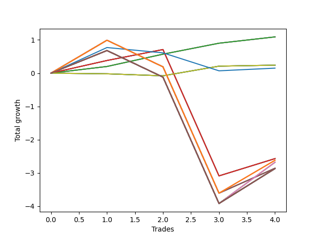

# Short Pointer 004 
- Symbol: NVDA_Unlimited
- Date Range: 02/08/2022 - 07/08/2022
- Trading Period: 7:20-12:30
- Number of Trades: 4



| Name | Win Percent | Profit | Avg Profit / Trade | Avg Time / Trade |      | Name | Win Percent | Profit | Avg Profit / Trade | Avg Time / Trade |
| ---- | ----------- | ------ | ------------------ | ---------------- | ---- | ---- | ----------- | ------ | ------------------ | ---------------- |
| Sorted By <br> Profit | | | | | | Sorted By <br> Win Percentage ||||
| Sixty-Four | 100.00 | 545.00 | 136.25 | 00:57 |     | Sixty-Four | 100.00 | 545.00 | 136.25 | 00:57 |
| Fifty-Six | 100.00 | 545.00 | 136.25 | 00:57 |     | Fifty-Six | 100.00 | 545.00 | 136.25 | 00:57 |
| Forty-Eight | 100.00 | 545.00 | 136.25 | 00:57 |     | Forty-Eight | 100.00 | 545.00 | 136.25 | 00:57 |
| Forty | 100.00 | 545.00 | 136.25 | 00:57 |     | Forty | 100.00 | 545.00 | 136.25 | 00:57 |
| Zero | 100.00 | 545.00 | 136.25 | 00:57 |     | Zero | 100.00 | 545.00 | 136.25 | 00:57 |
| Seventy | 50.00 | 120.00 | 30.00 | 00:30 |     | Sixty-Five | 75.00 | -1285.00 | -321.25 | 13:35 |
| Sixty-Two | 50.00 | 120.00 | 30.00 | 00:30 |     | Fifty-Seven | 75.00 | -1285.00 | -321.25 | 13:35 |
| Fifty-Four | 50.00 | 120.00 | 30.00 | 00:30 |     | Forty-Nine | 75.00 | -1285.00 | -321.25 | 13:35 |
| Forty-Six | 50.00 | 120.00 | 30.00 | 00:30 |     | Forty-One | 75.00 | -1285.00 | -321.25 | 13:35 |
| Six | 50.00 | 120.00 | 30.00 | 00:30 |     | One | 75.00 | -1285.00 | -321.25 | 13:35 |
| Seventy-Three | 50.00 | 75.00 | 18.75 | 09:20 |     | Seventy | 50.00 | 120.00 | 30.00 | 00:30 |
| Sixty-Five | 75.00 | -1285.00 | -321.25 | 13:35 |     | Sixty-Two | 50.00 | 120.00 | 30.00 | 00:30 |
| Fifty-Seven | 75.00 | -1285.00 | -321.25 | 13:35 |     | Fifty-Four | 50.00 | 120.00 | 30.00 | 00:30 |
| Forty-Nine | 75.00 | -1285.00 | -321.25 | 13:35 |     | Forty-Six | 50.00 | 120.00 | 30.00 | 00:30 |
| Forty-One | 75.00 | -1285.00 | -321.25 | 13:35 |     | Six | 50.00 | 120.00 | 30.00 | 00:30 |
| One | 75.00 | -1285.00 | -321.25 | 13:35 |     | Seventy-Three | 50.00 | 75.00 | 18.75 | 09:20 |
| One Hundred Twenty-Six | 50.00 | -1310.00 | -327.50 | 21:32 |     | One Hundred Twenty-Six | 50.00 | -1310.00 | -327.50 | 21:32 |
| One Hundred Twenty-One | 50.00 | -1310.00 | -327.50 | 21:32 |     | One Hundred Twenty-One | 50.00 | -1310.00 | -327.50 | 21:32 |
| One Hundred Sixteen | 50.00 | -1310.00 | -327.50 | 21:32 |     | One Hundred Sixteen | 50.00 | -1310.00 | -327.50 | 21:32 |
| One Hundred Eleven | 50.00 | -1310.00 | -327.50 | 21:32 |     | One Hundred Eleven | 50.00 | -1310.00 | -327.50 | 21:32 |
| Eighty-One | 50.00 | -1310.00 | -327.50 | 21:32 |     | Eighty-One | 50.00 | -1310.00 | -327.50 | 21:32 |
| Sixty-Eight | 50.00 | -1340.00 | -335.00 | 28:55 |     | Sixty-Eight | 50.00 | -1340.00 | -335.00 | 28:55 |
| Sixty | 50.00 | -1340.00 | -335.00 | 28:55 |     | Sixty | 50.00 | -1340.00 | -335.00 | 28:55 |
| Fifty-Two | 50.00 | -1340.00 | -335.00 | 28:55 |     | Fifty-Two | 50.00 | -1340.00 | -335.00 | 28:55 |
| Forty-Four | 50.00 | -1340.00 | -335.00 | 28:55 |     | Forty-Four | 50.00 | -1340.00 | -335.00 | 28:55 |
| Four | 50.00 | -1340.00 | -335.00 | 28:55 |     | Four | 50.00 | -1340.00 | -335.00 | 28:55 |
| Sixty-Seven | 50.00 | -1430.00 | -357.50 | 19:52 |     | Sixty-Seven | 50.00 | -1430.00 | -357.50 | 19:52 |
| Sixty-Six | 50.00 | -1430.00 | -357.50 | 20:51 |     | Sixty-Six | 50.00 | -1430.00 | -357.50 | 20:51 |
| Fifty-Nine | 50.00 | -1430.00 | -357.50 | 19:52 |     | Fifty-Nine | 50.00 | -1430.00 | -357.50 | 19:52 |
| Fifty-Eight | 50.00 | -1430.00 | -357.50 | 20:51 |     | Fifty-Eight | 50.00 | -1430.00 | -357.50 | 20:51 |
| Fifty-One | 50.00 | -1430.00 | -357.50 | 19:52 |     | Fifty-One | 50.00 | -1430.00 | -357.50 | 19:52 |
| Fifty | 50.00 | -1430.00 | -357.50 | 20:51 |     | Fifty | 50.00 | -1430.00 | -357.50 | 20:51 |
| Forty-Three | 50.00 | -1430.00 | -357.50 | 19:52 |     | Forty-Three | 50.00 | -1430.00 | -357.50 | 19:52 |
| Forty-Two | 50.00 | -1430.00 | -357.50 | 20:51 |     | Forty-Two | 50.00 | -1430.00 | -357.50 | 20:51 |
| Three | 50.00 | -1430.00 | -357.50 | 19:52 |     | Three | 50.00 | -1430.00 | -357.50 | 19:52 |
| Two | 50.00 | -1430.00 | -357.50 | 20:51 |     | Two | 50.00 | -1430.00 | -357.50 | 20:51 |
| One Hundred Thirty | 50.00 | -1435.00 | -358.75 | 29:55 |     | One Hundred Thirty | 50.00 | -1435.00 | -358.75 | 29:55 |
| One Hundred Twenty-Nine | 50.00 | -1435.00 | -358.75 | 29:55 |     | One Hundred Twenty-Nine | 50.00 | -1435.00 | -358.75 | 29:55 |
| One Hundred Twenty-Eight | 50.00 | -1435.00 | -358.75 | 29:55 |     | One Hundred Twenty-Eight | 50.00 | -1435.00 | -358.75 | 29:55 |
| One Hundred Twenty-Seven | 50.00 | -1435.00 | -358.75 | 29:55 |     | One Hundred Twenty-Seven | 50.00 | -1435.00 | -358.75 | 29:55 |
| One Hundred Twenty-Five | 50.00 | -1435.00 | -358.75 | 29:55 |     | One Hundred Twenty-Five | 50.00 | -1435.00 | -358.75 | 29:55 |
| One Hundred Twenty-Four | 50.00 | -1435.00 | -358.75 | 29:55 |     | One Hundred Twenty-Four | 50.00 | -1435.00 | -358.75 | 29:55 |
| One Hundred Twenty-Three | 50.00 | -1435.00 | -358.75 | 29:55 |     | One Hundred Twenty-Three | 50.00 | -1435.00 | -358.75 | 29:55 |
| One Hundred Twenty-Two | 50.00 | -1435.00 | -358.75 | 29:55 |     | One Hundred Twenty-Two | 50.00 | -1435.00 | -358.75 | 29:55 |
| One Hundred Twenty | 50.00 | -1435.00 | -358.75 | 29:55 |     | One Hundred Twenty | 50.00 | -1435.00 | -358.75 | 29:55 |
| One Hundred Ninteen | 50.00 | -1435.00 | -358.75 | 29:55 |     | One Hundred Ninteen | 50.00 | -1435.00 | -358.75 | 29:55 |
| One Hundred Eighteen | 50.00 | -1435.00 | -358.75 | 29:55 |     | One Hundred Eighteen | 50.00 | -1435.00 | -358.75 | 29:55 |
| One Hundred Seventeen | 50.00 | -1435.00 | -358.75 | 29:55 |     | One Hundred Seventeen | 50.00 | -1435.00 | -358.75 | 29:55 |
| One Hundred Fifteen | 50.00 | -1435.00 | -358.75 | 29:55 |     | One Hundred Fifteen | 50.00 | -1435.00 | -358.75 | 29:55 |
| One Hundred Fourteen | 50.00 | -1435.00 | -358.75 | 29:55 |     | One Hundred Fourteen | 50.00 | -1435.00 | -358.75 | 29:55 |
| One Hundred Thirteen | 50.00 | -1435.00 | -358.75 | 29:55 |     | One Hundred Thirteen | 50.00 | -1435.00 | -358.75 | 29:55 |
| One Hundred Twelve | 50.00 | -1435.00 | -358.75 | 29:55 |     | One Hundred Twelve | 50.00 | -1435.00 | -358.75 | 29:55 |
| Eighty-Five | 50.00 | -1435.00 | -358.75 | 29:55 |     | Eighty-Five | 50.00 | -1435.00 | -358.75 | 29:55 |
| Eighty-Four | 50.00 | -1435.00 | -358.75 | 29:55 |     | Eighty-Four | 50.00 | -1435.00 | -358.75 | 29:55 |
| Eighty-Three | 50.00 | -1435.00 | -358.75 | 29:55 |     | Eighty-Three | 50.00 | -1435.00 | -358.75 | 29:55 |
| Eighty-Two | 50.00 | -1435.00 | -358.75 | 29:55 |     | Eighty-Two | 50.00 | -1435.00 | -358.75 | 29:55 |
| Seventy-One | 50.00 | -1435.00 | -358.75 | 29:55 |     | Seventy-One | 50.00 | -1435.00 | -358.75 | 29:55 |
| Sixty-Nine | 50.00 | -1435.00 | -358.75 | 29:55 |     | Sixty-Nine | 50.00 | -1435.00 | -358.75 | 29:55 |
| Sixty-Three | 50.00 | -1435.00 | -358.75 | 29:55 |     | Sixty-Three | 50.00 | -1435.00 | -358.75 | 29:55 |
| Sixty-One | 50.00 | -1435.00 | -358.75 | 29:55 |     | Sixty-One | 50.00 | -1435.00 | -358.75 | 29:55 |
| Fifty-Five | 50.00 | -1435.00 | -358.75 | 29:55 |     | Fifty-Five | 50.00 | -1435.00 | -358.75 | 29:55 |
| Fifty-Three | 50.00 | -1435.00 | -358.75 | 29:55 |     | Fifty-Three | 50.00 | -1435.00 | -358.75 | 29:55 |
| Forty-Seven | 50.00 | -1435.00 | -358.75 | 29:55 |     | Forty-Seven | 50.00 | -1435.00 | -358.75 | 29:55 |
| Forty-Five | 50.00 | -1435.00 | -358.75 | 29:55 |     | Forty-Five | 50.00 | -1435.00 | -358.75 | 29:55 |
| Seven | 50.00 | -1435.00 | -358.75 | 29:55 |     | Seven | 50.00 | -1435.00 | -358.75 | 29:55 |
| Five | 50.00 | -1435.00 | -358.75 | 29:55 |     | Five | 50.00 | -1435.00 | -358.75 | 29:55 |

## NO STOPLOSS

### Test Zero
* Sell when price hits the middle line of the 20p bollinger
* No Stoploss
* Results:
```
Total Trades: 4
Percent Up: 0.00
Percent Down: 100.00
Total Points Moved Down: 1.09
Potential Profit: 545.00
Total Points Ups: 0.00 Count Ups: 0
Total Points Downs: 1.09 Count Downs: 4
```

<details><summary>Trades</summary>

<code>In: 2022-03-04 10:11:00		Out: 2022-03-04 10:11:35		Total Position Time: 00:35		Total Move Down: 0.20		Total to Date: 0.20</code> <br />
<code>In: 2022-03-11 10:08:00		Out: 2022-03-11 10:09:10		Total Position Time: 01:10		Total Move Down: 0.37		Total to Date: 0.57</code> <br />
<code>In: 2022-05-02 11:57:00		Out: 2022-05-02 11:58:05		Total Position Time: 01:05		Total Move Down: 0.33		Total to Date: 0.90</code> <br />
<code>In: 2022-05-05 10:13:00		Out: 2022-05-05 10:14:00		Total Position Time: 01:00		Total Move Down: 0.19		Total to Date: 1.09</code> <br />


</details>

### Test One
* Sell when the price hits the upper line of the 20p 1std bollinger
* No Stoploss
* Results:
```
Total Trades: 4
Percent Up: 25.00
Percent Down: 75.00
Total Points Moved Down: -2.57
Potential Profit: -1285.00
Total Points Ups: 3.80 Count Ups: 1
Total Points Downs: 1.23 Count Downs: 3
```

<details><summary>Trades</summary>

<code>In: 2022-03-04 10:11:00		Out: 2022-03-04 10:16:45		Total Position Time: 05:45		Total Move Down: 0.38		Total to Date: 0.38</code> <br />
<code>In: 2022-03-11 10:08:00		Out: 2022-03-11 10:19:20		Total Position Time: 11:20		Total Move Down: 0.33		Total to Date: 0.71</code> <br />
<code>In: 2022-05-02 11:57:00		Out: 2022-05-02 12:26:55		Total Position Time: 29:55		Total Move Down: -3.80		Total to Date: -3.09</code> <br />
<code>In: 2022-05-05 10:13:00		Out: 2022-05-05 10:20:20		Total Position Time: 07:20		Total Move Down: 0.52		Total to Date: -2.57</code> <br />


</details>

### Test Two
* Sell when the price hits the upper line of the 20p 2std bollinger
* No Stoploss
* Results:
```
Total Trades: 4
Percent Up: 50.00
Percent Down: 50.00
Total Points Moved Down: -2.86
Potential Profit: -1430.00
Total Points Ups: 4.60 Count Ups: 2
Total Points Downs: 1.74 Count Downs: 2
```

<details><summary>Trades</summary>

<code>In: 2022-03-04 10:11:00		Out: 2022-03-04 10:17:05		Total Position Time: 06:05		Total Move Down: 0.99		Total to Date: 0.99</code> <br />
<code>In: 2022-03-11 10:08:00		Out: 2022-03-11 10:37:55		Total Position Time: 29:55		Total Move Down: -0.80		Total to Date: 0.19</code> <br />
<code>In: 2022-05-02 11:57:00		Out: 2022-05-02 12:26:55		Total Position Time: 29:55		Total Move Down: -3.80		Total to Date: -3.61</code> <br />
<code>In: 2022-05-05 10:13:00		Out: 2022-05-05 10:30:30		Total Position Time: 17:30		Total Move Down: 0.75		Total to Date: -2.86</code> <br />


</details>

### Test Three
* Sell when price hits the middle line of the 50p bollinger
* No Stoploss
* Results:
```
Total Trades: 4
Percent Up: 50.00
Percent Down: 50.00
Total Points Moved Down: -2.86
Potential Profit: -1430.00
Total Points Ups: 4.60 Count Ups: 2
Total Points Downs: 1.74 Count Downs: 2
```

<details><summary>Trades</summary>

<code>In: 2022-03-04 10:11:00		Out: 2022-03-04 10:17:05		Total Position Time: 06:05		Total Move Down: 0.99		Total to Date: 0.99</code> <br />
<code>In: 2022-03-11 10:08:00		Out: 2022-03-11 10:37:55		Total Position Time: 29:55		Total Move Down: -0.80		Total to Date: 0.19</code> <br />
<code>In: 2022-05-02 11:57:00		Out: 2022-05-02 12:26:55		Total Position Time: 29:55		Total Move Down: -3.80		Total to Date: -3.61</code> <br />
<code>In: 2022-05-05 10:13:00		Out: 2022-05-05 10:26:35		Total Position Time: 13:35		Total Move Down: 0.75		Total to Date: -2.86</code> <br />


</details>

### Test Four
* Sell when the price hits the upper line of the 50p 1std bollinger
* No Stoploss
* Results:
```
Total Trades: 4
Percent Up: 50.00
Percent Down: 50.00
Total Points Moved Down: -2.68
Potential Profit: -1340.00
Total Points Ups: 4.60 Count Ups: 2
Total Points Downs: 1.92 Count Downs: 2
```

<details><summary>Trades</summary>

<code>In: 2022-03-04 10:11:00		Out: 2022-03-04 10:40:55		Total Position Time: 29:55		Total Move Down: 0.68		Total to Date: 0.68</code> <br />
<code>In: 2022-03-11 10:08:00		Out: 2022-03-11 10:37:55		Total Position Time: 29:55		Total Move Down: -0.80		Total to Date: -0.12</code> <br />
<code>In: 2022-05-02 11:57:00		Out: 2022-05-02 12:26:55		Total Position Time: 29:55		Total Move Down: -3.80		Total to Date: -3.92</code> <br />
<code>In: 2022-05-05 10:13:00		Out: 2022-05-05 10:38:55		Total Position Time: 25:55		Total Move Down: 1.24		Total to Date: -2.68</code> <br />


</details>

### Test Five
* Sell when the price hits the upper line of the 50p 2std bollinger
* No Stoploss
* Results:
```
Total Trades: 4
Percent Up: 50.00
Percent Down: 50.00
Total Points Moved Down: -2.87
Potential Profit: -1435.00
Total Points Ups: 4.60 Count Ups: 2
Total Points Downs: 1.73 Count Downs: 2
```

<details><summary>Trades</summary>

<code>In: 2022-03-04 10:11:00		Out: 2022-03-04 10:40:55		Total Position Time: 29:55		Total Move Down: 0.68		Total to Date: 0.68</code> <br />
<code>In: 2022-03-11 10:08:00		Out: 2022-03-11 10:37:55		Total Position Time: 29:55		Total Move Down: -0.80		Total to Date: -0.12</code> <br />
<code>In: 2022-05-02 11:57:00		Out: 2022-05-02 12:26:55		Total Position Time: 29:55		Total Move Down: -3.80		Total to Date: -3.92</code> <br />
<code>In: 2022-05-05 10:13:00		Out: 2022-05-05 10:42:55		Total Position Time: 29:55		Total Move Down: 1.05		Total to Date: -2.87</code> <br />


</details>

### Test Six
* Sell when the price hits the middle line of the 1std VWAP
* No Stoploss
* Results:
```
Total Trades: 4
Percent Up: 50.00
Percent Down: 50.00
Total Points Moved Down: 0.24
Potential Profit: 120.00
Total Points Ups: 0.08 Count Ups: 2
Total Points Downs: 0.32 Count Downs: 2
```

<details><summary>Trades</summary>

<code>In: 2022-03-04 10:11:00		Out: 2022-03-04 10:11:10		Total Position Time: 00:10		Total Move Down: -0.02		Total to Date: -0.02</code> <br />
<code>In: 2022-03-11 10:08:00		Out: 2022-03-11 10:08:10		Total Position Time: 00:10		Total Move Down: -0.06		Total to Date: -0.08</code> <br />
<code>In: 2022-05-02 11:57:00		Out: 2022-05-02 11:58:30		Total Position Time: 01:30		Total Move Down: 0.29		Total to Date: 0.21</code> <br />
<code>In: 2022-05-05 10:13:00		Out: 2022-05-05 10:13:10		Total Position Time: 00:10		Total Move Down: 0.03		Total to Date: 0.24</code> <br />


</details>

### Test Seven
* Sell when the price hits the upper line of the 1std VWAP
* No Stoploss
* Results:
```
Total Trades: 4
Percent Up: 50.00
Percent Down: 50.00
Total Points Moved Down: -2.87
Potential Profit: -1435.00
Total Points Ups: 4.60 Count Ups: 2
Total Points Downs: 1.73 Count Downs: 2
```

<details><summary>Trades</summary>

<code>In: 2022-03-04 10:11:00		Out: 2022-03-04 10:40:55		Total Position Time: 29:55		Total Move Down: 0.68		Total to Date: 0.68</code> <br />
<code>In: 2022-03-11 10:08:00		Out: 2022-03-11 10:37:55		Total Position Time: 29:55		Total Move Down: -0.80		Total to Date: -0.12</code> <br />
<code>In: 2022-05-02 11:57:00		Out: 2022-05-02 12:26:55		Total Position Time: 29:55		Total Move Down: -3.80		Total to Date: -3.92</code> <br />
<code>In: 2022-05-05 10:13:00		Out: 2022-05-05 10:42:55		Total Position Time: 29:55		Total Move Down: 1.05		Total to Date: -2.87</code> <br />


</details>

## STOPLOSS OF 5

### Test Forty
* Sell when price hits the middle line of the 20p bollinger
* Stoploss is -5 points
* Results:
```
Total Trades: 4
Percent Up: 0.00
Percent Down: 100.00
Total Points Moved Down: 1.09
Potential Profit: 545.00
Total Points Ups: 0.00 Count Ups: 0
Total Points Downs: 1.09 Count Downs: 4
```

<details><summary>Trades</summary>

<code>In: 2022-03-04 10:11:00		Out: 2022-03-04 10:11:35		Total Position Time: 00:35		Total Move Down: 0.20		Total to Date: 0.20</code> <br />
<code>In: 2022-03-11 10:08:00		Out: 2022-03-11 10:09:10		Total Position Time: 01:10		Total Move Down: 0.37		Total to Date: 0.57</code> <br />
<code>In: 2022-05-02 11:57:00		Out: 2022-05-02 11:58:05		Total Position Time: 01:05		Total Move Down: 0.33		Total to Date: 0.90</code> <br />
<code>In: 2022-05-05 10:13:00		Out: 2022-05-05 10:14:00		Total Position Time: 01:00		Total Move Down: 0.19		Total to Date: 1.09</code> <br />


</details>

### Test Forty-One
* Sell when the price hits the upper line of the 20p 1std bollinger
* Stoploss is -5 points
* Results:
```
Total Trades: 4
Percent Up: 25.00
Percent Down: 75.00
Total Points Moved Down: -2.57
Potential Profit: -1285.00
Total Points Ups: 3.80 Count Ups: 1
Total Points Downs: 1.23 Count Downs: 3
```

<details><summary>Trades</summary>

<code>In: 2022-03-04 10:11:00		Out: 2022-03-04 10:16:45		Total Position Time: 05:45		Total Move Down: 0.38		Total to Date: 0.38</code> <br />
<code>In: 2022-03-11 10:08:00		Out: 2022-03-11 10:19:20		Total Position Time: 11:20		Total Move Down: 0.33		Total to Date: 0.71</code> <br />
<code>In: 2022-05-02 11:57:00		Out: 2022-05-02 12:26:55		Total Position Time: 29:55		Total Move Down: -3.80		Total to Date: -3.09</code> <br />
<code>In: 2022-05-05 10:13:00		Out: 2022-05-05 10:20:20		Total Position Time: 07:20		Total Move Down: 0.52		Total to Date: -2.57</code> <br />


</details>

### Test Forty-Two
* Sell when the price hits the upper line of the 20p 2std bollinger
* Stoploss is -5 points
* Results:
```
Total Trades: 4
Percent Up: 50.00
Percent Down: 50.00
Total Points Moved Down: -2.86
Potential Profit: -1430.00
Total Points Ups: 4.60 Count Ups: 2
Total Points Downs: 1.74 Count Downs: 2
```

<details><summary>Trades</summary>

<code>In: 2022-03-04 10:11:00		Out: 2022-03-04 10:17:05		Total Position Time: 06:05		Total Move Down: 0.99		Total to Date: 0.99</code> <br />
<code>In: 2022-03-11 10:08:00		Out: 2022-03-11 10:37:55		Total Position Time: 29:55		Total Move Down: -0.80		Total to Date: 0.19</code> <br />
<code>In: 2022-05-02 11:57:00		Out: 2022-05-02 12:26:55		Total Position Time: 29:55		Total Move Down: -3.80		Total to Date: -3.61</code> <br />
<code>In: 2022-05-05 10:13:00		Out: 2022-05-05 10:30:30		Total Position Time: 17:30		Total Move Down: 0.75		Total to Date: -2.86</code> <br />


</details>

### Test Forty-Three
* Sell when price hits the middle line of the 50p bollinger
* Stoploss is -5 points
* Results:
```
Total Trades: 4
Percent Up: 50.00
Percent Down: 50.00
Total Points Moved Down: -2.86
Potential Profit: -1430.00
Total Points Ups: 4.60 Count Ups: 2
Total Points Downs: 1.74 Count Downs: 2
```

<details><summary>Trades</summary>

<code>In: 2022-03-04 10:11:00		Out: 2022-03-04 10:17:05		Total Position Time: 06:05		Total Move Down: 0.99		Total to Date: 0.99</code> <br />
<code>In: 2022-03-11 10:08:00		Out: 2022-03-11 10:37:55		Total Position Time: 29:55		Total Move Down: -0.80		Total to Date: 0.19</code> <br />
<code>In: 2022-05-02 11:57:00		Out: 2022-05-02 12:26:55		Total Position Time: 29:55		Total Move Down: -3.80		Total to Date: -3.61</code> <br />
<code>In: 2022-05-05 10:13:00		Out: 2022-05-05 10:26:35		Total Position Time: 13:35		Total Move Down: 0.75		Total to Date: -2.86</code> <br />


</details>

### Test Forty-Four
* Sell when the price hits the upper line of the 50p 1std bollinger
* Stoploss is -5 points
* Results:
```
Total Trades: 4
Percent Up: 50.00
Percent Down: 50.00
Total Points Moved Down: -2.68
Potential Profit: -1340.00
Total Points Ups: 4.60 Count Ups: 2
Total Points Downs: 1.92 Count Downs: 2
```

<details><summary>Trades</summary>

<code>In: 2022-03-04 10:11:00		Out: 2022-03-04 10:40:55		Total Position Time: 29:55		Total Move Down: 0.68		Total to Date: 0.68</code> <br />
<code>In: 2022-03-11 10:08:00		Out: 2022-03-11 10:37:55		Total Position Time: 29:55		Total Move Down: -0.80		Total to Date: -0.12</code> <br />
<code>In: 2022-05-02 11:57:00		Out: 2022-05-02 12:26:55		Total Position Time: 29:55		Total Move Down: -3.80		Total to Date: -3.92</code> <br />
<code>In: 2022-05-05 10:13:00		Out: 2022-05-05 10:38:55		Total Position Time: 25:55		Total Move Down: 1.24		Total to Date: -2.68</code> <br />


</details>

### Test Forty-Five
* Sell when the price hits the upper line of the 50p 2std bollinger
* Stoploss is -5 points
* Results:
```
Total Trades: 4
Percent Up: 50.00
Percent Down: 50.00
Total Points Moved Down: -2.87
Potential Profit: -1435.00
Total Points Ups: 4.60 Count Ups: 2
Total Points Downs: 1.73 Count Downs: 2
```

<details><summary>Trades</summary>

<code>In: 2022-03-04 10:11:00		Out: 2022-03-04 10:40:55		Total Position Time: 29:55		Total Move Down: 0.68		Total to Date: 0.68</code> <br />
<code>In: 2022-03-11 10:08:00		Out: 2022-03-11 10:37:55		Total Position Time: 29:55		Total Move Down: -0.80		Total to Date: -0.12</code> <br />
<code>In: 2022-05-02 11:57:00		Out: 2022-05-02 12:26:55		Total Position Time: 29:55		Total Move Down: -3.80		Total to Date: -3.92</code> <br />
<code>In: 2022-05-05 10:13:00		Out: 2022-05-05 10:42:55		Total Position Time: 29:55		Total Move Down: 1.05		Total to Date: -2.87</code> <br />


</details>

### Test Forty-Six
* Sell when the price hits the middle line of the 1std VWAP
* Stoploss is -5 points
* Results:
```
Total Trades: 4
Percent Up: 50.00
Percent Down: 50.00
Total Points Moved Down: 0.24
Potential Profit: 120.00
Total Points Ups: 0.08 Count Ups: 2
Total Points Downs: 0.32 Count Downs: 2
```

<details><summary>Trades</summary>

<code>In: 2022-03-04 10:11:00		Out: 2022-03-04 10:11:10		Total Position Time: 00:10		Total Move Down: -0.02		Total to Date: -0.02</code> <br />
<code>In: 2022-03-11 10:08:00		Out: 2022-03-11 10:08:10		Total Position Time: 00:10		Total Move Down: -0.06		Total to Date: -0.08</code> <br />
<code>In: 2022-05-02 11:57:00		Out: 2022-05-02 11:58:30		Total Position Time: 01:30		Total Move Down: 0.29		Total to Date: 0.21</code> <br />
<code>In: 2022-05-05 10:13:00		Out: 2022-05-05 10:13:10		Total Position Time: 00:10		Total Move Down: 0.03		Total to Date: 0.24</code> <br />


</details>

### Test Forty-Seven
* Sell when the price hits the upper line of the 1std VWAP
* Stoploss is -5 points
* Results:
```
Total Trades: 4
Percent Up: 50.00
Percent Down: 50.00
Total Points Moved Down: -2.87
Potential Profit: -1435.00
Total Points Ups: 4.60 Count Ups: 2
Total Points Downs: 1.73 Count Downs: 2
```

<details><summary>Trades</summary>

<code>In: 2022-03-04 10:11:00		Out: 2022-03-04 10:40:55		Total Position Time: 29:55		Total Move Down: 0.68		Total to Date: 0.68</code> <br />
<code>In: 2022-03-11 10:08:00		Out: 2022-03-11 10:37:55		Total Position Time: 29:55		Total Move Down: -0.80		Total to Date: -0.12</code> <br />
<code>In: 2022-05-02 11:57:00		Out: 2022-05-02 12:26:55		Total Position Time: 29:55		Total Move Down: -3.80		Total to Date: -3.92</code> <br />
<code>In: 2022-05-05 10:13:00		Out: 2022-05-05 10:42:55		Total Position Time: 29:55		Total Move Down: 1.05		Total to Date: -2.87</code> <br />


</details>

## TRAIL STOP OF 5

### Test Forty-Eight
* Sell when price hits the middle line of the 20p bollinger
* Trailing Stop is -5 points
* Results:
```
Total Trades: 4
Percent Up: 0.00
Percent Down: 100.00
Total Points Moved Down: 1.09
Potential Profit: 545.00
Total Points Ups: 0.00 Count Ups: 0
Total Points Downs: 1.09 Count Downs: 4
```

<details><summary>Trades</summary>

<code>In: 2022-03-04 10:11:00		Out: 2022-03-04 10:11:35		Total Position Time: 00:35		Total Move Down: 0.20		Total to Date: 0.20</code> <br />
<code>In: 2022-03-11 10:08:00		Out: 2022-03-11 10:09:10		Total Position Time: 01:10		Total Move Down: 0.37		Total to Date: 0.57</code> <br />
<code>In: 2022-05-02 11:57:00		Out: 2022-05-02 11:58:05		Total Position Time: 01:05		Total Move Down: 0.33		Total to Date: 0.90</code> <br />
<code>In: 2022-05-05 10:13:00		Out: 2022-05-05 10:14:00		Total Position Time: 01:00		Total Move Down: 0.19		Total to Date: 1.09</code> <br />


</details>

### Test Forty-Nine
* Sell when the price hits the upper line of the 20p 1std bollinger
* Trailing Stop is -5 points
* Results:
```
Total Trades: 4
Percent Up: 25.00
Percent Down: 75.00
Total Points Moved Down: -2.57
Potential Profit: -1285.00
Total Points Ups: 3.80 Count Ups: 1
Total Points Downs: 1.23 Count Downs: 3
```

<details><summary>Trades</summary>

<code>In: 2022-03-04 10:11:00		Out: 2022-03-04 10:16:45		Total Position Time: 05:45		Total Move Down: 0.38		Total to Date: 0.38</code> <br />
<code>In: 2022-03-11 10:08:00		Out: 2022-03-11 10:19:20		Total Position Time: 11:20		Total Move Down: 0.33		Total to Date: 0.71</code> <br />
<code>In: 2022-05-02 11:57:00		Out: 2022-05-02 12:26:55		Total Position Time: 29:55		Total Move Down: -3.80		Total to Date: -3.09</code> <br />
<code>In: 2022-05-05 10:13:00		Out: 2022-05-05 10:20:20		Total Position Time: 07:20		Total Move Down: 0.52		Total to Date: -2.57</code> <br />


</details>

### Test Fifty
* Sell when the price hits the upper line of the 20p 2std bollinger
* Trailing Stop is -5 points
* Results:
```
Total Trades: 4
Percent Up: 50.00
Percent Down: 50.00
Total Points Moved Down: -2.86
Potential Profit: -1430.00
Total Points Ups: 4.60 Count Ups: 2
Total Points Downs: 1.74 Count Downs: 2
```

<details><summary>Trades</summary>

<code>In: 2022-03-04 10:11:00		Out: 2022-03-04 10:17:05		Total Position Time: 06:05		Total Move Down: 0.99		Total to Date: 0.99</code> <br />
<code>In: 2022-03-11 10:08:00		Out: 2022-03-11 10:37:55		Total Position Time: 29:55		Total Move Down: -0.80		Total to Date: 0.19</code> <br />
<code>In: 2022-05-02 11:57:00		Out: 2022-05-02 12:26:55		Total Position Time: 29:55		Total Move Down: -3.80		Total to Date: -3.61</code> <br />
<code>In: 2022-05-05 10:13:00		Out: 2022-05-05 10:30:30		Total Position Time: 17:30		Total Move Down: 0.75		Total to Date: -2.86</code> <br />


</details>

### Test Fifty-One
* Sell when price hits the middle line of the 50p bollinger
* Trailing Stop is -5 points
* Results:
```
Total Trades: 4
Percent Up: 50.00
Percent Down: 50.00
Total Points Moved Down: -2.86
Potential Profit: -1430.00
Total Points Ups: 4.60 Count Ups: 2
Total Points Downs: 1.74 Count Downs: 2
```

<details><summary>Trades</summary>

<code>In: 2022-03-04 10:11:00		Out: 2022-03-04 10:17:05		Total Position Time: 06:05		Total Move Down: 0.99		Total to Date: 0.99</code> <br />
<code>In: 2022-03-11 10:08:00		Out: 2022-03-11 10:37:55		Total Position Time: 29:55		Total Move Down: -0.80		Total to Date: 0.19</code> <br />
<code>In: 2022-05-02 11:57:00		Out: 2022-05-02 12:26:55		Total Position Time: 29:55		Total Move Down: -3.80		Total to Date: -3.61</code> <br />
<code>In: 2022-05-05 10:13:00		Out: 2022-05-05 10:26:35		Total Position Time: 13:35		Total Move Down: 0.75		Total to Date: -2.86</code> <br />


</details>

### Test Fifty-Two
* Sell when the price hits the upper line of the 50p 1std bollinger
* Trailing Stop is -5 points
* Results:
```
Total Trades: 4
Percent Up: 50.00
Percent Down: 50.00
Total Points Moved Down: -2.68
Potential Profit: -1340.00
Total Points Ups: 4.60 Count Ups: 2
Total Points Downs: 1.92 Count Downs: 2
```

<details><summary>Trades</summary>

<code>In: 2022-03-04 10:11:00		Out: 2022-03-04 10:40:55		Total Position Time: 29:55		Total Move Down: 0.68		Total to Date: 0.68</code> <br />
<code>In: 2022-03-11 10:08:00		Out: 2022-03-11 10:37:55		Total Position Time: 29:55		Total Move Down: -0.80		Total to Date: -0.12</code> <br />
<code>In: 2022-05-02 11:57:00		Out: 2022-05-02 12:26:55		Total Position Time: 29:55		Total Move Down: -3.80		Total to Date: -3.92</code> <br />
<code>In: 2022-05-05 10:13:00		Out: 2022-05-05 10:38:55		Total Position Time: 25:55		Total Move Down: 1.24		Total to Date: -2.68</code> <br />


</details>

### Test Fifty-Three
* Sell when the price hits the upper line of the 50p 2std bollinger
* Trailing Stop is -5 points
* Results:
```
Total Trades: 4
Percent Up: 50.00
Percent Down: 50.00
Total Points Moved Down: -2.87
Potential Profit: -1435.00
Total Points Ups: 4.60 Count Ups: 2
Total Points Downs: 1.73 Count Downs: 2
```

<details><summary>Trades</summary>

<code>In: 2022-03-04 10:11:00		Out: 2022-03-04 10:40:55		Total Position Time: 29:55		Total Move Down: 0.68		Total to Date: 0.68</code> <br />
<code>In: 2022-03-11 10:08:00		Out: 2022-03-11 10:37:55		Total Position Time: 29:55		Total Move Down: -0.80		Total to Date: -0.12</code> <br />
<code>In: 2022-05-02 11:57:00		Out: 2022-05-02 12:26:55		Total Position Time: 29:55		Total Move Down: -3.80		Total to Date: -3.92</code> <br />
<code>In: 2022-05-05 10:13:00		Out: 2022-05-05 10:42:55		Total Position Time: 29:55		Total Move Down: 1.05		Total to Date: -2.87</code> <br />


</details>

### Test Fifty-Four
* Sell when the price hits the middle line of the 1std VWAP
* Trailing Stop is -5 points
* Results:
```
Total Trades: 4
Percent Up: 50.00
Percent Down: 50.00
Total Points Moved Down: 0.24
Potential Profit: 120.00
Total Points Ups: 0.08 Count Ups: 2
Total Points Downs: 0.32 Count Downs: 2
```

<details><summary>Trades</summary>

<code>In: 2022-03-04 10:11:00		Out: 2022-03-04 10:11:10		Total Position Time: 00:10		Total Move Down: -0.02		Total to Date: -0.02</code> <br />
<code>In: 2022-03-11 10:08:00		Out: 2022-03-11 10:08:10		Total Position Time: 00:10		Total Move Down: -0.06		Total to Date: -0.08</code> <br />
<code>In: 2022-05-02 11:57:00		Out: 2022-05-02 11:58:30		Total Position Time: 01:30		Total Move Down: 0.29		Total to Date: 0.21</code> <br />
<code>In: 2022-05-05 10:13:00		Out: 2022-05-05 10:13:10		Total Position Time: 00:10		Total Move Down: 0.03		Total to Date: 0.24</code> <br />


</details>

### Test Fifty-Five
* Sell when the price hits the upper line of the 1std VWAP
* Trailing Stop is -5 points
* Results:
```
Total Trades: 4
Percent Up: 50.00
Percent Down: 50.00
Total Points Moved Down: -2.87
Potential Profit: -1435.00
Total Points Ups: 4.60 Count Ups: 2
Total Points Downs: 1.73 Count Downs: 2
```

<details><summary>Trades</summary>

<code>In: 2022-03-04 10:11:00		Out: 2022-03-04 10:40:55		Total Position Time: 29:55		Total Move Down: 0.68		Total to Date: 0.68</code> <br />
<code>In: 2022-03-11 10:08:00		Out: 2022-03-11 10:37:55		Total Position Time: 29:55		Total Move Down: -0.80		Total to Date: -0.12</code> <br />
<code>In: 2022-05-02 11:57:00		Out: 2022-05-02 12:26:55		Total Position Time: 29:55		Total Move Down: -3.80		Total to Date: -3.92</code> <br />
<code>In: 2022-05-05 10:13:00		Out: 2022-05-05 10:42:55		Total Position Time: 29:55		Total Move Down: 1.05		Total to Date: -2.87</code> <br />


</details>

## STOPLOSS OF 10

### Test Fifty-Six
* Sell when price hits the middle line of the 20p bollinger
* Stoploss is -10 points
* Results:
```
Total Trades: 4
Percent Up: 0.00
Percent Down: 100.00
Total Points Moved Down: 1.09
Potential Profit: 545.00
Total Points Ups: 0.00 Count Ups: 0
Total Points Downs: 1.09 Count Downs: 4
```

<details><summary>Trades</summary>

<code>In: 2022-03-04 10:11:00		Out: 2022-03-04 10:11:35		Total Position Time: 00:35		Total Move Down: 0.20		Total to Date: 0.20</code> <br />
<code>In: 2022-03-11 10:08:00		Out: 2022-03-11 10:09:10		Total Position Time: 01:10		Total Move Down: 0.37		Total to Date: 0.57</code> <br />
<code>In: 2022-05-02 11:57:00		Out: 2022-05-02 11:58:05		Total Position Time: 01:05		Total Move Down: 0.33		Total to Date: 0.90</code> <br />
<code>In: 2022-05-05 10:13:00		Out: 2022-05-05 10:14:00		Total Position Time: 01:00		Total Move Down: 0.19		Total to Date: 1.09</code> <br />


</details>

### Test Fifty-Seven
* Sell when the price hits the upper line of the 20p 1std bollinger
* Stoploss is -10 points
* Results:
```
Total Trades: 4
Percent Up: 25.00
Percent Down: 75.00
Total Points Moved Down: -2.57
Potential Profit: -1285.00
Total Points Ups: 3.80 Count Ups: 1
Total Points Downs: 1.23 Count Downs: 3
```

<details><summary>Trades</summary>

<code>In: 2022-03-04 10:11:00		Out: 2022-03-04 10:16:45		Total Position Time: 05:45		Total Move Down: 0.38		Total to Date: 0.38</code> <br />
<code>In: 2022-03-11 10:08:00		Out: 2022-03-11 10:19:20		Total Position Time: 11:20		Total Move Down: 0.33		Total to Date: 0.71</code> <br />
<code>In: 2022-05-02 11:57:00		Out: 2022-05-02 12:26:55		Total Position Time: 29:55		Total Move Down: -3.80		Total to Date: -3.09</code> <br />
<code>In: 2022-05-05 10:13:00		Out: 2022-05-05 10:20:20		Total Position Time: 07:20		Total Move Down: 0.52		Total to Date: -2.57</code> <br />


</details>

### Test Fifty-Eight
* Sell when the price hits the upper line of the 20p 2std bollinger
* Stoploss is -10 points
* Results:
```
Total Trades: 4
Percent Up: 50.00
Percent Down: 50.00
Total Points Moved Down: -2.86
Potential Profit: -1430.00
Total Points Ups: 4.60 Count Ups: 2
Total Points Downs: 1.74 Count Downs: 2
```

<details><summary>Trades</summary>

<code>In: 2022-03-04 10:11:00		Out: 2022-03-04 10:17:05		Total Position Time: 06:05		Total Move Down: 0.99		Total to Date: 0.99</code> <br />
<code>In: 2022-03-11 10:08:00		Out: 2022-03-11 10:37:55		Total Position Time: 29:55		Total Move Down: -0.80		Total to Date: 0.19</code> <br />
<code>In: 2022-05-02 11:57:00		Out: 2022-05-02 12:26:55		Total Position Time: 29:55		Total Move Down: -3.80		Total to Date: -3.61</code> <br />
<code>In: 2022-05-05 10:13:00		Out: 2022-05-05 10:30:30		Total Position Time: 17:30		Total Move Down: 0.75		Total to Date: -2.86</code> <br />


</details>

### Test Fifty-Nine
* Sell when price hits the middle line of the 50p bollinger
* Stoploss is -10 points
* Results:
```
Total Trades: 4
Percent Up: 50.00
Percent Down: 50.00
Total Points Moved Down: -2.86
Potential Profit: -1430.00
Total Points Ups: 4.60 Count Ups: 2
Total Points Downs: 1.74 Count Downs: 2
```

<details><summary>Trades</summary>

<code>In: 2022-03-04 10:11:00		Out: 2022-03-04 10:17:05		Total Position Time: 06:05		Total Move Down: 0.99		Total to Date: 0.99</code> <br />
<code>In: 2022-03-11 10:08:00		Out: 2022-03-11 10:37:55		Total Position Time: 29:55		Total Move Down: -0.80		Total to Date: 0.19</code> <br />
<code>In: 2022-05-02 11:57:00		Out: 2022-05-02 12:26:55		Total Position Time: 29:55		Total Move Down: -3.80		Total to Date: -3.61</code> <br />
<code>In: 2022-05-05 10:13:00		Out: 2022-05-05 10:26:35		Total Position Time: 13:35		Total Move Down: 0.75		Total to Date: -2.86</code> <br />


</details>

### Test Sixty
* Sell when the price hits the upper line of the 50p 1std bollinger
* Stoploss is -10 points
* Results:
```
Total Trades: 4
Percent Up: 50.00
Percent Down: 50.00
Total Points Moved Down: -2.68
Potential Profit: -1340.00
Total Points Ups: 4.60 Count Ups: 2
Total Points Downs: 1.92 Count Downs: 2
```

<details><summary>Trades</summary>

<code>In: 2022-03-04 10:11:00		Out: 2022-03-04 10:40:55		Total Position Time: 29:55		Total Move Down: 0.68		Total to Date: 0.68</code> <br />
<code>In: 2022-03-11 10:08:00		Out: 2022-03-11 10:37:55		Total Position Time: 29:55		Total Move Down: -0.80		Total to Date: -0.12</code> <br />
<code>In: 2022-05-02 11:57:00		Out: 2022-05-02 12:26:55		Total Position Time: 29:55		Total Move Down: -3.80		Total to Date: -3.92</code> <br />
<code>In: 2022-05-05 10:13:00		Out: 2022-05-05 10:38:55		Total Position Time: 25:55		Total Move Down: 1.24		Total to Date: -2.68</code> <br />


</details>

### Test Sixty-One
* Sell when the price hits the upper line of the 50p 2std bollinger
* Stoploss is -10 points
* Results:
```
Total Trades: 4
Percent Up: 50.00
Percent Down: 50.00
Total Points Moved Down: -2.87
Potential Profit: -1435.00
Total Points Ups: 4.60 Count Ups: 2
Total Points Downs: 1.73 Count Downs: 2
```

<details><summary>Trades</summary>

<code>In: 2022-03-04 10:11:00		Out: 2022-03-04 10:40:55		Total Position Time: 29:55		Total Move Down: 0.68		Total to Date: 0.68</code> <br />
<code>In: 2022-03-11 10:08:00		Out: 2022-03-11 10:37:55		Total Position Time: 29:55		Total Move Down: -0.80		Total to Date: -0.12</code> <br />
<code>In: 2022-05-02 11:57:00		Out: 2022-05-02 12:26:55		Total Position Time: 29:55		Total Move Down: -3.80		Total to Date: -3.92</code> <br />
<code>In: 2022-05-05 10:13:00		Out: 2022-05-05 10:42:55		Total Position Time: 29:55		Total Move Down: 1.05		Total to Date: -2.87</code> <br />


</details>

### Test Sixty-Two
* Sell when the price hits the middle line of the 1std VWAP
* Stoploss is -10 points
* Results:
```
Total Trades: 4
Percent Up: 50.00
Percent Down: 50.00
Total Points Moved Down: 0.24
Potential Profit: 120.00
Total Points Ups: 0.08 Count Ups: 2
Total Points Downs: 0.32 Count Downs: 2
```

<details><summary>Trades</summary>

<code>In: 2022-03-04 10:11:00		Out: 2022-03-04 10:11:10		Total Position Time: 00:10		Total Move Down: -0.02		Total to Date: -0.02</code> <br />
<code>In: 2022-03-11 10:08:00		Out: 2022-03-11 10:08:10		Total Position Time: 00:10		Total Move Down: -0.06		Total to Date: -0.08</code> <br />
<code>In: 2022-05-02 11:57:00		Out: 2022-05-02 11:58:30		Total Position Time: 01:30		Total Move Down: 0.29		Total to Date: 0.21</code> <br />
<code>In: 2022-05-05 10:13:00		Out: 2022-05-05 10:13:10		Total Position Time: 00:10		Total Move Down: 0.03		Total to Date: 0.24</code> <br />


</details>

### Test Sixty-Three
* Sell when the price hits the upper line of the 1std VWAP
* Stoploss is -10 points
* Results:
```
Total Trades: 4
Percent Up: 50.00
Percent Down: 50.00
Total Points Moved Down: -2.87
Potential Profit: -1435.00
Total Points Ups: 4.60 Count Ups: 2
Total Points Downs: 1.73 Count Downs: 2
```

<details><summary>Trades</summary>

<code>In: 2022-03-04 10:11:00		Out: 2022-03-04 10:40:55		Total Position Time: 29:55		Total Move Down: 0.68		Total to Date: 0.68</code> <br />
<code>In: 2022-03-11 10:08:00		Out: 2022-03-11 10:37:55		Total Position Time: 29:55		Total Move Down: -0.80		Total to Date: -0.12</code> <br />
<code>In: 2022-05-02 11:57:00		Out: 2022-05-02 12:26:55		Total Position Time: 29:55		Total Move Down: -3.80		Total to Date: -3.92</code> <br />
<code>In: 2022-05-05 10:13:00		Out: 2022-05-05 10:42:55		Total Position Time: 29:55		Total Move Down: 1.05		Total to Date: -2.87</code> <br />


</details>

## TRAIL STOP OF 10

### Test Sixty-Four
* Sell when price hits the middle line of the 20p bollinger
* Trailing Stop is -10 points
* Results:
```
Total Trades: 4
Percent Up: 0.00
Percent Down: 100.00
Total Points Moved Down: 1.09
Potential Profit: 545.00
Total Points Ups: 0.00 Count Ups: 0
Total Points Downs: 1.09 Count Downs: 4
```

<details><summary>Trades</summary>

<code>In: 2022-03-04 10:11:00		Out: 2022-03-04 10:11:35		Total Position Time: 00:35		Total Move Down: 0.20		Total to Date: 0.20</code> <br />
<code>In: 2022-03-11 10:08:00		Out: 2022-03-11 10:09:10		Total Position Time: 01:10		Total Move Down: 0.37		Total to Date: 0.57</code> <br />
<code>In: 2022-05-02 11:57:00		Out: 2022-05-02 11:58:05		Total Position Time: 01:05		Total Move Down: 0.33		Total to Date: 0.90</code> <br />
<code>In: 2022-05-05 10:13:00		Out: 2022-05-05 10:14:00		Total Position Time: 01:00		Total Move Down: 0.19		Total to Date: 1.09</code> <br />


</details>

### Test Sixty-Five
* Sell when the price hits the upper line of the 20p 1std bollinger
* Trailing Stop is -10 points
* Results:
```
Total Trades: 4
Percent Up: 25.00
Percent Down: 75.00
Total Points Moved Down: -2.57
Potential Profit: -1285.00
Total Points Ups: 3.80 Count Ups: 1
Total Points Downs: 1.23 Count Downs: 3
```

<details><summary>Trades</summary>

<code>In: 2022-03-04 10:11:00		Out: 2022-03-04 10:16:45		Total Position Time: 05:45		Total Move Down: 0.38		Total to Date: 0.38</code> <br />
<code>In: 2022-03-11 10:08:00		Out: 2022-03-11 10:19:20		Total Position Time: 11:20		Total Move Down: 0.33		Total to Date: 0.71</code> <br />
<code>In: 2022-05-02 11:57:00		Out: 2022-05-02 12:26:55		Total Position Time: 29:55		Total Move Down: -3.80		Total to Date: -3.09</code> <br />
<code>In: 2022-05-05 10:13:00		Out: 2022-05-05 10:20:20		Total Position Time: 07:20		Total Move Down: 0.52		Total to Date: -2.57</code> <br />


</details>

### Test Sixty-Six
* Sell when the price hits the upper line of the 20p 2std bollinger
* Trailing Stop is -10 points
* Results:
```
Total Trades: 4
Percent Up: 50.00
Percent Down: 50.00
Total Points Moved Down: -2.86
Potential Profit: -1430.00
Total Points Ups: 4.60 Count Ups: 2
Total Points Downs: 1.74 Count Downs: 2
```

<details><summary>Trades</summary>

<code>In: 2022-03-04 10:11:00		Out: 2022-03-04 10:17:05		Total Position Time: 06:05		Total Move Down: 0.99		Total to Date: 0.99</code> <br />
<code>In: 2022-03-11 10:08:00		Out: 2022-03-11 10:37:55		Total Position Time: 29:55		Total Move Down: -0.80		Total to Date: 0.19</code> <br />
<code>In: 2022-05-02 11:57:00		Out: 2022-05-02 12:26:55		Total Position Time: 29:55		Total Move Down: -3.80		Total to Date: -3.61</code> <br />
<code>In: 2022-05-05 10:13:00		Out: 2022-05-05 10:30:30		Total Position Time: 17:30		Total Move Down: 0.75		Total to Date: -2.86</code> <br />


</details>

### Test Sixty-Seven
* Sell when price hits the middle line of the 50p bollinger
* Trailing Stop is -10 points
* Results:
```
Total Trades: 4
Percent Up: 50.00
Percent Down: 50.00
Total Points Moved Down: -2.86
Potential Profit: -1430.00
Total Points Ups: 4.60 Count Ups: 2
Total Points Downs: 1.74 Count Downs: 2
```

<details><summary>Trades</summary>

<code>In: 2022-03-04 10:11:00		Out: 2022-03-04 10:17:05		Total Position Time: 06:05		Total Move Down: 0.99		Total to Date: 0.99</code> <br />
<code>In: 2022-03-11 10:08:00		Out: 2022-03-11 10:37:55		Total Position Time: 29:55		Total Move Down: -0.80		Total to Date: 0.19</code> <br />
<code>In: 2022-05-02 11:57:00		Out: 2022-05-02 12:26:55		Total Position Time: 29:55		Total Move Down: -3.80		Total to Date: -3.61</code> <br />
<code>In: 2022-05-05 10:13:00		Out: 2022-05-05 10:26:35		Total Position Time: 13:35		Total Move Down: 0.75		Total to Date: -2.86</code> <br />


</details>

### Test Sixty-Eight
* Sell when the price hits the upper line of the 50p 1std bollinger
* Trailing Stop is -10 points
* Results:
```
Total Trades: 4
Percent Up: 50.00
Percent Down: 50.00
Total Points Moved Down: -2.68
Potential Profit: -1340.00
Total Points Ups: 4.60 Count Ups: 2
Total Points Downs: 1.92 Count Downs: 2
```

<details><summary>Trades</summary>

<code>In: 2022-03-04 10:11:00		Out: 2022-03-04 10:40:55		Total Position Time: 29:55		Total Move Down: 0.68		Total to Date: 0.68</code> <br />
<code>In: 2022-03-11 10:08:00		Out: 2022-03-11 10:37:55		Total Position Time: 29:55		Total Move Down: -0.80		Total to Date: -0.12</code> <br />
<code>In: 2022-05-02 11:57:00		Out: 2022-05-02 12:26:55		Total Position Time: 29:55		Total Move Down: -3.80		Total to Date: -3.92</code> <br />
<code>In: 2022-05-05 10:13:00		Out: 2022-05-05 10:38:55		Total Position Time: 25:55		Total Move Down: 1.24		Total to Date: -2.68</code> <br />


</details>

### Test Sixty-Nine
* Sell when the price hits the upper line of the 50p 2std bollinger
* Trailing Stop is -10 points
* Results:
```
Total Trades: 4
Percent Up: 50.00
Percent Down: 50.00
Total Points Moved Down: -2.87
Potential Profit: -1435.00
Total Points Ups: 4.60 Count Ups: 2
Total Points Downs: 1.73 Count Downs: 2
```

<details><summary>Trades</summary>

<code>In: 2022-03-04 10:11:00		Out: 2022-03-04 10:40:55		Total Position Time: 29:55		Total Move Down: 0.68		Total to Date: 0.68</code> <br />
<code>In: 2022-03-11 10:08:00		Out: 2022-03-11 10:37:55		Total Position Time: 29:55		Total Move Down: -0.80		Total to Date: -0.12</code> <br />
<code>In: 2022-05-02 11:57:00		Out: 2022-05-02 12:26:55		Total Position Time: 29:55		Total Move Down: -3.80		Total to Date: -3.92</code> <br />
<code>In: 2022-05-05 10:13:00		Out: 2022-05-05 10:42:55		Total Position Time: 29:55		Total Move Down: 1.05		Total to Date: -2.87</code> <br />


</details>

### Test Seventy
* Sell when the price hits the middle line of the 1std VWAP
* Trailing Stop is -10 points
* Results:
```
Total Trades: 4
Percent Up: 50.00
Percent Down: 50.00
Total Points Moved Down: 0.24
Potential Profit: 120.00
Total Points Ups: 0.08 Count Ups: 2
Total Points Downs: 0.32 Count Downs: 2
```

<details><summary>Trades</summary>

<code>In: 2022-03-04 10:11:00		Out: 2022-03-04 10:11:10		Total Position Time: 00:10		Total Move Down: -0.02		Total to Date: -0.02</code> <br />
<code>In: 2022-03-11 10:08:00		Out: 2022-03-11 10:08:10		Total Position Time: 00:10		Total Move Down: -0.06		Total to Date: -0.08</code> <br />
<code>In: 2022-05-02 11:57:00		Out: 2022-05-02 11:58:30		Total Position Time: 01:30		Total Move Down: 0.29		Total to Date: 0.21</code> <br />
<code>In: 2022-05-05 10:13:00		Out: 2022-05-05 10:13:10		Total Position Time: 00:10		Total Move Down: 0.03		Total to Date: 0.24</code> <br />


</details>

### Test Seventy-One
* Sell when the price hits the upper line of the 1std VWAP
* Trailing Stop is -10 points
* Results:
```
Total Trades: 4
Percent Up: 50.00
Percent Down: 50.00
Total Points Moved Down: -2.87
Potential Profit: -1435.00
Total Points Ups: 4.60 Count Ups: 2
Total Points Downs: 1.73 Count Downs: 2
```

<details><summary>Trades</summary>

<code>In: 2022-03-04 10:11:00		Out: 2022-03-04 10:40:55		Total Position Time: 29:55		Total Move Down: 0.68		Total to Date: 0.68</code> <br />
<code>In: 2022-03-11 10:08:00		Out: 2022-03-11 10:37:55		Total Position Time: 29:55		Total Move Down: -0.80		Total to Date: -0.12</code> <br />
<code>In: 2022-05-02 11:57:00		Out: 2022-05-02 12:26:55		Total Position Time: 29:55		Total Move Down: -3.80		Total to Date: -3.92</code> <br />
<code>In: 2022-05-05 10:13:00		Out: 2022-05-05 10:42:55		Total Position Time: 29:55		Total Move Down: 1.05		Total to Date: -2.87</code> <br />


</details>

## SPECIAL EXIT CONDITIONS 

### Test Seventy-Three
* Sell when the linear regression slope changes to negative
* No Stoploss
* Results:
```
Total Trades: 4
Percent Up: 50.00
Percent Down: 50.00
Total Points Moved Down: 0.15
Potential Profit: 75.00
Total Points Ups: 0.70 Count Ups: 2
Total Points Downs: 0.85 Count Downs: 2
```

<details><summary>Trades</summary>

<code>In: 2022-03-04 10:11:00		Out: 2022-03-04 10:23:05		Total Position Time: 12:05		Total Move Down: 0.77		Total to Date: 0.77</code> <br />
<code>In: 2022-03-11 10:08:00		Out: 2022-03-11 10:17:05		Total Position Time: 09:05		Total Move Down: -0.16		Total to Date: 0.61</code> <br />
<code>In: 2022-05-02 11:57:00		Out: 2022-05-02 12:04:05		Total Position Time: 07:05		Total Move Down: -0.54		Total to Date: 0.07</code> <br />
<code>In: 2022-05-05 10:13:00		Out: 2022-05-05 10:22:05		Total Position Time: 09:05		Total Move Down: 0.08		Total to Date: 0.15</code> <br />


</details>

## TAKE PROFIT

### Test Eighty-One
* Take Profit of 1 Point
* No Stoploss
* Results:
```
Total Trades: 4
Percent Up: 50.00
Percent Down: 50.00
Total Points Moved Down: -2.62
Potential Profit: -1310.00
Total Points Ups: 4.60 Count Ups: 2
Total Points Downs: 1.98 Count Downs: 2
```

<details><summary>Trades</summary>

<code>In: 2022-03-04 10:11:00		Out: 2022-03-04 10:17:25		Total Position Time: 06:25		Total Move Down: 0.99		Total to Date: 0.99</code> <br />
<code>In: 2022-03-11 10:08:00		Out: 2022-03-11 10:37:55		Total Position Time: 29:55		Total Move Down: -0.80		Total to Date: 0.19</code> <br />
<code>In: 2022-05-02 11:57:00		Out: 2022-05-02 12:26:55		Total Position Time: 29:55		Total Move Down: -3.80		Total to Date: -3.61</code> <br />
<code>In: 2022-05-05 10:13:00		Out: 2022-05-05 10:32:55		Total Position Time: 19:55		Total Move Down: 0.99		Total to Date: -2.62</code> <br />


</details>

### Test Eighty-Two
* Take Profit of 2 Point
* No Stoploss
* Results:
```
Total Trades: 4
Percent Up: 50.00
Percent Down: 50.00
Total Points Moved Down: -2.87
Potential Profit: -1435.00
Total Points Ups: 4.60 Count Ups: 2
Total Points Downs: 1.73 Count Downs: 2
```

<details><summary>Trades</summary>

<code>In: 2022-03-04 10:11:00		Out: 2022-03-04 10:40:55		Total Position Time: 29:55		Total Move Down: 0.68		Total to Date: 0.68</code> <br />
<code>In: 2022-03-11 10:08:00		Out: 2022-03-11 10:37:55		Total Position Time: 29:55		Total Move Down: -0.80		Total to Date: -0.12</code> <br />
<code>In: 2022-05-02 11:57:00		Out: 2022-05-02 12:26:55		Total Position Time: 29:55		Total Move Down: -3.80		Total to Date: -3.92</code> <br />
<code>In: 2022-05-05 10:13:00		Out: 2022-05-05 10:42:55		Total Position Time: 29:55		Total Move Down: 1.05		Total to Date: -2.87</code> <br />


</details>

### Test Eighty-Three
* Take Profit of 3 Point
* No Stoploss
* Results:
```
Total Trades: 4
Percent Up: 50.00
Percent Down: 50.00
Total Points Moved Down: -2.87
Potential Profit: -1435.00
Total Points Ups: 4.60 Count Ups: 2
Total Points Downs: 1.73 Count Downs: 2
```

<details><summary>Trades</summary>

<code>In: 2022-03-04 10:11:00		Out: 2022-03-04 10:40:55		Total Position Time: 29:55		Total Move Down: 0.68		Total to Date: 0.68</code> <br />
<code>In: 2022-03-11 10:08:00		Out: 2022-03-11 10:37:55		Total Position Time: 29:55		Total Move Down: -0.80		Total to Date: -0.12</code> <br />
<code>In: 2022-05-02 11:57:00		Out: 2022-05-02 12:26:55		Total Position Time: 29:55		Total Move Down: -3.80		Total to Date: -3.92</code> <br />
<code>In: 2022-05-05 10:13:00		Out: 2022-05-05 10:42:55		Total Position Time: 29:55		Total Move Down: 1.05		Total to Date: -2.87</code> <br />


</details>

### Test Eighty-Four
* Take Profit of 4 Point
* No Stoploss
* Results:
```
Total Trades: 4
Percent Up: 50.00
Percent Down: 50.00
Total Points Moved Down: -2.87
Potential Profit: -1435.00
Total Points Ups: 4.60 Count Ups: 2
Total Points Downs: 1.73 Count Downs: 2
```

<details><summary>Trades</summary>

<code>In: 2022-03-04 10:11:00		Out: 2022-03-04 10:40:55		Total Position Time: 29:55		Total Move Down: 0.68		Total to Date: 0.68</code> <br />
<code>In: 2022-03-11 10:08:00		Out: 2022-03-11 10:37:55		Total Position Time: 29:55		Total Move Down: -0.80		Total to Date: -0.12</code> <br />
<code>In: 2022-05-02 11:57:00		Out: 2022-05-02 12:26:55		Total Position Time: 29:55		Total Move Down: -3.80		Total to Date: -3.92</code> <br />
<code>In: 2022-05-05 10:13:00		Out: 2022-05-05 10:42:55		Total Position Time: 29:55		Total Move Down: 1.05		Total to Date: -2.87</code> <br />


</details>

### Test Eighty-Five
* Take Profit of 5 Point
* No Stoploss
* Results:
```
Total Trades: 4
Percent Up: 50.00
Percent Down: 50.00
Total Points Moved Down: -2.87
Potential Profit: -1435.00
Total Points Ups: 4.60 Count Ups: 2
Total Points Downs: 1.73 Count Downs: 2
```

<details><summary>Trades</summary>

<code>In: 2022-03-04 10:11:00		Out: 2022-03-04 10:40:55		Total Position Time: 29:55		Total Move Down: 0.68		Total to Date: 0.68</code> <br />
<code>In: 2022-03-11 10:08:00		Out: 2022-03-11 10:37:55		Total Position Time: 29:55		Total Move Down: -0.80		Total to Date: -0.12</code> <br />
<code>In: 2022-05-02 11:57:00		Out: 2022-05-02 12:26:55		Total Position Time: 29:55		Total Move Down: -3.80		Total to Date: -3.92</code> <br />
<code>In: 2022-05-05 10:13:00		Out: 2022-05-05 10:42:55		Total Position Time: 29:55		Total Move Down: 1.05		Total to Date: -2.87</code> <br />


</details>

## TAKE PROFIT Stoploss of Five

### Test One Hundred Eleven
* Take Profit of 1 Point
* Stoploss is -5 points
* Results:
```
Total Trades: 4
Percent Up: 50.00
Percent Down: 50.00
Total Points Moved Down: -2.62
Potential Profit: -1310.00
Total Points Ups: 4.60 Count Ups: 2
Total Points Downs: 1.98 Count Downs: 2
```

<details><summary>Trades</summary>

<code>In: 2022-03-04 10:11:00		Out: 2022-03-04 10:17:25		Total Position Time: 06:25		Total Move Down: 0.99		Total to Date: 0.99</code> <br />
<code>In: 2022-03-11 10:08:00		Out: 2022-03-11 10:37:55		Total Position Time: 29:55		Total Move Down: -0.80		Total to Date: 0.19</code> <br />
<code>In: 2022-05-02 11:57:00		Out: 2022-05-02 12:26:55		Total Position Time: 29:55		Total Move Down: -3.80		Total to Date: -3.61</code> <br />
<code>In: 2022-05-05 10:13:00		Out: 2022-05-05 10:32:55		Total Position Time: 19:55		Total Move Down: 0.99		Total to Date: -2.62</code> <br />


</details>

### Test One Hundred Twelve
* Take Profit of 2 Point
* Stoploss is -5 points
* Results:
```
Total Trades: 4
Percent Up: 50.00
Percent Down: 50.00
Total Points Moved Down: -2.87
Potential Profit: -1435.00
Total Points Ups: 4.60 Count Ups: 2
Total Points Downs: 1.73 Count Downs: 2
```

<details><summary>Trades</summary>

<code>In: 2022-03-04 10:11:00		Out: 2022-03-04 10:40:55		Total Position Time: 29:55		Total Move Down: 0.68		Total to Date: 0.68</code> <br />
<code>In: 2022-03-11 10:08:00		Out: 2022-03-11 10:37:55		Total Position Time: 29:55		Total Move Down: -0.80		Total to Date: -0.12</code> <br />
<code>In: 2022-05-02 11:57:00		Out: 2022-05-02 12:26:55		Total Position Time: 29:55		Total Move Down: -3.80		Total to Date: -3.92</code> <br />
<code>In: 2022-05-05 10:13:00		Out: 2022-05-05 10:42:55		Total Position Time: 29:55		Total Move Down: 1.05		Total to Date: -2.87</code> <br />


</details>

### Test One Hundred Thirteen
* Take Profit of 3 Point
* Stoploss is -5 points
* Results:
```
Total Trades: 4
Percent Up: 50.00
Percent Down: 50.00
Total Points Moved Down: -2.87
Potential Profit: -1435.00
Total Points Ups: 4.60 Count Ups: 2
Total Points Downs: 1.73 Count Downs: 2
```

<details><summary>Trades</summary>

<code>In: 2022-03-04 10:11:00		Out: 2022-03-04 10:40:55		Total Position Time: 29:55		Total Move Down: 0.68		Total to Date: 0.68</code> <br />
<code>In: 2022-03-11 10:08:00		Out: 2022-03-11 10:37:55		Total Position Time: 29:55		Total Move Down: -0.80		Total to Date: -0.12</code> <br />
<code>In: 2022-05-02 11:57:00		Out: 2022-05-02 12:26:55		Total Position Time: 29:55		Total Move Down: -3.80		Total to Date: -3.92</code> <br />
<code>In: 2022-05-05 10:13:00		Out: 2022-05-05 10:42:55		Total Position Time: 29:55		Total Move Down: 1.05		Total to Date: -2.87</code> <br />


</details>

### Test One Hundred Fourteen
* Take Profit of 4 Point
* Stoploss is -5 points
* Results:
```
Total Trades: 4
Percent Up: 50.00
Percent Down: 50.00
Total Points Moved Down: -2.87
Potential Profit: -1435.00
Total Points Ups: 4.60 Count Ups: 2
Total Points Downs: 1.73 Count Downs: 2
```

<details><summary>Trades</summary>

<code>In: 2022-03-04 10:11:00		Out: 2022-03-04 10:40:55		Total Position Time: 29:55		Total Move Down: 0.68		Total to Date: 0.68</code> <br />
<code>In: 2022-03-11 10:08:00		Out: 2022-03-11 10:37:55		Total Position Time: 29:55		Total Move Down: -0.80		Total to Date: -0.12</code> <br />
<code>In: 2022-05-02 11:57:00		Out: 2022-05-02 12:26:55		Total Position Time: 29:55		Total Move Down: -3.80		Total to Date: -3.92</code> <br />
<code>In: 2022-05-05 10:13:00		Out: 2022-05-05 10:42:55		Total Position Time: 29:55		Total Move Down: 1.05		Total to Date: -2.87</code> <br />


</details>

### Test One Hundred Fifteen
* Take Profit of 5 Point
* Stoploss is -5 points
* Results:
```
Total Trades: 4
Percent Up: 50.00
Percent Down: 50.00
Total Points Moved Down: -2.87
Potential Profit: -1435.00
Total Points Ups: 4.60 Count Ups: 2
Total Points Downs: 1.73 Count Downs: 2
```

<details><summary>Trades</summary>

<code>In: 2022-03-04 10:11:00		Out: 2022-03-04 10:40:55		Total Position Time: 29:55		Total Move Down: 0.68		Total to Date: 0.68</code> <br />
<code>In: 2022-03-11 10:08:00		Out: 2022-03-11 10:37:55		Total Position Time: 29:55		Total Move Down: -0.80		Total to Date: -0.12</code> <br />
<code>In: 2022-05-02 11:57:00		Out: 2022-05-02 12:26:55		Total Position Time: 29:55		Total Move Down: -3.80		Total to Date: -3.92</code> <br />
<code>In: 2022-05-05 10:13:00		Out: 2022-05-05 10:42:55		Total Position Time: 29:55		Total Move Down: 1.05		Total to Date: -2.87</code> <br />


</details>

## TAKE PROFIT Trailstop of Five

### Test One Hundred Sixteen
* Take Profit of 1 Point
* Trailing stop is -5 points
* Results:
```
Total Trades: 4
Percent Up: 50.00
Percent Down: 50.00
Total Points Moved Down: -2.62
Potential Profit: -1310.00
Total Points Ups: 4.60 Count Ups: 2
Total Points Downs: 1.98 Count Downs: 2
```

<details><summary>Trades</summary>

<code>In: 2022-03-04 10:11:00		Out: 2022-03-04 10:17:25		Total Position Time: 06:25		Total Move Down: 0.99		Total to Date: 0.99</code> <br />
<code>In: 2022-03-11 10:08:00		Out: 2022-03-11 10:37:55		Total Position Time: 29:55		Total Move Down: -0.80		Total to Date: 0.19</code> <br />
<code>In: 2022-05-02 11:57:00		Out: 2022-05-02 12:26:55		Total Position Time: 29:55		Total Move Down: -3.80		Total to Date: -3.61</code> <br />
<code>In: 2022-05-05 10:13:00		Out: 2022-05-05 10:32:55		Total Position Time: 19:55		Total Move Down: 0.99		Total to Date: -2.62</code> <br />


</details>

### Test One Hundred Seventeen
* Take Profit of 2 Point
* Trailing stop is -5 points
* Results:
```
Total Trades: 4
Percent Up: 50.00
Percent Down: 50.00
Total Points Moved Down: -2.87
Potential Profit: -1435.00
Total Points Ups: 4.60 Count Ups: 2
Total Points Downs: 1.73 Count Downs: 2
```

<details><summary>Trades</summary>

<code>In: 2022-03-04 10:11:00		Out: 2022-03-04 10:40:55		Total Position Time: 29:55		Total Move Down: 0.68		Total to Date: 0.68</code> <br />
<code>In: 2022-03-11 10:08:00		Out: 2022-03-11 10:37:55		Total Position Time: 29:55		Total Move Down: -0.80		Total to Date: -0.12</code> <br />
<code>In: 2022-05-02 11:57:00		Out: 2022-05-02 12:26:55		Total Position Time: 29:55		Total Move Down: -3.80		Total to Date: -3.92</code> <br />
<code>In: 2022-05-05 10:13:00		Out: 2022-05-05 10:42:55		Total Position Time: 29:55		Total Move Down: 1.05		Total to Date: -2.87</code> <br />


</details>

### Test One Hundred Eighteen
* Take Profit of 3 Point
* Trailing stop is -5 points
* Results:
```
Total Trades: 4
Percent Up: 50.00
Percent Down: 50.00
Total Points Moved Down: -2.87
Potential Profit: -1435.00
Total Points Ups: 4.60 Count Ups: 2
Total Points Downs: 1.73 Count Downs: 2
```

<details><summary>Trades</summary>

<code>In: 2022-03-04 10:11:00		Out: 2022-03-04 10:40:55		Total Position Time: 29:55		Total Move Down: 0.68		Total to Date: 0.68</code> <br />
<code>In: 2022-03-11 10:08:00		Out: 2022-03-11 10:37:55		Total Position Time: 29:55		Total Move Down: -0.80		Total to Date: -0.12</code> <br />
<code>In: 2022-05-02 11:57:00		Out: 2022-05-02 12:26:55		Total Position Time: 29:55		Total Move Down: -3.80		Total to Date: -3.92</code> <br />
<code>In: 2022-05-05 10:13:00		Out: 2022-05-05 10:42:55		Total Position Time: 29:55		Total Move Down: 1.05		Total to Date: -2.87</code> <br />


</details>

### Test One Hundred Ninteen
* Take Profit of 4 Point
* Trailing stop is -5 points
* Results:
```
Total Trades: 4
Percent Up: 50.00
Percent Down: 50.00
Total Points Moved Down: -2.87
Potential Profit: -1435.00
Total Points Ups: 4.60 Count Ups: 2
Total Points Downs: 1.73 Count Downs: 2
```

<details><summary>Trades</summary>

<code>In: 2022-03-04 10:11:00		Out: 2022-03-04 10:40:55		Total Position Time: 29:55		Total Move Down: 0.68		Total to Date: 0.68</code> <br />
<code>In: 2022-03-11 10:08:00		Out: 2022-03-11 10:37:55		Total Position Time: 29:55		Total Move Down: -0.80		Total to Date: -0.12</code> <br />
<code>In: 2022-05-02 11:57:00		Out: 2022-05-02 12:26:55		Total Position Time: 29:55		Total Move Down: -3.80		Total to Date: -3.92</code> <br />
<code>In: 2022-05-05 10:13:00		Out: 2022-05-05 10:42:55		Total Position Time: 29:55		Total Move Down: 1.05		Total to Date: -2.87</code> <br />


</details>

### Test One Hundred Twenty
* Take Profit of 5 Point
* Trailing stop is -5 points
* Results:
```
Total Trades: 4
Percent Up: 50.00
Percent Down: 50.00
Total Points Moved Down: -2.87
Potential Profit: -1435.00
Total Points Ups: 4.60 Count Ups: 2
Total Points Downs: 1.73 Count Downs: 2
```

<details><summary>Trades</summary>

<code>In: 2022-03-04 10:11:00		Out: 2022-03-04 10:40:55		Total Position Time: 29:55		Total Move Down: 0.68		Total to Date: 0.68</code> <br />
<code>In: 2022-03-11 10:08:00		Out: 2022-03-11 10:37:55		Total Position Time: 29:55		Total Move Down: -0.80		Total to Date: -0.12</code> <br />
<code>In: 2022-05-02 11:57:00		Out: 2022-05-02 12:26:55		Total Position Time: 29:55		Total Move Down: -3.80		Total to Date: -3.92</code> <br />
<code>In: 2022-05-05 10:13:00		Out: 2022-05-05 10:42:55		Total Position Time: 29:55		Total Move Down: 1.05		Total to Date: -2.87</code> <br />


</details>

## TAKE PROFIT Stoploss of Ten

### Test One Hundred Twenty-One
* Take Profit of 1 Point
* Stoploss is -10 points
* Results:
```
Total Trades: 4
Percent Up: 50.00
Percent Down: 50.00
Total Points Moved Down: -2.62
Potential Profit: -1310.00
Total Points Ups: 4.60 Count Ups: 2
Total Points Downs: 1.98 Count Downs: 2
```

<details><summary>Trades</summary>

<code>In: 2022-03-04 10:11:00		Out: 2022-03-04 10:17:25		Total Position Time: 06:25		Total Move Down: 0.99		Total to Date: 0.99</code> <br />
<code>In: 2022-03-11 10:08:00		Out: 2022-03-11 10:37:55		Total Position Time: 29:55		Total Move Down: -0.80		Total to Date: 0.19</code> <br />
<code>In: 2022-05-02 11:57:00		Out: 2022-05-02 12:26:55		Total Position Time: 29:55		Total Move Down: -3.80		Total to Date: -3.61</code> <br />
<code>In: 2022-05-05 10:13:00		Out: 2022-05-05 10:32:55		Total Position Time: 19:55		Total Move Down: 0.99		Total to Date: -2.62</code> <br />


</details>

### Test One Hundred Twenty-Two
* Take Profit of 2 Point
* Stoploss is -10 points
* Results:
```
Total Trades: 4
Percent Up: 50.00
Percent Down: 50.00
Total Points Moved Down: -2.87
Potential Profit: -1435.00
Total Points Ups: 4.60 Count Ups: 2
Total Points Downs: 1.73 Count Downs: 2
```

<details><summary>Trades</summary>

<code>In: 2022-03-04 10:11:00		Out: 2022-03-04 10:40:55		Total Position Time: 29:55		Total Move Down: 0.68		Total to Date: 0.68</code> <br />
<code>In: 2022-03-11 10:08:00		Out: 2022-03-11 10:37:55		Total Position Time: 29:55		Total Move Down: -0.80		Total to Date: -0.12</code> <br />
<code>In: 2022-05-02 11:57:00		Out: 2022-05-02 12:26:55		Total Position Time: 29:55		Total Move Down: -3.80		Total to Date: -3.92</code> <br />
<code>In: 2022-05-05 10:13:00		Out: 2022-05-05 10:42:55		Total Position Time: 29:55		Total Move Down: 1.05		Total to Date: -2.87</code> <br />


</details>

### Test One Hundred Twenty-Three
* Take Profit of 3 Point
* Stoploss is -10 points
* Results:
```
Total Trades: 4
Percent Up: 50.00
Percent Down: 50.00
Total Points Moved Down: -2.87
Potential Profit: -1435.00
Total Points Ups: 4.60 Count Ups: 2
Total Points Downs: 1.73 Count Downs: 2
```

<details><summary>Trades</summary>

<code>In: 2022-03-04 10:11:00		Out: 2022-03-04 10:40:55		Total Position Time: 29:55		Total Move Down: 0.68		Total to Date: 0.68</code> <br />
<code>In: 2022-03-11 10:08:00		Out: 2022-03-11 10:37:55		Total Position Time: 29:55		Total Move Down: -0.80		Total to Date: -0.12</code> <br />
<code>In: 2022-05-02 11:57:00		Out: 2022-05-02 12:26:55		Total Position Time: 29:55		Total Move Down: -3.80		Total to Date: -3.92</code> <br />
<code>In: 2022-05-05 10:13:00		Out: 2022-05-05 10:42:55		Total Position Time: 29:55		Total Move Down: 1.05		Total to Date: -2.87</code> <br />


</details>

### Test One Hundred Twenty-Four
* Take Profit of 4 Point
* Stoploss is -10 points
* Results:
```
Total Trades: 4
Percent Up: 50.00
Percent Down: 50.00
Total Points Moved Down: -2.87
Potential Profit: -1435.00
Total Points Ups: 4.60 Count Ups: 2
Total Points Downs: 1.73 Count Downs: 2
```

<details><summary>Trades</summary>

<code>In: 2022-03-04 10:11:00		Out: 2022-03-04 10:40:55		Total Position Time: 29:55		Total Move Down: 0.68		Total to Date: 0.68</code> <br />
<code>In: 2022-03-11 10:08:00		Out: 2022-03-11 10:37:55		Total Position Time: 29:55		Total Move Down: -0.80		Total to Date: -0.12</code> <br />
<code>In: 2022-05-02 11:57:00		Out: 2022-05-02 12:26:55		Total Position Time: 29:55		Total Move Down: -3.80		Total to Date: -3.92</code> <br />
<code>In: 2022-05-05 10:13:00		Out: 2022-05-05 10:42:55		Total Position Time: 29:55		Total Move Down: 1.05		Total to Date: -2.87</code> <br />


</details>

### Test One Hundred Twenty-Five
* Take Profit of 5 Point
* Stoploss is -10 points
* Results:
```
Total Trades: 4
Percent Up: 50.00
Percent Down: 50.00
Total Points Moved Down: -2.87
Potential Profit: -1435.00
Total Points Ups: 4.60 Count Ups: 2
Total Points Downs: 1.73 Count Downs: 2
```

<details><summary>Trades</summary>

<code>In: 2022-03-04 10:11:00		Out: 2022-03-04 10:40:55		Total Position Time: 29:55		Total Move Down: 0.68		Total to Date: 0.68</code> <br />
<code>In: 2022-03-11 10:08:00		Out: 2022-03-11 10:37:55		Total Position Time: 29:55		Total Move Down: -0.80		Total to Date: -0.12</code> <br />
<code>In: 2022-05-02 11:57:00		Out: 2022-05-02 12:26:55		Total Position Time: 29:55		Total Move Down: -3.80		Total to Date: -3.92</code> <br />
<code>In: 2022-05-05 10:13:00		Out: 2022-05-05 10:42:55		Total Position Time: 29:55		Total Move Down: 1.05		Total to Date: -2.87</code> <br />


</details>

## TAKE PROFIT Trailstop of Ten

### Test One Hundred Twenty-Six
* Take Profit of 1 Point
* Trailing stop is -10 points
* Results:
```
Total Trades: 4
Percent Up: 50.00
Percent Down: 50.00
Total Points Moved Down: -2.62
Potential Profit: -1310.00
Total Points Ups: 4.60 Count Ups: 2
Total Points Downs: 1.98 Count Downs: 2
```

<details><summary>Trades</summary>

<code>In: 2022-03-04 10:11:00		Out: 2022-03-04 10:17:25		Total Position Time: 06:25		Total Move Down: 0.99		Total to Date: 0.99</code> <br />
<code>In: 2022-03-11 10:08:00		Out: 2022-03-11 10:37:55		Total Position Time: 29:55		Total Move Down: -0.80		Total to Date: 0.19</code> <br />
<code>In: 2022-05-02 11:57:00		Out: 2022-05-02 12:26:55		Total Position Time: 29:55		Total Move Down: -3.80		Total to Date: -3.61</code> <br />
<code>In: 2022-05-05 10:13:00		Out: 2022-05-05 10:32:55		Total Position Time: 19:55		Total Move Down: 0.99		Total to Date: -2.62</code> <br />


</details>

### Test One Hundred Twenty-Seven
* Take Profit of 2 Point
* Trailing stop is -10 points
* Results:
```
Total Trades: 4
Percent Up: 50.00
Percent Down: 50.00
Total Points Moved Down: -2.87
Potential Profit: -1435.00
Total Points Ups: 4.60 Count Ups: 2
Total Points Downs: 1.73 Count Downs: 2
```

<details><summary>Trades</summary>

<code>In: 2022-03-04 10:11:00		Out: 2022-03-04 10:40:55		Total Position Time: 29:55		Total Move Down: 0.68		Total to Date: 0.68</code> <br />
<code>In: 2022-03-11 10:08:00		Out: 2022-03-11 10:37:55		Total Position Time: 29:55		Total Move Down: -0.80		Total to Date: -0.12</code> <br />
<code>In: 2022-05-02 11:57:00		Out: 2022-05-02 12:26:55		Total Position Time: 29:55		Total Move Down: -3.80		Total to Date: -3.92</code> <br />
<code>In: 2022-05-05 10:13:00		Out: 2022-05-05 10:42:55		Total Position Time: 29:55		Total Move Down: 1.05		Total to Date: -2.87</code> <br />


</details>

### Test One Hundred Twenty-Eight
* Take Profit of 3 Point
* Trailing stop is -10 points
* Results:
```
Total Trades: 4
Percent Up: 50.00
Percent Down: 50.00
Total Points Moved Down: -2.87
Potential Profit: -1435.00
Total Points Ups: 4.60 Count Ups: 2
Total Points Downs: 1.73 Count Downs: 2
```

<details><summary>Trades</summary>

<code>In: 2022-03-04 10:11:00		Out: 2022-03-04 10:40:55		Total Position Time: 29:55		Total Move Down: 0.68		Total to Date: 0.68</code> <br />
<code>In: 2022-03-11 10:08:00		Out: 2022-03-11 10:37:55		Total Position Time: 29:55		Total Move Down: -0.80		Total to Date: -0.12</code> <br />
<code>In: 2022-05-02 11:57:00		Out: 2022-05-02 12:26:55		Total Position Time: 29:55		Total Move Down: -3.80		Total to Date: -3.92</code> <br />
<code>In: 2022-05-05 10:13:00		Out: 2022-05-05 10:42:55		Total Position Time: 29:55		Total Move Down: 1.05		Total to Date: -2.87</code> <br />


</details>

### Test One Hundred Twenty-Nine
* Take Profit of 4 Point
* Trailing stop is -10 points
* Results:
```
Total Trades: 4
Percent Up: 50.00
Percent Down: 50.00
Total Points Moved Down: -2.87
Potential Profit: -1435.00
Total Points Ups: 4.60 Count Ups: 2
Total Points Downs: 1.73 Count Downs: 2
```

<details><summary>Trades</summary>

<code>In: 2022-03-04 10:11:00		Out: 2022-03-04 10:40:55		Total Position Time: 29:55		Total Move Down: 0.68		Total to Date: 0.68</code> <br />
<code>In: 2022-03-11 10:08:00		Out: 2022-03-11 10:37:55		Total Position Time: 29:55		Total Move Down: -0.80		Total to Date: -0.12</code> <br />
<code>In: 2022-05-02 11:57:00		Out: 2022-05-02 12:26:55		Total Position Time: 29:55		Total Move Down: -3.80		Total to Date: -3.92</code> <br />
<code>In: 2022-05-05 10:13:00		Out: 2022-05-05 10:42:55		Total Position Time: 29:55		Total Move Down: 1.05		Total to Date: -2.87</code> <br />


</details>

### Test One Hundred Thirty
* Take Profit of 5 Point
* Trailing stop is -10 points
* Results:
```
Total Trades: 4
Percent Up: 50.00
Percent Down: 50.00
Total Points Moved Down: -2.87
Potential Profit: -1435.00
Total Points Ups: 4.60 Count Ups: 2
Total Points Downs: 1.73 Count Downs: 2
```

<details><summary>Trades</summary>

<code>In: 2022-03-04 10:11:00		Out: 2022-03-04 10:40:55		Total Position Time: 29:55		Total Move Down: 0.68		Total to Date: 0.68</code> <br />
<code>In: 2022-03-11 10:08:00		Out: 2022-03-11 10:37:55		Total Position Time: 29:55		Total Move Down: -0.80		Total to Date: -0.12</code> <br />
<code>In: 2022-05-02 11:57:00		Out: 2022-05-02 12:26:55		Total Position Time: 29:55		Total Move Down: -3.80		Total to Date: -3.92</code> <br />
<code>In: 2022-05-05 10:13:00		Out: 2022-05-05 10:42:55		Total Position Time: 29:55		Total Move Down: 1.05		Total to Date: -2.87</code> <br />


</details>