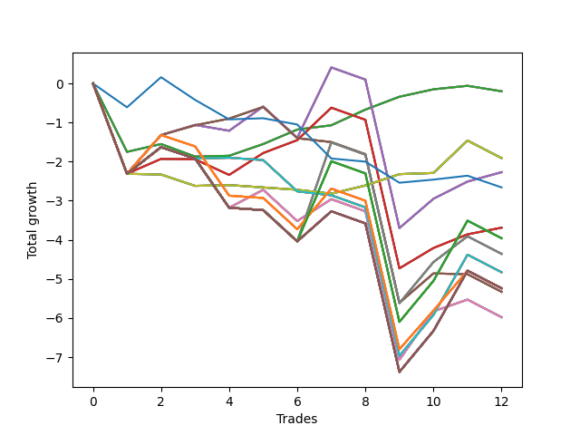

# Short Pointer 005 
- Symbol: NVDA_Unlimited
- Date Range: 02/08/2022 - 07/08/2022
- Trading Period: 7:20-12:30
- Number of Trades: 12



| Name | Win Percent | Profit | Avg Profit / Trade | Avg Time / Trade |      | Name | Win Percent | Profit | Avg Profit / Trade | Avg Time / Trade |
| ---- | ----------- | ------ | ------------------ | ---------------- | ---- | ---- | ----------- | ------ | ------------------ | ---------------- |
| Sorted By <br> Profit | | | | | | Sorted By <br> Win Percentage ||||
| Sixty-Four | 75.00 | -100.00 | -8.33 | 04:40 |     | Sixty-Four | 75.00 | -100.00 | -8.33 | 04:40 |
| Fifty-Six | 75.00 | -100.00 | -8.33 | 04:40 |     | Fifty-Six | 75.00 | -100.00 | -8.33 | 04:40 |
| Forty-Eight | 75.00 | -100.00 | -8.33 | 04:40 |     | Forty-Eight | 75.00 | -100.00 | -8.33 | 04:40 |
| Forty | 75.00 | -100.00 | -8.33 | 04:40 |     | Forty | 75.00 | -100.00 | -8.33 | 04:40 |
| Zero | 75.00 | -100.00 | -8.33 | 04:40 |     | Zero | 75.00 | -100.00 | -8.33 | 04:40 |
| Seventy | 41.67 | -955.00 | -79.58 | 11:09 |     | Sixty-Six | 58.33 | -1135.00 | -94.58 | 19:17 |
| Sixty-Two | 41.67 | -955.00 | -79.58 | 11:09 |     | Fifty-Eight | 58.33 | -1135.00 | -94.58 | 19:17 |
| Fifty-Four | 41.67 | -955.00 | -79.58 | 11:09 |     | Fifty | 58.33 | -1135.00 | -94.58 | 19:17 |
| Forty-Six | 41.67 | -955.00 | -79.58 | 11:09 |     | Forty-Two | 58.33 | -1135.00 | -94.58 | 19:17 |
| Six | 41.67 | -955.00 | -79.58 | 11:09 |     | Two | 58.33 | -1135.00 | -94.58 | 19:17 |
| Sixty-Six | 58.33 | -1135.00 | -94.58 | 19:17 |     | Sixty-Five | 58.33 | -1845.00 | -153.75 | 14:21 |
| Fifty-Eight | 58.33 | -1135.00 | -94.58 | 19:17 |     | Fifty-Seven | 58.33 | -1845.00 | -153.75 | 14:21 |
| Fifty | 58.33 | -1135.00 | -94.58 | 19:17 |     | Forty-Nine | 58.33 | -1845.00 | -153.75 | 14:21 |
| Forty-Two | 58.33 | -1135.00 | -94.58 | 19:17 |     | Forty-One | 58.33 | -1845.00 | -153.75 | 14:21 |
| Two | 58.33 | -1135.00 | -94.58 | 19:17 |     | One | 58.33 | -1845.00 | -153.75 | 14:21 |
| Seventy-Three | 33.33 | -1330.00 | -110.83 | 06:35 |     | Seventy | 41.67 | -955.00 | -79.58 | 11:09 |
| Sixty-Five | 58.33 | -1845.00 | -153.75 | 14:21 |     | Sixty-Two | 41.67 | -955.00 | -79.58 | 11:09 |
| Fifty-Seven | 58.33 | -1845.00 | -153.75 | 14:21 |     | Fifty-Four | 41.67 | -955.00 | -79.58 | 11:09 |
| Forty-Nine | 58.33 | -1845.00 | -153.75 | 14:21 |     | Forty-Six | 41.67 | -955.00 | -79.58 | 11:09 |
| Forty-One | 58.33 | -1845.00 | -153.75 | 14:21 |     | Six | 41.67 | -955.00 | -79.58 | 11:09 |
| One | 58.33 | -1845.00 | -153.75 | 14:21 |     | Sixty-Seven | 41.67 | -2665.00 | -222.08 | 16:02 |
| One Hundred Twenty-Seven | 33.33 | -1980.00 | -165.00 | 27:31 |     | Fifty-Nine | 41.67 | -2665.00 | -222.08 | 16:02 |
| One Hundred Twenty-Two | 33.33 | -1980.00 | -165.00 | 27:31 |     | Fifty-One | 41.67 | -2665.00 | -222.08 | 16:02 |
| One Hundred Seventeen | 33.33 | -1980.00 | -165.00 | 27:31 |     | Forty-Three | 41.67 | -2665.00 | -222.08 | 16:02 |
| One Hundred Twelve | 33.33 | -1980.00 | -165.00 | 27:31 |     | Three | 41.67 | -2665.00 | -222.08 | 16:02 |
| Eighty-Two | 33.33 | -1980.00 | -165.00 | 27:31 |     | Sixty-Eight | 41.67 | -2990.00 | -249.17 | 22:40 |
| Sixty-Nine | 33.33 | -2180.00 | -181.67 | 26:57 |     | Sixty | 41.67 | -2990.00 | -249.17 | 22:40 |
| Sixty-One | 33.33 | -2180.00 | -181.67 | 26:57 |     | Fifty-Two | 41.67 | -2990.00 | -249.17 | 22:40 |
| Fifty-Three | 33.33 | -2180.00 | -181.67 | 26:57 |     | Forty-Four | 41.67 | -2990.00 | -249.17 | 22:40 |
| Forty-Five | 33.33 | -2180.00 | -181.67 | 26:57 |     | Four | 41.67 | -2990.00 | -249.17 | 22:40 |
| Five | 33.33 | -2180.00 | -181.67 | 26:57 |     | Seventy-Three | 33.33 | -1330.00 | -110.83 | 06:35 |
| Seventy-One | 33.33 | -2415.00 | -201.25 | 24:22 |     | One Hundred Twenty-Seven | 33.33 | -1980.00 | -165.00 | 27:31 |
| Sixty-Three | 33.33 | -2415.00 | -201.25 | 24:22 |     | One Hundred Twenty-Two | 33.33 | -1980.00 | -165.00 | 27:31 |
| Fifty-Five | 33.33 | -2415.00 | -201.25 | 24:22 |     | One Hundred Seventeen | 33.33 | -1980.00 | -165.00 | 27:31 |
| Forty-Seven | 33.33 | -2415.00 | -201.25 | 24:22 |     | One Hundred Twelve | 33.33 | -1980.00 | -165.00 | 27:31 |
| Seven | 33.33 | -2415.00 | -201.25 | 24:22 |     | Eighty-Two | 33.33 | -1980.00 | -165.00 | 27:31 |
| One Hundred Thirty | 33.33 | -2620.00 | -218.33 | 29:20 |     | Sixty-Nine | 33.33 | -2180.00 | -181.67 | 26:57 |
| One Hundred Twenty-Nine | 33.33 | -2620.00 | -218.33 | 29:20 |     | Sixty-One | 33.33 | -2180.00 | -181.67 | 26:57 |
| One Hundred Twenty-Eight | 33.33 | -2620.00 | -218.33 | 29:20 |     | Fifty-Three | 33.33 | -2180.00 | -181.67 | 26:57 |
| One Hundred Twenty-Six | 33.33 | -2620.00 | -218.33 | 23:42 |     | Forty-Five | 33.33 | -2180.00 | -181.67 | 26:57 |
| One Hundred Twenty-Five | 33.33 | -2620.00 | -218.33 | 29:20 |     | Five | 33.33 | -2180.00 | -181.67 | 26:57 |
| One Hundred Twenty-Four | 33.33 | -2620.00 | -218.33 | 29:20 |     | Seventy-One | 33.33 | -2415.00 | -201.25 | 24:22 |
| One Hundred Twenty-Three | 33.33 | -2620.00 | -218.33 | 29:20 |     | Sixty-Three | 33.33 | -2415.00 | -201.25 | 24:22 |
| One Hundred Twenty-One | 33.33 | -2620.00 | -218.33 | 23:42 |     | Fifty-Five | 33.33 | -2415.00 | -201.25 | 24:22 |
| One Hundred Twenty | 33.33 | -2620.00 | -218.33 | 29:20 |     | Forty-Seven | 33.33 | -2415.00 | -201.25 | 24:22 |
| One Hundred Ninteen | 33.33 | -2620.00 | -218.33 | 29:20 |     | Seven | 33.33 | -2415.00 | -201.25 | 24:22 |
| One Hundred Eighteen | 33.33 | -2620.00 | -218.33 | 29:20 |     | One Hundred Thirty | 33.33 | -2620.00 | -218.33 | 29:20 |
| One Hundred Sixteen | 33.33 | -2620.00 | -218.33 | 23:42 |     | One Hundred Twenty-Nine | 33.33 | -2620.00 | -218.33 | 29:20 |
| One Hundred Fifteen | 33.33 | -2620.00 | -218.33 | 29:20 |     | One Hundred Twenty-Eight | 33.33 | -2620.00 | -218.33 | 29:20 |
| One Hundred Fourteen | 33.33 | -2620.00 | -218.33 | 29:20 |     | One Hundred Twenty-Six | 33.33 | -2620.00 | -218.33 | 23:42 |
| One Hundred Thirteen | 33.33 | -2620.00 | -218.33 | 29:20 |     | One Hundred Twenty-Five | 33.33 | -2620.00 | -218.33 | 29:20 |
| One Hundred Eleven | 33.33 | -2620.00 | -218.33 | 23:42 |     | One Hundred Twenty-Four | 33.33 | -2620.00 | -218.33 | 29:20 |
| Eighty-Five | 33.33 | -2620.00 | -218.33 | 29:20 |     | One Hundred Twenty-Three | 33.33 | -2620.00 | -218.33 | 29:20 |
| Eighty-Four | 33.33 | -2620.00 | -218.33 | 29:20 |     | One Hundred Twenty-One | 33.33 | -2620.00 | -218.33 | 23:42 |
| Eighty-Three | 33.33 | -2620.00 | -218.33 | 29:20 |     | One Hundred Twenty | 33.33 | -2620.00 | -218.33 | 29:20 |
| Eighty-One | 33.33 | -2620.00 | -218.33 | 23:42 |     | One Hundred Ninteen | 33.33 | -2620.00 | -218.33 | 29:20 |
| Sixty-Seven | 41.67 | -2665.00 | -222.08 | 16:02 |     | One Hundred Eighteen | 33.33 | -2620.00 | -218.33 | 29:20 |
| Fifty-Nine | 41.67 | -2665.00 | -222.08 | 16:02 |     | One Hundred Sixteen | 33.33 | -2620.00 | -218.33 | 23:42 |
| Fifty-One | 41.67 | -2665.00 | -222.08 | 16:02 |     | One Hundred Fifteen | 33.33 | -2620.00 | -218.33 | 29:20 |
| Forty-Three | 41.67 | -2665.00 | -222.08 | 16:02 |     | One Hundred Fourteen | 33.33 | -2620.00 | -218.33 | 29:20 |
| Three | 41.67 | -2665.00 | -222.08 | 16:02 |     | One Hundred Thirteen | 33.33 | -2620.00 | -218.33 | 29:20 |
| Sixty-Eight | 41.67 | -2990.00 | -249.17 | 22:40 |     | One Hundred Eleven | 33.33 | -2620.00 | -218.33 | 23:42 |
| Sixty | 41.67 | -2990.00 | -249.17 | 22:40 |     | Eighty-Five | 33.33 | -2620.00 | -218.33 | 29:20 |
| Fifty-Two | 41.67 | -2990.00 | -249.17 | 22:40 |     | Eighty-Four | 33.33 | -2620.00 | -218.33 | 29:20 |
| Forty-Four | 41.67 | -2990.00 | -249.17 | 22:40 |     | Eighty-Three | 33.33 | -2620.00 | -218.33 | 29:20 |
| Four | 41.67 | -2990.00 | -249.17 | 22:40 |     | Eighty-One | 33.33 | -2620.00 | -218.33 | 23:42 |

## NO STOPLOSS

### Test Zero
* Sell when price hits the middle line of the 20p bollinger
* No Stoploss
* Results:
```
Total Trades: 12
Percent Up: 25.00
Percent Down: 75.00
Total Points Moved Down: -0.20
Potential Profit: -100.00
Total Points Ups: 2.21 Count Ups: 3
Total Points Downs: 2.01 Count Downs: 9
```

<details><summary>Trades</summary>

<code>In: 2022-02-09 08:07:00		Out: 2022-02-09 08:30:35		Total Position Time: 23:35		Total Move Down: -1.75		Total to Date: -1.75</code> <br />
<code>In: 2022-03-04 10:11:00		Out: 2022-03-04 10:11:35		Total Position Time: 00:35		Total Move Down: 0.20		Total to Date: -1.55</code> <br />
<code>In: 2022-03-09 09:41:00		Out: 2022-03-09 09:52:45		Total Position Time: 11:45		Total Move Down: -0.32		Total to Date: -1.87</code> <br />
<code>In: 2022-03-10 08:47:00		Out: 2022-03-10 08:47:10		Total Position Time: 00:10		Total Move Down: 0.02		Total to Date: -1.85</code> <br />
<code>In: 2022-03-10 12:23:00		Out: 2022-03-10 12:23:10		Total Position Time: 00:10		Total Move Down: 0.30		Total to Date: -1.55</code> <br />
<code>In: 2022-03-11 10:08:00		Out: 2022-03-11 10:09:10		Total Position Time: 01:10		Total Move Down: 0.37		Total to Date: -1.18</code> <br />
<code>In: 2022-04-06 07:22:00		Out: 2022-04-06 07:25:15		Total Position Time: 03:15		Total Move Down: 0.11		Total to Date: -1.07</code> <br />
<code>In: 2022-04-20 09:57:00		Out: 2022-04-20 09:58:50		Total Position Time: 01:50		Total Move Down: 0.40		Total to Date: -0.67</code> <br />
<code>In: 2022-05-02 11:57:00		Out: 2022-05-02 11:58:05		Total Position Time: 01:05		Total Move Down: 0.33		Total to Date: -0.34</code> <br />
<code>In: 2022-05-05 10:13:00		Out: 2022-05-05 10:14:00		Total Position Time: 01:00		Total Move Down: 0.19		Total to Date: -0.15</code> <br />
<code>In: 2022-06-22 12:08:00		Out: 2022-06-22 12:09:45		Total Position Time: 01:45		Total Move Down: 0.09		Total to Date: -0.06</code> <br />
<code>In: 2022-07-06 11:51:00		Out: 2022-07-06 12:00:50		Total Position Time: 09:50		Total Move Down: -0.14		Total to Date: -0.20</code> <br />


</details>

### Test One
* Sell when the price hits the upper line of the 20p 1std bollinger
* No Stoploss
* Results:
```
Total Trades: 12
Percent Up: 41.67
Percent Down: 58.33
Total Points Moved Down: -3.69
Potential Profit: -1845.00
Total Points Ups: 6.83 Count Ups: 5
Total Points Downs: 3.14 Count Downs: 7
```

<details><summary>Trades</summary>

<code>In: 2022-02-09 08:07:00		Out: 2022-02-09 08:36:55		Total Position Time: 29:55		Total Move Down: -2.31		Total to Date: -2.31</code> <br />
<code>In: 2022-03-04 10:11:00		Out: 2022-03-04 10:16:45		Total Position Time: 05:45		Total Move Down: 0.38		Total to Date: -1.93</code> <br />
<code>In: 2022-03-09 09:41:00		Out: 2022-03-09 10:00:15		Total Position Time: 19:15		Total Move Down: -0.01		Total to Date: -1.94</code> <br />
<code>In: 2022-03-10 08:47:00		Out: 2022-03-10 09:07:30		Total Position Time: 20:30		Total Move Down: -0.40		Total to Date: -2.34</code> <br />
<code>In: 2022-03-10 12:23:00		Out: 2022-03-10 12:23:45		Total Position Time: 00:45		Total Move Down: 0.56		Total to Date: -1.78</code> <br />
<code>In: 2022-03-11 10:08:00		Out: 2022-03-11 10:19:20		Total Position Time: 11:20		Total Move Down: 0.33		Total to Date: -1.45</code> <br />
<code>In: 2022-04-06 07:22:00		Out: 2022-04-06 07:26:25		Total Position Time: 04:25		Total Move Down: 0.83		Total to Date: -0.62</code> <br />
<code>In: 2022-04-20 09:57:00		Out: 2022-04-20 10:26:55		Total Position Time: 29:55		Total Move Down: -0.31		Total to Date: -0.93</code> <br />
<code>In: 2022-05-02 11:57:00		Out: 2022-05-02 12:26:55		Total Position Time: 29:55		Total Move Down: -3.80		Total to Date: -4.73</code> <br />
<code>In: 2022-05-05 10:13:00		Out: 2022-05-05 10:20:20		Total Position Time: 07:20		Total Move Down: 0.52		Total to Date: -4.21</code> <br />
<code>In: 2022-06-22 12:08:00		Out: 2022-06-22 12:10:45		Total Position Time: 02:45		Total Move Down: 0.35		Total to Date: -3.86</code> <br />
<code>In: 2022-07-06 11:51:00		Out: 2022-07-06 12:01:30		Total Position Time: 10:30		Total Move Down: 0.17		Total to Date: -3.69</code> <br />


</details>

### Test Two
* Sell when the price hits the upper line of the 20p 2std bollinger
* No Stoploss
* Results:
```
Total Trades: 12
Percent Up: 41.67
Percent Down: 58.33
Total Points Moved Down: -2.27
Potential Profit: -1135.00
Total Points Ups: 7.37 Count Ups: 5
Total Points Downs: 5.10 Count Downs: 7
```

<details><summary>Trades</summary>

<code>In: 2022-02-09 08:07:00		Out: 2022-02-09 08:36:55		Total Position Time: 29:55		Total Move Down: -2.31		Total to Date: -2.31</code> <br />
<code>In: 2022-03-04 10:11:00		Out: 2022-03-04 10:17:05		Total Position Time: 06:05		Total Move Down: 0.99		Total to Date: -1.32</code> <br />
<code>In: 2022-03-09 09:41:00		Out: 2022-03-09 10:02:15		Total Position Time: 21:15		Total Move Down: 0.26		Total to Date: -1.06</code> <br />
<code>In: 2022-03-10 08:47:00		Out: 2022-03-10 09:08:55		Total Position Time: 21:55		Total Move Down: -0.15		Total to Date: -1.21</code> <br />
<code>In: 2022-03-10 12:23:00		Out: 2022-03-10 12:38:10		Total Position Time: 15:10		Total Move Down: 0.62		Total to Date: -0.59</code> <br />
<code>In: 2022-03-11 10:08:00		Out: 2022-03-11 10:37:55		Total Position Time: 29:55		Total Move Down: -0.80		Total to Date: -1.39</code> <br />
<code>In: 2022-04-06 07:22:00		Out: 2022-04-06 07:30:00		Total Position Time: 08:00		Total Move Down: 1.80		Total to Date: 0.41</code> <br />
<code>In: 2022-04-20 09:57:00		Out: 2022-04-20 10:26:55		Total Position Time: 29:55		Total Move Down: -0.31		Total to Date: 0.10</code> <br />
<code>In: 2022-05-02 11:57:00		Out: 2022-05-02 12:26:55		Total Position Time: 29:55		Total Move Down: -3.80		Total to Date: -3.70</code> <br />
<code>In: 2022-05-05 10:13:00		Out: 2022-05-05 10:30:30		Total Position Time: 17:30		Total Move Down: 0.75		Total to Date: -2.95</code> <br />
<code>In: 2022-06-22 12:08:00		Out: 2022-06-22 12:19:10		Total Position Time: 11:10		Total Move Down: 0.44		Total to Date: -2.51</code> <br />
<code>In: 2022-07-06 11:51:00		Out: 2022-07-06 12:01:40		Total Position Time: 10:40		Total Move Down: 0.24		Total to Date: -2.27</code> <br />


</details>

### Test Three
* Sell when price hits the middle line of the 50p bollinger
* No Stoploss
* Results:
```
Total Trades: 12
Percent Up: 58.33
Percent Down: 41.67
Total Points Moved Down: -5.33
Potential Profit: -2665.00
Total Points Ups: 7.79 Count Ups: 7
Total Points Downs: 2.46 Count Downs: 5
```

<details><summary>Trades</summary>

<code>In: 2022-02-09 08:07:00		Out: 2022-02-09 08:36:55		Total Position Time: 29:55		Total Move Down: -2.31		Total to Date: -2.31</code> <br />
<code>In: 2022-03-04 10:11:00		Out: 2022-03-04 10:17:05		Total Position Time: 06:05		Total Move Down: 0.99		Total to Date: -1.32</code> <br />
<code>In: 2022-03-09 09:41:00		Out: 2022-03-09 10:03:05		Total Position Time: 22:05		Total Move Down: 0.25		Total to Date: -1.07</code> <br />
<code>In: 2022-03-10 08:47:00		Out: 2022-03-10 08:47:40		Total Position Time: 00:40		Total Move Down: 0.17		Total to Date: -0.90</code> <br />
<code>In: 2022-03-10 12:23:00		Out: 2022-03-10 12:23:10		Total Position Time: 00:10		Total Move Down: 0.30		Total to Date: -0.60</code> <br />
<code>In: 2022-03-11 10:08:00		Out: 2022-03-11 10:37:55		Total Position Time: 29:55		Total Move Down: -0.80		Total to Date: -1.40</code> <br />
<code>In: 2022-04-06 07:22:00		Out: 2022-04-06 07:22:10		Total Position Time: 00:10		Total Move Down: -0.10		Total to Date: -1.50</code> <br />
<code>In: 2022-04-20 09:57:00		Out: 2022-04-20 10:26:55		Total Position Time: 29:55		Total Move Down: -0.31		Total to Date: -1.81</code> <br />
<code>In: 2022-05-02 11:57:00		Out: 2022-05-02 12:26:55		Total Position Time: 29:55		Total Move Down: -3.80		Total to Date: -5.61</code> <br />
<code>In: 2022-05-05 10:13:00		Out: 2022-05-05 10:26:35		Total Position Time: 13:35		Total Move Down: 0.75		Total to Date: -4.86</code> <br />
<code>In: 2022-06-22 12:08:00		Out: 2022-06-22 12:08:10		Total Position Time: 00:10		Total Move Down: -0.02		Total to Date: -4.88</code> <br />
<code>In: 2022-07-06 11:51:00		Out: 2022-07-06 12:20:55		Total Position Time: 29:55		Total Move Down: -0.45		Total to Date: -5.33</code> <br />


</details>

### Test Four
* Sell when the price hits the upper line of the 50p 1std bollinger
* No Stoploss
* Results:
```
Total Trades: 12
Percent Up: 58.33
Percent Down: 41.67
Total Points Moved Down: -5.98
Potential Profit: -2990.00
Total Points Ups: 9.22 Count Ups: 7
Total Points Downs: 3.24 Count Downs: 5
```

<details><summary>Trades</summary>

<code>In: 2022-02-09 08:07:00		Out: 2022-02-09 08:36:55		Total Position Time: 29:55		Total Move Down: -2.31		Total to Date: -2.31</code> <br />
<code>In: 2022-03-04 10:11:00		Out: 2022-03-04 10:40:55		Total Position Time: 29:55		Total Move Down: 0.68		Total to Date: -1.63</code> <br />
<code>In: 2022-03-09 09:41:00		Out: 2022-03-09 10:10:55		Total Position Time: 29:55		Total Move Down: -0.29		Total to Date: -1.92</code> <br />
<code>In: 2022-03-10 08:47:00		Out: 2022-03-10 09:16:55		Total Position Time: 29:55		Total Move Down: -1.26		Total to Date: -3.18</code> <br />
<code>In: 2022-03-10 12:23:00		Out: 2022-03-10 12:23:35		Total Position Time: 00:35		Total Move Down: 0.46		Total to Date: -2.72</code> <br />
<code>In: 2022-03-11 10:08:00		Out: 2022-03-11 10:37:55		Total Position Time: 29:55		Total Move Down: -0.80		Total to Date: -3.52</code> <br />
<code>In: 2022-04-06 07:22:00		Out: 2022-04-06 07:25:40		Total Position Time: 03:40		Total Move Down: 0.56		Total to Date: -2.96</code> <br />
<code>In: 2022-04-20 09:57:00		Out: 2022-04-20 10:26:55		Total Position Time: 29:55		Total Move Down: -0.31		Total to Date: -3.27</code> <br />
<code>In: 2022-05-02 11:57:00		Out: 2022-05-02 12:26:55		Total Position Time: 29:55		Total Move Down: -3.80		Total to Date: -7.07</code> <br />
<code>In: 2022-05-05 10:13:00		Out: 2022-05-05 10:38:55		Total Position Time: 25:55		Total Move Down: 1.24		Total to Date: -5.83</code> <br />
<code>In: 2022-06-22 12:08:00		Out: 2022-06-22 12:10:40		Total Position Time: 02:40		Total Move Down: 0.30		Total to Date: -5.53</code> <br />
<code>In: 2022-07-06 11:51:00		Out: 2022-07-06 12:20:55		Total Position Time: 29:55		Total Move Down: -0.45		Total to Date: -5.98</code> <br />


</details>

### Test Five
* Sell when the price hits the upper line of the 50p 2std bollinger
* No Stoploss
* Results:
```
Total Trades: 12
Percent Up: 66.67
Percent Down: 33.33
Total Points Moved Down: -4.36
Potential Profit: -2180.00
Total Points Ups: 9.28 Count Ups: 8
Total Points Downs: 4.92 Count Downs: 4
```

<details><summary>Trades</summary>

<code>In: 2022-02-09 08:07:00		Out: 2022-02-09 08:36:55		Total Position Time: 29:55		Total Move Down: -2.31		Total to Date: -2.31</code> <br />
<code>In: 2022-03-04 10:11:00		Out: 2022-03-04 10:40:55		Total Position Time: 29:55		Total Move Down: 0.68		Total to Date: -1.63</code> <br />
<code>In: 2022-03-09 09:41:00		Out: 2022-03-09 10:10:55		Total Position Time: 29:55		Total Move Down: -0.29		Total to Date: -1.92</code> <br />
<code>In: 2022-03-10 08:47:00		Out: 2022-03-10 09:16:55		Total Position Time: 29:55		Total Move Down: -1.26		Total to Date: -3.18</code> <br />
<code>In: 2022-03-10 12:23:00		Out: 2022-03-10 12:46:00		Total Position Time: 23:00		Total Move Down: -0.06		Total to Date: -3.24</code> <br />
<code>In: 2022-03-11 10:08:00		Out: 2022-03-11 10:37:55		Total Position Time: 29:55		Total Move Down: -0.80		Total to Date: -4.04</code> <br />
<code>In: 2022-04-06 07:22:00		Out: 2022-04-06 07:34:55		Total Position Time: 12:55		Total Move Down: 2.53		Total to Date: -1.51</code> <br />
<code>In: 2022-04-20 09:57:00		Out: 2022-04-20 10:26:55		Total Position Time: 29:55		Total Move Down: -0.31		Total to Date: -1.82</code> <br />
<code>In: 2022-05-02 11:57:00		Out: 2022-05-02 12:26:55		Total Position Time: 29:55		Total Move Down: -3.80		Total to Date: -5.62</code> <br />
<code>In: 2022-05-05 10:13:00		Out: 2022-05-05 10:42:55		Total Position Time: 29:55		Total Move Down: 1.05		Total to Date: -4.57</code> <br />
<code>In: 2022-06-22 12:08:00		Out: 2022-06-22 12:26:20		Total Position Time: 18:20		Total Move Down: 0.66		Total to Date: -3.91</code> <br />
<code>In: 2022-07-06 11:51:00		Out: 2022-07-06 12:20:55		Total Position Time: 29:55		Total Move Down: -0.45		Total to Date: -4.36</code> <br />


</details>

### Test Six
* Sell when the price hits the middle line of the 1std VWAP
* No Stoploss
* Results:
```
Total Trades: 12
Percent Up: 58.33
Percent Down: 41.67
Total Points Moved Down: -1.91
Potential Profit: -955.00
Total Points Ups: 3.29 Count Ups: 7
Total Points Downs: 1.38 Count Downs: 5
```

<details><summary>Trades</summary>

<code>In: 2022-02-09 08:07:00		Out: 2022-02-09 08:36:55		Total Position Time: 29:55		Total Move Down: -2.31		Total to Date: -2.31</code> <br />
<code>In: 2022-03-04 10:11:00		Out: 2022-03-04 10:11:10		Total Position Time: 00:10		Total Move Down: -0.02		Total to Date: -2.33</code> <br />
<code>In: 2022-03-09 09:41:00		Out: 2022-03-09 10:10:55		Total Position Time: 29:55		Total Move Down: -0.29		Total to Date: -2.62</code> <br />
<code>In: 2022-03-10 08:47:00		Out: 2022-03-10 08:47:10		Total Position Time: 00:10		Total Move Down: 0.02		Total to Date: -2.60</code> <br />
<code>In: 2022-03-10 12:23:00		Out: 2022-03-10 12:46:00		Total Position Time: 23:00		Total Move Down: -0.06		Total to Date: -2.66</code> <br />
<code>In: 2022-03-11 10:08:00		Out: 2022-03-11 10:08:10		Total Position Time: 00:10		Total Move Down: -0.06		Total to Date: -2.72</code> <br />
<code>In: 2022-04-06 07:22:00		Out: 2022-04-06 07:22:10		Total Position Time: 00:10		Total Move Down: -0.10		Total to Date: -2.82</code> <br />
<code>In: 2022-04-20 09:57:00		Out: 2022-04-20 09:57:10		Total Position Time: 00:10		Total Move Down: 0.21		Total to Date: -2.61</code> <br />
<code>In: 2022-05-02 11:57:00		Out: 2022-05-02 11:58:30		Total Position Time: 01:30		Total Move Down: 0.29		Total to Date: -2.32</code> <br />
<code>In: 2022-05-05 10:13:00		Out: 2022-05-05 10:13:10		Total Position Time: 00:10		Total Move Down: 0.03		Total to Date: -2.29</code> <br />
<code>In: 2022-06-22 12:08:00		Out: 2022-06-22 12:26:35		Total Position Time: 18:35		Total Move Down: 0.83		Total to Date: -1.46</code> <br />
<code>In: 2022-07-06 11:51:00		Out: 2022-07-06 12:20:55		Total Position Time: 29:55		Total Move Down: -0.45		Total to Date: -1.91</code> <br />


</details>

### Test Seven
* Sell when the price hits the upper line of the 1std VWAP
* No Stoploss
* Results:
```
Total Trades: 12
Percent Up: 66.67
Percent Down: 33.33
Total Points Moved Down: -4.83
Potential Profit: -2415.00
Total Points Ups: 8.12 Count Ups: 8
Total Points Downs: 3.29 Count Downs: 4
```

<details><summary>Trades</summary>

<code>In: 2022-02-09 08:07:00		Out: 2022-02-09 08:36:55		Total Position Time: 29:55		Total Move Down: -2.31		Total to Date: -2.31</code> <br />
<code>In: 2022-03-04 10:11:00		Out: 2022-03-04 10:40:55		Total Position Time: 29:55		Total Move Down: 0.68		Total to Date: -1.63</code> <br />
<code>In: 2022-03-09 09:41:00		Out: 2022-03-09 10:10:55		Total Position Time: 29:55		Total Move Down: -0.29		Total to Date: -1.92</code> <br />
<code>In: 2022-03-10 08:47:00		Out: 2022-03-10 08:47:10		Total Position Time: 00:10		Total Move Down: 0.02		Total to Date: -1.90</code> <br />
<code>In: 2022-03-10 12:23:00		Out: 2022-03-10 12:46:00		Total Position Time: 23:00		Total Move Down: -0.06		Total to Date: -1.96</code> <br />
<code>In: 2022-03-11 10:08:00		Out: 2022-03-11 10:37:55		Total Position Time: 29:55		Total Move Down: -0.80		Total to Date: -2.76</code> <br />
<code>In: 2022-04-06 07:22:00		Out: 2022-04-06 07:22:10		Total Position Time: 00:10		Total Move Down: -0.10		Total to Date: -2.86</code> <br />
<code>In: 2022-04-20 09:57:00		Out: 2022-04-20 10:26:55		Total Position Time: 29:55		Total Move Down: -0.31		Total to Date: -3.17</code> <br />
<code>In: 2022-05-02 11:57:00		Out: 2022-05-02 12:26:55		Total Position Time: 29:55		Total Move Down: -3.80		Total to Date: -6.97</code> <br />
<code>In: 2022-05-05 10:13:00		Out: 2022-05-05 10:42:55		Total Position Time: 29:55		Total Move Down: 1.05		Total to Date: -5.92</code> <br />
<code>In: 2022-06-22 12:08:00		Out: 2022-06-22 12:37:55		Total Position Time: 29:55		Total Move Down: 1.54		Total to Date: -4.38</code> <br />
<code>In: 2022-07-06 11:51:00		Out: 2022-07-06 12:20:55		Total Position Time: 29:55		Total Move Down: -0.45		Total to Date: -4.83</code> <br />


</details>

## STOPLOSS OF 5

### Test Forty
* Sell when price hits the middle line of the 20p bollinger
* Stoploss is -5 points
* Results:
```
Total Trades: 12
Percent Up: 25.00
Percent Down: 75.00
Total Points Moved Down: -0.20
Potential Profit: -100.00
Total Points Ups: 2.21 Count Ups: 3
Total Points Downs: 2.01 Count Downs: 9
```

<details><summary>Trades</summary>

<code>In: 2022-02-09 08:07:00		Out: 2022-02-09 08:30:35		Total Position Time: 23:35		Total Move Down: -1.75		Total to Date: -1.75</code> <br />
<code>In: 2022-03-04 10:11:00		Out: 2022-03-04 10:11:35		Total Position Time: 00:35		Total Move Down: 0.20		Total to Date: -1.55</code> <br />
<code>In: 2022-03-09 09:41:00		Out: 2022-03-09 09:52:45		Total Position Time: 11:45		Total Move Down: -0.32		Total to Date: -1.87</code> <br />
<code>In: 2022-03-10 08:47:00		Out: 2022-03-10 08:47:10		Total Position Time: 00:10		Total Move Down: 0.02		Total to Date: -1.85</code> <br />
<code>In: 2022-03-10 12:23:00		Out: 2022-03-10 12:23:10		Total Position Time: 00:10		Total Move Down: 0.30		Total to Date: -1.55</code> <br />
<code>In: 2022-03-11 10:08:00		Out: 2022-03-11 10:09:10		Total Position Time: 01:10		Total Move Down: 0.37		Total to Date: -1.18</code> <br />
<code>In: 2022-04-06 07:22:00		Out: 2022-04-06 07:25:15		Total Position Time: 03:15		Total Move Down: 0.11		Total to Date: -1.07</code> <br />
<code>In: 2022-04-20 09:57:00		Out: 2022-04-20 09:58:50		Total Position Time: 01:50		Total Move Down: 0.40		Total to Date: -0.67</code> <br />
<code>In: 2022-05-02 11:57:00		Out: 2022-05-02 11:58:05		Total Position Time: 01:05		Total Move Down: 0.33		Total to Date: -0.34</code> <br />
<code>In: 2022-05-05 10:13:00		Out: 2022-05-05 10:14:00		Total Position Time: 01:00		Total Move Down: 0.19		Total to Date: -0.15</code> <br />
<code>In: 2022-06-22 12:08:00		Out: 2022-06-22 12:09:45		Total Position Time: 01:45		Total Move Down: 0.09		Total to Date: -0.06</code> <br />
<code>In: 2022-07-06 11:51:00		Out: 2022-07-06 12:00:50		Total Position Time: 09:50		Total Move Down: -0.14		Total to Date: -0.20</code> <br />


</details>

### Test Forty-One
* Sell when the price hits the upper line of the 20p 1std bollinger
* Stoploss is -5 points
* Results:
```
Total Trades: 12
Percent Up: 41.67
Percent Down: 58.33
Total Points Moved Down: -3.69
Potential Profit: -1845.00
Total Points Ups: 6.83 Count Ups: 5
Total Points Downs: 3.14 Count Downs: 7
```

<details><summary>Trades</summary>

<code>In: 2022-02-09 08:07:00		Out: 2022-02-09 08:36:55		Total Position Time: 29:55		Total Move Down: -2.31		Total to Date: -2.31</code> <br />
<code>In: 2022-03-04 10:11:00		Out: 2022-03-04 10:16:45		Total Position Time: 05:45		Total Move Down: 0.38		Total to Date: -1.93</code> <br />
<code>In: 2022-03-09 09:41:00		Out: 2022-03-09 10:00:15		Total Position Time: 19:15		Total Move Down: -0.01		Total to Date: -1.94</code> <br />
<code>In: 2022-03-10 08:47:00		Out: 2022-03-10 09:07:30		Total Position Time: 20:30		Total Move Down: -0.40		Total to Date: -2.34</code> <br />
<code>In: 2022-03-10 12:23:00		Out: 2022-03-10 12:23:45		Total Position Time: 00:45		Total Move Down: 0.56		Total to Date: -1.78</code> <br />
<code>In: 2022-03-11 10:08:00		Out: 2022-03-11 10:19:20		Total Position Time: 11:20		Total Move Down: 0.33		Total to Date: -1.45</code> <br />
<code>In: 2022-04-06 07:22:00		Out: 2022-04-06 07:26:25		Total Position Time: 04:25		Total Move Down: 0.83		Total to Date: -0.62</code> <br />
<code>In: 2022-04-20 09:57:00		Out: 2022-04-20 10:26:55		Total Position Time: 29:55		Total Move Down: -0.31		Total to Date: -0.93</code> <br />
<code>In: 2022-05-02 11:57:00		Out: 2022-05-02 12:26:55		Total Position Time: 29:55		Total Move Down: -3.80		Total to Date: -4.73</code> <br />
<code>In: 2022-05-05 10:13:00		Out: 2022-05-05 10:20:20		Total Position Time: 07:20		Total Move Down: 0.52		Total to Date: -4.21</code> <br />
<code>In: 2022-06-22 12:08:00		Out: 2022-06-22 12:10:45		Total Position Time: 02:45		Total Move Down: 0.35		Total to Date: -3.86</code> <br />
<code>In: 2022-07-06 11:51:00		Out: 2022-07-06 12:01:30		Total Position Time: 10:30		Total Move Down: 0.17		Total to Date: -3.69</code> <br />


</details>

### Test Forty-Two
* Sell when the price hits the upper line of the 20p 2std bollinger
* Stoploss is -5 points
* Results:
```
Total Trades: 12
Percent Up: 41.67
Percent Down: 58.33
Total Points Moved Down: -2.27
Potential Profit: -1135.00
Total Points Ups: 7.37 Count Ups: 5
Total Points Downs: 5.10 Count Downs: 7
```

<details><summary>Trades</summary>

<code>In: 2022-02-09 08:07:00		Out: 2022-02-09 08:36:55		Total Position Time: 29:55		Total Move Down: -2.31		Total to Date: -2.31</code> <br />
<code>In: 2022-03-04 10:11:00		Out: 2022-03-04 10:17:05		Total Position Time: 06:05		Total Move Down: 0.99		Total to Date: -1.32</code> <br />
<code>In: 2022-03-09 09:41:00		Out: 2022-03-09 10:02:15		Total Position Time: 21:15		Total Move Down: 0.26		Total to Date: -1.06</code> <br />
<code>In: 2022-03-10 08:47:00		Out: 2022-03-10 09:08:55		Total Position Time: 21:55		Total Move Down: -0.15		Total to Date: -1.21</code> <br />
<code>In: 2022-03-10 12:23:00		Out: 2022-03-10 12:38:10		Total Position Time: 15:10		Total Move Down: 0.62		Total to Date: -0.59</code> <br />
<code>In: 2022-03-11 10:08:00		Out: 2022-03-11 10:37:55		Total Position Time: 29:55		Total Move Down: -0.80		Total to Date: -1.39</code> <br />
<code>In: 2022-04-06 07:22:00		Out: 2022-04-06 07:30:00		Total Position Time: 08:00		Total Move Down: 1.80		Total to Date: 0.41</code> <br />
<code>In: 2022-04-20 09:57:00		Out: 2022-04-20 10:26:55		Total Position Time: 29:55		Total Move Down: -0.31		Total to Date: 0.10</code> <br />
<code>In: 2022-05-02 11:57:00		Out: 2022-05-02 12:26:55		Total Position Time: 29:55		Total Move Down: -3.80		Total to Date: -3.70</code> <br />
<code>In: 2022-05-05 10:13:00		Out: 2022-05-05 10:30:30		Total Position Time: 17:30		Total Move Down: 0.75		Total to Date: -2.95</code> <br />
<code>In: 2022-06-22 12:08:00		Out: 2022-06-22 12:19:10		Total Position Time: 11:10		Total Move Down: 0.44		Total to Date: -2.51</code> <br />
<code>In: 2022-07-06 11:51:00		Out: 2022-07-06 12:01:40		Total Position Time: 10:40		Total Move Down: 0.24		Total to Date: -2.27</code> <br />


</details>

### Test Forty-Three
* Sell when price hits the middle line of the 50p bollinger
* Stoploss is -5 points
* Results:
```
Total Trades: 12
Percent Up: 58.33
Percent Down: 41.67
Total Points Moved Down: -5.33
Potential Profit: -2665.00
Total Points Ups: 7.79 Count Ups: 7
Total Points Downs: 2.46 Count Downs: 5
```

<details><summary>Trades</summary>

<code>In: 2022-02-09 08:07:00		Out: 2022-02-09 08:36:55		Total Position Time: 29:55		Total Move Down: -2.31		Total to Date: -2.31</code> <br />
<code>In: 2022-03-04 10:11:00		Out: 2022-03-04 10:17:05		Total Position Time: 06:05		Total Move Down: 0.99		Total to Date: -1.32</code> <br />
<code>In: 2022-03-09 09:41:00		Out: 2022-03-09 10:03:05		Total Position Time: 22:05		Total Move Down: 0.25		Total to Date: -1.07</code> <br />
<code>In: 2022-03-10 08:47:00		Out: 2022-03-10 08:47:40		Total Position Time: 00:40		Total Move Down: 0.17		Total to Date: -0.90</code> <br />
<code>In: 2022-03-10 12:23:00		Out: 2022-03-10 12:23:10		Total Position Time: 00:10		Total Move Down: 0.30		Total to Date: -0.60</code> <br />
<code>In: 2022-03-11 10:08:00		Out: 2022-03-11 10:37:55		Total Position Time: 29:55		Total Move Down: -0.80		Total to Date: -1.40</code> <br />
<code>In: 2022-04-06 07:22:00		Out: 2022-04-06 07:22:10		Total Position Time: 00:10		Total Move Down: -0.10		Total to Date: -1.50</code> <br />
<code>In: 2022-04-20 09:57:00		Out: 2022-04-20 10:26:55		Total Position Time: 29:55		Total Move Down: -0.31		Total to Date: -1.81</code> <br />
<code>In: 2022-05-02 11:57:00		Out: 2022-05-02 12:26:55		Total Position Time: 29:55		Total Move Down: -3.80		Total to Date: -5.61</code> <br />
<code>In: 2022-05-05 10:13:00		Out: 2022-05-05 10:26:35		Total Position Time: 13:35		Total Move Down: 0.75		Total to Date: -4.86</code> <br />
<code>In: 2022-06-22 12:08:00		Out: 2022-06-22 12:08:10		Total Position Time: 00:10		Total Move Down: -0.02		Total to Date: -4.88</code> <br />
<code>In: 2022-07-06 11:51:00		Out: 2022-07-06 12:20:55		Total Position Time: 29:55		Total Move Down: -0.45		Total to Date: -5.33</code> <br />


</details>

### Test Forty-Four
* Sell when the price hits the upper line of the 50p 1std bollinger
* Stoploss is -5 points
* Results:
```
Total Trades: 12
Percent Up: 58.33
Percent Down: 41.67
Total Points Moved Down: -5.98
Potential Profit: -2990.00
Total Points Ups: 9.22 Count Ups: 7
Total Points Downs: 3.24 Count Downs: 5
```

<details><summary>Trades</summary>

<code>In: 2022-02-09 08:07:00		Out: 2022-02-09 08:36:55		Total Position Time: 29:55		Total Move Down: -2.31		Total to Date: -2.31</code> <br />
<code>In: 2022-03-04 10:11:00		Out: 2022-03-04 10:40:55		Total Position Time: 29:55		Total Move Down: 0.68		Total to Date: -1.63</code> <br />
<code>In: 2022-03-09 09:41:00		Out: 2022-03-09 10:10:55		Total Position Time: 29:55		Total Move Down: -0.29		Total to Date: -1.92</code> <br />
<code>In: 2022-03-10 08:47:00		Out: 2022-03-10 09:16:55		Total Position Time: 29:55		Total Move Down: -1.26		Total to Date: -3.18</code> <br />
<code>In: 2022-03-10 12:23:00		Out: 2022-03-10 12:23:35		Total Position Time: 00:35		Total Move Down: 0.46		Total to Date: -2.72</code> <br />
<code>In: 2022-03-11 10:08:00		Out: 2022-03-11 10:37:55		Total Position Time: 29:55		Total Move Down: -0.80		Total to Date: -3.52</code> <br />
<code>In: 2022-04-06 07:22:00		Out: 2022-04-06 07:25:40		Total Position Time: 03:40		Total Move Down: 0.56		Total to Date: -2.96</code> <br />
<code>In: 2022-04-20 09:57:00		Out: 2022-04-20 10:26:55		Total Position Time: 29:55		Total Move Down: -0.31		Total to Date: -3.27</code> <br />
<code>In: 2022-05-02 11:57:00		Out: 2022-05-02 12:26:55		Total Position Time: 29:55		Total Move Down: -3.80		Total to Date: -7.07</code> <br />
<code>In: 2022-05-05 10:13:00		Out: 2022-05-05 10:38:55		Total Position Time: 25:55		Total Move Down: 1.24		Total to Date: -5.83</code> <br />
<code>In: 2022-06-22 12:08:00		Out: 2022-06-22 12:10:40		Total Position Time: 02:40		Total Move Down: 0.30		Total to Date: -5.53</code> <br />
<code>In: 2022-07-06 11:51:00		Out: 2022-07-06 12:20:55		Total Position Time: 29:55		Total Move Down: -0.45		Total to Date: -5.98</code> <br />


</details>

### Test Forty-Five
* Sell when the price hits the upper line of the 50p 2std bollinger
* Stoploss is -5 points
* Results:
```
Total Trades: 12
Percent Up: 66.67
Percent Down: 33.33
Total Points Moved Down: -4.36
Potential Profit: -2180.00
Total Points Ups: 9.28 Count Ups: 8
Total Points Downs: 4.92 Count Downs: 4
```

<details><summary>Trades</summary>

<code>In: 2022-02-09 08:07:00		Out: 2022-02-09 08:36:55		Total Position Time: 29:55		Total Move Down: -2.31		Total to Date: -2.31</code> <br />
<code>In: 2022-03-04 10:11:00		Out: 2022-03-04 10:40:55		Total Position Time: 29:55		Total Move Down: 0.68		Total to Date: -1.63</code> <br />
<code>In: 2022-03-09 09:41:00		Out: 2022-03-09 10:10:55		Total Position Time: 29:55		Total Move Down: -0.29		Total to Date: -1.92</code> <br />
<code>In: 2022-03-10 08:47:00		Out: 2022-03-10 09:16:55		Total Position Time: 29:55		Total Move Down: -1.26		Total to Date: -3.18</code> <br />
<code>In: 2022-03-10 12:23:00		Out: 2022-03-10 12:46:00		Total Position Time: 23:00		Total Move Down: -0.06		Total to Date: -3.24</code> <br />
<code>In: 2022-03-11 10:08:00		Out: 2022-03-11 10:37:55		Total Position Time: 29:55		Total Move Down: -0.80		Total to Date: -4.04</code> <br />
<code>In: 2022-04-06 07:22:00		Out: 2022-04-06 07:34:55		Total Position Time: 12:55		Total Move Down: 2.53		Total to Date: -1.51</code> <br />
<code>In: 2022-04-20 09:57:00		Out: 2022-04-20 10:26:55		Total Position Time: 29:55		Total Move Down: -0.31		Total to Date: -1.82</code> <br />
<code>In: 2022-05-02 11:57:00		Out: 2022-05-02 12:26:55		Total Position Time: 29:55		Total Move Down: -3.80		Total to Date: -5.62</code> <br />
<code>In: 2022-05-05 10:13:00		Out: 2022-05-05 10:42:55		Total Position Time: 29:55		Total Move Down: 1.05		Total to Date: -4.57</code> <br />
<code>In: 2022-06-22 12:08:00		Out: 2022-06-22 12:26:20		Total Position Time: 18:20		Total Move Down: 0.66		Total to Date: -3.91</code> <br />
<code>In: 2022-07-06 11:51:00		Out: 2022-07-06 12:20:55		Total Position Time: 29:55		Total Move Down: -0.45		Total to Date: -4.36</code> <br />


</details>

### Test Forty-Six
* Sell when the price hits the middle line of the 1std VWAP
* Stoploss is -5 points
* Results:
```
Total Trades: 12
Percent Up: 58.33
Percent Down: 41.67
Total Points Moved Down: -1.91
Potential Profit: -955.00
Total Points Ups: 3.29 Count Ups: 7
Total Points Downs: 1.38 Count Downs: 5
```

<details><summary>Trades</summary>

<code>In: 2022-02-09 08:07:00		Out: 2022-02-09 08:36:55		Total Position Time: 29:55		Total Move Down: -2.31		Total to Date: -2.31</code> <br />
<code>In: 2022-03-04 10:11:00		Out: 2022-03-04 10:11:10		Total Position Time: 00:10		Total Move Down: -0.02		Total to Date: -2.33</code> <br />
<code>In: 2022-03-09 09:41:00		Out: 2022-03-09 10:10:55		Total Position Time: 29:55		Total Move Down: -0.29		Total to Date: -2.62</code> <br />
<code>In: 2022-03-10 08:47:00		Out: 2022-03-10 08:47:10		Total Position Time: 00:10		Total Move Down: 0.02		Total to Date: -2.60</code> <br />
<code>In: 2022-03-10 12:23:00		Out: 2022-03-10 12:46:00		Total Position Time: 23:00		Total Move Down: -0.06		Total to Date: -2.66</code> <br />
<code>In: 2022-03-11 10:08:00		Out: 2022-03-11 10:08:10		Total Position Time: 00:10		Total Move Down: -0.06		Total to Date: -2.72</code> <br />
<code>In: 2022-04-06 07:22:00		Out: 2022-04-06 07:22:10		Total Position Time: 00:10		Total Move Down: -0.10		Total to Date: -2.82</code> <br />
<code>In: 2022-04-20 09:57:00		Out: 2022-04-20 09:57:10		Total Position Time: 00:10		Total Move Down: 0.21		Total to Date: -2.61</code> <br />
<code>In: 2022-05-02 11:57:00		Out: 2022-05-02 11:58:30		Total Position Time: 01:30		Total Move Down: 0.29		Total to Date: -2.32</code> <br />
<code>In: 2022-05-05 10:13:00		Out: 2022-05-05 10:13:10		Total Position Time: 00:10		Total Move Down: 0.03		Total to Date: -2.29</code> <br />
<code>In: 2022-06-22 12:08:00		Out: 2022-06-22 12:26:35		Total Position Time: 18:35		Total Move Down: 0.83		Total to Date: -1.46</code> <br />
<code>In: 2022-07-06 11:51:00		Out: 2022-07-06 12:20:55		Total Position Time: 29:55		Total Move Down: -0.45		Total to Date: -1.91</code> <br />


</details>

### Test Forty-Seven
* Sell when the price hits the upper line of the 1std VWAP
* Stoploss is -5 points
* Results:
```
Total Trades: 12
Percent Up: 66.67
Percent Down: 33.33
Total Points Moved Down: -4.83
Potential Profit: -2415.00
Total Points Ups: 8.12 Count Ups: 8
Total Points Downs: 3.29 Count Downs: 4
```

<details><summary>Trades</summary>

<code>In: 2022-02-09 08:07:00		Out: 2022-02-09 08:36:55		Total Position Time: 29:55		Total Move Down: -2.31		Total to Date: -2.31</code> <br />
<code>In: 2022-03-04 10:11:00		Out: 2022-03-04 10:40:55		Total Position Time: 29:55		Total Move Down: 0.68		Total to Date: -1.63</code> <br />
<code>In: 2022-03-09 09:41:00		Out: 2022-03-09 10:10:55		Total Position Time: 29:55		Total Move Down: -0.29		Total to Date: -1.92</code> <br />
<code>In: 2022-03-10 08:47:00		Out: 2022-03-10 08:47:10		Total Position Time: 00:10		Total Move Down: 0.02		Total to Date: -1.90</code> <br />
<code>In: 2022-03-10 12:23:00		Out: 2022-03-10 12:46:00		Total Position Time: 23:00		Total Move Down: -0.06		Total to Date: -1.96</code> <br />
<code>In: 2022-03-11 10:08:00		Out: 2022-03-11 10:37:55		Total Position Time: 29:55		Total Move Down: -0.80		Total to Date: -2.76</code> <br />
<code>In: 2022-04-06 07:22:00		Out: 2022-04-06 07:22:10		Total Position Time: 00:10		Total Move Down: -0.10		Total to Date: -2.86</code> <br />
<code>In: 2022-04-20 09:57:00		Out: 2022-04-20 10:26:55		Total Position Time: 29:55		Total Move Down: -0.31		Total to Date: -3.17</code> <br />
<code>In: 2022-05-02 11:57:00		Out: 2022-05-02 12:26:55		Total Position Time: 29:55		Total Move Down: -3.80		Total to Date: -6.97</code> <br />
<code>In: 2022-05-05 10:13:00		Out: 2022-05-05 10:42:55		Total Position Time: 29:55		Total Move Down: 1.05		Total to Date: -5.92</code> <br />
<code>In: 2022-06-22 12:08:00		Out: 2022-06-22 12:37:55		Total Position Time: 29:55		Total Move Down: 1.54		Total to Date: -4.38</code> <br />
<code>In: 2022-07-06 11:51:00		Out: 2022-07-06 12:20:55		Total Position Time: 29:55		Total Move Down: -0.45		Total to Date: -4.83</code> <br />


</details>

## TRAIL STOP OF 5

### Test Forty-Eight
* Sell when price hits the middle line of the 20p bollinger
* Trailing Stop is -5 points
* Results:
```
Total Trades: 12
Percent Up: 25.00
Percent Down: 75.00
Total Points Moved Down: -0.20
Potential Profit: -100.00
Total Points Ups: 2.21 Count Ups: 3
Total Points Downs: 2.01 Count Downs: 9
```

<details><summary>Trades</summary>

<code>In: 2022-02-09 08:07:00		Out: 2022-02-09 08:30:35		Total Position Time: 23:35		Total Move Down: -1.75		Total to Date: -1.75</code> <br />
<code>In: 2022-03-04 10:11:00		Out: 2022-03-04 10:11:35		Total Position Time: 00:35		Total Move Down: 0.20		Total to Date: -1.55</code> <br />
<code>In: 2022-03-09 09:41:00		Out: 2022-03-09 09:52:45		Total Position Time: 11:45		Total Move Down: -0.32		Total to Date: -1.87</code> <br />
<code>In: 2022-03-10 08:47:00		Out: 2022-03-10 08:47:10		Total Position Time: 00:10		Total Move Down: 0.02		Total to Date: -1.85</code> <br />
<code>In: 2022-03-10 12:23:00		Out: 2022-03-10 12:23:10		Total Position Time: 00:10		Total Move Down: 0.30		Total to Date: -1.55</code> <br />
<code>In: 2022-03-11 10:08:00		Out: 2022-03-11 10:09:10		Total Position Time: 01:10		Total Move Down: 0.37		Total to Date: -1.18</code> <br />
<code>In: 2022-04-06 07:22:00		Out: 2022-04-06 07:25:15		Total Position Time: 03:15		Total Move Down: 0.11		Total to Date: -1.07</code> <br />
<code>In: 2022-04-20 09:57:00		Out: 2022-04-20 09:58:50		Total Position Time: 01:50		Total Move Down: 0.40		Total to Date: -0.67</code> <br />
<code>In: 2022-05-02 11:57:00		Out: 2022-05-02 11:58:05		Total Position Time: 01:05		Total Move Down: 0.33		Total to Date: -0.34</code> <br />
<code>In: 2022-05-05 10:13:00		Out: 2022-05-05 10:14:00		Total Position Time: 01:00		Total Move Down: 0.19		Total to Date: -0.15</code> <br />
<code>In: 2022-06-22 12:08:00		Out: 2022-06-22 12:09:45		Total Position Time: 01:45		Total Move Down: 0.09		Total to Date: -0.06</code> <br />
<code>In: 2022-07-06 11:51:00		Out: 2022-07-06 12:00:50		Total Position Time: 09:50		Total Move Down: -0.14		Total to Date: -0.20</code> <br />


</details>

### Test Forty-Nine
* Sell when the price hits the upper line of the 20p 1std bollinger
* Trailing Stop is -5 points
* Results:
```
Total Trades: 12
Percent Up: 41.67
Percent Down: 58.33
Total Points Moved Down: -3.69
Potential Profit: -1845.00
Total Points Ups: 6.83 Count Ups: 5
Total Points Downs: 3.14 Count Downs: 7
```

<details><summary>Trades</summary>

<code>In: 2022-02-09 08:07:00		Out: 2022-02-09 08:36:55		Total Position Time: 29:55		Total Move Down: -2.31		Total to Date: -2.31</code> <br />
<code>In: 2022-03-04 10:11:00		Out: 2022-03-04 10:16:45		Total Position Time: 05:45		Total Move Down: 0.38		Total to Date: -1.93</code> <br />
<code>In: 2022-03-09 09:41:00		Out: 2022-03-09 10:00:15		Total Position Time: 19:15		Total Move Down: -0.01		Total to Date: -1.94</code> <br />
<code>In: 2022-03-10 08:47:00		Out: 2022-03-10 09:07:30		Total Position Time: 20:30		Total Move Down: -0.40		Total to Date: -2.34</code> <br />
<code>In: 2022-03-10 12:23:00		Out: 2022-03-10 12:23:45		Total Position Time: 00:45		Total Move Down: 0.56		Total to Date: -1.78</code> <br />
<code>In: 2022-03-11 10:08:00		Out: 2022-03-11 10:19:20		Total Position Time: 11:20		Total Move Down: 0.33		Total to Date: -1.45</code> <br />
<code>In: 2022-04-06 07:22:00		Out: 2022-04-06 07:26:25		Total Position Time: 04:25		Total Move Down: 0.83		Total to Date: -0.62</code> <br />
<code>In: 2022-04-20 09:57:00		Out: 2022-04-20 10:26:55		Total Position Time: 29:55		Total Move Down: -0.31		Total to Date: -0.93</code> <br />
<code>In: 2022-05-02 11:57:00		Out: 2022-05-02 12:26:55		Total Position Time: 29:55		Total Move Down: -3.80		Total to Date: -4.73</code> <br />
<code>In: 2022-05-05 10:13:00		Out: 2022-05-05 10:20:20		Total Position Time: 07:20		Total Move Down: 0.52		Total to Date: -4.21</code> <br />
<code>In: 2022-06-22 12:08:00		Out: 2022-06-22 12:10:45		Total Position Time: 02:45		Total Move Down: 0.35		Total to Date: -3.86</code> <br />
<code>In: 2022-07-06 11:51:00		Out: 2022-07-06 12:01:30		Total Position Time: 10:30		Total Move Down: 0.17		Total to Date: -3.69</code> <br />


</details>

### Test Fifty
* Sell when the price hits the upper line of the 20p 2std bollinger
* Trailing Stop is -5 points
* Results:
```
Total Trades: 12
Percent Up: 41.67
Percent Down: 58.33
Total Points Moved Down: -2.27
Potential Profit: -1135.00
Total Points Ups: 7.37 Count Ups: 5
Total Points Downs: 5.10 Count Downs: 7
```

<details><summary>Trades</summary>

<code>In: 2022-02-09 08:07:00		Out: 2022-02-09 08:36:55		Total Position Time: 29:55		Total Move Down: -2.31		Total to Date: -2.31</code> <br />
<code>In: 2022-03-04 10:11:00		Out: 2022-03-04 10:17:05		Total Position Time: 06:05		Total Move Down: 0.99		Total to Date: -1.32</code> <br />
<code>In: 2022-03-09 09:41:00		Out: 2022-03-09 10:02:15		Total Position Time: 21:15		Total Move Down: 0.26		Total to Date: -1.06</code> <br />
<code>In: 2022-03-10 08:47:00		Out: 2022-03-10 09:08:55		Total Position Time: 21:55		Total Move Down: -0.15		Total to Date: -1.21</code> <br />
<code>In: 2022-03-10 12:23:00		Out: 2022-03-10 12:38:10		Total Position Time: 15:10		Total Move Down: 0.62		Total to Date: -0.59</code> <br />
<code>In: 2022-03-11 10:08:00		Out: 2022-03-11 10:37:55		Total Position Time: 29:55		Total Move Down: -0.80		Total to Date: -1.39</code> <br />
<code>In: 2022-04-06 07:22:00		Out: 2022-04-06 07:30:00		Total Position Time: 08:00		Total Move Down: 1.80		Total to Date: 0.41</code> <br />
<code>In: 2022-04-20 09:57:00		Out: 2022-04-20 10:26:55		Total Position Time: 29:55		Total Move Down: -0.31		Total to Date: 0.10</code> <br />
<code>In: 2022-05-02 11:57:00		Out: 2022-05-02 12:26:55		Total Position Time: 29:55		Total Move Down: -3.80		Total to Date: -3.70</code> <br />
<code>In: 2022-05-05 10:13:00		Out: 2022-05-05 10:30:30		Total Position Time: 17:30		Total Move Down: 0.75		Total to Date: -2.95</code> <br />
<code>In: 2022-06-22 12:08:00		Out: 2022-06-22 12:19:10		Total Position Time: 11:10		Total Move Down: 0.44		Total to Date: -2.51</code> <br />
<code>In: 2022-07-06 11:51:00		Out: 2022-07-06 12:01:40		Total Position Time: 10:40		Total Move Down: 0.24		Total to Date: -2.27</code> <br />


</details>

### Test Fifty-One
* Sell when price hits the middle line of the 50p bollinger
* Trailing Stop is -5 points
* Results:
```
Total Trades: 12
Percent Up: 58.33
Percent Down: 41.67
Total Points Moved Down: -5.33
Potential Profit: -2665.00
Total Points Ups: 7.79 Count Ups: 7
Total Points Downs: 2.46 Count Downs: 5
```

<details><summary>Trades</summary>

<code>In: 2022-02-09 08:07:00		Out: 2022-02-09 08:36:55		Total Position Time: 29:55		Total Move Down: -2.31		Total to Date: -2.31</code> <br />
<code>In: 2022-03-04 10:11:00		Out: 2022-03-04 10:17:05		Total Position Time: 06:05		Total Move Down: 0.99		Total to Date: -1.32</code> <br />
<code>In: 2022-03-09 09:41:00		Out: 2022-03-09 10:03:05		Total Position Time: 22:05		Total Move Down: 0.25		Total to Date: -1.07</code> <br />
<code>In: 2022-03-10 08:47:00		Out: 2022-03-10 08:47:40		Total Position Time: 00:40		Total Move Down: 0.17		Total to Date: -0.90</code> <br />
<code>In: 2022-03-10 12:23:00		Out: 2022-03-10 12:23:10		Total Position Time: 00:10		Total Move Down: 0.30		Total to Date: -0.60</code> <br />
<code>In: 2022-03-11 10:08:00		Out: 2022-03-11 10:37:55		Total Position Time: 29:55		Total Move Down: -0.80		Total to Date: -1.40</code> <br />
<code>In: 2022-04-06 07:22:00		Out: 2022-04-06 07:22:10		Total Position Time: 00:10		Total Move Down: -0.10		Total to Date: -1.50</code> <br />
<code>In: 2022-04-20 09:57:00		Out: 2022-04-20 10:26:55		Total Position Time: 29:55		Total Move Down: -0.31		Total to Date: -1.81</code> <br />
<code>In: 2022-05-02 11:57:00		Out: 2022-05-02 12:26:55		Total Position Time: 29:55		Total Move Down: -3.80		Total to Date: -5.61</code> <br />
<code>In: 2022-05-05 10:13:00		Out: 2022-05-05 10:26:35		Total Position Time: 13:35		Total Move Down: 0.75		Total to Date: -4.86</code> <br />
<code>In: 2022-06-22 12:08:00		Out: 2022-06-22 12:08:10		Total Position Time: 00:10		Total Move Down: -0.02		Total to Date: -4.88</code> <br />
<code>In: 2022-07-06 11:51:00		Out: 2022-07-06 12:20:55		Total Position Time: 29:55		Total Move Down: -0.45		Total to Date: -5.33</code> <br />


</details>

### Test Fifty-Two
* Sell when the price hits the upper line of the 50p 1std bollinger
* Trailing Stop is -5 points
* Results:
```
Total Trades: 12
Percent Up: 58.33
Percent Down: 41.67
Total Points Moved Down: -5.98
Potential Profit: -2990.00
Total Points Ups: 9.22 Count Ups: 7
Total Points Downs: 3.24 Count Downs: 5
```

<details><summary>Trades</summary>

<code>In: 2022-02-09 08:07:00		Out: 2022-02-09 08:36:55		Total Position Time: 29:55		Total Move Down: -2.31		Total to Date: -2.31</code> <br />
<code>In: 2022-03-04 10:11:00		Out: 2022-03-04 10:40:55		Total Position Time: 29:55		Total Move Down: 0.68		Total to Date: -1.63</code> <br />
<code>In: 2022-03-09 09:41:00		Out: 2022-03-09 10:10:55		Total Position Time: 29:55		Total Move Down: -0.29		Total to Date: -1.92</code> <br />
<code>In: 2022-03-10 08:47:00		Out: 2022-03-10 09:16:55		Total Position Time: 29:55		Total Move Down: -1.26		Total to Date: -3.18</code> <br />
<code>In: 2022-03-10 12:23:00		Out: 2022-03-10 12:23:35		Total Position Time: 00:35		Total Move Down: 0.46		Total to Date: -2.72</code> <br />
<code>In: 2022-03-11 10:08:00		Out: 2022-03-11 10:37:55		Total Position Time: 29:55		Total Move Down: -0.80		Total to Date: -3.52</code> <br />
<code>In: 2022-04-06 07:22:00		Out: 2022-04-06 07:25:40		Total Position Time: 03:40		Total Move Down: 0.56		Total to Date: -2.96</code> <br />
<code>In: 2022-04-20 09:57:00		Out: 2022-04-20 10:26:55		Total Position Time: 29:55		Total Move Down: -0.31		Total to Date: -3.27</code> <br />
<code>In: 2022-05-02 11:57:00		Out: 2022-05-02 12:26:55		Total Position Time: 29:55		Total Move Down: -3.80		Total to Date: -7.07</code> <br />
<code>In: 2022-05-05 10:13:00		Out: 2022-05-05 10:38:55		Total Position Time: 25:55		Total Move Down: 1.24		Total to Date: -5.83</code> <br />
<code>In: 2022-06-22 12:08:00		Out: 2022-06-22 12:10:40		Total Position Time: 02:40		Total Move Down: 0.30		Total to Date: -5.53</code> <br />
<code>In: 2022-07-06 11:51:00		Out: 2022-07-06 12:20:55		Total Position Time: 29:55		Total Move Down: -0.45		Total to Date: -5.98</code> <br />


</details>

### Test Fifty-Three
* Sell when the price hits the upper line of the 50p 2std bollinger
* Trailing Stop is -5 points
* Results:
```
Total Trades: 12
Percent Up: 66.67
Percent Down: 33.33
Total Points Moved Down: -4.36
Potential Profit: -2180.00
Total Points Ups: 9.28 Count Ups: 8
Total Points Downs: 4.92 Count Downs: 4
```

<details><summary>Trades</summary>

<code>In: 2022-02-09 08:07:00		Out: 2022-02-09 08:36:55		Total Position Time: 29:55		Total Move Down: -2.31		Total to Date: -2.31</code> <br />
<code>In: 2022-03-04 10:11:00		Out: 2022-03-04 10:40:55		Total Position Time: 29:55		Total Move Down: 0.68		Total to Date: -1.63</code> <br />
<code>In: 2022-03-09 09:41:00		Out: 2022-03-09 10:10:55		Total Position Time: 29:55		Total Move Down: -0.29		Total to Date: -1.92</code> <br />
<code>In: 2022-03-10 08:47:00		Out: 2022-03-10 09:16:55		Total Position Time: 29:55		Total Move Down: -1.26		Total to Date: -3.18</code> <br />
<code>In: 2022-03-10 12:23:00		Out: 2022-03-10 12:46:00		Total Position Time: 23:00		Total Move Down: -0.06		Total to Date: -3.24</code> <br />
<code>In: 2022-03-11 10:08:00		Out: 2022-03-11 10:37:55		Total Position Time: 29:55		Total Move Down: -0.80		Total to Date: -4.04</code> <br />
<code>In: 2022-04-06 07:22:00		Out: 2022-04-06 07:34:55		Total Position Time: 12:55		Total Move Down: 2.53		Total to Date: -1.51</code> <br />
<code>In: 2022-04-20 09:57:00		Out: 2022-04-20 10:26:55		Total Position Time: 29:55		Total Move Down: -0.31		Total to Date: -1.82</code> <br />
<code>In: 2022-05-02 11:57:00		Out: 2022-05-02 12:26:55		Total Position Time: 29:55		Total Move Down: -3.80		Total to Date: -5.62</code> <br />
<code>In: 2022-05-05 10:13:00		Out: 2022-05-05 10:42:55		Total Position Time: 29:55		Total Move Down: 1.05		Total to Date: -4.57</code> <br />
<code>In: 2022-06-22 12:08:00		Out: 2022-06-22 12:26:20		Total Position Time: 18:20		Total Move Down: 0.66		Total to Date: -3.91</code> <br />
<code>In: 2022-07-06 11:51:00		Out: 2022-07-06 12:20:55		Total Position Time: 29:55		Total Move Down: -0.45		Total to Date: -4.36</code> <br />


</details>

### Test Fifty-Four
* Sell when the price hits the middle line of the 1std VWAP
* Trailing Stop is -5 points
* Results:
```
Total Trades: 12
Percent Up: 58.33
Percent Down: 41.67
Total Points Moved Down: -1.91
Potential Profit: -955.00
Total Points Ups: 3.29 Count Ups: 7
Total Points Downs: 1.38 Count Downs: 5
```

<details><summary>Trades</summary>

<code>In: 2022-02-09 08:07:00		Out: 2022-02-09 08:36:55		Total Position Time: 29:55		Total Move Down: -2.31		Total to Date: -2.31</code> <br />
<code>In: 2022-03-04 10:11:00		Out: 2022-03-04 10:11:10		Total Position Time: 00:10		Total Move Down: -0.02		Total to Date: -2.33</code> <br />
<code>In: 2022-03-09 09:41:00		Out: 2022-03-09 10:10:55		Total Position Time: 29:55		Total Move Down: -0.29		Total to Date: -2.62</code> <br />
<code>In: 2022-03-10 08:47:00		Out: 2022-03-10 08:47:10		Total Position Time: 00:10		Total Move Down: 0.02		Total to Date: -2.60</code> <br />
<code>In: 2022-03-10 12:23:00		Out: 2022-03-10 12:46:00		Total Position Time: 23:00		Total Move Down: -0.06		Total to Date: -2.66</code> <br />
<code>In: 2022-03-11 10:08:00		Out: 2022-03-11 10:08:10		Total Position Time: 00:10		Total Move Down: -0.06		Total to Date: -2.72</code> <br />
<code>In: 2022-04-06 07:22:00		Out: 2022-04-06 07:22:10		Total Position Time: 00:10		Total Move Down: -0.10		Total to Date: -2.82</code> <br />
<code>In: 2022-04-20 09:57:00		Out: 2022-04-20 09:57:10		Total Position Time: 00:10		Total Move Down: 0.21		Total to Date: -2.61</code> <br />
<code>In: 2022-05-02 11:57:00		Out: 2022-05-02 11:58:30		Total Position Time: 01:30		Total Move Down: 0.29		Total to Date: -2.32</code> <br />
<code>In: 2022-05-05 10:13:00		Out: 2022-05-05 10:13:10		Total Position Time: 00:10		Total Move Down: 0.03		Total to Date: -2.29</code> <br />
<code>In: 2022-06-22 12:08:00		Out: 2022-06-22 12:26:35		Total Position Time: 18:35		Total Move Down: 0.83		Total to Date: -1.46</code> <br />
<code>In: 2022-07-06 11:51:00		Out: 2022-07-06 12:20:55		Total Position Time: 29:55		Total Move Down: -0.45		Total to Date: -1.91</code> <br />


</details>

### Test Fifty-Five
* Sell when the price hits the upper line of the 1std VWAP
* Trailing Stop is -5 points
* Results:
```
Total Trades: 12
Percent Up: 66.67
Percent Down: 33.33
Total Points Moved Down: -4.83
Potential Profit: -2415.00
Total Points Ups: 8.12 Count Ups: 8
Total Points Downs: 3.29 Count Downs: 4
```

<details><summary>Trades</summary>

<code>In: 2022-02-09 08:07:00		Out: 2022-02-09 08:36:55		Total Position Time: 29:55		Total Move Down: -2.31		Total to Date: -2.31</code> <br />
<code>In: 2022-03-04 10:11:00		Out: 2022-03-04 10:40:55		Total Position Time: 29:55		Total Move Down: 0.68		Total to Date: -1.63</code> <br />
<code>In: 2022-03-09 09:41:00		Out: 2022-03-09 10:10:55		Total Position Time: 29:55		Total Move Down: -0.29		Total to Date: -1.92</code> <br />
<code>In: 2022-03-10 08:47:00		Out: 2022-03-10 08:47:10		Total Position Time: 00:10		Total Move Down: 0.02		Total to Date: -1.90</code> <br />
<code>In: 2022-03-10 12:23:00		Out: 2022-03-10 12:46:00		Total Position Time: 23:00		Total Move Down: -0.06		Total to Date: -1.96</code> <br />
<code>In: 2022-03-11 10:08:00		Out: 2022-03-11 10:37:55		Total Position Time: 29:55		Total Move Down: -0.80		Total to Date: -2.76</code> <br />
<code>In: 2022-04-06 07:22:00		Out: 2022-04-06 07:22:10		Total Position Time: 00:10		Total Move Down: -0.10		Total to Date: -2.86</code> <br />
<code>In: 2022-04-20 09:57:00		Out: 2022-04-20 10:26:55		Total Position Time: 29:55		Total Move Down: -0.31		Total to Date: -3.17</code> <br />
<code>In: 2022-05-02 11:57:00		Out: 2022-05-02 12:26:55		Total Position Time: 29:55		Total Move Down: -3.80		Total to Date: -6.97</code> <br />
<code>In: 2022-05-05 10:13:00		Out: 2022-05-05 10:42:55		Total Position Time: 29:55		Total Move Down: 1.05		Total to Date: -5.92</code> <br />
<code>In: 2022-06-22 12:08:00		Out: 2022-06-22 12:37:55		Total Position Time: 29:55		Total Move Down: 1.54		Total to Date: -4.38</code> <br />
<code>In: 2022-07-06 11:51:00		Out: 2022-07-06 12:20:55		Total Position Time: 29:55		Total Move Down: -0.45		Total to Date: -4.83</code> <br />


</details>

## STOPLOSS OF 10

### Test Fifty-Six
* Sell when price hits the middle line of the 20p bollinger
* Stoploss is -10 points
* Results:
```
Total Trades: 12
Percent Up: 25.00
Percent Down: 75.00
Total Points Moved Down: -0.20
Potential Profit: -100.00
Total Points Ups: 2.21 Count Ups: 3
Total Points Downs: 2.01 Count Downs: 9
```

<details><summary>Trades</summary>

<code>In: 2022-02-09 08:07:00		Out: 2022-02-09 08:30:35		Total Position Time: 23:35		Total Move Down: -1.75		Total to Date: -1.75</code> <br />
<code>In: 2022-03-04 10:11:00		Out: 2022-03-04 10:11:35		Total Position Time: 00:35		Total Move Down: 0.20		Total to Date: -1.55</code> <br />
<code>In: 2022-03-09 09:41:00		Out: 2022-03-09 09:52:45		Total Position Time: 11:45		Total Move Down: -0.32		Total to Date: -1.87</code> <br />
<code>In: 2022-03-10 08:47:00		Out: 2022-03-10 08:47:10		Total Position Time: 00:10		Total Move Down: 0.02		Total to Date: -1.85</code> <br />
<code>In: 2022-03-10 12:23:00		Out: 2022-03-10 12:23:10		Total Position Time: 00:10		Total Move Down: 0.30		Total to Date: -1.55</code> <br />
<code>In: 2022-03-11 10:08:00		Out: 2022-03-11 10:09:10		Total Position Time: 01:10		Total Move Down: 0.37		Total to Date: -1.18</code> <br />
<code>In: 2022-04-06 07:22:00		Out: 2022-04-06 07:25:15		Total Position Time: 03:15		Total Move Down: 0.11		Total to Date: -1.07</code> <br />
<code>In: 2022-04-20 09:57:00		Out: 2022-04-20 09:58:50		Total Position Time: 01:50		Total Move Down: 0.40		Total to Date: -0.67</code> <br />
<code>In: 2022-05-02 11:57:00		Out: 2022-05-02 11:58:05		Total Position Time: 01:05		Total Move Down: 0.33		Total to Date: -0.34</code> <br />
<code>In: 2022-05-05 10:13:00		Out: 2022-05-05 10:14:00		Total Position Time: 01:00		Total Move Down: 0.19		Total to Date: -0.15</code> <br />
<code>In: 2022-06-22 12:08:00		Out: 2022-06-22 12:09:45		Total Position Time: 01:45		Total Move Down: 0.09		Total to Date: -0.06</code> <br />
<code>In: 2022-07-06 11:51:00		Out: 2022-07-06 12:00:50		Total Position Time: 09:50		Total Move Down: -0.14		Total to Date: -0.20</code> <br />


</details>

### Test Fifty-Seven
* Sell when the price hits the upper line of the 20p 1std bollinger
* Stoploss is -10 points
* Results:
```
Total Trades: 12
Percent Up: 41.67
Percent Down: 58.33
Total Points Moved Down: -3.69
Potential Profit: -1845.00
Total Points Ups: 6.83 Count Ups: 5
Total Points Downs: 3.14 Count Downs: 7
```

<details><summary>Trades</summary>

<code>In: 2022-02-09 08:07:00		Out: 2022-02-09 08:36:55		Total Position Time: 29:55		Total Move Down: -2.31		Total to Date: -2.31</code> <br />
<code>In: 2022-03-04 10:11:00		Out: 2022-03-04 10:16:45		Total Position Time: 05:45		Total Move Down: 0.38		Total to Date: -1.93</code> <br />
<code>In: 2022-03-09 09:41:00		Out: 2022-03-09 10:00:15		Total Position Time: 19:15		Total Move Down: -0.01		Total to Date: -1.94</code> <br />
<code>In: 2022-03-10 08:47:00		Out: 2022-03-10 09:07:30		Total Position Time: 20:30		Total Move Down: -0.40		Total to Date: -2.34</code> <br />
<code>In: 2022-03-10 12:23:00		Out: 2022-03-10 12:23:45		Total Position Time: 00:45		Total Move Down: 0.56		Total to Date: -1.78</code> <br />
<code>In: 2022-03-11 10:08:00		Out: 2022-03-11 10:19:20		Total Position Time: 11:20		Total Move Down: 0.33		Total to Date: -1.45</code> <br />
<code>In: 2022-04-06 07:22:00		Out: 2022-04-06 07:26:25		Total Position Time: 04:25		Total Move Down: 0.83		Total to Date: -0.62</code> <br />
<code>In: 2022-04-20 09:57:00		Out: 2022-04-20 10:26:55		Total Position Time: 29:55		Total Move Down: -0.31		Total to Date: -0.93</code> <br />
<code>In: 2022-05-02 11:57:00		Out: 2022-05-02 12:26:55		Total Position Time: 29:55		Total Move Down: -3.80		Total to Date: -4.73</code> <br />
<code>In: 2022-05-05 10:13:00		Out: 2022-05-05 10:20:20		Total Position Time: 07:20		Total Move Down: 0.52		Total to Date: -4.21</code> <br />
<code>In: 2022-06-22 12:08:00		Out: 2022-06-22 12:10:45		Total Position Time: 02:45		Total Move Down: 0.35		Total to Date: -3.86</code> <br />
<code>In: 2022-07-06 11:51:00		Out: 2022-07-06 12:01:30		Total Position Time: 10:30		Total Move Down: 0.17		Total to Date: -3.69</code> <br />


</details>

### Test Fifty-Eight
* Sell when the price hits the upper line of the 20p 2std bollinger
* Stoploss is -10 points
* Results:
```
Total Trades: 12
Percent Up: 41.67
Percent Down: 58.33
Total Points Moved Down: -2.27
Potential Profit: -1135.00
Total Points Ups: 7.37 Count Ups: 5
Total Points Downs: 5.10 Count Downs: 7
```

<details><summary>Trades</summary>

<code>In: 2022-02-09 08:07:00		Out: 2022-02-09 08:36:55		Total Position Time: 29:55		Total Move Down: -2.31		Total to Date: -2.31</code> <br />
<code>In: 2022-03-04 10:11:00		Out: 2022-03-04 10:17:05		Total Position Time: 06:05		Total Move Down: 0.99		Total to Date: -1.32</code> <br />
<code>In: 2022-03-09 09:41:00		Out: 2022-03-09 10:02:15		Total Position Time: 21:15		Total Move Down: 0.26		Total to Date: -1.06</code> <br />
<code>In: 2022-03-10 08:47:00		Out: 2022-03-10 09:08:55		Total Position Time: 21:55		Total Move Down: -0.15		Total to Date: -1.21</code> <br />
<code>In: 2022-03-10 12:23:00		Out: 2022-03-10 12:38:10		Total Position Time: 15:10		Total Move Down: 0.62		Total to Date: -0.59</code> <br />
<code>In: 2022-03-11 10:08:00		Out: 2022-03-11 10:37:55		Total Position Time: 29:55		Total Move Down: -0.80		Total to Date: -1.39</code> <br />
<code>In: 2022-04-06 07:22:00		Out: 2022-04-06 07:30:00		Total Position Time: 08:00		Total Move Down: 1.80		Total to Date: 0.41</code> <br />
<code>In: 2022-04-20 09:57:00		Out: 2022-04-20 10:26:55		Total Position Time: 29:55		Total Move Down: -0.31		Total to Date: 0.10</code> <br />
<code>In: 2022-05-02 11:57:00		Out: 2022-05-02 12:26:55		Total Position Time: 29:55		Total Move Down: -3.80		Total to Date: -3.70</code> <br />
<code>In: 2022-05-05 10:13:00		Out: 2022-05-05 10:30:30		Total Position Time: 17:30		Total Move Down: 0.75		Total to Date: -2.95</code> <br />
<code>In: 2022-06-22 12:08:00		Out: 2022-06-22 12:19:10		Total Position Time: 11:10		Total Move Down: 0.44		Total to Date: -2.51</code> <br />
<code>In: 2022-07-06 11:51:00		Out: 2022-07-06 12:01:40		Total Position Time: 10:40		Total Move Down: 0.24		Total to Date: -2.27</code> <br />


</details>

### Test Fifty-Nine
* Sell when price hits the middle line of the 50p bollinger
* Stoploss is -10 points
* Results:
```
Total Trades: 12
Percent Up: 58.33
Percent Down: 41.67
Total Points Moved Down: -5.33
Potential Profit: -2665.00
Total Points Ups: 7.79 Count Ups: 7
Total Points Downs: 2.46 Count Downs: 5
```

<details><summary>Trades</summary>

<code>In: 2022-02-09 08:07:00		Out: 2022-02-09 08:36:55		Total Position Time: 29:55		Total Move Down: -2.31		Total to Date: -2.31</code> <br />
<code>In: 2022-03-04 10:11:00		Out: 2022-03-04 10:17:05		Total Position Time: 06:05		Total Move Down: 0.99		Total to Date: -1.32</code> <br />
<code>In: 2022-03-09 09:41:00		Out: 2022-03-09 10:03:05		Total Position Time: 22:05		Total Move Down: 0.25		Total to Date: -1.07</code> <br />
<code>In: 2022-03-10 08:47:00		Out: 2022-03-10 08:47:40		Total Position Time: 00:40		Total Move Down: 0.17		Total to Date: -0.90</code> <br />
<code>In: 2022-03-10 12:23:00		Out: 2022-03-10 12:23:10		Total Position Time: 00:10		Total Move Down: 0.30		Total to Date: -0.60</code> <br />
<code>In: 2022-03-11 10:08:00		Out: 2022-03-11 10:37:55		Total Position Time: 29:55		Total Move Down: -0.80		Total to Date: -1.40</code> <br />
<code>In: 2022-04-06 07:22:00		Out: 2022-04-06 07:22:10		Total Position Time: 00:10		Total Move Down: -0.10		Total to Date: -1.50</code> <br />
<code>In: 2022-04-20 09:57:00		Out: 2022-04-20 10:26:55		Total Position Time: 29:55		Total Move Down: -0.31		Total to Date: -1.81</code> <br />
<code>In: 2022-05-02 11:57:00		Out: 2022-05-02 12:26:55		Total Position Time: 29:55		Total Move Down: -3.80		Total to Date: -5.61</code> <br />
<code>In: 2022-05-05 10:13:00		Out: 2022-05-05 10:26:35		Total Position Time: 13:35		Total Move Down: 0.75		Total to Date: -4.86</code> <br />
<code>In: 2022-06-22 12:08:00		Out: 2022-06-22 12:08:10		Total Position Time: 00:10		Total Move Down: -0.02		Total to Date: -4.88</code> <br />
<code>In: 2022-07-06 11:51:00		Out: 2022-07-06 12:20:55		Total Position Time: 29:55		Total Move Down: -0.45		Total to Date: -5.33</code> <br />


</details>

### Test Sixty
* Sell when the price hits the upper line of the 50p 1std bollinger
* Stoploss is -10 points
* Results:
```
Total Trades: 12
Percent Up: 58.33
Percent Down: 41.67
Total Points Moved Down: -5.98
Potential Profit: -2990.00
Total Points Ups: 9.22 Count Ups: 7
Total Points Downs: 3.24 Count Downs: 5
```

<details><summary>Trades</summary>

<code>In: 2022-02-09 08:07:00		Out: 2022-02-09 08:36:55		Total Position Time: 29:55		Total Move Down: -2.31		Total to Date: -2.31</code> <br />
<code>In: 2022-03-04 10:11:00		Out: 2022-03-04 10:40:55		Total Position Time: 29:55		Total Move Down: 0.68		Total to Date: -1.63</code> <br />
<code>In: 2022-03-09 09:41:00		Out: 2022-03-09 10:10:55		Total Position Time: 29:55		Total Move Down: -0.29		Total to Date: -1.92</code> <br />
<code>In: 2022-03-10 08:47:00		Out: 2022-03-10 09:16:55		Total Position Time: 29:55		Total Move Down: -1.26		Total to Date: -3.18</code> <br />
<code>In: 2022-03-10 12:23:00		Out: 2022-03-10 12:23:35		Total Position Time: 00:35		Total Move Down: 0.46		Total to Date: -2.72</code> <br />
<code>In: 2022-03-11 10:08:00		Out: 2022-03-11 10:37:55		Total Position Time: 29:55		Total Move Down: -0.80		Total to Date: -3.52</code> <br />
<code>In: 2022-04-06 07:22:00		Out: 2022-04-06 07:25:40		Total Position Time: 03:40		Total Move Down: 0.56		Total to Date: -2.96</code> <br />
<code>In: 2022-04-20 09:57:00		Out: 2022-04-20 10:26:55		Total Position Time: 29:55		Total Move Down: -0.31		Total to Date: -3.27</code> <br />
<code>In: 2022-05-02 11:57:00		Out: 2022-05-02 12:26:55		Total Position Time: 29:55		Total Move Down: -3.80		Total to Date: -7.07</code> <br />
<code>In: 2022-05-05 10:13:00		Out: 2022-05-05 10:38:55		Total Position Time: 25:55		Total Move Down: 1.24		Total to Date: -5.83</code> <br />
<code>In: 2022-06-22 12:08:00		Out: 2022-06-22 12:10:40		Total Position Time: 02:40		Total Move Down: 0.30		Total to Date: -5.53</code> <br />
<code>In: 2022-07-06 11:51:00		Out: 2022-07-06 12:20:55		Total Position Time: 29:55		Total Move Down: -0.45		Total to Date: -5.98</code> <br />


</details>

### Test Sixty-One
* Sell when the price hits the upper line of the 50p 2std bollinger
* Stoploss is -10 points
* Results:
```
Total Trades: 12
Percent Up: 66.67
Percent Down: 33.33
Total Points Moved Down: -4.36
Potential Profit: -2180.00
Total Points Ups: 9.28 Count Ups: 8
Total Points Downs: 4.92 Count Downs: 4
```

<details><summary>Trades</summary>

<code>In: 2022-02-09 08:07:00		Out: 2022-02-09 08:36:55		Total Position Time: 29:55		Total Move Down: -2.31		Total to Date: -2.31</code> <br />
<code>In: 2022-03-04 10:11:00		Out: 2022-03-04 10:40:55		Total Position Time: 29:55		Total Move Down: 0.68		Total to Date: -1.63</code> <br />
<code>In: 2022-03-09 09:41:00		Out: 2022-03-09 10:10:55		Total Position Time: 29:55		Total Move Down: -0.29		Total to Date: -1.92</code> <br />
<code>In: 2022-03-10 08:47:00		Out: 2022-03-10 09:16:55		Total Position Time: 29:55		Total Move Down: -1.26		Total to Date: -3.18</code> <br />
<code>In: 2022-03-10 12:23:00		Out: 2022-03-10 12:46:00		Total Position Time: 23:00		Total Move Down: -0.06		Total to Date: -3.24</code> <br />
<code>In: 2022-03-11 10:08:00		Out: 2022-03-11 10:37:55		Total Position Time: 29:55		Total Move Down: -0.80		Total to Date: -4.04</code> <br />
<code>In: 2022-04-06 07:22:00		Out: 2022-04-06 07:34:55		Total Position Time: 12:55		Total Move Down: 2.53		Total to Date: -1.51</code> <br />
<code>In: 2022-04-20 09:57:00		Out: 2022-04-20 10:26:55		Total Position Time: 29:55		Total Move Down: -0.31		Total to Date: -1.82</code> <br />
<code>In: 2022-05-02 11:57:00		Out: 2022-05-02 12:26:55		Total Position Time: 29:55		Total Move Down: -3.80		Total to Date: -5.62</code> <br />
<code>In: 2022-05-05 10:13:00		Out: 2022-05-05 10:42:55		Total Position Time: 29:55		Total Move Down: 1.05		Total to Date: -4.57</code> <br />
<code>In: 2022-06-22 12:08:00		Out: 2022-06-22 12:26:20		Total Position Time: 18:20		Total Move Down: 0.66		Total to Date: -3.91</code> <br />
<code>In: 2022-07-06 11:51:00		Out: 2022-07-06 12:20:55		Total Position Time: 29:55		Total Move Down: -0.45		Total to Date: -4.36</code> <br />


</details>

### Test Sixty-Two
* Sell when the price hits the middle line of the 1std VWAP
* Stoploss is -10 points
* Results:
```
Total Trades: 12
Percent Up: 58.33
Percent Down: 41.67
Total Points Moved Down: -1.91
Potential Profit: -955.00
Total Points Ups: 3.29 Count Ups: 7
Total Points Downs: 1.38 Count Downs: 5
```

<details><summary>Trades</summary>

<code>In: 2022-02-09 08:07:00		Out: 2022-02-09 08:36:55		Total Position Time: 29:55		Total Move Down: -2.31		Total to Date: -2.31</code> <br />
<code>In: 2022-03-04 10:11:00		Out: 2022-03-04 10:11:10		Total Position Time: 00:10		Total Move Down: -0.02		Total to Date: -2.33</code> <br />
<code>In: 2022-03-09 09:41:00		Out: 2022-03-09 10:10:55		Total Position Time: 29:55		Total Move Down: -0.29		Total to Date: -2.62</code> <br />
<code>In: 2022-03-10 08:47:00		Out: 2022-03-10 08:47:10		Total Position Time: 00:10		Total Move Down: 0.02		Total to Date: -2.60</code> <br />
<code>In: 2022-03-10 12:23:00		Out: 2022-03-10 12:46:00		Total Position Time: 23:00		Total Move Down: -0.06		Total to Date: -2.66</code> <br />
<code>In: 2022-03-11 10:08:00		Out: 2022-03-11 10:08:10		Total Position Time: 00:10		Total Move Down: -0.06		Total to Date: -2.72</code> <br />
<code>In: 2022-04-06 07:22:00		Out: 2022-04-06 07:22:10		Total Position Time: 00:10		Total Move Down: -0.10		Total to Date: -2.82</code> <br />
<code>In: 2022-04-20 09:57:00		Out: 2022-04-20 09:57:10		Total Position Time: 00:10		Total Move Down: 0.21		Total to Date: -2.61</code> <br />
<code>In: 2022-05-02 11:57:00		Out: 2022-05-02 11:58:30		Total Position Time: 01:30		Total Move Down: 0.29		Total to Date: -2.32</code> <br />
<code>In: 2022-05-05 10:13:00		Out: 2022-05-05 10:13:10		Total Position Time: 00:10		Total Move Down: 0.03		Total to Date: -2.29</code> <br />
<code>In: 2022-06-22 12:08:00		Out: 2022-06-22 12:26:35		Total Position Time: 18:35		Total Move Down: 0.83		Total to Date: -1.46</code> <br />
<code>In: 2022-07-06 11:51:00		Out: 2022-07-06 12:20:55		Total Position Time: 29:55		Total Move Down: -0.45		Total to Date: -1.91</code> <br />


</details>

### Test Sixty-Three
* Sell when the price hits the upper line of the 1std VWAP
* Stoploss is -10 points
* Results:
```
Total Trades: 12
Percent Up: 66.67
Percent Down: 33.33
Total Points Moved Down: -4.83
Potential Profit: -2415.00
Total Points Ups: 8.12 Count Ups: 8
Total Points Downs: 3.29 Count Downs: 4
```

<details><summary>Trades</summary>

<code>In: 2022-02-09 08:07:00		Out: 2022-02-09 08:36:55		Total Position Time: 29:55		Total Move Down: -2.31		Total to Date: -2.31</code> <br />
<code>In: 2022-03-04 10:11:00		Out: 2022-03-04 10:40:55		Total Position Time: 29:55		Total Move Down: 0.68		Total to Date: -1.63</code> <br />
<code>In: 2022-03-09 09:41:00		Out: 2022-03-09 10:10:55		Total Position Time: 29:55		Total Move Down: -0.29		Total to Date: -1.92</code> <br />
<code>In: 2022-03-10 08:47:00		Out: 2022-03-10 08:47:10		Total Position Time: 00:10		Total Move Down: 0.02		Total to Date: -1.90</code> <br />
<code>In: 2022-03-10 12:23:00		Out: 2022-03-10 12:46:00		Total Position Time: 23:00		Total Move Down: -0.06		Total to Date: -1.96</code> <br />
<code>In: 2022-03-11 10:08:00		Out: 2022-03-11 10:37:55		Total Position Time: 29:55		Total Move Down: -0.80		Total to Date: -2.76</code> <br />
<code>In: 2022-04-06 07:22:00		Out: 2022-04-06 07:22:10		Total Position Time: 00:10		Total Move Down: -0.10		Total to Date: -2.86</code> <br />
<code>In: 2022-04-20 09:57:00		Out: 2022-04-20 10:26:55		Total Position Time: 29:55		Total Move Down: -0.31		Total to Date: -3.17</code> <br />
<code>In: 2022-05-02 11:57:00		Out: 2022-05-02 12:26:55		Total Position Time: 29:55		Total Move Down: -3.80		Total to Date: -6.97</code> <br />
<code>In: 2022-05-05 10:13:00		Out: 2022-05-05 10:42:55		Total Position Time: 29:55		Total Move Down: 1.05		Total to Date: -5.92</code> <br />
<code>In: 2022-06-22 12:08:00		Out: 2022-06-22 12:37:55		Total Position Time: 29:55		Total Move Down: 1.54		Total to Date: -4.38</code> <br />
<code>In: 2022-07-06 11:51:00		Out: 2022-07-06 12:20:55		Total Position Time: 29:55		Total Move Down: -0.45		Total to Date: -4.83</code> <br />


</details>

## TRAIL STOP OF 10

### Test Sixty-Four
* Sell when price hits the middle line of the 20p bollinger
* Trailing Stop is -10 points
* Results:
```
Total Trades: 12
Percent Up: 25.00
Percent Down: 75.00
Total Points Moved Down: -0.20
Potential Profit: -100.00
Total Points Ups: 2.21 Count Ups: 3
Total Points Downs: 2.01 Count Downs: 9
```

<details><summary>Trades</summary>

<code>In: 2022-02-09 08:07:00		Out: 2022-02-09 08:30:35		Total Position Time: 23:35		Total Move Down: -1.75		Total to Date: -1.75</code> <br />
<code>In: 2022-03-04 10:11:00		Out: 2022-03-04 10:11:35		Total Position Time: 00:35		Total Move Down: 0.20		Total to Date: -1.55</code> <br />
<code>In: 2022-03-09 09:41:00		Out: 2022-03-09 09:52:45		Total Position Time: 11:45		Total Move Down: -0.32		Total to Date: -1.87</code> <br />
<code>In: 2022-03-10 08:47:00		Out: 2022-03-10 08:47:10		Total Position Time: 00:10		Total Move Down: 0.02		Total to Date: -1.85</code> <br />
<code>In: 2022-03-10 12:23:00		Out: 2022-03-10 12:23:10		Total Position Time: 00:10		Total Move Down: 0.30		Total to Date: -1.55</code> <br />
<code>In: 2022-03-11 10:08:00		Out: 2022-03-11 10:09:10		Total Position Time: 01:10		Total Move Down: 0.37		Total to Date: -1.18</code> <br />
<code>In: 2022-04-06 07:22:00		Out: 2022-04-06 07:25:15		Total Position Time: 03:15		Total Move Down: 0.11		Total to Date: -1.07</code> <br />
<code>In: 2022-04-20 09:57:00		Out: 2022-04-20 09:58:50		Total Position Time: 01:50		Total Move Down: 0.40		Total to Date: -0.67</code> <br />
<code>In: 2022-05-02 11:57:00		Out: 2022-05-02 11:58:05		Total Position Time: 01:05		Total Move Down: 0.33		Total to Date: -0.34</code> <br />
<code>In: 2022-05-05 10:13:00		Out: 2022-05-05 10:14:00		Total Position Time: 01:00		Total Move Down: 0.19		Total to Date: -0.15</code> <br />
<code>In: 2022-06-22 12:08:00		Out: 2022-06-22 12:09:45		Total Position Time: 01:45		Total Move Down: 0.09		Total to Date: -0.06</code> <br />
<code>In: 2022-07-06 11:51:00		Out: 2022-07-06 12:00:50		Total Position Time: 09:50		Total Move Down: -0.14		Total to Date: -0.20</code> <br />


</details>

### Test Sixty-Five
* Sell when the price hits the upper line of the 20p 1std bollinger
* Trailing Stop is -10 points
* Results:
```
Total Trades: 12
Percent Up: 41.67
Percent Down: 58.33
Total Points Moved Down: -3.69
Potential Profit: -1845.00
Total Points Ups: 6.83 Count Ups: 5
Total Points Downs: 3.14 Count Downs: 7
```

<details><summary>Trades</summary>

<code>In: 2022-02-09 08:07:00		Out: 2022-02-09 08:36:55		Total Position Time: 29:55		Total Move Down: -2.31		Total to Date: -2.31</code> <br />
<code>In: 2022-03-04 10:11:00		Out: 2022-03-04 10:16:45		Total Position Time: 05:45		Total Move Down: 0.38		Total to Date: -1.93</code> <br />
<code>In: 2022-03-09 09:41:00		Out: 2022-03-09 10:00:15		Total Position Time: 19:15		Total Move Down: -0.01		Total to Date: -1.94</code> <br />
<code>In: 2022-03-10 08:47:00		Out: 2022-03-10 09:07:30		Total Position Time: 20:30		Total Move Down: -0.40		Total to Date: -2.34</code> <br />
<code>In: 2022-03-10 12:23:00		Out: 2022-03-10 12:23:45		Total Position Time: 00:45		Total Move Down: 0.56		Total to Date: -1.78</code> <br />
<code>In: 2022-03-11 10:08:00		Out: 2022-03-11 10:19:20		Total Position Time: 11:20		Total Move Down: 0.33		Total to Date: -1.45</code> <br />
<code>In: 2022-04-06 07:22:00		Out: 2022-04-06 07:26:25		Total Position Time: 04:25		Total Move Down: 0.83		Total to Date: -0.62</code> <br />
<code>In: 2022-04-20 09:57:00		Out: 2022-04-20 10:26:55		Total Position Time: 29:55		Total Move Down: -0.31		Total to Date: -0.93</code> <br />
<code>In: 2022-05-02 11:57:00		Out: 2022-05-02 12:26:55		Total Position Time: 29:55		Total Move Down: -3.80		Total to Date: -4.73</code> <br />
<code>In: 2022-05-05 10:13:00		Out: 2022-05-05 10:20:20		Total Position Time: 07:20		Total Move Down: 0.52		Total to Date: -4.21</code> <br />
<code>In: 2022-06-22 12:08:00		Out: 2022-06-22 12:10:45		Total Position Time: 02:45		Total Move Down: 0.35		Total to Date: -3.86</code> <br />
<code>In: 2022-07-06 11:51:00		Out: 2022-07-06 12:01:30		Total Position Time: 10:30		Total Move Down: 0.17		Total to Date: -3.69</code> <br />


</details>

### Test Sixty-Six
* Sell when the price hits the upper line of the 20p 2std bollinger
* Trailing Stop is -10 points
* Results:
```
Total Trades: 12
Percent Up: 41.67
Percent Down: 58.33
Total Points Moved Down: -2.27
Potential Profit: -1135.00
Total Points Ups: 7.37 Count Ups: 5
Total Points Downs: 5.10 Count Downs: 7
```

<details><summary>Trades</summary>

<code>In: 2022-02-09 08:07:00		Out: 2022-02-09 08:36:55		Total Position Time: 29:55		Total Move Down: -2.31		Total to Date: -2.31</code> <br />
<code>In: 2022-03-04 10:11:00		Out: 2022-03-04 10:17:05		Total Position Time: 06:05		Total Move Down: 0.99		Total to Date: -1.32</code> <br />
<code>In: 2022-03-09 09:41:00		Out: 2022-03-09 10:02:15		Total Position Time: 21:15		Total Move Down: 0.26		Total to Date: -1.06</code> <br />
<code>In: 2022-03-10 08:47:00		Out: 2022-03-10 09:08:55		Total Position Time: 21:55		Total Move Down: -0.15		Total to Date: -1.21</code> <br />
<code>In: 2022-03-10 12:23:00		Out: 2022-03-10 12:38:10		Total Position Time: 15:10		Total Move Down: 0.62		Total to Date: -0.59</code> <br />
<code>In: 2022-03-11 10:08:00		Out: 2022-03-11 10:37:55		Total Position Time: 29:55		Total Move Down: -0.80		Total to Date: -1.39</code> <br />
<code>In: 2022-04-06 07:22:00		Out: 2022-04-06 07:30:00		Total Position Time: 08:00		Total Move Down: 1.80		Total to Date: 0.41</code> <br />
<code>In: 2022-04-20 09:57:00		Out: 2022-04-20 10:26:55		Total Position Time: 29:55		Total Move Down: -0.31		Total to Date: 0.10</code> <br />
<code>In: 2022-05-02 11:57:00		Out: 2022-05-02 12:26:55		Total Position Time: 29:55		Total Move Down: -3.80		Total to Date: -3.70</code> <br />
<code>In: 2022-05-05 10:13:00		Out: 2022-05-05 10:30:30		Total Position Time: 17:30		Total Move Down: 0.75		Total to Date: -2.95</code> <br />
<code>In: 2022-06-22 12:08:00		Out: 2022-06-22 12:19:10		Total Position Time: 11:10		Total Move Down: 0.44		Total to Date: -2.51</code> <br />
<code>In: 2022-07-06 11:51:00		Out: 2022-07-06 12:01:40		Total Position Time: 10:40		Total Move Down: 0.24		Total to Date: -2.27</code> <br />


</details>

### Test Sixty-Seven
* Sell when price hits the middle line of the 50p bollinger
* Trailing Stop is -10 points
* Results:
```
Total Trades: 12
Percent Up: 58.33
Percent Down: 41.67
Total Points Moved Down: -5.33
Potential Profit: -2665.00
Total Points Ups: 7.79 Count Ups: 7
Total Points Downs: 2.46 Count Downs: 5
```

<details><summary>Trades</summary>

<code>In: 2022-02-09 08:07:00		Out: 2022-02-09 08:36:55		Total Position Time: 29:55		Total Move Down: -2.31		Total to Date: -2.31</code> <br />
<code>In: 2022-03-04 10:11:00		Out: 2022-03-04 10:17:05		Total Position Time: 06:05		Total Move Down: 0.99		Total to Date: -1.32</code> <br />
<code>In: 2022-03-09 09:41:00		Out: 2022-03-09 10:03:05		Total Position Time: 22:05		Total Move Down: 0.25		Total to Date: -1.07</code> <br />
<code>In: 2022-03-10 08:47:00		Out: 2022-03-10 08:47:40		Total Position Time: 00:40		Total Move Down: 0.17		Total to Date: -0.90</code> <br />
<code>In: 2022-03-10 12:23:00		Out: 2022-03-10 12:23:10		Total Position Time: 00:10		Total Move Down: 0.30		Total to Date: -0.60</code> <br />
<code>In: 2022-03-11 10:08:00		Out: 2022-03-11 10:37:55		Total Position Time: 29:55		Total Move Down: -0.80		Total to Date: -1.40</code> <br />
<code>In: 2022-04-06 07:22:00		Out: 2022-04-06 07:22:10		Total Position Time: 00:10		Total Move Down: -0.10		Total to Date: -1.50</code> <br />
<code>In: 2022-04-20 09:57:00		Out: 2022-04-20 10:26:55		Total Position Time: 29:55		Total Move Down: -0.31		Total to Date: -1.81</code> <br />
<code>In: 2022-05-02 11:57:00		Out: 2022-05-02 12:26:55		Total Position Time: 29:55		Total Move Down: -3.80		Total to Date: -5.61</code> <br />
<code>In: 2022-05-05 10:13:00		Out: 2022-05-05 10:26:35		Total Position Time: 13:35		Total Move Down: 0.75		Total to Date: -4.86</code> <br />
<code>In: 2022-06-22 12:08:00		Out: 2022-06-22 12:08:10		Total Position Time: 00:10		Total Move Down: -0.02		Total to Date: -4.88</code> <br />
<code>In: 2022-07-06 11:51:00		Out: 2022-07-06 12:20:55		Total Position Time: 29:55		Total Move Down: -0.45		Total to Date: -5.33</code> <br />


</details>

### Test Sixty-Eight
* Sell when the price hits the upper line of the 50p 1std bollinger
* Trailing Stop is -10 points
* Results:
```
Total Trades: 12
Percent Up: 58.33
Percent Down: 41.67
Total Points Moved Down: -5.98
Potential Profit: -2990.00
Total Points Ups: 9.22 Count Ups: 7
Total Points Downs: 3.24 Count Downs: 5
```

<details><summary>Trades</summary>

<code>In: 2022-02-09 08:07:00		Out: 2022-02-09 08:36:55		Total Position Time: 29:55		Total Move Down: -2.31		Total to Date: -2.31</code> <br />
<code>In: 2022-03-04 10:11:00		Out: 2022-03-04 10:40:55		Total Position Time: 29:55		Total Move Down: 0.68		Total to Date: -1.63</code> <br />
<code>In: 2022-03-09 09:41:00		Out: 2022-03-09 10:10:55		Total Position Time: 29:55		Total Move Down: -0.29		Total to Date: -1.92</code> <br />
<code>In: 2022-03-10 08:47:00		Out: 2022-03-10 09:16:55		Total Position Time: 29:55		Total Move Down: -1.26		Total to Date: -3.18</code> <br />
<code>In: 2022-03-10 12:23:00		Out: 2022-03-10 12:23:35		Total Position Time: 00:35		Total Move Down: 0.46		Total to Date: -2.72</code> <br />
<code>In: 2022-03-11 10:08:00		Out: 2022-03-11 10:37:55		Total Position Time: 29:55		Total Move Down: -0.80		Total to Date: -3.52</code> <br />
<code>In: 2022-04-06 07:22:00		Out: 2022-04-06 07:25:40		Total Position Time: 03:40		Total Move Down: 0.56		Total to Date: -2.96</code> <br />
<code>In: 2022-04-20 09:57:00		Out: 2022-04-20 10:26:55		Total Position Time: 29:55		Total Move Down: -0.31		Total to Date: -3.27</code> <br />
<code>In: 2022-05-02 11:57:00		Out: 2022-05-02 12:26:55		Total Position Time: 29:55		Total Move Down: -3.80		Total to Date: -7.07</code> <br />
<code>In: 2022-05-05 10:13:00		Out: 2022-05-05 10:38:55		Total Position Time: 25:55		Total Move Down: 1.24		Total to Date: -5.83</code> <br />
<code>In: 2022-06-22 12:08:00		Out: 2022-06-22 12:10:40		Total Position Time: 02:40		Total Move Down: 0.30		Total to Date: -5.53</code> <br />
<code>In: 2022-07-06 11:51:00		Out: 2022-07-06 12:20:55		Total Position Time: 29:55		Total Move Down: -0.45		Total to Date: -5.98</code> <br />


</details>

### Test Sixty-Nine
* Sell when the price hits the upper line of the 50p 2std bollinger
* Trailing Stop is -10 points
* Results:
```
Total Trades: 12
Percent Up: 66.67
Percent Down: 33.33
Total Points Moved Down: -4.36
Potential Profit: -2180.00
Total Points Ups: 9.28 Count Ups: 8
Total Points Downs: 4.92 Count Downs: 4
```

<details><summary>Trades</summary>

<code>In: 2022-02-09 08:07:00		Out: 2022-02-09 08:36:55		Total Position Time: 29:55		Total Move Down: -2.31		Total to Date: -2.31</code> <br />
<code>In: 2022-03-04 10:11:00		Out: 2022-03-04 10:40:55		Total Position Time: 29:55		Total Move Down: 0.68		Total to Date: -1.63</code> <br />
<code>In: 2022-03-09 09:41:00		Out: 2022-03-09 10:10:55		Total Position Time: 29:55		Total Move Down: -0.29		Total to Date: -1.92</code> <br />
<code>In: 2022-03-10 08:47:00		Out: 2022-03-10 09:16:55		Total Position Time: 29:55		Total Move Down: -1.26		Total to Date: -3.18</code> <br />
<code>In: 2022-03-10 12:23:00		Out: 2022-03-10 12:46:00		Total Position Time: 23:00		Total Move Down: -0.06		Total to Date: -3.24</code> <br />
<code>In: 2022-03-11 10:08:00		Out: 2022-03-11 10:37:55		Total Position Time: 29:55		Total Move Down: -0.80		Total to Date: -4.04</code> <br />
<code>In: 2022-04-06 07:22:00		Out: 2022-04-06 07:34:55		Total Position Time: 12:55		Total Move Down: 2.53		Total to Date: -1.51</code> <br />
<code>In: 2022-04-20 09:57:00		Out: 2022-04-20 10:26:55		Total Position Time: 29:55		Total Move Down: -0.31		Total to Date: -1.82</code> <br />
<code>In: 2022-05-02 11:57:00		Out: 2022-05-02 12:26:55		Total Position Time: 29:55		Total Move Down: -3.80		Total to Date: -5.62</code> <br />
<code>In: 2022-05-05 10:13:00		Out: 2022-05-05 10:42:55		Total Position Time: 29:55		Total Move Down: 1.05		Total to Date: -4.57</code> <br />
<code>In: 2022-06-22 12:08:00		Out: 2022-06-22 12:26:20		Total Position Time: 18:20		Total Move Down: 0.66		Total to Date: -3.91</code> <br />
<code>In: 2022-07-06 11:51:00		Out: 2022-07-06 12:20:55		Total Position Time: 29:55		Total Move Down: -0.45		Total to Date: -4.36</code> <br />


</details>

### Test Seventy
* Sell when the price hits the middle line of the 1std VWAP
* Trailing Stop is -10 points
* Results:
```
Total Trades: 12
Percent Up: 58.33
Percent Down: 41.67
Total Points Moved Down: -1.91
Potential Profit: -955.00
Total Points Ups: 3.29 Count Ups: 7
Total Points Downs: 1.38 Count Downs: 5
```

<details><summary>Trades</summary>

<code>In: 2022-02-09 08:07:00		Out: 2022-02-09 08:36:55		Total Position Time: 29:55		Total Move Down: -2.31		Total to Date: -2.31</code> <br />
<code>In: 2022-03-04 10:11:00		Out: 2022-03-04 10:11:10		Total Position Time: 00:10		Total Move Down: -0.02		Total to Date: -2.33</code> <br />
<code>In: 2022-03-09 09:41:00		Out: 2022-03-09 10:10:55		Total Position Time: 29:55		Total Move Down: -0.29		Total to Date: -2.62</code> <br />
<code>In: 2022-03-10 08:47:00		Out: 2022-03-10 08:47:10		Total Position Time: 00:10		Total Move Down: 0.02		Total to Date: -2.60</code> <br />
<code>In: 2022-03-10 12:23:00		Out: 2022-03-10 12:46:00		Total Position Time: 23:00		Total Move Down: -0.06		Total to Date: -2.66</code> <br />
<code>In: 2022-03-11 10:08:00		Out: 2022-03-11 10:08:10		Total Position Time: 00:10		Total Move Down: -0.06		Total to Date: -2.72</code> <br />
<code>In: 2022-04-06 07:22:00		Out: 2022-04-06 07:22:10		Total Position Time: 00:10		Total Move Down: -0.10		Total to Date: -2.82</code> <br />
<code>In: 2022-04-20 09:57:00		Out: 2022-04-20 09:57:10		Total Position Time: 00:10		Total Move Down: 0.21		Total to Date: -2.61</code> <br />
<code>In: 2022-05-02 11:57:00		Out: 2022-05-02 11:58:30		Total Position Time: 01:30		Total Move Down: 0.29		Total to Date: -2.32</code> <br />
<code>In: 2022-05-05 10:13:00		Out: 2022-05-05 10:13:10		Total Position Time: 00:10		Total Move Down: 0.03		Total to Date: -2.29</code> <br />
<code>In: 2022-06-22 12:08:00		Out: 2022-06-22 12:26:35		Total Position Time: 18:35		Total Move Down: 0.83		Total to Date: -1.46</code> <br />
<code>In: 2022-07-06 11:51:00		Out: 2022-07-06 12:20:55		Total Position Time: 29:55		Total Move Down: -0.45		Total to Date: -1.91</code> <br />


</details>

### Test Seventy-One
* Sell when the price hits the upper line of the 1std VWAP
* Trailing Stop is -10 points
* Results:
```
Total Trades: 12
Percent Up: 66.67
Percent Down: 33.33
Total Points Moved Down: -4.83
Potential Profit: -2415.00
Total Points Ups: 8.12 Count Ups: 8
Total Points Downs: 3.29 Count Downs: 4
```

<details><summary>Trades</summary>

<code>In: 2022-02-09 08:07:00		Out: 2022-02-09 08:36:55		Total Position Time: 29:55		Total Move Down: -2.31		Total to Date: -2.31</code> <br />
<code>In: 2022-03-04 10:11:00		Out: 2022-03-04 10:40:55		Total Position Time: 29:55		Total Move Down: 0.68		Total to Date: -1.63</code> <br />
<code>In: 2022-03-09 09:41:00		Out: 2022-03-09 10:10:55		Total Position Time: 29:55		Total Move Down: -0.29		Total to Date: -1.92</code> <br />
<code>In: 2022-03-10 08:47:00		Out: 2022-03-10 08:47:10		Total Position Time: 00:10		Total Move Down: 0.02		Total to Date: -1.90</code> <br />
<code>In: 2022-03-10 12:23:00		Out: 2022-03-10 12:46:00		Total Position Time: 23:00		Total Move Down: -0.06		Total to Date: -1.96</code> <br />
<code>In: 2022-03-11 10:08:00		Out: 2022-03-11 10:37:55		Total Position Time: 29:55		Total Move Down: -0.80		Total to Date: -2.76</code> <br />
<code>In: 2022-04-06 07:22:00		Out: 2022-04-06 07:22:10		Total Position Time: 00:10		Total Move Down: -0.10		Total to Date: -2.86</code> <br />
<code>In: 2022-04-20 09:57:00		Out: 2022-04-20 10:26:55		Total Position Time: 29:55		Total Move Down: -0.31		Total to Date: -3.17</code> <br />
<code>In: 2022-05-02 11:57:00		Out: 2022-05-02 12:26:55		Total Position Time: 29:55		Total Move Down: -3.80		Total to Date: -6.97</code> <br />
<code>In: 2022-05-05 10:13:00		Out: 2022-05-05 10:42:55		Total Position Time: 29:55		Total Move Down: 1.05		Total to Date: -5.92</code> <br />
<code>In: 2022-06-22 12:08:00		Out: 2022-06-22 12:37:55		Total Position Time: 29:55		Total Move Down: 1.54		Total to Date: -4.38</code> <br />
<code>In: 2022-07-06 11:51:00		Out: 2022-07-06 12:20:55		Total Position Time: 29:55		Total Move Down: -0.45		Total to Date: -4.83</code> <br />


</details>

## SPECIAL EXIT CONDITIONS 

### Test Seventy-Three
* Sell when the linear regression slope changes to negative
* No Stoploss
* Results:
```
Total Trades: 12
Percent Up: 66.67
Percent Down: 33.33
Total Points Moved Down: -2.66
Potential Profit: -1330.00
Total Points Ups: 3.64 Count Ups: 8
Total Points Downs: 0.98 Count Downs: 4
```

<details><summary>Trades</summary>

<code>In: 2022-02-09 08:07:00		Out: 2022-02-09 08:10:05		Total Position Time: 03:05		Total Move Down: -0.61		Total to Date: -0.61</code> <br />
<code>In: 2022-03-04 10:11:00		Out: 2022-03-04 10:23:05		Total Position Time: 12:05		Total Move Down: 0.77		Total to Date: 0.16</code> <br />
<code>In: 2022-03-09 09:41:00		Out: 2022-03-09 09:48:05		Total Position Time: 07:05		Total Move Down: -0.58		Total to Date: -0.42</code> <br />
<code>In: 2022-03-10 08:47:00		Out: 2022-03-10 08:52:05		Total Position Time: 05:05		Total Move Down: -0.50		Total to Date: -0.92</code> <br />
<code>In: 2022-03-10 12:23:00		Out: 2022-03-10 12:31:05		Total Position Time: 08:05		Total Move Down: 0.03		Total to Date: -0.89</code> <br />
<code>In: 2022-03-11 10:08:00		Out: 2022-03-11 10:17:05		Total Position Time: 09:05		Total Move Down: -0.16		Total to Date: -1.05</code> <br />
<code>In: 2022-04-06 07:22:00		Out: 2022-04-06 07:24:05		Total Position Time: 02:05		Total Move Down: -0.87		Total to Date: -1.92</code> <br />
<code>In: 2022-04-20 09:57:00		Out: 2022-04-20 10:01:05		Total Position Time: 04:05		Total Move Down: -0.08		Total to Date: -2.00</code> <br />
<code>In: 2022-05-02 11:57:00		Out: 2022-05-02 12:04:05		Total Position Time: 07:05		Total Move Down: -0.54		Total to Date: -2.54</code> <br />
<code>In: 2022-05-05 10:13:00		Out: 2022-05-05 10:22:05		Total Position Time: 09:05		Total Move Down: 0.08		Total to Date: -2.46</code> <br />
<code>In: 2022-06-22 12:08:00		Out: 2022-06-22 12:15:05		Total Position Time: 07:05		Total Move Down: 0.10		Total to Date: -2.36</code> <br />
<code>In: 2022-07-06 11:51:00		Out: 2022-07-06 11:56:05		Total Position Time: 05:05		Total Move Down: -0.30		Total to Date: -2.66</code> <br />


</details>

## TAKE PROFIT

### Test Eighty-One
* Take Profit of 1 Point
* No Stoploss
* Results:
```
Total Trades: 12
Percent Up: 66.67
Percent Down: 33.33
Total Points Moved Down: -5.24
Potential Profit: -2620.00
Total Points Ups: 9.28 Count Ups: 8
Total Points Downs: 4.04 Count Downs: 4
```

<details><summary>Trades</summary>

<code>In: 2022-02-09 08:07:00		Out: 2022-02-09 08:36:55		Total Position Time: 29:55		Total Move Down: -2.31		Total to Date: -2.31</code> <br />
<code>In: 2022-03-04 10:11:00		Out: 2022-03-04 10:17:25		Total Position Time: 06:25		Total Move Down: 0.99		Total to Date: -1.32</code> <br />
<code>In: 2022-03-09 09:41:00		Out: 2022-03-09 10:10:55		Total Position Time: 29:55		Total Move Down: -0.29		Total to Date: -1.61</code> <br />
<code>In: 2022-03-10 08:47:00		Out: 2022-03-10 09:16:55		Total Position Time: 29:55		Total Move Down: -1.26		Total to Date: -2.87</code> <br />
<code>In: 2022-03-10 12:23:00		Out: 2022-03-10 12:46:00		Total Position Time: 23:00		Total Move Down: -0.06		Total to Date: -2.93</code> <br />
<code>In: 2022-03-11 10:08:00		Out: 2022-03-11 10:37:55		Total Position Time: 29:55		Total Move Down: -0.80		Total to Date: -3.73</code> <br />
<code>In: 2022-04-06 07:22:00		Out: 2022-04-06 07:28:05		Total Position Time: 06:05		Total Move Down: 1.04		Total to Date: -2.69</code> <br />
<code>In: 2022-04-20 09:57:00		Out: 2022-04-20 10:26:55		Total Position Time: 29:55		Total Move Down: -0.31		Total to Date: -3.00</code> <br />
<code>In: 2022-05-02 11:57:00		Out: 2022-05-02 12:26:55		Total Position Time: 29:55		Total Move Down: -3.80		Total to Date: -6.80</code> <br />
<code>In: 2022-05-05 10:13:00		Out: 2022-05-05 10:32:55		Total Position Time: 19:55		Total Move Down: 0.99		Total to Date: -5.81</code> <br />
<code>In: 2022-06-22 12:08:00		Out: 2022-06-22 12:27:40		Total Position Time: 19:40		Total Move Down: 1.02		Total to Date: -4.79</code> <br />
<code>In: 2022-07-06 11:51:00		Out: 2022-07-06 12:20:55		Total Position Time: 29:55		Total Move Down: -0.45		Total to Date: -5.24</code> <br />


</details>

### Test Eighty-Two
* Take Profit of 2 Point
* No Stoploss
* Results:
```
Total Trades: 12
Percent Up: 66.67
Percent Down: 33.33
Total Points Moved Down: -3.96
Potential Profit: -1980.00
Total Points Ups: 9.28 Count Ups: 8
Total Points Downs: 5.32 Count Downs: 4
```

<details><summary>Trades</summary>

<code>In: 2022-02-09 08:07:00		Out: 2022-02-09 08:36:55		Total Position Time: 29:55		Total Move Down: -2.31		Total to Date: -2.31</code> <br />
<code>In: 2022-03-04 10:11:00		Out: 2022-03-04 10:40:55		Total Position Time: 29:55		Total Move Down: 0.68		Total to Date: -1.63</code> <br />
<code>In: 2022-03-09 09:41:00		Out: 2022-03-09 10:10:55		Total Position Time: 29:55		Total Move Down: -0.29		Total to Date: -1.92</code> <br />
<code>In: 2022-03-10 08:47:00		Out: 2022-03-10 09:16:55		Total Position Time: 29:55		Total Move Down: -1.26		Total to Date: -3.18</code> <br />
<code>In: 2022-03-10 12:23:00		Out: 2022-03-10 12:46:00		Total Position Time: 23:00		Total Move Down: -0.06		Total to Date: -3.24</code> <br />
<code>In: 2022-03-11 10:08:00		Out: 2022-03-11 10:37:55		Total Position Time: 29:55		Total Move Down: -0.80		Total to Date: -4.04</code> <br />
<code>In: 2022-04-06 07:22:00		Out: 2022-04-06 07:30:05		Total Position Time: 08:05		Total Move Down: 2.05		Total to Date: -1.99</code> <br />
<code>In: 2022-04-20 09:57:00		Out: 2022-04-20 10:26:55		Total Position Time: 29:55		Total Move Down: -0.31		Total to Date: -2.30</code> <br />
<code>In: 2022-05-02 11:57:00		Out: 2022-05-02 12:26:55		Total Position Time: 29:55		Total Move Down: -3.80		Total to Date: -6.10</code> <br />
<code>In: 2022-05-05 10:13:00		Out: 2022-05-05 10:42:55		Total Position Time: 29:55		Total Move Down: 1.05		Total to Date: -5.05</code> <br />
<code>In: 2022-06-22 12:08:00		Out: 2022-06-22 12:37:55		Total Position Time: 29:55		Total Move Down: 1.54		Total to Date: -3.51</code> <br />
<code>In: 2022-07-06 11:51:00		Out: 2022-07-06 12:20:55		Total Position Time: 29:55		Total Move Down: -0.45		Total to Date: -3.96</code> <br />


</details>

### Test Eighty-Three
* Take Profit of 3 Point
* No Stoploss
* Results:
```
Total Trades: 12
Percent Up: 66.67
Percent Down: 33.33
Total Points Moved Down: -5.24
Potential Profit: -2620.00
Total Points Ups: 9.28 Count Ups: 8
Total Points Downs: 4.04 Count Downs: 4
```

<details><summary>Trades</summary>

<code>In: 2022-02-09 08:07:00		Out: 2022-02-09 08:36:55		Total Position Time: 29:55		Total Move Down: -2.31		Total to Date: -2.31</code> <br />
<code>In: 2022-03-04 10:11:00		Out: 2022-03-04 10:40:55		Total Position Time: 29:55		Total Move Down: 0.68		Total to Date: -1.63</code> <br />
<code>In: 2022-03-09 09:41:00		Out: 2022-03-09 10:10:55		Total Position Time: 29:55		Total Move Down: -0.29		Total to Date: -1.92</code> <br />
<code>In: 2022-03-10 08:47:00		Out: 2022-03-10 09:16:55		Total Position Time: 29:55		Total Move Down: -1.26		Total to Date: -3.18</code> <br />
<code>In: 2022-03-10 12:23:00		Out: 2022-03-10 12:46:00		Total Position Time: 23:00		Total Move Down: -0.06		Total to Date: -3.24</code> <br />
<code>In: 2022-03-11 10:08:00		Out: 2022-03-11 10:37:55		Total Position Time: 29:55		Total Move Down: -0.80		Total to Date: -4.04</code> <br />
<code>In: 2022-04-06 07:22:00		Out: 2022-04-06 07:51:55		Total Position Time: 29:55		Total Move Down: 0.77		Total to Date: -3.27</code> <br />
<code>In: 2022-04-20 09:57:00		Out: 2022-04-20 10:26:55		Total Position Time: 29:55		Total Move Down: -0.31		Total to Date: -3.58</code> <br />
<code>In: 2022-05-02 11:57:00		Out: 2022-05-02 12:26:55		Total Position Time: 29:55		Total Move Down: -3.80		Total to Date: -7.38</code> <br />
<code>In: 2022-05-05 10:13:00		Out: 2022-05-05 10:42:55		Total Position Time: 29:55		Total Move Down: 1.05		Total to Date: -6.33</code> <br />
<code>In: 2022-06-22 12:08:00		Out: 2022-06-22 12:37:55		Total Position Time: 29:55		Total Move Down: 1.54		Total to Date: -4.79</code> <br />
<code>In: 2022-07-06 11:51:00		Out: 2022-07-06 12:20:55		Total Position Time: 29:55		Total Move Down: -0.45		Total to Date: -5.24</code> <br />


</details>

### Test Eighty-Four
* Take Profit of 4 Point
* No Stoploss
* Results:
```
Total Trades: 12
Percent Up: 66.67
Percent Down: 33.33
Total Points Moved Down: -5.24
Potential Profit: -2620.00
Total Points Ups: 9.28 Count Ups: 8
Total Points Downs: 4.04 Count Downs: 4
```

<details><summary>Trades</summary>

<code>In: 2022-02-09 08:07:00		Out: 2022-02-09 08:36:55		Total Position Time: 29:55		Total Move Down: -2.31		Total to Date: -2.31</code> <br />
<code>In: 2022-03-04 10:11:00		Out: 2022-03-04 10:40:55		Total Position Time: 29:55		Total Move Down: 0.68		Total to Date: -1.63</code> <br />
<code>In: 2022-03-09 09:41:00		Out: 2022-03-09 10:10:55		Total Position Time: 29:55		Total Move Down: -0.29		Total to Date: -1.92</code> <br />
<code>In: 2022-03-10 08:47:00		Out: 2022-03-10 09:16:55		Total Position Time: 29:55		Total Move Down: -1.26		Total to Date: -3.18</code> <br />
<code>In: 2022-03-10 12:23:00		Out: 2022-03-10 12:46:00		Total Position Time: 23:00		Total Move Down: -0.06		Total to Date: -3.24</code> <br />
<code>In: 2022-03-11 10:08:00		Out: 2022-03-11 10:37:55		Total Position Time: 29:55		Total Move Down: -0.80		Total to Date: -4.04</code> <br />
<code>In: 2022-04-06 07:22:00		Out: 2022-04-06 07:51:55		Total Position Time: 29:55		Total Move Down: 0.77		Total to Date: -3.27</code> <br />
<code>In: 2022-04-20 09:57:00		Out: 2022-04-20 10:26:55		Total Position Time: 29:55		Total Move Down: -0.31		Total to Date: -3.58</code> <br />
<code>In: 2022-05-02 11:57:00		Out: 2022-05-02 12:26:55		Total Position Time: 29:55		Total Move Down: -3.80		Total to Date: -7.38</code> <br />
<code>In: 2022-05-05 10:13:00		Out: 2022-05-05 10:42:55		Total Position Time: 29:55		Total Move Down: 1.05		Total to Date: -6.33</code> <br />
<code>In: 2022-06-22 12:08:00		Out: 2022-06-22 12:37:55		Total Position Time: 29:55		Total Move Down: 1.54		Total to Date: -4.79</code> <br />
<code>In: 2022-07-06 11:51:00		Out: 2022-07-06 12:20:55		Total Position Time: 29:55		Total Move Down: -0.45		Total to Date: -5.24</code> <br />


</details>

### Test Eighty-Five
* Take Profit of 5 Point
* No Stoploss
* Results:
```
Total Trades: 12
Percent Up: 66.67
Percent Down: 33.33
Total Points Moved Down: -5.24
Potential Profit: -2620.00
Total Points Ups: 9.28 Count Ups: 8
Total Points Downs: 4.04 Count Downs: 4
```

<details><summary>Trades</summary>

<code>In: 2022-02-09 08:07:00		Out: 2022-02-09 08:36:55		Total Position Time: 29:55		Total Move Down: -2.31		Total to Date: -2.31</code> <br />
<code>In: 2022-03-04 10:11:00		Out: 2022-03-04 10:40:55		Total Position Time: 29:55		Total Move Down: 0.68		Total to Date: -1.63</code> <br />
<code>In: 2022-03-09 09:41:00		Out: 2022-03-09 10:10:55		Total Position Time: 29:55		Total Move Down: -0.29		Total to Date: -1.92</code> <br />
<code>In: 2022-03-10 08:47:00		Out: 2022-03-10 09:16:55		Total Position Time: 29:55		Total Move Down: -1.26		Total to Date: -3.18</code> <br />
<code>In: 2022-03-10 12:23:00		Out: 2022-03-10 12:46:00		Total Position Time: 23:00		Total Move Down: -0.06		Total to Date: -3.24</code> <br />
<code>In: 2022-03-11 10:08:00		Out: 2022-03-11 10:37:55		Total Position Time: 29:55		Total Move Down: -0.80		Total to Date: -4.04</code> <br />
<code>In: 2022-04-06 07:22:00		Out: 2022-04-06 07:51:55		Total Position Time: 29:55		Total Move Down: 0.77		Total to Date: -3.27</code> <br />
<code>In: 2022-04-20 09:57:00		Out: 2022-04-20 10:26:55		Total Position Time: 29:55		Total Move Down: -0.31		Total to Date: -3.58</code> <br />
<code>In: 2022-05-02 11:57:00		Out: 2022-05-02 12:26:55		Total Position Time: 29:55		Total Move Down: -3.80		Total to Date: -7.38</code> <br />
<code>In: 2022-05-05 10:13:00		Out: 2022-05-05 10:42:55		Total Position Time: 29:55		Total Move Down: 1.05		Total to Date: -6.33</code> <br />
<code>In: 2022-06-22 12:08:00		Out: 2022-06-22 12:37:55		Total Position Time: 29:55		Total Move Down: 1.54		Total to Date: -4.79</code> <br />
<code>In: 2022-07-06 11:51:00		Out: 2022-07-06 12:20:55		Total Position Time: 29:55		Total Move Down: -0.45		Total to Date: -5.24</code> <br />


</details>

## TAKE PROFIT Stoploss of Five

### Test One Hundred Eleven
* Take Profit of 1 Point
* Stoploss is -5 points
* Results:
```
Total Trades: 12
Percent Up: 66.67
Percent Down: 33.33
Total Points Moved Down: -5.24
Potential Profit: -2620.00
Total Points Ups: 9.28 Count Ups: 8
Total Points Downs: 4.04 Count Downs: 4
```

<details><summary>Trades</summary>

<code>In: 2022-02-09 08:07:00		Out: 2022-02-09 08:36:55		Total Position Time: 29:55		Total Move Down: -2.31		Total to Date: -2.31</code> <br />
<code>In: 2022-03-04 10:11:00		Out: 2022-03-04 10:17:25		Total Position Time: 06:25		Total Move Down: 0.99		Total to Date: -1.32</code> <br />
<code>In: 2022-03-09 09:41:00		Out: 2022-03-09 10:10:55		Total Position Time: 29:55		Total Move Down: -0.29		Total to Date: -1.61</code> <br />
<code>In: 2022-03-10 08:47:00		Out: 2022-03-10 09:16:55		Total Position Time: 29:55		Total Move Down: -1.26		Total to Date: -2.87</code> <br />
<code>In: 2022-03-10 12:23:00		Out: 2022-03-10 12:46:00		Total Position Time: 23:00		Total Move Down: -0.06		Total to Date: -2.93</code> <br />
<code>In: 2022-03-11 10:08:00		Out: 2022-03-11 10:37:55		Total Position Time: 29:55		Total Move Down: -0.80		Total to Date: -3.73</code> <br />
<code>In: 2022-04-06 07:22:00		Out: 2022-04-06 07:28:05		Total Position Time: 06:05		Total Move Down: 1.04		Total to Date: -2.69</code> <br />
<code>In: 2022-04-20 09:57:00		Out: 2022-04-20 10:26:55		Total Position Time: 29:55		Total Move Down: -0.31		Total to Date: -3.00</code> <br />
<code>In: 2022-05-02 11:57:00		Out: 2022-05-02 12:26:55		Total Position Time: 29:55		Total Move Down: -3.80		Total to Date: -6.80</code> <br />
<code>In: 2022-05-05 10:13:00		Out: 2022-05-05 10:32:55		Total Position Time: 19:55		Total Move Down: 0.99		Total to Date: -5.81</code> <br />
<code>In: 2022-06-22 12:08:00		Out: 2022-06-22 12:27:40		Total Position Time: 19:40		Total Move Down: 1.02		Total to Date: -4.79</code> <br />
<code>In: 2022-07-06 11:51:00		Out: 2022-07-06 12:20:55		Total Position Time: 29:55		Total Move Down: -0.45		Total to Date: -5.24</code> <br />


</details>

### Test One Hundred Twelve
* Take Profit of 2 Point
* Stoploss is -5 points
* Results:
```
Total Trades: 12
Percent Up: 66.67
Percent Down: 33.33
Total Points Moved Down: -3.96
Potential Profit: -1980.00
Total Points Ups: 9.28 Count Ups: 8
Total Points Downs: 5.32 Count Downs: 4
```

<details><summary>Trades</summary>

<code>In: 2022-02-09 08:07:00		Out: 2022-02-09 08:36:55		Total Position Time: 29:55		Total Move Down: -2.31		Total to Date: -2.31</code> <br />
<code>In: 2022-03-04 10:11:00		Out: 2022-03-04 10:40:55		Total Position Time: 29:55		Total Move Down: 0.68		Total to Date: -1.63</code> <br />
<code>In: 2022-03-09 09:41:00		Out: 2022-03-09 10:10:55		Total Position Time: 29:55		Total Move Down: -0.29		Total to Date: -1.92</code> <br />
<code>In: 2022-03-10 08:47:00		Out: 2022-03-10 09:16:55		Total Position Time: 29:55		Total Move Down: -1.26		Total to Date: -3.18</code> <br />
<code>In: 2022-03-10 12:23:00		Out: 2022-03-10 12:46:00		Total Position Time: 23:00		Total Move Down: -0.06		Total to Date: -3.24</code> <br />
<code>In: 2022-03-11 10:08:00		Out: 2022-03-11 10:37:55		Total Position Time: 29:55		Total Move Down: -0.80		Total to Date: -4.04</code> <br />
<code>In: 2022-04-06 07:22:00		Out: 2022-04-06 07:30:05		Total Position Time: 08:05		Total Move Down: 2.05		Total to Date: -1.99</code> <br />
<code>In: 2022-04-20 09:57:00		Out: 2022-04-20 10:26:55		Total Position Time: 29:55		Total Move Down: -0.31		Total to Date: -2.30</code> <br />
<code>In: 2022-05-02 11:57:00		Out: 2022-05-02 12:26:55		Total Position Time: 29:55		Total Move Down: -3.80		Total to Date: -6.10</code> <br />
<code>In: 2022-05-05 10:13:00		Out: 2022-05-05 10:42:55		Total Position Time: 29:55		Total Move Down: 1.05		Total to Date: -5.05</code> <br />
<code>In: 2022-06-22 12:08:00		Out: 2022-06-22 12:37:55		Total Position Time: 29:55		Total Move Down: 1.54		Total to Date: -3.51</code> <br />
<code>In: 2022-07-06 11:51:00		Out: 2022-07-06 12:20:55		Total Position Time: 29:55		Total Move Down: -0.45		Total to Date: -3.96</code> <br />


</details>

### Test One Hundred Thirteen
* Take Profit of 3 Point
* Stoploss is -5 points
* Results:
```
Total Trades: 12
Percent Up: 66.67
Percent Down: 33.33
Total Points Moved Down: -5.24
Potential Profit: -2620.00
Total Points Ups: 9.28 Count Ups: 8
Total Points Downs: 4.04 Count Downs: 4
```

<details><summary>Trades</summary>

<code>In: 2022-02-09 08:07:00		Out: 2022-02-09 08:36:55		Total Position Time: 29:55		Total Move Down: -2.31		Total to Date: -2.31</code> <br />
<code>In: 2022-03-04 10:11:00		Out: 2022-03-04 10:40:55		Total Position Time: 29:55		Total Move Down: 0.68		Total to Date: -1.63</code> <br />
<code>In: 2022-03-09 09:41:00		Out: 2022-03-09 10:10:55		Total Position Time: 29:55		Total Move Down: -0.29		Total to Date: -1.92</code> <br />
<code>In: 2022-03-10 08:47:00		Out: 2022-03-10 09:16:55		Total Position Time: 29:55		Total Move Down: -1.26		Total to Date: -3.18</code> <br />
<code>In: 2022-03-10 12:23:00		Out: 2022-03-10 12:46:00		Total Position Time: 23:00		Total Move Down: -0.06		Total to Date: -3.24</code> <br />
<code>In: 2022-03-11 10:08:00		Out: 2022-03-11 10:37:55		Total Position Time: 29:55		Total Move Down: -0.80		Total to Date: -4.04</code> <br />
<code>In: 2022-04-06 07:22:00		Out: 2022-04-06 07:51:55		Total Position Time: 29:55		Total Move Down: 0.77		Total to Date: -3.27</code> <br />
<code>In: 2022-04-20 09:57:00		Out: 2022-04-20 10:26:55		Total Position Time: 29:55		Total Move Down: -0.31		Total to Date: -3.58</code> <br />
<code>In: 2022-05-02 11:57:00		Out: 2022-05-02 12:26:55		Total Position Time: 29:55		Total Move Down: -3.80		Total to Date: -7.38</code> <br />
<code>In: 2022-05-05 10:13:00		Out: 2022-05-05 10:42:55		Total Position Time: 29:55		Total Move Down: 1.05		Total to Date: -6.33</code> <br />
<code>In: 2022-06-22 12:08:00		Out: 2022-06-22 12:37:55		Total Position Time: 29:55		Total Move Down: 1.54		Total to Date: -4.79</code> <br />
<code>In: 2022-07-06 11:51:00		Out: 2022-07-06 12:20:55		Total Position Time: 29:55		Total Move Down: -0.45		Total to Date: -5.24</code> <br />


</details>

### Test One Hundred Fourteen
* Take Profit of 4 Point
* Stoploss is -5 points
* Results:
```
Total Trades: 12
Percent Up: 66.67
Percent Down: 33.33
Total Points Moved Down: -5.24
Potential Profit: -2620.00
Total Points Ups: 9.28 Count Ups: 8
Total Points Downs: 4.04 Count Downs: 4
```

<details><summary>Trades</summary>

<code>In: 2022-02-09 08:07:00		Out: 2022-02-09 08:36:55		Total Position Time: 29:55		Total Move Down: -2.31		Total to Date: -2.31</code> <br />
<code>In: 2022-03-04 10:11:00		Out: 2022-03-04 10:40:55		Total Position Time: 29:55		Total Move Down: 0.68		Total to Date: -1.63</code> <br />
<code>In: 2022-03-09 09:41:00		Out: 2022-03-09 10:10:55		Total Position Time: 29:55		Total Move Down: -0.29		Total to Date: -1.92</code> <br />
<code>In: 2022-03-10 08:47:00		Out: 2022-03-10 09:16:55		Total Position Time: 29:55		Total Move Down: -1.26		Total to Date: -3.18</code> <br />
<code>In: 2022-03-10 12:23:00		Out: 2022-03-10 12:46:00		Total Position Time: 23:00		Total Move Down: -0.06		Total to Date: -3.24</code> <br />
<code>In: 2022-03-11 10:08:00		Out: 2022-03-11 10:37:55		Total Position Time: 29:55		Total Move Down: -0.80		Total to Date: -4.04</code> <br />
<code>In: 2022-04-06 07:22:00		Out: 2022-04-06 07:51:55		Total Position Time: 29:55		Total Move Down: 0.77		Total to Date: -3.27</code> <br />
<code>In: 2022-04-20 09:57:00		Out: 2022-04-20 10:26:55		Total Position Time: 29:55		Total Move Down: -0.31		Total to Date: -3.58</code> <br />
<code>In: 2022-05-02 11:57:00		Out: 2022-05-02 12:26:55		Total Position Time: 29:55		Total Move Down: -3.80		Total to Date: -7.38</code> <br />
<code>In: 2022-05-05 10:13:00		Out: 2022-05-05 10:42:55		Total Position Time: 29:55		Total Move Down: 1.05		Total to Date: -6.33</code> <br />
<code>In: 2022-06-22 12:08:00		Out: 2022-06-22 12:37:55		Total Position Time: 29:55		Total Move Down: 1.54		Total to Date: -4.79</code> <br />
<code>In: 2022-07-06 11:51:00		Out: 2022-07-06 12:20:55		Total Position Time: 29:55		Total Move Down: -0.45		Total to Date: -5.24</code> <br />


</details>

### Test One Hundred Fifteen
* Take Profit of 5 Point
* Stoploss is -5 points
* Results:
```
Total Trades: 12
Percent Up: 66.67
Percent Down: 33.33
Total Points Moved Down: -5.24
Potential Profit: -2620.00
Total Points Ups: 9.28 Count Ups: 8
Total Points Downs: 4.04 Count Downs: 4
```

<details><summary>Trades</summary>

<code>In: 2022-02-09 08:07:00		Out: 2022-02-09 08:36:55		Total Position Time: 29:55		Total Move Down: -2.31		Total to Date: -2.31</code> <br />
<code>In: 2022-03-04 10:11:00		Out: 2022-03-04 10:40:55		Total Position Time: 29:55		Total Move Down: 0.68		Total to Date: -1.63</code> <br />
<code>In: 2022-03-09 09:41:00		Out: 2022-03-09 10:10:55		Total Position Time: 29:55		Total Move Down: -0.29		Total to Date: -1.92</code> <br />
<code>In: 2022-03-10 08:47:00		Out: 2022-03-10 09:16:55		Total Position Time: 29:55		Total Move Down: -1.26		Total to Date: -3.18</code> <br />
<code>In: 2022-03-10 12:23:00		Out: 2022-03-10 12:46:00		Total Position Time: 23:00		Total Move Down: -0.06		Total to Date: -3.24</code> <br />
<code>In: 2022-03-11 10:08:00		Out: 2022-03-11 10:37:55		Total Position Time: 29:55		Total Move Down: -0.80		Total to Date: -4.04</code> <br />
<code>In: 2022-04-06 07:22:00		Out: 2022-04-06 07:51:55		Total Position Time: 29:55		Total Move Down: 0.77		Total to Date: -3.27</code> <br />
<code>In: 2022-04-20 09:57:00		Out: 2022-04-20 10:26:55		Total Position Time: 29:55		Total Move Down: -0.31		Total to Date: -3.58</code> <br />
<code>In: 2022-05-02 11:57:00		Out: 2022-05-02 12:26:55		Total Position Time: 29:55		Total Move Down: -3.80		Total to Date: -7.38</code> <br />
<code>In: 2022-05-05 10:13:00		Out: 2022-05-05 10:42:55		Total Position Time: 29:55		Total Move Down: 1.05		Total to Date: -6.33</code> <br />
<code>In: 2022-06-22 12:08:00		Out: 2022-06-22 12:37:55		Total Position Time: 29:55		Total Move Down: 1.54		Total to Date: -4.79</code> <br />
<code>In: 2022-07-06 11:51:00		Out: 2022-07-06 12:20:55		Total Position Time: 29:55		Total Move Down: -0.45		Total to Date: -5.24</code> <br />


</details>

## TAKE PROFIT Trailstop of Five

### Test One Hundred Sixteen
* Take Profit of 1 Point
* Trailing stop is -5 points
* Results:
```
Total Trades: 12
Percent Up: 66.67
Percent Down: 33.33
Total Points Moved Down: -5.24
Potential Profit: -2620.00
Total Points Ups: 9.28 Count Ups: 8
Total Points Downs: 4.04 Count Downs: 4
```

<details><summary>Trades</summary>

<code>In: 2022-02-09 08:07:00		Out: 2022-02-09 08:36:55		Total Position Time: 29:55		Total Move Down: -2.31		Total to Date: -2.31</code> <br />
<code>In: 2022-03-04 10:11:00		Out: 2022-03-04 10:17:25		Total Position Time: 06:25		Total Move Down: 0.99		Total to Date: -1.32</code> <br />
<code>In: 2022-03-09 09:41:00		Out: 2022-03-09 10:10:55		Total Position Time: 29:55		Total Move Down: -0.29		Total to Date: -1.61</code> <br />
<code>In: 2022-03-10 08:47:00		Out: 2022-03-10 09:16:55		Total Position Time: 29:55		Total Move Down: -1.26		Total to Date: -2.87</code> <br />
<code>In: 2022-03-10 12:23:00		Out: 2022-03-10 12:46:00		Total Position Time: 23:00		Total Move Down: -0.06		Total to Date: -2.93</code> <br />
<code>In: 2022-03-11 10:08:00		Out: 2022-03-11 10:37:55		Total Position Time: 29:55		Total Move Down: -0.80		Total to Date: -3.73</code> <br />
<code>In: 2022-04-06 07:22:00		Out: 2022-04-06 07:28:05		Total Position Time: 06:05		Total Move Down: 1.04		Total to Date: -2.69</code> <br />
<code>In: 2022-04-20 09:57:00		Out: 2022-04-20 10:26:55		Total Position Time: 29:55		Total Move Down: -0.31		Total to Date: -3.00</code> <br />
<code>In: 2022-05-02 11:57:00		Out: 2022-05-02 12:26:55		Total Position Time: 29:55		Total Move Down: -3.80		Total to Date: -6.80</code> <br />
<code>In: 2022-05-05 10:13:00		Out: 2022-05-05 10:32:55		Total Position Time: 19:55		Total Move Down: 0.99		Total to Date: -5.81</code> <br />
<code>In: 2022-06-22 12:08:00		Out: 2022-06-22 12:27:40		Total Position Time: 19:40		Total Move Down: 1.02		Total to Date: -4.79</code> <br />
<code>In: 2022-07-06 11:51:00		Out: 2022-07-06 12:20:55		Total Position Time: 29:55		Total Move Down: -0.45		Total to Date: -5.24</code> <br />


</details>

### Test One Hundred Seventeen
* Take Profit of 2 Point
* Trailing stop is -5 points
* Results:
```
Total Trades: 12
Percent Up: 66.67
Percent Down: 33.33
Total Points Moved Down: -3.96
Potential Profit: -1980.00
Total Points Ups: 9.28 Count Ups: 8
Total Points Downs: 5.32 Count Downs: 4
```

<details><summary>Trades</summary>

<code>In: 2022-02-09 08:07:00		Out: 2022-02-09 08:36:55		Total Position Time: 29:55		Total Move Down: -2.31		Total to Date: -2.31</code> <br />
<code>In: 2022-03-04 10:11:00		Out: 2022-03-04 10:40:55		Total Position Time: 29:55		Total Move Down: 0.68		Total to Date: -1.63</code> <br />
<code>In: 2022-03-09 09:41:00		Out: 2022-03-09 10:10:55		Total Position Time: 29:55		Total Move Down: -0.29		Total to Date: -1.92</code> <br />
<code>In: 2022-03-10 08:47:00		Out: 2022-03-10 09:16:55		Total Position Time: 29:55		Total Move Down: -1.26		Total to Date: -3.18</code> <br />
<code>In: 2022-03-10 12:23:00		Out: 2022-03-10 12:46:00		Total Position Time: 23:00		Total Move Down: -0.06		Total to Date: -3.24</code> <br />
<code>In: 2022-03-11 10:08:00		Out: 2022-03-11 10:37:55		Total Position Time: 29:55		Total Move Down: -0.80		Total to Date: -4.04</code> <br />
<code>In: 2022-04-06 07:22:00		Out: 2022-04-06 07:30:05		Total Position Time: 08:05		Total Move Down: 2.05		Total to Date: -1.99</code> <br />
<code>In: 2022-04-20 09:57:00		Out: 2022-04-20 10:26:55		Total Position Time: 29:55		Total Move Down: -0.31		Total to Date: -2.30</code> <br />
<code>In: 2022-05-02 11:57:00		Out: 2022-05-02 12:26:55		Total Position Time: 29:55		Total Move Down: -3.80		Total to Date: -6.10</code> <br />
<code>In: 2022-05-05 10:13:00		Out: 2022-05-05 10:42:55		Total Position Time: 29:55		Total Move Down: 1.05		Total to Date: -5.05</code> <br />
<code>In: 2022-06-22 12:08:00		Out: 2022-06-22 12:37:55		Total Position Time: 29:55		Total Move Down: 1.54		Total to Date: -3.51</code> <br />
<code>In: 2022-07-06 11:51:00		Out: 2022-07-06 12:20:55		Total Position Time: 29:55		Total Move Down: -0.45		Total to Date: -3.96</code> <br />


</details>

### Test One Hundred Eighteen
* Take Profit of 3 Point
* Trailing stop is -5 points
* Results:
```
Total Trades: 12
Percent Up: 66.67
Percent Down: 33.33
Total Points Moved Down: -5.24
Potential Profit: -2620.00
Total Points Ups: 9.28 Count Ups: 8
Total Points Downs: 4.04 Count Downs: 4
```

<details><summary>Trades</summary>

<code>In: 2022-02-09 08:07:00		Out: 2022-02-09 08:36:55		Total Position Time: 29:55		Total Move Down: -2.31		Total to Date: -2.31</code> <br />
<code>In: 2022-03-04 10:11:00		Out: 2022-03-04 10:40:55		Total Position Time: 29:55		Total Move Down: 0.68		Total to Date: -1.63</code> <br />
<code>In: 2022-03-09 09:41:00		Out: 2022-03-09 10:10:55		Total Position Time: 29:55		Total Move Down: -0.29		Total to Date: -1.92</code> <br />
<code>In: 2022-03-10 08:47:00		Out: 2022-03-10 09:16:55		Total Position Time: 29:55		Total Move Down: -1.26		Total to Date: -3.18</code> <br />
<code>In: 2022-03-10 12:23:00		Out: 2022-03-10 12:46:00		Total Position Time: 23:00		Total Move Down: -0.06		Total to Date: -3.24</code> <br />
<code>In: 2022-03-11 10:08:00		Out: 2022-03-11 10:37:55		Total Position Time: 29:55		Total Move Down: -0.80		Total to Date: -4.04</code> <br />
<code>In: 2022-04-06 07:22:00		Out: 2022-04-06 07:51:55		Total Position Time: 29:55		Total Move Down: 0.77		Total to Date: -3.27</code> <br />
<code>In: 2022-04-20 09:57:00		Out: 2022-04-20 10:26:55		Total Position Time: 29:55		Total Move Down: -0.31		Total to Date: -3.58</code> <br />
<code>In: 2022-05-02 11:57:00		Out: 2022-05-02 12:26:55		Total Position Time: 29:55		Total Move Down: -3.80		Total to Date: -7.38</code> <br />
<code>In: 2022-05-05 10:13:00		Out: 2022-05-05 10:42:55		Total Position Time: 29:55		Total Move Down: 1.05		Total to Date: -6.33</code> <br />
<code>In: 2022-06-22 12:08:00		Out: 2022-06-22 12:37:55		Total Position Time: 29:55		Total Move Down: 1.54		Total to Date: -4.79</code> <br />
<code>In: 2022-07-06 11:51:00		Out: 2022-07-06 12:20:55		Total Position Time: 29:55		Total Move Down: -0.45		Total to Date: -5.24</code> <br />


</details>

### Test One Hundred Ninteen
* Take Profit of 4 Point
* Trailing stop is -5 points
* Results:
```
Total Trades: 12
Percent Up: 66.67
Percent Down: 33.33
Total Points Moved Down: -5.24
Potential Profit: -2620.00
Total Points Ups: 9.28 Count Ups: 8
Total Points Downs: 4.04 Count Downs: 4
```

<details><summary>Trades</summary>

<code>In: 2022-02-09 08:07:00		Out: 2022-02-09 08:36:55		Total Position Time: 29:55		Total Move Down: -2.31		Total to Date: -2.31</code> <br />
<code>In: 2022-03-04 10:11:00		Out: 2022-03-04 10:40:55		Total Position Time: 29:55		Total Move Down: 0.68		Total to Date: -1.63</code> <br />
<code>In: 2022-03-09 09:41:00		Out: 2022-03-09 10:10:55		Total Position Time: 29:55		Total Move Down: -0.29		Total to Date: -1.92</code> <br />
<code>In: 2022-03-10 08:47:00		Out: 2022-03-10 09:16:55		Total Position Time: 29:55		Total Move Down: -1.26		Total to Date: -3.18</code> <br />
<code>In: 2022-03-10 12:23:00		Out: 2022-03-10 12:46:00		Total Position Time: 23:00		Total Move Down: -0.06		Total to Date: -3.24</code> <br />
<code>In: 2022-03-11 10:08:00		Out: 2022-03-11 10:37:55		Total Position Time: 29:55		Total Move Down: -0.80		Total to Date: -4.04</code> <br />
<code>In: 2022-04-06 07:22:00		Out: 2022-04-06 07:51:55		Total Position Time: 29:55		Total Move Down: 0.77		Total to Date: -3.27</code> <br />
<code>In: 2022-04-20 09:57:00		Out: 2022-04-20 10:26:55		Total Position Time: 29:55		Total Move Down: -0.31		Total to Date: -3.58</code> <br />
<code>In: 2022-05-02 11:57:00		Out: 2022-05-02 12:26:55		Total Position Time: 29:55		Total Move Down: -3.80		Total to Date: -7.38</code> <br />
<code>In: 2022-05-05 10:13:00		Out: 2022-05-05 10:42:55		Total Position Time: 29:55		Total Move Down: 1.05		Total to Date: -6.33</code> <br />
<code>In: 2022-06-22 12:08:00		Out: 2022-06-22 12:37:55		Total Position Time: 29:55		Total Move Down: 1.54		Total to Date: -4.79</code> <br />
<code>In: 2022-07-06 11:51:00		Out: 2022-07-06 12:20:55		Total Position Time: 29:55		Total Move Down: -0.45		Total to Date: -5.24</code> <br />


</details>

### Test One Hundred Twenty
* Take Profit of 5 Point
* Trailing stop is -5 points
* Results:
```
Total Trades: 12
Percent Up: 66.67
Percent Down: 33.33
Total Points Moved Down: -5.24
Potential Profit: -2620.00
Total Points Ups: 9.28 Count Ups: 8
Total Points Downs: 4.04 Count Downs: 4
```

<details><summary>Trades</summary>

<code>In: 2022-02-09 08:07:00		Out: 2022-02-09 08:36:55		Total Position Time: 29:55		Total Move Down: -2.31		Total to Date: -2.31</code> <br />
<code>In: 2022-03-04 10:11:00		Out: 2022-03-04 10:40:55		Total Position Time: 29:55		Total Move Down: 0.68		Total to Date: -1.63</code> <br />
<code>In: 2022-03-09 09:41:00		Out: 2022-03-09 10:10:55		Total Position Time: 29:55		Total Move Down: -0.29		Total to Date: -1.92</code> <br />
<code>In: 2022-03-10 08:47:00		Out: 2022-03-10 09:16:55		Total Position Time: 29:55		Total Move Down: -1.26		Total to Date: -3.18</code> <br />
<code>In: 2022-03-10 12:23:00		Out: 2022-03-10 12:46:00		Total Position Time: 23:00		Total Move Down: -0.06		Total to Date: -3.24</code> <br />
<code>In: 2022-03-11 10:08:00		Out: 2022-03-11 10:37:55		Total Position Time: 29:55		Total Move Down: -0.80		Total to Date: -4.04</code> <br />
<code>In: 2022-04-06 07:22:00		Out: 2022-04-06 07:51:55		Total Position Time: 29:55		Total Move Down: 0.77		Total to Date: -3.27</code> <br />
<code>In: 2022-04-20 09:57:00		Out: 2022-04-20 10:26:55		Total Position Time: 29:55		Total Move Down: -0.31		Total to Date: -3.58</code> <br />
<code>In: 2022-05-02 11:57:00		Out: 2022-05-02 12:26:55		Total Position Time: 29:55		Total Move Down: -3.80		Total to Date: -7.38</code> <br />
<code>In: 2022-05-05 10:13:00		Out: 2022-05-05 10:42:55		Total Position Time: 29:55		Total Move Down: 1.05		Total to Date: -6.33</code> <br />
<code>In: 2022-06-22 12:08:00		Out: 2022-06-22 12:37:55		Total Position Time: 29:55		Total Move Down: 1.54		Total to Date: -4.79</code> <br />
<code>In: 2022-07-06 11:51:00		Out: 2022-07-06 12:20:55		Total Position Time: 29:55		Total Move Down: -0.45		Total to Date: -5.24</code> <br />


</details>

## TAKE PROFIT Stoploss of Ten

### Test One Hundred Twenty-One
* Take Profit of 1 Point
* Stoploss is -10 points
* Results:
```
Total Trades: 12
Percent Up: 66.67
Percent Down: 33.33
Total Points Moved Down: -5.24
Potential Profit: -2620.00
Total Points Ups: 9.28 Count Ups: 8
Total Points Downs: 4.04 Count Downs: 4
```

<details><summary>Trades</summary>

<code>In: 2022-02-09 08:07:00		Out: 2022-02-09 08:36:55		Total Position Time: 29:55		Total Move Down: -2.31		Total to Date: -2.31</code> <br />
<code>In: 2022-03-04 10:11:00		Out: 2022-03-04 10:17:25		Total Position Time: 06:25		Total Move Down: 0.99		Total to Date: -1.32</code> <br />
<code>In: 2022-03-09 09:41:00		Out: 2022-03-09 10:10:55		Total Position Time: 29:55		Total Move Down: -0.29		Total to Date: -1.61</code> <br />
<code>In: 2022-03-10 08:47:00		Out: 2022-03-10 09:16:55		Total Position Time: 29:55		Total Move Down: -1.26		Total to Date: -2.87</code> <br />
<code>In: 2022-03-10 12:23:00		Out: 2022-03-10 12:46:00		Total Position Time: 23:00		Total Move Down: -0.06		Total to Date: -2.93</code> <br />
<code>In: 2022-03-11 10:08:00		Out: 2022-03-11 10:37:55		Total Position Time: 29:55		Total Move Down: -0.80		Total to Date: -3.73</code> <br />
<code>In: 2022-04-06 07:22:00		Out: 2022-04-06 07:28:05		Total Position Time: 06:05		Total Move Down: 1.04		Total to Date: -2.69</code> <br />
<code>In: 2022-04-20 09:57:00		Out: 2022-04-20 10:26:55		Total Position Time: 29:55		Total Move Down: -0.31		Total to Date: -3.00</code> <br />
<code>In: 2022-05-02 11:57:00		Out: 2022-05-02 12:26:55		Total Position Time: 29:55		Total Move Down: -3.80		Total to Date: -6.80</code> <br />
<code>In: 2022-05-05 10:13:00		Out: 2022-05-05 10:32:55		Total Position Time: 19:55		Total Move Down: 0.99		Total to Date: -5.81</code> <br />
<code>In: 2022-06-22 12:08:00		Out: 2022-06-22 12:27:40		Total Position Time: 19:40		Total Move Down: 1.02		Total to Date: -4.79</code> <br />
<code>In: 2022-07-06 11:51:00		Out: 2022-07-06 12:20:55		Total Position Time: 29:55		Total Move Down: -0.45		Total to Date: -5.24</code> <br />


</details>

### Test One Hundred Twenty-Two
* Take Profit of 2 Point
* Stoploss is -10 points
* Results:
```
Total Trades: 12
Percent Up: 66.67
Percent Down: 33.33
Total Points Moved Down: -3.96
Potential Profit: -1980.00
Total Points Ups: 9.28 Count Ups: 8
Total Points Downs: 5.32 Count Downs: 4
```

<details><summary>Trades</summary>

<code>In: 2022-02-09 08:07:00		Out: 2022-02-09 08:36:55		Total Position Time: 29:55		Total Move Down: -2.31		Total to Date: -2.31</code> <br />
<code>In: 2022-03-04 10:11:00		Out: 2022-03-04 10:40:55		Total Position Time: 29:55		Total Move Down: 0.68		Total to Date: -1.63</code> <br />
<code>In: 2022-03-09 09:41:00		Out: 2022-03-09 10:10:55		Total Position Time: 29:55		Total Move Down: -0.29		Total to Date: -1.92</code> <br />
<code>In: 2022-03-10 08:47:00		Out: 2022-03-10 09:16:55		Total Position Time: 29:55		Total Move Down: -1.26		Total to Date: -3.18</code> <br />
<code>In: 2022-03-10 12:23:00		Out: 2022-03-10 12:46:00		Total Position Time: 23:00		Total Move Down: -0.06		Total to Date: -3.24</code> <br />
<code>In: 2022-03-11 10:08:00		Out: 2022-03-11 10:37:55		Total Position Time: 29:55		Total Move Down: -0.80		Total to Date: -4.04</code> <br />
<code>In: 2022-04-06 07:22:00		Out: 2022-04-06 07:30:05		Total Position Time: 08:05		Total Move Down: 2.05		Total to Date: -1.99</code> <br />
<code>In: 2022-04-20 09:57:00		Out: 2022-04-20 10:26:55		Total Position Time: 29:55		Total Move Down: -0.31		Total to Date: -2.30</code> <br />
<code>In: 2022-05-02 11:57:00		Out: 2022-05-02 12:26:55		Total Position Time: 29:55		Total Move Down: -3.80		Total to Date: -6.10</code> <br />
<code>In: 2022-05-05 10:13:00		Out: 2022-05-05 10:42:55		Total Position Time: 29:55		Total Move Down: 1.05		Total to Date: -5.05</code> <br />
<code>In: 2022-06-22 12:08:00		Out: 2022-06-22 12:37:55		Total Position Time: 29:55		Total Move Down: 1.54		Total to Date: -3.51</code> <br />
<code>In: 2022-07-06 11:51:00		Out: 2022-07-06 12:20:55		Total Position Time: 29:55		Total Move Down: -0.45		Total to Date: -3.96</code> <br />


</details>

### Test One Hundred Twenty-Three
* Take Profit of 3 Point
* Stoploss is -10 points
* Results:
```
Total Trades: 12
Percent Up: 66.67
Percent Down: 33.33
Total Points Moved Down: -5.24
Potential Profit: -2620.00
Total Points Ups: 9.28 Count Ups: 8
Total Points Downs: 4.04 Count Downs: 4
```

<details><summary>Trades</summary>

<code>In: 2022-02-09 08:07:00		Out: 2022-02-09 08:36:55		Total Position Time: 29:55		Total Move Down: -2.31		Total to Date: -2.31</code> <br />
<code>In: 2022-03-04 10:11:00		Out: 2022-03-04 10:40:55		Total Position Time: 29:55		Total Move Down: 0.68		Total to Date: -1.63</code> <br />
<code>In: 2022-03-09 09:41:00		Out: 2022-03-09 10:10:55		Total Position Time: 29:55		Total Move Down: -0.29		Total to Date: -1.92</code> <br />
<code>In: 2022-03-10 08:47:00		Out: 2022-03-10 09:16:55		Total Position Time: 29:55		Total Move Down: -1.26		Total to Date: -3.18</code> <br />
<code>In: 2022-03-10 12:23:00		Out: 2022-03-10 12:46:00		Total Position Time: 23:00		Total Move Down: -0.06		Total to Date: -3.24</code> <br />
<code>In: 2022-03-11 10:08:00		Out: 2022-03-11 10:37:55		Total Position Time: 29:55		Total Move Down: -0.80		Total to Date: -4.04</code> <br />
<code>In: 2022-04-06 07:22:00		Out: 2022-04-06 07:51:55		Total Position Time: 29:55		Total Move Down: 0.77		Total to Date: -3.27</code> <br />
<code>In: 2022-04-20 09:57:00		Out: 2022-04-20 10:26:55		Total Position Time: 29:55		Total Move Down: -0.31		Total to Date: -3.58</code> <br />
<code>In: 2022-05-02 11:57:00		Out: 2022-05-02 12:26:55		Total Position Time: 29:55		Total Move Down: -3.80		Total to Date: -7.38</code> <br />
<code>In: 2022-05-05 10:13:00		Out: 2022-05-05 10:42:55		Total Position Time: 29:55		Total Move Down: 1.05		Total to Date: -6.33</code> <br />
<code>In: 2022-06-22 12:08:00		Out: 2022-06-22 12:37:55		Total Position Time: 29:55		Total Move Down: 1.54		Total to Date: -4.79</code> <br />
<code>In: 2022-07-06 11:51:00		Out: 2022-07-06 12:20:55		Total Position Time: 29:55		Total Move Down: -0.45		Total to Date: -5.24</code> <br />


</details>

### Test One Hundred Twenty-Four
* Take Profit of 4 Point
* Stoploss is -10 points
* Results:
```
Total Trades: 12
Percent Up: 66.67
Percent Down: 33.33
Total Points Moved Down: -5.24
Potential Profit: -2620.00
Total Points Ups: 9.28 Count Ups: 8
Total Points Downs: 4.04 Count Downs: 4
```

<details><summary>Trades</summary>

<code>In: 2022-02-09 08:07:00		Out: 2022-02-09 08:36:55		Total Position Time: 29:55		Total Move Down: -2.31		Total to Date: -2.31</code> <br />
<code>In: 2022-03-04 10:11:00		Out: 2022-03-04 10:40:55		Total Position Time: 29:55		Total Move Down: 0.68		Total to Date: -1.63</code> <br />
<code>In: 2022-03-09 09:41:00		Out: 2022-03-09 10:10:55		Total Position Time: 29:55		Total Move Down: -0.29		Total to Date: -1.92</code> <br />
<code>In: 2022-03-10 08:47:00		Out: 2022-03-10 09:16:55		Total Position Time: 29:55		Total Move Down: -1.26		Total to Date: -3.18</code> <br />
<code>In: 2022-03-10 12:23:00		Out: 2022-03-10 12:46:00		Total Position Time: 23:00		Total Move Down: -0.06		Total to Date: -3.24</code> <br />
<code>In: 2022-03-11 10:08:00		Out: 2022-03-11 10:37:55		Total Position Time: 29:55		Total Move Down: -0.80		Total to Date: -4.04</code> <br />
<code>In: 2022-04-06 07:22:00		Out: 2022-04-06 07:51:55		Total Position Time: 29:55		Total Move Down: 0.77		Total to Date: -3.27</code> <br />
<code>In: 2022-04-20 09:57:00		Out: 2022-04-20 10:26:55		Total Position Time: 29:55		Total Move Down: -0.31		Total to Date: -3.58</code> <br />
<code>In: 2022-05-02 11:57:00		Out: 2022-05-02 12:26:55		Total Position Time: 29:55		Total Move Down: -3.80		Total to Date: -7.38</code> <br />
<code>In: 2022-05-05 10:13:00		Out: 2022-05-05 10:42:55		Total Position Time: 29:55		Total Move Down: 1.05		Total to Date: -6.33</code> <br />
<code>In: 2022-06-22 12:08:00		Out: 2022-06-22 12:37:55		Total Position Time: 29:55		Total Move Down: 1.54		Total to Date: -4.79</code> <br />
<code>In: 2022-07-06 11:51:00		Out: 2022-07-06 12:20:55		Total Position Time: 29:55		Total Move Down: -0.45		Total to Date: -5.24</code> <br />


</details>

### Test One Hundred Twenty-Five
* Take Profit of 5 Point
* Stoploss is -10 points
* Results:
```
Total Trades: 12
Percent Up: 66.67
Percent Down: 33.33
Total Points Moved Down: -5.24
Potential Profit: -2620.00
Total Points Ups: 9.28 Count Ups: 8
Total Points Downs: 4.04 Count Downs: 4
```

<details><summary>Trades</summary>

<code>In: 2022-02-09 08:07:00		Out: 2022-02-09 08:36:55		Total Position Time: 29:55		Total Move Down: -2.31		Total to Date: -2.31</code> <br />
<code>In: 2022-03-04 10:11:00		Out: 2022-03-04 10:40:55		Total Position Time: 29:55		Total Move Down: 0.68		Total to Date: -1.63</code> <br />
<code>In: 2022-03-09 09:41:00		Out: 2022-03-09 10:10:55		Total Position Time: 29:55		Total Move Down: -0.29		Total to Date: -1.92</code> <br />
<code>In: 2022-03-10 08:47:00		Out: 2022-03-10 09:16:55		Total Position Time: 29:55		Total Move Down: -1.26		Total to Date: -3.18</code> <br />
<code>In: 2022-03-10 12:23:00		Out: 2022-03-10 12:46:00		Total Position Time: 23:00		Total Move Down: -0.06		Total to Date: -3.24</code> <br />
<code>In: 2022-03-11 10:08:00		Out: 2022-03-11 10:37:55		Total Position Time: 29:55		Total Move Down: -0.80		Total to Date: -4.04</code> <br />
<code>In: 2022-04-06 07:22:00		Out: 2022-04-06 07:51:55		Total Position Time: 29:55		Total Move Down: 0.77		Total to Date: -3.27</code> <br />
<code>In: 2022-04-20 09:57:00		Out: 2022-04-20 10:26:55		Total Position Time: 29:55		Total Move Down: -0.31		Total to Date: -3.58</code> <br />
<code>In: 2022-05-02 11:57:00		Out: 2022-05-02 12:26:55		Total Position Time: 29:55		Total Move Down: -3.80		Total to Date: -7.38</code> <br />
<code>In: 2022-05-05 10:13:00		Out: 2022-05-05 10:42:55		Total Position Time: 29:55		Total Move Down: 1.05		Total to Date: -6.33</code> <br />
<code>In: 2022-06-22 12:08:00		Out: 2022-06-22 12:37:55		Total Position Time: 29:55		Total Move Down: 1.54		Total to Date: -4.79</code> <br />
<code>In: 2022-07-06 11:51:00		Out: 2022-07-06 12:20:55		Total Position Time: 29:55		Total Move Down: -0.45		Total to Date: -5.24</code> <br />


</details>

## TAKE PROFIT Trailstop of Ten

### Test One Hundred Twenty-Six
* Take Profit of 1 Point
* Trailing stop is -10 points
* Results:
```
Total Trades: 12
Percent Up: 66.67
Percent Down: 33.33
Total Points Moved Down: -5.24
Potential Profit: -2620.00
Total Points Ups: 9.28 Count Ups: 8
Total Points Downs: 4.04 Count Downs: 4
```

<details><summary>Trades</summary>

<code>In: 2022-02-09 08:07:00		Out: 2022-02-09 08:36:55		Total Position Time: 29:55		Total Move Down: -2.31		Total to Date: -2.31</code> <br />
<code>In: 2022-03-04 10:11:00		Out: 2022-03-04 10:17:25		Total Position Time: 06:25		Total Move Down: 0.99		Total to Date: -1.32</code> <br />
<code>In: 2022-03-09 09:41:00		Out: 2022-03-09 10:10:55		Total Position Time: 29:55		Total Move Down: -0.29		Total to Date: -1.61</code> <br />
<code>In: 2022-03-10 08:47:00		Out: 2022-03-10 09:16:55		Total Position Time: 29:55		Total Move Down: -1.26		Total to Date: -2.87</code> <br />
<code>In: 2022-03-10 12:23:00		Out: 2022-03-10 12:46:00		Total Position Time: 23:00		Total Move Down: -0.06		Total to Date: -2.93</code> <br />
<code>In: 2022-03-11 10:08:00		Out: 2022-03-11 10:37:55		Total Position Time: 29:55		Total Move Down: -0.80		Total to Date: -3.73</code> <br />
<code>In: 2022-04-06 07:22:00		Out: 2022-04-06 07:28:05		Total Position Time: 06:05		Total Move Down: 1.04		Total to Date: -2.69</code> <br />
<code>In: 2022-04-20 09:57:00		Out: 2022-04-20 10:26:55		Total Position Time: 29:55		Total Move Down: -0.31		Total to Date: -3.00</code> <br />
<code>In: 2022-05-02 11:57:00		Out: 2022-05-02 12:26:55		Total Position Time: 29:55		Total Move Down: -3.80		Total to Date: -6.80</code> <br />
<code>In: 2022-05-05 10:13:00		Out: 2022-05-05 10:32:55		Total Position Time: 19:55		Total Move Down: 0.99		Total to Date: -5.81</code> <br />
<code>In: 2022-06-22 12:08:00		Out: 2022-06-22 12:27:40		Total Position Time: 19:40		Total Move Down: 1.02		Total to Date: -4.79</code> <br />
<code>In: 2022-07-06 11:51:00		Out: 2022-07-06 12:20:55		Total Position Time: 29:55		Total Move Down: -0.45		Total to Date: -5.24</code> <br />


</details>

### Test One Hundred Twenty-Seven
* Take Profit of 2 Point
* Trailing stop is -10 points
* Results:
```
Total Trades: 12
Percent Up: 66.67
Percent Down: 33.33
Total Points Moved Down: -3.96
Potential Profit: -1980.00
Total Points Ups: 9.28 Count Ups: 8
Total Points Downs: 5.32 Count Downs: 4
```

<details><summary>Trades</summary>

<code>In: 2022-02-09 08:07:00		Out: 2022-02-09 08:36:55		Total Position Time: 29:55		Total Move Down: -2.31		Total to Date: -2.31</code> <br />
<code>In: 2022-03-04 10:11:00		Out: 2022-03-04 10:40:55		Total Position Time: 29:55		Total Move Down: 0.68		Total to Date: -1.63</code> <br />
<code>In: 2022-03-09 09:41:00		Out: 2022-03-09 10:10:55		Total Position Time: 29:55		Total Move Down: -0.29		Total to Date: -1.92</code> <br />
<code>In: 2022-03-10 08:47:00		Out: 2022-03-10 09:16:55		Total Position Time: 29:55		Total Move Down: -1.26		Total to Date: -3.18</code> <br />
<code>In: 2022-03-10 12:23:00		Out: 2022-03-10 12:46:00		Total Position Time: 23:00		Total Move Down: -0.06		Total to Date: -3.24</code> <br />
<code>In: 2022-03-11 10:08:00		Out: 2022-03-11 10:37:55		Total Position Time: 29:55		Total Move Down: -0.80		Total to Date: -4.04</code> <br />
<code>In: 2022-04-06 07:22:00		Out: 2022-04-06 07:30:05		Total Position Time: 08:05		Total Move Down: 2.05		Total to Date: -1.99</code> <br />
<code>In: 2022-04-20 09:57:00		Out: 2022-04-20 10:26:55		Total Position Time: 29:55		Total Move Down: -0.31		Total to Date: -2.30</code> <br />
<code>In: 2022-05-02 11:57:00		Out: 2022-05-02 12:26:55		Total Position Time: 29:55		Total Move Down: -3.80		Total to Date: -6.10</code> <br />
<code>In: 2022-05-05 10:13:00		Out: 2022-05-05 10:42:55		Total Position Time: 29:55		Total Move Down: 1.05		Total to Date: -5.05</code> <br />
<code>In: 2022-06-22 12:08:00		Out: 2022-06-22 12:37:55		Total Position Time: 29:55		Total Move Down: 1.54		Total to Date: -3.51</code> <br />
<code>In: 2022-07-06 11:51:00		Out: 2022-07-06 12:20:55		Total Position Time: 29:55		Total Move Down: -0.45		Total to Date: -3.96</code> <br />


</details>

### Test One Hundred Twenty-Eight
* Take Profit of 3 Point
* Trailing stop is -10 points
* Results:
```
Total Trades: 12
Percent Up: 66.67
Percent Down: 33.33
Total Points Moved Down: -5.24
Potential Profit: -2620.00
Total Points Ups: 9.28 Count Ups: 8
Total Points Downs: 4.04 Count Downs: 4
```

<details><summary>Trades</summary>

<code>In: 2022-02-09 08:07:00		Out: 2022-02-09 08:36:55		Total Position Time: 29:55		Total Move Down: -2.31		Total to Date: -2.31</code> <br />
<code>In: 2022-03-04 10:11:00		Out: 2022-03-04 10:40:55		Total Position Time: 29:55		Total Move Down: 0.68		Total to Date: -1.63</code> <br />
<code>In: 2022-03-09 09:41:00		Out: 2022-03-09 10:10:55		Total Position Time: 29:55		Total Move Down: -0.29		Total to Date: -1.92</code> <br />
<code>In: 2022-03-10 08:47:00		Out: 2022-03-10 09:16:55		Total Position Time: 29:55		Total Move Down: -1.26		Total to Date: -3.18</code> <br />
<code>In: 2022-03-10 12:23:00		Out: 2022-03-10 12:46:00		Total Position Time: 23:00		Total Move Down: -0.06		Total to Date: -3.24</code> <br />
<code>In: 2022-03-11 10:08:00		Out: 2022-03-11 10:37:55		Total Position Time: 29:55		Total Move Down: -0.80		Total to Date: -4.04</code> <br />
<code>In: 2022-04-06 07:22:00		Out: 2022-04-06 07:51:55		Total Position Time: 29:55		Total Move Down: 0.77		Total to Date: -3.27</code> <br />
<code>In: 2022-04-20 09:57:00		Out: 2022-04-20 10:26:55		Total Position Time: 29:55		Total Move Down: -0.31		Total to Date: -3.58</code> <br />
<code>In: 2022-05-02 11:57:00		Out: 2022-05-02 12:26:55		Total Position Time: 29:55		Total Move Down: -3.80		Total to Date: -7.38</code> <br />
<code>In: 2022-05-05 10:13:00		Out: 2022-05-05 10:42:55		Total Position Time: 29:55		Total Move Down: 1.05		Total to Date: -6.33</code> <br />
<code>In: 2022-06-22 12:08:00		Out: 2022-06-22 12:37:55		Total Position Time: 29:55		Total Move Down: 1.54		Total to Date: -4.79</code> <br />
<code>In: 2022-07-06 11:51:00		Out: 2022-07-06 12:20:55		Total Position Time: 29:55		Total Move Down: -0.45		Total to Date: -5.24</code> <br />


</details>

### Test One Hundred Twenty-Nine
* Take Profit of 4 Point
* Trailing stop is -10 points
* Results:
```
Total Trades: 12
Percent Up: 66.67
Percent Down: 33.33
Total Points Moved Down: -5.24
Potential Profit: -2620.00
Total Points Ups: 9.28 Count Ups: 8
Total Points Downs: 4.04 Count Downs: 4
```

<details><summary>Trades</summary>

<code>In: 2022-02-09 08:07:00		Out: 2022-02-09 08:36:55		Total Position Time: 29:55		Total Move Down: -2.31		Total to Date: -2.31</code> <br />
<code>In: 2022-03-04 10:11:00		Out: 2022-03-04 10:40:55		Total Position Time: 29:55		Total Move Down: 0.68		Total to Date: -1.63</code> <br />
<code>In: 2022-03-09 09:41:00		Out: 2022-03-09 10:10:55		Total Position Time: 29:55		Total Move Down: -0.29		Total to Date: -1.92</code> <br />
<code>In: 2022-03-10 08:47:00		Out: 2022-03-10 09:16:55		Total Position Time: 29:55		Total Move Down: -1.26		Total to Date: -3.18</code> <br />
<code>In: 2022-03-10 12:23:00		Out: 2022-03-10 12:46:00		Total Position Time: 23:00		Total Move Down: -0.06		Total to Date: -3.24</code> <br />
<code>In: 2022-03-11 10:08:00		Out: 2022-03-11 10:37:55		Total Position Time: 29:55		Total Move Down: -0.80		Total to Date: -4.04</code> <br />
<code>In: 2022-04-06 07:22:00		Out: 2022-04-06 07:51:55		Total Position Time: 29:55		Total Move Down: 0.77		Total to Date: -3.27</code> <br />
<code>In: 2022-04-20 09:57:00		Out: 2022-04-20 10:26:55		Total Position Time: 29:55		Total Move Down: -0.31		Total to Date: -3.58</code> <br />
<code>In: 2022-05-02 11:57:00		Out: 2022-05-02 12:26:55		Total Position Time: 29:55		Total Move Down: -3.80		Total to Date: -7.38</code> <br />
<code>In: 2022-05-05 10:13:00		Out: 2022-05-05 10:42:55		Total Position Time: 29:55		Total Move Down: 1.05		Total to Date: -6.33</code> <br />
<code>In: 2022-06-22 12:08:00		Out: 2022-06-22 12:37:55		Total Position Time: 29:55		Total Move Down: 1.54		Total to Date: -4.79</code> <br />
<code>In: 2022-07-06 11:51:00		Out: 2022-07-06 12:20:55		Total Position Time: 29:55		Total Move Down: -0.45		Total to Date: -5.24</code> <br />


</details>

### Test One Hundred Thirty
* Take Profit of 5 Point
* Trailing stop is -10 points
* Results:
```
Total Trades: 12
Percent Up: 66.67
Percent Down: 33.33
Total Points Moved Down: -5.24
Potential Profit: -2620.00
Total Points Ups: 9.28 Count Ups: 8
Total Points Downs: 4.04 Count Downs: 4
```

<details><summary>Trades</summary>

<code>In: 2022-02-09 08:07:00		Out: 2022-02-09 08:36:55		Total Position Time: 29:55		Total Move Down: -2.31		Total to Date: -2.31</code> <br />
<code>In: 2022-03-04 10:11:00		Out: 2022-03-04 10:40:55		Total Position Time: 29:55		Total Move Down: 0.68		Total to Date: -1.63</code> <br />
<code>In: 2022-03-09 09:41:00		Out: 2022-03-09 10:10:55		Total Position Time: 29:55		Total Move Down: -0.29		Total to Date: -1.92</code> <br />
<code>In: 2022-03-10 08:47:00		Out: 2022-03-10 09:16:55		Total Position Time: 29:55		Total Move Down: -1.26		Total to Date: -3.18</code> <br />
<code>In: 2022-03-10 12:23:00		Out: 2022-03-10 12:46:00		Total Position Time: 23:00		Total Move Down: -0.06		Total to Date: -3.24</code> <br />
<code>In: 2022-03-11 10:08:00		Out: 2022-03-11 10:37:55		Total Position Time: 29:55		Total Move Down: -0.80		Total to Date: -4.04</code> <br />
<code>In: 2022-04-06 07:22:00		Out: 2022-04-06 07:51:55		Total Position Time: 29:55		Total Move Down: 0.77		Total to Date: -3.27</code> <br />
<code>In: 2022-04-20 09:57:00		Out: 2022-04-20 10:26:55		Total Position Time: 29:55		Total Move Down: -0.31		Total to Date: -3.58</code> <br />
<code>In: 2022-05-02 11:57:00		Out: 2022-05-02 12:26:55		Total Position Time: 29:55		Total Move Down: -3.80		Total to Date: -7.38</code> <br />
<code>In: 2022-05-05 10:13:00		Out: 2022-05-05 10:42:55		Total Position Time: 29:55		Total Move Down: 1.05		Total to Date: -6.33</code> <br />
<code>In: 2022-06-22 12:08:00		Out: 2022-06-22 12:37:55		Total Position Time: 29:55		Total Move Down: 1.54		Total to Date: -4.79</code> <br />
<code>In: 2022-07-06 11:51:00		Out: 2022-07-06 12:20:55		Total Position Time: 29:55		Total Move Down: -0.45		Total to Date: -5.24</code> <br />


</details>