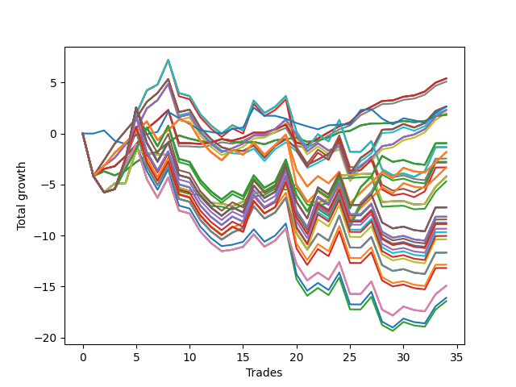

# Short Pointer 006 
- Symbol: NVDA_Unlimited
- Date Range: 02/08/2022 - 07/08/2022
- Trading Period: 7:20-12:30
- Number of Trades: 34



| Name | Win Percent | Profit | Avg Profit / Trade | Avg Time / Trade |      | Name | Win Percent | Profit | Avg Profit / Trade | Avg Time / Trade |
| ---- | ----------- | ------ | ------------------ | ---------------- | ---- | ---- | ----------- | ------ | ------------------ | ---------------- |
| Sorted By <br> Profit | | | | | | Sorted By <br> Win Percentage ||||
| Sixty-Five | 76.47 | 2695.00 | 79.26 | 10:12 |     | Sixty-Five | 76.47 | 2695.00 | 79.26 | 10:12 |
| Fifty-Seven | 76.47 | 2695.00 | 79.26 | 10:12 |     | Fifty-Seven | 76.47 | 2695.00 | 79.26 | 10:12 |
| Forty-One | 76.47 | 2695.00 | 79.26 | 10:12 |     | Forty-One | 76.47 | 2695.00 | 79.26 | 10:12 |
| One | 76.47 | 2695.00 | 79.26 | 10:12 |     | One | 76.47 | 2695.00 | 79.26 | 10:12 |
| Forty-Nine | 76.47 | 2540.00 | 74.71 | 10:00 |     | Forty-Nine | 76.47 | 2540.00 | 74.71 | 10:00 |
| Sixty-Seven | 64.71 | 1320.00 | 38.82 | 16:20 |     | Sixty-Six | 73.53 | 1150.00 | 33.82 | 15:33 |
| Fifty-Nine | 64.71 | 1320.00 | 38.82 | 16:20 |     | Fifty-Eight | 73.53 | 1150.00 | 33.82 | 15:33 |
| Forty-Three | 64.71 | 1320.00 | 38.82 | 16:20 |     | Forty-Two | 73.53 | 1150.00 | 33.82 | 15:33 |
| Three | 64.71 | 1320.00 | 38.82 | 16:20 |     | Two | 73.53 | 1150.00 | 33.82 | 15:33 |
| Seventy-Three | 47.06 | 1310.00 | 38.53 | 08:05 |     | Fifty | 73.53 | 995.00 | 29.26 | 15:21 |
| Fifty-One | 64.71 | 1165.00 | 34.26 | 16:07 |     | Sixty-Four | 70.59 | 920.00 | 27.06 | 05:47 |
| Sixty-Six | 73.53 | 1150.00 | 33.82 | 15:33 |     | Fifty-Six | 70.59 | 920.00 | 27.06 | 05:47 |
| Fifty-Eight | 73.53 | 1150.00 | 33.82 | 15:33 |     | Forty-Eight | 70.59 | 920.00 | 27.06 | 05:47 |
| Forty-Two | 73.53 | 1150.00 | 33.82 | 15:33 |     | Forty | 70.59 | 920.00 | 27.06 | 05:47 |
| Two | 73.53 | 1150.00 | 33.82 | 15:33 |     | Zero | 70.59 | 920.00 | 27.06 | 05:47 |
| Fifty | 73.53 | 995.00 | 29.26 | 15:21 |     | Sixty-Seven | 64.71 | 1320.00 | 38.82 | 16:20 |
| Sixty-Four | 70.59 | 920.00 | 27.06 | 05:47 |     | Fifty-Nine | 64.71 | 1320.00 | 38.82 | 16:20 |
| Fifty-Six | 70.59 | 920.00 | 27.06 | 05:47 |     | Forty-Three | 64.71 | 1320.00 | 38.82 | 16:20 |
| Forty-Eight | 70.59 | 920.00 | 27.06 | 05:47 |     | Three | 64.71 | 1320.00 | 38.82 | 16:20 |
| Forty | 70.59 | 920.00 | 27.06 | 05:47 |     | Fifty-One | 64.71 | 1165.00 | 34.26 | 16:07 |
| Zero | 70.59 | 920.00 | 27.06 | 05:47 |     | One Hundred Twenty-Six | 55.88 | -910.00 | -26.76 | 19:02 |
| One Hundred Twenty-Seven | 50.00 | -475.00 | -13.97 | 25:46 |     | One Hundred Twenty-One | 55.88 | -910.00 | -26.76 | 19:02 |
| One Hundred Twenty-Two | 50.00 | -475.00 | -13.97 | 25:46 |     | Eighty-One | 55.88 | -910.00 | -26.76 | 19:02 |
| Eighty-Two | 50.00 | -475.00 | -13.97 | 25:46 |     | One Hundred Sixteen | 55.88 | -1665.00 | -48.97 | 18:55 |
| Seventy-One | 50.00 | -670.00 | -19.71 | 26:17 |     | One Hundred Eleven | 55.88 | -1665.00 | -48.97 | 18:55 |
| Sixty-Three | 50.00 | -670.00 | -19.71 | 26:17 |     | Seventy | 52.94 | -2110.00 | -62.06 | 11:11 |
| Seven | 50.00 | -670.00 | -19.71 | 26:17 |     | Sixty-Two | 52.94 | -2110.00 | -62.06 | 11:11 |
| One Hundred Twenty-Six | 55.88 | -910.00 | -26.76 | 19:02 |     | Forty-Six | 52.94 | -2110.00 | -62.06 | 11:11 |
| One Hundred Twenty-One | 55.88 | -910.00 | -26.76 | 19:02 |     | Six | 52.94 | -2110.00 | -62.06 | 11:11 |
| Eighty-One | 55.88 | -910.00 | -26.76 | 19:02 |     | Fifty-Four | 52.94 | -2345.00 | -68.97 | 10:50 |
| One Hundred Twelve | 50.00 | -1230.00 | -36.18 | 25:39 |     | One Hundred Twenty-Seven | 50.00 | -475.00 | -13.97 | 25:46 |
| One Hundred Seventeen | 50.00 | -1385.00 | -40.74 | 25:27 |     | One Hundred Twenty-Two | 50.00 | -475.00 | -13.97 | 25:46 |
| Forty-Seven | 50.00 | -1425.00 | -41.91 | 26:11 |     | Eighty-Two | 50.00 | -475.00 | -13.97 | 25:46 |
| Fifty-Five | 50.00 | -1660.00 | -48.82 | 25:50 |     | Seventy-One | 50.00 | -670.00 | -19.71 | 26:17 |
| One Hundred Sixteen | 55.88 | -1665.00 | -48.97 | 18:55 |     | Sixty-Three | 50.00 | -670.00 | -19.71 | 26:17 |
| One Hundred Eleven | 55.88 | -1665.00 | -48.97 | 18:55 |     | Seven | 50.00 | -670.00 | -19.71 | 26:17 |
| Seventy | 52.94 | -2110.00 | -62.06 | 11:11 |     | One Hundred Twelve | 50.00 | -1230.00 | -36.18 | 25:39 |
| Sixty-Two | 52.94 | -2110.00 | -62.06 | 11:11 |     | One Hundred Seventeen | 50.00 | -1385.00 | -40.74 | 25:27 |
| Forty-Six | 52.94 | -2110.00 | -62.06 | 11:11 |     | Forty-Seven | 50.00 | -1425.00 | -41.91 | 26:11 |
| Six | 52.94 | -2110.00 | -62.06 | 11:11 |     | Fifty-Five | 50.00 | -1660.00 | -48.82 | 25:50 |
| Fifty-Four | 52.94 | -2345.00 | -68.97 | 10:50 |     | Seventy-Three | 47.06 | 1310.00 | 38.53 | 08:05 |
| One Hundred Thirty | 41.18 | -3620.00 | -106.47 | 29:43 |     | Sixty-Nine | 44.12 | -5835.00 | -171.62 | 26:35 |
| One Hundred Twenty-Five | 41.18 | -3620.00 | -106.47 | 29:43 |     | Sixty-One | 44.12 | -5835.00 | -171.62 | 26:35 |
| Eighty-Five | 41.18 | -3620.00 | -106.47 | 29:43 |     | Five | 44.12 | -5835.00 | -171.62 | 26:35 |
| One Hundred Twenty-Nine | 41.18 | -4075.00 | -119.85 | 29:38 |     | Fifty-Three | 44.12 | -6425.00 | -188.97 | 25:39 |
| One Hundred Twenty-Four | 41.18 | -4075.00 | -119.85 | 29:38 |     | Forty-Five | 44.12 | -6590.00 | -193.82 | 26:28 |
| Eighty-Four | 41.18 | -4075.00 | -119.85 | 29:38 |     | Sixty-Eight | 44.12 | -7460.00 | -219.41 | 23:40 |
| One Hundred Twenty | 41.18 | -4210.00 | -123.82 | 28:47 |     | Sixty | 44.12 | -7460.00 | -219.41 | 23:40 |
| One Hundred Fifteen | 41.18 | -4375.00 | -128.68 | 29:37 |     | Four | 44.12 | -7460.00 | -219.41 | 23:40 |
| One Hundred Twenty-Eight | 41.18 | -4430.00 | -130.29 | 28:51 |     | Fifty-Two | 44.12 | -8050.00 | -236.76 | 22:44 |
| One Hundred Twenty-Three | 41.18 | -4430.00 | -130.29 | 28:51 |     | Forty-Four | 44.12 | -8215.00 | -241.62 | 23:34 |
| Eighty-Three | 41.18 | -4430.00 | -130.29 | 28:51 |     | One Hundred Thirty | 41.18 | -3620.00 | -106.47 | 29:43 |
| One Hundred Ninteen | 41.18 | -4665.00 | -137.21 | 28:42 |     | One Hundred Twenty-Five | 41.18 | -3620.00 | -106.47 | 29:43 |
| One Hundred Fourteen | 41.18 | -4830.00 | -142.06 | 29:31 |     | Eighty-Five | 41.18 | -3620.00 | -106.47 | 29:43 |
| One Hundred Eighteen | 41.18 | -5020.00 | -147.65 | 27:54 |     | One Hundred Twenty-Nine | 41.18 | -4075.00 | -119.85 | 29:38 |
| One Hundred Thirteen | 41.18 | -5185.00 | -152.50 | 28:44 |     | One Hundred Twenty-Four | 41.18 | -4075.00 | -119.85 | 29:38 |
| Sixty-Nine | 44.12 | -5835.00 | -171.62 | 26:35 |     | Eighty-Four | 41.18 | -4075.00 | -119.85 | 29:38 |
| Sixty-One | 44.12 | -5835.00 | -171.62 | 26:35 |     | One Hundred Twenty | 41.18 | -4210.00 | -123.82 | 28:47 |
| Five | 44.12 | -5835.00 | -171.62 | 26:35 |     | One Hundred Fifteen | 41.18 | -4375.00 | -128.68 | 29:37 |
| Fifty-Three | 44.12 | -6425.00 | -188.97 | 25:39 |     | One Hundred Twenty-Eight | 41.18 | -4430.00 | -130.29 | 28:51 |
| Forty-Five | 44.12 | -6590.00 | -193.82 | 26:28 |     | One Hundred Twenty-Three | 41.18 | -4430.00 | -130.29 | 28:51 |
| Sixty-Eight | 44.12 | -7460.00 | -219.41 | 23:40 |     | Eighty-Three | 41.18 | -4430.00 | -130.29 | 28:51 |
| Sixty | 44.12 | -7460.00 | -219.41 | 23:40 |     | One Hundred Ninteen | 41.18 | -4665.00 | -137.21 | 28:42 |
| Four | 44.12 | -7460.00 | -219.41 | 23:40 |     | One Hundred Fourteen | 41.18 | -4830.00 | -142.06 | 29:31 |
| Fifty-Two | 44.12 | -8050.00 | -236.76 | 22:44 |     | One Hundred Eighteen | 41.18 | -5020.00 | -147.65 | 27:54 |
| Forty-Four | 44.12 | -8215.00 | -241.62 | 23:34 |     | One Hundred Thirteen | 41.18 | -5185.00 | -152.50 | 28:44 |

## NO STOPLOSS

### Test Zero
* Sell when price hits the middle line of the 20p bollinger
* No Stoploss
* Results:
```
Total Trades: 34
Percent Up: 29.41
Percent Down: 70.59
Total Points Moved Down: 1.84
Potential Profit: 920.00
Total Points Ups: 6.42 Count Ups: 10
Total Points Downs: 8.26 Count Downs: 24
```

<details><summary>Trades</summary>

<code>In: 2022-02-09 07:40:00		Out: 2022-02-09 08:09:55		Total Position Time: 29:55		Total Move Down: -4.18		Total to Date: -4.18</code> <br />
<code>In: 2022-02-16 11:35:00		Out: 2022-02-16 11:41:05		Total Position Time: 06:05		Total Move Down: 0.47		Total to Date: -3.71</code> <br />
<code>In: 2022-02-17 08:22:00		Out: 2022-02-17 08:33:15		Total Position Time: 11:15		Total Move Down: -0.39		Total to Date: -4.10</code> <br />
<code>In: 2022-02-18 09:23:00		Out: 2022-02-18 09:30:05		Total Position Time: 07:05		Total Move Down: 0.46		Total to Date: -3.64</code> <br />
<code>In: 2022-02-18 12:05:00		Out: 2022-02-18 12:07:35		Total Position Time: 02:35		Total Move Down: 0.83		Total to Date: -2.81</code> <br />
<code>In: 2022-02-22 11:40:00		Out: 2022-02-22 11:42:35		Total Position Time: 02:35		Total Move Down: 0.67		Total to Date: -2.14</code> <br />
<code>In: 2022-03-01 11:46:00		Out: 2022-03-01 11:50:55		Total Position Time: 04:55		Total Move Down: 0.38		Total to Date: -1.76</code> <br />
<code>In: 2022-03-01 12:12:00		Out: 2022-03-01 12:17:50		Total Position Time: 05:50		Total Move Down: 0.87		Total to Date: -0.89</code> <br />
<code>In: 2022-03-08 09:24:00		Out: 2022-03-08 09:25:40		Total Position Time: 01:40		Total Move Down: 0.70		Total to Date: -0.19</code> <br />
<code>In: 2022-03-09 09:41:00		Out: 2022-03-09 09:52:45		Total Position Time: 11:45		Total Move Down: -0.32		Total to Date: -0.51</code> <br />
<code>In: 2022-03-10 10:33:00		Out: 2022-03-10 10:41:10		Total Position Time: 08:10		Total Move Down: -0.24		Total to Date: -0.75</code> <br />
<code>In: 2022-03-10 11:10:00		Out: 2022-03-10 11:21:45		Total Position Time: 11:45		Total Move Down: -0.16		Total to Date: -0.91</code> <br />
<code>In: 2022-03-11 10:08:00		Out: 2022-03-11 10:09:10		Total Position Time: 01:10		Total Move Down: 0.37		Total to Date: -0.54</code> <br />
<code>In: 2022-03-11 10:52:00		Out: 2022-03-11 10:52:10		Total Position Time: 00:10		Total Move Down: -0.28		Total to Date: -0.82</code> <br />
<code>In: 2022-03-28 11:13:00		Out: 2022-03-28 11:13:35		Total Position Time: 00:35		Total Move Down: -0.08		Total to Date: -0.90</code> <br />
<code>In: 2022-03-31 12:06:00		Out: 2022-03-31 12:11:15		Total Position Time: 05:15		Total Move Down: 0.07		Total to Date: -0.83</code> <br />
<code>In: 2022-04-01 11:37:00		Out: 2022-04-01 11:48:15		Total Position Time: 11:15		Total Move Down: -0.23		Total to Date: -1.06</code> <br />
<code>In: 2022-04-04 08:44:00		Out: 2022-04-04 08:51:00		Total Position Time: 07:00		Total Move Down: 0.39		Total to Date: -0.67</code> <br />
<code>In: 2022-04-05 11:49:00		Out: 2022-04-05 11:52:05		Total Position Time: 03:05		Total Move Down: 0.11		Total to Date: -0.56</code> <br />
<code>In: 2022-04-06 10:36:00		Out: 2022-04-06 10:36:15		Total Position Time: 00:15		Total Move Down: 0.16		Total to Date: -0.40</code> <br />
<code>In: 2022-04-07 12:05:00		Out: 2022-04-07 12:19:25		Total Position Time: 14:25		Total Move Down: -0.42		Total to Date: -0.82</code> <br />
<code>In: 2022-04-20 07:58:00		Out: 2022-04-20 07:58:20		Total Position Time: 00:20		Total Move Down: 0.14		Total to Date: -0.68</code> <br />
<code>In: 2022-04-20 10:19:00		Out: 2022-04-20 10:20:10		Total Position Time: 01:10		Total Move Down: 0.29		Total to Date: -0.39</code> <br />
<code>In: 2022-05-02 09:26:00		Out: 2022-05-02 09:31:20		Total Position Time: 05:20		Total Move Down: 0.50		Total to Date: 0.11</code> <br />
<code>In: 2022-05-04 09:12:00		Out: 2022-05-04 09:16:15		Total Position Time: 04:15		Total Move Down: 0.15		Total to Date: 0.26</code> <br />
<code>In: 2022-05-05 09:31:00		Out: 2022-05-05 09:35:05		Total Position Time: 04:05		Total Move Down: 0.53		Total to Date: 0.79</code> <br />
<code>In: 2022-05-05 10:13:00		Out: 2022-05-05 10:14:00		Total Position Time: 01:00		Total Move Down: 0.19		Total to Date: 0.98</code> <br />
<code>In: 2022-05-06 07:22:00		Out: 2022-05-06 07:29:05		Total Position Time: 07:05		Total Move Down: 0.01		Total to Date: 0.99</code> <br />
<code>In: 2022-06-10 10:32:00		Out: 2022-06-10 10:32:10		Total Position Time: 00:10		Total Move Down: 0.06		Total to Date: 1.05</code> <br />
<code>In: 2022-06-10 10:54:00		Out: 2022-06-10 10:55:15		Total Position Time: 01:15		Total Move Down: 0.18		Total to Date: 1.23</code> <br />
<code>In: 2022-06-29 12:21:00		Out: 2022-06-29 12:32:25		Total Position Time: 11:25		Total Move Down: -0.12		Total to Date: 1.11</code> <br />
<code>In: 2022-07-01 08:12:00		Out: 2022-07-01 08:19:45		Total Position Time: 07:45		Total Move Down: 0.11		Total to Date: 1.22</code> <br />
<code>In: 2022-07-06 08:03:00		Out: 2022-07-06 08:04:10		Total Position Time: 01:10		Total Move Down: 0.47		Total to Date: 1.69</code> <br />
<code>In: 2022-07-07 08:14:00		Out: 2022-07-07 08:19:15		Total Position Time: 05:15		Total Move Down: 0.15		Total to Date: 1.84</code> <br />


</details>

### Test One
* Sell when the price hits the upper line of the 20p 1std bollinger
* No Stoploss
* Results:
```
Total Trades: 34
Percent Up: 23.53
Percent Down: 76.47
Total Points Moved Down: 5.39
Potential Profit: 2695.00
Total Points Ups: 9.62 Count Ups: 8
Total Points Downs: 15.01 Count Downs: 26
```

<details><summary>Trades</summary>

<code>In: 2022-02-09 07:40:00		Out: 2022-02-09 08:09:55		Total Position Time: 29:55		Total Move Down: -4.18		Total to Date: -4.18</code> <br />
<code>In: 2022-02-16 11:35:00		Out: 2022-02-16 11:44:10		Total Position Time: 09:10		Total Move Down: 0.71		Total to Date: -3.47</code> <br />
<code>In: 2022-02-17 08:22:00		Out: 2022-02-17 08:33:50		Total Position Time: 11:50		Total Move Down: 0.26		Total to Date: -3.21</code> <br />
<code>In: 2022-02-18 09:23:00		Out: 2022-02-18 09:30:20		Total Position Time: 07:20		Total Move Down: 0.98		Total to Date: -2.23</code> <br />
<code>In: 2022-02-18 12:05:00		Out: 2022-02-18 12:14:10		Total Position Time: 09:10		Total Move Down: 1.11		Total to Date: -1.12</code> <br />
<code>In: 2022-02-22 11:40:00		Out: 2022-02-22 11:44:20		Total Position Time: 04:20		Total Move Down: 1.57		Total to Date: 0.45</code> <br />
<code>In: 2022-03-01 11:46:00		Out: 2022-03-01 11:55:05		Total Position Time: 09:05		Total Move Down: 0.87		Total to Date: 1.32</code> <br />
<code>In: 2022-03-01 12:12:00		Out: 2022-03-01 12:21:05		Total Position Time: 09:05		Total Move Down: 0.98		Total to Date: 2.30</code> <br />
<code>In: 2022-03-08 09:24:00		Out: 2022-03-08 09:53:55		Total Position Time: 29:55		Total Move Down: -3.24		Total to Date: -0.94</code> <br />
<code>In: 2022-03-09 09:41:00		Out: 2022-03-09 10:00:15		Total Position Time: 19:15		Total Move Down: -0.01		Total to Date: -0.95</code> <br />
<code>In: 2022-03-10 10:33:00		Out: 2022-03-10 10:42:25		Total Position Time: 09:25		Total Move Down: -0.07		Total to Date: -1.02</code> <br />
<code>In: 2022-03-10 11:10:00		Out: 2022-03-10 11:23:00		Total Position Time: 13:00		Total Move Down: 0.14		Total to Date: -0.88</code> <br />
<code>In: 2022-03-11 10:08:00		Out: 2022-03-11 10:19:20		Total Position Time: 11:20		Total Move Down: 0.33		Total to Date: -0.55</code> <br />
<code>In: 2022-03-11 10:52:00		Out: 2022-03-11 10:52:30		Total Position Time: 00:30		Total Move Down: -0.15		Total to Date: -0.70</code> <br />
<code>In: 2022-03-28 11:13:00		Out: 2022-03-28 11:15:05		Total Position Time: 02:05		Total Move Down: 0.29		Total to Date: -0.41</code> <br />
<code>In: 2022-03-31 12:06:00		Out: 2022-03-31 12:16:35		Total Position Time: 10:35		Total Move Down: 0.50		Total to Date: 0.09</code> <br />
<code>In: 2022-04-01 11:37:00		Out: 2022-04-01 11:50:15		Total Position Time: 13:15		Total Move Down: -0.01		Total to Date: 0.08</code> <br />
<code>In: 2022-04-04 08:44:00		Out: 2022-04-04 08:55:55		Total Position Time: 11:55		Total Move Down: 0.33		Total to Date: 0.41</code> <br />
<code>In: 2022-04-05 11:49:00		Out: 2022-04-05 11:57:10		Total Position Time: 08:10		Total Move Down: 0.45		Total to Date: 0.86</code> <br />
<code>In: 2022-04-06 10:36:00		Out: 2022-04-06 10:56:50		Total Position Time: 20:50		Total Move Down: -1.77		Total to Date: -0.91</code> <br />
<code>In: 2022-04-07 12:05:00		Out: 2022-04-07 12:20:35		Total Position Time: 15:35		Total Move Down: -0.19		Total to Date: -1.10</code> <br />
<code>In: 2022-04-20 07:58:00		Out: 2022-04-20 08:00:35		Total Position Time: 02:35		Total Move Down: 0.61		Total to Date: -0.49</code> <br />
<code>In: 2022-04-20 10:19:00		Out: 2022-04-20 10:27:00		Total Position Time: 08:00		Total Move Down: 0.60		Total to Date: 0.11</code> <br />
<code>In: 2022-05-02 09:26:00		Out: 2022-05-02 09:35:45		Total Position Time: 09:45		Total Move Down: 0.60		Total to Date: 0.71</code> <br />
<code>In: 2022-05-04 09:12:00		Out: 2022-05-04 09:17:20		Total Position Time: 05:20		Total Move Down: 0.38		Total to Date: 1.09</code> <br />
<code>In: 2022-05-05 09:31:00		Out: 2022-05-05 09:35:50		Total Position Time: 04:50		Total Move Down: 1.01		Total to Date: 2.10</code> <br />
<code>In: 2022-05-05 10:13:00		Out: 2022-05-05 10:20:20		Total Position Time: 07:20		Total Move Down: 0.52		Total to Date: 2.62</code> <br />
<code>In: 2022-05-06 07:22:00		Out: 2022-05-06 07:34:10		Total Position Time: 12:10		Total Move Down: 0.56		Total to Date: 3.18</code> <br />
<code>In: 2022-06-10 10:32:00		Out: 2022-06-10 10:32:10		Total Position Time: 00:10		Total Move Down: 0.06		Total to Date: 3.24</code> <br />
<code>In: 2022-06-10 10:54:00		Out: 2022-06-10 10:59:05		Total Position Time: 05:05		Total Move Down: 0.36		Total to Date: 3.60</code> <br />
<code>In: 2022-06-29 12:21:00		Out: 2022-06-29 12:33:25		Total Position Time: 12:25		Total Move Down: 0.13		Total to Date: 3.73</code> <br />
<code>In: 2022-07-01 08:12:00		Out: 2022-07-01 08:23:55		Total Position Time: 11:55		Total Move Down: 0.38		Total to Date: 4.11</code> <br />
<code>In: 2022-07-06 08:03:00		Out: 2022-07-06 08:08:30		Total Position Time: 05:30		Total Move Down: 0.87		Total to Date: 4.98</code> <br />
<code>In: 2022-07-07 08:14:00		Out: 2022-07-07 08:20:05		Total Position Time: 06:05		Total Move Down: 0.41		Total to Date: 5.39</code> <br />


</details>

### Test Two
* Sell when the price hits the upper line of the 20p 2std bollinger
* No Stoploss
* Results:
```
Total Trades: 34
Percent Up: 26.47
Percent Down: 73.53
Total Points Moved Down: 2.30
Potential Profit: 1150.00
Total Points Ups: 18.03 Count Ups: 9
Total Points Downs: 20.33 Count Downs: 25
```

<details><summary>Trades</summary>

<code>In: 2022-02-09 07:40:00		Out: 2022-02-09 08:09:55		Total Position Time: 29:55		Total Move Down: -4.18		Total to Date: -4.18</code> <br />
<code>In: 2022-02-16 11:35:00		Out: 2022-02-16 11:48:00		Total Position Time: 13:00		Total Move Down: 1.02		Total to Date: -3.16</code> <br />
<code>In: 2022-02-17 08:22:00		Out: 2022-02-17 08:36:45		Total Position Time: 14:45		Total Move Down: 0.78		Total to Date: -2.38</code> <br />
<code>In: 2022-02-18 09:23:00		Out: 2022-02-18 09:34:40		Total Position Time: 11:40		Total Move Down: 1.28		Total to Date: -1.10</code> <br />
<code>In: 2022-02-18 12:05:00		Out: 2022-02-18 12:17:40		Total Position Time: 12:40		Total Move Down: 1.47		Total to Date: 0.37</code> <br />
<code>In: 2022-02-22 11:40:00		Out: 2022-02-22 11:45:15		Total Position Time: 05:15		Total Move Down: 2.08		Total to Date: 2.45</code> <br />
<code>In: 2022-03-01 11:46:00		Out: 2022-03-01 11:58:10		Total Position Time: 12:10		Total Move Down: 0.82		Total to Date: 3.27</code> <br />
<code>In: 2022-03-01 12:12:00		Out: 2022-03-01 12:22:15		Total Position Time: 10:15		Total Move Down: 1.59		Total to Date: 4.86</code> <br />
<code>In: 2022-03-08 09:24:00		Out: 2022-03-08 09:53:55		Total Position Time: 29:55		Total Move Down: -3.24		Total to Date: 1.62</code> <br />
<code>In: 2022-03-09 09:41:00		Out: 2022-03-09 10:02:15		Total Position Time: 21:15		Total Move Down: 0.26		Total to Date: 1.88</code> <br />
<code>In: 2022-03-10 10:33:00		Out: 2022-03-10 11:02:55		Total Position Time: 29:55		Total Move Down: -1.77		Total to Date: 0.11</code> <br />
<code>In: 2022-03-10 11:10:00		Out: 2022-03-10 11:39:55		Total Position Time: 29:55		Total Move Down: -1.12		Total to Date: -1.01</code> <br />
<code>In: 2022-03-11 10:08:00		Out: 2022-03-11 10:37:55		Total Position Time: 29:55		Total Move Down: -0.80		Total to Date: -1.81</code> <br />
<code>In: 2022-03-11 10:52:00		Out: 2022-03-11 10:53:20		Total Position Time: 01:20		Total Move Down: 0.36		Total to Date: -1.45</code> <br />
<code>In: 2022-03-28 11:13:00		Out: 2022-03-28 11:15:25		Total Position Time: 02:25		Total Move Down: 0.46		Total to Date: -0.99</code> <br />
<code>In: 2022-03-31 12:06:00		Out: 2022-03-31 12:18:10		Total Position Time: 12:10		Total Move Down: 0.81		Total to Date: -0.18</code> <br />
<code>In: 2022-04-01 11:37:00		Out: 2022-04-01 11:50:20		Total Position Time: 13:20		Total Move Down: 0.09		Total to Date: -0.09</code> <br />
<code>In: 2022-04-04 08:44:00		Out: 2022-04-04 08:57:15		Total Position Time: 13:15		Total Move Down: 0.53		Total to Date: 0.44</code> <br />
<code>In: 2022-04-05 11:49:00		Out: 2022-04-05 11:57:35		Total Position Time: 08:35		Total Move Down: 0.92		Total to Date: 1.36</code> <br />
<code>In: 2022-04-06 10:36:00		Out: 2022-04-06 11:00:00		Total Position Time: 24:00		Total Move Down: -1.49		Total to Date: -0.13</code> <br />
<code>In: 2022-04-07 12:05:00		Out: 2022-04-07 12:34:55		Total Position Time: 29:55		Total Move Down: -1.61		Total to Date: -1.74</code> <br />
<code>In: 2022-04-20 07:58:00		Out: 2022-04-20 08:01:00		Total Position Time: 03:00		Total Move Down: 0.77		Total to Date: -0.97</code> <br />
<code>In: 2022-04-20 10:19:00		Out: 2022-04-20 10:48:55		Total Position Time: 29:55		Total Move Down: -0.70		Total to Date: -1.67</code> <br />
<code>In: 2022-05-02 09:26:00		Out: 2022-05-02 09:39:20		Total Position Time: 13:20		Total Move Down: 0.42		Total to Date: -1.25</code> <br />
<code>In: 2022-05-04 09:12:00		Out: 2022-05-04 09:41:55		Total Position Time: 29:55		Total Move Down: -3.12		Total to Date: -4.37</code> <br />
<code>In: 2022-05-05 09:31:00		Out: 2022-05-05 09:41:15		Total Position Time: 10:15		Total Move Down: 1.22		Total to Date: -3.15</code> <br />
<code>In: 2022-05-05 10:13:00		Out: 2022-05-05 10:30:30		Total Position Time: 17:30		Total Move Down: 0.75		Total to Date: -2.40</code> <br />
<code>In: 2022-05-06 07:22:00		Out: 2022-05-06 07:35:45		Total Position Time: 13:45		Total Move Down: 1.15		Total to Date: -1.25</code> <br />
<code>In: 2022-06-10 10:32:00		Out: 2022-06-10 10:34:20		Total Position Time: 02:20		Total Move Down: 0.20		Total to Date: -1.05</code> <br />
<code>In: 2022-06-10 10:54:00		Out: 2022-06-10 11:03:45		Total Position Time: 09:45		Total Move Down: 0.70		Total to Date: -0.35</code> <br />
<code>In: 2022-06-29 12:21:00		Out: 2022-06-29 12:34:15		Total Position Time: 13:15		Total Move Down: 0.25		Total to Date: -0.10</code> <br />
<code>In: 2022-07-01 08:12:00		Out: 2022-07-01 08:26:10		Total Position Time: 14:10		Total Move Down: 0.52		Total to Date: 0.42</code> <br />
<code>In: 2022-07-06 08:03:00		Out: 2022-07-06 08:10:15		Total Position Time: 07:15		Total Move Down: 1.22		Total to Date: 1.64</code> <br />
<code>In: 2022-07-07 08:14:00		Out: 2022-07-07 08:22:45		Total Position Time: 08:45		Total Move Down: 0.66		Total to Date: 2.30</code> <br />


</details>

### Test Three
* Sell when price hits the middle line of the 50p bollinger
* No Stoploss
* Results:
```
Total Trades: 34
Percent Up: 35.29
Percent Down: 64.71
Total Points Moved Down: 2.64
Potential Profit: 1320.00
Total Points Ups: 18.65 Count Ups: 12
Total Points Downs: 21.29 Count Downs: 22
```

<details><summary>Trades</summary>

<code>In: 2022-02-09 07:40:00		Out: 2022-02-09 08:09:55		Total Position Time: 29:55		Total Move Down: -4.18		Total to Date: -4.18</code> <br />
<code>In: 2022-02-16 11:35:00		Out: 2022-02-16 11:53:45		Total Position Time: 18:45		Total Move Down: 1.57		Total to Date: -2.61</code> <br />
<code>In: 2022-02-17 08:22:00		Out: 2022-02-17 08:39:05		Total Position Time: 17:05		Total Move Down: 1.61		Total to Date: -1.00</code> <br />
<code>In: 2022-02-18 09:23:00		Out: 2022-02-18 09:35:10		Total Position Time: 12:10		Total Move Down: 1.25		Total to Date: 0.25</code> <br />
<code>In: 2022-02-18 12:05:00		Out: 2022-02-18 12:17:20		Total Position Time: 12:20		Total Move Down: 1.22		Total to Date: 1.47</code> <br />
<code>In: 2022-02-22 11:40:00		Out: 2022-02-22 11:44:25		Total Position Time: 04:25		Total Move Down: 1.63		Total to Date: 3.10</code> <br />
<code>In: 2022-03-01 11:46:00		Out: 2022-03-01 11:55:05		Total Position Time: 09:05		Total Move Down: 0.87		Total to Date: 3.97</code> <br />
<code>In: 2022-03-01 12:12:00		Out: 2022-03-01 12:21:50		Total Position Time: 09:50		Total Move Down: 1.36		Total to Date: 5.33</code> <br />
<code>In: 2022-03-08 09:24:00		Out: 2022-03-08 09:53:55		Total Position Time: 29:55		Total Move Down: -3.24		Total to Date: 2.09</code> <br />
<code>In: 2022-03-09 09:41:00		Out: 2022-03-09 10:03:05		Total Position Time: 22:05		Total Move Down: 0.25		Total to Date: 2.34</code> <br />
<code>In: 2022-03-10 10:33:00		Out: 2022-03-10 11:02:55		Total Position Time: 29:55		Total Move Down: -1.77		Total to Date: 0.57</code> <br />
<code>In: 2022-03-10 11:10:00		Out: 2022-03-10 11:39:55		Total Position Time: 29:55		Total Move Down: -1.12		Total to Date: -0.55</code> <br />
<code>In: 2022-03-11 10:08:00		Out: 2022-03-11 10:37:55		Total Position Time: 29:55		Total Move Down: -0.80		Total to Date: -1.35</code> <br />
<code>In: 2022-03-11 10:52:00		Out: 2022-03-11 10:52:10		Total Position Time: 00:10		Total Move Down: -0.28		Total to Date: -1.63</code> <br />
<code>In: 2022-03-28 11:13:00		Out: 2022-03-28 11:13:35		Total Position Time: 00:35		Total Move Down: -0.08		Total to Date: -1.71</code> <br />
<code>In: 2022-03-31 12:06:00		Out: 2022-03-31 12:16:40		Total Position Time: 10:40		Total Move Down: 0.53		Total to Date: -1.18</code> <br />
<code>In: 2022-04-01 11:37:00		Out: 2022-04-01 12:06:55		Total Position Time: 29:55		Total Move Down: -1.21		Total to Date: -2.39</code> <br />
<code>In: 2022-04-04 08:44:00		Out: 2022-04-04 09:05:25		Total Position Time: 21:25		Total Move Down: 1.17		Total to Date: -1.22</code> <br />
<code>In: 2022-04-05 11:49:00		Out: 2022-04-05 11:57:20		Total Position Time: 08:20		Total Move Down: 0.66		Total to Date: -0.56</code> <br />
<code>In: 2022-04-06 10:36:00		Out: 2022-04-06 11:00:10		Total Position Time: 24:10		Total Move Down: -0.89		Total to Date: -1.45</code> <br />
<code>In: 2022-04-07 12:05:00		Out: 2022-04-07 12:34:55		Total Position Time: 29:55		Total Move Down: -1.61		Total to Date: -3.06</code> <br />
<code>In: 2022-04-20 07:58:00		Out: 2022-04-20 08:00:30		Total Position Time: 02:30		Total Move Down: 0.50		Total to Date: -2.56</code> <br />
<code>In: 2022-04-20 10:19:00		Out: 2022-04-20 10:32:20		Total Position Time: 13:20		Total Move Down: 0.58		Total to Date: -1.98</code> <br />
<code>In: 2022-05-02 09:26:00		Out: 2022-05-02 09:41:35		Total Position Time: 15:35		Total Move Down: 1.14		Total to Date: -0.84</code> <br />
<code>In: 2022-05-04 09:12:00		Out: 2022-05-04 09:41:55		Total Position Time: 29:55		Total Move Down: -3.12		Total to Date: -3.96</code> <br />
<code>In: 2022-05-05 09:31:00		Out: 2022-05-05 09:44:50		Total Position Time: 13:50		Total Move Down: 1.57		Total to Date: -2.39</code> <br />
<code>In: 2022-05-05 10:13:00		Out: 2022-05-05 10:26:35		Total Position Time: 13:35		Total Move Down: 0.75		Total to Date: -1.64</code> <br />
<code>In: 2022-05-06 07:22:00		Out: 2022-05-06 07:37:25		Total Position Time: 15:25		Total Move Down: 2.00		Total to Date: 0.36</code> <br />
<code>In: 2022-06-10 10:32:00		Out: 2022-06-10 10:32:10		Total Position Time: 00:10		Total Move Down: 0.06		Total to Date: 0.42</code> <br />
<code>In: 2022-06-10 10:54:00		Out: 2022-06-10 11:00:45		Total Position Time: 06:45		Total Move Down: 0.51		Total to Date: 0.93</code> <br />
<code>In: 2022-06-29 12:21:00		Out: 2022-06-29 12:46:00		Total Position Time: 25:00		Total Move Down: -0.35		Total to Date: 0.58</code> <br />
<code>In: 2022-07-01 08:12:00		Out: 2022-07-01 08:24:15		Total Position Time: 12:15		Total Move Down: 0.45		Total to Date: 1.03</code> <br />
<code>In: 2022-07-06 08:03:00		Out: 2022-07-06 08:22:35		Total Position Time: 19:35		Total Move Down: 1.17		Total to Date: 2.20</code> <br />
<code>In: 2022-07-07 08:14:00		Out: 2022-07-07 08:20:55		Total Position Time: 06:55		Total Move Down: 0.44		Total to Date: 2.64</code> <br />


</details>

### Test Four
* Sell when the price hits the upper line of the 50p 1std bollinger
* No Stoploss
* Results:
```
Total Trades: 34
Percent Up: 55.88
Percent Down: 44.12
Total Points Moved Down: -14.92
Potential Profit: -7460.00
Total Points Ups: 32.22 Count Ups: 19
Total Points Downs: 17.30 Count Downs: 15
```

<details><summary>Trades</summary>

<code>In: 2022-02-09 07:40:00		Out: 2022-02-09 08:09:55		Total Position Time: 29:55		Total Move Down: -4.18		Total to Date: -4.18</code> <br />
<code>In: 2022-02-16 11:35:00		Out: 2022-02-16 12:04:55		Total Position Time: 29:55		Total Move Down: -1.59		Total to Date: -5.77</code> <br />
<code>In: 2022-02-17 08:22:00		Out: 2022-02-17 08:51:55		Total Position Time: 29:55		Total Move Down: 0.32		Total to Date: -5.45</code> <br />
<code>In: 2022-02-18 09:23:00		Out: 2022-02-18 09:43:25		Total Position Time: 20:25		Total Move Down: 2.47		Total to Date: -2.98</code> <br />
<code>In: 2022-02-18 12:05:00		Out: 2022-02-18 12:19:05		Total Position Time: 14:05		Total Move Down: 1.96		Total to Date: -1.02</code> <br />
<code>In: 2022-02-22 11:40:00		Out: 2022-02-22 12:09:55		Total Position Time: 29:55		Total Move Down: -3.47		Total to Date: -4.49</code> <br />
<code>In: 2022-03-01 11:46:00		Out: 2022-03-01 12:15:55		Total Position Time: 29:55		Total Move Down: -1.82		Total to Date: -6.31</code> <br />
<code>In: 2022-03-01 12:12:00		Out: 2022-03-01 12:28:45		Total Position Time: 16:45		Total Move Down: 2.00		Total to Date: -4.31</code> <br />
<code>In: 2022-03-08 09:24:00		Out: 2022-03-08 09:53:55		Total Position Time: 29:55		Total Move Down: -3.24		Total to Date: -7.55</code> <br />
<code>In: 2022-03-09 09:41:00		Out: 2022-03-09 10:10:55		Total Position Time: 29:55		Total Move Down: -0.29		Total to Date: -7.84</code> <br />
<code>In: 2022-03-10 10:33:00		Out: 2022-03-10 11:02:55		Total Position Time: 29:55		Total Move Down: -1.77		Total to Date: -9.61</code> <br />
<code>In: 2022-03-10 11:10:00		Out: 2022-03-10 11:39:55		Total Position Time: 29:55		Total Move Down: -1.12		Total to Date: -10.73</code> <br />
<code>In: 2022-03-11 10:08:00		Out: 2022-03-11 10:37:55		Total Position Time: 29:55		Total Move Down: -0.80		Total to Date: -11.53</code> <br />
<code>In: 2022-03-11 10:52:00		Out: 2022-03-11 10:53:05		Total Position Time: 01:05		Total Move Down: 0.14		Total to Date: -11.39</code> <br />
<code>In: 2022-03-28 11:13:00		Out: 2022-03-28 11:15:05		Total Position Time: 02:05		Total Move Down: 0.29		Total to Date: -11.10</code> <br />
<code>In: 2022-03-31 12:06:00		Out: 2022-03-31 12:19:50		Total Position Time: 13:50		Total Move Down: 1.22		Total to Date: -9.88</code> <br />
<code>In: 2022-04-01 11:37:00		Out: 2022-04-01 12:06:55		Total Position Time: 29:55		Total Move Down: -1.21		Total to Date: -11.09</code> <br />
<code>In: 2022-04-04 08:44:00		Out: 2022-04-04 09:13:55		Total Position Time: 29:55		Total Move Down: 0.60		Total to Date: -10.49</code> <br />
<code>In: 2022-04-05 11:49:00		Out: 2022-04-05 11:58:15		Total Position Time: 09:15		Total Move Down: 1.19		Total to Date: -9.30</code> <br />
<code>In: 2022-04-06 10:36:00		Out: 2022-04-06 11:05:55		Total Position Time: 29:55		Total Move Down: -3.48		Total to Date: -12.78</code> <br />
<code>In: 2022-04-07 12:05:00		Out: 2022-04-07 12:34:55		Total Position Time: 29:55		Total Move Down: -1.61		Total to Date: -14.39</code> <br />
<code>In: 2022-04-20 07:58:00		Out: 2022-04-20 08:01:00		Total Position Time: 03:00		Total Move Down: 0.77		Total to Date: -13.62</code> <br />
<code>In: 2022-04-20 10:19:00		Out: 2022-04-20 10:48:55		Total Position Time: 29:55		Total Move Down: -0.70		Total to Date: -14.32</code> <br />
<code>In: 2022-05-02 09:26:00		Out: 2022-05-02 09:50:15		Total Position Time: 24:15		Total Move Down: 1.72		Total to Date: -12.60</code> <br />
<code>In: 2022-05-04 09:12:00		Out: 2022-05-04 09:41:55		Total Position Time: 29:55		Total Move Down: -3.12		Total to Date: -15.72</code> <br />
<code>In: 2022-05-05 09:31:00		Out: 2022-05-05 10:00:55		Total Position Time: 29:55		Total Move Down: -0.01		Total to Date: -15.73</code> <br />
<code>In: 2022-05-05 10:13:00		Out: 2022-05-05 10:38:55		Total Position Time: 25:55		Total Move Down: 1.24		Total to Date: -14.49</code> <br />
<code>In: 2022-05-06 07:22:00		Out: 2022-05-06 07:51:55		Total Position Time: 29:55		Total Move Down: -2.76		Total to Date: -17.25</code> <br />
<code>In: 2022-06-10 10:32:00		Out: 2022-06-10 11:01:55		Total Position Time: 29:55		Total Move Down: -0.58		Total to Date: -17.83</code> <br />
<code>In: 2022-06-10 10:54:00		Out: 2022-06-10 11:11:25		Total Position Time: 17:25		Total Move Down: 0.88		Total to Date: -16.95</code> <br />
<code>In: 2022-06-29 12:21:00		Out: 2022-06-29 12:46:00		Total Position Time: 25:00		Total Move Down: -0.35		Total to Date: -17.30</code> <br />
<code>In: 2022-07-01 08:12:00		Out: 2022-07-01 08:41:55		Total Position Time: 29:55		Total Move Down: -0.12		Total to Date: -17.42</code> <br />
<code>In: 2022-07-06 08:03:00		Out: 2022-07-06 08:27:20		Total Position Time: 24:20		Total Move Down: 1.67		Total to Date: -15.75</code> <br />
<code>In: 2022-07-07 08:14:00		Out: 2022-07-07 08:23:25		Total Position Time: 09:25		Total Move Down: 0.83		Total to Date: -14.92</code> <br />


</details>

### Test Five
* Sell when the price hits the upper line of the 50p 2std bollinger
* No Stoploss
* Results:
```
Total Trades: 34
Percent Up: 55.88
Percent Down: 44.12
Total Points Moved Down: -11.67
Potential Profit: -5835.00
Total Points Ups: 32.22 Count Ups: 19
Total Points Downs: 20.55 Count Downs: 15
```

<details><summary>Trades</summary>

<code>In: 2022-02-09 07:40:00		Out: 2022-02-09 08:09:55		Total Position Time: 29:55		Total Move Down: -4.18		Total to Date: -4.18</code> <br />
<code>In: 2022-02-16 11:35:00		Out: 2022-02-16 12:04:55		Total Position Time: 29:55		Total Move Down: -1.59		Total to Date: -5.77</code> <br />
<code>In: 2022-02-17 08:22:00		Out: 2022-02-17 08:51:55		Total Position Time: 29:55		Total Move Down: 0.32		Total to Date: -5.45</code> <br />
<code>In: 2022-02-18 09:23:00		Out: 2022-02-18 09:52:55		Total Position Time: 29:55		Total Move Down: 2.90		Total to Date: -2.55</code> <br />
<code>In: 2022-02-18 12:05:00		Out: 2022-02-18 12:19:45		Total Position Time: 14:45		Total Move Down: 2.79		Total to Date: 0.24</code> <br />
<code>In: 2022-02-22 11:40:00		Out: 2022-02-22 12:09:55		Total Position Time: 29:55		Total Move Down: -3.47		Total to Date: -3.23</code> <br />
<code>In: 2022-03-01 11:46:00		Out: 2022-03-01 12:15:55		Total Position Time: 29:55		Total Move Down: -1.82		Total to Date: -5.05</code> <br />
<code>In: 2022-03-01 12:12:00		Out: 2022-03-01 12:41:55		Total Position Time: 29:55		Total Move Down: 1.88		Total to Date: -3.17</code> <br />
<code>In: 2022-03-08 09:24:00		Out: 2022-03-08 09:53:55		Total Position Time: 29:55		Total Move Down: -3.24		Total to Date: -6.41</code> <br />
<code>In: 2022-03-09 09:41:00		Out: 2022-03-09 10:10:55		Total Position Time: 29:55		Total Move Down: -0.29		Total to Date: -6.70</code> <br />
<code>In: 2022-03-10 10:33:00		Out: 2022-03-10 11:02:55		Total Position Time: 29:55		Total Move Down: -1.77		Total to Date: -8.47</code> <br />
<code>In: 2022-03-10 11:10:00		Out: 2022-03-10 11:39:55		Total Position Time: 29:55		Total Move Down: -1.12		Total to Date: -9.59</code> <br />
<code>In: 2022-03-11 10:08:00		Out: 2022-03-11 10:37:55		Total Position Time: 29:55		Total Move Down: -0.80		Total to Date: -10.39</code> <br />
<code>In: 2022-03-11 10:52:00		Out: 2022-03-11 10:58:25		Total Position Time: 06:25		Total Move Down: 0.68		Total to Date: -9.71</code> <br />
<code>In: 2022-03-28 11:13:00		Out: 2022-03-28 11:15:25		Total Position Time: 02:25		Total Move Down: 0.46		Total to Date: -9.25</code> <br />
<code>In: 2022-03-31 12:06:00		Out: 2022-03-31 12:27:25		Total Position Time: 21:25		Total Move Down: 2.12		Total to Date: -7.13</code> <br />
<code>In: 2022-04-01 11:37:00		Out: 2022-04-01 12:06:55		Total Position Time: 29:55		Total Move Down: -1.21		Total to Date: -8.34</code> <br />
<code>In: 2022-04-04 08:44:00		Out: 2022-04-04 09:13:55		Total Position Time: 29:55		Total Move Down: 0.60		Total to Date: -7.74</code> <br />
<code>In: 2022-04-05 11:49:00		Out: 2022-04-05 12:03:55		Total Position Time: 14:55		Total Move Down: 1.46		Total to Date: -6.28</code> <br />
<code>In: 2022-04-06 10:36:00		Out: 2022-04-06 11:05:55		Total Position Time: 29:55		Total Move Down: -3.48		Total to Date: -9.76</code> <br />
<code>In: 2022-04-07 12:05:00		Out: 2022-04-07 12:34:55		Total Position Time: 29:55		Total Move Down: -1.61		Total to Date: -11.37</code> <br />
<code>In: 2022-04-20 07:58:00		Out: 2022-04-20 08:11:40		Total Position Time: 13:40		Total Move Down: 1.56		Total to Date: -9.81</code> <br />
<code>In: 2022-04-20 10:19:00		Out: 2022-04-20 10:48:55		Total Position Time: 29:55		Total Move Down: -0.70		Total to Date: -10.51</code> <br />
<code>In: 2022-05-02 09:26:00		Out: 2022-05-02 09:55:30		Total Position Time: 29:30		Total Move Down: 2.46		Total to Date: -8.05</code> <br />
<code>In: 2022-05-04 09:12:00		Out: 2022-05-04 09:41:55		Total Position Time: 29:55		Total Move Down: -3.12		Total to Date: -11.17</code> <br />
<code>In: 2022-05-05 09:31:00		Out: 2022-05-05 10:00:55		Total Position Time: 29:55		Total Move Down: -0.01		Total to Date: -11.18</code> <br />
<code>In: 2022-05-05 10:13:00		Out: 2022-05-05 10:42:55		Total Position Time: 29:55		Total Move Down: 1.05		Total to Date: -10.13</code> <br />
<code>In: 2022-05-06 07:22:00		Out: 2022-05-06 07:51:55		Total Position Time: 29:55		Total Move Down: -2.76		Total to Date: -12.89</code> <br />
<code>In: 2022-06-10 10:32:00		Out: 2022-06-10 11:01:55		Total Position Time: 29:55		Total Move Down: -0.58		Total to Date: -13.47</code> <br />
<code>In: 2022-06-10 10:54:00		Out: 2022-06-10 11:23:55		Total Position Time: 29:55		Total Move Down: 0.18		Total to Date: -13.29</code> <br />
<code>In: 2022-06-29 12:21:00		Out: 2022-06-29 12:46:00		Total Position Time: 25:00		Total Move Down: -0.35		Total to Date: -13.64</code> <br />
<code>In: 2022-07-01 08:12:00		Out: 2022-07-01 08:41:55		Total Position Time: 29:55		Total Move Down: -0.12		Total to Date: -13.76</code> <br />
<code>In: 2022-07-06 08:03:00		Out: 2022-07-06 08:31:05		Total Position Time: 28:05		Total Move Down: 2.08		Total to Date: -11.68</code> <br />
<code>In: 2022-07-07 08:14:00		Out: 2022-07-07 08:43:55		Total Position Time: 29:55		Total Move Down: 0.01		Total to Date: -11.67</code> <br />


</details>

### Test Six
* Sell when the price hits the middle line of the 1std VWAP
* No Stoploss
* Results:
```
Total Trades: 34
Percent Up: 47.06
Percent Down: 52.94
Total Points Moved Down: -4.22
Potential Profit: -2110.00
Total Points Ups: 16.18 Count Ups: 16
Total Points Downs: 11.96 Count Downs: 18
```

<details><summary>Trades</summary>

<code>In: 2022-02-09 07:40:00		Out: 2022-02-09 08:09:55		Total Position Time: 29:55		Total Move Down: -4.18		Total to Date: -4.18</code> <br />
<code>In: 2022-02-16 11:35:00		Out: 2022-02-16 12:04:55		Total Position Time: 29:55		Total Move Down: -1.59		Total to Date: -5.77</code> <br />
<code>In: 2022-02-17 08:22:00		Out: 2022-02-17 08:36:50		Total Position Time: 14:50		Total Move Down: 0.89		Total to Date: -4.88</code> <br />
<code>In: 2022-02-18 09:23:00		Out: 2022-02-18 09:23:10		Total Position Time: 00:10		Total Move Down: 0.01		Total to Date: -4.87</code> <br />
<code>In: 2022-02-18 12:05:00		Out: 2022-02-18 12:22:05		Total Position Time: 17:05		Total Move Down: 3.23		Total to Date: -1.64</code> <br />
<code>In: 2022-02-22 11:40:00		Out: 2022-02-22 11:40:10		Total Position Time: 00:10		Total Move Down: -0.30		Total to Date: -1.94</code> <br />
<code>In: 2022-03-01 11:46:00		Out: 2022-03-01 11:46:10		Total Position Time: 00:10		Total Move Down: -0.12		Total to Date: -2.06</code> <br />
<code>In: 2022-03-01 12:12:00		Out: 2022-03-01 12:12:10		Total Position Time: 00:10		Total Move Down: -0.03		Total to Date: -2.09</code> <br />
<code>In: 2022-03-08 09:24:00		Out: 2022-03-08 09:53:55		Total Position Time: 29:55		Total Move Down: -3.24		Total to Date: -5.33</code> <br />
<code>In: 2022-03-09 09:41:00		Out: 2022-03-09 10:10:55		Total Position Time: 29:55		Total Move Down: -0.29		Total to Date: -5.62</code> <br />
<code>In: 2022-03-10 10:33:00		Out: 2022-03-10 10:33:10		Total Position Time: 00:10		Total Move Down: -0.06		Total to Date: -5.68</code> <br />
<code>In: 2022-03-10 11:10:00		Out: 2022-03-10 11:39:55		Total Position Time: 29:55		Total Move Down: -1.12		Total to Date: -6.80</code> <br />
<code>In: 2022-03-11 10:08:00		Out: 2022-03-11 10:08:10		Total Position Time: 00:10		Total Move Down: -0.06		Total to Date: -6.86</code> <br />
<code>In: 2022-03-11 10:52:00		Out: 2022-03-11 10:52:10		Total Position Time: 00:10		Total Move Down: -0.28		Total to Date: -7.14</code> <br />
<code>In: 2022-03-28 11:13:00		Out: 2022-03-28 11:15:25		Total Position Time: 02:25		Total Move Down: 0.46		Total to Date: -6.68</code> <br />
<code>In: 2022-03-31 12:06:00		Out: 2022-03-31 12:18:10		Total Position Time: 12:10		Total Move Down: 0.81		Total to Date: -5.87</code> <br />
<code>In: 2022-04-01 11:37:00		Out: 2022-04-01 11:37:10		Total Position Time: 00:10		Total Move Down: 0.16		Total to Date: -5.71</code> <br />
<code>In: 2022-04-04 08:44:00		Out: 2022-04-04 09:13:55		Total Position Time: 29:55		Total Move Down: 0.60		Total to Date: -5.11</code> <br />
<code>In: 2022-04-05 11:49:00		Out: 2022-04-05 11:49:10		Total Position Time: 00:10		Total Move Down: -0.08		Total to Date: -5.19</code> <br />
<code>In: 2022-04-06 10:36:00		Out: 2022-04-06 10:36:10		Total Position Time: 00:10		Total Move Down: 0.14		Total to Date: -5.05</code> <br />
<code>In: 2022-04-07 12:05:00		Out: 2022-04-07 12:34:55		Total Position Time: 29:55		Total Move Down: -1.61		Total to Date: -6.66</code> <br />
<code>In: 2022-04-20 07:58:00		Out: 2022-04-20 07:58:10		Total Position Time: 00:10		Total Move Down: -0.11		Total to Date: -6.77</code> <br />
<code>In: 2022-04-20 10:19:00		Out: 2022-04-20 10:19:10		Total Position Time: 00:10		Total Move Down: 0.29		Total to Date: -6.48</code> <br />
<code>In: 2022-05-02 09:26:00		Out: 2022-05-02 09:55:05		Total Position Time: 29:05		Total Move Down: 2.38		Total to Date: -4.10</code> <br />
<code>In: 2022-05-04 09:12:00		Out: 2022-05-04 09:12:10		Total Position Time: 00:10		Total Move Down: 0.04		Total to Date: -4.06</code> <br />
<code>In: 2022-05-05 09:31:00		Out: 2022-05-05 09:31:10		Total Position Time: 00:10		Total Move Down: 0.08		Total to Date: -3.98</code> <br />
<code>In: 2022-05-05 10:13:00		Out: 2022-05-05 10:13:10		Total Position Time: 00:10		Total Move Down: 0.03		Total to Date: -3.95</code> <br />
<code>In: 2022-05-06 07:22:00		Out: 2022-05-06 07:51:55		Total Position Time: 29:55		Total Move Down: -2.76		Total to Date: -6.71</code> <br />
<code>In: 2022-06-10 10:32:00		Out: 2022-06-10 10:32:10		Total Position Time: 00:10		Total Move Down: 0.06		Total to Date: -6.65</code> <br />
<code>In: 2022-06-10 10:54:00		Out: 2022-06-10 10:54:45		Total Position Time: 00:45		Total Move Down: 0.04		Total to Date: -6.61</code> <br />
<code>In: 2022-06-29 12:21:00		Out: 2022-06-29 12:46:00		Total Position Time: 25:00		Total Move Down: -0.35		Total to Date: -6.96</code> <br />
<code>In: 2022-07-01 08:12:00		Out: 2022-07-01 08:12:10		Total Position Time: 00:10		Total Move Down: 0.06		Total to Date: -6.90</code> <br />
<code>In: 2022-07-06 08:03:00		Out: 2022-07-06 08:27:20		Total Position Time: 24:20		Total Move Down: 1.67		Total to Date: -5.23</code> <br />
<code>In: 2022-07-07 08:14:00		Out: 2022-07-07 08:26:40		Total Position Time: 12:40		Total Move Down: 1.01		Total to Date: -4.22</code> <br />


</details>

### Test Seven
* Sell when the price hits the upper line of the 1std VWAP
* No Stoploss
* Results:
```
Total Trades: 34
Percent Up: 50.00
Percent Down: 50.00
Total Points Moved Down: -1.34
Potential Profit: -670.00
Total Points Ups: 27.32 Count Ups: 17
Total Points Downs: 25.98 Count Downs: 17
```

<details><summary>Trades</summary>

<code>In: 2022-02-09 07:40:00		Out: 2022-02-09 08:09:55		Total Position Time: 29:55		Total Move Down: -4.18		Total to Date: -4.18</code> <br />
<code>In: 2022-02-16 11:35:00		Out: 2022-02-16 12:04:55		Total Position Time: 29:55		Total Move Down: -1.59		Total to Date: -5.77</code> <br />
<code>In: 2022-02-17 08:22:00		Out: 2022-02-17 08:51:55		Total Position Time: 29:55		Total Move Down: 0.32		Total to Date: -5.45</code> <br />
<code>In: 2022-02-18 09:23:00		Out: 2022-02-18 09:52:55		Total Position Time: 29:55		Total Move Down: 2.90		Total to Date: -2.55</code> <br />
<code>In: 2022-02-18 12:05:00		Out: 2022-02-18 12:34:55		Total Position Time: 29:55		Total Move Down: 4.45		Total to Date: 1.90</code> <br />
<code>In: 2022-02-22 11:40:00		Out: 2022-02-22 11:46:30		Total Position Time: 06:30		Total Move Down: 2.32		Total to Date: 4.22</code> <br />
<code>In: 2022-03-01 11:46:00		Out: 2022-03-01 11:51:25		Total Position Time: 05:25		Total Move Down: 0.57		Total to Date: 4.79</code> <br />
<code>In: 2022-03-01 12:12:00		Out: 2022-03-01 12:29:55		Total Position Time: 17:55		Total Move Down: 2.41		Total to Date: 7.20</code> <br />
<code>In: 2022-03-08 09:24:00		Out: 2022-03-08 09:53:55		Total Position Time: 29:55		Total Move Down: -3.24		Total to Date: 3.96</code> <br />
<code>In: 2022-03-09 09:41:00		Out: 2022-03-09 10:10:55		Total Position Time: 29:55		Total Move Down: -0.29		Total to Date: 3.67</code> <br />
<code>In: 2022-03-10 10:33:00		Out: 2022-03-10 11:02:55		Total Position Time: 29:55		Total Move Down: -1.77		Total to Date: 1.90</code> <br />
<code>In: 2022-03-10 11:10:00		Out: 2022-03-10 11:39:55		Total Position Time: 29:55		Total Move Down: -1.12		Total to Date: 0.78</code> <br />
<code>In: 2022-03-11 10:08:00		Out: 2022-03-11 10:37:55		Total Position Time: 29:55		Total Move Down: -0.80		Total to Date: -0.02</code> <br />
<code>In: 2022-03-11 10:52:00		Out: 2022-03-11 11:21:55		Total Position Time: 29:55		Total Move Down: 0.83		Total to Date: 0.81</code> <br />
<code>In: 2022-03-28 11:13:00		Out: 2022-03-28 11:42:55		Total Position Time: 29:55		Total Move Down: -0.51		Total to Date: 0.30</code> <br />
<code>In: 2022-03-31 12:06:00		Out: 2022-03-31 12:33:05		Total Position Time: 27:05		Total Move Down: 2.92		Total to Date: 3.22</code> <br />
<code>In: 2022-04-01 11:37:00		Out: 2022-04-01 12:06:55		Total Position Time: 29:55		Total Move Down: -1.21		Total to Date: 2.01</code> <br />
<code>In: 2022-04-04 08:44:00		Out: 2022-04-04 09:13:55		Total Position Time: 29:55		Total Move Down: 0.60		Total to Date: 2.61</code> <br />
<code>In: 2022-04-05 11:49:00		Out: 2022-04-05 11:58:05		Total Position Time: 09:05		Total Move Down: 1.05		Total to Date: 3.66</code> <br />
<code>In: 2022-04-06 10:36:00		Out: 2022-04-06 11:05:55		Total Position Time: 29:55		Total Move Down: -3.48		Total to Date: 0.18</code> <br />
<code>In: 2022-04-07 12:05:00		Out: 2022-04-07 12:34:55		Total Position Time: 29:55		Total Move Down: -1.61		Total to Date: -1.43</code> <br />
<code>In: 2022-04-20 07:58:00		Out: 2022-04-20 08:10:50		Total Position Time: 12:50		Total Move Down: 1.36		Total to Date: -0.07</code> <br />
<code>In: 2022-04-20 10:19:00		Out: 2022-04-20 10:48:55		Total Position Time: 29:55		Total Move Down: -0.70		Total to Date: -0.77</code> <br />
<code>In: 2022-05-02 09:26:00		Out: 2022-05-02 09:55:55		Total Position Time: 29:55		Total Move Down: 2.10		Total to Date: 1.33</code> <br />
<code>In: 2022-05-04 09:12:00		Out: 2022-05-04 09:41:55		Total Position Time: 29:55		Total Move Down: -3.12		Total to Date: -1.79</code> <br />
<code>In: 2022-05-05 09:31:00		Out: 2022-05-05 10:00:55		Total Position Time: 29:55		Total Move Down: -0.01		Total to Date: -1.80</code> <br />
<code>In: 2022-05-05 10:13:00		Out: 2022-05-05 10:42:55		Total Position Time: 29:55		Total Move Down: 1.05		Total to Date: -0.75</code> <br />
<code>In: 2022-05-06 07:22:00		Out: 2022-05-06 07:51:55		Total Position Time: 29:55		Total Move Down: -2.76		Total to Date: -3.51</code> <br />
<code>In: 2022-06-10 10:32:00		Out: 2022-06-10 11:01:55		Total Position Time: 29:55		Total Move Down: -0.58		Total to Date: -4.09</code> <br />
<code>In: 2022-06-10 10:54:00		Out: 2022-06-10 11:23:55		Total Position Time: 29:55		Total Move Down: 0.18		Total to Date: -3.91</code> <br />
<code>In: 2022-06-29 12:21:00		Out: 2022-06-29 12:46:00		Total Position Time: 25:00		Total Move Down: -0.35		Total to Date: -4.26</code> <br />
<code>In: 2022-07-01 08:12:00		Out: 2022-07-01 08:24:25		Total Position Time: 12:25		Total Move Down: 0.57		Total to Date: -3.69</code> <br />
<code>In: 2022-07-06 08:03:00		Out: 2022-07-06 08:32:55		Total Position Time: 29:55		Total Move Down: 2.34		Total to Date: -1.35</code> <br />
<code>In: 2022-07-07 08:14:00		Out: 2022-07-07 08:43:55		Total Position Time: 29:55		Total Move Down: 0.01		Total to Date: -1.34</code> <br />


</details>

## STOPLOSS OF 5

### Test Forty
* Sell when price hits the middle line of the 20p bollinger
* Stoploss is -5 points
* Results:
```
Total Trades: 34
Percent Up: 29.41
Percent Down: 70.59
Total Points Moved Down: 1.84
Potential Profit: 920.00
Total Points Ups: 6.42 Count Ups: 10
Total Points Downs: 8.26 Count Downs: 24
```

<details><summary>Trades</summary>

<code>In: 2022-02-09 07:40:00		Out: 2022-02-09 08:09:55		Total Position Time: 29:55		Total Move Down: -4.18		Total to Date: -4.18</code> <br />
<code>In: 2022-02-16 11:35:00		Out: 2022-02-16 11:41:05		Total Position Time: 06:05		Total Move Down: 0.47		Total to Date: -3.71</code> <br />
<code>In: 2022-02-17 08:22:00		Out: 2022-02-17 08:33:15		Total Position Time: 11:15		Total Move Down: -0.39		Total to Date: -4.10</code> <br />
<code>In: 2022-02-18 09:23:00		Out: 2022-02-18 09:30:05		Total Position Time: 07:05		Total Move Down: 0.46		Total to Date: -3.64</code> <br />
<code>In: 2022-02-18 12:05:00		Out: 2022-02-18 12:07:35		Total Position Time: 02:35		Total Move Down: 0.83		Total to Date: -2.81</code> <br />
<code>In: 2022-02-22 11:40:00		Out: 2022-02-22 11:42:35		Total Position Time: 02:35		Total Move Down: 0.67		Total to Date: -2.14</code> <br />
<code>In: 2022-03-01 11:46:00		Out: 2022-03-01 11:50:55		Total Position Time: 04:55		Total Move Down: 0.38		Total to Date: -1.76</code> <br />
<code>In: 2022-03-01 12:12:00		Out: 2022-03-01 12:17:50		Total Position Time: 05:50		Total Move Down: 0.87		Total to Date: -0.89</code> <br />
<code>In: 2022-03-08 09:24:00		Out: 2022-03-08 09:25:40		Total Position Time: 01:40		Total Move Down: 0.70		Total to Date: -0.19</code> <br />
<code>In: 2022-03-09 09:41:00		Out: 2022-03-09 09:52:45		Total Position Time: 11:45		Total Move Down: -0.32		Total to Date: -0.51</code> <br />
<code>In: 2022-03-10 10:33:00		Out: 2022-03-10 10:41:10		Total Position Time: 08:10		Total Move Down: -0.24		Total to Date: -0.75</code> <br />
<code>In: 2022-03-10 11:10:00		Out: 2022-03-10 11:21:45		Total Position Time: 11:45		Total Move Down: -0.16		Total to Date: -0.91</code> <br />
<code>In: 2022-03-11 10:08:00		Out: 2022-03-11 10:09:10		Total Position Time: 01:10		Total Move Down: 0.37		Total to Date: -0.54</code> <br />
<code>In: 2022-03-11 10:52:00		Out: 2022-03-11 10:52:10		Total Position Time: 00:10		Total Move Down: -0.28		Total to Date: -0.82</code> <br />
<code>In: 2022-03-28 11:13:00		Out: 2022-03-28 11:13:35		Total Position Time: 00:35		Total Move Down: -0.08		Total to Date: -0.90</code> <br />
<code>In: 2022-03-31 12:06:00		Out: 2022-03-31 12:11:15		Total Position Time: 05:15		Total Move Down: 0.07		Total to Date: -0.83</code> <br />
<code>In: 2022-04-01 11:37:00		Out: 2022-04-01 11:48:15		Total Position Time: 11:15		Total Move Down: -0.23		Total to Date: -1.06</code> <br />
<code>In: 2022-04-04 08:44:00		Out: 2022-04-04 08:51:00		Total Position Time: 07:00		Total Move Down: 0.39		Total to Date: -0.67</code> <br />
<code>In: 2022-04-05 11:49:00		Out: 2022-04-05 11:52:05		Total Position Time: 03:05		Total Move Down: 0.11		Total to Date: -0.56</code> <br />
<code>In: 2022-04-06 10:36:00		Out: 2022-04-06 10:36:15		Total Position Time: 00:15		Total Move Down: 0.16		Total to Date: -0.40</code> <br />
<code>In: 2022-04-07 12:05:00		Out: 2022-04-07 12:19:25		Total Position Time: 14:25		Total Move Down: -0.42		Total to Date: -0.82</code> <br />
<code>In: 2022-04-20 07:58:00		Out: 2022-04-20 07:58:20		Total Position Time: 00:20		Total Move Down: 0.14		Total to Date: -0.68</code> <br />
<code>In: 2022-04-20 10:19:00		Out: 2022-04-20 10:20:10		Total Position Time: 01:10		Total Move Down: 0.29		Total to Date: -0.39</code> <br />
<code>In: 2022-05-02 09:26:00		Out: 2022-05-02 09:31:20		Total Position Time: 05:20		Total Move Down: 0.50		Total to Date: 0.11</code> <br />
<code>In: 2022-05-04 09:12:00		Out: 2022-05-04 09:16:15		Total Position Time: 04:15		Total Move Down: 0.15		Total to Date: 0.26</code> <br />
<code>In: 2022-05-05 09:31:00		Out: 2022-05-05 09:35:05		Total Position Time: 04:05		Total Move Down: 0.53		Total to Date: 0.79</code> <br />
<code>In: 2022-05-05 10:13:00		Out: 2022-05-05 10:14:00		Total Position Time: 01:00		Total Move Down: 0.19		Total to Date: 0.98</code> <br />
<code>In: 2022-05-06 07:22:00		Out: 2022-05-06 07:29:05		Total Position Time: 07:05		Total Move Down: 0.01		Total to Date: 0.99</code> <br />
<code>In: 2022-06-10 10:32:00		Out: 2022-06-10 10:32:10		Total Position Time: 00:10		Total Move Down: 0.06		Total to Date: 1.05</code> <br />
<code>In: 2022-06-10 10:54:00		Out: 2022-06-10 10:55:15		Total Position Time: 01:15		Total Move Down: 0.18		Total to Date: 1.23</code> <br />
<code>In: 2022-06-29 12:21:00		Out: 2022-06-29 12:32:25		Total Position Time: 11:25		Total Move Down: -0.12		Total to Date: 1.11</code> <br />
<code>In: 2022-07-01 08:12:00		Out: 2022-07-01 08:19:45		Total Position Time: 07:45		Total Move Down: 0.11		Total to Date: 1.22</code> <br />
<code>In: 2022-07-06 08:03:00		Out: 2022-07-06 08:04:10		Total Position Time: 01:10		Total Move Down: 0.47		Total to Date: 1.69</code> <br />
<code>In: 2022-07-07 08:14:00		Out: 2022-07-07 08:19:15		Total Position Time: 05:15		Total Move Down: 0.15		Total to Date: 1.84</code> <br />


</details>

### Test Forty-One
* Sell when the price hits the upper line of the 20p 1std bollinger
* Stoploss is -5 points
* Results:
```
Total Trades: 34
Percent Up: 23.53
Percent Down: 76.47
Total Points Moved Down: 5.39
Potential Profit: 2695.00
Total Points Ups: 9.62 Count Ups: 8
Total Points Downs: 15.01 Count Downs: 26
```

<details><summary>Trades</summary>

<code>In: 2022-02-09 07:40:00		Out: 2022-02-09 08:09:55		Total Position Time: 29:55		Total Move Down: -4.18		Total to Date: -4.18</code> <br />
<code>In: 2022-02-16 11:35:00		Out: 2022-02-16 11:44:10		Total Position Time: 09:10		Total Move Down: 0.71		Total to Date: -3.47</code> <br />
<code>In: 2022-02-17 08:22:00		Out: 2022-02-17 08:33:50		Total Position Time: 11:50		Total Move Down: 0.26		Total to Date: -3.21</code> <br />
<code>In: 2022-02-18 09:23:00		Out: 2022-02-18 09:30:20		Total Position Time: 07:20		Total Move Down: 0.98		Total to Date: -2.23</code> <br />
<code>In: 2022-02-18 12:05:00		Out: 2022-02-18 12:14:10		Total Position Time: 09:10		Total Move Down: 1.11		Total to Date: -1.12</code> <br />
<code>In: 2022-02-22 11:40:00		Out: 2022-02-22 11:44:20		Total Position Time: 04:20		Total Move Down: 1.57		Total to Date: 0.45</code> <br />
<code>In: 2022-03-01 11:46:00		Out: 2022-03-01 11:55:05		Total Position Time: 09:05		Total Move Down: 0.87		Total to Date: 1.32</code> <br />
<code>In: 2022-03-01 12:12:00		Out: 2022-03-01 12:21:05		Total Position Time: 09:05		Total Move Down: 0.98		Total to Date: 2.30</code> <br />
<code>In: 2022-03-08 09:24:00		Out: 2022-03-08 09:53:55		Total Position Time: 29:55		Total Move Down: -3.24		Total to Date: -0.94</code> <br />
<code>In: 2022-03-09 09:41:00		Out: 2022-03-09 10:00:15		Total Position Time: 19:15		Total Move Down: -0.01		Total to Date: -0.95</code> <br />
<code>In: 2022-03-10 10:33:00		Out: 2022-03-10 10:42:25		Total Position Time: 09:25		Total Move Down: -0.07		Total to Date: -1.02</code> <br />
<code>In: 2022-03-10 11:10:00		Out: 2022-03-10 11:23:00		Total Position Time: 13:00		Total Move Down: 0.14		Total to Date: -0.88</code> <br />
<code>In: 2022-03-11 10:08:00		Out: 2022-03-11 10:19:20		Total Position Time: 11:20		Total Move Down: 0.33		Total to Date: -0.55</code> <br />
<code>In: 2022-03-11 10:52:00		Out: 2022-03-11 10:52:30		Total Position Time: 00:30		Total Move Down: -0.15		Total to Date: -0.70</code> <br />
<code>In: 2022-03-28 11:13:00		Out: 2022-03-28 11:15:05		Total Position Time: 02:05		Total Move Down: 0.29		Total to Date: -0.41</code> <br />
<code>In: 2022-03-31 12:06:00		Out: 2022-03-31 12:16:35		Total Position Time: 10:35		Total Move Down: 0.50		Total to Date: 0.09</code> <br />
<code>In: 2022-04-01 11:37:00		Out: 2022-04-01 11:50:15		Total Position Time: 13:15		Total Move Down: -0.01		Total to Date: 0.08</code> <br />
<code>In: 2022-04-04 08:44:00		Out: 2022-04-04 08:55:55		Total Position Time: 11:55		Total Move Down: 0.33		Total to Date: 0.41</code> <br />
<code>In: 2022-04-05 11:49:00		Out: 2022-04-05 11:57:10		Total Position Time: 08:10		Total Move Down: 0.45		Total to Date: 0.86</code> <br />
<code>In: 2022-04-06 10:36:00		Out: 2022-04-06 10:56:50		Total Position Time: 20:50		Total Move Down: -1.77		Total to Date: -0.91</code> <br />
<code>In: 2022-04-07 12:05:00		Out: 2022-04-07 12:20:35		Total Position Time: 15:35		Total Move Down: -0.19		Total to Date: -1.10</code> <br />
<code>In: 2022-04-20 07:58:00		Out: 2022-04-20 08:00:35		Total Position Time: 02:35		Total Move Down: 0.61		Total to Date: -0.49</code> <br />
<code>In: 2022-04-20 10:19:00		Out: 2022-04-20 10:27:00		Total Position Time: 08:00		Total Move Down: 0.60		Total to Date: 0.11</code> <br />
<code>In: 2022-05-02 09:26:00		Out: 2022-05-02 09:35:45		Total Position Time: 09:45		Total Move Down: 0.60		Total to Date: 0.71</code> <br />
<code>In: 2022-05-04 09:12:00		Out: 2022-05-04 09:17:20		Total Position Time: 05:20		Total Move Down: 0.38		Total to Date: 1.09</code> <br />
<code>In: 2022-05-05 09:31:00		Out: 2022-05-05 09:35:50		Total Position Time: 04:50		Total Move Down: 1.01		Total to Date: 2.10</code> <br />
<code>In: 2022-05-05 10:13:00		Out: 2022-05-05 10:20:20		Total Position Time: 07:20		Total Move Down: 0.52		Total to Date: 2.62</code> <br />
<code>In: 2022-05-06 07:22:00		Out: 2022-05-06 07:34:10		Total Position Time: 12:10		Total Move Down: 0.56		Total to Date: 3.18</code> <br />
<code>In: 2022-06-10 10:32:00		Out: 2022-06-10 10:32:10		Total Position Time: 00:10		Total Move Down: 0.06		Total to Date: 3.24</code> <br />
<code>In: 2022-06-10 10:54:00		Out: 2022-06-10 10:59:05		Total Position Time: 05:05		Total Move Down: 0.36		Total to Date: 3.60</code> <br />
<code>In: 2022-06-29 12:21:00		Out: 2022-06-29 12:33:25		Total Position Time: 12:25		Total Move Down: 0.13		Total to Date: 3.73</code> <br />
<code>In: 2022-07-01 08:12:00		Out: 2022-07-01 08:23:55		Total Position Time: 11:55		Total Move Down: 0.38		Total to Date: 4.11</code> <br />
<code>In: 2022-07-06 08:03:00		Out: 2022-07-06 08:08:30		Total Position Time: 05:30		Total Move Down: 0.87		Total to Date: 4.98</code> <br />
<code>In: 2022-07-07 08:14:00		Out: 2022-07-07 08:20:05		Total Position Time: 06:05		Total Move Down: 0.41		Total to Date: 5.39</code> <br />


</details>

### Test Forty-Two
* Sell when the price hits the upper line of the 20p 2std bollinger
* Stoploss is -5 points
* Results:
```
Total Trades: 34
Percent Up: 26.47
Percent Down: 73.53
Total Points Moved Down: 2.30
Potential Profit: 1150.00
Total Points Ups: 18.03 Count Ups: 9
Total Points Downs: 20.33 Count Downs: 25
```

<details><summary>Trades</summary>

<code>In: 2022-02-09 07:40:00		Out: 2022-02-09 08:09:55		Total Position Time: 29:55		Total Move Down: -4.18		Total to Date: -4.18</code> <br />
<code>In: 2022-02-16 11:35:00		Out: 2022-02-16 11:48:00		Total Position Time: 13:00		Total Move Down: 1.02		Total to Date: -3.16</code> <br />
<code>In: 2022-02-17 08:22:00		Out: 2022-02-17 08:36:45		Total Position Time: 14:45		Total Move Down: 0.78		Total to Date: -2.38</code> <br />
<code>In: 2022-02-18 09:23:00		Out: 2022-02-18 09:34:40		Total Position Time: 11:40		Total Move Down: 1.28		Total to Date: -1.10</code> <br />
<code>In: 2022-02-18 12:05:00		Out: 2022-02-18 12:17:40		Total Position Time: 12:40		Total Move Down: 1.47		Total to Date: 0.37</code> <br />
<code>In: 2022-02-22 11:40:00		Out: 2022-02-22 11:45:15		Total Position Time: 05:15		Total Move Down: 2.08		Total to Date: 2.45</code> <br />
<code>In: 2022-03-01 11:46:00		Out: 2022-03-01 11:58:10		Total Position Time: 12:10		Total Move Down: 0.82		Total to Date: 3.27</code> <br />
<code>In: 2022-03-01 12:12:00		Out: 2022-03-01 12:22:15		Total Position Time: 10:15		Total Move Down: 1.59		Total to Date: 4.86</code> <br />
<code>In: 2022-03-08 09:24:00		Out: 2022-03-08 09:53:55		Total Position Time: 29:55		Total Move Down: -3.24		Total to Date: 1.62</code> <br />
<code>In: 2022-03-09 09:41:00		Out: 2022-03-09 10:02:15		Total Position Time: 21:15		Total Move Down: 0.26		Total to Date: 1.88</code> <br />
<code>In: 2022-03-10 10:33:00		Out: 2022-03-10 11:02:55		Total Position Time: 29:55		Total Move Down: -1.77		Total to Date: 0.11</code> <br />
<code>In: 2022-03-10 11:10:00		Out: 2022-03-10 11:39:55		Total Position Time: 29:55		Total Move Down: -1.12		Total to Date: -1.01</code> <br />
<code>In: 2022-03-11 10:08:00		Out: 2022-03-11 10:37:55		Total Position Time: 29:55		Total Move Down: -0.80		Total to Date: -1.81</code> <br />
<code>In: 2022-03-11 10:52:00		Out: 2022-03-11 10:53:20		Total Position Time: 01:20		Total Move Down: 0.36		Total to Date: -1.45</code> <br />
<code>In: 2022-03-28 11:13:00		Out: 2022-03-28 11:15:25		Total Position Time: 02:25		Total Move Down: 0.46		Total to Date: -0.99</code> <br />
<code>In: 2022-03-31 12:06:00		Out: 2022-03-31 12:18:10		Total Position Time: 12:10		Total Move Down: 0.81		Total to Date: -0.18</code> <br />
<code>In: 2022-04-01 11:37:00		Out: 2022-04-01 11:50:20		Total Position Time: 13:20		Total Move Down: 0.09		Total to Date: -0.09</code> <br />
<code>In: 2022-04-04 08:44:00		Out: 2022-04-04 08:57:15		Total Position Time: 13:15		Total Move Down: 0.53		Total to Date: 0.44</code> <br />
<code>In: 2022-04-05 11:49:00		Out: 2022-04-05 11:57:35		Total Position Time: 08:35		Total Move Down: 0.92		Total to Date: 1.36</code> <br />
<code>In: 2022-04-06 10:36:00		Out: 2022-04-06 11:00:00		Total Position Time: 24:00		Total Move Down: -1.49		Total to Date: -0.13</code> <br />
<code>In: 2022-04-07 12:05:00		Out: 2022-04-07 12:34:55		Total Position Time: 29:55		Total Move Down: -1.61		Total to Date: -1.74</code> <br />
<code>In: 2022-04-20 07:58:00		Out: 2022-04-20 08:01:00		Total Position Time: 03:00		Total Move Down: 0.77		Total to Date: -0.97</code> <br />
<code>In: 2022-04-20 10:19:00		Out: 2022-04-20 10:48:55		Total Position Time: 29:55		Total Move Down: -0.70		Total to Date: -1.67</code> <br />
<code>In: 2022-05-02 09:26:00		Out: 2022-05-02 09:39:20		Total Position Time: 13:20		Total Move Down: 0.42		Total to Date: -1.25</code> <br />
<code>In: 2022-05-04 09:12:00		Out: 2022-05-04 09:41:55		Total Position Time: 29:55		Total Move Down: -3.12		Total to Date: -4.37</code> <br />
<code>In: 2022-05-05 09:31:00		Out: 2022-05-05 09:41:15		Total Position Time: 10:15		Total Move Down: 1.22		Total to Date: -3.15</code> <br />
<code>In: 2022-05-05 10:13:00		Out: 2022-05-05 10:30:30		Total Position Time: 17:30		Total Move Down: 0.75		Total to Date: -2.40</code> <br />
<code>In: 2022-05-06 07:22:00		Out: 2022-05-06 07:35:45		Total Position Time: 13:45		Total Move Down: 1.15		Total to Date: -1.25</code> <br />
<code>In: 2022-06-10 10:32:00		Out: 2022-06-10 10:34:20		Total Position Time: 02:20		Total Move Down: 0.20		Total to Date: -1.05</code> <br />
<code>In: 2022-06-10 10:54:00		Out: 2022-06-10 11:03:45		Total Position Time: 09:45		Total Move Down: 0.70		Total to Date: -0.35</code> <br />
<code>In: 2022-06-29 12:21:00		Out: 2022-06-29 12:34:15		Total Position Time: 13:15		Total Move Down: 0.25		Total to Date: -0.10</code> <br />
<code>In: 2022-07-01 08:12:00		Out: 2022-07-01 08:26:10		Total Position Time: 14:10		Total Move Down: 0.52		Total to Date: 0.42</code> <br />
<code>In: 2022-07-06 08:03:00		Out: 2022-07-06 08:10:15		Total Position Time: 07:15		Total Move Down: 1.22		Total to Date: 1.64</code> <br />
<code>In: 2022-07-07 08:14:00		Out: 2022-07-07 08:22:45		Total Position Time: 08:45		Total Move Down: 0.66		Total to Date: 2.30</code> <br />


</details>

### Test Forty-Three
* Sell when price hits the middle line of the 50p bollinger
* Stoploss is -5 points
* Results:
```
Total Trades: 34
Percent Up: 35.29
Percent Down: 64.71
Total Points Moved Down: 2.64
Potential Profit: 1320.00
Total Points Ups: 18.65 Count Ups: 12
Total Points Downs: 21.29 Count Downs: 22
```

<details><summary>Trades</summary>

<code>In: 2022-02-09 07:40:00		Out: 2022-02-09 08:09:55		Total Position Time: 29:55		Total Move Down: -4.18		Total to Date: -4.18</code> <br />
<code>In: 2022-02-16 11:35:00		Out: 2022-02-16 11:53:45		Total Position Time: 18:45		Total Move Down: 1.57		Total to Date: -2.61</code> <br />
<code>In: 2022-02-17 08:22:00		Out: 2022-02-17 08:39:05		Total Position Time: 17:05		Total Move Down: 1.61		Total to Date: -1.00</code> <br />
<code>In: 2022-02-18 09:23:00		Out: 2022-02-18 09:35:10		Total Position Time: 12:10		Total Move Down: 1.25		Total to Date: 0.25</code> <br />
<code>In: 2022-02-18 12:05:00		Out: 2022-02-18 12:17:20		Total Position Time: 12:20		Total Move Down: 1.22		Total to Date: 1.47</code> <br />
<code>In: 2022-02-22 11:40:00		Out: 2022-02-22 11:44:25		Total Position Time: 04:25		Total Move Down: 1.63		Total to Date: 3.10</code> <br />
<code>In: 2022-03-01 11:46:00		Out: 2022-03-01 11:55:05		Total Position Time: 09:05		Total Move Down: 0.87		Total to Date: 3.97</code> <br />
<code>In: 2022-03-01 12:12:00		Out: 2022-03-01 12:21:50		Total Position Time: 09:50		Total Move Down: 1.36		Total to Date: 5.33</code> <br />
<code>In: 2022-03-08 09:24:00		Out: 2022-03-08 09:53:55		Total Position Time: 29:55		Total Move Down: -3.24		Total to Date: 2.09</code> <br />
<code>In: 2022-03-09 09:41:00		Out: 2022-03-09 10:03:05		Total Position Time: 22:05		Total Move Down: 0.25		Total to Date: 2.34</code> <br />
<code>In: 2022-03-10 10:33:00		Out: 2022-03-10 11:02:55		Total Position Time: 29:55		Total Move Down: -1.77		Total to Date: 0.57</code> <br />
<code>In: 2022-03-10 11:10:00		Out: 2022-03-10 11:39:55		Total Position Time: 29:55		Total Move Down: -1.12		Total to Date: -0.55</code> <br />
<code>In: 2022-03-11 10:08:00		Out: 2022-03-11 10:37:55		Total Position Time: 29:55		Total Move Down: -0.80		Total to Date: -1.35</code> <br />
<code>In: 2022-03-11 10:52:00		Out: 2022-03-11 10:52:10		Total Position Time: 00:10		Total Move Down: -0.28		Total to Date: -1.63</code> <br />
<code>In: 2022-03-28 11:13:00		Out: 2022-03-28 11:13:35		Total Position Time: 00:35		Total Move Down: -0.08		Total to Date: -1.71</code> <br />
<code>In: 2022-03-31 12:06:00		Out: 2022-03-31 12:16:40		Total Position Time: 10:40		Total Move Down: 0.53		Total to Date: -1.18</code> <br />
<code>In: 2022-04-01 11:37:00		Out: 2022-04-01 12:06:55		Total Position Time: 29:55		Total Move Down: -1.21		Total to Date: -2.39</code> <br />
<code>In: 2022-04-04 08:44:00		Out: 2022-04-04 09:05:25		Total Position Time: 21:25		Total Move Down: 1.17		Total to Date: -1.22</code> <br />
<code>In: 2022-04-05 11:49:00		Out: 2022-04-05 11:57:20		Total Position Time: 08:20		Total Move Down: 0.66		Total to Date: -0.56</code> <br />
<code>In: 2022-04-06 10:36:00		Out: 2022-04-06 11:00:10		Total Position Time: 24:10		Total Move Down: -0.89		Total to Date: -1.45</code> <br />
<code>In: 2022-04-07 12:05:00		Out: 2022-04-07 12:34:55		Total Position Time: 29:55		Total Move Down: -1.61		Total to Date: -3.06</code> <br />
<code>In: 2022-04-20 07:58:00		Out: 2022-04-20 08:00:30		Total Position Time: 02:30		Total Move Down: 0.50		Total to Date: -2.56</code> <br />
<code>In: 2022-04-20 10:19:00		Out: 2022-04-20 10:32:20		Total Position Time: 13:20		Total Move Down: 0.58		Total to Date: -1.98</code> <br />
<code>In: 2022-05-02 09:26:00		Out: 2022-05-02 09:41:35		Total Position Time: 15:35		Total Move Down: 1.14		Total to Date: -0.84</code> <br />
<code>In: 2022-05-04 09:12:00		Out: 2022-05-04 09:41:55		Total Position Time: 29:55		Total Move Down: -3.12		Total to Date: -3.96</code> <br />
<code>In: 2022-05-05 09:31:00		Out: 2022-05-05 09:44:50		Total Position Time: 13:50		Total Move Down: 1.57		Total to Date: -2.39</code> <br />
<code>In: 2022-05-05 10:13:00		Out: 2022-05-05 10:26:35		Total Position Time: 13:35		Total Move Down: 0.75		Total to Date: -1.64</code> <br />
<code>In: 2022-05-06 07:22:00		Out: 2022-05-06 07:37:25		Total Position Time: 15:25		Total Move Down: 2.00		Total to Date: 0.36</code> <br />
<code>In: 2022-06-10 10:32:00		Out: 2022-06-10 10:32:10		Total Position Time: 00:10		Total Move Down: 0.06		Total to Date: 0.42</code> <br />
<code>In: 2022-06-10 10:54:00		Out: 2022-06-10 11:00:45		Total Position Time: 06:45		Total Move Down: 0.51		Total to Date: 0.93</code> <br />
<code>In: 2022-06-29 12:21:00		Out: 2022-06-29 12:46:00		Total Position Time: 25:00		Total Move Down: -0.35		Total to Date: 0.58</code> <br />
<code>In: 2022-07-01 08:12:00		Out: 2022-07-01 08:24:15		Total Position Time: 12:15		Total Move Down: 0.45		Total to Date: 1.03</code> <br />
<code>In: 2022-07-06 08:03:00		Out: 2022-07-06 08:22:35		Total Position Time: 19:35		Total Move Down: 1.17		Total to Date: 2.20</code> <br />
<code>In: 2022-07-07 08:14:00		Out: 2022-07-07 08:20:55		Total Position Time: 06:55		Total Move Down: 0.44		Total to Date: 2.64</code> <br />


</details>

### Test Forty-Four
* Sell when the price hits the upper line of the 50p 1std bollinger
* Stoploss is -5 points
* Results:
```
Total Trades: 34
Percent Up: 55.88
Percent Down: 44.12
Total Points Moved Down: -16.43
Potential Profit: -8215.00
Total Points Ups: 33.73 Count Ups: 19
Total Points Downs: 17.30 Count Downs: 15
```

<details><summary>Trades</summary>

<code>In: 2022-02-09 07:40:00		Out: 2022-02-09 08:09:55		Total Position Time: 29:55		Total Move Down: -4.18		Total to Date: -4.18</code> <br />
<code>In: 2022-02-16 11:35:00		Out: 2022-02-16 12:04:55		Total Position Time: 29:55		Total Move Down: -1.59		Total to Date: -5.77</code> <br />
<code>In: 2022-02-17 08:22:00		Out: 2022-02-17 08:51:55		Total Position Time: 29:55		Total Move Down: 0.32		Total to Date: -5.45</code> <br />
<code>In: 2022-02-18 09:23:00		Out: 2022-02-18 09:43:25		Total Position Time: 20:25		Total Move Down: 2.47		Total to Date: -2.98</code> <br />
<code>In: 2022-02-18 12:05:00		Out: 2022-02-18 12:19:05		Total Position Time: 14:05		Total Move Down: 1.96		Total to Date: -1.02</code> <br />
<code>In: 2022-02-22 11:40:00		Out: 2022-02-22 12:09:55		Total Position Time: 29:55		Total Move Down: -3.47		Total to Date: -4.49</code> <br />
<code>In: 2022-03-01 11:46:00		Out: 2022-03-01 12:15:55		Total Position Time: 29:55		Total Move Down: -1.82		Total to Date: -6.31</code> <br />
<code>In: 2022-03-01 12:12:00		Out: 2022-03-01 12:28:45		Total Position Time: 16:45		Total Move Down: 2.00		Total to Date: -4.31</code> <br />
<code>In: 2022-03-08 09:24:00		Out: 2022-03-08 09:53:55		Total Position Time: 29:55		Total Move Down: -3.24		Total to Date: -7.55</code> <br />
<code>In: 2022-03-09 09:41:00		Out: 2022-03-09 10:10:55		Total Position Time: 29:55		Total Move Down: -0.29		Total to Date: -7.84</code> <br />
<code>In: 2022-03-10 10:33:00		Out: 2022-03-10 11:02:55		Total Position Time: 29:55		Total Move Down: -1.77		Total to Date: -9.61</code> <br />
<code>In: 2022-03-10 11:10:00		Out: 2022-03-10 11:39:55		Total Position Time: 29:55		Total Move Down: -1.12		Total to Date: -10.73</code> <br />
<code>In: 2022-03-11 10:08:00		Out: 2022-03-11 10:37:55		Total Position Time: 29:55		Total Move Down: -0.80		Total to Date: -11.53</code> <br />
<code>In: 2022-03-11 10:52:00		Out: 2022-03-11 10:53:05		Total Position Time: 01:05		Total Move Down: 0.14		Total to Date: -11.39</code> <br />
<code>In: 2022-03-28 11:13:00		Out: 2022-03-28 11:15:05		Total Position Time: 02:05		Total Move Down: 0.29		Total to Date: -11.10</code> <br />
<code>In: 2022-03-31 12:06:00		Out: 2022-03-31 12:19:50		Total Position Time: 13:50		Total Move Down: 1.22		Total to Date: -9.88</code> <br />
<code>In: 2022-04-01 11:37:00		Out: 2022-04-01 12:06:55		Total Position Time: 29:55		Total Move Down: -1.21		Total to Date: -11.09</code> <br />
<code>In: 2022-04-04 08:44:00		Out: 2022-04-04 09:13:55		Total Position Time: 29:55		Total Move Down: 0.60		Total to Date: -10.49</code> <br />
<code>In: 2022-04-05 11:49:00		Out: 2022-04-05 11:58:15		Total Position Time: 09:15		Total Move Down: 1.19		Total to Date: -9.30</code> <br />
<code>In: 2022-04-06 10:36:00		Out: 2022-04-06 11:02:15		Total Position Time: 26:15		Total Move Down: -4.99		Total to Date: -14.29</code> <br />
<code>In: 2022-04-07 12:05:00		Out: 2022-04-07 12:34:55		Total Position Time: 29:55		Total Move Down: -1.61		Total to Date: -15.90</code> <br />
<code>In: 2022-04-20 07:58:00		Out: 2022-04-20 08:01:00		Total Position Time: 03:00		Total Move Down: 0.77		Total to Date: -15.13</code> <br />
<code>In: 2022-04-20 10:19:00		Out: 2022-04-20 10:48:55		Total Position Time: 29:55		Total Move Down: -0.70		Total to Date: -15.83</code> <br />
<code>In: 2022-05-02 09:26:00		Out: 2022-05-02 09:50:15		Total Position Time: 24:15		Total Move Down: 1.72		Total to Date: -14.11</code> <br />
<code>In: 2022-05-04 09:12:00		Out: 2022-05-04 09:41:55		Total Position Time: 29:55		Total Move Down: -3.12		Total to Date: -17.23</code> <br />
<code>In: 2022-05-05 09:31:00		Out: 2022-05-05 10:00:55		Total Position Time: 29:55		Total Move Down: -0.01		Total to Date: -17.24</code> <br />
<code>In: 2022-05-05 10:13:00		Out: 2022-05-05 10:38:55		Total Position Time: 25:55		Total Move Down: 1.24		Total to Date: -16.00</code> <br />
<code>In: 2022-05-06 07:22:00		Out: 2022-05-06 07:51:55		Total Position Time: 29:55		Total Move Down: -2.76		Total to Date: -18.76</code> <br />
<code>In: 2022-06-10 10:32:00		Out: 2022-06-10 11:01:55		Total Position Time: 29:55		Total Move Down: -0.58		Total to Date: -19.34</code> <br />
<code>In: 2022-06-10 10:54:00		Out: 2022-06-10 11:11:25		Total Position Time: 17:25		Total Move Down: 0.88		Total to Date: -18.46</code> <br />
<code>In: 2022-06-29 12:21:00		Out: 2022-06-29 12:46:00		Total Position Time: 25:00		Total Move Down: -0.35		Total to Date: -18.81</code> <br />
<code>In: 2022-07-01 08:12:00		Out: 2022-07-01 08:41:55		Total Position Time: 29:55		Total Move Down: -0.12		Total to Date: -18.93</code> <br />
<code>In: 2022-07-06 08:03:00		Out: 2022-07-06 08:27:20		Total Position Time: 24:20		Total Move Down: 1.67		Total to Date: -17.26</code> <br />
<code>In: 2022-07-07 08:14:00		Out: 2022-07-07 08:23:25		Total Position Time: 09:25		Total Move Down: 0.83		Total to Date: -16.43</code> <br />


</details>

### Test Forty-Five
* Sell when the price hits the upper line of the 50p 2std bollinger
* Stoploss is -5 points
* Results:
```
Total Trades: 34
Percent Up: 55.88
Percent Down: 44.12
Total Points Moved Down: -13.18
Potential Profit: -6590.00
Total Points Ups: 33.73 Count Ups: 19
Total Points Downs: 20.55 Count Downs: 15
```

<details><summary>Trades</summary>

<code>In: 2022-02-09 07:40:00		Out: 2022-02-09 08:09:55		Total Position Time: 29:55		Total Move Down: -4.18		Total to Date: -4.18</code> <br />
<code>In: 2022-02-16 11:35:00		Out: 2022-02-16 12:04:55		Total Position Time: 29:55		Total Move Down: -1.59		Total to Date: -5.77</code> <br />
<code>In: 2022-02-17 08:22:00		Out: 2022-02-17 08:51:55		Total Position Time: 29:55		Total Move Down: 0.32		Total to Date: -5.45</code> <br />
<code>In: 2022-02-18 09:23:00		Out: 2022-02-18 09:52:55		Total Position Time: 29:55		Total Move Down: 2.90		Total to Date: -2.55</code> <br />
<code>In: 2022-02-18 12:05:00		Out: 2022-02-18 12:19:45		Total Position Time: 14:45		Total Move Down: 2.79		Total to Date: 0.24</code> <br />
<code>In: 2022-02-22 11:40:00		Out: 2022-02-22 12:09:55		Total Position Time: 29:55		Total Move Down: -3.47		Total to Date: -3.23</code> <br />
<code>In: 2022-03-01 11:46:00		Out: 2022-03-01 12:15:55		Total Position Time: 29:55		Total Move Down: -1.82		Total to Date: -5.05</code> <br />
<code>In: 2022-03-01 12:12:00		Out: 2022-03-01 12:41:55		Total Position Time: 29:55		Total Move Down: 1.88		Total to Date: -3.17</code> <br />
<code>In: 2022-03-08 09:24:00		Out: 2022-03-08 09:53:55		Total Position Time: 29:55		Total Move Down: -3.24		Total to Date: -6.41</code> <br />
<code>In: 2022-03-09 09:41:00		Out: 2022-03-09 10:10:55		Total Position Time: 29:55		Total Move Down: -0.29		Total to Date: -6.70</code> <br />
<code>In: 2022-03-10 10:33:00		Out: 2022-03-10 11:02:55		Total Position Time: 29:55		Total Move Down: -1.77		Total to Date: -8.47</code> <br />
<code>In: 2022-03-10 11:10:00		Out: 2022-03-10 11:39:55		Total Position Time: 29:55		Total Move Down: -1.12		Total to Date: -9.59</code> <br />
<code>In: 2022-03-11 10:08:00		Out: 2022-03-11 10:37:55		Total Position Time: 29:55		Total Move Down: -0.80		Total to Date: -10.39</code> <br />
<code>In: 2022-03-11 10:52:00		Out: 2022-03-11 10:58:25		Total Position Time: 06:25		Total Move Down: 0.68		Total to Date: -9.71</code> <br />
<code>In: 2022-03-28 11:13:00		Out: 2022-03-28 11:15:25		Total Position Time: 02:25		Total Move Down: 0.46		Total to Date: -9.25</code> <br />
<code>In: 2022-03-31 12:06:00		Out: 2022-03-31 12:27:25		Total Position Time: 21:25		Total Move Down: 2.12		Total to Date: -7.13</code> <br />
<code>In: 2022-04-01 11:37:00		Out: 2022-04-01 12:06:55		Total Position Time: 29:55		Total Move Down: -1.21		Total to Date: -8.34</code> <br />
<code>In: 2022-04-04 08:44:00		Out: 2022-04-04 09:13:55		Total Position Time: 29:55		Total Move Down: 0.60		Total to Date: -7.74</code> <br />
<code>In: 2022-04-05 11:49:00		Out: 2022-04-05 12:03:55		Total Position Time: 14:55		Total Move Down: 1.46		Total to Date: -6.28</code> <br />
<code>In: 2022-04-06 10:36:00		Out: 2022-04-06 11:02:15		Total Position Time: 26:15		Total Move Down: -4.99		Total to Date: -11.27</code> <br />
<code>In: 2022-04-07 12:05:00		Out: 2022-04-07 12:34:55		Total Position Time: 29:55		Total Move Down: -1.61		Total to Date: -12.88</code> <br />
<code>In: 2022-04-20 07:58:00		Out: 2022-04-20 08:11:40		Total Position Time: 13:40		Total Move Down: 1.56		Total to Date: -11.32</code> <br />
<code>In: 2022-04-20 10:19:00		Out: 2022-04-20 10:48:55		Total Position Time: 29:55		Total Move Down: -0.70		Total to Date: -12.02</code> <br />
<code>In: 2022-05-02 09:26:00		Out: 2022-05-02 09:55:30		Total Position Time: 29:30		Total Move Down: 2.46		Total to Date: -9.56</code> <br />
<code>In: 2022-05-04 09:12:00		Out: 2022-05-04 09:41:55		Total Position Time: 29:55		Total Move Down: -3.12		Total to Date: -12.68</code> <br />
<code>In: 2022-05-05 09:31:00		Out: 2022-05-05 10:00:55		Total Position Time: 29:55		Total Move Down: -0.01		Total to Date: -12.69</code> <br />
<code>In: 2022-05-05 10:13:00		Out: 2022-05-05 10:42:55		Total Position Time: 29:55		Total Move Down: 1.05		Total to Date: -11.64</code> <br />
<code>In: 2022-05-06 07:22:00		Out: 2022-05-06 07:51:55		Total Position Time: 29:55		Total Move Down: -2.76		Total to Date: -14.40</code> <br />
<code>In: 2022-06-10 10:32:00		Out: 2022-06-10 11:01:55		Total Position Time: 29:55		Total Move Down: -0.58		Total to Date: -14.98</code> <br />
<code>In: 2022-06-10 10:54:00		Out: 2022-06-10 11:23:55		Total Position Time: 29:55		Total Move Down: 0.18		Total to Date: -14.80</code> <br />
<code>In: 2022-06-29 12:21:00		Out: 2022-06-29 12:46:00		Total Position Time: 25:00		Total Move Down: -0.35		Total to Date: -15.15</code> <br />
<code>In: 2022-07-01 08:12:00		Out: 2022-07-01 08:41:55		Total Position Time: 29:55		Total Move Down: -0.12		Total to Date: -15.27</code> <br />
<code>In: 2022-07-06 08:03:00		Out: 2022-07-06 08:31:05		Total Position Time: 28:05		Total Move Down: 2.08		Total to Date: -13.19</code> <br />
<code>In: 2022-07-07 08:14:00		Out: 2022-07-07 08:43:55		Total Position Time: 29:55		Total Move Down: 0.01		Total to Date: -13.18</code> <br />


</details>

### Test Forty-Six
* Sell when the price hits the middle line of the 1std VWAP
* Stoploss is -5 points
* Results:
```
Total Trades: 34
Percent Up: 47.06
Percent Down: 52.94
Total Points Moved Down: -4.22
Potential Profit: -2110.00
Total Points Ups: 16.18 Count Ups: 16
Total Points Downs: 11.96 Count Downs: 18
```

<details><summary>Trades</summary>

<code>In: 2022-02-09 07:40:00		Out: 2022-02-09 08:09:55		Total Position Time: 29:55		Total Move Down: -4.18		Total to Date: -4.18</code> <br />
<code>In: 2022-02-16 11:35:00		Out: 2022-02-16 12:04:55		Total Position Time: 29:55		Total Move Down: -1.59		Total to Date: -5.77</code> <br />
<code>In: 2022-02-17 08:22:00		Out: 2022-02-17 08:36:50		Total Position Time: 14:50		Total Move Down: 0.89		Total to Date: -4.88</code> <br />
<code>In: 2022-02-18 09:23:00		Out: 2022-02-18 09:23:10		Total Position Time: 00:10		Total Move Down: 0.01		Total to Date: -4.87</code> <br />
<code>In: 2022-02-18 12:05:00		Out: 2022-02-18 12:22:05		Total Position Time: 17:05		Total Move Down: 3.23		Total to Date: -1.64</code> <br />
<code>In: 2022-02-22 11:40:00		Out: 2022-02-22 11:40:10		Total Position Time: 00:10		Total Move Down: -0.30		Total to Date: -1.94</code> <br />
<code>In: 2022-03-01 11:46:00		Out: 2022-03-01 11:46:10		Total Position Time: 00:10		Total Move Down: -0.12		Total to Date: -2.06</code> <br />
<code>In: 2022-03-01 12:12:00		Out: 2022-03-01 12:12:10		Total Position Time: 00:10		Total Move Down: -0.03		Total to Date: -2.09</code> <br />
<code>In: 2022-03-08 09:24:00		Out: 2022-03-08 09:53:55		Total Position Time: 29:55		Total Move Down: -3.24		Total to Date: -5.33</code> <br />
<code>In: 2022-03-09 09:41:00		Out: 2022-03-09 10:10:55		Total Position Time: 29:55		Total Move Down: -0.29		Total to Date: -5.62</code> <br />
<code>In: 2022-03-10 10:33:00		Out: 2022-03-10 10:33:10		Total Position Time: 00:10		Total Move Down: -0.06		Total to Date: -5.68</code> <br />
<code>In: 2022-03-10 11:10:00		Out: 2022-03-10 11:39:55		Total Position Time: 29:55		Total Move Down: -1.12		Total to Date: -6.80</code> <br />
<code>In: 2022-03-11 10:08:00		Out: 2022-03-11 10:08:10		Total Position Time: 00:10		Total Move Down: -0.06		Total to Date: -6.86</code> <br />
<code>In: 2022-03-11 10:52:00		Out: 2022-03-11 10:52:10		Total Position Time: 00:10		Total Move Down: -0.28		Total to Date: -7.14</code> <br />
<code>In: 2022-03-28 11:13:00		Out: 2022-03-28 11:15:25		Total Position Time: 02:25		Total Move Down: 0.46		Total to Date: -6.68</code> <br />
<code>In: 2022-03-31 12:06:00		Out: 2022-03-31 12:18:10		Total Position Time: 12:10		Total Move Down: 0.81		Total to Date: -5.87</code> <br />
<code>In: 2022-04-01 11:37:00		Out: 2022-04-01 11:37:10		Total Position Time: 00:10		Total Move Down: 0.16		Total to Date: -5.71</code> <br />
<code>In: 2022-04-04 08:44:00		Out: 2022-04-04 09:13:55		Total Position Time: 29:55		Total Move Down: 0.60		Total to Date: -5.11</code> <br />
<code>In: 2022-04-05 11:49:00		Out: 2022-04-05 11:49:10		Total Position Time: 00:10		Total Move Down: -0.08		Total to Date: -5.19</code> <br />
<code>In: 2022-04-06 10:36:00		Out: 2022-04-06 10:36:10		Total Position Time: 00:10		Total Move Down: 0.14		Total to Date: -5.05</code> <br />
<code>In: 2022-04-07 12:05:00		Out: 2022-04-07 12:34:55		Total Position Time: 29:55		Total Move Down: -1.61		Total to Date: -6.66</code> <br />
<code>In: 2022-04-20 07:58:00		Out: 2022-04-20 07:58:10		Total Position Time: 00:10		Total Move Down: -0.11		Total to Date: -6.77</code> <br />
<code>In: 2022-04-20 10:19:00		Out: 2022-04-20 10:19:10		Total Position Time: 00:10		Total Move Down: 0.29		Total to Date: -6.48</code> <br />
<code>In: 2022-05-02 09:26:00		Out: 2022-05-02 09:55:05		Total Position Time: 29:05		Total Move Down: 2.38		Total to Date: -4.10</code> <br />
<code>In: 2022-05-04 09:12:00		Out: 2022-05-04 09:12:10		Total Position Time: 00:10		Total Move Down: 0.04		Total to Date: -4.06</code> <br />
<code>In: 2022-05-05 09:31:00		Out: 2022-05-05 09:31:10		Total Position Time: 00:10		Total Move Down: 0.08		Total to Date: -3.98</code> <br />
<code>In: 2022-05-05 10:13:00		Out: 2022-05-05 10:13:10		Total Position Time: 00:10		Total Move Down: 0.03		Total to Date: -3.95</code> <br />
<code>In: 2022-05-06 07:22:00		Out: 2022-05-06 07:51:55		Total Position Time: 29:55		Total Move Down: -2.76		Total to Date: -6.71</code> <br />
<code>In: 2022-06-10 10:32:00		Out: 2022-06-10 10:32:10		Total Position Time: 00:10		Total Move Down: 0.06		Total to Date: -6.65</code> <br />
<code>In: 2022-06-10 10:54:00		Out: 2022-06-10 10:54:45		Total Position Time: 00:45		Total Move Down: 0.04		Total to Date: -6.61</code> <br />
<code>In: 2022-06-29 12:21:00		Out: 2022-06-29 12:46:00		Total Position Time: 25:00		Total Move Down: -0.35		Total to Date: -6.96</code> <br />
<code>In: 2022-07-01 08:12:00		Out: 2022-07-01 08:12:10		Total Position Time: 00:10		Total Move Down: 0.06		Total to Date: -6.90</code> <br />
<code>In: 2022-07-06 08:03:00		Out: 2022-07-06 08:27:20		Total Position Time: 24:20		Total Move Down: 1.67		Total to Date: -5.23</code> <br />
<code>In: 2022-07-07 08:14:00		Out: 2022-07-07 08:26:40		Total Position Time: 12:40		Total Move Down: 1.01		Total to Date: -4.22</code> <br />


</details>

### Test Forty-Seven
* Sell when the price hits the upper line of the 1std VWAP
* Stoploss is -5 points
* Results:
```
Total Trades: 34
Percent Up: 50.00
Percent Down: 50.00
Total Points Moved Down: -2.85
Potential Profit: -1425.00
Total Points Ups: 28.83 Count Ups: 17
Total Points Downs: 25.98 Count Downs: 17
```

<details><summary>Trades</summary>

<code>In: 2022-02-09 07:40:00		Out: 2022-02-09 08:09:55		Total Position Time: 29:55		Total Move Down: -4.18		Total to Date: -4.18</code> <br />
<code>In: 2022-02-16 11:35:00		Out: 2022-02-16 12:04:55		Total Position Time: 29:55		Total Move Down: -1.59		Total to Date: -5.77</code> <br />
<code>In: 2022-02-17 08:22:00		Out: 2022-02-17 08:51:55		Total Position Time: 29:55		Total Move Down: 0.32		Total to Date: -5.45</code> <br />
<code>In: 2022-02-18 09:23:00		Out: 2022-02-18 09:52:55		Total Position Time: 29:55		Total Move Down: 2.90		Total to Date: -2.55</code> <br />
<code>In: 2022-02-18 12:05:00		Out: 2022-02-18 12:34:55		Total Position Time: 29:55		Total Move Down: 4.45		Total to Date: 1.90</code> <br />
<code>In: 2022-02-22 11:40:00		Out: 2022-02-22 11:46:30		Total Position Time: 06:30		Total Move Down: 2.32		Total to Date: 4.22</code> <br />
<code>In: 2022-03-01 11:46:00		Out: 2022-03-01 11:51:25		Total Position Time: 05:25		Total Move Down: 0.57		Total to Date: 4.79</code> <br />
<code>In: 2022-03-01 12:12:00		Out: 2022-03-01 12:29:55		Total Position Time: 17:55		Total Move Down: 2.41		Total to Date: 7.20</code> <br />
<code>In: 2022-03-08 09:24:00		Out: 2022-03-08 09:53:55		Total Position Time: 29:55		Total Move Down: -3.24		Total to Date: 3.96</code> <br />
<code>In: 2022-03-09 09:41:00		Out: 2022-03-09 10:10:55		Total Position Time: 29:55		Total Move Down: -0.29		Total to Date: 3.67</code> <br />
<code>In: 2022-03-10 10:33:00		Out: 2022-03-10 11:02:55		Total Position Time: 29:55		Total Move Down: -1.77		Total to Date: 1.90</code> <br />
<code>In: 2022-03-10 11:10:00		Out: 2022-03-10 11:39:55		Total Position Time: 29:55		Total Move Down: -1.12		Total to Date: 0.78</code> <br />
<code>In: 2022-03-11 10:08:00		Out: 2022-03-11 10:37:55		Total Position Time: 29:55		Total Move Down: -0.80		Total to Date: -0.02</code> <br />
<code>In: 2022-03-11 10:52:00		Out: 2022-03-11 11:21:55		Total Position Time: 29:55		Total Move Down: 0.83		Total to Date: 0.81</code> <br />
<code>In: 2022-03-28 11:13:00		Out: 2022-03-28 11:42:55		Total Position Time: 29:55		Total Move Down: -0.51		Total to Date: 0.30</code> <br />
<code>In: 2022-03-31 12:06:00		Out: 2022-03-31 12:33:05		Total Position Time: 27:05		Total Move Down: 2.92		Total to Date: 3.22</code> <br />
<code>In: 2022-04-01 11:37:00		Out: 2022-04-01 12:06:55		Total Position Time: 29:55		Total Move Down: -1.21		Total to Date: 2.01</code> <br />
<code>In: 2022-04-04 08:44:00		Out: 2022-04-04 09:13:55		Total Position Time: 29:55		Total Move Down: 0.60		Total to Date: 2.61</code> <br />
<code>In: 2022-04-05 11:49:00		Out: 2022-04-05 11:58:05		Total Position Time: 09:05		Total Move Down: 1.05		Total to Date: 3.66</code> <br />
<code>In: 2022-04-06 10:36:00		Out: 2022-04-06 11:02:15		Total Position Time: 26:15		Total Move Down: -4.99		Total to Date: -1.33</code> <br />
<code>In: 2022-04-07 12:05:00		Out: 2022-04-07 12:34:55		Total Position Time: 29:55		Total Move Down: -1.61		Total to Date: -2.94</code> <br />
<code>In: 2022-04-20 07:58:00		Out: 2022-04-20 08:10:50		Total Position Time: 12:50		Total Move Down: 1.36		Total to Date: -1.58</code> <br />
<code>In: 2022-04-20 10:19:00		Out: 2022-04-20 10:48:55		Total Position Time: 29:55		Total Move Down: -0.70		Total to Date: -2.28</code> <br />
<code>In: 2022-05-02 09:26:00		Out: 2022-05-02 09:55:55		Total Position Time: 29:55		Total Move Down: 2.10		Total to Date: -0.18</code> <br />
<code>In: 2022-05-04 09:12:00		Out: 2022-05-04 09:41:55		Total Position Time: 29:55		Total Move Down: -3.12		Total to Date: -3.30</code> <br />
<code>In: 2022-05-05 09:31:00		Out: 2022-05-05 10:00:55		Total Position Time: 29:55		Total Move Down: -0.01		Total to Date: -3.31</code> <br />
<code>In: 2022-05-05 10:13:00		Out: 2022-05-05 10:42:55		Total Position Time: 29:55		Total Move Down: 1.05		Total to Date: -2.26</code> <br />
<code>In: 2022-05-06 07:22:00		Out: 2022-05-06 07:51:55		Total Position Time: 29:55		Total Move Down: -2.76		Total to Date: -5.02</code> <br />
<code>In: 2022-06-10 10:32:00		Out: 2022-06-10 11:01:55		Total Position Time: 29:55		Total Move Down: -0.58		Total to Date: -5.60</code> <br />
<code>In: 2022-06-10 10:54:00		Out: 2022-06-10 11:23:55		Total Position Time: 29:55		Total Move Down: 0.18		Total to Date: -5.42</code> <br />
<code>In: 2022-06-29 12:21:00		Out: 2022-06-29 12:46:00		Total Position Time: 25:00		Total Move Down: -0.35		Total to Date: -5.77</code> <br />
<code>In: 2022-07-01 08:12:00		Out: 2022-07-01 08:24:25		Total Position Time: 12:25		Total Move Down: 0.57		Total to Date: -5.20</code> <br />
<code>In: 2022-07-06 08:03:00		Out: 2022-07-06 08:32:55		Total Position Time: 29:55		Total Move Down: 2.34		Total to Date: -2.86</code> <br />
<code>In: 2022-07-07 08:14:00		Out: 2022-07-07 08:43:55		Total Position Time: 29:55		Total Move Down: 0.01		Total to Date: -2.85</code> <br />


</details>

## TRAIL STOP OF 5

### Test Forty-Eight
* Sell when price hits the middle line of the 20p bollinger
* Trailing Stop is -5 points
* Results:
```
Total Trades: 34
Percent Up: 29.41
Percent Down: 70.59
Total Points Moved Down: 1.84
Potential Profit: 920.00
Total Points Ups: 6.42 Count Ups: 10
Total Points Downs: 8.26 Count Downs: 24
```

<details><summary>Trades</summary>

<code>In: 2022-02-09 07:40:00		Out: 2022-02-09 08:09:55		Total Position Time: 29:55		Total Move Down: -4.18		Total to Date: -4.18</code> <br />
<code>In: 2022-02-16 11:35:00		Out: 2022-02-16 11:41:05		Total Position Time: 06:05		Total Move Down: 0.47		Total to Date: -3.71</code> <br />
<code>In: 2022-02-17 08:22:00		Out: 2022-02-17 08:33:15		Total Position Time: 11:15		Total Move Down: -0.39		Total to Date: -4.10</code> <br />
<code>In: 2022-02-18 09:23:00		Out: 2022-02-18 09:30:05		Total Position Time: 07:05		Total Move Down: 0.46		Total to Date: -3.64</code> <br />
<code>In: 2022-02-18 12:05:00		Out: 2022-02-18 12:07:35		Total Position Time: 02:35		Total Move Down: 0.83		Total to Date: -2.81</code> <br />
<code>In: 2022-02-22 11:40:00		Out: 2022-02-22 11:42:35		Total Position Time: 02:35		Total Move Down: 0.67		Total to Date: -2.14</code> <br />
<code>In: 2022-03-01 11:46:00		Out: 2022-03-01 11:50:55		Total Position Time: 04:55		Total Move Down: 0.38		Total to Date: -1.76</code> <br />
<code>In: 2022-03-01 12:12:00		Out: 2022-03-01 12:17:50		Total Position Time: 05:50		Total Move Down: 0.87		Total to Date: -0.89</code> <br />
<code>In: 2022-03-08 09:24:00		Out: 2022-03-08 09:25:40		Total Position Time: 01:40		Total Move Down: 0.70		Total to Date: -0.19</code> <br />
<code>In: 2022-03-09 09:41:00		Out: 2022-03-09 09:52:45		Total Position Time: 11:45		Total Move Down: -0.32		Total to Date: -0.51</code> <br />
<code>In: 2022-03-10 10:33:00		Out: 2022-03-10 10:41:10		Total Position Time: 08:10		Total Move Down: -0.24		Total to Date: -0.75</code> <br />
<code>In: 2022-03-10 11:10:00		Out: 2022-03-10 11:21:45		Total Position Time: 11:45		Total Move Down: -0.16		Total to Date: -0.91</code> <br />
<code>In: 2022-03-11 10:08:00		Out: 2022-03-11 10:09:10		Total Position Time: 01:10		Total Move Down: 0.37		Total to Date: -0.54</code> <br />
<code>In: 2022-03-11 10:52:00		Out: 2022-03-11 10:52:10		Total Position Time: 00:10		Total Move Down: -0.28		Total to Date: -0.82</code> <br />
<code>In: 2022-03-28 11:13:00		Out: 2022-03-28 11:13:35		Total Position Time: 00:35		Total Move Down: -0.08		Total to Date: -0.90</code> <br />
<code>In: 2022-03-31 12:06:00		Out: 2022-03-31 12:11:15		Total Position Time: 05:15		Total Move Down: 0.07		Total to Date: -0.83</code> <br />
<code>In: 2022-04-01 11:37:00		Out: 2022-04-01 11:48:15		Total Position Time: 11:15		Total Move Down: -0.23		Total to Date: -1.06</code> <br />
<code>In: 2022-04-04 08:44:00		Out: 2022-04-04 08:51:00		Total Position Time: 07:00		Total Move Down: 0.39		Total to Date: -0.67</code> <br />
<code>In: 2022-04-05 11:49:00		Out: 2022-04-05 11:52:05		Total Position Time: 03:05		Total Move Down: 0.11		Total to Date: -0.56</code> <br />
<code>In: 2022-04-06 10:36:00		Out: 2022-04-06 10:36:15		Total Position Time: 00:15		Total Move Down: 0.16		Total to Date: -0.40</code> <br />
<code>In: 2022-04-07 12:05:00		Out: 2022-04-07 12:19:25		Total Position Time: 14:25		Total Move Down: -0.42		Total to Date: -0.82</code> <br />
<code>In: 2022-04-20 07:58:00		Out: 2022-04-20 07:58:20		Total Position Time: 00:20		Total Move Down: 0.14		Total to Date: -0.68</code> <br />
<code>In: 2022-04-20 10:19:00		Out: 2022-04-20 10:20:10		Total Position Time: 01:10		Total Move Down: 0.29		Total to Date: -0.39</code> <br />
<code>In: 2022-05-02 09:26:00		Out: 2022-05-02 09:31:20		Total Position Time: 05:20		Total Move Down: 0.50		Total to Date: 0.11</code> <br />
<code>In: 2022-05-04 09:12:00		Out: 2022-05-04 09:16:15		Total Position Time: 04:15		Total Move Down: 0.15		Total to Date: 0.26</code> <br />
<code>In: 2022-05-05 09:31:00		Out: 2022-05-05 09:35:05		Total Position Time: 04:05		Total Move Down: 0.53		Total to Date: 0.79</code> <br />
<code>In: 2022-05-05 10:13:00		Out: 2022-05-05 10:14:00		Total Position Time: 01:00		Total Move Down: 0.19		Total to Date: 0.98</code> <br />
<code>In: 2022-05-06 07:22:00		Out: 2022-05-06 07:29:05		Total Position Time: 07:05		Total Move Down: 0.01		Total to Date: 0.99</code> <br />
<code>In: 2022-06-10 10:32:00		Out: 2022-06-10 10:32:10		Total Position Time: 00:10		Total Move Down: 0.06		Total to Date: 1.05</code> <br />
<code>In: 2022-06-10 10:54:00		Out: 2022-06-10 10:55:15		Total Position Time: 01:15		Total Move Down: 0.18		Total to Date: 1.23</code> <br />
<code>In: 2022-06-29 12:21:00		Out: 2022-06-29 12:32:25		Total Position Time: 11:25		Total Move Down: -0.12		Total to Date: 1.11</code> <br />
<code>In: 2022-07-01 08:12:00		Out: 2022-07-01 08:19:45		Total Position Time: 07:45		Total Move Down: 0.11		Total to Date: 1.22</code> <br />
<code>In: 2022-07-06 08:03:00		Out: 2022-07-06 08:04:10		Total Position Time: 01:10		Total Move Down: 0.47		Total to Date: 1.69</code> <br />
<code>In: 2022-07-07 08:14:00		Out: 2022-07-07 08:19:15		Total Position Time: 05:15		Total Move Down: 0.15		Total to Date: 1.84</code> <br />


</details>

### Test Forty-Nine
* Sell when the price hits the upper line of the 20p 1std bollinger
* Trailing Stop is -5 points
* Results:
```
Total Trades: 34
Percent Up: 23.53
Percent Down: 76.47
Total Points Moved Down: 5.08
Potential Profit: 2540.00
Total Points Ups: 9.93 Count Ups: 8
Total Points Downs: 15.01 Count Downs: 26
```

<details><summary>Trades</summary>

<code>In: 2022-02-09 07:40:00		Out: 2022-02-09 08:09:55		Total Position Time: 29:55		Total Move Down: -4.18		Total to Date: -4.18</code> <br />
<code>In: 2022-02-16 11:35:00		Out: 2022-02-16 11:44:10		Total Position Time: 09:10		Total Move Down: 0.71		Total to Date: -3.47</code> <br />
<code>In: 2022-02-17 08:22:00		Out: 2022-02-17 08:33:50		Total Position Time: 11:50		Total Move Down: 0.26		Total to Date: -3.21</code> <br />
<code>In: 2022-02-18 09:23:00		Out: 2022-02-18 09:30:20		Total Position Time: 07:20		Total Move Down: 0.98		Total to Date: -2.23</code> <br />
<code>In: 2022-02-18 12:05:00		Out: 2022-02-18 12:14:10		Total Position Time: 09:10		Total Move Down: 1.11		Total to Date: -1.12</code> <br />
<code>In: 2022-02-22 11:40:00		Out: 2022-02-22 11:44:20		Total Position Time: 04:20		Total Move Down: 1.57		Total to Date: 0.45</code> <br />
<code>In: 2022-03-01 11:46:00		Out: 2022-03-01 11:55:05		Total Position Time: 09:05		Total Move Down: 0.87		Total to Date: 1.32</code> <br />
<code>In: 2022-03-01 12:12:00		Out: 2022-03-01 12:21:05		Total Position Time: 09:05		Total Move Down: 0.98		Total to Date: 2.30</code> <br />
<code>In: 2022-03-08 09:24:00		Out: 2022-03-08 09:47:05		Total Position Time: 23:05		Total Move Down: -3.55		Total to Date: -1.25</code> <br />
<code>In: 2022-03-09 09:41:00		Out: 2022-03-09 10:00:15		Total Position Time: 19:15		Total Move Down: -0.01		Total to Date: -1.26</code> <br />
<code>In: 2022-03-10 10:33:00		Out: 2022-03-10 10:42:25		Total Position Time: 09:25		Total Move Down: -0.07		Total to Date: -1.33</code> <br />
<code>In: 2022-03-10 11:10:00		Out: 2022-03-10 11:23:00		Total Position Time: 13:00		Total Move Down: 0.14		Total to Date: -1.19</code> <br />
<code>In: 2022-03-11 10:08:00		Out: 2022-03-11 10:19:20		Total Position Time: 11:20		Total Move Down: 0.33		Total to Date: -0.86</code> <br />
<code>In: 2022-03-11 10:52:00		Out: 2022-03-11 10:52:30		Total Position Time: 00:30		Total Move Down: -0.15		Total to Date: -1.01</code> <br />
<code>In: 2022-03-28 11:13:00		Out: 2022-03-28 11:15:05		Total Position Time: 02:05		Total Move Down: 0.29		Total to Date: -0.72</code> <br />
<code>In: 2022-03-31 12:06:00		Out: 2022-03-31 12:16:35		Total Position Time: 10:35		Total Move Down: 0.50		Total to Date: -0.22</code> <br />
<code>In: 2022-04-01 11:37:00		Out: 2022-04-01 11:50:15		Total Position Time: 13:15		Total Move Down: -0.01		Total to Date: -0.23</code> <br />
<code>In: 2022-04-04 08:44:00		Out: 2022-04-04 08:55:55		Total Position Time: 11:55		Total Move Down: 0.33		Total to Date: 0.10</code> <br />
<code>In: 2022-04-05 11:49:00		Out: 2022-04-05 11:57:10		Total Position Time: 08:10		Total Move Down: 0.45		Total to Date: 0.55</code> <br />
<code>In: 2022-04-06 10:36:00		Out: 2022-04-06 10:56:50		Total Position Time: 20:50		Total Move Down: -1.77		Total to Date: -1.22</code> <br />
<code>In: 2022-04-07 12:05:00		Out: 2022-04-07 12:20:35		Total Position Time: 15:35		Total Move Down: -0.19		Total to Date: -1.41</code> <br />
<code>In: 2022-04-20 07:58:00		Out: 2022-04-20 08:00:35		Total Position Time: 02:35		Total Move Down: 0.61		Total to Date: -0.80</code> <br />
<code>In: 2022-04-20 10:19:00		Out: 2022-04-20 10:27:00		Total Position Time: 08:00		Total Move Down: 0.60		Total to Date: -0.20</code> <br />
<code>In: 2022-05-02 09:26:00		Out: 2022-05-02 09:35:45		Total Position Time: 09:45		Total Move Down: 0.60		Total to Date: 0.40</code> <br />
<code>In: 2022-05-04 09:12:00		Out: 2022-05-04 09:17:20		Total Position Time: 05:20		Total Move Down: 0.38		Total to Date: 0.78</code> <br />
<code>In: 2022-05-05 09:31:00		Out: 2022-05-05 09:35:50		Total Position Time: 04:50		Total Move Down: 1.01		Total to Date: 1.79</code> <br />
<code>In: 2022-05-05 10:13:00		Out: 2022-05-05 10:20:20		Total Position Time: 07:20		Total Move Down: 0.52		Total to Date: 2.31</code> <br />
<code>In: 2022-05-06 07:22:00		Out: 2022-05-06 07:34:10		Total Position Time: 12:10		Total Move Down: 0.56		Total to Date: 2.87</code> <br />
<code>In: 2022-06-10 10:32:00		Out: 2022-06-10 10:32:10		Total Position Time: 00:10		Total Move Down: 0.06		Total to Date: 2.93</code> <br />
<code>In: 2022-06-10 10:54:00		Out: 2022-06-10 10:59:05		Total Position Time: 05:05		Total Move Down: 0.36		Total to Date: 3.29</code> <br />
<code>In: 2022-06-29 12:21:00		Out: 2022-06-29 12:33:25		Total Position Time: 12:25		Total Move Down: 0.13		Total to Date: 3.42</code> <br />
<code>In: 2022-07-01 08:12:00		Out: 2022-07-01 08:23:55		Total Position Time: 11:55		Total Move Down: 0.38		Total to Date: 3.80</code> <br />
<code>In: 2022-07-06 08:03:00		Out: 2022-07-06 08:08:30		Total Position Time: 05:30		Total Move Down: 0.87		Total to Date: 4.67</code> <br />
<code>In: 2022-07-07 08:14:00		Out: 2022-07-07 08:20:05		Total Position Time: 06:05		Total Move Down: 0.41		Total to Date: 5.08</code> <br />


</details>

### Test Fifty
* Sell when the price hits the upper line of the 20p 2std bollinger
* Trailing Stop is -5 points
* Results:
```
Total Trades: 34
Percent Up: 26.47
Percent Down: 73.53
Total Points Moved Down: 1.99
Potential Profit: 995.00
Total Points Ups: 18.34 Count Ups: 9
Total Points Downs: 20.33 Count Downs: 25
```

<details><summary>Trades</summary>

<code>In: 2022-02-09 07:40:00		Out: 2022-02-09 08:09:55		Total Position Time: 29:55		Total Move Down: -4.18		Total to Date: -4.18</code> <br />
<code>In: 2022-02-16 11:35:00		Out: 2022-02-16 11:48:00		Total Position Time: 13:00		Total Move Down: 1.02		Total to Date: -3.16</code> <br />
<code>In: 2022-02-17 08:22:00		Out: 2022-02-17 08:36:45		Total Position Time: 14:45		Total Move Down: 0.78		Total to Date: -2.38</code> <br />
<code>In: 2022-02-18 09:23:00		Out: 2022-02-18 09:34:40		Total Position Time: 11:40		Total Move Down: 1.28		Total to Date: -1.10</code> <br />
<code>In: 2022-02-18 12:05:00		Out: 2022-02-18 12:17:40		Total Position Time: 12:40		Total Move Down: 1.47		Total to Date: 0.37</code> <br />
<code>In: 2022-02-22 11:40:00		Out: 2022-02-22 11:45:15		Total Position Time: 05:15		Total Move Down: 2.08		Total to Date: 2.45</code> <br />
<code>In: 2022-03-01 11:46:00		Out: 2022-03-01 11:58:10		Total Position Time: 12:10		Total Move Down: 0.82		Total to Date: 3.27</code> <br />
<code>In: 2022-03-01 12:12:00		Out: 2022-03-01 12:22:15		Total Position Time: 10:15		Total Move Down: 1.59		Total to Date: 4.86</code> <br />
<code>In: 2022-03-08 09:24:00		Out: 2022-03-08 09:47:05		Total Position Time: 23:05		Total Move Down: -3.55		Total to Date: 1.31</code> <br />
<code>In: 2022-03-09 09:41:00		Out: 2022-03-09 10:02:15		Total Position Time: 21:15		Total Move Down: 0.26		Total to Date: 1.57</code> <br />
<code>In: 2022-03-10 10:33:00		Out: 2022-03-10 11:02:55		Total Position Time: 29:55		Total Move Down: -1.77		Total to Date: -0.20</code> <br />
<code>In: 2022-03-10 11:10:00		Out: 2022-03-10 11:39:55		Total Position Time: 29:55		Total Move Down: -1.12		Total to Date: -1.32</code> <br />
<code>In: 2022-03-11 10:08:00		Out: 2022-03-11 10:37:55		Total Position Time: 29:55		Total Move Down: -0.80		Total to Date: -2.12</code> <br />
<code>In: 2022-03-11 10:52:00		Out: 2022-03-11 10:53:20		Total Position Time: 01:20		Total Move Down: 0.36		Total to Date: -1.76</code> <br />
<code>In: 2022-03-28 11:13:00		Out: 2022-03-28 11:15:25		Total Position Time: 02:25		Total Move Down: 0.46		Total to Date: -1.30</code> <br />
<code>In: 2022-03-31 12:06:00		Out: 2022-03-31 12:18:10		Total Position Time: 12:10		Total Move Down: 0.81		Total to Date: -0.49</code> <br />
<code>In: 2022-04-01 11:37:00		Out: 2022-04-01 11:50:20		Total Position Time: 13:20		Total Move Down: 0.09		Total to Date: -0.40</code> <br />
<code>In: 2022-04-04 08:44:00		Out: 2022-04-04 08:57:15		Total Position Time: 13:15		Total Move Down: 0.53		Total to Date: 0.13</code> <br />
<code>In: 2022-04-05 11:49:00		Out: 2022-04-05 11:57:35		Total Position Time: 08:35		Total Move Down: 0.92		Total to Date: 1.05</code> <br />
<code>In: 2022-04-06 10:36:00		Out: 2022-04-06 11:00:00		Total Position Time: 24:00		Total Move Down: -1.49		Total to Date: -0.44</code> <br />
<code>In: 2022-04-07 12:05:00		Out: 2022-04-07 12:34:55		Total Position Time: 29:55		Total Move Down: -1.61		Total to Date: -2.05</code> <br />
<code>In: 2022-04-20 07:58:00		Out: 2022-04-20 08:01:00		Total Position Time: 03:00		Total Move Down: 0.77		Total to Date: -1.28</code> <br />
<code>In: 2022-04-20 10:19:00		Out: 2022-04-20 10:48:55		Total Position Time: 29:55		Total Move Down: -0.70		Total to Date: -1.98</code> <br />
<code>In: 2022-05-02 09:26:00		Out: 2022-05-02 09:39:20		Total Position Time: 13:20		Total Move Down: 0.42		Total to Date: -1.56</code> <br />
<code>In: 2022-05-04 09:12:00		Out: 2022-05-04 09:41:55		Total Position Time: 29:55		Total Move Down: -3.12		Total to Date: -4.68</code> <br />
<code>In: 2022-05-05 09:31:00		Out: 2022-05-05 09:41:15		Total Position Time: 10:15		Total Move Down: 1.22		Total to Date: -3.46</code> <br />
<code>In: 2022-05-05 10:13:00		Out: 2022-05-05 10:30:30		Total Position Time: 17:30		Total Move Down: 0.75		Total to Date: -2.71</code> <br />
<code>In: 2022-05-06 07:22:00		Out: 2022-05-06 07:35:45		Total Position Time: 13:45		Total Move Down: 1.15		Total to Date: -1.56</code> <br />
<code>In: 2022-06-10 10:32:00		Out: 2022-06-10 10:34:20		Total Position Time: 02:20		Total Move Down: 0.20		Total to Date: -1.36</code> <br />
<code>In: 2022-06-10 10:54:00		Out: 2022-06-10 11:03:45		Total Position Time: 09:45		Total Move Down: 0.70		Total to Date: -0.66</code> <br />
<code>In: 2022-06-29 12:21:00		Out: 2022-06-29 12:34:15		Total Position Time: 13:15		Total Move Down: 0.25		Total to Date: -0.41</code> <br />
<code>In: 2022-07-01 08:12:00		Out: 2022-07-01 08:26:10		Total Position Time: 14:10		Total Move Down: 0.52		Total to Date: 0.11</code> <br />
<code>In: 2022-07-06 08:03:00		Out: 2022-07-06 08:10:15		Total Position Time: 07:15		Total Move Down: 1.22		Total to Date: 1.33</code> <br />
<code>In: 2022-07-07 08:14:00		Out: 2022-07-07 08:22:45		Total Position Time: 08:45		Total Move Down: 0.66		Total to Date: 1.99</code> <br />


</details>

### Test Fifty-One
* Sell when price hits the middle line of the 50p bollinger
* Trailing Stop is -5 points
* Results:
```
Total Trades: 34
Percent Up: 35.29
Percent Down: 64.71
Total Points Moved Down: 2.33
Potential Profit: 1165.00
Total Points Ups: 18.96 Count Ups: 12
Total Points Downs: 21.29 Count Downs: 22
```

<details><summary>Trades</summary>

<code>In: 2022-02-09 07:40:00		Out: 2022-02-09 08:09:55		Total Position Time: 29:55		Total Move Down: -4.18		Total to Date: -4.18</code> <br />
<code>In: 2022-02-16 11:35:00		Out: 2022-02-16 11:53:45		Total Position Time: 18:45		Total Move Down: 1.57		Total to Date: -2.61</code> <br />
<code>In: 2022-02-17 08:22:00		Out: 2022-02-17 08:39:05		Total Position Time: 17:05		Total Move Down: 1.61		Total to Date: -1.00</code> <br />
<code>In: 2022-02-18 09:23:00		Out: 2022-02-18 09:35:10		Total Position Time: 12:10		Total Move Down: 1.25		Total to Date: 0.25</code> <br />
<code>In: 2022-02-18 12:05:00		Out: 2022-02-18 12:17:20		Total Position Time: 12:20		Total Move Down: 1.22		Total to Date: 1.47</code> <br />
<code>In: 2022-02-22 11:40:00		Out: 2022-02-22 11:44:25		Total Position Time: 04:25		Total Move Down: 1.63		Total to Date: 3.10</code> <br />
<code>In: 2022-03-01 11:46:00		Out: 2022-03-01 11:55:05		Total Position Time: 09:05		Total Move Down: 0.87		Total to Date: 3.97</code> <br />
<code>In: 2022-03-01 12:12:00		Out: 2022-03-01 12:21:50		Total Position Time: 09:50		Total Move Down: 1.36		Total to Date: 5.33</code> <br />
<code>In: 2022-03-08 09:24:00		Out: 2022-03-08 09:47:05		Total Position Time: 23:05		Total Move Down: -3.55		Total to Date: 1.78</code> <br />
<code>In: 2022-03-09 09:41:00		Out: 2022-03-09 10:03:05		Total Position Time: 22:05		Total Move Down: 0.25		Total to Date: 2.03</code> <br />
<code>In: 2022-03-10 10:33:00		Out: 2022-03-10 11:02:55		Total Position Time: 29:55		Total Move Down: -1.77		Total to Date: 0.26</code> <br />
<code>In: 2022-03-10 11:10:00		Out: 2022-03-10 11:39:55		Total Position Time: 29:55		Total Move Down: -1.12		Total to Date: -0.86</code> <br />
<code>In: 2022-03-11 10:08:00		Out: 2022-03-11 10:37:55		Total Position Time: 29:55		Total Move Down: -0.80		Total to Date: -1.66</code> <br />
<code>In: 2022-03-11 10:52:00		Out: 2022-03-11 10:52:10		Total Position Time: 00:10		Total Move Down: -0.28		Total to Date: -1.94</code> <br />
<code>In: 2022-03-28 11:13:00		Out: 2022-03-28 11:13:35		Total Position Time: 00:35		Total Move Down: -0.08		Total to Date: -2.02</code> <br />
<code>In: 2022-03-31 12:06:00		Out: 2022-03-31 12:16:40		Total Position Time: 10:40		Total Move Down: 0.53		Total to Date: -1.49</code> <br />
<code>In: 2022-04-01 11:37:00		Out: 2022-04-01 12:06:55		Total Position Time: 29:55		Total Move Down: -1.21		Total to Date: -2.70</code> <br />
<code>In: 2022-04-04 08:44:00		Out: 2022-04-04 09:05:25		Total Position Time: 21:25		Total Move Down: 1.17		Total to Date: -1.53</code> <br />
<code>In: 2022-04-05 11:49:00		Out: 2022-04-05 11:57:20		Total Position Time: 08:20		Total Move Down: 0.66		Total to Date: -0.87</code> <br />
<code>In: 2022-04-06 10:36:00		Out: 2022-04-06 11:00:10		Total Position Time: 24:10		Total Move Down: -0.89		Total to Date: -1.76</code> <br />
<code>In: 2022-04-07 12:05:00		Out: 2022-04-07 12:34:55		Total Position Time: 29:55		Total Move Down: -1.61		Total to Date: -3.37</code> <br />
<code>In: 2022-04-20 07:58:00		Out: 2022-04-20 08:00:30		Total Position Time: 02:30		Total Move Down: 0.50		Total to Date: -2.87</code> <br />
<code>In: 2022-04-20 10:19:00		Out: 2022-04-20 10:32:20		Total Position Time: 13:20		Total Move Down: 0.58		Total to Date: -2.29</code> <br />
<code>In: 2022-05-02 09:26:00		Out: 2022-05-02 09:41:35		Total Position Time: 15:35		Total Move Down: 1.14		Total to Date: -1.15</code> <br />
<code>In: 2022-05-04 09:12:00		Out: 2022-05-04 09:41:55		Total Position Time: 29:55		Total Move Down: -3.12		Total to Date: -4.27</code> <br />
<code>In: 2022-05-05 09:31:00		Out: 2022-05-05 09:44:50		Total Position Time: 13:50		Total Move Down: 1.57		Total to Date: -2.70</code> <br />
<code>In: 2022-05-05 10:13:00		Out: 2022-05-05 10:26:35		Total Position Time: 13:35		Total Move Down: 0.75		Total to Date: -1.95</code> <br />
<code>In: 2022-05-06 07:22:00		Out: 2022-05-06 07:37:25		Total Position Time: 15:25		Total Move Down: 2.00		Total to Date: 0.05</code> <br />
<code>In: 2022-06-10 10:32:00		Out: 2022-06-10 10:32:10		Total Position Time: 00:10		Total Move Down: 0.06		Total to Date: 0.11</code> <br />
<code>In: 2022-06-10 10:54:00		Out: 2022-06-10 11:00:45		Total Position Time: 06:45		Total Move Down: 0.51		Total to Date: 0.62</code> <br />
<code>In: 2022-06-29 12:21:00		Out: 2022-06-29 12:46:00		Total Position Time: 25:00		Total Move Down: -0.35		Total to Date: 0.27</code> <br />
<code>In: 2022-07-01 08:12:00		Out: 2022-07-01 08:24:15		Total Position Time: 12:15		Total Move Down: 0.45		Total to Date: 0.72</code> <br />
<code>In: 2022-07-06 08:03:00		Out: 2022-07-06 08:22:35		Total Position Time: 19:35		Total Move Down: 1.17		Total to Date: 1.89</code> <br />
<code>In: 2022-07-07 08:14:00		Out: 2022-07-07 08:20:55		Total Position Time: 06:55		Total Move Down: 0.44		Total to Date: 2.33</code> <br />


</details>

### Test Fifty-Two
* Sell when the price hits the upper line of the 50p 1std bollinger
* Trailing Stop is -5 points
* Results:
```
Total Trades: 34
Percent Up: 55.88
Percent Down: 44.12
Total Points Moved Down: -16.10
Potential Profit: -8050.00
Total Points Ups: 33.40 Count Ups: 19
Total Points Downs: 17.30 Count Downs: 15
```

<details><summary>Trades</summary>

<code>In: 2022-02-09 07:40:00		Out: 2022-02-09 08:09:55		Total Position Time: 29:55		Total Move Down: -4.18		Total to Date: -4.18</code> <br />
<code>In: 2022-02-16 11:35:00		Out: 2022-02-16 12:04:55		Total Position Time: 29:55		Total Move Down: -1.59		Total to Date: -5.77</code> <br />
<code>In: 2022-02-17 08:22:00		Out: 2022-02-17 08:51:55		Total Position Time: 29:55		Total Move Down: 0.32		Total to Date: -5.45</code> <br />
<code>In: 2022-02-18 09:23:00		Out: 2022-02-18 09:43:25		Total Position Time: 20:25		Total Move Down: 2.47		Total to Date: -2.98</code> <br />
<code>In: 2022-02-18 12:05:00		Out: 2022-02-18 12:19:05		Total Position Time: 14:05		Total Move Down: 1.96		Total to Date: -1.02</code> <br />
<code>In: 2022-02-22 11:40:00		Out: 2022-02-22 11:53:40		Total Position Time: 13:40		Total Move Down: -2.67		Total to Date: -3.69</code> <br />
<code>In: 2022-03-01 11:46:00		Out: 2022-03-01 12:15:55		Total Position Time: 29:55		Total Move Down: -1.82		Total to Date: -5.51</code> <br />
<code>In: 2022-03-01 12:12:00		Out: 2022-03-01 12:28:45		Total Position Time: 16:45		Total Move Down: 2.00		Total to Date: -3.51</code> <br />
<code>In: 2022-03-08 09:24:00		Out: 2022-03-08 09:47:05		Total Position Time: 23:05		Total Move Down: -3.55		Total to Date: -7.06</code> <br />
<code>In: 2022-03-09 09:41:00		Out: 2022-03-09 10:10:55		Total Position Time: 29:55		Total Move Down: -0.29		Total to Date: -7.35</code> <br />
<code>In: 2022-03-10 10:33:00		Out: 2022-03-10 11:02:55		Total Position Time: 29:55		Total Move Down: -1.77		Total to Date: -9.12</code> <br />
<code>In: 2022-03-10 11:10:00		Out: 2022-03-10 11:39:55		Total Position Time: 29:55		Total Move Down: -1.12		Total to Date: -10.24</code> <br />
<code>In: 2022-03-11 10:08:00		Out: 2022-03-11 10:37:55		Total Position Time: 29:55		Total Move Down: -0.80		Total to Date: -11.04</code> <br />
<code>In: 2022-03-11 10:52:00		Out: 2022-03-11 10:53:05		Total Position Time: 01:05		Total Move Down: 0.14		Total to Date: -10.90</code> <br />
<code>In: 2022-03-28 11:13:00		Out: 2022-03-28 11:15:05		Total Position Time: 02:05		Total Move Down: 0.29		Total to Date: -10.61</code> <br />
<code>In: 2022-03-31 12:06:00		Out: 2022-03-31 12:19:50		Total Position Time: 13:50		Total Move Down: 1.22		Total to Date: -9.39</code> <br />
<code>In: 2022-04-01 11:37:00		Out: 2022-04-01 12:06:55		Total Position Time: 29:55		Total Move Down: -1.21		Total to Date: -10.60</code> <br />
<code>In: 2022-04-04 08:44:00		Out: 2022-04-04 09:13:55		Total Position Time: 29:55		Total Move Down: 0.60		Total to Date: -10.00</code> <br />
<code>In: 2022-04-05 11:49:00		Out: 2022-04-05 11:58:15		Total Position Time: 09:15		Total Move Down: 1.19		Total to Date: -8.81</code> <br />
<code>In: 2022-04-06 10:36:00		Out: 2022-04-06 11:02:15		Total Position Time: 26:15		Total Move Down: -4.99		Total to Date: -13.80</code> <br />
<code>In: 2022-04-07 12:05:00		Out: 2022-04-07 12:34:55		Total Position Time: 29:55		Total Move Down: -1.61		Total to Date: -15.41</code> <br />
<code>In: 2022-04-20 07:58:00		Out: 2022-04-20 08:01:00		Total Position Time: 03:00		Total Move Down: 0.77		Total to Date: -14.64</code> <br />
<code>In: 2022-04-20 10:19:00		Out: 2022-04-20 10:48:55		Total Position Time: 29:55		Total Move Down: -0.70		Total to Date: -15.34</code> <br />
<code>In: 2022-05-02 09:26:00		Out: 2022-05-02 09:50:15		Total Position Time: 24:15		Total Move Down: 1.72		Total to Date: -13.62</code> <br />
<code>In: 2022-05-04 09:12:00		Out: 2022-05-04 09:41:55		Total Position Time: 29:55		Total Move Down: -3.12		Total to Date: -16.74</code> <br />
<code>In: 2022-05-05 09:31:00		Out: 2022-05-05 10:00:55		Total Position Time: 29:55		Total Move Down: -0.01		Total to Date: -16.75</code> <br />
<code>In: 2022-05-05 10:13:00		Out: 2022-05-05 10:38:55		Total Position Time: 25:55		Total Move Down: 1.24		Total to Date: -15.51</code> <br />
<code>In: 2022-05-06 07:22:00		Out: 2022-05-06 07:46:45		Total Position Time: 24:45		Total Move Down: -2.92		Total to Date: -18.43</code> <br />
<code>In: 2022-06-10 10:32:00		Out: 2022-06-10 11:01:55		Total Position Time: 29:55		Total Move Down: -0.58		Total to Date: -19.01</code> <br />
<code>In: 2022-06-10 10:54:00		Out: 2022-06-10 11:11:25		Total Position Time: 17:25		Total Move Down: 0.88		Total to Date: -18.13</code> <br />
<code>In: 2022-06-29 12:21:00		Out: 2022-06-29 12:46:00		Total Position Time: 25:00		Total Move Down: -0.35		Total to Date: -18.48</code> <br />
<code>In: 2022-07-01 08:12:00		Out: 2022-07-01 08:41:55		Total Position Time: 29:55		Total Move Down: -0.12		Total to Date: -18.60</code> <br />
<code>In: 2022-07-06 08:03:00		Out: 2022-07-06 08:27:20		Total Position Time: 24:20		Total Move Down: 1.67		Total to Date: -16.93</code> <br />
<code>In: 2022-07-07 08:14:00		Out: 2022-07-07 08:23:25		Total Position Time: 09:25		Total Move Down: 0.83		Total to Date: -16.10</code> <br />


</details>

### Test Fifty-Three
* Sell when the price hits the upper line of the 50p 2std bollinger
* Trailing Stop is -5 points
* Results:
```
Total Trades: 34
Percent Up: 55.88
Percent Down: 44.12
Total Points Moved Down: -12.85
Potential Profit: -6425.00
Total Points Ups: 33.40 Count Ups: 19
Total Points Downs: 20.55 Count Downs: 15
```

<details><summary>Trades</summary>

<code>In: 2022-02-09 07:40:00		Out: 2022-02-09 08:09:55		Total Position Time: 29:55		Total Move Down: -4.18		Total to Date: -4.18</code> <br />
<code>In: 2022-02-16 11:35:00		Out: 2022-02-16 12:04:55		Total Position Time: 29:55		Total Move Down: -1.59		Total to Date: -5.77</code> <br />
<code>In: 2022-02-17 08:22:00		Out: 2022-02-17 08:51:55		Total Position Time: 29:55		Total Move Down: 0.32		Total to Date: -5.45</code> <br />
<code>In: 2022-02-18 09:23:00		Out: 2022-02-18 09:52:55		Total Position Time: 29:55		Total Move Down: 2.90		Total to Date: -2.55</code> <br />
<code>In: 2022-02-18 12:05:00		Out: 2022-02-18 12:19:45		Total Position Time: 14:45		Total Move Down: 2.79		Total to Date: 0.24</code> <br />
<code>In: 2022-02-22 11:40:00		Out: 2022-02-22 11:53:40		Total Position Time: 13:40		Total Move Down: -2.67		Total to Date: -2.43</code> <br />
<code>In: 2022-03-01 11:46:00		Out: 2022-03-01 12:15:55		Total Position Time: 29:55		Total Move Down: -1.82		Total to Date: -4.25</code> <br />
<code>In: 2022-03-01 12:12:00		Out: 2022-03-01 12:41:55		Total Position Time: 29:55		Total Move Down: 1.88		Total to Date: -2.37</code> <br />
<code>In: 2022-03-08 09:24:00		Out: 2022-03-08 09:47:05		Total Position Time: 23:05		Total Move Down: -3.55		Total to Date: -5.92</code> <br />
<code>In: 2022-03-09 09:41:00		Out: 2022-03-09 10:10:55		Total Position Time: 29:55		Total Move Down: -0.29		Total to Date: -6.21</code> <br />
<code>In: 2022-03-10 10:33:00		Out: 2022-03-10 11:02:55		Total Position Time: 29:55		Total Move Down: -1.77		Total to Date: -7.98</code> <br />
<code>In: 2022-03-10 11:10:00		Out: 2022-03-10 11:39:55		Total Position Time: 29:55		Total Move Down: -1.12		Total to Date: -9.10</code> <br />
<code>In: 2022-03-11 10:08:00		Out: 2022-03-11 10:37:55		Total Position Time: 29:55		Total Move Down: -0.80		Total to Date: -9.90</code> <br />
<code>In: 2022-03-11 10:52:00		Out: 2022-03-11 10:58:25		Total Position Time: 06:25		Total Move Down: 0.68		Total to Date: -9.22</code> <br />
<code>In: 2022-03-28 11:13:00		Out: 2022-03-28 11:15:25		Total Position Time: 02:25		Total Move Down: 0.46		Total to Date: -8.76</code> <br />
<code>In: 2022-03-31 12:06:00		Out: 2022-03-31 12:27:25		Total Position Time: 21:25		Total Move Down: 2.12		Total to Date: -6.64</code> <br />
<code>In: 2022-04-01 11:37:00		Out: 2022-04-01 12:06:55		Total Position Time: 29:55		Total Move Down: -1.21		Total to Date: -7.85</code> <br />
<code>In: 2022-04-04 08:44:00		Out: 2022-04-04 09:13:55		Total Position Time: 29:55		Total Move Down: 0.60		Total to Date: -7.25</code> <br />
<code>In: 2022-04-05 11:49:00		Out: 2022-04-05 12:03:55		Total Position Time: 14:55		Total Move Down: 1.46		Total to Date: -5.79</code> <br />
<code>In: 2022-04-06 10:36:00		Out: 2022-04-06 11:02:15		Total Position Time: 26:15		Total Move Down: -4.99		Total to Date: -10.78</code> <br />
<code>In: 2022-04-07 12:05:00		Out: 2022-04-07 12:34:55		Total Position Time: 29:55		Total Move Down: -1.61		Total to Date: -12.39</code> <br />
<code>In: 2022-04-20 07:58:00		Out: 2022-04-20 08:11:40		Total Position Time: 13:40		Total Move Down: 1.56		Total to Date: -10.83</code> <br />
<code>In: 2022-04-20 10:19:00		Out: 2022-04-20 10:48:55		Total Position Time: 29:55		Total Move Down: -0.70		Total to Date: -11.53</code> <br />
<code>In: 2022-05-02 09:26:00		Out: 2022-05-02 09:55:30		Total Position Time: 29:30		Total Move Down: 2.46		Total to Date: -9.07</code> <br />
<code>In: 2022-05-04 09:12:00		Out: 2022-05-04 09:41:55		Total Position Time: 29:55		Total Move Down: -3.12		Total to Date: -12.19</code> <br />
<code>In: 2022-05-05 09:31:00		Out: 2022-05-05 10:00:55		Total Position Time: 29:55		Total Move Down: -0.01		Total to Date: -12.20</code> <br />
<code>In: 2022-05-05 10:13:00		Out: 2022-05-05 10:42:55		Total Position Time: 29:55		Total Move Down: 1.05		Total to Date: -11.15</code> <br />
<code>In: 2022-05-06 07:22:00		Out: 2022-05-06 07:46:45		Total Position Time: 24:45		Total Move Down: -2.92		Total to Date: -14.07</code> <br />
<code>In: 2022-06-10 10:32:00		Out: 2022-06-10 11:01:55		Total Position Time: 29:55		Total Move Down: -0.58		Total to Date: -14.65</code> <br />
<code>In: 2022-06-10 10:54:00		Out: 2022-06-10 11:23:55		Total Position Time: 29:55		Total Move Down: 0.18		Total to Date: -14.47</code> <br />
<code>In: 2022-06-29 12:21:00		Out: 2022-06-29 12:46:00		Total Position Time: 25:00		Total Move Down: -0.35		Total to Date: -14.82</code> <br />
<code>In: 2022-07-01 08:12:00		Out: 2022-07-01 08:41:55		Total Position Time: 29:55		Total Move Down: -0.12		Total to Date: -14.94</code> <br />
<code>In: 2022-07-06 08:03:00		Out: 2022-07-06 08:31:05		Total Position Time: 28:05		Total Move Down: 2.08		Total to Date: -12.86</code> <br />
<code>In: 2022-07-07 08:14:00		Out: 2022-07-07 08:43:55		Total Position Time: 29:55		Total Move Down: 0.01		Total to Date: -12.85</code> <br />


</details>

### Test Fifty-Four
* Sell when the price hits the middle line of the 1std VWAP
* Trailing Stop is -5 points
* Results:
```
Total Trades: 34
Percent Up: 47.06
Percent Down: 52.94
Total Points Moved Down: -4.69
Potential Profit: -2345.00
Total Points Ups: 16.65 Count Ups: 16
Total Points Downs: 11.96 Count Downs: 18
```

<details><summary>Trades</summary>

<code>In: 2022-02-09 07:40:00		Out: 2022-02-09 08:09:55		Total Position Time: 29:55		Total Move Down: -4.18		Total to Date: -4.18</code> <br />
<code>In: 2022-02-16 11:35:00		Out: 2022-02-16 12:04:55		Total Position Time: 29:55		Total Move Down: -1.59		Total to Date: -5.77</code> <br />
<code>In: 2022-02-17 08:22:00		Out: 2022-02-17 08:36:50		Total Position Time: 14:50		Total Move Down: 0.89		Total to Date: -4.88</code> <br />
<code>In: 2022-02-18 09:23:00		Out: 2022-02-18 09:23:10		Total Position Time: 00:10		Total Move Down: 0.01		Total to Date: -4.87</code> <br />
<code>In: 2022-02-18 12:05:00		Out: 2022-02-18 12:22:05		Total Position Time: 17:05		Total Move Down: 3.23		Total to Date: -1.64</code> <br />
<code>In: 2022-02-22 11:40:00		Out: 2022-02-22 11:40:10		Total Position Time: 00:10		Total Move Down: -0.30		Total to Date: -1.94</code> <br />
<code>In: 2022-03-01 11:46:00		Out: 2022-03-01 11:46:10		Total Position Time: 00:10		Total Move Down: -0.12		Total to Date: -2.06</code> <br />
<code>In: 2022-03-01 12:12:00		Out: 2022-03-01 12:12:10		Total Position Time: 00:10		Total Move Down: -0.03		Total to Date: -2.09</code> <br />
<code>In: 2022-03-08 09:24:00		Out: 2022-03-08 09:47:05		Total Position Time: 23:05		Total Move Down: -3.55		Total to Date: -5.64</code> <br />
<code>In: 2022-03-09 09:41:00		Out: 2022-03-09 10:10:55		Total Position Time: 29:55		Total Move Down: -0.29		Total to Date: -5.93</code> <br />
<code>In: 2022-03-10 10:33:00		Out: 2022-03-10 10:33:10		Total Position Time: 00:10		Total Move Down: -0.06		Total to Date: -5.99</code> <br />
<code>In: 2022-03-10 11:10:00		Out: 2022-03-10 11:39:55		Total Position Time: 29:55		Total Move Down: -1.12		Total to Date: -7.11</code> <br />
<code>In: 2022-03-11 10:08:00		Out: 2022-03-11 10:08:10		Total Position Time: 00:10		Total Move Down: -0.06		Total to Date: -7.17</code> <br />
<code>In: 2022-03-11 10:52:00		Out: 2022-03-11 10:52:10		Total Position Time: 00:10		Total Move Down: -0.28		Total to Date: -7.45</code> <br />
<code>In: 2022-03-28 11:13:00		Out: 2022-03-28 11:15:25		Total Position Time: 02:25		Total Move Down: 0.46		Total to Date: -6.99</code> <br />
<code>In: 2022-03-31 12:06:00		Out: 2022-03-31 12:18:10		Total Position Time: 12:10		Total Move Down: 0.81		Total to Date: -6.18</code> <br />
<code>In: 2022-04-01 11:37:00		Out: 2022-04-01 11:37:10		Total Position Time: 00:10		Total Move Down: 0.16		Total to Date: -6.02</code> <br />
<code>In: 2022-04-04 08:44:00		Out: 2022-04-04 09:13:55		Total Position Time: 29:55		Total Move Down: 0.60		Total to Date: -5.42</code> <br />
<code>In: 2022-04-05 11:49:00		Out: 2022-04-05 11:49:10		Total Position Time: 00:10		Total Move Down: -0.08		Total to Date: -5.50</code> <br />
<code>In: 2022-04-06 10:36:00		Out: 2022-04-06 10:36:10		Total Position Time: 00:10		Total Move Down: 0.14		Total to Date: -5.36</code> <br />
<code>In: 2022-04-07 12:05:00		Out: 2022-04-07 12:34:55		Total Position Time: 29:55		Total Move Down: -1.61		Total to Date: -6.97</code> <br />
<code>In: 2022-04-20 07:58:00		Out: 2022-04-20 07:58:10		Total Position Time: 00:10		Total Move Down: -0.11		Total to Date: -7.08</code> <br />
<code>In: 2022-04-20 10:19:00		Out: 2022-04-20 10:19:10		Total Position Time: 00:10		Total Move Down: 0.29		Total to Date: -6.79</code> <br />
<code>In: 2022-05-02 09:26:00		Out: 2022-05-02 09:55:05		Total Position Time: 29:05		Total Move Down: 2.38		Total to Date: -4.41</code> <br />
<code>In: 2022-05-04 09:12:00		Out: 2022-05-04 09:12:10		Total Position Time: 00:10		Total Move Down: 0.04		Total to Date: -4.37</code> <br />
<code>In: 2022-05-05 09:31:00		Out: 2022-05-05 09:31:10		Total Position Time: 00:10		Total Move Down: 0.08		Total to Date: -4.29</code> <br />
<code>In: 2022-05-05 10:13:00		Out: 2022-05-05 10:13:10		Total Position Time: 00:10		Total Move Down: 0.03		Total to Date: -4.26</code> <br />
<code>In: 2022-05-06 07:22:00		Out: 2022-05-06 07:46:45		Total Position Time: 24:45		Total Move Down: -2.92		Total to Date: -7.18</code> <br />
<code>In: 2022-06-10 10:32:00		Out: 2022-06-10 10:32:10		Total Position Time: 00:10		Total Move Down: 0.06		Total to Date: -7.12</code> <br />
<code>In: 2022-06-10 10:54:00		Out: 2022-06-10 10:54:45		Total Position Time: 00:45		Total Move Down: 0.04		Total to Date: -7.08</code> <br />
<code>In: 2022-06-29 12:21:00		Out: 2022-06-29 12:46:00		Total Position Time: 25:00		Total Move Down: -0.35		Total to Date: -7.43</code> <br />
<code>In: 2022-07-01 08:12:00		Out: 2022-07-01 08:12:10		Total Position Time: 00:10		Total Move Down: 0.06		Total to Date: -7.37</code> <br />
<code>In: 2022-07-06 08:03:00		Out: 2022-07-06 08:27:20		Total Position Time: 24:20		Total Move Down: 1.67		Total to Date: -5.70</code> <br />
<code>In: 2022-07-07 08:14:00		Out: 2022-07-07 08:26:40		Total Position Time: 12:40		Total Move Down: 1.01		Total to Date: -4.69</code> <br />


</details>

### Test Fifty-Five
* Sell when the price hits the upper line of the 1std VWAP
* Trailing Stop is -5 points
* Results:
```
Total Trades: 34
Percent Up: 50.00
Percent Down: 50.00
Total Points Moved Down: -3.32
Potential Profit: -1660.00
Total Points Ups: 29.30 Count Ups: 17
Total Points Downs: 25.98 Count Downs: 17
```

<details><summary>Trades</summary>

<code>In: 2022-02-09 07:40:00		Out: 2022-02-09 08:09:55		Total Position Time: 29:55		Total Move Down: -4.18		Total to Date: -4.18</code> <br />
<code>In: 2022-02-16 11:35:00		Out: 2022-02-16 12:04:55		Total Position Time: 29:55		Total Move Down: -1.59		Total to Date: -5.77</code> <br />
<code>In: 2022-02-17 08:22:00		Out: 2022-02-17 08:51:55		Total Position Time: 29:55		Total Move Down: 0.32		Total to Date: -5.45</code> <br />
<code>In: 2022-02-18 09:23:00		Out: 2022-02-18 09:52:55		Total Position Time: 29:55		Total Move Down: 2.90		Total to Date: -2.55</code> <br />
<code>In: 2022-02-18 12:05:00		Out: 2022-02-18 12:34:55		Total Position Time: 29:55		Total Move Down: 4.45		Total to Date: 1.90</code> <br />
<code>In: 2022-02-22 11:40:00		Out: 2022-02-22 11:46:30		Total Position Time: 06:30		Total Move Down: 2.32		Total to Date: 4.22</code> <br />
<code>In: 2022-03-01 11:46:00		Out: 2022-03-01 11:51:25		Total Position Time: 05:25		Total Move Down: 0.57		Total to Date: 4.79</code> <br />
<code>In: 2022-03-01 12:12:00		Out: 2022-03-01 12:29:55		Total Position Time: 17:55		Total Move Down: 2.41		Total to Date: 7.20</code> <br />
<code>In: 2022-03-08 09:24:00		Out: 2022-03-08 09:47:05		Total Position Time: 23:05		Total Move Down: -3.55		Total to Date: 3.65</code> <br />
<code>In: 2022-03-09 09:41:00		Out: 2022-03-09 10:10:55		Total Position Time: 29:55		Total Move Down: -0.29		Total to Date: 3.36</code> <br />
<code>In: 2022-03-10 10:33:00		Out: 2022-03-10 11:02:55		Total Position Time: 29:55		Total Move Down: -1.77		Total to Date: 1.59</code> <br />
<code>In: 2022-03-10 11:10:00		Out: 2022-03-10 11:39:55		Total Position Time: 29:55		Total Move Down: -1.12		Total to Date: 0.47</code> <br />
<code>In: 2022-03-11 10:08:00		Out: 2022-03-11 10:37:55		Total Position Time: 29:55		Total Move Down: -0.80		Total to Date: -0.33</code> <br />
<code>In: 2022-03-11 10:52:00		Out: 2022-03-11 11:21:55		Total Position Time: 29:55		Total Move Down: 0.83		Total to Date: 0.50</code> <br />
<code>In: 2022-03-28 11:13:00		Out: 2022-03-28 11:42:55		Total Position Time: 29:55		Total Move Down: -0.51		Total to Date: -0.01</code> <br />
<code>In: 2022-03-31 12:06:00		Out: 2022-03-31 12:33:05		Total Position Time: 27:05		Total Move Down: 2.92		Total to Date: 2.91</code> <br />
<code>In: 2022-04-01 11:37:00		Out: 2022-04-01 12:06:55		Total Position Time: 29:55		Total Move Down: -1.21		Total to Date: 1.70</code> <br />
<code>In: 2022-04-04 08:44:00		Out: 2022-04-04 09:13:55		Total Position Time: 29:55		Total Move Down: 0.60		Total to Date: 2.30</code> <br />
<code>In: 2022-04-05 11:49:00		Out: 2022-04-05 11:58:05		Total Position Time: 09:05		Total Move Down: 1.05		Total to Date: 3.35</code> <br />
<code>In: 2022-04-06 10:36:00		Out: 2022-04-06 11:02:15		Total Position Time: 26:15		Total Move Down: -4.99		Total to Date: -1.64</code> <br />
<code>In: 2022-04-07 12:05:00		Out: 2022-04-07 12:34:55		Total Position Time: 29:55		Total Move Down: -1.61		Total to Date: -3.25</code> <br />
<code>In: 2022-04-20 07:58:00		Out: 2022-04-20 08:10:50		Total Position Time: 12:50		Total Move Down: 1.36		Total to Date: -1.89</code> <br />
<code>In: 2022-04-20 10:19:00		Out: 2022-04-20 10:48:55		Total Position Time: 29:55		Total Move Down: -0.70		Total to Date: -2.59</code> <br />
<code>In: 2022-05-02 09:26:00		Out: 2022-05-02 09:55:55		Total Position Time: 29:55		Total Move Down: 2.10		Total to Date: -0.49</code> <br />
<code>In: 2022-05-04 09:12:00		Out: 2022-05-04 09:41:55		Total Position Time: 29:55		Total Move Down: -3.12		Total to Date: -3.61</code> <br />
<code>In: 2022-05-05 09:31:00		Out: 2022-05-05 10:00:55		Total Position Time: 29:55		Total Move Down: -0.01		Total to Date: -3.62</code> <br />
<code>In: 2022-05-05 10:13:00		Out: 2022-05-05 10:42:55		Total Position Time: 29:55		Total Move Down: 1.05		Total to Date: -2.57</code> <br />
<code>In: 2022-05-06 07:22:00		Out: 2022-05-06 07:46:45		Total Position Time: 24:45		Total Move Down: -2.92		Total to Date: -5.49</code> <br />
<code>In: 2022-06-10 10:32:00		Out: 2022-06-10 11:01:55		Total Position Time: 29:55		Total Move Down: -0.58		Total to Date: -6.07</code> <br />
<code>In: 2022-06-10 10:54:00		Out: 2022-06-10 11:23:55		Total Position Time: 29:55		Total Move Down: 0.18		Total to Date: -5.89</code> <br />
<code>In: 2022-06-29 12:21:00		Out: 2022-06-29 12:46:00		Total Position Time: 25:00		Total Move Down: -0.35		Total to Date: -6.24</code> <br />
<code>In: 2022-07-01 08:12:00		Out: 2022-07-01 08:24:25		Total Position Time: 12:25		Total Move Down: 0.57		Total to Date: -5.67</code> <br />
<code>In: 2022-07-06 08:03:00		Out: 2022-07-06 08:32:55		Total Position Time: 29:55		Total Move Down: 2.34		Total to Date: -3.33</code> <br />
<code>In: 2022-07-07 08:14:00		Out: 2022-07-07 08:43:55		Total Position Time: 29:55		Total Move Down: 0.01		Total to Date: -3.32</code> <br />


</details>

## STOPLOSS OF 10

### Test Fifty-Six
* Sell when price hits the middle line of the 20p bollinger
* Stoploss is -10 points
* Results:
```
Total Trades: 34
Percent Up: 29.41
Percent Down: 70.59
Total Points Moved Down: 1.84
Potential Profit: 920.00
Total Points Ups: 6.42 Count Ups: 10
Total Points Downs: 8.26 Count Downs: 24
```

<details><summary>Trades</summary>

<code>In: 2022-02-09 07:40:00		Out: 2022-02-09 08:09:55		Total Position Time: 29:55		Total Move Down: -4.18		Total to Date: -4.18</code> <br />
<code>In: 2022-02-16 11:35:00		Out: 2022-02-16 11:41:05		Total Position Time: 06:05		Total Move Down: 0.47		Total to Date: -3.71</code> <br />
<code>In: 2022-02-17 08:22:00		Out: 2022-02-17 08:33:15		Total Position Time: 11:15		Total Move Down: -0.39		Total to Date: -4.10</code> <br />
<code>In: 2022-02-18 09:23:00		Out: 2022-02-18 09:30:05		Total Position Time: 07:05		Total Move Down: 0.46		Total to Date: -3.64</code> <br />
<code>In: 2022-02-18 12:05:00		Out: 2022-02-18 12:07:35		Total Position Time: 02:35		Total Move Down: 0.83		Total to Date: -2.81</code> <br />
<code>In: 2022-02-22 11:40:00		Out: 2022-02-22 11:42:35		Total Position Time: 02:35		Total Move Down: 0.67		Total to Date: -2.14</code> <br />
<code>In: 2022-03-01 11:46:00		Out: 2022-03-01 11:50:55		Total Position Time: 04:55		Total Move Down: 0.38		Total to Date: -1.76</code> <br />
<code>In: 2022-03-01 12:12:00		Out: 2022-03-01 12:17:50		Total Position Time: 05:50		Total Move Down: 0.87		Total to Date: -0.89</code> <br />
<code>In: 2022-03-08 09:24:00		Out: 2022-03-08 09:25:40		Total Position Time: 01:40		Total Move Down: 0.70		Total to Date: -0.19</code> <br />
<code>In: 2022-03-09 09:41:00		Out: 2022-03-09 09:52:45		Total Position Time: 11:45		Total Move Down: -0.32		Total to Date: -0.51</code> <br />
<code>In: 2022-03-10 10:33:00		Out: 2022-03-10 10:41:10		Total Position Time: 08:10		Total Move Down: -0.24		Total to Date: -0.75</code> <br />
<code>In: 2022-03-10 11:10:00		Out: 2022-03-10 11:21:45		Total Position Time: 11:45		Total Move Down: -0.16		Total to Date: -0.91</code> <br />
<code>In: 2022-03-11 10:08:00		Out: 2022-03-11 10:09:10		Total Position Time: 01:10		Total Move Down: 0.37		Total to Date: -0.54</code> <br />
<code>In: 2022-03-11 10:52:00		Out: 2022-03-11 10:52:10		Total Position Time: 00:10		Total Move Down: -0.28		Total to Date: -0.82</code> <br />
<code>In: 2022-03-28 11:13:00		Out: 2022-03-28 11:13:35		Total Position Time: 00:35		Total Move Down: -0.08		Total to Date: -0.90</code> <br />
<code>In: 2022-03-31 12:06:00		Out: 2022-03-31 12:11:15		Total Position Time: 05:15		Total Move Down: 0.07		Total to Date: -0.83</code> <br />
<code>In: 2022-04-01 11:37:00		Out: 2022-04-01 11:48:15		Total Position Time: 11:15		Total Move Down: -0.23		Total to Date: -1.06</code> <br />
<code>In: 2022-04-04 08:44:00		Out: 2022-04-04 08:51:00		Total Position Time: 07:00		Total Move Down: 0.39		Total to Date: -0.67</code> <br />
<code>In: 2022-04-05 11:49:00		Out: 2022-04-05 11:52:05		Total Position Time: 03:05		Total Move Down: 0.11		Total to Date: -0.56</code> <br />
<code>In: 2022-04-06 10:36:00		Out: 2022-04-06 10:36:15		Total Position Time: 00:15		Total Move Down: 0.16		Total to Date: -0.40</code> <br />
<code>In: 2022-04-07 12:05:00		Out: 2022-04-07 12:19:25		Total Position Time: 14:25		Total Move Down: -0.42		Total to Date: -0.82</code> <br />
<code>In: 2022-04-20 07:58:00		Out: 2022-04-20 07:58:20		Total Position Time: 00:20		Total Move Down: 0.14		Total to Date: -0.68</code> <br />
<code>In: 2022-04-20 10:19:00		Out: 2022-04-20 10:20:10		Total Position Time: 01:10		Total Move Down: 0.29		Total to Date: -0.39</code> <br />
<code>In: 2022-05-02 09:26:00		Out: 2022-05-02 09:31:20		Total Position Time: 05:20		Total Move Down: 0.50		Total to Date: 0.11</code> <br />
<code>In: 2022-05-04 09:12:00		Out: 2022-05-04 09:16:15		Total Position Time: 04:15		Total Move Down: 0.15		Total to Date: 0.26</code> <br />
<code>In: 2022-05-05 09:31:00		Out: 2022-05-05 09:35:05		Total Position Time: 04:05		Total Move Down: 0.53		Total to Date: 0.79</code> <br />
<code>In: 2022-05-05 10:13:00		Out: 2022-05-05 10:14:00		Total Position Time: 01:00		Total Move Down: 0.19		Total to Date: 0.98</code> <br />
<code>In: 2022-05-06 07:22:00		Out: 2022-05-06 07:29:05		Total Position Time: 07:05		Total Move Down: 0.01		Total to Date: 0.99</code> <br />
<code>In: 2022-06-10 10:32:00		Out: 2022-06-10 10:32:10		Total Position Time: 00:10		Total Move Down: 0.06		Total to Date: 1.05</code> <br />
<code>In: 2022-06-10 10:54:00		Out: 2022-06-10 10:55:15		Total Position Time: 01:15		Total Move Down: 0.18		Total to Date: 1.23</code> <br />
<code>In: 2022-06-29 12:21:00		Out: 2022-06-29 12:32:25		Total Position Time: 11:25		Total Move Down: -0.12		Total to Date: 1.11</code> <br />
<code>In: 2022-07-01 08:12:00		Out: 2022-07-01 08:19:45		Total Position Time: 07:45		Total Move Down: 0.11		Total to Date: 1.22</code> <br />
<code>In: 2022-07-06 08:03:00		Out: 2022-07-06 08:04:10		Total Position Time: 01:10		Total Move Down: 0.47		Total to Date: 1.69</code> <br />
<code>In: 2022-07-07 08:14:00		Out: 2022-07-07 08:19:15		Total Position Time: 05:15		Total Move Down: 0.15		Total to Date: 1.84</code> <br />


</details>

### Test Fifty-Seven
* Sell when the price hits the upper line of the 20p 1std bollinger
* Stoploss is -10 points
* Results:
```
Total Trades: 34
Percent Up: 23.53
Percent Down: 76.47
Total Points Moved Down: 5.39
Potential Profit: 2695.00
Total Points Ups: 9.62 Count Ups: 8
Total Points Downs: 15.01 Count Downs: 26
```

<details><summary>Trades</summary>

<code>In: 2022-02-09 07:40:00		Out: 2022-02-09 08:09:55		Total Position Time: 29:55		Total Move Down: -4.18		Total to Date: -4.18</code> <br />
<code>In: 2022-02-16 11:35:00		Out: 2022-02-16 11:44:10		Total Position Time: 09:10		Total Move Down: 0.71		Total to Date: -3.47</code> <br />
<code>In: 2022-02-17 08:22:00		Out: 2022-02-17 08:33:50		Total Position Time: 11:50		Total Move Down: 0.26		Total to Date: -3.21</code> <br />
<code>In: 2022-02-18 09:23:00		Out: 2022-02-18 09:30:20		Total Position Time: 07:20		Total Move Down: 0.98		Total to Date: -2.23</code> <br />
<code>In: 2022-02-18 12:05:00		Out: 2022-02-18 12:14:10		Total Position Time: 09:10		Total Move Down: 1.11		Total to Date: -1.12</code> <br />
<code>In: 2022-02-22 11:40:00		Out: 2022-02-22 11:44:20		Total Position Time: 04:20		Total Move Down: 1.57		Total to Date: 0.45</code> <br />
<code>In: 2022-03-01 11:46:00		Out: 2022-03-01 11:55:05		Total Position Time: 09:05		Total Move Down: 0.87		Total to Date: 1.32</code> <br />
<code>In: 2022-03-01 12:12:00		Out: 2022-03-01 12:21:05		Total Position Time: 09:05		Total Move Down: 0.98		Total to Date: 2.30</code> <br />
<code>In: 2022-03-08 09:24:00		Out: 2022-03-08 09:53:55		Total Position Time: 29:55		Total Move Down: -3.24		Total to Date: -0.94</code> <br />
<code>In: 2022-03-09 09:41:00		Out: 2022-03-09 10:00:15		Total Position Time: 19:15		Total Move Down: -0.01		Total to Date: -0.95</code> <br />
<code>In: 2022-03-10 10:33:00		Out: 2022-03-10 10:42:25		Total Position Time: 09:25		Total Move Down: -0.07		Total to Date: -1.02</code> <br />
<code>In: 2022-03-10 11:10:00		Out: 2022-03-10 11:23:00		Total Position Time: 13:00		Total Move Down: 0.14		Total to Date: -0.88</code> <br />
<code>In: 2022-03-11 10:08:00		Out: 2022-03-11 10:19:20		Total Position Time: 11:20		Total Move Down: 0.33		Total to Date: -0.55</code> <br />
<code>In: 2022-03-11 10:52:00		Out: 2022-03-11 10:52:30		Total Position Time: 00:30		Total Move Down: -0.15		Total to Date: -0.70</code> <br />
<code>In: 2022-03-28 11:13:00		Out: 2022-03-28 11:15:05		Total Position Time: 02:05		Total Move Down: 0.29		Total to Date: -0.41</code> <br />
<code>In: 2022-03-31 12:06:00		Out: 2022-03-31 12:16:35		Total Position Time: 10:35		Total Move Down: 0.50		Total to Date: 0.09</code> <br />
<code>In: 2022-04-01 11:37:00		Out: 2022-04-01 11:50:15		Total Position Time: 13:15		Total Move Down: -0.01		Total to Date: 0.08</code> <br />
<code>In: 2022-04-04 08:44:00		Out: 2022-04-04 08:55:55		Total Position Time: 11:55		Total Move Down: 0.33		Total to Date: 0.41</code> <br />
<code>In: 2022-04-05 11:49:00		Out: 2022-04-05 11:57:10		Total Position Time: 08:10		Total Move Down: 0.45		Total to Date: 0.86</code> <br />
<code>In: 2022-04-06 10:36:00		Out: 2022-04-06 10:56:50		Total Position Time: 20:50		Total Move Down: -1.77		Total to Date: -0.91</code> <br />
<code>In: 2022-04-07 12:05:00		Out: 2022-04-07 12:20:35		Total Position Time: 15:35		Total Move Down: -0.19		Total to Date: -1.10</code> <br />
<code>In: 2022-04-20 07:58:00		Out: 2022-04-20 08:00:35		Total Position Time: 02:35		Total Move Down: 0.61		Total to Date: -0.49</code> <br />
<code>In: 2022-04-20 10:19:00		Out: 2022-04-20 10:27:00		Total Position Time: 08:00		Total Move Down: 0.60		Total to Date: 0.11</code> <br />
<code>In: 2022-05-02 09:26:00		Out: 2022-05-02 09:35:45		Total Position Time: 09:45		Total Move Down: 0.60		Total to Date: 0.71</code> <br />
<code>In: 2022-05-04 09:12:00		Out: 2022-05-04 09:17:20		Total Position Time: 05:20		Total Move Down: 0.38		Total to Date: 1.09</code> <br />
<code>In: 2022-05-05 09:31:00		Out: 2022-05-05 09:35:50		Total Position Time: 04:50		Total Move Down: 1.01		Total to Date: 2.10</code> <br />
<code>In: 2022-05-05 10:13:00		Out: 2022-05-05 10:20:20		Total Position Time: 07:20		Total Move Down: 0.52		Total to Date: 2.62</code> <br />
<code>In: 2022-05-06 07:22:00		Out: 2022-05-06 07:34:10		Total Position Time: 12:10		Total Move Down: 0.56		Total to Date: 3.18</code> <br />
<code>In: 2022-06-10 10:32:00		Out: 2022-06-10 10:32:10		Total Position Time: 00:10		Total Move Down: 0.06		Total to Date: 3.24</code> <br />
<code>In: 2022-06-10 10:54:00		Out: 2022-06-10 10:59:05		Total Position Time: 05:05		Total Move Down: 0.36		Total to Date: 3.60</code> <br />
<code>In: 2022-06-29 12:21:00		Out: 2022-06-29 12:33:25		Total Position Time: 12:25		Total Move Down: 0.13		Total to Date: 3.73</code> <br />
<code>In: 2022-07-01 08:12:00		Out: 2022-07-01 08:23:55		Total Position Time: 11:55		Total Move Down: 0.38		Total to Date: 4.11</code> <br />
<code>In: 2022-07-06 08:03:00		Out: 2022-07-06 08:08:30		Total Position Time: 05:30		Total Move Down: 0.87		Total to Date: 4.98</code> <br />
<code>In: 2022-07-07 08:14:00		Out: 2022-07-07 08:20:05		Total Position Time: 06:05		Total Move Down: 0.41		Total to Date: 5.39</code> <br />


</details>

### Test Fifty-Eight
* Sell when the price hits the upper line of the 20p 2std bollinger
* Stoploss is -10 points
* Results:
```
Total Trades: 34
Percent Up: 26.47
Percent Down: 73.53
Total Points Moved Down: 2.30
Potential Profit: 1150.00
Total Points Ups: 18.03 Count Ups: 9
Total Points Downs: 20.33 Count Downs: 25
```

<details><summary>Trades</summary>

<code>In: 2022-02-09 07:40:00		Out: 2022-02-09 08:09:55		Total Position Time: 29:55		Total Move Down: -4.18		Total to Date: -4.18</code> <br />
<code>In: 2022-02-16 11:35:00		Out: 2022-02-16 11:48:00		Total Position Time: 13:00		Total Move Down: 1.02		Total to Date: -3.16</code> <br />
<code>In: 2022-02-17 08:22:00		Out: 2022-02-17 08:36:45		Total Position Time: 14:45		Total Move Down: 0.78		Total to Date: -2.38</code> <br />
<code>In: 2022-02-18 09:23:00		Out: 2022-02-18 09:34:40		Total Position Time: 11:40		Total Move Down: 1.28		Total to Date: -1.10</code> <br />
<code>In: 2022-02-18 12:05:00		Out: 2022-02-18 12:17:40		Total Position Time: 12:40		Total Move Down: 1.47		Total to Date: 0.37</code> <br />
<code>In: 2022-02-22 11:40:00		Out: 2022-02-22 11:45:15		Total Position Time: 05:15		Total Move Down: 2.08		Total to Date: 2.45</code> <br />
<code>In: 2022-03-01 11:46:00		Out: 2022-03-01 11:58:10		Total Position Time: 12:10		Total Move Down: 0.82		Total to Date: 3.27</code> <br />
<code>In: 2022-03-01 12:12:00		Out: 2022-03-01 12:22:15		Total Position Time: 10:15		Total Move Down: 1.59		Total to Date: 4.86</code> <br />
<code>In: 2022-03-08 09:24:00		Out: 2022-03-08 09:53:55		Total Position Time: 29:55		Total Move Down: -3.24		Total to Date: 1.62</code> <br />
<code>In: 2022-03-09 09:41:00		Out: 2022-03-09 10:02:15		Total Position Time: 21:15		Total Move Down: 0.26		Total to Date: 1.88</code> <br />
<code>In: 2022-03-10 10:33:00		Out: 2022-03-10 11:02:55		Total Position Time: 29:55		Total Move Down: -1.77		Total to Date: 0.11</code> <br />
<code>In: 2022-03-10 11:10:00		Out: 2022-03-10 11:39:55		Total Position Time: 29:55		Total Move Down: -1.12		Total to Date: -1.01</code> <br />
<code>In: 2022-03-11 10:08:00		Out: 2022-03-11 10:37:55		Total Position Time: 29:55		Total Move Down: -0.80		Total to Date: -1.81</code> <br />
<code>In: 2022-03-11 10:52:00		Out: 2022-03-11 10:53:20		Total Position Time: 01:20		Total Move Down: 0.36		Total to Date: -1.45</code> <br />
<code>In: 2022-03-28 11:13:00		Out: 2022-03-28 11:15:25		Total Position Time: 02:25		Total Move Down: 0.46		Total to Date: -0.99</code> <br />
<code>In: 2022-03-31 12:06:00		Out: 2022-03-31 12:18:10		Total Position Time: 12:10		Total Move Down: 0.81		Total to Date: -0.18</code> <br />
<code>In: 2022-04-01 11:37:00		Out: 2022-04-01 11:50:20		Total Position Time: 13:20		Total Move Down: 0.09		Total to Date: -0.09</code> <br />
<code>In: 2022-04-04 08:44:00		Out: 2022-04-04 08:57:15		Total Position Time: 13:15		Total Move Down: 0.53		Total to Date: 0.44</code> <br />
<code>In: 2022-04-05 11:49:00		Out: 2022-04-05 11:57:35		Total Position Time: 08:35		Total Move Down: 0.92		Total to Date: 1.36</code> <br />
<code>In: 2022-04-06 10:36:00		Out: 2022-04-06 11:00:00		Total Position Time: 24:00		Total Move Down: -1.49		Total to Date: -0.13</code> <br />
<code>In: 2022-04-07 12:05:00		Out: 2022-04-07 12:34:55		Total Position Time: 29:55		Total Move Down: -1.61		Total to Date: -1.74</code> <br />
<code>In: 2022-04-20 07:58:00		Out: 2022-04-20 08:01:00		Total Position Time: 03:00		Total Move Down: 0.77		Total to Date: -0.97</code> <br />
<code>In: 2022-04-20 10:19:00		Out: 2022-04-20 10:48:55		Total Position Time: 29:55		Total Move Down: -0.70		Total to Date: -1.67</code> <br />
<code>In: 2022-05-02 09:26:00		Out: 2022-05-02 09:39:20		Total Position Time: 13:20		Total Move Down: 0.42		Total to Date: -1.25</code> <br />
<code>In: 2022-05-04 09:12:00		Out: 2022-05-04 09:41:55		Total Position Time: 29:55		Total Move Down: -3.12		Total to Date: -4.37</code> <br />
<code>In: 2022-05-05 09:31:00		Out: 2022-05-05 09:41:15		Total Position Time: 10:15		Total Move Down: 1.22		Total to Date: -3.15</code> <br />
<code>In: 2022-05-05 10:13:00		Out: 2022-05-05 10:30:30		Total Position Time: 17:30		Total Move Down: 0.75		Total to Date: -2.40</code> <br />
<code>In: 2022-05-06 07:22:00		Out: 2022-05-06 07:35:45		Total Position Time: 13:45		Total Move Down: 1.15		Total to Date: -1.25</code> <br />
<code>In: 2022-06-10 10:32:00		Out: 2022-06-10 10:34:20		Total Position Time: 02:20		Total Move Down: 0.20		Total to Date: -1.05</code> <br />
<code>In: 2022-06-10 10:54:00		Out: 2022-06-10 11:03:45		Total Position Time: 09:45		Total Move Down: 0.70		Total to Date: -0.35</code> <br />
<code>In: 2022-06-29 12:21:00		Out: 2022-06-29 12:34:15		Total Position Time: 13:15		Total Move Down: 0.25		Total to Date: -0.10</code> <br />
<code>In: 2022-07-01 08:12:00		Out: 2022-07-01 08:26:10		Total Position Time: 14:10		Total Move Down: 0.52		Total to Date: 0.42</code> <br />
<code>In: 2022-07-06 08:03:00		Out: 2022-07-06 08:10:15		Total Position Time: 07:15		Total Move Down: 1.22		Total to Date: 1.64</code> <br />
<code>In: 2022-07-07 08:14:00		Out: 2022-07-07 08:22:45		Total Position Time: 08:45		Total Move Down: 0.66		Total to Date: 2.30</code> <br />


</details>

### Test Fifty-Nine
* Sell when price hits the middle line of the 50p bollinger
* Stoploss is -10 points
* Results:
```
Total Trades: 34
Percent Up: 35.29
Percent Down: 64.71
Total Points Moved Down: 2.64
Potential Profit: 1320.00
Total Points Ups: 18.65 Count Ups: 12
Total Points Downs: 21.29 Count Downs: 22
```

<details><summary>Trades</summary>

<code>In: 2022-02-09 07:40:00		Out: 2022-02-09 08:09:55		Total Position Time: 29:55		Total Move Down: -4.18		Total to Date: -4.18</code> <br />
<code>In: 2022-02-16 11:35:00		Out: 2022-02-16 11:53:45		Total Position Time: 18:45		Total Move Down: 1.57		Total to Date: -2.61</code> <br />
<code>In: 2022-02-17 08:22:00		Out: 2022-02-17 08:39:05		Total Position Time: 17:05		Total Move Down: 1.61		Total to Date: -1.00</code> <br />
<code>In: 2022-02-18 09:23:00		Out: 2022-02-18 09:35:10		Total Position Time: 12:10		Total Move Down: 1.25		Total to Date: 0.25</code> <br />
<code>In: 2022-02-18 12:05:00		Out: 2022-02-18 12:17:20		Total Position Time: 12:20		Total Move Down: 1.22		Total to Date: 1.47</code> <br />
<code>In: 2022-02-22 11:40:00		Out: 2022-02-22 11:44:25		Total Position Time: 04:25		Total Move Down: 1.63		Total to Date: 3.10</code> <br />
<code>In: 2022-03-01 11:46:00		Out: 2022-03-01 11:55:05		Total Position Time: 09:05		Total Move Down: 0.87		Total to Date: 3.97</code> <br />
<code>In: 2022-03-01 12:12:00		Out: 2022-03-01 12:21:50		Total Position Time: 09:50		Total Move Down: 1.36		Total to Date: 5.33</code> <br />
<code>In: 2022-03-08 09:24:00		Out: 2022-03-08 09:53:55		Total Position Time: 29:55		Total Move Down: -3.24		Total to Date: 2.09</code> <br />
<code>In: 2022-03-09 09:41:00		Out: 2022-03-09 10:03:05		Total Position Time: 22:05		Total Move Down: 0.25		Total to Date: 2.34</code> <br />
<code>In: 2022-03-10 10:33:00		Out: 2022-03-10 11:02:55		Total Position Time: 29:55		Total Move Down: -1.77		Total to Date: 0.57</code> <br />
<code>In: 2022-03-10 11:10:00		Out: 2022-03-10 11:39:55		Total Position Time: 29:55		Total Move Down: -1.12		Total to Date: -0.55</code> <br />
<code>In: 2022-03-11 10:08:00		Out: 2022-03-11 10:37:55		Total Position Time: 29:55		Total Move Down: -0.80		Total to Date: -1.35</code> <br />
<code>In: 2022-03-11 10:52:00		Out: 2022-03-11 10:52:10		Total Position Time: 00:10		Total Move Down: -0.28		Total to Date: -1.63</code> <br />
<code>In: 2022-03-28 11:13:00		Out: 2022-03-28 11:13:35		Total Position Time: 00:35		Total Move Down: -0.08		Total to Date: -1.71</code> <br />
<code>In: 2022-03-31 12:06:00		Out: 2022-03-31 12:16:40		Total Position Time: 10:40		Total Move Down: 0.53		Total to Date: -1.18</code> <br />
<code>In: 2022-04-01 11:37:00		Out: 2022-04-01 12:06:55		Total Position Time: 29:55		Total Move Down: -1.21		Total to Date: -2.39</code> <br />
<code>In: 2022-04-04 08:44:00		Out: 2022-04-04 09:05:25		Total Position Time: 21:25		Total Move Down: 1.17		Total to Date: -1.22</code> <br />
<code>In: 2022-04-05 11:49:00		Out: 2022-04-05 11:57:20		Total Position Time: 08:20		Total Move Down: 0.66		Total to Date: -0.56</code> <br />
<code>In: 2022-04-06 10:36:00		Out: 2022-04-06 11:00:10		Total Position Time: 24:10		Total Move Down: -0.89		Total to Date: -1.45</code> <br />
<code>In: 2022-04-07 12:05:00		Out: 2022-04-07 12:34:55		Total Position Time: 29:55		Total Move Down: -1.61		Total to Date: -3.06</code> <br />
<code>In: 2022-04-20 07:58:00		Out: 2022-04-20 08:00:30		Total Position Time: 02:30		Total Move Down: 0.50		Total to Date: -2.56</code> <br />
<code>In: 2022-04-20 10:19:00		Out: 2022-04-20 10:32:20		Total Position Time: 13:20		Total Move Down: 0.58		Total to Date: -1.98</code> <br />
<code>In: 2022-05-02 09:26:00		Out: 2022-05-02 09:41:35		Total Position Time: 15:35		Total Move Down: 1.14		Total to Date: -0.84</code> <br />
<code>In: 2022-05-04 09:12:00		Out: 2022-05-04 09:41:55		Total Position Time: 29:55		Total Move Down: -3.12		Total to Date: -3.96</code> <br />
<code>In: 2022-05-05 09:31:00		Out: 2022-05-05 09:44:50		Total Position Time: 13:50		Total Move Down: 1.57		Total to Date: -2.39</code> <br />
<code>In: 2022-05-05 10:13:00		Out: 2022-05-05 10:26:35		Total Position Time: 13:35		Total Move Down: 0.75		Total to Date: -1.64</code> <br />
<code>In: 2022-05-06 07:22:00		Out: 2022-05-06 07:37:25		Total Position Time: 15:25		Total Move Down: 2.00		Total to Date: 0.36</code> <br />
<code>In: 2022-06-10 10:32:00		Out: 2022-06-10 10:32:10		Total Position Time: 00:10		Total Move Down: 0.06		Total to Date: 0.42</code> <br />
<code>In: 2022-06-10 10:54:00		Out: 2022-06-10 11:00:45		Total Position Time: 06:45		Total Move Down: 0.51		Total to Date: 0.93</code> <br />
<code>In: 2022-06-29 12:21:00		Out: 2022-06-29 12:46:00		Total Position Time: 25:00		Total Move Down: -0.35		Total to Date: 0.58</code> <br />
<code>In: 2022-07-01 08:12:00		Out: 2022-07-01 08:24:15		Total Position Time: 12:15		Total Move Down: 0.45		Total to Date: 1.03</code> <br />
<code>In: 2022-07-06 08:03:00		Out: 2022-07-06 08:22:35		Total Position Time: 19:35		Total Move Down: 1.17		Total to Date: 2.20</code> <br />
<code>In: 2022-07-07 08:14:00		Out: 2022-07-07 08:20:55		Total Position Time: 06:55		Total Move Down: 0.44		Total to Date: 2.64</code> <br />


</details>

### Test Sixty
* Sell when the price hits the upper line of the 50p 1std bollinger
* Stoploss is -10 points
* Results:
```
Total Trades: 34
Percent Up: 55.88
Percent Down: 44.12
Total Points Moved Down: -14.92
Potential Profit: -7460.00
Total Points Ups: 32.22 Count Ups: 19
Total Points Downs: 17.30 Count Downs: 15
```

<details><summary>Trades</summary>

<code>In: 2022-02-09 07:40:00		Out: 2022-02-09 08:09:55		Total Position Time: 29:55		Total Move Down: -4.18		Total to Date: -4.18</code> <br />
<code>In: 2022-02-16 11:35:00		Out: 2022-02-16 12:04:55		Total Position Time: 29:55		Total Move Down: -1.59		Total to Date: -5.77</code> <br />
<code>In: 2022-02-17 08:22:00		Out: 2022-02-17 08:51:55		Total Position Time: 29:55		Total Move Down: 0.32		Total to Date: -5.45</code> <br />
<code>In: 2022-02-18 09:23:00		Out: 2022-02-18 09:43:25		Total Position Time: 20:25		Total Move Down: 2.47		Total to Date: -2.98</code> <br />
<code>In: 2022-02-18 12:05:00		Out: 2022-02-18 12:19:05		Total Position Time: 14:05		Total Move Down: 1.96		Total to Date: -1.02</code> <br />
<code>In: 2022-02-22 11:40:00		Out: 2022-02-22 12:09:55		Total Position Time: 29:55		Total Move Down: -3.47		Total to Date: -4.49</code> <br />
<code>In: 2022-03-01 11:46:00		Out: 2022-03-01 12:15:55		Total Position Time: 29:55		Total Move Down: -1.82		Total to Date: -6.31</code> <br />
<code>In: 2022-03-01 12:12:00		Out: 2022-03-01 12:28:45		Total Position Time: 16:45		Total Move Down: 2.00		Total to Date: -4.31</code> <br />
<code>In: 2022-03-08 09:24:00		Out: 2022-03-08 09:53:55		Total Position Time: 29:55		Total Move Down: -3.24		Total to Date: -7.55</code> <br />
<code>In: 2022-03-09 09:41:00		Out: 2022-03-09 10:10:55		Total Position Time: 29:55		Total Move Down: -0.29		Total to Date: -7.84</code> <br />
<code>In: 2022-03-10 10:33:00		Out: 2022-03-10 11:02:55		Total Position Time: 29:55		Total Move Down: -1.77		Total to Date: -9.61</code> <br />
<code>In: 2022-03-10 11:10:00		Out: 2022-03-10 11:39:55		Total Position Time: 29:55		Total Move Down: -1.12		Total to Date: -10.73</code> <br />
<code>In: 2022-03-11 10:08:00		Out: 2022-03-11 10:37:55		Total Position Time: 29:55		Total Move Down: -0.80		Total to Date: -11.53</code> <br />
<code>In: 2022-03-11 10:52:00		Out: 2022-03-11 10:53:05		Total Position Time: 01:05		Total Move Down: 0.14		Total to Date: -11.39</code> <br />
<code>In: 2022-03-28 11:13:00		Out: 2022-03-28 11:15:05		Total Position Time: 02:05		Total Move Down: 0.29		Total to Date: -11.10</code> <br />
<code>In: 2022-03-31 12:06:00		Out: 2022-03-31 12:19:50		Total Position Time: 13:50		Total Move Down: 1.22		Total to Date: -9.88</code> <br />
<code>In: 2022-04-01 11:37:00		Out: 2022-04-01 12:06:55		Total Position Time: 29:55		Total Move Down: -1.21		Total to Date: -11.09</code> <br />
<code>In: 2022-04-04 08:44:00		Out: 2022-04-04 09:13:55		Total Position Time: 29:55		Total Move Down: 0.60		Total to Date: -10.49</code> <br />
<code>In: 2022-04-05 11:49:00		Out: 2022-04-05 11:58:15		Total Position Time: 09:15		Total Move Down: 1.19		Total to Date: -9.30</code> <br />
<code>In: 2022-04-06 10:36:00		Out: 2022-04-06 11:05:55		Total Position Time: 29:55		Total Move Down: -3.48		Total to Date: -12.78</code> <br />
<code>In: 2022-04-07 12:05:00		Out: 2022-04-07 12:34:55		Total Position Time: 29:55		Total Move Down: -1.61		Total to Date: -14.39</code> <br />
<code>In: 2022-04-20 07:58:00		Out: 2022-04-20 08:01:00		Total Position Time: 03:00		Total Move Down: 0.77		Total to Date: -13.62</code> <br />
<code>In: 2022-04-20 10:19:00		Out: 2022-04-20 10:48:55		Total Position Time: 29:55		Total Move Down: -0.70		Total to Date: -14.32</code> <br />
<code>In: 2022-05-02 09:26:00		Out: 2022-05-02 09:50:15		Total Position Time: 24:15		Total Move Down: 1.72		Total to Date: -12.60</code> <br />
<code>In: 2022-05-04 09:12:00		Out: 2022-05-04 09:41:55		Total Position Time: 29:55		Total Move Down: -3.12		Total to Date: -15.72</code> <br />
<code>In: 2022-05-05 09:31:00		Out: 2022-05-05 10:00:55		Total Position Time: 29:55		Total Move Down: -0.01		Total to Date: -15.73</code> <br />
<code>In: 2022-05-05 10:13:00		Out: 2022-05-05 10:38:55		Total Position Time: 25:55		Total Move Down: 1.24		Total to Date: -14.49</code> <br />
<code>In: 2022-05-06 07:22:00		Out: 2022-05-06 07:51:55		Total Position Time: 29:55		Total Move Down: -2.76		Total to Date: -17.25</code> <br />
<code>In: 2022-06-10 10:32:00		Out: 2022-06-10 11:01:55		Total Position Time: 29:55		Total Move Down: -0.58		Total to Date: -17.83</code> <br />
<code>In: 2022-06-10 10:54:00		Out: 2022-06-10 11:11:25		Total Position Time: 17:25		Total Move Down: 0.88		Total to Date: -16.95</code> <br />
<code>In: 2022-06-29 12:21:00		Out: 2022-06-29 12:46:00		Total Position Time: 25:00		Total Move Down: -0.35		Total to Date: -17.30</code> <br />
<code>In: 2022-07-01 08:12:00		Out: 2022-07-01 08:41:55		Total Position Time: 29:55		Total Move Down: -0.12		Total to Date: -17.42</code> <br />
<code>In: 2022-07-06 08:03:00		Out: 2022-07-06 08:27:20		Total Position Time: 24:20		Total Move Down: 1.67		Total to Date: -15.75</code> <br />
<code>In: 2022-07-07 08:14:00		Out: 2022-07-07 08:23:25		Total Position Time: 09:25		Total Move Down: 0.83		Total to Date: -14.92</code> <br />


</details>

### Test Sixty-One
* Sell when the price hits the upper line of the 50p 2std bollinger
* Stoploss is -10 points
* Results:
```
Total Trades: 34
Percent Up: 55.88
Percent Down: 44.12
Total Points Moved Down: -11.67
Potential Profit: -5835.00
Total Points Ups: 32.22 Count Ups: 19
Total Points Downs: 20.55 Count Downs: 15
```

<details><summary>Trades</summary>

<code>In: 2022-02-09 07:40:00		Out: 2022-02-09 08:09:55		Total Position Time: 29:55		Total Move Down: -4.18		Total to Date: -4.18</code> <br />
<code>In: 2022-02-16 11:35:00		Out: 2022-02-16 12:04:55		Total Position Time: 29:55		Total Move Down: -1.59		Total to Date: -5.77</code> <br />
<code>In: 2022-02-17 08:22:00		Out: 2022-02-17 08:51:55		Total Position Time: 29:55		Total Move Down: 0.32		Total to Date: -5.45</code> <br />
<code>In: 2022-02-18 09:23:00		Out: 2022-02-18 09:52:55		Total Position Time: 29:55		Total Move Down: 2.90		Total to Date: -2.55</code> <br />
<code>In: 2022-02-18 12:05:00		Out: 2022-02-18 12:19:45		Total Position Time: 14:45		Total Move Down: 2.79		Total to Date: 0.24</code> <br />
<code>In: 2022-02-22 11:40:00		Out: 2022-02-22 12:09:55		Total Position Time: 29:55		Total Move Down: -3.47		Total to Date: -3.23</code> <br />
<code>In: 2022-03-01 11:46:00		Out: 2022-03-01 12:15:55		Total Position Time: 29:55		Total Move Down: -1.82		Total to Date: -5.05</code> <br />
<code>In: 2022-03-01 12:12:00		Out: 2022-03-01 12:41:55		Total Position Time: 29:55		Total Move Down: 1.88		Total to Date: -3.17</code> <br />
<code>In: 2022-03-08 09:24:00		Out: 2022-03-08 09:53:55		Total Position Time: 29:55		Total Move Down: -3.24		Total to Date: -6.41</code> <br />
<code>In: 2022-03-09 09:41:00		Out: 2022-03-09 10:10:55		Total Position Time: 29:55		Total Move Down: -0.29		Total to Date: -6.70</code> <br />
<code>In: 2022-03-10 10:33:00		Out: 2022-03-10 11:02:55		Total Position Time: 29:55		Total Move Down: -1.77		Total to Date: -8.47</code> <br />
<code>In: 2022-03-10 11:10:00		Out: 2022-03-10 11:39:55		Total Position Time: 29:55		Total Move Down: -1.12		Total to Date: -9.59</code> <br />
<code>In: 2022-03-11 10:08:00		Out: 2022-03-11 10:37:55		Total Position Time: 29:55		Total Move Down: -0.80		Total to Date: -10.39</code> <br />
<code>In: 2022-03-11 10:52:00		Out: 2022-03-11 10:58:25		Total Position Time: 06:25		Total Move Down: 0.68		Total to Date: -9.71</code> <br />
<code>In: 2022-03-28 11:13:00		Out: 2022-03-28 11:15:25		Total Position Time: 02:25		Total Move Down: 0.46		Total to Date: -9.25</code> <br />
<code>In: 2022-03-31 12:06:00		Out: 2022-03-31 12:27:25		Total Position Time: 21:25		Total Move Down: 2.12		Total to Date: -7.13</code> <br />
<code>In: 2022-04-01 11:37:00		Out: 2022-04-01 12:06:55		Total Position Time: 29:55		Total Move Down: -1.21		Total to Date: -8.34</code> <br />
<code>In: 2022-04-04 08:44:00		Out: 2022-04-04 09:13:55		Total Position Time: 29:55		Total Move Down: 0.60		Total to Date: -7.74</code> <br />
<code>In: 2022-04-05 11:49:00		Out: 2022-04-05 12:03:55		Total Position Time: 14:55		Total Move Down: 1.46		Total to Date: -6.28</code> <br />
<code>In: 2022-04-06 10:36:00		Out: 2022-04-06 11:05:55		Total Position Time: 29:55		Total Move Down: -3.48		Total to Date: -9.76</code> <br />
<code>In: 2022-04-07 12:05:00		Out: 2022-04-07 12:34:55		Total Position Time: 29:55		Total Move Down: -1.61		Total to Date: -11.37</code> <br />
<code>In: 2022-04-20 07:58:00		Out: 2022-04-20 08:11:40		Total Position Time: 13:40		Total Move Down: 1.56		Total to Date: -9.81</code> <br />
<code>In: 2022-04-20 10:19:00		Out: 2022-04-20 10:48:55		Total Position Time: 29:55		Total Move Down: -0.70		Total to Date: -10.51</code> <br />
<code>In: 2022-05-02 09:26:00		Out: 2022-05-02 09:55:30		Total Position Time: 29:30		Total Move Down: 2.46		Total to Date: -8.05</code> <br />
<code>In: 2022-05-04 09:12:00		Out: 2022-05-04 09:41:55		Total Position Time: 29:55		Total Move Down: -3.12		Total to Date: -11.17</code> <br />
<code>In: 2022-05-05 09:31:00		Out: 2022-05-05 10:00:55		Total Position Time: 29:55		Total Move Down: -0.01		Total to Date: -11.18</code> <br />
<code>In: 2022-05-05 10:13:00		Out: 2022-05-05 10:42:55		Total Position Time: 29:55		Total Move Down: 1.05		Total to Date: -10.13</code> <br />
<code>In: 2022-05-06 07:22:00		Out: 2022-05-06 07:51:55		Total Position Time: 29:55		Total Move Down: -2.76		Total to Date: -12.89</code> <br />
<code>In: 2022-06-10 10:32:00		Out: 2022-06-10 11:01:55		Total Position Time: 29:55		Total Move Down: -0.58		Total to Date: -13.47</code> <br />
<code>In: 2022-06-10 10:54:00		Out: 2022-06-10 11:23:55		Total Position Time: 29:55		Total Move Down: 0.18		Total to Date: -13.29</code> <br />
<code>In: 2022-06-29 12:21:00		Out: 2022-06-29 12:46:00		Total Position Time: 25:00		Total Move Down: -0.35		Total to Date: -13.64</code> <br />
<code>In: 2022-07-01 08:12:00		Out: 2022-07-01 08:41:55		Total Position Time: 29:55		Total Move Down: -0.12		Total to Date: -13.76</code> <br />
<code>In: 2022-07-06 08:03:00		Out: 2022-07-06 08:31:05		Total Position Time: 28:05		Total Move Down: 2.08		Total to Date: -11.68</code> <br />
<code>In: 2022-07-07 08:14:00		Out: 2022-07-07 08:43:55		Total Position Time: 29:55		Total Move Down: 0.01		Total to Date: -11.67</code> <br />


</details>

### Test Sixty-Two
* Sell when the price hits the middle line of the 1std VWAP
* Stoploss is -10 points
* Results:
```
Total Trades: 34
Percent Up: 47.06
Percent Down: 52.94
Total Points Moved Down: -4.22
Potential Profit: -2110.00
Total Points Ups: 16.18 Count Ups: 16
Total Points Downs: 11.96 Count Downs: 18
```

<details><summary>Trades</summary>

<code>In: 2022-02-09 07:40:00		Out: 2022-02-09 08:09:55		Total Position Time: 29:55		Total Move Down: -4.18		Total to Date: -4.18</code> <br />
<code>In: 2022-02-16 11:35:00		Out: 2022-02-16 12:04:55		Total Position Time: 29:55		Total Move Down: -1.59		Total to Date: -5.77</code> <br />
<code>In: 2022-02-17 08:22:00		Out: 2022-02-17 08:36:50		Total Position Time: 14:50		Total Move Down: 0.89		Total to Date: -4.88</code> <br />
<code>In: 2022-02-18 09:23:00		Out: 2022-02-18 09:23:10		Total Position Time: 00:10		Total Move Down: 0.01		Total to Date: -4.87</code> <br />
<code>In: 2022-02-18 12:05:00		Out: 2022-02-18 12:22:05		Total Position Time: 17:05		Total Move Down: 3.23		Total to Date: -1.64</code> <br />
<code>In: 2022-02-22 11:40:00		Out: 2022-02-22 11:40:10		Total Position Time: 00:10		Total Move Down: -0.30		Total to Date: -1.94</code> <br />
<code>In: 2022-03-01 11:46:00		Out: 2022-03-01 11:46:10		Total Position Time: 00:10		Total Move Down: -0.12		Total to Date: -2.06</code> <br />
<code>In: 2022-03-01 12:12:00		Out: 2022-03-01 12:12:10		Total Position Time: 00:10		Total Move Down: -0.03		Total to Date: -2.09</code> <br />
<code>In: 2022-03-08 09:24:00		Out: 2022-03-08 09:53:55		Total Position Time: 29:55		Total Move Down: -3.24		Total to Date: -5.33</code> <br />
<code>In: 2022-03-09 09:41:00		Out: 2022-03-09 10:10:55		Total Position Time: 29:55		Total Move Down: -0.29		Total to Date: -5.62</code> <br />
<code>In: 2022-03-10 10:33:00		Out: 2022-03-10 10:33:10		Total Position Time: 00:10		Total Move Down: -0.06		Total to Date: -5.68</code> <br />
<code>In: 2022-03-10 11:10:00		Out: 2022-03-10 11:39:55		Total Position Time: 29:55		Total Move Down: -1.12		Total to Date: -6.80</code> <br />
<code>In: 2022-03-11 10:08:00		Out: 2022-03-11 10:08:10		Total Position Time: 00:10		Total Move Down: -0.06		Total to Date: -6.86</code> <br />
<code>In: 2022-03-11 10:52:00		Out: 2022-03-11 10:52:10		Total Position Time: 00:10		Total Move Down: -0.28		Total to Date: -7.14</code> <br />
<code>In: 2022-03-28 11:13:00		Out: 2022-03-28 11:15:25		Total Position Time: 02:25		Total Move Down: 0.46		Total to Date: -6.68</code> <br />
<code>In: 2022-03-31 12:06:00		Out: 2022-03-31 12:18:10		Total Position Time: 12:10		Total Move Down: 0.81		Total to Date: -5.87</code> <br />
<code>In: 2022-04-01 11:37:00		Out: 2022-04-01 11:37:10		Total Position Time: 00:10		Total Move Down: 0.16		Total to Date: -5.71</code> <br />
<code>In: 2022-04-04 08:44:00		Out: 2022-04-04 09:13:55		Total Position Time: 29:55		Total Move Down: 0.60		Total to Date: -5.11</code> <br />
<code>In: 2022-04-05 11:49:00		Out: 2022-04-05 11:49:10		Total Position Time: 00:10		Total Move Down: -0.08		Total to Date: -5.19</code> <br />
<code>In: 2022-04-06 10:36:00		Out: 2022-04-06 10:36:10		Total Position Time: 00:10		Total Move Down: 0.14		Total to Date: -5.05</code> <br />
<code>In: 2022-04-07 12:05:00		Out: 2022-04-07 12:34:55		Total Position Time: 29:55		Total Move Down: -1.61		Total to Date: -6.66</code> <br />
<code>In: 2022-04-20 07:58:00		Out: 2022-04-20 07:58:10		Total Position Time: 00:10		Total Move Down: -0.11		Total to Date: -6.77</code> <br />
<code>In: 2022-04-20 10:19:00		Out: 2022-04-20 10:19:10		Total Position Time: 00:10		Total Move Down: 0.29		Total to Date: -6.48</code> <br />
<code>In: 2022-05-02 09:26:00		Out: 2022-05-02 09:55:05		Total Position Time: 29:05		Total Move Down: 2.38		Total to Date: -4.10</code> <br />
<code>In: 2022-05-04 09:12:00		Out: 2022-05-04 09:12:10		Total Position Time: 00:10		Total Move Down: 0.04		Total to Date: -4.06</code> <br />
<code>In: 2022-05-05 09:31:00		Out: 2022-05-05 09:31:10		Total Position Time: 00:10		Total Move Down: 0.08		Total to Date: -3.98</code> <br />
<code>In: 2022-05-05 10:13:00		Out: 2022-05-05 10:13:10		Total Position Time: 00:10		Total Move Down: 0.03		Total to Date: -3.95</code> <br />
<code>In: 2022-05-06 07:22:00		Out: 2022-05-06 07:51:55		Total Position Time: 29:55		Total Move Down: -2.76		Total to Date: -6.71</code> <br />
<code>In: 2022-06-10 10:32:00		Out: 2022-06-10 10:32:10		Total Position Time: 00:10		Total Move Down: 0.06		Total to Date: -6.65</code> <br />
<code>In: 2022-06-10 10:54:00		Out: 2022-06-10 10:54:45		Total Position Time: 00:45		Total Move Down: 0.04		Total to Date: -6.61</code> <br />
<code>In: 2022-06-29 12:21:00		Out: 2022-06-29 12:46:00		Total Position Time: 25:00		Total Move Down: -0.35		Total to Date: -6.96</code> <br />
<code>In: 2022-07-01 08:12:00		Out: 2022-07-01 08:12:10		Total Position Time: 00:10		Total Move Down: 0.06		Total to Date: -6.90</code> <br />
<code>In: 2022-07-06 08:03:00		Out: 2022-07-06 08:27:20		Total Position Time: 24:20		Total Move Down: 1.67		Total to Date: -5.23</code> <br />
<code>In: 2022-07-07 08:14:00		Out: 2022-07-07 08:26:40		Total Position Time: 12:40		Total Move Down: 1.01		Total to Date: -4.22</code> <br />


</details>

### Test Sixty-Three
* Sell when the price hits the upper line of the 1std VWAP
* Stoploss is -10 points
* Results:
```
Total Trades: 34
Percent Up: 50.00
Percent Down: 50.00
Total Points Moved Down: -1.34
Potential Profit: -670.00
Total Points Ups: 27.32 Count Ups: 17
Total Points Downs: 25.98 Count Downs: 17
```

<details><summary>Trades</summary>

<code>In: 2022-02-09 07:40:00		Out: 2022-02-09 08:09:55		Total Position Time: 29:55		Total Move Down: -4.18		Total to Date: -4.18</code> <br />
<code>In: 2022-02-16 11:35:00		Out: 2022-02-16 12:04:55		Total Position Time: 29:55		Total Move Down: -1.59		Total to Date: -5.77</code> <br />
<code>In: 2022-02-17 08:22:00		Out: 2022-02-17 08:51:55		Total Position Time: 29:55		Total Move Down: 0.32		Total to Date: -5.45</code> <br />
<code>In: 2022-02-18 09:23:00		Out: 2022-02-18 09:52:55		Total Position Time: 29:55		Total Move Down: 2.90		Total to Date: -2.55</code> <br />
<code>In: 2022-02-18 12:05:00		Out: 2022-02-18 12:34:55		Total Position Time: 29:55		Total Move Down: 4.45		Total to Date: 1.90</code> <br />
<code>In: 2022-02-22 11:40:00		Out: 2022-02-22 11:46:30		Total Position Time: 06:30		Total Move Down: 2.32		Total to Date: 4.22</code> <br />
<code>In: 2022-03-01 11:46:00		Out: 2022-03-01 11:51:25		Total Position Time: 05:25		Total Move Down: 0.57		Total to Date: 4.79</code> <br />
<code>In: 2022-03-01 12:12:00		Out: 2022-03-01 12:29:55		Total Position Time: 17:55		Total Move Down: 2.41		Total to Date: 7.20</code> <br />
<code>In: 2022-03-08 09:24:00		Out: 2022-03-08 09:53:55		Total Position Time: 29:55		Total Move Down: -3.24		Total to Date: 3.96</code> <br />
<code>In: 2022-03-09 09:41:00		Out: 2022-03-09 10:10:55		Total Position Time: 29:55		Total Move Down: -0.29		Total to Date: 3.67</code> <br />
<code>In: 2022-03-10 10:33:00		Out: 2022-03-10 11:02:55		Total Position Time: 29:55		Total Move Down: -1.77		Total to Date: 1.90</code> <br />
<code>In: 2022-03-10 11:10:00		Out: 2022-03-10 11:39:55		Total Position Time: 29:55		Total Move Down: -1.12		Total to Date: 0.78</code> <br />
<code>In: 2022-03-11 10:08:00		Out: 2022-03-11 10:37:55		Total Position Time: 29:55		Total Move Down: -0.80		Total to Date: -0.02</code> <br />
<code>In: 2022-03-11 10:52:00		Out: 2022-03-11 11:21:55		Total Position Time: 29:55		Total Move Down: 0.83		Total to Date: 0.81</code> <br />
<code>In: 2022-03-28 11:13:00		Out: 2022-03-28 11:42:55		Total Position Time: 29:55		Total Move Down: -0.51		Total to Date: 0.30</code> <br />
<code>In: 2022-03-31 12:06:00		Out: 2022-03-31 12:33:05		Total Position Time: 27:05		Total Move Down: 2.92		Total to Date: 3.22</code> <br />
<code>In: 2022-04-01 11:37:00		Out: 2022-04-01 12:06:55		Total Position Time: 29:55		Total Move Down: -1.21		Total to Date: 2.01</code> <br />
<code>In: 2022-04-04 08:44:00		Out: 2022-04-04 09:13:55		Total Position Time: 29:55		Total Move Down: 0.60		Total to Date: 2.61</code> <br />
<code>In: 2022-04-05 11:49:00		Out: 2022-04-05 11:58:05		Total Position Time: 09:05		Total Move Down: 1.05		Total to Date: 3.66</code> <br />
<code>In: 2022-04-06 10:36:00		Out: 2022-04-06 11:05:55		Total Position Time: 29:55		Total Move Down: -3.48		Total to Date: 0.18</code> <br />
<code>In: 2022-04-07 12:05:00		Out: 2022-04-07 12:34:55		Total Position Time: 29:55		Total Move Down: -1.61		Total to Date: -1.43</code> <br />
<code>In: 2022-04-20 07:58:00		Out: 2022-04-20 08:10:50		Total Position Time: 12:50		Total Move Down: 1.36		Total to Date: -0.07</code> <br />
<code>In: 2022-04-20 10:19:00		Out: 2022-04-20 10:48:55		Total Position Time: 29:55		Total Move Down: -0.70		Total to Date: -0.77</code> <br />
<code>In: 2022-05-02 09:26:00		Out: 2022-05-02 09:55:55		Total Position Time: 29:55		Total Move Down: 2.10		Total to Date: 1.33</code> <br />
<code>In: 2022-05-04 09:12:00		Out: 2022-05-04 09:41:55		Total Position Time: 29:55		Total Move Down: -3.12		Total to Date: -1.79</code> <br />
<code>In: 2022-05-05 09:31:00		Out: 2022-05-05 10:00:55		Total Position Time: 29:55		Total Move Down: -0.01		Total to Date: -1.80</code> <br />
<code>In: 2022-05-05 10:13:00		Out: 2022-05-05 10:42:55		Total Position Time: 29:55		Total Move Down: 1.05		Total to Date: -0.75</code> <br />
<code>In: 2022-05-06 07:22:00		Out: 2022-05-06 07:51:55		Total Position Time: 29:55		Total Move Down: -2.76		Total to Date: -3.51</code> <br />
<code>In: 2022-06-10 10:32:00		Out: 2022-06-10 11:01:55		Total Position Time: 29:55		Total Move Down: -0.58		Total to Date: -4.09</code> <br />
<code>In: 2022-06-10 10:54:00		Out: 2022-06-10 11:23:55		Total Position Time: 29:55		Total Move Down: 0.18		Total to Date: -3.91</code> <br />
<code>In: 2022-06-29 12:21:00		Out: 2022-06-29 12:46:00		Total Position Time: 25:00		Total Move Down: -0.35		Total to Date: -4.26</code> <br />
<code>In: 2022-07-01 08:12:00		Out: 2022-07-01 08:24:25		Total Position Time: 12:25		Total Move Down: 0.57		Total to Date: -3.69</code> <br />
<code>In: 2022-07-06 08:03:00		Out: 2022-07-06 08:32:55		Total Position Time: 29:55		Total Move Down: 2.34		Total to Date: -1.35</code> <br />
<code>In: 2022-07-07 08:14:00		Out: 2022-07-07 08:43:55		Total Position Time: 29:55		Total Move Down: 0.01		Total to Date: -1.34</code> <br />


</details>

## TRAIL STOP OF 10

### Test Sixty-Four
* Sell when price hits the middle line of the 20p bollinger
* Trailing Stop is -10 points
* Results:
```
Total Trades: 34
Percent Up: 29.41
Percent Down: 70.59
Total Points Moved Down: 1.84
Potential Profit: 920.00
Total Points Ups: 6.42 Count Ups: 10
Total Points Downs: 8.26 Count Downs: 24
```

<details><summary>Trades</summary>

<code>In: 2022-02-09 07:40:00		Out: 2022-02-09 08:09:55		Total Position Time: 29:55		Total Move Down: -4.18		Total to Date: -4.18</code> <br />
<code>In: 2022-02-16 11:35:00		Out: 2022-02-16 11:41:05		Total Position Time: 06:05		Total Move Down: 0.47		Total to Date: -3.71</code> <br />
<code>In: 2022-02-17 08:22:00		Out: 2022-02-17 08:33:15		Total Position Time: 11:15		Total Move Down: -0.39		Total to Date: -4.10</code> <br />
<code>In: 2022-02-18 09:23:00		Out: 2022-02-18 09:30:05		Total Position Time: 07:05		Total Move Down: 0.46		Total to Date: -3.64</code> <br />
<code>In: 2022-02-18 12:05:00		Out: 2022-02-18 12:07:35		Total Position Time: 02:35		Total Move Down: 0.83		Total to Date: -2.81</code> <br />
<code>In: 2022-02-22 11:40:00		Out: 2022-02-22 11:42:35		Total Position Time: 02:35		Total Move Down: 0.67		Total to Date: -2.14</code> <br />
<code>In: 2022-03-01 11:46:00		Out: 2022-03-01 11:50:55		Total Position Time: 04:55		Total Move Down: 0.38		Total to Date: -1.76</code> <br />
<code>In: 2022-03-01 12:12:00		Out: 2022-03-01 12:17:50		Total Position Time: 05:50		Total Move Down: 0.87		Total to Date: -0.89</code> <br />
<code>In: 2022-03-08 09:24:00		Out: 2022-03-08 09:25:40		Total Position Time: 01:40		Total Move Down: 0.70		Total to Date: -0.19</code> <br />
<code>In: 2022-03-09 09:41:00		Out: 2022-03-09 09:52:45		Total Position Time: 11:45		Total Move Down: -0.32		Total to Date: -0.51</code> <br />
<code>In: 2022-03-10 10:33:00		Out: 2022-03-10 10:41:10		Total Position Time: 08:10		Total Move Down: -0.24		Total to Date: -0.75</code> <br />
<code>In: 2022-03-10 11:10:00		Out: 2022-03-10 11:21:45		Total Position Time: 11:45		Total Move Down: -0.16		Total to Date: -0.91</code> <br />
<code>In: 2022-03-11 10:08:00		Out: 2022-03-11 10:09:10		Total Position Time: 01:10		Total Move Down: 0.37		Total to Date: -0.54</code> <br />
<code>In: 2022-03-11 10:52:00		Out: 2022-03-11 10:52:10		Total Position Time: 00:10		Total Move Down: -0.28		Total to Date: -0.82</code> <br />
<code>In: 2022-03-28 11:13:00		Out: 2022-03-28 11:13:35		Total Position Time: 00:35		Total Move Down: -0.08		Total to Date: -0.90</code> <br />
<code>In: 2022-03-31 12:06:00		Out: 2022-03-31 12:11:15		Total Position Time: 05:15		Total Move Down: 0.07		Total to Date: -0.83</code> <br />
<code>In: 2022-04-01 11:37:00		Out: 2022-04-01 11:48:15		Total Position Time: 11:15		Total Move Down: -0.23		Total to Date: -1.06</code> <br />
<code>In: 2022-04-04 08:44:00		Out: 2022-04-04 08:51:00		Total Position Time: 07:00		Total Move Down: 0.39		Total to Date: -0.67</code> <br />
<code>In: 2022-04-05 11:49:00		Out: 2022-04-05 11:52:05		Total Position Time: 03:05		Total Move Down: 0.11		Total to Date: -0.56</code> <br />
<code>In: 2022-04-06 10:36:00		Out: 2022-04-06 10:36:15		Total Position Time: 00:15		Total Move Down: 0.16		Total to Date: -0.40</code> <br />
<code>In: 2022-04-07 12:05:00		Out: 2022-04-07 12:19:25		Total Position Time: 14:25		Total Move Down: -0.42		Total to Date: -0.82</code> <br />
<code>In: 2022-04-20 07:58:00		Out: 2022-04-20 07:58:20		Total Position Time: 00:20		Total Move Down: 0.14		Total to Date: -0.68</code> <br />
<code>In: 2022-04-20 10:19:00		Out: 2022-04-20 10:20:10		Total Position Time: 01:10		Total Move Down: 0.29		Total to Date: -0.39</code> <br />
<code>In: 2022-05-02 09:26:00		Out: 2022-05-02 09:31:20		Total Position Time: 05:20		Total Move Down: 0.50		Total to Date: 0.11</code> <br />
<code>In: 2022-05-04 09:12:00		Out: 2022-05-04 09:16:15		Total Position Time: 04:15		Total Move Down: 0.15		Total to Date: 0.26</code> <br />
<code>In: 2022-05-05 09:31:00		Out: 2022-05-05 09:35:05		Total Position Time: 04:05		Total Move Down: 0.53		Total to Date: 0.79</code> <br />
<code>In: 2022-05-05 10:13:00		Out: 2022-05-05 10:14:00		Total Position Time: 01:00		Total Move Down: 0.19		Total to Date: 0.98</code> <br />
<code>In: 2022-05-06 07:22:00		Out: 2022-05-06 07:29:05		Total Position Time: 07:05		Total Move Down: 0.01		Total to Date: 0.99</code> <br />
<code>In: 2022-06-10 10:32:00		Out: 2022-06-10 10:32:10		Total Position Time: 00:10		Total Move Down: 0.06		Total to Date: 1.05</code> <br />
<code>In: 2022-06-10 10:54:00		Out: 2022-06-10 10:55:15		Total Position Time: 01:15		Total Move Down: 0.18		Total to Date: 1.23</code> <br />
<code>In: 2022-06-29 12:21:00		Out: 2022-06-29 12:32:25		Total Position Time: 11:25		Total Move Down: -0.12		Total to Date: 1.11</code> <br />
<code>In: 2022-07-01 08:12:00		Out: 2022-07-01 08:19:45		Total Position Time: 07:45		Total Move Down: 0.11		Total to Date: 1.22</code> <br />
<code>In: 2022-07-06 08:03:00		Out: 2022-07-06 08:04:10		Total Position Time: 01:10		Total Move Down: 0.47		Total to Date: 1.69</code> <br />
<code>In: 2022-07-07 08:14:00		Out: 2022-07-07 08:19:15		Total Position Time: 05:15		Total Move Down: 0.15		Total to Date: 1.84</code> <br />


</details>

### Test Sixty-Five
* Sell when the price hits the upper line of the 20p 1std bollinger
* Trailing Stop is -10 points
* Results:
```
Total Trades: 34
Percent Up: 23.53
Percent Down: 76.47
Total Points Moved Down: 5.39
Potential Profit: 2695.00
Total Points Ups: 9.62 Count Ups: 8
Total Points Downs: 15.01 Count Downs: 26
```

<details><summary>Trades</summary>

<code>In: 2022-02-09 07:40:00		Out: 2022-02-09 08:09:55		Total Position Time: 29:55		Total Move Down: -4.18		Total to Date: -4.18</code> <br />
<code>In: 2022-02-16 11:35:00		Out: 2022-02-16 11:44:10		Total Position Time: 09:10		Total Move Down: 0.71		Total to Date: -3.47</code> <br />
<code>In: 2022-02-17 08:22:00		Out: 2022-02-17 08:33:50		Total Position Time: 11:50		Total Move Down: 0.26		Total to Date: -3.21</code> <br />
<code>In: 2022-02-18 09:23:00		Out: 2022-02-18 09:30:20		Total Position Time: 07:20		Total Move Down: 0.98		Total to Date: -2.23</code> <br />
<code>In: 2022-02-18 12:05:00		Out: 2022-02-18 12:14:10		Total Position Time: 09:10		Total Move Down: 1.11		Total to Date: -1.12</code> <br />
<code>In: 2022-02-22 11:40:00		Out: 2022-02-22 11:44:20		Total Position Time: 04:20		Total Move Down: 1.57		Total to Date: 0.45</code> <br />
<code>In: 2022-03-01 11:46:00		Out: 2022-03-01 11:55:05		Total Position Time: 09:05		Total Move Down: 0.87		Total to Date: 1.32</code> <br />
<code>In: 2022-03-01 12:12:00		Out: 2022-03-01 12:21:05		Total Position Time: 09:05		Total Move Down: 0.98		Total to Date: 2.30</code> <br />
<code>In: 2022-03-08 09:24:00		Out: 2022-03-08 09:53:55		Total Position Time: 29:55		Total Move Down: -3.24		Total to Date: -0.94</code> <br />
<code>In: 2022-03-09 09:41:00		Out: 2022-03-09 10:00:15		Total Position Time: 19:15		Total Move Down: -0.01		Total to Date: -0.95</code> <br />
<code>In: 2022-03-10 10:33:00		Out: 2022-03-10 10:42:25		Total Position Time: 09:25		Total Move Down: -0.07		Total to Date: -1.02</code> <br />
<code>In: 2022-03-10 11:10:00		Out: 2022-03-10 11:23:00		Total Position Time: 13:00		Total Move Down: 0.14		Total to Date: -0.88</code> <br />
<code>In: 2022-03-11 10:08:00		Out: 2022-03-11 10:19:20		Total Position Time: 11:20		Total Move Down: 0.33		Total to Date: -0.55</code> <br />
<code>In: 2022-03-11 10:52:00		Out: 2022-03-11 10:52:30		Total Position Time: 00:30		Total Move Down: -0.15		Total to Date: -0.70</code> <br />
<code>In: 2022-03-28 11:13:00		Out: 2022-03-28 11:15:05		Total Position Time: 02:05		Total Move Down: 0.29		Total to Date: -0.41</code> <br />
<code>In: 2022-03-31 12:06:00		Out: 2022-03-31 12:16:35		Total Position Time: 10:35		Total Move Down: 0.50		Total to Date: 0.09</code> <br />
<code>In: 2022-04-01 11:37:00		Out: 2022-04-01 11:50:15		Total Position Time: 13:15		Total Move Down: -0.01		Total to Date: 0.08</code> <br />
<code>In: 2022-04-04 08:44:00		Out: 2022-04-04 08:55:55		Total Position Time: 11:55		Total Move Down: 0.33		Total to Date: 0.41</code> <br />
<code>In: 2022-04-05 11:49:00		Out: 2022-04-05 11:57:10		Total Position Time: 08:10		Total Move Down: 0.45		Total to Date: 0.86</code> <br />
<code>In: 2022-04-06 10:36:00		Out: 2022-04-06 10:56:50		Total Position Time: 20:50		Total Move Down: -1.77		Total to Date: -0.91</code> <br />
<code>In: 2022-04-07 12:05:00		Out: 2022-04-07 12:20:35		Total Position Time: 15:35		Total Move Down: -0.19		Total to Date: -1.10</code> <br />
<code>In: 2022-04-20 07:58:00		Out: 2022-04-20 08:00:35		Total Position Time: 02:35		Total Move Down: 0.61		Total to Date: -0.49</code> <br />
<code>In: 2022-04-20 10:19:00		Out: 2022-04-20 10:27:00		Total Position Time: 08:00		Total Move Down: 0.60		Total to Date: 0.11</code> <br />
<code>In: 2022-05-02 09:26:00		Out: 2022-05-02 09:35:45		Total Position Time: 09:45		Total Move Down: 0.60		Total to Date: 0.71</code> <br />
<code>In: 2022-05-04 09:12:00		Out: 2022-05-04 09:17:20		Total Position Time: 05:20		Total Move Down: 0.38		Total to Date: 1.09</code> <br />
<code>In: 2022-05-05 09:31:00		Out: 2022-05-05 09:35:50		Total Position Time: 04:50		Total Move Down: 1.01		Total to Date: 2.10</code> <br />
<code>In: 2022-05-05 10:13:00		Out: 2022-05-05 10:20:20		Total Position Time: 07:20		Total Move Down: 0.52		Total to Date: 2.62</code> <br />
<code>In: 2022-05-06 07:22:00		Out: 2022-05-06 07:34:10		Total Position Time: 12:10		Total Move Down: 0.56		Total to Date: 3.18</code> <br />
<code>In: 2022-06-10 10:32:00		Out: 2022-06-10 10:32:10		Total Position Time: 00:10		Total Move Down: 0.06		Total to Date: 3.24</code> <br />
<code>In: 2022-06-10 10:54:00		Out: 2022-06-10 10:59:05		Total Position Time: 05:05		Total Move Down: 0.36		Total to Date: 3.60</code> <br />
<code>In: 2022-06-29 12:21:00		Out: 2022-06-29 12:33:25		Total Position Time: 12:25		Total Move Down: 0.13		Total to Date: 3.73</code> <br />
<code>In: 2022-07-01 08:12:00		Out: 2022-07-01 08:23:55		Total Position Time: 11:55		Total Move Down: 0.38		Total to Date: 4.11</code> <br />
<code>In: 2022-07-06 08:03:00		Out: 2022-07-06 08:08:30		Total Position Time: 05:30		Total Move Down: 0.87		Total to Date: 4.98</code> <br />
<code>In: 2022-07-07 08:14:00		Out: 2022-07-07 08:20:05		Total Position Time: 06:05		Total Move Down: 0.41		Total to Date: 5.39</code> <br />


</details>

### Test Sixty-Six
* Sell when the price hits the upper line of the 20p 2std bollinger
* Trailing Stop is -10 points
* Results:
```
Total Trades: 34
Percent Up: 26.47
Percent Down: 73.53
Total Points Moved Down: 2.30
Potential Profit: 1150.00
Total Points Ups: 18.03 Count Ups: 9
Total Points Downs: 20.33 Count Downs: 25
```

<details><summary>Trades</summary>

<code>In: 2022-02-09 07:40:00		Out: 2022-02-09 08:09:55		Total Position Time: 29:55		Total Move Down: -4.18		Total to Date: -4.18</code> <br />
<code>In: 2022-02-16 11:35:00		Out: 2022-02-16 11:48:00		Total Position Time: 13:00		Total Move Down: 1.02		Total to Date: -3.16</code> <br />
<code>In: 2022-02-17 08:22:00		Out: 2022-02-17 08:36:45		Total Position Time: 14:45		Total Move Down: 0.78		Total to Date: -2.38</code> <br />
<code>In: 2022-02-18 09:23:00		Out: 2022-02-18 09:34:40		Total Position Time: 11:40		Total Move Down: 1.28		Total to Date: -1.10</code> <br />
<code>In: 2022-02-18 12:05:00		Out: 2022-02-18 12:17:40		Total Position Time: 12:40		Total Move Down: 1.47		Total to Date: 0.37</code> <br />
<code>In: 2022-02-22 11:40:00		Out: 2022-02-22 11:45:15		Total Position Time: 05:15		Total Move Down: 2.08		Total to Date: 2.45</code> <br />
<code>In: 2022-03-01 11:46:00		Out: 2022-03-01 11:58:10		Total Position Time: 12:10		Total Move Down: 0.82		Total to Date: 3.27</code> <br />
<code>In: 2022-03-01 12:12:00		Out: 2022-03-01 12:22:15		Total Position Time: 10:15		Total Move Down: 1.59		Total to Date: 4.86</code> <br />
<code>In: 2022-03-08 09:24:00		Out: 2022-03-08 09:53:55		Total Position Time: 29:55		Total Move Down: -3.24		Total to Date: 1.62</code> <br />
<code>In: 2022-03-09 09:41:00		Out: 2022-03-09 10:02:15		Total Position Time: 21:15		Total Move Down: 0.26		Total to Date: 1.88</code> <br />
<code>In: 2022-03-10 10:33:00		Out: 2022-03-10 11:02:55		Total Position Time: 29:55		Total Move Down: -1.77		Total to Date: 0.11</code> <br />
<code>In: 2022-03-10 11:10:00		Out: 2022-03-10 11:39:55		Total Position Time: 29:55		Total Move Down: -1.12		Total to Date: -1.01</code> <br />
<code>In: 2022-03-11 10:08:00		Out: 2022-03-11 10:37:55		Total Position Time: 29:55		Total Move Down: -0.80		Total to Date: -1.81</code> <br />
<code>In: 2022-03-11 10:52:00		Out: 2022-03-11 10:53:20		Total Position Time: 01:20		Total Move Down: 0.36		Total to Date: -1.45</code> <br />
<code>In: 2022-03-28 11:13:00		Out: 2022-03-28 11:15:25		Total Position Time: 02:25		Total Move Down: 0.46		Total to Date: -0.99</code> <br />
<code>In: 2022-03-31 12:06:00		Out: 2022-03-31 12:18:10		Total Position Time: 12:10		Total Move Down: 0.81		Total to Date: -0.18</code> <br />
<code>In: 2022-04-01 11:37:00		Out: 2022-04-01 11:50:20		Total Position Time: 13:20		Total Move Down: 0.09		Total to Date: -0.09</code> <br />
<code>In: 2022-04-04 08:44:00		Out: 2022-04-04 08:57:15		Total Position Time: 13:15		Total Move Down: 0.53		Total to Date: 0.44</code> <br />
<code>In: 2022-04-05 11:49:00		Out: 2022-04-05 11:57:35		Total Position Time: 08:35		Total Move Down: 0.92		Total to Date: 1.36</code> <br />
<code>In: 2022-04-06 10:36:00		Out: 2022-04-06 11:00:00		Total Position Time: 24:00		Total Move Down: -1.49		Total to Date: -0.13</code> <br />
<code>In: 2022-04-07 12:05:00		Out: 2022-04-07 12:34:55		Total Position Time: 29:55		Total Move Down: -1.61		Total to Date: -1.74</code> <br />
<code>In: 2022-04-20 07:58:00		Out: 2022-04-20 08:01:00		Total Position Time: 03:00		Total Move Down: 0.77		Total to Date: -0.97</code> <br />
<code>In: 2022-04-20 10:19:00		Out: 2022-04-20 10:48:55		Total Position Time: 29:55		Total Move Down: -0.70		Total to Date: -1.67</code> <br />
<code>In: 2022-05-02 09:26:00		Out: 2022-05-02 09:39:20		Total Position Time: 13:20		Total Move Down: 0.42		Total to Date: -1.25</code> <br />
<code>In: 2022-05-04 09:12:00		Out: 2022-05-04 09:41:55		Total Position Time: 29:55		Total Move Down: -3.12		Total to Date: -4.37</code> <br />
<code>In: 2022-05-05 09:31:00		Out: 2022-05-05 09:41:15		Total Position Time: 10:15		Total Move Down: 1.22		Total to Date: -3.15</code> <br />
<code>In: 2022-05-05 10:13:00		Out: 2022-05-05 10:30:30		Total Position Time: 17:30		Total Move Down: 0.75		Total to Date: -2.40</code> <br />
<code>In: 2022-05-06 07:22:00		Out: 2022-05-06 07:35:45		Total Position Time: 13:45		Total Move Down: 1.15		Total to Date: -1.25</code> <br />
<code>In: 2022-06-10 10:32:00		Out: 2022-06-10 10:34:20		Total Position Time: 02:20		Total Move Down: 0.20		Total to Date: -1.05</code> <br />
<code>In: 2022-06-10 10:54:00		Out: 2022-06-10 11:03:45		Total Position Time: 09:45		Total Move Down: 0.70		Total to Date: -0.35</code> <br />
<code>In: 2022-06-29 12:21:00		Out: 2022-06-29 12:34:15		Total Position Time: 13:15		Total Move Down: 0.25		Total to Date: -0.10</code> <br />
<code>In: 2022-07-01 08:12:00		Out: 2022-07-01 08:26:10		Total Position Time: 14:10		Total Move Down: 0.52		Total to Date: 0.42</code> <br />
<code>In: 2022-07-06 08:03:00		Out: 2022-07-06 08:10:15		Total Position Time: 07:15		Total Move Down: 1.22		Total to Date: 1.64</code> <br />
<code>In: 2022-07-07 08:14:00		Out: 2022-07-07 08:22:45		Total Position Time: 08:45		Total Move Down: 0.66		Total to Date: 2.30</code> <br />


</details>

### Test Sixty-Seven
* Sell when price hits the middle line of the 50p bollinger
* Trailing Stop is -10 points
* Results:
```
Total Trades: 34
Percent Up: 35.29
Percent Down: 64.71
Total Points Moved Down: 2.64
Potential Profit: 1320.00
Total Points Ups: 18.65 Count Ups: 12
Total Points Downs: 21.29 Count Downs: 22
```

<details><summary>Trades</summary>

<code>In: 2022-02-09 07:40:00		Out: 2022-02-09 08:09:55		Total Position Time: 29:55		Total Move Down: -4.18		Total to Date: -4.18</code> <br />
<code>In: 2022-02-16 11:35:00		Out: 2022-02-16 11:53:45		Total Position Time: 18:45		Total Move Down: 1.57		Total to Date: -2.61</code> <br />
<code>In: 2022-02-17 08:22:00		Out: 2022-02-17 08:39:05		Total Position Time: 17:05		Total Move Down: 1.61		Total to Date: -1.00</code> <br />
<code>In: 2022-02-18 09:23:00		Out: 2022-02-18 09:35:10		Total Position Time: 12:10		Total Move Down: 1.25		Total to Date: 0.25</code> <br />
<code>In: 2022-02-18 12:05:00		Out: 2022-02-18 12:17:20		Total Position Time: 12:20		Total Move Down: 1.22		Total to Date: 1.47</code> <br />
<code>In: 2022-02-22 11:40:00		Out: 2022-02-22 11:44:25		Total Position Time: 04:25		Total Move Down: 1.63		Total to Date: 3.10</code> <br />
<code>In: 2022-03-01 11:46:00		Out: 2022-03-01 11:55:05		Total Position Time: 09:05		Total Move Down: 0.87		Total to Date: 3.97</code> <br />
<code>In: 2022-03-01 12:12:00		Out: 2022-03-01 12:21:50		Total Position Time: 09:50		Total Move Down: 1.36		Total to Date: 5.33</code> <br />
<code>In: 2022-03-08 09:24:00		Out: 2022-03-08 09:53:55		Total Position Time: 29:55		Total Move Down: -3.24		Total to Date: 2.09</code> <br />
<code>In: 2022-03-09 09:41:00		Out: 2022-03-09 10:03:05		Total Position Time: 22:05		Total Move Down: 0.25		Total to Date: 2.34</code> <br />
<code>In: 2022-03-10 10:33:00		Out: 2022-03-10 11:02:55		Total Position Time: 29:55		Total Move Down: -1.77		Total to Date: 0.57</code> <br />
<code>In: 2022-03-10 11:10:00		Out: 2022-03-10 11:39:55		Total Position Time: 29:55		Total Move Down: -1.12		Total to Date: -0.55</code> <br />
<code>In: 2022-03-11 10:08:00		Out: 2022-03-11 10:37:55		Total Position Time: 29:55		Total Move Down: -0.80		Total to Date: -1.35</code> <br />
<code>In: 2022-03-11 10:52:00		Out: 2022-03-11 10:52:10		Total Position Time: 00:10		Total Move Down: -0.28		Total to Date: -1.63</code> <br />
<code>In: 2022-03-28 11:13:00		Out: 2022-03-28 11:13:35		Total Position Time: 00:35		Total Move Down: -0.08		Total to Date: -1.71</code> <br />
<code>In: 2022-03-31 12:06:00		Out: 2022-03-31 12:16:40		Total Position Time: 10:40		Total Move Down: 0.53		Total to Date: -1.18</code> <br />
<code>In: 2022-04-01 11:37:00		Out: 2022-04-01 12:06:55		Total Position Time: 29:55		Total Move Down: -1.21		Total to Date: -2.39</code> <br />
<code>In: 2022-04-04 08:44:00		Out: 2022-04-04 09:05:25		Total Position Time: 21:25		Total Move Down: 1.17		Total to Date: -1.22</code> <br />
<code>In: 2022-04-05 11:49:00		Out: 2022-04-05 11:57:20		Total Position Time: 08:20		Total Move Down: 0.66		Total to Date: -0.56</code> <br />
<code>In: 2022-04-06 10:36:00		Out: 2022-04-06 11:00:10		Total Position Time: 24:10		Total Move Down: -0.89		Total to Date: -1.45</code> <br />
<code>In: 2022-04-07 12:05:00		Out: 2022-04-07 12:34:55		Total Position Time: 29:55		Total Move Down: -1.61		Total to Date: -3.06</code> <br />
<code>In: 2022-04-20 07:58:00		Out: 2022-04-20 08:00:30		Total Position Time: 02:30		Total Move Down: 0.50		Total to Date: -2.56</code> <br />
<code>In: 2022-04-20 10:19:00		Out: 2022-04-20 10:32:20		Total Position Time: 13:20		Total Move Down: 0.58		Total to Date: -1.98</code> <br />
<code>In: 2022-05-02 09:26:00		Out: 2022-05-02 09:41:35		Total Position Time: 15:35		Total Move Down: 1.14		Total to Date: -0.84</code> <br />
<code>In: 2022-05-04 09:12:00		Out: 2022-05-04 09:41:55		Total Position Time: 29:55		Total Move Down: -3.12		Total to Date: -3.96</code> <br />
<code>In: 2022-05-05 09:31:00		Out: 2022-05-05 09:44:50		Total Position Time: 13:50		Total Move Down: 1.57		Total to Date: -2.39</code> <br />
<code>In: 2022-05-05 10:13:00		Out: 2022-05-05 10:26:35		Total Position Time: 13:35		Total Move Down: 0.75		Total to Date: -1.64</code> <br />
<code>In: 2022-05-06 07:22:00		Out: 2022-05-06 07:37:25		Total Position Time: 15:25		Total Move Down: 2.00		Total to Date: 0.36</code> <br />
<code>In: 2022-06-10 10:32:00		Out: 2022-06-10 10:32:10		Total Position Time: 00:10		Total Move Down: 0.06		Total to Date: 0.42</code> <br />
<code>In: 2022-06-10 10:54:00		Out: 2022-06-10 11:00:45		Total Position Time: 06:45		Total Move Down: 0.51		Total to Date: 0.93</code> <br />
<code>In: 2022-06-29 12:21:00		Out: 2022-06-29 12:46:00		Total Position Time: 25:00		Total Move Down: -0.35		Total to Date: 0.58</code> <br />
<code>In: 2022-07-01 08:12:00		Out: 2022-07-01 08:24:15		Total Position Time: 12:15		Total Move Down: 0.45		Total to Date: 1.03</code> <br />
<code>In: 2022-07-06 08:03:00		Out: 2022-07-06 08:22:35		Total Position Time: 19:35		Total Move Down: 1.17		Total to Date: 2.20</code> <br />
<code>In: 2022-07-07 08:14:00		Out: 2022-07-07 08:20:55		Total Position Time: 06:55		Total Move Down: 0.44		Total to Date: 2.64</code> <br />


</details>

### Test Sixty-Eight
* Sell when the price hits the upper line of the 50p 1std bollinger
* Trailing Stop is -10 points
* Results:
```
Total Trades: 34
Percent Up: 55.88
Percent Down: 44.12
Total Points Moved Down: -14.92
Potential Profit: -7460.00
Total Points Ups: 32.22 Count Ups: 19
Total Points Downs: 17.30 Count Downs: 15
```

<details><summary>Trades</summary>

<code>In: 2022-02-09 07:40:00		Out: 2022-02-09 08:09:55		Total Position Time: 29:55		Total Move Down: -4.18		Total to Date: -4.18</code> <br />
<code>In: 2022-02-16 11:35:00		Out: 2022-02-16 12:04:55		Total Position Time: 29:55		Total Move Down: -1.59		Total to Date: -5.77</code> <br />
<code>In: 2022-02-17 08:22:00		Out: 2022-02-17 08:51:55		Total Position Time: 29:55		Total Move Down: 0.32		Total to Date: -5.45</code> <br />
<code>In: 2022-02-18 09:23:00		Out: 2022-02-18 09:43:25		Total Position Time: 20:25		Total Move Down: 2.47		Total to Date: -2.98</code> <br />
<code>In: 2022-02-18 12:05:00		Out: 2022-02-18 12:19:05		Total Position Time: 14:05		Total Move Down: 1.96		Total to Date: -1.02</code> <br />
<code>In: 2022-02-22 11:40:00		Out: 2022-02-22 12:09:55		Total Position Time: 29:55		Total Move Down: -3.47		Total to Date: -4.49</code> <br />
<code>In: 2022-03-01 11:46:00		Out: 2022-03-01 12:15:55		Total Position Time: 29:55		Total Move Down: -1.82		Total to Date: -6.31</code> <br />
<code>In: 2022-03-01 12:12:00		Out: 2022-03-01 12:28:45		Total Position Time: 16:45		Total Move Down: 2.00		Total to Date: -4.31</code> <br />
<code>In: 2022-03-08 09:24:00		Out: 2022-03-08 09:53:55		Total Position Time: 29:55		Total Move Down: -3.24		Total to Date: -7.55</code> <br />
<code>In: 2022-03-09 09:41:00		Out: 2022-03-09 10:10:55		Total Position Time: 29:55		Total Move Down: -0.29		Total to Date: -7.84</code> <br />
<code>In: 2022-03-10 10:33:00		Out: 2022-03-10 11:02:55		Total Position Time: 29:55		Total Move Down: -1.77		Total to Date: -9.61</code> <br />
<code>In: 2022-03-10 11:10:00		Out: 2022-03-10 11:39:55		Total Position Time: 29:55		Total Move Down: -1.12		Total to Date: -10.73</code> <br />
<code>In: 2022-03-11 10:08:00		Out: 2022-03-11 10:37:55		Total Position Time: 29:55		Total Move Down: -0.80		Total to Date: -11.53</code> <br />
<code>In: 2022-03-11 10:52:00		Out: 2022-03-11 10:53:05		Total Position Time: 01:05		Total Move Down: 0.14		Total to Date: -11.39</code> <br />
<code>In: 2022-03-28 11:13:00		Out: 2022-03-28 11:15:05		Total Position Time: 02:05		Total Move Down: 0.29		Total to Date: -11.10</code> <br />
<code>In: 2022-03-31 12:06:00		Out: 2022-03-31 12:19:50		Total Position Time: 13:50		Total Move Down: 1.22		Total to Date: -9.88</code> <br />
<code>In: 2022-04-01 11:37:00		Out: 2022-04-01 12:06:55		Total Position Time: 29:55		Total Move Down: -1.21		Total to Date: -11.09</code> <br />
<code>In: 2022-04-04 08:44:00		Out: 2022-04-04 09:13:55		Total Position Time: 29:55		Total Move Down: 0.60		Total to Date: -10.49</code> <br />
<code>In: 2022-04-05 11:49:00		Out: 2022-04-05 11:58:15		Total Position Time: 09:15		Total Move Down: 1.19		Total to Date: -9.30</code> <br />
<code>In: 2022-04-06 10:36:00		Out: 2022-04-06 11:05:55		Total Position Time: 29:55		Total Move Down: -3.48		Total to Date: -12.78</code> <br />
<code>In: 2022-04-07 12:05:00		Out: 2022-04-07 12:34:55		Total Position Time: 29:55		Total Move Down: -1.61		Total to Date: -14.39</code> <br />
<code>In: 2022-04-20 07:58:00		Out: 2022-04-20 08:01:00		Total Position Time: 03:00		Total Move Down: 0.77		Total to Date: -13.62</code> <br />
<code>In: 2022-04-20 10:19:00		Out: 2022-04-20 10:48:55		Total Position Time: 29:55		Total Move Down: -0.70		Total to Date: -14.32</code> <br />
<code>In: 2022-05-02 09:26:00		Out: 2022-05-02 09:50:15		Total Position Time: 24:15		Total Move Down: 1.72		Total to Date: -12.60</code> <br />
<code>In: 2022-05-04 09:12:00		Out: 2022-05-04 09:41:55		Total Position Time: 29:55		Total Move Down: -3.12		Total to Date: -15.72</code> <br />
<code>In: 2022-05-05 09:31:00		Out: 2022-05-05 10:00:55		Total Position Time: 29:55		Total Move Down: -0.01		Total to Date: -15.73</code> <br />
<code>In: 2022-05-05 10:13:00		Out: 2022-05-05 10:38:55		Total Position Time: 25:55		Total Move Down: 1.24		Total to Date: -14.49</code> <br />
<code>In: 2022-05-06 07:22:00		Out: 2022-05-06 07:51:55		Total Position Time: 29:55		Total Move Down: -2.76		Total to Date: -17.25</code> <br />
<code>In: 2022-06-10 10:32:00		Out: 2022-06-10 11:01:55		Total Position Time: 29:55		Total Move Down: -0.58		Total to Date: -17.83</code> <br />
<code>In: 2022-06-10 10:54:00		Out: 2022-06-10 11:11:25		Total Position Time: 17:25		Total Move Down: 0.88		Total to Date: -16.95</code> <br />
<code>In: 2022-06-29 12:21:00		Out: 2022-06-29 12:46:00		Total Position Time: 25:00		Total Move Down: -0.35		Total to Date: -17.30</code> <br />
<code>In: 2022-07-01 08:12:00		Out: 2022-07-01 08:41:55		Total Position Time: 29:55		Total Move Down: -0.12		Total to Date: -17.42</code> <br />
<code>In: 2022-07-06 08:03:00		Out: 2022-07-06 08:27:20		Total Position Time: 24:20		Total Move Down: 1.67		Total to Date: -15.75</code> <br />
<code>In: 2022-07-07 08:14:00		Out: 2022-07-07 08:23:25		Total Position Time: 09:25		Total Move Down: 0.83		Total to Date: -14.92</code> <br />


</details>

### Test Sixty-Nine
* Sell when the price hits the upper line of the 50p 2std bollinger
* Trailing Stop is -10 points
* Results:
```
Total Trades: 34
Percent Up: 55.88
Percent Down: 44.12
Total Points Moved Down: -11.67
Potential Profit: -5835.00
Total Points Ups: 32.22 Count Ups: 19
Total Points Downs: 20.55 Count Downs: 15
```

<details><summary>Trades</summary>

<code>In: 2022-02-09 07:40:00		Out: 2022-02-09 08:09:55		Total Position Time: 29:55		Total Move Down: -4.18		Total to Date: -4.18</code> <br />
<code>In: 2022-02-16 11:35:00		Out: 2022-02-16 12:04:55		Total Position Time: 29:55		Total Move Down: -1.59		Total to Date: -5.77</code> <br />
<code>In: 2022-02-17 08:22:00		Out: 2022-02-17 08:51:55		Total Position Time: 29:55		Total Move Down: 0.32		Total to Date: -5.45</code> <br />
<code>In: 2022-02-18 09:23:00		Out: 2022-02-18 09:52:55		Total Position Time: 29:55		Total Move Down: 2.90		Total to Date: -2.55</code> <br />
<code>In: 2022-02-18 12:05:00		Out: 2022-02-18 12:19:45		Total Position Time: 14:45		Total Move Down: 2.79		Total to Date: 0.24</code> <br />
<code>In: 2022-02-22 11:40:00		Out: 2022-02-22 12:09:55		Total Position Time: 29:55		Total Move Down: -3.47		Total to Date: -3.23</code> <br />
<code>In: 2022-03-01 11:46:00		Out: 2022-03-01 12:15:55		Total Position Time: 29:55		Total Move Down: -1.82		Total to Date: -5.05</code> <br />
<code>In: 2022-03-01 12:12:00		Out: 2022-03-01 12:41:55		Total Position Time: 29:55		Total Move Down: 1.88		Total to Date: -3.17</code> <br />
<code>In: 2022-03-08 09:24:00		Out: 2022-03-08 09:53:55		Total Position Time: 29:55		Total Move Down: -3.24		Total to Date: -6.41</code> <br />
<code>In: 2022-03-09 09:41:00		Out: 2022-03-09 10:10:55		Total Position Time: 29:55		Total Move Down: -0.29		Total to Date: -6.70</code> <br />
<code>In: 2022-03-10 10:33:00		Out: 2022-03-10 11:02:55		Total Position Time: 29:55		Total Move Down: -1.77		Total to Date: -8.47</code> <br />
<code>In: 2022-03-10 11:10:00		Out: 2022-03-10 11:39:55		Total Position Time: 29:55		Total Move Down: -1.12		Total to Date: -9.59</code> <br />
<code>In: 2022-03-11 10:08:00		Out: 2022-03-11 10:37:55		Total Position Time: 29:55		Total Move Down: -0.80		Total to Date: -10.39</code> <br />
<code>In: 2022-03-11 10:52:00		Out: 2022-03-11 10:58:25		Total Position Time: 06:25		Total Move Down: 0.68		Total to Date: -9.71</code> <br />
<code>In: 2022-03-28 11:13:00		Out: 2022-03-28 11:15:25		Total Position Time: 02:25		Total Move Down: 0.46		Total to Date: -9.25</code> <br />
<code>In: 2022-03-31 12:06:00		Out: 2022-03-31 12:27:25		Total Position Time: 21:25		Total Move Down: 2.12		Total to Date: -7.13</code> <br />
<code>In: 2022-04-01 11:37:00		Out: 2022-04-01 12:06:55		Total Position Time: 29:55		Total Move Down: -1.21		Total to Date: -8.34</code> <br />
<code>In: 2022-04-04 08:44:00		Out: 2022-04-04 09:13:55		Total Position Time: 29:55		Total Move Down: 0.60		Total to Date: -7.74</code> <br />
<code>In: 2022-04-05 11:49:00		Out: 2022-04-05 12:03:55		Total Position Time: 14:55		Total Move Down: 1.46		Total to Date: -6.28</code> <br />
<code>In: 2022-04-06 10:36:00		Out: 2022-04-06 11:05:55		Total Position Time: 29:55		Total Move Down: -3.48		Total to Date: -9.76</code> <br />
<code>In: 2022-04-07 12:05:00		Out: 2022-04-07 12:34:55		Total Position Time: 29:55		Total Move Down: -1.61		Total to Date: -11.37</code> <br />
<code>In: 2022-04-20 07:58:00		Out: 2022-04-20 08:11:40		Total Position Time: 13:40		Total Move Down: 1.56		Total to Date: -9.81</code> <br />
<code>In: 2022-04-20 10:19:00		Out: 2022-04-20 10:48:55		Total Position Time: 29:55		Total Move Down: -0.70		Total to Date: -10.51</code> <br />
<code>In: 2022-05-02 09:26:00		Out: 2022-05-02 09:55:30		Total Position Time: 29:30		Total Move Down: 2.46		Total to Date: -8.05</code> <br />
<code>In: 2022-05-04 09:12:00		Out: 2022-05-04 09:41:55		Total Position Time: 29:55		Total Move Down: -3.12		Total to Date: -11.17</code> <br />
<code>In: 2022-05-05 09:31:00		Out: 2022-05-05 10:00:55		Total Position Time: 29:55		Total Move Down: -0.01		Total to Date: -11.18</code> <br />
<code>In: 2022-05-05 10:13:00		Out: 2022-05-05 10:42:55		Total Position Time: 29:55		Total Move Down: 1.05		Total to Date: -10.13</code> <br />
<code>In: 2022-05-06 07:22:00		Out: 2022-05-06 07:51:55		Total Position Time: 29:55		Total Move Down: -2.76		Total to Date: -12.89</code> <br />
<code>In: 2022-06-10 10:32:00		Out: 2022-06-10 11:01:55		Total Position Time: 29:55		Total Move Down: -0.58		Total to Date: -13.47</code> <br />
<code>In: 2022-06-10 10:54:00		Out: 2022-06-10 11:23:55		Total Position Time: 29:55		Total Move Down: 0.18		Total to Date: -13.29</code> <br />
<code>In: 2022-06-29 12:21:00		Out: 2022-06-29 12:46:00		Total Position Time: 25:00		Total Move Down: -0.35		Total to Date: -13.64</code> <br />
<code>In: 2022-07-01 08:12:00		Out: 2022-07-01 08:41:55		Total Position Time: 29:55		Total Move Down: -0.12		Total to Date: -13.76</code> <br />
<code>In: 2022-07-06 08:03:00		Out: 2022-07-06 08:31:05		Total Position Time: 28:05		Total Move Down: 2.08		Total to Date: -11.68</code> <br />
<code>In: 2022-07-07 08:14:00		Out: 2022-07-07 08:43:55		Total Position Time: 29:55		Total Move Down: 0.01		Total to Date: -11.67</code> <br />


</details>

### Test Seventy
* Sell when the price hits the middle line of the 1std VWAP
* Trailing Stop is -10 points
* Results:
```
Total Trades: 34
Percent Up: 47.06
Percent Down: 52.94
Total Points Moved Down: -4.22
Potential Profit: -2110.00
Total Points Ups: 16.18 Count Ups: 16
Total Points Downs: 11.96 Count Downs: 18
```

<details><summary>Trades</summary>

<code>In: 2022-02-09 07:40:00		Out: 2022-02-09 08:09:55		Total Position Time: 29:55		Total Move Down: -4.18		Total to Date: -4.18</code> <br />
<code>In: 2022-02-16 11:35:00		Out: 2022-02-16 12:04:55		Total Position Time: 29:55		Total Move Down: -1.59		Total to Date: -5.77</code> <br />
<code>In: 2022-02-17 08:22:00		Out: 2022-02-17 08:36:50		Total Position Time: 14:50		Total Move Down: 0.89		Total to Date: -4.88</code> <br />
<code>In: 2022-02-18 09:23:00		Out: 2022-02-18 09:23:10		Total Position Time: 00:10		Total Move Down: 0.01		Total to Date: -4.87</code> <br />
<code>In: 2022-02-18 12:05:00		Out: 2022-02-18 12:22:05		Total Position Time: 17:05		Total Move Down: 3.23		Total to Date: -1.64</code> <br />
<code>In: 2022-02-22 11:40:00		Out: 2022-02-22 11:40:10		Total Position Time: 00:10		Total Move Down: -0.30		Total to Date: -1.94</code> <br />
<code>In: 2022-03-01 11:46:00		Out: 2022-03-01 11:46:10		Total Position Time: 00:10		Total Move Down: -0.12		Total to Date: -2.06</code> <br />
<code>In: 2022-03-01 12:12:00		Out: 2022-03-01 12:12:10		Total Position Time: 00:10		Total Move Down: -0.03		Total to Date: -2.09</code> <br />
<code>In: 2022-03-08 09:24:00		Out: 2022-03-08 09:53:55		Total Position Time: 29:55		Total Move Down: -3.24		Total to Date: -5.33</code> <br />
<code>In: 2022-03-09 09:41:00		Out: 2022-03-09 10:10:55		Total Position Time: 29:55		Total Move Down: -0.29		Total to Date: -5.62</code> <br />
<code>In: 2022-03-10 10:33:00		Out: 2022-03-10 10:33:10		Total Position Time: 00:10		Total Move Down: -0.06		Total to Date: -5.68</code> <br />
<code>In: 2022-03-10 11:10:00		Out: 2022-03-10 11:39:55		Total Position Time: 29:55		Total Move Down: -1.12		Total to Date: -6.80</code> <br />
<code>In: 2022-03-11 10:08:00		Out: 2022-03-11 10:08:10		Total Position Time: 00:10		Total Move Down: -0.06		Total to Date: -6.86</code> <br />
<code>In: 2022-03-11 10:52:00		Out: 2022-03-11 10:52:10		Total Position Time: 00:10		Total Move Down: -0.28		Total to Date: -7.14</code> <br />
<code>In: 2022-03-28 11:13:00		Out: 2022-03-28 11:15:25		Total Position Time: 02:25		Total Move Down: 0.46		Total to Date: -6.68</code> <br />
<code>In: 2022-03-31 12:06:00		Out: 2022-03-31 12:18:10		Total Position Time: 12:10		Total Move Down: 0.81		Total to Date: -5.87</code> <br />
<code>In: 2022-04-01 11:37:00		Out: 2022-04-01 11:37:10		Total Position Time: 00:10		Total Move Down: 0.16		Total to Date: -5.71</code> <br />
<code>In: 2022-04-04 08:44:00		Out: 2022-04-04 09:13:55		Total Position Time: 29:55		Total Move Down: 0.60		Total to Date: -5.11</code> <br />
<code>In: 2022-04-05 11:49:00		Out: 2022-04-05 11:49:10		Total Position Time: 00:10		Total Move Down: -0.08		Total to Date: -5.19</code> <br />
<code>In: 2022-04-06 10:36:00		Out: 2022-04-06 10:36:10		Total Position Time: 00:10		Total Move Down: 0.14		Total to Date: -5.05</code> <br />
<code>In: 2022-04-07 12:05:00		Out: 2022-04-07 12:34:55		Total Position Time: 29:55		Total Move Down: -1.61		Total to Date: -6.66</code> <br />
<code>In: 2022-04-20 07:58:00		Out: 2022-04-20 07:58:10		Total Position Time: 00:10		Total Move Down: -0.11		Total to Date: -6.77</code> <br />
<code>In: 2022-04-20 10:19:00		Out: 2022-04-20 10:19:10		Total Position Time: 00:10		Total Move Down: 0.29		Total to Date: -6.48</code> <br />
<code>In: 2022-05-02 09:26:00		Out: 2022-05-02 09:55:05		Total Position Time: 29:05		Total Move Down: 2.38		Total to Date: -4.10</code> <br />
<code>In: 2022-05-04 09:12:00		Out: 2022-05-04 09:12:10		Total Position Time: 00:10		Total Move Down: 0.04		Total to Date: -4.06</code> <br />
<code>In: 2022-05-05 09:31:00		Out: 2022-05-05 09:31:10		Total Position Time: 00:10		Total Move Down: 0.08		Total to Date: -3.98</code> <br />
<code>In: 2022-05-05 10:13:00		Out: 2022-05-05 10:13:10		Total Position Time: 00:10		Total Move Down: 0.03		Total to Date: -3.95</code> <br />
<code>In: 2022-05-06 07:22:00		Out: 2022-05-06 07:51:55		Total Position Time: 29:55		Total Move Down: -2.76		Total to Date: -6.71</code> <br />
<code>In: 2022-06-10 10:32:00		Out: 2022-06-10 10:32:10		Total Position Time: 00:10		Total Move Down: 0.06		Total to Date: -6.65</code> <br />
<code>In: 2022-06-10 10:54:00		Out: 2022-06-10 10:54:45		Total Position Time: 00:45		Total Move Down: 0.04		Total to Date: -6.61</code> <br />
<code>In: 2022-06-29 12:21:00		Out: 2022-06-29 12:46:00		Total Position Time: 25:00		Total Move Down: -0.35		Total to Date: -6.96</code> <br />
<code>In: 2022-07-01 08:12:00		Out: 2022-07-01 08:12:10		Total Position Time: 00:10		Total Move Down: 0.06		Total to Date: -6.90</code> <br />
<code>In: 2022-07-06 08:03:00		Out: 2022-07-06 08:27:20		Total Position Time: 24:20		Total Move Down: 1.67		Total to Date: -5.23</code> <br />
<code>In: 2022-07-07 08:14:00		Out: 2022-07-07 08:26:40		Total Position Time: 12:40		Total Move Down: 1.01		Total to Date: -4.22</code> <br />


</details>

### Test Seventy-One
* Sell when the price hits the upper line of the 1std VWAP
* Trailing Stop is -10 points
* Results:
```
Total Trades: 34
Percent Up: 50.00
Percent Down: 50.00
Total Points Moved Down: -1.34
Potential Profit: -670.00
Total Points Ups: 27.32 Count Ups: 17
Total Points Downs: 25.98 Count Downs: 17
```

<details><summary>Trades</summary>

<code>In: 2022-02-09 07:40:00		Out: 2022-02-09 08:09:55		Total Position Time: 29:55		Total Move Down: -4.18		Total to Date: -4.18</code> <br />
<code>In: 2022-02-16 11:35:00		Out: 2022-02-16 12:04:55		Total Position Time: 29:55		Total Move Down: -1.59		Total to Date: -5.77</code> <br />
<code>In: 2022-02-17 08:22:00		Out: 2022-02-17 08:51:55		Total Position Time: 29:55		Total Move Down: 0.32		Total to Date: -5.45</code> <br />
<code>In: 2022-02-18 09:23:00		Out: 2022-02-18 09:52:55		Total Position Time: 29:55		Total Move Down: 2.90		Total to Date: -2.55</code> <br />
<code>In: 2022-02-18 12:05:00		Out: 2022-02-18 12:34:55		Total Position Time: 29:55		Total Move Down: 4.45		Total to Date: 1.90</code> <br />
<code>In: 2022-02-22 11:40:00		Out: 2022-02-22 11:46:30		Total Position Time: 06:30		Total Move Down: 2.32		Total to Date: 4.22</code> <br />
<code>In: 2022-03-01 11:46:00		Out: 2022-03-01 11:51:25		Total Position Time: 05:25		Total Move Down: 0.57		Total to Date: 4.79</code> <br />
<code>In: 2022-03-01 12:12:00		Out: 2022-03-01 12:29:55		Total Position Time: 17:55		Total Move Down: 2.41		Total to Date: 7.20</code> <br />
<code>In: 2022-03-08 09:24:00		Out: 2022-03-08 09:53:55		Total Position Time: 29:55		Total Move Down: -3.24		Total to Date: 3.96</code> <br />
<code>In: 2022-03-09 09:41:00		Out: 2022-03-09 10:10:55		Total Position Time: 29:55		Total Move Down: -0.29		Total to Date: 3.67</code> <br />
<code>In: 2022-03-10 10:33:00		Out: 2022-03-10 11:02:55		Total Position Time: 29:55		Total Move Down: -1.77		Total to Date: 1.90</code> <br />
<code>In: 2022-03-10 11:10:00		Out: 2022-03-10 11:39:55		Total Position Time: 29:55		Total Move Down: -1.12		Total to Date: 0.78</code> <br />
<code>In: 2022-03-11 10:08:00		Out: 2022-03-11 10:37:55		Total Position Time: 29:55		Total Move Down: -0.80		Total to Date: -0.02</code> <br />
<code>In: 2022-03-11 10:52:00		Out: 2022-03-11 11:21:55		Total Position Time: 29:55		Total Move Down: 0.83		Total to Date: 0.81</code> <br />
<code>In: 2022-03-28 11:13:00		Out: 2022-03-28 11:42:55		Total Position Time: 29:55		Total Move Down: -0.51		Total to Date: 0.30</code> <br />
<code>In: 2022-03-31 12:06:00		Out: 2022-03-31 12:33:05		Total Position Time: 27:05		Total Move Down: 2.92		Total to Date: 3.22</code> <br />
<code>In: 2022-04-01 11:37:00		Out: 2022-04-01 12:06:55		Total Position Time: 29:55		Total Move Down: -1.21		Total to Date: 2.01</code> <br />
<code>In: 2022-04-04 08:44:00		Out: 2022-04-04 09:13:55		Total Position Time: 29:55		Total Move Down: 0.60		Total to Date: 2.61</code> <br />
<code>In: 2022-04-05 11:49:00		Out: 2022-04-05 11:58:05		Total Position Time: 09:05		Total Move Down: 1.05		Total to Date: 3.66</code> <br />
<code>In: 2022-04-06 10:36:00		Out: 2022-04-06 11:05:55		Total Position Time: 29:55		Total Move Down: -3.48		Total to Date: 0.18</code> <br />
<code>In: 2022-04-07 12:05:00		Out: 2022-04-07 12:34:55		Total Position Time: 29:55		Total Move Down: -1.61		Total to Date: -1.43</code> <br />
<code>In: 2022-04-20 07:58:00		Out: 2022-04-20 08:10:50		Total Position Time: 12:50		Total Move Down: 1.36		Total to Date: -0.07</code> <br />
<code>In: 2022-04-20 10:19:00		Out: 2022-04-20 10:48:55		Total Position Time: 29:55		Total Move Down: -0.70		Total to Date: -0.77</code> <br />
<code>In: 2022-05-02 09:26:00		Out: 2022-05-02 09:55:55		Total Position Time: 29:55		Total Move Down: 2.10		Total to Date: 1.33</code> <br />
<code>In: 2022-05-04 09:12:00		Out: 2022-05-04 09:41:55		Total Position Time: 29:55		Total Move Down: -3.12		Total to Date: -1.79</code> <br />
<code>In: 2022-05-05 09:31:00		Out: 2022-05-05 10:00:55		Total Position Time: 29:55		Total Move Down: -0.01		Total to Date: -1.80</code> <br />
<code>In: 2022-05-05 10:13:00		Out: 2022-05-05 10:42:55		Total Position Time: 29:55		Total Move Down: 1.05		Total to Date: -0.75</code> <br />
<code>In: 2022-05-06 07:22:00		Out: 2022-05-06 07:51:55		Total Position Time: 29:55		Total Move Down: -2.76		Total to Date: -3.51</code> <br />
<code>In: 2022-06-10 10:32:00		Out: 2022-06-10 11:01:55		Total Position Time: 29:55		Total Move Down: -0.58		Total to Date: -4.09</code> <br />
<code>In: 2022-06-10 10:54:00		Out: 2022-06-10 11:23:55		Total Position Time: 29:55		Total Move Down: 0.18		Total to Date: -3.91</code> <br />
<code>In: 2022-06-29 12:21:00		Out: 2022-06-29 12:46:00		Total Position Time: 25:00		Total Move Down: -0.35		Total to Date: -4.26</code> <br />
<code>In: 2022-07-01 08:12:00		Out: 2022-07-01 08:24:25		Total Position Time: 12:25		Total Move Down: 0.57		Total to Date: -3.69</code> <br />
<code>In: 2022-07-06 08:03:00		Out: 2022-07-06 08:32:55		Total Position Time: 29:55		Total Move Down: 2.34		Total to Date: -1.35</code> <br />
<code>In: 2022-07-07 08:14:00		Out: 2022-07-07 08:43:55		Total Position Time: 29:55		Total Move Down: 0.01		Total to Date: -1.34</code> <br />


</details>

## SPECIAL EXIT CONDITIONS 

### Test Seventy-Three
* Sell when the linear regression slope changes to negative
* No Stoploss
* Results:
```
Total Trades: 34
Percent Up: 52.94
Percent Down: 47.06
Total Points Moved Down: 2.62
Potential Profit: 1310.00
Total Points Ups: 7.51 Count Ups: 18
Total Points Downs: 10.13 Count Downs: 16
```

<details><summary>Trades</summary>

<code>In: 2022-02-09 07:40:00		Out: 2022-02-09 07:40:05		Total Position Time: 00:05		Total Move Down: -0.01		Total to Date: -0.01</code> <br />
<code>In: 2022-02-16 11:35:00		Out: 2022-02-16 11:46:05		Total Position Time: 11:05		Total Move Down: 0.31		Total to Date: 0.30</code> <br />
<code>In: 2022-02-17 08:22:00		Out: 2022-02-17 08:27:05		Total Position Time: 05:05		Total Move Down: -1.01		Total to Date: -0.71</code> <br />
<code>In: 2022-02-18 09:23:00		Out: 2022-02-18 09:26:05		Total Position Time: 03:05		Total Move Down: -0.31		Total to Date: -1.02</code> <br />
<code>In: 2022-02-18 12:05:00		Out: 2022-02-18 12:16:05		Total Position Time: 11:05		Total Move Down: 0.89		Total to Date: -0.13</code> <br />
<code>In: 2022-02-22 11:40:00		Out: 2022-02-22 11:49:05		Total Position Time: 09:05		Total Move Down: 0.06		Total to Date: -0.07</code> <br />
<code>In: 2022-03-01 11:46:00		Out: 2022-03-01 12:01:05		Total Position Time: 15:05		Total Move Down: 0.22		Total to Date: 0.15</code> <br />
<code>In: 2022-03-01 12:12:00		Out: 2022-03-01 12:34:05		Total Position Time: 22:05		Total Move Down: 1.97		Total to Date: 2.12</code> <br />
<code>In: 2022-03-08 09:24:00		Out: 2022-03-08 09:34:05		Total Position Time: 10:05		Total Move Down: -0.62		Total to Date: 1.50</code> <br />
<code>In: 2022-03-09 09:41:00		Out: 2022-03-09 09:48:05		Total Position Time: 07:05		Total Move Down: -0.58		Total to Date: 0.92</code> <br />
<code>In: 2022-03-10 10:33:00		Out: 2022-03-10 10:35:05		Total Position Time: 02:05		Total Move Down: -0.60		Total to Date: 0.32</code> <br />
<code>In: 2022-03-10 11:10:00		Out: 2022-03-10 11:13:05		Total Position Time: 03:05		Total Move Down: -0.17		Total to Date: 0.15</code> <br />
<code>In: 2022-03-11 10:08:00		Out: 2022-03-11 10:17:05		Total Position Time: 09:05		Total Move Down: -0.16		Total to Date: -0.01</code> <br />
<code>In: 2022-03-11 10:52:00		Out: 2022-03-11 11:03:05		Total Position Time: 11:05		Total Move Down: 0.45		Total to Date: 0.44</code> <br />
<code>In: 2022-03-28 11:13:00		Out: 2022-03-28 11:23:05		Total Position Time: 10:05		Total Move Down: 0.14		Total to Date: 0.58</code> <br />
<code>In: 2022-03-31 12:06:00		Out: 2022-03-31 12:30:05		Total Position Time: 24:05		Total Move Down: 1.95		Total to Date: 2.53</code> <br />
<code>In: 2022-04-01 11:37:00		Out: 2022-04-01 11:41:05		Total Position Time: 04:05		Total Move Down: -0.79		Total to Date: 1.74</code> <br />
<code>In: 2022-04-04 08:44:00		Out: 2022-04-04 08:54:05		Total Position Time: 10:05		Total Move Down: -0.01		Total to Date: 1.73</code> <br />
<code>In: 2022-04-05 11:49:00		Out: 2022-04-05 11:50:05		Total Position Time: 01:05		Total Move Down: -0.28		Total to Date: 1.45</code> <br />
<code>In: 2022-04-06 10:36:00		Out: 2022-04-06 10:37:05		Total Position Time: 01:05		Total Move Down: -0.43		Total to Date: 1.02</code> <br />
<code>In: 2022-04-07 12:05:00		Out: 2022-04-07 12:10:05		Total Position Time: 05:05		Total Move Down: -0.32		Total to Date: 0.70</code> <br />
<code>In: 2022-04-20 07:58:00		Out: 2022-04-20 08:00:05		Total Position Time: 02:05		Total Move Down: -0.29		Total to Date: 0.41</code> <br />
<code>In: 2022-04-20 10:19:00		Out: 2022-04-20 10:31:05		Total Position Time: 12:05		Total Move Down: 0.39		Total to Date: 0.80</code> <br />
<code>In: 2022-05-02 09:26:00		Out: 2022-05-02 09:27:05		Total Position Time: 01:05		Total Move Down: 0.07		Total to Date: 0.87</code> <br />
<code>In: 2022-05-04 09:12:00		Out: 2022-05-04 09:14:05		Total Position Time: 02:05		Total Move Down: 0.02		Total to Date: 0.89</code> <br />
<code>In: 2022-05-05 09:31:00		Out: 2022-05-05 09:49:05		Total Position Time: 18:05		Total Move Down: 1.41		Total to Date: 2.30</code> <br />
<code>In: 2022-05-05 10:13:00		Out: 2022-05-05 10:22:05		Total Position Time: 09:05		Total Move Down: 0.08		Total to Date: 2.38</code> <br />
<code>In: 2022-05-06 07:22:00		Out: 2022-05-06 07:27:05		Total Position Time: 05:05		Total Move Down: -0.92		Total to Date: 1.46</code> <br />
<code>In: 2022-06-10 10:32:00		Out: 2022-06-10 10:36:05		Total Position Time: 04:05		Total Move Down: -0.57		Total to Date: 0.89</code> <br />
<code>In: 2022-06-10 10:54:00		Out: 2022-06-10 11:06:05		Total Position Time: 12:05		Total Move Down: 0.60		Total to Date: 1.49</code> <br />
<code>In: 2022-06-29 12:21:00		Out: 2022-06-29 12:22:05		Total Position Time: 01:05		Total Move Down: -0.20		Total to Date: 1.29</code> <br />
<code>In: 2022-07-01 08:12:00		Out: 2022-07-01 08:16:05		Total Position Time: 04:05		Total Move Down: -0.24		Total to Date: 1.05</code> <br />
<code>In: 2022-07-06 08:03:00		Out: 2022-07-06 08:15:05		Total Position Time: 12:05		Total Move Down: 0.98		Total to Date: 2.03</code> <br />
<code>In: 2022-07-07 08:14:00		Out: 2022-07-07 08:31:05		Total Position Time: 17:05		Total Move Down: 0.59		Total to Date: 2.62</code> <br />


</details>

## TAKE PROFIT

### Test Eighty-One
* Take Profit of 1 Point
* No Stoploss
* Results:
```
Total Trades: 34
Percent Up: 44.12
Percent Down: 55.88
Total Points Moved Down: -1.82
Potential Profit: -910.00
Total Points Ups: 21.66 Count Ups: 15
Total Points Downs: 19.84 Count Downs: 19
```

<details><summary>Trades</summary>

<code>In: 2022-02-09 07:40:00		Out: 2022-02-09 08:09:55		Total Position Time: 29:55		Total Move Down: -4.18		Total to Date: -4.18</code> <br />
<code>In: 2022-02-16 11:35:00		Out: 2022-02-16 11:47:55		Total Position Time: 12:55		Total Move Down: 1.00		Total to Date: -3.18</code> <br />
<code>In: 2022-02-17 08:22:00		Out: 2022-02-17 08:37:25		Total Position Time: 15:25		Total Move Down: 1.29		Total to Date: -1.89</code> <br />
<code>In: 2022-02-18 09:23:00		Out: 2022-02-18 09:30:20		Total Position Time: 07:20		Total Move Down: 0.98		Total to Date: -0.91</code> <br />
<code>In: 2022-02-18 12:05:00		Out: 2022-02-18 12:08:20		Total Position Time: 03:20		Total Move Down: 1.03		Total to Date: 0.12</code> <br />
<code>In: 2022-02-22 11:40:00		Out: 2022-02-22 11:43:00		Total Position Time: 03:00		Total Move Down: 1.06		Total to Date: 1.18</code> <br />
<code>In: 2022-03-01 11:46:00		Out: 2022-03-01 12:15:55		Total Position Time: 29:55		Total Move Down: -1.82		Total to Date: -0.64</code> <br />
<code>In: 2022-03-01 12:12:00		Out: 2022-03-01 12:21:05		Total Position Time: 09:05		Total Move Down: 0.98		Total to Date: 0.34</code> <br />
<code>In: 2022-03-08 09:24:00		Out: 2022-03-08 09:26:30		Total Position Time: 02:30		Total Move Down: 1.02		Total to Date: 1.36</code> <br />
<code>In: 2022-03-09 09:41:00		Out: 2022-03-09 10:10:55		Total Position Time: 29:55		Total Move Down: -0.29		Total to Date: 1.07</code> <br />
<code>In: 2022-03-10 10:33:00		Out: 2022-03-10 11:02:55		Total Position Time: 29:55		Total Move Down: -1.77		Total to Date: -0.70</code> <br />
<code>In: 2022-03-10 11:10:00		Out: 2022-03-10 11:39:55		Total Position Time: 29:55		Total Move Down: -1.12		Total to Date: -1.82</code> <br />
<code>In: 2022-03-11 10:08:00		Out: 2022-03-11 10:37:55		Total Position Time: 29:55		Total Move Down: -0.80		Total to Date: -2.62</code> <br />
<code>In: 2022-03-11 10:52:00		Out: 2022-03-11 11:00:05		Total Position Time: 08:05		Total Move Down: 1.05		Total to Date: -1.57</code> <br />
<code>In: 2022-03-28 11:13:00		Out: 2022-03-28 11:42:55		Total Position Time: 29:55		Total Move Down: -0.51		Total to Date: -2.08</code> <br />
<code>In: 2022-03-31 12:06:00		Out: 2022-03-31 12:19:40		Total Position Time: 13:40		Total Move Down: 1.20		Total to Date: -0.88</code> <br />
<code>In: 2022-04-01 11:37:00		Out: 2022-04-01 12:06:55		Total Position Time: 29:55		Total Move Down: -1.21		Total to Date: -2.09</code> <br />
<code>In: 2022-04-04 08:44:00		Out: 2022-04-04 08:57:55		Total Position Time: 13:55		Total Move Down: 0.96		Total to Date: -1.13</code> <br />
<code>In: 2022-04-05 11:49:00		Out: 2022-04-05 11:57:55		Total Position Time: 08:55		Total Move Down: 1.02		Total to Date: -0.11</code> <br />
<code>In: 2022-04-06 10:36:00		Out: 2022-04-06 11:05:55		Total Position Time: 29:55		Total Move Down: -3.48		Total to Date: -3.59</code> <br />
<code>In: 2022-04-07 12:05:00		Out: 2022-04-07 12:34:55		Total Position Time: 29:55		Total Move Down: -1.61		Total to Date: -5.20</code> <br />
<code>In: 2022-04-20 07:58:00		Out: 2022-04-20 08:08:50		Total Position Time: 10:50		Total Move Down: 1.02		Total to Date: -4.18</code> <br />
<code>In: 2022-04-20 10:19:00		Out: 2022-04-20 10:48:55		Total Position Time: 29:55		Total Move Down: -0.70		Total to Date: -4.88</code> <br />
<code>In: 2022-05-02 09:26:00		Out: 2022-05-02 09:41:35		Total Position Time: 15:35		Total Move Down: 1.14		Total to Date: -3.74</code> <br />
<code>In: 2022-05-04 09:12:00		Out: 2022-05-04 09:41:55		Total Position Time: 29:55		Total Move Down: -3.12		Total to Date: -6.86</code> <br />
<code>In: 2022-05-05 09:31:00		Out: 2022-05-05 09:35:40		Total Position Time: 04:40		Total Move Down: 1.07		Total to Date: -5.79</code> <br />
<code>In: 2022-05-05 10:13:00		Out: 2022-05-05 10:32:55		Total Position Time: 19:55		Total Move Down: 0.99		Total to Date: -4.80</code> <br />
<code>In: 2022-05-06 07:22:00		Out: 2022-05-06 07:35:15		Total Position Time: 13:15		Total Move Down: 1.02		Total to Date: -3.78</code> <br />
<code>In: 2022-06-10 10:32:00		Out: 2022-06-10 11:01:55		Total Position Time: 29:55		Total Move Down: -0.58		Total to Date: -4.36</code> <br />
<code>In: 2022-06-10 10:54:00		Out: 2022-06-10 11:15:30		Total Position Time: 21:30		Total Move Down: 1.00		Total to Date: -3.36</code> <br />
<code>In: 2022-06-29 12:21:00		Out: 2022-06-29 12:46:00		Total Position Time: 25:00		Total Move Down: -0.35		Total to Date: -3.71</code> <br />
<code>In: 2022-07-01 08:12:00		Out: 2022-07-01 08:41:55		Total Position Time: 29:55		Total Move Down: -0.12		Total to Date: -3.83</code> <br />
<code>In: 2022-07-06 08:03:00		Out: 2022-07-06 08:09:55		Total Position Time: 06:55		Total Move Down: 1.00		Total to Date: -2.83</code> <br />
<code>In: 2022-07-07 08:14:00		Out: 2022-07-07 08:26:40		Total Position Time: 12:40		Total Move Down: 1.01		Total to Date: -1.82</code> <br />


</details>

### Test Eighty-Two
* Take Profit of 2 Point
* No Stoploss
* Results:
```
Total Trades: 34
Percent Up: 50.00
Percent Down: 50.00
Total Points Moved Down: -0.95
Potential Profit: -475.00
Total Points Ups: 26.49 Count Ups: 17
Total Points Downs: 25.54 Count Downs: 17
```

<details><summary>Trades</summary>

<code>In: 2022-02-09 07:40:00		Out: 2022-02-09 08:09:55		Total Position Time: 29:55		Total Move Down: -4.18		Total to Date: -4.18</code> <br />
<code>In: 2022-02-16 11:35:00		Out: 2022-02-16 12:04:55		Total Position Time: 29:55		Total Move Down: -1.59		Total to Date: -5.77</code> <br />
<code>In: 2022-02-17 08:22:00		Out: 2022-02-17 08:51:55		Total Position Time: 29:55		Total Move Down: 0.32		Total to Date: -5.45</code> <br />
<code>In: 2022-02-18 09:23:00		Out: 2022-02-18 09:37:10		Total Position Time: 14:10		Total Move Down: 1.98		Total to Date: -3.47</code> <br />
<code>In: 2022-02-18 12:05:00		Out: 2022-02-18 12:19:05		Total Position Time: 14:05		Total Move Down: 1.96		Total to Date: -1.51</code> <br />
<code>In: 2022-02-22 11:40:00		Out: 2022-02-22 11:45:15		Total Position Time: 05:15		Total Move Down: 2.08		Total to Date: 0.57</code> <br />
<code>In: 2022-03-01 11:46:00		Out: 2022-03-01 12:15:55		Total Position Time: 29:55		Total Move Down: -1.82		Total to Date: -1.25</code> <br />
<code>In: 2022-03-01 12:12:00		Out: 2022-03-01 12:28:45		Total Position Time: 16:45		Total Move Down: 2.00		Total to Date: 0.75</code> <br />
<code>In: 2022-03-08 09:24:00		Out: 2022-03-08 09:53:55		Total Position Time: 29:55		Total Move Down: -3.24		Total to Date: -2.49</code> <br />
<code>In: 2022-03-09 09:41:00		Out: 2022-03-09 10:10:55		Total Position Time: 29:55		Total Move Down: -0.29		Total to Date: -2.78</code> <br />
<code>In: 2022-03-10 10:33:00		Out: 2022-03-10 11:02:55		Total Position Time: 29:55		Total Move Down: -1.77		Total to Date: -4.55</code> <br />
<code>In: 2022-03-10 11:10:00		Out: 2022-03-10 11:39:55		Total Position Time: 29:55		Total Move Down: -1.12		Total to Date: -5.67</code> <br />
<code>In: 2022-03-11 10:08:00		Out: 2022-03-11 10:37:55		Total Position Time: 29:55		Total Move Down: -0.80		Total to Date: -6.47</code> <br />
<code>In: 2022-03-11 10:52:00		Out: 2022-03-11 11:21:55		Total Position Time: 29:55		Total Move Down: 0.83		Total to Date: -5.64</code> <br />
<code>In: 2022-03-28 11:13:00		Out: 2022-03-28 11:42:55		Total Position Time: 29:55		Total Move Down: -0.51		Total to Date: -6.15</code> <br />
<code>In: 2022-03-31 12:06:00		Out: 2022-03-31 12:27:10		Total Position Time: 21:10		Total Move Down: 2.04		Total to Date: -4.11</code> <br />
<code>In: 2022-04-01 11:37:00		Out: 2022-04-01 12:06:55		Total Position Time: 29:55		Total Move Down: -1.21		Total to Date: -5.32</code> <br />
<code>In: 2022-04-04 08:44:00		Out: 2022-04-04 09:13:55		Total Position Time: 29:55		Total Move Down: 0.60		Total to Date: -4.72</code> <br />
<code>In: 2022-04-05 11:49:00		Out: 2022-04-05 12:06:55		Total Position Time: 17:55		Total Move Down: 2.17		Total to Date: -2.55</code> <br />
<code>In: 2022-04-06 10:36:00		Out: 2022-04-06 11:05:55		Total Position Time: 29:55		Total Move Down: -3.48		Total to Date: -6.03</code> <br />
<code>In: 2022-04-07 12:05:00		Out: 2022-04-07 12:34:55		Total Position Time: 29:55		Total Move Down: -1.61		Total to Date: -7.64</code> <br />
<code>In: 2022-04-20 07:58:00		Out: 2022-04-20 08:12:40		Total Position Time: 14:40		Total Move Down: 2.06		Total to Date: -5.58</code> <br />
<code>In: 2022-04-20 10:19:00		Out: 2022-04-20 10:48:55		Total Position Time: 29:55		Total Move Down: -0.70		Total to Date: -6.28</code> <br />
<code>In: 2022-05-02 09:26:00		Out: 2022-05-02 09:54:25		Total Position Time: 28:25		Total Move Down: 2.06		Total to Date: -4.22</code> <br />
<code>In: 2022-05-04 09:12:00		Out: 2022-05-04 09:41:55		Total Position Time: 29:55		Total Move Down: -3.12		Total to Date: -7.34</code> <br />
<code>In: 2022-05-05 09:31:00		Out: 2022-05-05 09:48:05		Total Position Time: 17:05		Total Move Down: 2.09		Total to Date: -5.25</code> <br />
<code>In: 2022-05-05 10:13:00		Out: 2022-05-05 10:42:55		Total Position Time: 29:55		Total Move Down: 1.05		Total to Date: -4.20</code> <br />
<code>In: 2022-05-06 07:22:00		Out: 2022-05-06 07:37:25		Total Position Time: 15:25		Total Move Down: 2.00		Total to Date: -2.20</code> <br />
<code>In: 2022-06-10 10:32:00		Out: 2022-06-10 11:01:55		Total Position Time: 29:55		Total Move Down: -0.58		Total to Date: -2.78</code> <br />
<code>In: 2022-06-10 10:54:00		Out: 2022-06-10 11:23:55		Total Position Time: 29:55		Total Move Down: 0.18		Total to Date: -2.60</code> <br />
<code>In: 2022-06-29 12:21:00		Out: 2022-06-29 12:46:00		Total Position Time: 25:00		Total Move Down: -0.35		Total to Date: -2.95</code> <br />
<code>In: 2022-07-01 08:12:00		Out: 2022-07-01 08:41:55		Total Position Time: 29:55		Total Move Down: -0.12		Total to Date: -3.07</code> <br />
<code>In: 2022-07-06 08:03:00		Out: 2022-07-06 08:31:00		Total Position Time: 28:00		Total Move Down: 2.11		Total to Date: -0.96</code> <br />
<code>In: 2022-07-07 08:14:00		Out: 2022-07-07 08:43:55		Total Position Time: 29:55		Total Move Down: 0.01		Total to Date: -0.95</code> <br />


</details>

### Test Eighty-Three
* Take Profit of 3 Point
* No Stoploss
* Results:
```
Total Trades: 34
Percent Up: 58.82
Percent Down: 41.18
Total Points Moved Down: -8.86
Potential Profit: -4430.00
Total Points Ups: 32.73 Count Ups: 20
Total Points Downs: 23.87 Count Downs: 14
```

<details><summary>Trades</summary>

<code>In: 2022-02-09 07:40:00		Out: 2022-02-09 08:09:55		Total Position Time: 29:55		Total Move Down: -4.18		Total to Date: -4.18</code> <br />
<code>In: 2022-02-16 11:35:00		Out: 2022-02-16 12:04:55		Total Position Time: 29:55		Total Move Down: -1.59		Total to Date: -5.77</code> <br />
<code>In: 2022-02-17 08:22:00		Out: 2022-02-17 08:51:55		Total Position Time: 29:55		Total Move Down: 0.32		Total to Date: -5.45</code> <br />
<code>In: 2022-02-18 09:23:00		Out: 2022-02-18 09:44:25		Total Position Time: 21:25		Total Move Down: 3.02		Total to Date: -2.43</code> <br />
<code>In: 2022-02-18 12:05:00		Out: 2022-02-18 12:21:55		Total Position Time: 16:55		Total Move Down: 3.10		Total to Date: 0.67</code> <br />
<code>In: 2022-02-22 11:40:00		Out: 2022-02-22 12:09:55		Total Position Time: 29:55		Total Move Down: -3.47		Total to Date: -2.80</code> <br />
<code>In: 2022-03-01 11:46:00		Out: 2022-03-01 12:15:55		Total Position Time: 29:55		Total Move Down: -1.82		Total to Date: -4.62</code> <br />
<code>In: 2022-03-01 12:12:00		Out: 2022-03-01 12:41:55		Total Position Time: 29:55		Total Move Down: 1.88		Total to Date: -2.74</code> <br />
<code>In: 2022-03-08 09:24:00		Out: 2022-03-08 09:53:55		Total Position Time: 29:55		Total Move Down: -3.24		Total to Date: -5.98</code> <br />
<code>In: 2022-03-09 09:41:00		Out: 2022-03-09 10:10:55		Total Position Time: 29:55		Total Move Down: -0.29		Total to Date: -6.27</code> <br />
<code>In: 2022-03-10 10:33:00		Out: 2022-03-10 11:02:55		Total Position Time: 29:55		Total Move Down: -1.77		Total to Date: -8.04</code> <br />
<code>In: 2022-03-10 11:10:00		Out: 2022-03-10 11:39:55		Total Position Time: 29:55		Total Move Down: -1.12		Total to Date: -9.16</code> <br />
<code>In: 2022-03-11 10:08:00		Out: 2022-03-11 10:37:55		Total Position Time: 29:55		Total Move Down: -0.80		Total to Date: -9.96</code> <br />
<code>In: 2022-03-11 10:52:00		Out: 2022-03-11 11:21:55		Total Position Time: 29:55		Total Move Down: 0.83		Total to Date: -9.13</code> <br />
<code>In: 2022-03-28 11:13:00		Out: 2022-03-28 11:42:55		Total Position Time: 29:55		Total Move Down: -0.51		Total to Date: -9.64</code> <br />
<code>In: 2022-03-31 12:06:00		Out: 2022-03-31 12:35:15		Total Position Time: 29:15		Total Move Down: 3.03		Total to Date: -6.61</code> <br />
<code>In: 2022-04-01 11:37:00		Out: 2022-04-01 12:06:55		Total Position Time: 29:55		Total Move Down: -1.21		Total to Date: -7.82</code> <br />
<code>In: 2022-04-04 08:44:00		Out: 2022-04-04 09:13:55		Total Position Time: 29:55		Total Move Down: 0.60		Total to Date: -7.22</code> <br />
<code>In: 2022-04-05 11:49:00		Out: 2022-04-05 12:18:55		Total Position Time: 29:55		Total Move Down: 2.48		Total to Date: -4.74</code> <br />
<code>In: 2022-04-06 10:36:00		Out: 2022-04-06 11:05:55		Total Position Time: 29:55		Total Move Down: -3.48		Total to Date: -8.22</code> <br />
<code>In: 2022-04-07 12:05:00		Out: 2022-04-07 12:34:55		Total Position Time: 29:55		Total Move Down: -1.61		Total to Date: -9.83</code> <br />
<code>In: 2022-04-20 07:58:00		Out: 2022-04-20 08:18:50		Total Position Time: 20:50		Total Move Down: 2.93		Total to Date: -6.90</code> <br />
<code>In: 2022-04-20 10:19:00		Out: 2022-04-20 10:48:55		Total Position Time: 29:55		Total Move Down: -0.70		Total to Date: -7.60</code> <br />
<code>In: 2022-05-02 09:26:00		Out: 2022-05-02 09:55:55		Total Position Time: 29:55		Total Move Down: 2.10		Total to Date: -5.50</code> <br />
<code>In: 2022-05-04 09:12:00		Out: 2022-05-04 09:41:55		Total Position Time: 29:55		Total Move Down: -3.12		Total to Date: -8.62</code> <br />
<code>In: 2022-05-05 09:31:00		Out: 2022-05-05 10:00:55		Total Position Time: 29:55		Total Move Down: -0.01		Total to Date: -8.63</code> <br />
<code>In: 2022-05-05 10:13:00		Out: 2022-05-05 10:42:55		Total Position Time: 29:55		Total Move Down: 1.05		Total to Date: -7.58</code> <br />
<code>In: 2022-05-06 07:22:00		Out: 2022-05-06 07:51:55		Total Position Time: 29:55		Total Move Down: -2.76		Total to Date: -10.34</code> <br />
<code>In: 2022-06-10 10:32:00		Out: 2022-06-10 11:01:55		Total Position Time: 29:55		Total Move Down: -0.58		Total to Date: -10.92</code> <br />
<code>In: 2022-06-10 10:54:00		Out: 2022-06-10 11:23:55		Total Position Time: 29:55		Total Move Down: 0.18		Total to Date: -10.74</code> <br />
<code>In: 2022-06-29 12:21:00		Out: 2022-06-29 12:46:00		Total Position Time: 25:00		Total Move Down: -0.35		Total to Date: -11.09</code> <br />
<code>In: 2022-07-01 08:12:00		Out: 2022-07-01 08:41:55		Total Position Time: 29:55		Total Move Down: -0.12		Total to Date: -11.21</code> <br />
<code>In: 2022-07-06 08:03:00		Out: 2022-07-06 08:32:55		Total Position Time: 29:55		Total Move Down: 2.34		Total to Date: -8.87</code> <br />
<code>In: 2022-07-07 08:14:00		Out: 2022-07-07 08:43:55		Total Position Time: 29:55		Total Move Down: 0.01		Total to Date: -8.86</code> <br />


</details>

### Test Eighty-Four
* Take Profit of 4 Point
* No Stoploss
* Results:
```
Total Trades: 34
Percent Up: 58.82
Percent Down: 41.18
Total Points Moved Down: -8.15
Potential Profit: -4075.00
Total Points Ups: 32.73 Count Ups: 20
Total Points Downs: 24.58 Count Downs: 14
```

<details><summary>Trades</summary>

<code>In: 2022-02-09 07:40:00		Out: 2022-02-09 08:09:55		Total Position Time: 29:55		Total Move Down: -4.18		Total to Date: -4.18</code> <br />
<code>In: 2022-02-16 11:35:00		Out: 2022-02-16 12:04:55		Total Position Time: 29:55		Total Move Down: -1.59		Total to Date: -5.77</code> <br />
<code>In: 2022-02-17 08:22:00		Out: 2022-02-17 08:51:55		Total Position Time: 29:55		Total Move Down: 0.32		Total to Date: -5.45</code> <br />
<code>In: 2022-02-18 09:23:00		Out: 2022-02-18 09:52:55		Total Position Time: 29:55		Total Move Down: 2.90		Total to Date: -2.55</code> <br />
<code>In: 2022-02-18 12:05:00		Out: 2022-02-18 12:30:25		Total Position Time: 25:25		Total Move Down: 4.21		Total to Date: 1.66</code> <br />
<code>In: 2022-02-22 11:40:00		Out: 2022-02-22 12:09:55		Total Position Time: 29:55		Total Move Down: -3.47		Total to Date: -1.81</code> <br />
<code>In: 2022-03-01 11:46:00		Out: 2022-03-01 12:15:55		Total Position Time: 29:55		Total Move Down: -1.82		Total to Date: -3.63</code> <br />
<code>In: 2022-03-01 12:12:00		Out: 2022-03-01 12:41:55		Total Position Time: 29:55		Total Move Down: 1.88		Total to Date: -1.75</code> <br />
<code>In: 2022-03-08 09:24:00		Out: 2022-03-08 09:53:55		Total Position Time: 29:55		Total Move Down: -3.24		Total to Date: -4.99</code> <br />
<code>In: 2022-03-09 09:41:00		Out: 2022-03-09 10:10:55		Total Position Time: 29:55		Total Move Down: -0.29		Total to Date: -5.28</code> <br />
<code>In: 2022-03-10 10:33:00		Out: 2022-03-10 11:02:55		Total Position Time: 29:55		Total Move Down: -1.77		Total to Date: -7.05</code> <br />
<code>In: 2022-03-10 11:10:00		Out: 2022-03-10 11:39:55		Total Position Time: 29:55		Total Move Down: -1.12		Total to Date: -8.17</code> <br />
<code>In: 2022-03-11 10:08:00		Out: 2022-03-11 10:37:55		Total Position Time: 29:55		Total Move Down: -0.80		Total to Date: -8.97</code> <br />
<code>In: 2022-03-11 10:52:00		Out: 2022-03-11 11:21:55		Total Position Time: 29:55		Total Move Down: 0.83		Total to Date: -8.14</code> <br />
<code>In: 2022-03-28 11:13:00		Out: 2022-03-28 11:42:55		Total Position Time: 29:55		Total Move Down: -0.51		Total to Date: -8.65</code> <br />
<code>In: 2022-03-31 12:06:00		Out: 2022-03-31 12:35:55		Total Position Time: 29:55		Total Move Down: 2.64		Total to Date: -6.01</code> <br />
<code>In: 2022-04-01 11:37:00		Out: 2022-04-01 12:06:55		Total Position Time: 29:55		Total Move Down: -1.21		Total to Date: -7.22</code> <br />
<code>In: 2022-04-04 08:44:00		Out: 2022-04-04 09:13:55		Total Position Time: 29:55		Total Move Down: 0.60		Total to Date: -6.62</code> <br />
<code>In: 2022-04-05 11:49:00		Out: 2022-04-05 12:18:55		Total Position Time: 29:55		Total Move Down: 2.48		Total to Date: -4.14</code> <br />
<code>In: 2022-04-06 10:36:00		Out: 2022-04-06 11:05:55		Total Position Time: 29:55		Total Move Down: -3.48		Total to Date: -7.62</code> <br />
<code>In: 2022-04-07 12:05:00		Out: 2022-04-07 12:34:55		Total Position Time: 29:55		Total Move Down: -1.61		Total to Date: -9.23</code> <br />
<code>In: 2022-04-20 07:58:00		Out: 2022-04-20 08:27:55		Total Position Time: 29:55		Total Move Down: 3.04		Total to Date: -6.19</code> <br />
<code>In: 2022-04-20 10:19:00		Out: 2022-04-20 10:48:55		Total Position Time: 29:55		Total Move Down: -0.70		Total to Date: -6.89</code> <br />
<code>In: 2022-05-02 09:26:00		Out: 2022-05-02 09:55:55		Total Position Time: 29:55		Total Move Down: 2.10		Total to Date: -4.79</code> <br />
<code>In: 2022-05-04 09:12:00		Out: 2022-05-04 09:41:55		Total Position Time: 29:55		Total Move Down: -3.12		Total to Date: -7.91</code> <br />
<code>In: 2022-05-05 09:31:00		Out: 2022-05-05 10:00:55		Total Position Time: 29:55		Total Move Down: -0.01		Total to Date: -7.92</code> <br />
<code>In: 2022-05-05 10:13:00		Out: 2022-05-05 10:42:55		Total Position Time: 29:55		Total Move Down: 1.05		Total to Date: -6.87</code> <br />
<code>In: 2022-05-06 07:22:00		Out: 2022-05-06 07:51:55		Total Position Time: 29:55		Total Move Down: -2.76		Total to Date: -9.63</code> <br />
<code>In: 2022-06-10 10:32:00		Out: 2022-06-10 11:01:55		Total Position Time: 29:55		Total Move Down: -0.58		Total to Date: -10.21</code> <br />
<code>In: 2022-06-10 10:54:00		Out: 2022-06-10 11:23:55		Total Position Time: 29:55		Total Move Down: 0.18		Total to Date: -10.03</code> <br />
<code>In: 2022-06-29 12:21:00		Out: 2022-06-29 12:46:00		Total Position Time: 25:00		Total Move Down: -0.35		Total to Date: -10.38</code> <br />
<code>In: 2022-07-01 08:12:00		Out: 2022-07-01 08:41:55		Total Position Time: 29:55		Total Move Down: -0.12		Total to Date: -10.50</code> <br />
<code>In: 2022-07-06 08:03:00		Out: 2022-07-06 08:32:55		Total Position Time: 29:55		Total Move Down: 2.34		Total to Date: -8.16</code> <br />
<code>In: 2022-07-07 08:14:00		Out: 2022-07-07 08:43:55		Total Position Time: 29:55		Total Move Down: 0.01		Total to Date: -8.15</code> <br />


</details>

### Test Eighty-Five
* Take Profit of 5 Point
* No Stoploss
* Results:
```
Total Trades: 34
Percent Up: 58.82
Percent Down: 41.18
Total Points Moved Down: -7.24
Potential Profit: -3620.00
Total Points Ups: 32.73 Count Ups: 20
Total Points Downs: 25.49 Count Downs: 14
```

<details><summary>Trades</summary>

<code>In: 2022-02-09 07:40:00		Out: 2022-02-09 08:09:55		Total Position Time: 29:55		Total Move Down: -4.18		Total to Date: -4.18</code> <br />
<code>In: 2022-02-16 11:35:00		Out: 2022-02-16 12:04:55		Total Position Time: 29:55		Total Move Down: -1.59		Total to Date: -5.77</code> <br />
<code>In: 2022-02-17 08:22:00		Out: 2022-02-17 08:51:55		Total Position Time: 29:55		Total Move Down: 0.32		Total to Date: -5.45</code> <br />
<code>In: 2022-02-18 09:23:00		Out: 2022-02-18 09:52:55		Total Position Time: 29:55		Total Move Down: 2.90		Total to Date: -2.55</code> <br />
<code>In: 2022-02-18 12:05:00		Out: 2022-02-18 12:33:35		Total Position Time: 28:35		Total Move Down: 5.12		Total to Date: 2.57</code> <br />
<code>In: 2022-02-22 11:40:00		Out: 2022-02-22 12:09:55		Total Position Time: 29:55		Total Move Down: -3.47		Total to Date: -0.90</code> <br />
<code>In: 2022-03-01 11:46:00		Out: 2022-03-01 12:15:55		Total Position Time: 29:55		Total Move Down: -1.82		Total to Date: -2.72</code> <br />
<code>In: 2022-03-01 12:12:00		Out: 2022-03-01 12:41:55		Total Position Time: 29:55		Total Move Down: 1.88		Total to Date: -0.84</code> <br />
<code>In: 2022-03-08 09:24:00		Out: 2022-03-08 09:53:55		Total Position Time: 29:55		Total Move Down: -3.24		Total to Date: -4.08</code> <br />
<code>In: 2022-03-09 09:41:00		Out: 2022-03-09 10:10:55		Total Position Time: 29:55		Total Move Down: -0.29		Total to Date: -4.37</code> <br />
<code>In: 2022-03-10 10:33:00		Out: 2022-03-10 11:02:55		Total Position Time: 29:55		Total Move Down: -1.77		Total to Date: -6.14</code> <br />
<code>In: 2022-03-10 11:10:00		Out: 2022-03-10 11:39:55		Total Position Time: 29:55		Total Move Down: -1.12		Total to Date: -7.26</code> <br />
<code>In: 2022-03-11 10:08:00		Out: 2022-03-11 10:37:55		Total Position Time: 29:55		Total Move Down: -0.80		Total to Date: -8.06</code> <br />
<code>In: 2022-03-11 10:52:00		Out: 2022-03-11 11:21:55		Total Position Time: 29:55		Total Move Down: 0.83		Total to Date: -7.23</code> <br />
<code>In: 2022-03-28 11:13:00		Out: 2022-03-28 11:42:55		Total Position Time: 29:55		Total Move Down: -0.51		Total to Date: -7.74</code> <br />
<code>In: 2022-03-31 12:06:00		Out: 2022-03-31 12:35:55		Total Position Time: 29:55		Total Move Down: 2.64		Total to Date: -5.10</code> <br />
<code>In: 2022-04-01 11:37:00		Out: 2022-04-01 12:06:55		Total Position Time: 29:55		Total Move Down: -1.21		Total to Date: -6.31</code> <br />
<code>In: 2022-04-04 08:44:00		Out: 2022-04-04 09:13:55		Total Position Time: 29:55		Total Move Down: 0.60		Total to Date: -5.71</code> <br />
<code>In: 2022-04-05 11:49:00		Out: 2022-04-05 12:18:55		Total Position Time: 29:55		Total Move Down: 2.48		Total to Date: -3.23</code> <br />
<code>In: 2022-04-06 10:36:00		Out: 2022-04-06 11:05:55		Total Position Time: 29:55		Total Move Down: -3.48		Total to Date: -6.71</code> <br />
<code>In: 2022-04-07 12:05:00		Out: 2022-04-07 12:34:55		Total Position Time: 29:55		Total Move Down: -1.61		Total to Date: -8.32</code> <br />
<code>In: 2022-04-20 07:58:00		Out: 2022-04-20 08:27:55		Total Position Time: 29:55		Total Move Down: 3.04		Total to Date: -5.28</code> <br />
<code>In: 2022-04-20 10:19:00		Out: 2022-04-20 10:48:55		Total Position Time: 29:55		Total Move Down: -0.70		Total to Date: -5.98</code> <br />
<code>In: 2022-05-02 09:26:00		Out: 2022-05-02 09:55:55		Total Position Time: 29:55		Total Move Down: 2.10		Total to Date: -3.88</code> <br />
<code>In: 2022-05-04 09:12:00		Out: 2022-05-04 09:41:55		Total Position Time: 29:55		Total Move Down: -3.12		Total to Date: -7.00</code> <br />
<code>In: 2022-05-05 09:31:00		Out: 2022-05-05 10:00:55		Total Position Time: 29:55		Total Move Down: -0.01		Total to Date: -7.01</code> <br />
<code>In: 2022-05-05 10:13:00		Out: 2022-05-05 10:42:55		Total Position Time: 29:55		Total Move Down: 1.05		Total to Date: -5.96</code> <br />
<code>In: 2022-05-06 07:22:00		Out: 2022-05-06 07:51:55		Total Position Time: 29:55		Total Move Down: -2.76		Total to Date: -8.72</code> <br />
<code>In: 2022-06-10 10:32:00		Out: 2022-06-10 11:01:55		Total Position Time: 29:55		Total Move Down: -0.58		Total to Date: -9.30</code> <br />
<code>In: 2022-06-10 10:54:00		Out: 2022-06-10 11:23:55		Total Position Time: 29:55		Total Move Down: 0.18		Total to Date: -9.12</code> <br />
<code>In: 2022-06-29 12:21:00		Out: 2022-06-29 12:46:00		Total Position Time: 25:00		Total Move Down: -0.35		Total to Date: -9.47</code> <br />
<code>In: 2022-07-01 08:12:00		Out: 2022-07-01 08:41:55		Total Position Time: 29:55		Total Move Down: -0.12		Total to Date: -9.59</code> <br />
<code>In: 2022-07-06 08:03:00		Out: 2022-07-06 08:32:55		Total Position Time: 29:55		Total Move Down: 2.34		Total to Date: -7.25</code> <br />
<code>In: 2022-07-07 08:14:00		Out: 2022-07-07 08:43:55		Total Position Time: 29:55		Total Move Down: 0.01		Total to Date: -7.24</code> <br />


</details>

## TAKE PROFIT Stoploss of Five

### Test One Hundred Eleven
* Take Profit of 1 Point
* Stoploss is -5 points
* Results:
```
Total Trades: 34
Percent Up: 44.12
Percent Down: 55.88
Total Points Moved Down: -3.33
Potential Profit: -1665.00
Total Points Ups: 23.17 Count Ups: 15
Total Points Downs: 19.84 Count Downs: 19
```

<details><summary>Trades</summary>

<code>In: 2022-02-09 07:40:00		Out: 2022-02-09 08:09:55		Total Position Time: 29:55		Total Move Down: -4.18		Total to Date: -4.18</code> <br />
<code>In: 2022-02-16 11:35:00		Out: 2022-02-16 11:47:55		Total Position Time: 12:55		Total Move Down: 1.00		Total to Date: -3.18</code> <br />
<code>In: 2022-02-17 08:22:00		Out: 2022-02-17 08:37:25		Total Position Time: 15:25		Total Move Down: 1.29		Total to Date: -1.89</code> <br />
<code>In: 2022-02-18 09:23:00		Out: 2022-02-18 09:30:20		Total Position Time: 07:20		Total Move Down: 0.98		Total to Date: -0.91</code> <br />
<code>In: 2022-02-18 12:05:00		Out: 2022-02-18 12:08:20		Total Position Time: 03:20		Total Move Down: 1.03		Total to Date: 0.12</code> <br />
<code>In: 2022-02-22 11:40:00		Out: 2022-02-22 11:43:00		Total Position Time: 03:00		Total Move Down: 1.06		Total to Date: 1.18</code> <br />
<code>In: 2022-03-01 11:46:00		Out: 2022-03-01 12:15:55		Total Position Time: 29:55		Total Move Down: -1.82		Total to Date: -0.64</code> <br />
<code>In: 2022-03-01 12:12:00		Out: 2022-03-01 12:21:05		Total Position Time: 09:05		Total Move Down: 0.98		Total to Date: 0.34</code> <br />
<code>In: 2022-03-08 09:24:00		Out: 2022-03-08 09:26:30		Total Position Time: 02:30		Total Move Down: 1.02		Total to Date: 1.36</code> <br />
<code>In: 2022-03-09 09:41:00		Out: 2022-03-09 10:10:55		Total Position Time: 29:55		Total Move Down: -0.29		Total to Date: 1.07</code> <br />
<code>In: 2022-03-10 10:33:00		Out: 2022-03-10 11:02:55		Total Position Time: 29:55		Total Move Down: -1.77		Total to Date: -0.70</code> <br />
<code>In: 2022-03-10 11:10:00		Out: 2022-03-10 11:39:55		Total Position Time: 29:55		Total Move Down: -1.12		Total to Date: -1.82</code> <br />
<code>In: 2022-03-11 10:08:00		Out: 2022-03-11 10:37:55		Total Position Time: 29:55		Total Move Down: -0.80		Total to Date: -2.62</code> <br />
<code>In: 2022-03-11 10:52:00		Out: 2022-03-11 11:00:05		Total Position Time: 08:05		Total Move Down: 1.05		Total to Date: -1.57</code> <br />
<code>In: 2022-03-28 11:13:00		Out: 2022-03-28 11:42:55		Total Position Time: 29:55		Total Move Down: -0.51		Total to Date: -2.08</code> <br />
<code>In: 2022-03-31 12:06:00		Out: 2022-03-31 12:19:40		Total Position Time: 13:40		Total Move Down: 1.20		Total to Date: -0.88</code> <br />
<code>In: 2022-04-01 11:37:00		Out: 2022-04-01 12:06:55		Total Position Time: 29:55		Total Move Down: -1.21		Total to Date: -2.09</code> <br />
<code>In: 2022-04-04 08:44:00		Out: 2022-04-04 08:57:55		Total Position Time: 13:55		Total Move Down: 0.96		Total to Date: -1.13</code> <br />
<code>In: 2022-04-05 11:49:00		Out: 2022-04-05 11:57:55		Total Position Time: 08:55		Total Move Down: 1.02		Total to Date: -0.11</code> <br />
<code>In: 2022-04-06 10:36:00		Out: 2022-04-06 11:02:15		Total Position Time: 26:15		Total Move Down: -4.99		Total to Date: -5.10</code> <br />
<code>In: 2022-04-07 12:05:00		Out: 2022-04-07 12:34:55		Total Position Time: 29:55		Total Move Down: -1.61		Total to Date: -6.71</code> <br />
<code>In: 2022-04-20 07:58:00		Out: 2022-04-20 08:08:50		Total Position Time: 10:50		Total Move Down: 1.02		Total to Date: -5.69</code> <br />
<code>In: 2022-04-20 10:19:00		Out: 2022-04-20 10:48:55		Total Position Time: 29:55		Total Move Down: -0.70		Total to Date: -6.39</code> <br />
<code>In: 2022-05-02 09:26:00		Out: 2022-05-02 09:41:35		Total Position Time: 15:35		Total Move Down: 1.14		Total to Date: -5.25</code> <br />
<code>In: 2022-05-04 09:12:00		Out: 2022-05-04 09:41:55		Total Position Time: 29:55		Total Move Down: -3.12		Total to Date: -8.37</code> <br />
<code>In: 2022-05-05 09:31:00		Out: 2022-05-05 09:35:40		Total Position Time: 04:40		Total Move Down: 1.07		Total to Date: -7.30</code> <br />
<code>In: 2022-05-05 10:13:00		Out: 2022-05-05 10:32:55		Total Position Time: 19:55		Total Move Down: 0.99		Total to Date: -6.31</code> <br />
<code>In: 2022-05-06 07:22:00		Out: 2022-05-06 07:35:15		Total Position Time: 13:15		Total Move Down: 1.02		Total to Date: -5.29</code> <br />
<code>In: 2022-06-10 10:32:00		Out: 2022-06-10 11:01:55		Total Position Time: 29:55		Total Move Down: -0.58		Total to Date: -5.87</code> <br />
<code>In: 2022-06-10 10:54:00		Out: 2022-06-10 11:15:30		Total Position Time: 21:30		Total Move Down: 1.00		Total to Date: -4.87</code> <br />
<code>In: 2022-06-29 12:21:00		Out: 2022-06-29 12:46:00		Total Position Time: 25:00		Total Move Down: -0.35		Total to Date: -5.22</code> <br />
<code>In: 2022-07-01 08:12:00		Out: 2022-07-01 08:41:55		Total Position Time: 29:55		Total Move Down: -0.12		Total to Date: -5.34</code> <br />
<code>In: 2022-07-06 08:03:00		Out: 2022-07-06 08:09:55		Total Position Time: 06:55		Total Move Down: 1.00		Total to Date: -4.34</code> <br />
<code>In: 2022-07-07 08:14:00		Out: 2022-07-07 08:26:40		Total Position Time: 12:40		Total Move Down: 1.01		Total to Date: -3.33</code> <br />


</details>

### Test One Hundred Twelve
* Take Profit of 2 Point
* Stoploss is -5 points
* Results:
```
Total Trades: 34
Percent Up: 50.00
Percent Down: 50.00
Total Points Moved Down: -2.46
Potential Profit: -1230.00
Total Points Ups: 28.00 Count Ups: 17
Total Points Downs: 25.54 Count Downs: 17
```

<details><summary>Trades</summary>

<code>In: 2022-02-09 07:40:00		Out: 2022-02-09 08:09:55		Total Position Time: 29:55		Total Move Down: -4.18		Total to Date: -4.18</code> <br />
<code>In: 2022-02-16 11:35:00		Out: 2022-02-16 12:04:55		Total Position Time: 29:55		Total Move Down: -1.59		Total to Date: -5.77</code> <br />
<code>In: 2022-02-17 08:22:00		Out: 2022-02-17 08:51:55		Total Position Time: 29:55		Total Move Down: 0.32		Total to Date: -5.45</code> <br />
<code>In: 2022-02-18 09:23:00		Out: 2022-02-18 09:37:10		Total Position Time: 14:10		Total Move Down: 1.98		Total to Date: -3.47</code> <br />
<code>In: 2022-02-18 12:05:00		Out: 2022-02-18 12:19:05		Total Position Time: 14:05		Total Move Down: 1.96		Total to Date: -1.51</code> <br />
<code>In: 2022-02-22 11:40:00		Out: 2022-02-22 11:45:15		Total Position Time: 05:15		Total Move Down: 2.08		Total to Date: 0.57</code> <br />
<code>In: 2022-03-01 11:46:00		Out: 2022-03-01 12:15:55		Total Position Time: 29:55		Total Move Down: -1.82		Total to Date: -1.25</code> <br />
<code>In: 2022-03-01 12:12:00		Out: 2022-03-01 12:28:45		Total Position Time: 16:45		Total Move Down: 2.00		Total to Date: 0.75</code> <br />
<code>In: 2022-03-08 09:24:00		Out: 2022-03-08 09:53:55		Total Position Time: 29:55		Total Move Down: -3.24		Total to Date: -2.49</code> <br />
<code>In: 2022-03-09 09:41:00		Out: 2022-03-09 10:10:55		Total Position Time: 29:55		Total Move Down: -0.29		Total to Date: -2.78</code> <br />
<code>In: 2022-03-10 10:33:00		Out: 2022-03-10 11:02:55		Total Position Time: 29:55		Total Move Down: -1.77		Total to Date: -4.55</code> <br />
<code>In: 2022-03-10 11:10:00		Out: 2022-03-10 11:39:55		Total Position Time: 29:55		Total Move Down: -1.12		Total to Date: -5.67</code> <br />
<code>In: 2022-03-11 10:08:00		Out: 2022-03-11 10:37:55		Total Position Time: 29:55		Total Move Down: -0.80		Total to Date: -6.47</code> <br />
<code>In: 2022-03-11 10:52:00		Out: 2022-03-11 11:21:55		Total Position Time: 29:55		Total Move Down: 0.83		Total to Date: -5.64</code> <br />
<code>In: 2022-03-28 11:13:00		Out: 2022-03-28 11:42:55		Total Position Time: 29:55		Total Move Down: -0.51		Total to Date: -6.15</code> <br />
<code>In: 2022-03-31 12:06:00		Out: 2022-03-31 12:27:10		Total Position Time: 21:10		Total Move Down: 2.04		Total to Date: -4.11</code> <br />
<code>In: 2022-04-01 11:37:00		Out: 2022-04-01 12:06:55		Total Position Time: 29:55		Total Move Down: -1.21		Total to Date: -5.32</code> <br />
<code>In: 2022-04-04 08:44:00		Out: 2022-04-04 09:13:55		Total Position Time: 29:55		Total Move Down: 0.60		Total to Date: -4.72</code> <br />
<code>In: 2022-04-05 11:49:00		Out: 2022-04-05 12:06:55		Total Position Time: 17:55		Total Move Down: 2.17		Total to Date: -2.55</code> <br />
<code>In: 2022-04-06 10:36:00		Out: 2022-04-06 11:02:15		Total Position Time: 26:15		Total Move Down: -4.99		Total to Date: -7.54</code> <br />
<code>In: 2022-04-07 12:05:00		Out: 2022-04-07 12:34:55		Total Position Time: 29:55		Total Move Down: -1.61		Total to Date: -9.15</code> <br />
<code>In: 2022-04-20 07:58:00		Out: 2022-04-20 08:12:40		Total Position Time: 14:40		Total Move Down: 2.06		Total to Date: -7.09</code> <br />
<code>In: 2022-04-20 10:19:00		Out: 2022-04-20 10:48:55		Total Position Time: 29:55		Total Move Down: -0.70		Total to Date: -7.79</code> <br />
<code>In: 2022-05-02 09:26:00		Out: 2022-05-02 09:54:25		Total Position Time: 28:25		Total Move Down: 2.06		Total to Date: -5.73</code> <br />
<code>In: 2022-05-04 09:12:00		Out: 2022-05-04 09:41:55		Total Position Time: 29:55		Total Move Down: -3.12		Total to Date: -8.85</code> <br />
<code>In: 2022-05-05 09:31:00		Out: 2022-05-05 09:48:05		Total Position Time: 17:05		Total Move Down: 2.09		Total to Date: -6.76</code> <br />
<code>In: 2022-05-05 10:13:00		Out: 2022-05-05 10:42:55		Total Position Time: 29:55		Total Move Down: 1.05		Total to Date: -5.71</code> <br />
<code>In: 2022-05-06 07:22:00		Out: 2022-05-06 07:37:25		Total Position Time: 15:25		Total Move Down: 2.00		Total to Date: -3.71</code> <br />
<code>In: 2022-06-10 10:32:00		Out: 2022-06-10 11:01:55		Total Position Time: 29:55		Total Move Down: -0.58		Total to Date: -4.29</code> <br />
<code>In: 2022-06-10 10:54:00		Out: 2022-06-10 11:23:55		Total Position Time: 29:55		Total Move Down: 0.18		Total to Date: -4.11</code> <br />
<code>In: 2022-06-29 12:21:00		Out: 2022-06-29 12:46:00		Total Position Time: 25:00		Total Move Down: -0.35		Total to Date: -4.46</code> <br />
<code>In: 2022-07-01 08:12:00		Out: 2022-07-01 08:41:55		Total Position Time: 29:55		Total Move Down: -0.12		Total to Date: -4.58</code> <br />
<code>In: 2022-07-06 08:03:00		Out: 2022-07-06 08:31:00		Total Position Time: 28:00		Total Move Down: 2.11		Total to Date: -2.47</code> <br />
<code>In: 2022-07-07 08:14:00		Out: 2022-07-07 08:43:55		Total Position Time: 29:55		Total Move Down: 0.01		Total to Date: -2.46</code> <br />


</details>

### Test One Hundred Thirteen
* Take Profit of 3 Point
* Stoploss is -5 points
* Results:
```
Total Trades: 34
Percent Up: 58.82
Percent Down: 41.18
Total Points Moved Down: -10.37
Potential Profit: -5185.00
Total Points Ups: 34.24 Count Ups: 20
Total Points Downs: 23.87 Count Downs: 14
```

<details><summary>Trades</summary>

<code>In: 2022-02-09 07:40:00		Out: 2022-02-09 08:09:55		Total Position Time: 29:55		Total Move Down: -4.18		Total to Date: -4.18</code> <br />
<code>In: 2022-02-16 11:35:00		Out: 2022-02-16 12:04:55		Total Position Time: 29:55		Total Move Down: -1.59		Total to Date: -5.77</code> <br />
<code>In: 2022-02-17 08:22:00		Out: 2022-02-17 08:51:55		Total Position Time: 29:55		Total Move Down: 0.32		Total to Date: -5.45</code> <br />
<code>In: 2022-02-18 09:23:00		Out: 2022-02-18 09:44:25		Total Position Time: 21:25		Total Move Down: 3.02		Total to Date: -2.43</code> <br />
<code>In: 2022-02-18 12:05:00		Out: 2022-02-18 12:21:55		Total Position Time: 16:55		Total Move Down: 3.10		Total to Date: 0.67</code> <br />
<code>In: 2022-02-22 11:40:00		Out: 2022-02-22 12:09:55		Total Position Time: 29:55		Total Move Down: -3.47		Total to Date: -2.80</code> <br />
<code>In: 2022-03-01 11:46:00		Out: 2022-03-01 12:15:55		Total Position Time: 29:55		Total Move Down: -1.82		Total to Date: -4.62</code> <br />
<code>In: 2022-03-01 12:12:00		Out: 2022-03-01 12:41:55		Total Position Time: 29:55		Total Move Down: 1.88		Total to Date: -2.74</code> <br />
<code>In: 2022-03-08 09:24:00		Out: 2022-03-08 09:53:55		Total Position Time: 29:55		Total Move Down: -3.24		Total to Date: -5.98</code> <br />
<code>In: 2022-03-09 09:41:00		Out: 2022-03-09 10:10:55		Total Position Time: 29:55		Total Move Down: -0.29		Total to Date: -6.27</code> <br />
<code>In: 2022-03-10 10:33:00		Out: 2022-03-10 11:02:55		Total Position Time: 29:55		Total Move Down: -1.77		Total to Date: -8.04</code> <br />
<code>In: 2022-03-10 11:10:00		Out: 2022-03-10 11:39:55		Total Position Time: 29:55		Total Move Down: -1.12		Total to Date: -9.16</code> <br />
<code>In: 2022-03-11 10:08:00		Out: 2022-03-11 10:37:55		Total Position Time: 29:55		Total Move Down: -0.80		Total to Date: -9.96</code> <br />
<code>In: 2022-03-11 10:52:00		Out: 2022-03-11 11:21:55		Total Position Time: 29:55		Total Move Down: 0.83		Total to Date: -9.13</code> <br />
<code>In: 2022-03-28 11:13:00		Out: 2022-03-28 11:42:55		Total Position Time: 29:55		Total Move Down: -0.51		Total to Date: -9.64</code> <br />
<code>In: 2022-03-31 12:06:00		Out: 2022-03-31 12:35:15		Total Position Time: 29:15		Total Move Down: 3.03		Total to Date: -6.61</code> <br />
<code>In: 2022-04-01 11:37:00		Out: 2022-04-01 12:06:55		Total Position Time: 29:55		Total Move Down: -1.21		Total to Date: -7.82</code> <br />
<code>In: 2022-04-04 08:44:00		Out: 2022-04-04 09:13:55		Total Position Time: 29:55		Total Move Down: 0.60		Total to Date: -7.22</code> <br />
<code>In: 2022-04-05 11:49:00		Out: 2022-04-05 12:18:55		Total Position Time: 29:55		Total Move Down: 2.48		Total to Date: -4.74</code> <br />
<code>In: 2022-04-06 10:36:00		Out: 2022-04-06 11:02:15		Total Position Time: 26:15		Total Move Down: -4.99		Total to Date: -9.73</code> <br />
<code>In: 2022-04-07 12:05:00		Out: 2022-04-07 12:34:55		Total Position Time: 29:55		Total Move Down: -1.61		Total to Date: -11.34</code> <br />
<code>In: 2022-04-20 07:58:00		Out: 2022-04-20 08:18:50		Total Position Time: 20:50		Total Move Down: 2.93		Total to Date: -8.41</code> <br />
<code>In: 2022-04-20 10:19:00		Out: 2022-04-20 10:48:55		Total Position Time: 29:55		Total Move Down: -0.70		Total to Date: -9.11</code> <br />
<code>In: 2022-05-02 09:26:00		Out: 2022-05-02 09:55:55		Total Position Time: 29:55		Total Move Down: 2.10		Total to Date: -7.01</code> <br />
<code>In: 2022-05-04 09:12:00		Out: 2022-05-04 09:41:55		Total Position Time: 29:55		Total Move Down: -3.12		Total to Date: -10.13</code> <br />
<code>In: 2022-05-05 09:31:00		Out: 2022-05-05 10:00:55		Total Position Time: 29:55		Total Move Down: -0.01		Total to Date: -10.14</code> <br />
<code>In: 2022-05-05 10:13:00		Out: 2022-05-05 10:42:55		Total Position Time: 29:55		Total Move Down: 1.05		Total to Date: -9.09</code> <br />
<code>In: 2022-05-06 07:22:00		Out: 2022-05-06 07:51:55		Total Position Time: 29:55		Total Move Down: -2.76		Total to Date: -11.85</code> <br />
<code>In: 2022-06-10 10:32:00		Out: 2022-06-10 11:01:55		Total Position Time: 29:55		Total Move Down: -0.58		Total to Date: -12.43</code> <br />
<code>In: 2022-06-10 10:54:00		Out: 2022-06-10 11:23:55		Total Position Time: 29:55		Total Move Down: 0.18		Total to Date: -12.25</code> <br />
<code>In: 2022-06-29 12:21:00		Out: 2022-06-29 12:46:00		Total Position Time: 25:00		Total Move Down: -0.35		Total to Date: -12.60</code> <br />
<code>In: 2022-07-01 08:12:00		Out: 2022-07-01 08:41:55		Total Position Time: 29:55		Total Move Down: -0.12		Total to Date: -12.72</code> <br />
<code>In: 2022-07-06 08:03:00		Out: 2022-07-06 08:32:55		Total Position Time: 29:55		Total Move Down: 2.34		Total to Date: -10.38</code> <br />
<code>In: 2022-07-07 08:14:00		Out: 2022-07-07 08:43:55		Total Position Time: 29:55		Total Move Down: 0.01		Total to Date: -10.37</code> <br />


</details>

### Test One Hundred Fourteen
* Take Profit of 4 Point
* Stoploss is -5 points
* Results:
```
Total Trades: 34
Percent Up: 58.82
Percent Down: 41.18
Total Points Moved Down: -9.66
Potential Profit: -4830.00
Total Points Ups: 34.24 Count Ups: 20
Total Points Downs: 24.58 Count Downs: 14
```

<details><summary>Trades</summary>

<code>In: 2022-02-09 07:40:00		Out: 2022-02-09 08:09:55		Total Position Time: 29:55		Total Move Down: -4.18		Total to Date: -4.18</code> <br />
<code>In: 2022-02-16 11:35:00		Out: 2022-02-16 12:04:55		Total Position Time: 29:55		Total Move Down: -1.59		Total to Date: -5.77</code> <br />
<code>In: 2022-02-17 08:22:00		Out: 2022-02-17 08:51:55		Total Position Time: 29:55		Total Move Down: 0.32		Total to Date: -5.45</code> <br />
<code>In: 2022-02-18 09:23:00		Out: 2022-02-18 09:52:55		Total Position Time: 29:55		Total Move Down: 2.90		Total to Date: -2.55</code> <br />
<code>In: 2022-02-18 12:05:00		Out: 2022-02-18 12:30:25		Total Position Time: 25:25		Total Move Down: 4.21		Total to Date: 1.66</code> <br />
<code>In: 2022-02-22 11:40:00		Out: 2022-02-22 12:09:55		Total Position Time: 29:55		Total Move Down: -3.47		Total to Date: -1.81</code> <br />
<code>In: 2022-03-01 11:46:00		Out: 2022-03-01 12:15:55		Total Position Time: 29:55		Total Move Down: -1.82		Total to Date: -3.63</code> <br />
<code>In: 2022-03-01 12:12:00		Out: 2022-03-01 12:41:55		Total Position Time: 29:55		Total Move Down: 1.88		Total to Date: -1.75</code> <br />
<code>In: 2022-03-08 09:24:00		Out: 2022-03-08 09:53:55		Total Position Time: 29:55		Total Move Down: -3.24		Total to Date: -4.99</code> <br />
<code>In: 2022-03-09 09:41:00		Out: 2022-03-09 10:10:55		Total Position Time: 29:55		Total Move Down: -0.29		Total to Date: -5.28</code> <br />
<code>In: 2022-03-10 10:33:00		Out: 2022-03-10 11:02:55		Total Position Time: 29:55		Total Move Down: -1.77		Total to Date: -7.05</code> <br />
<code>In: 2022-03-10 11:10:00		Out: 2022-03-10 11:39:55		Total Position Time: 29:55		Total Move Down: -1.12		Total to Date: -8.17</code> <br />
<code>In: 2022-03-11 10:08:00		Out: 2022-03-11 10:37:55		Total Position Time: 29:55		Total Move Down: -0.80		Total to Date: -8.97</code> <br />
<code>In: 2022-03-11 10:52:00		Out: 2022-03-11 11:21:55		Total Position Time: 29:55		Total Move Down: 0.83		Total to Date: -8.14</code> <br />
<code>In: 2022-03-28 11:13:00		Out: 2022-03-28 11:42:55		Total Position Time: 29:55		Total Move Down: -0.51		Total to Date: -8.65</code> <br />
<code>In: 2022-03-31 12:06:00		Out: 2022-03-31 12:35:55		Total Position Time: 29:55		Total Move Down: 2.64		Total to Date: -6.01</code> <br />
<code>In: 2022-04-01 11:37:00		Out: 2022-04-01 12:06:55		Total Position Time: 29:55		Total Move Down: -1.21		Total to Date: -7.22</code> <br />
<code>In: 2022-04-04 08:44:00		Out: 2022-04-04 09:13:55		Total Position Time: 29:55		Total Move Down: 0.60		Total to Date: -6.62</code> <br />
<code>In: 2022-04-05 11:49:00		Out: 2022-04-05 12:18:55		Total Position Time: 29:55		Total Move Down: 2.48		Total to Date: -4.14</code> <br />
<code>In: 2022-04-06 10:36:00		Out: 2022-04-06 11:02:15		Total Position Time: 26:15		Total Move Down: -4.99		Total to Date: -9.13</code> <br />
<code>In: 2022-04-07 12:05:00		Out: 2022-04-07 12:34:55		Total Position Time: 29:55		Total Move Down: -1.61		Total to Date: -10.74</code> <br />
<code>In: 2022-04-20 07:58:00		Out: 2022-04-20 08:27:55		Total Position Time: 29:55		Total Move Down: 3.04		Total to Date: -7.70</code> <br />
<code>In: 2022-04-20 10:19:00		Out: 2022-04-20 10:48:55		Total Position Time: 29:55		Total Move Down: -0.70		Total to Date: -8.40</code> <br />
<code>In: 2022-05-02 09:26:00		Out: 2022-05-02 09:55:55		Total Position Time: 29:55		Total Move Down: 2.10		Total to Date: -6.30</code> <br />
<code>In: 2022-05-04 09:12:00		Out: 2022-05-04 09:41:55		Total Position Time: 29:55		Total Move Down: -3.12		Total to Date: -9.42</code> <br />
<code>In: 2022-05-05 09:31:00		Out: 2022-05-05 10:00:55		Total Position Time: 29:55		Total Move Down: -0.01		Total to Date: -9.43</code> <br />
<code>In: 2022-05-05 10:13:00		Out: 2022-05-05 10:42:55		Total Position Time: 29:55		Total Move Down: 1.05		Total to Date: -8.38</code> <br />
<code>In: 2022-05-06 07:22:00		Out: 2022-05-06 07:51:55		Total Position Time: 29:55		Total Move Down: -2.76		Total to Date: -11.14</code> <br />
<code>In: 2022-06-10 10:32:00		Out: 2022-06-10 11:01:55		Total Position Time: 29:55		Total Move Down: -0.58		Total to Date: -11.72</code> <br />
<code>In: 2022-06-10 10:54:00		Out: 2022-06-10 11:23:55		Total Position Time: 29:55		Total Move Down: 0.18		Total to Date: -11.54</code> <br />
<code>In: 2022-06-29 12:21:00		Out: 2022-06-29 12:46:00		Total Position Time: 25:00		Total Move Down: -0.35		Total to Date: -11.89</code> <br />
<code>In: 2022-07-01 08:12:00		Out: 2022-07-01 08:41:55		Total Position Time: 29:55		Total Move Down: -0.12		Total to Date: -12.01</code> <br />
<code>In: 2022-07-06 08:03:00		Out: 2022-07-06 08:32:55		Total Position Time: 29:55		Total Move Down: 2.34		Total to Date: -9.67</code> <br />
<code>In: 2022-07-07 08:14:00		Out: 2022-07-07 08:43:55		Total Position Time: 29:55		Total Move Down: 0.01		Total to Date: -9.66</code> <br />


</details>

### Test One Hundred Fifteen
* Take Profit of 5 Point
* Stoploss is -5 points
* Results:
```
Total Trades: 34
Percent Up: 58.82
Percent Down: 41.18
Total Points Moved Down: -8.75
Potential Profit: -4375.00
Total Points Ups: 34.24 Count Ups: 20
Total Points Downs: 25.49 Count Downs: 14
```

<details><summary>Trades</summary>

<code>In: 2022-02-09 07:40:00		Out: 2022-02-09 08:09:55		Total Position Time: 29:55		Total Move Down: -4.18		Total to Date: -4.18</code> <br />
<code>In: 2022-02-16 11:35:00		Out: 2022-02-16 12:04:55		Total Position Time: 29:55		Total Move Down: -1.59		Total to Date: -5.77</code> <br />
<code>In: 2022-02-17 08:22:00		Out: 2022-02-17 08:51:55		Total Position Time: 29:55		Total Move Down: 0.32		Total to Date: -5.45</code> <br />
<code>In: 2022-02-18 09:23:00		Out: 2022-02-18 09:52:55		Total Position Time: 29:55		Total Move Down: 2.90		Total to Date: -2.55</code> <br />
<code>In: 2022-02-18 12:05:00		Out: 2022-02-18 12:33:35		Total Position Time: 28:35		Total Move Down: 5.12		Total to Date: 2.57</code> <br />
<code>In: 2022-02-22 11:40:00		Out: 2022-02-22 12:09:55		Total Position Time: 29:55		Total Move Down: -3.47		Total to Date: -0.90</code> <br />
<code>In: 2022-03-01 11:46:00		Out: 2022-03-01 12:15:55		Total Position Time: 29:55		Total Move Down: -1.82		Total to Date: -2.72</code> <br />
<code>In: 2022-03-01 12:12:00		Out: 2022-03-01 12:41:55		Total Position Time: 29:55		Total Move Down: 1.88		Total to Date: -0.84</code> <br />
<code>In: 2022-03-08 09:24:00		Out: 2022-03-08 09:53:55		Total Position Time: 29:55		Total Move Down: -3.24		Total to Date: -4.08</code> <br />
<code>In: 2022-03-09 09:41:00		Out: 2022-03-09 10:10:55		Total Position Time: 29:55		Total Move Down: -0.29		Total to Date: -4.37</code> <br />
<code>In: 2022-03-10 10:33:00		Out: 2022-03-10 11:02:55		Total Position Time: 29:55		Total Move Down: -1.77		Total to Date: -6.14</code> <br />
<code>In: 2022-03-10 11:10:00		Out: 2022-03-10 11:39:55		Total Position Time: 29:55		Total Move Down: -1.12		Total to Date: -7.26</code> <br />
<code>In: 2022-03-11 10:08:00		Out: 2022-03-11 10:37:55		Total Position Time: 29:55		Total Move Down: -0.80		Total to Date: -8.06</code> <br />
<code>In: 2022-03-11 10:52:00		Out: 2022-03-11 11:21:55		Total Position Time: 29:55		Total Move Down: 0.83		Total to Date: -7.23</code> <br />
<code>In: 2022-03-28 11:13:00		Out: 2022-03-28 11:42:55		Total Position Time: 29:55		Total Move Down: -0.51		Total to Date: -7.74</code> <br />
<code>In: 2022-03-31 12:06:00		Out: 2022-03-31 12:35:55		Total Position Time: 29:55		Total Move Down: 2.64		Total to Date: -5.10</code> <br />
<code>In: 2022-04-01 11:37:00		Out: 2022-04-01 12:06:55		Total Position Time: 29:55		Total Move Down: -1.21		Total to Date: -6.31</code> <br />
<code>In: 2022-04-04 08:44:00		Out: 2022-04-04 09:13:55		Total Position Time: 29:55		Total Move Down: 0.60		Total to Date: -5.71</code> <br />
<code>In: 2022-04-05 11:49:00		Out: 2022-04-05 12:18:55		Total Position Time: 29:55		Total Move Down: 2.48		Total to Date: -3.23</code> <br />
<code>In: 2022-04-06 10:36:00		Out: 2022-04-06 11:02:15		Total Position Time: 26:15		Total Move Down: -4.99		Total to Date: -8.22</code> <br />
<code>In: 2022-04-07 12:05:00		Out: 2022-04-07 12:34:55		Total Position Time: 29:55		Total Move Down: -1.61		Total to Date: -9.83</code> <br />
<code>In: 2022-04-20 07:58:00		Out: 2022-04-20 08:27:55		Total Position Time: 29:55		Total Move Down: 3.04		Total to Date: -6.79</code> <br />
<code>In: 2022-04-20 10:19:00		Out: 2022-04-20 10:48:55		Total Position Time: 29:55		Total Move Down: -0.70		Total to Date: -7.49</code> <br />
<code>In: 2022-05-02 09:26:00		Out: 2022-05-02 09:55:55		Total Position Time: 29:55		Total Move Down: 2.10		Total to Date: -5.39</code> <br />
<code>In: 2022-05-04 09:12:00		Out: 2022-05-04 09:41:55		Total Position Time: 29:55		Total Move Down: -3.12		Total to Date: -8.51</code> <br />
<code>In: 2022-05-05 09:31:00		Out: 2022-05-05 10:00:55		Total Position Time: 29:55		Total Move Down: -0.01		Total to Date: -8.52</code> <br />
<code>In: 2022-05-05 10:13:00		Out: 2022-05-05 10:42:55		Total Position Time: 29:55		Total Move Down: 1.05		Total to Date: -7.47</code> <br />
<code>In: 2022-05-06 07:22:00		Out: 2022-05-06 07:51:55		Total Position Time: 29:55		Total Move Down: -2.76		Total to Date: -10.23</code> <br />
<code>In: 2022-06-10 10:32:00		Out: 2022-06-10 11:01:55		Total Position Time: 29:55		Total Move Down: -0.58		Total to Date: -10.81</code> <br />
<code>In: 2022-06-10 10:54:00		Out: 2022-06-10 11:23:55		Total Position Time: 29:55		Total Move Down: 0.18		Total to Date: -10.63</code> <br />
<code>In: 2022-06-29 12:21:00		Out: 2022-06-29 12:46:00		Total Position Time: 25:00		Total Move Down: -0.35		Total to Date: -10.98</code> <br />
<code>In: 2022-07-01 08:12:00		Out: 2022-07-01 08:41:55		Total Position Time: 29:55		Total Move Down: -0.12		Total to Date: -11.10</code> <br />
<code>In: 2022-07-06 08:03:00		Out: 2022-07-06 08:32:55		Total Position Time: 29:55		Total Move Down: 2.34		Total to Date: -8.76</code> <br />
<code>In: 2022-07-07 08:14:00		Out: 2022-07-07 08:43:55		Total Position Time: 29:55		Total Move Down: 0.01		Total to Date: -8.75</code> <br />


</details>

## TAKE PROFIT Trailstop of Five

### Test One Hundred Sixteen
* Take Profit of 1 Point
* Trailing stop is -5 points
* Results:
```
Total Trades: 34
Percent Up: 44.12
Percent Down: 55.88
Total Points Moved Down: -3.33
Potential Profit: -1665.00
Total Points Ups: 23.17 Count Ups: 15
Total Points Downs: 19.84 Count Downs: 19
```

<details><summary>Trades</summary>

<code>In: 2022-02-09 07:40:00		Out: 2022-02-09 08:09:55		Total Position Time: 29:55		Total Move Down: -4.18		Total to Date: -4.18</code> <br />
<code>In: 2022-02-16 11:35:00		Out: 2022-02-16 11:47:55		Total Position Time: 12:55		Total Move Down: 1.00		Total to Date: -3.18</code> <br />
<code>In: 2022-02-17 08:22:00		Out: 2022-02-17 08:37:25		Total Position Time: 15:25		Total Move Down: 1.29		Total to Date: -1.89</code> <br />
<code>In: 2022-02-18 09:23:00		Out: 2022-02-18 09:30:20		Total Position Time: 07:20		Total Move Down: 0.98		Total to Date: -0.91</code> <br />
<code>In: 2022-02-18 12:05:00		Out: 2022-02-18 12:08:20		Total Position Time: 03:20		Total Move Down: 1.03		Total to Date: 0.12</code> <br />
<code>In: 2022-02-22 11:40:00		Out: 2022-02-22 11:43:00		Total Position Time: 03:00		Total Move Down: 1.06		Total to Date: 1.18</code> <br />
<code>In: 2022-03-01 11:46:00		Out: 2022-03-01 12:15:55		Total Position Time: 29:55		Total Move Down: -1.82		Total to Date: -0.64</code> <br />
<code>In: 2022-03-01 12:12:00		Out: 2022-03-01 12:21:05		Total Position Time: 09:05		Total Move Down: 0.98		Total to Date: 0.34</code> <br />
<code>In: 2022-03-08 09:24:00		Out: 2022-03-08 09:26:30		Total Position Time: 02:30		Total Move Down: 1.02		Total to Date: 1.36</code> <br />
<code>In: 2022-03-09 09:41:00		Out: 2022-03-09 10:10:55		Total Position Time: 29:55		Total Move Down: -0.29		Total to Date: 1.07</code> <br />
<code>In: 2022-03-10 10:33:00		Out: 2022-03-10 11:02:55		Total Position Time: 29:55		Total Move Down: -1.77		Total to Date: -0.70</code> <br />
<code>In: 2022-03-10 11:10:00		Out: 2022-03-10 11:39:55		Total Position Time: 29:55		Total Move Down: -1.12		Total to Date: -1.82</code> <br />
<code>In: 2022-03-11 10:08:00		Out: 2022-03-11 10:37:55		Total Position Time: 29:55		Total Move Down: -0.80		Total to Date: -2.62</code> <br />
<code>In: 2022-03-11 10:52:00		Out: 2022-03-11 11:00:05		Total Position Time: 08:05		Total Move Down: 1.05		Total to Date: -1.57</code> <br />
<code>In: 2022-03-28 11:13:00		Out: 2022-03-28 11:42:55		Total Position Time: 29:55		Total Move Down: -0.51		Total to Date: -2.08</code> <br />
<code>In: 2022-03-31 12:06:00		Out: 2022-03-31 12:19:40		Total Position Time: 13:40		Total Move Down: 1.20		Total to Date: -0.88</code> <br />
<code>In: 2022-04-01 11:37:00		Out: 2022-04-01 12:06:55		Total Position Time: 29:55		Total Move Down: -1.21		Total to Date: -2.09</code> <br />
<code>In: 2022-04-04 08:44:00		Out: 2022-04-04 08:57:55		Total Position Time: 13:55		Total Move Down: 0.96		Total to Date: -1.13</code> <br />
<code>In: 2022-04-05 11:49:00		Out: 2022-04-05 11:57:55		Total Position Time: 08:55		Total Move Down: 1.02		Total to Date: -0.11</code> <br />
<code>In: 2022-04-06 10:36:00		Out: 2022-04-06 11:02:15		Total Position Time: 26:15		Total Move Down: -4.99		Total to Date: -5.10</code> <br />
<code>In: 2022-04-07 12:05:00		Out: 2022-04-07 12:34:55		Total Position Time: 29:55		Total Move Down: -1.61		Total to Date: -6.71</code> <br />
<code>In: 2022-04-20 07:58:00		Out: 2022-04-20 08:08:50		Total Position Time: 10:50		Total Move Down: 1.02		Total to Date: -5.69</code> <br />
<code>In: 2022-04-20 10:19:00		Out: 2022-04-20 10:48:55		Total Position Time: 29:55		Total Move Down: -0.70		Total to Date: -6.39</code> <br />
<code>In: 2022-05-02 09:26:00		Out: 2022-05-02 09:41:35		Total Position Time: 15:35		Total Move Down: 1.14		Total to Date: -5.25</code> <br />
<code>In: 2022-05-04 09:12:00		Out: 2022-05-04 09:41:55		Total Position Time: 29:55		Total Move Down: -3.12		Total to Date: -8.37</code> <br />
<code>In: 2022-05-05 09:31:00		Out: 2022-05-05 09:35:40		Total Position Time: 04:40		Total Move Down: 1.07		Total to Date: -7.30</code> <br />
<code>In: 2022-05-05 10:13:00		Out: 2022-05-05 10:32:55		Total Position Time: 19:55		Total Move Down: 0.99		Total to Date: -6.31</code> <br />
<code>In: 2022-05-06 07:22:00		Out: 2022-05-06 07:35:15		Total Position Time: 13:15		Total Move Down: 1.02		Total to Date: -5.29</code> <br />
<code>In: 2022-06-10 10:32:00		Out: 2022-06-10 11:01:55		Total Position Time: 29:55		Total Move Down: -0.58		Total to Date: -5.87</code> <br />
<code>In: 2022-06-10 10:54:00		Out: 2022-06-10 11:15:30		Total Position Time: 21:30		Total Move Down: 1.00		Total to Date: -4.87</code> <br />
<code>In: 2022-06-29 12:21:00		Out: 2022-06-29 12:46:00		Total Position Time: 25:00		Total Move Down: -0.35		Total to Date: -5.22</code> <br />
<code>In: 2022-07-01 08:12:00		Out: 2022-07-01 08:41:55		Total Position Time: 29:55		Total Move Down: -0.12		Total to Date: -5.34</code> <br />
<code>In: 2022-07-06 08:03:00		Out: 2022-07-06 08:09:55		Total Position Time: 06:55		Total Move Down: 1.00		Total to Date: -4.34</code> <br />
<code>In: 2022-07-07 08:14:00		Out: 2022-07-07 08:26:40		Total Position Time: 12:40		Total Move Down: 1.01		Total to Date: -3.33</code> <br />


</details>

### Test One Hundred Seventeen
* Take Profit of 2 Point
* Trailing stop is -5 points
* Results:
```
Total Trades: 34
Percent Up: 50.00
Percent Down: 50.00
Total Points Moved Down: -2.77
Potential Profit: -1385.00
Total Points Ups: 28.31 Count Ups: 17
Total Points Downs: 25.54 Count Downs: 17
```

<details><summary>Trades</summary>

<code>In: 2022-02-09 07:40:00		Out: 2022-02-09 08:09:55		Total Position Time: 29:55		Total Move Down: -4.18		Total to Date: -4.18</code> <br />
<code>In: 2022-02-16 11:35:00		Out: 2022-02-16 12:04:55		Total Position Time: 29:55		Total Move Down: -1.59		Total to Date: -5.77</code> <br />
<code>In: 2022-02-17 08:22:00		Out: 2022-02-17 08:51:55		Total Position Time: 29:55		Total Move Down: 0.32		Total to Date: -5.45</code> <br />
<code>In: 2022-02-18 09:23:00		Out: 2022-02-18 09:37:10		Total Position Time: 14:10		Total Move Down: 1.98		Total to Date: -3.47</code> <br />
<code>In: 2022-02-18 12:05:00		Out: 2022-02-18 12:19:05		Total Position Time: 14:05		Total Move Down: 1.96		Total to Date: -1.51</code> <br />
<code>In: 2022-02-22 11:40:00		Out: 2022-02-22 11:45:15		Total Position Time: 05:15		Total Move Down: 2.08		Total to Date: 0.57</code> <br />
<code>In: 2022-03-01 11:46:00		Out: 2022-03-01 12:15:55		Total Position Time: 29:55		Total Move Down: -1.82		Total to Date: -1.25</code> <br />
<code>In: 2022-03-01 12:12:00		Out: 2022-03-01 12:28:45		Total Position Time: 16:45		Total Move Down: 2.00		Total to Date: 0.75</code> <br />
<code>In: 2022-03-08 09:24:00		Out: 2022-03-08 09:47:05		Total Position Time: 23:05		Total Move Down: -3.55		Total to Date: -2.80</code> <br />
<code>In: 2022-03-09 09:41:00		Out: 2022-03-09 10:10:55		Total Position Time: 29:55		Total Move Down: -0.29		Total to Date: -3.09</code> <br />
<code>In: 2022-03-10 10:33:00		Out: 2022-03-10 11:02:55		Total Position Time: 29:55		Total Move Down: -1.77		Total to Date: -4.86</code> <br />
<code>In: 2022-03-10 11:10:00		Out: 2022-03-10 11:39:55		Total Position Time: 29:55		Total Move Down: -1.12		Total to Date: -5.98</code> <br />
<code>In: 2022-03-11 10:08:00		Out: 2022-03-11 10:37:55		Total Position Time: 29:55		Total Move Down: -0.80		Total to Date: -6.78</code> <br />
<code>In: 2022-03-11 10:52:00		Out: 2022-03-11 11:21:55		Total Position Time: 29:55		Total Move Down: 0.83		Total to Date: -5.95</code> <br />
<code>In: 2022-03-28 11:13:00		Out: 2022-03-28 11:42:55		Total Position Time: 29:55		Total Move Down: -0.51		Total to Date: -6.46</code> <br />
<code>In: 2022-03-31 12:06:00		Out: 2022-03-31 12:27:10		Total Position Time: 21:10		Total Move Down: 2.04		Total to Date: -4.42</code> <br />
<code>In: 2022-04-01 11:37:00		Out: 2022-04-01 12:06:55		Total Position Time: 29:55		Total Move Down: -1.21		Total to Date: -5.63</code> <br />
<code>In: 2022-04-04 08:44:00		Out: 2022-04-04 09:13:55		Total Position Time: 29:55		Total Move Down: 0.60		Total to Date: -5.03</code> <br />
<code>In: 2022-04-05 11:49:00		Out: 2022-04-05 12:06:55		Total Position Time: 17:55		Total Move Down: 2.17		Total to Date: -2.86</code> <br />
<code>In: 2022-04-06 10:36:00		Out: 2022-04-06 11:02:15		Total Position Time: 26:15		Total Move Down: -4.99		Total to Date: -7.85</code> <br />
<code>In: 2022-04-07 12:05:00		Out: 2022-04-07 12:34:55		Total Position Time: 29:55		Total Move Down: -1.61		Total to Date: -9.46</code> <br />
<code>In: 2022-04-20 07:58:00		Out: 2022-04-20 08:12:40		Total Position Time: 14:40		Total Move Down: 2.06		Total to Date: -7.40</code> <br />
<code>In: 2022-04-20 10:19:00		Out: 2022-04-20 10:48:55		Total Position Time: 29:55		Total Move Down: -0.70		Total to Date: -8.10</code> <br />
<code>In: 2022-05-02 09:26:00		Out: 2022-05-02 09:54:25		Total Position Time: 28:25		Total Move Down: 2.06		Total to Date: -6.04</code> <br />
<code>In: 2022-05-04 09:12:00		Out: 2022-05-04 09:41:55		Total Position Time: 29:55		Total Move Down: -3.12		Total to Date: -9.16</code> <br />
<code>In: 2022-05-05 09:31:00		Out: 2022-05-05 09:48:05		Total Position Time: 17:05		Total Move Down: 2.09		Total to Date: -7.07</code> <br />
<code>In: 2022-05-05 10:13:00		Out: 2022-05-05 10:42:55		Total Position Time: 29:55		Total Move Down: 1.05		Total to Date: -6.02</code> <br />
<code>In: 2022-05-06 07:22:00		Out: 2022-05-06 07:37:25		Total Position Time: 15:25		Total Move Down: 2.00		Total to Date: -4.02</code> <br />
<code>In: 2022-06-10 10:32:00		Out: 2022-06-10 11:01:55		Total Position Time: 29:55		Total Move Down: -0.58		Total to Date: -4.60</code> <br />
<code>In: 2022-06-10 10:54:00		Out: 2022-06-10 11:23:55		Total Position Time: 29:55		Total Move Down: 0.18		Total to Date: -4.42</code> <br />
<code>In: 2022-06-29 12:21:00		Out: 2022-06-29 12:46:00		Total Position Time: 25:00		Total Move Down: -0.35		Total to Date: -4.77</code> <br />
<code>In: 2022-07-01 08:12:00		Out: 2022-07-01 08:41:55		Total Position Time: 29:55		Total Move Down: -0.12		Total to Date: -4.89</code> <br />
<code>In: 2022-07-06 08:03:00		Out: 2022-07-06 08:31:00		Total Position Time: 28:00		Total Move Down: 2.11		Total to Date: -2.78</code> <br />
<code>In: 2022-07-07 08:14:00		Out: 2022-07-07 08:43:55		Total Position Time: 29:55		Total Move Down: 0.01		Total to Date: -2.77</code> <br />


</details>

### Test One Hundred Eighteen
* Take Profit of 3 Point
* Trailing stop is -5 points
* Results:
```
Total Trades: 34
Percent Up: 58.82
Percent Down: 41.18
Total Points Moved Down: -10.04
Potential Profit: -5020.00
Total Points Ups: 33.91 Count Ups: 20
Total Points Downs: 23.87 Count Downs: 14
```

<details><summary>Trades</summary>

<code>In: 2022-02-09 07:40:00		Out: 2022-02-09 08:09:55		Total Position Time: 29:55		Total Move Down: -4.18		Total to Date: -4.18</code> <br />
<code>In: 2022-02-16 11:35:00		Out: 2022-02-16 12:04:55		Total Position Time: 29:55		Total Move Down: -1.59		Total to Date: -5.77</code> <br />
<code>In: 2022-02-17 08:22:00		Out: 2022-02-17 08:51:55		Total Position Time: 29:55		Total Move Down: 0.32		Total to Date: -5.45</code> <br />
<code>In: 2022-02-18 09:23:00		Out: 2022-02-18 09:44:25		Total Position Time: 21:25		Total Move Down: 3.02		Total to Date: -2.43</code> <br />
<code>In: 2022-02-18 12:05:00		Out: 2022-02-18 12:21:55		Total Position Time: 16:55		Total Move Down: 3.10		Total to Date: 0.67</code> <br />
<code>In: 2022-02-22 11:40:00		Out: 2022-02-22 11:53:40		Total Position Time: 13:40		Total Move Down: -2.67		Total to Date: -2.00</code> <br />
<code>In: 2022-03-01 11:46:00		Out: 2022-03-01 12:15:55		Total Position Time: 29:55		Total Move Down: -1.82		Total to Date: -3.82</code> <br />
<code>In: 2022-03-01 12:12:00		Out: 2022-03-01 12:41:55		Total Position Time: 29:55		Total Move Down: 1.88		Total to Date: -1.94</code> <br />
<code>In: 2022-03-08 09:24:00		Out: 2022-03-08 09:47:05		Total Position Time: 23:05		Total Move Down: -3.55		Total to Date: -5.49</code> <br />
<code>In: 2022-03-09 09:41:00		Out: 2022-03-09 10:10:55		Total Position Time: 29:55		Total Move Down: -0.29		Total to Date: -5.78</code> <br />
<code>In: 2022-03-10 10:33:00		Out: 2022-03-10 11:02:55		Total Position Time: 29:55		Total Move Down: -1.77		Total to Date: -7.55</code> <br />
<code>In: 2022-03-10 11:10:00		Out: 2022-03-10 11:39:55		Total Position Time: 29:55		Total Move Down: -1.12		Total to Date: -8.67</code> <br />
<code>In: 2022-03-11 10:08:00		Out: 2022-03-11 10:37:55		Total Position Time: 29:55		Total Move Down: -0.80		Total to Date: -9.47</code> <br />
<code>In: 2022-03-11 10:52:00		Out: 2022-03-11 11:21:55		Total Position Time: 29:55		Total Move Down: 0.83		Total to Date: -8.64</code> <br />
<code>In: 2022-03-28 11:13:00		Out: 2022-03-28 11:42:55		Total Position Time: 29:55		Total Move Down: -0.51		Total to Date: -9.15</code> <br />
<code>In: 2022-03-31 12:06:00		Out: 2022-03-31 12:35:15		Total Position Time: 29:15		Total Move Down: 3.03		Total to Date: -6.12</code> <br />
<code>In: 2022-04-01 11:37:00		Out: 2022-04-01 12:06:55		Total Position Time: 29:55		Total Move Down: -1.21		Total to Date: -7.33</code> <br />
<code>In: 2022-04-04 08:44:00		Out: 2022-04-04 09:13:55		Total Position Time: 29:55		Total Move Down: 0.60		Total to Date: -6.73</code> <br />
<code>In: 2022-04-05 11:49:00		Out: 2022-04-05 12:18:55		Total Position Time: 29:55		Total Move Down: 2.48		Total to Date: -4.25</code> <br />
<code>In: 2022-04-06 10:36:00		Out: 2022-04-06 11:02:15		Total Position Time: 26:15		Total Move Down: -4.99		Total to Date: -9.24</code> <br />
<code>In: 2022-04-07 12:05:00		Out: 2022-04-07 12:34:55		Total Position Time: 29:55		Total Move Down: -1.61		Total to Date: -10.85</code> <br />
<code>In: 2022-04-20 07:58:00		Out: 2022-04-20 08:18:50		Total Position Time: 20:50		Total Move Down: 2.93		Total to Date: -7.92</code> <br />
<code>In: 2022-04-20 10:19:00		Out: 2022-04-20 10:48:55		Total Position Time: 29:55		Total Move Down: -0.70		Total to Date: -8.62</code> <br />
<code>In: 2022-05-02 09:26:00		Out: 2022-05-02 09:55:55		Total Position Time: 29:55		Total Move Down: 2.10		Total to Date: -6.52</code> <br />
<code>In: 2022-05-04 09:12:00		Out: 2022-05-04 09:41:55		Total Position Time: 29:55		Total Move Down: -3.12		Total to Date: -9.64</code> <br />
<code>In: 2022-05-05 09:31:00		Out: 2022-05-05 10:00:55		Total Position Time: 29:55		Total Move Down: -0.01		Total to Date: -9.65</code> <br />
<code>In: 2022-05-05 10:13:00		Out: 2022-05-05 10:42:55		Total Position Time: 29:55		Total Move Down: 1.05		Total to Date: -8.60</code> <br />
<code>In: 2022-05-06 07:22:00		Out: 2022-05-06 07:46:45		Total Position Time: 24:45		Total Move Down: -2.92		Total to Date: -11.52</code> <br />
<code>In: 2022-06-10 10:32:00		Out: 2022-06-10 11:01:55		Total Position Time: 29:55		Total Move Down: -0.58		Total to Date: -12.10</code> <br />
<code>In: 2022-06-10 10:54:00		Out: 2022-06-10 11:23:55		Total Position Time: 29:55		Total Move Down: 0.18		Total to Date: -11.92</code> <br />
<code>In: 2022-06-29 12:21:00		Out: 2022-06-29 12:46:00		Total Position Time: 25:00		Total Move Down: -0.35		Total to Date: -12.27</code> <br />
<code>In: 2022-07-01 08:12:00		Out: 2022-07-01 08:41:55		Total Position Time: 29:55		Total Move Down: -0.12		Total to Date: -12.39</code> <br />
<code>In: 2022-07-06 08:03:00		Out: 2022-07-06 08:32:55		Total Position Time: 29:55		Total Move Down: 2.34		Total to Date: -10.05</code> <br />
<code>In: 2022-07-07 08:14:00		Out: 2022-07-07 08:43:55		Total Position Time: 29:55		Total Move Down: 0.01		Total to Date: -10.04</code> <br />


</details>

### Test One Hundred Ninteen
* Take Profit of 4 Point
* Trailing stop is -5 points
* Results:
```
Total Trades: 34
Percent Up: 58.82
Percent Down: 41.18
Total Points Moved Down: -9.33
Potential Profit: -4665.00
Total Points Ups: 33.91 Count Ups: 20
Total Points Downs: 24.58 Count Downs: 14
```

<details><summary>Trades</summary>

<code>In: 2022-02-09 07:40:00		Out: 2022-02-09 08:09:55		Total Position Time: 29:55		Total Move Down: -4.18		Total to Date: -4.18</code> <br />
<code>In: 2022-02-16 11:35:00		Out: 2022-02-16 12:04:55		Total Position Time: 29:55		Total Move Down: -1.59		Total to Date: -5.77</code> <br />
<code>In: 2022-02-17 08:22:00		Out: 2022-02-17 08:51:55		Total Position Time: 29:55		Total Move Down: 0.32		Total to Date: -5.45</code> <br />
<code>In: 2022-02-18 09:23:00		Out: 2022-02-18 09:52:55		Total Position Time: 29:55		Total Move Down: 2.90		Total to Date: -2.55</code> <br />
<code>In: 2022-02-18 12:05:00		Out: 2022-02-18 12:30:25		Total Position Time: 25:25		Total Move Down: 4.21		Total to Date: 1.66</code> <br />
<code>In: 2022-02-22 11:40:00		Out: 2022-02-22 11:53:40		Total Position Time: 13:40		Total Move Down: -2.67		Total to Date: -1.01</code> <br />
<code>In: 2022-03-01 11:46:00		Out: 2022-03-01 12:15:55		Total Position Time: 29:55		Total Move Down: -1.82		Total to Date: -2.83</code> <br />
<code>In: 2022-03-01 12:12:00		Out: 2022-03-01 12:41:55		Total Position Time: 29:55		Total Move Down: 1.88		Total to Date: -0.95</code> <br />
<code>In: 2022-03-08 09:24:00		Out: 2022-03-08 09:47:05		Total Position Time: 23:05		Total Move Down: -3.55		Total to Date: -4.50</code> <br />
<code>In: 2022-03-09 09:41:00		Out: 2022-03-09 10:10:55		Total Position Time: 29:55		Total Move Down: -0.29		Total to Date: -4.79</code> <br />
<code>In: 2022-03-10 10:33:00		Out: 2022-03-10 11:02:55		Total Position Time: 29:55		Total Move Down: -1.77		Total to Date: -6.56</code> <br />
<code>In: 2022-03-10 11:10:00		Out: 2022-03-10 11:39:55		Total Position Time: 29:55		Total Move Down: -1.12		Total to Date: -7.68</code> <br />
<code>In: 2022-03-11 10:08:00		Out: 2022-03-11 10:37:55		Total Position Time: 29:55		Total Move Down: -0.80		Total to Date: -8.48</code> <br />
<code>In: 2022-03-11 10:52:00		Out: 2022-03-11 11:21:55		Total Position Time: 29:55		Total Move Down: 0.83		Total to Date: -7.65</code> <br />
<code>In: 2022-03-28 11:13:00		Out: 2022-03-28 11:42:55		Total Position Time: 29:55		Total Move Down: -0.51		Total to Date: -8.16</code> <br />
<code>In: 2022-03-31 12:06:00		Out: 2022-03-31 12:35:55		Total Position Time: 29:55		Total Move Down: 2.64		Total to Date: -5.52</code> <br />
<code>In: 2022-04-01 11:37:00		Out: 2022-04-01 12:06:55		Total Position Time: 29:55		Total Move Down: -1.21		Total to Date: -6.73</code> <br />
<code>In: 2022-04-04 08:44:00		Out: 2022-04-04 09:13:55		Total Position Time: 29:55		Total Move Down: 0.60		Total to Date: -6.13</code> <br />
<code>In: 2022-04-05 11:49:00		Out: 2022-04-05 12:18:55		Total Position Time: 29:55		Total Move Down: 2.48		Total to Date: -3.65</code> <br />
<code>In: 2022-04-06 10:36:00		Out: 2022-04-06 11:02:15		Total Position Time: 26:15		Total Move Down: -4.99		Total to Date: -8.64</code> <br />
<code>In: 2022-04-07 12:05:00		Out: 2022-04-07 12:34:55		Total Position Time: 29:55		Total Move Down: -1.61		Total to Date: -10.25</code> <br />
<code>In: 2022-04-20 07:58:00		Out: 2022-04-20 08:27:55		Total Position Time: 29:55		Total Move Down: 3.04		Total to Date: -7.21</code> <br />
<code>In: 2022-04-20 10:19:00		Out: 2022-04-20 10:48:55		Total Position Time: 29:55		Total Move Down: -0.70		Total to Date: -7.91</code> <br />
<code>In: 2022-05-02 09:26:00		Out: 2022-05-02 09:55:55		Total Position Time: 29:55		Total Move Down: 2.10		Total to Date: -5.81</code> <br />
<code>In: 2022-05-04 09:12:00		Out: 2022-05-04 09:41:55		Total Position Time: 29:55		Total Move Down: -3.12		Total to Date: -8.93</code> <br />
<code>In: 2022-05-05 09:31:00		Out: 2022-05-05 10:00:55		Total Position Time: 29:55		Total Move Down: -0.01		Total to Date: -8.94</code> <br />
<code>In: 2022-05-05 10:13:00		Out: 2022-05-05 10:42:55		Total Position Time: 29:55		Total Move Down: 1.05		Total to Date: -7.89</code> <br />
<code>In: 2022-05-06 07:22:00		Out: 2022-05-06 07:46:45		Total Position Time: 24:45		Total Move Down: -2.92		Total to Date: -10.81</code> <br />
<code>In: 2022-06-10 10:32:00		Out: 2022-06-10 11:01:55		Total Position Time: 29:55		Total Move Down: -0.58		Total to Date: -11.39</code> <br />
<code>In: 2022-06-10 10:54:00		Out: 2022-06-10 11:23:55		Total Position Time: 29:55		Total Move Down: 0.18		Total to Date: -11.21</code> <br />
<code>In: 2022-06-29 12:21:00		Out: 2022-06-29 12:46:00		Total Position Time: 25:00		Total Move Down: -0.35		Total to Date: -11.56</code> <br />
<code>In: 2022-07-01 08:12:00		Out: 2022-07-01 08:41:55		Total Position Time: 29:55		Total Move Down: -0.12		Total to Date: -11.68</code> <br />
<code>In: 2022-07-06 08:03:00		Out: 2022-07-06 08:32:55		Total Position Time: 29:55		Total Move Down: 2.34		Total to Date: -9.34</code> <br />
<code>In: 2022-07-07 08:14:00		Out: 2022-07-07 08:43:55		Total Position Time: 29:55		Total Move Down: 0.01		Total to Date: -9.33</code> <br />


</details>

### Test One Hundred Twenty
* Take Profit of 5 Point
* Trailing stop is -5 points
* Results:
```
Total Trades: 34
Percent Up: 58.82
Percent Down: 41.18
Total Points Moved Down: -8.42
Potential Profit: -4210.00
Total Points Ups: 33.91 Count Ups: 20
Total Points Downs: 25.49 Count Downs: 14
```

<details><summary>Trades</summary>

<code>In: 2022-02-09 07:40:00		Out: 2022-02-09 08:09:55		Total Position Time: 29:55		Total Move Down: -4.18		Total to Date: -4.18</code> <br />
<code>In: 2022-02-16 11:35:00		Out: 2022-02-16 12:04:55		Total Position Time: 29:55		Total Move Down: -1.59		Total to Date: -5.77</code> <br />
<code>In: 2022-02-17 08:22:00		Out: 2022-02-17 08:51:55		Total Position Time: 29:55		Total Move Down: 0.32		Total to Date: -5.45</code> <br />
<code>In: 2022-02-18 09:23:00		Out: 2022-02-18 09:52:55		Total Position Time: 29:55		Total Move Down: 2.90		Total to Date: -2.55</code> <br />
<code>In: 2022-02-18 12:05:00		Out: 2022-02-18 12:33:35		Total Position Time: 28:35		Total Move Down: 5.12		Total to Date: 2.57</code> <br />
<code>In: 2022-02-22 11:40:00		Out: 2022-02-22 11:53:40		Total Position Time: 13:40		Total Move Down: -2.67		Total to Date: -0.10</code> <br />
<code>In: 2022-03-01 11:46:00		Out: 2022-03-01 12:15:55		Total Position Time: 29:55		Total Move Down: -1.82		Total to Date: -1.92</code> <br />
<code>In: 2022-03-01 12:12:00		Out: 2022-03-01 12:41:55		Total Position Time: 29:55		Total Move Down: 1.88		Total to Date: -0.04</code> <br />
<code>In: 2022-03-08 09:24:00		Out: 2022-03-08 09:47:05		Total Position Time: 23:05		Total Move Down: -3.55		Total to Date: -3.59</code> <br />
<code>In: 2022-03-09 09:41:00		Out: 2022-03-09 10:10:55		Total Position Time: 29:55		Total Move Down: -0.29		Total to Date: -3.88</code> <br />
<code>In: 2022-03-10 10:33:00		Out: 2022-03-10 11:02:55		Total Position Time: 29:55		Total Move Down: -1.77		Total to Date: -5.65</code> <br />
<code>In: 2022-03-10 11:10:00		Out: 2022-03-10 11:39:55		Total Position Time: 29:55		Total Move Down: -1.12		Total to Date: -6.77</code> <br />
<code>In: 2022-03-11 10:08:00		Out: 2022-03-11 10:37:55		Total Position Time: 29:55		Total Move Down: -0.80		Total to Date: -7.57</code> <br />
<code>In: 2022-03-11 10:52:00		Out: 2022-03-11 11:21:55		Total Position Time: 29:55		Total Move Down: 0.83		Total to Date: -6.74</code> <br />
<code>In: 2022-03-28 11:13:00		Out: 2022-03-28 11:42:55		Total Position Time: 29:55		Total Move Down: -0.51		Total to Date: -7.25</code> <br />
<code>In: 2022-03-31 12:06:00		Out: 2022-03-31 12:35:55		Total Position Time: 29:55		Total Move Down: 2.64		Total to Date: -4.61</code> <br />
<code>In: 2022-04-01 11:37:00		Out: 2022-04-01 12:06:55		Total Position Time: 29:55		Total Move Down: -1.21		Total to Date: -5.82</code> <br />
<code>In: 2022-04-04 08:44:00		Out: 2022-04-04 09:13:55		Total Position Time: 29:55		Total Move Down: 0.60		Total to Date: -5.22</code> <br />
<code>In: 2022-04-05 11:49:00		Out: 2022-04-05 12:18:55		Total Position Time: 29:55		Total Move Down: 2.48		Total to Date: -2.74</code> <br />
<code>In: 2022-04-06 10:36:00		Out: 2022-04-06 11:02:15		Total Position Time: 26:15		Total Move Down: -4.99		Total to Date: -7.73</code> <br />
<code>In: 2022-04-07 12:05:00		Out: 2022-04-07 12:34:55		Total Position Time: 29:55		Total Move Down: -1.61		Total to Date: -9.34</code> <br />
<code>In: 2022-04-20 07:58:00		Out: 2022-04-20 08:27:55		Total Position Time: 29:55		Total Move Down: 3.04		Total to Date: -6.30</code> <br />
<code>In: 2022-04-20 10:19:00		Out: 2022-04-20 10:48:55		Total Position Time: 29:55		Total Move Down: -0.70		Total to Date: -7.00</code> <br />
<code>In: 2022-05-02 09:26:00		Out: 2022-05-02 09:55:55		Total Position Time: 29:55		Total Move Down: 2.10		Total to Date: -4.90</code> <br />
<code>In: 2022-05-04 09:12:00		Out: 2022-05-04 09:41:55		Total Position Time: 29:55		Total Move Down: -3.12		Total to Date: -8.02</code> <br />
<code>In: 2022-05-05 09:31:00		Out: 2022-05-05 10:00:55		Total Position Time: 29:55		Total Move Down: -0.01		Total to Date: -8.03</code> <br />
<code>In: 2022-05-05 10:13:00		Out: 2022-05-05 10:42:55		Total Position Time: 29:55		Total Move Down: 1.05		Total to Date: -6.98</code> <br />
<code>In: 2022-05-06 07:22:00		Out: 2022-05-06 07:46:45		Total Position Time: 24:45		Total Move Down: -2.92		Total to Date: -9.90</code> <br />
<code>In: 2022-06-10 10:32:00		Out: 2022-06-10 11:01:55		Total Position Time: 29:55		Total Move Down: -0.58		Total to Date: -10.48</code> <br />
<code>In: 2022-06-10 10:54:00		Out: 2022-06-10 11:23:55		Total Position Time: 29:55		Total Move Down: 0.18		Total to Date: -10.30</code> <br />
<code>In: 2022-06-29 12:21:00		Out: 2022-06-29 12:46:00		Total Position Time: 25:00		Total Move Down: -0.35		Total to Date: -10.65</code> <br />
<code>In: 2022-07-01 08:12:00		Out: 2022-07-01 08:41:55		Total Position Time: 29:55		Total Move Down: -0.12		Total to Date: -10.77</code> <br />
<code>In: 2022-07-06 08:03:00		Out: 2022-07-06 08:32:55		Total Position Time: 29:55		Total Move Down: 2.34		Total to Date: -8.43</code> <br />
<code>In: 2022-07-07 08:14:00		Out: 2022-07-07 08:43:55		Total Position Time: 29:55		Total Move Down: 0.01		Total to Date: -8.42</code> <br />


</details>

## TAKE PROFIT Stoploss of Ten

### Test One Hundred Twenty-One
* Take Profit of 1 Point
* Stoploss is -10 points
* Results:
```
Total Trades: 34
Percent Up: 44.12
Percent Down: 55.88
Total Points Moved Down: -1.82
Potential Profit: -910.00
Total Points Ups: 21.66 Count Ups: 15
Total Points Downs: 19.84 Count Downs: 19
```

<details><summary>Trades</summary>

<code>In: 2022-02-09 07:40:00		Out: 2022-02-09 08:09:55		Total Position Time: 29:55		Total Move Down: -4.18		Total to Date: -4.18</code> <br />
<code>In: 2022-02-16 11:35:00		Out: 2022-02-16 11:47:55		Total Position Time: 12:55		Total Move Down: 1.00		Total to Date: -3.18</code> <br />
<code>In: 2022-02-17 08:22:00		Out: 2022-02-17 08:37:25		Total Position Time: 15:25		Total Move Down: 1.29		Total to Date: -1.89</code> <br />
<code>In: 2022-02-18 09:23:00		Out: 2022-02-18 09:30:20		Total Position Time: 07:20		Total Move Down: 0.98		Total to Date: -0.91</code> <br />
<code>In: 2022-02-18 12:05:00		Out: 2022-02-18 12:08:20		Total Position Time: 03:20		Total Move Down: 1.03		Total to Date: 0.12</code> <br />
<code>In: 2022-02-22 11:40:00		Out: 2022-02-22 11:43:00		Total Position Time: 03:00		Total Move Down: 1.06		Total to Date: 1.18</code> <br />
<code>In: 2022-03-01 11:46:00		Out: 2022-03-01 12:15:55		Total Position Time: 29:55		Total Move Down: -1.82		Total to Date: -0.64</code> <br />
<code>In: 2022-03-01 12:12:00		Out: 2022-03-01 12:21:05		Total Position Time: 09:05		Total Move Down: 0.98		Total to Date: 0.34</code> <br />
<code>In: 2022-03-08 09:24:00		Out: 2022-03-08 09:26:30		Total Position Time: 02:30		Total Move Down: 1.02		Total to Date: 1.36</code> <br />
<code>In: 2022-03-09 09:41:00		Out: 2022-03-09 10:10:55		Total Position Time: 29:55		Total Move Down: -0.29		Total to Date: 1.07</code> <br />
<code>In: 2022-03-10 10:33:00		Out: 2022-03-10 11:02:55		Total Position Time: 29:55		Total Move Down: -1.77		Total to Date: -0.70</code> <br />
<code>In: 2022-03-10 11:10:00		Out: 2022-03-10 11:39:55		Total Position Time: 29:55		Total Move Down: -1.12		Total to Date: -1.82</code> <br />
<code>In: 2022-03-11 10:08:00		Out: 2022-03-11 10:37:55		Total Position Time: 29:55		Total Move Down: -0.80		Total to Date: -2.62</code> <br />
<code>In: 2022-03-11 10:52:00		Out: 2022-03-11 11:00:05		Total Position Time: 08:05		Total Move Down: 1.05		Total to Date: -1.57</code> <br />
<code>In: 2022-03-28 11:13:00		Out: 2022-03-28 11:42:55		Total Position Time: 29:55		Total Move Down: -0.51		Total to Date: -2.08</code> <br />
<code>In: 2022-03-31 12:06:00		Out: 2022-03-31 12:19:40		Total Position Time: 13:40		Total Move Down: 1.20		Total to Date: -0.88</code> <br />
<code>In: 2022-04-01 11:37:00		Out: 2022-04-01 12:06:55		Total Position Time: 29:55		Total Move Down: -1.21		Total to Date: -2.09</code> <br />
<code>In: 2022-04-04 08:44:00		Out: 2022-04-04 08:57:55		Total Position Time: 13:55		Total Move Down: 0.96		Total to Date: -1.13</code> <br />
<code>In: 2022-04-05 11:49:00		Out: 2022-04-05 11:57:55		Total Position Time: 08:55		Total Move Down: 1.02		Total to Date: -0.11</code> <br />
<code>In: 2022-04-06 10:36:00		Out: 2022-04-06 11:05:55		Total Position Time: 29:55		Total Move Down: -3.48		Total to Date: -3.59</code> <br />
<code>In: 2022-04-07 12:05:00		Out: 2022-04-07 12:34:55		Total Position Time: 29:55		Total Move Down: -1.61		Total to Date: -5.20</code> <br />
<code>In: 2022-04-20 07:58:00		Out: 2022-04-20 08:08:50		Total Position Time: 10:50		Total Move Down: 1.02		Total to Date: -4.18</code> <br />
<code>In: 2022-04-20 10:19:00		Out: 2022-04-20 10:48:55		Total Position Time: 29:55		Total Move Down: -0.70		Total to Date: -4.88</code> <br />
<code>In: 2022-05-02 09:26:00		Out: 2022-05-02 09:41:35		Total Position Time: 15:35		Total Move Down: 1.14		Total to Date: -3.74</code> <br />
<code>In: 2022-05-04 09:12:00		Out: 2022-05-04 09:41:55		Total Position Time: 29:55		Total Move Down: -3.12		Total to Date: -6.86</code> <br />
<code>In: 2022-05-05 09:31:00		Out: 2022-05-05 09:35:40		Total Position Time: 04:40		Total Move Down: 1.07		Total to Date: -5.79</code> <br />
<code>In: 2022-05-05 10:13:00		Out: 2022-05-05 10:32:55		Total Position Time: 19:55		Total Move Down: 0.99		Total to Date: -4.80</code> <br />
<code>In: 2022-05-06 07:22:00		Out: 2022-05-06 07:35:15		Total Position Time: 13:15		Total Move Down: 1.02		Total to Date: -3.78</code> <br />
<code>In: 2022-06-10 10:32:00		Out: 2022-06-10 11:01:55		Total Position Time: 29:55		Total Move Down: -0.58		Total to Date: -4.36</code> <br />
<code>In: 2022-06-10 10:54:00		Out: 2022-06-10 11:15:30		Total Position Time: 21:30		Total Move Down: 1.00		Total to Date: -3.36</code> <br />
<code>In: 2022-06-29 12:21:00		Out: 2022-06-29 12:46:00		Total Position Time: 25:00		Total Move Down: -0.35		Total to Date: -3.71</code> <br />
<code>In: 2022-07-01 08:12:00		Out: 2022-07-01 08:41:55		Total Position Time: 29:55		Total Move Down: -0.12		Total to Date: -3.83</code> <br />
<code>In: 2022-07-06 08:03:00		Out: 2022-07-06 08:09:55		Total Position Time: 06:55		Total Move Down: 1.00		Total to Date: -2.83</code> <br />
<code>In: 2022-07-07 08:14:00		Out: 2022-07-07 08:26:40		Total Position Time: 12:40		Total Move Down: 1.01		Total to Date: -1.82</code> <br />


</details>

### Test One Hundred Twenty-Two
* Take Profit of 2 Point
* Stoploss is -10 points
* Results:
```
Total Trades: 34
Percent Up: 50.00
Percent Down: 50.00
Total Points Moved Down: -0.95
Potential Profit: -475.00
Total Points Ups: 26.49 Count Ups: 17
Total Points Downs: 25.54 Count Downs: 17
```

<details><summary>Trades</summary>

<code>In: 2022-02-09 07:40:00		Out: 2022-02-09 08:09:55		Total Position Time: 29:55		Total Move Down: -4.18		Total to Date: -4.18</code> <br />
<code>In: 2022-02-16 11:35:00		Out: 2022-02-16 12:04:55		Total Position Time: 29:55		Total Move Down: -1.59		Total to Date: -5.77</code> <br />
<code>In: 2022-02-17 08:22:00		Out: 2022-02-17 08:51:55		Total Position Time: 29:55		Total Move Down: 0.32		Total to Date: -5.45</code> <br />
<code>In: 2022-02-18 09:23:00		Out: 2022-02-18 09:37:10		Total Position Time: 14:10		Total Move Down: 1.98		Total to Date: -3.47</code> <br />
<code>In: 2022-02-18 12:05:00		Out: 2022-02-18 12:19:05		Total Position Time: 14:05		Total Move Down: 1.96		Total to Date: -1.51</code> <br />
<code>In: 2022-02-22 11:40:00		Out: 2022-02-22 11:45:15		Total Position Time: 05:15		Total Move Down: 2.08		Total to Date: 0.57</code> <br />
<code>In: 2022-03-01 11:46:00		Out: 2022-03-01 12:15:55		Total Position Time: 29:55		Total Move Down: -1.82		Total to Date: -1.25</code> <br />
<code>In: 2022-03-01 12:12:00		Out: 2022-03-01 12:28:45		Total Position Time: 16:45		Total Move Down: 2.00		Total to Date: 0.75</code> <br />
<code>In: 2022-03-08 09:24:00		Out: 2022-03-08 09:53:55		Total Position Time: 29:55		Total Move Down: -3.24		Total to Date: -2.49</code> <br />
<code>In: 2022-03-09 09:41:00		Out: 2022-03-09 10:10:55		Total Position Time: 29:55		Total Move Down: -0.29		Total to Date: -2.78</code> <br />
<code>In: 2022-03-10 10:33:00		Out: 2022-03-10 11:02:55		Total Position Time: 29:55		Total Move Down: -1.77		Total to Date: -4.55</code> <br />
<code>In: 2022-03-10 11:10:00		Out: 2022-03-10 11:39:55		Total Position Time: 29:55		Total Move Down: -1.12		Total to Date: -5.67</code> <br />
<code>In: 2022-03-11 10:08:00		Out: 2022-03-11 10:37:55		Total Position Time: 29:55		Total Move Down: -0.80		Total to Date: -6.47</code> <br />
<code>In: 2022-03-11 10:52:00		Out: 2022-03-11 11:21:55		Total Position Time: 29:55		Total Move Down: 0.83		Total to Date: -5.64</code> <br />
<code>In: 2022-03-28 11:13:00		Out: 2022-03-28 11:42:55		Total Position Time: 29:55		Total Move Down: -0.51		Total to Date: -6.15</code> <br />
<code>In: 2022-03-31 12:06:00		Out: 2022-03-31 12:27:10		Total Position Time: 21:10		Total Move Down: 2.04		Total to Date: -4.11</code> <br />
<code>In: 2022-04-01 11:37:00		Out: 2022-04-01 12:06:55		Total Position Time: 29:55		Total Move Down: -1.21		Total to Date: -5.32</code> <br />
<code>In: 2022-04-04 08:44:00		Out: 2022-04-04 09:13:55		Total Position Time: 29:55		Total Move Down: 0.60		Total to Date: -4.72</code> <br />
<code>In: 2022-04-05 11:49:00		Out: 2022-04-05 12:06:55		Total Position Time: 17:55		Total Move Down: 2.17		Total to Date: -2.55</code> <br />
<code>In: 2022-04-06 10:36:00		Out: 2022-04-06 11:05:55		Total Position Time: 29:55		Total Move Down: -3.48		Total to Date: -6.03</code> <br />
<code>In: 2022-04-07 12:05:00		Out: 2022-04-07 12:34:55		Total Position Time: 29:55		Total Move Down: -1.61		Total to Date: -7.64</code> <br />
<code>In: 2022-04-20 07:58:00		Out: 2022-04-20 08:12:40		Total Position Time: 14:40		Total Move Down: 2.06		Total to Date: -5.58</code> <br />
<code>In: 2022-04-20 10:19:00		Out: 2022-04-20 10:48:55		Total Position Time: 29:55		Total Move Down: -0.70		Total to Date: -6.28</code> <br />
<code>In: 2022-05-02 09:26:00		Out: 2022-05-02 09:54:25		Total Position Time: 28:25		Total Move Down: 2.06		Total to Date: -4.22</code> <br />
<code>In: 2022-05-04 09:12:00		Out: 2022-05-04 09:41:55		Total Position Time: 29:55		Total Move Down: -3.12		Total to Date: -7.34</code> <br />
<code>In: 2022-05-05 09:31:00		Out: 2022-05-05 09:48:05		Total Position Time: 17:05		Total Move Down: 2.09		Total to Date: -5.25</code> <br />
<code>In: 2022-05-05 10:13:00		Out: 2022-05-05 10:42:55		Total Position Time: 29:55		Total Move Down: 1.05		Total to Date: -4.20</code> <br />
<code>In: 2022-05-06 07:22:00		Out: 2022-05-06 07:37:25		Total Position Time: 15:25		Total Move Down: 2.00		Total to Date: -2.20</code> <br />
<code>In: 2022-06-10 10:32:00		Out: 2022-06-10 11:01:55		Total Position Time: 29:55		Total Move Down: -0.58		Total to Date: -2.78</code> <br />
<code>In: 2022-06-10 10:54:00		Out: 2022-06-10 11:23:55		Total Position Time: 29:55		Total Move Down: 0.18		Total to Date: -2.60</code> <br />
<code>In: 2022-06-29 12:21:00		Out: 2022-06-29 12:46:00		Total Position Time: 25:00		Total Move Down: -0.35		Total to Date: -2.95</code> <br />
<code>In: 2022-07-01 08:12:00		Out: 2022-07-01 08:41:55		Total Position Time: 29:55		Total Move Down: -0.12		Total to Date: -3.07</code> <br />
<code>In: 2022-07-06 08:03:00		Out: 2022-07-06 08:31:00		Total Position Time: 28:00		Total Move Down: 2.11		Total to Date: -0.96</code> <br />
<code>In: 2022-07-07 08:14:00		Out: 2022-07-07 08:43:55		Total Position Time: 29:55		Total Move Down: 0.01		Total to Date: -0.95</code> <br />


</details>

### Test One Hundred Twenty-Three
* Take Profit of 3 Point
* Stoploss is -10 points
* Results:
```
Total Trades: 34
Percent Up: 58.82
Percent Down: 41.18
Total Points Moved Down: -8.86
Potential Profit: -4430.00
Total Points Ups: 32.73 Count Ups: 20
Total Points Downs: 23.87 Count Downs: 14
```

<details><summary>Trades</summary>

<code>In: 2022-02-09 07:40:00		Out: 2022-02-09 08:09:55		Total Position Time: 29:55		Total Move Down: -4.18		Total to Date: -4.18</code> <br />
<code>In: 2022-02-16 11:35:00		Out: 2022-02-16 12:04:55		Total Position Time: 29:55		Total Move Down: -1.59		Total to Date: -5.77</code> <br />
<code>In: 2022-02-17 08:22:00		Out: 2022-02-17 08:51:55		Total Position Time: 29:55		Total Move Down: 0.32		Total to Date: -5.45</code> <br />
<code>In: 2022-02-18 09:23:00		Out: 2022-02-18 09:44:25		Total Position Time: 21:25		Total Move Down: 3.02		Total to Date: -2.43</code> <br />
<code>In: 2022-02-18 12:05:00		Out: 2022-02-18 12:21:55		Total Position Time: 16:55		Total Move Down: 3.10		Total to Date: 0.67</code> <br />
<code>In: 2022-02-22 11:40:00		Out: 2022-02-22 12:09:55		Total Position Time: 29:55		Total Move Down: -3.47		Total to Date: -2.80</code> <br />
<code>In: 2022-03-01 11:46:00		Out: 2022-03-01 12:15:55		Total Position Time: 29:55		Total Move Down: -1.82		Total to Date: -4.62</code> <br />
<code>In: 2022-03-01 12:12:00		Out: 2022-03-01 12:41:55		Total Position Time: 29:55		Total Move Down: 1.88		Total to Date: -2.74</code> <br />
<code>In: 2022-03-08 09:24:00		Out: 2022-03-08 09:53:55		Total Position Time: 29:55		Total Move Down: -3.24		Total to Date: -5.98</code> <br />
<code>In: 2022-03-09 09:41:00		Out: 2022-03-09 10:10:55		Total Position Time: 29:55		Total Move Down: -0.29		Total to Date: -6.27</code> <br />
<code>In: 2022-03-10 10:33:00		Out: 2022-03-10 11:02:55		Total Position Time: 29:55		Total Move Down: -1.77		Total to Date: -8.04</code> <br />
<code>In: 2022-03-10 11:10:00		Out: 2022-03-10 11:39:55		Total Position Time: 29:55		Total Move Down: -1.12		Total to Date: -9.16</code> <br />
<code>In: 2022-03-11 10:08:00		Out: 2022-03-11 10:37:55		Total Position Time: 29:55		Total Move Down: -0.80		Total to Date: -9.96</code> <br />
<code>In: 2022-03-11 10:52:00		Out: 2022-03-11 11:21:55		Total Position Time: 29:55		Total Move Down: 0.83		Total to Date: -9.13</code> <br />
<code>In: 2022-03-28 11:13:00		Out: 2022-03-28 11:42:55		Total Position Time: 29:55		Total Move Down: -0.51		Total to Date: -9.64</code> <br />
<code>In: 2022-03-31 12:06:00		Out: 2022-03-31 12:35:15		Total Position Time: 29:15		Total Move Down: 3.03		Total to Date: -6.61</code> <br />
<code>In: 2022-04-01 11:37:00		Out: 2022-04-01 12:06:55		Total Position Time: 29:55		Total Move Down: -1.21		Total to Date: -7.82</code> <br />
<code>In: 2022-04-04 08:44:00		Out: 2022-04-04 09:13:55		Total Position Time: 29:55		Total Move Down: 0.60		Total to Date: -7.22</code> <br />
<code>In: 2022-04-05 11:49:00		Out: 2022-04-05 12:18:55		Total Position Time: 29:55		Total Move Down: 2.48		Total to Date: -4.74</code> <br />
<code>In: 2022-04-06 10:36:00		Out: 2022-04-06 11:05:55		Total Position Time: 29:55		Total Move Down: -3.48		Total to Date: -8.22</code> <br />
<code>In: 2022-04-07 12:05:00		Out: 2022-04-07 12:34:55		Total Position Time: 29:55		Total Move Down: -1.61		Total to Date: -9.83</code> <br />
<code>In: 2022-04-20 07:58:00		Out: 2022-04-20 08:18:50		Total Position Time: 20:50		Total Move Down: 2.93		Total to Date: -6.90</code> <br />
<code>In: 2022-04-20 10:19:00		Out: 2022-04-20 10:48:55		Total Position Time: 29:55		Total Move Down: -0.70		Total to Date: -7.60</code> <br />
<code>In: 2022-05-02 09:26:00		Out: 2022-05-02 09:55:55		Total Position Time: 29:55		Total Move Down: 2.10		Total to Date: -5.50</code> <br />
<code>In: 2022-05-04 09:12:00		Out: 2022-05-04 09:41:55		Total Position Time: 29:55		Total Move Down: -3.12		Total to Date: -8.62</code> <br />
<code>In: 2022-05-05 09:31:00		Out: 2022-05-05 10:00:55		Total Position Time: 29:55		Total Move Down: -0.01		Total to Date: -8.63</code> <br />
<code>In: 2022-05-05 10:13:00		Out: 2022-05-05 10:42:55		Total Position Time: 29:55		Total Move Down: 1.05		Total to Date: -7.58</code> <br />
<code>In: 2022-05-06 07:22:00		Out: 2022-05-06 07:51:55		Total Position Time: 29:55		Total Move Down: -2.76		Total to Date: -10.34</code> <br />
<code>In: 2022-06-10 10:32:00		Out: 2022-06-10 11:01:55		Total Position Time: 29:55		Total Move Down: -0.58		Total to Date: -10.92</code> <br />
<code>In: 2022-06-10 10:54:00		Out: 2022-06-10 11:23:55		Total Position Time: 29:55		Total Move Down: 0.18		Total to Date: -10.74</code> <br />
<code>In: 2022-06-29 12:21:00		Out: 2022-06-29 12:46:00		Total Position Time: 25:00		Total Move Down: -0.35		Total to Date: -11.09</code> <br />
<code>In: 2022-07-01 08:12:00		Out: 2022-07-01 08:41:55		Total Position Time: 29:55		Total Move Down: -0.12		Total to Date: -11.21</code> <br />
<code>In: 2022-07-06 08:03:00		Out: 2022-07-06 08:32:55		Total Position Time: 29:55		Total Move Down: 2.34		Total to Date: -8.87</code> <br />
<code>In: 2022-07-07 08:14:00		Out: 2022-07-07 08:43:55		Total Position Time: 29:55		Total Move Down: 0.01		Total to Date: -8.86</code> <br />


</details>

### Test One Hundred Twenty-Four
* Take Profit of 4 Point
* Stoploss is -10 points
* Results:
```
Total Trades: 34
Percent Up: 58.82
Percent Down: 41.18
Total Points Moved Down: -8.15
Potential Profit: -4075.00
Total Points Ups: 32.73 Count Ups: 20
Total Points Downs: 24.58 Count Downs: 14
```

<details><summary>Trades</summary>

<code>In: 2022-02-09 07:40:00		Out: 2022-02-09 08:09:55		Total Position Time: 29:55		Total Move Down: -4.18		Total to Date: -4.18</code> <br />
<code>In: 2022-02-16 11:35:00		Out: 2022-02-16 12:04:55		Total Position Time: 29:55		Total Move Down: -1.59		Total to Date: -5.77</code> <br />
<code>In: 2022-02-17 08:22:00		Out: 2022-02-17 08:51:55		Total Position Time: 29:55		Total Move Down: 0.32		Total to Date: -5.45</code> <br />
<code>In: 2022-02-18 09:23:00		Out: 2022-02-18 09:52:55		Total Position Time: 29:55		Total Move Down: 2.90		Total to Date: -2.55</code> <br />
<code>In: 2022-02-18 12:05:00		Out: 2022-02-18 12:30:25		Total Position Time: 25:25		Total Move Down: 4.21		Total to Date: 1.66</code> <br />
<code>In: 2022-02-22 11:40:00		Out: 2022-02-22 12:09:55		Total Position Time: 29:55		Total Move Down: -3.47		Total to Date: -1.81</code> <br />
<code>In: 2022-03-01 11:46:00		Out: 2022-03-01 12:15:55		Total Position Time: 29:55		Total Move Down: -1.82		Total to Date: -3.63</code> <br />
<code>In: 2022-03-01 12:12:00		Out: 2022-03-01 12:41:55		Total Position Time: 29:55		Total Move Down: 1.88		Total to Date: -1.75</code> <br />
<code>In: 2022-03-08 09:24:00		Out: 2022-03-08 09:53:55		Total Position Time: 29:55		Total Move Down: -3.24		Total to Date: -4.99</code> <br />
<code>In: 2022-03-09 09:41:00		Out: 2022-03-09 10:10:55		Total Position Time: 29:55		Total Move Down: -0.29		Total to Date: -5.28</code> <br />
<code>In: 2022-03-10 10:33:00		Out: 2022-03-10 11:02:55		Total Position Time: 29:55		Total Move Down: -1.77		Total to Date: -7.05</code> <br />
<code>In: 2022-03-10 11:10:00		Out: 2022-03-10 11:39:55		Total Position Time: 29:55		Total Move Down: -1.12		Total to Date: -8.17</code> <br />
<code>In: 2022-03-11 10:08:00		Out: 2022-03-11 10:37:55		Total Position Time: 29:55		Total Move Down: -0.80		Total to Date: -8.97</code> <br />
<code>In: 2022-03-11 10:52:00		Out: 2022-03-11 11:21:55		Total Position Time: 29:55		Total Move Down: 0.83		Total to Date: -8.14</code> <br />
<code>In: 2022-03-28 11:13:00		Out: 2022-03-28 11:42:55		Total Position Time: 29:55		Total Move Down: -0.51		Total to Date: -8.65</code> <br />
<code>In: 2022-03-31 12:06:00		Out: 2022-03-31 12:35:55		Total Position Time: 29:55		Total Move Down: 2.64		Total to Date: -6.01</code> <br />
<code>In: 2022-04-01 11:37:00		Out: 2022-04-01 12:06:55		Total Position Time: 29:55		Total Move Down: -1.21		Total to Date: -7.22</code> <br />
<code>In: 2022-04-04 08:44:00		Out: 2022-04-04 09:13:55		Total Position Time: 29:55		Total Move Down: 0.60		Total to Date: -6.62</code> <br />
<code>In: 2022-04-05 11:49:00		Out: 2022-04-05 12:18:55		Total Position Time: 29:55		Total Move Down: 2.48		Total to Date: -4.14</code> <br />
<code>In: 2022-04-06 10:36:00		Out: 2022-04-06 11:05:55		Total Position Time: 29:55		Total Move Down: -3.48		Total to Date: -7.62</code> <br />
<code>In: 2022-04-07 12:05:00		Out: 2022-04-07 12:34:55		Total Position Time: 29:55		Total Move Down: -1.61		Total to Date: -9.23</code> <br />
<code>In: 2022-04-20 07:58:00		Out: 2022-04-20 08:27:55		Total Position Time: 29:55		Total Move Down: 3.04		Total to Date: -6.19</code> <br />
<code>In: 2022-04-20 10:19:00		Out: 2022-04-20 10:48:55		Total Position Time: 29:55		Total Move Down: -0.70		Total to Date: -6.89</code> <br />
<code>In: 2022-05-02 09:26:00		Out: 2022-05-02 09:55:55		Total Position Time: 29:55		Total Move Down: 2.10		Total to Date: -4.79</code> <br />
<code>In: 2022-05-04 09:12:00		Out: 2022-05-04 09:41:55		Total Position Time: 29:55		Total Move Down: -3.12		Total to Date: -7.91</code> <br />
<code>In: 2022-05-05 09:31:00		Out: 2022-05-05 10:00:55		Total Position Time: 29:55		Total Move Down: -0.01		Total to Date: -7.92</code> <br />
<code>In: 2022-05-05 10:13:00		Out: 2022-05-05 10:42:55		Total Position Time: 29:55		Total Move Down: 1.05		Total to Date: -6.87</code> <br />
<code>In: 2022-05-06 07:22:00		Out: 2022-05-06 07:51:55		Total Position Time: 29:55		Total Move Down: -2.76		Total to Date: -9.63</code> <br />
<code>In: 2022-06-10 10:32:00		Out: 2022-06-10 11:01:55		Total Position Time: 29:55		Total Move Down: -0.58		Total to Date: -10.21</code> <br />
<code>In: 2022-06-10 10:54:00		Out: 2022-06-10 11:23:55		Total Position Time: 29:55		Total Move Down: 0.18		Total to Date: -10.03</code> <br />
<code>In: 2022-06-29 12:21:00		Out: 2022-06-29 12:46:00		Total Position Time: 25:00		Total Move Down: -0.35		Total to Date: -10.38</code> <br />
<code>In: 2022-07-01 08:12:00		Out: 2022-07-01 08:41:55		Total Position Time: 29:55		Total Move Down: -0.12		Total to Date: -10.50</code> <br />
<code>In: 2022-07-06 08:03:00		Out: 2022-07-06 08:32:55		Total Position Time: 29:55		Total Move Down: 2.34		Total to Date: -8.16</code> <br />
<code>In: 2022-07-07 08:14:00		Out: 2022-07-07 08:43:55		Total Position Time: 29:55		Total Move Down: 0.01		Total to Date: -8.15</code> <br />


</details>

### Test One Hundred Twenty-Five
* Take Profit of 5 Point
* Stoploss is -10 points
* Results:
```
Total Trades: 34
Percent Up: 58.82
Percent Down: 41.18
Total Points Moved Down: -7.24
Potential Profit: -3620.00
Total Points Ups: 32.73 Count Ups: 20
Total Points Downs: 25.49 Count Downs: 14
```

<details><summary>Trades</summary>

<code>In: 2022-02-09 07:40:00		Out: 2022-02-09 08:09:55		Total Position Time: 29:55		Total Move Down: -4.18		Total to Date: -4.18</code> <br />
<code>In: 2022-02-16 11:35:00		Out: 2022-02-16 12:04:55		Total Position Time: 29:55		Total Move Down: -1.59		Total to Date: -5.77</code> <br />
<code>In: 2022-02-17 08:22:00		Out: 2022-02-17 08:51:55		Total Position Time: 29:55		Total Move Down: 0.32		Total to Date: -5.45</code> <br />
<code>In: 2022-02-18 09:23:00		Out: 2022-02-18 09:52:55		Total Position Time: 29:55		Total Move Down: 2.90		Total to Date: -2.55</code> <br />
<code>In: 2022-02-18 12:05:00		Out: 2022-02-18 12:33:35		Total Position Time: 28:35		Total Move Down: 5.12		Total to Date: 2.57</code> <br />
<code>In: 2022-02-22 11:40:00		Out: 2022-02-22 12:09:55		Total Position Time: 29:55		Total Move Down: -3.47		Total to Date: -0.90</code> <br />
<code>In: 2022-03-01 11:46:00		Out: 2022-03-01 12:15:55		Total Position Time: 29:55		Total Move Down: -1.82		Total to Date: -2.72</code> <br />
<code>In: 2022-03-01 12:12:00		Out: 2022-03-01 12:41:55		Total Position Time: 29:55		Total Move Down: 1.88		Total to Date: -0.84</code> <br />
<code>In: 2022-03-08 09:24:00		Out: 2022-03-08 09:53:55		Total Position Time: 29:55		Total Move Down: -3.24		Total to Date: -4.08</code> <br />
<code>In: 2022-03-09 09:41:00		Out: 2022-03-09 10:10:55		Total Position Time: 29:55		Total Move Down: -0.29		Total to Date: -4.37</code> <br />
<code>In: 2022-03-10 10:33:00		Out: 2022-03-10 11:02:55		Total Position Time: 29:55		Total Move Down: -1.77		Total to Date: -6.14</code> <br />
<code>In: 2022-03-10 11:10:00		Out: 2022-03-10 11:39:55		Total Position Time: 29:55		Total Move Down: -1.12		Total to Date: -7.26</code> <br />
<code>In: 2022-03-11 10:08:00		Out: 2022-03-11 10:37:55		Total Position Time: 29:55		Total Move Down: -0.80		Total to Date: -8.06</code> <br />
<code>In: 2022-03-11 10:52:00		Out: 2022-03-11 11:21:55		Total Position Time: 29:55		Total Move Down: 0.83		Total to Date: -7.23</code> <br />
<code>In: 2022-03-28 11:13:00		Out: 2022-03-28 11:42:55		Total Position Time: 29:55		Total Move Down: -0.51		Total to Date: -7.74</code> <br />
<code>In: 2022-03-31 12:06:00		Out: 2022-03-31 12:35:55		Total Position Time: 29:55		Total Move Down: 2.64		Total to Date: -5.10</code> <br />
<code>In: 2022-04-01 11:37:00		Out: 2022-04-01 12:06:55		Total Position Time: 29:55		Total Move Down: -1.21		Total to Date: -6.31</code> <br />
<code>In: 2022-04-04 08:44:00		Out: 2022-04-04 09:13:55		Total Position Time: 29:55		Total Move Down: 0.60		Total to Date: -5.71</code> <br />
<code>In: 2022-04-05 11:49:00		Out: 2022-04-05 12:18:55		Total Position Time: 29:55		Total Move Down: 2.48		Total to Date: -3.23</code> <br />
<code>In: 2022-04-06 10:36:00		Out: 2022-04-06 11:05:55		Total Position Time: 29:55		Total Move Down: -3.48		Total to Date: -6.71</code> <br />
<code>In: 2022-04-07 12:05:00		Out: 2022-04-07 12:34:55		Total Position Time: 29:55		Total Move Down: -1.61		Total to Date: -8.32</code> <br />
<code>In: 2022-04-20 07:58:00		Out: 2022-04-20 08:27:55		Total Position Time: 29:55		Total Move Down: 3.04		Total to Date: -5.28</code> <br />
<code>In: 2022-04-20 10:19:00		Out: 2022-04-20 10:48:55		Total Position Time: 29:55		Total Move Down: -0.70		Total to Date: -5.98</code> <br />
<code>In: 2022-05-02 09:26:00		Out: 2022-05-02 09:55:55		Total Position Time: 29:55		Total Move Down: 2.10		Total to Date: -3.88</code> <br />
<code>In: 2022-05-04 09:12:00		Out: 2022-05-04 09:41:55		Total Position Time: 29:55		Total Move Down: -3.12		Total to Date: -7.00</code> <br />
<code>In: 2022-05-05 09:31:00		Out: 2022-05-05 10:00:55		Total Position Time: 29:55		Total Move Down: -0.01		Total to Date: -7.01</code> <br />
<code>In: 2022-05-05 10:13:00		Out: 2022-05-05 10:42:55		Total Position Time: 29:55		Total Move Down: 1.05		Total to Date: -5.96</code> <br />
<code>In: 2022-05-06 07:22:00		Out: 2022-05-06 07:51:55		Total Position Time: 29:55		Total Move Down: -2.76		Total to Date: -8.72</code> <br />
<code>In: 2022-06-10 10:32:00		Out: 2022-06-10 11:01:55		Total Position Time: 29:55		Total Move Down: -0.58		Total to Date: -9.30</code> <br />
<code>In: 2022-06-10 10:54:00		Out: 2022-06-10 11:23:55		Total Position Time: 29:55		Total Move Down: 0.18		Total to Date: -9.12</code> <br />
<code>In: 2022-06-29 12:21:00		Out: 2022-06-29 12:46:00		Total Position Time: 25:00		Total Move Down: -0.35		Total to Date: -9.47</code> <br />
<code>In: 2022-07-01 08:12:00		Out: 2022-07-01 08:41:55		Total Position Time: 29:55		Total Move Down: -0.12		Total to Date: -9.59</code> <br />
<code>In: 2022-07-06 08:03:00		Out: 2022-07-06 08:32:55		Total Position Time: 29:55		Total Move Down: 2.34		Total to Date: -7.25</code> <br />
<code>In: 2022-07-07 08:14:00		Out: 2022-07-07 08:43:55		Total Position Time: 29:55		Total Move Down: 0.01		Total to Date: -7.24</code> <br />


</details>

## TAKE PROFIT Trailstop of Ten

### Test One Hundred Twenty-Six
* Take Profit of 1 Point
* Trailing stop is -10 points
* Results:
```
Total Trades: 34
Percent Up: 44.12
Percent Down: 55.88
Total Points Moved Down: -1.82
Potential Profit: -910.00
Total Points Ups: 21.66 Count Ups: 15
Total Points Downs: 19.84 Count Downs: 19
```

<details><summary>Trades</summary>

<code>In: 2022-02-09 07:40:00		Out: 2022-02-09 08:09:55		Total Position Time: 29:55		Total Move Down: -4.18		Total to Date: -4.18</code> <br />
<code>In: 2022-02-16 11:35:00		Out: 2022-02-16 11:47:55		Total Position Time: 12:55		Total Move Down: 1.00		Total to Date: -3.18</code> <br />
<code>In: 2022-02-17 08:22:00		Out: 2022-02-17 08:37:25		Total Position Time: 15:25		Total Move Down: 1.29		Total to Date: -1.89</code> <br />
<code>In: 2022-02-18 09:23:00		Out: 2022-02-18 09:30:20		Total Position Time: 07:20		Total Move Down: 0.98		Total to Date: -0.91</code> <br />
<code>In: 2022-02-18 12:05:00		Out: 2022-02-18 12:08:20		Total Position Time: 03:20		Total Move Down: 1.03		Total to Date: 0.12</code> <br />
<code>In: 2022-02-22 11:40:00		Out: 2022-02-22 11:43:00		Total Position Time: 03:00		Total Move Down: 1.06		Total to Date: 1.18</code> <br />
<code>In: 2022-03-01 11:46:00		Out: 2022-03-01 12:15:55		Total Position Time: 29:55		Total Move Down: -1.82		Total to Date: -0.64</code> <br />
<code>In: 2022-03-01 12:12:00		Out: 2022-03-01 12:21:05		Total Position Time: 09:05		Total Move Down: 0.98		Total to Date: 0.34</code> <br />
<code>In: 2022-03-08 09:24:00		Out: 2022-03-08 09:26:30		Total Position Time: 02:30		Total Move Down: 1.02		Total to Date: 1.36</code> <br />
<code>In: 2022-03-09 09:41:00		Out: 2022-03-09 10:10:55		Total Position Time: 29:55		Total Move Down: -0.29		Total to Date: 1.07</code> <br />
<code>In: 2022-03-10 10:33:00		Out: 2022-03-10 11:02:55		Total Position Time: 29:55		Total Move Down: -1.77		Total to Date: -0.70</code> <br />
<code>In: 2022-03-10 11:10:00		Out: 2022-03-10 11:39:55		Total Position Time: 29:55		Total Move Down: -1.12		Total to Date: -1.82</code> <br />
<code>In: 2022-03-11 10:08:00		Out: 2022-03-11 10:37:55		Total Position Time: 29:55		Total Move Down: -0.80		Total to Date: -2.62</code> <br />
<code>In: 2022-03-11 10:52:00		Out: 2022-03-11 11:00:05		Total Position Time: 08:05		Total Move Down: 1.05		Total to Date: -1.57</code> <br />
<code>In: 2022-03-28 11:13:00		Out: 2022-03-28 11:42:55		Total Position Time: 29:55		Total Move Down: -0.51		Total to Date: -2.08</code> <br />
<code>In: 2022-03-31 12:06:00		Out: 2022-03-31 12:19:40		Total Position Time: 13:40		Total Move Down: 1.20		Total to Date: -0.88</code> <br />
<code>In: 2022-04-01 11:37:00		Out: 2022-04-01 12:06:55		Total Position Time: 29:55		Total Move Down: -1.21		Total to Date: -2.09</code> <br />
<code>In: 2022-04-04 08:44:00		Out: 2022-04-04 08:57:55		Total Position Time: 13:55		Total Move Down: 0.96		Total to Date: -1.13</code> <br />
<code>In: 2022-04-05 11:49:00		Out: 2022-04-05 11:57:55		Total Position Time: 08:55		Total Move Down: 1.02		Total to Date: -0.11</code> <br />
<code>In: 2022-04-06 10:36:00		Out: 2022-04-06 11:05:55		Total Position Time: 29:55		Total Move Down: -3.48		Total to Date: -3.59</code> <br />
<code>In: 2022-04-07 12:05:00		Out: 2022-04-07 12:34:55		Total Position Time: 29:55		Total Move Down: -1.61		Total to Date: -5.20</code> <br />
<code>In: 2022-04-20 07:58:00		Out: 2022-04-20 08:08:50		Total Position Time: 10:50		Total Move Down: 1.02		Total to Date: -4.18</code> <br />
<code>In: 2022-04-20 10:19:00		Out: 2022-04-20 10:48:55		Total Position Time: 29:55		Total Move Down: -0.70		Total to Date: -4.88</code> <br />
<code>In: 2022-05-02 09:26:00		Out: 2022-05-02 09:41:35		Total Position Time: 15:35		Total Move Down: 1.14		Total to Date: -3.74</code> <br />
<code>In: 2022-05-04 09:12:00		Out: 2022-05-04 09:41:55		Total Position Time: 29:55		Total Move Down: -3.12		Total to Date: -6.86</code> <br />
<code>In: 2022-05-05 09:31:00		Out: 2022-05-05 09:35:40		Total Position Time: 04:40		Total Move Down: 1.07		Total to Date: -5.79</code> <br />
<code>In: 2022-05-05 10:13:00		Out: 2022-05-05 10:32:55		Total Position Time: 19:55		Total Move Down: 0.99		Total to Date: -4.80</code> <br />
<code>In: 2022-05-06 07:22:00		Out: 2022-05-06 07:35:15		Total Position Time: 13:15		Total Move Down: 1.02		Total to Date: -3.78</code> <br />
<code>In: 2022-06-10 10:32:00		Out: 2022-06-10 11:01:55		Total Position Time: 29:55		Total Move Down: -0.58		Total to Date: -4.36</code> <br />
<code>In: 2022-06-10 10:54:00		Out: 2022-06-10 11:15:30		Total Position Time: 21:30		Total Move Down: 1.00		Total to Date: -3.36</code> <br />
<code>In: 2022-06-29 12:21:00		Out: 2022-06-29 12:46:00		Total Position Time: 25:00		Total Move Down: -0.35		Total to Date: -3.71</code> <br />
<code>In: 2022-07-01 08:12:00		Out: 2022-07-01 08:41:55		Total Position Time: 29:55		Total Move Down: -0.12		Total to Date: -3.83</code> <br />
<code>In: 2022-07-06 08:03:00		Out: 2022-07-06 08:09:55		Total Position Time: 06:55		Total Move Down: 1.00		Total to Date: -2.83</code> <br />
<code>In: 2022-07-07 08:14:00		Out: 2022-07-07 08:26:40		Total Position Time: 12:40		Total Move Down: 1.01		Total to Date: -1.82</code> <br />


</details>

### Test One Hundred Twenty-Seven
* Take Profit of 2 Point
* Trailing stop is -10 points
* Results:
```
Total Trades: 34
Percent Up: 50.00
Percent Down: 50.00
Total Points Moved Down: -0.95
Potential Profit: -475.00
Total Points Ups: 26.49 Count Ups: 17
Total Points Downs: 25.54 Count Downs: 17
```

<details><summary>Trades</summary>

<code>In: 2022-02-09 07:40:00		Out: 2022-02-09 08:09:55		Total Position Time: 29:55		Total Move Down: -4.18		Total to Date: -4.18</code> <br />
<code>In: 2022-02-16 11:35:00		Out: 2022-02-16 12:04:55		Total Position Time: 29:55		Total Move Down: -1.59		Total to Date: -5.77</code> <br />
<code>In: 2022-02-17 08:22:00		Out: 2022-02-17 08:51:55		Total Position Time: 29:55		Total Move Down: 0.32		Total to Date: -5.45</code> <br />
<code>In: 2022-02-18 09:23:00		Out: 2022-02-18 09:37:10		Total Position Time: 14:10		Total Move Down: 1.98		Total to Date: -3.47</code> <br />
<code>In: 2022-02-18 12:05:00		Out: 2022-02-18 12:19:05		Total Position Time: 14:05		Total Move Down: 1.96		Total to Date: -1.51</code> <br />
<code>In: 2022-02-22 11:40:00		Out: 2022-02-22 11:45:15		Total Position Time: 05:15		Total Move Down: 2.08		Total to Date: 0.57</code> <br />
<code>In: 2022-03-01 11:46:00		Out: 2022-03-01 12:15:55		Total Position Time: 29:55		Total Move Down: -1.82		Total to Date: -1.25</code> <br />
<code>In: 2022-03-01 12:12:00		Out: 2022-03-01 12:28:45		Total Position Time: 16:45		Total Move Down: 2.00		Total to Date: 0.75</code> <br />
<code>In: 2022-03-08 09:24:00		Out: 2022-03-08 09:53:55		Total Position Time: 29:55		Total Move Down: -3.24		Total to Date: -2.49</code> <br />
<code>In: 2022-03-09 09:41:00		Out: 2022-03-09 10:10:55		Total Position Time: 29:55		Total Move Down: -0.29		Total to Date: -2.78</code> <br />
<code>In: 2022-03-10 10:33:00		Out: 2022-03-10 11:02:55		Total Position Time: 29:55		Total Move Down: -1.77		Total to Date: -4.55</code> <br />
<code>In: 2022-03-10 11:10:00		Out: 2022-03-10 11:39:55		Total Position Time: 29:55		Total Move Down: -1.12		Total to Date: -5.67</code> <br />
<code>In: 2022-03-11 10:08:00		Out: 2022-03-11 10:37:55		Total Position Time: 29:55		Total Move Down: -0.80		Total to Date: -6.47</code> <br />
<code>In: 2022-03-11 10:52:00		Out: 2022-03-11 11:21:55		Total Position Time: 29:55		Total Move Down: 0.83		Total to Date: -5.64</code> <br />
<code>In: 2022-03-28 11:13:00		Out: 2022-03-28 11:42:55		Total Position Time: 29:55		Total Move Down: -0.51		Total to Date: -6.15</code> <br />
<code>In: 2022-03-31 12:06:00		Out: 2022-03-31 12:27:10		Total Position Time: 21:10		Total Move Down: 2.04		Total to Date: -4.11</code> <br />
<code>In: 2022-04-01 11:37:00		Out: 2022-04-01 12:06:55		Total Position Time: 29:55		Total Move Down: -1.21		Total to Date: -5.32</code> <br />
<code>In: 2022-04-04 08:44:00		Out: 2022-04-04 09:13:55		Total Position Time: 29:55		Total Move Down: 0.60		Total to Date: -4.72</code> <br />
<code>In: 2022-04-05 11:49:00		Out: 2022-04-05 12:06:55		Total Position Time: 17:55		Total Move Down: 2.17		Total to Date: -2.55</code> <br />
<code>In: 2022-04-06 10:36:00		Out: 2022-04-06 11:05:55		Total Position Time: 29:55		Total Move Down: -3.48		Total to Date: -6.03</code> <br />
<code>In: 2022-04-07 12:05:00		Out: 2022-04-07 12:34:55		Total Position Time: 29:55		Total Move Down: -1.61		Total to Date: -7.64</code> <br />
<code>In: 2022-04-20 07:58:00		Out: 2022-04-20 08:12:40		Total Position Time: 14:40		Total Move Down: 2.06		Total to Date: -5.58</code> <br />
<code>In: 2022-04-20 10:19:00		Out: 2022-04-20 10:48:55		Total Position Time: 29:55		Total Move Down: -0.70		Total to Date: -6.28</code> <br />
<code>In: 2022-05-02 09:26:00		Out: 2022-05-02 09:54:25		Total Position Time: 28:25		Total Move Down: 2.06		Total to Date: -4.22</code> <br />
<code>In: 2022-05-04 09:12:00		Out: 2022-05-04 09:41:55		Total Position Time: 29:55		Total Move Down: -3.12		Total to Date: -7.34</code> <br />
<code>In: 2022-05-05 09:31:00		Out: 2022-05-05 09:48:05		Total Position Time: 17:05		Total Move Down: 2.09		Total to Date: -5.25</code> <br />
<code>In: 2022-05-05 10:13:00		Out: 2022-05-05 10:42:55		Total Position Time: 29:55		Total Move Down: 1.05		Total to Date: -4.20</code> <br />
<code>In: 2022-05-06 07:22:00		Out: 2022-05-06 07:37:25		Total Position Time: 15:25		Total Move Down: 2.00		Total to Date: -2.20</code> <br />
<code>In: 2022-06-10 10:32:00		Out: 2022-06-10 11:01:55		Total Position Time: 29:55		Total Move Down: -0.58		Total to Date: -2.78</code> <br />
<code>In: 2022-06-10 10:54:00		Out: 2022-06-10 11:23:55		Total Position Time: 29:55		Total Move Down: 0.18		Total to Date: -2.60</code> <br />
<code>In: 2022-06-29 12:21:00		Out: 2022-06-29 12:46:00		Total Position Time: 25:00		Total Move Down: -0.35		Total to Date: -2.95</code> <br />
<code>In: 2022-07-01 08:12:00		Out: 2022-07-01 08:41:55		Total Position Time: 29:55		Total Move Down: -0.12		Total to Date: -3.07</code> <br />
<code>In: 2022-07-06 08:03:00		Out: 2022-07-06 08:31:00		Total Position Time: 28:00		Total Move Down: 2.11		Total to Date: -0.96</code> <br />
<code>In: 2022-07-07 08:14:00		Out: 2022-07-07 08:43:55		Total Position Time: 29:55		Total Move Down: 0.01		Total to Date: -0.95</code> <br />


</details>

### Test One Hundred Twenty-Eight
* Take Profit of 3 Point
* Trailing stop is -10 points
* Results:
```
Total Trades: 34
Percent Up: 58.82
Percent Down: 41.18
Total Points Moved Down: -8.86
Potential Profit: -4430.00
Total Points Ups: 32.73 Count Ups: 20
Total Points Downs: 23.87 Count Downs: 14
```

<details><summary>Trades</summary>

<code>In: 2022-02-09 07:40:00		Out: 2022-02-09 08:09:55		Total Position Time: 29:55		Total Move Down: -4.18		Total to Date: -4.18</code> <br />
<code>In: 2022-02-16 11:35:00		Out: 2022-02-16 12:04:55		Total Position Time: 29:55		Total Move Down: -1.59		Total to Date: -5.77</code> <br />
<code>In: 2022-02-17 08:22:00		Out: 2022-02-17 08:51:55		Total Position Time: 29:55		Total Move Down: 0.32		Total to Date: -5.45</code> <br />
<code>In: 2022-02-18 09:23:00		Out: 2022-02-18 09:44:25		Total Position Time: 21:25		Total Move Down: 3.02		Total to Date: -2.43</code> <br />
<code>In: 2022-02-18 12:05:00		Out: 2022-02-18 12:21:55		Total Position Time: 16:55		Total Move Down: 3.10		Total to Date: 0.67</code> <br />
<code>In: 2022-02-22 11:40:00		Out: 2022-02-22 12:09:55		Total Position Time: 29:55		Total Move Down: -3.47		Total to Date: -2.80</code> <br />
<code>In: 2022-03-01 11:46:00		Out: 2022-03-01 12:15:55		Total Position Time: 29:55		Total Move Down: -1.82		Total to Date: -4.62</code> <br />
<code>In: 2022-03-01 12:12:00		Out: 2022-03-01 12:41:55		Total Position Time: 29:55		Total Move Down: 1.88		Total to Date: -2.74</code> <br />
<code>In: 2022-03-08 09:24:00		Out: 2022-03-08 09:53:55		Total Position Time: 29:55		Total Move Down: -3.24		Total to Date: -5.98</code> <br />
<code>In: 2022-03-09 09:41:00		Out: 2022-03-09 10:10:55		Total Position Time: 29:55		Total Move Down: -0.29		Total to Date: -6.27</code> <br />
<code>In: 2022-03-10 10:33:00		Out: 2022-03-10 11:02:55		Total Position Time: 29:55		Total Move Down: -1.77		Total to Date: -8.04</code> <br />
<code>In: 2022-03-10 11:10:00		Out: 2022-03-10 11:39:55		Total Position Time: 29:55		Total Move Down: -1.12		Total to Date: -9.16</code> <br />
<code>In: 2022-03-11 10:08:00		Out: 2022-03-11 10:37:55		Total Position Time: 29:55		Total Move Down: -0.80		Total to Date: -9.96</code> <br />
<code>In: 2022-03-11 10:52:00		Out: 2022-03-11 11:21:55		Total Position Time: 29:55		Total Move Down: 0.83		Total to Date: -9.13</code> <br />
<code>In: 2022-03-28 11:13:00		Out: 2022-03-28 11:42:55		Total Position Time: 29:55		Total Move Down: -0.51		Total to Date: -9.64</code> <br />
<code>In: 2022-03-31 12:06:00		Out: 2022-03-31 12:35:15		Total Position Time: 29:15		Total Move Down: 3.03		Total to Date: -6.61</code> <br />
<code>In: 2022-04-01 11:37:00		Out: 2022-04-01 12:06:55		Total Position Time: 29:55		Total Move Down: -1.21		Total to Date: -7.82</code> <br />
<code>In: 2022-04-04 08:44:00		Out: 2022-04-04 09:13:55		Total Position Time: 29:55		Total Move Down: 0.60		Total to Date: -7.22</code> <br />
<code>In: 2022-04-05 11:49:00		Out: 2022-04-05 12:18:55		Total Position Time: 29:55		Total Move Down: 2.48		Total to Date: -4.74</code> <br />
<code>In: 2022-04-06 10:36:00		Out: 2022-04-06 11:05:55		Total Position Time: 29:55		Total Move Down: -3.48		Total to Date: -8.22</code> <br />
<code>In: 2022-04-07 12:05:00		Out: 2022-04-07 12:34:55		Total Position Time: 29:55		Total Move Down: -1.61		Total to Date: -9.83</code> <br />
<code>In: 2022-04-20 07:58:00		Out: 2022-04-20 08:18:50		Total Position Time: 20:50		Total Move Down: 2.93		Total to Date: -6.90</code> <br />
<code>In: 2022-04-20 10:19:00		Out: 2022-04-20 10:48:55		Total Position Time: 29:55		Total Move Down: -0.70		Total to Date: -7.60</code> <br />
<code>In: 2022-05-02 09:26:00		Out: 2022-05-02 09:55:55		Total Position Time: 29:55		Total Move Down: 2.10		Total to Date: -5.50</code> <br />
<code>In: 2022-05-04 09:12:00		Out: 2022-05-04 09:41:55		Total Position Time: 29:55		Total Move Down: -3.12		Total to Date: -8.62</code> <br />
<code>In: 2022-05-05 09:31:00		Out: 2022-05-05 10:00:55		Total Position Time: 29:55		Total Move Down: -0.01		Total to Date: -8.63</code> <br />
<code>In: 2022-05-05 10:13:00		Out: 2022-05-05 10:42:55		Total Position Time: 29:55		Total Move Down: 1.05		Total to Date: -7.58</code> <br />
<code>In: 2022-05-06 07:22:00		Out: 2022-05-06 07:51:55		Total Position Time: 29:55		Total Move Down: -2.76		Total to Date: -10.34</code> <br />
<code>In: 2022-06-10 10:32:00		Out: 2022-06-10 11:01:55		Total Position Time: 29:55		Total Move Down: -0.58		Total to Date: -10.92</code> <br />
<code>In: 2022-06-10 10:54:00		Out: 2022-06-10 11:23:55		Total Position Time: 29:55		Total Move Down: 0.18		Total to Date: -10.74</code> <br />
<code>In: 2022-06-29 12:21:00		Out: 2022-06-29 12:46:00		Total Position Time: 25:00		Total Move Down: -0.35		Total to Date: -11.09</code> <br />
<code>In: 2022-07-01 08:12:00		Out: 2022-07-01 08:41:55		Total Position Time: 29:55		Total Move Down: -0.12		Total to Date: -11.21</code> <br />
<code>In: 2022-07-06 08:03:00		Out: 2022-07-06 08:32:55		Total Position Time: 29:55		Total Move Down: 2.34		Total to Date: -8.87</code> <br />
<code>In: 2022-07-07 08:14:00		Out: 2022-07-07 08:43:55		Total Position Time: 29:55		Total Move Down: 0.01		Total to Date: -8.86</code> <br />


</details>

### Test One Hundred Twenty-Nine
* Take Profit of 4 Point
* Trailing stop is -10 points
* Results:
```
Total Trades: 34
Percent Up: 58.82
Percent Down: 41.18
Total Points Moved Down: -8.15
Potential Profit: -4075.00
Total Points Ups: 32.73 Count Ups: 20
Total Points Downs: 24.58 Count Downs: 14
```

<details><summary>Trades</summary>

<code>In: 2022-02-09 07:40:00		Out: 2022-02-09 08:09:55		Total Position Time: 29:55		Total Move Down: -4.18		Total to Date: -4.18</code> <br />
<code>In: 2022-02-16 11:35:00		Out: 2022-02-16 12:04:55		Total Position Time: 29:55		Total Move Down: -1.59		Total to Date: -5.77</code> <br />
<code>In: 2022-02-17 08:22:00		Out: 2022-02-17 08:51:55		Total Position Time: 29:55		Total Move Down: 0.32		Total to Date: -5.45</code> <br />
<code>In: 2022-02-18 09:23:00		Out: 2022-02-18 09:52:55		Total Position Time: 29:55		Total Move Down: 2.90		Total to Date: -2.55</code> <br />
<code>In: 2022-02-18 12:05:00		Out: 2022-02-18 12:30:25		Total Position Time: 25:25		Total Move Down: 4.21		Total to Date: 1.66</code> <br />
<code>In: 2022-02-22 11:40:00		Out: 2022-02-22 12:09:55		Total Position Time: 29:55		Total Move Down: -3.47		Total to Date: -1.81</code> <br />
<code>In: 2022-03-01 11:46:00		Out: 2022-03-01 12:15:55		Total Position Time: 29:55		Total Move Down: -1.82		Total to Date: -3.63</code> <br />
<code>In: 2022-03-01 12:12:00		Out: 2022-03-01 12:41:55		Total Position Time: 29:55		Total Move Down: 1.88		Total to Date: -1.75</code> <br />
<code>In: 2022-03-08 09:24:00		Out: 2022-03-08 09:53:55		Total Position Time: 29:55		Total Move Down: -3.24		Total to Date: -4.99</code> <br />
<code>In: 2022-03-09 09:41:00		Out: 2022-03-09 10:10:55		Total Position Time: 29:55		Total Move Down: -0.29		Total to Date: -5.28</code> <br />
<code>In: 2022-03-10 10:33:00		Out: 2022-03-10 11:02:55		Total Position Time: 29:55		Total Move Down: -1.77		Total to Date: -7.05</code> <br />
<code>In: 2022-03-10 11:10:00		Out: 2022-03-10 11:39:55		Total Position Time: 29:55		Total Move Down: -1.12		Total to Date: -8.17</code> <br />
<code>In: 2022-03-11 10:08:00		Out: 2022-03-11 10:37:55		Total Position Time: 29:55		Total Move Down: -0.80		Total to Date: -8.97</code> <br />
<code>In: 2022-03-11 10:52:00		Out: 2022-03-11 11:21:55		Total Position Time: 29:55		Total Move Down: 0.83		Total to Date: -8.14</code> <br />
<code>In: 2022-03-28 11:13:00		Out: 2022-03-28 11:42:55		Total Position Time: 29:55		Total Move Down: -0.51		Total to Date: -8.65</code> <br />
<code>In: 2022-03-31 12:06:00		Out: 2022-03-31 12:35:55		Total Position Time: 29:55		Total Move Down: 2.64		Total to Date: -6.01</code> <br />
<code>In: 2022-04-01 11:37:00		Out: 2022-04-01 12:06:55		Total Position Time: 29:55		Total Move Down: -1.21		Total to Date: -7.22</code> <br />
<code>In: 2022-04-04 08:44:00		Out: 2022-04-04 09:13:55		Total Position Time: 29:55		Total Move Down: 0.60		Total to Date: -6.62</code> <br />
<code>In: 2022-04-05 11:49:00		Out: 2022-04-05 12:18:55		Total Position Time: 29:55		Total Move Down: 2.48		Total to Date: -4.14</code> <br />
<code>In: 2022-04-06 10:36:00		Out: 2022-04-06 11:05:55		Total Position Time: 29:55		Total Move Down: -3.48		Total to Date: -7.62</code> <br />
<code>In: 2022-04-07 12:05:00		Out: 2022-04-07 12:34:55		Total Position Time: 29:55		Total Move Down: -1.61		Total to Date: -9.23</code> <br />
<code>In: 2022-04-20 07:58:00		Out: 2022-04-20 08:27:55		Total Position Time: 29:55		Total Move Down: 3.04		Total to Date: -6.19</code> <br />
<code>In: 2022-04-20 10:19:00		Out: 2022-04-20 10:48:55		Total Position Time: 29:55		Total Move Down: -0.70		Total to Date: -6.89</code> <br />
<code>In: 2022-05-02 09:26:00		Out: 2022-05-02 09:55:55		Total Position Time: 29:55		Total Move Down: 2.10		Total to Date: -4.79</code> <br />
<code>In: 2022-05-04 09:12:00		Out: 2022-05-04 09:41:55		Total Position Time: 29:55		Total Move Down: -3.12		Total to Date: -7.91</code> <br />
<code>In: 2022-05-05 09:31:00		Out: 2022-05-05 10:00:55		Total Position Time: 29:55		Total Move Down: -0.01		Total to Date: -7.92</code> <br />
<code>In: 2022-05-05 10:13:00		Out: 2022-05-05 10:42:55		Total Position Time: 29:55		Total Move Down: 1.05		Total to Date: -6.87</code> <br />
<code>In: 2022-05-06 07:22:00		Out: 2022-05-06 07:51:55		Total Position Time: 29:55		Total Move Down: -2.76		Total to Date: -9.63</code> <br />
<code>In: 2022-06-10 10:32:00		Out: 2022-06-10 11:01:55		Total Position Time: 29:55		Total Move Down: -0.58		Total to Date: -10.21</code> <br />
<code>In: 2022-06-10 10:54:00		Out: 2022-06-10 11:23:55		Total Position Time: 29:55		Total Move Down: 0.18		Total to Date: -10.03</code> <br />
<code>In: 2022-06-29 12:21:00		Out: 2022-06-29 12:46:00		Total Position Time: 25:00		Total Move Down: -0.35		Total to Date: -10.38</code> <br />
<code>In: 2022-07-01 08:12:00		Out: 2022-07-01 08:41:55		Total Position Time: 29:55		Total Move Down: -0.12		Total to Date: -10.50</code> <br />
<code>In: 2022-07-06 08:03:00		Out: 2022-07-06 08:32:55		Total Position Time: 29:55		Total Move Down: 2.34		Total to Date: -8.16</code> <br />
<code>In: 2022-07-07 08:14:00		Out: 2022-07-07 08:43:55		Total Position Time: 29:55		Total Move Down: 0.01		Total to Date: -8.15</code> <br />


</details>

### Test One Hundred Thirty
* Take Profit of 5 Point
* Trailing stop is -10 points
* Results:
```
Total Trades: 34
Percent Up: 58.82
Percent Down: 41.18
Total Points Moved Down: -7.24
Potential Profit: -3620.00
Total Points Ups: 32.73 Count Ups: 20
Total Points Downs: 25.49 Count Downs: 14
```

<details><summary>Trades</summary>

<code>In: 2022-02-09 07:40:00		Out: 2022-02-09 08:09:55		Total Position Time: 29:55		Total Move Down: -4.18		Total to Date: -4.18</code> <br />
<code>In: 2022-02-16 11:35:00		Out: 2022-02-16 12:04:55		Total Position Time: 29:55		Total Move Down: -1.59		Total to Date: -5.77</code> <br />
<code>In: 2022-02-17 08:22:00		Out: 2022-02-17 08:51:55		Total Position Time: 29:55		Total Move Down: 0.32		Total to Date: -5.45</code> <br />
<code>In: 2022-02-18 09:23:00		Out: 2022-02-18 09:52:55		Total Position Time: 29:55		Total Move Down: 2.90		Total to Date: -2.55</code> <br />
<code>In: 2022-02-18 12:05:00		Out: 2022-02-18 12:33:35		Total Position Time: 28:35		Total Move Down: 5.12		Total to Date: 2.57</code> <br />
<code>In: 2022-02-22 11:40:00		Out: 2022-02-22 12:09:55		Total Position Time: 29:55		Total Move Down: -3.47		Total to Date: -0.90</code> <br />
<code>In: 2022-03-01 11:46:00		Out: 2022-03-01 12:15:55		Total Position Time: 29:55		Total Move Down: -1.82		Total to Date: -2.72</code> <br />
<code>In: 2022-03-01 12:12:00		Out: 2022-03-01 12:41:55		Total Position Time: 29:55		Total Move Down: 1.88		Total to Date: -0.84</code> <br />
<code>In: 2022-03-08 09:24:00		Out: 2022-03-08 09:53:55		Total Position Time: 29:55		Total Move Down: -3.24		Total to Date: -4.08</code> <br />
<code>In: 2022-03-09 09:41:00		Out: 2022-03-09 10:10:55		Total Position Time: 29:55		Total Move Down: -0.29		Total to Date: -4.37</code> <br />
<code>In: 2022-03-10 10:33:00		Out: 2022-03-10 11:02:55		Total Position Time: 29:55		Total Move Down: -1.77		Total to Date: -6.14</code> <br />
<code>In: 2022-03-10 11:10:00		Out: 2022-03-10 11:39:55		Total Position Time: 29:55		Total Move Down: -1.12		Total to Date: -7.26</code> <br />
<code>In: 2022-03-11 10:08:00		Out: 2022-03-11 10:37:55		Total Position Time: 29:55		Total Move Down: -0.80		Total to Date: -8.06</code> <br />
<code>In: 2022-03-11 10:52:00		Out: 2022-03-11 11:21:55		Total Position Time: 29:55		Total Move Down: 0.83		Total to Date: -7.23</code> <br />
<code>In: 2022-03-28 11:13:00		Out: 2022-03-28 11:42:55		Total Position Time: 29:55		Total Move Down: -0.51		Total to Date: -7.74</code> <br />
<code>In: 2022-03-31 12:06:00		Out: 2022-03-31 12:35:55		Total Position Time: 29:55		Total Move Down: 2.64		Total to Date: -5.10</code> <br />
<code>In: 2022-04-01 11:37:00		Out: 2022-04-01 12:06:55		Total Position Time: 29:55		Total Move Down: -1.21		Total to Date: -6.31</code> <br />
<code>In: 2022-04-04 08:44:00		Out: 2022-04-04 09:13:55		Total Position Time: 29:55		Total Move Down: 0.60		Total to Date: -5.71</code> <br />
<code>In: 2022-04-05 11:49:00		Out: 2022-04-05 12:18:55		Total Position Time: 29:55		Total Move Down: 2.48		Total to Date: -3.23</code> <br />
<code>In: 2022-04-06 10:36:00		Out: 2022-04-06 11:05:55		Total Position Time: 29:55		Total Move Down: -3.48		Total to Date: -6.71</code> <br />
<code>In: 2022-04-07 12:05:00		Out: 2022-04-07 12:34:55		Total Position Time: 29:55		Total Move Down: -1.61		Total to Date: -8.32</code> <br />
<code>In: 2022-04-20 07:58:00		Out: 2022-04-20 08:27:55		Total Position Time: 29:55		Total Move Down: 3.04		Total to Date: -5.28</code> <br />
<code>In: 2022-04-20 10:19:00		Out: 2022-04-20 10:48:55		Total Position Time: 29:55		Total Move Down: -0.70		Total to Date: -5.98</code> <br />
<code>In: 2022-05-02 09:26:00		Out: 2022-05-02 09:55:55		Total Position Time: 29:55		Total Move Down: 2.10		Total to Date: -3.88</code> <br />
<code>In: 2022-05-04 09:12:00		Out: 2022-05-04 09:41:55		Total Position Time: 29:55		Total Move Down: -3.12		Total to Date: -7.00</code> <br />
<code>In: 2022-05-05 09:31:00		Out: 2022-05-05 10:00:55		Total Position Time: 29:55		Total Move Down: -0.01		Total to Date: -7.01</code> <br />
<code>In: 2022-05-05 10:13:00		Out: 2022-05-05 10:42:55		Total Position Time: 29:55		Total Move Down: 1.05		Total to Date: -5.96</code> <br />
<code>In: 2022-05-06 07:22:00		Out: 2022-05-06 07:51:55		Total Position Time: 29:55		Total Move Down: -2.76		Total to Date: -8.72</code> <br />
<code>In: 2022-06-10 10:32:00		Out: 2022-06-10 11:01:55		Total Position Time: 29:55		Total Move Down: -0.58		Total to Date: -9.30</code> <br />
<code>In: 2022-06-10 10:54:00		Out: 2022-06-10 11:23:55		Total Position Time: 29:55		Total Move Down: 0.18		Total to Date: -9.12</code> <br />
<code>In: 2022-06-29 12:21:00		Out: 2022-06-29 12:46:00		Total Position Time: 25:00		Total Move Down: -0.35		Total to Date: -9.47</code> <br />
<code>In: 2022-07-01 08:12:00		Out: 2022-07-01 08:41:55		Total Position Time: 29:55		Total Move Down: -0.12		Total to Date: -9.59</code> <br />
<code>In: 2022-07-06 08:03:00		Out: 2022-07-06 08:32:55		Total Position Time: 29:55		Total Move Down: 2.34		Total to Date: -7.25</code> <br />
<code>In: 2022-07-07 08:14:00		Out: 2022-07-07 08:43:55		Total Position Time: 29:55		Total Move Down: 0.01		Total to Date: -7.24</code> <br />


</details>