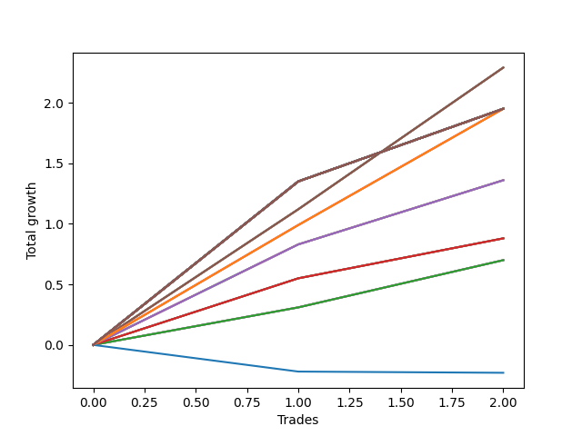

# Short Pointer 007 
- Symbol: NVDA_Unlimited
- Date Range: 02/08/2022 - 07/08/2022
- Trading Period: 7:20-12:30
- Number of Trades: 2



| Name | Win Percent | Profit | Avg Profit / Trade | Avg Time / Trade |      | Name | Win Percent | Profit | Avg Profit / Trade | Avg Time / Trade |
| ---- | ----------- | ------ | ------------------ | ---------------- | ---- | ---- | ----------- | ------ | ------------------ | ---------------- |
| Sorted By <br> Profit | | | | | | Sorted By <br> Win Percentage ||||
| Sixty-Seven | 100.00 | 1145.00 | 572.50 | 15:32 |     | Sixty-Seven | 100.00 | 1145.00 | 572.50 | 15:32 |
| Fifty-Nine | 100.00 | 1145.00 | 572.50 | 15:32 |     | Fifty-Nine | 100.00 | 1145.00 | 572.50 | 15:32 |
| Fifty-One | 100.00 | 1145.00 | 572.50 | 15:32 |     | Fifty-One | 100.00 | 1145.00 | 572.50 | 15:32 |
| Forty-Three | 100.00 | 1145.00 | 572.50 | 15:32 |     | Forty-Three | 100.00 | 1145.00 | 572.50 | 15:32 |
| Three | 100.00 | 1145.00 | 572.50 | 15:32 |     | Three | 100.00 | 1145.00 | 572.50 | 15:32 |
| One Hundred Thirty | 100.00 | 975.00 | 487.50 | 23:57 |     | One Hundred Thirty | 100.00 | 975.00 | 487.50 | 23:57 |
| One Hundred Twenty-Nine | 100.00 | 975.00 | 487.50 | 23:57 |     | One Hundred Twenty-Nine | 100.00 | 975.00 | 487.50 | 23:57 |
| One Hundred Twenty-Eight | 100.00 | 975.00 | 487.50 | 23:57 |     | One Hundred Twenty-Eight | 100.00 | 975.00 | 487.50 | 23:57 |
| One Hundred Twenty-Seven | 100.00 | 975.00 | 487.50 | 23:57 |     | One Hundred Twenty-Seven | 100.00 | 975.00 | 487.50 | 23:57 |
| One Hundred Twenty-Six | 100.00 | 975.00 | 487.50 | 11:37 |     | One Hundred Twenty-Six | 100.00 | 975.00 | 487.50 | 11:37 |
| One Hundred Twenty-Five | 100.00 | 975.00 | 487.50 | 23:57 |     | One Hundred Twenty-Five | 100.00 | 975.00 | 487.50 | 23:57 |
| One Hundred Twenty-Four | 100.00 | 975.00 | 487.50 | 23:57 |     | One Hundred Twenty-Four | 100.00 | 975.00 | 487.50 | 23:57 |
| One Hundred Twenty-Three | 100.00 | 975.00 | 487.50 | 23:57 |     | One Hundred Twenty-Three | 100.00 | 975.00 | 487.50 | 23:57 |
| One Hundred Twenty-Two | 100.00 | 975.00 | 487.50 | 23:57 |     | One Hundred Twenty-Two | 100.00 | 975.00 | 487.50 | 23:57 |
| One Hundred Twenty-One | 100.00 | 975.00 | 487.50 | 11:37 |     | One Hundred Twenty-One | 100.00 | 975.00 | 487.50 | 11:37 |
| One Hundred Twenty | 100.00 | 975.00 | 487.50 | 23:57 |     | One Hundred Twenty | 100.00 | 975.00 | 487.50 | 23:57 |
| One Hundred Ninteen | 100.00 | 975.00 | 487.50 | 23:57 |     | One Hundred Ninteen | 100.00 | 975.00 | 487.50 | 23:57 |
| One Hundred Eighteen | 100.00 | 975.00 | 487.50 | 23:57 |     | One Hundred Eighteen | 100.00 | 975.00 | 487.50 | 23:57 |
| One Hundred Seventeen | 100.00 | 975.00 | 487.50 | 23:57 |     | One Hundred Seventeen | 100.00 | 975.00 | 487.50 | 23:57 |
| One Hundred Sixteen | 100.00 | 975.00 | 487.50 | 11:37 |     | One Hundred Sixteen | 100.00 | 975.00 | 487.50 | 11:37 |
| One Hundred Fifteen | 100.00 | 975.00 | 487.50 | 23:57 |     | One Hundred Fifteen | 100.00 | 975.00 | 487.50 | 23:57 |
| One Hundred Fourteen | 100.00 | 975.00 | 487.50 | 23:57 |     | One Hundred Fourteen | 100.00 | 975.00 | 487.50 | 23:57 |
| One Hundred Thirteen | 100.00 | 975.00 | 487.50 | 23:57 |     | One Hundred Thirteen | 100.00 | 975.00 | 487.50 | 23:57 |
| One Hundred Twelve | 100.00 | 975.00 | 487.50 | 23:57 |     | One Hundred Twelve | 100.00 | 975.00 | 487.50 | 23:57 |
| One Hundred Eleven | 100.00 | 975.00 | 487.50 | 11:37 |     | One Hundred Eleven | 100.00 | 975.00 | 487.50 | 11:37 |
| Eighty-Five | 100.00 | 975.00 | 487.50 | 23:57 |     | Eighty-Five | 100.00 | 975.00 | 487.50 | 23:57 |
| Eighty-Four | 100.00 | 975.00 | 487.50 | 23:57 |     | Eighty-Four | 100.00 | 975.00 | 487.50 | 23:57 |
| Eighty-Three | 100.00 | 975.00 | 487.50 | 23:57 |     | Eighty-Three | 100.00 | 975.00 | 487.50 | 23:57 |
| Eighty-Two | 100.00 | 975.00 | 487.50 | 23:57 |     | Eighty-Two | 100.00 | 975.00 | 487.50 | 23:57 |
| Eighty-One | 100.00 | 975.00 | 487.50 | 11:37 |     | Eighty-One | 100.00 | 975.00 | 487.50 | 11:37 |
| Seventy-One | 100.00 | 975.00 | 487.50 | 23:57 |     | Seventy-One | 100.00 | 975.00 | 487.50 | 23:57 |
| Seventy | 100.00 | 975.00 | 487.50 | 23:57 |     | Seventy | 100.00 | 975.00 | 487.50 | 23:57 |
| Sixty-Nine | 100.00 | 975.00 | 487.50 | 23:57 |     | Sixty-Nine | 100.00 | 975.00 | 487.50 | 23:57 |
| Sixty-Eight | 100.00 | 975.00 | 487.50 | 23:57 |     | Sixty-Eight | 100.00 | 975.00 | 487.50 | 23:57 |
| Sixty-Three | 100.00 | 975.00 | 487.50 | 23:57 |     | Sixty-Three | 100.00 | 975.00 | 487.50 | 23:57 |
| Sixty-Two | 100.00 | 975.00 | 487.50 | 23:57 |     | Sixty-Two | 100.00 | 975.00 | 487.50 | 23:57 |
| Sixty-One | 100.00 | 975.00 | 487.50 | 23:57 |     | Sixty-One | 100.00 | 975.00 | 487.50 | 23:57 |
| Sixty | 100.00 | 975.00 | 487.50 | 23:57 |     | Sixty | 100.00 | 975.00 | 487.50 | 23:57 |
| Fifty-Five | 100.00 | 975.00 | 487.50 | 23:57 |     | Fifty-Five | 100.00 | 975.00 | 487.50 | 23:57 |
| Fifty-Four | 100.00 | 975.00 | 487.50 | 23:57 |     | Fifty-Four | 100.00 | 975.00 | 487.50 | 23:57 |
| Fifty-Three | 100.00 | 975.00 | 487.50 | 23:57 |     | Fifty-Three | 100.00 | 975.00 | 487.50 | 23:57 |
| Fifty-Two | 100.00 | 975.00 | 487.50 | 23:57 |     | Fifty-Two | 100.00 | 975.00 | 487.50 | 23:57 |
| Forty-Seven | 100.00 | 975.00 | 487.50 | 23:57 |     | Forty-Seven | 100.00 | 975.00 | 487.50 | 23:57 |
| Forty-Six | 100.00 | 975.00 | 487.50 | 23:57 |     | Forty-Six | 100.00 | 975.00 | 487.50 | 23:57 |
| Forty-Five | 100.00 | 975.00 | 487.50 | 23:57 |     | Forty-Five | 100.00 | 975.00 | 487.50 | 23:57 |
| Forty-Four | 100.00 | 975.00 | 487.50 | 23:57 |     | Forty-Four | 100.00 | 975.00 | 487.50 | 23:57 |
| Seven | 100.00 | 975.00 | 487.50 | 23:57 |     | Seven | 100.00 | 975.00 | 487.50 | 23:57 |
| Six | 100.00 | 975.00 | 487.50 | 23:57 |     | Six | 100.00 | 975.00 | 487.50 | 23:57 |
| Five | 100.00 | 975.00 | 487.50 | 23:57 |     | Five | 100.00 | 975.00 | 487.50 | 23:57 |
| Four | 100.00 | 975.00 | 487.50 | 23:57 |     | Four | 100.00 | 975.00 | 487.50 | 23:57 |
| Sixty-Six | 100.00 | 680.00 | 340.00 | 10:57 |     | Sixty-Six | 100.00 | 680.00 | 340.00 | 10:57 |
| Fifty-Eight | 100.00 | 680.00 | 340.00 | 10:57 |     | Fifty-Eight | 100.00 | 680.00 | 340.00 | 10:57 |
| Fifty | 100.00 | 680.00 | 340.00 | 10:57 |     | Fifty | 100.00 | 680.00 | 340.00 | 10:57 |
| Forty-Two | 100.00 | 680.00 | 340.00 | 10:57 |     | Forty-Two | 100.00 | 680.00 | 340.00 | 10:57 |
| Two | 100.00 | 680.00 | 340.00 | 10:57 |     | Two | 100.00 | 680.00 | 340.00 | 10:57 |
| Sixty-Five | 100.00 | 440.00 | 220.00 | 10:12 |     | Sixty-Five | 100.00 | 440.00 | 220.00 | 10:12 |
| Fifty-Seven | 100.00 | 440.00 | 220.00 | 10:12 |     | Fifty-Seven | 100.00 | 440.00 | 220.00 | 10:12 |
| Forty-Nine | 100.00 | 440.00 | 220.00 | 10:12 |     | Forty-Nine | 100.00 | 440.00 | 220.00 | 10:12 |
| Forty-One | 100.00 | 440.00 | 220.00 | 10:12 |     | Forty-One | 100.00 | 440.00 | 220.00 | 10:12 |
| One | 100.00 | 440.00 | 220.00 | 10:12 |     | One | 100.00 | 440.00 | 220.00 | 10:12 |
| Sixty-Four | 100.00 | 350.00 | 175.00 | 04:52 |     | Sixty-Four | 100.00 | 350.00 | 175.00 | 04:52 |
| Fifty-Six | 100.00 | 350.00 | 175.00 | 04:52 |     | Fifty-Six | 100.00 | 350.00 | 175.00 | 04:52 |
| Forty-Eight | 100.00 | 350.00 | 175.00 | 04:52 |     | Forty-Eight | 100.00 | 350.00 | 175.00 | 04:52 |
| Forty | 100.00 | 350.00 | 175.00 | 04:52 |     | Forty | 100.00 | 350.00 | 175.00 | 04:52 |
| Zero | 100.00 | 350.00 | 175.00 | 04:52 |     | Zero | 100.00 | 350.00 | 175.00 | 04:52 |
| Seventy-Three | 0.00 | -115.00 | -57.50 | 08:05 |     | Seventy-Three | 0.00 | -115.00 | -57.50 | 08:05 |

## NO STOPLOSS

### Test Zero
* Sell when price hits the middle line of the 20p bollinger
* No Stoploss
* Results:
```
Total Trades: 2
Percent Up: 0.00
Percent Down: 100.00
Total Points Moved Down: 0.70
Potential Profit: 350.00
Total Points Ups: 0.00 Count Ups: 0
Total Points Downs: 0.70 Count Downs: 2
```

<details><summary>Trades</summary>

<code>In: 2022-03-18 12:28:00		Out: 2022-03-18 12:30:45		Total Position Time: 02:45		Total Move Down: 0.31		Total to Date: 0.31</code> <br />
<code>In: 2022-04-04 08:44:00		Out: 2022-04-04 08:51:00		Total Position Time: 07:00		Total Move Down: 0.39		Total to Date: 0.70</code> <br />


</details>

### Test One
* Sell when the price hits the upper line of the 20p 1std bollinger
* No Stoploss
* Results:
```
Total Trades: 2
Percent Up: 0.00
Percent Down: 100.00
Total Points Moved Down: 0.88
Potential Profit: 440.00
Total Points Ups: 0.00 Count Ups: 0
Total Points Downs: 0.88 Count Downs: 2
```

<details><summary>Trades</summary>

<code>In: 2022-03-18 12:28:00		Out: 2022-03-18 12:36:30		Total Position Time: 08:30		Total Move Down: 0.55		Total to Date: 0.55</code> <br />
<code>In: 2022-04-04 08:44:00		Out: 2022-04-04 08:55:55		Total Position Time: 11:55		Total Move Down: 0.33		Total to Date: 0.88</code> <br />


</details>

### Test Two
* Sell when the price hits the upper line of the 20p 2std bollinger
* No Stoploss
* Results:
```
Total Trades: 2
Percent Up: 0.00
Percent Down: 100.00
Total Points Moved Down: 1.36
Potential Profit: 680.00
Total Points Ups: 0.00 Count Ups: 0
Total Points Downs: 1.36 Count Downs: 2
```

<details><summary>Trades</summary>

<code>In: 2022-03-18 12:28:00		Out: 2022-03-18 12:36:40		Total Position Time: 08:40		Total Move Down: 0.83		Total to Date: 0.83</code> <br />
<code>In: 2022-04-04 08:44:00		Out: 2022-04-04 08:57:15		Total Position Time: 13:15		Total Move Down: 0.53		Total to Date: 1.36</code> <br />


</details>

### Test Three
* Sell when price hits the middle line of the 50p bollinger
* No Stoploss
* Results:
```
Total Trades: 2
Percent Up: 0.00
Percent Down: 100.00
Total Points Moved Down: 2.29
Potential Profit: 1145.00
Total Points Ups: 0.00 Count Ups: 0
Total Points Downs: 2.29 Count Downs: 2
```

<details><summary>Trades</summary>

<code>In: 2022-03-18 12:28:00		Out: 2022-03-18 12:37:40		Total Position Time: 09:40		Total Move Down: 1.12		Total to Date: 1.12</code> <br />
<code>In: 2022-04-04 08:44:00		Out: 2022-04-04 09:05:25		Total Position Time: 21:25		Total Move Down: 1.17		Total to Date: 2.29</code> <br />


</details>

### Test Four
* Sell when the price hits the upper line of the 50p 1std bollinger
* No Stoploss
* Results:
```
Total Trades: 2
Percent Up: 0.00
Percent Down: 100.00
Total Points Moved Down: 1.95
Potential Profit: 975.00
Total Points Ups: 0.00 Count Ups: 0
Total Points Downs: 1.95 Count Downs: 2
```

<details><summary>Trades</summary>

<code>In: 2022-03-18 12:28:00		Out: 2022-03-18 12:46:00		Total Position Time: 18:00		Total Move Down: 1.35		Total to Date: 1.35</code> <br />
<code>In: 2022-04-04 08:44:00		Out: 2022-04-04 09:13:55		Total Position Time: 29:55		Total Move Down: 0.60		Total to Date: 1.95</code> <br />


</details>

### Test Five
* Sell when the price hits the upper line of the 50p 2std bollinger
* No Stoploss
* Results:
```
Total Trades: 2
Percent Up: 0.00
Percent Down: 100.00
Total Points Moved Down: 1.95
Potential Profit: 975.00
Total Points Ups: 0.00 Count Ups: 0
Total Points Downs: 1.95 Count Downs: 2
```

<details><summary>Trades</summary>

<code>In: 2022-03-18 12:28:00		Out: 2022-03-18 12:46:00		Total Position Time: 18:00		Total Move Down: 1.35		Total to Date: 1.35</code> <br />
<code>In: 2022-04-04 08:44:00		Out: 2022-04-04 09:13:55		Total Position Time: 29:55		Total Move Down: 0.60		Total to Date: 1.95</code> <br />


</details>

### Test Six
* Sell when the price hits the middle line of the 1std VWAP
* No Stoploss
* Results:
```
Total Trades: 2
Percent Up: 0.00
Percent Down: 100.00
Total Points Moved Down: 1.95
Potential Profit: 975.00
Total Points Ups: 0.00 Count Ups: 0
Total Points Downs: 1.95 Count Downs: 2
```

<details><summary>Trades</summary>

<code>In: 2022-03-18 12:28:00		Out: 2022-03-18 12:46:00		Total Position Time: 18:00		Total Move Down: 1.35		Total to Date: 1.35</code> <br />
<code>In: 2022-04-04 08:44:00		Out: 2022-04-04 09:13:55		Total Position Time: 29:55		Total Move Down: 0.60		Total to Date: 1.95</code> <br />


</details>

### Test Seven
* Sell when the price hits the upper line of the 1std VWAP
* No Stoploss
* Results:
```
Total Trades: 2
Percent Up: 0.00
Percent Down: 100.00
Total Points Moved Down: 1.95
Potential Profit: 975.00
Total Points Ups: 0.00 Count Ups: 0
Total Points Downs: 1.95 Count Downs: 2
```

<details><summary>Trades</summary>

<code>In: 2022-03-18 12:28:00		Out: 2022-03-18 12:46:00		Total Position Time: 18:00		Total Move Down: 1.35		Total to Date: 1.35</code> <br />
<code>In: 2022-04-04 08:44:00		Out: 2022-04-04 09:13:55		Total Position Time: 29:55		Total Move Down: 0.60		Total to Date: 1.95</code> <br />


</details>

## STOPLOSS OF 5

### Test Forty
* Sell when price hits the middle line of the 20p bollinger
* Stoploss is -5 points
* Results:
```
Total Trades: 2
Percent Up: 0.00
Percent Down: 100.00
Total Points Moved Down: 0.70
Potential Profit: 350.00
Total Points Ups: 0.00 Count Ups: 0
Total Points Downs: 0.70 Count Downs: 2
```

<details><summary>Trades</summary>

<code>In: 2022-03-18 12:28:00		Out: 2022-03-18 12:30:45		Total Position Time: 02:45		Total Move Down: 0.31		Total to Date: 0.31</code> <br />
<code>In: 2022-04-04 08:44:00		Out: 2022-04-04 08:51:00		Total Position Time: 07:00		Total Move Down: 0.39		Total to Date: 0.70</code> <br />


</details>

### Test Forty-One
* Sell when the price hits the upper line of the 20p 1std bollinger
* Stoploss is -5 points
* Results:
```
Total Trades: 2
Percent Up: 0.00
Percent Down: 100.00
Total Points Moved Down: 0.88
Potential Profit: 440.00
Total Points Ups: 0.00 Count Ups: 0
Total Points Downs: 0.88 Count Downs: 2
```

<details><summary>Trades</summary>

<code>In: 2022-03-18 12:28:00		Out: 2022-03-18 12:36:30		Total Position Time: 08:30		Total Move Down: 0.55		Total to Date: 0.55</code> <br />
<code>In: 2022-04-04 08:44:00		Out: 2022-04-04 08:55:55		Total Position Time: 11:55		Total Move Down: 0.33		Total to Date: 0.88</code> <br />


</details>

### Test Forty-Two
* Sell when the price hits the upper line of the 20p 2std bollinger
* Stoploss is -5 points
* Results:
```
Total Trades: 2
Percent Up: 0.00
Percent Down: 100.00
Total Points Moved Down: 1.36
Potential Profit: 680.00
Total Points Ups: 0.00 Count Ups: 0
Total Points Downs: 1.36 Count Downs: 2
```

<details><summary>Trades</summary>

<code>In: 2022-03-18 12:28:00		Out: 2022-03-18 12:36:40		Total Position Time: 08:40		Total Move Down: 0.83		Total to Date: 0.83</code> <br />
<code>In: 2022-04-04 08:44:00		Out: 2022-04-04 08:57:15		Total Position Time: 13:15		Total Move Down: 0.53		Total to Date: 1.36</code> <br />


</details>

### Test Forty-Three
* Sell when price hits the middle line of the 50p bollinger
* Stoploss is -5 points
* Results:
```
Total Trades: 2
Percent Up: 0.00
Percent Down: 100.00
Total Points Moved Down: 2.29
Potential Profit: 1145.00
Total Points Ups: 0.00 Count Ups: 0
Total Points Downs: 2.29 Count Downs: 2
```

<details><summary>Trades</summary>

<code>In: 2022-03-18 12:28:00		Out: 2022-03-18 12:37:40		Total Position Time: 09:40		Total Move Down: 1.12		Total to Date: 1.12</code> <br />
<code>In: 2022-04-04 08:44:00		Out: 2022-04-04 09:05:25		Total Position Time: 21:25		Total Move Down: 1.17		Total to Date: 2.29</code> <br />


</details>

### Test Forty-Four
* Sell when the price hits the upper line of the 50p 1std bollinger
* Stoploss is -5 points
* Results:
```
Total Trades: 2
Percent Up: 0.00
Percent Down: 100.00
Total Points Moved Down: 1.95
Potential Profit: 975.00
Total Points Ups: 0.00 Count Ups: 0
Total Points Downs: 1.95 Count Downs: 2
```

<details><summary>Trades</summary>

<code>In: 2022-03-18 12:28:00		Out: 2022-03-18 12:46:00		Total Position Time: 18:00		Total Move Down: 1.35		Total to Date: 1.35</code> <br />
<code>In: 2022-04-04 08:44:00		Out: 2022-04-04 09:13:55		Total Position Time: 29:55		Total Move Down: 0.60		Total to Date: 1.95</code> <br />


</details>

### Test Forty-Five
* Sell when the price hits the upper line of the 50p 2std bollinger
* Stoploss is -5 points
* Results:
```
Total Trades: 2
Percent Up: 0.00
Percent Down: 100.00
Total Points Moved Down: 1.95
Potential Profit: 975.00
Total Points Ups: 0.00 Count Ups: 0
Total Points Downs: 1.95 Count Downs: 2
```

<details><summary>Trades</summary>

<code>In: 2022-03-18 12:28:00		Out: 2022-03-18 12:46:00		Total Position Time: 18:00		Total Move Down: 1.35		Total to Date: 1.35</code> <br />
<code>In: 2022-04-04 08:44:00		Out: 2022-04-04 09:13:55		Total Position Time: 29:55		Total Move Down: 0.60		Total to Date: 1.95</code> <br />


</details>

### Test Forty-Six
* Sell when the price hits the middle line of the 1std VWAP
* Stoploss is -5 points
* Results:
```
Total Trades: 2
Percent Up: 0.00
Percent Down: 100.00
Total Points Moved Down: 1.95
Potential Profit: 975.00
Total Points Ups: 0.00 Count Ups: 0
Total Points Downs: 1.95 Count Downs: 2
```

<details><summary>Trades</summary>

<code>In: 2022-03-18 12:28:00		Out: 2022-03-18 12:46:00		Total Position Time: 18:00		Total Move Down: 1.35		Total to Date: 1.35</code> <br />
<code>In: 2022-04-04 08:44:00		Out: 2022-04-04 09:13:55		Total Position Time: 29:55		Total Move Down: 0.60		Total to Date: 1.95</code> <br />


</details>

### Test Forty-Seven
* Sell when the price hits the upper line of the 1std VWAP
* Stoploss is -5 points
* Results:
```
Total Trades: 2
Percent Up: 0.00
Percent Down: 100.00
Total Points Moved Down: 1.95
Potential Profit: 975.00
Total Points Ups: 0.00 Count Ups: 0
Total Points Downs: 1.95 Count Downs: 2
```

<details><summary>Trades</summary>

<code>In: 2022-03-18 12:28:00		Out: 2022-03-18 12:46:00		Total Position Time: 18:00		Total Move Down: 1.35		Total to Date: 1.35</code> <br />
<code>In: 2022-04-04 08:44:00		Out: 2022-04-04 09:13:55		Total Position Time: 29:55		Total Move Down: 0.60		Total to Date: 1.95</code> <br />


</details>

## TRAIL STOP OF 5

### Test Forty-Eight
* Sell when price hits the middle line of the 20p bollinger
* Trailing Stop is -5 points
* Results:
```
Total Trades: 2
Percent Up: 0.00
Percent Down: 100.00
Total Points Moved Down: 0.70
Potential Profit: 350.00
Total Points Ups: 0.00 Count Ups: 0
Total Points Downs: 0.70 Count Downs: 2
```

<details><summary>Trades</summary>

<code>In: 2022-03-18 12:28:00		Out: 2022-03-18 12:30:45		Total Position Time: 02:45		Total Move Down: 0.31		Total to Date: 0.31</code> <br />
<code>In: 2022-04-04 08:44:00		Out: 2022-04-04 08:51:00		Total Position Time: 07:00		Total Move Down: 0.39		Total to Date: 0.70</code> <br />


</details>

### Test Forty-Nine
* Sell when the price hits the upper line of the 20p 1std bollinger
* Trailing Stop is -5 points
* Results:
```
Total Trades: 2
Percent Up: 0.00
Percent Down: 100.00
Total Points Moved Down: 0.88
Potential Profit: 440.00
Total Points Ups: 0.00 Count Ups: 0
Total Points Downs: 0.88 Count Downs: 2
```

<details><summary>Trades</summary>

<code>In: 2022-03-18 12:28:00		Out: 2022-03-18 12:36:30		Total Position Time: 08:30		Total Move Down: 0.55		Total to Date: 0.55</code> <br />
<code>In: 2022-04-04 08:44:00		Out: 2022-04-04 08:55:55		Total Position Time: 11:55		Total Move Down: 0.33		Total to Date: 0.88</code> <br />


</details>

### Test Fifty
* Sell when the price hits the upper line of the 20p 2std bollinger
* Trailing Stop is -5 points
* Results:
```
Total Trades: 2
Percent Up: 0.00
Percent Down: 100.00
Total Points Moved Down: 1.36
Potential Profit: 680.00
Total Points Ups: 0.00 Count Ups: 0
Total Points Downs: 1.36 Count Downs: 2
```

<details><summary>Trades</summary>

<code>In: 2022-03-18 12:28:00		Out: 2022-03-18 12:36:40		Total Position Time: 08:40		Total Move Down: 0.83		Total to Date: 0.83</code> <br />
<code>In: 2022-04-04 08:44:00		Out: 2022-04-04 08:57:15		Total Position Time: 13:15		Total Move Down: 0.53		Total to Date: 1.36</code> <br />


</details>

### Test Fifty-One
* Sell when price hits the middle line of the 50p bollinger
* Trailing Stop is -5 points
* Results:
```
Total Trades: 2
Percent Up: 0.00
Percent Down: 100.00
Total Points Moved Down: 2.29
Potential Profit: 1145.00
Total Points Ups: 0.00 Count Ups: 0
Total Points Downs: 2.29 Count Downs: 2
```

<details><summary>Trades</summary>

<code>In: 2022-03-18 12:28:00		Out: 2022-03-18 12:37:40		Total Position Time: 09:40		Total Move Down: 1.12		Total to Date: 1.12</code> <br />
<code>In: 2022-04-04 08:44:00		Out: 2022-04-04 09:05:25		Total Position Time: 21:25		Total Move Down: 1.17		Total to Date: 2.29</code> <br />


</details>

### Test Fifty-Two
* Sell when the price hits the upper line of the 50p 1std bollinger
* Trailing Stop is -5 points
* Results:
```
Total Trades: 2
Percent Up: 0.00
Percent Down: 100.00
Total Points Moved Down: 1.95
Potential Profit: 975.00
Total Points Ups: 0.00 Count Ups: 0
Total Points Downs: 1.95 Count Downs: 2
```

<details><summary>Trades</summary>

<code>In: 2022-03-18 12:28:00		Out: 2022-03-18 12:46:00		Total Position Time: 18:00		Total Move Down: 1.35		Total to Date: 1.35</code> <br />
<code>In: 2022-04-04 08:44:00		Out: 2022-04-04 09:13:55		Total Position Time: 29:55		Total Move Down: 0.60		Total to Date: 1.95</code> <br />


</details>

### Test Fifty-Three
* Sell when the price hits the upper line of the 50p 2std bollinger
* Trailing Stop is -5 points
* Results:
```
Total Trades: 2
Percent Up: 0.00
Percent Down: 100.00
Total Points Moved Down: 1.95
Potential Profit: 975.00
Total Points Ups: 0.00 Count Ups: 0
Total Points Downs: 1.95 Count Downs: 2
```

<details><summary>Trades</summary>

<code>In: 2022-03-18 12:28:00		Out: 2022-03-18 12:46:00		Total Position Time: 18:00		Total Move Down: 1.35		Total to Date: 1.35</code> <br />
<code>In: 2022-04-04 08:44:00		Out: 2022-04-04 09:13:55		Total Position Time: 29:55		Total Move Down: 0.60		Total to Date: 1.95</code> <br />


</details>

### Test Fifty-Four
* Sell when the price hits the middle line of the 1std VWAP
* Trailing Stop is -5 points
* Results:
```
Total Trades: 2
Percent Up: 0.00
Percent Down: 100.00
Total Points Moved Down: 1.95
Potential Profit: 975.00
Total Points Ups: 0.00 Count Ups: 0
Total Points Downs: 1.95 Count Downs: 2
```

<details><summary>Trades</summary>

<code>In: 2022-03-18 12:28:00		Out: 2022-03-18 12:46:00		Total Position Time: 18:00		Total Move Down: 1.35		Total to Date: 1.35</code> <br />
<code>In: 2022-04-04 08:44:00		Out: 2022-04-04 09:13:55		Total Position Time: 29:55		Total Move Down: 0.60		Total to Date: 1.95</code> <br />


</details>

### Test Fifty-Five
* Sell when the price hits the upper line of the 1std VWAP
* Trailing Stop is -5 points
* Results:
```
Total Trades: 2
Percent Up: 0.00
Percent Down: 100.00
Total Points Moved Down: 1.95
Potential Profit: 975.00
Total Points Ups: 0.00 Count Ups: 0
Total Points Downs: 1.95 Count Downs: 2
```

<details><summary>Trades</summary>

<code>In: 2022-03-18 12:28:00		Out: 2022-03-18 12:46:00		Total Position Time: 18:00		Total Move Down: 1.35		Total to Date: 1.35</code> <br />
<code>In: 2022-04-04 08:44:00		Out: 2022-04-04 09:13:55		Total Position Time: 29:55		Total Move Down: 0.60		Total to Date: 1.95</code> <br />


</details>

## STOPLOSS OF 10

### Test Fifty-Six
* Sell when price hits the middle line of the 20p bollinger
* Stoploss is -10 points
* Results:
```
Total Trades: 2
Percent Up: 0.00
Percent Down: 100.00
Total Points Moved Down: 0.70
Potential Profit: 350.00
Total Points Ups: 0.00 Count Ups: 0
Total Points Downs: 0.70 Count Downs: 2
```

<details><summary>Trades</summary>

<code>In: 2022-03-18 12:28:00		Out: 2022-03-18 12:30:45		Total Position Time: 02:45		Total Move Down: 0.31		Total to Date: 0.31</code> <br />
<code>In: 2022-04-04 08:44:00		Out: 2022-04-04 08:51:00		Total Position Time: 07:00		Total Move Down: 0.39		Total to Date: 0.70</code> <br />


</details>

### Test Fifty-Seven
* Sell when the price hits the upper line of the 20p 1std bollinger
* Stoploss is -10 points
* Results:
```
Total Trades: 2
Percent Up: 0.00
Percent Down: 100.00
Total Points Moved Down: 0.88
Potential Profit: 440.00
Total Points Ups: 0.00 Count Ups: 0
Total Points Downs: 0.88 Count Downs: 2
```

<details><summary>Trades</summary>

<code>In: 2022-03-18 12:28:00		Out: 2022-03-18 12:36:30		Total Position Time: 08:30		Total Move Down: 0.55		Total to Date: 0.55</code> <br />
<code>In: 2022-04-04 08:44:00		Out: 2022-04-04 08:55:55		Total Position Time: 11:55		Total Move Down: 0.33		Total to Date: 0.88</code> <br />


</details>

### Test Fifty-Eight
* Sell when the price hits the upper line of the 20p 2std bollinger
* Stoploss is -10 points
* Results:
```
Total Trades: 2
Percent Up: 0.00
Percent Down: 100.00
Total Points Moved Down: 1.36
Potential Profit: 680.00
Total Points Ups: 0.00 Count Ups: 0
Total Points Downs: 1.36 Count Downs: 2
```

<details><summary>Trades</summary>

<code>In: 2022-03-18 12:28:00		Out: 2022-03-18 12:36:40		Total Position Time: 08:40		Total Move Down: 0.83		Total to Date: 0.83</code> <br />
<code>In: 2022-04-04 08:44:00		Out: 2022-04-04 08:57:15		Total Position Time: 13:15		Total Move Down: 0.53		Total to Date: 1.36</code> <br />


</details>

### Test Fifty-Nine
* Sell when price hits the middle line of the 50p bollinger
* Stoploss is -10 points
* Results:
```
Total Trades: 2
Percent Up: 0.00
Percent Down: 100.00
Total Points Moved Down: 2.29
Potential Profit: 1145.00
Total Points Ups: 0.00 Count Ups: 0
Total Points Downs: 2.29 Count Downs: 2
```

<details><summary>Trades</summary>

<code>In: 2022-03-18 12:28:00		Out: 2022-03-18 12:37:40		Total Position Time: 09:40		Total Move Down: 1.12		Total to Date: 1.12</code> <br />
<code>In: 2022-04-04 08:44:00		Out: 2022-04-04 09:05:25		Total Position Time: 21:25		Total Move Down: 1.17		Total to Date: 2.29</code> <br />


</details>

### Test Sixty
* Sell when the price hits the upper line of the 50p 1std bollinger
* Stoploss is -10 points
* Results:
```
Total Trades: 2
Percent Up: 0.00
Percent Down: 100.00
Total Points Moved Down: 1.95
Potential Profit: 975.00
Total Points Ups: 0.00 Count Ups: 0
Total Points Downs: 1.95 Count Downs: 2
```

<details><summary>Trades</summary>

<code>In: 2022-03-18 12:28:00		Out: 2022-03-18 12:46:00		Total Position Time: 18:00		Total Move Down: 1.35		Total to Date: 1.35</code> <br />
<code>In: 2022-04-04 08:44:00		Out: 2022-04-04 09:13:55		Total Position Time: 29:55		Total Move Down: 0.60		Total to Date: 1.95</code> <br />


</details>

### Test Sixty-One
* Sell when the price hits the upper line of the 50p 2std bollinger
* Stoploss is -10 points
* Results:
```
Total Trades: 2
Percent Up: 0.00
Percent Down: 100.00
Total Points Moved Down: 1.95
Potential Profit: 975.00
Total Points Ups: 0.00 Count Ups: 0
Total Points Downs: 1.95 Count Downs: 2
```

<details><summary>Trades</summary>

<code>In: 2022-03-18 12:28:00		Out: 2022-03-18 12:46:00		Total Position Time: 18:00		Total Move Down: 1.35		Total to Date: 1.35</code> <br />
<code>In: 2022-04-04 08:44:00		Out: 2022-04-04 09:13:55		Total Position Time: 29:55		Total Move Down: 0.60		Total to Date: 1.95</code> <br />


</details>

### Test Sixty-Two
* Sell when the price hits the middle line of the 1std VWAP
* Stoploss is -10 points
* Results:
```
Total Trades: 2
Percent Up: 0.00
Percent Down: 100.00
Total Points Moved Down: 1.95
Potential Profit: 975.00
Total Points Ups: 0.00 Count Ups: 0
Total Points Downs: 1.95 Count Downs: 2
```

<details><summary>Trades</summary>

<code>In: 2022-03-18 12:28:00		Out: 2022-03-18 12:46:00		Total Position Time: 18:00		Total Move Down: 1.35		Total to Date: 1.35</code> <br />
<code>In: 2022-04-04 08:44:00		Out: 2022-04-04 09:13:55		Total Position Time: 29:55		Total Move Down: 0.60		Total to Date: 1.95</code> <br />


</details>

### Test Sixty-Three
* Sell when the price hits the upper line of the 1std VWAP
* Stoploss is -10 points
* Results:
```
Total Trades: 2
Percent Up: 0.00
Percent Down: 100.00
Total Points Moved Down: 1.95
Potential Profit: 975.00
Total Points Ups: 0.00 Count Ups: 0
Total Points Downs: 1.95 Count Downs: 2
```

<details><summary>Trades</summary>

<code>In: 2022-03-18 12:28:00		Out: 2022-03-18 12:46:00		Total Position Time: 18:00		Total Move Down: 1.35		Total to Date: 1.35</code> <br />
<code>In: 2022-04-04 08:44:00		Out: 2022-04-04 09:13:55		Total Position Time: 29:55		Total Move Down: 0.60		Total to Date: 1.95</code> <br />


</details>

## TRAIL STOP OF 10

### Test Sixty-Four
* Sell when price hits the middle line of the 20p bollinger
* Trailing Stop is -10 points
* Results:
```
Total Trades: 2
Percent Up: 0.00
Percent Down: 100.00
Total Points Moved Down: 0.70
Potential Profit: 350.00
Total Points Ups: 0.00 Count Ups: 0
Total Points Downs: 0.70 Count Downs: 2
```

<details><summary>Trades</summary>

<code>In: 2022-03-18 12:28:00		Out: 2022-03-18 12:30:45		Total Position Time: 02:45		Total Move Down: 0.31		Total to Date: 0.31</code> <br />
<code>In: 2022-04-04 08:44:00		Out: 2022-04-04 08:51:00		Total Position Time: 07:00		Total Move Down: 0.39		Total to Date: 0.70</code> <br />


</details>

### Test Sixty-Five
* Sell when the price hits the upper line of the 20p 1std bollinger
* Trailing Stop is -10 points
* Results:
```
Total Trades: 2
Percent Up: 0.00
Percent Down: 100.00
Total Points Moved Down: 0.88
Potential Profit: 440.00
Total Points Ups: 0.00 Count Ups: 0
Total Points Downs: 0.88 Count Downs: 2
```

<details><summary>Trades</summary>

<code>In: 2022-03-18 12:28:00		Out: 2022-03-18 12:36:30		Total Position Time: 08:30		Total Move Down: 0.55		Total to Date: 0.55</code> <br />
<code>In: 2022-04-04 08:44:00		Out: 2022-04-04 08:55:55		Total Position Time: 11:55		Total Move Down: 0.33		Total to Date: 0.88</code> <br />


</details>

### Test Sixty-Six
* Sell when the price hits the upper line of the 20p 2std bollinger
* Trailing Stop is -10 points
* Results:
```
Total Trades: 2
Percent Up: 0.00
Percent Down: 100.00
Total Points Moved Down: 1.36
Potential Profit: 680.00
Total Points Ups: 0.00 Count Ups: 0
Total Points Downs: 1.36 Count Downs: 2
```

<details><summary>Trades</summary>

<code>In: 2022-03-18 12:28:00		Out: 2022-03-18 12:36:40		Total Position Time: 08:40		Total Move Down: 0.83		Total to Date: 0.83</code> <br />
<code>In: 2022-04-04 08:44:00		Out: 2022-04-04 08:57:15		Total Position Time: 13:15		Total Move Down: 0.53		Total to Date: 1.36</code> <br />


</details>

### Test Sixty-Seven
* Sell when price hits the middle line of the 50p bollinger
* Trailing Stop is -10 points
* Results:
```
Total Trades: 2
Percent Up: 0.00
Percent Down: 100.00
Total Points Moved Down: 2.29
Potential Profit: 1145.00
Total Points Ups: 0.00 Count Ups: 0
Total Points Downs: 2.29 Count Downs: 2
```

<details><summary>Trades</summary>

<code>In: 2022-03-18 12:28:00		Out: 2022-03-18 12:37:40		Total Position Time: 09:40		Total Move Down: 1.12		Total to Date: 1.12</code> <br />
<code>In: 2022-04-04 08:44:00		Out: 2022-04-04 09:05:25		Total Position Time: 21:25		Total Move Down: 1.17		Total to Date: 2.29</code> <br />


</details>

### Test Sixty-Eight
* Sell when the price hits the upper line of the 50p 1std bollinger
* Trailing Stop is -10 points
* Results:
```
Total Trades: 2
Percent Up: 0.00
Percent Down: 100.00
Total Points Moved Down: 1.95
Potential Profit: 975.00
Total Points Ups: 0.00 Count Ups: 0
Total Points Downs: 1.95 Count Downs: 2
```

<details><summary>Trades</summary>

<code>In: 2022-03-18 12:28:00		Out: 2022-03-18 12:46:00		Total Position Time: 18:00		Total Move Down: 1.35		Total to Date: 1.35</code> <br />
<code>In: 2022-04-04 08:44:00		Out: 2022-04-04 09:13:55		Total Position Time: 29:55		Total Move Down: 0.60		Total to Date: 1.95</code> <br />


</details>

### Test Sixty-Nine
* Sell when the price hits the upper line of the 50p 2std bollinger
* Trailing Stop is -10 points
* Results:
```
Total Trades: 2
Percent Up: 0.00
Percent Down: 100.00
Total Points Moved Down: 1.95
Potential Profit: 975.00
Total Points Ups: 0.00 Count Ups: 0
Total Points Downs: 1.95 Count Downs: 2
```

<details><summary>Trades</summary>

<code>In: 2022-03-18 12:28:00		Out: 2022-03-18 12:46:00		Total Position Time: 18:00		Total Move Down: 1.35		Total to Date: 1.35</code> <br />
<code>In: 2022-04-04 08:44:00		Out: 2022-04-04 09:13:55		Total Position Time: 29:55		Total Move Down: 0.60		Total to Date: 1.95</code> <br />


</details>

### Test Seventy
* Sell when the price hits the middle line of the 1std VWAP
* Trailing Stop is -10 points
* Results:
```
Total Trades: 2
Percent Up: 0.00
Percent Down: 100.00
Total Points Moved Down: 1.95
Potential Profit: 975.00
Total Points Ups: 0.00 Count Ups: 0
Total Points Downs: 1.95 Count Downs: 2
```

<details><summary>Trades</summary>

<code>In: 2022-03-18 12:28:00		Out: 2022-03-18 12:46:00		Total Position Time: 18:00		Total Move Down: 1.35		Total to Date: 1.35</code> <br />
<code>In: 2022-04-04 08:44:00		Out: 2022-04-04 09:13:55		Total Position Time: 29:55		Total Move Down: 0.60		Total to Date: 1.95</code> <br />


</details>

### Test Seventy-One
* Sell when the price hits the upper line of the 1std VWAP
* Trailing Stop is -10 points
* Results:
```
Total Trades: 2
Percent Up: 0.00
Percent Down: 100.00
Total Points Moved Down: 1.95
Potential Profit: 975.00
Total Points Ups: 0.00 Count Ups: 0
Total Points Downs: 1.95 Count Downs: 2
```

<details><summary>Trades</summary>

<code>In: 2022-03-18 12:28:00		Out: 2022-03-18 12:46:00		Total Position Time: 18:00		Total Move Down: 1.35		Total to Date: 1.35</code> <br />
<code>In: 2022-04-04 08:44:00		Out: 2022-04-04 09:13:55		Total Position Time: 29:55		Total Move Down: 0.60		Total to Date: 1.95</code> <br />


</details>

## SPECIAL EXIT CONDITIONS 

### Test Seventy-Three
* Sell when the linear regression slope changes to negative
* No Stoploss
* Results:
```
Total Trades: 2
Percent Up: 100.00
Percent Down: 0.00
Total Points Moved Down: -0.23
Potential Profit: -115.00
Total Points Ups: 0.23 Count Ups: 2
Total Points Downs: 0.00 Count Downs: 0
```

<details><summary>Trades</summary>

<code>In: 2022-03-18 12:28:00		Out: 2022-03-18 12:34:05		Total Position Time: 06:05		Total Move Down: -0.22		Total to Date: -0.22</code> <br />
<code>In: 2022-04-04 08:44:00		Out: 2022-04-04 08:54:05		Total Position Time: 10:05		Total Move Down: -0.01		Total to Date: -0.23</code> <br />


</details>

## TAKE PROFIT

### Test Eighty-One
* Take Profit of 1 Point
* No Stoploss
* Results:
```
Total Trades: 2
Percent Up: 0.00
Percent Down: 100.00
Total Points Moved Down: 1.95
Potential Profit: 975.00
Total Points Ups: 0.00 Count Ups: 0
Total Points Downs: 1.95 Count Downs: 2
```

<details><summary>Trades</summary>

<code>In: 2022-03-18 12:28:00		Out: 2022-03-18 12:37:20		Total Position Time: 09:20		Total Move Down: 0.99		Total to Date: 0.99</code> <br />
<code>In: 2022-04-04 08:44:00		Out: 2022-04-04 08:57:55		Total Position Time: 13:55		Total Move Down: 0.96		Total to Date: 1.95</code> <br />


</details>

### Test Eighty-Two
* Take Profit of 2 Point
* No Stoploss
* Results:
```
Total Trades: 2
Percent Up: 0.00
Percent Down: 100.00
Total Points Moved Down: 1.95
Potential Profit: 975.00
Total Points Ups: 0.00 Count Ups: 0
Total Points Downs: 1.95 Count Downs: 2
```

<details><summary>Trades</summary>

<code>In: 2022-03-18 12:28:00		Out: 2022-03-18 12:46:00		Total Position Time: 18:00		Total Move Down: 1.35		Total to Date: 1.35</code> <br />
<code>In: 2022-04-04 08:44:00		Out: 2022-04-04 09:13:55		Total Position Time: 29:55		Total Move Down: 0.60		Total to Date: 1.95</code> <br />


</details>

### Test Eighty-Three
* Take Profit of 3 Point
* No Stoploss
* Results:
```
Total Trades: 2
Percent Up: 0.00
Percent Down: 100.00
Total Points Moved Down: 1.95
Potential Profit: 975.00
Total Points Ups: 0.00 Count Ups: 0
Total Points Downs: 1.95 Count Downs: 2
```

<details><summary>Trades</summary>

<code>In: 2022-03-18 12:28:00		Out: 2022-03-18 12:46:00		Total Position Time: 18:00		Total Move Down: 1.35		Total to Date: 1.35</code> <br />
<code>In: 2022-04-04 08:44:00		Out: 2022-04-04 09:13:55		Total Position Time: 29:55		Total Move Down: 0.60		Total to Date: 1.95</code> <br />


</details>

### Test Eighty-Four
* Take Profit of 4 Point
* No Stoploss
* Results:
```
Total Trades: 2
Percent Up: 0.00
Percent Down: 100.00
Total Points Moved Down: 1.95
Potential Profit: 975.00
Total Points Ups: 0.00 Count Ups: 0
Total Points Downs: 1.95 Count Downs: 2
```

<details><summary>Trades</summary>

<code>In: 2022-03-18 12:28:00		Out: 2022-03-18 12:46:00		Total Position Time: 18:00		Total Move Down: 1.35		Total to Date: 1.35</code> <br />
<code>In: 2022-04-04 08:44:00		Out: 2022-04-04 09:13:55		Total Position Time: 29:55		Total Move Down: 0.60		Total to Date: 1.95</code> <br />


</details>

### Test Eighty-Five
* Take Profit of 5 Point
* No Stoploss
* Results:
```
Total Trades: 2
Percent Up: 0.00
Percent Down: 100.00
Total Points Moved Down: 1.95
Potential Profit: 975.00
Total Points Ups: 0.00 Count Ups: 0
Total Points Downs: 1.95 Count Downs: 2
```

<details><summary>Trades</summary>

<code>In: 2022-03-18 12:28:00		Out: 2022-03-18 12:46:00		Total Position Time: 18:00		Total Move Down: 1.35		Total to Date: 1.35</code> <br />
<code>In: 2022-04-04 08:44:00		Out: 2022-04-04 09:13:55		Total Position Time: 29:55		Total Move Down: 0.60		Total to Date: 1.95</code> <br />


</details>

## TAKE PROFIT Stoploss of Five

### Test One Hundred Eleven
* Take Profit of 1 Point
* Stoploss is -5 points
* Results:
```
Total Trades: 2
Percent Up: 0.00
Percent Down: 100.00
Total Points Moved Down: 1.95
Potential Profit: 975.00
Total Points Ups: 0.00 Count Ups: 0
Total Points Downs: 1.95 Count Downs: 2
```

<details><summary>Trades</summary>

<code>In: 2022-03-18 12:28:00		Out: 2022-03-18 12:37:20		Total Position Time: 09:20		Total Move Down: 0.99		Total to Date: 0.99</code> <br />
<code>In: 2022-04-04 08:44:00		Out: 2022-04-04 08:57:55		Total Position Time: 13:55		Total Move Down: 0.96		Total to Date: 1.95</code> <br />


</details>

### Test One Hundred Twelve
* Take Profit of 2 Point
* Stoploss is -5 points
* Results:
```
Total Trades: 2
Percent Up: 0.00
Percent Down: 100.00
Total Points Moved Down: 1.95
Potential Profit: 975.00
Total Points Ups: 0.00 Count Ups: 0
Total Points Downs: 1.95 Count Downs: 2
```

<details><summary>Trades</summary>

<code>In: 2022-03-18 12:28:00		Out: 2022-03-18 12:46:00		Total Position Time: 18:00		Total Move Down: 1.35		Total to Date: 1.35</code> <br />
<code>In: 2022-04-04 08:44:00		Out: 2022-04-04 09:13:55		Total Position Time: 29:55		Total Move Down: 0.60		Total to Date: 1.95</code> <br />


</details>

### Test One Hundred Thirteen
* Take Profit of 3 Point
* Stoploss is -5 points
* Results:
```
Total Trades: 2
Percent Up: 0.00
Percent Down: 100.00
Total Points Moved Down: 1.95
Potential Profit: 975.00
Total Points Ups: 0.00 Count Ups: 0
Total Points Downs: 1.95 Count Downs: 2
```

<details><summary>Trades</summary>

<code>In: 2022-03-18 12:28:00		Out: 2022-03-18 12:46:00		Total Position Time: 18:00		Total Move Down: 1.35		Total to Date: 1.35</code> <br />
<code>In: 2022-04-04 08:44:00		Out: 2022-04-04 09:13:55		Total Position Time: 29:55		Total Move Down: 0.60		Total to Date: 1.95</code> <br />


</details>

### Test One Hundred Fourteen
* Take Profit of 4 Point
* Stoploss is -5 points
* Results:
```
Total Trades: 2
Percent Up: 0.00
Percent Down: 100.00
Total Points Moved Down: 1.95
Potential Profit: 975.00
Total Points Ups: 0.00 Count Ups: 0
Total Points Downs: 1.95 Count Downs: 2
```

<details><summary>Trades</summary>

<code>In: 2022-03-18 12:28:00		Out: 2022-03-18 12:46:00		Total Position Time: 18:00		Total Move Down: 1.35		Total to Date: 1.35</code> <br />
<code>In: 2022-04-04 08:44:00		Out: 2022-04-04 09:13:55		Total Position Time: 29:55		Total Move Down: 0.60		Total to Date: 1.95</code> <br />


</details>

### Test One Hundred Fifteen
* Take Profit of 5 Point
* Stoploss is -5 points
* Results:
```
Total Trades: 2
Percent Up: 0.00
Percent Down: 100.00
Total Points Moved Down: 1.95
Potential Profit: 975.00
Total Points Ups: 0.00 Count Ups: 0
Total Points Downs: 1.95 Count Downs: 2
```

<details><summary>Trades</summary>

<code>In: 2022-03-18 12:28:00		Out: 2022-03-18 12:46:00		Total Position Time: 18:00		Total Move Down: 1.35		Total to Date: 1.35</code> <br />
<code>In: 2022-04-04 08:44:00		Out: 2022-04-04 09:13:55		Total Position Time: 29:55		Total Move Down: 0.60		Total to Date: 1.95</code> <br />


</details>

## TAKE PROFIT Trailstop of Five

### Test One Hundred Sixteen
* Take Profit of 1 Point
* Trailing stop is -5 points
* Results:
```
Total Trades: 2
Percent Up: 0.00
Percent Down: 100.00
Total Points Moved Down: 1.95
Potential Profit: 975.00
Total Points Ups: 0.00 Count Ups: 0
Total Points Downs: 1.95 Count Downs: 2
```

<details><summary>Trades</summary>

<code>In: 2022-03-18 12:28:00		Out: 2022-03-18 12:37:20		Total Position Time: 09:20		Total Move Down: 0.99		Total to Date: 0.99</code> <br />
<code>In: 2022-04-04 08:44:00		Out: 2022-04-04 08:57:55		Total Position Time: 13:55		Total Move Down: 0.96		Total to Date: 1.95</code> <br />


</details>

### Test One Hundred Seventeen
* Take Profit of 2 Point
* Trailing stop is -5 points
* Results:
```
Total Trades: 2
Percent Up: 0.00
Percent Down: 100.00
Total Points Moved Down: 1.95
Potential Profit: 975.00
Total Points Ups: 0.00 Count Ups: 0
Total Points Downs: 1.95 Count Downs: 2
```

<details><summary>Trades</summary>

<code>In: 2022-03-18 12:28:00		Out: 2022-03-18 12:46:00		Total Position Time: 18:00		Total Move Down: 1.35		Total to Date: 1.35</code> <br />
<code>In: 2022-04-04 08:44:00		Out: 2022-04-04 09:13:55		Total Position Time: 29:55		Total Move Down: 0.60		Total to Date: 1.95</code> <br />


</details>

### Test One Hundred Eighteen
* Take Profit of 3 Point
* Trailing stop is -5 points
* Results:
```
Total Trades: 2
Percent Up: 0.00
Percent Down: 100.00
Total Points Moved Down: 1.95
Potential Profit: 975.00
Total Points Ups: 0.00 Count Ups: 0
Total Points Downs: 1.95 Count Downs: 2
```

<details><summary>Trades</summary>

<code>In: 2022-03-18 12:28:00		Out: 2022-03-18 12:46:00		Total Position Time: 18:00		Total Move Down: 1.35		Total to Date: 1.35</code> <br />
<code>In: 2022-04-04 08:44:00		Out: 2022-04-04 09:13:55		Total Position Time: 29:55		Total Move Down: 0.60		Total to Date: 1.95</code> <br />


</details>

### Test One Hundred Ninteen
* Take Profit of 4 Point
* Trailing stop is -5 points
* Results:
```
Total Trades: 2
Percent Up: 0.00
Percent Down: 100.00
Total Points Moved Down: 1.95
Potential Profit: 975.00
Total Points Ups: 0.00 Count Ups: 0
Total Points Downs: 1.95 Count Downs: 2
```

<details><summary>Trades</summary>

<code>In: 2022-03-18 12:28:00		Out: 2022-03-18 12:46:00		Total Position Time: 18:00		Total Move Down: 1.35		Total to Date: 1.35</code> <br />
<code>In: 2022-04-04 08:44:00		Out: 2022-04-04 09:13:55		Total Position Time: 29:55		Total Move Down: 0.60		Total to Date: 1.95</code> <br />


</details>

### Test One Hundred Twenty
* Take Profit of 5 Point
* Trailing stop is -5 points
* Results:
```
Total Trades: 2
Percent Up: 0.00
Percent Down: 100.00
Total Points Moved Down: 1.95
Potential Profit: 975.00
Total Points Ups: 0.00 Count Ups: 0
Total Points Downs: 1.95 Count Downs: 2
```

<details><summary>Trades</summary>

<code>In: 2022-03-18 12:28:00		Out: 2022-03-18 12:46:00		Total Position Time: 18:00		Total Move Down: 1.35		Total to Date: 1.35</code> <br />
<code>In: 2022-04-04 08:44:00		Out: 2022-04-04 09:13:55		Total Position Time: 29:55		Total Move Down: 0.60		Total to Date: 1.95</code> <br />


</details>

## TAKE PROFIT Stoploss of Ten

### Test One Hundred Twenty-One
* Take Profit of 1 Point
* Stoploss is -10 points
* Results:
```
Total Trades: 2
Percent Up: 0.00
Percent Down: 100.00
Total Points Moved Down: 1.95
Potential Profit: 975.00
Total Points Ups: 0.00 Count Ups: 0
Total Points Downs: 1.95 Count Downs: 2
```

<details><summary>Trades</summary>

<code>In: 2022-03-18 12:28:00		Out: 2022-03-18 12:37:20		Total Position Time: 09:20		Total Move Down: 0.99		Total to Date: 0.99</code> <br />
<code>In: 2022-04-04 08:44:00		Out: 2022-04-04 08:57:55		Total Position Time: 13:55		Total Move Down: 0.96		Total to Date: 1.95</code> <br />


</details>

### Test One Hundred Twenty-Two
* Take Profit of 2 Point
* Stoploss is -10 points
* Results:
```
Total Trades: 2
Percent Up: 0.00
Percent Down: 100.00
Total Points Moved Down: 1.95
Potential Profit: 975.00
Total Points Ups: 0.00 Count Ups: 0
Total Points Downs: 1.95 Count Downs: 2
```

<details><summary>Trades</summary>

<code>In: 2022-03-18 12:28:00		Out: 2022-03-18 12:46:00		Total Position Time: 18:00		Total Move Down: 1.35		Total to Date: 1.35</code> <br />
<code>In: 2022-04-04 08:44:00		Out: 2022-04-04 09:13:55		Total Position Time: 29:55		Total Move Down: 0.60		Total to Date: 1.95</code> <br />


</details>

### Test One Hundred Twenty-Three
* Take Profit of 3 Point
* Stoploss is -10 points
* Results:
```
Total Trades: 2
Percent Up: 0.00
Percent Down: 100.00
Total Points Moved Down: 1.95
Potential Profit: 975.00
Total Points Ups: 0.00 Count Ups: 0
Total Points Downs: 1.95 Count Downs: 2
```

<details><summary>Trades</summary>

<code>In: 2022-03-18 12:28:00		Out: 2022-03-18 12:46:00		Total Position Time: 18:00		Total Move Down: 1.35		Total to Date: 1.35</code> <br />
<code>In: 2022-04-04 08:44:00		Out: 2022-04-04 09:13:55		Total Position Time: 29:55		Total Move Down: 0.60		Total to Date: 1.95</code> <br />


</details>

### Test One Hundred Twenty-Four
* Take Profit of 4 Point
* Stoploss is -10 points
* Results:
```
Total Trades: 2
Percent Up: 0.00
Percent Down: 100.00
Total Points Moved Down: 1.95
Potential Profit: 975.00
Total Points Ups: 0.00 Count Ups: 0
Total Points Downs: 1.95 Count Downs: 2
```

<details><summary>Trades</summary>

<code>In: 2022-03-18 12:28:00		Out: 2022-03-18 12:46:00		Total Position Time: 18:00		Total Move Down: 1.35		Total to Date: 1.35</code> <br />
<code>In: 2022-04-04 08:44:00		Out: 2022-04-04 09:13:55		Total Position Time: 29:55		Total Move Down: 0.60		Total to Date: 1.95</code> <br />


</details>

### Test One Hundred Twenty-Five
* Take Profit of 5 Point
* Stoploss is -10 points
* Results:
```
Total Trades: 2
Percent Up: 0.00
Percent Down: 100.00
Total Points Moved Down: 1.95
Potential Profit: 975.00
Total Points Ups: 0.00 Count Ups: 0
Total Points Downs: 1.95 Count Downs: 2
```

<details><summary>Trades</summary>

<code>In: 2022-03-18 12:28:00		Out: 2022-03-18 12:46:00		Total Position Time: 18:00		Total Move Down: 1.35		Total to Date: 1.35</code> <br />
<code>In: 2022-04-04 08:44:00		Out: 2022-04-04 09:13:55		Total Position Time: 29:55		Total Move Down: 0.60		Total to Date: 1.95</code> <br />


</details>

## TAKE PROFIT Trailstop of Ten

### Test One Hundred Twenty-Six
* Take Profit of 1 Point
* Trailing stop is -10 points
* Results:
```
Total Trades: 2
Percent Up: 0.00
Percent Down: 100.00
Total Points Moved Down: 1.95
Potential Profit: 975.00
Total Points Ups: 0.00 Count Ups: 0
Total Points Downs: 1.95 Count Downs: 2
```

<details><summary>Trades</summary>

<code>In: 2022-03-18 12:28:00		Out: 2022-03-18 12:37:20		Total Position Time: 09:20		Total Move Down: 0.99		Total to Date: 0.99</code> <br />
<code>In: 2022-04-04 08:44:00		Out: 2022-04-04 08:57:55		Total Position Time: 13:55		Total Move Down: 0.96		Total to Date: 1.95</code> <br />


</details>

### Test One Hundred Twenty-Seven
* Take Profit of 2 Point
* Trailing stop is -10 points
* Results:
```
Total Trades: 2
Percent Up: 0.00
Percent Down: 100.00
Total Points Moved Down: 1.95
Potential Profit: 975.00
Total Points Ups: 0.00 Count Ups: 0
Total Points Downs: 1.95 Count Downs: 2
```

<details><summary>Trades</summary>

<code>In: 2022-03-18 12:28:00		Out: 2022-03-18 12:46:00		Total Position Time: 18:00		Total Move Down: 1.35		Total to Date: 1.35</code> <br />
<code>In: 2022-04-04 08:44:00		Out: 2022-04-04 09:13:55		Total Position Time: 29:55		Total Move Down: 0.60		Total to Date: 1.95</code> <br />


</details>

### Test One Hundred Twenty-Eight
* Take Profit of 3 Point
* Trailing stop is -10 points
* Results:
```
Total Trades: 2
Percent Up: 0.00
Percent Down: 100.00
Total Points Moved Down: 1.95
Potential Profit: 975.00
Total Points Ups: 0.00 Count Ups: 0
Total Points Downs: 1.95 Count Downs: 2
```

<details><summary>Trades</summary>

<code>In: 2022-03-18 12:28:00		Out: 2022-03-18 12:46:00		Total Position Time: 18:00		Total Move Down: 1.35		Total to Date: 1.35</code> <br />
<code>In: 2022-04-04 08:44:00		Out: 2022-04-04 09:13:55		Total Position Time: 29:55		Total Move Down: 0.60		Total to Date: 1.95</code> <br />


</details>

### Test One Hundred Twenty-Nine
* Take Profit of 4 Point
* Trailing stop is -10 points
* Results:
```
Total Trades: 2
Percent Up: 0.00
Percent Down: 100.00
Total Points Moved Down: 1.95
Potential Profit: 975.00
Total Points Ups: 0.00 Count Ups: 0
Total Points Downs: 1.95 Count Downs: 2
```

<details><summary>Trades</summary>

<code>In: 2022-03-18 12:28:00		Out: 2022-03-18 12:46:00		Total Position Time: 18:00		Total Move Down: 1.35		Total to Date: 1.35</code> <br />
<code>In: 2022-04-04 08:44:00		Out: 2022-04-04 09:13:55		Total Position Time: 29:55		Total Move Down: 0.60		Total to Date: 1.95</code> <br />


</details>

### Test One Hundred Thirty
* Take Profit of 5 Point
* Trailing stop is -10 points
* Results:
```
Total Trades: 2
Percent Up: 0.00
Percent Down: 100.00
Total Points Moved Down: 1.95
Potential Profit: 975.00
Total Points Ups: 0.00 Count Ups: 0
Total Points Downs: 1.95 Count Downs: 2
```

<details><summary>Trades</summary>

<code>In: 2022-03-18 12:28:00		Out: 2022-03-18 12:46:00		Total Position Time: 18:00		Total Move Down: 1.35		Total to Date: 1.35</code> <br />
<code>In: 2022-04-04 08:44:00		Out: 2022-04-04 09:13:55		Total Position Time: 29:55		Total Move Down: 0.60		Total to Date: 1.95</code> <br />


</details>