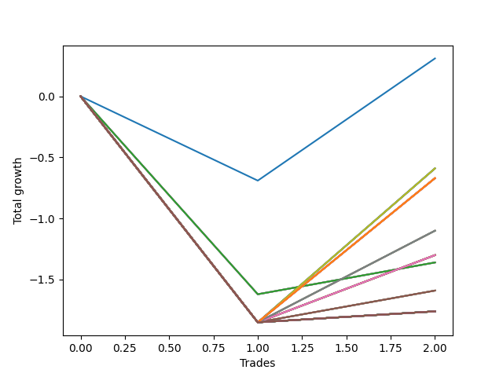

# Short Pointer 008 
- Symbol: NVDA_Unlimited
- Date Range: 02/08/2022 - 07/08/2022
- Trading Period: 7:20-12:30
- Number of Trades: 2



| Name | Win Percent | Profit | Avg Profit / Trade | Avg Time / Trade |      | Name | Win Percent | Profit | Avg Profit / Trade | Avg Time / Trade |
| ---- | ----------- | ------ | ------------------ | ---------------- | ---- | ---- | ----------- | ------ | ------------------ | ---------------- |
| Sorted By <br> Profit | | | | | | Sorted By <br> Win Percentage ||||
| Seventy-Three | 50.00 | 155.00 | 77.50 | 06:05 |     | Seventy-Three | 50.00 | 155.00 | 77.50 | 06:05 |
| Seventy | 50.00 | -295.00 | -147.50 | 09:10 |     | Seventy | 50.00 | -295.00 | -147.50 | 09:10 |
| Sixty-Two | 50.00 | -295.00 | -147.50 | 09:10 |     | Sixty-Two | 50.00 | -295.00 | -147.50 | 09:10 |
| Fifty-Four | 50.00 | -295.00 | -147.50 | 09:10 |     | Fifty-Four | 50.00 | -295.00 | -147.50 | 09:10 |
| Forty-Six | 50.00 | -295.00 | -147.50 | 09:10 |     | Forty-Six | 50.00 | -295.00 | -147.50 | 09:10 |
| Six | 50.00 | -295.00 | -147.50 | 09:10 |     | Six | 50.00 | -295.00 | -147.50 | 09:10 |
| One Hundred Twenty-Six | 50.00 | -335.00 | -167.50 | 09:07 |     | One Hundred Twenty-Six | 50.00 | -335.00 | -167.50 | 09:07 |
| One Hundred Twenty-One | 50.00 | -335.00 | -167.50 | 09:07 |     | One Hundred Twenty-One | 50.00 | -335.00 | -167.50 | 09:07 |
| One Hundred Sixteen | 50.00 | -335.00 | -167.50 | 09:07 |     | One Hundred Sixteen | 50.00 | -335.00 | -167.50 | 09:07 |
| One Hundred Eleven | 50.00 | -335.00 | -167.50 | 09:07 |     | One Hundred Eleven | 50.00 | -335.00 | -167.50 | 09:07 |
| Eighty-One | 50.00 | -335.00 | -167.50 | 09:07 |     | Eighty-One | 50.00 | -335.00 | -167.50 | 09:07 |
| Sixty-Six | 50.00 | -335.00 | -167.50 | 09:07 |     | Sixty-Six | 50.00 | -335.00 | -167.50 | 09:07 |
| Fifty-Eight | 50.00 | -335.00 | -167.50 | 09:07 |     | Fifty-Eight | 50.00 | -335.00 | -167.50 | 09:07 |
| Fifty | 50.00 | -335.00 | -167.50 | 09:07 |     | Fifty | 50.00 | -335.00 | -167.50 | 09:07 |
| Forty-Two | 50.00 | -335.00 | -167.50 | 09:07 |     | Forty-Two | 50.00 | -335.00 | -167.50 | 09:07 |
| Two | 50.00 | -335.00 | -167.50 | 09:07 |     | Two | 50.00 | -335.00 | -167.50 | 09:07 |
| Sixty-Nine | 50.00 | -550.00 | -275.00 | 08:52 |     | Sixty-Nine | 50.00 | -550.00 | -275.00 | 08:52 |
| Sixty-One | 50.00 | -550.00 | -275.00 | 08:52 |     | Sixty-One | 50.00 | -550.00 | -275.00 | 08:52 |
| Fifty-Three | 50.00 | -550.00 | -275.00 | 08:52 |     | Fifty-Three | 50.00 | -550.00 | -275.00 | 08:52 |
| Forty-Five | 50.00 | -550.00 | -275.00 | 08:52 |     | Forty-Five | 50.00 | -550.00 | -275.00 | 08:52 |
| Five | 50.00 | -550.00 | -275.00 | 08:52 |     | Five | 50.00 | -550.00 | -275.00 | 08:52 |
| Sixty-Eight | 50.00 | -650.00 | -325.00 | 08:35 |     | Sixty-Eight | 50.00 | -650.00 | -325.00 | 08:35 |
| Sixty-Five | 50.00 | -650.00 | -325.00 | 08:35 |     | Sixty-Five | 50.00 | -650.00 | -325.00 | 08:35 |
| Sixty | 50.00 | -650.00 | -325.00 | 08:35 |     | Sixty | 50.00 | -650.00 | -325.00 | 08:35 |
| Fifty-Seven | 50.00 | -650.00 | -325.00 | 08:35 |     | Fifty-Seven | 50.00 | -650.00 | -325.00 | 08:35 |
| Fifty-Two | 50.00 | -650.00 | -325.00 | 08:35 |     | Fifty-Two | 50.00 | -650.00 | -325.00 | 08:35 |
| Forty-Nine | 50.00 | -650.00 | -325.00 | 08:35 |     | Forty-Nine | 50.00 | -650.00 | -325.00 | 08:35 |
| Forty-Four | 50.00 | -650.00 | -325.00 | 08:35 |     | Forty-Four | 50.00 | -650.00 | -325.00 | 08:35 |
| Forty-One | 50.00 | -650.00 | -325.00 | 08:35 |     | Forty-One | 50.00 | -650.00 | -325.00 | 08:35 |
| Four | 50.00 | -650.00 | -325.00 | 08:35 |     | Four | 50.00 | -650.00 | -325.00 | 08:35 |
| One | 50.00 | -650.00 | -325.00 | 08:35 |     | One | 50.00 | -650.00 | -325.00 | 08:35 |
| Sixty-Four | 50.00 | -680.00 | -340.00 | 07:07 |     | Sixty-Four | 50.00 | -680.00 | -340.00 | 07:07 |
| Fifty-Six | 50.00 | -680.00 | -340.00 | 07:07 |     | Fifty-Six | 50.00 | -680.00 | -340.00 | 07:07 |
| Forty-Eight | 50.00 | -680.00 | -340.00 | 07:07 |     | Forty-Eight | 50.00 | -680.00 | -340.00 | 07:07 |
| Forty | 50.00 | -680.00 | -340.00 | 07:07 |     | Forty | 50.00 | -680.00 | -340.00 | 07:07 |
| Zero | 50.00 | -680.00 | -340.00 | 07:07 |     | Zero | 50.00 | -680.00 | -340.00 | 07:07 |
| Sixty-Seven | 50.00 | -795.00 | -397.50 | 08:05 |     | Sixty-Seven | 50.00 | -795.00 | -397.50 | 08:05 |
| Fifty-Nine | 50.00 | -795.00 | -397.50 | 08:05 |     | Fifty-Nine | 50.00 | -795.00 | -397.50 | 08:05 |
| Fifty-One | 50.00 | -795.00 | -397.50 | 08:05 |     | Fifty-One | 50.00 | -795.00 | -397.50 | 08:05 |
| Forty-Three | 50.00 | -795.00 | -397.50 | 08:05 |     | Forty-Three | 50.00 | -795.00 | -397.50 | 08:05 |
| Three | 50.00 | -795.00 | -397.50 | 08:05 |     | Three | 50.00 | -795.00 | -397.50 | 08:05 |
| One Hundred Thirty | 50.00 | -880.00 | -440.00 | 22:57 |     | One Hundred Thirty | 50.00 | -880.00 | -440.00 | 22:57 |
| One Hundred Twenty-Nine | 50.00 | -880.00 | -440.00 | 22:57 |     | One Hundred Twenty-Nine | 50.00 | -880.00 | -440.00 | 22:57 |
| One Hundred Twenty-Eight | 50.00 | -880.00 | -440.00 | 22:57 |     | One Hundred Twenty-Eight | 50.00 | -880.00 | -440.00 | 22:57 |
| One Hundred Twenty-Seven | 50.00 | -880.00 | -440.00 | 22:57 |     | One Hundred Twenty-Seven | 50.00 | -880.00 | -440.00 | 22:57 |
| One Hundred Twenty-Five | 50.00 | -880.00 | -440.00 | 22:57 |     | One Hundred Twenty-Five | 50.00 | -880.00 | -440.00 | 22:57 |
| One Hundred Twenty-Four | 50.00 | -880.00 | -440.00 | 22:57 |     | One Hundred Twenty-Four | 50.00 | -880.00 | -440.00 | 22:57 |
| One Hundred Twenty-Three | 50.00 | -880.00 | -440.00 | 22:57 |     | One Hundred Twenty-Three | 50.00 | -880.00 | -440.00 | 22:57 |
| One Hundred Twenty-Two | 50.00 | -880.00 | -440.00 | 22:57 |     | One Hundred Twenty-Two | 50.00 | -880.00 | -440.00 | 22:57 |
| One Hundred Twenty | 50.00 | -880.00 | -440.00 | 22:57 |     | One Hundred Twenty | 50.00 | -880.00 | -440.00 | 22:57 |
| One Hundred Ninteen | 50.00 | -880.00 | -440.00 | 22:57 |     | One Hundred Ninteen | 50.00 | -880.00 | -440.00 | 22:57 |
| One Hundred Eighteen | 50.00 | -880.00 | -440.00 | 22:57 |     | One Hundred Eighteen | 50.00 | -880.00 | -440.00 | 22:57 |
| One Hundred Seventeen | 50.00 | -880.00 | -440.00 | 22:57 |     | One Hundred Seventeen | 50.00 | -880.00 | -440.00 | 22:57 |
| One Hundred Fifteen | 50.00 | -880.00 | -440.00 | 22:57 |     | One Hundred Fifteen | 50.00 | -880.00 | -440.00 | 22:57 |
| One Hundred Fourteen | 50.00 | -880.00 | -440.00 | 22:57 |     | One Hundred Fourteen | 50.00 | -880.00 | -440.00 | 22:57 |
| One Hundred Thirteen | 50.00 | -880.00 | -440.00 | 22:57 |     | One Hundred Thirteen | 50.00 | -880.00 | -440.00 | 22:57 |
| One Hundred Twelve | 50.00 | -880.00 | -440.00 | 22:57 |     | One Hundred Twelve | 50.00 | -880.00 | -440.00 | 22:57 |
| Eighty-Five | 50.00 | -880.00 | -440.00 | 22:57 |     | Eighty-Five | 50.00 | -880.00 | -440.00 | 22:57 |
| Eighty-Four | 50.00 | -880.00 | -440.00 | 22:57 |     | Eighty-Four | 50.00 | -880.00 | -440.00 | 22:57 |
| Eighty-Three | 50.00 | -880.00 | -440.00 | 22:57 |     | Eighty-Three | 50.00 | -880.00 | -440.00 | 22:57 |
| Eighty-Two | 50.00 | -880.00 | -440.00 | 22:57 |     | Eighty-Two | 50.00 | -880.00 | -440.00 | 22:57 |
| Seventy-One | 50.00 | -880.00 | -440.00 | 22:57 |     | Seventy-One | 50.00 | -880.00 | -440.00 | 22:57 |
| Sixty-Three | 50.00 | -880.00 | -440.00 | 22:57 |     | Sixty-Three | 50.00 | -880.00 | -440.00 | 22:57 |
| Fifty-Five | 50.00 | -880.00 | -440.00 | 22:57 |     | Fifty-Five | 50.00 | -880.00 | -440.00 | 22:57 |
| Forty-Seven | 50.00 | -880.00 | -440.00 | 22:57 |     | Forty-Seven | 50.00 | -880.00 | -440.00 | 22:57 |
| Seven | 50.00 | -880.00 | -440.00 | 22:57 |     | Seven | 50.00 | -880.00 | -440.00 | 22:57 |

## NO STOPLOSS

### Test Zero
* Sell when price hits the middle line of the 20p bollinger
* No Stoploss
* Results:
```
Total Trades: 2
Percent Up: 50.00
Percent Down: 50.00
Total Points Moved Down: -1.36
Potential Profit: -680.00
Total Points Ups: 1.62 Count Ups: 1
Total Points Downs: 0.26 Count Downs: 1
```

<details><summary>Trades</summary>

<code>In: 2022-02-24 12:30:00		Out: 2022-02-24 12:44:05		Total Position Time: 14:05		Total Move Down: -1.62		Total to Date: -1.62</code> <br />
<code>In: 2022-07-06 11:10:00		Out: 2022-07-06 11:10:10		Total Position Time: 00:10		Total Move Down: 0.26		Total to Date: -1.36</code> <br />


</details>

### Test One
* Sell when the price hits the upper line of the 20p 1std bollinger
* No Stoploss
* Results:
```
Total Trades: 2
Percent Up: 50.00
Percent Down: 50.00
Total Points Moved Down: -1.30
Potential Profit: -650.00
Total Points Ups: 1.85 Count Ups: 1
Total Points Downs: 0.55 Count Downs: 1
```

<details><summary>Trades</summary>

<code>In: 2022-02-24 12:30:00		Out: 2022-02-24 12:46:00		Total Position Time: 16:00		Total Move Down: -1.85		Total to Date: -1.85</code> <br />
<code>In: 2022-07-06 11:10:00		Out: 2022-07-06 11:11:10		Total Position Time: 01:10		Total Move Down: 0.55		Total to Date: -1.30</code> <br />


</details>

### Test Two
* Sell when the price hits the upper line of the 20p 2std bollinger
* No Stoploss
* Results:
```
Total Trades: 2
Percent Up: 50.00
Percent Down: 50.00
Total Points Moved Down: -0.67
Potential Profit: -335.00
Total Points Ups: 1.85 Count Ups: 1
Total Points Downs: 1.18 Count Downs: 1
```

<details><summary>Trades</summary>

<code>In: 2022-02-24 12:30:00		Out: 2022-02-24 12:46:00		Total Position Time: 16:00		Total Move Down: -1.85		Total to Date: -1.85</code> <br />
<code>In: 2022-07-06 11:10:00		Out: 2022-07-06 11:12:15		Total Position Time: 02:15		Total Move Down: 1.18		Total to Date: -0.67</code> <br />


</details>

### Test Three
* Sell when price hits the middle line of the 50p bollinger
* No Stoploss
* Results:
```
Total Trades: 2
Percent Up: 50.00
Percent Down: 50.00
Total Points Moved Down: -1.59
Potential Profit: -795.00
Total Points Ups: 1.85 Count Ups: 1
Total Points Downs: 0.26 Count Downs: 1
```

<details><summary>Trades</summary>

<code>In: 2022-02-24 12:30:00		Out: 2022-02-24 12:46:00		Total Position Time: 16:00		Total Move Down: -1.85		Total to Date: -1.85</code> <br />
<code>In: 2022-07-06 11:10:00		Out: 2022-07-06 11:10:10		Total Position Time: 00:10		Total Move Down: 0.26		Total to Date: -1.59</code> <br />


</details>

### Test Four
* Sell when the price hits the upper line of the 50p 1std bollinger
* No Stoploss
* Results:
```
Total Trades: 2
Percent Up: 50.00
Percent Down: 50.00
Total Points Moved Down: -1.30
Potential Profit: -650.00
Total Points Ups: 1.85 Count Ups: 1
Total Points Downs: 0.55 Count Downs: 1
```

<details><summary>Trades</summary>

<code>In: 2022-02-24 12:30:00		Out: 2022-02-24 12:46:00		Total Position Time: 16:00		Total Move Down: -1.85		Total to Date: -1.85</code> <br />
<code>In: 2022-07-06 11:10:00		Out: 2022-07-06 11:11:10		Total Position Time: 01:10		Total Move Down: 0.55		Total to Date: -1.30</code> <br />


</details>

### Test Five
* Sell when the price hits the upper line of the 50p 2std bollinger
* No Stoploss
* Results:
```
Total Trades: 2
Percent Up: 50.00
Percent Down: 50.00
Total Points Moved Down: -1.10
Potential Profit: -550.00
Total Points Ups: 1.85 Count Ups: 1
Total Points Downs: 0.75 Count Downs: 1
```

<details><summary>Trades</summary>

<code>In: 2022-02-24 12:30:00		Out: 2022-02-24 12:46:00		Total Position Time: 16:00		Total Move Down: -1.85		Total to Date: -1.85</code> <br />
<code>In: 2022-07-06 11:10:00		Out: 2022-07-06 11:11:45		Total Position Time: 01:45		Total Move Down: 0.75		Total to Date: -1.10</code> <br />


</details>

### Test Six
* Sell when the price hits the middle line of the 1std VWAP
* No Stoploss
* Results:
```
Total Trades: 2
Percent Up: 50.00
Percent Down: 50.00
Total Points Moved Down: -0.59
Potential Profit: -295.00
Total Points Ups: 1.85 Count Ups: 1
Total Points Downs: 1.26 Count Downs: 1
```

<details><summary>Trades</summary>

<code>In: 2022-02-24 12:30:00		Out: 2022-02-24 12:46:00		Total Position Time: 16:00		Total Move Down: -1.85		Total to Date: -1.85</code> <br />
<code>In: 2022-07-06 11:10:00		Out: 2022-07-06 11:12:20		Total Position Time: 02:20		Total Move Down: 1.26		Total to Date: -0.59</code> <br />


</details>

### Test Seven
* Sell when the price hits the upper line of the 1std VWAP
* No Stoploss
* Results:
```
Total Trades: 2
Percent Up: 50.00
Percent Down: 50.00
Total Points Moved Down: -1.76
Potential Profit: -880.00
Total Points Ups: 1.85 Count Ups: 1
Total Points Downs: 0.09 Count Downs: 1
```

<details><summary>Trades</summary>

<code>In: 2022-02-24 12:30:00		Out: 2022-02-24 12:46:00		Total Position Time: 16:00		Total Move Down: -1.85		Total to Date: -1.85</code> <br />
<code>In: 2022-07-06 11:10:00		Out: 2022-07-06 11:39:55		Total Position Time: 29:55		Total Move Down: 0.09		Total to Date: -1.76</code> <br />


</details>

## STOPLOSS OF 5

### Test Forty
* Sell when price hits the middle line of the 20p bollinger
* Stoploss is -5 points
* Results:
```
Total Trades: 2
Percent Up: 50.00
Percent Down: 50.00
Total Points Moved Down: -1.36
Potential Profit: -680.00
Total Points Ups: 1.62 Count Ups: 1
Total Points Downs: 0.26 Count Downs: 1
```

<details><summary>Trades</summary>

<code>In: 2022-02-24 12:30:00		Out: 2022-02-24 12:44:05		Total Position Time: 14:05		Total Move Down: -1.62		Total to Date: -1.62</code> <br />
<code>In: 2022-07-06 11:10:00		Out: 2022-07-06 11:10:10		Total Position Time: 00:10		Total Move Down: 0.26		Total to Date: -1.36</code> <br />


</details>

### Test Forty-One
* Sell when the price hits the upper line of the 20p 1std bollinger
* Stoploss is -5 points
* Results:
```
Total Trades: 2
Percent Up: 50.00
Percent Down: 50.00
Total Points Moved Down: -1.30
Potential Profit: -650.00
Total Points Ups: 1.85 Count Ups: 1
Total Points Downs: 0.55 Count Downs: 1
```

<details><summary>Trades</summary>

<code>In: 2022-02-24 12:30:00		Out: 2022-02-24 12:46:00		Total Position Time: 16:00		Total Move Down: -1.85		Total to Date: -1.85</code> <br />
<code>In: 2022-07-06 11:10:00		Out: 2022-07-06 11:11:10		Total Position Time: 01:10		Total Move Down: 0.55		Total to Date: -1.30</code> <br />


</details>

### Test Forty-Two
* Sell when the price hits the upper line of the 20p 2std bollinger
* Stoploss is -5 points
* Results:
```
Total Trades: 2
Percent Up: 50.00
Percent Down: 50.00
Total Points Moved Down: -0.67
Potential Profit: -335.00
Total Points Ups: 1.85 Count Ups: 1
Total Points Downs: 1.18 Count Downs: 1
```

<details><summary>Trades</summary>

<code>In: 2022-02-24 12:30:00		Out: 2022-02-24 12:46:00		Total Position Time: 16:00		Total Move Down: -1.85		Total to Date: -1.85</code> <br />
<code>In: 2022-07-06 11:10:00		Out: 2022-07-06 11:12:15		Total Position Time: 02:15		Total Move Down: 1.18		Total to Date: -0.67</code> <br />


</details>

### Test Forty-Three
* Sell when price hits the middle line of the 50p bollinger
* Stoploss is -5 points
* Results:
```
Total Trades: 2
Percent Up: 50.00
Percent Down: 50.00
Total Points Moved Down: -1.59
Potential Profit: -795.00
Total Points Ups: 1.85 Count Ups: 1
Total Points Downs: 0.26 Count Downs: 1
```

<details><summary>Trades</summary>

<code>In: 2022-02-24 12:30:00		Out: 2022-02-24 12:46:00		Total Position Time: 16:00		Total Move Down: -1.85		Total to Date: -1.85</code> <br />
<code>In: 2022-07-06 11:10:00		Out: 2022-07-06 11:10:10		Total Position Time: 00:10		Total Move Down: 0.26		Total to Date: -1.59</code> <br />


</details>

### Test Forty-Four
* Sell when the price hits the upper line of the 50p 1std bollinger
* Stoploss is -5 points
* Results:
```
Total Trades: 2
Percent Up: 50.00
Percent Down: 50.00
Total Points Moved Down: -1.30
Potential Profit: -650.00
Total Points Ups: 1.85 Count Ups: 1
Total Points Downs: 0.55 Count Downs: 1
```

<details><summary>Trades</summary>

<code>In: 2022-02-24 12:30:00		Out: 2022-02-24 12:46:00		Total Position Time: 16:00		Total Move Down: -1.85		Total to Date: -1.85</code> <br />
<code>In: 2022-07-06 11:10:00		Out: 2022-07-06 11:11:10		Total Position Time: 01:10		Total Move Down: 0.55		Total to Date: -1.30</code> <br />


</details>

### Test Forty-Five
* Sell when the price hits the upper line of the 50p 2std bollinger
* Stoploss is -5 points
* Results:
```
Total Trades: 2
Percent Up: 50.00
Percent Down: 50.00
Total Points Moved Down: -1.10
Potential Profit: -550.00
Total Points Ups: 1.85 Count Ups: 1
Total Points Downs: 0.75 Count Downs: 1
```

<details><summary>Trades</summary>

<code>In: 2022-02-24 12:30:00		Out: 2022-02-24 12:46:00		Total Position Time: 16:00		Total Move Down: -1.85		Total to Date: -1.85</code> <br />
<code>In: 2022-07-06 11:10:00		Out: 2022-07-06 11:11:45		Total Position Time: 01:45		Total Move Down: 0.75		Total to Date: -1.10</code> <br />


</details>

### Test Forty-Six
* Sell when the price hits the middle line of the 1std VWAP
* Stoploss is -5 points
* Results:
```
Total Trades: 2
Percent Up: 50.00
Percent Down: 50.00
Total Points Moved Down: -0.59
Potential Profit: -295.00
Total Points Ups: 1.85 Count Ups: 1
Total Points Downs: 1.26 Count Downs: 1
```

<details><summary>Trades</summary>

<code>In: 2022-02-24 12:30:00		Out: 2022-02-24 12:46:00		Total Position Time: 16:00		Total Move Down: -1.85		Total to Date: -1.85</code> <br />
<code>In: 2022-07-06 11:10:00		Out: 2022-07-06 11:12:20		Total Position Time: 02:20		Total Move Down: 1.26		Total to Date: -0.59</code> <br />


</details>

### Test Forty-Seven
* Sell when the price hits the upper line of the 1std VWAP
* Stoploss is -5 points
* Results:
```
Total Trades: 2
Percent Up: 50.00
Percent Down: 50.00
Total Points Moved Down: -1.76
Potential Profit: -880.00
Total Points Ups: 1.85 Count Ups: 1
Total Points Downs: 0.09 Count Downs: 1
```

<details><summary>Trades</summary>

<code>In: 2022-02-24 12:30:00		Out: 2022-02-24 12:46:00		Total Position Time: 16:00		Total Move Down: -1.85		Total to Date: -1.85</code> <br />
<code>In: 2022-07-06 11:10:00		Out: 2022-07-06 11:39:55		Total Position Time: 29:55		Total Move Down: 0.09		Total to Date: -1.76</code> <br />


</details>

## TRAIL STOP OF 5

### Test Forty-Eight
* Sell when price hits the middle line of the 20p bollinger
* Trailing Stop is -5 points
* Results:
```
Total Trades: 2
Percent Up: 50.00
Percent Down: 50.00
Total Points Moved Down: -1.36
Potential Profit: -680.00
Total Points Ups: 1.62 Count Ups: 1
Total Points Downs: 0.26 Count Downs: 1
```

<details><summary>Trades</summary>

<code>In: 2022-02-24 12:30:00		Out: 2022-02-24 12:44:05		Total Position Time: 14:05		Total Move Down: -1.62		Total to Date: -1.62</code> <br />
<code>In: 2022-07-06 11:10:00		Out: 2022-07-06 11:10:10		Total Position Time: 00:10		Total Move Down: 0.26		Total to Date: -1.36</code> <br />


</details>

### Test Forty-Nine
* Sell when the price hits the upper line of the 20p 1std bollinger
* Trailing Stop is -5 points
* Results:
```
Total Trades: 2
Percent Up: 50.00
Percent Down: 50.00
Total Points Moved Down: -1.30
Potential Profit: -650.00
Total Points Ups: 1.85 Count Ups: 1
Total Points Downs: 0.55 Count Downs: 1
```

<details><summary>Trades</summary>

<code>In: 2022-02-24 12:30:00		Out: 2022-02-24 12:46:00		Total Position Time: 16:00		Total Move Down: -1.85		Total to Date: -1.85</code> <br />
<code>In: 2022-07-06 11:10:00		Out: 2022-07-06 11:11:10		Total Position Time: 01:10		Total Move Down: 0.55		Total to Date: -1.30</code> <br />


</details>

### Test Fifty
* Sell when the price hits the upper line of the 20p 2std bollinger
* Trailing Stop is -5 points
* Results:
```
Total Trades: 2
Percent Up: 50.00
Percent Down: 50.00
Total Points Moved Down: -0.67
Potential Profit: -335.00
Total Points Ups: 1.85 Count Ups: 1
Total Points Downs: 1.18 Count Downs: 1
```

<details><summary>Trades</summary>

<code>In: 2022-02-24 12:30:00		Out: 2022-02-24 12:46:00		Total Position Time: 16:00		Total Move Down: -1.85		Total to Date: -1.85</code> <br />
<code>In: 2022-07-06 11:10:00		Out: 2022-07-06 11:12:15		Total Position Time: 02:15		Total Move Down: 1.18		Total to Date: -0.67</code> <br />


</details>

### Test Fifty-One
* Sell when price hits the middle line of the 50p bollinger
* Trailing Stop is -5 points
* Results:
```
Total Trades: 2
Percent Up: 50.00
Percent Down: 50.00
Total Points Moved Down: -1.59
Potential Profit: -795.00
Total Points Ups: 1.85 Count Ups: 1
Total Points Downs: 0.26 Count Downs: 1
```

<details><summary>Trades</summary>

<code>In: 2022-02-24 12:30:00		Out: 2022-02-24 12:46:00		Total Position Time: 16:00		Total Move Down: -1.85		Total to Date: -1.85</code> <br />
<code>In: 2022-07-06 11:10:00		Out: 2022-07-06 11:10:10		Total Position Time: 00:10		Total Move Down: 0.26		Total to Date: -1.59</code> <br />


</details>

### Test Fifty-Two
* Sell when the price hits the upper line of the 50p 1std bollinger
* Trailing Stop is -5 points
* Results:
```
Total Trades: 2
Percent Up: 50.00
Percent Down: 50.00
Total Points Moved Down: -1.30
Potential Profit: -650.00
Total Points Ups: 1.85 Count Ups: 1
Total Points Downs: 0.55 Count Downs: 1
```

<details><summary>Trades</summary>

<code>In: 2022-02-24 12:30:00		Out: 2022-02-24 12:46:00		Total Position Time: 16:00		Total Move Down: -1.85		Total to Date: -1.85</code> <br />
<code>In: 2022-07-06 11:10:00		Out: 2022-07-06 11:11:10		Total Position Time: 01:10		Total Move Down: 0.55		Total to Date: -1.30</code> <br />


</details>

### Test Fifty-Three
* Sell when the price hits the upper line of the 50p 2std bollinger
* Trailing Stop is -5 points
* Results:
```
Total Trades: 2
Percent Up: 50.00
Percent Down: 50.00
Total Points Moved Down: -1.10
Potential Profit: -550.00
Total Points Ups: 1.85 Count Ups: 1
Total Points Downs: 0.75 Count Downs: 1
```

<details><summary>Trades</summary>

<code>In: 2022-02-24 12:30:00		Out: 2022-02-24 12:46:00		Total Position Time: 16:00		Total Move Down: -1.85		Total to Date: -1.85</code> <br />
<code>In: 2022-07-06 11:10:00		Out: 2022-07-06 11:11:45		Total Position Time: 01:45		Total Move Down: 0.75		Total to Date: -1.10</code> <br />


</details>

### Test Fifty-Four
* Sell when the price hits the middle line of the 1std VWAP
* Trailing Stop is -5 points
* Results:
```
Total Trades: 2
Percent Up: 50.00
Percent Down: 50.00
Total Points Moved Down: -0.59
Potential Profit: -295.00
Total Points Ups: 1.85 Count Ups: 1
Total Points Downs: 1.26 Count Downs: 1
```

<details><summary>Trades</summary>

<code>In: 2022-02-24 12:30:00		Out: 2022-02-24 12:46:00		Total Position Time: 16:00		Total Move Down: -1.85		Total to Date: -1.85</code> <br />
<code>In: 2022-07-06 11:10:00		Out: 2022-07-06 11:12:20		Total Position Time: 02:20		Total Move Down: 1.26		Total to Date: -0.59</code> <br />


</details>

### Test Fifty-Five
* Sell when the price hits the upper line of the 1std VWAP
* Trailing Stop is -5 points
* Results:
```
Total Trades: 2
Percent Up: 50.00
Percent Down: 50.00
Total Points Moved Down: -1.76
Potential Profit: -880.00
Total Points Ups: 1.85 Count Ups: 1
Total Points Downs: 0.09 Count Downs: 1
```

<details><summary>Trades</summary>

<code>In: 2022-02-24 12:30:00		Out: 2022-02-24 12:46:00		Total Position Time: 16:00		Total Move Down: -1.85		Total to Date: -1.85</code> <br />
<code>In: 2022-07-06 11:10:00		Out: 2022-07-06 11:39:55		Total Position Time: 29:55		Total Move Down: 0.09		Total to Date: -1.76</code> <br />


</details>

## STOPLOSS OF 10

### Test Fifty-Six
* Sell when price hits the middle line of the 20p bollinger
* Stoploss is -10 points
* Results:
```
Total Trades: 2
Percent Up: 50.00
Percent Down: 50.00
Total Points Moved Down: -1.36
Potential Profit: -680.00
Total Points Ups: 1.62 Count Ups: 1
Total Points Downs: 0.26 Count Downs: 1
```

<details><summary>Trades</summary>

<code>In: 2022-02-24 12:30:00		Out: 2022-02-24 12:44:05		Total Position Time: 14:05		Total Move Down: -1.62		Total to Date: -1.62</code> <br />
<code>In: 2022-07-06 11:10:00		Out: 2022-07-06 11:10:10		Total Position Time: 00:10		Total Move Down: 0.26		Total to Date: -1.36</code> <br />


</details>

### Test Fifty-Seven
* Sell when the price hits the upper line of the 20p 1std bollinger
* Stoploss is -10 points
* Results:
```
Total Trades: 2
Percent Up: 50.00
Percent Down: 50.00
Total Points Moved Down: -1.30
Potential Profit: -650.00
Total Points Ups: 1.85 Count Ups: 1
Total Points Downs: 0.55 Count Downs: 1
```

<details><summary>Trades</summary>

<code>In: 2022-02-24 12:30:00		Out: 2022-02-24 12:46:00		Total Position Time: 16:00		Total Move Down: -1.85		Total to Date: -1.85</code> <br />
<code>In: 2022-07-06 11:10:00		Out: 2022-07-06 11:11:10		Total Position Time: 01:10		Total Move Down: 0.55		Total to Date: -1.30</code> <br />


</details>

### Test Fifty-Eight
* Sell when the price hits the upper line of the 20p 2std bollinger
* Stoploss is -10 points
* Results:
```
Total Trades: 2
Percent Up: 50.00
Percent Down: 50.00
Total Points Moved Down: -0.67
Potential Profit: -335.00
Total Points Ups: 1.85 Count Ups: 1
Total Points Downs: 1.18 Count Downs: 1
```

<details><summary>Trades</summary>

<code>In: 2022-02-24 12:30:00		Out: 2022-02-24 12:46:00		Total Position Time: 16:00		Total Move Down: -1.85		Total to Date: -1.85</code> <br />
<code>In: 2022-07-06 11:10:00		Out: 2022-07-06 11:12:15		Total Position Time: 02:15		Total Move Down: 1.18		Total to Date: -0.67</code> <br />


</details>

### Test Fifty-Nine
* Sell when price hits the middle line of the 50p bollinger
* Stoploss is -10 points
* Results:
```
Total Trades: 2
Percent Up: 50.00
Percent Down: 50.00
Total Points Moved Down: -1.59
Potential Profit: -795.00
Total Points Ups: 1.85 Count Ups: 1
Total Points Downs: 0.26 Count Downs: 1
```

<details><summary>Trades</summary>

<code>In: 2022-02-24 12:30:00		Out: 2022-02-24 12:46:00		Total Position Time: 16:00		Total Move Down: -1.85		Total to Date: -1.85</code> <br />
<code>In: 2022-07-06 11:10:00		Out: 2022-07-06 11:10:10		Total Position Time: 00:10		Total Move Down: 0.26		Total to Date: -1.59</code> <br />


</details>

### Test Sixty
* Sell when the price hits the upper line of the 50p 1std bollinger
* Stoploss is -10 points
* Results:
```
Total Trades: 2
Percent Up: 50.00
Percent Down: 50.00
Total Points Moved Down: -1.30
Potential Profit: -650.00
Total Points Ups: 1.85 Count Ups: 1
Total Points Downs: 0.55 Count Downs: 1
```

<details><summary>Trades</summary>

<code>In: 2022-02-24 12:30:00		Out: 2022-02-24 12:46:00		Total Position Time: 16:00		Total Move Down: -1.85		Total to Date: -1.85</code> <br />
<code>In: 2022-07-06 11:10:00		Out: 2022-07-06 11:11:10		Total Position Time: 01:10		Total Move Down: 0.55		Total to Date: -1.30</code> <br />


</details>

### Test Sixty-One
* Sell when the price hits the upper line of the 50p 2std bollinger
* Stoploss is -10 points
* Results:
```
Total Trades: 2
Percent Up: 50.00
Percent Down: 50.00
Total Points Moved Down: -1.10
Potential Profit: -550.00
Total Points Ups: 1.85 Count Ups: 1
Total Points Downs: 0.75 Count Downs: 1
```

<details><summary>Trades</summary>

<code>In: 2022-02-24 12:30:00		Out: 2022-02-24 12:46:00		Total Position Time: 16:00		Total Move Down: -1.85		Total to Date: -1.85</code> <br />
<code>In: 2022-07-06 11:10:00		Out: 2022-07-06 11:11:45		Total Position Time: 01:45		Total Move Down: 0.75		Total to Date: -1.10</code> <br />


</details>

### Test Sixty-Two
* Sell when the price hits the middle line of the 1std VWAP
* Stoploss is -10 points
* Results:
```
Total Trades: 2
Percent Up: 50.00
Percent Down: 50.00
Total Points Moved Down: -0.59
Potential Profit: -295.00
Total Points Ups: 1.85 Count Ups: 1
Total Points Downs: 1.26 Count Downs: 1
```

<details><summary>Trades</summary>

<code>In: 2022-02-24 12:30:00		Out: 2022-02-24 12:46:00		Total Position Time: 16:00		Total Move Down: -1.85		Total to Date: -1.85</code> <br />
<code>In: 2022-07-06 11:10:00		Out: 2022-07-06 11:12:20		Total Position Time: 02:20		Total Move Down: 1.26		Total to Date: -0.59</code> <br />


</details>

### Test Sixty-Three
* Sell when the price hits the upper line of the 1std VWAP
* Stoploss is -10 points
* Results:
```
Total Trades: 2
Percent Up: 50.00
Percent Down: 50.00
Total Points Moved Down: -1.76
Potential Profit: -880.00
Total Points Ups: 1.85 Count Ups: 1
Total Points Downs: 0.09 Count Downs: 1
```

<details><summary>Trades</summary>

<code>In: 2022-02-24 12:30:00		Out: 2022-02-24 12:46:00		Total Position Time: 16:00		Total Move Down: -1.85		Total to Date: -1.85</code> <br />
<code>In: 2022-07-06 11:10:00		Out: 2022-07-06 11:39:55		Total Position Time: 29:55		Total Move Down: 0.09		Total to Date: -1.76</code> <br />


</details>

## TRAIL STOP OF 10

### Test Sixty-Four
* Sell when price hits the middle line of the 20p bollinger
* Trailing Stop is -10 points
* Results:
```
Total Trades: 2
Percent Up: 50.00
Percent Down: 50.00
Total Points Moved Down: -1.36
Potential Profit: -680.00
Total Points Ups: 1.62 Count Ups: 1
Total Points Downs: 0.26 Count Downs: 1
```

<details><summary>Trades</summary>

<code>In: 2022-02-24 12:30:00		Out: 2022-02-24 12:44:05		Total Position Time: 14:05		Total Move Down: -1.62		Total to Date: -1.62</code> <br />
<code>In: 2022-07-06 11:10:00		Out: 2022-07-06 11:10:10		Total Position Time: 00:10		Total Move Down: 0.26		Total to Date: -1.36</code> <br />


</details>

### Test Sixty-Five
* Sell when the price hits the upper line of the 20p 1std bollinger
* Trailing Stop is -10 points
* Results:
```
Total Trades: 2
Percent Up: 50.00
Percent Down: 50.00
Total Points Moved Down: -1.30
Potential Profit: -650.00
Total Points Ups: 1.85 Count Ups: 1
Total Points Downs: 0.55 Count Downs: 1
```

<details><summary>Trades</summary>

<code>In: 2022-02-24 12:30:00		Out: 2022-02-24 12:46:00		Total Position Time: 16:00		Total Move Down: -1.85		Total to Date: -1.85</code> <br />
<code>In: 2022-07-06 11:10:00		Out: 2022-07-06 11:11:10		Total Position Time: 01:10		Total Move Down: 0.55		Total to Date: -1.30</code> <br />


</details>

### Test Sixty-Six
* Sell when the price hits the upper line of the 20p 2std bollinger
* Trailing Stop is -10 points
* Results:
```
Total Trades: 2
Percent Up: 50.00
Percent Down: 50.00
Total Points Moved Down: -0.67
Potential Profit: -335.00
Total Points Ups: 1.85 Count Ups: 1
Total Points Downs: 1.18 Count Downs: 1
```

<details><summary>Trades</summary>

<code>In: 2022-02-24 12:30:00		Out: 2022-02-24 12:46:00		Total Position Time: 16:00		Total Move Down: -1.85		Total to Date: -1.85</code> <br />
<code>In: 2022-07-06 11:10:00		Out: 2022-07-06 11:12:15		Total Position Time: 02:15		Total Move Down: 1.18		Total to Date: -0.67</code> <br />


</details>

### Test Sixty-Seven
* Sell when price hits the middle line of the 50p bollinger
* Trailing Stop is -10 points
* Results:
```
Total Trades: 2
Percent Up: 50.00
Percent Down: 50.00
Total Points Moved Down: -1.59
Potential Profit: -795.00
Total Points Ups: 1.85 Count Ups: 1
Total Points Downs: 0.26 Count Downs: 1
```

<details><summary>Trades</summary>

<code>In: 2022-02-24 12:30:00		Out: 2022-02-24 12:46:00		Total Position Time: 16:00		Total Move Down: -1.85		Total to Date: -1.85</code> <br />
<code>In: 2022-07-06 11:10:00		Out: 2022-07-06 11:10:10		Total Position Time: 00:10		Total Move Down: 0.26		Total to Date: -1.59</code> <br />


</details>

### Test Sixty-Eight
* Sell when the price hits the upper line of the 50p 1std bollinger
* Trailing Stop is -10 points
* Results:
```
Total Trades: 2
Percent Up: 50.00
Percent Down: 50.00
Total Points Moved Down: -1.30
Potential Profit: -650.00
Total Points Ups: 1.85 Count Ups: 1
Total Points Downs: 0.55 Count Downs: 1
```

<details><summary>Trades</summary>

<code>In: 2022-02-24 12:30:00		Out: 2022-02-24 12:46:00		Total Position Time: 16:00		Total Move Down: -1.85		Total to Date: -1.85</code> <br />
<code>In: 2022-07-06 11:10:00		Out: 2022-07-06 11:11:10		Total Position Time: 01:10		Total Move Down: 0.55		Total to Date: -1.30</code> <br />


</details>

### Test Sixty-Nine
* Sell when the price hits the upper line of the 50p 2std bollinger
* Trailing Stop is -10 points
* Results:
```
Total Trades: 2
Percent Up: 50.00
Percent Down: 50.00
Total Points Moved Down: -1.10
Potential Profit: -550.00
Total Points Ups: 1.85 Count Ups: 1
Total Points Downs: 0.75 Count Downs: 1
```

<details><summary>Trades</summary>

<code>In: 2022-02-24 12:30:00		Out: 2022-02-24 12:46:00		Total Position Time: 16:00		Total Move Down: -1.85		Total to Date: -1.85</code> <br />
<code>In: 2022-07-06 11:10:00		Out: 2022-07-06 11:11:45		Total Position Time: 01:45		Total Move Down: 0.75		Total to Date: -1.10</code> <br />


</details>

### Test Seventy
* Sell when the price hits the middle line of the 1std VWAP
* Trailing Stop is -10 points
* Results:
```
Total Trades: 2
Percent Up: 50.00
Percent Down: 50.00
Total Points Moved Down: -0.59
Potential Profit: -295.00
Total Points Ups: 1.85 Count Ups: 1
Total Points Downs: 1.26 Count Downs: 1
```

<details><summary>Trades</summary>

<code>In: 2022-02-24 12:30:00		Out: 2022-02-24 12:46:00		Total Position Time: 16:00		Total Move Down: -1.85		Total to Date: -1.85</code> <br />
<code>In: 2022-07-06 11:10:00		Out: 2022-07-06 11:12:20		Total Position Time: 02:20		Total Move Down: 1.26		Total to Date: -0.59</code> <br />


</details>

### Test Seventy-One
* Sell when the price hits the upper line of the 1std VWAP
* Trailing Stop is -10 points
* Results:
```
Total Trades: 2
Percent Up: 50.00
Percent Down: 50.00
Total Points Moved Down: -1.76
Potential Profit: -880.00
Total Points Ups: 1.85 Count Ups: 1
Total Points Downs: 0.09 Count Downs: 1
```

<details><summary>Trades</summary>

<code>In: 2022-02-24 12:30:00		Out: 2022-02-24 12:46:00		Total Position Time: 16:00		Total Move Down: -1.85		Total to Date: -1.85</code> <br />
<code>In: 2022-07-06 11:10:00		Out: 2022-07-06 11:39:55		Total Position Time: 29:55		Total Move Down: 0.09		Total to Date: -1.76</code> <br />


</details>

## SPECIAL EXIT CONDITIONS 

### Test Seventy-Three
* Sell when the linear regression slope changes to negative
* No Stoploss
* Results:
```
Total Trades: 2
Percent Up: 50.00
Percent Down: 50.00
Total Points Moved Down: 0.31
Potential Profit: 155.00
Total Points Ups: 0.69 Count Ups: 1
Total Points Downs: 1.00 Count Downs: 1
```

<details><summary>Trades</summary>

<code>In: 2022-02-24 12:30:00		Out: 2022-02-24 12:31:05		Total Position Time: 01:05		Total Move Down: -0.69		Total to Date: -0.69</code> <br />
<code>In: 2022-07-06 11:10:00		Out: 2022-07-06 11:21:05		Total Position Time: 11:05		Total Move Down: 1.00		Total to Date: 0.31</code> <br />


</details>

## TAKE PROFIT

### Test Eighty-One
* Take Profit of 1 Point
* No Stoploss
* Results:
```
Total Trades: 2
Percent Up: 50.00
Percent Down: 50.00
Total Points Moved Down: -0.67
Potential Profit: -335.00
Total Points Ups: 1.85 Count Ups: 1
Total Points Downs: 1.18 Count Downs: 1
```

<details><summary>Trades</summary>

<code>In: 2022-02-24 12:30:00		Out: 2022-02-24 12:46:00		Total Position Time: 16:00		Total Move Down: -1.85		Total to Date: -1.85</code> <br />
<code>In: 2022-07-06 11:10:00		Out: 2022-07-06 11:12:15		Total Position Time: 02:15		Total Move Down: 1.18		Total to Date: -0.67</code> <br />


</details>

### Test Eighty-Two
* Take Profit of 2 Point
* No Stoploss
* Results:
```
Total Trades: 2
Percent Up: 50.00
Percent Down: 50.00
Total Points Moved Down: -1.76
Potential Profit: -880.00
Total Points Ups: 1.85 Count Ups: 1
Total Points Downs: 0.09 Count Downs: 1
```

<details><summary>Trades</summary>

<code>In: 2022-02-24 12:30:00		Out: 2022-02-24 12:46:00		Total Position Time: 16:00		Total Move Down: -1.85		Total to Date: -1.85</code> <br />
<code>In: 2022-07-06 11:10:00		Out: 2022-07-06 11:39:55		Total Position Time: 29:55		Total Move Down: 0.09		Total to Date: -1.76</code> <br />


</details>

### Test Eighty-Three
* Take Profit of 3 Point
* No Stoploss
* Results:
```
Total Trades: 2
Percent Up: 50.00
Percent Down: 50.00
Total Points Moved Down: -1.76
Potential Profit: -880.00
Total Points Ups: 1.85 Count Ups: 1
Total Points Downs: 0.09 Count Downs: 1
```

<details><summary>Trades</summary>

<code>In: 2022-02-24 12:30:00		Out: 2022-02-24 12:46:00		Total Position Time: 16:00		Total Move Down: -1.85		Total to Date: -1.85</code> <br />
<code>In: 2022-07-06 11:10:00		Out: 2022-07-06 11:39:55		Total Position Time: 29:55		Total Move Down: 0.09		Total to Date: -1.76</code> <br />


</details>

### Test Eighty-Four
* Take Profit of 4 Point
* No Stoploss
* Results:
```
Total Trades: 2
Percent Up: 50.00
Percent Down: 50.00
Total Points Moved Down: -1.76
Potential Profit: -880.00
Total Points Ups: 1.85 Count Ups: 1
Total Points Downs: 0.09 Count Downs: 1
```

<details><summary>Trades</summary>

<code>In: 2022-02-24 12:30:00		Out: 2022-02-24 12:46:00		Total Position Time: 16:00		Total Move Down: -1.85		Total to Date: -1.85</code> <br />
<code>In: 2022-07-06 11:10:00		Out: 2022-07-06 11:39:55		Total Position Time: 29:55		Total Move Down: 0.09		Total to Date: -1.76</code> <br />


</details>

### Test Eighty-Five
* Take Profit of 5 Point
* No Stoploss
* Results:
```
Total Trades: 2
Percent Up: 50.00
Percent Down: 50.00
Total Points Moved Down: -1.76
Potential Profit: -880.00
Total Points Ups: 1.85 Count Ups: 1
Total Points Downs: 0.09 Count Downs: 1
```

<details><summary>Trades</summary>

<code>In: 2022-02-24 12:30:00		Out: 2022-02-24 12:46:00		Total Position Time: 16:00		Total Move Down: -1.85		Total to Date: -1.85</code> <br />
<code>In: 2022-07-06 11:10:00		Out: 2022-07-06 11:39:55		Total Position Time: 29:55		Total Move Down: 0.09		Total to Date: -1.76</code> <br />


</details>

## TAKE PROFIT Stoploss of Five

### Test One Hundred Eleven
* Take Profit of 1 Point
* Stoploss is -5 points
* Results:
```
Total Trades: 2
Percent Up: 50.00
Percent Down: 50.00
Total Points Moved Down: -0.67
Potential Profit: -335.00
Total Points Ups: 1.85 Count Ups: 1
Total Points Downs: 1.18 Count Downs: 1
```

<details><summary>Trades</summary>

<code>In: 2022-02-24 12:30:00		Out: 2022-02-24 12:46:00		Total Position Time: 16:00		Total Move Down: -1.85		Total to Date: -1.85</code> <br />
<code>In: 2022-07-06 11:10:00		Out: 2022-07-06 11:12:15		Total Position Time: 02:15		Total Move Down: 1.18		Total to Date: -0.67</code> <br />


</details>

### Test One Hundred Twelve
* Take Profit of 2 Point
* Stoploss is -5 points
* Results:
```
Total Trades: 2
Percent Up: 50.00
Percent Down: 50.00
Total Points Moved Down: -1.76
Potential Profit: -880.00
Total Points Ups: 1.85 Count Ups: 1
Total Points Downs: 0.09 Count Downs: 1
```

<details><summary>Trades</summary>

<code>In: 2022-02-24 12:30:00		Out: 2022-02-24 12:46:00		Total Position Time: 16:00		Total Move Down: -1.85		Total to Date: -1.85</code> <br />
<code>In: 2022-07-06 11:10:00		Out: 2022-07-06 11:39:55		Total Position Time: 29:55		Total Move Down: 0.09		Total to Date: -1.76</code> <br />


</details>

### Test One Hundred Thirteen
* Take Profit of 3 Point
* Stoploss is -5 points
* Results:
```
Total Trades: 2
Percent Up: 50.00
Percent Down: 50.00
Total Points Moved Down: -1.76
Potential Profit: -880.00
Total Points Ups: 1.85 Count Ups: 1
Total Points Downs: 0.09 Count Downs: 1
```

<details><summary>Trades</summary>

<code>In: 2022-02-24 12:30:00		Out: 2022-02-24 12:46:00		Total Position Time: 16:00		Total Move Down: -1.85		Total to Date: -1.85</code> <br />
<code>In: 2022-07-06 11:10:00		Out: 2022-07-06 11:39:55		Total Position Time: 29:55		Total Move Down: 0.09		Total to Date: -1.76</code> <br />


</details>

### Test One Hundred Fourteen
* Take Profit of 4 Point
* Stoploss is -5 points
* Results:
```
Total Trades: 2
Percent Up: 50.00
Percent Down: 50.00
Total Points Moved Down: -1.76
Potential Profit: -880.00
Total Points Ups: 1.85 Count Ups: 1
Total Points Downs: 0.09 Count Downs: 1
```

<details><summary>Trades</summary>

<code>In: 2022-02-24 12:30:00		Out: 2022-02-24 12:46:00		Total Position Time: 16:00		Total Move Down: -1.85		Total to Date: -1.85</code> <br />
<code>In: 2022-07-06 11:10:00		Out: 2022-07-06 11:39:55		Total Position Time: 29:55		Total Move Down: 0.09		Total to Date: -1.76</code> <br />


</details>

### Test One Hundred Fifteen
* Take Profit of 5 Point
* Stoploss is -5 points
* Results:
```
Total Trades: 2
Percent Up: 50.00
Percent Down: 50.00
Total Points Moved Down: -1.76
Potential Profit: -880.00
Total Points Ups: 1.85 Count Ups: 1
Total Points Downs: 0.09 Count Downs: 1
```

<details><summary>Trades</summary>

<code>In: 2022-02-24 12:30:00		Out: 2022-02-24 12:46:00		Total Position Time: 16:00		Total Move Down: -1.85		Total to Date: -1.85</code> <br />
<code>In: 2022-07-06 11:10:00		Out: 2022-07-06 11:39:55		Total Position Time: 29:55		Total Move Down: 0.09		Total to Date: -1.76</code> <br />


</details>

## TAKE PROFIT Trailstop of Five

### Test One Hundred Sixteen
* Take Profit of 1 Point
* Trailing stop is -5 points
* Results:
```
Total Trades: 2
Percent Up: 50.00
Percent Down: 50.00
Total Points Moved Down: -0.67
Potential Profit: -335.00
Total Points Ups: 1.85 Count Ups: 1
Total Points Downs: 1.18 Count Downs: 1
```

<details><summary>Trades</summary>

<code>In: 2022-02-24 12:30:00		Out: 2022-02-24 12:46:00		Total Position Time: 16:00		Total Move Down: -1.85		Total to Date: -1.85</code> <br />
<code>In: 2022-07-06 11:10:00		Out: 2022-07-06 11:12:15		Total Position Time: 02:15		Total Move Down: 1.18		Total to Date: -0.67</code> <br />


</details>

### Test One Hundred Seventeen
* Take Profit of 2 Point
* Trailing stop is -5 points
* Results:
```
Total Trades: 2
Percent Up: 50.00
Percent Down: 50.00
Total Points Moved Down: -1.76
Potential Profit: -880.00
Total Points Ups: 1.85 Count Ups: 1
Total Points Downs: 0.09 Count Downs: 1
```

<details><summary>Trades</summary>

<code>In: 2022-02-24 12:30:00		Out: 2022-02-24 12:46:00		Total Position Time: 16:00		Total Move Down: -1.85		Total to Date: -1.85</code> <br />
<code>In: 2022-07-06 11:10:00		Out: 2022-07-06 11:39:55		Total Position Time: 29:55		Total Move Down: 0.09		Total to Date: -1.76</code> <br />


</details>

### Test One Hundred Eighteen
* Take Profit of 3 Point
* Trailing stop is -5 points
* Results:
```
Total Trades: 2
Percent Up: 50.00
Percent Down: 50.00
Total Points Moved Down: -1.76
Potential Profit: -880.00
Total Points Ups: 1.85 Count Ups: 1
Total Points Downs: 0.09 Count Downs: 1
```

<details><summary>Trades</summary>

<code>In: 2022-02-24 12:30:00		Out: 2022-02-24 12:46:00		Total Position Time: 16:00		Total Move Down: -1.85		Total to Date: -1.85</code> <br />
<code>In: 2022-07-06 11:10:00		Out: 2022-07-06 11:39:55		Total Position Time: 29:55		Total Move Down: 0.09		Total to Date: -1.76</code> <br />


</details>

### Test One Hundred Ninteen
* Take Profit of 4 Point
* Trailing stop is -5 points
* Results:
```
Total Trades: 2
Percent Up: 50.00
Percent Down: 50.00
Total Points Moved Down: -1.76
Potential Profit: -880.00
Total Points Ups: 1.85 Count Ups: 1
Total Points Downs: 0.09 Count Downs: 1
```

<details><summary>Trades</summary>

<code>In: 2022-02-24 12:30:00		Out: 2022-02-24 12:46:00		Total Position Time: 16:00		Total Move Down: -1.85		Total to Date: -1.85</code> <br />
<code>In: 2022-07-06 11:10:00		Out: 2022-07-06 11:39:55		Total Position Time: 29:55		Total Move Down: 0.09		Total to Date: -1.76</code> <br />


</details>

### Test One Hundred Twenty
* Take Profit of 5 Point
* Trailing stop is -5 points
* Results:
```
Total Trades: 2
Percent Up: 50.00
Percent Down: 50.00
Total Points Moved Down: -1.76
Potential Profit: -880.00
Total Points Ups: 1.85 Count Ups: 1
Total Points Downs: 0.09 Count Downs: 1
```

<details><summary>Trades</summary>

<code>In: 2022-02-24 12:30:00		Out: 2022-02-24 12:46:00		Total Position Time: 16:00		Total Move Down: -1.85		Total to Date: -1.85</code> <br />
<code>In: 2022-07-06 11:10:00		Out: 2022-07-06 11:39:55		Total Position Time: 29:55		Total Move Down: 0.09		Total to Date: -1.76</code> <br />


</details>

## TAKE PROFIT Stoploss of Ten

### Test One Hundred Twenty-One
* Take Profit of 1 Point
* Stoploss is -10 points
* Results:
```
Total Trades: 2
Percent Up: 50.00
Percent Down: 50.00
Total Points Moved Down: -0.67
Potential Profit: -335.00
Total Points Ups: 1.85 Count Ups: 1
Total Points Downs: 1.18 Count Downs: 1
```

<details><summary>Trades</summary>

<code>In: 2022-02-24 12:30:00		Out: 2022-02-24 12:46:00		Total Position Time: 16:00		Total Move Down: -1.85		Total to Date: -1.85</code> <br />
<code>In: 2022-07-06 11:10:00		Out: 2022-07-06 11:12:15		Total Position Time: 02:15		Total Move Down: 1.18		Total to Date: -0.67</code> <br />


</details>

### Test One Hundred Twenty-Two
* Take Profit of 2 Point
* Stoploss is -10 points
* Results:
```
Total Trades: 2
Percent Up: 50.00
Percent Down: 50.00
Total Points Moved Down: -1.76
Potential Profit: -880.00
Total Points Ups: 1.85 Count Ups: 1
Total Points Downs: 0.09 Count Downs: 1
```

<details><summary>Trades</summary>

<code>In: 2022-02-24 12:30:00		Out: 2022-02-24 12:46:00		Total Position Time: 16:00		Total Move Down: -1.85		Total to Date: -1.85</code> <br />
<code>In: 2022-07-06 11:10:00		Out: 2022-07-06 11:39:55		Total Position Time: 29:55		Total Move Down: 0.09		Total to Date: -1.76</code> <br />


</details>

### Test One Hundred Twenty-Three
* Take Profit of 3 Point
* Stoploss is -10 points
* Results:
```
Total Trades: 2
Percent Up: 50.00
Percent Down: 50.00
Total Points Moved Down: -1.76
Potential Profit: -880.00
Total Points Ups: 1.85 Count Ups: 1
Total Points Downs: 0.09 Count Downs: 1
```

<details><summary>Trades</summary>

<code>In: 2022-02-24 12:30:00		Out: 2022-02-24 12:46:00		Total Position Time: 16:00		Total Move Down: -1.85		Total to Date: -1.85</code> <br />
<code>In: 2022-07-06 11:10:00		Out: 2022-07-06 11:39:55		Total Position Time: 29:55		Total Move Down: 0.09		Total to Date: -1.76</code> <br />


</details>

### Test One Hundred Twenty-Four
* Take Profit of 4 Point
* Stoploss is -10 points
* Results:
```
Total Trades: 2
Percent Up: 50.00
Percent Down: 50.00
Total Points Moved Down: -1.76
Potential Profit: -880.00
Total Points Ups: 1.85 Count Ups: 1
Total Points Downs: 0.09 Count Downs: 1
```

<details><summary>Trades</summary>

<code>In: 2022-02-24 12:30:00		Out: 2022-02-24 12:46:00		Total Position Time: 16:00		Total Move Down: -1.85		Total to Date: -1.85</code> <br />
<code>In: 2022-07-06 11:10:00		Out: 2022-07-06 11:39:55		Total Position Time: 29:55		Total Move Down: 0.09		Total to Date: -1.76</code> <br />


</details>

### Test One Hundred Twenty-Five
* Take Profit of 5 Point
* Stoploss is -10 points
* Results:
```
Total Trades: 2
Percent Up: 50.00
Percent Down: 50.00
Total Points Moved Down: -1.76
Potential Profit: -880.00
Total Points Ups: 1.85 Count Ups: 1
Total Points Downs: 0.09 Count Downs: 1
```

<details><summary>Trades</summary>

<code>In: 2022-02-24 12:30:00		Out: 2022-02-24 12:46:00		Total Position Time: 16:00		Total Move Down: -1.85		Total to Date: -1.85</code> <br />
<code>In: 2022-07-06 11:10:00		Out: 2022-07-06 11:39:55		Total Position Time: 29:55		Total Move Down: 0.09		Total to Date: -1.76</code> <br />


</details>

## TAKE PROFIT Trailstop of Ten

### Test One Hundred Twenty-Six
* Take Profit of 1 Point
* Trailing stop is -10 points
* Results:
```
Total Trades: 2
Percent Up: 50.00
Percent Down: 50.00
Total Points Moved Down: -0.67
Potential Profit: -335.00
Total Points Ups: 1.85 Count Ups: 1
Total Points Downs: 1.18 Count Downs: 1
```

<details><summary>Trades</summary>

<code>In: 2022-02-24 12:30:00		Out: 2022-02-24 12:46:00		Total Position Time: 16:00		Total Move Down: -1.85		Total to Date: -1.85</code> <br />
<code>In: 2022-07-06 11:10:00		Out: 2022-07-06 11:12:15		Total Position Time: 02:15		Total Move Down: 1.18		Total to Date: -0.67</code> <br />


</details>

### Test One Hundred Twenty-Seven
* Take Profit of 2 Point
* Trailing stop is -10 points
* Results:
```
Total Trades: 2
Percent Up: 50.00
Percent Down: 50.00
Total Points Moved Down: -1.76
Potential Profit: -880.00
Total Points Ups: 1.85 Count Ups: 1
Total Points Downs: 0.09 Count Downs: 1
```

<details><summary>Trades</summary>

<code>In: 2022-02-24 12:30:00		Out: 2022-02-24 12:46:00		Total Position Time: 16:00		Total Move Down: -1.85		Total to Date: -1.85</code> <br />
<code>In: 2022-07-06 11:10:00		Out: 2022-07-06 11:39:55		Total Position Time: 29:55		Total Move Down: 0.09		Total to Date: -1.76</code> <br />


</details>

### Test One Hundred Twenty-Eight
* Take Profit of 3 Point
* Trailing stop is -10 points
* Results:
```
Total Trades: 2
Percent Up: 50.00
Percent Down: 50.00
Total Points Moved Down: -1.76
Potential Profit: -880.00
Total Points Ups: 1.85 Count Ups: 1
Total Points Downs: 0.09 Count Downs: 1
```

<details><summary>Trades</summary>

<code>In: 2022-02-24 12:30:00		Out: 2022-02-24 12:46:00		Total Position Time: 16:00		Total Move Down: -1.85		Total to Date: -1.85</code> <br />
<code>In: 2022-07-06 11:10:00		Out: 2022-07-06 11:39:55		Total Position Time: 29:55		Total Move Down: 0.09		Total to Date: -1.76</code> <br />


</details>

### Test One Hundred Twenty-Nine
* Take Profit of 4 Point
* Trailing stop is -10 points
* Results:
```
Total Trades: 2
Percent Up: 50.00
Percent Down: 50.00
Total Points Moved Down: -1.76
Potential Profit: -880.00
Total Points Ups: 1.85 Count Ups: 1
Total Points Downs: 0.09 Count Downs: 1
```

<details><summary>Trades</summary>

<code>In: 2022-02-24 12:30:00		Out: 2022-02-24 12:46:00		Total Position Time: 16:00		Total Move Down: -1.85		Total to Date: -1.85</code> <br />
<code>In: 2022-07-06 11:10:00		Out: 2022-07-06 11:39:55		Total Position Time: 29:55		Total Move Down: 0.09		Total to Date: -1.76</code> <br />


</details>

### Test One Hundred Thirty
* Take Profit of 5 Point
* Trailing stop is -10 points
* Results:
```
Total Trades: 2
Percent Up: 50.00
Percent Down: 50.00
Total Points Moved Down: -1.76
Potential Profit: -880.00
Total Points Ups: 1.85 Count Ups: 1
Total Points Downs: 0.09 Count Downs: 1
```

<details><summary>Trades</summary>

<code>In: 2022-02-24 12:30:00		Out: 2022-02-24 12:46:00		Total Position Time: 16:00		Total Move Down: -1.85		Total to Date: -1.85</code> <br />
<code>In: 2022-07-06 11:10:00		Out: 2022-07-06 11:39:55		Total Position Time: 29:55		Total Move Down: 0.09		Total to Date: -1.76</code> <br />


</details>