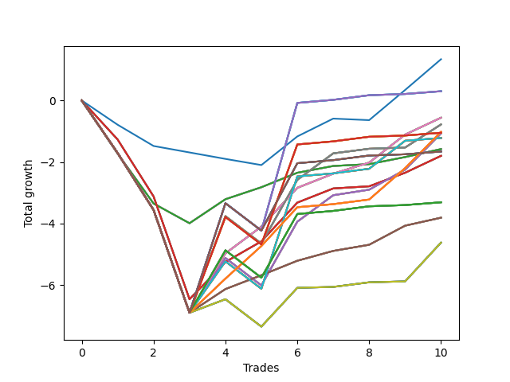

# Short Pointer 009 
- Symbol: NVDA_Unlimited
- Date Range: 02/08/2022 - 07/08/2022
- Trading Period: 7:20-12:30
- Number of Trades: 10



| Name | Win Percent | Profit | Avg Profit / Trade | Avg Time / Trade |      | Name | Win Percent | Profit | Avg Profit / Trade | Avg Time / Trade |
| ---- | ----------- | ------ | ------------------ | ---------------- | ---- | ---- | ----------- | ------ | ------------------ | ---------------- |
| Sorted By <br> Profit | | | | | | Sorted By <br> Win Percentage ||||
| Seventy-Three | 40.00 | 670.00 | 67.00 | 05:53 |     | Sixty-Eight | 70.00 | -280.00 | -28.00 | 12:24 |
| One Hundred Twenty-Nine | 60.00 | 150.00 | 15.00 | 28:20 |     | Sixty | 70.00 | -280.00 | -28.00 | 12:24 |
| One Hundred Twenty-Four | 60.00 | 150.00 | 15.00 | 28:20 |     | Fifty-Two | 70.00 | -280.00 | -28.00 | 12:24 |
| One Hundred Ninteen | 60.00 | 150.00 | 15.00 | 28:20 |     | Forty-Four | 70.00 | -280.00 | -28.00 | 12:24 |
| One Hundred Fourteen | 60.00 | 150.00 | 15.00 | 28:20 |     | Four | 70.00 | -280.00 | -28.00 | 12:24 |
| Eighty-Four | 60.00 | 150.00 | 15.00 | 28:20 |     | One Hundred Twenty-Six | 70.00 | -510.00 | -51.00 | 16:26 |
| Sixty-Eight | 70.00 | -280.00 | -28.00 | 12:24 |     | One Hundred Twenty-One | 70.00 | -510.00 | -51.00 | 16:26 |
| Sixty | 70.00 | -280.00 | -28.00 | 12:24 |     | One Hundred Sixteen | 70.00 | -510.00 | -51.00 | 16:26 |
| Fifty-Two | 70.00 | -280.00 | -28.00 | 12:24 |     | One Hundred Eleven | 70.00 | -510.00 | -51.00 | 16:26 |
| Forty-Four | 70.00 | -280.00 | -28.00 | 12:24 |     | Eighty-One | 70.00 | -510.00 | -51.00 | 16:26 |
| Four | 70.00 | -280.00 | -28.00 | 12:24 |     | Sixty-Four | 70.00 | -790.00 | -79.00 | 05:50 |
| Sixty-Nine | 60.00 | -390.00 | -39.00 | 19:36 |     | Fifty-Six | 70.00 | -790.00 | -79.00 | 05:50 |
| Sixty-One | 60.00 | -390.00 | -39.00 | 19:36 |     | Forty-Eight | 70.00 | -790.00 | -79.00 | 05:50 |
| Fifty-Three | 60.00 | -390.00 | -39.00 | 19:36 |     | Forty | 70.00 | -790.00 | -79.00 | 05:50 |
| Forty-Five | 60.00 | -390.00 | -39.00 | 19:36 |     | Zero | 70.00 | -790.00 | -79.00 | 05:50 |
| Five | 60.00 | -390.00 | -39.00 | 19:36 |     | Sixty-Five | 70.00 | -900.00 | -90.00 | 10:08 |
| One Hundred Twenty-Six | 70.00 | -510.00 | -51.00 | 16:26 |     | Fifty-Seven | 70.00 | -900.00 | -90.00 | 10:08 |
| One Hundred Twenty-One | 70.00 | -510.00 | -51.00 | 16:26 |     | Forty-Nine | 70.00 | -900.00 | -90.00 | 10:08 |
| One Hundred Sixteen | 70.00 | -510.00 | -51.00 | 16:26 |     | Forty-One | 70.00 | -900.00 | -90.00 | 10:08 |
| One Hundred Eleven | 70.00 | -510.00 | -51.00 | 16:26 |     | One | 70.00 | -900.00 | -90.00 | 10:08 |
| Eighty-One | 70.00 | -510.00 | -51.00 | 16:26 |     | Sixty-Seven | 70.00 | -1905.00 | -190.50 | 10:01 |
| One Hundred Twenty-Eight | 60.00 | -525.00 | -52.50 | 27:29 |     | Fifty-Nine | 70.00 | -1905.00 | -190.50 | 10:01 |
| One Hundred Twenty-Three | 60.00 | -525.00 | -52.50 | 27:29 |     | Fifty-One | 70.00 | -1905.00 | -190.50 | 10:01 |
| One Hundred Eighteen | 60.00 | -525.00 | -52.50 | 27:29 |     | Forty-Three | 70.00 | -1905.00 | -190.50 | 10:01 |
| One Hundred Thirteen | 60.00 | -525.00 | -52.50 | 27:29 |     | Three | 70.00 | -1905.00 | -190.50 | 10:01 |
| Eighty-Three | 60.00 | -525.00 | -52.50 | 27:29 |     | One Hundred Twenty-Nine | 60.00 | 150.00 | 15.00 | 28:20 |
| Sixty-Six | 60.00 | -535.00 | -53.50 | 13:57 |     | One Hundred Twenty-Four | 60.00 | 150.00 | 15.00 | 28:20 |
| Fifty-Eight | 60.00 | -535.00 | -53.50 | 13:57 |     | One Hundred Ninteen | 60.00 | 150.00 | 15.00 | 28:20 |
| Fifty | 60.00 | -535.00 | -53.50 | 13:57 |     | One Hundred Fourteen | 60.00 | 150.00 | 15.00 | 28:20 |
| Forty-Two | 60.00 | -535.00 | -53.50 | 13:57 |     | Eighty-Four | 60.00 | 150.00 | 15.00 | 28:20 |
| Two | 60.00 | -535.00 | -53.50 | 13:57 |     | Sixty-Nine | 60.00 | -390.00 | -39.00 | 19:36 |
| Seventy-One | 60.00 | -610.00 | -61.00 | 24:16 |     | Sixty-One | 60.00 | -390.00 | -39.00 | 19:36 |
| Sixty-Three | 60.00 | -610.00 | -61.00 | 24:16 |     | Fifty-Three | 60.00 | -390.00 | -39.00 | 19:36 |
| Fifty-Five | 60.00 | -610.00 | -61.00 | 24:16 |     | Forty-Five | 60.00 | -390.00 | -39.00 | 19:36 |
| Forty-Seven | 60.00 | -610.00 | -61.00 | 24:16 |     | Five | 60.00 | -390.00 | -39.00 | 19:36 |
| Seven | 60.00 | -610.00 | -61.00 | 24:16 |     | One Hundred Twenty-Eight | 60.00 | -525.00 | -52.50 | 27:29 |
| Sixty-Four | 70.00 | -790.00 | -79.00 | 05:50 |     | One Hundred Twenty-Three | 60.00 | -525.00 | -52.50 | 27:29 |
| Fifty-Six | 70.00 | -790.00 | -79.00 | 05:50 |     | One Hundred Eighteen | 60.00 | -525.00 | -52.50 | 27:29 |
| Forty-Eight | 70.00 | -790.00 | -79.00 | 05:50 |     | One Hundred Thirteen | 60.00 | -525.00 | -52.50 | 27:29 |
| Forty | 70.00 | -790.00 | -79.00 | 05:50 |     | Eighty-Three | 60.00 | -525.00 | -52.50 | 27:29 |
| Zero | 70.00 | -790.00 | -79.00 | 05:50 |     | Sixty-Six | 60.00 | -535.00 | -53.50 | 13:57 |
| One Hundred Thirty | 60.00 | -830.00 | -83.00 | 28:31 |     | Fifty-Eight | 60.00 | -535.00 | -53.50 | 13:57 |
| One Hundred Twenty-Five | 60.00 | -830.00 | -83.00 | 28:31 |     | Fifty | 60.00 | -535.00 | -53.50 | 13:57 |
| One Hundred Twenty | 60.00 | -830.00 | -83.00 | 28:31 |     | Forty-Two | 60.00 | -535.00 | -53.50 | 13:57 |
| One Hundred Fifteen | 60.00 | -830.00 | -83.00 | 28:31 |     | Two | 60.00 | -535.00 | -53.50 | 13:57 |
| Eighty-Five | 60.00 | -830.00 | -83.00 | 28:31 |     | Seventy-One | 60.00 | -610.00 | -61.00 | 24:16 |
| Sixty-Five | 70.00 | -900.00 | -90.00 | 10:08 |     | Sixty-Three | 60.00 | -610.00 | -61.00 | 24:16 |
| Fifty-Seven | 70.00 | -900.00 | -90.00 | 10:08 |     | Fifty-Five | 60.00 | -610.00 | -61.00 | 24:16 |
| Forty-Nine | 70.00 | -900.00 | -90.00 | 10:08 |     | Forty-Seven | 60.00 | -610.00 | -61.00 | 24:16 |
| Forty-One | 70.00 | -900.00 | -90.00 | 10:08 |     | Seven | 60.00 | -610.00 | -61.00 | 24:16 |
| One | 70.00 | -900.00 | -90.00 | 10:08 |     | One Hundred Thirty | 60.00 | -830.00 | -83.00 | 28:31 |
| One Hundred Twenty-Seven | 60.00 | -1655.00 | -165.50 | 23:44 |     | One Hundred Twenty-Five | 60.00 | -830.00 | -83.00 | 28:31 |
| One Hundred Twenty-Two | 60.00 | -1655.00 | -165.50 | 23:44 |     | One Hundred Twenty | 60.00 | -830.00 | -83.00 | 28:31 |
| One Hundred Seventeen | 60.00 | -1655.00 | -165.50 | 23:44 |     | One Hundred Fifteen | 60.00 | -830.00 | -83.00 | 28:31 |
| One Hundred Twelve | 60.00 | -1655.00 | -165.50 | 23:44 |     | Eighty-Five | 60.00 | -830.00 | -83.00 | 28:31 |
| Eighty-Two | 60.00 | -1655.00 | -165.50 | 23:44 |     | One Hundred Twenty-Seven | 60.00 | -1655.00 | -165.50 | 23:44 |
| Sixty-Seven | 70.00 | -1905.00 | -190.50 | 10:01 |     | One Hundred Twenty-Two | 60.00 | -1655.00 | -165.50 | 23:44 |
| Fifty-Nine | 70.00 | -1905.00 | -190.50 | 10:01 |     | One Hundred Seventeen | 60.00 | -1655.00 | -165.50 | 23:44 |
| Fifty-One | 70.00 | -1905.00 | -190.50 | 10:01 |     | One Hundred Twelve | 60.00 | -1655.00 | -165.50 | 23:44 |
| Forty-Three | 70.00 | -1905.00 | -190.50 | 10:01 |     | Eighty-Two | 60.00 | -1655.00 | -165.50 | 23:44 |
| Three | 70.00 | -1905.00 | -190.50 | 10:01 |     | Seventy | 60.00 | -2310.00 | -231.00 | 14:04 |
| Seventy | 60.00 | -2310.00 | -231.00 | 14:04 |     | Sixty-Two | 60.00 | -2310.00 | -231.00 | 14:04 |
| Sixty-Two | 60.00 | -2310.00 | -231.00 | 14:04 |     | Fifty-Four | 60.00 | -2310.00 | -231.00 | 14:04 |
| Fifty-Four | 60.00 | -2310.00 | -231.00 | 14:04 |     | Forty-Six | 60.00 | -2310.00 | -231.00 | 14:04 |
| Forty-Six | 60.00 | -2310.00 | -231.00 | 14:04 |     | Six | 60.00 | -2310.00 | -231.00 | 14:04 |
| Six | 60.00 | -2310.00 | -231.00 | 14:04 |     | Seventy-Three | 40.00 | 670.00 | 67.00 | 05:53 |

## NO STOPLOSS

### Test Zero
* Sell when price hits the middle line of the 20p bollinger
* No Stoploss
* Results:
```
Total Trades: 10
Percent Up: 30.00
Percent Down: 70.00
Total Points Moved Down: -1.58
Potential Profit: -790.00
Total Points Ups: 3.99 Count Ups: 3
Total Points Downs: 2.41 Count Downs: 7
```

<details><summary>Trades</summary>

<code>In: 2022-02-16 07:33:00		Out: 2022-02-16 07:58:55		Total Position Time: 25:55		Total Move Down: -1.73		Total to Date: -1.73</code> <br />
<code>In: 2022-02-24 12:30:00		Out: 2022-02-24 12:44:05		Total Position Time: 14:05		Total Move Down: -1.62		Total to Date: -3.35</code> <br />
<code>In: 2022-03-08 09:42:00		Out: 2022-03-08 09:51:30		Total Position Time: 09:30		Total Move Down: -0.64		Total to Date: -3.99</code> <br />
<code>In: 2022-03-10 07:22:00		Out: 2022-03-10 07:24:25		Total Position Time: 02:25		Total Move Down: 0.78		Total to Date: -3.21</code> <br />
<code>In: 2022-05-04 10:06:00		Out: 2022-05-04 10:09:00		Total Position Time: 03:00		Total Move Down: 0.39		Total to Date: -2.82</code> <br />
<code>In: 2022-05-04 11:07:00		Out: 2022-05-04 11:07:10		Total Position Time: 00:10		Total Move Down: 0.47		Total to Date: -2.35</code> <br />
<code>In: 2022-06-10 12:03:00		Out: 2022-06-10 12:03:25		Total Position Time: 00:25		Total Move Down: 0.22		Total to Date: -2.13</code> <br />
<code>In: 2022-06-24 11:52:00		Out: 2022-06-24 11:54:10		Total Position Time: 02:10		Total Move Down: 0.06		Total to Date: -2.07</code> <br />
<code>In: 2022-06-29 10:12:00		Out: 2022-06-29 10:12:30		Total Position Time: 00:30		Total Move Down: 0.23		Total to Date: -1.84</code> <br />
<code>In: 2022-07-06 11:10:00		Out: 2022-07-06 11:10:10		Total Position Time: 00:10		Total Move Down: 0.26		Total to Date: -1.58</code> <br />


</details>

### Test One
* Sell when the price hits the upper line of the 20p 1std bollinger
* No Stoploss
* Results:
```
Total Trades: 10
Percent Up: 30.00
Percent Down: 70.00
Total Points Moved Down: -1.80
Potential Profit: -900.00
Total Points Ups: 6.46 Count Ups: 3
Total Points Downs: 4.66 Count Downs: 7
```

<details><summary>Trades</summary>

<code>In: 2022-02-16 07:33:00		Out: 2022-02-16 08:00:25		Total Position Time: 27:25		Total Move Down: -1.27		Total to Date: -1.27</code> <br />
<code>In: 2022-02-24 12:30:00		Out: 2022-02-24 12:46:00		Total Position Time: 16:00		Total Move Down: -1.85		Total to Date: -3.12</code> <br />
<code>In: 2022-03-08 09:42:00		Out: 2022-03-08 10:11:55		Total Position Time: 29:55		Total Move Down: -3.34		Total to Date: -6.46</code> <br />
<code>In: 2022-03-10 07:22:00		Out: 2022-03-10 07:30:05		Total Position Time: 08:05		Total Move Down: 1.21		Total to Date: -5.25</code> <br />
<code>In: 2022-05-04 10:06:00		Out: 2022-05-04 10:11:25		Total Position Time: 05:25		Total Move Down: 0.67		Total to Date: -4.58</code> <br />
<code>In: 2022-05-04 11:07:00		Out: 2022-05-04 11:07:20		Total Position Time: 00:20		Total Move Down: 1.26		Total to Date: -3.32</code> <br />
<code>In: 2022-06-10 12:03:00		Out: 2022-06-10 12:04:40		Total Position Time: 01:40		Total Move Down: 0.46		Total to Date: -2.86</code> <br />
<code>In: 2022-06-24 11:52:00		Out: 2022-06-24 12:01:20		Total Position Time: 09:20		Total Move Down: 0.07		Total to Date: -2.79</code> <br />
<code>In: 2022-06-29 10:12:00		Out: 2022-06-29 10:14:00		Total Position Time: 02:00		Total Move Down: 0.44		Total to Date: -2.35</code> <br />
<code>In: 2022-07-06 11:10:00		Out: 2022-07-06 11:11:10		Total Position Time: 01:10		Total Move Down: 0.55		Total to Date: -1.80</code> <br />


</details>

### Test Two
* Sell when the price hits the upper line of the 20p 2std bollinger
* No Stoploss
* Results:
```
Total Trades: 10
Percent Up: 40.00
Percent Down: 60.00
Total Points Moved Down: -1.07
Potential Profit: -535.00
Total Points Ups: 7.79 Count Ups: 4
Total Points Downs: 6.72 Count Downs: 6
```

<details><summary>Trades</summary>

<code>In: 2022-02-16 07:33:00		Out: 2022-02-16 08:02:55		Total Position Time: 29:55		Total Move Down: -1.71		Total to Date: -1.71</code> <br />
<code>In: 2022-02-24 12:30:00		Out: 2022-02-24 12:46:00		Total Position Time: 16:00		Total Move Down: -1.85		Total to Date: -3.56</code> <br />
<code>In: 2022-03-08 09:42:00		Out: 2022-03-08 10:11:55		Total Position Time: 29:55		Total Move Down: -3.34		Total to Date: -6.90</code> <br />
<code>In: 2022-03-10 07:22:00		Out: 2022-03-10 07:33:15		Total Position Time: 11:15		Total Move Down: 1.78		Total to Date: -5.12</code> <br />
<code>In: 2022-05-04 10:06:00		Out: 2022-05-04 10:35:55		Total Position Time: 29:55		Total Move Down: -0.89		Total to Date: -6.01</code> <br />
<code>In: 2022-05-04 11:07:00		Out: 2022-05-04 11:07:30		Total Position Time: 00:30		Total Move Down: 2.07		Total to Date: -3.94</code> <br />
<code>In: 2022-06-10 12:03:00		Out: 2022-06-10 12:08:50		Total Position Time: 05:50		Total Move Down: 0.86		Total to Date: -3.08</code> <br />
<code>In: 2022-06-24 11:52:00		Out: 2022-06-24 12:03:00		Total Position Time: 11:00		Total Move Down: 0.18		Total to Date: -2.90</code> <br />
<code>In: 2022-06-29 10:12:00		Out: 2022-06-29 10:15:00		Total Position Time: 03:00		Total Move Down: 0.65		Total to Date: -2.25</code> <br />
<code>In: 2022-07-06 11:10:00		Out: 2022-07-06 11:12:15		Total Position Time: 02:15		Total Move Down: 1.18		Total to Date: -1.07</code> <br />


</details>

### Test Three
* Sell when price hits the middle line of the 50p bollinger
* No Stoploss
* Results:
```
Total Trades: 10
Percent Up: 30.00
Percent Down: 70.00
Total Points Moved Down: -3.81
Potential Profit: -1905.00
Total Points Ups: 6.90 Count Ups: 3
Total Points Downs: 3.09 Count Downs: 7
```

<details><summary>Trades</summary>

<code>In: 2022-02-16 07:33:00		Out: 2022-02-16 08:02:55		Total Position Time: 29:55		Total Move Down: -1.71		Total to Date: -1.71</code> <br />
<code>In: 2022-02-24 12:30:00		Out: 2022-02-24 12:46:00		Total Position Time: 16:00		Total Move Down: -1.85		Total to Date: -3.56</code> <br />
<code>In: 2022-03-08 09:42:00		Out: 2022-03-08 10:11:55		Total Position Time: 29:55		Total Move Down: -3.34		Total to Date: -6.90</code> <br />
<code>In: 2022-03-10 07:22:00		Out: 2022-03-10 07:24:35		Total Position Time: 02:35		Total Move Down: 0.77		Total to Date: -6.13</code> <br />
<code>In: 2022-05-04 10:06:00		Out: 2022-05-04 10:10:30		Total Position Time: 04:30		Total Move Down: 0.45		Total to Date: -5.68</code> <br />
<code>In: 2022-05-04 11:07:00		Out: 2022-05-04 11:07:10		Total Position Time: 00:10		Total Move Down: 0.47		Total to Date: -5.21</code> <br />
<code>In: 2022-06-10 12:03:00		Out: 2022-06-10 12:03:30		Total Position Time: 00:30		Total Move Down: 0.32		Total to Date: -4.89</code> <br />
<code>In: 2022-06-24 11:52:00		Out: 2022-06-24 12:05:30		Total Position Time: 13:30		Total Move Down: 0.20		Total to Date: -4.69</code> <br />
<code>In: 2022-06-29 10:12:00		Out: 2022-06-29 10:14:55		Total Position Time: 02:55		Total Move Down: 0.62		Total to Date: -4.07</code> <br />
<code>In: 2022-07-06 11:10:00		Out: 2022-07-06 11:10:10		Total Position Time: 00:10		Total Move Down: 0.26		Total to Date: -3.81</code> <br />


</details>

### Test Four
* Sell when the price hits the upper line of the 50p 1std bollinger
* No Stoploss
* Results:
```
Total Trades: 10
Percent Up: 30.00
Percent Down: 70.00
Total Points Moved Down: -0.56
Potential Profit: -280.00
Total Points Ups: 6.90 Count Ups: 3
Total Points Downs: 6.34 Count Downs: 7
```

<details><summary>Trades</summary>

<code>In: 2022-02-16 07:33:00		Out: 2022-02-16 08:02:55		Total Position Time: 29:55		Total Move Down: -1.71		Total to Date: -1.71</code> <br />
<code>In: 2022-02-24 12:30:00		Out: 2022-02-24 12:46:00		Total Position Time: 16:00		Total Move Down: -1.85		Total to Date: -3.56</code> <br />
<code>In: 2022-03-08 09:42:00		Out: 2022-03-08 10:11:55		Total Position Time: 29:55		Total Move Down: -3.34		Total to Date: -6.90</code> <br />
<code>In: 2022-03-10 07:22:00		Out: 2022-03-10 07:33:20		Total Position Time: 11:20		Total Move Down: 1.93		Total to Date: -4.97</code> <br />
<code>In: 2022-05-04 10:06:00		Out: 2022-05-04 10:11:45		Total Position Time: 05:45		Total Move Down: 0.87		Total to Date: -4.10</code> <br />
<code>In: 2022-05-04 11:07:00		Out: 2022-05-04 11:07:20		Total Position Time: 00:20		Total Move Down: 1.26		Total to Date: -2.84</code> <br />
<code>In: 2022-06-10 12:03:00		Out: 2022-06-10 12:04:40		Total Position Time: 01:40		Total Move Down: 0.46		Total to Date: -2.38</code> <br />
<code>In: 2022-06-24 11:52:00		Out: 2022-06-24 12:11:00		Total Position Time: 19:00		Total Move Down: 0.36		Total to Date: -2.02</code> <br />
<code>In: 2022-06-29 10:12:00		Out: 2022-06-29 10:21:00		Total Position Time: 09:00		Total Move Down: 0.91		Total to Date: -1.11</code> <br />
<code>In: 2022-07-06 11:10:00		Out: 2022-07-06 11:11:10		Total Position Time: 01:10		Total Move Down: 0.55		Total to Date: -0.56</code> <br />


</details>

### Test Five
* Sell when the price hits the upper line of the 50p 2std bollinger
* No Stoploss
* Results:
```
Total Trades: 10
Percent Up: 40.00
Percent Down: 60.00
Total Points Moved Down: -0.78
Potential Profit: -390.00
Total Points Ups: 7.79 Count Ups: 4
Total Points Downs: 7.01 Count Downs: 6
```

<details><summary>Trades</summary>

<code>In: 2022-02-16 07:33:00		Out: 2022-02-16 08:02:55		Total Position Time: 29:55		Total Move Down: -1.71		Total to Date: -1.71</code> <br />
<code>In: 2022-02-24 12:30:00		Out: 2022-02-24 12:46:00		Total Position Time: 16:00		Total Move Down: -1.85		Total to Date: -3.56</code> <br />
<code>In: 2022-03-08 09:42:00		Out: 2022-03-08 10:11:55		Total Position Time: 29:55		Total Move Down: -3.34		Total to Date: -6.90</code> <br />
<code>In: 2022-03-10 07:22:00		Out: 2022-03-10 07:44:25		Total Position Time: 22:25		Total Move Down: 3.14		Total to Date: -3.76</code> <br />
<code>In: 2022-05-04 10:06:00		Out: 2022-05-04 10:35:55		Total Position Time: 29:55		Total Move Down: -0.89		Total to Date: -4.65</code> <br />
<code>In: 2022-05-04 11:07:00		Out: 2022-05-04 11:07:30		Total Position Time: 00:30		Total Move Down: 2.07		Total to Date: -2.58</code> <br />
<code>In: 2022-06-10 12:03:00		Out: 2022-06-10 12:08:50		Total Position Time: 05:50		Total Move Down: 0.86		Total to Date: -1.72</code> <br />
<code>In: 2022-06-24 11:52:00		Out: 2022-06-24 12:21:55		Total Position Time: 29:55		Total Move Down: 0.15		Total to Date: -1.57</code> <br />
<code>In: 2022-06-29 10:12:00		Out: 2022-06-29 10:41:55		Total Position Time: 29:55		Total Move Down: 0.04		Total to Date: -1.53</code> <br />
<code>In: 2022-07-06 11:10:00		Out: 2022-07-06 11:11:45		Total Position Time: 01:45		Total Move Down: 0.75		Total to Date: -0.78</code> <br />


</details>

### Test Six
* Sell when the price hits the middle line of the 1std VWAP
* No Stoploss
* Results:
```
Total Trades: 10
Percent Up: 40.00
Percent Down: 60.00
Total Points Moved Down: -4.62
Potential Profit: -2310.00
Total Points Ups: 7.79 Count Ups: 4
Total Points Downs: 3.17 Count Downs: 6
```

<details><summary>Trades</summary>

<code>In: 2022-02-16 07:33:00		Out: 2022-02-16 08:02:55		Total Position Time: 29:55		Total Move Down: -1.71		Total to Date: -1.71</code> <br />
<code>In: 2022-02-24 12:30:00		Out: 2022-02-24 12:46:00		Total Position Time: 16:00		Total Move Down: -1.85		Total to Date: -3.56</code> <br />
<code>In: 2022-03-08 09:42:00		Out: 2022-03-08 10:11:55		Total Position Time: 29:55		Total Move Down: -3.34		Total to Date: -6.90</code> <br />
<code>In: 2022-03-10 07:22:00		Out: 2022-03-10 07:24:05		Total Position Time: 02:05		Total Move Down: 0.44		Total to Date: -6.46</code> <br />
<code>In: 2022-05-04 10:06:00		Out: 2022-05-04 10:35:55		Total Position Time: 29:55		Total Move Down: -0.89		Total to Date: -7.35</code> <br />
<code>In: 2022-05-04 11:07:00		Out: 2022-05-04 11:07:20		Total Position Time: 00:20		Total Move Down: 1.26		Total to Date: -6.09</code> <br />
<code>In: 2022-06-10 12:03:00		Out: 2022-06-10 12:03:10		Total Position Time: 00:10		Total Move Down: 0.03		Total to Date: -6.06</code> <br />
<code>In: 2022-06-24 11:52:00		Out: 2022-06-24 12:21:55		Total Position Time: 29:55		Total Move Down: 0.15		Total to Date: -5.91</code> <br />
<code>In: 2022-06-29 10:12:00		Out: 2022-06-29 10:12:10		Total Position Time: 00:10		Total Move Down: 0.03		Total to Date: -5.88</code> <br />
<code>In: 2022-07-06 11:10:00		Out: 2022-07-06 11:12:20		Total Position Time: 02:20		Total Move Down: 1.26		Total to Date: -4.62</code> <br />


</details>

### Test Seven
* Sell when the price hits the upper line of the 1std VWAP
* No Stoploss
* Results:
```
Total Trades: 10
Percent Up: 40.00
Percent Down: 60.00
Total Points Moved Down: -1.22
Potential Profit: -610.00
Total Points Ups: 7.79 Count Ups: 4
Total Points Downs: 6.57 Count Downs: 6
```

<details><summary>Trades</summary>

<code>In: 2022-02-16 07:33:00		Out: 2022-02-16 08:02:55		Total Position Time: 29:55		Total Move Down: -1.71		Total to Date: -1.71</code> <br />
<code>In: 2022-02-24 12:30:00		Out: 2022-02-24 12:46:00		Total Position Time: 16:00		Total Move Down: -1.85		Total to Date: -3.56</code> <br />
<code>In: 2022-03-08 09:42:00		Out: 2022-03-08 10:11:55		Total Position Time: 29:55		Total Move Down: -3.34		Total to Date: -6.90</code> <br />
<code>In: 2022-03-10 07:22:00		Out: 2022-03-10 07:33:00		Total Position Time: 11:00		Total Move Down: 1.67		Total to Date: -5.23</code> <br />
<code>In: 2022-05-04 10:06:00		Out: 2022-05-04 10:35:55		Total Position Time: 29:55		Total Move Down: -0.89		Total to Date: -6.12</code> <br />
<code>In: 2022-05-04 11:07:00		Out: 2022-05-04 11:34:15		Total Position Time: 27:15		Total Move Down: 3.65		Total to Date: -2.47</code> <br />
<code>In: 2022-06-10 12:03:00		Out: 2022-06-10 12:32:55		Total Position Time: 29:55		Total Move Down: 0.10		Total to Date: -2.37</code> <br />
<code>In: 2022-06-24 11:52:00		Out: 2022-06-24 12:21:55		Total Position Time: 29:55		Total Move Down: 0.15		Total to Date: -2.22</code> <br />
<code>In: 2022-06-29 10:12:00		Out: 2022-06-29 10:21:00		Total Position Time: 09:00		Total Move Down: 0.91		Total to Date: -1.31</code> <br />
<code>In: 2022-07-06 11:10:00		Out: 2022-07-06 11:39:55		Total Position Time: 29:55		Total Move Down: 0.09		Total to Date: -1.22</code> <br />


</details>

## STOPLOSS OF 5

### Test Forty
* Sell when price hits the middle line of the 20p bollinger
* Stoploss is -5 points
* Results:
```
Total Trades: 10
Percent Up: 30.00
Percent Down: 70.00
Total Points Moved Down: -1.58
Potential Profit: -790.00
Total Points Ups: 3.99 Count Ups: 3
Total Points Downs: 2.41 Count Downs: 7
```

<details><summary>Trades</summary>

<code>In: 2022-02-16 07:33:00		Out: 2022-02-16 07:58:55		Total Position Time: 25:55		Total Move Down: -1.73		Total to Date: -1.73</code> <br />
<code>In: 2022-02-24 12:30:00		Out: 2022-02-24 12:44:05		Total Position Time: 14:05		Total Move Down: -1.62		Total to Date: -3.35</code> <br />
<code>In: 2022-03-08 09:42:00		Out: 2022-03-08 09:51:30		Total Position Time: 09:30		Total Move Down: -0.64		Total to Date: -3.99</code> <br />
<code>In: 2022-03-10 07:22:00		Out: 2022-03-10 07:24:25		Total Position Time: 02:25		Total Move Down: 0.78		Total to Date: -3.21</code> <br />
<code>In: 2022-05-04 10:06:00		Out: 2022-05-04 10:09:00		Total Position Time: 03:00		Total Move Down: 0.39		Total to Date: -2.82</code> <br />
<code>In: 2022-05-04 11:07:00		Out: 2022-05-04 11:07:10		Total Position Time: 00:10		Total Move Down: 0.47		Total to Date: -2.35</code> <br />
<code>In: 2022-06-10 12:03:00		Out: 2022-06-10 12:03:25		Total Position Time: 00:25		Total Move Down: 0.22		Total to Date: -2.13</code> <br />
<code>In: 2022-06-24 11:52:00		Out: 2022-06-24 11:54:10		Total Position Time: 02:10		Total Move Down: 0.06		Total to Date: -2.07</code> <br />
<code>In: 2022-06-29 10:12:00		Out: 2022-06-29 10:12:30		Total Position Time: 00:30		Total Move Down: 0.23		Total to Date: -1.84</code> <br />
<code>In: 2022-07-06 11:10:00		Out: 2022-07-06 11:10:10		Total Position Time: 00:10		Total Move Down: 0.26		Total to Date: -1.58</code> <br />


</details>

### Test Forty-One
* Sell when the price hits the upper line of the 20p 1std bollinger
* Stoploss is -5 points
* Results:
```
Total Trades: 10
Percent Up: 30.00
Percent Down: 70.00
Total Points Moved Down: -1.80
Potential Profit: -900.00
Total Points Ups: 6.46 Count Ups: 3
Total Points Downs: 4.66 Count Downs: 7
```

<details><summary>Trades</summary>

<code>In: 2022-02-16 07:33:00		Out: 2022-02-16 08:00:25		Total Position Time: 27:25		Total Move Down: -1.27		Total to Date: -1.27</code> <br />
<code>In: 2022-02-24 12:30:00		Out: 2022-02-24 12:46:00		Total Position Time: 16:00		Total Move Down: -1.85		Total to Date: -3.12</code> <br />
<code>In: 2022-03-08 09:42:00		Out: 2022-03-08 10:11:55		Total Position Time: 29:55		Total Move Down: -3.34		Total to Date: -6.46</code> <br />
<code>In: 2022-03-10 07:22:00		Out: 2022-03-10 07:30:05		Total Position Time: 08:05		Total Move Down: 1.21		Total to Date: -5.25</code> <br />
<code>In: 2022-05-04 10:06:00		Out: 2022-05-04 10:11:25		Total Position Time: 05:25		Total Move Down: 0.67		Total to Date: -4.58</code> <br />
<code>In: 2022-05-04 11:07:00		Out: 2022-05-04 11:07:20		Total Position Time: 00:20		Total Move Down: 1.26		Total to Date: -3.32</code> <br />
<code>In: 2022-06-10 12:03:00		Out: 2022-06-10 12:04:40		Total Position Time: 01:40		Total Move Down: 0.46		Total to Date: -2.86</code> <br />
<code>In: 2022-06-24 11:52:00		Out: 2022-06-24 12:01:20		Total Position Time: 09:20		Total Move Down: 0.07		Total to Date: -2.79</code> <br />
<code>In: 2022-06-29 10:12:00		Out: 2022-06-29 10:14:00		Total Position Time: 02:00		Total Move Down: 0.44		Total to Date: -2.35</code> <br />
<code>In: 2022-07-06 11:10:00		Out: 2022-07-06 11:11:10		Total Position Time: 01:10		Total Move Down: 0.55		Total to Date: -1.80</code> <br />


</details>

### Test Forty-Two
* Sell when the price hits the upper line of the 20p 2std bollinger
* Stoploss is -5 points
* Results:
```
Total Trades: 10
Percent Up: 40.00
Percent Down: 60.00
Total Points Moved Down: -1.07
Potential Profit: -535.00
Total Points Ups: 7.79 Count Ups: 4
Total Points Downs: 6.72 Count Downs: 6
```

<details><summary>Trades</summary>

<code>In: 2022-02-16 07:33:00		Out: 2022-02-16 08:02:55		Total Position Time: 29:55		Total Move Down: -1.71		Total to Date: -1.71</code> <br />
<code>In: 2022-02-24 12:30:00		Out: 2022-02-24 12:46:00		Total Position Time: 16:00		Total Move Down: -1.85		Total to Date: -3.56</code> <br />
<code>In: 2022-03-08 09:42:00		Out: 2022-03-08 10:11:55		Total Position Time: 29:55		Total Move Down: -3.34		Total to Date: -6.90</code> <br />
<code>In: 2022-03-10 07:22:00		Out: 2022-03-10 07:33:15		Total Position Time: 11:15		Total Move Down: 1.78		Total to Date: -5.12</code> <br />
<code>In: 2022-05-04 10:06:00		Out: 2022-05-04 10:35:55		Total Position Time: 29:55		Total Move Down: -0.89		Total to Date: -6.01</code> <br />
<code>In: 2022-05-04 11:07:00		Out: 2022-05-04 11:07:30		Total Position Time: 00:30		Total Move Down: 2.07		Total to Date: -3.94</code> <br />
<code>In: 2022-06-10 12:03:00		Out: 2022-06-10 12:08:50		Total Position Time: 05:50		Total Move Down: 0.86		Total to Date: -3.08</code> <br />
<code>In: 2022-06-24 11:52:00		Out: 2022-06-24 12:03:00		Total Position Time: 11:00		Total Move Down: 0.18		Total to Date: -2.90</code> <br />
<code>In: 2022-06-29 10:12:00		Out: 2022-06-29 10:15:00		Total Position Time: 03:00		Total Move Down: 0.65		Total to Date: -2.25</code> <br />
<code>In: 2022-07-06 11:10:00		Out: 2022-07-06 11:12:15		Total Position Time: 02:15		Total Move Down: 1.18		Total to Date: -1.07</code> <br />


</details>

### Test Forty-Three
* Sell when price hits the middle line of the 50p bollinger
* Stoploss is -5 points
* Results:
```
Total Trades: 10
Percent Up: 30.00
Percent Down: 70.00
Total Points Moved Down: -3.81
Potential Profit: -1905.00
Total Points Ups: 6.90 Count Ups: 3
Total Points Downs: 3.09 Count Downs: 7
```

<details><summary>Trades</summary>

<code>In: 2022-02-16 07:33:00		Out: 2022-02-16 08:02:55		Total Position Time: 29:55		Total Move Down: -1.71		Total to Date: -1.71</code> <br />
<code>In: 2022-02-24 12:30:00		Out: 2022-02-24 12:46:00		Total Position Time: 16:00		Total Move Down: -1.85		Total to Date: -3.56</code> <br />
<code>In: 2022-03-08 09:42:00		Out: 2022-03-08 10:11:55		Total Position Time: 29:55		Total Move Down: -3.34		Total to Date: -6.90</code> <br />
<code>In: 2022-03-10 07:22:00		Out: 2022-03-10 07:24:35		Total Position Time: 02:35		Total Move Down: 0.77		Total to Date: -6.13</code> <br />
<code>In: 2022-05-04 10:06:00		Out: 2022-05-04 10:10:30		Total Position Time: 04:30		Total Move Down: 0.45		Total to Date: -5.68</code> <br />
<code>In: 2022-05-04 11:07:00		Out: 2022-05-04 11:07:10		Total Position Time: 00:10		Total Move Down: 0.47		Total to Date: -5.21</code> <br />
<code>In: 2022-06-10 12:03:00		Out: 2022-06-10 12:03:30		Total Position Time: 00:30		Total Move Down: 0.32		Total to Date: -4.89</code> <br />
<code>In: 2022-06-24 11:52:00		Out: 2022-06-24 12:05:30		Total Position Time: 13:30		Total Move Down: 0.20		Total to Date: -4.69</code> <br />
<code>In: 2022-06-29 10:12:00		Out: 2022-06-29 10:14:55		Total Position Time: 02:55		Total Move Down: 0.62		Total to Date: -4.07</code> <br />
<code>In: 2022-07-06 11:10:00		Out: 2022-07-06 11:10:10		Total Position Time: 00:10		Total Move Down: 0.26		Total to Date: -3.81</code> <br />


</details>

### Test Forty-Four
* Sell when the price hits the upper line of the 50p 1std bollinger
* Stoploss is -5 points
* Results:
```
Total Trades: 10
Percent Up: 30.00
Percent Down: 70.00
Total Points Moved Down: -0.56
Potential Profit: -280.00
Total Points Ups: 6.90 Count Ups: 3
Total Points Downs: 6.34 Count Downs: 7
```

<details><summary>Trades</summary>

<code>In: 2022-02-16 07:33:00		Out: 2022-02-16 08:02:55		Total Position Time: 29:55		Total Move Down: -1.71		Total to Date: -1.71</code> <br />
<code>In: 2022-02-24 12:30:00		Out: 2022-02-24 12:46:00		Total Position Time: 16:00		Total Move Down: -1.85		Total to Date: -3.56</code> <br />
<code>In: 2022-03-08 09:42:00		Out: 2022-03-08 10:11:55		Total Position Time: 29:55		Total Move Down: -3.34		Total to Date: -6.90</code> <br />
<code>In: 2022-03-10 07:22:00		Out: 2022-03-10 07:33:20		Total Position Time: 11:20		Total Move Down: 1.93		Total to Date: -4.97</code> <br />
<code>In: 2022-05-04 10:06:00		Out: 2022-05-04 10:11:45		Total Position Time: 05:45		Total Move Down: 0.87		Total to Date: -4.10</code> <br />
<code>In: 2022-05-04 11:07:00		Out: 2022-05-04 11:07:20		Total Position Time: 00:20		Total Move Down: 1.26		Total to Date: -2.84</code> <br />
<code>In: 2022-06-10 12:03:00		Out: 2022-06-10 12:04:40		Total Position Time: 01:40		Total Move Down: 0.46		Total to Date: -2.38</code> <br />
<code>In: 2022-06-24 11:52:00		Out: 2022-06-24 12:11:00		Total Position Time: 19:00		Total Move Down: 0.36		Total to Date: -2.02</code> <br />
<code>In: 2022-06-29 10:12:00		Out: 2022-06-29 10:21:00		Total Position Time: 09:00		Total Move Down: 0.91		Total to Date: -1.11</code> <br />
<code>In: 2022-07-06 11:10:00		Out: 2022-07-06 11:11:10		Total Position Time: 01:10		Total Move Down: 0.55		Total to Date: -0.56</code> <br />


</details>

### Test Forty-Five
* Sell when the price hits the upper line of the 50p 2std bollinger
* Stoploss is -5 points
* Results:
```
Total Trades: 10
Percent Up: 40.00
Percent Down: 60.00
Total Points Moved Down: -0.78
Potential Profit: -390.00
Total Points Ups: 7.79 Count Ups: 4
Total Points Downs: 7.01 Count Downs: 6
```

<details><summary>Trades</summary>

<code>In: 2022-02-16 07:33:00		Out: 2022-02-16 08:02:55		Total Position Time: 29:55		Total Move Down: -1.71		Total to Date: -1.71</code> <br />
<code>In: 2022-02-24 12:30:00		Out: 2022-02-24 12:46:00		Total Position Time: 16:00		Total Move Down: -1.85		Total to Date: -3.56</code> <br />
<code>In: 2022-03-08 09:42:00		Out: 2022-03-08 10:11:55		Total Position Time: 29:55		Total Move Down: -3.34		Total to Date: -6.90</code> <br />
<code>In: 2022-03-10 07:22:00		Out: 2022-03-10 07:44:25		Total Position Time: 22:25		Total Move Down: 3.14		Total to Date: -3.76</code> <br />
<code>In: 2022-05-04 10:06:00		Out: 2022-05-04 10:35:55		Total Position Time: 29:55		Total Move Down: -0.89		Total to Date: -4.65</code> <br />
<code>In: 2022-05-04 11:07:00		Out: 2022-05-04 11:07:30		Total Position Time: 00:30		Total Move Down: 2.07		Total to Date: -2.58</code> <br />
<code>In: 2022-06-10 12:03:00		Out: 2022-06-10 12:08:50		Total Position Time: 05:50		Total Move Down: 0.86		Total to Date: -1.72</code> <br />
<code>In: 2022-06-24 11:52:00		Out: 2022-06-24 12:21:55		Total Position Time: 29:55		Total Move Down: 0.15		Total to Date: -1.57</code> <br />
<code>In: 2022-06-29 10:12:00		Out: 2022-06-29 10:41:55		Total Position Time: 29:55		Total Move Down: 0.04		Total to Date: -1.53</code> <br />
<code>In: 2022-07-06 11:10:00		Out: 2022-07-06 11:11:45		Total Position Time: 01:45		Total Move Down: 0.75		Total to Date: -0.78</code> <br />


</details>

### Test Forty-Six
* Sell when the price hits the middle line of the 1std VWAP
* Stoploss is -5 points
* Results:
```
Total Trades: 10
Percent Up: 40.00
Percent Down: 60.00
Total Points Moved Down: -4.62
Potential Profit: -2310.00
Total Points Ups: 7.79 Count Ups: 4
Total Points Downs: 3.17 Count Downs: 6
```

<details><summary>Trades</summary>

<code>In: 2022-02-16 07:33:00		Out: 2022-02-16 08:02:55		Total Position Time: 29:55		Total Move Down: -1.71		Total to Date: -1.71</code> <br />
<code>In: 2022-02-24 12:30:00		Out: 2022-02-24 12:46:00		Total Position Time: 16:00		Total Move Down: -1.85		Total to Date: -3.56</code> <br />
<code>In: 2022-03-08 09:42:00		Out: 2022-03-08 10:11:55		Total Position Time: 29:55		Total Move Down: -3.34		Total to Date: -6.90</code> <br />
<code>In: 2022-03-10 07:22:00		Out: 2022-03-10 07:24:05		Total Position Time: 02:05		Total Move Down: 0.44		Total to Date: -6.46</code> <br />
<code>In: 2022-05-04 10:06:00		Out: 2022-05-04 10:35:55		Total Position Time: 29:55		Total Move Down: -0.89		Total to Date: -7.35</code> <br />
<code>In: 2022-05-04 11:07:00		Out: 2022-05-04 11:07:20		Total Position Time: 00:20		Total Move Down: 1.26		Total to Date: -6.09</code> <br />
<code>In: 2022-06-10 12:03:00		Out: 2022-06-10 12:03:10		Total Position Time: 00:10		Total Move Down: 0.03		Total to Date: -6.06</code> <br />
<code>In: 2022-06-24 11:52:00		Out: 2022-06-24 12:21:55		Total Position Time: 29:55		Total Move Down: 0.15		Total to Date: -5.91</code> <br />
<code>In: 2022-06-29 10:12:00		Out: 2022-06-29 10:12:10		Total Position Time: 00:10		Total Move Down: 0.03		Total to Date: -5.88</code> <br />
<code>In: 2022-07-06 11:10:00		Out: 2022-07-06 11:12:20		Total Position Time: 02:20		Total Move Down: 1.26		Total to Date: -4.62</code> <br />


</details>

### Test Forty-Seven
* Sell when the price hits the upper line of the 1std VWAP
* Stoploss is -5 points
* Results:
```
Total Trades: 10
Percent Up: 40.00
Percent Down: 60.00
Total Points Moved Down: -1.22
Potential Profit: -610.00
Total Points Ups: 7.79 Count Ups: 4
Total Points Downs: 6.57 Count Downs: 6
```

<details><summary>Trades</summary>

<code>In: 2022-02-16 07:33:00		Out: 2022-02-16 08:02:55		Total Position Time: 29:55		Total Move Down: -1.71		Total to Date: -1.71</code> <br />
<code>In: 2022-02-24 12:30:00		Out: 2022-02-24 12:46:00		Total Position Time: 16:00		Total Move Down: -1.85		Total to Date: -3.56</code> <br />
<code>In: 2022-03-08 09:42:00		Out: 2022-03-08 10:11:55		Total Position Time: 29:55		Total Move Down: -3.34		Total to Date: -6.90</code> <br />
<code>In: 2022-03-10 07:22:00		Out: 2022-03-10 07:33:00		Total Position Time: 11:00		Total Move Down: 1.67		Total to Date: -5.23</code> <br />
<code>In: 2022-05-04 10:06:00		Out: 2022-05-04 10:35:55		Total Position Time: 29:55		Total Move Down: -0.89		Total to Date: -6.12</code> <br />
<code>In: 2022-05-04 11:07:00		Out: 2022-05-04 11:34:15		Total Position Time: 27:15		Total Move Down: 3.65		Total to Date: -2.47</code> <br />
<code>In: 2022-06-10 12:03:00		Out: 2022-06-10 12:32:55		Total Position Time: 29:55		Total Move Down: 0.10		Total to Date: -2.37</code> <br />
<code>In: 2022-06-24 11:52:00		Out: 2022-06-24 12:21:55		Total Position Time: 29:55		Total Move Down: 0.15		Total to Date: -2.22</code> <br />
<code>In: 2022-06-29 10:12:00		Out: 2022-06-29 10:21:00		Total Position Time: 09:00		Total Move Down: 0.91		Total to Date: -1.31</code> <br />
<code>In: 2022-07-06 11:10:00		Out: 2022-07-06 11:39:55		Total Position Time: 29:55		Total Move Down: 0.09		Total to Date: -1.22</code> <br />


</details>

## TRAIL STOP OF 5

### Test Forty-Eight
* Sell when price hits the middle line of the 20p bollinger
* Trailing Stop is -5 points
* Results:
```
Total Trades: 10
Percent Up: 30.00
Percent Down: 70.00
Total Points Moved Down: -1.58
Potential Profit: -790.00
Total Points Ups: 3.99 Count Ups: 3
Total Points Downs: 2.41 Count Downs: 7
```

<details><summary>Trades</summary>

<code>In: 2022-02-16 07:33:00		Out: 2022-02-16 07:58:55		Total Position Time: 25:55		Total Move Down: -1.73		Total to Date: -1.73</code> <br />
<code>In: 2022-02-24 12:30:00		Out: 2022-02-24 12:44:05		Total Position Time: 14:05		Total Move Down: -1.62		Total to Date: -3.35</code> <br />
<code>In: 2022-03-08 09:42:00		Out: 2022-03-08 09:51:30		Total Position Time: 09:30		Total Move Down: -0.64		Total to Date: -3.99</code> <br />
<code>In: 2022-03-10 07:22:00		Out: 2022-03-10 07:24:25		Total Position Time: 02:25		Total Move Down: 0.78		Total to Date: -3.21</code> <br />
<code>In: 2022-05-04 10:06:00		Out: 2022-05-04 10:09:00		Total Position Time: 03:00		Total Move Down: 0.39		Total to Date: -2.82</code> <br />
<code>In: 2022-05-04 11:07:00		Out: 2022-05-04 11:07:10		Total Position Time: 00:10		Total Move Down: 0.47		Total to Date: -2.35</code> <br />
<code>In: 2022-06-10 12:03:00		Out: 2022-06-10 12:03:25		Total Position Time: 00:25		Total Move Down: 0.22		Total to Date: -2.13</code> <br />
<code>In: 2022-06-24 11:52:00		Out: 2022-06-24 11:54:10		Total Position Time: 02:10		Total Move Down: 0.06		Total to Date: -2.07</code> <br />
<code>In: 2022-06-29 10:12:00		Out: 2022-06-29 10:12:30		Total Position Time: 00:30		Total Move Down: 0.23		Total to Date: -1.84</code> <br />
<code>In: 2022-07-06 11:10:00		Out: 2022-07-06 11:10:10		Total Position Time: 00:10		Total Move Down: 0.26		Total to Date: -1.58</code> <br />


</details>

### Test Forty-Nine
* Sell when the price hits the upper line of the 20p 1std bollinger
* Trailing Stop is -5 points
* Results:
```
Total Trades: 10
Percent Up: 30.00
Percent Down: 70.00
Total Points Moved Down: -1.80
Potential Profit: -900.00
Total Points Ups: 6.46 Count Ups: 3
Total Points Downs: 4.66 Count Downs: 7
```

<details><summary>Trades</summary>

<code>In: 2022-02-16 07:33:00		Out: 2022-02-16 08:00:25		Total Position Time: 27:25		Total Move Down: -1.27		Total to Date: -1.27</code> <br />
<code>In: 2022-02-24 12:30:00		Out: 2022-02-24 12:46:00		Total Position Time: 16:00		Total Move Down: -1.85		Total to Date: -3.12</code> <br />
<code>In: 2022-03-08 09:42:00		Out: 2022-03-08 10:11:55		Total Position Time: 29:55		Total Move Down: -3.34		Total to Date: -6.46</code> <br />
<code>In: 2022-03-10 07:22:00		Out: 2022-03-10 07:30:05		Total Position Time: 08:05		Total Move Down: 1.21		Total to Date: -5.25</code> <br />
<code>In: 2022-05-04 10:06:00		Out: 2022-05-04 10:11:25		Total Position Time: 05:25		Total Move Down: 0.67		Total to Date: -4.58</code> <br />
<code>In: 2022-05-04 11:07:00		Out: 2022-05-04 11:07:20		Total Position Time: 00:20		Total Move Down: 1.26		Total to Date: -3.32</code> <br />
<code>In: 2022-06-10 12:03:00		Out: 2022-06-10 12:04:40		Total Position Time: 01:40		Total Move Down: 0.46		Total to Date: -2.86</code> <br />
<code>In: 2022-06-24 11:52:00		Out: 2022-06-24 12:01:20		Total Position Time: 09:20		Total Move Down: 0.07		Total to Date: -2.79</code> <br />
<code>In: 2022-06-29 10:12:00		Out: 2022-06-29 10:14:00		Total Position Time: 02:00		Total Move Down: 0.44		Total to Date: -2.35</code> <br />
<code>In: 2022-07-06 11:10:00		Out: 2022-07-06 11:11:10		Total Position Time: 01:10		Total Move Down: 0.55		Total to Date: -1.80</code> <br />


</details>

### Test Fifty
* Sell when the price hits the upper line of the 20p 2std bollinger
* Trailing Stop is -5 points
* Results:
```
Total Trades: 10
Percent Up: 40.00
Percent Down: 60.00
Total Points Moved Down: -1.07
Potential Profit: -535.00
Total Points Ups: 7.79 Count Ups: 4
Total Points Downs: 6.72 Count Downs: 6
```

<details><summary>Trades</summary>

<code>In: 2022-02-16 07:33:00		Out: 2022-02-16 08:02:55		Total Position Time: 29:55		Total Move Down: -1.71		Total to Date: -1.71</code> <br />
<code>In: 2022-02-24 12:30:00		Out: 2022-02-24 12:46:00		Total Position Time: 16:00		Total Move Down: -1.85		Total to Date: -3.56</code> <br />
<code>In: 2022-03-08 09:42:00		Out: 2022-03-08 10:11:55		Total Position Time: 29:55		Total Move Down: -3.34		Total to Date: -6.90</code> <br />
<code>In: 2022-03-10 07:22:00		Out: 2022-03-10 07:33:15		Total Position Time: 11:15		Total Move Down: 1.78		Total to Date: -5.12</code> <br />
<code>In: 2022-05-04 10:06:00		Out: 2022-05-04 10:35:55		Total Position Time: 29:55		Total Move Down: -0.89		Total to Date: -6.01</code> <br />
<code>In: 2022-05-04 11:07:00		Out: 2022-05-04 11:07:30		Total Position Time: 00:30		Total Move Down: 2.07		Total to Date: -3.94</code> <br />
<code>In: 2022-06-10 12:03:00		Out: 2022-06-10 12:08:50		Total Position Time: 05:50		Total Move Down: 0.86		Total to Date: -3.08</code> <br />
<code>In: 2022-06-24 11:52:00		Out: 2022-06-24 12:03:00		Total Position Time: 11:00		Total Move Down: 0.18		Total to Date: -2.90</code> <br />
<code>In: 2022-06-29 10:12:00		Out: 2022-06-29 10:15:00		Total Position Time: 03:00		Total Move Down: 0.65		Total to Date: -2.25</code> <br />
<code>In: 2022-07-06 11:10:00		Out: 2022-07-06 11:12:15		Total Position Time: 02:15		Total Move Down: 1.18		Total to Date: -1.07</code> <br />


</details>

### Test Fifty-One
* Sell when price hits the middle line of the 50p bollinger
* Trailing Stop is -5 points
* Results:
```
Total Trades: 10
Percent Up: 30.00
Percent Down: 70.00
Total Points Moved Down: -3.81
Potential Profit: -1905.00
Total Points Ups: 6.90 Count Ups: 3
Total Points Downs: 3.09 Count Downs: 7
```

<details><summary>Trades</summary>

<code>In: 2022-02-16 07:33:00		Out: 2022-02-16 08:02:55		Total Position Time: 29:55		Total Move Down: -1.71		Total to Date: -1.71</code> <br />
<code>In: 2022-02-24 12:30:00		Out: 2022-02-24 12:46:00		Total Position Time: 16:00		Total Move Down: -1.85		Total to Date: -3.56</code> <br />
<code>In: 2022-03-08 09:42:00		Out: 2022-03-08 10:11:55		Total Position Time: 29:55		Total Move Down: -3.34		Total to Date: -6.90</code> <br />
<code>In: 2022-03-10 07:22:00		Out: 2022-03-10 07:24:35		Total Position Time: 02:35		Total Move Down: 0.77		Total to Date: -6.13</code> <br />
<code>In: 2022-05-04 10:06:00		Out: 2022-05-04 10:10:30		Total Position Time: 04:30		Total Move Down: 0.45		Total to Date: -5.68</code> <br />
<code>In: 2022-05-04 11:07:00		Out: 2022-05-04 11:07:10		Total Position Time: 00:10		Total Move Down: 0.47		Total to Date: -5.21</code> <br />
<code>In: 2022-06-10 12:03:00		Out: 2022-06-10 12:03:30		Total Position Time: 00:30		Total Move Down: 0.32		Total to Date: -4.89</code> <br />
<code>In: 2022-06-24 11:52:00		Out: 2022-06-24 12:05:30		Total Position Time: 13:30		Total Move Down: 0.20		Total to Date: -4.69</code> <br />
<code>In: 2022-06-29 10:12:00		Out: 2022-06-29 10:14:55		Total Position Time: 02:55		Total Move Down: 0.62		Total to Date: -4.07</code> <br />
<code>In: 2022-07-06 11:10:00		Out: 2022-07-06 11:10:10		Total Position Time: 00:10		Total Move Down: 0.26		Total to Date: -3.81</code> <br />


</details>

### Test Fifty-Two
* Sell when the price hits the upper line of the 50p 1std bollinger
* Trailing Stop is -5 points
* Results:
```
Total Trades: 10
Percent Up: 30.00
Percent Down: 70.00
Total Points Moved Down: -0.56
Potential Profit: -280.00
Total Points Ups: 6.90 Count Ups: 3
Total Points Downs: 6.34 Count Downs: 7
```

<details><summary>Trades</summary>

<code>In: 2022-02-16 07:33:00		Out: 2022-02-16 08:02:55		Total Position Time: 29:55		Total Move Down: -1.71		Total to Date: -1.71</code> <br />
<code>In: 2022-02-24 12:30:00		Out: 2022-02-24 12:46:00		Total Position Time: 16:00		Total Move Down: -1.85		Total to Date: -3.56</code> <br />
<code>In: 2022-03-08 09:42:00		Out: 2022-03-08 10:11:55		Total Position Time: 29:55		Total Move Down: -3.34		Total to Date: -6.90</code> <br />
<code>In: 2022-03-10 07:22:00		Out: 2022-03-10 07:33:20		Total Position Time: 11:20		Total Move Down: 1.93		Total to Date: -4.97</code> <br />
<code>In: 2022-05-04 10:06:00		Out: 2022-05-04 10:11:45		Total Position Time: 05:45		Total Move Down: 0.87		Total to Date: -4.10</code> <br />
<code>In: 2022-05-04 11:07:00		Out: 2022-05-04 11:07:20		Total Position Time: 00:20		Total Move Down: 1.26		Total to Date: -2.84</code> <br />
<code>In: 2022-06-10 12:03:00		Out: 2022-06-10 12:04:40		Total Position Time: 01:40		Total Move Down: 0.46		Total to Date: -2.38</code> <br />
<code>In: 2022-06-24 11:52:00		Out: 2022-06-24 12:11:00		Total Position Time: 19:00		Total Move Down: 0.36		Total to Date: -2.02</code> <br />
<code>In: 2022-06-29 10:12:00		Out: 2022-06-29 10:21:00		Total Position Time: 09:00		Total Move Down: 0.91		Total to Date: -1.11</code> <br />
<code>In: 2022-07-06 11:10:00		Out: 2022-07-06 11:11:10		Total Position Time: 01:10		Total Move Down: 0.55		Total to Date: -0.56</code> <br />


</details>

### Test Fifty-Three
* Sell when the price hits the upper line of the 50p 2std bollinger
* Trailing Stop is -5 points
* Results:
```
Total Trades: 10
Percent Up: 40.00
Percent Down: 60.00
Total Points Moved Down: -0.78
Potential Profit: -390.00
Total Points Ups: 7.79 Count Ups: 4
Total Points Downs: 7.01 Count Downs: 6
```

<details><summary>Trades</summary>

<code>In: 2022-02-16 07:33:00		Out: 2022-02-16 08:02:55		Total Position Time: 29:55		Total Move Down: -1.71		Total to Date: -1.71</code> <br />
<code>In: 2022-02-24 12:30:00		Out: 2022-02-24 12:46:00		Total Position Time: 16:00		Total Move Down: -1.85		Total to Date: -3.56</code> <br />
<code>In: 2022-03-08 09:42:00		Out: 2022-03-08 10:11:55		Total Position Time: 29:55		Total Move Down: -3.34		Total to Date: -6.90</code> <br />
<code>In: 2022-03-10 07:22:00		Out: 2022-03-10 07:44:25		Total Position Time: 22:25		Total Move Down: 3.14		Total to Date: -3.76</code> <br />
<code>In: 2022-05-04 10:06:00		Out: 2022-05-04 10:35:55		Total Position Time: 29:55		Total Move Down: -0.89		Total to Date: -4.65</code> <br />
<code>In: 2022-05-04 11:07:00		Out: 2022-05-04 11:07:30		Total Position Time: 00:30		Total Move Down: 2.07		Total to Date: -2.58</code> <br />
<code>In: 2022-06-10 12:03:00		Out: 2022-06-10 12:08:50		Total Position Time: 05:50		Total Move Down: 0.86		Total to Date: -1.72</code> <br />
<code>In: 2022-06-24 11:52:00		Out: 2022-06-24 12:21:55		Total Position Time: 29:55		Total Move Down: 0.15		Total to Date: -1.57</code> <br />
<code>In: 2022-06-29 10:12:00		Out: 2022-06-29 10:41:55		Total Position Time: 29:55		Total Move Down: 0.04		Total to Date: -1.53</code> <br />
<code>In: 2022-07-06 11:10:00		Out: 2022-07-06 11:11:45		Total Position Time: 01:45		Total Move Down: 0.75		Total to Date: -0.78</code> <br />


</details>

### Test Fifty-Four
* Sell when the price hits the middle line of the 1std VWAP
* Trailing Stop is -5 points
* Results:
```
Total Trades: 10
Percent Up: 40.00
Percent Down: 60.00
Total Points Moved Down: -4.62
Potential Profit: -2310.00
Total Points Ups: 7.79 Count Ups: 4
Total Points Downs: 3.17 Count Downs: 6
```

<details><summary>Trades</summary>

<code>In: 2022-02-16 07:33:00		Out: 2022-02-16 08:02:55		Total Position Time: 29:55		Total Move Down: -1.71		Total to Date: -1.71</code> <br />
<code>In: 2022-02-24 12:30:00		Out: 2022-02-24 12:46:00		Total Position Time: 16:00		Total Move Down: -1.85		Total to Date: -3.56</code> <br />
<code>In: 2022-03-08 09:42:00		Out: 2022-03-08 10:11:55		Total Position Time: 29:55		Total Move Down: -3.34		Total to Date: -6.90</code> <br />
<code>In: 2022-03-10 07:22:00		Out: 2022-03-10 07:24:05		Total Position Time: 02:05		Total Move Down: 0.44		Total to Date: -6.46</code> <br />
<code>In: 2022-05-04 10:06:00		Out: 2022-05-04 10:35:55		Total Position Time: 29:55		Total Move Down: -0.89		Total to Date: -7.35</code> <br />
<code>In: 2022-05-04 11:07:00		Out: 2022-05-04 11:07:20		Total Position Time: 00:20		Total Move Down: 1.26		Total to Date: -6.09</code> <br />
<code>In: 2022-06-10 12:03:00		Out: 2022-06-10 12:03:10		Total Position Time: 00:10		Total Move Down: 0.03		Total to Date: -6.06</code> <br />
<code>In: 2022-06-24 11:52:00		Out: 2022-06-24 12:21:55		Total Position Time: 29:55		Total Move Down: 0.15		Total to Date: -5.91</code> <br />
<code>In: 2022-06-29 10:12:00		Out: 2022-06-29 10:12:10		Total Position Time: 00:10		Total Move Down: 0.03		Total to Date: -5.88</code> <br />
<code>In: 2022-07-06 11:10:00		Out: 2022-07-06 11:12:20		Total Position Time: 02:20		Total Move Down: 1.26		Total to Date: -4.62</code> <br />


</details>

### Test Fifty-Five
* Sell when the price hits the upper line of the 1std VWAP
* Trailing Stop is -5 points
* Results:
```
Total Trades: 10
Percent Up: 40.00
Percent Down: 60.00
Total Points Moved Down: -1.22
Potential Profit: -610.00
Total Points Ups: 7.79 Count Ups: 4
Total Points Downs: 6.57 Count Downs: 6
```

<details><summary>Trades</summary>

<code>In: 2022-02-16 07:33:00		Out: 2022-02-16 08:02:55		Total Position Time: 29:55		Total Move Down: -1.71		Total to Date: -1.71</code> <br />
<code>In: 2022-02-24 12:30:00		Out: 2022-02-24 12:46:00		Total Position Time: 16:00		Total Move Down: -1.85		Total to Date: -3.56</code> <br />
<code>In: 2022-03-08 09:42:00		Out: 2022-03-08 10:11:55		Total Position Time: 29:55		Total Move Down: -3.34		Total to Date: -6.90</code> <br />
<code>In: 2022-03-10 07:22:00		Out: 2022-03-10 07:33:00		Total Position Time: 11:00		Total Move Down: 1.67		Total to Date: -5.23</code> <br />
<code>In: 2022-05-04 10:06:00		Out: 2022-05-04 10:35:55		Total Position Time: 29:55		Total Move Down: -0.89		Total to Date: -6.12</code> <br />
<code>In: 2022-05-04 11:07:00		Out: 2022-05-04 11:34:15		Total Position Time: 27:15		Total Move Down: 3.65		Total to Date: -2.47</code> <br />
<code>In: 2022-06-10 12:03:00		Out: 2022-06-10 12:32:55		Total Position Time: 29:55		Total Move Down: 0.10		Total to Date: -2.37</code> <br />
<code>In: 2022-06-24 11:52:00		Out: 2022-06-24 12:21:55		Total Position Time: 29:55		Total Move Down: 0.15		Total to Date: -2.22</code> <br />
<code>In: 2022-06-29 10:12:00		Out: 2022-06-29 10:21:00		Total Position Time: 09:00		Total Move Down: 0.91		Total to Date: -1.31</code> <br />
<code>In: 2022-07-06 11:10:00		Out: 2022-07-06 11:39:55		Total Position Time: 29:55		Total Move Down: 0.09		Total to Date: -1.22</code> <br />


</details>

## STOPLOSS OF 10

### Test Fifty-Six
* Sell when price hits the middle line of the 20p bollinger
* Stoploss is -10 points
* Results:
```
Total Trades: 10
Percent Up: 30.00
Percent Down: 70.00
Total Points Moved Down: -1.58
Potential Profit: -790.00
Total Points Ups: 3.99 Count Ups: 3
Total Points Downs: 2.41 Count Downs: 7
```

<details><summary>Trades</summary>

<code>In: 2022-02-16 07:33:00		Out: 2022-02-16 07:58:55		Total Position Time: 25:55		Total Move Down: -1.73		Total to Date: -1.73</code> <br />
<code>In: 2022-02-24 12:30:00		Out: 2022-02-24 12:44:05		Total Position Time: 14:05		Total Move Down: -1.62		Total to Date: -3.35</code> <br />
<code>In: 2022-03-08 09:42:00		Out: 2022-03-08 09:51:30		Total Position Time: 09:30		Total Move Down: -0.64		Total to Date: -3.99</code> <br />
<code>In: 2022-03-10 07:22:00		Out: 2022-03-10 07:24:25		Total Position Time: 02:25		Total Move Down: 0.78		Total to Date: -3.21</code> <br />
<code>In: 2022-05-04 10:06:00		Out: 2022-05-04 10:09:00		Total Position Time: 03:00		Total Move Down: 0.39		Total to Date: -2.82</code> <br />
<code>In: 2022-05-04 11:07:00		Out: 2022-05-04 11:07:10		Total Position Time: 00:10		Total Move Down: 0.47		Total to Date: -2.35</code> <br />
<code>In: 2022-06-10 12:03:00		Out: 2022-06-10 12:03:25		Total Position Time: 00:25		Total Move Down: 0.22		Total to Date: -2.13</code> <br />
<code>In: 2022-06-24 11:52:00		Out: 2022-06-24 11:54:10		Total Position Time: 02:10		Total Move Down: 0.06		Total to Date: -2.07</code> <br />
<code>In: 2022-06-29 10:12:00		Out: 2022-06-29 10:12:30		Total Position Time: 00:30		Total Move Down: 0.23		Total to Date: -1.84</code> <br />
<code>In: 2022-07-06 11:10:00		Out: 2022-07-06 11:10:10		Total Position Time: 00:10		Total Move Down: 0.26		Total to Date: -1.58</code> <br />


</details>

### Test Fifty-Seven
* Sell when the price hits the upper line of the 20p 1std bollinger
* Stoploss is -10 points
* Results:
```
Total Trades: 10
Percent Up: 30.00
Percent Down: 70.00
Total Points Moved Down: -1.80
Potential Profit: -900.00
Total Points Ups: 6.46 Count Ups: 3
Total Points Downs: 4.66 Count Downs: 7
```

<details><summary>Trades</summary>

<code>In: 2022-02-16 07:33:00		Out: 2022-02-16 08:00:25		Total Position Time: 27:25		Total Move Down: -1.27		Total to Date: -1.27</code> <br />
<code>In: 2022-02-24 12:30:00		Out: 2022-02-24 12:46:00		Total Position Time: 16:00		Total Move Down: -1.85		Total to Date: -3.12</code> <br />
<code>In: 2022-03-08 09:42:00		Out: 2022-03-08 10:11:55		Total Position Time: 29:55		Total Move Down: -3.34		Total to Date: -6.46</code> <br />
<code>In: 2022-03-10 07:22:00		Out: 2022-03-10 07:30:05		Total Position Time: 08:05		Total Move Down: 1.21		Total to Date: -5.25</code> <br />
<code>In: 2022-05-04 10:06:00		Out: 2022-05-04 10:11:25		Total Position Time: 05:25		Total Move Down: 0.67		Total to Date: -4.58</code> <br />
<code>In: 2022-05-04 11:07:00		Out: 2022-05-04 11:07:20		Total Position Time: 00:20		Total Move Down: 1.26		Total to Date: -3.32</code> <br />
<code>In: 2022-06-10 12:03:00		Out: 2022-06-10 12:04:40		Total Position Time: 01:40		Total Move Down: 0.46		Total to Date: -2.86</code> <br />
<code>In: 2022-06-24 11:52:00		Out: 2022-06-24 12:01:20		Total Position Time: 09:20		Total Move Down: 0.07		Total to Date: -2.79</code> <br />
<code>In: 2022-06-29 10:12:00		Out: 2022-06-29 10:14:00		Total Position Time: 02:00		Total Move Down: 0.44		Total to Date: -2.35</code> <br />
<code>In: 2022-07-06 11:10:00		Out: 2022-07-06 11:11:10		Total Position Time: 01:10		Total Move Down: 0.55		Total to Date: -1.80</code> <br />


</details>

### Test Fifty-Eight
* Sell when the price hits the upper line of the 20p 2std bollinger
* Stoploss is -10 points
* Results:
```
Total Trades: 10
Percent Up: 40.00
Percent Down: 60.00
Total Points Moved Down: -1.07
Potential Profit: -535.00
Total Points Ups: 7.79 Count Ups: 4
Total Points Downs: 6.72 Count Downs: 6
```

<details><summary>Trades</summary>

<code>In: 2022-02-16 07:33:00		Out: 2022-02-16 08:02:55		Total Position Time: 29:55		Total Move Down: -1.71		Total to Date: -1.71</code> <br />
<code>In: 2022-02-24 12:30:00		Out: 2022-02-24 12:46:00		Total Position Time: 16:00		Total Move Down: -1.85		Total to Date: -3.56</code> <br />
<code>In: 2022-03-08 09:42:00		Out: 2022-03-08 10:11:55		Total Position Time: 29:55		Total Move Down: -3.34		Total to Date: -6.90</code> <br />
<code>In: 2022-03-10 07:22:00		Out: 2022-03-10 07:33:15		Total Position Time: 11:15		Total Move Down: 1.78		Total to Date: -5.12</code> <br />
<code>In: 2022-05-04 10:06:00		Out: 2022-05-04 10:35:55		Total Position Time: 29:55		Total Move Down: -0.89		Total to Date: -6.01</code> <br />
<code>In: 2022-05-04 11:07:00		Out: 2022-05-04 11:07:30		Total Position Time: 00:30		Total Move Down: 2.07		Total to Date: -3.94</code> <br />
<code>In: 2022-06-10 12:03:00		Out: 2022-06-10 12:08:50		Total Position Time: 05:50		Total Move Down: 0.86		Total to Date: -3.08</code> <br />
<code>In: 2022-06-24 11:52:00		Out: 2022-06-24 12:03:00		Total Position Time: 11:00		Total Move Down: 0.18		Total to Date: -2.90</code> <br />
<code>In: 2022-06-29 10:12:00		Out: 2022-06-29 10:15:00		Total Position Time: 03:00		Total Move Down: 0.65		Total to Date: -2.25</code> <br />
<code>In: 2022-07-06 11:10:00		Out: 2022-07-06 11:12:15		Total Position Time: 02:15		Total Move Down: 1.18		Total to Date: -1.07</code> <br />


</details>

### Test Fifty-Nine
* Sell when price hits the middle line of the 50p bollinger
* Stoploss is -10 points
* Results:
```
Total Trades: 10
Percent Up: 30.00
Percent Down: 70.00
Total Points Moved Down: -3.81
Potential Profit: -1905.00
Total Points Ups: 6.90 Count Ups: 3
Total Points Downs: 3.09 Count Downs: 7
```

<details><summary>Trades</summary>

<code>In: 2022-02-16 07:33:00		Out: 2022-02-16 08:02:55		Total Position Time: 29:55		Total Move Down: -1.71		Total to Date: -1.71</code> <br />
<code>In: 2022-02-24 12:30:00		Out: 2022-02-24 12:46:00		Total Position Time: 16:00		Total Move Down: -1.85		Total to Date: -3.56</code> <br />
<code>In: 2022-03-08 09:42:00		Out: 2022-03-08 10:11:55		Total Position Time: 29:55		Total Move Down: -3.34		Total to Date: -6.90</code> <br />
<code>In: 2022-03-10 07:22:00		Out: 2022-03-10 07:24:35		Total Position Time: 02:35		Total Move Down: 0.77		Total to Date: -6.13</code> <br />
<code>In: 2022-05-04 10:06:00		Out: 2022-05-04 10:10:30		Total Position Time: 04:30		Total Move Down: 0.45		Total to Date: -5.68</code> <br />
<code>In: 2022-05-04 11:07:00		Out: 2022-05-04 11:07:10		Total Position Time: 00:10		Total Move Down: 0.47		Total to Date: -5.21</code> <br />
<code>In: 2022-06-10 12:03:00		Out: 2022-06-10 12:03:30		Total Position Time: 00:30		Total Move Down: 0.32		Total to Date: -4.89</code> <br />
<code>In: 2022-06-24 11:52:00		Out: 2022-06-24 12:05:30		Total Position Time: 13:30		Total Move Down: 0.20		Total to Date: -4.69</code> <br />
<code>In: 2022-06-29 10:12:00		Out: 2022-06-29 10:14:55		Total Position Time: 02:55		Total Move Down: 0.62		Total to Date: -4.07</code> <br />
<code>In: 2022-07-06 11:10:00		Out: 2022-07-06 11:10:10		Total Position Time: 00:10		Total Move Down: 0.26		Total to Date: -3.81</code> <br />


</details>

### Test Sixty
* Sell when the price hits the upper line of the 50p 1std bollinger
* Stoploss is -10 points
* Results:
```
Total Trades: 10
Percent Up: 30.00
Percent Down: 70.00
Total Points Moved Down: -0.56
Potential Profit: -280.00
Total Points Ups: 6.90 Count Ups: 3
Total Points Downs: 6.34 Count Downs: 7
```

<details><summary>Trades</summary>

<code>In: 2022-02-16 07:33:00		Out: 2022-02-16 08:02:55		Total Position Time: 29:55		Total Move Down: -1.71		Total to Date: -1.71</code> <br />
<code>In: 2022-02-24 12:30:00		Out: 2022-02-24 12:46:00		Total Position Time: 16:00		Total Move Down: -1.85		Total to Date: -3.56</code> <br />
<code>In: 2022-03-08 09:42:00		Out: 2022-03-08 10:11:55		Total Position Time: 29:55		Total Move Down: -3.34		Total to Date: -6.90</code> <br />
<code>In: 2022-03-10 07:22:00		Out: 2022-03-10 07:33:20		Total Position Time: 11:20		Total Move Down: 1.93		Total to Date: -4.97</code> <br />
<code>In: 2022-05-04 10:06:00		Out: 2022-05-04 10:11:45		Total Position Time: 05:45		Total Move Down: 0.87		Total to Date: -4.10</code> <br />
<code>In: 2022-05-04 11:07:00		Out: 2022-05-04 11:07:20		Total Position Time: 00:20		Total Move Down: 1.26		Total to Date: -2.84</code> <br />
<code>In: 2022-06-10 12:03:00		Out: 2022-06-10 12:04:40		Total Position Time: 01:40		Total Move Down: 0.46		Total to Date: -2.38</code> <br />
<code>In: 2022-06-24 11:52:00		Out: 2022-06-24 12:11:00		Total Position Time: 19:00		Total Move Down: 0.36		Total to Date: -2.02</code> <br />
<code>In: 2022-06-29 10:12:00		Out: 2022-06-29 10:21:00		Total Position Time: 09:00		Total Move Down: 0.91		Total to Date: -1.11</code> <br />
<code>In: 2022-07-06 11:10:00		Out: 2022-07-06 11:11:10		Total Position Time: 01:10		Total Move Down: 0.55		Total to Date: -0.56</code> <br />


</details>

### Test Sixty-One
* Sell when the price hits the upper line of the 50p 2std bollinger
* Stoploss is -10 points
* Results:
```
Total Trades: 10
Percent Up: 40.00
Percent Down: 60.00
Total Points Moved Down: -0.78
Potential Profit: -390.00
Total Points Ups: 7.79 Count Ups: 4
Total Points Downs: 7.01 Count Downs: 6
```

<details><summary>Trades</summary>

<code>In: 2022-02-16 07:33:00		Out: 2022-02-16 08:02:55		Total Position Time: 29:55		Total Move Down: -1.71		Total to Date: -1.71</code> <br />
<code>In: 2022-02-24 12:30:00		Out: 2022-02-24 12:46:00		Total Position Time: 16:00		Total Move Down: -1.85		Total to Date: -3.56</code> <br />
<code>In: 2022-03-08 09:42:00		Out: 2022-03-08 10:11:55		Total Position Time: 29:55		Total Move Down: -3.34		Total to Date: -6.90</code> <br />
<code>In: 2022-03-10 07:22:00		Out: 2022-03-10 07:44:25		Total Position Time: 22:25		Total Move Down: 3.14		Total to Date: -3.76</code> <br />
<code>In: 2022-05-04 10:06:00		Out: 2022-05-04 10:35:55		Total Position Time: 29:55		Total Move Down: -0.89		Total to Date: -4.65</code> <br />
<code>In: 2022-05-04 11:07:00		Out: 2022-05-04 11:07:30		Total Position Time: 00:30		Total Move Down: 2.07		Total to Date: -2.58</code> <br />
<code>In: 2022-06-10 12:03:00		Out: 2022-06-10 12:08:50		Total Position Time: 05:50		Total Move Down: 0.86		Total to Date: -1.72</code> <br />
<code>In: 2022-06-24 11:52:00		Out: 2022-06-24 12:21:55		Total Position Time: 29:55		Total Move Down: 0.15		Total to Date: -1.57</code> <br />
<code>In: 2022-06-29 10:12:00		Out: 2022-06-29 10:41:55		Total Position Time: 29:55		Total Move Down: 0.04		Total to Date: -1.53</code> <br />
<code>In: 2022-07-06 11:10:00		Out: 2022-07-06 11:11:45		Total Position Time: 01:45		Total Move Down: 0.75		Total to Date: -0.78</code> <br />


</details>

### Test Sixty-Two
* Sell when the price hits the middle line of the 1std VWAP
* Stoploss is -10 points
* Results:
```
Total Trades: 10
Percent Up: 40.00
Percent Down: 60.00
Total Points Moved Down: -4.62
Potential Profit: -2310.00
Total Points Ups: 7.79 Count Ups: 4
Total Points Downs: 3.17 Count Downs: 6
```

<details><summary>Trades</summary>

<code>In: 2022-02-16 07:33:00		Out: 2022-02-16 08:02:55		Total Position Time: 29:55		Total Move Down: -1.71		Total to Date: -1.71</code> <br />
<code>In: 2022-02-24 12:30:00		Out: 2022-02-24 12:46:00		Total Position Time: 16:00		Total Move Down: -1.85		Total to Date: -3.56</code> <br />
<code>In: 2022-03-08 09:42:00		Out: 2022-03-08 10:11:55		Total Position Time: 29:55		Total Move Down: -3.34		Total to Date: -6.90</code> <br />
<code>In: 2022-03-10 07:22:00		Out: 2022-03-10 07:24:05		Total Position Time: 02:05		Total Move Down: 0.44		Total to Date: -6.46</code> <br />
<code>In: 2022-05-04 10:06:00		Out: 2022-05-04 10:35:55		Total Position Time: 29:55		Total Move Down: -0.89		Total to Date: -7.35</code> <br />
<code>In: 2022-05-04 11:07:00		Out: 2022-05-04 11:07:20		Total Position Time: 00:20		Total Move Down: 1.26		Total to Date: -6.09</code> <br />
<code>In: 2022-06-10 12:03:00		Out: 2022-06-10 12:03:10		Total Position Time: 00:10		Total Move Down: 0.03		Total to Date: -6.06</code> <br />
<code>In: 2022-06-24 11:52:00		Out: 2022-06-24 12:21:55		Total Position Time: 29:55		Total Move Down: 0.15		Total to Date: -5.91</code> <br />
<code>In: 2022-06-29 10:12:00		Out: 2022-06-29 10:12:10		Total Position Time: 00:10		Total Move Down: 0.03		Total to Date: -5.88</code> <br />
<code>In: 2022-07-06 11:10:00		Out: 2022-07-06 11:12:20		Total Position Time: 02:20		Total Move Down: 1.26		Total to Date: -4.62</code> <br />


</details>

### Test Sixty-Three
* Sell when the price hits the upper line of the 1std VWAP
* Stoploss is -10 points
* Results:
```
Total Trades: 10
Percent Up: 40.00
Percent Down: 60.00
Total Points Moved Down: -1.22
Potential Profit: -610.00
Total Points Ups: 7.79 Count Ups: 4
Total Points Downs: 6.57 Count Downs: 6
```

<details><summary>Trades</summary>

<code>In: 2022-02-16 07:33:00		Out: 2022-02-16 08:02:55		Total Position Time: 29:55		Total Move Down: -1.71		Total to Date: -1.71</code> <br />
<code>In: 2022-02-24 12:30:00		Out: 2022-02-24 12:46:00		Total Position Time: 16:00		Total Move Down: -1.85		Total to Date: -3.56</code> <br />
<code>In: 2022-03-08 09:42:00		Out: 2022-03-08 10:11:55		Total Position Time: 29:55		Total Move Down: -3.34		Total to Date: -6.90</code> <br />
<code>In: 2022-03-10 07:22:00		Out: 2022-03-10 07:33:00		Total Position Time: 11:00		Total Move Down: 1.67		Total to Date: -5.23</code> <br />
<code>In: 2022-05-04 10:06:00		Out: 2022-05-04 10:35:55		Total Position Time: 29:55		Total Move Down: -0.89		Total to Date: -6.12</code> <br />
<code>In: 2022-05-04 11:07:00		Out: 2022-05-04 11:34:15		Total Position Time: 27:15		Total Move Down: 3.65		Total to Date: -2.47</code> <br />
<code>In: 2022-06-10 12:03:00		Out: 2022-06-10 12:32:55		Total Position Time: 29:55		Total Move Down: 0.10		Total to Date: -2.37</code> <br />
<code>In: 2022-06-24 11:52:00		Out: 2022-06-24 12:21:55		Total Position Time: 29:55		Total Move Down: 0.15		Total to Date: -2.22</code> <br />
<code>In: 2022-06-29 10:12:00		Out: 2022-06-29 10:21:00		Total Position Time: 09:00		Total Move Down: 0.91		Total to Date: -1.31</code> <br />
<code>In: 2022-07-06 11:10:00		Out: 2022-07-06 11:39:55		Total Position Time: 29:55		Total Move Down: 0.09		Total to Date: -1.22</code> <br />


</details>

## TRAIL STOP OF 10

### Test Sixty-Four
* Sell when price hits the middle line of the 20p bollinger
* Trailing Stop is -10 points
* Results:
```
Total Trades: 10
Percent Up: 30.00
Percent Down: 70.00
Total Points Moved Down: -1.58
Potential Profit: -790.00
Total Points Ups: 3.99 Count Ups: 3
Total Points Downs: 2.41 Count Downs: 7
```

<details><summary>Trades</summary>

<code>In: 2022-02-16 07:33:00		Out: 2022-02-16 07:58:55		Total Position Time: 25:55		Total Move Down: -1.73		Total to Date: -1.73</code> <br />
<code>In: 2022-02-24 12:30:00		Out: 2022-02-24 12:44:05		Total Position Time: 14:05		Total Move Down: -1.62		Total to Date: -3.35</code> <br />
<code>In: 2022-03-08 09:42:00		Out: 2022-03-08 09:51:30		Total Position Time: 09:30		Total Move Down: -0.64		Total to Date: -3.99</code> <br />
<code>In: 2022-03-10 07:22:00		Out: 2022-03-10 07:24:25		Total Position Time: 02:25		Total Move Down: 0.78		Total to Date: -3.21</code> <br />
<code>In: 2022-05-04 10:06:00		Out: 2022-05-04 10:09:00		Total Position Time: 03:00		Total Move Down: 0.39		Total to Date: -2.82</code> <br />
<code>In: 2022-05-04 11:07:00		Out: 2022-05-04 11:07:10		Total Position Time: 00:10		Total Move Down: 0.47		Total to Date: -2.35</code> <br />
<code>In: 2022-06-10 12:03:00		Out: 2022-06-10 12:03:25		Total Position Time: 00:25		Total Move Down: 0.22		Total to Date: -2.13</code> <br />
<code>In: 2022-06-24 11:52:00		Out: 2022-06-24 11:54:10		Total Position Time: 02:10		Total Move Down: 0.06		Total to Date: -2.07</code> <br />
<code>In: 2022-06-29 10:12:00		Out: 2022-06-29 10:12:30		Total Position Time: 00:30		Total Move Down: 0.23		Total to Date: -1.84</code> <br />
<code>In: 2022-07-06 11:10:00		Out: 2022-07-06 11:10:10		Total Position Time: 00:10		Total Move Down: 0.26		Total to Date: -1.58</code> <br />


</details>

### Test Sixty-Five
* Sell when the price hits the upper line of the 20p 1std bollinger
* Trailing Stop is -10 points
* Results:
```
Total Trades: 10
Percent Up: 30.00
Percent Down: 70.00
Total Points Moved Down: -1.80
Potential Profit: -900.00
Total Points Ups: 6.46 Count Ups: 3
Total Points Downs: 4.66 Count Downs: 7
```

<details><summary>Trades</summary>

<code>In: 2022-02-16 07:33:00		Out: 2022-02-16 08:00:25		Total Position Time: 27:25		Total Move Down: -1.27		Total to Date: -1.27</code> <br />
<code>In: 2022-02-24 12:30:00		Out: 2022-02-24 12:46:00		Total Position Time: 16:00		Total Move Down: -1.85		Total to Date: -3.12</code> <br />
<code>In: 2022-03-08 09:42:00		Out: 2022-03-08 10:11:55		Total Position Time: 29:55		Total Move Down: -3.34		Total to Date: -6.46</code> <br />
<code>In: 2022-03-10 07:22:00		Out: 2022-03-10 07:30:05		Total Position Time: 08:05		Total Move Down: 1.21		Total to Date: -5.25</code> <br />
<code>In: 2022-05-04 10:06:00		Out: 2022-05-04 10:11:25		Total Position Time: 05:25		Total Move Down: 0.67		Total to Date: -4.58</code> <br />
<code>In: 2022-05-04 11:07:00		Out: 2022-05-04 11:07:20		Total Position Time: 00:20		Total Move Down: 1.26		Total to Date: -3.32</code> <br />
<code>In: 2022-06-10 12:03:00		Out: 2022-06-10 12:04:40		Total Position Time: 01:40		Total Move Down: 0.46		Total to Date: -2.86</code> <br />
<code>In: 2022-06-24 11:52:00		Out: 2022-06-24 12:01:20		Total Position Time: 09:20		Total Move Down: 0.07		Total to Date: -2.79</code> <br />
<code>In: 2022-06-29 10:12:00		Out: 2022-06-29 10:14:00		Total Position Time: 02:00		Total Move Down: 0.44		Total to Date: -2.35</code> <br />
<code>In: 2022-07-06 11:10:00		Out: 2022-07-06 11:11:10		Total Position Time: 01:10		Total Move Down: 0.55		Total to Date: -1.80</code> <br />


</details>

### Test Sixty-Six
* Sell when the price hits the upper line of the 20p 2std bollinger
* Trailing Stop is -10 points
* Results:
```
Total Trades: 10
Percent Up: 40.00
Percent Down: 60.00
Total Points Moved Down: -1.07
Potential Profit: -535.00
Total Points Ups: 7.79 Count Ups: 4
Total Points Downs: 6.72 Count Downs: 6
```

<details><summary>Trades</summary>

<code>In: 2022-02-16 07:33:00		Out: 2022-02-16 08:02:55		Total Position Time: 29:55		Total Move Down: -1.71		Total to Date: -1.71</code> <br />
<code>In: 2022-02-24 12:30:00		Out: 2022-02-24 12:46:00		Total Position Time: 16:00		Total Move Down: -1.85		Total to Date: -3.56</code> <br />
<code>In: 2022-03-08 09:42:00		Out: 2022-03-08 10:11:55		Total Position Time: 29:55		Total Move Down: -3.34		Total to Date: -6.90</code> <br />
<code>In: 2022-03-10 07:22:00		Out: 2022-03-10 07:33:15		Total Position Time: 11:15		Total Move Down: 1.78		Total to Date: -5.12</code> <br />
<code>In: 2022-05-04 10:06:00		Out: 2022-05-04 10:35:55		Total Position Time: 29:55		Total Move Down: -0.89		Total to Date: -6.01</code> <br />
<code>In: 2022-05-04 11:07:00		Out: 2022-05-04 11:07:30		Total Position Time: 00:30		Total Move Down: 2.07		Total to Date: -3.94</code> <br />
<code>In: 2022-06-10 12:03:00		Out: 2022-06-10 12:08:50		Total Position Time: 05:50		Total Move Down: 0.86		Total to Date: -3.08</code> <br />
<code>In: 2022-06-24 11:52:00		Out: 2022-06-24 12:03:00		Total Position Time: 11:00		Total Move Down: 0.18		Total to Date: -2.90</code> <br />
<code>In: 2022-06-29 10:12:00		Out: 2022-06-29 10:15:00		Total Position Time: 03:00		Total Move Down: 0.65		Total to Date: -2.25</code> <br />
<code>In: 2022-07-06 11:10:00		Out: 2022-07-06 11:12:15		Total Position Time: 02:15		Total Move Down: 1.18		Total to Date: -1.07</code> <br />


</details>

### Test Sixty-Seven
* Sell when price hits the middle line of the 50p bollinger
* Trailing Stop is -10 points
* Results:
```
Total Trades: 10
Percent Up: 30.00
Percent Down: 70.00
Total Points Moved Down: -3.81
Potential Profit: -1905.00
Total Points Ups: 6.90 Count Ups: 3
Total Points Downs: 3.09 Count Downs: 7
```

<details><summary>Trades</summary>

<code>In: 2022-02-16 07:33:00		Out: 2022-02-16 08:02:55		Total Position Time: 29:55		Total Move Down: -1.71		Total to Date: -1.71</code> <br />
<code>In: 2022-02-24 12:30:00		Out: 2022-02-24 12:46:00		Total Position Time: 16:00		Total Move Down: -1.85		Total to Date: -3.56</code> <br />
<code>In: 2022-03-08 09:42:00		Out: 2022-03-08 10:11:55		Total Position Time: 29:55		Total Move Down: -3.34		Total to Date: -6.90</code> <br />
<code>In: 2022-03-10 07:22:00		Out: 2022-03-10 07:24:35		Total Position Time: 02:35		Total Move Down: 0.77		Total to Date: -6.13</code> <br />
<code>In: 2022-05-04 10:06:00		Out: 2022-05-04 10:10:30		Total Position Time: 04:30		Total Move Down: 0.45		Total to Date: -5.68</code> <br />
<code>In: 2022-05-04 11:07:00		Out: 2022-05-04 11:07:10		Total Position Time: 00:10		Total Move Down: 0.47		Total to Date: -5.21</code> <br />
<code>In: 2022-06-10 12:03:00		Out: 2022-06-10 12:03:30		Total Position Time: 00:30		Total Move Down: 0.32		Total to Date: -4.89</code> <br />
<code>In: 2022-06-24 11:52:00		Out: 2022-06-24 12:05:30		Total Position Time: 13:30		Total Move Down: 0.20		Total to Date: -4.69</code> <br />
<code>In: 2022-06-29 10:12:00		Out: 2022-06-29 10:14:55		Total Position Time: 02:55		Total Move Down: 0.62		Total to Date: -4.07</code> <br />
<code>In: 2022-07-06 11:10:00		Out: 2022-07-06 11:10:10		Total Position Time: 00:10		Total Move Down: 0.26		Total to Date: -3.81</code> <br />


</details>

### Test Sixty-Eight
* Sell when the price hits the upper line of the 50p 1std bollinger
* Trailing Stop is -10 points
* Results:
```
Total Trades: 10
Percent Up: 30.00
Percent Down: 70.00
Total Points Moved Down: -0.56
Potential Profit: -280.00
Total Points Ups: 6.90 Count Ups: 3
Total Points Downs: 6.34 Count Downs: 7
```

<details><summary>Trades</summary>

<code>In: 2022-02-16 07:33:00		Out: 2022-02-16 08:02:55		Total Position Time: 29:55		Total Move Down: -1.71		Total to Date: -1.71</code> <br />
<code>In: 2022-02-24 12:30:00		Out: 2022-02-24 12:46:00		Total Position Time: 16:00		Total Move Down: -1.85		Total to Date: -3.56</code> <br />
<code>In: 2022-03-08 09:42:00		Out: 2022-03-08 10:11:55		Total Position Time: 29:55		Total Move Down: -3.34		Total to Date: -6.90</code> <br />
<code>In: 2022-03-10 07:22:00		Out: 2022-03-10 07:33:20		Total Position Time: 11:20		Total Move Down: 1.93		Total to Date: -4.97</code> <br />
<code>In: 2022-05-04 10:06:00		Out: 2022-05-04 10:11:45		Total Position Time: 05:45		Total Move Down: 0.87		Total to Date: -4.10</code> <br />
<code>In: 2022-05-04 11:07:00		Out: 2022-05-04 11:07:20		Total Position Time: 00:20		Total Move Down: 1.26		Total to Date: -2.84</code> <br />
<code>In: 2022-06-10 12:03:00		Out: 2022-06-10 12:04:40		Total Position Time: 01:40		Total Move Down: 0.46		Total to Date: -2.38</code> <br />
<code>In: 2022-06-24 11:52:00		Out: 2022-06-24 12:11:00		Total Position Time: 19:00		Total Move Down: 0.36		Total to Date: -2.02</code> <br />
<code>In: 2022-06-29 10:12:00		Out: 2022-06-29 10:21:00		Total Position Time: 09:00		Total Move Down: 0.91		Total to Date: -1.11</code> <br />
<code>In: 2022-07-06 11:10:00		Out: 2022-07-06 11:11:10		Total Position Time: 01:10		Total Move Down: 0.55		Total to Date: -0.56</code> <br />


</details>

### Test Sixty-Nine
* Sell when the price hits the upper line of the 50p 2std bollinger
* Trailing Stop is -10 points
* Results:
```
Total Trades: 10
Percent Up: 40.00
Percent Down: 60.00
Total Points Moved Down: -0.78
Potential Profit: -390.00
Total Points Ups: 7.79 Count Ups: 4
Total Points Downs: 7.01 Count Downs: 6
```

<details><summary>Trades</summary>

<code>In: 2022-02-16 07:33:00		Out: 2022-02-16 08:02:55		Total Position Time: 29:55		Total Move Down: -1.71		Total to Date: -1.71</code> <br />
<code>In: 2022-02-24 12:30:00		Out: 2022-02-24 12:46:00		Total Position Time: 16:00		Total Move Down: -1.85		Total to Date: -3.56</code> <br />
<code>In: 2022-03-08 09:42:00		Out: 2022-03-08 10:11:55		Total Position Time: 29:55		Total Move Down: -3.34		Total to Date: -6.90</code> <br />
<code>In: 2022-03-10 07:22:00		Out: 2022-03-10 07:44:25		Total Position Time: 22:25		Total Move Down: 3.14		Total to Date: -3.76</code> <br />
<code>In: 2022-05-04 10:06:00		Out: 2022-05-04 10:35:55		Total Position Time: 29:55		Total Move Down: -0.89		Total to Date: -4.65</code> <br />
<code>In: 2022-05-04 11:07:00		Out: 2022-05-04 11:07:30		Total Position Time: 00:30		Total Move Down: 2.07		Total to Date: -2.58</code> <br />
<code>In: 2022-06-10 12:03:00		Out: 2022-06-10 12:08:50		Total Position Time: 05:50		Total Move Down: 0.86		Total to Date: -1.72</code> <br />
<code>In: 2022-06-24 11:52:00		Out: 2022-06-24 12:21:55		Total Position Time: 29:55		Total Move Down: 0.15		Total to Date: -1.57</code> <br />
<code>In: 2022-06-29 10:12:00		Out: 2022-06-29 10:41:55		Total Position Time: 29:55		Total Move Down: 0.04		Total to Date: -1.53</code> <br />
<code>In: 2022-07-06 11:10:00		Out: 2022-07-06 11:11:45		Total Position Time: 01:45		Total Move Down: 0.75		Total to Date: -0.78</code> <br />


</details>

### Test Seventy
* Sell when the price hits the middle line of the 1std VWAP
* Trailing Stop is -10 points
* Results:
```
Total Trades: 10
Percent Up: 40.00
Percent Down: 60.00
Total Points Moved Down: -4.62
Potential Profit: -2310.00
Total Points Ups: 7.79 Count Ups: 4
Total Points Downs: 3.17 Count Downs: 6
```

<details><summary>Trades</summary>

<code>In: 2022-02-16 07:33:00		Out: 2022-02-16 08:02:55		Total Position Time: 29:55		Total Move Down: -1.71		Total to Date: -1.71</code> <br />
<code>In: 2022-02-24 12:30:00		Out: 2022-02-24 12:46:00		Total Position Time: 16:00		Total Move Down: -1.85		Total to Date: -3.56</code> <br />
<code>In: 2022-03-08 09:42:00		Out: 2022-03-08 10:11:55		Total Position Time: 29:55		Total Move Down: -3.34		Total to Date: -6.90</code> <br />
<code>In: 2022-03-10 07:22:00		Out: 2022-03-10 07:24:05		Total Position Time: 02:05		Total Move Down: 0.44		Total to Date: -6.46</code> <br />
<code>In: 2022-05-04 10:06:00		Out: 2022-05-04 10:35:55		Total Position Time: 29:55		Total Move Down: -0.89		Total to Date: -7.35</code> <br />
<code>In: 2022-05-04 11:07:00		Out: 2022-05-04 11:07:20		Total Position Time: 00:20		Total Move Down: 1.26		Total to Date: -6.09</code> <br />
<code>In: 2022-06-10 12:03:00		Out: 2022-06-10 12:03:10		Total Position Time: 00:10		Total Move Down: 0.03		Total to Date: -6.06</code> <br />
<code>In: 2022-06-24 11:52:00		Out: 2022-06-24 12:21:55		Total Position Time: 29:55		Total Move Down: 0.15		Total to Date: -5.91</code> <br />
<code>In: 2022-06-29 10:12:00		Out: 2022-06-29 10:12:10		Total Position Time: 00:10		Total Move Down: 0.03		Total to Date: -5.88</code> <br />
<code>In: 2022-07-06 11:10:00		Out: 2022-07-06 11:12:20		Total Position Time: 02:20		Total Move Down: 1.26		Total to Date: -4.62</code> <br />


</details>

### Test Seventy-One
* Sell when the price hits the upper line of the 1std VWAP
* Trailing Stop is -10 points
* Results:
```
Total Trades: 10
Percent Up: 40.00
Percent Down: 60.00
Total Points Moved Down: -1.22
Potential Profit: -610.00
Total Points Ups: 7.79 Count Ups: 4
Total Points Downs: 6.57 Count Downs: 6
```

<details><summary>Trades</summary>

<code>In: 2022-02-16 07:33:00		Out: 2022-02-16 08:02:55		Total Position Time: 29:55		Total Move Down: -1.71		Total to Date: -1.71</code> <br />
<code>In: 2022-02-24 12:30:00		Out: 2022-02-24 12:46:00		Total Position Time: 16:00		Total Move Down: -1.85		Total to Date: -3.56</code> <br />
<code>In: 2022-03-08 09:42:00		Out: 2022-03-08 10:11:55		Total Position Time: 29:55		Total Move Down: -3.34		Total to Date: -6.90</code> <br />
<code>In: 2022-03-10 07:22:00		Out: 2022-03-10 07:33:00		Total Position Time: 11:00		Total Move Down: 1.67		Total to Date: -5.23</code> <br />
<code>In: 2022-05-04 10:06:00		Out: 2022-05-04 10:35:55		Total Position Time: 29:55		Total Move Down: -0.89		Total to Date: -6.12</code> <br />
<code>In: 2022-05-04 11:07:00		Out: 2022-05-04 11:34:15		Total Position Time: 27:15		Total Move Down: 3.65		Total to Date: -2.47</code> <br />
<code>In: 2022-06-10 12:03:00		Out: 2022-06-10 12:32:55		Total Position Time: 29:55		Total Move Down: 0.10		Total to Date: -2.37</code> <br />
<code>In: 2022-06-24 11:52:00		Out: 2022-06-24 12:21:55		Total Position Time: 29:55		Total Move Down: 0.15		Total to Date: -2.22</code> <br />
<code>In: 2022-06-29 10:12:00		Out: 2022-06-29 10:21:00		Total Position Time: 09:00		Total Move Down: 0.91		Total to Date: -1.31</code> <br />
<code>In: 2022-07-06 11:10:00		Out: 2022-07-06 11:39:55		Total Position Time: 29:55		Total Move Down: 0.09		Total to Date: -1.22</code> <br />


</details>

## SPECIAL EXIT CONDITIONS 

### Test Seventy-Three
* Sell when the linear regression slope changes to negative
* No Stoploss
* Results:
```
Total Trades: 10
Percent Up: 60.00
Percent Down: 40.00
Total Points Moved Down: 1.34
Potential Profit: 670.00
Total Points Ups: 2.15 Count Ups: 6
Total Points Downs: 3.49 Count Downs: 4
```

<details><summary>Trades</summary>

<code>In: 2022-02-16 07:33:00		Out: 2022-02-16 07:35:05		Total Position Time: 02:05		Total Move Down: -0.79		Total to Date: -0.79</code> <br />
<code>In: 2022-02-24 12:30:00		Out: 2022-02-24 12:31:05		Total Position Time: 01:05		Total Move Down: -0.69		Total to Date: -1.48</code> <br />
<code>In: 2022-03-08 09:42:00		Out: 2022-03-08 09:43:05		Total Position Time: 01:05		Total Move Down: -0.21		Total to Date: -1.69</code> <br />
<code>In: 2022-03-10 07:22:00		Out: 2022-03-10 07:23:05		Total Position Time: 01:05		Total Move Down: -0.21		Total to Date: -1.90</code> <br />
<code>In: 2022-05-04 10:06:00		Out: 2022-05-04 10:07:05		Total Position Time: 01:05		Total Move Down: -0.20		Total to Date: -2.10</code> <br />
<code>In: 2022-05-04 11:07:00		Out: 2022-05-04 11:18:05		Total Position Time: 11:05		Total Move Down: 0.93		Total to Date: -1.17</code> <br />
<code>In: 2022-06-10 12:03:00		Out: 2022-06-10 12:12:05		Total Position Time: 09:05		Total Move Down: 0.58		Total to Date: -0.59</code> <br />
<code>In: 2022-06-24 11:52:00		Out: 2022-06-24 12:00:05		Total Position Time: 08:05		Total Move Down: -0.05		Total to Date: -0.64</code> <br />
<code>In: 2022-06-29 10:12:00		Out: 2022-06-29 10:25:05		Total Position Time: 13:05		Total Move Down: 0.98		Total to Date: 0.34</code> <br />
<code>In: 2022-07-06 11:10:00		Out: 2022-07-06 11:21:05		Total Position Time: 11:05		Total Move Down: 1.00		Total to Date: 1.34</code> <br />


</details>

## TAKE PROFIT

### Test Eighty-One
* Take Profit of 1 Point
* No Stoploss
* Results:
```
Total Trades: 10
Percent Up: 30.00
Percent Down: 70.00
Total Points Moved Down: -1.02
Potential Profit: -510.00
Total Points Ups: 6.90 Count Ups: 3
Total Points Downs: 5.88 Count Downs: 7
```

<details><summary>Trades</summary>

<code>In: 2022-02-16 07:33:00		Out: 2022-02-16 08:02:55		Total Position Time: 29:55		Total Move Down: -1.71		Total to Date: -1.71</code> <br />
<code>In: 2022-02-24 12:30:00		Out: 2022-02-24 12:46:00		Total Position Time: 16:00		Total Move Down: -1.85		Total to Date: -3.56</code> <br />
<code>In: 2022-03-08 09:42:00		Out: 2022-03-08 10:11:55		Total Position Time: 29:55		Total Move Down: -3.34		Total to Date: -6.90</code> <br />
<code>In: 2022-03-10 07:22:00		Out: 2022-03-10 07:29:35		Total Position Time: 07:35		Total Move Down: 1.11		Total to Date: -5.79</code> <br />
<code>In: 2022-05-04 10:06:00		Out: 2022-05-04 10:12:10		Total Position Time: 06:10		Total Move Down: 1.06		Total to Date: -4.73</code> <br />
<code>In: 2022-05-04 11:07:00		Out: 2022-05-04 11:07:20		Total Position Time: 00:20		Total Move Down: 1.26		Total to Date: -3.47</code> <br />
<code>In: 2022-06-10 12:03:00		Out: 2022-06-10 12:32:55		Total Position Time: 29:55		Total Move Down: 0.10		Total to Date: -3.37</code> <br />
<code>In: 2022-06-24 11:52:00		Out: 2022-06-24 12:21:55		Total Position Time: 29:55		Total Move Down: 0.15		Total to Date: -3.22</code> <br />
<code>In: 2022-06-29 10:12:00		Out: 2022-06-29 10:24:20		Total Position Time: 12:20		Total Move Down: 1.02		Total to Date: -2.20</code> <br />
<code>In: 2022-07-06 11:10:00		Out: 2022-07-06 11:12:15		Total Position Time: 02:15		Total Move Down: 1.18		Total to Date: -1.02</code> <br />


</details>

### Test Eighty-Two
* Take Profit of 2 Point
* No Stoploss
* Results:
```
Total Trades: 10
Percent Up: 40.00
Percent Down: 60.00
Total Points Moved Down: -3.31
Potential Profit: -1655.00
Total Points Ups: 7.79 Count Ups: 4
Total Points Downs: 4.48 Count Downs: 6
```

<details><summary>Trades</summary>

<code>In: 2022-02-16 07:33:00		Out: 2022-02-16 08:02:55		Total Position Time: 29:55		Total Move Down: -1.71		Total to Date: -1.71</code> <br />
<code>In: 2022-02-24 12:30:00		Out: 2022-02-24 12:46:00		Total Position Time: 16:00		Total Move Down: -1.85		Total to Date: -3.56</code> <br />
<code>In: 2022-03-08 09:42:00		Out: 2022-03-08 10:11:55		Total Position Time: 29:55		Total Move Down: -3.34		Total to Date: -6.90</code> <br />
<code>In: 2022-03-10 07:22:00		Out: 2022-03-10 07:33:30		Total Position Time: 11:30		Total Move Down: 2.03		Total to Date: -4.87</code> <br />
<code>In: 2022-05-04 10:06:00		Out: 2022-05-04 10:35:55		Total Position Time: 29:55		Total Move Down: -0.89		Total to Date: -5.76</code> <br />
<code>In: 2022-05-04 11:07:00		Out: 2022-05-04 11:07:30		Total Position Time: 00:30		Total Move Down: 2.07		Total to Date: -3.69</code> <br />
<code>In: 2022-06-10 12:03:00		Out: 2022-06-10 12:32:55		Total Position Time: 29:55		Total Move Down: 0.10		Total to Date: -3.59</code> <br />
<code>In: 2022-06-24 11:52:00		Out: 2022-06-24 12:21:55		Total Position Time: 29:55		Total Move Down: 0.15		Total to Date: -3.44</code> <br />
<code>In: 2022-06-29 10:12:00		Out: 2022-06-29 10:41:55		Total Position Time: 29:55		Total Move Down: 0.04		Total to Date: -3.40</code> <br />
<code>In: 2022-07-06 11:10:00		Out: 2022-07-06 11:39:55		Total Position Time: 29:55		Total Move Down: 0.09		Total to Date: -3.31</code> <br />


</details>

### Test Eighty-Three
* Take Profit of 3 Point
* No Stoploss
* Results:
```
Total Trades: 10
Percent Up: 40.00
Percent Down: 60.00
Total Points Moved Down: -1.05
Potential Profit: -525.00
Total Points Ups: 7.79 Count Ups: 4
Total Points Downs: 6.74 Count Downs: 6
```

<details><summary>Trades</summary>

<code>In: 2022-02-16 07:33:00		Out: 2022-02-16 08:02:55		Total Position Time: 29:55		Total Move Down: -1.71		Total to Date: -1.71</code> <br />
<code>In: 2022-02-24 12:30:00		Out: 2022-02-24 12:46:00		Total Position Time: 16:00		Total Move Down: -1.85		Total to Date: -3.56</code> <br />
<code>In: 2022-03-08 09:42:00		Out: 2022-03-08 10:11:55		Total Position Time: 29:55		Total Move Down: -3.34		Total to Date: -6.90</code> <br />
<code>In: 2022-03-10 07:22:00		Out: 2022-03-10 07:44:20		Total Position Time: 22:20		Total Move Down: 3.11		Total to Date: -3.79</code> <br />
<code>In: 2022-05-04 10:06:00		Out: 2022-05-04 10:35:55		Total Position Time: 29:55		Total Move Down: -0.89		Total to Date: -4.68</code> <br />
<code>In: 2022-05-04 11:07:00		Out: 2022-05-04 11:34:05		Total Position Time: 27:05		Total Move Down: 3.25		Total to Date: -1.43</code> <br />
<code>In: 2022-06-10 12:03:00		Out: 2022-06-10 12:32:55		Total Position Time: 29:55		Total Move Down: 0.10		Total to Date: -1.33</code> <br />
<code>In: 2022-06-24 11:52:00		Out: 2022-06-24 12:21:55		Total Position Time: 29:55		Total Move Down: 0.15		Total to Date: -1.18</code> <br />
<code>In: 2022-06-29 10:12:00		Out: 2022-06-29 10:41:55		Total Position Time: 29:55		Total Move Down: 0.04		Total to Date: -1.14</code> <br />
<code>In: 2022-07-06 11:10:00		Out: 2022-07-06 11:39:55		Total Position Time: 29:55		Total Move Down: 0.09		Total to Date: -1.05</code> <br />


</details>

### Test Eighty-Four
* Take Profit of 4 Point
* No Stoploss
* Results:
```
Total Trades: 10
Percent Up: 40.00
Percent Down: 60.00
Total Points Moved Down: 0.30
Potential Profit: 150.00
Total Points Ups: 7.79 Count Ups: 4
Total Points Downs: 8.09 Count Downs: 6
```

<details><summary>Trades</summary>

<code>In: 2022-02-16 07:33:00		Out: 2022-02-16 08:02:55		Total Position Time: 29:55		Total Move Down: -1.71		Total to Date: -1.71</code> <br />
<code>In: 2022-02-24 12:30:00		Out: 2022-02-24 12:46:00		Total Position Time: 16:00		Total Move Down: -1.85		Total to Date: -3.56</code> <br />
<code>In: 2022-03-08 09:42:00		Out: 2022-03-08 10:11:55		Total Position Time: 29:55		Total Move Down: -3.34		Total to Date: -6.90</code> <br />
<code>In: 2022-03-10 07:22:00		Out: 2022-03-10 07:51:55		Total Position Time: 29:55		Total Move Down: 3.56		Total to Date: -3.34</code> <br />
<code>In: 2022-05-04 10:06:00		Out: 2022-05-04 10:35:55		Total Position Time: 29:55		Total Move Down: -0.89		Total to Date: -4.23</code> <br />
<code>In: 2022-05-04 11:07:00		Out: 2022-05-04 11:35:05		Total Position Time: 28:05		Total Move Down: 4.15		Total to Date: -0.08</code> <br />
<code>In: 2022-06-10 12:03:00		Out: 2022-06-10 12:32:55		Total Position Time: 29:55		Total Move Down: 0.10		Total to Date: 0.02</code> <br />
<code>In: 2022-06-24 11:52:00		Out: 2022-06-24 12:21:55		Total Position Time: 29:55		Total Move Down: 0.15		Total to Date: 0.17</code> <br />
<code>In: 2022-06-29 10:12:00		Out: 2022-06-29 10:41:55		Total Position Time: 29:55		Total Move Down: 0.04		Total to Date: 0.21</code> <br />
<code>In: 2022-07-06 11:10:00		Out: 2022-07-06 11:39:55		Total Position Time: 29:55		Total Move Down: 0.09		Total to Date: 0.30</code> <br />


</details>

### Test Eighty-Five
* Take Profit of 5 Point
* No Stoploss
* Results:
```
Total Trades: 10
Percent Up: 40.00
Percent Down: 60.00
Total Points Moved Down: -1.66
Potential Profit: -830.00
Total Points Ups: 7.79 Count Ups: 4
Total Points Downs: 6.13 Count Downs: 6
```

<details><summary>Trades</summary>

<code>In: 2022-02-16 07:33:00		Out: 2022-02-16 08:02:55		Total Position Time: 29:55		Total Move Down: -1.71		Total to Date: -1.71</code> <br />
<code>In: 2022-02-24 12:30:00		Out: 2022-02-24 12:46:00		Total Position Time: 16:00		Total Move Down: -1.85		Total to Date: -3.56</code> <br />
<code>In: 2022-03-08 09:42:00		Out: 2022-03-08 10:11:55		Total Position Time: 29:55		Total Move Down: -3.34		Total to Date: -6.90</code> <br />
<code>In: 2022-03-10 07:22:00		Out: 2022-03-10 07:51:55		Total Position Time: 29:55		Total Move Down: 3.56		Total to Date: -3.34</code> <br />
<code>In: 2022-05-04 10:06:00		Out: 2022-05-04 10:35:55		Total Position Time: 29:55		Total Move Down: -0.89		Total to Date: -4.23</code> <br />
<code>In: 2022-05-04 11:07:00		Out: 2022-05-04 11:36:55		Total Position Time: 29:55		Total Move Down: 2.19		Total to Date: -2.04</code> <br />
<code>In: 2022-06-10 12:03:00		Out: 2022-06-10 12:32:55		Total Position Time: 29:55		Total Move Down: 0.10		Total to Date: -1.94</code> <br />
<code>In: 2022-06-24 11:52:00		Out: 2022-06-24 12:21:55		Total Position Time: 29:55		Total Move Down: 0.15		Total to Date: -1.79</code> <br />
<code>In: 2022-06-29 10:12:00		Out: 2022-06-29 10:41:55		Total Position Time: 29:55		Total Move Down: 0.04		Total to Date: -1.75</code> <br />
<code>In: 2022-07-06 11:10:00		Out: 2022-07-06 11:39:55		Total Position Time: 29:55		Total Move Down: 0.09		Total to Date: -1.66</code> <br />


</details>

## TAKE PROFIT Stoploss of Five

### Test One Hundred Eleven
* Take Profit of 1 Point
* Stoploss is -5 points
* Results:
```
Total Trades: 10
Percent Up: 30.00
Percent Down: 70.00
Total Points Moved Down: -1.02
Potential Profit: -510.00
Total Points Ups: 6.90 Count Ups: 3
Total Points Downs: 5.88 Count Downs: 7
```

<details><summary>Trades</summary>

<code>In: 2022-02-16 07:33:00		Out: 2022-02-16 08:02:55		Total Position Time: 29:55		Total Move Down: -1.71		Total to Date: -1.71</code> <br />
<code>In: 2022-02-24 12:30:00		Out: 2022-02-24 12:46:00		Total Position Time: 16:00		Total Move Down: -1.85		Total to Date: -3.56</code> <br />
<code>In: 2022-03-08 09:42:00		Out: 2022-03-08 10:11:55		Total Position Time: 29:55		Total Move Down: -3.34		Total to Date: -6.90</code> <br />
<code>In: 2022-03-10 07:22:00		Out: 2022-03-10 07:29:35		Total Position Time: 07:35		Total Move Down: 1.11		Total to Date: -5.79</code> <br />
<code>In: 2022-05-04 10:06:00		Out: 2022-05-04 10:12:10		Total Position Time: 06:10		Total Move Down: 1.06		Total to Date: -4.73</code> <br />
<code>In: 2022-05-04 11:07:00		Out: 2022-05-04 11:07:20		Total Position Time: 00:20		Total Move Down: 1.26		Total to Date: -3.47</code> <br />
<code>In: 2022-06-10 12:03:00		Out: 2022-06-10 12:32:55		Total Position Time: 29:55		Total Move Down: 0.10		Total to Date: -3.37</code> <br />
<code>In: 2022-06-24 11:52:00		Out: 2022-06-24 12:21:55		Total Position Time: 29:55		Total Move Down: 0.15		Total to Date: -3.22</code> <br />
<code>In: 2022-06-29 10:12:00		Out: 2022-06-29 10:24:20		Total Position Time: 12:20		Total Move Down: 1.02		Total to Date: -2.20</code> <br />
<code>In: 2022-07-06 11:10:00		Out: 2022-07-06 11:12:15		Total Position Time: 02:15		Total Move Down: 1.18		Total to Date: -1.02</code> <br />


</details>

### Test One Hundred Twelve
* Take Profit of 2 Point
* Stoploss is -5 points
* Results:
```
Total Trades: 10
Percent Up: 40.00
Percent Down: 60.00
Total Points Moved Down: -3.31
Potential Profit: -1655.00
Total Points Ups: 7.79 Count Ups: 4
Total Points Downs: 4.48 Count Downs: 6
```

<details><summary>Trades</summary>

<code>In: 2022-02-16 07:33:00		Out: 2022-02-16 08:02:55		Total Position Time: 29:55		Total Move Down: -1.71		Total to Date: -1.71</code> <br />
<code>In: 2022-02-24 12:30:00		Out: 2022-02-24 12:46:00		Total Position Time: 16:00		Total Move Down: -1.85		Total to Date: -3.56</code> <br />
<code>In: 2022-03-08 09:42:00		Out: 2022-03-08 10:11:55		Total Position Time: 29:55		Total Move Down: -3.34		Total to Date: -6.90</code> <br />
<code>In: 2022-03-10 07:22:00		Out: 2022-03-10 07:33:30		Total Position Time: 11:30		Total Move Down: 2.03		Total to Date: -4.87</code> <br />
<code>In: 2022-05-04 10:06:00		Out: 2022-05-04 10:35:55		Total Position Time: 29:55		Total Move Down: -0.89		Total to Date: -5.76</code> <br />
<code>In: 2022-05-04 11:07:00		Out: 2022-05-04 11:07:30		Total Position Time: 00:30		Total Move Down: 2.07		Total to Date: -3.69</code> <br />
<code>In: 2022-06-10 12:03:00		Out: 2022-06-10 12:32:55		Total Position Time: 29:55		Total Move Down: 0.10		Total to Date: -3.59</code> <br />
<code>In: 2022-06-24 11:52:00		Out: 2022-06-24 12:21:55		Total Position Time: 29:55		Total Move Down: 0.15		Total to Date: -3.44</code> <br />
<code>In: 2022-06-29 10:12:00		Out: 2022-06-29 10:41:55		Total Position Time: 29:55		Total Move Down: 0.04		Total to Date: -3.40</code> <br />
<code>In: 2022-07-06 11:10:00		Out: 2022-07-06 11:39:55		Total Position Time: 29:55		Total Move Down: 0.09		Total to Date: -3.31</code> <br />


</details>

### Test One Hundred Thirteen
* Take Profit of 3 Point
* Stoploss is -5 points
* Results:
```
Total Trades: 10
Percent Up: 40.00
Percent Down: 60.00
Total Points Moved Down: -1.05
Potential Profit: -525.00
Total Points Ups: 7.79 Count Ups: 4
Total Points Downs: 6.74 Count Downs: 6
```

<details><summary>Trades</summary>

<code>In: 2022-02-16 07:33:00		Out: 2022-02-16 08:02:55		Total Position Time: 29:55		Total Move Down: -1.71		Total to Date: -1.71</code> <br />
<code>In: 2022-02-24 12:30:00		Out: 2022-02-24 12:46:00		Total Position Time: 16:00		Total Move Down: -1.85		Total to Date: -3.56</code> <br />
<code>In: 2022-03-08 09:42:00		Out: 2022-03-08 10:11:55		Total Position Time: 29:55		Total Move Down: -3.34		Total to Date: -6.90</code> <br />
<code>In: 2022-03-10 07:22:00		Out: 2022-03-10 07:44:20		Total Position Time: 22:20		Total Move Down: 3.11		Total to Date: -3.79</code> <br />
<code>In: 2022-05-04 10:06:00		Out: 2022-05-04 10:35:55		Total Position Time: 29:55		Total Move Down: -0.89		Total to Date: -4.68</code> <br />
<code>In: 2022-05-04 11:07:00		Out: 2022-05-04 11:34:05		Total Position Time: 27:05		Total Move Down: 3.25		Total to Date: -1.43</code> <br />
<code>In: 2022-06-10 12:03:00		Out: 2022-06-10 12:32:55		Total Position Time: 29:55		Total Move Down: 0.10		Total to Date: -1.33</code> <br />
<code>In: 2022-06-24 11:52:00		Out: 2022-06-24 12:21:55		Total Position Time: 29:55		Total Move Down: 0.15		Total to Date: -1.18</code> <br />
<code>In: 2022-06-29 10:12:00		Out: 2022-06-29 10:41:55		Total Position Time: 29:55		Total Move Down: 0.04		Total to Date: -1.14</code> <br />
<code>In: 2022-07-06 11:10:00		Out: 2022-07-06 11:39:55		Total Position Time: 29:55		Total Move Down: 0.09		Total to Date: -1.05</code> <br />


</details>

### Test One Hundred Fourteen
* Take Profit of 4 Point
* Stoploss is -5 points
* Results:
```
Total Trades: 10
Percent Up: 40.00
Percent Down: 60.00
Total Points Moved Down: 0.30
Potential Profit: 150.00
Total Points Ups: 7.79 Count Ups: 4
Total Points Downs: 8.09 Count Downs: 6
```

<details><summary>Trades</summary>

<code>In: 2022-02-16 07:33:00		Out: 2022-02-16 08:02:55		Total Position Time: 29:55		Total Move Down: -1.71		Total to Date: -1.71</code> <br />
<code>In: 2022-02-24 12:30:00		Out: 2022-02-24 12:46:00		Total Position Time: 16:00		Total Move Down: -1.85		Total to Date: -3.56</code> <br />
<code>In: 2022-03-08 09:42:00		Out: 2022-03-08 10:11:55		Total Position Time: 29:55		Total Move Down: -3.34		Total to Date: -6.90</code> <br />
<code>In: 2022-03-10 07:22:00		Out: 2022-03-10 07:51:55		Total Position Time: 29:55		Total Move Down: 3.56		Total to Date: -3.34</code> <br />
<code>In: 2022-05-04 10:06:00		Out: 2022-05-04 10:35:55		Total Position Time: 29:55		Total Move Down: -0.89		Total to Date: -4.23</code> <br />
<code>In: 2022-05-04 11:07:00		Out: 2022-05-04 11:35:05		Total Position Time: 28:05		Total Move Down: 4.15		Total to Date: -0.08</code> <br />
<code>In: 2022-06-10 12:03:00		Out: 2022-06-10 12:32:55		Total Position Time: 29:55		Total Move Down: 0.10		Total to Date: 0.02</code> <br />
<code>In: 2022-06-24 11:52:00		Out: 2022-06-24 12:21:55		Total Position Time: 29:55		Total Move Down: 0.15		Total to Date: 0.17</code> <br />
<code>In: 2022-06-29 10:12:00		Out: 2022-06-29 10:41:55		Total Position Time: 29:55		Total Move Down: 0.04		Total to Date: 0.21</code> <br />
<code>In: 2022-07-06 11:10:00		Out: 2022-07-06 11:39:55		Total Position Time: 29:55		Total Move Down: 0.09		Total to Date: 0.30</code> <br />


</details>

### Test One Hundred Fifteen
* Take Profit of 5 Point
* Stoploss is -5 points
* Results:
```
Total Trades: 10
Percent Up: 40.00
Percent Down: 60.00
Total Points Moved Down: -1.66
Potential Profit: -830.00
Total Points Ups: 7.79 Count Ups: 4
Total Points Downs: 6.13 Count Downs: 6
```

<details><summary>Trades</summary>

<code>In: 2022-02-16 07:33:00		Out: 2022-02-16 08:02:55		Total Position Time: 29:55		Total Move Down: -1.71		Total to Date: -1.71</code> <br />
<code>In: 2022-02-24 12:30:00		Out: 2022-02-24 12:46:00		Total Position Time: 16:00		Total Move Down: -1.85		Total to Date: -3.56</code> <br />
<code>In: 2022-03-08 09:42:00		Out: 2022-03-08 10:11:55		Total Position Time: 29:55		Total Move Down: -3.34		Total to Date: -6.90</code> <br />
<code>In: 2022-03-10 07:22:00		Out: 2022-03-10 07:51:55		Total Position Time: 29:55		Total Move Down: 3.56		Total to Date: -3.34</code> <br />
<code>In: 2022-05-04 10:06:00		Out: 2022-05-04 10:35:55		Total Position Time: 29:55		Total Move Down: -0.89		Total to Date: -4.23</code> <br />
<code>In: 2022-05-04 11:07:00		Out: 2022-05-04 11:36:55		Total Position Time: 29:55		Total Move Down: 2.19		Total to Date: -2.04</code> <br />
<code>In: 2022-06-10 12:03:00		Out: 2022-06-10 12:32:55		Total Position Time: 29:55		Total Move Down: 0.10		Total to Date: -1.94</code> <br />
<code>In: 2022-06-24 11:52:00		Out: 2022-06-24 12:21:55		Total Position Time: 29:55		Total Move Down: 0.15		Total to Date: -1.79</code> <br />
<code>In: 2022-06-29 10:12:00		Out: 2022-06-29 10:41:55		Total Position Time: 29:55		Total Move Down: 0.04		Total to Date: -1.75</code> <br />
<code>In: 2022-07-06 11:10:00		Out: 2022-07-06 11:39:55		Total Position Time: 29:55		Total Move Down: 0.09		Total to Date: -1.66</code> <br />


</details>

## TAKE PROFIT Trailstop of Five

### Test One Hundred Sixteen
* Take Profit of 1 Point
* Trailing stop is -5 points
* Results:
```
Total Trades: 10
Percent Up: 30.00
Percent Down: 70.00
Total Points Moved Down: -1.02
Potential Profit: -510.00
Total Points Ups: 6.90 Count Ups: 3
Total Points Downs: 5.88 Count Downs: 7
```

<details><summary>Trades</summary>

<code>In: 2022-02-16 07:33:00		Out: 2022-02-16 08:02:55		Total Position Time: 29:55		Total Move Down: -1.71		Total to Date: -1.71</code> <br />
<code>In: 2022-02-24 12:30:00		Out: 2022-02-24 12:46:00		Total Position Time: 16:00		Total Move Down: -1.85		Total to Date: -3.56</code> <br />
<code>In: 2022-03-08 09:42:00		Out: 2022-03-08 10:11:55		Total Position Time: 29:55		Total Move Down: -3.34		Total to Date: -6.90</code> <br />
<code>In: 2022-03-10 07:22:00		Out: 2022-03-10 07:29:35		Total Position Time: 07:35		Total Move Down: 1.11		Total to Date: -5.79</code> <br />
<code>In: 2022-05-04 10:06:00		Out: 2022-05-04 10:12:10		Total Position Time: 06:10		Total Move Down: 1.06		Total to Date: -4.73</code> <br />
<code>In: 2022-05-04 11:07:00		Out: 2022-05-04 11:07:20		Total Position Time: 00:20		Total Move Down: 1.26		Total to Date: -3.47</code> <br />
<code>In: 2022-06-10 12:03:00		Out: 2022-06-10 12:32:55		Total Position Time: 29:55		Total Move Down: 0.10		Total to Date: -3.37</code> <br />
<code>In: 2022-06-24 11:52:00		Out: 2022-06-24 12:21:55		Total Position Time: 29:55		Total Move Down: 0.15		Total to Date: -3.22</code> <br />
<code>In: 2022-06-29 10:12:00		Out: 2022-06-29 10:24:20		Total Position Time: 12:20		Total Move Down: 1.02		Total to Date: -2.20</code> <br />
<code>In: 2022-07-06 11:10:00		Out: 2022-07-06 11:12:15		Total Position Time: 02:15		Total Move Down: 1.18		Total to Date: -1.02</code> <br />


</details>

### Test One Hundred Seventeen
* Take Profit of 2 Point
* Trailing stop is -5 points
* Results:
```
Total Trades: 10
Percent Up: 40.00
Percent Down: 60.00
Total Points Moved Down: -3.31
Potential Profit: -1655.00
Total Points Ups: 7.79 Count Ups: 4
Total Points Downs: 4.48 Count Downs: 6
```

<details><summary>Trades</summary>

<code>In: 2022-02-16 07:33:00		Out: 2022-02-16 08:02:55		Total Position Time: 29:55		Total Move Down: -1.71		Total to Date: -1.71</code> <br />
<code>In: 2022-02-24 12:30:00		Out: 2022-02-24 12:46:00		Total Position Time: 16:00		Total Move Down: -1.85		Total to Date: -3.56</code> <br />
<code>In: 2022-03-08 09:42:00		Out: 2022-03-08 10:11:55		Total Position Time: 29:55		Total Move Down: -3.34		Total to Date: -6.90</code> <br />
<code>In: 2022-03-10 07:22:00		Out: 2022-03-10 07:33:30		Total Position Time: 11:30		Total Move Down: 2.03		Total to Date: -4.87</code> <br />
<code>In: 2022-05-04 10:06:00		Out: 2022-05-04 10:35:55		Total Position Time: 29:55		Total Move Down: -0.89		Total to Date: -5.76</code> <br />
<code>In: 2022-05-04 11:07:00		Out: 2022-05-04 11:07:30		Total Position Time: 00:30		Total Move Down: 2.07		Total to Date: -3.69</code> <br />
<code>In: 2022-06-10 12:03:00		Out: 2022-06-10 12:32:55		Total Position Time: 29:55		Total Move Down: 0.10		Total to Date: -3.59</code> <br />
<code>In: 2022-06-24 11:52:00		Out: 2022-06-24 12:21:55		Total Position Time: 29:55		Total Move Down: 0.15		Total to Date: -3.44</code> <br />
<code>In: 2022-06-29 10:12:00		Out: 2022-06-29 10:41:55		Total Position Time: 29:55		Total Move Down: 0.04		Total to Date: -3.40</code> <br />
<code>In: 2022-07-06 11:10:00		Out: 2022-07-06 11:39:55		Total Position Time: 29:55		Total Move Down: 0.09		Total to Date: -3.31</code> <br />


</details>

### Test One Hundred Eighteen
* Take Profit of 3 Point
* Trailing stop is -5 points
* Results:
```
Total Trades: 10
Percent Up: 40.00
Percent Down: 60.00
Total Points Moved Down: -1.05
Potential Profit: -525.00
Total Points Ups: 7.79 Count Ups: 4
Total Points Downs: 6.74 Count Downs: 6
```

<details><summary>Trades</summary>

<code>In: 2022-02-16 07:33:00		Out: 2022-02-16 08:02:55		Total Position Time: 29:55		Total Move Down: -1.71		Total to Date: -1.71</code> <br />
<code>In: 2022-02-24 12:30:00		Out: 2022-02-24 12:46:00		Total Position Time: 16:00		Total Move Down: -1.85		Total to Date: -3.56</code> <br />
<code>In: 2022-03-08 09:42:00		Out: 2022-03-08 10:11:55		Total Position Time: 29:55		Total Move Down: -3.34		Total to Date: -6.90</code> <br />
<code>In: 2022-03-10 07:22:00		Out: 2022-03-10 07:44:20		Total Position Time: 22:20		Total Move Down: 3.11		Total to Date: -3.79</code> <br />
<code>In: 2022-05-04 10:06:00		Out: 2022-05-04 10:35:55		Total Position Time: 29:55		Total Move Down: -0.89		Total to Date: -4.68</code> <br />
<code>In: 2022-05-04 11:07:00		Out: 2022-05-04 11:34:05		Total Position Time: 27:05		Total Move Down: 3.25		Total to Date: -1.43</code> <br />
<code>In: 2022-06-10 12:03:00		Out: 2022-06-10 12:32:55		Total Position Time: 29:55		Total Move Down: 0.10		Total to Date: -1.33</code> <br />
<code>In: 2022-06-24 11:52:00		Out: 2022-06-24 12:21:55		Total Position Time: 29:55		Total Move Down: 0.15		Total to Date: -1.18</code> <br />
<code>In: 2022-06-29 10:12:00		Out: 2022-06-29 10:41:55		Total Position Time: 29:55		Total Move Down: 0.04		Total to Date: -1.14</code> <br />
<code>In: 2022-07-06 11:10:00		Out: 2022-07-06 11:39:55		Total Position Time: 29:55		Total Move Down: 0.09		Total to Date: -1.05</code> <br />


</details>

### Test One Hundred Ninteen
* Take Profit of 4 Point
* Trailing stop is -5 points
* Results:
```
Total Trades: 10
Percent Up: 40.00
Percent Down: 60.00
Total Points Moved Down: 0.30
Potential Profit: 150.00
Total Points Ups: 7.79 Count Ups: 4
Total Points Downs: 8.09 Count Downs: 6
```

<details><summary>Trades</summary>

<code>In: 2022-02-16 07:33:00		Out: 2022-02-16 08:02:55		Total Position Time: 29:55		Total Move Down: -1.71		Total to Date: -1.71</code> <br />
<code>In: 2022-02-24 12:30:00		Out: 2022-02-24 12:46:00		Total Position Time: 16:00		Total Move Down: -1.85		Total to Date: -3.56</code> <br />
<code>In: 2022-03-08 09:42:00		Out: 2022-03-08 10:11:55		Total Position Time: 29:55		Total Move Down: -3.34		Total to Date: -6.90</code> <br />
<code>In: 2022-03-10 07:22:00		Out: 2022-03-10 07:51:55		Total Position Time: 29:55		Total Move Down: 3.56		Total to Date: -3.34</code> <br />
<code>In: 2022-05-04 10:06:00		Out: 2022-05-04 10:35:55		Total Position Time: 29:55		Total Move Down: -0.89		Total to Date: -4.23</code> <br />
<code>In: 2022-05-04 11:07:00		Out: 2022-05-04 11:35:05		Total Position Time: 28:05		Total Move Down: 4.15		Total to Date: -0.08</code> <br />
<code>In: 2022-06-10 12:03:00		Out: 2022-06-10 12:32:55		Total Position Time: 29:55		Total Move Down: 0.10		Total to Date: 0.02</code> <br />
<code>In: 2022-06-24 11:52:00		Out: 2022-06-24 12:21:55		Total Position Time: 29:55		Total Move Down: 0.15		Total to Date: 0.17</code> <br />
<code>In: 2022-06-29 10:12:00		Out: 2022-06-29 10:41:55		Total Position Time: 29:55		Total Move Down: 0.04		Total to Date: 0.21</code> <br />
<code>In: 2022-07-06 11:10:00		Out: 2022-07-06 11:39:55		Total Position Time: 29:55		Total Move Down: 0.09		Total to Date: 0.30</code> <br />


</details>

### Test One Hundred Twenty
* Take Profit of 5 Point
* Trailing stop is -5 points
* Results:
```
Total Trades: 10
Percent Up: 40.00
Percent Down: 60.00
Total Points Moved Down: -1.66
Potential Profit: -830.00
Total Points Ups: 7.79 Count Ups: 4
Total Points Downs: 6.13 Count Downs: 6
```

<details><summary>Trades</summary>

<code>In: 2022-02-16 07:33:00		Out: 2022-02-16 08:02:55		Total Position Time: 29:55		Total Move Down: -1.71		Total to Date: -1.71</code> <br />
<code>In: 2022-02-24 12:30:00		Out: 2022-02-24 12:46:00		Total Position Time: 16:00		Total Move Down: -1.85		Total to Date: -3.56</code> <br />
<code>In: 2022-03-08 09:42:00		Out: 2022-03-08 10:11:55		Total Position Time: 29:55		Total Move Down: -3.34		Total to Date: -6.90</code> <br />
<code>In: 2022-03-10 07:22:00		Out: 2022-03-10 07:51:55		Total Position Time: 29:55		Total Move Down: 3.56		Total to Date: -3.34</code> <br />
<code>In: 2022-05-04 10:06:00		Out: 2022-05-04 10:35:55		Total Position Time: 29:55		Total Move Down: -0.89		Total to Date: -4.23</code> <br />
<code>In: 2022-05-04 11:07:00		Out: 2022-05-04 11:36:55		Total Position Time: 29:55		Total Move Down: 2.19		Total to Date: -2.04</code> <br />
<code>In: 2022-06-10 12:03:00		Out: 2022-06-10 12:32:55		Total Position Time: 29:55		Total Move Down: 0.10		Total to Date: -1.94</code> <br />
<code>In: 2022-06-24 11:52:00		Out: 2022-06-24 12:21:55		Total Position Time: 29:55		Total Move Down: 0.15		Total to Date: -1.79</code> <br />
<code>In: 2022-06-29 10:12:00		Out: 2022-06-29 10:41:55		Total Position Time: 29:55		Total Move Down: 0.04		Total to Date: -1.75</code> <br />
<code>In: 2022-07-06 11:10:00		Out: 2022-07-06 11:39:55		Total Position Time: 29:55		Total Move Down: 0.09		Total to Date: -1.66</code> <br />


</details>

## TAKE PROFIT Stoploss of Ten

### Test One Hundred Twenty-One
* Take Profit of 1 Point
* Stoploss is -10 points
* Results:
```
Total Trades: 10
Percent Up: 30.00
Percent Down: 70.00
Total Points Moved Down: -1.02
Potential Profit: -510.00
Total Points Ups: 6.90 Count Ups: 3
Total Points Downs: 5.88 Count Downs: 7
```

<details><summary>Trades</summary>

<code>In: 2022-02-16 07:33:00		Out: 2022-02-16 08:02:55		Total Position Time: 29:55		Total Move Down: -1.71		Total to Date: -1.71</code> <br />
<code>In: 2022-02-24 12:30:00		Out: 2022-02-24 12:46:00		Total Position Time: 16:00		Total Move Down: -1.85		Total to Date: -3.56</code> <br />
<code>In: 2022-03-08 09:42:00		Out: 2022-03-08 10:11:55		Total Position Time: 29:55		Total Move Down: -3.34		Total to Date: -6.90</code> <br />
<code>In: 2022-03-10 07:22:00		Out: 2022-03-10 07:29:35		Total Position Time: 07:35		Total Move Down: 1.11		Total to Date: -5.79</code> <br />
<code>In: 2022-05-04 10:06:00		Out: 2022-05-04 10:12:10		Total Position Time: 06:10		Total Move Down: 1.06		Total to Date: -4.73</code> <br />
<code>In: 2022-05-04 11:07:00		Out: 2022-05-04 11:07:20		Total Position Time: 00:20		Total Move Down: 1.26		Total to Date: -3.47</code> <br />
<code>In: 2022-06-10 12:03:00		Out: 2022-06-10 12:32:55		Total Position Time: 29:55		Total Move Down: 0.10		Total to Date: -3.37</code> <br />
<code>In: 2022-06-24 11:52:00		Out: 2022-06-24 12:21:55		Total Position Time: 29:55		Total Move Down: 0.15		Total to Date: -3.22</code> <br />
<code>In: 2022-06-29 10:12:00		Out: 2022-06-29 10:24:20		Total Position Time: 12:20		Total Move Down: 1.02		Total to Date: -2.20</code> <br />
<code>In: 2022-07-06 11:10:00		Out: 2022-07-06 11:12:15		Total Position Time: 02:15		Total Move Down: 1.18		Total to Date: -1.02</code> <br />


</details>

### Test One Hundred Twenty-Two
* Take Profit of 2 Point
* Stoploss is -10 points
* Results:
```
Total Trades: 10
Percent Up: 40.00
Percent Down: 60.00
Total Points Moved Down: -3.31
Potential Profit: -1655.00
Total Points Ups: 7.79 Count Ups: 4
Total Points Downs: 4.48 Count Downs: 6
```

<details><summary>Trades</summary>

<code>In: 2022-02-16 07:33:00		Out: 2022-02-16 08:02:55		Total Position Time: 29:55		Total Move Down: -1.71		Total to Date: -1.71</code> <br />
<code>In: 2022-02-24 12:30:00		Out: 2022-02-24 12:46:00		Total Position Time: 16:00		Total Move Down: -1.85		Total to Date: -3.56</code> <br />
<code>In: 2022-03-08 09:42:00		Out: 2022-03-08 10:11:55		Total Position Time: 29:55		Total Move Down: -3.34		Total to Date: -6.90</code> <br />
<code>In: 2022-03-10 07:22:00		Out: 2022-03-10 07:33:30		Total Position Time: 11:30		Total Move Down: 2.03		Total to Date: -4.87</code> <br />
<code>In: 2022-05-04 10:06:00		Out: 2022-05-04 10:35:55		Total Position Time: 29:55		Total Move Down: -0.89		Total to Date: -5.76</code> <br />
<code>In: 2022-05-04 11:07:00		Out: 2022-05-04 11:07:30		Total Position Time: 00:30		Total Move Down: 2.07		Total to Date: -3.69</code> <br />
<code>In: 2022-06-10 12:03:00		Out: 2022-06-10 12:32:55		Total Position Time: 29:55		Total Move Down: 0.10		Total to Date: -3.59</code> <br />
<code>In: 2022-06-24 11:52:00		Out: 2022-06-24 12:21:55		Total Position Time: 29:55		Total Move Down: 0.15		Total to Date: -3.44</code> <br />
<code>In: 2022-06-29 10:12:00		Out: 2022-06-29 10:41:55		Total Position Time: 29:55		Total Move Down: 0.04		Total to Date: -3.40</code> <br />
<code>In: 2022-07-06 11:10:00		Out: 2022-07-06 11:39:55		Total Position Time: 29:55		Total Move Down: 0.09		Total to Date: -3.31</code> <br />


</details>

### Test One Hundred Twenty-Three
* Take Profit of 3 Point
* Stoploss is -10 points
* Results:
```
Total Trades: 10
Percent Up: 40.00
Percent Down: 60.00
Total Points Moved Down: -1.05
Potential Profit: -525.00
Total Points Ups: 7.79 Count Ups: 4
Total Points Downs: 6.74 Count Downs: 6
```

<details><summary>Trades</summary>

<code>In: 2022-02-16 07:33:00		Out: 2022-02-16 08:02:55		Total Position Time: 29:55		Total Move Down: -1.71		Total to Date: -1.71</code> <br />
<code>In: 2022-02-24 12:30:00		Out: 2022-02-24 12:46:00		Total Position Time: 16:00		Total Move Down: -1.85		Total to Date: -3.56</code> <br />
<code>In: 2022-03-08 09:42:00		Out: 2022-03-08 10:11:55		Total Position Time: 29:55		Total Move Down: -3.34		Total to Date: -6.90</code> <br />
<code>In: 2022-03-10 07:22:00		Out: 2022-03-10 07:44:20		Total Position Time: 22:20		Total Move Down: 3.11		Total to Date: -3.79</code> <br />
<code>In: 2022-05-04 10:06:00		Out: 2022-05-04 10:35:55		Total Position Time: 29:55		Total Move Down: -0.89		Total to Date: -4.68</code> <br />
<code>In: 2022-05-04 11:07:00		Out: 2022-05-04 11:34:05		Total Position Time: 27:05		Total Move Down: 3.25		Total to Date: -1.43</code> <br />
<code>In: 2022-06-10 12:03:00		Out: 2022-06-10 12:32:55		Total Position Time: 29:55		Total Move Down: 0.10		Total to Date: -1.33</code> <br />
<code>In: 2022-06-24 11:52:00		Out: 2022-06-24 12:21:55		Total Position Time: 29:55		Total Move Down: 0.15		Total to Date: -1.18</code> <br />
<code>In: 2022-06-29 10:12:00		Out: 2022-06-29 10:41:55		Total Position Time: 29:55		Total Move Down: 0.04		Total to Date: -1.14</code> <br />
<code>In: 2022-07-06 11:10:00		Out: 2022-07-06 11:39:55		Total Position Time: 29:55		Total Move Down: 0.09		Total to Date: -1.05</code> <br />


</details>

### Test One Hundred Twenty-Four
* Take Profit of 4 Point
* Stoploss is -10 points
* Results:
```
Total Trades: 10
Percent Up: 40.00
Percent Down: 60.00
Total Points Moved Down: 0.30
Potential Profit: 150.00
Total Points Ups: 7.79 Count Ups: 4
Total Points Downs: 8.09 Count Downs: 6
```

<details><summary>Trades</summary>

<code>In: 2022-02-16 07:33:00		Out: 2022-02-16 08:02:55		Total Position Time: 29:55		Total Move Down: -1.71		Total to Date: -1.71</code> <br />
<code>In: 2022-02-24 12:30:00		Out: 2022-02-24 12:46:00		Total Position Time: 16:00		Total Move Down: -1.85		Total to Date: -3.56</code> <br />
<code>In: 2022-03-08 09:42:00		Out: 2022-03-08 10:11:55		Total Position Time: 29:55		Total Move Down: -3.34		Total to Date: -6.90</code> <br />
<code>In: 2022-03-10 07:22:00		Out: 2022-03-10 07:51:55		Total Position Time: 29:55		Total Move Down: 3.56		Total to Date: -3.34</code> <br />
<code>In: 2022-05-04 10:06:00		Out: 2022-05-04 10:35:55		Total Position Time: 29:55		Total Move Down: -0.89		Total to Date: -4.23</code> <br />
<code>In: 2022-05-04 11:07:00		Out: 2022-05-04 11:35:05		Total Position Time: 28:05		Total Move Down: 4.15		Total to Date: -0.08</code> <br />
<code>In: 2022-06-10 12:03:00		Out: 2022-06-10 12:32:55		Total Position Time: 29:55		Total Move Down: 0.10		Total to Date: 0.02</code> <br />
<code>In: 2022-06-24 11:52:00		Out: 2022-06-24 12:21:55		Total Position Time: 29:55		Total Move Down: 0.15		Total to Date: 0.17</code> <br />
<code>In: 2022-06-29 10:12:00		Out: 2022-06-29 10:41:55		Total Position Time: 29:55		Total Move Down: 0.04		Total to Date: 0.21</code> <br />
<code>In: 2022-07-06 11:10:00		Out: 2022-07-06 11:39:55		Total Position Time: 29:55		Total Move Down: 0.09		Total to Date: 0.30</code> <br />


</details>

### Test One Hundred Twenty-Five
* Take Profit of 5 Point
* Stoploss is -10 points
* Results:
```
Total Trades: 10
Percent Up: 40.00
Percent Down: 60.00
Total Points Moved Down: -1.66
Potential Profit: -830.00
Total Points Ups: 7.79 Count Ups: 4
Total Points Downs: 6.13 Count Downs: 6
```

<details><summary>Trades</summary>

<code>In: 2022-02-16 07:33:00		Out: 2022-02-16 08:02:55		Total Position Time: 29:55		Total Move Down: -1.71		Total to Date: -1.71</code> <br />
<code>In: 2022-02-24 12:30:00		Out: 2022-02-24 12:46:00		Total Position Time: 16:00		Total Move Down: -1.85		Total to Date: -3.56</code> <br />
<code>In: 2022-03-08 09:42:00		Out: 2022-03-08 10:11:55		Total Position Time: 29:55		Total Move Down: -3.34		Total to Date: -6.90</code> <br />
<code>In: 2022-03-10 07:22:00		Out: 2022-03-10 07:51:55		Total Position Time: 29:55		Total Move Down: 3.56		Total to Date: -3.34</code> <br />
<code>In: 2022-05-04 10:06:00		Out: 2022-05-04 10:35:55		Total Position Time: 29:55		Total Move Down: -0.89		Total to Date: -4.23</code> <br />
<code>In: 2022-05-04 11:07:00		Out: 2022-05-04 11:36:55		Total Position Time: 29:55		Total Move Down: 2.19		Total to Date: -2.04</code> <br />
<code>In: 2022-06-10 12:03:00		Out: 2022-06-10 12:32:55		Total Position Time: 29:55		Total Move Down: 0.10		Total to Date: -1.94</code> <br />
<code>In: 2022-06-24 11:52:00		Out: 2022-06-24 12:21:55		Total Position Time: 29:55		Total Move Down: 0.15		Total to Date: -1.79</code> <br />
<code>In: 2022-06-29 10:12:00		Out: 2022-06-29 10:41:55		Total Position Time: 29:55		Total Move Down: 0.04		Total to Date: -1.75</code> <br />
<code>In: 2022-07-06 11:10:00		Out: 2022-07-06 11:39:55		Total Position Time: 29:55		Total Move Down: 0.09		Total to Date: -1.66</code> <br />


</details>

## TAKE PROFIT Trailstop of Ten

### Test One Hundred Twenty-Six
* Take Profit of 1 Point
* Trailing stop is -10 points
* Results:
```
Total Trades: 10
Percent Up: 30.00
Percent Down: 70.00
Total Points Moved Down: -1.02
Potential Profit: -510.00
Total Points Ups: 6.90 Count Ups: 3
Total Points Downs: 5.88 Count Downs: 7
```

<details><summary>Trades</summary>

<code>In: 2022-02-16 07:33:00		Out: 2022-02-16 08:02:55		Total Position Time: 29:55		Total Move Down: -1.71		Total to Date: -1.71</code> <br />
<code>In: 2022-02-24 12:30:00		Out: 2022-02-24 12:46:00		Total Position Time: 16:00		Total Move Down: -1.85		Total to Date: -3.56</code> <br />
<code>In: 2022-03-08 09:42:00		Out: 2022-03-08 10:11:55		Total Position Time: 29:55		Total Move Down: -3.34		Total to Date: -6.90</code> <br />
<code>In: 2022-03-10 07:22:00		Out: 2022-03-10 07:29:35		Total Position Time: 07:35		Total Move Down: 1.11		Total to Date: -5.79</code> <br />
<code>In: 2022-05-04 10:06:00		Out: 2022-05-04 10:12:10		Total Position Time: 06:10		Total Move Down: 1.06		Total to Date: -4.73</code> <br />
<code>In: 2022-05-04 11:07:00		Out: 2022-05-04 11:07:20		Total Position Time: 00:20		Total Move Down: 1.26		Total to Date: -3.47</code> <br />
<code>In: 2022-06-10 12:03:00		Out: 2022-06-10 12:32:55		Total Position Time: 29:55		Total Move Down: 0.10		Total to Date: -3.37</code> <br />
<code>In: 2022-06-24 11:52:00		Out: 2022-06-24 12:21:55		Total Position Time: 29:55		Total Move Down: 0.15		Total to Date: -3.22</code> <br />
<code>In: 2022-06-29 10:12:00		Out: 2022-06-29 10:24:20		Total Position Time: 12:20		Total Move Down: 1.02		Total to Date: -2.20</code> <br />
<code>In: 2022-07-06 11:10:00		Out: 2022-07-06 11:12:15		Total Position Time: 02:15		Total Move Down: 1.18		Total to Date: -1.02</code> <br />


</details>

### Test One Hundred Twenty-Seven
* Take Profit of 2 Point
* Trailing stop is -10 points
* Results:
```
Total Trades: 10
Percent Up: 40.00
Percent Down: 60.00
Total Points Moved Down: -3.31
Potential Profit: -1655.00
Total Points Ups: 7.79 Count Ups: 4
Total Points Downs: 4.48 Count Downs: 6
```

<details><summary>Trades</summary>

<code>In: 2022-02-16 07:33:00		Out: 2022-02-16 08:02:55		Total Position Time: 29:55		Total Move Down: -1.71		Total to Date: -1.71</code> <br />
<code>In: 2022-02-24 12:30:00		Out: 2022-02-24 12:46:00		Total Position Time: 16:00		Total Move Down: -1.85		Total to Date: -3.56</code> <br />
<code>In: 2022-03-08 09:42:00		Out: 2022-03-08 10:11:55		Total Position Time: 29:55		Total Move Down: -3.34		Total to Date: -6.90</code> <br />
<code>In: 2022-03-10 07:22:00		Out: 2022-03-10 07:33:30		Total Position Time: 11:30		Total Move Down: 2.03		Total to Date: -4.87</code> <br />
<code>In: 2022-05-04 10:06:00		Out: 2022-05-04 10:35:55		Total Position Time: 29:55		Total Move Down: -0.89		Total to Date: -5.76</code> <br />
<code>In: 2022-05-04 11:07:00		Out: 2022-05-04 11:07:30		Total Position Time: 00:30		Total Move Down: 2.07		Total to Date: -3.69</code> <br />
<code>In: 2022-06-10 12:03:00		Out: 2022-06-10 12:32:55		Total Position Time: 29:55		Total Move Down: 0.10		Total to Date: -3.59</code> <br />
<code>In: 2022-06-24 11:52:00		Out: 2022-06-24 12:21:55		Total Position Time: 29:55		Total Move Down: 0.15		Total to Date: -3.44</code> <br />
<code>In: 2022-06-29 10:12:00		Out: 2022-06-29 10:41:55		Total Position Time: 29:55		Total Move Down: 0.04		Total to Date: -3.40</code> <br />
<code>In: 2022-07-06 11:10:00		Out: 2022-07-06 11:39:55		Total Position Time: 29:55		Total Move Down: 0.09		Total to Date: -3.31</code> <br />


</details>

### Test One Hundred Twenty-Eight
* Take Profit of 3 Point
* Trailing stop is -10 points
* Results:
```
Total Trades: 10
Percent Up: 40.00
Percent Down: 60.00
Total Points Moved Down: -1.05
Potential Profit: -525.00
Total Points Ups: 7.79 Count Ups: 4
Total Points Downs: 6.74 Count Downs: 6
```

<details><summary>Trades</summary>

<code>In: 2022-02-16 07:33:00		Out: 2022-02-16 08:02:55		Total Position Time: 29:55		Total Move Down: -1.71		Total to Date: -1.71</code> <br />
<code>In: 2022-02-24 12:30:00		Out: 2022-02-24 12:46:00		Total Position Time: 16:00		Total Move Down: -1.85		Total to Date: -3.56</code> <br />
<code>In: 2022-03-08 09:42:00		Out: 2022-03-08 10:11:55		Total Position Time: 29:55		Total Move Down: -3.34		Total to Date: -6.90</code> <br />
<code>In: 2022-03-10 07:22:00		Out: 2022-03-10 07:44:20		Total Position Time: 22:20		Total Move Down: 3.11		Total to Date: -3.79</code> <br />
<code>In: 2022-05-04 10:06:00		Out: 2022-05-04 10:35:55		Total Position Time: 29:55		Total Move Down: -0.89		Total to Date: -4.68</code> <br />
<code>In: 2022-05-04 11:07:00		Out: 2022-05-04 11:34:05		Total Position Time: 27:05		Total Move Down: 3.25		Total to Date: -1.43</code> <br />
<code>In: 2022-06-10 12:03:00		Out: 2022-06-10 12:32:55		Total Position Time: 29:55		Total Move Down: 0.10		Total to Date: -1.33</code> <br />
<code>In: 2022-06-24 11:52:00		Out: 2022-06-24 12:21:55		Total Position Time: 29:55		Total Move Down: 0.15		Total to Date: -1.18</code> <br />
<code>In: 2022-06-29 10:12:00		Out: 2022-06-29 10:41:55		Total Position Time: 29:55		Total Move Down: 0.04		Total to Date: -1.14</code> <br />
<code>In: 2022-07-06 11:10:00		Out: 2022-07-06 11:39:55		Total Position Time: 29:55		Total Move Down: 0.09		Total to Date: -1.05</code> <br />


</details>

### Test One Hundred Twenty-Nine
* Take Profit of 4 Point
* Trailing stop is -10 points
* Results:
```
Total Trades: 10
Percent Up: 40.00
Percent Down: 60.00
Total Points Moved Down: 0.30
Potential Profit: 150.00
Total Points Ups: 7.79 Count Ups: 4
Total Points Downs: 8.09 Count Downs: 6
```

<details><summary>Trades</summary>

<code>In: 2022-02-16 07:33:00		Out: 2022-02-16 08:02:55		Total Position Time: 29:55		Total Move Down: -1.71		Total to Date: -1.71</code> <br />
<code>In: 2022-02-24 12:30:00		Out: 2022-02-24 12:46:00		Total Position Time: 16:00		Total Move Down: -1.85		Total to Date: -3.56</code> <br />
<code>In: 2022-03-08 09:42:00		Out: 2022-03-08 10:11:55		Total Position Time: 29:55		Total Move Down: -3.34		Total to Date: -6.90</code> <br />
<code>In: 2022-03-10 07:22:00		Out: 2022-03-10 07:51:55		Total Position Time: 29:55		Total Move Down: 3.56		Total to Date: -3.34</code> <br />
<code>In: 2022-05-04 10:06:00		Out: 2022-05-04 10:35:55		Total Position Time: 29:55		Total Move Down: -0.89		Total to Date: -4.23</code> <br />
<code>In: 2022-05-04 11:07:00		Out: 2022-05-04 11:35:05		Total Position Time: 28:05		Total Move Down: 4.15		Total to Date: -0.08</code> <br />
<code>In: 2022-06-10 12:03:00		Out: 2022-06-10 12:32:55		Total Position Time: 29:55		Total Move Down: 0.10		Total to Date: 0.02</code> <br />
<code>In: 2022-06-24 11:52:00		Out: 2022-06-24 12:21:55		Total Position Time: 29:55		Total Move Down: 0.15		Total to Date: 0.17</code> <br />
<code>In: 2022-06-29 10:12:00		Out: 2022-06-29 10:41:55		Total Position Time: 29:55		Total Move Down: 0.04		Total to Date: 0.21</code> <br />
<code>In: 2022-07-06 11:10:00		Out: 2022-07-06 11:39:55		Total Position Time: 29:55		Total Move Down: 0.09		Total to Date: 0.30</code> <br />


</details>

### Test One Hundred Thirty
* Take Profit of 5 Point
* Trailing stop is -10 points
* Results:
```
Total Trades: 10
Percent Up: 40.00
Percent Down: 60.00
Total Points Moved Down: -1.66
Potential Profit: -830.00
Total Points Ups: 7.79 Count Ups: 4
Total Points Downs: 6.13 Count Downs: 6
```

<details><summary>Trades</summary>

<code>In: 2022-02-16 07:33:00		Out: 2022-02-16 08:02:55		Total Position Time: 29:55		Total Move Down: -1.71		Total to Date: -1.71</code> <br />
<code>In: 2022-02-24 12:30:00		Out: 2022-02-24 12:46:00		Total Position Time: 16:00		Total Move Down: -1.85		Total to Date: -3.56</code> <br />
<code>In: 2022-03-08 09:42:00		Out: 2022-03-08 10:11:55		Total Position Time: 29:55		Total Move Down: -3.34		Total to Date: -6.90</code> <br />
<code>In: 2022-03-10 07:22:00		Out: 2022-03-10 07:51:55		Total Position Time: 29:55		Total Move Down: 3.56		Total to Date: -3.34</code> <br />
<code>In: 2022-05-04 10:06:00		Out: 2022-05-04 10:35:55		Total Position Time: 29:55		Total Move Down: -0.89		Total to Date: -4.23</code> <br />
<code>In: 2022-05-04 11:07:00		Out: 2022-05-04 11:36:55		Total Position Time: 29:55		Total Move Down: 2.19		Total to Date: -2.04</code> <br />
<code>In: 2022-06-10 12:03:00		Out: 2022-06-10 12:32:55		Total Position Time: 29:55		Total Move Down: 0.10		Total to Date: -1.94</code> <br />
<code>In: 2022-06-24 11:52:00		Out: 2022-06-24 12:21:55		Total Position Time: 29:55		Total Move Down: 0.15		Total to Date: -1.79</code> <br />
<code>In: 2022-06-29 10:12:00		Out: 2022-06-29 10:41:55		Total Position Time: 29:55		Total Move Down: 0.04		Total to Date: -1.75</code> <br />
<code>In: 2022-07-06 11:10:00		Out: 2022-07-06 11:39:55		Total Position Time: 29:55		Total Move Down: 0.09		Total to Date: -1.66</code> <br />


</details>