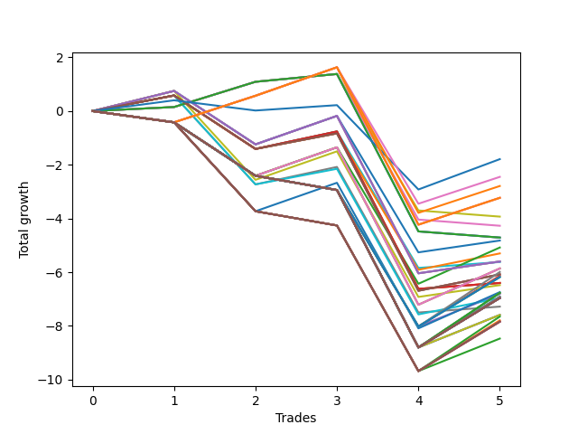

# Short Pointer 010 
- Symbol: NVDA_Unlimited
- Date Range: 02/08/2022 - 07/08/2022
- Trading Period: 7:20-12:30
- Number of Trades: 5



| Name | Win Percent | Profit | Avg Profit / Trade | Avg Time / Trade |      | Name | Win Percent | Profit | Avg Profit / Trade | Avg Time / Trade |
| ---- | ----------- | ------ | ------------------ | ---------------- | ---- | ---- | ----------- | ------ | ------------------ | ---------------- |
| Sorted By <br> Profit | | | | | | Sorted By <br> Win Percentage ||||
| Seventy-Three | 60.00 | -895.00 | -179.00 | 13:29 |     | Seventy-Three | 60.00 | -895.00 | -179.00 | 13:29 |
| One Hundred Eleven | 60.00 | -1225.00 | -245.00 | 16:05 |     | One Hundred Eleven | 60.00 | -1225.00 | -245.00 | 16:05 |
| One Hundred Sixteen | 60.00 | -1395.00 | -279.00 | 16:09 |     | One Hundred Sixteen | 60.00 | -1395.00 | -279.00 | 16:09 |
| One Hundred Twenty-Six | 60.00 | -1615.00 | -323.00 | 17:44 |     | One Hundred Twenty-Six | 60.00 | -1615.00 | -323.00 | 17:44 |
| One Hundred Twenty-One | 60.00 | -1615.00 | -323.00 | 17:44 |     | One Hundred Twenty-One | 60.00 | -1615.00 | -323.00 | 17:44 |
| Eighty-One | 60.00 | -1615.00 | -323.00 | 17:44 |     | Eighty-One | 60.00 | -1615.00 | -323.00 | 17:44 |
| Forty | 60.00 | -1965.00 | -393.00 | 08:21 |     | Forty | 60.00 | -1965.00 | -393.00 | 08:21 |
| Forty-Eight | 60.00 | -2135.00 | -427.00 | 08:25 |     | Forty-Eight | 60.00 | -2135.00 | -427.00 | 08:25 |
| Sixty-Four | 60.00 | -2355.00 | -471.00 | 10:00 |     | Sixty-Four | 60.00 | -2355.00 | -471.00 | 10:00 |
| Fifty-Six | 60.00 | -2355.00 | -471.00 | 10:00 |     | Fifty-Six | 60.00 | -2355.00 | -471.00 | 10:00 |
| Zero | 60.00 | -2355.00 | -471.00 | 10:00 |     | Zero | 60.00 | -2355.00 | -471.00 | 10:00 |
| Forty-Two | 60.00 | -2410.00 | -482.00 | 17:05 |     | Forty-Two | 60.00 | -2410.00 | -482.00 | 17:05 |
| Forty-Four | 40.00 | -2540.00 | -508.00 | 21:48 |     | Forty-Three | 60.00 | -2650.00 | -530.00 | 15:40 |
| Forty-Three | 60.00 | -2650.00 | -530.00 | 15:40 |     | Sixty-Six | 60.00 | -2800.00 | -560.00 | 18:44 |
| Sixty-Six | 60.00 | -2800.00 | -560.00 | 18:44 |     | Fifty-Eight | 60.00 | -2800.00 | -560.00 | 18:44 |
| Fifty-Eight | 60.00 | -2800.00 | -560.00 | 18:44 |     | Two | 60.00 | -2800.00 | -560.00 | 18:44 |
| Two | 60.00 | -2800.00 | -560.00 | 18:44 |     | Forty-One | 60.00 | -2810.00 | -562.00 | 15:28 |
| Forty-One | 60.00 | -2810.00 | -562.00 | 15:28 |     | Sixty-Seven | 60.00 | -3040.00 | -608.00 | 17:19 |
| Sixty-Eight | 40.00 | -2930.00 | -586.00 | 23:27 |     | Fifty-Nine | 60.00 | -3040.00 | -608.00 | 17:19 |
| Sixty | 40.00 | -2930.00 | -586.00 | 23:27 |     | Three | 60.00 | -3040.00 | -608.00 | 17:19 |
| Four | 40.00 | -2930.00 | -586.00 | 23:27 |     | Sixty-Five | 60.00 | -3200.00 | -640.00 | 17:07 |
| One Hundred Twelve | 20.00 | -2995.00 | -599.00 | 28:10 |     | Fifty-Seven | 60.00 | -3200.00 | -640.00 | 17:07 |
| Sixty-Seven | 60.00 | -3040.00 | -608.00 | 17:19 |     | One | 60.00 | -3200.00 | -640.00 | 17:07 |
| Fifty-Nine | 60.00 | -3040.00 | -608.00 | 17:19 |     | Fifty | 60.00 | -3240.00 | -648.00 | 15:59 |
| Three | 60.00 | -3040.00 | -608.00 | 17:19 |     | Fifty-One | 60.00 | -3480.00 | -696.00 | 14:34 |
| Forty-Five | 20.00 | -3065.00 | -613.00 | 28:06 |     | Forty-Nine | 60.00 | -3640.00 | -728.00 | 14:22 |
| One Hundred Fifteen | 20.00 | -3090.00 | -618.00 | 28:16 |     | Forty-Four | 40.00 | -2540.00 | -508.00 | 21:48 |
| One Hundred Fourteen | 20.00 | -3090.00 | -618.00 | 28:16 |     | Sixty-Eight | 40.00 | -2930.00 | -586.00 | 23:27 |
| One Hundred Thirteen | 20.00 | -3090.00 | -618.00 | 28:16 |     | Sixty | 40.00 | -2930.00 | -586.00 | 23:27 |
| Forty-Seven | 20.00 | -3090.00 | -618.00 | 28:16 |     | Four | 40.00 | -2930.00 | -586.00 | 23:27 |
| Sixty-Five | 60.00 | -3200.00 | -640.00 | 17:07 |     | Fifty-Two | 40.00 | -3370.00 | -674.00 | 20:42 |
| Fifty-Seven | 60.00 | -3200.00 | -640.00 | 17:07 |     | One Hundred Twelve | 20.00 | -2995.00 | -599.00 | 28:10 |
| One | 60.00 | -3200.00 | -640.00 | 17:07 |     | Forty-Five | 20.00 | -3065.00 | -613.00 | 28:06 |
| Fifty | 60.00 | -3240.00 | -648.00 | 15:59 |     | One Hundred Fifteen | 20.00 | -3090.00 | -618.00 | 28:16 |
| Fifty-Two | 40.00 | -3370.00 | -674.00 | 20:42 |     | One Hundred Fourteen | 20.00 | -3090.00 | -618.00 | 28:16 |
| One Hundred Twenty-Seven | 20.00 | -3385.00 | -677.00 | 29:49 |     | One Hundred Thirteen | 20.00 | -3090.00 | -618.00 | 28:16 |
| One Hundred Twenty-Two | 20.00 | -3385.00 | -677.00 | 29:49 |     | Forty-Seven | 20.00 | -3090.00 | -618.00 | 28:16 |
| Eighty-Two | 20.00 | -3385.00 | -677.00 | 29:49 |     | One Hundred Twenty-Seven | 20.00 | -3385.00 | -677.00 | 29:49 |
| Forty-Six | 20.00 | -3405.00 | -681.00 | 26:07 |     | One Hundred Twenty-Two | 20.00 | -3385.00 | -677.00 | 29:49 |
| Sixty-Nine | 20.00 | -3455.00 | -691.00 | 29:45 |     | Eighty-Two | 20.00 | -3385.00 | -677.00 | 29:49 |
| Sixty-One | 20.00 | -3455.00 | -691.00 | 29:45 |     | Forty-Six | 20.00 | -3405.00 | -681.00 | 26:07 |
| Five | 20.00 | -3455.00 | -691.00 | 29:45 |     | Sixty-Nine | 20.00 | -3455.00 | -691.00 | 29:45 |
| Fifty-One | 60.00 | -3480.00 | -696.00 | 14:34 |     | Sixty-One | 20.00 | -3455.00 | -691.00 | 29:45 |
| One Hundred Thirty | 20.00 | -3480.00 | -696.00 | 29:55 |     | Five | 20.00 | -3455.00 | -691.00 | 29:45 |
| One Hundred Twenty-Nine | 20.00 | -3480.00 | -696.00 | 29:55 |     | One Hundred Thirty | 20.00 | -3480.00 | -696.00 | 29:55 |
| One Hundred Twenty-Eight | 20.00 | -3480.00 | -696.00 | 29:55 |     | One Hundred Twenty-Nine | 20.00 | -3480.00 | -696.00 | 29:55 |
| One Hundred Twenty-Five | 20.00 | -3480.00 | -696.00 | 29:55 |     | One Hundred Twenty-Eight | 20.00 | -3480.00 | -696.00 | 29:55 |
| One Hundred Twenty-Four | 20.00 | -3480.00 | -696.00 | 29:55 |     | One Hundred Twenty-Five | 20.00 | -3480.00 | -696.00 | 29:55 |
| One Hundred Twenty-Three | 20.00 | -3480.00 | -696.00 | 29:55 |     | One Hundred Twenty-Four | 20.00 | -3480.00 | -696.00 | 29:55 |
| Eighty-Five | 20.00 | -3480.00 | -696.00 | 29:55 |     | One Hundred Twenty-Three | 20.00 | -3480.00 | -696.00 | 29:55 |
| Eighty-Four | 20.00 | -3480.00 | -696.00 | 29:55 |     | Eighty-Five | 20.00 | -3480.00 | -696.00 | 29:55 |
| Eighty-Three | 20.00 | -3480.00 | -696.00 | 29:55 |     | Eighty-Four | 20.00 | -3480.00 | -696.00 | 29:55 |
| Seventy-One | 20.00 | -3480.00 | -696.00 | 29:55 |     | Eighty-Three | 20.00 | -3480.00 | -696.00 | 29:55 |
| Sixty-Three | 20.00 | -3480.00 | -696.00 | 29:55 |     | Seventy-One | 20.00 | -3480.00 | -696.00 | 29:55 |
| Seven | 20.00 | -3480.00 | -696.00 | 29:55 |     | Sixty-Three | 20.00 | -3480.00 | -696.00 | 29:55 |
| Forty-Nine | 60.00 | -3640.00 | -728.00 | 14:22 |     | Seven | 20.00 | -3480.00 | -696.00 | 29:55 |
| Seventy | 20.00 | -3795.00 | -759.00 | 27:46 |     | Seventy | 20.00 | -3795.00 | -759.00 | 27:46 |
| Sixty-Two | 20.00 | -3795.00 | -759.00 | 27:46 |     | Sixty-Two | 20.00 | -3795.00 | -759.00 | 27:46 |
| Six | 20.00 | -3795.00 | -759.00 | 27:46 |     | Six | 20.00 | -3795.00 | -759.00 | 27:46 |
| One Hundred Seventeen | 20.00 | -3825.00 | -765.00 | 27:04 |     | One Hundred Seventeen | 20.00 | -3825.00 | -765.00 | 27:04 |
| Fifty-Three | 20.00 | -3895.00 | -779.00 | 27:00 |     | Fifty-Three | 20.00 | -3895.00 | -779.00 | 27:00 |
| One Hundred Twenty | 20.00 | -3920.00 | -784.00 | 27:10 |     | One Hundred Twenty | 20.00 | -3920.00 | -784.00 | 27:10 |
| One Hundred Ninteen | 20.00 | -3920.00 | -784.00 | 27:10 |     | One Hundred Ninteen | 20.00 | -3920.00 | -784.00 | 27:10 |
| One Hundred Eighteen | 20.00 | -3920.00 | -784.00 | 27:10 |     | One Hundred Eighteen | 20.00 | -3920.00 | -784.00 | 27:10 |
| Fifty-Five | 20.00 | -3920.00 | -784.00 | 27:10 |     | Fifty-Five | 20.00 | -3920.00 | -784.00 | 27:10 |
| Fifty-Four | 20.00 | -4235.00 | -847.00 | 25:01 |     | Fifty-Four | 20.00 | -4235.00 | -847.00 | 25:01 |

## NO STOPLOSS

### Test Zero
* Sell when price hits the middle line of the 20p bollinger
* No Stoploss
* Results:
```
Total Trades: 5
Percent Up: 40.00
Percent Down: 60.00
Total Points Moved Down: -4.71
Potential Profit: -2355.00
Total Points Ups: 6.09 Count Ups: 2
Total Points Downs: 1.38 Count Downs: 3
```

<details><summary>Trades</summary>

<code>In: 2022-03-02 09:18:00		Out: 2022-03-02 09:23:30		Total Position Time: 05:30		Total Move Down: 0.15		Total to Date: 0.15</code> <br />
<code>In: 2022-03-08 09:23:00		Out: 2022-03-08 09:25:40		Total Position Time: 02:40		Total Move Down: 0.94		Total to Date: 1.09</code> <br />
<code>In: 2022-03-17 12:06:00		Out: 2022-03-17 12:08:50		Total Position Time: 02:50		Total Move Down: 0.29		Total to Date: 1.38</code> <br />
<code>In: 2022-05-04 11:51:00		Out: 2022-05-04 12:20:55		Total Position Time: 29:55		Total Move Down: -5.86		Total to Date: -4.48</code> <br />
<code>In: 2022-06-09 07:33:00		Out: 2022-06-09 07:42:05		Total Position Time: 09:05		Total Move Down: -0.23		Total to Date: -4.71</code> <br />


</details>

### Test One
* Sell when the price hits the upper line of the 20p 1std bollinger
* No Stoploss
* Results:
```
Total Trades: 5
Percent Up: 40.00
Percent Down: 60.00
Total Points Moved Down: -6.40
Potential Profit: -3200.00
Total Points Ups: 7.85 Count Ups: 2
Total Points Downs: 1.45 Count Downs: 3
```

<details><summary>Trades</summary>

<code>In: 2022-03-02 09:18:00		Out: 2022-03-02 09:25:30		Total Position Time: 07:30		Total Move Down: 0.58		Total to Date: 0.58</code> <br />
<code>In: 2022-03-08 09:23:00		Out: 2022-03-08 09:52:55		Total Position Time: 29:55		Total Move Down: -1.99		Total to Date: -1.41</code> <br />
<code>In: 2022-03-17 12:06:00		Out: 2022-03-17 12:11:45		Total Position Time: 05:45		Total Move Down: 0.65		Total to Date: -0.76</code> <br />
<code>In: 2022-05-04 11:51:00		Out: 2022-05-04 12:20:55		Total Position Time: 29:55		Total Move Down: -5.86		Total to Date: -6.62</code> <br />
<code>In: 2022-06-09 07:33:00		Out: 2022-06-09 07:45:30		Total Position Time: 12:30		Total Move Down: 0.22		Total to Date: -6.40</code> <br />


</details>

### Test Two
* Sell when the price hits the upper line of the 20p 2std bollinger
* No Stoploss
* Results:
```
Total Trades: 5
Percent Up: 40.00
Percent Down: 60.00
Total Points Moved Down: -5.60
Potential Profit: -2800.00
Total Points Ups: 7.85 Count Ups: 2
Total Points Downs: 2.25 Count Downs: 3
```

<details><summary>Trades</summary>

<code>In: 2022-03-02 09:18:00		Out: 2022-03-02 09:30:20		Total Position Time: 12:20		Total Move Down: 0.75		Total to Date: 0.75</code> <br />
<code>In: 2022-03-08 09:23:00		Out: 2022-03-08 09:52:55		Total Position Time: 29:55		Total Move Down: -1.99		Total to Date: -1.24</code> <br />
<code>In: 2022-03-17 12:06:00		Out: 2022-03-17 12:14:00		Total Position Time: 08:00		Total Move Down: 1.06		Total to Date: -0.18</code> <br />
<code>In: 2022-05-04 11:51:00		Out: 2022-05-04 12:20:55		Total Position Time: 29:55		Total Move Down: -5.86		Total to Date: -6.04</code> <br />
<code>In: 2022-06-09 07:33:00		Out: 2022-06-09 07:46:30		Total Position Time: 13:30		Total Move Down: 0.44		Total to Date: -5.60</code> <br />


</details>

### Test Three
* Sell when price hits the middle line of the 50p bollinger
* No Stoploss
* Results:
```
Total Trades: 5
Percent Up: 40.00
Percent Down: 60.00
Total Points Moved Down: -6.08
Potential Profit: -3040.00
Total Points Ups: 7.85 Count Ups: 2
Total Points Downs: 1.77 Count Downs: 3
```

<details><summary>Trades</summary>

<code>In: 2022-03-02 09:18:00		Out: 2022-03-02 09:25:30		Total Position Time: 07:30		Total Move Down: 0.58		Total to Date: 0.58</code> <br />
<code>In: 2022-03-08 09:23:00		Out: 2022-03-08 09:52:55		Total Position Time: 29:55		Total Move Down: -1.99		Total to Date: -1.41</code> <br />
<code>In: 2022-03-17 12:06:00		Out: 2022-03-17 12:11:15		Total Position Time: 05:15		Total Move Down: 0.58		Total to Date: -0.83</code> <br />
<code>In: 2022-05-04 11:51:00		Out: 2022-05-04 12:20:55		Total Position Time: 29:55		Total Move Down: -5.86		Total to Date: -6.69</code> <br />
<code>In: 2022-06-09 07:33:00		Out: 2022-06-09 07:47:00		Total Position Time: 14:00		Total Move Down: 0.61		Total to Date: -6.08</code> <br />


</details>

### Test Four
* Sell when the price hits the upper line of the 50p 1std bollinger
* No Stoploss
* Results:
```
Total Trades: 5
Percent Up: 60.00
Percent Down: 40.00
Total Points Moved Down: -5.86
Potential Profit: -2930.00
Total Points Ups: 8.27 Count Ups: 3
Total Points Downs: 2.41 Count Downs: 2
```

<details><summary>Trades</summary>

<code>In: 2022-03-02 09:18:00		Out: 2022-03-02 09:47:55		Total Position Time: 29:55		Total Move Down: -0.42		Total to Date: -0.42</code> <br />
<code>In: 2022-03-08 09:23:00		Out: 2022-03-08 09:52:55		Total Position Time: 29:55		Total Move Down: -1.99		Total to Date: -2.41</code> <br />
<code>In: 2022-03-17 12:06:00		Out: 2022-03-17 12:14:00		Total Position Time: 08:00		Total Move Down: 1.06		Total to Date: -1.35</code> <br />
<code>In: 2022-05-04 11:51:00		Out: 2022-05-04 12:20:55		Total Position Time: 29:55		Total Move Down: -5.86		Total to Date: -7.21</code> <br />
<code>In: 2022-06-09 07:33:00		Out: 2022-06-09 07:52:30		Total Position Time: 19:30		Total Move Down: 1.35		Total to Date: -5.86</code> <br />


</details>

### Test Five
* Sell when the price hits the upper line of the 50p 2std bollinger
* No Stoploss
* Results:
```
Total Trades: 5
Percent Up: 80.00
Percent Down: 20.00
Total Points Moved Down: -6.91
Potential Profit: -3455.00
Total Points Ups: 8.80 Count Ups: 4
Total Points Downs: 1.89 Count Downs: 1
```

<details><summary>Trades</summary>

<code>In: 2022-03-02 09:18:00		Out: 2022-03-02 09:47:55		Total Position Time: 29:55		Total Move Down: -0.42		Total to Date: -0.42</code> <br />
<code>In: 2022-03-08 09:23:00		Out: 2022-03-08 09:52:55		Total Position Time: 29:55		Total Move Down: -1.99		Total to Date: -2.41</code> <br />
<code>In: 2022-03-17 12:06:00		Out: 2022-03-17 12:35:55		Total Position Time: 29:55		Total Move Down: -0.53		Total to Date: -2.94</code> <br />
<code>In: 2022-05-04 11:51:00		Out: 2022-05-04 12:20:55		Total Position Time: 29:55		Total Move Down: -5.86		Total to Date: -8.80</code> <br />
<code>In: 2022-06-09 07:33:00		Out: 2022-06-09 08:02:05		Total Position Time: 29:05		Total Move Down: 1.89		Total to Date: -6.91</code> <br />


</details>

### Test Six
* Sell when the price hits the middle line of the 1std VWAP
* No Stoploss
* Results:
```
Total Trades: 5
Percent Up: 80.00
Percent Down: 20.00
Total Points Moved Down: -7.59
Potential Profit: -3795.00
Total Points Ups: 8.80 Count Ups: 4
Total Points Downs: 1.21 Count Downs: 1
```

<details><summary>Trades</summary>

<code>In: 2022-03-02 09:18:00		Out: 2022-03-02 09:47:55		Total Position Time: 29:55		Total Move Down: -0.42		Total to Date: -0.42</code> <br />
<code>In: 2022-03-08 09:23:00		Out: 2022-03-08 09:52:55		Total Position Time: 29:55		Total Move Down: -1.99		Total to Date: -2.41</code> <br />
<code>In: 2022-03-17 12:06:00		Out: 2022-03-17 12:35:55		Total Position Time: 29:55		Total Move Down: -0.53		Total to Date: -2.94</code> <br />
<code>In: 2022-05-04 11:51:00		Out: 2022-05-04 12:20:55		Total Position Time: 29:55		Total Move Down: -5.86		Total to Date: -8.80</code> <br />
<code>In: 2022-06-09 07:33:00		Out: 2022-06-09 07:52:10		Total Position Time: 19:10		Total Move Down: 1.21		Total to Date: -7.59</code> <br />


</details>

### Test Seven
* Sell when the price hits the upper line of the 1std VWAP
* No Stoploss
* Results:
```
Total Trades: 5
Percent Up: 80.00
Percent Down: 20.00
Total Points Moved Down: -6.96
Potential Profit: -3480.00
Total Points Ups: 8.80 Count Ups: 4
Total Points Downs: 1.84 Count Downs: 1
```

<details><summary>Trades</summary>

<code>In: 2022-03-02 09:18:00		Out: 2022-03-02 09:47:55		Total Position Time: 29:55		Total Move Down: -0.42		Total to Date: -0.42</code> <br />
<code>In: 2022-03-08 09:23:00		Out: 2022-03-08 09:52:55		Total Position Time: 29:55		Total Move Down: -1.99		Total to Date: -2.41</code> <br />
<code>In: 2022-03-17 12:06:00		Out: 2022-03-17 12:35:55		Total Position Time: 29:55		Total Move Down: -0.53		Total to Date: -2.94</code> <br />
<code>In: 2022-05-04 11:51:00		Out: 2022-05-04 12:20:55		Total Position Time: 29:55		Total Move Down: -5.86		Total to Date: -8.80</code> <br />
<code>In: 2022-06-09 07:33:00		Out: 2022-06-09 08:02:55		Total Position Time: 29:55		Total Move Down: 1.84		Total to Date: -6.96</code> <br />


</details>

## STOPLOSS OF 5

### Test Forty
* Sell when price hits the middle line of the 20p bollinger
* Stoploss is -5 points
* Results:
```
Total Trades: 5
Percent Up: 40.00
Percent Down: 60.00
Total Points Moved Down: -3.93
Potential Profit: -1965.00
Total Points Ups: 5.31 Count Ups: 2
Total Points Downs: 1.38 Count Downs: 3
```

<details><summary>Trades</summary>

<code>In: 2022-03-02 09:18:00		Out: 2022-03-02 09:23:30		Total Position Time: 05:30		Total Move Down: 0.15		Total to Date: 0.15</code> <br />
<code>In: 2022-03-08 09:23:00		Out: 2022-03-08 09:25:40		Total Position Time: 02:40		Total Move Down: 0.94		Total to Date: 1.09</code> <br />
<code>In: 2022-03-17 12:06:00		Out: 2022-03-17 12:08:50		Total Position Time: 02:50		Total Move Down: 0.29		Total to Date: 1.38</code> <br />
<code>In: 2022-05-04 11:51:00		Out: 2022-05-04 12:12:40		Total Position Time: 21:40		Total Move Down: -5.08		Total to Date: -3.70</code> <br />
<code>In: 2022-06-09 07:33:00		Out: 2022-06-09 07:42:05		Total Position Time: 09:05		Total Move Down: -0.23		Total to Date: -3.93</code> <br />


</details>

### Test Forty-One
* Sell when the price hits the upper line of the 20p 1std bollinger
* Stoploss is -5 points
* Results:
```
Total Trades: 5
Percent Up: 40.00
Percent Down: 60.00
Total Points Moved Down: -5.62
Potential Profit: -2810.00
Total Points Ups: 7.07 Count Ups: 2
Total Points Downs: 1.45 Count Downs: 3
```

<details><summary>Trades</summary>

<code>In: 2022-03-02 09:18:00		Out: 2022-03-02 09:25:30		Total Position Time: 07:30		Total Move Down: 0.58		Total to Date: 0.58</code> <br />
<code>In: 2022-03-08 09:23:00		Out: 2022-03-08 09:52:55		Total Position Time: 29:55		Total Move Down: -1.99		Total to Date: -1.41</code> <br />
<code>In: 2022-03-17 12:06:00		Out: 2022-03-17 12:11:45		Total Position Time: 05:45		Total Move Down: 0.65		Total to Date: -0.76</code> <br />
<code>In: 2022-05-04 11:51:00		Out: 2022-05-04 12:12:40		Total Position Time: 21:40		Total Move Down: -5.08		Total to Date: -5.84</code> <br />
<code>In: 2022-06-09 07:33:00		Out: 2022-06-09 07:45:30		Total Position Time: 12:30		Total Move Down: 0.22		Total to Date: -5.62</code> <br />


</details>

### Test Forty-Two
* Sell when the price hits the upper line of the 20p 2std bollinger
* Stoploss is -5 points
* Results:
```
Total Trades: 5
Percent Up: 40.00
Percent Down: 60.00
Total Points Moved Down: -4.82
Potential Profit: -2410.00
Total Points Ups: 7.07 Count Ups: 2
Total Points Downs: 2.25 Count Downs: 3
```

<details><summary>Trades</summary>

<code>In: 2022-03-02 09:18:00		Out: 2022-03-02 09:30:20		Total Position Time: 12:20		Total Move Down: 0.75		Total to Date: 0.75</code> <br />
<code>In: 2022-03-08 09:23:00		Out: 2022-03-08 09:52:55		Total Position Time: 29:55		Total Move Down: -1.99		Total to Date: -1.24</code> <br />
<code>In: 2022-03-17 12:06:00		Out: 2022-03-17 12:14:00		Total Position Time: 08:00		Total Move Down: 1.06		Total to Date: -0.18</code> <br />
<code>In: 2022-05-04 11:51:00		Out: 2022-05-04 12:12:40		Total Position Time: 21:40		Total Move Down: -5.08		Total to Date: -5.26</code> <br />
<code>In: 2022-06-09 07:33:00		Out: 2022-06-09 07:46:30		Total Position Time: 13:30		Total Move Down: 0.44		Total to Date: -4.82</code> <br />


</details>

### Test Forty-Three
* Sell when price hits the middle line of the 50p bollinger
* Stoploss is -5 points
* Results:
```
Total Trades: 5
Percent Up: 40.00
Percent Down: 60.00
Total Points Moved Down: -5.30
Potential Profit: -2650.00
Total Points Ups: 7.07 Count Ups: 2
Total Points Downs: 1.77 Count Downs: 3
```

<details><summary>Trades</summary>

<code>In: 2022-03-02 09:18:00		Out: 2022-03-02 09:25:30		Total Position Time: 07:30		Total Move Down: 0.58		Total to Date: 0.58</code> <br />
<code>In: 2022-03-08 09:23:00		Out: 2022-03-08 09:52:55		Total Position Time: 29:55		Total Move Down: -1.99		Total to Date: -1.41</code> <br />
<code>In: 2022-03-17 12:06:00		Out: 2022-03-17 12:11:15		Total Position Time: 05:15		Total Move Down: 0.58		Total to Date: -0.83</code> <br />
<code>In: 2022-05-04 11:51:00		Out: 2022-05-04 12:12:40		Total Position Time: 21:40		Total Move Down: -5.08		Total to Date: -5.91</code> <br />
<code>In: 2022-06-09 07:33:00		Out: 2022-06-09 07:47:00		Total Position Time: 14:00		Total Move Down: 0.61		Total to Date: -5.30</code> <br />


</details>

### Test Forty-Four
* Sell when the price hits the upper line of the 50p 1std bollinger
* Stoploss is -5 points
* Results:
```
Total Trades: 5
Percent Up: 60.00
Percent Down: 40.00
Total Points Moved Down: -5.08
Potential Profit: -2540.00
Total Points Ups: 7.49 Count Ups: 3
Total Points Downs: 2.41 Count Downs: 2
```

<details><summary>Trades</summary>

<code>In: 2022-03-02 09:18:00		Out: 2022-03-02 09:47:55		Total Position Time: 29:55		Total Move Down: -0.42		Total to Date: -0.42</code> <br />
<code>In: 2022-03-08 09:23:00		Out: 2022-03-08 09:52:55		Total Position Time: 29:55		Total Move Down: -1.99		Total to Date: -2.41</code> <br />
<code>In: 2022-03-17 12:06:00		Out: 2022-03-17 12:14:00		Total Position Time: 08:00		Total Move Down: 1.06		Total to Date: -1.35</code> <br />
<code>In: 2022-05-04 11:51:00		Out: 2022-05-04 12:12:40		Total Position Time: 21:40		Total Move Down: -5.08		Total to Date: -6.43</code> <br />
<code>In: 2022-06-09 07:33:00		Out: 2022-06-09 07:52:30		Total Position Time: 19:30		Total Move Down: 1.35		Total to Date: -5.08</code> <br />


</details>

### Test Forty-Five
* Sell when the price hits the upper line of the 50p 2std bollinger
* Stoploss is -5 points
* Results:
```
Total Trades: 5
Percent Up: 80.00
Percent Down: 20.00
Total Points Moved Down: -6.13
Potential Profit: -3065.00
Total Points Ups: 8.02 Count Ups: 4
Total Points Downs: 1.89 Count Downs: 1
```

<details><summary>Trades</summary>

<code>In: 2022-03-02 09:18:00		Out: 2022-03-02 09:47:55		Total Position Time: 29:55		Total Move Down: -0.42		Total to Date: -0.42</code> <br />
<code>In: 2022-03-08 09:23:00		Out: 2022-03-08 09:52:55		Total Position Time: 29:55		Total Move Down: -1.99		Total to Date: -2.41</code> <br />
<code>In: 2022-03-17 12:06:00		Out: 2022-03-17 12:35:55		Total Position Time: 29:55		Total Move Down: -0.53		Total to Date: -2.94</code> <br />
<code>In: 2022-05-04 11:51:00		Out: 2022-05-04 12:12:40		Total Position Time: 21:40		Total Move Down: -5.08		Total to Date: -8.02</code> <br />
<code>In: 2022-06-09 07:33:00		Out: 2022-06-09 08:02:05		Total Position Time: 29:05		Total Move Down: 1.89		Total to Date: -6.13</code> <br />


</details>

### Test Forty-Six
* Sell when the price hits the middle line of the 1std VWAP
* Stoploss is -5 points
* Results:
```
Total Trades: 5
Percent Up: 80.00
Percent Down: 20.00
Total Points Moved Down: -6.81
Potential Profit: -3405.00
Total Points Ups: 8.02 Count Ups: 4
Total Points Downs: 1.21 Count Downs: 1
```

<details><summary>Trades</summary>

<code>In: 2022-03-02 09:18:00		Out: 2022-03-02 09:47:55		Total Position Time: 29:55		Total Move Down: -0.42		Total to Date: -0.42</code> <br />
<code>In: 2022-03-08 09:23:00		Out: 2022-03-08 09:52:55		Total Position Time: 29:55		Total Move Down: -1.99		Total to Date: -2.41</code> <br />
<code>In: 2022-03-17 12:06:00		Out: 2022-03-17 12:35:55		Total Position Time: 29:55		Total Move Down: -0.53		Total to Date: -2.94</code> <br />
<code>In: 2022-05-04 11:51:00		Out: 2022-05-04 12:12:40		Total Position Time: 21:40		Total Move Down: -5.08		Total to Date: -8.02</code> <br />
<code>In: 2022-06-09 07:33:00		Out: 2022-06-09 07:52:10		Total Position Time: 19:10		Total Move Down: 1.21		Total to Date: -6.81</code> <br />


</details>

### Test Forty-Seven
* Sell when the price hits the upper line of the 1std VWAP
* Stoploss is -5 points
* Results:
```
Total Trades: 5
Percent Up: 80.00
Percent Down: 20.00
Total Points Moved Down: -6.18
Potential Profit: -3090.00
Total Points Ups: 8.02 Count Ups: 4
Total Points Downs: 1.84 Count Downs: 1
```

<details><summary>Trades</summary>

<code>In: 2022-03-02 09:18:00		Out: 2022-03-02 09:47:55		Total Position Time: 29:55		Total Move Down: -0.42		Total to Date: -0.42</code> <br />
<code>In: 2022-03-08 09:23:00		Out: 2022-03-08 09:52:55		Total Position Time: 29:55		Total Move Down: -1.99		Total to Date: -2.41</code> <br />
<code>In: 2022-03-17 12:06:00		Out: 2022-03-17 12:35:55		Total Position Time: 29:55		Total Move Down: -0.53		Total to Date: -2.94</code> <br />
<code>In: 2022-05-04 11:51:00		Out: 2022-05-04 12:12:40		Total Position Time: 21:40		Total Move Down: -5.08		Total to Date: -8.02</code> <br />
<code>In: 2022-06-09 07:33:00		Out: 2022-06-09 08:02:55		Total Position Time: 29:55		Total Move Down: 1.84		Total to Date: -6.18</code> <br />


</details>

## TRAIL STOP OF 5

### Test Forty-Eight
* Sell when price hits the middle line of the 20p bollinger
* Trailing Stop is -5 points
* Results:
```
Total Trades: 5
Percent Up: 40.00
Percent Down: 60.00
Total Points Moved Down: -4.27
Potential Profit: -2135.00
Total Points Ups: 5.65 Count Ups: 2
Total Points Downs: 1.38 Count Downs: 3
```

<details><summary>Trades</summary>

<code>In: 2022-03-02 09:18:00		Out: 2022-03-02 09:23:30		Total Position Time: 05:30		Total Move Down: 0.15		Total to Date: 0.15</code> <br />
<code>In: 2022-03-08 09:23:00		Out: 2022-03-08 09:25:40		Total Position Time: 02:40		Total Move Down: 0.94		Total to Date: 1.09</code> <br />
<code>In: 2022-03-17 12:06:00		Out: 2022-03-17 12:08:50		Total Position Time: 02:50		Total Move Down: 0.29		Total to Date: 1.38</code> <br />
<code>In: 2022-05-04 11:51:00		Out: 2022-05-04 12:13:00		Total Position Time: 22:00		Total Move Down: -5.42		Total to Date: -4.04</code> <br />
<code>In: 2022-06-09 07:33:00		Out: 2022-06-09 07:42:05		Total Position Time: 09:05		Total Move Down: -0.23		Total to Date: -4.27</code> <br />


</details>

### Test Forty-Nine
* Sell when the price hits the upper line of the 20p 1std bollinger
* Trailing Stop is -5 points
* Results:
```
Total Trades: 5
Percent Up: 40.00
Percent Down: 60.00
Total Points Moved Down: -7.28
Potential Profit: -3640.00
Total Points Ups: 8.73 Count Ups: 2
Total Points Downs: 1.45 Count Downs: 3
```

<details><summary>Trades</summary>

<code>In: 2022-03-02 09:18:00		Out: 2022-03-02 09:25:30		Total Position Time: 07:30		Total Move Down: 0.58		Total to Date: 0.58</code> <br />
<code>In: 2022-03-08 09:23:00		Out: 2022-03-08 09:47:05		Total Position Time: 24:05		Total Move Down: -3.31		Total to Date: -2.73</code> <br />
<code>In: 2022-03-17 12:06:00		Out: 2022-03-17 12:11:45		Total Position Time: 05:45		Total Move Down: 0.65		Total to Date: -2.08</code> <br />
<code>In: 2022-05-04 11:51:00		Out: 2022-05-04 12:13:00		Total Position Time: 22:00		Total Move Down: -5.42		Total to Date: -7.50</code> <br />
<code>In: 2022-06-09 07:33:00		Out: 2022-06-09 07:45:30		Total Position Time: 12:30		Total Move Down: 0.22		Total to Date: -7.28</code> <br />


</details>

### Test Fifty
* Sell when the price hits the upper line of the 20p 2std bollinger
* Trailing Stop is -5 points
* Results:
```
Total Trades: 5
Percent Up: 40.00
Percent Down: 60.00
Total Points Moved Down: -6.48
Potential Profit: -3240.00
Total Points Ups: 8.73 Count Ups: 2
Total Points Downs: 2.25 Count Downs: 3
```

<details><summary>Trades</summary>

<code>In: 2022-03-02 09:18:00		Out: 2022-03-02 09:30:20		Total Position Time: 12:20		Total Move Down: 0.75		Total to Date: 0.75</code> <br />
<code>In: 2022-03-08 09:23:00		Out: 2022-03-08 09:47:05		Total Position Time: 24:05		Total Move Down: -3.31		Total to Date: -2.56</code> <br />
<code>In: 2022-03-17 12:06:00		Out: 2022-03-17 12:14:00		Total Position Time: 08:00		Total Move Down: 1.06		Total to Date: -1.50</code> <br />
<code>In: 2022-05-04 11:51:00		Out: 2022-05-04 12:13:00		Total Position Time: 22:00		Total Move Down: -5.42		Total to Date: -6.92</code> <br />
<code>In: 2022-06-09 07:33:00		Out: 2022-06-09 07:46:30		Total Position Time: 13:30		Total Move Down: 0.44		Total to Date: -6.48</code> <br />


</details>

### Test Fifty-One
* Sell when price hits the middle line of the 50p bollinger
* Trailing Stop is -5 points
* Results:
```
Total Trades: 5
Percent Up: 40.00
Percent Down: 60.00
Total Points Moved Down: -6.96
Potential Profit: -3480.00
Total Points Ups: 8.73 Count Ups: 2
Total Points Downs: 1.77 Count Downs: 3
```

<details><summary>Trades</summary>

<code>In: 2022-03-02 09:18:00		Out: 2022-03-02 09:25:30		Total Position Time: 07:30		Total Move Down: 0.58		Total to Date: 0.58</code> <br />
<code>In: 2022-03-08 09:23:00		Out: 2022-03-08 09:47:05		Total Position Time: 24:05		Total Move Down: -3.31		Total to Date: -2.73</code> <br />
<code>In: 2022-03-17 12:06:00		Out: 2022-03-17 12:11:15		Total Position Time: 05:15		Total Move Down: 0.58		Total to Date: -2.15</code> <br />
<code>In: 2022-05-04 11:51:00		Out: 2022-05-04 12:13:00		Total Position Time: 22:00		Total Move Down: -5.42		Total to Date: -7.57</code> <br />
<code>In: 2022-06-09 07:33:00		Out: 2022-06-09 07:47:00		Total Position Time: 14:00		Total Move Down: 0.61		Total to Date: -6.96</code> <br />


</details>

### Test Fifty-Two
* Sell when the price hits the upper line of the 50p 1std bollinger
* Trailing Stop is -5 points
* Results:
```
Total Trades: 5
Percent Up: 60.00
Percent Down: 40.00
Total Points Moved Down: -6.74
Potential Profit: -3370.00
Total Points Ups: 9.15 Count Ups: 3
Total Points Downs: 2.41 Count Downs: 2
```

<details><summary>Trades</summary>

<code>In: 2022-03-02 09:18:00		Out: 2022-03-02 09:47:55		Total Position Time: 29:55		Total Move Down: -0.42		Total to Date: -0.42</code> <br />
<code>In: 2022-03-08 09:23:00		Out: 2022-03-08 09:47:05		Total Position Time: 24:05		Total Move Down: -3.31		Total to Date: -3.73</code> <br />
<code>In: 2022-03-17 12:06:00		Out: 2022-03-17 12:14:00		Total Position Time: 08:00		Total Move Down: 1.06		Total to Date: -2.67</code> <br />
<code>In: 2022-05-04 11:51:00		Out: 2022-05-04 12:13:00		Total Position Time: 22:00		Total Move Down: -5.42		Total to Date: -8.09</code> <br />
<code>In: 2022-06-09 07:33:00		Out: 2022-06-09 07:52:30		Total Position Time: 19:30		Total Move Down: 1.35		Total to Date: -6.74</code> <br />


</details>

### Test Fifty-Three
* Sell when the price hits the upper line of the 50p 2std bollinger
* Trailing Stop is -5 points
* Results:
```
Total Trades: 5
Percent Up: 80.00
Percent Down: 20.00
Total Points Moved Down: -7.79
Potential Profit: -3895.00
Total Points Ups: 9.68 Count Ups: 4
Total Points Downs: 1.89 Count Downs: 1
```

<details><summary>Trades</summary>

<code>In: 2022-03-02 09:18:00		Out: 2022-03-02 09:47:55		Total Position Time: 29:55		Total Move Down: -0.42		Total to Date: -0.42</code> <br />
<code>In: 2022-03-08 09:23:00		Out: 2022-03-08 09:47:05		Total Position Time: 24:05		Total Move Down: -3.31		Total to Date: -3.73</code> <br />
<code>In: 2022-03-17 12:06:00		Out: 2022-03-17 12:35:55		Total Position Time: 29:55		Total Move Down: -0.53		Total to Date: -4.26</code> <br />
<code>In: 2022-05-04 11:51:00		Out: 2022-05-04 12:13:00		Total Position Time: 22:00		Total Move Down: -5.42		Total to Date: -9.68</code> <br />
<code>In: 2022-06-09 07:33:00		Out: 2022-06-09 08:02:05		Total Position Time: 29:05		Total Move Down: 1.89		Total to Date: -7.79</code> <br />


</details>

### Test Fifty-Four
* Sell when the price hits the middle line of the 1std VWAP
* Trailing Stop is -5 points
* Results:
```
Total Trades: 5
Percent Up: 80.00
Percent Down: 20.00
Total Points Moved Down: -8.47
Potential Profit: -4235.00
Total Points Ups: 9.68 Count Ups: 4
Total Points Downs: 1.21 Count Downs: 1
```

<details><summary>Trades</summary>

<code>In: 2022-03-02 09:18:00		Out: 2022-03-02 09:47:55		Total Position Time: 29:55		Total Move Down: -0.42		Total to Date: -0.42</code> <br />
<code>In: 2022-03-08 09:23:00		Out: 2022-03-08 09:47:05		Total Position Time: 24:05		Total Move Down: -3.31		Total to Date: -3.73</code> <br />
<code>In: 2022-03-17 12:06:00		Out: 2022-03-17 12:35:55		Total Position Time: 29:55		Total Move Down: -0.53		Total to Date: -4.26</code> <br />
<code>In: 2022-05-04 11:51:00		Out: 2022-05-04 12:13:00		Total Position Time: 22:00		Total Move Down: -5.42		Total to Date: -9.68</code> <br />
<code>In: 2022-06-09 07:33:00		Out: 2022-06-09 07:52:10		Total Position Time: 19:10		Total Move Down: 1.21		Total to Date: -8.47</code> <br />


</details>

### Test Fifty-Five
* Sell when the price hits the upper line of the 1std VWAP
* Trailing Stop is -5 points
* Results:
```
Total Trades: 5
Percent Up: 80.00
Percent Down: 20.00
Total Points Moved Down: -7.84
Potential Profit: -3920.00
Total Points Ups: 9.68 Count Ups: 4
Total Points Downs: 1.84 Count Downs: 1
```

<details><summary>Trades</summary>

<code>In: 2022-03-02 09:18:00		Out: 2022-03-02 09:47:55		Total Position Time: 29:55		Total Move Down: -0.42		Total to Date: -0.42</code> <br />
<code>In: 2022-03-08 09:23:00		Out: 2022-03-08 09:47:05		Total Position Time: 24:05		Total Move Down: -3.31		Total to Date: -3.73</code> <br />
<code>In: 2022-03-17 12:06:00		Out: 2022-03-17 12:35:55		Total Position Time: 29:55		Total Move Down: -0.53		Total to Date: -4.26</code> <br />
<code>In: 2022-05-04 11:51:00		Out: 2022-05-04 12:13:00		Total Position Time: 22:00		Total Move Down: -5.42		Total to Date: -9.68</code> <br />
<code>In: 2022-06-09 07:33:00		Out: 2022-06-09 08:02:55		Total Position Time: 29:55		Total Move Down: 1.84		Total to Date: -7.84</code> <br />


</details>

## STOPLOSS OF 10

### Test Fifty-Six
* Sell when price hits the middle line of the 20p bollinger
* Stoploss is -10 points
* Results:
```
Total Trades: 5
Percent Up: 40.00
Percent Down: 60.00
Total Points Moved Down: -4.71
Potential Profit: -2355.00
Total Points Ups: 6.09 Count Ups: 2
Total Points Downs: 1.38 Count Downs: 3
```

<details><summary>Trades</summary>

<code>In: 2022-03-02 09:18:00		Out: 2022-03-02 09:23:30		Total Position Time: 05:30		Total Move Down: 0.15		Total to Date: 0.15</code> <br />
<code>In: 2022-03-08 09:23:00		Out: 2022-03-08 09:25:40		Total Position Time: 02:40		Total Move Down: 0.94		Total to Date: 1.09</code> <br />
<code>In: 2022-03-17 12:06:00		Out: 2022-03-17 12:08:50		Total Position Time: 02:50		Total Move Down: 0.29		Total to Date: 1.38</code> <br />
<code>In: 2022-05-04 11:51:00		Out: 2022-05-04 12:20:55		Total Position Time: 29:55		Total Move Down: -5.86		Total to Date: -4.48</code> <br />
<code>In: 2022-06-09 07:33:00		Out: 2022-06-09 07:42:05		Total Position Time: 09:05		Total Move Down: -0.23		Total to Date: -4.71</code> <br />


</details>

### Test Fifty-Seven
* Sell when the price hits the upper line of the 20p 1std bollinger
* Stoploss is -10 points
* Results:
```
Total Trades: 5
Percent Up: 40.00
Percent Down: 60.00
Total Points Moved Down: -6.40
Potential Profit: -3200.00
Total Points Ups: 7.85 Count Ups: 2
Total Points Downs: 1.45 Count Downs: 3
```

<details><summary>Trades</summary>

<code>In: 2022-03-02 09:18:00		Out: 2022-03-02 09:25:30		Total Position Time: 07:30		Total Move Down: 0.58		Total to Date: 0.58</code> <br />
<code>In: 2022-03-08 09:23:00		Out: 2022-03-08 09:52:55		Total Position Time: 29:55		Total Move Down: -1.99		Total to Date: -1.41</code> <br />
<code>In: 2022-03-17 12:06:00		Out: 2022-03-17 12:11:45		Total Position Time: 05:45		Total Move Down: 0.65		Total to Date: -0.76</code> <br />
<code>In: 2022-05-04 11:51:00		Out: 2022-05-04 12:20:55		Total Position Time: 29:55		Total Move Down: -5.86		Total to Date: -6.62</code> <br />
<code>In: 2022-06-09 07:33:00		Out: 2022-06-09 07:45:30		Total Position Time: 12:30		Total Move Down: 0.22		Total to Date: -6.40</code> <br />


</details>

### Test Fifty-Eight
* Sell when the price hits the upper line of the 20p 2std bollinger
* Stoploss is -10 points
* Results:
```
Total Trades: 5
Percent Up: 40.00
Percent Down: 60.00
Total Points Moved Down: -5.60
Potential Profit: -2800.00
Total Points Ups: 7.85 Count Ups: 2
Total Points Downs: 2.25 Count Downs: 3
```

<details><summary>Trades</summary>

<code>In: 2022-03-02 09:18:00		Out: 2022-03-02 09:30:20		Total Position Time: 12:20		Total Move Down: 0.75		Total to Date: 0.75</code> <br />
<code>In: 2022-03-08 09:23:00		Out: 2022-03-08 09:52:55		Total Position Time: 29:55		Total Move Down: -1.99		Total to Date: -1.24</code> <br />
<code>In: 2022-03-17 12:06:00		Out: 2022-03-17 12:14:00		Total Position Time: 08:00		Total Move Down: 1.06		Total to Date: -0.18</code> <br />
<code>In: 2022-05-04 11:51:00		Out: 2022-05-04 12:20:55		Total Position Time: 29:55		Total Move Down: -5.86		Total to Date: -6.04</code> <br />
<code>In: 2022-06-09 07:33:00		Out: 2022-06-09 07:46:30		Total Position Time: 13:30		Total Move Down: 0.44		Total to Date: -5.60</code> <br />


</details>

### Test Fifty-Nine
* Sell when price hits the middle line of the 50p bollinger
* Stoploss is -10 points
* Results:
```
Total Trades: 5
Percent Up: 40.00
Percent Down: 60.00
Total Points Moved Down: -6.08
Potential Profit: -3040.00
Total Points Ups: 7.85 Count Ups: 2
Total Points Downs: 1.77 Count Downs: 3
```

<details><summary>Trades</summary>

<code>In: 2022-03-02 09:18:00		Out: 2022-03-02 09:25:30		Total Position Time: 07:30		Total Move Down: 0.58		Total to Date: 0.58</code> <br />
<code>In: 2022-03-08 09:23:00		Out: 2022-03-08 09:52:55		Total Position Time: 29:55		Total Move Down: -1.99		Total to Date: -1.41</code> <br />
<code>In: 2022-03-17 12:06:00		Out: 2022-03-17 12:11:15		Total Position Time: 05:15		Total Move Down: 0.58		Total to Date: -0.83</code> <br />
<code>In: 2022-05-04 11:51:00		Out: 2022-05-04 12:20:55		Total Position Time: 29:55		Total Move Down: -5.86		Total to Date: -6.69</code> <br />
<code>In: 2022-06-09 07:33:00		Out: 2022-06-09 07:47:00		Total Position Time: 14:00		Total Move Down: 0.61		Total to Date: -6.08</code> <br />


</details>

### Test Sixty
* Sell when the price hits the upper line of the 50p 1std bollinger
* Stoploss is -10 points
* Results:
```
Total Trades: 5
Percent Up: 60.00
Percent Down: 40.00
Total Points Moved Down: -5.86
Potential Profit: -2930.00
Total Points Ups: 8.27 Count Ups: 3
Total Points Downs: 2.41 Count Downs: 2
```

<details><summary>Trades</summary>

<code>In: 2022-03-02 09:18:00		Out: 2022-03-02 09:47:55		Total Position Time: 29:55		Total Move Down: -0.42		Total to Date: -0.42</code> <br />
<code>In: 2022-03-08 09:23:00		Out: 2022-03-08 09:52:55		Total Position Time: 29:55		Total Move Down: -1.99		Total to Date: -2.41</code> <br />
<code>In: 2022-03-17 12:06:00		Out: 2022-03-17 12:14:00		Total Position Time: 08:00		Total Move Down: 1.06		Total to Date: -1.35</code> <br />
<code>In: 2022-05-04 11:51:00		Out: 2022-05-04 12:20:55		Total Position Time: 29:55		Total Move Down: -5.86		Total to Date: -7.21</code> <br />
<code>In: 2022-06-09 07:33:00		Out: 2022-06-09 07:52:30		Total Position Time: 19:30		Total Move Down: 1.35		Total to Date: -5.86</code> <br />


</details>

### Test Sixty-One
* Sell when the price hits the upper line of the 50p 2std bollinger
* Stoploss is -10 points
* Results:
```
Total Trades: 5
Percent Up: 80.00
Percent Down: 20.00
Total Points Moved Down: -6.91
Potential Profit: -3455.00
Total Points Ups: 8.80 Count Ups: 4
Total Points Downs: 1.89 Count Downs: 1
```

<details><summary>Trades</summary>

<code>In: 2022-03-02 09:18:00		Out: 2022-03-02 09:47:55		Total Position Time: 29:55		Total Move Down: -0.42		Total to Date: -0.42</code> <br />
<code>In: 2022-03-08 09:23:00		Out: 2022-03-08 09:52:55		Total Position Time: 29:55		Total Move Down: -1.99		Total to Date: -2.41</code> <br />
<code>In: 2022-03-17 12:06:00		Out: 2022-03-17 12:35:55		Total Position Time: 29:55		Total Move Down: -0.53		Total to Date: -2.94</code> <br />
<code>In: 2022-05-04 11:51:00		Out: 2022-05-04 12:20:55		Total Position Time: 29:55		Total Move Down: -5.86		Total to Date: -8.80</code> <br />
<code>In: 2022-06-09 07:33:00		Out: 2022-06-09 08:02:05		Total Position Time: 29:05		Total Move Down: 1.89		Total to Date: -6.91</code> <br />


</details>

### Test Sixty-Two
* Sell when the price hits the middle line of the 1std VWAP
* Stoploss is -10 points
* Results:
```
Total Trades: 5
Percent Up: 80.00
Percent Down: 20.00
Total Points Moved Down: -7.59
Potential Profit: -3795.00
Total Points Ups: 8.80 Count Ups: 4
Total Points Downs: 1.21 Count Downs: 1
```

<details><summary>Trades</summary>

<code>In: 2022-03-02 09:18:00		Out: 2022-03-02 09:47:55		Total Position Time: 29:55		Total Move Down: -0.42		Total to Date: -0.42</code> <br />
<code>In: 2022-03-08 09:23:00		Out: 2022-03-08 09:52:55		Total Position Time: 29:55		Total Move Down: -1.99		Total to Date: -2.41</code> <br />
<code>In: 2022-03-17 12:06:00		Out: 2022-03-17 12:35:55		Total Position Time: 29:55		Total Move Down: -0.53		Total to Date: -2.94</code> <br />
<code>In: 2022-05-04 11:51:00		Out: 2022-05-04 12:20:55		Total Position Time: 29:55		Total Move Down: -5.86		Total to Date: -8.80</code> <br />
<code>In: 2022-06-09 07:33:00		Out: 2022-06-09 07:52:10		Total Position Time: 19:10		Total Move Down: 1.21		Total to Date: -7.59</code> <br />


</details>

### Test Sixty-Three
* Sell when the price hits the upper line of the 1std VWAP
* Stoploss is -10 points
* Results:
```
Total Trades: 5
Percent Up: 80.00
Percent Down: 20.00
Total Points Moved Down: -6.96
Potential Profit: -3480.00
Total Points Ups: 8.80 Count Ups: 4
Total Points Downs: 1.84 Count Downs: 1
```

<details><summary>Trades</summary>

<code>In: 2022-03-02 09:18:00		Out: 2022-03-02 09:47:55		Total Position Time: 29:55		Total Move Down: -0.42		Total to Date: -0.42</code> <br />
<code>In: 2022-03-08 09:23:00		Out: 2022-03-08 09:52:55		Total Position Time: 29:55		Total Move Down: -1.99		Total to Date: -2.41</code> <br />
<code>In: 2022-03-17 12:06:00		Out: 2022-03-17 12:35:55		Total Position Time: 29:55		Total Move Down: -0.53		Total to Date: -2.94</code> <br />
<code>In: 2022-05-04 11:51:00		Out: 2022-05-04 12:20:55		Total Position Time: 29:55		Total Move Down: -5.86		Total to Date: -8.80</code> <br />
<code>In: 2022-06-09 07:33:00		Out: 2022-06-09 08:02:55		Total Position Time: 29:55		Total Move Down: 1.84		Total to Date: -6.96</code> <br />


</details>

## TRAIL STOP OF 10

### Test Sixty-Four
* Sell when price hits the middle line of the 20p bollinger
* Trailing Stop is -10 points
* Results:
```
Total Trades: 5
Percent Up: 40.00
Percent Down: 60.00
Total Points Moved Down: -4.71
Potential Profit: -2355.00
Total Points Ups: 6.09 Count Ups: 2
Total Points Downs: 1.38 Count Downs: 3
```

<details><summary>Trades</summary>

<code>In: 2022-03-02 09:18:00		Out: 2022-03-02 09:23:30		Total Position Time: 05:30		Total Move Down: 0.15		Total to Date: 0.15</code> <br />
<code>In: 2022-03-08 09:23:00		Out: 2022-03-08 09:25:40		Total Position Time: 02:40		Total Move Down: 0.94		Total to Date: 1.09</code> <br />
<code>In: 2022-03-17 12:06:00		Out: 2022-03-17 12:08:50		Total Position Time: 02:50		Total Move Down: 0.29		Total to Date: 1.38</code> <br />
<code>In: 2022-05-04 11:51:00		Out: 2022-05-04 12:20:55		Total Position Time: 29:55		Total Move Down: -5.86		Total to Date: -4.48</code> <br />
<code>In: 2022-06-09 07:33:00		Out: 2022-06-09 07:42:05		Total Position Time: 09:05		Total Move Down: -0.23		Total to Date: -4.71</code> <br />


</details>

### Test Sixty-Five
* Sell when the price hits the upper line of the 20p 1std bollinger
* Trailing Stop is -10 points
* Results:
```
Total Trades: 5
Percent Up: 40.00
Percent Down: 60.00
Total Points Moved Down: -6.40
Potential Profit: -3200.00
Total Points Ups: 7.85 Count Ups: 2
Total Points Downs: 1.45 Count Downs: 3
```

<details><summary>Trades</summary>

<code>In: 2022-03-02 09:18:00		Out: 2022-03-02 09:25:30		Total Position Time: 07:30		Total Move Down: 0.58		Total to Date: 0.58</code> <br />
<code>In: 2022-03-08 09:23:00		Out: 2022-03-08 09:52:55		Total Position Time: 29:55		Total Move Down: -1.99		Total to Date: -1.41</code> <br />
<code>In: 2022-03-17 12:06:00		Out: 2022-03-17 12:11:45		Total Position Time: 05:45		Total Move Down: 0.65		Total to Date: -0.76</code> <br />
<code>In: 2022-05-04 11:51:00		Out: 2022-05-04 12:20:55		Total Position Time: 29:55		Total Move Down: -5.86		Total to Date: -6.62</code> <br />
<code>In: 2022-06-09 07:33:00		Out: 2022-06-09 07:45:30		Total Position Time: 12:30		Total Move Down: 0.22		Total to Date: -6.40</code> <br />


</details>

### Test Sixty-Six
* Sell when the price hits the upper line of the 20p 2std bollinger
* Trailing Stop is -10 points
* Results:
```
Total Trades: 5
Percent Up: 40.00
Percent Down: 60.00
Total Points Moved Down: -5.60
Potential Profit: -2800.00
Total Points Ups: 7.85 Count Ups: 2
Total Points Downs: 2.25 Count Downs: 3
```

<details><summary>Trades</summary>

<code>In: 2022-03-02 09:18:00		Out: 2022-03-02 09:30:20		Total Position Time: 12:20		Total Move Down: 0.75		Total to Date: 0.75</code> <br />
<code>In: 2022-03-08 09:23:00		Out: 2022-03-08 09:52:55		Total Position Time: 29:55		Total Move Down: -1.99		Total to Date: -1.24</code> <br />
<code>In: 2022-03-17 12:06:00		Out: 2022-03-17 12:14:00		Total Position Time: 08:00		Total Move Down: 1.06		Total to Date: -0.18</code> <br />
<code>In: 2022-05-04 11:51:00		Out: 2022-05-04 12:20:55		Total Position Time: 29:55		Total Move Down: -5.86		Total to Date: -6.04</code> <br />
<code>In: 2022-06-09 07:33:00		Out: 2022-06-09 07:46:30		Total Position Time: 13:30		Total Move Down: 0.44		Total to Date: -5.60</code> <br />


</details>

### Test Sixty-Seven
* Sell when price hits the middle line of the 50p bollinger
* Trailing Stop is -10 points
* Results:
```
Total Trades: 5
Percent Up: 40.00
Percent Down: 60.00
Total Points Moved Down: -6.08
Potential Profit: -3040.00
Total Points Ups: 7.85 Count Ups: 2
Total Points Downs: 1.77 Count Downs: 3
```

<details><summary>Trades</summary>

<code>In: 2022-03-02 09:18:00		Out: 2022-03-02 09:25:30		Total Position Time: 07:30		Total Move Down: 0.58		Total to Date: 0.58</code> <br />
<code>In: 2022-03-08 09:23:00		Out: 2022-03-08 09:52:55		Total Position Time: 29:55		Total Move Down: -1.99		Total to Date: -1.41</code> <br />
<code>In: 2022-03-17 12:06:00		Out: 2022-03-17 12:11:15		Total Position Time: 05:15		Total Move Down: 0.58		Total to Date: -0.83</code> <br />
<code>In: 2022-05-04 11:51:00		Out: 2022-05-04 12:20:55		Total Position Time: 29:55		Total Move Down: -5.86		Total to Date: -6.69</code> <br />
<code>In: 2022-06-09 07:33:00		Out: 2022-06-09 07:47:00		Total Position Time: 14:00		Total Move Down: 0.61		Total to Date: -6.08</code> <br />


</details>

### Test Sixty-Eight
* Sell when the price hits the upper line of the 50p 1std bollinger
* Trailing Stop is -10 points
* Results:
```
Total Trades: 5
Percent Up: 60.00
Percent Down: 40.00
Total Points Moved Down: -5.86
Potential Profit: -2930.00
Total Points Ups: 8.27 Count Ups: 3
Total Points Downs: 2.41 Count Downs: 2
```

<details><summary>Trades</summary>

<code>In: 2022-03-02 09:18:00		Out: 2022-03-02 09:47:55		Total Position Time: 29:55		Total Move Down: -0.42		Total to Date: -0.42</code> <br />
<code>In: 2022-03-08 09:23:00		Out: 2022-03-08 09:52:55		Total Position Time: 29:55		Total Move Down: -1.99		Total to Date: -2.41</code> <br />
<code>In: 2022-03-17 12:06:00		Out: 2022-03-17 12:14:00		Total Position Time: 08:00		Total Move Down: 1.06		Total to Date: -1.35</code> <br />
<code>In: 2022-05-04 11:51:00		Out: 2022-05-04 12:20:55		Total Position Time: 29:55		Total Move Down: -5.86		Total to Date: -7.21</code> <br />
<code>In: 2022-06-09 07:33:00		Out: 2022-06-09 07:52:30		Total Position Time: 19:30		Total Move Down: 1.35		Total to Date: -5.86</code> <br />


</details>

### Test Sixty-Nine
* Sell when the price hits the upper line of the 50p 2std bollinger
* Trailing Stop is -10 points
* Results:
```
Total Trades: 5
Percent Up: 80.00
Percent Down: 20.00
Total Points Moved Down: -6.91
Potential Profit: -3455.00
Total Points Ups: 8.80 Count Ups: 4
Total Points Downs: 1.89 Count Downs: 1
```

<details><summary>Trades</summary>

<code>In: 2022-03-02 09:18:00		Out: 2022-03-02 09:47:55		Total Position Time: 29:55		Total Move Down: -0.42		Total to Date: -0.42</code> <br />
<code>In: 2022-03-08 09:23:00		Out: 2022-03-08 09:52:55		Total Position Time: 29:55		Total Move Down: -1.99		Total to Date: -2.41</code> <br />
<code>In: 2022-03-17 12:06:00		Out: 2022-03-17 12:35:55		Total Position Time: 29:55		Total Move Down: -0.53		Total to Date: -2.94</code> <br />
<code>In: 2022-05-04 11:51:00		Out: 2022-05-04 12:20:55		Total Position Time: 29:55		Total Move Down: -5.86		Total to Date: -8.80</code> <br />
<code>In: 2022-06-09 07:33:00		Out: 2022-06-09 08:02:05		Total Position Time: 29:05		Total Move Down: 1.89		Total to Date: -6.91</code> <br />


</details>

### Test Seventy
* Sell when the price hits the middle line of the 1std VWAP
* Trailing Stop is -10 points
* Results:
```
Total Trades: 5
Percent Up: 80.00
Percent Down: 20.00
Total Points Moved Down: -7.59
Potential Profit: -3795.00
Total Points Ups: 8.80 Count Ups: 4
Total Points Downs: 1.21 Count Downs: 1
```

<details><summary>Trades</summary>

<code>In: 2022-03-02 09:18:00		Out: 2022-03-02 09:47:55		Total Position Time: 29:55		Total Move Down: -0.42		Total to Date: -0.42</code> <br />
<code>In: 2022-03-08 09:23:00		Out: 2022-03-08 09:52:55		Total Position Time: 29:55		Total Move Down: -1.99		Total to Date: -2.41</code> <br />
<code>In: 2022-03-17 12:06:00		Out: 2022-03-17 12:35:55		Total Position Time: 29:55		Total Move Down: -0.53		Total to Date: -2.94</code> <br />
<code>In: 2022-05-04 11:51:00		Out: 2022-05-04 12:20:55		Total Position Time: 29:55		Total Move Down: -5.86		Total to Date: -8.80</code> <br />
<code>In: 2022-06-09 07:33:00		Out: 2022-06-09 07:52:10		Total Position Time: 19:10		Total Move Down: 1.21		Total to Date: -7.59</code> <br />


</details>

### Test Seventy-One
* Sell when the price hits the upper line of the 1std VWAP
* Trailing Stop is -10 points
* Results:
```
Total Trades: 5
Percent Up: 80.00
Percent Down: 20.00
Total Points Moved Down: -6.96
Potential Profit: -3480.00
Total Points Ups: 8.80 Count Ups: 4
Total Points Downs: 1.84 Count Downs: 1
```

<details><summary>Trades</summary>

<code>In: 2022-03-02 09:18:00		Out: 2022-03-02 09:47:55		Total Position Time: 29:55		Total Move Down: -0.42		Total to Date: -0.42</code> <br />
<code>In: 2022-03-08 09:23:00		Out: 2022-03-08 09:52:55		Total Position Time: 29:55		Total Move Down: -1.99		Total to Date: -2.41</code> <br />
<code>In: 2022-03-17 12:06:00		Out: 2022-03-17 12:35:55		Total Position Time: 29:55		Total Move Down: -0.53		Total to Date: -2.94</code> <br />
<code>In: 2022-05-04 11:51:00		Out: 2022-05-04 12:20:55		Total Position Time: 29:55		Total Move Down: -5.86		Total to Date: -8.80</code> <br />
<code>In: 2022-06-09 07:33:00		Out: 2022-06-09 08:02:55		Total Position Time: 29:55		Total Move Down: 1.84		Total to Date: -6.96</code> <br />


</details>

## SPECIAL EXIT CONDITIONS 

### Test Seventy-Three
* Sell when the linear regression slope changes to negative
* No Stoploss
* Results:
```
Total Trades: 5
Percent Up: 40.00
Percent Down: 60.00
Total Points Moved Down: -1.79
Potential Profit: -895.00
Total Points Ups: 3.52 Count Ups: 2
Total Points Downs: 1.73 Count Downs: 3
```

<details><summary>Trades</summary>

<code>In: 2022-03-02 09:18:00		Out: 2022-03-02 09:30:05		Total Position Time: 12:05		Total Move Down: 0.40		Total to Date: 0.40</code> <br />
<code>In: 2022-03-08 09:23:00		Out: 2022-03-08 09:34:05		Total Position Time: 11:05		Total Move Down: -0.38		Total to Date: 0.02</code> <br />
<code>In: 2022-03-17 12:06:00		Out: 2022-03-17 12:17:05		Total Position Time: 11:05		Total Move Down: 0.20		Total to Date: 0.22</code> <br />
<code>In: 2022-05-04 11:51:00		Out: 2022-05-04 12:01:05		Total Position Time: 10:05		Total Move Down: -3.14		Total to Date: -2.92</code> <br />
<code>In: 2022-06-09 07:33:00		Out: 2022-06-09 07:56:05		Total Position Time: 23:05		Total Move Down: 1.13		Total to Date: -1.79</code> <br />


</details>

## TAKE PROFIT

### Test Eighty-One
* Take Profit of 1 Point
* No Stoploss
* Results:
```
Total Trades: 5
Percent Up: 40.00
Percent Down: 60.00
Total Points Moved Down: -3.23
Potential Profit: -1615.00
Total Points Ups: 6.28 Count Ups: 2
Total Points Downs: 3.05 Count Downs: 3
```

<details><summary>Trades</summary>

<code>In: 2022-03-02 09:18:00		Out: 2022-03-02 09:47:55		Total Position Time: 29:55		Total Move Down: -0.42		Total to Date: -0.42</code> <br />
<code>In: 2022-03-08 09:23:00		Out: 2022-03-08 09:25:45		Total Position Time: 02:45		Total Move Down: 0.99		Total to Date: 0.57</code> <br />
<code>In: 2022-03-17 12:06:00		Out: 2022-03-17 12:14:00		Total Position Time: 08:00		Total Move Down: 1.06		Total to Date: 1.63</code> <br />
<code>In: 2022-05-04 11:51:00		Out: 2022-05-04 12:20:55		Total Position Time: 29:55		Total Move Down: -5.86		Total to Date: -4.23</code> <br />
<code>In: 2022-06-09 07:33:00		Out: 2022-06-09 07:51:05		Total Position Time: 18:05		Total Move Down: 1.00		Total to Date: -3.23</code> <br />


</details>

### Test Eighty-Two
* Take Profit of 2 Point
* No Stoploss
* Results:
```
Total Trades: 5
Percent Up: 80.00
Percent Down: 20.00
Total Points Moved Down: -6.77
Potential Profit: -3385.00
Total Points Ups: 8.80 Count Ups: 4
Total Points Downs: 2.03 Count Downs: 1
```

<details><summary>Trades</summary>

<code>In: 2022-03-02 09:18:00		Out: 2022-03-02 09:47:55		Total Position Time: 29:55		Total Move Down: -0.42		Total to Date: -0.42</code> <br />
<code>In: 2022-03-08 09:23:00		Out: 2022-03-08 09:52:55		Total Position Time: 29:55		Total Move Down: -1.99		Total to Date: -2.41</code> <br />
<code>In: 2022-03-17 12:06:00		Out: 2022-03-17 12:35:55		Total Position Time: 29:55		Total Move Down: -0.53		Total to Date: -2.94</code> <br />
<code>In: 2022-05-04 11:51:00		Out: 2022-05-04 12:20:55		Total Position Time: 29:55		Total Move Down: -5.86		Total to Date: -8.80</code> <br />
<code>In: 2022-06-09 07:33:00		Out: 2022-06-09 08:02:25		Total Position Time: 29:25		Total Move Down: 2.03		Total to Date: -6.77</code> <br />


</details>

### Test Eighty-Three
* Take Profit of 3 Point
* No Stoploss
* Results:
```
Total Trades: 5
Percent Up: 80.00
Percent Down: 20.00
Total Points Moved Down: -6.96
Potential Profit: -3480.00
Total Points Ups: 8.80 Count Ups: 4
Total Points Downs: 1.84 Count Downs: 1
```

<details><summary>Trades</summary>

<code>In: 2022-03-02 09:18:00		Out: 2022-03-02 09:47:55		Total Position Time: 29:55		Total Move Down: -0.42		Total to Date: -0.42</code> <br />
<code>In: 2022-03-08 09:23:00		Out: 2022-03-08 09:52:55		Total Position Time: 29:55		Total Move Down: -1.99		Total to Date: -2.41</code> <br />
<code>In: 2022-03-17 12:06:00		Out: 2022-03-17 12:35:55		Total Position Time: 29:55		Total Move Down: -0.53		Total to Date: -2.94</code> <br />
<code>In: 2022-05-04 11:51:00		Out: 2022-05-04 12:20:55		Total Position Time: 29:55		Total Move Down: -5.86		Total to Date: -8.80</code> <br />
<code>In: 2022-06-09 07:33:00		Out: 2022-06-09 08:02:55		Total Position Time: 29:55		Total Move Down: 1.84		Total to Date: -6.96</code> <br />


</details>

### Test Eighty-Four
* Take Profit of 4 Point
* No Stoploss
* Results:
```
Total Trades: 5
Percent Up: 80.00
Percent Down: 20.00
Total Points Moved Down: -6.96
Potential Profit: -3480.00
Total Points Ups: 8.80 Count Ups: 4
Total Points Downs: 1.84 Count Downs: 1
```

<details><summary>Trades</summary>

<code>In: 2022-03-02 09:18:00		Out: 2022-03-02 09:47:55		Total Position Time: 29:55		Total Move Down: -0.42		Total to Date: -0.42</code> <br />
<code>In: 2022-03-08 09:23:00		Out: 2022-03-08 09:52:55		Total Position Time: 29:55		Total Move Down: -1.99		Total to Date: -2.41</code> <br />
<code>In: 2022-03-17 12:06:00		Out: 2022-03-17 12:35:55		Total Position Time: 29:55		Total Move Down: -0.53		Total to Date: -2.94</code> <br />
<code>In: 2022-05-04 11:51:00		Out: 2022-05-04 12:20:55		Total Position Time: 29:55		Total Move Down: -5.86		Total to Date: -8.80</code> <br />
<code>In: 2022-06-09 07:33:00		Out: 2022-06-09 08:02:55		Total Position Time: 29:55		Total Move Down: 1.84		Total to Date: -6.96</code> <br />


</details>

### Test Eighty-Five
* Take Profit of 5 Point
* No Stoploss
* Results:
```
Total Trades: 5
Percent Up: 80.00
Percent Down: 20.00
Total Points Moved Down: -6.96
Potential Profit: -3480.00
Total Points Ups: 8.80 Count Ups: 4
Total Points Downs: 1.84 Count Downs: 1
```

<details><summary>Trades</summary>

<code>In: 2022-03-02 09:18:00		Out: 2022-03-02 09:47:55		Total Position Time: 29:55		Total Move Down: -0.42		Total to Date: -0.42</code> <br />
<code>In: 2022-03-08 09:23:00		Out: 2022-03-08 09:52:55		Total Position Time: 29:55		Total Move Down: -1.99		Total to Date: -2.41</code> <br />
<code>In: 2022-03-17 12:06:00		Out: 2022-03-17 12:35:55		Total Position Time: 29:55		Total Move Down: -0.53		Total to Date: -2.94</code> <br />
<code>In: 2022-05-04 11:51:00		Out: 2022-05-04 12:20:55		Total Position Time: 29:55		Total Move Down: -5.86		Total to Date: -8.80</code> <br />
<code>In: 2022-06-09 07:33:00		Out: 2022-06-09 08:02:55		Total Position Time: 29:55		Total Move Down: 1.84		Total to Date: -6.96</code> <br />


</details>

## TAKE PROFIT Stoploss of Five

### Test One Hundred Eleven
* Take Profit of 1 Point
* Stoploss is -5 points
* Results:
```
Total Trades: 5
Percent Up: 40.00
Percent Down: 60.00
Total Points Moved Down: -2.45
Potential Profit: -1225.00
Total Points Ups: 5.50 Count Ups: 2
Total Points Downs: 3.05 Count Downs: 3
```

<details><summary>Trades</summary>

<code>In: 2022-03-02 09:18:00		Out: 2022-03-02 09:47:55		Total Position Time: 29:55		Total Move Down: -0.42		Total to Date: -0.42</code> <br />
<code>In: 2022-03-08 09:23:00		Out: 2022-03-08 09:25:45		Total Position Time: 02:45		Total Move Down: 0.99		Total to Date: 0.57</code> <br />
<code>In: 2022-03-17 12:06:00		Out: 2022-03-17 12:14:00		Total Position Time: 08:00		Total Move Down: 1.06		Total to Date: 1.63</code> <br />
<code>In: 2022-05-04 11:51:00		Out: 2022-05-04 12:12:40		Total Position Time: 21:40		Total Move Down: -5.08		Total to Date: -3.45</code> <br />
<code>In: 2022-06-09 07:33:00		Out: 2022-06-09 07:51:05		Total Position Time: 18:05		Total Move Down: 1.00		Total to Date: -2.45</code> <br />


</details>

### Test One Hundred Twelve
* Take Profit of 2 Point
* Stoploss is -5 points
* Results:
```
Total Trades: 5
Percent Up: 80.00
Percent Down: 20.00
Total Points Moved Down: -5.99
Potential Profit: -2995.00
Total Points Ups: 8.02 Count Ups: 4
Total Points Downs: 2.03 Count Downs: 1
```

<details><summary>Trades</summary>

<code>In: 2022-03-02 09:18:00		Out: 2022-03-02 09:47:55		Total Position Time: 29:55		Total Move Down: -0.42		Total to Date: -0.42</code> <br />
<code>In: 2022-03-08 09:23:00		Out: 2022-03-08 09:52:55		Total Position Time: 29:55		Total Move Down: -1.99		Total to Date: -2.41</code> <br />
<code>In: 2022-03-17 12:06:00		Out: 2022-03-17 12:35:55		Total Position Time: 29:55		Total Move Down: -0.53		Total to Date: -2.94</code> <br />
<code>In: 2022-05-04 11:51:00		Out: 2022-05-04 12:12:40		Total Position Time: 21:40		Total Move Down: -5.08		Total to Date: -8.02</code> <br />
<code>In: 2022-06-09 07:33:00		Out: 2022-06-09 08:02:25		Total Position Time: 29:25		Total Move Down: 2.03		Total to Date: -5.99</code> <br />


</details>

### Test One Hundred Thirteen
* Take Profit of 3 Point
* Stoploss is -5 points
* Results:
```
Total Trades: 5
Percent Up: 80.00
Percent Down: 20.00
Total Points Moved Down: -6.18
Potential Profit: -3090.00
Total Points Ups: 8.02 Count Ups: 4
Total Points Downs: 1.84 Count Downs: 1
```

<details><summary>Trades</summary>

<code>In: 2022-03-02 09:18:00		Out: 2022-03-02 09:47:55		Total Position Time: 29:55		Total Move Down: -0.42		Total to Date: -0.42</code> <br />
<code>In: 2022-03-08 09:23:00		Out: 2022-03-08 09:52:55		Total Position Time: 29:55		Total Move Down: -1.99		Total to Date: -2.41</code> <br />
<code>In: 2022-03-17 12:06:00		Out: 2022-03-17 12:35:55		Total Position Time: 29:55		Total Move Down: -0.53		Total to Date: -2.94</code> <br />
<code>In: 2022-05-04 11:51:00		Out: 2022-05-04 12:12:40		Total Position Time: 21:40		Total Move Down: -5.08		Total to Date: -8.02</code> <br />
<code>In: 2022-06-09 07:33:00		Out: 2022-06-09 08:02:55		Total Position Time: 29:55		Total Move Down: 1.84		Total to Date: -6.18</code> <br />


</details>

### Test One Hundred Fourteen
* Take Profit of 4 Point
* Stoploss is -5 points
* Results:
```
Total Trades: 5
Percent Up: 80.00
Percent Down: 20.00
Total Points Moved Down: -6.18
Potential Profit: -3090.00
Total Points Ups: 8.02 Count Ups: 4
Total Points Downs: 1.84 Count Downs: 1
```

<details><summary>Trades</summary>

<code>In: 2022-03-02 09:18:00		Out: 2022-03-02 09:47:55		Total Position Time: 29:55		Total Move Down: -0.42		Total to Date: -0.42</code> <br />
<code>In: 2022-03-08 09:23:00		Out: 2022-03-08 09:52:55		Total Position Time: 29:55		Total Move Down: -1.99		Total to Date: -2.41</code> <br />
<code>In: 2022-03-17 12:06:00		Out: 2022-03-17 12:35:55		Total Position Time: 29:55		Total Move Down: -0.53		Total to Date: -2.94</code> <br />
<code>In: 2022-05-04 11:51:00		Out: 2022-05-04 12:12:40		Total Position Time: 21:40		Total Move Down: -5.08		Total to Date: -8.02</code> <br />
<code>In: 2022-06-09 07:33:00		Out: 2022-06-09 08:02:55		Total Position Time: 29:55		Total Move Down: 1.84		Total to Date: -6.18</code> <br />


</details>

### Test One Hundred Fifteen
* Take Profit of 5 Point
* Stoploss is -5 points
* Results:
```
Total Trades: 5
Percent Up: 80.00
Percent Down: 20.00
Total Points Moved Down: -6.18
Potential Profit: -3090.00
Total Points Ups: 8.02 Count Ups: 4
Total Points Downs: 1.84 Count Downs: 1
```

<details><summary>Trades</summary>

<code>In: 2022-03-02 09:18:00		Out: 2022-03-02 09:47:55		Total Position Time: 29:55		Total Move Down: -0.42		Total to Date: -0.42</code> <br />
<code>In: 2022-03-08 09:23:00		Out: 2022-03-08 09:52:55		Total Position Time: 29:55		Total Move Down: -1.99		Total to Date: -2.41</code> <br />
<code>In: 2022-03-17 12:06:00		Out: 2022-03-17 12:35:55		Total Position Time: 29:55		Total Move Down: -0.53		Total to Date: -2.94</code> <br />
<code>In: 2022-05-04 11:51:00		Out: 2022-05-04 12:12:40		Total Position Time: 21:40		Total Move Down: -5.08		Total to Date: -8.02</code> <br />
<code>In: 2022-06-09 07:33:00		Out: 2022-06-09 08:02:55		Total Position Time: 29:55		Total Move Down: 1.84		Total to Date: -6.18</code> <br />


</details>

## TAKE PROFIT Trailstop of Five

### Test One Hundred Sixteen
* Take Profit of 1 Point
* Trailing stop is -5 points
* Results:
```
Total Trades: 5
Percent Up: 40.00
Percent Down: 60.00
Total Points Moved Down: -2.79
Potential Profit: -1395.00
Total Points Ups: 5.84 Count Ups: 2
Total Points Downs: 3.05 Count Downs: 3
```

<details><summary>Trades</summary>

<code>In: 2022-03-02 09:18:00		Out: 2022-03-02 09:47:55		Total Position Time: 29:55		Total Move Down: -0.42		Total to Date: -0.42</code> <br />
<code>In: 2022-03-08 09:23:00		Out: 2022-03-08 09:25:45		Total Position Time: 02:45		Total Move Down: 0.99		Total to Date: 0.57</code> <br />
<code>In: 2022-03-17 12:06:00		Out: 2022-03-17 12:14:00		Total Position Time: 08:00		Total Move Down: 1.06		Total to Date: 1.63</code> <br />
<code>In: 2022-05-04 11:51:00		Out: 2022-05-04 12:13:00		Total Position Time: 22:00		Total Move Down: -5.42		Total to Date: -3.79</code> <br />
<code>In: 2022-06-09 07:33:00		Out: 2022-06-09 07:51:05		Total Position Time: 18:05		Total Move Down: 1.00		Total to Date: -2.79</code> <br />


</details>

### Test One Hundred Seventeen
* Take Profit of 2 Point
* Trailing stop is -5 points
* Results:
```
Total Trades: 5
Percent Up: 80.00
Percent Down: 20.00
Total Points Moved Down: -7.65
Potential Profit: -3825.00
Total Points Ups: 9.68 Count Ups: 4
Total Points Downs: 2.03 Count Downs: 1
```

<details><summary>Trades</summary>

<code>In: 2022-03-02 09:18:00		Out: 2022-03-02 09:47:55		Total Position Time: 29:55		Total Move Down: -0.42		Total to Date: -0.42</code> <br />
<code>In: 2022-03-08 09:23:00		Out: 2022-03-08 09:47:05		Total Position Time: 24:05		Total Move Down: -3.31		Total to Date: -3.73</code> <br />
<code>In: 2022-03-17 12:06:00		Out: 2022-03-17 12:35:55		Total Position Time: 29:55		Total Move Down: -0.53		Total to Date: -4.26</code> <br />
<code>In: 2022-05-04 11:51:00		Out: 2022-05-04 12:13:00		Total Position Time: 22:00		Total Move Down: -5.42		Total to Date: -9.68</code> <br />
<code>In: 2022-06-09 07:33:00		Out: 2022-06-09 08:02:25		Total Position Time: 29:25		Total Move Down: 2.03		Total to Date: -7.65</code> <br />


</details>

### Test One Hundred Eighteen
* Take Profit of 3 Point
* Trailing stop is -5 points
* Results:
```
Total Trades: 5
Percent Up: 80.00
Percent Down: 20.00
Total Points Moved Down: -7.84
Potential Profit: -3920.00
Total Points Ups: 9.68 Count Ups: 4
Total Points Downs: 1.84 Count Downs: 1
```

<details><summary>Trades</summary>

<code>In: 2022-03-02 09:18:00		Out: 2022-03-02 09:47:55		Total Position Time: 29:55		Total Move Down: -0.42		Total to Date: -0.42</code> <br />
<code>In: 2022-03-08 09:23:00		Out: 2022-03-08 09:47:05		Total Position Time: 24:05		Total Move Down: -3.31		Total to Date: -3.73</code> <br />
<code>In: 2022-03-17 12:06:00		Out: 2022-03-17 12:35:55		Total Position Time: 29:55		Total Move Down: -0.53		Total to Date: -4.26</code> <br />
<code>In: 2022-05-04 11:51:00		Out: 2022-05-04 12:13:00		Total Position Time: 22:00		Total Move Down: -5.42		Total to Date: -9.68</code> <br />
<code>In: 2022-06-09 07:33:00		Out: 2022-06-09 08:02:55		Total Position Time: 29:55		Total Move Down: 1.84		Total to Date: -7.84</code> <br />


</details>

### Test One Hundred Ninteen
* Take Profit of 4 Point
* Trailing stop is -5 points
* Results:
```
Total Trades: 5
Percent Up: 80.00
Percent Down: 20.00
Total Points Moved Down: -7.84
Potential Profit: -3920.00
Total Points Ups: 9.68 Count Ups: 4
Total Points Downs: 1.84 Count Downs: 1
```

<details><summary>Trades</summary>

<code>In: 2022-03-02 09:18:00		Out: 2022-03-02 09:47:55		Total Position Time: 29:55		Total Move Down: -0.42		Total to Date: -0.42</code> <br />
<code>In: 2022-03-08 09:23:00		Out: 2022-03-08 09:47:05		Total Position Time: 24:05		Total Move Down: -3.31		Total to Date: -3.73</code> <br />
<code>In: 2022-03-17 12:06:00		Out: 2022-03-17 12:35:55		Total Position Time: 29:55		Total Move Down: -0.53		Total to Date: -4.26</code> <br />
<code>In: 2022-05-04 11:51:00		Out: 2022-05-04 12:13:00		Total Position Time: 22:00		Total Move Down: -5.42		Total to Date: -9.68</code> <br />
<code>In: 2022-06-09 07:33:00		Out: 2022-06-09 08:02:55		Total Position Time: 29:55		Total Move Down: 1.84		Total to Date: -7.84</code> <br />


</details>

### Test One Hundred Twenty
* Take Profit of 5 Point
* Trailing stop is -5 points
* Results:
```
Total Trades: 5
Percent Up: 80.00
Percent Down: 20.00
Total Points Moved Down: -7.84
Potential Profit: -3920.00
Total Points Ups: 9.68 Count Ups: 4
Total Points Downs: 1.84 Count Downs: 1
```

<details><summary>Trades</summary>

<code>In: 2022-03-02 09:18:00		Out: 2022-03-02 09:47:55		Total Position Time: 29:55		Total Move Down: -0.42		Total to Date: -0.42</code> <br />
<code>In: 2022-03-08 09:23:00		Out: 2022-03-08 09:47:05		Total Position Time: 24:05		Total Move Down: -3.31		Total to Date: -3.73</code> <br />
<code>In: 2022-03-17 12:06:00		Out: 2022-03-17 12:35:55		Total Position Time: 29:55		Total Move Down: -0.53		Total to Date: -4.26</code> <br />
<code>In: 2022-05-04 11:51:00		Out: 2022-05-04 12:13:00		Total Position Time: 22:00		Total Move Down: -5.42		Total to Date: -9.68</code> <br />
<code>In: 2022-06-09 07:33:00		Out: 2022-06-09 08:02:55		Total Position Time: 29:55		Total Move Down: 1.84		Total to Date: -7.84</code> <br />


</details>

## TAKE PROFIT Stoploss of Ten

### Test One Hundred Twenty-One
* Take Profit of 1 Point
* Stoploss is -10 points
* Results:
```
Total Trades: 5
Percent Up: 40.00
Percent Down: 60.00
Total Points Moved Down: -3.23
Potential Profit: -1615.00
Total Points Ups: 6.28 Count Ups: 2
Total Points Downs: 3.05 Count Downs: 3
```

<details><summary>Trades</summary>

<code>In: 2022-03-02 09:18:00		Out: 2022-03-02 09:47:55		Total Position Time: 29:55		Total Move Down: -0.42		Total to Date: -0.42</code> <br />
<code>In: 2022-03-08 09:23:00		Out: 2022-03-08 09:25:45		Total Position Time: 02:45		Total Move Down: 0.99		Total to Date: 0.57</code> <br />
<code>In: 2022-03-17 12:06:00		Out: 2022-03-17 12:14:00		Total Position Time: 08:00		Total Move Down: 1.06		Total to Date: 1.63</code> <br />
<code>In: 2022-05-04 11:51:00		Out: 2022-05-04 12:20:55		Total Position Time: 29:55		Total Move Down: -5.86		Total to Date: -4.23</code> <br />
<code>In: 2022-06-09 07:33:00		Out: 2022-06-09 07:51:05		Total Position Time: 18:05		Total Move Down: 1.00		Total to Date: -3.23</code> <br />


</details>

### Test One Hundred Twenty-Two
* Take Profit of 2 Point
* Stoploss is -10 points
* Results:
```
Total Trades: 5
Percent Up: 80.00
Percent Down: 20.00
Total Points Moved Down: -6.77
Potential Profit: -3385.00
Total Points Ups: 8.80 Count Ups: 4
Total Points Downs: 2.03 Count Downs: 1
```

<details><summary>Trades</summary>

<code>In: 2022-03-02 09:18:00		Out: 2022-03-02 09:47:55		Total Position Time: 29:55		Total Move Down: -0.42		Total to Date: -0.42</code> <br />
<code>In: 2022-03-08 09:23:00		Out: 2022-03-08 09:52:55		Total Position Time: 29:55		Total Move Down: -1.99		Total to Date: -2.41</code> <br />
<code>In: 2022-03-17 12:06:00		Out: 2022-03-17 12:35:55		Total Position Time: 29:55		Total Move Down: -0.53		Total to Date: -2.94</code> <br />
<code>In: 2022-05-04 11:51:00		Out: 2022-05-04 12:20:55		Total Position Time: 29:55		Total Move Down: -5.86		Total to Date: -8.80</code> <br />
<code>In: 2022-06-09 07:33:00		Out: 2022-06-09 08:02:25		Total Position Time: 29:25		Total Move Down: 2.03		Total to Date: -6.77</code> <br />


</details>

### Test One Hundred Twenty-Three
* Take Profit of 3 Point
* Stoploss is -10 points
* Results:
```
Total Trades: 5
Percent Up: 80.00
Percent Down: 20.00
Total Points Moved Down: -6.96
Potential Profit: -3480.00
Total Points Ups: 8.80 Count Ups: 4
Total Points Downs: 1.84 Count Downs: 1
```

<details><summary>Trades</summary>

<code>In: 2022-03-02 09:18:00		Out: 2022-03-02 09:47:55		Total Position Time: 29:55		Total Move Down: -0.42		Total to Date: -0.42</code> <br />
<code>In: 2022-03-08 09:23:00		Out: 2022-03-08 09:52:55		Total Position Time: 29:55		Total Move Down: -1.99		Total to Date: -2.41</code> <br />
<code>In: 2022-03-17 12:06:00		Out: 2022-03-17 12:35:55		Total Position Time: 29:55		Total Move Down: -0.53		Total to Date: -2.94</code> <br />
<code>In: 2022-05-04 11:51:00		Out: 2022-05-04 12:20:55		Total Position Time: 29:55		Total Move Down: -5.86		Total to Date: -8.80</code> <br />
<code>In: 2022-06-09 07:33:00		Out: 2022-06-09 08:02:55		Total Position Time: 29:55		Total Move Down: 1.84		Total to Date: -6.96</code> <br />


</details>

### Test One Hundred Twenty-Four
* Take Profit of 4 Point
* Stoploss is -10 points
* Results:
```
Total Trades: 5
Percent Up: 80.00
Percent Down: 20.00
Total Points Moved Down: -6.96
Potential Profit: -3480.00
Total Points Ups: 8.80 Count Ups: 4
Total Points Downs: 1.84 Count Downs: 1
```

<details><summary>Trades</summary>

<code>In: 2022-03-02 09:18:00		Out: 2022-03-02 09:47:55		Total Position Time: 29:55		Total Move Down: -0.42		Total to Date: -0.42</code> <br />
<code>In: 2022-03-08 09:23:00		Out: 2022-03-08 09:52:55		Total Position Time: 29:55		Total Move Down: -1.99		Total to Date: -2.41</code> <br />
<code>In: 2022-03-17 12:06:00		Out: 2022-03-17 12:35:55		Total Position Time: 29:55		Total Move Down: -0.53		Total to Date: -2.94</code> <br />
<code>In: 2022-05-04 11:51:00		Out: 2022-05-04 12:20:55		Total Position Time: 29:55		Total Move Down: -5.86		Total to Date: -8.80</code> <br />
<code>In: 2022-06-09 07:33:00		Out: 2022-06-09 08:02:55		Total Position Time: 29:55		Total Move Down: 1.84		Total to Date: -6.96</code> <br />


</details>

### Test One Hundred Twenty-Five
* Take Profit of 5 Point
* Stoploss is -10 points
* Results:
```
Total Trades: 5
Percent Up: 80.00
Percent Down: 20.00
Total Points Moved Down: -6.96
Potential Profit: -3480.00
Total Points Ups: 8.80 Count Ups: 4
Total Points Downs: 1.84 Count Downs: 1
```

<details><summary>Trades</summary>

<code>In: 2022-03-02 09:18:00		Out: 2022-03-02 09:47:55		Total Position Time: 29:55		Total Move Down: -0.42		Total to Date: -0.42</code> <br />
<code>In: 2022-03-08 09:23:00		Out: 2022-03-08 09:52:55		Total Position Time: 29:55		Total Move Down: -1.99		Total to Date: -2.41</code> <br />
<code>In: 2022-03-17 12:06:00		Out: 2022-03-17 12:35:55		Total Position Time: 29:55		Total Move Down: -0.53		Total to Date: -2.94</code> <br />
<code>In: 2022-05-04 11:51:00		Out: 2022-05-04 12:20:55		Total Position Time: 29:55		Total Move Down: -5.86		Total to Date: -8.80</code> <br />
<code>In: 2022-06-09 07:33:00		Out: 2022-06-09 08:02:55		Total Position Time: 29:55		Total Move Down: 1.84		Total to Date: -6.96</code> <br />


</details>

## TAKE PROFIT Trailstop of Ten

### Test One Hundred Twenty-Six
* Take Profit of 1 Point
* Trailing stop is -10 points
* Results:
```
Total Trades: 5
Percent Up: 40.00
Percent Down: 60.00
Total Points Moved Down: -3.23
Potential Profit: -1615.00
Total Points Ups: 6.28 Count Ups: 2
Total Points Downs: 3.05 Count Downs: 3
```

<details><summary>Trades</summary>

<code>In: 2022-03-02 09:18:00		Out: 2022-03-02 09:47:55		Total Position Time: 29:55		Total Move Down: -0.42		Total to Date: -0.42</code> <br />
<code>In: 2022-03-08 09:23:00		Out: 2022-03-08 09:25:45		Total Position Time: 02:45		Total Move Down: 0.99		Total to Date: 0.57</code> <br />
<code>In: 2022-03-17 12:06:00		Out: 2022-03-17 12:14:00		Total Position Time: 08:00		Total Move Down: 1.06		Total to Date: 1.63</code> <br />
<code>In: 2022-05-04 11:51:00		Out: 2022-05-04 12:20:55		Total Position Time: 29:55		Total Move Down: -5.86		Total to Date: -4.23</code> <br />
<code>In: 2022-06-09 07:33:00		Out: 2022-06-09 07:51:05		Total Position Time: 18:05		Total Move Down: 1.00		Total to Date: -3.23</code> <br />


</details>

### Test One Hundred Twenty-Seven
* Take Profit of 2 Point
* Trailing stop is -10 points
* Results:
```
Total Trades: 5
Percent Up: 80.00
Percent Down: 20.00
Total Points Moved Down: -6.77
Potential Profit: -3385.00
Total Points Ups: 8.80 Count Ups: 4
Total Points Downs: 2.03 Count Downs: 1
```

<details><summary>Trades</summary>

<code>In: 2022-03-02 09:18:00		Out: 2022-03-02 09:47:55		Total Position Time: 29:55		Total Move Down: -0.42		Total to Date: -0.42</code> <br />
<code>In: 2022-03-08 09:23:00		Out: 2022-03-08 09:52:55		Total Position Time: 29:55		Total Move Down: -1.99		Total to Date: -2.41</code> <br />
<code>In: 2022-03-17 12:06:00		Out: 2022-03-17 12:35:55		Total Position Time: 29:55		Total Move Down: -0.53		Total to Date: -2.94</code> <br />
<code>In: 2022-05-04 11:51:00		Out: 2022-05-04 12:20:55		Total Position Time: 29:55		Total Move Down: -5.86		Total to Date: -8.80</code> <br />
<code>In: 2022-06-09 07:33:00		Out: 2022-06-09 08:02:25		Total Position Time: 29:25		Total Move Down: 2.03		Total to Date: -6.77</code> <br />


</details>

### Test One Hundred Twenty-Eight
* Take Profit of 3 Point
* Trailing stop is -10 points
* Results:
```
Total Trades: 5
Percent Up: 80.00
Percent Down: 20.00
Total Points Moved Down: -6.96
Potential Profit: -3480.00
Total Points Ups: 8.80 Count Ups: 4
Total Points Downs: 1.84 Count Downs: 1
```

<details><summary>Trades</summary>

<code>In: 2022-03-02 09:18:00		Out: 2022-03-02 09:47:55		Total Position Time: 29:55		Total Move Down: -0.42		Total to Date: -0.42</code> <br />
<code>In: 2022-03-08 09:23:00		Out: 2022-03-08 09:52:55		Total Position Time: 29:55		Total Move Down: -1.99		Total to Date: -2.41</code> <br />
<code>In: 2022-03-17 12:06:00		Out: 2022-03-17 12:35:55		Total Position Time: 29:55		Total Move Down: -0.53		Total to Date: -2.94</code> <br />
<code>In: 2022-05-04 11:51:00		Out: 2022-05-04 12:20:55		Total Position Time: 29:55		Total Move Down: -5.86		Total to Date: -8.80</code> <br />
<code>In: 2022-06-09 07:33:00		Out: 2022-06-09 08:02:55		Total Position Time: 29:55		Total Move Down: 1.84		Total to Date: -6.96</code> <br />


</details>

### Test One Hundred Twenty-Nine
* Take Profit of 4 Point
* Trailing stop is -10 points
* Results:
```
Total Trades: 5
Percent Up: 80.00
Percent Down: 20.00
Total Points Moved Down: -6.96
Potential Profit: -3480.00
Total Points Ups: 8.80 Count Ups: 4
Total Points Downs: 1.84 Count Downs: 1
```

<details><summary>Trades</summary>

<code>In: 2022-03-02 09:18:00		Out: 2022-03-02 09:47:55		Total Position Time: 29:55		Total Move Down: -0.42		Total to Date: -0.42</code> <br />
<code>In: 2022-03-08 09:23:00		Out: 2022-03-08 09:52:55		Total Position Time: 29:55		Total Move Down: -1.99		Total to Date: -2.41</code> <br />
<code>In: 2022-03-17 12:06:00		Out: 2022-03-17 12:35:55		Total Position Time: 29:55		Total Move Down: -0.53		Total to Date: -2.94</code> <br />
<code>In: 2022-05-04 11:51:00		Out: 2022-05-04 12:20:55		Total Position Time: 29:55		Total Move Down: -5.86		Total to Date: -8.80</code> <br />
<code>In: 2022-06-09 07:33:00		Out: 2022-06-09 08:02:55		Total Position Time: 29:55		Total Move Down: 1.84		Total to Date: -6.96</code> <br />


</details>

### Test One Hundred Thirty
* Take Profit of 5 Point
* Trailing stop is -10 points
* Results:
```
Total Trades: 5
Percent Up: 80.00
Percent Down: 20.00
Total Points Moved Down: -6.96
Potential Profit: -3480.00
Total Points Ups: 8.80 Count Ups: 4
Total Points Downs: 1.84 Count Downs: 1
```

<details><summary>Trades</summary>

<code>In: 2022-03-02 09:18:00		Out: 2022-03-02 09:47:55		Total Position Time: 29:55		Total Move Down: -0.42		Total to Date: -0.42</code> <br />
<code>In: 2022-03-08 09:23:00		Out: 2022-03-08 09:52:55		Total Position Time: 29:55		Total Move Down: -1.99		Total to Date: -2.41</code> <br />
<code>In: 2022-03-17 12:06:00		Out: 2022-03-17 12:35:55		Total Position Time: 29:55		Total Move Down: -0.53		Total to Date: -2.94</code> <br />
<code>In: 2022-05-04 11:51:00		Out: 2022-05-04 12:20:55		Total Position Time: 29:55		Total Move Down: -5.86		Total to Date: -8.80</code> <br />
<code>In: 2022-06-09 07:33:00		Out: 2022-06-09 08:02:55		Total Position Time: 29:55		Total Move Down: 1.84		Total to Date: -6.96</code> <br />


</details>