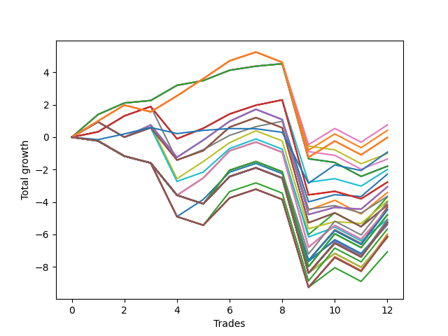

# Short Pointer 011 
- Symbol: NVDA_Unlimited
- Date Range: 02/08/2022 - 07/08/2022
- Trading Period: 7:20-12:30
- Number of Trades: 12



| Name | Win Percent | Profit | Avg Profit / Trade | Avg Time / Trade |      | Name | Win Percent | Profit | Avg Profit / Trade | Avg Time / Trade |
| ---- | ----------- | ------ | ------------------ | ---------------- | ---- | ---- | ----------- | ------ | ------------------ | ---------------- |
| Sorted By <br> Profit | | | | | | Sorted By <br> Win Percentage ||||
| One Hundred Eleven | 66.67 | 380.00 | 31.67 | 16:46 |     | Forty | 75.00 | -505.00 | -42.08 | 07:29 |
| One Hundred Sixteen | 66.67 | 210.00 | 17.50 | 16:48 |     | Forty-Eight | 75.00 | -675.00 | -56.25 | 07:31 |
| One Hundred Twenty-Six | 66.67 | -10.00 | -0.83 | 17:27 |     | Sixty-Four | 75.00 | -895.00 | -74.58 | 08:10 |
| One Hundred Twenty-One | 66.67 | -10.00 | -0.83 | 17:27 |     | Fifty-Six | 75.00 | -895.00 | -74.58 | 08:10 |
| Eighty-One | 66.67 | -10.00 | -0.83 | 17:27 |     | Zero | 75.00 | -895.00 | -74.58 | 08:10 |
| Seventy-Three | 50.00 | -460.00 | -38.33 | 11:55 |     | Forty-One | 75.00 | -995.00 | -82.92 | 13:38 |
| Forty | 75.00 | -505.00 | -42.08 | 07:29 |     | Sixty-Five | 75.00 | -1385.00 | -115.42 | 14:19 |
| Forty-Eight | 75.00 | -675.00 | -56.25 | 07:31 |     | Fifty-Seven | 75.00 | -1385.00 | -115.42 | 14:19 |
| Sixty-Four | 75.00 | -895.00 | -74.58 | 08:10 |     | One | 75.00 | -1385.00 | -115.42 | 14:19 |
| Fifty-Six | 75.00 | -895.00 | -74.58 | 08:10 |     | Forty-Nine | 75.00 | -1825.00 | -152.08 | 13:10 |
| Zero | 75.00 | -895.00 | -74.58 | 08:10 |     | One Hundred Eleven | 66.67 | 380.00 | 31.67 | 16:46 |
| Forty-One | 75.00 | -995.00 | -82.92 | 13:38 |     | One Hundred Sixteen | 66.67 | 210.00 | 17.50 | 16:48 |
| Forty-Two | 58.33 | -1140.00 | -95.00 | 18:14 |     | One Hundred Twenty-Six | 66.67 | -10.00 | -0.83 | 17:27 |
| Sixty-Five | 75.00 | -1385.00 | -115.42 | 14:19 |     | One Hundred Twenty-One | 66.67 | -10.00 | -0.83 | 17:27 |
| Fifty-Seven | 75.00 | -1385.00 | -115.42 | 14:19 |     | Eighty-One | 66.67 | -10.00 | -0.83 | 17:27 |
| One | 75.00 | -1385.00 | -115.42 | 14:19 |     | Forty-Two | 58.33 | -1140.00 | -95.00 | 18:14 |
| Sixty-Six | 58.33 | -1530.00 | -127.50 | 18:55 |     | Sixty-Six | 58.33 | -1530.00 | -127.50 | 18:55 |
| Fifty-Eight | 58.33 | -1530.00 | -127.50 | 18:55 |     | Fifty-Eight | 58.33 | -1530.00 | -127.50 | 18:55 |
| Two | 58.33 | -1530.00 | -127.50 | 18:55 |     | Two | 58.33 | -1530.00 | -127.50 | 18:55 |
| Forty-Three | 58.33 | -1705.00 | -142.08 | 20:50 |     | Forty-Three | 58.33 | -1705.00 | -142.08 | 20:50 |
| Forty-Nine | 75.00 | -1825.00 | -152.08 | 13:10 |     | Fifty | 58.33 | -1970.00 | -164.17 | 17:47 |
| Forty-Four | 41.67 | -1840.00 | -153.33 | 25:14 |     | Sixty-Seven | 58.33 | -2095.00 | -174.58 | 21:31 |
| Fifty | 58.33 | -1970.00 | -164.17 | 17:47 |     | Fifty-Nine | 58.33 | -2095.00 | -174.58 | 21:31 |
| One Hundred Twelve | 33.33 | -2005.00 | -167.08 | 27:37 |     | Three | 58.33 | -2095.00 | -174.58 | 21:31 |
| Sixty-Seven | 58.33 | -2095.00 | -174.58 | 21:31 |     | Fifty-One | 58.33 | -2535.00 | -211.25 | 20:22 |
| Fifty-Nine | 58.33 | -2095.00 | -174.58 | 21:31 |     | Seventy-Three | 50.00 | -460.00 | -38.33 | 11:55 |
| Three | 58.33 | -2095.00 | -174.58 | 21:31 |     | Forty-Four | 41.67 | -1840.00 | -153.33 | 25:14 |
| Forty-Five | 33.33 | -2160.00 | -180.00 | 28:10 |     | Sixty-Eight | 41.67 | -2230.00 | -185.83 | 25:55 |
| Sixty-Eight | 41.67 | -2230.00 | -185.83 | 25:55 |     | Sixty | 41.67 | -2230.00 | -185.83 | 25:55 |
| Sixty | 41.67 | -2230.00 | -185.83 | 25:55 |     | Four | 41.67 | -2230.00 | -185.83 | 25:55 |
| Four | 41.67 | -2230.00 | -185.83 | 25:55 |     | Fifty-Two | 41.67 | -2670.00 | -222.50 | 24:47 |
| One Hundred Fifteen | 33.33 | -2235.00 | -186.25 | 28:19 |     | One Hundred Twelve | 33.33 | -2005.00 | -167.08 | 27:37 |
| One Hundred Fourteen | 33.33 | -2235.00 | -186.25 | 28:19 |     | Forty-Five | 33.33 | -2160.00 | -180.00 | 28:10 |
| One Hundred Thirteen | 33.33 | -2235.00 | -186.25 | 28:19 |     | One Hundred Fifteen | 33.33 | -2235.00 | -186.25 | 28:19 |
| Forty-Seven | 33.33 | -2235.00 | -186.25 | 28:19 |     | One Hundred Fourteen | 33.33 | -2235.00 | -186.25 | 28:19 |
| One Hundred Twenty-Seven | 33.33 | -2395.00 | -199.58 | 28:18 |     | One Hundred Thirteen | 33.33 | -2235.00 | -186.25 | 28:19 |
| One Hundred Twenty-Two | 33.33 | -2395.00 | -199.58 | 28:18 |     | Forty-Seven | 33.33 | -2235.00 | -186.25 | 28:19 |
| Eighty-Two | 33.33 | -2395.00 | -199.58 | 28:18 |     | One Hundred Twenty-Seven | 33.33 | -2395.00 | -199.58 | 28:18 |
| Fifty-One | 58.33 | -2535.00 | -211.25 | 20:22 |     | One Hundred Twenty-Two | 33.33 | -2395.00 | -199.58 | 28:18 |
| Sixty-Nine | 33.33 | -2550.00 | -212.50 | 28:52 |     | Eighty-Two | 33.33 | -2395.00 | -199.58 | 28:18 |
| Sixty-One | 33.33 | -2550.00 | -212.50 | 28:52 |     | Sixty-Nine | 33.33 | -2550.00 | -212.50 | 28:52 |
| Five | 33.33 | -2550.00 | -212.50 | 28:52 |     | Sixty-One | 33.33 | -2550.00 | -212.50 | 28:52 |
| One Hundred Thirty | 33.33 | -2625.00 | -218.75 | 29:00 |     | Five | 33.33 | -2550.00 | -212.50 | 28:52 |
| One Hundred Twenty-Nine | 33.33 | -2625.00 | -218.75 | 29:00 |     | One Hundred Thirty | 33.33 | -2625.00 | -218.75 | 29:00 |
| One Hundred Twenty-Eight | 33.33 | -2625.00 | -218.75 | 29:00 |     | One Hundred Twenty-Nine | 33.33 | -2625.00 | -218.75 | 29:00 |
| One Hundred Twenty-Five | 33.33 | -2625.00 | -218.75 | 29:00 |     | One Hundred Twenty-Eight | 33.33 | -2625.00 | -218.75 | 29:00 |
| One Hundred Twenty-Four | 33.33 | -2625.00 | -218.75 | 29:00 |     | One Hundred Twenty-Five | 33.33 | -2625.00 | -218.75 | 29:00 |
| One Hundred Twenty-Three | 33.33 | -2625.00 | -218.75 | 29:00 |     | One Hundred Twenty-Four | 33.33 | -2625.00 | -218.75 | 29:00 |
| Eighty-Five | 33.33 | -2625.00 | -218.75 | 29:00 |     | One Hundred Twenty-Three | 33.33 | -2625.00 | -218.75 | 29:00 |
| Eighty-Four | 33.33 | -2625.00 | -218.75 | 29:00 |     | Eighty-Five | 33.33 | -2625.00 | -218.75 | 29:00 |
| Eighty-Three | 33.33 | -2625.00 | -218.75 | 29:00 |     | Eighty-Four | 33.33 | -2625.00 | -218.75 | 29:00 |
| Seventy-One | 33.33 | -2625.00 | -218.75 | 29:00 |     | Eighty-Three | 33.33 | -2625.00 | -218.75 | 29:00 |
| Sixty-Three | 33.33 | -2625.00 | -218.75 | 29:00 |     | Seventy-One | 33.33 | -2625.00 | -218.75 | 29:00 |
| Seven | 33.33 | -2625.00 | -218.75 | 29:00 |     | Sixty-Three | 33.33 | -2625.00 | -218.75 | 29:00 |
| Fifty-Two | 41.67 | -2670.00 | -222.50 | 24:47 |     | Seven | 33.33 | -2625.00 | -218.75 | 29:00 |
| Forty-Six | 33.33 | -2705.00 | -225.42 | 27:02 |     | Forty-Six | 33.33 | -2705.00 | -225.42 | 27:02 |
| One Hundred Seventeen | 33.33 | -2835.00 | -236.25 | 27:10 |     | One Hundred Seventeen | 33.33 | -2835.00 | -236.25 | 27:10 |
| Fifty-Three | 33.33 | -2990.00 | -249.17 | 27:43 |     | Fifty-Three | 33.33 | -2990.00 | -249.17 | 27:43 |
| One Hundred Twenty | 33.33 | -3065.00 | -255.42 | 27:51 |     | One Hundred Twenty | 33.33 | -3065.00 | -255.42 | 27:51 |
| One Hundred Ninteen | 33.33 | -3065.00 | -255.42 | 27:51 |     | One Hundred Ninteen | 33.33 | -3065.00 | -255.42 | 27:51 |
| One Hundred Eighteen | 33.33 | -3065.00 | -255.42 | 27:51 |     | One Hundred Eighteen | 33.33 | -3065.00 | -255.42 | 27:51 |
| Fifty-Five | 33.33 | -3065.00 | -255.42 | 27:51 |     | Fifty-Five | 33.33 | -3065.00 | -255.42 | 27:51 |
| Seventy | 33.33 | -3095.00 | -257.92 | 27:43 |     | Seventy | 33.33 | -3095.00 | -257.92 | 27:43 |
| Sixty-Two | 33.33 | -3095.00 | -257.92 | 27:43 |     | Sixty-Two | 33.33 | -3095.00 | -257.92 | 27:43 |
| Six | 33.33 | -3095.00 | -257.92 | 27:43 |     | Six | 33.33 | -3095.00 | -257.92 | 27:43 |
| Fifty-Four | 33.33 | -3535.00 | -294.58 | 26:35 |     | Fifty-Four | 33.33 | -3535.00 | -294.58 | 26:35 |

## NO STOPLOSS

### Test Zero
* Sell when price hits the middle line of the 20p bollinger
* No Stoploss
* Results:
```
Total Trades: 12
Percent Up: 25.00
Percent Down: 75.00
Total Points Moved Down: -1.79
Potential Profit: -895.00
Total Points Ups: 6.95 Count Ups: 3
Total Points Downs: 5.16 Count Downs: 9
```

<details><summary>Trades</summary>

<code>In: 2022-02-24 10:42:00		Out: 2022-02-24 10:45:45		Total Position Time: 03:45		Total Move Down: 1.40		Total to Date: 1.40</code> <br />
<code>In: 2022-03-02 08:11:00		Out: 2022-03-02 08:18:35		Total Position Time: 07:35		Total Move Down: 0.71		Total to Date: 2.11</code> <br />
<code>In: 2022-03-02 09:18:00		Out: 2022-03-02 09:23:30		Total Position Time: 05:30		Total Move Down: 0.15		Total to Date: 2.26</code> <br />
<code>In: 2022-03-08 09:23:00		Out: 2022-03-08 09:25:40		Total Position Time: 02:40		Total Move Down: 0.94		Total to Date: 3.20</code> <br />
<code>In: 2022-03-17 12:06:00		Out: 2022-03-17 12:08:50		Total Position Time: 02:50		Total Move Down: 0.29		Total to Date: 3.49</code> <br />
<code>In: 2022-03-18 12:27:00		Out: 2022-03-18 12:30:45		Total Position Time: 03:45		Total Move Down: 0.64		Total to Date: 4.13</code> <br />
<code>In: 2022-04-11 11:54:00		Out: 2022-04-11 12:01:05		Total Position Time: 07:05		Total Move Down: 0.25		Total to Date: 4.38</code> <br />
<code>In: 2022-04-13 11:51:00		Out: 2022-04-13 12:00:40		Total Position Time: 09:40		Total Move Down: 0.15		Total to Date: 4.53</code> <br />
<code>In: 2022-05-04 11:51:00		Out: 2022-05-04 12:20:55		Total Position Time: 29:55		Total Move Down: -5.86		Total to Date: -1.33</code> <br />
<code>In: 2022-06-09 07:33:00		Out: 2022-06-09 07:42:05		Total Position Time: 09:05		Total Move Down: -0.23		Total to Date: -1.56</code> <br />
<code>In: 2022-07-06 07:50:00		Out: 2022-07-06 08:04:10		Total Position Time: 14:10		Total Move Down: -0.86		Total to Date: -2.42</code> <br />
<code>In: 2022-07-06 08:02:00		Out: 2022-07-06 08:04:10		Total Position Time: 02:10		Total Move Down: 0.63		Total to Date: -1.79</code> <br />


</details>

### Test One
* Sell when the price hits the upper line of the 20p 1std bollinger
* No Stoploss
* Results:
```
Total Trades: 12
Percent Up: 25.00
Percent Down: 75.00
Total Points Moved Down: -2.77
Potential Profit: -1385.00
Total Points Ups: 8.31 Count Ups: 3
Total Points Downs: 5.54 Count Downs: 9
```

<details><summary>Trades</summary>

<code>In: 2022-02-24 10:42:00		Out: 2022-02-24 11:01:25		Total Position Time: 19:25		Total Move Down: 0.33		Total to Date: 0.33</code> <br />
<code>In: 2022-03-02 08:11:00		Out: 2022-03-02 08:22:55		Total Position Time: 11:55		Total Move Down: 0.98		Total to Date: 1.31</code> <br />
<code>In: 2022-03-02 09:18:00		Out: 2022-03-02 09:25:30		Total Position Time: 07:30		Total Move Down: 0.58		Total to Date: 1.89</code> <br />
<code>In: 2022-03-08 09:23:00		Out: 2022-03-08 09:52:55		Total Position Time: 29:55		Total Move Down: -1.99		Total to Date: -0.10</code> <br />
<code>In: 2022-03-17 12:06:00		Out: 2022-03-17 12:11:45		Total Position Time: 05:45		Total Move Down: 0.65		Total to Date: 0.55</code> <br />
<code>In: 2022-03-18 12:27:00		Out: 2022-03-18 12:36:30		Total Position Time: 09:30		Total Move Down: 0.88		Total to Date: 1.43</code> <br />
<code>In: 2022-04-11 11:54:00		Out: 2022-04-11 12:04:15		Total Position Time: 10:15		Total Move Down: 0.54		Total to Date: 1.97</code> <br />
<code>In: 2022-04-13 11:51:00		Out: 2022-04-13 12:01:15		Total Position Time: 10:15		Total Move Down: 0.33		Total to Date: 2.30</code> <br />
<code>In: 2022-05-04 11:51:00		Out: 2022-05-04 12:20:55		Total Position Time: 29:55		Total Move Down: -5.86		Total to Date: -3.56</code> <br />
<code>In: 2022-06-09 07:33:00		Out: 2022-06-09 07:45:30		Total Position Time: 12:30		Total Move Down: 0.22		Total to Date: -3.34</code> <br />
<code>In: 2022-07-06 07:50:00		Out: 2022-07-06 08:08:30		Total Position Time: 18:30		Total Move Down: -0.46		Total to Date: -3.80</code> <br />
<code>In: 2022-07-06 08:02:00		Out: 2022-07-06 08:08:30		Total Position Time: 06:30		Total Move Down: 1.03		Total to Date: -2.77</code> <br />


</details>

### Test Two
* Sell when the price hits the upper line of the 20p 2std bollinger
* No Stoploss
* Results:
```
Total Trades: 12
Percent Up: 41.67
Percent Down: 58.33
Total Points Moved Down: -3.06
Potential Profit: -1530.00
Total Points Ups: 9.53 Count Ups: 5
Total Points Downs: 6.47 Count Downs: 7
```

<details><summary>Trades</summary>

<code>In: 2022-02-24 10:42:00		Out: 2022-02-24 11:06:35		Total Position Time: 24:35		Total Move Down: 0.94		Total to Date: 0.94</code> <br />
<code>In: 2022-03-02 08:11:00		Out: 2022-03-02 08:40:55		Total Position Time: 29:55		Total Move Down: -0.94		Total to Date: 0.00</code> <br />
<code>In: 2022-03-02 09:18:00		Out: 2022-03-02 09:30:20		Total Position Time: 12:20		Total Move Down: 0.75		Total to Date: 0.75</code> <br />
<code>In: 2022-03-08 09:23:00		Out: 2022-03-08 09:52:55		Total Position Time: 29:55		Total Move Down: -1.99		Total to Date: -1.24</code> <br />
<code>In: 2022-03-17 12:06:00		Out: 2022-03-17 12:14:00		Total Position Time: 08:00		Total Move Down: 1.06		Total to Date: -0.18</code> <br />
<code>In: 2022-03-18 12:27:00		Out: 2022-03-18 12:36:40		Total Position Time: 09:40		Total Move Down: 1.16		Total to Date: 0.98</code> <br />
<code>In: 2022-04-11 11:54:00		Out: 2022-04-11 12:04:55		Total Position Time: 10:55		Total Move Down: 0.74		Total to Date: 1.72</code> <br />
<code>In: 2022-04-13 11:51:00		Out: 2022-04-13 12:20:55		Total Position Time: 29:55		Total Move Down: -0.63		Total to Date: 1.09</code> <br />
<code>In: 2022-05-04 11:51:00		Out: 2022-05-04 12:20:55		Total Position Time: 29:55		Total Move Down: -5.86		Total to Date: -4.77</code> <br />
<code>In: 2022-06-09 07:33:00		Out: 2022-06-09 07:46:30		Total Position Time: 13:30		Total Move Down: 0.44		Total to Date: -4.33</code> <br />
<code>In: 2022-07-06 07:50:00		Out: 2022-07-06 08:10:15		Total Position Time: 20:15		Total Move Down: -0.11		Total to Date: -4.44</code> <br />
<code>In: 2022-07-06 08:02:00		Out: 2022-07-06 08:10:15		Total Position Time: 08:15		Total Move Down: 1.38		Total to Date: -3.06</code> <br />


</details>

### Test Three
* Sell when price hits the middle line of the 50p bollinger
* No Stoploss
* Results:
```
Total Trades: 12
Percent Up: 41.67
Percent Down: 58.33
Total Points Moved Down: -4.19
Potential Profit: -2095.00
Total Points Ups: 10.27 Count Ups: 5
Total Points Downs: 6.08 Count Downs: 7
```

<details><summary>Trades</summary>

<code>In: 2022-02-24 10:42:00		Out: 2022-02-24 11:06:35		Total Position Time: 24:35		Total Move Down: 0.94		Total to Date: 0.94</code> <br />
<code>In: 2022-03-02 08:11:00		Out: 2022-03-02 08:40:55		Total Position Time: 29:55		Total Move Down: -0.94		Total to Date: 0.00</code> <br />
<code>In: 2022-03-02 09:18:00		Out: 2022-03-02 09:25:30		Total Position Time: 07:30		Total Move Down: 0.58		Total to Date: 0.58</code> <br />
<code>In: 2022-03-08 09:23:00		Out: 2022-03-08 09:52:55		Total Position Time: 29:55		Total Move Down: -1.99		Total to Date: -1.41</code> <br />
<code>In: 2022-03-17 12:06:00		Out: 2022-03-17 12:11:15		Total Position Time: 05:15		Total Move Down: 0.58		Total to Date: -0.83</code> <br />
<code>In: 2022-03-18 12:27:00		Out: 2022-03-18 12:37:40		Total Position Time: 10:40		Total Move Down: 1.45		Total to Date: 0.62</code> <br />
<code>In: 2022-04-11 11:54:00		Out: 2022-04-11 12:20:10		Total Position Time: 26:10		Total Move Down: 0.59		Total to Date: 1.21</code> <br />
<code>In: 2022-04-13 11:51:00		Out: 2022-04-13 12:20:55		Total Position Time: 29:55		Total Move Down: -0.63		Total to Date: 0.58</code> <br />
<code>In: 2022-05-04 11:51:00		Out: 2022-05-04 12:20:55		Total Position Time: 29:55		Total Move Down: -5.86		Total to Date: -5.28</code> <br />
<code>In: 2022-06-09 07:33:00		Out: 2022-06-09 07:47:00		Total Position Time: 14:00		Total Move Down: 0.61		Total to Date: -4.67</code> <br />
<code>In: 2022-07-06 07:50:00		Out: 2022-07-06 08:19:55		Total Position Time: 29:55		Total Move Down: -0.85		Total to Date: -5.52</code> <br />
<code>In: 2022-07-06 08:02:00		Out: 2022-07-06 08:22:35		Total Position Time: 20:35		Total Move Down: 1.33		Total to Date: -4.19</code> <br />


</details>

### Test Four
* Sell when the price hits the upper line of the 50p 1std bollinger
* No Stoploss
* Results:
```
Total Trades: 12
Percent Up: 58.33
Percent Down: 41.67
Total Points Moved Down: -4.46
Potential Profit: -2230.00
Total Points Ups: 10.92 Count Ups: 7
Total Points Downs: 6.46 Count Downs: 5
```

<details><summary>Trades</summary>

<code>In: 2022-02-24 10:42:00		Out: 2022-02-24 11:11:55		Total Position Time: 29:55		Total Move Down: -0.23		Total to Date: -0.23</code> <br />
<code>In: 2022-03-02 08:11:00		Out: 2022-03-02 08:40:55		Total Position Time: 29:55		Total Move Down: -0.94		Total to Date: -1.17</code> <br />
<code>In: 2022-03-02 09:18:00		Out: 2022-03-02 09:47:55		Total Position Time: 29:55		Total Move Down: -0.42		Total to Date: -1.59</code> <br />
<code>In: 2022-03-08 09:23:00		Out: 2022-03-08 09:52:55		Total Position Time: 29:55		Total Move Down: -1.99		Total to Date: -3.58</code> <br />
<code>In: 2022-03-17 12:06:00		Out: 2022-03-17 12:14:00		Total Position Time: 08:00		Total Move Down: 1.06		Total to Date: -2.52</code> <br />
<code>In: 2022-03-18 12:27:00		Out: 2022-03-18 12:46:00		Total Position Time: 19:00		Total Move Down: 1.68		Total to Date: -0.84</code> <br />
<code>In: 2022-04-11 11:54:00		Out: 2022-04-11 12:23:55		Total Position Time: 29:55		Total Move Down: 0.54		Total to Date: -0.30</code> <br />
<code>In: 2022-04-13 11:51:00		Out: 2022-04-13 12:20:55		Total Position Time: 29:55		Total Move Down: -0.63		Total to Date: -0.93</code> <br />
<code>In: 2022-05-04 11:51:00		Out: 2022-05-04 12:20:55		Total Position Time: 29:55		Total Move Down: -5.86		Total to Date: -6.79</code> <br />
<code>In: 2022-06-09 07:33:00		Out: 2022-06-09 07:52:30		Total Position Time: 19:30		Total Move Down: 1.35		Total to Date: -5.44</code> <br />
<code>In: 2022-07-06 07:50:00		Out: 2022-07-06 08:19:55		Total Position Time: 29:55		Total Move Down: -0.85		Total to Date: -6.29</code> <br />
<code>In: 2022-07-06 08:02:00		Out: 2022-07-06 08:27:20		Total Position Time: 25:20		Total Move Down: 1.83		Total to Date: -4.46</code> <br />


</details>

### Test Five
* Sell when the price hits the upper line of the 50p 2std bollinger
* No Stoploss
* Results:
```
Total Trades: 12
Percent Up: 66.67
Percent Down: 33.33
Total Points Moved Down: -5.10
Potential Profit: -2550.00
Total Points Ups: 11.45 Count Ups: 8
Total Points Downs: 6.35 Count Downs: 4
```

<details><summary>Trades</summary>

<code>In: 2022-02-24 10:42:00		Out: 2022-02-24 11:11:55		Total Position Time: 29:55		Total Move Down: -0.23		Total to Date: -0.23</code> <br />
<code>In: 2022-03-02 08:11:00		Out: 2022-03-02 08:40:55		Total Position Time: 29:55		Total Move Down: -0.94		Total to Date: -1.17</code> <br />
<code>In: 2022-03-02 09:18:00		Out: 2022-03-02 09:47:55		Total Position Time: 29:55		Total Move Down: -0.42		Total to Date: -1.59</code> <br />
<code>In: 2022-03-08 09:23:00		Out: 2022-03-08 09:52:55		Total Position Time: 29:55		Total Move Down: -1.99		Total to Date: -3.58</code> <br />
<code>In: 2022-03-17 12:06:00		Out: 2022-03-17 12:35:55		Total Position Time: 29:55		Total Move Down: -0.53		Total to Date: -4.11</code> <br />
<code>In: 2022-03-18 12:27:00		Out: 2022-03-18 12:46:00		Total Position Time: 19:00		Total Move Down: 1.68		Total to Date: -2.43</code> <br />
<code>In: 2022-04-11 11:54:00		Out: 2022-04-11 12:23:55		Total Position Time: 29:55		Total Move Down: 0.54		Total to Date: -1.89</code> <br />
<code>In: 2022-04-13 11:51:00		Out: 2022-04-13 12:20:55		Total Position Time: 29:55		Total Move Down: -0.63		Total to Date: -2.52</code> <br />
<code>In: 2022-05-04 11:51:00		Out: 2022-05-04 12:20:55		Total Position Time: 29:55		Total Move Down: -5.86		Total to Date: -8.38</code> <br />
<code>In: 2022-06-09 07:33:00		Out: 2022-06-09 08:02:05		Total Position Time: 29:05		Total Move Down: 1.89		Total to Date: -6.49</code> <br />
<code>In: 2022-07-06 07:50:00		Out: 2022-07-06 08:19:55		Total Position Time: 29:55		Total Move Down: -0.85		Total to Date: -7.34</code> <br />
<code>In: 2022-07-06 08:02:00		Out: 2022-07-06 08:31:05		Total Position Time: 29:05		Total Move Down: 2.24		Total to Date: -5.10</code> <br />


</details>

### Test Six
* Sell when the price hits the middle line of the 1std VWAP
* No Stoploss
* Results:
```
Total Trades: 12
Percent Up: 66.67
Percent Down: 33.33
Total Points Moved Down: -6.19
Potential Profit: -3095.00
Total Points Ups: 11.45 Count Ups: 8
Total Points Downs: 5.26 Count Downs: 4
```

<details><summary>Trades</summary>

<code>In: 2022-02-24 10:42:00		Out: 2022-02-24 11:11:55		Total Position Time: 29:55		Total Move Down: -0.23		Total to Date: -0.23</code> <br />
<code>In: 2022-03-02 08:11:00		Out: 2022-03-02 08:40:55		Total Position Time: 29:55		Total Move Down: -0.94		Total to Date: -1.17</code> <br />
<code>In: 2022-03-02 09:18:00		Out: 2022-03-02 09:47:55		Total Position Time: 29:55		Total Move Down: -0.42		Total to Date: -1.59</code> <br />
<code>In: 2022-03-08 09:23:00		Out: 2022-03-08 09:52:55		Total Position Time: 29:55		Total Move Down: -1.99		Total to Date: -3.58</code> <br />
<code>In: 2022-03-17 12:06:00		Out: 2022-03-17 12:35:55		Total Position Time: 29:55		Total Move Down: -0.53		Total to Date: -4.11</code> <br />
<code>In: 2022-03-18 12:27:00		Out: 2022-03-18 12:46:00		Total Position Time: 19:00		Total Move Down: 1.68		Total to Date: -2.43</code> <br />
<code>In: 2022-04-11 11:54:00		Out: 2022-04-11 12:23:55		Total Position Time: 29:55		Total Move Down: 0.54		Total to Date: -1.89</code> <br />
<code>In: 2022-04-13 11:51:00		Out: 2022-04-13 12:20:55		Total Position Time: 29:55		Total Move Down: -0.63		Total to Date: -2.52</code> <br />
<code>In: 2022-05-04 11:51:00		Out: 2022-05-04 12:20:55		Total Position Time: 29:55		Total Move Down: -5.86		Total to Date: -8.38</code> <br />
<code>In: 2022-06-09 07:33:00		Out: 2022-06-09 07:52:10		Total Position Time: 19:10		Total Move Down: 1.21		Total to Date: -7.17</code> <br />
<code>In: 2022-07-06 07:50:00		Out: 2022-07-06 08:19:55		Total Position Time: 29:55		Total Move Down: -0.85		Total to Date: -8.02</code> <br />
<code>In: 2022-07-06 08:02:00		Out: 2022-07-06 08:27:20		Total Position Time: 25:20		Total Move Down: 1.83		Total to Date: -6.19</code> <br />


</details>

### Test Seven
* Sell when the price hits the upper line of the 1std VWAP
* No Stoploss
* Results:
```
Total Trades: 12
Percent Up: 66.67
Percent Down: 33.33
Total Points Moved Down: -5.25
Potential Profit: -2625.00
Total Points Ups: 11.45 Count Ups: 8
Total Points Downs: 6.20 Count Downs: 4
```

<details><summary>Trades</summary>

<code>In: 2022-02-24 10:42:00		Out: 2022-02-24 11:11:55		Total Position Time: 29:55		Total Move Down: -0.23		Total to Date: -0.23</code> <br />
<code>In: 2022-03-02 08:11:00		Out: 2022-03-02 08:40:55		Total Position Time: 29:55		Total Move Down: -0.94		Total to Date: -1.17</code> <br />
<code>In: 2022-03-02 09:18:00		Out: 2022-03-02 09:47:55		Total Position Time: 29:55		Total Move Down: -0.42		Total to Date: -1.59</code> <br />
<code>In: 2022-03-08 09:23:00		Out: 2022-03-08 09:52:55		Total Position Time: 29:55		Total Move Down: -1.99		Total to Date: -3.58</code> <br />
<code>In: 2022-03-17 12:06:00		Out: 2022-03-17 12:35:55		Total Position Time: 29:55		Total Move Down: -0.53		Total to Date: -4.11</code> <br />
<code>In: 2022-03-18 12:27:00		Out: 2022-03-18 12:46:00		Total Position Time: 19:00		Total Move Down: 1.68		Total to Date: -2.43</code> <br />
<code>In: 2022-04-11 11:54:00		Out: 2022-04-11 12:23:55		Total Position Time: 29:55		Total Move Down: 0.54		Total to Date: -1.89</code> <br />
<code>In: 2022-04-13 11:51:00		Out: 2022-04-13 12:20:55		Total Position Time: 29:55		Total Move Down: -0.63		Total to Date: -2.52</code> <br />
<code>In: 2022-05-04 11:51:00		Out: 2022-05-04 12:20:55		Total Position Time: 29:55		Total Move Down: -5.86		Total to Date: -8.38</code> <br />
<code>In: 2022-06-09 07:33:00		Out: 2022-06-09 08:02:55		Total Position Time: 29:55		Total Move Down: 1.84		Total to Date: -6.54</code> <br />
<code>In: 2022-07-06 07:50:00		Out: 2022-07-06 08:19:55		Total Position Time: 29:55		Total Move Down: -0.85		Total to Date: -7.39</code> <br />
<code>In: 2022-07-06 08:02:00		Out: 2022-07-06 08:31:55		Total Position Time: 29:55		Total Move Down: 2.14		Total to Date: -5.25</code> <br />


</details>

## STOPLOSS OF 5

### Test Forty
* Sell when price hits the middle line of the 20p bollinger
* Stoploss is -5 points
* Results:
```
Total Trades: 12
Percent Up: 25.00
Percent Down: 75.00
Total Points Moved Down: -1.01
Potential Profit: -505.00
Total Points Ups: 6.17 Count Ups: 3
Total Points Downs: 5.16 Count Downs: 9
```

<details><summary>Trades</summary>

<code>In: 2022-02-24 10:42:00		Out: 2022-02-24 10:45:45		Total Position Time: 03:45		Total Move Down: 1.40		Total to Date: 1.40</code> <br />
<code>In: 2022-03-02 08:11:00		Out: 2022-03-02 08:18:35		Total Position Time: 07:35		Total Move Down: 0.71		Total to Date: 2.11</code> <br />
<code>In: 2022-03-02 09:18:00		Out: 2022-03-02 09:23:30		Total Position Time: 05:30		Total Move Down: 0.15		Total to Date: 2.26</code> <br />
<code>In: 2022-03-08 09:23:00		Out: 2022-03-08 09:25:40		Total Position Time: 02:40		Total Move Down: 0.94		Total to Date: 3.20</code> <br />
<code>In: 2022-03-17 12:06:00		Out: 2022-03-17 12:08:50		Total Position Time: 02:50		Total Move Down: 0.29		Total to Date: 3.49</code> <br />
<code>In: 2022-03-18 12:27:00		Out: 2022-03-18 12:30:45		Total Position Time: 03:45		Total Move Down: 0.64		Total to Date: 4.13</code> <br />
<code>In: 2022-04-11 11:54:00		Out: 2022-04-11 12:01:05		Total Position Time: 07:05		Total Move Down: 0.25		Total to Date: 4.38</code> <br />
<code>In: 2022-04-13 11:51:00		Out: 2022-04-13 12:00:40		Total Position Time: 09:40		Total Move Down: 0.15		Total to Date: 4.53</code> <br />
<code>In: 2022-05-04 11:51:00		Out: 2022-05-04 12:12:40		Total Position Time: 21:40		Total Move Down: -5.08		Total to Date: -0.55</code> <br />
<code>In: 2022-06-09 07:33:00		Out: 2022-06-09 07:42:05		Total Position Time: 09:05		Total Move Down: -0.23		Total to Date: -0.78</code> <br />
<code>In: 2022-07-06 07:50:00		Out: 2022-07-06 08:04:10		Total Position Time: 14:10		Total Move Down: -0.86		Total to Date: -1.64</code> <br />
<code>In: 2022-07-06 08:02:00		Out: 2022-07-06 08:04:10		Total Position Time: 02:10		Total Move Down: 0.63		Total to Date: -1.01</code> <br />


</details>

### Test Forty-One
* Sell when the price hits the upper line of the 20p 1std bollinger
* Stoploss is -5 points
* Results:
```
Total Trades: 12
Percent Up: 25.00
Percent Down: 75.00
Total Points Moved Down: -1.99
Potential Profit: -995.00
Total Points Ups: 7.53 Count Ups: 3
Total Points Downs: 5.54 Count Downs: 9
```

<details><summary>Trades</summary>

<code>In: 2022-02-24 10:42:00		Out: 2022-02-24 11:01:25		Total Position Time: 19:25		Total Move Down: 0.33		Total to Date: 0.33</code> <br />
<code>In: 2022-03-02 08:11:00		Out: 2022-03-02 08:22:55		Total Position Time: 11:55		Total Move Down: 0.98		Total to Date: 1.31</code> <br />
<code>In: 2022-03-02 09:18:00		Out: 2022-03-02 09:25:30		Total Position Time: 07:30		Total Move Down: 0.58		Total to Date: 1.89</code> <br />
<code>In: 2022-03-08 09:23:00		Out: 2022-03-08 09:52:55		Total Position Time: 29:55		Total Move Down: -1.99		Total to Date: -0.10</code> <br />
<code>In: 2022-03-17 12:06:00		Out: 2022-03-17 12:11:45		Total Position Time: 05:45		Total Move Down: 0.65		Total to Date: 0.55</code> <br />
<code>In: 2022-03-18 12:27:00		Out: 2022-03-18 12:36:30		Total Position Time: 09:30		Total Move Down: 0.88		Total to Date: 1.43</code> <br />
<code>In: 2022-04-11 11:54:00		Out: 2022-04-11 12:04:15		Total Position Time: 10:15		Total Move Down: 0.54		Total to Date: 1.97</code> <br />
<code>In: 2022-04-13 11:51:00		Out: 2022-04-13 12:01:15		Total Position Time: 10:15		Total Move Down: 0.33		Total to Date: 2.30</code> <br />
<code>In: 2022-05-04 11:51:00		Out: 2022-05-04 12:12:40		Total Position Time: 21:40		Total Move Down: -5.08		Total to Date: -2.78</code> <br />
<code>In: 2022-06-09 07:33:00		Out: 2022-06-09 07:45:30		Total Position Time: 12:30		Total Move Down: 0.22		Total to Date: -2.56</code> <br />
<code>In: 2022-07-06 07:50:00		Out: 2022-07-06 08:08:30		Total Position Time: 18:30		Total Move Down: -0.46		Total to Date: -3.02</code> <br />
<code>In: 2022-07-06 08:02:00		Out: 2022-07-06 08:08:30		Total Position Time: 06:30		Total Move Down: 1.03		Total to Date: -1.99</code> <br />


</details>

### Test Forty-Two
* Sell when the price hits the upper line of the 20p 2std bollinger
* Stoploss is -5 points
* Results:
```
Total Trades: 12
Percent Up: 41.67
Percent Down: 58.33
Total Points Moved Down: -2.28
Potential Profit: -1140.00
Total Points Ups: 8.75 Count Ups: 5
Total Points Downs: 6.47 Count Downs: 7
```

<details><summary>Trades</summary>

<code>In: 2022-02-24 10:42:00		Out: 2022-02-24 11:06:35		Total Position Time: 24:35		Total Move Down: 0.94		Total to Date: 0.94</code> <br />
<code>In: 2022-03-02 08:11:00		Out: 2022-03-02 08:40:55		Total Position Time: 29:55		Total Move Down: -0.94		Total to Date: 0.00</code> <br />
<code>In: 2022-03-02 09:18:00		Out: 2022-03-02 09:30:20		Total Position Time: 12:20		Total Move Down: 0.75		Total to Date: 0.75</code> <br />
<code>In: 2022-03-08 09:23:00		Out: 2022-03-08 09:52:55		Total Position Time: 29:55		Total Move Down: -1.99		Total to Date: -1.24</code> <br />
<code>In: 2022-03-17 12:06:00		Out: 2022-03-17 12:14:00		Total Position Time: 08:00		Total Move Down: 1.06		Total to Date: -0.18</code> <br />
<code>In: 2022-03-18 12:27:00		Out: 2022-03-18 12:36:40		Total Position Time: 09:40		Total Move Down: 1.16		Total to Date: 0.98</code> <br />
<code>In: 2022-04-11 11:54:00		Out: 2022-04-11 12:04:55		Total Position Time: 10:55		Total Move Down: 0.74		Total to Date: 1.72</code> <br />
<code>In: 2022-04-13 11:51:00		Out: 2022-04-13 12:20:55		Total Position Time: 29:55		Total Move Down: -0.63		Total to Date: 1.09</code> <br />
<code>In: 2022-05-04 11:51:00		Out: 2022-05-04 12:12:40		Total Position Time: 21:40		Total Move Down: -5.08		Total to Date: -3.99</code> <br />
<code>In: 2022-06-09 07:33:00		Out: 2022-06-09 07:46:30		Total Position Time: 13:30		Total Move Down: 0.44		Total to Date: -3.55</code> <br />
<code>In: 2022-07-06 07:50:00		Out: 2022-07-06 08:10:15		Total Position Time: 20:15		Total Move Down: -0.11		Total to Date: -3.66</code> <br />
<code>In: 2022-07-06 08:02:00		Out: 2022-07-06 08:10:15		Total Position Time: 08:15		Total Move Down: 1.38		Total to Date: -2.28</code> <br />


</details>

### Test Forty-Three
* Sell when price hits the middle line of the 50p bollinger
* Stoploss is -5 points
* Results:
```
Total Trades: 12
Percent Up: 41.67
Percent Down: 58.33
Total Points Moved Down: -3.41
Potential Profit: -1705.00
Total Points Ups: 9.49 Count Ups: 5
Total Points Downs: 6.08 Count Downs: 7
```

<details><summary>Trades</summary>

<code>In: 2022-02-24 10:42:00		Out: 2022-02-24 11:06:35		Total Position Time: 24:35		Total Move Down: 0.94		Total to Date: 0.94</code> <br />
<code>In: 2022-03-02 08:11:00		Out: 2022-03-02 08:40:55		Total Position Time: 29:55		Total Move Down: -0.94		Total to Date: 0.00</code> <br />
<code>In: 2022-03-02 09:18:00		Out: 2022-03-02 09:25:30		Total Position Time: 07:30		Total Move Down: 0.58		Total to Date: 0.58</code> <br />
<code>In: 2022-03-08 09:23:00		Out: 2022-03-08 09:52:55		Total Position Time: 29:55		Total Move Down: -1.99		Total to Date: -1.41</code> <br />
<code>In: 2022-03-17 12:06:00		Out: 2022-03-17 12:11:15		Total Position Time: 05:15		Total Move Down: 0.58		Total to Date: -0.83</code> <br />
<code>In: 2022-03-18 12:27:00		Out: 2022-03-18 12:37:40		Total Position Time: 10:40		Total Move Down: 1.45		Total to Date: 0.62</code> <br />
<code>In: 2022-04-11 11:54:00		Out: 2022-04-11 12:20:10		Total Position Time: 26:10		Total Move Down: 0.59		Total to Date: 1.21</code> <br />
<code>In: 2022-04-13 11:51:00		Out: 2022-04-13 12:20:55		Total Position Time: 29:55		Total Move Down: -0.63		Total to Date: 0.58</code> <br />
<code>In: 2022-05-04 11:51:00		Out: 2022-05-04 12:12:40		Total Position Time: 21:40		Total Move Down: -5.08		Total to Date: -4.50</code> <br />
<code>In: 2022-06-09 07:33:00		Out: 2022-06-09 07:47:00		Total Position Time: 14:00		Total Move Down: 0.61		Total to Date: -3.89</code> <br />
<code>In: 2022-07-06 07:50:00		Out: 2022-07-06 08:19:55		Total Position Time: 29:55		Total Move Down: -0.85		Total to Date: -4.74</code> <br />
<code>In: 2022-07-06 08:02:00		Out: 2022-07-06 08:22:35		Total Position Time: 20:35		Total Move Down: 1.33		Total to Date: -3.41</code> <br />


</details>

### Test Forty-Four
* Sell when the price hits the upper line of the 50p 1std bollinger
* Stoploss is -5 points
* Results:
```
Total Trades: 12
Percent Up: 58.33
Percent Down: 41.67
Total Points Moved Down: -3.68
Potential Profit: -1840.00
Total Points Ups: 10.14 Count Ups: 7
Total Points Downs: 6.46 Count Downs: 5
```

<details><summary>Trades</summary>

<code>In: 2022-02-24 10:42:00		Out: 2022-02-24 11:11:55		Total Position Time: 29:55		Total Move Down: -0.23		Total to Date: -0.23</code> <br />
<code>In: 2022-03-02 08:11:00		Out: 2022-03-02 08:40:55		Total Position Time: 29:55		Total Move Down: -0.94		Total to Date: -1.17</code> <br />
<code>In: 2022-03-02 09:18:00		Out: 2022-03-02 09:47:55		Total Position Time: 29:55		Total Move Down: -0.42		Total to Date: -1.59</code> <br />
<code>In: 2022-03-08 09:23:00		Out: 2022-03-08 09:52:55		Total Position Time: 29:55		Total Move Down: -1.99		Total to Date: -3.58</code> <br />
<code>In: 2022-03-17 12:06:00		Out: 2022-03-17 12:14:00		Total Position Time: 08:00		Total Move Down: 1.06		Total to Date: -2.52</code> <br />
<code>In: 2022-03-18 12:27:00		Out: 2022-03-18 12:46:00		Total Position Time: 19:00		Total Move Down: 1.68		Total to Date: -0.84</code> <br />
<code>In: 2022-04-11 11:54:00		Out: 2022-04-11 12:23:55		Total Position Time: 29:55		Total Move Down: 0.54		Total to Date: -0.30</code> <br />
<code>In: 2022-04-13 11:51:00		Out: 2022-04-13 12:20:55		Total Position Time: 29:55		Total Move Down: -0.63		Total to Date: -0.93</code> <br />
<code>In: 2022-05-04 11:51:00		Out: 2022-05-04 12:12:40		Total Position Time: 21:40		Total Move Down: -5.08		Total to Date: -6.01</code> <br />
<code>In: 2022-06-09 07:33:00		Out: 2022-06-09 07:52:30		Total Position Time: 19:30		Total Move Down: 1.35		Total to Date: -4.66</code> <br />
<code>In: 2022-07-06 07:50:00		Out: 2022-07-06 08:19:55		Total Position Time: 29:55		Total Move Down: -0.85		Total to Date: -5.51</code> <br />
<code>In: 2022-07-06 08:02:00		Out: 2022-07-06 08:27:20		Total Position Time: 25:20		Total Move Down: 1.83		Total to Date: -3.68</code> <br />


</details>

### Test Forty-Five
* Sell when the price hits the upper line of the 50p 2std bollinger
* Stoploss is -5 points
* Results:
```
Total Trades: 12
Percent Up: 66.67
Percent Down: 33.33
Total Points Moved Down: -4.32
Potential Profit: -2160.00
Total Points Ups: 10.67 Count Ups: 8
Total Points Downs: 6.35 Count Downs: 4
```

<details><summary>Trades</summary>

<code>In: 2022-02-24 10:42:00		Out: 2022-02-24 11:11:55		Total Position Time: 29:55		Total Move Down: -0.23		Total to Date: -0.23</code> <br />
<code>In: 2022-03-02 08:11:00		Out: 2022-03-02 08:40:55		Total Position Time: 29:55		Total Move Down: -0.94		Total to Date: -1.17</code> <br />
<code>In: 2022-03-02 09:18:00		Out: 2022-03-02 09:47:55		Total Position Time: 29:55		Total Move Down: -0.42		Total to Date: -1.59</code> <br />
<code>In: 2022-03-08 09:23:00		Out: 2022-03-08 09:52:55		Total Position Time: 29:55		Total Move Down: -1.99		Total to Date: -3.58</code> <br />
<code>In: 2022-03-17 12:06:00		Out: 2022-03-17 12:35:55		Total Position Time: 29:55		Total Move Down: -0.53		Total to Date: -4.11</code> <br />
<code>In: 2022-03-18 12:27:00		Out: 2022-03-18 12:46:00		Total Position Time: 19:00		Total Move Down: 1.68		Total to Date: -2.43</code> <br />
<code>In: 2022-04-11 11:54:00		Out: 2022-04-11 12:23:55		Total Position Time: 29:55		Total Move Down: 0.54		Total to Date: -1.89</code> <br />
<code>In: 2022-04-13 11:51:00		Out: 2022-04-13 12:20:55		Total Position Time: 29:55		Total Move Down: -0.63		Total to Date: -2.52</code> <br />
<code>In: 2022-05-04 11:51:00		Out: 2022-05-04 12:12:40		Total Position Time: 21:40		Total Move Down: -5.08		Total to Date: -7.60</code> <br />
<code>In: 2022-06-09 07:33:00		Out: 2022-06-09 08:02:05		Total Position Time: 29:05		Total Move Down: 1.89		Total to Date: -5.71</code> <br />
<code>In: 2022-07-06 07:50:00		Out: 2022-07-06 08:19:55		Total Position Time: 29:55		Total Move Down: -0.85		Total to Date: -6.56</code> <br />
<code>In: 2022-07-06 08:02:00		Out: 2022-07-06 08:31:05		Total Position Time: 29:05		Total Move Down: 2.24		Total to Date: -4.32</code> <br />


</details>

### Test Forty-Six
* Sell when the price hits the middle line of the 1std VWAP
* Stoploss is -5 points
* Results:
```
Total Trades: 12
Percent Up: 66.67
Percent Down: 33.33
Total Points Moved Down: -5.41
Potential Profit: -2705.00
Total Points Ups: 10.67 Count Ups: 8
Total Points Downs: 5.26 Count Downs: 4
```

<details><summary>Trades</summary>

<code>In: 2022-02-24 10:42:00		Out: 2022-02-24 11:11:55		Total Position Time: 29:55		Total Move Down: -0.23		Total to Date: -0.23</code> <br />
<code>In: 2022-03-02 08:11:00		Out: 2022-03-02 08:40:55		Total Position Time: 29:55		Total Move Down: -0.94		Total to Date: -1.17</code> <br />
<code>In: 2022-03-02 09:18:00		Out: 2022-03-02 09:47:55		Total Position Time: 29:55		Total Move Down: -0.42		Total to Date: -1.59</code> <br />
<code>In: 2022-03-08 09:23:00		Out: 2022-03-08 09:52:55		Total Position Time: 29:55		Total Move Down: -1.99		Total to Date: -3.58</code> <br />
<code>In: 2022-03-17 12:06:00		Out: 2022-03-17 12:35:55		Total Position Time: 29:55		Total Move Down: -0.53		Total to Date: -4.11</code> <br />
<code>In: 2022-03-18 12:27:00		Out: 2022-03-18 12:46:00		Total Position Time: 19:00		Total Move Down: 1.68		Total to Date: -2.43</code> <br />
<code>In: 2022-04-11 11:54:00		Out: 2022-04-11 12:23:55		Total Position Time: 29:55		Total Move Down: 0.54		Total to Date: -1.89</code> <br />
<code>In: 2022-04-13 11:51:00		Out: 2022-04-13 12:20:55		Total Position Time: 29:55		Total Move Down: -0.63		Total to Date: -2.52</code> <br />
<code>In: 2022-05-04 11:51:00		Out: 2022-05-04 12:12:40		Total Position Time: 21:40		Total Move Down: -5.08		Total to Date: -7.60</code> <br />
<code>In: 2022-06-09 07:33:00		Out: 2022-06-09 07:52:10		Total Position Time: 19:10		Total Move Down: 1.21		Total to Date: -6.39</code> <br />
<code>In: 2022-07-06 07:50:00		Out: 2022-07-06 08:19:55		Total Position Time: 29:55		Total Move Down: -0.85		Total to Date: -7.24</code> <br />
<code>In: 2022-07-06 08:02:00		Out: 2022-07-06 08:27:20		Total Position Time: 25:20		Total Move Down: 1.83		Total to Date: -5.41</code> <br />


</details>

### Test Forty-Seven
* Sell when the price hits the upper line of the 1std VWAP
* Stoploss is -5 points
* Results:
```
Total Trades: 12
Percent Up: 66.67
Percent Down: 33.33
Total Points Moved Down: -4.47
Potential Profit: -2235.00
Total Points Ups: 10.67 Count Ups: 8
Total Points Downs: 6.20 Count Downs: 4
```

<details><summary>Trades</summary>

<code>In: 2022-02-24 10:42:00		Out: 2022-02-24 11:11:55		Total Position Time: 29:55		Total Move Down: -0.23		Total to Date: -0.23</code> <br />
<code>In: 2022-03-02 08:11:00		Out: 2022-03-02 08:40:55		Total Position Time: 29:55		Total Move Down: -0.94		Total to Date: -1.17</code> <br />
<code>In: 2022-03-02 09:18:00		Out: 2022-03-02 09:47:55		Total Position Time: 29:55		Total Move Down: -0.42		Total to Date: -1.59</code> <br />
<code>In: 2022-03-08 09:23:00		Out: 2022-03-08 09:52:55		Total Position Time: 29:55		Total Move Down: -1.99		Total to Date: -3.58</code> <br />
<code>In: 2022-03-17 12:06:00		Out: 2022-03-17 12:35:55		Total Position Time: 29:55		Total Move Down: -0.53		Total to Date: -4.11</code> <br />
<code>In: 2022-03-18 12:27:00		Out: 2022-03-18 12:46:00		Total Position Time: 19:00		Total Move Down: 1.68		Total to Date: -2.43</code> <br />
<code>In: 2022-04-11 11:54:00		Out: 2022-04-11 12:23:55		Total Position Time: 29:55		Total Move Down: 0.54		Total to Date: -1.89</code> <br />
<code>In: 2022-04-13 11:51:00		Out: 2022-04-13 12:20:55		Total Position Time: 29:55		Total Move Down: -0.63		Total to Date: -2.52</code> <br />
<code>In: 2022-05-04 11:51:00		Out: 2022-05-04 12:12:40		Total Position Time: 21:40		Total Move Down: -5.08		Total to Date: -7.60</code> <br />
<code>In: 2022-06-09 07:33:00		Out: 2022-06-09 08:02:55		Total Position Time: 29:55		Total Move Down: 1.84		Total to Date: -5.76</code> <br />
<code>In: 2022-07-06 07:50:00		Out: 2022-07-06 08:19:55		Total Position Time: 29:55		Total Move Down: -0.85		Total to Date: -6.61</code> <br />
<code>In: 2022-07-06 08:02:00		Out: 2022-07-06 08:31:55		Total Position Time: 29:55		Total Move Down: 2.14		Total to Date: -4.47</code> <br />


</details>

## TRAIL STOP OF 5

### Test Forty-Eight
* Sell when price hits the middle line of the 20p bollinger
* Trailing Stop is -5 points
* Results:
```
Total Trades: 12
Percent Up: 25.00
Percent Down: 75.00
Total Points Moved Down: -1.35
Potential Profit: -675.00
Total Points Ups: 6.51 Count Ups: 3
Total Points Downs: 5.16 Count Downs: 9
```

<details><summary>Trades</summary>

<code>In: 2022-02-24 10:42:00		Out: 2022-02-24 10:45:45		Total Position Time: 03:45		Total Move Down: 1.40		Total to Date: 1.40</code> <br />
<code>In: 2022-03-02 08:11:00		Out: 2022-03-02 08:18:35		Total Position Time: 07:35		Total Move Down: 0.71		Total to Date: 2.11</code> <br />
<code>In: 2022-03-02 09:18:00		Out: 2022-03-02 09:23:30		Total Position Time: 05:30		Total Move Down: 0.15		Total to Date: 2.26</code> <br />
<code>In: 2022-03-08 09:23:00		Out: 2022-03-08 09:25:40		Total Position Time: 02:40		Total Move Down: 0.94		Total to Date: 3.20</code> <br />
<code>In: 2022-03-17 12:06:00		Out: 2022-03-17 12:08:50		Total Position Time: 02:50		Total Move Down: 0.29		Total to Date: 3.49</code> <br />
<code>In: 2022-03-18 12:27:00		Out: 2022-03-18 12:30:45		Total Position Time: 03:45		Total Move Down: 0.64		Total to Date: 4.13</code> <br />
<code>In: 2022-04-11 11:54:00		Out: 2022-04-11 12:01:05		Total Position Time: 07:05		Total Move Down: 0.25		Total to Date: 4.38</code> <br />
<code>In: 2022-04-13 11:51:00		Out: 2022-04-13 12:00:40		Total Position Time: 09:40		Total Move Down: 0.15		Total to Date: 4.53</code> <br />
<code>In: 2022-05-04 11:51:00		Out: 2022-05-04 12:13:00		Total Position Time: 22:00		Total Move Down: -5.42		Total to Date: -0.89</code> <br />
<code>In: 2022-06-09 07:33:00		Out: 2022-06-09 07:42:05		Total Position Time: 09:05		Total Move Down: -0.23		Total to Date: -1.12</code> <br />
<code>In: 2022-07-06 07:50:00		Out: 2022-07-06 08:04:10		Total Position Time: 14:10		Total Move Down: -0.86		Total to Date: -1.98</code> <br />
<code>In: 2022-07-06 08:02:00		Out: 2022-07-06 08:04:10		Total Position Time: 02:10		Total Move Down: 0.63		Total to Date: -1.35</code> <br />


</details>

### Test Forty-Nine
* Sell when the price hits the upper line of the 20p 1std bollinger
* Trailing Stop is -5 points
* Results:
```
Total Trades: 12
Percent Up: 25.00
Percent Down: 75.00
Total Points Moved Down: -3.65
Potential Profit: -1825.00
Total Points Ups: 9.19 Count Ups: 3
Total Points Downs: 5.54 Count Downs: 9
```

<details><summary>Trades</summary>

<code>In: 2022-02-24 10:42:00		Out: 2022-02-24 11:01:25		Total Position Time: 19:25		Total Move Down: 0.33		Total to Date: 0.33</code> <br />
<code>In: 2022-03-02 08:11:00		Out: 2022-03-02 08:22:55		Total Position Time: 11:55		Total Move Down: 0.98		Total to Date: 1.31</code> <br />
<code>In: 2022-03-02 09:18:00		Out: 2022-03-02 09:25:30		Total Position Time: 07:30		Total Move Down: 0.58		Total to Date: 1.89</code> <br />
<code>In: 2022-03-08 09:23:00		Out: 2022-03-08 09:47:05		Total Position Time: 24:05		Total Move Down: -3.31		Total to Date: -1.42</code> <br />
<code>In: 2022-03-17 12:06:00		Out: 2022-03-17 12:11:45		Total Position Time: 05:45		Total Move Down: 0.65		Total to Date: -0.77</code> <br />
<code>In: 2022-03-18 12:27:00		Out: 2022-03-18 12:36:30		Total Position Time: 09:30		Total Move Down: 0.88		Total to Date: 0.11</code> <br />
<code>In: 2022-04-11 11:54:00		Out: 2022-04-11 12:04:15		Total Position Time: 10:15		Total Move Down: 0.54		Total to Date: 0.65</code> <br />
<code>In: 2022-04-13 11:51:00		Out: 2022-04-13 12:01:15		Total Position Time: 10:15		Total Move Down: 0.33		Total to Date: 0.98</code> <br />
<code>In: 2022-05-04 11:51:00		Out: 2022-05-04 12:13:00		Total Position Time: 22:00		Total Move Down: -5.42		Total to Date: -4.44</code> <br />
<code>In: 2022-06-09 07:33:00		Out: 2022-06-09 07:45:30		Total Position Time: 12:30		Total Move Down: 0.22		Total to Date: -4.22</code> <br />
<code>In: 2022-07-06 07:50:00		Out: 2022-07-06 08:08:30		Total Position Time: 18:30		Total Move Down: -0.46		Total to Date: -4.68</code> <br />
<code>In: 2022-07-06 08:02:00		Out: 2022-07-06 08:08:30		Total Position Time: 06:30		Total Move Down: 1.03		Total to Date: -3.65</code> <br />


</details>

### Test Fifty
* Sell when the price hits the upper line of the 20p 2std bollinger
* Trailing Stop is -5 points
* Results:
```
Total Trades: 12
Percent Up: 41.67
Percent Down: 58.33
Total Points Moved Down: -3.94
Potential Profit: -1970.00
Total Points Ups: 10.41 Count Ups: 5
Total Points Downs: 6.47 Count Downs: 7
```

<details><summary>Trades</summary>

<code>In: 2022-02-24 10:42:00		Out: 2022-02-24 11:06:35		Total Position Time: 24:35		Total Move Down: 0.94		Total to Date: 0.94</code> <br />
<code>In: 2022-03-02 08:11:00		Out: 2022-03-02 08:40:55		Total Position Time: 29:55		Total Move Down: -0.94		Total to Date: 0.00</code> <br />
<code>In: 2022-03-02 09:18:00		Out: 2022-03-02 09:30:20		Total Position Time: 12:20		Total Move Down: 0.75		Total to Date: 0.75</code> <br />
<code>In: 2022-03-08 09:23:00		Out: 2022-03-08 09:47:05		Total Position Time: 24:05		Total Move Down: -3.31		Total to Date: -2.56</code> <br />
<code>In: 2022-03-17 12:06:00		Out: 2022-03-17 12:14:00		Total Position Time: 08:00		Total Move Down: 1.06		Total to Date: -1.50</code> <br />
<code>In: 2022-03-18 12:27:00		Out: 2022-03-18 12:36:40		Total Position Time: 09:40		Total Move Down: 1.16		Total to Date: -0.34</code> <br />
<code>In: 2022-04-11 11:54:00		Out: 2022-04-11 12:04:55		Total Position Time: 10:55		Total Move Down: 0.74		Total to Date: 0.40</code> <br />
<code>In: 2022-04-13 11:51:00		Out: 2022-04-13 12:20:55		Total Position Time: 29:55		Total Move Down: -0.63		Total to Date: -0.23</code> <br />
<code>In: 2022-05-04 11:51:00		Out: 2022-05-04 12:13:00		Total Position Time: 22:00		Total Move Down: -5.42		Total to Date: -5.65</code> <br />
<code>In: 2022-06-09 07:33:00		Out: 2022-06-09 07:46:30		Total Position Time: 13:30		Total Move Down: 0.44		Total to Date: -5.21</code> <br />
<code>In: 2022-07-06 07:50:00		Out: 2022-07-06 08:10:15		Total Position Time: 20:15		Total Move Down: -0.11		Total to Date: -5.32</code> <br />
<code>In: 2022-07-06 08:02:00		Out: 2022-07-06 08:10:15		Total Position Time: 08:15		Total Move Down: 1.38		Total to Date: -3.94</code> <br />


</details>

### Test Fifty-One
* Sell when price hits the middle line of the 50p bollinger
* Trailing Stop is -5 points
* Results:
```
Total Trades: 12
Percent Up: 41.67
Percent Down: 58.33
Total Points Moved Down: -5.07
Potential Profit: -2535.00
Total Points Ups: 11.15 Count Ups: 5
Total Points Downs: 6.08 Count Downs: 7
```

<details><summary>Trades</summary>

<code>In: 2022-02-24 10:42:00		Out: 2022-02-24 11:06:35		Total Position Time: 24:35		Total Move Down: 0.94		Total to Date: 0.94</code> <br />
<code>In: 2022-03-02 08:11:00		Out: 2022-03-02 08:40:55		Total Position Time: 29:55		Total Move Down: -0.94		Total to Date: 0.00</code> <br />
<code>In: 2022-03-02 09:18:00		Out: 2022-03-02 09:25:30		Total Position Time: 07:30		Total Move Down: 0.58		Total to Date: 0.58</code> <br />
<code>In: 2022-03-08 09:23:00		Out: 2022-03-08 09:47:05		Total Position Time: 24:05		Total Move Down: -3.31		Total to Date: -2.73</code> <br />
<code>In: 2022-03-17 12:06:00		Out: 2022-03-17 12:11:15		Total Position Time: 05:15		Total Move Down: 0.58		Total to Date: -2.15</code> <br />
<code>In: 2022-03-18 12:27:00		Out: 2022-03-18 12:37:40		Total Position Time: 10:40		Total Move Down: 1.45		Total to Date: -0.70</code> <br />
<code>In: 2022-04-11 11:54:00		Out: 2022-04-11 12:20:10		Total Position Time: 26:10		Total Move Down: 0.59		Total to Date: -0.11</code> <br />
<code>In: 2022-04-13 11:51:00		Out: 2022-04-13 12:20:55		Total Position Time: 29:55		Total Move Down: -0.63		Total to Date: -0.74</code> <br />
<code>In: 2022-05-04 11:51:00		Out: 2022-05-04 12:13:00		Total Position Time: 22:00		Total Move Down: -5.42		Total to Date: -6.16</code> <br />
<code>In: 2022-06-09 07:33:00		Out: 2022-06-09 07:47:00		Total Position Time: 14:00		Total Move Down: 0.61		Total to Date: -5.55</code> <br />
<code>In: 2022-07-06 07:50:00		Out: 2022-07-06 08:19:55		Total Position Time: 29:55		Total Move Down: -0.85		Total to Date: -6.40</code> <br />
<code>In: 2022-07-06 08:02:00		Out: 2022-07-06 08:22:35		Total Position Time: 20:35		Total Move Down: 1.33		Total to Date: -5.07</code> <br />


</details>

### Test Fifty-Two
* Sell when the price hits the upper line of the 50p 1std bollinger
* Trailing Stop is -5 points
* Results:
```
Total Trades: 12
Percent Up: 58.33
Percent Down: 41.67
Total Points Moved Down: -5.34
Potential Profit: -2670.00
Total Points Ups: 11.80 Count Ups: 7
Total Points Downs: 6.46 Count Downs: 5
```

<details><summary>Trades</summary>

<code>In: 2022-02-24 10:42:00		Out: 2022-02-24 11:11:55		Total Position Time: 29:55		Total Move Down: -0.23		Total to Date: -0.23</code> <br />
<code>In: 2022-03-02 08:11:00		Out: 2022-03-02 08:40:55		Total Position Time: 29:55		Total Move Down: -0.94		Total to Date: -1.17</code> <br />
<code>In: 2022-03-02 09:18:00		Out: 2022-03-02 09:47:55		Total Position Time: 29:55		Total Move Down: -0.42		Total to Date: -1.59</code> <br />
<code>In: 2022-03-08 09:23:00		Out: 2022-03-08 09:47:05		Total Position Time: 24:05		Total Move Down: -3.31		Total to Date: -4.90</code> <br />
<code>In: 2022-03-17 12:06:00		Out: 2022-03-17 12:14:00		Total Position Time: 08:00		Total Move Down: 1.06		Total to Date: -3.84</code> <br />
<code>In: 2022-03-18 12:27:00		Out: 2022-03-18 12:46:00		Total Position Time: 19:00		Total Move Down: 1.68		Total to Date: -2.16</code> <br />
<code>In: 2022-04-11 11:54:00		Out: 2022-04-11 12:23:55		Total Position Time: 29:55		Total Move Down: 0.54		Total to Date: -1.62</code> <br />
<code>In: 2022-04-13 11:51:00		Out: 2022-04-13 12:20:55		Total Position Time: 29:55		Total Move Down: -0.63		Total to Date: -2.25</code> <br />
<code>In: 2022-05-04 11:51:00		Out: 2022-05-04 12:13:00		Total Position Time: 22:00		Total Move Down: -5.42		Total to Date: -7.67</code> <br />
<code>In: 2022-06-09 07:33:00		Out: 2022-06-09 07:52:30		Total Position Time: 19:30		Total Move Down: 1.35		Total to Date: -6.32</code> <br />
<code>In: 2022-07-06 07:50:00		Out: 2022-07-06 08:19:55		Total Position Time: 29:55		Total Move Down: -0.85		Total to Date: -7.17</code> <br />
<code>In: 2022-07-06 08:02:00		Out: 2022-07-06 08:27:20		Total Position Time: 25:20		Total Move Down: 1.83		Total to Date: -5.34</code> <br />


</details>

### Test Fifty-Three
* Sell when the price hits the upper line of the 50p 2std bollinger
* Trailing Stop is -5 points
* Results:
```
Total Trades: 12
Percent Up: 66.67
Percent Down: 33.33
Total Points Moved Down: -5.98
Potential Profit: -2990.00
Total Points Ups: 12.33 Count Ups: 8
Total Points Downs: 6.35 Count Downs: 4
```

<details><summary>Trades</summary>

<code>In: 2022-02-24 10:42:00		Out: 2022-02-24 11:11:55		Total Position Time: 29:55		Total Move Down: -0.23		Total to Date: -0.23</code> <br />
<code>In: 2022-03-02 08:11:00		Out: 2022-03-02 08:40:55		Total Position Time: 29:55		Total Move Down: -0.94		Total to Date: -1.17</code> <br />
<code>In: 2022-03-02 09:18:00		Out: 2022-03-02 09:47:55		Total Position Time: 29:55		Total Move Down: -0.42		Total to Date: -1.59</code> <br />
<code>In: 2022-03-08 09:23:00		Out: 2022-03-08 09:47:05		Total Position Time: 24:05		Total Move Down: -3.31		Total to Date: -4.90</code> <br />
<code>In: 2022-03-17 12:06:00		Out: 2022-03-17 12:35:55		Total Position Time: 29:55		Total Move Down: -0.53		Total to Date: -5.43</code> <br />
<code>In: 2022-03-18 12:27:00		Out: 2022-03-18 12:46:00		Total Position Time: 19:00		Total Move Down: 1.68		Total to Date: -3.75</code> <br />
<code>In: 2022-04-11 11:54:00		Out: 2022-04-11 12:23:55		Total Position Time: 29:55		Total Move Down: 0.54		Total to Date: -3.21</code> <br />
<code>In: 2022-04-13 11:51:00		Out: 2022-04-13 12:20:55		Total Position Time: 29:55		Total Move Down: -0.63		Total to Date: -3.84</code> <br />
<code>In: 2022-05-04 11:51:00		Out: 2022-05-04 12:13:00		Total Position Time: 22:00		Total Move Down: -5.42		Total to Date: -9.26</code> <br />
<code>In: 2022-06-09 07:33:00		Out: 2022-06-09 08:02:05		Total Position Time: 29:05		Total Move Down: 1.89		Total to Date: -7.37</code> <br />
<code>In: 2022-07-06 07:50:00		Out: 2022-07-06 08:19:55		Total Position Time: 29:55		Total Move Down: -0.85		Total to Date: -8.22</code> <br />
<code>In: 2022-07-06 08:02:00		Out: 2022-07-06 08:31:05		Total Position Time: 29:05		Total Move Down: 2.24		Total to Date: -5.98</code> <br />


</details>

### Test Fifty-Four
* Sell when the price hits the middle line of the 1std VWAP
* Trailing Stop is -5 points
* Results:
```
Total Trades: 12
Percent Up: 66.67
Percent Down: 33.33
Total Points Moved Down: -7.07
Potential Profit: -3535.00
Total Points Ups: 12.33 Count Ups: 8
Total Points Downs: 5.26 Count Downs: 4
```

<details><summary>Trades</summary>

<code>In: 2022-02-24 10:42:00		Out: 2022-02-24 11:11:55		Total Position Time: 29:55		Total Move Down: -0.23		Total to Date: -0.23</code> <br />
<code>In: 2022-03-02 08:11:00		Out: 2022-03-02 08:40:55		Total Position Time: 29:55		Total Move Down: -0.94		Total to Date: -1.17</code> <br />
<code>In: 2022-03-02 09:18:00		Out: 2022-03-02 09:47:55		Total Position Time: 29:55		Total Move Down: -0.42		Total to Date: -1.59</code> <br />
<code>In: 2022-03-08 09:23:00		Out: 2022-03-08 09:47:05		Total Position Time: 24:05		Total Move Down: -3.31		Total to Date: -4.90</code> <br />
<code>In: 2022-03-17 12:06:00		Out: 2022-03-17 12:35:55		Total Position Time: 29:55		Total Move Down: -0.53		Total to Date: -5.43</code> <br />
<code>In: 2022-03-18 12:27:00		Out: 2022-03-18 12:46:00		Total Position Time: 19:00		Total Move Down: 1.68		Total to Date: -3.75</code> <br />
<code>In: 2022-04-11 11:54:00		Out: 2022-04-11 12:23:55		Total Position Time: 29:55		Total Move Down: 0.54		Total to Date: -3.21</code> <br />
<code>In: 2022-04-13 11:51:00		Out: 2022-04-13 12:20:55		Total Position Time: 29:55		Total Move Down: -0.63		Total to Date: -3.84</code> <br />
<code>In: 2022-05-04 11:51:00		Out: 2022-05-04 12:13:00		Total Position Time: 22:00		Total Move Down: -5.42		Total to Date: -9.26</code> <br />
<code>In: 2022-06-09 07:33:00		Out: 2022-06-09 07:52:10		Total Position Time: 19:10		Total Move Down: 1.21		Total to Date: -8.05</code> <br />
<code>In: 2022-07-06 07:50:00		Out: 2022-07-06 08:19:55		Total Position Time: 29:55		Total Move Down: -0.85		Total to Date: -8.90</code> <br />
<code>In: 2022-07-06 08:02:00		Out: 2022-07-06 08:27:20		Total Position Time: 25:20		Total Move Down: 1.83		Total to Date: -7.07</code> <br />


</details>

### Test Fifty-Five
* Sell when the price hits the upper line of the 1std VWAP
* Trailing Stop is -5 points
* Results:
```
Total Trades: 12
Percent Up: 66.67
Percent Down: 33.33
Total Points Moved Down: -6.13
Potential Profit: -3065.00
Total Points Ups: 12.33 Count Ups: 8
Total Points Downs: 6.20 Count Downs: 4
```

<details><summary>Trades</summary>

<code>In: 2022-02-24 10:42:00		Out: 2022-02-24 11:11:55		Total Position Time: 29:55		Total Move Down: -0.23		Total to Date: -0.23</code> <br />
<code>In: 2022-03-02 08:11:00		Out: 2022-03-02 08:40:55		Total Position Time: 29:55		Total Move Down: -0.94		Total to Date: -1.17</code> <br />
<code>In: 2022-03-02 09:18:00		Out: 2022-03-02 09:47:55		Total Position Time: 29:55		Total Move Down: -0.42		Total to Date: -1.59</code> <br />
<code>In: 2022-03-08 09:23:00		Out: 2022-03-08 09:47:05		Total Position Time: 24:05		Total Move Down: -3.31		Total to Date: -4.90</code> <br />
<code>In: 2022-03-17 12:06:00		Out: 2022-03-17 12:35:55		Total Position Time: 29:55		Total Move Down: -0.53		Total to Date: -5.43</code> <br />
<code>In: 2022-03-18 12:27:00		Out: 2022-03-18 12:46:00		Total Position Time: 19:00		Total Move Down: 1.68		Total to Date: -3.75</code> <br />
<code>In: 2022-04-11 11:54:00		Out: 2022-04-11 12:23:55		Total Position Time: 29:55		Total Move Down: 0.54		Total to Date: -3.21</code> <br />
<code>In: 2022-04-13 11:51:00		Out: 2022-04-13 12:20:55		Total Position Time: 29:55		Total Move Down: -0.63		Total to Date: -3.84</code> <br />
<code>In: 2022-05-04 11:51:00		Out: 2022-05-04 12:13:00		Total Position Time: 22:00		Total Move Down: -5.42		Total to Date: -9.26</code> <br />
<code>In: 2022-06-09 07:33:00		Out: 2022-06-09 08:02:55		Total Position Time: 29:55		Total Move Down: 1.84		Total to Date: -7.42</code> <br />
<code>In: 2022-07-06 07:50:00		Out: 2022-07-06 08:19:55		Total Position Time: 29:55		Total Move Down: -0.85		Total to Date: -8.27</code> <br />
<code>In: 2022-07-06 08:02:00		Out: 2022-07-06 08:31:55		Total Position Time: 29:55		Total Move Down: 2.14		Total to Date: -6.13</code> <br />


</details>

## STOPLOSS OF 10

### Test Fifty-Six
* Sell when price hits the middle line of the 20p bollinger
* Stoploss is -10 points
* Results:
```
Total Trades: 12
Percent Up: 25.00
Percent Down: 75.00
Total Points Moved Down: -1.79
Potential Profit: -895.00
Total Points Ups: 6.95 Count Ups: 3
Total Points Downs: 5.16 Count Downs: 9
```

<details><summary>Trades</summary>

<code>In: 2022-02-24 10:42:00		Out: 2022-02-24 10:45:45		Total Position Time: 03:45		Total Move Down: 1.40		Total to Date: 1.40</code> <br />
<code>In: 2022-03-02 08:11:00		Out: 2022-03-02 08:18:35		Total Position Time: 07:35		Total Move Down: 0.71		Total to Date: 2.11</code> <br />
<code>In: 2022-03-02 09:18:00		Out: 2022-03-02 09:23:30		Total Position Time: 05:30		Total Move Down: 0.15		Total to Date: 2.26</code> <br />
<code>In: 2022-03-08 09:23:00		Out: 2022-03-08 09:25:40		Total Position Time: 02:40		Total Move Down: 0.94		Total to Date: 3.20</code> <br />
<code>In: 2022-03-17 12:06:00		Out: 2022-03-17 12:08:50		Total Position Time: 02:50		Total Move Down: 0.29		Total to Date: 3.49</code> <br />
<code>In: 2022-03-18 12:27:00		Out: 2022-03-18 12:30:45		Total Position Time: 03:45		Total Move Down: 0.64		Total to Date: 4.13</code> <br />
<code>In: 2022-04-11 11:54:00		Out: 2022-04-11 12:01:05		Total Position Time: 07:05		Total Move Down: 0.25		Total to Date: 4.38</code> <br />
<code>In: 2022-04-13 11:51:00		Out: 2022-04-13 12:00:40		Total Position Time: 09:40		Total Move Down: 0.15		Total to Date: 4.53</code> <br />
<code>In: 2022-05-04 11:51:00		Out: 2022-05-04 12:20:55		Total Position Time: 29:55		Total Move Down: -5.86		Total to Date: -1.33</code> <br />
<code>In: 2022-06-09 07:33:00		Out: 2022-06-09 07:42:05		Total Position Time: 09:05		Total Move Down: -0.23		Total to Date: -1.56</code> <br />
<code>In: 2022-07-06 07:50:00		Out: 2022-07-06 08:04:10		Total Position Time: 14:10		Total Move Down: -0.86		Total to Date: -2.42</code> <br />
<code>In: 2022-07-06 08:02:00		Out: 2022-07-06 08:04:10		Total Position Time: 02:10		Total Move Down: 0.63		Total to Date: -1.79</code> <br />


</details>

### Test Fifty-Seven
* Sell when the price hits the upper line of the 20p 1std bollinger
* Stoploss is -10 points
* Results:
```
Total Trades: 12
Percent Up: 25.00
Percent Down: 75.00
Total Points Moved Down: -2.77
Potential Profit: -1385.00
Total Points Ups: 8.31 Count Ups: 3
Total Points Downs: 5.54 Count Downs: 9
```

<details><summary>Trades</summary>

<code>In: 2022-02-24 10:42:00		Out: 2022-02-24 11:01:25		Total Position Time: 19:25		Total Move Down: 0.33		Total to Date: 0.33</code> <br />
<code>In: 2022-03-02 08:11:00		Out: 2022-03-02 08:22:55		Total Position Time: 11:55		Total Move Down: 0.98		Total to Date: 1.31</code> <br />
<code>In: 2022-03-02 09:18:00		Out: 2022-03-02 09:25:30		Total Position Time: 07:30		Total Move Down: 0.58		Total to Date: 1.89</code> <br />
<code>In: 2022-03-08 09:23:00		Out: 2022-03-08 09:52:55		Total Position Time: 29:55		Total Move Down: -1.99		Total to Date: -0.10</code> <br />
<code>In: 2022-03-17 12:06:00		Out: 2022-03-17 12:11:45		Total Position Time: 05:45		Total Move Down: 0.65		Total to Date: 0.55</code> <br />
<code>In: 2022-03-18 12:27:00		Out: 2022-03-18 12:36:30		Total Position Time: 09:30		Total Move Down: 0.88		Total to Date: 1.43</code> <br />
<code>In: 2022-04-11 11:54:00		Out: 2022-04-11 12:04:15		Total Position Time: 10:15		Total Move Down: 0.54		Total to Date: 1.97</code> <br />
<code>In: 2022-04-13 11:51:00		Out: 2022-04-13 12:01:15		Total Position Time: 10:15		Total Move Down: 0.33		Total to Date: 2.30</code> <br />
<code>In: 2022-05-04 11:51:00		Out: 2022-05-04 12:20:55		Total Position Time: 29:55		Total Move Down: -5.86		Total to Date: -3.56</code> <br />
<code>In: 2022-06-09 07:33:00		Out: 2022-06-09 07:45:30		Total Position Time: 12:30		Total Move Down: 0.22		Total to Date: -3.34</code> <br />
<code>In: 2022-07-06 07:50:00		Out: 2022-07-06 08:08:30		Total Position Time: 18:30		Total Move Down: -0.46		Total to Date: -3.80</code> <br />
<code>In: 2022-07-06 08:02:00		Out: 2022-07-06 08:08:30		Total Position Time: 06:30		Total Move Down: 1.03		Total to Date: -2.77</code> <br />


</details>

### Test Fifty-Eight
* Sell when the price hits the upper line of the 20p 2std bollinger
* Stoploss is -10 points
* Results:
```
Total Trades: 12
Percent Up: 41.67
Percent Down: 58.33
Total Points Moved Down: -3.06
Potential Profit: -1530.00
Total Points Ups: 9.53 Count Ups: 5
Total Points Downs: 6.47 Count Downs: 7
```

<details><summary>Trades</summary>

<code>In: 2022-02-24 10:42:00		Out: 2022-02-24 11:06:35		Total Position Time: 24:35		Total Move Down: 0.94		Total to Date: 0.94</code> <br />
<code>In: 2022-03-02 08:11:00		Out: 2022-03-02 08:40:55		Total Position Time: 29:55		Total Move Down: -0.94		Total to Date: 0.00</code> <br />
<code>In: 2022-03-02 09:18:00		Out: 2022-03-02 09:30:20		Total Position Time: 12:20		Total Move Down: 0.75		Total to Date: 0.75</code> <br />
<code>In: 2022-03-08 09:23:00		Out: 2022-03-08 09:52:55		Total Position Time: 29:55		Total Move Down: -1.99		Total to Date: -1.24</code> <br />
<code>In: 2022-03-17 12:06:00		Out: 2022-03-17 12:14:00		Total Position Time: 08:00		Total Move Down: 1.06		Total to Date: -0.18</code> <br />
<code>In: 2022-03-18 12:27:00		Out: 2022-03-18 12:36:40		Total Position Time: 09:40		Total Move Down: 1.16		Total to Date: 0.98</code> <br />
<code>In: 2022-04-11 11:54:00		Out: 2022-04-11 12:04:55		Total Position Time: 10:55		Total Move Down: 0.74		Total to Date: 1.72</code> <br />
<code>In: 2022-04-13 11:51:00		Out: 2022-04-13 12:20:55		Total Position Time: 29:55		Total Move Down: -0.63		Total to Date: 1.09</code> <br />
<code>In: 2022-05-04 11:51:00		Out: 2022-05-04 12:20:55		Total Position Time: 29:55		Total Move Down: -5.86		Total to Date: -4.77</code> <br />
<code>In: 2022-06-09 07:33:00		Out: 2022-06-09 07:46:30		Total Position Time: 13:30		Total Move Down: 0.44		Total to Date: -4.33</code> <br />
<code>In: 2022-07-06 07:50:00		Out: 2022-07-06 08:10:15		Total Position Time: 20:15		Total Move Down: -0.11		Total to Date: -4.44</code> <br />
<code>In: 2022-07-06 08:02:00		Out: 2022-07-06 08:10:15		Total Position Time: 08:15		Total Move Down: 1.38		Total to Date: -3.06</code> <br />


</details>

### Test Fifty-Nine
* Sell when price hits the middle line of the 50p bollinger
* Stoploss is -10 points
* Results:
```
Total Trades: 12
Percent Up: 41.67
Percent Down: 58.33
Total Points Moved Down: -4.19
Potential Profit: -2095.00
Total Points Ups: 10.27 Count Ups: 5
Total Points Downs: 6.08 Count Downs: 7
```

<details><summary>Trades</summary>

<code>In: 2022-02-24 10:42:00		Out: 2022-02-24 11:06:35		Total Position Time: 24:35		Total Move Down: 0.94		Total to Date: 0.94</code> <br />
<code>In: 2022-03-02 08:11:00		Out: 2022-03-02 08:40:55		Total Position Time: 29:55		Total Move Down: -0.94		Total to Date: 0.00</code> <br />
<code>In: 2022-03-02 09:18:00		Out: 2022-03-02 09:25:30		Total Position Time: 07:30		Total Move Down: 0.58		Total to Date: 0.58</code> <br />
<code>In: 2022-03-08 09:23:00		Out: 2022-03-08 09:52:55		Total Position Time: 29:55		Total Move Down: -1.99		Total to Date: -1.41</code> <br />
<code>In: 2022-03-17 12:06:00		Out: 2022-03-17 12:11:15		Total Position Time: 05:15		Total Move Down: 0.58		Total to Date: -0.83</code> <br />
<code>In: 2022-03-18 12:27:00		Out: 2022-03-18 12:37:40		Total Position Time: 10:40		Total Move Down: 1.45		Total to Date: 0.62</code> <br />
<code>In: 2022-04-11 11:54:00		Out: 2022-04-11 12:20:10		Total Position Time: 26:10		Total Move Down: 0.59		Total to Date: 1.21</code> <br />
<code>In: 2022-04-13 11:51:00		Out: 2022-04-13 12:20:55		Total Position Time: 29:55		Total Move Down: -0.63		Total to Date: 0.58</code> <br />
<code>In: 2022-05-04 11:51:00		Out: 2022-05-04 12:20:55		Total Position Time: 29:55		Total Move Down: -5.86		Total to Date: -5.28</code> <br />
<code>In: 2022-06-09 07:33:00		Out: 2022-06-09 07:47:00		Total Position Time: 14:00		Total Move Down: 0.61		Total to Date: -4.67</code> <br />
<code>In: 2022-07-06 07:50:00		Out: 2022-07-06 08:19:55		Total Position Time: 29:55		Total Move Down: -0.85		Total to Date: -5.52</code> <br />
<code>In: 2022-07-06 08:02:00		Out: 2022-07-06 08:22:35		Total Position Time: 20:35		Total Move Down: 1.33		Total to Date: -4.19</code> <br />


</details>

### Test Sixty
* Sell when the price hits the upper line of the 50p 1std bollinger
* Stoploss is -10 points
* Results:
```
Total Trades: 12
Percent Up: 58.33
Percent Down: 41.67
Total Points Moved Down: -4.46
Potential Profit: -2230.00
Total Points Ups: 10.92 Count Ups: 7
Total Points Downs: 6.46 Count Downs: 5
```

<details><summary>Trades</summary>

<code>In: 2022-02-24 10:42:00		Out: 2022-02-24 11:11:55		Total Position Time: 29:55		Total Move Down: -0.23		Total to Date: -0.23</code> <br />
<code>In: 2022-03-02 08:11:00		Out: 2022-03-02 08:40:55		Total Position Time: 29:55		Total Move Down: -0.94		Total to Date: -1.17</code> <br />
<code>In: 2022-03-02 09:18:00		Out: 2022-03-02 09:47:55		Total Position Time: 29:55		Total Move Down: -0.42		Total to Date: -1.59</code> <br />
<code>In: 2022-03-08 09:23:00		Out: 2022-03-08 09:52:55		Total Position Time: 29:55		Total Move Down: -1.99		Total to Date: -3.58</code> <br />
<code>In: 2022-03-17 12:06:00		Out: 2022-03-17 12:14:00		Total Position Time: 08:00		Total Move Down: 1.06		Total to Date: -2.52</code> <br />
<code>In: 2022-03-18 12:27:00		Out: 2022-03-18 12:46:00		Total Position Time: 19:00		Total Move Down: 1.68		Total to Date: -0.84</code> <br />
<code>In: 2022-04-11 11:54:00		Out: 2022-04-11 12:23:55		Total Position Time: 29:55		Total Move Down: 0.54		Total to Date: -0.30</code> <br />
<code>In: 2022-04-13 11:51:00		Out: 2022-04-13 12:20:55		Total Position Time: 29:55		Total Move Down: -0.63		Total to Date: -0.93</code> <br />
<code>In: 2022-05-04 11:51:00		Out: 2022-05-04 12:20:55		Total Position Time: 29:55		Total Move Down: -5.86		Total to Date: -6.79</code> <br />
<code>In: 2022-06-09 07:33:00		Out: 2022-06-09 07:52:30		Total Position Time: 19:30		Total Move Down: 1.35		Total to Date: -5.44</code> <br />
<code>In: 2022-07-06 07:50:00		Out: 2022-07-06 08:19:55		Total Position Time: 29:55		Total Move Down: -0.85		Total to Date: -6.29</code> <br />
<code>In: 2022-07-06 08:02:00		Out: 2022-07-06 08:27:20		Total Position Time: 25:20		Total Move Down: 1.83		Total to Date: -4.46</code> <br />


</details>

### Test Sixty-One
* Sell when the price hits the upper line of the 50p 2std bollinger
* Stoploss is -10 points
* Results:
```
Total Trades: 12
Percent Up: 66.67
Percent Down: 33.33
Total Points Moved Down: -5.10
Potential Profit: -2550.00
Total Points Ups: 11.45 Count Ups: 8
Total Points Downs: 6.35 Count Downs: 4
```

<details><summary>Trades</summary>

<code>In: 2022-02-24 10:42:00		Out: 2022-02-24 11:11:55		Total Position Time: 29:55		Total Move Down: -0.23		Total to Date: -0.23</code> <br />
<code>In: 2022-03-02 08:11:00		Out: 2022-03-02 08:40:55		Total Position Time: 29:55		Total Move Down: -0.94		Total to Date: -1.17</code> <br />
<code>In: 2022-03-02 09:18:00		Out: 2022-03-02 09:47:55		Total Position Time: 29:55		Total Move Down: -0.42		Total to Date: -1.59</code> <br />
<code>In: 2022-03-08 09:23:00		Out: 2022-03-08 09:52:55		Total Position Time: 29:55		Total Move Down: -1.99		Total to Date: -3.58</code> <br />
<code>In: 2022-03-17 12:06:00		Out: 2022-03-17 12:35:55		Total Position Time: 29:55		Total Move Down: -0.53		Total to Date: -4.11</code> <br />
<code>In: 2022-03-18 12:27:00		Out: 2022-03-18 12:46:00		Total Position Time: 19:00		Total Move Down: 1.68		Total to Date: -2.43</code> <br />
<code>In: 2022-04-11 11:54:00		Out: 2022-04-11 12:23:55		Total Position Time: 29:55		Total Move Down: 0.54		Total to Date: -1.89</code> <br />
<code>In: 2022-04-13 11:51:00		Out: 2022-04-13 12:20:55		Total Position Time: 29:55		Total Move Down: -0.63		Total to Date: -2.52</code> <br />
<code>In: 2022-05-04 11:51:00		Out: 2022-05-04 12:20:55		Total Position Time: 29:55		Total Move Down: -5.86		Total to Date: -8.38</code> <br />
<code>In: 2022-06-09 07:33:00		Out: 2022-06-09 08:02:05		Total Position Time: 29:05		Total Move Down: 1.89		Total to Date: -6.49</code> <br />
<code>In: 2022-07-06 07:50:00		Out: 2022-07-06 08:19:55		Total Position Time: 29:55		Total Move Down: -0.85		Total to Date: -7.34</code> <br />
<code>In: 2022-07-06 08:02:00		Out: 2022-07-06 08:31:05		Total Position Time: 29:05		Total Move Down: 2.24		Total to Date: -5.10</code> <br />


</details>

### Test Sixty-Two
* Sell when the price hits the middle line of the 1std VWAP
* Stoploss is -10 points
* Results:
```
Total Trades: 12
Percent Up: 66.67
Percent Down: 33.33
Total Points Moved Down: -6.19
Potential Profit: -3095.00
Total Points Ups: 11.45 Count Ups: 8
Total Points Downs: 5.26 Count Downs: 4
```

<details><summary>Trades</summary>

<code>In: 2022-02-24 10:42:00		Out: 2022-02-24 11:11:55		Total Position Time: 29:55		Total Move Down: -0.23		Total to Date: -0.23</code> <br />
<code>In: 2022-03-02 08:11:00		Out: 2022-03-02 08:40:55		Total Position Time: 29:55		Total Move Down: -0.94		Total to Date: -1.17</code> <br />
<code>In: 2022-03-02 09:18:00		Out: 2022-03-02 09:47:55		Total Position Time: 29:55		Total Move Down: -0.42		Total to Date: -1.59</code> <br />
<code>In: 2022-03-08 09:23:00		Out: 2022-03-08 09:52:55		Total Position Time: 29:55		Total Move Down: -1.99		Total to Date: -3.58</code> <br />
<code>In: 2022-03-17 12:06:00		Out: 2022-03-17 12:35:55		Total Position Time: 29:55		Total Move Down: -0.53		Total to Date: -4.11</code> <br />
<code>In: 2022-03-18 12:27:00		Out: 2022-03-18 12:46:00		Total Position Time: 19:00		Total Move Down: 1.68		Total to Date: -2.43</code> <br />
<code>In: 2022-04-11 11:54:00		Out: 2022-04-11 12:23:55		Total Position Time: 29:55		Total Move Down: 0.54		Total to Date: -1.89</code> <br />
<code>In: 2022-04-13 11:51:00		Out: 2022-04-13 12:20:55		Total Position Time: 29:55		Total Move Down: -0.63		Total to Date: -2.52</code> <br />
<code>In: 2022-05-04 11:51:00		Out: 2022-05-04 12:20:55		Total Position Time: 29:55		Total Move Down: -5.86		Total to Date: -8.38</code> <br />
<code>In: 2022-06-09 07:33:00		Out: 2022-06-09 07:52:10		Total Position Time: 19:10		Total Move Down: 1.21		Total to Date: -7.17</code> <br />
<code>In: 2022-07-06 07:50:00		Out: 2022-07-06 08:19:55		Total Position Time: 29:55		Total Move Down: -0.85		Total to Date: -8.02</code> <br />
<code>In: 2022-07-06 08:02:00		Out: 2022-07-06 08:27:20		Total Position Time: 25:20		Total Move Down: 1.83		Total to Date: -6.19</code> <br />


</details>

### Test Sixty-Three
* Sell when the price hits the upper line of the 1std VWAP
* Stoploss is -10 points
* Results:
```
Total Trades: 12
Percent Up: 66.67
Percent Down: 33.33
Total Points Moved Down: -5.25
Potential Profit: -2625.00
Total Points Ups: 11.45 Count Ups: 8
Total Points Downs: 6.20 Count Downs: 4
```

<details><summary>Trades</summary>

<code>In: 2022-02-24 10:42:00		Out: 2022-02-24 11:11:55		Total Position Time: 29:55		Total Move Down: -0.23		Total to Date: -0.23</code> <br />
<code>In: 2022-03-02 08:11:00		Out: 2022-03-02 08:40:55		Total Position Time: 29:55		Total Move Down: -0.94		Total to Date: -1.17</code> <br />
<code>In: 2022-03-02 09:18:00		Out: 2022-03-02 09:47:55		Total Position Time: 29:55		Total Move Down: -0.42		Total to Date: -1.59</code> <br />
<code>In: 2022-03-08 09:23:00		Out: 2022-03-08 09:52:55		Total Position Time: 29:55		Total Move Down: -1.99		Total to Date: -3.58</code> <br />
<code>In: 2022-03-17 12:06:00		Out: 2022-03-17 12:35:55		Total Position Time: 29:55		Total Move Down: -0.53		Total to Date: -4.11</code> <br />
<code>In: 2022-03-18 12:27:00		Out: 2022-03-18 12:46:00		Total Position Time: 19:00		Total Move Down: 1.68		Total to Date: -2.43</code> <br />
<code>In: 2022-04-11 11:54:00		Out: 2022-04-11 12:23:55		Total Position Time: 29:55		Total Move Down: 0.54		Total to Date: -1.89</code> <br />
<code>In: 2022-04-13 11:51:00		Out: 2022-04-13 12:20:55		Total Position Time: 29:55		Total Move Down: -0.63		Total to Date: -2.52</code> <br />
<code>In: 2022-05-04 11:51:00		Out: 2022-05-04 12:20:55		Total Position Time: 29:55		Total Move Down: -5.86		Total to Date: -8.38</code> <br />
<code>In: 2022-06-09 07:33:00		Out: 2022-06-09 08:02:55		Total Position Time: 29:55		Total Move Down: 1.84		Total to Date: -6.54</code> <br />
<code>In: 2022-07-06 07:50:00		Out: 2022-07-06 08:19:55		Total Position Time: 29:55		Total Move Down: -0.85		Total to Date: -7.39</code> <br />
<code>In: 2022-07-06 08:02:00		Out: 2022-07-06 08:31:55		Total Position Time: 29:55		Total Move Down: 2.14		Total to Date: -5.25</code> <br />


</details>

## TRAIL STOP OF 10

### Test Sixty-Four
* Sell when price hits the middle line of the 20p bollinger
* Trailing Stop is -10 points
* Results:
```
Total Trades: 12
Percent Up: 25.00
Percent Down: 75.00
Total Points Moved Down: -1.79
Potential Profit: -895.00
Total Points Ups: 6.95 Count Ups: 3
Total Points Downs: 5.16 Count Downs: 9
```

<details><summary>Trades</summary>

<code>In: 2022-02-24 10:42:00		Out: 2022-02-24 10:45:45		Total Position Time: 03:45		Total Move Down: 1.40		Total to Date: 1.40</code> <br />
<code>In: 2022-03-02 08:11:00		Out: 2022-03-02 08:18:35		Total Position Time: 07:35		Total Move Down: 0.71		Total to Date: 2.11</code> <br />
<code>In: 2022-03-02 09:18:00		Out: 2022-03-02 09:23:30		Total Position Time: 05:30		Total Move Down: 0.15		Total to Date: 2.26</code> <br />
<code>In: 2022-03-08 09:23:00		Out: 2022-03-08 09:25:40		Total Position Time: 02:40		Total Move Down: 0.94		Total to Date: 3.20</code> <br />
<code>In: 2022-03-17 12:06:00		Out: 2022-03-17 12:08:50		Total Position Time: 02:50		Total Move Down: 0.29		Total to Date: 3.49</code> <br />
<code>In: 2022-03-18 12:27:00		Out: 2022-03-18 12:30:45		Total Position Time: 03:45		Total Move Down: 0.64		Total to Date: 4.13</code> <br />
<code>In: 2022-04-11 11:54:00		Out: 2022-04-11 12:01:05		Total Position Time: 07:05		Total Move Down: 0.25		Total to Date: 4.38</code> <br />
<code>In: 2022-04-13 11:51:00		Out: 2022-04-13 12:00:40		Total Position Time: 09:40		Total Move Down: 0.15		Total to Date: 4.53</code> <br />
<code>In: 2022-05-04 11:51:00		Out: 2022-05-04 12:20:55		Total Position Time: 29:55		Total Move Down: -5.86		Total to Date: -1.33</code> <br />
<code>In: 2022-06-09 07:33:00		Out: 2022-06-09 07:42:05		Total Position Time: 09:05		Total Move Down: -0.23		Total to Date: -1.56</code> <br />
<code>In: 2022-07-06 07:50:00		Out: 2022-07-06 08:04:10		Total Position Time: 14:10		Total Move Down: -0.86		Total to Date: -2.42</code> <br />
<code>In: 2022-07-06 08:02:00		Out: 2022-07-06 08:04:10		Total Position Time: 02:10		Total Move Down: 0.63		Total to Date: -1.79</code> <br />


</details>

### Test Sixty-Five
* Sell when the price hits the upper line of the 20p 1std bollinger
* Trailing Stop is -10 points
* Results:
```
Total Trades: 12
Percent Up: 25.00
Percent Down: 75.00
Total Points Moved Down: -2.77
Potential Profit: -1385.00
Total Points Ups: 8.31 Count Ups: 3
Total Points Downs: 5.54 Count Downs: 9
```

<details><summary>Trades</summary>

<code>In: 2022-02-24 10:42:00		Out: 2022-02-24 11:01:25		Total Position Time: 19:25		Total Move Down: 0.33		Total to Date: 0.33</code> <br />
<code>In: 2022-03-02 08:11:00		Out: 2022-03-02 08:22:55		Total Position Time: 11:55		Total Move Down: 0.98		Total to Date: 1.31</code> <br />
<code>In: 2022-03-02 09:18:00		Out: 2022-03-02 09:25:30		Total Position Time: 07:30		Total Move Down: 0.58		Total to Date: 1.89</code> <br />
<code>In: 2022-03-08 09:23:00		Out: 2022-03-08 09:52:55		Total Position Time: 29:55		Total Move Down: -1.99		Total to Date: -0.10</code> <br />
<code>In: 2022-03-17 12:06:00		Out: 2022-03-17 12:11:45		Total Position Time: 05:45		Total Move Down: 0.65		Total to Date: 0.55</code> <br />
<code>In: 2022-03-18 12:27:00		Out: 2022-03-18 12:36:30		Total Position Time: 09:30		Total Move Down: 0.88		Total to Date: 1.43</code> <br />
<code>In: 2022-04-11 11:54:00		Out: 2022-04-11 12:04:15		Total Position Time: 10:15		Total Move Down: 0.54		Total to Date: 1.97</code> <br />
<code>In: 2022-04-13 11:51:00		Out: 2022-04-13 12:01:15		Total Position Time: 10:15		Total Move Down: 0.33		Total to Date: 2.30</code> <br />
<code>In: 2022-05-04 11:51:00		Out: 2022-05-04 12:20:55		Total Position Time: 29:55		Total Move Down: -5.86		Total to Date: -3.56</code> <br />
<code>In: 2022-06-09 07:33:00		Out: 2022-06-09 07:45:30		Total Position Time: 12:30		Total Move Down: 0.22		Total to Date: -3.34</code> <br />
<code>In: 2022-07-06 07:50:00		Out: 2022-07-06 08:08:30		Total Position Time: 18:30		Total Move Down: -0.46		Total to Date: -3.80</code> <br />
<code>In: 2022-07-06 08:02:00		Out: 2022-07-06 08:08:30		Total Position Time: 06:30		Total Move Down: 1.03		Total to Date: -2.77</code> <br />


</details>

### Test Sixty-Six
* Sell when the price hits the upper line of the 20p 2std bollinger
* Trailing Stop is -10 points
* Results:
```
Total Trades: 12
Percent Up: 41.67
Percent Down: 58.33
Total Points Moved Down: -3.06
Potential Profit: -1530.00
Total Points Ups: 9.53 Count Ups: 5
Total Points Downs: 6.47 Count Downs: 7
```

<details><summary>Trades</summary>

<code>In: 2022-02-24 10:42:00		Out: 2022-02-24 11:06:35		Total Position Time: 24:35		Total Move Down: 0.94		Total to Date: 0.94</code> <br />
<code>In: 2022-03-02 08:11:00		Out: 2022-03-02 08:40:55		Total Position Time: 29:55		Total Move Down: -0.94		Total to Date: 0.00</code> <br />
<code>In: 2022-03-02 09:18:00		Out: 2022-03-02 09:30:20		Total Position Time: 12:20		Total Move Down: 0.75		Total to Date: 0.75</code> <br />
<code>In: 2022-03-08 09:23:00		Out: 2022-03-08 09:52:55		Total Position Time: 29:55		Total Move Down: -1.99		Total to Date: -1.24</code> <br />
<code>In: 2022-03-17 12:06:00		Out: 2022-03-17 12:14:00		Total Position Time: 08:00		Total Move Down: 1.06		Total to Date: -0.18</code> <br />
<code>In: 2022-03-18 12:27:00		Out: 2022-03-18 12:36:40		Total Position Time: 09:40		Total Move Down: 1.16		Total to Date: 0.98</code> <br />
<code>In: 2022-04-11 11:54:00		Out: 2022-04-11 12:04:55		Total Position Time: 10:55		Total Move Down: 0.74		Total to Date: 1.72</code> <br />
<code>In: 2022-04-13 11:51:00		Out: 2022-04-13 12:20:55		Total Position Time: 29:55		Total Move Down: -0.63		Total to Date: 1.09</code> <br />
<code>In: 2022-05-04 11:51:00		Out: 2022-05-04 12:20:55		Total Position Time: 29:55		Total Move Down: -5.86		Total to Date: -4.77</code> <br />
<code>In: 2022-06-09 07:33:00		Out: 2022-06-09 07:46:30		Total Position Time: 13:30		Total Move Down: 0.44		Total to Date: -4.33</code> <br />
<code>In: 2022-07-06 07:50:00		Out: 2022-07-06 08:10:15		Total Position Time: 20:15		Total Move Down: -0.11		Total to Date: -4.44</code> <br />
<code>In: 2022-07-06 08:02:00		Out: 2022-07-06 08:10:15		Total Position Time: 08:15		Total Move Down: 1.38		Total to Date: -3.06</code> <br />


</details>

### Test Sixty-Seven
* Sell when price hits the middle line of the 50p bollinger
* Trailing Stop is -10 points
* Results:
```
Total Trades: 12
Percent Up: 41.67
Percent Down: 58.33
Total Points Moved Down: -4.19
Potential Profit: -2095.00
Total Points Ups: 10.27 Count Ups: 5
Total Points Downs: 6.08 Count Downs: 7
```

<details><summary>Trades</summary>

<code>In: 2022-02-24 10:42:00		Out: 2022-02-24 11:06:35		Total Position Time: 24:35		Total Move Down: 0.94		Total to Date: 0.94</code> <br />
<code>In: 2022-03-02 08:11:00		Out: 2022-03-02 08:40:55		Total Position Time: 29:55		Total Move Down: -0.94		Total to Date: 0.00</code> <br />
<code>In: 2022-03-02 09:18:00		Out: 2022-03-02 09:25:30		Total Position Time: 07:30		Total Move Down: 0.58		Total to Date: 0.58</code> <br />
<code>In: 2022-03-08 09:23:00		Out: 2022-03-08 09:52:55		Total Position Time: 29:55		Total Move Down: -1.99		Total to Date: -1.41</code> <br />
<code>In: 2022-03-17 12:06:00		Out: 2022-03-17 12:11:15		Total Position Time: 05:15		Total Move Down: 0.58		Total to Date: -0.83</code> <br />
<code>In: 2022-03-18 12:27:00		Out: 2022-03-18 12:37:40		Total Position Time: 10:40		Total Move Down: 1.45		Total to Date: 0.62</code> <br />
<code>In: 2022-04-11 11:54:00		Out: 2022-04-11 12:20:10		Total Position Time: 26:10		Total Move Down: 0.59		Total to Date: 1.21</code> <br />
<code>In: 2022-04-13 11:51:00		Out: 2022-04-13 12:20:55		Total Position Time: 29:55		Total Move Down: -0.63		Total to Date: 0.58</code> <br />
<code>In: 2022-05-04 11:51:00		Out: 2022-05-04 12:20:55		Total Position Time: 29:55		Total Move Down: -5.86		Total to Date: -5.28</code> <br />
<code>In: 2022-06-09 07:33:00		Out: 2022-06-09 07:47:00		Total Position Time: 14:00		Total Move Down: 0.61		Total to Date: -4.67</code> <br />
<code>In: 2022-07-06 07:50:00		Out: 2022-07-06 08:19:55		Total Position Time: 29:55		Total Move Down: -0.85		Total to Date: -5.52</code> <br />
<code>In: 2022-07-06 08:02:00		Out: 2022-07-06 08:22:35		Total Position Time: 20:35		Total Move Down: 1.33		Total to Date: -4.19</code> <br />


</details>

### Test Sixty-Eight
* Sell when the price hits the upper line of the 50p 1std bollinger
* Trailing Stop is -10 points
* Results:
```
Total Trades: 12
Percent Up: 58.33
Percent Down: 41.67
Total Points Moved Down: -4.46
Potential Profit: -2230.00
Total Points Ups: 10.92 Count Ups: 7
Total Points Downs: 6.46 Count Downs: 5
```

<details><summary>Trades</summary>

<code>In: 2022-02-24 10:42:00		Out: 2022-02-24 11:11:55		Total Position Time: 29:55		Total Move Down: -0.23		Total to Date: -0.23</code> <br />
<code>In: 2022-03-02 08:11:00		Out: 2022-03-02 08:40:55		Total Position Time: 29:55		Total Move Down: -0.94		Total to Date: -1.17</code> <br />
<code>In: 2022-03-02 09:18:00		Out: 2022-03-02 09:47:55		Total Position Time: 29:55		Total Move Down: -0.42		Total to Date: -1.59</code> <br />
<code>In: 2022-03-08 09:23:00		Out: 2022-03-08 09:52:55		Total Position Time: 29:55		Total Move Down: -1.99		Total to Date: -3.58</code> <br />
<code>In: 2022-03-17 12:06:00		Out: 2022-03-17 12:14:00		Total Position Time: 08:00		Total Move Down: 1.06		Total to Date: -2.52</code> <br />
<code>In: 2022-03-18 12:27:00		Out: 2022-03-18 12:46:00		Total Position Time: 19:00		Total Move Down: 1.68		Total to Date: -0.84</code> <br />
<code>In: 2022-04-11 11:54:00		Out: 2022-04-11 12:23:55		Total Position Time: 29:55		Total Move Down: 0.54		Total to Date: -0.30</code> <br />
<code>In: 2022-04-13 11:51:00		Out: 2022-04-13 12:20:55		Total Position Time: 29:55		Total Move Down: -0.63		Total to Date: -0.93</code> <br />
<code>In: 2022-05-04 11:51:00		Out: 2022-05-04 12:20:55		Total Position Time: 29:55		Total Move Down: -5.86		Total to Date: -6.79</code> <br />
<code>In: 2022-06-09 07:33:00		Out: 2022-06-09 07:52:30		Total Position Time: 19:30		Total Move Down: 1.35		Total to Date: -5.44</code> <br />
<code>In: 2022-07-06 07:50:00		Out: 2022-07-06 08:19:55		Total Position Time: 29:55		Total Move Down: -0.85		Total to Date: -6.29</code> <br />
<code>In: 2022-07-06 08:02:00		Out: 2022-07-06 08:27:20		Total Position Time: 25:20		Total Move Down: 1.83		Total to Date: -4.46</code> <br />


</details>

### Test Sixty-Nine
* Sell when the price hits the upper line of the 50p 2std bollinger
* Trailing Stop is -10 points
* Results:
```
Total Trades: 12
Percent Up: 66.67
Percent Down: 33.33
Total Points Moved Down: -5.10
Potential Profit: -2550.00
Total Points Ups: 11.45 Count Ups: 8
Total Points Downs: 6.35 Count Downs: 4
```

<details><summary>Trades</summary>

<code>In: 2022-02-24 10:42:00		Out: 2022-02-24 11:11:55		Total Position Time: 29:55		Total Move Down: -0.23		Total to Date: -0.23</code> <br />
<code>In: 2022-03-02 08:11:00		Out: 2022-03-02 08:40:55		Total Position Time: 29:55		Total Move Down: -0.94		Total to Date: -1.17</code> <br />
<code>In: 2022-03-02 09:18:00		Out: 2022-03-02 09:47:55		Total Position Time: 29:55		Total Move Down: -0.42		Total to Date: -1.59</code> <br />
<code>In: 2022-03-08 09:23:00		Out: 2022-03-08 09:52:55		Total Position Time: 29:55		Total Move Down: -1.99		Total to Date: -3.58</code> <br />
<code>In: 2022-03-17 12:06:00		Out: 2022-03-17 12:35:55		Total Position Time: 29:55		Total Move Down: -0.53		Total to Date: -4.11</code> <br />
<code>In: 2022-03-18 12:27:00		Out: 2022-03-18 12:46:00		Total Position Time: 19:00		Total Move Down: 1.68		Total to Date: -2.43</code> <br />
<code>In: 2022-04-11 11:54:00		Out: 2022-04-11 12:23:55		Total Position Time: 29:55		Total Move Down: 0.54		Total to Date: -1.89</code> <br />
<code>In: 2022-04-13 11:51:00		Out: 2022-04-13 12:20:55		Total Position Time: 29:55		Total Move Down: -0.63		Total to Date: -2.52</code> <br />
<code>In: 2022-05-04 11:51:00		Out: 2022-05-04 12:20:55		Total Position Time: 29:55		Total Move Down: -5.86		Total to Date: -8.38</code> <br />
<code>In: 2022-06-09 07:33:00		Out: 2022-06-09 08:02:05		Total Position Time: 29:05		Total Move Down: 1.89		Total to Date: -6.49</code> <br />
<code>In: 2022-07-06 07:50:00		Out: 2022-07-06 08:19:55		Total Position Time: 29:55		Total Move Down: -0.85		Total to Date: -7.34</code> <br />
<code>In: 2022-07-06 08:02:00		Out: 2022-07-06 08:31:05		Total Position Time: 29:05		Total Move Down: 2.24		Total to Date: -5.10</code> <br />


</details>

### Test Seventy
* Sell when the price hits the middle line of the 1std VWAP
* Trailing Stop is -10 points
* Results:
```
Total Trades: 12
Percent Up: 66.67
Percent Down: 33.33
Total Points Moved Down: -6.19
Potential Profit: -3095.00
Total Points Ups: 11.45 Count Ups: 8
Total Points Downs: 5.26 Count Downs: 4
```

<details><summary>Trades</summary>

<code>In: 2022-02-24 10:42:00		Out: 2022-02-24 11:11:55		Total Position Time: 29:55		Total Move Down: -0.23		Total to Date: -0.23</code> <br />
<code>In: 2022-03-02 08:11:00		Out: 2022-03-02 08:40:55		Total Position Time: 29:55		Total Move Down: -0.94		Total to Date: -1.17</code> <br />
<code>In: 2022-03-02 09:18:00		Out: 2022-03-02 09:47:55		Total Position Time: 29:55		Total Move Down: -0.42		Total to Date: -1.59</code> <br />
<code>In: 2022-03-08 09:23:00		Out: 2022-03-08 09:52:55		Total Position Time: 29:55		Total Move Down: -1.99		Total to Date: -3.58</code> <br />
<code>In: 2022-03-17 12:06:00		Out: 2022-03-17 12:35:55		Total Position Time: 29:55		Total Move Down: -0.53		Total to Date: -4.11</code> <br />
<code>In: 2022-03-18 12:27:00		Out: 2022-03-18 12:46:00		Total Position Time: 19:00		Total Move Down: 1.68		Total to Date: -2.43</code> <br />
<code>In: 2022-04-11 11:54:00		Out: 2022-04-11 12:23:55		Total Position Time: 29:55		Total Move Down: 0.54		Total to Date: -1.89</code> <br />
<code>In: 2022-04-13 11:51:00		Out: 2022-04-13 12:20:55		Total Position Time: 29:55		Total Move Down: -0.63		Total to Date: -2.52</code> <br />
<code>In: 2022-05-04 11:51:00		Out: 2022-05-04 12:20:55		Total Position Time: 29:55		Total Move Down: -5.86		Total to Date: -8.38</code> <br />
<code>In: 2022-06-09 07:33:00		Out: 2022-06-09 07:52:10		Total Position Time: 19:10		Total Move Down: 1.21		Total to Date: -7.17</code> <br />
<code>In: 2022-07-06 07:50:00		Out: 2022-07-06 08:19:55		Total Position Time: 29:55		Total Move Down: -0.85		Total to Date: -8.02</code> <br />
<code>In: 2022-07-06 08:02:00		Out: 2022-07-06 08:27:20		Total Position Time: 25:20		Total Move Down: 1.83		Total to Date: -6.19</code> <br />


</details>

### Test Seventy-One
* Sell when the price hits the upper line of the 1std VWAP
* Trailing Stop is -10 points
* Results:
```
Total Trades: 12
Percent Up: 66.67
Percent Down: 33.33
Total Points Moved Down: -5.25
Potential Profit: -2625.00
Total Points Ups: 11.45 Count Ups: 8
Total Points Downs: 6.20 Count Downs: 4
```

<details><summary>Trades</summary>

<code>In: 2022-02-24 10:42:00		Out: 2022-02-24 11:11:55		Total Position Time: 29:55		Total Move Down: -0.23		Total to Date: -0.23</code> <br />
<code>In: 2022-03-02 08:11:00		Out: 2022-03-02 08:40:55		Total Position Time: 29:55		Total Move Down: -0.94		Total to Date: -1.17</code> <br />
<code>In: 2022-03-02 09:18:00		Out: 2022-03-02 09:47:55		Total Position Time: 29:55		Total Move Down: -0.42		Total to Date: -1.59</code> <br />
<code>In: 2022-03-08 09:23:00		Out: 2022-03-08 09:52:55		Total Position Time: 29:55		Total Move Down: -1.99		Total to Date: -3.58</code> <br />
<code>In: 2022-03-17 12:06:00		Out: 2022-03-17 12:35:55		Total Position Time: 29:55		Total Move Down: -0.53		Total to Date: -4.11</code> <br />
<code>In: 2022-03-18 12:27:00		Out: 2022-03-18 12:46:00		Total Position Time: 19:00		Total Move Down: 1.68		Total to Date: -2.43</code> <br />
<code>In: 2022-04-11 11:54:00		Out: 2022-04-11 12:23:55		Total Position Time: 29:55		Total Move Down: 0.54		Total to Date: -1.89</code> <br />
<code>In: 2022-04-13 11:51:00		Out: 2022-04-13 12:20:55		Total Position Time: 29:55		Total Move Down: -0.63		Total to Date: -2.52</code> <br />
<code>In: 2022-05-04 11:51:00		Out: 2022-05-04 12:20:55		Total Position Time: 29:55		Total Move Down: -5.86		Total to Date: -8.38</code> <br />
<code>In: 2022-06-09 07:33:00		Out: 2022-06-09 08:02:55		Total Position Time: 29:55		Total Move Down: 1.84		Total to Date: -6.54</code> <br />
<code>In: 2022-07-06 07:50:00		Out: 2022-07-06 08:19:55		Total Position Time: 29:55		Total Move Down: -0.85		Total to Date: -7.39</code> <br />
<code>In: 2022-07-06 08:02:00		Out: 2022-07-06 08:31:55		Total Position Time: 29:55		Total Move Down: 2.14		Total to Date: -5.25</code> <br />


</details>

## SPECIAL EXIT CONDITIONS 

### Test Seventy-Three
* Sell when the linear regression slope changes to negative
* No Stoploss
* Results:
```
Total Trades: 12
Percent Up: 50.00
Percent Down: 50.00
Total Points Moved Down: -0.92
Potential Profit: -460.00
Total Points Ups: 4.25 Count Ups: 6
Total Points Downs: 3.33 Count Downs: 6
```

<details><summary>Trades</summary>

<code>In: 2022-02-24 10:42:00		Out: 2022-02-24 10:47:05		Total Position Time: 05:05		Total Move Down: -0.15		Total to Date: -0.15</code> <br />
<code>In: 2022-03-02 08:11:00		Out: 2022-03-02 08:26:05		Total Position Time: 15:05		Total Move Down: 0.35		Total to Date: 0.20</code> <br />
<code>In: 2022-03-02 09:18:00		Out: 2022-03-02 09:30:05		Total Position Time: 12:05		Total Move Down: 0.40		Total to Date: 0.60</code> <br />
<code>In: 2022-03-08 09:23:00		Out: 2022-03-08 09:34:05		Total Position Time: 11:05		Total Move Down: -0.38		Total to Date: 0.22</code> <br />
<code>In: 2022-03-17 12:06:00		Out: 2022-03-17 12:17:05		Total Position Time: 11:05		Total Move Down: 0.20		Total to Date: 0.42</code> <br />
<code>In: 2022-03-18 12:27:00		Out: 2022-03-18 12:34:05		Total Position Time: 07:05		Total Move Down: 0.11		Total to Date: 0.53</code> <br />
<code>In: 2022-04-11 11:54:00		Out: 2022-04-11 11:56:05		Total Position Time: 02:05		Total Move Down: -0.01		Total to Date: 0.52</code> <br />
<code>In: 2022-04-13 11:51:00		Out: 2022-04-13 11:59:05		Total Position Time: 08:05		Total Move Down: -0.22		Total to Date: 0.30</code> <br />
<code>In: 2022-05-04 11:51:00		Out: 2022-05-04 12:01:05		Total Position Time: 10:05		Total Move Down: -3.14		Total to Date: -2.84</code> <br />
<code>In: 2022-06-09 07:33:00		Out: 2022-06-09 07:56:05		Total Position Time: 23:05		Total Move Down: 1.13		Total to Date: -1.71</code> <br />
<code>In: 2022-07-06 07:50:00		Out: 2022-07-06 08:15:05		Total Position Time: 25:05		Total Move Down: -0.35		Total to Date: -2.06</code> <br />
<code>In: 2022-07-06 08:02:00		Out: 2022-07-06 08:15:05		Total Position Time: 13:05		Total Move Down: 1.14		Total to Date: -0.92</code> <br />


</details>

## TAKE PROFIT

### Test Eighty-One
* Take Profit of 1 Point
* No Stoploss
* Results:
```
Total Trades: 12
Percent Up: 33.33
Percent Down: 66.67
Total Points Moved Down: -0.02
Potential Profit: -10.00
Total Points Ups: 7.76 Count Ups: 4
Total Points Downs: 7.74 Count Downs: 8
```

<details><summary>Trades</summary>

<code>In: 2022-02-24 10:42:00		Out: 2022-02-24 10:45:05		Total Position Time: 03:05		Total Move Down: 1.00		Total to Date: 1.00</code> <br />
<code>In: 2022-03-02 08:11:00		Out: 2022-03-02 08:22:55		Total Position Time: 11:55		Total Move Down: 0.98		Total to Date: 1.98</code> <br />
<code>In: 2022-03-02 09:18:00		Out: 2022-03-02 09:47:55		Total Position Time: 29:55		Total Move Down: -0.42		Total to Date: 1.56</code> <br />
<code>In: 2022-03-08 09:23:00		Out: 2022-03-08 09:25:45		Total Position Time: 02:45		Total Move Down: 0.99		Total to Date: 2.55</code> <br />
<code>In: 2022-03-17 12:06:00		Out: 2022-03-17 12:14:00		Total Position Time: 08:00		Total Move Down: 1.06		Total to Date: 3.61</code> <br />
<code>In: 2022-03-18 12:27:00		Out: 2022-03-18 12:36:35		Total Position Time: 09:35		Total Move Down: 1.10		Total to Date: 4.71</code> <br />
<code>In: 2022-04-11 11:54:00		Out: 2022-04-11 12:23:55		Total Position Time: 29:55		Total Move Down: 0.54		Total to Date: 5.25</code> <br />
<code>In: 2022-04-13 11:51:00		Out: 2022-04-13 12:20:55		Total Position Time: 29:55		Total Move Down: -0.63		Total to Date: 4.62</code> <br />
<code>In: 2022-05-04 11:51:00		Out: 2022-05-04 12:20:55		Total Position Time: 29:55		Total Move Down: -5.86		Total to Date: -1.24</code> <br />
<code>In: 2022-06-09 07:33:00		Out: 2022-06-09 07:51:05		Total Position Time: 18:05		Total Move Down: 1.00		Total to Date: -0.24</code> <br />
<code>In: 2022-07-06 07:50:00		Out: 2022-07-06 08:19:55		Total Position Time: 29:55		Total Move Down: -0.85		Total to Date: -1.09</code> <br />
<code>In: 2022-07-06 08:02:00		Out: 2022-07-06 08:08:35		Total Position Time: 06:35		Total Move Down: 1.07		Total to Date: -0.02</code> <br />


</details>

### Test Eighty-Two
* Take Profit of 2 Point
* No Stoploss
* Results:
```
Total Trades: 12
Percent Up: 66.67
Percent Down: 33.33
Total Points Moved Down: -4.79
Potential Profit: -2395.00
Total Points Ups: 11.45 Count Ups: 8
Total Points Downs: 6.66 Count Downs: 4
```

<details><summary>Trades</summary>

<code>In: 2022-02-24 10:42:00		Out: 2022-02-24 11:11:55		Total Position Time: 29:55		Total Move Down: -0.23		Total to Date: -0.23</code> <br />
<code>In: 2022-03-02 08:11:00		Out: 2022-03-02 08:40:55		Total Position Time: 29:55		Total Move Down: -0.94		Total to Date: -1.17</code> <br />
<code>In: 2022-03-02 09:18:00		Out: 2022-03-02 09:47:55		Total Position Time: 29:55		Total Move Down: -0.42		Total to Date: -1.59</code> <br />
<code>In: 2022-03-08 09:23:00		Out: 2022-03-08 09:52:55		Total Position Time: 29:55		Total Move Down: -1.99		Total to Date: -3.58</code> <br />
<code>In: 2022-03-17 12:06:00		Out: 2022-03-17 12:35:55		Total Position Time: 29:55		Total Move Down: -0.53		Total to Date: -4.11</code> <br />
<code>In: 2022-03-18 12:27:00		Out: 2022-03-18 12:39:15		Total Position Time: 12:15		Total Move Down: 2.07		Total to Date: -2.04</code> <br />
<code>In: 2022-04-11 11:54:00		Out: 2022-04-11 12:23:55		Total Position Time: 29:55		Total Move Down: 0.54		Total to Date: -1.50</code> <br />
<code>In: 2022-04-13 11:51:00		Out: 2022-04-13 12:20:55		Total Position Time: 29:55		Total Move Down: -0.63		Total to Date: -2.13</code> <br />
<code>In: 2022-05-04 11:51:00		Out: 2022-05-04 12:20:55		Total Position Time: 29:55		Total Move Down: -5.86		Total to Date: -7.99</code> <br />
<code>In: 2022-06-09 07:33:00		Out: 2022-06-09 08:02:25		Total Position Time: 29:25		Total Move Down: 2.03		Total to Date: -5.96</code> <br />
<code>In: 2022-07-06 07:50:00		Out: 2022-07-06 08:19:55		Total Position Time: 29:55		Total Move Down: -0.85		Total to Date: -6.81</code> <br />
<code>In: 2022-07-06 08:02:00		Out: 2022-07-06 08:30:50		Total Position Time: 28:50		Total Move Down: 2.02		Total to Date: -4.79</code> <br />


</details>

### Test Eighty-Three
* Take Profit of 3 Point
* No Stoploss
* Results:
```
Total Trades: 12
Percent Up: 66.67
Percent Down: 33.33
Total Points Moved Down: -5.25
Potential Profit: -2625.00
Total Points Ups: 11.45 Count Ups: 8
Total Points Downs: 6.20 Count Downs: 4
```

<details><summary>Trades</summary>

<code>In: 2022-02-24 10:42:00		Out: 2022-02-24 11:11:55		Total Position Time: 29:55		Total Move Down: -0.23		Total to Date: -0.23</code> <br />
<code>In: 2022-03-02 08:11:00		Out: 2022-03-02 08:40:55		Total Position Time: 29:55		Total Move Down: -0.94		Total to Date: -1.17</code> <br />
<code>In: 2022-03-02 09:18:00		Out: 2022-03-02 09:47:55		Total Position Time: 29:55		Total Move Down: -0.42		Total to Date: -1.59</code> <br />
<code>In: 2022-03-08 09:23:00		Out: 2022-03-08 09:52:55		Total Position Time: 29:55		Total Move Down: -1.99		Total to Date: -3.58</code> <br />
<code>In: 2022-03-17 12:06:00		Out: 2022-03-17 12:35:55		Total Position Time: 29:55		Total Move Down: -0.53		Total to Date: -4.11</code> <br />
<code>In: 2022-03-18 12:27:00		Out: 2022-03-18 12:46:00		Total Position Time: 19:00		Total Move Down: 1.68		Total to Date: -2.43</code> <br />
<code>In: 2022-04-11 11:54:00		Out: 2022-04-11 12:23:55		Total Position Time: 29:55		Total Move Down: 0.54		Total to Date: -1.89</code> <br />
<code>In: 2022-04-13 11:51:00		Out: 2022-04-13 12:20:55		Total Position Time: 29:55		Total Move Down: -0.63		Total to Date: -2.52</code> <br />
<code>In: 2022-05-04 11:51:00		Out: 2022-05-04 12:20:55		Total Position Time: 29:55		Total Move Down: -5.86		Total to Date: -8.38</code> <br />
<code>In: 2022-06-09 07:33:00		Out: 2022-06-09 08:02:55		Total Position Time: 29:55		Total Move Down: 1.84		Total to Date: -6.54</code> <br />
<code>In: 2022-07-06 07:50:00		Out: 2022-07-06 08:19:55		Total Position Time: 29:55		Total Move Down: -0.85		Total to Date: -7.39</code> <br />
<code>In: 2022-07-06 08:02:00		Out: 2022-07-06 08:31:55		Total Position Time: 29:55		Total Move Down: 2.14		Total to Date: -5.25</code> <br />


</details>

### Test Eighty-Four
* Take Profit of 4 Point
* No Stoploss
* Results:
```
Total Trades: 12
Percent Up: 66.67
Percent Down: 33.33
Total Points Moved Down: -5.25
Potential Profit: -2625.00
Total Points Ups: 11.45 Count Ups: 8
Total Points Downs: 6.20 Count Downs: 4
```

<details><summary>Trades</summary>

<code>In: 2022-02-24 10:42:00		Out: 2022-02-24 11:11:55		Total Position Time: 29:55		Total Move Down: -0.23		Total to Date: -0.23</code> <br />
<code>In: 2022-03-02 08:11:00		Out: 2022-03-02 08:40:55		Total Position Time: 29:55		Total Move Down: -0.94		Total to Date: -1.17</code> <br />
<code>In: 2022-03-02 09:18:00		Out: 2022-03-02 09:47:55		Total Position Time: 29:55		Total Move Down: -0.42		Total to Date: -1.59</code> <br />
<code>In: 2022-03-08 09:23:00		Out: 2022-03-08 09:52:55		Total Position Time: 29:55		Total Move Down: -1.99		Total to Date: -3.58</code> <br />
<code>In: 2022-03-17 12:06:00		Out: 2022-03-17 12:35:55		Total Position Time: 29:55		Total Move Down: -0.53		Total to Date: -4.11</code> <br />
<code>In: 2022-03-18 12:27:00		Out: 2022-03-18 12:46:00		Total Position Time: 19:00		Total Move Down: 1.68		Total to Date: -2.43</code> <br />
<code>In: 2022-04-11 11:54:00		Out: 2022-04-11 12:23:55		Total Position Time: 29:55		Total Move Down: 0.54		Total to Date: -1.89</code> <br />
<code>In: 2022-04-13 11:51:00		Out: 2022-04-13 12:20:55		Total Position Time: 29:55		Total Move Down: -0.63		Total to Date: -2.52</code> <br />
<code>In: 2022-05-04 11:51:00		Out: 2022-05-04 12:20:55		Total Position Time: 29:55		Total Move Down: -5.86		Total to Date: -8.38</code> <br />
<code>In: 2022-06-09 07:33:00		Out: 2022-06-09 08:02:55		Total Position Time: 29:55		Total Move Down: 1.84		Total to Date: -6.54</code> <br />
<code>In: 2022-07-06 07:50:00		Out: 2022-07-06 08:19:55		Total Position Time: 29:55		Total Move Down: -0.85		Total to Date: -7.39</code> <br />
<code>In: 2022-07-06 08:02:00		Out: 2022-07-06 08:31:55		Total Position Time: 29:55		Total Move Down: 2.14		Total to Date: -5.25</code> <br />


</details>

### Test Eighty-Five
* Take Profit of 5 Point
* No Stoploss
* Results:
```
Total Trades: 12
Percent Up: 66.67
Percent Down: 33.33
Total Points Moved Down: -5.25
Potential Profit: -2625.00
Total Points Ups: 11.45 Count Ups: 8
Total Points Downs: 6.20 Count Downs: 4
```

<details><summary>Trades</summary>

<code>In: 2022-02-24 10:42:00		Out: 2022-02-24 11:11:55		Total Position Time: 29:55		Total Move Down: -0.23		Total to Date: -0.23</code> <br />
<code>In: 2022-03-02 08:11:00		Out: 2022-03-02 08:40:55		Total Position Time: 29:55		Total Move Down: -0.94		Total to Date: -1.17</code> <br />
<code>In: 2022-03-02 09:18:00		Out: 2022-03-02 09:47:55		Total Position Time: 29:55		Total Move Down: -0.42		Total to Date: -1.59</code> <br />
<code>In: 2022-03-08 09:23:00		Out: 2022-03-08 09:52:55		Total Position Time: 29:55		Total Move Down: -1.99		Total to Date: -3.58</code> <br />
<code>In: 2022-03-17 12:06:00		Out: 2022-03-17 12:35:55		Total Position Time: 29:55		Total Move Down: -0.53		Total to Date: -4.11</code> <br />
<code>In: 2022-03-18 12:27:00		Out: 2022-03-18 12:46:00		Total Position Time: 19:00		Total Move Down: 1.68		Total to Date: -2.43</code> <br />
<code>In: 2022-04-11 11:54:00		Out: 2022-04-11 12:23:55		Total Position Time: 29:55		Total Move Down: 0.54		Total to Date: -1.89</code> <br />
<code>In: 2022-04-13 11:51:00		Out: 2022-04-13 12:20:55		Total Position Time: 29:55		Total Move Down: -0.63		Total to Date: -2.52</code> <br />
<code>In: 2022-05-04 11:51:00		Out: 2022-05-04 12:20:55		Total Position Time: 29:55		Total Move Down: -5.86		Total to Date: -8.38</code> <br />
<code>In: 2022-06-09 07:33:00		Out: 2022-06-09 08:02:55		Total Position Time: 29:55		Total Move Down: 1.84		Total to Date: -6.54</code> <br />
<code>In: 2022-07-06 07:50:00		Out: 2022-07-06 08:19:55		Total Position Time: 29:55		Total Move Down: -0.85		Total to Date: -7.39</code> <br />
<code>In: 2022-07-06 08:02:00		Out: 2022-07-06 08:31:55		Total Position Time: 29:55		Total Move Down: 2.14		Total to Date: -5.25</code> <br />


</details>

## TAKE PROFIT Stoploss of Five

### Test One Hundred Eleven
* Take Profit of 1 Point
* Stoploss is -5 points
* Results:
```
Total Trades: 12
Percent Up: 33.33
Percent Down: 66.67
Total Points Moved Down: 0.76
Potential Profit: 380.00
Total Points Ups: 6.98 Count Ups: 4
Total Points Downs: 7.74 Count Downs: 8
```

<details><summary>Trades</summary>

<code>In: 2022-02-24 10:42:00		Out: 2022-02-24 10:45:05		Total Position Time: 03:05		Total Move Down: 1.00		Total to Date: 1.00</code> <br />
<code>In: 2022-03-02 08:11:00		Out: 2022-03-02 08:22:55		Total Position Time: 11:55		Total Move Down: 0.98		Total to Date: 1.98</code> <br />
<code>In: 2022-03-02 09:18:00		Out: 2022-03-02 09:47:55		Total Position Time: 29:55		Total Move Down: -0.42		Total to Date: 1.56</code> <br />
<code>In: 2022-03-08 09:23:00		Out: 2022-03-08 09:25:45		Total Position Time: 02:45		Total Move Down: 0.99		Total to Date: 2.55</code> <br />
<code>In: 2022-03-17 12:06:00		Out: 2022-03-17 12:14:00		Total Position Time: 08:00		Total Move Down: 1.06		Total to Date: 3.61</code> <br />
<code>In: 2022-03-18 12:27:00		Out: 2022-03-18 12:36:35		Total Position Time: 09:35		Total Move Down: 1.10		Total to Date: 4.71</code> <br />
<code>In: 2022-04-11 11:54:00		Out: 2022-04-11 12:23:55		Total Position Time: 29:55		Total Move Down: 0.54		Total to Date: 5.25</code> <br />
<code>In: 2022-04-13 11:51:00		Out: 2022-04-13 12:20:55		Total Position Time: 29:55		Total Move Down: -0.63		Total to Date: 4.62</code> <br />
<code>In: 2022-05-04 11:51:00		Out: 2022-05-04 12:12:40		Total Position Time: 21:40		Total Move Down: -5.08		Total to Date: -0.46</code> <br />
<code>In: 2022-06-09 07:33:00		Out: 2022-06-09 07:51:05		Total Position Time: 18:05		Total Move Down: 1.00		Total to Date: 0.54</code> <br />
<code>In: 2022-07-06 07:50:00		Out: 2022-07-06 08:19:55		Total Position Time: 29:55		Total Move Down: -0.85		Total to Date: -0.31</code> <br />
<code>In: 2022-07-06 08:02:00		Out: 2022-07-06 08:08:35		Total Position Time: 06:35		Total Move Down: 1.07		Total to Date: 0.76</code> <br />


</details>

### Test One Hundred Twelve
* Take Profit of 2 Point
* Stoploss is -5 points
* Results:
```
Total Trades: 12
Percent Up: 66.67
Percent Down: 33.33
Total Points Moved Down: -4.01
Potential Profit: -2005.00
Total Points Ups: 10.67 Count Ups: 8
Total Points Downs: 6.66 Count Downs: 4
```

<details><summary>Trades</summary>

<code>In: 2022-02-24 10:42:00		Out: 2022-02-24 11:11:55		Total Position Time: 29:55		Total Move Down: -0.23		Total to Date: -0.23</code> <br />
<code>In: 2022-03-02 08:11:00		Out: 2022-03-02 08:40:55		Total Position Time: 29:55		Total Move Down: -0.94		Total to Date: -1.17</code> <br />
<code>In: 2022-03-02 09:18:00		Out: 2022-03-02 09:47:55		Total Position Time: 29:55		Total Move Down: -0.42		Total to Date: -1.59</code> <br />
<code>In: 2022-03-08 09:23:00		Out: 2022-03-08 09:52:55		Total Position Time: 29:55		Total Move Down: -1.99		Total to Date: -3.58</code> <br />
<code>In: 2022-03-17 12:06:00		Out: 2022-03-17 12:35:55		Total Position Time: 29:55		Total Move Down: -0.53		Total to Date: -4.11</code> <br />
<code>In: 2022-03-18 12:27:00		Out: 2022-03-18 12:39:15		Total Position Time: 12:15		Total Move Down: 2.07		Total to Date: -2.04</code> <br />
<code>In: 2022-04-11 11:54:00		Out: 2022-04-11 12:23:55		Total Position Time: 29:55		Total Move Down: 0.54		Total to Date: -1.50</code> <br />
<code>In: 2022-04-13 11:51:00		Out: 2022-04-13 12:20:55		Total Position Time: 29:55		Total Move Down: -0.63		Total to Date: -2.13</code> <br />
<code>In: 2022-05-04 11:51:00		Out: 2022-05-04 12:12:40		Total Position Time: 21:40		Total Move Down: -5.08		Total to Date: -7.21</code> <br />
<code>In: 2022-06-09 07:33:00		Out: 2022-06-09 08:02:25		Total Position Time: 29:25		Total Move Down: 2.03		Total to Date: -5.18</code> <br />
<code>In: 2022-07-06 07:50:00		Out: 2022-07-06 08:19:55		Total Position Time: 29:55		Total Move Down: -0.85		Total to Date: -6.03</code> <br />
<code>In: 2022-07-06 08:02:00		Out: 2022-07-06 08:30:50		Total Position Time: 28:50		Total Move Down: 2.02		Total to Date: -4.01</code> <br />


</details>

### Test One Hundred Thirteen
* Take Profit of 3 Point
* Stoploss is -5 points
* Results:
```
Total Trades: 12
Percent Up: 66.67
Percent Down: 33.33
Total Points Moved Down: -4.47
Potential Profit: -2235.00
Total Points Ups: 10.67 Count Ups: 8
Total Points Downs: 6.20 Count Downs: 4
```

<details><summary>Trades</summary>

<code>In: 2022-02-24 10:42:00		Out: 2022-02-24 11:11:55		Total Position Time: 29:55		Total Move Down: -0.23		Total to Date: -0.23</code> <br />
<code>In: 2022-03-02 08:11:00		Out: 2022-03-02 08:40:55		Total Position Time: 29:55		Total Move Down: -0.94		Total to Date: -1.17</code> <br />
<code>In: 2022-03-02 09:18:00		Out: 2022-03-02 09:47:55		Total Position Time: 29:55		Total Move Down: -0.42		Total to Date: -1.59</code> <br />
<code>In: 2022-03-08 09:23:00		Out: 2022-03-08 09:52:55		Total Position Time: 29:55		Total Move Down: -1.99		Total to Date: -3.58</code> <br />
<code>In: 2022-03-17 12:06:00		Out: 2022-03-17 12:35:55		Total Position Time: 29:55		Total Move Down: -0.53		Total to Date: -4.11</code> <br />
<code>In: 2022-03-18 12:27:00		Out: 2022-03-18 12:46:00		Total Position Time: 19:00		Total Move Down: 1.68		Total to Date: -2.43</code> <br />
<code>In: 2022-04-11 11:54:00		Out: 2022-04-11 12:23:55		Total Position Time: 29:55		Total Move Down: 0.54		Total to Date: -1.89</code> <br />
<code>In: 2022-04-13 11:51:00		Out: 2022-04-13 12:20:55		Total Position Time: 29:55		Total Move Down: -0.63		Total to Date: -2.52</code> <br />
<code>In: 2022-05-04 11:51:00		Out: 2022-05-04 12:12:40		Total Position Time: 21:40		Total Move Down: -5.08		Total to Date: -7.60</code> <br />
<code>In: 2022-06-09 07:33:00		Out: 2022-06-09 08:02:55		Total Position Time: 29:55		Total Move Down: 1.84		Total to Date: -5.76</code> <br />
<code>In: 2022-07-06 07:50:00		Out: 2022-07-06 08:19:55		Total Position Time: 29:55		Total Move Down: -0.85		Total to Date: -6.61</code> <br />
<code>In: 2022-07-06 08:02:00		Out: 2022-07-06 08:31:55		Total Position Time: 29:55		Total Move Down: 2.14		Total to Date: -4.47</code> <br />


</details>

### Test One Hundred Fourteen
* Take Profit of 4 Point
* Stoploss is -5 points
* Results:
```
Total Trades: 12
Percent Up: 66.67
Percent Down: 33.33
Total Points Moved Down: -4.47
Potential Profit: -2235.00
Total Points Ups: 10.67 Count Ups: 8
Total Points Downs: 6.20 Count Downs: 4
```

<details><summary>Trades</summary>

<code>In: 2022-02-24 10:42:00		Out: 2022-02-24 11:11:55		Total Position Time: 29:55		Total Move Down: -0.23		Total to Date: -0.23</code> <br />
<code>In: 2022-03-02 08:11:00		Out: 2022-03-02 08:40:55		Total Position Time: 29:55		Total Move Down: -0.94		Total to Date: -1.17</code> <br />
<code>In: 2022-03-02 09:18:00		Out: 2022-03-02 09:47:55		Total Position Time: 29:55		Total Move Down: -0.42		Total to Date: -1.59</code> <br />
<code>In: 2022-03-08 09:23:00		Out: 2022-03-08 09:52:55		Total Position Time: 29:55		Total Move Down: -1.99		Total to Date: -3.58</code> <br />
<code>In: 2022-03-17 12:06:00		Out: 2022-03-17 12:35:55		Total Position Time: 29:55		Total Move Down: -0.53		Total to Date: -4.11</code> <br />
<code>In: 2022-03-18 12:27:00		Out: 2022-03-18 12:46:00		Total Position Time: 19:00		Total Move Down: 1.68		Total to Date: -2.43</code> <br />
<code>In: 2022-04-11 11:54:00		Out: 2022-04-11 12:23:55		Total Position Time: 29:55		Total Move Down: 0.54		Total to Date: -1.89</code> <br />
<code>In: 2022-04-13 11:51:00		Out: 2022-04-13 12:20:55		Total Position Time: 29:55		Total Move Down: -0.63		Total to Date: -2.52</code> <br />
<code>In: 2022-05-04 11:51:00		Out: 2022-05-04 12:12:40		Total Position Time: 21:40		Total Move Down: -5.08		Total to Date: -7.60</code> <br />
<code>In: 2022-06-09 07:33:00		Out: 2022-06-09 08:02:55		Total Position Time: 29:55		Total Move Down: 1.84		Total to Date: -5.76</code> <br />
<code>In: 2022-07-06 07:50:00		Out: 2022-07-06 08:19:55		Total Position Time: 29:55		Total Move Down: -0.85		Total to Date: -6.61</code> <br />
<code>In: 2022-07-06 08:02:00		Out: 2022-07-06 08:31:55		Total Position Time: 29:55		Total Move Down: 2.14		Total to Date: -4.47</code> <br />


</details>

### Test One Hundred Fifteen
* Take Profit of 5 Point
* Stoploss is -5 points
* Results:
```
Total Trades: 12
Percent Up: 66.67
Percent Down: 33.33
Total Points Moved Down: -4.47
Potential Profit: -2235.00
Total Points Ups: 10.67 Count Ups: 8
Total Points Downs: 6.20 Count Downs: 4
```

<details><summary>Trades</summary>

<code>In: 2022-02-24 10:42:00		Out: 2022-02-24 11:11:55		Total Position Time: 29:55		Total Move Down: -0.23		Total to Date: -0.23</code> <br />
<code>In: 2022-03-02 08:11:00		Out: 2022-03-02 08:40:55		Total Position Time: 29:55		Total Move Down: -0.94		Total to Date: -1.17</code> <br />
<code>In: 2022-03-02 09:18:00		Out: 2022-03-02 09:47:55		Total Position Time: 29:55		Total Move Down: -0.42		Total to Date: -1.59</code> <br />
<code>In: 2022-03-08 09:23:00		Out: 2022-03-08 09:52:55		Total Position Time: 29:55		Total Move Down: -1.99		Total to Date: -3.58</code> <br />
<code>In: 2022-03-17 12:06:00		Out: 2022-03-17 12:35:55		Total Position Time: 29:55		Total Move Down: -0.53		Total to Date: -4.11</code> <br />
<code>In: 2022-03-18 12:27:00		Out: 2022-03-18 12:46:00		Total Position Time: 19:00		Total Move Down: 1.68		Total to Date: -2.43</code> <br />
<code>In: 2022-04-11 11:54:00		Out: 2022-04-11 12:23:55		Total Position Time: 29:55		Total Move Down: 0.54		Total to Date: -1.89</code> <br />
<code>In: 2022-04-13 11:51:00		Out: 2022-04-13 12:20:55		Total Position Time: 29:55		Total Move Down: -0.63		Total to Date: -2.52</code> <br />
<code>In: 2022-05-04 11:51:00		Out: 2022-05-04 12:12:40		Total Position Time: 21:40		Total Move Down: -5.08		Total to Date: -7.60</code> <br />
<code>In: 2022-06-09 07:33:00		Out: 2022-06-09 08:02:55		Total Position Time: 29:55		Total Move Down: 1.84		Total to Date: -5.76</code> <br />
<code>In: 2022-07-06 07:50:00		Out: 2022-07-06 08:19:55		Total Position Time: 29:55		Total Move Down: -0.85		Total to Date: -6.61</code> <br />
<code>In: 2022-07-06 08:02:00		Out: 2022-07-06 08:31:55		Total Position Time: 29:55		Total Move Down: 2.14		Total to Date: -4.47</code> <br />


</details>

## TAKE PROFIT Trailstop of Five

### Test One Hundred Sixteen
* Take Profit of 1 Point
* Trailing stop is -5 points
* Results:
```
Total Trades: 12
Percent Up: 33.33
Percent Down: 66.67
Total Points Moved Down: 0.42
Potential Profit: 210.00
Total Points Ups: 7.32 Count Ups: 4
Total Points Downs: 7.74 Count Downs: 8
```

<details><summary>Trades</summary>

<code>In: 2022-02-24 10:42:00		Out: 2022-02-24 10:45:05		Total Position Time: 03:05		Total Move Down: 1.00		Total to Date: 1.00</code> <br />
<code>In: 2022-03-02 08:11:00		Out: 2022-03-02 08:22:55		Total Position Time: 11:55		Total Move Down: 0.98		Total to Date: 1.98</code> <br />
<code>In: 2022-03-02 09:18:00		Out: 2022-03-02 09:47:55		Total Position Time: 29:55		Total Move Down: -0.42		Total to Date: 1.56</code> <br />
<code>In: 2022-03-08 09:23:00		Out: 2022-03-08 09:25:45		Total Position Time: 02:45		Total Move Down: 0.99		Total to Date: 2.55</code> <br />
<code>In: 2022-03-17 12:06:00		Out: 2022-03-17 12:14:00		Total Position Time: 08:00		Total Move Down: 1.06		Total to Date: 3.61</code> <br />
<code>In: 2022-03-18 12:27:00		Out: 2022-03-18 12:36:35		Total Position Time: 09:35		Total Move Down: 1.10		Total to Date: 4.71</code> <br />
<code>In: 2022-04-11 11:54:00		Out: 2022-04-11 12:23:55		Total Position Time: 29:55		Total Move Down: 0.54		Total to Date: 5.25</code> <br />
<code>In: 2022-04-13 11:51:00		Out: 2022-04-13 12:20:55		Total Position Time: 29:55		Total Move Down: -0.63		Total to Date: 4.62</code> <br />
<code>In: 2022-05-04 11:51:00		Out: 2022-05-04 12:13:00		Total Position Time: 22:00		Total Move Down: -5.42		Total to Date: -0.80</code> <br />
<code>In: 2022-06-09 07:33:00		Out: 2022-06-09 07:51:05		Total Position Time: 18:05		Total Move Down: 1.00		Total to Date: 0.20</code> <br />
<code>In: 2022-07-06 07:50:00		Out: 2022-07-06 08:19:55		Total Position Time: 29:55		Total Move Down: -0.85		Total to Date: -0.65</code> <br />
<code>In: 2022-07-06 08:02:00		Out: 2022-07-06 08:08:35		Total Position Time: 06:35		Total Move Down: 1.07		Total to Date: 0.42</code> <br />


</details>

### Test One Hundred Seventeen
* Take Profit of 2 Point
* Trailing stop is -5 points
* Results:
```
Total Trades: 12
Percent Up: 66.67
Percent Down: 33.33
Total Points Moved Down: -5.67
Potential Profit: -2835.00
Total Points Ups: 12.33 Count Ups: 8
Total Points Downs: 6.66 Count Downs: 4
```

<details><summary>Trades</summary>

<code>In: 2022-02-24 10:42:00		Out: 2022-02-24 11:11:55		Total Position Time: 29:55		Total Move Down: -0.23		Total to Date: -0.23</code> <br />
<code>In: 2022-03-02 08:11:00		Out: 2022-03-02 08:40:55		Total Position Time: 29:55		Total Move Down: -0.94		Total to Date: -1.17</code> <br />
<code>In: 2022-03-02 09:18:00		Out: 2022-03-02 09:47:55		Total Position Time: 29:55		Total Move Down: -0.42		Total to Date: -1.59</code> <br />
<code>In: 2022-03-08 09:23:00		Out: 2022-03-08 09:47:05		Total Position Time: 24:05		Total Move Down: -3.31		Total to Date: -4.90</code> <br />
<code>In: 2022-03-17 12:06:00		Out: 2022-03-17 12:35:55		Total Position Time: 29:55		Total Move Down: -0.53		Total to Date: -5.43</code> <br />
<code>In: 2022-03-18 12:27:00		Out: 2022-03-18 12:39:15		Total Position Time: 12:15		Total Move Down: 2.07		Total to Date: -3.36</code> <br />
<code>In: 2022-04-11 11:54:00		Out: 2022-04-11 12:23:55		Total Position Time: 29:55		Total Move Down: 0.54		Total to Date: -2.82</code> <br />
<code>In: 2022-04-13 11:51:00		Out: 2022-04-13 12:20:55		Total Position Time: 29:55		Total Move Down: -0.63		Total to Date: -3.45</code> <br />
<code>In: 2022-05-04 11:51:00		Out: 2022-05-04 12:13:00		Total Position Time: 22:00		Total Move Down: -5.42		Total to Date: -8.87</code> <br />
<code>In: 2022-06-09 07:33:00		Out: 2022-06-09 08:02:25		Total Position Time: 29:25		Total Move Down: 2.03		Total to Date: -6.84</code> <br />
<code>In: 2022-07-06 07:50:00		Out: 2022-07-06 08:19:55		Total Position Time: 29:55		Total Move Down: -0.85		Total to Date: -7.69</code> <br />
<code>In: 2022-07-06 08:02:00		Out: 2022-07-06 08:30:50		Total Position Time: 28:50		Total Move Down: 2.02		Total to Date: -5.67</code> <br />


</details>

### Test One Hundred Eighteen
* Take Profit of 3 Point
* Trailing stop is -5 points
* Results:
```
Total Trades: 12
Percent Up: 66.67
Percent Down: 33.33
Total Points Moved Down: -6.13
Potential Profit: -3065.00
Total Points Ups: 12.33 Count Ups: 8
Total Points Downs: 6.20 Count Downs: 4
```

<details><summary>Trades</summary>

<code>In: 2022-02-24 10:42:00		Out: 2022-02-24 11:11:55		Total Position Time: 29:55		Total Move Down: -0.23		Total to Date: -0.23</code> <br />
<code>In: 2022-03-02 08:11:00		Out: 2022-03-02 08:40:55		Total Position Time: 29:55		Total Move Down: -0.94		Total to Date: -1.17</code> <br />
<code>In: 2022-03-02 09:18:00		Out: 2022-03-02 09:47:55		Total Position Time: 29:55		Total Move Down: -0.42		Total to Date: -1.59</code> <br />
<code>In: 2022-03-08 09:23:00		Out: 2022-03-08 09:47:05		Total Position Time: 24:05		Total Move Down: -3.31		Total to Date: -4.90</code> <br />
<code>In: 2022-03-17 12:06:00		Out: 2022-03-17 12:35:55		Total Position Time: 29:55		Total Move Down: -0.53		Total to Date: -5.43</code> <br />
<code>In: 2022-03-18 12:27:00		Out: 2022-03-18 12:46:00		Total Position Time: 19:00		Total Move Down: 1.68		Total to Date: -3.75</code> <br />
<code>In: 2022-04-11 11:54:00		Out: 2022-04-11 12:23:55		Total Position Time: 29:55		Total Move Down: 0.54		Total to Date: -3.21</code> <br />
<code>In: 2022-04-13 11:51:00		Out: 2022-04-13 12:20:55		Total Position Time: 29:55		Total Move Down: -0.63		Total to Date: -3.84</code> <br />
<code>In: 2022-05-04 11:51:00		Out: 2022-05-04 12:13:00		Total Position Time: 22:00		Total Move Down: -5.42		Total to Date: -9.26</code> <br />
<code>In: 2022-06-09 07:33:00		Out: 2022-06-09 08:02:55		Total Position Time: 29:55		Total Move Down: 1.84		Total to Date: -7.42</code> <br />
<code>In: 2022-07-06 07:50:00		Out: 2022-07-06 08:19:55		Total Position Time: 29:55		Total Move Down: -0.85		Total to Date: -8.27</code> <br />
<code>In: 2022-07-06 08:02:00		Out: 2022-07-06 08:31:55		Total Position Time: 29:55		Total Move Down: 2.14		Total to Date: -6.13</code> <br />


</details>

### Test One Hundred Ninteen
* Take Profit of 4 Point
* Trailing stop is -5 points
* Results:
```
Total Trades: 12
Percent Up: 66.67
Percent Down: 33.33
Total Points Moved Down: -6.13
Potential Profit: -3065.00
Total Points Ups: 12.33 Count Ups: 8
Total Points Downs: 6.20 Count Downs: 4
```

<details><summary>Trades</summary>

<code>In: 2022-02-24 10:42:00		Out: 2022-02-24 11:11:55		Total Position Time: 29:55		Total Move Down: -0.23		Total to Date: -0.23</code> <br />
<code>In: 2022-03-02 08:11:00		Out: 2022-03-02 08:40:55		Total Position Time: 29:55		Total Move Down: -0.94		Total to Date: -1.17</code> <br />
<code>In: 2022-03-02 09:18:00		Out: 2022-03-02 09:47:55		Total Position Time: 29:55		Total Move Down: -0.42		Total to Date: -1.59</code> <br />
<code>In: 2022-03-08 09:23:00		Out: 2022-03-08 09:47:05		Total Position Time: 24:05		Total Move Down: -3.31		Total to Date: -4.90</code> <br />
<code>In: 2022-03-17 12:06:00		Out: 2022-03-17 12:35:55		Total Position Time: 29:55		Total Move Down: -0.53		Total to Date: -5.43</code> <br />
<code>In: 2022-03-18 12:27:00		Out: 2022-03-18 12:46:00		Total Position Time: 19:00		Total Move Down: 1.68		Total to Date: -3.75</code> <br />
<code>In: 2022-04-11 11:54:00		Out: 2022-04-11 12:23:55		Total Position Time: 29:55		Total Move Down: 0.54		Total to Date: -3.21</code> <br />
<code>In: 2022-04-13 11:51:00		Out: 2022-04-13 12:20:55		Total Position Time: 29:55		Total Move Down: -0.63		Total to Date: -3.84</code> <br />
<code>In: 2022-05-04 11:51:00		Out: 2022-05-04 12:13:00		Total Position Time: 22:00		Total Move Down: -5.42		Total to Date: -9.26</code> <br />
<code>In: 2022-06-09 07:33:00		Out: 2022-06-09 08:02:55		Total Position Time: 29:55		Total Move Down: 1.84		Total to Date: -7.42</code> <br />
<code>In: 2022-07-06 07:50:00		Out: 2022-07-06 08:19:55		Total Position Time: 29:55		Total Move Down: -0.85		Total to Date: -8.27</code> <br />
<code>In: 2022-07-06 08:02:00		Out: 2022-07-06 08:31:55		Total Position Time: 29:55		Total Move Down: 2.14		Total to Date: -6.13</code> <br />


</details>

### Test One Hundred Twenty
* Take Profit of 5 Point
* Trailing stop is -5 points
* Results:
```
Total Trades: 12
Percent Up: 66.67
Percent Down: 33.33
Total Points Moved Down: -6.13
Potential Profit: -3065.00
Total Points Ups: 12.33 Count Ups: 8
Total Points Downs: 6.20 Count Downs: 4
```

<details><summary>Trades</summary>

<code>In: 2022-02-24 10:42:00		Out: 2022-02-24 11:11:55		Total Position Time: 29:55		Total Move Down: -0.23		Total to Date: -0.23</code> <br />
<code>In: 2022-03-02 08:11:00		Out: 2022-03-02 08:40:55		Total Position Time: 29:55		Total Move Down: -0.94		Total to Date: -1.17</code> <br />
<code>In: 2022-03-02 09:18:00		Out: 2022-03-02 09:47:55		Total Position Time: 29:55		Total Move Down: -0.42		Total to Date: -1.59</code> <br />
<code>In: 2022-03-08 09:23:00		Out: 2022-03-08 09:47:05		Total Position Time: 24:05		Total Move Down: -3.31		Total to Date: -4.90</code> <br />
<code>In: 2022-03-17 12:06:00		Out: 2022-03-17 12:35:55		Total Position Time: 29:55		Total Move Down: -0.53		Total to Date: -5.43</code> <br />
<code>In: 2022-03-18 12:27:00		Out: 2022-03-18 12:46:00		Total Position Time: 19:00		Total Move Down: 1.68		Total to Date: -3.75</code> <br />
<code>In: 2022-04-11 11:54:00		Out: 2022-04-11 12:23:55		Total Position Time: 29:55		Total Move Down: 0.54		Total to Date: -3.21</code> <br />
<code>In: 2022-04-13 11:51:00		Out: 2022-04-13 12:20:55		Total Position Time: 29:55		Total Move Down: -0.63		Total to Date: -3.84</code> <br />
<code>In: 2022-05-04 11:51:00		Out: 2022-05-04 12:13:00		Total Position Time: 22:00		Total Move Down: -5.42		Total to Date: -9.26</code> <br />
<code>In: 2022-06-09 07:33:00		Out: 2022-06-09 08:02:55		Total Position Time: 29:55		Total Move Down: 1.84		Total to Date: -7.42</code> <br />
<code>In: 2022-07-06 07:50:00		Out: 2022-07-06 08:19:55		Total Position Time: 29:55		Total Move Down: -0.85		Total to Date: -8.27</code> <br />
<code>In: 2022-07-06 08:02:00		Out: 2022-07-06 08:31:55		Total Position Time: 29:55		Total Move Down: 2.14		Total to Date: -6.13</code> <br />


</details>

## TAKE PROFIT Stoploss of Ten

### Test One Hundred Twenty-One
* Take Profit of 1 Point
* Stoploss is -10 points
* Results:
```
Total Trades: 12
Percent Up: 33.33
Percent Down: 66.67
Total Points Moved Down: -0.02
Potential Profit: -10.00
Total Points Ups: 7.76 Count Ups: 4
Total Points Downs: 7.74 Count Downs: 8
```

<details><summary>Trades</summary>

<code>In: 2022-02-24 10:42:00		Out: 2022-02-24 10:45:05		Total Position Time: 03:05		Total Move Down: 1.00		Total to Date: 1.00</code> <br />
<code>In: 2022-03-02 08:11:00		Out: 2022-03-02 08:22:55		Total Position Time: 11:55		Total Move Down: 0.98		Total to Date: 1.98</code> <br />
<code>In: 2022-03-02 09:18:00		Out: 2022-03-02 09:47:55		Total Position Time: 29:55		Total Move Down: -0.42		Total to Date: 1.56</code> <br />
<code>In: 2022-03-08 09:23:00		Out: 2022-03-08 09:25:45		Total Position Time: 02:45		Total Move Down: 0.99		Total to Date: 2.55</code> <br />
<code>In: 2022-03-17 12:06:00		Out: 2022-03-17 12:14:00		Total Position Time: 08:00		Total Move Down: 1.06		Total to Date: 3.61</code> <br />
<code>In: 2022-03-18 12:27:00		Out: 2022-03-18 12:36:35		Total Position Time: 09:35		Total Move Down: 1.10		Total to Date: 4.71</code> <br />
<code>In: 2022-04-11 11:54:00		Out: 2022-04-11 12:23:55		Total Position Time: 29:55		Total Move Down: 0.54		Total to Date: 5.25</code> <br />
<code>In: 2022-04-13 11:51:00		Out: 2022-04-13 12:20:55		Total Position Time: 29:55		Total Move Down: -0.63		Total to Date: 4.62</code> <br />
<code>In: 2022-05-04 11:51:00		Out: 2022-05-04 12:20:55		Total Position Time: 29:55		Total Move Down: -5.86		Total to Date: -1.24</code> <br />
<code>In: 2022-06-09 07:33:00		Out: 2022-06-09 07:51:05		Total Position Time: 18:05		Total Move Down: 1.00		Total to Date: -0.24</code> <br />
<code>In: 2022-07-06 07:50:00		Out: 2022-07-06 08:19:55		Total Position Time: 29:55		Total Move Down: -0.85		Total to Date: -1.09</code> <br />
<code>In: 2022-07-06 08:02:00		Out: 2022-07-06 08:08:35		Total Position Time: 06:35		Total Move Down: 1.07		Total to Date: -0.02</code> <br />


</details>

### Test One Hundred Twenty-Two
* Take Profit of 2 Point
* Stoploss is -10 points
* Results:
```
Total Trades: 12
Percent Up: 66.67
Percent Down: 33.33
Total Points Moved Down: -4.79
Potential Profit: -2395.00
Total Points Ups: 11.45 Count Ups: 8
Total Points Downs: 6.66 Count Downs: 4
```

<details><summary>Trades</summary>

<code>In: 2022-02-24 10:42:00		Out: 2022-02-24 11:11:55		Total Position Time: 29:55		Total Move Down: -0.23		Total to Date: -0.23</code> <br />
<code>In: 2022-03-02 08:11:00		Out: 2022-03-02 08:40:55		Total Position Time: 29:55		Total Move Down: -0.94		Total to Date: -1.17</code> <br />
<code>In: 2022-03-02 09:18:00		Out: 2022-03-02 09:47:55		Total Position Time: 29:55		Total Move Down: -0.42		Total to Date: -1.59</code> <br />
<code>In: 2022-03-08 09:23:00		Out: 2022-03-08 09:52:55		Total Position Time: 29:55		Total Move Down: -1.99		Total to Date: -3.58</code> <br />
<code>In: 2022-03-17 12:06:00		Out: 2022-03-17 12:35:55		Total Position Time: 29:55		Total Move Down: -0.53		Total to Date: -4.11</code> <br />
<code>In: 2022-03-18 12:27:00		Out: 2022-03-18 12:39:15		Total Position Time: 12:15		Total Move Down: 2.07		Total to Date: -2.04</code> <br />
<code>In: 2022-04-11 11:54:00		Out: 2022-04-11 12:23:55		Total Position Time: 29:55		Total Move Down: 0.54		Total to Date: -1.50</code> <br />
<code>In: 2022-04-13 11:51:00		Out: 2022-04-13 12:20:55		Total Position Time: 29:55		Total Move Down: -0.63		Total to Date: -2.13</code> <br />
<code>In: 2022-05-04 11:51:00		Out: 2022-05-04 12:20:55		Total Position Time: 29:55		Total Move Down: -5.86		Total to Date: -7.99</code> <br />
<code>In: 2022-06-09 07:33:00		Out: 2022-06-09 08:02:25		Total Position Time: 29:25		Total Move Down: 2.03		Total to Date: -5.96</code> <br />
<code>In: 2022-07-06 07:50:00		Out: 2022-07-06 08:19:55		Total Position Time: 29:55		Total Move Down: -0.85		Total to Date: -6.81</code> <br />
<code>In: 2022-07-06 08:02:00		Out: 2022-07-06 08:30:50		Total Position Time: 28:50		Total Move Down: 2.02		Total to Date: -4.79</code> <br />


</details>

### Test One Hundred Twenty-Three
* Take Profit of 3 Point
* Stoploss is -10 points
* Results:
```
Total Trades: 12
Percent Up: 66.67
Percent Down: 33.33
Total Points Moved Down: -5.25
Potential Profit: -2625.00
Total Points Ups: 11.45 Count Ups: 8
Total Points Downs: 6.20 Count Downs: 4
```

<details><summary>Trades</summary>

<code>In: 2022-02-24 10:42:00		Out: 2022-02-24 11:11:55		Total Position Time: 29:55		Total Move Down: -0.23		Total to Date: -0.23</code> <br />
<code>In: 2022-03-02 08:11:00		Out: 2022-03-02 08:40:55		Total Position Time: 29:55		Total Move Down: -0.94		Total to Date: -1.17</code> <br />
<code>In: 2022-03-02 09:18:00		Out: 2022-03-02 09:47:55		Total Position Time: 29:55		Total Move Down: -0.42		Total to Date: -1.59</code> <br />
<code>In: 2022-03-08 09:23:00		Out: 2022-03-08 09:52:55		Total Position Time: 29:55		Total Move Down: -1.99		Total to Date: -3.58</code> <br />
<code>In: 2022-03-17 12:06:00		Out: 2022-03-17 12:35:55		Total Position Time: 29:55		Total Move Down: -0.53		Total to Date: -4.11</code> <br />
<code>In: 2022-03-18 12:27:00		Out: 2022-03-18 12:46:00		Total Position Time: 19:00		Total Move Down: 1.68		Total to Date: -2.43</code> <br />
<code>In: 2022-04-11 11:54:00		Out: 2022-04-11 12:23:55		Total Position Time: 29:55		Total Move Down: 0.54		Total to Date: -1.89</code> <br />
<code>In: 2022-04-13 11:51:00		Out: 2022-04-13 12:20:55		Total Position Time: 29:55		Total Move Down: -0.63		Total to Date: -2.52</code> <br />
<code>In: 2022-05-04 11:51:00		Out: 2022-05-04 12:20:55		Total Position Time: 29:55		Total Move Down: -5.86		Total to Date: -8.38</code> <br />
<code>In: 2022-06-09 07:33:00		Out: 2022-06-09 08:02:55		Total Position Time: 29:55		Total Move Down: 1.84		Total to Date: -6.54</code> <br />
<code>In: 2022-07-06 07:50:00		Out: 2022-07-06 08:19:55		Total Position Time: 29:55		Total Move Down: -0.85		Total to Date: -7.39</code> <br />
<code>In: 2022-07-06 08:02:00		Out: 2022-07-06 08:31:55		Total Position Time: 29:55		Total Move Down: 2.14		Total to Date: -5.25</code> <br />


</details>

### Test One Hundred Twenty-Four
* Take Profit of 4 Point
* Stoploss is -10 points
* Results:
```
Total Trades: 12
Percent Up: 66.67
Percent Down: 33.33
Total Points Moved Down: -5.25
Potential Profit: -2625.00
Total Points Ups: 11.45 Count Ups: 8
Total Points Downs: 6.20 Count Downs: 4
```

<details><summary>Trades</summary>

<code>In: 2022-02-24 10:42:00		Out: 2022-02-24 11:11:55		Total Position Time: 29:55		Total Move Down: -0.23		Total to Date: -0.23</code> <br />
<code>In: 2022-03-02 08:11:00		Out: 2022-03-02 08:40:55		Total Position Time: 29:55		Total Move Down: -0.94		Total to Date: -1.17</code> <br />
<code>In: 2022-03-02 09:18:00		Out: 2022-03-02 09:47:55		Total Position Time: 29:55		Total Move Down: -0.42		Total to Date: -1.59</code> <br />
<code>In: 2022-03-08 09:23:00		Out: 2022-03-08 09:52:55		Total Position Time: 29:55		Total Move Down: -1.99		Total to Date: -3.58</code> <br />
<code>In: 2022-03-17 12:06:00		Out: 2022-03-17 12:35:55		Total Position Time: 29:55		Total Move Down: -0.53		Total to Date: -4.11</code> <br />
<code>In: 2022-03-18 12:27:00		Out: 2022-03-18 12:46:00		Total Position Time: 19:00		Total Move Down: 1.68		Total to Date: -2.43</code> <br />
<code>In: 2022-04-11 11:54:00		Out: 2022-04-11 12:23:55		Total Position Time: 29:55		Total Move Down: 0.54		Total to Date: -1.89</code> <br />
<code>In: 2022-04-13 11:51:00		Out: 2022-04-13 12:20:55		Total Position Time: 29:55		Total Move Down: -0.63		Total to Date: -2.52</code> <br />
<code>In: 2022-05-04 11:51:00		Out: 2022-05-04 12:20:55		Total Position Time: 29:55		Total Move Down: -5.86		Total to Date: -8.38</code> <br />
<code>In: 2022-06-09 07:33:00		Out: 2022-06-09 08:02:55		Total Position Time: 29:55		Total Move Down: 1.84		Total to Date: -6.54</code> <br />
<code>In: 2022-07-06 07:50:00		Out: 2022-07-06 08:19:55		Total Position Time: 29:55		Total Move Down: -0.85		Total to Date: -7.39</code> <br />
<code>In: 2022-07-06 08:02:00		Out: 2022-07-06 08:31:55		Total Position Time: 29:55		Total Move Down: 2.14		Total to Date: -5.25</code> <br />


</details>

### Test One Hundred Twenty-Five
* Take Profit of 5 Point
* Stoploss is -10 points
* Results:
```
Total Trades: 12
Percent Up: 66.67
Percent Down: 33.33
Total Points Moved Down: -5.25
Potential Profit: -2625.00
Total Points Ups: 11.45 Count Ups: 8
Total Points Downs: 6.20 Count Downs: 4
```

<details><summary>Trades</summary>

<code>In: 2022-02-24 10:42:00		Out: 2022-02-24 11:11:55		Total Position Time: 29:55		Total Move Down: -0.23		Total to Date: -0.23</code> <br />
<code>In: 2022-03-02 08:11:00		Out: 2022-03-02 08:40:55		Total Position Time: 29:55		Total Move Down: -0.94		Total to Date: -1.17</code> <br />
<code>In: 2022-03-02 09:18:00		Out: 2022-03-02 09:47:55		Total Position Time: 29:55		Total Move Down: -0.42		Total to Date: -1.59</code> <br />
<code>In: 2022-03-08 09:23:00		Out: 2022-03-08 09:52:55		Total Position Time: 29:55		Total Move Down: -1.99		Total to Date: -3.58</code> <br />
<code>In: 2022-03-17 12:06:00		Out: 2022-03-17 12:35:55		Total Position Time: 29:55		Total Move Down: -0.53		Total to Date: -4.11</code> <br />
<code>In: 2022-03-18 12:27:00		Out: 2022-03-18 12:46:00		Total Position Time: 19:00		Total Move Down: 1.68		Total to Date: -2.43</code> <br />
<code>In: 2022-04-11 11:54:00		Out: 2022-04-11 12:23:55		Total Position Time: 29:55		Total Move Down: 0.54		Total to Date: -1.89</code> <br />
<code>In: 2022-04-13 11:51:00		Out: 2022-04-13 12:20:55		Total Position Time: 29:55		Total Move Down: -0.63		Total to Date: -2.52</code> <br />
<code>In: 2022-05-04 11:51:00		Out: 2022-05-04 12:20:55		Total Position Time: 29:55		Total Move Down: -5.86		Total to Date: -8.38</code> <br />
<code>In: 2022-06-09 07:33:00		Out: 2022-06-09 08:02:55		Total Position Time: 29:55		Total Move Down: 1.84		Total to Date: -6.54</code> <br />
<code>In: 2022-07-06 07:50:00		Out: 2022-07-06 08:19:55		Total Position Time: 29:55		Total Move Down: -0.85		Total to Date: -7.39</code> <br />
<code>In: 2022-07-06 08:02:00		Out: 2022-07-06 08:31:55		Total Position Time: 29:55		Total Move Down: 2.14		Total to Date: -5.25</code> <br />


</details>

## TAKE PROFIT Trailstop of Ten

### Test One Hundred Twenty-Six
* Take Profit of 1 Point
* Trailing stop is -10 points
* Results:
```
Total Trades: 12
Percent Up: 33.33
Percent Down: 66.67
Total Points Moved Down: -0.02
Potential Profit: -10.00
Total Points Ups: 7.76 Count Ups: 4
Total Points Downs: 7.74 Count Downs: 8
```

<details><summary>Trades</summary>

<code>In: 2022-02-24 10:42:00		Out: 2022-02-24 10:45:05		Total Position Time: 03:05		Total Move Down: 1.00		Total to Date: 1.00</code> <br />
<code>In: 2022-03-02 08:11:00		Out: 2022-03-02 08:22:55		Total Position Time: 11:55		Total Move Down: 0.98		Total to Date: 1.98</code> <br />
<code>In: 2022-03-02 09:18:00		Out: 2022-03-02 09:47:55		Total Position Time: 29:55		Total Move Down: -0.42		Total to Date: 1.56</code> <br />
<code>In: 2022-03-08 09:23:00		Out: 2022-03-08 09:25:45		Total Position Time: 02:45		Total Move Down: 0.99		Total to Date: 2.55</code> <br />
<code>In: 2022-03-17 12:06:00		Out: 2022-03-17 12:14:00		Total Position Time: 08:00		Total Move Down: 1.06		Total to Date: 3.61</code> <br />
<code>In: 2022-03-18 12:27:00		Out: 2022-03-18 12:36:35		Total Position Time: 09:35		Total Move Down: 1.10		Total to Date: 4.71</code> <br />
<code>In: 2022-04-11 11:54:00		Out: 2022-04-11 12:23:55		Total Position Time: 29:55		Total Move Down: 0.54		Total to Date: 5.25</code> <br />
<code>In: 2022-04-13 11:51:00		Out: 2022-04-13 12:20:55		Total Position Time: 29:55		Total Move Down: -0.63		Total to Date: 4.62</code> <br />
<code>In: 2022-05-04 11:51:00		Out: 2022-05-04 12:20:55		Total Position Time: 29:55		Total Move Down: -5.86		Total to Date: -1.24</code> <br />
<code>In: 2022-06-09 07:33:00		Out: 2022-06-09 07:51:05		Total Position Time: 18:05		Total Move Down: 1.00		Total to Date: -0.24</code> <br />
<code>In: 2022-07-06 07:50:00		Out: 2022-07-06 08:19:55		Total Position Time: 29:55		Total Move Down: -0.85		Total to Date: -1.09</code> <br />
<code>In: 2022-07-06 08:02:00		Out: 2022-07-06 08:08:35		Total Position Time: 06:35		Total Move Down: 1.07		Total to Date: -0.02</code> <br />


</details>

### Test One Hundred Twenty-Seven
* Take Profit of 2 Point
* Trailing stop is -10 points
* Results:
```
Total Trades: 12
Percent Up: 66.67
Percent Down: 33.33
Total Points Moved Down: -4.79
Potential Profit: -2395.00
Total Points Ups: 11.45 Count Ups: 8
Total Points Downs: 6.66 Count Downs: 4
```

<details><summary>Trades</summary>

<code>In: 2022-02-24 10:42:00		Out: 2022-02-24 11:11:55		Total Position Time: 29:55		Total Move Down: -0.23		Total to Date: -0.23</code> <br />
<code>In: 2022-03-02 08:11:00		Out: 2022-03-02 08:40:55		Total Position Time: 29:55		Total Move Down: -0.94		Total to Date: -1.17</code> <br />
<code>In: 2022-03-02 09:18:00		Out: 2022-03-02 09:47:55		Total Position Time: 29:55		Total Move Down: -0.42		Total to Date: -1.59</code> <br />
<code>In: 2022-03-08 09:23:00		Out: 2022-03-08 09:52:55		Total Position Time: 29:55		Total Move Down: -1.99		Total to Date: -3.58</code> <br />
<code>In: 2022-03-17 12:06:00		Out: 2022-03-17 12:35:55		Total Position Time: 29:55		Total Move Down: -0.53		Total to Date: -4.11</code> <br />
<code>In: 2022-03-18 12:27:00		Out: 2022-03-18 12:39:15		Total Position Time: 12:15		Total Move Down: 2.07		Total to Date: -2.04</code> <br />
<code>In: 2022-04-11 11:54:00		Out: 2022-04-11 12:23:55		Total Position Time: 29:55		Total Move Down: 0.54		Total to Date: -1.50</code> <br />
<code>In: 2022-04-13 11:51:00		Out: 2022-04-13 12:20:55		Total Position Time: 29:55		Total Move Down: -0.63		Total to Date: -2.13</code> <br />
<code>In: 2022-05-04 11:51:00		Out: 2022-05-04 12:20:55		Total Position Time: 29:55		Total Move Down: -5.86		Total to Date: -7.99</code> <br />
<code>In: 2022-06-09 07:33:00		Out: 2022-06-09 08:02:25		Total Position Time: 29:25		Total Move Down: 2.03		Total to Date: -5.96</code> <br />
<code>In: 2022-07-06 07:50:00		Out: 2022-07-06 08:19:55		Total Position Time: 29:55		Total Move Down: -0.85		Total to Date: -6.81</code> <br />
<code>In: 2022-07-06 08:02:00		Out: 2022-07-06 08:30:50		Total Position Time: 28:50		Total Move Down: 2.02		Total to Date: -4.79</code> <br />


</details>

### Test One Hundred Twenty-Eight
* Take Profit of 3 Point
* Trailing stop is -10 points
* Results:
```
Total Trades: 12
Percent Up: 66.67
Percent Down: 33.33
Total Points Moved Down: -5.25
Potential Profit: -2625.00
Total Points Ups: 11.45 Count Ups: 8
Total Points Downs: 6.20 Count Downs: 4
```

<details><summary>Trades</summary>

<code>In: 2022-02-24 10:42:00		Out: 2022-02-24 11:11:55		Total Position Time: 29:55		Total Move Down: -0.23		Total to Date: -0.23</code> <br />
<code>In: 2022-03-02 08:11:00		Out: 2022-03-02 08:40:55		Total Position Time: 29:55		Total Move Down: -0.94		Total to Date: -1.17</code> <br />
<code>In: 2022-03-02 09:18:00		Out: 2022-03-02 09:47:55		Total Position Time: 29:55		Total Move Down: -0.42		Total to Date: -1.59</code> <br />
<code>In: 2022-03-08 09:23:00		Out: 2022-03-08 09:52:55		Total Position Time: 29:55		Total Move Down: -1.99		Total to Date: -3.58</code> <br />
<code>In: 2022-03-17 12:06:00		Out: 2022-03-17 12:35:55		Total Position Time: 29:55		Total Move Down: -0.53		Total to Date: -4.11</code> <br />
<code>In: 2022-03-18 12:27:00		Out: 2022-03-18 12:46:00		Total Position Time: 19:00		Total Move Down: 1.68		Total to Date: -2.43</code> <br />
<code>In: 2022-04-11 11:54:00		Out: 2022-04-11 12:23:55		Total Position Time: 29:55		Total Move Down: 0.54		Total to Date: -1.89</code> <br />
<code>In: 2022-04-13 11:51:00		Out: 2022-04-13 12:20:55		Total Position Time: 29:55		Total Move Down: -0.63		Total to Date: -2.52</code> <br />
<code>In: 2022-05-04 11:51:00		Out: 2022-05-04 12:20:55		Total Position Time: 29:55		Total Move Down: -5.86		Total to Date: -8.38</code> <br />
<code>In: 2022-06-09 07:33:00		Out: 2022-06-09 08:02:55		Total Position Time: 29:55		Total Move Down: 1.84		Total to Date: -6.54</code> <br />
<code>In: 2022-07-06 07:50:00		Out: 2022-07-06 08:19:55		Total Position Time: 29:55		Total Move Down: -0.85		Total to Date: -7.39</code> <br />
<code>In: 2022-07-06 08:02:00		Out: 2022-07-06 08:31:55		Total Position Time: 29:55		Total Move Down: 2.14		Total to Date: -5.25</code> <br />


</details>

### Test One Hundred Twenty-Nine
* Take Profit of 4 Point
* Trailing stop is -10 points
* Results:
```
Total Trades: 12
Percent Up: 66.67
Percent Down: 33.33
Total Points Moved Down: -5.25
Potential Profit: -2625.00
Total Points Ups: 11.45 Count Ups: 8
Total Points Downs: 6.20 Count Downs: 4
```

<details><summary>Trades</summary>

<code>In: 2022-02-24 10:42:00		Out: 2022-02-24 11:11:55		Total Position Time: 29:55		Total Move Down: -0.23		Total to Date: -0.23</code> <br />
<code>In: 2022-03-02 08:11:00		Out: 2022-03-02 08:40:55		Total Position Time: 29:55		Total Move Down: -0.94		Total to Date: -1.17</code> <br />
<code>In: 2022-03-02 09:18:00		Out: 2022-03-02 09:47:55		Total Position Time: 29:55		Total Move Down: -0.42		Total to Date: -1.59</code> <br />
<code>In: 2022-03-08 09:23:00		Out: 2022-03-08 09:52:55		Total Position Time: 29:55		Total Move Down: -1.99		Total to Date: -3.58</code> <br />
<code>In: 2022-03-17 12:06:00		Out: 2022-03-17 12:35:55		Total Position Time: 29:55		Total Move Down: -0.53		Total to Date: -4.11</code> <br />
<code>In: 2022-03-18 12:27:00		Out: 2022-03-18 12:46:00		Total Position Time: 19:00		Total Move Down: 1.68		Total to Date: -2.43</code> <br />
<code>In: 2022-04-11 11:54:00		Out: 2022-04-11 12:23:55		Total Position Time: 29:55		Total Move Down: 0.54		Total to Date: -1.89</code> <br />
<code>In: 2022-04-13 11:51:00		Out: 2022-04-13 12:20:55		Total Position Time: 29:55		Total Move Down: -0.63		Total to Date: -2.52</code> <br />
<code>In: 2022-05-04 11:51:00		Out: 2022-05-04 12:20:55		Total Position Time: 29:55		Total Move Down: -5.86		Total to Date: -8.38</code> <br />
<code>In: 2022-06-09 07:33:00		Out: 2022-06-09 08:02:55		Total Position Time: 29:55		Total Move Down: 1.84		Total to Date: -6.54</code> <br />
<code>In: 2022-07-06 07:50:00		Out: 2022-07-06 08:19:55		Total Position Time: 29:55		Total Move Down: -0.85		Total to Date: -7.39</code> <br />
<code>In: 2022-07-06 08:02:00		Out: 2022-07-06 08:31:55		Total Position Time: 29:55		Total Move Down: 2.14		Total to Date: -5.25</code> <br />


</details>

### Test One Hundred Thirty
* Take Profit of 5 Point
* Trailing stop is -10 points
* Results:
```
Total Trades: 12
Percent Up: 66.67
Percent Down: 33.33
Total Points Moved Down: -5.25
Potential Profit: -2625.00
Total Points Ups: 11.45 Count Ups: 8
Total Points Downs: 6.20 Count Downs: 4
```

<details><summary>Trades</summary>

<code>In: 2022-02-24 10:42:00		Out: 2022-02-24 11:11:55		Total Position Time: 29:55		Total Move Down: -0.23		Total to Date: -0.23</code> <br />
<code>In: 2022-03-02 08:11:00		Out: 2022-03-02 08:40:55		Total Position Time: 29:55		Total Move Down: -0.94		Total to Date: -1.17</code> <br />
<code>In: 2022-03-02 09:18:00		Out: 2022-03-02 09:47:55		Total Position Time: 29:55		Total Move Down: -0.42		Total to Date: -1.59</code> <br />
<code>In: 2022-03-08 09:23:00		Out: 2022-03-08 09:52:55		Total Position Time: 29:55		Total Move Down: -1.99		Total to Date: -3.58</code> <br />
<code>In: 2022-03-17 12:06:00		Out: 2022-03-17 12:35:55		Total Position Time: 29:55		Total Move Down: -0.53		Total to Date: -4.11</code> <br />
<code>In: 2022-03-18 12:27:00		Out: 2022-03-18 12:46:00		Total Position Time: 19:00		Total Move Down: 1.68		Total to Date: -2.43</code> <br />
<code>In: 2022-04-11 11:54:00		Out: 2022-04-11 12:23:55		Total Position Time: 29:55		Total Move Down: 0.54		Total to Date: -1.89</code> <br />
<code>In: 2022-04-13 11:51:00		Out: 2022-04-13 12:20:55		Total Position Time: 29:55		Total Move Down: -0.63		Total to Date: -2.52</code> <br />
<code>In: 2022-05-04 11:51:00		Out: 2022-05-04 12:20:55		Total Position Time: 29:55		Total Move Down: -5.86		Total to Date: -8.38</code> <br />
<code>In: 2022-06-09 07:33:00		Out: 2022-06-09 08:02:55		Total Position Time: 29:55		Total Move Down: 1.84		Total to Date: -6.54</code> <br />
<code>In: 2022-07-06 07:50:00		Out: 2022-07-06 08:19:55		Total Position Time: 29:55		Total Move Down: -0.85		Total to Date: -7.39</code> <br />
<code>In: 2022-07-06 08:02:00		Out: 2022-07-06 08:31:55		Total Position Time: 29:55		Total Move Down: 2.14		Total to Date: -5.25</code> <br />


</details>