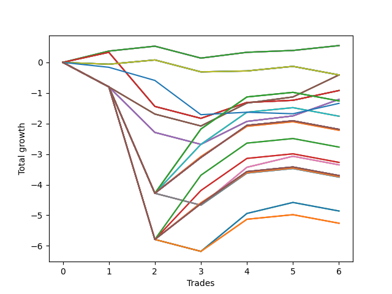

# Short Shepard 001 
- Symbol: NVDA_Unlimited
- Date Range: 02/08/2022 - 07/08/2022
- Trading Period: 7:20-12:30
- Number of Trades: 6



| Name | Win Percent | Profit | Avg Profit / Trade | Avg Time / Trade |      | Name | Win Percent | Profit | Avg Profit / Trade | Avg Time / Trade |
| ---- | ----------- | ------ | ------------------ | ---------------- | ---- | ---- | ----------- | ------ | ------------------ | ---------------- |
| Sorted By <br> Profit | | | | | | Sorted By <br> Win Percentage ||||
| Sixty-Four | 83.33 | 275.00 | 45.83 | 00:51 |     | Sixty-Four | 83.33 | 275.00 | 45.83 | 00:51 |
| Fifty-Six | 83.33 | 275.00 | 45.83 | 00:51 |     | Fifty-Six | 83.33 | 275.00 | 45.83 | 00:51 |
| Forty-Eight | 83.33 | 275.00 | 45.83 | 00:51 |     | Forty-Eight | 83.33 | 275.00 | 45.83 | 00:51 |
| Forty | 83.33 | 275.00 | 45.83 | 00:51 |     | Forty | 83.33 | 275.00 | 45.83 | 00:51 |
| Zero | 83.33 | 275.00 | 45.83 | 00:51 |     | Zero | 83.33 | 275.00 | 45.83 | 00:51 |
| Seventy | 50.00 | -205.00 | -34.17 | 10:05 |     | Sixty-Five | 66.67 | -460.00 | -76.67 | 08:30 |
| Sixty-Seven | 50.00 | -205.00 | -34.17 | 14:24 |     | Fifty-Seven | 66.67 | -460.00 | -76.67 | 08:30 |
| Sixty-Two | 50.00 | -205.00 | -34.17 | 10:05 |     | Forty-Nine | 66.67 | -460.00 | -76.67 | 08:30 |
| Fifty-Nine | 50.00 | -205.00 | -34.17 | 14:24 |     | Forty-One | 66.67 | -460.00 | -76.67 | 08:30 |
| Fifty-Four | 50.00 | -205.00 | -34.17 | 10:05 |     | One | 66.67 | -460.00 | -76.67 | 08:30 |
| Fifty-One | 50.00 | -205.00 | -34.17 | 14:24 |     | Seventy | 50.00 | -205.00 | -34.17 | 10:05 |
| Forty-Six | 50.00 | -205.00 | -34.17 | 10:05 |     | Sixty-Seven | 50.00 | -205.00 | -34.17 | 14:24 |
| Forty-Three | 50.00 | -205.00 | -34.17 | 14:24 |     | Sixty-Two | 50.00 | -205.00 | -34.17 | 10:05 |
| Six | 50.00 | -205.00 | -34.17 | 10:05 |     | Fifty-Nine | 50.00 | -205.00 | -34.17 | 14:24 |
| Three | 50.00 | -205.00 | -34.17 | 14:24 |     | Fifty-Four | 50.00 | -205.00 | -34.17 | 10:05 |
| Sixty-Five | 66.67 | -460.00 | -76.67 | 08:30 |     | Fifty-One | 50.00 | -205.00 | -34.17 | 14:24 |
| Fifty-Seven | 66.67 | -460.00 | -76.67 | 08:30 |     | Forty-Six | 50.00 | -205.00 | -34.17 | 10:05 |
| Forty-Nine | 66.67 | -460.00 | -76.67 | 08:30 |     | Forty-Three | 50.00 | -205.00 | -34.17 | 14:24 |
| Forty-One | 66.67 | -460.00 | -76.67 | 08:30 |     | Six | 50.00 | -205.00 | -34.17 | 10:05 |
| One | 66.67 | -460.00 | -76.67 | 08:30 |     | Three | 50.00 | -205.00 | -34.17 | 14:24 |
| Sixty-Six | 50.00 | -605.00 | -100.83 | 14:17 |     | Sixty-Six | 50.00 | -605.00 | -100.83 | 14:17 |
| Fifty-Eight | 50.00 | -605.00 | -100.83 | 14:17 |     | Fifty-Eight | 50.00 | -605.00 | -100.83 | 14:17 |
| Fifty | 50.00 | -605.00 | -100.83 | 14:17 |     | Fifty | 50.00 | -605.00 | -100.83 | 14:17 |
| Forty-Two | 50.00 | -605.00 | -100.83 | 14:17 |     | Forty-Two | 50.00 | -605.00 | -100.83 | 14:17 |
| Two | 50.00 | -605.00 | -100.83 | 14:17 |     | Two | 50.00 | -605.00 | -100.83 | 14:17 |
| One Hundred Twenty-Seven | 50.00 | -630.00 | -105.00 | 29:26 |     | One Hundred Twenty-Seven | 50.00 | -630.00 | -105.00 | 29:26 |
| One Hundred Twenty-Two | 50.00 | -630.00 | -105.00 | 29:26 |     | One Hundred Twenty-Two | 50.00 | -630.00 | -105.00 | 29:26 |
| Eighty-Two | 50.00 | -630.00 | -105.00 | 29:26 |     | Eighty-Two | 50.00 | -630.00 | -105.00 | 29:26 |
| Seventy-Three | 33.33 | -670.00 | -111.67 | 08:05 |     | Seventy-One | 50.00 | -880.00 | -146.67 | 29:18 |
| Seventy-One | 50.00 | -880.00 | -146.67 | 29:18 |     | Sixty-Three | 50.00 | -880.00 | -146.67 | 29:18 |
| Sixty-Three | 50.00 | -880.00 | -146.67 | 29:18 |     | Seven | 50.00 | -880.00 | -146.67 | 29:18 |
| Seven | 50.00 | -880.00 | -146.67 | 29:18 |     | One Hundred Thirty | 50.00 | -1095.00 | -182.50 | 29:55 |
| One Hundred Thirty | 50.00 | -1095.00 | -182.50 | 29:55 |     | One Hundred Twenty-Nine | 50.00 | -1095.00 | -182.50 | 29:55 |
| One Hundred Twenty-Nine | 50.00 | -1095.00 | -182.50 | 29:55 |     | One Hundred Twenty-Eight | 50.00 | -1095.00 | -182.50 | 29:55 |
| One Hundred Twenty-Eight | 50.00 | -1095.00 | -182.50 | 29:55 |     | One Hundred Twenty-Five | 50.00 | -1095.00 | -182.50 | 29:55 |
| One Hundred Twenty-Five | 50.00 | -1095.00 | -182.50 | 29:55 |     | One Hundred Twenty-Four | 50.00 | -1095.00 | -182.50 | 29:55 |
| One Hundred Twenty-Four | 50.00 | -1095.00 | -182.50 | 29:55 |     | One Hundred Twenty-Three | 50.00 | -1095.00 | -182.50 | 29:55 |
| One Hundred Twenty-Three | 50.00 | -1095.00 | -182.50 | 29:55 |     | Eighty-Five | 50.00 | -1095.00 | -182.50 | 29:55 |
| Eighty-Five | 50.00 | -1095.00 | -182.50 | 29:55 |     | Eighty-Four | 50.00 | -1095.00 | -182.50 | 29:55 |
| Eighty-Four | 50.00 | -1095.00 | -182.50 | 29:55 |     | Eighty-Three | 50.00 | -1095.00 | -182.50 | 29:55 |
| Eighty-Three | 50.00 | -1095.00 | -182.50 | 29:55 |     | One Hundred Twenty-Six | 50.00 | -1110.00 | -185.00 | 27:36 |
| One Hundred Twenty-Six | 50.00 | -1110.00 | -185.00 | 27:36 |     | One Hundred Twenty-One | 50.00 | -1110.00 | -185.00 | 27:36 |
| One Hundred Twenty-One | 50.00 | -1110.00 | -185.00 | 27:36 |     | Eighty-One | 50.00 | -1110.00 | -185.00 | 27:36 |
| Eighty-One | 50.00 | -1110.00 | -185.00 | 27:36 |     | One Hundred Seventeen | 50.00 | -1385.00 | -230.83 | 28:50 |
| One Hundred Seventeen | 50.00 | -1385.00 | -230.83 | 28:50 |     | One Hundred Twelve | 50.00 | -1385.00 | -230.83 | 28:50 |
| One Hundred Twelve | 50.00 | -1385.00 | -230.83 | 28:50 |     | Fifty-Five | 50.00 | -1635.00 | -272.50 | 28:41 |
| Fifty-Five | 50.00 | -1635.00 | -272.50 | 28:41 |     | Forty-Seven | 50.00 | -1635.00 | -272.50 | 28:41 |
| Forty-Seven | 50.00 | -1635.00 | -272.50 | 28:41 |     | One Hundred Twenty | 50.00 | -1850.00 | -308.33 | 29:18 |
| Sixty-Eight | 33.33 | -1675.00 | -279.17 | 22:28 |     | One Hundred Ninteen | 50.00 | -1850.00 | -308.33 | 29:18 |
| Sixty | 33.33 | -1675.00 | -279.17 | 22:28 |     | One Hundred Eighteen | 50.00 | -1850.00 | -308.33 | 29:18 |
| Four | 33.33 | -1675.00 | -279.17 | 22:28 |     | One Hundred Fifteen | 50.00 | -1850.00 | -308.33 | 29:18 |
| One Hundred Twenty | 50.00 | -1850.00 | -308.33 | 29:18 |     | One Hundred Fourteen | 50.00 | -1850.00 | -308.33 | 29:18 |
| One Hundred Ninteen | 50.00 | -1850.00 | -308.33 | 29:18 |     | One Hundred Thirteen | 50.00 | -1850.00 | -308.33 | 29:18 |
| One Hundred Eighteen | 50.00 | -1850.00 | -308.33 | 29:18 |     | One Hundred Sixteen | 50.00 | -1865.00 | -310.83 | 27:00 |
| One Hundred Fifteen | 50.00 | -1850.00 | -308.33 | 29:18 |     | One Hundred Eleven | 50.00 | -1865.00 | -310.83 | 27:00 |
| One Hundred Fourteen | 50.00 | -1850.00 | -308.33 | 29:18 |     | Seventy-Three | 33.33 | -670.00 | -111.67 | 08:05 |
| One Hundred Thirteen | 50.00 | -1850.00 | -308.33 | 29:18 |     | Sixty-Eight | 33.33 | -1675.00 | -279.17 | 22:28 |
| One Hundred Sixteen | 50.00 | -1865.00 | -310.83 | 27:00 |     | Sixty | 33.33 | -1675.00 | -279.17 | 22:28 |
| One Hundred Eleven | 50.00 | -1865.00 | -310.83 | 27:00 |     | Four | 33.33 | -1675.00 | -279.17 | 22:28 |
| Sixty-Nine | 33.33 | -1875.00 | -312.50 | 24:57 |     | Sixty-Nine | 33.33 | -1875.00 | -312.50 | 24:57 |
| Sixty-One | 33.33 | -1875.00 | -312.50 | 24:57 |     | Sixty-One | 33.33 | -1875.00 | -312.50 | 24:57 |
| Five | 33.33 | -1875.00 | -312.50 | 24:57 |     | Five | 33.33 | -1875.00 | -312.50 | 24:57 |
| Fifty-Two | 33.33 | -2430.00 | -405.00 | 21:51 |     | Fifty-Two | 33.33 | -2430.00 | -405.00 | 21:51 |
| Forty-Four | 33.33 | -2430.00 | -405.00 | 21:51 |     | Forty-Four | 33.33 | -2430.00 | -405.00 | 21:51 |
| Fifty-Three | 33.33 | -2630.00 | -438.33 | 24:20 |     | Fifty-Three | 33.33 | -2630.00 | -438.33 | 24:20 |
| Forty-Five | 33.33 | -2630.00 | -438.33 | 24:20 |     | Forty-Five | 33.33 | -2630.00 | -438.33 | 24:20 |

## NO STOPLOSS

### Test Zero
* Sell when price hits the middle line of the 20p bollinger
* No Stoploss
* Results:
```
Total Trades: 6
Percent Up: 16.67
Percent Down: 83.33
Total Points Moved Down: 0.55
Potential Profit: 275.00
Total Points Ups: 0.39 Count Ups: 1
Total Points Downs: 0.94 Count Downs: 5
```

<details><summary>Trades</summary>

<code>In: 2022-03-11 10:08:00		Out: 2022-03-11 10:09:10		Total Position Time: 01:10		Total Move Down: 0.37		Total to Date: 0.37</code> <br />
<code>In: 2022-04-06 10:36:00		Out: 2022-04-06 10:36:15		Total Position Time: 00:15		Total Move Down: 0.16		Total to Date: 0.53</code> <br />
<code>In: 2022-05-04 11:08:00		Out: 2022-05-04 11:08:10		Total Position Time: 00:10		Total Move Down: -0.39		Total to Date: 0.14</code> <br />
<code>In: 2022-05-05 10:13:00		Out: 2022-05-05 10:14:00		Total Position Time: 01:00		Total Move Down: 0.19		Total to Date: 0.33</code> <br />
<code>In: 2022-06-24 11:52:00		Out: 2022-06-24 11:54:10		Total Position Time: 02:10		Total Move Down: 0.06		Total to Date: 0.39</code> <br />
<code>In: 2022-07-08 10:56:00		Out: 2022-07-08 10:56:25		Total Position Time: 00:25		Total Move Down: 0.16		Total to Date: 0.55</code> <br />


</details>

### Test One
* Sell when the price hits the upper line of the 20p 1std bollinger
* No Stoploss
* Results:
```
Total Trades: 6
Percent Up: 33.33
Percent Down: 66.67
Total Points Moved Down: -0.92
Potential Profit: -460.00
Total Points Ups: 2.16 Count Ups: 2
Total Points Downs: 1.24 Count Downs: 4
```

<details><summary>Trades</summary>

<code>In: 2022-03-11 10:08:00		Out: 2022-03-11 10:19:20		Total Position Time: 11:20		Total Move Down: 0.33		Total to Date: 0.33</code> <br />
<code>In: 2022-04-06 10:36:00		Out: 2022-04-06 10:56:50		Total Position Time: 20:50		Total Move Down: -1.77		Total to Date: -1.44</code> <br />
<code>In: 2022-05-04 11:08:00		Out: 2022-05-04 11:08:10		Total Position Time: 00:10		Total Move Down: -0.39		Total to Date: -1.83</code> <br />
<code>In: 2022-05-05 10:13:00		Out: 2022-05-05 10:20:20		Total Position Time: 07:20		Total Move Down: 0.52		Total to Date: -1.31</code> <br />
<code>In: 2022-06-24 11:52:00		Out: 2022-06-24 12:01:20		Total Position Time: 09:20		Total Move Down: 0.07		Total to Date: -1.24</code> <br />
<code>In: 2022-07-08 10:56:00		Out: 2022-07-08 10:58:05		Total Position Time: 02:05		Total Move Down: 0.32		Total to Date: -0.92</code> <br />


</details>

### Test Two
* Sell when the price hits the upper line of the 20p 2std bollinger
* No Stoploss
* Results:
```
Total Trades: 6
Percent Up: 50.00
Percent Down: 50.00
Total Points Moved Down: -1.21
Potential Profit: -605.00
Total Points Ups: 2.68 Count Ups: 3
Total Points Downs: 1.47 Count Downs: 3
```

<details><summary>Trades</summary>

<code>In: 2022-03-11 10:08:00		Out: 2022-03-11 10:37:55		Total Position Time: 29:55		Total Move Down: -0.80		Total to Date: -0.80</code> <br />
<code>In: 2022-04-06 10:36:00		Out: 2022-04-06 11:00:00		Total Position Time: 24:00		Total Move Down: -1.49		Total to Date: -2.29</code> <br />
<code>In: 2022-05-04 11:08:00		Out: 2022-05-04 11:08:10		Total Position Time: 00:10		Total Move Down: -0.39		Total to Date: -2.68</code> <br />
<code>In: 2022-05-05 10:13:00		Out: 2022-05-05 10:30:30		Total Position Time: 17:30		Total Move Down: 0.75		Total to Date: -1.93</code> <br />
<code>In: 2022-06-24 11:52:00		Out: 2022-06-24 12:03:00		Total Position Time: 11:00		Total Move Down: 0.18		Total to Date: -1.75</code> <br />
<code>In: 2022-07-08 10:56:00		Out: 2022-07-08 10:59:10		Total Position Time: 03:10		Total Move Down: 0.54		Total to Date: -1.21</code> <br />


</details>

### Test Three
* Sell when price hits the middle line of the 50p bollinger
* No Stoploss
* Results:
```
Total Trades: 6
Percent Up: 50.00
Percent Down: 50.00
Total Points Moved Down: -0.41
Potential Profit: -205.00
Total Points Ups: 2.08 Count Ups: 3
Total Points Downs: 1.67 Count Downs: 3
```

<details><summary>Trades</summary>

<code>In: 2022-03-11 10:08:00		Out: 2022-03-11 10:37:55		Total Position Time: 29:55		Total Move Down: -0.80		Total to Date: -0.80</code> <br />
<code>In: 2022-04-06 10:36:00		Out: 2022-04-06 11:00:10		Total Position Time: 24:10		Total Move Down: -0.89		Total to Date: -1.69</code> <br />
<code>In: 2022-05-04 11:08:00		Out: 2022-05-04 11:08:10		Total Position Time: 00:10		Total Move Down: -0.39		Total to Date: -2.08</code> <br />
<code>In: 2022-05-05 10:13:00		Out: 2022-05-05 10:26:35		Total Position Time: 13:35		Total Move Down: 0.75		Total to Date: -1.33</code> <br />
<code>In: 2022-06-24 11:52:00		Out: 2022-06-24 12:05:30		Total Position Time: 13:30		Total Move Down: 0.20		Total to Date: -1.13</code> <br />
<code>In: 2022-07-08 10:56:00		Out: 2022-07-08 11:01:05		Total Position Time: 05:05		Total Move Down: 0.72		Total to Date: -0.41</code> <br />


</details>

### Test Four
* Sell when the price hits the upper line of the 50p 1std bollinger
* No Stoploss
* Results:
```
Total Trades: 6
Percent Up: 66.67
Percent Down: 33.33
Total Points Moved Down: -3.35
Potential Profit: -1675.00
Total Points Ups: 4.95 Count Ups: 4
Total Points Downs: 1.60 Count Downs: 2
```

<details><summary>Trades</summary>

<code>In: 2022-03-11 10:08:00		Out: 2022-03-11 10:37:55		Total Position Time: 29:55		Total Move Down: -0.80		Total to Date: -0.80</code> <br />
<code>In: 2022-04-06 10:36:00		Out: 2022-04-06 11:05:55		Total Position Time: 29:55		Total Move Down: -3.48		Total to Date: -4.28</code> <br />
<code>In: 2022-05-04 11:08:00		Out: 2022-05-04 11:08:10		Total Position Time: 00:10		Total Move Down: -0.39		Total to Date: -4.67</code> <br />
<code>In: 2022-05-05 10:13:00		Out: 2022-05-05 10:38:55		Total Position Time: 25:55		Total Move Down: 1.24		Total to Date: -3.43</code> <br />
<code>In: 2022-06-24 11:52:00		Out: 2022-06-24 12:11:00		Total Position Time: 19:00		Total Move Down: 0.36		Total to Date: -3.07</code> <br />
<code>In: 2022-07-08 10:56:00		Out: 2022-07-08 11:25:55		Total Position Time: 29:55		Total Move Down: -0.28		Total to Date: -3.35</code> <br />


</details>

### Test Five
* Sell when the price hits the upper line of the 50p 2std bollinger
* No Stoploss
* Results:
```
Total Trades: 6
Percent Up: 66.67
Percent Down: 33.33
Total Points Moved Down: -3.75
Potential Profit: -1875.00
Total Points Ups: 4.95 Count Ups: 4
Total Points Downs: 1.20 Count Downs: 2
```

<details><summary>Trades</summary>

<code>In: 2022-03-11 10:08:00		Out: 2022-03-11 10:37:55		Total Position Time: 29:55		Total Move Down: -0.80		Total to Date: -0.80</code> <br />
<code>In: 2022-04-06 10:36:00		Out: 2022-04-06 11:05:55		Total Position Time: 29:55		Total Move Down: -3.48		Total to Date: -4.28</code> <br />
<code>In: 2022-05-04 11:08:00		Out: 2022-05-04 11:08:10		Total Position Time: 00:10		Total Move Down: -0.39		Total to Date: -4.67</code> <br />
<code>In: 2022-05-05 10:13:00		Out: 2022-05-05 10:42:55		Total Position Time: 29:55		Total Move Down: 1.05		Total to Date: -3.62</code> <br />
<code>In: 2022-06-24 11:52:00		Out: 2022-06-24 12:21:55		Total Position Time: 29:55		Total Move Down: 0.15		Total to Date: -3.47</code> <br />
<code>In: 2022-07-08 10:56:00		Out: 2022-07-08 11:25:55		Total Position Time: 29:55		Total Move Down: -0.28		Total to Date: -3.75</code> <br />


</details>

### Test Six
* Sell when the price hits the middle line of the 1std VWAP
* No Stoploss
* Results:
```
Total Trades: 6
Percent Up: 50.00
Percent Down: 50.00
Total Points Moved Down: -0.41
Potential Profit: -205.00
Total Points Ups: 0.73 Count Ups: 3
Total Points Downs: 0.32 Count Downs: 3
```

<details><summary>Trades</summary>

<code>In: 2022-03-11 10:08:00		Out: 2022-03-11 10:08:10		Total Position Time: 00:10		Total Move Down: -0.06		Total to Date: -0.06</code> <br />
<code>In: 2022-04-06 10:36:00		Out: 2022-04-06 10:36:10		Total Position Time: 00:10		Total Move Down: 0.14		Total to Date: 0.08</code> <br />
<code>In: 2022-05-04 11:08:00		Out: 2022-05-04 11:08:10		Total Position Time: 00:10		Total Move Down: -0.39		Total to Date: -0.31</code> <br />
<code>In: 2022-05-05 10:13:00		Out: 2022-05-05 10:13:10		Total Position Time: 00:10		Total Move Down: 0.03		Total to Date: -0.28</code> <br />
<code>In: 2022-06-24 11:52:00		Out: 2022-06-24 12:21:55		Total Position Time: 29:55		Total Move Down: 0.15		Total to Date: -0.13</code> <br />
<code>In: 2022-07-08 10:56:00		Out: 2022-07-08 11:25:55		Total Position Time: 29:55		Total Move Down: -0.28		Total to Date: -0.41</code> <br />


</details>

### Test Seven
* Sell when the price hits the upper line of the 1std VWAP
* No Stoploss
* Results:
```
Total Trades: 6
Percent Up: 50.00
Percent Down: 50.00
Total Points Moved Down: -1.76
Potential Profit: -880.00
Total Points Ups: 4.56 Count Ups: 3
Total Points Downs: 2.80 Count Downs: 3
```

<details><summary>Trades</summary>

<code>In: 2022-03-11 10:08:00		Out: 2022-03-11 10:37:55		Total Position Time: 29:55		Total Move Down: -0.80		Total to Date: -0.80</code> <br />
<code>In: 2022-04-06 10:36:00		Out: 2022-04-06 11:05:55		Total Position Time: 29:55		Total Move Down: -3.48		Total to Date: -4.28</code> <br />
<code>In: 2022-05-04 11:08:00		Out: 2022-05-04 11:34:15		Total Position Time: 26:15		Total Move Down: 1.60		Total to Date: -2.68</code> <br />
<code>In: 2022-05-05 10:13:00		Out: 2022-05-05 10:42:55		Total Position Time: 29:55		Total Move Down: 1.05		Total to Date: -1.63</code> <br />
<code>In: 2022-06-24 11:52:00		Out: 2022-06-24 12:21:55		Total Position Time: 29:55		Total Move Down: 0.15		Total to Date: -1.48</code> <br />
<code>In: 2022-07-08 10:56:00		Out: 2022-07-08 11:25:55		Total Position Time: 29:55		Total Move Down: -0.28		Total to Date: -1.76</code> <br />


</details>

## STOPLOSS OF 5

### Test Forty
* Sell when price hits the middle line of the 20p bollinger
* Stoploss is -5 points
* Results:
```
Total Trades: 6
Percent Up: 16.67
Percent Down: 83.33
Total Points Moved Down: 0.55
Potential Profit: 275.00
Total Points Ups: 0.39 Count Ups: 1
Total Points Downs: 0.94 Count Downs: 5
```

<details><summary>Trades</summary>

<code>In: 2022-03-11 10:08:00		Out: 2022-03-11 10:09:10		Total Position Time: 01:10		Total Move Down: 0.37		Total to Date: 0.37</code> <br />
<code>In: 2022-04-06 10:36:00		Out: 2022-04-06 10:36:15		Total Position Time: 00:15		Total Move Down: 0.16		Total to Date: 0.53</code> <br />
<code>In: 2022-05-04 11:08:00		Out: 2022-05-04 11:08:10		Total Position Time: 00:10		Total Move Down: -0.39		Total to Date: 0.14</code> <br />
<code>In: 2022-05-05 10:13:00		Out: 2022-05-05 10:14:00		Total Position Time: 01:00		Total Move Down: 0.19		Total to Date: 0.33</code> <br />
<code>In: 2022-06-24 11:52:00		Out: 2022-06-24 11:54:10		Total Position Time: 02:10		Total Move Down: 0.06		Total to Date: 0.39</code> <br />
<code>In: 2022-07-08 10:56:00		Out: 2022-07-08 10:56:25		Total Position Time: 00:25		Total Move Down: 0.16		Total to Date: 0.55</code> <br />


</details>

### Test Forty-One
* Sell when the price hits the upper line of the 20p 1std bollinger
* Stoploss is -5 points
* Results:
```
Total Trades: 6
Percent Up: 33.33
Percent Down: 66.67
Total Points Moved Down: -0.92
Potential Profit: -460.00
Total Points Ups: 2.16 Count Ups: 2
Total Points Downs: 1.24 Count Downs: 4
```

<details><summary>Trades</summary>

<code>In: 2022-03-11 10:08:00		Out: 2022-03-11 10:19:20		Total Position Time: 11:20		Total Move Down: 0.33		Total to Date: 0.33</code> <br />
<code>In: 2022-04-06 10:36:00		Out: 2022-04-06 10:56:50		Total Position Time: 20:50		Total Move Down: -1.77		Total to Date: -1.44</code> <br />
<code>In: 2022-05-04 11:08:00		Out: 2022-05-04 11:08:10		Total Position Time: 00:10		Total Move Down: -0.39		Total to Date: -1.83</code> <br />
<code>In: 2022-05-05 10:13:00		Out: 2022-05-05 10:20:20		Total Position Time: 07:20		Total Move Down: 0.52		Total to Date: -1.31</code> <br />
<code>In: 2022-06-24 11:52:00		Out: 2022-06-24 12:01:20		Total Position Time: 09:20		Total Move Down: 0.07		Total to Date: -1.24</code> <br />
<code>In: 2022-07-08 10:56:00		Out: 2022-07-08 10:58:05		Total Position Time: 02:05		Total Move Down: 0.32		Total to Date: -0.92</code> <br />


</details>

### Test Forty-Two
* Sell when the price hits the upper line of the 20p 2std bollinger
* Stoploss is -5 points
* Results:
```
Total Trades: 6
Percent Up: 50.00
Percent Down: 50.00
Total Points Moved Down: -1.21
Potential Profit: -605.00
Total Points Ups: 2.68 Count Ups: 3
Total Points Downs: 1.47 Count Downs: 3
```

<details><summary>Trades</summary>

<code>In: 2022-03-11 10:08:00		Out: 2022-03-11 10:37:55		Total Position Time: 29:55		Total Move Down: -0.80		Total to Date: -0.80</code> <br />
<code>In: 2022-04-06 10:36:00		Out: 2022-04-06 11:00:00		Total Position Time: 24:00		Total Move Down: -1.49		Total to Date: -2.29</code> <br />
<code>In: 2022-05-04 11:08:00		Out: 2022-05-04 11:08:10		Total Position Time: 00:10		Total Move Down: -0.39		Total to Date: -2.68</code> <br />
<code>In: 2022-05-05 10:13:00		Out: 2022-05-05 10:30:30		Total Position Time: 17:30		Total Move Down: 0.75		Total to Date: -1.93</code> <br />
<code>In: 2022-06-24 11:52:00		Out: 2022-06-24 12:03:00		Total Position Time: 11:00		Total Move Down: 0.18		Total to Date: -1.75</code> <br />
<code>In: 2022-07-08 10:56:00		Out: 2022-07-08 10:59:10		Total Position Time: 03:10		Total Move Down: 0.54		Total to Date: -1.21</code> <br />


</details>

### Test Forty-Three
* Sell when price hits the middle line of the 50p bollinger
* Stoploss is -5 points
* Results:
```
Total Trades: 6
Percent Up: 50.00
Percent Down: 50.00
Total Points Moved Down: -0.41
Potential Profit: -205.00
Total Points Ups: 2.08 Count Ups: 3
Total Points Downs: 1.67 Count Downs: 3
```

<details><summary>Trades</summary>

<code>In: 2022-03-11 10:08:00		Out: 2022-03-11 10:37:55		Total Position Time: 29:55		Total Move Down: -0.80		Total to Date: -0.80</code> <br />
<code>In: 2022-04-06 10:36:00		Out: 2022-04-06 11:00:10		Total Position Time: 24:10		Total Move Down: -0.89		Total to Date: -1.69</code> <br />
<code>In: 2022-05-04 11:08:00		Out: 2022-05-04 11:08:10		Total Position Time: 00:10		Total Move Down: -0.39		Total to Date: -2.08</code> <br />
<code>In: 2022-05-05 10:13:00		Out: 2022-05-05 10:26:35		Total Position Time: 13:35		Total Move Down: 0.75		Total to Date: -1.33</code> <br />
<code>In: 2022-06-24 11:52:00		Out: 2022-06-24 12:05:30		Total Position Time: 13:30		Total Move Down: 0.20		Total to Date: -1.13</code> <br />
<code>In: 2022-07-08 10:56:00		Out: 2022-07-08 11:01:05		Total Position Time: 05:05		Total Move Down: 0.72		Total to Date: -0.41</code> <br />


</details>

### Test Forty-Four
* Sell when the price hits the upper line of the 50p 1std bollinger
* Stoploss is -5 points
* Results:
```
Total Trades: 6
Percent Up: 66.67
Percent Down: 33.33
Total Points Moved Down: -4.86
Potential Profit: -2430.00
Total Points Ups: 6.46 Count Ups: 4
Total Points Downs: 1.60 Count Downs: 2
```

<details><summary>Trades</summary>

<code>In: 2022-03-11 10:08:00		Out: 2022-03-11 10:37:55		Total Position Time: 29:55		Total Move Down: -0.80		Total to Date: -0.80</code> <br />
<code>In: 2022-04-06 10:36:00		Out: 2022-04-06 11:02:15		Total Position Time: 26:15		Total Move Down: -4.99		Total to Date: -5.79</code> <br />
<code>In: 2022-05-04 11:08:00		Out: 2022-05-04 11:08:10		Total Position Time: 00:10		Total Move Down: -0.39		Total to Date: -6.18</code> <br />
<code>In: 2022-05-05 10:13:00		Out: 2022-05-05 10:38:55		Total Position Time: 25:55		Total Move Down: 1.24		Total to Date: -4.94</code> <br />
<code>In: 2022-06-24 11:52:00		Out: 2022-06-24 12:11:00		Total Position Time: 19:00		Total Move Down: 0.36		Total to Date: -4.58</code> <br />
<code>In: 2022-07-08 10:56:00		Out: 2022-07-08 11:25:55		Total Position Time: 29:55		Total Move Down: -0.28		Total to Date: -4.86</code> <br />


</details>

### Test Forty-Five
* Sell when the price hits the upper line of the 50p 2std bollinger
* Stoploss is -5 points
* Results:
```
Total Trades: 6
Percent Up: 66.67
Percent Down: 33.33
Total Points Moved Down: -5.26
Potential Profit: -2630.00
Total Points Ups: 6.46 Count Ups: 4
Total Points Downs: 1.20 Count Downs: 2
```

<details><summary>Trades</summary>

<code>In: 2022-03-11 10:08:00		Out: 2022-03-11 10:37:55		Total Position Time: 29:55		Total Move Down: -0.80		Total to Date: -0.80</code> <br />
<code>In: 2022-04-06 10:36:00		Out: 2022-04-06 11:02:15		Total Position Time: 26:15		Total Move Down: -4.99		Total to Date: -5.79</code> <br />
<code>In: 2022-05-04 11:08:00		Out: 2022-05-04 11:08:10		Total Position Time: 00:10		Total Move Down: -0.39		Total to Date: -6.18</code> <br />
<code>In: 2022-05-05 10:13:00		Out: 2022-05-05 10:42:55		Total Position Time: 29:55		Total Move Down: 1.05		Total to Date: -5.13</code> <br />
<code>In: 2022-06-24 11:52:00		Out: 2022-06-24 12:21:55		Total Position Time: 29:55		Total Move Down: 0.15		Total to Date: -4.98</code> <br />
<code>In: 2022-07-08 10:56:00		Out: 2022-07-08 11:25:55		Total Position Time: 29:55		Total Move Down: -0.28		Total to Date: -5.26</code> <br />


</details>

### Test Forty-Six
* Sell when the price hits the middle line of the 1std VWAP
* Stoploss is -5 points
* Results:
```
Total Trades: 6
Percent Up: 50.00
Percent Down: 50.00
Total Points Moved Down: -0.41
Potential Profit: -205.00
Total Points Ups: 0.73 Count Ups: 3
Total Points Downs: 0.32 Count Downs: 3
```

<details><summary>Trades</summary>

<code>In: 2022-03-11 10:08:00		Out: 2022-03-11 10:08:10		Total Position Time: 00:10		Total Move Down: -0.06		Total to Date: -0.06</code> <br />
<code>In: 2022-04-06 10:36:00		Out: 2022-04-06 10:36:10		Total Position Time: 00:10		Total Move Down: 0.14		Total to Date: 0.08</code> <br />
<code>In: 2022-05-04 11:08:00		Out: 2022-05-04 11:08:10		Total Position Time: 00:10		Total Move Down: -0.39		Total to Date: -0.31</code> <br />
<code>In: 2022-05-05 10:13:00		Out: 2022-05-05 10:13:10		Total Position Time: 00:10		Total Move Down: 0.03		Total to Date: -0.28</code> <br />
<code>In: 2022-06-24 11:52:00		Out: 2022-06-24 12:21:55		Total Position Time: 29:55		Total Move Down: 0.15		Total to Date: -0.13</code> <br />
<code>In: 2022-07-08 10:56:00		Out: 2022-07-08 11:25:55		Total Position Time: 29:55		Total Move Down: -0.28		Total to Date: -0.41</code> <br />


</details>

### Test Forty-Seven
* Sell when the price hits the upper line of the 1std VWAP
* Stoploss is -5 points
* Results:
```
Total Trades: 6
Percent Up: 50.00
Percent Down: 50.00
Total Points Moved Down: -3.27
Potential Profit: -1635.00
Total Points Ups: 6.07 Count Ups: 3
Total Points Downs: 2.80 Count Downs: 3
```

<details><summary>Trades</summary>

<code>In: 2022-03-11 10:08:00		Out: 2022-03-11 10:37:55		Total Position Time: 29:55		Total Move Down: -0.80		Total to Date: -0.80</code> <br />
<code>In: 2022-04-06 10:36:00		Out: 2022-04-06 11:02:15		Total Position Time: 26:15		Total Move Down: -4.99		Total to Date: -5.79</code> <br />
<code>In: 2022-05-04 11:08:00		Out: 2022-05-04 11:34:15		Total Position Time: 26:15		Total Move Down: 1.60		Total to Date: -4.19</code> <br />
<code>In: 2022-05-05 10:13:00		Out: 2022-05-05 10:42:55		Total Position Time: 29:55		Total Move Down: 1.05		Total to Date: -3.14</code> <br />
<code>In: 2022-06-24 11:52:00		Out: 2022-06-24 12:21:55		Total Position Time: 29:55		Total Move Down: 0.15		Total to Date: -2.99</code> <br />
<code>In: 2022-07-08 10:56:00		Out: 2022-07-08 11:25:55		Total Position Time: 29:55		Total Move Down: -0.28		Total to Date: -3.27</code> <br />


</details>

## TRAIL STOP OF 5

### Test Forty-Eight
* Sell when price hits the middle line of the 20p bollinger
* Trailing Stop is -5 points
* Results:
```
Total Trades: 6
Percent Up: 16.67
Percent Down: 83.33
Total Points Moved Down: 0.55
Potential Profit: 275.00
Total Points Ups: 0.39 Count Ups: 1
Total Points Downs: 0.94 Count Downs: 5
```

<details><summary>Trades</summary>

<code>In: 2022-03-11 10:08:00		Out: 2022-03-11 10:09:10		Total Position Time: 01:10		Total Move Down: 0.37		Total to Date: 0.37</code> <br />
<code>In: 2022-04-06 10:36:00		Out: 2022-04-06 10:36:15		Total Position Time: 00:15		Total Move Down: 0.16		Total to Date: 0.53</code> <br />
<code>In: 2022-05-04 11:08:00		Out: 2022-05-04 11:08:10		Total Position Time: 00:10		Total Move Down: -0.39		Total to Date: 0.14</code> <br />
<code>In: 2022-05-05 10:13:00		Out: 2022-05-05 10:14:00		Total Position Time: 01:00		Total Move Down: 0.19		Total to Date: 0.33</code> <br />
<code>In: 2022-06-24 11:52:00		Out: 2022-06-24 11:54:10		Total Position Time: 02:10		Total Move Down: 0.06		Total to Date: 0.39</code> <br />
<code>In: 2022-07-08 10:56:00		Out: 2022-07-08 10:56:25		Total Position Time: 00:25		Total Move Down: 0.16		Total to Date: 0.55</code> <br />


</details>

### Test Forty-Nine
* Sell when the price hits the upper line of the 20p 1std bollinger
* Trailing Stop is -5 points
* Results:
```
Total Trades: 6
Percent Up: 33.33
Percent Down: 66.67
Total Points Moved Down: -0.92
Potential Profit: -460.00
Total Points Ups: 2.16 Count Ups: 2
Total Points Downs: 1.24 Count Downs: 4
```

<details><summary>Trades</summary>

<code>In: 2022-03-11 10:08:00		Out: 2022-03-11 10:19:20		Total Position Time: 11:20		Total Move Down: 0.33		Total to Date: 0.33</code> <br />
<code>In: 2022-04-06 10:36:00		Out: 2022-04-06 10:56:50		Total Position Time: 20:50		Total Move Down: -1.77		Total to Date: -1.44</code> <br />
<code>In: 2022-05-04 11:08:00		Out: 2022-05-04 11:08:10		Total Position Time: 00:10		Total Move Down: -0.39		Total to Date: -1.83</code> <br />
<code>In: 2022-05-05 10:13:00		Out: 2022-05-05 10:20:20		Total Position Time: 07:20		Total Move Down: 0.52		Total to Date: -1.31</code> <br />
<code>In: 2022-06-24 11:52:00		Out: 2022-06-24 12:01:20		Total Position Time: 09:20		Total Move Down: 0.07		Total to Date: -1.24</code> <br />
<code>In: 2022-07-08 10:56:00		Out: 2022-07-08 10:58:05		Total Position Time: 02:05		Total Move Down: 0.32		Total to Date: -0.92</code> <br />


</details>

### Test Fifty
* Sell when the price hits the upper line of the 20p 2std bollinger
* Trailing Stop is -5 points
* Results:
```
Total Trades: 6
Percent Up: 50.00
Percent Down: 50.00
Total Points Moved Down: -1.21
Potential Profit: -605.00
Total Points Ups: 2.68 Count Ups: 3
Total Points Downs: 1.47 Count Downs: 3
```

<details><summary>Trades</summary>

<code>In: 2022-03-11 10:08:00		Out: 2022-03-11 10:37:55		Total Position Time: 29:55		Total Move Down: -0.80		Total to Date: -0.80</code> <br />
<code>In: 2022-04-06 10:36:00		Out: 2022-04-06 11:00:00		Total Position Time: 24:00		Total Move Down: -1.49		Total to Date: -2.29</code> <br />
<code>In: 2022-05-04 11:08:00		Out: 2022-05-04 11:08:10		Total Position Time: 00:10		Total Move Down: -0.39		Total to Date: -2.68</code> <br />
<code>In: 2022-05-05 10:13:00		Out: 2022-05-05 10:30:30		Total Position Time: 17:30		Total Move Down: 0.75		Total to Date: -1.93</code> <br />
<code>In: 2022-06-24 11:52:00		Out: 2022-06-24 12:03:00		Total Position Time: 11:00		Total Move Down: 0.18		Total to Date: -1.75</code> <br />
<code>In: 2022-07-08 10:56:00		Out: 2022-07-08 10:59:10		Total Position Time: 03:10		Total Move Down: 0.54		Total to Date: -1.21</code> <br />


</details>

### Test Fifty-One
* Sell when price hits the middle line of the 50p bollinger
* Trailing Stop is -5 points
* Results:
```
Total Trades: 6
Percent Up: 50.00
Percent Down: 50.00
Total Points Moved Down: -0.41
Potential Profit: -205.00
Total Points Ups: 2.08 Count Ups: 3
Total Points Downs: 1.67 Count Downs: 3
```

<details><summary>Trades</summary>

<code>In: 2022-03-11 10:08:00		Out: 2022-03-11 10:37:55		Total Position Time: 29:55		Total Move Down: -0.80		Total to Date: -0.80</code> <br />
<code>In: 2022-04-06 10:36:00		Out: 2022-04-06 11:00:10		Total Position Time: 24:10		Total Move Down: -0.89		Total to Date: -1.69</code> <br />
<code>In: 2022-05-04 11:08:00		Out: 2022-05-04 11:08:10		Total Position Time: 00:10		Total Move Down: -0.39		Total to Date: -2.08</code> <br />
<code>In: 2022-05-05 10:13:00		Out: 2022-05-05 10:26:35		Total Position Time: 13:35		Total Move Down: 0.75		Total to Date: -1.33</code> <br />
<code>In: 2022-06-24 11:52:00		Out: 2022-06-24 12:05:30		Total Position Time: 13:30		Total Move Down: 0.20		Total to Date: -1.13</code> <br />
<code>In: 2022-07-08 10:56:00		Out: 2022-07-08 11:01:05		Total Position Time: 05:05		Total Move Down: 0.72		Total to Date: -0.41</code> <br />


</details>

### Test Fifty-Two
* Sell when the price hits the upper line of the 50p 1std bollinger
* Trailing Stop is -5 points
* Results:
```
Total Trades: 6
Percent Up: 66.67
Percent Down: 33.33
Total Points Moved Down: -4.86
Potential Profit: -2430.00
Total Points Ups: 6.46 Count Ups: 4
Total Points Downs: 1.60 Count Downs: 2
```

<details><summary>Trades</summary>

<code>In: 2022-03-11 10:08:00		Out: 2022-03-11 10:37:55		Total Position Time: 29:55		Total Move Down: -0.80		Total to Date: -0.80</code> <br />
<code>In: 2022-04-06 10:36:00		Out: 2022-04-06 11:02:15		Total Position Time: 26:15		Total Move Down: -4.99		Total to Date: -5.79</code> <br />
<code>In: 2022-05-04 11:08:00		Out: 2022-05-04 11:08:10		Total Position Time: 00:10		Total Move Down: -0.39		Total to Date: -6.18</code> <br />
<code>In: 2022-05-05 10:13:00		Out: 2022-05-05 10:38:55		Total Position Time: 25:55		Total Move Down: 1.24		Total to Date: -4.94</code> <br />
<code>In: 2022-06-24 11:52:00		Out: 2022-06-24 12:11:00		Total Position Time: 19:00		Total Move Down: 0.36		Total to Date: -4.58</code> <br />
<code>In: 2022-07-08 10:56:00		Out: 2022-07-08 11:25:55		Total Position Time: 29:55		Total Move Down: -0.28		Total to Date: -4.86</code> <br />


</details>

### Test Fifty-Three
* Sell when the price hits the upper line of the 50p 2std bollinger
* Trailing Stop is -5 points
* Results:
```
Total Trades: 6
Percent Up: 66.67
Percent Down: 33.33
Total Points Moved Down: -5.26
Potential Profit: -2630.00
Total Points Ups: 6.46 Count Ups: 4
Total Points Downs: 1.20 Count Downs: 2
```

<details><summary>Trades</summary>

<code>In: 2022-03-11 10:08:00		Out: 2022-03-11 10:37:55		Total Position Time: 29:55		Total Move Down: -0.80		Total to Date: -0.80</code> <br />
<code>In: 2022-04-06 10:36:00		Out: 2022-04-06 11:02:15		Total Position Time: 26:15		Total Move Down: -4.99		Total to Date: -5.79</code> <br />
<code>In: 2022-05-04 11:08:00		Out: 2022-05-04 11:08:10		Total Position Time: 00:10		Total Move Down: -0.39		Total to Date: -6.18</code> <br />
<code>In: 2022-05-05 10:13:00		Out: 2022-05-05 10:42:55		Total Position Time: 29:55		Total Move Down: 1.05		Total to Date: -5.13</code> <br />
<code>In: 2022-06-24 11:52:00		Out: 2022-06-24 12:21:55		Total Position Time: 29:55		Total Move Down: 0.15		Total to Date: -4.98</code> <br />
<code>In: 2022-07-08 10:56:00		Out: 2022-07-08 11:25:55		Total Position Time: 29:55		Total Move Down: -0.28		Total to Date: -5.26</code> <br />


</details>

### Test Fifty-Four
* Sell when the price hits the middle line of the 1std VWAP
* Trailing Stop is -5 points
* Results:
```
Total Trades: 6
Percent Up: 50.00
Percent Down: 50.00
Total Points Moved Down: -0.41
Potential Profit: -205.00
Total Points Ups: 0.73 Count Ups: 3
Total Points Downs: 0.32 Count Downs: 3
```

<details><summary>Trades</summary>

<code>In: 2022-03-11 10:08:00		Out: 2022-03-11 10:08:10		Total Position Time: 00:10		Total Move Down: -0.06		Total to Date: -0.06</code> <br />
<code>In: 2022-04-06 10:36:00		Out: 2022-04-06 10:36:10		Total Position Time: 00:10		Total Move Down: 0.14		Total to Date: 0.08</code> <br />
<code>In: 2022-05-04 11:08:00		Out: 2022-05-04 11:08:10		Total Position Time: 00:10		Total Move Down: -0.39		Total to Date: -0.31</code> <br />
<code>In: 2022-05-05 10:13:00		Out: 2022-05-05 10:13:10		Total Position Time: 00:10		Total Move Down: 0.03		Total to Date: -0.28</code> <br />
<code>In: 2022-06-24 11:52:00		Out: 2022-06-24 12:21:55		Total Position Time: 29:55		Total Move Down: 0.15		Total to Date: -0.13</code> <br />
<code>In: 2022-07-08 10:56:00		Out: 2022-07-08 11:25:55		Total Position Time: 29:55		Total Move Down: -0.28		Total to Date: -0.41</code> <br />


</details>

### Test Fifty-Five
* Sell when the price hits the upper line of the 1std VWAP
* Trailing Stop is -5 points
* Results:
```
Total Trades: 6
Percent Up: 50.00
Percent Down: 50.00
Total Points Moved Down: -3.27
Potential Profit: -1635.00
Total Points Ups: 6.07 Count Ups: 3
Total Points Downs: 2.80 Count Downs: 3
```

<details><summary>Trades</summary>

<code>In: 2022-03-11 10:08:00		Out: 2022-03-11 10:37:55		Total Position Time: 29:55		Total Move Down: -0.80		Total to Date: -0.80</code> <br />
<code>In: 2022-04-06 10:36:00		Out: 2022-04-06 11:02:15		Total Position Time: 26:15		Total Move Down: -4.99		Total to Date: -5.79</code> <br />
<code>In: 2022-05-04 11:08:00		Out: 2022-05-04 11:34:15		Total Position Time: 26:15		Total Move Down: 1.60		Total to Date: -4.19</code> <br />
<code>In: 2022-05-05 10:13:00		Out: 2022-05-05 10:42:55		Total Position Time: 29:55		Total Move Down: 1.05		Total to Date: -3.14</code> <br />
<code>In: 2022-06-24 11:52:00		Out: 2022-06-24 12:21:55		Total Position Time: 29:55		Total Move Down: 0.15		Total to Date: -2.99</code> <br />
<code>In: 2022-07-08 10:56:00		Out: 2022-07-08 11:25:55		Total Position Time: 29:55		Total Move Down: -0.28		Total to Date: -3.27</code> <br />


</details>

## STOPLOSS OF 10

### Test Fifty-Six
* Sell when price hits the middle line of the 20p bollinger
* Stoploss is -10 points
* Results:
```
Total Trades: 6
Percent Up: 16.67
Percent Down: 83.33
Total Points Moved Down: 0.55
Potential Profit: 275.00
Total Points Ups: 0.39 Count Ups: 1
Total Points Downs: 0.94 Count Downs: 5
```

<details><summary>Trades</summary>

<code>In: 2022-03-11 10:08:00		Out: 2022-03-11 10:09:10		Total Position Time: 01:10		Total Move Down: 0.37		Total to Date: 0.37</code> <br />
<code>In: 2022-04-06 10:36:00		Out: 2022-04-06 10:36:15		Total Position Time: 00:15		Total Move Down: 0.16		Total to Date: 0.53</code> <br />
<code>In: 2022-05-04 11:08:00		Out: 2022-05-04 11:08:10		Total Position Time: 00:10		Total Move Down: -0.39		Total to Date: 0.14</code> <br />
<code>In: 2022-05-05 10:13:00		Out: 2022-05-05 10:14:00		Total Position Time: 01:00		Total Move Down: 0.19		Total to Date: 0.33</code> <br />
<code>In: 2022-06-24 11:52:00		Out: 2022-06-24 11:54:10		Total Position Time: 02:10		Total Move Down: 0.06		Total to Date: 0.39</code> <br />
<code>In: 2022-07-08 10:56:00		Out: 2022-07-08 10:56:25		Total Position Time: 00:25		Total Move Down: 0.16		Total to Date: 0.55</code> <br />


</details>

### Test Fifty-Seven
* Sell when the price hits the upper line of the 20p 1std bollinger
* Stoploss is -10 points
* Results:
```
Total Trades: 6
Percent Up: 33.33
Percent Down: 66.67
Total Points Moved Down: -0.92
Potential Profit: -460.00
Total Points Ups: 2.16 Count Ups: 2
Total Points Downs: 1.24 Count Downs: 4
```

<details><summary>Trades</summary>

<code>In: 2022-03-11 10:08:00		Out: 2022-03-11 10:19:20		Total Position Time: 11:20		Total Move Down: 0.33		Total to Date: 0.33</code> <br />
<code>In: 2022-04-06 10:36:00		Out: 2022-04-06 10:56:50		Total Position Time: 20:50		Total Move Down: -1.77		Total to Date: -1.44</code> <br />
<code>In: 2022-05-04 11:08:00		Out: 2022-05-04 11:08:10		Total Position Time: 00:10		Total Move Down: -0.39		Total to Date: -1.83</code> <br />
<code>In: 2022-05-05 10:13:00		Out: 2022-05-05 10:20:20		Total Position Time: 07:20		Total Move Down: 0.52		Total to Date: -1.31</code> <br />
<code>In: 2022-06-24 11:52:00		Out: 2022-06-24 12:01:20		Total Position Time: 09:20		Total Move Down: 0.07		Total to Date: -1.24</code> <br />
<code>In: 2022-07-08 10:56:00		Out: 2022-07-08 10:58:05		Total Position Time: 02:05		Total Move Down: 0.32		Total to Date: -0.92</code> <br />


</details>

### Test Fifty-Eight
* Sell when the price hits the upper line of the 20p 2std bollinger
* Stoploss is -10 points
* Results:
```
Total Trades: 6
Percent Up: 50.00
Percent Down: 50.00
Total Points Moved Down: -1.21
Potential Profit: -605.00
Total Points Ups: 2.68 Count Ups: 3
Total Points Downs: 1.47 Count Downs: 3
```

<details><summary>Trades</summary>

<code>In: 2022-03-11 10:08:00		Out: 2022-03-11 10:37:55		Total Position Time: 29:55		Total Move Down: -0.80		Total to Date: -0.80</code> <br />
<code>In: 2022-04-06 10:36:00		Out: 2022-04-06 11:00:00		Total Position Time: 24:00		Total Move Down: -1.49		Total to Date: -2.29</code> <br />
<code>In: 2022-05-04 11:08:00		Out: 2022-05-04 11:08:10		Total Position Time: 00:10		Total Move Down: -0.39		Total to Date: -2.68</code> <br />
<code>In: 2022-05-05 10:13:00		Out: 2022-05-05 10:30:30		Total Position Time: 17:30		Total Move Down: 0.75		Total to Date: -1.93</code> <br />
<code>In: 2022-06-24 11:52:00		Out: 2022-06-24 12:03:00		Total Position Time: 11:00		Total Move Down: 0.18		Total to Date: -1.75</code> <br />
<code>In: 2022-07-08 10:56:00		Out: 2022-07-08 10:59:10		Total Position Time: 03:10		Total Move Down: 0.54		Total to Date: -1.21</code> <br />


</details>

### Test Fifty-Nine
* Sell when price hits the middle line of the 50p bollinger
* Stoploss is -10 points
* Results:
```
Total Trades: 6
Percent Up: 50.00
Percent Down: 50.00
Total Points Moved Down: -0.41
Potential Profit: -205.00
Total Points Ups: 2.08 Count Ups: 3
Total Points Downs: 1.67 Count Downs: 3
```

<details><summary>Trades</summary>

<code>In: 2022-03-11 10:08:00		Out: 2022-03-11 10:37:55		Total Position Time: 29:55		Total Move Down: -0.80		Total to Date: -0.80</code> <br />
<code>In: 2022-04-06 10:36:00		Out: 2022-04-06 11:00:10		Total Position Time: 24:10		Total Move Down: -0.89		Total to Date: -1.69</code> <br />
<code>In: 2022-05-04 11:08:00		Out: 2022-05-04 11:08:10		Total Position Time: 00:10		Total Move Down: -0.39		Total to Date: -2.08</code> <br />
<code>In: 2022-05-05 10:13:00		Out: 2022-05-05 10:26:35		Total Position Time: 13:35		Total Move Down: 0.75		Total to Date: -1.33</code> <br />
<code>In: 2022-06-24 11:52:00		Out: 2022-06-24 12:05:30		Total Position Time: 13:30		Total Move Down: 0.20		Total to Date: -1.13</code> <br />
<code>In: 2022-07-08 10:56:00		Out: 2022-07-08 11:01:05		Total Position Time: 05:05		Total Move Down: 0.72		Total to Date: -0.41</code> <br />


</details>

### Test Sixty
* Sell when the price hits the upper line of the 50p 1std bollinger
* Stoploss is -10 points
* Results:
```
Total Trades: 6
Percent Up: 66.67
Percent Down: 33.33
Total Points Moved Down: -3.35
Potential Profit: -1675.00
Total Points Ups: 4.95 Count Ups: 4
Total Points Downs: 1.60 Count Downs: 2
```

<details><summary>Trades</summary>

<code>In: 2022-03-11 10:08:00		Out: 2022-03-11 10:37:55		Total Position Time: 29:55		Total Move Down: -0.80		Total to Date: -0.80</code> <br />
<code>In: 2022-04-06 10:36:00		Out: 2022-04-06 11:05:55		Total Position Time: 29:55		Total Move Down: -3.48		Total to Date: -4.28</code> <br />
<code>In: 2022-05-04 11:08:00		Out: 2022-05-04 11:08:10		Total Position Time: 00:10		Total Move Down: -0.39		Total to Date: -4.67</code> <br />
<code>In: 2022-05-05 10:13:00		Out: 2022-05-05 10:38:55		Total Position Time: 25:55		Total Move Down: 1.24		Total to Date: -3.43</code> <br />
<code>In: 2022-06-24 11:52:00		Out: 2022-06-24 12:11:00		Total Position Time: 19:00		Total Move Down: 0.36		Total to Date: -3.07</code> <br />
<code>In: 2022-07-08 10:56:00		Out: 2022-07-08 11:25:55		Total Position Time: 29:55		Total Move Down: -0.28		Total to Date: -3.35</code> <br />


</details>

### Test Sixty-One
* Sell when the price hits the upper line of the 50p 2std bollinger
* Stoploss is -10 points
* Results:
```
Total Trades: 6
Percent Up: 66.67
Percent Down: 33.33
Total Points Moved Down: -3.75
Potential Profit: -1875.00
Total Points Ups: 4.95 Count Ups: 4
Total Points Downs: 1.20 Count Downs: 2
```

<details><summary>Trades</summary>

<code>In: 2022-03-11 10:08:00		Out: 2022-03-11 10:37:55		Total Position Time: 29:55		Total Move Down: -0.80		Total to Date: -0.80</code> <br />
<code>In: 2022-04-06 10:36:00		Out: 2022-04-06 11:05:55		Total Position Time: 29:55		Total Move Down: -3.48		Total to Date: -4.28</code> <br />
<code>In: 2022-05-04 11:08:00		Out: 2022-05-04 11:08:10		Total Position Time: 00:10		Total Move Down: -0.39		Total to Date: -4.67</code> <br />
<code>In: 2022-05-05 10:13:00		Out: 2022-05-05 10:42:55		Total Position Time: 29:55		Total Move Down: 1.05		Total to Date: -3.62</code> <br />
<code>In: 2022-06-24 11:52:00		Out: 2022-06-24 12:21:55		Total Position Time: 29:55		Total Move Down: 0.15		Total to Date: -3.47</code> <br />
<code>In: 2022-07-08 10:56:00		Out: 2022-07-08 11:25:55		Total Position Time: 29:55		Total Move Down: -0.28		Total to Date: -3.75</code> <br />


</details>

### Test Sixty-Two
* Sell when the price hits the middle line of the 1std VWAP
* Stoploss is -10 points
* Results:
```
Total Trades: 6
Percent Up: 50.00
Percent Down: 50.00
Total Points Moved Down: -0.41
Potential Profit: -205.00
Total Points Ups: 0.73 Count Ups: 3
Total Points Downs: 0.32 Count Downs: 3
```

<details><summary>Trades</summary>

<code>In: 2022-03-11 10:08:00		Out: 2022-03-11 10:08:10		Total Position Time: 00:10		Total Move Down: -0.06		Total to Date: -0.06</code> <br />
<code>In: 2022-04-06 10:36:00		Out: 2022-04-06 10:36:10		Total Position Time: 00:10		Total Move Down: 0.14		Total to Date: 0.08</code> <br />
<code>In: 2022-05-04 11:08:00		Out: 2022-05-04 11:08:10		Total Position Time: 00:10		Total Move Down: -0.39		Total to Date: -0.31</code> <br />
<code>In: 2022-05-05 10:13:00		Out: 2022-05-05 10:13:10		Total Position Time: 00:10		Total Move Down: 0.03		Total to Date: -0.28</code> <br />
<code>In: 2022-06-24 11:52:00		Out: 2022-06-24 12:21:55		Total Position Time: 29:55		Total Move Down: 0.15		Total to Date: -0.13</code> <br />
<code>In: 2022-07-08 10:56:00		Out: 2022-07-08 11:25:55		Total Position Time: 29:55		Total Move Down: -0.28		Total to Date: -0.41</code> <br />


</details>

### Test Sixty-Three
* Sell when the price hits the upper line of the 1std VWAP
* Stoploss is -10 points
* Results:
```
Total Trades: 6
Percent Up: 50.00
Percent Down: 50.00
Total Points Moved Down: -1.76
Potential Profit: -880.00
Total Points Ups: 4.56 Count Ups: 3
Total Points Downs: 2.80 Count Downs: 3
```

<details><summary>Trades</summary>

<code>In: 2022-03-11 10:08:00		Out: 2022-03-11 10:37:55		Total Position Time: 29:55		Total Move Down: -0.80		Total to Date: -0.80</code> <br />
<code>In: 2022-04-06 10:36:00		Out: 2022-04-06 11:05:55		Total Position Time: 29:55		Total Move Down: -3.48		Total to Date: -4.28</code> <br />
<code>In: 2022-05-04 11:08:00		Out: 2022-05-04 11:34:15		Total Position Time: 26:15		Total Move Down: 1.60		Total to Date: -2.68</code> <br />
<code>In: 2022-05-05 10:13:00		Out: 2022-05-05 10:42:55		Total Position Time: 29:55		Total Move Down: 1.05		Total to Date: -1.63</code> <br />
<code>In: 2022-06-24 11:52:00		Out: 2022-06-24 12:21:55		Total Position Time: 29:55		Total Move Down: 0.15		Total to Date: -1.48</code> <br />
<code>In: 2022-07-08 10:56:00		Out: 2022-07-08 11:25:55		Total Position Time: 29:55		Total Move Down: -0.28		Total to Date: -1.76</code> <br />


</details>

## TRAIL STOP OF 10

### Test Sixty-Four
* Sell when price hits the middle line of the 20p bollinger
* Trailing Stop is -10 points
* Results:
```
Total Trades: 6
Percent Up: 16.67
Percent Down: 83.33
Total Points Moved Down: 0.55
Potential Profit: 275.00
Total Points Ups: 0.39 Count Ups: 1
Total Points Downs: 0.94 Count Downs: 5
```

<details><summary>Trades</summary>

<code>In: 2022-03-11 10:08:00		Out: 2022-03-11 10:09:10		Total Position Time: 01:10		Total Move Down: 0.37		Total to Date: 0.37</code> <br />
<code>In: 2022-04-06 10:36:00		Out: 2022-04-06 10:36:15		Total Position Time: 00:15		Total Move Down: 0.16		Total to Date: 0.53</code> <br />
<code>In: 2022-05-04 11:08:00		Out: 2022-05-04 11:08:10		Total Position Time: 00:10		Total Move Down: -0.39		Total to Date: 0.14</code> <br />
<code>In: 2022-05-05 10:13:00		Out: 2022-05-05 10:14:00		Total Position Time: 01:00		Total Move Down: 0.19		Total to Date: 0.33</code> <br />
<code>In: 2022-06-24 11:52:00		Out: 2022-06-24 11:54:10		Total Position Time: 02:10		Total Move Down: 0.06		Total to Date: 0.39</code> <br />
<code>In: 2022-07-08 10:56:00		Out: 2022-07-08 10:56:25		Total Position Time: 00:25		Total Move Down: 0.16		Total to Date: 0.55</code> <br />


</details>

### Test Sixty-Five
* Sell when the price hits the upper line of the 20p 1std bollinger
* Trailing Stop is -10 points
* Results:
```
Total Trades: 6
Percent Up: 33.33
Percent Down: 66.67
Total Points Moved Down: -0.92
Potential Profit: -460.00
Total Points Ups: 2.16 Count Ups: 2
Total Points Downs: 1.24 Count Downs: 4
```

<details><summary>Trades</summary>

<code>In: 2022-03-11 10:08:00		Out: 2022-03-11 10:19:20		Total Position Time: 11:20		Total Move Down: 0.33		Total to Date: 0.33</code> <br />
<code>In: 2022-04-06 10:36:00		Out: 2022-04-06 10:56:50		Total Position Time: 20:50		Total Move Down: -1.77		Total to Date: -1.44</code> <br />
<code>In: 2022-05-04 11:08:00		Out: 2022-05-04 11:08:10		Total Position Time: 00:10		Total Move Down: -0.39		Total to Date: -1.83</code> <br />
<code>In: 2022-05-05 10:13:00		Out: 2022-05-05 10:20:20		Total Position Time: 07:20		Total Move Down: 0.52		Total to Date: -1.31</code> <br />
<code>In: 2022-06-24 11:52:00		Out: 2022-06-24 12:01:20		Total Position Time: 09:20		Total Move Down: 0.07		Total to Date: -1.24</code> <br />
<code>In: 2022-07-08 10:56:00		Out: 2022-07-08 10:58:05		Total Position Time: 02:05		Total Move Down: 0.32		Total to Date: -0.92</code> <br />


</details>

### Test Sixty-Six
* Sell when the price hits the upper line of the 20p 2std bollinger
* Trailing Stop is -10 points
* Results:
```
Total Trades: 6
Percent Up: 50.00
Percent Down: 50.00
Total Points Moved Down: -1.21
Potential Profit: -605.00
Total Points Ups: 2.68 Count Ups: 3
Total Points Downs: 1.47 Count Downs: 3
```

<details><summary>Trades</summary>

<code>In: 2022-03-11 10:08:00		Out: 2022-03-11 10:37:55		Total Position Time: 29:55		Total Move Down: -0.80		Total to Date: -0.80</code> <br />
<code>In: 2022-04-06 10:36:00		Out: 2022-04-06 11:00:00		Total Position Time: 24:00		Total Move Down: -1.49		Total to Date: -2.29</code> <br />
<code>In: 2022-05-04 11:08:00		Out: 2022-05-04 11:08:10		Total Position Time: 00:10		Total Move Down: -0.39		Total to Date: -2.68</code> <br />
<code>In: 2022-05-05 10:13:00		Out: 2022-05-05 10:30:30		Total Position Time: 17:30		Total Move Down: 0.75		Total to Date: -1.93</code> <br />
<code>In: 2022-06-24 11:52:00		Out: 2022-06-24 12:03:00		Total Position Time: 11:00		Total Move Down: 0.18		Total to Date: -1.75</code> <br />
<code>In: 2022-07-08 10:56:00		Out: 2022-07-08 10:59:10		Total Position Time: 03:10		Total Move Down: 0.54		Total to Date: -1.21</code> <br />


</details>

### Test Sixty-Seven
* Sell when price hits the middle line of the 50p bollinger
* Trailing Stop is -10 points
* Results:
```
Total Trades: 6
Percent Up: 50.00
Percent Down: 50.00
Total Points Moved Down: -0.41
Potential Profit: -205.00
Total Points Ups: 2.08 Count Ups: 3
Total Points Downs: 1.67 Count Downs: 3
```

<details><summary>Trades</summary>

<code>In: 2022-03-11 10:08:00		Out: 2022-03-11 10:37:55		Total Position Time: 29:55		Total Move Down: -0.80		Total to Date: -0.80</code> <br />
<code>In: 2022-04-06 10:36:00		Out: 2022-04-06 11:00:10		Total Position Time: 24:10		Total Move Down: -0.89		Total to Date: -1.69</code> <br />
<code>In: 2022-05-04 11:08:00		Out: 2022-05-04 11:08:10		Total Position Time: 00:10		Total Move Down: -0.39		Total to Date: -2.08</code> <br />
<code>In: 2022-05-05 10:13:00		Out: 2022-05-05 10:26:35		Total Position Time: 13:35		Total Move Down: 0.75		Total to Date: -1.33</code> <br />
<code>In: 2022-06-24 11:52:00		Out: 2022-06-24 12:05:30		Total Position Time: 13:30		Total Move Down: 0.20		Total to Date: -1.13</code> <br />
<code>In: 2022-07-08 10:56:00		Out: 2022-07-08 11:01:05		Total Position Time: 05:05		Total Move Down: 0.72		Total to Date: -0.41</code> <br />


</details>

### Test Sixty-Eight
* Sell when the price hits the upper line of the 50p 1std bollinger
* Trailing Stop is -10 points
* Results:
```
Total Trades: 6
Percent Up: 66.67
Percent Down: 33.33
Total Points Moved Down: -3.35
Potential Profit: -1675.00
Total Points Ups: 4.95 Count Ups: 4
Total Points Downs: 1.60 Count Downs: 2
```

<details><summary>Trades</summary>

<code>In: 2022-03-11 10:08:00		Out: 2022-03-11 10:37:55		Total Position Time: 29:55		Total Move Down: -0.80		Total to Date: -0.80</code> <br />
<code>In: 2022-04-06 10:36:00		Out: 2022-04-06 11:05:55		Total Position Time: 29:55		Total Move Down: -3.48		Total to Date: -4.28</code> <br />
<code>In: 2022-05-04 11:08:00		Out: 2022-05-04 11:08:10		Total Position Time: 00:10		Total Move Down: -0.39		Total to Date: -4.67</code> <br />
<code>In: 2022-05-05 10:13:00		Out: 2022-05-05 10:38:55		Total Position Time: 25:55		Total Move Down: 1.24		Total to Date: -3.43</code> <br />
<code>In: 2022-06-24 11:52:00		Out: 2022-06-24 12:11:00		Total Position Time: 19:00		Total Move Down: 0.36		Total to Date: -3.07</code> <br />
<code>In: 2022-07-08 10:56:00		Out: 2022-07-08 11:25:55		Total Position Time: 29:55		Total Move Down: -0.28		Total to Date: -3.35</code> <br />


</details>

### Test Sixty-Nine
* Sell when the price hits the upper line of the 50p 2std bollinger
* Trailing Stop is -10 points
* Results:
```
Total Trades: 6
Percent Up: 66.67
Percent Down: 33.33
Total Points Moved Down: -3.75
Potential Profit: -1875.00
Total Points Ups: 4.95 Count Ups: 4
Total Points Downs: 1.20 Count Downs: 2
```

<details><summary>Trades</summary>

<code>In: 2022-03-11 10:08:00		Out: 2022-03-11 10:37:55		Total Position Time: 29:55		Total Move Down: -0.80		Total to Date: -0.80</code> <br />
<code>In: 2022-04-06 10:36:00		Out: 2022-04-06 11:05:55		Total Position Time: 29:55		Total Move Down: -3.48		Total to Date: -4.28</code> <br />
<code>In: 2022-05-04 11:08:00		Out: 2022-05-04 11:08:10		Total Position Time: 00:10		Total Move Down: -0.39		Total to Date: -4.67</code> <br />
<code>In: 2022-05-05 10:13:00		Out: 2022-05-05 10:42:55		Total Position Time: 29:55		Total Move Down: 1.05		Total to Date: -3.62</code> <br />
<code>In: 2022-06-24 11:52:00		Out: 2022-06-24 12:21:55		Total Position Time: 29:55		Total Move Down: 0.15		Total to Date: -3.47</code> <br />
<code>In: 2022-07-08 10:56:00		Out: 2022-07-08 11:25:55		Total Position Time: 29:55		Total Move Down: -0.28		Total to Date: -3.75</code> <br />


</details>

### Test Seventy
* Sell when the price hits the middle line of the 1std VWAP
* Trailing Stop is -10 points
* Results:
```
Total Trades: 6
Percent Up: 50.00
Percent Down: 50.00
Total Points Moved Down: -0.41
Potential Profit: -205.00
Total Points Ups: 0.73 Count Ups: 3
Total Points Downs: 0.32 Count Downs: 3
```

<details><summary>Trades</summary>

<code>In: 2022-03-11 10:08:00		Out: 2022-03-11 10:08:10		Total Position Time: 00:10		Total Move Down: -0.06		Total to Date: -0.06</code> <br />
<code>In: 2022-04-06 10:36:00		Out: 2022-04-06 10:36:10		Total Position Time: 00:10		Total Move Down: 0.14		Total to Date: 0.08</code> <br />
<code>In: 2022-05-04 11:08:00		Out: 2022-05-04 11:08:10		Total Position Time: 00:10		Total Move Down: -0.39		Total to Date: -0.31</code> <br />
<code>In: 2022-05-05 10:13:00		Out: 2022-05-05 10:13:10		Total Position Time: 00:10		Total Move Down: 0.03		Total to Date: -0.28</code> <br />
<code>In: 2022-06-24 11:52:00		Out: 2022-06-24 12:21:55		Total Position Time: 29:55		Total Move Down: 0.15		Total to Date: -0.13</code> <br />
<code>In: 2022-07-08 10:56:00		Out: 2022-07-08 11:25:55		Total Position Time: 29:55		Total Move Down: -0.28		Total to Date: -0.41</code> <br />


</details>

### Test Seventy-One
* Sell when the price hits the upper line of the 1std VWAP
* Trailing Stop is -10 points
* Results:
```
Total Trades: 6
Percent Up: 50.00
Percent Down: 50.00
Total Points Moved Down: -1.76
Potential Profit: -880.00
Total Points Ups: 4.56 Count Ups: 3
Total Points Downs: 2.80 Count Downs: 3
```

<details><summary>Trades</summary>

<code>In: 2022-03-11 10:08:00		Out: 2022-03-11 10:37:55		Total Position Time: 29:55		Total Move Down: -0.80		Total to Date: -0.80</code> <br />
<code>In: 2022-04-06 10:36:00		Out: 2022-04-06 11:05:55		Total Position Time: 29:55		Total Move Down: -3.48		Total to Date: -4.28</code> <br />
<code>In: 2022-05-04 11:08:00		Out: 2022-05-04 11:34:15		Total Position Time: 26:15		Total Move Down: 1.60		Total to Date: -2.68</code> <br />
<code>In: 2022-05-05 10:13:00		Out: 2022-05-05 10:42:55		Total Position Time: 29:55		Total Move Down: 1.05		Total to Date: -1.63</code> <br />
<code>In: 2022-06-24 11:52:00		Out: 2022-06-24 12:21:55		Total Position Time: 29:55		Total Move Down: 0.15		Total to Date: -1.48</code> <br />
<code>In: 2022-07-08 10:56:00		Out: 2022-07-08 11:25:55		Total Position Time: 29:55		Total Move Down: -0.28		Total to Date: -1.76</code> <br />


</details>

## SPECIAL EXIT CONDITIONS 

### Test Seventy-Three
* Sell when the linear regression slope changes to negative
* No Stoploss
* Results:
```
Total Trades: 6
Percent Up: 66.67
Percent Down: 33.33
Total Points Moved Down: -1.34
Potential Profit: -670.00
Total Points Ups: 1.76 Count Ups: 4
Total Points Downs: 0.42 Count Downs: 2
```

<details><summary>Trades</summary>

<code>In: 2022-03-11 10:08:00		Out: 2022-03-11 10:17:05		Total Position Time: 09:05		Total Move Down: -0.16		Total to Date: -0.16</code> <br />
<code>In: 2022-04-06 10:36:00		Out: 2022-04-06 10:37:05		Total Position Time: 01:05		Total Move Down: -0.43		Total to Date: -0.59</code> <br />
<code>In: 2022-05-04 11:08:00		Out: 2022-05-04 11:18:05		Total Position Time: 10:05		Total Move Down: -1.12		Total to Date: -1.71</code> <br />
<code>In: 2022-05-05 10:13:00		Out: 2022-05-05 10:22:05		Total Position Time: 09:05		Total Move Down: 0.08		Total to Date: -1.63</code> <br />
<code>In: 2022-06-24 11:52:00		Out: 2022-06-24 12:00:05		Total Position Time: 08:05		Total Move Down: -0.05		Total to Date: -1.68</code> <br />
<code>In: 2022-07-08 10:56:00		Out: 2022-07-08 11:07:05		Total Position Time: 11:05		Total Move Down: 0.34		Total to Date: -1.34</code> <br />


</details>

## TAKE PROFIT

### Test Eighty-One
* Take Profit of 1 Point
* No Stoploss
* Results:
```
Total Trades: 6
Percent Up: 50.00
Percent Down: 50.00
Total Points Moved Down: -2.22
Potential Profit: -1110.00
Total Points Ups: 4.56 Count Ups: 3
Total Points Downs: 2.34 Count Downs: 3
```

<details><summary>Trades</summary>

<code>In: 2022-03-11 10:08:00		Out: 2022-03-11 10:37:55		Total Position Time: 29:55		Total Move Down: -0.80		Total to Date: -0.80</code> <br />
<code>In: 2022-04-06 10:36:00		Out: 2022-04-06 11:05:55		Total Position Time: 29:55		Total Move Down: -3.48		Total to Date: -4.28</code> <br />
<code>In: 2022-05-04 11:08:00		Out: 2022-05-04 11:34:05		Total Position Time: 26:05		Total Move Down: 1.20		Total to Date: -3.08</code> <br />
<code>In: 2022-05-05 10:13:00		Out: 2022-05-05 10:32:55		Total Position Time: 19:55		Total Move Down: 0.99		Total to Date: -2.09</code> <br />
<code>In: 2022-06-24 11:52:00		Out: 2022-06-24 12:21:55		Total Position Time: 29:55		Total Move Down: 0.15		Total to Date: -1.94</code> <br />
<code>In: 2022-07-08 10:56:00		Out: 2022-07-08 11:25:55		Total Position Time: 29:55		Total Move Down: -0.28		Total to Date: -2.22</code> <br />


</details>

### Test Eighty-Two
* Take Profit of 2 Point
* No Stoploss
* Results:
```
Total Trades: 6
Percent Up: 50.00
Percent Down: 50.00
Total Points Moved Down: -1.26
Potential Profit: -630.00
Total Points Ups: 4.56 Count Ups: 3
Total Points Downs: 3.30 Count Downs: 3
```

<details><summary>Trades</summary>

<code>In: 2022-03-11 10:08:00		Out: 2022-03-11 10:37:55		Total Position Time: 29:55		Total Move Down: -0.80		Total to Date: -0.80</code> <br />
<code>In: 2022-04-06 10:36:00		Out: 2022-04-06 11:05:55		Total Position Time: 29:55		Total Move Down: -3.48		Total to Date: -4.28</code> <br />
<code>In: 2022-05-04 11:08:00		Out: 2022-05-04 11:35:05		Total Position Time: 27:05		Total Move Down: 2.10		Total to Date: -2.18</code> <br />
<code>In: 2022-05-05 10:13:00		Out: 2022-05-05 10:42:55		Total Position Time: 29:55		Total Move Down: 1.05		Total to Date: -1.13</code> <br />
<code>In: 2022-06-24 11:52:00		Out: 2022-06-24 12:21:55		Total Position Time: 29:55		Total Move Down: 0.15		Total to Date: -0.98</code> <br />
<code>In: 2022-07-08 10:56:00		Out: 2022-07-08 11:25:55		Total Position Time: 29:55		Total Move Down: -0.28		Total to Date: -1.26</code> <br />


</details>

### Test Eighty-Three
* Take Profit of 3 Point
* No Stoploss
* Results:
```
Total Trades: 6
Percent Up: 50.00
Percent Down: 50.00
Total Points Moved Down: -2.19
Potential Profit: -1095.00
Total Points Ups: 4.56 Count Ups: 3
Total Points Downs: 2.37 Count Downs: 3
```

<details><summary>Trades</summary>

<code>In: 2022-03-11 10:08:00		Out: 2022-03-11 10:37:55		Total Position Time: 29:55		Total Move Down: -0.80		Total to Date: -0.80</code> <br />
<code>In: 2022-04-06 10:36:00		Out: 2022-04-06 11:05:55		Total Position Time: 29:55		Total Move Down: -3.48		Total to Date: -4.28</code> <br />
<code>In: 2022-05-04 11:08:00		Out: 2022-05-04 11:37:55		Total Position Time: 29:55		Total Move Down: 1.17		Total to Date: -3.11</code> <br />
<code>In: 2022-05-05 10:13:00		Out: 2022-05-05 10:42:55		Total Position Time: 29:55		Total Move Down: 1.05		Total to Date: -2.06</code> <br />
<code>In: 2022-06-24 11:52:00		Out: 2022-06-24 12:21:55		Total Position Time: 29:55		Total Move Down: 0.15		Total to Date: -1.91</code> <br />
<code>In: 2022-07-08 10:56:00		Out: 2022-07-08 11:25:55		Total Position Time: 29:55		Total Move Down: -0.28		Total to Date: -2.19</code> <br />


</details>

### Test Eighty-Four
* Take Profit of 4 Point
* No Stoploss
* Results:
```
Total Trades: 6
Percent Up: 50.00
Percent Down: 50.00
Total Points Moved Down: -2.19
Potential Profit: -1095.00
Total Points Ups: 4.56 Count Ups: 3
Total Points Downs: 2.37 Count Downs: 3
```

<details><summary>Trades</summary>

<code>In: 2022-03-11 10:08:00		Out: 2022-03-11 10:37:55		Total Position Time: 29:55		Total Move Down: -0.80		Total to Date: -0.80</code> <br />
<code>In: 2022-04-06 10:36:00		Out: 2022-04-06 11:05:55		Total Position Time: 29:55		Total Move Down: -3.48		Total to Date: -4.28</code> <br />
<code>In: 2022-05-04 11:08:00		Out: 2022-05-04 11:37:55		Total Position Time: 29:55		Total Move Down: 1.17		Total to Date: -3.11</code> <br />
<code>In: 2022-05-05 10:13:00		Out: 2022-05-05 10:42:55		Total Position Time: 29:55		Total Move Down: 1.05		Total to Date: -2.06</code> <br />
<code>In: 2022-06-24 11:52:00		Out: 2022-06-24 12:21:55		Total Position Time: 29:55		Total Move Down: 0.15		Total to Date: -1.91</code> <br />
<code>In: 2022-07-08 10:56:00		Out: 2022-07-08 11:25:55		Total Position Time: 29:55		Total Move Down: -0.28		Total to Date: -2.19</code> <br />


</details>

### Test Eighty-Five
* Take Profit of 5 Point
* No Stoploss
* Results:
```
Total Trades: 6
Percent Up: 50.00
Percent Down: 50.00
Total Points Moved Down: -2.19
Potential Profit: -1095.00
Total Points Ups: 4.56 Count Ups: 3
Total Points Downs: 2.37 Count Downs: 3
```

<details><summary>Trades</summary>

<code>In: 2022-03-11 10:08:00		Out: 2022-03-11 10:37:55		Total Position Time: 29:55		Total Move Down: -0.80		Total to Date: -0.80</code> <br />
<code>In: 2022-04-06 10:36:00		Out: 2022-04-06 11:05:55		Total Position Time: 29:55		Total Move Down: -3.48		Total to Date: -4.28</code> <br />
<code>In: 2022-05-04 11:08:00		Out: 2022-05-04 11:37:55		Total Position Time: 29:55		Total Move Down: 1.17		Total to Date: -3.11</code> <br />
<code>In: 2022-05-05 10:13:00		Out: 2022-05-05 10:42:55		Total Position Time: 29:55		Total Move Down: 1.05		Total to Date: -2.06</code> <br />
<code>In: 2022-06-24 11:52:00		Out: 2022-06-24 12:21:55		Total Position Time: 29:55		Total Move Down: 0.15		Total to Date: -1.91</code> <br />
<code>In: 2022-07-08 10:56:00		Out: 2022-07-08 11:25:55		Total Position Time: 29:55		Total Move Down: -0.28		Total to Date: -2.19</code> <br />


</details>

## TAKE PROFIT Stoploss of Five

### Test One Hundred Eleven
* Take Profit of 1 Point
* Stoploss is -5 points
* Results:
```
Total Trades: 6
Percent Up: 50.00
Percent Down: 50.00
Total Points Moved Down: -3.73
Potential Profit: -1865.00
Total Points Ups: 6.07 Count Ups: 3
Total Points Downs: 2.34 Count Downs: 3
```

<details><summary>Trades</summary>

<code>In: 2022-03-11 10:08:00		Out: 2022-03-11 10:37:55		Total Position Time: 29:55		Total Move Down: -0.80		Total to Date: -0.80</code> <br />
<code>In: 2022-04-06 10:36:00		Out: 2022-04-06 11:02:15		Total Position Time: 26:15		Total Move Down: -4.99		Total to Date: -5.79</code> <br />
<code>In: 2022-05-04 11:08:00		Out: 2022-05-04 11:34:05		Total Position Time: 26:05		Total Move Down: 1.20		Total to Date: -4.59</code> <br />
<code>In: 2022-05-05 10:13:00		Out: 2022-05-05 10:32:55		Total Position Time: 19:55		Total Move Down: 0.99		Total to Date: -3.60</code> <br />
<code>In: 2022-06-24 11:52:00		Out: 2022-06-24 12:21:55		Total Position Time: 29:55		Total Move Down: 0.15		Total to Date: -3.45</code> <br />
<code>In: 2022-07-08 10:56:00		Out: 2022-07-08 11:25:55		Total Position Time: 29:55		Total Move Down: -0.28		Total to Date: -3.73</code> <br />


</details>

### Test One Hundred Twelve
* Take Profit of 2 Point
* Stoploss is -5 points
* Results:
```
Total Trades: 6
Percent Up: 50.00
Percent Down: 50.00
Total Points Moved Down: -2.77
Potential Profit: -1385.00
Total Points Ups: 6.07 Count Ups: 3
Total Points Downs: 3.30 Count Downs: 3
```

<details><summary>Trades</summary>

<code>In: 2022-03-11 10:08:00		Out: 2022-03-11 10:37:55		Total Position Time: 29:55		Total Move Down: -0.80		Total to Date: -0.80</code> <br />
<code>In: 2022-04-06 10:36:00		Out: 2022-04-06 11:02:15		Total Position Time: 26:15		Total Move Down: -4.99		Total to Date: -5.79</code> <br />
<code>In: 2022-05-04 11:08:00		Out: 2022-05-04 11:35:05		Total Position Time: 27:05		Total Move Down: 2.10		Total to Date: -3.69</code> <br />
<code>In: 2022-05-05 10:13:00		Out: 2022-05-05 10:42:55		Total Position Time: 29:55		Total Move Down: 1.05		Total to Date: -2.64</code> <br />
<code>In: 2022-06-24 11:52:00		Out: 2022-06-24 12:21:55		Total Position Time: 29:55		Total Move Down: 0.15		Total to Date: -2.49</code> <br />
<code>In: 2022-07-08 10:56:00		Out: 2022-07-08 11:25:55		Total Position Time: 29:55		Total Move Down: -0.28		Total to Date: -2.77</code> <br />


</details>

### Test One Hundred Thirteen
* Take Profit of 3 Point
* Stoploss is -5 points
* Results:
```
Total Trades: 6
Percent Up: 50.00
Percent Down: 50.00
Total Points Moved Down: -3.70
Potential Profit: -1850.00
Total Points Ups: 6.07 Count Ups: 3
Total Points Downs: 2.37 Count Downs: 3
```

<details><summary>Trades</summary>

<code>In: 2022-03-11 10:08:00		Out: 2022-03-11 10:37:55		Total Position Time: 29:55		Total Move Down: -0.80		Total to Date: -0.80</code> <br />
<code>In: 2022-04-06 10:36:00		Out: 2022-04-06 11:02:15		Total Position Time: 26:15		Total Move Down: -4.99		Total to Date: -5.79</code> <br />
<code>In: 2022-05-04 11:08:00		Out: 2022-05-04 11:37:55		Total Position Time: 29:55		Total Move Down: 1.17		Total to Date: -4.62</code> <br />
<code>In: 2022-05-05 10:13:00		Out: 2022-05-05 10:42:55		Total Position Time: 29:55		Total Move Down: 1.05		Total to Date: -3.57</code> <br />
<code>In: 2022-06-24 11:52:00		Out: 2022-06-24 12:21:55		Total Position Time: 29:55		Total Move Down: 0.15		Total to Date: -3.42</code> <br />
<code>In: 2022-07-08 10:56:00		Out: 2022-07-08 11:25:55		Total Position Time: 29:55		Total Move Down: -0.28		Total to Date: -3.70</code> <br />


</details>

### Test One Hundred Fourteen
* Take Profit of 4 Point
* Stoploss is -5 points
* Results:
```
Total Trades: 6
Percent Up: 50.00
Percent Down: 50.00
Total Points Moved Down: -3.70
Potential Profit: -1850.00
Total Points Ups: 6.07 Count Ups: 3
Total Points Downs: 2.37 Count Downs: 3
```

<details><summary>Trades</summary>

<code>In: 2022-03-11 10:08:00		Out: 2022-03-11 10:37:55		Total Position Time: 29:55		Total Move Down: -0.80		Total to Date: -0.80</code> <br />
<code>In: 2022-04-06 10:36:00		Out: 2022-04-06 11:02:15		Total Position Time: 26:15		Total Move Down: -4.99		Total to Date: -5.79</code> <br />
<code>In: 2022-05-04 11:08:00		Out: 2022-05-04 11:37:55		Total Position Time: 29:55		Total Move Down: 1.17		Total to Date: -4.62</code> <br />
<code>In: 2022-05-05 10:13:00		Out: 2022-05-05 10:42:55		Total Position Time: 29:55		Total Move Down: 1.05		Total to Date: -3.57</code> <br />
<code>In: 2022-06-24 11:52:00		Out: 2022-06-24 12:21:55		Total Position Time: 29:55		Total Move Down: 0.15		Total to Date: -3.42</code> <br />
<code>In: 2022-07-08 10:56:00		Out: 2022-07-08 11:25:55		Total Position Time: 29:55		Total Move Down: -0.28		Total to Date: -3.70</code> <br />


</details>

### Test One Hundred Fifteen
* Take Profit of 5 Point
* Stoploss is -5 points
* Results:
```
Total Trades: 6
Percent Up: 50.00
Percent Down: 50.00
Total Points Moved Down: -3.70
Potential Profit: -1850.00
Total Points Ups: 6.07 Count Ups: 3
Total Points Downs: 2.37 Count Downs: 3
```

<details><summary>Trades</summary>

<code>In: 2022-03-11 10:08:00		Out: 2022-03-11 10:37:55		Total Position Time: 29:55		Total Move Down: -0.80		Total to Date: -0.80</code> <br />
<code>In: 2022-04-06 10:36:00		Out: 2022-04-06 11:02:15		Total Position Time: 26:15		Total Move Down: -4.99		Total to Date: -5.79</code> <br />
<code>In: 2022-05-04 11:08:00		Out: 2022-05-04 11:37:55		Total Position Time: 29:55		Total Move Down: 1.17		Total to Date: -4.62</code> <br />
<code>In: 2022-05-05 10:13:00		Out: 2022-05-05 10:42:55		Total Position Time: 29:55		Total Move Down: 1.05		Total to Date: -3.57</code> <br />
<code>In: 2022-06-24 11:52:00		Out: 2022-06-24 12:21:55		Total Position Time: 29:55		Total Move Down: 0.15		Total to Date: -3.42</code> <br />
<code>In: 2022-07-08 10:56:00		Out: 2022-07-08 11:25:55		Total Position Time: 29:55		Total Move Down: -0.28		Total to Date: -3.70</code> <br />


</details>

## TAKE PROFIT Trailstop of Five

### Test One Hundred Sixteen
* Take Profit of 1 Point
* Trailing stop is -5 points
* Results:
```
Total Trades: 6
Percent Up: 50.00
Percent Down: 50.00
Total Points Moved Down: -3.73
Potential Profit: -1865.00
Total Points Ups: 6.07 Count Ups: 3
Total Points Downs: 2.34 Count Downs: 3
```

<details><summary>Trades</summary>

<code>In: 2022-03-11 10:08:00		Out: 2022-03-11 10:37:55		Total Position Time: 29:55		Total Move Down: -0.80		Total to Date: -0.80</code> <br />
<code>In: 2022-04-06 10:36:00		Out: 2022-04-06 11:02:15		Total Position Time: 26:15		Total Move Down: -4.99		Total to Date: -5.79</code> <br />
<code>In: 2022-05-04 11:08:00		Out: 2022-05-04 11:34:05		Total Position Time: 26:05		Total Move Down: 1.20		Total to Date: -4.59</code> <br />
<code>In: 2022-05-05 10:13:00		Out: 2022-05-05 10:32:55		Total Position Time: 19:55		Total Move Down: 0.99		Total to Date: -3.60</code> <br />
<code>In: 2022-06-24 11:52:00		Out: 2022-06-24 12:21:55		Total Position Time: 29:55		Total Move Down: 0.15		Total to Date: -3.45</code> <br />
<code>In: 2022-07-08 10:56:00		Out: 2022-07-08 11:25:55		Total Position Time: 29:55		Total Move Down: -0.28		Total to Date: -3.73</code> <br />


</details>

### Test One Hundred Seventeen
* Take Profit of 2 Point
* Trailing stop is -5 points
* Results:
```
Total Trades: 6
Percent Up: 50.00
Percent Down: 50.00
Total Points Moved Down: -2.77
Potential Profit: -1385.00
Total Points Ups: 6.07 Count Ups: 3
Total Points Downs: 3.30 Count Downs: 3
```

<details><summary>Trades</summary>

<code>In: 2022-03-11 10:08:00		Out: 2022-03-11 10:37:55		Total Position Time: 29:55		Total Move Down: -0.80		Total to Date: -0.80</code> <br />
<code>In: 2022-04-06 10:36:00		Out: 2022-04-06 11:02:15		Total Position Time: 26:15		Total Move Down: -4.99		Total to Date: -5.79</code> <br />
<code>In: 2022-05-04 11:08:00		Out: 2022-05-04 11:35:05		Total Position Time: 27:05		Total Move Down: 2.10		Total to Date: -3.69</code> <br />
<code>In: 2022-05-05 10:13:00		Out: 2022-05-05 10:42:55		Total Position Time: 29:55		Total Move Down: 1.05		Total to Date: -2.64</code> <br />
<code>In: 2022-06-24 11:52:00		Out: 2022-06-24 12:21:55		Total Position Time: 29:55		Total Move Down: 0.15		Total to Date: -2.49</code> <br />
<code>In: 2022-07-08 10:56:00		Out: 2022-07-08 11:25:55		Total Position Time: 29:55		Total Move Down: -0.28		Total to Date: -2.77</code> <br />


</details>

### Test One Hundred Eighteen
* Take Profit of 3 Point
* Trailing stop is -5 points
* Results:
```
Total Trades: 6
Percent Up: 50.00
Percent Down: 50.00
Total Points Moved Down: -3.70
Potential Profit: -1850.00
Total Points Ups: 6.07 Count Ups: 3
Total Points Downs: 2.37 Count Downs: 3
```

<details><summary>Trades</summary>

<code>In: 2022-03-11 10:08:00		Out: 2022-03-11 10:37:55		Total Position Time: 29:55		Total Move Down: -0.80		Total to Date: -0.80</code> <br />
<code>In: 2022-04-06 10:36:00		Out: 2022-04-06 11:02:15		Total Position Time: 26:15		Total Move Down: -4.99		Total to Date: -5.79</code> <br />
<code>In: 2022-05-04 11:08:00		Out: 2022-05-04 11:37:55		Total Position Time: 29:55		Total Move Down: 1.17		Total to Date: -4.62</code> <br />
<code>In: 2022-05-05 10:13:00		Out: 2022-05-05 10:42:55		Total Position Time: 29:55		Total Move Down: 1.05		Total to Date: -3.57</code> <br />
<code>In: 2022-06-24 11:52:00		Out: 2022-06-24 12:21:55		Total Position Time: 29:55		Total Move Down: 0.15		Total to Date: -3.42</code> <br />
<code>In: 2022-07-08 10:56:00		Out: 2022-07-08 11:25:55		Total Position Time: 29:55		Total Move Down: -0.28		Total to Date: -3.70</code> <br />


</details>

### Test One Hundred Ninteen
* Take Profit of 4 Point
* Trailing stop is -5 points
* Results:
```
Total Trades: 6
Percent Up: 50.00
Percent Down: 50.00
Total Points Moved Down: -3.70
Potential Profit: -1850.00
Total Points Ups: 6.07 Count Ups: 3
Total Points Downs: 2.37 Count Downs: 3
```

<details><summary>Trades</summary>

<code>In: 2022-03-11 10:08:00		Out: 2022-03-11 10:37:55		Total Position Time: 29:55		Total Move Down: -0.80		Total to Date: -0.80</code> <br />
<code>In: 2022-04-06 10:36:00		Out: 2022-04-06 11:02:15		Total Position Time: 26:15		Total Move Down: -4.99		Total to Date: -5.79</code> <br />
<code>In: 2022-05-04 11:08:00		Out: 2022-05-04 11:37:55		Total Position Time: 29:55		Total Move Down: 1.17		Total to Date: -4.62</code> <br />
<code>In: 2022-05-05 10:13:00		Out: 2022-05-05 10:42:55		Total Position Time: 29:55		Total Move Down: 1.05		Total to Date: -3.57</code> <br />
<code>In: 2022-06-24 11:52:00		Out: 2022-06-24 12:21:55		Total Position Time: 29:55		Total Move Down: 0.15		Total to Date: -3.42</code> <br />
<code>In: 2022-07-08 10:56:00		Out: 2022-07-08 11:25:55		Total Position Time: 29:55		Total Move Down: -0.28		Total to Date: -3.70</code> <br />


</details>

### Test One Hundred Twenty
* Take Profit of 5 Point
* Trailing stop is -5 points
* Results:
```
Total Trades: 6
Percent Up: 50.00
Percent Down: 50.00
Total Points Moved Down: -3.70
Potential Profit: -1850.00
Total Points Ups: 6.07 Count Ups: 3
Total Points Downs: 2.37 Count Downs: 3
```

<details><summary>Trades</summary>

<code>In: 2022-03-11 10:08:00		Out: 2022-03-11 10:37:55		Total Position Time: 29:55		Total Move Down: -0.80		Total to Date: -0.80</code> <br />
<code>In: 2022-04-06 10:36:00		Out: 2022-04-06 11:02:15		Total Position Time: 26:15		Total Move Down: -4.99		Total to Date: -5.79</code> <br />
<code>In: 2022-05-04 11:08:00		Out: 2022-05-04 11:37:55		Total Position Time: 29:55		Total Move Down: 1.17		Total to Date: -4.62</code> <br />
<code>In: 2022-05-05 10:13:00		Out: 2022-05-05 10:42:55		Total Position Time: 29:55		Total Move Down: 1.05		Total to Date: -3.57</code> <br />
<code>In: 2022-06-24 11:52:00		Out: 2022-06-24 12:21:55		Total Position Time: 29:55		Total Move Down: 0.15		Total to Date: -3.42</code> <br />
<code>In: 2022-07-08 10:56:00		Out: 2022-07-08 11:25:55		Total Position Time: 29:55		Total Move Down: -0.28		Total to Date: -3.70</code> <br />


</details>

## TAKE PROFIT Stoploss of Ten

### Test One Hundred Twenty-One
* Take Profit of 1 Point
* Stoploss is -10 points
* Results:
```
Total Trades: 6
Percent Up: 50.00
Percent Down: 50.00
Total Points Moved Down: -2.22
Potential Profit: -1110.00
Total Points Ups: 4.56 Count Ups: 3
Total Points Downs: 2.34 Count Downs: 3
```

<details><summary>Trades</summary>

<code>In: 2022-03-11 10:08:00		Out: 2022-03-11 10:37:55		Total Position Time: 29:55		Total Move Down: -0.80		Total to Date: -0.80</code> <br />
<code>In: 2022-04-06 10:36:00		Out: 2022-04-06 11:05:55		Total Position Time: 29:55		Total Move Down: -3.48		Total to Date: -4.28</code> <br />
<code>In: 2022-05-04 11:08:00		Out: 2022-05-04 11:34:05		Total Position Time: 26:05		Total Move Down: 1.20		Total to Date: -3.08</code> <br />
<code>In: 2022-05-05 10:13:00		Out: 2022-05-05 10:32:55		Total Position Time: 19:55		Total Move Down: 0.99		Total to Date: -2.09</code> <br />
<code>In: 2022-06-24 11:52:00		Out: 2022-06-24 12:21:55		Total Position Time: 29:55		Total Move Down: 0.15		Total to Date: -1.94</code> <br />
<code>In: 2022-07-08 10:56:00		Out: 2022-07-08 11:25:55		Total Position Time: 29:55		Total Move Down: -0.28		Total to Date: -2.22</code> <br />


</details>

### Test One Hundred Twenty-Two
* Take Profit of 2 Point
* Stoploss is -10 points
* Results:
```
Total Trades: 6
Percent Up: 50.00
Percent Down: 50.00
Total Points Moved Down: -1.26
Potential Profit: -630.00
Total Points Ups: 4.56 Count Ups: 3
Total Points Downs: 3.30 Count Downs: 3
```

<details><summary>Trades</summary>

<code>In: 2022-03-11 10:08:00		Out: 2022-03-11 10:37:55		Total Position Time: 29:55		Total Move Down: -0.80		Total to Date: -0.80</code> <br />
<code>In: 2022-04-06 10:36:00		Out: 2022-04-06 11:05:55		Total Position Time: 29:55		Total Move Down: -3.48		Total to Date: -4.28</code> <br />
<code>In: 2022-05-04 11:08:00		Out: 2022-05-04 11:35:05		Total Position Time: 27:05		Total Move Down: 2.10		Total to Date: -2.18</code> <br />
<code>In: 2022-05-05 10:13:00		Out: 2022-05-05 10:42:55		Total Position Time: 29:55		Total Move Down: 1.05		Total to Date: -1.13</code> <br />
<code>In: 2022-06-24 11:52:00		Out: 2022-06-24 12:21:55		Total Position Time: 29:55		Total Move Down: 0.15		Total to Date: -0.98</code> <br />
<code>In: 2022-07-08 10:56:00		Out: 2022-07-08 11:25:55		Total Position Time: 29:55		Total Move Down: -0.28		Total to Date: -1.26</code> <br />


</details>

### Test One Hundred Twenty-Three
* Take Profit of 3 Point
* Stoploss is -10 points
* Results:
```
Total Trades: 6
Percent Up: 50.00
Percent Down: 50.00
Total Points Moved Down: -2.19
Potential Profit: -1095.00
Total Points Ups: 4.56 Count Ups: 3
Total Points Downs: 2.37 Count Downs: 3
```

<details><summary>Trades</summary>

<code>In: 2022-03-11 10:08:00		Out: 2022-03-11 10:37:55		Total Position Time: 29:55		Total Move Down: -0.80		Total to Date: -0.80</code> <br />
<code>In: 2022-04-06 10:36:00		Out: 2022-04-06 11:05:55		Total Position Time: 29:55		Total Move Down: -3.48		Total to Date: -4.28</code> <br />
<code>In: 2022-05-04 11:08:00		Out: 2022-05-04 11:37:55		Total Position Time: 29:55		Total Move Down: 1.17		Total to Date: -3.11</code> <br />
<code>In: 2022-05-05 10:13:00		Out: 2022-05-05 10:42:55		Total Position Time: 29:55		Total Move Down: 1.05		Total to Date: -2.06</code> <br />
<code>In: 2022-06-24 11:52:00		Out: 2022-06-24 12:21:55		Total Position Time: 29:55		Total Move Down: 0.15		Total to Date: -1.91</code> <br />
<code>In: 2022-07-08 10:56:00		Out: 2022-07-08 11:25:55		Total Position Time: 29:55		Total Move Down: -0.28		Total to Date: -2.19</code> <br />


</details>

### Test One Hundred Twenty-Four
* Take Profit of 4 Point
* Stoploss is -10 points
* Results:
```
Total Trades: 6
Percent Up: 50.00
Percent Down: 50.00
Total Points Moved Down: -2.19
Potential Profit: -1095.00
Total Points Ups: 4.56 Count Ups: 3
Total Points Downs: 2.37 Count Downs: 3
```

<details><summary>Trades</summary>

<code>In: 2022-03-11 10:08:00		Out: 2022-03-11 10:37:55		Total Position Time: 29:55		Total Move Down: -0.80		Total to Date: -0.80</code> <br />
<code>In: 2022-04-06 10:36:00		Out: 2022-04-06 11:05:55		Total Position Time: 29:55		Total Move Down: -3.48		Total to Date: -4.28</code> <br />
<code>In: 2022-05-04 11:08:00		Out: 2022-05-04 11:37:55		Total Position Time: 29:55		Total Move Down: 1.17		Total to Date: -3.11</code> <br />
<code>In: 2022-05-05 10:13:00		Out: 2022-05-05 10:42:55		Total Position Time: 29:55		Total Move Down: 1.05		Total to Date: -2.06</code> <br />
<code>In: 2022-06-24 11:52:00		Out: 2022-06-24 12:21:55		Total Position Time: 29:55		Total Move Down: 0.15		Total to Date: -1.91</code> <br />
<code>In: 2022-07-08 10:56:00		Out: 2022-07-08 11:25:55		Total Position Time: 29:55		Total Move Down: -0.28		Total to Date: -2.19</code> <br />


</details>

### Test One Hundred Twenty-Five
* Take Profit of 5 Point
* Stoploss is -10 points
* Results:
```
Total Trades: 6
Percent Up: 50.00
Percent Down: 50.00
Total Points Moved Down: -2.19
Potential Profit: -1095.00
Total Points Ups: 4.56 Count Ups: 3
Total Points Downs: 2.37 Count Downs: 3
```

<details><summary>Trades</summary>

<code>In: 2022-03-11 10:08:00		Out: 2022-03-11 10:37:55		Total Position Time: 29:55		Total Move Down: -0.80		Total to Date: -0.80</code> <br />
<code>In: 2022-04-06 10:36:00		Out: 2022-04-06 11:05:55		Total Position Time: 29:55		Total Move Down: -3.48		Total to Date: -4.28</code> <br />
<code>In: 2022-05-04 11:08:00		Out: 2022-05-04 11:37:55		Total Position Time: 29:55		Total Move Down: 1.17		Total to Date: -3.11</code> <br />
<code>In: 2022-05-05 10:13:00		Out: 2022-05-05 10:42:55		Total Position Time: 29:55		Total Move Down: 1.05		Total to Date: -2.06</code> <br />
<code>In: 2022-06-24 11:52:00		Out: 2022-06-24 12:21:55		Total Position Time: 29:55		Total Move Down: 0.15		Total to Date: -1.91</code> <br />
<code>In: 2022-07-08 10:56:00		Out: 2022-07-08 11:25:55		Total Position Time: 29:55		Total Move Down: -0.28		Total to Date: -2.19</code> <br />


</details>

## TAKE PROFIT Trailstop of Ten

### Test One Hundred Twenty-Six
* Take Profit of 1 Point
* Trailing stop is -10 points
* Results:
```
Total Trades: 6
Percent Up: 50.00
Percent Down: 50.00
Total Points Moved Down: -2.22
Potential Profit: -1110.00
Total Points Ups: 4.56 Count Ups: 3
Total Points Downs: 2.34 Count Downs: 3
```

<details><summary>Trades</summary>

<code>In: 2022-03-11 10:08:00		Out: 2022-03-11 10:37:55		Total Position Time: 29:55		Total Move Down: -0.80		Total to Date: -0.80</code> <br />
<code>In: 2022-04-06 10:36:00		Out: 2022-04-06 11:05:55		Total Position Time: 29:55		Total Move Down: -3.48		Total to Date: -4.28</code> <br />
<code>In: 2022-05-04 11:08:00		Out: 2022-05-04 11:34:05		Total Position Time: 26:05		Total Move Down: 1.20		Total to Date: -3.08</code> <br />
<code>In: 2022-05-05 10:13:00		Out: 2022-05-05 10:32:55		Total Position Time: 19:55		Total Move Down: 0.99		Total to Date: -2.09</code> <br />
<code>In: 2022-06-24 11:52:00		Out: 2022-06-24 12:21:55		Total Position Time: 29:55		Total Move Down: 0.15		Total to Date: -1.94</code> <br />
<code>In: 2022-07-08 10:56:00		Out: 2022-07-08 11:25:55		Total Position Time: 29:55		Total Move Down: -0.28		Total to Date: -2.22</code> <br />


</details>

### Test One Hundred Twenty-Seven
* Take Profit of 2 Point
* Trailing stop is -10 points
* Results:
```
Total Trades: 6
Percent Up: 50.00
Percent Down: 50.00
Total Points Moved Down: -1.26
Potential Profit: -630.00
Total Points Ups: 4.56 Count Ups: 3
Total Points Downs: 3.30 Count Downs: 3
```

<details><summary>Trades</summary>

<code>In: 2022-03-11 10:08:00		Out: 2022-03-11 10:37:55		Total Position Time: 29:55		Total Move Down: -0.80		Total to Date: -0.80</code> <br />
<code>In: 2022-04-06 10:36:00		Out: 2022-04-06 11:05:55		Total Position Time: 29:55		Total Move Down: -3.48		Total to Date: -4.28</code> <br />
<code>In: 2022-05-04 11:08:00		Out: 2022-05-04 11:35:05		Total Position Time: 27:05		Total Move Down: 2.10		Total to Date: -2.18</code> <br />
<code>In: 2022-05-05 10:13:00		Out: 2022-05-05 10:42:55		Total Position Time: 29:55		Total Move Down: 1.05		Total to Date: -1.13</code> <br />
<code>In: 2022-06-24 11:52:00		Out: 2022-06-24 12:21:55		Total Position Time: 29:55		Total Move Down: 0.15		Total to Date: -0.98</code> <br />
<code>In: 2022-07-08 10:56:00		Out: 2022-07-08 11:25:55		Total Position Time: 29:55		Total Move Down: -0.28		Total to Date: -1.26</code> <br />


</details>

### Test One Hundred Twenty-Eight
* Take Profit of 3 Point
* Trailing stop is -10 points
* Results:
```
Total Trades: 6
Percent Up: 50.00
Percent Down: 50.00
Total Points Moved Down: -2.19
Potential Profit: -1095.00
Total Points Ups: 4.56 Count Ups: 3
Total Points Downs: 2.37 Count Downs: 3
```

<details><summary>Trades</summary>

<code>In: 2022-03-11 10:08:00		Out: 2022-03-11 10:37:55		Total Position Time: 29:55		Total Move Down: -0.80		Total to Date: -0.80</code> <br />
<code>In: 2022-04-06 10:36:00		Out: 2022-04-06 11:05:55		Total Position Time: 29:55		Total Move Down: -3.48		Total to Date: -4.28</code> <br />
<code>In: 2022-05-04 11:08:00		Out: 2022-05-04 11:37:55		Total Position Time: 29:55		Total Move Down: 1.17		Total to Date: -3.11</code> <br />
<code>In: 2022-05-05 10:13:00		Out: 2022-05-05 10:42:55		Total Position Time: 29:55		Total Move Down: 1.05		Total to Date: -2.06</code> <br />
<code>In: 2022-06-24 11:52:00		Out: 2022-06-24 12:21:55		Total Position Time: 29:55		Total Move Down: 0.15		Total to Date: -1.91</code> <br />
<code>In: 2022-07-08 10:56:00		Out: 2022-07-08 11:25:55		Total Position Time: 29:55		Total Move Down: -0.28		Total to Date: -2.19</code> <br />


</details>

### Test One Hundred Twenty-Nine
* Take Profit of 4 Point
* Trailing stop is -10 points
* Results:
```
Total Trades: 6
Percent Up: 50.00
Percent Down: 50.00
Total Points Moved Down: -2.19
Potential Profit: -1095.00
Total Points Ups: 4.56 Count Ups: 3
Total Points Downs: 2.37 Count Downs: 3
```

<details><summary>Trades</summary>

<code>In: 2022-03-11 10:08:00		Out: 2022-03-11 10:37:55		Total Position Time: 29:55		Total Move Down: -0.80		Total to Date: -0.80</code> <br />
<code>In: 2022-04-06 10:36:00		Out: 2022-04-06 11:05:55		Total Position Time: 29:55		Total Move Down: -3.48		Total to Date: -4.28</code> <br />
<code>In: 2022-05-04 11:08:00		Out: 2022-05-04 11:37:55		Total Position Time: 29:55		Total Move Down: 1.17		Total to Date: -3.11</code> <br />
<code>In: 2022-05-05 10:13:00		Out: 2022-05-05 10:42:55		Total Position Time: 29:55		Total Move Down: 1.05		Total to Date: -2.06</code> <br />
<code>In: 2022-06-24 11:52:00		Out: 2022-06-24 12:21:55		Total Position Time: 29:55		Total Move Down: 0.15		Total to Date: -1.91</code> <br />
<code>In: 2022-07-08 10:56:00		Out: 2022-07-08 11:25:55		Total Position Time: 29:55		Total Move Down: -0.28		Total to Date: -2.19</code> <br />


</details>

### Test One Hundred Thirty
* Take Profit of 5 Point
* Trailing stop is -10 points
* Results:
```
Total Trades: 6
Percent Up: 50.00
Percent Down: 50.00
Total Points Moved Down: -2.19
Potential Profit: -1095.00
Total Points Ups: 4.56 Count Ups: 3
Total Points Downs: 2.37 Count Downs: 3
```

<details><summary>Trades</summary>

<code>In: 2022-03-11 10:08:00		Out: 2022-03-11 10:37:55		Total Position Time: 29:55		Total Move Down: -0.80		Total to Date: -0.80</code> <br />
<code>In: 2022-04-06 10:36:00		Out: 2022-04-06 11:05:55		Total Position Time: 29:55		Total Move Down: -3.48		Total to Date: -4.28</code> <br />
<code>In: 2022-05-04 11:08:00		Out: 2022-05-04 11:37:55		Total Position Time: 29:55		Total Move Down: 1.17		Total to Date: -3.11</code> <br />
<code>In: 2022-05-05 10:13:00		Out: 2022-05-05 10:42:55		Total Position Time: 29:55		Total Move Down: 1.05		Total to Date: -2.06</code> <br />
<code>In: 2022-06-24 11:52:00		Out: 2022-06-24 12:21:55		Total Position Time: 29:55		Total Move Down: 0.15		Total to Date: -1.91</code> <br />
<code>In: 2022-07-08 10:56:00		Out: 2022-07-08 11:25:55		Total Position Time: 29:55		Total Move Down: -0.28		Total to Date: -2.19</code> <br />


</details>