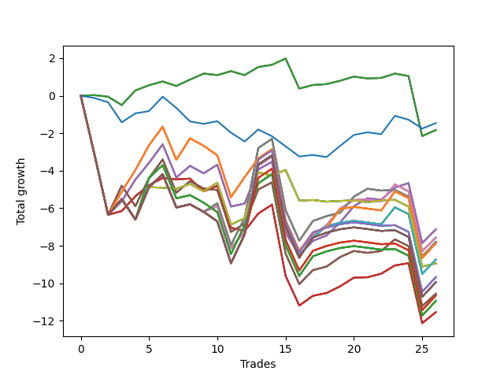

# Short Shepard 002 
- Symbol: NVDA_Unlimited
- Date Range: 02/08/2022 - 07/08/2022
- Trading Period: 7:20-12:30
- Number of Trades: 26



| Name | Win Percent | Profit | Avg Profit / Trade | Avg Time / Trade |      | Name | Win Percent | Profit | Avg Profit / Trade | Avg Time / Trade |
| ---- | ----------- | ------ | ------------------ | ---------------- | ---- | ---- | ----------- | ------ | ------------------ | ---------------- |
| Sorted By <br> Profit | | | | | | Sorted By <br> Win Percentage ||||
| Seventy-Three | 42.31 | -730.00 | -28.08 | 06:28 |     | Sixty-Four | 65.38 | -915.00 | -35.19 | 05:29 |
| Sixty-Four | 65.38 | -915.00 | -35.19 | 05:29 |     | Fifty-Six | 65.38 | -915.00 | -35.19 | 05:29 |
| Fifty-Six | 65.38 | -915.00 | -35.19 | 05:29 |     | Forty-Eight | 65.38 | -915.00 | -35.19 | 05:29 |
| Forty-Eight | 65.38 | -915.00 | -35.19 | 05:29 |     | Forty | 65.38 | -915.00 | -35.19 | 05:29 |
| Forty | 65.38 | -915.00 | -35.19 | 05:29 |     | Zero | 65.38 | -915.00 | -35.19 | 05:29 |
| Zero | 65.38 | -915.00 | -35.19 | 05:29 |     | Sixty-Six | 65.38 | -3565.00 | -137.12 | 16:47 |
| Sixty-Six | 65.38 | -3565.00 | -137.12 | 16:47 |     | Fifty-Eight | 65.38 | -3565.00 | -137.12 | 16:47 |
| Fifty-Eight | 65.38 | -3565.00 | -137.12 | 16:47 |     | Fifty | 65.38 | -3565.00 | -137.12 | 16:47 |
| Fifty | 65.38 | -3565.00 | -137.12 | 16:47 |     | Forty-Two | 65.38 | -3565.00 | -137.12 | 16:47 |
| Forty-Two | 65.38 | -3565.00 | -137.12 | 16:47 |     | Two | 65.38 | -3565.00 | -137.12 | 16:47 |
| Two | 65.38 | -3565.00 | -137.12 | 16:47 |     | Sixty-Five | 65.38 | -5770.00 | -221.92 | 13:17 |
| Sixty-Eight | 57.69 | -3780.00 | -145.38 | 23:16 |     | Fifty-Seven | 65.38 | -5770.00 | -221.92 | 13:17 |
| Sixty | 57.69 | -3780.00 | -145.38 | 23:16 |     | Forty-Nine | 65.38 | -5770.00 | -221.92 | 13:17 |
| Fifty-Two | 57.69 | -3780.00 | -145.38 | 23:16 |     | Forty-One | 65.38 | -5770.00 | -221.92 | 13:17 |
| Forty-Four | 57.69 | -3780.00 | -145.38 | 23:16 |     | One | 65.38 | -5770.00 | -221.92 | 13:17 |
| Four | 57.69 | -3780.00 | -145.38 | 23:16 |     | Sixty-Eight | 57.69 | -3780.00 | -145.38 | 23:16 |
| Sixty-Nine | 57.69 | -3895.00 | -149.81 | 26:41 |     | Sixty | 57.69 | -3780.00 | -145.38 | 23:16 |
| Sixty-One | 57.69 | -3895.00 | -149.81 | 26:41 |     | Fifty-Two | 57.69 | -3780.00 | -145.38 | 23:16 |
| Fifty-Three | 57.69 | -3895.00 | -149.81 | 26:41 |     | Forty-Four | 57.69 | -3780.00 | -145.38 | 23:16 |
| Forty-Five | 57.69 | -3895.00 | -149.81 | 26:41 |     | Four | 57.69 | -3780.00 | -145.38 | 23:16 |
| Five | 57.69 | -3895.00 | -149.81 | 26:41 |     | Sixty-Nine | 57.69 | -3895.00 | -149.81 | 26:41 |
| One Hundred Twenty-Six | 53.85 | -3935.00 | -151.35 | 24:11 |     | Sixty-One | 57.69 | -3895.00 | -149.81 | 26:41 |
| One Hundred Twenty-One | 53.85 | -3935.00 | -151.35 | 24:11 |     | Fifty-Three | 57.69 | -3895.00 | -149.81 | 26:41 |
| One Hundred Sixteen | 53.85 | -3935.00 | -151.35 | 24:11 |     | Forty-Five | 57.69 | -3895.00 | -149.81 | 26:41 |
| One Hundred Eleven | 53.85 | -3935.00 | -151.35 | 24:11 |     | Five | 57.69 | -3895.00 | -149.81 | 26:41 |
| Eighty-One | 53.85 | -3935.00 | -151.35 | 24:11 |     | One Hundred Twenty-Six | 53.85 | -3935.00 | -151.35 | 24:11 |
| Seventy-One | 50.00 | -4365.00 | -167.88 | 26:56 |     | One Hundred Twenty-One | 53.85 | -3935.00 | -151.35 | 24:11 |
| Sixty-Three | 50.00 | -4365.00 | -167.88 | 26:56 |     | One Hundred Sixteen | 53.85 | -3935.00 | -151.35 | 24:11 |
| Fifty-Five | 50.00 | -4365.00 | -167.88 | 26:56 |     | One Hundred Eleven | 53.85 | -3935.00 | -151.35 | 24:11 |
| Forty-Seven | 50.00 | -4365.00 | -167.88 | 26:56 |     | Eighty-One | 53.85 | -3935.00 | -151.35 | 24:11 |
| Seven | 50.00 | -4365.00 | -167.88 | 26:56 |     | Sixty-Seven | 53.85 | -5280.00 | -203.08 | 17:35 |
| Seventy | 50.00 | -4470.00 | -171.92 | 12:29 |     | Fifty-Nine | 53.85 | -5280.00 | -203.08 | 17:35 |
| Sixty-Two | 50.00 | -4470.00 | -171.92 | 12:29 |     | Fifty-One | 53.85 | -5280.00 | -203.08 | 17:35 |
| Fifty-Four | 50.00 | -4470.00 | -171.92 | 12:29 |     | Forty-Three | 53.85 | -5280.00 | -203.08 | 17:35 |
| Forty-Six | 50.00 | -4470.00 | -171.92 | 12:29 |     | Three | 53.85 | -5280.00 | -203.08 | 17:35 |
| Six | 50.00 | -4470.00 | -171.92 | 12:29 |     | Seventy-One | 50.00 | -4365.00 | -167.88 | 26:56 |
| One Hundred Twenty-Nine | 50.00 | -4835.00 | -185.96 | 29:35 |     | Sixty-Three | 50.00 | -4365.00 | -167.88 | 26:56 |
| One Hundred Twenty-Four | 50.00 | -4835.00 | -185.96 | 29:35 |     | Fifty-Five | 50.00 | -4365.00 | -167.88 | 26:56 |
| One Hundred Ninteen | 50.00 | -4835.00 | -185.96 | 29:35 |     | Forty-Seven | 50.00 | -4365.00 | -167.88 | 26:56 |
| One Hundred Fourteen | 50.00 | -4835.00 | -185.96 | 29:35 |     | Seven | 50.00 | -4365.00 | -167.88 | 26:56 |
| Eighty-Four | 50.00 | -4835.00 | -185.96 | 29:35 |     | Seventy | 50.00 | -4470.00 | -171.92 | 12:29 |
| One Hundred Thirty | 50.00 | -4970.00 | -191.15 | 29:43 |     | Sixty-Two | 50.00 | -4470.00 | -171.92 | 12:29 |
| One Hundred Twenty-Five | 50.00 | -4970.00 | -191.15 | 29:43 |     | Fifty-Four | 50.00 | -4470.00 | -171.92 | 12:29 |
| One Hundred Twenty | 50.00 | -4970.00 | -191.15 | 29:43 |     | Forty-Six | 50.00 | -4470.00 | -171.92 | 12:29 |
| One Hundred Fifteen | 50.00 | -4970.00 | -191.15 | 29:43 |     | Six | 50.00 | -4470.00 | -171.92 | 12:29 |
| Eighty-Five | 50.00 | -4970.00 | -191.15 | 29:43 |     | One Hundred Twenty-Nine | 50.00 | -4835.00 | -185.96 | 29:35 |
| Sixty-Seven | 53.85 | -5280.00 | -203.08 | 17:35 |     | One Hundred Twenty-Four | 50.00 | -4835.00 | -185.96 | 29:35 |
| Fifty-Nine | 53.85 | -5280.00 | -203.08 | 17:35 |     | One Hundred Ninteen | 50.00 | -4835.00 | -185.96 | 29:35 |
| Fifty-One | 53.85 | -5280.00 | -203.08 | 17:35 |     | One Hundred Fourteen | 50.00 | -4835.00 | -185.96 | 29:35 |
| Forty-Three | 53.85 | -5280.00 | -203.08 | 17:35 |     | Eighty-Four | 50.00 | -4835.00 | -185.96 | 29:35 |
| Three | 53.85 | -5280.00 | -203.08 | 17:35 |     | One Hundred Thirty | 50.00 | -4970.00 | -191.15 | 29:43 |
| One Hundred Twenty-Eight | 50.00 | -5325.00 | -204.81 | 29:12 |     | One Hundred Twenty-Five | 50.00 | -4970.00 | -191.15 | 29:43 |
| One Hundred Twenty-Three | 50.00 | -5325.00 | -204.81 | 29:12 |     | One Hundred Twenty | 50.00 | -4970.00 | -191.15 | 29:43 |
| One Hundred Eighteen | 50.00 | -5325.00 | -204.81 | 29:12 |     | One Hundred Fifteen | 50.00 | -4970.00 | -191.15 | 29:43 |
| One Hundred Thirteen | 50.00 | -5325.00 | -204.81 | 29:12 |     | Eighty-Five | 50.00 | -4970.00 | -191.15 | 29:43 |
| Eighty-Three | 50.00 | -5325.00 | -204.81 | 29:12 |     | One Hundred Twenty-Eight | 50.00 | -5325.00 | -204.81 | 29:12 |
| One Hundred Twenty-Seven | 50.00 | -5470.00 | -210.38 | 28:52 |     | One Hundred Twenty-Three | 50.00 | -5325.00 | -204.81 | 29:12 |
| One Hundred Twenty-Two | 50.00 | -5470.00 | -210.38 | 28:52 |     | One Hundred Eighteen | 50.00 | -5325.00 | -204.81 | 29:12 |
| One Hundred Seventeen | 50.00 | -5470.00 | -210.38 | 28:52 |     | One Hundred Thirteen | 50.00 | -5325.00 | -204.81 | 29:12 |
| One Hundred Twelve | 50.00 | -5470.00 | -210.38 | 28:52 |     | Eighty-Three | 50.00 | -5325.00 | -204.81 | 29:12 |
| Eighty-Two | 50.00 | -5470.00 | -210.38 | 28:52 |     | One Hundred Twenty-Seven | 50.00 | -5470.00 | -210.38 | 28:52 |
| Sixty-Five | 65.38 | -5770.00 | -221.92 | 13:17 |     | One Hundred Twenty-Two | 50.00 | -5470.00 | -210.38 | 28:52 |
| Fifty-Seven | 65.38 | -5770.00 | -221.92 | 13:17 |     | One Hundred Seventeen | 50.00 | -5470.00 | -210.38 | 28:52 |
| Forty-Nine | 65.38 | -5770.00 | -221.92 | 13:17 |     | One Hundred Twelve | 50.00 | -5470.00 | -210.38 | 28:52 |
| Forty-One | 65.38 | -5770.00 | -221.92 | 13:17 |     | Eighty-Two | 50.00 | -5470.00 | -210.38 | 28:52 |
| One | 65.38 | -5770.00 | -221.92 | 13:17 |     | Seventy-Three | 42.31 | -730.00 | -28.08 | 06:28 |

## NO STOPLOSS

### Test Zero
* Sell when price hits the middle line of the 20p bollinger
* No Stoploss
* Results:
```
Total Trades: 26
Percent Up: 34.62
Percent Down: 65.38
Total Points Moved Down: -1.83
Potential Profit: -915.00
Total Points Ups: 6.09 Count Ups: 9
Total Points Downs: 4.26 Count Downs: 17
```

<details><summary>Trades</summary>

<code>In: 2022-02-16 11:13:00		Out: 2022-02-16 11:20:05		Total Position Time: 07:05		Total Move Down: 0.03		Total to Date: 0.03</code> <br />
<code>In: 2022-02-16 11:14:00		Out: 2022-02-16 11:20:05		Total Position Time: 06:05		Total Move Down: -0.08		Total to Date: -0.05</code> <br />
<code>In: 2022-02-17 08:25:00		Out: 2022-02-17 08:33:15		Total Position Time: 08:15		Total Move Down: -0.45		Total to Date: -0.50</code> <br />
<code>In: 2022-02-18 11:37:00		Out: 2022-02-18 11:39:35		Total Position Time: 02:35		Total Move Down: 0.78		Total to Date: 0.28</code> <br />
<code>In: 2022-02-22 12:07:00		Out: 2022-02-22 12:14:40		Total Position Time: 07:40		Total Move Down: 0.28		Total to Date: 0.56</code> <br />
<code>In: 2022-03-04 10:11:00		Out: 2022-03-04 10:11:35		Total Position Time: 00:35		Total Move Down: 0.20		Total to Date: 0.76</code> <br />
<code>In: 2022-03-10 10:33:00		Out: 2022-03-10 10:41:10		Total Position Time: 08:10		Total Move Down: -0.24		Total to Date: 0.52</code> <br />
<code>In: 2022-03-17 08:28:00		Out: 2022-03-17 08:28:15		Total Position Time: 00:15		Total Move Down: 0.34		Total to Date: 0.86</code> <br />
<code>In: 2022-03-17 10:32:00		Out: 2022-03-17 10:37:45		Total Position Time: 05:45		Total Move Down: 0.32		Total to Date: 1.18</code> <br />
<code>In: 2022-03-28 11:13:00		Out: 2022-03-28 11:13:35		Total Position Time: 00:35		Total Move Down: -0.08		Total to Date: 1.10</code> <br />
<code>In: 2022-03-28 12:04:00		Out: 2022-03-28 12:06:35		Total Position Time: 02:35		Total Move Down: 0.21		Total to Date: 1.31</code> <br />
<code>In: 2022-03-30 09:53:00		Out: 2022-03-30 10:02:25		Total Position Time: 09:25		Total Move Down: -0.21		Total to Date: 1.10</code> <br />
<code>In: 2022-04-06 12:07:00		Out: 2022-04-06 12:12:05		Total Position Time: 05:05		Total Move Down: 0.43		Total to Date: 1.53</code> <br />
<code>In: 2022-04-11 10:08:00		Out: 2022-04-11 10:16:05		Total Position Time: 08:05		Total Move Down: 0.12		Total to Date: 1.65</code> <br />
<code>In: 2022-05-02 11:57:00		Out: 2022-05-02 11:58:05		Total Position Time: 01:05		Total Move Down: 0.33		Total to Date: 1.98</code> <br />
<code>In: 2022-05-02 12:17:00		Out: 2022-05-02 12:39:35		Total Position Time: 22:35		Total Move Down: -1.60		Total to Date: 0.38</code> <br />
<code>In: 2022-05-05 10:13:00		Out: 2022-05-05 10:14:00		Total Position Time: 01:00		Total Move Down: 0.19		Total to Date: 0.57</code> <br />
<code>In: 2022-06-09 09:53:00		Out: 2022-06-09 09:53:20		Total Position Time: 00:20		Total Move Down: 0.05		Total to Date: 0.62</code> <br />
<code>In: 2022-06-10 10:54:00		Out: 2022-06-10 10:55:15		Total Position Time: 01:15		Total Move Down: 0.18		Total to Date: 0.80</code> <br />
<code>In: 2022-06-10 12:03:00		Out: 2022-06-10 12:03:25		Total Position Time: 00:25		Total Move Down: 0.22		Total to Date: 1.02</code> <br />
<code>In: 2022-06-10 12:04:00		Out: 2022-06-10 12:04:10		Total Position Time: 00:10		Total Move Down: -0.10		Total to Date: 0.92</code> <br />
<code>In: 2022-06-22 10:28:00		Out: 2022-06-22 10:28:10		Total Position Time: 00:10		Total Move Down: 0.03		Total to Date: 0.95</code> <br />
<code>In: 2022-06-29 10:12:00		Out: 2022-06-29 10:12:30		Total Position Time: 00:30		Total Move Down: 0.23		Total to Date: 1.18</code> <br />
<code>In: 2022-06-29 12:20:00		Out: 2022-06-29 12:32:25		Total Position Time: 12:25		Total Move Down: -0.13		Total to Date: 1.05</code> <br />
<code>In: 2022-06-30 08:04:00		Out: 2022-06-30 08:33:55		Total Position Time: 29:55		Total Move Down: -3.20		Total to Date: -2.15</code> <br />
<code>In: 2022-07-01 08:19:00		Out: 2022-07-01 08:19:45		Total Position Time: 00:45		Total Move Down: 0.32		Total to Date: -1.83</code> <br />


</details>

### Test One
* Sell when the price hits the upper line of the 20p 1std bollinger
* No Stoploss
* Results:
```
Total Trades: 26
Percent Up: 34.62
Percent Down: 65.38
Total Points Moved Down: -11.54
Potential Profit: -5770.00
Total Points Ups: 18.09 Count Ups: 9
Total Points Downs: 6.55 Count Downs: 17
```

<details><summary>Trades</summary>

<code>In: 2022-02-16 11:13:00		Out: 2022-02-16 11:42:55		Total Position Time: 29:55		Total Move Down: -3.12		Total to Date: -3.12</code> <br />
<code>In: 2022-02-16 11:14:00		Out: 2022-02-16 11:43:55		Total Position Time: 29:55		Total Move Down: -3.23		Total to Date: -6.35</code> <br />
<code>In: 2022-02-17 08:25:00		Out: 2022-02-17 08:33:50		Total Position Time: 08:50		Total Move Down: 0.20		Total to Date: -6.15</code> <br />
<code>In: 2022-02-18 11:37:00		Out: 2022-02-18 11:45:00		Total Position Time: 08:00		Total Move Down: 0.79		Total to Date: -5.36</code> <br />
<code>In: 2022-02-22 12:07:00		Out: 2022-02-22 12:18:35		Total Position Time: 11:35		Total Move Down: 0.59		Total to Date: -4.77</code> <br />
<code>In: 2022-03-04 10:11:00		Out: 2022-03-04 10:16:45		Total Position Time: 05:45		Total Move Down: 0.38		Total to Date: -4.39</code> <br />
<code>In: 2022-03-10 10:33:00		Out: 2022-03-10 10:42:25		Total Position Time: 09:25		Total Move Down: -0.07		Total to Date: -4.46</code> <br />
<code>In: 2022-03-17 08:28:00		Out: 2022-03-17 08:45:40		Total Position Time: 17:40		Total Move Down: 0.04		Total to Date: -4.42</code> <br />
<code>In: 2022-03-17 10:32:00		Out: 2022-03-17 11:00:20		Total Position Time: 28:20		Total Move Down: -0.68		Total to Date: -5.10</code> <br />
<code>In: 2022-03-28 11:13:00		Out: 2022-03-28 11:15:05		Total Position Time: 02:05		Total Move Down: 0.29		Total to Date: -4.81</code> <br />
<code>In: 2022-03-28 12:04:00		Out: 2022-03-28 12:33:55		Total Position Time: 29:55		Total Move Down: -2.23		Total to Date: -7.04</code> <br />
<code>In: 2022-03-30 09:53:00		Out: 2022-03-30 10:06:10		Total Position Time: 13:10		Total Move Down: -0.18		Total to Date: -7.22</code> <br />
<code>In: 2022-04-06 12:07:00		Out: 2022-04-06 12:17:00		Total Position Time: 10:00		Total Move Down: 0.94		Total to Date: -6.28</code> <br />
<code>In: 2022-04-11 10:08:00		Out: 2022-04-11 10:18:55		Total Position Time: 10:55		Total Move Down: 0.47		Total to Date: -5.81</code> <br />
<code>In: 2022-05-02 11:57:00		Out: 2022-05-02 12:26:55		Total Position Time: 29:55		Total Move Down: -3.80		Total to Date: -9.61</code> <br />
<code>In: 2022-05-02 12:17:00		Out: 2022-05-02 12:44:10		Total Position Time: 27:10		Total Move Down: -1.58		Total to Date: -11.19</code> <br />
<code>In: 2022-05-05 10:13:00		Out: 2022-05-05 10:20:20		Total Position Time: 07:20		Total Move Down: 0.52		Total to Date: -10.67</code> <br />
<code>In: 2022-06-09 09:53:00		Out: 2022-06-09 09:54:05		Total Position Time: 01:05		Total Move Down: 0.15		Total to Date: -10.52</code> <br />
<code>In: 2022-06-10 10:54:00		Out: 2022-06-10 10:59:05		Total Position Time: 05:05		Total Move Down: 0.36		Total to Date: -10.16</code> <br />
<code>In: 2022-06-10 12:03:00		Out: 2022-06-10 12:04:40		Total Position Time: 01:40		Total Move Down: 0.46		Total to Date: -9.70</code> <br />
<code>In: 2022-06-10 12:04:00		Out: 2022-06-10 12:04:40		Total Position Time: 00:40		Total Move Down: 0.02		Total to Date: -9.68</code> <br />
<code>In: 2022-06-22 10:28:00		Out: 2022-06-22 10:35:05		Total Position Time: 07:05		Total Move Down: 0.19		Total to Date: -9.49</code> <br />
<code>In: 2022-06-29 10:12:00		Out: 2022-06-29 10:14:00		Total Position Time: 02:00		Total Move Down: 0.44		Total to Date: -9.05</code> <br />
<code>In: 2022-06-29 12:20:00		Out: 2022-06-29 12:33:25		Total Position Time: 13:25		Total Move Down: 0.12		Total to Date: -8.93</code> <br />
<code>In: 2022-06-30 08:04:00		Out: 2022-06-30 08:33:55		Total Position Time: 29:55		Total Move Down: -3.20		Total to Date: -12.13</code> <br />
<code>In: 2022-07-01 08:19:00		Out: 2022-07-01 08:23:55		Total Position Time: 04:55		Total Move Down: 0.59		Total to Date: -11.54</code> <br />


</details>

### Test Two
* Sell when the price hits the upper line of the 20p 2std bollinger
* No Stoploss
* Results:
```
Total Trades: 26
Percent Up: 34.62
Percent Down: 65.38
Total Points Moved Down: -7.13
Potential Profit: -3565.00
Total Points Ups: 19.00 Count Ups: 9
Total Points Downs: 11.87 Count Downs: 17
```

<details><summary>Trades</summary>

<code>In: 2022-02-16 11:13:00		Out: 2022-02-16 11:42:55		Total Position Time: 29:55		Total Move Down: -3.12		Total to Date: -3.12</code> <br />
<code>In: 2022-02-16 11:14:00		Out: 2022-02-16 11:43:55		Total Position Time: 29:55		Total Move Down: -3.23		Total to Date: -6.35</code> <br />
<code>In: 2022-02-17 08:25:00		Out: 2022-02-17 08:36:45		Total Position Time: 11:45		Total Move Down: 0.72		Total to Date: -5.63</code> <br />
<code>In: 2022-02-18 11:37:00		Out: 2022-02-18 11:49:30		Total Position Time: 12:30		Total Move Down: 1.16		Total to Date: -4.47</code> <br />
<code>In: 2022-02-22 12:07:00		Out: 2022-02-22 12:20:20		Total Position Time: 13:20		Total Move Down: 0.89		Total to Date: -3.58</code> <br />
<code>In: 2022-03-04 10:11:00		Out: 2022-03-04 10:17:05		Total Position Time: 06:05		Total Move Down: 0.99		Total to Date: -2.59</code> <br />
<code>In: 2022-03-10 10:33:00		Out: 2022-03-10 11:02:55		Total Position Time: 29:55		Total Move Down: -1.77		Total to Date: -4.36</code> <br />
<code>In: 2022-03-17 08:28:00		Out: 2022-03-17 08:47:15		Total Position Time: 19:15		Total Move Down: 0.62		Total to Date: -3.74</code> <br />
<code>In: 2022-03-17 10:32:00		Out: 2022-03-17 11:01:55		Total Position Time: 29:55		Total Move Down: -0.40		Total to Date: -4.14</code> <br />
<code>In: 2022-03-28 11:13:00		Out: 2022-03-28 11:15:25		Total Position Time: 02:25		Total Move Down: 0.46		Total to Date: -3.68</code> <br />
<code>In: 2022-03-28 12:04:00		Out: 2022-03-28 12:33:55		Total Position Time: 29:55		Total Move Down: -2.23		Total to Date: -5.91</code> <br />
<code>In: 2022-03-30 09:53:00		Out: 2022-03-30 10:07:00		Total Position Time: 14:00		Total Move Down: 0.16		Total to Date: -5.75</code> <br />
<code>In: 2022-04-06 12:07:00		Out: 2022-04-06 12:20:25		Total Position Time: 13:25		Total Move Down: 1.82		Total to Date: -3.93</code> <br />
<code>In: 2022-04-11 10:08:00		Out: 2022-04-11 10:21:15		Total Position Time: 13:15		Total Move Down: 0.41		Total to Date: -3.52</code> <br />
<code>In: 2022-05-02 11:57:00		Out: 2022-05-02 12:26:55		Total Position Time: 29:55		Total Move Down: -3.80		Total to Date: -7.32</code> <br />
<code>In: 2022-05-02 12:17:00		Out: 2022-05-02 12:45:05		Total Position Time: 28:05		Total Move Down: -1.17		Total to Date: -8.49</code> <br />
<code>In: 2022-05-05 10:13:00		Out: 2022-05-05 10:30:30		Total Position Time: 17:30		Total Move Down: 0.75		Total to Date: -7.74</code> <br />
<code>In: 2022-06-09 09:53:00		Out: 2022-06-09 09:54:45		Total Position Time: 01:45		Total Move Down: 0.29		Total to Date: -7.45</code> <br />
<code>In: 2022-06-10 10:54:00		Out: 2022-06-10 11:03:45		Total Position Time: 09:45		Total Move Down: 0.70		Total to Date: -6.75</code> <br />
<code>In: 2022-06-10 12:03:00		Out: 2022-06-10 12:08:50		Total Position Time: 05:50		Total Move Down: 0.86		Total to Date: -5.89</code> <br />
<code>In: 2022-06-10 12:04:00		Out: 2022-06-10 12:08:50		Total Position Time: 04:50		Total Move Down: 0.42		Total to Date: -5.47</code> <br />
<code>In: 2022-06-22 10:28:00		Out: 2022-06-22 10:57:05		Total Position Time: 29:05		Total Move Down: -0.08		Total to Date: -5.55</code> <br />
<code>In: 2022-06-29 10:12:00		Out: 2022-06-29 10:15:00		Total Position Time: 03:00		Total Move Down: 0.65		Total to Date: -4.90</code> <br />
<code>In: 2022-06-29 12:20:00		Out: 2022-06-29 12:34:15		Total Position Time: 14:15		Total Move Down: 0.24		Total to Date: -4.66</code> <br />
<code>In: 2022-06-30 08:04:00		Out: 2022-06-30 08:33:55		Total Position Time: 29:55		Total Move Down: -3.20		Total to Date: -7.86</code> <br />
<code>In: 2022-07-01 08:19:00		Out: 2022-07-01 08:26:10		Total Position Time: 07:10		Total Move Down: 0.73		Total to Date: -7.13</code> <br />


</details>

### Test Three
* Sell when price hits the middle line of the 50p bollinger
* No Stoploss
* Results:
```
Total Trades: 26
Percent Up: 46.15
Percent Down: 53.85
Total Points Moved Down: -10.56
Potential Profit: -5280.00
Total Points Ups: 21.01 Count Ups: 12
Total Points Downs: 10.45 Count Downs: 14
```

<details><summary>Trades</summary>

<code>In: 2022-02-16 11:13:00		Out: 2022-02-16 11:42:55		Total Position Time: 29:55		Total Move Down: -3.12		Total to Date: -3.12</code> <br />
<code>In: 2022-02-16 11:14:00		Out: 2022-02-16 11:43:55		Total Position Time: 29:55		Total Move Down: -3.23		Total to Date: -6.35</code> <br />
<code>In: 2022-02-17 08:25:00		Out: 2022-02-17 08:39:05		Total Position Time: 14:05		Total Move Down: 1.55		Total to Date: -4.80</code> <br />
<code>In: 2022-02-18 11:37:00		Out: 2022-02-18 12:06:55		Total Position Time: 29:55		Total Move Down: -1.09		Total to Date: -5.89</code> <br />
<code>In: 2022-02-22 12:07:00		Out: 2022-02-22 12:30:20		Total Position Time: 23:20		Total Move Down: 1.50		Total to Date: -4.39</code> <br />
<code>In: 2022-03-04 10:11:00		Out: 2022-03-04 10:17:05		Total Position Time: 06:05		Total Move Down: 0.99		Total to Date: -3.40</code> <br />
<code>In: 2022-03-10 10:33:00		Out: 2022-03-10 11:02:55		Total Position Time: 29:55		Total Move Down: -1.77		Total to Date: -5.17</code> <br />
<code>In: 2022-03-17 08:28:00		Out: 2022-03-17 08:47:15		Total Position Time: 19:15		Total Move Down: 0.62		Total to Date: -4.55</code> <br />
<code>In: 2022-03-17 10:32:00		Out: 2022-03-17 11:01:55		Total Position Time: 29:55		Total Move Down: -0.40		Total to Date: -4.95</code> <br />
<code>In: 2022-03-28 11:13:00		Out: 2022-03-28 11:13:35		Total Position Time: 00:35		Total Move Down: -0.08		Total to Date: -5.03</code> <br />
<code>In: 2022-03-28 12:04:00		Out: 2022-03-28 12:33:55		Total Position Time: 29:55		Total Move Down: -2.23		Total to Date: -7.26</code> <br />
<code>In: 2022-03-30 09:53:00		Out: 2022-03-30 10:12:35		Total Position Time: 19:35		Total Move Down: 0.44		Total to Date: -6.82</code> <br />
<code>In: 2022-04-06 12:07:00		Out: 2022-04-06 12:20:25		Total Position Time: 13:25		Total Move Down: 1.82		Total to Date: -5.00</code> <br />
<code>In: 2022-04-11 10:08:00		Out: 2022-04-11 10:36:55		Total Position Time: 28:55		Total Move Down: 0.38		Total to Date: -4.62</code> <br />
<code>In: 2022-05-02 11:57:00		Out: 2022-05-02 12:26:55		Total Position Time: 29:55		Total Move Down: -3.80		Total to Date: -8.42</code> <br />
<code>In: 2022-05-02 12:17:00		Out: 2022-05-02 12:46:00		Total Position Time: 29:00		Total Move Down: -1.63		Total to Date: -10.05</code> <br />
<code>In: 2022-05-05 10:13:00		Out: 2022-05-05 10:26:35		Total Position Time: 13:35		Total Move Down: 0.75		Total to Date: -9.30</code> <br />
<code>In: 2022-06-09 09:53:00		Out: 2022-06-09 09:54:35		Total Position Time: 01:35		Total Move Down: 0.19		Total to Date: -9.11</code> <br />
<code>In: 2022-06-10 10:54:00		Out: 2022-06-10 11:00:45		Total Position Time: 06:45		Total Move Down: 0.51		Total to Date: -8.60</code> <br />
<code>In: 2022-06-10 12:03:00		Out: 2022-06-10 12:03:30		Total Position Time: 00:30		Total Move Down: 0.32		Total to Date: -8.28</code> <br />
<code>In: 2022-06-10 12:04:00		Out: 2022-06-10 12:04:10		Total Position Time: 00:10		Total Move Down: -0.10		Total to Date: -8.38</code> <br />
<code>In: 2022-06-22 10:28:00		Out: 2022-06-22 10:35:10		Total Position Time: 07:10		Total Move Down: 0.10		Total to Date: -8.28</code> <br />
<code>In: 2022-06-29 10:12:00		Out: 2022-06-29 10:14:55		Total Position Time: 02:55		Total Move Down: 0.62		Total to Date: -7.66</code> <br />
<code>In: 2022-06-29 12:20:00		Out: 2022-06-29 12:46:00		Total Position Time: 26:00		Total Move Down: -0.36		Total to Date: -8.02</code> <br />
<code>In: 2022-06-30 08:04:00		Out: 2022-06-30 08:33:55		Total Position Time: 29:55		Total Move Down: -3.20		Total to Date: -11.22</code> <br />
<code>In: 2022-07-01 08:19:00		Out: 2022-07-01 08:24:15		Total Position Time: 05:15		Total Move Down: 0.66		Total to Date: -10.56</code> <br />


</details>

### Test Four
* Sell when the price hits the upper line of the 50p 1std bollinger
* No Stoploss
* Results:
```
Total Trades: 26
Percent Up: 42.31
Percent Down: 57.69
Total Points Moved Down: -7.56
Potential Profit: -3780.00
Total Points Ups: 20.93 Count Ups: 11
Total Points Downs: 13.37 Count Downs: 15
```

<details><summary>Trades</summary>

<code>In: 2022-02-16 11:13:00		Out: 2022-02-16 11:42:55		Total Position Time: 29:55		Total Move Down: -3.12		Total to Date: -3.12</code> <br />
<code>In: 2022-02-16 11:14:00		Out: 2022-02-16 11:43:55		Total Position Time: 29:55		Total Move Down: -3.23		Total to Date: -6.35</code> <br />
<code>In: 2022-02-17 08:25:00		Out: 2022-02-17 08:54:55		Total Position Time: 29:55		Total Move Down: 0.84		Total to Date: -5.51</code> <br />
<code>In: 2022-02-18 11:37:00		Out: 2022-02-18 12:06:55		Total Position Time: 29:55		Total Move Down: -1.09		Total to Date: -6.60</code> <br />
<code>In: 2022-02-22 12:07:00		Out: 2022-02-22 12:36:55		Total Position Time: 29:55		Total Move Down: 1.73		Total to Date: -4.87</code> <br />
<code>In: 2022-03-04 10:11:00		Out: 2022-03-04 10:40:55		Total Position Time: 29:55		Total Move Down: 0.68		Total to Date: -4.19</code> <br />
<code>In: 2022-03-10 10:33:00		Out: 2022-03-10 11:02:55		Total Position Time: 29:55		Total Move Down: -1.77		Total to Date: -5.96</code> <br />
<code>In: 2022-03-17 08:28:00		Out: 2022-03-17 08:57:55		Total Position Time: 29:55		Total Move Down: 0.17		Total to Date: -5.79</code> <br />
<code>In: 2022-03-17 10:32:00		Out: 2022-03-17 11:01:55		Total Position Time: 29:55		Total Move Down: -0.40		Total to Date: -6.19</code> <br />
<code>In: 2022-03-28 11:13:00		Out: 2022-03-28 11:15:05		Total Position Time: 02:05		Total Move Down: 0.29		Total to Date: -5.90</code> <br />
<code>In: 2022-03-28 12:04:00		Out: 2022-03-28 12:33:55		Total Position Time: 29:55		Total Move Down: -2.23		Total to Date: -8.13</code> <br />
<code>In: 2022-03-30 09:53:00		Out: 2022-03-30 10:18:20		Total Position Time: 25:20		Total Move Down: 0.88		Total to Date: -7.25</code> <br />
<code>In: 2022-04-06 12:07:00		Out: 2022-04-06 12:28:00		Total Position Time: 21:00		Total Move Down: 3.52		Total to Date: -3.73</code> <br />
<code>In: 2022-04-11 10:08:00		Out: 2022-04-11 10:37:55		Total Position Time: 29:55		Total Move Down: 0.49		Total to Date: -3.24</code> <br />
<code>In: 2022-05-02 11:57:00		Out: 2022-05-02 12:26:55		Total Position Time: 29:55		Total Move Down: -3.80		Total to Date: -7.04</code> <br />
<code>In: 2022-05-02 12:17:00		Out: 2022-05-02 12:46:00		Total Position Time: 29:00		Total Move Down: -1.63		Total to Date: -8.67</code> <br />
<code>In: 2022-05-05 10:13:00		Out: 2022-05-05 10:38:55		Total Position Time: 25:55		Total Move Down: 1.24		Total to Date: -7.43</code> <br />
<code>In: 2022-06-09 09:53:00		Out: 2022-06-09 09:55:30		Total Position Time: 02:30		Total Move Down: 0.53		Total to Date: -6.90</code> <br />
<code>In: 2022-06-10 10:54:00		Out: 2022-06-10 11:11:25		Total Position Time: 17:25		Total Move Down: 0.88		Total to Date: -6.02</code> <br />
<code>In: 2022-06-10 12:03:00		Out: 2022-06-10 12:04:40		Total Position Time: 01:40		Total Move Down: 0.46		Total to Date: -5.56</code> <br />
<code>In: 2022-06-10 12:04:00		Out: 2022-06-10 12:04:40		Total Position Time: 00:40		Total Move Down: 0.02		Total to Date: -5.54</code> <br />
<code>In: 2022-06-22 10:28:00		Out: 2022-06-22 10:57:55		Total Position Time: 29:55		Total Move Down: -0.10		Total to Date: -5.64</code> <br />
<code>In: 2022-06-29 10:12:00		Out: 2022-06-29 10:21:00		Total Position Time: 09:00		Total Move Down: 0.91		Total to Date: -4.73</code> <br />
<code>In: 2022-06-29 12:20:00		Out: 2022-06-29 12:46:00		Total Position Time: 26:00		Total Move Down: -0.36		Total to Date: -5.09</code> <br />
<code>In: 2022-06-30 08:04:00		Out: 2022-06-30 08:33:55		Total Position Time: 29:55		Total Move Down: -3.20		Total to Date: -8.29</code> <br />
<code>In: 2022-07-01 08:19:00		Out: 2022-07-01 08:44:50		Total Position Time: 25:50		Total Move Down: 0.73		Total to Date: -7.56</code> <br />


</details>

### Test Five
* Sell when the price hits the upper line of the 50p 2std bollinger
* No Stoploss
* Results:
```
Total Trades: 26
Percent Up: 42.31
Percent Down: 57.69
Total Points Moved Down: -7.79
Potential Profit: -3895.00
Total Points Ups: 20.93 Count Ups: 11
Total Points Downs: 13.14 Count Downs: 15
```

<details><summary>Trades</summary>

<code>In: 2022-02-16 11:13:00		Out: 2022-02-16 11:42:55		Total Position Time: 29:55		Total Move Down: -3.12		Total to Date: -3.12</code> <br />
<code>In: 2022-02-16 11:14:00		Out: 2022-02-16 11:43:55		Total Position Time: 29:55		Total Move Down: -3.23		Total to Date: -6.35</code> <br />
<code>In: 2022-02-17 08:25:00		Out: 2022-02-17 08:54:55		Total Position Time: 29:55		Total Move Down: 0.84		Total to Date: -5.51</code> <br />
<code>In: 2022-02-18 11:37:00		Out: 2022-02-18 12:06:55		Total Position Time: 29:55		Total Move Down: -1.09		Total to Date: -6.60</code> <br />
<code>In: 2022-02-22 12:07:00		Out: 2022-02-22 12:36:55		Total Position Time: 29:55		Total Move Down: 1.73		Total to Date: -4.87</code> <br />
<code>In: 2022-03-04 10:11:00		Out: 2022-03-04 10:40:55		Total Position Time: 29:55		Total Move Down: 0.68		Total to Date: -4.19</code> <br />
<code>In: 2022-03-10 10:33:00		Out: 2022-03-10 11:02:55		Total Position Time: 29:55		Total Move Down: -1.77		Total to Date: -5.96</code> <br />
<code>In: 2022-03-17 08:28:00		Out: 2022-03-17 08:57:55		Total Position Time: 29:55		Total Move Down: 0.17		Total to Date: -5.79</code> <br />
<code>In: 2022-03-17 10:32:00		Out: 2022-03-17 11:01:55		Total Position Time: 29:55		Total Move Down: -0.40		Total to Date: -6.19</code> <br />
<code>In: 2022-03-28 11:13:00		Out: 2022-03-28 11:15:25		Total Position Time: 02:25		Total Move Down: 0.46		Total to Date: -5.73</code> <br />
<code>In: 2022-03-28 12:04:00		Out: 2022-03-28 12:33:55		Total Position Time: 29:55		Total Move Down: -2.23		Total to Date: -7.96</code> <br />
<code>In: 2022-03-30 09:53:00		Out: 2022-03-30 10:20:35		Total Position Time: 27:35		Total Move Down: 1.45		Total to Date: -6.51</code> <br />
<code>In: 2022-04-06 12:07:00		Out: 2022-04-06 12:36:55		Total Position Time: 29:55		Total Move Down: 3.72		Total to Date: -2.79</code> <br />
<code>In: 2022-04-11 10:08:00		Out: 2022-04-11 10:37:55		Total Position Time: 29:55		Total Move Down: 0.49		Total to Date: -2.30</code> <br />
<code>In: 2022-05-02 11:57:00		Out: 2022-05-02 12:26:55		Total Position Time: 29:55		Total Move Down: -3.80		Total to Date: -6.10</code> <br />
<code>In: 2022-05-02 12:17:00		Out: 2022-05-02 12:46:00		Total Position Time: 29:00		Total Move Down: -1.63		Total to Date: -7.73</code> <br />
<code>In: 2022-05-05 10:13:00		Out: 2022-05-05 10:42:55		Total Position Time: 29:55		Total Move Down: 1.05		Total to Date: -6.68</code> <br />
<code>In: 2022-06-09 09:53:00		Out: 2022-06-09 10:22:55		Total Position Time: 29:55		Total Move Down: 0.26		Total to Date: -6.42</code> <br />
<code>In: 2022-06-10 10:54:00		Out: 2022-06-10 11:23:55		Total Position Time: 29:55		Total Move Down: 0.18		Total to Date: -6.24</code> <br />
<code>In: 2022-06-10 12:03:00		Out: 2022-06-10 12:08:50		Total Position Time: 05:50		Total Move Down: 0.86		Total to Date: -5.38</code> <br />
<code>In: 2022-06-10 12:04:00		Out: 2022-06-10 12:08:50		Total Position Time: 04:50		Total Move Down: 0.42		Total to Date: -4.96</code> <br />
<code>In: 2022-06-22 10:28:00		Out: 2022-06-22 10:57:55		Total Position Time: 29:55		Total Move Down: -0.10		Total to Date: -5.06</code> <br />
<code>In: 2022-06-29 10:12:00		Out: 2022-06-29 10:41:55		Total Position Time: 29:55		Total Move Down: 0.04		Total to Date: -5.02</code> <br />
<code>In: 2022-06-29 12:20:00		Out: 2022-06-29 12:46:00		Total Position Time: 26:00		Total Move Down: -0.36		Total to Date: -5.38</code> <br />
<code>In: 2022-06-30 08:04:00		Out: 2022-06-30 08:33:55		Total Position Time: 29:55		Total Move Down: -3.20		Total to Date: -8.58</code> <br />
<code>In: 2022-07-01 08:19:00		Out: 2022-07-01 08:48:55		Total Position Time: 29:55		Total Move Down: 0.79		Total to Date: -7.79</code> <br />


</details>

### Test Six
* Sell when the price hits the middle line of the 1std VWAP
* No Stoploss
* Results:
```
Total Trades: 26
Percent Up: 50.00
Percent Down: 50.00
Total Points Moved Down: -8.94
Potential Profit: -4470.00
Total Points Ups: 15.69 Count Ups: 13
Total Points Downs: 6.75 Count Downs: 13
```

<details><summary>Trades</summary>

<code>In: 2022-02-16 11:13:00		Out: 2022-02-16 11:42:55		Total Position Time: 29:55		Total Move Down: -3.12		Total to Date: -3.12</code> <br />
<code>In: 2022-02-16 11:14:00		Out: 2022-02-16 11:43:55		Total Position Time: 29:55		Total Move Down: -3.23		Total to Date: -6.35</code> <br />
<code>In: 2022-02-17 08:25:00		Out: 2022-02-17 08:36:50		Total Position Time: 11:50		Total Move Down: 0.83		Total to Date: -5.52</code> <br />
<code>In: 2022-02-18 11:37:00		Out: 2022-02-18 12:06:55		Total Position Time: 29:55		Total Move Down: -1.09		Total to Date: -6.61</code> <br />
<code>In: 2022-02-22 12:07:00		Out: 2022-02-22 12:36:55		Total Position Time: 29:55		Total Move Down: 1.73		Total to Date: -4.88</code> <br />
<code>In: 2022-03-04 10:11:00		Out: 2022-03-04 10:11:10		Total Position Time: 00:10		Total Move Down: -0.02		Total to Date: -4.90</code> <br />
<code>In: 2022-03-10 10:33:00		Out: 2022-03-10 10:33:10		Total Position Time: 00:10		Total Move Down: -0.06		Total to Date: -4.96</code> <br />
<code>In: 2022-03-17 08:28:00		Out: 2022-03-17 08:28:10		Total Position Time: 00:10		Total Move Down: 0.26		Total to Date: -4.70</code> <br />
<code>In: 2022-03-17 10:32:00		Out: 2022-03-17 11:01:55		Total Position Time: 29:55		Total Move Down: -0.40		Total to Date: -5.10</code> <br />
<code>In: 2022-03-28 11:13:00		Out: 2022-03-28 11:15:25		Total Position Time: 02:25		Total Move Down: 0.46		Total to Date: -4.64</code> <br />
<code>In: 2022-03-28 12:04:00		Out: 2022-03-28 12:33:55		Total Position Time: 29:55		Total Move Down: -2.23		Total to Date: -6.87</code> <br />
<code>In: 2022-03-30 09:53:00		Out: 2022-03-30 10:13:25		Total Position Time: 20:25		Total Move Down: 0.34		Total to Date: -6.53</code> <br />
<code>In: 2022-04-06 12:07:00		Out: 2022-04-06 12:21:35		Total Position Time: 14:35		Total Move Down: 2.44		Total to Date: -4.09</code> <br />
<code>In: 2022-04-11 10:08:00		Out: 2022-04-11 10:08:10		Total Position Time: 00:10		Total Move Down: -0.16		Total to Date: -4.25</code> <br />
<code>In: 2022-05-02 11:57:00		Out: 2022-05-02 11:58:30		Total Position Time: 01:30		Total Move Down: 0.29		Total to Date: -3.96</code> <br />
<code>In: 2022-05-02 12:17:00		Out: 2022-05-02 12:46:00		Total Position Time: 29:00		Total Move Down: -1.63		Total to Date: -5.59</code> <br />
<code>In: 2022-05-05 10:13:00		Out: 2022-05-05 10:13:10		Total Position Time: 00:10		Total Move Down: 0.03		Total to Date: -5.56</code> <br />
<code>In: 2022-06-09 09:53:00		Out: 2022-06-09 09:53:10		Total Position Time: 00:10		Total Move Down: -0.09		Total to Date: -5.65</code> <br />
<code>In: 2022-06-10 10:54:00		Out: 2022-06-10 10:54:45		Total Position Time: 00:45		Total Move Down: 0.04		Total to Date: -5.61</code> <br />
<code>In: 2022-06-10 12:03:00		Out: 2022-06-10 12:03:10		Total Position Time: 00:10		Total Move Down: 0.03		Total to Date: -5.58</code> <br />
<code>In: 2022-06-10 12:04:00		Out: 2022-06-10 12:04:10		Total Position Time: 00:10		Total Move Down: -0.10		Total to Date: -5.68</code> <br />
<code>In: 2022-06-22 10:28:00		Out: 2022-06-22 10:35:10		Total Position Time: 07:10		Total Move Down: 0.10		Total to Date: -5.58</code> <br />
<code>In: 2022-06-29 10:12:00		Out: 2022-06-29 10:12:10		Total Position Time: 00:10		Total Move Down: 0.03		Total to Date: -5.55</code> <br />
<code>In: 2022-06-29 12:20:00		Out: 2022-06-29 12:46:00		Total Position Time: 26:00		Total Move Down: -0.36		Total to Date: -5.91</code> <br />
<code>In: 2022-06-30 08:04:00		Out: 2022-06-30 08:33:55		Total Position Time: 29:55		Total Move Down: -3.20		Total to Date: -9.11</code> <br />
<code>In: 2022-07-01 08:19:00		Out: 2022-07-01 08:19:10		Total Position Time: 00:10		Total Move Down: 0.17		Total to Date: -8.94</code> <br />


</details>

### Test Seven
* Sell when the price hits the upper line of the 1std VWAP
* No Stoploss
* Results:
```
Total Trades: 26
Percent Up: 50.00
Percent Down: 50.00
Total Points Moved Down: -8.73
Potential Profit: -4365.00
Total Points Ups: 21.53 Count Ups: 13
Total Points Downs: 12.80 Count Downs: 13
```

<details><summary>Trades</summary>

<code>In: 2022-02-16 11:13:00		Out: 2022-02-16 11:42:55		Total Position Time: 29:55		Total Move Down: -3.12		Total to Date: -3.12</code> <br />
<code>In: 2022-02-16 11:14:00		Out: 2022-02-16 11:43:55		Total Position Time: 29:55		Total Move Down: -3.23		Total to Date: -6.35</code> <br />
<code>In: 2022-02-17 08:25:00		Out: 2022-02-17 08:54:55		Total Position Time: 29:55		Total Move Down: 0.84		Total to Date: -5.51</code> <br />
<code>In: 2022-02-18 11:37:00		Out: 2022-02-18 12:06:55		Total Position Time: 29:55		Total Move Down: -1.09		Total to Date: -6.60</code> <br />
<code>In: 2022-02-22 12:07:00		Out: 2022-02-22 12:36:55		Total Position Time: 29:55		Total Move Down: 1.73		Total to Date: -4.87</code> <br />
<code>In: 2022-03-04 10:11:00		Out: 2022-03-04 10:40:55		Total Position Time: 29:55		Total Move Down: 0.68		Total to Date: -4.19</code> <br />
<code>In: 2022-03-10 10:33:00		Out: 2022-03-10 11:02:55		Total Position Time: 29:55		Total Move Down: -1.77		Total to Date: -5.96</code> <br />
<code>In: 2022-03-17 08:28:00		Out: 2022-03-17 08:57:55		Total Position Time: 29:55		Total Move Down: 0.17		Total to Date: -5.79</code> <br />
<code>In: 2022-03-17 10:32:00		Out: 2022-03-17 11:01:55		Total Position Time: 29:55		Total Move Down: -0.40		Total to Date: -6.19</code> <br />
<code>In: 2022-03-28 11:13:00		Out: 2022-03-28 11:42:55		Total Position Time: 29:55		Total Move Down: -0.51		Total to Date: -6.70</code> <br />
<code>In: 2022-03-28 12:04:00		Out: 2022-03-28 12:33:55		Total Position Time: 29:55		Total Move Down: -2.23		Total to Date: -8.93</code> <br />
<code>In: 2022-03-30 09:53:00		Out: 2022-03-30 10:22:55		Total Position Time: 29:55		Total Move Down: 1.54		Total to Date: -7.39</code> <br />
<code>In: 2022-04-06 12:07:00		Out: 2022-04-06 12:36:55		Total Position Time: 29:55		Total Move Down: 3.72		Total to Date: -3.67</code> <br />
<code>In: 2022-04-11 10:08:00		Out: 2022-04-11 10:37:55		Total Position Time: 29:55		Total Move Down: 0.49		Total to Date: -3.18</code> <br />
<code>In: 2022-05-02 11:57:00		Out: 2022-05-02 12:26:55		Total Position Time: 29:55		Total Move Down: -3.80		Total to Date: -6.98</code> <br />
<code>In: 2022-05-02 12:17:00		Out: 2022-05-02 12:46:00		Total Position Time: 29:00		Total Move Down: -1.63		Total to Date: -8.61</code> <br />
<code>In: 2022-05-05 10:13:00		Out: 2022-05-05 10:42:55		Total Position Time: 29:55		Total Move Down: 1.05		Total to Date: -7.56</code> <br />
<code>In: 2022-06-09 09:53:00		Out: 2022-06-09 09:55:50		Total Position Time: 02:50		Total Move Down: 0.61		Total to Date: -6.95</code> <br />
<code>In: 2022-06-10 10:54:00		Out: 2022-06-10 11:23:55		Total Position Time: 29:55		Total Move Down: 0.18		Total to Date: -6.77</code> <br />
<code>In: 2022-06-10 12:03:00		Out: 2022-06-10 12:32:55		Total Position Time: 29:55		Total Move Down: 0.10		Total to Date: -6.67</code> <br />
<code>In: 2022-06-10 12:04:00		Out: 2022-06-10 12:33:55		Total Position Time: 29:55		Total Move Down: -0.09		Total to Date: -6.76</code> <br />
<code>In: 2022-06-22 10:28:00		Out: 2022-06-22 10:57:55		Total Position Time: 29:55		Total Move Down: -0.10		Total to Date: -6.86</code> <br />
<code>In: 2022-06-29 10:12:00		Out: 2022-06-29 10:21:00		Total Position Time: 09:00		Total Move Down: 0.91		Total to Date: -5.95</code> <br />
<code>In: 2022-06-29 12:20:00		Out: 2022-06-29 12:46:00		Total Position Time: 26:00		Total Move Down: -0.36		Total to Date: -6.31</code> <br />
<code>In: 2022-06-30 08:04:00		Out: 2022-06-30 08:33:55		Total Position Time: 29:55		Total Move Down: -3.20		Total to Date: -9.51</code> <br />
<code>In: 2022-07-01 08:19:00		Out: 2022-07-01 08:24:25		Total Position Time: 05:25		Total Move Down: 0.78		Total to Date: -8.73</code> <br />


</details>

## STOPLOSS OF 5

### Test Forty
* Sell when price hits the middle line of the 20p bollinger
* Stoploss is -5 points
* Results:
```
Total Trades: 26
Percent Up: 34.62
Percent Down: 65.38
Total Points Moved Down: -1.83
Potential Profit: -915.00
Total Points Ups: 6.09 Count Ups: 9
Total Points Downs: 4.26 Count Downs: 17
```

<details><summary>Trades</summary>

<code>In: 2022-02-16 11:13:00		Out: 2022-02-16 11:20:05		Total Position Time: 07:05		Total Move Down: 0.03		Total to Date: 0.03</code> <br />
<code>In: 2022-02-16 11:14:00		Out: 2022-02-16 11:20:05		Total Position Time: 06:05		Total Move Down: -0.08		Total to Date: -0.05</code> <br />
<code>In: 2022-02-17 08:25:00		Out: 2022-02-17 08:33:15		Total Position Time: 08:15		Total Move Down: -0.45		Total to Date: -0.50</code> <br />
<code>In: 2022-02-18 11:37:00		Out: 2022-02-18 11:39:35		Total Position Time: 02:35		Total Move Down: 0.78		Total to Date: 0.28</code> <br />
<code>In: 2022-02-22 12:07:00		Out: 2022-02-22 12:14:40		Total Position Time: 07:40		Total Move Down: 0.28		Total to Date: 0.56</code> <br />
<code>In: 2022-03-04 10:11:00		Out: 2022-03-04 10:11:35		Total Position Time: 00:35		Total Move Down: 0.20		Total to Date: 0.76</code> <br />
<code>In: 2022-03-10 10:33:00		Out: 2022-03-10 10:41:10		Total Position Time: 08:10		Total Move Down: -0.24		Total to Date: 0.52</code> <br />
<code>In: 2022-03-17 08:28:00		Out: 2022-03-17 08:28:15		Total Position Time: 00:15		Total Move Down: 0.34		Total to Date: 0.86</code> <br />
<code>In: 2022-03-17 10:32:00		Out: 2022-03-17 10:37:45		Total Position Time: 05:45		Total Move Down: 0.32		Total to Date: 1.18</code> <br />
<code>In: 2022-03-28 11:13:00		Out: 2022-03-28 11:13:35		Total Position Time: 00:35		Total Move Down: -0.08		Total to Date: 1.10</code> <br />
<code>In: 2022-03-28 12:04:00		Out: 2022-03-28 12:06:35		Total Position Time: 02:35		Total Move Down: 0.21		Total to Date: 1.31</code> <br />
<code>In: 2022-03-30 09:53:00		Out: 2022-03-30 10:02:25		Total Position Time: 09:25		Total Move Down: -0.21		Total to Date: 1.10</code> <br />
<code>In: 2022-04-06 12:07:00		Out: 2022-04-06 12:12:05		Total Position Time: 05:05		Total Move Down: 0.43		Total to Date: 1.53</code> <br />
<code>In: 2022-04-11 10:08:00		Out: 2022-04-11 10:16:05		Total Position Time: 08:05		Total Move Down: 0.12		Total to Date: 1.65</code> <br />
<code>In: 2022-05-02 11:57:00		Out: 2022-05-02 11:58:05		Total Position Time: 01:05		Total Move Down: 0.33		Total to Date: 1.98</code> <br />
<code>In: 2022-05-02 12:17:00		Out: 2022-05-02 12:39:35		Total Position Time: 22:35		Total Move Down: -1.60		Total to Date: 0.38</code> <br />
<code>In: 2022-05-05 10:13:00		Out: 2022-05-05 10:14:00		Total Position Time: 01:00		Total Move Down: 0.19		Total to Date: 0.57</code> <br />
<code>In: 2022-06-09 09:53:00		Out: 2022-06-09 09:53:20		Total Position Time: 00:20		Total Move Down: 0.05		Total to Date: 0.62</code> <br />
<code>In: 2022-06-10 10:54:00		Out: 2022-06-10 10:55:15		Total Position Time: 01:15		Total Move Down: 0.18		Total to Date: 0.80</code> <br />
<code>In: 2022-06-10 12:03:00		Out: 2022-06-10 12:03:25		Total Position Time: 00:25		Total Move Down: 0.22		Total to Date: 1.02</code> <br />
<code>In: 2022-06-10 12:04:00		Out: 2022-06-10 12:04:10		Total Position Time: 00:10		Total Move Down: -0.10		Total to Date: 0.92</code> <br />
<code>In: 2022-06-22 10:28:00		Out: 2022-06-22 10:28:10		Total Position Time: 00:10		Total Move Down: 0.03		Total to Date: 0.95</code> <br />
<code>In: 2022-06-29 10:12:00		Out: 2022-06-29 10:12:30		Total Position Time: 00:30		Total Move Down: 0.23		Total to Date: 1.18</code> <br />
<code>In: 2022-06-29 12:20:00		Out: 2022-06-29 12:32:25		Total Position Time: 12:25		Total Move Down: -0.13		Total to Date: 1.05</code> <br />
<code>In: 2022-06-30 08:04:00		Out: 2022-06-30 08:33:55		Total Position Time: 29:55		Total Move Down: -3.20		Total to Date: -2.15</code> <br />
<code>In: 2022-07-01 08:19:00		Out: 2022-07-01 08:19:45		Total Position Time: 00:45		Total Move Down: 0.32		Total to Date: -1.83</code> <br />


</details>

### Test Forty-One
* Sell when the price hits the upper line of the 20p 1std bollinger
* Stoploss is -5 points
* Results:
```
Total Trades: 26
Percent Up: 34.62
Percent Down: 65.38
Total Points Moved Down: -11.54
Potential Profit: -5770.00
Total Points Ups: 18.09 Count Ups: 9
Total Points Downs: 6.55 Count Downs: 17
```

<details><summary>Trades</summary>

<code>In: 2022-02-16 11:13:00		Out: 2022-02-16 11:42:55		Total Position Time: 29:55		Total Move Down: -3.12		Total to Date: -3.12</code> <br />
<code>In: 2022-02-16 11:14:00		Out: 2022-02-16 11:43:55		Total Position Time: 29:55		Total Move Down: -3.23		Total to Date: -6.35</code> <br />
<code>In: 2022-02-17 08:25:00		Out: 2022-02-17 08:33:50		Total Position Time: 08:50		Total Move Down: 0.20		Total to Date: -6.15</code> <br />
<code>In: 2022-02-18 11:37:00		Out: 2022-02-18 11:45:00		Total Position Time: 08:00		Total Move Down: 0.79		Total to Date: -5.36</code> <br />
<code>In: 2022-02-22 12:07:00		Out: 2022-02-22 12:18:35		Total Position Time: 11:35		Total Move Down: 0.59		Total to Date: -4.77</code> <br />
<code>In: 2022-03-04 10:11:00		Out: 2022-03-04 10:16:45		Total Position Time: 05:45		Total Move Down: 0.38		Total to Date: -4.39</code> <br />
<code>In: 2022-03-10 10:33:00		Out: 2022-03-10 10:42:25		Total Position Time: 09:25		Total Move Down: -0.07		Total to Date: -4.46</code> <br />
<code>In: 2022-03-17 08:28:00		Out: 2022-03-17 08:45:40		Total Position Time: 17:40		Total Move Down: 0.04		Total to Date: -4.42</code> <br />
<code>In: 2022-03-17 10:32:00		Out: 2022-03-17 11:00:20		Total Position Time: 28:20		Total Move Down: -0.68		Total to Date: -5.10</code> <br />
<code>In: 2022-03-28 11:13:00		Out: 2022-03-28 11:15:05		Total Position Time: 02:05		Total Move Down: 0.29		Total to Date: -4.81</code> <br />
<code>In: 2022-03-28 12:04:00		Out: 2022-03-28 12:33:55		Total Position Time: 29:55		Total Move Down: -2.23		Total to Date: -7.04</code> <br />
<code>In: 2022-03-30 09:53:00		Out: 2022-03-30 10:06:10		Total Position Time: 13:10		Total Move Down: -0.18		Total to Date: -7.22</code> <br />
<code>In: 2022-04-06 12:07:00		Out: 2022-04-06 12:17:00		Total Position Time: 10:00		Total Move Down: 0.94		Total to Date: -6.28</code> <br />
<code>In: 2022-04-11 10:08:00		Out: 2022-04-11 10:18:55		Total Position Time: 10:55		Total Move Down: 0.47		Total to Date: -5.81</code> <br />
<code>In: 2022-05-02 11:57:00		Out: 2022-05-02 12:26:55		Total Position Time: 29:55		Total Move Down: -3.80		Total to Date: -9.61</code> <br />
<code>In: 2022-05-02 12:17:00		Out: 2022-05-02 12:44:10		Total Position Time: 27:10		Total Move Down: -1.58		Total to Date: -11.19</code> <br />
<code>In: 2022-05-05 10:13:00		Out: 2022-05-05 10:20:20		Total Position Time: 07:20		Total Move Down: 0.52		Total to Date: -10.67</code> <br />
<code>In: 2022-06-09 09:53:00		Out: 2022-06-09 09:54:05		Total Position Time: 01:05		Total Move Down: 0.15		Total to Date: -10.52</code> <br />
<code>In: 2022-06-10 10:54:00		Out: 2022-06-10 10:59:05		Total Position Time: 05:05		Total Move Down: 0.36		Total to Date: -10.16</code> <br />
<code>In: 2022-06-10 12:03:00		Out: 2022-06-10 12:04:40		Total Position Time: 01:40		Total Move Down: 0.46		Total to Date: -9.70</code> <br />
<code>In: 2022-06-10 12:04:00		Out: 2022-06-10 12:04:40		Total Position Time: 00:40		Total Move Down: 0.02		Total to Date: -9.68</code> <br />
<code>In: 2022-06-22 10:28:00		Out: 2022-06-22 10:35:05		Total Position Time: 07:05		Total Move Down: 0.19		Total to Date: -9.49</code> <br />
<code>In: 2022-06-29 10:12:00		Out: 2022-06-29 10:14:00		Total Position Time: 02:00		Total Move Down: 0.44		Total to Date: -9.05</code> <br />
<code>In: 2022-06-29 12:20:00		Out: 2022-06-29 12:33:25		Total Position Time: 13:25		Total Move Down: 0.12		Total to Date: -8.93</code> <br />
<code>In: 2022-06-30 08:04:00		Out: 2022-06-30 08:33:55		Total Position Time: 29:55		Total Move Down: -3.20		Total to Date: -12.13</code> <br />
<code>In: 2022-07-01 08:19:00		Out: 2022-07-01 08:23:55		Total Position Time: 04:55		Total Move Down: 0.59		Total to Date: -11.54</code> <br />


</details>

### Test Forty-Two
* Sell when the price hits the upper line of the 20p 2std bollinger
* Stoploss is -5 points
* Results:
```
Total Trades: 26
Percent Up: 34.62
Percent Down: 65.38
Total Points Moved Down: -7.13
Potential Profit: -3565.00
Total Points Ups: 19.00 Count Ups: 9
Total Points Downs: 11.87 Count Downs: 17
```

<details><summary>Trades</summary>

<code>In: 2022-02-16 11:13:00		Out: 2022-02-16 11:42:55		Total Position Time: 29:55		Total Move Down: -3.12		Total to Date: -3.12</code> <br />
<code>In: 2022-02-16 11:14:00		Out: 2022-02-16 11:43:55		Total Position Time: 29:55		Total Move Down: -3.23		Total to Date: -6.35</code> <br />
<code>In: 2022-02-17 08:25:00		Out: 2022-02-17 08:36:45		Total Position Time: 11:45		Total Move Down: 0.72		Total to Date: -5.63</code> <br />
<code>In: 2022-02-18 11:37:00		Out: 2022-02-18 11:49:30		Total Position Time: 12:30		Total Move Down: 1.16		Total to Date: -4.47</code> <br />
<code>In: 2022-02-22 12:07:00		Out: 2022-02-22 12:20:20		Total Position Time: 13:20		Total Move Down: 0.89		Total to Date: -3.58</code> <br />
<code>In: 2022-03-04 10:11:00		Out: 2022-03-04 10:17:05		Total Position Time: 06:05		Total Move Down: 0.99		Total to Date: -2.59</code> <br />
<code>In: 2022-03-10 10:33:00		Out: 2022-03-10 11:02:55		Total Position Time: 29:55		Total Move Down: -1.77		Total to Date: -4.36</code> <br />
<code>In: 2022-03-17 08:28:00		Out: 2022-03-17 08:47:15		Total Position Time: 19:15		Total Move Down: 0.62		Total to Date: -3.74</code> <br />
<code>In: 2022-03-17 10:32:00		Out: 2022-03-17 11:01:55		Total Position Time: 29:55		Total Move Down: -0.40		Total to Date: -4.14</code> <br />
<code>In: 2022-03-28 11:13:00		Out: 2022-03-28 11:15:25		Total Position Time: 02:25		Total Move Down: 0.46		Total to Date: -3.68</code> <br />
<code>In: 2022-03-28 12:04:00		Out: 2022-03-28 12:33:55		Total Position Time: 29:55		Total Move Down: -2.23		Total to Date: -5.91</code> <br />
<code>In: 2022-03-30 09:53:00		Out: 2022-03-30 10:07:00		Total Position Time: 14:00		Total Move Down: 0.16		Total to Date: -5.75</code> <br />
<code>In: 2022-04-06 12:07:00		Out: 2022-04-06 12:20:25		Total Position Time: 13:25		Total Move Down: 1.82		Total to Date: -3.93</code> <br />
<code>In: 2022-04-11 10:08:00		Out: 2022-04-11 10:21:15		Total Position Time: 13:15		Total Move Down: 0.41		Total to Date: -3.52</code> <br />
<code>In: 2022-05-02 11:57:00		Out: 2022-05-02 12:26:55		Total Position Time: 29:55		Total Move Down: -3.80		Total to Date: -7.32</code> <br />
<code>In: 2022-05-02 12:17:00		Out: 2022-05-02 12:45:05		Total Position Time: 28:05		Total Move Down: -1.17		Total to Date: -8.49</code> <br />
<code>In: 2022-05-05 10:13:00		Out: 2022-05-05 10:30:30		Total Position Time: 17:30		Total Move Down: 0.75		Total to Date: -7.74</code> <br />
<code>In: 2022-06-09 09:53:00		Out: 2022-06-09 09:54:45		Total Position Time: 01:45		Total Move Down: 0.29		Total to Date: -7.45</code> <br />
<code>In: 2022-06-10 10:54:00		Out: 2022-06-10 11:03:45		Total Position Time: 09:45		Total Move Down: 0.70		Total to Date: -6.75</code> <br />
<code>In: 2022-06-10 12:03:00		Out: 2022-06-10 12:08:50		Total Position Time: 05:50		Total Move Down: 0.86		Total to Date: -5.89</code> <br />
<code>In: 2022-06-10 12:04:00		Out: 2022-06-10 12:08:50		Total Position Time: 04:50		Total Move Down: 0.42		Total to Date: -5.47</code> <br />
<code>In: 2022-06-22 10:28:00		Out: 2022-06-22 10:57:05		Total Position Time: 29:05		Total Move Down: -0.08		Total to Date: -5.55</code> <br />
<code>In: 2022-06-29 10:12:00		Out: 2022-06-29 10:15:00		Total Position Time: 03:00		Total Move Down: 0.65		Total to Date: -4.90</code> <br />
<code>In: 2022-06-29 12:20:00		Out: 2022-06-29 12:34:15		Total Position Time: 14:15		Total Move Down: 0.24		Total to Date: -4.66</code> <br />
<code>In: 2022-06-30 08:04:00		Out: 2022-06-30 08:33:55		Total Position Time: 29:55		Total Move Down: -3.20		Total to Date: -7.86</code> <br />
<code>In: 2022-07-01 08:19:00		Out: 2022-07-01 08:26:10		Total Position Time: 07:10		Total Move Down: 0.73		Total to Date: -7.13</code> <br />


</details>

### Test Forty-Three
* Sell when price hits the middle line of the 50p bollinger
* Stoploss is -5 points
* Results:
```
Total Trades: 26
Percent Up: 46.15
Percent Down: 53.85
Total Points Moved Down: -10.56
Potential Profit: -5280.00
Total Points Ups: 21.01 Count Ups: 12
Total Points Downs: 10.45 Count Downs: 14
```

<details><summary>Trades</summary>

<code>In: 2022-02-16 11:13:00		Out: 2022-02-16 11:42:55		Total Position Time: 29:55		Total Move Down: -3.12		Total to Date: -3.12</code> <br />
<code>In: 2022-02-16 11:14:00		Out: 2022-02-16 11:43:55		Total Position Time: 29:55		Total Move Down: -3.23		Total to Date: -6.35</code> <br />
<code>In: 2022-02-17 08:25:00		Out: 2022-02-17 08:39:05		Total Position Time: 14:05		Total Move Down: 1.55		Total to Date: -4.80</code> <br />
<code>In: 2022-02-18 11:37:00		Out: 2022-02-18 12:06:55		Total Position Time: 29:55		Total Move Down: -1.09		Total to Date: -5.89</code> <br />
<code>In: 2022-02-22 12:07:00		Out: 2022-02-22 12:30:20		Total Position Time: 23:20		Total Move Down: 1.50		Total to Date: -4.39</code> <br />
<code>In: 2022-03-04 10:11:00		Out: 2022-03-04 10:17:05		Total Position Time: 06:05		Total Move Down: 0.99		Total to Date: -3.40</code> <br />
<code>In: 2022-03-10 10:33:00		Out: 2022-03-10 11:02:55		Total Position Time: 29:55		Total Move Down: -1.77		Total to Date: -5.17</code> <br />
<code>In: 2022-03-17 08:28:00		Out: 2022-03-17 08:47:15		Total Position Time: 19:15		Total Move Down: 0.62		Total to Date: -4.55</code> <br />
<code>In: 2022-03-17 10:32:00		Out: 2022-03-17 11:01:55		Total Position Time: 29:55		Total Move Down: -0.40		Total to Date: -4.95</code> <br />
<code>In: 2022-03-28 11:13:00		Out: 2022-03-28 11:13:35		Total Position Time: 00:35		Total Move Down: -0.08		Total to Date: -5.03</code> <br />
<code>In: 2022-03-28 12:04:00		Out: 2022-03-28 12:33:55		Total Position Time: 29:55		Total Move Down: -2.23		Total to Date: -7.26</code> <br />
<code>In: 2022-03-30 09:53:00		Out: 2022-03-30 10:12:35		Total Position Time: 19:35		Total Move Down: 0.44		Total to Date: -6.82</code> <br />
<code>In: 2022-04-06 12:07:00		Out: 2022-04-06 12:20:25		Total Position Time: 13:25		Total Move Down: 1.82		Total to Date: -5.00</code> <br />
<code>In: 2022-04-11 10:08:00		Out: 2022-04-11 10:36:55		Total Position Time: 28:55		Total Move Down: 0.38		Total to Date: -4.62</code> <br />
<code>In: 2022-05-02 11:57:00		Out: 2022-05-02 12:26:55		Total Position Time: 29:55		Total Move Down: -3.80		Total to Date: -8.42</code> <br />
<code>In: 2022-05-02 12:17:00		Out: 2022-05-02 12:46:00		Total Position Time: 29:00		Total Move Down: -1.63		Total to Date: -10.05</code> <br />
<code>In: 2022-05-05 10:13:00		Out: 2022-05-05 10:26:35		Total Position Time: 13:35		Total Move Down: 0.75		Total to Date: -9.30</code> <br />
<code>In: 2022-06-09 09:53:00		Out: 2022-06-09 09:54:35		Total Position Time: 01:35		Total Move Down: 0.19		Total to Date: -9.11</code> <br />
<code>In: 2022-06-10 10:54:00		Out: 2022-06-10 11:00:45		Total Position Time: 06:45		Total Move Down: 0.51		Total to Date: -8.60</code> <br />
<code>In: 2022-06-10 12:03:00		Out: 2022-06-10 12:03:30		Total Position Time: 00:30		Total Move Down: 0.32		Total to Date: -8.28</code> <br />
<code>In: 2022-06-10 12:04:00		Out: 2022-06-10 12:04:10		Total Position Time: 00:10		Total Move Down: -0.10		Total to Date: -8.38</code> <br />
<code>In: 2022-06-22 10:28:00		Out: 2022-06-22 10:35:10		Total Position Time: 07:10		Total Move Down: 0.10		Total to Date: -8.28</code> <br />
<code>In: 2022-06-29 10:12:00		Out: 2022-06-29 10:14:55		Total Position Time: 02:55		Total Move Down: 0.62		Total to Date: -7.66</code> <br />
<code>In: 2022-06-29 12:20:00		Out: 2022-06-29 12:46:00		Total Position Time: 26:00		Total Move Down: -0.36		Total to Date: -8.02</code> <br />
<code>In: 2022-06-30 08:04:00		Out: 2022-06-30 08:33:55		Total Position Time: 29:55		Total Move Down: -3.20		Total to Date: -11.22</code> <br />
<code>In: 2022-07-01 08:19:00		Out: 2022-07-01 08:24:15		Total Position Time: 05:15		Total Move Down: 0.66		Total to Date: -10.56</code> <br />


</details>

### Test Forty-Four
* Sell when the price hits the upper line of the 50p 1std bollinger
* Stoploss is -5 points
* Results:
```
Total Trades: 26
Percent Up: 42.31
Percent Down: 57.69
Total Points Moved Down: -7.56
Potential Profit: -3780.00
Total Points Ups: 20.93 Count Ups: 11
Total Points Downs: 13.37 Count Downs: 15
```

<details><summary>Trades</summary>

<code>In: 2022-02-16 11:13:00		Out: 2022-02-16 11:42:55		Total Position Time: 29:55		Total Move Down: -3.12		Total to Date: -3.12</code> <br />
<code>In: 2022-02-16 11:14:00		Out: 2022-02-16 11:43:55		Total Position Time: 29:55		Total Move Down: -3.23		Total to Date: -6.35</code> <br />
<code>In: 2022-02-17 08:25:00		Out: 2022-02-17 08:54:55		Total Position Time: 29:55		Total Move Down: 0.84		Total to Date: -5.51</code> <br />
<code>In: 2022-02-18 11:37:00		Out: 2022-02-18 12:06:55		Total Position Time: 29:55		Total Move Down: -1.09		Total to Date: -6.60</code> <br />
<code>In: 2022-02-22 12:07:00		Out: 2022-02-22 12:36:55		Total Position Time: 29:55		Total Move Down: 1.73		Total to Date: -4.87</code> <br />
<code>In: 2022-03-04 10:11:00		Out: 2022-03-04 10:40:55		Total Position Time: 29:55		Total Move Down: 0.68		Total to Date: -4.19</code> <br />
<code>In: 2022-03-10 10:33:00		Out: 2022-03-10 11:02:55		Total Position Time: 29:55		Total Move Down: -1.77		Total to Date: -5.96</code> <br />
<code>In: 2022-03-17 08:28:00		Out: 2022-03-17 08:57:55		Total Position Time: 29:55		Total Move Down: 0.17		Total to Date: -5.79</code> <br />
<code>In: 2022-03-17 10:32:00		Out: 2022-03-17 11:01:55		Total Position Time: 29:55		Total Move Down: -0.40		Total to Date: -6.19</code> <br />
<code>In: 2022-03-28 11:13:00		Out: 2022-03-28 11:15:05		Total Position Time: 02:05		Total Move Down: 0.29		Total to Date: -5.90</code> <br />
<code>In: 2022-03-28 12:04:00		Out: 2022-03-28 12:33:55		Total Position Time: 29:55		Total Move Down: -2.23		Total to Date: -8.13</code> <br />
<code>In: 2022-03-30 09:53:00		Out: 2022-03-30 10:18:20		Total Position Time: 25:20		Total Move Down: 0.88		Total to Date: -7.25</code> <br />
<code>In: 2022-04-06 12:07:00		Out: 2022-04-06 12:28:00		Total Position Time: 21:00		Total Move Down: 3.52		Total to Date: -3.73</code> <br />
<code>In: 2022-04-11 10:08:00		Out: 2022-04-11 10:37:55		Total Position Time: 29:55		Total Move Down: 0.49		Total to Date: -3.24</code> <br />
<code>In: 2022-05-02 11:57:00		Out: 2022-05-02 12:26:55		Total Position Time: 29:55		Total Move Down: -3.80		Total to Date: -7.04</code> <br />
<code>In: 2022-05-02 12:17:00		Out: 2022-05-02 12:46:00		Total Position Time: 29:00		Total Move Down: -1.63		Total to Date: -8.67</code> <br />
<code>In: 2022-05-05 10:13:00		Out: 2022-05-05 10:38:55		Total Position Time: 25:55		Total Move Down: 1.24		Total to Date: -7.43</code> <br />
<code>In: 2022-06-09 09:53:00		Out: 2022-06-09 09:55:30		Total Position Time: 02:30		Total Move Down: 0.53		Total to Date: -6.90</code> <br />
<code>In: 2022-06-10 10:54:00		Out: 2022-06-10 11:11:25		Total Position Time: 17:25		Total Move Down: 0.88		Total to Date: -6.02</code> <br />
<code>In: 2022-06-10 12:03:00		Out: 2022-06-10 12:04:40		Total Position Time: 01:40		Total Move Down: 0.46		Total to Date: -5.56</code> <br />
<code>In: 2022-06-10 12:04:00		Out: 2022-06-10 12:04:40		Total Position Time: 00:40		Total Move Down: 0.02		Total to Date: -5.54</code> <br />
<code>In: 2022-06-22 10:28:00		Out: 2022-06-22 10:57:55		Total Position Time: 29:55		Total Move Down: -0.10		Total to Date: -5.64</code> <br />
<code>In: 2022-06-29 10:12:00		Out: 2022-06-29 10:21:00		Total Position Time: 09:00		Total Move Down: 0.91		Total to Date: -4.73</code> <br />
<code>In: 2022-06-29 12:20:00		Out: 2022-06-29 12:46:00		Total Position Time: 26:00		Total Move Down: -0.36		Total to Date: -5.09</code> <br />
<code>In: 2022-06-30 08:04:00		Out: 2022-06-30 08:33:55		Total Position Time: 29:55		Total Move Down: -3.20		Total to Date: -8.29</code> <br />
<code>In: 2022-07-01 08:19:00		Out: 2022-07-01 08:44:50		Total Position Time: 25:50		Total Move Down: 0.73		Total to Date: -7.56</code> <br />


</details>

### Test Forty-Five
* Sell when the price hits the upper line of the 50p 2std bollinger
* Stoploss is -5 points
* Results:
```
Total Trades: 26
Percent Up: 42.31
Percent Down: 57.69
Total Points Moved Down: -7.79
Potential Profit: -3895.00
Total Points Ups: 20.93 Count Ups: 11
Total Points Downs: 13.14 Count Downs: 15
```

<details><summary>Trades</summary>

<code>In: 2022-02-16 11:13:00		Out: 2022-02-16 11:42:55		Total Position Time: 29:55		Total Move Down: -3.12		Total to Date: -3.12</code> <br />
<code>In: 2022-02-16 11:14:00		Out: 2022-02-16 11:43:55		Total Position Time: 29:55		Total Move Down: -3.23		Total to Date: -6.35</code> <br />
<code>In: 2022-02-17 08:25:00		Out: 2022-02-17 08:54:55		Total Position Time: 29:55		Total Move Down: 0.84		Total to Date: -5.51</code> <br />
<code>In: 2022-02-18 11:37:00		Out: 2022-02-18 12:06:55		Total Position Time: 29:55		Total Move Down: -1.09		Total to Date: -6.60</code> <br />
<code>In: 2022-02-22 12:07:00		Out: 2022-02-22 12:36:55		Total Position Time: 29:55		Total Move Down: 1.73		Total to Date: -4.87</code> <br />
<code>In: 2022-03-04 10:11:00		Out: 2022-03-04 10:40:55		Total Position Time: 29:55		Total Move Down: 0.68		Total to Date: -4.19</code> <br />
<code>In: 2022-03-10 10:33:00		Out: 2022-03-10 11:02:55		Total Position Time: 29:55		Total Move Down: -1.77		Total to Date: -5.96</code> <br />
<code>In: 2022-03-17 08:28:00		Out: 2022-03-17 08:57:55		Total Position Time: 29:55		Total Move Down: 0.17		Total to Date: -5.79</code> <br />
<code>In: 2022-03-17 10:32:00		Out: 2022-03-17 11:01:55		Total Position Time: 29:55		Total Move Down: -0.40		Total to Date: -6.19</code> <br />
<code>In: 2022-03-28 11:13:00		Out: 2022-03-28 11:15:25		Total Position Time: 02:25		Total Move Down: 0.46		Total to Date: -5.73</code> <br />
<code>In: 2022-03-28 12:04:00		Out: 2022-03-28 12:33:55		Total Position Time: 29:55		Total Move Down: -2.23		Total to Date: -7.96</code> <br />
<code>In: 2022-03-30 09:53:00		Out: 2022-03-30 10:20:35		Total Position Time: 27:35		Total Move Down: 1.45		Total to Date: -6.51</code> <br />
<code>In: 2022-04-06 12:07:00		Out: 2022-04-06 12:36:55		Total Position Time: 29:55		Total Move Down: 3.72		Total to Date: -2.79</code> <br />
<code>In: 2022-04-11 10:08:00		Out: 2022-04-11 10:37:55		Total Position Time: 29:55		Total Move Down: 0.49		Total to Date: -2.30</code> <br />
<code>In: 2022-05-02 11:57:00		Out: 2022-05-02 12:26:55		Total Position Time: 29:55		Total Move Down: -3.80		Total to Date: -6.10</code> <br />
<code>In: 2022-05-02 12:17:00		Out: 2022-05-02 12:46:00		Total Position Time: 29:00		Total Move Down: -1.63		Total to Date: -7.73</code> <br />
<code>In: 2022-05-05 10:13:00		Out: 2022-05-05 10:42:55		Total Position Time: 29:55		Total Move Down: 1.05		Total to Date: -6.68</code> <br />
<code>In: 2022-06-09 09:53:00		Out: 2022-06-09 10:22:55		Total Position Time: 29:55		Total Move Down: 0.26		Total to Date: -6.42</code> <br />
<code>In: 2022-06-10 10:54:00		Out: 2022-06-10 11:23:55		Total Position Time: 29:55		Total Move Down: 0.18		Total to Date: -6.24</code> <br />
<code>In: 2022-06-10 12:03:00		Out: 2022-06-10 12:08:50		Total Position Time: 05:50		Total Move Down: 0.86		Total to Date: -5.38</code> <br />
<code>In: 2022-06-10 12:04:00		Out: 2022-06-10 12:08:50		Total Position Time: 04:50		Total Move Down: 0.42		Total to Date: -4.96</code> <br />
<code>In: 2022-06-22 10:28:00		Out: 2022-06-22 10:57:55		Total Position Time: 29:55		Total Move Down: -0.10		Total to Date: -5.06</code> <br />
<code>In: 2022-06-29 10:12:00		Out: 2022-06-29 10:41:55		Total Position Time: 29:55		Total Move Down: 0.04		Total to Date: -5.02</code> <br />
<code>In: 2022-06-29 12:20:00		Out: 2022-06-29 12:46:00		Total Position Time: 26:00		Total Move Down: -0.36		Total to Date: -5.38</code> <br />
<code>In: 2022-06-30 08:04:00		Out: 2022-06-30 08:33:55		Total Position Time: 29:55		Total Move Down: -3.20		Total to Date: -8.58</code> <br />
<code>In: 2022-07-01 08:19:00		Out: 2022-07-01 08:48:55		Total Position Time: 29:55		Total Move Down: 0.79		Total to Date: -7.79</code> <br />


</details>

### Test Forty-Six
* Sell when the price hits the middle line of the 1std VWAP
* Stoploss is -5 points
* Results:
```
Total Trades: 26
Percent Up: 50.00
Percent Down: 50.00
Total Points Moved Down: -8.94
Potential Profit: -4470.00
Total Points Ups: 15.69 Count Ups: 13
Total Points Downs: 6.75 Count Downs: 13
```

<details><summary>Trades</summary>

<code>In: 2022-02-16 11:13:00		Out: 2022-02-16 11:42:55		Total Position Time: 29:55		Total Move Down: -3.12		Total to Date: -3.12</code> <br />
<code>In: 2022-02-16 11:14:00		Out: 2022-02-16 11:43:55		Total Position Time: 29:55		Total Move Down: -3.23		Total to Date: -6.35</code> <br />
<code>In: 2022-02-17 08:25:00		Out: 2022-02-17 08:36:50		Total Position Time: 11:50		Total Move Down: 0.83		Total to Date: -5.52</code> <br />
<code>In: 2022-02-18 11:37:00		Out: 2022-02-18 12:06:55		Total Position Time: 29:55		Total Move Down: -1.09		Total to Date: -6.61</code> <br />
<code>In: 2022-02-22 12:07:00		Out: 2022-02-22 12:36:55		Total Position Time: 29:55		Total Move Down: 1.73		Total to Date: -4.88</code> <br />
<code>In: 2022-03-04 10:11:00		Out: 2022-03-04 10:11:10		Total Position Time: 00:10		Total Move Down: -0.02		Total to Date: -4.90</code> <br />
<code>In: 2022-03-10 10:33:00		Out: 2022-03-10 10:33:10		Total Position Time: 00:10		Total Move Down: -0.06		Total to Date: -4.96</code> <br />
<code>In: 2022-03-17 08:28:00		Out: 2022-03-17 08:28:10		Total Position Time: 00:10		Total Move Down: 0.26		Total to Date: -4.70</code> <br />
<code>In: 2022-03-17 10:32:00		Out: 2022-03-17 11:01:55		Total Position Time: 29:55		Total Move Down: -0.40		Total to Date: -5.10</code> <br />
<code>In: 2022-03-28 11:13:00		Out: 2022-03-28 11:15:25		Total Position Time: 02:25		Total Move Down: 0.46		Total to Date: -4.64</code> <br />
<code>In: 2022-03-28 12:04:00		Out: 2022-03-28 12:33:55		Total Position Time: 29:55		Total Move Down: -2.23		Total to Date: -6.87</code> <br />
<code>In: 2022-03-30 09:53:00		Out: 2022-03-30 10:13:25		Total Position Time: 20:25		Total Move Down: 0.34		Total to Date: -6.53</code> <br />
<code>In: 2022-04-06 12:07:00		Out: 2022-04-06 12:21:35		Total Position Time: 14:35		Total Move Down: 2.44		Total to Date: -4.09</code> <br />
<code>In: 2022-04-11 10:08:00		Out: 2022-04-11 10:08:10		Total Position Time: 00:10		Total Move Down: -0.16		Total to Date: -4.25</code> <br />
<code>In: 2022-05-02 11:57:00		Out: 2022-05-02 11:58:30		Total Position Time: 01:30		Total Move Down: 0.29		Total to Date: -3.96</code> <br />
<code>In: 2022-05-02 12:17:00		Out: 2022-05-02 12:46:00		Total Position Time: 29:00		Total Move Down: -1.63		Total to Date: -5.59</code> <br />
<code>In: 2022-05-05 10:13:00		Out: 2022-05-05 10:13:10		Total Position Time: 00:10		Total Move Down: 0.03		Total to Date: -5.56</code> <br />
<code>In: 2022-06-09 09:53:00		Out: 2022-06-09 09:53:10		Total Position Time: 00:10		Total Move Down: -0.09		Total to Date: -5.65</code> <br />
<code>In: 2022-06-10 10:54:00		Out: 2022-06-10 10:54:45		Total Position Time: 00:45		Total Move Down: 0.04		Total to Date: -5.61</code> <br />
<code>In: 2022-06-10 12:03:00		Out: 2022-06-10 12:03:10		Total Position Time: 00:10		Total Move Down: 0.03		Total to Date: -5.58</code> <br />
<code>In: 2022-06-10 12:04:00		Out: 2022-06-10 12:04:10		Total Position Time: 00:10		Total Move Down: -0.10		Total to Date: -5.68</code> <br />
<code>In: 2022-06-22 10:28:00		Out: 2022-06-22 10:35:10		Total Position Time: 07:10		Total Move Down: 0.10		Total to Date: -5.58</code> <br />
<code>In: 2022-06-29 10:12:00		Out: 2022-06-29 10:12:10		Total Position Time: 00:10		Total Move Down: 0.03		Total to Date: -5.55</code> <br />
<code>In: 2022-06-29 12:20:00		Out: 2022-06-29 12:46:00		Total Position Time: 26:00		Total Move Down: -0.36		Total to Date: -5.91</code> <br />
<code>In: 2022-06-30 08:04:00		Out: 2022-06-30 08:33:55		Total Position Time: 29:55		Total Move Down: -3.20		Total to Date: -9.11</code> <br />
<code>In: 2022-07-01 08:19:00		Out: 2022-07-01 08:19:10		Total Position Time: 00:10		Total Move Down: 0.17		Total to Date: -8.94</code> <br />


</details>

### Test Forty-Seven
* Sell when the price hits the upper line of the 1std VWAP
* Stoploss is -5 points
* Results:
```
Total Trades: 26
Percent Up: 50.00
Percent Down: 50.00
Total Points Moved Down: -8.73
Potential Profit: -4365.00
Total Points Ups: 21.53 Count Ups: 13
Total Points Downs: 12.80 Count Downs: 13
```

<details><summary>Trades</summary>

<code>In: 2022-02-16 11:13:00		Out: 2022-02-16 11:42:55		Total Position Time: 29:55		Total Move Down: -3.12		Total to Date: -3.12</code> <br />
<code>In: 2022-02-16 11:14:00		Out: 2022-02-16 11:43:55		Total Position Time: 29:55		Total Move Down: -3.23		Total to Date: -6.35</code> <br />
<code>In: 2022-02-17 08:25:00		Out: 2022-02-17 08:54:55		Total Position Time: 29:55		Total Move Down: 0.84		Total to Date: -5.51</code> <br />
<code>In: 2022-02-18 11:37:00		Out: 2022-02-18 12:06:55		Total Position Time: 29:55		Total Move Down: -1.09		Total to Date: -6.60</code> <br />
<code>In: 2022-02-22 12:07:00		Out: 2022-02-22 12:36:55		Total Position Time: 29:55		Total Move Down: 1.73		Total to Date: -4.87</code> <br />
<code>In: 2022-03-04 10:11:00		Out: 2022-03-04 10:40:55		Total Position Time: 29:55		Total Move Down: 0.68		Total to Date: -4.19</code> <br />
<code>In: 2022-03-10 10:33:00		Out: 2022-03-10 11:02:55		Total Position Time: 29:55		Total Move Down: -1.77		Total to Date: -5.96</code> <br />
<code>In: 2022-03-17 08:28:00		Out: 2022-03-17 08:57:55		Total Position Time: 29:55		Total Move Down: 0.17		Total to Date: -5.79</code> <br />
<code>In: 2022-03-17 10:32:00		Out: 2022-03-17 11:01:55		Total Position Time: 29:55		Total Move Down: -0.40		Total to Date: -6.19</code> <br />
<code>In: 2022-03-28 11:13:00		Out: 2022-03-28 11:42:55		Total Position Time: 29:55		Total Move Down: -0.51		Total to Date: -6.70</code> <br />
<code>In: 2022-03-28 12:04:00		Out: 2022-03-28 12:33:55		Total Position Time: 29:55		Total Move Down: -2.23		Total to Date: -8.93</code> <br />
<code>In: 2022-03-30 09:53:00		Out: 2022-03-30 10:22:55		Total Position Time: 29:55		Total Move Down: 1.54		Total to Date: -7.39</code> <br />
<code>In: 2022-04-06 12:07:00		Out: 2022-04-06 12:36:55		Total Position Time: 29:55		Total Move Down: 3.72		Total to Date: -3.67</code> <br />
<code>In: 2022-04-11 10:08:00		Out: 2022-04-11 10:37:55		Total Position Time: 29:55		Total Move Down: 0.49		Total to Date: -3.18</code> <br />
<code>In: 2022-05-02 11:57:00		Out: 2022-05-02 12:26:55		Total Position Time: 29:55		Total Move Down: -3.80		Total to Date: -6.98</code> <br />
<code>In: 2022-05-02 12:17:00		Out: 2022-05-02 12:46:00		Total Position Time: 29:00		Total Move Down: -1.63		Total to Date: -8.61</code> <br />
<code>In: 2022-05-05 10:13:00		Out: 2022-05-05 10:42:55		Total Position Time: 29:55		Total Move Down: 1.05		Total to Date: -7.56</code> <br />
<code>In: 2022-06-09 09:53:00		Out: 2022-06-09 09:55:50		Total Position Time: 02:50		Total Move Down: 0.61		Total to Date: -6.95</code> <br />
<code>In: 2022-06-10 10:54:00		Out: 2022-06-10 11:23:55		Total Position Time: 29:55		Total Move Down: 0.18		Total to Date: -6.77</code> <br />
<code>In: 2022-06-10 12:03:00		Out: 2022-06-10 12:32:55		Total Position Time: 29:55		Total Move Down: 0.10		Total to Date: -6.67</code> <br />
<code>In: 2022-06-10 12:04:00		Out: 2022-06-10 12:33:55		Total Position Time: 29:55		Total Move Down: -0.09		Total to Date: -6.76</code> <br />
<code>In: 2022-06-22 10:28:00		Out: 2022-06-22 10:57:55		Total Position Time: 29:55		Total Move Down: -0.10		Total to Date: -6.86</code> <br />
<code>In: 2022-06-29 10:12:00		Out: 2022-06-29 10:21:00		Total Position Time: 09:00		Total Move Down: 0.91		Total to Date: -5.95</code> <br />
<code>In: 2022-06-29 12:20:00		Out: 2022-06-29 12:46:00		Total Position Time: 26:00		Total Move Down: -0.36		Total to Date: -6.31</code> <br />
<code>In: 2022-06-30 08:04:00		Out: 2022-06-30 08:33:55		Total Position Time: 29:55		Total Move Down: -3.20		Total to Date: -9.51</code> <br />
<code>In: 2022-07-01 08:19:00		Out: 2022-07-01 08:24:25		Total Position Time: 05:25		Total Move Down: 0.78		Total to Date: -8.73</code> <br />


</details>

## TRAIL STOP OF 5

### Test Forty-Eight
* Sell when price hits the middle line of the 20p bollinger
* Trailing Stop is -5 points
* Results:
```
Total Trades: 26
Percent Up: 34.62
Percent Down: 65.38
Total Points Moved Down: -1.83
Potential Profit: -915.00
Total Points Ups: 6.09 Count Ups: 9
Total Points Downs: 4.26 Count Downs: 17
```

<details><summary>Trades</summary>

<code>In: 2022-02-16 11:13:00		Out: 2022-02-16 11:20:05		Total Position Time: 07:05		Total Move Down: 0.03		Total to Date: 0.03</code> <br />
<code>In: 2022-02-16 11:14:00		Out: 2022-02-16 11:20:05		Total Position Time: 06:05		Total Move Down: -0.08		Total to Date: -0.05</code> <br />
<code>In: 2022-02-17 08:25:00		Out: 2022-02-17 08:33:15		Total Position Time: 08:15		Total Move Down: -0.45		Total to Date: -0.50</code> <br />
<code>In: 2022-02-18 11:37:00		Out: 2022-02-18 11:39:35		Total Position Time: 02:35		Total Move Down: 0.78		Total to Date: 0.28</code> <br />
<code>In: 2022-02-22 12:07:00		Out: 2022-02-22 12:14:40		Total Position Time: 07:40		Total Move Down: 0.28		Total to Date: 0.56</code> <br />
<code>In: 2022-03-04 10:11:00		Out: 2022-03-04 10:11:35		Total Position Time: 00:35		Total Move Down: 0.20		Total to Date: 0.76</code> <br />
<code>In: 2022-03-10 10:33:00		Out: 2022-03-10 10:41:10		Total Position Time: 08:10		Total Move Down: -0.24		Total to Date: 0.52</code> <br />
<code>In: 2022-03-17 08:28:00		Out: 2022-03-17 08:28:15		Total Position Time: 00:15		Total Move Down: 0.34		Total to Date: 0.86</code> <br />
<code>In: 2022-03-17 10:32:00		Out: 2022-03-17 10:37:45		Total Position Time: 05:45		Total Move Down: 0.32		Total to Date: 1.18</code> <br />
<code>In: 2022-03-28 11:13:00		Out: 2022-03-28 11:13:35		Total Position Time: 00:35		Total Move Down: -0.08		Total to Date: 1.10</code> <br />
<code>In: 2022-03-28 12:04:00		Out: 2022-03-28 12:06:35		Total Position Time: 02:35		Total Move Down: 0.21		Total to Date: 1.31</code> <br />
<code>In: 2022-03-30 09:53:00		Out: 2022-03-30 10:02:25		Total Position Time: 09:25		Total Move Down: -0.21		Total to Date: 1.10</code> <br />
<code>In: 2022-04-06 12:07:00		Out: 2022-04-06 12:12:05		Total Position Time: 05:05		Total Move Down: 0.43		Total to Date: 1.53</code> <br />
<code>In: 2022-04-11 10:08:00		Out: 2022-04-11 10:16:05		Total Position Time: 08:05		Total Move Down: 0.12		Total to Date: 1.65</code> <br />
<code>In: 2022-05-02 11:57:00		Out: 2022-05-02 11:58:05		Total Position Time: 01:05		Total Move Down: 0.33		Total to Date: 1.98</code> <br />
<code>In: 2022-05-02 12:17:00		Out: 2022-05-02 12:39:35		Total Position Time: 22:35		Total Move Down: -1.60		Total to Date: 0.38</code> <br />
<code>In: 2022-05-05 10:13:00		Out: 2022-05-05 10:14:00		Total Position Time: 01:00		Total Move Down: 0.19		Total to Date: 0.57</code> <br />
<code>In: 2022-06-09 09:53:00		Out: 2022-06-09 09:53:20		Total Position Time: 00:20		Total Move Down: 0.05		Total to Date: 0.62</code> <br />
<code>In: 2022-06-10 10:54:00		Out: 2022-06-10 10:55:15		Total Position Time: 01:15		Total Move Down: 0.18		Total to Date: 0.80</code> <br />
<code>In: 2022-06-10 12:03:00		Out: 2022-06-10 12:03:25		Total Position Time: 00:25		Total Move Down: 0.22		Total to Date: 1.02</code> <br />
<code>In: 2022-06-10 12:04:00		Out: 2022-06-10 12:04:10		Total Position Time: 00:10		Total Move Down: -0.10		Total to Date: 0.92</code> <br />
<code>In: 2022-06-22 10:28:00		Out: 2022-06-22 10:28:10		Total Position Time: 00:10		Total Move Down: 0.03		Total to Date: 0.95</code> <br />
<code>In: 2022-06-29 10:12:00		Out: 2022-06-29 10:12:30		Total Position Time: 00:30		Total Move Down: 0.23		Total to Date: 1.18</code> <br />
<code>In: 2022-06-29 12:20:00		Out: 2022-06-29 12:32:25		Total Position Time: 12:25		Total Move Down: -0.13		Total to Date: 1.05</code> <br />
<code>In: 2022-06-30 08:04:00		Out: 2022-06-30 08:33:55		Total Position Time: 29:55		Total Move Down: -3.20		Total to Date: -2.15</code> <br />
<code>In: 2022-07-01 08:19:00		Out: 2022-07-01 08:19:45		Total Position Time: 00:45		Total Move Down: 0.32		Total to Date: -1.83</code> <br />


</details>

### Test Forty-Nine
* Sell when the price hits the upper line of the 20p 1std bollinger
* Trailing Stop is -5 points
* Results:
```
Total Trades: 26
Percent Up: 34.62
Percent Down: 65.38
Total Points Moved Down: -11.54
Potential Profit: -5770.00
Total Points Ups: 18.09 Count Ups: 9
Total Points Downs: 6.55 Count Downs: 17
```

<details><summary>Trades</summary>

<code>In: 2022-02-16 11:13:00		Out: 2022-02-16 11:42:55		Total Position Time: 29:55		Total Move Down: -3.12		Total to Date: -3.12</code> <br />
<code>In: 2022-02-16 11:14:00		Out: 2022-02-16 11:43:55		Total Position Time: 29:55		Total Move Down: -3.23		Total to Date: -6.35</code> <br />
<code>In: 2022-02-17 08:25:00		Out: 2022-02-17 08:33:50		Total Position Time: 08:50		Total Move Down: 0.20		Total to Date: -6.15</code> <br />
<code>In: 2022-02-18 11:37:00		Out: 2022-02-18 11:45:00		Total Position Time: 08:00		Total Move Down: 0.79		Total to Date: -5.36</code> <br />
<code>In: 2022-02-22 12:07:00		Out: 2022-02-22 12:18:35		Total Position Time: 11:35		Total Move Down: 0.59		Total to Date: -4.77</code> <br />
<code>In: 2022-03-04 10:11:00		Out: 2022-03-04 10:16:45		Total Position Time: 05:45		Total Move Down: 0.38		Total to Date: -4.39</code> <br />
<code>In: 2022-03-10 10:33:00		Out: 2022-03-10 10:42:25		Total Position Time: 09:25		Total Move Down: -0.07		Total to Date: -4.46</code> <br />
<code>In: 2022-03-17 08:28:00		Out: 2022-03-17 08:45:40		Total Position Time: 17:40		Total Move Down: 0.04		Total to Date: -4.42</code> <br />
<code>In: 2022-03-17 10:32:00		Out: 2022-03-17 11:00:20		Total Position Time: 28:20		Total Move Down: -0.68		Total to Date: -5.10</code> <br />
<code>In: 2022-03-28 11:13:00		Out: 2022-03-28 11:15:05		Total Position Time: 02:05		Total Move Down: 0.29		Total to Date: -4.81</code> <br />
<code>In: 2022-03-28 12:04:00		Out: 2022-03-28 12:33:55		Total Position Time: 29:55		Total Move Down: -2.23		Total to Date: -7.04</code> <br />
<code>In: 2022-03-30 09:53:00		Out: 2022-03-30 10:06:10		Total Position Time: 13:10		Total Move Down: -0.18		Total to Date: -7.22</code> <br />
<code>In: 2022-04-06 12:07:00		Out: 2022-04-06 12:17:00		Total Position Time: 10:00		Total Move Down: 0.94		Total to Date: -6.28</code> <br />
<code>In: 2022-04-11 10:08:00		Out: 2022-04-11 10:18:55		Total Position Time: 10:55		Total Move Down: 0.47		Total to Date: -5.81</code> <br />
<code>In: 2022-05-02 11:57:00		Out: 2022-05-02 12:26:55		Total Position Time: 29:55		Total Move Down: -3.80		Total to Date: -9.61</code> <br />
<code>In: 2022-05-02 12:17:00		Out: 2022-05-02 12:44:10		Total Position Time: 27:10		Total Move Down: -1.58		Total to Date: -11.19</code> <br />
<code>In: 2022-05-05 10:13:00		Out: 2022-05-05 10:20:20		Total Position Time: 07:20		Total Move Down: 0.52		Total to Date: -10.67</code> <br />
<code>In: 2022-06-09 09:53:00		Out: 2022-06-09 09:54:05		Total Position Time: 01:05		Total Move Down: 0.15		Total to Date: -10.52</code> <br />
<code>In: 2022-06-10 10:54:00		Out: 2022-06-10 10:59:05		Total Position Time: 05:05		Total Move Down: 0.36		Total to Date: -10.16</code> <br />
<code>In: 2022-06-10 12:03:00		Out: 2022-06-10 12:04:40		Total Position Time: 01:40		Total Move Down: 0.46		Total to Date: -9.70</code> <br />
<code>In: 2022-06-10 12:04:00		Out: 2022-06-10 12:04:40		Total Position Time: 00:40		Total Move Down: 0.02		Total to Date: -9.68</code> <br />
<code>In: 2022-06-22 10:28:00		Out: 2022-06-22 10:35:05		Total Position Time: 07:05		Total Move Down: 0.19		Total to Date: -9.49</code> <br />
<code>In: 2022-06-29 10:12:00		Out: 2022-06-29 10:14:00		Total Position Time: 02:00		Total Move Down: 0.44		Total to Date: -9.05</code> <br />
<code>In: 2022-06-29 12:20:00		Out: 2022-06-29 12:33:25		Total Position Time: 13:25		Total Move Down: 0.12		Total to Date: -8.93</code> <br />
<code>In: 2022-06-30 08:04:00		Out: 2022-06-30 08:33:55		Total Position Time: 29:55		Total Move Down: -3.20		Total to Date: -12.13</code> <br />
<code>In: 2022-07-01 08:19:00		Out: 2022-07-01 08:23:55		Total Position Time: 04:55		Total Move Down: 0.59		Total to Date: -11.54</code> <br />


</details>

### Test Fifty
* Sell when the price hits the upper line of the 20p 2std bollinger
* Trailing Stop is -5 points
* Results:
```
Total Trades: 26
Percent Up: 34.62
Percent Down: 65.38
Total Points Moved Down: -7.13
Potential Profit: -3565.00
Total Points Ups: 19.00 Count Ups: 9
Total Points Downs: 11.87 Count Downs: 17
```

<details><summary>Trades</summary>

<code>In: 2022-02-16 11:13:00		Out: 2022-02-16 11:42:55		Total Position Time: 29:55		Total Move Down: -3.12		Total to Date: -3.12</code> <br />
<code>In: 2022-02-16 11:14:00		Out: 2022-02-16 11:43:55		Total Position Time: 29:55		Total Move Down: -3.23		Total to Date: -6.35</code> <br />
<code>In: 2022-02-17 08:25:00		Out: 2022-02-17 08:36:45		Total Position Time: 11:45		Total Move Down: 0.72		Total to Date: -5.63</code> <br />
<code>In: 2022-02-18 11:37:00		Out: 2022-02-18 11:49:30		Total Position Time: 12:30		Total Move Down: 1.16		Total to Date: -4.47</code> <br />
<code>In: 2022-02-22 12:07:00		Out: 2022-02-22 12:20:20		Total Position Time: 13:20		Total Move Down: 0.89		Total to Date: -3.58</code> <br />
<code>In: 2022-03-04 10:11:00		Out: 2022-03-04 10:17:05		Total Position Time: 06:05		Total Move Down: 0.99		Total to Date: -2.59</code> <br />
<code>In: 2022-03-10 10:33:00		Out: 2022-03-10 11:02:55		Total Position Time: 29:55		Total Move Down: -1.77		Total to Date: -4.36</code> <br />
<code>In: 2022-03-17 08:28:00		Out: 2022-03-17 08:47:15		Total Position Time: 19:15		Total Move Down: 0.62		Total to Date: -3.74</code> <br />
<code>In: 2022-03-17 10:32:00		Out: 2022-03-17 11:01:55		Total Position Time: 29:55		Total Move Down: -0.40		Total to Date: -4.14</code> <br />
<code>In: 2022-03-28 11:13:00		Out: 2022-03-28 11:15:25		Total Position Time: 02:25		Total Move Down: 0.46		Total to Date: -3.68</code> <br />
<code>In: 2022-03-28 12:04:00		Out: 2022-03-28 12:33:55		Total Position Time: 29:55		Total Move Down: -2.23		Total to Date: -5.91</code> <br />
<code>In: 2022-03-30 09:53:00		Out: 2022-03-30 10:07:00		Total Position Time: 14:00		Total Move Down: 0.16		Total to Date: -5.75</code> <br />
<code>In: 2022-04-06 12:07:00		Out: 2022-04-06 12:20:25		Total Position Time: 13:25		Total Move Down: 1.82		Total to Date: -3.93</code> <br />
<code>In: 2022-04-11 10:08:00		Out: 2022-04-11 10:21:15		Total Position Time: 13:15		Total Move Down: 0.41		Total to Date: -3.52</code> <br />
<code>In: 2022-05-02 11:57:00		Out: 2022-05-02 12:26:55		Total Position Time: 29:55		Total Move Down: -3.80		Total to Date: -7.32</code> <br />
<code>In: 2022-05-02 12:17:00		Out: 2022-05-02 12:45:05		Total Position Time: 28:05		Total Move Down: -1.17		Total to Date: -8.49</code> <br />
<code>In: 2022-05-05 10:13:00		Out: 2022-05-05 10:30:30		Total Position Time: 17:30		Total Move Down: 0.75		Total to Date: -7.74</code> <br />
<code>In: 2022-06-09 09:53:00		Out: 2022-06-09 09:54:45		Total Position Time: 01:45		Total Move Down: 0.29		Total to Date: -7.45</code> <br />
<code>In: 2022-06-10 10:54:00		Out: 2022-06-10 11:03:45		Total Position Time: 09:45		Total Move Down: 0.70		Total to Date: -6.75</code> <br />
<code>In: 2022-06-10 12:03:00		Out: 2022-06-10 12:08:50		Total Position Time: 05:50		Total Move Down: 0.86		Total to Date: -5.89</code> <br />
<code>In: 2022-06-10 12:04:00		Out: 2022-06-10 12:08:50		Total Position Time: 04:50		Total Move Down: 0.42		Total to Date: -5.47</code> <br />
<code>In: 2022-06-22 10:28:00		Out: 2022-06-22 10:57:05		Total Position Time: 29:05		Total Move Down: -0.08		Total to Date: -5.55</code> <br />
<code>In: 2022-06-29 10:12:00		Out: 2022-06-29 10:15:00		Total Position Time: 03:00		Total Move Down: 0.65		Total to Date: -4.90</code> <br />
<code>In: 2022-06-29 12:20:00		Out: 2022-06-29 12:34:15		Total Position Time: 14:15		Total Move Down: 0.24		Total to Date: -4.66</code> <br />
<code>In: 2022-06-30 08:04:00		Out: 2022-06-30 08:33:55		Total Position Time: 29:55		Total Move Down: -3.20		Total to Date: -7.86</code> <br />
<code>In: 2022-07-01 08:19:00		Out: 2022-07-01 08:26:10		Total Position Time: 07:10		Total Move Down: 0.73		Total to Date: -7.13</code> <br />


</details>

### Test Fifty-One
* Sell when price hits the middle line of the 50p bollinger
* Trailing Stop is -5 points
* Results:
```
Total Trades: 26
Percent Up: 46.15
Percent Down: 53.85
Total Points Moved Down: -10.56
Potential Profit: -5280.00
Total Points Ups: 21.01 Count Ups: 12
Total Points Downs: 10.45 Count Downs: 14
```

<details><summary>Trades</summary>

<code>In: 2022-02-16 11:13:00		Out: 2022-02-16 11:42:55		Total Position Time: 29:55		Total Move Down: -3.12		Total to Date: -3.12</code> <br />
<code>In: 2022-02-16 11:14:00		Out: 2022-02-16 11:43:55		Total Position Time: 29:55		Total Move Down: -3.23		Total to Date: -6.35</code> <br />
<code>In: 2022-02-17 08:25:00		Out: 2022-02-17 08:39:05		Total Position Time: 14:05		Total Move Down: 1.55		Total to Date: -4.80</code> <br />
<code>In: 2022-02-18 11:37:00		Out: 2022-02-18 12:06:55		Total Position Time: 29:55		Total Move Down: -1.09		Total to Date: -5.89</code> <br />
<code>In: 2022-02-22 12:07:00		Out: 2022-02-22 12:30:20		Total Position Time: 23:20		Total Move Down: 1.50		Total to Date: -4.39</code> <br />
<code>In: 2022-03-04 10:11:00		Out: 2022-03-04 10:17:05		Total Position Time: 06:05		Total Move Down: 0.99		Total to Date: -3.40</code> <br />
<code>In: 2022-03-10 10:33:00		Out: 2022-03-10 11:02:55		Total Position Time: 29:55		Total Move Down: -1.77		Total to Date: -5.17</code> <br />
<code>In: 2022-03-17 08:28:00		Out: 2022-03-17 08:47:15		Total Position Time: 19:15		Total Move Down: 0.62		Total to Date: -4.55</code> <br />
<code>In: 2022-03-17 10:32:00		Out: 2022-03-17 11:01:55		Total Position Time: 29:55		Total Move Down: -0.40		Total to Date: -4.95</code> <br />
<code>In: 2022-03-28 11:13:00		Out: 2022-03-28 11:13:35		Total Position Time: 00:35		Total Move Down: -0.08		Total to Date: -5.03</code> <br />
<code>In: 2022-03-28 12:04:00		Out: 2022-03-28 12:33:55		Total Position Time: 29:55		Total Move Down: -2.23		Total to Date: -7.26</code> <br />
<code>In: 2022-03-30 09:53:00		Out: 2022-03-30 10:12:35		Total Position Time: 19:35		Total Move Down: 0.44		Total to Date: -6.82</code> <br />
<code>In: 2022-04-06 12:07:00		Out: 2022-04-06 12:20:25		Total Position Time: 13:25		Total Move Down: 1.82		Total to Date: -5.00</code> <br />
<code>In: 2022-04-11 10:08:00		Out: 2022-04-11 10:36:55		Total Position Time: 28:55		Total Move Down: 0.38		Total to Date: -4.62</code> <br />
<code>In: 2022-05-02 11:57:00		Out: 2022-05-02 12:26:55		Total Position Time: 29:55		Total Move Down: -3.80		Total to Date: -8.42</code> <br />
<code>In: 2022-05-02 12:17:00		Out: 2022-05-02 12:46:00		Total Position Time: 29:00		Total Move Down: -1.63		Total to Date: -10.05</code> <br />
<code>In: 2022-05-05 10:13:00		Out: 2022-05-05 10:26:35		Total Position Time: 13:35		Total Move Down: 0.75		Total to Date: -9.30</code> <br />
<code>In: 2022-06-09 09:53:00		Out: 2022-06-09 09:54:35		Total Position Time: 01:35		Total Move Down: 0.19		Total to Date: -9.11</code> <br />
<code>In: 2022-06-10 10:54:00		Out: 2022-06-10 11:00:45		Total Position Time: 06:45		Total Move Down: 0.51		Total to Date: -8.60</code> <br />
<code>In: 2022-06-10 12:03:00		Out: 2022-06-10 12:03:30		Total Position Time: 00:30		Total Move Down: 0.32		Total to Date: -8.28</code> <br />
<code>In: 2022-06-10 12:04:00		Out: 2022-06-10 12:04:10		Total Position Time: 00:10		Total Move Down: -0.10		Total to Date: -8.38</code> <br />
<code>In: 2022-06-22 10:28:00		Out: 2022-06-22 10:35:10		Total Position Time: 07:10		Total Move Down: 0.10		Total to Date: -8.28</code> <br />
<code>In: 2022-06-29 10:12:00		Out: 2022-06-29 10:14:55		Total Position Time: 02:55		Total Move Down: 0.62		Total to Date: -7.66</code> <br />
<code>In: 2022-06-29 12:20:00		Out: 2022-06-29 12:46:00		Total Position Time: 26:00		Total Move Down: -0.36		Total to Date: -8.02</code> <br />
<code>In: 2022-06-30 08:04:00		Out: 2022-06-30 08:33:55		Total Position Time: 29:55		Total Move Down: -3.20		Total to Date: -11.22</code> <br />
<code>In: 2022-07-01 08:19:00		Out: 2022-07-01 08:24:15		Total Position Time: 05:15		Total Move Down: 0.66		Total to Date: -10.56</code> <br />


</details>

### Test Fifty-Two
* Sell when the price hits the upper line of the 50p 1std bollinger
* Trailing Stop is -5 points
* Results:
```
Total Trades: 26
Percent Up: 42.31
Percent Down: 57.69
Total Points Moved Down: -7.56
Potential Profit: -3780.00
Total Points Ups: 20.93 Count Ups: 11
Total Points Downs: 13.37 Count Downs: 15
```

<details><summary>Trades</summary>

<code>In: 2022-02-16 11:13:00		Out: 2022-02-16 11:42:55		Total Position Time: 29:55		Total Move Down: -3.12		Total to Date: -3.12</code> <br />
<code>In: 2022-02-16 11:14:00		Out: 2022-02-16 11:43:55		Total Position Time: 29:55		Total Move Down: -3.23		Total to Date: -6.35</code> <br />
<code>In: 2022-02-17 08:25:00		Out: 2022-02-17 08:54:55		Total Position Time: 29:55		Total Move Down: 0.84		Total to Date: -5.51</code> <br />
<code>In: 2022-02-18 11:37:00		Out: 2022-02-18 12:06:55		Total Position Time: 29:55		Total Move Down: -1.09		Total to Date: -6.60</code> <br />
<code>In: 2022-02-22 12:07:00		Out: 2022-02-22 12:36:55		Total Position Time: 29:55		Total Move Down: 1.73		Total to Date: -4.87</code> <br />
<code>In: 2022-03-04 10:11:00		Out: 2022-03-04 10:40:55		Total Position Time: 29:55		Total Move Down: 0.68		Total to Date: -4.19</code> <br />
<code>In: 2022-03-10 10:33:00		Out: 2022-03-10 11:02:55		Total Position Time: 29:55		Total Move Down: -1.77		Total to Date: -5.96</code> <br />
<code>In: 2022-03-17 08:28:00		Out: 2022-03-17 08:57:55		Total Position Time: 29:55		Total Move Down: 0.17		Total to Date: -5.79</code> <br />
<code>In: 2022-03-17 10:32:00		Out: 2022-03-17 11:01:55		Total Position Time: 29:55		Total Move Down: -0.40		Total to Date: -6.19</code> <br />
<code>In: 2022-03-28 11:13:00		Out: 2022-03-28 11:15:05		Total Position Time: 02:05		Total Move Down: 0.29		Total to Date: -5.90</code> <br />
<code>In: 2022-03-28 12:04:00		Out: 2022-03-28 12:33:55		Total Position Time: 29:55		Total Move Down: -2.23		Total to Date: -8.13</code> <br />
<code>In: 2022-03-30 09:53:00		Out: 2022-03-30 10:18:20		Total Position Time: 25:20		Total Move Down: 0.88		Total to Date: -7.25</code> <br />
<code>In: 2022-04-06 12:07:00		Out: 2022-04-06 12:28:00		Total Position Time: 21:00		Total Move Down: 3.52		Total to Date: -3.73</code> <br />
<code>In: 2022-04-11 10:08:00		Out: 2022-04-11 10:37:55		Total Position Time: 29:55		Total Move Down: 0.49		Total to Date: -3.24</code> <br />
<code>In: 2022-05-02 11:57:00		Out: 2022-05-02 12:26:55		Total Position Time: 29:55		Total Move Down: -3.80		Total to Date: -7.04</code> <br />
<code>In: 2022-05-02 12:17:00		Out: 2022-05-02 12:46:00		Total Position Time: 29:00		Total Move Down: -1.63		Total to Date: -8.67</code> <br />
<code>In: 2022-05-05 10:13:00		Out: 2022-05-05 10:38:55		Total Position Time: 25:55		Total Move Down: 1.24		Total to Date: -7.43</code> <br />
<code>In: 2022-06-09 09:53:00		Out: 2022-06-09 09:55:30		Total Position Time: 02:30		Total Move Down: 0.53		Total to Date: -6.90</code> <br />
<code>In: 2022-06-10 10:54:00		Out: 2022-06-10 11:11:25		Total Position Time: 17:25		Total Move Down: 0.88		Total to Date: -6.02</code> <br />
<code>In: 2022-06-10 12:03:00		Out: 2022-06-10 12:04:40		Total Position Time: 01:40		Total Move Down: 0.46		Total to Date: -5.56</code> <br />
<code>In: 2022-06-10 12:04:00		Out: 2022-06-10 12:04:40		Total Position Time: 00:40		Total Move Down: 0.02		Total to Date: -5.54</code> <br />
<code>In: 2022-06-22 10:28:00		Out: 2022-06-22 10:57:55		Total Position Time: 29:55		Total Move Down: -0.10		Total to Date: -5.64</code> <br />
<code>In: 2022-06-29 10:12:00		Out: 2022-06-29 10:21:00		Total Position Time: 09:00		Total Move Down: 0.91		Total to Date: -4.73</code> <br />
<code>In: 2022-06-29 12:20:00		Out: 2022-06-29 12:46:00		Total Position Time: 26:00		Total Move Down: -0.36		Total to Date: -5.09</code> <br />
<code>In: 2022-06-30 08:04:00		Out: 2022-06-30 08:33:55		Total Position Time: 29:55		Total Move Down: -3.20		Total to Date: -8.29</code> <br />
<code>In: 2022-07-01 08:19:00		Out: 2022-07-01 08:44:50		Total Position Time: 25:50		Total Move Down: 0.73		Total to Date: -7.56</code> <br />


</details>

### Test Fifty-Three
* Sell when the price hits the upper line of the 50p 2std bollinger
* Trailing Stop is -5 points
* Results:
```
Total Trades: 26
Percent Up: 42.31
Percent Down: 57.69
Total Points Moved Down: -7.79
Potential Profit: -3895.00
Total Points Ups: 20.93 Count Ups: 11
Total Points Downs: 13.14 Count Downs: 15
```

<details><summary>Trades</summary>

<code>In: 2022-02-16 11:13:00		Out: 2022-02-16 11:42:55		Total Position Time: 29:55		Total Move Down: -3.12		Total to Date: -3.12</code> <br />
<code>In: 2022-02-16 11:14:00		Out: 2022-02-16 11:43:55		Total Position Time: 29:55		Total Move Down: -3.23		Total to Date: -6.35</code> <br />
<code>In: 2022-02-17 08:25:00		Out: 2022-02-17 08:54:55		Total Position Time: 29:55		Total Move Down: 0.84		Total to Date: -5.51</code> <br />
<code>In: 2022-02-18 11:37:00		Out: 2022-02-18 12:06:55		Total Position Time: 29:55		Total Move Down: -1.09		Total to Date: -6.60</code> <br />
<code>In: 2022-02-22 12:07:00		Out: 2022-02-22 12:36:55		Total Position Time: 29:55		Total Move Down: 1.73		Total to Date: -4.87</code> <br />
<code>In: 2022-03-04 10:11:00		Out: 2022-03-04 10:40:55		Total Position Time: 29:55		Total Move Down: 0.68		Total to Date: -4.19</code> <br />
<code>In: 2022-03-10 10:33:00		Out: 2022-03-10 11:02:55		Total Position Time: 29:55		Total Move Down: -1.77		Total to Date: -5.96</code> <br />
<code>In: 2022-03-17 08:28:00		Out: 2022-03-17 08:57:55		Total Position Time: 29:55		Total Move Down: 0.17		Total to Date: -5.79</code> <br />
<code>In: 2022-03-17 10:32:00		Out: 2022-03-17 11:01:55		Total Position Time: 29:55		Total Move Down: -0.40		Total to Date: -6.19</code> <br />
<code>In: 2022-03-28 11:13:00		Out: 2022-03-28 11:15:25		Total Position Time: 02:25		Total Move Down: 0.46		Total to Date: -5.73</code> <br />
<code>In: 2022-03-28 12:04:00		Out: 2022-03-28 12:33:55		Total Position Time: 29:55		Total Move Down: -2.23		Total to Date: -7.96</code> <br />
<code>In: 2022-03-30 09:53:00		Out: 2022-03-30 10:20:35		Total Position Time: 27:35		Total Move Down: 1.45		Total to Date: -6.51</code> <br />
<code>In: 2022-04-06 12:07:00		Out: 2022-04-06 12:36:55		Total Position Time: 29:55		Total Move Down: 3.72		Total to Date: -2.79</code> <br />
<code>In: 2022-04-11 10:08:00		Out: 2022-04-11 10:37:55		Total Position Time: 29:55		Total Move Down: 0.49		Total to Date: -2.30</code> <br />
<code>In: 2022-05-02 11:57:00		Out: 2022-05-02 12:26:55		Total Position Time: 29:55		Total Move Down: -3.80		Total to Date: -6.10</code> <br />
<code>In: 2022-05-02 12:17:00		Out: 2022-05-02 12:46:00		Total Position Time: 29:00		Total Move Down: -1.63		Total to Date: -7.73</code> <br />
<code>In: 2022-05-05 10:13:00		Out: 2022-05-05 10:42:55		Total Position Time: 29:55		Total Move Down: 1.05		Total to Date: -6.68</code> <br />
<code>In: 2022-06-09 09:53:00		Out: 2022-06-09 10:22:55		Total Position Time: 29:55		Total Move Down: 0.26		Total to Date: -6.42</code> <br />
<code>In: 2022-06-10 10:54:00		Out: 2022-06-10 11:23:55		Total Position Time: 29:55		Total Move Down: 0.18		Total to Date: -6.24</code> <br />
<code>In: 2022-06-10 12:03:00		Out: 2022-06-10 12:08:50		Total Position Time: 05:50		Total Move Down: 0.86		Total to Date: -5.38</code> <br />
<code>In: 2022-06-10 12:04:00		Out: 2022-06-10 12:08:50		Total Position Time: 04:50		Total Move Down: 0.42		Total to Date: -4.96</code> <br />
<code>In: 2022-06-22 10:28:00		Out: 2022-06-22 10:57:55		Total Position Time: 29:55		Total Move Down: -0.10		Total to Date: -5.06</code> <br />
<code>In: 2022-06-29 10:12:00		Out: 2022-06-29 10:41:55		Total Position Time: 29:55		Total Move Down: 0.04		Total to Date: -5.02</code> <br />
<code>In: 2022-06-29 12:20:00		Out: 2022-06-29 12:46:00		Total Position Time: 26:00		Total Move Down: -0.36		Total to Date: -5.38</code> <br />
<code>In: 2022-06-30 08:04:00		Out: 2022-06-30 08:33:55		Total Position Time: 29:55		Total Move Down: -3.20		Total to Date: -8.58</code> <br />
<code>In: 2022-07-01 08:19:00		Out: 2022-07-01 08:48:55		Total Position Time: 29:55		Total Move Down: 0.79		Total to Date: -7.79</code> <br />


</details>

### Test Fifty-Four
* Sell when the price hits the middle line of the 1std VWAP
* Trailing Stop is -5 points
* Results:
```
Total Trades: 26
Percent Up: 50.00
Percent Down: 50.00
Total Points Moved Down: -8.94
Potential Profit: -4470.00
Total Points Ups: 15.69 Count Ups: 13
Total Points Downs: 6.75 Count Downs: 13
```

<details><summary>Trades</summary>

<code>In: 2022-02-16 11:13:00		Out: 2022-02-16 11:42:55		Total Position Time: 29:55		Total Move Down: -3.12		Total to Date: -3.12</code> <br />
<code>In: 2022-02-16 11:14:00		Out: 2022-02-16 11:43:55		Total Position Time: 29:55		Total Move Down: -3.23		Total to Date: -6.35</code> <br />
<code>In: 2022-02-17 08:25:00		Out: 2022-02-17 08:36:50		Total Position Time: 11:50		Total Move Down: 0.83		Total to Date: -5.52</code> <br />
<code>In: 2022-02-18 11:37:00		Out: 2022-02-18 12:06:55		Total Position Time: 29:55		Total Move Down: -1.09		Total to Date: -6.61</code> <br />
<code>In: 2022-02-22 12:07:00		Out: 2022-02-22 12:36:55		Total Position Time: 29:55		Total Move Down: 1.73		Total to Date: -4.88</code> <br />
<code>In: 2022-03-04 10:11:00		Out: 2022-03-04 10:11:10		Total Position Time: 00:10		Total Move Down: -0.02		Total to Date: -4.90</code> <br />
<code>In: 2022-03-10 10:33:00		Out: 2022-03-10 10:33:10		Total Position Time: 00:10		Total Move Down: -0.06		Total to Date: -4.96</code> <br />
<code>In: 2022-03-17 08:28:00		Out: 2022-03-17 08:28:10		Total Position Time: 00:10		Total Move Down: 0.26		Total to Date: -4.70</code> <br />
<code>In: 2022-03-17 10:32:00		Out: 2022-03-17 11:01:55		Total Position Time: 29:55		Total Move Down: -0.40		Total to Date: -5.10</code> <br />
<code>In: 2022-03-28 11:13:00		Out: 2022-03-28 11:15:25		Total Position Time: 02:25		Total Move Down: 0.46		Total to Date: -4.64</code> <br />
<code>In: 2022-03-28 12:04:00		Out: 2022-03-28 12:33:55		Total Position Time: 29:55		Total Move Down: -2.23		Total to Date: -6.87</code> <br />
<code>In: 2022-03-30 09:53:00		Out: 2022-03-30 10:13:25		Total Position Time: 20:25		Total Move Down: 0.34		Total to Date: -6.53</code> <br />
<code>In: 2022-04-06 12:07:00		Out: 2022-04-06 12:21:35		Total Position Time: 14:35		Total Move Down: 2.44		Total to Date: -4.09</code> <br />
<code>In: 2022-04-11 10:08:00		Out: 2022-04-11 10:08:10		Total Position Time: 00:10		Total Move Down: -0.16		Total to Date: -4.25</code> <br />
<code>In: 2022-05-02 11:57:00		Out: 2022-05-02 11:58:30		Total Position Time: 01:30		Total Move Down: 0.29		Total to Date: -3.96</code> <br />
<code>In: 2022-05-02 12:17:00		Out: 2022-05-02 12:46:00		Total Position Time: 29:00		Total Move Down: -1.63		Total to Date: -5.59</code> <br />
<code>In: 2022-05-05 10:13:00		Out: 2022-05-05 10:13:10		Total Position Time: 00:10		Total Move Down: 0.03		Total to Date: -5.56</code> <br />
<code>In: 2022-06-09 09:53:00		Out: 2022-06-09 09:53:10		Total Position Time: 00:10		Total Move Down: -0.09		Total to Date: -5.65</code> <br />
<code>In: 2022-06-10 10:54:00		Out: 2022-06-10 10:54:45		Total Position Time: 00:45		Total Move Down: 0.04		Total to Date: -5.61</code> <br />
<code>In: 2022-06-10 12:03:00		Out: 2022-06-10 12:03:10		Total Position Time: 00:10		Total Move Down: 0.03		Total to Date: -5.58</code> <br />
<code>In: 2022-06-10 12:04:00		Out: 2022-06-10 12:04:10		Total Position Time: 00:10		Total Move Down: -0.10		Total to Date: -5.68</code> <br />
<code>In: 2022-06-22 10:28:00		Out: 2022-06-22 10:35:10		Total Position Time: 07:10		Total Move Down: 0.10		Total to Date: -5.58</code> <br />
<code>In: 2022-06-29 10:12:00		Out: 2022-06-29 10:12:10		Total Position Time: 00:10		Total Move Down: 0.03		Total to Date: -5.55</code> <br />
<code>In: 2022-06-29 12:20:00		Out: 2022-06-29 12:46:00		Total Position Time: 26:00		Total Move Down: -0.36		Total to Date: -5.91</code> <br />
<code>In: 2022-06-30 08:04:00		Out: 2022-06-30 08:33:55		Total Position Time: 29:55		Total Move Down: -3.20		Total to Date: -9.11</code> <br />
<code>In: 2022-07-01 08:19:00		Out: 2022-07-01 08:19:10		Total Position Time: 00:10		Total Move Down: 0.17		Total to Date: -8.94</code> <br />


</details>

### Test Fifty-Five
* Sell when the price hits the upper line of the 1std VWAP
* Trailing Stop is -5 points
* Results:
```
Total Trades: 26
Percent Up: 50.00
Percent Down: 50.00
Total Points Moved Down: -8.73
Potential Profit: -4365.00
Total Points Ups: 21.53 Count Ups: 13
Total Points Downs: 12.80 Count Downs: 13
```

<details><summary>Trades</summary>

<code>In: 2022-02-16 11:13:00		Out: 2022-02-16 11:42:55		Total Position Time: 29:55		Total Move Down: -3.12		Total to Date: -3.12</code> <br />
<code>In: 2022-02-16 11:14:00		Out: 2022-02-16 11:43:55		Total Position Time: 29:55		Total Move Down: -3.23		Total to Date: -6.35</code> <br />
<code>In: 2022-02-17 08:25:00		Out: 2022-02-17 08:54:55		Total Position Time: 29:55		Total Move Down: 0.84		Total to Date: -5.51</code> <br />
<code>In: 2022-02-18 11:37:00		Out: 2022-02-18 12:06:55		Total Position Time: 29:55		Total Move Down: -1.09		Total to Date: -6.60</code> <br />
<code>In: 2022-02-22 12:07:00		Out: 2022-02-22 12:36:55		Total Position Time: 29:55		Total Move Down: 1.73		Total to Date: -4.87</code> <br />
<code>In: 2022-03-04 10:11:00		Out: 2022-03-04 10:40:55		Total Position Time: 29:55		Total Move Down: 0.68		Total to Date: -4.19</code> <br />
<code>In: 2022-03-10 10:33:00		Out: 2022-03-10 11:02:55		Total Position Time: 29:55		Total Move Down: -1.77		Total to Date: -5.96</code> <br />
<code>In: 2022-03-17 08:28:00		Out: 2022-03-17 08:57:55		Total Position Time: 29:55		Total Move Down: 0.17		Total to Date: -5.79</code> <br />
<code>In: 2022-03-17 10:32:00		Out: 2022-03-17 11:01:55		Total Position Time: 29:55		Total Move Down: -0.40		Total to Date: -6.19</code> <br />
<code>In: 2022-03-28 11:13:00		Out: 2022-03-28 11:42:55		Total Position Time: 29:55		Total Move Down: -0.51		Total to Date: -6.70</code> <br />
<code>In: 2022-03-28 12:04:00		Out: 2022-03-28 12:33:55		Total Position Time: 29:55		Total Move Down: -2.23		Total to Date: -8.93</code> <br />
<code>In: 2022-03-30 09:53:00		Out: 2022-03-30 10:22:55		Total Position Time: 29:55		Total Move Down: 1.54		Total to Date: -7.39</code> <br />
<code>In: 2022-04-06 12:07:00		Out: 2022-04-06 12:36:55		Total Position Time: 29:55		Total Move Down: 3.72		Total to Date: -3.67</code> <br />
<code>In: 2022-04-11 10:08:00		Out: 2022-04-11 10:37:55		Total Position Time: 29:55		Total Move Down: 0.49		Total to Date: -3.18</code> <br />
<code>In: 2022-05-02 11:57:00		Out: 2022-05-02 12:26:55		Total Position Time: 29:55		Total Move Down: -3.80		Total to Date: -6.98</code> <br />
<code>In: 2022-05-02 12:17:00		Out: 2022-05-02 12:46:00		Total Position Time: 29:00		Total Move Down: -1.63		Total to Date: -8.61</code> <br />
<code>In: 2022-05-05 10:13:00		Out: 2022-05-05 10:42:55		Total Position Time: 29:55		Total Move Down: 1.05		Total to Date: -7.56</code> <br />
<code>In: 2022-06-09 09:53:00		Out: 2022-06-09 09:55:50		Total Position Time: 02:50		Total Move Down: 0.61		Total to Date: -6.95</code> <br />
<code>In: 2022-06-10 10:54:00		Out: 2022-06-10 11:23:55		Total Position Time: 29:55		Total Move Down: 0.18		Total to Date: -6.77</code> <br />
<code>In: 2022-06-10 12:03:00		Out: 2022-06-10 12:32:55		Total Position Time: 29:55		Total Move Down: 0.10		Total to Date: -6.67</code> <br />
<code>In: 2022-06-10 12:04:00		Out: 2022-06-10 12:33:55		Total Position Time: 29:55		Total Move Down: -0.09		Total to Date: -6.76</code> <br />
<code>In: 2022-06-22 10:28:00		Out: 2022-06-22 10:57:55		Total Position Time: 29:55		Total Move Down: -0.10		Total to Date: -6.86</code> <br />
<code>In: 2022-06-29 10:12:00		Out: 2022-06-29 10:21:00		Total Position Time: 09:00		Total Move Down: 0.91		Total to Date: -5.95</code> <br />
<code>In: 2022-06-29 12:20:00		Out: 2022-06-29 12:46:00		Total Position Time: 26:00		Total Move Down: -0.36		Total to Date: -6.31</code> <br />
<code>In: 2022-06-30 08:04:00		Out: 2022-06-30 08:33:55		Total Position Time: 29:55		Total Move Down: -3.20		Total to Date: -9.51</code> <br />
<code>In: 2022-07-01 08:19:00		Out: 2022-07-01 08:24:25		Total Position Time: 05:25		Total Move Down: 0.78		Total to Date: -8.73</code> <br />


</details>

## STOPLOSS OF 10

### Test Fifty-Six
* Sell when price hits the middle line of the 20p bollinger
* Stoploss is -10 points
* Results:
```
Total Trades: 26
Percent Up: 34.62
Percent Down: 65.38
Total Points Moved Down: -1.83
Potential Profit: -915.00
Total Points Ups: 6.09 Count Ups: 9
Total Points Downs: 4.26 Count Downs: 17
```

<details><summary>Trades</summary>

<code>In: 2022-02-16 11:13:00		Out: 2022-02-16 11:20:05		Total Position Time: 07:05		Total Move Down: 0.03		Total to Date: 0.03</code> <br />
<code>In: 2022-02-16 11:14:00		Out: 2022-02-16 11:20:05		Total Position Time: 06:05		Total Move Down: -0.08		Total to Date: -0.05</code> <br />
<code>In: 2022-02-17 08:25:00		Out: 2022-02-17 08:33:15		Total Position Time: 08:15		Total Move Down: -0.45		Total to Date: -0.50</code> <br />
<code>In: 2022-02-18 11:37:00		Out: 2022-02-18 11:39:35		Total Position Time: 02:35		Total Move Down: 0.78		Total to Date: 0.28</code> <br />
<code>In: 2022-02-22 12:07:00		Out: 2022-02-22 12:14:40		Total Position Time: 07:40		Total Move Down: 0.28		Total to Date: 0.56</code> <br />
<code>In: 2022-03-04 10:11:00		Out: 2022-03-04 10:11:35		Total Position Time: 00:35		Total Move Down: 0.20		Total to Date: 0.76</code> <br />
<code>In: 2022-03-10 10:33:00		Out: 2022-03-10 10:41:10		Total Position Time: 08:10		Total Move Down: -0.24		Total to Date: 0.52</code> <br />
<code>In: 2022-03-17 08:28:00		Out: 2022-03-17 08:28:15		Total Position Time: 00:15		Total Move Down: 0.34		Total to Date: 0.86</code> <br />
<code>In: 2022-03-17 10:32:00		Out: 2022-03-17 10:37:45		Total Position Time: 05:45		Total Move Down: 0.32		Total to Date: 1.18</code> <br />
<code>In: 2022-03-28 11:13:00		Out: 2022-03-28 11:13:35		Total Position Time: 00:35		Total Move Down: -0.08		Total to Date: 1.10</code> <br />
<code>In: 2022-03-28 12:04:00		Out: 2022-03-28 12:06:35		Total Position Time: 02:35		Total Move Down: 0.21		Total to Date: 1.31</code> <br />
<code>In: 2022-03-30 09:53:00		Out: 2022-03-30 10:02:25		Total Position Time: 09:25		Total Move Down: -0.21		Total to Date: 1.10</code> <br />
<code>In: 2022-04-06 12:07:00		Out: 2022-04-06 12:12:05		Total Position Time: 05:05		Total Move Down: 0.43		Total to Date: 1.53</code> <br />
<code>In: 2022-04-11 10:08:00		Out: 2022-04-11 10:16:05		Total Position Time: 08:05		Total Move Down: 0.12		Total to Date: 1.65</code> <br />
<code>In: 2022-05-02 11:57:00		Out: 2022-05-02 11:58:05		Total Position Time: 01:05		Total Move Down: 0.33		Total to Date: 1.98</code> <br />
<code>In: 2022-05-02 12:17:00		Out: 2022-05-02 12:39:35		Total Position Time: 22:35		Total Move Down: -1.60		Total to Date: 0.38</code> <br />
<code>In: 2022-05-05 10:13:00		Out: 2022-05-05 10:14:00		Total Position Time: 01:00		Total Move Down: 0.19		Total to Date: 0.57</code> <br />
<code>In: 2022-06-09 09:53:00		Out: 2022-06-09 09:53:20		Total Position Time: 00:20		Total Move Down: 0.05		Total to Date: 0.62</code> <br />
<code>In: 2022-06-10 10:54:00		Out: 2022-06-10 10:55:15		Total Position Time: 01:15		Total Move Down: 0.18		Total to Date: 0.80</code> <br />
<code>In: 2022-06-10 12:03:00		Out: 2022-06-10 12:03:25		Total Position Time: 00:25		Total Move Down: 0.22		Total to Date: 1.02</code> <br />
<code>In: 2022-06-10 12:04:00		Out: 2022-06-10 12:04:10		Total Position Time: 00:10		Total Move Down: -0.10		Total to Date: 0.92</code> <br />
<code>In: 2022-06-22 10:28:00		Out: 2022-06-22 10:28:10		Total Position Time: 00:10		Total Move Down: 0.03		Total to Date: 0.95</code> <br />
<code>In: 2022-06-29 10:12:00		Out: 2022-06-29 10:12:30		Total Position Time: 00:30		Total Move Down: 0.23		Total to Date: 1.18</code> <br />
<code>In: 2022-06-29 12:20:00		Out: 2022-06-29 12:32:25		Total Position Time: 12:25		Total Move Down: -0.13		Total to Date: 1.05</code> <br />
<code>In: 2022-06-30 08:04:00		Out: 2022-06-30 08:33:55		Total Position Time: 29:55		Total Move Down: -3.20		Total to Date: -2.15</code> <br />
<code>In: 2022-07-01 08:19:00		Out: 2022-07-01 08:19:45		Total Position Time: 00:45		Total Move Down: 0.32		Total to Date: -1.83</code> <br />


</details>

### Test Fifty-Seven
* Sell when the price hits the upper line of the 20p 1std bollinger
* Stoploss is -10 points
* Results:
```
Total Trades: 26
Percent Up: 34.62
Percent Down: 65.38
Total Points Moved Down: -11.54
Potential Profit: -5770.00
Total Points Ups: 18.09 Count Ups: 9
Total Points Downs: 6.55 Count Downs: 17
```

<details><summary>Trades</summary>

<code>In: 2022-02-16 11:13:00		Out: 2022-02-16 11:42:55		Total Position Time: 29:55		Total Move Down: -3.12		Total to Date: -3.12</code> <br />
<code>In: 2022-02-16 11:14:00		Out: 2022-02-16 11:43:55		Total Position Time: 29:55		Total Move Down: -3.23		Total to Date: -6.35</code> <br />
<code>In: 2022-02-17 08:25:00		Out: 2022-02-17 08:33:50		Total Position Time: 08:50		Total Move Down: 0.20		Total to Date: -6.15</code> <br />
<code>In: 2022-02-18 11:37:00		Out: 2022-02-18 11:45:00		Total Position Time: 08:00		Total Move Down: 0.79		Total to Date: -5.36</code> <br />
<code>In: 2022-02-22 12:07:00		Out: 2022-02-22 12:18:35		Total Position Time: 11:35		Total Move Down: 0.59		Total to Date: -4.77</code> <br />
<code>In: 2022-03-04 10:11:00		Out: 2022-03-04 10:16:45		Total Position Time: 05:45		Total Move Down: 0.38		Total to Date: -4.39</code> <br />
<code>In: 2022-03-10 10:33:00		Out: 2022-03-10 10:42:25		Total Position Time: 09:25		Total Move Down: -0.07		Total to Date: -4.46</code> <br />
<code>In: 2022-03-17 08:28:00		Out: 2022-03-17 08:45:40		Total Position Time: 17:40		Total Move Down: 0.04		Total to Date: -4.42</code> <br />
<code>In: 2022-03-17 10:32:00		Out: 2022-03-17 11:00:20		Total Position Time: 28:20		Total Move Down: -0.68		Total to Date: -5.10</code> <br />
<code>In: 2022-03-28 11:13:00		Out: 2022-03-28 11:15:05		Total Position Time: 02:05		Total Move Down: 0.29		Total to Date: -4.81</code> <br />
<code>In: 2022-03-28 12:04:00		Out: 2022-03-28 12:33:55		Total Position Time: 29:55		Total Move Down: -2.23		Total to Date: -7.04</code> <br />
<code>In: 2022-03-30 09:53:00		Out: 2022-03-30 10:06:10		Total Position Time: 13:10		Total Move Down: -0.18		Total to Date: -7.22</code> <br />
<code>In: 2022-04-06 12:07:00		Out: 2022-04-06 12:17:00		Total Position Time: 10:00		Total Move Down: 0.94		Total to Date: -6.28</code> <br />
<code>In: 2022-04-11 10:08:00		Out: 2022-04-11 10:18:55		Total Position Time: 10:55		Total Move Down: 0.47		Total to Date: -5.81</code> <br />
<code>In: 2022-05-02 11:57:00		Out: 2022-05-02 12:26:55		Total Position Time: 29:55		Total Move Down: -3.80		Total to Date: -9.61</code> <br />
<code>In: 2022-05-02 12:17:00		Out: 2022-05-02 12:44:10		Total Position Time: 27:10		Total Move Down: -1.58		Total to Date: -11.19</code> <br />
<code>In: 2022-05-05 10:13:00		Out: 2022-05-05 10:20:20		Total Position Time: 07:20		Total Move Down: 0.52		Total to Date: -10.67</code> <br />
<code>In: 2022-06-09 09:53:00		Out: 2022-06-09 09:54:05		Total Position Time: 01:05		Total Move Down: 0.15		Total to Date: -10.52</code> <br />
<code>In: 2022-06-10 10:54:00		Out: 2022-06-10 10:59:05		Total Position Time: 05:05		Total Move Down: 0.36		Total to Date: -10.16</code> <br />
<code>In: 2022-06-10 12:03:00		Out: 2022-06-10 12:04:40		Total Position Time: 01:40		Total Move Down: 0.46		Total to Date: -9.70</code> <br />
<code>In: 2022-06-10 12:04:00		Out: 2022-06-10 12:04:40		Total Position Time: 00:40		Total Move Down: 0.02		Total to Date: -9.68</code> <br />
<code>In: 2022-06-22 10:28:00		Out: 2022-06-22 10:35:05		Total Position Time: 07:05		Total Move Down: 0.19		Total to Date: -9.49</code> <br />
<code>In: 2022-06-29 10:12:00		Out: 2022-06-29 10:14:00		Total Position Time: 02:00		Total Move Down: 0.44		Total to Date: -9.05</code> <br />
<code>In: 2022-06-29 12:20:00		Out: 2022-06-29 12:33:25		Total Position Time: 13:25		Total Move Down: 0.12		Total to Date: -8.93</code> <br />
<code>In: 2022-06-30 08:04:00		Out: 2022-06-30 08:33:55		Total Position Time: 29:55		Total Move Down: -3.20		Total to Date: -12.13</code> <br />
<code>In: 2022-07-01 08:19:00		Out: 2022-07-01 08:23:55		Total Position Time: 04:55		Total Move Down: 0.59		Total to Date: -11.54</code> <br />


</details>

### Test Fifty-Eight
* Sell when the price hits the upper line of the 20p 2std bollinger
* Stoploss is -10 points
* Results:
```
Total Trades: 26
Percent Up: 34.62
Percent Down: 65.38
Total Points Moved Down: -7.13
Potential Profit: -3565.00
Total Points Ups: 19.00 Count Ups: 9
Total Points Downs: 11.87 Count Downs: 17
```

<details><summary>Trades</summary>

<code>In: 2022-02-16 11:13:00		Out: 2022-02-16 11:42:55		Total Position Time: 29:55		Total Move Down: -3.12		Total to Date: -3.12</code> <br />
<code>In: 2022-02-16 11:14:00		Out: 2022-02-16 11:43:55		Total Position Time: 29:55		Total Move Down: -3.23		Total to Date: -6.35</code> <br />
<code>In: 2022-02-17 08:25:00		Out: 2022-02-17 08:36:45		Total Position Time: 11:45		Total Move Down: 0.72		Total to Date: -5.63</code> <br />
<code>In: 2022-02-18 11:37:00		Out: 2022-02-18 11:49:30		Total Position Time: 12:30		Total Move Down: 1.16		Total to Date: -4.47</code> <br />
<code>In: 2022-02-22 12:07:00		Out: 2022-02-22 12:20:20		Total Position Time: 13:20		Total Move Down: 0.89		Total to Date: -3.58</code> <br />
<code>In: 2022-03-04 10:11:00		Out: 2022-03-04 10:17:05		Total Position Time: 06:05		Total Move Down: 0.99		Total to Date: -2.59</code> <br />
<code>In: 2022-03-10 10:33:00		Out: 2022-03-10 11:02:55		Total Position Time: 29:55		Total Move Down: -1.77		Total to Date: -4.36</code> <br />
<code>In: 2022-03-17 08:28:00		Out: 2022-03-17 08:47:15		Total Position Time: 19:15		Total Move Down: 0.62		Total to Date: -3.74</code> <br />
<code>In: 2022-03-17 10:32:00		Out: 2022-03-17 11:01:55		Total Position Time: 29:55		Total Move Down: -0.40		Total to Date: -4.14</code> <br />
<code>In: 2022-03-28 11:13:00		Out: 2022-03-28 11:15:25		Total Position Time: 02:25		Total Move Down: 0.46		Total to Date: -3.68</code> <br />
<code>In: 2022-03-28 12:04:00		Out: 2022-03-28 12:33:55		Total Position Time: 29:55		Total Move Down: -2.23		Total to Date: -5.91</code> <br />
<code>In: 2022-03-30 09:53:00		Out: 2022-03-30 10:07:00		Total Position Time: 14:00		Total Move Down: 0.16		Total to Date: -5.75</code> <br />
<code>In: 2022-04-06 12:07:00		Out: 2022-04-06 12:20:25		Total Position Time: 13:25		Total Move Down: 1.82		Total to Date: -3.93</code> <br />
<code>In: 2022-04-11 10:08:00		Out: 2022-04-11 10:21:15		Total Position Time: 13:15		Total Move Down: 0.41		Total to Date: -3.52</code> <br />
<code>In: 2022-05-02 11:57:00		Out: 2022-05-02 12:26:55		Total Position Time: 29:55		Total Move Down: -3.80		Total to Date: -7.32</code> <br />
<code>In: 2022-05-02 12:17:00		Out: 2022-05-02 12:45:05		Total Position Time: 28:05		Total Move Down: -1.17		Total to Date: -8.49</code> <br />
<code>In: 2022-05-05 10:13:00		Out: 2022-05-05 10:30:30		Total Position Time: 17:30		Total Move Down: 0.75		Total to Date: -7.74</code> <br />
<code>In: 2022-06-09 09:53:00		Out: 2022-06-09 09:54:45		Total Position Time: 01:45		Total Move Down: 0.29		Total to Date: -7.45</code> <br />
<code>In: 2022-06-10 10:54:00		Out: 2022-06-10 11:03:45		Total Position Time: 09:45		Total Move Down: 0.70		Total to Date: -6.75</code> <br />
<code>In: 2022-06-10 12:03:00		Out: 2022-06-10 12:08:50		Total Position Time: 05:50		Total Move Down: 0.86		Total to Date: -5.89</code> <br />
<code>In: 2022-06-10 12:04:00		Out: 2022-06-10 12:08:50		Total Position Time: 04:50		Total Move Down: 0.42		Total to Date: -5.47</code> <br />
<code>In: 2022-06-22 10:28:00		Out: 2022-06-22 10:57:05		Total Position Time: 29:05		Total Move Down: -0.08		Total to Date: -5.55</code> <br />
<code>In: 2022-06-29 10:12:00		Out: 2022-06-29 10:15:00		Total Position Time: 03:00		Total Move Down: 0.65		Total to Date: -4.90</code> <br />
<code>In: 2022-06-29 12:20:00		Out: 2022-06-29 12:34:15		Total Position Time: 14:15		Total Move Down: 0.24		Total to Date: -4.66</code> <br />
<code>In: 2022-06-30 08:04:00		Out: 2022-06-30 08:33:55		Total Position Time: 29:55		Total Move Down: -3.20		Total to Date: -7.86</code> <br />
<code>In: 2022-07-01 08:19:00		Out: 2022-07-01 08:26:10		Total Position Time: 07:10		Total Move Down: 0.73		Total to Date: -7.13</code> <br />


</details>

### Test Fifty-Nine
* Sell when price hits the middle line of the 50p bollinger
* Stoploss is -10 points
* Results:
```
Total Trades: 26
Percent Up: 46.15
Percent Down: 53.85
Total Points Moved Down: -10.56
Potential Profit: -5280.00
Total Points Ups: 21.01 Count Ups: 12
Total Points Downs: 10.45 Count Downs: 14
```

<details><summary>Trades</summary>

<code>In: 2022-02-16 11:13:00		Out: 2022-02-16 11:42:55		Total Position Time: 29:55		Total Move Down: -3.12		Total to Date: -3.12</code> <br />
<code>In: 2022-02-16 11:14:00		Out: 2022-02-16 11:43:55		Total Position Time: 29:55		Total Move Down: -3.23		Total to Date: -6.35</code> <br />
<code>In: 2022-02-17 08:25:00		Out: 2022-02-17 08:39:05		Total Position Time: 14:05		Total Move Down: 1.55		Total to Date: -4.80</code> <br />
<code>In: 2022-02-18 11:37:00		Out: 2022-02-18 12:06:55		Total Position Time: 29:55		Total Move Down: -1.09		Total to Date: -5.89</code> <br />
<code>In: 2022-02-22 12:07:00		Out: 2022-02-22 12:30:20		Total Position Time: 23:20		Total Move Down: 1.50		Total to Date: -4.39</code> <br />
<code>In: 2022-03-04 10:11:00		Out: 2022-03-04 10:17:05		Total Position Time: 06:05		Total Move Down: 0.99		Total to Date: -3.40</code> <br />
<code>In: 2022-03-10 10:33:00		Out: 2022-03-10 11:02:55		Total Position Time: 29:55		Total Move Down: -1.77		Total to Date: -5.17</code> <br />
<code>In: 2022-03-17 08:28:00		Out: 2022-03-17 08:47:15		Total Position Time: 19:15		Total Move Down: 0.62		Total to Date: -4.55</code> <br />
<code>In: 2022-03-17 10:32:00		Out: 2022-03-17 11:01:55		Total Position Time: 29:55		Total Move Down: -0.40		Total to Date: -4.95</code> <br />
<code>In: 2022-03-28 11:13:00		Out: 2022-03-28 11:13:35		Total Position Time: 00:35		Total Move Down: -0.08		Total to Date: -5.03</code> <br />
<code>In: 2022-03-28 12:04:00		Out: 2022-03-28 12:33:55		Total Position Time: 29:55		Total Move Down: -2.23		Total to Date: -7.26</code> <br />
<code>In: 2022-03-30 09:53:00		Out: 2022-03-30 10:12:35		Total Position Time: 19:35		Total Move Down: 0.44		Total to Date: -6.82</code> <br />
<code>In: 2022-04-06 12:07:00		Out: 2022-04-06 12:20:25		Total Position Time: 13:25		Total Move Down: 1.82		Total to Date: -5.00</code> <br />
<code>In: 2022-04-11 10:08:00		Out: 2022-04-11 10:36:55		Total Position Time: 28:55		Total Move Down: 0.38		Total to Date: -4.62</code> <br />
<code>In: 2022-05-02 11:57:00		Out: 2022-05-02 12:26:55		Total Position Time: 29:55		Total Move Down: -3.80		Total to Date: -8.42</code> <br />
<code>In: 2022-05-02 12:17:00		Out: 2022-05-02 12:46:00		Total Position Time: 29:00		Total Move Down: -1.63		Total to Date: -10.05</code> <br />
<code>In: 2022-05-05 10:13:00		Out: 2022-05-05 10:26:35		Total Position Time: 13:35		Total Move Down: 0.75		Total to Date: -9.30</code> <br />
<code>In: 2022-06-09 09:53:00		Out: 2022-06-09 09:54:35		Total Position Time: 01:35		Total Move Down: 0.19		Total to Date: -9.11</code> <br />
<code>In: 2022-06-10 10:54:00		Out: 2022-06-10 11:00:45		Total Position Time: 06:45		Total Move Down: 0.51		Total to Date: -8.60</code> <br />
<code>In: 2022-06-10 12:03:00		Out: 2022-06-10 12:03:30		Total Position Time: 00:30		Total Move Down: 0.32		Total to Date: -8.28</code> <br />
<code>In: 2022-06-10 12:04:00		Out: 2022-06-10 12:04:10		Total Position Time: 00:10		Total Move Down: -0.10		Total to Date: -8.38</code> <br />
<code>In: 2022-06-22 10:28:00		Out: 2022-06-22 10:35:10		Total Position Time: 07:10		Total Move Down: 0.10		Total to Date: -8.28</code> <br />
<code>In: 2022-06-29 10:12:00		Out: 2022-06-29 10:14:55		Total Position Time: 02:55		Total Move Down: 0.62		Total to Date: -7.66</code> <br />
<code>In: 2022-06-29 12:20:00		Out: 2022-06-29 12:46:00		Total Position Time: 26:00		Total Move Down: -0.36		Total to Date: -8.02</code> <br />
<code>In: 2022-06-30 08:04:00		Out: 2022-06-30 08:33:55		Total Position Time: 29:55		Total Move Down: -3.20		Total to Date: -11.22</code> <br />
<code>In: 2022-07-01 08:19:00		Out: 2022-07-01 08:24:15		Total Position Time: 05:15		Total Move Down: 0.66		Total to Date: -10.56</code> <br />


</details>

### Test Sixty
* Sell when the price hits the upper line of the 50p 1std bollinger
* Stoploss is -10 points
* Results:
```
Total Trades: 26
Percent Up: 42.31
Percent Down: 57.69
Total Points Moved Down: -7.56
Potential Profit: -3780.00
Total Points Ups: 20.93 Count Ups: 11
Total Points Downs: 13.37 Count Downs: 15
```

<details><summary>Trades</summary>

<code>In: 2022-02-16 11:13:00		Out: 2022-02-16 11:42:55		Total Position Time: 29:55		Total Move Down: -3.12		Total to Date: -3.12</code> <br />
<code>In: 2022-02-16 11:14:00		Out: 2022-02-16 11:43:55		Total Position Time: 29:55		Total Move Down: -3.23		Total to Date: -6.35</code> <br />
<code>In: 2022-02-17 08:25:00		Out: 2022-02-17 08:54:55		Total Position Time: 29:55		Total Move Down: 0.84		Total to Date: -5.51</code> <br />
<code>In: 2022-02-18 11:37:00		Out: 2022-02-18 12:06:55		Total Position Time: 29:55		Total Move Down: -1.09		Total to Date: -6.60</code> <br />
<code>In: 2022-02-22 12:07:00		Out: 2022-02-22 12:36:55		Total Position Time: 29:55		Total Move Down: 1.73		Total to Date: -4.87</code> <br />
<code>In: 2022-03-04 10:11:00		Out: 2022-03-04 10:40:55		Total Position Time: 29:55		Total Move Down: 0.68		Total to Date: -4.19</code> <br />
<code>In: 2022-03-10 10:33:00		Out: 2022-03-10 11:02:55		Total Position Time: 29:55		Total Move Down: -1.77		Total to Date: -5.96</code> <br />
<code>In: 2022-03-17 08:28:00		Out: 2022-03-17 08:57:55		Total Position Time: 29:55		Total Move Down: 0.17		Total to Date: -5.79</code> <br />
<code>In: 2022-03-17 10:32:00		Out: 2022-03-17 11:01:55		Total Position Time: 29:55		Total Move Down: -0.40		Total to Date: -6.19</code> <br />
<code>In: 2022-03-28 11:13:00		Out: 2022-03-28 11:15:05		Total Position Time: 02:05		Total Move Down: 0.29		Total to Date: -5.90</code> <br />
<code>In: 2022-03-28 12:04:00		Out: 2022-03-28 12:33:55		Total Position Time: 29:55		Total Move Down: -2.23		Total to Date: -8.13</code> <br />
<code>In: 2022-03-30 09:53:00		Out: 2022-03-30 10:18:20		Total Position Time: 25:20		Total Move Down: 0.88		Total to Date: -7.25</code> <br />
<code>In: 2022-04-06 12:07:00		Out: 2022-04-06 12:28:00		Total Position Time: 21:00		Total Move Down: 3.52		Total to Date: -3.73</code> <br />
<code>In: 2022-04-11 10:08:00		Out: 2022-04-11 10:37:55		Total Position Time: 29:55		Total Move Down: 0.49		Total to Date: -3.24</code> <br />
<code>In: 2022-05-02 11:57:00		Out: 2022-05-02 12:26:55		Total Position Time: 29:55		Total Move Down: -3.80		Total to Date: -7.04</code> <br />
<code>In: 2022-05-02 12:17:00		Out: 2022-05-02 12:46:00		Total Position Time: 29:00		Total Move Down: -1.63		Total to Date: -8.67</code> <br />
<code>In: 2022-05-05 10:13:00		Out: 2022-05-05 10:38:55		Total Position Time: 25:55		Total Move Down: 1.24		Total to Date: -7.43</code> <br />
<code>In: 2022-06-09 09:53:00		Out: 2022-06-09 09:55:30		Total Position Time: 02:30		Total Move Down: 0.53		Total to Date: -6.90</code> <br />
<code>In: 2022-06-10 10:54:00		Out: 2022-06-10 11:11:25		Total Position Time: 17:25		Total Move Down: 0.88		Total to Date: -6.02</code> <br />
<code>In: 2022-06-10 12:03:00		Out: 2022-06-10 12:04:40		Total Position Time: 01:40		Total Move Down: 0.46		Total to Date: -5.56</code> <br />
<code>In: 2022-06-10 12:04:00		Out: 2022-06-10 12:04:40		Total Position Time: 00:40		Total Move Down: 0.02		Total to Date: -5.54</code> <br />
<code>In: 2022-06-22 10:28:00		Out: 2022-06-22 10:57:55		Total Position Time: 29:55		Total Move Down: -0.10		Total to Date: -5.64</code> <br />
<code>In: 2022-06-29 10:12:00		Out: 2022-06-29 10:21:00		Total Position Time: 09:00		Total Move Down: 0.91		Total to Date: -4.73</code> <br />
<code>In: 2022-06-29 12:20:00		Out: 2022-06-29 12:46:00		Total Position Time: 26:00		Total Move Down: -0.36		Total to Date: -5.09</code> <br />
<code>In: 2022-06-30 08:04:00		Out: 2022-06-30 08:33:55		Total Position Time: 29:55		Total Move Down: -3.20		Total to Date: -8.29</code> <br />
<code>In: 2022-07-01 08:19:00		Out: 2022-07-01 08:44:50		Total Position Time: 25:50		Total Move Down: 0.73		Total to Date: -7.56</code> <br />


</details>

### Test Sixty-One
* Sell when the price hits the upper line of the 50p 2std bollinger
* Stoploss is -10 points
* Results:
```
Total Trades: 26
Percent Up: 42.31
Percent Down: 57.69
Total Points Moved Down: -7.79
Potential Profit: -3895.00
Total Points Ups: 20.93 Count Ups: 11
Total Points Downs: 13.14 Count Downs: 15
```

<details><summary>Trades</summary>

<code>In: 2022-02-16 11:13:00		Out: 2022-02-16 11:42:55		Total Position Time: 29:55		Total Move Down: -3.12		Total to Date: -3.12</code> <br />
<code>In: 2022-02-16 11:14:00		Out: 2022-02-16 11:43:55		Total Position Time: 29:55		Total Move Down: -3.23		Total to Date: -6.35</code> <br />
<code>In: 2022-02-17 08:25:00		Out: 2022-02-17 08:54:55		Total Position Time: 29:55		Total Move Down: 0.84		Total to Date: -5.51</code> <br />
<code>In: 2022-02-18 11:37:00		Out: 2022-02-18 12:06:55		Total Position Time: 29:55		Total Move Down: -1.09		Total to Date: -6.60</code> <br />
<code>In: 2022-02-22 12:07:00		Out: 2022-02-22 12:36:55		Total Position Time: 29:55		Total Move Down: 1.73		Total to Date: -4.87</code> <br />
<code>In: 2022-03-04 10:11:00		Out: 2022-03-04 10:40:55		Total Position Time: 29:55		Total Move Down: 0.68		Total to Date: -4.19</code> <br />
<code>In: 2022-03-10 10:33:00		Out: 2022-03-10 11:02:55		Total Position Time: 29:55		Total Move Down: -1.77		Total to Date: -5.96</code> <br />
<code>In: 2022-03-17 08:28:00		Out: 2022-03-17 08:57:55		Total Position Time: 29:55		Total Move Down: 0.17		Total to Date: -5.79</code> <br />
<code>In: 2022-03-17 10:32:00		Out: 2022-03-17 11:01:55		Total Position Time: 29:55		Total Move Down: -0.40		Total to Date: -6.19</code> <br />
<code>In: 2022-03-28 11:13:00		Out: 2022-03-28 11:15:25		Total Position Time: 02:25		Total Move Down: 0.46		Total to Date: -5.73</code> <br />
<code>In: 2022-03-28 12:04:00		Out: 2022-03-28 12:33:55		Total Position Time: 29:55		Total Move Down: -2.23		Total to Date: -7.96</code> <br />
<code>In: 2022-03-30 09:53:00		Out: 2022-03-30 10:20:35		Total Position Time: 27:35		Total Move Down: 1.45		Total to Date: -6.51</code> <br />
<code>In: 2022-04-06 12:07:00		Out: 2022-04-06 12:36:55		Total Position Time: 29:55		Total Move Down: 3.72		Total to Date: -2.79</code> <br />
<code>In: 2022-04-11 10:08:00		Out: 2022-04-11 10:37:55		Total Position Time: 29:55		Total Move Down: 0.49		Total to Date: -2.30</code> <br />
<code>In: 2022-05-02 11:57:00		Out: 2022-05-02 12:26:55		Total Position Time: 29:55		Total Move Down: -3.80		Total to Date: -6.10</code> <br />
<code>In: 2022-05-02 12:17:00		Out: 2022-05-02 12:46:00		Total Position Time: 29:00		Total Move Down: -1.63		Total to Date: -7.73</code> <br />
<code>In: 2022-05-05 10:13:00		Out: 2022-05-05 10:42:55		Total Position Time: 29:55		Total Move Down: 1.05		Total to Date: -6.68</code> <br />
<code>In: 2022-06-09 09:53:00		Out: 2022-06-09 10:22:55		Total Position Time: 29:55		Total Move Down: 0.26		Total to Date: -6.42</code> <br />
<code>In: 2022-06-10 10:54:00		Out: 2022-06-10 11:23:55		Total Position Time: 29:55		Total Move Down: 0.18		Total to Date: -6.24</code> <br />
<code>In: 2022-06-10 12:03:00		Out: 2022-06-10 12:08:50		Total Position Time: 05:50		Total Move Down: 0.86		Total to Date: -5.38</code> <br />
<code>In: 2022-06-10 12:04:00		Out: 2022-06-10 12:08:50		Total Position Time: 04:50		Total Move Down: 0.42		Total to Date: -4.96</code> <br />
<code>In: 2022-06-22 10:28:00		Out: 2022-06-22 10:57:55		Total Position Time: 29:55		Total Move Down: -0.10		Total to Date: -5.06</code> <br />
<code>In: 2022-06-29 10:12:00		Out: 2022-06-29 10:41:55		Total Position Time: 29:55		Total Move Down: 0.04		Total to Date: -5.02</code> <br />
<code>In: 2022-06-29 12:20:00		Out: 2022-06-29 12:46:00		Total Position Time: 26:00		Total Move Down: -0.36		Total to Date: -5.38</code> <br />
<code>In: 2022-06-30 08:04:00		Out: 2022-06-30 08:33:55		Total Position Time: 29:55		Total Move Down: -3.20		Total to Date: -8.58</code> <br />
<code>In: 2022-07-01 08:19:00		Out: 2022-07-01 08:48:55		Total Position Time: 29:55		Total Move Down: 0.79		Total to Date: -7.79</code> <br />


</details>

### Test Sixty-Two
* Sell when the price hits the middle line of the 1std VWAP
* Stoploss is -10 points
* Results:
```
Total Trades: 26
Percent Up: 50.00
Percent Down: 50.00
Total Points Moved Down: -8.94
Potential Profit: -4470.00
Total Points Ups: 15.69 Count Ups: 13
Total Points Downs: 6.75 Count Downs: 13
```

<details><summary>Trades</summary>

<code>In: 2022-02-16 11:13:00		Out: 2022-02-16 11:42:55		Total Position Time: 29:55		Total Move Down: -3.12		Total to Date: -3.12</code> <br />
<code>In: 2022-02-16 11:14:00		Out: 2022-02-16 11:43:55		Total Position Time: 29:55		Total Move Down: -3.23		Total to Date: -6.35</code> <br />
<code>In: 2022-02-17 08:25:00		Out: 2022-02-17 08:36:50		Total Position Time: 11:50		Total Move Down: 0.83		Total to Date: -5.52</code> <br />
<code>In: 2022-02-18 11:37:00		Out: 2022-02-18 12:06:55		Total Position Time: 29:55		Total Move Down: -1.09		Total to Date: -6.61</code> <br />
<code>In: 2022-02-22 12:07:00		Out: 2022-02-22 12:36:55		Total Position Time: 29:55		Total Move Down: 1.73		Total to Date: -4.88</code> <br />
<code>In: 2022-03-04 10:11:00		Out: 2022-03-04 10:11:10		Total Position Time: 00:10		Total Move Down: -0.02		Total to Date: -4.90</code> <br />
<code>In: 2022-03-10 10:33:00		Out: 2022-03-10 10:33:10		Total Position Time: 00:10		Total Move Down: -0.06		Total to Date: -4.96</code> <br />
<code>In: 2022-03-17 08:28:00		Out: 2022-03-17 08:28:10		Total Position Time: 00:10		Total Move Down: 0.26		Total to Date: -4.70</code> <br />
<code>In: 2022-03-17 10:32:00		Out: 2022-03-17 11:01:55		Total Position Time: 29:55		Total Move Down: -0.40		Total to Date: -5.10</code> <br />
<code>In: 2022-03-28 11:13:00		Out: 2022-03-28 11:15:25		Total Position Time: 02:25		Total Move Down: 0.46		Total to Date: -4.64</code> <br />
<code>In: 2022-03-28 12:04:00		Out: 2022-03-28 12:33:55		Total Position Time: 29:55		Total Move Down: -2.23		Total to Date: -6.87</code> <br />
<code>In: 2022-03-30 09:53:00		Out: 2022-03-30 10:13:25		Total Position Time: 20:25		Total Move Down: 0.34		Total to Date: -6.53</code> <br />
<code>In: 2022-04-06 12:07:00		Out: 2022-04-06 12:21:35		Total Position Time: 14:35		Total Move Down: 2.44		Total to Date: -4.09</code> <br />
<code>In: 2022-04-11 10:08:00		Out: 2022-04-11 10:08:10		Total Position Time: 00:10		Total Move Down: -0.16		Total to Date: -4.25</code> <br />
<code>In: 2022-05-02 11:57:00		Out: 2022-05-02 11:58:30		Total Position Time: 01:30		Total Move Down: 0.29		Total to Date: -3.96</code> <br />
<code>In: 2022-05-02 12:17:00		Out: 2022-05-02 12:46:00		Total Position Time: 29:00		Total Move Down: -1.63		Total to Date: -5.59</code> <br />
<code>In: 2022-05-05 10:13:00		Out: 2022-05-05 10:13:10		Total Position Time: 00:10		Total Move Down: 0.03		Total to Date: -5.56</code> <br />
<code>In: 2022-06-09 09:53:00		Out: 2022-06-09 09:53:10		Total Position Time: 00:10		Total Move Down: -0.09		Total to Date: -5.65</code> <br />
<code>In: 2022-06-10 10:54:00		Out: 2022-06-10 10:54:45		Total Position Time: 00:45		Total Move Down: 0.04		Total to Date: -5.61</code> <br />
<code>In: 2022-06-10 12:03:00		Out: 2022-06-10 12:03:10		Total Position Time: 00:10		Total Move Down: 0.03		Total to Date: -5.58</code> <br />
<code>In: 2022-06-10 12:04:00		Out: 2022-06-10 12:04:10		Total Position Time: 00:10		Total Move Down: -0.10		Total to Date: -5.68</code> <br />
<code>In: 2022-06-22 10:28:00		Out: 2022-06-22 10:35:10		Total Position Time: 07:10		Total Move Down: 0.10		Total to Date: -5.58</code> <br />
<code>In: 2022-06-29 10:12:00		Out: 2022-06-29 10:12:10		Total Position Time: 00:10		Total Move Down: 0.03		Total to Date: -5.55</code> <br />
<code>In: 2022-06-29 12:20:00		Out: 2022-06-29 12:46:00		Total Position Time: 26:00		Total Move Down: -0.36		Total to Date: -5.91</code> <br />
<code>In: 2022-06-30 08:04:00		Out: 2022-06-30 08:33:55		Total Position Time: 29:55		Total Move Down: -3.20		Total to Date: -9.11</code> <br />
<code>In: 2022-07-01 08:19:00		Out: 2022-07-01 08:19:10		Total Position Time: 00:10		Total Move Down: 0.17		Total to Date: -8.94</code> <br />


</details>

### Test Sixty-Three
* Sell when the price hits the upper line of the 1std VWAP
* Stoploss is -10 points
* Results:
```
Total Trades: 26
Percent Up: 50.00
Percent Down: 50.00
Total Points Moved Down: -8.73
Potential Profit: -4365.00
Total Points Ups: 21.53 Count Ups: 13
Total Points Downs: 12.80 Count Downs: 13
```

<details><summary>Trades</summary>

<code>In: 2022-02-16 11:13:00		Out: 2022-02-16 11:42:55		Total Position Time: 29:55		Total Move Down: -3.12		Total to Date: -3.12</code> <br />
<code>In: 2022-02-16 11:14:00		Out: 2022-02-16 11:43:55		Total Position Time: 29:55		Total Move Down: -3.23		Total to Date: -6.35</code> <br />
<code>In: 2022-02-17 08:25:00		Out: 2022-02-17 08:54:55		Total Position Time: 29:55		Total Move Down: 0.84		Total to Date: -5.51</code> <br />
<code>In: 2022-02-18 11:37:00		Out: 2022-02-18 12:06:55		Total Position Time: 29:55		Total Move Down: -1.09		Total to Date: -6.60</code> <br />
<code>In: 2022-02-22 12:07:00		Out: 2022-02-22 12:36:55		Total Position Time: 29:55		Total Move Down: 1.73		Total to Date: -4.87</code> <br />
<code>In: 2022-03-04 10:11:00		Out: 2022-03-04 10:40:55		Total Position Time: 29:55		Total Move Down: 0.68		Total to Date: -4.19</code> <br />
<code>In: 2022-03-10 10:33:00		Out: 2022-03-10 11:02:55		Total Position Time: 29:55		Total Move Down: -1.77		Total to Date: -5.96</code> <br />
<code>In: 2022-03-17 08:28:00		Out: 2022-03-17 08:57:55		Total Position Time: 29:55		Total Move Down: 0.17		Total to Date: -5.79</code> <br />
<code>In: 2022-03-17 10:32:00		Out: 2022-03-17 11:01:55		Total Position Time: 29:55		Total Move Down: -0.40		Total to Date: -6.19</code> <br />
<code>In: 2022-03-28 11:13:00		Out: 2022-03-28 11:42:55		Total Position Time: 29:55		Total Move Down: -0.51		Total to Date: -6.70</code> <br />
<code>In: 2022-03-28 12:04:00		Out: 2022-03-28 12:33:55		Total Position Time: 29:55		Total Move Down: -2.23		Total to Date: -8.93</code> <br />
<code>In: 2022-03-30 09:53:00		Out: 2022-03-30 10:22:55		Total Position Time: 29:55		Total Move Down: 1.54		Total to Date: -7.39</code> <br />
<code>In: 2022-04-06 12:07:00		Out: 2022-04-06 12:36:55		Total Position Time: 29:55		Total Move Down: 3.72		Total to Date: -3.67</code> <br />
<code>In: 2022-04-11 10:08:00		Out: 2022-04-11 10:37:55		Total Position Time: 29:55		Total Move Down: 0.49		Total to Date: -3.18</code> <br />
<code>In: 2022-05-02 11:57:00		Out: 2022-05-02 12:26:55		Total Position Time: 29:55		Total Move Down: -3.80		Total to Date: -6.98</code> <br />
<code>In: 2022-05-02 12:17:00		Out: 2022-05-02 12:46:00		Total Position Time: 29:00		Total Move Down: -1.63		Total to Date: -8.61</code> <br />
<code>In: 2022-05-05 10:13:00		Out: 2022-05-05 10:42:55		Total Position Time: 29:55		Total Move Down: 1.05		Total to Date: -7.56</code> <br />
<code>In: 2022-06-09 09:53:00		Out: 2022-06-09 09:55:50		Total Position Time: 02:50		Total Move Down: 0.61		Total to Date: -6.95</code> <br />
<code>In: 2022-06-10 10:54:00		Out: 2022-06-10 11:23:55		Total Position Time: 29:55		Total Move Down: 0.18		Total to Date: -6.77</code> <br />
<code>In: 2022-06-10 12:03:00		Out: 2022-06-10 12:32:55		Total Position Time: 29:55		Total Move Down: 0.10		Total to Date: -6.67</code> <br />
<code>In: 2022-06-10 12:04:00		Out: 2022-06-10 12:33:55		Total Position Time: 29:55		Total Move Down: -0.09		Total to Date: -6.76</code> <br />
<code>In: 2022-06-22 10:28:00		Out: 2022-06-22 10:57:55		Total Position Time: 29:55		Total Move Down: -0.10		Total to Date: -6.86</code> <br />
<code>In: 2022-06-29 10:12:00		Out: 2022-06-29 10:21:00		Total Position Time: 09:00		Total Move Down: 0.91		Total to Date: -5.95</code> <br />
<code>In: 2022-06-29 12:20:00		Out: 2022-06-29 12:46:00		Total Position Time: 26:00		Total Move Down: -0.36		Total to Date: -6.31</code> <br />
<code>In: 2022-06-30 08:04:00		Out: 2022-06-30 08:33:55		Total Position Time: 29:55		Total Move Down: -3.20		Total to Date: -9.51</code> <br />
<code>In: 2022-07-01 08:19:00		Out: 2022-07-01 08:24:25		Total Position Time: 05:25		Total Move Down: 0.78		Total to Date: -8.73</code> <br />


</details>

## TRAIL STOP OF 10

### Test Sixty-Four
* Sell when price hits the middle line of the 20p bollinger
* Trailing Stop is -10 points
* Results:
```
Total Trades: 26
Percent Up: 34.62
Percent Down: 65.38
Total Points Moved Down: -1.83
Potential Profit: -915.00
Total Points Ups: 6.09 Count Ups: 9
Total Points Downs: 4.26 Count Downs: 17
```

<details><summary>Trades</summary>

<code>In: 2022-02-16 11:13:00		Out: 2022-02-16 11:20:05		Total Position Time: 07:05		Total Move Down: 0.03		Total to Date: 0.03</code> <br />
<code>In: 2022-02-16 11:14:00		Out: 2022-02-16 11:20:05		Total Position Time: 06:05		Total Move Down: -0.08		Total to Date: -0.05</code> <br />
<code>In: 2022-02-17 08:25:00		Out: 2022-02-17 08:33:15		Total Position Time: 08:15		Total Move Down: -0.45		Total to Date: -0.50</code> <br />
<code>In: 2022-02-18 11:37:00		Out: 2022-02-18 11:39:35		Total Position Time: 02:35		Total Move Down: 0.78		Total to Date: 0.28</code> <br />
<code>In: 2022-02-22 12:07:00		Out: 2022-02-22 12:14:40		Total Position Time: 07:40		Total Move Down: 0.28		Total to Date: 0.56</code> <br />
<code>In: 2022-03-04 10:11:00		Out: 2022-03-04 10:11:35		Total Position Time: 00:35		Total Move Down: 0.20		Total to Date: 0.76</code> <br />
<code>In: 2022-03-10 10:33:00		Out: 2022-03-10 10:41:10		Total Position Time: 08:10		Total Move Down: -0.24		Total to Date: 0.52</code> <br />
<code>In: 2022-03-17 08:28:00		Out: 2022-03-17 08:28:15		Total Position Time: 00:15		Total Move Down: 0.34		Total to Date: 0.86</code> <br />
<code>In: 2022-03-17 10:32:00		Out: 2022-03-17 10:37:45		Total Position Time: 05:45		Total Move Down: 0.32		Total to Date: 1.18</code> <br />
<code>In: 2022-03-28 11:13:00		Out: 2022-03-28 11:13:35		Total Position Time: 00:35		Total Move Down: -0.08		Total to Date: 1.10</code> <br />
<code>In: 2022-03-28 12:04:00		Out: 2022-03-28 12:06:35		Total Position Time: 02:35		Total Move Down: 0.21		Total to Date: 1.31</code> <br />
<code>In: 2022-03-30 09:53:00		Out: 2022-03-30 10:02:25		Total Position Time: 09:25		Total Move Down: -0.21		Total to Date: 1.10</code> <br />
<code>In: 2022-04-06 12:07:00		Out: 2022-04-06 12:12:05		Total Position Time: 05:05		Total Move Down: 0.43		Total to Date: 1.53</code> <br />
<code>In: 2022-04-11 10:08:00		Out: 2022-04-11 10:16:05		Total Position Time: 08:05		Total Move Down: 0.12		Total to Date: 1.65</code> <br />
<code>In: 2022-05-02 11:57:00		Out: 2022-05-02 11:58:05		Total Position Time: 01:05		Total Move Down: 0.33		Total to Date: 1.98</code> <br />
<code>In: 2022-05-02 12:17:00		Out: 2022-05-02 12:39:35		Total Position Time: 22:35		Total Move Down: -1.60		Total to Date: 0.38</code> <br />
<code>In: 2022-05-05 10:13:00		Out: 2022-05-05 10:14:00		Total Position Time: 01:00		Total Move Down: 0.19		Total to Date: 0.57</code> <br />
<code>In: 2022-06-09 09:53:00		Out: 2022-06-09 09:53:20		Total Position Time: 00:20		Total Move Down: 0.05		Total to Date: 0.62</code> <br />
<code>In: 2022-06-10 10:54:00		Out: 2022-06-10 10:55:15		Total Position Time: 01:15		Total Move Down: 0.18		Total to Date: 0.80</code> <br />
<code>In: 2022-06-10 12:03:00		Out: 2022-06-10 12:03:25		Total Position Time: 00:25		Total Move Down: 0.22		Total to Date: 1.02</code> <br />
<code>In: 2022-06-10 12:04:00		Out: 2022-06-10 12:04:10		Total Position Time: 00:10		Total Move Down: -0.10		Total to Date: 0.92</code> <br />
<code>In: 2022-06-22 10:28:00		Out: 2022-06-22 10:28:10		Total Position Time: 00:10		Total Move Down: 0.03		Total to Date: 0.95</code> <br />
<code>In: 2022-06-29 10:12:00		Out: 2022-06-29 10:12:30		Total Position Time: 00:30		Total Move Down: 0.23		Total to Date: 1.18</code> <br />
<code>In: 2022-06-29 12:20:00		Out: 2022-06-29 12:32:25		Total Position Time: 12:25		Total Move Down: -0.13		Total to Date: 1.05</code> <br />
<code>In: 2022-06-30 08:04:00		Out: 2022-06-30 08:33:55		Total Position Time: 29:55		Total Move Down: -3.20		Total to Date: -2.15</code> <br />
<code>In: 2022-07-01 08:19:00		Out: 2022-07-01 08:19:45		Total Position Time: 00:45		Total Move Down: 0.32		Total to Date: -1.83</code> <br />


</details>

### Test Sixty-Five
* Sell when the price hits the upper line of the 20p 1std bollinger
* Trailing Stop is -10 points
* Results:
```
Total Trades: 26
Percent Up: 34.62
Percent Down: 65.38
Total Points Moved Down: -11.54
Potential Profit: -5770.00
Total Points Ups: 18.09 Count Ups: 9
Total Points Downs: 6.55 Count Downs: 17
```

<details><summary>Trades</summary>

<code>In: 2022-02-16 11:13:00		Out: 2022-02-16 11:42:55		Total Position Time: 29:55		Total Move Down: -3.12		Total to Date: -3.12</code> <br />
<code>In: 2022-02-16 11:14:00		Out: 2022-02-16 11:43:55		Total Position Time: 29:55		Total Move Down: -3.23		Total to Date: -6.35</code> <br />
<code>In: 2022-02-17 08:25:00		Out: 2022-02-17 08:33:50		Total Position Time: 08:50		Total Move Down: 0.20		Total to Date: -6.15</code> <br />
<code>In: 2022-02-18 11:37:00		Out: 2022-02-18 11:45:00		Total Position Time: 08:00		Total Move Down: 0.79		Total to Date: -5.36</code> <br />
<code>In: 2022-02-22 12:07:00		Out: 2022-02-22 12:18:35		Total Position Time: 11:35		Total Move Down: 0.59		Total to Date: -4.77</code> <br />
<code>In: 2022-03-04 10:11:00		Out: 2022-03-04 10:16:45		Total Position Time: 05:45		Total Move Down: 0.38		Total to Date: -4.39</code> <br />
<code>In: 2022-03-10 10:33:00		Out: 2022-03-10 10:42:25		Total Position Time: 09:25		Total Move Down: -0.07		Total to Date: -4.46</code> <br />
<code>In: 2022-03-17 08:28:00		Out: 2022-03-17 08:45:40		Total Position Time: 17:40		Total Move Down: 0.04		Total to Date: -4.42</code> <br />
<code>In: 2022-03-17 10:32:00		Out: 2022-03-17 11:00:20		Total Position Time: 28:20		Total Move Down: -0.68		Total to Date: -5.10</code> <br />
<code>In: 2022-03-28 11:13:00		Out: 2022-03-28 11:15:05		Total Position Time: 02:05		Total Move Down: 0.29		Total to Date: -4.81</code> <br />
<code>In: 2022-03-28 12:04:00		Out: 2022-03-28 12:33:55		Total Position Time: 29:55		Total Move Down: -2.23		Total to Date: -7.04</code> <br />
<code>In: 2022-03-30 09:53:00		Out: 2022-03-30 10:06:10		Total Position Time: 13:10		Total Move Down: -0.18		Total to Date: -7.22</code> <br />
<code>In: 2022-04-06 12:07:00		Out: 2022-04-06 12:17:00		Total Position Time: 10:00		Total Move Down: 0.94		Total to Date: -6.28</code> <br />
<code>In: 2022-04-11 10:08:00		Out: 2022-04-11 10:18:55		Total Position Time: 10:55		Total Move Down: 0.47		Total to Date: -5.81</code> <br />
<code>In: 2022-05-02 11:57:00		Out: 2022-05-02 12:26:55		Total Position Time: 29:55		Total Move Down: -3.80		Total to Date: -9.61</code> <br />
<code>In: 2022-05-02 12:17:00		Out: 2022-05-02 12:44:10		Total Position Time: 27:10		Total Move Down: -1.58		Total to Date: -11.19</code> <br />
<code>In: 2022-05-05 10:13:00		Out: 2022-05-05 10:20:20		Total Position Time: 07:20		Total Move Down: 0.52		Total to Date: -10.67</code> <br />
<code>In: 2022-06-09 09:53:00		Out: 2022-06-09 09:54:05		Total Position Time: 01:05		Total Move Down: 0.15		Total to Date: -10.52</code> <br />
<code>In: 2022-06-10 10:54:00		Out: 2022-06-10 10:59:05		Total Position Time: 05:05		Total Move Down: 0.36		Total to Date: -10.16</code> <br />
<code>In: 2022-06-10 12:03:00		Out: 2022-06-10 12:04:40		Total Position Time: 01:40		Total Move Down: 0.46		Total to Date: -9.70</code> <br />
<code>In: 2022-06-10 12:04:00		Out: 2022-06-10 12:04:40		Total Position Time: 00:40		Total Move Down: 0.02		Total to Date: -9.68</code> <br />
<code>In: 2022-06-22 10:28:00		Out: 2022-06-22 10:35:05		Total Position Time: 07:05		Total Move Down: 0.19		Total to Date: -9.49</code> <br />
<code>In: 2022-06-29 10:12:00		Out: 2022-06-29 10:14:00		Total Position Time: 02:00		Total Move Down: 0.44		Total to Date: -9.05</code> <br />
<code>In: 2022-06-29 12:20:00		Out: 2022-06-29 12:33:25		Total Position Time: 13:25		Total Move Down: 0.12		Total to Date: -8.93</code> <br />
<code>In: 2022-06-30 08:04:00		Out: 2022-06-30 08:33:55		Total Position Time: 29:55		Total Move Down: -3.20		Total to Date: -12.13</code> <br />
<code>In: 2022-07-01 08:19:00		Out: 2022-07-01 08:23:55		Total Position Time: 04:55		Total Move Down: 0.59		Total to Date: -11.54</code> <br />


</details>

### Test Sixty-Six
* Sell when the price hits the upper line of the 20p 2std bollinger
* Trailing Stop is -10 points
* Results:
```
Total Trades: 26
Percent Up: 34.62
Percent Down: 65.38
Total Points Moved Down: -7.13
Potential Profit: -3565.00
Total Points Ups: 19.00 Count Ups: 9
Total Points Downs: 11.87 Count Downs: 17
```

<details><summary>Trades</summary>

<code>In: 2022-02-16 11:13:00		Out: 2022-02-16 11:42:55		Total Position Time: 29:55		Total Move Down: -3.12		Total to Date: -3.12</code> <br />
<code>In: 2022-02-16 11:14:00		Out: 2022-02-16 11:43:55		Total Position Time: 29:55		Total Move Down: -3.23		Total to Date: -6.35</code> <br />
<code>In: 2022-02-17 08:25:00		Out: 2022-02-17 08:36:45		Total Position Time: 11:45		Total Move Down: 0.72		Total to Date: -5.63</code> <br />
<code>In: 2022-02-18 11:37:00		Out: 2022-02-18 11:49:30		Total Position Time: 12:30		Total Move Down: 1.16		Total to Date: -4.47</code> <br />
<code>In: 2022-02-22 12:07:00		Out: 2022-02-22 12:20:20		Total Position Time: 13:20		Total Move Down: 0.89		Total to Date: -3.58</code> <br />
<code>In: 2022-03-04 10:11:00		Out: 2022-03-04 10:17:05		Total Position Time: 06:05		Total Move Down: 0.99		Total to Date: -2.59</code> <br />
<code>In: 2022-03-10 10:33:00		Out: 2022-03-10 11:02:55		Total Position Time: 29:55		Total Move Down: -1.77		Total to Date: -4.36</code> <br />
<code>In: 2022-03-17 08:28:00		Out: 2022-03-17 08:47:15		Total Position Time: 19:15		Total Move Down: 0.62		Total to Date: -3.74</code> <br />
<code>In: 2022-03-17 10:32:00		Out: 2022-03-17 11:01:55		Total Position Time: 29:55		Total Move Down: -0.40		Total to Date: -4.14</code> <br />
<code>In: 2022-03-28 11:13:00		Out: 2022-03-28 11:15:25		Total Position Time: 02:25		Total Move Down: 0.46		Total to Date: -3.68</code> <br />
<code>In: 2022-03-28 12:04:00		Out: 2022-03-28 12:33:55		Total Position Time: 29:55		Total Move Down: -2.23		Total to Date: -5.91</code> <br />
<code>In: 2022-03-30 09:53:00		Out: 2022-03-30 10:07:00		Total Position Time: 14:00		Total Move Down: 0.16		Total to Date: -5.75</code> <br />
<code>In: 2022-04-06 12:07:00		Out: 2022-04-06 12:20:25		Total Position Time: 13:25		Total Move Down: 1.82		Total to Date: -3.93</code> <br />
<code>In: 2022-04-11 10:08:00		Out: 2022-04-11 10:21:15		Total Position Time: 13:15		Total Move Down: 0.41		Total to Date: -3.52</code> <br />
<code>In: 2022-05-02 11:57:00		Out: 2022-05-02 12:26:55		Total Position Time: 29:55		Total Move Down: -3.80		Total to Date: -7.32</code> <br />
<code>In: 2022-05-02 12:17:00		Out: 2022-05-02 12:45:05		Total Position Time: 28:05		Total Move Down: -1.17		Total to Date: -8.49</code> <br />
<code>In: 2022-05-05 10:13:00		Out: 2022-05-05 10:30:30		Total Position Time: 17:30		Total Move Down: 0.75		Total to Date: -7.74</code> <br />
<code>In: 2022-06-09 09:53:00		Out: 2022-06-09 09:54:45		Total Position Time: 01:45		Total Move Down: 0.29		Total to Date: -7.45</code> <br />
<code>In: 2022-06-10 10:54:00		Out: 2022-06-10 11:03:45		Total Position Time: 09:45		Total Move Down: 0.70		Total to Date: -6.75</code> <br />
<code>In: 2022-06-10 12:03:00		Out: 2022-06-10 12:08:50		Total Position Time: 05:50		Total Move Down: 0.86		Total to Date: -5.89</code> <br />
<code>In: 2022-06-10 12:04:00		Out: 2022-06-10 12:08:50		Total Position Time: 04:50		Total Move Down: 0.42		Total to Date: -5.47</code> <br />
<code>In: 2022-06-22 10:28:00		Out: 2022-06-22 10:57:05		Total Position Time: 29:05		Total Move Down: -0.08		Total to Date: -5.55</code> <br />
<code>In: 2022-06-29 10:12:00		Out: 2022-06-29 10:15:00		Total Position Time: 03:00		Total Move Down: 0.65		Total to Date: -4.90</code> <br />
<code>In: 2022-06-29 12:20:00		Out: 2022-06-29 12:34:15		Total Position Time: 14:15		Total Move Down: 0.24		Total to Date: -4.66</code> <br />
<code>In: 2022-06-30 08:04:00		Out: 2022-06-30 08:33:55		Total Position Time: 29:55		Total Move Down: -3.20		Total to Date: -7.86</code> <br />
<code>In: 2022-07-01 08:19:00		Out: 2022-07-01 08:26:10		Total Position Time: 07:10		Total Move Down: 0.73		Total to Date: -7.13</code> <br />


</details>

### Test Sixty-Seven
* Sell when price hits the middle line of the 50p bollinger
* Trailing Stop is -10 points
* Results:
```
Total Trades: 26
Percent Up: 46.15
Percent Down: 53.85
Total Points Moved Down: -10.56
Potential Profit: -5280.00
Total Points Ups: 21.01 Count Ups: 12
Total Points Downs: 10.45 Count Downs: 14
```

<details><summary>Trades</summary>

<code>In: 2022-02-16 11:13:00		Out: 2022-02-16 11:42:55		Total Position Time: 29:55		Total Move Down: -3.12		Total to Date: -3.12</code> <br />
<code>In: 2022-02-16 11:14:00		Out: 2022-02-16 11:43:55		Total Position Time: 29:55		Total Move Down: -3.23		Total to Date: -6.35</code> <br />
<code>In: 2022-02-17 08:25:00		Out: 2022-02-17 08:39:05		Total Position Time: 14:05		Total Move Down: 1.55		Total to Date: -4.80</code> <br />
<code>In: 2022-02-18 11:37:00		Out: 2022-02-18 12:06:55		Total Position Time: 29:55		Total Move Down: -1.09		Total to Date: -5.89</code> <br />
<code>In: 2022-02-22 12:07:00		Out: 2022-02-22 12:30:20		Total Position Time: 23:20		Total Move Down: 1.50		Total to Date: -4.39</code> <br />
<code>In: 2022-03-04 10:11:00		Out: 2022-03-04 10:17:05		Total Position Time: 06:05		Total Move Down: 0.99		Total to Date: -3.40</code> <br />
<code>In: 2022-03-10 10:33:00		Out: 2022-03-10 11:02:55		Total Position Time: 29:55		Total Move Down: -1.77		Total to Date: -5.17</code> <br />
<code>In: 2022-03-17 08:28:00		Out: 2022-03-17 08:47:15		Total Position Time: 19:15		Total Move Down: 0.62		Total to Date: -4.55</code> <br />
<code>In: 2022-03-17 10:32:00		Out: 2022-03-17 11:01:55		Total Position Time: 29:55		Total Move Down: -0.40		Total to Date: -4.95</code> <br />
<code>In: 2022-03-28 11:13:00		Out: 2022-03-28 11:13:35		Total Position Time: 00:35		Total Move Down: -0.08		Total to Date: -5.03</code> <br />
<code>In: 2022-03-28 12:04:00		Out: 2022-03-28 12:33:55		Total Position Time: 29:55		Total Move Down: -2.23		Total to Date: -7.26</code> <br />
<code>In: 2022-03-30 09:53:00		Out: 2022-03-30 10:12:35		Total Position Time: 19:35		Total Move Down: 0.44		Total to Date: -6.82</code> <br />
<code>In: 2022-04-06 12:07:00		Out: 2022-04-06 12:20:25		Total Position Time: 13:25		Total Move Down: 1.82		Total to Date: -5.00</code> <br />
<code>In: 2022-04-11 10:08:00		Out: 2022-04-11 10:36:55		Total Position Time: 28:55		Total Move Down: 0.38		Total to Date: -4.62</code> <br />
<code>In: 2022-05-02 11:57:00		Out: 2022-05-02 12:26:55		Total Position Time: 29:55		Total Move Down: -3.80		Total to Date: -8.42</code> <br />
<code>In: 2022-05-02 12:17:00		Out: 2022-05-02 12:46:00		Total Position Time: 29:00		Total Move Down: -1.63		Total to Date: -10.05</code> <br />
<code>In: 2022-05-05 10:13:00		Out: 2022-05-05 10:26:35		Total Position Time: 13:35		Total Move Down: 0.75		Total to Date: -9.30</code> <br />
<code>In: 2022-06-09 09:53:00		Out: 2022-06-09 09:54:35		Total Position Time: 01:35		Total Move Down: 0.19		Total to Date: -9.11</code> <br />
<code>In: 2022-06-10 10:54:00		Out: 2022-06-10 11:00:45		Total Position Time: 06:45		Total Move Down: 0.51		Total to Date: -8.60</code> <br />
<code>In: 2022-06-10 12:03:00		Out: 2022-06-10 12:03:30		Total Position Time: 00:30		Total Move Down: 0.32		Total to Date: -8.28</code> <br />
<code>In: 2022-06-10 12:04:00		Out: 2022-06-10 12:04:10		Total Position Time: 00:10		Total Move Down: -0.10		Total to Date: -8.38</code> <br />
<code>In: 2022-06-22 10:28:00		Out: 2022-06-22 10:35:10		Total Position Time: 07:10		Total Move Down: 0.10		Total to Date: -8.28</code> <br />
<code>In: 2022-06-29 10:12:00		Out: 2022-06-29 10:14:55		Total Position Time: 02:55		Total Move Down: 0.62		Total to Date: -7.66</code> <br />
<code>In: 2022-06-29 12:20:00		Out: 2022-06-29 12:46:00		Total Position Time: 26:00		Total Move Down: -0.36		Total to Date: -8.02</code> <br />
<code>In: 2022-06-30 08:04:00		Out: 2022-06-30 08:33:55		Total Position Time: 29:55		Total Move Down: -3.20		Total to Date: -11.22</code> <br />
<code>In: 2022-07-01 08:19:00		Out: 2022-07-01 08:24:15		Total Position Time: 05:15		Total Move Down: 0.66		Total to Date: -10.56</code> <br />


</details>

### Test Sixty-Eight
* Sell when the price hits the upper line of the 50p 1std bollinger
* Trailing Stop is -10 points
* Results:
```
Total Trades: 26
Percent Up: 42.31
Percent Down: 57.69
Total Points Moved Down: -7.56
Potential Profit: -3780.00
Total Points Ups: 20.93 Count Ups: 11
Total Points Downs: 13.37 Count Downs: 15
```

<details><summary>Trades</summary>

<code>In: 2022-02-16 11:13:00		Out: 2022-02-16 11:42:55		Total Position Time: 29:55		Total Move Down: -3.12		Total to Date: -3.12</code> <br />
<code>In: 2022-02-16 11:14:00		Out: 2022-02-16 11:43:55		Total Position Time: 29:55		Total Move Down: -3.23		Total to Date: -6.35</code> <br />
<code>In: 2022-02-17 08:25:00		Out: 2022-02-17 08:54:55		Total Position Time: 29:55		Total Move Down: 0.84		Total to Date: -5.51</code> <br />
<code>In: 2022-02-18 11:37:00		Out: 2022-02-18 12:06:55		Total Position Time: 29:55		Total Move Down: -1.09		Total to Date: -6.60</code> <br />
<code>In: 2022-02-22 12:07:00		Out: 2022-02-22 12:36:55		Total Position Time: 29:55		Total Move Down: 1.73		Total to Date: -4.87</code> <br />
<code>In: 2022-03-04 10:11:00		Out: 2022-03-04 10:40:55		Total Position Time: 29:55		Total Move Down: 0.68		Total to Date: -4.19</code> <br />
<code>In: 2022-03-10 10:33:00		Out: 2022-03-10 11:02:55		Total Position Time: 29:55		Total Move Down: -1.77		Total to Date: -5.96</code> <br />
<code>In: 2022-03-17 08:28:00		Out: 2022-03-17 08:57:55		Total Position Time: 29:55		Total Move Down: 0.17		Total to Date: -5.79</code> <br />
<code>In: 2022-03-17 10:32:00		Out: 2022-03-17 11:01:55		Total Position Time: 29:55		Total Move Down: -0.40		Total to Date: -6.19</code> <br />
<code>In: 2022-03-28 11:13:00		Out: 2022-03-28 11:15:05		Total Position Time: 02:05		Total Move Down: 0.29		Total to Date: -5.90</code> <br />
<code>In: 2022-03-28 12:04:00		Out: 2022-03-28 12:33:55		Total Position Time: 29:55		Total Move Down: -2.23		Total to Date: -8.13</code> <br />
<code>In: 2022-03-30 09:53:00		Out: 2022-03-30 10:18:20		Total Position Time: 25:20		Total Move Down: 0.88		Total to Date: -7.25</code> <br />
<code>In: 2022-04-06 12:07:00		Out: 2022-04-06 12:28:00		Total Position Time: 21:00		Total Move Down: 3.52		Total to Date: -3.73</code> <br />
<code>In: 2022-04-11 10:08:00		Out: 2022-04-11 10:37:55		Total Position Time: 29:55		Total Move Down: 0.49		Total to Date: -3.24</code> <br />
<code>In: 2022-05-02 11:57:00		Out: 2022-05-02 12:26:55		Total Position Time: 29:55		Total Move Down: -3.80		Total to Date: -7.04</code> <br />
<code>In: 2022-05-02 12:17:00		Out: 2022-05-02 12:46:00		Total Position Time: 29:00		Total Move Down: -1.63		Total to Date: -8.67</code> <br />
<code>In: 2022-05-05 10:13:00		Out: 2022-05-05 10:38:55		Total Position Time: 25:55		Total Move Down: 1.24		Total to Date: -7.43</code> <br />
<code>In: 2022-06-09 09:53:00		Out: 2022-06-09 09:55:30		Total Position Time: 02:30		Total Move Down: 0.53		Total to Date: -6.90</code> <br />
<code>In: 2022-06-10 10:54:00		Out: 2022-06-10 11:11:25		Total Position Time: 17:25		Total Move Down: 0.88		Total to Date: -6.02</code> <br />
<code>In: 2022-06-10 12:03:00		Out: 2022-06-10 12:04:40		Total Position Time: 01:40		Total Move Down: 0.46		Total to Date: -5.56</code> <br />
<code>In: 2022-06-10 12:04:00		Out: 2022-06-10 12:04:40		Total Position Time: 00:40		Total Move Down: 0.02		Total to Date: -5.54</code> <br />
<code>In: 2022-06-22 10:28:00		Out: 2022-06-22 10:57:55		Total Position Time: 29:55		Total Move Down: -0.10		Total to Date: -5.64</code> <br />
<code>In: 2022-06-29 10:12:00		Out: 2022-06-29 10:21:00		Total Position Time: 09:00		Total Move Down: 0.91		Total to Date: -4.73</code> <br />
<code>In: 2022-06-29 12:20:00		Out: 2022-06-29 12:46:00		Total Position Time: 26:00		Total Move Down: -0.36		Total to Date: -5.09</code> <br />
<code>In: 2022-06-30 08:04:00		Out: 2022-06-30 08:33:55		Total Position Time: 29:55		Total Move Down: -3.20		Total to Date: -8.29</code> <br />
<code>In: 2022-07-01 08:19:00		Out: 2022-07-01 08:44:50		Total Position Time: 25:50		Total Move Down: 0.73		Total to Date: -7.56</code> <br />


</details>

### Test Sixty-Nine
* Sell when the price hits the upper line of the 50p 2std bollinger
* Trailing Stop is -10 points
* Results:
```
Total Trades: 26
Percent Up: 42.31
Percent Down: 57.69
Total Points Moved Down: -7.79
Potential Profit: -3895.00
Total Points Ups: 20.93 Count Ups: 11
Total Points Downs: 13.14 Count Downs: 15
```

<details><summary>Trades</summary>

<code>In: 2022-02-16 11:13:00		Out: 2022-02-16 11:42:55		Total Position Time: 29:55		Total Move Down: -3.12		Total to Date: -3.12</code> <br />
<code>In: 2022-02-16 11:14:00		Out: 2022-02-16 11:43:55		Total Position Time: 29:55		Total Move Down: -3.23		Total to Date: -6.35</code> <br />
<code>In: 2022-02-17 08:25:00		Out: 2022-02-17 08:54:55		Total Position Time: 29:55		Total Move Down: 0.84		Total to Date: -5.51</code> <br />
<code>In: 2022-02-18 11:37:00		Out: 2022-02-18 12:06:55		Total Position Time: 29:55		Total Move Down: -1.09		Total to Date: -6.60</code> <br />
<code>In: 2022-02-22 12:07:00		Out: 2022-02-22 12:36:55		Total Position Time: 29:55		Total Move Down: 1.73		Total to Date: -4.87</code> <br />
<code>In: 2022-03-04 10:11:00		Out: 2022-03-04 10:40:55		Total Position Time: 29:55		Total Move Down: 0.68		Total to Date: -4.19</code> <br />
<code>In: 2022-03-10 10:33:00		Out: 2022-03-10 11:02:55		Total Position Time: 29:55		Total Move Down: -1.77		Total to Date: -5.96</code> <br />
<code>In: 2022-03-17 08:28:00		Out: 2022-03-17 08:57:55		Total Position Time: 29:55		Total Move Down: 0.17		Total to Date: -5.79</code> <br />
<code>In: 2022-03-17 10:32:00		Out: 2022-03-17 11:01:55		Total Position Time: 29:55		Total Move Down: -0.40		Total to Date: -6.19</code> <br />
<code>In: 2022-03-28 11:13:00		Out: 2022-03-28 11:15:25		Total Position Time: 02:25		Total Move Down: 0.46		Total to Date: -5.73</code> <br />
<code>In: 2022-03-28 12:04:00		Out: 2022-03-28 12:33:55		Total Position Time: 29:55		Total Move Down: -2.23		Total to Date: -7.96</code> <br />
<code>In: 2022-03-30 09:53:00		Out: 2022-03-30 10:20:35		Total Position Time: 27:35		Total Move Down: 1.45		Total to Date: -6.51</code> <br />
<code>In: 2022-04-06 12:07:00		Out: 2022-04-06 12:36:55		Total Position Time: 29:55		Total Move Down: 3.72		Total to Date: -2.79</code> <br />
<code>In: 2022-04-11 10:08:00		Out: 2022-04-11 10:37:55		Total Position Time: 29:55		Total Move Down: 0.49		Total to Date: -2.30</code> <br />
<code>In: 2022-05-02 11:57:00		Out: 2022-05-02 12:26:55		Total Position Time: 29:55		Total Move Down: -3.80		Total to Date: -6.10</code> <br />
<code>In: 2022-05-02 12:17:00		Out: 2022-05-02 12:46:00		Total Position Time: 29:00		Total Move Down: -1.63		Total to Date: -7.73</code> <br />
<code>In: 2022-05-05 10:13:00		Out: 2022-05-05 10:42:55		Total Position Time: 29:55		Total Move Down: 1.05		Total to Date: -6.68</code> <br />
<code>In: 2022-06-09 09:53:00		Out: 2022-06-09 10:22:55		Total Position Time: 29:55		Total Move Down: 0.26		Total to Date: -6.42</code> <br />
<code>In: 2022-06-10 10:54:00		Out: 2022-06-10 11:23:55		Total Position Time: 29:55		Total Move Down: 0.18		Total to Date: -6.24</code> <br />
<code>In: 2022-06-10 12:03:00		Out: 2022-06-10 12:08:50		Total Position Time: 05:50		Total Move Down: 0.86		Total to Date: -5.38</code> <br />
<code>In: 2022-06-10 12:04:00		Out: 2022-06-10 12:08:50		Total Position Time: 04:50		Total Move Down: 0.42		Total to Date: -4.96</code> <br />
<code>In: 2022-06-22 10:28:00		Out: 2022-06-22 10:57:55		Total Position Time: 29:55		Total Move Down: -0.10		Total to Date: -5.06</code> <br />
<code>In: 2022-06-29 10:12:00		Out: 2022-06-29 10:41:55		Total Position Time: 29:55		Total Move Down: 0.04		Total to Date: -5.02</code> <br />
<code>In: 2022-06-29 12:20:00		Out: 2022-06-29 12:46:00		Total Position Time: 26:00		Total Move Down: -0.36		Total to Date: -5.38</code> <br />
<code>In: 2022-06-30 08:04:00		Out: 2022-06-30 08:33:55		Total Position Time: 29:55		Total Move Down: -3.20		Total to Date: -8.58</code> <br />
<code>In: 2022-07-01 08:19:00		Out: 2022-07-01 08:48:55		Total Position Time: 29:55		Total Move Down: 0.79		Total to Date: -7.79</code> <br />


</details>

### Test Seventy
* Sell when the price hits the middle line of the 1std VWAP
* Trailing Stop is -10 points
* Results:
```
Total Trades: 26
Percent Up: 50.00
Percent Down: 50.00
Total Points Moved Down: -8.94
Potential Profit: -4470.00
Total Points Ups: 15.69 Count Ups: 13
Total Points Downs: 6.75 Count Downs: 13
```

<details><summary>Trades</summary>

<code>In: 2022-02-16 11:13:00		Out: 2022-02-16 11:42:55		Total Position Time: 29:55		Total Move Down: -3.12		Total to Date: -3.12</code> <br />
<code>In: 2022-02-16 11:14:00		Out: 2022-02-16 11:43:55		Total Position Time: 29:55		Total Move Down: -3.23		Total to Date: -6.35</code> <br />
<code>In: 2022-02-17 08:25:00		Out: 2022-02-17 08:36:50		Total Position Time: 11:50		Total Move Down: 0.83		Total to Date: -5.52</code> <br />
<code>In: 2022-02-18 11:37:00		Out: 2022-02-18 12:06:55		Total Position Time: 29:55		Total Move Down: -1.09		Total to Date: -6.61</code> <br />
<code>In: 2022-02-22 12:07:00		Out: 2022-02-22 12:36:55		Total Position Time: 29:55		Total Move Down: 1.73		Total to Date: -4.88</code> <br />
<code>In: 2022-03-04 10:11:00		Out: 2022-03-04 10:11:10		Total Position Time: 00:10		Total Move Down: -0.02		Total to Date: -4.90</code> <br />
<code>In: 2022-03-10 10:33:00		Out: 2022-03-10 10:33:10		Total Position Time: 00:10		Total Move Down: -0.06		Total to Date: -4.96</code> <br />
<code>In: 2022-03-17 08:28:00		Out: 2022-03-17 08:28:10		Total Position Time: 00:10		Total Move Down: 0.26		Total to Date: -4.70</code> <br />
<code>In: 2022-03-17 10:32:00		Out: 2022-03-17 11:01:55		Total Position Time: 29:55		Total Move Down: -0.40		Total to Date: -5.10</code> <br />
<code>In: 2022-03-28 11:13:00		Out: 2022-03-28 11:15:25		Total Position Time: 02:25		Total Move Down: 0.46		Total to Date: -4.64</code> <br />
<code>In: 2022-03-28 12:04:00		Out: 2022-03-28 12:33:55		Total Position Time: 29:55		Total Move Down: -2.23		Total to Date: -6.87</code> <br />
<code>In: 2022-03-30 09:53:00		Out: 2022-03-30 10:13:25		Total Position Time: 20:25		Total Move Down: 0.34		Total to Date: -6.53</code> <br />
<code>In: 2022-04-06 12:07:00		Out: 2022-04-06 12:21:35		Total Position Time: 14:35		Total Move Down: 2.44		Total to Date: -4.09</code> <br />
<code>In: 2022-04-11 10:08:00		Out: 2022-04-11 10:08:10		Total Position Time: 00:10		Total Move Down: -0.16		Total to Date: -4.25</code> <br />
<code>In: 2022-05-02 11:57:00		Out: 2022-05-02 11:58:30		Total Position Time: 01:30		Total Move Down: 0.29		Total to Date: -3.96</code> <br />
<code>In: 2022-05-02 12:17:00		Out: 2022-05-02 12:46:00		Total Position Time: 29:00		Total Move Down: -1.63		Total to Date: -5.59</code> <br />
<code>In: 2022-05-05 10:13:00		Out: 2022-05-05 10:13:10		Total Position Time: 00:10		Total Move Down: 0.03		Total to Date: -5.56</code> <br />
<code>In: 2022-06-09 09:53:00		Out: 2022-06-09 09:53:10		Total Position Time: 00:10		Total Move Down: -0.09		Total to Date: -5.65</code> <br />
<code>In: 2022-06-10 10:54:00		Out: 2022-06-10 10:54:45		Total Position Time: 00:45		Total Move Down: 0.04		Total to Date: -5.61</code> <br />
<code>In: 2022-06-10 12:03:00		Out: 2022-06-10 12:03:10		Total Position Time: 00:10		Total Move Down: 0.03		Total to Date: -5.58</code> <br />
<code>In: 2022-06-10 12:04:00		Out: 2022-06-10 12:04:10		Total Position Time: 00:10		Total Move Down: -0.10		Total to Date: -5.68</code> <br />
<code>In: 2022-06-22 10:28:00		Out: 2022-06-22 10:35:10		Total Position Time: 07:10		Total Move Down: 0.10		Total to Date: -5.58</code> <br />
<code>In: 2022-06-29 10:12:00		Out: 2022-06-29 10:12:10		Total Position Time: 00:10		Total Move Down: 0.03		Total to Date: -5.55</code> <br />
<code>In: 2022-06-29 12:20:00		Out: 2022-06-29 12:46:00		Total Position Time: 26:00		Total Move Down: -0.36		Total to Date: -5.91</code> <br />
<code>In: 2022-06-30 08:04:00		Out: 2022-06-30 08:33:55		Total Position Time: 29:55		Total Move Down: -3.20		Total to Date: -9.11</code> <br />
<code>In: 2022-07-01 08:19:00		Out: 2022-07-01 08:19:10		Total Position Time: 00:10		Total Move Down: 0.17		Total to Date: -8.94</code> <br />


</details>

### Test Seventy-One
* Sell when the price hits the upper line of the 1std VWAP
* Trailing Stop is -10 points
* Results:
```
Total Trades: 26
Percent Up: 50.00
Percent Down: 50.00
Total Points Moved Down: -8.73
Potential Profit: -4365.00
Total Points Ups: 21.53 Count Ups: 13
Total Points Downs: 12.80 Count Downs: 13
```

<details><summary>Trades</summary>

<code>In: 2022-02-16 11:13:00		Out: 2022-02-16 11:42:55		Total Position Time: 29:55		Total Move Down: -3.12		Total to Date: -3.12</code> <br />
<code>In: 2022-02-16 11:14:00		Out: 2022-02-16 11:43:55		Total Position Time: 29:55		Total Move Down: -3.23		Total to Date: -6.35</code> <br />
<code>In: 2022-02-17 08:25:00		Out: 2022-02-17 08:54:55		Total Position Time: 29:55		Total Move Down: 0.84		Total to Date: -5.51</code> <br />
<code>In: 2022-02-18 11:37:00		Out: 2022-02-18 12:06:55		Total Position Time: 29:55		Total Move Down: -1.09		Total to Date: -6.60</code> <br />
<code>In: 2022-02-22 12:07:00		Out: 2022-02-22 12:36:55		Total Position Time: 29:55		Total Move Down: 1.73		Total to Date: -4.87</code> <br />
<code>In: 2022-03-04 10:11:00		Out: 2022-03-04 10:40:55		Total Position Time: 29:55		Total Move Down: 0.68		Total to Date: -4.19</code> <br />
<code>In: 2022-03-10 10:33:00		Out: 2022-03-10 11:02:55		Total Position Time: 29:55		Total Move Down: -1.77		Total to Date: -5.96</code> <br />
<code>In: 2022-03-17 08:28:00		Out: 2022-03-17 08:57:55		Total Position Time: 29:55		Total Move Down: 0.17		Total to Date: -5.79</code> <br />
<code>In: 2022-03-17 10:32:00		Out: 2022-03-17 11:01:55		Total Position Time: 29:55		Total Move Down: -0.40		Total to Date: -6.19</code> <br />
<code>In: 2022-03-28 11:13:00		Out: 2022-03-28 11:42:55		Total Position Time: 29:55		Total Move Down: -0.51		Total to Date: -6.70</code> <br />
<code>In: 2022-03-28 12:04:00		Out: 2022-03-28 12:33:55		Total Position Time: 29:55		Total Move Down: -2.23		Total to Date: -8.93</code> <br />
<code>In: 2022-03-30 09:53:00		Out: 2022-03-30 10:22:55		Total Position Time: 29:55		Total Move Down: 1.54		Total to Date: -7.39</code> <br />
<code>In: 2022-04-06 12:07:00		Out: 2022-04-06 12:36:55		Total Position Time: 29:55		Total Move Down: 3.72		Total to Date: -3.67</code> <br />
<code>In: 2022-04-11 10:08:00		Out: 2022-04-11 10:37:55		Total Position Time: 29:55		Total Move Down: 0.49		Total to Date: -3.18</code> <br />
<code>In: 2022-05-02 11:57:00		Out: 2022-05-02 12:26:55		Total Position Time: 29:55		Total Move Down: -3.80		Total to Date: -6.98</code> <br />
<code>In: 2022-05-02 12:17:00		Out: 2022-05-02 12:46:00		Total Position Time: 29:00		Total Move Down: -1.63		Total to Date: -8.61</code> <br />
<code>In: 2022-05-05 10:13:00		Out: 2022-05-05 10:42:55		Total Position Time: 29:55		Total Move Down: 1.05		Total to Date: -7.56</code> <br />
<code>In: 2022-06-09 09:53:00		Out: 2022-06-09 09:55:50		Total Position Time: 02:50		Total Move Down: 0.61		Total to Date: -6.95</code> <br />
<code>In: 2022-06-10 10:54:00		Out: 2022-06-10 11:23:55		Total Position Time: 29:55		Total Move Down: 0.18		Total to Date: -6.77</code> <br />
<code>In: 2022-06-10 12:03:00		Out: 2022-06-10 12:32:55		Total Position Time: 29:55		Total Move Down: 0.10		Total to Date: -6.67</code> <br />
<code>In: 2022-06-10 12:04:00		Out: 2022-06-10 12:33:55		Total Position Time: 29:55		Total Move Down: -0.09		Total to Date: -6.76</code> <br />
<code>In: 2022-06-22 10:28:00		Out: 2022-06-22 10:57:55		Total Position Time: 29:55		Total Move Down: -0.10		Total to Date: -6.86</code> <br />
<code>In: 2022-06-29 10:12:00		Out: 2022-06-29 10:21:00		Total Position Time: 09:00		Total Move Down: 0.91		Total to Date: -5.95</code> <br />
<code>In: 2022-06-29 12:20:00		Out: 2022-06-29 12:46:00		Total Position Time: 26:00		Total Move Down: -0.36		Total to Date: -6.31</code> <br />
<code>In: 2022-06-30 08:04:00		Out: 2022-06-30 08:33:55		Total Position Time: 29:55		Total Move Down: -3.20		Total to Date: -9.51</code> <br />
<code>In: 2022-07-01 08:19:00		Out: 2022-07-01 08:24:25		Total Position Time: 05:25		Total Move Down: 0.78		Total to Date: -8.73</code> <br />


</details>

## SPECIAL EXIT CONDITIONS 

### Test Seventy-Three
* Sell when the linear regression slope changes to negative
* No Stoploss
* Results:
```
Total Trades: 26
Percent Up: 57.69
Percent Down: 42.31
Total Points Moved Down: -1.46
Potential Profit: -730.00
Total Points Ups: 6.28 Count Ups: 15
Total Points Downs: 4.82 Count Downs: 11
```

<details><summary>Trades</summary>

<code>In: 2022-02-16 11:13:00		Out: 2022-02-16 11:15:05		Total Position Time: 02:05		Total Move Down: -0.12		Total to Date: -0.12</code> <br />
<code>In: 2022-02-16 11:14:00		Out: 2022-02-16 11:15:05		Total Position Time: 01:05		Total Move Down: -0.23		Total to Date: -0.35</code> <br />
<code>In: 2022-02-17 08:25:00		Out: 2022-02-17 08:27:05		Total Position Time: 02:05		Total Move Down: -1.07		Total to Date: -1.42</code> <br />
<code>In: 2022-02-18 11:37:00		Out: 2022-02-18 11:46:05		Total Position Time: 09:05		Total Move Down: 0.48		Total to Date: -0.94</code> <br />
<code>In: 2022-02-22 12:07:00		Out: 2022-02-22 12:08:05		Total Position Time: 01:05		Total Move Down: 0.12		Total to Date: -0.82</code> <br />
<code>In: 2022-03-04 10:11:00		Out: 2022-03-04 10:23:05		Total Position Time: 12:05		Total Move Down: 0.77		Total to Date: -0.05</code> <br />
<code>In: 2022-03-10 10:33:00		Out: 2022-03-10 10:35:05		Total Position Time: 02:05		Total Move Down: -0.60		Total to Date: -0.65</code> <br />
<code>In: 2022-03-17 08:28:00		Out: 2022-03-17 08:32:05		Total Position Time: 04:05		Total Move Down: -0.72		Total to Date: -1.37</code> <br />
<code>In: 2022-03-17 10:32:00		Out: 2022-03-17 10:42:05		Total Position Time: 10:05		Total Move Down: -0.13		Total to Date: -1.50</code> <br />
<code>In: 2022-03-28 11:13:00		Out: 2022-03-28 11:23:05		Total Position Time: 10:05		Total Move Down: 0.14		Total to Date: -1.36</code> <br />
<code>In: 2022-03-28 12:04:00		Out: 2022-03-28 12:10:05		Total Position Time: 06:05		Total Move Down: -0.61		Total to Date: -1.97</code> <br />
<code>In: 2022-03-30 09:53:00		Out: 2022-03-30 09:54:05		Total Position Time: 01:05		Total Move Down: -0.47		Total to Date: -2.44</code> <br />
<code>In: 2022-04-06 12:07:00		Out: 2022-04-06 12:19:05		Total Position Time: 12:05		Total Move Down: 0.64		Total to Date: -1.80</code> <br />
<code>In: 2022-04-11 10:08:00		Out: 2022-04-11 10:12:05		Total Position Time: 04:05		Total Move Down: -0.36		Total to Date: -2.16</code> <br />
<code>In: 2022-05-02 11:57:00		Out: 2022-05-02 12:04:05		Total Position Time: 07:05		Total Move Down: -0.54		Total to Date: -2.70</code> <br />
<code>In: 2022-05-02 12:17:00		Out: 2022-05-02 12:19:05		Total Position Time: 02:05		Total Move Down: -0.54		Total to Date: -3.24</code> <br />
<code>In: 2022-05-05 10:13:00		Out: 2022-05-05 10:22:05		Total Position Time: 09:05		Total Move Down: 0.08		Total to Date: -3.16</code> <br />
<code>In: 2022-06-09 09:53:00		Out: 2022-06-09 09:59:05		Total Position Time: 06:05		Total Move Down: -0.11		Total to Date: -3.27</code> <br />
<code>In: 2022-06-10 10:54:00		Out: 2022-06-10 11:06:05		Total Position Time: 12:05		Total Move Down: 0.60		Total to Date: -2.67</code> <br />
<code>In: 2022-06-10 12:03:00		Out: 2022-06-10 12:12:05		Total Position Time: 09:05		Total Move Down: 0.58		Total to Date: -2.09</code> <br />
<code>In: 2022-06-10 12:04:00		Out: 2022-06-10 12:12:05		Total Position Time: 08:05		Total Move Down: 0.14		Total to Date: -1.95</code> <br />
<code>In: 2022-06-22 10:28:00		Out: 2022-06-22 10:36:05		Total Position Time: 08:05		Total Move Down: -0.10		Total to Date: -2.05</code> <br />
<code>In: 2022-06-29 10:12:00		Out: 2022-06-29 10:25:05		Total Position Time: 13:05		Total Move Down: 0.98		Total to Date: -1.07</code> <br />
<code>In: 2022-06-29 12:20:00		Out: 2022-06-29 12:22:05		Total Position Time: 02:05		Total Move Down: -0.21		Total to Date: -1.28</code> <br />
<code>In: 2022-06-30 08:04:00		Out: 2022-06-30 08:06:05		Total Position Time: 02:05		Total Move Down: -0.47		Total to Date: -1.75</code> <br />
<code>In: 2022-07-01 08:19:00		Out: 2022-07-01 08:31:05		Total Position Time: 12:05		Total Move Down: 0.29		Total to Date: -1.46</code> <br />


</details>

## TAKE PROFIT

### Test Eighty-One
* Take Profit of 1 Point
* No Stoploss
* Results:
```
Total Trades: 26
Percent Up: 46.15
Percent Down: 53.85
Total Points Moved Down: -7.87
Potential Profit: -3935.00
Total Points Ups: 20.44 Count Ups: 12
Total Points Downs: 12.57 Count Downs: 14
```

<details><summary>Trades</summary>

<code>In: 2022-02-16 11:13:00		Out: 2022-02-16 11:42:55		Total Position Time: 29:55		Total Move Down: -3.12		Total to Date: -3.12</code> <br />
<code>In: 2022-02-16 11:14:00		Out: 2022-02-16 11:43:55		Total Position Time: 29:55		Total Move Down: -3.23		Total to Date: -6.35</code> <br />
<code>In: 2022-02-17 08:25:00		Out: 2022-02-17 08:37:25		Total Position Time: 12:25		Total Move Down: 1.23		Total to Date: -5.12</code> <br />
<code>In: 2022-02-18 11:37:00		Out: 2022-02-18 11:49:30		Total Position Time: 12:30		Total Move Down: 1.16		Total to Date: -3.96</code> <br />
<code>In: 2022-02-22 12:07:00		Out: 2022-02-22 12:23:05		Total Position Time: 16:05		Total Move Down: 1.32		Total to Date: -2.64</code> <br />
<code>In: 2022-03-04 10:11:00		Out: 2022-03-04 10:17:25		Total Position Time: 06:25		Total Move Down: 0.99		Total to Date: -1.65</code> <br />
<code>In: 2022-03-10 10:33:00		Out: 2022-03-10 11:02:55		Total Position Time: 29:55		Total Move Down: -1.77		Total to Date: -3.42</code> <br />
<code>In: 2022-03-17 08:28:00		Out: 2022-03-17 08:49:55		Total Position Time: 21:55		Total Move Down: 1.15		Total to Date: -2.27</code> <br />
<code>In: 2022-03-17 10:32:00		Out: 2022-03-17 11:01:55		Total Position Time: 29:55		Total Move Down: -0.40		Total to Date: -2.67</code> <br />
<code>In: 2022-03-28 11:13:00		Out: 2022-03-28 11:42:55		Total Position Time: 29:55		Total Move Down: -0.51		Total to Date: -3.18</code> <br />
<code>In: 2022-03-28 12:04:00		Out: 2022-03-28 12:33:55		Total Position Time: 29:55		Total Move Down: -2.23		Total to Date: -5.41</code> <br />
<code>In: 2022-03-30 09:53:00		Out: 2022-03-30 10:18:40		Total Position Time: 25:40		Total Move Down: 1.07		Total to Date: -4.34</code> <br />
<code>In: 2022-04-06 12:07:00		Out: 2022-04-06 12:13:30		Total Position Time: 06:30		Total Move Down: 1.00		Total to Date: -3.34</code> <br />
<code>In: 2022-04-11 10:08:00		Out: 2022-04-11 10:37:55		Total Position Time: 29:55		Total Move Down: 0.49		Total to Date: -2.85</code> <br />
<code>In: 2022-05-02 11:57:00		Out: 2022-05-02 12:26:55		Total Position Time: 29:55		Total Move Down: -3.80		Total to Date: -6.65</code> <br />
<code>In: 2022-05-02 12:17:00		Out: 2022-05-02 12:46:00		Total Position Time: 29:00		Total Move Down: -1.63		Total to Date: -8.28</code> <br />
<code>In: 2022-05-05 10:13:00		Out: 2022-05-05 10:32:55		Total Position Time: 19:55		Total Move Down: 0.99		Total to Date: -7.29</code> <br />
<code>In: 2022-06-09 09:53:00		Out: 2022-06-09 10:22:55		Total Position Time: 29:55		Total Move Down: 0.26		Total to Date: -7.03</code> <br />
<code>In: 2022-06-10 10:54:00		Out: 2022-06-10 11:15:30		Total Position Time: 21:30		Total Move Down: 1.00		Total to Date: -6.03</code> <br />
<code>In: 2022-06-10 12:03:00		Out: 2022-06-10 12:32:55		Total Position Time: 29:55		Total Move Down: 0.10		Total to Date: -5.93</code> <br />
<code>In: 2022-06-10 12:04:00		Out: 2022-06-10 12:33:55		Total Position Time: 29:55		Total Move Down: -0.09		Total to Date: -6.02</code> <br />
<code>In: 2022-06-22 10:28:00		Out: 2022-06-22 10:57:55		Total Position Time: 29:55		Total Move Down: -0.10		Total to Date: -6.12</code> <br />
<code>In: 2022-06-29 10:12:00		Out: 2022-06-29 10:24:20		Total Position Time: 12:20		Total Move Down: 1.02		Total to Date: -5.10</code> <br />
<code>In: 2022-06-29 12:20:00		Out: 2022-06-29 12:46:00		Total Position Time: 26:00		Total Move Down: -0.36		Total to Date: -5.46</code> <br />
<code>In: 2022-06-30 08:04:00		Out: 2022-06-30 08:33:55		Total Position Time: 29:55		Total Move Down: -3.20		Total to Date: -8.66</code> <br />
<code>In: 2022-07-01 08:19:00		Out: 2022-07-01 08:48:55		Total Position Time: 29:55		Total Move Down: 0.79		Total to Date: -7.87</code> <br />


</details>

### Test Eighty-Two
* Take Profit of 2 Point
* No Stoploss
* Results:
```
Total Trades: 26
Percent Up: 50.00
Percent Down: 50.00
Total Points Moved Down: -10.94
Potential Profit: -5470.00
Total Points Ups: 21.53 Count Ups: 13
Total Points Downs: 10.59 Count Downs: 13
```

<details><summary>Trades</summary>

<code>In: 2022-02-16 11:13:00		Out: 2022-02-16 11:42:55		Total Position Time: 29:55		Total Move Down: -3.12		Total to Date: -3.12</code> <br />
<code>In: 2022-02-16 11:14:00		Out: 2022-02-16 11:43:55		Total Position Time: 29:55		Total Move Down: -3.23		Total to Date: -6.35</code> <br />
<code>In: 2022-02-17 08:25:00		Out: 2022-02-17 08:54:55		Total Position Time: 29:55		Total Move Down: 0.84		Total to Date: -5.51</code> <br />
<code>In: 2022-02-18 11:37:00		Out: 2022-02-18 12:06:55		Total Position Time: 29:55		Total Move Down: -1.09		Total to Date: -6.60</code> <br />
<code>In: 2022-02-22 12:07:00		Out: 2022-02-22 12:30:40		Total Position Time: 23:40		Total Move Down: 2.22		Total to Date: -4.38</code> <br />
<code>In: 2022-03-04 10:11:00		Out: 2022-03-04 10:40:55		Total Position Time: 29:55		Total Move Down: 0.68		Total to Date: -3.70</code> <br />
<code>In: 2022-03-10 10:33:00		Out: 2022-03-10 11:02:55		Total Position Time: 29:55		Total Move Down: -1.77		Total to Date: -5.47</code> <br />
<code>In: 2022-03-17 08:28:00		Out: 2022-03-17 08:57:55		Total Position Time: 29:55		Total Move Down: 0.17		Total to Date: -5.30</code> <br />
<code>In: 2022-03-17 10:32:00		Out: 2022-03-17 11:01:55		Total Position Time: 29:55		Total Move Down: -0.40		Total to Date: -5.70</code> <br />
<code>In: 2022-03-28 11:13:00		Out: 2022-03-28 11:42:55		Total Position Time: 29:55		Total Move Down: -0.51		Total to Date: -6.21</code> <br />
<code>In: 2022-03-28 12:04:00		Out: 2022-03-28 12:33:55		Total Position Time: 29:55		Total Move Down: -2.23		Total to Date: -8.44</code> <br />
<code>In: 2022-03-30 09:53:00		Out: 2022-03-30 10:22:55		Total Position Time: 29:55		Total Move Down: 1.54		Total to Date: -6.90</code> <br />
<code>In: 2022-04-06 12:07:00		Out: 2022-04-06 12:20:55		Total Position Time: 13:55		Total Move Down: 2.23		Total to Date: -4.67</code> <br />
<code>In: 2022-04-11 10:08:00		Out: 2022-04-11 10:37:55		Total Position Time: 29:55		Total Move Down: 0.49		Total to Date: -4.18</code> <br />
<code>In: 2022-05-02 11:57:00		Out: 2022-05-02 12:26:55		Total Position Time: 29:55		Total Move Down: -3.80		Total to Date: -7.98</code> <br />
<code>In: 2022-05-02 12:17:00		Out: 2022-05-02 12:46:00		Total Position Time: 29:00		Total Move Down: -1.63		Total to Date: -9.61</code> <br />
<code>In: 2022-05-05 10:13:00		Out: 2022-05-05 10:42:55		Total Position Time: 29:55		Total Move Down: 1.05		Total to Date: -8.56</code> <br />
<code>In: 2022-06-09 09:53:00		Out: 2022-06-09 10:22:55		Total Position Time: 29:55		Total Move Down: 0.26		Total to Date: -8.30</code> <br />
<code>In: 2022-06-10 10:54:00		Out: 2022-06-10 11:23:55		Total Position Time: 29:55		Total Move Down: 0.18		Total to Date: -8.12</code> <br />
<code>In: 2022-06-10 12:03:00		Out: 2022-06-10 12:32:55		Total Position Time: 29:55		Total Move Down: 0.10		Total to Date: -8.02</code> <br />
<code>In: 2022-06-10 12:04:00		Out: 2022-06-10 12:33:55		Total Position Time: 29:55		Total Move Down: -0.09		Total to Date: -8.11</code> <br />
<code>In: 2022-06-22 10:28:00		Out: 2022-06-22 10:57:55		Total Position Time: 29:55		Total Move Down: -0.10		Total to Date: -8.21</code> <br />
<code>In: 2022-06-29 10:12:00		Out: 2022-06-29 10:41:55		Total Position Time: 29:55		Total Move Down: 0.04		Total to Date: -8.17</code> <br />
<code>In: 2022-06-29 12:20:00		Out: 2022-06-29 12:46:00		Total Position Time: 26:00		Total Move Down: -0.36		Total to Date: -8.53</code> <br />
<code>In: 2022-06-30 08:04:00		Out: 2022-06-30 08:33:55		Total Position Time: 29:55		Total Move Down: -3.20		Total to Date: -11.73</code> <br />
<code>In: 2022-07-01 08:19:00		Out: 2022-07-01 08:48:55		Total Position Time: 29:55		Total Move Down: 0.79		Total to Date: -10.94</code> <br />


</details>

### Test Eighty-Three
* Take Profit of 3 Point
* No Stoploss
* Results:
```
Total Trades: 26
Percent Up: 50.00
Percent Down: 50.00
Total Points Moved Down: -10.65
Potential Profit: -5325.00
Total Points Ups: 21.53 Count Ups: 13
Total Points Downs: 10.88 Count Downs: 13
```

<details><summary>Trades</summary>

<code>In: 2022-02-16 11:13:00		Out: 2022-02-16 11:42:55		Total Position Time: 29:55		Total Move Down: -3.12		Total to Date: -3.12</code> <br />
<code>In: 2022-02-16 11:14:00		Out: 2022-02-16 11:43:55		Total Position Time: 29:55		Total Move Down: -3.23		Total to Date: -6.35</code> <br />
<code>In: 2022-02-17 08:25:00		Out: 2022-02-17 08:54:55		Total Position Time: 29:55		Total Move Down: 0.84		Total to Date: -5.51</code> <br />
<code>In: 2022-02-18 11:37:00		Out: 2022-02-18 12:06:55		Total Position Time: 29:55		Total Move Down: -1.09		Total to Date: -6.60</code> <br />
<code>In: 2022-02-22 12:07:00		Out: 2022-02-22 12:36:55		Total Position Time: 29:55		Total Move Down: 1.73		Total to Date: -4.87</code> <br />
<code>In: 2022-03-04 10:11:00		Out: 2022-03-04 10:40:55		Total Position Time: 29:55		Total Move Down: 0.68		Total to Date: -4.19</code> <br />
<code>In: 2022-03-10 10:33:00		Out: 2022-03-10 11:02:55		Total Position Time: 29:55		Total Move Down: -1.77		Total to Date: -5.96</code> <br />
<code>In: 2022-03-17 08:28:00		Out: 2022-03-17 08:57:55		Total Position Time: 29:55		Total Move Down: 0.17		Total to Date: -5.79</code> <br />
<code>In: 2022-03-17 10:32:00		Out: 2022-03-17 11:01:55		Total Position Time: 29:55		Total Move Down: -0.40		Total to Date: -6.19</code> <br />
<code>In: 2022-03-28 11:13:00		Out: 2022-03-28 11:42:55		Total Position Time: 29:55		Total Move Down: -0.51		Total to Date: -6.70</code> <br />
<code>In: 2022-03-28 12:04:00		Out: 2022-03-28 12:33:55		Total Position Time: 29:55		Total Move Down: -2.23		Total to Date: -8.93</code> <br />
<code>In: 2022-03-30 09:53:00		Out: 2022-03-30 10:22:55		Total Position Time: 29:55		Total Move Down: 1.54		Total to Date: -7.39</code> <br />
<code>In: 2022-04-06 12:07:00		Out: 2022-04-06 12:23:30		Total Position Time: 16:30		Total Move Down: 3.01		Total to Date: -4.38</code> <br />
<code>In: 2022-04-11 10:08:00		Out: 2022-04-11 10:37:55		Total Position Time: 29:55		Total Move Down: 0.49		Total to Date: -3.89</code> <br />
<code>In: 2022-05-02 11:57:00		Out: 2022-05-02 12:26:55		Total Position Time: 29:55		Total Move Down: -3.80		Total to Date: -7.69</code> <br />
<code>In: 2022-05-02 12:17:00		Out: 2022-05-02 12:46:00		Total Position Time: 29:00		Total Move Down: -1.63		Total to Date: -9.32</code> <br />
<code>In: 2022-05-05 10:13:00		Out: 2022-05-05 10:42:55		Total Position Time: 29:55		Total Move Down: 1.05		Total to Date: -8.27</code> <br />
<code>In: 2022-06-09 09:53:00		Out: 2022-06-09 10:22:55		Total Position Time: 29:55		Total Move Down: 0.26		Total to Date: -8.01</code> <br />
<code>In: 2022-06-10 10:54:00		Out: 2022-06-10 11:23:55		Total Position Time: 29:55		Total Move Down: 0.18		Total to Date: -7.83</code> <br />
<code>In: 2022-06-10 12:03:00		Out: 2022-06-10 12:32:55		Total Position Time: 29:55		Total Move Down: 0.10		Total to Date: -7.73</code> <br />
<code>In: 2022-06-10 12:04:00		Out: 2022-06-10 12:33:55		Total Position Time: 29:55		Total Move Down: -0.09		Total to Date: -7.82</code> <br />
<code>In: 2022-06-22 10:28:00		Out: 2022-06-22 10:57:55		Total Position Time: 29:55		Total Move Down: -0.10		Total to Date: -7.92</code> <br />
<code>In: 2022-06-29 10:12:00		Out: 2022-06-29 10:41:55		Total Position Time: 29:55		Total Move Down: 0.04		Total to Date: -7.88</code> <br />
<code>In: 2022-06-29 12:20:00		Out: 2022-06-29 12:46:00		Total Position Time: 26:00		Total Move Down: -0.36		Total to Date: -8.24</code> <br />
<code>In: 2022-06-30 08:04:00		Out: 2022-06-30 08:33:55		Total Position Time: 29:55		Total Move Down: -3.20		Total to Date: -11.44</code> <br />
<code>In: 2022-07-01 08:19:00		Out: 2022-07-01 08:48:55		Total Position Time: 29:55		Total Move Down: 0.79		Total to Date: -10.65</code> <br />


</details>

### Test Eighty-Four
* Take Profit of 4 Point
* No Stoploss
* Results:
```
Total Trades: 26
Percent Up: 50.00
Percent Down: 50.00
Total Points Moved Down: -9.67
Potential Profit: -4835.00
Total Points Ups: 21.53 Count Ups: 13
Total Points Downs: 11.86 Count Downs: 13
```

<details><summary>Trades</summary>

<code>In: 2022-02-16 11:13:00		Out: 2022-02-16 11:42:55		Total Position Time: 29:55		Total Move Down: -3.12		Total to Date: -3.12</code> <br />
<code>In: 2022-02-16 11:14:00		Out: 2022-02-16 11:43:55		Total Position Time: 29:55		Total Move Down: -3.23		Total to Date: -6.35</code> <br />
<code>In: 2022-02-17 08:25:00		Out: 2022-02-17 08:54:55		Total Position Time: 29:55		Total Move Down: 0.84		Total to Date: -5.51</code> <br />
<code>In: 2022-02-18 11:37:00		Out: 2022-02-18 12:06:55		Total Position Time: 29:55		Total Move Down: -1.09		Total to Date: -6.60</code> <br />
<code>In: 2022-02-22 12:07:00		Out: 2022-02-22 12:36:55		Total Position Time: 29:55		Total Move Down: 1.73		Total to Date: -4.87</code> <br />
<code>In: 2022-03-04 10:11:00		Out: 2022-03-04 10:40:55		Total Position Time: 29:55		Total Move Down: 0.68		Total to Date: -4.19</code> <br />
<code>In: 2022-03-10 10:33:00		Out: 2022-03-10 11:02:55		Total Position Time: 29:55		Total Move Down: -1.77		Total to Date: -5.96</code> <br />
<code>In: 2022-03-17 08:28:00		Out: 2022-03-17 08:57:55		Total Position Time: 29:55		Total Move Down: 0.17		Total to Date: -5.79</code> <br />
<code>In: 2022-03-17 10:32:00		Out: 2022-03-17 11:01:55		Total Position Time: 29:55		Total Move Down: -0.40		Total to Date: -6.19</code> <br />
<code>In: 2022-03-28 11:13:00		Out: 2022-03-28 11:42:55		Total Position Time: 29:55		Total Move Down: -0.51		Total to Date: -6.70</code> <br />
<code>In: 2022-03-28 12:04:00		Out: 2022-03-28 12:33:55		Total Position Time: 29:55		Total Move Down: -2.23		Total to Date: -8.93</code> <br />
<code>In: 2022-03-30 09:53:00		Out: 2022-03-30 10:22:55		Total Position Time: 29:55		Total Move Down: 1.54		Total to Date: -7.39</code> <br />
<code>In: 2022-04-06 12:07:00		Out: 2022-04-06 12:33:05		Total Position Time: 26:05		Total Move Down: 3.99		Total to Date: -3.40</code> <br />
<code>In: 2022-04-11 10:08:00		Out: 2022-04-11 10:37:55		Total Position Time: 29:55		Total Move Down: 0.49		Total to Date: -2.91</code> <br />
<code>In: 2022-05-02 11:57:00		Out: 2022-05-02 12:26:55		Total Position Time: 29:55		Total Move Down: -3.80		Total to Date: -6.71</code> <br />
<code>In: 2022-05-02 12:17:00		Out: 2022-05-02 12:46:00		Total Position Time: 29:00		Total Move Down: -1.63		Total to Date: -8.34</code> <br />
<code>In: 2022-05-05 10:13:00		Out: 2022-05-05 10:42:55		Total Position Time: 29:55		Total Move Down: 1.05		Total to Date: -7.29</code> <br />
<code>In: 2022-06-09 09:53:00		Out: 2022-06-09 10:22:55		Total Position Time: 29:55		Total Move Down: 0.26		Total to Date: -7.03</code> <br />
<code>In: 2022-06-10 10:54:00		Out: 2022-06-10 11:23:55		Total Position Time: 29:55		Total Move Down: 0.18		Total to Date: -6.85</code> <br />
<code>In: 2022-06-10 12:03:00		Out: 2022-06-10 12:32:55		Total Position Time: 29:55		Total Move Down: 0.10		Total to Date: -6.75</code> <br />
<code>In: 2022-06-10 12:04:00		Out: 2022-06-10 12:33:55		Total Position Time: 29:55		Total Move Down: -0.09		Total to Date: -6.84</code> <br />
<code>In: 2022-06-22 10:28:00		Out: 2022-06-22 10:57:55		Total Position Time: 29:55		Total Move Down: -0.10		Total to Date: -6.94</code> <br />
<code>In: 2022-06-29 10:12:00		Out: 2022-06-29 10:41:55		Total Position Time: 29:55		Total Move Down: 0.04		Total to Date: -6.90</code> <br />
<code>In: 2022-06-29 12:20:00		Out: 2022-06-29 12:46:00		Total Position Time: 26:00		Total Move Down: -0.36		Total to Date: -7.26</code> <br />
<code>In: 2022-06-30 08:04:00		Out: 2022-06-30 08:33:55		Total Position Time: 29:55		Total Move Down: -3.20		Total to Date: -10.46</code> <br />
<code>In: 2022-07-01 08:19:00		Out: 2022-07-01 08:48:55		Total Position Time: 29:55		Total Move Down: 0.79		Total to Date: -9.67</code> <br />


</details>

### Test Eighty-Five
* Take Profit of 5 Point
* No Stoploss
* Results:
```
Total Trades: 26
Percent Up: 50.00
Percent Down: 50.00
Total Points Moved Down: -9.94
Potential Profit: -4970.00
Total Points Ups: 21.53 Count Ups: 13
Total Points Downs: 11.59 Count Downs: 13
```

<details><summary>Trades</summary>

<code>In: 2022-02-16 11:13:00		Out: 2022-02-16 11:42:55		Total Position Time: 29:55		Total Move Down: -3.12		Total to Date: -3.12</code> <br />
<code>In: 2022-02-16 11:14:00		Out: 2022-02-16 11:43:55		Total Position Time: 29:55		Total Move Down: -3.23		Total to Date: -6.35</code> <br />
<code>In: 2022-02-17 08:25:00		Out: 2022-02-17 08:54:55		Total Position Time: 29:55		Total Move Down: 0.84		Total to Date: -5.51</code> <br />
<code>In: 2022-02-18 11:37:00		Out: 2022-02-18 12:06:55		Total Position Time: 29:55		Total Move Down: -1.09		Total to Date: -6.60</code> <br />
<code>In: 2022-02-22 12:07:00		Out: 2022-02-22 12:36:55		Total Position Time: 29:55		Total Move Down: 1.73		Total to Date: -4.87</code> <br />
<code>In: 2022-03-04 10:11:00		Out: 2022-03-04 10:40:55		Total Position Time: 29:55		Total Move Down: 0.68		Total to Date: -4.19</code> <br />
<code>In: 2022-03-10 10:33:00		Out: 2022-03-10 11:02:55		Total Position Time: 29:55		Total Move Down: -1.77		Total to Date: -5.96</code> <br />
<code>In: 2022-03-17 08:28:00		Out: 2022-03-17 08:57:55		Total Position Time: 29:55		Total Move Down: 0.17		Total to Date: -5.79</code> <br />
<code>In: 2022-03-17 10:32:00		Out: 2022-03-17 11:01:55		Total Position Time: 29:55		Total Move Down: -0.40		Total to Date: -6.19</code> <br />
<code>In: 2022-03-28 11:13:00		Out: 2022-03-28 11:42:55		Total Position Time: 29:55		Total Move Down: -0.51		Total to Date: -6.70</code> <br />
<code>In: 2022-03-28 12:04:00		Out: 2022-03-28 12:33:55		Total Position Time: 29:55		Total Move Down: -2.23		Total to Date: -8.93</code> <br />
<code>In: 2022-03-30 09:53:00		Out: 2022-03-30 10:22:55		Total Position Time: 29:55		Total Move Down: 1.54		Total to Date: -7.39</code> <br />
<code>In: 2022-04-06 12:07:00		Out: 2022-04-06 12:36:55		Total Position Time: 29:55		Total Move Down: 3.72		Total to Date: -3.67</code> <br />
<code>In: 2022-04-11 10:08:00		Out: 2022-04-11 10:37:55		Total Position Time: 29:55		Total Move Down: 0.49		Total to Date: -3.18</code> <br />
<code>In: 2022-05-02 11:57:00		Out: 2022-05-02 12:26:55		Total Position Time: 29:55		Total Move Down: -3.80		Total to Date: -6.98</code> <br />
<code>In: 2022-05-02 12:17:00		Out: 2022-05-02 12:46:00		Total Position Time: 29:00		Total Move Down: -1.63		Total to Date: -8.61</code> <br />
<code>In: 2022-05-05 10:13:00		Out: 2022-05-05 10:42:55		Total Position Time: 29:55		Total Move Down: 1.05		Total to Date: -7.56</code> <br />
<code>In: 2022-06-09 09:53:00		Out: 2022-06-09 10:22:55		Total Position Time: 29:55		Total Move Down: 0.26		Total to Date: -7.30</code> <br />
<code>In: 2022-06-10 10:54:00		Out: 2022-06-10 11:23:55		Total Position Time: 29:55		Total Move Down: 0.18		Total to Date: -7.12</code> <br />
<code>In: 2022-06-10 12:03:00		Out: 2022-06-10 12:32:55		Total Position Time: 29:55		Total Move Down: 0.10		Total to Date: -7.02</code> <br />
<code>In: 2022-06-10 12:04:00		Out: 2022-06-10 12:33:55		Total Position Time: 29:55		Total Move Down: -0.09		Total to Date: -7.11</code> <br />
<code>In: 2022-06-22 10:28:00		Out: 2022-06-22 10:57:55		Total Position Time: 29:55		Total Move Down: -0.10		Total to Date: -7.21</code> <br />
<code>In: 2022-06-29 10:12:00		Out: 2022-06-29 10:41:55		Total Position Time: 29:55		Total Move Down: 0.04		Total to Date: -7.17</code> <br />
<code>In: 2022-06-29 12:20:00		Out: 2022-06-29 12:46:00		Total Position Time: 26:00		Total Move Down: -0.36		Total to Date: -7.53</code> <br />
<code>In: 2022-06-30 08:04:00		Out: 2022-06-30 08:33:55		Total Position Time: 29:55		Total Move Down: -3.20		Total to Date: -10.73</code> <br />
<code>In: 2022-07-01 08:19:00		Out: 2022-07-01 08:48:55		Total Position Time: 29:55		Total Move Down: 0.79		Total to Date: -9.94</code> <br />


</details>

## TAKE PROFIT Stoploss of Five

### Test One Hundred Eleven
* Take Profit of 1 Point
* Stoploss is -5 points
* Results:
```
Total Trades: 26
Percent Up: 46.15
Percent Down: 53.85
Total Points Moved Down: -7.87
Potential Profit: -3935.00
Total Points Ups: 20.44 Count Ups: 12
Total Points Downs: 12.57 Count Downs: 14
```

<details><summary>Trades</summary>

<code>In: 2022-02-16 11:13:00		Out: 2022-02-16 11:42:55		Total Position Time: 29:55		Total Move Down: -3.12		Total to Date: -3.12</code> <br />
<code>In: 2022-02-16 11:14:00		Out: 2022-02-16 11:43:55		Total Position Time: 29:55		Total Move Down: -3.23		Total to Date: -6.35</code> <br />
<code>In: 2022-02-17 08:25:00		Out: 2022-02-17 08:37:25		Total Position Time: 12:25		Total Move Down: 1.23		Total to Date: -5.12</code> <br />
<code>In: 2022-02-18 11:37:00		Out: 2022-02-18 11:49:30		Total Position Time: 12:30		Total Move Down: 1.16		Total to Date: -3.96</code> <br />
<code>In: 2022-02-22 12:07:00		Out: 2022-02-22 12:23:05		Total Position Time: 16:05		Total Move Down: 1.32		Total to Date: -2.64</code> <br />
<code>In: 2022-03-04 10:11:00		Out: 2022-03-04 10:17:25		Total Position Time: 06:25		Total Move Down: 0.99		Total to Date: -1.65</code> <br />
<code>In: 2022-03-10 10:33:00		Out: 2022-03-10 11:02:55		Total Position Time: 29:55		Total Move Down: -1.77		Total to Date: -3.42</code> <br />
<code>In: 2022-03-17 08:28:00		Out: 2022-03-17 08:49:55		Total Position Time: 21:55		Total Move Down: 1.15		Total to Date: -2.27</code> <br />
<code>In: 2022-03-17 10:32:00		Out: 2022-03-17 11:01:55		Total Position Time: 29:55		Total Move Down: -0.40		Total to Date: -2.67</code> <br />
<code>In: 2022-03-28 11:13:00		Out: 2022-03-28 11:42:55		Total Position Time: 29:55		Total Move Down: -0.51		Total to Date: -3.18</code> <br />
<code>In: 2022-03-28 12:04:00		Out: 2022-03-28 12:33:55		Total Position Time: 29:55		Total Move Down: -2.23		Total to Date: -5.41</code> <br />
<code>In: 2022-03-30 09:53:00		Out: 2022-03-30 10:18:40		Total Position Time: 25:40		Total Move Down: 1.07		Total to Date: -4.34</code> <br />
<code>In: 2022-04-06 12:07:00		Out: 2022-04-06 12:13:30		Total Position Time: 06:30		Total Move Down: 1.00		Total to Date: -3.34</code> <br />
<code>In: 2022-04-11 10:08:00		Out: 2022-04-11 10:37:55		Total Position Time: 29:55		Total Move Down: 0.49		Total to Date: -2.85</code> <br />
<code>In: 2022-05-02 11:57:00		Out: 2022-05-02 12:26:55		Total Position Time: 29:55		Total Move Down: -3.80		Total to Date: -6.65</code> <br />
<code>In: 2022-05-02 12:17:00		Out: 2022-05-02 12:46:00		Total Position Time: 29:00		Total Move Down: -1.63		Total to Date: -8.28</code> <br />
<code>In: 2022-05-05 10:13:00		Out: 2022-05-05 10:32:55		Total Position Time: 19:55		Total Move Down: 0.99		Total to Date: -7.29</code> <br />
<code>In: 2022-06-09 09:53:00		Out: 2022-06-09 10:22:55		Total Position Time: 29:55		Total Move Down: 0.26		Total to Date: -7.03</code> <br />
<code>In: 2022-06-10 10:54:00		Out: 2022-06-10 11:15:30		Total Position Time: 21:30		Total Move Down: 1.00		Total to Date: -6.03</code> <br />
<code>In: 2022-06-10 12:03:00		Out: 2022-06-10 12:32:55		Total Position Time: 29:55		Total Move Down: 0.10		Total to Date: -5.93</code> <br />
<code>In: 2022-06-10 12:04:00		Out: 2022-06-10 12:33:55		Total Position Time: 29:55		Total Move Down: -0.09		Total to Date: -6.02</code> <br />
<code>In: 2022-06-22 10:28:00		Out: 2022-06-22 10:57:55		Total Position Time: 29:55		Total Move Down: -0.10		Total to Date: -6.12</code> <br />
<code>In: 2022-06-29 10:12:00		Out: 2022-06-29 10:24:20		Total Position Time: 12:20		Total Move Down: 1.02		Total to Date: -5.10</code> <br />
<code>In: 2022-06-29 12:20:00		Out: 2022-06-29 12:46:00		Total Position Time: 26:00		Total Move Down: -0.36		Total to Date: -5.46</code> <br />
<code>In: 2022-06-30 08:04:00		Out: 2022-06-30 08:33:55		Total Position Time: 29:55		Total Move Down: -3.20		Total to Date: -8.66</code> <br />
<code>In: 2022-07-01 08:19:00		Out: 2022-07-01 08:48:55		Total Position Time: 29:55		Total Move Down: 0.79		Total to Date: -7.87</code> <br />


</details>

### Test One Hundred Twelve
* Take Profit of 2 Point
* Stoploss is -5 points
* Results:
```
Total Trades: 26
Percent Up: 50.00
Percent Down: 50.00
Total Points Moved Down: -10.94
Potential Profit: -5470.00
Total Points Ups: 21.53 Count Ups: 13
Total Points Downs: 10.59 Count Downs: 13
```

<details><summary>Trades</summary>

<code>In: 2022-02-16 11:13:00		Out: 2022-02-16 11:42:55		Total Position Time: 29:55		Total Move Down: -3.12		Total to Date: -3.12</code> <br />
<code>In: 2022-02-16 11:14:00		Out: 2022-02-16 11:43:55		Total Position Time: 29:55		Total Move Down: -3.23		Total to Date: -6.35</code> <br />
<code>In: 2022-02-17 08:25:00		Out: 2022-02-17 08:54:55		Total Position Time: 29:55		Total Move Down: 0.84		Total to Date: -5.51</code> <br />
<code>In: 2022-02-18 11:37:00		Out: 2022-02-18 12:06:55		Total Position Time: 29:55		Total Move Down: -1.09		Total to Date: -6.60</code> <br />
<code>In: 2022-02-22 12:07:00		Out: 2022-02-22 12:30:40		Total Position Time: 23:40		Total Move Down: 2.22		Total to Date: -4.38</code> <br />
<code>In: 2022-03-04 10:11:00		Out: 2022-03-04 10:40:55		Total Position Time: 29:55		Total Move Down: 0.68		Total to Date: -3.70</code> <br />
<code>In: 2022-03-10 10:33:00		Out: 2022-03-10 11:02:55		Total Position Time: 29:55		Total Move Down: -1.77		Total to Date: -5.47</code> <br />
<code>In: 2022-03-17 08:28:00		Out: 2022-03-17 08:57:55		Total Position Time: 29:55		Total Move Down: 0.17		Total to Date: -5.30</code> <br />
<code>In: 2022-03-17 10:32:00		Out: 2022-03-17 11:01:55		Total Position Time: 29:55		Total Move Down: -0.40		Total to Date: -5.70</code> <br />
<code>In: 2022-03-28 11:13:00		Out: 2022-03-28 11:42:55		Total Position Time: 29:55		Total Move Down: -0.51		Total to Date: -6.21</code> <br />
<code>In: 2022-03-28 12:04:00		Out: 2022-03-28 12:33:55		Total Position Time: 29:55		Total Move Down: -2.23		Total to Date: -8.44</code> <br />
<code>In: 2022-03-30 09:53:00		Out: 2022-03-30 10:22:55		Total Position Time: 29:55		Total Move Down: 1.54		Total to Date: -6.90</code> <br />
<code>In: 2022-04-06 12:07:00		Out: 2022-04-06 12:20:55		Total Position Time: 13:55		Total Move Down: 2.23		Total to Date: -4.67</code> <br />
<code>In: 2022-04-11 10:08:00		Out: 2022-04-11 10:37:55		Total Position Time: 29:55		Total Move Down: 0.49		Total to Date: -4.18</code> <br />
<code>In: 2022-05-02 11:57:00		Out: 2022-05-02 12:26:55		Total Position Time: 29:55		Total Move Down: -3.80		Total to Date: -7.98</code> <br />
<code>In: 2022-05-02 12:17:00		Out: 2022-05-02 12:46:00		Total Position Time: 29:00		Total Move Down: -1.63		Total to Date: -9.61</code> <br />
<code>In: 2022-05-05 10:13:00		Out: 2022-05-05 10:42:55		Total Position Time: 29:55		Total Move Down: 1.05		Total to Date: -8.56</code> <br />
<code>In: 2022-06-09 09:53:00		Out: 2022-06-09 10:22:55		Total Position Time: 29:55		Total Move Down: 0.26		Total to Date: -8.30</code> <br />
<code>In: 2022-06-10 10:54:00		Out: 2022-06-10 11:23:55		Total Position Time: 29:55		Total Move Down: 0.18		Total to Date: -8.12</code> <br />
<code>In: 2022-06-10 12:03:00		Out: 2022-06-10 12:32:55		Total Position Time: 29:55		Total Move Down: 0.10		Total to Date: -8.02</code> <br />
<code>In: 2022-06-10 12:04:00		Out: 2022-06-10 12:33:55		Total Position Time: 29:55		Total Move Down: -0.09		Total to Date: -8.11</code> <br />
<code>In: 2022-06-22 10:28:00		Out: 2022-06-22 10:57:55		Total Position Time: 29:55		Total Move Down: -0.10		Total to Date: -8.21</code> <br />
<code>In: 2022-06-29 10:12:00		Out: 2022-06-29 10:41:55		Total Position Time: 29:55		Total Move Down: 0.04		Total to Date: -8.17</code> <br />
<code>In: 2022-06-29 12:20:00		Out: 2022-06-29 12:46:00		Total Position Time: 26:00		Total Move Down: -0.36		Total to Date: -8.53</code> <br />
<code>In: 2022-06-30 08:04:00		Out: 2022-06-30 08:33:55		Total Position Time: 29:55		Total Move Down: -3.20		Total to Date: -11.73</code> <br />
<code>In: 2022-07-01 08:19:00		Out: 2022-07-01 08:48:55		Total Position Time: 29:55		Total Move Down: 0.79		Total to Date: -10.94</code> <br />


</details>

### Test One Hundred Thirteen
* Take Profit of 3 Point
* Stoploss is -5 points
* Results:
```
Total Trades: 26
Percent Up: 50.00
Percent Down: 50.00
Total Points Moved Down: -10.65
Potential Profit: -5325.00
Total Points Ups: 21.53 Count Ups: 13
Total Points Downs: 10.88 Count Downs: 13
```

<details><summary>Trades</summary>

<code>In: 2022-02-16 11:13:00		Out: 2022-02-16 11:42:55		Total Position Time: 29:55		Total Move Down: -3.12		Total to Date: -3.12</code> <br />
<code>In: 2022-02-16 11:14:00		Out: 2022-02-16 11:43:55		Total Position Time: 29:55		Total Move Down: -3.23		Total to Date: -6.35</code> <br />
<code>In: 2022-02-17 08:25:00		Out: 2022-02-17 08:54:55		Total Position Time: 29:55		Total Move Down: 0.84		Total to Date: -5.51</code> <br />
<code>In: 2022-02-18 11:37:00		Out: 2022-02-18 12:06:55		Total Position Time: 29:55		Total Move Down: -1.09		Total to Date: -6.60</code> <br />
<code>In: 2022-02-22 12:07:00		Out: 2022-02-22 12:36:55		Total Position Time: 29:55		Total Move Down: 1.73		Total to Date: -4.87</code> <br />
<code>In: 2022-03-04 10:11:00		Out: 2022-03-04 10:40:55		Total Position Time: 29:55		Total Move Down: 0.68		Total to Date: -4.19</code> <br />
<code>In: 2022-03-10 10:33:00		Out: 2022-03-10 11:02:55		Total Position Time: 29:55		Total Move Down: -1.77		Total to Date: -5.96</code> <br />
<code>In: 2022-03-17 08:28:00		Out: 2022-03-17 08:57:55		Total Position Time: 29:55		Total Move Down: 0.17		Total to Date: -5.79</code> <br />
<code>In: 2022-03-17 10:32:00		Out: 2022-03-17 11:01:55		Total Position Time: 29:55		Total Move Down: -0.40		Total to Date: -6.19</code> <br />
<code>In: 2022-03-28 11:13:00		Out: 2022-03-28 11:42:55		Total Position Time: 29:55		Total Move Down: -0.51		Total to Date: -6.70</code> <br />
<code>In: 2022-03-28 12:04:00		Out: 2022-03-28 12:33:55		Total Position Time: 29:55		Total Move Down: -2.23		Total to Date: -8.93</code> <br />
<code>In: 2022-03-30 09:53:00		Out: 2022-03-30 10:22:55		Total Position Time: 29:55		Total Move Down: 1.54		Total to Date: -7.39</code> <br />
<code>In: 2022-04-06 12:07:00		Out: 2022-04-06 12:23:30		Total Position Time: 16:30		Total Move Down: 3.01		Total to Date: -4.38</code> <br />
<code>In: 2022-04-11 10:08:00		Out: 2022-04-11 10:37:55		Total Position Time: 29:55		Total Move Down: 0.49		Total to Date: -3.89</code> <br />
<code>In: 2022-05-02 11:57:00		Out: 2022-05-02 12:26:55		Total Position Time: 29:55		Total Move Down: -3.80		Total to Date: -7.69</code> <br />
<code>In: 2022-05-02 12:17:00		Out: 2022-05-02 12:46:00		Total Position Time: 29:00		Total Move Down: -1.63		Total to Date: -9.32</code> <br />
<code>In: 2022-05-05 10:13:00		Out: 2022-05-05 10:42:55		Total Position Time: 29:55		Total Move Down: 1.05		Total to Date: -8.27</code> <br />
<code>In: 2022-06-09 09:53:00		Out: 2022-06-09 10:22:55		Total Position Time: 29:55		Total Move Down: 0.26		Total to Date: -8.01</code> <br />
<code>In: 2022-06-10 10:54:00		Out: 2022-06-10 11:23:55		Total Position Time: 29:55		Total Move Down: 0.18		Total to Date: -7.83</code> <br />
<code>In: 2022-06-10 12:03:00		Out: 2022-06-10 12:32:55		Total Position Time: 29:55		Total Move Down: 0.10		Total to Date: -7.73</code> <br />
<code>In: 2022-06-10 12:04:00		Out: 2022-06-10 12:33:55		Total Position Time: 29:55		Total Move Down: -0.09		Total to Date: -7.82</code> <br />
<code>In: 2022-06-22 10:28:00		Out: 2022-06-22 10:57:55		Total Position Time: 29:55		Total Move Down: -0.10		Total to Date: -7.92</code> <br />
<code>In: 2022-06-29 10:12:00		Out: 2022-06-29 10:41:55		Total Position Time: 29:55		Total Move Down: 0.04		Total to Date: -7.88</code> <br />
<code>In: 2022-06-29 12:20:00		Out: 2022-06-29 12:46:00		Total Position Time: 26:00		Total Move Down: -0.36		Total to Date: -8.24</code> <br />
<code>In: 2022-06-30 08:04:00		Out: 2022-06-30 08:33:55		Total Position Time: 29:55		Total Move Down: -3.20		Total to Date: -11.44</code> <br />
<code>In: 2022-07-01 08:19:00		Out: 2022-07-01 08:48:55		Total Position Time: 29:55		Total Move Down: 0.79		Total to Date: -10.65</code> <br />


</details>

### Test One Hundred Fourteen
* Take Profit of 4 Point
* Stoploss is -5 points
* Results:
```
Total Trades: 26
Percent Up: 50.00
Percent Down: 50.00
Total Points Moved Down: -9.67
Potential Profit: -4835.00
Total Points Ups: 21.53 Count Ups: 13
Total Points Downs: 11.86 Count Downs: 13
```

<details><summary>Trades</summary>

<code>In: 2022-02-16 11:13:00		Out: 2022-02-16 11:42:55		Total Position Time: 29:55		Total Move Down: -3.12		Total to Date: -3.12</code> <br />
<code>In: 2022-02-16 11:14:00		Out: 2022-02-16 11:43:55		Total Position Time: 29:55		Total Move Down: -3.23		Total to Date: -6.35</code> <br />
<code>In: 2022-02-17 08:25:00		Out: 2022-02-17 08:54:55		Total Position Time: 29:55		Total Move Down: 0.84		Total to Date: -5.51</code> <br />
<code>In: 2022-02-18 11:37:00		Out: 2022-02-18 12:06:55		Total Position Time: 29:55		Total Move Down: -1.09		Total to Date: -6.60</code> <br />
<code>In: 2022-02-22 12:07:00		Out: 2022-02-22 12:36:55		Total Position Time: 29:55		Total Move Down: 1.73		Total to Date: -4.87</code> <br />
<code>In: 2022-03-04 10:11:00		Out: 2022-03-04 10:40:55		Total Position Time: 29:55		Total Move Down: 0.68		Total to Date: -4.19</code> <br />
<code>In: 2022-03-10 10:33:00		Out: 2022-03-10 11:02:55		Total Position Time: 29:55		Total Move Down: -1.77		Total to Date: -5.96</code> <br />
<code>In: 2022-03-17 08:28:00		Out: 2022-03-17 08:57:55		Total Position Time: 29:55		Total Move Down: 0.17		Total to Date: -5.79</code> <br />
<code>In: 2022-03-17 10:32:00		Out: 2022-03-17 11:01:55		Total Position Time: 29:55		Total Move Down: -0.40		Total to Date: -6.19</code> <br />
<code>In: 2022-03-28 11:13:00		Out: 2022-03-28 11:42:55		Total Position Time: 29:55		Total Move Down: -0.51		Total to Date: -6.70</code> <br />
<code>In: 2022-03-28 12:04:00		Out: 2022-03-28 12:33:55		Total Position Time: 29:55		Total Move Down: -2.23		Total to Date: -8.93</code> <br />
<code>In: 2022-03-30 09:53:00		Out: 2022-03-30 10:22:55		Total Position Time: 29:55		Total Move Down: 1.54		Total to Date: -7.39</code> <br />
<code>In: 2022-04-06 12:07:00		Out: 2022-04-06 12:33:05		Total Position Time: 26:05		Total Move Down: 3.99		Total to Date: -3.40</code> <br />
<code>In: 2022-04-11 10:08:00		Out: 2022-04-11 10:37:55		Total Position Time: 29:55		Total Move Down: 0.49		Total to Date: -2.91</code> <br />
<code>In: 2022-05-02 11:57:00		Out: 2022-05-02 12:26:55		Total Position Time: 29:55		Total Move Down: -3.80		Total to Date: -6.71</code> <br />
<code>In: 2022-05-02 12:17:00		Out: 2022-05-02 12:46:00		Total Position Time: 29:00		Total Move Down: -1.63		Total to Date: -8.34</code> <br />
<code>In: 2022-05-05 10:13:00		Out: 2022-05-05 10:42:55		Total Position Time: 29:55		Total Move Down: 1.05		Total to Date: -7.29</code> <br />
<code>In: 2022-06-09 09:53:00		Out: 2022-06-09 10:22:55		Total Position Time: 29:55		Total Move Down: 0.26		Total to Date: -7.03</code> <br />
<code>In: 2022-06-10 10:54:00		Out: 2022-06-10 11:23:55		Total Position Time: 29:55		Total Move Down: 0.18		Total to Date: -6.85</code> <br />
<code>In: 2022-06-10 12:03:00		Out: 2022-06-10 12:32:55		Total Position Time: 29:55		Total Move Down: 0.10		Total to Date: -6.75</code> <br />
<code>In: 2022-06-10 12:04:00		Out: 2022-06-10 12:33:55		Total Position Time: 29:55		Total Move Down: -0.09		Total to Date: -6.84</code> <br />
<code>In: 2022-06-22 10:28:00		Out: 2022-06-22 10:57:55		Total Position Time: 29:55		Total Move Down: -0.10		Total to Date: -6.94</code> <br />
<code>In: 2022-06-29 10:12:00		Out: 2022-06-29 10:41:55		Total Position Time: 29:55		Total Move Down: 0.04		Total to Date: -6.90</code> <br />
<code>In: 2022-06-29 12:20:00		Out: 2022-06-29 12:46:00		Total Position Time: 26:00		Total Move Down: -0.36		Total to Date: -7.26</code> <br />
<code>In: 2022-06-30 08:04:00		Out: 2022-06-30 08:33:55		Total Position Time: 29:55		Total Move Down: -3.20		Total to Date: -10.46</code> <br />
<code>In: 2022-07-01 08:19:00		Out: 2022-07-01 08:48:55		Total Position Time: 29:55		Total Move Down: 0.79		Total to Date: -9.67</code> <br />


</details>

### Test One Hundred Fifteen
* Take Profit of 5 Point
* Stoploss is -5 points
* Results:
```
Total Trades: 26
Percent Up: 50.00
Percent Down: 50.00
Total Points Moved Down: -9.94
Potential Profit: -4970.00
Total Points Ups: 21.53 Count Ups: 13
Total Points Downs: 11.59 Count Downs: 13
```

<details><summary>Trades</summary>

<code>In: 2022-02-16 11:13:00		Out: 2022-02-16 11:42:55		Total Position Time: 29:55		Total Move Down: -3.12		Total to Date: -3.12</code> <br />
<code>In: 2022-02-16 11:14:00		Out: 2022-02-16 11:43:55		Total Position Time: 29:55		Total Move Down: -3.23		Total to Date: -6.35</code> <br />
<code>In: 2022-02-17 08:25:00		Out: 2022-02-17 08:54:55		Total Position Time: 29:55		Total Move Down: 0.84		Total to Date: -5.51</code> <br />
<code>In: 2022-02-18 11:37:00		Out: 2022-02-18 12:06:55		Total Position Time: 29:55		Total Move Down: -1.09		Total to Date: -6.60</code> <br />
<code>In: 2022-02-22 12:07:00		Out: 2022-02-22 12:36:55		Total Position Time: 29:55		Total Move Down: 1.73		Total to Date: -4.87</code> <br />
<code>In: 2022-03-04 10:11:00		Out: 2022-03-04 10:40:55		Total Position Time: 29:55		Total Move Down: 0.68		Total to Date: -4.19</code> <br />
<code>In: 2022-03-10 10:33:00		Out: 2022-03-10 11:02:55		Total Position Time: 29:55		Total Move Down: -1.77		Total to Date: -5.96</code> <br />
<code>In: 2022-03-17 08:28:00		Out: 2022-03-17 08:57:55		Total Position Time: 29:55		Total Move Down: 0.17		Total to Date: -5.79</code> <br />
<code>In: 2022-03-17 10:32:00		Out: 2022-03-17 11:01:55		Total Position Time: 29:55		Total Move Down: -0.40		Total to Date: -6.19</code> <br />
<code>In: 2022-03-28 11:13:00		Out: 2022-03-28 11:42:55		Total Position Time: 29:55		Total Move Down: -0.51		Total to Date: -6.70</code> <br />
<code>In: 2022-03-28 12:04:00		Out: 2022-03-28 12:33:55		Total Position Time: 29:55		Total Move Down: -2.23		Total to Date: -8.93</code> <br />
<code>In: 2022-03-30 09:53:00		Out: 2022-03-30 10:22:55		Total Position Time: 29:55		Total Move Down: 1.54		Total to Date: -7.39</code> <br />
<code>In: 2022-04-06 12:07:00		Out: 2022-04-06 12:36:55		Total Position Time: 29:55		Total Move Down: 3.72		Total to Date: -3.67</code> <br />
<code>In: 2022-04-11 10:08:00		Out: 2022-04-11 10:37:55		Total Position Time: 29:55		Total Move Down: 0.49		Total to Date: -3.18</code> <br />
<code>In: 2022-05-02 11:57:00		Out: 2022-05-02 12:26:55		Total Position Time: 29:55		Total Move Down: -3.80		Total to Date: -6.98</code> <br />
<code>In: 2022-05-02 12:17:00		Out: 2022-05-02 12:46:00		Total Position Time: 29:00		Total Move Down: -1.63		Total to Date: -8.61</code> <br />
<code>In: 2022-05-05 10:13:00		Out: 2022-05-05 10:42:55		Total Position Time: 29:55		Total Move Down: 1.05		Total to Date: -7.56</code> <br />
<code>In: 2022-06-09 09:53:00		Out: 2022-06-09 10:22:55		Total Position Time: 29:55		Total Move Down: 0.26		Total to Date: -7.30</code> <br />
<code>In: 2022-06-10 10:54:00		Out: 2022-06-10 11:23:55		Total Position Time: 29:55		Total Move Down: 0.18		Total to Date: -7.12</code> <br />
<code>In: 2022-06-10 12:03:00		Out: 2022-06-10 12:32:55		Total Position Time: 29:55		Total Move Down: 0.10		Total to Date: -7.02</code> <br />
<code>In: 2022-06-10 12:04:00		Out: 2022-06-10 12:33:55		Total Position Time: 29:55		Total Move Down: -0.09		Total to Date: -7.11</code> <br />
<code>In: 2022-06-22 10:28:00		Out: 2022-06-22 10:57:55		Total Position Time: 29:55		Total Move Down: -0.10		Total to Date: -7.21</code> <br />
<code>In: 2022-06-29 10:12:00		Out: 2022-06-29 10:41:55		Total Position Time: 29:55		Total Move Down: 0.04		Total to Date: -7.17</code> <br />
<code>In: 2022-06-29 12:20:00		Out: 2022-06-29 12:46:00		Total Position Time: 26:00		Total Move Down: -0.36		Total to Date: -7.53</code> <br />
<code>In: 2022-06-30 08:04:00		Out: 2022-06-30 08:33:55		Total Position Time: 29:55		Total Move Down: -3.20		Total to Date: -10.73</code> <br />
<code>In: 2022-07-01 08:19:00		Out: 2022-07-01 08:48:55		Total Position Time: 29:55		Total Move Down: 0.79		Total to Date: -9.94</code> <br />


</details>

## TAKE PROFIT Trailstop of Five

### Test One Hundred Sixteen
* Take Profit of 1 Point
* Trailing stop is -5 points
* Results:
```
Total Trades: 26
Percent Up: 46.15
Percent Down: 53.85
Total Points Moved Down: -7.87
Potential Profit: -3935.00
Total Points Ups: 20.44 Count Ups: 12
Total Points Downs: 12.57 Count Downs: 14
```

<details><summary>Trades</summary>

<code>In: 2022-02-16 11:13:00		Out: 2022-02-16 11:42:55		Total Position Time: 29:55		Total Move Down: -3.12		Total to Date: -3.12</code> <br />
<code>In: 2022-02-16 11:14:00		Out: 2022-02-16 11:43:55		Total Position Time: 29:55		Total Move Down: -3.23		Total to Date: -6.35</code> <br />
<code>In: 2022-02-17 08:25:00		Out: 2022-02-17 08:37:25		Total Position Time: 12:25		Total Move Down: 1.23		Total to Date: -5.12</code> <br />
<code>In: 2022-02-18 11:37:00		Out: 2022-02-18 11:49:30		Total Position Time: 12:30		Total Move Down: 1.16		Total to Date: -3.96</code> <br />
<code>In: 2022-02-22 12:07:00		Out: 2022-02-22 12:23:05		Total Position Time: 16:05		Total Move Down: 1.32		Total to Date: -2.64</code> <br />
<code>In: 2022-03-04 10:11:00		Out: 2022-03-04 10:17:25		Total Position Time: 06:25		Total Move Down: 0.99		Total to Date: -1.65</code> <br />
<code>In: 2022-03-10 10:33:00		Out: 2022-03-10 11:02:55		Total Position Time: 29:55		Total Move Down: -1.77		Total to Date: -3.42</code> <br />
<code>In: 2022-03-17 08:28:00		Out: 2022-03-17 08:49:55		Total Position Time: 21:55		Total Move Down: 1.15		Total to Date: -2.27</code> <br />
<code>In: 2022-03-17 10:32:00		Out: 2022-03-17 11:01:55		Total Position Time: 29:55		Total Move Down: -0.40		Total to Date: -2.67</code> <br />
<code>In: 2022-03-28 11:13:00		Out: 2022-03-28 11:42:55		Total Position Time: 29:55		Total Move Down: -0.51		Total to Date: -3.18</code> <br />
<code>In: 2022-03-28 12:04:00		Out: 2022-03-28 12:33:55		Total Position Time: 29:55		Total Move Down: -2.23		Total to Date: -5.41</code> <br />
<code>In: 2022-03-30 09:53:00		Out: 2022-03-30 10:18:40		Total Position Time: 25:40		Total Move Down: 1.07		Total to Date: -4.34</code> <br />
<code>In: 2022-04-06 12:07:00		Out: 2022-04-06 12:13:30		Total Position Time: 06:30		Total Move Down: 1.00		Total to Date: -3.34</code> <br />
<code>In: 2022-04-11 10:08:00		Out: 2022-04-11 10:37:55		Total Position Time: 29:55		Total Move Down: 0.49		Total to Date: -2.85</code> <br />
<code>In: 2022-05-02 11:57:00		Out: 2022-05-02 12:26:55		Total Position Time: 29:55		Total Move Down: -3.80		Total to Date: -6.65</code> <br />
<code>In: 2022-05-02 12:17:00		Out: 2022-05-02 12:46:00		Total Position Time: 29:00		Total Move Down: -1.63		Total to Date: -8.28</code> <br />
<code>In: 2022-05-05 10:13:00		Out: 2022-05-05 10:32:55		Total Position Time: 19:55		Total Move Down: 0.99		Total to Date: -7.29</code> <br />
<code>In: 2022-06-09 09:53:00		Out: 2022-06-09 10:22:55		Total Position Time: 29:55		Total Move Down: 0.26		Total to Date: -7.03</code> <br />
<code>In: 2022-06-10 10:54:00		Out: 2022-06-10 11:15:30		Total Position Time: 21:30		Total Move Down: 1.00		Total to Date: -6.03</code> <br />
<code>In: 2022-06-10 12:03:00		Out: 2022-06-10 12:32:55		Total Position Time: 29:55		Total Move Down: 0.10		Total to Date: -5.93</code> <br />
<code>In: 2022-06-10 12:04:00		Out: 2022-06-10 12:33:55		Total Position Time: 29:55		Total Move Down: -0.09		Total to Date: -6.02</code> <br />
<code>In: 2022-06-22 10:28:00		Out: 2022-06-22 10:57:55		Total Position Time: 29:55		Total Move Down: -0.10		Total to Date: -6.12</code> <br />
<code>In: 2022-06-29 10:12:00		Out: 2022-06-29 10:24:20		Total Position Time: 12:20		Total Move Down: 1.02		Total to Date: -5.10</code> <br />
<code>In: 2022-06-29 12:20:00		Out: 2022-06-29 12:46:00		Total Position Time: 26:00		Total Move Down: -0.36		Total to Date: -5.46</code> <br />
<code>In: 2022-06-30 08:04:00		Out: 2022-06-30 08:33:55		Total Position Time: 29:55		Total Move Down: -3.20		Total to Date: -8.66</code> <br />
<code>In: 2022-07-01 08:19:00		Out: 2022-07-01 08:48:55		Total Position Time: 29:55		Total Move Down: 0.79		Total to Date: -7.87</code> <br />


</details>

### Test One Hundred Seventeen
* Take Profit of 2 Point
* Trailing stop is -5 points
* Results:
```
Total Trades: 26
Percent Up: 50.00
Percent Down: 50.00
Total Points Moved Down: -10.94
Potential Profit: -5470.00
Total Points Ups: 21.53 Count Ups: 13
Total Points Downs: 10.59 Count Downs: 13
```

<details><summary>Trades</summary>

<code>In: 2022-02-16 11:13:00		Out: 2022-02-16 11:42:55		Total Position Time: 29:55		Total Move Down: -3.12		Total to Date: -3.12</code> <br />
<code>In: 2022-02-16 11:14:00		Out: 2022-02-16 11:43:55		Total Position Time: 29:55		Total Move Down: -3.23		Total to Date: -6.35</code> <br />
<code>In: 2022-02-17 08:25:00		Out: 2022-02-17 08:54:55		Total Position Time: 29:55		Total Move Down: 0.84		Total to Date: -5.51</code> <br />
<code>In: 2022-02-18 11:37:00		Out: 2022-02-18 12:06:55		Total Position Time: 29:55		Total Move Down: -1.09		Total to Date: -6.60</code> <br />
<code>In: 2022-02-22 12:07:00		Out: 2022-02-22 12:30:40		Total Position Time: 23:40		Total Move Down: 2.22		Total to Date: -4.38</code> <br />
<code>In: 2022-03-04 10:11:00		Out: 2022-03-04 10:40:55		Total Position Time: 29:55		Total Move Down: 0.68		Total to Date: -3.70</code> <br />
<code>In: 2022-03-10 10:33:00		Out: 2022-03-10 11:02:55		Total Position Time: 29:55		Total Move Down: -1.77		Total to Date: -5.47</code> <br />
<code>In: 2022-03-17 08:28:00		Out: 2022-03-17 08:57:55		Total Position Time: 29:55		Total Move Down: 0.17		Total to Date: -5.30</code> <br />
<code>In: 2022-03-17 10:32:00		Out: 2022-03-17 11:01:55		Total Position Time: 29:55		Total Move Down: -0.40		Total to Date: -5.70</code> <br />
<code>In: 2022-03-28 11:13:00		Out: 2022-03-28 11:42:55		Total Position Time: 29:55		Total Move Down: -0.51		Total to Date: -6.21</code> <br />
<code>In: 2022-03-28 12:04:00		Out: 2022-03-28 12:33:55		Total Position Time: 29:55		Total Move Down: -2.23		Total to Date: -8.44</code> <br />
<code>In: 2022-03-30 09:53:00		Out: 2022-03-30 10:22:55		Total Position Time: 29:55		Total Move Down: 1.54		Total to Date: -6.90</code> <br />
<code>In: 2022-04-06 12:07:00		Out: 2022-04-06 12:20:55		Total Position Time: 13:55		Total Move Down: 2.23		Total to Date: -4.67</code> <br />
<code>In: 2022-04-11 10:08:00		Out: 2022-04-11 10:37:55		Total Position Time: 29:55		Total Move Down: 0.49		Total to Date: -4.18</code> <br />
<code>In: 2022-05-02 11:57:00		Out: 2022-05-02 12:26:55		Total Position Time: 29:55		Total Move Down: -3.80		Total to Date: -7.98</code> <br />
<code>In: 2022-05-02 12:17:00		Out: 2022-05-02 12:46:00		Total Position Time: 29:00		Total Move Down: -1.63		Total to Date: -9.61</code> <br />
<code>In: 2022-05-05 10:13:00		Out: 2022-05-05 10:42:55		Total Position Time: 29:55		Total Move Down: 1.05		Total to Date: -8.56</code> <br />
<code>In: 2022-06-09 09:53:00		Out: 2022-06-09 10:22:55		Total Position Time: 29:55		Total Move Down: 0.26		Total to Date: -8.30</code> <br />
<code>In: 2022-06-10 10:54:00		Out: 2022-06-10 11:23:55		Total Position Time: 29:55		Total Move Down: 0.18		Total to Date: -8.12</code> <br />
<code>In: 2022-06-10 12:03:00		Out: 2022-06-10 12:32:55		Total Position Time: 29:55		Total Move Down: 0.10		Total to Date: -8.02</code> <br />
<code>In: 2022-06-10 12:04:00		Out: 2022-06-10 12:33:55		Total Position Time: 29:55		Total Move Down: -0.09		Total to Date: -8.11</code> <br />
<code>In: 2022-06-22 10:28:00		Out: 2022-06-22 10:57:55		Total Position Time: 29:55		Total Move Down: -0.10		Total to Date: -8.21</code> <br />
<code>In: 2022-06-29 10:12:00		Out: 2022-06-29 10:41:55		Total Position Time: 29:55		Total Move Down: 0.04		Total to Date: -8.17</code> <br />
<code>In: 2022-06-29 12:20:00		Out: 2022-06-29 12:46:00		Total Position Time: 26:00		Total Move Down: -0.36		Total to Date: -8.53</code> <br />
<code>In: 2022-06-30 08:04:00		Out: 2022-06-30 08:33:55		Total Position Time: 29:55		Total Move Down: -3.20		Total to Date: -11.73</code> <br />
<code>In: 2022-07-01 08:19:00		Out: 2022-07-01 08:48:55		Total Position Time: 29:55		Total Move Down: 0.79		Total to Date: -10.94</code> <br />


</details>

### Test One Hundred Eighteen
* Take Profit of 3 Point
* Trailing stop is -5 points
* Results:
```
Total Trades: 26
Percent Up: 50.00
Percent Down: 50.00
Total Points Moved Down: -10.65
Potential Profit: -5325.00
Total Points Ups: 21.53 Count Ups: 13
Total Points Downs: 10.88 Count Downs: 13
```

<details><summary>Trades</summary>

<code>In: 2022-02-16 11:13:00		Out: 2022-02-16 11:42:55		Total Position Time: 29:55		Total Move Down: -3.12		Total to Date: -3.12</code> <br />
<code>In: 2022-02-16 11:14:00		Out: 2022-02-16 11:43:55		Total Position Time: 29:55		Total Move Down: -3.23		Total to Date: -6.35</code> <br />
<code>In: 2022-02-17 08:25:00		Out: 2022-02-17 08:54:55		Total Position Time: 29:55		Total Move Down: 0.84		Total to Date: -5.51</code> <br />
<code>In: 2022-02-18 11:37:00		Out: 2022-02-18 12:06:55		Total Position Time: 29:55		Total Move Down: -1.09		Total to Date: -6.60</code> <br />
<code>In: 2022-02-22 12:07:00		Out: 2022-02-22 12:36:55		Total Position Time: 29:55		Total Move Down: 1.73		Total to Date: -4.87</code> <br />
<code>In: 2022-03-04 10:11:00		Out: 2022-03-04 10:40:55		Total Position Time: 29:55		Total Move Down: 0.68		Total to Date: -4.19</code> <br />
<code>In: 2022-03-10 10:33:00		Out: 2022-03-10 11:02:55		Total Position Time: 29:55		Total Move Down: -1.77		Total to Date: -5.96</code> <br />
<code>In: 2022-03-17 08:28:00		Out: 2022-03-17 08:57:55		Total Position Time: 29:55		Total Move Down: 0.17		Total to Date: -5.79</code> <br />
<code>In: 2022-03-17 10:32:00		Out: 2022-03-17 11:01:55		Total Position Time: 29:55		Total Move Down: -0.40		Total to Date: -6.19</code> <br />
<code>In: 2022-03-28 11:13:00		Out: 2022-03-28 11:42:55		Total Position Time: 29:55		Total Move Down: -0.51		Total to Date: -6.70</code> <br />
<code>In: 2022-03-28 12:04:00		Out: 2022-03-28 12:33:55		Total Position Time: 29:55		Total Move Down: -2.23		Total to Date: -8.93</code> <br />
<code>In: 2022-03-30 09:53:00		Out: 2022-03-30 10:22:55		Total Position Time: 29:55		Total Move Down: 1.54		Total to Date: -7.39</code> <br />
<code>In: 2022-04-06 12:07:00		Out: 2022-04-06 12:23:30		Total Position Time: 16:30		Total Move Down: 3.01		Total to Date: -4.38</code> <br />
<code>In: 2022-04-11 10:08:00		Out: 2022-04-11 10:37:55		Total Position Time: 29:55		Total Move Down: 0.49		Total to Date: -3.89</code> <br />
<code>In: 2022-05-02 11:57:00		Out: 2022-05-02 12:26:55		Total Position Time: 29:55		Total Move Down: -3.80		Total to Date: -7.69</code> <br />
<code>In: 2022-05-02 12:17:00		Out: 2022-05-02 12:46:00		Total Position Time: 29:00		Total Move Down: -1.63		Total to Date: -9.32</code> <br />
<code>In: 2022-05-05 10:13:00		Out: 2022-05-05 10:42:55		Total Position Time: 29:55		Total Move Down: 1.05		Total to Date: -8.27</code> <br />
<code>In: 2022-06-09 09:53:00		Out: 2022-06-09 10:22:55		Total Position Time: 29:55		Total Move Down: 0.26		Total to Date: -8.01</code> <br />
<code>In: 2022-06-10 10:54:00		Out: 2022-06-10 11:23:55		Total Position Time: 29:55		Total Move Down: 0.18		Total to Date: -7.83</code> <br />
<code>In: 2022-06-10 12:03:00		Out: 2022-06-10 12:32:55		Total Position Time: 29:55		Total Move Down: 0.10		Total to Date: -7.73</code> <br />
<code>In: 2022-06-10 12:04:00		Out: 2022-06-10 12:33:55		Total Position Time: 29:55		Total Move Down: -0.09		Total to Date: -7.82</code> <br />
<code>In: 2022-06-22 10:28:00		Out: 2022-06-22 10:57:55		Total Position Time: 29:55		Total Move Down: -0.10		Total to Date: -7.92</code> <br />
<code>In: 2022-06-29 10:12:00		Out: 2022-06-29 10:41:55		Total Position Time: 29:55		Total Move Down: 0.04		Total to Date: -7.88</code> <br />
<code>In: 2022-06-29 12:20:00		Out: 2022-06-29 12:46:00		Total Position Time: 26:00		Total Move Down: -0.36		Total to Date: -8.24</code> <br />
<code>In: 2022-06-30 08:04:00		Out: 2022-06-30 08:33:55		Total Position Time: 29:55		Total Move Down: -3.20		Total to Date: -11.44</code> <br />
<code>In: 2022-07-01 08:19:00		Out: 2022-07-01 08:48:55		Total Position Time: 29:55		Total Move Down: 0.79		Total to Date: -10.65</code> <br />


</details>

### Test One Hundred Ninteen
* Take Profit of 4 Point
* Trailing stop is -5 points
* Results:
```
Total Trades: 26
Percent Up: 50.00
Percent Down: 50.00
Total Points Moved Down: -9.67
Potential Profit: -4835.00
Total Points Ups: 21.53 Count Ups: 13
Total Points Downs: 11.86 Count Downs: 13
```

<details><summary>Trades</summary>

<code>In: 2022-02-16 11:13:00		Out: 2022-02-16 11:42:55		Total Position Time: 29:55		Total Move Down: -3.12		Total to Date: -3.12</code> <br />
<code>In: 2022-02-16 11:14:00		Out: 2022-02-16 11:43:55		Total Position Time: 29:55		Total Move Down: -3.23		Total to Date: -6.35</code> <br />
<code>In: 2022-02-17 08:25:00		Out: 2022-02-17 08:54:55		Total Position Time: 29:55		Total Move Down: 0.84		Total to Date: -5.51</code> <br />
<code>In: 2022-02-18 11:37:00		Out: 2022-02-18 12:06:55		Total Position Time: 29:55		Total Move Down: -1.09		Total to Date: -6.60</code> <br />
<code>In: 2022-02-22 12:07:00		Out: 2022-02-22 12:36:55		Total Position Time: 29:55		Total Move Down: 1.73		Total to Date: -4.87</code> <br />
<code>In: 2022-03-04 10:11:00		Out: 2022-03-04 10:40:55		Total Position Time: 29:55		Total Move Down: 0.68		Total to Date: -4.19</code> <br />
<code>In: 2022-03-10 10:33:00		Out: 2022-03-10 11:02:55		Total Position Time: 29:55		Total Move Down: -1.77		Total to Date: -5.96</code> <br />
<code>In: 2022-03-17 08:28:00		Out: 2022-03-17 08:57:55		Total Position Time: 29:55		Total Move Down: 0.17		Total to Date: -5.79</code> <br />
<code>In: 2022-03-17 10:32:00		Out: 2022-03-17 11:01:55		Total Position Time: 29:55		Total Move Down: -0.40		Total to Date: -6.19</code> <br />
<code>In: 2022-03-28 11:13:00		Out: 2022-03-28 11:42:55		Total Position Time: 29:55		Total Move Down: -0.51		Total to Date: -6.70</code> <br />
<code>In: 2022-03-28 12:04:00		Out: 2022-03-28 12:33:55		Total Position Time: 29:55		Total Move Down: -2.23		Total to Date: -8.93</code> <br />
<code>In: 2022-03-30 09:53:00		Out: 2022-03-30 10:22:55		Total Position Time: 29:55		Total Move Down: 1.54		Total to Date: -7.39</code> <br />
<code>In: 2022-04-06 12:07:00		Out: 2022-04-06 12:33:05		Total Position Time: 26:05		Total Move Down: 3.99		Total to Date: -3.40</code> <br />
<code>In: 2022-04-11 10:08:00		Out: 2022-04-11 10:37:55		Total Position Time: 29:55		Total Move Down: 0.49		Total to Date: -2.91</code> <br />
<code>In: 2022-05-02 11:57:00		Out: 2022-05-02 12:26:55		Total Position Time: 29:55		Total Move Down: -3.80		Total to Date: -6.71</code> <br />
<code>In: 2022-05-02 12:17:00		Out: 2022-05-02 12:46:00		Total Position Time: 29:00		Total Move Down: -1.63		Total to Date: -8.34</code> <br />
<code>In: 2022-05-05 10:13:00		Out: 2022-05-05 10:42:55		Total Position Time: 29:55		Total Move Down: 1.05		Total to Date: -7.29</code> <br />
<code>In: 2022-06-09 09:53:00		Out: 2022-06-09 10:22:55		Total Position Time: 29:55		Total Move Down: 0.26		Total to Date: -7.03</code> <br />
<code>In: 2022-06-10 10:54:00		Out: 2022-06-10 11:23:55		Total Position Time: 29:55		Total Move Down: 0.18		Total to Date: -6.85</code> <br />
<code>In: 2022-06-10 12:03:00		Out: 2022-06-10 12:32:55		Total Position Time: 29:55		Total Move Down: 0.10		Total to Date: -6.75</code> <br />
<code>In: 2022-06-10 12:04:00		Out: 2022-06-10 12:33:55		Total Position Time: 29:55		Total Move Down: -0.09		Total to Date: -6.84</code> <br />
<code>In: 2022-06-22 10:28:00		Out: 2022-06-22 10:57:55		Total Position Time: 29:55		Total Move Down: -0.10		Total to Date: -6.94</code> <br />
<code>In: 2022-06-29 10:12:00		Out: 2022-06-29 10:41:55		Total Position Time: 29:55		Total Move Down: 0.04		Total to Date: -6.90</code> <br />
<code>In: 2022-06-29 12:20:00		Out: 2022-06-29 12:46:00		Total Position Time: 26:00		Total Move Down: -0.36		Total to Date: -7.26</code> <br />
<code>In: 2022-06-30 08:04:00		Out: 2022-06-30 08:33:55		Total Position Time: 29:55		Total Move Down: -3.20		Total to Date: -10.46</code> <br />
<code>In: 2022-07-01 08:19:00		Out: 2022-07-01 08:48:55		Total Position Time: 29:55		Total Move Down: 0.79		Total to Date: -9.67</code> <br />


</details>

### Test One Hundred Twenty
* Take Profit of 5 Point
* Trailing stop is -5 points
* Results:
```
Total Trades: 26
Percent Up: 50.00
Percent Down: 50.00
Total Points Moved Down: -9.94
Potential Profit: -4970.00
Total Points Ups: 21.53 Count Ups: 13
Total Points Downs: 11.59 Count Downs: 13
```

<details><summary>Trades</summary>

<code>In: 2022-02-16 11:13:00		Out: 2022-02-16 11:42:55		Total Position Time: 29:55		Total Move Down: -3.12		Total to Date: -3.12</code> <br />
<code>In: 2022-02-16 11:14:00		Out: 2022-02-16 11:43:55		Total Position Time: 29:55		Total Move Down: -3.23		Total to Date: -6.35</code> <br />
<code>In: 2022-02-17 08:25:00		Out: 2022-02-17 08:54:55		Total Position Time: 29:55		Total Move Down: 0.84		Total to Date: -5.51</code> <br />
<code>In: 2022-02-18 11:37:00		Out: 2022-02-18 12:06:55		Total Position Time: 29:55		Total Move Down: -1.09		Total to Date: -6.60</code> <br />
<code>In: 2022-02-22 12:07:00		Out: 2022-02-22 12:36:55		Total Position Time: 29:55		Total Move Down: 1.73		Total to Date: -4.87</code> <br />
<code>In: 2022-03-04 10:11:00		Out: 2022-03-04 10:40:55		Total Position Time: 29:55		Total Move Down: 0.68		Total to Date: -4.19</code> <br />
<code>In: 2022-03-10 10:33:00		Out: 2022-03-10 11:02:55		Total Position Time: 29:55		Total Move Down: -1.77		Total to Date: -5.96</code> <br />
<code>In: 2022-03-17 08:28:00		Out: 2022-03-17 08:57:55		Total Position Time: 29:55		Total Move Down: 0.17		Total to Date: -5.79</code> <br />
<code>In: 2022-03-17 10:32:00		Out: 2022-03-17 11:01:55		Total Position Time: 29:55		Total Move Down: -0.40		Total to Date: -6.19</code> <br />
<code>In: 2022-03-28 11:13:00		Out: 2022-03-28 11:42:55		Total Position Time: 29:55		Total Move Down: -0.51		Total to Date: -6.70</code> <br />
<code>In: 2022-03-28 12:04:00		Out: 2022-03-28 12:33:55		Total Position Time: 29:55		Total Move Down: -2.23		Total to Date: -8.93</code> <br />
<code>In: 2022-03-30 09:53:00		Out: 2022-03-30 10:22:55		Total Position Time: 29:55		Total Move Down: 1.54		Total to Date: -7.39</code> <br />
<code>In: 2022-04-06 12:07:00		Out: 2022-04-06 12:36:55		Total Position Time: 29:55		Total Move Down: 3.72		Total to Date: -3.67</code> <br />
<code>In: 2022-04-11 10:08:00		Out: 2022-04-11 10:37:55		Total Position Time: 29:55		Total Move Down: 0.49		Total to Date: -3.18</code> <br />
<code>In: 2022-05-02 11:57:00		Out: 2022-05-02 12:26:55		Total Position Time: 29:55		Total Move Down: -3.80		Total to Date: -6.98</code> <br />
<code>In: 2022-05-02 12:17:00		Out: 2022-05-02 12:46:00		Total Position Time: 29:00		Total Move Down: -1.63		Total to Date: -8.61</code> <br />
<code>In: 2022-05-05 10:13:00		Out: 2022-05-05 10:42:55		Total Position Time: 29:55		Total Move Down: 1.05		Total to Date: -7.56</code> <br />
<code>In: 2022-06-09 09:53:00		Out: 2022-06-09 10:22:55		Total Position Time: 29:55		Total Move Down: 0.26		Total to Date: -7.30</code> <br />
<code>In: 2022-06-10 10:54:00		Out: 2022-06-10 11:23:55		Total Position Time: 29:55		Total Move Down: 0.18		Total to Date: -7.12</code> <br />
<code>In: 2022-06-10 12:03:00		Out: 2022-06-10 12:32:55		Total Position Time: 29:55		Total Move Down: 0.10		Total to Date: -7.02</code> <br />
<code>In: 2022-06-10 12:04:00		Out: 2022-06-10 12:33:55		Total Position Time: 29:55		Total Move Down: -0.09		Total to Date: -7.11</code> <br />
<code>In: 2022-06-22 10:28:00		Out: 2022-06-22 10:57:55		Total Position Time: 29:55		Total Move Down: -0.10		Total to Date: -7.21</code> <br />
<code>In: 2022-06-29 10:12:00		Out: 2022-06-29 10:41:55		Total Position Time: 29:55		Total Move Down: 0.04		Total to Date: -7.17</code> <br />
<code>In: 2022-06-29 12:20:00		Out: 2022-06-29 12:46:00		Total Position Time: 26:00		Total Move Down: -0.36		Total to Date: -7.53</code> <br />
<code>In: 2022-06-30 08:04:00		Out: 2022-06-30 08:33:55		Total Position Time: 29:55		Total Move Down: -3.20		Total to Date: -10.73</code> <br />
<code>In: 2022-07-01 08:19:00		Out: 2022-07-01 08:48:55		Total Position Time: 29:55		Total Move Down: 0.79		Total to Date: -9.94</code> <br />


</details>

## TAKE PROFIT Stoploss of Ten

### Test One Hundred Twenty-One
* Take Profit of 1 Point
* Stoploss is -10 points
* Results:
```
Total Trades: 26
Percent Up: 46.15
Percent Down: 53.85
Total Points Moved Down: -7.87
Potential Profit: -3935.00
Total Points Ups: 20.44 Count Ups: 12
Total Points Downs: 12.57 Count Downs: 14
```

<details><summary>Trades</summary>

<code>In: 2022-02-16 11:13:00		Out: 2022-02-16 11:42:55		Total Position Time: 29:55		Total Move Down: -3.12		Total to Date: -3.12</code> <br />
<code>In: 2022-02-16 11:14:00		Out: 2022-02-16 11:43:55		Total Position Time: 29:55		Total Move Down: -3.23		Total to Date: -6.35</code> <br />
<code>In: 2022-02-17 08:25:00		Out: 2022-02-17 08:37:25		Total Position Time: 12:25		Total Move Down: 1.23		Total to Date: -5.12</code> <br />
<code>In: 2022-02-18 11:37:00		Out: 2022-02-18 11:49:30		Total Position Time: 12:30		Total Move Down: 1.16		Total to Date: -3.96</code> <br />
<code>In: 2022-02-22 12:07:00		Out: 2022-02-22 12:23:05		Total Position Time: 16:05		Total Move Down: 1.32		Total to Date: -2.64</code> <br />
<code>In: 2022-03-04 10:11:00		Out: 2022-03-04 10:17:25		Total Position Time: 06:25		Total Move Down: 0.99		Total to Date: -1.65</code> <br />
<code>In: 2022-03-10 10:33:00		Out: 2022-03-10 11:02:55		Total Position Time: 29:55		Total Move Down: -1.77		Total to Date: -3.42</code> <br />
<code>In: 2022-03-17 08:28:00		Out: 2022-03-17 08:49:55		Total Position Time: 21:55		Total Move Down: 1.15		Total to Date: -2.27</code> <br />
<code>In: 2022-03-17 10:32:00		Out: 2022-03-17 11:01:55		Total Position Time: 29:55		Total Move Down: -0.40		Total to Date: -2.67</code> <br />
<code>In: 2022-03-28 11:13:00		Out: 2022-03-28 11:42:55		Total Position Time: 29:55		Total Move Down: -0.51		Total to Date: -3.18</code> <br />
<code>In: 2022-03-28 12:04:00		Out: 2022-03-28 12:33:55		Total Position Time: 29:55		Total Move Down: -2.23		Total to Date: -5.41</code> <br />
<code>In: 2022-03-30 09:53:00		Out: 2022-03-30 10:18:40		Total Position Time: 25:40		Total Move Down: 1.07		Total to Date: -4.34</code> <br />
<code>In: 2022-04-06 12:07:00		Out: 2022-04-06 12:13:30		Total Position Time: 06:30		Total Move Down: 1.00		Total to Date: -3.34</code> <br />
<code>In: 2022-04-11 10:08:00		Out: 2022-04-11 10:37:55		Total Position Time: 29:55		Total Move Down: 0.49		Total to Date: -2.85</code> <br />
<code>In: 2022-05-02 11:57:00		Out: 2022-05-02 12:26:55		Total Position Time: 29:55		Total Move Down: -3.80		Total to Date: -6.65</code> <br />
<code>In: 2022-05-02 12:17:00		Out: 2022-05-02 12:46:00		Total Position Time: 29:00		Total Move Down: -1.63		Total to Date: -8.28</code> <br />
<code>In: 2022-05-05 10:13:00		Out: 2022-05-05 10:32:55		Total Position Time: 19:55		Total Move Down: 0.99		Total to Date: -7.29</code> <br />
<code>In: 2022-06-09 09:53:00		Out: 2022-06-09 10:22:55		Total Position Time: 29:55		Total Move Down: 0.26		Total to Date: -7.03</code> <br />
<code>In: 2022-06-10 10:54:00		Out: 2022-06-10 11:15:30		Total Position Time: 21:30		Total Move Down: 1.00		Total to Date: -6.03</code> <br />
<code>In: 2022-06-10 12:03:00		Out: 2022-06-10 12:32:55		Total Position Time: 29:55		Total Move Down: 0.10		Total to Date: -5.93</code> <br />
<code>In: 2022-06-10 12:04:00		Out: 2022-06-10 12:33:55		Total Position Time: 29:55		Total Move Down: -0.09		Total to Date: -6.02</code> <br />
<code>In: 2022-06-22 10:28:00		Out: 2022-06-22 10:57:55		Total Position Time: 29:55		Total Move Down: -0.10		Total to Date: -6.12</code> <br />
<code>In: 2022-06-29 10:12:00		Out: 2022-06-29 10:24:20		Total Position Time: 12:20		Total Move Down: 1.02		Total to Date: -5.10</code> <br />
<code>In: 2022-06-29 12:20:00		Out: 2022-06-29 12:46:00		Total Position Time: 26:00		Total Move Down: -0.36		Total to Date: -5.46</code> <br />
<code>In: 2022-06-30 08:04:00		Out: 2022-06-30 08:33:55		Total Position Time: 29:55		Total Move Down: -3.20		Total to Date: -8.66</code> <br />
<code>In: 2022-07-01 08:19:00		Out: 2022-07-01 08:48:55		Total Position Time: 29:55		Total Move Down: 0.79		Total to Date: -7.87</code> <br />


</details>

### Test One Hundred Twenty-Two
* Take Profit of 2 Point
* Stoploss is -10 points
* Results:
```
Total Trades: 26
Percent Up: 50.00
Percent Down: 50.00
Total Points Moved Down: -10.94
Potential Profit: -5470.00
Total Points Ups: 21.53 Count Ups: 13
Total Points Downs: 10.59 Count Downs: 13
```

<details><summary>Trades</summary>

<code>In: 2022-02-16 11:13:00		Out: 2022-02-16 11:42:55		Total Position Time: 29:55		Total Move Down: -3.12		Total to Date: -3.12</code> <br />
<code>In: 2022-02-16 11:14:00		Out: 2022-02-16 11:43:55		Total Position Time: 29:55		Total Move Down: -3.23		Total to Date: -6.35</code> <br />
<code>In: 2022-02-17 08:25:00		Out: 2022-02-17 08:54:55		Total Position Time: 29:55		Total Move Down: 0.84		Total to Date: -5.51</code> <br />
<code>In: 2022-02-18 11:37:00		Out: 2022-02-18 12:06:55		Total Position Time: 29:55		Total Move Down: -1.09		Total to Date: -6.60</code> <br />
<code>In: 2022-02-22 12:07:00		Out: 2022-02-22 12:30:40		Total Position Time: 23:40		Total Move Down: 2.22		Total to Date: -4.38</code> <br />
<code>In: 2022-03-04 10:11:00		Out: 2022-03-04 10:40:55		Total Position Time: 29:55		Total Move Down: 0.68		Total to Date: -3.70</code> <br />
<code>In: 2022-03-10 10:33:00		Out: 2022-03-10 11:02:55		Total Position Time: 29:55		Total Move Down: -1.77		Total to Date: -5.47</code> <br />
<code>In: 2022-03-17 08:28:00		Out: 2022-03-17 08:57:55		Total Position Time: 29:55		Total Move Down: 0.17		Total to Date: -5.30</code> <br />
<code>In: 2022-03-17 10:32:00		Out: 2022-03-17 11:01:55		Total Position Time: 29:55		Total Move Down: -0.40		Total to Date: -5.70</code> <br />
<code>In: 2022-03-28 11:13:00		Out: 2022-03-28 11:42:55		Total Position Time: 29:55		Total Move Down: -0.51		Total to Date: -6.21</code> <br />
<code>In: 2022-03-28 12:04:00		Out: 2022-03-28 12:33:55		Total Position Time: 29:55		Total Move Down: -2.23		Total to Date: -8.44</code> <br />
<code>In: 2022-03-30 09:53:00		Out: 2022-03-30 10:22:55		Total Position Time: 29:55		Total Move Down: 1.54		Total to Date: -6.90</code> <br />
<code>In: 2022-04-06 12:07:00		Out: 2022-04-06 12:20:55		Total Position Time: 13:55		Total Move Down: 2.23		Total to Date: -4.67</code> <br />
<code>In: 2022-04-11 10:08:00		Out: 2022-04-11 10:37:55		Total Position Time: 29:55		Total Move Down: 0.49		Total to Date: -4.18</code> <br />
<code>In: 2022-05-02 11:57:00		Out: 2022-05-02 12:26:55		Total Position Time: 29:55		Total Move Down: -3.80		Total to Date: -7.98</code> <br />
<code>In: 2022-05-02 12:17:00		Out: 2022-05-02 12:46:00		Total Position Time: 29:00		Total Move Down: -1.63		Total to Date: -9.61</code> <br />
<code>In: 2022-05-05 10:13:00		Out: 2022-05-05 10:42:55		Total Position Time: 29:55		Total Move Down: 1.05		Total to Date: -8.56</code> <br />
<code>In: 2022-06-09 09:53:00		Out: 2022-06-09 10:22:55		Total Position Time: 29:55		Total Move Down: 0.26		Total to Date: -8.30</code> <br />
<code>In: 2022-06-10 10:54:00		Out: 2022-06-10 11:23:55		Total Position Time: 29:55		Total Move Down: 0.18		Total to Date: -8.12</code> <br />
<code>In: 2022-06-10 12:03:00		Out: 2022-06-10 12:32:55		Total Position Time: 29:55		Total Move Down: 0.10		Total to Date: -8.02</code> <br />
<code>In: 2022-06-10 12:04:00		Out: 2022-06-10 12:33:55		Total Position Time: 29:55		Total Move Down: -0.09		Total to Date: -8.11</code> <br />
<code>In: 2022-06-22 10:28:00		Out: 2022-06-22 10:57:55		Total Position Time: 29:55		Total Move Down: -0.10		Total to Date: -8.21</code> <br />
<code>In: 2022-06-29 10:12:00		Out: 2022-06-29 10:41:55		Total Position Time: 29:55		Total Move Down: 0.04		Total to Date: -8.17</code> <br />
<code>In: 2022-06-29 12:20:00		Out: 2022-06-29 12:46:00		Total Position Time: 26:00		Total Move Down: -0.36		Total to Date: -8.53</code> <br />
<code>In: 2022-06-30 08:04:00		Out: 2022-06-30 08:33:55		Total Position Time: 29:55		Total Move Down: -3.20		Total to Date: -11.73</code> <br />
<code>In: 2022-07-01 08:19:00		Out: 2022-07-01 08:48:55		Total Position Time: 29:55		Total Move Down: 0.79		Total to Date: -10.94</code> <br />


</details>

### Test One Hundred Twenty-Three
* Take Profit of 3 Point
* Stoploss is -10 points
* Results:
```
Total Trades: 26
Percent Up: 50.00
Percent Down: 50.00
Total Points Moved Down: -10.65
Potential Profit: -5325.00
Total Points Ups: 21.53 Count Ups: 13
Total Points Downs: 10.88 Count Downs: 13
```

<details><summary>Trades</summary>

<code>In: 2022-02-16 11:13:00		Out: 2022-02-16 11:42:55		Total Position Time: 29:55		Total Move Down: -3.12		Total to Date: -3.12</code> <br />
<code>In: 2022-02-16 11:14:00		Out: 2022-02-16 11:43:55		Total Position Time: 29:55		Total Move Down: -3.23		Total to Date: -6.35</code> <br />
<code>In: 2022-02-17 08:25:00		Out: 2022-02-17 08:54:55		Total Position Time: 29:55		Total Move Down: 0.84		Total to Date: -5.51</code> <br />
<code>In: 2022-02-18 11:37:00		Out: 2022-02-18 12:06:55		Total Position Time: 29:55		Total Move Down: -1.09		Total to Date: -6.60</code> <br />
<code>In: 2022-02-22 12:07:00		Out: 2022-02-22 12:36:55		Total Position Time: 29:55		Total Move Down: 1.73		Total to Date: -4.87</code> <br />
<code>In: 2022-03-04 10:11:00		Out: 2022-03-04 10:40:55		Total Position Time: 29:55		Total Move Down: 0.68		Total to Date: -4.19</code> <br />
<code>In: 2022-03-10 10:33:00		Out: 2022-03-10 11:02:55		Total Position Time: 29:55		Total Move Down: -1.77		Total to Date: -5.96</code> <br />
<code>In: 2022-03-17 08:28:00		Out: 2022-03-17 08:57:55		Total Position Time: 29:55		Total Move Down: 0.17		Total to Date: -5.79</code> <br />
<code>In: 2022-03-17 10:32:00		Out: 2022-03-17 11:01:55		Total Position Time: 29:55		Total Move Down: -0.40		Total to Date: -6.19</code> <br />
<code>In: 2022-03-28 11:13:00		Out: 2022-03-28 11:42:55		Total Position Time: 29:55		Total Move Down: -0.51		Total to Date: -6.70</code> <br />
<code>In: 2022-03-28 12:04:00		Out: 2022-03-28 12:33:55		Total Position Time: 29:55		Total Move Down: -2.23		Total to Date: -8.93</code> <br />
<code>In: 2022-03-30 09:53:00		Out: 2022-03-30 10:22:55		Total Position Time: 29:55		Total Move Down: 1.54		Total to Date: -7.39</code> <br />
<code>In: 2022-04-06 12:07:00		Out: 2022-04-06 12:23:30		Total Position Time: 16:30		Total Move Down: 3.01		Total to Date: -4.38</code> <br />
<code>In: 2022-04-11 10:08:00		Out: 2022-04-11 10:37:55		Total Position Time: 29:55		Total Move Down: 0.49		Total to Date: -3.89</code> <br />
<code>In: 2022-05-02 11:57:00		Out: 2022-05-02 12:26:55		Total Position Time: 29:55		Total Move Down: -3.80		Total to Date: -7.69</code> <br />
<code>In: 2022-05-02 12:17:00		Out: 2022-05-02 12:46:00		Total Position Time: 29:00		Total Move Down: -1.63		Total to Date: -9.32</code> <br />
<code>In: 2022-05-05 10:13:00		Out: 2022-05-05 10:42:55		Total Position Time: 29:55		Total Move Down: 1.05		Total to Date: -8.27</code> <br />
<code>In: 2022-06-09 09:53:00		Out: 2022-06-09 10:22:55		Total Position Time: 29:55		Total Move Down: 0.26		Total to Date: -8.01</code> <br />
<code>In: 2022-06-10 10:54:00		Out: 2022-06-10 11:23:55		Total Position Time: 29:55		Total Move Down: 0.18		Total to Date: -7.83</code> <br />
<code>In: 2022-06-10 12:03:00		Out: 2022-06-10 12:32:55		Total Position Time: 29:55		Total Move Down: 0.10		Total to Date: -7.73</code> <br />
<code>In: 2022-06-10 12:04:00		Out: 2022-06-10 12:33:55		Total Position Time: 29:55		Total Move Down: -0.09		Total to Date: -7.82</code> <br />
<code>In: 2022-06-22 10:28:00		Out: 2022-06-22 10:57:55		Total Position Time: 29:55		Total Move Down: -0.10		Total to Date: -7.92</code> <br />
<code>In: 2022-06-29 10:12:00		Out: 2022-06-29 10:41:55		Total Position Time: 29:55		Total Move Down: 0.04		Total to Date: -7.88</code> <br />
<code>In: 2022-06-29 12:20:00		Out: 2022-06-29 12:46:00		Total Position Time: 26:00		Total Move Down: -0.36		Total to Date: -8.24</code> <br />
<code>In: 2022-06-30 08:04:00		Out: 2022-06-30 08:33:55		Total Position Time: 29:55		Total Move Down: -3.20		Total to Date: -11.44</code> <br />
<code>In: 2022-07-01 08:19:00		Out: 2022-07-01 08:48:55		Total Position Time: 29:55		Total Move Down: 0.79		Total to Date: -10.65</code> <br />


</details>

### Test One Hundred Twenty-Four
* Take Profit of 4 Point
* Stoploss is -10 points
* Results:
```
Total Trades: 26
Percent Up: 50.00
Percent Down: 50.00
Total Points Moved Down: -9.67
Potential Profit: -4835.00
Total Points Ups: 21.53 Count Ups: 13
Total Points Downs: 11.86 Count Downs: 13
```

<details><summary>Trades</summary>

<code>In: 2022-02-16 11:13:00		Out: 2022-02-16 11:42:55		Total Position Time: 29:55		Total Move Down: -3.12		Total to Date: -3.12</code> <br />
<code>In: 2022-02-16 11:14:00		Out: 2022-02-16 11:43:55		Total Position Time: 29:55		Total Move Down: -3.23		Total to Date: -6.35</code> <br />
<code>In: 2022-02-17 08:25:00		Out: 2022-02-17 08:54:55		Total Position Time: 29:55		Total Move Down: 0.84		Total to Date: -5.51</code> <br />
<code>In: 2022-02-18 11:37:00		Out: 2022-02-18 12:06:55		Total Position Time: 29:55		Total Move Down: -1.09		Total to Date: -6.60</code> <br />
<code>In: 2022-02-22 12:07:00		Out: 2022-02-22 12:36:55		Total Position Time: 29:55		Total Move Down: 1.73		Total to Date: -4.87</code> <br />
<code>In: 2022-03-04 10:11:00		Out: 2022-03-04 10:40:55		Total Position Time: 29:55		Total Move Down: 0.68		Total to Date: -4.19</code> <br />
<code>In: 2022-03-10 10:33:00		Out: 2022-03-10 11:02:55		Total Position Time: 29:55		Total Move Down: -1.77		Total to Date: -5.96</code> <br />
<code>In: 2022-03-17 08:28:00		Out: 2022-03-17 08:57:55		Total Position Time: 29:55		Total Move Down: 0.17		Total to Date: -5.79</code> <br />
<code>In: 2022-03-17 10:32:00		Out: 2022-03-17 11:01:55		Total Position Time: 29:55		Total Move Down: -0.40		Total to Date: -6.19</code> <br />
<code>In: 2022-03-28 11:13:00		Out: 2022-03-28 11:42:55		Total Position Time: 29:55		Total Move Down: -0.51		Total to Date: -6.70</code> <br />
<code>In: 2022-03-28 12:04:00		Out: 2022-03-28 12:33:55		Total Position Time: 29:55		Total Move Down: -2.23		Total to Date: -8.93</code> <br />
<code>In: 2022-03-30 09:53:00		Out: 2022-03-30 10:22:55		Total Position Time: 29:55		Total Move Down: 1.54		Total to Date: -7.39</code> <br />
<code>In: 2022-04-06 12:07:00		Out: 2022-04-06 12:33:05		Total Position Time: 26:05		Total Move Down: 3.99		Total to Date: -3.40</code> <br />
<code>In: 2022-04-11 10:08:00		Out: 2022-04-11 10:37:55		Total Position Time: 29:55		Total Move Down: 0.49		Total to Date: -2.91</code> <br />
<code>In: 2022-05-02 11:57:00		Out: 2022-05-02 12:26:55		Total Position Time: 29:55		Total Move Down: -3.80		Total to Date: -6.71</code> <br />
<code>In: 2022-05-02 12:17:00		Out: 2022-05-02 12:46:00		Total Position Time: 29:00		Total Move Down: -1.63		Total to Date: -8.34</code> <br />
<code>In: 2022-05-05 10:13:00		Out: 2022-05-05 10:42:55		Total Position Time: 29:55		Total Move Down: 1.05		Total to Date: -7.29</code> <br />
<code>In: 2022-06-09 09:53:00		Out: 2022-06-09 10:22:55		Total Position Time: 29:55		Total Move Down: 0.26		Total to Date: -7.03</code> <br />
<code>In: 2022-06-10 10:54:00		Out: 2022-06-10 11:23:55		Total Position Time: 29:55		Total Move Down: 0.18		Total to Date: -6.85</code> <br />
<code>In: 2022-06-10 12:03:00		Out: 2022-06-10 12:32:55		Total Position Time: 29:55		Total Move Down: 0.10		Total to Date: -6.75</code> <br />
<code>In: 2022-06-10 12:04:00		Out: 2022-06-10 12:33:55		Total Position Time: 29:55		Total Move Down: -0.09		Total to Date: -6.84</code> <br />
<code>In: 2022-06-22 10:28:00		Out: 2022-06-22 10:57:55		Total Position Time: 29:55		Total Move Down: -0.10		Total to Date: -6.94</code> <br />
<code>In: 2022-06-29 10:12:00		Out: 2022-06-29 10:41:55		Total Position Time: 29:55		Total Move Down: 0.04		Total to Date: -6.90</code> <br />
<code>In: 2022-06-29 12:20:00		Out: 2022-06-29 12:46:00		Total Position Time: 26:00		Total Move Down: -0.36		Total to Date: -7.26</code> <br />
<code>In: 2022-06-30 08:04:00		Out: 2022-06-30 08:33:55		Total Position Time: 29:55		Total Move Down: -3.20		Total to Date: -10.46</code> <br />
<code>In: 2022-07-01 08:19:00		Out: 2022-07-01 08:48:55		Total Position Time: 29:55		Total Move Down: 0.79		Total to Date: -9.67</code> <br />


</details>

### Test One Hundred Twenty-Five
* Take Profit of 5 Point
* Stoploss is -10 points
* Results:
```
Total Trades: 26
Percent Up: 50.00
Percent Down: 50.00
Total Points Moved Down: -9.94
Potential Profit: -4970.00
Total Points Ups: 21.53 Count Ups: 13
Total Points Downs: 11.59 Count Downs: 13
```

<details><summary>Trades</summary>

<code>In: 2022-02-16 11:13:00		Out: 2022-02-16 11:42:55		Total Position Time: 29:55		Total Move Down: -3.12		Total to Date: -3.12</code> <br />
<code>In: 2022-02-16 11:14:00		Out: 2022-02-16 11:43:55		Total Position Time: 29:55		Total Move Down: -3.23		Total to Date: -6.35</code> <br />
<code>In: 2022-02-17 08:25:00		Out: 2022-02-17 08:54:55		Total Position Time: 29:55		Total Move Down: 0.84		Total to Date: -5.51</code> <br />
<code>In: 2022-02-18 11:37:00		Out: 2022-02-18 12:06:55		Total Position Time: 29:55		Total Move Down: -1.09		Total to Date: -6.60</code> <br />
<code>In: 2022-02-22 12:07:00		Out: 2022-02-22 12:36:55		Total Position Time: 29:55		Total Move Down: 1.73		Total to Date: -4.87</code> <br />
<code>In: 2022-03-04 10:11:00		Out: 2022-03-04 10:40:55		Total Position Time: 29:55		Total Move Down: 0.68		Total to Date: -4.19</code> <br />
<code>In: 2022-03-10 10:33:00		Out: 2022-03-10 11:02:55		Total Position Time: 29:55		Total Move Down: -1.77		Total to Date: -5.96</code> <br />
<code>In: 2022-03-17 08:28:00		Out: 2022-03-17 08:57:55		Total Position Time: 29:55		Total Move Down: 0.17		Total to Date: -5.79</code> <br />
<code>In: 2022-03-17 10:32:00		Out: 2022-03-17 11:01:55		Total Position Time: 29:55		Total Move Down: -0.40		Total to Date: -6.19</code> <br />
<code>In: 2022-03-28 11:13:00		Out: 2022-03-28 11:42:55		Total Position Time: 29:55		Total Move Down: -0.51		Total to Date: -6.70</code> <br />
<code>In: 2022-03-28 12:04:00		Out: 2022-03-28 12:33:55		Total Position Time: 29:55		Total Move Down: -2.23		Total to Date: -8.93</code> <br />
<code>In: 2022-03-30 09:53:00		Out: 2022-03-30 10:22:55		Total Position Time: 29:55		Total Move Down: 1.54		Total to Date: -7.39</code> <br />
<code>In: 2022-04-06 12:07:00		Out: 2022-04-06 12:36:55		Total Position Time: 29:55		Total Move Down: 3.72		Total to Date: -3.67</code> <br />
<code>In: 2022-04-11 10:08:00		Out: 2022-04-11 10:37:55		Total Position Time: 29:55		Total Move Down: 0.49		Total to Date: -3.18</code> <br />
<code>In: 2022-05-02 11:57:00		Out: 2022-05-02 12:26:55		Total Position Time: 29:55		Total Move Down: -3.80		Total to Date: -6.98</code> <br />
<code>In: 2022-05-02 12:17:00		Out: 2022-05-02 12:46:00		Total Position Time: 29:00		Total Move Down: -1.63		Total to Date: -8.61</code> <br />
<code>In: 2022-05-05 10:13:00		Out: 2022-05-05 10:42:55		Total Position Time: 29:55		Total Move Down: 1.05		Total to Date: -7.56</code> <br />
<code>In: 2022-06-09 09:53:00		Out: 2022-06-09 10:22:55		Total Position Time: 29:55		Total Move Down: 0.26		Total to Date: -7.30</code> <br />
<code>In: 2022-06-10 10:54:00		Out: 2022-06-10 11:23:55		Total Position Time: 29:55		Total Move Down: 0.18		Total to Date: -7.12</code> <br />
<code>In: 2022-06-10 12:03:00		Out: 2022-06-10 12:32:55		Total Position Time: 29:55		Total Move Down: 0.10		Total to Date: -7.02</code> <br />
<code>In: 2022-06-10 12:04:00		Out: 2022-06-10 12:33:55		Total Position Time: 29:55		Total Move Down: -0.09		Total to Date: -7.11</code> <br />
<code>In: 2022-06-22 10:28:00		Out: 2022-06-22 10:57:55		Total Position Time: 29:55		Total Move Down: -0.10		Total to Date: -7.21</code> <br />
<code>In: 2022-06-29 10:12:00		Out: 2022-06-29 10:41:55		Total Position Time: 29:55		Total Move Down: 0.04		Total to Date: -7.17</code> <br />
<code>In: 2022-06-29 12:20:00		Out: 2022-06-29 12:46:00		Total Position Time: 26:00		Total Move Down: -0.36		Total to Date: -7.53</code> <br />
<code>In: 2022-06-30 08:04:00		Out: 2022-06-30 08:33:55		Total Position Time: 29:55		Total Move Down: -3.20		Total to Date: -10.73</code> <br />
<code>In: 2022-07-01 08:19:00		Out: 2022-07-01 08:48:55		Total Position Time: 29:55		Total Move Down: 0.79		Total to Date: -9.94</code> <br />


</details>

## TAKE PROFIT Trailstop of Ten

### Test One Hundred Twenty-Six
* Take Profit of 1 Point
* Trailing stop is -10 points
* Results:
```
Total Trades: 26
Percent Up: 46.15
Percent Down: 53.85
Total Points Moved Down: -7.87
Potential Profit: -3935.00
Total Points Ups: 20.44 Count Ups: 12
Total Points Downs: 12.57 Count Downs: 14
```

<details><summary>Trades</summary>

<code>In: 2022-02-16 11:13:00		Out: 2022-02-16 11:42:55		Total Position Time: 29:55		Total Move Down: -3.12		Total to Date: -3.12</code> <br />
<code>In: 2022-02-16 11:14:00		Out: 2022-02-16 11:43:55		Total Position Time: 29:55		Total Move Down: -3.23		Total to Date: -6.35</code> <br />
<code>In: 2022-02-17 08:25:00		Out: 2022-02-17 08:37:25		Total Position Time: 12:25		Total Move Down: 1.23		Total to Date: -5.12</code> <br />
<code>In: 2022-02-18 11:37:00		Out: 2022-02-18 11:49:30		Total Position Time: 12:30		Total Move Down: 1.16		Total to Date: -3.96</code> <br />
<code>In: 2022-02-22 12:07:00		Out: 2022-02-22 12:23:05		Total Position Time: 16:05		Total Move Down: 1.32		Total to Date: -2.64</code> <br />
<code>In: 2022-03-04 10:11:00		Out: 2022-03-04 10:17:25		Total Position Time: 06:25		Total Move Down: 0.99		Total to Date: -1.65</code> <br />
<code>In: 2022-03-10 10:33:00		Out: 2022-03-10 11:02:55		Total Position Time: 29:55		Total Move Down: -1.77		Total to Date: -3.42</code> <br />
<code>In: 2022-03-17 08:28:00		Out: 2022-03-17 08:49:55		Total Position Time: 21:55		Total Move Down: 1.15		Total to Date: -2.27</code> <br />
<code>In: 2022-03-17 10:32:00		Out: 2022-03-17 11:01:55		Total Position Time: 29:55		Total Move Down: -0.40		Total to Date: -2.67</code> <br />
<code>In: 2022-03-28 11:13:00		Out: 2022-03-28 11:42:55		Total Position Time: 29:55		Total Move Down: -0.51		Total to Date: -3.18</code> <br />
<code>In: 2022-03-28 12:04:00		Out: 2022-03-28 12:33:55		Total Position Time: 29:55		Total Move Down: -2.23		Total to Date: -5.41</code> <br />
<code>In: 2022-03-30 09:53:00		Out: 2022-03-30 10:18:40		Total Position Time: 25:40		Total Move Down: 1.07		Total to Date: -4.34</code> <br />
<code>In: 2022-04-06 12:07:00		Out: 2022-04-06 12:13:30		Total Position Time: 06:30		Total Move Down: 1.00		Total to Date: -3.34</code> <br />
<code>In: 2022-04-11 10:08:00		Out: 2022-04-11 10:37:55		Total Position Time: 29:55		Total Move Down: 0.49		Total to Date: -2.85</code> <br />
<code>In: 2022-05-02 11:57:00		Out: 2022-05-02 12:26:55		Total Position Time: 29:55		Total Move Down: -3.80		Total to Date: -6.65</code> <br />
<code>In: 2022-05-02 12:17:00		Out: 2022-05-02 12:46:00		Total Position Time: 29:00		Total Move Down: -1.63		Total to Date: -8.28</code> <br />
<code>In: 2022-05-05 10:13:00		Out: 2022-05-05 10:32:55		Total Position Time: 19:55		Total Move Down: 0.99		Total to Date: -7.29</code> <br />
<code>In: 2022-06-09 09:53:00		Out: 2022-06-09 10:22:55		Total Position Time: 29:55		Total Move Down: 0.26		Total to Date: -7.03</code> <br />
<code>In: 2022-06-10 10:54:00		Out: 2022-06-10 11:15:30		Total Position Time: 21:30		Total Move Down: 1.00		Total to Date: -6.03</code> <br />
<code>In: 2022-06-10 12:03:00		Out: 2022-06-10 12:32:55		Total Position Time: 29:55		Total Move Down: 0.10		Total to Date: -5.93</code> <br />
<code>In: 2022-06-10 12:04:00		Out: 2022-06-10 12:33:55		Total Position Time: 29:55		Total Move Down: -0.09		Total to Date: -6.02</code> <br />
<code>In: 2022-06-22 10:28:00		Out: 2022-06-22 10:57:55		Total Position Time: 29:55		Total Move Down: -0.10		Total to Date: -6.12</code> <br />
<code>In: 2022-06-29 10:12:00		Out: 2022-06-29 10:24:20		Total Position Time: 12:20		Total Move Down: 1.02		Total to Date: -5.10</code> <br />
<code>In: 2022-06-29 12:20:00		Out: 2022-06-29 12:46:00		Total Position Time: 26:00		Total Move Down: -0.36		Total to Date: -5.46</code> <br />
<code>In: 2022-06-30 08:04:00		Out: 2022-06-30 08:33:55		Total Position Time: 29:55		Total Move Down: -3.20		Total to Date: -8.66</code> <br />
<code>In: 2022-07-01 08:19:00		Out: 2022-07-01 08:48:55		Total Position Time: 29:55		Total Move Down: 0.79		Total to Date: -7.87</code> <br />


</details>

### Test One Hundred Twenty-Seven
* Take Profit of 2 Point
* Trailing stop is -10 points
* Results:
```
Total Trades: 26
Percent Up: 50.00
Percent Down: 50.00
Total Points Moved Down: -10.94
Potential Profit: -5470.00
Total Points Ups: 21.53 Count Ups: 13
Total Points Downs: 10.59 Count Downs: 13
```

<details><summary>Trades</summary>

<code>In: 2022-02-16 11:13:00		Out: 2022-02-16 11:42:55		Total Position Time: 29:55		Total Move Down: -3.12		Total to Date: -3.12</code> <br />
<code>In: 2022-02-16 11:14:00		Out: 2022-02-16 11:43:55		Total Position Time: 29:55		Total Move Down: -3.23		Total to Date: -6.35</code> <br />
<code>In: 2022-02-17 08:25:00		Out: 2022-02-17 08:54:55		Total Position Time: 29:55		Total Move Down: 0.84		Total to Date: -5.51</code> <br />
<code>In: 2022-02-18 11:37:00		Out: 2022-02-18 12:06:55		Total Position Time: 29:55		Total Move Down: -1.09		Total to Date: -6.60</code> <br />
<code>In: 2022-02-22 12:07:00		Out: 2022-02-22 12:30:40		Total Position Time: 23:40		Total Move Down: 2.22		Total to Date: -4.38</code> <br />
<code>In: 2022-03-04 10:11:00		Out: 2022-03-04 10:40:55		Total Position Time: 29:55		Total Move Down: 0.68		Total to Date: -3.70</code> <br />
<code>In: 2022-03-10 10:33:00		Out: 2022-03-10 11:02:55		Total Position Time: 29:55		Total Move Down: -1.77		Total to Date: -5.47</code> <br />
<code>In: 2022-03-17 08:28:00		Out: 2022-03-17 08:57:55		Total Position Time: 29:55		Total Move Down: 0.17		Total to Date: -5.30</code> <br />
<code>In: 2022-03-17 10:32:00		Out: 2022-03-17 11:01:55		Total Position Time: 29:55		Total Move Down: -0.40		Total to Date: -5.70</code> <br />
<code>In: 2022-03-28 11:13:00		Out: 2022-03-28 11:42:55		Total Position Time: 29:55		Total Move Down: -0.51		Total to Date: -6.21</code> <br />
<code>In: 2022-03-28 12:04:00		Out: 2022-03-28 12:33:55		Total Position Time: 29:55		Total Move Down: -2.23		Total to Date: -8.44</code> <br />
<code>In: 2022-03-30 09:53:00		Out: 2022-03-30 10:22:55		Total Position Time: 29:55		Total Move Down: 1.54		Total to Date: -6.90</code> <br />
<code>In: 2022-04-06 12:07:00		Out: 2022-04-06 12:20:55		Total Position Time: 13:55		Total Move Down: 2.23		Total to Date: -4.67</code> <br />
<code>In: 2022-04-11 10:08:00		Out: 2022-04-11 10:37:55		Total Position Time: 29:55		Total Move Down: 0.49		Total to Date: -4.18</code> <br />
<code>In: 2022-05-02 11:57:00		Out: 2022-05-02 12:26:55		Total Position Time: 29:55		Total Move Down: -3.80		Total to Date: -7.98</code> <br />
<code>In: 2022-05-02 12:17:00		Out: 2022-05-02 12:46:00		Total Position Time: 29:00		Total Move Down: -1.63		Total to Date: -9.61</code> <br />
<code>In: 2022-05-05 10:13:00		Out: 2022-05-05 10:42:55		Total Position Time: 29:55		Total Move Down: 1.05		Total to Date: -8.56</code> <br />
<code>In: 2022-06-09 09:53:00		Out: 2022-06-09 10:22:55		Total Position Time: 29:55		Total Move Down: 0.26		Total to Date: -8.30</code> <br />
<code>In: 2022-06-10 10:54:00		Out: 2022-06-10 11:23:55		Total Position Time: 29:55		Total Move Down: 0.18		Total to Date: -8.12</code> <br />
<code>In: 2022-06-10 12:03:00		Out: 2022-06-10 12:32:55		Total Position Time: 29:55		Total Move Down: 0.10		Total to Date: -8.02</code> <br />
<code>In: 2022-06-10 12:04:00		Out: 2022-06-10 12:33:55		Total Position Time: 29:55		Total Move Down: -0.09		Total to Date: -8.11</code> <br />
<code>In: 2022-06-22 10:28:00		Out: 2022-06-22 10:57:55		Total Position Time: 29:55		Total Move Down: -0.10		Total to Date: -8.21</code> <br />
<code>In: 2022-06-29 10:12:00		Out: 2022-06-29 10:41:55		Total Position Time: 29:55		Total Move Down: 0.04		Total to Date: -8.17</code> <br />
<code>In: 2022-06-29 12:20:00		Out: 2022-06-29 12:46:00		Total Position Time: 26:00		Total Move Down: -0.36		Total to Date: -8.53</code> <br />
<code>In: 2022-06-30 08:04:00		Out: 2022-06-30 08:33:55		Total Position Time: 29:55		Total Move Down: -3.20		Total to Date: -11.73</code> <br />
<code>In: 2022-07-01 08:19:00		Out: 2022-07-01 08:48:55		Total Position Time: 29:55		Total Move Down: 0.79		Total to Date: -10.94</code> <br />


</details>

### Test One Hundred Twenty-Eight
* Take Profit of 3 Point
* Trailing stop is -10 points
* Results:
```
Total Trades: 26
Percent Up: 50.00
Percent Down: 50.00
Total Points Moved Down: -10.65
Potential Profit: -5325.00
Total Points Ups: 21.53 Count Ups: 13
Total Points Downs: 10.88 Count Downs: 13
```

<details><summary>Trades</summary>

<code>In: 2022-02-16 11:13:00		Out: 2022-02-16 11:42:55		Total Position Time: 29:55		Total Move Down: -3.12		Total to Date: -3.12</code> <br />
<code>In: 2022-02-16 11:14:00		Out: 2022-02-16 11:43:55		Total Position Time: 29:55		Total Move Down: -3.23		Total to Date: -6.35</code> <br />
<code>In: 2022-02-17 08:25:00		Out: 2022-02-17 08:54:55		Total Position Time: 29:55		Total Move Down: 0.84		Total to Date: -5.51</code> <br />
<code>In: 2022-02-18 11:37:00		Out: 2022-02-18 12:06:55		Total Position Time: 29:55		Total Move Down: -1.09		Total to Date: -6.60</code> <br />
<code>In: 2022-02-22 12:07:00		Out: 2022-02-22 12:36:55		Total Position Time: 29:55		Total Move Down: 1.73		Total to Date: -4.87</code> <br />
<code>In: 2022-03-04 10:11:00		Out: 2022-03-04 10:40:55		Total Position Time: 29:55		Total Move Down: 0.68		Total to Date: -4.19</code> <br />
<code>In: 2022-03-10 10:33:00		Out: 2022-03-10 11:02:55		Total Position Time: 29:55		Total Move Down: -1.77		Total to Date: -5.96</code> <br />
<code>In: 2022-03-17 08:28:00		Out: 2022-03-17 08:57:55		Total Position Time: 29:55		Total Move Down: 0.17		Total to Date: -5.79</code> <br />
<code>In: 2022-03-17 10:32:00		Out: 2022-03-17 11:01:55		Total Position Time: 29:55		Total Move Down: -0.40		Total to Date: -6.19</code> <br />
<code>In: 2022-03-28 11:13:00		Out: 2022-03-28 11:42:55		Total Position Time: 29:55		Total Move Down: -0.51		Total to Date: -6.70</code> <br />
<code>In: 2022-03-28 12:04:00		Out: 2022-03-28 12:33:55		Total Position Time: 29:55		Total Move Down: -2.23		Total to Date: -8.93</code> <br />
<code>In: 2022-03-30 09:53:00		Out: 2022-03-30 10:22:55		Total Position Time: 29:55		Total Move Down: 1.54		Total to Date: -7.39</code> <br />
<code>In: 2022-04-06 12:07:00		Out: 2022-04-06 12:23:30		Total Position Time: 16:30		Total Move Down: 3.01		Total to Date: -4.38</code> <br />
<code>In: 2022-04-11 10:08:00		Out: 2022-04-11 10:37:55		Total Position Time: 29:55		Total Move Down: 0.49		Total to Date: -3.89</code> <br />
<code>In: 2022-05-02 11:57:00		Out: 2022-05-02 12:26:55		Total Position Time: 29:55		Total Move Down: -3.80		Total to Date: -7.69</code> <br />
<code>In: 2022-05-02 12:17:00		Out: 2022-05-02 12:46:00		Total Position Time: 29:00		Total Move Down: -1.63		Total to Date: -9.32</code> <br />
<code>In: 2022-05-05 10:13:00		Out: 2022-05-05 10:42:55		Total Position Time: 29:55		Total Move Down: 1.05		Total to Date: -8.27</code> <br />
<code>In: 2022-06-09 09:53:00		Out: 2022-06-09 10:22:55		Total Position Time: 29:55		Total Move Down: 0.26		Total to Date: -8.01</code> <br />
<code>In: 2022-06-10 10:54:00		Out: 2022-06-10 11:23:55		Total Position Time: 29:55		Total Move Down: 0.18		Total to Date: -7.83</code> <br />
<code>In: 2022-06-10 12:03:00		Out: 2022-06-10 12:32:55		Total Position Time: 29:55		Total Move Down: 0.10		Total to Date: -7.73</code> <br />
<code>In: 2022-06-10 12:04:00		Out: 2022-06-10 12:33:55		Total Position Time: 29:55		Total Move Down: -0.09		Total to Date: -7.82</code> <br />
<code>In: 2022-06-22 10:28:00		Out: 2022-06-22 10:57:55		Total Position Time: 29:55		Total Move Down: -0.10		Total to Date: -7.92</code> <br />
<code>In: 2022-06-29 10:12:00		Out: 2022-06-29 10:41:55		Total Position Time: 29:55		Total Move Down: 0.04		Total to Date: -7.88</code> <br />
<code>In: 2022-06-29 12:20:00		Out: 2022-06-29 12:46:00		Total Position Time: 26:00		Total Move Down: -0.36		Total to Date: -8.24</code> <br />
<code>In: 2022-06-30 08:04:00		Out: 2022-06-30 08:33:55		Total Position Time: 29:55		Total Move Down: -3.20		Total to Date: -11.44</code> <br />
<code>In: 2022-07-01 08:19:00		Out: 2022-07-01 08:48:55		Total Position Time: 29:55		Total Move Down: 0.79		Total to Date: -10.65</code> <br />


</details>

### Test One Hundred Twenty-Nine
* Take Profit of 4 Point
* Trailing stop is -10 points
* Results:
```
Total Trades: 26
Percent Up: 50.00
Percent Down: 50.00
Total Points Moved Down: -9.67
Potential Profit: -4835.00
Total Points Ups: 21.53 Count Ups: 13
Total Points Downs: 11.86 Count Downs: 13
```

<details><summary>Trades</summary>

<code>In: 2022-02-16 11:13:00		Out: 2022-02-16 11:42:55		Total Position Time: 29:55		Total Move Down: -3.12		Total to Date: -3.12</code> <br />
<code>In: 2022-02-16 11:14:00		Out: 2022-02-16 11:43:55		Total Position Time: 29:55		Total Move Down: -3.23		Total to Date: -6.35</code> <br />
<code>In: 2022-02-17 08:25:00		Out: 2022-02-17 08:54:55		Total Position Time: 29:55		Total Move Down: 0.84		Total to Date: -5.51</code> <br />
<code>In: 2022-02-18 11:37:00		Out: 2022-02-18 12:06:55		Total Position Time: 29:55		Total Move Down: -1.09		Total to Date: -6.60</code> <br />
<code>In: 2022-02-22 12:07:00		Out: 2022-02-22 12:36:55		Total Position Time: 29:55		Total Move Down: 1.73		Total to Date: -4.87</code> <br />
<code>In: 2022-03-04 10:11:00		Out: 2022-03-04 10:40:55		Total Position Time: 29:55		Total Move Down: 0.68		Total to Date: -4.19</code> <br />
<code>In: 2022-03-10 10:33:00		Out: 2022-03-10 11:02:55		Total Position Time: 29:55		Total Move Down: -1.77		Total to Date: -5.96</code> <br />
<code>In: 2022-03-17 08:28:00		Out: 2022-03-17 08:57:55		Total Position Time: 29:55		Total Move Down: 0.17		Total to Date: -5.79</code> <br />
<code>In: 2022-03-17 10:32:00		Out: 2022-03-17 11:01:55		Total Position Time: 29:55		Total Move Down: -0.40		Total to Date: -6.19</code> <br />
<code>In: 2022-03-28 11:13:00		Out: 2022-03-28 11:42:55		Total Position Time: 29:55		Total Move Down: -0.51		Total to Date: -6.70</code> <br />
<code>In: 2022-03-28 12:04:00		Out: 2022-03-28 12:33:55		Total Position Time: 29:55		Total Move Down: -2.23		Total to Date: -8.93</code> <br />
<code>In: 2022-03-30 09:53:00		Out: 2022-03-30 10:22:55		Total Position Time: 29:55		Total Move Down: 1.54		Total to Date: -7.39</code> <br />
<code>In: 2022-04-06 12:07:00		Out: 2022-04-06 12:33:05		Total Position Time: 26:05		Total Move Down: 3.99		Total to Date: -3.40</code> <br />
<code>In: 2022-04-11 10:08:00		Out: 2022-04-11 10:37:55		Total Position Time: 29:55		Total Move Down: 0.49		Total to Date: -2.91</code> <br />
<code>In: 2022-05-02 11:57:00		Out: 2022-05-02 12:26:55		Total Position Time: 29:55		Total Move Down: -3.80		Total to Date: -6.71</code> <br />
<code>In: 2022-05-02 12:17:00		Out: 2022-05-02 12:46:00		Total Position Time: 29:00		Total Move Down: -1.63		Total to Date: -8.34</code> <br />
<code>In: 2022-05-05 10:13:00		Out: 2022-05-05 10:42:55		Total Position Time: 29:55		Total Move Down: 1.05		Total to Date: -7.29</code> <br />
<code>In: 2022-06-09 09:53:00		Out: 2022-06-09 10:22:55		Total Position Time: 29:55		Total Move Down: 0.26		Total to Date: -7.03</code> <br />
<code>In: 2022-06-10 10:54:00		Out: 2022-06-10 11:23:55		Total Position Time: 29:55		Total Move Down: 0.18		Total to Date: -6.85</code> <br />
<code>In: 2022-06-10 12:03:00		Out: 2022-06-10 12:32:55		Total Position Time: 29:55		Total Move Down: 0.10		Total to Date: -6.75</code> <br />
<code>In: 2022-06-10 12:04:00		Out: 2022-06-10 12:33:55		Total Position Time: 29:55		Total Move Down: -0.09		Total to Date: -6.84</code> <br />
<code>In: 2022-06-22 10:28:00		Out: 2022-06-22 10:57:55		Total Position Time: 29:55		Total Move Down: -0.10		Total to Date: -6.94</code> <br />
<code>In: 2022-06-29 10:12:00		Out: 2022-06-29 10:41:55		Total Position Time: 29:55		Total Move Down: 0.04		Total to Date: -6.90</code> <br />
<code>In: 2022-06-29 12:20:00		Out: 2022-06-29 12:46:00		Total Position Time: 26:00		Total Move Down: -0.36		Total to Date: -7.26</code> <br />
<code>In: 2022-06-30 08:04:00		Out: 2022-06-30 08:33:55		Total Position Time: 29:55		Total Move Down: -3.20		Total to Date: -10.46</code> <br />
<code>In: 2022-07-01 08:19:00		Out: 2022-07-01 08:48:55		Total Position Time: 29:55		Total Move Down: 0.79		Total to Date: -9.67</code> <br />


</details>

### Test One Hundred Thirty
* Take Profit of 5 Point
* Trailing stop is -10 points
* Results:
```
Total Trades: 26
Percent Up: 50.00
Percent Down: 50.00
Total Points Moved Down: -9.94
Potential Profit: -4970.00
Total Points Ups: 21.53 Count Ups: 13
Total Points Downs: 11.59 Count Downs: 13
```

<details><summary>Trades</summary>

<code>In: 2022-02-16 11:13:00		Out: 2022-02-16 11:42:55		Total Position Time: 29:55		Total Move Down: -3.12		Total to Date: -3.12</code> <br />
<code>In: 2022-02-16 11:14:00		Out: 2022-02-16 11:43:55		Total Position Time: 29:55		Total Move Down: -3.23		Total to Date: -6.35</code> <br />
<code>In: 2022-02-17 08:25:00		Out: 2022-02-17 08:54:55		Total Position Time: 29:55		Total Move Down: 0.84		Total to Date: -5.51</code> <br />
<code>In: 2022-02-18 11:37:00		Out: 2022-02-18 12:06:55		Total Position Time: 29:55		Total Move Down: -1.09		Total to Date: -6.60</code> <br />
<code>In: 2022-02-22 12:07:00		Out: 2022-02-22 12:36:55		Total Position Time: 29:55		Total Move Down: 1.73		Total to Date: -4.87</code> <br />
<code>In: 2022-03-04 10:11:00		Out: 2022-03-04 10:40:55		Total Position Time: 29:55		Total Move Down: 0.68		Total to Date: -4.19</code> <br />
<code>In: 2022-03-10 10:33:00		Out: 2022-03-10 11:02:55		Total Position Time: 29:55		Total Move Down: -1.77		Total to Date: -5.96</code> <br />
<code>In: 2022-03-17 08:28:00		Out: 2022-03-17 08:57:55		Total Position Time: 29:55		Total Move Down: 0.17		Total to Date: -5.79</code> <br />
<code>In: 2022-03-17 10:32:00		Out: 2022-03-17 11:01:55		Total Position Time: 29:55		Total Move Down: -0.40		Total to Date: -6.19</code> <br />
<code>In: 2022-03-28 11:13:00		Out: 2022-03-28 11:42:55		Total Position Time: 29:55		Total Move Down: -0.51		Total to Date: -6.70</code> <br />
<code>In: 2022-03-28 12:04:00		Out: 2022-03-28 12:33:55		Total Position Time: 29:55		Total Move Down: -2.23		Total to Date: -8.93</code> <br />
<code>In: 2022-03-30 09:53:00		Out: 2022-03-30 10:22:55		Total Position Time: 29:55		Total Move Down: 1.54		Total to Date: -7.39</code> <br />
<code>In: 2022-04-06 12:07:00		Out: 2022-04-06 12:36:55		Total Position Time: 29:55		Total Move Down: 3.72		Total to Date: -3.67</code> <br />
<code>In: 2022-04-11 10:08:00		Out: 2022-04-11 10:37:55		Total Position Time: 29:55		Total Move Down: 0.49		Total to Date: -3.18</code> <br />
<code>In: 2022-05-02 11:57:00		Out: 2022-05-02 12:26:55		Total Position Time: 29:55		Total Move Down: -3.80		Total to Date: -6.98</code> <br />
<code>In: 2022-05-02 12:17:00		Out: 2022-05-02 12:46:00		Total Position Time: 29:00		Total Move Down: -1.63		Total to Date: -8.61</code> <br />
<code>In: 2022-05-05 10:13:00		Out: 2022-05-05 10:42:55		Total Position Time: 29:55		Total Move Down: 1.05		Total to Date: -7.56</code> <br />
<code>In: 2022-06-09 09:53:00		Out: 2022-06-09 10:22:55		Total Position Time: 29:55		Total Move Down: 0.26		Total to Date: -7.30</code> <br />
<code>In: 2022-06-10 10:54:00		Out: 2022-06-10 11:23:55		Total Position Time: 29:55		Total Move Down: 0.18		Total to Date: -7.12</code> <br />
<code>In: 2022-06-10 12:03:00		Out: 2022-06-10 12:32:55		Total Position Time: 29:55		Total Move Down: 0.10		Total to Date: -7.02</code> <br />
<code>In: 2022-06-10 12:04:00		Out: 2022-06-10 12:33:55		Total Position Time: 29:55		Total Move Down: -0.09		Total to Date: -7.11</code> <br />
<code>In: 2022-06-22 10:28:00		Out: 2022-06-22 10:57:55		Total Position Time: 29:55		Total Move Down: -0.10		Total to Date: -7.21</code> <br />
<code>In: 2022-06-29 10:12:00		Out: 2022-06-29 10:41:55		Total Position Time: 29:55		Total Move Down: 0.04		Total to Date: -7.17</code> <br />
<code>In: 2022-06-29 12:20:00		Out: 2022-06-29 12:46:00		Total Position Time: 26:00		Total Move Down: -0.36		Total to Date: -7.53</code> <br />
<code>In: 2022-06-30 08:04:00		Out: 2022-06-30 08:33:55		Total Position Time: 29:55		Total Move Down: -3.20		Total to Date: -10.73</code> <br />
<code>In: 2022-07-01 08:19:00		Out: 2022-07-01 08:48:55		Total Position Time: 29:55		Total Move Down: 0.79		Total to Date: -9.94</code> <br />


</details>