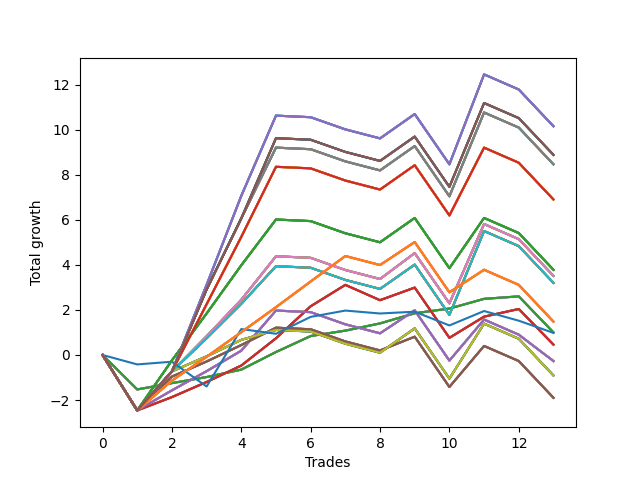

# Short Shepard 003 
- Symbol: NVDA_Unlimited
- Date Range: 02/08/2022 - 07/08/2022
- Trading Period: 7:20-12:30
- Number of Trades: 13



| Name | Win Percent | Profit | Avg Profit / Trade | Avg Time / Trade |      | Name | Win Percent | Profit | Avg Profit / Trade | Avg Time / Trade |
| ---- | ----------- | ------ | ------------------ | ---------------- | ---- | ---- | ----------- | ------ | ------------------ | ---------------- |
| Sorted By <br> Profit | | | | | | Sorted By <br> Win Percentage ||||
| One Hundred Twenty-Nine | 46.15 | 5075.00 | 390.38 | 26:34 |     | Sixty-Four | 84.62 | 500.00 | 38.46 | 06:19 |
| One Hundred Twenty-Four | 46.15 | 5075.00 | 390.38 | 26:34 |     | Fifty-Six | 84.62 | 500.00 | 38.46 | 06:19 |
| One Hundred Ninteen | 46.15 | 5075.00 | 390.38 | 26:34 |     | Forty-Eight | 84.62 | 500.00 | 38.46 | 06:19 |
| One Hundred Fourteen | 46.15 | 5075.00 | 390.38 | 26:34 |     | Forty | 84.62 | 500.00 | 38.46 | 06:19 |
| Eighty-Four | 46.15 | 5075.00 | 390.38 | 26:34 |     | Zero | 84.62 | 500.00 | 38.46 | 06:19 |
| One Hundred Thirty | 46.15 | 4440.00 | 341.54 | 27:28 |     | Sixty-Five | 69.23 | 230.00 | 17.69 | 13:08 |
| One Hundred Twenty-Five | 46.15 | 4440.00 | 341.54 | 27:28 |     | Fifty-Seven | 69.23 | 230.00 | 17.69 | 13:08 |
| One Hundred Twenty | 46.15 | 4440.00 | 341.54 | 27:28 |     | Forty-Nine | 69.23 | 230.00 | 17.69 | 13:08 |
| One Hundred Fifteen | 46.15 | 4440.00 | 341.54 | 27:28 |     | Forty-One | 69.23 | 230.00 | 17.69 | 13:08 |
| Eighty-Five | 46.15 | 4440.00 | 341.54 | 27:28 |     | One | 69.23 | 230.00 | 17.69 | 13:08 |
| Sixty-Nine | 46.15 | 4230.00 | 325.38 | 26:54 |     | One Hundred Twenty-Six | 61.54 | 740.00 | 56.92 | 15:57 |
| Sixty-One | 46.15 | 4230.00 | 325.38 | 26:54 |     | One Hundred Twenty-One | 61.54 | 740.00 | 56.92 | 15:57 |
| Fifty-Three | 46.15 | 4230.00 | 325.38 | 26:54 |     | One Hundred Sixteen | 61.54 | 740.00 | 56.92 | 15:57 |
| Forty-Five | 46.15 | 4230.00 | 325.38 | 26:54 |     | One Hundred Eleven | 61.54 | 740.00 | 56.92 | 15:57 |
| Five | 46.15 | 4230.00 | 325.38 | 26:54 |     | Eighty-One | 61.54 | 740.00 | 56.92 | 15:57 |
| One Hundred Twenty-Eight | 46.15 | 3450.00 | 265.38 | 23:45 |     | One Hundred Twenty-Nine | 46.15 | 5075.00 | 390.38 | 26:34 |
| One Hundred Twenty-Three | 46.15 | 3450.00 | 265.38 | 23:45 |     | One Hundred Twenty-Four | 46.15 | 5075.00 | 390.38 | 26:34 |
| One Hundred Eighteen | 46.15 | 3450.00 | 265.38 | 23:45 |     | One Hundred Ninteen | 46.15 | 5075.00 | 390.38 | 26:34 |
| One Hundred Thirteen | 46.15 | 3450.00 | 265.38 | 23:45 |     | One Hundred Fourteen | 46.15 | 5075.00 | 390.38 | 26:34 |
| Eighty-Three | 46.15 | 3450.00 | 265.38 | 23:45 |     | Eighty-Four | 46.15 | 5075.00 | 390.38 | 26:34 |
| One Hundred Twenty-Seven | 46.15 | 1890.00 | 145.38 | 21:20 |     | One Hundred Thirty | 46.15 | 4440.00 | 341.54 | 27:28 |
| One Hundred Twenty-Two | 46.15 | 1890.00 | 145.38 | 21:20 |     | One Hundred Twenty-Five | 46.15 | 4440.00 | 341.54 | 27:28 |
| One Hundred Seventeen | 46.15 | 1890.00 | 145.38 | 21:20 |     | One Hundred Twenty | 46.15 | 4440.00 | 341.54 | 27:28 |
| One Hundred Twelve | 46.15 | 1890.00 | 145.38 | 21:20 |     | One Hundred Fifteen | 46.15 | 4440.00 | 341.54 | 27:28 |
| Eighty-Two | 46.15 | 1890.00 | 145.38 | 21:20 |     | Eighty-Five | 46.15 | 4440.00 | 341.54 | 27:28 |
| Sixty-Eight | 46.15 | 1755.00 | 135.00 | 22:09 |     | Sixty-Nine | 46.15 | 4230.00 | 325.38 | 26:54 |
| Sixty | 46.15 | 1755.00 | 135.00 | 22:09 |     | Sixty-One | 46.15 | 4230.00 | 325.38 | 26:54 |
| Fifty-Two | 46.15 | 1755.00 | 135.00 | 22:09 |     | Fifty-Three | 46.15 | 4230.00 | 325.38 | 26:54 |
| Forty-Four | 46.15 | 1755.00 | 135.00 | 22:09 |     | Forty-Five | 46.15 | 4230.00 | 325.38 | 26:54 |
| Four | 46.15 | 1755.00 | 135.00 | 22:09 |     | Five | 46.15 | 4230.00 | 325.38 | 26:54 |
| Seventy-One | 46.15 | 1600.00 | 123.08 | 22:50 |     | One Hundred Twenty-Eight | 46.15 | 3450.00 | 265.38 | 23:45 |
| Sixty-Three | 46.15 | 1600.00 | 123.08 | 22:50 |     | One Hundred Twenty-Three | 46.15 | 3450.00 | 265.38 | 23:45 |
| Fifty-Five | 46.15 | 1600.00 | 123.08 | 22:50 |     | One Hundred Eighteen | 46.15 | 3450.00 | 265.38 | 23:45 |
| Forty-Seven | 46.15 | 1600.00 | 123.08 | 22:50 |     | One Hundred Thirteen | 46.15 | 3450.00 | 265.38 | 23:45 |
| Seven | 46.15 | 1600.00 | 123.08 | 22:50 |     | Eighty-Three | 46.15 | 3450.00 | 265.38 | 23:45 |
| One Hundred Twenty-Six | 61.54 | 740.00 | 56.92 | 15:57 |     | One Hundred Twenty-Seven | 46.15 | 1890.00 | 145.38 | 21:20 |
| One Hundred Twenty-One | 61.54 | 740.00 | 56.92 | 15:57 |     | One Hundred Twenty-Two | 46.15 | 1890.00 | 145.38 | 21:20 |
| One Hundred Sixteen | 61.54 | 740.00 | 56.92 | 15:57 |     | One Hundred Seventeen | 46.15 | 1890.00 | 145.38 | 21:20 |
| One Hundred Eleven | 61.54 | 740.00 | 56.92 | 15:57 |     | One Hundred Twelve | 46.15 | 1890.00 | 145.38 | 21:20 |
| Eighty-One | 61.54 | 740.00 | 56.92 | 15:57 |     | Eighty-Two | 46.15 | 1890.00 | 145.38 | 21:20 |
| Sixty-Four | 84.62 | 500.00 | 38.46 | 06:19 |     | Sixty-Eight | 46.15 | 1755.00 | 135.00 | 22:09 |
| Fifty-Six | 84.62 | 500.00 | 38.46 | 06:19 |     | Sixty | 46.15 | 1755.00 | 135.00 | 22:09 |
| Forty-Eight | 84.62 | 500.00 | 38.46 | 06:19 |     | Fifty-Two | 46.15 | 1755.00 | 135.00 | 22:09 |
| Forty | 84.62 | 500.00 | 38.46 | 06:19 |     | Forty-Four | 46.15 | 1755.00 | 135.00 | 22:09 |
| Zero | 84.62 | 500.00 | 38.46 | 06:19 |     | Four | 46.15 | 1755.00 | 135.00 | 22:09 |
| Seventy-Three | 46.15 | 490.00 | 37.69 | 06:18 |     | Seventy-One | 46.15 | 1600.00 | 123.08 | 22:50 |
| Sixty-Five | 69.23 | 230.00 | 17.69 | 13:08 |     | Sixty-Three | 46.15 | 1600.00 | 123.08 | 22:50 |
| Fifty-Seven | 69.23 | 230.00 | 17.69 | 13:08 |     | Fifty-Five | 46.15 | 1600.00 | 123.08 | 22:50 |
| Forty-Nine | 69.23 | 230.00 | 17.69 | 13:08 |     | Forty-Seven | 46.15 | 1600.00 | 123.08 | 22:50 |
| Forty-One | 69.23 | 230.00 | 17.69 | 13:08 |     | Seven | 46.15 | 1600.00 | 123.08 | 22:50 |
| One | 69.23 | 230.00 | 17.69 | 13:08 |     | Seventy-Three | 46.15 | 490.00 | 37.69 | 06:18 |
| Sixty-Six | 46.15 | -135.00 | -10.38 | 18:22 |     | Sixty-Six | 46.15 | -135.00 | -10.38 | 18:22 |
| Fifty-Eight | 46.15 | -135.00 | -10.38 | 18:22 |     | Fifty-Eight | 46.15 | -135.00 | -10.38 | 18:22 |
| Fifty | 46.15 | -135.00 | -10.38 | 18:22 |     | Fifty | 46.15 | -135.00 | -10.38 | 18:22 |
| Forty-Two | 46.15 | -135.00 | -10.38 | 18:22 |     | Forty-Two | 46.15 | -135.00 | -10.38 | 18:22 |
| Two | 46.15 | -135.00 | -10.38 | 18:22 |     | Two | 46.15 | -135.00 | -10.38 | 18:22 |
| Seventy | 46.15 | -455.00 | -35.00 | 20:23 |     | Seventy | 46.15 | -455.00 | -35.00 | 20:23 |
| Sixty-Two | 46.15 | -455.00 | -35.00 | 20:23 |     | Sixty-Two | 46.15 | -455.00 | -35.00 | 20:23 |
| Fifty-Four | 46.15 | -455.00 | -35.00 | 20:23 |     | Fifty-Four | 46.15 | -455.00 | -35.00 | 20:23 |
| Forty-Six | 46.15 | -455.00 | -35.00 | 20:23 |     | Forty-Six | 46.15 | -455.00 | -35.00 | 20:23 |
| Six | 46.15 | -455.00 | -35.00 | 20:23 |     | Six | 46.15 | -455.00 | -35.00 | 20:23 |
| Sixty-Seven | 46.15 | -950.00 | -73.08 | 18:46 |     | Sixty-Seven | 46.15 | -950.00 | -73.08 | 18:46 |
| Fifty-Nine | 46.15 | -950.00 | -73.08 | 18:46 |     | Fifty-Nine | 46.15 | -950.00 | -73.08 | 18:46 |
| Fifty-One | 46.15 | -950.00 | -73.08 | 18:46 |     | Fifty-One | 46.15 | -950.00 | -73.08 | 18:46 |
| Forty-Three | 46.15 | -950.00 | -73.08 | 18:46 |     | Forty-Three | 46.15 | -950.00 | -73.08 | 18:46 |
| Three | 46.15 | -950.00 | -73.08 | 18:46 |     | Three | 46.15 | -950.00 | -73.08 | 18:46 |

## NO STOPLOSS

### Test Zero
* Sell when price hits the middle line of the 20p bollinger
* No Stoploss
* Results:
```
Total Trades: 13
Percent Up: 15.38
Percent Down: 84.62
Total Points Moved Down: 1.00
Potential Profit: 500.00
Total Points Ups: 3.13 Count Ups: 2
Total Points Downs: 4.13 Count Downs: 11
```

<details><summary>Trades</summary>

<code>In: 2022-02-08 08:06:00		Out: 2022-02-08 08:26:50		Total Position Time: 20:50		Total Move Down: -1.53		Total to Date: -1.53</code> <br />
<code>In: 2022-02-22 12:07:00		Out: 2022-02-22 12:14:40		Total Position Time: 07:40		Total Move Down: 0.28		Total to Date: -1.25</code> <br />
<code>In: 2022-03-01 07:29:00		Out: 2022-03-01 07:35:35		Total Position Time: 06:35		Total Move Down: 0.27		Total to Date: -0.98</code> <br />
<code>In: 2022-03-01 07:35:00		Out: 2022-03-01 07:35:35		Total Position Time: 00:35		Total Move Down: 0.33		Total to Date: -0.65</code> <br />
<code>In: 2022-03-10 07:22:00		Out: 2022-03-10 07:24:25		Total Position Time: 02:25		Total Move Down: 0.78		Total to Date: 0.13</code> <br />
<code>In: 2022-03-16 12:30:00		Out: 2022-03-16 12:31:30		Total Position Time: 01:30		Total Move Down: 0.71		Total to Date: 0.84</code> <br />
<code>In: 2022-03-16 12:31:00		Out: 2022-03-16 12:31:30		Total Position Time: 00:30		Total Move Down: 0.24		Total to Date: 1.08</code> <br />
<code>In: 2022-03-17 10:32:00		Out: 2022-03-17 10:37:45		Total Position Time: 05:45		Total Move Down: 0.32		Total to Date: 1.40</code> <br />
<code>In: 2022-03-17 10:55:00		Out: 2022-03-17 10:59:40		Total Position Time: 04:40		Total Move Down: 0.45		Total to Date: 1.85</code> <br />
<code>In: 2022-03-28 12:04:00		Out: 2022-03-28 12:06:35		Total Position Time: 02:35		Total Move Down: 0.21		Total to Date: 2.06</code> <br />
<code>In: 2022-04-06 12:07:00		Out: 2022-04-06 12:12:05		Total Position Time: 05:05		Total Move Down: 0.43		Total to Date: 2.49</code> <br />
<code>In: 2022-04-07 12:18:00		Out: 2022-04-07 12:19:25		Total Position Time: 01:25		Total Move Down: 0.11		Total to Date: 2.60</code> <br />
<code>In: 2022-05-02 12:17:00		Out: 2022-05-02 12:39:35		Total Position Time: 22:35		Total Move Down: -1.60		Total to Date: 1.00</code> <br />


</details>

### Test One
* Sell when the price hits the upper line of the 20p 1std bollinger
* No Stoploss
* Results:
```
Total Trades: 13
Percent Up: 30.77
Percent Down: 69.23
Total Points Moved Down: 0.46
Potential Profit: 230.00
Total Points Ups: 6.95 Count Ups: 4
Total Points Downs: 7.41 Count Downs: 9
```

<details><summary>Trades</summary>

<code>In: 2022-02-08 08:06:00		Out: 2022-02-08 08:35:55		Total Position Time: 29:55		Total Move Down: -2.46		Total to Date: -2.46</code> <br />
<code>In: 2022-02-22 12:07:00		Out: 2022-02-22 12:18:35		Total Position Time: 11:35		Total Move Down: 0.59		Total to Date: -1.87</code> <br />
<code>In: 2022-03-01 07:29:00		Out: 2022-03-01 07:37:25		Total Position Time: 08:25		Total Move Down: 0.67		Total to Date: -1.20</code> <br />
<code>In: 2022-03-01 07:35:00		Out: 2022-03-01 07:37:25		Total Position Time: 02:25		Total Move Down: 0.73		Total to Date: -0.47</code> <br />
<code>In: 2022-03-10 07:22:00		Out: 2022-03-10 07:30:05		Total Position Time: 08:05		Total Move Down: 1.21		Total to Date: 0.74</code> <br />
<code>In: 2022-03-16 12:30:00		Out: 2022-03-16 12:34:05		Total Position Time: 04:05		Total Move Down: 1.42		Total to Date: 2.16</code> <br />
<code>In: 2022-03-16 12:31:00		Out: 2022-03-16 12:34:05		Total Position Time: 03:05		Total Move Down: 0.95		Total to Date: 3.11</code> <br />
<code>In: 2022-03-17 10:32:00		Out: 2022-03-17 11:00:20		Total Position Time: 28:20		Total Move Down: -0.68		Total to Date: 2.43</code> <br />
<code>In: 2022-03-17 10:55:00		Out: 2022-03-17 11:00:20		Total Position Time: 05:20		Total Move Down: 0.56		Total to Date: 2.99</code> <br />
<code>In: 2022-03-28 12:04:00		Out: 2022-03-28 12:33:55		Total Position Time: 29:55		Total Move Down: -2.23		Total to Date: 0.76</code> <br />
<code>In: 2022-04-06 12:07:00		Out: 2022-04-06 12:17:00		Total Position Time: 10:00		Total Move Down: 0.94		Total to Date: 1.70</code> <br />
<code>In: 2022-04-07 12:18:00		Out: 2022-04-07 12:20:35		Total Position Time: 02:35		Total Move Down: 0.34		Total to Date: 2.04</code> <br />
<code>In: 2022-05-02 12:17:00		Out: 2022-05-02 12:44:10		Total Position Time: 27:10		Total Move Down: -1.58		Total to Date: 0.46</code> <br />


</details>

### Test Two
* Sell when the price hits the upper line of the 20p 2std bollinger
* No Stoploss
* Results:
```
Total Trades: 13
Percent Up: 53.85
Percent Down: 46.15
Total Points Moved Down: -0.27
Potential Profit: -135.00
Total Points Ups: 7.54 Count Ups: 7
Total Points Downs: 7.27 Count Downs: 6
```

<details><summary>Trades</summary>

<code>In: 2022-02-08 08:06:00		Out: 2022-02-08 08:35:55		Total Position Time: 29:55		Total Move Down: -2.46		Total to Date: -2.46</code> <br />
<code>In: 2022-02-22 12:07:00		Out: 2022-02-22 12:20:20		Total Position Time: 13:20		Total Move Down: 0.89		Total to Date: -1.57</code> <br />
<code>In: 2022-03-01 07:29:00		Out: 2022-03-01 07:40:10		Total Position Time: 11:10		Total Move Down: 0.85		Total to Date: -0.72</code> <br />
<code>In: 2022-03-01 07:35:00		Out: 2022-03-01 07:40:10		Total Position Time: 05:10		Total Move Down: 0.91		Total to Date: 0.19</code> <br />
<code>In: 2022-03-10 07:22:00		Out: 2022-03-10 07:33:15		Total Position Time: 11:15		Total Move Down: 1.78		Total to Date: 1.97</code> <br />
<code>In: 2022-03-16 12:30:00		Out: 2022-03-16 12:46:00		Total Position Time: 16:00		Total Move Down: -0.07		Total to Date: 1.90</code> <br />
<code>In: 2022-03-16 12:31:00		Out: 2022-03-16 12:46:00		Total Position Time: 15:00		Total Move Down: -0.54		Total to Date: 1.36</code> <br />
<code>In: 2022-03-17 10:32:00		Out: 2022-03-17 11:01:55		Total Position Time: 29:55		Total Move Down: -0.40		Total to Date: 0.96</code> <br />
<code>In: 2022-03-17 10:55:00		Out: 2022-03-17 11:02:40		Total Position Time: 07:40		Total Move Down: 1.02		Total to Date: 1.98</code> <br />
<code>In: 2022-03-28 12:04:00		Out: 2022-03-28 12:33:55		Total Position Time: 29:55		Total Move Down: -2.23		Total to Date: -0.25</code> <br />
<code>In: 2022-04-06 12:07:00		Out: 2022-04-06 12:20:25		Total Position Time: 13:25		Total Move Down: 1.82		Total to Date: 1.57</code> <br />
<code>In: 2022-04-07 12:18:00		Out: 2022-04-07 12:46:00		Total Position Time: 28:00		Total Move Down: -0.67		Total to Date: 0.90</code> <br />
<code>In: 2022-05-02 12:17:00		Out: 2022-05-02 12:45:05		Total Position Time: 28:05		Total Move Down: -1.17		Total to Date: -0.27</code> <br />


</details>

### Test Three
* Sell when price hits the middle line of the 50p bollinger
* No Stoploss
* Results:
```
Total Trades: 13
Percent Up: 53.85
Percent Down: 46.15
Total Points Moved Down: -1.90
Potential Profit: -950.00
Total Points Ups: 8.00 Count Ups: 7
Total Points Downs: 6.10 Count Downs: 6
```

<details><summary>Trades</summary>

<code>In: 2022-02-08 08:06:00		Out: 2022-02-08 08:35:55		Total Position Time: 29:55		Total Move Down: -2.46		Total to Date: -2.46</code> <br />
<code>In: 2022-02-22 12:07:00		Out: 2022-02-22 12:30:20		Total Position Time: 23:20		Total Move Down: 1.50		Total to Date: -0.96</code> <br />
<code>In: 2022-03-01 07:29:00		Out: 2022-03-01 07:37:25		Total Position Time: 08:25		Total Move Down: 0.67		Total to Date: -0.29</code> <br />
<code>In: 2022-03-01 07:35:00		Out: 2022-03-01 07:37:25		Total Position Time: 02:25		Total Move Down: 0.73		Total to Date: 0.44</code> <br />
<code>In: 2022-03-10 07:22:00		Out: 2022-03-10 07:24:35		Total Position Time: 02:35		Total Move Down: 0.77		Total to Date: 1.21</code> <br />
<code>In: 2022-03-16 12:30:00		Out: 2022-03-16 12:46:00		Total Position Time: 16:00		Total Move Down: -0.07		Total to Date: 1.14</code> <br />
<code>In: 2022-03-16 12:31:00		Out: 2022-03-16 12:46:00		Total Position Time: 15:00		Total Move Down: -0.54		Total to Date: 0.60</code> <br />
<code>In: 2022-03-17 10:32:00		Out: 2022-03-17 11:01:55		Total Position Time: 29:55		Total Move Down: -0.40		Total to Date: 0.20</code> <br />
<code>In: 2022-03-17 10:55:00		Out: 2022-03-17 11:11:15		Total Position Time: 16:15		Total Move Down: 0.61		Total to Date: 0.81</code> <br />
<code>In: 2022-03-28 12:04:00		Out: 2022-03-28 12:33:55		Total Position Time: 29:55		Total Move Down: -2.23		Total to Date: -1.42</code> <br />
<code>In: 2022-04-06 12:07:00		Out: 2022-04-06 12:20:25		Total Position Time: 13:25		Total Move Down: 1.82		Total to Date: 0.40</code> <br />
<code>In: 2022-04-07 12:18:00		Out: 2022-04-07 12:46:00		Total Position Time: 28:00		Total Move Down: -0.67		Total to Date: -0.27</code> <br />
<code>In: 2022-05-02 12:17:00		Out: 2022-05-02 12:46:00		Total Position Time: 29:00		Total Move Down: -1.63		Total to Date: -1.90</code> <br />


</details>

### Test Four
* Sell when the price hits the upper line of the 50p 1std bollinger
* No Stoploss
* Results:
```
Total Trades: 13
Percent Up: 53.85
Percent Down: 46.15
Total Points Moved Down: 3.51
Potential Profit: 1755.00
Total Points Ups: 8.00 Count Ups: 7
Total Points Downs: 11.51 Count Downs: 6
```

<details><summary>Trades</summary>

<code>In: 2022-02-08 08:06:00		Out: 2022-02-08 08:35:55		Total Position Time: 29:55		Total Move Down: -2.46		Total to Date: -2.46</code> <br />
<code>In: 2022-02-22 12:07:00		Out: 2022-02-22 12:36:55		Total Position Time: 29:55		Total Move Down: 1.73		Total to Date: -0.73</code> <br />
<code>In: 2022-03-01 07:29:00		Out: 2022-03-01 07:41:25		Total Position Time: 12:25		Total Move Down: 1.56		Total to Date: 0.83</code> <br />
<code>In: 2022-03-01 07:35:00		Out: 2022-03-01 07:41:25		Total Position Time: 06:25		Total Move Down: 1.62		Total to Date: 2.45</code> <br />
<code>In: 2022-03-10 07:22:00		Out: 2022-03-10 07:33:20		Total Position Time: 11:20		Total Move Down: 1.93		Total to Date: 4.38</code> <br />
<code>In: 2022-03-16 12:30:00		Out: 2022-03-16 12:46:00		Total Position Time: 16:00		Total Move Down: -0.07		Total to Date: 4.31</code> <br />
<code>In: 2022-03-16 12:31:00		Out: 2022-03-16 12:46:00		Total Position Time: 15:00		Total Move Down: -0.54		Total to Date: 3.77</code> <br />
<code>In: 2022-03-17 10:32:00		Out: 2022-03-17 11:01:55		Total Position Time: 29:55		Total Move Down: -0.40		Total to Date: 3.37</code> <br />
<code>In: 2022-03-17 10:55:00		Out: 2022-03-17 11:24:10		Total Position Time: 29:10		Total Move Down: 1.15		Total to Date: 4.52</code> <br />
<code>In: 2022-03-28 12:04:00		Out: 2022-03-28 12:33:55		Total Position Time: 29:55		Total Move Down: -2.23		Total to Date: 2.29</code> <br />
<code>In: 2022-04-06 12:07:00		Out: 2022-04-06 12:28:00		Total Position Time: 21:00		Total Move Down: 3.52		Total to Date: 5.81</code> <br />
<code>In: 2022-04-07 12:18:00		Out: 2022-04-07 12:46:00		Total Position Time: 28:00		Total Move Down: -0.67		Total to Date: 5.14</code> <br />
<code>In: 2022-05-02 12:17:00		Out: 2022-05-02 12:46:00		Total Position Time: 29:00		Total Move Down: -1.63		Total to Date: 3.51</code> <br />


</details>

### Test Five
* Sell when the price hits the upper line of the 50p 2std bollinger
* No Stoploss
* Results:
```
Total Trades: 13
Percent Up: 53.85
Percent Down: 46.15
Total Points Moved Down: 8.46
Potential Profit: 4230.00
Total Points Ups: 8.00 Count Ups: 7
Total Points Downs: 16.46 Count Downs: 6
```

<details><summary>Trades</summary>

<code>In: 2022-02-08 08:06:00		Out: 2022-02-08 08:35:55		Total Position Time: 29:55		Total Move Down: -2.46		Total to Date: -2.46</code> <br />
<code>In: 2022-02-22 12:07:00		Out: 2022-02-22 12:36:55		Total Position Time: 29:55		Total Move Down: 1.73		Total to Date: -0.73</code> <br />
<code>In: 2022-03-01 07:29:00		Out: 2022-03-01 07:58:55		Total Position Time: 29:55		Total Move Down: 3.64		Total to Date: 2.91</code> <br />
<code>In: 2022-03-01 07:35:00		Out: 2022-03-01 08:04:55		Total Position Time: 29:55		Total Move Down: 3.15		Total to Date: 6.06</code> <br />
<code>In: 2022-03-10 07:22:00		Out: 2022-03-10 07:44:25		Total Position Time: 22:25		Total Move Down: 3.14		Total to Date: 9.20</code> <br />
<code>In: 2022-03-16 12:30:00		Out: 2022-03-16 12:46:00		Total Position Time: 16:00		Total Move Down: -0.07		Total to Date: 9.13</code> <br />
<code>In: 2022-03-16 12:31:00		Out: 2022-03-16 12:46:00		Total Position Time: 15:00		Total Move Down: -0.54		Total to Date: 8.59</code> <br />
<code>In: 2022-03-17 10:32:00		Out: 2022-03-17 11:01:55		Total Position Time: 29:55		Total Move Down: -0.40		Total to Date: 8.19</code> <br />
<code>In: 2022-03-17 10:55:00		Out: 2022-03-17 11:24:55		Total Position Time: 29:55		Total Move Down: 1.08		Total to Date: 9.27</code> <br />
<code>In: 2022-03-28 12:04:00		Out: 2022-03-28 12:33:55		Total Position Time: 29:55		Total Move Down: -2.23		Total to Date: 7.04</code> <br />
<code>In: 2022-04-06 12:07:00		Out: 2022-04-06 12:36:55		Total Position Time: 29:55		Total Move Down: 3.72		Total to Date: 10.76</code> <br />
<code>In: 2022-04-07 12:18:00		Out: 2022-04-07 12:46:00		Total Position Time: 28:00		Total Move Down: -0.67		Total to Date: 10.09</code> <br />
<code>In: 2022-05-02 12:17:00		Out: 2022-05-02 12:46:00		Total Position Time: 29:00		Total Move Down: -1.63		Total to Date: 8.46</code> <br />


</details>

### Test Six
* Sell when the price hits the middle line of the 1std VWAP
* No Stoploss
* Results:
```
Total Trades: 13
Percent Up: 53.85
Percent Down: 46.15
Total Points Moved Down: -0.91
Potential Profit: -455.00
Total Points Ups: 8.00 Count Ups: 7
Total Points Downs: 7.09 Count Downs: 6
```

<details><summary>Trades</summary>

<code>In: 2022-02-08 08:06:00		Out: 2022-02-08 08:35:55		Total Position Time: 29:55		Total Move Down: -2.46		Total to Date: -2.46</code> <br />
<code>In: 2022-02-22 12:07:00		Out: 2022-02-22 12:36:55		Total Position Time: 29:55		Total Move Down: 1.73		Total to Date: -0.73</code> <br />
<code>In: 2022-03-01 07:29:00		Out: 2022-03-01 07:37:25		Total Position Time: 08:25		Total Move Down: 0.67		Total to Date: -0.06</code> <br />
<code>In: 2022-03-01 07:35:00		Out: 2022-03-01 07:37:25		Total Position Time: 02:25		Total Move Down: 0.73		Total to Date: 0.67</code> <br />
<code>In: 2022-03-10 07:22:00		Out: 2022-03-10 07:24:05		Total Position Time: 02:05		Total Move Down: 0.44		Total to Date: 1.11</code> <br />
<code>In: 2022-03-16 12:30:00		Out: 2022-03-16 12:46:00		Total Position Time: 16:00		Total Move Down: -0.07		Total to Date: 1.04</code> <br />
<code>In: 2022-03-16 12:31:00		Out: 2022-03-16 12:46:00		Total Position Time: 15:00		Total Move Down: -0.54		Total to Date: 0.50</code> <br />
<code>In: 2022-03-17 10:32:00		Out: 2022-03-17 11:01:55		Total Position Time: 29:55		Total Move Down: -0.40		Total to Date: 0.10</code> <br />
<code>In: 2022-03-17 10:55:00		Out: 2022-03-17 11:24:55		Total Position Time: 29:55		Total Move Down: 1.08		Total to Date: 1.18</code> <br />
<code>In: 2022-03-28 12:04:00		Out: 2022-03-28 12:33:55		Total Position Time: 29:55		Total Move Down: -2.23		Total to Date: -1.05</code> <br />
<code>In: 2022-04-06 12:07:00		Out: 2022-04-06 12:21:35		Total Position Time: 14:35		Total Move Down: 2.44		Total to Date: 1.39</code> <br />
<code>In: 2022-04-07 12:18:00		Out: 2022-04-07 12:46:00		Total Position Time: 28:00		Total Move Down: -0.67		Total to Date: 0.72</code> <br />
<code>In: 2022-05-02 12:17:00		Out: 2022-05-02 12:46:00		Total Position Time: 29:00		Total Move Down: -1.63		Total to Date: -0.91</code> <br />


</details>

### Test Seven
* Sell when the price hits the upper line of the 1std VWAP
* No Stoploss
* Results:
```
Total Trades: 13
Percent Up: 53.85
Percent Down: 46.15
Total Points Moved Down: 3.20
Potential Profit: 1600.00
Total Points Ups: 8.00 Count Ups: 7
Total Points Downs: 11.20 Count Downs: 6
```

<details><summary>Trades</summary>

<code>In: 2022-02-08 08:06:00		Out: 2022-02-08 08:35:55		Total Position Time: 29:55		Total Move Down: -2.46		Total to Date: -2.46</code> <br />
<code>In: 2022-02-22 12:07:00		Out: 2022-02-22 12:36:55		Total Position Time: 29:55		Total Move Down: 1.73		Total to Date: -0.73</code> <br />
<code>In: 2022-03-01 07:29:00		Out: 2022-03-01 07:41:15		Total Position Time: 12:15		Total Move Down: 1.47		Total to Date: 0.74</code> <br />
<code>In: 2022-03-01 07:35:00		Out: 2022-03-01 07:41:15		Total Position Time: 06:15		Total Move Down: 1.53		Total to Date: 2.27</code> <br />
<code>In: 2022-03-10 07:22:00		Out: 2022-03-10 07:33:00		Total Position Time: 11:00		Total Move Down: 1.67		Total to Date: 3.94</code> <br />
<code>In: 2022-03-16 12:30:00		Out: 2022-03-16 12:46:00		Total Position Time: 16:00		Total Move Down: -0.07		Total to Date: 3.87</code> <br />
<code>In: 2022-03-16 12:31:00		Out: 2022-03-16 12:46:00		Total Position Time: 15:00		Total Move Down: -0.54		Total to Date: 3.33</code> <br />
<code>In: 2022-03-17 10:32:00		Out: 2022-03-17 11:01:55		Total Position Time: 29:55		Total Move Down: -0.40		Total to Date: 2.93</code> <br />
<code>In: 2022-03-17 10:55:00		Out: 2022-03-17 11:24:55		Total Position Time: 29:55		Total Move Down: 1.08		Total to Date: 4.01</code> <br />
<code>In: 2022-03-28 12:04:00		Out: 2022-03-28 12:33:55		Total Position Time: 29:55		Total Move Down: -2.23		Total to Date: 1.78</code> <br />
<code>In: 2022-04-06 12:07:00		Out: 2022-04-06 12:36:55		Total Position Time: 29:55		Total Move Down: 3.72		Total to Date: 5.50</code> <br />
<code>In: 2022-04-07 12:18:00		Out: 2022-04-07 12:46:00		Total Position Time: 28:00		Total Move Down: -0.67		Total to Date: 4.83</code> <br />
<code>In: 2022-05-02 12:17:00		Out: 2022-05-02 12:46:00		Total Position Time: 29:00		Total Move Down: -1.63		Total to Date: 3.20</code> <br />


</details>

## STOPLOSS OF 5

### Test Forty
* Sell when price hits the middle line of the 20p bollinger
* Stoploss is -5 points
* Results:
```
Total Trades: 13
Percent Up: 15.38
Percent Down: 84.62
Total Points Moved Down: 1.00
Potential Profit: 500.00
Total Points Ups: 3.13 Count Ups: 2
Total Points Downs: 4.13 Count Downs: 11
```

<details><summary>Trades</summary>

<code>In: 2022-02-08 08:06:00		Out: 2022-02-08 08:26:50		Total Position Time: 20:50		Total Move Down: -1.53		Total to Date: -1.53</code> <br />
<code>In: 2022-02-22 12:07:00		Out: 2022-02-22 12:14:40		Total Position Time: 07:40		Total Move Down: 0.28		Total to Date: -1.25</code> <br />
<code>In: 2022-03-01 07:29:00		Out: 2022-03-01 07:35:35		Total Position Time: 06:35		Total Move Down: 0.27		Total to Date: -0.98</code> <br />
<code>In: 2022-03-01 07:35:00		Out: 2022-03-01 07:35:35		Total Position Time: 00:35		Total Move Down: 0.33		Total to Date: -0.65</code> <br />
<code>In: 2022-03-10 07:22:00		Out: 2022-03-10 07:24:25		Total Position Time: 02:25		Total Move Down: 0.78		Total to Date: 0.13</code> <br />
<code>In: 2022-03-16 12:30:00		Out: 2022-03-16 12:31:30		Total Position Time: 01:30		Total Move Down: 0.71		Total to Date: 0.84</code> <br />
<code>In: 2022-03-16 12:31:00		Out: 2022-03-16 12:31:30		Total Position Time: 00:30		Total Move Down: 0.24		Total to Date: 1.08</code> <br />
<code>In: 2022-03-17 10:32:00		Out: 2022-03-17 10:37:45		Total Position Time: 05:45		Total Move Down: 0.32		Total to Date: 1.40</code> <br />
<code>In: 2022-03-17 10:55:00		Out: 2022-03-17 10:59:40		Total Position Time: 04:40		Total Move Down: 0.45		Total to Date: 1.85</code> <br />
<code>In: 2022-03-28 12:04:00		Out: 2022-03-28 12:06:35		Total Position Time: 02:35		Total Move Down: 0.21		Total to Date: 2.06</code> <br />
<code>In: 2022-04-06 12:07:00		Out: 2022-04-06 12:12:05		Total Position Time: 05:05		Total Move Down: 0.43		Total to Date: 2.49</code> <br />
<code>In: 2022-04-07 12:18:00		Out: 2022-04-07 12:19:25		Total Position Time: 01:25		Total Move Down: 0.11		Total to Date: 2.60</code> <br />
<code>In: 2022-05-02 12:17:00		Out: 2022-05-02 12:39:35		Total Position Time: 22:35		Total Move Down: -1.60		Total to Date: 1.00</code> <br />


</details>

### Test Forty-One
* Sell when the price hits the upper line of the 20p 1std bollinger
* Stoploss is -5 points
* Results:
```
Total Trades: 13
Percent Up: 30.77
Percent Down: 69.23
Total Points Moved Down: 0.46
Potential Profit: 230.00
Total Points Ups: 6.95 Count Ups: 4
Total Points Downs: 7.41 Count Downs: 9
```

<details><summary>Trades</summary>

<code>In: 2022-02-08 08:06:00		Out: 2022-02-08 08:35:55		Total Position Time: 29:55		Total Move Down: -2.46		Total to Date: -2.46</code> <br />
<code>In: 2022-02-22 12:07:00		Out: 2022-02-22 12:18:35		Total Position Time: 11:35		Total Move Down: 0.59		Total to Date: -1.87</code> <br />
<code>In: 2022-03-01 07:29:00		Out: 2022-03-01 07:37:25		Total Position Time: 08:25		Total Move Down: 0.67		Total to Date: -1.20</code> <br />
<code>In: 2022-03-01 07:35:00		Out: 2022-03-01 07:37:25		Total Position Time: 02:25		Total Move Down: 0.73		Total to Date: -0.47</code> <br />
<code>In: 2022-03-10 07:22:00		Out: 2022-03-10 07:30:05		Total Position Time: 08:05		Total Move Down: 1.21		Total to Date: 0.74</code> <br />
<code>In: 2022-03-16 12:30:00		Out: 2022-03-16 12:34:05		Total Position Time: 04:05		Total Move Down: 1.42		Total to Date: 2.16</code> <br />
<code>In: 2022-03-16 12:31:00		Out: 2022-03-16 12:34:05		Total Position Time: 03:05		Total Move Down: 0.95		Total to Date: 3.11</code> <br />
<code>In: 2022-03-17 10:32:00		Out: 2022-03-17 11:00:20		Total Position Time: 28:20		Total Move Down: -0.68		Total to Date: 2.43</code> <br />
<code>In: 2022-03-17 10:55:00		Out: 2022-03-17 11:00:20		Total Position Time: 05:20		Total Move Down: 0.56		Total to Date: 2.99</code> <br />
<code>In: 2022-03-28 12:04:00		Out: 2022-03-28 12:33:55		Total Position Time: 29:55		Total Move Down: -2.23		Total to Date: 0.76</code> <br />
<code>In: 2022-04-06 12:07:00		Out: 2022-04-06 12:17:00		Total Position Time: 10:00		Total Move Down: 0.94		Total to Date: 1.70</code> <br />
<code>In: 2022-04-07 12:18:00		Out: 2022-04-07 12:20:35		Total Position Time: 02:35		Total Move Down: 0.34		Total to Date: 2.04</code> <br />
<code>In: 2022-05-02 12:17:00		Out: 2022-05-02 12:44:10		Total Position Time: 27:10		Total Move Down: -1.58		Total to Date: 0.46</code> <br />


</details>

### Test Forty-Two
* Sell when the price hits the upper line of the 20p 2std bollinger
* Stoploss is -5 points
* Results:
```
Total Trades: 13
Percent Up: 53.85
Percent Down: 46.15
Total Points Moved Down: -0.27
Potential Profit: -135.00
Total Points Ups: 7.54 Count Ups: 7
Total Points Downs: 7.27 Count Downs: 6
```

<details><summary>Trades</summary>

<code>In: 2022-02-08 08:06:00		Out: 2022-02-08 08:35:55		Total Position Time: 29:55		Total Move Down: -2.46		Total to Date: -2.46</code> <br />
<code>In: 2022-02-22 12:07:00		Out: 2022-02-22 12:20:20		Total Position Time: 13:20		Total Move Down: 0.89		Total to Date: -1.57</code> <br />
<code>In: 2022-03-01 07:29:00		Out: 2022-03-01 07:40:10		Total Position Time: 11:10		Total Move Down: 0.85		Total to Date: -0.72</code> <br />
<code>In: 2022-03-01 07:35:00		Out: 2022-03-01 07:40:10		Total Position Time: 05:10		Total Move Down: 0.91		Total to Date: 0.19</code> <br />
<code>In: 2022-03-10 07:22:00		Out: 2022-03-10 07:33:15		Total Position Time: 11:15		Total Move Down: 1.78		Total to Date: 1.97</code> <br />
<code>In: 2022-03-16 12:30:00		Out: 2022-03-16 12:46:00		Total Position Time: 16:00		Total Move Down: -0.07		Total to Date: 1.90</code> <br />
<code>In: 2022-03-16 12:31:00		Out: 2022-03-16 12:46:00		Total Position Time: 15:00		Total Move Down: -0.54		Total to Date: 1.36</code> <br />
<code>In: 2022-03-17 10:32:00		Out: 2022-03-17 11:01:55		Total Position Time: 29:55		Total Move Down: -0.40		Total to Date: 0.96</code> <br />
<code>In: 2022-03-17 10:55:00		Out: 2022-03-17 11:02:40		Total Position Time: 07:40		Total Move Down: 1.02		Total to Date: 1.98</code> <br />
<code>In: 2022-03-28 12:04:00		Out: 2022-03-28 12:33:55		Total Position Time: 29:55		Total Move Down: -2.23		Total to Date: -0.25</code> <br />
<code>In: 2022-04-06 12:07:00		Out: 2022-04-06 12:20:25		Total Position Time: 13:25		Total Move Down: 1.82		Total to Date: 1.57</code> <br />
<code>In: 2022-04-07 12:18:00		Out: 2022-04-07 12:46:00		Total Position Time: 28:00		Total Move Down: -0.67		Total to Date: 0.90</code> <br />
<code>In: 2022-05-02 12:17:00		Out: 2022-05-02 12:45:05		Total Position Time: 28:05		Total Move Down: -1.17		Total to Date: -0.27</code> <br />


</details>

### Test Forty-Three
* Sell when price hits the middle line of the 50p bollinger
* Stoploss is -5 points
* Results:
```
Total Trades: 13
Percent Up: 53.85
Percent Down: 46.15
Total Points Moved Down: -1.90
Potential Profit: -950.00
Total Points Ups: 8.00 Count Ups: 7
Total Points Downs: 6.10 Count Downs: 6
```

<details><summary>Trades</summary>

<code>In: 2022-02-08 08:06:00		Out: 2022-02-08 08:35:55		Total Position Time: 29:55		Total Move Down: -2.46		Total to Date: -2.46</code> <br />
<code>In: 2022-02-22 12:07:00		Out: 2022-02-22 12:30:20		Total Position Time: 23:20		Total Move Down: 1.50		Total to Date: -0.96</code> <br />
<code>In: 2022-03-01 07:29:00		Out: 2022-03-01 07:37:25		Total Position Time: 08:25		Total Move Down: 0.67		Total to Date: -0.29</code> <br />
<code>In: 2022-03-01 07:35:00		Out: 2022-03-01 07:37:25		Total Position Time: 02:25		Total Move Down: 0.73		Total to Date: 0.44</code> <br />
<code>In: 2022-03-10 07:22:00		Out: 2022-03-10 07:24:35		Total Position Time: 02:35		Total Move Down: 0.77		Total to Date: 1.21</code> <br />
<code>In: 2022-03-16 12:30:00		Out: 2022-03-16 12:46:00		Total Position Time: 16:00		Total Move Down: -0.07		Total to Date: 1.14</code> <br />
<code>In: 2022-03-16 12:31:00		Out: 2022-03-16 12:46:00		Total Position Time: 15:00		Total Move Down: -0.54		Total to Date: 0.60</code> <br />
<code>In: 2022-03-17 10:32:00		Out: 2022-03-17 11:01:55		Total Position Time: 29:55		Total Move Down: -0.40		Total to Date: 0.20</code> <br />
<code>In: 2022-03-17 10:55:00		Out: 2022-03-17 11:11:15		Total Position Time: 16:15		Total Move Down: 0.61		Total to Date: 0.81</code> <br />
<code>In: 2022-03-28 12:04:00		Out: 2022-03-28 12:33:55		Total Position Time: 29:55		Total Move Down: -2.23		Total to Date: -1.42</code> <br />
<code>In: 2022-04-06 12:07:00		Out: 2022-04-06 12:20:25		Total Position Time: 13:25		Total Move Down: 1.82		Total to Date: 0.40</code> <br />
<code>In: 2022-04-07 12:18:00		Out: 2022-04-07 12:46:00		Total Position Time: 28:00		Total Move Down: -0.67		Total to Date: -0.27</code> <br />
<code>In: 2022-05-02 12:17:00		Out: 2022-05-02 12:46:00		Total Position Time: 29:00		Total Move Down: -1.63		Total to Date: -1.90</code> <br />


</details>

### Test Forty-Four
* Sell when the price hits the upper line of the 50p 1std bollinger
* Stoploss is -5 points
* Results:
```
Total Trades: 13
Percent Up: 53.85
Percent Down: 46.15
Total Points Moved Down: 3.51
Potential Profit: 1755.00
Total Points Ups: 8.00 Count Ups: 7
Total Points Downs: 11.51 Count Downs: 6
```

<details><summary>Trades</summary>

<code>In: 2022-02-08 08:06:00		Out: 2022-02-08 08:35:55		Total Position Time: 29:55		Total Move Down: -2.46		Total to Date: -2.46</code> <br />
<code>In: 2022-02-22 12:07:00		Out: 2022-02-22 12:36:55		Total Position Time: 29:55		Total Move Down: 1.73		Total to Date: -0.73</code> <br />
<code>In: 2022-03-01 07:29:00		Out: 2022-03-01 07:41:25		Total Position Time: 12:25		Total Move Down: 1.56		Total to Date: 0.83</code> <br />
<code>In: 2022-03-01 07:35:00		Out: 2022-03-01 07:41:25		Total Position Time: 06:25		Total Move Down: 1.62		Total to Date: 2.45</code> <br />
<code>In: 2022-03-10 07:22:00		Out: 2022-03-10 07:33:20		Total Position Time: 11:20		Total Move Down: 1.93		Total to Date: 4.38</code> <br />
<code>In: 2022-03-16 12:30:00		Out: 2022-03-16 12:46:00		Total Position Time: 16:00		Total Move Down: -0.07		Total to Date: 4.31</code> <br />
<code>In: 2022-03-16 12:31:00		Out: 2022-03-16 12:46:00		Total Position Time: 15:00		Total Move Down: -0.54		Total to Date: 3.77</code> <br />
<code>In: 2022-03-17 10:32:00		Out: 2022-03-17 11:01:55		Total Position Time: 29:55		Total Move Down: -0.40		Total to Date: 3.37</code> <br />
<code>In: 2022-03-17 10:55:00		Out: 2022-03-17 11:24:10		Total Position Time: 29:10		Total Move Down: 1.15		Total to Date: 4.52</code> <br />
<code>In: 2022-03-28 12:04:00		Out: 2022-03-28 12:33:55		Total Position Time: 29:55		Total Move Down: -2.23		Total to Date: 2.29</code> <br />
<code>In: 2022-04-06 12:07:00		Out: 2022-04-06 12:28:00		Total Position Time: 21:00		Total Move Down: 3.52		Total to Date: 5.81</code> <br />
<code>In: 2022-04-07 12:18:00		Out: 2022-04-07 12:46:00		Total Position Time: 28:00		Total Move Down: -0.67		Total to Date: 5.14</code> <br />
<code>In: 2022-05-02 12:17:00		Out: 2022-05-02 12:46:00		Total Position Time: 29:00		Total Move Down: -1.63		Total to Date: 3.51</code> <br />


</details>

### Test Forty-Five
* Sell when the price hits the upper line of the 50p 2std bollinger
* Stoploss is -5 points
* Results:
```
Total Trades: 13
Percent Up: 53.85
Percent Down: 46.15
Total Points Moved Down: 8.46
Potential Profit: 4230.00
Total Points Ups: 8.00 Count Ups: 7
Total Points Downs: 16.46 Count Downs: 6
```

<details><summary>Trades</summary>

<code>In: 2022-02-08 08:06:00		Out: 2022-02-08 08:35:55		Total Position Time: 29:55		Total Move Down: -2.46		Total to Date: -2.46</code> <br />
<code>In: 2022-02-22 12:07:00		Out: 2022-02-22 12:36:55		Total Position Time: 29:55		Total Move Down: 1.73		Total to Date: -0.73</code> <br />
<code>In: 2022-03-01 07:29:00		Out: 2022-03-01 07:58:55		Total Position Time: 29:55		Total Move Down: 3.64		Total to Date: 2.91</code> <br />
<code>In: 2022-03-01 07:35:00		Out: 2022-03-01 08:04:55		Total Position Time: 29:55		Total Move Down: 3.15		Total to Date: 6.06</code> <br />
<code>In: 2022-03-10 07:22:00		Out: 2022-03-10 07:44:25		Total Position Time: 22:25		Total Move Down: 3.14		Total to Date: 9.20</code> <br />
<code>In: 2022-03-16 12:30:00		Out: 2022-03-16 12:46:00		Total Position Time: 16:00		Total Move Down: -0.07		Total to Date: 9.13</code> <br />
<code>In: 2022-03-16 12:31:00		Out: 2022-03-16 12:46:00		Total Position Time: 15:00		Total Move Down: -0.54		Total to Date: 8.59</code> <br />
<code>In: 2022-03-17 10:32:00		Out: 2022-03-17 11:01:55		Total Position Time: 29:55		Total Move Down: -0.40		Total to Date: 8.19</code> <br />
<code>In: 2022-03-17 10:55:00		Out: 2022-03-17 11:24:55		Total Position Time: 29:55		Total Move Down: 1.08		Total to Date: 9.27</code> <br />
<code>In: 2022-03-28 12:04:00		Out: 2022-03-28 12:33:55		Total Position Time: 29:55		Total Move Down: -2.23		Total to Date: 7.04</code> <br />
<code>In: 2022-04-06 12:07:00		Out: 2022-04-06 12:36:55		Total Position Time: 29:55		Total Move Down: 3.72		Total to Date: 10.76</code> <br />
<code>In: 2022-04-07 12:18:00		Out: 2022-04-07 12:46:00		Total Position Time: 28:00		Total Move Down: -0.67		Total to Date: 10.09</code> <br />
<code>In: 2022-05-02 12:17:00		Out: 2022-05-02 12:46:00		Total Position Time: 29:00		Total Move Down: -1.63		Total to Date: 8.46</code> <br />


</details>

### Test Forty-Six
* Sell when the price hits the middle line of the 1std VWAP
* Stoploss is -5 points
* Results:
```
Total Trades: 13
Percent Up: 53.85
Percent Down: 46.15
Total Points Moved Down: -0.91
Potential Profit: -455.00
Total Points Ups: 8.00 Count Ups: 7
Total Points Downs: 7.09 Count Downs: 6
```

<details><summary>Trades</summary>

<code>In: 2022-02-08 08:06:00		Out: 2022-02-08 08:35:55		Total Position Time: 29:55		Total Move Down: -2.46		Total to Date: -2.46</code> <br />
<code>In: 2022-02-22 12:07:00		Out: 2022-02-22 12:36:55		Total Position Time: 29:55		Total Move Down: 1.73		Total to Date: -0.73</code> <br />
<code>In: 2022-03-01 07:29:00		Out: 2022-03-01 07:37:25		Total Position Time: 08:25		Total Move Down: 0.67		Total to Date: -0.06</code> <br />
<code>In: 2022-03-01 07:35:00		Out: 2022-03-01 07:37:25		Total Position Time: 02:25		Total Move Down: 0.73		Total to Date: 0.67</code> <br />
<code>In: 2022-03-10 07:22:00		Out: 2022-03-10 07:24:05		Total Position Time: 02:05		Total Move Down: 0.44		Total to Date: 1.11</code> <br />
<code>In: 2022-03-16 12:30:00		Out: 2022-03-16 12:46:00		Total Position Time: 16:00		Total Move Down: -0.07		Total to Date: 1.04</code> <br />
<code>In: 2022-03-16 12:31:00		Out: 2022-03-16 12:46:00		Total Position Time: 15:00		Total Move Down: -0.54		Total to Date: 0.50</code> <br />
<code>In: 2022-03-17 10:32:00		Out: 2022-03-17 11:01:55		Total Position Time: 29:55		Total Move Down: -0.40		Total to Date: 0.10</code> <br />
<code>In: 2022-03-17 10:55:00		Out: 2022-03-17 11:24:55		Total Position Time: 29:55		Total Move Down: 1.08		Total to Date: 1.18</code> <br />
<code>In: 2022-03-28 12:04:00		Out: 2022-03-28 12:33:55		Total Position Time: 29:55		Total Move Down: -2.23		Total to Date: -1.05</code> <br />
<code>In: 2022-04-06 12:07:00		Out: 2022-04-06 12:21:35		Total Position Time: 14:35		Total Move Down: 2.44		Total to Date: 1.39</code> <br />
<code>In: 2022-04-07 12:18:00		Out: 2022-04-07 12:46:00		Total Position Time: 28:00		Total Move Down: -0.67		Total to Date: 0.72</code> <br />
<code>In: 2022-05-02 12:17:00		Out: 2022-05-02 12:46:00		Total Position Time: 29:00		Total Move Down: -1.63		Total to Date: -0.91</code> <br />


</details>

### Test Forty-Seven
* Sell when the price hits the upper line of the 1std VWAP
* Stoploss is -5 points
* Results:
```
Total Trades: 13
Percent Up: 53.85
Percent Down: 46.15
Total Points Moved Down: 3.20
Potential Profit: 1600.00
Total Points Ups: 8.00 Count Ups: 7
Total Points Downs: 11.20 Count Downs: 6
```

<details><summary>Trades</summary>

<code>In: 2022-02-08 08:06:00		Out: 2022-02-08 08:35:55		Total Position Time: 29:55		Total Move Down: -2.46		Total to Date: -2.46</code> <br />
<code>In: 2022-02-22 12:07:00		Out: 2022-02-22 12:36:55		Total Position Time: 29:55		Total Move Down: 1.73		Total to Date: -0.73</code> <br />
<code>In: 2022-03-01 07:29:00		Out: 2022-03-01 07:41:15		Total Position Time: 12:15		Total Move Down: 1.47		Total to Date: 0.74</code> <br />
<code>In: 2022-03-01 07:35:00		Out: 2022-03-01 07:41:15		Total Position Time: 06:15		Total Move Down: 1.53		Total to Date: 2.27</code> <br />
<code>In: 2022-03-10 07:22:00		Out: 2022-03-10 07:33:00		Total Position Time: 11:00		Total Move Down: 1.67		Total to Date: 3.94</code> <br />
<code>In: 2022-03-16 12:30:00		Out: 2022-03-16 12:46:00		Total Position Time: 16:00		Total Move Down: -0.07		Total to Date: 3.87</code> <br />
<code>In: 2022-03-16 12:31:00		Out: 2022-03-16 12:46:00		Total Position Time: 15:00		Total Move Down: -0.54		Total to Date: 3.33</code> <br />
<code>In: 2022-03-17 10:32:00		Out: 2022-03-17 11:01:55		Total Position Time: 29:55		Total Move Down: -0.40		Total to Date: 2.93</code> <br />
<code>In: 2022-03-17 10:55:00		Out: 2022-03-17 11:24:55		Total Position Time: 29:55		Total Move Down: 1.08		Total to Date: 4.01</code> <br />
<code>In: 2022-03-28 12:04:00		Out: 2022-03-28 12:33:55		Total Position Time: 29:55		Total Move Down: -2.23		Total to Date: 1.78</code> <br />
<code>In: 2022-04-06 12:07:00		Out: 2022-04-06 12:36:55		Total Position Time: 29:55		Total Move Down: 3.72		Total to Date: 5.50</code> <br />
<code>In: 2022-04-07 12:18:00		Out: 2022-04-07 12:46:00		Total Position Time: 28:00		Total Move Down: -0.67		Total to Date: 4.83</code> <br />
<code>In: 2022-05-02 12:17:00		Out: 2022-05-02 12:46:00		Total Position Time: 29:00		Total Move Down: -1.63		Total to Date: 3.20</code> <br />


</details>

## TRAIL STOP OF 5

### Test Forty-Eight
* Sell when price hits the middle line of the 20p bollinger
* Trailing Stop is -5 points
* Results:
```
Total Trades: 13
Percent Up: 15.38
Percent Down: 84.62
Total Points Moved Down: 1.00
Potential Profit: 500.00
Total Points Ups: 3.13 Count Ups: 2
Total Points Downs: 4.13 Count Downs: 11
```

<details><summary>Trades</summary>

<code>In: 2022-02-08 08:06:00		Out: 2022-02-08 08:26:50		Total Position Time: 20:50		Total Move Down: -1.53		Total to Date: -1.53</code> <br />
<code>In: 2022-02-22 12:07:00		Out: 2022-02-22 12:14:40		Total Position Time: 07:40		Total Move Down: 0.28		Total to Date: -1.25</code> <br />
<code>In: 2022-03-01 07:29:00		Out: 2022-03-01 07:35:35		Total Position Time: 06:35		Total Move Down: 0.27		Total to Date: -0.98</code> <br />
<code>In: 2022-03-01 07:35:00		Out: 2022-03-01 07:35:35		Total Position Time: 00:35		Total Move Down: 0.33		Total to Date: -0.65</code> <br />
<code>In: 2022-03-10 07:22:00		Out: 2022-03-10 07:24:25		Total Position Time: 02:25		Total Move Down: 0.78		Total to Date: 0.13</code> <br />
<code>In: 2022-03-16 12:30:00		Out: 2022-03-16 12:31:30		Total Position Time: 01:30		Total Move Down: 0.71		Total to Date: 0.84</code> <br />
<code>In: 2022-03-16 12:31:00		Out: 2022-03-16 12:31:30		Total Position Time: 00:30		Total Move Down: 0.24		Total to Date: 1.08</code> <br />
<code>In: 2022-03-17 10:32:00		Out: 2022-03-17 10:37:45		Total Position Time: 05:45		Total Move Down: 0.32		Total to Date: 1.40</code> <br />
<code>In: 2022-03-17 10:55:00		Out: 2022-03-17 10:59:40		Total Position Time: 04:40		Total Move Down: 0.45		Total to Date: 1.85</code> <br />
<code>In: 2022-03-28 12:04:00		Out: 2022-03-28 12:06:35		Total Position Time: 02:35		Total Move Down: 0.21		Total to Date: 2.06</code> <br />
<code>In: 2022-04-06 12:07:00		Out: 2022-04-06 12:12:05		Total Position Time: 05:05		Total Move Down: 0.43		Total to Date: 2.49</code> <br />
<code>In: 2022-04-07 12:18:00		Out: 2022-04-07 12:19:25		Total Position Time: 01:25		Total Move Down: 0.11		Total to Date: 2.60</code> <br />
<code>In: 2022-05-02 12:17:00		Out: 2022-05-02 12:39:35		Total Position Time: 22:35		Total Move Down: -1.60		Total to Date: 1.00</code> <br />


</details>

### Test Forty-Nine
* Sell when the price hits the upper line of the 20p 1std bollinger
* Trailing Stop is -5 points
* Results:
```
Total Trades: 13
Percent Up: 30.77
Percent Down: 69.23
Total Points Moved Down: 0.46
Potential Profit: 230.00
Total Points Ups: 6.95 Count Ups: 4
Total Points Downs: 7.41 Count Downs: 9
```

<details><summary>Trades</summary>

<code>In: 2022-02-08 08:06:00		Out: 2022-02-08 08:35:55		Total Position Time: 29:55		Total Move Down: -2.46		Total to Date: -2.46</code> <br />
<code>In: 2022-02-22 12:07:00		Out: 2022-02-22 12:18:35		Total Position Time: 11:35		Total Move Down: 0.59		Total to Date: -1.87</code> <br />
<code>In: 2022-03-01 07:29:00		Out: 2022-03-01 07:37:25		Total Position Time: 08:25		Total Move Down: 0.67		Total to Date: -1.20</code> <br />
<code>In: 2022-03-01 07:35:00		Out: 2022-03-01 07:37:25		Total Position Time: 02:25		Total Move Down: 0.73		Total to Date: -0.47</code> <br />
<code>In: 2022-03-10 07:22:00		Out: 2022-03-10 07:30:05		Total Position Time: 08:05		Total Move Down: 1.21		Total to Date: 0.74</code> <br />
<code>In: 2022-03-16 12:30:00		Out: 2022-03-16 12:34:05		Total Position Time: 04:05		Total Move Down: 1.42		Total to Date: 2.16</code> <br />
<code>In: 2022-03-16 12:31:00		Out: 2022-03-16 12:34:05		Total Position Time: 03:05		Total Move Down: 0.95		Total to Date: 3.11</code> <br />
<code>In: 2022-03-17 10:32:00		Out: 2022-03-17 11:00:20		Total Position Time: 28:20		Total Move Down: -0.68		Total to Date: 2.43</code> <br />
<code>In: 2022-03-17 10:55:00		Out: 2022-03-17 11:00:20		Total Position Time: 05:20		Total Move Down: 0.56		Total to Date: 2.99</code> <br />
<code>In: 2022-03-28 12:04:00		Out: 2022-03-28 12:33:55		Total Position Time: 29:55		Total Move Down: -2.23		Total to Date: 0.76</code> <br />
<code>In: 2022-04-06 12:07:00		Out: 2022-04-06 12:17:00		Total Position Time: 10:00		Total Move Down: 0.94		Total to Date: 1.70</code> <br />
<code>In: 2022-04-07 12:18:00		Out: 2022-04-07 12:20:35		Total Position Time: 02:35		Total Move Down: 0.34		Total to Date: 2.04</code> <br />
<code>In: 2022-05-02 12:17:00		Out: 2022-05-02 12:44:10		Total Position Time: 27:10		Total Move Down: -1.58		Total to Date: 0.46</code> <br />


</details>

### Test Fifty
* Sell when the price hits the upper line of the 20p 2std bollinger
* Trailing Stop is -5 points
* Results:
```
Total Trades: 13
Percent Up: 53.85
Percent Down: 46.15
Total Points Moved Down: -0.27
Potential Profit: -135.00
Total Points Ups: 7.54 Count Ups: 7
Total Points Downs: 7.27 Count Downs: 6
```

<details><summary>Trades</summary>

<code>In: 2022-02-08 08:06:00		Out: 2022-02-08 08:35:55		Total Position Time: 29:55		Total Move Down: -2.46		Total to Date: -2.46</code> <br />
<code>In: 2022-02-22 12:07:00		Out: 2022-02-22 12:20:20		Total Position Time: 13:20		Total Move Down: 0.89		Total to Date: -1.57</code> <br />
<code>In: 2022-03-01 07:29:00		Out: 2022-03-01 07:40:10		Total Position Time: 11:10		Total Move Down: 0.85		Total to Date: -0.72</code> <br />
<code>In: 2022-03-01 07:35:00		Out: 2022-03-01 07:40:10		Total Position Time: 05:10		Total Move Down: 0.91		Total to Date: 0.19</code> <br />
<code>In: 2022-03-10 07:22:00		Out: 2022-03-10 07:33:15		Total Position Time: 11:15		Total Move Down: 1.78		Total to Date: 1.97</code> <br />
<code>In: 2022-03-16 12:30:00		Out: 2022-03-16 12:46:00		Total Position Time: 16:00		Total Move Down: -0.07		Total to Date: 1.90</code> <br />
<code>In: 2022-03-16 12:31:00		Out: 2022-03-16 12:46:00		Total Position Time: 15:00		Total Move Down: -0.54		Total to Date: 1.36</code> <br />
<code>In: 2022-03-17 10:32:00		Out: 2022-03-17 11:01:55		Total Position Time: 29:55		Total Move Down: -0.40		Total to Date: 0.96</code> <br />
<code>In: 2022-03-17 10:55:00		Out: 2022-03-17 11:02:40		Total Position Time: 07:40		Total Move Down: 1.02		Total to Date: 1.98</code> <br />
<code>In: 2022-03-28 12:04:00		Out: 2022-03-28 12:33:55		Total Position Time: 29:55		Total Move Down: -2.23		Total to Date: -0.25</code> <br />
<code>In: 2022-04-06 12:07:00		Out: 2022-04-06 12:20:25		Total Position Time: 13:25		Total Move Down: 1.82		Total to Date: 1.57</code> <br />
<code>In: 2022-04-07 12:18:00		Out: 2022-04-07 12:46:00		Total Position Time: 28:00		Total Move Down: -0.67		Total to Date: 0.90</code> <br />
<code>In: 2022-05-02 12:17:00		Out: 2022-05-02 12:45:05		Total Position Time: 28:05		Total Move Down: -1.17		Total to Date: -0.27</code> <br />


</details>

### Test Fifty-One
* Sell when price hits the middle line of the 50p bollinger
* Trailing Stop is -5 points
* Results:
```
Total Trades: 13
Percent Up: 53.85
Percent Down: 46.15
Total Points Moved Down: -1.90
Potential Profit: -950.00
Total Points Ups: 8.00 Count Ups: 7
Total Points Downs: 6.10 Count Downs: 6
```

<details><summary>Trades</summary>

<code>In: 2022-02-08 08:06:00		Out: 2022-02-08 08:35:55		Total Position Time: 29:55		Total Move Down: -2.46		Total to Date: -2.46</code> <br />
<code>In: 2022-02-22 12:07:00		Out: 2022-02-22 12:30:20		Total Position Time: 23:20		Total Move Down: 1.50		Total to Date: -0.96</code> <br />
<code>In: 2022-03-01 07:29:00		Out: 2022-03-01 07:37:25		Total Position Time: 08:25		Total Move Down: 0.67		Total to Date: -0.29</code> <br />
<code>In: 2022-03-01 07:35:00		Out: 2022-03-01 07:37:25		Total Position Time: 02:25		Total Move Down: 0.73		Total to Date: 0.44</code> <br />
<code>In: 2022-03-10 07:22:00		Out: 2022-03-10 07:24:35		Total Position Time: 02:35		Total Move Down: 0.77		Total to Date: 1.21</code> <br />
<code>In: 2022-03-16 12:30:00		Out: 2022-03-16 12:46:00		Total Position Time: 16:00		Total Move Down: -0.07		Total to Date: 1.14</code> <br />
<code>In: 2022-03-16 12:31:00		Out: 2022-03-16 12:46:00		Total Position Time: 15:00		Total Move Down: -0.54		Total to Date: 0.60</code> <br />
<code>In: 2022-03-17 10:32:00		Out: 2022-03-17 11:01:55		Total Position Time: 29:55		Total Move Down: -0.40		Total to Date: 0.20</code> <br />
<code>In: 2022-03-17 10:55:00		Out: 2022-03-17 11:11:15		Total Position Time: 16:15		Total Move Down: 0.61		Total to Date: 0.81</code> <br />
<code>In: 2022-03-28 12:04:00		Out: 2022-03-28 12:33:55		Total Position Time: 29:55		Total Move Down: -2.23		Total to Date: -1.42</code> <br />
<code>In: 2022-04-06 12:07:00		Out: 2022-04-06 12:20:25		Total Position Time: 13:25		Total Move Down: 1.82		Total to Date: 0.40</code> <br />
<code>In: 2022-04-07 12:18:00		Out: 2022-04-07 12:46:00		Total Position Time: 28:00		Total Move Down: -0.67		Total to Date: -0.27</code> <br />
<code>In: 2022-05-02 12:17:00		Out: 2022-05-02 12:46:00		Total Position Time: 29:00		Total Move Down: -1.63		Total to Date: -1.90</code> <br />


</details>

### Test Fifty-Two
* Sell when the price hits the upper line of the 50p 1std bollinger
* Trailing Stop is -5 points
* Results:
```
Total Trades: 13
Percent Up: 53.85
Percent Down: 46.15
Total Points Moved Down: 3.51
Potential Profit: 1755.00
Total Points Ups: 8.00 Count Ups: 7
Total Points Downs: 11.51 Count Downs: 6
```

<details><summary>Trades</summary>

<code>In: 2022-02-08 08:06:00		Out: 2022-02-08 08:35:55		Total Position Time: 29:55		Total Move Down: -2.46		Total to Date: -2.46</code> <br />
<code>In: 2022-02-22 12:07:00		Out: 2022-02-22 12:36:55		Total Position Time: 29:55		Total Move Down: 1.73		Total to Date: -0.73</code> <br />
<code>In: 2022-03-01 07:29:00		Out: 2022-03-01 07:41:25		Total Position Time: 12:25		Total Move Down: 1.56		Total to Date: 0.83</code> <br />
<code>In: 2022-03-01 07:35:00		Out: 2022-03-01 07:41:25		Total Position Time: 06:25		Total Move Down: 1.62		Total to Date: 2.45</code> <br />
<code>In: 2022-03-10 07:22:00		Out: 2022-03-10 07:33:20		Total Position Time: 11:20		Total Move Down: 1.93		Total to Date: 4.38</code> <br />
<code>In: 2022-03-16 12:30:00		Out: 2022-03-16 12:46:00		Total Position Time: 16:00		Total Move Down: -0.07		Total to Date: 4.31</code> <br />
<code>In: 2022-03-16 12:31:00		Out: 2022-03-16 12:46:00		Total Position Time: 15:00		Total Move Down: -0.54		Total to Date: 3.77</code> <br />
<code>In: 2022-03-17 10:32:00		Out: 2022-03-17 11:01:55		Total Position Time: 29:55		Total Move Down: -0.40		Total to Date: 3.37</code> <br />
<code>In: 2022-03-17 10:55:00		Out: 2022-03-17 11:24:10		Total Position Time: 29:10		Total Move Down: 1.15		Total to Date: 4.52</code> <br />
<code>In: 2022-03-28 12:04:00		Out: 2022-03-28 12:33:55		Total Position Time: 29:55		Total Move Down: -2.23		Total to Date: 2.29</code> <br />
<code>In: 2022-04-06 12:07:00		Out: 2022-04-06 12:28:00		Total Position Time: 21:00		Total Move Down: 3.52		Total to Date: 5.81</code> <br />
<code>In: 2022-04-07 12:18:00		Out: 2022-04-07 12:46:00		Total Position Time: 28:00		Total Move Down: -0.67		Total to Date: 5.14</code> <br />
<code>In: 2022-05-02 12:17:00		Out: 2022-05-02 12:46:00		Total Position Time: 29:00		Total Move Down: -1.63		Total to Date: 3.51</code> <br />


</details>

### Test Fifty-Three
* Sell when the price hits the upper line of the 50p 2std bollinger
* Trailing Stop is -5 points
* Results:
```
Total Trades: 13
Percent Up: 53.85
Percent Down: 46.15
Total Points Moved Down: 8.46
Potential Profit: 4230.00
Total Points Ups: 8.00 Count Ups: 7
Total Points Downs: 16.46 Count Downs: 6
```

<details><summary>Trades</summary>

<code>In: 2022-02-08 08:06:00		Out: 2022-02-08 08:35:55		Total Position Time: 29:55		Total Move Down: -2.46		Total to Date: -2.46</code> <br />
<code>In: 2022-02-22 12:07:00		Out: 2022-02-22 12:36:55		Total Position Time: 29:55		Total Move Down: 1.73		Total to Date: -0.73</code> <br />
<code>In: 2022-03-01 07:29:00		Out: 2022-03-01 07:58:55		Total Position Time: 29:55		Total Move Down: 3.64		Total to Date: 2.91</code> <br />
<code>In: 2022-03-01 07:35:00		Out: 2022-03-01 08:04:55		Total Position Time: 29:55		Total Move Down: 3.15		Total to Date: 6.06</code> <br />
<code>In: 2022-03-10 07:22:00		Out: 2022-03-10 07:44:25		Total Position Time: 22:25		Total Move Down: 3.14		Total to Date: 9.20</code> <br />
<code>In: 2022-03-16 12:30:00		Out: 2022-03-16 12:46:00		Total Position Time: 16:00		Total Move Down: -0.07		Total to Date: 9.13</code> <br />
<code>In: 2022-03-16 12:31:00		Out: 2022-03-16 12:46:00		Total Position Time: 15:00		Total Move Down: -0.54		Total to Date: 8.59</code> <br />
<code>In: 2022-03-17 10:32:00		Out: 2022-03-17 11:01:55		Total Position Time: 29:55		Total Move Down: -0.40		Total to Date: 8.19</code> <br />
<code>In: 2022-03-17 10:55:00		Out: 2022-03-17 11:24:55		Total Position Time: 29:55		Total Move Down: 1.08		Total to Date: 9.27</code> <br />
<code>In: 2022-03-28 12:04:00		Out: 2022-03-28 12:33:55		Total Position Time: 29:55		Total Move Down: -2.23		Total to Date: 7.04</code> <br />
<code>In: 2022-04-06 12:07:00		Out: 2022-04-06 12:36:55		Total Position Time: 29:55		Total Move Down: 3.72		Total to Date: 10.76</code> <br />
<code>In: 2022-04-07 12:18:00		Out: 2022-04-07 12:46:00		Total Position Time: 28:00		Total Move Down: -0.67		Total to Date: 10.09</code> <br />
<code>In: 2022-05-02 12:17:00		Out: 2022-05-02 12:46:00		Total Position Time: 29:00		Total Move Down: -1.63		Total to Date: 8.46</code> <br />


</details>

### Test Fifty-Four
* Sell when the price hits the middle line of the 1std VWAP
* Trailing Stop is -5 points
* Results:
```
Total Trades: 13
Percent Up: 53.85
Percent Down: 46.15
Total Points Moved Down: -0.91
Potential Profit: -455.00
Total Points Ups: 8.00 Count Ups: 7
Total Points Downs: 7.09 Count Downs: 6
```

<details><summary>Trades</summary>

<code>In: 2022-02-08 08:06:00		Out: 2022-02-08 08:35:55		Total Position Time: 29:55		Total Move Down: -2.46		Total to Date: -2.46</code> <br />
<code>In: 2022-02-22 12:07:00		Out: 2022-02-22 12:36:55		Total Position Time: 29:55		Total Move Down: 1.73		Total to Date: -0.73</code> <br />
<code>In: 2022-03-01 07:29:00		Out: 2022-03-01 07:37:25		Total Position Time: 08:25		Total Move Down: 0.67		Total to Date: -0.06</code> <br />
<code>In: 2022-03-01 07:35:00		Out: 2022-03-01 07:37:25		Total Position Time: 02:25		Total Move Down: 0.73		Total to Date: 0.67</code> <br />
<code>In: 2022-03-10 07:22:00		Out: 2022-03-10 07:24:05		Total Position Time: 02:05		Total Move Down: 0.44		Total to Date: 1.11</code> <br />
<code>In: 2022-03-16 12:30:00		Out: 2022-03-16 12:46:00		Total Position Time: 16:00		Total Move Down: -0.07		Total to Date: 1.04</code> <br />
<code>In: 2022-03-16 12:31:00		Out: 2022-03-16 12:46:00		Total Position Time: 15:00		Total Move Down: -0.54		Total to Date: 0.50</code> <br />
<code>In: 2022-03-17 10:32:00		Out: 2022-03-17 11:01:55		Total Position Time: 29:55		Total Move Down: -0.40		Total to Date: 0.10</code> <br />
<code>In: 2022-03-17 10:55:00		Out: 2022-03-17 11:24:55		Total Position Time: 29:55		Total Move Down: 1.08		Total to Date: 1.18</code> <br />
<code>In: 2022-03-28 12:04:00		Out: 2022-03-28 12:33:55		Total Position Time: 29:55		Total Move Down: -2.23		Total to Date: -1.05</code> <br />
<code>In: 2022-04-06 12:07:00		Out: 2022-04-06 12:21:35		Total Position Time: 14:35		Total Move Down: 2.44		Total to Date: 1.39</code> <br />
<code>In: 2022-04-07 12:18:00		Out: 2022-04-07 12:46:00		Total Position Time: 28:00		Total Move Down: -0.67		Total to Date: 0.72</code> <br />
<code>In: 2022-05-02 12:17:00		Out: 2022-05-02 12:46:00		Total Position Time: 29:00		Total Move Down: -1.63		Total to Date: -0.91</code> <br />


</details>

### Test Fifty-Five
* Sell when the price hits the upper line of the 1std VWAP
* Trailing Stop is -5 points
* Results:
```
Total Trades: 13
Percent Up: 53.85
Percent Down: 46.15
Total Points Moved Down: 3.20
Potential Profit: 1600.00
Total Points Ups: 8.00 Count Ups: 7
Total Points Downs: 11.20 Count Downs: 6
```

<details><summary>Trades</summary>

<code>In: 2022-02-08 08:06:00		Out: 2022-02-08 08:35:55		Total Position Time: 29:55		Total Move Down: -2.46		Total to Date: -2.46</code> <br />
<code>In: 2022-02-22 12:07:00		Out: 2022-02-22 12:36:55		Total Position Time: 29:55		Total Move Down: 1.73		Total to Date: -0.73</code> <br />
<code>In: 2022-03-01 07:29:00		Out: 2022-03-01 07:41:15		Total Position Time: 12:15		Total Move Down: 1.47		Total to Date: 0.74</code> <br />
<code>In: 2022-03-01 07:35:00		Out: 2022-03-01 07:41:15		Total Position Time: 06:15		Total Move Down: 1.53		Total to Date: 2.27</code> <br />
<code>In: 2022-03-10 07:22:00		Out: 2022-03-10 07:33:00		Total Position Time: 11:00		Total Move Down: 1.67		Total to Date: 3.94</code> <br />
<code>In: 2022-03-16 12:30:00		Out: 2022-03-16 12:46:00		Total Position Time: 16:00		Total Move Down: -0.07		Total to Date: 3.87</code> <br />
<code>In: 2022-03-16 12:31:00		Out: 2022-03-16 12:46:00		Total Position Time: 15:00		Total Move Down: -0.54		Total to Date: 3.33</code> <br />
<code>In: 2022-03-17 10:32:00		Out: 2022-03-17 11:01:55		Total Position Time: 29:55		Total Move Down: -0.40		Total to Date: 2.93</code> <br />
<code>In: 2022-03-17 10:55:00		Out: 2022-03-17 11:24:55		Total Position Time: 29:55		Total Move Down: 1.08		Total to Date: 4.01</code> <br />
<code>In: 2022-03-28 12:04:00		Out: 2022-03-28 12:33:55		Total Position Time: 29:55		Total Move Down: -2.23		Total to Date: 1.78</code> <br />
<code>In: 2022-04-06 12:07:00		Out: 2022-04-06 12:36:55		Total Position Time: 29:55		Total Move Down: 3.72		Total to Date: 5.50</code> <br />
<code>In: 2022-04-07 12:18:00		Out: 2022-04-07 12:46:00		Total Position Time: 28:00		Total Move Down: -0.67		Total to Date: 4.83</code> <br />
<code>In: 2022-05-02 12:17:00		Out: 2022-05-02 12:46:00		Total Position Time: 29:00		Total Move Down: -1.63		Total to Date: 3.20</code> <br />


</details>

## STOPLOSS OF 10

### Test Fifty-Six
* Sell when price hits the middle line of the 20p bollinger
* Stoploss is -10 points
* Results:
```
Total Trades: 13
Percent Up: 15.38
Percent Down: 84.62
Total Points Moved Down: 1.00
Potential Profit: 500.00
Total Points Ups: 3.13 Count Ups: 2
Total Points Downs: 4.13 Count Downs: 11
```

<details><summary>Trades</summary>

<code>In: 2022-02-08 08:06:00		Out: 2022-02-08 08:26:50		Total Position Time: 20:50		Total Move Down: -1.53		Total to Date: -1.53</code> <br />
<code>In: 2022-02-22 12:07:00		Out: 2022-02-22 12:14:40		Total Position Time: 07:40		Total Move Down: 0.28		Total to Date: -1.25</code> <br />
<code>In: 2022-03-01 07:29:00		Out: 2022-03-01 07:35:35		Total Position Time: 06:35		Total Move Down: 0.27		Total to Date: -0.98</code> <br />
<code>In: 2022-03-01 07:35:00		Out: 2022-03-01 07:35:35		Total Position Time: 00:35		Total Move Down: 0.33		Total to Date: -0.65</code> <br />
<code>In: 2022-03-10 07:22:00		Out: 2022-03-10 07:24:25		Total Position Time: 02:25		Total Move Down: 0.78		Total to Date: 0.13</code> <br />
<code>In: 2022-03-16 12:30:00		Out: 2022-03-16 12:31:30		Total Position Time: 01:30		Total Move Down: 0.71		Total to Date: 0.84</code> <br />
<code>In: 2022-03-16 12:31:00		Out: 2022-03-16 12:31:30		Total Position Time: 00:30		Total Move Down: 0.24		Total to Date: 1.08</code> <br />
<code>In: 2022-03-17 10:32:00		Out: 2022-03-17 10:37:45		Total Position Time: 05:45		Total Move Down: 0.32		Total to Date: 1.40</code> <br />
<code>In: 2022-03-17 10:55:00		Out: 2022-03-17 10:59:40		Total Position Time: 04:40		Total Move Down: 0.45		Total to Date: 1.85</code> <br />
<code>In: 2022-03-28 12:04:00		Out: 2022-03-28 12:06:35		Total Position Time: 02:35		Total Move Down: 0.21		Total to Date: 2.06</code> <br />
<code>In: 2022-04-06 12:07:00		Out: 2022-04-06 12:12:05		Total Position Time: 05:05		Total Move Down: 0.43		Total to Date: 2.49</code> <br />
<code>In: 2022-04-07 12:18:00		Out: 2022-04-07 12:19:25		Total Position Time: 01:25		Total Move Down: 0.11		Total to Date: 2.60</code> <br />
<code>In: 2022-05-02 12:17:00		Out: 2022-05-02 12:39:35		Total Position Time: 22:35		Total Move Down: -1.60		Total to Date: 1.00</code> <br />


</details>

### Test Fifty-Seven
* Sell when the price hits the upper line of the 20p 1std bollinger
* Stoploss is -10 points
* Results:
```
Total Trades: 13
Percent Up: 30.77
Percent Down: 69.23
Total Points Moved Down: 0.46
Potential Profit: 230.00
Total Points Ups: 6.95 Count Ups: 4
Total Points Downs: 7.41 Count Downs: 9
```

<details><summary>Trades</summary>

<code>In: 2022-02-08 08:06:00		Out: 2022-02-08 08:35:55		Total Position Time: 29:55		Total Move Down: -2.46		Total to Date: -2.46</code> <br />
<code>In: 2022-02-22 12:07:00		Out: 2022-02-22 12:18:35		Total Position Time: 11:35		Total Move Down: 0.59		Total to Date: -1.87</code> <br />
<code>In: 2022-03-01 07:29:00		Out: 2022-03-01 07:37:25		Total Position Time: 08:25		Total Move Down: 0.67		Total to Date: -1.20</code> <br />
<code>In: 2022-03-01 07:35:00		Out: 2022-03-01 07:37:25		Total Position Time: 02:25		Total Move Down: 0.73		Total to Date: -0.47</code> <br />
<code>In: 2022-03-10 07:22:00		Out: 2022-03-10 07:30:05		Total Position Time: 08:05		Total Move Down: 1.21		Total to Date: 0.74</code> <br />
<code>In: 2022-03-16 12:30:00		Out: 2022-03-16 12:34:05		Total Position Time: 04:05		Total Move Down: 1.42		Total to Date: 2.16</code> <br />
<code>In: 2022-03-16 12:31:00		Out: 2022-03-16 12:34:05		Total Position Time: 03:05		Total Move Down: 0.95		Total to Date: 3.11</code> <br />
<code>In: 2022-03-17 10:32:00		Out: 2022-03-17 11:00:20		Total Position Time: 28:20		Total Move Down: -0.68		Total to Date: 2.43</code> <br />
<code>In: 2022-03-17 10:55:00		Out: 2022-03-17 11:00:20		Total Position Time: 05:20		Total Move Down: 0.56		Total to Date: 2.99</code> <br />
<code>In: 2022-03-28 12:04:00		Out: 2022-03-28 12:33:55		Total Position Time: 29:55		Total Move Down: -2.23		Total to Date: 0.76</code> <br />
<code>In: 2022-04-06 12:07:00		Out: 2022-04-06 12:17:00		Total Position Time: 10:00		Total Move Down: 0.94		Total to Date: 1.70</code> <br />
<code>In: 2022-04-07 12:18:00		Out: 2022-04-07 12:20:35		Total Position Time: 02:35		Total Move Down: 0.34		Total to Date: 2.04</code> <br />
<code>In: 2022-05-02 12:17:00		Out: 2022-05-02 12:44:10		Total Position Time: 27:10		Total Move Down: -1.58		Total to Date: 0.46</code> <br />


</details>

### Test Fifty-Eight
* Sell when the price hits the upper line of the 20p 2std bollinger
* Stoploss is -10 points
* Results:
```
Total Trades: 13
Percent Up: 53.85
Percent Down: 46.15
Total Points Moved Down: -0.27
Potential Profit: -135.00
Total Points Ups: 7.54 Count Ups: 7
Total Points Downs: 7.27 Count Downs: 6
```

<details><summary>Trades</summary>

<code>In: 2022-02-08 08:06:00		Out: 2022-02-08 08:35:55		Total Position Time: 29:55		Total Move Down: -2.46		Total to Date: -2.46</code> <br />
<code>In: 2022-02-22 12:07:00		Out: 2022-02-22 12:20:20		Total Position Time: 13:20		Total Move Down: 0.89		Total to Date: -1.57</code> <br />
<code>In: 2022-03-01 07:29:00		Out: 2022-03-01 07:40:10		Total Position Time: 11:10		Total Move Down: 0.85		Total to Date: -0.72</code> <br />
<code>In: 2022-03-01 07:35:00		Out: 2022-03-01 07:40:10		Total Position Time: 05:10		Total Move Down: 0.91		Total to Date: 0.19</code> <br />
<code>In: 2022-03-10 07:22:00		Out: 2022-03-10 07:33:15		Total Position Time: 11:15		Total Move Down: 1.78		Total to Date: 1.97</code> <br />
<code>In: 2022-03-16 12:30:00		Out: 2022-03-16 12:46:00		Total Position Time: 16:00		Total Move Down: -0.07		Total to Date: 1.90</code> <br />
<code>In: 2022-03-16 12:31:00		Out: 2022-03-16 12:46:00		Total Position Time: 15:00		Total Move Down: -0.54		Total to Date: 1.36</code> <br />
<code>In: 2022-03-17 10:32:00		Out: 2022-03-17 11:01:55		Total Position Time: 29:55		Total Move Down: -0.40		Total to Date: 0.96</code> <br />
<code>In: 2022-03-17 10:55:00		Out: 2022-03-17 11:02:40		Total Position Time: 07:40		Total Move Down: 1.02		Total to Date: 1.98</code> <br />
<code>In: 2022-03-28 12:04:00		Out: 2022-03-28 12:33:55		Total Position Time: 29:55		Total Move Down: -2.23		Total to Date: -0.25</code> <br />
<code>In: 2022-04-06 12:07:00		Out: 2022-04-06 12:20:25		Total Position Time: 13:25		Total Move Down: 1.82		Total to Date: 1.57</code> <br />
<code>In: 2022-04-07 12:18:00		Out: 2022-04-07 12:46:00		Total Position Time: 28:00		Total Move Down: -0.67		Total to Date: 0.90</code> <br />
<code>In: 2022-05-02 12:17:00		Out: 2022-05-02 12:45:05		Total Position Time: 28:05		Total Move Down: -1.17		Total to Date: -0.27</code> <br />


</details>

### Test Fifty-Nine
* Sell when price hits the middle line of the 50p bollinger
* Stoploss is -10 points
* Results:
```
Total Trades: 13
Percent Up: 53.85
Percent Down: 46.15
Total Points Moved Down: -1.90
Potential Profit: -950.00
Total Points Ups: 8.00 Count Ups: 7
Total Points Downs: 6.10 Count Downs: 6
```

<details><summary>Trades</summary>

<code>In: 2022-02-08 08:06:00		Out: 2022-02-08 08:35:55		Total Position Time: 29:55		Total Move Down: -2.46		Total to Date: -2.46</code> <br />
<code>In: 2022-02-22 12:07:00		Out: 2022-02-22 12:30:20		Total Position Time: 23:20		Total Move Down: 1.50		Total to Date: -0.96</code> <br />
<code>In: 2022-03-01 07:29:00		Out: 2022-03-01 07:37:25		Total Position Time: 08:25		Total Move Down: 0.67		Total to Date: -0.29</code> <br />
<code>In: 2022-03-01 07:35:00		Out: 2022-03-01 07:37:25		Total Position Time: 02:25		Total Move Down: 0.73		Total to Date: 0.44</code> <br />
<code>In: 2022-03-10 07:22:00		Out: 2022-03-10 07:24:35		Total Position Time: 02:35		Total Move Down: 0.77		Total to Date: 1.21</code> <br />
<code>In: 2022-03-16 12:30:00		Out: 2022-03-16 12:46:00		Total Position Time: 16:00		Total Move Down: -0.07		Total to Date: 1.14</code> <br />
<code>In: 2022-03-16 12:31:00		Out: 2022-03-16 12:46:00		Total Position Time: 15:00		Total Move Down: -0.54		Total to Date: 0.60</code> <br />
<code>In: 2022-03-17 10:32:00		Out: 2022-03-17 11:01:55		Total Position Time: 29:55		Total Move Down: -0.40		Total to Date: 0.20</code> <br />
<code>In: 2022-03-17 10:55:00		Out: 2022-03-17 11:11:15		Total Position Time: 16:15		Total Move Down: 0.61		Total to Date: 0.81</code> <br />
<code>In: 2022-03-28 12:04:00		Out: 2022-03-28 12:33:55		Total Position Time: 29:55		Total Move Down: -2.23		Total to Date: -1.42</code> <br />
<code>In: 2022-04-06 12:07:00		Out: 2022-04-06 12:20:25		Total Position Time: 13:25		Total Move Down: 1.82		Total to Date: 0.40</code> <br />
<code>In: 2022-04-07 12:18:00		Out: 2022-04-07 12:46:00		Total Position Time: 28:00		Total Move Down: -0.67		Total to Date: -0.27</code> <br />
<code>In: 2022-05-02 12:17:00		Out: 2022-05-02 12:46:00		Total Position Time: 29:00		Total Move Down: -1.63		Total to Date: -1.90</code> <br />


</details>

### Test Sixty
* Sell when the price hits the upper line of the 50p 1std bollinger
* Stoploss is -10 points
* Results:
```
Total Trades: 13
Percent Up: 53.85
Percent Down: 46.15
Total Points Moved Down: 3.51
Potential Profit: 1755.00
Total Points Ups: 8.00 Count Ups: 7
Total Points Downs: 11.51 Count Downs: 6
```

<details><summary>Trades</summary>

<code>In: 2022-02-08 08:06:00		Out: 2022-02-08 08:35:55		Total Position Time: 29:55		Total Move Down: -2.46		Total to Date: -2.46</code> <br />
<code>In: 2022-02-22 12:07:00		Out: 2022-02-22 12:36:55		Total Position Time: 29:55		Total Move Down: 1.73		Total to Date: -0.73</code> <br />
<code>In: 2022-03-01 07:29:00		Out: 2022-03-01 07:41:25		Total Position Time: 12:25		Total Move Down: 1.56		Total to Date: 0.83</code> <br />
<code>In: 2022-03-01 07:35:00		Out: 2022-03-01 07:41:25		Total Position Time: 06:25		Total Move Down: 1.62		Total to Date: 2.45</code> <br />
<code>In: 2022-03-10 07:22:00		Out: 2022-03-10 07:33:20		Total Position Time: 11:20		Total Move Down: 1.93		Total to Date: 4.38</code> <br />
<code>In: 2022-03-16 12:30:00		Out: 2022-03-16 12:46:00		Total Position Time: 16:00		Total Move Down: -0.07		Total to Date: 4.31</code> <br />
<code>In: 2022-03-16 12:31:00		Out: 2022-03-16 12:46:00		Total Position Time: 15:00		Total Move Down: -0.54		Total to Date: 3.77</code> <br />
<code>In: 2022-03-17 10:32:00		Out: 2022-03-17 11:01:55		Total Position Time: 29:55		Total Move Down: -0.40		Total to Date: 3.37</code> <br />
<code>In: 2022-03-17 10:55:00		Out: 2022-03-17 11:24:10		Total Position Time: 29:10		Total Move Down: 1.15		Total to Date: 4.52</code> <br />
<code>In: 2022-03-28 12:04:00		Out: 2022-03-28 12:33:55		Total Position Time: 29:55		Total Move Down: -2.23		Total to Date: 2.29</code> <br />
<code>In: 2022-04-06 12:07:00		Out: 2022-04-06 12:28:00		Total Position Time: 21:00		Total Move Down: 3.52		Total to Date: 5.81</code> <br />
<code>In: 2022-04-07 12:18:00		Out: 2022-04-07 12:46:00		Total Position Time: 28:00		Total Move Down: -0.67		Total to Date: 5.14</code> <br />
<code>In: 2022-05-02 12:17:00		Out: 2022-05-02 12:46:00		Total Position Time: 29:00		Total Move Down: -1.63		Total to Date: 3.51</code> <br />


</details>

### Test Sixty-One
* Sell when the price hits the upper line of the 50p 2std bollinger
* Stoploss is -10 points
* Results:
```
Total Trades: 13
Percent Up: 53.85
Percent Down: 46.15
Total Points Moved Down: 8.46
Potential Profit: 4230.00
Total Points Ups: 8.00 Count Ups: 7
Total Points Downs: 16.46 Count Downs: 6
```

<details><summary>Trades</summary>

<code>In: 2022-02-08 08:06:00		Out: 2022-02-08 08:35:55		Total Position Time: 29:55		Total Move Down: -2.46		Total to Date: -2.46</code> <br />
<code>In: 2022-02-22 12:07:00		Out: 2022-02-22 12:36:55		Total Position Time: 29:55		Total Move Down: 1.73		Total to Date: -0.73</code> <br />
<code>In: 2022-03-01 07:29:00		Out: 2022-03-01 07:58:55		Total Position Time: 29:55		Total Move Down: 3.64		Total to Date: 2.91</code> <br />
<code>In: 2022-03-01 07:35:00		Out: 2022-03-01 08:04:55		Total Position Time: 29:55		Total Move Down: 3.15		Total to Date: 6.06</code> <br />
<code>In: 2022-03-10 07:22:00		Out: 2022-03-10 07:44:25		Total Position Time: 22:25		Total Move Down: 3.14		Total to Date: 9.20</code> <br />
<code>In: 2022-03-16 12:30:00		Out: 2022-03-16 12:46:00		Total Position Time: 16:00		Total Move Down: -0.07		Total to Date: 9.13</code> <br />
<code>In: 2022-03-16 12:31:00		Out: 2022-03-16 12:46:00		Total Position Time: 15:00		Total Move Down: -0.54		Total to Date: 8.59</code> <br />
<code>In: 2022-03-17 10:32:00		Out: 2022-03-17 11:01:55		Total Position Time: 29:55		Total Move Down: -0.40		Total to Date: 8.19</code> <br />
<code>In: 2022-03-17 10:55:00		Out: 2022-03-17 11:24:55		Total Position Time: 29:55		Total Move Down: 1.08		Total to Date: 9.27</code> <br />
<code>In: 2022-03-28 12:04:00		Out: 2022-03-28 12:33:55		Total Position Time: 29:55		Total Move Down: -2.23		Total to Date: 7.04</code> <br />
<code>In: 2022-04-06 12:07:00		Out: 2022-04-06 12:36:55		Total Position Time: 29:55		Total Move Down: 3.72		Total to Date: 10.76</code> <br />
<code>In: 2022-04-07 12:18:00		Out: 2022-04-07 12:46:00		Total Position Time: 28:00		Total Move Down: -0.67		Total to Date: 10.09</code> <br />
<code>In: 2022-05-02 12:17:00		Out: 2022-05-02 12:46:00		Total Position Time: 29:00		Total Move Down: -1.63		Total to Date: 8.46</code> <br />


</details>

### Test Sixty-Two
* Sell when the price hits the middle line of the 1std VWAP
* Stoploss is -10 points
* Results:
```
Total Trades: 13
Percent Up: 53.85
Percent Down: 46.15
Total Points Moved Down: -0.91
Potential Profit: -455.00
Total Points Ups: 8.00 Count Ups: 7
Total Points Downs: 7.09 Count Downs: 6
```

<details><summary>Trades</summary>

<code>In: 2022-02-08 08:06:00		Out: 2022-02-08 08:35:55		Total Position Time: 29:55		Total Move Down: -2.46		Total to Date: -2.46</code> <br />
<code>In: 2022-02-22 12:07:00		Out: 2022-02-22 12:36:55		Total Position Time: 29:55		Total Move Down: 1.73		Total to Date: -0.73</code> <br />
<code>In: 2022-03-01 07:29:00		Out: 2022-03-01 07:37:25		Total Position Time: 08:25		Total Move Down: 0.67		Total to Date: -0.06</code> <br />
<code>In: 2022-03-01 07:35:00		Out: 2022-03-01 07:37:25		Total Position Time: 02:25		Total Move Down: 0.73		Total to Date: 0.67</code> <br />
<code>In: 2022-03-10 07:22:00		Out: 2022-03-10 07:24:05		Total Position Time: 02:05		Total Move Down: 0.44		Total to Date: 1.11</code> <br />
<code>In: 2022-03-16 12:30:00		Out: 2022-03-16 12:46:00		Total Position Time: 16:00		Total Move Down: -0.07		Total to Date: 1.04</code> <br />
<code>In: 2022-03-16 12:31:00		Out: 2022-03-16 12:46:00		Total Position Time: 15:00		Total Move Down: -0.54		Total to Date: 0.50</code> <br />
<code>In: 2022-03-17 10:32:00		Out: 2022-03-17 11:01:55		Total Position Time: 29:55		Total Move Down: -0.40		Total to Date: 0.10</code> <br />
<code>In: 2022-03-17 10:55:00		Out: 2022-03-17 11:24:55		Total Position Time: 29:55		Total Move Down: 1.08		Total to Date: 1.18</code> <br />
<code>In: 2022-03-28 12:04:00		Out: 2022-03-28 12:33:55		Total Position Time: 29:55		Total Move Down: -2.23		Total to Date: -1.05</code> <br />
<code>In: 2022-04-06 12:07:00		Out: 2022-04-06 12:21:35		Total Position Time: 14:35		Total Move Down: 2.44		Total to Date: 1.39</code> <br />
<code>In: 2022-04-07 12:18:00		Out: 2022-04-07 12:46:00		Total Position Time: 28:00		Total Move Down: -0.67		Total to Date: 0.72</code> <br />
<code>In: 2022-05-02 12:17:00		Out: 2022-05-02 12:46:00		Total Position Time: 29:00		Total Move Down: -1.63		Total to Date: -0.91</code> <br />


</details>

### Test Sixty-Three
* Sell when the price hits the upper line of the 1std VWAP
* Stoploss is -10 points
* Results:
```
Total Trades: 13
Percent Up: 53.85
Percent Down: 46.15
Total Points Moved Down: 3.20
Potential Profit: 1600.00
Total Points Ups: 8.00 Count Ups: 7
Total Points Downs: 11.20 Count Downs: 6
```

<details><summary>Trades</summary>

<code>In: 2022-02-08 08:06:00		Out: 2022-02-08 08:35:55		Total Position Time: 29:55		Total Move Down: -2.46		Total to Date: -2.46</code> <br />
<code>In: 2022-02-22 12:07:00		Out: 2022-02-22 12:36:55		Total Position Time: 29:55		Total Move Down: 1.73		Total to Date: -0.73</code> <br />
<code>In: 2022-03-01 07:29:00		Out: 2022-03-01 07:41:15		Total Position Time: 12:15		Total Move Down: 1.47		Total to Date: 0.74</code> <br />
<code>In: 2022-03-01 07:35:00		Out: 2022-03-01 07:41:15		Total Position Time: 06:15		Total Move Down: 1.53		Total to Date: 2.27</code> <br />
<code>In: 2022-03-10 07:22:00		Out: 2022-03-10 07:33:00		Total Position Time: 11:00		Total Move Down: 1.67		Total to Date: 3.94</code> <br />
<code>In: 2022-03-16 12:30:00		Out: 2022-03-16 12:46:00		Total Position Time: 16:00		Total Move Down: -0.07		Total to Date: 3.87</code> <br />
<code>In: 2022-03-16 12:31:00		Out: 2022-03-16 12:46:00		Total Position Time: 15:00		Total Move Down: -0.54		Total to Date: 3.33</code> <br />
<code>In: 2022-03-17 10:32:00		Out: 2022-03-17 11:01:55		Total Position Time: 29:55		Total Move Down: -0.40		Total to Date: 2.93</code> <br />
<code>In: 2022-03-17 10:55:00		Out: 2022-03-17 11:24:55		Total Position Time: 29:55		Total Move Down: 1.08		Total to Date: 4.01</code> <br />
<code>In: 2022-03-28 12:04:00		Out: 2022-03-28 12:33:55		Total Position Time: 29:55		Total Move Down: -2.23		Total to Date: 1.78</code> <br />
<code>In: 2022-04-06 12:07:00		Out: 2022-04-06 12:36:55		Total Position Time: 29:55		Total Move Down: 3.72		Total to Date: 5.50</code> <br />
<code>In: 2022-04-07 12:18:00		Out: 2022-04-07 12:46:00		Total Position Time: 28:00		Total Move Down: -0.67		Total to Date: 4.83</code> <br />
<code>In: 2022-05-02 12:17:00		Out: 2022-05-02 12:46:00		Total Position Time: 29:00		Total Move Down: -1.63		Total to Date: 3.20</code> <br />


</details>

## TRAIL STOP OF 10

### Test Sixty-Four
* Sell when price hits the middle line of the 20p bollinger
* Trailing Stop is -10 points
* Results:
```
Total Trades: 13
Percent Up: 15.38
Percent Down: 84.62
Total Points Moved Down: 1.00
Potential Profit: 500.00
Total Points Ups: 3.13 Count Ups: 2
Total Points Downs: 4.13 Count Downs: 11
```

<details><summary>Trades</summary>

<code>In: 2022-02-08 08:06:00		Out: 2022-02-08 08:26:50		Total Position Time: 20:50		Total Move Down: -1.53		Total to Date: -1.53</code> <br />
<code>In: 2022-02-22 12:07:00		Out: 2022-02-22 12:14:40		Total Position Time: 07:40		Total Move Down: 0.28		Total to Date: -1.25</code> <br />
<code>In: 2022-03-01 07:29:00		Out: 2022-03-01 07:35:35		Total Position Time: 06:35		Total Move Down: 0.27		Total to Date: -0.98</code> <br />
<code>In: 2022-03-01 07:35:00		Out: 2022-03-01 07:35:35		Total Position Time: 00:35		Total Move Down: 0.33		Total to Date: -0.65</code> <br />
<code>In: 2022-03-10 07:22:00		Out: 2022-03-10 07:24:25		Total Position Time: 02:25		Total Move Down: 0.78		Total to Date: 0.13</code> <br />
<code>In: 2022-03-16 12:30:00		Out: 2022-03-16 12:31:30		Total Position Time: 01:30		Total Move Down: 0.71		Total to Date: 0.84</code> <br />
<code>In: 2022-03-16 12:31:00		Out: 2022-03-16 12:31:30		Total Position Time: 00:30		Total Move Down: 0.24		Total to Date: 1.08</code> <br />
<code>In: 2022-03-17 10:32:00		Out: 2022-03-17 10:37:45		Total Position Time: 05:45		Total Move Down: 0.32		Total to Date: 1.40</code> <br />
<code>In: 2022-03-17 10:55:00		Out: 2022-03-17 10:59:40		Total Position Time: 04:40		Total Move Down: 0.45		Total to Date: 1.85</code> <br />
<code>In: 2022-03-28 12:04:00		Out: 2022-03-28 12:06:35		Total Position Time: 02:35		Total Move Down: 0.21		Total to Date: 2.06</code> <br />
<code>In: 2022-04-06 12:07:00		Out: 2022-04-06 12:12:05		Total Position Time: 05:05		Total Move Down: 0.43		Total to Date: 2.49</code> <br />
<code>In: 2022-04-07 12:18:00		Out: 2022-04-07 12:19:25		Total Position Time: 01:25		Total Move Down: 0.11		Total to Date: 2.60</code> <br />
<code>In: 2022-05-02 12:17:00		Out: 2022-05-02 12:39:35		Total Position Time: 22:35		Total Move Down: -1.60		Total to Date: 1.00</code> <br />


</details>

### Test Sixty-Five
* Sell when the price hits the upper line of the 20p 1std bollinger
* Trailing Stop is -10 points
* Results:
```
Total Trades: 13
Percent Up: 30.77
Percent Down: 69.23
Total Points Moved Down: 0.46
Potential Profit: 230.00
Total Points Ups: 6.95 Count Ups: 4
Total Points Downs: 7.41 Count Downs: 9
```

<details><summary>Trades</summary>

<code>In: 2022-02-08 08:06:00		Out: 2022-02-08 08:35:55		Total Position Time: 29:55		Total Move Down: -2.46		Total to Date: -2.46</code> <br />
<code>In: 2022-02-22 12:07:00		Out: 2022-02-22 12:18:35		Total Position Time: 11:35		Total Move Down: 0.59		Total to Date: -1.87</code> <br />
<code>In: 2022-03-01 07:29:00		Out: 2022-03-01 07:37:25		Total Position Time: 08:25		Total Move Down: 0.67		Total to Date: -1.20</code> <br />
<code>In: 2022-03-01 07:35:00		Out: 2022-03-01 07:37:25		Total Position Time: 02:25		Total Move Down: 0.73		Total to Date: -0.47</code> <br />
<code>In: 2022-03-10 07:22:00		Out: 2022-03-10 07:30:05		Total Position Time: 08:05		Total Move Down: 1.21		Total to Date: 0.74</code> <br />
<code>In: 2022-03-16 12:30:00		Out: 2022-03-16 12:34:05		Total Position Time: 04:05		Total Move Down: 1.42		Total to Date: 2.16</code> <br />
<code>In: 2022-03-16 12:31:00		Out: 2022-03-16 12:34:05		Total Position Time: 03:05		Total Move Down: 0.95		Total to Date: 3.11</code> <br />
<code>In: 2022-03-17 10:32:00		Out: 2022-03-17 11:00:20		Total Position Time: 28:20		Total Move Down: -0.68		Total to Date: 2.43</code> <br />
<code>In: 2022-03-17 10:55:00		Out: 2022-03-17 11:00:20		Total Position Time: 05:20		Total Move Down: 0.56		Total to Date: 2.99</code> <br />
<code>In: 2022-03-28 12:04:00		Out: 2022-03-28 12:33:55		Total Position Time: 29:55		Total Move Down: -2.23		Total to Date: 0.76</code> <br />
<code>In: 2022-04-06 12:07:00		Out: 2022-04-06 12:17:00		Total Position Time: 10:00		Total Move Down: 0.94		Total to Date: 1.70</code> <br />
<code>In: 2022-04-07 12:18:00		Out: 2022-04-07 12:20:35		Total Position Time: 02:35		Total Move Down: 0.34		Total to Date: 2.04</code> <br />
<code>In: 2022-05-02 12:17:00		Out: 2022-05-02 12:44:10		Total Position Time: 27:10		Total Move Down: -1.58		Total to Date: 0.46</code> <br />


</details>

### Test Sixty-Six
* Sell when the price hits the upper line of the 20p 2std bollinger
* Trailing Stop is -10 points
* Results:
```
Total Trades: 13
Percent Up: 53.85
Percent Down: 46.15
Total Points Moved Down: -0.27
Potential Profit: -135.00
Total Points Ups: 7.54 Count Ups: 7
Total Points Downs: 7.27 Count Downs: 6
```

<details><summary>Trades</summary>

<code>In: 2022-02-08 08:06:00		Out: 2022-02-08 08:35:55		Total Position Time: 29:55		Total Move Down: -2.46		Total to Date: -2.46</code> <br />
<code>In: 2022-02-22 12:07:00		Out: 2022-02-22 12:20:20		Total Position Time: 13:20		Total Move Down: 0.89		Total to Date: -1.57</code> <br />
<code>In: 2022-03-01 07:29:00		Out: 2022-03-01 07:40:10		Total Position Time: 11:10		Total Move Down: 0.85		Total to Date: -0.72</code> <br />
<code>In: 2022-03-01 07:35:00		Out: 2022-03-01 07:40:10		Total Position Time: 05:10		Total Move Down: 0.91		Total to Date: 0.19</code> <br />
<code>In: 2022-03-10 07:22:00		Out: 2022-03-10 07:33:15		Total Position Time: 11:15		Total Move Down: 1.78		Total to Date: 1.97</code> <br />
<code>In: 2022-03-16 12:30:00		Out: 2022-03-16 12:46:00		Total Position Time: 16:00		Total Move Down: -0.07		Total to Date: 1.90</code> <br />
<code>In: 2022-03-16 12:31:00		Out: 2022-03-16 12:46:00		Total Position Time: 15:00		Total Move Down: -0.54		Total to Date: 1.36</code> <br />
<code>In: 2022-03-17 10:32:00		Out: 2022-03-17 11:01:55		Total Position Time: 29:55		Total Move Down: -0.40		Total to Date: 0.96</code> <br />
<code>In: 2022-03-17 10:55:00		Out: 2022-03-17 11:02:40		Total Position Time: 07:40		Total Move Down: 1.02		Total to Date: 1.98</code> <br />
<code>In: 2022-03-28 12:04:00		Out: 2022-03-28 12:33:55		Total Position Time: 29:55		Total Move Down: -2.23		Total to Date: -0.25</code> <br />
<code>In: 2022-04-06 12:07:00		Out: 2022-04-06 12:20:25		Total Position Time: 13:25		Total Move Down: 1.82		Total to Date: 1.57</code> <br />
<code>In: 2022-04-07 12:18:00		Out: 2022-04-07 12:46:00		Total Position Time: 28:00		Total Move Down: -0.67		Total to Date: 0.90</code> <br />
<code>In: 2022-05-02 12:17:00		Out: 2022-05-02 12:45:05		Total Position Time: 28:05		Total Move Down: -1.17		Total to Date: -0.27</code> <br />


</details>

### Test Sixty-Seven
* Sell when price hits the middle line of the 50p bollinger
* Trailing Stop is -10 points
* Results:
```
Total Trades: 13
Percent Up: 53.85
Percent Down: 46.15
Total Points Moved Down: -1.90
Potential Profit: -950.00
Total Points Ups: 8.00 Count Ups: 7
Total Points Downs: 6.10 Count Downs: 6
```

<details><summary>Trades</summary>

<code>In: 2022-02-08 08:06:00		Out: 2022-02-08 08:35:55		Total Position Time: 29:55		Total Move Down: -2.46		Total to Date: -2.46</code> <br />
<code>In: 2022-02-22 12:07:00		Out: 2022-02-22 12:30:20		Total Position Time: 23:20		Total Move Down: 1.50		Total to Date: -0.96</code> <br />
<code>In: 2022-03-01 07:29:00		Out: 2022-03-01 07:37:25		Total Position Time: 08:25		Total Move Down: 0.67		Total to Date: -0.29</code> <br />
<code>In: 2022-03-01 07:35:00		Out: 2022-03-01 07:37:25		Total Position Time: 02:25		Total Move Down: 0.73		Total to Date: 0.44</code> <br />
<code>In: 2022-03-10 07:22:00		Out: 2022-03-10 07:24:35		Total Position Time: 02:35		Total Move Down: 0.77		Total to Date: 1.21</code> <br />
<code>In: 2022-03-16 12:30:00		Out: 2022-03-16 12:46:00		Total Position Time: 16:00		Total Move Down: -0.07		Total to Date: 1.14</code> <br />
<code>In: 2022-03-16 12:31:00		Out: 2022-03-16 12:46:00		Total Position Time: 15:00		Total Move Down: -0.54		Total to Date: 0.60</code> <br />
<code>In: 2022-03-17 10:32:00		Out: 2022-03-17 11:01:55		Total Position Time: 29:55		Total Move Down: -0.40		Total to Date: 0.20</code> <br />
<code>In: 2022-03-17 10:55:00		Out: 2022-03-17 11:11:15		Total Position Time: 16:15		Total Move Down: 0.61		Total to Date: 0.81</code> <br />
<code>In: 2022-03-28 12:04:00		Out: 2022-03-28 12:33:55		Total Position Time: 29:55		Total Move Down: -2.23		Total to Date: -1.42</code> <br />
<code>In: 2022-04-06 12:07:00		Out: 2022-04-06 12:20:25		Total Position Time: 13:25		Total Move Down: 1.82		Total to Date: 0.40</code> <br />
<code>In: 2022-04-07 12:18:00		Out: 2022-04-07 12:46:00		Total Position Time: 28:00		Total Move Down: -0.67		Total to Date: -0.27</code> <br />
<code>In: 2022-05-02 12:17:00		Out: 2022-05-02 12:46:00		Total Position Time: 29:00		Total Move Down: -1.63		Total to Date: -1.90</code> <br />


</details>

### Test Sixty-Eight
* Sell when the price hits the upper line of the 50p 1std bollinger
* Trailing Stop is -10 points
* Results:
```
Total Trades: 13
Percent Up: 53.85
Percent Down: 46.15
Total Points Moved Down: 3.51
Potential Profit: 1755.00
Total Points Ups: 8.00 Count Ups: 7
Total Points Downs: 11.51 Count Downs: 6
```

<details><summary>Trades</summary>

<code>In: 2022-02-08 08:06:00		Out: 2022-02-08 08:35:55		Total Position Time: 29:55		Total Move Down: -2.46		Total to Date: -2.46</code> <br />
<code>In: 2022-02-22 12:07:00		Out: 2022-02-22 12:36:55		Total Position Time: 29:55		Total Move Down: 1.73		Total to Date: -0.73</code> <br />
<code>In: 2022-03-01 07:29:00		Out: 2022-03-01 07:41:25		Total Position Time: 12:25		Total Move Down: 1.56		Total to Date: 0.83</code> <br />
<code>In: 2022-03-01 07:35:00		Out: 2022-03-01 07:41:25		Total Position Time: 06:25		Total Move Down: 1.62		Total to Date: 2.45</code> <br />
<code>In: 2022-03-10 07:22:00		Out: 2022-03-10 07:33:20		Total Position Time: 11:20		Total Move Down: 1.93		Total to Date: 4.38</code> <br />
<code>In: 2022-03-16 12:30:00		Out: 2022-03-16 12:46:00		Total Position Time: 16:00		Total Move Down: -0.07		Total to Date: 4.31</code> <br />
<code>In: 2022-03-16 12:31:00		Out: 2022-03-16 12:46:00		Total Position Time: 15:00		Total Move Down: -0.54		Total to Date: 3.77</code> <br />
<code>In: 2022-03-17 10:32:00		Out: 2022-03-17 11:01:55		Total Position Time: 29:55		Total Move Down: -0.40		Total to Date: 3.37</code> <br />
<code>In: 2022-03-17 10:55:00		Out: 2022-03-17 11:24:10		Total Position Time: 29:10		Total Move Down: 1.15		Total to Date: 4.52</code> <br />
<code>In: 2022-03-28 12:04:00		Out: 2022-03-28 12:33:55		Total Position Time: 29:55		Total Move Down: -2.23		Total to Date: 2.29</code> <br />
<code>In: 2022-04-06 12:07:00		Out: 2022-04-06 12:28:00		Total Position Time: 21:00		Total Move Down: 3.52		Total to Date: 5.81</code> <br />
<code>In: 2022-04-07 12:18:00		Out: 2022-04-07 12:46:00		Total Position Time: 28:00		Total Move Down: -0.67		Total to Date: 5.14</code> <br />
<code>In: 2022-05-02 12:17:00		Out: 2022-05-02 12:46:00		Total Position Time: 29:00		Total Move Down: -1.63		Total to Date: 3.51</code> <br />


</details>

### Test Sixty-Nine
* Sell when the price hits the upper line of the 50p 2std bollinger
* Trailing Stop is -10 points
* Results:
```
Total Trades: 13
Percent Up: 53.85
Percent Down: 46.15
Total Points Moved Down: 8.46
Potential Profit: 4230.00
Total Points Ups: 8.00 Count Ups: 7
Total Points Downs: 16.46 Count Downs: 6
```

<details><summary>Trades</summary>

<code>In: 2022-02-08 08:06:00		Out: 2022-02-08 08:35:55		Total Position Time: 29:55		Total Move Down: -2.46		Total to Date: -2.46</code> <br />
<code>In: 2022-02-22 12:07:00		Out: 2022-02-22 12:36:55		Total Position Time: 29:55		Total Move Down: 1.73		Total to Date: -0.73</code> <br />
<code>In: 2022-03-01 07:29:00		Out: 2022-03-01 07:58:55		Total Position Time: 29:55		Total Move Down: 3.64		Total to Date: 2.91</code> <br />
<code>In: 2022-03-01 07:35:00		Out: 2022-03-01 08:04:55		Total Position Time: 29:55		Total Move Down: 3.15		Total to Date: 6.06</code> <br />
<code>In: 2022-03-10 07:22:00		Out: 2022-03-10 07:44:25		Total Position Time: 22:25		Total Move Down: 3.14		Total to Date: 9.20</code> <br />
<code>In: 2022-03-16 12:30:00		Out: 2022-03-16 12:46:00		Total Position Time: 16:00		Total Move Down: -0.07		Total to Date: 9.13</code> <br />
<code>In: 2022-03-16 12:31:00		Out: 2022-03-16 12:46:00		Total Position Time: 15:00		Total Move Down: -0.54		Total to Date: 8.59</code> <br />
<code>In: 2022-03-17 10:32:00		Out: 2022-03-17 11:01:55		Total Position Time: 29:55		Total Move Down: -0.40		Total to Date: 8.19</code> <br />
<code>In: 2022-03-17 10:55:00		Out: 2022-03-17 11:24:55		Total Position Time: 29:55		Total Move Down: 1.08		Total to Date: 9.27</code> <br />
<code>In: 2022-03-28 12:04:00		Out: 2022-03-28 12:33:55		Total Position Time: 29:55		Total Move Down: -2.23		Total to Date: 7.04</code> <br />
<code>In: 2022-04-06 12:07:00		Out: 2022-04-06 12:36:55		Total Position Time: 29:55		Total Move Down: 3.72		Total to Date: 10.76</code> <br />
<code>In: 2022-04-07 12:18:00		Out: 2022-04-07 12:46:00		Total Position Time: 28:00		Total Move Down: -0.67		Total to Date: 10.09</code> <br />
<code>In: 2022-05-02 12:17:00		Out: 2022-05-02 12:46:00		Total Position Time: 29:00		Total Move Down: -1.63		Total to Date: 8.46</code> <br />


</details>

### Test Seventy
* Sell when the price hits the middle line of the 1std VWAP
* Trailing Stop is -10 points
* Results:
```
Total Trades: 13
Percent Up: 53.85
Percent Down: 46.15
Total Points Moved Down: -0.91
Potential Profit: -455.00
Total Points Ups: 8.00 Count Ups: 7
Total Points Downs: 7.09 Count Downs: 6
```

<details><summary>Trades</summary>

<code>In: 2022-02-08 08:06:00		Out: 2022-02-08 08:35:55		Total Position Time: 29:55		Total Move Down: -2.46		Total to Date: -2.46</code> <br />
<code>In: 2022-02-22 12:07:00		Out: 2022-02-22 12:36:55		Total Position Time: 29:55		Total Move Down: 1.73		Total to Date: -0.73</code> <br />
<code>In: 2022-03-01 07:29:00		Out: 2022-03-01 07:37:25		Total Position Time: 08:25		Total Move Down: 0.67		Total to Date: -0.06</code> <br />
<code>In: 2022-03-01 07:35:00		Out: 2022-03-01 07:37:25		Total Position Time: 02:25		Total Move Down: 0.73		Total to Date: 0.67</code> <br />
<code>In: 2022-03-10 07:22:00		Out: 2022-03-10 07:24:05		Total Position Time: 02:05		Total Move Down: 0.44		Total to Date: 1.11</code> <br />
<code>In: 2022-03-16 12:30:00		Out: 2022-03-16 12:46:00		Total Position Time: 16:00		Total Move Down: -0.07		Total to Date: 1.04</code> <br />
<code>In: 2022-03-16 12:31:00		Out: 2022-03-16 12:46:00		Total Position Time: 15:00		Total Move Down: -0.54		Total to Date: 0.50</code> <br />
<code>In: 2022-03-17 10:32:00		Out: 2022-03-17 11:01:55		Total Position Time: 29:55		Total Move Down: -0.40		Total to Date: 0.10</code> <br />
<code>In: 2022-03-17 10:55:00		Out: 2022-03-17 11:24:55		Total Position Time: 29:55		Total Move Down: 1.08		Total to Date: 1.18</code> <br />
<code>In: 2022-03-28 12:04:00		Out: 2022-03-28 12:33:55		Total Position Time: 29:55		Total Move Down: -2.23		Total to Date: -1.05</code> <br />
<code>In: 2022-04-06 12:07:00		Out: 2022-04-06 12:21:35		Total Position Time: 14:35		Total Move Down: 2.44		Total to Date: 1.39</code> <br />
<code>In: 2022-04-07 12:18:00		Out: 2022-04-07 12:46:00		Total Position Time: 28:00		Total Move Down: -0.67		Total to Date: 0.72</code> <br />
<code>In: 2022-05-02 12:17:00		Out: 2022-05-02 12:46:00		Total Position Time: 29:00		Total Move Down: -1.63		Total to Date: -0.91</code> <br />


</details>

### Test Seventy-One
* Sell when the price hits the upper line of the 1std VWAP
* Trailing Stop is -10 points
* Results:
```
Total Trades: 13
Percent Up: 53.85
Percent Down: 46.15
Total Points Moved Down: 3.20
Potential Profit: 1600.00
Total Points Ups: 8.00 Count Ups: 7
Total Points Downs: 11.20 Count Downs: 6
```

<details><summary>Trades</summary>

<code>In: 2022-02-08 08:06:00		Out: 2022-02-08 08:35:55		Total Position Time: 29:55		Total Move Down: -2.46		Total to Date: -2.46</code> <br />
<code>In: 2022-02-22 12:07:00		Out: 2022-02-22 12:36:55		Total Position Time: 29:55		Total Move Down: 1.73		Total to Date: -0.73</code> <br />
<code>In: 2022-03-01 07:29:00		Out: 2022-03-01 07:41:15		Total Position Time: 12:15		Total Move Down: 1.47		Total to Date: 0.74</code> <br />
<code>In: 2022-03-01 07:35:00		Out: 2022-03-01 07:41:15		Total Position Time: 06:15		Total Move Down: 1.53		Total to Date: 2.27</code> <br />
<code>In: 2022-03-10 07:22:00		Out: 2022-03-10 07:33:00		Total Position Time: 11:00		Total Move Down: 1.67		Total to Date: 3.94</code> <br />
<code>In: 2022-03-16 12:30:00		Out: 2022-03-16 12:46:00		Total Position Time: 16:00		Total Move Down: -0.07		Total to Date: 3.87</code> <br />
<code>In: 2022-03-16 12:31:00		Out: 2022-03-16 12:46:00		Total Position Time: 15:00		Total Move Down: -0.54		Total to Date: 3.33</code> <br />
<code>In: 2022-03-17 10:32:00		Out: 2022-03-17 11:01:55		Total Position Time: 29:55		Total Move Down: -0.40		Total to Date: 2.93</code> <br />
<code>In: 2022-03-17 10:55:00		Out: 2022-03-17 11:24:55		Total Position Time: 29:55		Total Move Down: 1.08		Total to Date: 4.01</code> <br />
<code>In: 2022-03-28 12:04:00		Out: 2022-03-28 12:33:55		Total Position Time: 29:55		Total Move Down: -2.23		Total to Date: 1.78</code> <br />
<code>In: 2022-04-06 12:07:00		Out: 2022-04-06 12:36:55		Total Position Time: 29:55		Total Move Down: 3.72		Total to Date: 5.50</code> <br />
<code>In: 2022-04-07 12:18:00		Out: 2022-04-07 12:46:00		Total Position Time: 28:00		Total Move Down: -0.67		Total to Date: 4.83</code> <br />
<code>In: 2022-05-02 12:17:00		Out: 2022-05-02 12:46:00		Total Position Time: 29:00		Total Move Down: -1.63		Total to Date: 3.20</code> <br />


</details>

## SPECIAL EXIT CONDITIONS 

### Test Seventy-Three
* Sell when the linear regression slope changes to negative
* No Stoploss
* Results:
```
Total Trades: 13
Percent Up: 53.85
Percent Down: 46.15
Total Points Moved Down: 0.98
Potential Profit: 490.00
Total Points Ups: 3.44 Count Ups: 7
Total Points Downs: 4.42 Count Downs: 6
```

<details><summary>Trades</summary>

<code>In: 2022-02-08 08:06:00		Out: 2022-02-08 08:08:05		Total Position Time: 02:05		Total Move Down: -0.42		Total to Date: -0.42</code> <br />
<code>In: 2022-02-22 12:07:00		Out: 2022-02-22 12:08:05		Total Position Time: 01:05		Total Move Down: 0.12		Total to Date: -0.30</code> <br />
<code>In: 2022-03-01 07:29:00		Out: 2022-03-01 07:33:05		Total Position Time: 04:05		Total Move Down: -1.10		Total to Date: -1.40</code> <br />
<code>In: 2022-03-01 07:35:00		Out: 2022-03-01 07:51:05		Total Position Time: 16:05		Total Move Down: 2.55		Total to Date: 1.15</code> <br />
<code>In: 2022-03-10 07:22:00		Out: 2022-03-10 07:23:05		Total Position Time: 01:05		Total Move Down: -0.21		Total to Date: 0.94</code> <br />
<code>In: 2022-03-16 12:30:00		Out: 2022-03-16 12:39:05		Total Position Time: 09:05		Total Move Down: 0.75		Total to Date: 1.69</code> <br />
<code>In: 2022-03-16 12:31:00		Out: 2022-03-16 12:39:05		Total Position Time: 08:05		Total Move Down: 0.28		Total to Date: 1.97</code> <br />
<code>In: 2022-03-17 10:32:00		Out: 2022-03-17 10:42:05		Total Position Time: 10:05		Total Move Down: -0.13		Total to Date: 1.84</code> <br />
<code>In: 2022-03-17 10:55:00		Out: 2022-03-17 10:57:05		Total Position Time: 02:05		Total Move Down: 0.08		Total to Date: 1.92</code> <br />
<code>In: 2022-03-28 12:04:00		Out: 2022-03-28 12:10:05		Total Position Time: 06:05		Total Move Down: -0.61		Total to Date: 1.31</code> <br />
<code>In: 2022-04-06 12:07:00		Out: 2022-04-06 12:19:05		Total Position Time: 12:05		Total Move Down: 0.64		Total to Date: 1.95</code> <br />
<code>In: 2022-04-07 12:18:00		Out: 2022-04-07 12:26:05		Total Position Time: 08:05		Total Move Down: -0.43		Total to Date: 1.52</code> <br />
<code>In: 2022-05-02 12:17:00		Out: 2022-05-02 12:19:05		Total Position Time: 02:05		Total Move Down: -0.54		Total to Date: 0.98</code> <br />


</details>

## TAKE PROFIT

### Test Eighty-One
* Take Profit of 1 Point
* No Stoploss
* Results:
```
Total Trades: 13
Percent Up: 38.46
Percent Down: 61.54
Total Points Moved Down: 1.48
Potential Profit: 740.00
Total Points Ups: 7.39 Count Ups: 5
Total Points Downs: 8.87 Count Downs: 8
```

<details><summary>Trades</summary>

<code>In: 2022-02-08 08:06:00		Out: 2022-02-08 08:35:55		Total Position Time: 29:55		Total Move Down: -2.46		Total to Date: -2.46</code> <br />
<code>In: 2022-02-22 12:07:00		Out: 2022-02-22 12:23:05		Total Position Time: 16:05		Total Move Down: 1.32		Total to Date: -1.14</code> <br />
<code>In: 2022-03-01 07:29:00		Out: 2022-03-01 07:40:35		Total Position Time: 11:35		Total Move Down: 1.06		Total to Date: -0.08</code> <br />
<code>In: 2022-03-01 07:35:00		Out: 2022-03-01 07:40:30		Total Position Time: 05:30		Total Move Down: 1.09		Total to Date: 1.01</code> <br />
<code>In: 2022-03-10 07:22:00		Out: 2022-03-10 07:29:35		Total Position Time: 07:35		Total Move Down: 1.11		Total to Date: 2.12</code> <br />
<code>In: 2022-03-16 12:30:00		Out: 2022-03-16 12:32:35		Total Position Time: 02:35		Total Move Down: 1.14		Total to Date: 3.26</code> <br />
<code>In: 2022-03-16 12:31:00		Out: 2022-03-16 12:34:10		Total Position Time: 03:10		Total Move Down: 1.13		Total to Date: 4.39</code> <br />
<code>In: 2022-03-17 10:32:00		Out: 2022-03-17 11:01:55		Total Position Time: 29:55		Total Move Down: -0.40		Total to Date: 3.99</code> <br />
<code>In: 2022-03-17 10:55:00		Out: 2022-03-17 11:02:40		Total Position Time: 07:40		Total Move Down: 1.02		Total to Date: 5.01</code> <br />
<code>In: 2022-03-28 12:04:00		Out: 2022-03-28 12:33:55		Total Position Time: 29:55		Total Move Down: -2.23		Total to Date: 2.78</code> <br />
<code>In: 2022-04-06 12:07:00		Out: 2022-04-06 12:13:30		Total Position Time: 06:30		Total Move Down: 1.00		Total to Date: 3.78</code> <br />
<code>In: 2022-04-07 12:18:00		Out: 2022-04-07 12:46:00		Total Position Time: 28:00		Total Move Down: -0.67		Total to Date: 3.11</code> <br />
<code>In: 2022-05-02 12:17:00		Out: 2022-05-02 12:46:00		Total Position Time: 29:00		Total Move Down: -1.63		Total to Date: 1.48</code> <br />


</details>

### Test Eighty-Two
* Take Profit of 2 Point
* No Stoploss
* Results:
```
Total Trades: 13
Percent Up: 53.85
Percent Down: 46.15
Total Points Moved Down: 3.78
Potential Profit: 1890.00
Total Points Ups: 8.00 Count Ups: 7
Total Points Downs: 11.78 Count Downs: 6
```

<details><summary>Trades</summary>

<code>In: 2022-02-08 08:06:00		Out: 2022-02-08 08:35:55		Total Position Time: 29:55		Total Move Down: -2.46		Total to Date: -2.46</code> <br />
<code>In: 2022-02-22 12:07:00		Out: 2022-02-22 12:30:40		Total Position Time: 23:40		Total Move Down: 2.22		Total to Date: -0.24</code> <br />
<code>In: 2022-03-01 07:29:00		Out: 2022-03-01 07:42:20		Total Position Time: 13:20		Total Move Down: 2.08		Total to Date: 1.84</code> <br />
<code>In: 2022-03-01 07:35:00		Out: 2022-03-01 07:42:20		Total Position Time: 07:20		Total Move Down: 2.14		Total to Date: 3.98</code> <br />
<code>In: 2022-03-10 07:22:00		Out: 2022-03-10 07:33:30		Total Position Time: 11:30		Total Move Down: 2.03		Total to Date: 6.01</code> <br />
<code>In: 2022-03-16 12:30:00		Out: 2022-03-16 12:46:00		Total Position Time: 16:00		Total Move Down: -0.07		Total to Date: 5.94</code> <br />
<code>In: 2022-03-16 12:31:00		Out: 2022-03-16 12:46:00		Total Position Time: 15:00		Total Move Down: -0.54		Total to Date: 5.40</code> <br />
<code>In: 2022-03-17 10:32:00		Out: 2022-03-17 11:01:55		Total Position Time: 29:55		Total Move Down: -0.40		Total to Date: 5.00</code> <br />
<code>In: 2022-03-17 10:55:00		Out: 2022-03-17 11:24:55		Total Position Time: 29:55		Total Move Down: 1.08		Total to Date: 6.08</code> <br />
<code>In: 2022-03-28 12:04:00		Out: 2022-03-28 12:33:55		Total Position Time: 29:55		Total Move Down: -2.23		Total to Date: 3.85</code> <br />
<code>In: 2022-04-06 12:07:00		Out: 2022-04-06 12:20:55		Total Position Time: 13:55		Total Move Down: 2.23		Total to Date: 6.08</code> <br />
<code>In: 2022-04-07 12:18:00		Out: 2022-04-07 12:46:00		Total Position Time: 28:00		Total Move Down: -0.67		Total to Date: 5.41</code> <br />
<code>In: 2022-05-02 12:17:00		Out: 2022-05-02 12:46:00		Total Position Time: 29:00		Total Move Down: -1.63		Total to Date: 3.78</code> <br />


</details>

### Test Eighty-Three
* Take Profit of 3 Point
* No Stoploss
* Results:
```
Total Trades: 13
Percent Up: 53.85
Percent Down: 46.15
Total Points Moved Down: 6.90
Potential Profit: 3450.00
Total Points Ups: 8.00 Count Ups: 7
Total Points Downs: 14.90 Count Downs: 6
```

<details><summary>Trades</summary>

<code>In: 2022-02-08 08:06:00		Out: 2022-02-08 08:35:55		Total Position Time: 29:55		Total Move Down: -2.46		Total to Date: -2.46</code> <br />
<code>In: 2022-02-22 12:07:00		Out: 2022-02-22 12:36:55		Total Position Time: 29:55		Total Move Down: 1.73		Total to Date: -0.73</code> <br />
<code>In: 2022-03-01 07:29:00		Out: 2022-03-01 07:50:15		Total Position Time: 21:15		Total Move Down: 2.98		Total to Date: 2.25</code> <br />
<code>In: 2022-03-01 07:35:00		Out: 2022-03-01 07:46:15		Total Position Time: 11:15		Total Move Down: 2.99		Total to Date: 5.24</code> <br />
<code>In: 2022-03-10 07:22:00		Out: 2022-03-10 07:44:20		Total Position Time: 22:20		Total Move Down: 3.11		Total to Date: 8.35</code> <br />
<code>In: 2022-03-16 12:30:00		Out: 2022-03-16 12:46:00		Total Position Time: 16:00		Total Move Down: -0.07		Total to Date: 8.28</code> <br />
<code>In: 2022-03-16 12:31:00		Out: 2022-03-16 12:46:00		Total Position Time: 15:00		Total Move Down: -0.54		Total to Date: 7.74</code> <br />
<code>In: 2022-03-17 10:32:00		Out: 2022-03-17 11:01:55		Total Position Time: 29:55		Total Move Down: -0.40		Total to Date: 7.34</code> <br />
<code>In: 2022-03-17 10:55:00		Out: 2022-03-17 11:24:55		Total Position Time: 29:55		Total Move Down: 1.08		Total to Date: 8.42</code> <br />
<code>In: 2022-03-28 12:04:00		Out: 2022-03-28 12:33:55		Total Position Time: 29:55		Total Move Down: -2.23		Total to Date: 6.19</code> <br />
<code>In: 2022-04-06 12:07:00		Out: 2022-04-06 12:23:30		Total Position Time: 16:30		Total Move Down: 3.01		Total to Date: 9.20</code> <br />
<code>In: 2022-04-07 12:18:00		Out: 2022-04-07 12:46:00		Total Position Time: 28:00		Total Move Down: -0.67		Total to Date: 8.53</code> <br />
<code>In: 2022-05-02 12:17:00		Out: 2022-05-02 12:46:00		Total Position Time: 29:00		Total Move Down: -1.63		Total to Date: 6.90</code> <br />


</details>

### Test Eighty-Four
* Take Profit of 4 Point
* No Stoploss
* Results:
```
Total Trades: 13
Percent Up: 53.85
Percent Down: 46.15
Total Points Moved Down: 10.15
Potential Profit: 5075.00
Total Points Ups: 8.00 Count Ups: 7
Total Points Downs: 18.15 Count Downs: 6
```

<details><summary>Trades</summary>

<code>In: 2022-02-08 08:06:00		Out: 2022-02-08 08:35:55		Total Position Time: 29:55		Total Move Down: -2.46		Total to Date: -2.46</code> <br />
<code>In: 2022-02-22 12:07:00		Out: 2022-02-22 12:36:55		Total Position Time: 29:55		Total Move Down: 1.73		Total to Date: -0.73</code> <br />
<code>In: 2022-03-01 07:29:00		Out: 2022-03-01 07:58:10		Total Position Time: 29:10		Total Move Down: 3.84		Total to Date: 3.11</code> <br />
<code>In: 2022-03-01 07:35:00		Out: 2022-03-01 07:57:40		Total Position Time: 22:40		Total Move Down: 3.95		Total to Date: 7.06</code> <br />
<code>In: 2022-03-10 07:22:00		Out: 2022-03-10 07:51:55		Total Position Time: 29:55		Total Move Down: 3.56		Total to Date: 10.62</code> <br />
<code>In: 2022-03-16 12:30:00		Out: 2022-03-16 12:46:00		Total Position Time: 16:00		Total Move Down: -0.07		Total to Date: 10.55</code> <br />
<code>In: 2022-03-16 12:31:00		Out: 2022-03-16 12:46:00		Total Position Time: 15:00		Total Move Down: -0.54		Total to Date: 10.01</code> <br />
<code>In: 2022-03-17 10:32:00		Out: 2022-03-17 11:01:55		Total Position Time: 29:55		Total Move Down: -0.40		Total to Date: 9.61</code> <br />
<code>In: 2022-03-17 10:55:00		Out: 2022-03-17 11:24:55		Total Position Time: 29:55		Total Move Down: 1.08		Total to Date: 10.69</code> <br />
<code>In: 2022-03-28 12:04:00		Out: 2022-03-28 12:33:55		Total Position Time: 29:55		Total Move Down: -2.23		Total to Date: 8.46</code> <br />
<code>In: 2022-04-06 12:07:00		Out: 2022-04-06 12:33:05		Total Position Time: 26:05		Total Move Down: 3.99		Total to Date: 12.45</code> <br />
<code>In: 2022-04-07 12:18:00		Out: 2022-04-07 12:46:00		Total Position Time: 28:00		Total Move Down: -0.67		Total to Date: 11.78</code> <br />
<code>In: 2022-05-02 12:17:00		Out: 2022-05-02 12:46:00		Total Position Time: 29:00		Total Move Down: -1.63		Total to Date: 10.15</code> <br />


</details>

### Test Eighty-Five
* Take Profit of 5 Point
* No Stoploss
* Results:
```
Total Trades: 13
Percent Up: 53.85
Percent Down: 46.15
Total Points Moved Down: 8.88
Potential Profit: 4440.00
Total Points Ups: 8.00 Count Ups: 7
Total Points Downs: 16.88 Count Downs: 6
```

<details><summary>Trades</summary>

<code>In: 2022-02-08 08:06:00		Out: 2022-02-08 08:35:55		Total Position Time: 29:55		Total Move Down: -2.46		Total to Date: -2.46</code> <br />
<code>In: 2022-02-22 12:07:00		Out: 2022-02-22 12:36:55		Total Position Time: 29:55		Total Move Down: 1.73		Total to Date: -0.73</code> <br />
<code>In: 2022-03-01 07:29:00		Out: 2022-03-01 07:58:55		Total Position Time: 29:55		Total Move Down: 3.64		Total to Date: 2.91</code> <br />
<code>In: 2022-03-01 07:35:00		Out: 2022-03-01 08:04:55		Total Position Time: 29:55		Total Move Down: 3.15		Total to Date: 6.06</code> <br />
<code>In: 2022-03-10 07:22:00		Out: 2022-03-10 07:51:55		Total Position Time: 29:55		Total Move Down: 3.56		Total to Date: 9.62</code> <br />
<code>In: 2022-03-16 12:30:00		Out: 2022-03-16 12:46:00		Total Position Time: 16:00		Total Move Down: -0.07		Total to Date: 9.55</code> <br />
<code>In: 2022-03-16 12:31:00		Out: 2022-03-16 12:46:00		Total Position Time: 15:00		Total Move Down: -0.54		Total to Date: 9.01</code> <br />
<code>In: 2022-03-17 10:32:00		Out: 2022-03-17 11:01:55		Total Position Time: 29:55		Total Move Down: -0.40		Total to Date: 8.61</code> <br />
<code>In: 2022-03-17 10:55:00		Out: 2022-03-17 11:24:55		Total Position Time: 29:55		Total Move Down: 1.08		Total to Date: 9.69</code> <br />
<code>In: 2022-03-28 12:04:00		Out: 2022-03-28 12:33:55		Total Position Time: 29:55		Total Move Down: -2.23		Total to Date: 7.46</code> <br />
<code>In: 2022-04-06 12:07:00		Out: 2022-04-06 12:36:55		Total Position Time: 29:55		Total Move Down: 3.72		Total to Date: 11.18</code> <br />
<code>In: 2022-04-07 12:18:00		Out: 2022-04-07 12:46:00		Total Position Time: 28:00		Total Move Down: -0.67		Total to Date: 10.51</code> <br />
<code>In: 2022-05-02 12:17:00		Out: 2022-05-02 12:46:00		Total Position Time: 29:00		Total Move Down: -1.63		Total to Date: 8.88</code> <br />


</details>

## TAKE PROFIT Stoploss of Five

### Test One Hundred Eleven
* Take Profit of 1 Point
* Stoploss is -5 points
* Results:
```
Total Trades: 13
Percent Up: 38.46
Percent Down: 61.54
Total Points Moved Down: 1.48
Potential Profit: 740.00
Total Points Ups: 7.39 Count Ups: 5
Total Points Downs: 8.87 Count Downs: 8
```

<details><summary>Trades</summary>

<code>In: 2022-02-08 08:06:00		Out: 2022-02-08 08:35:55		Total Position Time: 29:55		Total Move Down: -2.46		Total to Date: -2.46</code> <br />
<code>In: 2022-02-22 12:07:00		Out: 2022-02-22 12:23:05		Total Position Time: 16:05		Total Move Down: 1.32		Total to Date: -1.14</code> <br />
<code>In: 2022-03-01 07:29:00		Out: 2022-03-01 07:40:35		Total Position Time: 11:35		Total Move Down: 1.06		Total to Date: -0.08</code> <br />
<code>In: 2022-03-01 07:35:00		Out: 2022-03-01 07:40:30		Total Position Time: 05:30		Total Move Down: 1.09		Total to Date: 1.01</code> <br />
<code>In: 2022-03-10 07:22:00		Out: 2022-03-10 07:29:35		Total Position Time: 07:35		Total Move Down: 1.11		Total to Date: 2.12</code> <br />
<code>In: 2022-03-16 12:30:00		Out: 2022-03-16 12:32:35		Total Position Time: 02:35		Total Move Down: 1.14		Total to Date: 3.26</code> <br />
<code>In: 2022-03-16 12:31:00		Out: 2022-03-16 12:34:10		Total Position Time: 03:10		Total Move Down: 1.13		Total to Date: 4.39</code> <br />
<code>In: 2022-03-17 10:32:00		Out: 2022-03-17 11:01:55		Total Position Time: 29:55		Total Move Down: -0.40		Total to Date: 3.99</code> <br />
<code>In: 2022-03-17 10:55:00		Out: 2022-03-17 11:02:40		Total Position Time: 07:40		Total Move Down: 1.02		Total to Date: 5.01</code> <br />
<code>In: 2022-03-28 12:04:00		Out: 2022-03-28 12:33:55		Total Position Time: 29:55		Total Move Down: -2.23		Total to Date: 2.78</code> <br />
<code>In: 2022-04-06 12:07:00		Out: 2022-04-06 12:13:30		Total Position Time: 06:30		Total Move Down: 1.00		Total to Date: 3.78</code> <br />
<code>In: 2022-04-07 12:18:00		Out: 2022-04-07 12:46:00		Total Position Time: 28:00		Total Move Down: -0.67		Total to Date: 3.11</code> <br />
<code>In: 2022-05-02 12:17:00		Out: 2022-05-02 12:46:00		Total Position Time: 29:00		Total Move Down: -1.63		Total to Date: 1.48</code> <br />


</details>

### Test One Hundred Twelve
* Take Profit of 2 Point
* Stoploss is -5 points
* Results:
```
Total Trades: 13
Percent Up: 53.85
Percent Down: 46.15
Total Points Moved Down: 3.78
Potential Profit: 1890.00
Total Points Ups: 8.00 Count Ups: 7
Total Points Downs: 11.78 Count Downs: 6
```

<details><summary>Trades</summary>

<code>In: 2022-02-08 08:06:00		Out: 2022-02-08 08:35:55		Total Position Time: 29:55		Total Move Down: -2.46		Total to Date: -2.46</code> <br />
<code>In: 2022-02-22 12:07:00		Out: 2022-02-22 12:30:40		Total Position Time: 23:40		Total Move Down: 2.22		Total to Date: -0.24</code> <br />
<code>In: 2022-03-01 07:29:00		Out: 2022-03-01 07:42:20		Total Position Time: 13:20		Total Move Down: 2.08		Total to Date: 1.84</code> <br />
<code>In: 2022-03-01 07:35:00		Out: 2022-03-01 07:42:20		Total Position Time: 07:20		Total Move Down: 2.14		Total to Date: 3.98</code> <br />
<code>In: 2022-03-10 07:22:00		Out: 2022-03-10 07:33:30		Total Position Time: 11:30		Total Move Down: 2.03		Total to Date: 6.01</code> <br />
<code>In: 2022-03-16 12:30:00		Out: 2022-03-16 12:46:00		Total Position Time: 16:00		Total Move Down: -0.07		Total to Date: 5.94</code> <br />
<code>In: 2022-03-16 12:31:00		Out: 2022-03-16 12:46:00		Total Position Time: 15:00		Total Move Down: -0.54		Total to Date: 5.40</code> <br />
<code>In: 2022-03-17 10:32:00		Out: 2022-03-17 11:01:55		Total Position Time: 29:55		Total Move Down: -0.40		Total to Date: 5.00</code> <br />
<code>In: 2022-03-17 10:55:00		Out: 2022-03-17 11:24:55		Total Position Time: 29:55		Total Move Down: 1.08		Total to Date: 6.08</code> <br />
<code>In: 2022-03-28 12:04:00		Out: 2022-03-28 12:33:55		Total Position Time: 29:55		Total Move Down: -2.23		Total to Date: 3.85</code> <br />
<code>In: 2022-04-06 12:07:00		Out: 2022-04-06 12:20:55		Total Position Time: 13:55		Total Move Down: 2.23		Total to Date: 6.08</code> <br />
<code>In: 2022-04-07 12:18:00		Out: 2022-04-07 12:46:00		Total Position Time: 28:00		Total Move Down: -0.67		Total to Date: 5.41</code> <br />
<code>In: 2022-05-02 12:17:00		Out: 2022-05-02 12:46:00		Total Position Time: 29:00		Total Move Down: -1.63		Total to Date: 3.78</code> <br />


</details>

### Test One Hundred Thirteen
* Take Profit of 3 Point
* Stoploss is -5 points
* Results:
```
Total Trades: 13
Percent Up: 53.85
Percent Down: 46.15
Total Points Moved Down: 6.90
Potential Profit: 3450.00
Total Points Ups: 8.00 Count Ups: 7
Total Points Downs: 14.90 Count Downs: 6
```

<details><summary>Trades</summary>

<code>In: 2022-02-08 08:06:00		Out: 2022-02-08 08:35:55		Total Position Time: 29:55		Total Move Down: -2.46		Total to Date: -2.46</code> <br />
<code>In: 2022-02-22 12:07:00		Out: 2022-02-22 12:36:55		Total Position Time: 29:55		Total Move Down: 1.73		Total to Date: -0.73</code> <br />
<code>In: 2022-03-01 07:29:00		Out: 2022-03-01 07:50:15		Total Position Time: 21:15		Total Move Down: 2.98		Total to Date: 2.25</code> <br />
<code>In: 2022-03-01 07:35:00		Out: 2022-03-01 07:46:15		Total Position Time: 11:15		Total Move Down: 2.99		Total to Date: 5.24</code> <br />
<code>In: 2022-03-10 07:22:00		Out: 2022-03-10 07:44:20		Total Position Time: 22:20		Total Move Down: 3.11		Total to Date: 8.35</code> <br />
<code>In: 2022-03-16 12:30:00		Out: 2022-03-16 12:46:00		Total Position Time: 16:00		Total Move Down: -0.07		Total to Date: 8.28</code> <br />
<code>In: 2022-03-16 12:31:00		Out: 2022-03-16 12:46:00		Total Position Time: 15:00		Total Move Down: -0.54		Total to Date: 7.74</code> <br />
<code>In: 2022-03-17 10:32:00		Out: 2022-03-17 11:01:55		Total Position Time: 29:55		Total Move Down: -0.40		Total to Date: 7.34</code> <br />
<code>In: 2022-03-17 10:55:00		Out: 2022-03-17 11:24:55		Total Position Time: 29:55		Total Move Down: 1.08		Total to Date: 8.42</code> <br />
<code>In: 2022-03-28 12:04:00		Out: 2022-03-28 12:33:55		Total Position Time: 29:55		Total Move Down: -2.23		Total to Date: 6.19</code> <br />
<code>In: 2022-04-06 12:07:00		Out: 2022-04-06 12:23:30		Total Position Time: 16:30		Total Move Down: 3.01		Total to Date: 9.20</code> <br />
<code>In: 2022-04-07 12:18:00		Out: 2022-04-07 12:46:00		Total Position Time: 28:00		Total Move Down: -0.67		Total to Date: 8.53</code> <br />
<code>In: 2022-05-02 12:17:00		Out: 2022-05-02 12:46:00		Total Position Time: 29:00		Total Move Down: -1.63		Total to Date: 6.90</code> <br />


</details>

### Test One Hundred Fourteen
* Take Profit of 4 Point
* Stoploss is -5 points
* Results:
```
Total Trades: 13
Percent Up: 53.85
Percent Down: 46.15
Total Points Moved Down: 10.15
Potential Profit: 5075.00
Total Points Ups: 8.00 Count Ups: 7
Total Points Downs: 18.15 Count Downs: 6
```

<details><summary>Trades</summary>

<code>In: 2022-02-08 08:06:00		Out: 2022-02-08 08:35:55		Total Position Time: 29:55		Total Move Down: -2.46		Total to Date: -2.46</code> <br />
<code>In: 2022-02-22 12:07:00		Out: 2022-02-22 12:36:55		Total Position Time: 29:55		Total Move Down: 1.73		Total to Date: -0.73</code> <br />
<code>In: 2022-03-01 07:29:00		Out: 2022-03-01 07:58:10		Total Position Time: 29:10		Total Move Down: 3.84		Total to Date: 3.11</code> <br />
<code>In: 2022-03-01 07:35:00		Out: 2022-03-01 07:57:40		Total Position Time: 22:40		Total Move Down: 3.95		Total to Date: 7.06</code> <br />
<code>In: 2022-03-10 07:22:00		Out: 2022-03-10 07:51:55		Total Position Time: 29:55		Total Move Down: 3.56		Total to Date: 10.62</code> <br />
<code>In: 2022-03-16 12:30:00		Out: 2022-03-16 12:46:00		Total Position Time: 16:00		Total Move Down: -0.07		Total to Date: 10.55</code> <br />
<code>In: 2022-03-16 12:31:00		Out: 2022-03-16 12:46:00		Total Position Time: 15:00		Total Move Down: -0.54		Total to Date: 10.01</code> <br />
<code>In: 2022-03-17 10:32:00		Out: 2022-03-17 11:01:55		Total Position Time: 29:55		Total Move Down: -0.40		Total to Date: 9.61</code> <br />
<code>In: 2022-03-17 10:55:00		Out: 2022-03-17 11:24:55		Total Position Time: 29:55		Total Move Down: 1.08		Total to Date: 10.69</code> <br />
<code>In: 2022-03-28 12:04:00		Out: 2022-03-28 12:33:55		Total Position Time: 29:55		Total Move Down: -2.23		Total to Date: 8.46</code> <br />
<code>In: 2022-04-06 12:07:00		Out: 2022-04-06 12:33:05		Total Position Time: 26:05		Total Move Down: 3.99		Total to Date: 12.45</code> <br />
<code>In: 2022-04-07 12:18:00		Out: 2022-04-07 12:46:00		Total Position Time: 28:00		Total Move Down: -0.67		Total to Date: 11.78</code> <br />
<code>In: 2022-05-02 12:17:00		Out: 2022-05-02 12:46:00		Total Position Time: 29:00		Total Move Down: -1.63		Total to Date: 10.15</code> <br />


</details>

### Test One Hundred Fifteen
* Take Profit of 5 Point
* Stoploss is -5 points
* Results:
```
Total Trades: 13
Percent Up: 53.85
Percent Down: 46.15
Total Points Moved Down: 8.88
Potential Profit: 4440.00
Total Points Ups: 8.00 Count Ups: 7
Total Points Downs: 16.88 Count Downs: 6
```

<details><summary>Trades</summary>

<code>In: 2022-02-08 08:06:00		Out: 2022-02-08 08:35:55		Total Position Time: 29:55		Total Move Down: -2.46		Total to Date: -2.46</code> <br />
<code>In: 2022-02-22 12:07:00		Out: 2022-02-22 12:36:55		Total Position Time: 29:55		Total Move Down: 1.73		Total to Date: -0.73</code> <br />
<code>In: 2022-03-01 07:29:00		Out: 2022-03-01 07:58:55		Total Position Time: 29:55		Total Move Down: 3.64		Total to Date: 2.91</code> <br />
<code>In: 2022-03-01 07:35:00		Out: 2022-03-01 08:04:55		Total Position Time: 29:55		Total Move Down: 3.15		Total to Date: 6.06</code> <br />
<code>In: 2022-03-10 07:22:00		Out: 2022-03-10 07:51:55		Total Position Time: 29:55		Total Move Down: 3.56		Total to Date: 9.62</code> <br />
<code>In: 2022-03-16 12:30:00		Out: 2022-03-16 12:46:00		Total Position Time: 16:00		Total Move Down: -0.07		Total to Date: 9.55</code> <br />
<code>In: 2022-03-16 12:31:00		Out: 2022-03-16 12:46:00		Total Position Time: 15:00		Total Move Down: -0.54		Total to Date: 9.01</code> <br />
<code>In: 2022-03-17 10:32:00		Out: 2022-03-17 11:01:55		Total Position Time: 29:55		Total Move Down: -0.40		Total to Date: 8.61</code> <br />
<code>In: 2022-03-17 10:55:00		Out: 2022-03-17 11:24:55		Total Position Time: 29:55		Total Move Down: 1.08		Total to Date: 9.69</code> <br />
<code>In: 2022-03-28 12:04:00		Out: 2022-03-28 12:33:55		Total Position Time: 29:55		Total Move Down: -2.23		Total to Date: 7.46</code> <br />
<code>In: 2022-04-06 12:07:00		Out: 2022-04-06 12:36:55		Total Position Time: 29:55		Total Move Down: 3.72		Total to Date: 11.18</code> <br />
<code>In: 2022-04-07 12:18:00		Out: 2022-04-07 12:46:00		Total Position Time: 28:00		Total Move Down: -0.67		Total to Date: 10.51</code> <br />
<code>In: 2022-05-02 12:17:00		Out: 2022-05-02 12:46:00		Total Position Time: 29:00		Total Move Down: -1.63		Total to Date: 8.88</code> <br />


</details>

## TAKE PROFIT Trailstop of Five

### Test One Hundred Sixteen
* Take Profit of 1 Point
* Trailing stop is -5 points
* Results:
```
Total Trades: 13
Percent Up: 38.46
Percent Down: 61.54
Total Points Moved Down: 1.48
Potential Profit: 740.00
Total Points Ups: 7.39 Count Ups: 5
Total Points Downs: 8.87 Count Downs: 8
```

<details><summary>Trades</summary>

<code>In: 2022-02-08 08:06:00		Out: 2022-02-08 08:35:55		Total Position Time: 29:55		Total Move Down: -2.46		Total to Date: -2.46</code> <br />
<code>In: 2022-02-22 12:07:00		Out: 2022-02-22 12:23:05		Total Position Time: 16:05		Total Move Down: 1.32		Total to Date: -1.14</code> <br />
<code>In: 2022-03-01 07:29:00		Out: 2022-03-01 07:40:35		Total Position Time: 11:35		Total Move Down: 1.06		Total to Date: -0.08</code> <br />
<code>In: 2022-03-01 07:35:00		Out: 2022-03-01 07:40:30		Total Position Time: 05:30		Total Move Down: 1.09		Total to Date: 1.01</code> <br />
<code>In: 2022-03-10 07:22:00		Out: 2022-03-10 07:29:35		Total Position Time: 07:35		Total Move Down: 1.11		Total to Date: 2.12</code> <br />
<code>In: 2022-03-16 12:30:00		Out: 2022-03-16 12:32:35		Total Position Time: 02:35		Total Move Down: 1.14		Total to Date: 3.26</code> <br />
<code>In: 2022-03-16 12:31:00		Out: 2022-03-16 12:34:10		Total Position Time: 03:10		Total Move Down: 1.13		Total to Date: 4.39</code> <br />
<code>In: 2022-03-17 10:32:00		Out: 2022-03-17 11:01:55		Total Position Time: 29:55		Total Move Down: -0.40		Total to Date: 3.99</code> <br />
<code>In: 2022-03-17 10:55:00		Out: 2022-03-17 11:02:40		Total Position Time: 07:40		Total Move Down: 1.02		Total to Date: 5.01</code> <br />
<code>In: 2022-03-28 12:04:00		Out: 2022-03-28 12:33:55		Total Position Time: 29:55		Total Move Down: -2.23		Total to Date: 2.78</code> <br />
<code>In: 2022-04-06 12:07:00		Out: 2022-04-06 12:13:30		Total Position Time: 06:30		Total Move Down: 1.00		Total to Date: 3.78</code> <br />
<code>In: 2022-04-07 12:18:00		Out: 2022-04-07 12:46:00		Total Position Time: 28:00		Total Move Down: -0.67		Total to Date: 3.11</code> <br />
<code>In: 2022-05-02 12:17:00		Out: 2022-05-02 12:46:00		Total Position Time: 29:00		Total Move Down: -1.63		Total to Date: 1.48</code> <br />


</details>

### Test One Hundred Seventeen
* Take Profit of 2 Point
* Trailing stop is -5 points
* Results:
```
Total Trades: 13
Percent Up: 53.85
Percent Down: 46.15
Total Points Moved Down: 3.78
Potential Profit: 1890.00
Total Points Ups: 8.00 Count Ups: 7
Total Points Downs: 11.78 Count Downs: 6
```

<details><summary>Trades</summary>

<code>In: 2022-02-08 08:06:00		Out: 2022-02-08 08:35:55		Total Position Time: 29:55		Total Move Down: -2.46		Total to Date: -2.46</code> <br />
<code>In: 2022-02-22 12:07:00		Out: 2022-02-22 12:30:40		Total Position Time: 23:40		Total Move Down: 2.22		Total to Date: -0.24</code> <br />
<code>In: 2022-03-01 07:29:00		Out: 2022-03-01 07:42:20		Total Position Time: 13:20		Total Move Down: 2.08		Total to Date: 1.84</code> <br />
<code>In: 2022-03-01 07:35:00		Out: 2022-03-01 07:42:20		Total Position Time: 07:20		Total Move Down: 2.14		Total to Date: 3.98</code> <br />
<code>In: 2022-03-10 07:22:00		Out: 2022-03-10 07:33:30		Total Position Time: 11:30		Total Move Down: 2.03		Total to Date: 6.01</code> <br />
<code>In: 2022-03-16 12:30:00		Out: 2022-03-16 12:46:00		Total Position Time: 16:00		Total Move Down: -0.07		Total to Date: 5.94</code> <br />
<code>In: 2022-03-16 12:31:00		Out: 2022-03-16 12:46:00		Total Position Time: 15:00		Total Move Down: -0.54		Total to Date: 5.40</code> <br />
<code>In: 2022-03-17 10:32:00		Out: 2022-03-17 11:01:55		Total Position Time: 29:55		Total Move Down: -0.40		Total to Date: 5.00</code> <br />
<code>In: 2022-03-17 10:55:00		Out: 2022-03-17 11:24:55		Total Position Time: 29:55		Total Move Down: 1.08		Total to Date: 6.08</code> <br />
<code>In: 2022-03-28 12:04:00		Out: 2022-03-28 12:33:55		Total Position Time: 29:55		Total Move Down: -2.23		Total to Date: 3.85</code> <br />
<code>In: 2022-04-06 12:07:00		Out: 2022-04-06 12:20:55		Total Position Time: 13:55		Total Move Down: 2.23		Total to Date: 6.08</code> <br />
<code>In: 2022-04-07 12:18:00		Out: 2022-04-07 12:46:00		Total Position Time: 28:00		Total Move Down: -0.67		Total to Date: 5.41</code> <br />
<code>In: 2022-05-02 12:17:00		Out: 2022-05-02 12:46:00		Total Position Time: 29:00		Total Move Down: -1.63		Total to Date: 3.78</code> <br />


</details>

### Test One Hundred Eighteen
* Take Profit of 3 Point
* Trailing stop is -5 points
* Results:
```
Total Trades: 13
Percent Up: 53.85
Percent Down: 46.15
Total Points Moved Down: 6.90
Potential Profit: 3450.00
Total Points Ups: 8.00 Count Ups: 7
Total Points Downs: 14.90 Count Downs: 6
```

<details><summary>Trades</summary>

<code>In: 2022-02-08 08:06:00		Out: 2022-02-08 08:35:55		Total Position Time: 29:55		Total Move Down: -2.46		Total to Date: -2.46</code> <br />
<code>In: 2022-02-22 12:07:00		Out: 2022-02-22 12:36:55		Total Position Time: 29:55		Total Move Down: 1.73		Total to Date: -0.73</code> <br />
<code>In: 2022-03-01 07:29:00		Out: 2022-03-01 07:50:15		Total Position Time: 21:15		Total Move Down: 2.98		Total to Date: 2.25</code> <br />
<code>In: 2022-03-01 07:35:00		Out: 2022-03-01 07:46:15		Total Position Time: 11:15		Total Move Down: 2.99		Total to Date: 5.24</code> <br />
<code>In: 2022-03-10 07:22:00		Out: 2022-03-10 07:44:20		Total Position Time: 22:20		Total Move Down: 3.11		Total to Date: 8.35</code> <br />
<code>In: 2022-03-16 12:30:00		Out: 2022-03-16 12:46:00		Total Position Time: 16:00		Total Move Down: -0.07		Total to Date: 8.28</code> <br />
<code>In: 2022-03-16 12:31:00		Out: 2022-03-16 12:46:00		Total Position Time: 15:00		Total Move Down: -0.54		Total to Date: 7.74</code> <br />
<code>In: 2022-03-17 10:32:00		Out: 2022-03-17 11:01:55		Total Position Time: 29:55		Total Move Down: -0.40		Total to Date: 7.34</code> <br />
<code>In: 2022-03-17 10:55:00		Out: 2022-03-17 11:24:55		Total Position Time: 29:55		Total Move Down: 1.08		Total to Date: 8.42</code> <br />
<code>In: 2022-03-28 12:04:00		Out: 2022-03-28 12:33:55		Total Position Time: 29:55		Total Move Down: -2.23		Total to Date: 6.19</code> <br />
<code>In: 2022-04-06 12:07:00		Out: 2022-04-06 12:23:30		Total Position Time: 16:30		Total Move Down: 3.01		Total to Date: 9.20</code> <br />
<code>In: 2022-04-07 12:18:00		Out: 2022-04-07 12:46:00		Total Position Time: 28:00		Total Move Down: -0.67		Total to Date: 8.53</code> <br />
<code>In: 2022-05-02 12:17:00		Out: 2022-05-02 12:46:00		Total Position Time: 29:00		Total Move Down: -1.63		Total to Date: 6.90</code> <br />


</details>

### Test One Hundred Ninteen
* Take Profit of 4 Point
* Trailing stop is -5 points
* Results:
```
Total Trades: 13
Percent Up: 53.85
Percent Down: 46.15
Total Points Moved Down: 10.15
Potential Profit: 5075.00
Total Points Ups: 8.00 Count Ups: 7
Total Points Downs: 18.15 Count Downs: 6
```

<details><summary>Trades</summary>

<code>In: 2022-02-08 08:06:00		Out: 2022-02-08 08:35:55		Total Position Time: 29:55		Total Move Down: -2.46		Total to Date: -2.46</code> <br />
<code>In: 2022-02-22 12:07:00		Out: 2022-02-22 12:36:55		Total Position Time: 29:55		Total Move Down: 1.73		Total to Date: -0.73</code> <br />
<code>In: 2022-03-01 07:29:00		Out: 2022-03-01 07:58:10		Total Position Time: 29:10		Total Move Down: 3.84		Total to Date: 3.11</code> <br />
<code>In: 2022-03-01 07:35:00		Out: 2022-03-01 07:57:40		Total Position Time: 22:40		Total Move Down: 3.95		Total to Date: 7.06</code> <br />
<code>In: 2022-03-10 07:22:00		Out: 2022-03-10 07:51:55		Total Position Time: 29:55		Total Move Down: 3.56		Total to Date: 10.62</code> <br />
<code>In: 2022-03-16 12:30:00		Out: 2022-03-16 12:46:00		Total Position Time: 16:00		Total Move Down: -0.07		Total to Date: 10.55</code> <br />
<code>In: 2022-03-16 12:31:00		Out: 2022-03-16 12:46:00		Total Position Time: 15:00		Total Move Down: -0.54		Total to Date: 10.01</code> <br />
<code>In: 2022-03-17 10:32:00		Out: 2022-03-17 11:01:55		Total Position Time: 29:55		Total Move Down: -0.40		Total to Date: 9.61</code> <br />
<code>In: 2022-03-17 10:55:00		Out: 2022-03-17 11:24:55		Total Position Time: 29:55		Total Move Down: 1.08		Total to Date: 10.69</code> <br />
<code>In: 2022-03-28 12:04:00		Out: 2022-03-28 12:33:55		Total Position Time: 29:55		Total Move Down: -2.23		Total to Date: 8.46</code> <br />
<code>In: 2022-04-06 12:07:00		Out: 2022-04-06 12:33:05		Total Position Time: 26:05		Total Move Down: 3.99		Total to Date: 12.45</code> <br />
<code>In: 2022-04-07 12:18:00		Out: 2022-04-07 12:46:00		Total Position Time: 28:00		Total Move Down: -0.67		Total to Date: 11.78</code> <br />
<code>In: 2022-05-02 12:17:00		Out: 2022-05-02 12:46:00		Total Position Time: 29:00		Total Move Down: -1.63		Total to Date: 10.15</code> <br />


</details>

### Test One Hundred Twenty
* Take Profit of 5 Point
* Trailing stop is -5 points
* Results:
```
Total Trades: 13
Percent Up: 53.85
Percent Down: 46.15
Total Points Moved Down: 8.88
Potential Profit: 4440.00
Total Points Ups: 8.00 Count Ups: 7
Total Points Downs: 16.88 Count Downs: 6
```

<details><summary>Trades</summary>

<code>In: 2022-02-08 08:06:00		Out: 2022-02-08 08:35:55		Total Position Time: 29:55		Total Move Down: -2.46		Total to Date: -2.46</code> <br />
<code>In: 2022-02-22 12:07:00		Out: 2022-02-22 12:36:55		Total Position Time: 29:55		Total Move Down: 1.73		Total to Date: -0.73</code> <br />
<code>In: 2022-03-01 07:29:00		Out: 2022-03-01 07:58:55		Total Position Time: 29:55		Total Move Down: 3.64		Total to Date: 2.91</code> <br />
<code>In: 2022-03-01 07:35:00		Out: 2022-03-01 08:04:55		Total Position Time: 29:55		Total Move Down: 3.15		Total to Date: 6.06</code> <br />
<code>In: 2022-03-10 07:22:00		Out: 2022-03-10 07:51:55		Total Position Time: 29:55		Total Move Down: 3.56		Total to Date: 9.62</code> <br />
<code>In: 2022-03-16 12:30:00		Out: 2022-03-16 12:46:00		Total Position Time: 16:00		Total Move Down: -0.07		Total to Date: 9.55</code> <br />
<code>In: 2022-03-16 12:31:00		Out: 2022-03-16 12:46:00		Total Position Time: 15:00		Total Move Down: -0.54		Total to Date: 9.01</code> <br />
<code>In: 2022-03-17 10:32:00		Out: 2022-03-17 11:01:55		Total Position Time: 29:55		Total Move Down: -0.40		Total to Date: 8.61</code> <br />
<code>In: 2022-03-17 10:55:00		Out: 2022-03-17 11:24:55		Total Position Time: 29:55		Total Move Down: 1.08		Total to Date: 9.69</code> <br />
<code>In: 2022-03-28 12:04:00		Out: 2022-03-28 12:33:55		Total Position Time: 29:55		Total Move Down: -2.23		Total to Date: 7.46</code> <br />
<code>In: 2022-04-06 12:07:00		Out: 2022-04-06 12:36:55		Total Position Time: 29:55		Total Move Down: 3.72		Total to Date: 11.18</code> <br />
<code>In: 2022-04-07 12:18:00		Out: 2022-04-07 12:46:00		Total Position Time: 28:00		Total Move Down: -0.67		Total to Date: 10.51</code> <br />
<code>In: 2022-05-02 12:17:00		Out: 2022-05-02 12:46:00		Total Position Time: 29:00		Total Move Down: -1.63		Total to Date: 8.88</code> <br />


</details>

## TAKE PROFIT Stoploss of Ten

### Test One Hundred Twenty-One
* Take Profit of 1 Point
* Stoploss is -10 points
* Results:
```
Total Trades: 13
Percent Up: 38.46
Percent Down: 61.54
Total Points Moved Down: 1.48
Potential Profit: 740.00
Total Points Ups: 7.39 Count Ups: 5
Total Points Downs: 8.87 Count Downs: 8
```

<details><summary>Trades</summary>

<code>In: 2022-02-08 08:06:00		Out: 2022-02-08 08:35:55		Total Position Time: 29:55		Total Move Down: -2.46		Total to Date: -2.46</code> <br />
<code>In: 2022-02-22 12:07:00		Out: 2022-02-22 12:23:05		Total Position Time: 16:05		Total Move Down: 1.32		Total to Date: -1.14</code> <br />
<code>In: 2022-03-01 07:29:00		Out: 2022-03-01 07:40:35		Total Position Time: 11:35		Total Move Down: 1.06		Total to Date: -0.08</code> <br />
<code>In: 2022-03-01 07:35:00		Out: 2022-03-01 07:40:30		Total Position Time: 05:30		Total Move Down: 1.09		Total to Date: 1.01</code> <br />
<code>In: 2022-03-10 07:22:00		Out: 2022-03-10 07:29:35		Total Position Time: 07:35		Total Move Down: 1.11		Total to Date: 2.12</code> <br />
<code>In: 2022-03-16 12:30:00		Out: 2022-03-16 12:32:35		Total Position Time: 02:35		Total Move Down: 1.14		Total to Date: 3.26</code> <br />
<code>In: 2022-03-16 12:31:00		Out: 2022-03-16 12:34:10		Total Position Time: 03:10		Total Move Down: 1.13		Total to Date: 4.39</code> <br />
<code>In: 2022-03-17 10:32:00		Out: 2022-03-17 11:01:55		Total Position Time: 29:55		Total Move Down: -0.40		Total to Date: 3.99</code> <br />
<code>In: 2022-03-17 10:55:00		Out: 2022-03-17 11:02:40		Total Position Time: 07:40		Total Move Down: 1.02		Total to Date: 5.01</code> <br />
<code>In: 2022-03-28 12:04:00		Out: 2022-03-28 12:33:55		Total Position Time: 29:55		Total Move Down: -2.23		Total to Date: 2.78</code> <br />
<code>In: 2022-04-06 12:07:00		Out: 2022-04-06 12:13:30		Total Position Time: 06:30		Total Move Down: 1.00		Total to Date: 3.78</code> <br />
<code>In: 2022-04-07 12:18:00		Out: 2022-04-07 12:46:00		Total Position Time: 28:00		Total Move Down: -0.67		Total to Date: 3.11</code> <br />
<code>In: 2022-05-02 12:17:00		Out: 2022-05-02 12:46:00		Total Position Time: 29:00		Total Move Down: -1.63		Total to Date: 1.48</code> <br />


</details>

### Test One Hundred Twenty-Two
* Take Profit of 2 Point
* Stoploss is -10 points
* Results:
```
Total Trades: 13
Percent Up: 53.85
Percent Down: 46.15
Total Points Moved Down: 3.78
Potential Profit: 1890.00
Total Points Ups: 8.00 Count Ups: 7
Total Points Downs: 11.78 Count Downs: 6
```

<details><summary>Trades</summary>

<code>In: 2022-02-08 08:06:00		Out: 2022-02-08 08:35:55		Total Position Time: 29:55		Total Move Down: -2.46		Total to Date: -2.46</code> <br />
<code>In: 2022-02-22 12:07:00		Out: 2022-02-22 12:30:40		Total Position Time: 23:40		Total Move Down: 2.22		Total to Date: -0.24</code> <br />
<code>In: 2022-03-01 07:29:00		Out: 2022-03-01 07:42:20		Total Position Time: 13:20		Total Move Down: 2.08		Total to Date: 1.84</code> <br />
<code>In: 2022-03-01 07:35:00		Out: 2022-03-01 07:42:20		Total Position Time: 07:20		Total Move Down: 2.14		Total to Date: 3.98</code> <br />
<code>In: 2022-03-10 07:22:00		Out: 2022-03-10 07:33:30		Total Position Time: 11:30		Total Move Down: 2.03		Total to Date: 6.01</code> <br />
<code>In: 2022-03-16 12:30:00		Out: 2022-03-16 12:46:00		Total Position Time: 16:00		Total Move Down: -0.07		Total to Date: 5.94</code> <br />
<code>In: 2022-03-16 12:31:00		Out: 2022-03-16 12:46:00		Total Position Time: 15:00		Total Move Down: -0.54		Total to Date: 5.40</code> <br />
<code>In: 2022-03-17 10:32:00		Out: 2022-03-17 11:01:55		Total Position Time: 29:55		Total Move Down: -0.40		Total to Date: 5.00</code> <br />
<code>In: 2022-03-17 10:55:00		Out: 2022-03-17 11:24:55		Total Position Time: 29:55		Total Move Down: 1.08		Total to Date: 6.08</code> <br />
<code>In: 2022-03-28 12:04:00		Out: 2022-03-28 12:33:55		Total Position Time: 29:55		Total Move Down: -2.23		Total to Date: 3.85</code> <br />
<code>In: 2022-04-06 12:07:00		Out: 2022-04-06 12:20:55		Total Position Time: 13:55		Total Move Down: 2.23		Total to Date: 6.08</code> <br />
<code>In: 2022-04-07 12:18:00		Out: 2022-04-07 12:46:00		Total Position Time: 28:00		Total Move Down: -0.67		Total to Date: 5.41</code> <br />
<code>In: 2022-05-02 12:17:00		Out: 2022-05-02 12:46:00		Total Position Time: 29:00		Total Move Down: -1.63		Total to Date: 3.78</code> <br />


</details>

### Test One Hundred Twenty-Three
* Take Profit of 3 Point
* Stoploss is -10 points
* Results:
```
Total Trades: 13
Percent Up: 53.85
Percent Down: 46.15
Total Points Moved Down: 6.90
Potential Profit: 3450.00
Total Points Ups: 8.00 Count Ups: 7
Total Points Downs: 14.90 Count Downs: 6
```

<details><summary>Trades</summary>

<code>In: 2022-02-08 08:06:00		Out: 2022-02-08 08:35:55		Total Position Time: 29:55		Total Move Down: -2.46		Total to Date: -2.46</code> <br />
<code>In: 2022-02-22 12:07:00		Out: 2022-02-22 12:36:55		Total Position Time: 29:55		Total Move Down: 1.73		Total to Date: -0.73</code> <br />
<code>In: 2022-03-01 07:29:00		Out: 2022-03-01 07:50:15		Total Position Time: 21:15		Total Move Down: 2.98		Total to Date: 2.25</code> <br />
<code>In: 2022-03-01 07:35:00		Out: 2022-03-01 07:46:15		Total Position Time: 11:15		Total Move Down: 2.99		Total to Date: 5.24</code> <br />
<code>In: 2022-03-10 07:22:00		Out: 2022-03-10 07:44:20		Total Position Time: 22:20		Total Move Down: 3.11		Total to Date: 8.35</code> <br />
<code>In: 2022-03-16 12:30:00		Out: 2022-03-16 12:46:00		Total Position Time: 16:00		Total Move Down: -0.07		Total to Date: 8.28</code> <br />
<code>In: 2022-03-16 12:31:00		Out: 2022-03-16 12:46:00		Total Position Time: 15:00		Total Move Down: -0.54		Total to Date: 7.74</code> <br />
<code>In: 2022-03-17 10:32:00		Out: 2022-03-17 11:01:55		Total Position Time: 29:55		Total Move Down: -0.40		Total to Date: 7.34</code> <br />
<code>In: 2022-03-17 10:55:00		Out: 2022-03-17 11:24:55		Total Position Time: 29:55		Total Move Down: 1.08		Total to Date: 8.42</code> <br />
<code>In: 2022-03-28 12:04:00		Out: 2022-03-28 12:33:55		Total Position Time: 29:55		Total Move Down: -2.23		Total to Date: 6.19</code> <br />
<code>In: 2022-04-06 12:07:00		Out: 2022-04-06 12:23:30		Total Position Time: 16:30		Total Move Down: 3.01		Total to Date: 9.20</code> <br />
<code>In: 2022-04-07 12:18:00		Out: 2022-04-07 12:46:00		Total Position Time: 28:00		Total Move Down: -0.67		Total to Date: 8.53</code> <br />
<code>In: 2022-05-02 12:17:00		Out: 2022-05-02 12:46:00		Total Position Time: 29:00		Total Move Down: -1.63		Total to Date: 6.90</code> <br />


</details>

### Test One Hundred Twenty-Four
* Take Profit of 4 Point
* Stoploss is -10 points
* Results:
```
Total Trades: 13
Percent Up: 53.85
Percent Down: 46.15
Total Points Moved Down: 10.15
Potential Profit: 5075.00
Total Points Ups: 8.00 Count Ups: 7
Total Points Downs: 18.15 Count Downs: 6
```

<details><summary>Trades</summary>

<code>In: 2022-02-08 08:06:00		Out: 2022-02-08 08:35:55		Total Position Time: 29:55		Total Move Down: -2.46		Total to Date: -2.46</code> <br />
<code>In: 2022-02-22 12:07:00		Out: 2022-02-22 12:36:55		Total Position Time: 29:55		Total Move Down: 1.73		Total to Date: -0.73</code> <br />
<code>In: 2022-03-01 07:29:00		Out: 2022-03-01 07:58:10		Total Position Time: 29:10		Total Move Down: 3.84		Total to Date: 3.11</code> <br />
<code>In: 2022-03-01 07:35:00		Out: 2022-03-01 07:57:40		Total Position Time: 22:40		Total Move Down: 3.95		Total to Date: 7.06</code> <br />
<code>In: 2022-03-10 07:22:00		Out: 2022-03-10 07:51:55		Total Position Time: 29:55		Total Move Down: 3.56		Total to Date: 10.62</code> <br />
<code>In: 2022-03-16 12:30:00		Out: 2022-03-16 12:46:00		Total Position Time: 16:00		Total Move Down: -0.07		Total to Date: 10.55</code> <br />
<code>In: 2022-03-16 12:31:00		Out: 2022-03-16 12:46:00		Total Position Time: 15:00		Total Move Down: -0.54		Total to Date: 10.01</code> <br />
<code>In: 2022-03-17 10:32:00		Out: 2022-03-17 11:01:55		Total Position Time: 29:55		Total Move Down: -0.40		Total to Date: 9.61</code> <br />
<code>In: 2022-03-17 10:55:00		Out: 2022-03-17 11:24:55		Total Position Time: 29:55		Total Move Down: 1.08		Total to Date: 10.69</code> <br />
<code>In: 2022-03-28 12:04:00		Out: 2022-03-28 12:33:55		Total Position Time: 29:55		Total Move Down: -2.23		Total to Date: 8.46</code> <br />
<code>In: 2022-04-06 12:07:00		Out: 2022-04-06 12:33:05		Total Position Time: 26:05		Total Move Down: 3.99		Total to Date: 12.45</code> <br />
<code>In: 2022-04-07 12:18:00		Out: 2022-04-07 12:46:00		Total Position Time: 28:00		Total Move Down: -0.67		Total to Date: 11.78</code> <br />
<code>In: 2022-05-02 12:17:00		Out: 2022-05-02 12:46:00		Total Position Time: 29:00		Total Move Down: -1.63		Total to Date: 10.15</code> <br />


</details>

### Test One Hundred Twenty-Five
* Take Profit of 5 Point
* Stoploss is -10 points
* Results:
```
Total Trades: 13
Percent Up: 53.85
Percent Down: 46.15
Total Points Moved Down: 8.88
Potential Profit: 4440.00
Total Points Ups: 8.00 Count Ups: 7
Total Points Downs: 16.88 Count Downs: 6
```

<details><summary>Trades</summary>

<code>In: 2022-02-08 08:06:00		Out: 2022-02-08 08:35:55		Total Position Time: 29:55		Total Move Down: -2.46		Total to Date: -2.46</code> <br />
<code>In: 2022-02-22 12:07:00		Out: 2022-02-22 12:36:55		Total Position Time: 29:55		Total Move Down: 1.73		Total to Date: -0.73</code> <br />
<code>In: 2022-03-01 07:29:00		Out: 2022-03-01 07:58:55		Total Position Time: 29:55		Total Move Down: 3.64		Total to Date: 2.91</code> <br />
<code>In: 2022-03-01 07:35:00		Out: 2022-03-01 08:04:55		Total Position Time: 29:55		Total Move Down: 3.15		Total to Date: 6.06</code> <br />
<code>In: 2022-03-10 07:22:00		Out: 2022-03-10 07:51:55		Total Position Time: 29:55		Total Move Down: 3.56		Total to Date: 9.62</code> <br />
<code>In: 2022-03-16 12:30:00		Out: 2022-03-16 12:46:00		Total Position Time: 16:00		Total Move Down: -0.07		Total to Date: 9.55</code> <br />
<code>In: 2022-03-16 12:31:00		Out: 2022-03-16 12:46:00		Total Position Time: 15:00		Total Move Down: -0.54		Total to Date: 9.01</code> <br />
<code>In: 2022-03-17 10:32:00		Out: 2022-03-17 11:01:55		Total Position Time: 29:55		Total Move Down: -0.40		Total to Date: 8.61</code> <br />
<code>In: 2022-03-17 10:55:00		Out: 2022-03-17 11:24:55		Total Position Time: 29:55		Total Move Down: 1.08		Total to Date: 9.69</code> <br />
<code>In: 2022-03-28 12:04:00		Out: 2022-03-28 12:33:55		Total Position Time: 29:55		Total Move Down: -2.23		Total to Date: 7.46</code> <br />
<code>In: 2022-04-06 12:07:00		Out: 2022-04-06 12:36:55		Total Position Time: 29:55		Total Move Down: 3.72		Total to Date: 11.18</code> <br />
<code>In: 2022-04-07 12:18:00		Out: 2022-04-07 12:46:00		Total Position Time: 28:00		Total Move Down: -0.67		Total to Date: 10.51</code> <br />
<code>In: 2022-05-02 12:17:00		Out: 2022-05-02 12:46:00		Total Position Time: 29:00		Total Move Down: -1.63		Total to Date: 8.88</code> <br />


</details>

## TAKE PROFIT Trailstop of Ten

### Test One Hundred Twenty-Six
* Take Profit of 1 Point
* Trailing stop is -10 points
* Results:
```
Total Trades: 13
Percent Up: 38.46
Percent Down: 61.54
Total Points Moved Down: 1.48
Potential Profit: 740.00
Total Points Ups: 7.39 Count Ups: 5
Total Points Downs: 8.87 Count Downs: 8
```

<details><summary>Trades</summary>

<code>In: 2022-02-08 08:06:00		Out: 2022-02-08 08:35:55		Total Position Time: 29:55		Total Move Down: -2.46		Total to Date: -2.46</code> <br />
<code>In: 2022-02-22 12:07:00		Out: 2022-02-22 12:23:05		Total Position Time: 16:05		Total Move Down: 1.32		Total to Date: -1.14</code> <br />
<code>In: 2022-03-01 07:29:00		Out: 2022-03-01 07:40:35		Total Position Time: 11:35		Total Move Down: 1.06		Total to Date: -0.08</code> <br />
<code>In: 2022-03-01 07:35:00		Out: 2022-03-01 07:40:30		Total Position Time: 05:30		Total Move Down: 1.09		Total to Date: 1.01</code> <br />
<code>In: 2022-03-10 07:22:00		Out: 2022-03-10 07:29:35		Total Position Time: 07:35		Total Move Down: 1.11		Total to Date: 2.12</code> <br />
<code>In: 2022-03-16 12:30:00		Out: 2022-03-16 12:32:35		Total Position Time: 02:35		Total Move Down: 1.14		Total to Date: 3.26</code> <br />
<code>In: 2022-03-16 12:31:00		Out: 2022-03-16 12:34:10		Total Position Time: 03:10		Total Move Down: 1.13		Total to Date: 4.39</code> <br />
<code>In: 2022-03-17 10:32:00		Out: 2022-03-17 11:01:55		Total Position Time: 29:55		Total Move Down: -0.40		Total to Date: 3.99</code> <br />
<code>In: 2022-03-17 10:55:00		Out: 2022-03-17 11:02:40		Total Position Time: 07:40		Total Move Down: 1.02		Total to Date: 5.01</code> <br />
<code>In: 2022-03-28 12:04:00		Out: 2022-03-28 12:33:55		Total Position Time: 29:55		Total Move Down: -2.23		Total to Date: 2.78</code> <br />
<code>In: 2022-04-06 12:07:00		Out: 2022-04-06 12:13:30		Total Position Time: 06:30		Total Move Down: 1.00		Total to Date: 3.78</code> <br />
<code>In: 2022-04-07 12:18:00		Out: 2022-04-07 12:46:00		Total Position Time: 28:00		Total Move Down: -0.67		Total to Date: 3.11</code> <br />
<code>In: 2022-05-02 12:17:00		Out: 2022-05-02 12:46:00		Total Position Time: 29:00		Total Move Down: -1.63		Total to Date: 1.48</code> <br />


</details>

### Test One Hundred Twenty-Seven
* Take Profit of 2 Point
* Trailing stop is -10 points
* Results:
```
Total Trades: 13
Percent Up: 53.85
Percent Down: 46.15
Total Points Moved Down: 3.78
Potential Profit: 1890.00
Total Points Ups: 8.00 Count Ups: 7
Total Points Downs: 11.78 Count Downs: 6
```

<details><summary>Trades</summary>

<code>In: 2022-02-08 08:06:00		Out: 2022-02-08 08:35:55		Total Position Time: 29:55		Total Move Down: -2.46		Total to Date: -2.46</code> <br />
<code>In: 2022-02-22 12:07:00		Out: 2022-02-22 12:30:40		Total Position Time: 23:40		Total Move Down: 2.22		Total to Date: -0.24</code> <br />
<code>In: 2022-03-01 07:29:00		Out: 2022-03-01 07:42:20		Total Position Time: 13:20		Total Move Down: 2.08		Total to Date: 1.84</code> <br />
<code>In: 2022-03-01 07:35:00		Out: 2022-03-01 07:42:20		Total Position Time: 07:20		Total Move Down: 2.14		Total to Date: 3.98</code> <br />
<code>In: 2022-03-10 07:22:00		Out: 2022-03-10 07:33:30		Total Position Time: 11:30		Total Move Down: 2.03		Total to Date: 6.01</code> <br />
<code>In: 2022-03-16 12:30:00		Out: 2022-03-16 12:46:00		Total Position Time: 16:00		Total Move Down: -0.07		Total to Date: 5.94</code> <br />
<code>In: 2022-03-16 12:31:00		Out: 2022-03-16 12:46:00		Total Position Time: 15:00		Total Move Down: -0.54		Total to Date: 5.40</code> <br />
<code>In: 2022-03-17 10:32:00		Out: 2022-03-17 11:01:55		Total Position Time: 29:55		Total Move Down: -0.40		Total to Date: 5.00</code> <br />
<code>In: 2022-03-17 10:55:00		Out: 2022-03-17 11:24:55		Total Position Time: 29:55		Total Move Down: 1.08		Total to Date: 6.08</code> <br />
<code>In: 2022-03-28 12:04:00		Out: 2022-03-28 12:33:55		Total Position Time: 29:55		Total Move Down: -2.23		Total to Date: 3.85</code> <br />
<code>In: 2022-04-06 12:07:00		Out: 2022-04-06 12:20:55		Total Position Time: 13:55		Total Move Down: 2.23		Total to Date: 6.08</code> <br />
<code>In: 2022-04-07 12:18:00		Out: 2022-04-07 12:46:00		Total Position Time: 28:00		Total Move Down: -0.67		Total to Date: 5.41</code> <br />
<code>In: 2022-05-02 12:17:00		Out: 2022-05-02 12:46:00		Total Position Time: 29:00		Total Move Down: -1.63		Total to Date: 3.78</code> <br />


</details>

### Test One Hundred Twenty-Eight
* Take Profit of 3 Point
* Trailing stop is -10 points
* Results:
```
Total Trades: 13
Percent Up: 53.85
Percent Down: 46.15
Total Points Moved Down: 6.90
Potential Profit: 3450.00
Total Points Ups: 8.00 Count Ups: 7
Total Points Downs: 14.90 Count Downs: 6
```

<details><summary>Trades</summary>

<code>In: 2022-02-08 08:06:00		Out: 2022-02-08 08:35:55		Total Position Time: 29:55		Total Move Down: -2.46		Total to Date: -2.46</code> <br />
<code>In: 2022-02-22 12:07:00		Out: 2022-02-22 12:36:55		Total Position Time: 29:55		Total Move Down: 1.73		Total to Date: -0.73</code> <br />
<code>In: 2022-03-01 07:29:00		Out: 2022-03-01 07:50:15		Total Position Time: 21:15		Total Move Down: 2.98		Total to Date: 2.25</code> <br />
<code>In: 2022-03-01 07:35:00		Out: 2022-03-01 07:46:15		Total Position Time: 11:15		Total Move Down: 2.99		Total to Date: 5.24</code> <br />
<code>In: 2022-03-10 07:22:00		Out: 2022-03-10 07:44:20		Total Position Time: 22:20		Total Move Down: 3.11		Total to Date: 8.35</code> <br />
<code>In: 2022-03-16 12:30:00		Out: 2022-03-16 12:46:00		Total Position Time: 16:00		Total Move Down: -0.07		Total to Date: 8.28</code> <br />
<code>In: 2022-03-16 12:31:00		Out: 2022-03-16 12:46:00		Total Position Time: 15:00		Total Move Down: -0.54		Total to Date: 7.74</code> <br />
<code>In: 2022-03-17 10:32:00		Out: 2022-03-17 11:01:55		Total Position Time: 29:55		Total Move Down: -0.40		Total to Date: 7.34</code> <br />
<code>In: 2022-03-17 10:55:00		Out: 2022-03-17 11:24:55		Total Position Time: 29:55		Total Move Down: 1.08		Total to Date: 8.42</code> <br />
<code>In: 2022-03-28 12:04:00		Out: 2022-03-28 12:33:55		Total Position Time: 29:55		Total Move Down: -2.23		Total to Date: 6.19</code> <br />
<code>In: 2022-04-06 12:07:00		Out: 2022-04-06 12:23:30		Total Position Time: 16:30		Total Move Down: 3.01		Total to Date: 9.20</code> <br />
<code>In: 2022-04-07 12:18:00		Out: 2022-04-07 12:46:00		Total Position Time: 28:00		Total Move Down: -0.67		Total to Date: 8.53</code> <br />
<code>In: 2022-05-02 12:17:00		Out: 2022-05-02 12:46:00		Total Position Time: 29:00		Total Move Down: -1.63		Total to Date: 6.90</code> <br />


</details>

### Test One Hundred Twenty-Nine
* Take Profit of 4 Point
* Trailing stop is -10 points
* Results:
```
Total Trades: 13
Percent Up: 53.85
Percent Down: 46.15
Total Points Moved Down: 10.15
Potential Profit: 5075.00
Total Points Ups: 8.00 Count Ups: 7
Total Points Downs: 18.15 Count Downs: 6
```

<details><summary>Trades</summary>

<code>In: 2022-02-08 08:06:00		Out: 2022-02-08 08:35:55		Total Position Time: 29:55		Total Move Down: -2.46		Total to Date: -2.46</code> <br />
<code>In: 2022-02-22 12:07:00		Out: 2022-02-22 12:36:55		Total Position Time: 29:55		Total Move Down: 1.73		Total to Date: -0.73</code> <br />
<code>In: 2022-03-01 07:29:00		Out: 2022-03-01 07:58:10		Total Position Time: 29:10		Total Move Down: 3.84		Total to Date: 3.11</code> <br />
<code>In: 2022-03-01 07:35:00		Out: 2022-03-01 07:57:40		Total Position Time: 22:40		Total Move Down: 3.95		Total to Date: 7.06</code> <br />
<code>In: 2022-03-10 07:22:00		Out: 2022-03-10 07:51:55		Total Position Time: 29:55		Total Move Down: 3.56		Total to Date: 10.62</code> <br />
<code>In: 2022-03-16 12:30:00		Out: 2022-03-16 12:46:00		Total Position Time: 16:00		Total Move Down: -0.07		Total to Date: 10.55</code> <br />
<code>In: 2022-03-16 12:31:00		Out: 2022-03-16 12:46:00		Total Position Time: 15:00		Total Move Down: -0.54		Total to Date: 10.01</code> <br />
<code>In: 2022-03-17 10:32:00		Out: 2022-03-17 11:01:55		Total Position Time: 29:55		Total Move Down: -0.40		Total to Date: 9.61</code> <br />
<code>In: 2022-03-17 10:55:00		Out: 2022-03-17 11:24:55		Total Position Time: 29:55		Total Move Down: 1.08		Total to Date: 10.69</code> <br />
<code>In: 2022-03-28 12:04:00		Out: 2022-03-28 12:33:55		Total Position Time: 29:55		Total Move Down: -2.23		Total to Date: 8.46</code> <br />
<code>In: 2022-04-06 12:07:00		Out: 2022-04-06 12:33:05		Total Position Time: 26:05		Total Move Down: 3.99		Total to Date: 12.45</code> <br />
<code>In: 2022-04-07 12:18:00		Out: 2022-04-07 12:46:00		Total Position Time: 28:00		Total Move Down: -0.67		Total to Date: 11.78</code> <br />
<code>In: 2022-05-02 12:17:00		Out: 2022-05-02 12:46:00		Total Position Time: 29:00		Total Move Down: -1.63		Total to Date: 10.15</code> <br />


</details>

### Test One Hundred Thirty
* Take Profit of 5 Point
* Trailing stop is -10 points
* Results:
```
Total Trades: 13
Percent Up: 53.85
Percent Down: 46.15
Total Points Moved Down: 8.88
Potential Profit: 4440.00
Total Points Ups: 8.00 Count Ups: 7
Total Points Downs: 16.88 Count Downs: 6
```

<details><summary>Trades</summary>

<code>In: 2022-02-08 08:06:00		Out: 2022-02-08 08:35:55		Total Position Time: 29:55		Total Move Down: -2.46		Total to Date: -2.46</code> <br />
<code>In: 2022-02-22 12:07:00		Out: 2022-02-22 12:36:55		Total Position Time: 29:55		Total Move Down: 1.73		Total to Date: -0.73</code> <br />
<code>In: 2022-03-01 07:29:00		Out: 2022-03-01 07:58:55		Total Position Time: 29:55		Total Move Down: 3.64		Total to Date: 2.91</code> <br />
<code>In: 2022-03-01 07:35:00		Out: 2022-03-01 08:04:55		Total Position Time: 29:55		Total Move Down: 3.15		Total to Date: 6.06</code> <br />
<code>In: 2022-03-10 07:22:00		Out: 2022-03-10 07:51:55		Total Position Time: 29:55		Total Move Down: 3.56		Total to Date: 9.62</code> <br />
<code>In: 2022-03-16 12:30:00		Out: 2022-03-16 12:46:00		Total Position Time: 16:00		Total Move Down: -0.07		Total to Date: 9.55</code> <br />
<code>In: 2022-03-16 12:31:00		Out: 2022-03-16 12:46:00		Total Position Time: 15:00		Total Move Down: -0.54		Total to Date: 9.01</code> <br />
<code>In: 2022-03-17 10:32:00		Out: 2022-03-17 11:01:55		Total Position Time: 29:55		Total Move Down: -0.40		Total to Date: 8.61</code> <br />
<code>In: 2022-03-17 10:55:00		Out: 2022-03-17 11:24:55		Total Position Time: 29:55		Total Move Down: 1.08		Total to Date: 9.69</code> <br />
<code>In: 2022-03-28 12:04:00		Out: 2022-03-28 12:33:55		Total Position Time: 29:55		Total Move Down: -2.23		Total to Date: 7.46</code> <br />
<code>In: 2022-04-06 12:07:00		Out: 2022-04-06 12:36:55		Total Position Time: 29:55		Total Move Down: 3.72		Total to Date: 11.18</code> <br />
<code>In: 2022-04-07 12:18:00		Out: 2022-04-07 12:46:00		Total Position Time: 28:00		Total Move Down: -0.67		Total to Date: 10.51</code> <br />
<code>In: 2022-05-02 12:17:00		Out: 2022-05-02 12:46:00		Total Position Time: 29:00		Total Move Down: -1.63		Total to Date: 8.88</code> <br />


</details>