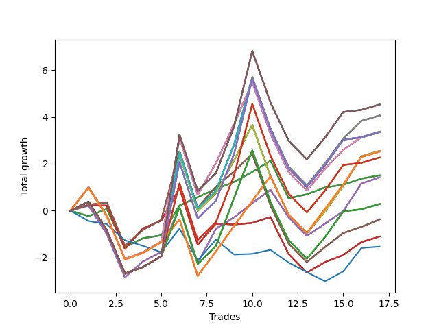

# Short Shepard 004 
- Symbol: NVDA_Unlimited
- Date Range: 02/08/2022 - 07/08/2022
- Trading Period: 7:20-12:30
- Number of Trades: 17



| Name | Win Percent | Profit | Avg Profit / Trade | Avg Time / Trade |      | Name | Win Percent | Profit | Avg Profit / Trade | Avg Time / Trade |
| ---- | ----------- | ------ | ------------------ | ---------------- | ---- | ---- | ----------- | ------ | ------------------ | ---------------- |
| Sorted By <br> Profit | | | | | | Sorted By <br> Win Percentage ||||
| One Hundred Thirty | 64.71 | 2265.00 | 133.24 | 28:49 |     | Sixty-Four | 82.35 | 755.00 | 44.41 | 05:19 |
| One Hundred Twenty-Five | 64.71 | 2265.00 | 133.24 | 28:49 |     | Fifty-Six | 82.35 | 755.00 | 44.41 | 05:19 |
| One Hundred Twenty | 64.71 | 2265.00 | 133.24 | 28:49 |     | Forty-Eight | 82.35 | 755.00 | 44.41 | 05:19 |
| One Hundred Fifteen | 64.71 | 2265.00 | 133.24 | 28:49 |     | Forty | 82.35 | 755.00 | 44.41 | 05:19 |
| Eighty-Five | 64.71 | 2265.00 | 133.24 | 28:49 |     | Zero | 82.35 | 755.00 | 44.41 | 05:19 |
| Sixty-Nine | 64.71 | 2030.00 | 119.41 | 27:07 |     | One Hundred Twenty-Six | 70.59 | 1260.00 | 74.12 | 21:39 |
| Sixty-One | 64.71 | 2030.00 | 119.41 | 27:07 |     | One Hundred Twenty-One | 70.59 | 1260.00 | 74.12 | 21:39 |
| Fifty-Three | 64.71 | 2030.00 | 119.41 | 27:07 |     | One Hundred Sixteen | 70.59 | 1260.00 | 74.12 | 21:39 |
| Forty-Five | 64.71 | 2030.00 | 119.41 | 27:07 |     | One Hundred Eleven | 70.59 | 1260.00 | 74.12 | 21:39 |
| Five | 64.71 | 2030.00 | 119.41 | 27:07 |     | Eighty-One | 70.59 | 1260.00 | 74.12 | 21:39 |
| Sixty-Eight | 64.71 | 1685.00 | 99.12 | 24:56 |     | Sixty-Six | 70.59 | 710.00 | 41.76 | 17:38 |
| Sixty | 64.71 | 1685.00 | 99.12 | 24:56 |     | Fifty-Eight | 70.59 | 710.00 | 41.76 | 17:38 |
| Fifty-Two | 64.71 | 1685.00 | 99.12 | 24:56 |     | Fifty | 70.59 | 710.00 | 41.76 | 17:38 |
| Forty-Four | 64.71 | 1685.00 | 99.12 | 24:56 |     | Forty-Two | 70.59 | 710.00 | 41.76 | 17:38 |
| Four | 64.71 | 1685.00 | 99.12 | 24:56 |     | Two | 70.59 | 710.00 | 41.76 | 17:38 |
| One Hundred Twenty-Nine | 64.71 | 1680.00 | 98.82 | 28:47 |     | Sixty-Seven | 70.59 | -185.00 | -10.88 | 20:28 |
| One Hundred Twenty-Four | 64.71 | 1680.00 | 98.82 | 28:47 |     | Fifty-Nine | 70.59 | -185.00 | -10.88 | 20:28 |
| One Hundred Ninteen | 64.71 | 1680.00 | 98.82 | 28:47 |     | Fifty-One | 70.59 | -185.00 | -10.88 | 20:28 |
| One Hundred Fourteen | 64.71 | 1680.00 | 98.82 | 28:47 |     | Forty-Three | 70.59 | -185.00 | -10.88 | 20:28 |
| Eighty-Four | 64.71 | 1680.00 | 98.82 | 28:47 |     | Three | 70.59 | -185.00 | -10.88 | 20:28 |
| Seventy-One | 64.71 | 1675.00 | 98.53 | 28:53 |     | One Hundred Thirty | 64.71 | 2265.00 | 133.24 | 28:49 |
| Sixty-Three | 64.71 | 1675.00 | 98.53 | 28:53 |     | One Hundred Twenty-Five | 64.71 | 2265.00 | 133.24 | 28:49 |
| Fifty-Five | 64.71 | 1675.00 | 98.53 | 28:53 |     | One Hundred Twenty | 64.71 | 2265.00 | 133.24 | 28:49 |
| Forty-Seven | 64.71 | 1675.00 | 98.53 | 28:53 |     | One Hundred Fifteen | 64.71 | 2265.00 | 133.24 | 28:49 |
| Seven | 64.71 | 1675.00 | 98.53 | 28:53 |     | Eighty-Five | 64.71 | 2265.00 | 133.24 | 28:49 |
| Seventy | 64.71 | 1275.00 | 75.00 | 26:39 |     | Sixty-Nine | 64.71 | 2030.00 | 119.41 | 27:07 |
| Sixty-Two | 64.71 | 1275.00 | 75.00 | 26:39 |     | Sixty-One | 64.71 | 2030.00 | 119.41 | 27:07 |
| Fifty-Four | 64.71 | 1275.00 | 75.00 | 26:39 |     | Fifty-Three | 64.71 | 2030.00 | 119.41 | 27:07 |
| Forty-Six | 64.71 | 1275.00 | 75.00 | 26:39 |     | Forty-Five | 64.71 | 2030.00 | 119.41 | 27:07 |
| Six | 64.71 | 1275.00 | 75.00 | 26:39 |     | Five | 64.71 | 2030.00 | 119.41 | 27:07 |
| One Hundred Twenty-Six | 70.59 | 1260.00 | 74.12 | 21:39 |     | Sixty-Eight | 64.71 | 1685.00 | 99.12 | 24:56 |
| One Hundred Twenty-One | 70.59 | 1260.00 | 74.12 | 21:39 |     | Sixty | 64.71 | 1685.00 | 99.12 | 24:56 |
| One Hundred Sixteen | 70.59 | 1260.00 | 74.12 | 21:39 |     | Fifty-Two | 64.71 | 1685.00 | 99.12 | 24:56 |
| One Hundred Eleven | 70.59 | 1260.00 | 74.12 | 21:39 |     | Forty-Four | 64.71 | 1685.00 | 99.12 | 24:56 |
| Eighty-One | 70.59 | 1260.00 | 74.12 | 21:39 |     | Four | 64.71 | 1685.00 | 99.12 | 24:56 |
| One Hundred Twenty-Eight | 64.71 | 1135.00 | 66.76 | 28:26 |     | One Hundred Twenty-Nine | 64.71 | 1680.00 | 98.82 | 28:47 |
| One Hundred Twenty-Three | 64.71 | 1135.00 | 66.76 | 28:26 |     | One Hundred Twenty-Four | 64.71 | 1680.00 | 98.82 | 28:47 |
| One Hundred Eighteen | 64.71 | 1135.00 | 66.76 | 28:26 |     | One Hundred Ninteen | 64.71 | 1680.00 | 98.82 | 28:47 |
| One Hundred Thirteen | 64.71 | 1135.00 | 66.76 | 28:26 |     | One Hundred Fourteen | 64.71 | 1680.00 | 98.82 | 28:47 |
| Eighty-Three | 64.71 | 1135.00 | 66.76 | 28:26 |     | Eighty-Four | 64.71 | 1680.00 | 98.82 | 28:47 |
| Sixty-Four | 82.35 | 755.00 | 44.41 | 05:19 |     | Seventy-One | 64.71 | 1675.00 | 98.53 | 28:53 |
| Fifty-Six | 82.35 | 755.00 | 44.41 | 05:19 |     | Sixty-Three | 64.71 | 1675.00 | 98.53 | 28:53 |
| Forty-Eight | 82.35 | 755.00 | 44.41 | 05:19 |     | Fifty-Five | 64.71 | 1675.00 | 98.53 | 28:53 |
| Forty | 82.35 | 755.00 | 44.41 | 05:19 |     | Forty-Seven | 64.71 | 1675.00 | 98.53 | 28:53 |
| Zero | 82.35 | 755.00 | 44.41 | 05:19 |     | Seven | 64.71 | 1675.00 | 98.53 | 28:53 |
| Sixty-Six | 70.59 | 710.00 | 41.76 | 17:38 |     | Seventy | 64.71 | 1275.00 | 75.00 | 26:39 |
| Fifty-Eight | 70.59 | 710.00 | 41.76 | 17:38 |     | Sixty-Two | 64.71 | 1275.00 | 75.00 | 26:39 |
| Fifty | 70.59 | 710.00 | 41.76 | 17:38 |     | Fifty-Four | 64.71 | 1275.00 | 75.00 | 26:39 |
| Forty-Two | 70.59 | 710.00 | 41.76 | 17:38 |     | Forty-Six | 64.71 | 1275.00 | 75.00 | 26:39 |
| Two | 70.59 | 710.00 | 41.76 | 17:38 |     | Six | 64.71 | 1275.00 | 75.00 | 26:39 |
| One Hundred Twenty-Seven | 64.71 | 145.00 | 8.53 | 27:55 |     | One Hundred Twenty-Eight | 64.71 | 1135.00 | 66.76 | 28:26 |
| One Hundred Twenty-Two | 64.71 | 145.00 | 8.53 | 27:55 |     | One Hundred Twenty-Three | 64.71 | 1135.00 | 66.76 | 28:26 |
| One Hundred Seventeen | 64.71 | 145.00 | 8.53 | 27:55 |     | One Hundred Eighteen | 64.71 | 1135.00 | 66.76 | 28:26 |
| One Hundred Twelve | 64.71 | 145.00 | 8.53 | 27:55 |     | One Hundred Thirteen | 64.71 | 1135.00 | 66.76 | 28:26 |
| Eighty-Two | 64.71 | 145.00 | 8.53 | 27:55 |     | Eighty-Three | 64.71 | 1135.00 | 66.76 | 28:26 |
| Sixty-Seven | 70.59 | -185.00 | -10.88 | 20:28 |     | One Hundred Twenty-Seven | 64.71 | 145.00 | 8.53 | 27:55 |
| Fifty-Nine | 70.59 | -185.00 | -10.88 | 20:28 |     | One Hundred Twenty-Two | 64.71 | 145.00 | 8.53 | 27:55 |
| Fifty-One | 70.59 | -185.00 | -10.88 | 20:28 |     | One Hundred Seventeen | 64.71 | 145.00 | 8.53 | 27:55 |
| Forty-Three | 70.59 | -185.00 | -10.88 | 20:28 |     | One Hundred Twelve | 64.71 | 145.00 | 8.53 | 27:55 |
| Three | 70.59 | -185.00 | -10.88 | 20:28 |     | Eighty-Two | 64.71 | 145.00 | 8.53 | 27:55 |
| Sixty-Five | 64.71 | -550.00 | -32.35 | 12:25 |     | Sixty-Five | 64.71 | -550.00 | -32.35 | 12:25 |
| Fifty-Seven | 64.71 | -550.00 | -32.35 | 12:25 |     | Fifty-Seven | 64.71 | -550.00 | -32.35 | 12:25 |
| Forty-Nine | 64.71 | -550.00 | -32.35 | 12:25 |     | Forty-Nine | 64.71 | -550.00 | -32.35 | 12:25 |
| Forty-One | 64.71 | -550.00 | -32.35 | 12:25 |     | Forty-One | 64.71 | -550.00 | -32.35 | 12:25 |
| One | 64.71 | -550.00 | -32.35 | 12:25 |     | One | 64.71 | -550.00 | -32.35 | 12:25 |
| Seventy-Three | 41.18 | -765.00 | -45.00 | 05:57 |     | Seventy-Three | 41.18 | -765.00 | -45.00 | 05:57 |

## NO STOPLOSS

### Test Zero
* Sell when price hits the middle line of the 20p bollinger
* No Stoploss
* Results:
```
Total Trades: 17
Percent Up: 17.65
Percent Down: 82.35
Total Points Moved Down: 1.51
Potential Profit: 755.00
Total Points Ups: 3.45 Count Ups: 3
Total Points Downs: 4.96 Count Downs: 14
```

<details><summary>Trades</summary>

<code>In: 2022-02-16 07:48:00		Out: 2022-02-16 07:58:55		Total Position Time: 10:55		Total Move Down: -0.23		Total to Date: -0.23</code> <br />
<code>In: 2022-02-16 12:12:00		Out: 2022-02-16 12:13:50		Total Position Time: 01:50		Total Move Down: 0.30		Total to Date: 0.07</code> <br />
<code>In: 2022-02-24 12:30:00		Out: 2022-02-24 12:44:05		Total Position Time: 14:05		Total Move Down: -1.62		Total to Date: -1.55</code> <br />
<code>In: 2022-02-28 07:47:00		Out: 2022-02-28 07:48:05		Total Position Time: 01:05		Total Move Down: 0.38		Total to Date: -1.17</code> <br />
<code>In: 2022-03-02 10:17:00		Out: 2022-03-02 10:24:00		Total Position Time: 07:00		Total Move Down: 0.12		Total to Date: -1.05</code> <br />
<code>In: 2022-03-08 08:06:00		Out: 2022-03-08 08:12:40		Total Position Time: 06:40		Total Move Down: 1.27		Total to Date: 0.22</code> <br />
<code>In: 2022-03-08 09:51:00		Out: 2022-03-08 09:51:30		Total Position Time: 00:30		Total Move Down: 0.36		Total to Date: 0.58</code> <br />
<code>In: 2022-03-10 12:00:00		Out: 2022-03-10 12:00:20		Total Position Time: 00:20		Total Move Down: 0.34		Total to Date: 0.92</code> <br />
<code>In: 2022-03-30 07:27:00		Out: 2022-03-30 07:32:55		Total Position Time: 05:55		Total Move Down: 0.31		Total to Date: 1.23</code> <br />
<code>In: 2022-03-30 07:31:00		Out: 2022-03-30 07:32:55		Total Position Time: 01:55		Total Move Down: 0.42		Total to Date: 1.65</code> <br />
<code>In: 2022-03-31 07:23:00		Out: 2022-03-31 07:25:05		Total Position Time: 02:05		Total Move Down: 0.48		Total to Date: 2.13</code> <br />
<code>In: 2022-05-02 12:17:00		Out: 2022-05-02 12:39:35		Total Position Time: 22:35		Total Move Down: -1.60		Total to Date: 0.53</code> <br />
<code>In: 2022-05-03 10:24:00		Out: 2022-05-03 10:28:05		Total Position Time: 04:05		Total Move Down: 0.17		Total to Date: 0.70</code> <br />
<code>In: 2022-06-07 07:52:00		Out: 2022-06-07 07:57:35		Total Position Time: 05:35		Total Move Down: 0.29		Total to Date: 0.99</code> <br />
<code>In: 2022-06-22 11:22:00		Out: 2022-06-22 11:24:20		Total Position Time: 02:20		Total Move Down: 0.12		Total to Date: 1.11</code> <br />
<code>In: 2022-07-06 11:10:00		Out: 2022-07-06 11:10:10		Total Position Time: 00:10		Total Move Down: 0.26		Total to Date: 1.37</code> <br />
<code>In: 2022-07-07 09:37:00		Out: 2022-07-07 09:40:30		Total Position Time: 03:30		Total Move Down: 0.14		Total to Date: 1.51</code> <br />


</details>

### Test One
* Sell when the price hits the upper line of the 20p 1std bollinger
* No Stoploss
* Results:
```
Total Trades: 17
Percent Up: 35.29
Percent Down: 64.71
Total Points Moved Down: -1.10
Potential Profit: -550.00
Total Points Ups: 6.68 Count Ups: 6
Total Points Downs: 5.58 Count Downs: 11
```

<details><summary>Trades</summary>

<code>In: 2022-02-16 07:48:00		Out: 2022-02-16 08:00:25		Total Position Time: 12:25		Total Move Down: 0.23		Total to Date: 0.23</code> <br />
<code>In: 2022-02-16 12:12:00		Out: 2022-02-16 12:21:05		Total Position Time: 09:05		Total Move Down: -0.01		Total to Date: 0.22</code> <br />
<code>In: 2022-02-24 12:30:00		Out: 2022-02-24 12:46:00		Total Position Time: 16:00		Total Move Down: -1.85		Total to Date: -1.63</code> <br />
<code>In: 2022-02-28 07:47:00		Out: 2022-02-28 07:50:05		Total Position Time: 03:05		Total Move Down: 0.88		Total to Date: -0.75</code> <br />
<code>In: 2022-03-02 10:17:00		Out: 2022-03-02 10:25:20		Total Position Time: 08:20		Total Move Down: 0.33		Total to Date: -0.42</code> <br />
<code>In: 2022-03-08 08:06:00		Out: 2022-03-08 08:14:35		Total Position Time: 08:35		Total Move Down: 1.38		Total to Date: 0.96</code> <br />
<code>In: 2022-03-08 09:51:00		Out: 2022-03-08 10:20:55		Total Position Time: 29:55		Total Move Down: -2.41		Total to Date: -1.45</code> <br />
<code>In: 2022-03-10 12:00:00		Out: 2022-03-10 12:01:15		Total Position Time: 01:15		Total Move Down: 0.90		Total to Date: -0.55</code> <br />
<code>In: 2022-03-30 07:27:00		Out: 2022-03-30 07:44:50		Total Position Time: 17:50		Total Move Down: -0.04		Total to Date: -0.59</code> <br />
<code>In: 2022-03-30 07:31:00		Out: 2022-03-30 07:44:50		Total Position Time: 13:50		Total Move Down: 0.07		Total to Date: -0.52</code> <br />
<code>In: 2022-03-31 07:23:00		Out: 2022-03-31 07:33:30		Total Position Time: 10:30		Total Move Down: 0.25		Total to Date: -0.27</code> <br />
<code>In: 2022-05-02 12:17:00		Out: 2022-05-02 12:44:10		Total Position Time: 27:10		Total Move Down: -1.58		Total to Date: -1.85</code> <br />
<code>In: 2022-05-03 10:24:00		Out: 2022-05-03 10:53:55		Total Position Time: 29:55		Total Move Down: -0.79		Total to Date: -2.64</code> <br />
<code>In: 2022-06-07 07:52:00		Out: 2022-06-07 08:04:45		Total Position Time: 12:45		Total Move Down: 0.45		Total to Date: -2.19</code> <br />
<code>In: 2022-06-22 11:22:00		Out: 2022-06-22 11:26:10		Total Position Time: 04:10		Total Move Down: 0.30		Total to Date: -1.89</code> <br />
<code>In: 2022-07-06 11:10:00		Out: 2022-07-06 11:11:10		Total Position Time: 01:10		Total Move Down: 0.55		Total to Date: -1.34</code> <br />
<code>In: 2022-07-07 09:37:00		Out: 2022-07-07 09:42:05		Total Position Time: 05:05		Total Move Down: 0.24		Total to Date: -1.10</code> <br />


</details>

### Test Two
* Sell when the price hits the upper line of the 20p 2std bollinger
* No Stoploss
* Results:
```
Total Trades: 17
Percent Up: 29.41
Percent Down: 70.59
Total Points Moved Down: 1.42
Potential Profit: 710.00
Total Points Ups: 7.43 Count Ups: 5
Total Points Downs: 8.85 Count Downs: 12
```

<details><summary>Trades</summary>

<code>In: 2022-02-16 07:48:00		Out: 2022-02-16 08:05:15		Total Position Time: 17:15		Total Move Down: 0.22		Total to Date: 0.22</code> <br />
<code>In: 2022-02-16 12:12:00		Out: 2022-02-16 12:41:55		Total Position Time: 29:55		Total Move Down: -1.21		Total to Date: -0.99</code> <br />
<code>In: 2022-02-24 12:30:00		Out: 2022-02-24 12:46:00		Total Position Time: 16:00		Total Move Down: -1.85		Total to Date: -2.84</code> <br />
<code>In: 2022-02-28 07:47:00		Out: 2022-02-28 08:10:50		Total Position Time: 23:50		Total Move Down: 0.68		Total to Date: -2.16</code> <br />
<code>In: 2022-03-02 10:17:00		Out: 2022-03-02 10:25:40		Total Position Time: 08:40		Total Move Down: 0.40		Total to Date: -1.76</code> <br />
<code>In: 2022-03-08 08:06:00		Out: 2022-03-08 08:21:10		Total Position Time: 15:10		Total Move Down: 1.93		Total to Date: 0.17</code> <br />
<code>In: 2022-03-08 09:51:00		Out: 2022-03-08 10:20:55		Total Position Time: 29:55		Total Move Down: -2.41		Total to Date: -2.24</code> <br />
<code>In: 2022-03-10 12:00:00		Out: 2022-03-10 12:04:45		Total Position Time: 04:45		Total Move Down: 1.47		Total to Date: -0.77</code> <br />
<code>In: 2022-03-30 07:27:00		Out: 2022-03-30 07:50:15		Total Position Time: 23:15		Total Move Down: 0.49		Total to Date: -0.28</code> <br />
<code>In: 2022-03-30 07:31:00		Out: 2022-03-30 07:50:15		Total Position Time: 19:15		Total Move Down: 0.60		Total to Date: 0.32</code> <br />
<code>In: 2022-03-31 07:23:00		Out: 2022-03-31 07:41:15		Total Position Time: 18:15		Total Move Down: 0.57		Total to Date: 0.89</code> <br />
<code>In: 2022-05-02 12:17:00		Out: 2022-05-02 12:45:05		Total Position Time: 28:05		Total Move Down: -1.17		Total to Date: -0.28</code> <br />
<code>In: 2022-05-03 10:24:00		Out: 2022-05-03 10:53:55		Total Position Time: 29:55		Total Move Down: -0.79		Total to Date: -1.07</code> <br />
<code>In: 2022-06-07 07:52:00		Out: 2022-06-07 08:05:10		Total Position Time: 13:10		Total Move Down: 0.52		Total to Date: -0.55</code> <br />
<code>In: 2022-06-22 11:22:00		Out: 2022-06-22 11:29:20		Total Position Time: 07:20		Total Move Down: 0.53		Total to Date: -0.02</code> <br />
<code>In: 2022-07-06 11:10:00		Out: 2022-07-06 11:12:15		Total Position Time: 02:15		Total Move Down: 1.18		Total to Date: 1.16</code> <br />
<code>In: 2022-07-07 09:37:00		Out: 2022-07-07 09:50:00		Total Position Time: 13:00		Total Move Down: 0.26		Total to Date: 1.42</code> <br />


</details>

### Test Three
* Sell when price hits the middle line of the 50p bollinger
* No Stoploss
* Results:
```
Total Trades: 17
Percent Up: 29.41
Percent Down: 70.59
Total Points Moved Down: -0.37
Potential Profit: -185.00
Total Points Ups: 8.88 Count Ups: 5
Total Points Downs: 8.51 Count Downs: 12
```

<details><summary>Trades</summary>

<code>In: 2022-02-16 07:48:00		Out: 2022-02-16 08:12:25		Total Position Time: 24:25		Total Move Down: 0.25		Total to Date: 0.25</code> <br />
<code>In: 2022-02-16 12:12:00		Out: 2022-02-16 12:34:05		Total Position Time: 22:05		Total Move Down: 0.11		Total to Date: 0.36</code> <br />
<code>In: 2022-02-24 12:30:00		Out: 2022-02-24 12:46:00		Total Position Time: 16:00		Total Move Down: -1.85		Total to Date: -1.49</code> <br />
<code>In: 2022-02-28 07:47:00		Out: 2022-02-28 08:10:50		Total Position Time: 23:50		Total Move Down: 0.68		Total to Date: -0.81</code> <br />
<code>In: 2022-03-02 10:17:00		Out: 2022-03-02 10:45:35		Total Position Time: 28:35		Total Move Down: 0.42		Total to Date: -0.39</code> <br />
<code>In: 2022-03-08 08:06:00		Out: 2022-03-08 08:26:15		Total Position Time: 20:15		Total Move Down: 2.92		Total to Date: 2.53</code> <br />
<code>In: 2022-03-08 09:51:00		Out: 2022-03-08 10:20:55		Total Position Time: 29:55		Total Move Down: -2.41		Total to Date: 0.12</code> <br />
<code>In: 2022-03-10 12:00:00		Out: 2022-03-10 12:01:15		Total Position Time: 01:15		Total Move Down: 0.90		Total to Date: 1.02</code> <br />
<code>In: 2022-03-30 07:27:00		Out: 2022-03-30 07:51:55		Total Position Time: 24:55		Total Move Down: 0.65		Total to Date: 1.67</code> <br />
<code>In: 2022-03-30 07:31:00		Out: 2022-03-30 07:51:55		Total Position Time: 20:55		Total Move Down: 0.76		Total to Date: 2.43</code> <br />
<code>In: 2022-03-31 07:23:00		Out: 2022-03-31 07:52:55		Total Position Time: 29:55		Total Move Down: -2.20		Total to Date: 0.23</code> <br />
<code>In: 2022-05-02 12:17:00		Out: 2022-05-02 12:46:00		Total Position Time: 29:00		Total Move Down: -1.63		Total to Date: -1.40</code> <br />
<code>In: 2022-05-03 10:24:00		Out: 2022-05-03 10:53:55		Total Position Time: 29:55		Total Move Down: -0.79		Total to Date: -2.19</code> <br />
<code>In: 2022-06-07 07:52:00		Out: 2022-06-07 08:18:15		Total Position Time: 26:15		Total Move Down: 0.64		Total to Date: -1.55</code> <br />
<code>In: 2022-06-22 11:22:00		Out: 2022-06-22 11:29:35		Total Position Time: 07:35		Total Move Down: 0.60		Total to Date: -0.95</code> <br />
<code>In: 2022-07-06 11:10:00		Out: 2022-07-06 11:10:10		Total Position Time: 00:10		Total Move Down: 0.26		Total to Date: -0.69</code> <br />
<code>In: 2022-07-07 09:37:00		Out: 2022-07-07 09:50:10		Total Position Time: 13:10		Total Move Down: 0.32		Total to Date: -0.37</code> <br />


</details>

### Test Four
* Sell when the price hits the upper line of the 50p 1std bollinger
* No Stoploss
* Results:
```
Total Trades: 17
Percent Up: 35.29
Percent Down: 64.71
Total Points Moved Down: 3.37
Potential Profit: 1685.00
Total Points Ups: 10.09 Count Ups: 6
Total Points Downs: 13.46 Count Downs: 11
```

<details><summary>Trades</summary>

<code>In: 2022-02-16 07:48:00		Out: 2022-02-16 08:15:05		Total Position Time: 27:05		Total Move Down: 1.01		Total to Date: 1.01</code> <br />
<code>In: 2022-02-16 12:12:00		Out: 2022-02-16 12:41:55		Total Position Time: 29:55		Total Move Down: -1.21		Total to Date: -0.20</code> <br />
<code>In: 2022-02-24 12:30:00		Out: 2022-02-24 12:46:00		Total Position Time: 16:00		Total Move Down: -1.85		Total to Date: -2.05</code> <br />
<code>In: 2022-02-28 07:47:00		Out: 2022-02-28 08:16:55		Total Position Time: 29:55		Total Move Down: 0.28		Total to Date: -1.77</code> <br />
<code>In: 2022-03-02 10:17:00		Out: 2022-03-02 10:46:55		Total Position Time: 29:55		Total Move Down: 0.46		Total to Date: -1.31</code> <br />
<code>In: 2022-03-08 08:06:00		Out: 2022-03-08 08:31:50		Total Position Time: 25:50		Total Move Down: 4.40		Total to Date: 3.09</code> <br />
<code>In: 2022-03-08 09:51:00		Out: 2022-03-08 10:20:55		Total Position Time: 29:55		Total Move Down: -2.41		Total to Date: 0.68</code> <br />
<code>In: 2022-03-10 12:00:00		Out: 2022-03-10 12:04:50		Total Position Time: 04:50		Total Move Down: 1.35		Total to Date: 2.03</code> <br />
<code>In: 2022-03-30 07:27:00		Out: 2022-03-30 07:56:20		Total Position Time: 29:20		Total Move Down: 1.67		Total to Date: 3.70</code> <br />
<code>In: 2022-03-30 07:31:00		Out: 2022-03-30 07:56:20		Total Position Time: 25:20		Total Move Down: 1.78		Total to Date: 5.48</code> <br />
<code>In: 2022-03-31 07:23:00		Out: 2022-03-31 07:52:55		Total Position Time: 29:55		Total Move Down: -2.20		Total to Date: 3.28</code> <br />
<code>In: 2022-05-02 12:17:00		Out: 2022-05-02 12:46:00		Total Position Time: 29:00		Total Move Down: -1.63		Total to Date: 1.65</code> <br />
<code>In: 2022-05-03 10:24:00		Out: 2022-05-03 10:53:55		Total Position Time: 29:55		Total Move Down: -0.79		Total to Date: 0.86</code> <br />
<code>In: 2022-06-07 07:52:00		Out: 2022-06-07 08:21:55		Total Position Time: 29:55		Total Move Down: 0.93		Total to Date: 1.79</code> <br />
<code>In: 2022-06-22 11:22:00		Out: 2022-06-22 11:48:00		Total Position Time: 26:00		Total Move Down: 0.80		Total to Date: 2.59</code> <br />
<code>In: 2022-07-06 11:10:00		Out: 2022-07-06 11:11:10		Total Position Time: 01:10		Total Move Down: 0.55		Total to Date: 3.14</code> <br />
<code>In: 2022-07-07 09:37:00		Out: 2022-07-07 10:06:55		Total Position Time: 29:55		Total Move Down: 0.23		Total to Date: 3.37</code> <br />


</details>

### Test Five
* Sell when the price hits the upper line of the 50p 2std bollinger
* No Stoploss
* Results:
```
Total Trades: 17
Percent Up: 35.29
Percent Down: 64.71
Total Points Moved Down: 4.06
Potential Profit: 2030.00
Total Points Ups: 10.09 Count Ups: 6
Total Points Downs: 14.15 Count Downs: 11
```

<details><summary>Trades</summary>

<code>In: 2022-02-16 07:48:00		Out: 2022-02-16 08:17:55		Total Position Time: 29:55		Total Move Down: 0.38		Total to Date: 0.38</code> <br />
<code>In: 2022-02-16 12:12:00		Out: 2022-02-16 12:41:55		Total Position Time: 29:55		Total Move Down: -1.21		Total to Date: -0.83</code> <br />
<code>In: 2022-02-24 12:30:00		Out: 2022-02-24 12:46:00		Total Position Time: 16:00		Total Move Down: -1.85		Total to Date: -2.68</code> <br />
<code>In: 2022-02-28 07:47:00		Out: 2022-02-28 08:16:55		Total Position Time: 29:55		Total Move Down: 0.28		Total to Date: -2.40</code> <br />
<code>In: 2022-03-02 10:17:00		Out: 2022-03-02 10:46:55		Total Position Time: 29:55		Total Move Down: 0.46		Total to Date: -1.94</code> <br />
<code>In: 2022-03-08 08:06:00		Out: 2022-03-08 08:35:55		Total Position Time: 29:55		Total Move Down: 4.43		Total to Date: 2.49</code> <br />
<code>In: 2022-03-08 09:51:00		Out: 2022-03-08 10:20:55		Total Position Time: 29:55		Total Move Down: -2.41		Total to Date: 0.08</code> <br />
<code>In: 2022-03-10 12:00:00		Out: 2022-03-10 12:29:55		Total Position Time: 29:55		Total Move Down: 0.76		Total to Date: 0.84</code> <br />
<code>In: 2022-03-30 07:27:00		Out: 2022-03-30 07:56:55		Total Position Time: 29:55		Total Move Down: 1.99		Total to Date: 2.83</code> <br />
<code>In: 2022-03-30 07:31:00		Out: 2022-03-30 07:58:40		Total Position Time: 27:40		Total Move Down: 2.87		Total to Date: 5.70</code> <br />
<code>In: 2022-03-31 07:23:00		Out: 2022-03-31 07:52:55		Total Position Time: 29:55		Total Move Down: -2.20		Total to Date: 3.50</code> <br />
<code>In: 2022-05-02 12:17:00		Out: 2022-05-02 12:46:00		Total Position Time: 29:00		Total Move Down: -1.63		Total to Date: 1.87</code> <br />
<code>In: 2022-05-03 10:24:00		Out: 2022-05-03 10:53:55		Total Position Time: 29:55		Total Move Down: -0.79		Total to Date: 1.08</code> <br />
<code>In: 2022-06-07 07:52:00		Out: 2022-06-07 08:21:55		Total Position Time: 29:55		Total Move Down: 0.93		Total to Date: 2.01</code> <br />
<code>In: 2022-06-22 11:22:00		Out: 2022-06-22 11:49:45		Total Position Time: 27:45		Total Move Down: 1.07		Total to Date: 3.08</code> <br />
<code>In: 2022-07-06 11:10:00		Out: 2022-07-06 11:11:45		Total Position Time: 01:45		Total Move Down: 0.75		Total to Date: 3.83</code> <br />
<code>In: 2022-07-07 09:37:00		Out: 2022-07-07 10:06:55		Total Position Time: 29:55		Total Move Down: 0.23		Total to Date: 4.06</code> <br />


</details>

### Test Six
* Sell when the price hits the middle line of the 1std VWAP
* No Stoploss
* Results:
```
Total Trades: 17
Percent Up: 35.29
Percent Down: 64.71
Total Points Moved Down: 2.55
Potential Profit: 1275.00
Total Points Ups: 10.09 Count Ups: 6
Total Points Downs: 12.64 Count Downs: 11
```

<details><summary>Trades</summary>

<code>In: 2022-02-16 07:48:00		Out: 2022-02-16 08:17:55		Total Position Time: 29:55		Total Move Down: 0.38		Total to Date: 0.38</code> <br />
<code>In: 2022-02-16 12:12:00		Out: 2022-02-16 12:41:55		Total Position Time: 29:55		Total Move Down: -1.21		Total to Date: -0.83</code> <br />
<code>In: 2022-02-24 12:30:00		Out: 2022-02-24 12:46:00		Total Position Time: 16:00		Total Move Down: -1.85		Total to Date: -2.68</code> <br />
<code>In: 2022-02-28 07:47:00		Out: 2022-02-28 08:16:55		Total Position Time: 29:55		Total Move Down: 0.28		Total to Date: -2.40</code> <br />
<code>In: 2022-03-02 10:17:00		Out: 2022-03-02 10:46:55		Total Position Time: 29:55		Total Move Down: 0.46		Total to Date: -1.94</code> <br />
<code>In: 2022-03-08 08:06:00		Out: 2022-03-08 08:31:45		Total Position Time: 25:45		Total Move Down: 4.34		Total to Date: 2.40</code> <br />
<code>In: 2022-03-08 09:51:00		Out: 2022-03-08 10:20:55		Total Position Time: 29:55		Total Move Down: -2.41		Total to Date: -0.01</code> <br />
<code>In: 2022-03-10 12:00:00		Out: 2022-03-10 12:29:55		Total Position Time: 29:55		Total Move Down: 0.76		Total to Date: 0.75</code> <br />
<code>In: 2022-03-30 07:27:00		Out: 2022-03-30 07:54:30		Total Position Time: 27:30		Total Move Down: 1.40		Total to Date: 2.15</code> <br />
<code>In: 2022-03-30 07:31:00		Out: 2022-03-30 07:54:30		Total Position Time: 23:30		Total Move Down: 1.51		Total to Date: 3.66</code> <br />
<code>In: 2022-03-31 07:23:00		Out: 2022-03-31 07:52:55		Total Position Time: 29:55		Total Move Down: -2.20		Total to Date: 1.46</code> <br />
<code>In: 2022-05-02 12:17:00		Out: 2022-05-02 12:46:00		Total Position Time: 29:00		Total Move Down: -1.63		Total to Date: -0.17</code> <br />
<code>In: 2022-05-03 10:24:00		Out: 2022-05-03 10:53:55		Total Position Time: 29:55		Total Move Down: -0.79		Total to Date: -0.96</code> <br />
<code>In: 2022-06-07 07:52:00		Out: 2022-06-07 08:21:55		Total Position Time: 29:55		Total Move Down: 0.93		Total to Date: -0.03</code> <br />
<code>In: 2022-06-22 11:22:00		Out: 2022-06-22 11:51:55		Total Position Time: 29:55		Total Move Down: 1.09		Total to Date: 1.06</code> <br />
<code>In: 2022-07-06 11:10:00		Out: 2022-07-06 11:12:20		Total Position Time: 02:20		Total Move Down: 1.26		Total to Date: 2.32</code> <br />
<code>In: 2022-07-07 09:37:00		Out: 2022-07-07 10:06:55		Total Position Time: 29:55		Total Move Down: 0.23		Total to Date: 2.55</code> <br />


</details>

### Test Seven
* Sell when the price hits the upper line of the 1std VWAP
* No Stoploss
* Results:
```
Total Trades: 17
Percent Up: 35.29
Percent Down: 64.71
Total Points Moved Down: 3.35
Potential Profit: 1675.00
Total Points Ups: 10.09 Count Ups: 6
Total Points Downs: 13.44 Count Downs: 11
```

<details><summary>Trades</summary>

<code>In: 2022-02-16 07:48:00		Out: 2022-02-16 08:17:55		Total Position Time: 29:55		Total Move Down: 0.38		Total to Date: 0.38</code> <br />
<code>In: 2022-02-16 12:12:00		Out: 2022-02-16 12:41:55		Total Position Time: 29:55		Total Move Down: -1.21		Total to Date: -0.83</code> <br />
<code>In: 2022-02-24 12:30:00		Out: 2022-02-24 12:46:00		Total Position Time: 16:00		Total Move Down: -1.85		Total to Date: -2.68</code> <br />
<code>In: 2022-02-28 07:47:00		Out: 2022-02-28 08:16:55		Total Position Time: 29:55		Total Move Down: 0.28		Total to Date: -2.40</code> <br />
<code>In: 2022-03-02 10:17:00		Out: 2022-03-02 10:46:55		Total Position Time: 29:55		Total Move Down: 0.46		Total to Date: -1.94</code> <br />
<code>In: 2022-03-08 08:06:00		Out: 2022-03-08 08:35:55		Total Position Time: 29:55		Total Move Down: 4.43		Total to Date: 2.49</code> <br />
<code>In: 2022-03-08 09:51:00		Out: 2022-03-08 10:20:55		Total Position Time: 29:55		Total Move Down: -2.41		Total to Date: 0.08</code> <br />
<code>In: 2022-03-10 12:00:00		Out: 2022-03-10 12:29:55		Total Position Time: 29:55		Total Move Down: 0.76		Total to Date: 0.84</code> <br />
<code>In: 2022-03-30 07:27:00		Out: 2022-03-30 07:56:55		Total Position Time: 29:55		Total Move Down: 1.99		Total to Date: 2.83</code> <br />
<code>In: 2022-03-30 07:31:00		Out: 2022-03-30 07:58:15		Total Position Time: 27:15		Total Move Down: 2.80		Total to Date: 5.63</code> <br />
<code>In: 2022-03-31 07:23:00		Out: 2022-03-31 07:52:55		Total Position Time: 29:55		Total Move Down: -2.20		Total to Date: 3.43</code> <br />
<code>In: 2022-05-02 12:17:00		Out: 2022-05-02 12:46:00		Total Position Time: 29:00		Total Move Down: -1.63		Total to Date: 1.80</code> <br />
<code>In: 2022-05-03 10:24:00		Out: 2022-05-03 10:53:55		Total Position Time: 29:55		Total Move Down: -0.79		Total to Date: 1.01</code> <br />
<code>In: 2022-06-07 07:52:00		Out: 2022-06-07 08:21:55		Total Position Time: 29:55		Total Move Down: 0.93		Total to Date: 1.94</code> <br />
<code>In: 2022-06-22 11:22:00		Out: 2022-06-22 11:51:55		Total Position Time: 29:55		Total Move Down: 1.09		Total to Date: 3.03</code> <br />
<code>In: 2022-07-06 11:10:00		Out: 2022-07-06 11:39:55		Total Position Time: 29:55		Total Move Down: 0.09		Total to Date: 3.12</code> <br />
<code>In: 2022-07-07 09:37:00		Out: 2022-07-07 10:06:55		Total Position Time: 29:55		Total Move Down: 0.23		Total to Date: 3.35</code> <br />


</details>

## STOPLOSS OF 5

### Test Forty
* Sell when price hits the middle line of the 20p bollinger
* Stoploss is -5 points
* Results:
```
Total Trades: 17
Percent Up: 17.65
Percent Down: 82.35
Total Points Moved Down: 1.51
Potential Profit: 755.00
Total Points Ups: 3.45 Count Ups: 3
Total Points Downs: 4.96 Count Downs: 14
```

<details><summary>Trades</summary>

<code>In: 2022-02-16 07:48:00		Out: 2022-02-16 07:58:55		Total Position Time: 10:55		Total Move Down: -0.23		Total to Date: -0.23</code> <br />
<code>In: 2022-02-16 12:12:00		Out: 2022-02-16 12:13:50		Total Position Time: 01:50		Total Move Down: 0.30		Total to Date: 0.07</code> <br />
<code>In: 2022-02-24 12:30:00		Out: 2022-02-24 12:44:05		Total Position Time: 14:05		Total Move Down: -1.62		Total to Date: -1.55</code> <br />
<code>In: 2022-02-28 07:47:00		Out: 2022-02-28 07:48:05		Total Position Time: 01:05		Total Move Down: 0.38		Total to Date: -1.17</code> <br />
<code>In: 2022-03-02 10:17:00		Out: 2022-03-02 10:24:00		Total Position Time: 07:00		Total Move Down: 0.12		Total to Date: -1.05</code> <br />
<code>In: 2022-03-08 08:06:00		Out: 2022-03-08 08:12:40		Total Position Time: 06:40		Total Move Down: 1.27		Total to Date: 0.22</code> <br />
<code>In: 2022-03-08 09:51:00		Out: 2022-03-08 09:51:30		Total Position Time: 00:30		Total Move Down: 0.36		Total to Date: 0.58</code> <br />
<code>In: 2022-03-10 12:00:00		Out: 2022-03-10 12:00:20		Total Position Time: 00:20		Total Move Down: 0.34		Total to Date: 0.92</code> <br />
<code>In: 2022-03-30 07:27:00		Out: 2022-03-30 07:32:55		Total Position Time: 05:55		Total Move Down: 0.31		Total to Date: 1.23</code> <br />
<code>In: 2022-03-30 07:31:00		Out: 2022-03-30 07:32:55		Total Position Time: 01:55		Total Move Down: 0.42		Total to Date: 1.65</code> <br />
<code>In: 2022-03-31 07:23:00		Out: 2022-03-31 07:25:05		Total Position Time: 02:05		Total Move Down: 0.48		Total to Date: 2.13</code> <br />
<code>In: 2022-05-02 12:17:00		Out: 2022-05-02 12:39:35		Total Position Time: 22:35		Total Move Down: -1.60		Total to Date: 0.53</code> <br />
<code>In: 2022-05-03 10:24:00		Out: 2022-05-03 10:28:05		Total Position Time: 04:05		Total Move Down: 0.17		Total to Date: 0.70</code> <br />
<code>In: 2022-06-07 07:52:00		Out: 2022-06-07 07:57:35		Total Position Time: 05:35		Total Move Down: 0.29		Total to Date: 0.99</code> <br />
<code>In: 2022-06-22 11:22:00		Out: 2022-06-22 11:24:20		Total Position Time: 02:20		Total Move Down: 0.12		Total to Date: 1.11</code> <br />
<code>In: 2022-07-06 11:10:00		Out: 2022-07-06 11:10:10		Total Position Time: 00:10		Total Move Down: 0.26		Total to Date: 1.37</code> <br />
<code>In: 2022-07-07 09:37:00		Out: 2022-07-07 09:40:30		Total Position Time: 03:30		Total Move Down: 0.14		Total to Date: 1.51</code> <br />


</details>

### Test Forty-One
* Sell when the price hits the upper line of the 20p 1std bollinger
* Stoploss is -5 points
* Results:
```
Total Trades: 17
Percent Up: 35.29
Percent Down: 64.71
Total Points Moved Down: -1.10
Potential Profit: -550.00
Total Points Ups: 6.68 Count Ups: 6
Total Points Downs: 5.58 Count Downs: 11
```

<details><summary>Trades</summary>

<code>In: 2022-02-16 07:48:00		Out: 2022-02-16 08:00:25		Total Position Time: 12:25		Total Move Down: 0.23		Total to Date: 0.23</code> <br />
<code>In: 2022-02-16 12:12:00		Out: 2022-02-16 12:21:05		Total Position Time: 09:05		Total Move Down: -0.01		Total to Date: 0.22</code> <br />
<code>In: 2022-02-24 12:30:00		Out: 2022-02-24 12:46:00		Total Position Time: 16:00		Total Move Down: -1.85		Total to Date: -1.63</code> <br />
<code>In: 2022-02-28 07:47:00		Out: 2022-02-28 07:50:05		Total Position Time: 03:05		Total Move Down: 0.88		Total to Date: -0.75</code> <br />
<code>In: 2022-03-02 10:17:00		Out: 2022-03-02 10:25:20		Total Position Time: 08:20		Total Move Down: 0.33		Total to Date: -0.42</code> <br />
<code>In: 2022-03-08 08:06:00		Out: 2022-03-08 08:14:35		Total Position Time: 08:35		Total Move Down: 1.38		Total to Date: 0.96</code> <br />
<code>In: 2022-03-08 09:51:00		Out: 2022-03-08 10:20:55		Total Position Time: 29:55		Total Move Down: -2.41		Total to Date: -1.45</code> <br />
<code>In: 2022-03-10 12:00:00		Out: 2022-03-10 12:01:15		Total Position Time: 01:15		Total Move Down: 0.90		Total to Date: -0.55</code> <br />
<code>In: 2022-03-30 07:27:00		Out: 2022-03-30 07:44:50		Total Position Time: 17:50		Total Move Down: -0.04		Total to Date: -0.59</code> <br />
<code>In: 2022-03-30 07:31:00		Out: 2022-03-30 07:44:50		Total Position Time: 13:50		Total Move Down: 0.07		Total to Date: -0.52</code> <br />
<code>In: 2022-03-31 07:23:00		Out: 2022-03-31 07:33:30		Total Position Time: 10:30		Total Move Down: 0.25		Total to Date: -0.27</code> <br />
<code>In: 2022-05-02 12:17:00		Out: 2022-05-02 12:44:10		Total Position Time: 27:10		Total Move Down: -1.58		Total to Date: -1.85</code> <br />
<code>In: 2022-05-03 10:24:00		Out: 2022-05-03 10:53:55		Total Position Time: 29:55		Total Move Down: -0.79		Total to Date: -2.64</code> <br />
<code>In: 2022-06-07 07:52:00		Out: 2022-06-07 08:04:45		Total Position Time: 12:45		Total Move Down: 0.45		Total to Date: -2.19</code> <br />
<code>In: 2022-06-22 11:22:00		Out: 2022-06-22 11:26:10		Total Position Time: 04:10		Total Move Down: 0.30		Total to Date: -1.89</code> <br />
<code>In: 2022-07-06 11:10:00		Out: 2022-07-06 11:11:10		Total Position Time: 01:10		Total Move Down: 0.55		Total to Date: -1.34</code> <br />
<code>In: 2022-07-07 09:37:00		Out: 2022-07-07 09:42:05		Total Position Time: 05:05		Total Move Down: 0.24		Total to Date: -1.10</code> <br />


</details>

### Test Forty-Two
* Sell when the price hits the upper line of the 20p 2std bollinger
* Stoploss is -5 points
* Results:
```
Total Trades: 17
Percent Up: 29.41
Percent Down: 70.59
Total Points Moved Down: 1.42
Potential Profit: 710.00
Total Points Ups: 7.43 Count Ups: 5
Total Points Downs: 8.85 Count Downs: 12
```

<details><summary>Trades</summary>

<code>In: 2022-02-16 07:48:00		Out: 2022-02-16 08:05:15		Total Position Time: 17:15		Total Move Down: 0.22		Total to Date: 0.22</code> <br />
<code>In: 2022-02-16 12:12:00		Out: 2022-02-16 12:41:55		Total Position Time: 29:55		Total Move Down: -1.21		Total to Date: -0.99</code> <br />
<code>In: 2022-02-24 12:30:00		Out: 2022-02-24 12:46:00		Total Position Time: 16:00		Total Move Down: -1.85		Total to Date: -2.84</code> <br />
<code>In: 2022-02-28 07:47:00		Out: 2022-02-28 08:10:50		Total Position Time: 23:50		Total Move Down: 0.68		Total to Date: -2.16</code> <br />
<code>In: 2022-03-02 10:17:00		Out: 2022-03-02 10:25:40		Total Position Time: 08:40		Total Move Down: 0.40		Total to Date: -1.76</code> <br />
<code>In: 2022-03-08 08:06:00		Out: 2022-03-08 08:21:10		Total Position Time: 15:10		Total Move Down: 1.93		Total to Date: 0.17</code> <br />
<code>In: 2022-03-08 09:51:00		Out: 2022-03-08 10:20:55		Total Position Time: 29:55		Total Move Down: -2.41		Total to Date: -2.24</code> <br />
<code>In: 2022-03-10 12:00:00		Out: 2022-03-10 12:04:45		Total Position Time: 04:45		Total Move Down: 1.47		Total to Date: -0.77</code> <br />
<code>In: 2022-03-30 07:27:00		Out: 2022-03-30 07:50:15		Total Position Time: 23:15		Total Move Down: 0.49		Total to Date: -0.28</code> <br />
<code>In: 2022-03-30 07:31:00		Out: 2022-03-30 07:50:15		Total Position Time: 19:15		Total Move Down: 0.60		Total to Date: 0.32</code> <br />
<code>In: 2022-03-31 07:23:00		Out: 2022-03-31 07:41:15		Total Position Time: 18:15		Total Move Down: 0.57		Total to Date: 0.89</code> <br />
<code>In: 2022-05-02 12:17:00		Out: 2022-05-02 12:45:05		Total Position Time: 28:05		Total Move Down: -1.17		Total to Date: -0.28</code> <br />
<code>In: 2022-05-03 10:24:00		Out: 2022-05-03 10:53:55		Total Position Time: 29:55		Total Move Down: -0.79		Total to Date: -1.07</code> <br />
<code>In: 2022-06-07 07:52:00		Out: 2022-06-07 08:05:10		Total Position Time: 13:10		Total Move Down: 0.52		Total to Date: -0.55</code> <br />
<code>In: 2022-06-22 11:22:00		Out: 2022-06-22 11:29:20		Total Position Time: 07:20		Total Move Down: 0.53		Total to Date: -0.02</code> <br />
<code>In: 2022-07-06 11:10:00		Out: 2022-07-06 11:12:15		Total Position Time: 02:15		Total Move Down: 1.18		Total to Date: 1.16</code> <br />
<code>In: 2022-07-07 09:37:00		Out: 2022-07-07 09:50:00		Total Position Time: 13:00		Total Move Down: 0.26		Total to Date: 1.42</code> <br />


</details>

### Test Forty-Three
* Sell when price hits the middle line of the 50p bollinger
* Stoploss is -5 points
* Results:
```
Total Trades: 17
Percent Up: 29.41
Percent Down: 70.59
Total Points Moved Down: -0.37
Potential Profit: -185.00
Total Points Ups: 8.88 Count Ups: 5
Total Points Downs: 8.51 Count Downs: 12
```

<details><summary>Trades</summary>

<code>In: 2022-02-16 07:48:00		Out: 2022-02-16 08:12:25		Total Position Time: 24:25		Total Move Down: 0.25		Total to Date: 0.25</code> <br />
<code>In: 2022-02-16 12:12:00		Out: 2022-02-16 12:34:05		Total Position Time: 22:05		Total Move Down: 0.11		Total to Date: 0.36</code> <br />
<code>In: 2022-02-24 12:30:00		Out: 2022-02-24 12:46:00		Total Position Time: 16:00		Total Move Down: -1.85		Total to Date: -1.49</code> <br />
<code>In: 2022-02-28 07:47:00		Out: 2022-02-28 08:10:50		Total Position Time: 23:50		Total Move Down: 0.68		Total to Date: -0.81</code> <br />
<code>In: 2022-03-02 10:17:00		Out: 2022-03-02 10:45:35		Total Position Time: 28:35		Total Move Down: 0.42		Total to Date: -0.39</code> <br />
<code>In: 2022-03-08 08:06:00		Out: 2022-03-08 08:26:15		Total Position Time: 20:15		Total Move Down: 2.92		Total to Date: 2.53</code> <br />
<code>In: 2022-03-08 09:51:00		Out: 2022-03-08 10:20:55		Total Position Time: 29:55		Total Move Down: -2.41		Total to Date: 0.12</code> <br />
<code>In: 2022-03-10 12:00:00		Out: 2022-03-10 12:01:15		Total Position Time: 01:15		Total Move Down: 0.90		Total to Date: 1.02</code> <br />
<code>In: 2022-03-30 07:27:00		Out: 2022-03-30 07:51:55		Total Position Time: 24:55		Total Move Down: 0.65		Total to Date: 1.67</code> <br />
<code>In: 2022-03-30 07:31:00		Out: 2022-03-30 07:51:55		Total Position Time: 20:55		Total Move Down: 0.76		Total to Date: 2.43</code> <br />
<code>In: 2022-03-31 07:23:00		Out: 2022-03-31 07:52:55		Total Position Time: 29:55		Total Move Down: -2.20		Total to Date: 0.23</code> <br />
<code>In: 2022-05-02 12:17:00		Out: 2022-05-02 12:46:00		Total Position Time: 29:00		Total Move Down: -1.63		Total to Date: -1.40</code> <br />
<code>In: 2022-05-03 10:24:00		Out: 2022-05-03 10:53:55		Total Position Time: 29:55		Total Move Down: -0.79		Total to Date: -2.19</code> <br />
<code>In: 2022-06-07 07:52:00		Out: 2022-06-07 08:18:15		Total Position Time: 26:15		Total Move Down: 0.64		Total to Date: -1.55</code> <br />
<code>In: 2022-06-22 11:22:00		Out: 2022-06-22 11:29:35		Total Position Time: 07:35		Total Move Down: 0.60		Total to Date: -0.95</code> <br />
<code>In: 2022-07-06 11:10:00		Out: 2022-07-06 11:10:10		Total Position Time: 00:10		Total Move Down: 0.26		Total to Date: -0.69</code> <br />
<code>In: 2022-07-07 09:37:00		Out: 2022-07-07 09:50:10		Total Position Time: 13:10		Total Move Down: 0.32		Total to Date: -0.37</code> <br />


</details>

### Test Forty-Four
* Sell when the price hits the upper line of the 50p 1std bollinger
* Stoploss is -5 points
* Results:
```
Total Trades: 17
Percent Up: 35.29
Percent Down: 64.71
Total Points Moved Down: 3.37
Potential Profit: 1685.00
Total Points Ups: 10.09 Count Ups: 6
Total Points Downs: 13.46 Count Downs: 11
```

<details><summary>Trades</summary>

<code>In: 2022-02-16 07:48:00		Out: 2022-02-16 08:15:05		Total Position Time: 27:05		Total Move Down: 1.01		Total to Date: 1.01</code> <br />
<code>In: 2022-02-16 12:12:00		Out: 2022-02-16 12:41:55		Total Position Time: 29:55		Total Move Down: -1.21		Total to Date: -0.20</code> <br />
<code>In: 2022-02-24 12:30:00		Out: 2022-02-24 12:46:00		Total Position Time: 16:00		Total Move Down: -1.85		Total to Date: -2.05</code> <br />
<code>In: 2022-02-28 07:47:00		Out: 2022-02-28 08:16:55		Total Position Time: 29:55		Total Move Down: 0.28		Total to Date: -1.77</code> <br />
<code>In: 2022-03-02 10:17:00		Out: 2022-03-02 10:46:55		Total Position Time: 29:55		Total Move Down: 0.46		Total to Date: -1.31</code> <br />
<code>In: 2022-03-08 08:06:00		Out: 2022-03-08 08:31:50		Total Position Time: 25:50		Total Move Down: 4.40		Total to Date: 3.09</code> <br />
<code>In: 2022-03-08 09:51:00		Out: 2022-03-08 10:20:55		Total Position Time: 29:55		Total Move Down: -2.41		Total to Date: 0.68</code> <br />
<code>In: 2022-03-10 12:00:00		Out: 2022-03-10 12:04:50		Total Position Time: 04:50		Total Move Down: 1.35		Total to Date: 2.03</code> <br />
<code>In: 2022-03-30 07:27:00		Out: 2022-03-30 07:56:20		Total Position Time: 29:20		Total Move Down: 1.67		Total to Date: 3.70</code> <br />
<code>In: 2022-03-30 07:31:00		Out: 2022-03-30 07:56:20		Total Position Time: 25:20		Total Move Down: 1.78		Total to Date: 5.48</code> <br />
<code>In: 2022-03-31 07:23:00		Out: 2022-03-31 07:52:55		Total Position Time: 29:55		Total Move Down: -2.20		Total to Date: 3.28</code> <br />
<code>In: 2022-05-02 12:17:00		Out: 2022-05-02 12:46:00		Total Position Time: 29:00		Total Move Down: -1.63		Total to Date: 1.65</code> <br />
<code>In: 2022-05-03 10:24:00		Out: 2022-05-03 10:53:55		Total Position Time: 29:55		Total Move Down: -0.79		Total to Date: 0.86</code> <br />
<code>In: 2022-06-07 07:52:00		Out: 2022-06-07 08:21:55		Total Position Time: 29:55		Total Move Down: 0.93		Total to Date: 1.79</code> <br />
<code>In: 2022-06-22 11:22:00		Out: 2022-06-22 11:48:00		Total Position Time: 26:00		Total Move Down: 0.80		Total to Date: 2.59</code> <br />
<code>In: 2022-07-06 11:10:00		Out: 2022-07-06 11:11:10		Total Position Time: 01:10		Total Move Down: 0.55		Total to Date: 3.14</code> <br />
<code>In: 2022-07-07 09:37:00		Out: 2022-07-07 10:06:55		Total Position Time: 29:55		Total Move Down: 0.23		Total to Date: 3.37</code> <br />


</details>

### Test Forty-Five
* Sell when the price hits the upper line of the 50p 2std bollinger
* Stoploss is -5 points
* Results:
```
Total Trades: 17
Percent Up: 35.29
Percent Down: 64.71
Total Points Moved Down: 4.06
Potential Profit: 2030.00
Total Points Ups: 10.09 Count Ups: 6
Total Points Downs: 14.15 Count Downs: 11
```

<details><summary>Trades</summary>

<code>In: 2022-02-16 07:48:00		Out: 2022-02-16 08:17:55		Total Position Time: 29:55		Total Move Down: 0.38		Total to Date: 0.38</code> <br />
<code>In: 2022-02-16 12:12:00		Out: 2022-02-16 12:41:55		Total Position Time: 29:55		Total Move Down: -1.21		Total to Date: -0.83</code> <br />
<code>In: 2022-02-24 12:30:00		Out: 2022-02-24 12:46:00		Total Position Time: 16:00		Total Move Down: -1.85		Total to Date: -2.68</code> <br />
<code>In: 2022-02-28 07:47:00		Out: 2022-02-28 08:16:55		Total Position Time: 29:55		Total Move Down: 0.28		Total to Date: -2.40</code> <br />
<code>In: 2022-03-02 10:17:00		Out: 2022-03-02 10:46:55		Total Position Time: 29:55		Total Move Down: 0.46		Total to Date: -1.94</code> <br />
<code>In: 2022-03-08 08:06:00		Out: 2022-03-08 08:35:55		Total Position Time: 29:55		Total Move Down: 4.43		Total to Date: 2.49</code> <br />
<code>In: 2022-03-08 09:51:00		Out: 2022-03-08 10:20:55		Total Position Time: 29:55		Total Move Down: -2.41		Total to Date: 0.08</code> <br />
<code>In: 2022-03-10 12:00:00		Out: 2022-03-10 12:29:55		Total Position Time: 29:55		Total Move Down: 0.76		Total to Date: 0.84</code> <br />
<code>In: 2022-03-30 07:27:00		Out: 2022-03-30 07:56:55		Total Position Time: 29:55		Total Move Down: 1.99		Total to Date: 2.83</code> <br />
<code>In: 2022-03-30 07:31:00		Out: 2022-03-30 07:58:40		Total Position Time: 27:40		Total Move Down: 2.87		Total to Date: 5.70</code> <br />
<code>In: 2022-03-31 07:23:00		Out: 2022-03-31 07:52:55		Total Position Time: 29:55		Total Move Down: -2.20		Total to Date: 3.50</code> <br />
<code>In: 2022-05-02 12:17:00		Out: 2022-05-02 12:46:00		Total Position Time: 29:00		Total Move Down: -1.63		Total to Date: 1.87</code> <br />
<code>In: 2022-05-03 10:24:00		Out: 2022-05-03 10:53:55		Total Position Time: 29:55		Total Move Down: -0.79		Total to Date: 1.08</code> <br />
<code>In: 2022-06-07 07:52:00		Out: 2022-06-07 08:21:55		Total Position Time: 29:55		Total Move Down: 0.93		Total to Date: 2.01</code> <br />
<code>In: 2022-06-22 11:22:00		Out: 2022-06-22 11:49:45		Total Position Time: 27:45		Total Move Down: 1.07		Total to Date: 3.08</code> <br />
<code>In: 2022-07-06 11:10:00		Out: 2022-07-06 11:11:45		Total Position Time: 01:45		Total Move Down: 0.75		Total to Date: 3.83</code> <br />
<code>In: 2022-07-07 09:37:00		Out: 2022-07-07 10:06:55		Total Position Time: 29:55		Total Move Down: 0.23		Total to Date: 4.06</code> <br />


</details>

### Test Forty-Six
* Sell when the price hits the middle line of the 1std VWAP
* Stoploss is -5 points
* Results:
```
Total Trades: 17
Percent Up: 35.29
Percent Down: 64.71
Total Points Moved Down: 2.55
Potential Profit: 1275.00
Total Points Ups: 10.09 Count Ups: 6
Total Points Downs: 12.64 Count Downs: 11
```

<details><summary>Trades</summary>

<code>In: 2022-02-16 07:48:00		Out: 2022-02-16 08:17:55		Total Position Time: 29:55		Total Move Down: 0.38		Total to Date: 0.38</code> <br />
<code>In: 2022-02-16 12:12:00		Out: 2022-02-16 12:41:55		Total Position Time: 29:55		Total Move Down: -1.21		Total to Date: -0.83</code> <br />
<code>In: 2022-02-24 12:30:00		Out: 2022-02-24 12:46:00		Total Position Time: 16:00		Total Move Down: -1.85		Total to Date: -2.68</code> <br />
<code>In: 2022-02-28 07:47:00		Out: 2022-02-28 08:16:55		Total Position Time: 29:55		Total Move Down: 0.28		Total to Date: -2.40</code> <br />
<code>In: 2022-03-02 10:17:00		Out: 2022-03-02 10:46:55		Total Position Time: 29:55		Total Move Down: 0.46		Total to Date: -1.94</code> <br />
<code>In: 2022-03-08 08:06:00		Out: 2022-03-08 08:31:45		Total Position Time: 25:45		Total Move Down: 4.34		Total to Date: 2.40</code> <br />
<code>In: 2022-03-08 09:51:00		Out: 2022-03-08 10:20:55		Total Position Time: 29:55		Total Move Down: -2.41		Total to Date: -0.01</code> <br />
<code>In: 2022-03-10 12:00:00		Out: 2022-03-10 12:29:55		Total Position Time: 29:55		Total Move Down: 0.76		Total to Date: 0.75</code> <br />
<code>In: 2022-03-30 07:27:00		Out: 2022-03-30 07:54:30		Total Position Time: 27:30		Total Move Down: 1.40		Total to Date: 2.15</code> <br />
<code>In: 2022-03-30 07:31:00		Out: 2022-03-30 07:54:30		Total Position Time: 23:30		Total Move Down: 1.51		Total to Date: 3.66</code> <br />
<code>In: 2022-03-31 07:23:00		Out: 2022-03-31 07:52:55		Total Position Time: 29:55		Total Move Down: -2.20		Total to Date: 1.46</code> <br />
<code>In: 2022-05-02 12:17:00		Out: 2022-05-02 12:46:00		Total Position Time: 29:00		Total Move Down: -1.63		Total to Date: -0.17</code> <br />
<code>In: 2022-05-03 10:24:00		Out: 2022-05-03 10:53:55		Total Position Time: 29:55		Total Move Down: -0.79		Total to Date: -0.96</code> <br />
<code>In: 2022-06-07 07:52:00		Out: 2022-06-07 08:21:55		Total Position Time: 29:55		Total Move Down: 0.93		Total to Date: -0.03</code> <br />
<code>In: 2022-06-22 11:22:00		Out: 2022-06-22 11:51:55		Total Position Time: 29:55		Total Move Down: 1.09		Total to Date: 1.06</code> <br />
<code>In: 2022-07-06 11:10:00		Out: 2022-07-06 11:12:20		Total Position Time: 02:20		Total Move Down: 1.26		Total to Date: 2.32</code> <br />
<code>In: 2022-07-07 09:37:00		Out: 2022-07-07 10:06:55		Total Position Time: 29:55		Total Move Down: 0.23		Total to Date: 2.55</code> <br />


</details>

### Test Forty-Seven
* Sell when the price hits the upper line of the 1std VWAP
* Stoploss is -5 points
* Results:
```
Total Trades: 17
Percent Up: 35.29
Percent Down: 64.71
Total Points Moved Down: 3.35
Potential Profit: 1675.00
Total Points Ups: 10.09 Count Ups: 6
Total Points Downs: 13.44 Count Downs: 11
```

<details><summary>Trades</summary>

<code>In: 2022-02-16 07:48:00		Out: 2022-02-16 08:17:55		Total Position Time: 29:55		Total Move Down: 0.38		Total to Date: 0.38</code> <br />
<code>In: 2022-02-16 12:12:00		Out: 2022-02-16 12:41:55		Total Position Time: 29:55		Total Move Down: -1.21		Total to Date: -0.83</code> <br />
<code>In: 2022-02-24 12:30:00		Out: 2022-02-24 12:46:00		Total Position Time: 16:00		Total Move Down: -1.85		Total to Date: -2.68</code> <br />
<code>In: 2022-02-28 07:47:00		Out: 2022-02-28 08:16:55		Total Position Time: 29:55		Total Move Down: 0.28		Total to Date: -2.40</code> <br />
<code>In: 2022-03-02 10:17:00		Out: 2022-03-02 10:46:55		Total Position Time: 29:55		Total Move Down: 0.46		Total to Date: -1.94</code> <br />
<code>In: 2022-03-08 08:06:00		Out: 2022-03-08 08:35:55		Total Position Time: 29:55		Total Move Down: 4.43		Total to Date: 2.49</code> <br />
<code>In: 2022-03-08 09:51:00		Out: 2022-03-08 10:20:55		Total Position Time: 29:55		Total Move Down: -2.41		Total to Date: 0.08</code> <br />
<code>In: 2022-03-10 12:00:00		Out: 2022-03-10 12:29:55		Total Position Time: 29:55		Total Move Down: 0.76		Total to Date: 0.84</code> <br />
<code>In: 2022-03-30 07:27:00		Out: 2022-03-30 07:56:55		Total Position Time: 29:55		Total Move Down: 1.99		Total to Date: 2.83</code> <br />
<code>In: 2022-03-30 07:31:00		Out: 2022-03-30 07:58:15		Total Position Time: 27:15		Total Move Down: 2.80		Total to Date: 5.63</code> <br />
<code>In: 2022-03-31 07:23:00		Out: 2022-03-31 07:52:55		Total Position Time: 29:55		Total Move Down: -2.20		Total to Date: 3.43</code> <br />
<code>In: 2022-05-02 12:17:00		Out: 2022-05-02 12:46:00		Total Position Time: 29:00		Total Move Down: -1.63		Total to Date: 1.80</code> <br />
<code>In: 2022-05-03 10:24:00		Out: 2022-05-03 10:53:55		Total Position Time: 29:55		Total Move Down: -0.79		Total to Date: 1.01</code> <br />
<code>In: 2022-06-07 07:52:00		Out: 2022-06-07 08:21:55		Total Position Time: 29:55		Total Move Down: 0.93		Total to Date: 1.94</code> <br />
<code>In: 2022-06-22 11:22:00		Out: 2022-06-22 11:51:55		Total Position Time: 29:55		Total Move Down: 1.09		Total to Date: 3.03</code> <br />
<code>In: 2022-07-06 11:10:00		Out: 2022-07-06 11:39:55		Total Position Time: 29:55		Total Move Down: 0.09		Total to Date: 3.12</code> <br />
<code>In: 2022-07-07 09:37:00		Out: 2022-07-07 10:06:55		Total Position Time: 29:55		Total Move Down: 0.23		Total to Date: 3.35</code> <br />


</details>

## TRAIL STOP OF 5

### Test Forty-Eight
* Sell when price hits the middle line of the 20p bollinger
* Trailing Stop is -5 points
* Results:
```
Total Trades: 17
Percent Up: 17.65
Percent Down: 82.35
Total Points Moved Down: 1.51
Potential Profit: 755.00
Total Points Ups: 3.45 Count Ups: 3
Total Points Downs: 4.96 Count Downs: 14
```

<details><summary>Trades</summary>

<code>In: 2022-02-16 07:48:00		Out: 2022-02-16 07:58:55		Total Position Time: 10:55		Total Move Down: -0.23		Total to Date: -0.23</code> <br />
<code>In: 2022-02-16 12:12:00		Out: 2022-02-16 12:13:50		Total Position Time: 01:50		Total Move Down: 0.30		Total to Date: 0.07</code> <br />
<code>In: 2022-02-24 12:30:00		Out: 2022-02-24 12:44:05		Total Position Time: 14:05		Total Move Down: -1.62		Total to Date: -1.55</code> <br />
<code>In: 2022-02-28 07:47:00		Out: 2022-02-28 07:48:05		Total Position Time: 01:05		Total Move Down: 0.38		Total to Date: -1.17</code> <br />
<code>In: 2022-03-02 10:17:00		Out: 2022-03-02 10:24:00		Total Position Time: 07:00		Total Move Down: 0.12		Total to Date: -1.05</code> <br />
<code>In: 2022-03-08 08:06:00		Out: 2022-03-08 08:12:40		Total Position Time: 06:40		Total Move Down: 1.27		Total to Date: 0.22</code> <br />
<code>In: 2022-03-08 09:51:00		Out: 2022-03-08 09:51:30		Total Position Time: 00:30		Total Move Down: 0.36		Total to Date: 0.58</code> <br />
<code>In: 2022-03-10 12:00:00		Out: 2022-03-10 12:00:20		Total Position Time: 00:20		Total Move Down: 0.34		Total to Date: 0.92</code> <br />
<code>In: 2022-03-30 07:27:00		Out: 2022-03-30 07:32:55		Total Position Time: 05:55		Total Move Down: 0.31		Total to Date: 1.23</code> <br />
<code>In: 2022-03-30 07:31:00		Out: 2022-03-30 07:32:55		Total Position Time: 01:55		Total Move Down: 0.42		Total to Date: 1.65</code> <br />
<code>In: 2022-03-31 07:23:00		Out: 2022-03-31 07:25:05		Total Position Time: 02:05		Total Move Down: 0.48		Total to Date: 2.13</code> <br />
<code>In: 2022-05-02 12:17:00		Out: 2022-05-02 12:39:35		Total Position Time: 22:35		Total Move Down: -1.60		Total to Date: 0.53</code> <br />
<code>In: 2022-05-03 10:24:00		Out: 2022-05-03 10:28:05		Total Position Time: 04:05		Total Move Down: 0.17		Total to Date: 0.70</code> <br />
<code>In: 2022-06-07 07:52:00		Out: 2022-06-07 07:57:35		Total Position Time: 05:35		Total Move Down: 0.29		Total to Date: 0.99</code> <br />
<code>In: 2022-06-22 11:22:00		Out: 2022-06-22 11:24:20		Total Position Time: 02:20		Total Move Down: 0.12		Total to Date: 1.11</code> <br />
<code>In: 2022-07-06 11:10:00		Out: 2022-07-06 11:10:10		Total Position Time: 00:10		Total Move Down: 0.26		Total to Date: 1.37</code> <br />
<code>In: 2022-07-07 09:37:00		Out: 2022-07-07 09:40:30		Total Position Time: 03:30		Total Move Down: 0.14		Total to Date: 1.51</code> <br />


</details>

### Test Forty-Nine
* Sell when the price hits the upper line of the 20p 1std bollinger
* Trailing Stop is -5 points
* Results:
```
Total Trades: 17
Percent Up: 35.29
Percent Down: 64.71
Total Points Moved Down: -1.10
Potential Profit: -550.00
Total Points Ups: 6.68 Count Ups: 6
Total Points Downs: 5.58 Count Downs: 11
```

<details><summary>Trades</summary>

<code>In: 2022-02-16 07:48:00		Out: 2022-02-16 08:00:25		Total Position Time: 12:25		Total Move Down: 0.23		Total to Date: 0.23</code> <br />
<code>In: 2022-02-16 12:12:00		Out: 2022-02-16 12:21:05		Total Position Time: 09:05		Total Move Down: -0.01		Total to Date: 0.22</code> <br />
<code>In: 2022-02-24 12:30:00		Out: 2022-02-24 12:46:00		Total Position Time: 16:00		Total Move Down: -1.85		Total to Date: -1.63</code> <br />
<code>In: 2022-02-28 07:47:00		Out: 2022-02-28 07:50:05		Total Position Time: 03:05		Total Move Down: 0.88		Total to Date: -0.75</code> <br />
<code>In: 2022-03-02 10:17:00		Out: 2022-03-02 10:25:20		Total Position Time: 08:20		Total Move Down: 0.33		Total to Date: -0.42</code> <br />
<code>In: 2022-03-08 08:06:00		Out: 2022-03-08 08:14:35		Total Position Time: 08:35		Total Move Down: 1.38		Total to Date: 0.96</code> <br />
<code>In: 2022-03-08 09:51:00		Out: 2022-03-08 10:20:55		Total Position Time: 29:55		Total Move Down: -2.41		Total to Date: -1.45</code> <br />
<code>In: 2022-03-10 12:00:00		Out: 2022-03-10 12:01:15		Total Position Time: 01:15		Total Move Down: 0.90		Total to Date: -0.55</code> <br />
<code>In: 2022-03-30 07:27:00		Out: 2022-03-30 07:44:50		Total Position Time: 17:50		Total Move Down: -0.04		Total to Date: -0.59</code> <br />
<code>In: 2022-03-30 07:31:00		Out: 2022-03-30 07:44:50		Total Position Time: 13:50		Total Move Down: 0.07		Total to Date: -0.52</code> <br />
<code>In: 2022-03-31 07:23:00		Out: 2022-03-31 07:33:30		Total Position Time: 10:30		Total Move Down: 0.25		Total to Date: -0.27</code> <br />
<code>In: 2022-05-02 12:17:00		Out: 2022-05-02 12:44:10		Total Position Time: 27:10		Total Move Down: -1.58		Total to Date: -1.85</code> <br />
<code>In: 2022-05-03 10:24:00		Out: 2022-05-03 10:53:55		Total Position Time: 29:55		Total Move Down: -0.79		Total to Date: -2.64</code> <br />
<code>In: 2022-06-07 07:52:00		Out: 2022-06-07 08:04:45		Total Position Time: 12:45		Total Move Down: 0.45		Total to Date: -2.19</code> <br />
<code>In: 2022-06-22 11:22:00		Out: 2022-06-22 11:26:10		Total Position Time: 04:10		Total Move Down: 0.30		Total to Date: -1.89</code> <br />
<code>In: 2022-07-06 11:10:00		Out: 2022-07-06 11:11:10		Total Position Time: 01:10		Total Move Down: 0.55		Total to Date: -1.34</code> <br />
<code>In: 2022-07-07 09:37:00		Out: 2022-07-07 09:42:05		Total Position Time: 05:05		Total Move Down: 0.24		Total to Date: -1.10</code> <br />


</details>

### Test Fifty
* Sell when the price hits the upper line of the 20p 2std bollinger
* Trailing Stop is -5 points
* Results:
```
Total Trades: 17
Percent Up: 29.41
Percent Down: 70.59
Total Points Moved Down: 1.42
Potential Profit: 710.00
Total Points Ups: 7.43 Count Ups: 5
Total Points Downs: 8.85 Count Downs: 12
```

<details><summary>Trades</summary>

<code>In: 2022-02-16 07:48:00		Out: 2022-02-16 08:05:15		Total Position Time: 17:15		Total Move Down: 0.22		Total to Date: 0.22</code> <br />
<code>In: 2022-02-16 12:12:00		Out: 2022-02-16 12:41:55		Total Position Time: 29:55		Total Move Down: -1.21		Total to Date: -0.99</code> <br />
<code>In: 2022-02-24 12:30:00		Out: 2022-02-24 12:46:00		Total Position Time: 16:00		Total Move Down: -1.85		Total to Date: -2.84</code> <br />
<code>In: 2022-02-28 07:47:00		Out: 2022-02-28 08:10:50		Total Position Time: 23:50		Total Move Down: 0.68		Total to Date: -2.16</code> <br />
<code>In: 2022-03-02 10:17:00		Out: 2022-03-02 10:25:40		Total Position Time: 08:40		Total Move Down: 0.40		Total to Date: -1.76</code> <br />
<code>In: 2022-03-08 08:06:00		Out: 2022-03-08 08:21:10		Total Position Time: 15:10		Total Move Down: 1.93		Total to Date: 0.17</code> <br />
<code>In: 2022-03-08 09:51:00		Out: 2022-03-08 10:20:55		Total Position Time: 29:55		Total Move Down: -2.41		Total to Date: -2.24</code> <br />
<code>In: 2022-03-10 12:00:00		Out: 2022-03-10 12:04:45		Total Position Time: 04:45		Total Move Down: 1.47		Total to Date: -0.77</code> <br />
<code>In: 2022-03-30 07:27:00		Out: 2022-03-30 07:50:15		Total Position Time: 23:15		Total Move Down: 0.49		Total to Date: -0.28</code> <br />
<code>In: 2022-03-30 07:31:00		Out: 2022-03-30 07:50:15		Total Position Time: 19:15		Total Move Down: 0.60		Total to Date: 0.32</code> <br />
<code>In: 2022-03-31 07:23:00		Out: 2022-03-31 07:41:15		Total Position Time: 18:15		Total Move Down: 0.57		Total to Date: 0.89</code> <br />
<code>In: 2022-05-02 12:17:00		Out: 2022-05-02 12:45:05		Total Position Time: 28:05		Total Move Down: -1.17		Total to Date: -0.28</code> <br />
<code>In: 2022-05-03 10:24:00		Out: 2022-05-03 10:53:55		Total Position Time: 29:55		Total Move Down: -0.79		Total to Date: -1.07</code> <br />
<code>In: 2022-06-07 07:52:00		Out: 2022-06-07 08:05:10		Total Position Time: 13:10		Total Move Down: 0.52		Total to Date: -0.55</code> <br />
<code>In: 2022-06-22 11:22:00		Out: 2022-06-22 11:29:20		Total Position Time: 07:20		Total Move Down: 0.53		Total to Date: -0.02</code> <br />
<code>In: 2022-07-06 11:10:00		Out: 2022-07-06 11:12:15		Total Position Time: 02:15		Total Move Down: 1.18		Total to Date: 1.16</code> <br />
<code>In: 2022-07-07 09:37:00		Out: 2022-07-07 09:50:00		Total Position Time: 13:00		Total Move Down: 0.26		Total to Date: 1.42</code> <br />


</details>

### Test Fifty-One
* Sell when price hits the middle line of the 50p bollinger
* Trailing Stop is -5 points
* Results:
```
Total Trades: 17
Percent Up: 29.41
Percent Down: 70.59
Total Points Moved Down: -0.37
Potential Profit: -185.00
Total Points Ups: 8.88 Count Ups: 5
Total Points Downs: 8.51 Count Downs: 12
```

<details><summary>Trades</summary>

<code>In: 2022-02-16 07:48:00		Out: 2022-02-16 08:12:25		Total Position Time: 24:25		Total Move Down: 0.25		Total to Date: 0.25</code> <br />
<code>In: 2022-02-16 12:12:00		Out: 2022-02-16 12:34:05		Total Position Time: 22:05		Total Move Down: 0.11		Total to Date: 0.36</code> <br />
<code>In: 2022-02-24 12:30:00		Out: 2022-02-24 12:46:00		Total Position Time: 16:00		Total Move Down: -1.85		Total to Date: -1.49</code> <br />
<code>In: 2022-02-28 07:47:00		Out: 2022-02-28 08:10:50		Total Position Time: 23:50		Total Move Down: 0.68		Total to Date: -0.81</code> <br />
<code>In: 2022-03-02 10:17:00		Out: 2022-03-02 10:45:35		Total Position Time: 28:35		Total Move Down: 0.42		Total to Date: -0.39</code> <br />
<code>In: 2022-03-08 08:06:00		Out: 2022-03-08 08:26:15		Total Position Time: 20:15		Total Move Down: 2.92		Total to Date: 2.53</code> <br />
<code>In: 2022-03-08 09:51:00		Out: 2022-03-08 10:20:55		Total Position Time: 29:55		Total Move Down: -2.41		Total to Date: 0.12</code> <br />
<code>In: 2022-03-10 12:00:00		Out: 2022-03-10 12:01:15		Total Position Time: 01:15		Total Move Down: 0.90		Total to Date: 1.02</code> <br />
<code>In: 2022-03-30 07:27:00		Out: 2022-03-30 07:51:55		Total Position Time: 24:55		Total Move Down: 0.65		Total to Date: 1.67</code> <br />
<code>In: 2022-03-30 07:31:00		Out: 2022-03-30 07:51:55		Total Position Time: 20:55		Total Move Down: 0.76		Total to Date: 2.43</code> <br />
<code>In: 2022-03-31 07:23:00		Out: 2022-03-31 07:52:55		Total Position Time: 29:55		Total Move Down: -2.20		Total to Date: 0.23</code> <br />
<code>In: 2022-05-02 12:17:00		Out: 2022-05-02 12:46:00		Total Position Time: 29:00		Total Move Down: -1.63		Total to Date: -1.40</code> <br />
<code>In: 2022-05-03 10:24:00		Out: 2022-05-03 10:53:55		Total Position Time: 29:55		Total Move Down: -0.79		Total to Date: -2.19</code> <br />
<code>In: 2022-06-07 07:52:00		Out: 2022-06-07 08:18:15		Total Position Time: 26:15		Total Move Down: 0.64		Total to Date: -1.55</code> <br />
<code>In: 2022-06-22 11:22:00		Out: 2022-06-22 11:29:35		Total Position Time: 07:35		Total Move Down: 0.60		Total to Date: -0.95</code> <br />
<code>In: 2022-07-06 11:10:00		Out: 2022-07-06 11:10:10		Total Position Time: 00:10		Total Move Down: 0.26		Total to Date: -0.69</code> <br />
<code>In: 2022-07-07 09:37:00		Out: 2022-07-07 09:50:10		Total Position Time: 13:10		Total Move Down: 0.32		Total to Date: -0.37</code> <br />


</details>

### Test Fifty-Two
* Sell when the price hits the upper line of the 50p 1std bollinger
* Trailing Stop is -5 points
* Results:
```
Total Trades: 17
Percent Up: 35.29
Percent Down: 64.71
Total Points Moved Down: 3.37
Potential Profit: 1685.00
Total Points Ups: 10.09 Count Ups: 6
Total Points Downs: 13.46 Count Downs: 11
```

<details><summary>Trades</summary>

<code>In: 2022-02-16 07:48:00		Out: 2022-02-16 08:15:05		Total Position Time: 27:05		Total Move Down: 1.01		Total to Date: 1.01</code> <br />
<code>In: 2022-02-16 12:12:00		Out: 2022-02-16 12:41:55		Total Position Time: 29:55		Total Move Down: -1.21		Total to Date: -0.20</code> <br />
<code>In: 2022-02-24 12:30:00		Out: 2022-02-24 12:46:00		Total Position Time: 16:00		Total Move Down: -1.85		Total to Date: -2.05</code> <br />
<code>In: 2022-02-28 07:47:00		Out: 2022-02-28 08:16:55		Total Position Time: 29:55		Total Move Down: 0.28		Total to Date: -1.77</code> <br />
<code>In: 2022-03-02 10:17:00		Out: 2022-03-02 10:46:55		Total Position Time: 29:55		Total Move Down: 0.46		Total to Date: -1.31</code> <br />
<code>In: 2022-03-08 08:06:00		Out: 2022-03-08 08:31:50		Total Position Time: 25:50		Total Move Down: 4.40		Total to Date: 3.09</code> <br />
<code>In: 2022-03-08 09:51:00		Out: 2022-03-08 10:20:55		Total Position Time: 29:55		Total Move Down: -2.41		Total to Date: 0.68</code> <br />
<code>In: 2022-03-10 12:00:00		Out: 2022-03-10 12:04:50		Total Position Time: 04:50		Total Move Down: 1.35		Total to Date: 2.03</code> <br />
<code>In: 2022-03-30 07:27:00		Out: 2022-03-30 07:56:20		Total Position Time: 29:20		Total Move Down: 1.67		Total to Date: 3.70</code> <br />
<code>In: 2022-03-30 07:31:00		Out: 2022-03-30 07:56:20		Total Position Time: 25:20		Total Move Down: 1.78		Total to Date: 5.48</code> <br />
<code>In: 2022-03-31 07:23:00		Out: 2022-03-31 07:52:55		Total Position Time: 29:55		Total Move Down: -2.20		Total to Date: 3.28</code> <br />
<code>In: 2022-05-02 12:17:00		Out: 2022-05-02 12:46:00		Total Position Time: 29:00		Total Move Down: -1.63		Total to Date: 1.65</code> <br />
<code>In: 2022-05-03 10:24:00		Out: 2022-05-03 10:53:55		Total Position Time: 29:55		Total Move Down: -0.79		Total to Date: 0.86</code> <br />
<code>In: 2022-06-07 07:52:00		Out: 2022-06-07 08:21:55		Total Position Time: 29:55		Total Move Down: 0.93		Total to Date: 1.79</code> <br />
<code>In: 2022-06-22 11:22:00		Out: 2022-06-22 11:48:00		Total Position Time: 26:00		Total Move Down: 0.80		Total to Date: 2.59</code> <br />
<code>In: 2022-07-06 11:10:00		Out: 2022-07-06 11:11:10		Total Position Time: 01:10		Total Move Down: 0.55		Total to Date: 3.14</code> <br />
<code>In: 2022-07-07 09:37:00		Out: 2022-07-07 10:06:55		Total Position Time: 29:55		Total Move Down: 0.23		Total to Date: 3.37</code> <br />


</details>

### Test Fifty-Three
* Sell when the price hits the upper line of the 50p 2std bollinger
* Trailing Stop is -5 points
* Results:
```
Total Trades: 17
Percent Up: 35.29
Percent Down: 64.71
Total Points Moved Down: 4.06
Potential Profit: 2030.00
Total Points Ups: 10.09 Count Ups: 6
Total Points Downs: 14.15 Count Downs: 11
```

<details><summary>Trades</summary>

<code>In: 2022-02-16 07:48:00		Out: 2022-02-16 08:17:55		Total Position Time: 29:55		Total Move Down: 0.38		Total to Date: 0.38</code> <br />
<code>In: 2022-02-16 12:12:00		Out: 2022-02-16 12:41:55		Total Position Time: 29:55		Total Move Down: -1.21		Total to Date: -0.83</code> <br />
<code>In: 2022-02-24 12:30:00		Out: 2022-02-24 12:46:00		Total Position Time: 16:00		Total Move Down: -1.85		Total to Date: -2.68</code> <br />
<code>In: 2022-02-28 07:47:00		Out: 2022-02-28 08:16:55		Total Position Time: 29:55		Total Move Down: 0.28		Total to Date: -2.40</code> <br />
<code>In: 2022-03-02 10:17:00		Out: 2022-03-02 10:46:55		Total Position Time: 29:55		Total Move Down: 0.46		Total to Date: -1.94</code> <br />
<code>In: 2022-03-08 08:06:00		Out: 2022-03-08 08:35:55		Total Position Time: 29:55		Total Move Down: 4.43		Total to Date: 2.49</code> <br />
<code>In: 2022-03-08 09:51:00		Out: 2022-03-08 10:20:55		Total Position Time: 29:55		Total Move Down: -2.41		Total to Date: 0.08</code> <br />
<code>In: 2022-03-10 12:00:00		Out: 2022-03-10 12:29:55		Total Position Time: 29:55		Total Move Down: 0.76		Total to Date: 0.84</code> <br />
<code>In: 2022-03-30 07:27:00		Out: 2022-03-30 07:56:55		Total Position Time: 29:55		Total Move Down: 1.99		Total to Date: 2.83</code> <br />
<code>In: 2022-03-30 07:31:00		Out: 2022-03-30 07:58:40		Total Position Time: 27:40		Total Move Down: 2.87		Total to Date: 5.70</code> <br />
<code>In: 2022-03-31 07:23:00		Out: 2022-03-31 07:52:55		Total Position Time: 29:55		Total Move Down: -2.20		Total to Date: 3.50</code> <br />
<code>In: 2022-05-02 12:17:00		Out: 2022-05-02 12:46:00		Total Position Time: 29:00		Total Move Down: -1.63		Total to Date: 1.87</code> <br />
<code>In: 2022-05-03 10:24:00		Out: 2022-05-03 10:53:55		Total Position Time: 29:55		Total Move Down: -0.79		Total to Date: 1.08</code> <br />
<code>In: 2022-06-07 07:52:00		Out: 2022-06-07 08:21:55		Total Position Time: 29:55		Total Move Down: 0.93		Total to Date: 2.01</code> <br />
<code>In: 2022-06-22 11:22:00		Out: 2022-06-22 11:49:45		Total Position Time: 27:45		Total Move Down: 1.07		Total to Date: 3.08</code> <br />
<code>In: 2022-07-06 11:10:00		Out: 2022-07-06 11:11:45		Total Position Time: 01:45		Total Move Down: 0.75		Total to Date: 3.83</code> <br />
<code>In: 2022-07-07 09:37:00		Out: 2022-07-07 10:06:55		Total Position Time: 29:55		Total Move Down: 0.23		Total to Date: 4.06</code> <br />


</details>

### Test Fifty-Four
* Sell when the price hits the middle line of the 1std VWAP
* Trailing Stop is -5 points
* Results:
```
Total Trades: 17
Percent Up: 35.29
Percent Down: 64.71
Total Points Moved Down: 2.55
Potential Profit: 1275.00
Total Points Ups: 10.09 Count Ups: 6
Total Points Downs: 12.64 Count Downs: 11
```

<details><summary>Trades</summary>

<code>In: 2022-02-16 07:48:00		Out: 2022-02-16 08:17:55		Total Position Time: 29:55		Total Move Down: 0.38		Total to Date: 0.38</code> <br />
<code>In: 2022-02-16 12:12:00		Out: 2022-02-16 12:41:55		Total Position Time: 29:55		Total Move Down: -1.21		Total to Date: -0.83</code> <br />
<code>In: 2022-02-24 12:30:00		Out: 2022-02-24 12:46:00		Total Position Time: 16:00		Total Move Down: -1.85		Total to Date: -2.68</code> <br />
<code>In: 2022-02-28 07:47:00		Out: 2022-02-28 08:16:55		Total Position Time: 29:55		Total Move Down: 0.28		Total to Date: -2.40</code> <br />
<code>In: 2022-03-02 10:17:00		Out: 2022-03-02 10:46:55		Total Position Time: 29:55		Total Move Down: 0.46		Total to Date: -1.94</code> <br />
<code>In: 2022-03-08 08:06:00		Out: 2022-03-08 08:31:45		Total Position Time: 25:45		Total Move Down: 4.34		Total to Date: 2.40</code> <br />
<code>In: 2022-03-08 09:51:00		Out: 2022-03-08 10:20:55		Total Position Time: 29:55		Total Move Down: -2.41		Total to Date: -0.01</code> <br />
<code>In: 2022-03-10 12:00:00		Out: 2022-03-10 12:29:55		Total Position Time: 29:55		Total Move Down: 0.76		Total to Date: 0.75</code> <br />
<code>In: 2022-03-30 07:27:00		Out: 2022-03-30 07:54:30		Total Position Time: 27:30		Total Move Down: 1.40		Total to Date: 2.15</code> <br />
<code>In: 2022-03-30 07:31:00		Out: 2022-03-30 07:54:30		Total Position Time: 23:30		Total Move Down: 1.51		Total to Date: 3.66</code> <br />
<code>In: 2022-03-31 07:23:00		Out: 2022-03-31 07:52:55		Total Position Time: 29:55		Total Move Down: -2.20		Total to Date: 1.46</code> <br />
<code>In: 2022-05-02 12:17:00		Out: 2022-05-02 12:46:00		Total Position Time: 29:00		Total Move Down: -1.63		Total to Date: -0.17</code> <br />
<code>In: 2022-05-03 10:24:00		Out: 2022-05-03 10:53:55		Total Position Time: 29:55		Total Move Down: -0.79		Total to Date: -0.96</code> <br />
<code>In: 2022-06-07 07:52:00		Out: 2022-06-07 08:21:55		Total Position Time: 29:55		Total Move Down: 0.93		Total to Date: -0.03</code> <br />
<code>In: 2022-06-22 11:22:00		Out: 2022-06-22 11:51:55		Total Position Time: 29:55		Total Move Down: 1.09		Total to Date: 1.06</code> <br />
<code>In: 2022-07-06 11:10:00		Out: 2022-07-06 11:12:20		Total Position Time: 02:20		Total Move Down: 1.26		Total to Date: 2.32</code> <br />
<code>In: 2022-07-07 09:37:00		Out: 2022-07-07 10:06:55		Total Position Time: 29:55		Total Move Down: 0.23		Total to Date: 2.55</code> <br />


</details>

### Test Fifty-Five
* Sell when the price hits the upper line of the 1std VWAP
* Trailing Stop is -5 points
* Results:
```
Total Trades: 17
Percent Up: 35.29
Percent Down: 64.71
Total Points Moved Down: 3.35
Potential Profit: 1675.00
Total Points Ups: 10.09 Count Ups: 6
Total Points Downs: 13.44 Count Downs: 11
```

<details><summary>Trades</summary>

<code>In: 2022-02-16 07:48:00		Out: 2022-02-16 08:17:55		Total Position Time: 29:55		Total Move Down: 0.38		Total to Date: 0.38</code> <br />
<code>In: 2022-02-16 12:12:00		Out: 2022-02-16 12:41:55		Total Position Time: 29:55		Total Move Down: -1.21		Total to Date: -0.83</code> <br />
<code>In: 2022-02-24 12:30:00		Out: 2022-02-24 12:46:00		Total Position Time: 16:00		Total Move Down: -1.85		Total to Date: -2.68</code> <br />
<code>In: 2022-02-28 07:47:00		Out: 2022-02-28 08:16:55		Total Position Time: 29:55		Total Move Down: 0.28		Total to Date: -2.40</code> <br />
<code>In: 2022-03-02 10:17:00		Out: 2022-03-02 10:46:55		Total Position Time: 29:55		Total Move Down: 0.46		Total to Date: -1.94</code> <br />
<code>In: 2022-03-08 08:06:00		Out: 2022-03-08 08:35:55		Total Position Time: 29:55		Total Move Down: 4.43		Total to Date: 2.49</code> <br />
<code>In: 2022-03-08 09:51:00		Out: 2022-03-08 10:20:55		Total Position Time: 29:55		Total Move Down: -2.41		Total to Date: 0.08</code> <br />
<code>In: 2022-03-10 12:00:00		Out: 2022-03-10 12:29:55		Total Position Time: 29:55		Total Move Down: 0.76		Total to Date: 0.84</code> <br />
<code>In: 2022-03-30 07:27:00		Out: 2022-03-30 07:56:55		Total Position Time: 29:55		Total Move Down: 1.99		Total to Date: 2.83</code> <br />
<code>In: 2022-03-30 07:31:00		Out: 2022-03-30 07:58:15		Total Position Time: 27:15		Total Move Down: 2.80		Total to Date: 5.63</code> <br />
<code>In: 2022-03-31 07:23:00		Out: 2022-03-31 07:52:55		Total Position Time: 29:55		Total Move Down: -2.20		Total to Date: 3.43</code> <br />
<code>In: 2022-05-02 12:17:00		Out: 2022-05-02 12:46:00		Total Position Time: 29:00		Total Move Down: -1.63		Total to Date: 1.80</code> <br />
<code>In: 2022-05-03 10:24:00		Out: 2022-05-03 10:53:55		Total Position Time: 29:55		Total Move Down: -0.79		Total to Date: 1.01</code> <br />
<code>In: 2022-06-07 07:52:00		Out: 2022-06-07 08:21:55		Total Position Time: 29:55		Total Move Down: 0.93		Total to Date: 1.94</code> <br />
<code>In: 2022-06-22 11:22:00		Out: 2022-06-22 11:51:55		Total Position Time: 29:55		Total Move Down: 1.09		Total to Date: 3.03</code> <br />
<code>In: 2022-07-06 11:10:00		Out: 2022-07-06 11:39:55		Total Position Time: 29:55		Total Move Down: 0.09		Total to Date: 3.12</code> <br />
<code>In: 2022-07-07 09:37:00		Out: 2022-07-07 10:06:55		Total Position Time: 29:55		Total Move Down: 0.23		Total to Date: 3.35</code> <br />


</details>

## STOPLOSS OF 10

### Test Fifty-Six
* Sell when price hits the middle line of the 20p bollinger
* Stoploss is -10 points
* Results:
```
Total Trades: 17
Percent Up: 17.65
Percent Down: 82.35
Total Points Moved Down: 1.51
Potential Profit: 755.00
Total Points Ups: 3.45 Count Ups: 3
Total Points Downs: 4.96 Count Downs: 14
```

<details><summary>Trades</summary>

<code>In: 2022-02-16 07:48:00		Out: 2022-02-16 07:58:55		Total Position Time: 10:55		Total Move Down: -0.23		Total to Date: -0.23</code> <br />
<code>In: 2022-02-16 12:12:00		Out: 2022-02-16 12:13:50		Total Position Time: 01:50		Total Move Down: 0.30		Total to Date: 0.07</code> <br />
<code>In: 2022-02-24 12:30:00		Out: 2022-02-24 12:44:05		Total Position Time: 14:05		Total Move Down: -1.62		Total to Date: -1.55</code> <br />
<code>In: 2022-02-28 07:47:00		Out: 2022-02-28 07:48:05		Total Position Time: 01:05		Total Move Down: 0.38		Total to Date: -1.17</code> <br />
<code>In: 2022-03-02 10:17:00		Out: 2022-03-02 10:24:00		Total Position Time: 07:00		Total Move Down: 0.12		Total to Date: -1.05</code> <br />
<code>In: 2022-03-08 08:06:00		Out: 2022-03-08 08:12:40		Total Position Time: 06:40		Total Move Down: 1.27		Total to Date: 0.22</code> <br />
<code>In: 2022-03-08 09:51:00		Out: 2022-03-08 09:51:30		Total Position Time: 00:30		Total Move Down: 0.36		Total to Date: 0.58</code> <br />
<code>In: 2022-03-10 12:00:00		Out: 2022-03-10 12:00:20		Total Position Time: 00:20		Total Move Down: 0.34		Total to Date: 0.92</code> <br />
<code>In: 2022-03-30 07:27:00		Out: 2022-03-30 07:32:55		Total Position Time: 05:55		Total Move Down: 0.31		Total to Date: 1.23</code> <br />
<code>In: 2022-03-30 07:31:00		Out: 2022-03-30 07:32:55		Total Position Time: 01:55		Total Move Down: 0.42		Total to Date: 1.65</code> <br />
<code>In: 2022-03-31 07:23:00		Out: 2022-03-31 07:25:05		Total Position Time: 02:05		Total Move Down: 0.48		Total to Date: 2.13</code> <br />
<code>In: 2022-05-02 12:17:00		Out: 2022-05-02 12:39:35		Total Position Time: 22:35		Total Move Down: -1.60		Total to Date: 0.53</code> <br />
<code>In: 2022-05-03 10:24:00		Out: 2022-05-03 10:28:05		Total Position Time: 04:05		Total Move Down: 0.17		Total to Date: 0.70</code> <br />
<code>In: 2022-06-07 07:52:00		Out: 2022-06-07 07:57:35		Total Position Time: 05:35		Total Move Down: 0.29		Total to Date: 0.99</code> <br />
<code>In: 2022-06-22 11:22:00		Out: 2022-06-22 11:24:20		Total Position Time: 02:20		Total Move Down: 0.12		Total to Date: 1.11</code> <br />
<code>In: 2022-07-06 11:10:00		Out: 2022-07-06 11:10:10		Total Position Time: 00:10		Total Move Down: 0.26		Total to Date: 1.37</code> <br />
<code>In: 2022-07-07 09:37:00		Out: 2022-07-07 09:40:30		Total Position Time: 03:30		Total Move Down: 0.14		Total to Date: 1.51</code> <br />


</details>

### Test Fifty-Seven
* Sell when the price hits the upper line of the 20p 1std bollinger
* Stoploss is -10 points
* Results:
```
Total Trades: 17
Percent Up: 35.29
Percent Down: 64.71
Total Points Moved Down: -1.10
Potential Profit: -550.00
Total Points Ups: 6.68 Count Ups: 6
Total Points Downs: 5.58 Count Downs: 11
```

<details><summary>Trades</summary>

<code>In: 2022-02-16 07:48:00		Out: 2022-02-16 08:00:25		Total Position Time: 12:25		Total Move Down: 0.23		Total to Date: 0.23</code> <br />
<code>In: 2022-02-16 12:12:00		Out: 2022-02-16 12:21:05		Total Position Time: 09:05		Total Move Down: -0.01		Total to Date: 0.22</code> <br />
<code>In: 2022-02-24 12:30:00		Out: 2022-02-24 12:46:00		Total Position Time: 16:00		Total Move Down: -1.85		Total to Date: -1.63</code> <br />
<code>In: 2022-02-28 07:47:00		Out: 2022-02-28 07:50:05		Total Position Time: 03:05		Total Move Down: 0.88		Total to Date: -0.75</code> <br />
<code>In: 2022-03-02 10:17:00		Out: 2022-03-02 10:25:20		Total Position Time: 08:20		Total Move Down: 0.33		Total to Date: -0.42</code> <br />
<code>In: 2022-03-08 08:06:00		Out: 2022-03-08 08:14:35		Total Position Time: 08:35		Total Move Down: 1.38		Total to Date: 0.96</code> <br />
<code>In: 2022-03-08 09:51:00		Out: 2022-03-08 10:20:55		Total Position Time: 29:55		Total Move Down: -2.41		Total to Date: -1.45</code> <br />
<code>In: 2022-03-10 12:00:00		Out: 2022-03-10 12:01:15		Total Position Time: 01:15		Total Move Down: 0.90		Total to Date: -0.55</code> <br />
<code>In: 2022-03-30 07:27:00		Out: 2022-03-30 07:44:50		Total Position Time: 17:50		Total Move Down: -0.04		Total to Date: -0.59</code> <br />
<code>In: 2022-03-30 07:31:00		Out: 2022-03-30 07:44:50		Total Position Time: 13:50		Total Move Down: 0.07		Total to Date: -0.52</code> <br />
<code>In: 2022-03-31 07:23:00		Out: 2022-03-31 07:33:30		Total Position Time: 10:30		Total Move Down: 0.25		Total to Date: -0.27</code> <br />
<code>In: 2022-05-02 12:17:00		Out: 2022-05-02 12:44:10		Total Position Time: 27:10		Total Move Down: -1.58		Total to Date: -1.85</code> <br />
<code>In: 2022-05-03 10:24:00		Out: 2022-05-03 10:53:55		Total Position Time: 29:55		Total Move Down: -0.79		Total to Date: -2.64</code> <br />
<code>In: 2022-06-07 07:52:00		Out: 2022-06-07 08:04:45		Total Position Time: 12:45		Total Move Down: 0.45		Total to Date: -2.19</code> <br />
<code>In: 2022-06-22 11:22:00		Out: 2022-06-22 11:26:10		Total Position Time: 04:10		Total Move Down: 0.30		Total to Date: -1.89</code> <br />
<code>In: 2022-07-06 11:10:00		Out: 2022-07-06 11:11:10		Total Position Time: 01:10		Total Move Down: 0.55		Total to Date: -1.34</code> <br />
<code>In: 2022-07-07 09:37:00		Out: 2022-07-07 09:42:05		Total Position Time: 05:05		Total Move Down: 0.24		Total to Date: -1.10</code> <br />


</details>

### Test Fifty-Eight
* Sell when the price hits the upper line of the 20p 2std bollinger
* Stoploss is -10 points
* Results:
```
Total Trades: 17
Percent Up: 29.41
Percent Down: 70.59
Total Points Moved Down: 1.42
Potential Profit: 710.00
Total Points Ups: 7.43 Count Ups: 5
Total Points Downs: 8.85 Count Downs: 12
```

<details><summary>Trades</summary>

<code>In: 2022-02-16 07:48:00		Out: 2022-02-16 08:05:15		Total Position Time: 17:15		Total Move Down: 0.22		Total to Date: 0.22</code> <br />
<code>In: 2022-02-16 12:12:00		Out: 2022-02-16 12:41:55		Total Position Time: 29:55		Total Move Down: -1.21		Total to Date: -0.99</code> <br />
<code>In: 2022-02-24 12:30:00		Out: 2022-02-24 12:46:00		Total Position Time: 16:00		Total Move Down: -1.85		Total to Date: -2.84</code> <br />
<code>In: 2022-02-28 07:47:00		Out: 2022-02-28 08:10:50		Total Position Time: 23:50		Total Move Down: 0.68		Total to Date: -2.16</code> <br />
<code>In: 2022-03-02 10:17:00		Out: 2022-03-02 10:25:40		Total Position Time: 08:40		Total Move Down: 0.40		Total to Date: -1.76</code> <br />
<code>In: 2022-03-08 08:06:00		Out: 2022-03-08 08:21:10		Total Position Time: 15:10		Total Move Down: 1.93		Total to Date: 0.17</code> <br />
<code>In: 2022-03-08 09:51:00		Out: 2022-03-08 10:20:55		Total Position Time: 29:55		Total Move Down: -2.41		Total to Date: -2.24</code> <br />
<code>In: 2022-03-10 12:00:00		Out: 2022-03-10 12:04:45		Total Position Time: 04:45		Total Move Down: 1.47		Total to Date: -0.77</code> <br />
<code>In: 2022-03-30 07:27:00		Out: 2022-03-30 07:50:15		Total Position Time: 23:15		Total Move Down: 0.49		Total to Date: -0.28</code> <br />
<code>In: 2022-03-30 07:31:00		Out: 2022-03-30 07:50:15		Total Position Time: 19:15		Total Move Down: 0.60		Total to Date: 0.32</code> <br />
<code>In: 2022-03-31 07:23:00		Out: 2022-03-31 07:41:15		Total Position Time: 18:15		Total Move Down: 0.57		Total to Date: 0.89</code> <br />
<code>In: 2022-05-02 12:17:00		Out: 2022-05-02 12:45:05		Total Position Time: 28:05		Total Move Down: -1.17		Total to Date: -0.28</code> <br />
<code>In: 2022-05-03 10:24:00		Out: 2022-05-03 10:53:55		Total Position Time: 29:55		Total Move Down: -0.79		Total to Date: -1.07</code> <br />
<code>In: 2022-06-07 07:52:00		Out: 2022-06-07 08:05:10		Total Position Time: 13:10		Total Move Down: 0.52		Total to Date: -0.55</code> <br />
<code>In: 2022-06-22 11:22:00		Out: 2022-06-22 11:29:20		Total Position Time: 07:20		Total Move Down: 0.53		Total to Date: -0.02</code> <br />
<code>In: 2022-07-06 11:10:00		Out: 2022-07-06 11:12:15		Total Position Time: 02:15		Total Move Down: 1.18		Total to Date: 1.16</code> <br />
<code>In: 2022-07-07 09:37:00		Out: 2022-07-07 09:50:00		Total Position Time: 13:00		Total Move Down: 0.26		Total to Date: 1.42</code> <br />


</details>

### Test Fifty-Nine
* Sell when price hits the middle line of the 50p bollinger
* Stoploss is -10 points
* Results:
```
Total Trades: 17
Percent Up: 29.41
Percent Down: 70.59
Total Points Moved Down: -0.37
Potential Profit: -185.00
Total Points Ups: 8.88 Count Ups: 5
Total Points Downs: 8.51 Count Downs: 12
```

<details><summary>Trades</summary>

<code>In: 2022-02-16 07:48:00		Out: 2022-02-16 08:12:25		Total Position Time: 24:25		Total Move Down: 0.25		Total to Date: 0.25</code> <br />
<code>In: 2022-02-16 12:12:00		Out: 2022-02-16 12:34:05		Total Position Time: 22:05		Total Move Down: 0.11		Total to Date: 0.36</code> <br />
<code>In: 2022-02-24 12:30:00		Out: 2022-02-24 12:46:00		Total Position Time: 16:00		Total Move Down: -1.85		Total to Date: -1.49</code> <br />
<code>In: 2022-02-28 07:47:00		Out: 2022-02-28 08:10:50		Total Position Time: 23:50		Total Move Down: 0.68		Total to Date: -0.81</code> <br />
<code>In: 2022-03-02 10:17:00		Out: 2022-03-02 10:45:35		Total Position Time: 28:35		Total Move Down: 0.42		Total to Date: -0.39</code> <br />
<code>In: 2022-03-08 08:06:00		Out: 2022-03-08 08:26:15		Total Position Time: 20:15		Total Move Down: 2.92		Total to Date: 2.53</code> <br />
<code>In: 2022-03-08 09:51:00		Out: 2022-03-08 10:20:55		Total Position Time: 29:55		Total Move Down: -2.41		Total to Date: 0.12</code> <br />
<code>In: 2022-03-10 12:00:00		Out: 2022-03-10 12:01:15		Total Position Time: 01:15		Total Move Down: 0.90		Total to Date: 1.02</code> <br />
<code>In: 2022-03-30 07:27:00		Out: 2022-03-30 07:51:55		Total Position Time: 24:55		Total Move Down: 0.65		Total to Date: 1.67</code> <br />
<code>In: 2022-03-30 07:31:00		Out: 2022-03-30 07:51:55		Total Position Time: 20:55		Total Move Down: 0.76		Total to Date: 2.43</code> <br />
<code>In: 2022-03-31 07:23:00		Out: 2022-03-31 07:52:55		Total Position Time: 29:55		Total Move Down: -2.20		Total to Date: 0.23</code> <br />
<code>In: 2022-05-02 12:17:00		Out: 2022-05-02 12:46:00		Total Position Time: 29:00		Total Move Down: -1.63		Total to Date: -1.40</code> <br />
<code>In: 2022-05-03 10:24:00		Out: 2022-05-03 10:53:55		Total Position Time: 29:55		Total Move Down: -0.79		Total to Date: -2.19</code> <br />
<code>In: 2022-06-07 07:52:00		Out: 2022-06-07 08:18:15		Total Position Time: 26:15		Total Move Down: 0.64		Total to Date: -1.55</code> <br />
<code>In: 2022-06-22 11:22:00		Out: 2022-06-22 11:29:35		Total Position Time: 07:35		Total Move Down: 0.60		Total to Date: -0.95</code> <br />
<code>In: 2022-07-06 11:10:00		Out: 2022-07-06 11:10:10		Total Position Time: 00:10		Total Move Down: 0.26		Total to Date: -0.69</code> <br />
<code>In: 2022-07-07 09:37:00		Out: 2022-07-07 09:50:10		Total Position Time: 13:10		Total Move Down: 0.32		Total to Date: -0.37</code> <br />


</details>

### Test Sixty
* Sell when the price hits the upper line of the 50p 1std bollinger
* Stoploss is -10 points
* Results:
```
Total Trades: 17
Percent Up: 35.29
Percent Down: 64.71
Total Points Moved Down: 3.37
Potential Profit: 1685.00
Total Points Ups: 10.09 Count Ups: 6
Total Points Downs: 13.46 Count Downs: 11
```

<details><summary>Trades</summary>

<code>In: 2022-02-16 07:48:00		Out: 2022-02-16 08:15:05		Total Position Time: 27:05		Total Move Down: 1.01		Total to Date: 1.01</code> <br />
<code>In: 2022-02-16 12:12:00		Out: 2022-02-16 12:41:55		Total Position Time: 29:55		Total Move Down: -1.21		Total to Date: -0.20</code> <br />
<code>In: 2022-02-24 12:30:00		Out: 2022-02-24 12:46:00		Total Position Time: 16:00		Total Move Down: -1.85		Total to Date: -2.05</code> <br />
<code>In: 2022-02-28 07:47:00		Out: 2022-02-28 08:16:55		Total Position Time: 29:55		Total Move Down: 0.28		Total to Date: -1.77</code> <br />
<code>In: 2022-03-02 10:17:00		Out: 2022-03-02 10:46:55		Total Position Time: 29:55		Total Move Down: 0.46		Total to Date: -1.31</code> <br />
<code>In: 2022-03-08 08:06:00		Out: 2022-03-08 08:31:50		Total Position Time: 25:50		Total Move Down: 4.40		Total to Date: 3.09</code> <br />
<code>In: 2022-03-08 09:51:00		Out: 2022-03-08 10:20:55		Total Position Time: 29:55		Total Move Down: -2.41		Total to Date: 0.68</code> <br />
<code>In: 2022-03-10 12:00:00		Out: 2022-03-10 12:04:50		Total Position Time: 04:50		Total Move Down: 1.35		Total to Date: 2.03</code> <br />
<code>In: 2022-03-30 07:27:00		Out: 2022-03-30 07:56:20		Total Position Time: 29:20		Total Move Down: 1.67		Total to Date: 3.70</code> <br />
<code>In: 2022-03-30 07:31:00		Out: 2022-03-30 07:56:20		Total Position Time: 25:20		Total Move Down: 1.78		Total to Date: 5.48</code> <br />
<code>In: 2022-03-31 07:23:00		Out: 2022-03-31 07:52:55		Total Position Time: 29:55		Total Move Down: -2.20		Total to Date: 3.28</code> <br />
<code>In: 2022-05-02 12:17:00		Out: 2022-05-02 12:46:00		Total Position Time: 29:00		Total Move Down: -1.63		Total to Date: 1.65</code> <br />
<code>In: 2022-05-03 10:24:00		Out: 2022-05-03 10:53:55		Total Position Time: 29:55		Total Move Down: -0.79		Total to Date: 0.86</code> <br />
<code>In: 2022-06-07 07:52:00		Out: 2022-06-07 08:21:55		Total Position Time: 29:55		Total Move Down: 0.93		Total to Date: 1.79</code> <br />
<code>In: 2022-06-22 11:22:00		Out: 2022-06-22 11:48:00		Total Position Time: 26:00		Total Move Down: 0.80		Total to Date: 2.59</code> <br />
<code>In: 2022-07-06 11:10:00		Out: 2022-07-06 11:11:10		Total Position Time: 01:10		Total Move Down: 0.55		Total to Date: 3.14</code> <br />
<code>In: 2022-07-07 09:37:00		Out: 2022-07-07 10:06:55		Total Position Time: 29:55		Total Move Down: 0.23		Total to Date: 3.37</code> <br />


</details>

### Test Sixty-One
* Sell when the price hits the upper line of the 50p 2std bollinger
* Stoploss is -10 points
* Results:
```
Total Trades: 17
Percent Up: 35.29
Percent Down: 64.71
Total Points Moved Down: 4.06
Potential Profit: 2030.00
Total Points Ups: 10.09 Count Ups: 6
Total Points Downs: 14.15 Count Downs: 11
```

<details><summary>Trades</summary>

<code>In: 2022-02-16 07:48:00		Out: 2022-02-16 08:17:55		Total Position Time: 29:55		Total Move Down: 0.38		Total to Date: 0.38</code> <br />
<code>In: 2022-02-16 12:12:00		Out: 2022-02-16 12:41:55		Total Position Time: 29:55		Total Move Down: -1.21		Total to Date: -0.83</code> <br />
<code>In: 2022-02-24 12:30:00		Out: 2022-02-24 12:46:00		Total Position Time: 16:00		Total Move Down: -1.85		Total to Date: -2.68</code> <br />
<code>In: 2022-02-28 07:47:00		Out: 2022-02-28 08:16:55		Total Position Time: 29:55		Total Move Down: 0.28		Total to Date: -2.40</code> <br />
<code>In: 2022-03-02 10:17:00		Out: 2022-03-02 10:46:55		Total Position Time: 29:55		Total Move Down: 0.46		Total to Date: -1.94</code> <br />
<code>In: 2022-03-08 08:06:00		Out: 2022-03-08 08:35:55		Total Position Time: 29:55		Total Move Down: 4.43		Total to Date: 2.49</code> <br />
<code>In: 2022-03-08 09:51:00		Out: 2022-03-08 10:20:55		Total Position Time: 29:55		Total Move Down: -2.41		Total to Date: 0.08</code> <br />
<code>In: 2022-03-10 12:00:00		Out: 2022-03-10 12:29:55		Total Position Time: 29:55		Total Move Down: 0.76		Total to Date: 0.84</code> <br />
<code>In: 2022-03-30 07:27:00		Out: 2022-03-30 07:56:55		Total Position Time: 29:55		Total Move Down: 1.99		Total to Date: 2.83</code> <br />
<code>In: 2022-03-30 07:31:00		Out: 2022-03-30 07:58:40		Total Position Time: 27:40		Total Move Down: 2.87		Total to Date: 5.70</code> <br />
<code>In: 2022-03-31 07:23:00		Out: 2022-03-31 07:52:55		Total Position Time: 29:55		Total Move Down: -2.20		Total to Date: 3.50</code> <br />
<code>In: 2022-05-02 12:17:00		Out: 2022-05-02 12:46:00		Total Position Time: 29:00		Total Move Down: -1.63		Total to Date: 1.87</code> <br />
<code>In: 2022-05-03 10:24:00		Out: 2022-05-03 10:53:55		Total Position Time: 29:55		Total Move Down: -0.79		Total to Date: 1.08</code> <br />
<code>In: 2022-06-07 07:52:00		Out: 2022-06-07 08:21:55		Total Position Time: 29:55		Total Move Down: 0.93		Total to Date: 2.01</code> <br />
<code>In: 2022-06-22 11:22:00		Out: 2022-06-22 11:49:45		Total Position Time: 27:45		Total Move Down: 1.07		Total to Date: 3.08</code> <br />
<code>In: 2022-07-06 11:10:00		Out: 2022-07-06 11:11:45		Total Position Time: 01:45		Total Move Down: 0.75		Total to Date: 3.83</code> <br />
<code>In: 2022-07-07 09:37:00		Out: 2022-07-07 10:06:55		Total Position Time: 29:55		Total Move Down: 0.23		Total to Date: 4.06</code> <br />


</details>

### Test Sixty-Two
* Sell when the price hits the middle line of the 1std VWAP
* Stoploss is -10 points
* Results:
```
Total Trades: 17
Percent Up: 35.29
Percent Down: 64.71
Total Points Moved Down: 2.55
Potential Profit: 1275.00
Total Points Ups: 10.09 Count Ups: 6
Total Points Downs: 12.64 Count Downs: 11
```

<details><summary>Trades</summary>

<code>In: 2022-02-16 07:48:00		Out: 2022-02-16 08:17:55		Total Position Time: 29:55		Total Move Down: 0.38		Total to Date: 0.38</code> <br />
<code>In: 2022-02-16 12:12:00		Out: 2022-02-16 12:41:55		Total Position Time: 29:55		Total Move Down: -1.21		Total to Date: -0.83</code> <br />
<code>In: 2022-02-24 12:30:00		Out: 2022-02-24 12:46:00		Total Position Time: 16:00		Total Move Down: -1.85		Total to Date: -2.68</code> <br />
<code>In: 2022-02-28 07:47:00		Out: 2022-02-28 08:16:55		Total Position Time: 29:55		Total Move Down: 0.28		Total to Date: -2.40</code> <br />
<code>In: 2022-03-02 10:17:00		Out: 2022-03-02 10:46:55		Total Position Time: 29:55		Total Move Down: 0.46		Total to Date: -1.94</code> <br />
<code>In: 2022-03-08 08:06:00		Out: 2022-03-08 08:31:45		Total Position Time: 25:45		Total Move Down: 4.34		Total to Date: 2.40</code> <br />
<code>In: 2022-03-08 09:51:00		Out: 2022-03-08 10:20:55		Total Position Time: 29:55		Total Move Down: -2.41		Total to Date: -0.01</code> <br />
<code>In: 2022-03-10 12:00:00		Out: 2022-03-10 12:29:55		Total Position Time: 29:55		Total Move Down: 0.76		Total to Date: 0.75</code> <br />
<code>In: 2022-03-30 07:27:00		Out: 2022-03-30 07:54:30		Total Position Time: 27:30		Total Move Down: 1.40		Total to Date: 2.15</code> <br />
<code>In: 2022-03-30 07:31:00		Out: 2022-03-30 07:54:30		Total Position Time: 23:30		Total Move Down: 1.51		Total to Date: 3.66</code> <br />
<code>In: 2022-03-31 07:23:00		Out: 2022-03-31 07:52:55		Total Position Time: 29:55		Total Move Down: -2.20		Total to Date: 1.46</code> <br />
<code>In: 2022-05-02 12:17:00		Out: 2022-05-02 12:46:00		Total Position Time: 29:00		Total Move Down: -1.63		Total to Date: -0.17</code> <br />
<code>In: 2022-05-03 10:24:00		Out: 2022-05-03 10:53:55		Total Position Time: 29:55		Total Move Down: -0.79		Total to Date: -0.96</code> <br />
<code>In: 2022-06-07 07:52:00		Out: 2022-06-07 08:21:55		Total Position Time: 29:55		Total Move Down: 0.93		Total to Date: -0.03</code> <br />
<code>In: 2022-06-22 11:22:00		Out: 2022-06-22 11:51:55		Total Position Time: 29:55		Total Move Down: 1.09		Total to Date: 1.06</code> <br />
<code>In: 2022-07-06 11:10:00		Out: 2022-07-06 11:12:20		Total Position Time: 02:20		Total Move Down: 1.26		Total to Date: 2.32</code> <br />
<code>In: 2022-07-07 09:37:00		Out: 2022-07-07 10:06:55		Total Position Time: 29:55		Total Move Down: 0.23		Total to Date: 2.55</code> <br />


</details>

### Test Sixty-Three
* Sell when the price hits the upper line of the 1std VWAP
* Stoploss is -10 points
* Results:
```
Total Trades: 17
Percent Up: 35.29
Percent Down: 64.71
Total Points Moved Down: 3.35
Potential Profit: 1675.00
Total Points Ups: 10.09 Count Ups: 6
Total Points Downs: 13.44 Count Downs: 11
```

<details><summary>Trades</summary>

<code>In: 2022-02-16 07:48:00		Out: 2022-02-16 08:17:55		Total Position Time: 29:55		Total Move Down: 0.38		Total to Date: 0.38</code> <br />
<code>In: 2022-02-16 12:12:00		Out: 2022-02-16 12:41:55		Total Position Time: 29:55		Total Move Down: -1.21		Total to Date: -0.83</code> <br />
<code>In: 2022-02-24 12:30:00		Out: 2022-02-24 12:46:00		Total Position Time: 16:00		Total Move Down: -1.85		Total to Date: -2.68</code> <br />
<code>In: 2022-02-28 07:47:00		Out: 2022-02-28 08:16:55		Total Position Time: 29:55		Total Move Down: 0.28		Total to Date: -2.40</code> <br />
<code>In: 2022-03-02 10:17:00		Out: 2022-03-02 10:46:55		Total Position Time: 29:55		Total Move Down: 0.46		Total to Date: -1.94</code> <br />
<code>In: 2022-03-08 08:06:00		Out: 2022-03-08 08:35:55		Total Position Time: 29:55		Total Move Down: 4.43		Total to Date: 2.49</code> <br />
<code>In: 2022-03-08 09:51:00		Out: 2022-03-08 10:20:55		Total Position Time: 29:55		Total Move Down: -2.41		Total to Date: 0.08</code> <br />
<code>In: 2022-03-10 12:00:00		Out: 2022-03-10 12:29:55		Total Position Time: 29:55		Total Move Down: 0.76		Total to Date: 0.84</code> <br />
<code>In: 2022-03-30 07:27:00		Out: 2022-03-30 07:56:55		Total Position Time: 29:55		Total Move Down: 1.99		Total to Date: 2.83</code> <br />
<code>In: 2022-03-30 07:31:00		Out: 2022-03-30 07:58:15		Total Position Time: 27:15		Total Move Down: 2.80		Total to Date: 5.63</code> <br />
<code>In: 2022-03-31 07:23:00		Out: 2022-03-31 07:52:55		Total Position Time: 29:55		Total Move Down: -2.20		Total to Date: 3.43</code> <br />
<code>In: 2022-05-02 12:17:00		Out: 2022-05-02 12:46:00		Total Position Time: 29:00		Total Move Down: -1.63		Total to Date: 1.80</code> <br />
<code>In: 2022-05-03 10:24:00		Out: 2022-05-03 10:53:55		Total Position Time: 29:55		Total Move Down: -0.79		Total to Date: 1.01</code> <br />
<code>In: 2022-06-07 07:52:00		Out: 2022-06-07 08:21:55		Total Position Time: 29:55		Total Move Down: 0.93		Total to Date: 1.94</code> <br />
<code>In: 2022-06-22 11:22:00		Out: 2022-06-22 11:51:55		Total Position Time: 29:55		Total Move Down: 1.09		Total to Date: 3.03</code> <br />
<code>In: 2022-07-06 11:10:00		Out: 2022-07-06 11:39:55		Total Position Time: 29:55		Total Move Down: 0.09		Total to Date: 3.12</code> <br />
<code>In: 2022-07-07 09:37:00		Out: 2022-07-07 10:06:55		Total Position Time: 29:55		Total Move Down: 0.23		Total to Date: 3.35</code> <br />


</details>

## TRAIL STOP OF 10

### Test Sixty-Four
* Sell when price hits the middle line of the 20p bollinger
* Trailing Stop is -10 points
* Results:
```
Total Trades: 17
Percent Up: 17.65
Percent Down: 82.35
Total Points Moved Down: 1.51
Potential Profit: 755.00
Total Points Ups: 3.45 Count Ups: 3
Total Points Downs: 4.96 Count Downs: 14
```

<details><summary>Trades</summary>

<code>In: 2022-02-16 07:48:00		Out: 2022-02-16 07:58:55		Total Position Time: 10:55		Total Move Down: -0.23		Total to Date: -0.23</code> <br />
<code>In: 2022-02-16 12:12:00		Out: 2022-02-16 12:13:50		Total Position Time: 01:50		Total Move Down: 0.30		Total to Date: 0.07</code> <br />
<code>In: 2022-02-24 12:30:00		Out: 2022-02-24 12:44:05		Total Position Time: 14:05		Total Move Down: -1.62		Total to Date: -1.55</code> <br />
<code>In: 2022-02-28 07:47:00		Out: 2022-02-28 07:48:05		Total Position Time: 01:05		Total Move Down: 0.38		Total to Date: -1.17</code> <br />
<code>In: 2022-03-02 10:17:00		Out: 2022-03-02 10:24:00		Total Position Time: 07:00		Total Move Down: 0.12		Total to Date: -1.05</code> <br />
<code>In: 2022-03-08 08:06:00		Out: 2022-03-08 08:12:40		Total Position Time: 06:40		Total Move Down: 1.27		Total to Date: 0.22</code> <br />
<code>In: 2022-03-08 09:51:00		Out: 2022-03-08 09:51:30		Total Position Time: 00:30		Total Move Down: 0.36		Total to Date: 0.58</code> <br />
<code>In: 2022-03-10 12:00:00		Out: 2022-03-10 12:00:20		Total Position Time: 00:20		Total Move Down: 0.34		Total to Date: 0.92</code> <br />
<code>In: 2022-03-30 07:27:00		Out: 2022-03-30 07:32:55		Total Position Time: 05:55		Total Move Down: 0.31		Total to Date: 1.23</code> <br />
<code>In: 2022-03-30 07:31:00		Out: 2022-03-30 07:32:55		Total Position Time: 01:55		Total Move Down: 0.42		Total to Date: 1.65</code> <br />
<code>In: 2022-03-31 07:23:00		Out: 2022-03-31 07:25:05		Total Position Time: 02:05		Total Move Down: 0.48		Total to Date: 2.13</code> <br />
<code>In: 2022-05-02 12:17:00		Out: 2022-05-02 12:39:35		Total Position Time: 22:35		Total Move Down: -1.60		Total to Date: 0.53</code> <br />
<code>In: 2022-05-03 10:24:00		Out: 2022-05-03 10:28:05		Total Position Time: 04:05		Total Move Down: 0.17		Total to Date: 0.70</code> <br />
<code>In: 2022-06-07 07:52:00		Out: 2022-06-07 07:57:35		Total Position Time: 05:35		Total Move Down: 0.29		Total to Date: 0.99</code> <br />
<code>In: 2022-06-22 11:22:00		Out: 2022-06-22 11:24:20		Total Position Time: 02:20		Total Move Down: 0.12		Total to Date: 1.11</code> <br />
<code>In: 2022-07-06 11:10:00		Out: 2022-07-06 11:10:10		Total Position Time: 00:10		Total Move Down: 0.26		Total to Date: 1.37</code> <br />
<code>In: 2022-07-07 09:37:00		Out: 2022-07-07 09:40:30		Total Position Time: 03:30		Total Move Down: 0.14		Total to Date: 1.51</code> <br />


</details>

### Test Sixty-Five
* Sell when the price hits the upper line of the 20p 1std bollinger
* Trailing Stop is -10 points
* Results:
```
Total Trades: 17
Percent Up: 35.29
Percent Down: 64.71
Total Points Moved Down: -1.10
Potential Profit: -550.00
Total Points Ups: 6.68 Count Ups: 6
Total Points Downs: 5.58 Count Downs: 11
```

<details><summary>Trades</summary>

<code>In: 2022-02-16 07:48:00		Out: 2022-02-16 08:00:25		Total Position Time: 12:25		Total Move Down: 0.23		Total to Date: 0.23</code> <br />
<code>In: 2022-02-16 12:12:00		Out: 2022-02-16 12:21:05		Total Position Time: 09:05		Total Move Down: -0.01		Total to Date: 0.22</code> <br />
<code>In: 2022-02-24 12:30:00		Out: 2022-02-24 12:46:00		Total Position Time: 16:00		Total Move Down: -1.85		Total to Date: -1.63</code> <br />
<code>In: 2022-02-28 07:47:00		Out: 2022-02-28 07:50:05		Total Position Time: 03:05		Total Move Down: 0.88		Total to Date: -0.75</code> <br />
<code>In: 2022-03-02 10:17:00		Out: 2022-03-02 10:25:20		Total Position Time: 08:20		Total Move Down: 0.33		Total to Date: -0.42</code> <br />
<code>In: 2022-03-08 08:06:00		Out: 2022-03-08 08:14:35		Total Position Time: 08:35		Total Move Down: 1.38		Total to Date: 0.96</code> <br />
<code>In: 2022-03-08 09:51:00		Out: 2022-03-08 10:20:55		Total Position Time: 29:55		Total Move Down: -2.41		Total to Date: -1.45</code> <br />
<code>In: 2022-03-10 12:00:00		Out: 2022-03-10 12:01:15		Total Position Time: 01:15		Total Move Down: 0.90		Total to Date: -0.55</code> <br />
<code>In: 2022-03-30 07:27:00		Out: 2022-03-30 07:44:50		Total Position Time: 17:50		Total Move Down: -0.04		Total to Date: -0.59</code> <br />
<code>In: 2022-03-30 07:31:00		Out: 2022-03-30 07:44:50		Total Position Time: 13:50		Total Move Down: 0.07		Total to Date: -0.52</code> <br />
<code>In: 2022-03-31 07:23:00		Out: 2022-03-31 07:33:30		Total Position Time: 10:30		Total Move Down: 0.25		Total to Date: -0.27</code> <br />
<code>In: 2022-05-02 12:17:00		Out: 2022-05-02 12:44:10		Total Position Time: 27:10		Total Move Down: -1.58		Total to Date: -1.85</code> <br />
<code>In: 2022-05-03 10:24:00		Out: 2022-05-03 10:53:55		Total Position Time: 29:55		Total Move Down: -0.79		Total to Date: -2.64</code> <br />
<code>In: 2022-06-07 07:52:00		Out: 2022-06-07 08:04:45		Total Position Time: 12:45		Total Move Down: 0.45		Total to Date: -2.19</code> <br />
<code>In: 2022-06-22 11:22:00		Out: 2022-06-22 11:26:10		Total Position Time: 04:10		Total Move Down: 0.30		Total to Date: -1.89</code> <br />
<code>In: 2022-07-06 11:10:00		Out: 2022-07-06 11:11:10		Total Position Time: 01:10		Total Move Down: 0.55		Total to Date: -1.34</code> <br />
<code>In: 2022-07-07 09:37:00		Out: 2022-07-07 09:42:05		Total Position Time: 05:05		Total Move Down: 0.24		Total to Date: -1.10</code> <br />


</details>

### Test Sixty-Six
* Sell when the price hits the upper line of the 20p 2std bollinger
* Trailing Stop is -10 points
* Results:
```
Total Trades: 17
Percent Up: 29.41
Percent Down: 70.59
Total Points Moved Down: 1.42
Potential Profit: 710.00
Total Points Ups: 7.43 Count Ups: 5
Total Points Downs: 8.85 Count Downs: 12
```

<details><summary>Trades</summary>

<code>In: 2022-02-16 07:48:00		Out: 2022-02-16 08:05:15		Total Position Time: 17:15		Total Move Down: 0.22		Total to Date: 0.22</code> <br />
<code>In: 2022-02-16 12:12:00		Out: 2022-02-16 12:41:55		Total Position Time: 29:55		Total Move Down: -1.21		Total to Date: -0.99</code> <br />
<code>In: 2022-02-24 12:30:00		Out: 2022-02-24 12:46:00		Total Position Time: 16:00		Total Move Down: -1.85		Total to Date: -2.84</code> <br />
<code>In: 2022-02-28 07:47:00		Out: 2022-02-28 08:10:50		Total Position Time: 23:50		Total Move Down: 0.68		Total to Date: -2.16</code> <br />
<code>In: 2022-03-02 10:17:00		Out: 2022-03-02 10:25:40		Total Position Time: 08:40		Total Move Down: 0.40		Total to Date: -1.76</code> <br />
<code>In: 2022-03-08 08:06:00		Out: 2022-03-08 08:21:10		Total Position Time: 15:10		Total Move Down: 1.93		Total to Date: 0.17</code> <br />
<code>In: 2022-03-08 09:51:00		Out: 2022-03-08 10:20:55		Total Position Time: 29:55		Total Move Down: -2.41		Total to Date: -2.24</code> <br />
<code>In: 2022-03-10 12:00:00		Out: 2022-03-10 12:04:45		Total Position Time: 04:45		Total Move Down: 1.47		Total to Date: -0.77</code> <br />
<code>In: 2022-03-30 07:27:00		Out: 2022-03-30 07:50:15		Total Position Time: 23:15		Total Move Down: 0.49		Total to Date: -0.28</code> <br />
<code>In: 2022-03-30 07:31:00		Out: 2022-03-30 07:50:15		Total Position Time: 19:15		Total Move Down: 0.60		Total to Date: 0.32</code> <br />
<code>In: 2022-03-31 07:23:00		Out: 2022-03-31 07:41:15		Total Position Time: 18:15		Total Move Down: 0.57		Total to Date: 0.89</code> <br />
<code>In: 2022-05-02 12:17:00		Out: 2022-05-02 12:45:05		Total Position Time: 28:05		Total Move Down: -1.17		Total to Date: -0.28</code> <br />
<code>In: 2022-05-03 10:24:00		Out: 2022-05-03 10:53:55		Total Position Time: 29:55		Total Move Down: -0.79		Total to Date: -1.07</code> <br />
<code>In: 2022-06-07 07:52:00		Out: 2022-06-07 08:05:10		Total Position Time: 13:10		Total Move Down: 0.52		Total to Date: -0.55</code> <br />
<code>In: 2022-06-22 11:22:00		Out: 2022-06-22 11:29:20		Total Position Time: 07:20		Total Move Down: 0.53		Total to Date: -0.02</code> <br />
<code>In: 2022-07-06 11:10:00		Out: 2022-07-06 11:12:15		Total Position Time: 02:15		Total Move Down: 1.18		Total to Date: 1.16</code> <br />
<code>In: 2022-07-07 09:37:00		Out: 2022-07-07 09:50:00		Total Position Time: 13:00		Total Move Down: 0.26		Total to Date: 1.42</code> <br />


</details>

### Test Sixty-Seven
* Sell when price hits the middle line of the 50p bollinger
* Trailing Stop is -10 points
* Results:
```
Total Trades: 17
Percent Up: 29.41
Percent Down: 70.59
Total Points Moved Down: -0.37
Potential Profit: -185.00
Total Points Ups: 8.88 Count Ups: 5
Total Points Downs: 8.51 Count Downs: 12
```

<details><summary>Trades</summary>

<code>In: 2022-02-16 07:48:00		Out: 2022-02-16 08:12:25		Total Position Time: 24:25		Total Move Down: 0.25		Total to Date: 0.25</code> <br />
<code>In: 2022-02-16 12:12:00		Out: 2022-02-16 12:34:05		Total Position Time: 22:05		Total Move Down: 0.11		Total to Date: 0.36</code> <br />
<code>In: 2022-02-24 12:30:00		Out: 2022-02-24 12:46:00		Total Position Time: 16:00		Total Move Down: -1.85		Total to Date: -1.49</code> <br />
<code>In: 2022-02-28 07:47:00		Out: 2022-02-28 08:10:50		Total Position Time: 23:50		Total Move Down: 0.68		Total to Date: -0.81</code> <br />
<code>In: 2022-03-02 10:17:00		Out: 2022-03-02 10:45:35		Total Position Time: 28:35		Total Move Down: 0.42		Total to Date: -0.39</code> <br />
<code>In: 2022-03-08 08:06:00		Out: 2022-03-08 08:26:15		Total Position Time: 20:15		Total Move Down: 2.92		Total to Date: 2.53</code> <br />
<code>In: 2022-03-08 09:51:00		Out: 2022-03-08 10:20:55		Total Position Time: 29:55		Total Move Down: -2.41		Total to Date: 0.12</code> <br />
<code>In: 2022-03-10 12:00:00		Out: 2022-03-10 12:01:15		Total Position Time: 01:15		Total Move Down: 0.90		Total to Date: 1.02</code> <br />
<code>In: 2022-03-30 07:27:00		Out: 2022-03-30 07:51:55		Total Position Time: 24:55		Total Move Down: 0.65		Total to Date: 1.67</code> <br />
<code>In: 2022-03-30 07:31:00		Out: 2022-03-30 07:51:55		Total Position Time: 20:55		Total Move Down: 0.76		Total to Date: 2.43</code> <br />
<code>In: 2022-03-31 07:23:00		Out: 2022-03-31 07:52:55		Total Position Time: 29:55		Total Move Down: -2.20		Total to Date: 0.23</code> <br />
<code>In: 2022-05-02 12:17:00		Out: 2022-05-02 12:46:00		Total Position Time: 29:00		Total Move Down: -1.63		Total to Date: -1.40</code> <br />
<code>In: 2022-05-03 10:24:00		Out: 2022-05-03 10:53:55		Total Position Time: 29:55		Total Move Down: -0.79		Total to Date: -2.19</code> <br />
<code>In: 2022-06-07 07:52:00		Out: 2022-06-07 08:18:15		Total Position Time: 26:15		Total Move Down: 0.64		Total to Date: -1.55</code> <br />
<code>In: 2022-06-22 11:22:00		Out: 2022-06-22 11:29:35		Total Position Time: 07:35		Total Move Down: 0.60		Total to Date: -0.95</code> <br />
<code>In: 2022-07-06 11:10:00		Out: 2022-07-06 11:10:10		Total Position Time: 00:10		Total Move Down: 0.26		Total to Date: -0.69</code> <br />
<code>In: 2022-07-07 09:37:00		Out: 2022-07-07 09:50:10		Total Position Time: 13:10		Total Move Down: 0.32		Total to Date: -0.37</code> <br />


</details>

### Test Sixty-Eight
* Sell when the price hits the upper line of the 50p 1std bollinger
* Trailing Stop is -10 points
* Results:
```
Total Trades: 17
Percent Up: 35.29
Percent Down: 64.71
Total Points Moved Down: 3.37
Potential Profit: 1685.00
Total Points Ups: 10.09 Count Ups: 6
Total Points Downs: 13.46 Count Downs: 11
```

<details><summary>Trades</summary>

<code>In: 2022-02-16 07:48:00		Out: 2022-02-16 08:15:05		Total Position Time: 27:05		Total Move Down: 1.01		Total to Date: 1.01</code> <br />
<code>In: 2022-02-16 12:12:00		Out: 2022-02-16 12:41:55		Total Position Time: 29:55		Total Move Down: -1.21		Total to Date: -0.20</code> <br />
<code>In: 2022-02-24 12:30:00		Out: 2022-02-24 12:46:00		Total Position Time: 16:00		Total Move Down: -1.85		Total to Date: -2.05</code> <br />
<code>In: 2022-02-28 07:47:00		Out: 2022-02-28 08:16:55		Total Position Time: 29:55		Total Move Down: 0.28		Total to Date: -1.77</code> <br />
<code>In: 2022-03-02 10:17:00		Out: 2022-03-02 10:46:55		Total Position Time: 29:55		Total Move Down: 0.46		Total to Date: -1.31</code> <br />
<code>In: 2022-03-08 08:06:00		Out: 2022-03-08 08:31:50		Total Position Time: 25:50		Total Move Down: 4.40		Total to Date: 3.09</code> <br />
<code>In: 2022-03-08 09:51:00		Out: 2022-03-08 10:20:55		Total Position Time: 29:55		Total Move Down: -2.41		Total to Date: 0.68</code> <br />
<code>In: 2022-03-10 12:00:00		Out: 2022-03-10 12:04:50		Total Position Time: 04:50		Total Move Down: 1.35		Total to Date: 2.03</code> <br />
<code>In: 2022-03-30 07:27:00		Out: 2022-03-30 07:56:20		Total Position Time: 29:20		Total Move Down: 1.67		Total to Date: 3.70</code> <br />
<code>In: 2022-03-30 07:31:00		Out: 2022-03-30 07:56:20		Total Position Time: 25:20		Total Move Down: 1.78		Total to Date: 5.48</code> <br />
<code>In: 2022-03-31 07:23:00		Out: 2022-03-31 07:52:55		Total Position Time: 29:55		Total Move Down: -2.20		Total to Date: 3.28</code> <br />
<code>In: 2022-05-02 12:17:00		Out: 2022-05-02 12:46:00		Total Position Time: 29:00		Total Move Down: -1.63		Total to Date: 1.65</code> <br />
<code>In: 2022-05-03 10:24:00		Out: 2022-05-03 10:53:55		Total Position Time: 29:55		Total Move Down: -0.79		Total to Date: 0.86</code> <br />
<code>In: 2022-06-07 07:52:00		Out: 2022-06-07 08:21:55		Total Position Time: 29:55		Total Move Down: 0.93		Total to Date: 1.79</code> <br />
<code>In: 2022-06-22 11:22:00		Out: 2022-06-22 11:48:00		Total Position Time: 26:00		Total Move Down: 0.80		Total to Date: 2.59</code> <br />
<code>In: 2022-07-06 11:10:00		Out: 2022-07-06 11:11:10		Total Position Time: 01:10		Total Move Down: 0.55		Total to Date: 3.14</code> <br />
<code>In: 2022-07-07 09:37:00		Out: 2022-07-07 10:06:55		Total Position Time: 29:55		Total Move Down: 0.23		Total to Date: 3.37</code> <br />


</details>

### Test Sixty-Nine
* Sell when the price hits the upper line of the 50p 2std bollinger
* Trailing Stop is -10 points
* Results:
```
Total Trades: 17
Percent Up: 35.29
Percent Down: 64.71
Total Points Moved Down: 4.06
Potential Profit: 2030.00
Total Points Ups: 10.09 Count Ups: 6
Total Points Downs: 14.15 Count Downs: 11
```

<details><summary>Trades</summary>

<code>In: 2022-02-16 07:48:00		Out: 2022-02-16 08:17:55		Total Position Time: 29:55		Total Move Down: 0.38		Total to Date: 0.38</code> <br />
<code>In: 2022-02-16 12:12:00		Out: 2022-02-16 12:41:55		Total Position Time: 29:55		Total Move Down: -1.21		Total to Date: -0.83</code> <br />
<code>In: 2022-02-24 12:30:00		Out: 2022-02-24 12:46:00		Total Position Time: 16:00		Total Move Down: -1.85		Total to Date: -2.68</code> <br />
<code>In: 2022-02-28 07:47:00		Out: 2022-02-28 08:16:55		Total Position Time: 29:55		Total Move Down: 0.28		Total to Date: -2.40</code> <br />
<code>In: 2022-03-02 10:17:00		Out: 2022-03-02 10:46:55		Total Position Time: 29:55		Total Move Down: 0.46		Total to Date: -1.94</code> <br />
<code>In: 2022-03-08 08:06:00		Out: 2022-03-08 08:35:55		Total Position Time: 29:55		Total Move Down: 4.43		Total to Date: 2.49</code> <br />
<code>In: 2022-03-08 09:51:00		Out: 2022-03-08 10:20:55		Total Position Time: 29:55		Total Move Down: -2.41		Total to Date: 0.08</code> <br />
<code>In: 2022-03-10 12:00:00		Out: 2022-03-10 12:29:55		Total Position Time: 29:55		Total Move Down: 0.76		Total to Date: 0.84</code> <br />
<code>In: 2022-03-30 07:27:00		Out: 2022-03-30 07:56:55		Total Position Time: 29:55		Total Move Down: 1.99		Total to Date: 2.83</code> <br />
<code>In: 2022-03-30 07:31:00		Out: 2022-03-30 07:58:40		Total Position Time: 27:40		Total Move Down: 2.87		Total to Date: 5.70</code> <br />
<code>In: 2022-03-31 07:23:00		Out: 2022-03-31 07:52:55		Total Position Time: 29:55		Total Move Down: -2.20		Total to Date: 3.50</code> <br />
<code>In: 2022-05-02 12:17:00		Out: 2022-05-02 12:46:00		Total Position Time: 29:00		Total Move Down: -1.63		Total to Date: 1.87</code> <br />
<code>In: 2022-05-03 10:24:00		Out: 2022-05-03 10:53:55		Total Position Time: 29:55		Total Move Down: -0.79		Total to Date: 1.08</code> <br />
<code>In: 2022-06-07 07:52:00		Out: 2022-06-07 08:21:55		Total Position Time: 29:55		Total Move Down: 0.93		Total to Date: 2.01</code> <br />
<code>In: 2022-06-22 11:22:00		Out: 2022-06-22 11:49:45		Total Position Time: 27:45		Total Move Down: 1.07		Total to Date: 3.08</code> <br />
<code>In: 2022-07-06 11:10:00		Out: 2022-07-06 11:11:45		Total Position Time: 01:45		Total Move Down: 0.75		Total to Date: 3.83</code> <br />
<code>In: 2022-07-07 09:37:00		Out: 2022-07-07 10:06:55		Total Position Time: 29:55		Total Move Down: 0.23		Total to Date: 4.06</code> <br />


</details>

### Test Seventy
* Sell when the price hits the middle line of the 1std VWAP
* Trailing Stop is -10 points
* Results:
```
Total Trades: 17
Percent Up: 35.29
Percent Down: 64.71
Total Points Moved Down: 2.55
Potential Profit: 1275.00
Total Points Ups: 10.09 Count Ups: 6
Total Points Downs: 12.64 Count Downs: 11
```

<details><summary>Trades</summary>

<code>In: 2022-02-16 07:48:00		Out: 2022-02-16 08:17:55		Total Position Time: 29:55		Total Move Down: 0.38		Total to Date: 0.38</code> <br />
<code>In: 2022-02-16 12:12:00		Out: 2022-02-16 12:41:55		Total Position Time: 29:55		Total Move Down: -1.21		Total to Date: -0.83</code> <br />
<code>In: 2022-02-24 12:30:00		Out: 2022-02-24 12:46:00		Total Position Time: 16:00		Total Move Down: -1.85		Total to Date: -2.68</code> <br />
<code>In: 2022-02-28 07:47:00		Out: 2022-02-28 08:16:55		Total Position Time: 29:55		Total Move Down: 0.28		Total to Date: -2.40</code> <br />
<code>In: 2022-03-02 10:17:00		Out: 2022-03-02 10:46:55		Total Position Time: 29:55		Total Move Down: 0.46		Total to Date: -1.94</code> <br />
<code>In: 2022-03-08 08:06:00		Out: 2022-03-08 08:31:45		Total Position Time: 25:45		Total Move Down: 4.34		Total to Date: 2.40</code> <br />
<code>In: 2022-03-08 09:51:00		Out: 2022-03-08 10:20:55		Total Position Time: 29:55		Total Move Down: -2.41		Total to Date: -0.01</code> <br />
<code>In: 2022-03-10 12:00:00		Out: 2022-03-10 12:29:55		Total Position Time: 29:55		Total Move Down: 0.76		Total to Date: 0.75</code> <br />
<code>In: 2022-03-30 07:27:00		Out: 2022-03-30 07:54:30		Total Position Time: 27:30		Total Move Down: 1.40		Total to Date: 2.15</code> <br />
<code>In: 2022-03-30 07:31:00		Out: 2022-03-30 07:54:30		Total Position Time: 23:30		Total Move Down: 1.51		Total to Date: 3.66</code> <br />
<code>In: 2022-03-31 07:23:00		Out: 2022-03-31 07:52:55		Total Position Time: 29:55		Total Move Down: -2.20		Total to Date: 1.46</code> <br />
<code>In: 2022-05-02 12:17:00		Out: 2022-05-02 12:46:00		Total Position Time: 29:00		Total Move Down: -1.63		Total to Date: -0.17</code> <br />
<code>In: 2022-05-03 10:24:00		Out: 2022-05-03 10:53:55		Total Position Time: 29:55		Total Move Down: -0.79		Total to Date: -0.96</code> <br />
<code>In: 2022-06-07 07:52:00		Out: 2022-06-07 08:21:55		Total Position Time: 29:55		Total Move Down: 0.93		Total to Date: -0.03</code> <br />
<code>In: 2022-06-22 11:22:00		Out: 2022-06-22 11:51:55		Total Position Time: 29:55		Total Move Down: 1.09		Total to Date: 1.06</code> <br />
<code>In: 2022-07-06 11:10:00		Out: 2022-07-06 11:12:20		Total Position Time: 02:20		Total Move Down: 1.26		Total to Date: 2.32</code> <br />
<code>In: 2022-07-07 09:37:00		Out: 2022-07-07 10:06:55		Total Position Time: 29:55		Total Move Down: 0.23		Total to Date: 2.55</code> <br />


</details>

### Test Seventy-One
* Sell when the price hits the upper line of the 1std VWAP
* Trailing Stop is -10 points
* Results:
```
Total Trades: 17
Percent Up: 35.29
Percent Down: 64.71
Total Points Moved Down: 3.35
Potential Profit: 1675.00
Total Points Ups: 10.09 Count Ups: 6
Total Points Downs: 13.44 Count Downs: 11
```

<details><summary>Trades</summary>

<code>In: 2022-02-16 07:48:00		Out: 2022-02-16 08:17:55		Total Position Time: 29:55		Total Move Down: 0.38		Total to Date: 0.38</code> <br />
<code>In: 2022-02-16 12:12:00		Out: 2022-02-16 12:41:55		Total Position Time: 29:55		Total Move Down: -1.21		Total to Date: -0.83</code> <br />
<code>In: 2022-02-24 12:30:00		Out: 2022-02-24 12:46:00		Total Position Time: 16:00		Total Move Down: -1.85		Total to Date: -2.68</code> <br />
<code>In: 2022-02-28 07:47:00		Out: 2022-02-28 08:16:55		Total Position Time: 29:55		Total Move Down: 0.28		Total to Date: -2.40</code> <br />
<code>In: 2022-03-02 10:17:00		Out: 2022-03-02 10:46:55		Total Position Time: 29:55		Total Move Down: 0.46		Total to Date: -1.94</code> <br />
<code>In: 2022-03-08 08:06:00		Out: 2022-03-08 08:35:55		Total Position Time: 29:55		Total Move Down: 4.43		Total to Date: 2.49</code> <br />
<code>In: 2022-03-08 09:51:00		Out: 2022-03-08 10:20:55		Total Position Time: 29:55		Total Move Down: -2.41		Total to Date: 0.08</code> <br />
<code>In: 2022-03-10 12:00:00		Out: 2022-03-10 12:29:55		Total Position Time: 29:55		Total Move Down: 0.76		Total to Date: 0.84</code> <br />
<code>In: 2022-03-30 07:27:00		Out: 2022-03-30 07:56:55		Total Position Time: 29:55		Total Move Down: 1.99		Total to Date: 2.83</code> <br />
<code>In: 2022-03-30 07:31:00		Out: 2022-03-30 07:58:15		Total Position Time: 27:15		Total Move Down: 2.80		Total to Date: 5.63</code> <br />
<code>In: 2022-03-31 07:23:00		Out: 2022-03-31 07:52:55		Total Position Time: 29:55		Total Move Down: -2.20		Total to Date: 3.43</code> <br />
<code>In: 2022-05-02 12:17:00		Out: 2022-05-02 12:46:00		Total Position Time: 29:00		Total Move Down: -1.63		Total to Date: 1.80</code> <br />
<code>In: 2022-05-03 10:24:00		Out: 2022-05-03 10:53:55		Total Position Time: 29:55		Total Move Down: -0.79		Total to Date: 1.01</code> <br />
<code>In: 2022-06-07 07:52:00		Out: 2022-06-07 08:21:55		Total Position Time: 29:55		Total Move Down: 0.93		Total to Date: 1.94</code> <br />
<code>In: 2022-06-22 11:22:00		Out: 2022-06-22 11:51:55		Total Position Time: 29:55		Total Move Down: 1.09		Total to Date: 3.03</code> <br />
<code>In: 2022-07-06 11:10:00		Out: 2022-07-06 11:39:55		Total Position Time: 29:55		Total Move Down: 0.09		Total to Date: 3.12</code> <br />
<code>In: 2022-07-07 09:37:00		Out: 2022-07-07 10:06:55		Total Position Time: 29:55		Total Move Down: 0.23		Total to Date: 3.35</code> <br />


</details>

## SPECIAL EXIT CONDITIONS 

### Test Seventy-Three
* Sell when the linear regression slope changes to negative
* No Stoploss
* Results:
```
Total Trades: 17
Percent Up: 58.82
Percent Down: 41.18
Total Points Moved Down: -1.53
Potential Profit: -765.00
Total Points Ups: 5.12 Count Ups: 10
Total Points Downs: 3.59 Count Downs: 7
```

<details><summary>Trades</summary>

<code>In: 2022-02-16 07:48:00		Out: 2022-02-16 07:50:05		Total Position Time: 02:05		Total Move Down: -0.44		Total to Date: -0.44</code> <br />
<code>In: 2022-02-16 12:12:00		Out: 2022-02-16 12:20:05		Total Position Time: 08:05		Total Move Down: -0.13		Total to Date: -0.57</code> <br />
<code>In: 2022-02-24 12:30:00		Out: 2022-02-24 12:31:05		Total Position Time: 01:05		Total Move Down: -0.69		Total to Date: -1.26</code> <br />
<code>In: 2022-02-28 07:47:00		Out: 2022-02-28 07:53:05		Total Position Time: 06:05		Total Move Down: -0.24		Total to Date: -1.50</code> <br />
<code>In: 2022-03-02 10:17:00		Out: 2022-03-02 10:22:05		Total Position Time: 05:05		Total Move Down: -0.27		Total to Date: -1.77</code> <br />
<code>In: 2022-03-08 08:06:00		Out: 2022-03-08 08:17:05		Total Position Time: 11:05		Total Move Down: 1.01		Total to Date: -0.76</code> <br />
<code>In: 2022-03-08 09:51:00		Out: 2022-03-08 09:54:05		Total Position Time: 03:05		Total Move Down: -1.37		Total to Date: -2.13</code> <br />
<code>In: 2022-03-10 12:00:00		Out: 2022-03-10 12:11:05		Total Position Time: 11:05		Total Move Down: 0.90		Total to Date: -1.23</code> <br />
<code>In: 2022-03-30 07:27:00		Out: 2022-03-30 07:29:05		Total Position Time: 02:05		Total Move Down: -0.64		Total to Date: -1.87</code> <br />
<code>In: 2022-03-30 07:31:00		Out: 2022-03-30 07:32:05		Total Position Time: 01:05		Total Move Down: 0.03		Total to Date: -1.84</code> <br />
<code>In: 2022-03-31 07:23:00		Out: 2022-03-31 07:32:05		Total Position Time: 09:05		Total Move Down: 0.17		Total to Date: -1.67</code> <br />
<code>In: 2022-05-02 12:17:00		Out: 2022-05-02 12:19:05		Total Position Time: 02:05		Total Move Down: -0.54		Total to Date: -2.21</code> <br />
<code>In: 2022-05-03 10:24:00		Out: 2022-05-03 10:31:05		Total Position Time: 07:05		Total Move Down: -0.41		Total to Date: -2.62</code> <br />
<code>In: 2022-06-07 07:52:00		Out: 2022-06-07 07:53:05		Total Position Time: 01:05		Total Move Down: -0.39		Total to Date: -3.01</code> <br />
<code>In: 2022-06-22 11:22:00		Out: 2022-06-22 11:33:05		Total Position Time: 11:05		Total Move Down: 0.42		Total to Date: -2.59</code> <br />
<code>In: 2022-07-06 11:10:00		Out: 2022-07-06 11:21:05		Total Position Time: 11:05		Total Move Down: 1.00		Total to Date: -1.59</code> <br />
<code>In: 2022-07-07 09:37:00		Out: 2022-07-07 09:46:05		Total Position Time: 09:05		Total Move Down: 0.06		Total to Date: -1.53</code> <br />


</details>

## TAKE PROFIT

### Test Eighty-One
* Take Profit of 1 Point
* No Stoploss
* Results:
```
Total Trades: 17
Percent Up: 29.41
Percent Down: 70.59
Total Points Moved Down: 2.52
Potential Profit: 1260.00
Total Points Ups: 7.89 Count Ups: 5
Total Points Downs: 10.41 Count Downs: 12
```

<details><summary>Trades</summary>

<code>In: 2022-02-16 07:48:00		Out: 2022-02-16 08:15:00		Total Position Time: 27:00		Total Move Down: 0.98		Total to Date: 0.98</code> <br />
<code>In: 2022-02-16 12:12:00		Out: 2022-02-16 12:41:55		Total Position Time: 29:55		Total Move Down: -1.21		Total to Date: -0.23</code> <br />
<code>In: 2022-02-24 12:30:00		Out: 2022-02-24 12:46:00		Total Position Time: 16:00		Total Move Down: -1.85		Total to Date: -2.08</code> <br />
<code>In: 2022-02-28 07:47:00		Out: 2022-02-28 08:16:55		Total Position Time: 29:55		Total Move Down: 0.28		Total to Date: -1.80</code> <br />
<code>In: 2022-03-02 10:17:00		Out: 2022-03-02 10:46:55		Total Position Time: 29:55		Total Move Down: 0.46		Total to Date: -1.34</code> <br />
<code>In: 2022-03-08 08:06:00		Out: 2022-03-08 08:06:50		Total Position Time: 00:50		Total Move Down: 0.97		Total to Date: -0.37</code> <br />
<code>In: 2022-03-08 09:51:00		Out: 2022-03-08 10:20:55		Total Position Time: 29:55		Total Move Down: -2.41		Total to Date: -2.78</code> <br />
<code>In: 2022-03-10 12:00:00		Out: 2022-03-10 12:04:15		Total Position Time: 04:15		Total Move Down: 1.04		Total to Date: -1.74</code> <br />
<code>In: 2022-03-30 07:27:00		Out: 2022-03-30 07:54:20		Total Position Time: 27:20		Total Move Down: 1.09		Total to Date: -0.65</code> <br />
<code>In: 2022-03-30 07:31:00		Out: 2022-03-30 07:52:05		Total Position Time: 21:05		Total Move Down: 1.06		Total to Date: 0.41</code> <br />
<code>In: 2022-03-31 07:23:00		Out: 2022-03-31 07:41:50		Total Position Time: 18:50		Total Move Down: 1.06		Total to Date: 1.47</code> <br />
<code>In: 2022-05-02 12:17:00		Out: 2022-05-02 12:46:00		Total Position Time: 29:00		Total Move Down: -1.63		Total to Date: -0.16</code> <br />
<code>In: 2022-05-03 10:24:00		Out: 2022-05-03 10:53:55		Total Position Time: 29:55		Total Move Down: -0.79		Total to Date: -0.95</code> <br />
<code>In: 2022-06-07 07:52:00		Out: 2022-06-07 08:06:50		Total Position Time: 14:50		Total Move Down: 1.03		Total to Date: 0.08</code> <br />
<code>In: 2022-06-22 11:22:00		Out: 2022-06-22 11:49:10		Total Position Time: 27:10		Total Move Down: 1.03		Total to Date: 1.11</code> <br />
<code>In: 2022-07-06 11:10:00		Out: 2022-07-06 11:12:15		Total Position Time: 02:15		Total Move Down: 1.18		Total to Date: 2.29</code> <br />
<code>In: 2022-07-07 09:37:00		Out: 2022-07-07 10:06:55		Total Position Time: 29:55		Total Move Down: 0.23		Total to Date: 2.52</code> <br />


</details>

### Test Eighty-Two
* Take Profit of 2 Point
* No Stoploss
* Results:
```
Total Trades: 17
Percent Up: 35.29
Percent Down: 64.71
Total Points Moved Down: 0.29
Potential Profit: 145.00
Total Points Ups: 10.09 Count Ups: 6
Total Points Downs: 10.38 Count Downs: 11
```

<details><summary>Trades</summary>

<code>In: 2022-02-16 07:48:00		Out: 2022-02-16 08:17:55		Total Position Time: 29:55		Total Move Down: 0.38		Total to Date: 0.38</code> <br />
<code>In: 2022-02-16 12:12:00		Out: 2022-02-16 12:41:55		Total Position Time: 29:55		Total Move Down: -1.21		Total to Date: -0.83</code> <br />
<code>In: 2022-02-24 12:30:00		Out: 2022-02-24 12:46:00		Total Position Time: 16:00		Total Move Down: -1.85		Total to Date: -2.68</code> <br />
<code>In: 2022-02-28 07:47:00		Out: 2022-02-28 08:16:55		Total Position Time: 29:55		Total Move Down: 0.28		Total to Date: -2.40</code> <br />
<code>In: 2022-03-02 10:17:00		Out: 2022-03-02 10:46:55		Total Position Time: 29:55		Total Move Down: 0.46		Total to Date: -1.94</code> <br />
<code>In: 2022-03-08 08:06:00		Out: 2022-03-08 08:21:15		Total Position Time: 15:15		Total Move Down: 2.08		Total to Date: 0.14</code> <br />
<code>In: 2022-03-08 09:51:00		Out: 2022-03-08 10:20:55		Total Position Time: 29:55		Total Move Down: -2.41		Total to Date: -2.27</code> <br />
<code>In: 2022-03-10 12:00:00		Out: 2022-03-10 12:29:55		Total Position Time: 29:55		Total Move Down: 0.76		Total to Date: -1.51</code> <br />
<code>In: 2022-03-30 07:27:00		Out: 2022-03-30 07:56:50		Total Position Time: 29:50		Total Move Down: 2.06		Total to Date: 0.55</code> <br />
<code>In: 2022-03-30 07:31:00		Out: 2022-03-30 07:56:35		Total Position Time: 25:35		Total Move Down: 2.02		Total to Date: 2.57</code> <br />
<code>In: 2022-03-31 07:23:00		Out: 2022-03-31 07:52:55		Total Position Time: 29:55		Total Move Down: -2.20		Total to Date: 0.37</code> <br />
<code>In: 2022-05-02 12:17:00		Out: 2022-05-02 12:46:00		Total Position Time: 29:00		Total Move Down: -1.63		Total to Date: -1.26</code> <br />
<code>In: 2022-05-03 10:24:00		Out: 2022-05-03 10:53:55		Total Position Time: 29:55		Total Move Down: -0.79		Total to Date: -2.05</code> <br />
<code>In: 2022-06-07 07:52:00		Out: 2022-06-07 08:21:55		Total Position Time: 29:55		Total Move Down: 0.93		Total to Date: -1.12</code> <br />
<code>In: 2022-06-22 11:22:00		Out: 2022-06-22 11:51:55		Total Position Time: 29:55		Total Move Down: 1.09		Total to Date: -0.03</code> <br />
<code>In: 2022-07-06 11:10:00		Out: 2022-07-06 11:39:55		Total Position Time: 29:55		Total Move Down: 0.09		Total to Date: 0.06</code> <br />
<code>In: 2022-07-07 09:37:00		Out: 2022-07-07 10:06:55		Total Position Time: 29:55		Total Move Down: 0.23		Total to Date: 0.29</code> <br />


</details>

### Test Eighty-Three
* Take Profit of 3 Point
* No Stoploss
* Results:
```
Total Trades: 17
Percent Up: 35.29
Percent Down: 64.71
Total Points Moved Down: 2.27
Potential Profit: 1135.00
Total Points Ups: 10.09 Count Ups: 6
Total Points Downs: 12.36 Count Downs: 11
```

<details><summary>Trades</summary>

<code>In: 2022-02-16 07:48:00		Out: 2022-02-16 08:17:55		Total Position Time: 29:55		Total Move Down: 0.38		Total to Date: 0.38</code> <br />
<code>In: 2022-02-16 12:12:00		Out: 2022-02-16 12:41:55		Total Position Time: 29:55		Total Move Down: -1.21		Total to Date: -0.83</code> <br />
<code>In: 2022-02-24 12:30:00		Out: 2022-02-24 12:46:00		Total Position Time: 16:00		Total Move Down: -1.85		Total to Date: -2.68</code> <br />
<code>In: 2022-02-28 07:47:00		Out: 2022-02-28 08:16:55		Total Position Time: 29:55		Total Move Down: 0.28		Total to Date: -2.40</code> <br />
<code>In: 2022-03-02 10:17:00		Out: 2022-03-02 10:46:55		Total Position Time: 29:55		Total Move Down: 0.46		Total to Date: -1.94</code> <br />
<code>In: 2022-03-08 08:06:00		Out: 2022-03-08 08:26:30		Total Position Time: 20:30		Total Move Down: 3.10		Total to Date: 1.16</code> <br />
<code>In: 2022-03-08 09:51:00		Out: 2022-03-08 10:20:55		Total Position Time: 29:55		Total Move Down: -2.41		Total to Date: -1.25</code> <br />
<code>In: 2022-03-10 12:00:00		Out: 2022-03-10 12:29:55		Total Position Time: 29:55		Total Move Down: 0.76		Total to Date: -0.49</code> <br />
<code>In: 2022-03-30 07:27:00		Out: 2022-03-30 07:56:55		Total Position Time: 29:55		Total Move Down: 1.99		Total to Date: 1.50</code> <br />
<code>In: 2022-03-30 07:31:00		Out: 2022-03-30 08:00:05		Total Position Time: 29:05		Total Move Down: 3.05		Total to Date: 4.55</code> <br />
<code>In: 2022-03-31 07:23:00		Out: 2022-03-31 07:52:55		Total Position Time: 29:55		Total Move Down: -2.20		Total to Date: 2.35</code> <br />
<code>In: 2022-05-02 12:17:00		Out: 2022-05-02 12:46:00		Total Position Time: 29:00		Total Move Down: -1.63		Total to Date: 0.72</code> <br />
<code>In: 2022-05-03 10:24:00		Out: 2022-05-03 10:53:55		Total Position Time: 29:55		Total Move Down: -0.79		Total to Date: -0.07</code> <br />
<code>In: 2022-06-07 07:52:00		Out: 2022-06-07 08:21:55		Total Position Time: 29:55		Total Move Down: 0.93		Total to Date: 0.86</code> <br />
<code>In: 2022-06-22 11:22:00		Out: 2022-06-22 11:51:55		Total Position Time: 29:55		Total Move Down: 1.09		Total to Date: 1.95</code> <br />
<code>In: 2022-07-06 11:10:00		Out: 2022-07-06 11:39:55		Total Position Time: 29:55		Total Move Down: 0.09		Total to Date: 2.04</code> <br />
<code>In: 2022-07-07 09:37:00		Out: 2022-07-07 10:06:55		Total Position Time: 29:55		Total Move Down: 0.23		Total to Date: 2.27</code> <br />


</details>

### Test Eighty-Four
* Take Profit of 4 Point
* No Stoploss
* Results:
```
Total Trades: 17
Percent Up: 35.29
Percent Down: 64.71
Total Points Moved Down: 3.36
Potential Profit: 1680.00
Total Points Ups: 10.09 Count Ups: 6
Total Points Downs: 13.45 Count Downs: 11
```

<details><summary>Trades</summary>

<code>In: 2022-02-16 07:48:00		Out: 2022-02-16 08:17:55		Total Position Time: 29:55		Total Move Down: 0.38		Total to Date: 0.38</code> <br />
<code>In: 2022-02-16 12:12:00		Out: 2022-02-16 12:41:55		Total Position Time: 29:55		Total Move Down: -1.21		Total to Date: -0.83</code> <br />
<code>In: 2022-02-24 12:30:00		Out: 2022-02-24 12:46:00		Total Position Time: 16:00		Total Move Down: -1.85		Total to Date: -2.68</code> <br />
<code>In: 2022-02-28 07:47:00		Out: 2022-02-28 08:16:55		Total Position Time: 29:55		Total Move Down: 0.28		Total to Date: -2.40</code> <br />
<code>In: 2022-03-02 10:17:00		Out: 2022-03-02 10:46:55		Total Position Time: 29:55		Total Move Down: 0.46		Total to Date: -1.94</code> <br />
<code>In: 2022-03-08 08:06:00		Out: 2022-03-08 08:31:40		Total Position Time: 25:40		Total Move Down: 4.02		Total to Date: 2.08</code> <br />
<code>In: 2022-03-08 09:51:00		Out: 2022-03-08 10:20:55		Total Position Time: 29:55		Total Move Down: -2.41		Total to Date: -0.33</code> <br />
<code>In: 2022-03-10 12:00:00		Out: 2022-03-10 12:29:55		Total Position Time: 29:55		Total Move Down: 0.76		Total to Date: 0.43</code> <br />
<code>In: 2022-03-30 07:27:00		Out: 2022-03-30 07:56:55		Total Position Time: 29:55		Total Move Down: 1.99		Total to Date: 2.42</code> <br />
<code>In: 2022-03-30 07:31:00		Out: 2022-03-30 08:00:55		Total Position Time: 29:55		Total Move Down: 3.22		Total to Date: 5.64</code> <br />
<code>In: 2022-03-31 07:23:00		Out: 2022-03-31 07:52:55		Total Position Time: 29:55		Total Move Down: -2.20		Total to Date: 3.44</code> <br />
<code>In: 2022-05-02 12:17:00		Out: 2022-05-02 12:46:00		Total Position Time: 29:00		Total Move Down: -1.63		Total to Date: 1.81</code> <br />
<code>In: 2022-05-03 10:24:00		Out: 2022-05-03 10:53:55		Total Position Time: 29:55		Total Move Down: -0.79		Total to Date: 1.02</code> <br />
<code>In: 2022-06-07 07:52:00		Out: 2022-06-07 08:21:55		Total Position Time: 29:55		Total Move Down: 0.93		Total to Date: 1.95</code> <br />
<code>In: 2022-06-22 11:22:00		Out: 2022-06-22 11:51:55		Total Position Time: 29:55		Total Move Down: 1.09		Total to Date: 3.04</code> <br />
<code>In: 2022-07-06 11:10:00		Out: 2022-07-06 11:39:55		Total Position Time: 29:55		Total Move Down: 0.09		Total to Date: 3.13</code> <br />
<code>In: 2022-07-07 09:37:00		Out: 2022-07-07 10:06:55		Total Position Time: 29:55		Total Move Down: 0.23		Total to Date: 3.36</code> <br />


</details>

### Test Eighty-Five
* Take Profit of 5 Point
* No Stoploss
* Results:
```
Total Trades: 17
Percent Up: 35.29
Percent Down: 64.71
Total Points Moved Down: 4.53
Potential Profit: 2265.00
Total Points Ups: 10.09 Count Ups: 6
Total Points Downs: 14.62 Count Downs: 11
```

<details><summary>Trades</summary>

<code>In: 2022-02-16 07:48:00		Out: 2022-02-16 08:17:55		Total Position Time: 29:55		Total Move Down: 0.38		Total to Date: 0.38</code> <br />
<code>In: 2022-02-16 12:12:00		Out: 2022-02-16 12:41:55		Total Position Time: 29:55		Total Move Down: -1.21		Total to Date: -0.83</code> <br />
<code>In: 2022-02-24 12:30:00		Out: 2022-02-24 12:46:00		Total Position Time: 16:00		Total Move Down: -1.85		Total to Date: -2.68</code> <br />
<code>In: 2022-02-28 07:47:00		Out: 2022-02-28 08:16:55		Total Position Time: 29:55		Total Move Down: 0.28		Total to Date: -2.40</code> <br />
<code>In: 2022-03-02 10:17:00		Out: 2022-03-02 10:46:55		Total Position Time: 29:55		Total Move Down: 0.46		Total to Date: -1.94</code> <br />
<code>In: 2022-03-08 08:06:00		Out: 2022-03-08 08:32:15		Total Position Time: 26:15		Total Move Down: 5.19		Total to Date: 3.25</code> <br />
<code>In: 2022-03-08 09:51:00		Out: 2022-03-08 10:20:55		Total Position Time: 29:55		Total Move Down: -2.41		Total to Date: 0.84</code> <br />
<code>In: 2022-03-10 12:00:00		Out: 2022-03-10 12:29:55		Total Position Time: 29:55		Total Move Down: 0.76		Total to Date: 1.60</code> <br />
<code>In: 2022-03-30 07:27:00		Out: 2022-03-30 07:56:55		Total Position Time: 29:55		Total Move Down: 1.99		Total to Date: 3.59</code> <br />
<code>In: 2022-03-30 07:31:00		Out: 2022-03-30 08:00:55		Total Position Time: 29:55		Total Move Down: 3.22		Total to Date: 6.81</code> <br />
<code>In: 2022-03-31 07:23:00		Out: 2022-03-31 07:52:55		Total Position Time: 29:55		Total Move Down: -2.20		Total to Date: 4.61</code> <br />
<code>In: 2022-05-02 12:17:00		Out: 2022-05-02 12:46:00		Total Position Time: 29:00		Total Move Down: -1.63		Total to Date: 2.98</code> <br />
<code>In: 2022-05-03 10:24:00		Out: 2022-05-03 10:53:55		Total Position Time: 29:55		Total Move Down: -0.79		Total to Date: 2.19</code> <br />
<code>In: 2022-06-07 07:52:00		Out: 2022-06-07 08:21:55		Total Position Time: 29:55		Total Move Down: 0.93		Total to Date: 3.12</code> <br />
<code>In: 2022-06-22 11:22:00		Out: 2022-06-22 11:51:55		Total Position Time: 29:55		Total Move Down: 1.09		Total to Date: 4.21</code> <br />
<code>In: 2022-07-06 11:10:00		Out: 2022-07-06 11:39:55		Total Position Time: 29:55		Total Move Down: 0.09		Total to Date: 4.30</code> <br />
<code>In: 2022-07-07 09:37:00		Out: 2022-07-07 10:06:55		Total Position Time: 29:55		Total Move Down: 0.23		Total to Date: 4.53</code> <br />


</details>

## TAKE PROFIT Stoploss of Five

### Test One Hundred Eleven
* Take Profit of 1 Point
* Stoploss is -5 points
* Results:
```
Total Trades: 17
Percent Up: 29.41
Percent Down: 70.59
Total Points Moved Down: 2.52
Potential Profit: 1260.00
Total Points Ups: 7.89 Count Ups: 5
Total Points Downs: 10.41 Count Downs: 12
```

<details><summary>Trades</summary>

<code>In: 2022-02-16 07:48:00		Out: 2022-02-16 08:15:00		Total Position Time: 27:00		Total Move Down: 0.98		Total to Date: 0.98</code> <br />
<code>In: 2022-02-16 12:12:00		Out: 2022-02-16 12:41:55		Total Position Time: 29:55		Total Move Down: -1.21		Total to Date: -0.23</code> <br />
<code>In: 2022-02-24 12:30:00		Out: 2022-02-24 12:46:00		Total Position Time: 16:00		Total Move Down: -1.85		Total to Date: -2.08</code> <br />
<code>In: 2022-02-28 07:47:00		Out: 2022-02-28 08:16:55		Total Position Time: 29:55		Total Move Down: 0.28		Total to Date: -1.80</code> <br />
<code>In: 2022-03-02 10:17:00		Out: 2022-03-02 10:46:55		Total Position Time: 29:55		Total Move Down: 0.46		Total to Date: -1.34</code> <br />
<code>In: 2022-03-08 08:06:00		Out: 2022-03-08 08:06:50		Total Position Time: 00:50		Total Move Down: 0.97		Total to Date: -0.37</code> <br />
<code>In: 2022-03-08 09:51:00		Out: 2022-03-08 10:20:55		Total Position Time: 29:55		Total Move Down: -2.41		Total to Date: -2.78</code> <br />
<code>In: 2022-03-10 12:00:00		Out: 2022-03-10 12:04:15		Total Position Time: 04:15		Total Move Down: 1.04		Total to Date: -1.74</code> <br />
<code>In: 2022-03-30 07:27:00		Out: 2022-03-30 07:54:20		Total Position Time: 27:20		Total Move Down: 1.09		Total to Date: -0.65</code> <br />
<code>In: 2022-03-30 07:31:00		Out: 2022-03-30 07:52:05		Total Position Time: 21:05		Total Move Down: 1.06		Total to Date: 0.41</code> <br />
<code>In: 2022-03-31 07:23:00		Out: 2022-03-31 07:41:50		Total Position Time: 18:50		Total Move Down: 1.06		Total to Date: 1.47</code> <br />
<code>In: 2022-05-02 12:17:00		Out: 2022-05-02 12:46:00		Total Position Time: 29:00		Total Move Down: -1.63		Total to Date: -0.16</code> <br />
<code>In: 2022-05-03 10:24:00		Out: 2022-05-03 10:53:55		Total Position Time: 29:55		Total Move Down: -0.79		Total to Date: -0.95</code> <br />
<code>In: 2022-06-07 07:52:00		Out: 2022-06-07 08:06:50		Total Position Time: 14:50		Total Move Down: 1.03		Total to Date: 0.08</code> <br />
<code>In: 2022-06-22 11:22:00		Out: 2022-06-22 11:49:10		Total Position Time: 27:10		Total Move Down: 1.03		Total to Date: 1.11</code> <br />
<code>In: 2022-07-06 11:10:00		Out: 2022-07-06 11:12:15		Total Position Time: 02:15		Total Move Down: 1.18		Total to Date: 2.29</code> <br />
<code>In: 2022-07-07 09:37:00		Out: 2022-07-07 10:06:55		Total Position Time: 29:55		Total Move Down: 0.23		Total to Date: 2.52</code> <br />


</details>

### Test One Hundred Twelve
* Take Profit of 2 Point
* Stoploss is -5 points
* Results:
```
Total Trades: 17
Percent Up: 35.29
Percent Down: 64.71
Total Points Moved Down: 0.29
Potential Profit: 145.00
Total Points Ups: 10.09 Count Ups: 6
Total Points Downs: 10.38 Count Downs: 11
```

<details><summary>Trades</summary>

<code>In: 2022-02-16 07:48:00		Out: 2022-02-16 08:17:55		Total Position Time: 29:55		Total Move Down: 0.38		Total to Date: 0.38</code> <br />
<code>In: 2022-02-16 12:12:00		Out: 2022-02-16 12:41:55		Total Position Time: 29:55		Total Move Down: -1.21		Total to Date: -0.83</code> <br />
<code>In: 2022-02-24 12:30:00		Out: 2022-02-24 12:46:00		Total Position Time: 16:00		Total Move Down: -1.85		Total to Date: -2.68</code> <br />
<code>In: 2022-02-28 07:47:00		Out: 2022-02-28 08:16:55		Total Position Time: 29:55		Total Move Down: 0.28		Total to Date: -2.40</code> <br />
<code>In: 2022-03-02 10:17:00		Out: 2022-03-02 10:46:55		Total Position Time: 29:55		Total Move Down: 0.46		Total to Date: -1.94</code> <br />
<code>In: 2022-03-08 08:06:00		Out: 2022-03-08 08:21:15		Total Position Time: 15:15		Total Move Down: 2.08		Total to Date: 0.14</code> <br />
<code>In: 2022-03-08 09:51:00		Out: 2022-03-08 10:20:55		Total Position Time: 29:55		Total Move Down: -2.41		Total to Date: -2.27</code> <br />
<code>In: 2022-03-10 12:00:00		Out: 2022-03-10 12:29:55		Total Position Time: 29:55		Total Move Down: 0.76		Total to Date: -1.51</code> <br />
<code>In: 2022-03-30 07:27:00		Out: 2022-03-30 07:56:50		Total Position Time: 29:50		Total Move Down: 2.06		Total to Date: 0.55</code> <br />
<code>In: 2022-03-30 07:31:00		Out: 2022-03-30 07:56:35		Total Position Time: 25:35		Total Move Down: 2.02		Total to Date: 2.57</code> <br />
<code>In: 2022-03-31 07:23:00		Out: 2022-03-31 07:52:55		Total Position Time: 29:55		Total Move Down: -2.20		Total to Date: 0.37</code> <br />
<code>In: 2022-05-02 12:17:00		Out: 2022-05-02 12:46:00		Total Position Time: 29:00		Total Move Down: -1.63		Total to Date: -1.26</code> <br />
<code>In: 2022-05-03 10:24:00		Out: 2022-05-03 10:53:55		Total Position Time: 29:55		Total Move Down: -0.79		Total to Date: -2.05</code> <br />
<code>In: 2022-06-07 07:52:00		Out: 2022-06-07 08:21:55		Total Position Time: 29:55		Total Move Down: 0.93		Total to Date: -1.12</code> <br />
<code>In: 2022-06-22 11:22:00		Out: 2022-06-22 11:51:55		Total Position Time: 29:55		Total Move Down: 1.09		Total to Date: -0.03</code> <br />
<code>In: 2022-07-06 11:10:00		Out: 2022-07-06 11:39:55		Total Position Time: 29:55		Total Move Down: 0.09		Total to Date: 0.06</code> <br />
<code>In: 2022-07-07 09:37:00		Out: 2022-07-07 10:06:55		Total Position Time: 29:55		Total Move Down: 0.23		Total to Date: 0.29</code> <br />


</details>

### Test One Hundred Thirteen
* Take Profit of 3 Point
* Stoploss is -5 points
* Results:
```
Total Trades: 17
Percent Up: 35.29
Percent Down: 64.71
Total Points Moved Down: 2.27
Potential Profit: 1135.00
Total Points Ups: 10.09 Count Ups: 6
Total Points Downs: 12.36 Count Downs: 11
```

<details><summary>Trades</summary>

<code>In: 2022-02-16 07:48:00		Out: 2022-02-16 08:17:55		Total Position Time: 29:55		Total Move Down: 0.38		Total to Date: 0.38</code> <br />
<code>In: 2022-02-16 12:12:00		Out: 2022-02-16 12:41:55		Total Position Time: 29:55		Total Move Down: -1.21		Total to Date: -0.83</code> <br />
<code>In: 2022-02-24 12:30:00		Out: 2022-02-24 12:46:00		Total Position Time: 16:00		Total Move Down: -1.85		Total to Date: -2.68</code> <br />
<code>In: 2022-02-28 07:47:00		Out: 2022-02-28 08:16:55		Total Position Time: 29:55		Total Move Down: 0.28		Total to Date: -2.40</code> <br />
<code>In: 2022-03-02 10:17:00		Out: 2022-03-02 10:46:55		Total Position Time: 29:55		Total Move Down: 0.46		Total to Date: -1.94</code> <br />
<code>In: 2022-03-08 08:06:00		Out: 2022-03-08 08:26:30		Total Position Time: 20:30		Total Move Down: 3.10		Total to Date: 1.16</code> <br />
<code>In: 2022-03-08 09:51:00		Out: 2022-03-08 10:20:55		Total Position Time: 29:55		Total Move Down: -2.41		Total to Date: -1.25</code> <br />
<code>In: 2022-03-10 12:00:00		Out: 2022-03-10 12:29:55		Total Position Time: 29:55		Total Move Down: 0.76		Total to Date: -0.49</code> <br />
<code>In: 2022-03-30 07:27:00		Out: 2022-03-30 07:56:55		Total Position Time: 29:55		Total Move Down: 1.99		Total to Date: 1.50</code> <br />
<code>In: 2022-03-30 07:31:00		Out: 2022-03-30 08:00:05		Total Position Time: 29:05		Total Move Down: 3.05		Total to Date: 4.55</code> <br />
<code>In: 2022-03-31 07:23:00		Out: 2022-03-31 07:52:55		Total Position Time: 29:55		Total Move Down: -2.20		Total to Date: 2.35</code> <br />
<code>In: 2022-05-02 12:17:00		Out: 2022-05-02 12:46:00		Total Position Time: 29:00		Total Move Down: -1.63		Total to Date: 0.72</code> <br />
<code>In: 2022-05-03 10:24:00		Out: 2022-05-03 10:53:55		Total Position Time: 29:55		Total Move Down: -0.79		Total to Date: -0.07</code> <br />
<code>In: 2022-06-07 07:52:00		Out: 2022-06-07 08:21:55		Total Position Time: 29:55		Total Move Down: 0.93		Total to Date: 0.86</code> <br />
<code>In: 2022-06-22 11:22:00		Out: 2022-06-22 11:51:55		Total Position Time: 29:55		Total Move Down: 1.09		Total to Date: 1.95</code> <br />
<code>In: 2022-07-06 11:10:00		Out: 2022-07-06 11:39:55		Total Position Time: 29:55		Total Move Down: 0.09		Total to Date: 2.04</code> <br />
<code>In: 2022-07-07 09:37:00		Out: 2022-07-07 10:06:55		Total Position Time: 29:55		Total Move Down: 0.23		Total to Date: 2.27</code> <br />


</details>

### Test One Hundred Fourteen
* Take Profit of 4 Point
* Stoploss is -5 points
* Results:
```
Total Trades: 17
Percent Up: 35.29
Percent Down: 64.71
Total Points Moved Down: 3.36
Potential Profit: 1680.00
Total Points Ups: 10.09 Count Ups: 6
Total Points Downs: 13.45 Count Downs: 11
```

<details><summary>Trades</summary>

<code>In: 2022-02-16 07:48:00		Out: 2022-02-16 08:17:55		Total Position Time: 29:55		Total Move Down: 0.38		Total to Date: 0.38</code> <br />
<code>In: 2022-02-16 12:12:00		Out: 2022-02-16 12:41:55		Total Position Time: 29:55		Total Move Down: -1.21		Total to Date: -0.83</code> <br />
<code>In: 2022-02-24 12:30:00		Out: 2022-02-24 12:46:00		Total Position Time: 16:00		Total Move Down: -1.85		Total to Date: -2.68</code> <br />
<code>In: 2022-02-28 07:47:00		Out: 2022-02-28 08:16:55		Total Position Time: 29:55		Total Move Down: 0.28		Total to Date: -2.40</code> <br />
<code>In: 2022-03-02 10:17:00		Out: 2022-03-02 10:46:55		Total Position Time: 29:55		Total Move Down: 0.46		Total to Date: -1.94</code> <br />
<code>In: 2022-03-08 08:06:00		Out: 2022-03-08 08:31:40		Total Position Time: 25:40		Total Move Down: 4.02		Total to Date: 2.08</code> <br />
<code>In: 2022-03-08 09:51:00		Out: 2022-03-08 10:20:55		Total Position Time: 29:55		Total Move Down: -2.41		Total to Date: -0.33</code> <br />
<code>In: 2022-03-10 12:00:00		Out: 2022-03-10 12:29:55		Total Position Time: 29:55		Total Move Down: 0.76		Total to Date: 0.43</code> <br />
<code>In: 2022-03-30 07:27:00		Out: 2022-03-30 07:56:55		Total Position Time: 29:55		Total Move Down: 1.99		Total to Date: 2.42</code> <br />
<code>In: 2022-03-30 07:31:00		Out: 2022-03-30 08:00:55		Total Position Time: 29:55		Total Move Down: 3.22		Total to Date: 5.64</code> <br />
<code>In: 2022-03-31 07:23:00		Out: 2022-03-31 07:52:55		Total Position Time: 29:55		Total Move Down: -2.20		Total to Date: 3.44</code> <br />
<code>In: 2022-05-02 12:17:00		Out: 2022-05-02 12:46:00		Total Position Time: 29:00		Total Move Down: -1.63		Total to Date: 1.81</code> <br />
<code>In: 2022-05-03 10:24:00		Out: 2022-05-03 10:53:55		Total Position Time: 29:55		Total Move Down: -0.79		Total to Date: 1.02</code> <br />
<code>In: 2022-06-07 07:52:00		Out: 2022-06-07 08:21:55		Total Position Time: 29:55		Total Move Down: 0.93		Total to Date: 1.95</code> <br />
<code>In: 2022-06-22 11:22:00		Out: 2022-06-22 11:51:55		Total Position Time: 29:55		Total Move Down: 1.09		Total to Date: 3.04</code> <br />
<code>In: 2022-07-06 11:10:00		Out: 2022-07-06 11:39:55		Total Position Time: 29:55		Total Move Down: 0.09		Total to Date: 3.13</code> <br />
<code>In: 2022-07-07 09:37:00		Out: 2022-07-07 10:06:55		Total Position Time: 29:55		Total Move Down: 0.23		Total to Date: 3.36</code> <br />


</details>

### Test One Hundred Fifteen
* Take Profit of 5 Point
* Stoploss is -5 points
* Results:
```
Total Trades: 17
Percent Up: 35.29
Percent Down: 64.71
Total Points Moved Down: 4.53
Potential Profit: 2265.00
Total Points Ups: 10.09 Count Ups: 6
Total Points Downs: 14.62 Count Downs: 11
```

<details><summary>Trades</summary>

<code>In: 2022-02-16 07:48:00		Out: 2022-02-16 08:17:55		Total Position Time: 29:55		Total Move Down: 0.38		Total to Date: 0.38</code> <br />
<code>In: 2022-02-16 12:12:00		Out: 2022-02-16 12:41:55		Total Position Time: 29:55		Total Move Down: -1.21		Total to Date: -0.83</code> <br />
<code>In: 2022-02-24 12:30:00		Out: 2022-02-24 12:46:00		Total Position Time: 16:00		Total Move Down: -1.85		Total to Date: -2.68</code> <br />
<code>In: 2022-02-28 07:47:00		Out: 2022-02-28 08:16:55		Total Position Time: 29:55		Total Move Down: 0.28		Total to Date: -2.40</code> <br />
<code>In: 2022-03-02 10:17:00		Out: 2022-03-02 10:46:55		Total Position Time: 29:55		Total Move Down: 0.46		Total to Date: -1.94</code> <br />
<code>In: 2022-03-08 08:06:00		Out: 2022-03-08 08:32:15		Total Position Time: 26:15		Total Move Down: 5.19		Total to Date: 3.25</code> <br />
<code>In: 2022-03-08 09:51:00		Out: 2022-03-08 10:20:55		Total Position Time: 29:55		Total Move Down: -2.41		Total to Date: 0.84</code> <br />
<code>In: 2022-03-10 12:00:00		Out: 2022-03-10 12:29:55		Total Position Time: 29:55		Total Move Down: 0.76		Total to Date: 1.60</code> <br />
<code>In: 2022-03-30 07:27:00		Out: 2022-03-30 07:56:55		Total Position Time: 29:55		Total Move Down: 1.99		Total to Date: 3.59</code> <br />
<code>In: 2022-03-30 07:31:00		Out: 2022-03-30 08:00:55		Total Position Time: 29:55		Total Move Down: 3.22		Total to Date: 6.81</code> <br />
<code>In: 2022-03-31 07:23:00		Out: 2022-03-31 07:52:55		Total Position Time: 29:55		Total Move Down: -2.20		Total to Date: 4.61</code> <br />
<code>In: 2022-05-02 12:17:00		Out: 2022-05-02 12:46:00		Total Position Time: 29:00		Total Move Down: -1.63		Total to Date: 2.98</code> <br />
<code>In: 2022-05-03 10:24:00		Out: 2022-05-03 10:53:55		Total Position Time: 29:55		Total Move Down: -0.79		Total to Date: 2.19</code> <br />
<code>In: 2022-06-07 07:52:00		Out: 2022-06-07 08:21:55		Total Position Time: 29:55		Total Move Down: 0.93		Total to Date: 3.12</code> <br />
<code>In: 2022-06-22 11:22:00		Out: 2022-06-22 11:51:55		Total Position Time: 29:55		Total Move Down: 1.09		Total to Date: 4.21</code> <br />
<code>In: 2022-07-06 11:10:00		Out: 2022-07-06 11:39:55		Total Position Time: 29:55		Total Move Down: 0.09		Total to Date: 4.30</code> <br />
<code>In: 2022-07-07 09:37:00		Out: 2022-07-07 10:06:55		Total Position Time: 29:55		Total Move Down: 0.23		Total to Date: 4.53</code> <br />


</details>

## TAKE PROFIT Trailstop of Five

### Test One Hundred Sixteen
* Take Profit of 1 Point
* Trailing stop is -5 points
* Results:
```
Total Trades: 17
Percent Up: 29.41
Percent Down: 70.59
Total Points Moved Down: 2.52
Potential Profit: 1260.00
Total Points Ups: 7.89 Count Ups: 5
Total Points Downs: 10.41 Count Downs: 12
```

<details><summary>Trades</summary>

<code>In: 2022-02-16 07:48:00		Out: 2022-02-16 08:15:00		Total Position Time: 27:00		Total Move Down: 0.98		Total to Date: 0.98</code> <br />
<code>In: 2022-02-16 12:12:00		Out: 2022-02-16 12:41:55		Total Position Time: 29:55		Total Move Down: -1.21		Total to Date: -0.23</code> <br />
<code>In: 2022-02-24 12:30:00		Out: 2022-02-24 12:46:00		Total Position Time: 16:00		Total Move Down: -1.85		Total to Date: -2.08</code> <br />
<code>In: 2022-02-28 07:47:00		Out: 2022-02-28 08:16:55		Total Position Time: 29:55		Total Move Down: 0.28		Total to Date: -1.80</code> <br />
<code>In: 2022-03-02 10:17:00		Out: 2022-03-02 10:46:55		Total Position Time: 29:55		Total Move Down: 0.46		Total to Date: -1.34</code> <br />
<code>In: 2022-03-08 08:06:00		Out: 2022-03-08 08:06:50		Total Position Time: 00:50		Total Move Down: 0.97		Total to Date: -0.37</code> <br />
<code>In: 2022-03-08 09:51:00		Out: 2022-03-08 10:20:55		Total Position Time: 29:55		Total Move Down: -2.41		Total to Date: -2.78</code> <br />
<code>In: 2022-03-10 12:00:00		Out: 2022-03-10 12:04:15		Total Position Time: 04:15		Total Move Down: 1.04		Total to Date: -1.74</code> <br />
<code>In: 2022-03-30 07:27:00		Out: 2022-03-30 07:54:20		Total Position Time: 27:20		Total Move Down: 1.09		Total to Date: -0.65</code> <br />
<code>In: 2022-03-30 07:31:00		Out: 2022-03-30 07:52:05		Total Position Time: 21:05		Total Move Down: 1.06		Total to Date: 0.41</code> <br />
<code>In: 2022-03-31 07:23:00		Out: 2022-03-31 07:41:50		Total Position Time: 18:50		Total Move Down: 1.06		Total to Date: 1.47</code> <br />
<code>In: 2022-05-02 12:17:00		Out: 2022-05-02 12:46:00		Total Position Time: 29:00		Total Move Down: -1.63		Total to Date: -0.16</code> <br />
<code>In: 2022-05-03 10:24:00		Out: 2022-05-03 10:53:55		Total Position Time: 29:55		Total Move Down: -0.79		Total to Date: -0.95</code> <br />
<code>In: 2022-06-07 07:52:00		Out: 2022-06-07 08:06:50		Total Position Time: 14:50		Total Move Down: 1.03		Total to Date: 0.08</code> <br />
<code>In: 2022-06-22 11:22:00		Out: 2022-06-22 11:49:10		Total Position Time: 27:10		Total Move Down: 1.03		Total to Date: 1.11</code> <br />
<code>In: 2022-07-06 11:10:00		Out: 2022-07-06 11:12:15		Total Position Time: 02:15		Total Move Down: 1.18		Total to Date: 2.29</code> <br />
<code>In: 2022-07-07 09:37:00		Out: 2022-07-07 10:06:55		Total Position Time: 29:55		Total Move Down: 0.23		Total to Date: 2.52</code> <br />


</details>

### Test One Hundred Seventeen
* Take Profit of 2 Point
* Trailing stop is -5 points
* Results:
```
Total Trades: 17
Percent Up: 35.29
Percent Down: 64.71
Total Points Moved Down: 0.29
Potential Profit: 145.00
Total Points Ups: 10.09 Count Ups: 6
Total Points Downs: 10.38 Count Downs: 11
```

<details><summary>Trades</summary>

<code>In: 2022-02-16 07:48:00		Out: 2022-02-16 08:17:55		Total Position Time: 29:55		Total Move Down: 0.38		Total to Date: 0.38</code> <br />
<code>In: 2022-02-16 12:12:00		Out: 2022-02-16 12:41:55		Total Position Time: 29:55		Total Move Down: -1.21		Total to Date: -0.83</code> <br />
<code>In: 2022-02-24 12:30:00		Out: 2022-02-24 12:46:00		Total Position Time: 16:00		Total Move Down: -1.85		Total to Date: -2.68</code> <br />
<code>In: 2022-02-28 07:47:00		Out: 2022-02-28 08:16:55		Total Position Time: 29:55		Total Move Down: 0.28		Total to Date: -2.40</code> <br />
<code>In: 2022-03-02 10:17:00		Out: 2022-03-02 10:46:55		Total Position Time: 29:55		Total Move Down: 0.46		Total to Date: -1.94</code> <br />
<code>In: 2022-03-08 08:06:00		Out: 2022-03-08 08:21:15		Total Position Time: 15:15		Total Move Down: 2.08		Total to Date: 0.14</code> <br />
<code>In: 2022-03-08 09:51:00		Out: 2022-03-08 10:20:55		Total Position Time: 29:55		Total Move Down: -2.41		Total to Date: -2.27</code> <br />
<code>In: 2022-03-10 12:00:00		Out: 2022-03-10 12:29:55		Total Position Time: 29:55		Total Move Down: 0.76		Total to Date: -1.51</code> <br />
<code>In: 2022-03-30 07:27:00		Out: 2022-03-30 07:56:50		Total Position Time: 29:50		Total Move Down: 2.06		Total to Date: 0.55</code> <br />
<code>In: 2022-03-30 07:31:00		Out: 2022-03-30 07:56:35		Total Position Time: 25:35		Total Move Down: 2.02		Total to Date: 2.57</code> <br />
<code>In: 2022-03-31 07:23:00		Out: 2022-03-31 07:52:55		Total Position Time: 29:55		Total Move Down: -2.20		Total to Date: 0.37</code> <br />
<code>In: 2022-05-02 12:17:00		Out: 2022-05-02 12:46:00		Total Position Time: 29:00		Total Move Down: -1.63		Total to Date: -1.26</code> <br />
<code>In: 2022-05-03 10:24:00		Out: 2022-05-03 10:53:55		Total Position Time: 29:55		Total Move Down: -0.79		Total to Date: -2.05</code> <br />
<code>In: 2022-06-07 07:52:00		Out: 2022-06-07 08:21:55		Total Position Time: 29:55		Total Move Down: 0.93		Total to Date: -1.12</code> <br />
<code>In: 2022-06-22 11:22:00		Out: 2022-06-22 11:51:55		Total Position Time: 29:55		Total Move Down: 1.09		Total to Date: -0.03</code> <br />
<code>In: 2022-07-06 11:10:00		Out: 2022-07-06 11:39:55		Total Position Time: 29:55		Total Move Down: 0.09		Total to Date: 0.06</code> <br />
<code>In: 2022-07-07 09:37:00		Out: 2022-07-07 10:06:55		Total Position Time: 29:55		Total Move Down: 0.23		Total to Date: 0.29</code> <br />


</details>

### Test One Hundred Eighteen
* Take Profit of 3 Point
* Trailing stop is -5 points
* Results:
```
Total Trades: 17
Percent Up: 35.29
Percent Down: 64.71
Total Points Moved Down: 2.27
Potential Profit: 1135.00
Total Points Ups: 10.09 Count Ups: 6
Total Points Downs: 12.36 Count Downs: 11
```

<details><summary>Trades</summary>

<code>In: 2022-02-16 07:48:00		Out: 2022-02-16 08:17:55		Total Position Time: 29:55		Total Move Down: 0.38		Total to Date: 0.38</code> <br />
<code>In: 2022-02-16 12:12:00		Out: 2022-02-16 12:41:55		Total Position Time: 29:55		Total Move Down: -1.21		Total to Date: -0.83</code> <br />
<code>In: 2022-02-24 12:30:00		Out: 2022-02-24 12:46:00		Total Position Time: 16:00		Total Move Down: -1.85		Total to Date: -2.68</code> <br />
<code>In: 2022-02-28 07:47:00		Out: 2022-02-28 08:16:55		Total Position Time: 29:55		Total Move Down: 0.28		Total to Date: -2.40</code> <br />
<code>In: 2022-03-02 10:17:00		Out: 2022-03-02 10:46:55		Total Position Time: 29:55		Total Move Down: 0.46		Total to Date: -1.94</code> <br />
<code>In: 2022-03-08 08:06:00		Out: 2022-03-08 08:26:30		Total Position Time: 20:30		Total Move Down: 3.10		Total to Date: 1.16</code> <br />
<code>In: 2022-03-08 09:51:00		Out: 2022-03-08 10:20:55		Total Position Time: 29:55		Total Move Down: -2.41		Total to Date: -1.25</code> <br />
<code>In: 2022-03-10 12:00:00		Out: 2022-03-10 12:29:55		Total Position Time: 29:55		Total Move Down: 0.76		Total to Date: -0.49</code> <br />
<code>In: 2022-03-30 07:27:00		Out: 2022-03-30 07:56:55		Total Position Time: 29:55		Total Move Down: 1.99		Total to Date: 1.50</code> <br />
<code>In: 2022-03-30 07:31:00		Out: 2022-03-30 08:00:05		Total Position Time: 29:05		Total Move Down: 3.05		Total to Date: 4.55</code> <br />
<code>In: 2022-03-31 07:23:00		Out: 2022-03-31 07:52:55		Total Position Time: 29:55		Total Move Down: -2.20		Total to Date: 2.35</code> <br />
<code>In: 2022-05-02 12:17:00		Out: 2022-05-02 12:46:00		Total Position Time: 29:00		Total Move Down: -1.63		Total to Date: 0.72</code> <br />
<code>In: 2022-05-03 10:24:00		Out: 2022-05-03 10:53:55		Total Position Time: 29:55		Total Move Down: -0.79		Total to Date: -0.07</code> <br />
<code>In: 2022-06-07 07:52:00		Out: 2022-06-07 08:21:55		Total Position Time: 29:55		Total Move Down: 0.93		Total to Date: 0.86</code> <br />
<code>In: 2022-06-22 11:22:00		Out: 2022-06-22 11:51:55		Total Position Time: 29:55		Total Move Down: 1.09		Total to Date: 1.95</code> <br />
<code>In: 2022-07-06 11:10:00		Out: 2022-07-06 11:39:55		Total Position Time: 29:55		Total Move Down: 0.09		Total to Date: 2.04</code> <br />
<code>In: 2022-07-07 09:37:00		Out: 2022-07-07 10:06:55		Total Position Time: 29:55		Total Move Down: 0.23		Total to Date: 2.27</code> <br />


</details>

### Test One Hundred Ninteen
* Take Profit of 4 Point
* Trailing stop is -5 points
* Results:
```
Total Trades: 17
Percent Up: 35.29
Percent Down: 64.71
Total Points Moved Down: 3.36
Potential Profit: 1680.00
Total Points Ups: 10.09 Count Ups: 6
Total Points Downs: 13.45 Count Downs: 11
```

<details><summary>Trades</summary>

<code>In: 2022-02-16 07:48:00		Out: 2022-02-16 08:17:55		Total Position Time: 29:55		Total Move Down: 0.38		Total to Date: 0.38</code> <br />
<code>In: 2022-02-16 12:12:00		Out: 2022-02-16 12:41:55		Total Position Time: 29:55		Total Move Down: -1.21		Total to Date: -0.83</code> <br />
<code>In: 2022-02-24 12:30:00		Out: 2022-02-24 12:46:00		Total Position Time: 16:00		Total Move Down: -1.85		Total to Date: -2.68</code> <br />
<code>In: 2022-02-28 07:47:00		Out: 2022-02-28 08:16:55		Total Position Time: 29:55		Total Move Down: 0.28		Total to Date: -2.40</code> <br />
<code>In: 2022-03-02 10:17:00		Out: 2022-03-02 10:46:55		Total Position Time: 29:55		Total Move Down: 0.46		Total to Date: -1.94</code> <br />
<code>In: 2022-03-08 08:06:00		Out: 2022-03-08 08:31:40		Total Position Time: 25:40		Total Move Down: 4.02		Total to Date: 2.08</code> <br />
<code>In: 2022-03-08 09:51:00		Out: 2022-03-08 10:20:55		Total Position Time: 29:55		Total Move Down: -2.41		Total to Date: -0.33</code> <br />
<code>In: 2022-03-10 12:00:00		Out: 2022-03-10 12:29:55		Total Position Time: 29:55		Total Move Down: 0.76		Total to Date: 0.43</code> <br />
<code>In: 2022-03-30 07:27:00		Out: 2022-03-30 07:56:55		Total Position Time: 29:55		Total Move Down: 1.99		Total to Date: 2.42</code> <br />
<code>In: 2022-03-30 07:31:00		Out: 2022-03-30 08:00:55		Total Position Time: 29:55		Total Move Down: 3.22		Total to Date: 5.64</code> <br />
<code>In: 2022-03-31 07:23:00		Out: 2022-03-31 07:52:55		Total Position Time: 29:55		Total Move Down: -2.20		Total to Date: 3.44</code> <br />
<code>In: 2022-05-02 12:17:00		Out: 2022-05-02 12:46:00		Total Position Time: 29:00		Total Move Down: -1.63		Total to Date: 1.81</code> <br />
<code>In: 2022-05-03 10:24:00		Out: 2022-05-03 10:53:55		Total Position Time: 29:55		Total Move Down: -0.79		Total to Date: 1.02</code> <br />
<code>In: 2022-06-07 07:52:00		Out: 2022-06-07 08:21:55		Total Position Time: 29:55		Total Move Down: 0.93		Total to Date: 1.95</code> <br />
<code>In: 2022-06-22 11:22:00		Out: 2022-06-22 11:51:55		Total Position Time: 29:55		Total Move Down: 1.09		Total to Date: 3.04</code> <br />
<code>In: 2022-07-06 11:10:00		Out: 2022-07-06 11:39:55		Total Position Time: 29:55		Total Move Down: 0.09		Total to Date: 3.13</code> <br />
<code>In: 2022-07-07 09:37:00		Out: 2022-07-07 10:06:55		Total Position Time: 29:55		Total Move Down: 0.23		Total to Date: 3.36</code> <br />


</details>

### Test One Hundred Twenty
* Take Profit of 5 Point
* Trailing stop is -5 points
* Results:
```
Total Trades: 17
Percent Up: 35.29
Percent Down: 64.71
Total Points Moved Down: 4.53
Potential Profit: 2265.00
Total Points Ups: 10.09 Count Ups: 6
Total Points Downs: 14.62 Count Downs: 11
```

<details><summary>Trades</summary>

<code>In: 2022-02-16 07:48:00		Out: 2022-02-16 08:17:55		Total Position Time: 29:55		Total Move Down: 0.38		Total to Date: 0.38</code> <br />
<code>In: 2022-02-16 12:12:00		Out: 2022-02-16 12:41:55		Total Position Time: 29:55		Total Move Down: -1.21		Total to Date: -0.83</code> <br />
<code>In: 2022-02-24 12:30:00		Out: 2022-02-24 12:46:00		Total Position Time: 16:00		Total Move Down: -1.85		Total to Date: -2.68</code> <br />
<code>In: 2022-02-28 07:47:00		Out: 2022-02-28 08:16:55		Total Position Time: 29:55		Total Move Down: 0.28		Total to Date: -2.40</code> <br />
<code>In: 2022-03-02 10:17:00		Out: 2022-03-02 10:46:55		Total Position Time: 29:55		Total Move Down: 0.46		Total to Date: -1.94</code> <br />
<code>In: 2022-03-08 08:06:00		Out: 2022-03-08 08:32:15		Total Position Time: 26:15		Total Move Down: 5.19		Total to Date: 3.25</code> <br />
<code>In: 2022-03-08 09:51:00		Out: 2022-03-08 10:20:55		Total Position Time: 29:55		Total Move Down: -2.41		Total to Date: 0.84</code> <br />
<code>In: 2022-03-10 12:00:00		Out: 2022-03-10 12:29:55		Total Position Time: 29:55		Total Move Down: 0.76		Total to Date: 1.60</code> <br />
<code>In: 2022-03-30 07:27:00		Out: 2022-03-30 07:56:55		Total Position Time: 29:55		Total Move Down: 1.99		Total to Date: 3.59</code> <br />
<code>In: 2022-03-30 07:31:00		Out: 2022-03-30 08:00:55		Total Position Time: 29:55		Total Move Down: 3.22		Total to Date: 6.81</code> <br />
<code>In: 2022-03-31 07:23:00		Out: 2022-03-31 07:52:55		Total Position Time: 29:55		Total Move Down: -2.20		Total to Date: 4.61</code> <br />
<code>In: 2022-05-02 12:17:00		Out: 2022-05-02 12:46:00		Total Position Time: 29:00		Total Move Down: -1.63		Total to Date: 2.98</code> <br />
<code>In: 2022-05-03 10:24:00		Out: 2022-05-03 10:53:55		Total Position Time: 29:55		Total Move Down: -0.79		Total to Date: 2.19</code> <br />
<code>In: 2022-06-07 07:52:00		Out: 2022-06-07 08:21:55		Total Position Time: 29:55		Total Move Down: 0.93		Total to Date: 3.12</code> <br />
<code>In: 2022-06-22 11:22:00		Out: 2022-06-22 11:51:55		Total Position Time: 29:55		Total Move Down: 1.09		Total to Date: 4.21</code> <br />
<code>In: 2022-07-06 11:10:00		Out: 2022-07-06 11:39:55		Total Position Time: 29:55		Total Move Down: 0.09		Total to Date: 4.30</code> <br />
<code>In: 2022-07-07 09:37:00		Out: 2022-07-07 10:06:55		Total Position Time: 29:55		Total Move Down: 0.23		Total to Date: 4.53</code> <br />


</details>

## TAKE PROFIT Stoploss of Ten

### Test One Hundred Twenty-One
* Take Profit of 1 Point
* Stoploss is -10 points
* Results:
```
Total Trades: 17
Percent Up: 29.41
Percent Down: 70.59
Total Points Moved Down: 2.52
Potential Profit: 1260.00
Total Points Ups: 7.89 Count Ups: 5
Total Points Downs: 10.41 Count Downs: 12
```

<details><summary>Trades</summary>

<code>In: 2022-02-16 07:48:00		Out: 2022-02-16 08:15:00		Total Position Time: 27:00		Total Move Down: 0.98		Total to Date: 0.98</code> <br />
<code>In: 2022-02-16 12:12:00		Out: 2022-02-16 12:41:55		Total Position Time: 29:55		Total Move Down: -1.21		Total to Date: -0.23</code> <br />
<code>In: 2022-02-24 12:30:00		Out: 2022-02-24 12:46:00		Total Position Time: 16:00		Total Move Down: -1.85		Total to Date: -2.08</code> <br />
<code>In: 2022-02-28 07:47:00		Out: 2022-02-28 08:16:55		Total Position Time: 29:55		Total Move Down: 0.28		Total to Date: -1.80</code> <br />
<code>In: 2022-03-02 10:17:00		Out: 2022-03-02 10:46:55		Total Position Time: 29:55		Total Move Down: 0.46		Total to Date: -1.34</code> <br />
<code>In: 2022-03-08 08:06:00		Out: 2022-03-08 08:06:50		Total Position Time: 00:50		Total Move Down: 0.97		Total to Date: -0.37</code> <br />
<code>In: 2022-03-08 09:51:00		Out: 2022-03-08 10:20:55		Total Position Time: 29:55		Total Move Down: -2.41		Total to Date: -2.78</code> <br />
<code>In: 2022-03-10 12:00:00		Out: 2022-03-10 12:04:15		Total Position Time: 04:15		Total Move Down: 1.04		Total to Date: -1.74</code> <br />
<code>In: 2022-03-30 07:27:00		Out: 2022-03-30 07:54:20		Total Position Time: 27:20		Total Move Down: 1.09		Total to Date: -0.65</code> <br />
<code>In: 2022-03-30 07:31:00		Out: 2022-03-30 07:52:05		Total Position Time: 21:05		Total Move Down: 1.06		Total to Date: 0.41</code> <br />
<code>In: 2022-03-31 07:23:00		Out: 2022-03-31 07:41:50		Total Position Time: 18:50		Total Move Down: 1.06		Total to Date: 1.47</code> <br />
<code>In: 2022-05-02 12:17:00		Out: 2022-05-02 12:46:00		Total Position Time: 29:00		Total Move Down: -1.63		Total to Date: -0.16</code> <br />
<code>In: 2022-05-03 10:24:00		Out: 2022-05-03 10:53:55		Total Position Time: 29:55		Total Move Down: -0.79		Total to Date: -0.95</code> <br />
<code>In: 2022-06-07 07:52:00		Out: 2022-06-07 08:06:50		Total Position Time: 14:50		Total Move Down: 1.03		Total to Date: 0.08</code> <br />
<code>In: 2022-06-22 11:22:00		Out: 2022-06-22 11:49:10		Total Position Time: 27:10		Total Move Down: 1.03		Total to Date: 1.11</code> <br />
<code>In: 2022-07-06 11:10:00		Out: 2022-07-06 11:12:15		Total Position Time: 02:15		Total Move Down: 1.18		Total to Date: 2.29</code> <br />
<code>In: 2022-07-07 09:37:00		Out: 2022-07-07 10:06:55		Total Position Time: 29:55		Total Move Down: 0.23		Total to Date: 2.52</code> <br />


</details>

### Test One Hundred Twenty-Two
* Take Profit of 2 Point
* Stoploss is -10 points
* Results:
```
Total Trades: 17
Percent Up: 35.29
Percent Down: 64.71
Total Points Moved Down: 0.29
Potential Profit: 145.00
Total Points Ups: 10.09 Count Ups: 6
Total Points Downs: 10.38 Count Downs: 11
```

<details><summary>Trades</summary>

<code>In: 2022-02-16 07:48:00		Out: 2022-02-16 08:17:55		Total Position Time: 29:55		Total Move Down: 0.38		Total to Date: 0.38</code> <br />
<code>In: 2022-02-16 12:12:00		Out: 2022-02-16 12:41:55		Total Position Time: 29:55		Total Move Down: -1.21		Total to Date: -0.83</code> <br />
<code>In: 2022-02-24 12:30:00		Out: 2022-02-24 12:46:00		Total Position Time: 16:00		Total Move Down: -1.85		Total to Date: -2.68</code> <br />
<code>In: 2022-02-28 07:47:00		Out: 2022-02-28 08:16:55		Total Position Time: 29:55		Total Move Down: 0.28		Total to Date: -2.40</code> <br />
<code>In: 2022-03-02 10:17:00		Out: 2022-03-02 10:46:55		Total Position Time: 29:55		Total Move Down: 0.46		Total to Date: -1.94</code> <br />
<code>In: 2022-03-08 08:06:00		Out: 2022-03-08 08:21:15		Total Position Time: 15:15		Total Move Down: 2.08		Total to Date: 0.14</code> <br />
<code>In: 2022-03-08 09:51:00		Out: 2022-03-08 10:20:55		Total Position Time: 29:55		Total Move Down: -2.41		Total to Date: -2.27</code> <br />
<code>In: 2022-03-10 12:00:00		Out: 2022-03-10 12:29:55		Total Position Time: 29:55		Total Move Down: 0.76		Total to Date: -1.51</code> <br />
<code>In: 2022-03-30 07:27:00		Out: 2022-03-30 07:56:50		Total Position Time: 29:50		Total Move Down: 2.06		Total to Date: 0.55</code> <br />
<code>In: 2022-03-30 07:31:00		Out: 2022-03-30 07:56:35		Total Position Time: 25:35		Total Move Down: 2.02		Total to Date: 2.57</code> <br />
<code>In: 2022-03-31 07:23:00		Out: 2022-03-31 07:52:55		Total Position Time: 29:55		Total Move Down: -2.20		Total to Date: 0.37</code> <br />
<code>In: 2022-05-02 12:17:00		Out: 2022-05-02 12:46:00		Total Position Time: 29:00		Total Move Down: -1.63		Total to Date: -1.26</code> <br />
<code>In: 2022-05-03 10:24:00		Out: 2022-05-03 10:53:55		Total Position Time: 29:55		Total Move Down: -0.79		Total to Date: -2.05</code> <br />
<code>In: 2022-06-07 07:52:00		Out: 2022-06-07 08:21:55		Total Position Time: 29:55		Total Move Down: 0.93		Total to Date: -1.12</code> <br />
<code>In: 2022-06-22 11:22:00		Out: 2022-06-22 11:51:55		Total Position Time: 29:55		Total Move Down: 1.09		Total to Date: -0.03</code> <br />
<code>In: 2022-07-06 11:10:00		Out: 2022-07-06 11:39:55		Total Position Time: 29:55		Total Move Down: 0.09		Total to Date: 0.06</code> <br />
<code>In: 2022-07-07 09:37:00		Out: 2022-07-07 10:06:55		Total Position Time: 29:55		Total Move Down: 0.23		Total to Date: 0.29</code> <br />


</details>

### Test One Hundred Twenty-Three
* Take Profit of 3 Point
* Stoploss is -10 points
* Results:
```
Total Trades: 17
Percent Up: 35.29
Percent Down: 64.71
Total Points Moved Down: 2.27
Potential Profit: 1135.00
Total Points Ups: 10.09 Count Ups: 6
Total Points Downs: 12.36 Count Downs: 11
```

<details><summary>Trades</summary>

<code>In: 2022-02-16 07:48:00		Out: 2022-02-16 08:17:55		Total Position Time: 29:55		Total Move Down: 0.38		Total to Date: 0.38</code> <br />
<code>In: 2022-02-16 12:12:00		Out: 2022-02-16 12:41:55		Total Position Time: 29:55		Total Move Down: -1.21		Total to Date: -0.83</code> <br />
<code>In: 2022-02-24 12:30:00		Out: 2022-02-24 12:46:00		Total Position Time: 16:00		Total Move Down: -1.85		Total to Date: -2.68</code> <br />
<code>In: 2022-02-28 07:47:00		Out: 2022-02-28 08:16:55		Total Position Time: 29:55		Total Move Down: 0.28		Total to Date: -2.40</code> <br />
<code>In: 2022-03-02 10:17:00		Out: 2022-03-02 10:46:55		Total Position Time: 29:55		Total Move Down: 0.46		Total to Date: -1.94</code> <br />
<code>In: 2022-03-08 08:06:00		Out: 2022-03-08 08:26:30		Total Position Time: 20:30		Total Move Down: 3.10		Total to Date: 1.16</code> <br />
<code>In: 2022-03-08 09:51:00		Out: 2022-03-08 10:20:55		Total Position Time: 29:55		Total Move Down: -2.41		Total to Date: -1.25</code> <br />
<code>In: 2022-03-10 12:00:00		Out: 2022-03-10 12:29:55		Total Position Time: 29:55		Total Move Down: 0.76		Total to Date: -0.49</code> <br />
<code>In: 2022-03-30 07:27:00		Out: 2022-03-30 07:56:55		Total Position Time: 29:55		Total Move Down: 1.99		Total to Date: 1.50</code> <br />
<code>In: 2022-03-30 07:31:00		Out: 2022-03-30 08:00:05		Total Position Time: 29:05		Total Move Down: 3.05		Total to Date: 4.55</code> <br />
<code>In: 2022-03-31 07:23:00		Out: 2022-03-31 07:52:55		Total Position Time: 29:55		Total Move Down: -2.20		Total to Date: 2.35</code> <br />
<code>In: 2022-05-02 12:17:00		Out: 2022-05-02 12:46:00		Total Position Time: 29:00		Total Move Down: -1.63		Total to Date: 0.72</code> <br />
<code>In: 2022-05-03 10:24:00		Out: 2022-05-03 10:53:55		Total Position Time: 29:55		Total Move Down: -0.79		Total to Date: -0.07</code> <br />
<code>In: 2022-06-07 07:52:00		Out: 2022-06-07 08:21:55		Total Position Time: 29:55		Total Move Down: 0.93		Total to Date: 0.86</code> <br />
<code>In: 2022-06-22 11:22:00		Out: 2022-06-22 11:51:55		Total Position Time: 29:55		Total Move Down: 1.09		Total to Date: 1.95</code> <br />
<code>In: 2022-07-06 11:10:00		Out: 2022-07-06 11:39:55		Total Position Time: 29:55		Total Move Down: 0.09		Total to Date: 2.04</code> <br />
<code>In: 2022-07-07 09:37:00		Out: 2022-07-07 10:06:55		Total Position Time: 29:55		Total Move Down: 0.23		Total to Date: 2.27</code> <br />


</details>

### Test One Hundred Twenty-Four
* Take Profit of 4 Point
* Stoploss is -10 points
* Results:
```
Total Trades: 17
Percent Up: 35.29
Percent Down: 64.71
Total Points Moved Down: 3.36
Potential Profit: 1680.00
Total Points Ups: 10.09 Count Ups: 6
Total Points Downs: 13.45 Count Downs: 11
```

<details><summary>Trades</summary>

<code>In: 2022-02-16 07:48:00		Out: 2022-02-16 08:17:55		Total Position Time: 29:55		Total Move Down: 0.38		Total to Date: 0.38</code> <br />
<code>In: 2022-02-16 12:12:00		Out: 2022-02-16 12:41:55		Total Position Time: 29:55		Total Move Down: -1.21		Total to Date: -0.83</code> <br />
<code>In: 2022-02-24 12:30:00		Out: 2022-02-24 12:46:00		Total Position Time: 16:00		Total Move Down: -1.85		Total to Date: -2.68</code> <br />
<code>In: 2022-02-28 07:47:00		Out: 2022-02-28 08:16:55		Total Position Time: 29:55		Total Move Down: 0.28		Total to Date: -2.40</code> <br />
<code>In: 2022-03-02 10:17:00		Out: 2022-03-02 10:46:55		Total Position Time: 29:55		Total Move Down: 0.46		Total to Date: -1.94</code> <br />
<code>In: 2022-03-08 08:06:00		Out: 2022-03-08 08:31:40		Total Position Time: 25:40		Total Move Down: 4.02		Total to Date: 2.08</code> <br />
<code>In: 2022-03-08 09:51:00		Out: 2022-03-08 10:20:55		Total Position Time: 29:55		Total Move Down: -2.41		Total to Date: -0.33</code> <br />
<code>In: 2022-03-10 12:00:00		Out: 2022-03-10 12:29:55		Total Position Time: 29:55		Total Move Down: 0.76		Total to Date: 0.43</code> <br />
<code>In: 2022-03-30 07:27:00		Out: 2022-03-30 07:56:55		Total Position Time: 29:55		Total Move Down: 1.99		Total to Date: 2.42</code> <br />
<code>In: 2022-03-30 07:31:00		Out: 2022-03-30 08:00:55		Total Position Time: 29:55		Total Move Down: 3.22		Total to Date: 5.64</code> <br />
<code>In: 2022-03-31 07:23:00		Out: 2022-03-31 07:52:55		Total Position Time: 29:55		Total Move Down: -2.20		Total to Date: 3.44</code> <br />
<code>In: 2022-05-02 12:17:00		Out: 2022-05-02 12:46:00		Total Position Time: 29:00		Total Move Down: -1.63		Total to Date: 1.81</code> <br />
<code>In: 2022-05-03 10:24:00		Out: 2022-05-03 10:53:55		Total Position Time: 29:55		Total Move Down: -0.79		Total to Date: 1.02</code> <br />
<code>In: 2022-06-07 07:52:00		Out: 2022-06-07 08:21:55		Total Position Time: 29:55		Total Move Down: 0.93		Total to Date: 1.95</code> <br />
<code>In: 2022-06-22 11:22:00		Out: 2022-06-22 11:51:55		Total Position Time: 29:55		Total Move Down: 1.09		Total to Date: 3.04</code> <br />
<code>In: 2022-07-06 11:10:00		Out: 2022-07-06 11:39:55		Total Position Time: 29:55		Total Move Down: 0.09		Total to Date: 3.13</code> <br />
<code>In: 2022-07-07 09:37:00		Out: 2022-07-07 10:06:55		Total Position Time: 29:55		Total Move Down: 0.23		Total to Date: 3.36</code> <br />


</details>

### Test One Hundred Twenty-Five
* Take Profit of 5 Point
* Stoploss is -10 points
* Results:
```
Total Trades: 17
Percent Up: 35.29
Percent Down: 64.71
Total Points Moved Down: 4.53
Potential Profit: 2265.00
Total Points Ups: 10.09 Count Ups: 6
Total Points Downs: 14.62 Count Downs: 11
```

<details><summary>Trades</summary>

<code>In: 2022-02-16 07:48:00		Out: 2022-02-16 08:17:55		Total Position Time: 29:55		Total Move Down: 0.38		Total to Date: 0.38</code> <br />
<code>In: 2022-02-16 12:12:00		Out: 2022-02-16 12:41:55		Total Position Time: 29:55		Total Move Down: -1.21		Total to Date: -0.83</code> <br />
<code>In: 2022-02-24 12:30:00		Out: 2022-02-24 12:46:00		Total Position Time: 16:00		Total Move Down: -1.85		Total to Date: -2.68</code> <br />
<code>In: 2022-02-28 07:47:00		Out: 2022-02-28 08:16:55		Total Position Time: 29:55		Total Move Down: 0.28		Total to Date: -2.40</code> <br />
<code>In: 2022-03-02 10:17:00		Out: 2022-03-02 10:46:55		Total Position Time: 29:55		Total Move Down: 0.46		Total to Date: -1.94</code> <br />
<code>In: 2022-03-08 08:06:00		Out: 2022-03-08 08:32:15		Total Position Time: 26:15		Total Move Down: 5.19		Total to Date: 3.25</code> <br />
<code>In: 2022-03-08 09:51:00		Out: 2022-03-08 10:20:55		Total Position Time: 29:55		Total Move Down: -2.41		Total to Date: 0.84</code> <br />
<code>In: 2022-03-10 12:00:00		Out: 2022-03-10 12:29:55		Total Position Time: 29:55		Total Move Down: 0.76		Total to Date: 1.60</code> <br />
<code>In: 2022-03-30 07:27:00		Out: 2022-03-30 07:56:55		Total Position Time: 29:55		Total Move Down: 1.99		Total to Date: 3.59</code> <br />
<code>In: 2022-03-30 07:31:00		Out: 2022-03-30 08:00:55		Total Position Time: 29:55		Total Move Down: 3.22		Total to Date: 6.81</code> <br />
<code>In: 2022-03-31 07:23:00		Out: 2022-03-31 07:52:55		Total Position Time: 29:55		Total Move Down: -2.20		Total to Date: 4.61</code> <br />
<code>In: 2022-05-02 12:17:00		Out: 2022-05-02 12:46:00		Total Position Time: 29:00		Total Move Down: -1.63		Total to Date: 2.98</code> <br />
<code>In: 2022-05-03 10:24:00		Out: 2022-05-03 10:53:55		Total Position Time: 29:55		Total Move Down: -0.79		Total to Date: 2.19</code> <br />
<code>In: 2022-06-07 07:52:00		Out: 2022-06-07 08:21:55		Total Position Time: 29:55		Total Move Down: 0.93		Total to Date: 3.12</code> <br />
<code>In: 2022-06-22 11:22:00		Out: 2022-06-22 11:51:55		Total Position Time: 29:55		Total Move Down: 1.09		Total to Date: 4.21</code> <br />
<code>In: 2022-07-06 11:10:00		Out: 2022-07-06 11:39:55		Total Position Time: 29:55		Total Move Down: 0.09		Total to Date: 4.30</code> <br />
<code>In: 2022-07-07 09:37:00		Out: 2022-07-07 10:06:55		Total Position Time: 29:55		Total Move Down: 0.23		Total to Date: 4.53</code> <br />


</details>

## TAKE PROFIT Trailstop of Ten

### Test One Hundred Twenty-Six
* Take Profit of 1 Point
* Trailing stop is -10 points
* Results:
```
Total Trades: 17
Percent Up: 29.41
Percent Down: 70.59
Total Points Moved Down: 2.52
Potential Profit: 1260.00
Total Points Ups: 7.89 Count Ups: 5
Total Points Downs: 10.41 Count Downs: 12
```

<details><summary>Trades</summary>

<code>In: 2022-02-16 07:48:00		Out: 2022-02-16 08:15:00		Total Position Time: 27:00		Total Move Down: 0.98		Total to Date: 0.98</code> <br />
<code>In: 2022-02-16 12:12:00		Out: 2022-02-16 12:41:55		Total Position Time: 29:55		Total Move Down: -1.21		Total to Date: -0.23</code> <br />
<code>In: 2022-02-24 12:30:00		Out: 2022-02-24 12:46:00		Total Position Time: 16:00		Total Move Down: -1.85		Total to Date: -2.08</code> <br />
<code>In: 2022-02-28 07:47:00		Out: 2022-02-28 08:16:55		Total Position Time: 29:55		Total Move Down: 0.28		Total to Date: -1.80</code> <br />
<code>In: 2022-03-02 10:17:00		Out: 2022-03-02 10:46:55		Total Position Time: 29:55		Total Move Down: 0.46		Total to Date: -1.34</code> <br />
<code>In: 2022-03-08 08:06:00		Out: 2022-03-08 08:06:50		Total Position Time: 00:50		Total Move Down: 0.97		Total to Date: -0.37</code> <br />
<code>In: 2022-03-08 09:51:00		Out: 2022-03-08 10:20:55		Total Position Time: 29:55		Total Move Down: -2.41		Total to Date: -2.78</code> <br />
<code>In: 2022-03-10 12:00:00		Out: 2022-03-10 12:04:15		Total Position Time: 04:15		Total Move Down: 1.04		Total to Date: -1.74</code> <br />
<code>In: 2022-03-30 07:27:00		Out: 2022-03-30 07:54:20		Total Position Time: 27:20		Total Move Down: 1.09		Total to Date: -0.65</code> <br />
<code>In: 2022-03-30 07:31:00		Out: 2022-03-30 07:52:05		Total Position Time: 21:05		Total Move Down: 1.06		Total to Date: 0.41</code> <br />
<code>In: 2022-03-31 07:23:00		Out: 2022-03-31 07:41:50		Total Position Time: 18:50		Total Move Down: 1.06		Total to Date: 1.47</code> <br />
<code>In: 2022-05-02 12:17:00		Out: 2022-05-02 12:46:00		Total Position Time: 29:00		Total Move Down: -1.63		Total to Date: -0.16</code> <br />
<code>In: 2022-05-03 10:24:00		Out: 2022-05-03 10:53:55		Total Position Time: 29:55		Total Move Down: -0.79		Total to Date: -0.95</code> <br />
<code>In: 2022-06-07 07:52:00		Out: 2022-06-07 08:06:50		Total Position Time: 14:50		Total Move Down: 1.03		Total to Date: 0.08</code> <br />
<code>In: 2022-06-22 11:22:00		Out: 2022-06-22 11:49:10		Total Position Time: 27:10		Total Move Down: 1.03		Total to Date: 1.11</code> <br />
<code>In: 2022-07-06 11:10:00		Out: 2022-07-06 11:12:15		Total Position Time: 02:15		Total Move Down: 1.18		Total to Date: 2.29</code> <br />
<code>In: 2022-07-07 09:37:00		Out: 2022-07-07 10:06:55		Total Position Time: 29:55		Total Move Down: 0.23		Total to Date: 2.52</code> <br />


</details>

### Test One Hundred Twenty-Seven
* Take Profit of 2 Point
* Trailing stop is -10 points
* Results:
```
Total Trades: 17
Percent Up: 35.29
Percent Down: 64.71
Total Points Moved Down: 0.29
Potential Profit: 145.00
Total Points Ups: 10.09 Count Ups: 6
Total Points Downs: 10.38 Count Downs: 11
```

<details><summary>Trades</summary>

<code>In: 2022-02-16 07:48:00		Out: 2022-02-16 08:17:55		Total Position Time: 29:55		Total Move Down: 0.38		Total to Date: 0.38</code> <br />
<code>In: 2022-02-16 12:12:00		Out: 2022-02-16 12:41:55		Total Position Time: 29:55		Total Move Down: -1.21		Total to Date: -0.83</code> <br />
<code>In: 2022-02-24 12:30:00		Out: 2022-02-24 12:46:00		Total Position Time: 16:00		Total Move Down: -1.85		Total to Date: -2.68</code> <br />
<code>In: 2022-02-28 07:47:00		Out: 2022-02-28 08:16:55		Total Position Time: 29:55		Total Move Down: 0.28		Total to Date: -2.40</code> <br />
<code>In: 2022-03-02 10:17:00		Out: 2022-03-02 10:46:55		Total Position Time: 29:55		Total Move Down: 0.46		Total to Date: -1.94</code> <br />
<code>In: 2022-03-08 08:06:00		Out: 2022-03-08 08:21:15		Total Position Time: 15:15		Total Move Down: 2.08		Total to Date: 0.14</code> <br />
<code>In: 2022-03-08 09:51:00		Out: 2022-03-08 10:20:55		Total Position Time: 29:55		Total Move Down: -2.41		Total to Date: -2.27</code> <br />
<code>In: 2022-03-10 12:00:00		Out: 2022-03-10 12:29:55		Total Position Time: 29:55		Total Move Down: 0.76		Total to Date: -1.51</code> <br />
<code>In: 2022-03-30 07:27:00		Out: 2022-03-30 07:56:50		Total Position Time: 29:50		Total Move Down: 2.06		Total to Date: 0.55</code> <br />
<code>In: 2022-03-30 07:31:00		Out: 2022-03-30 07:56:35		Total Position Time: 25:35		Total Move Down: 2.02		Total to Date: 2.57</code> <br />
<code>In: 2022-03-31 07:23:00		Out: 2022-03-31 07:52:55		Total Position Time: 29:55		Total Move Down: -2.20		Total to Date: 0.37</code> <br />
<code>In: 2022-05-02 12:17:00		Out: 2022-05-02 12:46:00		Total Position Time: 29:00		Total Move Down: -1.63		Total to Date: -1.26</code> <br />
<code>In: 2022-05-03 10:24:00		Out: 2022-05-03 10:53:55		Total Position Time: 29:55		Total Move Down: -0.79		Total to Date: -2.05</code> <br />
<code>In: 2022-06-07 07:52:00		Out: 2022-06-07 08:21:55		Total Position Time: 29:55		Total Move Down: 0.93		Total to Date: -1.12</code> <br />
<code>In: 2022-06-22 11:22:00		Out: 2022-06-22 11:51:55		Total Position Time: 29:55		Total Move Down: 1.09		Total to Date: -0.03</code> <br />
<code>In: 2022-07-06 11:10:00		Out: 2022-07-06 11:39:55		Total Position Time: 29:55		Total Move Down: 0.09		Total to Date: 0.06</code> <br />
<code>In: 2022-07-07 09:37:00		Out: 2022-07-07 10:06:55		Total Position Time: 29:55		Total Move Down: 0.23		Total to Date: 0.29</code> <br />


</details>

### Test One Hundred Twenty-Eight
* Take Profit of 3 Point
* Trailing stop is -10 points
* Results:
```
Total Trades: 17
Percent Up: 35.29
Percent Down: 64.71
Total Points Moved Down: 2.27
Potential Profit: 1135.00
Total Points Ups: 10.09 Count Ups: 6
Total Points Downs: 12.36 Count Downs: 11
```

<details><summary>Trades</summary>

<code>In: 2022-02-16 07:48:00		Out: 2022-02-16 08:17:55		Total Position Time: 29:55		Total Move Down: 0.38		Total to Date: 0.38</code> <br />
<code>In: 2022-02-16 12:12:00		Out: 2022-02-16 12:41:55		Total Position Time: 29:55		Total Move Down: -1.21		Total to Date: -0.83</code> <br />
<code>In: 2022-02-24 12:30:00		Out: 2022-02-24 12:46:00		Total Position Time: 16:00		Total Move Down: -1.85		Total to Date: -2.68</code> <br />
<code>In: 2022-02-28 07:47:00		Out: 2022-02-28 08:16:55		Total Position Time: 29:55		Total Move Down: 0.28		Total to Date: -2.40</code> <br />
<code>In: 2022-03-02 10:17:00		Out: 2022-03-02 10:46:55		Total Position Time: 29:55		Total Move Down: 0.46		Total to Date: -1.94</code> <br />
<code>In: 2022-03-08 08:06:00		Out: 2022-03-08 08:26:30		Total Position Time: 20:30		Total Move Down: 3.10		Total to Date: 1.16</code> <br />
<code>In: 2022-03-08 09:51:00		Out: 2022-03-08 10:20:55		Total Position Time: 29:55		Total Move Down: -2.41		Total to Date: -1.25</code> <br />
<code>In: 2022-03-10 12:00:00		Out: 2022-03-10 12:29:55		Total Position Time: 29:55		Total Move Down: 0.76		Total to Date: -0.49</code> <br />
<code>In: 2022-03-30 07:27:00		Out: 2022-03-30 07:56:55		Total Position Time: 29:55		Total Move Down: 1.99		Total to Date: 1.50</code> <br />
<code>In: 2022-03-30 07:31:00		Out: 2022-03-30 08:00:05		Total Position Time: 29:05		Total Move Down: 3.05		Total to Date: 4.55</code> <br />
<code>In: 2022-03-31 07:23:00		Out: 2022-03-31 07:52:55		Total Position Time: 29:55		Total Move Down: -2.20		Total to Date: 2.35</code> <br />
<code>In: 2022-05-02 12:17:00		Out: 2022-05-02 12:46:00		Total Position Time: 29:00		Total Move Down: -1.63		Total to Date: 0.72</code> <br />
<code>In: 2022-05-03 10:24:00		Out: 2022-05-03 10:53:55		Total Position Time: 29:55		Total Move Down: -0.79		Total to Date: -0.07</code> <br />
<code>In: 2022-06-07 07:52:00		Out: 2022-06-07 08:21:55		Total Position Time: 29:55		Total Move Down: 0.93		Total to Date: 0.86</code> <br />
<code>In: 2022-06-22 11:22:00		Out: 2022-06-22 11:51:55		Total Position Time: 29:55		Total Move Down: 1.09		Total to Date: 1.95</code> <br />
<code>In: 2022-07-06 11:10:00		Out: 2022-07-06 11:39:55		Total Position Time: 29:55		Total Move Down: 0.09		Total to Date: 2.04</code> <br />
<code>In: 2022-07-07 09:37:00		Out: 2022-07-07 10:06:55		Total Position Time: 29:55		Total Move Down: 0.23		Total to Date: 2.27</code> <br />


</details>

### Test One Hundred Twenty-Nine
* Take Profit of 4 Point
* Trailing stop is -10 points
* Results:
```
Total Trades: 17
Percent Up: 35.29
Percent Down: 64.71
Total Points Moved Down: 3.36
Potential Profit: 1680.00
Total Points Ups: 10.09 Count Ups: 6
Total Points Downs: 13.45 Count Downs: 11
```

<details><summary>Trades</summary>

<code>In: 2022-02-16 07:48:00		Out: 2022-02-16 08:17:55		Total Position Time: 29:55		Total Move Down: 0.38		Total to Date: 0.38</code> <br />
<code>In: 2022-02-16 12:12:00		Out: 2022-02-16 12:41:55		Total Position Time: 29:55		Total Move Down: -1.21		Total to Date: -0.83</code> <br />
<code>In: 2022-02-24 12:30:00		Out: 2022-02-24 12:46:00		Total Position Time: 16:00		Total Move Down: -1.85		Total to Date: -2.68</code> <br />
<code>In: 2022-02-28 07:47:00		Out: 2022-02-28 08:16:55		Total Position Time: 29:55		Total Move Down: 0.28		Total to Date: -2.40</code> <br />
<code>In: 2022-03-02 10:17:00		Out: 2022-03-02 10:46:55		Total Position Time: 29:55		Total Move Down: 0.46		Total to Date: -1.94</code> <br />
<code>In: 2022-03-08 08:06:00		Out: 2022-03-08 08:31:40		Total Position Time: 25:40		Total Move Down: 4.02		Total to Date: 2.08</code> <br />
<code>In: 2022-03-08 09:51:00		Out: 2022-03-08 10:20:55		Total Position Time: 29:55		Total Move Down: -2.41		Total to Date: -0.33</code> <br />
<code>In: 2022-03-10 12:00:00		Out: 2022-03-10 12:29:55		Total Position Time: 29:55		Total Move Down: 0.76		Total to Date: 0.43</code> <br />
<code>In: 2022-03-30 07:27:00		Out: 2022-03-30 07:56:55		Total Position Time: 29:55		Total Move Down: 1.99		Total to Date: 2.42</code> <br />
<code>In: 2022-03-30 07:31:00		Out: 2022-03-30 08:00:55		Total Position Time: 29:55		Total Move Down: 3.22		Total to Date: 5.64</code> <br />
<code>In: 2022-03-31 07:23:00		Out: 2022-03-31 07:52:55		Total Position Time: 29:55		Total Move Down: -2.20		Total to Date: 3.44</code> <br />
<code>In: 2022-05-02 12:17:00		Out: 2022-05-02 12:46:00		Total Position Time: 29:00		Total Move Down: -1.63		Total to Date: 1.81</code> <br />
<code>In: 2022-05-03 10:24:00		Out: 2022-05-03 10:53:55		Total Position Time: 29:55		Total Move Down: -0.79		Total to Date: 1.02</code> <br />
<code>In: 2022-06-07 07:52:00		Out: 2022-06-07 08:21:55		Total Position Time: 29:55		Total Move Down: 0.93		Total to Date: 1.95</code> <br />
<code>In: 2022-06-22 11:22:00		Out: 2022-06-22 11:51:55		Total Position Time: 29:55		Total Move Down: 1.09		Total to Date: 3.04</code> <br />
<code>In: 2022-07-06 11:10:00		Out: 2022-07-06 11:39:55		Total Position Time: 29:55		Total Move Down: 0.09		Total to Date: 3.13</code> <br />
<code>In: 2022-07-07 09:37:00		Out: 2022-07-07 10:06:55		Total Position Time: 29:55		Total Move Down: 0.23		Total to Date: 3.36</code> <br />


</details>

### Test One Hundred Thirty
* Take Profit of 5 Point
* Trailing stop is -10 points
* Results:
```
Total Trades: 17
Percent Up: 35.29
Percent Down: 64.71
Total Points Moved Down: 4.53
Potential Profit: 2265.00
Total Points Ups: 10.09 Count Ups: 6
Total Points Downs: 14.62 Count Downs: 11
```

<details><summary>Trades</summary>

<code>In: 2022-02-16 07:48:00		Out: 2022-02-16 08:17:55		Total Position Time: 29:55		Total Move Down: 0.38		Total to Date: 0.38</code> <br />
<code>In: 2022-02-16 12:12:00		Out: 2022-02-16 12:41:55		Total Position Time: 29:55		Total Move Down: -1.21		Total to Date: -0.83</code> <br />
<code>In: 2022-02-24 12:30:00		Out: 2022-02-24 12:46:00		Total Position Time: 16:00		Total Move Down: -1.85		Total to Date: -2.68</code> <br />
<code>In: 2022-02-28 07:47:00		Out: 2022-02-28 08:16:55		Total Position Time: 29:55		Total Move Down: 0.28		Total to Date: -2.40</code> <br />
<code>In: 2022-03-02 10:17:00		Out: 2022-03-02 10:46:55		Total Position Time: 29:55		Total Move Down: 0.46		Total to Date: -1.94</code> <br />
<code>In: 2022-03-08 08:06:00		Out: 2022-03-08 08:32:15		Total Position Time: 26:15		Total Move Down: 5.19		Total to Date: 3.25</code> <br />
<code>In: 2022-03-08 09:51:00		Out: 2022-03-08 10:20:55		Total Position Time: 29:55		Total Move Down: -2.41		Total to Date: 0.84</code> <br />
<code>In: 2022-03-10 12:00:00		Out: 2022-03-10 12:29:55		Total Position Time: 29:55		Total Move Down: 0.76		Total to Date: 1.60</code> <br />
<code>In: 2022-03-30 07:27:00		Out: 2022-03-30 07:56:55		Total Position Time: 29:55		Total Move Down: 1.99		Total to Date: 3.59</code> <br />
<code>In: 2022-03-30 07:31:00		Out: 2022-03-30 08:00:55		Total Position Time: 29:55		Total Move Down: 3.22		Total to Date: 6.81</code> <br />
<code>In: 2022-03-31 07:23:00		Out: 2022-03-31 07:52:55		Total Position Time: 29:55		Total Move Down: -2.20		Total to Date: 4.61</code> <br />
<code>In: 2022-05-02 12:17:00		Out: 2022-05-02 12:46:00		Total Position Time: 29:00		Total Move Down: -1.63		Total to Date: 2.98</code> <br />
<code>In: 2022-05-03 10:24:00		Out: 2022-05-03 10:53:55		Total Position Time: 29:55		Total Move Down: -0.79		Total to Date: 2.19</code> <br />
<code>In: 2022-06-07 07:52:00		Out: 2022-06-07 08:21:55		Total Position Time: 29:55		Total Move Down: 0.93		Total to Date: 3.12</code> <br />
<code>In: 2022-06-22 11:22:00		Out: 2022-06-22 11:51:55		Total Position Time: 29:55		Total Move Down: 1.09		Total to Date: 4.21</code> <br />
<code>In: 2022-07-06 11:10:00		Out: 2022-07-06 11:39:55		Total Position Time: 29:55		Total Move Down: 0.09		Total to Date: 4.30</code> <br />
<code>In: 2022-07-07 09:37:00		Out: 2022-07-07 10:06:55		Total Position Time: 29:55		Total Move Down: 0.23		Total to Date: 4.53</code> <br />


</details>