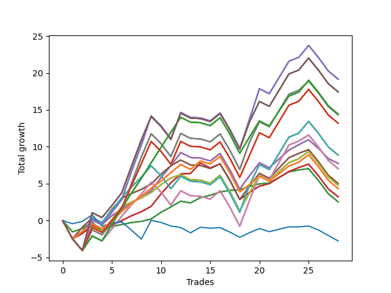

# Short Shepard 006 
- Symbol: NVDA_Unlimited
- Date Range: 02/08/2022 - 07/08/2022
- Trading Period: 7:20-12:30
- Number of Trades: 28



| Name | Win Percent | Profit | Avg Profit / Trade | Avg Time / Trade |      | Name | Win Percent | Profit | Avg Profit / Trade | Avg Time / Trade |
| ---- | ----------- | ------ | ------------------ | ---------------- | ---- | ---- | ----------- | ------ | ------------------ | ---------------- |
| Sorted By <br> Profit | | | | | | Sorted By <br> Win Percentage ||||
| One Hundred Twenty-Nine | 50.00 | 9575.00 | 341.96 | 28:17 |     | Sixty-Four | 78.57 | 1275.00 | 45.54 | 06:59 |
| One Hundred Twenty-Four | 50.00 | 9575.00 | 341.96 | 28:17 |     | Fifty-Six | 78.57 | 1275.00 | 45.54 | 06:59 |
| One Hundred Ninteen | 50.00 | 9575.00 | 341.96 | 28:17 |     | Forty-Eight | 78.57 | 1275.00 | 45.54 | 06:59 |
| One Hundred Fourteen | 50.00 | 9575.00 | 341.96 | 28:17 |     | Forty | 78.57 | 1275.00 | 45.54 | 06:59 |
| Eighty-Four | 50.00 | 9575.00 | 341.96 | 28:17 |     | Zero | 78.57 | 1275.00 | 45.54 | 06:59 |
| One Hundred Thirty | 50.00 | 8715.00 | 311.25 | 28:57 |     | Sixty-Five | 71.43 | 1610.00 | 57.50 | 12:53 |
| One Hundred Twenty-Five | 50.00 | 8715.00 | 311.25 | 28:57 |     | Fifty-Seven | 71.43 | 1610.00 | 57.50 | 12:53 |
| One Hundred Twenty | 50.00 | 8715.00 | 311.25 | 28:57 |     | Forty-Nine | 71.43 | 1610.00 | 57.50 | 12:53 |
| One Hundred Fifteen | 50.00 | 8715.00 | 311.25 | 28:57 |     | Forty-One | 71.43 | 1610.00 | 57.50 | 12:53 |
| Eighty-Five | 50.00 | 8715.00 | 311.25 | 28:57 |     | One | 71.43 | 1610.00 | 57.50 | 12:53 |
| One Hundred Twenty-Seven | 57.14 | 7215.00 | 257.68 | 22:06 |     | One Hundred Twenty-Six | 64.29 | 2170.00 | 77.50 | 17:02 |
| One Hundred Twenty-Two | 57.14 | 7215.00 | 257.68 | 22:06 |     | One Hundred Twenty-One | 64.29 | 2170.00 | 77.50 | 17:02 |
| One Hundred Seventeen | 57.14 | 7215.00 | 257.68 | 22:06 |     | One Hundred Sixteen | 64.29 | 2170.00 | 77.50 | 17:02 |
| One Hundred Twelve | 57.14 | 7215.00 | 257.68 | 22:06 |     | One Hundred Eleven | 64.29 | 2170.00 | 77.50 | 17:02 |
| Eighty-Two | 57.14 | 7215.00 | 257.68 | 22:06 |     | Eighty-One | 64.29 | 2170.00 | 77.50 | 17:02 |
| Sixty-Nine | 50.00 | 7165.00 | 255.89 | 28:07 |     | Sixty-Six | 60.71 | 3875.00 | 138.39 | 16:59 |
| Sixty-One | 50.00 | 7165.00 | 255.89 | 28:07 |     | Fifty-Eight | 60.71 | 3875.00 | 138.39 | 16:59 |
| Fifty-Three | 50.00 | 7165.00 | 255.89 | 28:07 |     | Fifty | 60.71 | 3875.00 | 138.39 | 16:59 |
| Forty-Five | 50.00 | 7165.00 | 255.89 | 28:07 |     | Forty-Two | 60.71 | 3875.00 | 138.39 | 16:59 |
| Five | 50.00 | 7165.00 | 255.89 | 28:07 |     | Two | 60.71 | 3875.00 | 138.39 | 16:59 |
| One Hundred Twenty-Eight | 50.00 | 6595.00 | 235.54 | 26:04 |     | Sixty-Seven | 60.71 | 2520.00 | 90.00 | 18:35 |
| One Hundred Twenty-Three | 50.00 | 6595.00 | 235.54 | 26:04 |     | Fifty-Nine | 60.71 | 2520.00 | 90.00 | 18:35 |
| One Hundred Eighteen | 50.00 | 6595.00 | 235.54 | 26:04 |     | Fifty-One | 60.71 | 2520.00 | 90.00 | 18:35 |
| One Hundred Thirteen | 50.00 | 6595.00 | 235.54 | 26:04 |     | Forty-Three | 60.71 | 2520.00 | 90.00 | 18:35 |
| Eighty-Three | 50.00 | 6595.00 | 235.54 | 26:04 |     | Three | 60.71 | 2520.00 | 90.00 | 18:35 |
| Seventy-One | 50.00 | 4435.00 | 158.39 | 26:11 |     | One Hundred Twenty-Seven | 57.14 | 7215.00 | 257.68 | 22:06 |
| Sixty-Three | 50.00 | 4435.00 | 158.39 | 26:11 |     | One Hundred Twenty-Two | 57.14 | 7215.00 | 257.68 | 22:06 |
| Fifty-Five | 50.00 | 4435.00 | 158.39 | 26:11 |     | One Hundred Seventeen | 57.14 | 7215.00 | 257.68 | 22:06 |
| Forty-Seven | 50.00 | 4435.00 | 158.39 | 26:11 |     | One Hundred Twelve | 57.14 | 7215.00 | 257.68 | 22:06 |
| Seven | 50.00 | 4435.00 | 158.39 | 26:11 |     | Eighty-Two | 57.14 | 7215.00 | 257.68 | 22:06 |
| Sixty-Six | 60.71 | 3875.00 | 138.39 | 16:59 |     | Seventy | 57.14 | 2400.00 | 85.71 | 20:35 |
| Fifty-Eight | 60.71 | 3875.00 | 138.39 | 16:59 |     | Sixty-Two | 57.14 | 2400.00 | 85.71 | 20:35 |
| Fifty | 60.71 | 3875.00 | 138.39 | 16:59 |     | Fifty-Four | 57.14 | 2400.00 | 85.71 | 20:35 |
| Forty-Two | 60.71 | 3875.00 | 138.39 | 16:59 |     | Forty-Six | 57.14 | 2400.00 | 85.71 | 20:35 |
| Two | 60.71 | 3875.00 | 138.39 | 16:59 |     | Six | 57.14 | 2400.00 | 85.71 | 20:35 |
| Sixty-Eight | 50.00 | 3515.00 | 125.54 | 23:58 |     | One Hundred Twenty-Nine | 50.00 | 9575.00 | 341.96 | 28:17 |
| Sixty | 50.00 | 3515.00 | 125.54 | 23:58 |     | One Hundred Twenty-Four | 50.00 | 9575.00 | 341.96 | 28:17 |
| Fifty-Two | 50.00 | 3515.00 | 125.54 | 23:58 |     | One Hundred Ninteen | 50.00 | 9575.00 | 341.96 | 28:17 |
| Forty-Four | 50.00 | 3515.00 | 125.54 | 23:58 |     | One Hundred Fourteen | 50.00 | 9575.00 | 341.96 | 28:17 |
| Four | 50.00 | 3515.00 | 125.54 | 23:58 |     | Eighty-Four | 50.00 | 9575.00 | 341.96 | 28:17 |
| Sixty-Seven | 60.71 | 2520.00 | 90.00 | 18:35 |     | One Hundred Thirty | 50.00 | 8715.00 | 311.25 | 28:57 |
| Fifty-Nine | 60.71 | 2520.00 | 90.00 | 18:35 |     | One Hundred Twenty-Five | 50.00 | 8715.00 | 311.25 | 28:57 |
| Fifty-One | 60.71 | 2520.00 | 90.00 | 18:35 |     | One Hundred Twenty | 50.00 | 8715.00 | 311.25 | 28:57 |
| Forty-Three | 60.71 | 2520.00 | 90.00 | 18:35 |     | One Hundred Fifteen | 50.00 | 8715.00 | 311.25 | 28:57 |
| Three | 60.71 | 2520.00 | 90.00 | 18:35 |     | Eighty-Five | 50.00 | 8715.00 | 311.25 | 28:57 |
| Seventy | 57.14 | 2400.00 | 85.71 | 20:35 |     | Sixty-Nine | 50.00 | 7165.00 | 255.89 | 28:07 |
| Sixty-Two | 57.14 | 2400.00 | 85.71 | 20:35 |     | Sixty-One | 50.00 | 7165.00 | 255.89 | 28:07 |
| Fifty-Four | 57.14 | 2400.00 | 85.71 | 20:35 |     | Fifty-Three | 50.00 | 7165.00 | 255.89 | 28:07 |
| Forty-Six | 57.14 | 2400.00 | 85.71 | 20:35 |     | Forty-Five | 50.00 | 7165.00 | 255.89 | 28:07 |
| Six | 57.14 | 2400.00 | 85.71 | 20:35 |     | Five | 50.00 | 7165.00 | 255.89 | 28:07 |
| One Hundred Twenty-Six | 64.29 | 2170.00 | 77.50 | 17:02 |     | One Hundred Twenty-Eight | 50.00 | 6595.00 | 235.54 | 26:04 |
| One Hundred Twenty-One | 64.29 | 2170.00 | 77.50 | 17:02 |     | One Hundred Twenty-Three | 50.00 | 6595.00 | 235.54 | 26:04 |
| One Hundred Sixteen | 64.29 | 2170.00 | 77.50 | 17:02 |     | One Hundred Eighteen | 50.00 | 6595.00 | 235.54 | 26:04 |
| One Hundred Eleven | 64.29 | 2170.00 | 77.50 | 17:02 |     | One Hundred Thirteen | 50.00 | 6595.00 | 235.54 | 26:04 |
| Eighty-One | 64.29 | 2170.00 | 77.50 | 17:02 |     | Eighty-Three | 50.00 | 6595.00 | 235.54 | 26:04 |
| Sixty-Five | 71.43 | 1610.00 | 57.50 | 12:53 |     | Seventy-One | 50.00 | 4435.00 | 158.39 | 26:11 |
| Fifty-Seven | 71.43 | 1610.00 | 57.50 | 12:53 |     | Sixty-Three | 50.00 | 4435.00 | 158.39 | 26:11 |
| Forty-Nine | 71.43 | 1610.00 | 57.50 | 12:53 |     | Fifty-Five | 50.00 | 4435.00 | 158.39 | 26:11 |
| Forty-One | 71.43 | 1610.00 | 57.50 | 12:53 |     | Forty-Seven | 50.00 | 4435.00 | 158.39 | 26:11 |
| One | 71.43 | 1610.00 | 57.50 | 12:53 |     | Seven | 50.00 | 4435.00 | 158.39 | 26:11 |
| Sixty-Four | 78.57 | 1275.00 | 45.54 | 06:59 |     | Sixty-Eight | 50.00 | 3515.00 | 125.54 | 23:58 |
| Fifty-Six | 78.57 | 1275.00 | 45.54 | 06:59 |     | Sixty | 50.00 | 3515.00 | 125.54 | 23:58 |
| Forty-Eight | 78.57 | 1275.00 | 45.54 | 06:59 |     | Fifty-Two | 50.00 | 3515.00 | 125.54 | 23:58 |
| Forty | 78.57 | 1275.00 | 45.54 | 06:59 |     | Forty-Four | 50.00 | 3515.00 | 125.54 | 23:58 |
| Zero | 78.57 | 1275.00 | 45.54 | 06:59 |     | Four | 50.00 | 3515.00 | 125.54 | 23:58 |
| Seventy-Three | 42.86 | -1375.00 | -49.11 | 05:35 |     | Seventy-Three | 42.86 | -1375.00 | -49.11 | 05:35 |

## NO STOPLOSS

### Test Zero
* Sell when price hits the middle line of the 20p bollinger
* No Stoploss
* Results:
```
Total Trades: 28
Percent Up: 21.43
Percent Down: 78.57
Total Points Moved Down: 2.55
Potential Profit: 1275.00
Total Points Ups: 7.44 Count Ups: 6
Total Points Downs: 9.99 Count Downs: 22
```

<details><summary>Trades</summary>

<code>In: 2022-02-08 08:06:00		Out: 2022-02-08 08:26:50		Total Position Time: 20:50		Total Move Down: -1.53		Total to Date: -1.53</code> <br />
<code>In: 2022-02-16 11:35:00		Out: 2022-02-16 11:41:05		Total Position Time: 06:05		Total Move Down: 0.47		Total to Date: -1.06</code> <br />
<code>In: 2022-02-18 12:05:00		Out: 2022-02-18 12:07:35		Total Position Time: 02:35		Total Move Down: 0.83		Total to Date: -0.23</code> <br />
<code>In: 2022-02-22 12:00:00		Out: 2022-02-22 12:14:40		Total Position Time: 14:40		Total Move Down: -1.19		Total to Date: -1.42</code> <br />
<code>In: 2022-02-22 12:06:00		Out: 2022-02-22 12:14:40		Total Position Time: 08:40		Total Move Down: 0.61		Total to Date: -0.81</code> <br />
<code>In: 2022-02-22 12:07:00		Out: 2022-02-22 12:14:40		Total Position Time: 07:40		Total Move Down: 0.28		Total to Date: -0.53</code> <br />
<code>In: 2022-03-01 07:29:00		Out: 2022-03-01 07:35:35		Total Position Time: 06:35		Total Move Down: 0.27		Total to Date: -0.26</code> <br />
<code>In: 2022-03-01 07:30:00		Out: 2022-03-01 07:35:35		Total Position Time: 05:35		Total Move Down: 0.15		Total to Date: -0.11</code> <br />
<code>In: 2022-03-01 07:35:00		Out: 2022-03-01 07:35:35		Total Position Time: 00:35		Total Move Down: 0.33		Total to Date: 0.22</code> <br />
<code>In: 2022-03-02 07:41:00		Out: 2022-03-02 07:46:05		Total Position Time: 05:05		Total Move Down: 0.91		Total to Date: 1.13</code> <br />
<code>In: 2022-03-02 07:42:00		Out: 2022-03-02 07:46:05		Total Position Time: 04:05		Total Move Down: 0.72		Total to Date: 1.85</code> <br />
<code>In: 2022-03-10 07:22:00		Out: 2022-03-10 07:24:25		Total Position Time: 02:25		Total Move Down: 0.78		Total to Date: 2.63</code> <br />
<code>In: 2022-03-10 11:15:00		Out: 2022-03-10 11:21:45		Total Position Time: 06:45		Total Move Down: -0.23		Total to Date: 2.40</code> <br />
<code>In: 2022-03-16 12:30:00		Out: 2022-03-16 12:31:30		Total Position Time: 01:30		Total Move Down: 0.71		Total to Date: 3.11</code> <br />
<code>In: 2022-03-17 10:32:00		Out: 2022-03-17 10:37:45		Total Position Time: 05:45		Total Move Down: 0.32		Total to Date: 3.43</code> <br />
<code>In: 2022-03-17 10:55:00		Out: 2022-03-17 10:59:40		Total Position Time: 04:40		Total Move Down: 0.45		Total to Date: 3.88</code> <br />
<code>In: 2022-03-28 12:04:00		Out: 2022-03-28 12:06:35		Total Position Time: 02:35		Total Move Down: 0.21		Total to Date: 4.09</code> <br />
<code>In: 2022-03-28 12:05:00		Out: 2022-03-28 12:06:35		Total Position Time: 01:35		Total Move Down: 0.11		Total to Date: 4.20</code> <br />
<code>In: 2022-04-06 12:07:00		Out: 2022-04-06 12:12:05		Total Position Time: 05:05		Total Move Down: 0.43		Total to Date: 4.63</code> <br />
<code>In: 2022-04-06 12:08:00		Out: 2022-04-06 12:12:05		Total Position Time: 04:05		Total Move Down: 0.35		Total to Date: 4.98</code> <br />
<code>In: 2022-04-07 12:18:00		Out: 2022-04-07 12:19:25		Total Position Time: 01:25		Total Move Down: 0.11		Total to Date: 5.09</code> <br />
<code>In: 2022-04-08 08:05:00		Out: 2022-04-08 08:10:20		Total Position Time: 05:20		Total Move Down: 0.76		Total to Date: 5.85</code> <br />
<code>In: 2022-04-08 08:05:00		Out: 2022-04-08 08:10:20		Total Position Time: 05:20		Total Move Down: 0.76		Total to Date: 6.61</code> <br />
<code>In: 2022-04-11 11:55:00		Out: 2022-04-11 12:01:05		Total Position Time: 06:05		Total Move Down: 0.25		Total to Date: 6.86</code> <br />
<code>In: 2022-04-11 12:04:00		Out: 2022-04-11 12:04:10		Total Position Time: 00:10		Total Move Down: 0.18		Total to Date: 7.04</code> <br />
<code>In: 2022-05-02 12:17:00		Out: 2022-05-02 12:39:35		Total Position Time: 22:35		Total Move Down: -1.60		Total to Date: 5.44</code> <br />
<code>In: 2022-05-02 12:18:00		Out: 2022-05-02 12:39:35		Total Position Time: 21:35		Total Move Down: -1.80		Total to Date: 3.64</code> <br />
<code>In: 2022-05-02 12:23:00		Out: 2022-05-02 12:39:35		Total Position Time: 16:35		Total Move Down: -1.09		Total to Date: 2.55</code> <br />


</details>

### Test One
* Sell when the price hits the upper line of the 20p 1std bollinger
* No Stoploss
* Results:
```
Total Trades: 28
Percent Up: 28.57
Percent Down: 71.43
Total Points Moved Down: 3.22
Potential Profit: 1610.00
Total Points Ups: 13.27 Count Ups: 8
Total Points Downs: 16.49 Count Downs: 20
```

<details><summary>Trades</summary>

<code>In: 2022-02-08 08:06:00		Out: 2022-02-08 08:35:55		Total Position Time: 29:55		Total Move Down: -2.46		Total to Date: -2.46</code> <br />
<code>In: 2022-02-16 11:35:00		Out: 2022-02-16 11:44:10		Total Position Time: 09:10		Total Move Down: 0.71		Total to Date: -1.75</code> <br />
<code>In: 2022-02-18 12:05:00		Out: 2022-02-18 12:14:10		Total Position Time: 09:10		Total Move Down: 1.11		Total to Date: -0.64</code> <br />
<code>In: 2022-02-22 12:00:00		Out: 2022-02-22 12:18:35		Total Position Time: 18:35		Total Move Down: -0.88		Total to Date: -1.52</code> <br />
<code>In: 2022-02-22 12:06:00		Out: 2022-02-22 12:18:35		Total Position Time: 12:35		Total Move Down: 0.92		Total to Date: -0.60</code> <br />
<code>In: 2022-02-22 12:07:00		Out: 2022-02-22 12:18:35		Total Position Time: 11:35		Total Move Down: 0.59		Total to Date: -0.01</code> <br />
<code>In: 2022-03-01 07:29:00		Out: 2022-03-01 07:37:25		Total Position Time: 08:25		Total Move Down: 0.67		Total to Date: 0.66</code> <br />
<code>In: 2022-03-01 07:30:00		Out: 2022-03-01 07:37:25		Total Position Time: 07:25		Total Move Down: 0.55		Total to Date: 1.21</code> <br />
<code>In: 2022-03-01 07:35:00		Out: 2022-03-01 07:37:25		Total Position Time: 02:25		Total Move Down: 0.73		Total to Date: 1.94</code> <br />
<code>In: 2022-03-02 07:41:00		Out: 2022-03-02 07:47:15		Total Position Time: 06:15		Total Move Down: 1.68		Total to Date: 3.62</code> <br />
<code>In: 2022-03-02 07:42:00		Out: 2022-03-02 07:47:15		Total Position Time: 05:15		Total Move Down: 1.49		Total to Date: 5.11</code> <br />
<code>In: 2022-03-10 07:22:00		Out: 2022-03-10 07:30:05		Total Position Time: 08:05		Total Move Down: 1.21		Total to Date: 6.32</code> <br />
<code>In: 2022-03-10 11:15:00		Out: 2022-03-10 11:23:00		Total Position Time: 08:00		Total Move Down: 0.07		Total to Date: 6.39</code> <br />
<code>In: 2022-03-16 12:30:00		Out: 2022-03-16 12:34:05		Total Position Time: 04:05		Total Move Down: 1.42		Total to Date: 7.81</code> <br />
<code>In: 2022-03-17 10:32:00		Out: 2022-03-17 11:00:20		Total Position Time: 28:20		Total Move Down: -0.68		Total to Date: 7.13</code> <br />
<code>In: 2022-03-17 10:55:00		Out: 2022-03-17 11:00:20		Total Position Time: 05:20		Total Move Down: 0.56		Total to Date: 7.69</code> <br />
<code>In: 2022-03-28 12:04:00		Out: 2022-03-28 12:33:55		Total Position Time: 29:55		Total Move Down: -2.23		Total to Date: 5.46</code> <br />
<code>In: 2022-03-28 12:05:00		Out: 2022-03-28 12:34:55		Total Position Time: 29:55		Total Move Down: -2.59		Total to Date: 2.87</code> <br />
<code>In: 2022-04-06 12:07:00		Out: 2022-04-06 12:17:00		Total Position Time: 10:00		Total Move Down: 0.94		Total to Date: 3.81</code> <br />
<code>In: 2022-04-06 12:08:00		Out: 2022-04-06 12:17:00		Total Position Time: 09:00		Total Move Down: 0.86		Total to Date: 4.67</code> <br />
<code>In: 2022-04-07 12:18:00		Out: 2022-04-07 12:20:35		Total Position Time: 02:35		Total Move Down: 0.34		Total to Date: 5.01</code> <br />
<code>In: 2022-04-08 08:05:00		Out: 2022-04-08 08:15:35		Total Position Time: 10:35		Total Move Down: 0.82		Total to Date: 5.83</code> <br />
<code>In: 2022-04-08 08:05:00		Out: 2022-04-08 08:15:35		Total Position Time: 10:35		Total Move Down: 0.82		Total to Date: 6.65</code> <br />
<code>In: 2022-04-11 11:55:00		Out: 2022-04-11 12:04:15		Total Position Time: 09:15		Total Move Down: 0.54		Total to Date: 7.19</code> <br />
<code>In: 2022-04-11 12:04:00		Out: 2022-04-11 12:04:15		Total Position Time: 00:15		Total Move Down: 0.46		Total to Date: 7.65</code> <br />
<code>In: 2022-05-02 12:17:00		Out: 2022-05-02 12:44:10		Total Position Time: 27:10		Total Move Down: -1.58		Total to Date: 6.07</code> <br />
<code>In: 2022-05-02 12:18:00		Out: 2022-05-02 12:44:10		Total Position Time: 26:10		Total Move Down: -1.78		Total to Date: 4.29</code> <br />
<code>In: 2022-05-02 12:23:00		Out: 2022-05-02 12:44:10		Total Position Time: 21:10		Total Move Down: -1.07		Total to Date: 3.22</code> <br />


</details>

### Test Two
* Sell when the price hits the upper line of the 20p 2std bollinger
* No Stoploss
* Results:
```
Total Trades: 28
Percent Up: 39.29
Percent Down: 60.71
Total Points Moved Down: 7.75
Potential Profit: 3875.00
Total Points Ups: 12.87 Count Ups: 11
Total Points Downs: 20.62 Count Downs: 17
```

<details><summary>Trades</summary>

<code>In: 2022-02-08 08:06:00		Out: 2022-02-08 08:35:55		Total Position Time: 29:55		Total Move Down: -2.46		Total to Date: -2.46</code> <br />
<code>In: 2022-02-16 11:35:00		Out: 2022-02-16 11:48:00		Total Position Time: 13:00		Total Move Down: 1.02		Total to Date: -1.44</code> <br />
<code>In: 2022-02-18 12:05:00		Out: 2022-02-18 12:17:40		Total Position Time: 12:40		Total Move Down: 1.47		Total to Date: 0.03</code> <br />
<code>In: 2022-02-22 12:00:00		Out: 2022-02-22 12:20:20		Total Position Time: 20:20		Total Move Down: -0.58		Total to Date: -0.55</code> <br />
<code>In: 2022-02-22 12:06:00		Out: 2022-02-22 12:20:20		Total Position Time: 14:20		Total Move Down: 1.22		Total to Date: 0.67</code> <br />
<code>In: 2022-02-22 12:07:00		Out: 2022-02-22 12:20:20		Total Position Time: 13:20		Total Move Down: 0.89		Total to Date: 1.56</code> <br />
<code>In: 2022-03-01 07:29:00		Out: 2022-03-01 07:40:10		Total Position Time: 11:10		Total Move Down: 0.85		Total to Date: 2.41</code> <br />
<code>In: 2022-03-01 07:30:00		Out: 2022-03-01 07:40:10		Total Position Time: 10:10		Total Move Down: 0.73		Total to Date: 3.14</code> <br />
<code>In: 2022-03-01 07:35:00		Out: 2022-03-01 07:40:10		Total Position Time: 05:10		Total Move Down: 0.91		Total to Date: 4.05</code> <br />
<code>In: 2022-03-02 07:41:00		Out: 2022-03-02 07:54:10		Total Position Time: 13:10		Total Move Down: 1.79		Total to Date: 5.84</code> <br />
<code>In: 2022-03-02 07:42:00		Out: 2022-03-02 07:54:10		Total Position Time: 12:10		Total Move Down: 1.60		Total to Date: 7.44</code> <br />
<code>In: 2022-03-10 07:22:00		Out: 2022-03-10 07:33:15		Total Position Time: 11:15		Total Move Down: 1.78		Total to Date: 9.22</code> <br />
<code>In: 2022-03-10 11:15:00		Out: 2022-03-10 11:44:55		Total Position Time: 29:55		Total Move Down: -0.67		Total to Date: 8.55</code> <br />
<code>In: 2022-03-16 12:30:00		Out: 2022-03-16 12:46:00		Total Position Time: 16:00		Total Move Down: -0.07		Total to Date: 8.48</code> <br />
<code>In: 2022-03-17 10:32:00		Out: 2022-03-17 11:01:55		Total Position Time: 29:55		Total Move Down: -0.40		Total to Date: 8.08</code> <br />
<code>In: 2022-03-17 10:55:00		Out: 2022-03-17 11:02:40		Total Position Time: 07:40		Total Move Down: 1.02		Total to Date: 9.10</code> <br />
<code>In: 2022-03-28 12:04:00		Out: 2022-03-28 12:33:55		Total Position Time: 29:55		Total Move Down: -2.23		Total to Date: 6.87</code> <br />
<code>In: 2022-03-28 12:05:00		Out: 2022-03-28 12:34:55		Total Position Time: 29:55		Total Move Down: -2.59		Total to Date: 4.28</code> <br />
<code>In: 2022-04-06 12:07:00		Out: 2022-04-06 12:20:25		Total Position Time: 13:25		Total Move Down: 1.82		Total to Date: 6.10</code> <br />
<code>In: 2022-04-06 12:08:00		Out: 2022-04-06 12:20:25		Total Position Time: 12:25		Total Move Down: 1.74		Total to Date: 7.84</code> <br />
<code>In: 2022-04-07 12:18:00		Out: 2022-04-07 12:46:00		Total Position Time: 28:00		Total Move Down: -0.67		Total to Date: 7.17</code> <br />
<code>In: 2022-04-08 08:05:00		Out: 2022-04-08 08:16:50		Total Position Time: 11:50		Total Move Down: 1.19		Total to Date: 8.36</code> <br />
<code>In: 2022-04-08 08:05:00		Out: 2022-04-08 08:16:50		Total Position Time: 11:50		Total Move Down: 1.19		Total to Date: 9.55</code> <br />
<code>In: 2022-04-11 11:55:00		Out: 2022-04-11 12:04:55		Total Position Time: 09:55		Total Move Down: 0.74		Total to Date: 10.29</code> <br />
<code>In: 2022-04-11 12:04:00		Out: 2022-04-11 12:04:55		Total Position Time: 00:55		Total Move Down: 0.66		Total to Date: 10.95</code> <br />
<code>In: 2022-05-02 12:17:00		Out: 2022-05-02 12:45:05		Total Position Time: 28:05		Total Move Down: -1.17		Total to Date: 9.78</code> <br />
<code>In: 2022-05-02 12:18:00		Out: 2022-05-02 12:45:05		Total Position Time: 27:05		Total Move Down: -1.37		Total to Date: 8.41</code> <br />
<code>In: 2022-05-02 12:23:00		Out: 2022-05-02 12:45:05		Total Position Time: 22:05		Total Move Down: -0.66		Total to Date: 7.75</code> <br />


</details>

### Test Three
* Sell when price hits the middle line of the 50p bollinger
* No Stoploss
* Results:
```
Total Trades: 28
Percent Up: 39.29
Percent Down: 60.71
Total Points Moved Down: 5.04
Potential Profit: 2520.00
Total Points Ups: 14.32 Count Ups: 11
Total Points Downs: 19.36 Count Downs: 17
```

<details><summary>Trades</summary>

<code>In: 2022-02-08 08:06:00		Out: 2022-02-08 08:35:55		Total Position Time: 29:55		Total Move Down: -2.46		Total to Date: -2.46</code> <br />
<code>In: 2022-02-16 11:35:00		Out: 2022-02-16 11:53:45		Total Position Time: 18:45		Total Move Down: 1.57		Total to Date: -0.89</code> <br />
<code>In: 2022-02-18 12:05:00		Out: 2022-02-18 12:17:20		Total Position Time: 12:20		Total Move Down: 1.22		Total to Date: 0.33</code> <br />
<code>In: 2022-02-22 12:00:00		Out: 2022-02-22 12:29:55		Total Position Time: 29:55		Total Move Down: -0.65		Total to Date: -0.32</code> <br />
<code>In: 2022-02-22 12:06:00		Out: 2022-02-22 12:30:20		Total Position Time: 24:20		Total Move Down: 1.83		Total to Date: 1.51</code> <br />
<code>In: 2022-02-22 12:07:00		Out: 2022-02-22 12:30:20		Total Position Time: 23:20		Total Move Down: 1.50		Total to Date: 3.01</code> <br />
<code>In: 2022-03-01 07:29:00		Out: 2022-03-01 07:37:25		Total Position Time: 08:25		Total Move Down: 0.67		Total to Date: 3.68</code> <br />
<code>In: 2022-03-01 07:30:00		Out: 2022-03-01 07:37:25		Total Position Time: 07:25		Total Move Down: 0.55		Total to Date: 4.23</code> <br />
<code>In: 2022-03-01 07:35:00		Out: 2022-03-01 07:37:25		Total Position Time: 02:25		Total Move Down: 0.73		Total to Date: 4.96</code> <br />
<code>In: 2022-03-02 07:41:00		Out: 2022-03-02 07:46:20		Total Position Time: 05:20		Total Move Down: 1.33		Total to Date: 6.29</code> <br />
<code>In: 2022-03-02 07:42:00		Out: 2022-03-02 07:46:20		Total Position Time: 04:20		Total Move Down: 1.14		Total to Date: 7.43</code> <br />
<code>In: 2022-03-10 07:22:00		Out: 2022-03-10 07:24:35		Total Position Time: 02:35		Total Move Down: 0.77		Total to Date: 8.20</code> <br />
<code>In: 2022-03-10 11:15:00		Out: 2022-03-10 11:44:55		Total Position Time: 29:55		Total Move Down: -0.67		Total to Date: 7.53</code> <br />
<code>In: 2022-03-16 12:30:00		Out: 2022-03-16 12:46:00		Total Position Time: 16:00		Total Move Down: -0.07		Total to Date: 7.46</code> <br />
<code>In: 2022-03-17 10:32:00		Out: 2022-03-17 11:01:55		Total Position Time: 29:55		Total Move Down: -0.40		Total to Date: 7.06</code> <br />
<code>In: 2022-03-17 10:55:00		Out: 2022-03-17 11:11:15		Total Position Time: 16:15		Total Move Down: 0.61		Total to Date: 7.67</code> <br />
<code>In: 2022-03-28 12:04:00		Out: 2022-03-28 12:33:55		Total Position Time: 29:55		Total Move Down: -2.23		Total to Date: 5.44</code> <br />
<code>In: 2022-03-28 12:05:00		Out: 2022-03-28 12:34:55		Total Position Time: 29:55		Total Move Down: -2.59		Total to Date: 2.85</code> <br />
<code>In: 2022-04-06 12:07:00		Out: 2022-04-06 12:20:25		Total Position Time: 13:25		Total Move Down: 1.82		Total to Date: 4.67</code> <br />
<code>In: 2022-04-06 12:08:00		Out: 2022-04-06 12:20:25		Total Position Time: 12:25		Total Move Down: 1.74		Total to Date: 6.41</code> <br />
<code>In: 2022-04-07 12:18:00		Out: 2022-04-07 12:46:00		Total Position Time: 28:00		Total Move Down: -0.67		Total to Date: 5.74</code> <br />
<code>In: 2022-04-08 08:05:00		Out: 2022-04-08 08:17:05		Total Position Time: 12:05		Total Move Down: 1.39		Total to Date: 7.13</code> <br />
<code>In: 2022-04-08 08:05:00		Out: 2022-04-08 08:17:05		Total Position Time: 12:05		Total Move Down: 1.39		Total to Date: 8.52</code> <br />
<code>In: 2022-04-11 11:55:00		Out: 2022-04-11 12:20:10		Total Position Time: 25:10		Total Move Down: 0.59		Total to Date: 9.11</code> <br />
<code>In: 2022-04-11 12:04:00		Out: 2022-04-11 12:20:10		Total Position Time: 16:10		Total Move Down: 0.51		Total to Date: 9.62</code> <br />
<code>In: 2022-05-02 12:17:00		Out: 2022-05-02 12:46:00		Total Position Time: 29:00		Total Move Down: -1.63		Total to Date: 7.99</code> <br />
<code>In: 2022-05-02 12:18:00		Out: 2022-05-02 12:46:00		Total Position Time: 28:00		Total Move Down: -1.83		Total to Date: 6.16</code> <br />
<code>In: 2022-05-02 12:23:00		Out: 2022-05-02 12:46:00		Total Position Time: 23:00		Total Move Down: -1.12		Total to Date: 5.04</code> <br />


</details>

### Test Four
* Sell when the price hits the upper line of the 50p 1std bollinger
* No Stoploss
* Results:
```
Total Trades: 28
Percent Up: 50.00
Percent Down: 50.00
Total Points Moved Down: 7.03
Potential Profit: 3515.00
Total Points Ups: 19.01 Count Ups: 14
Total Points Downs: 26.04 Count Downs: 14
```

<details><summary>Trades</summary>

<code>In: 2022-02-08 08:06:00		Out: 2022-02-08 08:35:55		Total Position Time: 29:55		Total Move Down: -2.46		Total to Date: -2.46</code> <br />
<code>In: 2022-02-16 11:35:00		Out: 2022-02-16 12:04:55		Total Position Time: 29:55		Total Move Down: -1.59		Total to Date: -4.05</code> <br />
<code>In: 2022-02-18 12:05:00		Out: 2022-02-18 12:19:05		Total Position Time: 14:05		Total Move Down: 1.96		Total to Date: -2.09</code> <br />
<code>In: 2022-02-22 12:00:00		Out: 2022-02-22 12:29:55		Total Position Time: 29:55		Total Move Down: -0.65		Total to Date: -2.74</code> <br />
<code>In: 2022-02-22 12:06:00		Out: 2022-02-22 12:35:55		Total Position Time: 29:55		Total Move Down: 1.60		Total to Date: -1.14</code> <br />
<code>In: 2022-02-22 12:07:00		Out: 2022-02-22 12:36:55		Total Position Time: 29:55		Total Move Down: 1.73		Total to Date: 0.59</code> <br />
<code>In: 2022-03-01 07:29:00		Out: 2022-03-01 07:41:25		Total Position Time: 12:25		Total Move Down: 1.56		Total to Date: 2.15</code> <br />
<code>In: 2022-03-01 07:30:00		Out: 2022-03-01 07:41:25		Total Position Time: 11:25		Total Move Down: 1.44		Total to Date: 3.59</code> <br />
<code>In: 2022-03-01 07:35:00		Out: 2022-03-01 07:41:25		Total Position Time: 06:25		Total Move Down: 1.62		Total to Date: 5.21</code> <br />
<code>In: 2022-03-02 07:41:00		Out: 2022-03-02 08:10:55		Total Position Time: 29:55		Total Move Down: -1.35		Total to Date: 3.86</code> <br />
<code>In: 2022-03-02 07:42:00		Out: 2022-03-02 08:11:55		Total Position Time: 29:55		Total Move Down: -1.75		Total to Date: 2.11</code> <br />
<code>In: 2022-03-10 07:22:00		Out: 2022-03-10 07:33:20		Total Position Time: 11:20		Total Move Down: 1.93		Total to Date: 4.04</code> <br />
<code>In: 2022-03-10 11:15:00		Out: 2022-03-10 11:44:55		Total Position Time: 29:55		Total Move Down: -0.67		Total to Date: 3.37</code> <br />
<code>In: 2022-03-16 12:30:00		Out: 2022-03-16 12:46:00		Total Position Time: 16:00		Total Move Down: -0.07		Total to Date: 3.30</code> <br />
<code>In: 2022-03-17 10:32:00		Out: 2022-03-17 11:01:55		Total Position Time: 29:55		Total Move Down: -0.40		Total to Date: 2.90</code> <br />
<code>In: 2022-03-17 10:55:00		Out: 2022-03-17 11:24:10		Total Position Time: 29:10		Total Move Down: 1.15		Total to Date: 4.05</code> <br />
<code>In: 2022-03-28 12:04:00		Out: 2022-03-28 12:33:55		Total Position Time: 29:55		Total Move Down: -2.23		Total to Date: 1.82</code> <br />
<code>In: 2022-03-28 12:05:00		Out: 2022-03-28 12:34:55		Total Position Time: 29:55		Total Move Down: -2.59		Total to Date: -0.77</code> <br />
<code>In: 2022-04-06 12:07:00		Out: 2022-04-06 12:28:00		Total Position Time: 21:00		Total Move Down: 3.52		Total to Date: 2.75</code> <br />
<code>In: 2022-04-06 12:08:00		Out: 2022-04-06 12:28:00		Total Position Time: 20:00		Total Move Down: 3.44		Total to Date: 6.19</code> <br />
<code>In: 2022-04-07 12:18:00		Out: 2022-04-07 12:46:00		Total Position Time: 28:00		Total Move Down: -0.67		Total to Date: 5.52</code> <br />
<code>In: 2022-04-08 08:05:00		Out: 2022-04-08 08:24:00		Total Position Time: 19:00		Total Move Down: 2.36		Total to Date: 7.88</code> <br />
<code>In: 2022-04-08 08:05:00		Out: 2022-04-08 08:24:00		Total Position Time: 19:00		Total Move Down: 2.36		Total to Date: 10.24</code> <br />
<code>In: 2022-04-11 11:55:00		Out: 2022-04-11 12:24:55		Total Position Time: 29:55		Total Move Down: 0.53		Total to Date: 10.77</code> <br />
<code>In: 2022-04-11 12:04:00		Out: 2022-04-11 12:28:35		Total Position Time: 24:35		Total Move Down: 0.84		Total to Date: 11.61</code> <br />
<code>In: 2022-05-02 12:17:00		Out: 2022-05-02 12:46:00		Total Position Time: 29:00		Total Move Down: -1.63		Total to Date: 9.98</code> <br />
<code>In: 2022-05-02 12:18:00		Out: 2022-05-02 12:46:00		Total Position Time: 28:00		Total Move Down: -1.83		Total to Date: 8.15</code> <br />
<code>In: 2022-05-02 12:23:00		Out: 2022-05-02 12:46:00		Total Position Time: 23:00		Total Move Down: -1.12		Total to Date: 7.03</code> <br />


</details>

### Test Five
* Sell when the price hits the upper line of the 50p 2std bollinger
* No Stoploss
* Results:
```
Total Trades: 28
Percent Up: 50.00
Percent Down: 50.00
Total Points Moved Down: 14.33
Potential Profit: 7165.00
Total Points Ups: 19.01 Count Ups: 14
Total Points Downs: 33.34 Count Downs: 14
```

<details><summary>Trades</summary>

<code>In: 2022-02-08 08:06:00		Out: 2022-02-08 08:35:55		Total Position Time: 29:55		Total Move Down: -2.46		Total to Date: -2.46</code> <br />
<code>In: 2022-02-16 11:35:00		Out: 2022-02-16 12:04:55		Total Position Time: 29:55		Total Move Down: -1.59		Total to Date: -4.05</code> <br />
<code>In: 2022-02-18 12:05:00		Out: 2022-02-18 12:19:45		Total Position Time: 14:45		Total Move Down: 2.79		Total to Date: -1.26</code> <br />
<code>In: 2022-02-22 12:00:00		Out: 2022-02-22 12:29:55		Total Position Time: 29:55		Total Move Down: -0.65		Total to Date: -1.91</code> <br />
<code>In: 2022-02-22 12:06:00		Out: 2022-02-22 12:35:55		Total Position Time: 29:55		Total Move Down: 1.60		Total to Date: -0.31</code> <br />
<code>In: 2022-02-22 12:07:00		Out: 2022-02-22 12:36:55		Total Position Time: 29:55		Total Move Down: 1.73		Total to Date: 1.42</code> <br />
<code>In: 2022-03-01 07:29:00		Out: 2022-03-01 07:58:55		Total Position Time: 29:55		Total Move Down: 3.64		Total to Date: 5.06</code> <br />
<code>In: 2022-03-01 07:30:00		Out: 2022-03-01 07:59:55		Total Position Time: 29:55		Total Move Down: 3.56		Total to Date: 8.62</code> <br />
<code>In: 2022-03-01 07:35:00		Out: 2022-03-01 08:04:55		Total Position Time: 29:55		Total Move Down: 3.15		Total to Date: 11.77</code> <br />
<code>In: 2022-03-02 07:41:00		Out: 2022-03-02 08:10:55		Total Position Time: 29:55		Total Move Down: -1.35		Total to Date: 10.42</code> <br />
<code>In: 2022-03-02 07:42:00		Out: 2022-03-02 08:11:55		Total Position Time: 29:55		Total Move Down: -1.75		Total to Date: 8.67</code> <br />
<code>In: 2022-03-10 07:22:00		Out: 2022-03-10 07:44:25		Total Position Time: 22:25		Total Move Down: 3.14		Total to Date: 11.81</code> <br />
<code>In: 2022-03-10 11:15:00		Out: 2022-03-10 11:44:55		Total Position Time: 29:55		Total Move Down: -0.67		Total to Date: 11.14</code> <br />
<code>In: 2022-03-16 12:30:00		Out: 2022-03-16 12:46:00		Total Position Time: 16:00		Total Move Down: -0.07		Total to Date: 11.07</code> <br />
<code>In: 2022-03-17 10:32:00		Out: 2022-03-17 11:01:55		Total Position Time: 29:55		Total Move Down: -0.40		Total to Date: 10.67</code> <br />
<code>In: 2022-03-17 10:55:00		Out: 2022-03-17 11:24:55		Total Position Time: 29:55		Total Move Down: 1.08		Total to Date: 11.75</code> <br />
<code>In: 2022-03-28 12:04:00		Out: 2022-03-28 12:33:55		Total Position Time: 29:55		Total Move Down: -2.23		Total to Date: 9.52</code> <br />
<code>In: 2022-03-28 12:05:00		Out: 2022-03-28 12:34:55		Total Position Time: 29:55		Total Move Down: -2.59		Total to Date: 6.93</code> <br />
<code>In: 2022-04-06 12:07:00		Out: 2022-04-06 12:36:55		Total Position Time: 29:55		Total Move Down: 3.72		Total to Date: 10.65</code> <br />
<code>In: 2022-04-06 12:08:00		Out: 2022-04-06 12:37:55		Total Position Time: 29:55		Total Move Down: 2.74		Total to Date: 13.39</code> <br />
<code>In: 2022-04-07 12:18:00		Out: 2022-04-07 12:46:00		Total Position Time: 28:00		Total Move Down: -0.67		Total to Date: 12.72</code> <br />
<code>In: 2022-04-08 08:05:00		Out: 2022-04-08 08:34:55		Total Position Time: 29:55		Total Move Down: 2.20		Total to Date: 14.92</code> <br />
<code>In: 2022-04-08 08:05:00		Out: 2022-04-08 08:34:55		Total Position Time: 29:55		Total Move Down: 2.20		Total to Date: 17.12</code> <br />
<code>In: 2022-04-11 11:55:00		Out: 2022-04-11 12:24:55		Total Position Time: 29:55		Total Move Down: 0.53		Total to Date: 17.65</code> <br />
<code>In: 2022-04-11 12:04:00		Out: 2022-04-11 12:32:05		Total Position Time: 28:05		Total Move Down: 1.26		Total to Date: 18.91</code> <br />
<code>In: 2022-05-02 12:17:00		Out: 2022-05-02 12:46:00		Total Position Time: 29:00		Total Move Down: -1.63		Total to Date: 17.28</code> <br />
<code>In: 2022-05-02 12:18:00		Out: 2022-05-02 12:46:00		Total Position Time: 28:00		Total Move Down: -1.83		Total to Date: 15.45</code> <br />
<code>In: 2022-05-02 12:23:00		Out: 2022-05-02 12:46:00		Total Position Time: 23:00		Total Move Down: -1.12		Total to Date: 14.33</code> <br />


</details>

### Test Six
* Sell when the price hits the middle line of the 1std VWAP
* No Stoploss
* Results:
```
Total Trades: 28
Percent Up: 42.86
Percent Down: 57.14
Total Points Moved Down: 4.80
Potential Profit: 2400.00
Total Points Ups: 15.91 Count Ups: 12
Total Points Downs: 20.71 Count Downs: 16
```

<details><summary>Trades</summary>

<code>In: 2022-02-08 08:06:00		Out: 2022-02-08 08:35:55		Total Position Time: 29:55		Total Move Down: -2.46		Total to Date: -2.46</code> <br />
<code>In: 2022-02-16 11:35:00		Out: 2022-02-16 12:04:55		Total Position Time: 29:55		Total Move Down: -1.59		Total to Date: -4.05</code> <br />
<code>In: 2022-02-18 12:05:00		Out: 2022-02-18 12:22:05		Total Position Time: 17:05		Total Move Down: 3.23		Total to Date: -0.82</code> <br />
<code>In: 2022-02-22 12:00:00		Out: 2022-02-22 12:29:55		Total Position Time: 29:55		Total Move Down: -0.65		Total to Date: -1.47</code> <br />
<code>In: 2022-02-22 12:06:00		Out: 2022-02-22 12:35:55		Total Position Time: 29:55		Total Move Down: 1.60		Total to Date: 0.13</code> <br />
<code>In: 2022-02-22 12:07:00		Out: 2022-02-22 12:36:55		Total Position Time: 29:55		Total Move Down: 1.73		Total to Date: 1.86</code> <br />
<code>In: 2022-03-01 07:29:00		Out: 2022-03-01 07:37:25		Total Position Time: 08:25		Total Move Down: 0.67		Total to Date: 2.53</code> <br />
<code>In: 2022-03-01 07:30:00		Out: 2022-03-01 07:37:25		Total Position Time: 07:25		Total Move Down: 0.55		Total to Date: 3.08</code> <br />
<code>In: 2022-03-01 07:35:00		Out: 2022-03-01 07:37:25		Total Position Time: 02:25		Total Move Down: 0.73		Total to Date: 3.81</code> <br />
<code>In: 2022-03-02 07:41:00		Out: 2022-03-02 07:46:15		Total Position Time: 05:15		Total Move Down: 1.08		Total to Date: 4.89</code> <br />
<code>In: 2022-03-02 07:42:00		Out: 2022-03-02 07:46:15		Total Position Time: 04:15		Total Move Down: 0.89		Total to Date: 5.78</code> <br />
<code>In: 2022-03-10 07:22:00		Out: 2022-03-10 07:24:05		Total Position Time: 02:05		Total Move Down: 0.44		Total to Date: 6.22</code> <br />
<code>In: 2022-03-10 11:15:00		Out: 2022-03-10 11:44:55		Total Position Time: 29:55		Total Move Down: -0.67		Total to Date: 5.55</code> <br />
<code>In: 2022-03-16 12:30:00		Out: 2022-03-16 12:46:00		Total Position Time: 16:00		Total Move Down: -0.07		Total to Date: 5.48</code> <br />
<code>In: 2022-03-17 10:32:00		Out: 2022-03-17 11:01:55		Total Position Time: 29:55		Total Move Down: -0.40		Total to Date: 5.08</code> <br />
<code>In: 2022-03-17 10:55:00		Out: 2022-03-17 11:24:55		Total Position Time: 29:55		Total Move Down: 1.08		Total to Date: 6.16</code> <br />
<code>In: 2022-03-28 12:04:00		Out: 2022-03-28 12:33:55		Total Position Time: 29:55		Total Move Down: -2.23		Total to Date: 3.93</code> <br />
<code>In: 2022-03-28 12:05:00		Out: 2022-03-28 12:34:55		Total Position Time: 29:55		Total Move Down: -2.59		Total to Date: 1.34</code> <br />
<code>In: 2022-04-06 12:07:00		Out: 2022-04-06 12:21:35		Total Position Time: 14:35		Total Move Down: 2.44		Total to Date: 3.78</code> <br />
<code>In: 2022-04-06 12:08:00		Out: 2022-04-06 12:21:35		Total Position Time: 13:35		Total Move Down: 2.36		Total to Date: 6.14</code> <br />
<code>In: 2022-04-07 12:18:00		Out: 2022-04-07 12:46:00		Total Position Time: 28:00		Total Move Down: -0.67		Total to Date: 5.47</code> <br />
<code>In: 2022-04-08 08:05:00		Out: 2022-04-08 08:16:50		Total Position Time: 11:50		Total Move Down: 1.19		Total to Date: 6.66</code> <br />
<code>In: 2022-04-08 08:05:00		Out: 2022-04-08 08:16:50		Total Position Time: 11:50		Total Move Down: 1.19		Total to Date: 7.85</code> <br />
<code>In: 2022-04-11 11:55:00		Out: 2022-04-11 12:24:55		Total Position Time: 29:55		Total Move Down: 0.53		Total to Date: 8.38</code> <br />
<code>In: 2022-04-11 12:04:00		Out: 2022-04-11 12:28:50		Total Position Time: 24:50		Total Move Down: 1.00		Total to Date: 9.38</code> <br />
<code>In: 2022-05-02 12:17:00		Out: 2022-05-02 12:46:00		Total Position Time: 29:00		Total Move Down: -1.63		Total to Date: 7.75</code> <br />
<code>In: 2022-05-02 12:18:00		Out: 2022-05-02 12:46:00		Total Position Time: 28:00		Total Move Down: -1.83		Total to Date: 5.92</code> <br />
<code>In: 2022-05-02 12:23:00		Out: 2022-05-02 12:46:00		Total Position Time: 23:00		Total Move Down: -1.12		Total to Date: 4.80</code> <br />


</details>

### Test Seven
* Sell when the price hits the upper line of the 1std VWAP
* No Stoploss
* Results:
```
Total Trades: 28
Percent Up: 50.00
Percent Down: 50.00
Total Points Moved Down: 8.87
Potential Profit: 4435.00
Total Points Ups: 19.01 Count Ups: 14
Total Points Downs: 27.88 Count Downs: 14
```

<details><summary>Trades</summary>

<code>In: 2022-02-08 08:06:00		Out: 2022-02-08 08:35:55		Total Position Time: 29:55		Total Move Down: -2.46		Total to Date: -2.46</code> <br />
<code>In: 2022-02-16 11:35:00		Out: 2022-02-16 12:04:55		Total Position Time: 29:55		Total Move Down: -1.59		Total to Date: -4.05</code> <br />
<code>In: 2022-02-18 12:05:00		Out: 2022-02-18 12:34:55		Total Position Time: 29:55		Total Move Down: 4.45		Total to Date: 0.40</code> <br />
<code>In: 2022-02-22 12:00:00		Out: 2022-02-22 12:29:55		Total Position Time: 29:55		Total Move Down: -0.65		Total to Date: -0.25</code> <br />
<code>In: 2022-02-22 12:06:00		Out: 2022-02-22 12:35:55		Total Position Time: 29:55		Total Move Down: 1.60		Total to Date: 1.35</code> <br />
<code>In: 2022-02-22 12:07:00		Out: 2022-02-22 12:36:55		Total Position Time: 29:55		Total Move Down: 1.73		Total to Date: 3.08</code> <br />
<code>In: 2022-03-01 07:29:00		Out: 2022-03-01 07:41:15		Total Position Time: 12:15		Total Move Down: 1.47		Total to Date: 4.55</code> <br />
<code>In: 2022-03-01 07:30:00		Out: 2022-03-01 07:41:15		Total Position Time: 11:15		Total Move Down: 1.35		Total to Date: 5.90</code> <br />
<code>In: 2022-03-01 07:35:00		Out: 2022-03-01 07:41:15		Total Position Time: 06:15		Total Move Down: 1.53		Total to Date: 7.43</code> <br />
<code>In: 2022-03-02 07:41:00		Out: 2022-03-02 08:10:55		Total Position Time: 29:55		Total Move Down: -1.35		Total to Date: 6.08</code> <br />
<code>In: 2022-03-02 07:42:00		Out: 2022-03-02 08:11:55		Total Position Time: 29:55		Total Move Down: -1.75		Total to Date: 4.33</code> <br />
<code>In: 2022-03-10 07:22:00		Out: 2022-03-10 07:33:00		Total Position Time: 11:00		Total Move Down: 1.67		Total to Date: 6.00</code> <br />
<code>In: 2022-03-10 11:15:00		Out: 2022-03-10 11:44:55		Total Position Time: 29:55		Total Move Down: -0.67		Total to Date: 5.33</code> <br />
<code>In: 2022-03-16 12:30:00		Out: 2022-03-16 12:46:00		Total Position Time: 16:00		Total Move Down: -0.07		Total to Date: 5.26</code> <br />
<code>In: 2022-03-17 10:32:00		Out: 2022-03-17 11:01:55		Total Position Time: 29:55		Total Move Down: -0.40		Total to Date: 4.86</code> <br />
<code>In: 2022-03-17 10:55:00		Out: 2022-03-17 11:24:55		Total Position Time: 29:55		Total Move Down: 1.08		Total to Date: 5.94</code> <br />
<code>In: 2022-03-28 12:04:00		Out: 2022-03-28 12:33:55		Total Position Time: 29:55		Total Move Down: -2.23		Total to Date: 3.71</code> <br />
<code>In: 2022-03-28 12:05:00		Out: 2022-03-28 12:34:55		Total Position Time: 29:55		Total Move Down: -2.59		Total to Date: 1.12</code> <br />
<code>In: 2022-04-06 12:07:00		Out: 2022-04-06 12:36:55		Total Position Time: 29:55		Total Move Down: 3.72		Total to Date: 4.84</code> <br />
<code>In: 2022-04-06 12:08:00		Out: 2022-04-06 12:37:55		Total Position Time: 29:55		Total Move Down: 2.74		Total to Date: 7.58</code> <br />
<code>In: 2022-04-07 12:18:00		Out: 2022-04-07 12:46:00		Total Position Time: 28:00		Total Move Down: -0.67		Total to Date: 6.91</code> <br />
<code>In: 2022-04-08 08:05:00		Out: 2022-04-08 08:34:55		Total Position Time: 29:55		Total Move Down: 2.20		Total to Date: 9.11</code> <br />
<code>In: 2022-04-08 08:05:00		Out: 2022-04-08 08:34:55		Total Position Time: 29:55		Total Move Down: 2.20		Total to Date: 11.31</code> <br />
<code>In: 2022-04-11 11:55:00		Out: 2022-04-11 12:24:55		Total Position Time: 29:55		Total Move Down: 0.53		Total to Date: 11.84</code> <br />
<code>In: 2022-04-11 12:04:00		Out: 2022-04-11 12:33:55		Total Position Time: 29:55		Total Move Down: 1.61		Total to Date: 13.45</code> <br />
<code>In: 2022-05-02 12:17:00		Out: 2022-05-02 12:46:00		Total Position Time: 29:00		Total Move Down: -1.63		Total to Date: 11.82</code> <br />
<code>In: 2022-05-02 12:18:00		Out: 2022-05-02 12:46:00		Total Position Time: 28:00		Total Move Down: -1.83		Total to Date: 9.99</code> <br />
<code>In: 2022-05-02 12:23:00		Out: 2022-05-02 12:46:00		Total Position Time: 23:00		Total Move Down: -1.12		Total to Date: 8.87</code> <br />


</details>

## STOPLOSS OF 5

### Test Forty
* Sell when price hits the middle line of the 20p bollinger
* Stoploss is -5 points
* Results:
```
Total Trades: 28
Percent Up: 21.43
Percent Down: 78.57
Total Points Moved Down: 2.55
Potential Profit: 1275.00
Total Points Ups: 7.44 Count Ups: 6
Total Points Downs: 9.99 Count Downs: 22
```

<details><summary>Trades</summary>

<code>In: 2022-02-08 08:06:00		Out: 2022-02-08 08:26:50		Total Position Time: 20:50		Total Move Down: -1.53		Total to Date: -1.53</code> <br />
<code>In: 2022-02-16 11:35:00		Out: 2022-02-16 11:41:05		Total Position Time: 06:05		Total Move Down: 0.47		Total to Date: -1.06</code> <br />
<code>In: 2022-02-18 12:05:00		Out: 2022-02-18 12:07:35		Total Position Time: 02:35		Total Move Down: 0.83		Total to Date: -0.23</code> <br />
<code>In: 2022-02-22 12:00:00		Out: 2022-02-22 12:14:40		Total Position Time: 14:40		Total Move Down: -1.19		Total to Date: -1.42</code> <br />
<code>In: 2022-02-22 12:06:00		Out: 2022-02-22 12:14:40		Total Position Time: 08:40		Total Move Down: 0.61		Total to Date: -0.81</code> <br />
<code>In: 2022-02-22 12:07:00		Out: 2022-02-22 12:14:40		Total Position Time: 07:40		Total Move Down: 0.28		Total to Date: -0.53</code> <br />
<code>In: 2022-03-01 07:29:00		Out: 2022-03-01 07:35:35		Total Position Time: 06:35		Total Move Down: 0.27		Total to Date: -0.26</code> <br />
<code>In: 2022-03-01 07:30:00		Out: 2022-03-01 07:35:35		Total Position Time: 05:35		Total Move Down: 0.15		Total to Date: -0.11</code> <br />
<code>In: 2022-03-01 07:35:00		Out: 2022-03-01 07:35:35		Total Position Time: 00:35		Total Move Down: 0.33		Total to Date: 0.22</code> <br />
<code>In: 2022-03-02 07:41:00		Out: 2022-03-02 07:46:05		Total Position Time: 05:05		Total Move Down: 0.91		Total to Date: 1.13</code> <br />
<code>In: 2022-03-02 07:42:00		Out: 2022-03-02 07:46:05		Total Position Time: 04:05		Total Move Down: 0.72		Total to Date: 1.85</code> <br />
<code>In: 2022-03-10 07:22:00		Out: 2022-03-10 07:24:25		Total Position Time: 02:25		Total Move Down: 0.78		Total to Date: 2.63</code> <br />
<code>In: 2022-03-10 11:15:00		Out: 2022-03-10 11:21:45		Total Position Time: 06:45		Total Move Down: -0.23		Total to Date: 2.40</code> <br />
<code>In: 2022-03-16 12:30:00		Out: 2022-03-16 12:31:30		Total Position Time: 01:30		Total Move Down: 0.71		Total to Date: 3.11</code> <br />
<code>In: 2022-03-17 10:32:00		Out: 2022-03-17 10:37:45		Total Position Time: 05:45		Total Move Down: 0.32		Total to Date: 3.43</code> <br />
<code>In: 2022-03-17 10:55:00		Out: 2022-03-17 10:59:40		Total Position Time: 04:40		Total Move Down: 0.45		Total to Date: 3.88</code> <br />
<code>In: 2022-03-28 12:04:00		Out: 2022-03-28 12:06:35		Total Position Time: 02:35		Total Move Down: 0.21		Total to Date: 4.09</code> <br />
<code>In: 2022-03-28 12:05:00		Out: 2022-03-28 12:06:35		Total Position Time: 01:35		Total Move Down: 0.11		Total to Date: 4.20</code> <br />
<code>In: 2022-04-06 12:07:00		Out: 2022-04-06 12:12:05		Total Position Time: 05:05		Total Move Down: 0.43		Total to Date: 4.63</code> <br />
<code>In: 2022-04-06 12:08:00		Out: 2022-04-06 12:12:05		Total Position Time: 04:05		Total Move Down: 0.35		Total to Date: 4.98</code> <br />
<code>In: 2022-04-07 12:18:00		Out: 2022-04-07 12:19:25		Total Position Time: 01:25		Total Move Down: 0.11		Total to Date: 5.09</code> <br />
<code>In: 2022-04-08 08:05:00		Out: 2022-04-08 08:10:20		Total Position Time: 05:20		Total Move Down: 0.76		Total to Date: 5.85</code> <br />
<code>In: 2022-04-08 08:05:00		Out: 2022-04-08 08:10:20		Total Position Time: 05:20		Total Move Down: 0.76		Total to Date: 6.61</code> <br />
<code>In: 2022-04-11 11:55:00		Out: 2022-04-11 12:01:05		Total Position Time: 06:05		Total Move Down: 0.25		Total to Date: 6.86</code> <br />
<code>In: 2022-04-11 12:04:00		Out: 2022-04-11 12:04:10		Total Position Time: 00:10		Total Move Down: 0.18		Total to Date: 7.04</code> <br />
<code>In: 2022-05-02 12:17:00		Out: 2022-05-02 12:39:35		Total Position Time: 22:35		Total Move Down: -1.60		Total to Date: 5.44</code> <br />
<code>In: 2022-05-02 12:18:00		Out: 2022-05-02 12:39:35		Total Position Time: 21:35		Total Move Down: -1.80		Total to Date: 3.64</code> <br />
<code>In: 2022-05-02 12:23:00		Out: 2022-05-02 12:39:35		Total Position Time: 16:35		Total Move Down: -1.09		Total to Date: 2.55</code> <br />


</details>

### Test Forty-One
* Sell when the price hits the upper line of the 20p 1std bollinger
* Stoploss is -5 points
* Results:
```
Total Trades: 28
Percent Up: 28.57
Percent Down: 71.43
Total Points Moved Down: 3.22
Potential Profit: 1610.00
Total Points Ups: 13.27 Count Ups: 8
Total Points Downs: 16.49 Count Downs: 20
```

<details><summary>Trades</summary>

<code>In: 2022-02-08 08:06:00		Out: 2022-02-08 08:35:55		Total Position Time: 29:55		Total Move Down: -2.46		Total to Date: -2.46</code> <br />
<code>In: 2022-02-16 11:35:00		Out: 2022-02-16 11:44:10		Total Position Time: 09:10		Total Move Down: 0.71		Total to Date: -1.75</code> <br />
<code>In: 2022-02-18 12:05:00		Out: 2022-02-18 12:14:10		Total Position Time: 09:10		Total Move Down: 1.11		Total to Date: -0.64</code> <br />
<code>In: 2022-02-22 12:00:00		Out: 2022-02-22 12:18:35		Total Position Time: 18:35		Total Move Down: -0.88		Total to Date: -1.52</code> <br />
<code>In: 2022-02-22 12:06:00		Out: 2022-02-22 12:18:35		Total Position Time: 12:35		Total Move Down: 0.92		Total to Date: -0.60</code> <br />
<code>In: 2022-02-22 12:07:00		Out: 2022-02-22 12:18:35		Total Position Time: 11:35		Total Move Down: 0.59		Total to Date: -0.01</code> <br />
<code>In: 2022-03-01 07:29:00		Out: 2022-03-01 07:37:25		Total Position Time: 08:25		Total Move Down: 0.67		Total to Date: 0.66</code> <br />
<code>In: 2022-03-01 07:30:00		Out: 2022-03-01 07:37:25		Total Position Time: 07:25		Total Move Down: 0.55		Total to Date: 1.21</code> <br />
<code>In: 2022-03-01 07:35:00		Out: 2022-03-01 07:37:25		Total Position Time: 02:25		Total Move Down: 0.73		Total to Date: 1.94</code> <br />
<code>In: 2022-03-02 07:41:00		Out: 2022-03-02 07:47:15		Total Position Time: 06:15		Total Move Down: 1.68		Total to Date: 3.62</code> <br />
<code>In: 2022-03-02 07:42:00		Out: 2022-03-02 07:47:15		Total Position Time: 05:15		Total Move Down: 1.49		Total to Date: 5.11</code> <br />
<code>In: 2022-03-10 07:22:00		Out: 2022-03-10 07:30:05		Total Position Time: 08:05		Total Move Down: 1.21		Total to Date: 6.32</code> <br />
<code>In: 2022-03-10 11:15:00		Out: 2022-03-10 11:23:00		Total Position Time: 08:00		Total Move Down: 0.07		Total to Date: 6.39</code> <br />
<code>In: 2022-03-16 12:30:00		Out: 2022-03-16 12:34:05		Total Position Time: 04:05		Total Move Down: 1.42		Total to Date: 7.81</code> <br />
<code>In: 2022-03-17 10:32:00		Out: 2022-03-17 11:00:20		Total Position Time: 28:20		Total Move Down: -0.68		Total to Date: 7.13</code> <br />
<code>In: 2022-03-17 10:55:00		Out: 2022-03-17 11:00:20		Total Position Time: 05:20		Total Move Down: 0.56		Total to Date: 7.69</code> <br />
<code>In: 2022-03-28 12:04:00		Out: 2022-03-28 12:33:55		Total Position Time: 29:55		Total Move Down: -2.23		Total to Date: 5.46</code> <br />
<code>In: 2022-03-28 12:05:00		Out: 2022-03-28 12:34:55		Total Position Time: 29:55		Total Move Down: -2.59		Total to Date: 2.87</code> <br />
<code>In: 2022-04-06 12:07:00		Out: 2022-04-06 12:17:00		Total Position Time: 10:00		Total Move Down: 0.94		Total to Date: 3.81</code> <br />
<code>In: 2022-04-06 12:08:00		Out: 2022-04-06 12:17:00		Total Position Time: 09:00		Total Move Down: 0.86		Total to Date: 4.67</code> <br />
<code>In: 2022-04-07 12:18:00		Out: 2022-04-07 12:20:35		Total Position Time: 02:35		Total Move Down: 0.34		Total to Date: 5.01</code> <br />
<code>In: 2022-04-08 08:05:00		Out: 2022-04-08 08:15:35		Total Position Time: 10:35		Total Move Down: 0.82		Total to Date: 5.83</code> <br />
<code>In: 2022-04-08 08:05:00		Out: 2022-04-08 08:15:35		Total Position Time: 10:35		Total Move Down: 0.82		Total to Date: 6.65</code> <br />
<code>In: 2022-04-11 11:55:00		Out: 2022-04-11 12:04:15		Total Position Time: 09:15		Total Move Down: 0.54		Total to Date: 7.19</code> <br />
<code>In: 2022-04-11 12:04:00		Out: 2022-04-11 12:04:15		Total Position Time: 00:15		Total Move Down: 0.46		Total to Date: 7.65</code> <br />
<code>In: 2022-05-02 12:17:00		Out: 2022-05-02 12:44:10		Total Position Time: 27:10		Total Move Down: -1.58		Total to Date: 6.07</code> <br />
<code>In: 2022-05-02 12:18:00		Out: 2022-05-02 12:44:10		Total Position Time: 26:10		Total Move Down: -1.78		Total to Date: 4.29</code> <br />
<code>In: 2022-05-02 12:23:00		Out: 2022-05-02 12:44:10		Total Position Time: 21:10		Total Move Down: -1.07		Total to Date: 3.22</code> <br />


</details>

### Test Forty-Two
* Sell when the price hits the upper line of the 20p 2std bollinger
* Stoploss is -5 points
* Results:
```
Total Trades: 28
Percent Up: 39.29
Percent Down: 60.71
Total Points Moved Down: 7.75
Potential Profit: 3875.00
Total Points Ups: 12.87 Count Ups: 11
Total Points Downs: 20.62 Count Downs: 17
```

<details><summary>Trades</summary>

<code>In: 2022-02-08 08:06:00		Out: 2022-02-08 08:35:55		Total Position Time: 29:55		Total Move Down: -2.46		Total to Date: -2.46</code> <br />
<code>In: 2022-02-16 11:35:00		Out: 2022-02-16 11:48:00		Total Position Time: 13:00		Total Move Down: 1.02		Total to Date: -1.44</code> <br />
<code>In: 2022-02-18 12:05:00		Out: 2022-02-18 12:17:40		Total Position Time: 12:40		Total Move Down: 1.47		Total to Date: 0.03</code> <br />
<code>In: 2022-02-22 12:00:00		Out: 2022-02-22 12:20:20		Total Position Time: 20:20		Total Move Down: -0.58		Total to Date: -0.55</code> <br />
<code>In: 2022-02-22 12:06:00		Out: 2022-02-22 12:20:20		Total Position Time: 14:20		Total Move Down: 1.22		Total to Date: 0.67</code> <br />
<code>In: 2022-02-22 12:07:00		Out: 2022-02-22 12:20:20		Total Position Time: 13:20		Total Move Down: 0.89		Total to Date: 1.56</code> <br />
<code>In: 2022-03-01 07:29:00		Out: 2022-03-01 07:40:10		Total Position Time: 11:10		Total Move Down: 0.85		Total to Date: 2.41</code> <br />
<code>In: 2022-03-01 07:30:00		Out: 2022-03-01 07:40:10		Total Position Time: 10:10		Total Move Down: 0.73		Total to Date: 3.14</code> <br />
<code>In: 2022-03-01 07:35:00		Out: 2022-03-01 07:40:10		Total Position Time: 05:10		Total Move Down: 0.91		Total to Date: 4.05</code> <br />
<code>In: 2022-03-02 07:41:00		Out: 2022-03-02 07:54:10		Total Position Time: 13:10		Total Move Down: 1.79		Total to Date: 5.84</code> <br />
<code>In: 2022-03-02 07:42:00		Out: 2022-03-02 07:54:10		Total Position Time: 12:10		Total Move Down: 1.60		Total to Date: 7.44</code> <br />
<code>In: 2022-03-10 07:22:00		Out: 2022-03-10 07:33:15		Total Position Time: 11:15		Total Move Down: 1.78		Total to Date: 9.22</code> <br />
<code>In: 2022-03-10 11:15:00		Out: 2022-03-10 11:44:55		Total Position Time: 29:55		Total Move Down: -0.67		Total to Date: 8.55</code> <br />
<code>In: 2022-03-16 12:30:00		Out: 2022-03-16 12:46:00		Total Position Time: 16:00		Total Move Down: -0.07		Total to Date: 8.48</code> <br />
<code>In: 2022-03-17 10:32:00		Out: 2022-03-17 11:01:55		Total Position Time: 29:55		Total Move Down: -0.40		Total to Date: 8.08</code> <br />
<code>In: 2022-03-17 10:55:00		Out: 2022-03-17 11:02:40		Total Position Time: 07:40		Total Move Down: 1.02		Total to Date: 9.10</code> <br />
<code>In: 2022-03-28 12:04:00		Out: 2022-03-28 12:33:55		Total Position Time: 29:55		Total Move Down: -2.23		Total to Date: 6.87</code> <br />
<code>In: 2022-03-28 12:05:00		Out: 2022-03-28 12:34:55		Total Position Time: 29:55		Total Move Down: -2.59		Total to Date: 4.28</code> <br />
<code>In: 2022-04-06 12:07:00		Out: 2022-04-06 12:20:25		Total Position Time: 13:25		Total Move Down: 1.82		Total to Date: 6.10</code> <br />
<code>In: 2022-04-06 12:08:00		Out: 2022-04-06 12:20:25		Total Position Time: 12:25		Total Move Down: 1.74		Total to Date: 7.84</code> <br />
<code>In: 2022-04-07 12:18:00		Out: 2022-04-07 12:46:00		Total Position Time: 28:00		Total Move Down: -0.67		Total to Date: 7.17</code> <br />
<code>In: 2022-04-08 08:05:00		Out: 2022-04-08 08:16:50		Total Position Time: 11:50		Total Move Down: 1.19		Total to Date: 8.36</code> <br />
<code>In: 2022-04-08 08:05:00		Out: 2022-04-08 08:16:50		Total Position Time: 11:50		Total Move Down: 1.19		Total to Date: 9.55</code> <br />
<code>In: 2022-04-11 11:55:00		Out: 2022-04-11 12:04:55		Total Position Time: 09:55		Total Move Down: 0.74		Total to Date: 10.29</code> <br />
<code>In: 2022-04-11 12:04:00		Out: 2022-04-11 12:04:55		Total Position Time: 00:55		Total Move Down: 0.66		Total to Date: 10.95</code> <br />
<code>In: 2022-05-02 12:17:00		Out: 2022-05-02 12:45:05		Total Position Time: 28:05		Total Move Down: -1.17		Total to Date: 9.78</code> <br />
<code>In: 2022-05-02 12:18:00		Out: 2022-05-02 12:45:05		Total Position Time: 27:05		Total Move Down: -1.37		Total to Date: 8.41</code> <br />
<code>In: 2022-05-02 12:23:00		Out: 2022-05-02 12:45:05		Total Position Time: 22:05		Total Move Down: -0.66		Total to Date: 7.75</code> <br />


</details>

### Test Forty-Three
* Sell when price hits the middle line of the 50p bollinger
* Stoploss is -5 points
* Results:
```
Total Trades: 28
Percent Up: 39.29
Percent Down: 60.71
Total Points Moved Down: 5.04
Potential Profit: 2520.00
Total Points Ups: 14.32 Count Ups: 11
Total Points Downs: 19.36 Count Downs: 17
```

<details><summary>Trades</summary>

<code>In: 2022-02-08 08:06:00		Out: 2022-02-08 08:35:55		Total Position Time: 29:55		Total Move Down: -2.46		Total to Date: -2.46</code> <br />
<code>In: 2022-02-16 11:35:00		Out: 2022-02-16 11:53:45		Total Position Time: 18:45		Total Move Down: 1.57		Total to Date: -0.89</code> <br />
<code>In: 2022-02-18 12:05:00		Out: 2022-02-18 12:17:20		Total Position Time: 12:20		Total Move Down: 1.22		Total to Date: 0.33</code> <br />
<code>In: 2022-02-22 12:00:00		Out: 2022-02-22 12:29:55		Total Position Time: 29:55		Total Move Down: -0.65		Total to Date: -0.32</code> <br />
<code>In: 2022-02-22 12:06:00		Out: 2022-02-22 12:30:20		Total Position Time: 24:20		Total Move Down: 1.83		Total to Date: 1.51</code> <br />
<code>In: 2022-02-22 12:07:00		Out: 2022-02-22 12:30:20		Total Position Time: 23:20		Total Move Down: 1.50		Total to Date: 3.01</code> <br />
<code>In: 2022-03-01 07:29:00		Out: 2022-03-01 07:37:25		Total Position Time: 08:25		Total Move Down: 0.67		Total to Date: 3.68</code> <br />
<code>In: 2022-03-01 07:30:00		Out: 2022-03-01 07:37:25		Total Position Time: 07:25		Total Move Down: 0.55		Total to Date: 4.23</code> <br />
<code>In: 2022-03-01 07:35:00		Out: 2022-03-01 07:37:25		Total Position Time: 02:25		Total Move Down: 0.73		Total to Date: 4.96</code> <br />
<code>In: 2022-03-02 07:41:00		Out: 2022-03-02 07:46:20		Total Position Time: 05:20		Total Move Down: 1.33		Total to Date: 6.29</code> <br />
<code>In: 2022-03-02 07:42:00		Out: 2022-03-02 07:46:20		Total Position Time: 04:20		Total Move Down: 1.14		Total to Date: 7.43</code> <br />
<code>In: 2022-03-10 07:22:00		Out: 2022-03-10 07:24:35		Total Position Time: 02:35		Total Move Down: 0.77		Total to Date: 8.20</code> <br />
<code>In: 2022-03-10 11:15:00		Out: 2022-03-10 11:44:55		Total Position Time: 29:55		Total Move Down: -0.67		Total to Date: 7.53</code> <br />
<code>In: 2022-03-16 12:30:00		Out: 2022-03-16 12:46:00		Total Position Time: 16:00		Total Move Down: -0.07		Total to Date: 7.46</code> <br />
<code>In: 2022-03-17 10:32:00		Out: 2022-03-17 11:01:55		Total Position Time: 29:55		Total Move Down: -0.40		Total to Date: 7.06</code> <br />
<code>In: 2022-03-17 10:55:00		Out: 2022-03-17 11:11:15		Total Position Time: 16:15		Total Move Down: 0.61		Total to Date: 7.67</code> <br />
<code>In: 2022-03-28 12:04:00		Out: 2022-03-28 12:33:55		Total Position Time: 29:55		Total Move Down: -2.23		Total to Date: 5.44</code> <br />
<code>In: 2022-03-28 12:05:00		Out: 2022-03-28 12:34:55		Total Position Time: 29:55		Total Move Down: -2.59		Total to Date: 2.85</code> <br />
<code>In: 2022-04-06 12:07:00		Out: 2022-04-06 12:20:25		Total Position Time: 13:25		Total Move Down: 1.82		Total to Date: 4.67</code> <br />
<code>In: 2022-04-06 12:08:00		Out: 2022-04-06 12:20:25		Total Position Time: 12:25		Total Move Down: 1.74		Total to Date: 6.41</code> <br />
<code>In: 2022-04-07 12:18:00		Out: 2022-04-07 12:46:00		Total Position Time: 28:00		Total Move Down: -0.67		Total to Date: 5.74</code> <br />
<code>In: 2022-04-08 08:05:00		Out: 2022-04-08 08:17:05		Total Position Time: 12:05		Total Move Down: 1.39		Total to Date: 7.13</code> <br />
<code>In: 2022-04-08 08:05:00		Out: 2022-04-08 08:17:05		Total Position Time: 12:05		Total Move Down: 1.39		Total to Date: 8.52</code> <br />
<code>In: 2022-04-11 11:55:00		Out: 2022-04-11 12:20:10		Total Position Time: 25:10		Total Move Down: 0.59		Total to Date: 9.11</code> <br />
<code>In: 2022-04-11 12:04:00		Out: 2022-04-11 12:20:10		Total Position Time: 16:10		Total Move Down: 0.51		Total to Date: 9.62</code> <br />
<code>In: 2022-05-02 12:17:00		Out: 2022-05-02 12:46:00		Total Position Time: 29:00		Total Move Down: -1.63		Total to Date: 7.99</code> <br />
<code>In: 2022-05-02 12:18:00		Out: 2022-05-02 12:46:00		Total Position Time: 28:00		Total Move Down: -1.83		Total to Date: 6.16</code> <br />
<code>In: 2022-05-02 12:23:00		Out: 2022-05-02 12:46:00		Total Position Time: 23:00		Total Move Down: -1.12		Total to Date: 5.04</code> <br />


</details>

### Test Forty-Four
* Sell when the price hits the upper line of the 50p 1std bollinger
* Stoploss is -5 points
* Results:
```
Total Trades: 28
Percent Up: 50.00
Percent Down: 50.00
Total Points Moved Down: 7.03
Potential Profit: 3515.00
Total Points Ups: 19.01 Count Ups: 14
Total Points Downs: 26.04 Count Downs: 14
```

<details><summary>Trades</summary>

<code>In: 2022-02-08 08:06:00		Out: 2022-02-08 08:35:55		Total Position Time: 29:55		Total Move Down: -2.46		Total to Date: -2.46</code> <br />
<code>In: 2022-02-16 11:35:00		Out: 2022-02-16 12:04:55		Total Position Time: 29:55		Total Move Down: -1.59		Total to Date: -4.05</code> <br />
<code>In: 2022-02-18 12:05:00		Out: 2022-02-18 12:19:05		Total Position Time: 14:05		Total Move Down: 1.96		Total to Date: -2.09</code> <br />
<code>In: 2022-02-22 12:00:00		Out: 2022-02-22 12:29:55		Total Position Time: 29:55		Total Move Down: -0.65		Total to Date: -2.74</code> <br />
<code>In: 2022-02-22 12:06:00		Out: 2022-02-22 12:35:55		Total Position Time: 29:55		Total Move Down: 1.60		Total to Date: -1.14</code> <br />
<code>In: 2022-02-22 12:07:00		Out: 2022-02-22 12:36:55		Total Position Time: 29:55		Total Move Down: 1.73		Total to Date: 0.59</code> <br />
<code>In: 2022-03-01 07:29:00		Out: 2022-03-01 07:41:25		Total Position Time: 12:25		Total Move Down: 1.56		Total to Date: 2.15</code> <br />
<code>In: 2022-03-01 07:30:00		Out: 2022-03-01 07:41:25		Total Position Time: 11:25		Total Move Down: 1.44		Total to Date: 3.59</code> <br />
<code>In: 2022-03-01 07:35:00		Out: 2022-03-01 07:41:25		Total Position Time: 06:25		Total Move Down: 1.62		Total to Date: 5.21</code> <br />
<code>In: 2022-03-02 07:41:00		Out: 2022-03-02 08:10:55		Total Position Time: 29:55		Total Move Down: -1.35		Total to Date: 3.86</code> <br />
<code>In: 2022-03-02 07:42:00		Out: 2022-03-02 08:11:55		Total Position Time: 29:55		Total Move Down: -1.75		Total to Date: 2.11</code> <br />
<code>In: 2022-03-10 07:22:00		Out: 2022-03-10 07:33:20		Total Position Time: 11:20		Total Move Down: 1.93		Total to Date: 4.04</code> <br />
<code>In: 2022-03-10 11:15:00		Out: 2022-03-10 11:44:55		Total Position Time: 29:55		Total Move Down: -0.67		Total to Date: 3.37</code> <br />
<code>In: 2022-03-16 12:30:00		Out: 2022-03-16 12:46:00		Total Position Time: 16:00		Total Move Down: -0.07		Total to Date: 3.30</code> <br />
<code>In: 2022-03-17 10:32:00		Out: 2022-03-17 11:01:55		Total Position Time: 29:55		Total Move Down: -0.40		Total to Date: 2.90</code> <br />
<code>In: 2022-03-17 10:55:00		Out: 2022-03-17 11:24:10		Total Position Time: 29:10		Total Move Down: 1.15		Total to Date: 4.05</code> <br />
<code>In: 2022-03-28 12:04:00		Out: 2022-03-28 12:33:55		Total Position Time: 29:55		Total Move Down: -2.23		Total to Date: 1.82</code> <br />
<code>In: 2022-03-28 12:05:00		Out: 2022-03-28 12:34:55		Total Position Time: 29:55		Total Move Down: -2.59		Total to Date: -0.77</code> <br />
<code>In: 2022-04-06 12:07:00		Out: 2022-04-06 12:28:00		Total Position Time: 21:00		Total Move Down: 3.52		Total to Date: 2.75</code> <br />
<code>In: 2022-04-06 12:08:00		Out: 2022-04-06 12:28:00		Total Position Time: 20:00		Total Move Down: 3.44		Total to Date: 6.19</code> <br />
<code>In: 2022-04-07 12:18:00		Out: 2022-04-07 12:46:00		Total Position Time: 28:00		Total Move Down: -0.67		Total to Date: 5.52</code> <br />
<code>In: 2022-04-08 08:05:00		Out: 2022-04-08 08:24:00		Total Position Time: 19:00		Total Move Down: 2.36		Total to Date: 7.88</code> <br />
<code>In: 2022-04-08 08:05:00		Out: 2022-04-08 08:24:00		Total Position Time: 19:00		Total Move Down: 2.36		Total to Date: 10.24</code> <br />
<code>In: 2022-04-11 11:55:00		Out: 2022-04-11 12:24:55		Total Position Time: 29:55		Total Move Down: 0.53		Total to Date: 10.77</code> <br />
<code>In: 2022-04-11 12:04:00		Out: 2022-04-11 12:28:35		Total Position Time: 24:35		Total Move Down: 0.84		Total to Date: 11.61</code> <br />
<code>In: 2022-05-02 12:17:00		Out: 2022-05-02 12:46:00		Total Position Time: 29:00		Total Move Down: -1.63		Total to Date: 9.98</code> <br />
<code>In: 2022-05-02 12:18:00		Out: 2022-05-02 12:46:00		Total Position Time: 28:00		Total Move Down: -1.83		Total to Date: 8.15</code> <br />
<code>In: 2022-05-02 12:23:00		Out: 2022-05-02 12:46:00		Total Position Time: 23:00		Total Move Down: -1.12		Total to Date: 7.03</code> <br />


</details>

### Test Forty-Five
* Sell when the price hits the upper line of the 50p 2std bollinger
* Stoploss is -5 points
* Results:
```
Total Trades: 28
Percent Up: 50.00
Percent Down: 50.00
Total Points Moved Down: 14.33
Potential Profit: 7165.00
Total Points Ups: 19.01 Count Ups: 14
Total Points Downs: 33.34 Count Downs: 14
```

<details><summary>Trades</summary>

<code>In: 2022-02-08 08:06:00		Out: 2022-02-08 08:35:55		Total Position Time: 29:55		Total Move Down: -2.46		Total to Date: -2.46</code> <br />
<code>In: 2022-02-16 11:35:00		Out: 2022-02-16 12:04:55		Total Position Time: 29:55		Total Move Down: -1.59		Total to Date: -4.05</code> <br />
<code>In: 2022-02-18 12:05:00		Out: 2022-02-18 12:19:45		Total Position Time: 14:45		Total Move Down: 2.79		Total to Date: -1.26</code> <br />
<code>In: 2022-02-22 12:00:00		Out: 2022-02-22 12:29:55		Total Position Time: 29:55		Total Move Down: -0.65		Total to Date: -1.91</code> <br />
<code>In: 2022-02-22 12:06:00		Out: 2022-02-22 12:35:55		Total Position Time: 29:55		Total Move Down: 1.60		Total to Date: -0.31</code> <br />
<code>In: 2022-02-22 12:07:00		Out: 2022-02-22 12:36:55		Total Position Time: 29:55		Total Move Down: 1.73		Total to Date: 1.42</code> <br />
<code>In: 2022-03-01 07:29:00		Out: 2022-03-01 07:58:55		Total Position Time: 29:55		Total Move Down: 3.64		Total to Date: 5.06</code> <br />
<code>In: 2022-03-01 07:30:00		Out: 2022-03-01 07:59:55		Total Position Time: 29:55		Total Move Down: 3.56		Total to Date: 8.62</code> <br />
<code>In: 2022-03-01 07:35:00		Out: 2022-03-01 08:04:55		Total Position Time: 29:55		Total Move Down: 3.15		Total to Date: 11.77</code> <br />
<code>In: 2022-03-02 07:41:00		Out: 2022-03-02 08:10:55		Total Position Time: 29:55		Total Move Down: -1.35		Total to Date: 10.42</code> <br />
<code>In: 2022-03-02 07:42:00		Out: 2022-03-02 08:11:55		Total Position Time: 29:55		Total Move Down: -1.75		Total to Date: 8.67</code> <br />
<code>In: 2022-03-10 07:22:00		Out: 2022-03-10 07:44:25		Total Position Time: 22:25		Total Move Down: 3.14		Total to Date: 11.81</code> <br />
<code>In: 2022-03-10 11:15:00		Out: 2022-03-10 11:44:55		Total Position Time: 29:55		Total Move Down: -0.67		Total to Date: 11.14</code> <br />
<code>In: 2022-03-16 12:30:00		Out: 2022-03-16 12:46:00		Total Position Time: 16:00		Total Move Down: -0.07		Total to Date: 11.07</code> <br />
<code>In: 2022-03-17 10:32:00		Out: 2022-03-17 11:01:55		Total Position Time: 29:55		Total Move Down: -0.40		Total to Date: 10.67</code> <br />
<code>In: 2022-03-17 10:55:00		Out: 2022-03-17 11:24:55		Total Position Time: 29:55		Total Move Down: 1.08		Total to Date: 11.75</code> <br />
<code>In: 2022-03-28 12:04:00		Out: 2022-03-28 12:33:55		Total Position Time: 29:55		Total Move Down: -2.23		Total to Date: 9.52</code> <br />
<code>In: 2022-03-28 12:05:00		Out: 2022-03-28 12:34:55		Total Position Time: 29:55		Total Move Down: -2.59		Total to Date: 6.93</code> <br />
<code>In: 2022-04-06 12:07:00		Out: 2022-04-06 12:36:55		Total Position Time: 29:55		Total Move Down: 3.72		Total to Date: 10.65</code> <br />
<code>In: 2022-04-06 12:08:00		Out: 2022-04-06 12:37:55		Total Position Time: 29:55		Total Move Down: 2.74		Total to Date: 13.39</code> <br />
<code>In: 2022-04-07 12:18:00		Out: 2022-04-07 12:46:00		Total Position Time: 28:00		Total Move Down: -0.67		Total to Date: 12.72</code> <br />
<code>In: 2022-04-08 08:05:00		Out: 2022-04-08 08:34:55		Total Position Time: 29:55		Total Move Down: 2.20		Total to Date: 14.92</code> <br />
<code>In: 2022-04-08 08:05:00		Out: 2022-04-08 08:34:55		Total Position Time: 29:55		Total Move Down: 2.20		Total to Date: 17.12</code> <br />
<code>In: 2022-04-11 11:55:00		Out: 2022-04-11 12:24:55		Total Position Time: 29:55		Total Move Down: 0.53		Total to Date: 17.65</code> <br />
<code>In: 2022-04-11 12:04:00		Out: 2022-04-11 12:32:05		Total Position Time: 28:05		Total Move Down: 1.26		Total to Date: 18.91</code> <br />
<code>In: 2022-05-02 12:17:00		Out: 2022-05-02 12:46:00		Total Position Time: 29:00		Total Move Down: -1.63		Total to Date: 17.28</code> <br />
<code>In: 2022-05-02 12:18:00		Out: 2022-05-02 12:46:00		Total Position Time: 28:00		Total Move Down: -1.83		Total to Date: 15.45</code> <br />
<code>In: 2022-05-02 12:23:00		Out: 2022-05-02 12:46:00		Total Position Time: 23:00		Total Move Down: -1.12		Total to Date: 14.33</code> <br />


</details>

### Test Forty-Six
* Sell when the price hits the middle line of the 1std VWAP
* Stoploss is -5 points
* Results:
```
Total Trades: 28
Percent Up: 42.86
Percent Down: 57.14
Total Points Moved Down: 4.80
Potential Profit: 2400.00
Total Points Ups: 15.91 Count Ups: 12
Total Points Downs: 20.71 Count Downs: 16
```

<details><summary>Trades</summary>

<code>In: 2022-02-08 08:06:00		Out: 2022-02-08 08:35:55		Total Position Time: 29:55		Total Move Down: -2.46		Total to Date: -2.46</code> <br />
<code>In: 2022-02-16 11:35:00		Out: 2022-02-16 12:04:55		Total Position Time: 29:55		Total Move Down: -1.59		Total to Date: -4.05</code> <br />
<code>In: 2022-02-18 12:05:00		Out: 2022-02-18 12:22:05		Total Position Time: 17:05		Total Move Down: 3.23		Total to Date: -0.82</code> <br />
<code>In: 2022-02-22 12:00:00		Out: 2022-02-22 12:29:55		Total Position Time: 29:55		Total Move Down: -0.65		Total to Date: -1.47</code> <br />
<code>In: 2022-02-22 12:06:00		Out: 2022-02-22 12:35:55		Total Position Time: 29:55		Total Move Down: 1.60		Total to Date: 0.13</code> <br />
<code>In: 2022-02-22 12:07:00		Out: 2022-02-22 12:36:55		Total Position Time: 29:55		Total Move Down: 1.73		Total to Date: 1.86</code> <br />
<code>In: 2022-03-01 07:29:00		Out: 2022-03-01 07:37:25		Total Position Time: 08:25		Total Move Down: 0.67		Total to Date: 2.53</code> <br />
<code>In: 2022-03-01 07:30:00		Out: 2022-03-01 07:37:25		Total Position Time: 07:25		Total Move Down: 0.55		Total to Date: 3.08</code> <br />
<code>In: 2022-03-01 07:35:00		Out: 2022-03-01 07:37:25		Total Position Time: 02:25		Total Move Down: 0.73		Total to Date: 3.81</code> <br />
<code>In: 2022-03-02 07:41:00		Out: 2022-03-02 07:46:15		Total Position Time: 05:15		Total Move Down: 1.08		Total to Date: 4.89</code> <br />
<code>In: 2022-03-02 07:42:00		Out: 2022-03-02 07:46:15		Total Position Time: 04:15		Total Move Down: 0.89		Total to Date: 5.78</code> <br />
<code>In: 2022-03-10 07:22:00		Out: 2022-03-10 07:24:05		Total Position Time: 02:05		Total Move Down: 0.44		Total to Date: 6.22</code> <br />
<code>In: 2022-03-10 11:15:00		Out: 2022-03-10 11:44:55		Total Position Time: 29:55		Total Move Down: -0.67		Total to Date: 5.55</code> <br />
<code>In: 2022-03-16 12:30:00		Out: 2022-03-16 12:46:00		Total Position Time: 16:00		Total Move Down: -0.07		Total to Date: 5.48</code> <br />
<code>In: 2022-03-17 10:32:00		Out: 2022-03-17 11:01:55		Total Position Time: 29:55		Total Move Down: -0.40		Total to Date: 5.08</code> <br />
<code>In: 2022-03-17 10:55:00		Out: 2022-03-17 11:24:55		Total Position Time: 29:55		Total Move Down: 1.08		Total to Date: 6.16</code> <br />
<code>In: 2022-03-28 12:04:00		Out: 2022-03-28 12:33:55		Total Position Time: 29:55		Total Move Down: -2.23		Total to Date: 3.93</code> <br />
<code>In: 2022-03-28 12:05:00		Out: 2022-03-28 12:34:55		Total Position Time: 29:55		Total Move Down: -2.59		Total to Date: 1.34</code> <br />
<code>In: 2022-04-06 12:07:00		Out: 2022-04-06 12:21:35		Total Position Time: 14:35		Total Move Down: 2.44		Total to Date: 3.78</code> <br />
<code>In: 2022-04-06 12:08:00		Out: 2022-04-06 12:21:35		Total Position Time: 13:35		Total Move Down: 2.36		Total to Date: 6.14</code> <br />
<code>In: 2022-04-07 12:18:00		Out: 2022-04-07 12:46:00		Total Position Time: 28:00		Total Move Down: -0.67		Total to Date: 5.47</code> <br />
<code>In: 2022-04-08 08:05:00		Out: 2022-04-08 08:16:50		Total Position Time: 11:50		Total Move Down: 1.19		Total to Date: 6.66</code> <br />
<code>In: 2022-04-08 08:05:00		Out: 2022-04-08 08:16:50		Total Position Time: 11:50		Total Move Down: 1.19		Total to Date: 7.85</code> <br />
<code>In: 2022-04-11 11:55:00		Out: 2022-04-11 12:24:55		Total Position Time: 29:55		Total Move Down: 0.53		Total to Date: 8.38</code> <br />
<code>In: 2022-04-11 12:04:00		Out: 2022-04-11 12:28:50		Total Position Time: 24:50		Total Move Down: 1.00		Total to Date: 9.38</code> <br />
<code>In: 2022-05-02 12:17:00		Out: 2022-05-02 12:46:00		Total Position Time: 29:00		Total Move Down: -1.63		Total to Date: 7.75</code> <br />
<code>In: 2022-05-02 12:18:00		Out: 2022-05-02 12:46:00		Total Position Time: 28:00		Total Move Down: -1.83		Total to Date: 5.92</code> <br />
<code>In: 2022-05-02 12:23:00		Out: 2022-05-02 12:46:00		Total Position Time: 23:00		Total Move Down: -1.12		Total to Date: 4.80</code> <br />


</details>

### Test Forty-Seven
* Sell when the price hits the upper line of the 1std VWAP
* Stoploss is -5 points
* Results:
```
Total Trades: 28
Percent Up: 50.00
Percent Down: 50.00
Total Points Moved Down: 8.87
Potential Profit: 4435.00
Total Points Ups: 19.01 Count Ups: 14
Total Points Downs: 27.88 Count Downs: 14
```

<details><summary>Trades</summary>

<code>In: 2022-02-08 08:06:00		Out: 2022-02-08 08:35:55		Total Position Time: 29:55		Total Move Down: -2.46		Total to Date: -2.46</code> <br />
<code>In: 2022-02-16 11:35:00		Out: 2022-02-16 12:04:55		Total Position Time: 29:55		Total Move Down: -1.59		Total to Date: -4.05</code> <br />
<code>In: 2022-02-18 12:05:00		Out: 2022-02-18 12:34:55		Total Position Time: 29:55		Total Move Down: 4.45		Total to Date: 0.40</code> <br />
<code>In: 2022-02-22 12:00:00		Out: 2022-02-22 12:29:55		Total Position Time: 29:55		Total Move Down: -0.65		Total to Date: -0.25</code> <br />
<code>In: 2022-02-22 12:06:00		Out: 2022-02-22 12:35:55		Total Position Time: 29:55		Total Move Down: 1.60		Total to Date: 1.35</code> <br />
<code>In: 2022-02-22 12:07:00		Out: 2022-02-22 12:36:55		Total Position Time: 29:55		Total Move Down: 1.73		Total to Date: 3.08</code> <br />
<code>In: 2022-03-01 07:29:00		Out: 2022-03-01 07:41:15		Total Position Time: 12:15		Total Move Down: 1.47		Total to Date: 4.55</code> <br />
<code>In: 2022-03-01 07:30:00		Out: 2022-03-01 07:41:15		Total Position Time: 11:15		Total Move Down: 1.35		Total to Date: 5.90</code> <br />
<code>In: 2022-03-01 07:35:00		Out: 2022-03-01 07:41:15		Total Position Time: 06:15		Total Move Down: 1.53		Total to Date: 7.43</code> <br />
<code>In: 2022-03-02 07:41:00		Out: 2022-03-02 08:10:55		Total Position Time: 29:55		Total Move Down: -1.35		Total to Date: 6.08</code> <br />
<code>In: 2022-03-02 07:42:00		Out: 2022-03-02 08:11:55		Total Position Time: 29:55		Total Move Down: -1.75		Total to Date: 4.33</code> <br />
<code>In: 2022-03-10 07:22:00		Out: 2022-03-10 07:33:00		Total Position Time: 11:00		Total Move Down: 1.67		Total to Date: 6.00</code> <br />
<code>In: 2022-03-10 11:15:00		Out: 2022-03-10 11:44:55		Total Position Time: 29:55		Total Move Down: -0.67		Total to Date: 5.33</code> <br />
<code>In: 2022-03-16 12:30:00		Out: 2022-03-16 12:46:00		Total Position Time: 16:00		Total Move Down: -0.07		Total to Date: 5.26</code> <br />
<code>In: 2022-03-17 10:32:00		Out: 2022-03-17 11:01:55		Total Position Time: 29:55		Total Move Down: -0.40		Total to Date: 4.86</code> <br />
<code>In: 2022-03-17 10:55:00		Out: 2022-03-17 11:24:55		Total Position Time: 29:55		Total Move Down: 1.08		Total to Date: 5.94</code> <br />
<code>In: 2022-03-28 12:04:00		Out: 2022-03-28 12:33:55		Total Position Time: 29:55		Total Move Down: -2.23		Total to Date: 3.71</code> <br />
<code>In: 2022-03-28 12:05:00		Out: 2022-03-28 12:34:55		Total Position Time: 29:55		Total Move Down: -2.59		Total to Date: 1.12</code> <br />
<code>In: 2022-04-06 12:07:00		Out: 2022-04-06 12:36:55		Total Position Time: 29:55		Total Move Down: 3.72		Total to Date: 4.84</code> <br />
<code>In: 2022-04-06 12:08:00		Out: 2022-04-06 12:37:55		Total Position Time: 29:55		Total Move Down: 2.74		Total to Date: 7.58</code> <br />
<code>In: 2022-04-07 12:18:00		Out: 2022-04-07 12:46:00		Total Position Time: 28:00		Total Move Down: -0.67		Total to Date: 6.91</code> <br />
<code>In: 2022-04-08 08:05:00		Out: 2022-04-08 08:34:55		Total Position Time: 29:55		Total Move Down: 2.20		Total to Date: 9.11</code> <br />
<code>In: 2022-04-08 08:05:00		Out: 2022-04-08 08:34:55		Total Position Time: 29:55		Total Move Down: 2.20		Total to Date: 11.31</code> <br />
<code>In: 2022-04-11 11:55:00		Out: 2022-04-11 12:24:55		Total Position Time: 29:55		Total Move Down: 0.53		Total to Date: 11.84</code> <br />
<code>In: 2022-04-11 12:04:00		Out: 2022-04-11 12:33:55		Total Position Time: 29:55		Total Move Down: 1.61		Total to Date: 13.45</code> <br />
<code>In: 2022-05-02 12:17:00		Out: 2022-05-02 12:46:00		Total Position Time: 29:00		Total Move Down: -1.63		Total to Date: 11.82</code> <br />
<code>In: 2022-05-02 12:18:00		Out: 2022-05-02 12:46:00		Total Position Time: 28:00		Total Move Down: -1.83		Total to Date: 9.99</code> <br />
<code>In: 2022-05-02 12:23:00		Out: 2022-05-02 12:46:00		Total Position Time: 23:00		Total Move Down: -1.12		Total to Date: 8.87</code> <br />


</details>

## TRAIL STOP OF 5

### Test Forty-Eight
* Sell when price hits the middle line of the 20p bollinger
* Trailing Stop is -5 points
* Results:
```
Total Trades: 28
Percent Up: 21.43
Percent Down: 78.57
Total Points Moved Down: 2.55
Potential Profit: 1275.00
Total Points Ups: 7.44 Count Ups: 6
Total Points Downs: 9.99 Count Downs: 22
```

<details><summary>Trades</summary>

<code>In: 2022-02-08 08:06:00		Out: 2022-02-08 08:26:50		Total Position Time: 20:50		Total Move Down: -1.53		Total to Date: -1.53</code> <br />
<code>In: 2022-02-16 11:35:00		Out: 2022-02-16 11:41:05		Total Position Time: 06:05		Total Move Down: 0.47		Total to Date: -1.06</code> <br />
<code>In: 2022-02-18 12:05:00		Out: 2022-02-18 12:07:35		Total Position Time: 02:35		Total Move Down: 0.83		Total to Date: -0.23</code> <br />
<code>In: 2022-02-22 12:00:00		Out: 2022-02-22 12:14:40		Total Position Time: 14:40		Total Move Down: -1.19		Total to Date: -1.42</code> <br />
<code>In: 2022-02-22 12:06:00		Out: 2022-02-22 12:14:40		Total Position Time: 08:40		Total Move Down: 0.61		Total to Date: -0.81</code> <br />
<code>In: 2022-02-22 12:07:00		Out: 2022-02-22 12:14:40		Total Position Time: 07:40		Total Move Down: 0.28		Total to Date: -0.53</code> <br />
<code>In: 2022-03-01 07:29:00		Out: 2022-03-01 07:35:35		Total Position Time: 06:35		Total Move Down: 0.27		Total to Date: -0.26</code> <br />
<code>In: 2022-03-01 07:30:00		Out: 2022-03-01 07:35:35		Total Position Time: 05:35		Total Move Down: 0.15		Total to Date: -0.11</code> <br />
<code>In: 2022-03-01 07:35:00		Out: 2022-03-01 07:35:35		Total Position Time: 00:35		Total Move Down: 0.33		Total to Date: 0.22</code> <br />
<code>In: 2022-03-02 07:41:00		Out: 2022-03-02 07:46:05		Total Position Time: 05:05		Total Move Down: 0.91		Total to Date: 1.13</code> <br />
<code>In: 2022-03-02 07:42:00		Out: 2022-03-02 07:46:05		Total Position Time: 04:05		Total Move Down: 0.72		Total to Date: 1.85</code> <br />
<code>In: 2022-03-10 07:22:00		Out: 2022-03-10 07:24:25		Total Position Time: 02:25		Total Move Down: 0.78		Total to Date: 2.63</code> <br />
<code>In: 2022-03-10 11:15:00		Out: 2022-03-10 11:21:45		Total Position Time: 06:45		Total Move Down: -0.23		Total to Date: 2.40</code> <br />
<code>In: 2022-03-16 12:30:00		Out: 2022-03-16 12:31:30		Total Position Time: 01:30		Total Move Down: 0.71		Total to Date: 3.11</code> <br />
<code>In: 2022-03-17 10:32:00		Out: 2022-03-17 10:37:45		Total Position Time: 05:45		Total Move Down: 0.32		Total to Date: 3.43</code> <br />
<code>In: 2022-03-17 10:55:00		Out: 2022-03-17 10:59:40		Total Position Time: 04:40		Total Move Down: 0.45		Total to Date: 3.88</code> <br />
<code>In: 2022-03-28 12:04:00		Out: 2022-03-28 12:06:35		Total Position Time: 02:35		Total Move Down: 0.21		Total to Date: 4.09</code> <br />
<code>In: 2022-03-28 12:05:00		Out: 2022-03-28 12:06:35		Total Position Time: 01:35		Total Move Down: 0.11		Total to Date: 4.20</code> <br />
<code>In: 2022-04-06 12:07:00		Out: 2022-04-06 12:12:05		Total Position Time: 05:05		Total Move Down: 0.43		Total to Date: 4.63</code> <br />
<code>In: 2022-04-06 12:08:00		Out: 2022-04-06 12:12:05		Total Position Time: 04:05		Total Move Down: 0.35		Total to Date: 4.98</code> <br />
<code>In: 2022-04-07 12:18:00		Out: 2022-04-07 12:19:25		Total Position Time: 01:25		Total Move Down: 0.11		Total to Date: 5.09</code> <br />
<code>In: 2022-04-08 08:05:00		Out: 2022-04-08 08:10:20		Total Position Time: 05:20		Total Move Down: 0.76		Total to Date: 5.85</code> <br />
<code>In: 2022-04-08 08:05:00		Out: 2022-04-08 08:10:20		Total Position Time: 05:20		Total Move Down: 0.76		Total to Date: 6.61</code> <br />
<code>In: 2022-04-11 11:55:00		Out: 2022-04-11 12:01:05		Total Position Time: 06:05		Total Move Down: 0.25		Total to Date: 6.86</code> <br />
<code>In: 2022-04-11 12:04:00		Out: 2022-04-11 12:04:10		Total Position Time: 00:10		Total Move Down: 0.18		Total to Date: 7.04</code> <br />
<code>In: 2022-05-02 12:17:00		Out: 2022-05-02 12:39:35		Total Position Time: 22:35		Total Move Down: -1.60		Total to Date: 5.44</code> <br />
<code>In: 2022-05-02 12:18:00		Out: 2022-05-02 12:39:35		Total Position Time: 21:35		Total Move Down: -1.80		Total to Date: 3.64</code> <br />
<code>In: 2022-05-02 12:23:00		Out: 2022-05-02 12:39:35		Total Position Time: 16:35		Total Move Down: -1.09		Total to Date: 2.55</code> <br />


</details>

### Test Forty-Nine
* Sell when the price hits the upper line of the 20p 1std bollinger
* Trailing Stop is -5 points
* Results:
```
Total Trades: 28
Percent Up: 28.57
Percent Down: 71.43
Total Points Moved Down: 3.22
Potential Profit: 1610.00
Total Points Ups: 13.27 Count Ups: 8
Total Points Downs: 16.49 Count Downs: 20
```

<details><summary>Trades</summary>

<code>In: 2022-02-08 08:06:00		Out: 2022-02-08 08:35:55		Total Position Time: 29:55		Total Move Down: -2.46		Total to Date: -2.46</code> <br />
<code>In: 2022-02-16 11:35:00		Out: 2022-02-16 11:44:10		Total Position Time: 09:10		Total Move Down: 0.71		Total to Date: -1.75</code> <br />
<code>In: 2022-02-18 12:05:00		Out: 2022-02-18 12:14:10		Total Position Time: 09:10		Total Move Down: 1.11		Total to Date: -0.64</code> <br />
<code>In: 2022-02-22 12:00:00		Out: 2022-02-22 12:18:35		Total Position Time: 18:35		Total Move Down: -0.88		Total to Date: -1.52</code> <br />
<code>In: 2022-02-22 12:06:00		Out: 2022-02-22 12:18:35		Total Position Time: 12:35		Total Move Down: 0.92		Total to Date: -0.60</code> <br />
<code>In: 2022-02-22 12:07:00		Out: 2022-02-22 12:18:35		Total Position Time: 11:35		Total Move Down: 0.59		Total to Date: -0.01</code> <br />
<code>In: 2022-03-01 07:29:00		Out: 2022-03-01 07:37:25		Total Position Time: 08:25		Total Move Down: 0.67		Total to Date: 0.66</code> <br />
<code>In: 2022-03-01 07:30:00		Out: 2022-03-01 07:37:25		Total Position Time: 07:25		Total Move Down: 0.55		Total to Date: 1.21</code> <br />
<code>In: 2022-03-01 07:35:00		Out: 2022-03-01 07:37:25		Total Position Time: 02:25		Total Move Down: 0.73		Total to Date: 1.94</code> <br />
<code>In: 2022-03-02 07:41:00		Out: 2022-03-02 07:47:15		Total Position Time: 06:15		Total Move Down: 1.68		Total to Date: 3.62</code> <br />
<code>In: 2022-03-02 07:42:00		Out: 2022-03-02 07:47:15		Total Position Time: 05:15		Total Move Down: 1.49		Total to Date: 5.11</code> <br />
<code>In: 2022-03-10 07:22:00		Out: 2022-03-10 07:30:05		Total Position Time: 08:05		Total Move Down: 1.21		Total to Date: 6.32</code> <br />
<code>In: 2022-03-10 11:15:00		Out: 2022-03-10 11:23:00		Total Position Time: 08:00		Total Move Down: 0.07		Total to Date: 6.39</code> <br />
<code>In: 2022-03-16 12:30:00		Out: 2022-03-16 12:34:05		Total Position Time: 04:05		Total Move Down: 1.42		Total to Date: 7.81</code> <br />
<code>In: 2022-03-17 10:32:00		Out: 2022-03-17 11:00:20		Total Position Time: 28:20		Total Move Down: -0.68		Total to Date: 7.13</code> <br />
<code>In: 2022-03-17 10:55:00		Out: 2022-03-17 11:00:20		Total Position Time: 05:20		Total Move Down: 0.56		Total to Date: 7.69</code> <br />
<code>In: 2022-03-28 12:04:00		Out: 2022-03-28 12:33:55		Total Position Time: 29:55		Total Move Down: -2.23		Total to Date: 5.46</code> <br />
<code>In: 2022-03-28 12:05:00		Out: 2022-03-28 12:34:55		Total Position Time: 29:55		Total Move Down: -2.59		Total to Date: 2.87</code> <br />
<code>In: 2022-04-06 12:07:00		Out: 2022-04-06 12:17:00		Total Position Time: 10:00		Total Move Down: 0.94		Total to Date: 3.81</code> <br />
<code>In: 2022-04-06 12:08:00		Out: 2022-04-06 12:17:00		Total Position Time: 09:00		Total Move Down: 0.86		Total to Date: 4.67</code> <br />
<code>In: 2022-04-07 12:18:00		Out: 2022-04-07 12:20:35		Total Position Time: 02:35		Total Move Down: 0.34		Total to Date: 5.01</code> <br />
<code>In: 2022-04-08 08:05:00		Out: 2022-04-08 08:15:35		Total Position Time: 10:35		Total Move Down: 0.82		Total to Date: 5.83</code> <br />
<code>In: 2022-04-08 08:05:00		Out: 2022-04-08 08:15:35		Total Position Time: 10:35		Total Move Down: 0.82		Total to Date: 6.65</code> <br />
<code>In: 2022-04-11 11:55:00		Out: 2022-04-11 12:04:15		Total Position Time: 09:15		Total Move Down: 0.54		Total to Date: 7.19</code> <br />
<code>In: 2022-04-11 12:04:00		Out: 2022-04-11 12:04:15		Total Position Time: 00:15		Total Move Down: 0.46		Total to Date: 7.65</code> <br />
<code>In: 2022-05-02 12:17:00		Out: 2022-05-02 12:44:10		Total Position Time: 27:10		Total Move Down: -1.58		Total to Date: 6.07</code> <br />
<code>In: 2022-05-02 12:18:00		Out: 2022-05-02 12:44:10		Total Position Time: 26:10		Total Move Down: -1.78		Total to Date: 4.29</code> <br />
<code>In: 2022-05-02 12:23:00		Out: 2022-05-02 12:44:10		Total Position Time: 21:10		Total Move Down: -1.07		Total to Date: 3.22</code> <br />


</details>

### Test Fifty
* Sell when the price hits the upper line of the 20p 2std bollinger
* Trailing Stop is -5 points
* Results:
```
Total Trades: 28
Percent Up: 39.29
Percent Down: 60.71
Total Points Moved Down: 7.75
Potential Profit: 3875.00
Total Points Ups: 12.87 Count Ups: 11
Total Points Downs: 20.62 Count Downs: 17
```

<details><summary>Trades</summary>

<code>In: 2022-02-08 08:06:00		Out: 2022-02-08 08:35:55		Total Position Time: 29:55		Total Move Down: -2.46		Total to Date: -2.46</code> <br />
<code>In: 2022-02-16 11:35:00		Out: 2022-02-16 11:48:00		Total Position Time: 13:00		Total Move Down: 1.02		Total to Date: -1.44</code> <br />
<code>In: 2022-02-18 12:05:00		Out: 2022-02-18 12:17:40		Total Position Time: 12:40		Total Move Down: 1.47		Total to Date: 0.03</code> <br />
<code>In: 2022-02-22 12:00:00		Out: 2022-02-22 12:20:20		Total Position Time: 20:20		Total Move Down: -0.58		Total to Date: -0.55</code> <br />
<code>In: 2022-02-22 12:06:00		Out: 2022-02-22 12:20:20		Total Position Time: 14:20		Total Move Down: 1.22		Total to Date: 0.67</code> <br />
<code>In: 2022-02-22 12:07:00		Out: 2022-02-22 12:20:20		Total Position Time: 13:20		Total Move Down: 0.89		Total to Date: 1.56</code> <br />
<code>In: 2022-03-01 07:29:00		Out: 2022-03-01 07:40:10		Total Position Time: 11:10		Total Move Down: 0.85		Total to Date: 2.41</code> <br />
<code>In: 2022-03-01 07:30:00		Out: 2022-03-01 07:40:10		Total Position Time: 10:10		Total Move Down: 0.73		Total to Date: 3.14</code> <br />
<code>In: 2022-03-01 07:35:00		Out: 2022-03-01 07:40:10		Total Position Time: 05:10		Total Move Down: 0.91		Total to Date: 4.05</code> <br />
<code>In: 2022-03-02 07:41:00		Out: 2022-03-02 07:54:10		Total Position Time: 13:10		Total Move Down: 1.79		Total to Date: 5.84</code> <br />
<code>In: 2022-03-02 07:42:00		Out: 2022-03-02 07:54:10		Total Position Time: 12:10		Total Move Down: 1.60		Total to Date: 7.44</code> <br />
<code>In: 2022-03-10 07:22:00		Out: 2022-03-10 07:33:15		Total Position Time: 11:15		Total Move Down: 1.78		Total to Date: 9.22</code> <br />
<code>In: 2022-03-10 11:15:00		Out: 2022-03-10 11:44:55		Total Position Time: 29:55		Total Move Down: -0.67		Total to Date: 8.55</code> <br />
<code>In: 2022-03-16 12:30:00		Out: 2022-03-16 12:46:00		Total Position Time: 16:00		Total Move Down: -0.07		Total to Date: 8.48</code> <br />
<code>In: 2022-03-17 10:32:00		Out: 2022-03-17 11:01:55		Total Position Time: 29:55		Total Move Down: -0.40		Total to Date: 8.08</code> <br />
<code>In: 2022-03-17 10:55:00		Out: 2022-03-17 11:02:40		Total Position Time: 07:40		Total Move Down: 1.02		Total to Date: 9.10</code> <br />
<code>In: 2022-03-28 12:04:00		Out: 2022-03-28 12:33:55		Total Position Time: 29:55		Total Move Down: -2.23		Total to Date: 6.87</code> <br />
<code>In: 2022-03-28 12:05:00		Out: 2022-03-28 12:34:55		Total Position Time: 29:55		Total Move Down: -2.59		Total to Date: 4.28</code> <br />
<code>In: 2022-04-06 12:07:00		Out: 2022-04-06 12:20:25		Total Position Time: 13:25		Total Move Down: 1.82		Total to Date: 6.10</code> <br />
<code>In: 2022-04-06 12:08:00		Out: 2022-04-06 12:20:25		Total Position Time: 12:25		Total Move Down: 1.74		Total to Date: 7.84</code> <br />
<code>In: 2022-04-07 12:18:00		Out: 2022-04-07 12:46:00		Total Position Time: 28:00		Total Move Down: -0.67		Total to Date: 7.17</code> <br />
<code>In: 2022-04-08 08:05:00		Out: 2022-04-08 08:16:50		Total Position Time: 11:50		Total Move Down: 1.19		Total to Date: 8.36</code> <br />
<code>In: 2022-04-08 08:05:00		Out: 2022-04-08 08:16:50		Total Position Time: 11:50		Total Move Down: 1.19		Total to Date: 9.55</code> <br />
<code>In: 2022-04-11 11:55:00		Out: 2022-04-11 12:04:55		Total Position Time: 09:55		Total Move Down: 0.74		Total to Date: 10.29</code> <br />
<code>In: 2022-04-11 12:04:00		Out: 2022-04-11 12:04:55		Total Position Time: 00:55		Total Move Down: 0.66		Total to Date: 10.95</code> <br />
<code>In: 2022-05-02 12:17:00		Out: 2022-05-02 12:45:05		Total Position Time: 28:05		Total Move Down: -1.17		Total to Date: 9.78</code> <br />
<code>In: 2022-05-02 12:18:00		Out: 2022-05-02 12:45:05		Total Position Time: 27:05		Total Move Down: -1.37		Total to Date: 8.41</code> <br />
<code>In: 2022-05-02 12:23:00		Out: 2022-05-02 12:45:05		Total Position Time: 22:05		Total Move Down: -0.66		Total to Date: 7.75</code> <br />


</details>

### Test Fifty-One
* Sell when price hits the middle line of the 50p bollinger
* Trailing Stop is -5 points
* Results:
```
Total Trades: 28
Percent Up: 39.29
Percent Down: 60.71
Total Points Moved Down: 5.04
Potential Profit: 2520.00
Total Points Ups: 14.32 Count Ups: 11
Total Points Downs: 19.36 Count Downs: 17
```

<details><summary>Trades</summary>

<code>In: 2022-02-08 08:06:00		Out: 2022-02-08 08:35:55		Total Position Time: 29:55		Total Move Down: -2.46		Total to Date: -2.46</code> <br />
<code>In: 2022-02-16 11:35:00		Out: 2022-02-16 11:53:45		Total Position Time: 18:45		Total Move Down: 1.57		Total to Date: -0.89</code> <br />
<code>In: 2022-02-18 12:05:00		Out: 2022-02-18 12:17:20		Total Position Time: 12:20		Total Move Down: 1.22		Total to Date: 0.33</code> <br />
<code>In: 2022-02-22 12:00:00		Out: 2022-02-22 12:29:55		Total Position Time: 29:55		Total Move Down: -0.65		Total to Date: -0.32</code> <br />
<code>In: 2022-02-22 12:06:00		Out: 2022-02-22 12:30:20		Total Position Time: 24:20		Total Move Down: 1.83		Total to Date: 1.51</code> <br />
<code>In: 2022-02-22 12:07:00		Out: 2022-02-22 12:30:20		Total Position Time: 23:20		Total Move Down: 1.50		Total to Date: 3.01</code> <br />
<code>In: 2022-03-01 07:29:00		Out: 2022-03-01 07:37:25		Total Position Time: 08:25		Total Move Down: 0.67		Total to Date: 3.68</code> <br />
<code>In: 2022-03-01 07:30:00		Out: 2022-03-01 07:37:25		Total Position Time: 07:25		Total Move Down: 0.55		Total to Date: 4.23</code> <br />
<code>In: 2022-03-01 07:35:00		Out: 2022-03-01 07:37:25		Total Position Time: 02:25		Total Move Down: 0.73		Total to Date: 4.96</code> <br />
<code>In: 2022-03-02 07:41:00		Out: 2022-03-02 07:46:20		Total Position Time: 05:20		Total Move Down: 1.33		Total to Date: 6.29</code> <br />
<code>In: 2022-03-02 07:42:00		Out: 2022-03-02 07:46:20		Total Position Time: 04:20		Total Move Down: 1.14		Total to Date: 7.43</code> <br />
<code>In: 2022-03-10 07:22:00		Out: 2022-03-10 07:24:35		Total Position Time: 02:35		Total Move Down: 0.77		Total to Date: 8.20</code> <br />
<code>In: 2022-03-10 11:15:00		Out: 2022-03-10 11:44:55		Total Position Time: 29:55		Total Move Down: -0.67		Total to Date: 7.53</code> <br />
<code>In: 2022-03-16 12:30:00		Out: 2022-03-16 12:46:00		Total Position Time: 16:00		Total Move Down: -0.07		Total to Date: 7.46</code> <br />
<code>In: 2022-03-17 10:32:00		Out: 2022-03-17 11:01:55		Total Position Time: 29:55		Total Move Down: -0.40		Total to Date: 7.06</code> <br />
<code>In: 2022-03-17 10:55:00		Out: 2022-03-17 11:11:15		Total Position Time: 16:15		Total Move Down: 0.61		Total to Date: 7.67</code> <br />
<code>In: 2022-03-28 12:04:00		Out: 2022-03-28 12:33:55		Total Position Time: 29:55		Total Move Down: -2.23		Total to Date: 5.44</code> <br />
<code>In: 2022-03-28 12:05:00		Out: 2022-03-28 12:34:55		Total Position Time: 29:55		Total Move Down: -2.59		Total to Date: 2.85</code> <br />
<code>In: 2022-04-06 12:07:00		Out: 2022-04-06 12:20:25		Total Position Time: 13:25		Total Move Down: 1.82		Total to Date: 4.67</code> <br />
<code>In: 2022-04-06 12:08:00		Out: 2022-04-06 12:20:25		Total Position Time: 12:25		Total Move Down: 1.74		Total to Date: 6.41</code> <br />
<code>In: 2022-04-07 12:18:00		Out: 2022-04-07 12:46:00		Total Position Time: 28:00		Total Move Down: -0.67		Total to Date: 5.74</code> <br />
<code>In: 2022-04-08 08:05:00		Out: 2022-04-08 08:17:05		Total Position Time: 12:05		Total Move Down: 1.39		Total to Date: 7.13</code> <br />
<code>In: 2022-04-08 08:05:00		Out: 2022-04-08 08:17:05		Total Position Time: 12:05		Total Move Down: 1.39		Total to Date: 8.52</code> <br />
<code>In: 2022-04-11 11:55:00		Out: 2022-04-11 12:20:10		Total Position Time: 25:10		Total Move Down: 0.59		Total to Date: 9.11</code> <br />
<code>In: 2022-04-11 12:04:00		Out: 2022-04-11 12:20:10		Total Position Time: 16:10		Total Move Down: 0.51		Total to Date: 9.62</code> <br />
<code>In: 2022-05-02 12:17:00		Out: 2022-05-02 12:46:00		Total Position Time: 29:00		Total Move Down: -1.63		Total to Date: 7.99</code> <br />
<code>In: 2022-05-02 12:18:00		Out: 2022-05-02 12:46:00		Total Position Time: 28:00		Total Move Down: -1.83		Total to Date: 6.16</code> <br />
<code>In: 2022-05-02 12:23:00		Out: 2022-05-02 12:46:00		Total Position Time: 23:00		Total Move Down: -1.12		Total to Date: 5.04</code> <br />


</details>

### Test Fifty-Two
* Sell when the price hits the upper line of the 50p 1std bollinger
* Trailing Stop is -5 points
* Results:
```
Total Trades: 28
Percent Up: 50.00
Percent Down: 50.00
Total Points Moved Down: 7.03
Potential Profit: 3515.00
Total Points Ups: 19.01 Count Ups: 14
Total Points Downs: 26.04 Count Downs: 14
```

<details><summary>Trades</summary>

<code>In: 2022-02-08 08:06:00		Out: 2022-02-08 08:35:55		Total Position Time: 29:55		Total Move Down: -2.46		Total to Date: -2.46</code> <br />
<code>In: 2022-02-16 11:35:00		Out: 2022-02-16 12:04:55		Total Position Time: 29:55		Total Move Down: -1.59		Total to Date: -4.05</code> <br />
<code>In: 2022-02-18 12:05:00		Out: 2022-02-18 12:19:05		Total Position Time: 14:05		Total Move Down: 1.96		Total to Date: -2.09</code> <br />
<code>In: 2022-02-22 12:00:00		Out: 2022-02-22 12:29:55		Total Position Time: 29:55		Total Move Down: -0.65		Total to Date: -2.74</code> <br />
<code>In: 2022-02-22 12:06:00		Out: 2022-02-22 12:35:55		Total Position Time: 29:55		Total Move Down: 1.60		Total to Date: -1.14</code> <br />
<code>In: 2022-02-22 12:07:00		Out: 2022-02-22 12:36:55		Total Position Time: 29:55		Total Move Down: 1.73		Total to Date: 0.59</code> <br />
<code>In: 2022-03-01 07:29:00		Out: 2022-03-01 07:41:25		Total Position Time: 12:25		Total Move Down: 1.56		Total to Date: 2.15</code> <br />
<code>In: 2022-03-01 07:30:00		Out: 2022-03-01 07:41:25		Total Position Time: 11:25		Total Move Down: 1.44		Total to Date: 3.59</code> <br />
<code>In: 2022-03-01 07:35:00		Out: 2022-03-01 07:41:25		Total Position Time: 06:25		Total Move Down: 1.62		Total to Date: 5.21</code> <br />
<code>In: 2022-03-02 07:41:00		Out: 2022-03-02 08:10:55		Total Position Time: 29:55		Total Move Down: -1.35		Total to Date: 3.86</code> <br />
<code>In: 2022-03-02 07:42:00		Out: 2022-03-02 08:11:55		Total Position Time: 29:55		Total Move Down: -1.75		Total to Date: 2.11</code> <br />
<code>In: 2022-03-10 07:22:00		Out: 2022-03-10 07:33:20		Total Position Time: 11:20		Total Move Down: 1.93		Total to Date: 4.04</code> <br />
<code>In: 2022-03-10 11:15:00		Out: 2022-03-10 11:44:55		Total Position Time: 29:55		Total Move Down: -0.67		Total to Date: 3.37</code> <br />
<code>In: 2022-03-16 12:30:00		Out: 2022-03-16 12:46:00		Total Position Time: 16:00		Total Move Down: -0.07		Total to Date: 3.30</code> <br />
<code>In: 2022-03-17 10:32:00		Out: 2022-03-17 11:01:55		Total Position Time: 29:55		Total Move Down: -0.40		Total to Date: 2.90</code> <br />
<code>In: 2022-03-17 10:55:00		Out: 2022-03-17 11:24:10		Total Position Time: 29:10		Total Move Down: 1.15		Total to Date: 4.05</code> <br />
<code>In: 2022-03-28 12:04:00		Out: 2022-03-28 12:33:55		Total Position Time: 29:55		Total Move Down: -2.23		Total to Date: 1.82</code> <br />
<code>In: 2022-03-28 12:05:00		Out: 2022-03-28 12:34:55		Total Position Time: 29:55		Total Move Down: -2.59		Total to Date: -0.77</code> <br />
<code>In: 2022-04-06 12:07:00		Out: 2022-04-06 12:28:00		Total Position Time: 21:00		Total Move Down: 3.52		Total to Date: 2.75</code> <br />
<code>In: 2022-04-06 12:08:00		Out: 2022-04-06 12:28:00		Total Position Time: 20:00		Total Move Down: 3.44		Total to Date: 6.19</code> <br />
<code>In: 2022-04-07 12:18:00		Out: 2022-04-07 12:46:00		Total Position Time: 28:00		Total Move Down: -0.67		Total to Date: 5.52</code> <br />
<code>In: 2022-04-08 08:05:00		Out: 2022-04-08 08:24:00		Total Position Time: 19:00		Total Move Down: 2.36		Total to Date: 7.88</code> <br />
<code>In: 2022-04-08 08:05:00		Out: 2022-04-08 08:24:00		Total Position Time: 19:00		Total Move Down: 2.36		Total to Date: 10.24</code> <br />
<code>In: 2022-04-11 11:55:00		Out: 2022-04-11 12:24:55		Total Position Time: 29:55		Total Move Down: 0.53		Total to Date: 10.77</code> <br />
<code>In: 2022-04-11 12:04:00		Out: 2022-04-11 12:28:35		Total Position Time: 24:35		Total Move Down: 0.84		Total to Date: 11.61</code> <br />
<code>In: 2022-05-02 12:17:00		Out: 2022-05-02 12:46:00		Total Position Time: 29:00		Total Move Down: -1.63		Total to Date: 9.98</code> <br />
<code>In: 2022-05-02 12:18:00		Out: 2022-05-02 12:46:00		Total Position Time: 28:00		Total Move Down: -1.83		Total to Date: 8.15</code> <br />
<code>In: 2022-05-02 12:23:00		Out: 2022-05-02 12:46:00		Total Position Time: 23:00		Total Move Down: -1.12		Total to Date: 7.03</code> <br />


</details>

### Test Fifty-Three
* Sell when the price hits the upper line of the 50p 2std bollinger
* Trailing Stop is -5 points
* Results:
```
Total Trades: 28
Percent Up: 50.00
Percent Down: 50.00
Total Points Moved Down: 14.33
Potential Profit: 7165.00
Total Points Ups: 19.01 Count Ups: 14
Total Points Downs: 33.34 Count Downs: 14
```

<details><summary>Trades</summary>

<code>In: 2022-02-08 08:06:00		Out: 2022-02-08 08:35:55		Total Position Time: 29:55		Total Move Down: -2.46		Total to Date: -2.46</code> <br />
<code>In: 2022-02-16 11:35:00		Out: 2022-02-16 12:04:55		Total Position Time: 29:55		Total Move Down: -1.59		Total to Date: -4.05</code> <br />
<code>In: 2022-02-18 12:05:00		Out: 2022-02-18 12:19:45		Total Position Time: 14:45		Total Move Down: 2.79		Total to Date: -1.26</code> <br />
<code>In: 2022-02-22 12:00:00		Out: 2022-02-22 12:29:55		Total Position Time: 29:55		Total Move Down: -0.65		Total to Date: -1.91</code> <br />
<code>In: 2022-02-22 12:06:00		Out: 2022-02-22 12:35:55		Total Position Time: 29:55		Total Move Down: 1.60		Total to Date: -0.31</code> <br />
<code>In: 2022-02-22 12:07:00		Out: 2022-02-22 12:36:55		Total Position Time: 29:55		Total Move Down: 1.73		Total to Date: 1.42</code> <br />
<code>In: 2022-03-01 07:29:00		Out: 2022-03-01 07:58:55		Total Position Time: 29:55		Total Move Down: 3.64		Total to Date: 5.06</code> <br />
<code>In: 2022-03-01 07:30:00		Out: 2022-03-01 07:59:55		Total Position Time: 29:55		Total Move Down: 3.56		Total to Date: 8.62</code> <br />
<code>In: 2022-03-01 07:35:00		Out: 2022-03-01 08:04:55		Total Position Time: 29:55		Total Move Down: 3.15		Total to Date: 11.77</code> <br />
<code>In: 2022-03-02 07:41:00		Out: 2022-03-02 08:10:55		Total Position Time: 29:55		Total Move Down: -1.35		Total to Date: 10.42</code> <br />
<code>In: 2022-03-02 07:42:00		Out: 2022-03-02 08:11:55		Total Position Time: 29:55		Total Move Down: -1.75		Total to Date: 8.67</code> <br />
<code>In: 2022-03-10 07:22:00		Out: 2022-03-10 07:44:25		Total Position Time: 22:25		Total Move Down: 3.14		Total to Date: 11.81</code> <br />
<code>In: 2022-03-10 11:15:00		Out: 2022-03-10 11:44:55		Total Position Time: 29:55		Total Move Down: -0.67		Total to Date: 11.14</code> <br />
<code>In: 2022-03-16 12:30:00		Out: 2022-03-16 12:46:00		Total Position Time: 16:00		Total Move Down: -0.07		Total to Date: 11.07</code> <br />
<code>In: 2022-03-17 10:32:00		Out: 2022-03-17 11:01:55		Total Position Time: 29:55		Total Move Down: -0.40		Total to Date: 10.67</code> <br />
<code>In: 2022-03-17 10:55:00		Out: 2022-03-17 11:24:55		Total Position Time: 29:55		Total Move Down: 1.08		Total to Date: 11.75</code> <br />
<code>In: 2022-03-28 12:04:00		Out: 2022-03-28 12:33:55		Total Position Time: 29:55		Total Move Down: -2.23		Total to Date: 9.52</code> <br />
<code>In: 2022-03-28 12:05:00		Out: 2022-03-28 12:34:55		Total Position Time: 29:55		Total Move Down: -2.59		Total to Date: 6.93</code> <br />
<code>In: 2022-04-06 12:07:00		Out: 2022-04-06 12:36:55		Total Position Time: 29:55		Total Move Down: 3.72		Total to Date: 10.65</code> <br />
<code>In: 2022-04-06 12:08:00		Out: 2022-04-06 12:37:55		Total Position Time: 29:55		Total Move Down: 2.74		Total to Date: 13.39</code> <br />
<code>In: 2022-04-07 12:18:00		Out: 2022-04-07 12:46:00		Total Position Time: 28:00		Total Move Down: -0.67		Total to Date: 12.72</code> <br />
<code>In: 2022-04-08 08:05:00		Out: 2022-04-08 08:34:55		Total Position Time: 29:55		Total Move Down: 2.20		Total to Date: 14.92</code> <br />
<code>In: 2022-04-08 08:05:00		Out: 2022-04-08 08:34:55		Total Position Time: 29:55		Total Move Down: 2.20		Total to Date: 17.12</code> <br />
<code>In: 2022-04-11 11:55:00		Out: 2022-04-11 12:24:55		Total Position Time: 29:55		Total Move Down: 0.53		Total to Date: 17.65</code> <br />
<code>In: 2022-04-11 12:04:00		Out: 2022-04-11 12:32:05		Total Position Time: 28:05		Total Move Down: 1.26		Total to Date: 18.91</code> <br />
<code>In: 2022-05-02 12:17:00		Out: 2022-05-02 12:46:00		Total Position Time: 29:00		Total Move Down: -1.63		Total to Date: 17.28</code> <br />
<code>In: 2022-05-02 12:18:00		Out: 2022-05-02 12:46:00		Total Position Time: 28:00		Total Move Down: -1.83		Total to Date: 15.45</code> <br />
<code>In: 2022-05-02 12:23:00		Out: 2022-05-02 12:46:00		Total Position Time: 23:00		Total Move Down: -1.12		Total to Date: 14.33</code> <br />


</details>

### Test Fifty-Four
* Sell when the price hits the middle line of the 1std VWAP
* Trailing Stop is -5 points
* Results:
```
Total Trades: 28
Percent Up: 42.86
Percent Down: 57.14
Total Points Moved Down: 4.80
Potential Profit: 2400.00
Total Points Ups: 15.91 Count Ups: 12
Total Points Downs: 20.71 Count Downs: 16
```

<details><summary>Trades</summary>

<code>In: 2022-02-08 08:06:00		Out: 2022-02-08 08:35:55		Total Position Time: 29:55		Total Move Down: -2.46		Total to Date: -2.46</code> <br />
<code>In: 2022-02-16 11:35:00		Out: 2022-02-16 12:04:55		Total Position Time: 29:55		Total Move Down: -1.59		Total to Date: -4.05</code> <br />
<code>In: 2022-02-18 12:05:00		Out: 2022-02-18 12:22:05		Total Position Time: 17:05		Total Move Down: 3.23		Total to Date: -0.82</code> <br />
<code>In: 2022-02-22 12:00:00		Out: 2022-02-22 12:29:55		Total Position Time: 29:55		Total Move Down: -0.65		Total to Date: -1.47</code> <br />
<code>In: 2022-02-22 12:06:00		Out: 2022-02-22 12:35:55		Total Position Time: 29:55		Total Move Down: 1.60		Total to Date: 0.13</code> <br />
<code>In: 2022-02-22 12:07:00		Out: 2022-02-22 12:36:55		Total Position Time: 29:55		Total Move Down: 1.73		Total to Date: 1.86</code> <br />
<code>In: 2022-03-01 07:29:00		Out: 2022-03-01 07:37:25		Total Position Time: 08:25		Total Move Down: 0.67		Total to Date: 2.53</code> <br />
<code>In: 2022-03-01 07:30:00		Out: 2022-03-01 07:37:25		Total Position Time: 07:25		Total Move Down: 0.55		Total to Date: 3.08</code> <br />
<code>In: 2022-03-01 07:35:00		Out: 2022-03-01 07:37:25		Total Position Time: 02:25		Total Move Down: 0.73		Total to Date: 3.81</code> <br />
<code>In: 2022-03-02 07:41:00		Out: 2022-03-02 07:46:15		Total Position Time: 05:15		Total Move Down: 1.08		Total to Date: 4.89</code> <br />
<code>In: 2022-03-02 07:42:00		Out: 2022-03-02 07:46:15		Total Position Time: 04:15		Total Move Down: 0.89		Total to Date: 5.78</code> <br />
<code>In: 2022-03-10 07:22:00		Out: 2022-03-10 07:24:05		Total Position Time: 02:05		Total Move Down: 0.44		Total to Date: 6.22</code> <br />
<code>In: 2022-03-10 11:15:00		Out: 2022-03-10 11:44:55		Total Position Time: 29:55		Total Move Down: -0.67		Total to Date: 5.55</code> <br />
<code>In: 2022-03-16 12:30:00		Out: 2022-03-16 12:46:00		Total Position Time: 16:00		Total Move Down: -0.07		Total to Date: 5.48</code> <br />
<code>In: 2022-03-17 10:32:00		Out: 2022-03-17 11:01:55		Total Position Time: 29:55		Total Move Down: -0.40		Total to Date: 5.08</code> <br />
<code>In: 2022-03-17 10:55:00		Out: 2022-03-17 11:24:55		Total Position Time: 29:55		Total Move Down: 1.08		Total to Date: 6.16</code> <br />
<code>In: 2022-03-28 12:04:00		Out: 2022-03-28 12:33:55		Total Position Time: 29:55		Total Move Down: -2.23		Total to Date: 3.93</code> <br />
<code>In: 2022-03-28 12:05:00		Out: 2022-03-28 12:34:55		Total Position Time: 29:55		Total Move Down: -2.59		Total to Date: 1.34</code> <br />
<code>In: 2022-04-06 12:07:00		Out: 2022-04-06 12:21:35		Total Position Time: 14:35		Total Move Down: 2.44		Total to Date: 3.78</code> <br />
<code>In: 2022-04-06 12:08:00		Out: 2022-04-06 12:21:35		Total Position Time: 13:35		Total Move Down: 2.36		Total to Date: 6.14</code> <br />
<code>In: 2022-04-07 12:18:00		Out: 2022-04-07 12:46:00		Total Position Time: 28:00		Total Move Down: -0.67		Total to Date: 5.47</code> <br />
<code>In: 2022-04-08 08:05:00		Out: 2022-04-08 08:16:50		Total Position Time: 11:50		Total Move Down: 1.19		Total to Date: 6.66</code> <br />
<code>In: 2022-04-08 08:05:00		Out: 2022-04-08 08:16:50		Total Position Time: 11:50		Total Move Down: 1.19		Total to Date: 7.85</code> <br />
<code>In: 2022-04-11 11:55:00		Out: 2022-04-11 12:24:55		Total Position Time: 29:55		Total Move Down: 0.53		Total to Date: 8.38</code> <br />
<code>In: 2022-04-11 12:04:00		Out: 2022-04-11 12:28:50		Total Position Time: 24:50		Total Move Down: 1.00		Total to Date: 9.38</code> <br />
<code>In: 2022-05-02 12:17:00		Out: 2022-05-02 12:46:00		Total Position Time: 29:00		Total Move Down: -1.63		Total to Date: 7.75</code> <br />
<code>In: 2022-05-02 12:18:00		Out: 2022-05-02 12:46:00		Total Position Time: 28:00		Total Move Down: -1.83		Total to Date: 5.92</code> <br />
<code>In: 2022-05-02 12:23:00		Out: 2022-05-02 12:46:00		Total Position Time: 23:00		Total Move Down: -1.12		Total to Date: 4.80</code> <br />


</details>

### Test Fifty-Five
* Sell when the price hits the upper line of the 1std VWAP
* Trailing Stop is -5 points
* Results:
```
Total Trades: 28
Percent Up: 50.00
Percent Down: 50.00
Total Points Moved Down: 8.87
Potential Profit: 4435.00
Total Points Ups: 19.01 Count Ups: 14
Total Points Downs: 27.88 Count Downs: 14
```

<details><summary>Trades</summary>

<code>In: 2022-02-08 08:06:00		Out: 2022-02-08 08:35:55		Total Position Time: 29:55		Total Move Down: -2.46		Total to Date: -2.46</code> <br />
<code>In: 2022-02-16 11:35:00		Out: 2022-02-16 12:04:55		Total Position Time: 29:55		Total Move Down: -1.59		Total to Date: -4.05</code> <br />
<code>In: 2022-02-18 12:05:00		Out: 2022-02-18 12:34:55		Total Position Time: 29:55		Total Move Down: 4.45		Total to Date: 0.40</code> <br />
<code>In: 2022-02-22 12:00:00		Out: 2022-02-22 12:29:55		Total Position Time: 29:55		Total Move Down: -0.65		Total to Date: -0.25</code> <br />
<code>In: 2022-02-22 12:06:00		Out: 2022-02-22 12:35:55		Total Position Time: 29:55		Total Move Down: 1.60		Total to Date: 1.35</code> <br />
<code>In: 2022-02-22 12:07:00		Out: 2022-02-22 12:36:55		Total Position Time: 29:55		Total Move Down: 1.73		Total to Date: 3.08</code> <br />
<code>In: 2022-03-01 07:29:00		Out: 2022-03-01 07:41:15		Total Position Time: 12:15		Total Move Down: 1.47		Total to Date: 4.55</code> <br />
<code>In: 2022-03-01 07:30:00		Out: 2022-03-01 07:41:15		Total Position Time: 11:15		Total Move Down: 1.35		Total to Date: 5.90</code> <br />
<code>In: 2022-03-01 07:35:00		Out: 2022-03-01 07:41:15		Total Position Time: 06:15		Total Move Down: 1.53		Total to Date: 7.43</code> <br />
<code>In: 2022-03-02 07:41:00		Out: 2022-03-02 08:10:55		Total Position Time: 29:55		Total Move Down: -1.35		Total to Date: 6.08</code> <br />
<code>In: 2022-03-02 07:42:00		Out: 2022-03-02 08:11:55		Total Position Time: 29:55		Total Move Down: -1.75		Total to Date: 4.33</code> <br />
<code>In: 2022-03-10 07:22:00		Out: 2022-03-10 07:33:00		Total Position Time: 11:00		Total Move Down: 1.67		Total to Date: 6.00</code> <br />
<code>In: 2022-03-10 11:15:00		Out: 2022-03-10 11:44:55		Total Position Time: 29:55		Total Move Down: -0.67		Total to Date: 5.33</code> <br />
<code>In: 2022-03-16 12:30:00		Out: 2022-03-16 12:46:00		Total Position Time: 16:00		Total Move Down: -0.07		Total to Date: 5.26</code> <br />
<code>In: 2022-03-17 10:32:00		Out: 2022-03-17 11:01:55		Total Position Time: 29:55		Total Move Down: -0.40		Total to Date: 4.86</code> <br />
<code>In: 2022-03-17 10:55:00		Out: 2022-03-17 11:24:55		Total Position Time: 29:55		Total Move Down: 1.08		Total to Date: 5.94</code> <br />
<code>In: 2022-03-28 12:04:00		Out: 2022-03-28 12:33:55		Total Position Time: 29:55		Total Move Down: -2.23		Total to Date: 3.71</code> <br />
<code>In: 2022-03-28 12:05:00		Out: 2022-03-28 12:34:55		Total Position Time: 29:55		Total Move Down: -2.59		Total to Date: 1.12</code> <br />
<code>In: 2022-04-06 12:07:00		Out: 2022-04-06 12:36:55		Total Position Time: 29:55		Total Move Down: 3.72		Total to Date: 4.84</code> <br />
<code>In: 2022-04-06 12:08:00		Out: 2022-04-06 12:37:55		Total Position Time: 29:55		Total Move Down: 2.74		Total to Date: 7.58</code> <br />
<code>In: 2022-04-07 12:18:00		Out: 2022-04-07 12:46:00		Total Position Time: 28:00		Total Move Down: -0.67		Total to Date: 6.91</code> <br />
<code>In: 2022-04-08 08:05:00		Out: 2022-04-08 08:34:55		Total Position Time: 29:55		Total Move Down: 2.20		Total to Date: 9.11</code> <br />
<code>In: 2022-04-08 08:05:00		Out: 2022-04-08 08:34:55		Total Position Time: 29:55		Total Move Down: 2.20		Total to Date: 11.31</code> <br />
<code>In: 2022-04-11 11:55:00		Out: 2022-04-11 12:24:55		Total Position Time: 29:55		Total Move Down: 0.53		Total to Date: 11.84</code> <br />
<code>In: 2022-04-11 12:04:00		Out: 2022-04-11 12:33:55		Total Position Time: 29:55		Total Move Down: 1.61		Total to Date: 13.45</code> <br />
<code>In: 2022-05-02 12:17:00		Out: 2022-05-02 12:46:00		Total Position Time: 29:00		Total Move Down: -1.63		Total to Date: 11.82</code> <br />
<code>In: 2022-05-02 12:18:00		Out: 2022-05-02 12:46:00		Total Position Time: 28:00		Total Move Down: -1.83		Total to Date: 9.99</code> <br />
<code>In: 2022-05-02 12:23:00		Out: 2022-05-02 12:46:00		Total Position Time: 23:00		Total Move Down: -1.12		Total to Date: 8.87</code> <br />


</details>

## STOPLOSS OF 10

### Test Fifty-Six
* Sell when price hits the middle line of the 20p bollinger
* Stoploss is -10 points
* Results:
```
Total Trades: 28
Percent Up: 21.43
Percent Down: 78.57
Total Points Moved Down: 2.55
Potential Profit: 1275.00
Total Points Ups: 7.44 Count Ups: 6
Total Points Downs: 9.99 Count Downs: 22
```

<details><summary>Trades</summary>

<code>In: 2022-02-08 08:06:00		Out: 2022-02-08 08:26:50		Total Position Time: 20:50		Total Move Down: -1.53		Total to Date: -1.53</code> <br />
<code>In: 2022-02-16 11:35:00		Out: 2022-02-16 11:41:05		Total Position Time: 06:05		Total Move Down: 0.47		Total to Date: -1.06</code> <br />
<code>In: 2022-02-18 12:05:00		Out: 2022-02-18 12:07:35		Total Position Time: 02:35		Total Move Down: 0.83		Total to Date: -0.23</code> <br />
<code>In: 2022-02-22 12:00:00		Out: 2022-02-22 12:14:40		Total Position Time: 14:40		Total Move Down: -1.19		Total to Date: -1.42</code> <br />
<code>In: 2022-02-22 12:06:00		Out: 2022-02-22 12:14:40		Total Position Time: 08:40		Total Move Down: 0.61		Total to Date: -0.81</code> <br />
<code>In: 2022-02-22 12:07:00		Out: 2022-02-22 12:14:40		Total Position Time: 07:40		Total Move Down: 0.28		Total to Date: -0.53</code> <br />
<code>In: 2022-03-01 07:29:00		Out: 2022-03-01 07:35:35		Total Position Time: 06:35		Total Move Down: 0.27		Total to Date: -0.26</code> <br />
<code>In: 2022-03-01 07:30:00		Out: 2022-03-01 07:35:35		Total Position Time: 05:35		Total Move Down: 0.15		Total to Date: -0.11</code> <br />
<code>In: 2022-03-01 07:35:00		Out: 2022-03-01 07:35:35		Total Position Time: 00:35		Total Move Down: 0.33		Total to Date: 0.22</code> <br />
<code>In: 2022-03-02 07:41:00		Out: 2022-03-02 07:46:05		Total Position Time: 05:05		Total Move Down: 0.91		Total to Date: 1.13</code> <br />
<code>In: 2022-03-02 07:42:00		Out: 2022-03-02 07:46:05		Total Position Time: 04:05		Total Move Down: 0.72		Total to Date: 1.85</code> <br />
<code>In: 2022-03-10 07:22:00		Out: 2022-03-10 07:24:25		Total Position Time: 02:25		Total Move Down: 0.78		Total to Date: 2.63</code> <br />
<code>In: 2022-03-10 11:15:00		Out: 2022-03-10 11:21:45		Total Position Time: 06:45		Total Move Down: -0.23		Total to Date: 2.40</code> <br />
<code>In: 2022-03-16 12:30:00		Out: 2022-03-16 12:31:30		Total Position Time: 01:30		Total Move Down: 0.71		Total to Date: 3.11</code> <br />
<code>In: 2022-03-17 10:32:00		Out: 2022-03-17 10:37:45		Total Position Time: 05:45		Total Move Down: 0.32		Total to Date: 3.43</code> <br />
<code>In: 2022-03-17 10:55:00		Out: 2022-03-17 10:59:40		Total Position Time: 04:40		Total Move Down: 0.45		Total to Date: 3.88</code> <br />
<code>In: 2022-03-28 12:04:00		Out: 2022-03-28 12:06:35		Total Position Time: 02:35		Total Move Down: 0.21		Total to Date: 4.09</code> <br />
<code>In: 2022-03-28 12:05:00		Out: 2022-03-28 12:06:35		Total Position Time: 01:35		Total Move Down: 0.11		Total to Date: 4.20</code> <br />
<code>In: 2022-04-06 12:07:00		Out: 2022-04-06 12:12:05		Total Position Time: 05:05		Total Move Down: 0.43		Total to Date: 4.63</code> <br />
<code>In: 2022-04-06 12:08:00		Out: 2022-04-06 12:12:05		Total Position Time: 04:05		Total Move Down: 0.35		Total to Date: 4.98</code> <br />
<code>In: 2022-04-07 12:18:00		Out: 2022-04-07 12:19:25		Total Position Time: 01:25		Total Move Down: 0.11		Total to Date: 5.09</code> <br />
<code>In: 2022-04-08 08:05:00		Out: 2022-04-08 08:10:20		Total Position Time: 05:20		Total Move Down: 0.76		Total to Date: 5.85</code> <br />
<code>In: 2022-04-08 08:05:00		Out: 2022-04-08 08:10:20		Total Position Time: 05:20		Total Move Down: 0.76		Total to Date: 6.61</code> <br />
<code>In: 2022-04-11 11:55:00		Out: 2022-04-11 12:01:05		Total Position Time: 06:05		Total Move Down: 0.25		Total to Date: 6.86</code> <br />
<code>In: 2022-04-11 12:04:00		Out: 2022-04-11 12:04:10		Total Position Time: 00:10		Total Move Down: 0.18		Total to Date: 7.04</code> <br />
<code>In: 2022-05-02 12:17:00		Out: 2022-05-02 12:39:35		Total Position Time: 22:35		Total Move Down: -1.60		Total to Date: 5.44</code> <br />
<code>In: 2022-05-02 12:18:00		Out: 2022-05-02 12:39:35		Total Position Time: 21:35		Total Move Down: -1.80		Total to Date: 3.64</code> <br />
<code>In: 2022-05-02 12:23:00		Out: 2022-05-02 12:39:35		Total Position Time: 16:35		Total Move Down: -1.09		Total to Date: 2.55</code> <br />


</details>

### Test Fifty-Seven
* Sell when the price hits the upper line of the 20p 1std bollinger
* Stoploss is -10 points
* Results:
```
Total Trades: 28
Percent Up: 28.57
Percent Down: 71.43
Total Points Moved Down: 3.22
Potential Profit: 1610.00
Total Points Ups: 13.27 Count Ups: 8
Total Points Downs: 16.49 Count Downs: 20
```

<details><summary>Trades</summary>

<code>In: 2022-02-08 08:06:00		Out: 2022-02-08 08:35:55		Total Position Time: 29:55		Total Move Down: -2.46		Total to Date: -2.46</code> <br />
<code>In: 2022-02-16 11:35:00		Out: 2022-02-16 11:44:10		Total Position Time: 09:10		Total Move Down: 0.71		Total to Date: -1.75</code> <br />
<code>In: 2022-02-18 12:05:00		Out: 2022-02-18 12:14:10		Total Position Time: 09:10		Total Move Down: 1.11		Total to Date: -0.64</code> <br />
<code>In: 2022-02-22 12:00:00		Out: 2022-02-22 12:18:35		Total Position Time: 18:35		Total Move Down: -0.88		Total to Date: -1.52</code> <br />
<code>In: 2022-02-22 12:06:00		Out: 2022-02-22 12:18:35		Total Position Time: 12:35		Total Move Down: 0.92		Total to Date: -0.60</code> <br />
<code>In: 2022-02-22 12:07:00		Out: 2022-02-22 12:18:35		Total Position Time: 11:35		Total Move Down: 0.59		Total to Date: -0.01</code> <br />
<code>In: 2022-03-01 07:29:00		Out: 2022-03-01 07:37:25		Total Position Time: 08:25		Total Move Down: 0.67		Total to Date: 0.66</code> <br />
<code>In: 2022-03-01 07:30:00		Out: 2022-03-01 07:37:25		Total Position Time: 07:25		Total Move Down: 0.55		Total to Date: 1.21</code> <br />
<code>In: 2022-03-01 07:35:00		Out: 2022-03-01 07:37:25		Total Position Time: 02:25		Total Move Down: 0.73		Total to Date: 1.94</code> <br />
<code>In: 2022-03-02 07:41:00		Out: 2022-03-02 07:47:15		Total Position Time: 06:15		Total Move Down: 1.68		Total to Date: 3.62</code> <br />
<code>In: 2022-03-02 07:42:00		Out: 2022-03-02 07:47:15		Total Position Time: 05:15		Total Move Down: 1.49		Total to Date: 5.11</code> <br />
<code>In: 2022-03-10 07:22:00		Out: 2022-03-10 07:30:05		Total Position Time: 08:05		Total Move Down: 1.21		Total to Date: 6.32</code> <br />
<code>In: 2022-03-10 11:15:00		Out: 2022-03-10 11:23:00		Total Position Time: 08:00		Total Move Down: 0.07		Total to Date: 6.39</code> <br />
<code>In: 2022-03-16 12:30:00		Out: 2022-03-16 12:34:05		Total Position Time: 04:05		Total Move Down: 1.42		Total to Date: 7.81</code> <br />
<code>In: 2022-03-17 10:32:00		Out: 2022-03-17 11:00:20		Total Position Time: 28:20		Total Move Down: -0.68		Total to Date: 7.13</code> <br />
<code>In: 2022-03-17 10:55:00		Out: 2022-03-17 11:00:20		Total Position Time: 05:20		Total Move Down: 0.56		Total to Date: 7.69</code> <br />
<code>In: 2022-03-28 12:04:00		Out: 2022-03-28 12:33:55		Total Position Time: 29:55		Total Move Down: -2.23		Total to Date: 5.46</code> <br />
<code>In: 2022-03-28 12:05:00		Out: 2022-03-28 12:34:55		Total Position Time: 29:55		Total Move Down: -2.59		Total to Date: 2.87</code> <br />
<code>In: 2022-04-06 12:07:00		Out: 2022-04-06 12:17:00		Total Position Time: 10:00		Total Move Down: 0.94		Total to Date: 3.81</code> <br />
<code>In: 2022-04-06 12:08:00		Out: 2022-04-06 12:17:00		Total Position Time: 09:00		Total Move Down: 0.86		Total to Date: 4.67</code> <br />
<code>In: 2022-04-07 12:18:00		Out: 2022-04-07 12:20:35		Total Position Time: 02:35		Total Move Down: 0.34		Total to Date: 5.01</code> <br />
<code>In: 2022-04-08 08:05:00		Out: 2022-04-08 08:15:35		Total Position Time: 10:35		Total Move Down: 0.82		Total to Date: 5.83</code> <br />
<code>In: 2022-04-08 08:05:00		Out: 2022-04-08 08:15:35		Total Position Time: 10:35		Total Move Down: 0.82		Total to Date: 6.65</code> <br />
<code>In: 2022-04-11 11:55:00		Out: 2022-04-11 12:04:15		Total Position Time: 09:15		Total Move Down: 0.54		Total to Date: 7.19</code> <br />
<code>In: 2022-04-11 12:04:00		Out: 2022-04-11 12:04:15		Total Position Time: 00:15		Total Move Down: 0.46		Total to Date: 7.65</code> <br />
<code>In: 2022-05-02 12:17:00		Out: 2022-05-02 12:44:10		Total Position Time: 27:10		Total Move Down: -1.58		Total to Date: 6.07</code> <br />
<code>In: 2022-05-02 12:18:00		Out: 2022-05-02 12:44:10		Total Position Time: 26:10		Total Move Down: -1.78		Total to Date: 4.29</code> <br />
<code>In: 2022-05-02 12:23:00		Out: 2022-05-02 12:44:10		Total Position Time: 21:10		Total Move Down: -1.07		Total to Date: 3.22</code> <br />


</details>

### Test Fifty-Eight
* Sell when the price hits the upper line of the 20p 2std bollinger
* Stoploss is -10 points
* Results:
```
Total Trades: 28
Percent Up: 39.29
Percent Down: 60.71
Total Points Moved Down: 7.75
Potential Profit: 3875.00
Total Points Ups: 12.87 Count Ups: 11
Total Points Downs: 20.62 Count Downs: 17
```

<details><summary>Trades</summary>

<code>In: 2022-02-08 08:06:00		Out: 2022-02-08 08:35:55		Total Position Time: 29:55		Total Move Down: -2.46		Total to Date: -2.46</code> <br />
<code>In: 2022-02-16 11:35:00		Out: 2022-02-16 11:48:00		Total Position Time: 13:00		Total Move Down: 1.02		Total to Date: -1.44</code> <br />
<code>In: 2022-02-18 12:05:00		Out: 2022-02-18 12:17:40		Total Position Time: 12:40		Total Move Down: 1.47		Total to Date: 0.03</code> <br />
<code>In: 2022-02-22 12:00:00		Out: 2022-02-22 12:20:20		Total Position Time: 20:20		Total Move Down: -0.58		Total to Date: -0.55</code> <br />
<code>In: 2022-02-22 12:06:00		Out: 2022-02-22 12:20:20		Total Position Time: 14:20		Total Move Down: 1.22		Total to Date: 0.67</code> <br />
<code>In: 2022-02-22 12:07:00		Out: 2022-02-22 12:20:20		Total Position Time: 13:20		Total Move Down: 0.89		Total to Date: 1.56</code> <br />
<code>In: 2022-03-01 07:29:00		Out: 2022-03-01 07:40:10		Total Position Time: 11:10		Total Move Down: 0.85		Total to Date: 2.41</code> <br />
<code>In: 2022-03-01 07:30:00		Out: 2022-03-01 07:40:10		Total Position Time: 10:10		Total Move Down: 0.73		Total to Date: 3.14</code> <br />
<code>In: 2022-03-01 07:35:00		Out: 2022-03-01 07:40:10		Total Position Time: 05:10		Total Move Down: 0.91		Total to Date: 4.05</code> <br />
<code>In: 2022-03-02 07:41:00		Out: 2022-03-02 07:54:10		Total Position Time: 13:10		Total Move Down: 1.79		Total to Date: 5.84</code> <br />
<code>In: 2022-03-02 07:42:00		Out: 2022-03-02 07:54:10		Total Position Time: 12:10		Total Move Down: 1.60		Total to Date: 7.44</code> <br />
<code>In: 2022-03-10 07:22:00		Out: 2022-03-10 07:33:15		Total Position Time: 11:15		Total Move Down: 1.78		Total to Date: 9.22</code> <br />
<code>In: 2022-03-10 11:15:00		Out: 2022-03-10 11:44:55		Total Position Time: 29:55		Total Move Down: -0.67		Total to Date: 8.55</code> <br />
<code>In: 2022-03-16 12:30:00		Out: 2022-03-16 12:46:00		Total Position Time: 16:00		Total Move Down: -0.07		Total to Date: 8.48</code> <br />
<code>In: 2022-03-17 10:32:00		Out: 2022-03-17 11:01:55		Total Position Time: 29:55		Total Move Down: -0.40		Total to Date: 8.08</code> <br />
<code>In: 2022-03-17 10:55:00		Out: 2022-03-17 11:02:40		Total Position Time: 07:40		Total Move Down: 1.02		Total to Date: 9.10</code> <br />
<code>In: 2022-03-28 12:04:00		Out: 2022-03-28 12:33:55		Total Position Time: 29:55		Total Move Down: -2.23		Total to Date: 6.87</code> <br />
<code>In: 2022-03-28 12:05:00		Out: 2022-03-28 12:34:55		Total Position Time: 29:55		Total Move Down: -2.59		Total to Date: 4.28</code> <br />
<code>In: 2022-04-06 12:07:00		Out: 2022-04-06 12:20:25		Total Position Time: 13:25		Total Move Down: 1.82		Total to Date: 6.10</code> <br />
<code>In: 2022-04-06 12:08:00		Out: 2022-04-06 12:20:25		Total Position Time: 12:25		Total Move Down: 1.74		Total to Date: 7.84</code> <br />
<code>In: 2022-04-07 12:18:00		Out: 2022-04-07 12:46:00		Total Position Time: 28:00		Total Move Down: -0.67		Total to Date: 7.17</code> <br />
<code>In: 2022-04-08 08:05:00		Out: 2022-04-08 08:16:50		Total Position Time: 11:50		Total Move Down: 1.19		Total to Date: 8.36</code> <br />
<code>In: 2022-04-08 08:05:00		Out: 2022-04-08 08:16:50		Total Position Time: 11:50		Total Move Down: 1.19		Total to Date: 9.55</code> <br />
<code>In: 2022-04-11 11:55:00		Out: 2022-04-11 12:04:55		Total Position Time: 09:55		Total Move Down: 0.74		Total to Date: 10.29</code> <br />
<code>In: 2022-04-11 12:04:00		Out: 2022-04-11 12:04:55		Total Position Time: 00:55		Total Move Down: 0.66		Total to Date: 10.95</code> <br />
<code>In: 2022-05-02 12:17:00		Out: 2022-05-02 12:45:05		Total Position Time: 28:05		Total Move Down: -1.17		Total to Date: 9.78</code> <br />
<code>In: 2022-05-02 12:18:00		Out: 2022-05-02 12:45:05		Total Position Time: 27:05		Total Move Down: -1.37		Total to Date: 8.41</code> <br />
<code>In: 2022-05-02 12:23:00		Out: 2022-05-02 12:45:05		Total Position Time: 22:05		Total Move Down: -0.66		Total to Date: 7.75</code> <br />


</details>

### Test Fifty-Nine
* Sell when price hits the middle line of the 50p bollinger
* Stoploss is -10 points
* Results:
```
Total Trades: 28
Percent Up: 39.29
Percent Down: 60.71
Total Points Moved Down: 5.04
Potential Profit: 2520.00
Total Points Ups: 14.32 Count Ups: 11
Total Points Downs: 19.36 Count Downs: 17
```

<details><summary>Trades</summary>

<code>In: 2022-02-08 08:06:00		Out: 2022-02-08 08:35:55		Total Position Time: 29:55		Total Move Down: -2.46		Total to Date: -2.46</code> <br />
<code>In: 2022-02-16 11:35:00		Out: 2022-02-16 11:53:45		Total Position Time: 18:45		Total Move Down: 1.57		Total to Date: -0.89</code> <br />
<code>In: 2022-02-18 12:05:00		Out: 2022-02-18 12:17:20		Total Position Time: 12:20		Total Move Down: 1.22		Total to Date: 0.33</code> <br />
<code>In: 2022-02-22 12:00:00		Out: 2022-02-22 12:29:55		Total Position Time: 29:55		Total Move Down: -0.65		Total to Date: -0.32</code> <br />
<code>In: 2022-02-22 12:06:00		Out: 2022-02-22 12:30:20		Total Position Time: 24:20		Total Move Down: 1.83		Total to Date: 1.51</code> <br />
<code>In: 2022-02-22 12:07:00		Out: 2022-02-22 12:30:20		Total Position Time: 23:20		Total Move Down: 1.50		Total to Date: 3.01</code> <br />
<code>In: 2022-03-01 07:29:00		Out: 2022-03-01 07:37:25		Total Position Time: 08:25		Total Move Down: 0.67		Total to Date: 3.68</code> <br />
<code>In: 2022-03-01 07:30:00		Out: 2022-03-01 07:37:25		Total Position Time: 07:25		Total Move Down: 0.55		Total to Date: 4.23</code> <br />
<code>In: 2022-03-01 07:35:00		Out: 2022-03-01 07:37:25		Total Position Time: 02:25		Total Move Down: 0.73		Total to Date: 4.96</code> <br />
<code>In: 2022-03-02 07:41:00		Out: 2022-03-02 07:46:20		Total Position Time: 05:20		Total Move Down: 1.33		Total to Date: 6.29</code> <br />
<code>In: 2022-03-02 07:42:00		Out: 2022-03-02 07:46:20		Total Position Time: 04:20		Total Move Down: 1.14		Total to Date: 7.43</code> <br />
<code>In: 2022-03-10 07:22:00		Out: 2022-03-10 07:24:35		Total Position Time: 02:35		Total Move Down: 0.77		Total to Date: 8.20</code> <br />
<code>In: 2022-03-10 11:15:00		Out: 2022-03-10 11:44:55		Total Position Time: 29:55		Total Move Down: -0.67		Total to Date: 7.53</code> <br />
<code>In: 2022-03-16 12:30:00		Out: 2022-03-16 12:46:00		Total Position Time: 16:00		Total Move Down: -0.07		Total to Date: 7.46</code> <br />
<code>In: 2022-03-17 10:32:00		Out: 2022-03-17 11:01:55		Total Position Time: 29:55		Total Move Down: -0.40		Total to Date: 7.06</code> <br />
<code>In: 2022-03-17 10:55:00		Out: 2022-03-17 11:11:15		Total Position Time: 16:15		Total Move Down: 0.61		Total to Date: 7.67</code> <br />
<code>In: 2022-03-28 12:04:00		Out: 2022-03-28 12:33:55		Total Position Time: 29:55		Total Move Down: -2.23		Total to Date: 5.44</code> <br />
<code>In: 2022-03-28 12:05:00		Out: 2022-03-28 12:34:55		Total Position Time: 29:55		Total Move Down: -2.59		Total to Date: 2.85</code> <br />
<code>In: 2022-04-06 12:07:00		Out: 2022-04-06 12:20:25		Total Position Time: 13:25		Total Move Down: 1.82		Total to Date: 4.67</code> <br />
<code>In: 2022-04-06 12:08:00		Out: 2022-04-06 12:20:25		Total Position Time: 12:25		Total Move Down: 1.74		Total to Date: 6.41</code> <br />
<code>In: 2022-04-07 12:18:00		Out: 2022-04-07 12:46:00		Total Position Time: 28:00		Total Move Down: -0.67		Total to Date: 5.74</code> <br />
<code>In: 2022-04-08 08:05:00		Out: 2022-04-08 08:17:05		Total Position Time: 12:05		Total Move Down: 1.39		Total to Date: 7.13</code> <br />
<code>In: 2022-04-08 08:05:00		Out: 2022-04-08 08:17:05		Total Position Time: 12:05		Total Move Down: 1.39		Total to Date: 8.52</code> <br />
<code>In: 2022-04-11 11:55:00		Out: 2022-04-11 12:20:10		Total Position Time: 25:10		Total Move Down: 0.59		Total to Date: 9.11</code> <br />
<code>In: 2022-04-11 12:04:00		Out: 2022-04-11 12:20:10		Total Position Time: 16:10		Total Move Down: 0.51		Total to Date: 9.62</code> <br />
<code>In: 2022-05-02 12:17:00		Out: 2022-05-02 12:46:00		Total Position Time: 29:00		Total Move Down: -1.63		Total to Date: 7.99</code> <br />
<code>In: 2022-05-02 12:18:00		Out: 2022-05-02 12:46:00		Total Position Time: 28:00		Total Move Down: -1.83		Total to Date: 6.16</code> <br />
<code>In: 2022-05-02 12:23:00		Out: 2022-05-02 12:46:00		Total Position Time: 23:00		Total Move Down: -1.12		Total to Date: 5.04</code> <br />


</details>

### Test Sixty
* Sell when the price hits the upper line of the 50p 1std bollinger
* Stoploss is -10 points
* Results:
```
Total Trades: 28
Percent Up: 50.00
Percent Down: 50.00
Total Points Moved Down: 7.03
Potential Profit: 3515.00
Total Points Ups: 19.01 Count Ups: 14
Total Points Downs: 26.04 Count Downs: 14
```

<details><summary>Trades</summary>

<code>In: 2022-02-08 08:06:00		Out: 2022-02-08 08:35:55		Total Position Time: 29:55		Total Move Down: -2.46		Total to Date: -2.46</code> <br />
<code>In: 2022-02-16 11:35:00		Out: 2022-02-16 12:04:55		Total Position Time: 29:55		Total Move Down: -1.59		Total to Date: -4.05</code> <br />
<code>In: 2022-02-18 12:05:00		Out: 2022-02-18 12:19:05		Total Position Time: 14:05		Total Move Down: 1.96		Total to Date: -2.09</code> <br />
<code>In: 2022-02-22 12:00:00		Out: 2022-02-22 12:29:55		Total Position Time: 29:55		Total Move Down: -0.65		Total to Date: -2.74</code> <br />
<code>In: 2022-02-22 12:06:00		Out: 2022-02-22 12:35:55		Total Position Time: 29:55		Total Move Down: 1.60		Total to Date: -1.14</code> <br />
<code>In: 2022-02-22 12:07:00		Out: 2022-02-22 12:36:55		Total Position Time: 29:55		Total Move Down: 1.73		Total to Date: 0.59</code> <br />
<code>In: 2022-03-01 07:29:00		Out: 2022-03-01 07:41:25		Total Position Time: 12:25		Total Move Down: 1.56		Total to Date: 2.15</code> <br />
<code>In: 2022-03-01 07:30:00		Out: 2022-03-01 07:41:25		Total Position Time: 11:25		Total Move Down: 1.44		Total to Date: 3.59</code> <br />
<code>In: 2022-03-01 07:35:00		Out: 2022-03-01 07:41:25		Total Position Time: 06:25		Total Move Down: 1.62		Total to Date: 5.21</code> <br />
<code>In: 2022-03-02 07:41:00		Out: 2022-03-02 08:10:55		Total Position Time: 29:55		Total Move Down: -1.35		Total to Date: 3.86</code> <br />
<code>In: 2022-03-02 07:42:00		Out: 2022-03-02 08:11:55		Total Position Time: 29:55		Total Move Down: -1.75		Total to Date: 2.11</code> <br />
<code>In: 2022-03-10 07:22:00		Out: 2022-03-10 07:33:20		Total Position Time: 11:20		Total Move Down: 1.93		Total to Date: 4.04</code> <br />
<code>In: 2022-03-10 11:15:00		Out: 2022-03-10 11:44:55		Total Position Time: 29:55		Total Move Down: -0.67		Total to Date: 3.37</code> <br />
<code>In: 2022-03-16 12:30:00		Out: 2022-03-16 12:46:00		Total Position Time: 16:00		Total Move Down: -0.07		Total to Date: 3.30</code> <br />
<code>In: 2022-03-17 10:32:00		Out: 2022-03-17 11:01:55		Total Position Time: 29:55		Total Move Down: -0.40		Total to Date: 2.90</code> <br />
<code>In: 2022-03-17 10:55:00		Out: 2022-03-17 11:24:10		Total Position Time: 29:10		Total Move Down: 1.15		Total to Date: 4.05</code> <br />
<code>In: 2022-03-28 12:04:00		Out: 2022-03-28 12:33:55		Total Position Time: 29:55		Total Move Down: -2.23		Total to Date: 1.82</code> <br />
<code>In: 2022-03-28 12:05:00		Out: 2022-03-28 12:34:55		Total Position Time: 29:55		Total Move Down: -2.59		Total to Date: -0.77</code> <br />
<code>In: 2022-04-06 12:07:00		Out: 2022-04-06 12:28:00		Total Position Time: 21:00		Total Move Down: 3.52		Total to Date: 2.75</code> <br />
<code>In: 2022-04-06 12:08:00		Out: 2022-04-06 12:28:00		Total Position Time: 20:00		Total Move Down: 3.44		Total to Date: 6.19</code> <br />
<code>In: 2022-04-07 12:18:00		Out: 2022-04-07 12:46:00		Total Position Time: 28:00		Total Move Down: -0.67		Total to Date: 5.52</code> <br />
<code>In: 2022-04-08 08:05:00		Out: 2022-04-08 08:24:00		Total Position Time: 19:00		Total Move Down: 2.36		Total to Date: 7.88</code> <br />
<code>In: 2022-04-08 08:05:00		Out: 2022-04-08 08:24:00		Total Position Time: 19:00		Total Move Down: 2.36		Total to Date: 10.24</code> <br />
<code>In: 2022-04-11 11:55:00		Out: 2022-04-11 12:24:55		Total Position Time: 29:55		Total Move Down: 0.53		Total to Date: 10.77</code> <br />
<code>In: 2022-04-11 12:04:00		Out: 2022-04-11 12:28:35		Total Position Time: 24:35		Total Move Down: 0.84		Total to Date: 11.61</code> <br />
<code>In: 2022-05-02 12:17:00		Out: 2022-05-02 12:46:00		Total Position Time: 29:00		Total Move Down: -1.63		Total to Date: 9.98</code> <br />
<code>In: 2022-05-02 12:18:00		Out: 2022-05-02 12:46:00		Total Position Time: 28:00		Total Move Down: -1.83		Total to Date: 8.15</code> <br />
<code>In: 2022-05-02 12:23:00		Out: 2022-05-02 12:46:00		Total Position Time: 23:00		Total Move Down: -1.12		Total to Date: 7.03</code> <br />


</details>

### Test Sixty-One
* Sell when the price hits the upper line of the 50p 2std bollinger
* Stoploss is -10 points
* Results:
```
Total Trades: 28
Percent Up: 50.00
Percent Down: 50.00
Total Points Moved Down: 14.33
Potential Profit: 7165.00
Total Points Ups: 19.01 Count Ups: 14
Total Points Downs: 33.34 Count Downs: 14
```

<details><summary>Trades</summary>

<code>In: 2022-02-08 08:06:00		Out: 2022-02-08 08:35:55		Total Position Time: 29:55		Total Move Down: -2.46		Total to Date: -2.46</code> <br />
<code>In: 2022-02-16 11:35:00		Out: 2022-02-16 12:04:55		Total Position Time: 29:55		Total Move Down: -1.59		Total to Date: -4.05</code> <br />
<code>In: 2022-02-18 12:05:00		Out: 2022-02-18 12:19:45		Total Position Time: 14:45		Total Move Down: 2.79		Total to Date: -1.26</code> <br />
<code>In: 2022-02-22 12:00:00		Out: 2022-02-22 12:29:55		Total Position Time: 29:55		Total Move Down: -0.65		Total to Date: -1.91</code> <br />
<code>In: 2022-02-22 12:06:00		Out: 2022-02-22 12:35:55		Total Position Time: 29:55		Total Move Down: 1.60		Total to Date: -0.31</code> <br />
<code>In: 2022-02-22 12:07:00		Out: 2022-02-22 12:36:55		Total Position Time: 29:55		Total Move Down: 1.73		Total to Date: 1.42</code> <br />
<code>In: 2022-03-01 07:29:00		Out: 2022-03-01 07:58:55		Total Position Time: 29:55		Total Move Down: 3.64		Total to Date: 5.06</code> <br />
<code>In: 2022-03-01 07:30:00		Out: 2022-03-01 07:59:55		Total Position Time: 29:55		Total Move Down: 3.56		Total to Date: 8.62</code> <br />
<code>In: 2022-03-01 07:35:00		Out: 2022-03-01 08:04:55		Total Position Time: 29:55		Total Move Down: 3.15		Total to Date: 11.77</code> <br />
<code>In: 2022-03-02 07:41:00		Out: 2022-03-02 08:10:55		Total Position Time: 29:55		Total Move Down: -1.35		Total to Date: 10.42</code> <br />
<code>In: 2022-03-02 07:42:00		Out: 2022-03-02 08:11:55		Total Position Time: 29:55		Total Move Down: -1.75		Total to Date: 8.67</code> <br />
<code>In: 2022-03-10 07:22:00		Out: 2022-03-10 07:44:25		Total Position Time: 22:25		Total Move Down: 3.14		Total to Date: 11.81</code> <br />
<code>In: 2022-03-10 11:15:00		Out: 2022-03-10 11:44:55		Total Position Time: 29:55		Total Move Down: -0.67		Total to Date: 11.14</code> <br />
<code>In: 2022-03-16 12:30:00		Out: 2022-03-16 12:46:00		Total Position Time: 16:00		Total Move Down: -0.07		Total to Date: 11.07</code> <br />
<code>In: 2022-03-17 10:32:00		Out: 2022-03-17 11:01:55		Total Position Time: 29:55		Total Move Down: -0.40		Total to Date: 10.67</code> <br />
<code>In: 2022-03-17 10:55:00		Out: 2022-03-17 11:24:55		Total Position Time: 29:55		Total Move Down: 1.08		Total to Date: 11.75</code> <br />
<code>In: 2022-03-28 12:04:00		Out: 2022-03-28 12:33:55		Total Position Time: 29:55		Total Move Down: -2.23		Total to Date: 9.52</code> <br />
<code>In: 2022-03-28 12:05:00		Out: 2022-03-28 12:34:55		Total Position Time: 29:55		Total Move Down: -2.59		Total to Date: 6.93</code> <br />
<code>In: 2022-04-06 12:07:00		Out: 2022-04-06 12:36:55		Total Position Time: 29:55		Total Move Down: 3.72		Total to Date: 10.65</code> <br />
<code>In: 2022-04-06 12:08:00		Out: 2022-04-06 12:37:55		Total Position Time: 29:55		Total Move Down: 2.74		Total to Date: 13.39</code> <br />
<code>In: 2022-04-07 12:18:00		Out: 2022-04-07 12:46:00		Total Position Time: 28:00		Total Move Down: -0.67		Total to Date: 12.72</code> <br />
<code>In: 2022-04-08 08:05:00		Out: 2022-04-08 08:34:55		Total Position Time: 29:55		Total Move Down: 2.20		Total to Date: 14.92</code> <br />
<code>In: 2022-04-08 08:05:00		Out: 2022-04-08 08:34:55		Total Position Time: 29:55		Total Move Down: 2.20		Total to Date: 17.12</code> <br />
<code>In: 2022-04-11 11:55:00		Out: 2022-04-11 12:24:55		Total Position Time: 29:55		Total Move Down: 0.53		Total to Date: 17.65</code> <br />
<code>In: 2022-04-11 12:04:00		Out: 2022-04-11 12:32:05		Total Position Time: 28:05		Total Move Down: 1.26		Total to Date: 18.91</code> <br />
<code>In: 2022-05-02 12:17:00		Out: 2022-05-02 12:46:00		Total Position Time: 29:00		Total Move Down: -1.63		Total to Date: 17.28</code> <br />
<code>In: 2022-05-02 12:18:00		Out: 2022-05-02 12:46:00		Total Position Time: 28:00		Total Move Down: -1.83		Total to Date: 15.45</code> <br />
<code>In: 2022-05-02 12:23:00		Out: 2022-05-02 12:46:00		Total Position Time: 23:00		Total Move Down: -1.12		Total to Date: 14.33</code> <br />


</details>

### Test Sixty-Two
* Sell when the price hits the middle line of the 1std VWAP
* Stoploss is -10 points
* Results:
```
Total Trades: 28
Percent Up: 42.86
Percent Down: 57.14
Total Points Moved Down: 4.80
Potential Profit: 2400.00
Total Points Ups: 15.91 Count Ups: 12
Total Points Downs: 20.71 Count Downs: 16
```

<details><summary>Trades</summary>

<code>In: 2022-02-08 08:06:00		Out: 2022-02-08 08:35:55		Total Position Time: 29:55		Total Move Down: -2.46		Total to Date: -2.46</code> <br />
<code>In: 2022-02-16 11:35:00		Out: 2022-02-16 12:04:55		Total Position Time: 29:55		Total Move Down: -1.59		Total to Date: -4.05</code> <br />
<code>In: 2022-02-18 12:05:00		Out: 2022-02-18 12:22:05		Total Position Time: 17:05		Total Move Down: 3.23		Total to Date: -0.82</code> <br />
<code>In: 2022-02-22 12:00:00		Out: 2022-02-22 12:29:55		Total Position Time: 29:55		Total Move Down: -0.65		Total to Date: -1.47</code> <br />
<code>In: 2022-02-22 12:06:00		Out: 2022-02-22 12:35:55		Total Position Time: 29:55		Total Move Down: 1.60		Total to Date: 0.13</code> <br />
<code>In: 2022-02-22 12:07:00		Out: 2022-02-22 12:36:55		Total Position Time: 29:55		Total Move Down: 1.73		Total to Date: 1.86</code> <br />
<code>In: 2022-03-01 07:29:00		Out: 2022-03-01 07:37:25		Total Position Time: 08:25		Total Move Down: 0.67		Total to Date: 2.53</code> <br />
<code>In: 2022-03-01 07:30:00		Out: 2022-03-01 07:37:25		Total Position Time: 07:25		Total Move Down: 0.55		Total to Date: 3.08</code> <br />
<code>In: 2022-03-01 07:35:00		Out: 2022-03-01 07:37:25		Total Position Time: 02:25		Total Move Down: 0.73		Total to Date: 3.81</code> <br />
<code>In: 2022-03-02 07:41:00		Out: 2022-03-02 07:46:15		Total Position Time: 05:15		Total Move Down: 1.08		Total to Date: 4.89</code> <br />
<code>In: 2022-03-02 07:42:00		Out: 2022-03-02 07:46:15		Total Position Time: 04:15		Total Move Down: 0.89		Total to Date: 5.78</code> <br />
<code>In: 2022-03-10 07:22:00		Out: 2022-03-10 07:24:05		Total Position Time: 02:05		Total Move Down: 0.44		Total to Date: 6.22</code> <br />
<code>In: 2022-03-10 11:15:00		Out: 2022-03-10 11:44:55		Total Position Time: 29:55		Total Move Down: -0.67		Total to Date: 5.55</code> <br />
<code>In: 2022-03-16 12:30:00		Out: 2022-03-16 12:46:00		Total Position Time: 16:00		Total Move Down: -0.07		Total to Date: 5.48</code> <br />
<code>In: 2022-03-17 10:32:00		Out: 2022-03-17 11:01:55		Total Position Time: 29:55		Total Move Down: -0.40		Total to Date: 5.08</code> <br />
<code>In: 2022-03-17 10:55:00		Out: 2022-03-17 11:24:55		Total Position Time: 29:55		Total Move Down: 1.08		Total to Date: 6.16</code> <br />
<code>In: 2022-03-28 12:04:00		Out: 2022-03-28 12:33:55		Total Position Time: 29:55		Total Move Down: -2.23		Total to Date: 3.93</code> <br />
<code>In: 2022-03-28 12:05:00		Out: 2022-03-28 12:34:55		Total Position Time: 29:55		Total Move Down: -2.59		Total to Date: 1.34</code> <br />
<code>In: 2022-04-06 12:07:00		Out: 2022-04-06 12:21:35		Total Position Time: 14:35		Total Move Down: 2.44		Total to Date: 3.78</code> <br />
<code>In: 2022-04-06 12:08:00		Out: 2022-04-06 12:21:35		Total Position Time: 13:35		Total Move Down: 2.36		Total to Date: 6.14</code> <br />
<code>In: 2022-04-07 12:18:00		Out: 2022-04-07 12:46:00		Total Position Time: 28:00		Total Move Down: -0.67		Total to Date: 5.47</code> <br />
<code>In: 2022-04-08 08:05:00		Out: 2022-04-08 08:16:50		Total Position Time: 11:50		Total Move Down: 1.19		Total to Date: 6.66</code> <br />
<code>In: 2022-04-08 08:05:00		Out: 2022-04-08 08:16:50		Total Position Time: 11:50		Total Move Down: 1.19		Total to Date: 7.85</code> <br />
<code>In: 2022-04-11 11:55:00		Out: 2022-04-11 12:24:55		Total Position Time: 29:55		Total Move Down: 0.53		Total to Date: 8.38</code> <br />
<code>In: 2022-04-11 12:04:00		Out: 2022-04-11 12:28:50		Total Position Time: 24:50		Total Move Down: 1.00		Total to Date: 9.38</code> <br />
<code>In: 2022-05-02 12:17:00		Out: 2022-05-02 12:46:00		Total Position Time: 29:00		Total Move Down: -1.63		Total to Date: 7.75</code> <br />
<code>In: 2022-05-02 12:18:00		Out: 2022-05-02 12:46:00		Total Position Time: 28:00		Total Move Down: -1.83		Total to Date: 5.92</code> <br />
<code>In: 2022-05-02 12:23:00		Out: 2022-05-02 12:46:00		Total Position Time: 23:00		Total Move Down: -1.12		Total to Date: 4.80</code> <br />


</details>

### Test Sixty-Three
* Sell when the price hits the upper line of the 1std VWAP
* Stoploss is -10 points
* Results:
```
Total Trades: 28
Percent Up: 50.00
Percent Down: 50.00
Total Points Moved Down: 8.87
Potential Profit: 4435.00
Total Points Ups: 19.01 Count Ups: 14
Total Points Downs: 27.88 Count Downs: 14
```

<details><summary>Trades</summary>

<code>In: 2022-02-08 08:06:00		Out: 2022-02-08 08:35:55		Total Position Time: 29:55		Total Move Down: -2.46		Total to Date: -2.46</code> <br />
<code>In: 2022-02-16 11:35:00		Out: 2022-02-16 12:04:55		Total Position Time: 29:55		Total Move Down: -1.59		Total to Date: -4.05</code> <br />
<code>In: 2022-02-18 12:05:00		Out: 2022-02-18 12:34:55		Total Position Time: 29:55		Total Move Down: 4.45		Total to Date: 0.40</code> <br />
<code>In: 2022-02-22 12:00:00		Out: 2022-02-22 12:29:55		Total Position Time: 29:55		Total Move Down: -0.65		Total to Date: -0.25</code> <br />
<code>In: 2022-02-22 12:06:00		Out: 2022-02-22 12:35:55		Total Position Time: 29:55		Total Move Down: 1.60		Total to Date: 1.35</code> <br />
<code>In: 2022-02-22 12:07:00		Out: 2022-02-22 12:36:55		Total Position Time: 29:55		Total Move Down: 1.73		Total to Date: 3.08</code> <br />
<code>In: 2022-03-01 07:29:00		Out: 2022-03-01 07:41:15		Total Position Time: 12:15		Total Move Down: 1.47		Total to Date: 4.55</code> <br />
<code>In: 2022-03-01 07:30:00		Out: 2022-03-01 07:41:15		Total Position Time: 11:15		Total Move Down: 1.35		Total to Date: 5.90</code> <br />
<code>In: 2022-03-01 07:35:00		Out: 2022-03-01 07:41:15		Total Position Time: 06:15		Total Move Down: 1.53		Total to Date: 7.43</code> <br />
<code>In: 2022-03-02 07:41:00		Out: 2022-03-02 08:10:55		Total Position Time: 29:55		Total Move Down: -1.35		Total to Date: 6.08</code> <br />
<code>In: 2022-03-02 07:42:00		Out: 2022-03-02 08:11:55		Total Position Time: 29:55		Total Move Down: -1.75		Total to Date: 4.33</code> <br />
<code>In: 2022-03-10 07:22:00		Out: 2022-03-10 07:33:00		Total Position Time: 11:00		Total Move Down: 1.67		Total to Date: 6.00</code> <br />
<code>In: 2022-03-10 11:15:00		Out: 2022-03-10 11:44:55		Total Position Time: 29:55		Total Move Down: -0.67		Total to Date: 5.33</code> <br />
<code>In: 2022-03-16 12:30:00		Out: 2022-03-16 12:46:00		Total Position Time: 16:00		Total Move Down: -0.07		Total to Date: 5.26</code> <br />
<code>In: 2022-03-17 10:32:00		Out: 2022-03-17 11:01:55		Total Position Time: 29:55		Total Move Down: -0.40		Total to Date: 4.86</code> <br />
<code>In: 2022-03-17 10:55:00		Out: 2022-03-17 11:24:55		Total Position Time: 29:55		Total Move Down: 1.08		Total to Date: 5.94</code> <br />
<code>In: 2022-03-28 12:04:00		Out: 2022-03-28 12:33:55		Total Position Time: 29:55		Total Move Down: -2.23		Total to Date: 3.71</code> <br />
<code>In: 2022-03-28 12:05:00		Out: 2022-03-28 12:34:55		Total Position Time: 29:55		Total Move Down: -2.59		Total to Date: 1.12</code> <br />
<code>In: 2022-04-06 12:07:00		Out: 2022-04-06 12:36:55		Total Position Time: 29:55		Total Move Down: 3.72		Total to Date: 4.84</code> <br />
<code>In: 2022-04-06 12:08:00		Out: 2022-04-06 12:37:55		Total Position Time: 29:55		Total Move Down: 2.74		Total to Date: 7.58</code> <br />
<code>In: 2022-04-07 12:18:00		Out: 2022-04-07 12:46:00		Total Position Time: 28:00		Total Move Down: -0.67		Total to Date: 6.91</code> <br />
<code>In: 2022-04-08 08:05:00		Out: 2022-04-08 08:34:55		Total Position Time: 29:55		Total Move Down: 2.20		Total to Date: 9.11</code> <br />
<code>In: 2022-04-08 08:05:00		Out: 2022-04-08 08:34:55		Total Position Time: 29:55		Total Move Down: 2.20		Total to Date: 11.31</code> <br />
<code>In: 2022-04-11 11:55:00		Out: 2022-04-11 12:24:55		Total Position Time: 29:55		Total Move Down: 0.53		Total to Date: 11.84</code> <br />
<code>In: 2022-04-11 12:04:00		Out: 2022-04-11 12:33:55		Total Position Time: 29:55		Total Move Down: 1.61		Total to Date: 13.45</code> <br />
<code>In: 2022-05-02 12:17:00		Out: 2022-05-02 12:46:00		Total Position Time: 29:00		Total Move Down: -1.63		Total to Date: 11.82</code> <br />
<code>In: 2022-05-02 12:18:00		Out: 2022-05-02 12:46:00		Total Position Time: 28:00		Total Move Down: -1.83		Total to Date: 9.99</code> <br />
<code>In: 2022-05-02 12:23:00		Out: 2022-05-02 12:46:00		Total Position Time: 23:00		Total Move Down: -1.12		Total to Date: 8.87</code> <br />


</details>

## TRAIL STOP OF 10

### Test Sixty-Four
* Sell when price hits the middle line of the 20p bollinger
* Trailing Stop is -10 points
* Results:
```
Total Trades: 28
Percent Up: 21.43
Percent Down: 78.57
Total Points Moved Down: 2.55
Potential Profit: 1275.00
Total Points Ups: 7.44 Count Ups: 6
Total Points Downs: 9.99 Count Downs: 22
```

<details><summary>Trades</summary>

<code>In: 2022-02-08 08:06:00		Out: 2022-02-08 08:26:50		Total Position Time: 20:50		Total Move Down: -1.53		Total to Date: -1.53</code> <br />
<code>In: 2022-02-16 11:35:00		Out: 2022-02-16 11:41:05		Total Position Time: 06:05		Total Move Down: 0.47		Total to Date: -1.06</code> <br />
<code>In: 2022-02-18 12:05:00		Out: 2022-02-18 12:07:35		Total Position Time: 02:35		Total Move Down: 0.83		Total to Date: -0.23</code> <br />
<code>In: 2022-02-22 12:00:00		Out: 2022-02-22 12:14:40		Total Position Time: 14:40		Total Move Down: -1.19		Total to Date: -1.42</code> <br />
<code>In: 2022-02-22 12:06:00		Out: 2022-02-22 12:14:40		Total Position Time: 08:40		Total Move Down: 0.61		Total to Date: -0.81</code> <br />
<code>In: 2022-02-22 12:07:00		Out: 2022-02-22 12:14:40		Total Position Time: 07:40		Total Move Down: 0.28		Total to Date: -0.53</code> <br />
<code>In: 2022-03-01 07:29:00		Out: 2022-03-01 07:35:35		Total Position Time: 06:35		Total Move Down: 0.27		Total to Date: -0.26</code> <br />
<code>In: 2022-03-01 07:30:00		Out: 2022-03-01 07:35:35		Total Position Time: 05:35		Total Move Down: 0.15		Total to Date: -0.11</code> <br />
<code>In: 2022-03-01 07:35:00		Out: 2022-03-01 07:35:35		Total Position Time: 00:35		Total Move Down: 0.33		Total to Date: 0.22</code> <br />
<code>In: 2022-03-02 07:41:00		Out: 2022-03-02 07:46:05		Total Position Time: 05:05		Total Move Down: 0.91		Total to Date: 1.13</code> <br />
<code>In: 2022-03-02 07:42:00		Out: 2022-03-02 07:46:05		Total Position Time: 04:05		Total Move Down: 0.72		Total to Date: 1.85</code> <br />
<code>In: 2022-03-10 07:22:00		Out: 2022-03-10 07:24:25		Total Position Time: 02:25		Total Move Down: 0.78		Total to Date: 2.63</code> <br />
<code>In: 2022-03-10 11:15:00		Out: 2022-03-10 11:21:45		Total Position Time: 06:45		Total Move Down: -0.23		Total to Date: 2.40</code> <br />
<code>In: 2022-03-16 12:30:00		Out: 2022-03-16 12:31:30		Total Position Time: 01:30		Total Move Down: 0.71		Total to Date: 3.11</code> <br />
<code>In: 2022-03-17 10:32:00		Out: 2022-03-17 10:37:45		Total Position Time: 05:45		Total Move Down: 0.32		Total to Date: 3.43</code> <br />
<code>In: 2022-03-17 10:55:00		Out: 2022-03-17 10:59:40		Total Position Time: 04:40		Total Move Down: 0.45		Total to Date: 3.88</code> <br />
<code>In: 2022-03-28 12:04:00		Out: 2022-03-28 12:06:35		Total Position Time: 02:35		Total Move Down: 0.21		Total to Date: 4.09</code> <br />
<code>In: 2022-03-28 12:05:00		Out: 2022-03-28 12:06:35		Total Position Time: 01:35		Total Move Down: 0.11		Total to Date: 4.20</code> <br />
<code>In: 2022-04-06 12:07:00		Out: 2022-04-06 12:12:05		Total Position Time: 05:05		Total Move Down: 0.43		Total to Date: 4.63</code> <br />
<code>In: 2022-04-06 12:08:00		Out: 2022-04-06 12:12:05		Total Position Time: 04:05		Total Move Down: 0.35		Total to Date: 4.98</code> <br />
<code>In: 2022-04-07 12:18:00		Out: 2022-04-07 12:19:25		Total Position Time: 01:25		Total Move Down: 0.11		Total to Date: 5.09</code> <br />
<code>In: 2022-04-08 08:05:00		Out: 2022-04-08 08:10:20		Total Position Time: 05:20		Total Move Down: 0.76		Total to Date: 5.85</code> <br />
<code>In: 2022-04-08 08:05:00		Out: 2022-04-08 08:10:20		Total Position Time: 05:20		Total Move Down: 0.76		Total to Date: 6.61</code> <br />
<code>In: 2022-04-11 11:55:00		Out: 2022-04-11 12:01:05		Total Position Time: 06:05		Total Move Down: 0.25		Total to Date: 6.86</code> <br />
<code>In: 2022-04-11 12:04:00		Out: 2022-04-11 12:04:10		Total Position Time: 00:10		Total Move Down: 0.18		Total to Date: 7.04</code> <br />
<code>In: 2022-05-02 12:17:00		Out: 2022-05-02 12:39:35		Total Position Time: 22:35		Total Move Down: -1.60		Total to Date: 5.44</code> <br />
<code>In: 2022-05-02 12:18:00		Out: 2022-05-02 12:39:35		Total Position Time: 21:35		Total Move Down: -1.80		Total to Date: 3.64</code> <br />
<code>In: 2022-05-02 12:23:00		Out: 2022-05-02 12:39:35		Total Position Time: 16:35		Total Move Down: -1.09		Total to Date: 2.55</code> <br />


</details>

### Test Sixty-Five
* Sell when the price hits the upper line of the 20p 1std bollinger
* Trailing Stop is -10 points
* Results:
```
Total Trades: 28
Percent Up: 28.57
Percent Down: 71.43
Total Points Moved Down: 3.22
Potential Profit: 1610.00
Total Points Ups: 13.27 Count Ups: 8
Total Points Downs: 16.49 Count Downs: 20
```

<details><summary>Trades</summary>

<code>In: 2022-02-08 08:06:00		Out: 2022-02-08 08:35:55		Total Position Time: 29:55		Total Move Down: -2.46		Total to Date: -2.46</code> <br />
<code>In: 2022-02-16 11:35:00		Out: 2022-02-16 11:44:10		Total Position Time: 09:10		Total Move Down: 0.71		Total to Date: -1.75</code> <br />
<code>In: 2022-02-18 12:05:00		Out: 2022-02-18 12:14:10		Total Position Time: 09:10		Total Move Down: 1.11		Total to Date: -0.64</code> <br />
<code>In: 2022-02-22 12:00:00		Out: 2022-02-22 12:18:35		Total Position Time: 18:35		Total Move Down: -0.88		Total to Date: -1.52</code> <br />
<code>In: 2022-02-22 12:06:00		Out: 2022-02-22 12:18:35		Total Position Time: 12:35		Total Move Down: 0.92		Total to Date: -0.60</code> <br />
<code>In: 2022-02-22 12:07:00		Out: 2022-02-22 12:18:35		Total Position Time: 11:35		Total Move Down: 0.59		Total to Date: -0.01</code> <br />
<code>In: 2022-03-01 07:29:00		Out: 2022-03-01 07:37:25		Total Position Time: 08:25		Total Move Down: 0.67		Total to Date: 0.66</code> <br />
<code>In: 2022-03-01 07:30:00		Out: 2022-03-01 07:37:25		Total Position Time: 07:25		Total Move Down: 0.55		Total to Date: 1.21</code> <br />
<code>In: 2022-03-01 07:35:00		Out: 2022-03-01 07:37:25		Total Position Time: 02:25		Total Move Down: 0.73		Total to Date: 1.94</code> <br />
<code>In: 2022-03-02 07:41:00		Out: 2022-03-02 07:47:15		Total Position Time: 06:15		Total Move Down: 1.68		Total to Date: 3.62</code> <br />
<code>In: 2022-03-02 07:42:00		Out: 2022-03-02 07:47:15		Total Position Time: 05:15		Total Move Down: 1.49		Total to Date: 5.11</code> <br />
<code>In: 2022-03-10 07:22:00		Out: 2022-03-10 07:30:05		Total Position Time: 08:05		Total Move Down: 1.21		Total to Date: 6.32</code> <br />
<code>In: 2022-03-10 11:15:00		Out: 2022-03-10 11:23:00		Total Position Time: 08:00		Total Move Down: 0.07		Total to Date: 6.39</code> <br />
<code>In: 2022-03-16 12:30:00		Out: 2022-03-16 12:34:05		Total Position Time: 04:05		Total Move Down: 1.42		Total to Date: 7.81</code> <br />
<code>In: 2022-03-17 10:32:00		Out: 2022-03-17 11:00:20		Total Position Time: 28:20		Total Move Down: -0.68		Total to Date: 7.13</code> <br />
<code>In: 2022-03-17 10:55:00		Out: 2022-03-17 11:00:20		Total Position Time: 05:20		Total Move Down: 0.56		Total to Date: 7.69</code> <br />
<code>In: 2022-03-28 12:04:00		Out: 2022-03-28 12:33:55		Total Position Time: 29:55		Total Move Down: -2.23		Total to Date: 5.46</code> <br />
<code>In: 2022-03-28 12:05:00		Out: 2022-03-28 12:34:55		Total Position Time: 29:55		Total Move Down: -2.59		Total to Date: 2.87</code> <br />
<code>In: 2022-04-06 12:07:00		Out: 2022-04-06 12:17:00		Total Position Time: 10:00		Total Move Down: 0.94		Total to Date: 3.81</code> <br />
<code>In: 2022-04-06 12:08:00		Out: 2022-04-06 12:17:00		Total Position Time: 09:00		Total Move Down: 0.86		Total to Date: 4.67</code> <br />
<code>In: 2022-04-07 12:18:00		Out: 2022-04-07 12:20:35		Total Position Time: 02:35		Total Move Down: 0.34		Total to Date: 5.01</code> <br />
<code>In: 2022-04-08 08:05:00		Out: 2022-04-08 08:15:35		Total Position Time: 10:35		Total Move Down: 0.82		Total to Date: 5.83</code> <br />
<code>In: 2022-04-08 08:05:00		Out: 2022-04-08 08:15:35		Total Position Time: 10:35		Total Move Down: 0.82		Total to Date: 6.65</code> <br />
<code>In: 2022-04-11 11:55:00		Out: 2022-04-11 12:04:15		Total Position Time: 09:15		Total Move Down: 0.54		Total to Date: 7.19</code> <br />
<code>In: 2022-04-11 12:04:00		Out: 2022-04-11 12:04:15		Total Position Time: 00:15		Total Move Down: 0.46		Total to Date: 7.65</code> <br />
<code>In: 2022-05-02 12:17:00		Out: 2022-05-02 12:44:10		Total Position Time: 27:10		Total Move Down: -1.58		Total to Date: 6.07</code> <br />
<code>In: 2022-05-02 12:18:00		Out: 2022-05-02 12:44:10		Total Position Time: 26:10		Total Move Down: -1.78		Total to Date: 4.29</code> <br />
<code>In: 2022-05-02 12:23:00		Out: 2022-05-02 12:44:10		Total Position Time: 21:10		Total Move Down: -1.07		Total to Date: 3.22</code> <br />


</details>

### Test Sixty-Six
* Sell when the price hits the upper line of the 20p 2std bollinger
* Trailing Stop is -10 points
* Results:
```
Total Trades: 28
Percent Up: 39.29
Percent Down: 60.71
Total Points Moved Down: 7.75
Potential Profit: 3875.00
Total Points Ups: 12.87 Count Ups: 11
Total Points Downs: 20.62 Count Downs: 17
```

<details><summary>Trades</summary>

<code>In: 2022-02-08 08:06:00		Out: 2022-02-08 08:35:55		Total Position Time: 29:55		Total Move Down: -2.46		Total to Date: -2.46</code> <br />
<code>In: 2022-02-16 11:35:00		Out: 2022-02-16 11:48:00		Total Position Time: 13:00		Total Move Down: 1.02		Total to Date: -1.44</code> <br />
<code>In: 2022-02-18 12:05:00		Out: 2022-02-18 12:17:40		Total Position Time: 12:40		Total Move Down: 1.47		Total to Date: 0.03</code> <br />
<code>In: 2022-02-22 12:00:00		Out: 2022-02-22 12:20:20		Total Position Time: 20:20		Total Move Down: -0.58		Total to Date: -0.55</code> <br />
<code>In: 2022-02-22 12:06:00		Out: 2022-02-22 12:20:20		Total Position Time: 14:20		Total Move Down: 1.22		Total to Date: 0.67</code> <br />
<code>In: 2022-02-22 12:07:00		Out: 2022-02-22 12:20:20		Total Position Time: 13:20		Total Move Down: 0.89		Total to Date: 1.56</code> <br />
<code>In: 2022-03-01 07:29:00		Out: 2022-03-01 07:40:10		Total Position Time: 11:10		Total Move Down: 0.85		Total to Date: 2.41</code> <br />
<code>In: 2022-03-01 07:30:00		Out: 2022-03-01 07:40:10		Total Position Time: 10:10		Total Move Down: 0.73		Total to Date: 3.14</code> <br />
<code>In: 2022-03-01 07:35:00		Out: 2022-03-01 07:40:10		Total Position Time: 05:10		Total Move Down: 0.91		Total to Date: 4.05</code> <br />
<code>In: 2022-03-02 07:41:00		Out: 2022-03-02 07:54:10		Total Position Time: 13:10		Total Move Down: 1.79		Total to Date: 5.84</code> <br />
<code>In: 2022-03-02 07:42:00		Out: 2022-03-02 07:54:10		Total Position Time: 12:10		Total Move Down: 1.60		Total to Date: 7.44</code> <br />
<code>In: 2022-03-10 07:22:00		Out: 2022-03-10 07:33:15		Total Position Time: 11:15		Total Move Down: 1.78		Total to Date: 9.22</code> <br />
<code>In: 2022-03-10 11:15:00		Out: 2022-03-10 11:44:55		Total Position Time: 29:55		Total Move Down: -0.67		Total to Date: 8.55</code> <br />
<code>In: 2022-03-16 12:30:00		Out: 2022-03-16 12:46:00		Total Position Time: 16:00		Total Move Down: -0.07		Total to Date: 8.48</code> <br />
<code>In: 2022-03-17 10:32:00		Out: 2022-03-17 11:01:55		Total Position Time: 29:55		Total Move Down: -0.40		Total to Date: 8.08</code> <br />
<code>In: 2022-03-17 10:55:00		Out: 2022-03-17 11:02:40		Total Position Time: 07:40		Total Move Down: 1.02		Total to Date: 9.10</code> <br />
<code>In: 2022-03-28 12:04:00		Out: 2022-03-28 12:33:55		Total Position Time: 29:55		Total Move Down: -2.23		Total to Date: 6.87</code> <br />
<code>In: 2022-03-28 12:05:00		Out: 2022-03-28 12:34:55		Total Position Time: 29:55		Total Move Down: -2.59		Total to Date: 4.28</code> <br />
<code>In: 2022-04-06 12:07:00		Out: 2022-04-06 12:20:25		Total Position Time: 13:25		Total Move Down: 1.82		Total to Date: 6.10</code> <br />
<code>In: 2022-04-06 12:08:00		Out: 2022-04-06 12:20:25		Total Position Time: 12:25		Total Move Down: 1.74		Total to Date: 7.84</code> <br />
<code>In: 2022-04-07 12:18:00		Out: 2022-04-07 12:46:00		Total Position Time: 28:00		Total Move Down: -0.67		Total to Date: 7.17</code> <br />
<code>In: 2022-04-08 08:05:00		Out: 2022-04-08 08:16:50		Total Position Time: 11:50		Total Move Down: 1.19		Total to Date: 8.36</code> <br />
<code>In: 2022-04-08 08:05:00		Out: 2022-04-08 08:16:50		Total Position Time: 11:50		Total Move Down: 1.19		Total to Date: 9.55</code> <br />
<code>In: 2022-04-11 11:55:00		Out: 2022-04-11 12:04:55		Total Position Time: 09:55		Total Move Down: 0.74		Total to Date: 10.29</code> <br />
<code>In: 2022-04-11 12:04:00		Out: 2022-04-11 12:04:55		Total Position Time: 00:55		Total Move Down: 0.66		Total to Date: 10.95</code> <br />
<code>In: 2022-05-02 12:17:00		Out: 2022-05-02 12:45:05		Total Position Time: 28:05		Total Move Down: -1.17		Total to Date: 9.78</code> <br />
<code>In: 2022-05-02 12:18:00		Out: 2022-05-02 12:45:05		Total Position Time: 27:05		Total Move Down: -1.37		Total to Date: 8.41</code> <br />
<code>In: 2022-05-02 12:23:00		Out: 2022-05-02 12:45:05		Total Position Time: 22:05		Total Move Down: -0.66		Total to Date: 7.75</code> <br />


</details>

### Test Sixty-Seven
* Sell when price hits the middle line of the 50p bollinger
* Trailing Stop is -10 points
* Results:
```
Total Trades: 28
Percent Up: 39.29
Percent Down: 60.71
Total Points Moved Down: 5.04
Potential Profit: 2520.00
Total Points Ups: 14.32 Count Ups: 11
Total Points Downs: 19.36 Count Downs: 17
```

<details><summary>Trades</summary>

<code>In: 2022-02-08 08:06:00		Out: 2022-02-08 08:35:55		Total Position Time: 29:55		Total Move Down: -2.46		Total to Date: -2.46</code> <br />
<code>In: 2022-02-16 11:35:00		Out: 2022-02-16 11:53:45		Total Position Time: 18:45		Total Move Down: 1.57		Total to Date: -0.89</code> <br />
<code>In: 2022-02-18 12:05:00		Out: 2022-02-18 12:17:20		Total Position Time: 12:20		Total Move Down: 1.22		Total to Date: 0.33</code> <br />
<code>In: 2022-02-22 12:00:00		Out: 2022-02-22 12:29:55		Total Position Time: 29:55		Total Move Down: -0.65		Total to Date: -0.32</code> <br />
<code>In: 2022-02-22 12:06:00		Out: 2022-02-22 12:30:20		Total Position Time: 24:20		Total Move Down: 1.83		Total to Date: 1.51</code> <br />
<code>In: 2022-02-22 12:07:00		Out: 2022-02-22 12:30:20		Total Position Time: 23:20		Total Move Down: 1.50		Total to Date: 3.01</code> <br />
<code>In: 2022-03-01 07:29:00		Out: 2022-03-01 07:37:25		Total Position Time: 08:25		Total Move Down: 0.67		Total to Date: 3.68</code> <br />
<code>In: 2022-03-01 07:30:00		Out: 2022-03-01 07:37:25		Total Position Time: 07:25		Total Move Down: 0.55		Total to Date: 4.23</code> <br />
<code>In: 2022-03-01 07:35:00		Out: 2022-03-01 07:37:25		Total Position Time: 02:25		Total Move Down: 0.73		Total to Date: 4.96</code> <br />
<code>In: 2022-03-02 07:41:00		Out: 2022-03-02 07:46:20		Total Position Time: 05:20		Total Move Down: 1.33		Total to Date: 6.29</code> <br />
<code>In: 2022-03-02 07:42:00		Out: 2022-03-02 07:46:20		Total Position Time: 04:20		Total Move Down: 1.14		Total to Date: 7.43</code> <br />
<code>In: 2022-03-10 07:22:00		Out: 2022-03-10 07:24:35		Total Position Time: 02:35		Total Move Down: 0.77		Total to Date: 8.20</code> <br />
<code>In: 2022-03-10 11:15:00		Out: 2022-03-10 11:44:55		Total Position Time: 29:55		Total Move Down: -0.67		Total to Date: 7.53</code> <br />
<code>In: 2022-03-16 12:30:00		Out: 2022-03-16 12:46:00		Total Position Time: 16:00		Total Move Down: -0.07		Total to Date: 7.46</code> <br />
<code>In: 2022-03-17 10:32:00		Out: 2022-03-17 11:01:55		Total Position Time: 29:55		Total Move Down: -0.40		Total to Date: 7.06</code> <br />
<code>In: 2022-03-17 10:55:00		Out: 2022-03-17 11:11:15		Total Position Time: 16:15		Total Move Down: 0.61		Total to Date: 7.67</code> <br />
<code>In: 2022-03-28 12:04:00		Out: 2022-03-28 12:33:55		Total Position Time: 29:55		Total Move Down: -2.23		Total to Date: 5.44</code> <br />
<code>In: 2022-03-28 12:05:00		Out: 2022-03-28 12:34:55		Total Position Time: 29:55		Total Move Down: -2.59		Total to Date: 2.85</code> <br />
<code>In: 2022-04-06 12:07:00		Out: 2022-04-06 12:20:25		Total Position Time: 13:25		Total Move Down: 1.82		Total to Date: 4.67</code> <br />
<code>In: 2022-04-06 12:08:00		Out: 2022-04-06 12:20:25		Total Position Time: 12:25		Total Move Down: 1.74		Total to Date: 6.41</code> <br />
<code>In: 2022-04-07 12:18:00		Out: 2022-04-07 12:46:00		Total Position Time: 28:00		Total Move Down: -0.67		Total to Date: 5.74</code> <br />
<code>In: 2022-04-08 08:05:00		Out: 2022-04-08 08:17:05		Total Position Time: 12:05		Total Move Down: 1.39		Total to Date: 7.13</code> <br />
<code>In: 2022-04-08 08:05:00		Out: 2022-04-08 08:17:05		Total Position Time: 12:05		Total Move Down: 1.39		Total to Date: 8.52</code> <br />
<code>In: 2022-04-11 11:55:00		Out: 2022-04-11 12:20:10		Total Position Time: 25:10		Total Move Down: 0.59		Total to Date: 9.11</code> <br />
<code>In: 2022-04-11 12:04:00		Out: 2022-04-11 12:20:10		Total Position Time: 16:10		Total Move Down: 0.51		Total to Date: 9.62</code> <br />
<code>In: 2022-05-02 12:17:00		Out: 2022-05-02 12:46:00		Total Position Time: 29:00		Total Move Down: -1.63		Total to Date: 7.99</code> <br />
<code>In: 2022-05-02 12:18:00		Out: 2022-05-02 12:46:00		Total Position Time: 28:00		Total Move Down: -1.83		Total to Date: 6.16</code> <br />
<code>In: 2022-05-02 12:23:00		Out: 2022-05-02 12:46:00		Total Position Time: 23:00		Total Move Down: -1.12		Total to Date: 5.04</code> <br />


</details>

### Test Sixty-Eight
* Sell when the price hits the upper line of the 50p 1std bollinger
* Trailing Stop is -10 points
* Results:
```
Total Trades: 28
Percent Up: 50.00
Percent Down: 50.00
Total Points Moved Down: 7.03
Potential Profit: 3515.00
Total Points Ups: 19.01 Count Ups: 14
Total Points Downs: 26.04 Count Downs: 14
```

<details><summary>Trades</summary>

<code>In: 2022-02-08 08:06:00		Out: 2022-02-08 08:35:55		Total Position Time: 29:55		Total Move Down: -2.46		Total to Date: -2.46</code> <br />
<code>In: 2022-02-16 11:35:00		Out: 2022-02-16 12:04:55		Total Position Time: 29:55		Total Move Down: -1.59		Total to Date: -4.05</code> <br />
<code>In: 2022-02-18 12:05:00		Out: 2022-02-18 12:19:05		Total Position Time: 14:05		Total Move Down: 1.96		Total to Date: -2.09</code> <br />
<code>In: 2022-02-22 12:00:00		Out: 2022-02-22 12:29:55		Total Position Time: 29:55		Total Move Down: -0.65		Total to Date: -2.74</code> <br />
<code>In: 2022-02-22 12:06:00		Out: 2022-02-22 12:35:55		Total Position Time: 29:55		Total Move Down: 1.60		Total to Date: -1.14</code> <br />
<code>In: 2022-02-22 12:07:00		Out: 2022-02-22 12:36:55		Total Position Time: 29:55		Total Move Down: 1.73		Total to Date: 0.59</code> <br />
<code>In: 2022-03-01 07:29:00		Out: 2022-03-01 07:41:25		Total Position Time: 12:25		Total Move Down: 1.56		Total to Date: 2.15</code> <br />
<code>In: 2022-03-01 07:30:00		Out: 2022-03-01 07:41:25		Total Position Time: 11:25		Total Move Down: 1.44		Total to Date: 3.59</code> <br />
<code>In: 2022-03-01 07:35:00		Out: 2022-03-01 07:41:25		Total Position Time: 06:25		Total Move Down: 1.62		Total to Date: 5.21</code> <br />
<code>In: 2022-03-02 07:41:00		Out: 2022-03-02 08:10:55		Total Position Time: 29:55		Total Move Down: -1.35		Total to Date: 3.86</code> <br />
<code>In: 2022-03-02 07:42:00		Out: 2022-03-02 08:11:55		Total Position Time: 29:55		Total Move Down: -1.75		Total to Date: 2.11</code> <br />
<code>In: 2022-03-10 07:22:00		Out: 2022-03-10 07:33:20		Total Position Time: 11:20		Total Move Down: 1.93		Total to Date: 4.04</code> <br />
<code>In: 2022-03-10 11:15:00		Out: 2022-03-10 11:44:55		Total Position Time: 29:55		Total Move Down: -0.67		Total to Date: 3.37</code> <br />
<code>In: 2022-03-16 12:30:00		Out: 2022-03-16 12:46:00		Total Position Time: 16:00		Total Move Down: -0.07		Total to Date: 3.30</code> <br />
<code>In: 2022-03-17 10:32:00		Out: 2022-03-17 11:01:55		Total Position Time: 29:55		Total Move Down: -0.40		Total to Date: 2.90</code> <br />
<code>In: 2022-03-17 10:55:00		Out: 2022-03-17 11:24:10		Total Position Time: 29:10		Total Move Down: 1.15		Total to Date: 4.05</code> <br />
<code>In: 2022-03-28 12:04:00		Out: 2022-03-28 12:33:55		Total Position Time: 29:55		Total Move Down: -2.23		Total to Date: 1.82</code> <br />
<code>In: 2022-03-28 12:05:00		Out: 2022-03-28 12:34:55		Total Position Time: 29:55		Total Move Down: -2.59		Total to Date: -0.77</code> <br />
<code>In: 2022-04-06 12:07:00		Out: 2022-04-06 12:28:00		Total Position Time: 21:00		Total Move Down: 3.52		Total to Date: 2.75</code> <br />
<code>In: 2022-04-06 12:08:00		Out: 2022-04-06 12:28:00		Total Position Time: 20:00		Total Move Down: 3.44		Total to Date: 6.19</code> <br />
<code>In: 2022-04-07 12:18:00		Out: 2022-04-07 12:46:00		Total Position Time: 28:00		Total Move Down: -0.67		Total to Date: 5.52</code> <br />
<code>In: 2022-04-08 08:05:00		Out: 2022-04-08 08:24:00		Total Position Time: 19:00		Total Move Down: 2.36		Total to Date: 7.88</code> <br />
<code>In: 2022-04-08 08:05:00		Out: 2022-04-08 08:24:00		Total Position Time: 19:00		Total Move Down: 2.36		Total to Date: 10.24</code> <br />
<code>In: 2022-04-11 11:55:00		Out: 2022-04-11 12:24:55		Total Position Time: 29:55		Total Move Down: 0.53		Total to Date: 10.77</code> <br />
<code>In: 2022-04-11 12:04:00		Out: 2022-04-11 12:28:35		Total Position Time: 24:35		Total Move Down: 0.84		Total to Date: 11.61</code> <br />
<code>In: 2022-05-02 12:17:00		Out: 2022-05-02 12:46:00		Total Position Time: 29:00		Total Move Down: -1.63		Total to Date: 9.98</code> <br />
<code>In: 2022-05-02 12:18:00		Out: 2022-05-02 12:46:00		Total Position Time: 28:00		Total Move Down: -1.83		Total to Date: 8.15</code> <br />
<code>In: 2022-05-02 12:23:00		Out: 2022-05-02 12:46:00		Total Position Time: 23:00		Total Move Down: -1.12		Total to Date: 7.03</code> <br />


</details>

### Test Sixty-Nine
* Sell when the price hits the upper line of the 50p 2std bollinger
* Trailing Stop is -10 points
* Results:
```
Total Trades: 28
Percent Up: 50.00
Percent Down: 50.00
Total Points Moved Down: 14.33
Potential Profit: 7165.00
Total Points Ups: 19.01 Count Ups: 14
Total Points Downs: 33.34 Count Downs: 14
```

<details><summary>Trades</summary>

<code>In: 2022-02-08 08:06:00		Out: 2022-02-08 08:35:55		Total Position Time: 29:55		Total Move Down: -2.46		Total to Date: -2.46</code> <br />
<code>In: 2022-02-16 11:35:00		Out: 2022-02-16 12:04:55		Total Position Time: 29:55		Total Move Down: -1.59		Total to Date: -4.05</code> <br />
<code>In: 2022-02-18 12:05:00		Out: 2022-02-18 12:19:45		Total Position Time: 14:45		Total Move Down: 2.79		Total to Date: -1.26</code> <br />
<code>In: 2022-02-22 12:00:00		Out: 2022-02-22 12:29:55		Total Position Time: 29:55		Total Move Down: -0.65		Total to Date: -1.91</code> <br />
<code>In: 2022-02-22 12:06:00		Out: 2022-02-22 12:35:55		Total Position Time: 29:55		Total Move Down: 1.60		Total to Date: -0.31</code> <br />
<code>In: 2022-02-22 12:07:00		Out: 2022-02-22 12:36:55		Total Position Time: 29:55		Total Move Down: 1.73		Total to Date: 1.42</code> <br />
<code>In: 2022-03-01 07:29:00		Out: 2022-03-01 07:58:55		Total Position Time: 29:55		Total Move Down: 3.64		Total to Date: 5.06</code> <br />
<code>In: 2022-03-01 07:30:00		Out: 2022-03-01 07:59:55		Total Position Time: 29:55		Total Move Down: 3.56		Total to Date: 8.62</code> <br />
<code>In: 2022-03-01 07:35:00		Out: 2022-03-01 08:04:55		Total Position Time: 29:55		Total Move Down: 3.15		Total to Date: 11.77</code> <br />
<code>In: 2022-03-02 07:41:00		Out: 2022-03-02 08:10:55		Total Position Time: 29:55		Total Move Down: -1.35		Total to Date: 10.42</code> <br />
<code>In: 2022-03-02 07:42:00		Out: 2022-03-02 08:11:55		Total Position Time: 29:55		Total Move Down: -1.75		Total to Date: 8.67</code> <br />
<code>In: 2022-03-10 07:22:00		Out: 2022-03-10 07:44:25		Total Position Time: 22:25		Total Move Down: 3.14		Total to Date: 11.81</code> <br />
<code>In: 2022-03-10 11:15:00		Out: 2022-03-10 11:44:55		Total Position Time: 29:55		Total Move Down: -0.67		Total to Date: 11.14</code> <br />
<code>In: 2022-03-16 12:30:00		Out: 2022-03-16 12:46:00		Total Position Time: 16:00		Total Move Down: -0.07		Total to Date: 11.07</code> <br />
<code>In: 2022-03-17 10:32:00		Out: 2022-03-17 11:01:55		Total Position Time: 29:55		Total Move Down: -0.40		Total to Date: 10.67</code> <br />
<code>In: 2022-03-17 10:55:00		Out: 2022-03-17 11:24:55		Total Position Time: 29:55		Total Move Down: 1.08		Total to Date: 11.75</code> <br />
<code>In: 2022-03-28 12:04:00		Out: 2022-03-28 12:33:55		Total Position Time: 29:55		Total Move Down: -2.23		Total to Date: 9.52</code> <br />
<code>In: 2022-03-28 12:05:00		Out: 2022-03-28 12:34:55		Total Position Time: 29:55		Total Move Down: -2.59		Total to Date: 6.93</code> <br />
<code>In: 2022-04-06 12:07:00		Out: 2022-04-06 12:36:55		Total Position Time: 29:55		Total Move Down: 3.72		Total to Date: 10.65</code> <br />
<code>In: 2022-04-06 12:08:00		Out: 2022-04-06 12:37:55		Total Position Time: 29:55		Total Move Down: 2.74		Total to Date: 13.39</code> <br />
<code>In: 2022-04-07 12:18:00		Out: 2022-04-07 12:46:00		Total Position Time: 28:00		Total Move Down: -0.67		Total to Date: 12.72</code> <br />
<code>In: 2022-04-08 08:05:00		Out: 2022-04-08 08:34:55		Total Position Time: 29:55		Total Move Down: 2.20		Total to Date: 14.92</code> <br />
<code>In: 2022-04-08 08:05:00		Out: 2022-04-08 08:34:55		Total Position Time: 29:55		Total Move Down: 2.20		Total to Date: 17.12</code> <br />
<code>In: 2022-04-11 11:55:00		Out: 2022-04-11 12:24:55		Total Position Time: 29:55		Total Move Down: 0.53		Total to Date: 17.65</code> <br />
<code>In: 2022-04-11 12:04:00		Out: 2022-04-11 12:32:05		Total Position Time: 28:05		Total Move Down: 1.26		Total to Date: 18.91</code> <br />
<code>In: 2022-05-02 12:17:00		Out: 2022-05-02 12:46:00		Total Position Time: 29:00		Total Move Down: -1.63		Total to Date: 17.28</code> <br />
<code>In: 2022-05-02 12:18:00		Out: 2022-05-02 12:46:00		Total Position Time: 28:00		Total Move Down: -1.83		Total to Date: 15.45</code> <br />
<code>In: 2022-05-02 12:23:00		Out: 2022-05-02 12:46:00		Total Position Time: 23:00		Total Move Down: -1.12		Total to Date: 14.33</code> <br />


</details>

### Test Seventy
* Sell when the price hits the middle line of the 1std VWAP
* Trailing Stop is -10 points
* Results:
```
Total Trades: 28
Percent Up: 42.86
Percent Down: 57.14
Total Points Moved Down: 4.80
Potential Profit: 2400.00
Total Points Ups: 15.91 Count Ups: 12
Total Points Downs: 20.71 Count Downs: 16
```

<details><summary>Trades</summary>

<code>In: 2022-02-08 08:06:00		Out: 2022-02-08 08:35:55		Total Position Time: 29:55		Total Move Down: -2.46		Total to Date: -2.46</code> <br />
<code>In: 2022-02-16 11:35:00		Out: 2022-02-16 12:04:55		Total Position Time: 29:55		Total Move Down: -1.59		Total to Date: -4.05</code> <br />
<code>In: 2022-02-18 12:05:00		Out: 2022-02-18 12:22:05		Total Position Time: 17:05		Total Move Down: 3.23		Total to Date: -0.82</code> <br />
<code>In: 2022-02-22 12:00:00		Out: 2022-02-22 12:29:55		Total Position Time: 29:55		Total Move Down: -0.65		Total to Date: -1.47</code> <br />
<code>In: 2022-02-22 12:06:00		Out: 2022-02-22 12:35:55		Total Position Time: 29:55		Total Move Down: 1.60		Total to Date: 0.13</code> <br />
<code>In: 2022-02-22 12:07:00		Out: 2022-02-22 12:36:55		Total Position Time: 29:55		Total Move Down: 1.73		Total to Date: 1.86</code> <br />
<code>In: 2022-03-01 07:29:00		Out: 2022-03-01 07:37:25		Total Position Time: 08:25		Total Move Down: 0.67		Total to Date: 2.53</code> <br />
<code>In: 2022-03-01 07:30:00		Out: 2022-03-01 07:37:25		Total Position Time: 07:25		Total Move Down: 0.55		Total to Date: 3.08</code> <br />
<code>In: 2022-03-01 07:35:00		Out: 2022-03-01 07:37:25		Total Position Time: 02:25		Total Move Down: 0.73		Total to Date: 3.81</code> <br />
<code>In: 2022-03-02 07:41:00		Out: 2022-03-02 07:46:15		Total Position Time: 05:15		Total Move Down: 1.08		Total to Date: 4.89</code> <br />
<code>In: 2022-03-02 07:42:00		Out: 2022-03-02 07:46:15		Total Position Time: 04:15		Total Move Down: 0.89		Total to Date: 5.78</code> <br />
<code>In: 2022-03-10 07:22:00		Out: 2022-03-10 07:24:05		Total Position Time: 02:05		Total Move Down: 0.44		Total to Date: 6.22</code> <br />
<code>In: 2022-03-10 11:15:00		Out: 2022-03-10 11:44:55		Total Position Time: 29:55		Total Move Down: -0.67		Total to Date: 5.55</code> <br />
<code>In: 2022-03-16 12:30:00		Out: 2022-03-16 12:46:00		Total Position Time: 16:00		Total Move Down: -0.07		Total to Date: 5.48</code> <br />
<code>In: 2022-03-17 10:32:00		Out: 2022-03-17 11:01:55		Total Position Time: 29:55		Total Move Down: -0.40		Total to Date: 5.08</code> <br />
<code>In: 2022-03-17 10:55:00		Out: 2022-03-17 11:24:55		Total Position Time: 29:55		Total Move Down: 1.08		Total to Date: 6.16</code> <br />
<code>In: 2022-03-28 12:04:00		Out: 2022-03-28 12:33:55		Total Position Time: 29:55		Total Move Down: -2.23		Total to Date: 3.93</code> <br />
<code>In: 2022-03-28 12:05:00		Out: 2022-03-28 12:34:55		Total Position Time: 29:55		Total Move Down: -2.59		Total to Date: 1.34</code> <br />
<code>In: 2022-04-06 12:07:00		Out: 2022-04-06 12:21:35		Total Position Time: 14:35		Total Move Down: 2.44		Total to Date: 3.78</code> <br />
<code>In: 2022-04-06 12:08:00		Out: 2022-04-06 12:21:35		Total Position Time: 13:35		Total Move Down: 2.36		Total to Date: 6.14</code> <br />
<code>In: 2022-04-07 12:18:00		Out: 2022-04-07 12:46:00		Total Position Time: 28:00		Total Move Down: -0.67		Total to Date: 5.47</code> <br />
<code>In: 2022-04-08 08:05:00		Out: 2022-04-08 08:16:50		Total Position Time: 11:50		Total Move Down: 1.19		Total to Date: 6.66</code> <br />
<code>In: 2022-04-08 08:05:00		Out: 2022-04-08 08:16:50		Total Position Time: 11:50		Total Move Down: 1.19		Total to Date: 7.85</code> <br />
<code>In: 2022-04-11 11:55:00		Out: 2022-04-11 12:24:55		Total Position Time: 29:55		Total Move Down: 0.53		Total to Date: 8.38</code> <br />
<code>In: 2022-04-11 12:04:00		Out: 2022-04-11 12:28:50		Total Position Time: 24:50		Total Move Down: 1.00		Total to Date: 9.38</code> <br />
<code>In: 2022-05-02 12:17:00		Out: 2022-05-02 12:46:00		Total Position Time: 29:00		Total Move Down: -1.63		Total to Date: 7.75</code> <br />
<code>In: 2022-05-02 12:18:00		Out: 2022-05-02 12:46:00		Total Position Time: 28:00		Total Move Down: -1.83		Total to Date: 5.92</code> <br />
<code>In: 2022-05-02 12:23:00		Out: 2022-05-02 12:46:00		Total Position Time: 23:00		Total Move Down: -1.12		Total to Date: 4.80</code> <br />


</details>

### Test Seventy-One
* Sell when the price hits the upper line of the 1std VWAP
* Trailing Stop is -10 points
* Results:
```
Total Trades: 28
Percent Up: 50.00
Percent Down: 50.00
Total Points Moved Down: 8.87
Potential Profit: 4435.00
Total Points Ups: 19.01 Count Ups: 14
Total Points Downs: 27.88 Count Downs: 14
```

<details><summary>Trades</summary>

<code>In: 2022-02-08 08:06:00		Out: 2022-02-08 08:35:55		Total Position Time: 29:55		Total Move Down: -2.46		Total to Date: -2.46</code> <br />
<code>In: 2022-02-16 11:35:00		Out: 2022-02-16 12:04:55		Total Position Time: 29:55		Total Move Down: -1.59		Total to Date: -4.05</code> <br />
<code>In: 2022-02-18 12:05:00		Out: 2022-02-18 12:34:55		Total Position Time: 29:55		Total Move Down: 4.45		Total to Date: 0.40</code> <br />
<code>In: 2022-02-22 12:00:00		Out: 2022-02-22 12:29:55		Total Position Time: 29:55		Total Move Down: -0.65		Total to Date: -0.25</code> <br />
<code>In: 2022-02-22 12:06:00		Out: 2022-02-22 12:35:55		Total Position Time: 29:55		Total Move Down: 1.60		Total to Date: 1.35</code> <br />
<code>In: 2022-02-22 12:07:00		Out: 2022-02-22 12:36:55		Total Position Time: 29:55		Total Move Down: 1.73		Total to Date: 3.08</code> <br />
<code>In: 2022-03-01 07:29:00		Out: 2022-03-01 07:41:15		Total Position Time: 12:15		Total Move Down: 1.47		Total to Date: 4.55</code> <br />
<code>In: 2022-03-01 07:30:00		Out: 2022-03-01 07:41:15		Total Position Time: 11:15		Total Move Down: 1.35		Total to Date: 5.90</code> <br />
<code>In: 2022-03-01 07:35:00		Out: 2022-03-01 07:41:15		Total Position Time: 06:15		Total Move Down: 1.53		Total to Date: 7.43</code> <br />
<code>In: 2022-03-02 07:41:00		Out: 2022-03-02 08:10:55		Total Position Time: 29:55		Total Move Down: -1.35		Total to Date: 6.08</code> <br />
<code>In: 2022-03-02 07:42:00		Out: 2022-03-02 08:11:55		Total Position Time: 29:55		Total Move Down: -1.75		Total to Date: 4.33</code> <br />
<code>In: 2022-03-10 07:22:00		Out: 2022-03-10 07:33:00		Total Position Time: 11:00		Total Move Down: 1.67		Total to Date: 6.00</code> <br />
<code>In: 2022-03-10 11:15:00		Out: 2022-03-10 11:44:55		Total Position Time: 29:55		Total Move Down: -0.67		Total to Date: 5.33</code> <br />
<code>In: 2022-03-16 12:30:00		Out: 2022-03-16 12:46:00		Total Position Time: 16:00		Total Move Down: -0.07		Total to Date: 5.26</code> <br />
<code>In: 2022-03-17 10:32:00		Out: 2022-03-17 11:01:55		Total Position Time: 29:55		Total Move Down: -0.40		Total to Date: 4.86</code> <br />
<code>In: 2022-03-17 10:55:00		Out: 2022-03-17 11:24:55		Total Position Time: 29:55		Total Move Down: 1.08		Total to Date: 5.94</code> <br />
<code>In: 2022-03-28 12:04:00		Out: 2022-03-28 12:33:55		Total Position Time: 29:55		Total Move Down: -2.23		Total to Date: 3.71</code> <br />
<code>In: 2022-03-28 12:05:00		Out: 2022-03-28 12:34:55		Total Position Time: 29:55		Total Move Down: -2.59		Total to Date: 1.12</code> <br />
<code>In: 2022-04-06 12:07:00		Out: 2022-04-06 12:36:55		Total Position Time: 29:55		Total Move Down: 3.72		Total to Date: 4.84</code> <br />
<code>In: 2022-04-06 12:08:00		Out: 2022-04-06 12:37:55		Total Position Time: 29:55		Total Move Down: 2.74		Total to Date: 7.58</code> <br />
<code>In: 2022-04-07 12:18:00		Out: 2022-04-07 12:46:00		Total Position Time: 28:00		Total Move Down: -0.67		Total to Date: 6.91</code> <br />
<code>In: 2022-04-08 08:05:00		Out: 2022-04-08 08:34:55		Total Position Time: 29:55		Total Move Down: 2.20		Total to Date: 9.11</code> <br />
<code>In: 2022-04-08 08:05:00		Out: 2022-04-08 08:34:55		Total Position Time: 29:55		Total Move Down: 2.20		Total to Date: 11.31</code> <br />
<code>In: 2022-04-11 11:55:00		Out: 2022-04-11 12:24:55		Total Position Time: 29:55		Total Move Down: 0.53		Total to Date: 11.84</code> <br />
<code>In: 2022-04-11 12:04:00		Out: 2022-04-11 12:33:55		Total Position Time: 29:55		Total Move Down: 1.61		Total to Date: 13.45</code> <br />
<code>In: 2022-05-02 12:17:00		Out: 2022-05-02 12:46:00		Total Position Time: 29:00		Total Move Down: -1.63		Total to Date: 11.82</code> <br />
<code>In: 2022-05-02 12:18:00		Out: 2022-05-02 12:46:00		Total Position Time: 28:00		Total Move Down: -1.83		Total to Date: 9.99</code> <br />
<code>In: 2022-05-02 12:23:00		Out: 2022-05-02 12:46:00		Total Position Time: 23:00		Total Move Down: -1.12		Total to Date: 8.87</code> <br />


</details>

## SPECIAL EXIT CONDITIONS 

### Test Seventy-Three
* Sell when the linear regression slope changes to negative
* No Stoploss
* Results:
```
Total Trades: 28
Percent Up: 57.14
Percent Down: 42.86
Total Points Moved Down: -2.75
Potential Profit: -1375.00
Total Points Ups: 9.88 Count Ups: 16
Total Points Downs: 7.13 Count Downs: 12
```

<details><summary>Trades</summary>

<code>In: 2022-02-08 08:06:00		Out: 2022-02-08 08:08:05		Total Position Time: 02:05		Total Move Down: -0.42		Total to Date: -0.42</code> <br />
<code>In: 2022-02-16 11:35:00		Out: 2022-02-16 11:46:05		Total Position Time: 11:05		Total Move Down: 0.31		Total to Date: -0.11</code> <br />
<code>In: 2022-02-18 12:05:00		Out: 2022-02-18 12:16:05		Total Position Time: 11:05		Total Move Down: 0.89		Total to Date: 0.78</code> <br />
<code>In: 2022-02-22 12:00:00		Out: 2022-02-22 12:02:05		Total Position Time: 02:05		Total Move Down: -1.54		Total to Date: -0.76</code> <br />
<code>In: 2022-02-22 12:06:00		Out: 2022-02-22 12:08:05		Total Position Time: 02:05		Total Move Down: 0.45		Total to Date: -0.31</code> <br />
<code>In: 2022-02-22 12:07:00		Out: 2022-02-22 12:08:05		Total Position Time: 01:05		Total Move Down: 0.12		Total to Date: -0.19</code> <br />
<code>In: 2022-03-01 07:29:00		Out: 2022-03-01 07:33:05		Total Position Time: 04:05		Total Move Down: -1.10		Total to Date: -1.29</code> <br />
<code>In: 2022-03-01 07:30:00		Out: 2022-03-01 07:33:05		Total Position Time: 03:05		Total Move Down: -1.22		Total to Date: -2.51</code> <br />
<code>In: 2022-03-01 07:35:00		Out: 2022-03-01 07:51:05		Total Position Time: 16:05		Total Move Down: 2.55		Total to Date: 0.04</code> <br />
<code>In: 2022-03-02 07:41:00		Out: 2022-03-02 07:44:05		Total Position Time: 03:05		Total Move Down: -0.29		Total to Date: -0.25</code> <br />
<code>In: 2022-03-02 07:42:00		Out: 2022-03-02 07:44:05		Total Position Time: 02:05		Total Move Down: -0.48		Total to Date: -0.73</code> <br />
<code>In: 2022-03-10 07:22:00		Out: 2022-03-10 07:23:05		Total Position Time: 01:05		Total Move Down: -0.21		Total to Date: -0.94</code> <br />
<code>In: 2022-03-10 11:15:00		Out: 2022-03-10 11:18:05		Total Position Time: 03:05		Total Move Down: -0.71		Total to Date: -1.65</code> <br />
<code>In: 2022-03-16 12:30:00		Out: 2022-03-16 12:39:05		Total Position Time: 09:05		Total Move Down: 0.75		Total to Date: -0.90</code> <br />
<code>In: 2022-03-17 10:32:00		Out: 2022-03-17 10:42:05		Total Position Time: 10:05		Total Move Down: -0.13		Total to Date: -1.03</code> <br />
<code>In: 2022-03-17 10:55:00		Out: 2022-03-17 10:57:05		Total Position Time: 02:05		Total Move Down: 0.08		Total to Date: -0.95</code> <br />
<code>In: 2022-03-28 12:04:00		Out: 2022-03-28 12:10:05		Total Position Time: 06:05		Total Move Down: -0.61		Total to Date: -1.56</code> <br />
<code>In: 2022-03-28 12:05:00		Out: 2022-03-28 12:10:05		Total Position Time: 05:05		Total Move Down: -0.71		Total to Date: -2.27</code> <br />
<code>In: 2022-04-06 12:07:00		Out: 2022-04-06 12:19:05		Total Position Time: 12:05		Total Move Down: 0.64		Total to Date: -1.63</code> <br />
<code>In: 2022-04-06 12:08:00		Out: 2022-04-06 12:19:05		Total Position Time: 11:05		Total Move Down: 0.56		Total to Date: -1.07</code> <br />
<code>In: 2022-04-07 12:18:00		Out: 2022-04-07 12:26:05		Total Position Time: 08:05		Total Move Down: -0.43		Total to Date: -1.50</code> <br />
<code>In: 2022-04-08 08:05:00		Out: 2022-04-08 08:14:05		Total Position Time: 09:05		Total Move Down: 0.33		Total to Date: -1.17</code> <br />
<code>In: 2022-04-08 08:05:00		Out: 2022-04-08 08:14:05		Total Position Time: 09:05		Total Move Down: 0.33		Total to Date: -0.84</code> <br />
<code>In: 2022-04-11 11:55:00		Out: 2022-04-11 11:56:05		Total Position Time: 01:05		Total Move Down: -0.01		Total to Date: -0.85</code> <br />
<code>In: 2022-04-11 12:04:00		Out: 2022-04-11 12:10:05		Total Position Time: 06:05		Total Move Down: 0.12		Total to Date: -0.73</code> <br />
<code>In: 2022-05-02 12:17:00		Out: 2022-05-02 12:19:05		Total Position Time: 02:05		Total Move Down: -0.54		Total to Date: -1.27</code> <br />
<code>In: 2022-05-02 12:18:00		Out: 2022-05-02 12:19:05		Total Position Time: 01:05		Total Move Down: -0.74		Total to Date: -2.01</code> <br />
<code>In: 2022-05-02 12:23:00		Out: 2022-05-02 12:25:05		Total Position Time: 02:05		Total Move Down: -0.74		Total to Date: -2.75</code> <br />


</details>

## TAKE PROFIT

### Test Eighty-One
* Take Profit of 1 Point
* No Stoploss
* Results:
```
Total Trades: 28
Percent Up: 35.71
Percent Down: 64.29
Total Points Moved Down: 4.34
Potential Profit: 2170.00
Total Points Ups: 14.25 Count Ups: 10
Total Points Downs: 18.59 Count Downs: 18
```

<details><summary>Trades</summary>

<code>In: 2022-02-08 08:06:00		Out: 2022-02-08 08:35:55		Total Position Time: 29:55		Total Move Down: -2.46		Total to Date: -2.46</code> <br />
<code>In: 2022-02-16 11:35:00		Out: 2022-02-16 11:47:55		Total Position Time: 12:55		Total Move Down: 1.00		Total to Date: -1.46</code> <br />
<code>In: 2022-02-18 12:05:00		Out: 2022-02-18 12:08:20		Total Position Time: 03:20		Total Move Down: 1.03		Total to Date: -0.43</code> <br />
<code>In: 2022-02-22 12:00:00		Out: 2022-02-22 12:29:55		Total Position Time: 29:55		Total Move Down: -0.65		Total to Date: -1.08</code> <br />
<code>In: 2022-02-22 12:06:00		Out: 2022-02-22 12:19:40		Total Position Time: 13:40		Total Move Down: 1.00		Total to Date: -0.08</code> <br />
<code>In: 2022-02-22 12:07:00		Out: 2022-02-22 12:23:05		Total Position Time: 16:05		Total Move Down: 1.32		Total to Date: 1.24</code> <br />
<code>In: 2022-03-01 07:29:00		Out: 2022-03-01 07:40:35		Total Position Time: 11:35		Total Move Down: 1.06		Total to Date: 2.30</code> <br />
<code>In: 2022-03-01 07:30:00		Out: 2022-03-01 07:40:45		Total Position Time: 10:45		Total Move Down: 1.01		Total to Date: 3.31</code> <br />
<code>In: 2022-03-01 07:35:00		Out: 2022-03-01 07:40:30		Total Position Time: 05:30		Total Move Down: 1.09		Total to Date: 4.40</code> <br />
<code>In: 2022-03-02 07:41:00		Out: 2022-03-02 07:46:10		Total Position Time: 05:10		Total Move Down: 0.96		Total to Date: 5.36</code> <br />
<code>In: 2022-03-02 07:42:00		Out: 2022-03-02 07:46:20		Total Position Time: 04:20		Total Move Down: 1.14		Total to Date: 6.50</code> <br />
<code>In: 2022-03-10 07:22:00		Out: 2022-03-10 07:29:35		Total Position Time: 07:35		Total Move Down: 1.11		Total to Date: 7.61</code> <br />
<code>In: 2022-03-10 11:15:00		Out: 2022-03-10 11:44:55		Total Position Time: 29:55		Total Move Down: -0.67		Total to Date: 6.94</code> <br />
<code>In: 2022-03-16 12:30:00		Out: 2022-03-16 12:32:35		Total Position Time: 02:35		Total Move Down: 1.14		Total to Date: 8.08</code> <br />
<code>In: 2022-03-17 10:32:00		Out: 2022-03-17 11:01:55		Total Position Time: 29:55		Total Move Down: -0.40		Total to Date: 7.68</code> <br />
<code>In: 2022-03-17 10:55:00		Out: 2022-03-17 11:02:40		Total Position Time: 07:40		Total Move Down: 1.02		Total to Date: 8.70</code> <br />
<code>In: 2022-03-28 12:04:00		Out: 2022-03-28 12:33:55		Total Position Time: 29:55		Total Move Down: -2.23		Total to Date: 6.47</code> <br />
<code>In: 2022-03-28 12:05:00		Out: 2022-03-28 12:34:55		Total Position Time: 29:55		Total Move Down: -2.59		Total to Date: 3.88</code> <br />
<code>In: 2022-04-06 12:07:00		Out: 2022-04-06 12:13:30		Total Position Time: 06:30		Total Move Down: 1.00		Total to Date: 4.88</code> <br />
<code>In: 2022-04-06 12:08:00		Out: 2022-04-06 12:13:35		Total Position Time: 05:35		Total Move Down: 1.14		Total to Date: 6.02</code> <br />
<code>In: 2022-04-07 12:18:00		Out: 2022-04-07 12:46:00		Total Position Time: 28:00		Total Move Down: -0.67		Total to Date: 5.35</code> <br />
<code>In: 2022-04-08 08:05:00		Out: 2022-04-08 08:15:45		Total Position Time: 10:45		Total Move Down: 1.02		Total to Date: 6.37</code> <br />
<code>In: 2022-04-08 08:05:00		Out: 2022-04-08 08:15:45		Total Position Time: 10:45		Total Move Down: 1.02		Total to Date: 7.39</code> <br />
<code>In: 2022-04-11 11:55:00		Out: 2022-04-11 12:24:55		Total Position Time: 29:55		Total Move Down: 0.53		Total to Date: 7.92</code> <br />
<code>In: 2022-04-11 12:04:00		Out: 2022-04-11 12:28:50		Total Position Time: 24:50		Total Move Down: 1.00		Total to Date: 8.92</code> <br />
<code>In: 2022-05-02 12:17:00		Out: 2022-05-02 12:46:00		Total Position Time: 29:00		Total Move Down: -1.63		Total to Date: 7.29</code> <br />
<code>In: 2022-05-02 12:18:00		Out: 2022-05-02 12:46:00		Total Position Time: 28:00		Total Move Down: -1.83		Total to Date: 5.46</code> <br />
<code>In: 2022-05-02 12:23:00		Out: 2022-05-02 12:46:00		Total Position Time: 23:00		Total Move Down: -1.12		Total to Date: 4.34</code> <br />


</details>

### Test Eighty-Two
* Take Profit of 2 Point
* No Stoploss
* Results:
```
Total Trades: 28
Percent Up: 42.86
Percent Down: 57.14
Total Points Moved Down: 14.43
Potential Profit: 7215.00
Total Points Ups: 15.91 Count Ups: 12
Total Points Downs: 30.34 Count Downs: 16
```

<details><summary>Trades</summary>

<code>In: 2022-02-08 08:06:00		Out: 2022-02-08 08:35:55		Total Position Time: 29:55		Total Move Down: -2.46		Total to Date: -2.46</code> <br />
<code>In: 2022-02-16 11:35:00		Out: 2022-02-16 12:04:55		Total Position Time: 29:55		Total Move Down: -1.59		Total to Date: -4.05</code> <br />
<code>In: 2022-02-18 12:05:00		Out: 2022-02-18 12:19:05		Total Position Time: 14:05		Total Move Down: 1.96		Total to Date: -2.09</code> <br />
<code>In: 2022-02-22 12:00:00		Out: 2022-02-22 12:29:55		Total Position Time: 29:55		Total Move Down: -0.65		Total to Date: -2.74</code> <br />
<code>In: 2022-02-22 12:06:00		Out: 2022-02-22 12:30:35		Total Position Time: 24:35		Total Move Down: 2.19		Total to Date: -0.55</code> <br />
<code>In: 2022-02-22 12:07:00		Out: 2022-02-22 12:30:40		Total Position Time: 23:40		Total Move Down: 2.22		Total to Date: 1.67</code> <br />
<code>In: 2022-03-01 07:29:00		Out: 2022-03-01 07:42:20		Total Position Time: 13:20		Total Move Down: 2.08		Total to Date: 3.75</code> <br />
<code>In: 2022-03-01 07:30:00		Out: 2022-03-01 07:42:20		Total Position Time: 12:20		Total Move Down: 1.96		Total to Date: 5.71</code> <br />
<code>In: 2022-03-01 07:35:00		Out: 2022-03-01 07:42:20		Total Position Time: 07:20		Total Move Down: 2.14		Total to Date: 7.85</code> <br />
<code>In: 2022-03-02 07:41:00		Out: 2022-03-02 07:54:30		Total Position Time: 13:30		Total Move Down: 2.07		Total to Date: 9.92</code> <br />
<code>In: 2022-03-02 07:42:00		Out: 2022-03-02 07:54:40		Total Position Time: 12:40		Total Move Down: 2.05		Total to Date: 11.97</code> <br />
<code>In: 2022-03-10 07:22:00		Out: 2022-03-10 07:33:30		Total Position Time: 11:30		Total Move Down: 2.03		Total to Date: 14.00</code> <br />
<code>In: 2022-03-10 11:15:00		Out: 2022-03-10 11:44:55		Total Position Time: 29:55		Total Move Down: -0.67		Total to Date: 13.33</code> <br />
<code>In: 2022-03-16 12:30:00		Out: 2022-03-16 12:46:00		Total Position Time: 16:00		Total Move Down: -0.07		Total to Date: 13.26</code> <br />
<code>In: 2022-03-17 10:32:00		Out: 2022-03-17 11:01:55		Total Position Time: 29:55		Total Move Down: -0.40		Total to Date: 12.86</code> <br />
<code>In: 2022-03-17 10:55:00		Out: 2022-03-17 11:24:55		Total Position Time: 29:55		Total Move Down: 1.08		Total to Date: 13.94</code> <br />
<code>In: 2022-03-28 12:04:00		Out: 2022-03-28 12:33:55		Total Position Time: 29:55		Total Move Down: -2.23		Total to Date: 11.71</code> <br />
<code>In: 2022-03-28 12:05:00		Out: 2022-03-28 12:34:55		Total Position Time: 29:55		Total Move Down: -2.59		Total to Date: 9.12</code> <br />
<code>In: 2022-04-06 12:07:00		Out: 2022-04-06 12:20:55		Total Position Time: 13:55		Total Move Down: 2.23		Total to Date: 11.35</code> <br />
<code>In: 2022-04-06 12:08:00		Out: 2022-04-06 12:20:55		Total Position Time: 12:55		Total Move Down: 2.15		Total to Date: 13.50</code> <br />
<code>In: 2022-04-07 12:18:00		Out: 2022-04-07 12:46:00		Total Position Time: 28:00		Total Move Down: -0.67		Total to Date: 12.83</code> <br />
<code>In: 2022-04-08 08:05:00		Out: 2022-04-08 08:23:05		Total Position Time: 18:05		Total Move Down: 2.02		Total to Date: 14.85</code> <br />
<code>In: 2022-04-08 08:05:00		Out: 2022-04-08 08:23:05		Total Position Time: 18:05		Total Move Down: 2.02		Total to Date: 16.87</code> <br />
<code>In: 2022-04-11 11:55:00		Out: 2022-04-11 12:24:55		Total Position Time: 29:55		Total Move Down: 0.53		Total to Date: 17.40</code> <br />
<code>In: 2022-04-11 12:04:00		Out: 2022-04-11 12:33:55		Total Position Time: 29:55		Total Move Down: 1.61		Total to Date: 19.01</code> <br />
<code>In: 2022-05-02 12:17:00		Out: 2022-05-02 12:46:00		Total Position Time: 29:00		Total Move Down: -1.63		Total to Date: 17.38</code> <br />
<code>In: 2022-05-02 12:18:00		Out: 2022-05-02 12:46:00		Total Position Time: 28:00		Total Move Down: -1.83		Total to Date: 15.55</code> <br />
<code>In: 2022-05-02 12:23:00		Out: 2022-05-02 12:46:00		Total Position Time: 23:00		Total Move Down: -1.12		Total to Date: 14.43</code> <br />


</details>

### Test Eighty-Three
* Take Profit of 3 Point
* No Stoploss
* Results:
```
Total Trades: 28
Percent Up: 50.00
Percent Down: 50.00
Total Points Moved Down: 13.19
Potential Profit: 6595.00
Total Points Ups: 19.01 Count Ups: 14
Total Points Downs: 32.20 Count Downs: 14
```

<details><summary>Trades</summary>

<code>In: 2022-02-08 08:06:00		Out: 2022-02-08 08:35:55		Total Position Time: 29:55		Total Move Down: -2.46		Total to Date: -2.46</code> <br />
<code>In: 2022-02-16 11:35:00		Out: 2022-02-16 12:04:55		Total Position Time: 29:55		Total Move Down: -1.59		Total to Date: -4.05</code> <br />
<code>In: 2022-02-18 12:05:00		Out: 2022-02-18 12:21:55		Total Position Time: 16:55		Total Move Down: 3.10		Total to Date: -0.95</code> <br />
<code>In: 2022-02-22 12:00:00		Out: 2022-02-22 12:29:55		Total Position Time: 29:55		Total Move Down: -0.65		Total to Date: -1.60</code> <br />
<code>In: 2022-02-22 12:06:00		Out: 2022-02-22 12:35:55		Total Position Time: 29:55		Total Move Down: 1.60		Total to Date: -0.00</code> <br />
<code>In: 2022-02-22 12:07:00		Out: 2022-02-22 12:36:55		Total Position Time: 29:55		Total Move Down: 1.73		Total to Date: 1.73</code> <br />
<code>In: 2022-03-01 07:29:00		Out: 2022-03-01 07:50:15		Total Position Time: 21:15		Total Move Down: 2.98		Total to Date: 4.71</code> <br />
<code>In: 2022-03-01 07:30:00		Out: 2022-03-01 07:50:35		Total Position Time: 20:35		Total Move Down: 3.02		Total to Date: 7.73</code> <br />
<code>In: 2022-03-01 07:35:00		Out: 2022-03-01 07:46:15		Total Position Time: 11:15		Total Move Down: 2.99		Total to Date: 10.72</code> <br />
<code>In: 2022-03-02 07:41:00		Out: 2022-03-02 08:10:55		Total Position Time: 29:55		Total Move Down: -1.35		Total to Date: 9.37</code> <br />
<code>In: 2022-03-02 07:42:00		Out: 2022-03-02 08:11:55		Total Position Time: 29:55		Total Move Down: -1.75		Total to Date: 7.62</code> <br />
<code>In: 2022-03-10 07:22:00		Out: 2022-03-10 07:44:20		Total Position Time: 22:20		Total Move Down: 3.11		Total to Date: 10.73</code> <br />
<code>In: 2022-03-10 11:15:00		Out: 2022-03-10 11:44:55		Total Position Time: 29:55		Total Move Down: -0.67		Total to Date: 10.06</code> <br />
<code>In: 2022-03-16 12:30:00		Out: 2022-03-16 12:46:00		Total Position Time: 16:00		Total Move Down: -0.07		Total to Date: 9.99</code> <br />
<code>In: 2022-03-17 10:32:00		Out: 2022-03-17 11:01:55		Total Position Time: 29:55		Total Move Down: -0.40		Total to Date: 9.59</code> <br />
<code>In: 2022-03-17 10:55:00		Out: 2022-03-17 11:24:55		Total Position Time: 29:55		Total Move Down: 1.08		Total to Date: 10.67</code> <br />
<code>In: 2022-03-28 12:04:00		Out: 2022-03-28 12:33:55		Total Position Time: 29:55		Total Move Down: -2.23		Total to Date: 8.44</code> <br />
<code>In: 2022-03-28 12:05:00		Out: 2022-03-28 12:34:55		Total Position Time: 29:55		Total Move Down: -2.59		Total to Date: 5.85</code> <br />
<code>In: 2022-04-06 12:07:00		Out: 2022-04-06 12:23:30		Total Position Time: 16:30		Total Move Down: 3.01		Total to Date: 8.86</code> <br />
<code>In: 2022-04-06 12:08:00		Out: 2022-04-06 12:26:45		Total Position Time: 18:45		Total Move Down: 3.04		Total to Date: 11.90</code> <br />
<code>In: 2022-04-07 12:18:00		Out: 2022-04-07 12:46:00		Total Position Time: 28:00		Total Move Down: -0.67		Total to Date: 11.23</code> <br />
<code>In: 2022-04-08 08:05:00		Out: 2022-04-08 08:34:55		Total Position Time: 29:55		Total Move Down: 2.20		Total to Date: 13.43</code> <br />
<code>In: 2022-04-08 08:05:00		Out: 2022-04-08 08:34:55		Total Position Time: 29:55		Total Move Down: 2.20		Total to Date: 15.63</code> <br />
<code>In: 2022-04-11 11:55:00		Out: 2022-04-11 12:24:55		Total Position Time: 29:55		Total Move Down: 0.53		Total to Date: 16.16</code> <br />
<code>In: 2022-04-11 12:04:00		Out: 2022-04-11 12:33:55		Total Position Time: 29:55		Total Move Down: 1.61		Total to Date: 17.77</code> <br />
<code>In: 2022-05-02 12:17:00		Out: 2022-05-02 12:46:00		Total Position Time: 29:00		Total Move Down: -1.63		Total to Date: 16.14</code> <br />
<code>In: 2022-05-02 12:18:00		Out: 2022-05-02 12:46:00		Total Position Time: 28:00		Total Move Down: -1.83		Total to Date: 14.31</code> <br />
<code>In: 2022-05-02 12:23:00		Out: 2022-05-02 12:46:00		Total Position Time: 23:00		Total Move Down: -1.12		Total to Date: 13.19</code> <br />


</details>

### Test Eighty-Four
* Take Profit of 4 Point
* No Stoploss
* Results:
```
Total Trades: 28
Percent Up: 50.00
Percent Down: 50.00
Total Points Moved Down: 19.15
Potential Profit: 9575.00
Total Points Ups: 19.01 Count Ups: 14
Total Points Downs: 38.16 Count Downs: 14
```

<details><summary>Trades</summary>

<code>In: 2022-02-08 08:06:00		Out: 2022-02-08 08:35:55		Total Position Time: 29:55		Total Move Down: -2.46		Total to Date: -2.46</code> <br />
<code>In: 2022-02-16 11:35:00		Out: 2022-02-16 12:04:55		Total Position Time: 29:55		Total Move Down: -1.59		Total to Date: -4.05</code> <br />
<code>In: 2022-02-18 12:05:00		Out: 2022-02-18 12:30:25		Total Position Time: 25:25		Total Move Down: 4.21		Total to Date: 0.16</code> <br />
<code>In: 2022-02-22 12:00:00		Out: 2022-02-22 12:29:55		Total Position Time: 29:55		Total Move Down: -0.65		Total to Date: -0.49</code> <br />
<code>In: 2022-02-22 12:06:00		Out: 2022-02-22 12:35:55		Total Position Time: 29:55		Total Move Down: 1.60		Total to Date: 1.11</code> <br />
<code>In: 2022-02-22 12:07:00		Out: 2022-02-22 12:36:55		Total Position Time: 29:55		Total Move Down: 1.73		Total to Date: 2.84</code> <br />
<code>In: 2022-03-01 07:29:00		Out: 2022-03-01 07:58:10		Total Position Time: 29:10		Total Move Down: 3.84		Total to Date: 6.68</code> <br />
<code>In: 2022-03-01 07:30:00		Out: 2022-03-01 07:59:55		Total Position Time: 29:55		Total Move Down: 3.56		Total to Date: 10.24</code> <br />
<code>In: 2022-03-01 07:35:00		Out: 2022-03-01 07:57:40		Total Position Time: 22:40		Total Move Down: 3.95		Total to Date: 14.19</code> <br />
<code>In: 2022-03-02 07:41:00		Out: 2022-03-02 08:10:55		Total Position Time: 29:55		Total Move Down: -1.35		Total to Date: 12.84</code> <br />
<code>In: 2022-03-02 07:42:00		Out: 2022-03-02 08:11:55		Total Position Time: 29:55		Total Move Down: -1.75		Total to Date: 11.09</code> <br />
<code>In: 2022-03-10 07:22:00		Out: 2022-03-10 07:51:55		Total Position Time: 29:55		Total Move Down: 3.56		Total to Date: 14.65</code> <br />
<code>In: 2022-03-10 11:15:00		Out: 2022-03-10 11:44:55		Total Position Time: 29:55		Total Move Down: -0.67		Total to Date: 13.98</code> <br />
<code>In: 2022-03-16 12:30:00		Out: 2022-03-16 12:46:00		Total Position Time: 16:00		Total Move Down: -0.07		Total to Date: 13.91</code> <br />
<code>In: 2022-03-17 10:32:00		Out: 2022-03-17 11:01:55		Total Position Time: 29:55		Total Move Down: -0.40		Total to Date: 13.51</code> <br />
<code>In: 2022-03-17 10:55:00		Out: 2022-03-17 11:24:55		Total Position Time: 29:55		Total Move Down: 1.08		Total to Date: 14.59</code> <br />
<code>In: 2022-03-28 12:04:00		Out: 2022-03-28 12:33:55		Total Position Time: 29:55		Total Move Down: -2.23		Total to Date: 12.36</code> <br />
<code>In: 2022-03-28 12:05:00		Out: 2022-03-28 12:34:55		Total Position Time: 29:55		Total Move Down: -2.59		Total to Date: 9.77</code> <br />
<code>In: 2022-04-06 12:07:00		Out: 2022-04-06 12:33:05		Total Position Time: 26:05		Total Move Down: 3.99		Total to Date: 13.76</code> <br />
<code>In: 2022-04-06 12:08:00		Out: 2022-04-06 12:34:15		Total Position Time: 26:15		Total Move Down: 4.10		Total to Date: 17.86</code> <br />
<code>In: 2022-04-07 12:18:00		Out: 2022-04-07 12:46:00		Total Position Time: 28:00		Total Move Down: -0.67		Total to Date: 17.19</code> <br />
<code>In: 2022-04-08 08:05:00		Out: 2022-04-08 08:34:55		Total Position Time: 29:55		Total Move Down: 2.20		Total to Date: 19.39</code> <br />
<code>In: 2022-04-08 08:05:00		Out: 2022-04-08 08:34:55		Total Position Time: 29:55		Total Move Down: 2.20		Total to Date: 21.59</code> <br />
<code>In: 2022-04-11 11:55:00		Out: 2022-04-11 12:24:55		Total Position Time: 29:55		Total Move Down: 0.53		Total to Date: 22.12</code> <br />
<code>In: 2022-04-11 12:04:00		Out: 2022-04-11 12:33:55		Total Position Time: 29:55		Total Move Down: 1.61		Total to Date: 23.73</code> <br />
<code>In: 2022-05-02 12:17:00		Out: 2022-05-02 12:46:00		Total Position Time: 29:00		Total Move Down: -1.63		Total to Date: 22.10</code> <br />
<code>In: 2022-05-02 12:18:00		Out: 2022-05-02 12:46:00		Total Position Time: 28:00		Total Move Down: -1.83		Total to Date: 20.27</code> <br />
<code>In: 2022-05-02 12:23:00		Out: 2022-05-02 12:46:00		Total Position Time: 23:00		Total Move Down: -1.12		Total to Date: 19.15</code> <br />


</details>

### Test Eighty-Five
* Take Profit of 5 Point
* No Stoploss
* Results:
```
Total Trades: 28
Percent Up: 50.00
Percent Down: 50.00
Total Points Moved Down: 17.43
Potential Profit: 8715.00
Total Points Ups: 19.01 Count Ups: 14
Total Points Downs: 36.44 Count Downs: 14
```

<details><summary>Trades</summary>

<code>In: 2022-02-08 08:06:00		Out: 2022-02-08 08:35:55		Total Position Time: 29:55		Total Move Down: -2.46		Total to Date: -2.46</code> <br />
<code>In: 2022-02-16 11:35:00		Out: 2022-02-16 12:04:55		Total Position Time: 29:55		Total Move Down: -1.59		Total to Date: -4.05</code> <br />
<code>In: 2022-02-18 12:05:00		Out: 2022-02-18 12:33:35		Total Position Time: 28:35		Total Move Down: 5.12		Total to Date: 1.07</code> <br />
<code>In: 2022-02-22 12:00:00		Out: 2022-02-22 12:29:55		Total Position Time: 29:55		Total Move Down: -0.65		Total to Date: 0.42</code> <br />
<code>In: 2022-02-22 12:06:00		Out: 2022-02-22 12:35:55		Total Position Time: 29:55		Total Move Down: 1.60		Total to Date: 2.02</code> <br />
<code>In: 2022-02-22 12:07:00		Out: 2022-02-22 12:36:55		Total Position Time: 29:55		Total Move Down: 1.73		Total to Date: 3.75</code> <br />
<code>In: 2022-03-01 07:29:00		Out: 2022-03-01 07:58:55		Total Position Time: 29:55		Total Move Down: 3.64		Total to Date: 7.39</code> <br />
<code>In: 2022-03-01 07:30:00		Out: 2022-03-01 07:59:55		Total Position Time: 29:55		Total Move Down: 3.56		Total to Date: 10.95</code> <br />
<code>In: 2022-03-01 07:35:00		Out: 2022-03-01 08:04:55		Total Position Time: 29:55		Total Move Down: 3.15		Total to Date: 14.10</code> <br />
<code>In: 2022-03-02 07:41:00		Out: 2022-03-02 08:10:55		Total Position Time: 29:55		Total Move Down: -1.35		Total to Date: 12.75</code> <br />
<code>In: 2022-03-02 07:42:00		Out: 2022-03-02 08:11:55		Total Position Time: 29:55		Total Move Down: -1.75		Total to Date: 11.00</code> <br />
<code>In: 2022-03-10 07:22:00		Out: 2022-03-10 07:51:55		Total Position Time: 29:55		Total Move Down: 3.56		Total to Date: 14.56</code> <br />
<code>In: 2022-03-10 11:15:00		Out: 2022-03-10 11:44:55		Total Position Time: 29:55		Total Move Down: -0.67		Total to Date: 13.89</code> <br />
<code>In: 2022-03-16 12:30:00		Out: 2022-03-16 12:46:00		Total Position Time: 16:00		Total Move Down: -0.07		Total to Date: 13.82</code> <br />
<code>In: 2022-03-17 10:32:00		Out: 2022-03-17 11:01:55		Total Position Time: 29:55		Total Move Down: -0.40		Total to Date: 13.42</code> <br />
<code>In: 2022-03-17 10:55:00		Out: 2022-03-17 11:24:55		Total Position Time: 29:55		Total Move Down: 1.08		Total to Date: 14.50</code> <br />
<code>In: 2022-03-28 12:04:00		Out: 2022-03-28 12:33:55		Total Position Time: 29:55		Total Move Down: -2.23		Total to Date: 12.27</code> <br />
<code>In: 2022-03-28 12:05:00		Out: 2022-03-28 12:34:55		Total Position Time: 29:55		Total Move Down: -2.59		Total to Date: 9.68</code> <br />
<code>In: 2022-04-06 12:07:00		Out: 2022-04-06 12:36:55		Total Position Time: 29:55		Total Move Down: 3.72		Total to Date: 13.40</code> <br />
<code>In: 2022-04-06 12:08:00		Out: 2022-04-06 12:37:55		Total Position Time: 29:55		Total Move Down: 2.74		Total to Date: 16.14</code> <br />
<code>In: 2022-04-07 12:18:00		Out: 2022-04-07 12:46:00		Total Position Time: 28:00		Total Move Down: -0.67		Total to Date: 15.47</code> <br />
<code>In: 2022-04-08 08:05:00		Out: 2022-04-08 08:34:55		Total Position Time: 29:55		Total Move Down: 2.20		Total to Date: 17.67</code> <br />
<code>In: 2022-04-08 08:05:00		Out: 2022-04-08 08:34:55		Total Position Time: 29:55		Total Move Down: 2.20		Total to Date: 19.87</code> <br />
<code>In: 2022-04-11 11:55:00		Out: 2022-04-11 12:24:55		Total Position Time: 29:55		Total Move Down: 0.53		Total to Date: 20.40</code> <br />
<code>In: 2022-04-11 12:04:00		Out: 2022-04-11 12:33:55		Total Position Time: 29:55		Total Move Down: 1.61		Total to Date: 22.01</code> <br />
<code>In: 2022-05-02 12:17:00		Out: 2022-05-02 12:46:00		Total Position Time: 29:00		Total Move Down: -1.63		Total to Date: 20.38</code> <br />
<code>In: 2022-05-02 12:18:00		Out: 2022-05-02 12:46:00		Total Position Time: 28:00		Total Move Down: -1.83		Total to Date: 18.55</code> <br />
<code>In: 2022-05-02 12:23:00		Out: 2022-05-02 12:46:00		Total Position Time: 23:00		Total Move Down: -1.12		Total to Date: 17.43</code> <br />


</details>

## TAKE PROFIT Stoploss of Five

### Test One Hundred Eleven
* Take Profit of 1 Point
* Stoploss is -5 points
* Results:
```
Total Trades: 28
Percent Up: 35.71
Percent Down: 64.29
Total Points Moved Down: 4.34
Potential Profit: 2170.00
Total Points Ups: 14.25 Count Ups: 10
Total Points Downs: 18.59 Count Downs: 18
```

<details><summary>Trades</summary>

<code>In: 2022-02-08 08:06:00		Out: 2022-02-08 08:35:55		Total Position Time: 29:55		Total Move Down: -2.46		Total to Date: -2.46</code> <br />
<code>In: 2022-02-16 11:35:00		Out: 2022-02-16 11:47:55		Total Position Time: 12:55		Total Move Down: 1.00		Total to Date: -1.46</code> <br />
<code>In: 2022-02-18 12:05:00		Out: 2022-02-18 12:08:20		Total Position Time: 03:20		Total Move Down: 1.03		Total to Date: -0.43</code> <br />
<code>In: 2022-02-22 12:00:00		Out: 2022-02-22 12:29:55		Total Position Time: 29:55		Total Move Down: -0.65		Total to Date: -1.08</code> <br />
<code>In: 2022-02-22 12:06:00		Out: 2022-02-22 12:19:40		Total Position Time: 13:40		Total Move Down: 1.00		Total to Date: -0.08</code> <br />
<code>In: 2022-02-22 12:07:00		Out: 2022-02-22 12:23:05		Total Position Time: 16:05		Total Move Down: 1.32		Total to Date: 1.24</code> <br />
<code>In: 2022-03-01 07:29:00		Out: 2022-03-01 07:40:35		Total Position Time: 11:35		Total Move Down: 1.06		Total to Date: 2.30</code> <br />
<code>In: 2022-03-01 07:30:00		Out: 2022-03-01 07:40:45		Total Position Time: 10:45		Total Move Down: 1.01		Total to Date: 3.31</code> <br />
<code>In: 2022-03-01 07:35:00		Out: 2022-03-01 07:40:30		Total Position Time: 05:30		Total Move Down: 1.09		Total to Date: 4.40</code> <br />
<code>In: 2022-03-02 07:41:00		Out: 2022-03-02 07:46:10		Total Position Time: 05:10		Total Move Down: 0.96		Total to Date: 5.36</code> <br />
<code>In: 2022-03-02 07:42:00		Out: 2022-03-02 07:46:20		Total Position Time: 04:20		Total Move Down: 1.14		Total to Date: 6.50</code> <br />
<code>In: 2022-03-10 07:22:00		Out: 2022-03-10 07:29:35		Total Position Time: 07:35		Total Move Down: 1.11		Total to Date: 7.61</code> <br />
<code>In: 2022-03-10 11:15:00		Out: 2022-03-10 11:44:55		Total Position Time: 29:55		Total Move Down: -0.67		Total to Date: 6.94</code> <br />
<code>In: 2022-03-16 12:30:00		Out: 2022-03-16 12:32:35		Total Position Time: 02:35		Total Move Down: 1.14		Total to Date: 8.08</code> <br />
<code>In: 2022-03-17 10:32:00		Out: 2022-03-17 11:01:55		Total Position Time: 29:55		Total Move Down: -0.40		Total to Date: 7.68</code> <br />
<code>In: 2022-03-17 10:55:00		Out: 2022-03-17 11:02:40		Total Position Time: 07:40		Total Move Down: 1.02		Total to Date: 8.70</code> <br />
<code>In: 2022-03-28 12:04:00		Out: 2022-03-28 12:33:55		Total Position Time: 29:55		Total Move Down: -2.23		Total to Date: 6.47</code> <br />
<code>In: 2022-03-28 12:05:00		Out: 2022-03-28 12:34:55		Total Position Time: 29:55		Total Move Down: -2.59		Total to Date: 3.88</code> <br />
<code>In: 2022-04-06 12:07:00		Out: 2022-04-06 12:13:30		Total Position Time: 06:30		Total Move Down: 1.00		Total to Date: 4.88</code> <br />
<code>In: 2022-04-06 12:08:00		Out: 2022-04-06 12:13:35		Total Position Time: 05:35		Total Move Down: 1.14		Total to Date: 6.02</code> <br />
<code>In: 2022-04-07 12:18:00		Out: 2022-04-07 12:46:00		Total Position Time: 28:00		Total Move Down: -0.67		Total to Date: 5.35</code> <br />
<code>In: 2022-04-08 08:05:00		Out: 2022-04-08 08:15:45		Total Position Time: 10:45		Total Move Down: 1.02		Total to Date: 6.37</code> <br />
<code>In: 2022-04-08 08:05:00		Out: 2022-04-08 08:15:45		Total Position Time: 10:45		Total Move Down: 1.02		Total to Date: 7.39</code> <br />
<code>In: 2022-04-11 11:55:00		Out: 2022-04-11 12:24:55		Total Position Time: 29:55		Total Move Down: 0.53		Total to Date: 7.92</code> <br />
<code>In: 2022-04-11 12:04:00		Out: 2022-04-11 12:28:50		Total Position Time: 24:50		Total Move Down: 1.00		Total to Date: 8.92</code> <br />
<code>In: 2022-05-02 12:17:00		Out: 2022-05-02 12:46:00		Total Position Time: 29:00		Total Move Down: -1.63		Total to Date: 7.29</code> <br />
<code>In: 2022-05-02 12:18:00		Out: 2022-05-02 12:46:00		Total Position Time: 28:00		Total Move Down: -1.83		Total to Date: 5.46</code> <br />
<code>In: 2022-05-02 12:23:00		Out: 2022-05-02 12:46:00		Total Position Time: 23:00		Total Move Down: -1.12		Total to Date: 4.34</code> <br />


</details>

### Test One Hundred Twelve
* Take Profit of 2 Point
* Stoploss is -5 points
* Results:
```
Total Trades: 28
Percent Up: 42.86
Percent Down: 57.14
Total Points Moved Down: 14.43
Potential Profit: 7215.00
Total Points Ups: 15.91 Count Ups: 12
Total Points Downs: 30.34 Count Downs: 16
```

<details><summary>Trades</summary>

<code>In: 2022-02-08 08:06:00		Out: 2022-02-08 08:35:55		Total Position Time: 29:55		Total Move Down: -2.46		Total to Date: -2.46</code> <br />
<code>In: 2022-02-16 11:35:00		Out: 2022-02-16 12:04:55		Total Position Time: 29:55		Total Move Down: -1.59		Total to Date: -4.05</code> <br />
<code>In: 2022-02-18 12:05:00		Out: 2022-02-18 12:19:05		Total Position Time: 14:05		Total Move Down: 1.96		Total to Date: -2.09</code> <br />
<code>In: 2022-02-22 12:00:00		Out: 2022-02-22 12:29:55		Total Position Time: 29:55		Total Move Down: -0.65		Total to Date: -2.74</code> <br />
<code>In: 2022-02-22 12:06:00		Out: 2022-02-22 12:30:35		Total Position Time: 24:35		Total Move Down: 2.19		Total to Date: -0.55</code> <br />
<code>In: 2022-02-22 12:07:00		Out: 2022-02-22 12:30:40		Total Position Time: 23:40		Total Move Down: 2.22		Total to Date: 1.67</code> <br />
<code>In: 2022-03-01 07:29:00		Out: 2022-03-01 07:42:20		Total Position Time: 13:20		Total Move Down: 2.08		Total to Date: 3.75</code> <br />
<code>In: 2022-03-01 07:30:00		Out: 2022-03-01 07:42:20		Total Position Time: 12:20		Total Move Down: 1.96		Total to Date: 5.71</code> <br />
<code>In: 2022-03-01 07:35:00		Out: 2022-03-01 07:42:20		Total Position Time: 07:20		Total Move Down: 2.14		Total to Date: 7.85</code> <br />
<code>In: 2022-03-02 07:41:00		Out: 2022-03-02 07:54:30		Total Position Time: 13:30		Total Move Down: 2.07		Total to Date: 9.92</code> <br />
<code>In: 2022-03-02 07:42:00		Out: 2022-03-02 07:54:40		Total Position Time: 12:40		Total Move Down: 2.05		Total to Date: 11.97</code> <br />
<code>In: 2022-03-10 07:22:00		Out: 2022-03-10 07:33:30		Total Position Time: 11:30		Total Move Down: 2.03		Total to Date: 14.00</code> <br />
<code>In: 2022-03-10 11:15:00		Out: 2022-03-10 11:44:55		Total Position Time: 29:55		Total Move Down: -0.67		Total to Date: 13.33</code> <br />
<code>In: 2022-03-16 12:30:00		Out: 2022-03-16 12:46:00		Total Position Time: 16:00		Total Move Down: -0.07		Total to Date: 13.26</code> <br />
<code>In: 2022-03-17 10:32:00		Out: 2022-03-17 11:01:55		Total Position Time: 29:55		Total Move Down: -0.40		Total to Date: 12.86</code> <br />
<code>In: 2022-03-17 10:55:00		Out: 2022-03-17 11:24:55		Total Position Time: 29:55		Total Move Down: 1.08		Total to Date: 13.94</code> <br />
<code>In: 2022-03-28 12:04:00		Out: 2022-03-28 12:33:55		Total Position Time: 29:55		Total Move Down: -2.23		Total to Date: 11.71</code> <br />
<code>In: 2022-03-28 12:05:00		Out: 2022-03-28 12:34:55		Total Position Time: 29:55		Total Move Down: -2.59		Total to Date: 9.12</code> <br />
<code>In: 2022-04-06 12:07:00		Out: 2022-04-06 12:20:55		Total Position Time: 13:55		Total Move Down: 2.23		Total to Date: 11.35</code> <br />
<code>In: 2022-04-06 12:08:00		Out: 2022-04-06 12:20:55		Total Position Time: 12:55		Total Move Down: 2.15		Total to Date: 13.50</code> <br />
<code>In: 2022-04-07 12:18:00		Out: 2022-04-07 12:46:00		Total Position Time: 28:00		Total Move Down: -0.67		Total to Date: 12.83</code> <br />
<code>In: 2022-04-08 08:05:00		Out: 2022-04-08 08:23:05		Total Position Time: 18:05		Total Move Down: 2.02		Total to Date: 14.85</code> <br />
<code>In: 2022-04-08 08:05:00		Out: 2022-04-08 08:23:05		Total Position Time: 18:05		Total Move Down: 2.02		Total to Date: 16.87</code> <br />
<code>In: 2022-04-11 11:55:00		Out: 2022-04-11 12:24:55		Total Position Time: 29:55		Total Move Down: 0.53		Total to Date: 17.40</code> <br />
<code>In: 2022-04-11 12:04:00		Out: 2022-04-11 12:33:55		Total Position Time: 29:55		Total Move Down: 1.61		Total to Date: 19.01</code> <br />
<code>In: 2022-05-02 12:17:00		Out: 2022-05-02 12:46:00		Total Position Time: 29:00		Total Move Down: -1.63		Total to Date: 17.38</code> <br />
<code>In: 2022-05-02 12:18:00		Out: 2022-05-02 12:46:00		Total Position Time: 28:00		Total Move Down: -1.83		Total to Date: 15.55</code> <br />
<code>In: 2022-05-02 12:23:00		Out: 2022-05-02 12:46:00		Total Position Time: 23:00		Total Move Down: -1.12		Total to Date: 14.43</code> <br />


</details>

### Test One Hundred Thirteen
* Take Profit of 3 Point
* Stoploss is -5 points
* Results:
```
Total Trades: 28
Percent Up: 50.00
Percent Down: 50.00
Total Points Moved Down: 13.19
Potential Profit: 6595.00
Total Points Ups: 19.01 Count Ups: 14
Total Points Downs: 32.20 Count Downs: 14
```

<details><summary>Trades</summary>

<code>In: 2022-02-08 08:06:00		Out: 2022-02-08 08:35:55		Total Position Time: 29:55		Total Move Down: -2.46		Total to Date: -2.46</code> <br />
<code>In: 2022-02-16 11:35:00		Out: 2022-02-16 12:04:55		Total Position Time: 29:55		Total Move Down: -1.59		Total to Date: -4.05</code> <br />
<code>In: 2022-02-18 12:05:00		Out: 2022-02-18 12:21:55		Total Position Time: 16:55		Total Move Down: 3.10		Total to Date: -0.95</code> <br />
<code>In: 2022-02-22 12:00:00		Out: 2022-02-22 12:29:55		Total Position Time: 29:55		Total Move Down: -0.65		Total to Date: -1.60</code> <br />
<code>In: 2022-02-22 12:06:00		Out: 2022-02-22 12:35:55		Total Position Time: 29:55		Total Move Down: 1.60		Total to Date: -0.00</code> <br />
<code>In: 2022-02-22 12:07:00		Out: 2022-02-22 12:36:55		Total Position Time: 29:55		Total Move Down: 1.73		Total to Date: 1.73</code> <br />
<code>In: 2022-03-01 07:29:00		Out: 2022-03-01 07:50:15		Total Position Time: 21:15		Total Move Down: 2.98		Total to Date: 4.71</code> <br />
<code>In: 2022-03-01 07:30:00		Out: 2022-03-01 07:50:35		Total Position Time: 20:35		Total Move Down: 3.02		Total to Date: 7.73</code> <br />
<code>In: 2022-03-01 07:35:00		Out: 2022-03-01 07:46:15		Total Position Time: 11:15		Total Move Down: 2.99		Total to Date: 10.72</code> <br />
<code>In: 2022-03-02 07:41:00		Out: 2022-03-02 08:10:55		Total Position Time: 29:55		Total Move Down: -1.35		Total to Date: 9.37</code> <br />
<code>In: 2022-03-02 07:42:00		Out: 2022-03-02 08:11:55		Total Position Time: 29:55		Total Move Down: -1.75		Total to Date: 7.62</code> <br />
<code>In: 2022-03-10 07:22:00		Out: 2022-03-10 07:44:20		Total Position Time: 22:20		Total Move Down: 3.11		Total to Date: 10.73</code> <br />
<code>In: 2022-03-10 11:15:00		Out: 2022-03-10 11:44:55		Total Position Time: 29:55		Total Move Down: -0.67		Total to Date: 10.06</code> <br />
<code>In: 2022-03-16 12:30:00		Out: 2022-03-16 12:46:00		Total Position Time: 16:00		Total Move Down: -0.07		Total to Date: 9.99</code> <br />
<code>In: 2022-03-17 10:32:00		Out: 2022-03-17 11:01:55		Total Position Time: 29:55		Total Move Down: -0.40		Total to Date: 9.59</code> <br />
<code>In: 2022-03-17 10:55:00		Out: 2022-03-17 11:24:55		Total Position Time: 29:55		Total Move Down: 1.08		Total to Date: 10.67</code> <br />
<code>In: 2022-03-28 12:04:00		Out: 2022-03-28 12:33:55		Total Position Time: 29:55		Total Move Down: -2.23		Total to Date: 8.44</code> <br />
<code>In: 2022-03-28 12:05:00		Out: 2022-03-28 12:34:55		Total Position Time: 29:55		Total Move Down: -2.59		Total to Date: 5.85</code> <br />
<code>In: 2022-04-06 12:07:00		Out: 2022-04-06 12:23:30		Total Position Time: 16:30		Total Move Down: 3.01		Total to Date: 8.86</code> <br />
<code>In: 2022-04-06 12:08:00		Out: 2022-04-06 12:26:45		Total Position Time: 18:45		Total Move Down: 3.04		Total to Date: 11.90</code> <br />
<code>In: 2022-04-07 12:18:00		Out: 2022-04-07 12:46:00		Total Position Time: 28:00		Total Move Down: -0.67		Total to Date: 11.23</code> <br />
<code>In: 2022-04-08 08:05:00		Out: 2022-04-08 08:34:55		Total Position Time: 29:55		Total Move Down: 2.20		Total to Date: 13.43</code> <br />
<code>In: 2022-04-08 08:05:00		Out: 2022-04-08 08:34:55		Total Position Time: 29:55		Total Move Down: 2.20		Total to Date: 15.63</code> <br />
<code>In: 2022-04-11 11:55:00		Out: 2022-04-11 12:24:55		Total Position Time: 29:55		Total Move Down: 0.53		Total to Date: 16.16</code> <br />
<code>In: 2022-04-11 12:04:00		Out: 2022-04-11 12:33:55		Total Position Time: 29:55		Total Move Down: 1.61		Total to Date: 17.77</code> <br />
<code>In: 2022-05-02 12:17:00		Out: 2022-05-02 12:46:00		Total Position Time: 29:00		Total Move Down: -1.63		Total to Date: 16.14</code> <br />
<code>In: 2022-05-02 12:18:00		Out: 2022-05-02 12:46:00		Total Position Time: 28:00		Total Move Down: -1.83		Total to Date: 14.31</code> <br />
<code>In: 2022-05-02 12:23:00		Out: 2022-05-02 12:46:00		Total Position Time: 23:00		Total Move Down: -1.12		Total to Date: 13.19</code> <br />


</details>

### Test One Hundred Fourteen
* Take Profit of 4 Point
* Stoploss is -5 points
* Results:
```
Total Trades: 28
Percent Up: 50.00
Percent Down: 50.00
Total Points Moved Down: 19.15
Potential Profit: 9575.00
Total Points Ups: 19.01 Count Ups: 14
Total Points Downs: 38.16 Count Downs: 14
```

<details><summary>Trades</summary>

<code>In: 2022-02-08 08:06:00		Out: 2022-02-08 08:35:55		Total Position Time: 29:55		Total Move Down: -2.46		Total to Date: -2.46</code> <br />
<code>In: 2022-02-16 11:35:00		Out: 2022-02-16 12:04:55		Total Position Time: 29:55		Total Move Down: -1.59		Total to Date: -4.05</code> <br />
<code>In: 2022-02-18 12:05:00		Out: 2022-02-18 12:30:25		Total Position Time: 25:25		Total Move Down: 4.21		Total to Date: 0.16</code> <br />
<code>In: 2022-02-22 12:00:00		Out: 2022-02-22 12:29:55		Total Position Time: 29:55		Total Move Down: -0.65		Total to Date: -0.49</code> <br />
<code>In: 2022-02-22 12:06:00		Out: 2022-02-22 12:35:55		Total Position Time: 29:55		Total Move Down: 1.60		Total to Date: 1.11</code> <br />
<code>In: 2022-02-22 12:07:00		Out: 2022-02-22 12:36:55		Total Position Time: 29:55		Total Move Down: 1.73		Total to Date: 2.84</code> <br />
<code>In: 2022-03-01 07:29:00		Out: 2022-03-01 07:58:10		Total Position Time: 29:10		Total Move Down: 3.84		Total to Date: 6.68</code> <br />
<code>In: 2022-03-01 07:30:00		Out: 2022-03-01 07:59:55		Total Position Time: 29:55		Total Move Down: 3.56		Total to Date: 10.24</code> <br />
<code>In: 2022-03-01 07:35:00		Out: 2022-03-01 07:57:40		Total Position Time: 22:40		Total Move Down: 3.95		Total to Date: 14.19</code> <br />
<code>In: 2022-03-02 07:41:00		Out: 2022-03-02 08:10:55		Total Position Time: 29:55		Total Move Down: -1.35		Total to Date: 12.84</code> <br />
<code>In: 2022-03-02 07:42:00		Out: 2022-03-02 08:11:55		Total Position Time: 29:55		Total Move Down: -1.75		Total to Date: 11.09</code> <br />
<code>In: 2022-03-10 07:22:00		Out: 2022-03-10 07:51:55		Total Position Time: 29:55		Total Move Down: 3.56		Total to Date: 14.65</code> <br />
<code>In: 2022-03-10 11:15:00		Out: 2022-03-10 11:44:55		Total Position Time: 29:55		Total Move Down: -0.67		Total to Date: 13.98</code> <br />
<code>In: 2022-03-16 12:30:00		Out: 2022-03-16 12:46:00		Total Position Time: 16:00		Total Move Down: -0.07		Total to Date: 13.91</code> <br />
<code>In: 2022-03-17 10:32:00		Out: 2022-03-17 11:01:55		Total Position Time: 29:55		Total Move Down: -0.40		Total to Date: 13.51</code> <br />
<code>In: 2022-03-17 10:55:00		Out: 2022-03-17 11:24:55		Total Position Time: 29:55		Total Move Down: 1.08		Total to Date: 14.59</code> <br />
<code>In: 2022-03-28 12:04:00		Out: 2022-03-28 12:33:55		Total Position Time: 29:55		Total Move Down: -2.23		Total to Date: 12.36</code> <br />
<code>In: 2022-03-28 12:05:00		Out: 2022-03-28 12:34:55		Total Position Time: 29:55		Total Move Down: -2.59		Total to Date: 9.77</code> <br />
<code>In: 2022-04-06 12:07:00		Out: 2022-04-06 12:33:05		Total Position Time: 26:05		Total Move Down: 3.99		Total to Date: 13.76</code> <br />
<code>In: 2022-04-06 12:08:00		Out: 2022-04-06 12:34:15		Total Position Time: 26:15		Total Move Down: 4.10		Total to Date: 17.86</code> <br />
<code>In: 2022-04-07 12:18:00		Out: 2022-04-07 12:46:00		Total Position Time: 28:00		Total Move Down: -0.67		Total to Date: 17.19</code> <br />
<code>In: 2022-04-08 08:05:00		Out: 2022-04-08 08:34:55		Total Position Time: 29:55		Total Move Down: 2.20		Total to Date: 19.39</code> <br />
<code>In: 2022-04-08 08:05:00		Out: 2022-04-08 08:34:55		Total Position Time: 29:55		Total Move Down: 2.20		Total to Date: 21.59</code> <br />
<code>In: 2022-04-11 11:55:00		Out: 2022-04-11 12:24:55		Total Position Time: 29:55		Total Move Down: 0.53		Total to Date: 22.12</code> <br />
<code>In: 2022-04-11 12:04:00		Out: 2022-04-11 12:33:55		Total Position Time: 29:55		Total Move Down: 1.61		Total to Date: 23.73</code> <br />
<code>In: 2022-05-02 12:17:00		Out: 2022-05-02 12:46:00		Total Position Time: 29:00		Total Move Down: -1.63		Total to Date: 22.10</code> <br />
<code>In: 2022-05-02 12:18:00		Out: 2022-05-02 12:46:00		Total Position Time: 28:00		Total Move Down: -1.83		Total to Date: 20.27</code> <br />
<code>In: 2022-05-02 12:23:00		Out: 2022-05-02 12:46:00		Total Position Time: 23:00		Total Move Down: -1.12		Total to Date: 19.15</code> <br />


</details>

### Test One Hundred Fifteen
* Take Profit of 5 Point
* Stoploss is -5 points
* Results:
```
Total Trades: 28
Percent Up: 50.00
Percent Down: 50.00
Total Points Moved Down: 17.43
Potential Profit: 8715.00
Total Points Ups: 19.01 Count Ups: 14
Total Points Downs: 36.44 Count Downs: 14
```

<details><summary>Trades</summary>

<code>In: 2022-02-08 08:06:00		Out: 2022-02-08 08:35:55		Total Position Time: 29:55		Total Move Down: -2.46		Total to Date: -2.46</code> <br />
<code>In: 2022-02-16 11:35:00		Out: 2022-02-16 12:04:55		Total Position Time: 29:55		Total Move Down: -1.59		Total to Date: -4.05</code> <br />
<code>In: 2022-02-18 12:05:00		Out: 2022-02-18 12:33:35		Total Position Time: 28:35		Total Move Down: 5.12		Total to Date: 1.07</code> <br />
<code>In: 2022-02-22 12:00:00		Out: 2022-02-22 12:29:55		Total Position Time: 29:55		Total Move Down: -0.65		Total to Date: 0.42</code> <br />
<code>In: 2022-02-22 12:06:00		Out: 2022-02-22 12:35:55		Total Position Time: 29:55		Total Move Down: 1.60		Total to Date: 2.02</code> <br />
<code>In: 2022-02-22 12:07:00		Out: 2022-02-22 12:36:55		Total Position Time: 29:55		Total Move Down: 1.73		Total to Date: 3.75</code> <br />
<code>In: 2022-03-01 07:29:00		Out: 2022-03-01 07:58:55		Total Position Time: 29:55		Total Move Down: 3.64		Total to Date: 7.39</code> <br />
<code>In: 2022-03-01 07:30:00		Out: 2022-03-01 07:59:55		Total Position Time: 29:55		Total Move Down: 3.56		Total to Date: 10.95</code> <br />
<code>In: 2022-03-01 07:35:00		Out: 2022-03-01 08:04:55		Total Position Time: 29:55		Total Move Down: 3.15		Total to Date: 14.10</code> <br />
<code>In: 2022-03-02 07:41:00		Out: 2022-03-02 08:10:55		Total Position Time: 29:55		Total Move Down: -1.35		Total to Date: 12.75</code> <br />
<code>In: 2022-03-02 07:42:00		Out: 2022-03-02 08:11:55		Total Position Time: 29:55		Total Move Down: -1.75		Total to Date: 11.00</code> <br />
<code>In: 2022-03-10 07:22:00		Out: 2022-03-10 07:51:55		Total Position Time: 29:55		Total Move Down: 3.56		Total to Date: 14.56</code> <br />
<code>In: 2022-03-10 11:15:00		Out: 2022-03-10 11:44:55		Total Position Time: 29:55		Total Move Down: -0.67		Total to Date: 13.89</code> <br />
<code>In: 2022-03-16 12:30:00		Out: 2022-03-16 12:46:00		Total Position Time: 16:00		Total Move Down: -0.07		Total to Date: 13.82</code> <br />
<code>In: 2022-03-17 10:32:00		Out: 2022-03-17 11:01:55		Total Position Time: 29:55		Total Move Down: -0.40		Total to Date: 13.42</code> <br />
<code>In: 2022-03-17 10:55:00		Out: 2022-03-17 11:24:55		Total Position Time: 29:55		Total Move Down: 1.08		Total to Date: 14.50</code> <br />
<code>In: 2022-03-28 12:04:00		Out: 2022-03-28 12:33:55		Total Position Time: 29:55		Total Move Down: -2.23		Total to Date: 12.27</code> <br />
<code>In: 2022-03-28 12:05:00		Out: 2022-03-28 12:34:55		Total Position Time: 29:55		Total Move Down: -2.59		Total to Date: 9.68</code> <br />
<code>In: 2022-04-06 12:07:00		Out: 2022-04-06 12:36:55		Total Position Time: 29:55		Total Move Down: 3.72		Total to Date: 13.40</code> <br />
<code>In: 2022-04-06 12:08:00		Out: 2022-04-06 12:37:55		Total Position Time: 29:55		Total Move Down: 2.74		Total to Date: 16.14</code> <br />
<code>In: 2022-04-07 12:18:00		Out: 2022-04-07 12:46:00		Total Position Time: 28:00		Total Move Down: -0.67		Total to Date: 15.47</code> <br />
<code>In: 2022-04-08 08:05:00		Out: 2022-04-08 08:34:55		Total Position Time: 29:55		Total Move Down: 2.20		Total to Date: 17.67</code> <br />
<code>In: 2022-04-08 08:05:00		Out: 2022-04-08 08:34:55		Total Position Time: 29:55		Total Move Down: 2.20		Total to Date: 19.87</code> <br />
<code>In: 2022-04-11 11:55:00		Out: 2022-04-11 12:24:55		Total Position Time: 29:55		Total Move Down: 0.53		Total to Date: 20.40</code> <br />
<code>In: 2022-04-11 12:04:00		Out: 2022-04-11 12:33:55		Total Position Time: 29:55		Total Move Down: 1.61		Total to Date: 22.01</code> <br />
<code>In: 2022-05-02 12:17:00		Out: 2022-05-02 12:46:00		Total Position Time: 29:00		Total Move Down: -1.63		Total to Date: 20.38</code> <br />
<code>In: 2022-05-02 12:18:00		Out: 2022-05-02 12:46:00		Total Position Time: 28:00		Total Move Down: -1.83		Total to Date: 18.55</code> <br />
<code>In: 2022-05-02 12:23:00		Out: 2022-05-02 12:46:00		Total Position Time: 23:00		Total Move Down: -1.12		Total to Date: 17.43</code> <br />


</details>

## TAKE PROFIT Trailstop of Five

### Test One Hundred Sixteen
* Take Profit of 1 Point
* Trailing stop is -5 points
* Results:
```
Total Trades: 28
Percent Up: 35.71
Percent Down: 64.29
Total Points Moved Down: 4.34
Potential Profit: 2170.00
Total Points Ups: 14.25 Count Ups: 10
Total Points Downs: 18.59 Count Downs: 18
```

<details><summary>Trades</summary>

<code>In: 2022-02-08 08:06:00		Out: 2022-02-08 08:35:55		Total Position Time: 29:55		Total Move Down: -2.46		Total to Date: -2.46</code> <br />
<code>In: 2022-02-16 11:35:00		Out: 2022-02-16 11:47:55		Total Position Time: 12:55		Total Move Down: 1.00		Total to Date: -1.46</code> <br />
<code>In: 2022-02-18 12:05:00		Out: 2022-02-18 12:08:20		Total Position Time: 03:20		Total Move Down: 1.03		Total to Date: -0.43</code> <br />
<code>In: 2022-02-22 12:00:00		Out: 2022-02-22 12:29:55		Total Position Time: 29:55		Total Move Down: -0.65		Total to Date: -1.08</code> <br />
<code>In: 2022-02-22 12:06:00		Out: 2022-02-22 12:19:40		Total Position Time: 13:40		Total Move Down: 1.00		Total to Date: -0.08</code> <br />
<code>In: 2022-02-22 12:07:00		Out: 2022-02-22 12:23:05		Total Position Time: 16:05		Total Move Down: 1.32		Total to Date: 1.24</code> <br />
<code>In: 2022-03-01 07:29:00		Out: 2022-03-01 07:40:35		Total Position Time: 11:35		Total Move Down: 1.06		Total to Date: 2.30</code> <br />
<code>In: 2022-03-01 07:30:00		Out: 2022-03-01 07:40:45		Total Position Time: 10:45		Total Move Down: 1.01		Total to Date: 3.31</code> <br />
<code>In: 2022-03-01 07:35:00		Out: 2022-03-01 07:40:30		Total Position Time: 05:30		Total Move Down: 1.09		Total to Date: 4.40</code> <br />
<code>In: 2022-03-02 07:41:00		Out: 2022-03-02 07:46:10		Total Position Time: 05:10		Total Move Down: 0.96		Total to Date: 5.36</code> <br />
<code>In: 2022-03-02 07:42:00		Out: 2022-03-02 07:46:20		Total Position Time: 04:20		Total Move Down: 1.14		Total to Date: 6.50</code> <br />
<code>In: 2022-03-10 07:22:00		Out: 2022-03-10 07:29:35		Total Position Time: 07:35		Total Move Down: 1.11		Total to Date: 7.61</code> <br />
<code>In: 2022-03-10 11:15:00		Out: 2022-03-10 11:44:55		Total Position Time: 29:55		Total Move Down: -0.67		Total to Date: 6.94</code> <br />
<code>In: 2022-03-16 12:30:00		Out: 2022-03-16 12:32:35		Total Position Time: 02:35		Total Move Down: 1.14		Total to Date: 8.08</code> <br />
<code>In: 2022-03-17 10:32:00		Out: 2022-03-17 11:01:55		Total Position Time: 29:55		Total Move Down: -0.40		Total to Date: 7.68</code> <br />
<code>In: 2022-03-17 10:55:00		Out: 2022-03-17 11:02:40		Total Position Time: 07:40		Total Move Down: 1.02		Total to Date: 8.70</code> <br />
<code>In: 2022-03-28 12:04:00		Out: 2022-03-28 12:33:55		Total Position Time: 29:55		Total Move Down: -2.23		Total to Date: 6.47</code> <br />
<code>In: 2022-03-28 12:05:00		Out: 2022-03-28 12:34:55		Total Position Time: 29:55		Total Move Down: -2.59		Total to Date: 3.88</code> <br />
<code>In: 2022-04-06 12:07:00		Out: 2022-04-06 12:13:30		Total Position Time: 06:30		Total Move Down: 1.00		Total to Date: 4.88</code> <br />
<code>In: 2022-04-06 12:08:00		Out: 2022-04-06 12:13:35		Total Position Time: 05:35		Total Move Down: 1.14		Total to Date: 6.02</code> <br />
<code>In: 2022-04-07 12:18:00		Out: 2022-04-07 12:46:00		Total Position Time: 28:00		Total Move Down: -0.67		Total to Date: 5.35</code> <br />
<code>In: 2022-04-08 08:05:00		Out: 2022-04-08 08:15:45		Total Position Time: 10:45		Total Move Down: 1.02		Total to Date: 6.37</code> <br />
<code>In: 2022-04-08 08:05:00		Out: 2022-04-08 08:15:45		Total Position Time: 10:45		Total Move Down: 1.02		Total to Date: 7.39</code> <br />
<code>In: 2022-04-11 11:55:00		Out: 2022-04-11 12:24:55		Total Position Time: 29:55		Total Move Down: 0.53		Total to Date: 7.92</code> <br />
<code>In: 2022-04-11 12:04:00		Out: 2022-04-11 12:28:50		Total Position Time: 24:50		Total Move Down: 1.00		Total to Date: 8.92</code> <br />
<code>In: 2022-05-02 12:17:00		Out: 2022-05-02 12:46:00		Total Position Time: 29:00		Total Move Down: -1.63		Total to Date: 7.29</code> <br />
<code>In: 2022-05-02 12:18:00		Out: 2022-05-02 12:46:00		Total Position Time: 28:00		Total Move Down: -1.83		Total to Date: 5.46</code> <br />
<code>In: 2022-05-02 12:23:00		Out: 2022-05-02 12:46:00		Total Position Time: 23:00		Total Move Down: -1.12		Total to Date: 4.34</code> <br />


</details>

### Test One Hundred Seventeen
* Take Profit of 2 Point
* Trailing stop is -5 points
* Results:
```
Total Trades: 28
Percent Up: 42.86
Percent Down: 57.14
Total Points Moved Down: 14.43
Potential Profit: 7215.00
Total Points Ups: 15.91 Count Ups: 12
Total Points Downs: 30.34 Count Downs: 16
```

<details><summary>Trades</summary>

<code>In: 2022-02-08 08:06:00		Out: 2022-02-08 08:35:55		Total Position Time: 29:55		Total Move Down: -2.46		Total to Date: -2.46</code> <br />
<code>In: 2022-02-16 11:35:00		Out: 2022-02-16 12:04:55		Total Position Time: 29:55		Total Move Down: -1.59		Total to Date: -4.05</code> <br />
<code>In: 2022-02-18 12:05:00		Out: 2022-02-18 12:19:05		Total Position Time: 14:05		Total Move Down: 1.96		Total to Date: -2.09</code> <br />
<code>In: 2022-02-22 12:00:00		Out: 2022-02-22 12:29:55		Total Position Time: 29:55		Total Move Down: -0.65		Total to Date: -2.74</code> <br />
<code>In: 2022-02-22 12:06:00		Out: 2022-02-22 12:30:35		Total Position Time: 24:35		Total Move Down: 2.19		Total to Date: -0.55</code> <br />
<code>In: 2022-02-22 12:07:00		Out: 2022-02-22 12:30:40		Total Position Time: 23:40		Total Move Down: 2.22		Total to Date: 1.67</code> <br />
<code>In: 2022-03-01 07:29:00		Out: 2022-03-01 07:42:20		Total Position Time: 13:20		Total Move Down: 2.08		Total to Date: 3.75</code> <br />
<code>In: 2022-03-01 07:30:00		Out: 2022-03-01 07:42:20		Total Position Time: 12:20		Total Move Down: 1.96		Total to Date: 5.71</code> <br />
<code>In: 2022-03-01 07:35:00		Out: 2022-03-01 07:42:20		Total Position Time: 07:20		Total Move Down: 2.14		Total to Date: 7.85</code> <br />
<code>In: 2022-03-02 07:41:00		Out: 2022-03-02 07:54:30		Total Position Time: 13:30		Total Move Down: 2.07		Total to Date: 9.92</code> <br />
<code>In: 2022-03-02 07:42:00		Out: 2022-03-02 07:54:40		Total Position Time: 12:40		Total Move Down: 2.05		Total to Date: 11.97</code> <br />
<code>In: 2022-03-10 07:22:00		Out: 2022-03-10 07:33:30		Total Position Time: 11:30		Total Move Down: 2.03		Total to Date: 14.00</code> <br />
<code>In: 2022-03-10 11:15:00		Out: 2022-03-10 11:44:55		Total Position Time: 29:55		Total Move Down: -0.67		Total to Date: 13.33</code> <br />
<code>In: 2022-03-16 12:30:00		Out: 2022-03-16 12:46:00		Total Position Time: 16:00		Total Move Down: -0.07		Total to Date: 13.26</code> <br />
<code>In: 2022-03-17 10:32:00		Out: 2022-03-17 11:01:55		Total Position Time: 29:55		Total Move Down: -0.40		Total to Date: 12.86</code> <br />
<code>In: 2022-03-17 10:55:00		Out: 2022-03-17 11:24:55		Total Position Time: 29:55		Total Move Down: 1.08		Total to Date: 13.94</code> <br />
<code>In: 2022-03-28 12:04:00		Out: 2022-03-28 12:33:55		Total Position Time: 29:55		Total Move Down: -2.23		Total to Date: 11.71</code> <br />
<code>In: 2022-03-28 12:05:00		Out: 2022-03-28 12:34:55		Total Position Time: 29:55		Total Move Down: -2.59		Total to Date: 9.12</code> <br />
<code>In: 2022-04-06 12:07:00		Out: 2022-04-06 12:20:55		Total Position Time: 13:55		Total Move Down: 2.23		Total to Date: 11.35</code> <br />
<code>In: 2022-04-06 12:08:00		Out: 2022-04-06 12:20:55		Total Position Time: 12:55		Total Move Down: 2.15		Total to Date: 13.50</code> <br />
<code>In: 2022-04-07 12:18:00		Out: 2022-04-07 12:46:00		Total Position Time: 28:00		Total Move Down: -0.67		Total to Date: 12.83</code> <br />
<code>In: 2022-04-08 08:05:00		Out: 2022-04-08 08:23:05		Total Position Time: 18:05		Total Move Down: 2.02		Total to Date: 14.85</code> <br />
<code>In: 2022-04-08 08:05:00		Out: 2022-04-08 08:23:05		Total Position Time: 18:05		Total Move Down: 2.02		Total to Date: 16.87</code> <br />
<code>In: 2022-04-11 11:55:00		Out: 2022-04-11 12:24:55		Total Position Time: 29:55		Total Move Down: 0.53		Total to Date: 17.40</code> <br />
<code>In: 2022-04-11 12:04:00		Out: 2022-04-11 12:33:55		Total Position Time: 29:55		Total Move Down: 1.61		Total to Date: 19.01</code> <br />
<code>In: 2022-05-02 12:17:00		Out: 2022-05-02 12:46:00		Total Position Time: 29:00		Total Move Down: -1.63		Total to Date: 17.38</code> <br />
<code>In: 2022-05-02 12:18:00		Out: 2022-05-02 12:46:00		Total Position Time: 28:00		Total Move Down: -1.83		Total to Date: 15.55</code> <br />
<code>In: 2022-05-02 12:23:00		Out: 2022-05-02 12:46:00		Total Position Time: 23:00		Total Move Down: -1.12		Total to Date: 14.43</code> <br />


</details>

### Test One Hundred Eighteen
* Take Profit of 3 Point
* Trailing stop is -5 points
* Results:
```
Total Trades: 28
Percent Up: 50.00
Percent Down: 50.00
Total Points Moved Down: 13.19
Potential Profit: 6595.00
Total Points Ups: 19.01 Count Ups: 14
Total Points Downs: 32.20 Count Downs: 14
```

<details><summary>Trades</summary>

<code>In: 2022-02-08 08:06:00		Out: 2022-02-08 08:35:55		Total Position Time: 29:55		Total Move Down: -2.46		Total to Date: -2.46</code> <br />
<code>In: 2022-02-16 11:35:00		Out: 2022-02-16 12:04:55		Total Position Time: 29:55		Total Move Down: -1.59		Total to Date: -4.05</code> <br />
<code>In: 2022-02-18 12:05:00		Out: 2022-02-18 12:21:55		Total Position Time: 16:55		Total Move Down: 3.10		Total to Date: -0.95</code> <br />
<code>In: 2022-02-22 12:00:00		Out: 2022-02-22 12:29:55		Total Position Time: 29:55		Total Move Down: -0.65		Total to Date: -1.60</code> <br />
<code>In: 2022-02-22 12:06:00		Out: 2022-02-22 12:35:55		Total Position Time: 29:55		Total Move Down: 1.60		Total to Date: -0.00</code> <br />
<code>In: 2022-02-22 12:07:00		Out: 2022-02-22 12:36:55		Total Position Time: 29:55		Total Move Down: 1.73		Total to Date: 1.73</code> <br />
<code>In: 2022-03-01 07:29:00		Out: 2022-03-01 07:50:15		Total Position Time: 21:15		Total Move Down: 2.98		Total to Date: 4.71</code> <br />
<code>In: 2022-03-01 07:30:00		Out: 2022-03-01 07:50:35		Total Position Time: 20:35		Total Move Down: 3.02		Total to Date: 7.73</code> <br />
<code>In: 2022-03-01 07:35:00		Out: 2022-03-01 07:46:15		Total Position Time: 11:15		Total Move Down: 2.99		Total to Date: 10.72</code> <br />
<code>In: 2022-03-02 07:41:00		Out: 2022-03-02 08:10:55		Total Position Time: 29:55		Total Move Down: -1.35		Total to Date: 9.37</code> <br />
<code>In: 2022-03-02 07:42:00		Out: 2022-03-02 08:11:55		Total Position Time: 29:55		Total Move Down: -1.75		Total to Date: 7.62</code> <br />
<code>In: 2022-03-10 07:22:00		Out: 2022-03-10 07:44:20		Total Position Time: 22:20		Total Move Down: 3.11		Total to Date: 10.73</code> <br />
<code>In: 2022-03-10 11:15:00		Out: 2022-03-10 11:44:55		Total Position Time: 29:55		Total Move Down: -0.67		Total to Date: 10.06</code> <br />
<code>In: 2022-03-16 12:30:00		Out: 2022-03-16 12:46:00		Total Position Time: 16:00		Total Move Down: -0.07		Total to Date: 9.99</code> <br />
<code>In: 2022-03-17 10:32:00		Out: 2022-03-17 11:01:55		Total Position Time: 29:55		Total Move Down: -0.40		Total to Date: 9.59</code> <br />
<code>In: 2022-03-17 10:55:00		Out: 2022-03-17 11:24:55		Total Position Time: 29:55		Total Move Down: 1.08		Total to Date: 10.67</code> <br />
<code>In: 2022-03-28 12:04:00		Out: 2022-03-28 12:33:55		Total Position Time: 29:55		Total Move Down: -2.23		Total to Date: 8.44</code> <br />
<code>In: 2022-03-28 12:05:00		Out: 2022-03-28 12:34:55		Total Position Time: 29:55		Total Move Down: -2.59		Total to Date: 5.85</code> <br />
<code>In: 2022-04-06 12:07:00		Out: 2022-04-06 12:23:30		Total Position Time: 16:30		Total Move Down: 3.01		Total to Date: 8.86</code> <br />
<code>In: 2022-04-06 12:08:00		Out: 2022-04-06 12:26:45		Total Position Time: 18:45		Total Move Down: 3.04		Total to Date: 11.90</code> <br />
<code>In: 2022-04-07 12:18:00		Out: 2022-04-07 12:46:00		Total Position Time: 28:00		Total Move Down: -0.67		Total to Date: 11.23</code> <br />
<code>In: 2022-04-08 08:05:00		Out: 2022-04-08 08:34:55		Total Position Time: 29:55		Total Move Down: 2.20		Total to Date: 13.43</code> <br />
<code>In: 2022-04-08 08:05:00		Out: 2022-04-08 08:34:55		Total Position Time: 29:55		Total Move Down: 2.20		Total to Date: 15.63</code> <br />
<code>In: 2022-04-11 11:55:00		Out: 2022-04-11 12:24:55		Total Position Time: 29:55		Total Move Down: 0.53		Total to Date: 16.16</code> <br />
<code>In: 2022-04-11 12:04:00		Out: 2022-04-11 12:33:55		Total Position Time: 29:55		Total Move Down: 1.61		Total to Date: 17.77</code> <br />
<code>In: 2022-05-02 12:17:00		Out: 2022-05-02 12:46:00		Total Position Time: 29:00		Total Move Down: -1.63		Total to Date: 16.14</code> <br />
<code>In: 2022-05-02 12:18:00		Out: 2022-05-02 12:46:00		Total Position Time: 28:00		Total Move Down: -1.83		Total to Date: 14.31</code> <br />
<code>In: 2022-05-02 12:23:00		Out: 2022-05-02 12:46:00		Total Position Time: 23:00		Total Move Down: -1.12		Total to Date: 13.19</code> <br />


</details>

### Test One Hundred Ninteen
* Take Profit of 4 Point
* Trailing stop is -5 points
* Results:
```
Total Trades: 28
Percent Up: 50.00
Percent Down: 50.00
Total Points Moved Down: 19.15
Potential Profit: 9575.00
Total Points Ups: 19.01 Count Ups: 14
Total Points Downs: 38.16 Count Downs: 14
```

<details><summary>Trades</summary>

<code>In: 2022-02-08 08:06:00		Out: 2022-02-08 08:35:55		Total Position Time: 29:55		Total Move Down: -2.46		Total to Date: -2.46</code> <br />
<code>In: 2022-02-16 11:35:00		Out: 2022-02-16 12:04:55		Total Position Time: 29:55		Total Move Down: -1.59		Total to Date: -4.05</code> <br />
<code>In: 2022-02-18 12:05:00		Out: 2022-02-18 12:30:25		Total Position Time: 25:25		Total Move Down: 4.21		Total to Date: 0.16</code> <br />
<code>In: 2022-02-22 12:00:00		Out: 2022-02-22 12:29:55		Total Position Time: 29:55		Total Move Down: -0.65		Total to Date: -0.49</code> <br />
<code>In: 2022-02-22 12:06:00		Out: 2022-02-22 12:35:55		Total Position Time: 29:55		Total Move Down: 1.60		Total to Date: 1.11</code> <br />
<code>In: 2022-02-22 12:07:00		Out: 2022-02-22 12:36:55		Total Position Time: 29:55		Total Move Down: 1.73		Total to Date: 2.84</code> <br />
<code>In: 2022-03-01 07:29:00		Out: 2022-03-01 07:58:10		Total Position Time: 29:10		Total Move Down: 3.84		Total to Date: 6.68</code> <br />
<code>In: 2022-03-01 07:30:00		Out: 2022-03-01 07:59:55		Total Position Time: 29:55		Total Move Down: 3.56		Total to Date: 10.24</code> <br />
<code>In: 2022-03-01 07:35:00		Out: 2022-03-01 07:57:40		Total Position Time: 22:40		Total Move Down: 3.95		Total to Date: 14.19</code> <br />
<code>In: 2022-03-02 07:41:00		Out: 2022-03-02 08:10:55		Total Position Time: 29:55		Total Move Down: -1.35		Total to Date: 12.84</code> <br />
<code>In: 2022-03-02 07:42:00		Out: 2022-03-02 08:11:55		Total Position Time: 29:55		Total Move Down: -1.75		Total to Date: 11.09</code> <br />
<code>In: 2022-03-10 07:22:00		Out: 2022-03-10 07:51:55		Total Position Time: 29:55		Total Move Down: 3.56		Total to Date: 14.65</code> <br />
<code>In: 2022-03-10 11:15:00		Out: 2022-03-10 11:44:55		Total Position Time: 29:55		Total Move Down: -0.67		Total to Date: 13.98</code> <br />
<code>In: 2022-03-16 12:30:00		Out: 2022-03-16 12:46:00		Total Position Time: 16:00		Total Move Down: -0.07		Total to Date: 13.91</code> <br />
<code>In: 2022-03-17 10:32:00		Out: 2022-03-17 11:01:55		Total Position Time: 29:55		Total Move Down: -0.40		Total to Date: 13.51</code> <br />
<code>In: 2022-03-17 10:55:00		Out: 2022-03-17 11:24:55		Total Position Time: 29:55		Total Move Down: 1.08		Total to Date: 14.59</code> <br />
<code>In: 2022-03-28 12:04:00		Out: 2022-03-28 12:33:55		Total Position Time: 29:55		Total Move Down: -2.23		Total to Date: 12.36</code> <br />
<code>In: 2022-03-28 12:05:00		Out: 2022-03-28 12:34:55		Total Position Time: 29:55		Total Move Down: -2.59		Total to Date: 9.77</code> <br />
<code>In: 2022-04-06 12:07:00		Out: 2022-04-06 12:33:05		Total Position Time: 26:05		Total Move Down: 3.99		Total to Date: 13.76</code> <br />
<code>In: 2022-04-06 12:08:00		Out: 2022-04-06 12:34:15		Total Position Time: 26:15		Total Move Down: 4.10		Total to Date: 17.86</code> <br />
<code>In: 2022-04-07 12:18:00		Out: 2022-04-07 12:46:00		Total Position Time: 28:00		Total Move Down: -0.67		Total to Date: 17.19</code> <br />
<code>In: 2022-04-08 08:05:00		Out: 2022-04-08 08:34:55		Total Position Time: 29:55		Total Move Down: 2.20		Total to Date: 19.39</code> <br />
<code>In: 2022-04-08 08:05:00		Out: 2022-04-08 08:34:55		Total Position Time: 29:55		Total Move Down: 2.20		Total to Date: 21.59</code> <br />
<code>In: 2022-04-11 11:55:00		Out: 2022-04-11 12:24:55		Total Position Time: 29:55		Total Move Down: 0.53		Total to Date: 22.12</code> <br />
<code>In: 2022-04-11 12:04:00		Out: 2022-04-11 12:33:55		Total Position Time: 29:55		Total Move Down: 1.61		Total to Date: 23.73</code> <br />
<code>In: 2022-05-02 12:17:00		Out: 2022-05-02 12:46:00		Total Position Time: 29:00		Total Move Down: -1.63		Total to Date: 22.10</code> <br />
<code>In: 2022-05-02 12:18:00		Out: 2022-05-02 12:46:00		Total Position Time: 28:00		Total Move Down: -1.83		Total to Date: 20.27</code> <br />
<code>In: 2022-05-02 12:23:00		Out: 2022-05-02 12:46:00		Total Position Time: 23:00		Total Move Down: -1.12		Total to Date: 19.15</code> <br />


</details>

### Test One Hundred Twenty
* Take Profit of 5 Point
* Trailing stop is -5 points
* Results:
```
Total Trades: 28
Percent Up: 50.00
Percent Down: 50.00
Total Points Moved Down: 17.43
Potential Profit: 8715.00
Total Points Ups: 19.01 Count Ups: 14
Total Points Downs: 36.44 Count Downs: 14
```

<details><summary>Trades</summary>

<code>In: 2022-02-08 08:06:00		Out: 2022-02-08 08:35:55		Total Position Time: 29:55		Total Move Down: -2.46		Total to Date: -2.46</code> <br />
<code>In: 2022-02-16 11:35:00		Out: 2022-02-16 12:04:55		Total Position Time: 29:55		Total Move Down: -1.59		Total to Date: -4.05</code> <br />
<code>In: 2022-02-18 12:05:00		Out: 2022-02-18 12:33:35		Total Position Time: 28:35		Total Move Down: 5.12		Total to Date: 1.07</code> <br />
<code>In: 2022-02-22 12:00:00		Out: 2022-02-22 12:29:55		Total Position Time: 29:55		Total Move Down: -0.65		Total to Date: 0.42</code> <br />
<code>In: 2022-02-22 12:06:00		Out: 2022-02-22 12:35:55		Total Position Time: 29:55		Total Move Down: 1.60		Total to Date: 2.02</code> <br />
<code>In: 2022-02-22 12:07:00		Out: 2022-02-22 12:36:55		Total Position Time: 29:55		Total Move Down: 1.73		Total to Date: 3.75</code> <br />
<code>In: 2022-03-01 07:29:00		Out: 2022-03-01 07:58:55		Total Position Time: 29:55		Total Move Down: 3.64		Total to Date: 7.39</code> <br />
<code>In: 2022-03-01 07:30:00		Out: 2022-03-01 07:59:55		Total Position Time: 29:55		Total Move Down: 3.56		Total to Date: 10.95</code> <br />
<code>In: 2022-03-01 07:35:00		Out: 2022-03-01 08:04:55		Total Position Time: 29:55		Total Move Down: 3.15		Total to Date: 14.10</code> <br />
<code>In: 2022-03-02 07:41:00		Out: 2022-03-02 08:10:55		Total Position Time: 29:55		Total Move Down: -1.35		Total to Date: 12.75</code> <br />
<code>In: 2022-03-02 07:42:00		Out: 2022-03-02 08:11:55		Total Position Time: 29:55		Total Move Down: -1.75		Total to Date: 11.00</code> <br />
<code>In: 2022-03-10 07:22:00		Out: 2022-03-10 07:51:55		Total Position Time: 29:55		Total Move Down: 3.56		Total to Date: 14.56</code> <br />
<code>In: 2022-03-10 11:15:00		Out: 2022-03-10 11:44:55		Total Position Time: 29:55		Total Move Down: -0.67		Total to Date: 13.89</code> <br />
<code>In: 2022-03-16 12:30:00		Out: 2022-03-16 12:46:00		Total Position Time: 16:00		Total Move Down: -0.07		Total to Date: 13.82</code> <br />
<code>In: 2022-03-17 10:32:00		Out: 2022-03-17 11:01:55		Total Position Time: 29:55		Total Move Down: -0.40		Total to Date: 13.42</code> <br />
<code>In: 2022-03-17 10:55:00		Out: 2022-03-17 11:24:55		Total Position Time: 29:55		Total Move Down: 1.08		Total to Date: 14.50</code> <br />
<code>In: 2022-03-28 12:04:00		Out: 2022-03-28 12:33:55		Total Position Time: 29:55		Total Move Down: -2.23		Total to Date: 12.27</code> <br />
<code>In: 2022-03-28 12:05:00		Out: 2022-03-28 12:34:55		Total Position Time: 29:55		Total Move Down: -2.59		Total to Date: 9.68</code> <br />
<code>In: 2022-04-06 12:07:00		Out: 2022-04-06 12:36:55		Total Position Time: 29:55		Total Move Down: 3.72		Total to Date: 13.40</code> <br />
<code>In: 2022-04-06 12:08:00		Out: 2022-04-06 12:37:55		Total Position Time: 29:55		Total Move Down: 2.74		Total to Date: 16.14</code> <br />
<code>In: 2022-04-07 12:18:00		Out: 2022-04-07 12:46:00		Total Position Time: 28:00		Total Move Down: -0.67		Total to Date: 15.47</code> <br />
<code>In: 2022-04-08 08:05:00		Out: 2022-04-08 08:34:55		Total Position Time: 29:55		Total Move Down: 2.20		Total to Date: 17.67</code> <br />
<code>In: 2022-04-08 08:05:00		Out: 2022-04-08 08:34:55		Total Position Time: 29:55		Total Move Down: 2.20		Total to Date: 19.87</code> <br />
<code>In: 2022-04-11 11:55:00		Out: 2022-04-11 12:24:55		Total Position Time: 29:55		Total Move Down: 0.53		Total to Date: 20.40</code> <br />
<code>In: 2022-04-11 12:04:00		Out: 2022-04-11 12:33:55		Total Position Time: 29:55		Total Move Down: 1.61		Total to Date: 22.01</code> <br />
<code>In: 2022-05-02 12:17:00		Out: 2022-05-02 12:46:00		Total Position Time: 29:00		Total Move Down: -1.63		Total to Date: 20.38</code> <br />
<code>In: 2022-05-02 12:18:00		Out: 2022-05-02 12:46:00		Total Position Time: 28:00		Total Move Down: -1.83		Total to Date: 18.55</code> <br />
<code>In: 2022-05-02 12:23:00		Out: 2022-05-02 12:46:00		Total Position Time: 23:00		Total Move Down: -1.12		Total to Date: 17.43</code> <br />


</details>

## TAKE PROFIT Stoploss of Ten

### Test One Hundred Twenty-One
* Take Profit of 1 Point
* Stoploss is -10 points
* Results:
```
Total Trades: 28
Percent Up: 35.71
Percent Down: 64.29
Total Points Moved Down: 4.34
Potential Profit: 2170.00
Total Points Ups: 14.25 Count Ups: 10
Total Points Downs: 18.59 Count Downs: 18
```

<details><summary>Trades</summary>

<code>In: 2022-02-08 08:06:00		Out: 2022-02-08 08:35:55		Total Position Time: 29:55		Total Move Down: -2.46		Total to Date: -2.46</code> <br />
<code>In: 2022-02-16 11:35:00		Out: 2022-02-16 11:47:55		Total Position Time: 12:55		Total Move Down: 1.00		Total to Date: -1.46</code> <br />
<code>In: 2022-02-18 12:05:00		Out: 2022-02-18 12:08:20		Total Position Time: 03:20		Total Move Down: 1.03		Total to Date: -0.43</code> <br />
<code>In: 2022-02-22 12:00:00		Out: 2022-02-22 12:29:55		Total Position Time: 29:55		Total Move Down: -0.65		Total to Date: -1.08</code> <br />
<code>In: 2022-02-22 12:06:00		Out: 2022-02-22 12:19:40		Total Position Time: 13:40		Total Move Down: 1.00		Total to Date: -0.08</code> <br />
<code>In: 2022-02-22 12:07:00		Out: 2022-02-22 12:23:05		Total Position Time: 16:05		Total Move Down: 1.32		Total to Date: 1.24</code> <br />
<code>In: 2022-03-01 07:29:00		Out: 2022-03-01 07:40:35		Total Position Time: 11:35		Total Move Down: 1.06		Total to Date: 2.30</code> <br />
<code>In: 2022-03-01 07:30:00		Out: 2022-03-01 07:40:45		Total Position Time: 10:45		Total Move Down: 1.01		Total to Date: 3.31</code> <br />
<code>In: 2022-03-01 07:35:00		Out: 2022-03-01 07:40:30		Total Position Time: 05:30		Total Move Down: 1.09		Total to Date: 4.40</code> <br />
<code>In: 2022-03-02 07:41:00		Out: 2022-03-02 07:46:10		Total Position Time: 05:10		Total Move Down: 0.96		Total to Date: 5.36</code> <br />
<code>In: 2022-03-02 07:42:00		Out: 2022-03-02 07:46:20		Total Position Time: 04:20		Total Move Down: 1.14		Total to Date: 6.50</code> <br />
<code>In: 2022-03-10 07:22:00		Out: 2022-03-10 07:29:35		Total Position Time: 07:35		Total Move Down: 1.11		Total to Date: 7.61</code> <br />
<code>In: 2022-03-10 11:15:00		Out: 2022-03-10 11:44:55		Total Position Time: 29:55		Total Move Down: -0.67		Total to Date: 6.94</code> <br />
<code>In: 2022-03-16 12:30:00		Out: 2022-03-16 12:32:35		Total Position Time: 02:35		Total Move Down: 1.14		Total to Date: 8.08</code> <br />
<code>In: 2022-03-17 10:32:00		Out: 2022-03-17 11:01:55		Total Position Time: 29:55		Total Move Down: -0.40		Total to Date: 7.68</code> <br />
<code>In: 2022-03-17 10:55:00		Out: 2022-03-17 11:02:40		Total Position Time: 07:40		Total Move Down: 1.02		Total to Date: 8.70</code> <br />
<code>In: 2022-03-28 12:04:00		Out: 2022-03-28 12:33:55		Total Position Time: 29:55		Total Move Down: -2.23		Total to Date: 6.47</code> <br />
<code>In: 2022-03-28 12:05:00		Out: 2022-03-28 12:34:55		Total Position Time: 29:55		Total Move Down: -2.59		Total to Date: 3.88</code> <br />
<code>In: 2022-04-06 12:07:00		Out: 2022-04-06 12:13:30		Total Position Time: 06:30		Total Move Down: 1.00		Total to Date: 4.88</code> <br />
<code>In: 2022-04-06 12:08:00		Out: 2022-04-06 12:13:35		Total Position Time: 05:35		Total Move Down: 1.14		Total to Date: 6.02</code> <br />
<code>In: 2022-04-07 12:18:00		Out: 2022-04-07 12:46:00		Total Position Time: 28:00		Total Move Down: -0.67		Total to Date: 5.35</code> <br />
<code>In: 2022-04-08 08:05:00		Out: 2022-04-08 08:15:45		Total Position Time: 10:45		Total Move Down: 1.02		Total to Date: 6.37</code> <br />
<code>In: 2022-04-08 08:05:00		Out: 2022-04-08 08:15:45		Total Position Time: 10:45		Total Move Down: 1.02		Total to Date: 7.39</code> <br />
<code>In: 2022-04-11 11:55:00		Out: 2022-04-11 12:24:55		Total Position Time: 29:55		Total Move Down: 0.53		Total to Date: 7.92</code> <br />
<code>In: 2022-04-11 12:04:00		Out: 2022-04-11 12:28:50		Total Position Time: 24:50		Total Move Down: 1.00		Total to Date: 8.92</code> <br />
<code>In: 2022-05-02 12:17:00		Out: 2022-05-02 12:46:00		Total Position Time: 29:00		Total Move Down: -1.63		Total to Date: 7.29</code> <br />
<code>In: 2022-05-02 12:18:00		Out: 2022-05-02 12:46:00		Total Position Time: 28:00		Total Move Down: -1.83		Total to Date: 5.46</code> <br />
<code>In: 2022-05-02 12:23:00		Out: 2022-05-02 12:46:00		Total Position Time: 23:00		Total Move Down: -1.12		Total to Date: 4.34</code> <br />


</details>

### Test One Hundred Twenty-Two
* Take Profit of 2 Point
* Stoploss is -10 points
* Results:
```
Total Trades: 28
Percent Up: 42.86
Percent Down: 57.14
Total Points Moved Down: 14.43
Potential Profit: 7215.00
Total Points Ups: 15.91 Count Ups: 12
Total Points Downs: 30.34 Count Downs: 16
```

<details><summary>Trades</summary>

<code>In: 2022-02-08 08:06:00		Out: 2022-02-08 08:35:55		Total Position Time: 29:55		Total Move Down: -2.46		Total to Date: -2.46</code> <br />
<code>In: 2022-02-16 11:35:00		Out: 2022-02-16 12:04:55		Total Position Time: 29:55		Total Move Down: -1.59		Total to Date: -4.05</code> <br />
<code>In: 2022-02-18 12:05:00		Out: 2022-02-18 12:19:05		Total Position Time: 14:05		Total Move Down: 1.96		Total to Date: -2.09</code> <br />
<code>In: 2022-02-22 12:00:00		Out: 2022-02-22 12:29:55		Total Position Time: 29:55		Total Move Down: -0.65		Total to Date: -2.74</code> <br />
<code>In: 2022-02-22 12:06:00		Out: 2022-02-22 12:30:35		Total Position Time: 24:35		Total Move Down: 2.19		Total to Date: -0.55</code> <br />
<code>In: 2022-02-22 12:07:00		Out: 2022-02-22 12:30:40		Total Position Time: 23:40		Total Move Down: 2.22		Total to Date: 1.67</code> <br />
<code>In: 2022-03-01 07:29:00		Out: 2022-03-01 07:42:20		Total Position Time: 13:20		Total Move Down: 2.08		Total to Date: 3.75</code> <br />
<code>In: 2022-03-01 07:30:00		Out: 2022-03-01 07:42:20		Total Position Time: 12:20		Total Move Down: 1.96		Total to Date: 5.71</code> <br />
<code>In: 2022-03-01 07:35:00		Out: 2022-03-01 07:42:20		Total Position Time: 07:20		Total Move Down: 2.14		Total to Date: 7.85</code> <br />
<code>In: 2022-03-02 07:41:00		Out: 2022-03-02 07:54:30		Total Position Time: 13:30		Total Move Down: 2.07		Total to Date: 9.92</code> <br />
<code>In: 2022-03-02 07:42:00		Out: 2022-03-02 07:54:40		Total Position Time: 12:40		Total Move Down: 2.05		Total to Date: 11.97</code> <br />
<code>In: 2022-03-10 07:22:00		Out: 2022-03-10 07:33:30		Total Position Time: 11:30		Total Move Down: 2.03		Total to Date: 14.00</code> <br />
<code>In: 2022-03-10 11:15:00		Out: 2022-03-10 11:44:55		Total Position Time: 29:55		Total Move Down: -0.67		Total to Date: 13.33</code> <br />
<code>In: 2022-03-16 12:30:00		Out: 2022-03-16 12:46:00		Total Position Time: 16:00		Total Move Down: -0.07		Total to Date: 13.26</code> <br />
<code>In: 2022-03-17 10:32:00		Out: 2022-03-17 11:01:55		Total Position Time: 29:55		Total Move Down: -0.40		Total to Date: 12.86</code> <br />
<code>In: 2022-03-17 10:55:00		Out: 2022-03-17 11:24:55		Total Position Time: 29:55		Total Move Down: 1.08		Total to Date: 13.94</code> <br />
<code>In: 2022-03-28 12:04:00		Out: 2022-03-28 12:33:55		Total Position Time: 29:55		Total Move Down: -2.23		Total to Date: 11.71</code> <br />
<code>In: 2022-03-28 12:05:00		Out: 2022-03-28 12:34:55		Total Position Time: 29:55		Total Move Down: -2.59		Total to Date: 9.12</code> <br />
<code>In: 2022-04-06 12:07:00		Out: 2022-04-06 12:20:55		Total Position Time: 13:55		Total Move Down: 2.23		Total to Date: 11.35</code> <br />
<code>In: 2022-04-06 12:08:00		Out: 2022-04-06 12:20:55		Total Position Time: 12:55		Total Move Down: 2.15		Total to Date: 13.50</code> <br />
<code>In: 2022-04-07 12:18:00		Out: 2022-04-07 12:46:00		Total Position Time: 28:00		Total Move Down: -0.67		Total to Date: 12.83</code> <br />
<code>In: 2022-04-08 08:05:00		Out: 2022-04-08 08:23:05		Total Position Time: 18:05		Total Move Down: 2.02		Total to Date: 14.85</code> <br />
<code>In: 2022-04-08 08:05:00		Out: 2022-04-08 08:23:05		Total Position Time: 18:05		Total Move Down: 2.02		Total to Date: 16.87</code> <br />
<code>In: 2022-04-11 11:55:00		Out: 2022-04-11 12:24:55		Total Position Time: 29:55		Total Move Down: 0.53		Total to Date: 17.40</code> <br />
<code>In: 2022-04-11 12:04:00		Out: 2022-04-11 12:33:55		Total Position Time: 29:55		Total Move Down: 1.61		Total to Date: 19.01</code> <br />
<code>In: 2022-05-02 12:17:00		Out: 2022-05-02 12:46:00		Total Position Time: 29:00		Total Move Down: -1.63		Total to Date: 17.38</code> <br />
<code>In: 2022-05-02 12:18:00		Out: 2022-05-02 12:46:00		Total Position Time: 28:00		Total Move Down: -1.83		Total to Date: 15.55</code> <br />
<code>In: 2022-05-02 12:23:00		Out: 2022-05-02 12:46:00		Total Position Time: 23:00		Total Move Down: -1.12		Total to Date: 14.43</code> <br />


</details>

### Test One Hundred Twenty-Three
* Take Profit of 3 Point
* Stoploss is -10 points
* Results:
```
Total Trades: 28
Percent Up: 50.00
Percent Down: 50.00
Total Points Moved Down: 13.19
Potential Profit: 6595.00
Total Points Ups: 19.01 Count Ups: 14
Total Points Downs: 32.20 Count Downs: 14
```

<details><summary>Trades</summary>

<code>In: 2022-02-08 08:06:00		Out: 2022-02-08 08:35:55		Total Position Time: 29:55		Total Move Down: -2.46		Total to Date: -2.46</code> <br />
<code>In: 2022-02-16 11:35:00		Out: 2022-02-16 12:04:55		Total Position Time: 29:55		Total Move Down: -1.59		Total to Date: -4.05</code> <br />
<code>In: 2022-02-18 12:05:00		Out: 2022-02-18 12:21:55		Total Position Time: 16:55		Total Move Down: 3.10		Total to Date: -0.95</code> <br />
<code>In: 2022-02-22 12:00:00		Out: 2022-02-22 12:29:55		Total Position Time: 29:55		Total Move Down: -0.65		Total to Date: -1.60</code> <br />
<code>In: 2022-02-22 12:06:00		Out: 2022-02-22 12:35:55		Total Position Time: 29:55		Total Move Down: 1.60		Total to Date: -0.00</code> <br />
<code>In: 2022-02-22 12:07:00		Out: 2022-02-22 12:36:55		Total Position Time: 29:55		Total Move Down: 1.73		Total to Date: 1.73</code> <br />
<code>In: 2022-03-01 07:29:00		Out: 2022-03-01 07:50:15		Total Position Time: 21:15		Total Move Down: 2.98		Total to Date: 4.71</code> <br />
<code>In: 2022-03-01 07:30:00		Out: 2022-03-01 07:50:35		Total Position Time: 20:35		Total Move Down: 3.02		Total to Date: 7.73</code> <br />
<code>In: 2022-03-01 07:35:00		Out: 2022-03-01 07:46:15		Total Position Time: 11:15		Total Move Down: 2.99		Total to Date: 10.72</code> <br />
<code>In: 2022-03-02 07:41:00		Out: 2022-03-02 08:10:55		Total Position Time: 29:55		Total Move Down: -1.35		Total to Date: 9.37</code> <br />
<code>In: 2022-03-02 07:42:00		Out: 2022-03-02 08:11:55		Total Position Time: 29:55		Total Move Down: -1.75		Total to Date: 7.62</code> <br />
<code>In: 2022-03-10 07:22:00		Out: 2022-03-10 07:44:20		Total Position Time: 22:20		Total Move Down: 3.11		Total to Date: 10.73</code> <br />
<code>In: 2022-03-10 11:15:00		Out: 2022-03-10 11:44:55		Total Position Time: 29:55		Total Move Down: -0.67		Total to Date: 10.06</code> <br />
<code>In: 2022-03-16 12:30:00		Out: 2022-03-16 12:46:00		Total Position Time: 16:00		Total Move Down: -0.07		Total to Date: 9.99</code> <br />
<code>In: 2022-03-17 10:32:00		Out: 2022-03-17 11:01:55		Total Position Time: 29:55		Total Move Down: -0.40		Total to Date: 9.59</code> <br />
<code>In: 2022-03-17 10:55:00		Out: 2022-03-17 11:24:55		Total Position Time: 29:55		Total Move Down: 1.08		Total to Date: 10.67</code> <br />
<code>In: 2022-03-28 12:04:00		Out: 2022-03-28 12:33:55		Total Position Time: 29:55		Total Move Down: -2.23		Total to Date: 8.44</code> <br />
<code>In: 2022-03-28 12:05:00		Out: 2022-03-28 12:34:55		Total Position Time: 29:55		Total Move Down: -2.59		Total to Date: 5.85</code> <br />
<code>In: 2022-04-06 12:07:00		Out: 2022-04-06 12:23:30		Total Position Time: 16:30		Total Move Down: 3.01		Total to Date: 8.86</code> <br />
<code>In: 2022-04-06 12:08:00		Out: 2022-04-06 12:26:45		Total Position Time: 18:45		Total Move Down: 3.04		Total to Date: 11.90</code> <br />
<code>In: 2022-04-07 12:18:00		Out: 2022-04-07 12:46:00		Total Position Time: 28:00		Total Move Down: -0.67		Total to Date: 11.23</code> <br />
<code>In: 2022-04-08 08:05:00		Out: 2022-04-08 08:34:55		Total Position Time: 29:55		Total Move Down: 2.20		Total to Date: 13.43</code> <br />
<code>In: 2022-04-08 08:05:00		Out: 2022-04-08 08:34:55		Total Position Time: 29:55		Total Move Down: 2.20		Total to Date: 15.63</code> <br />
<code>In: 2022-04-11 11:55:00		Out: 2022-04-11 12:24:55		Total Position Time: 29:55		Total Move Down: 0.53		Total to Date: 16.16</code> <br />
<code>In: 2022-04-11 12:04:00		Out: 2022-04-11 12:33:55		Total Position Time: 29:55		Total Move Down: 1.61		Total to Date: 17.77</code> <br />
<code>In: 2022-05-02 12:17:00		Out: 2022-05-02 12:46:00		Total Position Time: 29:00		Total Move Down: -1.63		Total to Date: 16.14</code> <br />
<code>In: 2022-05-02 12:18:00		Out: 2022-05-02 12:46:00		Total Position Time: 28:00		Total Move Down: -1.83		Total to Date: 14.31</code> <br />
<code>In: 2022-05-02 12:23:00		Out: 2022-05-02 12:46:00		Total Position Time: 23:00		Total Move Down: -1.12		Total to Date: 13.19</code> <br />


</details>

### Test One Hundred Twenty-Four
* Take Profit of 4 Point
* Stoploss is -10 points
* Results:
```
Total Trades: 28
Percent Up: 50.00
Percent Down: 50.00
Total Points Moved Down: 19.15
Potential Profit: 9575.00
Total Points Ups: 19.01 Count Ups: 14
Total Points Downs: 38.16 Count Downs: 14
```

<details><summary>Trades</summary>

<code>In: 2022-02-08 08:06:00		Out: 2022-02-08 08:35:55		Total Position Time: 29:55		Total Move Down: -2.46		Total to Date: -2.46</code> <br />
<code>In: 2022-02-16 11:35:00		Out: 2022-02-16 12:04:55		Total Position Time: 29:55		Total Move Down: -1.59		Total to Date: -4.05</code> <br />
<code>In: 2022-02-18 12:05:00		Out: 2022-02-18 12:30:25		Total Position Time: 25:25		Total Move Down: 4.21		Total to Date: 0.16</code> <br />
<code>In: 2022-02-22 12:00:00		Out: 2022-02-22 12:29:55		Total Position Time: 29:55		Total Move Down: -0.65		Total to Date: -0.49</code> <br />
<code>In: 2022-02-22 12:06:00		Out: 2022-02-22 12:35:55		Total Position Time: 29:55		Total Move Down: 1.60		Total to Date: 1.11</code> <br />
<code>In: 2022-02-22 12:07:00		Out: 2022-02-22 12:36:55		Total Position Time: 29:55		Total Move Down: 1.73		Total to Date: 2.84</code> <br />
<code>In: 2022-03-01 07:29:00		Out: 2022-03-01 07:58:10		Total Position Time: 29:10		Total Move Down: 3.84		Total to Date: 6.68</code> <br />
<code>In: 2022-03-01 07:30:00		Out: 2022-03-01 07:59:55		Total Position Time: 29:55		Total Move Down: 3.56		Total to Date: 10.24</code> <br />
<code>In: 2022-03-01 07:35:00		Out: 2022-03-01 07:57:40		Total Position Time: 22:40		Total Move Down: 3.95		Total to Date: 14.19</code> <br />
<code>In: 2022-03-02 07:41:00		Out: 2022-03-02 08:10:55		Total Position Time: 29:55		Total Move Down: -1.35		Total to Date: 12.84</code> <br />
<code>In: 2022-03-02 07:42:00		Out: 2022-03-02 08:11:55		Total Position Time: 29:55		Total Move Down: -1.75		Total to Date: 11.09</code> <br />
<code>In: 2022-03-10 07:22:00		Out: 2022-03-10 07:51:55		Total Position Time: 29:55		Total Move Down: 3.56		Total to Date: 14.65</code> <br />
<code>In: 2022-03-10 11:15:00		Out: 2022-03-10 11:44:55		Total Position Time: 29:55		Total Move Down: -0.67		Total to Date: 13.98</code> <br />
<code>In: 2022-03-16 12:30:00		Out: 2022-03-16 12:46:00		Total Position Time: 16:00		Total Move Down: -0.07		Total to Date: 13.91</code> <br />
<code>In: 2022-03-17 10:32:00		Out: 2022-03-17 11:01:55		Total Position Time: 29:55		Total Move Down: -0.40		Total to Date: 13.51</code> <br />
<code>In: 2022-03-17 10:55:00		Out: 2022-03-17 11:24:55		Total Position Time: 29:55		Total Move Down: 1.08		Total to Date: 14.59</code> <br />
<code>In: 2022-03-28 12:04:00		Out: 2022-03-28 12:33:55		Total Position Time: 29:55		Total Move Down: -2.23		Total to Date: 12.36</code> <br />
<code>In: 2022-03-28 12:05:00		Out: 2022-03-28 12:34:55		Total Position Time: 29:55		Total Move Down: -2.59		Total to Date: 9.77</code> <br />
<code>In: 2022-04-06 12:07:00		Out: 2022-04-06 12:33:05		Total Position Time: 26:05		Total Move Down: 3.99		Total to Date: 13.76</code> <br />
<code>In: 2022-04-06 12:08:00		Out: 2022-04-06 12:34:15		Total Position Time: 26:15		Total Move Down: 4.10		Total to Date: 17.86</code> <br />
<code>In: 2022-04-07 12:18:00		Out: 2022-04-07 12:46:00		Total Position Time: 28:00		Total Move Down: -0.67		Total to Date: 17.19</code> <br />
<code>In: 2022-04-08 08:05:00		Out: 2022-04-08 08:34:55		Total Position Time: 29:55		Total Move Down: 2.20		Total to Date: 19.39</code> <br />
<code>In: 2022-04-08 08:05:00		Out: 2022-04-08 08:34:55		Total Position Time: 29:55		Total Move Down: 2.20		Total to Date: 21.59</code> <br />
<code>In: 2022-04-11 11:55:00		Out: 2022-04-11 12:24:55		Total Position Time: 29:55		Total Move Down: 0.53		Total to Date: 22.12</code> <br />
<code>In: 2022-04-11 12:04:00		Out: 2022-04-11 12:33:55		Total Position Time: 29:55		Total Move Down: 1.61		Total to Date: 23.73</code> <br />
<code>In: 2022-05-02 12:17:00		Out: 2022-05-02 12:46:00		Total Position Time: 29:00		Total Move Down: -1.63		Total to Date: 22.10</code> <br />
<code>In: 2022-05-02 12:18:00		Out: 2022-05-02 12:46:00		Total Position Time: 28:00		Total Move Down: -1.83		Total to Date: 20.27</code> <br />
<code>In: 2022-05-02 12:23:00		Out: 2022-05-02 12:46:00		Total Position Time: 23:00		Total Move Down: -1.12		Total to Date: 19.15</code> <br />


</details>

### Test One Hundred Twenty-Five
* Take Profit of 5 Point
* Stoploss is -10 points
* Results:
```
Total Trades: 28
Percent Up: 50.00
Percent Down: 50.00
Total Points Moved Down: 17.43
Potential Profit: 8715.00
Total Points Ups: 19.01 Count Ups: 14
Total Points Downs: 36.44 Count Downs: 14
```

<details><summary>Trades</summary>

<code>In: 2022-02-08 08:06:00		Out: 2022-02-08 08:35:55		Total Position Time: 29:55		Total Move Down: -2.46		Total to Date: -2.46</code> <br />
<code>In: 2022-02-16 11:35:00		Out: 2022-02-16 12:04:55		Total Position Time: 29:55		Total Move Down: -1.59		Total to Date: -4.05</code> <br />
<code>In: 2022-02-18 12:05:00		Out: 2022-02-18 12:33:35		Total Position Time: 28:35		Total Move Down: 5.12		Total to Date: 1.07</code> <br />
<code>In: 2022-02-22 12:00:00		Out: 2022-02-22 12:29:55		Total Position Time: 29:55		Total Move Down: -0.65		Total to Date: 0.42</code> <br />
<code>In: 2022-02-22 12:06:00		Out: 2022-02-22 12:35:55		Total Position Time: 29:55		Total Move Down: 1.60		Total to Date: 2.02</code> <br />
<code>In: 2022-02-22 12:07:00		Out: 2022-02-22 12:36:55		Total Position Time: 29:55		Total Move Down: 1.73		Total to Date: 3.75</code> <br />
<code>In: 2022-03-01 07:29:00		Out: 2022-03-01 07:58:55		Total Position Time: 29:55		Total Move Down: 3.64		Total to Date: 7.39</code> <br />
<code>In: 2022-03-01 07:30:00		Out: 2022-03-01 07:59:55		Total Position Time: 29:55		Total Move Down: 3.56		Total to Date: 10.95</code> <br />
<code>In: 2022-03-01 07:35:00		Out: 2022-03-01 08:04:55		Total Position Time: 29:55		Total Move Down: 3.15		Total to Date: 14.10</code> <br />
<code>In: 2022-03-02 07:41:00		Out: 2022-03-02 08:10:55		Total Position Time: 29:55		Total Move Down: -1.35		Total to Date: 12.75</code> <br />
<code>In: 2022-03-02 07:42:00		Out: 2022-03-02 08:11:55		Total Position Time: 29:55		Total Move Down: -1.75		Total to Date: 11.00</code> <br />
<code>In: 2022-03-10 07:22:00		Out: 2022-03-10 07:51:55		Total Position Time: 29:55		Total Move Down: 3.56		Total to Date: 14.56</code> <br />
<code>In: 2022-03-10 11:15:00		Out: 2022-03-10 11:44:55		Total Position Time: 29:55		Total Move Down: -0.67		Total to Date: 13.89</code> <br />
<code>In: 2022-03-16 12:30:00		Out: 2022-03-16 12:46:00		Total Position Time: 16:00		Total Move Down: -0.07		Total to Date: 13.82</code> <br />
<code>In: 2022-03-17 10:32:00		Out: 2022-03-17 11:01:55		Total Position Time: 29:55		Total Move Down: -0.40		Total to Date: 13.42</code> <br />
<code>In: 2022-03-17 10:55:00		Out: 2022-03-17 11:24:55		Total Position Time: 29:55		Total Move Down: 1.08		Total to Date: 14.50</code> <br />
<code>In: 2022-03-28 12:04:00		Out: 2022-03-28 12:33:55		Total Position Time: 29:55		Total Move Down: -2.23		Total to Date: 12.27</code> <br />
<code>In: 2022-03-28 12:05:00		Out: 2022-03-28 12:34:55		Total Position Time: 29:55		Total Move Down: -2.59		Total to Date: 9.68</code> <br />
<code>In: 2022-04-06 12:07:00		Out: 2022-04-06 12:36:55		Total Position Time: 29:55		Total Move Down: 3.72		Total to Date: 13.40</code> <br />
<code>In: 2022-04-06 12:08:00		Out: 2022-04-06 12:37:55		Total Position Time: 29:55		Total Move Down: 2.74		Total to Date: 16.14</code> <br />
<code>In: 2022-04-07 12:18:00		Out: 2022-04-07 12:46:00		Total Position Time: 28:00		Total Move Down: -0.67		Total to Date: 15.47</code> <br />
<code>In: 2022-04-08 08:05:00		Out: 2022-04-08 08:34:55		Total Position Time: 29:55		Total Move Down: 2.20		Total to Date: 17.67</code> <br />
<code>In: 2022-04-08 08:05:00		Out: 2022-04-08 08:34:55		Total Position Time: 29:55		Total Move Down: 2.20		Total to Date: 19.87</code> <br />
<code>In: 2022-04-11 11:55:00		Out: 2022-04-11 12:24:55		Total Position Time: 29:55		Total Move Down: 0.53		Total to Date: 20.40</code> <br />
<code>In: 2022-04-11 12:04:00		Out: 2022-04-11 12:33:55		Total Position Time: 29:55		Total Move Down: 1.61		Total to Date: 22.01</code> <br />
<code>In: 2022-05-02 12:17:00		Out: 2022-05-02 12:46:00		Total Position Time: 29:00		Total Move Down: -1.63		Total to Date: 20.38</code> <br />
<code>In: 2022-05-02 12:18:00		Out: 2022-05-02 12:46:00		Total Position Time: 28:00		Total Move Down: -1.83		Total to Date: 18.55</code> <br />
<code>In: 2022-05-02 12:23:00		Out: 2022-05-02 12:46:00		Total Position Time: 23:00		Total Move Down: -1.12		Total to Date: 17.43</code> <br />


</details>

## TAKE PROFIT Trailstop of Ten

### Test One Hundred Twenty-Six
* Take Profit of 1 Point
* Trailing stop is -10 points
* Results:
```
Total Trades: 28
Percent Up: 35.71
Percent Down: 64.29
Total Points Moved Down: 4.34
Potential Profit: 2170.00
Total Points Ups: 14.25 Count Ups: 10
Total Points Downs: 18.59 Count Downs: 18
```

<details><summary>Trades</summary>

<code>In: 2022-02-08 08:06:00		Out: 2022-02-08 08:35:55		Total Position Time: 29:55		Total Move Down: -2.46		Total to Date: -2.46</code> <br />
<code>In: 2022-02-16 11:35:00		Out: 2022-02-16 11:47:55		Total Position Time: 12:55		Total Move Down: 1.00		Total to Date: -1.46</code> <br />
<code>In: 2022-02-18 12:05:00		Out: 2022-02-18 12:08:20		Total Position Time: 03:20		Total Move Down: 1.03		Total to Date: -0.43</code> <br />
<code>In: 2022-02-22 12:00:00		Out: 2022-02-22 12:29:55		Total Position Time: 29:55		Total Move Down: -0.65		Total to Date: -1.08</code> <br />
<code>In: 2022-02-22 12:06:00		Out: 2022-02-22 12:19:40		Total Position Time: 13:40		Total Move Down: 1.00		Total to Date: -0.08</code> <br />
<code>In: 2022-02-22 12:07:00		Out: 2022-02-22 12:23:05		Total Position Time: 16:05		Total Move Down: 1.32		Total to Date: 1.24</code> <br />
<code>In: 2022-03-01 07:29:00		Out: 2022-03-01 07:40:35		Total Position Time: 11:35		Total Move Down: 1.06		Total to Date: 2.30</code> <br />
<code>In: 2022-03-01 07:30:00		Out: 2022-03-01 07:40:45		Total Position Time: 10:45		Total Move Down: 1.01		Total to Date: 3.31</code> <br />
<code>In: 2022-03-01 07:35:00		Out: 2022-03-01 07:40:30		Total Position Time: 05:30		Total Move Down: 1.09		Total to Date: 4.40</code> <br />
<code>In: 2022-03-02 07:41:00		Out: 2022-03-02 07:46:10		Total Position Time: 05:10		Total Move Down: 0.96		Total to Date: 5.36</code> <br />
<code>In: 2022-03-02 07:42:00		Out: 2022-03-02 07:46:20		Total Position Time: 04:20		Total Move Down: 1.14		Total to Date: 6.50</code> <br />
<code>In: 2022-03-10 07:22:00		Out: 2022-03-10 07:29:35		Total Position Time: 07:35		Total Move Down: 1.11		Total to Date: 7.61</code> <br />
<code>In: 2022-03-10 11:15:00		Out: 2022-03-10 11:44:55		Total Position Time: 29:55		Total Move Down: -0.67		Total to Date: 6.94</code> <br />
<code>In: 2022-03-16 12:30:00		Out: 2022-03-16 12:32:35		Total Position Time: 02:35		Total Move Down: 1.14		Total to Date: 8.08</code> <br />
<code>In: 2022-03-17 10:32:00		Out: 2022-03-17 11:01:55		Total Position Time: 29:55		Total Move Down: -0.40		Total to Date: 7.68</code> <br />
<code>In: 2022-03-17 10:55:00		Out: 2022-03-17 11:02:40		Total Position Time: 07:40		Total Move Down: 1.02		Total to Date: 8.70</code> <br />
<code>In: 2022-03-28 12:04:00		Out: 2022-03-28 12:33:55		Total Position Time: 29:55		Total Move Down: -2.23		Total to Date: 6.47</code> <br />
<code>In: 2022-03-28 12:05:00		Out: 2022-03-28 12:34:55		Total Position Time: 29:55		Total Move Down: -2.59		Total to Date: 3.88</code> <br />
<code>In: 2022-04-06 12:07:00		Out: 2022-04-06 12:13:30		Total Position Time: 06:30		Total Move Down: 1.00		Total to Date: 4.88</code> <br />
<code>In: 2022-04-06 12:08:00		Out: 2022-04-06 12:13:35		Total Position Time: 05:35		Total Move Down: 1.14		Total to Date: 6.02</code> <br />
<code>In: 2022-04-07 12:18:00		Out: 2022-04-07 12:46:00		Total Position Time: 28:00		Total Move Down: -0.67		Total to Date: 5.35</code> <br />
<code>In: 2022-04-08 08:05:00		Out: 2022-04-08 08:15:45		Total Position Time: 10:45		Total Move Down: 1.02		Total to Date: 6.37</code> <br />
<code>In: 2022-04-08 08:05:00		Out: 2022-04-08 08:15:45		Total Position Time: 10:45		Total Move Down: 1.02		Total to Date: 7.39</code> <br />
<code>In: 2022-04-11 11:55:00		Out: 2022-04-11 12:24:55		Total Position Time: 29:55		Total Move Down: 0.53		Total to Date: 7.92</code> <br />
<code>In: 2022-04-11 12:04:00		Out: 2022-04-11 12:28:50		Total Position Time: 24:50		Total Move Down: 1.00		Total to Date: 8.92</code> <br />
<code>In: 2022-05-02 12:17:00		Out: 2022-05-02 12:46:00		Total Position Time: 29:00		Total Move Down: -1.63		Total to Date: 7.29</code> <br />
<code>In: 2022-05-02 12:18:00		Out: 2022-05-02 12:46:00		Total Position Time: 28:00		Total Move Down: -1.83		Total to Date: 5.46</code> <br />
<code>In: 2022-05-02 12:23:00		Out: 2022-05-02 12:46:00		Total Position Time: 23:00		Total Move Down: -1.12		Total to Date: 4.34</code> <br />


</details>

### Test One Hundred Twenty-Seven
* Take Profit of 2 Point
* Trailing stop is -10 points
* Results:
```
Total Trades: 28
Percent Up: 42.86
Percent Down: 57.14
Total Points Moved Down: 14.43
Potential Profit: 7215.00
Total Points Ups: 15.91 Count Ups: 12
Total Points Downs: 30.34 Count Downs: 16
```

<details><summary>Trades</summary>

<code>In: 2022-02-08 08:06:00		Out: 2022-02-08 08:35:55		Total Position Time: 29:55		Total Move Down: -2.46		Total to Date: -2.46</code> <br />
<code>In: 2022-02-16 11:35:00		Out: 2022-02-16 12:04:55		Total Position Time: 29:55		Total Move Down: -1.59		Total to Date: -4.05</code> <br />
<code>In: 2022-02-18 12:05:00		Out: 2022-02-18 12:19:05		Total Position Time: 14:05		Total Move Down: 1.96		Total to Date: -2.09</code> <br />
<code>In: 2022-02-22 12:00:00		Out: 2022-02-22 12:29:55		Total Position Time: 29:55		Total Move Down: -0.65		Total to Date: -2.74</code> <br />
<code>In: 2022-02-22 12:06:00		Out: 2022-02-22 12:30:35		Total Position Time: 24:35		Total Move Down: 2.19		Total to Date: -0.55</code> <br />
<code>In: 2022-02-22 12:07:00		Out: 2022-02-22 12:30:40		Total Position Time: 23:40		Total Move Down: 2.22		Total to Date: 1.67</code> <br />
<code>In: 2022-03-01 07:29:00		Out: 2022-03-01 07:42:20		Total Position Time: 13:20		Total Move Down: 2.08		Total to Date: 3.75</code> <br />
<code>In: 2022-03-01 07:30:00		Out: 2022-03-01 07:42:20		Total Position Time: 12:20		Total Move Down: 1.96		Total to Date: 5.71</code> <br />
<code>In: 2022-03-01 07:35:00		Out: 2022-03-01 07:42:20		Total Position Time: 07:20		Total Move Down: 2.14		Total to Date: 7.85</code> <br />
<code>In: 2022-03-02 07:41:00		Out: 2022-03-02 07:54:30		Total Position Time: 13:30		Total Move Down: 2.07		Total to Date: 9.92</code> <br />
<code>In: 2022-03-02 07:42:00		Out: 2022-03-02 07:54:40		Total Position Time: 12:40		Total Move Down: 2.05		Total to Date: 11.97</code> <br />
<code>In: 2022-03-10 07:22:00		Out: 2022-03-10 07:33:30		Total Position Time: 11:30		Total Move Down: 2.03		Total to Date: 14.00</code> <br />
<code>In: 2022-03-10 11:15:00		Out: 2022-03-10 11:44:55		Total Position Time: 29:55		Total Move Down: -0.67		Total to Date: 13.33</code> <br />
<code>In: 2022-03-16 12:30:00		Out: 2022-03-16 12:46:00		Total Position Time: 16:00		Total Move Down: -0.07		Total to Date: 13.26</code> <br />
<code>In: 2022-03-17 10:32:00		Out: 2022-03-17 11:01:55		Total Position Time: 29:55		Total Move Down: -0.40		Total to Date: 12.86</code> <br />
<code>In: 2022-03-17 10:55:00		Out: 2022-03-17 11:24:55		Total Position Time: 29:55		Total Move Down: 1.08		Total to Date: 13.94</code> <br />
<code>In: 2022-03-28 12:04:00		Out: 2022-03-28 12:33:55		Total Position Time: 29:55		Total Move Down: -2.23		Total to Date: 11.71</code> <br />
<code>In: 2022-03-28 12:05:00		Out: 2022-03-28 12:34:55		Total Position Time: 29:55		Total Move Down: -2.59		Total to Date: 9.12</code> <br />
<code>In: 2022-04-06 12:07:00		Out: 2022-04-06 12:20:55		Total Position Time: 13:55		Total Move Down: 2.23		Total to Date: 11.35</code> <br />
<code>In: 2022-04-06 12:08:00		Out: 2022-04-06 12:20:55		Total Position Time: 12:55		Total Move Down: 2.15		Total to Date: 13.50</code> <br />
<code>In: 2022-04-07 12:18:00		Out: 2022-04-07 12:46:00		Total Position Time: 28:00		Total Move Down: -0.67		Total to Date: 12.83</code> <br />
<code>In: 2022-04-08 08:05:00		Out: 2022-04-08 08:23:05		Total Position Time: 18:05		Total Move Down: 2.02		Total to Date: 14.85</code> <br />
<code>In: 2022-04-08 08:05:00		Out: 2022-04-08 08:23:05		Total Position Time: 18:05		Total Move Down: 2.02		Total to Date: 16.87</code> <br />
<code>In: 2022-04-11 11:55:00		Out: 2022-04-11 12:24:55		Total Position Time: 29:55		Total Move Down: 0.53		Total to Date: 17.40</code> <br />
<code>In: 2022-04-11 12:04:00		Out: 2022-04-11 12:33:55		Total Position Time: 29:55		Total Move Down: 1.61		Total to Date: 19.01</code> <br />
<code>In: 2022-05-02 12:17:00		Out: 2022-05-02 12:46:00		Total Position Time: 29:00		Total Move Down: -1.63		Total to Date: 17.38</code> <br />
<code>In: 2022-05-02 12:18:00		Out: 2022-05-02 12:46:00		Total Position Time: 28:00		Total Move Down: -1.83		Total to Date: 15.55</code> <br />
<code>In: 2022-05-02 12:23:00		Out: 2022-05-02 12:46:00		Total Position Time: 23:00		Total Move Down: -1.12		Total to Date: 14.43</code> <br />


</details>

### Test One Hundred Twenty-Eight
* Take Profit of 3 Point
* Trailing stop is -10 points
* Results:
```
Total Trades: 28
Percent Up: 50.00
Percent Down: 50.00
Total Points Moved Down: 13.19
Potential Profit: 6595.00
Total Points Ups: 19.01 Count Ups: 14
Total Points Downs: 32.20 Count Downs: 14
```

<details><summary>Trades</summary>

<code>In: 2022-02-08 08:06:00		Out: 2022-02-08 08:35:55		Total Position Time: 29:55		Total Move Down: -2.46		Total to Date: -2.46</code> <br />
<code>In: 2022-02-16 11:35:00		Out: 2022-02-16 12:04:55		Total Position Time: 29:55		Total Move Down: -1.59		Total to Date: -4.05</code> <br />
<code>In: 2022-02-18 12:05:00		Out: 2022-02-18 12:21:55		Total Position Time: 16:55		Total Move Down: 3.10		Total to Date: -0.95</code> <br />
<code>In: 2022-02-22 12:00:00		Out: 2022-02-22 12:29:55		Total Position Time: 29:55		Total Move Down: -0.65		Total to Date: -1.60</code> <br />
<code>In: 2022-02-22 12:06:00		Out: 2022-02-22 12:35:55		Total Position Time: 29:55		Total Move Down: 1.60		Total to Date: -0.00</code> <br />
<code>In: 2022-02-22 12:07:00		Out: 2022-02-22 12:36:55		Total Position Time: 29:55		Total Move Down: 1.73		Total to Date: 1.73</code> <br />
<code>In: 2022-03-01 07:29:00		Out: 2022-03-01 07:50:15		Total Position Time: 21:15		Total Move Down: 2.98		Total to Date: 4.71</code> <br />
<code>In: 2022-03-01 07:30:00		Out: 2022-03-01 07:50:35		Total Position Time: 20:35		Total Move Down: 3.02		Total to Date: 7.73</code> <br />
<code>In: 2022-03-01 07:35:00		Out: 2022-03-01 07:46:15		Total Position Time: 11:15		Total Move Down: 2.99		Total to Date: 10.72</code> <br />
<code>In: 2022-03-02 07:41:00		Out: 2022-03-02 08:10:55		Total Position Time: 29:55		Total Move Down: -1.35		Total to Date: 9.37</code> <br />
<code>In: 2022-03-02 07:42:00		Out: 2022-03-02 08:11:55		Total Position Time: 29:55		Total Move Down: -1.75		Total to Date: 7.62</code> <br />
<code>In: 2022-03-10 07:22:00		Out: 2022-03-10 07:44:20		Total Position Time: 22:20		Total Move Down: 3.11		Total to Date: 10.73</code> <br />
<code>In: 2022-03-10 11:15:00		Out: 2022-03-10 11:44:55		Total Position Time: 29:55		Total Move Down: -0.67		Total to Date: 10.06</code> <br />
<code>In: 2022-03-16 12:30:00		Out: 2022-03-16 12:46:00		Total Position Time: 16:00		Total Move Down: -0.07		Total to Date: 9.99</code> <br />
<code>In: 2022-03-17 10:32:00		Out: 2022-03-17 11:01:55		Total Position Time: 29:55		Total Move Down: -0.40		Total to Date: 9.59</code> <br />
<code>In: 2022-03-17 10:55:00		Out: 2022-03-17 11:24:55		Total Position Time: 29:55		Total Move Down: 1.08		Total to Date: 10.67</code> <br />
<code>In: 2022-03-28 12:04:00		Out: 2022-03-28 12:33:55		Total Position Time: 29:55		Total Move Down: -2.23		Total to Date: 8.44</code> <br />
<code>In: 2022-03-28 12:05:00		Out: 2022-03-28 12:34:55		Total Position Time: 29:55		Total Move Down: -2.59		Total to Date: 5.85</code> <br />
<code>In: 2022-04-06 12:07:00		Out: 2022-04-06 12:23:30		Total Position Time: 16:30		Total Move Down: 3.01		Total to Date: 8.86</code> <br />
<code>In: 2022-04-06 12:08:00		Out: 2022-04-06 12:26:45		Total Position Time: 18:45		Total Move Down: 3.04		Total to Date: 11.90</code> <br />
<code>In: 2022-04-07 12:18:00		Out: 2022-04-07 12:46:00		Total Position Time: 28:00		Total Move Down: -0.67		Total to Date: 11.23</code> <br />
<code>In: 2022-04-08 08:05:00		Out: 2022-04-08 08:34:55		Total Position Time: 29:55		Total Move Down: 2.20		Total to Date: 13.43</code> <br />
<code>In: 2022-04-08 08:05:00		Out: 2022-04-08 08:34:55		Total Position Time: 29:55		Total Move Down: 2.20		Total to Date: 15.63</code> <br />
<code>In: 2022-04-11 11:55:00		Out: 2022-04-11 12:24:55		Total Position Time: 29:55		Total Move Down: 0.53		Total to Date: 16.16</code> <br />
<code>In: 2022-04-11 12:04:00		Out: 2022-04-11 12:33:55		Total Position Time: 29:55		Total Move Down: 1.61		Total to Date: 17.77</code> <br />
<code>In: 2022-05-02 12:17:00		Out: 2022-05-02 12:46:00		Total Position Time: 29:00		Total Move Down: -1.63		Total to Date: 16.14</code> <br />
<code>In: 2022-05-02 12:18:00		Out: 2022-05-02 12:46:00		Total Position Time: 28:00		Total Move Down: -1.83		Total to Date: 14.31</code> <br />
<code>In: 2022-05-02 12:23:00		Out: 2022-05-02 12:46:00		Total Position Time: 23:00		Total Move Down: -1.12		Total to Date: 13.19</code> <br />


</details>

### Test One Hundred Twenty-Nine
* Take Profit of 4 Point
* Trailing stop is -10 points
* Results:
```
Total Trades: 28
Percent Up: 50.00
Percent Down: 50.00
Total Points Moved Down: 19.15
Potential Profit: 9575.00
Total Points Ups: 19.01 Count Ups: 14
Total Points Downs: 38.16 Count Downs: 14
```

<details><summary>Trades</summary>

<code>In: 2022-02-08 08:06:00		Out: 2022-02-08 08:35:55		Total Position Time: 29:55		Total Move Down: -2.46		Total to Date: -2.46</code> <br />
<code>In: 2022-02-16 11:35:00		Out: 2022-02-16 12:04:55		Total Position Time: 29:55		Total Move Down: -1.59		Total to Date: -4.05</code> <br />
<code>In: 2022-02-18 12:05:00		Out: 2022-02-18 12:30:25		Total Position Time: 25:25		Total Move Down: 4.21		Total to Date: 0.16</code> <br />
<code>In: 2022-02-22 12:00:00		Out: 2022-02-22 12:29:55		Total Position Time: 29:55		Total Move Down: -0.65		Total to Date: -0.49</code> <br />
<code>In: 2022-02-22 12:06:00		Out: 2022-02-22 12:35:55		Total Position Time: 29:55		Total Move Down: 1.60		Total to Date: 1.11</code> <br />
<code>In: 2022-02-22 12:07:00		Out: 2022-02-22 12:36:55		Total Position Time: 29:55		Total Move Down: 1.73		Total to Date: 2.84</code> <br />
<code>In: 2022-03-01 07:29:00		Out: 2022-03-01 07:58:10		Total Position Time: 29:10		Total Move Down: 3.84		Total to Date: 6.68</code> <br />
<code>In: 2022-03-01 07:30:00		Out: 2022-03-01 07:59:55		Total Position Time: 29:55		Total Move Down: 3.56		Total to Date: 10.24</code> <br />
<code>In: 2022-03-01 07:35:00		Out: 2022-03-01 07:57:40		Total Position Time: 22:40		Total Move Down: 3.95		Total to Date: 14.19</code> <br />
<code>In: 2022-03-02 07:41:00		Out: 2022-03-02 08:10:55		Total Position Time: 29:55		Total Move Down: -1.35		Total to Date: 12.84</code> <br />
<code>In: 2022-03-02 07:42:00		Out: 2022-03-02 08:11:55		Total Position Time: 29:55		Total Move Down: -1.75		Total to Date: 11.09</code> <br />
<code>In: 2022-03-10 07:22:00		Out: 2022-03-10 07:51:55		Total Position Time: 29:55		Total Move Down: 3.56		Total to Date: 14.65</code> <br />
<code>In: 2022-03-10 11:15:00		Out: 2022-03-10 11:44:55		Total Position Time: 29:55		Total Move Down: -0.67		Total to Date: 13.98</code> <br />
<code>In: 2022-03-16 12:30:00		Out: 2022-03-16 12:46:00		Total Position Time: 16:00		Total Move Down: -0.07		Total to Date: 13.91</code> <br />
<code>In: 2022-03-17 10:32:00		Out: 2022-03-17 11:01:55		Total Position Time: 29:55		Total Move Down: -0.40		Total to Date: 13.51</code> <br />
<code>In: 2022-03-17 10:55:00		Out: 2022-03-17 11:24:55		Total Position Time: 29:55		Total Move Down: 1.08		Total to Date: 14.59</code> <br />
<code>In: 2022-03-28 12:04:00		Out: 2022-03-28 12:33:55		Total Position Time: 29:55		Total Move Down: -2.23		Total to Date: 12.36</code> <br />
<code>In: 2022-03-28 12:05:00		Out: 2022-03-28 12:34:55		Total Position Time: 29:55		Total Move Down: -2.59		Total to Date: 9.77</code> <br />
<code>In: 2022-04-06 12:07:00		Out: 2022-04-06 12:33:05		Total Position Time: 26:05		Total Move Down: 3.99		Total to Date: 13.76</code> <br />
<code>In: 2022-04-06 12:08:00		Out: 2022-04-06 12:34:15		Total Position Time: 26:15		Total Move Down: 4.10		Total to Date: 17.86</code> <br />
<code>In: 2022-04-07 12:18:00		Out: 2022-04-07 12:46:00		Total Position Time: 28:00		Total Move Down: -0.67		Total to Date: 17.19</code> <br />
<code>In: 2022-04-08 08:05:00		Out: 2022-04-08 08:34:55		Total Position Time: 29:55		Total Move Down: 2.20		Total to Date: 19.39</code> <br />
<code>In: 2022-04-08 08:05:00		Out: 2022-04-08 08:34:55		Total Position Time: 29:55		Total Move Down: 2.20		Total to Date: 21.59</code> <br />
<code>In: 2022-04-11 11:55:00		Out: 2022-04-11 12:24:55		Total Position Time: 29:55		Total Move Down: 0.53		Total to Date: 22.12</code> <br />
<code>In: 2022-04-11 12:04:00		Out: 2022-04-11 12:33:55		Total Position Time: 29:55		Total Move Down: 1.61		Total to Date: 23.73</code> <br />
<code>In: 2022-05-02 12:17:00		Out: 2022-05-02 12:46:00		Total Position Time: 29:00		Total Move Down: -1.63		Total to Date: 22.10</code> <br />
<code>In: 2022-05-02 12:18:00		Out: 2022-05-02 12:46:00		Total Position Time: 28:00		Total Move Down: -1.83		Total to Date: 20.27</code> <br />
<code>In: 2022-05-02 12:23:00		Out: 2022-05-02 12:46:00		Total Position Time: 23:00		Total Move Down: -1.12		Total to Date: 19.15</code> <br />


</details>

### Test One Hundred Thirty
* Take Profit of 5 Point
* Trailing stop is -10 points
* Results:
```
Total Trades: 28
Percent Up: 50.00
Percent Down: 50.00
Total Points Moved Down: 17.43
Potential Profit: 8715.00
Total Points Ups: 19.01 Count Ups: 14
Total Points Downs: 36.44 Count Downs: 14
```

<details><summary>Trades</summary>

<code>In: 2022-02-08 08:06:00		Out: 2022-02-08 08:35:55		Total Position Time: 29:55		Total Move Down: -2.46		Total to Date: -2.46</code> <br />
<code>In: 2022-02-16 11:35:00		Out: 2022-02-16 12:04:55		Total Position Time: 29:55		Total Move Down: -1.59		Total to Date: -4.05</code> <br />
<code>In: 2022-02-18 12:05:00		Out: 2022-02-18 12:33:35		Total Position Time: 28:35		Total Move Down: 5.12		Total to Date: 1.07</code> <br />
<code>In: 2022-02-22 12:00:00		Out: 2022-02-22 12:29:55		Total Position Time: 29:55		Total Move Down: -0.65		Total to Date: 0.42</code> <br />
<code>In: 2022-02-22 12:06:00		Out: 2022-02-22 12:35:55		Total Position Time: 29:55		Total Move Down: 1.60		Total to Date: 2.02</code> <br />
<code>In: 2022-02-22 12:07:00		Out: 2022-02-22 12:36:55		Total Position Time: 29:55		Total Move Down: 1.73		Total to Date: 3.75</code> <br />
<code>In: 2022-03-01 07:29:00		Out: 2022-03-01 07:58:55		Total Position Time: 29:55		Total Move Down: 3.64		Total to Date: 7.39</code> <br />
<code>In: 2022-03-01 07:30:00		Out: 2022-03-01 07:59:55		Total Position Time: 29:55		Total Move Down: 3.56		Total to Date: 10.95</code> <br />
<code>In: 2022-03-01 07:35:00		Out: 2022-03-01 08:04:55		Total Position Time: 29:55		Total Move Down: 3.15		Total to Date: 14.10</code> <br />
<code>In: 2022-03-02 07:41:00		Out: 2022-03-02 08:10:55		Total Position Time: 29:55		Total Move Down: -1.35		Total to Date: 12.75</code> <br />
<code>In: 2022-03-02 07:42:00		Out: 2022-03-02 08:11:55		Total Position Time: 29:55		Total Move Down: -1.75		Total to Date: 11.00</code> <br />
<code>In: 2022-03-10 07:22:00		Out: 2022-03-10 07:51:55		Total Position Time: 29:55		Total Move Down: 3.56		Total to Date: 14.56</code> <br />
<code>In: 2022-03-10 11:15:00		Out: 2022-03-10 11:44:55		Total Position Time: 29:55		Total Move Down: -0.67		Total to Date: 13.89</code> <br />
<code>In: 2022-03-16 12:30:00		Out: 2022-03-16 12:46:00		Total Position Time: 16:00		Total Move Down: -0.07		Total to Date: 13.82</code> <br />
<code>In: 2022-03-17 10:32:00		Out: 2022-03-17 11:01:55		Total Position Time: 29:55		Total Move Down: -0.40		Total to Date: 13.42</code> <br />
<code>In: 2022-03-17 10:55:00		Out: 2022-03-17 11:24:55		Total Position Time: 29:55		Total Move Down: 1.08		Total to Date: 14.50</code> <br />
<code>In: 2022-03-28 12:04:00		Out: 2022-03-28 12:33:55		Total Position Time: 29:55		Total Move Down: -2.23		Total to Date: 12.27</code> <br />
<code>In: 2022-03-28 12:05:00		Out: 2022-03-28 12:34:55		Total Position Time: 29:55		Total Move Down: -2.59		Total to Date: 9.68</code> <br />
<code>In: 2022-04-06 12:07:00		Out: 2022-04-06 12:36:55		Total Position Time: 29:55		Total Move Down: 3.72		Total to Date: 13.40</code> <br />
<code>In: 2022-04-06 12:08:00		Out: 2022-04-06 12:37:55		Total Position Time: 29:55		Total Move Down: 2.74		Total to Date: 16.14</code> <br />
<code>In: 2022-04-07 12:18:00		Out: 2022-04-07 12:46:00		Total Position Time: 28:00		Total Move Down: -0.67		Total to Date: 15.47</code> <br />
<code>In: 2022-04-08 08:05:00		Out: 2022-04-08 08:34:55		Total Position Time: 29:55		Total Move Down: 2.20		Total to Date: 17.67</code> <br />
<code>In: 2022-04-08 08:05:00		Out: 2022-04-08 08:34:55		Total Position Time: 29:55		Total Move Down: 2.20		Total to Date: 19.87</code> <br />
<code>In: 2022-04-11 11:55:00		Out: 2022-04-11 12:24:55		Total Position Time: 29:55		Total Move Down: 0.53		Total to Date: 20.40</code> <br />
<code>In: 2022-04-11 12:04:00		Out: 2022-04-11 12:33:55		Total Position Time: 29:55		Total Move Down: 1.61		Total to Date: 22.01</code> <br />
<code>In: 2022-05-02 12:17:00		Out: 2022-05-02 12:46:00		Total Position Time: 29:00		Total Move Down: -1.63		Total to Date: 20.38</code> <br />
<code>In: 2022-05-02 12:18:00		Out: 2022-05-02 12:46:00		Total Position Time: 28:00		Total Move Down: -1.83		Total to Date: 18.55</code> <br />
<code>In: 2022-05-02 12:23:00		Out: 2022-05-02 12:46:00		Total Position Time: 23:00		Total Move Down: -1.12		Total to Date: 17.43</code> <br />


</details>