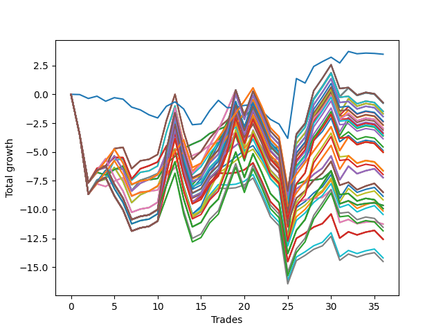

# Short Shepard 007 
- Symbol: NVDA_Unlimited
- Date Range: 02/08/2022 - 07/08/2022
- Trading Period: 7:20-12:30
- Number of Trades: 36



| Name | Win Percent | Profit | Avg Profit / Trade | Avg Time / Trade |      | Name | Win Percent | Profit | Avg Profit / Trade | Avg Time / Trade |
| ---- | ----------- | ------ | ------------------ | ---------------- | ---- | ---- | ----------- | ------ | ------------------ | ---------------- |
| Sorted By <br> Profit | | | | | | Sorted By <br> Win Percentage ||||
| Seventy-Three | 44.44 | 1740.00 | 48.33 | 05:55 |     | Sixty-Four | 72.22 | -4820.00 | -133.89 | 08:28 |
| One Hundred Thirty | 55.56 | -360.00 | -10.00 | 28:50 |     | Fifty-Six | 72.22 | -4820.00 | -133.89 | 08:28 |
| One Hundred Twenty-Five | 55.56 | -360.00 | -10.00 | 28:50 |     | Zero | 72.22 | -4820.00 | -133.89 | 08:28 |
| Eighty-Five | 55.56 | -360.00 | -10.00 | 28:50 |     | Forty-Eight | 72.22 | -5630.00 | -156.39 | 08:02 |
| Sixty-Nine | 55.56 | -380.00 | -10.56 | 27:55 |     | Forty | 72.22 | -5630.00 | -156.39 | 08:02 |
| Sixty-One | 55.56 | -380.00 | -10.56 | 27:55 |     | One Hundred Twenty-Six | 63.89 | -2505.00 | -69.58 | 20:23 |
| Five | 55.56 | -380.00 | -10.56 | 27:55 |     | One Hundred Twenty-One | 63.89 | -2505.00 | -69.58 | 20:23 |
| Seventy-One | 55.56 | -740.00 | -20.56 | 29:16 |     | Eighty-One | 63.89 | -2505.00 | -69.58 | 20:23 |
| Sixty-Three | 55.56 | -740.00 | -20.56 | 29:16 |     | One Hundred Sixteen | 63.89 | -3315.00 | -92.08 | 19:56 |
| Seven | 55.56 | -740.00 | -20.56 | 29:16 |     | One Hundred Eleven | 63.89 | -3315.00 | -92.08 | 19:56 |
| Seventy | 55.56 | -845.00 | -23.47 | 27:30 |     | Sixty-Six | 63.89 | -3615.00 | -100.42 | 18:31 |
| Sixty-Two | 55.56 | -845.00 | -23.47 | 27:30 |     | Fifty-Eight | 63.89 | -3615.00 | -100.42 | 18:31 |
| Six | 55.56 | -845.00 | -23.47 | 27:30 |     | Two | 63.89 | -3615.00 | -100.42 | 18:31 |
| One Hundred Twenty-Nine | 55.56 | -965.00 | -26.81 | 28:38 |     | Sixty-Seven | 63.89 | -4250.00 | -118.06 | 20:52 |
| One Hundred Twenty-Four | 55.56 | -965.00 | -26.81 | 28:38 |     | Fifty-Nine | 63.89 | -4250.00 | -118.06 | 20:52 |
| Eighty-Four | 55.56 | -965.00 | -26.81 | 28:38 |     | Three | 63.89 | -4250.00 | -118.06 | 20:52 |
| One Hundred Fifteen | 55.56 | -1170.00 | -32.50 | 28:24 |     | Forty-Two | 63.89 | -4425.00 | -122.92 | 18:05 |
| Forty-Five | 55.56 | -1190.00 | -33.06 | 27:28 |     | Fifty | 63.89 | -4580.00 | -127.22 | 17:53 |
| One Hundred Twenty | 55.56 | -1325.00 | -36.81 | 28:13 |     | Forty-Three | 63.89 | -5060.00 | -140.56 | 20:26 |
| Fifty-Three | 55.56 | -1345.00 | -37.36 | 27:17 |     | Fifty-One | 63.89 | -5215.00 | -144.86 | 20:15 |
| Sixty-Eight | 55.56 | -1475.00 | -40.97 | 25:30 |     | Sixty-Five | 61.11 | -6290.00 | -174.72 | 14:12 |
| Sixty | 55.56 | -1475.00 | -40.97 | 25:30 |     | Fifty-Seven | 61.11 | -6290.00 | -174.72 | 14:12 |
| Four | 55.56 | -1475.00 | -40.97 | 25:30 |     | One | 61.11 | -6290.00 | -174.72 | 14:12 |
| Forty-Seven | 55.56 | -1550.00 | -43.06 | 28:50 |     | Forty-One | 61.11 | -7100.00 | -197.22 | 13:46 |
| Forty-Six | 55.56 | -1655.00 | -45.97 | 27:04 |     | Forty-Nine | 61.11 | -7255.00 | -201.53 | 13:34 |
| Fifty-Five | 55.56 | -1705.00 | -47.36 | 28:39 |     | One Hundred Thirty | 55.56 | -360.00 | -10.00 | 28:50 |
| One Hundred Fourteen | 55.56 | -1775.00 | -49.31 | 28:12 |     | One Hundred Twenty-Five | 55.56 | -360.00 | -10.00 | 28:50 |
| Fifty-Four | 55.56 | -1810.00 | -50.28 | 26:52 |     | Eighty-Five | 55.56 | -360.00 | -10.00 | 28:50 |
| One Hundred Ninteen | 55.56 | -1930.00 | -53.61 | 28:00 |     | Sixty-Nine | 55.56 | -380.00 | -10.56 | 27:55 |
| Forty-Four | 55.56 | -2285.00 | -63.47 | 25:03 |     | Sixty-One | 55.56 | -380.00 | -10.56 | 27:55 |
| Fifty-Two | 55.56 | -2440.00 | -67.78 | 24:52 |     | Five | 55.56 | -380.00 | -10.56 | 27:55 |
| One Hundred Twenty-Six | 63.89 | -2505.00 | -69.58 | 20:23 |     | Seventy-One | 55.56 | -740.00 | -20.56 | 29:16 |
| One Hundred Twenty-One | 63.89 | -2505.00 | -69.58 | 20:23 |     | Sixty-Three | 55.56 | -740.00 | -20.56 | 29:16 |
| Eighty-One | 63.89 | -2505.00 | -69.58 | 20:23 |     | Seven | 55.56 | -740.00 | -20.56 | 29:16 |
| One Hundred Twenty-Eight | 55.56 | -2515.00 | -69.86 | 28:21 |     | Seventy | 55.56 | -845.00 | -23.47 | 27:30 |
| One Hundred Twenty-Three | 55.56 | -2515.00 | -69.86 | 28:21 |     | Sixty-Two | 55.56 | -845.00 | -23.47 | 27:30 |
| Eighty-Three | 55.56 | -2515.00 | -69.86 | 28:21 |     | Six | 55.56 | -845.00 | -23.47 | 27:30 |
| One Hundred Sixteen | 63.89 | -3315.00 | -92.08 | 19:56 |     | One Hundred Twenty-Nine | 55.56 | -965.00 | -26.81 | 28:38 |
| One Hundred Eleven | 63.89 | -3315.00 | -92.08 | 19:56 |     | One Hundred Twenty-Four | 55.56 | -965.00 | -26.81 | 28:38 |
| One Hundred Thirteen | 55.56 | -3325.00 | -92.36 | 27:55 |     | Eighty-Four | 55.56 | -965.00 | -26.81 | 28:38 |
| One Hundred Eighteen | 55.56 | -3480.00 | -96.67 | 27:43 |     | One Hundred Fifteen | 55.56 | -1170.00 | -32.50 | 28:24 |
| Sixty-Six | 63.89 | -3615.00 | -100.42 | 18:31 |     | Forty-Five | 55.56 | -1190.00 | -33.06 | 27:28 |
| Fifty-Eight | 63.89 | -3615.00 | -100.42 | 18:31 |     | One Hundred Twenty | 55.56 | -1325.00 | -36.81 | 28:13 |
| Two | 63.89 | -3615.00 | -100.42 | 18:31 |     | Fifty-Three | 55.56 | -1345.00 | -37.36 | 27:17 |
| Sixty-Seven | 63.89 | -4250.00 | -118.06 | 20:52 |     | Sixty-Eight | 55.56 | -1475.00 | -40.97 | 25:30 |
| Fifty-Nine | 63.89 | -4250.00 | -118.06 | 20:52 |     | Sixty | 55.56 | -1475.00 | -40.97 | 25:30 |
| Three | 63.89 | -4250.00 | -118.06 | 20:52 |     | Four | 55.56 | -1475.00 | -40.97 | 25:30 |
| Forty-Two | 63.89 | -4425.00 | -122.92 | 18:05 |     | Forty-Seven | 55.56 | -1550.00 | -43.06 | 28:50 |
| Fifty | 63.89 | -4580.00 | -127.22 | 17:53 |     | Forty-Six | 55.56 | -1655.00 | -45.97 | 27:04 |
| Sixty-Four | 72.22 | -4820.00 | -133.89 | 08:28 |     | Fifty-Five | 55.56 | -1705.00 | -47.36 | 28:39 |
| Fifty-Six | 72.22 | -4820.00 | -133.89 | 08:28 |     | One Hundred Fourteen | 55.56 | -1775.00 | -49.31 | 28:12 |
| Zero | 72.22 | -4820.00 | -133.89 | 08:28 |     | Fifty-Four | 55.56 | -1810.00 | -50.28 | 26:52 |
| One Hundred Twenty-Seven | 55.56 | -4960.00 | -137.78 | 27:30 |     | One Hundred Ninteen | 55.56 | -1930.00 | -53.61 | 28:00 |
| One Hundred Twenty-Two | 55.56 | -4960.00 | -137.78 | 27:30 |     | Forty-Four | 55.56 | -2285.00 | -63.47 | 25:03 |
| Eighty-Two | 55.56 | -4960.00 | -137.78 | 27:30 |     | Fifty-Two | 55.56 | -2440.00 | -67.78 | 24:52 |
| Forty-Three | 63.89 | -5060.00 | -140.56 | 20:26 |     | One Hundred Twenty-Eight | 55.56 | -2515.00 | -69.86 | 28:21 |
| Fifty-One | 63.89 | -5215.00 | -144.86 | 20:15 |     | One Hundred Twenty-Three | 55.56 | -2515.00 | -69.86 | 28:21 |
| Forty-Eight | 72.22 | -5630.00 | -156.39 | 08:02 |     | Eighty-Three | 55.56 | -2515.00 | -69.86 | 28:21 |
| Forty | 72.22 | -5630.00 | -156.39 | 08:02 |     | One Hundred Thirteen | 55.56 | -3325.00 | -92.36 | 27:55 |
| One Hundred Twelve | 55.56 | -5770.00 | -160.28 | 27:03 |     | One Hundred Eighteen | 55.56 | -3480.00 | -96.67 | 27:43 |
| One Hundred Seventeen | 55.56 | -5925.00 | -164.58 | 26:52 |     | One Hundred Twenty-Seven | 55.56 | -4960.00 | -137.78 | 27:30 |
| Sixty-Five | 61.11 | -6290.00 | -174.72 | 14:12 |     | One Hundred Twenty-Two | 55.56 | -4960.00 | -137.78 | 27:30 |
| Fifty-Seven | 61.11 | -6290.00 | -174.72 | 14:12 |     | Eighty-Two | 55.56 | -4960.00 | -137.78 | 27:30 |
| One | 61.11 | -6290.00 | -174.72 | 14:12 |     | One Hundred Twelve | 55.56 | -5770.00 | -160.28 | 27:03 |
| Forty-One | 61.11 | -7100.00 | -197.22 | 13:46 |     | One Hundred Seventeen | 55.56 | -5925.00 | -164.58 | 26:52 |
| Forty-Nine | 61.11 | -7255.00 | -201.53 | 13:34 |     | Seventy-Three | 44.44 | 1740.00 | 48.33 | 05:55 |

## NO STOPLOSS

### Test Zero
* Sell when price hits the middle line of the 20p bollinger
* No Stoploss
* Results:
```
Total Trades: 36
Percent Up: 27.78
Percent Down: 72.22
Total Points Moved Down: -9.64
Potential Profit: -4820.00
Total Points Ups: 20.75 Count Ups: 10
Total Points Downs: 11.11 Count Downs: 26
```

<details><summary>Trades</summary>

<code>In: 2022-02-09 07:39:00		Out: 2022-02-09 08:08:55		Total Position Time: 29:55		Total Move Down: -3.49		Total to Date: -3.49</code> <br />
<code>In: 2022-02-09 07:46:00		Out: 2022-02-09 08:15:55		Total Position Time: 29:55		Total Move Down: -4.18		Total to Date: -7.67</code> <br />
<code>In: 2022-02-14 08:30:00		Out: 2022-02-14 08:32:55		Total Position Time: 02:55		Total Move Down: 0.90		Total to Date: -6.77</code> <br />
<code>In: 2022-02-16 07:48:00		Out: 2022-02-16 07:58:55		Total Position Time: 10:55		Total Move Down: -0.23		Total to Date: -7.00</code> <br />
<code>In: 2022-02-16 11:35:00		Out: 2022-02-16 11:41:05		Total Position Time: 06:05		Total Move Down: 0.47		Total to Date: -6.53</code> <br />
<code>In: 2022-02-16 12:12:00		Out: 2022-02-16 12:13:50		Total Position Time: 01:50		Total Move Down: 0.30		Total to Date: -6.23</code> <br />
<code>In: 2022-02-24 12:30:00		Out: 2022-02-24 12:44:05		Total Position Time: 14:05		Total Move Down: -1.62		Total to Date: -7.85</code> <br />
<code>In: 2022-02-28 07:47:00		Out: 2022-02-28 07:48:05		Total Position Time: 01:05		Total Move Down: 0.38		Total to Date: -7.47</code> <br />
<code>In: 2022-03-02 10:14:00		Out: 2022-03-02 10:24:00		Total Position Time: 10:00		Total Move Down: 0.05		Total to Date: -7.42</code> <br />
<code>In: 2022-03-02 10:17:00		Out: 2022-03-02 10:24:00		Total Position Time: 07:00		Total Move Down: 0.12		Total to Date: -7.30</code> <br />
<code>In: 2022-03-08 08:06:00		Out: 2022-03-08 08:12:40		Total Position Time: 06:40		Total Move Down: 1.27		Total to Date: -6.03</code> <br />
<code>In: 2022-03-08 08:07:00		Out: 2022-03-08 08:12:40		Total Position Time: 05:40		Total Move Down: 0.65		Total to Date: -5.38</code> <br />
<code>In: 2022-03-08 09:24:00		Out: 2022-03-08 09:25:40		Total Position Time: 01:40		Total Move Down: 0.70		Total to Date: -4.68</code> <br />
<code>In: 2022-03-08 09:51:00		Out: 2022-03-08 09:51:30		Total Position Time: 00:30		Total Move Down: 0.36		Total to Date: -4.32</code> <br />
<code>In: 2022-03-09 12:12:00		Out: 2022-03-09 12:15:30		Total Position Time: 03:30		Total Move Down: 0.33		Total to Date: -3.99</code> <br />
<code>In: 2022-03-10 11:59:00		Out: 2022-03-10 12:00:20		Total Position Time: 01:20		Total Move Down: 0.59		Total to Date: -3.40</code> <br />
<code>In: 2022-03-10 12:00:00		Out: 2022-03-10 12:00:20		Total Position Time: 00:20		Total Move Down: 0.34		Total to Date: -3.06</code> <br />
<code>In: 2022-03-30 07:27:00		Out: 2022-03-30 07:32:55		Total Position Time: 05:55		Total Move Down: 0.31		Total to Date: -2.75</code> <br />
<code>In: 2022-03-30 07:31:00		Out: 2022-03-30 07:32:55		Total Position Time: 01:55		Total Move Down: 0.42		Total to Date: -2.33</code> <br />
<code>In: 2022-03-31 07:23:00		Out: 2022-03-31 07:25:05		Total Position Time: 02:05		Total Move Down: 0.48		Total to Date: -1.85</code> <br />
<code>In: 2022-05-02 09:26:00		Out: 2022-05-02 09:31:20		Total Position Time: 05:20		Total Move Down: 0.50		Total to Date: -1.35</code> <br />
<code>In: 2022-05-02 12:17:00		Out: 2022-05-02 12:39:35		Total Position Time: 22:35		Total Move Down: -1.60		Total to Date: -2.95</code> <br />
<code>In: 2022-05-02 12:18:00		Out: 2022-05-02 12:39:35		Total Position Time: 21:35		Total Move Down: -1.80		Total to Date: -4.75</code> <br />
<code>In: 2022-05-03 10:24:00		Out: 2022-05-03 10:28:05		Total Position Time: 04:05		Total Move Down: 0.17		Total to Date: -4.58</code> <br />
<code>In: 2022-05-04 11:59:00		Out: 2022-05-04 12:28:55		Total Position Time: 29:55		Total Move Down: -4.42		Total to Date: -9.00</code> <br />
<code>In: 2022-05-06 08:26:00		Out: 2022-05-06 08:31:45		Total Position Time: 05:45		Total Move Down: 1.19		Total to Date: -7.81</code> <br />
<code>In: 2022-06-07 07:52:00		Out: 2022-06-07 07:57:35		Total Position Time: 05:35		Total Move Down: 0.29		Total to Date: -7.52</code> <br />
<code>In: 2022-06-09 07:38:00		Out: 2022-06-09 07:42:05		Total Position Time: 04:05		Total Move Down: 0.08		Total to Date: -7.44</code> <br />
<code>In: 2022-06-22 11:22:00		Out: 2022-06-22 11:24:20		Total Position Time: 02:20		Total Move Down: 0.12		Total to Date: -7.32</code> <br />
<code>In: 2022-06-30 09:36:00		Out: 2022-06-30 09:38:00		Total Position Time: 02:00		Total Move Down: 0.64		Total to Date: -6.68</code> <br />
<code>In: 2022-07-05 07:23:00		Out: 2022-07-05 07:47:40		Total Position Time: 24:40		Total Move Down: -2.82		Total to Date: -9.50</code> <br />
<code>In: 2022-07-06 11:10:00		Out: 2022-07-06 11:10:10		Total Position Time: 00:10		Total Move Down: 0.26		Total to Date: -9.24</code> <br />
<code>In: 2022-07-07 08:53:00		Out: 2022-07-07 09:06:05		Total Position Time: 13:05		Total Move Down: -0.37		Total to Date: -9.61</code> <br />
<code>In: 2022-07-07 09:37:00		Out: 2022-07-07 09:40:30		Total Position Time: 03:30		Total Move Down: 0.14		Total to Date: -9.47</code> <br />
<code>In: 2022-07-07 09:38:00		Out: 2022-07-07 09:40:30		Total Position Time: 02:30		Total Move Down: 0.05		Total to Date: -9.42</code> <br />
<code>In: 2022-07-07 10:50:00		Out: 2022-07-07 11:04:35		Total Position Time: 14:35		Total Move Down: -0.22		Total to Date: -9.64</code> <br />


</details>

### Test One
* Sell when the price hits the upper line of the 20p 1std bollinger
* No Stoploss
* Results:
```
Total Trades: 36
Percent Up: 38.89
Percent Down: 61.11
Total Points Moved Down: -12.58
Potential Profit: -6290.00
Total Points Ups: 26.92 Count Ups: 14
Total Points Downs: 14.34 Count Downs: 22
```

<details><summary>Trades</summary>

<code>In: 2022-02-09 07:39:00		Out: 2022-02-09 08:08:55		Total Position Time: 29:55		Total Move Down: -3.49		Total to Date: -3.49</code> <br />
<code>In: 2022-02-09 07:46:00		Out: 2022-02-09 08:15:55		Total Position Time: 29:55		Total Move Down: -4.18		Total to Date: -7.67</code> <br />
<code>In: 2022-02-14 08:30:00		Out: 2022-02-14 08:34:20		Total Position Time: 04:20		Total Move Down: 1.25		Total to Date: -6.42</code> <br />
<code>In: 2022-02-16 07:48:00		Out: 2022-02-16 08:00:25		Total Position Time: 12:25		Total Move Down: 0.23		Total to Date: -6.19</code> <br />
<code>In: 2022-02-16 11:35:00		Out: 2022-02-16 11:44:10		Total Position Time: 09:10		Total Move Down: 0.71		Total to Date: -5.48</code> <br />
<code>In: 2022-02-16 12:12:00		Out: 2022-02-16 12:21:05		Total Position Time: 09:05		Total Move Down: -0.01		Total to Date: -5.49</code> <br />
<code>In: 2022-02-24 12:30:00		Out: 2022-02-24 12:46:00		Total Position Time: 16:00		Total Move Down: -1.85		Total to Date: -7.34</code> <br />
<code>In: 2022-02-28 07:47:00		Out: 2022-02-28 07:50:05		Total Position Time: 03:05		Total Move Down: 0.88		Total to Date: -6.46</code> <br />
<code>In: 2022-03-02 10:14:00		Out: 2022-03-02 10:25:20		Total Position Time: 11:20		Total Move Down: 0.26		Total to Date: -6.20</code> <br />
<code>In: 2022-03-02 10:17:00		Out: 2022-03-02 10:25:20		Total Position Time: 08:20		Total Move Down: 0.33		Total to Date: -5.87</code> <br />
<code>In: 2022-03-08 08:06:00		Out: 2022-03-08 08:14:35		Total Position Time: 08:35		Total Move Down: 1.38		Total to Date: -4.49</code> <br />
<code>In: 2022-03-08 08:07:00		Out: 2022-03-08 08:14:35		Total Position Time: 07:35		Total Move Down: 0.76		Total to Date: -3.73</code> <br />
<code>In: 2022-03-08 09:24:00		Out: 2022-03-08 09:53:55		Total Position Time: 29:55		Total Move Down: -3.24		Total to Date: -6.97</code> <br />
<code>In: 2022-03-08 09:51:00		Out: 2022-03-08 10:20:55		Total Position Time: 29:55		Total Move Down: -2.41		Total to Date: -9.38</code> <br />
<code>In: 2022-03-09 12:12:00		Out: 2022-03-09 12:18:30		Total Position Time: 06:30		Total Move Down: 0.50		Total to Date: -8.88</code> <br />
<code>In: 2022-03-10 11:59:00		Out: 2022-03-10 12:01:15		Total Position Time: 02:15		Total Move Down: 1.15		Total to Date: -7.73</code> <br />
<code>In: 2022-03-10 12:00:00		Out: 2022-03-10 12:01:15		Total Position Time: 01:15		Total Move Down: 0.90		Total to Date: -6.83</code> <br />
<code>In: 2022-03-30 07:27:00		Out: 2022-03-30 07:44:50		Total Position Time: 17:50		Total Move Down: -0.04		Total to Date: -6.87</code> <br />
<code>In: 2022-03-30 07:31:00		Out: 2022-03-30 07:44:50		Total Position Time: 13:50		Total Move Down: 0.07		Total to Date: -6.80</code> <br />
<code>In: 2022-03-31 07:23:00		Out: 2022-03-31 07:33:30		Total Position Time: 10:30		Total Move Down: 0.25		Total to Date: -6.55</code> <br />
<code>In: 2022-05-02 09:26:00		Out: 2022-05-02 09:35:45		Total Position Time: 09:45		Total Move Down: 0.60		Total to Date: -5.95</code> <br />
<code>In: 2022-05-02 12:17:00		Out: 2022-05-02 12:44:10		Total Position Time: 27:10		Total Move Down: -1.58		Total to Date: -7.53</code> <br />
<code>In: 2022-05-02 12:18:00		Out: 2022-05-02 12:44:10		Total Position Time: 26:10		Total Move Down: -1.78		Total to Date: -9.31</code> <br />
<code>In: 2022-05-03 10:24:00		Out: 2022-05-03 10:53:55		Total Position Time: 29:55		Total Move Down: -0.79		Total to Date: -10.10</code> <br />
<code>In: 2022-05-04 11:59:00		Out: 2022-05-04 12:28:55		Total Position Time: 29:55		Total Move Down: -4.42		Total to Date: -14.52</code> <br />
<code>In: 2022-05-06 08:26:00		Out: 2022-05-06 08:33:10		Total Position Time: 07:10		Total Move Down: 2.02		Total to Date: -12.50</code> <br />
<code>In: 2022-06-07 07:52:00		Out: 2022-06-07 08:04:45		Total Position Time: 12:45		Total Move Down: 0.45		Total to Date: -12.05</code> <br />
<code>In: 2022-06-09 07:38:00		Out: 2022-06-09 07:45:30		Total Position Time: 07:30		Total Move Down: 0.53		Total to Date: -11.52</code> <br />
<code>In: 2022-06-22 11:22:00		Out: 2022-06-22 11:26:10		Total Position Time: 04:10		Total Move Down: 0.30		Total to Date: -11.22</code> <br />
<code>In: 2022-06-30 09:36:00		Out: 2022-06-30 09:42:40		Total Position Time: 06:40		Total Move Down: 0.83		Total to Date: -10.39</code> <br />
<code>In: 2022-07-05 07:23:00		Out: 2022-07-05 07:50:35		Total Position Time: 27:35		Total Move Down: -2.09		Total to Date: -12.48</code> <br />
<code>In: 2022-07-06 11:10:00		Out: 2022-07-06 11:11:10		Total Position Time: 01:10		Total Move Down: 0.55		Total to Date: -11.93</code> <br />
<code>In: 2022-07-07 08:53:00		Out: 2022-07-07 09:13:45		Total Position Time: 20:45		Total Move Down: -0.27		Total to Date: -12.20</code> <br />
<code>In: 2022-07-07 09:37:00		Out: 2022-07-07 09:42:05		Total Position Time: 05:05		Total Move Down: 0.24		Total to Date: -11.96</code> <br />
<code>In: 2022-07-07 09:38:00		Out: 2022-07-07 09:42:05		Total Position Time: 04:05		Total Move Down: 0.15		Total to Date: -11.81</code> <br />
<code>In: 2022-07-07 10:50:00		Out: 2022-07-07 11:19:55		Total Position Time: 29:55		Total Move Down: -0.77		Total to Date: -12.58</code> <br />


</details>

### Test Two
* Sell when the price hits the upper line of the 20p 2std bollinger
* No Stoploss
* Results:
```
Total Trades: 36
Percent Up: 36.11
Percent Down: 63.89
Total Points Moved Down: -7.23
Potential Profit: -3615.00
Total Points Ups: 27.62 Count Ups: 13
Total Points Downs: 20.39 Count Downs: 23
```

<details><summary>Trades</summary>

<code>In: 2022-02-09 07:39:00		Out: 2022-02-09 08:08:55		Total Position Time: 29:55		Total Move Down: -3.49		Total to Date: -3.49</code> <br />
<code>In: 2022-02-09 07:46:00		Out: 2022-02-09 08:15:55		Total Position Time: 29:55		Total Move Down: -4.18		Total to Date: -7.67</code> <br />
<code>In: 2022-02-14 08:30:00		Out: 2022-02-14 08:38:55		Total Position Time: 08:55		Total Move Down: 1.09		Total to Date: -6.58</code> <br />
<code>In: 2022-02-16 07:48:00		Out: 2022-02-16 08:05:15		Total Position Time: 17:15		Total Move Down: 0.22		Total to Date: -6.36</code> <br />
<code>In: 2022-02-16 11:35:00		Out: 2022-02-16 11:48:00		Total Position Time: 13:00		Total Move Down: 1.02		Total to Date: -5.34</code> <br />
<code>In: 2022-02-16 12:12:00		Out: 2022-02-16 12:41:55		Total Position Time: 29:55		Total Move Down: -1.21		Total to Date: -6.55</code> <br />
<code>In: 2022-02-24 12:30:00		Out: 2022-02-24 12:46:00		Total Position Time: 16:00		Total Move Down: -1.85		Total to Date: -8.40</code> <br />
<code>In: 2022-02-28 07:47:00		Out: 2022-02-28 08:10:50		Total Position Time: 23:50		Total Move Down: 0.68		Total to Date: -7.72</code> <br />
<code>In: 2022-03-02 10:14:00		Out: 2022-03-02 10:25:40		Total Position Time: 11:40		Total Move Down: 0.33		Total to Date: -7.39</code> <br />
<code>In: 2022-03-02 10:17:00		Out: 2022-03-02 10:25:40		Total Position Time: 08:40		Total Move Down: 0.40		Total to Date: -6.99</code> <br />
<code>In: 2022-03-08 08:06:00		Out: 2022-03-08 08:21:10		Total Position Time: 15:10		Total Move Down: 1.93		Total to Date: -5.06</code> <br />
<code>In: 2022-03-08 08:07:00		Out: 2022-03-08 08:21:10		Total Position Time: 14:10		Total Move Down: 1.31		Total to Date: -3.75</code> <br />
<code>In: 2022-03-08 09:24:00		Out: 2022-03-08 09:53:55		Total Position Time: 29:55		Total Move Down: -3.24		Total to Date: -6.99</code> <br />
<code>In: 2022-03-08 09:51:00		Out: 2022-03-08 10:20:55		Total Position Time: 29:55		Total Move Down: -2.41		Total to Date: -9.40</code> <br />
<code>In: 2022-03-09 12:12:00		Out: 2022-03-09 12:26:25		Total Position Time: 14:25		Total Move Down: 0.68		Total to Date: -8.72</code> <br />
<code>In: 2022-03-10 11:59:00		Out: 2022-03-10 12:04:45		Total Position Time: 05:45		Total Move Down: 1.72		Total to Date: -7.00</code> <br />
<code>In: 2022-03-10 12:00:00		Out: 2022-03-10 12:04:45		Total Position Time: 04:45		Total Move Down: 1.47		Total to Date: -5.53</code> <br />
<code>In: 2022-03-30 07:27:00		Out: 2022-03-30 07:50:15		Total Position Time: 23:15		Total Move Down: 0.49		Total to Date: -5.04</code> <br />
<code>In: 2022-03-30 07:31:00		Out: 2022-03-30 07:50:15		Total Position Time: 19:15		Total Move Down: 0.60		Total to Date: -4.44</code> <br />
<code>In: 2022-03-31 07:23:00		Out: 2022-03-31 07:41:15		Total Position Time: 18:15		Total Move Down: 0.57		Total to Date: -3.87</code> <br />
<code>In: 2022-05-02 09:26:00		Out: 2022-05-02 09:39:20		Total Position Time: 13:20		Total Move Down: 0.42		Total to Date: -3.45</code> <br />
<code>In: 2022-05-02 12:17:00		Out: 2022-05-02 12:45:05		Total Position Time: 28:05		Total Move Down: -1.17		Total to Date: -4.62</code> <br />
<code>In: 2022-05-02 12:18:00		Out: 2022-05-02 12:45:05		Total Position Time: 27:05		Total Move Down: -1.37		Total to Date: -5.99</code> <br />
<code>In: 2022-05-03 10:24:00		Out: 2022-05-03 10:53:55		Total Position Time: 29:55		Total Move Down: -0.79		Total to Date: -6.78</code> <br />
<code>In: 2022-05-04 11:59:00		Out: 2022-05-04 12:28:55		Total Position Time: 29:55		Total Move Down: -4.42		Total to Date: -11.20</code> <br />
<code>In: 2022-05-06 08:26:00		Out: 2022-05-06 08:34:35		Total Position Time: 08:35		Total Move Down: 2.99		Total to Date: -8.21</code> <br />
<code>In: 2022-06-07 07:52:00		Out: 2022-06-07 08:05:10		Total Position Time: 13:10		Total Move Down: 0.52		Total to Date: -7.69</code> <br />
<code>In: 2022-06-09 07:38:00		Out: 2022-06-09 07:46:30		Total Position Time: 08:30		Total Move Down: 0.75		Total to Date: -6.94</code> <br />
<code>In: 2022-06-22 11:22:00		Out: 2022-06-22 11:29:20		Total Position Time: 07:20		Total Move Down: 0.53		Total to Date: -6.41</code> <br />
<code>In: 2022-06-30 09:36:00		Out: 2022-06-30 09:56:10		Total Position Time: 20:10		Total Move Down: 1.06		Total to Date: -5.35</code> <br />
<code>In: 2022-07-05 07:23:00		Out: 2022-07-05 07:52:55		Total Position Time: 29:55		Total Move Down: -2.07		Total to Date: -7.42</code> <br />
<code>In: 2022-07-06 11:10:00		Out: 2022-07-06 11:12:15		Total Position Time: 02:15		Total Move Down: 1.18		Total to Date: -6.24</code> <br />
<code>In: 2022-07-07 08:53:00		Out: 2022-07-07 09:22:55		Total Position Time: 29:55		Total Move Down: -0.65		Total to Date: -6.89</code> <br />
<code>In: 2022-07-07 09:37:00		Out: 2022-07-07 09:50:00		Total Position Time: 13:00		Total Move Down: 0.26		Total to Date: -6.63</code> <br />
<code>In: 2022-07-07 09:38:00		Out: 2022-07-07 09:50:00		Total Position Time: 12:00		Total Move Down: 0.17		Total to Date: -6.46</code> <br />
<code>In: 2022-07-07 10:50:00		Out: 2022-07-07 11:19:55		Total Position Time: 29:55		Total Move Down: -0.77		Total to Date: -7.23</code> <br />


</details>

### Test Three
* Sell when price hits the middle line of the 50p bollinger
* No Stoploss
* Results:
```
Total Trades: 36
Percent Up: 36.11
Percent Down: 63.89
Total Points Moved Down: -8.50
Potential Profit: -4250.00
Total Points Ups: 29.53 Count Ups: 13
Total Points Downs: 21.03 Count Downs: 23
```

<details><summary>Trades</summary>

<code>In: 2022-02-09 07:39:00		Out: 2022-02-09 08:08:55		Total Position Time: 29:55		Total Move Down: -3.49		Total to Date: -3.49</code> <br />
<code>In: 2022-02-09 07:46:00		Out: 2022-02-09 08:15:55		Total Position Time: 29:55		Total Move Down: -4.18		Total to Date: -7.67</code> <br />
<code>In: 2022-02-14 08:30:00		Out: 2022-02-14 08:52:15		Total Position Time: 22:15		Total Move Down: 1.14		Total to Date: -6.53</code> <br />
<code>In: 2022-02-16 07:48:00		Out: 2022-02-16 08:12:25		Total Position Time: 24:25		Total Move Down: 0.25		Total to Date: -6.28</code> <br />
<code>In: 2022-02-16 11:35:00		Out: 2022-02-16 11:53:45		Total Position Time: 18:45		Total Move Down: 1.57		Total to Date: -4.71</code> <br />
<code>In: 2022-02-16 12:12:00		Out: 2022-02-16 12:34:05		Total Position Time: 22:05		Total Move Down: 0.11		Total to Date: -4.60</code> <br />
<code>In: 2022-02-24 12:30:00		Out: 2022-02-24 12:46:00		Total Position Time: 16:00		Total Move Down: -1.85		Total to Date: -6.45</code> <br />
<code>In: 2022-02-28 07:47:00		Out: 2022-02-28 08:10:50		Total Position Time: 23:50		Total Move Down: 0.68		Total to Date: -5.77</code> <br />
<code>In: 2022-03-02 10:14:00		Out: 2022-03-02 10:43:55		Total Position Time: 29:55		Total Move Down: 0.13		Total to Date: -5.64</code> <br />
<code>In: 2022-03-02 10:17:00		Out: 2022-03-02 10:45:35		Total Position Time: 28:35		Total Move Down: 0.42		Total to Date: -5.22</code> <br />
<code>In: 2022-03-08 08:06:00		Out: 2022-03-08 08:26:15		Total Position Time: 20:15		Total Move Down: 2.92		Total to Date: -2.30</code> <br />
<code>In: 2022-03-08 08:07:00		Out: 2022-03-08 08:26:15		Total Position Time: 19:15		Total Move Down: 2.30		Total to Date: -0.00</code> <br />
<code>In: 2022-03-08 09:24:00		Out: 2022-03-08 09:53:55		Total Position Time: 29:55		Total Move Down: -3.24		Total to Date: -3.24</code> <br />
<code>In: 2022-03-08 09:51:00		Out: 2022-03-08 10:20:55		Total Position Time: 29:55		Total Move Down: -2.41		Total to Date: -5.65</code> <br />
<code>In: 2022-03-09 12:12:00		Out: 2022-03-09 12:26:25		Total Position Time: 14:25		Total Move Down: 0.68		Total to Date: -4.97</code> <br />
<code>In: 2022-03-10 11:59:00		Out: 2022-03-10 12:01:15		Total Position Time: 02:15		Total Move Down: 1.15		Total to Date: -3.82</code> <br />
<code>In: 2022-03-10 12:00:00		Out: 2022-03-10 12:01:15		Total Position Time: 01:15		Total Move Down: 0.90		Total to Date: -2.92</code> <br />
<code>In: 2022-03-30 07:27:00		Out: 2022-03-30 07:51:55		Total Position Time: 24:55		Total Move Down: 0.65		Total to Date: -2.27</code> <br />
<code>In: 2022-03-30 07:31:00		Out: 2022-03-30 07:51:55		Total Position Time: 20:55		Total Move Down: 0.76		Total to Date: -1.51</code> <br />
<code>In: 2022-03-31 07:23:00		Out: 2022-03-31 07:52:55		Total Position Time: 29:55		Total Move Down: -2.20		Total to Date: -3.71</code> <br />
<code>In: 2022-05-02 09:26:00		Out: 2022-05-02 09:41:35		Total Position Time: 15:35		Total Move Down: 1.14		Total to Date: -2.57</code> <br />
<code>In: 2022-05-02 12:17:00		Out: 2022-05-02 12:46:00		Total Position Time: 29:00		Total Move Down: -1.63		Total to Date: -4.20</code> <br />
<code>In: 2022-05-02 12:18:00		Out: 2022-05-02 12:46:00		Total Position Time: 28:00		Total Move Down: -1.83		Total to Date: -6.03</code> <br />
<code>In: 2022-05-03 10:24:00		Out: 2022-05-03 10:53:55		Total Position Time: 29:55		Total Move Down: -0.79		Total to Date: -6.82</code> <br />
<code>In: 2022-05-04 11:59:00		Out: 2022-05-04 12:28:55		Total Position Time: 29:55		Total Move Down: -4.42		Total to Date: -11.24</code> <br />
<code>In: 2022-05-06 08:26:00		Out: 2022-05-06 08:33:25		Total Position Time: 07:25		Total Move Down: 2.23		Total to Date: -9.01</code> <br />
<code>In: 2022-06-07 07:52:00		Out: 2022-06-07 08:18:15		Total Position Time: 26:15		Total Move Down: 0.64		Total to Date: -8.37</code> <br />
<code>In: 2022-06-09 07:38:00		Out: 2022-06-09 07:47:00		Total Position Time: 09:00		Total Move Down: 0.92		Total to Date: -7.45</code> <br />
<code>In: 2022-06-22 11:22:00		Out: 2022-06-22 11:29:35		Total Position Time: 07:35		Total Move Down: 0.60		Total to Date: -6.85</code> <br />
<code>In: 2022-06-30 09:36:00		Out: 2022-06-30 09:51:05		Total Position Time: 15:05		Total Move Down: 1.03		Total to Date: -5.82</code> <br />
<code>In: 2022-07-05 07:23:00		Out: 2022-07-05 07:52:55		Total Position Time: 29:55		Total Move Down: -2.07		Total to Date: -7.89</code> <br />
<code>In: 2022-07-06 11:10:00		Out: 2022-07-06 11:10:10		Total Position Time: 00:10		Total Move Down: 0.26		Total to Date: -7.63</code> <br />
<code>In: 2022-07-07 08:53:00		Out: 2022-07-07 09:22:55		Total Position Time: 29:55		Total Move Down: -0.65		Total to Date: -8.28</code> <br />
<code>In: 2022-07-07 09:37:00		Out: 2022-07-07 09:50:10		Total Position Time: 13:10		Total Move Down: 0.32		Total to Date: -7.96</code> <br />
<code>In: 2022-07-07 09:38:00		Out: 2022-07-07 09:50:10		Total Position Time: 12:10		Total Move Down: 0.23		Total to Date: -7.73</code> <br />
<code>In: 2022-07-07 10:50:00		Out: 2022-07-07 11:19:55		Total Position Time: 29:55		Total Move Down: -0.77		Total to Date: -8.50</code> <br />


</details>

### Test Four
* Sell when the price hits the upper line of the 50p 1std bollinger
* No Stoploss
* Results:
```
Total Trades: 36
Percent Up: 44.44
Percent Down: 55.56
Total Points Moved Down: -2.95
Potential Profit: -1475.00
Total Points Ups: 32.45 Count Ups: 16
Total Points Downs: 29.50 Count Downs: 20
```

<details><summary>Trades</summary>

<code>In: 2022-02-09 07:39:00		Out: 2022-02-09 08:08:55		Total Position Time: 29:55		Total Move Down: -3.49		Total to Date: -3.49</code> <br />
<code>In: 2022-02-09 07:46:00		Out: 2022-02-09 08:15:55		Total Position Time: 29:55		Total Move Down: -4.18		Total to Date: -7.67</code> <br />
<code>In: 2022-02-14 08:30:00		Out: 2022-02-14 08:59:55		Total Position Time: 29:55		Total Move Down: 1.07		Total to Date: -6.60</code> <br />
<code>In: 2022-02-16 07:48:00		Out: 2022-02-16 08:15:05		Total Position Time: 27:05		Total Move Down: 1.01		Total to Date: -5.59</code> <br />
<code>In: 2022-02-16 11:35:00		Out: 2022-02-16 12:04:55		Total Position Time: 29:55		Total Move Down: -1.59		Total to Date: -7.18</code> <br />
<code>In: 2022-02-16 12:12:00		Out: 2022-02-16 12:41:55		Total Position Time: 29:55		Total Move Down: -1.21		Total to Date: -8.39</code> <br />
<code>In: 2022-02-24 12:30:00		Out: 2022-02-24 12:46:00		Total Position Time: 16:00		Total Move Down: -1.85		Total to Date: -10.24</code> <br />
<code>In: 2022-02-28 07:47:00		Out: 2022-02-28 08:16:55		Total Position Time: 29:55		Total Move Down: 0.28		Total to Date: -9.96</code> <br />
<code>In: 2022-03-02 10:14:00		Out: 2022-03-02 10:43:55		Total Position Time: 29:55		Total Move Down: 0.13		Total to Date: -9.83</code> <br />
<code>In: 2022-03-02 10:17:00		Out: 2022-03-02 10:46:55		Total Position Time: 29:55		Total Move Down: 0.46		Total to Date: -9.37</code> <br />
<code>In: 2022-03-08 08:06:00		Out: 2022-03-08 08:31:50		Total Position Time: 25:50		Total Move Down: 4.40		Total to Date: -4.97</code> <br />
<code>In: 2022-03-08 08:07:00		Out: 2022-03-08 08:31:50		Total Position Time: 24:50		Total Move Down: 3.78		Total to Date: -1.19</code> <br />
<code>In: 2022-03-08 09:24:00		Out: 2022-03-08 09:53:55		Total Position Time: 29:55		Total Move Down: -3.24		Total to Date: -4.43</code> <br />
<code>In: 2022-03-08 09:51:00		Out: 2022-03-08 10:20:55		Total Position Time: 29:55		Total Move Down: -2.41		Total to Date: -6.84</code> <br />
<code>In: 2022-03-09 12:12:00		Out: 2022-03-09 12:39:40		Total Position Time: 27:40		Total Move Down: 0.82		Total to Date: -6.02</code> <br />
<code>In: 2022-03-10 11:59:00		Out: 2022-03-10 12:04:50		Total Position Time: 05:50		Total Move Down: 1.60		Total to Date: -4.42</code> <br />
<code>In: 2022-03-10 12:00:00		Out: 2022-03-10 12:04:50		Total Position Time: 04:50		Total Move Down: 1.35		Total to Date: -3.07</code> <br />
<code>In: 2022-03-30 07:27:00		Out: 2022-03-30 07:56:20		Total Position Time: 29:20		Total Move Down: 1.67		Total to Date: -1.40</code> <br />
<code>In: 2022-03-30 07:31:00		Out: 2022-03-30 07:56:20		Total Position Time: 25:20		Total Move Down: 1.78		Total to Date: 0.38</code> <br />
<code>In: 2022-03-31 07:23:00		Out: 2022-03-31 07:52:55		Total Position Time: 29:55		Total Move Down: -2.20		Total to Date: -1.82</code> <br />
<code>In: 2022-05-02 09:26:00		Out: 2022-05-02 09:50:15		Total Position Time: 24:15		Total Move Down: 1.72		Total to Date: -0.10</code> <br />
<code>In: 2022-05-02 12:17:00		Out: 2022-05-02 12:46:00		Total Position Time: 29:00		Total Move Down: -1.63		Total to Date: -1.73</code> <br />
<code>In: 2022-05-02 12:18:00		Out: 2022-05-02 12:46:00		Total Position Time: 28:00		Total Move Down: -1.83		Total to Date: -3.56</code> <br />
<code>In: 2022-05-03 10:24:00		Out: 2022-05-03 10:53:55		Total Position Time: 29:55		Total Move Down: -0.79		Total to Date: -4.35</code> <br />
<code>In: 2022-05-04 11:59:00		Out: 2022-05-04 12:28:55		Total Position Time: 29:55		Total Move Down: -4.42		Total to Date: -8.77</code> <br />
<code>In: 2022-05-06 08:26:00		Out: 2022-05-06 08:36:10		Total Position Time: 10:10		Total Move Down: 4.09		Total to Date: -4.68</code> <br />
<code>In: 2022-06-07 07:52:00		Out: 2022-06-07 08:21:55		Total Position Time: 29:55		Total Move Down: 0.93		Total to Date: -3.75</code> <br />
<code>In: 2022-06-09 07:38:00		Out: 2022-06-09 07:52:30		Total Position Time: 14:30		Total Move Down: 1.66		Total to Date: -2.09</code> <br />
<code>In: 2022-06-22 11:22:00		Out: 2022-06-22 11:48:00		Total Position Time: 26:00		Total Move Down: 0.80		Total to Date: -1.29</code> <br />
<code>In: 2022-06-30 09:36:00		Out: 2022-06-30 10:05:55		Total Position Time: 29:55		Total Move Down: 1.17		Total to Date: -0.12</code> <br />
<code>In: 2022-07-05 07:23:00		Out: 2022-07-05 07:52:55		Total Position Time: 29:55		Total Move Down: -2.07		Total to Date: -2.19</code> <br />
<code>In: 2022-07-06 11:10:00		Out: 2022-07-06 11:11:10		Total Position Time: 01:10		Total Move Down: 0.55		Total to Date: -1.64</code> <br />
<code>In: 2022-07-07 08:53:00		Out: 2022-07-07 09:22:55		Total Position Time: 29:55		Total Move Down: -0.65		Total to Date: -2.29</code> <br />
<code>In: 2022-07-07 09:37:00		Out: 2022-07-07 10:06:55		Total Position Time: 29:55		Total Move Down: 0.23		Total to Date: -2.06</code> <br />
<code>In: 2022-07-07 09:38:00		Out: 2022-07-07 10:07:55		Total Position Time: 29:55		Total Move Down: -0.12		Total to Date: -2.18</code> <br />
<code>In: 2022-07-07 10:50:00		Out: 2022-07-07 11:19:55		Total Position Time: 29:55		Total Move Down: -0.77		Total to Date: -2.95</code> <br />


</details>

### Test Five
* Sell when the price hits the upper line of the 50p 2std bollinger
* No Stoploss
* Results:
```
Total Trades: 36
Percent Up: 44.44
Percent Down: 55.56
Total Points Moved Down: -0.76
Potential Profit: -380.00
Total Points Ups: 32.45 Count Ups: 16
Total Points Downs: 31.69 Count Downs: 20
```

<details><summary>Trades</summary>

<code>In: 2022-02-09 07:39:00		Out: 2022-02-09 08:08:55		Total Position Time: 29:55		Total Move Down: -3.49		Total to Date: -3.49</code> <br />
<code>In: 2022-02-09 07:46:00		Out: 2022-02-09 08:15:55		Total Position Time: 29:55		Total Move Down: -4.18		Total to Date: -7.67</code> <br />
<code>In: 2022-02-14 08:30:00		Out: 2022-02-14 08:59:55		Total Position Time: 29:55		Total Move Down: 1.07		Total to Date: -6.60</code> <br />
<code>In: 2022-02-16 07:48:00		Out: 2022-02-16 08:17:55		Total Position Time: 29:55		Total Move Down: 0.38		Total to Date: -6.22</code> <br />
<code>In: 2022-02-16 11:35:00		Out: 2022-02-16 12:04:55		Total Position Time: 29:55		Total Move Down: -1.59		Total to Date: -7.81</code> <br />
<code>In: 2022-02-16 12:12:00		Out: 2022-02-16 12:41:55		Total Position Time: 29:55		Total Move Down: -1.21		Total to Date: -9.02</code> <br />
<code>In: 2022-02-24 12:30:00		Out: 2022-02-24 12:46:00		Total Position Time: 16:00		Total Move Down: -1.85		Total to Date: -10.87</code> <br />
<code>In: 2022-02-28 07:47:00		Out: 2022-02-28 08:16:55		Total Position Time: 29:55		Total Move Down: 0.28		Total to Date: -10.59</code> <br />
<code>In: 2022-03-02 10:14:00		Out: 2022-03-02 10:43:55		Total Position Time: 29:55		Total Move Down: 0.13		Total to Date: -10.46</code> <br />
<code>In: 2022-03-02 10:17:00		Out: 2022-03-02 10:46:55		Total Position Time: 29:55		Total Move Down: 0.46		Total to Date: -10.00</code> <br />
<code>In: 2022-03-08 08:06:00		Out: 2022-03-08 08:35:55		Total Position Time: 29:55		Total Move Down: 4.43		Total to Date: -5.57</code> <br />
<code>In: 2022-03-08 08:07:00		Out: 2022-03-08 08:36:55		Total Position Time: 29:55		Total Move Down: 3.21		Total to Date: -2.36</code> <br />
<code>In: 2022-03-08 09:24:00		Out: 2022-03-08 09:53:55		Total Position Time: 29:55		Total Move Down: -3.24		Total to Date: -5.60</code> <br />
<code>In: 2022-03-08 09:51:00		Out: 2022-03-08 10:20:55		Total Position Time: 29:55		Total Move Down: -2.41		Total to Date: -8.01</code> <br />
<code>In: 2022-03-09 12:12:00		Out: 2022-03-09 12:41:55		Total Position Time: 29:55		Total Move Down: 0.38		Total to Date: -7.63</code> <br />
<code>In: 2022-03-10 11:59:00		Out: 2022-03-10 12:28:55		Total Position Time: 29:55		Total Move Down: 1.27		Total to Date: -6.36</code> <br />
<code>In: 2022-03-10 12:00:00		Out: 2022-03-10 12:29:55		Total Position Time: 29:55		Total Move Down: 0.76		Total to Date: -5.60</code> <br />
<code>In: 2022-03-30 07:27:00		Out: 2022-03-30 07:56:55		Total Position Time: 29:55		Total Move Down: 1.99		Total to Date: -3.61</code> <br />
<code>In: 2022-03-30 07:31:00		Out: 2022-03-30 07:58:40		Total Position Time: 27:40		Total Move Down: 2.87		Total to Date: -0.74</code> <br />
<code>In: 2022-03-31 07:23:00		Out: 2022-03-31 07:52:55		Total Position Time: 29:55		Total Move Down: -2.20		Total to Date: -2.94</code> <br />
<code>In: 2022-05-02 09:26:00		Out: 2022-05-02 09:55:30		Total Position Time: 29:30		Total Move Down: 2.46		Total to Date: -0.48</code> <br />
<code>In: 2022-05-02 12:17:00		Out: 2022-05-02 12:46:00		Total Position Time: 29:00		Total Move Down: -1.63		Total to Date: -2.11</code> <br />
<code>In: 2022-05-02 12:18:00		Out: 2022-05-02 12:46:00		Total Position Time: 28:00		Total Move Down: -1.83		Total to Date: -3.94</code> <br />
<code>In: 2022-05-03 10:24:00		Out: 2022-05-03 10:53:55		Total Position Time: 29:55		Total Move Down: -0.79		Total to Date: -4.73</code> <br />
<code>In: 2022-05-04 11:59:00		Out: 2022-05-04 12:28:55		Total Position Time: 29:55		Total Move Down: -4.42		Total to Date: -9.15</code> <br />
<code>In: 2022-05-06 08:26:00		Out: 2022-05-06 08:39:40		Total Position Time: 13:40		Total Move Down: 5.65		Total to Date: -3.50</code> <br />
<code>In: 2022-06-07 07:52:00		Out: 2022-06-07 08:21:55		Total Position Time: 29:55		Total Move Down: 0.93		Total to Date: -2.57</code> <br />
<code>In: 2022-06-09 07:38:00		Out: 2022-06-09 08:02:05		Total Position Time: 24:05		Total Move Down: 2.20		Total to Date: -0.37</code> <br />
<code>In: 2022-06-22 11:22:00		Out: 2022-06-22 11:49:45		Total Position Time: 27:45		Total Move Down: 1.07		Total to Date: 0.70</code> <br />
<code>In: 2022-06-30 09:36:00		Out: 2022-06-30 10:05:55		Total Position Time: 29:55		Total Move Down: 1.17		Total to Date: 1.87</code> <br />
<code>In: 2022-07-05 07:23:00		Out: 2022-07-05 07:52:55		Total Position Time: 29:55		Total Move Down: -2.07		Total to Date: -0.20</code> <br />
<code>In: 2022-07-06 11:10:00		Out: 2022-07-06 11:11:45		Total Position Time: 01:45		Total Move Down: 0.75		Total to Date: 0.55</code> <br />
<code>In: 2022-07-07 08:53:00		Out: 2022-07-07 09:22:55		Total Position Time: 29:55		Total Move Down: -0.65		Total to Date: -0.10</code> <br />
<code>In: 2022-07-07 09:37:00		Out: 2022-07-07 10:06:55		Total Position Time: 29:55		Total Move Down: 0.23		Total to Date: 0.13</code> <br />
<code>In: 2022-07-07 09:38:00		Out: 2022-07-07 10:07:55		Total Position Time: 29:55		Total Move Down: -0.12		Total to Date: 0.01</code> <br />
<code>In: 2022-07-07 10:50:00		Out: 2022-07-07 11:19:55		Total Position Time: 29:55		Total Move Down: -0.77		Total to Date: -0.76</code> <br />


</details>

### Test Six
* Sell when the price hits the middle line of the 1std VWAP
* No Stoploss
* Results:
```
Total Trades: 36
Percent Up: 44.44
Percent Down: 55.56
Total Points Moved Down: -1.69
Potential Profit: -845.00
Total Points Ups: 32.45 Count Ups: 16
Total Points Downs: 30.76 Count Downs: 20
```

<details><summary>Trades</summary>

<code>In: 2022-02-09 07:39:00		Out: 2022-02-09 08:08:55		Total Position Time: 29:55		Total Move Down: -3.49		Total to Date: -3.49</code> <br />
<code>In: 2022-02-09 07:46:00		Out: 2022-02-09 08:15:55		Total Position Time: 29:55		Total Move Down: -4.18		Total to Date: -7.67</code> <br />
<code>In: 2022-02-14 08:30:00		Out: 2022-02-14 08:59:55		Total Position Time: 29:55		Total Move Down: 1.07		Total to Date: -6.60</code> <br />
<code>In: 2022-02-16 07:48:00		Out: 2022-02-16 08:17:55		Total Position Time: 29:55		Total Move Down: 0.38		Total to Date: -6.22</code> <br />
<code>In: 2022-02-16 11:35:00		Out: 2022-02-16 12:04:55		Total Position Time: 29:55		Total Move Down: -1.59		Total to Date: -7.81</code> <br />
<code>In: 2022-02-16 12:12:00		Out: 2022-02-16 12:41:55		Total Position Time: 29:55		Total Move Down: -1.21		Total to Date: -9.02</code> <br />
<code>In: 2022-02-24 12:30:00		Out: 2022-02-24 12:46:00		Total Position Time: 16:00		Total Move Down: -1.85		Total to Date: -10.87</code> <br />
<code>In: 2022-02-28 07:47:00		Out: 2022-02-28 08:16:55		Total Position Time: 29:55		Total Move Down: 0.28		Total to Date: -10.59</code> <br />
<code>In: 2022-03-02 10:14:00		Out: 2022-03-02 10:43:55		Total Position Time: 29:55		Total Move Down: 0.13		Total to Date: -10.46</code> <br />
<code>In: 2022-03-02 10:17:00		Out: 2022-03-02 10:46:55		Total Position Time: 29:55		Total Move Down: 0.46		Total to Date: -10.00</code> <br />
<code>In: 2022-03-08 08:06:00		Out: 2022-03-08 08:31:45		Total Position Time: 25:45		Total Move Down: 4.34		Total to Date: -5.66</code> <br />
<code>In: 2022-03-08 08:07:00		Out: 2022-03-08 08:31:45		Total Position Time: 24:45		Total Move Down: 3.72		Total to Date: -1.94</code> <br />
<code>In: 2022-03-08 09:24:00		Out: 2022-03-08 09:53:55		Total Position Time: 29:55		Total Move Down: -3.24		Total to Date: -5.18</code> <br />
<code>In: 2022-03-08 09:51:00		Out: 2022-03-08 10:20:55		Total Position Time: 29:55		Total Move Down: -2.41		Total to Date: -7.59</code> <br />
<code>In: 2022-03-09 12:12:00		Out: 2022-03-09 12:41:55		Total Position Time: 29:55		Total Move Down: 0.38		Total to Date: -7.21</code> <br />
<code>In: 2022-03-10 11:59:00		Out: 2022-03-10 12:28:55		Total Position Time: 29:55		Total Move Down: 1.27		Total to Date: -5.94</code> <br />
<code>In: 2022-03-10 12:00:00		Out: 2022-03-10 12:29:55		Total Position Time: 29:55		Total Move Down: 0.76		Total to Date: -5.18</code> <br />
<code>In: 2022-03-30 07:27:00		Out: 2022-03-30 07:54:30		Total Position Time: 27:30		Total Move Down: 1.40		Total to Date: -3.78</code> <br />
<code>In: 2022-03-30 07:31:00		Out: 2022-03-30 07:54:30		Total Position Time: 23:30		Total Move Down: 1.51		Total to Date: -2.27</code> <br />
<code>In: 2022-03-31 07:23:00		Out: 2022-03-31 07:52:55		Total Position Time: 29:55		Total Move Down: -2.20		Total to Date: -4.47</code> <br />
<code>In: 2022-05-02 09:26:00		Out: 2022-05-02 09:55:05		Total Position Time: 29:05		Total Move Down: 2.38		Total to Date: -2.09</code> <br />
<code>In: 2022-05-02 12:17:00		Out: 2022-05-02 12:46:00		Total Position Time: 29:00		Total Move Down: -1.63		Total to Date: -3.72</code> <br />
<code>In: 2022-05-02 12:18:00		Out: 2022-05-02 12:46:00		Total Position Time: 28:00		Total Move Down: -1.83		Total to Date: -5.55</code> <br />
<code>In: 2022-05-03 10:24:00		Out: 2022-05-03 10:53:55		Total Position Time: 29:55		Total Move Down: -0.79		Total to Date: -6.34</code> <br />
<code>In: 2022-05-04 11:59:00		Out: 2022-05-04 12:28:55		Total Position Time: 29:55		Total Move Down: -4.42		Total to Date: -10.76</code> <br />
<code>In: 2022-05-06 08:26:00		Out: 2022-05-06 08:48:20		Total Position Time: 22:20		Total Move Down: 6.48		Total to Date: -4.28</code> <br />
<code>In: 2022-06-07 07:52:00		Out: 2022-06-07 08:21:55		Total Position Time: 29:55		Total Move Down: 0.93		Total to Date: -3.35</code> <br />
<code>In: 2022-06-09 07:38:00		Out: 2022-06-09 07:52:10		Total Position Time: 14:10		Total Move Down: 1.52		Total to Date: -1.83</code> <br />
<code>In: 2022-06-22 11:22:00		Out: 2022-06-22 11:51:55		Total Position Time: 29:55		Total Move Down: 1.09		Total to Date: -0.74</code> <br />
<code>In: 2022-06-30 09:36:00		Out: 2022-06-30 10:05:55		Total Position Time: 29:55		Total Move Down: 1.17		Total to Date: 0.43</code> <br />
<code>In: 2022-07-05 07:23:00		Out: 2022-07-05 07:52:55		Total Position Time: 29:55		Total Move Down: -2.07		Total to Date: -1.64</code> <br />
<code>In: 2022-07-06 11:10:00		Out: 2022-07-06 11:12:20		Total Position Time: 02:20		Total Move Down: 1.26		Total to Date: -0.38</code> <br />
<code>In: 2022-07-07 08:53:00		Out: 2022-07-07 09:22:55		Total Position Time: 29:55		Total Move Down: -0.65		Total to Date: -1.03</code> <br />
<code>In: 2022-07-07 09:37:00		Out: 2022-07-07 10:06:55		Total Position Time: 29:55		Total Move Down: 0.23		Total to Date: -0.80</code> <br />
<code>In: 2022-07-07 09:38:00		Out: 2022-07-07 10:07:55		Total Position Time: 29:55		Total Move Down: -0.12		Total to Date: -0.92</code> <br />
<code>In: 2022-07-07 10:50:00		Out: 2022-07-07 11:19:55		Total Position Time: 29:55		Total Move Down: -0.77		Total to Date: -1.69</code> <br />


</details>

### Test Seven
* Sell when the price hits the upper line of the 1std VWAP
* No Stoploss
* Results:
```
Total Trades: 36
Percent Up: 44.44
Percent Down: 55.56
Total Points Moved Down: -1.48
Potential Profit: -740.00
Total Points Ups: 32.45 Count Ups: 16
Total Points Downs: 30.97 Count Downs: 20
```

<details><summary>Trades</summary>

<code>In: 2022-02-09 07:39:00		Out: 2022-02-09 08:08:55		Total Position Time: 29:55		Total Move Down: -3.49		Total to Date: -3.49</code> <br />
<code>In: 2022-02-09 07:46:00		Out: 2022-02-09 08:15:55		Total Position Time: 29:55		Total Move Down: -4.18		Total to Date: -7.67</code> <br />
<code>In: 2022-02-14 08:30:00		Out: 2022-02-14 08:59:55		Total Position Time: 29:55		Total Move Down: 1.07		Total to Date: -6.60</code> <br />
<code>In: 2022-02-16 07:48:00		Out: 2022-02-16 08:17:55		Total Position Time: 29:55		Total Move Down: 0.38		Total to Date: -6.22</code> <br />
<code>In: 2022-02-16 11:35:00		Out: 2022-02-16 12:04:55		Total Position Time: 29:55		Total Move Down: -1.59		Total to Date: -7.81</code> <br />
<code>In: 2022-02-16 12:12:00		Out: 2022-02-16 12:41:55		Total Position Time: 29:55		Total Move Down: -1.21		Total to Date: -9.02</code> <br />
<code>In: 2022-02-24 12:30:00		Out: 2022-02-24 12:46:00		Total Position Time: 16:00		Total Move Down: -1.85		Total to Date: -10.87</code> <br />
<code>In: 2022-02-28 07:47:00		Out: 2022-02-28 08:16:55		Total Position Time: 29:55		Total Move Down: 0.28		Total to Date: -10.59</code> <br />
<code>In: 2022-03-02 10:14:00		Out: 2022-03-02 10:43:55		Total Position Time: 29:55		Total Move Down: 0.13		Total to Date: -10.46</code> <br />
<code>In: 2022-03-02 10:17:00		Out: 2022-03-02 10:46:55		Total Position Time: 29:55		Total Move Down: 0.46		Total to Date: -10.00</code> <br />
<code>In: 2022-03-08 08:06:00		Out: 2022-03-08 08:35:55		Total Position Time: 29:55		Total Move Down: 4.43		Total to Date: -5.57</code> <br />
<code>In: 2022-03-08 08:07:00		Out: 2022-03-08 08:36:55		Total Position Time: 29:55		Total Move Down: 3.21		Total to Date: -2.36</code> <br />
<code>In: 2022-03-08 09:24:00		Out: 2022-03-08 09:53:55		Total Position Time: 29:55		Total Move Down: -3.24		Total to Date: -5.60</code> <br />
<code>In: 2022-03-08 09:51:00		Out: 2022-03-08 10:20:55		Total Position Time: 29:55		Total Move Down: -2.41		Total to Date: -8.01</code> <br />
<code>In: 2022-03-09 12:12:00		Out: 2022-03-09 12:41:55		Total Position Time: 29:55		Total Move Down: 0.38		Total to Date: -7.63</code> <br />
<code>In: 2022-03-10 11:59:00		Out: 2022-03-10 12:28:55		Total Position Time: 29:55		Total Move Down: 1.27		Total to Date: -6.36</code> <br />
<code>In: 2022-03-10 12:00:00		Out: 2022-03-10 12:29:55		Total Position Time: 29:55		Total Move Down: 0.76		Total to Date: -5.60</code> <br />
<code>In: 2022-03-30 07:27:00		Out: 2022-03-30 07:56:55		Total Position Time: 29:55		Total Move Down: 1.99		Total to Date: -3.61</code> <br />
<code>In: 2022-03-30 07:31:00		Out: 2022-03-30 07:58:15		Total Position Time: 27:15		Total Move Down: 2.80		Total to Date: -0.81</code> <br />
<code>In: 2022-03-31 07:23:00		Out: 2022-03-31 07:52:55		Total Position Time: 29:55		Total Move Down: -2.20		Total to Date: -3.01</code> <br />
<code>In: 2022-05-02 09:26:00		Out: 2022-05-02 09:55:55		Total Position Time: 29:55		Total Move Down: 2.10		Total to Date: -0.91</code> <br />
<code>In: 2022-05-02 12:17:00		Out: 2022-05-02 12:46:00		Total Position Time: 29:00		Total Move Down: -1.63		Total to Date: -2.54</code> <br />
<code>In: 2022-05-02 12:18:00		Out: 2022-05-02 12:46:00		Total Position Time: 28:00		Total Move Down: -1.83		Total to Date: -4.37</code> <br />
<code>In: 2022-05-03 10:24:00		Out: 2022-05-03 10:53:55		Total Position Time: 29:55		Total Move Down: -0.79		Total to Date: -5.16</code> <br />
<code>In: 2022-05-04 11:59:00		Out: 2022-05-04 12:28:55		Total Position Time: 29:55		Total Move Down: -4.42		Total to Date: -9.58</code> <br />
<code>In: 2022-05-06 08:26:00		Out: 2022-05-06 08:55:55		Total Position Time: 29:55		Total Move Down: 5.78		Total to Date: -3.80</code> <br />
<code>In: 2022-06-07 07:52:00		Out: 2022-06-07 08:21:55		Total Position Time: 29:55		Total Move Down: 0.93		Total to Date: -2.87</code> <br />
<code>In: 2022-06-09 07:38:00		Out: 2022-06-09 08:04:30		Total Position Time: 26:30		Total Move Down: 2.42		Total to Date: -0.45</code> <br />
<code>In: 2022-06-22 11:22:00		Out: 2022-06-22 11:51:55		Total Position Time: 29:55		Total Move Down: 1.09		Total to Date: 0.64</code> <br />
<code>In: 2022-06-30 09:36:00		Out: 2022-06-30 10:05:55		Total Position Time: 29:55		Total Move Down: 1.17		Total to Date: 1.81</code> <br />
<code>In: 2022-07-05 07:23:00		Out: 2022-07-05 07:52:55		Total Position Time: 29:55		Total Move Down: -2.07		Total to Date: -0.26</code> <br />
<code>In: 2022-07-06 11:10:00		Out: 2022-07-06 11:39:55		Total Position Time: 29:55		Total Move Down: 0.09		Total to Date: -0.17</code> <br />
<code>In: 2022-07-07 08:53:00		Out: 2022-07-07 09:22:55		Total Position Time: 29:55		Total Move Down: -0.65		Total to Date: -0.82</code> <br />
<code>In: 2022-07-07 09:37:00		Out: 2022-07-07 10:06:55		Total Position Time: 29:55		Total Move Down: 0.23		Total to Date: -0.59</code> <br />
<code>In: 2022-07-07 09:38:00		Out: 2022-07-07 10:07:55		Total Position Time: 29:55		Total Move Down: -0.12		Total to Date: -0.71</code> <br />
<code>In: 2022-07-07 10:50:00		Out: 2022-07-07 11:19:55		Total Position Time: 29:55		Total Move Down: -0.77		Total to Date: -1.48</code> <br />


</details>

## STOPLOSS OF 5

### Test Forty
* Sell when price hits the middle line of the 20p bollinger
* Stoploss is -5 points
* Results:
```
Total Trades: 36
Percent Up: 27.78
Percent Down: 72.22
Total Points Moved Down: -11.26
Potential Profit: -5630.00
Total Points Ups: 22.37 Count Ups: 10
Total Points Downs: 11.11 Count Downs: 26
```

<details><summary>Trades</summary>

<code>In: 2022-02-09 07:39:00		Out: 2022-02-09 08:08:55		Total Position Time: 29:55		Total Move Down: -3.49		Total to Date: -3.49</code> <br />
<code>In: 2022-02-09 07:46:00		Out: 2022-02-09 08:12:10		Total Position Time: 26:10		Total Move Down: -5.18		Total to Date: -8.67</code> <br />
<code>In: 2022-02-14 08:30:00		Out: 2022-02-14 08:32:55		Total Position Time: 02:55		Total Move Down: 0.90		Total to Date: -7.77</code> <br />
<code>In: 2022-02-16 07:48:00		Out: 2022-02-16 07:58:55		Total Position Time: 10:55		Total Move Down: -0.23		Total to Date: -8.00</code> <br />
<code>In: 2022-02-16 11:35:00		Out: 2022-02-16 11:41:05		Total Position Time: 06:05		Total Move Down: 0.47		Total to Date: -7.53</code> <br />
<code>In: 2022-02-16 12:12:00		Out: 2022-02-16 12:13:50		Total Position Time: 01:50		Total Move Down: 0.30		Total to Date: -7.23</code> <br />
<code>In: 2022-02-24 12:30:00		Out: 2022-02-24 12:44:05		Total Position Time: 14:05		Total Move Down: -1.62		Total to Date: -8.85</code> <br />
<code>In: 2022-02-28 07:47:00		Out: 2022-02-28 07:48:05		Total Position Time: 01:05		Total Move Down: 0.38		Total to Date: -8.47</code> <br />
<code>In: 2022-03-02 10:14:00		Out: 2022-03-02 10:24:00		Total Position Time: 10:00		Total Move Down: 0.05		Total to Date: -8.42</code> <br />
<code>In: 2022-03-02 10:17:00		Out: 2022-03-02 10:24:00		Total Position Time: 07:00		Total Move Down: 0.12		Total to Date: -8.30</code> <br />
<code>In: 2022-03-08 08:06:00		Out: 2022-03-08 08:12:40		Total Position Time: 06:40		Total Move Down: 1.27		Total to Date: -7.03</code> <br />
<code>In: 2022-03-08 08:07:00		Out: 2022-03-08 08:12:40		Total Position Time: 05:40		Total Move Down: 0.65		Total to Date: -6.38</code> <br />
<code>In: 2022-03-08 09:24:00		Out: 2022-03-08 09:25:40		Total Position Time: 01:40		Total Move Down: 0.70		Total to Date: -5.68</code> <br />
<code>In: 2022-03-08 09:51:00		Out: 2022-03-08 09:51:30		Total Position Time: 00:30		Total Move Down: 0.36		Total to Date: -5.32</code> <br />
<code>In: 2022-03-09 12:12:00		Out: 2022-03-09 12:15:30		Total Position Time: 03:30		Total Move Down: 0.33		Total to Date: -4.99</code> <br />
<code>In: 2022-03-10 11:59:00		Out: 2022-03-10 12:00:20		Total Position Time: 01:20		Total Move Down: 0.59		Total to Date: -4.40</code> <br />
<code>In: 2022-03-10 12:00:00		Out: 2022-03-10 12:00:20		Total Position Time: 00:20		Total Move Down: 0.34		Total to Date: -4.06</code> <br />
<code>In: 2022-03-30 07:27:00		Out: 2022-03-30 07:32:55		Total Position Time: 05:55		Total Move Down: 0.31		Total to Date: -3.75</code> <br />
<code>In: 2022-03-30 07:31:00		Out: 2022-03-30 07:32:55		Total Position Time: 01:55		Total Move Down: 0.42		Total to Date: -3.33</code> <br />
<code>In: 2022-03-31 07:23:00		Out: 2022-03-31 07:25:05		Total Position Time: 02:05		Total Move Down: 0.48		Total to Date: -2.85</code> <br />
<code>In: 2022-05-02 09:26:00		Out: 2022-05-02 09:31:20		Total Position Time: 05:20		Total Move Down: 0.50		Total to Date: -2.35</code> <br />
<code>In: 2022-05-02 12:17:00		Out: 2022-05-02 12:39:35		Total Position Time: 22:35		Total Move Down: -1.60		Total to Date: -3.95</code> <br />
<code>In: 2022-05-02 12:18:00		Out: 2022-05-02 12:39:35		Total Position Time: 21:35		Total Move Down: -1.80		Total to Date: -5.75</code> <br />
<code>In: 2022-05-03 10:24:00		Out: 2022-05-03 10:28:05		Total Position Time: 04:05		Total Move Down: 0.17		Total to Date: -5.58</code> <br />
<code>In: 2022-05-04 11:59:00		Out: 2022-05-04 12:16:50		Total Position Time: 17:50		Total Move Down: -5.04		Total to Date: -10.62</code> <br />
<code>In: 2022-05-06 08:26:00		Out: 2022-05-06 08:31:45		Total Position Time: 05:45		Total Move Down: 1.19		Total to Date: -9.43</code> <br />
<code>In: 2022-06-07 07:52:00		Out: 2022-06-07 07:57:35		Total Position Time: 05:35		Total Move Down: 0.29		Total to Date: -9.14</code> <br />
<code>In: 2022-06-09 07:38:00		Out: 2022-06-09 07:42:05		Total Position Time: 04:05		Total Move Down: 0.08		Total to Date: -9.06</code> <br />
<code>In: 2022-06-22 11:22:00		Out: 2022-06-22 11:24:20		Total Position Time: 02:20		Total Move Down: 0.12		Total to Date: -8.94</code> <br />
<code>In: 2022-06-30 09:36:00		Out: 2022-06-30 09:38:00		Total Position Time: 02:00		Total Move Down: 0.64		Total to Date: -8.30</code> <br />
<code>In: 2022-07-05 07:23:00		Out: 2022-07-05 07:47:40		Total Position Time: 24:40		Total Move Down: -2.82		Total to Date: -11.12</code> <br />
<code>In: 2022-07-06 11:10:00		Out: 2022-07-06 11:10:10		Total Position Time: 00:10		Total Move Down: 0.26		Total to Date: -10.86</code> <br />
<code>In: 2022-07-07 08:53:00		Out: 2022-07-07 09:06:05		Total Position Time: 13:05		Total Move Down: -0.37		Total to Date: -11.23</code> <br />
<code>In: 2022-07-07 09:37:00		Out: 2022-07-07 09:40:30		Total Position Time: 03:30		Total Move Down: 0.14		Total to Date: -11.09</code> <br />
<code>In: 2022-07-07 09:38:00		Out: 2022-07-07 09:40:30		Total Position Time: 02:30		Total Move Down: 0.05		Total to Date: -11.04</code> <br />
<code>In: 2022-07-07 10:50:00		Out: 2022-07-07 11:04:35		Total Position Time: 14:35		Total Move Down: -0.22		Total to Date: -11.26</code> <br />


</details>

### Test Forty-One
* Sell when the price hits the upper line of the 20p 1std bollinger
* Stoploss is -5 points
* Results:
```
Total Trades: 36
Percent Up: 38.89
Percent Down: 61.11
Total Points Moved Down: -14.20
Potential Profit: -7100.00
Total Points Ups: 28.54 Count Ups: 14
Total Points Downs: 14.34 Count Downs: 22
```

<details><summary>Trades</summary>

<code>In: 2022-02-09 07:39:00		Out: 2022-02-09 08:08:55		Total Position Time: 29:55		Total Move Down: -3.49		Total to Date: -3.49</code> <br />
<code>In: 2022-02-09 07:46:00		Out: 2022-02-09 08:12:10		Total Position Time: 26:10		Total Move Down: -5.18		Total to Date: -8.67</code> <br />
<code>In: 2022-02-14 08:30:00		Out: 2022-02-14 08:34:20		Total Position Time: 04:20		Total Move Down: 1.25		Total to Date: -7.42</code> <br />
<code>In: 2022-02-16 07:48:00		Out: 2022-02-16 08:00:25		Total Position Time: 12:25		Total Move Down: 0.23		Total to Date: -7.19</code> <br />
<code>In: 2022-02-16 11:35:00		Out: 2022-02-16 11:44:10		Total Position Time: 09:10		Total Move Down: 0.71		Total to Date: -6.48</code> <br />
<code>In: 2022-02-16 12:12:00		Out: 2022-02-16 12:21:05		Total Position Time: 09:05		Total Move Down: -0.01		Total to Date: -6.49</code> <br />
<code>In: 2022-02-24 12:30:00		Out: 2022-02-24 12:46:00		Total Position Time: 16:00		Total Move Down: -1.85		Total to Date: -8.34</code> <br />
<code>In: 2022-02-28 07:47:00		Out: 2022-02-28 07:50:05		Total Position Time: 03:05		Total Move Down: 0.88		Total to Date: -7.46</code> <br />
<code>In: 2022-03-02 10:14:00		Out: 2022-03-02 10:25:20		Total Position Time: 11:20		Total Move Down: 0.26		Total to Date: -7.20</code> <br />
<code>In: 2022-03-02 10:17:00		Out: 2022-03-02 10:25:20		Total Position Time: 08:20		Total Move Down: 0.33		Total to Date: -6.87</code> <br />
<code>In: 2022-03-08 08:06:00		Out: 2022-03-08 08:14:35		Total Position Time: 08:35		Total Move Down: 1.38		Total to Date: -5.49</code> <br />
<code>In: 2022-03-08 08:07:00		Out: 2022-03-08 08:14:35		Total Position Time: 07:35		Total Move Down: 0.76		Total to Date: -4.73</code> <br />
<code>In: 2022-03-08 09:24:00		Out: 2022-03-08 09:53:55		Total Position Time: 29:55		Total Move Down: -3.24		Total to Date: -7.97</code> <br />
<code>In: 2022-03-08 09:51:00		Out: 2022-03-08 10:20:55		Total Position Time: 29:55		Total Move Down: -2.41		Total to Date: -10.38</code> <br />
<code>In: 2022-03-09 12:12:00		Out: 2022-03-09 12:18:30		Total Position Time: 06:30		Total Move Down: 0.50		Total to Date: -9.88</code> <br />
<code>In: 2022-03-10 11:59:00		Out: 2022-03-10 12:01:15		Total Position Time: 02:15		Total Move Down: 1.15		Total to Date: -8.73</code> <br />
<code>In: 2022-03-10 12:00:00		Out: 2022-03-10 12:01:15		Total Position Time: 01:15		Total Move Down: 0.90		Total to Date: -7.83</code> <br />
<code>In: 2022-03-30 07:27:00		Out: 2022-03-30 07:44:50		Total Position Time: 17:50		Total Move Down: -0.04		Total to Date: -7.87</code> <br />
<code>In: 2022-03-30 07:31:00		Out: 2022-03-30 07:44:50		Total Position Time: 13:50		Total Move Down: 0.07		Total to Date: -7.80</code> <br />
<code>In: 2022-03-31 07:23:00		Out: 2022-03-31 07:33:30		Total Position Time: 10:30		Total Move Down: 0.25		Total to Date: -7.55</code> <br />
<code>In: 2022-05-02 09:26:00		Out: 2022-05-02 09:35:45		Total Position Time: 09:45		Total Move Down: 0.60		Total to Date: -6.95</code> <br />
<code>In: 2022-05-02 12:17:00		Out: 2022-05-02 12:44:10		Total Position Time: 27:10		Total Move Down: -1.58		Total to Date: -8.53</code> <br />
<code>In: 2022-05-02 12:18:00		Out: 2022-05-02 12:44:10		Total Position Time: 26:10		Total Move Down: -1.78		Total to Date: -10.31</code> <br />
<code>In: 2022-05-03 10:24:00		Out: 2022-05-03 10:53:55		Total Position Time: 29:55		Total Move Down: -0.79		Total to Date: -11.10</code> <br />
<code>In: 2022-05-04 11:59:00		Out: 2022-05-04 12:16:50		Total Position Time: 17:50		Total Move Down: -5.04		Total to Date: -16.14</code> <br />
<code>In: 2022-05-06 08:26:00		Out: 2022-05-06 08:33:10		Total Position Time: 07:10		Total Move Down: 2.02		Total to Date: -14.12</code> <br />
<code>In: 2022-06-07 07:52:00		Out: 2022-06-07 08:04:45		Total Position Time: 12:45		Total Move Down: 0.45		Total to Date: -13.67</code> <br />
<code>In: 2022-06-09 07:38:00		Out: 2022-06-09 07:45:30		Total Position Time: 07:30		Total Move Down: 0.53		Total to Date: -13.14</code> <br />
<code>In: 2022-06-22 11:22:00		Out: 2022-06-22 11:26:10		Total Position Time: 04:10		Total Move Down: 0.30		Total to Date: -12.84</code> <br />
<code>In: 2022-06-30 09:36:00		Out: 2022-06-30 09:42:40		Total Position Time: 06:40		Total Move Down: 0.83		Total to Date: -12.01</code> <br />
<code>In: 2022-07-05 07:23:00		Out: 2022-07-05 07:50:35		Total Position Time: 27:35		Total Move Down: -2.09		Total to Date: -14.10</code> <br />
<code>In: 2022-07-06 11:10:00		Out: 2022-07-06 11:11:10		Total Position Time: 01:10		Total Move Down: 0.55		Total to Date: -13.55</code> <br />
<code>In: 2022-07-07 08:53:00		Out: 2022-07-07 09:13:45		Total Position Time: 20:45		Total Move Down: -0.27		Total to Date: -13.82</code> <br />
<code>In: 2022-07-07 09:37:00		Out: 2022-07-07 09:42:05		Total Position Time: 05:05		Total Move Down: 0.24		Total to Date: -13.58</code> <br />
<code>In: 2022-07-07 09:38:00		Out: 2022-07-07 09:42:05		Total Position Time: 04:05		Total Move Down: 0.15		Total to Date: -13.43</code> <br />
<code>In: 2022-07-07 10:50:00		Out: 2022-07-07 11:19:55		Total Position Time: 29:55		Total Move Down: -0.77		Total to Date: -14.20</code> <br />


</details>

### Test Forty-Two
* Sell when the price hits the upper line of the 20p 2std bollinger
* Stoploss is -5 points
* Results:
```
Total Trades: 36
Percent Up: 36.11
Percent Down: 63.89
Total Points Moved Down: -8.85
Potential Profit: -4425.00
Total Points Ups: 29.24 Count Ups: 13
Total Points Downs: 20.39 Count Downs: 23
```

<details><summary>Trades</summary>

<code>In: 2022-02-09 07:39:00		Out: 2022-02-09 08:08:55		Total Position Time: 29:55		Total Move Down: -3.49		Total to Date: -3.49</code> <br />
<code>In: 2022-02-09 07:46:00		Out: 2022-02-09 08:12:10		Total Position Time: 26:10		Total Move Down: -5.18		Total to Date: -8.67</code> <br />
<code>In: 2022-02-14 08:30:00		Out: 2022-02-14 08:38:55		Total Position Time: 08:55		Total Move Down: 1.09		Total to Date: -7.58</code> <br />
<code>In: 2022-02-16 07:48:00		Out: 2022-02-16 08:05:15		Total Position Time: 17:15		Total Move Down: 0.22		Total to Date: -7.36</code> <br />
<code>In: 2022-02-16 11:35:00		Out: 2022-02-16 11:48:00		Total Position Time: 13:00		Total Move Down: 1.02		Total to Date: -6.34</code> <br />
<code>In: 2022-02-16 12:12:00		Out: 2022-02-16 12:41:55		Total Position Time: 29:55		Total Move Down: -1.21		Total to Date: -7.55</code> <br />
<code>In: 2022-02-24 12:30:00		Out: 2022-02-24 12:46:00		Total Position Time: 16:00		Total Move Down: -1.85		Total to Date: -9.40</code> <br />
<code>In: 2022-02-28 07:47:00		Out: 2022-02-28 08:10:50		Total Position Time: 23:50		Total Move Down: 0.68		Total to Date: -8.72</code> <br />
<code>In: 2022-03-02 10:14:00		Out: 2022-03-02 10:25:40		Total Position Time: 11:40		Total Move Down: 0.33		Total to Date: -8.39</code> <br />
<code>In: 2022-03-02 10:17:00		Out: 2022-03-02 10:25:40		Total Position Time: 08:40		Total Move Down: 0.40		Total to Date: -7.99</code> <br />
<code>In: 2022-03-08 08:06:00		Out: 2022-03-08 08:21:10		Total Position Time: 15:10		Total Move Down: 1.93		Total to Date: -6.06</code> <br />
<code>In: 2022-03-08 08:07:00		Out: 2022-03-08 08:21:10		Total Position Time: 14:10		Total Move Down: 1.31		Total to Date: -4.75</code> <br />
<code>In: 2022-03-08 09:24:00		Out: 2022-03-08 09:53:55		Total Position Time: 29:55		Total Move Down: -3.24		Total to Date: -7.99</code> <br />
<code>In: 2022-03-08 09:51:00		Out: 2022-03-08 10:20:55		Total Position Time: 29:55		Total Move Down: -2.41		Total to Date: -10.40</code> <br />
<code>In: 2022-03-09 12:12:00		Out: 2022-03-09 12:26:25		Total Position Time: 14:25		Total Move Down: 0.68		Total to Date: -9.72</code> <br />
<code>In: 2022-03-10 11:59:00		Out: 2022-03-10 12:04:45		Total Position Time: 05:45		Total Move Down: 1.72		Total to Date: -8.00</code> <br />
<code>In: 2022-03-10 12:00:00		Out: 2022-03-10 12:04:45		Total Position Time: 04:45		Total Move Down: 1.47		Total to Date: -6.53</code> <br />
<code>In: 2022-03-30 07:27:00		Out: 2022-03-30 07:50:15		Total Position Time: 23:15		Total Move Down: 0.49		Total to Date: -6.04</code> <br />
<code>In: 2022-03-30 07:31:00		Out: 2022-03-30 07:50:15		Total Position Time: 19:15		Total Move Down: 0.60		Total to Date: -5.44</code> <br />
<code>In: 2022-03-31 07:23:00		Out: 2022-03-31 07:41:15		Total Position Time: 18:15		Total Move Down: 0.57		Total to Date: -4.87</code> <br />
<code>In: 2022-05-02 09:26:00		Out: 2022-05-02 09:39:20		Total Position Time: 13:20		Total Move Down: 0.42		Total to Date: -4.45</code> <br />
<code>In: 2022-05-02 12:17:00		Out: 2022-05-02 12:45:05		Total Position Time: 28:05		Total Move Down: -1.17		Total to Date: -5.62</code> <br />
<code>In: 2022-05-02 12:18:00		Out: 2022-05-02 12:45:05		Total Position Time: 27:05		Total Move Down: -1.37		Total to Date: -6.99</code> <br />
<code>In: 2022-05-03 10:24:00		Out: 2022-05-03 10:53:55		Total Position Time: 29:55		Total Move Down: -0.79		Total to Date: -7.78</code> <br />
<code>In: 2022-05-04 11:59:00		Out: 2022-05-04 12:16:50		Total Position Time: 17:50		Total Move Down: -5.04		Total to Date: -12.82</code> <br />
<code>In: 2022-05-06 08:26:00		Out: 2022-05-06 08:34:35		Total Position Time: 08:35		Total Move Down: 2.99		Total to Date: -9.83</code> <br />
<code>In: 2022-06-07 07:52:00		Out: 2022-06-07 08:05:10		Total Position Time: 13:10		Total Move Down: 0.52		Total to Date: -9.31</code> <br />
<code>In: 2022-06-09 07:38:00		Out: 2022-06-09 07:46:30		Total Position Time: 08:30		Total Move Down: 0.75		Total to Date: -8.56</code> <br />
<code>In: 2022-06-22 11:22:00		Out: 2022-06-22 11:29:20		Total Position Time: 07:20		Total Move Down: 0.53		Total to Date: -8.03</code> <br />
<code>In: 2022-06-30 09:36:00		Out: 2022-06-30 09:56:10		Total Position Time: 20:10		Total Move Down: 1.06		Total to Date: -6.97</code> <br />
<code>In: 2022-07-05 07:23:00		Out: 2022-07-05 07:52:55		Total Position Time: 29:55		Total Move Down: -2.07		Total to Date: -9.04</code> <br />
<code>In: 2022-07-06 11:10:00		Out: 2022-07-06 11:12:15		Total Position Time: 02:15		Total Move Down: 1.18		Total to Date: -7.86</code> <br />
<code>In: 2022-07-07 08:53:00		Out: 2022-07-07 09:22:55		Total Position Time: 29:55		Total Move Down: -0.65		Total to Date: -8.51</code> <br />
<code>In: 2022-07-07 09:37:00		Out: 2022-07-07 09:50:00		Total Position Time: 13:00		Total Move Down: 0.26		Total to Date: -8.25</code> <br />
<code>In: 2022-07-07 09:38:00		Out: 2022-07-07 09:50:00		Total Position Time: 12:00		Total Move Down: 0.17		Total to Date: -8.08</code> <br />
<code>In: 2022-07-07 10:50:00		Out: 2022-07-07 11:19:55		Total Position Time: 29:55		Total Move Down: -0.77		Total to Date: -8.85</code> <br />


</details>

### Test Forty-Three
* Sell when price hits the middle line of the 50p bollinger
* Stoploss is -5 points
* Results:
```
Total Trades: 36
Percent Up: 36.11
Percent Down: 63.89
Total Points Moved Down: -10.12
Potential Profit: -5060.00
Total Points Ups: 31.15 Count Ups: 13
Total Points Downs: 21.03 Count Downs: 23
```

<details><summary>Trades</summary>

<code>In: 2022-02-09 07:39:00		Out: 2022-02-09 08:08:55		Total Position Time: 29:55		Total Move Down: -3.49		Total to Date: -3.49</code> <br />
<code>In: 2022-02-09 07:46:00		Out: 2022-02-09 08:12:10		Total Position Time: 26:10		Total Move Down: -5.18		Total to Date: -8.67</code> <br />
<code>In: 2022-02-14 08:30:00		Out: 2022-02-14 08:52:15		Total Position Time: 22:15		Total Move Down: 1.14		Total to Date: -7.53</code> <br />
<code>In: 2022-02-16 07:48:00		Out: 2022-02-16 08:12:25		Total Position Time: 24:25		Total Move Down: 0.25		Total to Date: -7.28</code> <br />
<code>In: 2022-02-16 11:35:00		Out: 2022-02-16 11:53:45		Total Position Time: 18:45		Total Move Down: 1.57		Total to Date: -5.71</code> <br />
<code>In: 2022-02-16 12:12:00		Out: 2022-02-16 12:34:05		Total Position Time: 22:05		Total Move Down: 0.11		Total to Date: -5.60</code> <br />
<code>In: 2022-02-24 12:30:00		Out: 2022-02-24 12:46:00		Total Position Time: 16:00		Total Move Down: -1.85		Total to Date: -7.45</code> <br />
<code>In: 2022-02-28 07:47:00		Out: 2022-02-28 08:10:50		Total Position Time: 23:50		Total Move Down: 0.68		Total to Date: -6.77</code> <br />
<code>In: 2022-03-02 10:14:00		Out: 2022-03-02 10:43:55		Total Position Time: 29:55		Total Move Down: 0.13		Total to Date: -6.64</code> <br />
<code>In: 2022-03-02 10:17:00		Out: 2022-03-02 10:45:35		Total Position Time: 28:35		Total Move Down: 0.42		Total to Date: -6.22</code> <br />
<code>In: 2022-03-08 08:06:00		Out: 2022-03-08 08:26:15		Total Position Time: 20:15		Total Move Down: 2.92		Total to Date: -3.30</code> <br />
<code>In: 2022-03-08 08:07:00		Out: 2022-03-08 08:26:15		Total Position Time: 19:15		Total Move Down: 2.30		Total to Date: -1.00</code> <br />
<code>In: 2022-03-08 09:24:00		Out: 2022-03-08 09:53:55		Total Position Time: 29:55		Total Move Down: -3.24		Total to Date: -4.24</code> <br />
<code>In: 2022-03-08 09:51:00		Out: 2022-03-08 10:20:55		Total Position Time: 29:55		Total Move Down: -2.41		Total to Date: -6.65</code> <br />
<code>In: 2022-03-09 12:12:00		Out: 2022-03-09 12:26:25		Total Position Time: 14:25		Total Move Down: 0.68		Total to Date: -5.97</code> <br />
<code>In: 2022-03-10 11:59:00		Out: 2022-03-10 12:01:15		Total Position Time: 02:15		Total Move Down: 1.15		Total to Date: -4.82</code> <br />
<code>In: 2022-03-10 12:00:00		Out: 2022-03-10 12:01:15		Total Position Time: 01:15		Total Move Down: 0.90		Total to Date: -3.92</code> <br />
<code>In: 2022-03-30 07:27:00		Out: 2022-03-30 07:51:55		Total Position Time: 24:55		Total Move Down: 0.65		Total to Date: -3.27</code> <br />
<code>In: 2022-03-30 07:31:00		Out: 2022-03-30 07:51:55		Total Position Time: 20:55		Total Move Down: 0.76		Total to Date: -2.51</code> <br />
<code>In: 2022-03-31 07:23:00		Out: 2022-03-31 07:52:55		Total Position Time: 29:55		Total Move Down: -2.20		Total to Date: -4.71</code> <br />
<code>In: 2022-05-02 09:26:00		Out: 2022-05-02 09:41:35		Total Position Time: 15:35		Total Move Down: 1.14		Total to Date: -3.57</code> <br />
<code>In: 2022-05-02 12:17:00		Out: 2022-05-02 12:46:00		Total Position Time: 29:00		Total Move Down: -1.63		Total to Date: -5.20</code> <br />
<code>In: 2022-05-02 12:18:00		Out: 2022-05-02 12:46:00		Total Position Time: 28:00		Total Move Down: -1.83		Total to Date: -7.03</code> <br />
<code>In: 2022-05-03 10:24:00		Out: 2022-05-03 10:53:55		Total Position Time: 29:55		Total Move Down: -0.79		Total to Date: -7.82</code> <br />
<code>In: 2022-05-04 11:59:00		Out: 2022-05-04 12:16:50		Total Position Time: 17:50		Total Move Down: -5.04		Total to Date: -12.86</code> <br />
<code>In: 2022-05-06 08:26:00		Out: 2022-05-06 08:33:25		Total Position Time: 07:25		Total Move Down: 2.23		Total to Date: -10.63</code> <br />
<code>In: 2022-06-07 07:52:00		Out: 2022-06-07 08:18:15		Total Position Time: 26:15		Total Move Down: 0.64		Total to Date: -9.99</code> <br />
<code>In: 2022-06-09 07:38:00		Out: 2022-06-09 07:47:00		Total Position Time: 09:00		Total Move Down: 0.92		Total to Date: -9.07</code> <br />
<code>In: 2022-06-22 11:22:00		Out: 2022-06-22 11:29:35		Total Position Time: 07:35		Total Move Down: 0.60		Total to Date: -8.47</code> <br />
<code>In: 2022-06-30 09:36:00		Out: 2022-06-30 09:51:05		Total Position Time: 15:05		Total Move Down: 1.03		Total to Date: -7.44</code> <br />
<code>In: 2022-07-05 07:23:00		Out: 2022-07-05 07:52:55		Total Position Time: 29:55		Total Move Down: -2.07		Total to Date: -9.51</code> <br />
<code>In: 2022-07-06 11:10:00		Out: 2022-07-06 11:10:10		Total Position Time: 00:10		Total Move Down: 0.26		Total to Date: -9.25</code> <br />
<code>In: 2022-07-07 08:53:00		Out: 2022-07-07 09:22:55		Total Position Time: 29:55		Total Move Down: -0.65		Total to Date: -9.90</code> <br />
<code>In: 2022-07-07 09:37:00		Out: 2022-07-07 09:50:10		Total Position Time: 13:10		Total Move Down: 0.32		Total to Date: -9.58</code> <br />
<code>In: 2022-07-07 09:38:00		Out: 2022-07-07 09:50:10		Total Position Time: 12:10		Total Move Down: 0.23		Total to Date: -9.35</code> <br />
<code>In: 2022-07-07 10:50:00		Out: 2022-07-07 11:19:55		Total Position Time: 29:55		Total Move Down: -0.77		Total to Date: -10.12</code> <br />


</details>

### Test Forty-Four
* Sell when the price hits the upper line of the 50p 1std bollinger
* Stoploss is -5 points
* Results:
```
Total Trades: 36
Percent Up: 44.44
Percent Down: 55.56
Total Points Moved Down: -4.57
Potential Profit: -2285.00
Total Points Ups: 34.07 Count Ups: 16
Total Points Downs: 29.50 Count Downs: 20
```

<details><summary>Trades</summary>

<code>In: 2022-02-09 07:39:00		Out: 2022-02-09 08:08:55		Total Position Time: 29:55		Total Move Down: -3.49		Total to Date: -3.49</code> <br />
<code>In: 2022-02-09 07:46:00		Out: 2022-02-09 08:12:10		Total Position Time: 26:10		Total Move Down: -5.18		Total to Date: -8.67</code> <br />
<code>In: 2022-02-14 08:30:00		Out: 2022-02-14 08:59:55		Total Position Time: 29:55		Total Move Down: 1.07		Total to Date: -7.60</code> <br />
<code>In: 2022-02-16 07:48:00		Out: 2022-02-16 08:15:05		Total Position Time: 27:05		Total Move Down: 1.01		Total to Date: -6.59</code> <br />
<code>In: 2022-02-16 11:35:00		Out: 2022-02-16 12:04:55		Total Position Time: 29:55		Total Move Down: -1.59		Total to Date: -8.18</code> <br />
<code>In: 2022-02-16 12:12:00		Out: 2022-02-16 12:41:55		Total Position Time: 29:55		Total Move Down: -1.21		Total to Date: -9.39</code> <br />
<code>In: 2022-02-24 12:30:00		Out: 2022-02-24 12:46:00		Total Position Time: 16:00		Total Move Down: -1.85		Total to Date: -11.24</code> <br />
<code>In: 2022-02-28 07:47:00		Out: 2022-02-28 08:16:55		Total Position Time: 29:55		Total Move Down: 0.28		Total to Date: -10.96</code> <br />
<code>In: 2022-03-02 10:14:00		Out: 2022-03-02 10:43:55		Total Position Time: 29:55		Total Move Down: 0.13		Total to Date: -10.83</code> <br />
<code>In: 2022-03-02 10:17:00		Out: 2022-03-02 10:46:55		Total Position Time: 29:55		Total Move Down: 0.46		Total to Date: -10.37</code> <br />
<code>In: 2022-03-08 08:06:00		Out: 2022-03-08 08:31:50		Total Position Time: 25:50		Total Move Down: 4.40		Total to Date: -5.97</code> <br />
<code>In: 2022-03-08 08:07:00		Out: 2022-03-08 08:31:50		Total Position Time: 24:50		Total Move Down: 3.78		Total to Date: -2.19</code> <br />
<code>In: 2022-03-08 09:24:00		Out: 2022-03-08 09:53:55		Total Position Time: 29:55		Total Move Down: -3.24		Total to Date: -5.43</code> <br />
<code>In: 2022-03-08 09:51:00		Out: 2022-03-08 10:20:55		Total Position Time: 29:55		Total Move Down: -2.41		Total to Date: -7.84</code> <br />
<code>In: 2022-03-09 12:12:00		Out: 2022-03-09 12:39:40		Total Position Time: 27:40		Total Move Down: 0.82		Total to Date: -7.02</code> <br />
<code>In: 2022-03-10 11:59:00		Out: 2022-03-10 12:04:50		Total Position Time: 05:50		Total Move Down: 1.60		Total to Date: -5.42</code> <br />
<code>In: 2022-03-10 12:00:00		Out: 2022-03-10 12:04:50		Total Position Time: 04:50		Total Move Down: 1.35		Total to Date: -4.07</code> <br />
<code>In: 2022-03-30 07:27:00		Out: 2022-03-30 07:56:20		Total Position Time: 29:20		Total Move Down: 1.67		Total to Date: -2.40</code> <br />
<code>In: 2022-03-30 07:31:00		Out: 2022-03-30 07:56:20		Total Position Time: 25:20		Total Move Down: 1.78		Total to Date: -0.62</code> <br />
<code>In: 2022-03-31 07:23:00		Out: 2022-03-31 07:52:55		Total Position Time: 29:55		Total Move Down: -2.20		Total to Date: -2.82</code> <br />
<code>In: 2022-05-02 09:26:00		Out: 2022-05-02 09:50:15		Total Position Time: 24:15		Total Move Down: 1.72		Total to Date: -1.10</code> <br />
<code>In: 2022-05-02 12:17:00		Out: 2022-05-02 12:46:00		Total Position Time: 29:00		Total Move Down: -1.63		Total to Date: -2.73</code> <br />
<code>In: 2022-05-02 12:18:00		Out: 2022-05-02 12:46:00		Total Position Time: 28:00		Total Move Down: -1.83		Total to Date: -4.56</code> <br />
<code>In: 2022-05-03 10:24:00		Out: 2022-05-03 10:53:55		Total Position Time: 29:55		Total Move Down: -0.79		Total to Date: -5.35</code> <br />
<code>In: 2022-05-04 11:59:00		Out: 2022-05-04 12:16:50		Total Position Time: 17:50		Total Move Down: -5.04		Total to Date: -10.39</code> <br />
<code>In: 2022-05-06 08:26:00		Out: 2022-05-06 08:36:10		Total Position Time: 10:10		Total Move Down: 4.09		Total to Date: -6.30</code> <br />
<code>In: 2022-06-07 07:52:00		Out: 2022-06-07 08:21:55		Total Position Time: 29:55		Total Move Down: 0.93		Total to Date: -5.37</code> <br />
<code>In: 2022-06-09 07:38:00		Out: 2022-06-09 07:52:30		Total Position Time: 14:30		Total Move Down: 1.66		Total to Date: -3.71</code> <br />
<code>In: 2022-06-22 11:22:00		Out: 2022-06-22 11:48:00		Total Position Time: 26:00		Total Move Down: 0.80		Total to Date: -2.91</code> <br />
<code>In: 2022-06-30 09:36:00		Out: 2022-06-30 10:05:55		Total Position Time: 29:55		Total Move Down: 1.17		Total to Date: -1.74</code> <br />
<code>In: 2022-07-05 07:23:00		Out: 2022-07-05 07:52:55		Total Position Time: 29:55		Total Move Down: -2.07		Total to Date: -3.81</code> <br />
<code>In: 2022-07-06 11:10:00		Out: 2022-07-06 11:11:10		Total Position Time: 01:10		Total Move Down: 0.55		Total to Date: -3.26</code> <br />
<code>In: 2022-07-07 08:53:00		Out: 2022-07-07 09:22:55		Total Position Time: 29:55		Total Move Down: -0.65		Total to Date: -3.91</code> <br />
<code>In: 2022-07-07 09:37:00		Out: 2022-07-07 10:06:55		Total Position Time: 29:55		Total Move Down: 0.23		Total to Date: -3.68</code> <br />
<code>In: 2022-07-07 09:38:00		Out: 2022-07-07 10:07:55		Total Position Time: 29:55		Total Move Down: -0.12		Total to Date: -3.80</code> <br />
<code>In: 2022-07-07 10:50:00		Out: 2022-07-07 11:19:55		Total Position Time: 29:55		Total Move Down: -0.77		Total to Date: -4.57</code> <br />


</details>

### Test Forty-Five
* Sell when the price hits the upper line of the 50p 2std bollinger
* Stoploss is -5 points
* Results:
```
Total Trades: 36
Percent Up: 44.44
Percent Down: 55.56
Total Points Moved Down: -2.38
Potential Profit: -1190.00
Total Points Ups: 34.07 Count Ups: 16
Total Points Downs: 31.69 Count Downs: 20
```

<details><summary>Trades</summary>

<code>In: 2022-02-09 07:39:00		Out: 2022-02-09 08:08:55		Total Position Time: 29:55		Total Move Down: -3.49		Total to Date: -3.49</code> <br />
<code>In: 2022-02-09 07:46:00		Out: 2022-02-09 08:12:10		Total Position Time: 26:10		Total Move Down: -5.18		Total to Date: -8.67</code> <br />
<code>In: 2022-02-14 08:30:00		Out: 2022-02-14 08:59:55		Total Position Time: 29:55		Total Move Down: 1.07		Total to Date: -7.60</code> <br />
<code>In: 2022-02-16 07:48:00		Out: 2022-02-16 08:17:55		Total Position Time: 29:55		Total Move Down: 0.38		Total to Date: -7.22</code> <br />
<code>In: 2022-02-16 11:35:00		Out: 2022-02-16 12:04:55		Total Position Time: 29:55		Total Move Down: -1.59		Total to Date: -8.81</code> <br />
<code>In: 2022-02-16 12:12:00		Out: 2022-02-16 12:41:55		Total Position Time: 29:55		Total Move Down: -1.21		Total to Date: -10.02</code> <br />
<code>In: 2022-02-24 12:30:00		Out: 2022-02-24 12:46:00		Total Position Time: 16:00		Total Move Down: -1.85		Total to Date: -11.87</code> <br />
<code>In: 2022-02-28 07:47:00		Out: 2022-02-28 08:16:55		Total Position Time: 29:55		Total Move Down: 0.28		Total to Date: -11.59</code> <br />
<code>In: 2022-03-02 10:14:00		Out: 2022-03-02 10:43:55		Total Position Time: 29:55		Total Move Down: 0.13		Total to Date: -11.46</code> <br />
<code>In: 2022-03-02 10:17:00		Out: 2022-03-02 10:46:55		Total Position Time: 29:55		Total Move Down: 0.46		Total to Date: -11.00</code> <br />
<code>In: 2022-03-08 08:06:00		Out: 2022-03-08 08:35:55		Total Position Time: 29:55		Total Move Down: 4.43		Total to Date: -6.57</code> <br />
<code>In: 2022-03-08 08:07:00		Out: 2022-03-08 08:36:55		Total Position Time: 29:55		Total Move Down: 3.21		Total to Date: -3.36</code> <br />
<code>In: 2022-03-08 09:24:00		Out: 2022-03-08 09:53:55		Total Position Time: 29:55		Total Move Down: -3.24		Total to Date: -6.60</code> <br />
<code>In: 2022-03-08 09:51:00		Out: 2022-03-08 10:20:55		Total Position Time: 29:55		Total Move Down: -2.41		Total to Date: -9.01</code> <br />
<code>In: 2022-03-09 12:12:00		Out: 2022-03-09 12:41:55		Total Position Time: 29:55		Total Move Down: 0.38		Total to Date: -8.63</code> <br />
<code>In: 2022-03-10 11:59:00		Out: 2022-03-10 12:28:55		Total Position Time: 29:55		Total Move Down: 1.27		Total to Date: -7.36</code> <br />
<code>In: 2022-03-10 12:00:00		Out: 2022-03-10 12:29:55		Total Position Time: 29:55		Total Move Down: 0.76		Total to Date: -6.60</code> <br />
<code>In: 2022-03-30 07:27:00		Out: 2022-03-30 07:56:55		Total Position Time: 29:55		Total Move Down: 1.99		Total to Date: -4.61</code> <br />
<code>In: 2022-03-30 07:31:00		Out: 2022-03-30 07:58:40		Total Position Time: 27:40		Total Move Down: 2.87		Total to Date: -1.74</code> <br />
<code>In: 2022-03-31 07:23:00		Out: 2022-03-31 07:52:55		Total Position Time: 29:55		Total Move Down: -2.20		Total to Date: -3.94</code> <br />
<code>In: 2022-05-02 09:26:00		Out: 2022-05-02 09:55:30		Total Position Time: 29:30		Total Move Down: 2.46		Total to Date: -1.48</code> <br />
<code>In: 2022-05-02 12:17:00		Out: 2022-05-02 12:46:00		Total Position Time: 29:00		Total Move Down: -1.63		Total to Date: -3.11</code> <br />
<code>In: 2022-05-02 12:18:00		Out: 2022-05-02 12:46:00		Total Position Time: 28:00		Total Move Down: -1.83		Total to Date: -4.94</code> <br />
<code>In: 2022-05-03 10:24:00		Out: 2022-05-03 10:53:55		Total Position Time: 29:55		Total Move Down: -0.79		Total to Date: -5.73</code> <br />
<code>In: 2022-05-04 11:59:00		Out: 2022-05-04 12:16:50		Total Position Time: 17:50		Total Move Down: -5.04		Total to Date: -10.77</code> <br />
<code>In: 2022-05-06 08:26:00		Out: 2022-05-06 08:39:40		Total Position Time: 13:40		Total Move Down: 5.65		Total to Date: -5.12</code> <br />
<code>In: 2022-06-07 07:52:00		Out: 2022-06-07 08:21:55		Total Position Time: 29:55		Total Move Down: 0.93		Total to Date: -4.19</code> <br />
<code>In: 2022-06-09 07:38:00		Out: 2022-06-09 08:02:05		Total Position Time: 24:05		Total Move Down: 2.20		Total to Date: -1.99</code> <br />
<code>In: 2022-06-22 11:22:00		Out: 2022-06-22 11:49:45		Total Position Time: 27:45		Total Move Down: 1.07		Total to Date: -0.92</code> <br />
<code>In: 2022-06-30 09:36:00		Out: 2022-06-30 10:05:55		Total Position Time: 29:55		Total Move Down: 1.17		Total to Date: 0.25</code> <br />
<code>In: 2022-07-05 07:23:00		Out: 2022-07-05 07:52:55		Total Position Time: 29:55		Total Move Down: -2.07		Total to Date: -1.82</code> <br />
<code>In: 2022-07-06 11:10:00		Out: 2022-07-06 11:11:45		Total Position Time: 01:45		Total Move Down: 0.75		Total to Date: -1.07</code> <br />
<code>In: 2022-07-07 08:53:00		Out: 2022-07-07 09:22:55		Total Position Time: 29:55		Total Move Down: -0.65		Total to Date: -1.72</code> <br />
<code>In: 2022-07-07 09:37:00		Out: 2022-07-07 10:06:55		Total Position Time: 29:55		Total Move Down: 0.23		Total to Date: -1.49</code> <br />
<code>In: 2022-07-07 09:38:00		Out: 2022-07-07 10:07:55		Total Position Time: 29:55		Total Move Down: -0.12		Total to Date: -1.61</code> <br />
<code>In: 2022-07-07 10:50:00		Out: 2022-07-07 11:19:55		Total Position Time: 29:55		Total Move Down: -0.77		Total to Date: -2.38</code> <br />


</details>

### Test Forty-Six
* Sell when the price hits the middle line of the 1std VWAP
* Stoploss is -5 points
* Results:
```
Total Trades: 36
Percent Up: 44.44
Percent Down: 55.56
Total Points Moved Down: -3.31
Potential Profit: -1655.00
Total Points Ups: 34.07 Count Ups: 16
Total Points Downs: 30.76 Count Downs: 20
```

<details><summary>Trades</summary>

<code>In: 2022-02-09 07:39:00		Out: 2022-02-09 08:08:55		Total Position Time: 29:55		Total Move Down: -3.49		Total to Date: -3.49</code> <br />
<code>In: 2022-02-09 07:46:00		Out: 2022-02-09 08:12:10		Total Position Time: 26:10		Total Move Down: -5.18		Total to Date: -8.67</code> <br />
<code>In: 2022-02-14 08:30:00		Out: 2022-02-14 08:59:55		Total Position Time: 29:55		Total Move Down: 1.07		Total to Date: -7.60</code> <br />
<code>In: 2022-02-16 07:48:00		Out: 2022-02-16 08:17:55		Total Position Time: 29:55		Total Move Down: 0.38		Total to Date: -7.22</code> <br />
<code>In: 2022-02-16 11:35:00		Out: 2022-02-16 12:04:55		Total Position Time: 29:55		Total Move Down: -1.59		Total to Date: -8.81</code> <br />
<code>In: 2022-02-16 12:12:00		Out: 2022-02-16 12:41:55		Total Position Time: 29:55		Total Move Down: -1.21		Total to Date: -10.02</code> <br />
<code>In: 2022-02-24 12:30:00		Out: 2022-02-24 12:46:00		Total Position Time: 16:00		Total Move Down: -1.85		Total to Date: -11.87</code> <br />
<code>In: 2022-02-28 07:47:00		Out: 2022-02-28 08:16:55		Total Position Time: 29:55		Total Move Down: 0.28		Total to Date: -11.59</code> <br />
<code>In: 2022-03-02 10:14:00		Out: 2022-03-02 10:43:55		Total Position Time: 29:55		Total Move Down: 0.13		Total to Date: -11.46</code> <br />
<code>In: 2022-03-02 10:17:00		Out: 2022-03-02 10:46:55		Total Position Time: 29:55		Total Move Down: 0.46		Total to Date: -11.00</code> <br />
<code>In: 2022-03-08 08:06:00		Out: 2022-03-08 08:31:45		Total Position Time: 25:45		Total Move Down: 4.34		Total to Date: -6.66</code> <br />
<code>In: 2022-03-08 08:07:00		Out: 2022-03-08 08:31:45		Total Position Time: 24:45		Total Move Down: 3.72		Total to Date: -2.94</code> <br />
<code>In: 2022-03-08 09:24:00		Out: 2022-03-08 09:53:55		Total Position Time: 29:55		Total Move Down: -3.24		Total to Date: -6.18</code> <br />
<code>In: 2022-03-08 09:51:00		Out: 2022-03-08 10:20:55		Total Position Time: 29:55		Total Move Down: -2.41		Total to Date: -8.59</code> <br />
<code>In: 2022-03-09 12:12:00		Out: 2022-03-09 12:41:55		Total Position Time: 29:55		Total Move Down: 0.38		Total to Date: -8.21</code> <br />
<code>In: 2022-03-10 11:59:00		Out: 2022-03-10 12:28:55		Total Position Time: 29:55		Total Move Down: 1.27		Total to Date: -6.94</code> <br />
<code>In: 2022-03-10 12:00:00		Out: 2022-03-10 12:29:55		Total Position Time: 29:55		Total Move Down: 0.76		Total to Date: -6.18</code> <br />
<code>In: 2022-03-30 07:27:00		Out: 2022-03-30 07:54:30		Total Position Time: 27:30		Total Move Down: 1.40		Total to Date: -4.78</code> <br />
<code>In: 2022-03-30 07:31:00		Out: 2022-03-30 07:54:30		Total Position Time: 23:30		Total Move Down: 1.51		Total to Date: -3.27</code> <br />
<code>In: 2022-03-31 07:23:00		Out: 2022-03-31 07:52:55		Total Position Time: 29:55		Total Move Down: -2.20		Total to Date: -5.47</code> <br />
<code>In: 2022-05-02 09:26:00		Out: 2022-05-02 09:55:05		Total Position Time: 29:05		Total Move Down: 2.38		Total to Date: -3.09</code> <br />
<code>In: 2022-05-02 12:17:00		Out: 2022-05-02 12:46:00		Total Position Time: 29:00		Total Move Down: -1.63		Total to Date: -4.72</code> <br />
<code>In: 2022-05-02 12:18:00		Out: 2022-05-02 12:46:00		Total Position Time: 28:00		Total Move Down: -1.83		Total to Date: -6.55</code> <br />
<code>In: 2022-05-03 10:24:00		Out: 2022-05-03 10:53:55		Total Position Time: 29:55		Total Move Down: -0.79		Total to Date: -7.34</code> <br />
<code>In: 2022-05-04 11:59:00		Out: 2022-05-04 12:16:50		Total Position Time: 17:50		Total Move Down: -5.04		Total to Date: -12.38</code> <br />
<code>In: 2022-05-06 08:26:00		Out: 2022-05-06 08:48:20		Total Position Time: 22:20		Total Move Down: 6.48		Total to Date: -5.90</code> <br />
<code>In: 2022-06-07 07:52:00		Out: 2022-06-07 08:21:55		Total Position Time: 29:55		Total Move Down: 0.93		Total to Date: -4.97</code> <br />
<code>In: 2022-06-09 07:38:00		Out: 2022-06-09 07:52:10		Total Position Time: 14:10		Total Move Down: 1.52		Total to Date: -3.45</code> <br />
<code>In: 2022-06-22 11:22:00		Out: 2022-06-22 11:51:55		Total Position Time: 29:55		Total Move Down: 1.09		Total to Date: -2.36</code> <br />
<code>In: 2022-06-30 09:36:00		Out: 2022-06-30 10:05:55		Total Position Time: 29:55		Total Move Down: 1.17		Total to Date: -1.19</code> <br />
<code>In: 2022-07-05 07:23:00		Out: 2022-07-05 07:52:55		Total Position Time: 29:55		Total Move Down: -2.07		Total to Date: -3.26</code> <br />
<code>In: 2022-07-06 11:10:00		Out: 2022-07-06 11:12:20		Total Position Time: 02:20		Total Move Down: 1.26		Total to Date: -2.00</code> <br />
<code>In: 2022-07-07 08:53:00		Out: 2022-07-07 09:22:55		Total Position Time: 29:55		Total Move Down: -0.65		Total to Date: -2.65</code> <br />
<code>In: 2022-07-07 09:37:00		Out: 2022-07-07 10:06:55		Total Position Time: 29:55		Total Move Down: 0.23		Total to Date: -2.42</code> <br />
<code>In: 2022-07-07 09:38:00		Out: 2022-07-07 10:07:55		Total Position Time: 29:55		Total Move Down: -0.12		Total to Date: -2.54</code> <br />
<code>In: 2022-07-07 10:50:00		Out: 2022-07-07 11:19:55		Total Position Time: 29:55		Total Move Down: -0.77		Total to Date: -3.31</code> <br />


</details>

### Test Forty-Seven
* Sell when the price hits the upper line of the 1std VWAP
* Stoploss is -5 points
* Results:
```
Total Trades: 36
Percent Up: 44.44
Percent Down: 55.56
Total Points Moved Down: -3.10
Potential Profit: -1550.00
Total Points Ups: 34.07 Count Ups: 16
Total Points Downs: 30.97 Count Downs: 20
```

<details><summary>Trades</summary>

<code>In: 2022-02-09 07:39:00		Out: 2022-02-09 08:08:55		Total Position Time: 29:55		Total Move Down: -3.49		Total to Date: -3.49</code> <br />
<code>In: 2022-02-09 07:46:00		Out: 2022-02-09 08:12:10		Total Position Time: 26:10		Total Move Down: -5.18		Total to Date: -8.67</code> <br />
<code>In: 2022-02-14 08:30:00		Out: 2022-02-14 08:59:55		Total Position Time: 29:55		Total Move Down: 1.07		Total to Date: -7.60</code> <br />
<code>In: 2022-02-16 07:48:00		Out: 2022-02-16 08:17:55		Total Position Time: 29:55		Total Move Down: 0.38		Total to Date: -7.22</code> <br />
<code>In: 2022-02-16 11:35:00		Out: 2022-02-16 12:04:55		Total Position Time: 29:55		Total Move Down: -1.59		Total to Date: -8.81</code> <br />
<code>In: 2022-02-16 12:12:00		Out: 2022-02-16 12:41:55		Total Position Time: 29:55		Total Move Down: -1.21		Total to Date: -10.02</code> <br />
<code>In: 2022-02-24 12:30:00		Out: 2022-02-24 12:46:00		Total Position Time: 16:00		Total Move Down: -1.85		Total to Date: -11.87</code> <br />
<code>In: 2022-02-28 07:47:00		Out: 2022-02-28 08:16:55		Total Position Time: 29:55		Total Move Down: 0.28		Total to Date: -11.59</code> <br />
<code>In: 2022-03-02 10:14:00		Out: 2022-03-02 10:43:55		Total Position Time: 29:55		Total Move Down: 0.13		Total to Date: -11.46</code> <br />
<code>In: 2022-03-02 10:17:00		Out: 2022-03-02 10:46:55		Total Position Time: 29:55		Total Move Down: 0.46		Total to Date: -11.00</code> <br />
<code>In: 2022-03-08 08:06:00		Out: 2022-03-08 08:35:55		Total Position Time: 29:55		Total Move Down: 4.43		Total to Date: -6.57</code> <br />
<code>In: 2022-03-08 08:07:00		Out: 2022-03-08 08:36:55		Total Position Time: 29:55		Total Move Down: 3.21		Total to Date: -3.36</code> <br />
<code>In: 2022-03-08 09:24:00		Out: 2022-03-08 09:53:55		Total Position Time: 29:55		Total Move Down: -3.24		Total to Date: -6.60</code> <br />
<code>In: 2022-03-08 09:51:00		Out: 2022-03-08 10:20:55		Total Position Time: 29:55		Total Move Down: -2.41		Total to Date: -9.01</code> <br />
<code>In: 2022-03-09 12:12:00		Out: 2022-03-09 12:41:55		Total Position Time: 29:55		Total Move Down: 0.38		Total to Date: -8.63</code> <br />
<code>In: 2022-03-10 11:59:00		Out: 2022-03-10 12:28:55		Total Position Time: 29:55		Total Move Down: 1.27		Total to Date: -7.36</code> <br />
<code>In: 2022-03-10 12:00:00		Out: 2022-03-10 12:29:55		Total Position Time: 29:55		Total Move Down: 0.76		Total to Date: -6.60</code> <br />
<code>In: 2022-03-30 07:27:00		Out: 2022-03-30 07:56:55		Total Position Time: 29:55		Total Move Down: 1.99		Total to Date: -4.61</code> <br />
<code>In: 2022-03-30 07:31:00		Out: 2022-03-30 07:58:15		Total Position Time: 27:15		Total Move Down: 2.80		Total to Date: -1.81</code> <br />
<code>In: 2022-03-31 07:23:00		Out: 2022-03-31 07:52:55		Total Position Time: 29:55		Total Move Down: -2.20		Total to Date: -4.01</code> <br />
<code>In: 2022-05-02 09:26:00		Out: 2022-05-02 09:55:55		Total Position Time: 29:55		Total Move Down: 2.10		Total to Date: -1.91</code> <br />
<code>In: 2022-05-02 12:17:00		Out: 2022-05-02 12:46:00		Total Position Time: 29:00		Total Move Down: -1.63		Total to Date: -3.54</code> <br />
<code>In: 2022-05-02 12:18:00		Out: 2022-05-02 12:46:00		Total Position Time: 28:00		Total Move Down: -1.83		Total to Date: -5.37</code> <br />
<code>In: 2022-05-03 10:24:00		Out: 2022-05-03 10:53:55		Total Position Time: 29:55		Total Move Down: -0.79		Total to Date: -6.16</code> <br />
<code>In: 2022-05-04 11:59:00		Out: 2022-05-04 12:16:50		Total Position Time: 17:50		Total Move Down: -5.04		Total to Date: -11.20</code> <br />
<code>In: 2022-05-06 08:26:00		Out: 2022-05-06 08:55:55		Total Position Time: 29:55		Total Move Down: 5.78		Total to Date: -5.42</code> <br />
<code>In: 2022-06-07 07:52:00		Out: 2022-06-07 08:21:55		Total Position Time: 29:55		Total Move Down: 0.93		Total to Date: -4.49</code> <br />
<code>In: 2022-06-09 07:38:00		Out: 2022-06-09 08:04:30		Total Position Time: 26:30		Total Move Down: 2.42		Total to Date: -2.07</code> <br />
<code>In: 2022-06-22 11:22:00		Out: 2022-06-22 11:51:55		Total Position Time: 29:55		Total Move Down: 1.09		Total to Date: -0.98</code> <br />
<code>In: 2022-06-30 09:36:00		Out: 2022-06-30 10:05:55		Total Position Time: 29:55		Total Move Down: 1.17		Total to Date: 0.19</code> <br />
<code>In: 2022-07-05 07:23:00		Out: 2022-07-05 07:52:55		Total Position Time: 29:55		Total Move Down: -2.07		Total to Date: -1.88</code> <br />
<code>In: 2022-07-06 11:10:00		Out: 2022-07-06 11:39:55		Total Position Time: 29:55		Total Move Down: 0.09		Total to Date: -1.79</code> <br />
<code>In: 2022-07-07 08:53:00		Out: 2022-07-07 09:22:55		Total Position Time: 29:55		Total Move Down: -0.65		Total to Date: -2.44</code> <br />
<code>In: 2022-07-07 09:37:00		Out: 2022-07-07 10:06:55		Total Position Time: 29:55		Total Move Down: 0.23		Total to Date: -2.21</code> <br />
<code>In: 2022-07-07 09:38:00		Out: 2022-07-07 10:07:55		Total Position Time: 29:55		Total Move Down: -0.12		Total to Date: -2.33</code> <br />
<code>In: 2022-07-07 10:50:00		Out: 2022-07-07 11:19:55		Total Position Time: 29:55		Total Move Down: -0.77		Total to Date: -3.10</code> <br />


</details>

## TRAIL STOP OF 5

### Test Forty-Eight
* Sell when price hits the middle line of the 20p bollinger
* Trailing Stop is -5 points
* Results:
```
Total Trades: 36
Percent Up: 27.78
Percent Down: 72.22
Total Points Moved Down: -11.26
Potential Profit: -5630.00
Total Points Ups: 22.37 Count Ups: 10
Total Points Downs: 11.11 Count Downs: 26
```

<details><summary>Trades</summary>

<code>In: 2022-02-09 07:39:00		Out: 2022-02-09 08:08:55		Total Position Time: 29:55		Total Move Down: -3.49		Total to Date: -3.49</code> <br />
<code>In: 2022-02-09 07:46:00		Out: 2022-02-09 08:12:10		Total Position Time: 26:10		Total Move Down: -5.18		Total to Date: -8.67</code> <br />
<code>In: 2022-02-14 08:30:00		Out: 2022-02-14 08:32:55		Total Position Time: 02:55		Total Move Down: 0.90		Total to Date: -7.77</code> <br />
<code>In: 2022-02-16 07:48:00		Out: 2022-02-16 07:58:55		Total Position Time: 10:55		Total Move Down: -0.23		Total to Date: -8.00</code> <br />
<code>In: 2022-02-16 11:35:00		Out: 2022-02-16 11:41:05		Total Position Time: 06:05		Total Move Down: 0.47		Total to Date: -7.53</code> <br />
<code>In: 2022-02-16 12:12:00		Out: 2022-02-16 12:13:50		Total Position Time: 01:50		Total Move Down: 0.30		Total to Date: -7.23</code> <br />
<code>In: 2022-02-24 12:30:00		Out: 2022-02-24 12:44:05		Total Position Time: 14:05		Total Move Down: -1.62		Total to Date: -8.85</code> <br />
<code>In: 2022-02-28 07:47:00		Out: 2022-02-28 07:48:05		Total Position Time: 01:05		Total Move Down: 0.38		Total to Date: -8.47</code> <br />
<code>In: 2022-03-02 10:14:00		Out: 2022-03-02 10:24:00		Total Position Time: 10:00		Total Move Down: 0.05		Total to Date: -8.42</code> <br />
<code>In: 2022-03-02 10:17:00		Out: 2022-03-02 10:24:00		Total Position Time: 07:00		Total Move Down: 0.12		Total to Date: -8.30</code> <br />
<code>In: 2022-03-08 08:06:00		Out: 2022-03-08 08:12:40		Total Position Time: 06:40		Total Move Down: 1.27		Total to Date: -7.03</code> <br />
<code>In: 2022-03-08 08:07:00		Out: 2022-03-08 08:12:40		Total Position Time: 05:40		Total Move Down: 0.65		Total to Date: -6.38</code> <br />
<code>In: 2022-03-08 09:24:00		Out: 2022-03-08 09:25:40		Total Position Time: 01:40		Total Move Down: 0.70		Total to Date: -5.68</code> <br />
<code>In: 2022-03-08 09:51:00		Out: 2022-03-08 09:51:30		Total Position Time: 00:30		Total Move Down: 0.36		Total to Date: -5.32</code> <br />
<code>In: 2022-03-09 12:12:00		Out: 2022-03-09 12:15:30		Total Position Time: 03:30		Total Move Down: 0.33		Total to Date: -4.99</code> <br />
<code>In: 2022-03-10 11:59:00		Out: 2022-03-10 12:00:20		Total Position Time: 01:20		Total Move Down: 0.59		Total to Date: -4.40</code> <br />
<code>In: 2022-03-10 12:00:00		Out: 2022-03-10 12:00:20		Total Position Time: 00:20		Total Move Down: 0.34		Total to Date: -4.06</code> <br />
<code>In: 2022-03-30 07:27:00		Out: 2022-03-30 07:32:55		Total Position Time: 05:55		Total Move Down: 0.31		Total to Date: -3.75</code> <br />
<code>In: 2022-03-30 07:31:00		Out: 2022-03-30 07:32:55		Total Position Time: 01:55		Total Move Down: 0.42		Total to Date: -3.33</code> <br />
<code>In: 2022-03-31 07:23:00		Out: 2022-03-31 07:25:05		Total Position Time: 02:05		Total Move Down: 0.48		Total to Date: -2.85</code> <br />
<code>In: 2022-05-02 09:26:00		Out: 2022-05-02 09:31:20		Total Position Time: 05:20		Total Move Down: 0.50		Total to Date: -2.35</code> <br />
<code>In: 2022-05-02 12:17:00		Out: 2022-05-02 12:39:35		Total Position Time: 22:35		Total Move Down: -1.60		Total to Date: -3.95</code> <br />
<code>In: 2022-05-02 12:18:00		Out: 2022-05-02 12:39:35		Total Position Time: 21:35		Total Move Down: -1.80		Total to Date: -5.75</code> <br />
<code>In: 2022-05-03 10:24:00		Out: 2022-05-03 10:28:05		Total Position Time: 04:05		Total Move Down: 0.17		Total to Date: -5.58</code> <br />
<code>In: 2022-05-04 11:59:00		Out: 2022-05-04 12:16:50		Total Position Time: 17:50		Total Move Down: -5.04		Total to Date: -10.62</code> <br />
<code>In: 2022-05-06 08:26:00		Out: 2022-05-06 08:31:45		Total Position Time: 05:45		Total Move Down: 1.19		Total to Date: -9.43</code> <br />
<code>In: 2022-06-07 07:52:00		Out: 2022-06-07 07:57:35		Total Position Time: 05:35		Total Move Down: 0.29		Total to Date: -9.14</code> <br />
<code>In: 2022-06-09 07:38:00		Out: 2022-06-09 07:42:05		Total Position Time: 04:05		Total Move Down: 0.08		Total to Date: -9.06</code> <br />
<code>In: 2022-06-22 11:22:00		Out: 2022-06-22 11:24:20		Total Position Time: 02:20		Total Move Down: 0.12		Total to Date: -8.94</code> <br />
<code>In: 2022-06-30 09:36:00		Out: 2022-06-30 09:38:00		Total Position Time: 02:00		Total Move Down: 0.64		Total to Date: -8.30</code> <br />
<code>In: 2022-07-05 07:23:00		Out: 2022-07-05 07:47:40		Total Position Time: 24:40		Total Move Down: -2.82		Total to Date: -11.12</code> <br />
<code>In: 2022-07-06 11:10:00		Out: 2022-07-06 11:10:10		Total Position Time: 00:10		Total Move Down: 0.26		Total to Date: -10.86</code> <br />
<code>In: 2022-07-07 08:53:00		Out: 2022-07-07 09:06:05		Total Position Time: 13:05		Total Move Down: -0.37		Total to Date: -11.23</code> <br />
<code>In: 2022-07-07 09:37:00		Out: 2022-07-07 09:40:30		Total Position Time: 03:30		Total Move Down: 0.14		Total to Date: -11.09</code> <br />
<code>In: 2022-07-07 09:38:00		Out: 2022-07-07 09:40:30		Total Position Time: 02:30		Total Move Down: 0.05		Total to Date: -11.04</code> <br />
<code>In: 2022-07-07 10:50:00		Out: 2022-07-07 11:04:35		Total Position Time: 14:35		Total Move Down: -0.22		Total to Date: -11.26</code> <br />


</details>

### Test Forty-Nine
* Sell when the price hits the upper line of the 20p 1std bollinger
* Trailing Stop is -5 points
* Results:
```
Total Trades: 36
Percent Up: 38.89
Percent Down: 61.11
Total Points Moved Down: -14.51
Potential Profit: -7255.00
Total Points Ups: 28.85 Count Ups: 14
Total Points Downs: 14.34 Count Downs: 22
```

<details><summary>Trades</summary>

<code>In: 2022-02-09 07:39:00		Out: 2022-02-09 08:08:55		Total Position Time: 29:55		Total Move Down: -3.49		Total to Date: -3.49</code> <br />
<code>In: 2022-02-09 07:46:00		Out: 2022-02-09 08:12:10		Total Position Time: 26:10		Total Move Down: -5.18		Total to Date: -8.67</code> <br />
<code>In: 2022-02-14 08:30:00		Out: 2022-02-14 08:34:20		Total Position Time: 04:20		Total Move Down: 1.25		Total to Date: -7.42</code> <br />
<code>In: 2022-02-16 07:48:00		Out: 2022-02-16 08:00:25		Total Position Time: 12:25		Total Move Down: 0.23		Total to Date: -7.19</code> <br />
<code>In: 2022-02-16 11:35:00		Out: 2022-02-16 11:44:10		Total Position Time: 09:10		Total Move Down: 0.71		Total to Date: -6.48</code> <br />
<code>In: 2022-02-16 12:12:00		Out: 2022-02-16 12:21:05		Total Position Time: 09:05		Total Move Down: -0.01		Total to Date: -6.49</code> <br />
<code>In: 2022-02-24 12:30:00		Out: 2022-02-24 12:46:00		Total Position Time: 16:00		Total Move Down: -1.85		Total to Date: -8.34</code> <br />
<code>In: 2022-02-28 07:47:00		Out: 2022-02-28 07:50:05		Total Position Time: 03:05		Total Move Down: 0.88		Total to Date: -7.46</code> <br />
<code>In: 2022-03-02 10:14:00		Out: 2022-03-02 10:25:20		Total Position Time: 11:20		Total Move Down: 0.26		Total to Date: -7.20</code> <br />
<code>In: 2022-03-02 10:17:00		Out: 2022-03-02 10:25:20		Total Position Time: 08:20		Total Move Down: 0.33		Total to Date: -6.87</code> <br />
<code>In: 2022-03-08 08:06:00		Out: 2022-03-08 08:14:35		Total Position Time: 08:35		Total Move Down: 1.38		Total to Date: -5.49</code> <br />
<code>In: 2022-03-08 08:07:00		Out: 2022-03-08 08:14:35		Total Position Time: 07:35		Total Move Down: 0.76		Total to Date: -4.73</code> <br />
<code>In: 2022-03-08 09:24:00		Out: 2022-03-08 09:47:05		Total Position Time: 23:05		Total Move Down: -3.55		Total to Date: -8.28</code> <br />
<code>In: 2022-03-08 09:51:00		Out: 2022-03-08 10:20:55		Total Position Time: 29:55		Total Move Down: -2.41		Total to Date: -10.69</code> <br />
<code>In: 2022-03-09 12:12:00		Out: 2022-03-09 12:18:30		Total Position Time: 06:30		Total Move Down: 0.50		Total to Date: -10.19</code> <br />
<code>In: 2022-03-10 11:59:00		Out: 2022-03-10 12:01:15		Total Position Time: 02:15		Total Move Down: 1.15		Total to Date: -9.04</code> <br />
<code>In: 2022-03-10 12:00:00		Out: 2022-03-10 12:01:15		Total Position Time: 01:15		Total Move Down: 0.90		Total to Date: -8.14</code> <br />
<code>In: 2022-03-30 07:27:00		Out: 2022-03-30 07:44:50		Total Position Time: 17:50		Total Move Down: -0.04		Total to Date: -8.18</code> <br />
<code>In: 2022-03-30 07:31:00		Out: 2022-03-30 07:44:50		Total Position Time: 13:50		Total Move Down: 0.07		Total to Date: -8.11</code> <br />
<code>In: 2022-03-31 07:23:00		Out: 2022-03-31 07:33:30		Total Position Time: 10:30		Total Move Down: 0.25		Total to Date: -7.86</code> <br />
<code>In: 2022-05-02 09:26:00		Out: 2022-05-02 09:35:45		Total Position Time: 09:45		Total Move Down: 0.60		Total to Date: -7.26</code> <br />
<code>In: 2022-05-02 12:17:00		Out: 2022-05-02 12:44:10		Total Position Time: 27:10		Total Move Down: -1.58		Total to Date: -8.84</code> <br />
<code>In: 2022-05-02 12:18:00		Out: 2022-05-02 12:44:10		Total Position Time: 26:10		Total Move Down: -1.78		Total to Date: -10.62</code> <br />
<code>In: 2022-05-03 10:24:00		Out: 2022-05-03 10:53:55		Total Position Time: 29:55		Total Move Down: -0.79		Total to Date: -11.41</code> <br />
<code>In: 2022-05-04 11:59:00		Out: 2022-05-04 12:16:50		Total Position Time: 17:50		Total Move Down: -5.04		Total to Date: -16.45</code> <br />
<code>In: 2022-05-06 08:26:00		Out: 2022-05-06 08:33:10		Total Position Time: 07:10		Total Move Down: 2.02		Total to Date: -14.43</code> <br />
<code>In: 2022-06-07 07:52:00		Out: 2022-06-07 08:04:45		Total Position Time: 12:45		Total Move Down: 0.45		Total to Date: -13.98</code> <br />
<code>In: 2022-06-09 07:38:00		Out: 2022-06-09 07:45:30		Total Position Time: 07:30		Total Move Down: 0.53		Total to Date: -13.45</code> <br />
<code>In: 2022-06-22 11:22:00		Out: 2022-06-22 11:26:10		Total Position Time: 04:10		Total Move Down: 0.30		Total to Date: -13.15</code> <br />
<code>In: 2022-06-30 09:36:00		Out: 2022-06-30 09:42:40		Total Position Time: 06:40		Total Move Down: 0.83		Total to Date: -12.32</code> <br />
<code>In: 2022-07-05 07:23:00		Out: 2022-07-05 07:50:35		Total Position Time: 27:35		Total Move Down: -2.09		Total to Date: -14.41</code> <br />
<code>In: 2022-07-06 11:10:00		Out: 2022-07-06 11:11:10		Total Position Time: 01:10		Total Move Down: 0.55		Total to Date: -13.86</code> <br />
<code>In: 2022-07-07 08:53:00		Out: 2022-07-07 09:13:45		Total Position Time: 20:45		Total Move Down: -0.27		Total to Date: -14.13</code> <br />
<code>In: 2022-07-07 09:37:00		Out: 2022-07-07 09:42:05		Total Position Time: 05:05		Total Move Down: 0.24		Total to Date: -13.89</code> <br />
<code>In: 2022-07-07 09:38:00		Out: 2022-07-07 09:42:05		Total Position Time: 04:05		Total Move Down: 0.15		Total to Date: -13.74</code> <br />
<code>In: 2022-07-07 10:50:00		Out: 2022-07-07 11:19:55		Total Position Time: 29:55		Total Move Down: -0.77		Total to Date: -14.51</code> <br />


</details>

### Test Fifty
* Sell when the price hits the upper line of the 20p 2std bollinger
* Trailing Stop is -5 points
* Results:
```
Total Trades: 36
Percent Up: 36.11
Percent Down: 63.89
Total Points Moved Down: -9.16
Potential Profit: -4580.00
Total Points Ups: 29.55 Count Ups: 13
Total Points Downs: 20.39 Count Downs: 23
```

<details><summary>Trades</summary>

<code>In: 2022-02-09 07:39:00		Out: 2022-02-09 08:08:55		Total Position Time: 29:55		Total Move Down: -3.49		Total to Date: -3.49</code> <br />
<code>In: 2022-02-09 07:46:00		Out: 2022-02-09 08:12:10		Total Position Time: 26:10		Total Move Down: -5.18		Total to Date: -8.67</code> <br />
<code>In: 2022-02-14 08:30:00		Out: 2022-02-14 08:38:55		Total Position Time: 08:55		Total Move Down: 1.09		Total to Date: -7.58</code> <br />
<code>In: 2022-02-16 07:48:00		Out: 2022-02-16 08:05:15		Total Position Time: 17:15		Total Move Down: 0.22		Total to Date: -7.36</code> <br />
<code>In: 2022-02-16 11:35:00		Out: 2022-02-16 11:48:00		Total Position Time: 13:00		Total Move Down: 1.02		Total to Date: -6.34</code> <br />
<code>In: 2022-02-16 12:12:00		Out: 2022-02-16 12:41:55		Total Position Time: 29:55		Total Move Down: -1.21		Total to Date: -7.55</code> <br />
<code>In: 2022-02-24 12:30:00		Out: 2022-02-24 12:46:00		Total Position Time: 16:00		Total Move Down: -1.85		Total to Date: -9.40</code> <br />
<code>In: 2022-02-28 07:47:00		Out: 2022-02-28 08:10:50		Total Position Time: 23:50		Total Move Down: 0.68		Total to Date: -8.72</code> <br />
<code>In: 2022-03-02 10:14:00		Out: 2022-03-02 10:25:40		Total Position Time: 11:40		Total Move Down: 0.33		Total to Date: -8.39</code> <br />
<code>In: 2022-03-02 10:17:00		Out: 2022-03-02 10:25:40		Total Position Time: 08:40		Total Move Down: 0.40		Total to Date: -7.99</code> <br />
<code>In: 2022-03-08 08:06:00		Out: 2022-03-08 08:21:10		Total Position Time: 15:10		Total Move Down: 1.93		Total to Date: -6.06</code> <br />
<code>In: 2022-03-08 08:07:00		Out: 2022-03-08 08:21:10		Total Position Time: 14:10		Total Move Down: 1.31		Total to Date: -4.75</code> <br />
<code>In: 2022-03-08 09:24:00		Out: 2022-03-08 09:47:05		Total Position Time: 23:05		Total Move Down: -3.55		Total to Date: -8.30</code> <br />
<code>In: 2022-03-08 09:51:00		Out: 2022-03-08 10:20:55		Total Position Time: 29:55		Total Move Down: -2.41		Total to Date: -10.71</code> <br />
<code>In: 2022-03-09 12:12:00		Out: 2022-03-09 12:26:25		Total Position Time: 14:25		Total Move Down: 0.68		Total to Date: -10.03</code> <br />
<code>In: 2022-03-10 11:59:00		Out: 2022-03-10 12:04:45		Total Position Time: 05:45		Total Move Down: 1.72		Total to Date: -8.31</code> <br />
<code>In: 2022-03-10 12:00:00		Out: 2022-03-10 12:04:45		Total Position Time: 04:45		Total Move Down: 1.47		Total to Date: -6.84</code> <br />
<code>In: 2022-03-30 07:27:00		Out: 2022-03-30 07:50:15		Total Position Time: 23:15		Total Move Down: 0.49		Total to Date: -6.35</code> <br />
<code>In: 2022-03-30 07:31:00		Out: 2022-03-30 07:50:15		Total Position Time: 19:15		Total Move Down: 0.60		Total to Date: -5.75</code> <br />
<code>In: 2022-03-31 07:23:00		Out: 2022-03-31 07:41:15		Total Position Time: 18:15		Total Move Down: 0.57		Total to Date: -5.18</code> <br />
<code>In: 2022-05-02 09:26:00		Out: 2022-05-02 09:39:20		Total Position Time: 13:20		Total Move Down: 0.42		Total to Date: -4.76</code> <br />
<code>In: 2022-05-02 12:17:00		Out: 2022-05-02 12:45:05		Total Position Time: 28:05		Total Move Down: -1.17		Total to Date: -5.93</code> <br />
<code>In: 2022-05-02 12:18:00		Out: 2022-05-02 12:45:05		Total Position Time: 27:05		Total Move Down: -1.37		Total to Date: -7.30</code> <br />
<code>In: 2022-05-03 10:24:00		Out: 2022-05-03 10:53:55		Total Position Time: 29:55		Total Move Down: -0.79		Total to Date: -8.09</code> <br />
<code>In: 2022-05-04 11:59:00		Out: 2022-05-04 12:16:50		Total Position Time: 17:50		Total Move Down: -5.04		Total to Date: -13.13</code> <br />
<code>In: 2022-05-06 08:26:00		Out: 2022-05-06 08:34:35		Total Position Time: 08:35		Total Move Down: 2.99		Total to Date: -10.14</code> <br />
<code>In: 2022-06-07 07:52:00		Out: 2022-06-07 08:05:10		Total Position Time: 13:10		Total Move Down: 0.52		Total to Date: -9.62</code> <br />
<code>In: 2022-06-09 07:38:00		Out: 2022-06-09 07:46:30		Total Position Time: 08:30		Total Move Down: 0.75		Total to Date: -8.87</code> <br />
<code>In: 2022-06-22 11:22:00		Out: 2022-06-22 11:29:20		Total Position Time: 07:20		Total Move Down: 0.53		Total to Date: -8.34</code> <br />
<code>In: 2022-06-30 09:36:00		Out: 2022-06-30 09:56:10		Total Position Time: 20:10		Total Move Down: 1.06		Total to Date: -7.28</code> <br />
<code>In: 2022-07-05 07:23:00		Out: 2022-07-05 07:52:55		Total Position Time: 29:55		Total Move Down: -2.07		Total to Date: -9.35</code> <br />
<code>In: 2022-07-06 11:10:00		Out: 2022-07-06 11:12:15		Total Position Time: 02:15		Total Move Down: 1.18		Total to Date: -8.17</code> <br />
<code>In: 2022-07-07 08:53:00		Out: 2022-07-07 09:22:55		Total Position Time: 29:55		Total Move Down: -0.65		Total to Date: -8.82</code> <br />
<code>In: 2022-07-07 09:37:00		Out: 2022-07-07 09:50:00		Total Position Time: 13:00		Total Move Down: 0.26		Total to Date: -8.56</code> <br />
<code>In: 2022-07-07 09:38:00		Out: 2022-07-07 09:50:00		Total Position Time: 12:00		Total Move Down: 0.17		Total to Date: -8.39</code> <br />
<code>In: 2022-07-07 10:50:00		Out: 2022-07-07 11:19:55		Total Position Time: 29:55		Total Move Down: -0.77		Total to Date: -9.16</code> <br />


</details>

### Test Fifty-One
* Sell when price hits the middle line of the 50p bollinger
* Trailing Stop is -5 points
* Results:
```
Total Trades: 36
Percent Up: 36.11
Percent Down: 63.89
Total Points Moved Down: -10.43
Potential Profit: -5215.00
Total Points Ups: 31.46 Count Ups: 13
Total Points Downs: 21.03 Count Downs: 23
```

<details><summary>Trades</summary>

<code>In: 2022-02-09 07:39:00		Out: 2022-02-09 08:08:55		Total Position Time: 29:55		Total Move Down: -3.49		Total to Date: -3.49</code> <br />
<code>In: 2022-02-09 07:46:00		Out: 2022-02-09 08:12:10		Total Position Time: 26:10		Total Move Down: -5.18		Total to Date: -8.67</code> <br />
<code>In: 2022-02-14 08:30:00		Out: 2022-02-14 08:52:15		Total Position Time: 22:15		Total Move Down: 1.14		Total to Date: -7.53</code> <br />
<code>In: 2022-02-16 07:48:00		Out: 2022-02-16 08:12:25		Total Position Time: 24:25		Total Move Down: 0.25		Total to Date: -7.28</code> <br />
<code>In: 2022-02-16 11:35:00		Out: 2022-02-16 11:53:45		Total Position Time: 18:45		Total Move Down: 1.57		Total to Date: -5.71</code> <br />
<code>In: 2022-02-16 12:12:00		Out: 2022-02-16 12:34:05		Total Position Time: 22:05		Total Move Down: 0.11		Total to Date: -5.60</code> <br />
<code>In: 2022-02-24 12:30:00		Out: 2022-02-24 12:46:00		Total Position Time: 16:00		Total Move Down: -1.85		Total to Date: -7.45</code> <br />
<code>In: 2022-02-28 07:47:00		Out: 2022-02-28 08:10:50		Total Position Time: 23:50		Total Move Down: 0.68		Total to Date: -6.77</code> <br />
<code>In: 2022-03-02 10:14:00		Out: 2022-03-02 10:43:55		Total Position Time: 29:55		Total Move Down: 0.13		Total to Date: -6.64</code> <br />
<code>In: 2022-03-02 10:17:00		Out: 2022-03-02 10:45:35		Total Position Time: 28:35		Total Move Down: 0.42		Total to Date: -6.22</code> <br />
<code>In: 2022-03-08 08:06:00		Out: 2022-03-08 08:26:15		Total Position Time: 20:15		Total Move Down: 2.92		Total to Date: -3.30</code> <br />
<code>In: 2022-03-08 08:07:00		Out: 2022-03-08 08:26:15		Total Position Time: 19:15		Total Move Down: 2.30		Total to Date: -1.00</code> <br />
<code>In: 2022-03-08 09:24:00		Out: 2022-03-08 09:47:05		Total Position Time: 23:05		Total Move Down: -3.55		Total to Date: -4.55</code> <br />
<code>In: 2022-03-08 09:51:00		Out: 2022-03-08 10:20:55		Total Position Time: 29:55		Total Move Down: -2.41		Total to Date: -6.96</code> <br />
<code>In: 2022-03-09 12:12:00		Out: 2022-03-09 12:26:25		Total Position Time: 14:25		Total Move Down: 0.68		Total to Date: -6.28</code> <br />
<code>In: 2022-03-10 11:59:00		Out: 2022-03-10 12:01:15		Total Position Time: 02:15		Total Move Down: 1.15		Total to Date: -5.13</code> <br />
<code>In: 2022-03-10 12:00:00		Out: 2022-03-10 12:01:15		Total Position Time: 01:15		Total Move Down: 0.90		Total to Date: -4.23</code> <br />
<code>In: 2022-03-30 07:27:00		Out: 2022-03-30 07:51:55		Total Position Time: 24:55		Total Move Down: 0.65		Total to Date: -3.58</code> <br />
<code>In: 2022-03-30 07:31:00		Out: 2022-03-30 07:51:55		Total Position Time: 20:55		Total Move Down: 0.76		Total to Date: -2.82</code> <br />
<code>In: 2022-03-31 07:23:00		Out: 2022-03-31 07:52:55		Total Position Time: 29:55		Total Move Down: -2.20		Total to Date: -5.02</code> <br />
<code>In: 2022-05-02 09:26:00		Out: 2022-05-02 09:41:35		Total Position Time: 15:35		Total Move Down: 1.14		Total to Date: -3.88</code> <br />
<code>In: 2022-05-02 12:17:00		Out: 2022-05-02 12:46:00		Total Position Time: 29:00		Total Move Down: -1.63		Total to Date: -5.51</code> <br />
<code>In: 2022-05-02 12:18:00		Out: 2022-05-02 12:46:00		Total Position Time: 28:00		Total Move Down: -1.83		Total to Date: -7.34</code> <br />
<code>In: 2022-05-03 10:24:00		Out: 2022-05-03 10:53:55		Total Position Time: 29:55		Total Move Down: -0.79		Total to Date: -8.13</code> <br />
<code>In: 2022-05-04 11:59:00		Out: 2022-05-04 12:16:50		Total Position Time: 17:50		Total Move Down: -5.04		Total to Date: -13.17</code> <br />
<code>In: 2022-05-06 08:26:00		Out: 2022-05-06 08:33:25		Total Position Time: 07:25		Total Move Down: 2.23		Total to Date: -10.94</code> <br />
<code>In: 2022-06-07 07:52:00		Out: 2022-06-07 08:18:15		Total Position Time: 26:15		Total Move Down: 0.64		Total to Date: -10.30</code> <br />
<code>In: 2022-06-09 07:38:00		Out: 2022-06-09 07:47:00		Total Position Time: 09:00		Total Move Down: 0.92		Total to Date: -9.38</code> <br />
<code>In: 2022-06-22 11:22:00		Out: 2022-06-22 11:29:35		Total Position Time: 07:35		Total Move Down: 0.60		Total to Date: -8.78</code> <br />
<code>In: 2022-06-30 09:36:00		Out: 2022-06-30 09:51:05		Total Position Time: 15:05		Total Move Down: 1.03		Total to Date: -7.75</code> <br />
<code>In: 2022-07-05 07:23:00		Out: 2022-07-05 07:52:55		Total Position Time: 29:55		Total Move Down: -2.07		Total to Date: -9.82</code> <br />
<code>In: 2022-07-06 11:10:00		Out: 2022-07-06 11:10:10		Total Position Time: 00:10		Total Move Down: 0.26		Total to Date: -9.56</code> <br />
<code>In: 2022-07-07 08:53:00		Out: 2022-07-07 09:22:55		Total Position Time: 29:55		Total Move Down: -0.65		Total to Date: -10.21</code> <br />
<code>In: 2022-07-07 09:37:00		Out: 2022-07-07 09:50:10		Total Position Time: 13:10		Total Move Down: 0.32		Total to Date: -9.89</code> <br />
<code>In: 2022-07-07 09:38:00		Out: 2022-07-07 09:50:10		Total Position Time: 12:10		Total Move Down: 0.23		Total to Date: -9.66</code> <br />
<code>In: 2022-07-07 10:50:00		Out: 2022-07-07 11:19:55		Total Position Time: 29:55		Total Move Down: -0.77		Total to Date: -10.43</code> <br />


</details>

### Test Fifty-Two
* Sell when the price hits the upper line of the 50p 1std bollinger
* Trailing Stop is -5 points
* Results:
```
Total Trades: 36
Percent Up: 44.44
Percent Down: 55.56
Total Points Moved Down: -4.88
Potential Profit: -2440.00
Total Points Ups: 34.38 Count Ups: 16
Total Points Downs: 29.50 Count Downs: 20
```

<details><summary>Trades</summary>

<code>In: 2022-02-09 07:39:00		Out: 2022-02-09 08:08:55		Total Position Time: 29:55		Total Move Down: -3.49		Total to Date: -3.49</code> <br />
<code>In: 2022-02-09 07:46:00		Out: 2022-02-09 08:12:10		Total Position Time: 26:10		Total Move Down: -5.18		Total to Date: -8.67</code> <br />
<code>In: 2022-02-14 08:30:00		Out: 2022-02-14 08:59:55		Total Position Time: 29:55		Total Move Down: 1.07		Total to Date: -7.60</code> <br />
<code>In: 2022-02-16 07:48:00		Out: 2022-02-16 08:15:05		Total Position Time: 27:05		Total Move Down: 1.01		Total to Date: -6.59</code> <br />
<code>In: 2022-02-16 11:35:00		Out: 2022-02-16 12:04:55		Total Position Time: 29:55		Total Move Down: -1.59		Total to Date: -8.18</code> <br />
<code>In: 2022-02-16 12:12:00		Out: 2022-02-16 12:41:55		Total Position Time: 29:55		Total Move Down: -1.21		Total to Date: -9.39</code> <br />
<code>In: 2022-02-24 12:30:00		Out: 2022-02-24 12:46:00		Total Position Time: 16:00		Total Move Down: -1.85		Total to Date: -11.24</code> <br />
<code>In: 2022-02-28 07:47:00		Out: 2022-02-28 08:16:55		Total Position Time: 29:55		Total Move Down: 0.28		Total to Date: -10.96</code> <br />
<code>In: 2022-03-02 10:14:00		Out: 2022-03-02 10:43:55		Total Position Time: 29:55		Total Move Down: 0.13		Total to Date: -10.83</code> <br />
<code>In: 2022-03-02 10:17:00		Out: 2022-03-02 10:46:55		Total Position Time: 29:55		Total Move Down: 0.46		Total to Date: -10.37</code> <br />
<code>In: 2022-03-08 08:06:00		Out: 2022-03-08 08:31:50		Total Position Time: 25:50		Total Move Down: 4.40		Total to Date: -5.97</code> <br />
<code>In: 2022-03-08 08:07:00		Out: 2022-03-08 08:31:50		Total Position Time: 24:50		Total Move Down: 3.78		Total to Date: -2.19</code> <br />
<code>In: 2022-03-08 09:24:00		Out: 2022-03-08 09:47:05		Total Position Time: 23:05		Total Move Down: -3.55		Total to Date: -5.74</code> <br />
<code>In: 2022-03-08 09:51:00		Out: 2022-03-08 10:20:55		Total Position Time: 29:55		Total Move Down: -2.41		Total to Date: -8.15</code> <br />
<code>In: 2022-03-09 12:12:00		Out: 2022-03-09 12:39:40		Total Position Time: 27:40		Total Move Down: 0.82		Total to Date: -7.33</code> <br />
<code>In: 2022-03-10 11:59:00		Out: 2022-03-10 12:04:50		Total Position Time: 05:50		Total Move Down: 1.60		Total to Date: -5.73</code> <br />
<code>In: 2022-03-10 12:00:00		Out: 2022-03-10 12:04:50		Total Position Time: 04:50		Total Move Down: 1.35		Total to Date: -4.38</code> <br />
<code>In: 2022-03-30 07:27:00		Out: 2022-03-30 07:56:20		Total Position Time: 29:20		Total Move Down: 1.67		Total to Date: -2.71</code> <br />
<code>In: 2022-03-30 07:31:00		Out: 2022-03-30 07:56:20		Total Position Time: 25:20		Total Move Down: 1.78		Total to Date: -0.93</code> <br />
<code>In: 2022-03-31 07:23:00		Out: 2022-03-31 07:52:55		Total Position Time: 29:55		Total Move Down: -2.20		Total to Date: -3.13</code> <br />
<code>In: 2022-05-02 09:26:00		Out: 2022-05-02 09:50:15		Total Position Time: 24:15		Total Move Down: 1.72		Total to Date: -1.41</code> <br />
<code>In: 2022-05-02 12:17:00		Out: 2022-05-02 12:46:00		Total Position Time: 29:00		Total Move Down: -1.63		Total to Date: -3.04</code> <br />
<code>In: 2022-05-02 12:18:00		Out: 2022-05-02 12:46:00		Total Position Time: 28:00		Total Move Down: -1.83		Total to Date: -4.87</code> <br />
<code>In: 2022-05-03 10:24:00		Out: 2022-05-03 10:53:55		Total Position Time: 29:55		Total Move Down: -0.79		Total to Date: -5.66</code> <br />
<code>In: 2022-05-04 11:59:00		Out: 2022-05-04 12:16:50		Total Position Time: 17:50		Total Move Down: -5.04		Total to Date: -10.70</code> <br />
<code>In: 2022-05-06 08:26:00		Out: 2022-05-06 08:36:10		Total Position Time: 10:10		Total Move Down: 4.09		Total to Date: -6.61</code> <br />
<code>In: 2022-06-07 07:52:00		Out: 2022-06-07 08:21:55		Total Position Time: 29:55		Total Move Down: 0.93		Total to Date: -5.68</code> <br />
<code>In: 2022-06-09 07:38:00		Out: 2022-06-09 07:52:30		Total Position Time: 14:30		Total Move Down: 1.66		Total to Date: -4.02</code> <br />
<code>In: 2022-06-22 11:22:00		Out: 2022-06-22 11:48:00		Total Position Time: 26:00		Total Move Down: 0.80		Total to Date: -3.22</code> <br />
<code>In: 2022-06-30 09:36:00		Out: 2022-06-30 10:05:55		Total Position Time: 29:55		Total Move Down: 1.17		Total to Date: -2.05</code> <br />
<code>In: 2022-07-05 07:23:00		Out: 2022-07-05 07:52:55		Total Position Time: 29:55		Total Move Down: -2.07		Total to Date: -4.12</code> <br />
<code>In: 2022-07-06 11:10:00		Out: 2022-07-06 11:11:10		Total Position Time: 01:10		Total Move Down: 0.55		Total to Date: -3.57</code> <br />
<code>In: 2022-07-07 08:53:00		Out: 2022-07-07 09:22:55		Total Position Time: 29:55		Total Move Down: -0.65		Total to Date: -4.22</code> <br />
<code>In: 2022-07-07 09:37:00		Out: 2022-07-07 10:06:55		Total Position Time: 29:55		Total Move Down: 0.23		Total to Date: -3.99</code> <br />
<code>In: 2022-07-07 09:38:00		Out: 2022-07-07 10:07:55		Total Position Time: 29:55		Total Move Down: -0.12		Total to Date: -4.11</code> <br />
<code>In: 2022-07-07 10:50:00		Out: 2022-07-07 11:19:55		Total Position Time: 29:55		Total Move Down: -0.77		Total to Date: -4.88</code> <br />


</details>

### Test Fifty-Three
* Sell when the price hits the upper line of the 50p 2std bollinger
* Trailing Stop is -5 points
* Results:
```
Total Trades: 36
Percent Up: 44.44
Percent Down: 55.56
Total Points Moved Down: -2.69
Potential Profit: -1345.00
Total Points Ups: 34.38 Count Ups: 16
Total Points Downs: 31.69 Count Downs: 20
```

<details><summary>Trades</summary>

<code>In: 2022-02-09 07:39:00		Out: 2022-02-09 08:08:55		Total Position Time: 29:55		Total Move Down: -3.49		Total to Date: -3.49</code> <br />
<code>In: 2022-02-09 07:46:00		Out: 2022-02-09 08:12:10		Total Position Time: 26:10		Total Move Down: -5.18		Total to Date: -8.67</code> <br />
<code>In: 2022-02-14 08:30:00		Out: 2022-02-14 08:59:55		Total Position Time: 29:55		Total Move Down: 1.07		Total to Date: -7.60</code> <br />
<code>In: 2022-02-16 07:48:00		Out: 2022-02-16 08:17:55		Total Position Time: 29:55		Total Move Down: 0.38		Total to Date: -7.22</code> <br />
<code>In: 2022-02-16 11:35:00		Out: 2022-02-16 12:04:55		Total Position Time: 29:55		Total Move Down: -1.59		Total to Date: -8.81</code> <br />
<code>In: 2022-02-16 12:12:00		Out: 2022-02-16 12:41:55		Total Position Time: 29:55		Total Move Down: -1.21		Total to Date: -10.02</code> <br />
<code>In: 2022-02-24 12:30:00		Out: 2022-02-24 12:46:00		Total Position Time: 16:00		Total Move Down: -1.85		Total to Date: -11.87</code> <br />
<code>In: 2022-02-28 07:47:00		Out: 2022-02-28 08:16:55		Total Position Time: 29:55		Total Move Down: 0.28		Total to Date: -11.59</code> <br />
<code>In: 2022-03-02 10:14:00		Out: 2022-03-02 10:43:55		Total Position Time: 29:55		Total Move Down: 0.13		Total to Date: -11.46</code> <br />
<code>In: 2022-03-02 10:17:00		Out: 2022-03-02 10:46:55		Total Position Time: 29:55		Total Move Down: 0.46		Total to Date: -11.00</code> <br />
<code>In: 2022-03-08 08:06:00		Out: 2022-03-08 08:35:55		Total Position Time: 29:55		Total Move Down: 4.43		Total to Date: -6.57</code> <br />
<code>In: 2022-03-08 08:07:00		Out: 2022-03-08 08:36:55		Total Position Time: 29:55		Total Move Down: 3.21		Total to Date: -3.36</code> <br />
<code>In: 2022-03-08 09:24:00		Out: 2022-03-08 09:47:05		Total Position Time: 23:05		Total Move Down: -3.55		Total to Date: -6.91</code> <br />
<code>In: 2022-03-08 09:51:00		Out: 2022-03-08 10:20:55		Total Position Time: 29:55		Total Move Down: -2.41		Total to Date: -9.32</code> <br />
<code>In: 2022-03-09 12:12:00		Out: 2022-03-09 12:41:55		Total Position Time: 29:55		Total Move Down: 0.38		Total to Date: -8.94</code> <br />
<code>In: 2022-03-10 11:59:00		Out: 2022-03-10 12:28:55		Total Position Time: 29:55		Total Move Down: 1.27		Total to Date: -7.67</code> <br />
<code>In: 2022-03-10 12:00:00		Out: 2022-03-10 12:29:55		Total Position Time: 29:55		Total Move Down: 0.76		Total to Date: -6.91</code> <br />
<code>In: 2022-03-30 07:27:00		Out: 2022-03-30 07:56:55		Total Position Time: 29:55		Total Move Down: 1.99		Total to Date: -4.92</code> <br />
<code>In: 2022-03-30 07:31:00		Out: 2022-03-30 07:58:40		Total Position Time: 27:40		Total Move Down: 2.87		Total to Date: -2.05</code> <br />
<code>In: 2022-03-31 07:23:00		Out: 2022-03-31 07:52:55		Total Position Time: 29:55		Total Move Down: -2.20		Total to Date: -4.25</code> <br />
<code>In: 2022-05-02 09:26:00		Out: 2022-05-02 09:55:30		Total Position Time: 29:30		Total Move Down: 2.46		Total to Date: -1.79</code> <br />
<code>In: 2022-05-02 12:17:00		Out: 2022-05-02 12:46:00		Total Position Time: 29:00		Total Move Down: -1.63		Total to Date: -3.42</code> <br />
<code>In: 2022-05-02 12:18:00		Out: 2022-05-02 12:46:00		Total Position Time: 28:00		Total Move Down: -1.83		Total to Date: -5.25</code> <br />
<code>In: 2022-05-03 10:24:00		Out: 2022-05-03 10:53:55		Total Position Time: 29:55		Total Move Down: -0.79		Total to Date: -6.04</code> <br />
<code>In: 2022-05-04 11:59:00		Out: 2022-05-04 12:16:50		Total Position Time: 17:50		Total Move Down: -5.04		Total to Date: -11.08</code> <br />
<code>In: 2022-05-06 08:26:00		Out: 2022-05-06 08:39:40		Total Position Time: 13:40		Total Move Down: 5.65		Total to Date: -5.43</code> <br />
<code>In: 2022-06-07 07:52:00		Out: 2022-06-07 08:21:55		Total Position Time: 29:55		Total Move Down: 0.93		Total to Date: -4.50</code> <br />
<code>In: 2022-06-09 07:38:00		Out: 2022-06-09 08:02:05		Total Position Time: 24:05		Total Move Down: 2.20		Total to Date: -2.30</code> <br />
<code>In: 2022-06-22 11:22:00		Out: 2022-06-22 11:49:45		Total Position Time: 27:45		Total Move Down: 1.07		Total to Date: -1.23</code> <br />
<code>In: 2022-06-30 09:36:00		Out: 2022-06-30 10:05:55		Total Position Time: 29:55		Total Move Down: 1.17		Total to Date: -0.06</code> <br />
<code>In: 2022-07-05 07:23:00		Out: 2022-07-05 07:52:55		Total Position Time: 29:55		Total Move Down: -2.07		Total to Date: -2.13</code> <br />
<code>In: 2022-07-06 11:10:00		Out: 2022-07-06 11:11:45		Total Position Time: 01:45		Total Move Down: 0.75		Total to Date: -1.38</code> <br />
<code>In: 2022-07-07 08:53:00		Out: 2022-07-07 09:22:55		Total Position Time: 29:55		Total Move Down: -0.65		Total to Date: -2.03</code> <br />
<code>In: 2022-07-07 09:37:00		Out: 2022-07-07 10:06:55		Total Position Time: 29:55		Total Move Down: 0.23		Total to Date: -1.80</code> <br />
<code>In: 2022-07-07 09:38:00		Out: 2022-07-07 10:07:55		Total Position Time: 29:55		Total Move Down: -0.12		Total to Date: -1.92</code> <br />
<code>In: 2022-07-07 10:50:00		Out: 2022-07-07 11:19:55		Total Position Time: 29:55		Total Move Down: -0.77		Total to Date: -2.69</code> <br />


</details>

### Test Fifty-Four
* Sell when the price hits the middle line of the 1std VWAP
* Trailing Stop is -5 points
* Results:
```
Total Trades: 36
Percent Up: 44.44
Percent Down: 55.56
Total Points Moved Down: -3.62
Potential Profit: -1810.00
Total Points Ups: 34.38 Count Ups: 16
Total Points Downs: 30.76 Count Downs: 20
```

<details><summary>Trades</summary>

<code>In: 2022-02-09 07:39:00		Out: 2022-02-09 08:08:55		Total Position Time: 29:55		Total Move Down: -3.49		Total to Date: -3.49</code> <br />
<code>In: 2022-02-09 07:46:00		Out: 2022-02-09 08:12:10		Total Position Time: 26:10		Total Move Down: -5.18		Total to Date: -8.67</code> <br />
<code>In: 2022-02-14 08:30:00		Out: 2022-02-14 08:59:55		Total Position Time: 29:55		Total Move Down: 1.07		Total to Date: -7.60</code> <br />
<code>In: 2022-02-16 07:48:00		Out: 2022-02-16 08:17:55		Total Position Time: 29:55		Total Move Down: 0.38		Total to Date: -7.22</code> <br />
<code>In: 2022-02-16 11:35:00		Out: 2022-02-16 12:04:55		Total Position Time: 29:55		Total Move Down: -1.59		Total to Date: -8.81</code> <br />
<code>In: 2022-02-16 12:12:00		Out: 2022-02-16 12:41:55		Total Position Time: 29:55		Total Move Down: -1.21		Total to Date: -10.02</code> <br />
<code>In: 2022-02-24 12:30:00		Out: 2022-02-24 12:46:00		Total Position Time: 16:00		Total Move Down: -1.85		Total to Date: -11.87</code> <br />
<code>In: 2022-02-28 07:47:00		Out: 2022-02-28 08:16:55		Total Position Time: 29:55		Total Move Down: 0.28		Total to Date: -11.59</code> <br />
<code>In: 2022-03-02 10:14:00		Out: 2022-03-02 10:43:55		Total Position Time: 29:55		Total Move Down: 0.13		Total to Date: -11.46</code> <br />
<code>In: 2022-03-02 10:17:00		Out: 2022-03-02 10:46:55		Total Position Time: 29:55		Total Move Down: 0.46		Total to Date: -11.00</code> <br />
<code>In: 2022-03-08 08:06:00		Out: 2022-03-08 08:31:45		Total Position Time: 25:45		Total Move Down: 4.34		Total to Date: -6.66</code> <br />
<code>In: 2022-03-08 08:07:00		Out: 2022-03-08 08:31:45		Total Position Time: 24:45		Total Move Down: 3.72		Total to Date: -2.94</code> <br />
<code>In: 2022-03-08 09:24:00		Out: 2022-03-08 09:47:05		Total Position Time: 23:05		Total Move Down: -3.55		Total to Date: -6.49</code> <br />
<code>In: 2022-03-08 09:51:00		Out: 2022-03-08 10:20:55		Total Position Time: 29:55		Total Move Down: -2.41		Total to Date: -8.90</code> <br />
<code>In: 2022-03-09 12:12:00		Out: 2022-03-09 12:41:55		Total Position Time: 29:55		Total Move Down: 0.38		Total to Date: -8.52</code> <br />
<code>In: 2022-03-10 11:59:00		Out: 2022-03-10 12:28:55		Total Position Time: 29:55		Total Move Down: 1.27		Total to Date: -7.25</code> <br />
<code>In: 2022-03-10 12:00:00		Out: 2022-03-10 12:29:55		Total Position Time: 29:55		Total Move Down: 0.76		Total to Date: -6.49</code> <br />
<code>In: 2022-03-30 07:27:00		Out: 2022-03-30 07:54:30		Total Position Time: 27:30		Total Move Down: 1.40		Total to Date: -5.09</code> <br />
<code>In: 2022-03-30 07:31:00		Out: 2022-03-30 07:54:30		Total Position Time: 23:30		Total Move Down: 1.51		Total to Date: -3.58</code> <br />
<code>In: 2022-03-31 07:23:00		Out: 2022-03-31 07:52:55		Total Position Time: 29:55		Total Move Down: -2.20		Total to Date: -5.78</code> <br />
<code>In: 2022-05-02 09:26:00		Out: 2022-05-02 09:55:05		Total Position Time: 29:05		Total Move Down: 2.38		Total to Date: -3.40</code> <br />
<code>In: 2022-05-02 12:17:00		Out: 2022-05-02 12:46:00		Total Position Time: 29:00		Total Move Down: -1.63		Total to Date: -5.03</code> <br />
<code>In: 2022-05-02 12:18:00		Out: 2022-05-02 12:46:00		Total Position Time: 28:00		Total Move Down: -1.83		Total to Date: -6.86</code> <br />
<code>In: 2022-05-03 10:24:00		Out: 2022-05-03 10:53:55		Total Position Time: 29:55		Total Move Down: -0.79		Total to Date: -7.65</code> <br />
<code>In: 2022-05-04 11:59:00		Out: 2022-05-04 12:16:50		Total Position Time: 17:50		Total Move Down: -5.04		Total to Date: -12.69</code> <br />
<code>In: 2022-05-06 08:26:00		Out: 2022-05-06 08:48:20		Total Position Time: 22:20		Total Move Down: 6.48		Total to Date: -6.21</code> <br />
<code>In: 2022-06-07 07:52:00		Out: 2022-06-07 08:21:55		Total Position Time: 29:55		Total Move Down: 0.93		Total to Date: -5.28</code> <br />
<code>In: 2022-06-09 07:38:00		Out: 2022-06-09 07:52:10		Total Position Time: 14:10		Total Move Down: 1.52		Total to Date: -3.76</code> <br />
<code>In: 2022-06-22 11:22:00		Out: 2022-06-22 11:51:55		Total Position Time: 29:55		Total Move Down: 1.09		Total to Date: -2.67</code> <br />
<code>In: 2022-06-30 09:36:00		Out: 2022-06-30 10:05:55		Total Position Time: 29:55		Total Move Down: 1.17		Total to Date: -1.50</code> <br />
<code>In: 2022-07-05 07:23:00		Out: 2022-07-05 07:52:55		Total Position Time: 29:55		Total Move Down: -2.07		Total to Date: -3.57</code> <br />
<code>In: 2022-07-06 11:10:00		Out: 2022-07-06 11:12:20		Total Position Time: 02:20		Total Move Down: 1.26		Total to Date: -2.31</code> <br />
<code>In: 2022-07-07 08:53:00		Out: 2022-07-07 09:22:55		Total Position Time: 29:55		Total Move Down: -0.65		Total to Date: -2.96</code> <br />
<code>In: 2022-07-07 09:37:00		Out: 2022-07-07 10:06:55		Total Position Time: 29:55		Total Move Down: 0.23		Total to Date: -2.73</code> <br />
<code>In: 2022-07-07 09:38:00		Out: 2022-07-07 10:07:55		Total Position Time: 29:55		Total Move Down: -0.12		Total to Date: -2.85</code> <br />
<code>In: 2022-07-07 10:50:00		Out: 2022-07-07 11:19:55		Total Position Time: 29:55		Total Move Down: -0.77		Total to Date: -3.62</code> <br />


</details>

### Test Fifty-Five
* Sell when the price hits the upper line of the 1std VWAP
* Trailing Stop is -5 points
* Results:
```
Total Trades: 36
Percent Up: 44.44
Percent Down: 55.56
Total Points Moved Down: -3.41
Potential Profit: -1705.00
Total Points Ups: 34.38 Count Ups: 16
Total Points Downs: 30.97 Count Downs: 20
```

<details><summary>Trades</summary>

<code>In: 2022-02-09 07:39:00		Out: 2022-02-09 08:08:55		Total Position Time: 29:55		Total Move Down: -3.49		Total to Date: -3.49</code> <br />
<code>In: 2022-02-09 07:46:00		Out: 2022-02-09 08:12:10		Total Position Time: 26:10		Total Move Down: -5.18		Total to Date: -8.67</code> <br />
<code>In: 2022-02-14 08:30:00		Out: 2022-02-14 08:59:55		Total Position Time: 29:55		Total Move Down: 1.07		Total to Date: -7.60</code> <br />
<code>In: 2022-02-16 07:48:00		Out: 2022-02-16 08:17:55		Total Position Time: 29:55		Total Move Down: 0.38		Total to Date: -7.22</code> <br />
<code>In: 2022-02-16 11:35:00		Out: 2022-02-16 12:04:55		Total Position Time: 29:55		Total Move Down: -1.59		Total to Date: -8.81</code> <br />
<code>In: 2022-02-16 12:12:00		Out: 2022-02-16 12:41:55		Total Position Time: 29:55		Total Move Down: -1.21		Total to Date: -10.02</code> <br />
<code>In: 2022-02-24 12:30:00		Out: 2022-02-24 12:46:00		Total Position Time: 16:00		Total Move Down: -1.85		Total to Date: -11.87</code> <br />
<code>In: 2022-02-28 07:47:00		Out: 2022-02-28 08:16:55		Total Position Time: 29:55		Total Move Down: 0.28		Total to Date: -11.59</code> <br />
<code>In: 2022-03-02 10:14:00		Out: 2022-03-02 10:43:55		Total Position Time: 29:55		Total Move Down: 0.13		Total to Date: -11.46</code> <br />
<code>In: 2022-03-02 10:17:00		Out: 2022-03-02 10:46:55		Total Position Time: 29:55		Total Move Down: 0.46		Total to Date: -11.00</code> <br />
<code>In: 2022-03-08 08:06:00		Out: 2022-03-08 08:35:55		Total Position Time: 29:55		Total Move Down: 4.43		Total to Date: -6.57</code> <br />
<code>In: 2022-03-08 08:07:00		Out: 2022-03-08 08:36:55		Total Position Time: 29:55		Total Move Down: 3.21		Total to Date: -3.36</code> <br />
<code>In: 2022-03-08 09:24:00		Out: 2022-03-08 09:47:05		Total Position Time: 23:05		Total Move Down: -3.55		Total to Date: -6.91</code> <br />
<code>In: 2022-03-08 09:51:00		Out: 2022-03-08 10:20:55		Total Position Time: 29:55		Total Move Down: -2.41		Total to Date: -9.32</code> <br />
<code>In: 2022-03-09 12:12:00		Out: 2022-03-09 12:41:55		Total Position Time: 29:55		Total Move Down: 0.38		Total to Date: -8.94</code> <br />
<code>In: 2022-03-10 11:59:00		Out: 2022-03-10 12:28:55		Total Position Time: 29:55		Total Move Down: 1.27		Total to Date: -7.67</code> <br />
<code>In: 2022-03-10 12:00:00		Out: 2022-03-10 12:29:55		Total Position Time: 29:55		Total Move Down: 0.76		Total to Date: -6.91</code> <br />
<code>In: 2022-03-30 07:27:00		Out: 2022-03-30 07:56:55		Total Position Time: 29:55		Total Move Down: 1.99		Total to Date: -4.92</code> <br />
<code>In: 2022-03-30 07:31:00		Out: 2022-03-30 07:58:15		Total Position Time: 27:15		Total Move Down: 2.80		Total to Date: -2.12</code> <br />
<code>In: 2022-03-31 07:23:00		Out: 2022-03-31 07:52:55		Total Position Time: 29:55		Total Move Down: -2.20		Total to Date: -4.32</code> <br />
<code>In: 2022-05-02 09:26:00		Out: 2022-05-02 09:55:55		Total Position Time: 29:55		Total Move Down: 2.10		Total to Date: -2.22</code> <br />
<code>In: 2022-05-02 12:17:00		Out: 2022-05-02 12:46:00		Total Position Time: 29:00		Total Move Down: -1.63		Total to Date: -3.85</code> <br />
<code>In: 2022-05-02 12:18:00		Out: 2022-05-02 12:46:00		Total Position Time: 28:00		Total Move Down: -1.83		Total to Date: -5.68</code> <br />
<code>In: 2022-05-03 10:24:00		Out: 2022-05-03 10:53:55		Total Position Time: 29:55		Total Move Down: -0.79		Total to Date: -6.47</code> <br />
<code>In: 2022-05-04 11:59:00		Out: 2022-05-04 12:16:50		Total Position Time: 17:50		Total Move Down: -5.04		Total to Date: -11.51</code> <br />
<code>In: 2022-05-06 08:26:00		Out: 2022-05-06 08:55:55		Total Position Time: 29:55		Total Move Down: 5.78		Total to Date: -5.73</code> <br />
<code>In: 2022-06-07 07:52:00		Out: 2022-06-07 08:21:55		Total Position Time: 29:55		Total Move Down: 0.93		Total to Date: -4.80</code> <br />
<code>In: 2022-06-09 07:38:00		Out: 2022-06-09 08:04:30		Total Position Time: 26:30		Total Move Down: 2.42		Total to Date: -2.38</code> <br />
<code>In: 2022-06-22 11:22:00		Out: 2022-06-22 11:51:55		Total Position Time: 29:55		Total Move Down: 1.09		Total to Date: -1.29</code> <br />
<code>In: 2022-06-30 09:36:00		Out: 2022-06-30 10:05:55		Total Position Time: 29:55		Total Move Down: 1.17		Total to Date: -0.12</code> <br />
<code>In: 2022-07-05 07:23:00		Out: 2022-07-05 07:52:55		Total Position Time: 29:55		Total Move Down: -2.07		Total to Date: -2.19</code> <br />
<code>In: 2022-07-06 11:10:00		Out: 2022-07-06 11:39:55		Total Position Time: 29:55		Total Move Down: 0.09		Total to Date: -2.10</code> <br />
<code>In: 2022-07-07 08:53:00		Out: 2022-07-07 09:22:55		Total Position Time: 29:55		Total Move Down: -0.65		Total to Date: -2.75</code> <br />
<code>In: 2022-07-07 09:37:00		Out: 2022-07-07 10:06:55		Total Position Time: 29:55		Total Move Down: 0.23		Total to Date: -2.52</code> <br />
<code>In: 2022-07-07 09:38:00		Out: 2022-07-07 10:07:55		Total Position Time: 29:55		Total Move Down: -0.12		Total to Date: -2.64</code> <br />
<code>In: 2022-07-07 10:50:00		Out: 2022-07-07 11:19:55		Total Position Time: 29:55		Total Move Down: -0.77		Total to Date: -3.41</code> <br />


</details>

## STOPLOSS OF 10

### Test Fifty-Six
* Sell when price hits the middle line of the 20p bollinger
* Stoploss is -10 points
* Results:
```
Total Trades: 36
Percent Up: 27.78
Percent Down: 72.22
Total Points Moved Down: -9.64
Potential Profit: -4820.00
Total Points Ups: 20.75 Count Ups: 10
Total Points Downs: 11.11 Count Downs: 26
```

<details><summary>Trades</summary>

<code>In: 2022-02-09 07:39:00		Out: 2022-02-09 08:08:55		Total Position Time: 29:55		Total Move Down: -3.49		Total to Date: -3.49</code> <br />
<code>In: 2022-02-09 07:46:00		Out: 2022-02-09 08:15:55		Total Position Time: 29:55		Total Move Down: -4.18		Total to Date: -7.67</code> <br />
<code>In: 2022-02-14 08:30:00		Out: 2022-02-14 08:32:55		Total Position Time: 02:55		Total Move Down: 0.90		Total to Date: -6.77</code> <br />
<code>In: 2022-02-16 07:48:00		Out: 2022-02-16 07:58:55		Total Position Time: 10:55		Total Move Down: -0.23		Total to Date: -7.00</code> <br />
<code>In: 2022-02-16 11:35:00		Out: 2022-02-16 11:41:05		Total Position Time: 06:05		Total Move Down: 0.47		Total to Date: -6.53</code> <br />
<code>In: 2022-02-16 12:12:00		Out: 2022-02-16 12:13:50		Total Position Time: 01:50		Total Move Down: 0.30		Total to Date: -6.23</code> <br />
<code>In: 2022-02-24 12:30:00		Out: 2022-02-24 12:44:05		Total Position Time: 14:05		Total Move Down: -1.62		Total to Date: -7.85</code> <br />
<code>In: 2022-02-28 07:47:00		Out: 2022-02-28 07:48:05		Total Position Time: 01:05		Total Move Down: 0.38		Total to Date: -7.47</code> <br />
<code>In: 2022-03-02 10:14:00		Out: 2022-03-02 10:24:00		Total Position Time: 10:00		Total Move Down: 0.05		Total to Date: -7.42</code> <br />
<code>In: 2022-03-02 10:17:00		Out: 2022-03-02 10:24:00		Total Position Time: 07:00		Total Move Down: 0.12		Total to Date: -7.30</code> <br />
<code>In: 2022-03-08 08:06:00		Out: 2022-03-08 08:12:40		Total Position Time: 06:40		Total Move Down: 1.27		Total to Date: -6.03</code> <br />
<code>In: 2022-03-08 08:07:00		Out: 2022-03-08 08:12:40		Total Position Time: 05:40		Total Move Down: 0.65		Total to Date: -5.38</code> <br />
<code>In: 2022-03-08 09:24:00		Out: 2022-03-08 09:25:40		Total Position Time: 01:40		Total Move Down: 0.70		Total to Date: -4.68</code> <br />
<code>In: 2022-03-08 09:51:00		Out: 2022-03-08 09:51:30		Total Position Time: 00:30		Total Move Down: 0.36		Total to Date: -4.32</code> <br />
<code>In: 2022-03-09 12:12:00		Out: 2022-03-09 12:15:30		Total Position Time: 03:30		Total Move Down: 0.33		Total to Date: -3.99</code> <br />
<code>In: 2022-03-10 11:59:00		Out: 2022-03-10 12:00:20		Total Position Time: 01:20		Total Move Down: 0.59		Total to Date: -3.40</code> <br />
<code>In: 2022-03-10 12:00:00		Out: 2022-03-10 12:00:20		Total Position Time: 00:20		Total Move Down: 0.34		Total to Date: -3.06</code> <br />
<code>In: 2022-03-30 07:27:00		Out: 2022-03-30 07:32:55		Total Position Time: 05:55		Total Move Down: 0.31		Total to Date: -2.75</code> <br />
<code>In: 2022-03-30 07:31:00		Out: 2022-03-30 07:32:55		Total Position Time: 01:55		Total Move Down: 0.42		Total to Date: -2.33</code> <br />
<code>In: 2022-03-31 07:23:00		Out: 2022-03-31 07:25:05		Total Position Time: 02:05		Total Move Down: 0.48		Total to Date: -1.85</code> <br />
<code>In: 2022-05-02 09:26:00		Out: 2022-05-02 09:31:20		Total Position Time: 05:20		Total Move Down: 0.50		Total to Date: -1.35</code> <br />
<code>In: 2022-05-02 12:17:00		Out: 2022-05-02 12:39:35		Total Position Time: 22:35		Total Move Down: -1.60		Total to Date: -2.95</code> <br />
<code>In: 2022-05-02 12:18:00		Out: 2022-05-02 12:39:35		Total Position Time: 21:35		Total Move Down: -1.80		Total to Date: -4.75</code> <br />
<code>In: 2022-05-03 10:24:00		Out: 2022-05-03 10:28:05		Total Position Time: 04:05		Total Move Down: 0.17		Total to Date: -4.58</code> <br />
<code>In: 2022-05-04 11:59:00		Out: 2022-05-04 12:28:55		Total Position Time: 29:55		Total Move Down: -4.42		Total to Date: -9.00</code> <br />
<code>In: 2022-05-06 08:26:00		Out: 2022-05-06 08:31:45		Total Position Time: 05:45		Total Move Down: 1.19		Total to Date: -7.81</code> <br />
<code>In: 2022-06-07 07:52:00		Out: 2022-06-07 07:57:35		Total Position Time: 05:35		Total Move Down: 0.29		Total to Date: -7.52</code> <br />
<code>In: 2022-06-09 07:38:00		Out: 2022-06-09 07:42:05		Total Position Time: 04:05		Total Move Down: 0.08		Total to Date: -7.44</code> <br />
<code>In: 2022-06-22 11:22:00		Out: 2022-06-22 11:24:20		Total Position Time: 02:20		Total Move Down: 0.12		Total to Date: -7.32</code> <br />
<code>In: 2022-06-30 09:36:00		Out: 2022-06-30 09:38:00		Total Position Time: 02:00		Total Move Down: 0.64		Total to Date: -6.68</code> <br />
<code>In: 2022-07-05 07:23:00		Out: 2022-07-05 07:47:40		Total Position Time: 24:40		Total Move Down: -2.82		Total to Date: -9.50</code> <br />
<code>In: 2022-07-06 11:10:00		Out: 2022-07-06 11:10:10		Total Position Time: 00:10		Total Move Down: 0.26		Total to Date: -9.24</code> <br />
<code>In: 2022-07-07 08:53:00		Out: 2022-07-07 09:06:05		Total Position Time: 13:05		Total Move Down: -0.37		Total to Date: -9.61</code> <br />
<code>In: 2022-07-07 09:37:00		Out: 2022-07-07 09:40:30		Total Position Time: 03:30		Total Move Down: 0.14		Total to Date: -9.47</code> <br />
<code>In: 2022-07-07 09:38:00		Out: 2022-07-07 09:40:30		Total Position Time: 02:30		Total Move Down: 0.05		Total to Date: -9.42</code> <br />
<code>In: 2022-07-07 10:50:00		Out: 2022-07-07 11:04:35		Total Position Time: 14:35		Total Move Down: -0.22		Total to Date: -9.64</code> <br />


</details>

### Test Fifty-Seven
* Sell when the price hits the upper line of the 20p 1std bollinger
* Stoploss is -10 points
* Results:
```
Total Trades: 36
Percent Up: 38.89
Percent Down: 61.11
Total Points Moved Down: -12.58
Potential Profit: -6290.00
Total Points Ups: 26.92 Count Ups: 14
Total Points Downs: 14.34 Count Downs: 22
```

<details><summary>Trades</summary>

<code>In: 2022-02-09 07:39:00		Out: 2022-02-09 08:08:55		Total Position Time: 29:55		Total Move Down: -3.49		Total to Date: -3.49</code> <br />
<code>In: 2022-02-09 07:46:00		Out: 2022-02-09 08:15:55		Total Position Time: 29:55		Total Move Down: -4.18		Total to Date: -7.67</code> <br />
<code>In: 2022-02-14 08:30:00		Out: 2022-02-14 08:34:20		Total Position Time: 04:20		Total Move Down: 1.25		Total to Date: -6.42</code> <br />
<code>In: 2022-02-16 07:48:00		Out: 2022-02-16 08:00:25		Total Position Time: 12:25		Total Move Down: 0.23		Total to Date: -6.19</code> <br />
<code>In: 2022-02-16 11:35:00		Out: 2022-02-16 11:44:10		Total Position Time: 09:10		Total Move Down: 0.71		Total to Date: -5.48</code> <br />
<code>In: 2022-02-16 12:12:00		Out: 2022-02-16 12:21:05		Total Position Time: 09:05		Total Move Down: -0.01		Total to Date: -5.49</code> <br />
<code>In: 2022-02-24 12:30:00		Out: 2022-02-24 12:46:00		Total Position Time: 16:00		Total Move Down: -1.85		Total to Date: -7.34</code> <br />
<code>In: 2022-02-28 07:47:00		Out: 2022-02-28 07:50:05		Total Position Time: 03:05		Total Move Down: 0.88		Total to Date: -6.46</code> <br />
<code>In: 2022-03-02 10:14:00		Out: 2022-03-02 10:25:20		Total Position Time: 11:20		Total Move Down: 0.26		Total to Date: -6.20</code> <br />
<code>In: 2022-03-02 10:17:00		Out: 2022-03-02 10:25:20		Total Position Time: 08:20		Total Move Down: 0.33		Total to Date: -5.87</code> <br />
<code>In: 2022-03-08 08:06:00		Out: 2022-03-08 08:14:35		Total Position Time: 08:35		Total Move Down: 1.38		Total to Date: -4.49</code> <br />
<code>In: 2022-03-08 08:07:00		Out: 2022-03-08 08:14:35		Total Position Time: 07:35		Total Move Down: 0.76		Total to Date: -3.73</code> <br />
<code>In: 2022-03-08 09:24:00		Out: 2022-03-08 09:53:55		Total Position Time: 29:55		Total Move Down: -3.24		Total to Date: -6.97</code> <br />
<code>In: 2022-03-08 09:51:00		Out: 2022-03-08 10:20:55		Total Position Time: 29:55		Total Move Down: -2.41		Total to Date: -9.38</code> <br />
<code>In: 2022-03-09 12:12:00		Out: 2022-03-09 12:18:30		Total Position Time: 06:30		Total Move Down: 0.50		Total to Date: -8.88</code> <br />
<code>In: 2022-03-10 11:59:00		Out: 2022-03-10 12:01:15		Total Position Time: 02:15		Total Move Down: 1.15		Total to Date: -7.73</code> <br />
<code>In: 2022-03-10 12:00:00		Out: 2022-03-10 12:01:15		Total Position Time: 01:15		Total Move Down: 0.90		Total to Date: -6.83</code> <br />
<code>In: 2022-03-30 07:27:00		Out: 2022-03-30 07:44:50		Total Position Time: 17:50		Total Move Down: -0.04		Total to Date: -6.87</code> <br />
<code>In: 2022-03-30 07:31:00		Out: 2022-03-30 07:44:50		Total Position Time: 13:50		Total Move Down: 0.07		Total to Date: -6.80</code> <br />
<code>In: 2022-03-31 07:23:00		Out: 2022-03-31 07:33:30		Total Position Time: 10:30		Total Move Down: 0.25		Total to Date: -6.55</code> <br />
<code>In: 2022-05-02 09:26:00		Out: 2022-05-02 09:35:45		Total Position Time: 09:45		Total Move Down: 0.60		Total to Date: -5.95</code> <br />
<code>In: 2022-05-02 12:17:00		Out: 2022-05-02 12:44:10		Total Position Time: 27:10		Total Move Down: -1.58		Total to Date: -7.53</code> <br />
<code>In: 2022-05-02 12:18:00		Out: 2022-05-02 12:44:10		Total Position Time: 26:10		Total Move Down: -1.78		Total to Date: -9.31</code> <br />
<code>In: 2022-05-03 10:24:00		Out: 2022-05-03 10:53:55		Total Position Time: 29:55		Total Move Down: -0.79		Total to Date: -10.10</code> <br />
<code>In: 2022-05-04 11:59:00		Out: 2022-05-04 12:28:55		Total Position Time: 29:55		Total Move Down: -4.42		Total to Date: -14.52</code> <br />
<code>In: 2022-05-06 08:26:00		Out: 2022-05-06 08:33:10		Total Position Time: 07:10		Total Move Down: 2.02		Total to Date: -12.50</code> <br />
<code>In: 2022-06-07 07:52:00		Out: 2022-06-07 08:04:45		Total Position Time: 12:45		Total Move Down: 0.45		Total to Date: -12.05</code> <br />
<code>In: 2022-06-09 07:38:00		Out: 2022-06-09 07:45:30		Total Position Time: 07:30		Total Move Down: 0.53		Total to Date: -11.52</code> <br />
<code>In: 2022-06-22 11:22:00		Out: 2022-06-22 11:26:10		Total Position Time: 04:10		Total Move Down: 0.30		Total to Date: -11.22</code> <br />
<code>In: 2022-06-30 09:36:00		Out: 2022-06-30 09:42:40		Total Position Time: 06:40		Total Move Down: 0.83		Total to Date: -10.39</code> <br />
<code>In: 2022-07-05 07:23:00		Out: 2022-07-05 07:50:35		Total Position Time: 27:35		Total Move Down: -2.09		Total to Date: -12.48</code> <br />
<code>In: 2022-07-06 11:10:00		Out: 2022-07-06 11:11:10		Total Position Time: 01:10		Total Move Down: 0.55		Total to Date: -11.93</code> <br />
<code>In: 2022-07-07 08:53:00		Out: 2022-07-07 09:13:45		Total Position Time: 20:45		Total Move Down: -0.27		Total to Date: -12.20</code> <br />
<code>In: 2022-07-07 09:37:00		Out: 2022-07-07 09:42:05		Total Position Time: 05:05		Total Move Down: 0.24		Total to Date: -11.96</code> <br />
<code>In: 2022-07-07 09:38:00		Out: 2022-07-07 09:42:05		Total Position Time: 04:05		Total Move Down: 0.15		Total to Date: -11.81</code> <br />
<code>In: 2022-07-07 10:50:00		Out: 2022-07-07 11:19:55		Total Position Time: 29:55		Total Move Down: -0.77		Total to Date: -12.58</code> <br />


</details>

### Test Fifty-Eight
* Sell when the price hits the upper line of the 20p 2std bollinger
* Stoploss is -10 points
* Results:
```
Total Trades: 36
Percent Up: 36.11
Percent Down: 63.89
Total Points Moved Down: -7.23
Potential Profit: -3615.00
Total Points Ups: 27.62 Count Ups: 13
Total Points Downs: 20.39 Count Downs: 23
```

<details><summary>Trades</summary>

<code>In: 2022-02-09 07:39:00		Out: 2022-02-09 08:08:55		Total Position Time: 29:55		Total Move Down: -3.49		Total to Date: -3.49</code> <br />
<code>In: 2022-02-09 07:46:00		Out: 2022-02-09 08:15:55		Total Position Time: 29:55		Total Move Down: -4.18		Total to Date: -7.67</code> <br />
<code>In: 2022-02-14 08:30:00		Out: 2022-02-14 08:38:55		Total Position Time: 08:55		Total Move Down: 1.09		Total to Date: -6.58</code> <br />
<code>In: 2022-02-16 07:48:00		Out: 2022-02-16 08:05:15		Total Position Time: 17:15		Total Move Down: 0.22		Total to Date: -6.36</code> <br />
<code>In: 2022-02-16 11:35:00		Out: 2022-02-16 11:48:00		Total Position Time: 13:00		Total Move Down: 1.02		Total to Date: -5.34</code> <br />
<code>In: 2022-02-16 12:12:00		Out: 2022-02-16 12:41:55		Total Position Time: 29:55		Total Move Down: -1.21		Total to Date: -6.55</code> <br />
<code>In: 2022-02-24 12:30:00		Out: 2022-02-24 12:46:00		Total Position Time: 16:00		Total Move Down: -1.85		Total to Date: -8.40</code> <br />
<code>In: 2022-02-28 07:47:00		Out: 2022-02-28 08:10:50		Total Position Time: 23:50		Total Move Down: 0.68		Total to Date: -7.72</code> <br />
<code>In: 2022-03-02 10:14:00		Out: 2022-03-02 10:25:40		Total Position Time: 11:40		Total Move Down: 0.33		Total to Date: -7.39</code> <br />
<code>In: 2022-03-02 10:17:00		Out: 2022-03-02 10:25:40		Total Position Time: 08:40		Total Move Down: 0.40		Total to Date: -6.99</code> <br />
<code>In: 2022-03-08 08:06:00		Out: 2022-03-08 08:21:10		Total Position Time: 15:10		Total Move Down: 1.93		Total to Date: -5.06</code> <br />
<code>In: 2022-03-08 08:07:00		Out: 2022-03-08 08:21:10		Total Position Time: 14:10		Total Move Down: 1.31		Total to Date: -3.75</code> <br />
<code>In: 2022-03-08 09:24:00		Out: 2022-03-08 09:53:55		Total Position Time: 29:55		Total Move Down: -3.24		Total to Date: -6.99</code> <br />
<code>In: 2022-03-08 09:51:00		Out: 2022-03-08 10:20:55		Total Position Time: 29:55		Total Move Down: -2.41		Total to Date: -9.40</code> <br />
<code>In: 2022-03-09 12:12:00		Out: 2022-03-09 12:26:25		Total Position Time: 14:25		Total Move Down: 0.68		Total to Date: -8.72</code> <br />
<code>In: 2022-03-10 11:59:00		Out: 2022-03-10 12:04:45		Total Position Time: 05:45		Total Move Down: 1.72		Total to Date: -7.00</code> <br />
<code>In: 2022-03-10 12:00:00		Out: 2022-03-10 12:04:45		Total Position Time: 04:45		Total Move Down: 1.47		Total to Date: -5.53</code> <br />
<code>In: 2022-03-30 07:27:00		Out: 2022-03-30 07:50:15		Total Position Time: 23:15		Total Move Down: 0.49		Total to Date: -5.04</code> <br />
<code>In: 2022-03-30 07:31:00		Out: 2022-03-30 07:50:15		Total Position Time: 19:15		Total Move Down: 0.60		Total to Date: -4.44</code> <br />
<code>In: 2022-03-31 07:23:00		Out: 2022-03-31 07:41:15		Total Position Time: 18:15		Total Move Down: 0.57		Total to Date: -3.87</code> <br />
<code>In: 2022-05-02 09:26:00		Out: 2022-05-02 09:39:20		Total Position Time: 13:20		Total Move Down: 0.42		Total to Date: -3.45</code> <br />
<code>In: 2022-05-02 12:17:00		Out: 2022-05-02 12:45:05		Total Position Time: 28:05		Total Move Down: -1.17		Total to Date: -4.62</code> <br />
<code>In: 2022-05-02 12:18:00		Out: 2022-05-02 12:45:05		Total Position Time: 27:05		Total Move Down: -1.37		Total to Date: -5.99</code> <br />
<code>In: 2022-05-03 10:24:00		Out: 2022-05-03 10:53:55		Total Position Time: 29:55		Total Move Down: -0.79		Total to Date: -6.78</code> <br />
<code>In: 2022-05-04 11:59:00		Out: 2022-05-04 12:28:55		Total Position Time: 29:55		Total Move Down: -4.42		Total to Date: -11.20</code> <br />
<code>In: 2022-05-06 08:26:00		Out: 2022-05-06 08:34:35		Total Position Time: 08:35		Total Move Down: 2.99		Total to Date: -8.21</code> <br />
<code>In: 2022-06-07 07:52:00		Out: 2022-06-07 08:05:10		Total Position Time: 13:10		Total Move Down: 0.52		Total to Date: -7.69</code> <br />
<code>In: 2022-06-09 07:38:00		Out: 2022-06-09 07:46:30		Total Position Time: 08:30		Total Move Down: 0.75		Total to Date: -6.94</code> <br />
<code>In: 2022-06-22 11:22:00		Out: 2022-06-22 11:29:20		Total Position Time: 07:20		Total Move Down: 0.53		Total to Date: -6.41</code> <br />
<code>In: 2022-06-30 09:36:00		Out: 2022-06-30 09:56:10		Total Position Time: 20:10		Total Move Down: 1.06		Total to Date: -5.35</code> <br />
<code>In: 2022-07-05 07:23:00		Out: 2022-07-05 07:52:55		Total Position Time: 29:55		Total Move Down: -2.07		Total to Date: -7.42</code> <br />
<code>In: 2022-07-06 11:10:00		Out: 2022-07-06 11:12:15		Total Position Time: 02:15		Total Move Down: 1.18		Total to Date: -6.24</code> <br />
<code>In: 2022-07-07 08:53:00		Out: 2022-07-07 09:22:55		Total Position Time: 29:55		Total Move Down: -0.65		Total to Date: -6.89</code> <br />
<code>In: 2022-07-07 09:37:00		Out: 2022-07-07 09:50:00		Total Position Time: 13:00		Total Move Down: 0.26		Total to Date: -6.63</code> <br />
<code>In: 2022-07-07 09:38:00		Out: 2022-07-07 09:50:00		Total Position Time: 12:00		Total Move Down: 0.17		Total to Date: -6.46</code> <br />
<code>In: 2022-07-07 10:50:00		Out: 2022-07-07 11:19:55		Total Position Time: 29:55		Total Move Down: -0.77		Total to Date: -7.23</code> <br />


</details>

### Test Fifty-Nine
* Sell when price hits the middle line of the 50p bollinger
* Stoploss is -10 points
* Results:
```
Total Trades: 36
Percent Up: 36.11
Percent Down: 63.89
Total Points Moved Down: -8.50
Potential Profit: -4250.00
Total Points Ups: 29.53 Count Ups: 13
Total Points Downs: 21.03 Count Downs: 23
```

<details><summary>Trades</summary>

<code>In: 2022-02-09 07:39:00		Out: 2022-02-09 08:08:55		Total Position Time: 29:55		Total Move Down: -3.49		Total to Date: -3.49</code> <br />
<code>In: 2022-02-09 07:46:00		Out: 2022-02-09 08:15:55		Total Position Time: 29:55		Total Move Down: -4.18		Total to Date: -7.67</code> <br />
<code>In: 2022-02-14 08:30:00		Out: 2022-02-14 08:52:15		Total Position Time: 22:15		Total Move Down: 1.14		Total to Date: -6.53</code> <br />
<code>In: 2022-02-16 07:48:00		Out: 2022-02-16 08:12:25		Total Position Time: 24:25		Total Move Down: 0.25		Total to Date: -6.28</code> <br />
<code>In: 2022-02-16 11:35:00		Out: 2022-02-16 11:53:45		Total Position Time: 18:45		Total Move Down: 1.57		Total to Date: -4.71</code> <br />
<code>In: 2022-02-16 12:12:00		Out: 2022-02-16 12:34:05		Total Position Time: 22:05		Total Move Down: 0.11		Total to Date: -4.60</code> <br />
<code>In: 2022-02-24 12:30:00		Out: 2022-02-24 12:46:00		Total Position Time: 16:00		Total Move Down: -1.85		Total to Date: -6.45</code> <br />
<code>In: 2022-02-28 07:47:00		Out: 2022-02-28 08:10:50		Total Position Time: 23:50		Total Move Down: 0.68		Total to Date: -5.77</code> <br />
<code>In: 2022-03-02 10:14:00		Out: 2022-03-02 10:43:55		Total Position Time: 29:55		Total Move Down: 0.13		Total to Date: -5.64</code> <br />
<code>In: 2022-03-02 10:17:00		Out: 2022-03-02 10:45:35		Total Position Time: 28:35		Total Move Down: 0.42		Total to Date: -5.22</code> <br />
<code>In: 2022-03-08 08:06:00		Out: 2022-03-08 08:26:15		Total Position Time: 20:15		Total Move Down: 2.92		Total to Date: -2.30</code> <br />
<code>In: 2022-03-08 08:07:00		Out: 2022-03-08 08:26:15		Total Position Time: 19:15		Total Move Down: 2.30		Total to Date: -0.00</code> <br />
<code>In: 2022-03-08 09:24:00		Out: 2022-03-08 09:53:55		Total Position Time: 29:55		Total Move Down: -3.24		Total to Date: -3.24</code> <br />
<code>In: 2022-03-08 09:51:00		Out: 2022-03-08 10:20:55		Total Position Time: 29:55		Total Move Down: -2.41		Total to Date: -5.65</code> <br />
<code>In: 2022-03-09 12:12:00		Out: 2022-03-09 12:26:25		Total Position Time: 14:25		Total Move Down: 0.68		Total to Date: -4.97</code> <br />
<code>In: 2022-03-10 11:59:00		Out: 2022-03-10 12:01:15		Total Position Time: 02:15		Total Move Down: 1.15		Total to Date: -3.82</code> <br />
<code>In: 2022-03-10 12:00:00		Out: 2022-03-10 12:01:15		Total Position Time: 01:15		Total Move Down: 0.90		Total to Date: -2.92</code> <br />
<code>In: 2022-03-30 07:27:00		Out: 2022-03-30 07:51:55		Total Position Time: 24:55		Total Move Down: 0.65		Total to Date: -2.27</code> <br />
<code>In: 2022-03-30 07:31:00		Out: 2022-03-30 07:51:55		Total Position Time: 20:55		Total Move Down: 0.76		Total to Date: -1.51</code> <br />
<code>In: 2022-03-31 07:23:00		Out: 2022-03-31 07:52:55		Total Position Time: 29:55		Total Move Down: -2.20		Total to Date: -3.71</code> <br />
<code>In: 2022-05-02 09:26:00		Out: 2022-05-02 09:41:35		Total Position Time: 15:35		Total Move Down: 1.14		Total to Date: -2.57</code> <br />
<code>In: 2022-05-02 12:17:00		Out: 2022-05-02 12:46:00		Total Position Time: 29:00		Total Move Down: -1.63		Total to Date: -4.20</code> <br />
<code>In: 2022-05-02 12:18:00		Out: 2022-05-02 12:46:00		Total Position Time: 28:00		Total Move Down: -1.83		Total to Date: -6.03</code> <br />
<code>In: 2022-05-03 10:24:00		Out: 2022-05-03 10:53:55		Total Position Time: 29:55		Total Move Down: -0.79		Total to Date: -6.82</code> <br />
<code>In: 2022-05-04 11:59:00		Out: 2022-05-04 12:28:55		Total Position Time: 29:55		Total Move Down: -4.42		Total to Date: -11.24</code> <br />
<code>In: 2022-05-06 08:26:00		Out: 2022-05-06 08:33:25		Total Position Time: 07:25		Total Move Down: 2.23		Total to Date: -9.01</code> <br />
<code>In: 2022-06-07 07:52:00		Out: 2022-06-07 08:18:15		Total Position Time: 26:15		Total Move Down: 0.64		Total to Date: -8.37</code> <br />
<code>In: 2022-06-09 07:38:00		Out: 2022-06-09 07:47:00		Total Position Time: 09:00		Total Move Down: 0.92		Total to Date: -7.45</code> <br />
<code>In: 2022-06-22 11:22:00		Out: 2022-06-22 11:29:35		Total Position Time: 07:35		Total Move Down: 0.60		Total to Date: -6.85</code> <br />
<code>In: 2022-06-30 09:36:00		Out: 2022-06-30 09:51:05		Total Position Time: 15:05		Total Move Down: 1.03		Total to Date: -5.82</code> <br />
<code>In: 2022-07-05 07:23:00		Out: 2022-07-05 07:52:55		Total Position Time: 29:55		Total Move Down: -2.07		Total to Date: -7.89</code> <br />
<code>In: 2022-07-06 11:10:00		Out: 2022-07-06 11:10:10		Total Position Time: 00:10		Total Move Down: 0.26		Total to Date: -7.63</code> <br />
<code>In: 2022-07-07 08:53:00		Out: 2022-07-07 09:22:55		Total Position Time: 29:55		Total Move Down: -0.65		Total to Date: -8.28</code> <br />
<code>In: 2022-07-07 09:37:00		Out: 2022-07-07 09:50:10		Total Position Time: 13:10		Total Move Down: 0.32		Total to Date: -7.96</code> <br />
<code>In: 2022-07-07 09:38:00		Out: 2022-07-07 09:50:10		Total Position Time: 12:10		Total Move Down: 0.23		Total to Date: -7.73</code> <br />
<code>In: 2022-07-07 10:50:00		Out: 2022-07-07 11:19:55		Total Position Time: 29:55		Total Move Down: -0.77		Total to Date: -8.50</code> <br />


</details>

### Test Sixty
* Sell when the price hits the upper line of the 50p 1std bollinger
* Stoploss is -10 points
* Results:
```
Total Trades: 36
Percent Up: 44.44
Percent Down: 55.56
Total Points Moved Down: -2.95
Potential Profit: -1475.00
Total Points Ups: 32.45 Count Ups: 16
Total Points Downs: 29.50 Count Downs: 20
```

<details><summary>Trades</summary>

<code>In: 2022-02-09 07:39:00		Out: 2022-02-09 08:08:55		Total Position Time: 29:55		Total Move Down: -3.49		Total to Date: -3.49</code> <br />
<code>In: 2022-02-09 07:46:00		Out: 2022-02-09 08:15:55		Total Position Time: 29:55		Total Move Down: -4.18		Total to Date: -7.67</code> <br />
<code>In: 2022-02-14 08:30:00		Out: 2022-02-14 08:59:55		Total Position Time: 29:55		Total Move Down: 1.07		Total to Date: -6.60</code> <br />
<code>In: 2022-02-16 07:48:00		Out: 2022-02-16 08:15:05		Total Position Time: 27:05		Total Move Down: 1.01		Total to Date: -5.59</code> <br />
<code>In: 2022-02-16 11:35:00		Out: 2022-02-16 12:04:55		Total Position Time: 29:55		Total Move Down: -1.59		Total to Date: -7.18</code> <br />
<code>In: 2022-02-16 12:12:00		Out: 2022-02-16 12:41:55		Total Position Time: 29:55		Total Move Down: -1.21		Total to Date: -8.39</code> <br />
<code>In: 2022-02-24 12:30:00		Out: 2022-02-24 12:46:00		Total Position Time: 16:00		Total Move Down: -1.85		Total to Date: -10.24</code> <br />
<code>In: 2022-02-28 07:47:00		Out: 2022-02-28 08:16:55		Total Position Time: 29:55		Total Move Down: 0.28		Total to Date: -9.96</code> <br />
<code>In: 2022-03-02 10:14:00		Out: 2022-03-02 10:43:55		Total Position Time: 29:55		Total Move Down: 0.13		Total to Date: -9.83</code> <br />
<code>In: 2022-03-02 10:17:00		Out: 2022-03-02 10:46:55		Total Position Time: 29:55		Total Move Down: 0.46		Total to Date: -9.37</code> <br />
<code>In: 2022-03-08 08:06:00		Out: 2022-03-08 08:31:50		Total Position Time: 25:50		Total Move Down: 4.40		Total to Date: -4.97</code> <br />
<code>In: 2022-03-08 08:07:00		Out: 2022-03-08 08:31:50		Total Position Time: 24:50		Total Move Down: 3.78		Total to Date: -1.19</code> <br />
<code>In: 2022-03-08 09:24:00		Out: 2022-03-08 09:53:55		Total Position Time: 29:55		Total Move Down: -3.24		Total to Date: -4.43</code> <br />
<code>In: 2022-03-08 09:51:00		Out: 2022-03-08 10:20:55		Total Position Time: 29:55		Total Move Down: -2.41		Total to Date: -6.84</code> <br />
<code>In: 2022-03-09 12:12:00		Out: 2022-03-09 12:39:40		Total Position Time: 27:40		Total Move Down: 0.82		Total to Date: -6.02</code> <br />
<code>In: 2022-03-10 11:59:00		Out: 2022-03-10 12:04:50		Total Position Time: 05:50		Total Move Down: 1.60		Total to Date: -4.42</code> <br />
<code>In: 2022-03-10 12:00:00		Out: 2022-03-10 12:04:50		Total Position Time: 04:50		Total Move Down: 1.35		Total to Date: -3.07</code> <br />
<code>In: 2022-03-30 07:27:00		Out: 2022-03-30 07:56:20		Total Position Time: 29:20		Total Move Down: 1.67		Total to Date: -1.40</code> <br />
<code>In: 2022-03-30 07:31:00		Out: 2022-03-30 07:56:20		Total Position Time: 25:20		Total Move Down: 1.78		Total to Date: 0.38</code> <br />
<code>In: 2022-03-31 07:23:00		Out: 2022-03-31 07:52:55		Total Position Time: 29:55		Total Move Down: -2.20		Total to Date: -1.82</code> <br />
<code>In: 2022-05-02 09:26:00		Out: 2022-05-02 09:50:15		Total Position Time: 24:15		Total Move Down: 1.72		Total to Date: -0.10</code> <br />
<code>In: 2022-05-02 12:17:00		Out: 2022-05-02 12:46:00		Total Position Time: 29:00		Total Move Down: -1.63		Total to Date: -1.73</code> <br />
<code>In: 2022-05-02 12:18:00		Out: 2022-05-02 12:46:00		Total Position Time: 28:00		Total Move Down: -1.83		Total to Date: -3.56</code> <br />
<code>In: 2022-05-03 10:24:00		Out: 2022-05-03 10:53:55		Total Position Time: 29:55		Total Move Down: -0.79		Total to Date: -4.35</code> <br />
<code>In: 2022-05-04 11:59:00		Out: 2022-05-04 12:28:55		Total Position Time: 29:55		Total Move Down: -4.42		Total to Date: -8.77</code> <br />
<code>In: 2022-05-06 08:26:00		Out: 2022-05-06 08:36:10		Total Position Time: 10:10		Total Move Down: 4.09		Total to Date: -4.68</code> <br />
<code>In: 2022-06-07 07:52:00		Out: 2022-06-07 08:21:55		Total Position Time: 29:55		Total Move Down: 0.93		Total to Date: -3.75</code> <br />
<code>In: 2022-06-09 07:38:00		Out: 2022-06-09 07:52:30		Total Position Time: 14:30		Total Move Down: 1.66		Total to Date: -2.09</code> <br />
<code>In: 2022-06-22 11:22:00		Out: 2022-06-22 11:48:00		Total Position Time: 26:00		Total Move Down: 0.80		Total to Date: -1.29</code> <br />
<code>In: 2022-06-30 09:36:00		Out: 2022-06-30 10:05:55		Total Position Time: 29:55		Total Move Down: 1.17		Total to Date: -0.12</code> <br />
<code>In: 2022-07-05 07:23:00		Out: 2022-07-05 07:52:55		Total Position Time: 29:55		Total Move Down: -2.07		Total to Date: -2.19</code> <br />
<code>In: 2022-07-06 11:10:00		Out: 2022-07-06 11:11:10		Total Position Time: 01:10		Total Move Down: 0.55		Total to Date: -1.64</code> <br />
<code>In: 2022-07-07 08:53:00		Out: 2022-07-07 09:22:55		Total Position Time: 29:55		Total Move Down: -0.65		Total to Date: -2.29</code> <br />
<code>In: 2022-07-07 09:37:00		Out: 2022-07-07 10:06:55		Total Position Time: 29:55		Total Move Down: 0.23		Total to Date: -2.06</code> <br />
<code>In: 2022-07-07 09:38:00		Out: 2022-07-07 10:07:55		Total Position Time: 29:55		Total Move Down: -0.12		Total to Date: -2.18</code> <br />
<code>In: 2022-07-07 10:50:00		Out: 2022-07-07 11:19:55		Total Position Time: 29:55		Total Move Down: -0.77		Total to Date: -2.95</code> <br />


</details>

### Test Sixty-One
* Sell when the price hits the upper line of the 50p 2std bollinger
* Stoploss is -10 points
* Results:
```
Total Trades: 36
Percent Up: 44.44
Percent Down: 55.56
Total Points Moved Down: -0.76
Potential Profit: -380.00
Total Points Ups: 32.45 Count Ups: 16
Total Points Downs: 31.69 Count Downs: 20
```

<details><summary>Trades</summary>

<code>In: 2022-02-09 07:39:00		Out: 2022-02-09 08:08:55		Total Position Time: 29:55		Total Move Down: -3.49		Total to Date: -3.49</code> <br />
<code>In: 2022-02-09 07:46:00		Out: 2022-02-09 08:15:55		Total Position Time: 29:55		Total Move Down: -4.18		Total to Date: -7.67</code> <br />
<code>In: 2022-02-14 08:30:00		Out: 2022-02-14 08:59:55		Total Position Time: 29:55		Total Move Down: 1.07		Total to Date: -6.60</code> <br />
<code>In: 2022-02-16 07:48:00		Out: 2022-02-16 08:17:55		Total Position Time: 29:55		Total Move Down: 0.38		Total to Date: -6.22</code> <br />
<code>In: 2022-02-16 11:35:00		Out: 2022-02-16 12:04:55		Total Position Time: 29:55		Total Move Down: -1.59		Total to Date: -7.81</code> <br />
<code>In: 2022-02-16 12:12:00		Out: 2022-02-16 12:41:55		Total Position Time: 29:55		Total Move Down: -1.21		Total to Date: -9.02</code> <br />
<code>In: 2022-02-24 12:30:00		Out: 2022-02-24 12:46:00		Total Position Time: 16:00		Total Move Down: -1.85		Total to Date: -10.87</code> <br />
<code>In: 2022-02-28 07:47:00		Out: 2022-02-28 08:16:55		Total Position Time: 29:55		Total Move Down: 0.28		Total to Date: -10.59</code> <br />
<code>In: 2022-03-02 10:14:00		Out: 2022-03-02 10:43:55		Total Position Time: 29:55		Total Move Down: 0.13		Total to Date: -10.46</code> <br />
<code>In: 2022-03-02 10:17:00		Out: 2022-03-02 10:46:55		Total Position Time: 29:55		Total Move Down: 0.46		Total to Date: -10.00</code> <br />
<code>In: 2022-03-08 08:06:00		Out: 2022-03-08 08:35:55		Total Position Time: 29:55		Total Move Down: 4.43		Total to Date: -5.57</code> <br />
<code>In: 2022-03-08 08:07:00		Out: 2022-03-08 08:36:55		Total Position Time: 29:55		Total Move Down: 3.21		Total to Date: -2.36</code> <br />
<code>In: 2022-03-08 09:24:00		Out: 2022-03-08 09:53:55		Total Position Time: 29:55		Total Move Down: -3.24		Total to Date: -5.60</code> <br />
<code>In: 2022-03-08 09:51:00		Out: 2022-03-08 10:20:55		Total Position Time: 29:55		Total Move Down: -2.41		Total to Date: -8.01</code> <br />
<code>In: 2022-03-09 12:12:00		Out: 2022-03-09 12:41:55		Total Position Time: 29:55		Total Move Down: 0.38		Total to Date: -7.63</code> <br />
<code>In: 2022-03-10 11:59:00		Out: 2022-03-10 12:28:55		Total Position Time: 29:55		Total Move Down: 1.27		Total to Date: -6.36</code> <br />
<code>In: 2022-03-10 12:00:00		Out: 2022-03-10 12:29:55		Total Position Time: 29:55		Total Move Down: 0.76		Total to Date: -5.60</code> <br />
<code>In: 2022-03-30 07:27:00		Out: 2022-03-30 07:56:55		Total Position Time: 29:55		Total Move Down: 1.99		Total to Date: -3.61</code> <br />
<code>In: 2022-03-30 07:31:00		Out: 2022-03-30 07:58:40		Total Position Time: 27:40		Total Move Down: 2.87		Total to Date: -0.74</code> <br />
<code>In: 2022-03-31 07:23:00		Out: 2022-03-31 07:52:55		Total Position Time: 29:55		Total Move Down: -2.20		Total to Date: -2.94</code> <br />
<code>In: 2022-05-02 09:26:00		Out: 2022-05-02 09:55:30		Total Position Time: 29:30		Total Move Down: 2.46		Total to Date: -0.48</code> <br />
<code>In: 2022-05-02 12:17:00		Out: 2022-05-02 12:46:00		Total Position Time: 29:00		Total Move Down: -1.63		Total to Date: -2.11</code> <br />
<code>In: 2022-05-02 12:18:00		Out: 2022-05-02 12:46:00		Total Position Time: 28:00		Total Move Down: -1.83		Total to Date: -3.94</code> <br />
<code>In: 2022-05-03 10:24:00		Out: 2022-05-03 10:53:55		Total Position Time: 29:55		Total Move Down: -0.79		Total to Date: -4.73</code> <br />
<code>In: 2022-05-04 11:59:00		Out: 2022-05-04 12:28:55		Total Position Time: 29:55		Total Move Down: -4.42		Total to Date: -9.15</code> <br />
<code>In: 2022-05-06 08:26:00		Out: 2022-05-06 08:39:40		Total Position Time: 13:40		Total Move Down: 5.65		Total to Date: -3.50</code> <br />
<code>In: 2022-06-07 07:52:00		Out: 2022-06-07 08:21:55		Total Position Time: 29:55		Total Move Down: 0.93		Total to Date: -2.57</code> <br />
<code>In: 2022-06-09 07:38:00		Out: 2022-06-09 08:02:05		Total Position Time: 24:05		Total Move Down: 2.20		Total to Date: -0.37</code> <br />
<code>In: 2022-06-22 11:22:00		Out: 2022-06-22 11:49:45		Total Position Time: 27:45		Total Move Down: 1.07		Total to Date: 0.70</code> <br />
<code>In: 2022-06-30 09:36:00		Out: 2022-06-30 10:05:55		Total Position Time: 29:55		Total Move Down: 1.17		Total to Date: 1.87</code> <br />
<code>In: 2022-07-05 07:23:00		Out: 2022-07-05 07:52:55		Total Position Time: 29:55		Total Move Down: -2.07		Total to Date: -0.20</code> <br />
<code>In: 2022-07-06 11:10:00		Out: 2022-07-06 11:11:45		Total Position Time: 01:45		Total Move Down: 0.75		Total to Date: 0.55</code> <br />
<code>In: 2022-07-07 08:53:00		Out: 2022-07-07 09:22:55		Total Position Time: 29:55		Total Move Down: -0.65		Total to Date: -0.10</code> <br />
<code>In: 2022-07-07 09:37:00		Out: 2022-07-07 10:06:55		Total Position Time: 29:55		Total Move Down: 0.23		Total to Date: 0.13</code> <br />
<code>In: 2022-07-07 09:38:00		Out: 2022-07-07 10:07:55		Total Position Time: 29:55		Total Move Down: -0.12		Total to Date: 0.01</code> <br />
<code>In: 2022-07-07 10:50:00		Out: 2022-07-07 11:19:55		Total Position Time: 29:55		Total Move Down: -0.77		Total to Date: -0.76</code> <br />


</details>

### Test Sixty-Two
* Sell when the price hits the middle line of the 1std VWAP
* Stoploss is -10 points
* Results:
```
Total Trades: 36
Percent Up: 44.44
Percent Down: 55.56
Total Points Moved Down: -1.69
Potential Profit: -845.00
Total Points Ups: 32.45 Count Ups: 16
Total Points Downs: 30.76 Count Downs: 20
```

<details><summary>Trades</summary>

<code>In: 2022-02-09 07:39:00		Out: 2022-02-09 08:08:55		Total Position Time: 29:55		Total Move Down: -3.49		Total to Date: -3.49</code> <br />
<code>In: 2022-02-09 07:46:00		Out: 2022-02-09 08:15:55		Total Position Time: 29:55		Total Move Down: -4.18		Total to Date: -7.67</code> <br />
<code>In: 2022-02-14 08:30:00		Out: 2022-02-14 08:59:55		Total Position Time: 29:55		Total Move Down: 1.07		Total to Date: -6.60</code> <br />
<code>In: 2022-02-16 07:48:00		Out: 2022-02-16 08:17:55		Total Position Time: 29:55		Total Move Down: 0.38		Total to Date: -6.22</code> <br />
<code>In: 2022-02-16 11:35:00		Out: 2022-02-16 12:04:55		Total Position Time: 29:55		Total Move Down: -1.59		Total to Date: -7.81</code> <br />
<code>In: 2022-02-16 12:12:00		Out: 2022-02-16 12:41:55		Total Position Time: 29:55		Total Move Down: -1.21		Total to Date: -9.02</code> <br />
<code>In: 2022-02-24 12:30:00		Out: 2022-02-24 12:46:00		Total Position Time: 16:00		Total Move Down: -1.85		Total to Date: -10.87</code> <br />
<code>In: 2022-02-28 07:47:00		Out: 2022-02-28 08:16:55		Total Position Time: 29:55		Total Move Down: 0.28		Total to Date: -10.59</code> <br />
<code>In: 2022-03-02 10:14:00		Out: 2022-03-02 10:43:55		Total Position Time: 29:55		Total Move Down: 0.13		Total to Date: -10.46</code> <br />
<code>In: 2022-03-02 10:17:00		Out: 2022-03-02 10:46:55		Total Position Time: 29:55		Total Move Down: 0.46		Total to Date: -10.00</code> <br />
<code>In: 2022-03-08 08:06:00		Out: 2022-03-08 08:31:45		Total Position Time: 25:45		Total Move Down: 4.34		Total to Date: -5.66</code> <br />
<code>In: 2022-03-08 08:07:00		Out: 2022-03-08 08:31:45		Total Position Time: 24:45		Total Move Down: 3.72		Total to Date: -1.94</code> <br />
<code>In: 2022-03-08 09:24:00		Out: 2022-03-08 09:53:55		Total Position Time: 29:55		Total Move Down: -3.24		Total to Date: -5.18</code> <br />
<code>In: 2022-03-08 09:51:00		Out: 2022-03-08 10:20:55		Total Position Time: 29:55		Total Move Down: -2.41		Total to Date: -7.59</code> <br />
<code>In: 2022-03-09 12:12:00		Out: 2022-03-09 12:41:55		Total Position Time: 29:55		Total Move Down: 0.38		Total to Date: -7.21</code> <br />
<code>In: 2022-03-10 11:59:00		Out: 2022-03-10 12:28:55		Total Position Time: 29:55		Total Move Down: 1.27		Total to Date: -5.94</code> <br />
<code>In: 2022-03-10 12:00:00		Out: 2022-03-10 12:29:55		Total Position Time: 29:55		Total Move Down: 0.76		Total to Date: -5.18</code> <br />
<code>In: 2022-03-30 07:27:00		Out: 2022-03-30 07:54:30		Total Position Time: 27:30		Total Move Down: 1.40		Total to Date: -3.78</code> <br />
<code>In: 2022-03-30 07:31:00		Out: 2022-03-30 07:54:30		Total Position Time: 23:30		Total Move Down: 1.51		Total to Date: -2.27</code> <br />
<code>In: 2022-03-31 07:23:00		Out: 2022-03-31 07:52:55		Total Position Time: 29:55		Total Move Down: -2.20		Total to Date: -4.47</code> <br />
<code>In: 2022-05-02 09:26:00		Out: 2022-05-02 09:55:05		Total Position Time: 29:05		Total Move Down: 2.38		Total to Date: -2.09</code> <br />
<code>In: 2022-05-02 12:17:00		Out: 2022-05-02 12:46:00		Total Position Time: 29:00		Total Move Down: -1.63		Total to Date: -3.72</code> <br />
<code>In: 2022-05-02 12:18:00		Out: 2022-05-02 12:46:00		Total Position Time: 28:00		Total Move Down: -1.83		Total to Date: -5.55</code> <br />
<code>In: 2022-05-03 10:24:00		Out: 2022-05-03 10:53:55		Total Position Time: 29:55		Total Move Down: -0.79		Total to Date: -6.34</code> <br />
<code>In: 2022-05-04 11:59:00		Out: 2022-05-04 12:28:55		Total Position Time: 29:55		Total Move Down: -4.42		Total to Date: -10.76</code> <br />
<code>In: 2022-05-06 08:26:00		Out: 2022-05-06 08:48:20		Total Position Time: 22:20		Total Move Down: 6.48		Total to Date: -4.28</code> <br />
<code>In: 2022-06-07 07:52:00		Out: 2022-06-07 08:21:55		Total Position Time: 29:55		Total Move Down: 0.93		Total to Date: -3.35</code> <br />
<code>In: 2022-06-09 07:38:00		Out: 2022-06-09 07:52:10		Total Position Time: 14:10		Total Move Down: 1.52		Total to Date: -1.83</code> <br />
<code>In: 2022-06-22 11:22:00		Out: 2022-06-22 11:51:55		Total Position Time: 29:55		Total Move Down: 1.09		Total to Date: -0.74</code> <br />
<code>In: 2022-06-30 09:36:00		Out: 2022-06-30 10:05:55		Total Position Time: 29:55		Total Move Down: 1.17		Total to Date: 0.43</code> <br />
<code>In: 2022-07-05 07:23:00		Out: 2022-07-05 07:52:55		Total Position Time: 29:55		Total Move Down: -2.07		Total to Date: -1.64</code> <br />
<code>In: 2022-07-06 11:10:00		Out: 2022-07-06 11:12:20		Total Position Time: 02:20		Total Move Down: 1.26		Total to Date: -0.38</code> <br />
<code>In: 2022-07-07 08:53:00		Out: 2022-07-07 09:22:55		Total Position Time: 29:55		Total Move Down: -0.65		Total to Date: -1.03</code> <br />
<code>In: 2022-07-07 09:37:00		Out: 2022-07-07 10:06:55		Total Position Time: 29:55		Total Move Down: 0.23		Total to Date: -0.80</code> <br />
<code>In: 2022-07-07 09:38:00		Out: 2022-07-07 10:07:55		Total Position Time: 29:55		Total Move Down: -0.12		Total to Date: -0.92</code> <br />
<code>In: 2022-07-07 10:50:00		Out: 2022-07-07 11:19:55		Total Position Time: 29:55		Total Move Down: -0.77		Total to Date: -1.69</code> <br />


</details>

### Test Sixty-Three
* Sell when the price hits the upper line of the 1std VWAP
* Stoploss is -10 points
* Results:
```
Total Trades: 36
Percent Up: 44.44
Percent Down: 55.56
Total Points Moved Down: -1.48
Potential Profit: -740.00
Total Points Ups: 32.45 Count Ups: 16
Total Points Downs: 30.97 Count Downs: 20
```

<details><summary>Trades</summary>

<code>In: 2022-02-09 07:39:00		Out: 2022-02-09 08:08:55		Total Position Time: 29:55		Total Move Down: -3.49		Total to Date: -3.49</code> <br />
<code>In: 2022-02-09 07:46:00		Out: 2022-02-09 08:15:55		Total Position Time: 29:55		Total Move Down: -4.18		Total to Date: -7.67</code> <br />
<code>In: 2022-02-14 08:30:00		Out: 2022-02-14 08:59:55		Total Position Time: 29:55		Total Move Down: 1.07		Total to Date: -6.60</code> <br />
<code>In: 2022-02-16 07:48:00		Out: 2022-02-16 08:17:55		Total Position Time: 29:55		Total Move Down: 0.38		Total to Date: -6.22</code> <br />
<code>In: 2022-02-16 11:35:00		Out: 2022-02-16 12:04:55		Total Position Time: 29:55		Total Move Down: -1.59		Total to Date: -7.81</code> <br />
<code>In: 2022-02-16 12:12:00		Out: 2022-02-16 12:41:55		Total Position Time: 29:55		Total Move Down: -1.21		Total to Date: -9.02</code> <br />
<code>In: 2022-02-24 12:30:00		Out: 2022-02-24 12:46:00		Total Position Time: 16:00		Total Move Down: -1.85		Total to Date: -10.87</code> <br />
<code>In: 2022-02-28 07:47:00		Out: 2022-02-28 08:16:55		Total Position Time: 29:55		Total Move Down: 0.28		Total to Date: -10.59</code> <br />
<code>In: 2022-03-02 10:14:00		Out: 2022-03-02 10:43:55		Total Position Time: 29:55		Total Move Down: 0.13		Total to Date: -10.46</code> <br />
<code>In: 2022-03-02 10:17:00		Out: 2022-03-02 10:46:55		Total Position Time: 29:55		Total Move Down: 0.46		Total to Date: -10.00</code> <br />
<code>In: 2022-03-08 08:06:00		Out: 2022-03-08 08:35:55		Total Position Time: 29:55		Total Move Down: 4.43		Total to Date: -5.57</code> <br />
<code>In: 2022-03-08 08:07:00		Out: 2022-03-08 08:36:55		Total Position Time: 29:55		Total Move Down: 3.21		Total to Date: -2.36</code> <br />
<code>In: 2022-03-08 09:24:00		Out: 2022-03-08 09:53:55		Total Position Time: 29:55		Total Move Down: -3.24		Total to Date: -5.60</code> <br />
<code>In: 2022-03-08 09:51:00		Out: 2022-03-08 10:20:55		Total Position Time: 29:55		Total Move Down: -2.41		Total to Date: -8.01</code> <br />
<code>In: 2022-03-09 12:12:00		Out: 2022-03-09 12:41:55		Total Position Time: 29:55		Total Move Down: 0.38		Total to Date: -7.63</code> <br />
<code>In: 2022-03-10 11:59:00		Out: 2022-03-10 12:28:55		Total Position Time: 29:55		Total Move Down: 1.27		Total to Date: -6.36</code> <br />
<code>In: 2022-03-10 12:00:00		Out: 2022-03-10 12:29:55		Total Position Time: 29:55		Total Move Down: 0.76		Total to Date: -5.60</code> <br />
<code>In: 2022-03-30 07:27:00		Out: 2022-03-30 07:56:55		Total Position Time: 29:55		Total Move Down: 1.99		Total to Date: -3.61</code> <br />
<code>In: 2022-03-30 07:31:00		Out: 2022-03-30 07:58:15		Total Position Time: 27:15		Total Move Down: 2.80		Total to Date: -0.81</code> <br />
<code>In: 2022-03-31 07:23:00		Out: 2022-03-31 07:52:55		Total Position Time: 29:55		Total Move Down: -2.20		Total to Date: -3.01</code> <br />
<code>In: 2022-05-02 09:26:00		Out: 2022-05-02 09:55:55		Total Position Time: 29:55		Total Move Down: 2.10		Total to Date: -0.91</code> <br />
<code>In: 2022-05-02 12:17:00		Out: 2022-05-02 12:46:00		Total Position Time: 29:00		Total Move Down: -1.63		Total to Date: -2.54</code> <br />
<code>In: 2022-05-02 12:18:00		Out: 2022-05-02 12:46:00		Total Position Time: 28:00		Total Move Down: -1.83		Total to Date: -4.37</code> <br />
<code>In: 2022-05-03 10:24:00		Out: 2022-05-03 10:53:55		Total Position Time: 29:55		Total Move Down: -0.79		Total to Date: -5.16</code> <br />
<code>In: 2022-05-04 11:59:00		Out: 2022-05-04 12:28:55		Total Position Time: 29:55		Total Move Down: -4.42		Total to Date: -9.58</code> <br />
<code>In: 2022-05-06 08:26:00		Out: 2022-05-06 08:55:55		Total Position Time: 29:55		Total Move Down: 5.78		Total to Date: -3.80</code> <br />
<code>In: 2022-06-07 07:52:00		Out: 2022-06-07 08:21:55		Total Position Time: 29:55		Total Move Down: 0.93		Total to Date: -2.87</code> <br />
<code>In: 2022-06-09 07:38:00		Out: 2022-06-09 08:04:30		Total Position Time: 26:30		Total Move Down: 2.42		Total to Date: -0.45</code> <br />
<code>In: 2022-06-22 11:22:00		Out: 2022-06-22 11:51:55		Total Position Time: 29:55		Total Move Down: 1.09		Total to Date: 0.64</code> <br />
<code>In: 2022-06-30 09:36:00		Out: 2022-06-30 10:05:55		Total Position Time: 29:55		Total Move Down: 1.17		Total to Date: 1.81</code> <br />
<code>In: 2022-07-05 07:23:00		Out: 2022-07-05 07:52:55		Total Position Time: 29:55		Total Move Down: -2.07		Total to Date: -0.26</code> <br />
<code>In: 2022-07-06 11:10:00		Out: 2022-07-06 11:39:55		Total Position Time: 29:55		Total Move Down: 0.09		Total to Date: -0.17</code> <br />
<code>In: 2022-07-07 08:53:00		Out: 2022-07-07 09:22:55		Total Position Time: 29:55		Total Move Down: -0.65		Total to Date: -0.82</code> <br />
<code>In: 2022-07-07 09:37:00		Out: 2022-07-07 10:06:55		Total Position Time: 29:55		Total Move Down: 0.23		Total to Date: -0.59</code> <br />
<code>In: 2022-07-07 09:38:00		Out: 2022-07-07 10:07:55		Total Position Time: 29:55		Total Move Down: -0.12		Total to Date: -0.71</code> <br />
<code>In: 2022-07-07 10:50:00		Out: 2022-07-07 11:19:55		Total Position Time: 29:55		Total Move Down: -0.77		Total to Date: -1.48</code> <br />


</details>

## TRAIL STOP OF 10

### Test Sixty-Four
* Sell when price hits the middle line of the 20p bollinger
* Trailing Stop is -10 points
* Results:
```
Total Trades: 36
Percent Up: 27.78
Percent Down: 72.22
Total Points Moved Down: -9.64
Potential Profit: -4820.00
Total Points Ups: 20.75 Count Ups: 10
Total Points Downs: 11.11 Count Downs: 26
```

<details><summary>Trades</summary>

<code>In: 2022-02-09 07:39:00		Out: 2022-02-09 08:08:55		Total Position Time: 29:55		Total Move Down: -3.49		Total to Date: -3.49</code> <br />
<code>In: 2022-02-09 07:46:00		Out: 2022-02-09 08:15:55		Total Position Time: 29:55		Total Move Down: -4.18		Total to Date: -7.67</code> <br />
<code>In: 2022-02-14 08:30:00		Out: 2022-02-14 08:32:55		Total Position Time: 02:55		Total Move Down: 0.90		Total to Date: -6.77</code> <br />
<code>In: 2022-02-16 07:48:00		Out: 2022-02-16 07:58:55		Total Position Time: 10:55		Total Move Down: -0.23		Total to Date: -7.00</code> <br />
<code>In: 2022-02-16 11:35:00		Out: 2022-02-16 11:41:05		Total Position Time: 06:05		Total Move Down: 0.47		Total to Date: -6.53</code> <br />
<code>In: 2022-02-16 12:12:00		Out: 2022-02-16 12:13:50		Total Position Time: 01:50		Total Move Down: 0.30		Total to Date: -6.23</code> <br />
<code>In: 2022-02-24 12:30:00		Out: 2022-02-24 12:44:05		Total Position Time: 14:05		Total Move Down: -1.62		Total to Date: -7.85</code> <br />
<code>In: 2022-02-28 07:47:00		Out: 2022-02-28 07:48:05		Total Position Time: 01:05		Total Move Down: 0.38		Total to Date: -7.47</code> <br />
<code>In: 2022-03-02 10:14:00		Out: 2022-03-02 10:24:00		Total Position Time: 10:00		Total Move Down: 0.05		Total to Date: -7.42</code> <br />
<code>In: 2022-03-02 10:17:00		Out: 2022-03-02 10:24:00		Total Position Time: 07:00		Total Move Down: 0.12		Total to Date: -7.30</code> <br />
<code>In: 2022-03-08 08:06:00		Out: 2022-03-08 08:12:40		Total Position Time: 06:40		Total Move Down: 1.27		Total to Date: -6.03</code> <br />
<code>In: 2022-03-08 08:07:00		Out: 2022-03-08 08:12:40		Total Position Time: 05:40		Total Move Down: 0.65		Total to Date: -5.38</code> <br />
<code>In: 2022-03-08 09:24:00		Out: 2022-03-08 09:25:40		Total Position Time: 01:40		Total Move Down: 0.70		Total to Date: -4.68</code> <br />
<code>In: 2022-03-08 09:51:00		Out: 2022-03-08 09:51:30		Total Position Time: 00:30		Total Move Down: 0.36		Total to Date: -4.32</code> <br />
<code>In: 2022-03-09 12:12:00		Out: 2022-03-09 12:15:30		Total Position Time: 03:30		Total Move Down: 0.33		Total to Date: -3.99</code> <br />
<code>In: 2022-03-10 11:59:00		Out: 2022-03-10 12:00:20		Total Position Time: 01:20		Total Move Down: 0.59		Total to Date: -3.40</code> <br />
<code>In: 2022-03-10 12:00:00		Out: 2022-03-10 12:00:20		Total Position Time: 00:20		Total Move Down: 0.34		Total to Date: -3.06</code> <br />
<code>In: 2022-03-30 07:27:00		Out: 2022-03-30 07:32:55		Total Position Time: 05:55		Total Move Down: 0.31		Total to Date: -2.75</code> <br />
<code>In: 2022-03-30 07:31:00		Out: 2022-03-30 07:32:55		Total Position Time: 01:55		Total Move Down: 0.42		Total to Date: -2.33</code> <br />
<code>In: 2022-03-31 07:23:00		Out: 2022-03-31 07:25:05		Total Position Time: 02:05		Total Move Down: 0.48		Total to Date: -1.85</code> <br />
<code>In: 2022-05-02 09:26:00		Out: 2022-05-02 09:31:20		Total Position Time: 05:20		Total Move Down: 0.50		Total to Date: -1.35</code> <br />
<code>In: 2022-05-02 12:17:00		Out: 2022-05-02 12:39:35		Total Position Time: 22:35		Total Move Down: -1.60		Total to Date: -2.95</code> <br />
<code>In: 2022-05-02 12:18:00		Out: 2022-05-02 12:39:35		Total Position Time: 21:35		Total Move Down: -1.80		Total to Date: -4.75</code> <br />
<code>In: 2022-05-03 10:24:00		Out: 2022-05-03 10:28:05		Total Position Time: 04:05		Total Move Down: 0.17		Total to Date: -4.58</code> <br />
<code>In: 2022-05-04 11:59:00		Out: 2022-05-04 12:28:55		Total Position Time: 29:55		Total Move Down: -4.42		Total to Date: -9.00</code> <br />
<code>In: 2022-05-06 08:26:00		Out: 2022-05-06 08:31:45		Total Position Time: 05:45		Total Move Down: 1.19		Total to Date: -7.81</code> <br />
<code>In: 2022-06-07 07:52:00		Out: 2022-06-07 07:57:35		Total Position Time: 05:35		Total Move Down: 0.29		Total to Date: -7.52</code> <br />
<code>In: 2022-06-09 07:38:00		Out: 2022-06-09 07:42:05		Total Position Time: 04:05		Total Move Down: 0.08		Total to Date: -7.44</code> <br />
<code>In: 2022-06-22 11:22:00		Out: 2022-06-22 11:24:20		Total Position Time: 02:20		Total Move Down: 0.12		Total to Date: -7.32</code> <br />
<code>In: 2022-06-30 09:36:00		Out: 2022-06-30 09:38:00		Total Position Time: 02:00		Total Move Down: 0.64		Total to Date: -6.68</code> <br />
<code>In: 2022-07-05 07:23:00		Out: 2022-07-05 07:47:40		Total Position Time: 24:40		Total Move Down: -2.82		Total to Date: -9.50</code> <br />
<code>In: 2022-07-06 11:10:00		Out: 2022-07-06 11:10:10		Total Position Time: 00:10		Total Move Down: 0.26		Total to Date: -9.24</code> <br />
<code>In: 2022-07-07 08:53:00		Out: 2022-07-07 09:06:05		Total Position Time: 13:05		Total Move Down: -0.37		Total to Date: -9.61</code> <br />
<code>In: 2022-07-07 09:37:00		Out: 2022-07-07 09:40:30		Total Position Time: 03:30		Total Move Down: 0.14		Total to Date: -9.47</code> <br />
<code>In: 2022-07-07 09:38:00		Out: 2022-07-07 09:40:30		Total Position Time: 02:30		Total Move Down: 0.05		Total to Date: -9.42</code> <br />
<code>In: 2022-07-07 10:50:00		Out: 2022-07-07 11:04:35		Total Position Time: 14:35		Total Move Down: -0.22		Total to Date: -9.64</code> <br />


</details>

### Test Sixty-Five
* Sell when the price hits the upper line of the 20p 1std bollinger
* Trailing Stop is -10 points
* Results:
```
Total Trades: 36
Percent Up: 38.89
Percent Down: 61.11
Total Points Moved Down: -12.58
Potential Profit: -6290.00
Total Points Ups: 26.92 Count Ups: 14
Total Points Downs: 14.34 Count Downs: 22
```

<details><summary>Trades</summary>

<code>In: 2022-02-09 07:39:00		Out: 2022-02-09 08:08:55		Total Position Time: 29:55		Total Move Down: -3.49		Total to Date: -3.49</code> <br />
<code>In: 2022-02-09 07:46:00		Out: 2022-02-09 08:15:55		Total Position Time: 29:55		Total Move Down: -4.18		Total to Date: -7.67</code> <br />
<code>In: 2022-02-14 08:30:00		Out: 2022-02-14 08:34:20		Total Position Time: 04:20		Total Move Down: 1.25		Total to Date: -6.42</code> <br />
<code>In: 2022-02-16 07:48:00		Out: 2022-02-16 08:00:25		Total Position Time: 12:25		Total Move Down: 0.23		Total to Date: -6.19</code> <br />
<code>In: 2022-02-16 11:35:00		Out: 2022-02-16 11:44:10		Total Position Time: 09:10		Total Move Down: 0.71		Total to Date: -5.48</code> <br />
<code>In: 2022-02-16 12:12:00		Out: 2022-02-16 12:21:05		Total Position Time: 09:05		Total Move Down: -0.01		Total to Date: -5.49</code> <br />
<code>In: 2022-02-24 12:30:00		Out: 2022-02-24 12:46:00		Total Position Time: 16:00		Total Move Down: -1.85		Total to Date: -7.34</code> <br />
<code>In: 2022-02-28 07:47:00		Out: 2022-02-28 07:50:05		Total Position Time: 03:05		Total Move Down: 0.88		Total to Date: -6.46</code> <br />
<code>In: 2022-03-02 10:14:00		Out: 2022-03-02 10:25:20		Total Position Time: 11:20		Total Move Down: 0.26		Total to Date: -6.20</code> <br />
<code>In: 2022-03-02 10:17:00		Out: 2022-03-02 10:25:20		Total Position Time: 08:20		Total Move Down: 0.33		Total to Date: -5.87</code> <br />
<code>In: 2022-03-08 08:06:00		Out: 2022-03-08 08:14:35		Total Position Time: 08:35		Total Move Down: 1.38		Total to Date: -4.49</code> <br />
<code>In: 2022-03-08 08:07:00		Out: 2022-03-08 08:14:35		Total Position Time: 07:35		Total Move Down: 0.76		Total to Date: -3.73</code> <br />
<code>In: 2022-03-08 09:24:00		Out: 2022-03-08 09:53:55		Total Position Time: 29:55		Total Move Down: -3.24		Total to Date: -6.97</code> <br />
<code>In: 2022-03-08 09:51:00		Out: 2022-03-08 10:20:55		Total Position Time: 29:55		Total Move Down: -2.41		Total to Date: -9.38</code> <br />
<code>In: 2022-03-09 12:12:00		Out: 2022-03-09 12:18:30		Total Position Time: 06:30		Total Move Down: 0.50		Total to Date: -8.88</code> <br />
<code>In: 2022-03-10 11:59:00		Out: 2022-03-10 12:01:15		Total Position Time: 02:15		Total Move Down: 1.15		Total to Date: -7.73</code> <br />
<code>In: 2022-03-10 12:00:00		Out: 2022-03-10 12:01:15		Total Position Time: 01:15		Total Move Down: 0.90		Total to Date: -6.83</code> <br />
<code>In: 2022-03-30 07:27:00		Out: 2022-03-30 07:44:50		Total Position Time: 17:50		Total Move Down: -0.04		Total to Date: -6.87</code> <br />
<code>In: 2022-03-30 07:31:00		Out: 2022-03-30 07:44:50		Total Position Time: 13:50		Total Move Down: 0.07		Total to Date: -6.80</code> <br />
<code>In: 2022-03-31 07:23:00		Out: 2022-03-31 07:33:30		Total Position Time: 10:30		Total Move Down: 0.25		Total to Date: -6.55</code> <br />
<code>In: 2022-05-02 09:26:00		Out: 2022-05-02 09:35:45		Total Position Time: 09:45		Total Move Down: 0.60		Total to Date: -5.95</code> <br />
<code>In: 2022-05-02 12:17:00		Out: 2022-05-02 12:44:10		Total Position Time: 27:10		Total Move Down: -1.58		Total to Date: -7.53</code> <br />
<code>In: 2022-05-02 12:18:00		Out: 2022-05-02 12:44:10		Total Position Time: 26:10		Total Move Down: -1.78		Total to Date: -9.31</code> <br />
<code>In: 2022-05-03 10:24:00		Out: 2022-05-03 10:53:55		Total Position Time: 29:55		Total Move Down: -0.79		Total to Date: -10.10</code> <br />
<code>In: 2022-05-04 11:59:00		Out: 2022-05-04 12:28:55		Total Position Time: 29:55		Total Move Down: -4.42		Total to Date: -14.52</code> <br />
<code>In: 2022-05-06 08:26:00		Out: 2022-05-06 08:33:10		Total Position Time: 07:10		Total Move Down: 2.02		Total to Date: -12.50</code> <br />
<code>In: 2022-06-07 07:52:00		Out: 2022-06-07 08:04:45		Total Position Time: 12:45		Total Move Down: 0.45		Total to Date: -12.05</code> <br />
<code>In: 2022-06-09 07:38:00		Out: 2022-06-09 07:45:30		Total Position Time: 07:30		Total Move Down: 0.53		Total to Date: -11.52</code> <br />
<code>In: 2022-06-22 11:22:00		Out: 2022-06-22 11:26:10		Total Position Time: 04:10		Total Move Down: 0.30		Total to Date: -11.22</code> <br />
<code>In: 2022-06-30 09:36:00		Out: 2022-06-30 09:42:40		Total Position Time: 06:40		Total Move Down: 0.83		Total to Date: -10.39</code> <br />
<code>In: 2022-07-05 07:23:00		Out: 2022-07-05 07:50:35		Total Position Time: 27:35		Total Move Down: -2.09		Total to Date: -12.48</code> <br />
<code>In: 2022-07-06 11:10:00		Out: 2022-07-06 11:11:10		Total Position Time: 01:10		Total Move Down: 0.55		Total to Date: -11.93</code> <br />
<code>In: 2022-07-07 08:53:00		Out: 2022-07-07 09:13:45		Total Position Time: 20:45		Total Move Down: -0.27		Total to Date: -12.20</code> <br />
<code>In: 2022-07-07 09:37:00		Out: 2022-07-07 09:42:05		Total Position Time: 05:05		Total Move Down: 0.24		Total to Date: -11.96</code> <br />
<code>In: 2022-07-07 09:38:00		Out: 2022-07-07 09:42:05		Total Position Time: 04:05		Total Move Down: 0.15		Total to Date: -11.81</code> <br />
<code>In: 2022-07-07 10:50:00		Out: 2022-07-07 11:19:55		Total Position Time: 29:55		Total Move Down: -0.77		Total to Date: -12.58</code> <br />


</details>

### Test Sixty-Six
* Sell when the price hits the upper line of the 20p 2std bollinger
* Trailing Stop is -10 points
* Results:
```
Total Trades: 36
Percent Up: 36.11
Percent Down: 63.89
Total Points Moved Down: -7.23
Potential Profit: -3615.00
Total Points Ups: 27.62 Count Ups: 13
Total Points Downs: 20.39 Count Downs: 23
```

<details><summary>Trades</summary>

<code>In: 2022-02-09 07:39:00		Out: 2022-02-09 08:08:55		Total Position Time: 29:55		Total Move Down: -3.49		Total to Date: -3.49</code> <br />
<code>In: 2022-02-09 07:46:00		Out: 2022-02-09 08:15:55		Total Position Time: 29:55		Total Move Down: -4.18		Total to Date: -7.67</code> <br />
<code>In: 2022-02-14 08:30:00		Out: 2022-02-14 08:38:55		Total Position Time: 08:55		Total Move Down: 1.09		Total to Date: -6.58</code> <br />
<code>In: 2022-02-16 07:48:00		Out: 2022-02-16 08:05:15		Total Position Time: 17:15		Total Move Down: 0.22		Total to Date: -6.36</code> <br />
<code>In: 2022-02-16 11:35:00		Out: 2022-02-16 11:48:00		Total Position Time: 13:00		Total Move Down: 1.02		Total to Date: -5.34</code> <br />
<code>In: 2022-02-16 12:12:00		Out: 2022-02-16 12:41:55		Total Position Time: 29:55		Total Move Down: -1.21		Total to Date: -6.55</code> <br />
<code>In: 2022-02-24 12:30:00		Out: 2022-02-24 12:46:00		Total Position Time: 16:00		Total Move Down: -1.85		Total to Date: -8.40</code> <br />
<code>In: 2022-02-28 07:47:00		Out: 2022-02-28 08:10:50		Total Position Time: 23:50		Total Move Down: 0.68		Total to Date: -7.72</code> <br />
<code>In: 2022-03-02 10:14:00		Out: 2022-03-02 10:25:40		Total Position Time: 11:40		Total Move Down: 0.33		Total to Date: -7.39</code> <br />
<code>In: 2022-03-02 10:17:00		Out: 2022-03-02 10:25:40		Total Position Time: 08:40		Total Move Down: 0.40		Total to Date: -6.99</code> <br />
<code>In: 2022-03-08 08:06:00		Out: 2022-03-08 08:21:10		Total Position Time: 15:10		Total Move Down: 1.93		Total to Date: -5.06</code> <br />
<code>In: 2022-03-08 08:07:00		Out: 2022-03-08 08:21:10		Total Position Time: 14:10		Total Move Down: 1.31		Total to Date: -3.75</code> <br />
<code>In: 2022-03-08 09:24:00		Out: 2022-03-08 09:53:55		Total Position Time: 29:55		Total Move Down: -3.24		Total to Date: -6.99</code> <br />
<code>In: 2022-03-08 09:51:00		Out: 2022-03-08 10:20:55		Total Position Time: 29:55		Total Move Down: -2.41		Total to Date: -9.40</code> <br />
<code>In: 2022-03-09 12:12:00		Out: 2022-03-09 12:26:25		Total Position Time: 14:25		Total Move Down: 0.68		Total to Date: -8.72</code> <br />
<code>In: 2022-03-10 11:59:00		Out: 2022-03-10 12:04:45		Total Position Time: 05:45		Total Move Down: 1.72		Total to Date: -7.00</code> <br />
<code>In: 2022-03-10 12:00:00		Out: 2022-03-10 12:04:45		Total Position Time: 04:45		Total Move Down: 1.47		Total to Date: -5.53</code> <br />
<code>In: 2022-03-30 07:27:00		Out: 2022-03-30 07:50:15		Total Position Time: 23:15		Total Move Down: 0.49		Total to Date: -5.04</code> <br />
<code>In: 2022-03-30 07:31:00		Out: 2022-03-30 07:50:15		Total Position Time: 19:15		Total Move Down: 0.60		Total to Date: -4.44</code> <br />
<code>In: 2022-03-31 07:23:00		Out: 2022-03-31 07:41:15		Total Position Time: 18:15		Total Move Down: 0.57		Total to Date: -3.87</code> <br />
<code>In: 2022-05-02 09:26:00		Out: 2022-05-02 09:39:20		Total Position Time: 13:20		Total Move Down: 0.42		Total to Date: -3.45</code> <br />
<code>In: 2022-05-02 12:17:00		Out: 2022-05-02 12:45:05		Total Position Time: 28:05		Total Move Down: -1.17		Total to Date: -4.62</code> <br />
<code>In: 2022-05-02 12:18:00		Out: 2022-05-02 12:45:05		Total Position Time: 27:05		Total Move Down: -1.37		Total to Date: -5.99</code> <br />
<code>In: 2022-05-03 10:24:00		Out: 2022-05-03 10:53:55		Total Position Time: 29:55		Total Move Down: -0.79		Total to Date: -6.78</code> <br />
<code>In: 2022-05-04 11:59:00		Out: 2022-05-04 12:28:55		Total Position Time: 29:55		Total Move Down: -4.42		Total to Date: -11.20</code> <br />
<code>In: 2022-05-06 08:26:00		Out: 2022-05-06 08:34:35		Total Position Time: 08:35		Total Move Down: 2.99		Total to Date: -8.21</code> <br />
<code>In: 2022-06-07 07:52:00		Out: 2022-06-07 08:05:10		Total Position Time: 13:10		Total Move Down: 0.52		Total to Date: -7.69</code> <br />
<code>In: 2022-06-09 07:38:00		Out: 2022-06-09 07:46:30		Total Position Time: 08:30		Total Move Down: 0.75		Total to Date: -6.94</code> <br />
<code>In: 2022-06-22 11:22:00		Out: 2022-06-22 11:29:20		Total Position Time: 07:20		Total Move Down: 0.53		Total to Date: -6.41</code> <br />
<code>In: 2022-06-30 09:36:00		Out: 2022-06-30 09:56:10		Total Position Time: 20:10		Total Move Down: 1.06		Total to Date: -5.35</code> <br />
<code>In: 2022-07-05 07:23:00		Out: 2022-07-05 07:52:55		Total Position Time: 29:55		Total Move Down: -2.07		Total to Date: -7.42</code> <br />
<code>In: 2022-07-06 11:10:00		Out: 2022-07-06 11:12:15		Total Position Time: 02:15		Total Move Down: 1.18		Total to Date: -6.24</code> <br />
<code>In: 2022-07-07 08:53:00		Out: 2022-07-07 09:22:55		Total Position Time: 29:55		Total Move Down: -0.65		Total to Date: -6.89</code> <br />
<code>In: 2022-07-07 09:37:00		Out: 2022-07-07 09:50:00		Total Position Time: 13:00		Total Move Down: 0.26		Total to Date: -6.63</code> <br />
<code>In: 2022-07-07 09:38:00		Out: 2022-07-07 09:50:00		Total Position Time: 12:00		Total Move Down: 0.17		Total to Date: -6.46</code> <br />
<code>In: 2022-07-07 10:50:00		Out: 2022-07-07 11:19:55		Total Position Time: 29:55		Total Move Down: -0.77		Total to Date: -7.23</code> <br />


</details>

### Test Sixty-Seven
* Sell when price hits the middle line of the 50p bollinger
* Trailing Stop is -10 points
* Results:
```
Total Trades: 36
Percent Up: 36.11
Percent Down: 63.89
Total Points Moved Down: -8.50
Potential Profit: -4250.00
Total Points Ups: 29.53 Count Ups: 13
Total Points Downs: 21.03 Count Downs: 23
```

<details><summary>Trades</summary>

<code>In: 2022-02-09 07:39:00		Out: 2022-02-09 08:08:55		Total Position Time: 29:55		Total Move Down: -3.49		Total to Date: -3.49</code> <br />
<code>In: 2022-02-09 07:46:00		Out: 2022-02-09 08:15:55		Total Position Time: 29:55		Total Move Down: -4.18		Total to Date: -7.67</code> <br />
<code>In: 2022-02-14 08:30:00		Out: 2022-02-14 08:52:15		Total Position Time: 22:15		Total Move Down: 1.14		Total to Date: -6.53</code> <br />
<code>In: 2022-02-16 07:48:00		Out: 2022-02-16 08:12:25		Total Position Time: 24:25		Total Move Down: 0.25		Total to Date: -6.28</code> <br />
<code>In: 2022-02-16 11:35:00		Out: 2022-02-16 11:53:45		Total Position Time: 18:45		Total Move Down: 1.57		Total to Date: -4.71</code> <br />
<code>In: 2022-02-16 12:12:00		Out: 2022-02-16 12:34:05		Total Position Time: 22:05		Total Move Down: 0.11		Total to Date: -4.60</code> <br />
<code>In: 2022-02-24 12:30:00		Out: 2022-02-24 12:46:00		Total Position Time: 16:00		Total Move Down: -1.85		Total to Date: -6.45</code> <br />
<code>In: 2022-02-28 07:47:00		Out: 2022-02-28 08:10:50		Total Position Time: 23:50		Total Move Down: 0.68		Total to Date: -5.77</code> <br />
<code>In: 2022-03-02 10:14:00		Out: 2022-03-02 10:43:55		Total Position Time: 29:55		Total Move Down: 0.13		Total to Date: -5.64</code> <br />
<code>In: 2022-03-02 10:17:00		Out: 2022-03-02 10:45:35		Total Position Time: 28:35		Total Move Down: 0.42		Total to Date: -5.22</code> <br />
<code>In: 2022-03-08 08:06:00		Out: 2022-03-08 08:26:15		Total Position Time: 20:15		Total Move Down: 2.92		Total to Date: -2.30</code> <br />
<code>In: 2022-03-08 08:07:00		Out: 2022-03-08 08:26:15		Total Position Time: 19:15		Total Move Down: 2.30		Total to Date: -0.00</code> <br />
<code>In: 2022-03-08 09:24:00		Out: 2022-03-08 09:53:55		Total Position Time: 29:55		Total Move Down: -3.24		Total to Date: -3.24</code> <br />
<code>In: 2022-03-08 09:51:00		Out: 2022-03-08 10:20:55		Total Position Time: 29:55		Total Move Down: -2.41		Total to Date: -5.65</code> <br />
<code>In: 2022-03-09 12:12:00		Out: 2022-03-09 12:26:25		Total Position Time: 14:25		Total Move Down: 0.68		Total to Date: -4.97</code> <br />
<code>In: 2022-03-10 11:59:00		Out: 2022-03-10 12:01:15		Total Position Time: 02:15		Total Move Down: 1.15		Total to Date: -3.82</code> <br />
<code>In: 2022-03-10 12:00:00		Out: 2022-03-10 12:01:15		Total Position Time: 01:15		Total Move Down: 0.90		Total to Date: -2.92</code> <br />
<code>In: 2022-03-30 07:27:00		Out: 2022-03-30 07:51:55		Total Position Time: 24:55		Total Move Down: 0.65		Total to Date: -2.27</code> <br />
<code>In: 2022-03-30 07:31:00		Out: 2022-03-30 07:51:55		Total Position Time: 20:55		Total Move Down: 0.76		Total to Date: -1.51</code> <br />
<code>In: 2022-03-31 07:23:00		Out: 2022-03-31 07:52:55		Total Position Time: 29:55		Total Move Down: -2.20		Total to Date: -3.71</code> <br />
<code>In: 2022-05-02 09:26:00		Out: 2022-05-02 09:41:35		Total Position Time: 15:35		Total Move Down: 1.14		Total to Date: -2.57</code> <br />
<code>In: 2022-05-02 12:17:00		Out: 2022-05-02 12:46:00		Total Position Time: 29:00		Total Move Down: -1.63		Total to Date: -4.20</code> <br />
<code>In: 2022-05-02 12:18:00		Out: 2022-05-02 12:46:00		Total Position Time: 28:00		Total Move Down: -1.83		Total to Date: -6.03</code> <br />
<code>In: 2022-05-03 10:24:00		Out: 2022-05-03 10:53:55		Total Position Time: 29:55		Total Move Down: -0.79		Total to Date: -6.82</code> <br />
<code>In: 2022-05-04 11:59:00		Out: 2022-05-04 12:28:55		Total Position Time: 29:55		Total Move Down: -4.42		Total to Date: -11.24</code> <br />
<code>In: 2022-05-06 08:26:00		Out: 2022-05-06 08:33:25		Total Position Time: 07:25		Total Move Down: 2.23		Total to Date: -9.01</code> <br />
<code>In: 2022-06-07 07:52:00		Out: 2022-06-07 08:18:15		Total Position Time: 26:15		Total Move Down: 0.64		Total to Date: -8.37</code> <br />
<code>In: 2022-06-09 07:38:00		Out: 2022-06-09 07:47:00		Total Position Time: 09:00		Total Move Down: 0.92		Total to Date: -7.45</code> <br />
<code>In: 2022-06-22 11:22:00		Out: 2022-06-22 11:29:35		Total Position Time: 07:35		Total Move Down: 0.60		Total to Date: -6.85</code> <br />
<code>In: 2022-06-30 09:36:00		Out: 2022-06-30 09:51:05		Total Position Time: 15:05		Total Move Down: 1.03		Total to Date: -5.82</code> <br />
<code>In: 2022-07-05 07:23:00		Out: 2022-07-05 07:52:55		Total Position Time: 29:55		Total Move Down: -2.07		Total to Date: -7.89</code> <br />
<code>In: 2022-07-06 11:10:00		Out: 2022-07-06 11:10:10		Total Position Time: 00:10		Total Move Down: 0.26		Total to Date: -7.63</code> <br />
<code>In: 2022-07-07 08:53:00		Out: 2022-07-07 09:22:55		Total Position Time: 29:55		Total Move Down: -0.65		Total to Date: -8.28</code> <br />
<code>In: 2022-07-07 09:37:00		Out: 2022-07-07 09:50:10		Total Position Time: 13:10		Total Move Down: 0.32		Total to Date: -7.96</code> <br />
<code>In: 2022-07-07 09:38:00		Out: 2022-07-07 09:50:10		Total Position Time: 12:10		Total Move Down: 0.23		Total to Date: -7.73</code> <br />
<code>In: 2022-07-07 10:50:00		Out: 2022-07-07 11:19:55		Total Position Time: 29:55		Total Move Down: -0.77		Total to Date: -8.50</code> <br />


</details>

### Test Sixty-Eight
* Sell when the price hits the upper line of the 50p 1std bollinger
* Trailing Stop is -10 points
* Results:
```
Total Trades: 36
Percent Up: 44.44
Percent Down: 55.56
Total Points Moved Down: -2.95
Potential Profit: -1475.00
Total Points Ups: 32.45 Count Ups: 16
Total Points Downs: 29.50 Count Downs: 20
```

<details><summary>Trades</summary>

<code>In: 2022-02-09 07:39:00		Out: 2022-02-09 08:08:55		Total Position Time: 29:55		Total Move Down: -3.49		Total to Date: -3.49</code> <br />
<code>In: 2022-02-09 07:46:00		Out: 2022-02-09 08:15:55		Total Position Time: 29:55		Total Move Down: -4.18		Total to Date: -7.67</code> <br />
<code>In: 2022-02-14 08:30:00		Out: 2022-02-14 08:59:55		Total Position Time: 29:55		Total Move Down: 1.07		Total to Date: -6.60</code> <br />
<code>In: 2022-02-16 07:48:00		Out: 2022-02-16 08:15:05		Total Position Time: 27:05		Total Move Down: 1.01		Total to Date: -5.59</code> <br />
<code>In: 2022-02-16 11:35:00		Out: 2022-02-16 12:04:55		Total Position Time: 29:55		Total Move Down: -1.59		Total to Date: -7.18</code> <br />
<code>In: 2022-02-16 12:12:00		Out: 2022-02-16 12:41:55		Total Position Time: 29:55		Total Move Down: -1.21		Total to Date: -8.39</code> <br />
<code>In: 2022-02-24 12:30:00		Out: 2022-02-24 12:46:00		Total Position Time: 16:00		Total Move Down: -1.85		Total to Date: -10.24</code> <br />
<code>In: 2022-02-28 07:47:00		Out: 2022-02-28 08:16:55		Total Position Time: 29:55		Total Move Down: 0.28		Total to Date: -9.96</code> <br />
<code>In: 2022-03-02 10:14:00		Out: 2022-03-02 10:43:55		Total Position Time: 29:55		Total Move Down: 0.13		Total to Date: -9.83</code> <br />
<code>In: 2022-03-02 10:17:00		Out: 2022-03-02 10:46:55		Total Position Time: 29:55		Total Move Down: 0.46		Total to Date: -9.37</code> <br />
<code>In: 2022-03-08 08:06:00		Out: 2022-03-08 08:31:50		Total Position Time: 25:50		Total Move Down: 4.40		Total to Date: -4.97</code> <br />
<code>In: 2022-03-08 08:07:00		Out: 2022-03-08 08:31:50		Total Position Time: 24:50		Total Move Down: 3.78		Total to Date: -1.19</code> <br />
<code>In: 2022-03-08 09:24:00		Out: 2022-03-08 09:53:55		Total Position Time: 29:55		Total Move Down: -3.24		Total to Date: -4.43</code> <br />
<code>In: 2022-03-08 09:51:00		Out: 2022-03-08 10:20:55		Total Position Time: 29:55		Total Move Down: -2.41		Total to Date: -6.84</code> <br />
<code>In: 2022-03-09 12:12:00		Out: 2022-03-09 12:39:40		Total Position Time: 27:40		Total Move Down: 0.82		Total to Date: -6.02</code> <br />
<code>In: 2022-03-10 11:59:00		Out: 2022-03-10 12:04:50		Total Position Time: 05:50		Total Move Down: 1.60		Total to Date: -4.42</code> <br />
<code>In: 2022-03-10 12:00:00		Out: 2022-03-10 12:04:50		Total Position Time: 04:50		Total Move Down: 1.35		Total to Date: -3.07</code> <br />
<code>In: 2022-03-30 07:27:00		Out: 2022-03-30 07:56:20		Total Position Time: 29:20		Total Move Down: 1.67		Total to Date: -1.40</code> <br />
<code>In: 2022-03-30 07:31:00		Out: 2022-03-30 07:56:20		Total Position Time: 25:20		Total Move Down: 1.78		Total to Date: 0.38</code> <br />
<code>In: 2022-03-31 07:23:00		Out: 2022-03-31 07:52:55		Total Position Time: 29:55		Total Move Down: -2.20		Total to Date: -1.82</code> <br />
<code>In: 2022-05-02 09:26:00		Out: 2022-05-02 09:50:15		Total Position Time: 24:15		Total Move Down: 1.72		Total to Date: -0.10</code> <br />
<code>In: 2022-05-02 12:17:00		Out: 2022-05-02 12:46:00		Total Position Time: 29:00		Total Move Down: -1.63		Total to Date: -1.73</code> <br />
<code>In: 2022-05-02 12:18:00		Out: 2022-05-02 12:46:00		Total Position Time: 28:00		Total Move Down: -1.83		Total to Date: -3.56</code> <br />
<code>In: 2022-05-03 10:24:00		Out: 2022-05-03 10:53:55		Total Position Time: 29:55		Total Move Down: -0.79		Total to Date: -4.35</code> <br />
<code>In: 2022-05-04 11:59:00		Out: 2022-05-04 12:28:55		Total Position Time: 29:55		Total Move Down: -4.42		Total to Date: -8.77</code> <br />
<code>In: 2022-05-06 08:26:00		Out: 2022-05-06 08:36:10		Total Position Time: 10:10		Total Move Down: 4.09		Total to Date: -4.68</code> <br />
<code>In: 2022-06-07 07:52:00		Out: 2022-06-07 08:21:55		Total Position Time: 29:55		Total Move Down: 0.93		Total to Date: -3.75</code> <br />
<code>In: 2022-06-09 07:38:00		Out: 2022-06-09 07:52:30		Total Position Time: 14:30		Total Move Down: 1.66		Total to Date: -2.09</code> <br />
<code>In: 2022-06-22 11:22:00		Out: 2022-06-22 11:48:00		Total Position Time: 26:00		Total Move Down: 0.80		Total to Date: -1.29</code> <br />
<code>In: 2022-06-30 09:36:00		Out: 2022-06-30 10:05:55		Total Position Time: 29:55		Total Move Down: 1.17		Total to Date: -0.12</code> <br />
<code>In: 2022-07-05 07:23:00		Out: 2022-07-05 07:52:55		Total Position Time: 29:55		Total Move Down: -2.07		Total to Date: -2.19</code> <br />
<code>In: 2022-07-06 11:10:00		Out: 2022-07-06 11:11:10		Total Position Time: 01:10		Total Move Down: 0.55		Total to Date: -1.64</code> <br />
<code>In: 2022-07-07 08:53:00		Out: 2022-07-07 09:22:55		Total Position Time: 29:55		Total Move Down: -0.65		Total to Date: -2.29</code> <br />
<code>In: 2022-07-07 09:37:00		Out: 2022-07-07 10:06:55		Total Position Time: 29:55		Total Move Down: 0.23		Total to Date: -2.06</code> <br />
<code>In: 2022-07-07 09:38:00		Out: 2022-07-07 10:07:55		Total Position Time: 29:55		Total Move Down: -0.12		Total to Date: -2.18</code> <br />
<code>In: 2022-07-07 10:50:00		Out: 2022-07-07 11:19:55		Total Position Time: 29:55		Total Move Down: -0.77		Total to Date: -2.95</code> <br />


</details>

### Test Sixty-Nine
* Sell when the price hits the upper line of the 50p 2std bollinger
* Trailing Stop is -10 points
* Results:
```
Total Trades: 36
Percent Up: 44.44
Percent Down: 55.56
Total Points Moved Down: -0.76
Potential Profit: -380.00
Total Points Ups: 32.45 Count Ups: 16
Total Points Downs: 31.69 Count Downs: 20
```

<details><summary>Trades</summary>

<code>In: 2022-02-09 07:39:00		Out: 2022-02-09 08:08:55		Total Position Time: 29:55		Total Move Down: -3.49		Total to Date: -3.49</code> <br />
<code>In: 2022-02-09 07:46:00		Out: 2022-02-09 08:15:55		Total Position Time: 29:55		Total Move Down: -4.18		Total to Date: -7.67</code> <br />
<code>In: 2022-02-14 08:30:00		Out: 2022-02-14 08:59:55		Total Position Time: 29:55		Total Move Down: 1.07		Total to Date: -6.60</code> <br />
<code>In: 2022-02-16 07:48:00		Out: 2022-02-16 08:17:55		Total Position Time: 29:55		Total Move Down: 0.38		Total to Date: -6.22</code> <br />
<code>In: 2022-02-16 11:35:00		Out: 2022-02-16 12:04:55		Total Position Time: 29:55		Total Move Down: -1.59		Total to Date: -7.81</code> <br />
<code>In: 2022-02-16 12:12:00		Out: 2022-02-16 12:41:55		Total Position Time: 29:55		Total Move Down: -1.21		Total to Date: -9.02</code> <br />
<code>In: 2022-02-24 12:30:00		Out: 2022-02-24 12:46:00		Total Position Time: 16:00		Total Move Down: -1.85		Total to Date: -10.87</code> <br />
<code>In: 2022-02-28 07:47:00		Out: 2022-02-28 08:16:55		Total Position Time: 29:55		Total Move Down: 0.28		Total to Date: -10.59</code> <br />
<code>In: 2022-03-02 10:14:00		Out: 2022-03-02 10:43:55		Total Position Time: 29:55		Total Move Down: 0.13		Total to Date: -10.46</code> <br />
<code>In: 2022-03-02 10:17:00		Out: 2022-03-02 10:46:55		Total Position Time: 29:55		Total Move Down: 0.46		Total to Date: -10.00</code> <br />
<code>In: 2022-03-08 08:06:00		Out: 2022-03-08 08:35:55		Total Position Time: 29:55		Total Move Down: 4.43		Total to Date: -5.57</code> <br />
<code>In: 2022-03-08 08:07:00		Out: 2022-03-08 08:36:55		Total Position Time: 29:55		Total Move Down: 3.21		Total to Date: -2.36</code> <br />
<code>In: 2022-03-08 09:24:00		Out: 2022-03-08 09:53:55		Total Position Time: 29:55		Total Move Down: -3.24		Total to Date: -5.60</code> <br />
<code>In: 2022-03-08 09:51:00		Out: 2022-03-08 10:20:55		Total Position Time: 29:55		Total Move Down: -2.41		Total to Date: -8.01</code> <br />
<code>In: 2022-03-09 12:12:00		Out: 2022-03-09 12:41:55		Total Position Time: 29:55		Total Move Down: 0.38		Total to Date: -7.63</code> <br />
<code>In: 2022-03-10 11:59:00		Out: 2022-03-10 12:28:55		Total Position Time: 29:55		Total Move Down: 1.27		Total to Date: -6.36</code> <br />
<code>In: 2022-03-10 12:00:00		Out: 2022-03-10 12:29:55		Total Position Time: 29:55		Total Move Down: 0.76		Total to Date: -5.60</code> <br />
<code>In: 2022-03-30 07:27:00		Out: 2022-03-30 07:56:55		Total Position Time: 29:55		Total Move Down: 1.99		Total to Date: -3.61</code> <br />
<code>In: 2022-03-30 07:31:00		Out: 2022-03-30 07:58:40		Total Position Time: 27:40		Total Move Down: 2.87		Total to Date: -0.74</code> <br />
<code>In: 2022-03-31 07:23:00		Out: 2022-03-31 07:52:55		Total Position Time: 29:55		Total Move Down: -2.20		Total to Date: -2.94</code> <br />
<code>In: 2022-05-02 09:26:00		Out: 2022-05-02 09:55:30		Total Position Time: 29:30		Total Move Down: 2.46		Total to Date: -0.48</code> <br />
<code>In: 2022-05-02 12:17:00		Out: 2022-05-02 12:46:00		Total Position Time: 29:00		Total Move Down: -1.63		Total to Date: -2.11</code> <br />
<code>In: 2022-05-02 12:18:00		Out: 2022-05-02 12:46:00		Total Position Time: 28:00		Total Move Down: -1.83		Total to Date: -3.94</code> <br />
<code>In: 2022-05-03 10:24:00		Out: 2022-05-03 10:53:55		Total Position Time: 29:55		Total Move Down: -0.79		Total to Date: -4.73</code> <br />
<code>In: 2022-05-04 11:59:00		Out: 2022-05-04 12:28:55		Total Position Time: 29:55		Total Move Down: -4.42		Total to Date: -9.15</code> <br />
<code>In: 2022-05-06 08:26:00		Out: 2022-05-06 08:39:40		Total Position Time: 13:40		Total Move Down: 5.65		Total to Date: -3.50</code> <br />
<code>In: 2022-06-07 07:52:00		Out: 2022-06-07 08:21:55		Total Position Time: 29:55		Total Move Down: 0.93		Total to Date: -2.57</code> <br />
<code>In: 2022-06-09 07:38:00		Out: 2022-06-09 08:02:05		Total Position Time: 24:05		Total Move Down: 2.20		Total to Date: -0.37</code> <br />
<code>In: 2022-06-22 11:22:00		Out: 2022-06-22 11:49:45		Total Position Time: 27:45		Total Move Down: 1.07		Total to Date: 0.70</code> <br />
<code>In: 2022-06-30 09:36:00		Out: 2022-06-30 10:05:55		Total Position Time: 29:55		Total Move Down: 1.17		Total to Date: 1.87</code> <br />
<code>In: 2022-07-05 07:23:00		Out: 2022-07-05 07:52:55		Total Position Time: 29:55		Total Move Down: -2.07		Total to Date: -0.20</code> <br />
<code>In: 2022-07-06 11:10:00		Out: 2022-07-06 11:11:45		Total Position Time: 01:45		Total Move Down: 0.75		Total to Date: 0.55</code> <br />
<code>In: 2022-07-07 08:53:00		Out: 2022-07-07 09:22:55		Total Position Time: 29:55		Total Move Down: -0.65		Total to Date: -0.10</code> <br />
<code>In: 2022-07-07 09:37:00		Out: 2022-07-07 10:06:55		Total Position Time: 29:55		Total Move Down: 0.23		Total to Date: 0.13</code> <br />
<code>In: 2022-07-07 09:38:00		Out: 2022-07-07 10:07:55		Total Position Time: 29:55		Total Move Down: -0.12		Total to Date: 0.01</code> <br />
<code>In: 2022-07-07 10:50:00		Out: 2022-07-07 11:19:55		Total Position Time: 29:55		Total Move Down: -0.77		Total to Date: -0.76</code> <br />


</details>

### Test Seventy
* Sell when the price hits the middle line of the 1std VWAP
* Trailing Stop is -10 points
* Results:
```
Total Trades: 36
Percent Up: 44.44
Percent Down: 55.56
Total Points Moved Down: -1.69
Potential Profit: -845.00
Total Points Ups: 32.45 Count Ups: 16
Total Points Downs: 30.76 Count Downs: 20
```

<details><summary>Trades</summary>

<code>In: 2022-02-09 07:39:00		Out: 2022-02-09 08:08:55		Total Position Time: 29:55		Total Move Down: -3.49		Total to Date: -3.49</code> <br />
<code>In: 2022-02-09 07:46:00		Out: 2022-02-09 08:15:55		Total Position Time: 29:55		Total Move Down: -4.18		Total to Date: -7.67</code> <br />
<code>In: 2022-02-14 08:30:00		Out: 2022-02-14 08:59:55		Total Position Time: 29:55		Total Move Down: 1.07		Total to Date: -6.60</code> <br />
<code>In: 2022-02-16 07:48:00		Out: 2022-02-16 08:17:55		Total Position Time: 29:55		Total Move Down: 0.38		Total to Date: -6.22</code> <br />
<code>In: 2022-02-16 11:35:00		Out: 2022-02-16 12:04:55		Total Position Time: 29:55		Total Move Down: -1.59		Total to Date: -7.81</code> <br />
<code>In: 2022-02-16 12:12:00		Out: 2022-02-16 12:41:55		Total Position Time: 29:55		Total Move Down: -1.21		Total to Date: -9.02</code> <br />
<code>In: 2022-02-24 12:30:00		Out: 2022-02-24 12:46:00		Total Position Time: 16:00		Total Move Down: -1.85		Total to Date: -10.87</code> <br />
<code>In: 2022-02-28 07:47:00		Out: 2022-02-28 08:16:55		Total Position Time: 29:55		Total Move Down: 0.28		Total to Date: -10.59</code> <br />
<code>In: 2022-03-02 10:14:00		Out: 2022-03-02 10:43:55		Total Position Time: 29:55		Total Move Down: 0.13		Total to Date: -10.46</code> <br />
<code>In: 2022-03-02 10:17:00		Out: 2022-03-02 10:46:55		Total Position Time: 29:55		Total Move Down: 0.46		Total to Date: -10.00</code> <br />
<code>In: 2022-03-08 08:06:00		Out: 2022-03-08 08:31:45		Total Position Time: 25:45		Total Move Down: 4.34		Total to Date: -5.66</code> <br />
<code>In: 2022-03-08 08:07:00		Out: 2022-03-08 08:31:45		Total Position Time: 24:45		Total Move Down: 3.72		Total to Date: -1.94</code> <br />
<code>In: 2022-03-08 09:24:00		Out: 2022-03-08 09:53:55		Total Position Time: 29:55		Total Move Down: -3.24		Total to Date: -5.18</code> <br />
<code>In: 2022-03-08 09:51:00		Out: 2022-03-08 10:20:55		Total Position Time: 29:55		Total Move Down: -2.41		Total to Date: -7.59</code> <br />
<code>In: 2022-03-09 12:12:00		Out: 2022-03-09 12:41:55		Total Position Time: 29:55		Total Move Down: 0.38		Total to Date: -7.21</code> <br />
<code>In: 2022-03-10 11:59:00		Out: 2022-03-10 12:28:55		Total Position Time: 29:55		Total Move Down: 1.27		Total to Date: -5.94</code> <br />
<code>In: 2022-03-10 12:00:00		Out: 2022-03-10 12:29:55		Total Position Time: 29:55		Total Move Down: 0.76		Total to Date: -5.18</code> <br />
<code>In: 2022-03-30 07:27:00		Out: 2022-03-30 07:54:30		Total Position Time: 27:30		Total Move Down: 1.40		Total to Date: -3.78</code> <br />
<code>In: 2022-03-30 07:31:00		Out: 2022-03-30 07:54:30		Total Position Time: 23:30		Total Move Down: 1.51		Total to Date: -2.27</code> <br />
<code>In: 2022-03-31 07:23:00		Out: 2022-03-31 07:52:55		Total Position Time: 29:55		Total Move Down: -2.20		Total to Date: -4.47</code> <br />
<code>In: 2022-05-02 09:26:00		Out: 2022-05-02 09:55:05		Total Position Time: 29:05		Total Move Down: 2.38		Total to Date: -2.09</code> <br />
<code>In: 2022-05-02 12:17:00		Out: 2022-05-02 12:46:00		Total Position Time: 29:00		Total Move Down: -1.63		Total to Date: -3.72</code> <br />
<code>In: 2022-05-02 12:18:00		Out: 2022-05-02 12:46:00		Total Position Time: 28:00		Total Move Down: -1.83		Total to Date: -5.55</code> <br />
<code>In: 2022-05-03 10:24:00		Out: 2022-05-03 10:53:55		Total Position Time: 29:55		Total Move Down: -0.79		Total to Date: -6.34</code> <br />
<code>In: 2022-05-04 11:59:00		Out: 2022-05-04 12:28:55		Total Position Time: 29:55		Total Move Down: -4.42		Total to Date: -10.76</code> <br />
<code>In: 2022-05-06 08:26:00		Out: 2022-05-06 08:48:20		Total Position Time: 22:20		Total Move Down: 6.48		Total to Date: -4.28</code> <br />
<code>In: 2022-06-07 07:52:00		Out: 2022-06-07 08:21:55		Total Position Time: 29:55		Total Move Down: 0.93		Total to Date: -3.35</code> <br />
<code>In: 2022-06-09 07:38:00		Out: 2022-06-09 07:52:10		Total Position Time: 14:10		Total Move Down: 1.52		Total to Date: -1.83</code> <br />
<code>In: 2022-06-22 11:22:00		Out: 2022-06-22 11:51:55		Total Position Time: 29:55		Total Move Down: 1.09		Total to Date: -0.74</code> <br />
<code>In: 2022-06-30 09:36:00		Out: 2022-06-30 10:05:55		Total Position Time: 29:55		Total Move Down: 1.17		Total to Date: 0.43</code> <br />
<code>In: 2022-07-05 07:23:00		Out: 2022-07-05 07:52:55		Total Position Time: 29:55		Total Move Down: -2.07		Total to Date: -1.64</code> <br />
<code>In: 2022-07-06 11:10:00		Out: 2022-07-06 11:12:20		Total Position Time: 02:20		Total Move Down: 1.26		Total to Date: -0.38</code> <br />
<code>In: 2022-07-07 08:53:00		Out: 2022-07-07 09:22:55		Total Position Time: 29:55		Total Move Down: -0.65		Total to Date: -1.03</code> <br />
<code>In: 2022-07-07 09:37:00		Out: 2022-07-07 10:06:55		Total Position Time: 29:55		Total Move Down: 0.23		Total to Date: -0.80</code> <br />
<code>In: 2022-07-07 09:38:00		Out: 2022-07-07 10:07:55		Total Position Time: 29:55		Total Move Down: -0.12		Total to Date: -0.92</code> <br />
<code>In: 2022-07-07 10:50:00		Out: 2022-07-07 11:19:55		Total Position Time: 29:55		Total Move Down: -0.77		Total to Date: -1.69</code> <br />


</details>

### Test Seventy-One
* Sell when the price hits the upper line of the 1std VWAP
* Trailing Stop is -10 points
* Results:
```
Total Trades: 36
Percent Up: 44.44
Percent Down: 55.56
Total Points Moved Down: -1.48
Potential Profit: -740.00
Total Points Ups: 32.45 Count Ups: 16
Total Points Downs: 30.97 Count Downs: 20
```

<details><summary>Trades</summary>

<code>In: 2022-02-09 07:39:00		Out: 2022-02-09 08:08:55		Total Position Time: 29:55		Total Move Down: -3.49		Total to Date: -3.49</code> <br />
<code>In: 2022-02-09 07:46:00		Out: 2022-02-09 08:15:55		Total Position Time: 29:55		Total Move Down: -4.18		Total to Date: -7.67</code> <br />
<code>In: 2022-02-14 08:30:00		Out: 2022-02-14 08:59:55		Total Position Time: 29:55		Total Move Down: 1.07		Total to Date: -6.60</code> <br />
<code>In: 2022-02-16 07:48:00		Out: 2022-02-16 08:17:55		Total Position Time: 29:55		Total Move Down: 0.38		Total to Date: -6.22</code> <br />
<code>In: 2022-02-16 11:35:00		Out: 2022-02-16 12:04:55		Total Position Time: 29:55		Total Move Down: -1.59		Total to Date: -7.81</code> <br />
<code>In: 2022-02-16 12:12:00		Out: 2022-02-16 12:41:55		Total Position Time: 29:55		Total Move Down: -1.21		Total to Date: -9.02</code> <br />
<code>In: 2022-02-24 12:30:00		Out: 2022-02-24 12:46:00		Total Position Time: 16:00		Total Move Down: -1.85		Total to Date: -10.87</code> <br />
<code>In: 2022-02-28 07:47:00		Out: 2022-02-28 08:16:55		Total Position Time: 29:55		Total Move Down: 0.28		Total to Date: -10.59</code> <br />
<code>In: 2022-03-02 10:14:00		Out: 2022-03-02 10:43:55		Total Position Time: 29:55		Total Move Down: 0.13		Total to Date: -10.46</code> <br />
<code>In: 2022-03-02 10:17:00		Out: 2022-03-02 10:46:55		Total Position Time: 29:55		Total Move Down: 0.46		Total to Date: -10.00</code> <br />
<code>In: 2022-03-08 08:06:00		Out: 2022-03-08 08:35:55		Total Position Time: 29:55		Total Move Down: 4.43		Total to Date: -5.57</code> <br />
<code>In: 2022-03-08 08:07:00		Out: 2022-03-08 08:36:55		Total Position Time: 29:55		Total Move Down: 3.21		Total to Date: -2.36</code> <br />
<code>In: 2022-03-08 09:24:00		Out: 2022-03-08 09:53:55		Total Position Time: 29:55		Total Move Down: -3.24		Total to Date: -5.60</code> <br />
<code>In: 2022-03-08 09:51:00		Out: 2022-03-08 10:20:55		Total Position Time: 29:55		Total Move Down: -2.41		Total to Date: -8.01</code> <br />
<code>In: 2022-03-09 12:12:00		Out: 2022-03-09 12:41:55		Total Position Time: 29:55		Total Move Down: 0.38		Total to Date: -7.63</code> <br />
<code>In: 2022-03-10 11:59:00		Out: 2022-03-10 12:28:55		Total Position Time: 29:55		Total Move Down: 1.27		Total to Date: -6.36</code> <br />
<code>In: 2022-03-10 12:00:00		Out: 2022-03-10 12:29:55		Total Position Time: 29:55		Total Move Down: 0.76		Total to Date: -5.60</code> <br />
<code>In: 2022-03-30 07:27:00		Out: 2022-03-30 07:56:55		Total Position Time: 29:55		Total Move Down: 1.99		Total to Date: -3.61</code> <br />
<code>In: 2022-03-30 07:31:00		Out: 2022-03-30 07:58:15		Total Position Time: 27:15		Total Move Down: 2.80		Total to Date: -0.81</code> <br />
<code>In: 2022-03-31 07:23:00		Out: 2022-03-31 07:52:55		Total Position Time: 29:55		Total Move Down: -2.20		Total to Date: -3.01</code> <br />
<code>In: 2022-05-02 09:26:00		Out: 2022-05-02 09:55:55		Total Position Time: 29:55		Total Move Down: 2.10		Total to Date: -0.91</code> <br />
<code>In: 2022-05-02 12:17:00		Out: 2022-05-02 12:46:00		Total Position Time: 29:00		Total Move Down: -1.63		Total to Date: -2.54</code> <br />
<code>In: 2022-05-02 12:18:00		Out: 2022-05-02 12:46:00		Total Position Time: 28:00		Total Move Down: -1.83		Total to Date: -4.37</code> <br />
<code>In: 2022-05-03 10:24:00		Out: 2022-05-03 10:53:55		Total Position Time: 29:55		Total Move Down: -0.79		Total to Date: -5.16</code> <br />
<code>In: 2022-05-04 11:59:00		Out: 2022-05-04 12:28:55		Total Position Time: 29:55		Total Move Down: -4.42		Total to Date: -9.58</code> <br />
<code>In: 2022-05-06 08:26:00		Out: 2022-05-06 08:55:55		Total Position Time: 29:55		Total Move Down: 5.78		Total to Date: -3.80</code> <br />
<code>In: 2022-06-07 07:52:00		Out: 2022-06-07 08:21:55		Total Position Time: 29:55		Total Move Down: 0.93		Total to Date: -2.87</code> <br />
<code>In: 2022-06-09 07:38:00		Out: 2022-06-09 08:04:30		Total Position Time: 26:30		Total Move Down: 2.42		Total to Date: -0.45</code> <br />
<code>In: 2022-06-22 11:22:00		Out: 2022-06-22 11:51:55		Total Position Time: 29:55		Total Move Down: 1.09		Total to Date: 0.64</code> <br />
<code>In: 2022-06-30 09:36:00		Out: 2022-06-30 10:05:55		Total Position Time: 29:55		Total Move Down: 1.17		Total to Date: 1.81</code> <br />
<code>In: 2022-07-05 07:23:00		Out: 2022-07-05 07:52:55		Total Position Time: 29:55		Total Move Down: -2.07		Total to Date: -0.26</code> <br />
<code>In: 2022-07-06 11:10:00		Out: 2022-07-06 11:39:55		Total Position Time: 29:55		Total Move Down: 0.09		Total to Date: -0.17</code> <br />
<code>In: 2022-07-07 08:53:00		Out: 2022-07-07 09:22:55		Total Position Time: 29:55		Total Move Down: -0.65		Total to Date: -0.82</code> <br />
<code>In: 2022-07-07 09:37:00		Out: 2022-07-07 10:06:55		Total Position Time: 29:55		Total Move Down: 0.23		Total to Date: -0.59</code> <br />
<code>In: 2022-07-07 09:38:00		Out: 2022-07-07 10:07:55		Total Position Time: 29:55		Total Move Down: -0.12		Total to Date: -0.71</code> <br />
<code>In: 2022-07-07 10:50:00		Out: 2022-07-07 11:19:55		Total Position Time: 29:55		Total Move Down: -0.77		Total to Date: -1.48</code> <br />


</details>

## SPECIAL EXIT CONDITIONS 

### Test Seventy-Three
* Sell when the linear regression slope changes to negative
* No Stoploss
* Results:
```
Total Trades: 36
Percent Up: 55.56
Percent Down: 44.44
Total Points Moved Down: 3.48
Potential Profit: 1740.00
Total Points Ups: 9.31 Count Ups: 20
Total Points Downs: 12.79 Count Downs: 16
```

<details><summary>Trades</summary>

<code>In: 2022-02-09 07:39:00		Out: 2022-02-09 07:40:05		Total Position Time: 01:05		Total Move Down: -0.02		Total to Date: -0.02</code> <br />
<code>In: 2022-02-09 07:46:00		Out: 2022-02-09 07:47:05		Total Position Time: 01:05		Total Move Down: -0.34		Total to Date: -0.36</code> <br />
<code>In: 2022-02-14 08:30:00		Out: 2022-02-14 08:31:05		Total Position Time: 01:05		Total Move Down: 0.20		Total to Date: -0.16</code> <br />
<code>In: 2022-02-16 07:48:00		Out: 2022-02-16 07:50:05		Total Position Time: 02:05		Total Move Down: -0.44		Total to Date: -0.60</code> <br />
<code>In: 2022-02-16 11:35:00		Out: 2022-02-16 11:46:05		Total Position Time: 11:05		Total Move Down: 0.31		Total to Date: -0.29</code> <br />
<code>In: 2022-02-16 12:12:00		Out: 2022-02-16 12:20:05		Total Position Time: 08:05		Total Move Down: -0.13		Total to Date: -0.42</code> <br />
<code>In: 2022-02-24 12:30:00		Out: 2022-02-24 12:31:05		Total Position Time: 01:05		Total Move Down: -0.69		Total to Date: -1.11</code> <br />
<code>In: 2022-02-28 07:47:00		Out: 2022-02-28 07:53:05		Total Position Time: 06:05		Total Move Down: -0.24		Total to Date: -1.35</code> <br />
<code>In: 2022-03-02 10:14:00		Out: 2022-03-02 10:15:05		Total Position Time: 01:05		Total Move Down: -0.43		Total to Date: -1.78</code> <br />
<code>In: 2022-03-02 10:17:00		Out: 2022-03-02 10:22:05		Total Position Time: 05:05		Total Move Down: -0.27		Total to Date: -2.05</code> <br />
<code>In: 2022-03-08 08:06:00		Out: 2022-03-08 08:17:05		Total Position Time: 11:05		Total Move Down: 1.01		Total to Date: -1.04</code> <br />
<code>In: 2022-03-08 08:07:00		Out: 2022-03-08 08:17:05		Total Position Time: 10:05		Total Move Down: 0.39		Total to Date: -0.65</code> <br />
<code>In: 2022-03-08 09:24:00		Out: 2022-03-08 09:34:05		Total Position Time: 10:05		Total Move Down: -0.62		Total to Date: -1.27</code> <br />
<code>In: 2022-03-08 09:51:00		Out: 2022-03-08 09:54:05		Total Position Time: 03:05		Total Move Down: -1.37		Total to Date: -2.64</code> <br />
<code>In: 2022-03-09 12:12:00		Out: 2022-03-09 12:13:05		Total Position Time: 01:05		Total Move Down: 0.07		Total to Date: -2.57</code> <br />
<code>In: 2022-03-10 11:59:00		Out: 2022-03-10 12:11:05		Total Position Time: 12:05		Total Move Down: 1.15		Total to Date: -1.42</code> <br />
<code>In: 2022-03-10 12:00:00		Out: 2022-03-10 12:11:05		Total Position Time: 11:05		Total Move Down: 0.90		Total to Date: -0.52</code> <br />
<code>In: 2022-03-30 07:27:00		Out: 2022-03-30 07:29:05		Total Position Time: 02:05		Total Move Down: -0.64		Total to Date: -1.16</code> <br />
<code>In: 2022-03-30 07:31:00		Out: 2022-03-30 07:32:05		Total Position Time: 01:05		Total Move Down: 0.03		Total to Date: -1.13</code> <br />
<code>In: 2022-03-31 07:23:00		Out: 2022-03-31 07:32:05		Total Position Time: 09:05		Total Move Down: 0.17		Total to Date: -0.96</code> <br />
<code>In: 2022-05-02 09:26:00		Out: 2022-05-02 09:27:05		Total Position Time: 01:05		Total Move Down: 0.07		Total to Date: -0.89</code> <br />
<code>In: 2022-05-02 12:17:00		Out: 2022-05-02 12:19:05		Total Position Time: 02:05		Total Move Down: -0.54		Total to Date: -1.43</code> <br />
<code>In: 2022-05-02 12:18:00		Out: 2022-05-02 12:19:05		Total Position Time: 01:05		Total Move Down: -0.74		Total to Date: -2.17</code> <br />
<code>In: 2022-05-03 10:24:00		Out: 2022-05-03 10:31:05		Total Position Time: 07:05		Total Move Down: -0.41		Total to Date: -2.58</code> <br />
<code>In: 2022-05-04 11:59:00		Out: 2022-05-04 12:01:05		Total Position Time: 02:05		Total Move Down: -1.24		Total to Date: -3.82</code> <br />
<code>In: 2022-05-06 08:26:00		Out: 2022-05-06 08:45:05		Total Position Time: 19:05		Total Move Down: 5.19		Total to Date: 1.37</code> <br />
<code>In: 2022-06-07 07:52:00		Out: 2022-06-07 07:53:05		Total Position Time: 01:05		Total Move Down: -0.39		Total to Date: 0.98</code> <br />
<code>In: 2022-06-09 07:38:00		Out: 2022-06-09 07:56:05		Total Position Time: 18:05		Total Move Down: 1.44		Total to Date: 2.42</code> <br />
<code>In: 2022-06-22 11:22:00		Out: 2022-06-22 11:33:05		Total Position Time: 11:05		Total Move Down: 0.42		Total to Date: 2.84</code> <br />
<code>In: 2022-06-30 09:36:00		Out: 2022-06-30 09:46:05		Total Position Time: 10:05		Total Move Down: 0.38		Total to Date: 3.22</code> <br />
<code>In: 2022-07-05 07:23:00		Out: 2022-07-05 07:24:05		Total Position Time: 01:05		Total Move Down: -0.50		Total to Date: 2.72</code> <br />
<code>In: 2022-07-06 11:10:00		Out: 2022-07-06 11:21:05		Total Position Time: 11:05		Total Move Down: 1.00		Total to Date: 3.72</code> <br />
<code>In: 2022-07-07 08:53:00		Out: 2022-07-07 08:54:05		Total Position Time: 01:05		Total Move Down: -0.20		Total to Date: 3.52</code> <br />
<code>In: 2022-07-07 09:37:00		Out: 2022-07-07 09:46:05		Total Position Time: 09:05		Total Move Down: 0.06		Total to Date: 3.58</code> <br />
<code>In: 2022-07-07 09:38:00		Out: 2022-07-07 09:46:05		Total Position Time: 08:05		Total Move Down: -0.03		Total to Date: 3.55</code> <br />
<code>In: 2022-07-07 10:50:00		Out: 2022-07-07 10:51:05		Total Position Time: 01:05		Total Move Down: -0.07		Total to Date: 3.48</code> <br />


</details>

## TAKE PROFIT

### Test Eighty-One
* Take Profit of 1 Point
* No Stoploss
* Results:
```
Total Trades: 36
Percent Up: 36.11
Percent Down: 63.89
Total Points Moved Down: -5.01
Potential Profit: -2505.00
Total Points Ups: 25.42 Count Ups: 13
Total Points Downs: 20.41 Count Downs: 23
```

<details><summary>Trades</summary>

<code>In: 2022-02-09 07:39:00		Out: 2022-02-09 08:08:55		Total Position Time: 29:55		Total Move Down: -3.49		Total to Date: -3.49</code> <br />
<code>In: 2022-02-09 07:46:00		Out: 2022-02-09 08:15:55		Total Position Time: 29:55		Total Move Down: -4.18		Total to Date: -7.67</code> <br />
<code>In: 2022-02-14 08:30:00		Out: 2022-02-14 08:34:10		Total Position Time: 04:10		Total Move Down: 0.94		Total to Date: -6.73</code> <br />
<code>In: 2022-02-16 07:48:00		Out: 2022-02-16 08:15:00		Total Position Time: 27:00		Total Move Down: 0.98		Total to Date: -5.75</code> <br />
<code>In: 2022-02-16 11:35:00		Out: 2022-02-16 11:47:55		Total Position Time: 12:55		Total Move Down: 1.00		Total to Date: -4.75</code> <br />
<code>In: 2022-02-16 12:12:00		Out: 2022-02-16 12:41:55		Total Position Time: 29:55		Total Move Down: -1.21		Total to Date: -5.96</code> <br />
<code>In: 2022-02-24 12:30:00		Out: 2022-02-24 12:46:00		Total Position Time: 16:00		Total Move Down: -1.85		Total to Date: -7.81</code> <br />
<code>In: 2022-02-28 07:47:00		Out: 2022-02-28 08:16:55		Total Position Time: 29:55		Total Move Down: 0.28		Total to Date: -7.53</code> <br />
<code>In: 2022-03-02 10:14:00		Out: 2022-03-02 10:43:55		Total Position Time: 29:55		Total Move Down: 0.13		Total to Date: -7.40</code> <br />
<code>In: 2022-03-02 10:17:00		Out: 2022-03-02 10:46:55		Total Position Time: 29:55		Total Move Down: 0.46		Total to Date: -6.94</code> <br />
<code>In: 2022-03-08 08:06:00		Out: 2022-03-08 08:06:50		Total Position Time: 00:50		Total Move Down: 0.97		Total to Date: -5.97</code> <br />
<code>In: 2022-03-08 08:07:00		Out: 2022-03-08 08:13:05		Total Position Time: 06:05		Total Move Down: 1.00		Total to Date: -4.97</code> <br />
<code>In: 2022-03-08 09:24:00		Out: 2022-03-08 09:26:30		Total Position Time: 02:30		Total Move Down: 1.02		Total to Date: -3.95</code> <br />
<code>In: 2022-03-08 09:51:00		Out: 2022-03-08 10:20:55		Total Position Time: 29:55		Total Move Down: -2.41		Total to Date: -6.36</code> <br />
<code>In: 2022-03-09 12:12:00		Out: 2022-03-09 12:41:55		Total Position Time: 29:55		Total Move Down: 0.38		Total to Date: -5.98</code> <br />
<code>In: 2022-03-10 11:59:00		Out: 2022-03-10 12:01:15		Total Position Time: 02:15		Total Move Down: 1.15		Total to Date: -4.83</code> <br />
<code>In: 2022-03-10 12:00:00		Out: 2022-03-10 12:04:15		Total Position Time: 04:15		Total Move Down: 1.04		Total to Date: -3.79</code> <br />
<code>In: 2022-03-30 07:27:00		Out: 2022-03-30 07:54:20		Total Position Time: 27:20		Total Move Down: 1.09		Total to Date: -2.70</code> <br />
<code>In: 2022-03-30 07:31:00		Out: 2022-03-30 07:52:05		Total Position Time: 21:05		Total Move Down: 1.06		Total to Date: -1.64</code> <br />
<code>In: 2022-03-31 07:23:00		Out: 2022-03-31 07:41:50		Total Position Time: 18:50		Total Move Down: 1.06		Total to Date: -0.58</code> <br />
<code>In: 2022-05-02 09:26:00		Out: 2022-05-02 09:41:35		Total Position Time: 15:35		Total Move Down: 1.14		Total to Date: 0.56</code> <br />
<code>In: 2022-05-02 12:17:00		Out: 2022-05-02 12:46:00		Total Position Time: 29:00		Total Move Down: -1.63		Total to Date: -1.07</code> <br />
<code>In: 2022-05-02 12:18:00		Out: 2022-05-02 12:46:00		Total Position Time: 28:00		Total Move Down: -1.83		Total to Date: -2.90</code> <br />
<code>In: 2022-05-03 10:24:00		Out: 2022-05-03 10:53:55		Total Position Time: 29:55		Total Move Down: -0.79		Total to Date: -3.69</code> <br />
<code>In: 2022-05-04 11:59:00		Out: 2022-05-04 12:28:55		Total Position Time: 29:55		Total Move Down: -4.42		Total to Date: -8.11</code> <br />
<code>In: 2022-05-06 08:26:00		Out: 2022-05-06 08:26:55		Total Position Time: 00:55		Total Move Down: 1.16		Total to Date: -6.95</code> <br />
<code>In: 2022-06-07 07:52:00		Out: 2022-06-07 08:06:50		Total Position Time: 14:50		Total Move Down: 1.03		Total to Date: -5.92</code> <br />
<code>In: 2022-06-09 07:38:00		Out: 2022-06-09 07:47:25		Total Position Time: 09:25		Total Move Down: 1.01		Total to Date: -4.91</code> <br />
<code>In: 2022-06-22 11:22:00		Out: 2022-06-22 11:49:10		Total Position Time: 27:10		Total Move Down: 1.03		Total to Date: -3.88</code> <br />
<code>In: 2022-06-30 09:36:00		Out: 2022-06-30 09:50:45		Total Position Time: 14:45		Total Move Down: 1.07		Total to Date: -2.81</code> <br />
<code>In: 2022-07-05 07:23:00		Out: 2022-07-05 07:52:55		Total Position Time: 29:55		Total Move Down: -2.07		Total to Date: -4.88</code> <br />
<code>In: 2022-07-06 11:10:00		Out: 2022-07-06 11:12:15		Total Position Time: 02:15		Total Move Down: 1.18		Total to Date: -3.70</code> <br />
<code>In: 2022-07-07 08:53:00		Out: 2022-07-07 09:22:55		Total Position Time: 29:55		Total Move Down: -0.65		Total to Date: -4.35</code> <br />
<code>In: 2022-07-07 09:37:00		Out: 2022-07-07 10:06:55		Total Position Time: 29:55		Total Move Down: 0.23		Total to Date: -4.12</code> <br />
<code>In: 2022-07-07 09:38:00		Out: 2022-07-07 10:07:55		Total Position Time: 29:55		Total Move Down: -0.12		Total to Date: -4.24</code> <br />
<code>In: 2022-07-07 10:50:00		Out: 2022-07-07 11:19:55		Total Position Time: 29:55		Total Move Down: -0.77		Total to Date: -5.01</code> <br />


</details>

### Test Eighty-Two
* Take Profit of 2 Point
* No Stoploss
* Results:
```
Total Trades: 36
Percent Up: 44.44
Percent Down: 55.56
Total Points Moved Down: -9.92
Potential Profit: -4960.00
Total Points Ups: 32.45 Count Ups: 16
Total Points Downs: 22.53 Count Downs: 20
```

<details><summary>Trades</summary>

<code>In: 2022-02-09 07:39:00		Out: 2022-02-09 08:08:55		Total Position Time: 29:55		Total Move Down: -3.49		Total to Date: -3.49</code> <br />
<code>In: 2022-02-09 07:46:00		Out: 2022-02-09 08:15:55		Total Position Time: 29:55		Total Move Down: -4.18		Total to Date: -7.67</code> <br />
<code>In: 2022-02-14 08:30:00		Out: 2022-02-14 08:59:55		Total Position Time: 29:55		Total Move Down: 1.07		Total to Date: -6.60</code> <br />
<code>In: 2022-02-16 07:48:00		Out: 2022-02-16 08:17:55		Total Position Time: 29:55		Total Move Down: 0.38		Total to Date: -6.22</code> <br />
<code>In: 2022-02-16 11:35:00		Out: 2022-02-16 12:04:55		Total Position Time: 29:55		Total Move Down: -1.59		Total to Date: -7.81</code> <br />
<code>In: 2022-02-16 12:12:00		Out: 2022-02-16 12:41:55		Total Position Time: 29:55		Total Move Down: -1.21		Total to Date: -9.02</code> <br />
<code>In: 2022-02-24 12:30:00		Out: 2022-02-24 12:46:00		Total Position Time: 16:00		Total Move Down: -1.85		Total to Date: -10.87</code> <br />
<code>In: 2022-02-28 07:47:00		Out: 2022-02-28 08:16:55		Total Position Time: 29:55		Total Move Down: 0.28		Total to Date: -10.59</code> <br />
<code>In: 2022-03-02 10:14:00		Out: 2022-03-02 10:43:55		Total Position Time: 29:55		Total Move Down: 0.13		Total to Date: -10.46</code> <br />
<code>In: 2022-03-02 10:17:00		Out: 2022-03-02 10:46:55		Total Position Time: 29:55		Total Move Down: 0.46		Total to Date: -10.00</code> <br />
<code>In: 2022-03-08 08:06:00		Out: 2022-03-08 08:21:15		Total Position Time: 15:15		Total Move Down: 2.08		Total to Date: -7.92</code> <br />
<code>In: 2022-03-08 08:07:00		Out: 2022-03-08 08:22:55		Total Position Time: 15:55		Total Move Down: 2.07		Total to Date: -5.85</code> <br />
<code>In: 2022-03-08 09:24:00		Out: 2022-03-08 09:53:55		Total Position Time: 29:55		Total Move Down: -3.24		Total to Date: -9.09</code> <br />
<code>In: 2022-03-08 09:51:00		Out: 2022-03-08 10:20:55		Total Position Time: 29:55		Total Move Down: -2.41		Total to Date: -11.50</code> <br />
<code>In: 2022-03-09 12:12:00		Out: 2022-03-09 12:41:55		Total Position Time: 29:55		Total Move Down: 0.38		Total to Date: -11.12</code> <br />
<code>In: 2022-03-10 11:59:00		Out: 2022-03-10 12:28:55		Total Position Time: 29:55		Total Move Down: 1.27		Total to Date: -9.85</code> <br />
<code>In: 2022-03-10 12:00:00		Out: 2022-03-10 12:29:55		Total Position Time: 29:55		Total Move Down: 0.76		Total to Date: -9.09</code> <br />
<code>In: 2022-03-30 07:27:00		Out: 2022-03-30 07:56:50		Total Position Time: 29:50		Total Move Down: 2.06		Total to Date: -7.03</code> <br />
<code>In: 2022-03-30 07:31:00		Out: 2022-03-30 07:56:35		Total Position Time: 25:35		Total Move Down: 2.02		Total to Date: -5.01</code> <br />
<code>In: 2022-03-31 07:23:00		Out: 2022-03-31 07:52:55		Total Position Time: 29:55		Total Move Down: -2.20		Total to Date: -7.21</code> <br />
<code>In: 2022-05-02 09:26:00		Out: 2022-05-02 09:54:25		Total Position Time: 28:25		Total Move Down: 2.06		Total to Date: -5.15</code> <br />
<code>In: 2022-05-02 12:17:00		Out: 2022-05-02 12:46:00		Total Position Time: 29:00		Total Move Down: -1.63		Total to Date: -6.78</code> <br />
<code>In: 2022-05-02 12:18:00		Out: 2022-05-02 12:46:00		Total Position Time: 28:00		Total Move Down: -1.83		Total to Date: -8.61</code> <br />
<code>In: 2022-05-03 10:24:00		Out: 2022-05-03 10:53:55		Total Position Time: 29:55		Total Move Down: -0.79		Total to Date: -9.40</code> <br />
<code>In: 2022-05-04 11:59:00		Out: 2022-05-04 12:28:55		Total Position Time: 29:55		Total Move Down: -4.42		Total to Date: -13.82</code> <br />
<code>In: 2022-05-06 08:26:00		Out: 2022-05-06 08:33:10		Total Position Time: 07:10		Total Move Down: 2.02		Total to Date: -11.80</code> <br />
<code>In: 2022-06-07 07:52:00		Out: 2022-06-07 08:21:55		Total Position Time: 29:55		Total Move Down: 0.93		Total to Date: -10.87</code> <br />
<code>In: 2022-06-09 07:38:00		Out: 2022-06-09 07:55:10		Total Position Time: 17:10		Total Move Down: 1.98		Total to Date: -8.89</code> <br />
<code>In: 2022-06-22 11:22:00		Out: 2022-06-22 11:51:55		Total Position Time: 29:55		Total Move Down: 1.09		Total to Date: -7.80</code> <br />
<code>In: 2022-06-30 09:36:00		Out: 2022-06-30 10:05:55		Total Position Time: 29:55		Total Move Down: 1.17		Total to Date: -6.63</code> <br />
<code>In: 2022-07-05 07:23:00		Out: 2022-07-05 07:52:55		Total Position Time: 29:55		Total Move Down: -2.07		Total to Date: -8.70</code> <br />
<code>In: 2022-07-06 11:10:00		Out: 2022-07-06 11:39:55		Total Position Time: 29:55		Total Move Down: 0.09		Total to Date: -8.61</code> <br />
<code>In: 2022-07-07 08:53:00		Out: 2022-07-07 09:22:55		Total Position Time: 29:55		Total Move Down: -0.65		Total to Date: -9.26</code> <br />
<code>In: 2022-07-07 09:37:00		Out: 2022-07-07 10:06:55		Total Position Time: 29:55		Total Move Down: 0.23		Total to Date: -9.03</code> <br />
<code>In: 2022-07-07 09:38:00		Out: 2022-07-07 10:07:55		Total Position Time: 29:55		Total Move Down: -0.12		Total to Date: -9.15</code> <br />
<code>In: 2022-07-07 10:50:00		Out: 2022-07-07 11:19:55		Total Position Time: 29:55		Total Move Down: -0.77		Total to Date: -9.92</code> <br />


</details>

### Test Eighty-Three
* Take Profit of 3 Point
* No Stoploss
* Results:
```
Total Trades: 36
Percent Up: 44.44
Percent Down: 55.56
Total Points Moved Down: -5.03
Potential Profit: -2515.00
Total Points Ups: 32.45 Count Ups: 16
Total Points Downs: 27.42 Count Downs: 20
```

<details><summary>Trades</summary>

<code>In: 2022-02-09 07:39:00		Out: 2022-02-09 08:08:55		Total Position Time: 29:55		Total Move Down: -3.49		Total to Date: -3.49</code> <br />
<code>In: 2022-02-09 07:46:00		Out: 2022-02-09 08:15:55		Total Position Time: 29:55		Total Move Down: -4.18		Total to Date: -7.67</code> <br />
<code>In: 2022-02-14 08:30:00		Out: 2022-02-14 08:59:55		Total Position Time: 29:55		Total Move Down: 1.07		Total to Date: -6.60</code> <br />
<code>In: 2022-02-16 07:48:00		Out: 2022-02-16 08:17:55		Total Position Time: 29:55		Total Move Down: 0.38		Total to Date: -6.22</code> <br />
<code>In: 2022-02-16 11:35:00		Out: 2022-02-16 12:04:55		Total Position Time: 29:55		Total Move Down: -1.59		Total to Date: -7.81</code> <br />
<code>In: 2022-02-16 12:12:00		Out: 2022-02-16 12:41:55		Total Position Time: 29:55		Total Move Down: -1.21		Total to Date: -9.02</code> <br />
<code>In: 2022-02-24 12:30:00		Out: 2022-02-24 12:46:00		Total Position Time: 16:00		Total Move Down: -1.85		Total to Date: -10.87</code> <br />
<code>In: 2022-02-28 07:47:00		Out: 2022-02-28 08:16:55		Total Position Time: 29:55		Total Move Down: 0.28		Total to Date: -10.59</code> <br />
<code>In: 2022-03-02 10:14:00		Out: 2022-03-02 10:43:55		Total Position Time: 29:55		Total Move Down: 0.13		Total to Date: -10.46</code> <br />
<code>In: 2022-03-02 10:17:00		Out: 2022-03-02 10:46:55		Total Position Time: 29:55		Total Move Down: 0.46		Total to Date: -10.00</code> <br />
<code>In: 2022-03-08 08:06:00		Out: 2022-03-08 08:26:30		Total Position Time: 20:30		Total Move Down: 3.10		Total to Date: -6.90</code> <br />
<code>In: 2022-03-08 08:07:00		Out: 2022-03-08 08:29:10		Total Position Time: 22:10		Total Move Down: 3.05		Total to Date: -3.85</code> <br />
<code>In: 2022-03-08 09:24:00		Out: 2022-03-08 09:53:55		Total Position Time: 29:55		Total Move Down: -3.24		Total to Date: -7.09</code> <br />
<code>In: 2022-03-08 09:51:00		Out: 2022-03-08 10:20:55		Total Position Time: 29:55		Total Move Down: -2.41		Total to Date: -9.50</code> <br />
<code>In: 2022-03-09 12:12:00		Out: 2022-03-09 12:41:55		Total Position Time: 29:55		Total Move Down: 0.38		Total to Date: -9.12</code> <br />
<code>In: 2022-03-10 11:59:00		Out: 2022-03-10 12:28:55		Total Position Time: 29:55		Total Move Down: 1.27		Total to Date: -7.85</code> <br />
<code>In: 2022-03-10 12:00:00		Out: 2022-03-10 12:29:55		Total Position Time: 29:55		Total Move Down: 0.76		Total to Date: -7.09</code> <br />
<code>In: 2022-03-30 07:27:00		Out: 2022-03-30 07:56:55		Total Position Time: 29:55		Total Move Down: 1.99		Total to Date: -5.10</code> <br />
<code>In: 2022-03-30 07:31:00		Out: 2022-03-30 08:00:05		Total Position Time: 29:05		Total Move Down: 3.05		Total to Date: -2.05</code> <br />
<code>In: 2022-03-31 07:23:00		Out: 2022-03-31 07:52:55		Total Position Time: 29:55		Total Move Down: -2.20		Total to Date: -4.25</code> <br />
<code>In: 2022-05-02 09:26:00		Out: 2022-05-02 09:55:55		Total Position Time: 29:55		Total Move Down: 2.10		Total to Date: -2.15</code> <br />
<code>In: 2022-05-02 12:17:00		Out: 2022-05-02 12:46:00		Total Position Time: 29:00		Total Move Down: -1.63		Total to Date: -3.78</code> <br />
<code>In: 2022-05-02 12:18:00		Out: 2022-05-02 12:46:00		Total Position Time: 28:00		Total Move Down: -1.83		Total to Date: -5.61</code> <br />
<code>In: 2022-05-03 10:24:00		Out: 2022-05-03 10:53:55		Total Position Time: 29:55		Total Move Down: -0.79		Total to Date: -6.40</code> <br />
<code>In: 2022-05-04 11:59:00		Out: 2022-05-04 12:28:55		Total Position Time: 29:55		Total Move Down: -4.42		Total to Date: -10.82</code> <br />
<code>In: 2022-05-06 08:26:00		Out: 2022-05-06 08:34:40		Total Position Time: 08:40		Total Move Down: 3.06		Total to Date: -7.76</code> <br />
<code>In: 2022-06-07 07:52:00		Out: 2022-06-07 08:21:55		Total Position Time: 29:55		Total Move Down: 0.93		Total to Date: -6.83</code> <br />
<code>In: 2022-06-09 07:38:00		Out: 2022-06-09 08:07:55		Total Position Time: 29:55		Total Move Down: 2.83		Total to Date: -4.00</code> <br />
<code>In: 2022-06-22 11:22:00		Out: 2022-06-22 11:51:55		Total Position Time: 29:55		Total Move Down: 1.09		Total to Date: -2.91</code> <br />
<code>In: 2022-06-30 09:36:00		Out: 2022-06-30 10:05:55		Total Position Time: 29:55		Total Move Down: 1.17		Total to Date: -1.74</code> <br />
<code>In: 2022-07-05 07:23:00		Out: 2022-07-05 07:52:55		Total Position Time: 29:55		Total Move Down: -2.07		Total to Date: -3.81</code> <br />
<code>In: 2022-07-06 11:10:00		Out: 2022-07-06 11:39:55		Total Position Time: 29:55		Total Move Down: 0.09		Total to Date: -3.72</code> <br />
<code>In: 2022-07-07 08:53:00		Out: 2022-07-07 09:22:55		Total Position Time: 29:55		Total Move Down: -0.65		Total to Date: -4.37</code> <br />
<code>In: 2022-07-07 09:37:00		Out: 2022-07-07 10:06:55		Total Position Time: 29:55		Total Move Down: 0.23		Total to Date: -4.14</code> <br />
<code>In: 2022-07-07 09:38:00		Out: 2022-07-07 10:07:55		Total Position Time: 29:55		Total Move Down: -0.12		Total to Date: -4.26</code> <br />
<code>In: 2022-07-07 10:50:00		Out: 2022-07-07 11:19:55		Total Position Time: 29:55		Total Move Down: -0.77		Total to Date: -5.03</code> <br />


</details>

### Test Eighty-Four
* Take Profit of 4 Point
* No Stoploss
* Results:
```
Total Trades: 36
Percent Up: 44.44
Percent Down: 55.56
Total Points Moved Down: -1.93
Potential Profit: -965.00
Total Points Ups: 32.45 Count Ups: 16
Total Points Downs: 30.52 Count Downs: 20
```

<details><summary>Trades</summary>

<code>In: 2022-02-09 07:39:00		Out: 2022-02-09 08:08:55		Total Position Time: 29:55		Total Move Down: -3.49		Total to Date: -3.49</code> <br />
<code>In: 2022-02-09 07:46:00		Out: 2022-02-09 08:15:55		Total Position Time: 29:55		Total Move Down: -4.18		Total to Date: -7.67</code> <br />
<code>In: 2022-02-14 08:30:00		Out: 2022-02-14 08:59:55		Total Position Time: 29:55		Total Move Down: 1.07		Total to Date: -6.60</code> <br />
<code>In: 2022-02-16 07:48:00		Out: 2022-02-16 08:17:55		Total Position Time: 29:55		Total Move Down: 0.38		Total to Date: -6.22</code> <br />
<code>In: 2022-02-16 11:35:00		Out: 2022-02-16 12:04:55		Total Position Time: 29:55		Total Move Down: -1.59		Total to Date: -7.81</code> <br />
<code>In: 2022-02-16 12:12:00		Out: 2022-02-16 12:41:55		Total Position Time: 29:55		Total Move Down: -1.21		Total to Date: -9.02</code> <br />
<code>In: 2022-02-24 12:30:00		Out: 2022-02-24 12:46:00		Total Position Time: 16:00		Total Move Down: -1.85		Total to Date: -10.87</code> <br />
<code>In: 2022-02-28 07:47:00		Out: 2022-02-28 08:16:55		Total Position Time: 29:55		Total Move Down: 0.28		Total to Date: -10.59</code> <br />
<code>In: 2022-03-02 10:14:00		Out: 2022-03-02 10:43:55		Total Position Time: 29:55		Total Move Down: 0.13		Total to Date: -10.46</code> <br />
<code>In: 2022-03-02 10:17:00		Out: 2022-03-02 10:46:55		Total Position Time: 29:55		Total Move Down: 0.46		Total to Date: -10.00</code> <br />
<code>In: 2022-03-08 08:06:00		Out: 2022-03-08 08:31:40		Total Position Time: 25:40		Total Move Down: 4.02		Total to Date: -5.98</code> <br />
<code>In: 2022-03-08 08:07:00		Out: 2022-03-08 08:31:55		Total Position Time: 24:55		Total Move Down: 4.03		Total to Date: -1.95</code> <br />
<code>In: 2022-03-08 09:24:00		Out: 2022-03-08 09:53:55		Total Position Time: 29:55		Total Move Down: -3.24		Total to Date: -5.19</code> <br />
<code>In: 2022-03-08 09:51:00		Out: 2022-03-08 10:20:55		Total Position Time: 29:55		Total Move Down: -2.41		Total to Date: -7.60</code> <br />
<code>In: 2022-03-09 12:12:00		Out: 2022-03-09 12:41:55		Total Position Time: 29:55		Total Move Down: 0.38		Total to Date: -7.22</code> <br />
<code>In: 2022-03-10 11:59:00		Out: 2022-03-10 12:28:55		Total Position Time: 29:55		Total Move Down: 1.27		Total to Date: -5.95</code> <br />
<code>In: 2022-03-10 12:00:00		Out: 2022-03-10 12:29:55		Total Position Time: 29:55		Total Move Down: 0.76		Total to Date: -5.19</code> <br />
<code>In: 2022-03-30 07:27:00		Out: 2022-03-30 07:56:55		Total Position Time: 29:55		Total Move Down: 1.99		Total to Date: -3.20</code> <br />
<code>In: 2022-03-30 07:31:00		Out: 2022-03-30 08:00:55		Total Position Time: 29:55		Total Move Down: 3.22		Total to Date: 0.02</code> <br />
<code>In: 2022-03-31 07:23:00		Out: 2022-03-31 07:52:55		Total Position Time: 29:55		Total Move Down: -2.20		Total to Date: -2.18</code> <br />
<code>In: 2022-05-02 09:26:00		Out: 2022-05-02 09:55:55		Total Position Time: 29:55		Total Move Down: 2.10		Total to Date: -0.08</code> <br />
<code>In: 2022-05-02 12:17:00		Out: 2022-05-02 12:46:00		Total Position Time: 29:00		Total Move Down: -1.63		Total to Date: -1.71</code> <br />
<code>In: 2022-05-02 12:18:00		Out: 2022-05-02 12:46:00		Total Position Time: 28:00		Total Move Down: -1.83		Total to Date: -3.54</code> <br />
<code>In: 2022-05-03 10:24:00		Out: 2022-05-03 10:53:55		Total Position Time: 29:55		Total Move Down: -0.79		Total to Date: -4.33</code> <br />
<code>In: 2022-05-04 11:59:00		Out: 2022-05-04 12:28:55		Total Position Time: 29:55		Total Move Down: -4.42		Total to Date: -8.75</code> <br />
<code>In: 2022-05-06 08:26:00		Out: 2022-05-06 08:36:10		Total Position Time: 10:10		Total Move Down: 4.09		Total to Date: -4.66</code> <br />
<code>In: 2022-06-07 07:52:00		Out: 2022-06-07 08:21:55		Total Position Time: 29:55		Total Move Down: 0.93		Total to Date: -3.73</code> <br />
<code>In: 2022-06-09 07:38:00		Out: 2022-06-09 08:07:55		Total Position Time: 29:55		Total Move Down: 2.83		Total to Date: -0.90</code> <br />
<code>In: 2022-06-22 11:22:00		Out: 2022-06-22 11:51:55		Total Position Time: 29:55		Total Move Down: 1.09		Total to Date: 0.19</code> <br />
<code>In: 2022-06-30 09:36:00		Out: 2022-06-30 10:05:55		Total Position Time: 29:55		Total Move Down: 1.17		Total to Date: 1.36</code> <br />
<code>In: 2022-07-05 07:23:00		Out: 2022-07-05 07:52:55		Total Position Time: 29:55		Total Move Down: -2.07		Total to Date: -0.71</code> <br />
<code>In: 2022-07-06 11:10:00		Out: 2022-07-06 11:39:55		Total Position Time: 29:55		Total Move Down: 0.09		Total to Date: -0.62</code> <br />
<code>In: 2022-07-07 08:53:00		Out: 2022-07-07 09:22:55		Total Position Time: 29:55		Total Move Down: -0.65		Total to Date: -1.27</code> <br />
<code>In: 2022-07-07 09:37:00		Out: 2022-07-07 10:06:55		Total Position Time: 29:55		Total Move Down: 0.23		Total to Date: -1.04</code> <br />
<code>In: 2022-07-07 09:38:00		Out: 2022-07-07 10:07:55		Total Position Time: 29:55		Total Move Down: -0.12		Total to Date: -1.16</code> <br />
<code>In: 2022-07-07 10:50:00		Out: 2022-07-07 11:19:55		Total Position Time: 29:55		Total Move Down: -0.77		Total to Date: -1.93</code> <br />


</details>

### Test Eighty-Five
* Take Profit of 5 Point
* No Stoploss
* Results:
```
Total Trades: 36
Percent Up: 44.44
Percent Down: 55.56
Total Points Moved Down: -0.72
Potential Profit: -360.00
Total Points Ups: 32.45 Count Ups: 16
Total Points Downs: 31.73 Count Downs: 20
```

<details><summary>Trades</summary>

<code>In: 2022-02-09 07:39:00		Out: 2022-02-09 08:08:55		Total Position Time: 29:55		Total Move Down: -3.49		Total to Date: -3.49</code> <br />
<code>In: 2022-02-09 07:46:00		Out: 2022-02-09 08:15:55		Total Position Time: 29:55		Total Move Down: -4.18		Total to Date: -7.67</code> <br />
<code>In: 2022-02-14 08:30:00		Out: 2022-02-14 08:59:55		Total Position Time: 29:55		Total Move Down: 1.07		Total to Date: -6.60</code> <br />
<code>In: 2022-02-16 07:48:00		Out: 2022-02-16 08:17:55		Total Position Time: 29:55		Total Move Down: 0.38		Total to Date: -6.22</code> <br />
<code>In: 2022-02-16 11:35:00		Out: 2022-02-16 12:04:55		Total Position Time: 29:55		Total Move Down: -1.59		Total to Date: -7.81</code> <br />
<code>In: 2022-02-16 12:12:00		Out: 2022-02-16 12:41:55		Total Position Time: 29:55		Total Move Down: -1.21		Total to Date: -9.02</code> <br />
<code>In: 2022-02-24 12:30:00		Out: 2022-02-24 12:46:00		Total Position Time: 16:00		Total Move Down: -1.85		Total to Date: -10.87</code> <br />
<code>In: 2022-02-28 07:47:00		Out: 2022-02-28 08:16:55		Total Position Time: 29:55		Total Move Down: 0.28		Total to Date: -10.59</code> <br />
<code>In: 2022-03-02 10:14:00		Out: 2022-03-02 10:43:55		Total Position Time: 29:55		Total Move Down: 0.13		Total to Date: -10.46</code> <br />
<code>In: 2022-03-02 10:17:00		Out: 2022-03-02 10:46:55		Total Position Time: 29:55		Total Move Down: 0.46		Total to Date: -10.00</code> <br />
<code>In: 2022-03-08 08:06:00		Out: 2022-03-08 08:32:15		Total Position Time: 26:15		Total Move Down: 5.19		Total to Date: -4.81</code> <br />
<code>In: 2022-03-08 08:07:00		Out: 2022-03-08 08:36:55		Total Position Time: 29:55		Total Move Down: 3.21		Total to Date: -1.60</code> <br />
<code>In: 2022-03-08 09:24:00		Out: 2022-03-08 09:53:55		Total Position Time: 29:55		Total Move Down: -3.24		Total to Date: -4.84</code> <br />
<code>In: 2022-03-08 09:51:00		Out: 2022-03-08 10:20:55		Total Position Time: 29:55		Total Move Down: -2.41		Total to Date: -7.25</code> <br />
<code>In: 2022-03-09 12:12:00		Out: 2022-03-09 12:41:55		Total Position Time: 29:55		Total Move Down: 0.38		Total to Date: -6.87</code> <br />
<code>In: 2022-03-10 11:59:00		Out: 2022-03-10 12:28:55		Total Position Time: 29:55		Total Move Down: 1.27		Total to Date: -5.60</code> <br />
<code>In: 2022-03-10 12:00:00		Out: 2022-03-10 12:29:55		Total Position Time: 29:55		Total Move Down: 0.76		Total to Date: -4.84</code> <br />
<code>In: 2022-03-30 07:27:00		Out: 2022-03-30 07:56:55		Total Position Time: 29:55		Total Move Down: 1.99		Total to Date: -2.85</code> <br />
<code>In: 2022-03-30 07:31:00		Out: 2022-03-30 08:00:55		Total Position Time: 29:55		Total Move Down: 3.22		Total to Date: 0.37</code> <br />
<code>In: 2022-03-31 07:23:00		Out: 2022-03-31 07:52:55		Total Position Time: 29:55		Total Move Down: -2.20		Total to Date: -1.83</code> <br />
<code>In: 2022-05-02 09:26:00		Out: 2022-05-02 09:55:55		Total Position Time: 29:55		Total Move Down: 2.10		Total to Date: 0.27</code> <br />
<code>In: 2022-05-02 12:17:00		Out: 2022-05-02 12:46:00		Total Position Time: 29:00		Total Move Down: -1.63		Total to Date: -1.36</code> <br />
<code>In: 2022-05-02 12:18:00		Out: 2022-05-02 12:46:00		Total Position Time: 28:00		Total Move Down: -1.83		Total to Date: -3.19</code> <br />
<code>In: 2022-05-03 10:24:00		Out: 2022-05-03 10:53:55		Total Position Time: 29:55		Total Move Down: -0.79		Total to Date: -3.98</code> <br />
<code>In: 2022-05-04 11:59:00		Out: 2022-05-04 12:28:55		Total Position Time: 29:55		Total Move Down: -4.42		Total to Date: -8.40</code> <br />
<code>In: 2022-05-06 08:26:00		Out: 2022-05-06 08:37:50		Total Position Time: 11:50		Total Move Down: 4.95		Total to Date: -3.45</code> <br />
<code>In: 2022-06-07 07:52:00		Out: 2022-06-07 08:21:55		Total Position Time: 29:55		Total Move Down: 0.93		Total to Date: -2.52</code> <br />
<code>In: 2022-06-09 07:38:00		Out: 2022-06-09 08:07:55		Total Position Time: 29:55		Total Move Down: 2.83		Total to Date: 0.31</code> <br />
<code>In: 2022-06-22 11:22:00		Out: 2022-06-22 11:51:55		Total Position Time: 29:55		Total Move Down: 1.09		Total to Date: 1.40</code> <br />
<code>In: 2022-06-30 09:36:00		Out: 2022-06-30 10:05:55		Total Position Time: 29:55		Total Move Down: 1.17		Total to Date: 2.57</code> <br />
<code>In: 2022-07-05 07:23:00		Out: 2022-07-05 07:52:55		Total Position Time: 29:55		Total Move Down: -2.07		Total to Date: 0.50</code> <br />
<code>In: 2022-07-06 11:10:00		Out: 2022-07-06 11:39:55		Total Position Time: 29:55		Total Move Down: 0.09		Total to Date: 0.59</code> <br />
<code>In: 2022-07-07 08:53:00		Out: 2022-07-07 09:22:55		Total Position Time: 29:55		Total Move Down: -0.65		Total to Date: -0.06</code> <br />
<code>In: 2022-07-07 09:37:00		Out: 2022-07-07 10:06:55		Total Position Time: 29:55		Total Move Down: 0.23		Total to Date: 0.17</code> <br />
<code>In: 2022-07-07 09:38:00		Out: 2022-07-07 10:07:55		Total Position Time: 29:55		Total Move Down: -0.12		Total to Date: 0.05</code> <br />
<code>In: 2022-07-07 10:50:00		Out: 2022-07-07 11:19:55		Total Position Time: 29:55		Total Move Down: -0.77		Total to Date: -0.72</code> <br />


</details>

## TAKE PROFIT Stoploss of Five

### Test One Hundred Eleven
* Take Profit of 1 Point
* Stoploss is -5 points
* Results:
```
Total Trades: 36
Percent Up: 36.11
Percent Down: 63.89
Total Points Moved Down: -6.63
Potential Profit: -3315.00
Total Points Ups: 27.04 Count Ups: 13
Total Points Downs: 20.41 Count Downs: 23
```

<details><summary>Trades</summary>

<code>In: 2022-02-09 07:39:00		Out: 2022-02-09 08:08:55		Total Position Time: 29:55		Total Move Down: -3.49		Total to Date: -3.49</code> <br />
<code>In: 2022-02-09 07:46:00		Out: 2022-02-09 08:12:10		Total Position Time: 26:10		Total Move Down: -5.18		Total to Date: -8.67</code> <br />
<code>In: 2022-02-14 08:30:00		Out: 2022-02-14 08:34:10		Total Position Time: 04:10		Total Move Down: 0.94		Total to Date: -7.73</code> <br />
<code>In: 2022-02-16 07:48:00		Out: 2022-02-16 08:15:00		Total Position Time: 27:00		Total Move Down: 0.98		Total to Date: -6.75</code> <br />
<code>In: 2022-02-16 11:35:00		Out: 2022-02-16 11:47:55		Total Position Time: 12:55		Total Move Down: 1.00		Total to Date: -5.75</code> <br />
<code>In: 2022-02-16 12:12:00		Out: 2022-02-16 12:41:55		Total Position Time: 29:55		Total Move Down: -1.21		Total to Date: -6.96</code> <br />
<code>In: 2022-02-24 12:30:00		Out: 2022-02-24 12:46:00		Total Position Time: 16:00		Total Move Down: -1.85		Total to Date: -8.81</code> <br />
<code>In: 2022-02-28 07:47:00		Out: 2022-02-28 08:16:55		Total Position Time: 29:55		Total Move Down: 0.28		Total to Date: -8.53</code> <br />
<code>In: 2022-03-02 10:14:00		Out: 2022-03-02 10:43:55		Total Position Time: 29:55		Total Move Down: 0.13		Total to Date: -8.40</code> <br />
<code>In: 2022-03-02 10:17:00		Out: 2022-03-02 10:46:55		Total Position Time: 29:55		Total Move Down: 0.46		Total to Date: -7.94</code> <br />
<code>In: 2022-03-08 08:06:00		Out: 2022-03-08 08:06:50		Total Position Time: 00:50		Total Move Down: 0.97		Total to Date: -6.97</code> <br />
<code>In: 2022-03-08 08:07:00		Out: 2022-03-08 08:13:05		Total Position Time: 06:05		Total Move Down: 1.00		Total to Date: -5.97</code> <br />
<code>In: 2022-03-08 09:24:00		Out: 2022-03-08 09:26:30		Total Position Time: 02:30		Total Move Down: 1.02		Total to Date: -4.95</code> <br />
<code>In: 2022-03-08 09:51:00		Out: 2022-03-08 10:20:55		Total Position Time: 29:55		Total Move Down: -2.41		Total to Date: -7.36</code> <br />
<code>In: 2022-03-09 12:12:00		Out: 2022-03-09 12:41:55		Total Position Time: 29:55		Total Move Down: 0.38		Total to Date: -6.98</code> <br />
<code>In: 2022-03-10 11:59:00		Out: 2022-03-10 12:01:15		Total Position Time: 02:15		Total Move Down: 1.15		Total to Date: -5.83</code> <br />
<code>In: 2022-03-10 12:00:00		Out: 2022-03-10 12:04:15		Total Position Time: 04:15		Total Move Down: 1.04		Total to Date: -4.79</code> <br />
<code>In: 2022-03-30 07:27:00		Out: 2022-03-30 07:54:20		Total Position Time: 27:20		Total Move Down: 1.09		Total to Date: -3.70</code> <br />
<code>In: 2022-03-30 07:31:00		Out: 2022-03-30 07:52:05		Total Position Time: 21:05		Total Move Down: 1.06		Total to Date: -2.64</code> <br />
<code>In: 2022-03-31 07:23:00		Out: 2022-03-31 07:41:50		Total Position Time: 18:50		Total Move Down: 1.06		Total to Date: -1.58</code> <br />
<code>In: 2022-05-02 09:26:00		Out: 2022-05-02 09:41:35		Total Position Time: 15:35		Total Move Down: 1.14		Total to Date: -0.44</code> <br />
<code>In: 2022-05-02 12:17:00		Out: 2022-05-02 12:46:00		Total Position Time: 29:00		Total Move Down: -1.63		Total to Date: -2.07</code> <br />
<code>In: 2022-05-02 12:18:00		Out: 2022-05-02 12:46:00		Total Position Time: 28:00		Total Move Down: -1.83		Total to Date: -3.90</code> <br />
<code>In: 2022-05-03 10:24:00		Out: 2022-05-03 10:53:55		Total Position Time: 29:55		Total Move Down: -0.79		Total to Date: -4.69</code> <br />
<code>In: 2022-05-04 11:59:00		Out: 2022-05-04 12:16:50		Total Position Time: 17:50		Total Move Down: -5.04		Total to Date: -9.73</code> <br />
<code>In: 2022-05-06 08:26:00		Out: 2022-05-06 08:26:55		Total Position Time: 00:55		Total Move Down: 1.16		Total to Date: -8.57</code> <br />
<code>In: 2022-06-07 07:52:00		Out: 2022-06-07 08:06:50		Total Position Time: 14:50		Total Move Down: 1.03		Total to Date: -7.54</code> <br />
<code>In: 2022-06-09 07:38:00		Out: 2022-06-09 07:47:25		Total Position Time: 09:25		Total Move Down: 1.01		Total to Date: -6.53</code> <br />
<code>In: 2022-06-22 11:22:00		Out: 2022-06-22 11:49:10		Total Position Time: 27:10		Total Move Down: 1.03		Total to Date: -5.50</code> <br />
<code>In: 2022-06-30 09:36:00		Out: 2022-06-30 09:50:45		Total Position Time: 14:45		Total Move Down: 1.07		Total to Date: -4.43</code> <br />
<code>In: 2022-07-05 07:23:00		Out: 2022-07-05 07:52:55		Total Position Time: 29:55		Total Move Down: -2.07		Total to Date: -6.50</code> <br />
<code>In: 2022-07-06 11:10:00		Out: 2022-07-06 11:12:15		Total Position Time: 02:15		Total Move Down: 1.18		Total to Date: -5.32</code> <br />
<code>In: 2022-07-07 08:53:00		Out: 2022-07-07 09:22:55		Total Position Time: 29:55		Total Move Down: -0.65		Total to Date: -5.97</code> <br />
<code>In: 2022-07-07 09:37:00		Out: 2022-07-07 10:06:55		Total Position Time: 29:55		Total Move Down: 0.23		Total to Date: -5.74</code> <br />
<code>In: 2022-07-07 09:38:00		Out: 2022-07-07 10:07:55		Total Position Time: 29:55		Total Move Down: -0.12		Total to Date: -5.86</code> <br />
<code>In: 2022-07-07 10:50:00		Out: 2022-07-07 11:19:55		Total Position Time: 29:55		Total Move Down: -0.77		Total to Date: -6.63</code> <br />


</details>

### Test One Hundred Twelve
* Take Profit of 2 Point
* Stoploss is -5 points
* Results:
```
Total Trades: 36
Percent Up: 44.44
Percent Down: 55.56
Total Points Moved Down: -11.54
Potential Profit: -5770.00
Total Points Ups: 34.07 Count Ups: 16
Total Points Downs: 22.53 Count Downs: 20
```

<details><summary>Trades</summary>

<code>In: 2022-02-09 07:39:00		Out: 2022-02-09 08:08:55		Total Position Time: 29:55		Total Move Down: -3.49		Total to Date: -3.49</code> <br />
<code>In: 2022-02-09 07:46:00		Out: 2022-02-09 08:12:10		Total Position Time: 26:10		Total Move Down: -5.18		Total to Date: -8.67</code> <br />
<code>In: 2022-02-14 08:30:00		Out: 2022-02-14 08:59:55		Total Position Time: 29:55		Total Move Down: 1.07		Total to Date: -7.60</code> <br />
<code>In: 2022-02-16 07:48:00		Out: 2022-02-16 08:17:55		Total Position Time: 29:55		Total Move Down: 0.38		Total to Date: -7.22</code> <br />
<code>In: 2022-02-16 11:35:00		Out: 2022-02-16 12:04:55		Total Position Time: 29:55		Total Move Down: -1.59		Total to Date: -8.81</code> <br />
<code>In: 2022-02-16 12:12:00		Out: 2022-02-16 12:41:55		Total Position Time: 29:55		Total Move Down: -1.21		Total to Date: -10.02</code> <br />
<code>In: 2022-02-24 12:30:00		Out: 2022-02-24 12:46:00		Total Position Time: 16:00		Total Move Down: -1.85		Total to Date: -11.87</code> <br />
<code>In: 2022-02-28 07:47:00		Out: 2022-02-28 08:16:55		Total Position Time: 29:55		Total Move Down: 0.28		Total to Date: -11.59</code> <br />
<code>In: 2022-03-02 10:14:00		Out: 2022-03-02 10:43:55		Total Position Time: 29:55		Total Move Down: 0.13		Total to Date: -11.46</code> <br />
<code>In: 2022-03-02 10:17:00		Out: 2022-03-02 10:46:55		Total Position Time: 29:55		Total Move Down: 0.46		Total to Date: -11.00</code> <br />
<code>In: 2022-03-08 08:06:00		Out: 2022-03-08 08:21:15		Total Position Time: 15:15		Total Move Down: 2.08		Total to Date: -8.92</code> <br />
<code>In: 2022-03-08 08:07:00		Out: 2022-03-08 08:22:55		Total Position Time: 15:55		Total Move Down: 2.07		Total to Date: -6.85</code> <br />
<code>In: 2022-03-08 09:24:00		Out: 2022-03-08 09:53:55		Total Position Time: 29:55		Total Move Down: -3.24		Total to Date: -10.09</code> <br />
<code>In: 2022-03-08 09:51:00		Out: 2022-03-08 10:20:55		Total Position Time: 29:55		Total Move Down: -2.41		Total to Date: -12.50</code> <br />
<code>In: 2022-03-09 12:12:00		Out: 2022-03-09 12:41:55		Total Position Time: 29:55		Total Move Down: 0.38		Total to Date: -12.12</code> <br />
<code>In: 2022-03-10 11:59:00		Out: 2022-03-10 12:28:55		Total Position Time: 29:55		Total Move Down: 1.27		Total to Date: -10.85</code> <br />
<code>In: 2022-03-10 12:00:00		Out: 2022-03-10 12:29:55		Total Position Time: 29:55		Total Move Down: 0.76		Total to Date: -10.09</code> <br />
<code>In: 2022-03-30 07:27:00		Out: 2022-03-30 07:56:50		Total Position Time: 29:50		Total Move Down: 2.06		Total to Date: -8.03</code> <br />
<code>In: 2022-03-30 07:31:00		Out: 2022-03-30 07:56:35		Total Position Time: 25:35		Total Move Down: 2.02		Total to Date: -6.01</code> <br />
<code>In: 2022-03-31 07:23:00		Out: 2022-03-31 07:52:55		Total Position Time: 29:55		Total Move Down: -2.20		Total to Date: -8.21</code> <br />
<code>In: 2022-05-02 09:26:00		Out: 2022-05-02 09:54:25		Total Position Time: 28:25		Total Move Down: 2.06		Total to Date: -6.15</code> <br />
<code>In: 2022-05-02 12:17:00		Out: 2022-05-02 12:46:00		Total Position Time: 29:00		Total Move Down: -1.63		Total to Date: -7.78</code> <br />
<code>In: 2022-05-02 12:18:00		Out: 2022-05-02 12:46:00		Total Position Time: 28:00		Total Move Down: -1.83		Total to Date: -9.61</code> <br />
<code>In: 2022-05-03 10:24:00		Out: 2022-05-03 10:53:55		Total Position Time: 29:55		Total Move Down: -0.79		Total to Date: -10.40</code> <br />
<code>In: 2022-05-04 11:59:00		Out: 2022-05-04 12:16:50		Total Position Time: 17:50		Total Move Down: -5.04		Total to Date: -15.44</code> <br />
<code>In: 2022-05-06 08:26:00		Out: 2022-05-06 08:33:10		Total Position Time: 07:10		Total Move Down: 2.02		Total to Date: -13.42</code> <br />
<code>In: 2022-06-07 07:52:00		Out: 2022-06-07 08:21:55		Total Position Time: 29:55		Total Move Down: 0.93		Total to Date: -12.49</code> <br />
<code>In: 2022-06-09 07:38:00		Out: 2022-06-09 07:55:10		Total Position Time: 17:10		Total Move Down: 1.98		Total to Date: -10.51</code> <br />
<code>In: 2022-06-22 11:22:00		Out: 2022-06-22 11:51:55		Total Position Time: 29:55		Total Move Down: 1.09		Total to Date: -9.42</code> <br />
<code>In: 2022-06-30 09:36:00		Out: 2022-06-30 10:05:55		Total Position Time: 29:55		Total Move Down: 1.17		Total to Date: -8.25</code> <br />
<code>In: 2022-07-05 07:23:00		Out: 2022-07-05 07:52:55		Total Position Time: 29:55		Total Move Down: -2.07		Total to Date: -10.32</code> <br />
<code>In: 2022-07-06 11:10:00		Out: 2022-07-06 11:39:55		Total Position Time: 29:55		Total Move Down: 0.09		Total to Date: -10.23</code> <br />
<code>In: 2022-07-07 08:53:00		Out: 2022-07-07 09:22:55		Total Position Time: 29:55		Total Move Down: -0.65		Total to Date: -10.88</code> <br />
<code>In: 2022-07-07 09:37:00		Out: 2022-07-07 10:06:55		Total Position Time: 29:55		Total Move Down: 0.23		Total to Date: -10.65</code> <br />
<code>In: 2022-07-07 09:38:00		Out: 2022-07-07 10:07:55		Total Position Time: 29:55		Total Move Down: -0.12		Total to Date: -10.77</code> <br />
<code>In: 2022-07-07 10:50:00		Out: 2022-07-07 11:19:55		Total Position Time: 29:55		Total Move Down: -0.77		Total to Date: -11.54</code> <br />


</details>

### Test One Hundred Thirteen
* Take Profit of 3 Point
* Stoploss is -5 points
* Results:
```
Total Trades: 36
Percent Up: 44.44
Percent Down: 55.56
Total Points Moved Down: -6.65
Potential Profit: -3325.00
Total Points Ups: 34.07 Count Ups: 16
Total Points Downs: 27.42 Count Downs: 20
```

<details><summary>Trades</summary>

<code>In: 2022-02-09 07:39:00		Out: 2022-02-09 08:08:55		Total Position Time: 29:55		Total Move Down: -3.49		Total to Date: -3.49</code> <br />
<code>In: 2022-02-09 07:46:00		Out: 2022-02-09 08:12:10		Total Position Time: 26:10		Total Move Down: -5.18		Total to Date: -8.67</code> <br />
<code>In: 2022-02-14 08:30:00		Out: 2022-02-14 08:59:55		Total Position Time: 29:55		Total Move Down: 1.07		Total to Date: -7.60</code> <br />
<code>In: 2022-02-16 07:48:00		Out: 2022-02-16 08:17:55		Total Position Time: 29:55		Total Move Down: 0.38		Total to Date: -7.22</code> <br />
<code>In: 2022-02-16 11:35:00		Out: 2022-02-16 12:04:55		Total Position Time: 29:55		Total Move Down: -1.59		Total to Date: -8.81</code> <br />
<code>In: 2022-02-16 12:12:00		Out: 2022-02-16 12:41:55		Total Position Time: 29:55		Total Move Down: -1.21		Total to Date: -10.02</code> <br />
<code>In: 2022-02-24 12:30:00		Out: 2022-02-24 12:46:00		Total Position Time: 16:00		Total Move Down: -1.85		Total to Date: -11.87</code> <br />
<code>In: 2022-02-28 07:47:00		Out: 2022-02-28 08:16:55		Total Position Time: 29:55		Total Move Down: 0.28		Total to Date: -11.59</code> <br />
<code>In: 2022-03-02 10:14:00		Out: 2022-03-02 10:43:55		Total Position Time: 29:55		Total Move Down: 0.13		Total to Date: -11.46</code> <br />
<code>In: 2022-03-02 10:17:00		Out: 2022-03-02 10:46:55		Total Position Time: 29:55		Total Move Down: 0.46		Total to Date: -11.00</code> <br />
<code>In: 2022-03-08 08:06:00		Out: 2022-03-08 08:26:30		Total Position Time: 20:30		Total Move Down: 3.10		Total to Date: -7.90</code> <br />
<code>In: 2022-03-08 08:07:00		Out: 2022-03-08 08:29:10		Total Position Time: 22:10		Total Move Down: 3.05		Total to Date: -4.85</code> <br />
<code>In: 2022-03-08 09:24:00		Out: 2022-03-08 09:53:55		Total Position Time: 29:55		Total Move Down: -3.24		Total to Date: -8.09</code> <br />
<code>In: 2022-03-08 09:51:00		Out: 2022-03-08 10:20:55		Total Position Time: 29:55		Total Move Down: -2.41		Total to Date: -10.50</code> <br />
<code>In: 2022-03-09 12:12:00		Out: 2022-03-09 12:41:55		Total Position Time: 29:55		Total Move Down: 0.38		Total to Date: -10.12</code> <br />
<code>In: 2022-03-10 11:59:00		Out: 2022-03-10 12:28:55		Total Position Time: 29:55		Total Move Down: 1.27		Total to Date: -8.85</code> <br />
<code>In: 2022-03-10 12:00:00		Out: 2022-03-10 12:29:55		Total Position Time: 29:55		Total Move Down: 0.76		Total to Date: -8.09</code> <br />
<code>In: 2022-03-30 07:27:00		Out: 2022-03-30 07:56:55		Total Position Time: 29:55		Total Move Down: 1.99		Total to Date: -6.10</code> <br />
<code>In: 2022-03-30 07:31:00		Out: 2022-03-30 08:00:05		Total Position Time: 29:05		Total Move Down: 3.05		Total to Date: -3.05</code> <br />
<code>In: 2022-03-31 07:23:00		Out: 2022-03-31 07:52:55		Total Position Time: 29:55		Total Move Down: -2.20		Total to Date: -5.25</code> <br />
<code>In: 2022-05-02 09:26:00		Out: 2022-05-02 09:55:55		Total Position Time: 29:55		Total Move Down: 2.10		Total to Date: -3.15</code> <br />
<code>In: 2022-05-02 12:17:00		Out: 2022-05-02 12:46:00		Total Position Time: 29:00		Total Move Down: -1.63		Total to Date: -4.78</code> <br />
<code>In: 2022-05-02 12:18:00		Out: 2022-05-02 12:46:00		Total Position Time: 28:00		Total Move Down: -1.83		Total to Date: -6.61</code> <br />
<code>In: 2022-05-03 10:24:00		Out: 2022-05-03 10:53:55		Total Position Time: 29:55		Total Move Down: -0.79		Total to Date: -7.40</code> <br />
<code>In: 2022-05-04 11:59:00		Out: 2022-05-04 12:16:50		Total Position Time: 17:50		Total Move Down: -5.04		Total to Date: -12.44</code> <br />
<code>In: 2022-05-06 08:26:00		Out: 2022-05-06 08:34:40		Total Position Time: 08:40		Total Move Down: 3.06		Total to Date: -9.38</code> <br />
<code>In: 2022-06-07 07:52:00		Out: 2022-06-07 08:21:55		Total Position Time: 29:55		Total Move Down: 0.93		Total to Date: -8.45</code> <br />
<code>In: 2022-06-09 07:38:00		Out: 2022-06-09 08:07:55		Total Position Time: 29:55		Total Move Down: 2.83		Total to Date: -5.62</code> <br />
<code>In: 2022-06-22 11:22:00		Out: 2022-06-22 11:51:55		Total Position Time: 29:55		Total Move Down: 1.09		Total to Date: -4.53</code> <br />
<code>In: 2022-06-30 09:36:00		Out: 2022-06-30 10:05:55		Total Position Time: 29:55		Total Move Down: 1.17		Total to Date: -3.36</code> <br />
<code>In: 2022-07-05 07:23:00		Out: 2022-07-05 07:52:55		Total Position Time: 29:55		Total Move Down: -2.07		Total to Date: -5.43</code> <br />
<code>In: 2022-07-06 11:10:00		Out: 2022-07-06 11:39:55		Total Position Time: 29:55		Total Move Down: 0.09		Total to Date: -5.34</code> <br />
<code>In: 2022-07-07 08:53:00		Out: 2022-07-07 09:22:55		Total Position Time: 29:55		Total Move Down: -0.65		Total to Date: -5.99</code> <br />
<code>In: 2022-07-07 09:37:00		Out: 2022-07-07 10:06:55		Total Position Time: 29:55		Total Move Down: 0.23		Total to Date: -5.76</code> <br />
<code>In: 2022-07-07 09:38:00		Out: 2022-07-07 10:07:55		Total Position Time: 29:55		Total Move Down: -0.12		Total to Date: -5.88</code> <br />
<code>In: 2022-07-07 10:50:00		Out: 2022-07-07 11:19:55		Total Position Time: 29:55		Total Move Down: -0.77		Total to Date: -6.65</code> <br />


</details>

### Test One Hundred Fourteen
* Take Profit of 4 Point
* Stoploss is -5 points
* Results:
```
Total Trades: 36
Percent Up: 44.44
Percent Down: 55.56
Total Points Moved Down: -3.55
Potential Profit: -1775.00
Total Points Ups: 34.07 Count Ups: 16
Total Points Downs: 30.52 Count Downs: 20
```

<details><summary>Trades</summary>

<code>In: 2022-02-09 07:39:00		Out: 2022-02-09 08:08:55		Total Position Time: 29:55		Total Move Down: -3.49		Total to Date: -3.49</code> <br />
<code>In: 2022-02-09 07:46:00		Out: 2022-02-09 08:12:10		Total Position Time: 26:10		Total Move Down: -5.18		Total to Date: -8.67</code> <br />
<code>In: 2022-02-14 08:30:00		Out: 2022-02-14 08:59:55		Total Position Time: 29:55		Total Move Down: 1.07		Total to Date: -7.60</code> <br />
<code>In: 2022-02-16 07:48:00		Out: 2022-02-16 08:17:55		Total Position Time: 29:55		Total Move Down: 0.38		Total to Date: -7.22</code> <br />
<code>In: 2022-02-16 11:35:00		Out: 2022-02-16 12:04:55		Total Position Time: 29:55		Total Move Down: -1.59		Total to Date: -8.81</code> <br />
<code>In: 2022-02-16 12:12:00		Out: 2022-02-16 12:41:55		Total Position Time: 29:55		Total Move Down: -1.21		Total to Date: -10.02</code> <br />
<code>In: 2022-02-24 12:30:00		Out: 2022-02-24 12:46:00		Total Position Time: 16:00		Total Move Down: -1.85		Total to Date: -11.87</code> <br />
<code>In: 2022-02-28 07:47:00		Out: 2022-02-28 08:16:55		Total Position Time: 29:55		Total Move Down: 0.28		Total to Date: -11.59</code> <br />
<code>In: 2022-03-02 10:14:00		Out: 2022-03-02 10:43:55		Total Position Time: 29:55		Total Move Down: 0.13		Total to Date: -11.46</code> <br />
<code>In: 2022-03-02 10:17:00		Out: 2022-03-02 10:46:55		Total Position Time: 29:55		Total Move Down: 0.46		Total to Date: -11.00</code> <br />
<code>In: 2022-03-08 08:06:00		Out: 2022-03-08 08:31:40		Total Position Time: 25:40		Total Move Down: 4.02		Total to Date: -6.98</code> <br />
<code>In: 2022-03-08 08:07:00		Out: 2022-03-08 08:31:55		Total Position Time: 24:55		Total Move Down: 4.03		Total to Date: -2.95</code> <br />
<code>In: 2022-03-08 09:24:00		Out: 2022-03-08 09:53:55		Total Position Time: 29:55		Total Move Down: -3.24		Total to Date: -6.19</code> <br />
<code>In: 2022-03-08 09:51:00		Out: 2022-03-08 10:20:55		Total Position Time: 29:55		Total Move Down: -2.41		Total to Date: -8.60</code> <br />
<code>In: 2022-03-09 12:12:00		Out: 2022-03-09 12:41:55		Total Position Time: 29:55		Total Move Down: 0.38		Total to Date: -8.22</code> <br />
<code>In: 2022-03-10 11:59:00		Out: 2022-03-10 12:28:55		Total Position Time: 29:55		Total Move Down: 1.27		Total to Date: -6.95</code> <br />
<code>In: 2022-03-10 12:00:00		Out: 2022-03-10 12:29:55		Total Position Time: 29:55		Total Move Down: 0.76		Total to Date: -6.19</code> <br />
<code>In: 2022-03-30 07:27:00		Out: 2022-03-30 07:56:55		Total Position Time: 29:55		Total Move Down: 1.99		Total to Date: -4.20</code> <br />
<code>In: 2022-03-30 07:31:00		Out: 2022-03-30 08:00:55		Total Position Time: 29:55		Total Move Down: 3.22		Total to Date: -0.98</code> <br />
<code>In: 2022-03-31 07:23:00		Out: 2022-03-31 07:52:55		Total Position Time: 29:55		Total Move Down: -2.20		Total to Date: -3.18</code> <br />
<code>In: 2022-05-02 09:26:00		Out: 2022-05-02 09:55:55		Total Position Time: 29:55		Total Move Down: 2.10		Total to Date: -1.08</code> <br />
<code>In: 2022-05-02 12:17:00		Out: 2022-05-02 12:46:00		Total Position Time: 29:00		Total Move Down: -1.63		Total to Date: -2.71</code> <br />
<code>In: 2022-05-02 12:18:00		Out: 2022-05-02 12:46:00		Total Position Time: 28:00		Total Move Down: -1.83		Total to Date: -4.54</code> <br />
<code>In: 2022-05-03 10:24:00		Out: 2022-05-03 10:53:55		Total Position Time: 29:55		Total Move Down: -0.79		Total to Date: -5.33</code> <br />
<code>In: 2022-05-04 11:59:00		Out: 2022-05-04 12:16:50		Total Position Time: 17:50		Total Move Down: -5.04		Total to Date: -10.37</code> <br />
<code>In: 2022-05-06 08:26:00		Out: 2022-05-06 08:36:10		Total Position Time: 10:10		Total Move Down: 4.09		Total to Date: -6.28</code> <br />
<code>In: 2022-06-07 07:52:00		Out: 2022-06-07 08:21:55		Total Position Time: 29:55		Total Move Down: 0.93		Total to Date: -5.35</code> <br />
<code>In: 2022-06-09 07:38:00		Out: 2022-06-09 08:07:55		Total Position Time: 29:55		Total Move Down: 2.83		Total to Date: -2.52</code> <br />
<code>In: 2022-06-22 11:22:00		Out: 2022-06-22 11:51:55		Total Position Time: 29:55		Total Move Down: 1.09		Total to Date: -1.43</code> <br />
<code>In: 2022-06-30 09:36:00		Out: 2022-06-30 10:05:55		Total Position Time: 29:55		Total Move Down: 1.17		Total to Date: -0.26</code> <br />
<code>In: 2022-07-05 07:23:00		Out: 2022-07-05 07:52:55		Total Position Time: 29:55		Total Move Down: -2.07		Total to Date: -2.33</code> <br />
<code>In: 2022-07-06 11:10:00		Out: 2022-07-06 11:39:55		Total Position Time: 29:55		Total Move Down: 0.09		Total to Date: -2.24</code> <br />
<code>In: 2022-07-07 08:53:00		Out: 2022-07-07 09:22:55		Total Position Time: 29:55		Total Move Down: -0.65		Total to Date: -2.89</code> <br />
<code>In: 2022-07-07 09:37:00		Out: 2022-07-07 10:06:55		Total Position Time: 29:55		Total Move Down: 0.23		Total to Date: -2.66</code> <br />
<code>In: 2022-07-07 09:38:00		Out: 2022-07-07 10:07:55		Total Position Time: 29:55		Total Move Down: -0.12		Total to Date: -2.78</code> <br />
<code>In: 2022-07-07 10:50:00		Out: 2022-07-07 11:19:55		Total Position Time: 29:55		Total Move Down: -0.77		Total to Date: -3.55</code> <br />


</details>

### Test One Hundred Fifteen
* Take Profit of 5 Point
* Stoploss is -5 points
* Results:
```
Total Trades: 36
Percent Up: 44.44
Percent Down: 55.56
Total Points Moved Down: -2.34
Potential Profit: -1170.00
Total Points Ups: 34.07 Count Ups: 16
Total Points Downs: 31.73 Count Downs: 20
```

<details><summary>Trades</summary>

<code>In: 2022-02-09 07:39:00		Out: 2022-02-09 08:08:55		Total Position Time: 29:55		Total Move Down: -3.49		Total to Date: -3.49</code> <br />
<code>In: 2022-02-09 07:46:00		Out: 2022-02-09 08:12:10		Total Position Time: 26:10		Total Move Down: -5.18		Total to Date: -8.67</code> <br />
<code>In: 2022-02-14 08:30:00		Out: 2022-02-14 08:59:55		Total Position Time: 29:55		Total Move Down: 1.07		Total to Date: -7.60</code> <br />
<code>In: 2022-02-16 07:48:00		Out: 2022-02-16 08:17:55		Total Position Time: 29:55		Total Move Down: 0.38		Total to Date: -7.22</code> <br />
<code>In: 2022-02-16 11:35:00		Out: 2022-02-16 12:04:55		Total Position Time: 29:55		Total Move Down: -1.59		Total to Date: -8.81</code> <br />
<code>In: 2022-02-16 12:12:00		Out: 2022-02-16 12:41:55		Total Position Time: 29:55		Total Move Down: -1.21		Total to Date: -10.02</code> <br />
<code>In: 2022-02-24 12:30:00		Out: 2022-02-24 12:46:00		Total Position Time: 16:00		Total Move Down: -1.85		Total to Date: -11.87</code> <br />
<code>In: 2022-02-28 07:47:00		Out: 2022-02-28 08:16:55		Total Position Time: 29:55		Total Move Down: 0.28		Total to Date: -11.59</code> <br />
<code>In: 2022-03-02 10:14:00		Out: 2022-03-02 10:43:55		Total Position Time: 29:55		Total Move Down: 0.13		Total to Date: -11.46</code> <br />
<code>In: 2022-03-02 10:17:00		Out: 2022-03-02 10:46:55		Total Position Time: 29:55		Total Move Down: 0.46		Total to Date: -11.00</code> <br />
<code>In: 2022-03-08 08:06:00		Out: 2022-03-08 08:32:15		Total Position Time: 26:15		Total Move Down: 5.19		Total to Date: -5.81</code> <br />
<code>In: 2022-03-08 08:07:00		Out: 2022-03-08 08:36:55		Total Position Time: 29:55		Total Move Down: 3.21		Total to Date: -2.60</code> <br />
<code>In: 2022-03-08 09:24:00		Out: 2022-03-08 09:53:55		Total Position Time: 29:55		Total Move Down: -3.24		Total to Date: -5.84</code> <br />
<code>In: 2022-03-08 09:51:00		Out: 2022-03-08 10:20:55		Total Position Time: 29:55		Total Move Down: -2.41		Total to Date: -8.25</code> <br />
<code>In: 2022-03-09 12:12:00		Out: 2022-03-09 12:41:55		Total Position Time: 29:55		Total Move Down: 0.38		Total to Date: -7.87</code> <br />
<code>In: 2022-03-10 11:59:00		Out: 2022-03-10 12:28:55		Total Position Time: 29:55		Total Move Down: 1.27		Total to Date: -6.60</code> <br />
<code>In: 2022-03-10 12:00:00		Out: 2022-03-10 12:29:55		Total Position Time: 29:55		Total Move Down: 0.76		Total to Date: -5.84</code> <br />
<code>In: 2022-03-30 07:27:00		Out: 2022-03-30 07:56:55		Total Position Time: 29:55		Total Move Down: 1.99		Total to Date: -3.85</code> <br />
<code>In: 2022-03-30 07:31:00		Out: 2022-03-30 08:00:55		Total Position Time: 29:55		Total Move Down: 3.22		Total to Date: -0.63</code> <br />
<code>In: 2022-03-31 07:23:00		Out: 2022-03-31 07:52:55		Total Position Time: 29:55		Total Move Down: -2.20		Total to Date: -2.83</code> <br />
<code>In: 2022-05-02 09:26:00		Out: 2022-05-02 09:55:55		Total Position Time: 29:55		Total Move Down: 2.10		Total to Date: -0.73</code> <br />
<code>In: 2022-05-02 12:17:00		Out: 2022-05-02 12:46:00		Total Position Time: 29:00		Total Move Down: -1.63		Total to Date: -2.36</code> <br />
<code>In: 2022-05-02 12:18:00		Out: 2022-05-02 12:46:00		Total Position Time: 28:00		Total Move Down: -1.83		Total to Date: -4.19</code> <br />
<code>In: 2022-05-03 10:24:00		Out: 2022-05-03 10:53:55		Total Position Time: 29:55		Total Move Down: -0.79		Total to Date: -4.98</code> <br />
<code>In: 2022-05-04 11:59:00		Out: 2022-05-04 12:16:50		Total Position Time: 17:50		Total Move Down: -5.04		Total to Date: -10.02</code> <br />
<code>In: 2022-05-06 08:26:00		Out: 2022-05-06 08:37:50		Total Position Time: 11:50		Total Move Down: 4.95		Total to Date: -5.07</code> <br />
<code>In: 2022-06-07 07:52:00		Out: 2022-06-07 08:21:55		Total Position Time: 29:55		Total Move Down: 0.93		Total to Date: -4.14</code> <br />
<code>In: 2022-06-09 07:38:00		Out: 2022-06-09 08:07:55		Total Position Time: 29:55		Total Move Down: 2.83		Total to Date: -1.31</code> <br />
<code>In: 2022-06-22 11:22:00		Out: 2022-06-22 11:51:55		Total Position Time: 29:55		Total Move Down: 1.09		Total to Date: -0.22</code> <br />
<code>In: 2022-06-30 09:36:00		Out: 2022-06-30 10:05:55		Total Position Time: 29:55		Total Move Down: 1.17		Total to Date: 0.95</code> <br />
<code>In: 2022-07-05 07:23:00		Out: 2022-07-05 07:52:55		Total Position Time: 29:55		Total Move Down: -2.07		Total to Date: -1.12</code> <br />
<code>In: 2022-07-06 11:10:00		Out: 2022-07-06 11:39:55		Total Position Time: 29:55		Total Move Down: 0.09		Total to Date: -1.03</code> <br />
<code>In: 2022-07-07 08:53:00		Out: 2022-07-07 09:22:55		Total Position Time: 29:55		Total Move Down: -0.65		Total to Date: -1.68</code> <br />
<code>In: 2022-07-07 09:37:00		Out: 2022-07-07 10:06:55		Total Position Time: 29:55		Total Move Down: 0.23		Total to Date: -1.45</code> <br />
<code>In: 2022-07-07 09:38:00		Out: 2022-07-07 10:07:55		Total Position Time: 29:55		Total Move Down: -0.12		Total to Date: -1.57</code> <br />
<code>In: 2022-07-07 10:50:00		Out: 2022-07-07 11:19:55		Total Position Time: 29:55		Total Move Down: -0.77		Total to Date: -2.34</code> <br />


</details>

## TAKE PROFIT Trailstop of Five

### Test One Hundred Sixteen
* Take Profit of 1 Point
* Trailing stop is -5 points
* Results:
```
Total Trades: 36
Percent Up: 36.11
Percent Down: 63.89
Total Points Moved Down: -6.63
Potential Profit: -3315.00
Total Points Ups: 27.04 Count Ups: 13
Total Points Downs: 20.41 Count Downs: 23
```

<details><summary>Trades</summary>

<code>In: 2022-02-09 07:39:00		Out: 2022-02-09 08:08:55		Total Position Time: 29:55		Total Move Down: -3.49		Total to Date: -3.49</code> <br />
<code>In: 2022-02-09 07:46:00		Out: 2022-02-09 08:12:10		Total Position Time: 26:10		Total Move Down: -5.18		Total to Date: -8.67</code> <br />
<code>In: 2022-02-14 08:30:00		Out: 2022-02-14 08:34:10		Total Position Time: 04:10		Total Move Down: 0.94		Total to Date: -7.73</code> <br />
<code>In: 2022-02-16 07:48:00		Out: 2022-02-16 08:15:00		Total Position Time: 27:00		Total Move Down: 0.98		Total to Date: -6.75</code> <br />
<code>In: 2022-02-16 11:35:00		Out: 2022-02-16 11:47:55		Total Position Time: 12:55		Total Move Down: 1.00		Total to Date: -5.75</code> <br />
<code>In: 2022-02-16 12:12:00		Out: 2022-02-16 12:41:55		Total Position Time: 29:55		Total Move Down: -1.21		Total to Date: -6.96</code> <br />
<code>In: 2022-02-24 12:30:00		Out: 2022-02-24 12:46:00		Total Position Time: 16:00		Total Move Down: -1.85		Total to Date: -8.81</code> <br />
<code>In: 2022-02-28 07:47:00		Out: 2022-02-28 08:16:55		Total Position Time: 29:55		Total Move Down: 0.28		Total to Date: -8.53</code> <br />
<code>In: 2022-03-02 10:14:00		Out: 2022-03-02 10:43:55		Total Position Time: 29:55		Total Move Down: 0.13		Total to Date: -8.40</code> <br />
<code>In: 2022-03-02 10:17:00		Out: 2022-03-02 10:46:55		Total Position Time: 29:55		Total Move Down: 0.46		Total to Date: -7.94</code> <br />
<code>In: 2022-03-08 08:06:00		Out: 2022-03-08 08:06:50		Total Position Time: 00:50		Total Move Down: 0.97		Total to Date: -6.97</code> <br />
<code>In: 2022-03-08 08:07:00		Out: 2022-03-08 08:13:05		Total Position Time: 06:05		Total Move Down: 1.00		Total to Date: -5.97</code> <br />
<code>In: 2022-03-08 09:24:00		Out: 2022-03-08 09:26:30		Total Position Time: 02:30		Total Move Down: 1.02		Total to Date: -4.95</code> <br />
<code>In: 2022-03-08 09:51:00		Out: 2022-03-08 10:20:55		Total Position Time: 29:55		Total Move Down: -2.41		Total to Date: -7.36</code> <br />
<code>In: 2022-03-09 12:12:00		Out: 2022-03-09 12:41:55		Total Position Time: 29:55		Total Move Down: 0.38		Total to Date: -6.98</code> <br />
<code>In: 2022-03-10 11:59:00		Out: 2022-03-10 12:01:15		Total Position Time: 02:15		Total Move Down: 1.15		Total to Date: -5.83</code> <br />
<code>In: 2022-03-10 12:00:00		Out: 2022-03-10 12:04:15		Total Position Time: 04:15		Total Move Down: 1.04		Total to Date: -4.79</code> <br />
<code>In: 2022-03-30 07:27:00		Out: 2022-03-30 07:54:20		Total Position Time: 27:20		Total Move Down: 1.09		Total to Date: -3.70</code> <br />
<code>In: 2022-03-30 07:31:00		Out: 2022-03-30 07:52:05		Total Position Time: 21:05		Total Move Down: 1.06		Total to Date: -2.64</code> <br />
<code>In: 2022-03-31 07:23:00		Out: 2022-03-31 07:41:50		Total Position Time: 18:50		Total Move Down: 1.06		Total to Date: -1.58</code> <br />
<code>In: 2022-05-02 09:26:00		Out: 2022-05-02 09:41:35		Total Position Time: 15:35		Total Move Down: 1.14		Total to Date: -0.44</code> <br />
<code>In: 2022-05-02 12:17:00		Out: 2022-05-02 12:46:00		Total Position Time: 29:00		Total Move Down: -1.63		Total to Date: -2.07</code> <br />
<code>In: 2022-05-02 12:18:00		Out: 2022-05-02 12:46:00		Total Position Time: 28:00		Total Move Down: -1.83		Total to Date: -3.90</code> <br />
<code>In: 2022-05-03 10:24:00		Out: 2022-05-03 10:53:55		Total Position Time: 29:55		Total Move Down: -0.79		Total to Date: -4.69</code> <br />
<code>In: 2022-05-04 11:59:00		Out: 2022-05-04 12:16:50		Total Position Time: 17:50		Total Move Down: -5.04		Total to Date: -9.73</code> <br />
<code>In: 2022-05-06 08:26:00		Out: 2022-05-06 08:26:55		Total Position Time: 00:55		Total Move Down: 1.16		Total to Date: -8.57</code> <br />
<code>In: 2022-06-07 07:52:00		Out: 2022-06-07 08:06:50		Total Position Time: 14:50		Total Move Down: 1.03		Total to Date: -7.54</code> <br />
<code>In: 2022-06-09 07:38:00		Out: 2022-06-09 07:47:25		Total Position Time: 09:25		Total Move Down: 1.01		Total to Date: -6.53</code> <br />
<code>In: 2022-06-22 11:22:00		Out: 2022-06-22 11:49:10		Total Position Time: 27:10		Total Move Down: 1.03		Total to Date: -5.50</code> <br />
<code>In: 2022-06-30 09:36:00		Out: 2022-06-30 09:50:45		Total Position Time: 14:45		Total Move Down: 1.07		Total to Date: -4.43</code> <br />
<code>In: 2022-07-05 07:23:00		Out: 2022-07-05 07:52:55		Total Position Time: 29:55		Total Move Down: -2.07		Total to Date: -6.50</code> <br />
<code>In: 2022-07-06 11:10:00		Out: 2022-07-06 11:12:15		Total Position Time: 02:15		Total Move Down: 1.18		Total to Date: -5.32</code> <br />
<code>In: 2022-07-07 08:53:00		Out: 2022-07-07 09:22:55		Total Position Time: 29:55		Total Move Down: -0.65		Total to Date: -5.97</code> <br />
<code>In: 2022-07-07 09:37:00		Out: 2022-07-07 10:06:55		Total Position Time: 29:55		Total Move Down: 0.23		Total to Date: -5.74</code> <br />
<code>In: 2022-07-07 09:38:00		Out: 2022-07-07 10:07:55		Total Position Time: 29:55		Total Move Down: -0.12		Total to Date: -5.86</code> <br />
<code>In: 2022-07-07 10:50:00		Out: 2022-07-07 11:19:55		Total Position Time: 29:55		Total Move Down: -0.77		Total to Date: -6.63</code> <br />


</details>

### Test One Hundred Seventeen
* Take Profit of 2 Point
* Trailing stop is -5 points
* Results:
```
Total Trades: 36
Percent Up: 44.44
Percent Down: 55.56
Total Points Moved Down: -11.85
Potential Profit: -5925.00
Total Points Ups: 34.38 Count Ups: 16
Total Points Downs: 22.53 Count Downs: 20
```

<details><summary>Trades</summary>

<code>In: 2022-02-09 07:39:00		Out: 2022-02-09 08:08:55		Total Position Time: 29:55		Total Move Down: -3.49		Total to Date: -3.49</code> <br />
<code>In: 2022-02-09 07:46:00		Out: 2022-02-09 08:12:10		Total Position Time: 26:10		Total Move Down: -5.18		Total to Date: -8.67</code> <br />
<code>In: 2022-02-14 08:30:00		Out: 2022-02-14 08:59:55		Total Position Time: 29:55		Total Move Down: 1.07		Total to Date: -7.60</code> <br />
<code>In: 2022-02-16 07:48:00		Out: 2022-02-16 08:17:55		Total Position Time: 29:55		Total Move Down: 0.38		Total to Date: -7.22</code> <br />
<code>In: 2022-02-16 11:35:00		Out: 2022-02-16 12:04:55		Total Position Time: 29:55		Total Move Down: -1.59		Total to Date: -8.81</code> <br />
<code>In: 2022-02-16 12:12:00		Out: 2022-02-16 12:41:55		Total Position Time: 29:55		Total Move Down: -1.21		Total to Date: -10.02</code> <br />
<code>In: 2022-02-24 12:30:00		Out: 2022-02-24 12:46:00		Total Position Time: 16:00		Total Move Down: -1.85		Total to Date: -11.87</code> <br />
<code>In: 2022-02-28 07:47:00		Out: 2022-02-28 08:16:55		Total Position Time: 29:55		Total Move Down: 0.28		Total to Date: -11.59</code> <br />
<code>In: 2022-03-02 10:14:00		Out: 2022-03-02 10:43:55		Total Position Time: 29:55		Total Move Down: 0.13		Total to Date: -11.46</code> <br />
<code>In: 2022-03-02 10:17:00		Out: 2022-03-02 10:46:55		Total Position Time: 29:55		Total Move Down: 0.46		Total to Date: -11.00</code> <br />
<code>In: 2022-03-08 08:06:00		Out: 2022-03-08 08:21:15		Total Position Time: 15:15		Total Move Down: 2.08		Total to Date: -8.92</code> <br />
<code>In: 2022-03-08 08:07:00		Out: 2022-03-08 08:22:55		Total Position Time: 15:55		Total Move Down: 2.07		Total to Date: -6.85</code> <br />
<code>In: 2022-03-08 09:24:00		Out: 2022-03-08 09:47:05		Total Position Time: 23:05		Total Move Down: -3.55		Total to Date: -10.40</code> <br />
<code>In: 2022-03-08 09:51:00		Out: 2022-03-08 10:20:55		Total Position Time: 29:55		Total Move Down: -2.41		Total to Date: -12.81</code> <br />
<code>In: 2022-03-09 12:12:00		Out: 2022-03-09 12:41:55		Total Position Time: 29:55		Total Move Down: 0.38		Total to Date: -12.43</code> <br />
<code>In: 2022-03-10 11:59:00		Out: 2022-03-10 12:28:55		Total Position Time: 29:55		Total Move Down: 1.27		Total to Date: -11.16</code> <br />
<code>In: 2022-03-10 12:00:00		Out: 2022-03-10 12:29:55		Total Position Time: 29:55		Total Move Down: 0.76		Total to Date: -10.40</code> <br />
<code>In: 2022-03-30 07:27:00		Out: 2022-03-30 07:56:50		Total Position Time: 29:50		Total Move Down: 2.06		Total to Date: -8.34</code> <br />
<code>In: 2022-03-30 07:31:00		Out: 2022-03-30 07:56:35		Total Position Time: 25:35		Total Move Down: 2.02		Total to Date: -6.32</code> <br />
<code>In: 2022-03-31 07:23:00		Out: 2022-03-31 07:52:55		Total Position Time: 29:55		Total Move Down: -2.20		Total to Date: -8.52</code> <br />
<code>In: 2022-05-02 09:26:00		Out: 2022-05-02 09:54:25		Total Position Time: 28:25		Total Move Down: 2.06		Total to Date: -6.46</code> <br />
<code>In: 2022-05-02 12:17:00		Out: 2022-05-02 12:46:00		Total Position Time: 29:00		Total Move Down: -1.63		Total to Date: -8.09</code> <br />
<code>In: 2022-05-02 12:18:00		Out: 2022-05-02 12:46:00		Total Position Time: 28:00		Total Move Down: -1.83		Total to Date: -9.92</code> <br />
<code>In: 2022-05-03 10:24:00		Out: 2022-05-03 10:53:55		Total Position Time: 29:55		Total Move Down: -0.79		Total to Date: -10.71</code> <br />
<code>In: 2022-05-04 11:59:00		Out: 2022-05-04 12:16:50		Total Position Time: 17:50		Total Move Down: -5.04		Total to Date: -15.75</code> <br />
<code>In: 2022-05-06 08:26:00		Out: 2022-05-06 08:33:10		Total Position Time: 07:10		Total Move Down: 2.02		Total to Date: -13.73</code> <br />
<code>In: 2022-06-07 07:52:00		Out: 2022-06-07 08:21:55		Total Position Time: 29:55		Total Move Down: 0.93		Total to Date: -12.80</code> <br />
<code>In: 2022-06-09 07:38:00		Out: 2022-06-09 07:55:10		Total Position Time: 17:10		Total Move Down: 1.98		Total to Date: -10.82</code> <br />
<code>In: 2022-06-22 11:22:00		Out: 2022-06-22 11:51:55		Total Position Time: 29:55		Total Move Down: 1.09		Total to Date: -9.73</code> <br />
<code>In: 2022-06-30 09:36:00		Out: 2022-06-30 10:05:55		Total Position Time: 29:55		Total Move Down: 1.17		Total to Date: -8.56</code> <br />
<code>In: 2022-07-05 07:23:00		Out: 2022-07-05 07:52:55		Total Position Time: 29:55		Total Move Down: -2.07		Total to Date: -10.63</code> <br />
<code>In: 2022-07-06 11:10:00		Out: 2022-07-06 11:39:55		Total Position Time: 29:55		Total Move Down: 0.09		Total to Date: -10.54</code> <br />
<code>In: 2022-07-07 08:53:00		Out: 2022-07-07 09:22:55		Total Position Time: 29:55		Total Move Down: -0.65		Total to Date: -11.19</code> <br />
<code>In: 2022-07-07 09:37:00		Out: 2022-07-07 10:06:55		Total Position Time: 29:55		Total Move Down: 0.23		Total to Date: -10.96</code> <br />
<code>In: 2022-07-07 09:38:00		Out: 2022-07-07 10:07:55		Total Position Time: 29:55		Total Move Down: -0.12		Total to Date: -11.08</code> <br />
<code>In: 2022-07-07 10:50:00		Out: 2022-07-07 11:19:55		Total Position Time: 29:55		Total Move Down: -0.77		Total to Date: -11.85</code> <br />


</details>

### Test One Hundred Eighteen
* Take Profit of 3 Point
* Trailing stop is -5 points
* Results:
```
Total Trades: 36
Percent Up: 44.44
Percent Down: 55.56
Total Points Moved Down: -6.96
Potential Profit: -3480.00
Total Points Ups: 34.38 Count Ups: 16
Total Points Downs: 27.42 Count Downs: 20
```

<details><summary>Trades</summary>

<code>In: 2022-02-09 07:39:00		Out: 2022-02-09 08:08:55		Total Position Time: 29:55		Total Move Down: -3.49		Total to Date: -3.49</code> <br />
<code>In: 2022-02-09 07:46:00		Out: 2022-02-09 08:12:10		Total Position Time: 26:10		Total Move Down: -5.18		Total to Date: -8.67</code> <br />
<code>In: 2022-02-14 08:30:00		Out: 2022-02-14 08:59:55		Total Position Time: 29:55		Total Move Down: 1.07		Total to Date: -7.60</code> <br />
<code>In: 2022-02-16 07:48:00		Out: 2022-02-16 08:17:55		Total Position Time: 29:55		Total Move Down: 0.38		Total to Date: -7.22</code> <br />
<code>In: 2022-02-16 11:35:00		Out: 2022-02-16 12:04:55		Total Position Time: 29:55		Total Move Down: -1.59		Total to Date: -8.81</code> <br />
<code>In: 2022-02-16 12:12:00		Out: 2022-02-16 12:41:55		Total Position Time: 29:55		Total Move Down: -1.21		Total to Date: -10.02</code> <br />
<code>In: 2022-02-24 12:30:00		Out: 2022-02-24 12:46:00		Total Position Time: 16:00		Total Move Down: -1.85		Total to Date: -11.87</code> <br />
<code>In: 2022-02-28 07:47:00		Out: 2022-02-28 08:16:55		Total Position Time: 29:55		Total Move Down: 0.28		Total to Date: -11.59</code> <br />
<code>In: 2022-03-02 10:14:00		Out: 2022-03-02 10:43:55		Total Position Time: 29:55		Total Move Down: 0.13		Total to Date: -11.46</code> <br />
<code>In: 2022-03-02 10:17:00		Out: 2022-03-02 10:46:55		Total Position Time: 29:55		Total Move Down: 0.46		Total to Date: -11.00</code> <br />
<code>In: 2022-03-08 08:06:00		Out: 2022-03-08 08:26:30		Total Position Time: 20:30		Total Move Down: 3.10		Total to Date: -7.90</code> <br />
<code>In: 2022-03-08 08:07:00		Out: 2022-03-08 08:29:10		Total Position Time: 22:10		Total Move Down: 3.05		Total to Date: -4.85</code> <br />
<code>In: 2022-03-08 09:24:00		Out: 2022-03-08 09:47:05		Total Position Time: 23:05		Total Move Down: -3.55		Total to Date: -8.40</code> <br />
<code>In: 2022-03-08 09:51:00		Out: 2022-03-08 10:20:55		Total Position Time: 29:55		Total Move Down: -2.41		Total to Date: -10.81</code> <br />
<code>In: 2022-03-09 12:12:00		Out: 2022-03-09 12:41:55		Total Position Time: 29:55		Total Move Down: 0.38		Total to Date: -10.43</code> <br />
<code>In: 2022-03-10 11:59:00		Out: 2022-03-10 12:28:55		Total Position Time: 29:55		Total Move Down: 1.27		Total to Date: -9.16</code> <br />
<code>In: 2022-03-10 12:00:00		Out: 2022-03-10 12:29:55		Total Position Time: 29:55		Total Move Down: 0.76		Total to Date: -8.40</code> <br />
<code>In: 2022-03-30 07:27:00		Out: 2022-03-30 07:56:55		Total Position Time: 29:55		Total Move Down: 1.99		Total to Date: -6.41</code> <br />
<code>In: 2022-03-30 07:31:00		Out: 2022-03-30 08:00:05		Total Position Time: 29:05		Total Move Down: 3.05		Total to Date: -3.36</code> <br />
<code>In: 2022-03-31 07:23:00		Out: 2022-03-31 07:52:55		Total Position Time: 29:55		Total Move Down: -2.20		Total to Date: -5.56</code> <br />
<code>In: 2022-05-02 09:26:00		Out: 2022-05-02 09:55:55		Total Position Time: 29:55		Total Move Down: 2.10		Total to Date: -3.46</code> <br />
<code>In: 2022-05-02 12:17:00		Out: 2022-05-02 12:46:00		Total Position Time: 29:00		Total Move Down: -1.63		Total to Date: -5.09</code> <br />
<code>In: 2022-05-02 12:18:00		Out: 2022-05-02 12:46:00		Total Position Time: 28:00		Total Move Down: -1.83		Total to Date: -6.92</code> <br />
<code>In: 2022-05-03 10:24:00		Out: 2022-05-03 10:53:55		Total Position Time: 29:55		Total Move Down: -0.79		Total to Date: -7.71</code> <br />
<code>In: 2022-05-04 11:59:00		Out: 2022-05-04 12:16:50		Total Position Time: 17:50		Total Move Down: -5.04		Total to Date: -12.75</code> <br />
<code>In: 2022-05-06 08:26:00		Out: 2022-05-06 08:34:40		Total Position Time: 08:40		Total Move Down: 3.06		Total to Date: -9.69</code> <br />
<code>In: 2022-06-07 07:52:00		Out: 2022-06-07 08:21:55		Total Position Time: 29:55		Total Move Down: 0.93		Total to Date: -8.76</code> <br />
<code>In: 2022-06-09 07:38:00		Out: 2022-06-09 08:07:55		Total Position Time: 29:55		Total Move Down: 2.83		Total to Date: -5.93</code> <br />
<code>In: 2022-06-22 11:22:00		Out: 2022-06-22 11:51:55		Total Position Time: 29:55		Total Move Down: 1.09		Total to Date: -4.84</code> <br />
<code>In: 2022-06-30 09:36:00		Out: 2022-06-30 10:05:55		Total Position Time: 29:55		Total Move Down: 1.17		Total to Date: -3.67</code> <br />
<code>In: 2022-07-05 07:23:00		Out: 2022-07-05 07:52:55		Total Position Time: 29:55		Total Move Down: -2.07		Total to Date: -5.74</code> <br />
<code>In: 2022-07-06 11:10:00		Out: 2022-07-06 11:39:55		Total Position Time: 29:55		Total Move Down: 0.09		Total to Date: -5.65</code> <br />
<code>In: 2022-07-07 08:53:00		Out: 2022-07-07 09:22:55		Total Position Time: 29:55		Total Move Down: -0.65		Total to Date: -6.30</code> <br />
<code>In: 2022-07-07 09:37:00		Out: 2022-07-07 10:06:55		Total Position Time: 29:55		Total Move Down: 0.23		Total to Date: -6.07</code> <br />
<code>In: 2022-07-07 09:38:00		Out: 2022-07-07 10:07:55		Total Position Time: 29:55		Total Move Down: -0.12		Total to Date: -6.19</code> <br />
<code>In: 2022-07-07 10:50:00		Out: 2022-07-07 11:19:55		Total Position Time: 29:55		Total Move Down: -0.77		Total to Date: -6.96</code> <br />


</details>

### Test One Hundred Ninteen
* Take Profit of 4 Point
* Trailing stop is -5 points
* Results:
```
Total Trades: 36
Percent Up: 44.44
Percent Down: 55.56
Total Points Moved Down: -3.86
Potential Profit: -1930.00
Total Points Ups: 34.38 Count Ups: 16
Total Points Downs: 30.52 Count Downs: 20
```

<details><summary>Trades</summary>

<code>In: 2022-02-09 07:39:00		Out: 2022-02-09 08:08:55		Total Position Time: 29:55		Total Move Down: -3.49		Total to Date: -3.49</code> <br />
<code>In: 2022-02-09 07:46:00		Out: 2022-02-09 08:12:10		Total Position Time: 26:10		Total Move Down: -5.18		Total to Date: -8.67</code> <br />
<code>In: 2022-02-14 08:30:00		Out: 2022-02-14 08:59:55		Total Position Time: 29:55		Total Move Down: 1.07		Total to Date: -7.60</code> <br />
<code>In: 2022-02-16 07:48:00		Out: 2022-02-16 08:17:55		Total Position Time: 29:55		Total Move Down: 0.38		Total to Date: -7.22</code> <br />
<code>In: 2022-02-16 11:35:00		Out: 2022-02-16 12:04:55		Total Position Time: 29:55		Total Move Down: -1.59		Total to Date: -8.81</code> <br />
<code>In: 2022-02-16 12:12:00		Out: 2022-02-16 12:41:55		Total Position Time: 29:55		Total Move Down: -1.21		Total to Date: -10.02</code> <br />
<code>In: 2022-02-24 12:30:00		Out: 2022-02-24 12:46:00		Total Position Time: 16:00		Total Move Down: -1.85		Total to Date: -11.87</code> <br />
<code>In: 2022-02-28 07:47:00		Out: 2022-02-28 08:16:55		Total Position Time: 29:55		Total Move Down: 0.28		Total to Date: -11.59</code> <br />
<code>In: 2022-03-02 10:14:00		Out: 2022-03-02 10:43:55		Total Position Time: 29:55		Total Move Down: 0.13		Total to Date: -11.46</code> <br />
<code>In: 2022-03-02 10:17:00		Out: 2022-03-02 10:46:55		Total Position Time: 29:55		Total Move Down: 0.46		Total to Date: -11.00</code> <br />
<code>In: 2022-03-08 08:06:00		Out: 2022-03-08 08:31:40		Total Position Time: 25:40		Total Move Down: 4.02		Total to Date: -6.98</code> <br />
<code>In: 2022-03-08 08:07:00		Out: 2022-03-08 08:31:55		Total Position Time: 24:55		Total Move Down: 4.03		Total to Date: -2.95</code> <br />
<code>In: 2022-03-08 09:24:00		Out: 2022-03-08 09:47:05		Total Position Time: 23:05		Total Move Down: -3.55		Total to Date: -6.50</code> <br />
<code>In: 2022-03-08 09:51:00		Out: 2022-03-08 10:20:55		Total Position Time: 29:55		Total Move Down: -2.41		Total to Date: -8.91</code> <br />
<code>In: 2022-03-09 12:12:00		Out: 2022-03-09 12:41:55		Total Position Time: 29:55		Total Move Down: 0.38		Total to Date: -8.53</code> <br />
<code>In: 2022-03-10 11:59:00		Out: 2022-03-10 12:28:55		Total Position Time: 29:55		Total Move Down: 1.27		Total to Date: -7.26</code> <br />
<code>In: 2022-03-10 12:00:00		Out: 2022-03-10 12:29:55		Total Position Time: 29:55		Total Move Down: 0.76		Total to Date: -6.50</code> <br />
<code>In: 2022-03-30 07:27:00		Out: 2022-03-30 07:56:55		Total Position Time: 29:55		Total Move Down: 1.99		Total to Date: -4.51</code> <br />
<code>In: 2022-03-30 07:31:00		Out: 2022-03-30 08:00:55		Total Position Time: 29:55		Total Move Down: 3.22		Total to Date: -1.29</code> <br />
<code>In: 2022-03-31 07:23:00		Out: 2022-03-31 07:52:55		Total Position Time: 29:55		Total Move Down: -2.20		Total to Date: -3.49</code> <br />
<code>In: 2022-05-02 09:26:00		Out: 2022-05-02 09:55:55		Total Position Time: 29:55		Total Move Down: 2.10		Total to Date: -1.39</code> <br />
<code>In: 2022-05-02 12:17:00		Out: 2022-05-02 12:46:00		Total Position Time: 29:00		Total Move Down: -1.63		Total to Date: -3.02</code> <br />
<code>In: 2022-05-02 12:18:00		Out: 2022-05-02 12:46:00		Total Position Time: 28:00		Total Move Down: -1.83		Total to Date: -4.85</code> <br />
<code>In: 2022-05-03 10:24:00		Out: 2022-05-03 10:53:55		Total Position Time: 29:55		Total Move Down: -0.79		Total to Date: -5.64</code> <br />
<code>In: 2022-05-04 11:59:00		Out: 2022-05-04 12:16:50		Total Position Time: 17:50		Total Move Down: -5.04		Total to Date: -10.68</code> <br />
<code>In: 2022-05-06 08:26:00		Out: 2022-05-06 08:36:10		Total Position Time: 10:10		Total Move Down: 4.09		Total to Date: -6.59</code> <br />
<code>In: 2022-06-07 07:52:00		Out: 2022-06-07 08:21:55		Total Position Time: 29:55		Total Move Down: 0.93		Total to Date: -5.66</code> <br />
<code>In: 2022-06-09 07:38:00		Out: 2022-06-09 08:07:55		Total Position Time: 29:55		Total Move Down: 2.83		Total to Date: -2.83</code> <br />
<code>In: 2022-06-22 11:22:00		Out: 2022-06-22 11:51:55		Total Position Time: 29:55		Total Move Down: 1.09		Total to Date: -1.74</code> <br />
<code>In: 2022-06-30 09:36:00		Out: 2022-06-30 10:05:55		Total Position Time: 29:55		Total Move Down: 1.17		Total to Date: -0.57</code> <br />
<code>In: 2022-07-05 07:23:00		Out: 2022-07-05 07:52:55		Total Position Time: 29:55		Total Move Down: -2.07		Total to Date: -2.64</code> <br />
<code>In: 2022-07-06 11:10:00		Out: 2022-07-06 11:39:55		Total Position Time: 29:55		Total Move Down: 0.09		Total to Date: -2.55</code> <br />
<code>In: 2022-07-07 08:53:00		Out: 2022-07-07 09:22:55		Total Position Time: 29:55		Total Move Down: -0.65		Total to Date: -3.20</code> <br />
<code>In: 2022-07-07 09:37:00		Out: 2022-07-07 10:06:55		Total Position Time: 29:55		Total Move Down: 0.23		Total to Date: -2.97</code> <br />
<code>In: 2022-07-07 09:38:00		Out: 2022-07-07 10:07:55		Total Position Time: 29:55		Total Move Down: -0.12		Total to Date: -3.09</code> <br />
<code>In: 2022-07-07 10:50:00		Out: 2022-07-07 11:19:55		Total Position Time: 29:55		Total Move Down: -0.77		Total to Date: -3.86</code> <br />


</details>

### Test One Hundred Twenty
* Take Profit of 5 Point
* Trailing stop is -5 points
* Results:
```
Total Trades: 36
Percent Up: 44.44
Percent Down: 55.56
Total Points Moved Down: -2.65
Potential Profit: -1325.00
Total Points Ups: 34.38 Count Ups: 16
Total Points Downs: 31.73 Count Downs: 20
```

<details><summary>Trades</summary>

<code>In: 2022-02-09 07:39:00		Out: 2022-02-09 08:08:55		Total Position Time: 29:55		Total Move Down: -3.49		Total to Date: -3.49</code> <br />
<code>In: 2022-02-09 07:46:00		Out: 2022-02-09 08:12:10		Total Position Time: 26:10		Total Move Down: -5.18		Total to Date: -8.67</code> <br />
<code>In: 2022-02-14 08:30:00		Out: 2022-02-14 08:59:55		Total Position Time: 29:55		Total Move Down: 1.07		Total to Date: -7.60</code> <br />
<code>In: 2022-02-16 07:48:00		Out: 2022-02-16 08:17:55		Total Position Time: 29:55		Total Move Down: 0.38		Total to Date: -7.22</code> <br />
<code>In: 2022-02-16 11:35:00		Out: 2022-02-16 12:04:55		Total Position Time: 29:55		Total Move Down: -1.59		Total to Date: -8.81</code> <br />
<code>In: 2022-02-16 12:12:00		Out: 2022-02-16 12:41:55		Total Position Time: 29:55		Total Move Down: -1.21		Total to Date: -10.02</code> <br />
<code>In: 2022-02-24 12:30:00		Out: 2022-02-24 12:46:00		Total Position Time: 16:00		Total Move Down: -1.85		Total to Date: -11.87</code> <br />
<code>In: 2022-02-28 07:47:00		Out: 2022-02-28 08:16:55		Total Position Time: 29:55		Total Move Down: 0.28		Total to Date: -11.59</code> <br />
<code>In: 2022-03-02 10:14:00		Out: 2022-03-02 10:43:55		Total Position Time: 29:55		Total Move Down: 0.13		Total to Date: -11.46</code> <br />
<code>In: 2022-03-02 10:17:00		Out: 2022-03-02 10:46:55		Total Position Time: 29:55		Total Move Down: 0.46		Total to Date: -11.00</code> <br />
<code>In: 2022-03-08 08:06:00		Out: 2022-03-08 08:32:15		Total Position Time: 26:15		Total Move Down: 5.19		Total to Date: -5.81</code> <br />
<code>In: 2022-03-08 08:07:00		Out: 2022-03-08 08:36:55		Total Position Time: 29:55		Total Move Down: 3.21		Total to Date: -2.60</code> <br />
<code>In: 2022-03-08 09:24:00		Out: 2022-03-08 09:47:05		Total Position Time: 23:05		Total Move Down: -3.55		Total to Date: -6.15</code> <br />
<code>In: 2022-03-08 09:51:00		Out: 2022-03-08 10:20:55		Total Position Time: 29:55		Total Move Down: -2.41		Total to Date: -8.56</code> <br />
<code>In: 2022-03-09 12:12:00		Out: 2022-03-09 12:41:55		Total Position Time: 29:55		Total Move Down: 0.38		Total to Date: -8.18</code> <br />
<code>In: 2022-03-10 11:59:00		Out: 2022-03-10 12:28:55		Total Position Time: 29:55		Total Move Down: 1.27		Total to Date: -6.91</code> <br />
<code>In: 2022-03-10 12:00:00		Out: 2022-03-10 12:29:55		Total Position Time: 29:55		Total Move Down: 0.76		Total to Date: -6.15</code> <br />
<code>In: 2022-03-30 07:27:00		Out: 2022-03-30 07:56:55		Total Position Time: 29:55		Total Move Down: 1.99		Total to Date: -4.16</code> <br />
<code>In: 2022-03-30 07:31:00		Out: 2022-03-30 08:00:55		Total Position Time: 29:55		Total Move Down: 3.22		Total to Date: -0.94</code> <br />
<code>In: 2022-03-31 07:23:00		Out: 2022-03-31 07:52:55		Total Position Time: 29:55		Total Move Down: -2.20		Total to Date: -3.14</code> <br />
<code>In: 2022-05-02 09:26:00		Out: 2022-05-02 09:55:55		Total Position Time: 29:55		Total Move Down: 2.10		Total to Date: -1.04</code> <br />
<code>In: 2022-05-02 12:17:00		Out: 2022-05-02 12:46:00		Total Position Time: 29:00		Total Move Down: -1.63		Total to Date: -2.67</code> <br />
<code>In: 2022-05-02 12:18:00		Out: 2022-05-02 12:46:00		Total Position Time: 28:00		Total Move Down: -1.83		Total to Date: -4.50</code> <br />
<code>In: 2022-05-03 10:24:00		Out: 2022-05-03 10:53:55		Total Position Time: 29:55		Total Move Down: -0.79		Total to Date: -5.29</code> <br />
<code>In: 2022-05-04 11:59:00		Out: 2022-05-04 12:16:50		Total Position Time: 17:50		Total Move Down: -5.04		Total to Date: -10.33</code> <br />
<code>In: 2022-05-06 08:26:00		Out: 2022-05-06 08:37:50		Total Position Time: 11:50		Total Move Down: 4.95		Total to Date: -5.38</code> <br />
<code>In: 2022-06-07 07:52:00		Out: 2022-06-07 08:21:55		Total Position Time: 29:55		Total Move Down: 0.93		Total to Date: -4.45</code> <br />
<code>In: 2022-06-09 07:38:00		Out: 2022-06-09 08:07:55		Total Position Time: 29:55		Total Move Down: 2.83		Total to Date: -1.62</code> <br />
<code>In: 2022-06-22 11:22:00		Out: 2022-06-22 11:51:55		Total Position Time: 29:55		Total Move Down: 1.09		Total to Date: -0.53</code> <br />
<code>In: 2022-06-30 09:36:00		Out: 2022-06-30 10:05:55		Total Position Time: 29:55		Total Move Down: 1.17		Total to Date: 0.64</code> <br />
<code>In: 2022-07-05 07:23:00		Out: 2022-07-05 07:52:55		Total Position Time: 29:55		Total Move Down: -2.07		Total to Date: -1.43</code> <br />
<code>In: 2022-07-06 11:10:00		Out: 2022-07-06 11:39:55		Total Position Time: 29:55		Total Move Down: 0.09		Total to Date: -1.34</code> <br />
<code>In: 2022-07-07 08:53:00		Out: 2022-07-07 09:22:55		Total Position Time: 29:55		Total Move Down: -0.65		Total to Date: -1.99</code> <br />
<code>In: 2022-07-07 09:37:00		Out: 2022-07-07 10:06:55		Total Position Time: 29:55		Total Move Down: 0.23		Total to Date: -1.76</code> <br />
<code>In: 2022-07-07 09:38:00		Out: 2022-07-07 10:07:55		Total Position Time: 29:55		Total Move Down: -0.12		Total to Date: -1.88</code> <br />
<code>In: 2022-07-07 10:50:00		Out: 2022-07-07 11:19:55		Total Position Time: 29:55		Total Move Down: -0.77		Total to Date: -2.65</code> <br />


</details>

## TAKE PROFIT Stoploss of Ten

### Test One Hundred Twenty-One
* Take Profit of 1 Point
* Stoploss is -10 points
* Results:
```
Total Trades: 36
Percent Up: 36.11
Percent Down: 63.89
Total Points Moved Down: -5.01
Potential Profit: -2505.00
Total Points Ups: 25.42 Count Ups: 13
Total Points Downs: 20.41 Count Downs: 23
```

<details><summary>Trades</summary>

<code>In: 2022-02-09 07:39:00		Out: 2022-02-09 08:08:55		Total Position Time: 29:55		Total Move Down: -3.49		Total to Date: -3.49</code> <br />
<code>In: 2022-02-09 07:46:00		Out: 2022-02-09 08:15:55		Total Position Time: 29:55		Total Move Down: -4.18		Total to Date: -7.67</code> <br />
<code>In: 2022-02-14 08:30:00		Out: 2022-02-14 08:34:10		Total Position Time: 04:10		Total Move Down: 0.94		Total to Date: -6.73</code> <br />
<code>In: 2022-02-16 07:48:00		Out: 2022-02-16 08:15:00		Total Position Time: 27:00		Total Move Down: 0.98		Total to Date: -5.75</code> <br />
<code>In: 2022-02-16 11:35:00		Out: 2022-02-16 11:47:55		Total Position Time: 12:55		Total Move Down: 1.00		Total to Date: -4.75</code> <br />
<code>In: 2022-02-16 12:12:00		Out: 2022-02-16 12:41:55		Total Position Time: 29:55		Total Move Down: -1.21		Total to Date: -5.96</code> <br />
<code>In: 2022-02-24 12:30:00		Out: 2022-02-24 12:46:00		Total Position Time: 16:00		Total Move Down: -1.85		Total to Date: -7.81</code> <br />
<code>In: 2022-02-28 07:47:00		Out: 2022-02-28 08:16:55		Total Position Time: 29:55		Total Move Down: 0.28		Total to Date: -7.53</code> <br />
<code>In: 2022-03-02 10:14:00		Out: 2022-03-02 10:43:55		Total Position Time: 29:55		Total Move Down: 0.13		Total to Date: -7.40</code> <br />
<code>In: 2022-03-02 10:17:00		Out: 2022-03-02 10:46:55		Total Position Time: 29:55		Total Move Down: 0.46		Total to Date: -6.94</code> <br />
<code>In: 2022-03-08 08:06:00		Out: 2022-03-08 08:06:50		Total Position Time: 00:50		Total Move Down: 0.97		Total to Date: -5.97</code> <br />
<code>In: 2022-03-08 08:07:00		Out: 2022-03-08 08:13:05		Total Position Time: 06:05		Total Move Down: 1.00		Total to Date: -4.97</code> <br />
<code>In: 2022-03-08 09:24:00		Out: 2022-03-08 09:26:30		Total Position Time: 02:30		Total Move Down: 1.02		Total to Date: -3.95</code> <br />
<code>In: 2022-03-08 09:51:00		Out: 2022-03-08 10:20:55		Total Position Time: 29:55		Total Move Down: -2.41		Total to Date: -6.36</code> <br />
<code>In: 2022-03-09 12:12:00		Out: 2022-03-09 12:41:55		Total Position Time: 29:55		Total Move Down: 0.38		Total to Date: -5.98</code> <br />
<code>In: 2022-03-10 11:59:00		Out: 2022-03-10 12:01:15		Total Position Time: 02:15		Total Move Down: 1.15		Total to Date: -4.83</code> <br />
<code>In: 2022-03-10 12:00:00		Out: 2022-03-10 12:04:15		Total Position Time: 04:15		Total Move Down: 1.04		Total to Date: -3.79</code> <br />
<code>In: 2022-03-30 07:27:00		Out: 2022-03-30 07:54:20		Total Position Time: 27:20		Total Move Down: 1.09		Total to Date: -2.70</code> <br />
<code>In: 2022-03-30 07:31:00		Out: 2022-03-30 07:52:05		Total Position Time: 21:05		Total Move Down: 1.06		Total to Date: -1.64</code> <br />
<code>In: 2022-03-31 07:23:00		Out: 2022-03-31 07:41:50		Total Position Time: 18:50		Total Move Down: 1.06		Total to Date: -0.58</code> <br />
<code>In: 2022-05-02 09:26:00		Out: 2022-05-02 09:41:35		Total Position Time: 15:35		Total Move Down: 1.14		Total to Date: 0.56</code> <br />
<code>In: 2022-05-02 12:17:00		Out: 2022-05-02 12:46:00		Total Position Time: 29:00		Total Move Down: -1.63		Total to Date: -1.07</code> <br />
<code>In: 2022-05-02 12:18:00		Out: 2022-05-02 12:46:00		Total Position Time: 28:00		Total Move Down: -1.83		Total to Date: -2.90</code> <br />
<code>In: 2022-05-03 10:24:00		Out: 2022-05-03 10:53:55		Total Position Time: 29:55		Total Move Down: -0.79		Total to Date: -3.69</code> <br />
<code>In: 2022-05-04 11:59:00		Out: 2022-05-04 12:28:55		Total Position Time: 29:55		Total Move Down: -4.42		Total to Date: -8.11</code> <br />
<code>In: 2022-05-06 08:26:00		Out: 2022-05-06 08:26:55		Total Position Time: 00:55		Total Move Down: 1.16		Total to Date: -6.95</code> <br />
<code>In: 2022-06-07 07:52:00		Out: 2022-06-07 08:06:50		Total Position Time: 14:50		Total Move Down: 1.03		Total to Date: -5.92</code> <br />
<code>In: 2022-06-09 07:38:00		Out: 2022-06-09 07:47:25		Total Position Time: 09:25		Total Move Down: 1.01		Total to Date: -4.91</code> <br />
<code>In: 2022-06-22 11:22:00		Out: 2022-06-22 11:49:10		Total Position Time: 27:10		Total Move Down: 1.03		Total to Date: -3.88</code> <br />
<code>In: 2022-06-30 09:36:00		Out: 2022-06-30 09:50:45		Total Position Time: 14:45		Total Move Down: 1.07		Total to Date: -2.81</code> <br />
<code>In: 2022-07-05 07:23:00		Out: 2022-07-05 07:52:55		Total Position Time: 29:55		Total Move Down: -2.07		Total to Date: -4.88</code> <br />
<code>In: 2022-07-06 11:10:00		Out: 2022-07-06 11:12:15		Total Position Time: 02:15		Total Move Down: 1.18		Total to Date: -3.70</code> <br />
<code>In: 2022-07-07 08:53:00		Out: 2022-07-07 09:22:55		Total Position Time: 29:55		Total Move Down: -0.65		Total to Date: -4.35</code> <br />
<code>In: 2022-07-07 09:37:00		Out: 2022-07-07 10:06:55		Total Position Time: 29:55		Total Move Down: 0.23		Total to Date: -4.12</code> <br />
<code>In: 2022-07-07 09:38:00		Out: 2022-07-07 10:07:55		Total Position Time: 29:55		Total Move Down: -0.12		Total to Date: -4.24</code> <br />
<code>In: 2022-07-07 10:50:00		Out: 2022-07-07 11:19:55		Total Position Time: 29:55		Total Move Down: -0.77		Total to Date: -5.01</code> <br />


</details>

### Test One Hundred Twenty-Two
* Take Profit of 2 Point
* Stoploss is -10 points
* Results:
```
Total Trades: 36
Percent Up: 44.44
Percent Down: 55.56
Total Points Moved Down: -9.92
Potential Profit: -4960.00
Total Points Ups: 32.45 Count Ups: 16
Total Points Downs: 22.53 Count Downs: 20
```

<details><summary>Trades</summary>

<code>In: 2022-02-09 07:39:00		Out: 2022-02-09 08:08:55		Total Position Time: 29:55		Total Move Down: -3.49		Total to Date: -3.49</code> <br />
<code>In: 2022-02-09 07:46:00		Out: 2022-02-09 08:15:55		Total Position Time: 29:55		Total Move Down: -4.18		Total to Date: -7.67</code> <br />
<code>In: 2022-02-14 08:30:00		Out: 2022-02-14 08:59:55		Total Position Time: 29:55		Total Move Down: 1.07		Total to Date: -6.60</code> <br />
<code>In: 2022-02-16 07:48:00		Out: 2022-02-16 08:17:55		Total Position Time: 29:55		Total Move Down: 0.38		Total to Date: -6.22</code> <br />
<code>In: 2022-02-16 11:35:00		Out: 2022-02-16 12:04:55		Total Position Time: 29:55		Total Move Down: -1.59		Total to Date: -7.81</code> <br />
<code>In: 2022-02-16 12:12:00		Out: 2022-02-16 12:41:55		Total Position Time: 29:55		Total Move Down: -1.21		Total to Date: -9.02</code> <br />
<code>In: 2022-02-24 12:30:00		Out: 2022-02-24 12:46:00		Total Position Time: 16:00		Total Move Down: -1.85		Total to Date: -10.87</code> <br />
<code>In: 2022-02-28 07:47:00		Out: 2022-02-28 08:16:55		Total Position Time: 29:55		Total Move Down: 0.28		Total to Date: -10.59</code> <br />
<code>In: 2022-03-02 10:14:00		Out: 2022-03-02 10:43:55		Total Position Time: 29:55		Total Move Down: 0.13		Total to Date: -10.46</code> <br />
<code>In: 2022-03-02 10:17:00		Out: 2022-03-02 10:46:55		Total Position Time: 29:55		Total Move Down: 0.46		Total to Date: -10.00</code> <br />
<code>In: 2022-03-08 08:06:00		Out: 2022-03-08 08:21:15		Total Position Time: 15:15		Total Move Down: 2.08		Total to Date: -7.92</code> <br />
<code>In: 2022-03-08 08:07:00		Out: 2022-03-08 08:22:55		Total Position Time: 15:55		Total Move Down: 2.07		Total to Date: -5.85</code> <br />
<code>In: 2022-03-08 09:24:00		Out: 2022-03-08 09:53:55		Total Position Time: 29:55		Total Move Down: -3.24		Total to Date: -9.09</code> <br />
<code>In: 2022-03-08 09:51:00		Out: 2022-03-08 10:20:55		Total Position Time: 29:55		Total Move Down: -2.41		Total to Date: -11.50</code> <br />
<code>In: 2022-03-09 12:12:00		Out: 2022-03-09 12:41:55		Total Position Time: 29:55		Total Move Down: 0.38		Total to Date: -11.12</code> <br />
<code>In: 2022-03-10 11:59:00		Out: 2022-03-10 12:28:55		Total Position Time: 29:55		Total Move Down: 1.27		Total to Date: -9.85</code> <br />
<code>In: 2022-03-10 12:00:00		Out: 2022-03-10 12:29:55		Total Position Time: 29:55		Total Move Down: 0.76		Total to Date: -9.09</code> <br />
<code>In: 2022-03-30 07:27:00		Out: 2022-03-30 07:56:50		Total Position Time: 29:50		Total Move Down: 2.06		Total to Date: -7.03</code> <br />
<code>In: 2022-03-30 07:31:00		Out: 2022-03-30 07:56:35		Total Position Time: 25:35		Total Move Down: 2.02		Total to Date: -5.01</code> <br />
<code>In: 2022-03-31 07:23:00		Out: 2022-03-31 07:52:55		Total Position Time: 29:55		Total Move Down: -2.20		Total to Date: -7.21</code> <br />
<code>In: 2022-05-02 09:26:00		Out: 2022-05-02 09:54:25		Total Position Time: 28:25		Total Move Down: 2.06		Total to Date: -5.15</code> <br />
<code>In: 2022-05-02 12:17:00		Out: 2022-05-02 12:46:00		Total Position Time: 29:00		Total Move Down: -1.63		Total to Date: -6.78</code> <br />
<code>In: 2022-05-02 12:18:00		Out: 2022-05-02 12:46:00		Total Position Time: 28:00		Total Move Down: -1.83		Total to Date: -8.61</code> <br />
<code>In: 2022-05-03 10:24:00		Out: 2022-05-03 10:53:55		Total Position Time: 29:55		Total Move Down: -0.79		Total to Date: -9.40</code> <br />
<code>In: 2022-05-04 11:59:00		Out: 2022-05-04 12:28:55		Total Position Time: 29:55		Total Move Down: -4.42		Total to Date: -13.82</code> <br />
<code>In: 2022-05-06 08:26:00		Out: 2022-05-06 08:33:10		Total Position Time: 07:10		Total Move Down: 2.02		Total to Date: -11.80</code> <br />
<code>In: 2022-06-07 07:52:00		Out: 2022-06-07 08:21:55		Total Position Time: 29:55		Total Move Down: 0.93		Total to Date: -10.87</code> <br />
<code>In: 2022-06-09 07:38:00		Out: 2022-06-09 07:55:10		Total Position Time: 17:10		Total Move Down: 1.98		Total to Date: -8.89</code> <br />
<code>In: 2022-06-22 11:22:00		Out: 2022-06-22 11:51:55		Total Position Time: 29:55		Total Move Down: 1.09		Total to Date: -7.80</code> <br />
<code>In: 2022-06-30 09:36:00		Out: 2022-06-30 10:05:55		Total Position Time: 29:55		Total Move Down: 1.17		Total to Date: -6.63</code> <br />
<code>In: 2022-07-05 07:23:00		Out: 2022-07-05 07:52:55		Total Position Time: 29:55		Total Move Down: -2.07		Total to Date: -8.70</code> <br />
<code>In: 2022-07-06 11:10:00		Out: 2022-07-06 11:39:55		Total Position Time: 29:55		Total Move Down: 0.09		Total to Date: -8.61</code> <br />
<code>In: 2022-07-07 08:53:00		Out: 2022-07-07 09:22:55		Total Position Time: 29:55		Total Move Down: -0.65		Total to Date: -9.26</code> <br />
<code>In: 2022-07-07 09:37:00		Out: 2022-07-07 10:06:55		Total Position Time: 29:55		Total Move Down: 0.23		Total to Date: -9.03</code> <br />
<code>In: 2022-07-07 09:38:00		Out: 2022-07-07 10:07:55		Total Position Time: 29:55		Total Move Down: -0.12		Total to Date: -9.15</code> <br />
<code>In: 2022-07-07 10:50:00		Out: 2022-07-07 11:19:55		Total Position Time: 29:55		Total Move Down: -0.77		Total to Date: -9.92</code> <br />


</details>

### Test One Hundred Twenty-Three
* Take Profit of 3 Point
* Stoploss is -10 points
* Results:
```
Total Trades: 36
Percent Up: 44.44
Percent Down: 55.56
Total Points Moved Down: -5.03
Potential Profit: -2515.00
Total Points Ups: 32.45 Count Ups: 16
Total Points Downs: 27.42 Count Downs: 20
```

<details><summary>Trades</summary>

<code>In: 2022-02-09 07:39:00		Out: 2022-02-09 08:08:55		Total Position Time: 29:55		Total Move Down: -3.49		Total to Date: -3.49</code> <br />
<code>In: 2022-02-09 07:46:00		Out: 2022-02-09 08:15:55		Total Position Time: 29:55		Total Move Down: -4.18		Total to Date: -7.67</code> <br />
<code>In: 2022-02-14 08:30:00		Out: 2022-02-14 08:59:55		Total Position Time: 29:55		Total Move Down: 1.07		Total to Date: -6.60</code> <br />
<code>In: 2022-02-16 07:48:00		Out: 2022-02-16 08:17:55		Total Position Time: 29:55		Total Move Down: 0.38		Total to Date: -6.22</code> <br />
<code>In: 2022-02-16 11:35:00		Out: 2022-02-16 12:04:55		Total Position Time: 29:55		Total Move Down: -1.59		Total to Date: -7.81</code> <br />
<code>In: 2022-02-16 12:12:00		Out: 2022-02-16 12:41:55		Total Position Time: 29:55		Total Move Down: -1.21		Total to Date: -9.02</code> <br />
<code>In: 2022-02-24 12:30:00		Out: 2022-02-24 12:46:00		Total Position Time: 16:00		Total Move Down: -1.85		Total to Date: -10.87</code> <br />
<code>In: 2022-02-28 07:47:00		Out: 2022-02-28 08:16:55		Total Position Time: 29:55		Total Move Down: 0.28		Total to Date: -10.59</code> <br />
<code>In: 2022-03-02 10:14:00		Out: 2022-03-02 10:43:55		Total Position Time: 29:55		Total Move Down: 0.13		Total to Date: -10.46</code> <br />
<code>In: 2022-03-02 10:17:00		Out: 2022-03-02 10:46:55		Total Position Time: 29:55		Total Move Down: 0.46		Total to Date: -10.00</code> <br />
<code>In: 2022-03-08 08:06:00		Out: 2022-03-08 08:26:30		Total Position Time: 20:30		Total Move Down: 3.10		Total to Date: -6.90</code> <br />
<code>In: 2022-03-08 08:07:00		Out: 2022-03-08 08:29:10		Total Position Time: 22:10		Total Move Down: 3.05		Total to Date: -3.85</code> <br />
<code>In: 2022-03-08 09:24:00		Out: 2022-03-08 09:53:55		Total Position Time: 29:55		Total Move Down: -3.24		Total to Date: -7.09</code> <br />
<code>In: 2022-03-08 09:51:00		Out: 2022-03-08 10:20:55		Total Position Time: 29:55		Total Move Down: -2.41		Total to Date: -9.50</code> <br />
<code>In: 2022-03-09 12:12:00		Out: 2022-03-09 12:41:55		Total Position Time: 29:55		Total Move Down: 0.38		Total to Date: -9.12</code> <br />
<code>In: 2022-03-10 11:59:00		Out: 2022-03-10 12:28:55		Total Position Time: 29:55		Total Move Down: 1.27		Total to Date: -7.85</code> <br />
<code>In: 2022-03-10 12:00:00		Out: 2022-03-10 12:29:55		Total Position Time: 29:55		Total Move Down: 0.76		Total to Date: -7.09</code> <br />
<code>In: 2022-03-30 07:27:00		Out: 2022-03-30 07:56:55		Total Position Time: 29:55		Total Move Down: 1.99		Total to Date: -5.10</code> <br />
<code>In: 2022-03-30 07:31:00		Out: 2022-03-30 08:00:05		Total Position Time: 29:05		Total Move Down: 3.05		Total to Date: -2.05</code> <br />
<code>In: 2022-03-31 07:23:00		Out: 2022-03-31 07:52:55		Total Position Time: 29:55		Total Move Down: -2.20		Total to Date: -4.25</code> <br />
<code>In: 2022-05-02 09:26:00		Out: 2022-05-02 09:55:55		Total Position Time: 29:55		Total Move Down: 2.10		Total to Date: -2.15</code> <br />
<code>In: 2022-05-02 12:17:00		Out: 2022-05-02 12:46:00		Total Position Time: 29:00		Total Move Down: -1.63		Total to Date: -3.78</code> <br />
<code>In: 2022-05-02 12:18:00		Out: 2022-05-02 12:46:00		Total Position Time: 28:00		Total Move Down: -1.83		Total to Date: -5.61</code> <br />
<code>In: 2022-05-03 10:24:00		Out: 2022-05-03 10:53:55		Total Position Time: 29:55		Total Move Down: -0.79		Total to Date: -6.40</code> <br />
<code>In: 2022-05-04 11:59:00		Out: 2022-05-04 12:28:55		Total Position Time: 29:55		Total Move Down: -4.42		Total to Date: -10.82</code> <br />
<code>In: 2022-05-06 08:26:00		Out: 2022-05-06 08:34:40		Total Position Time: 08:40		Total Move Down: 3.06		Total to Date: -7.76</code> <br />
<code>In: 2022-06-07 07:52:00		Out: 2022-06-07 08:21:55		Total Position Time: 29:55		Total Move Down: 0.93		Total to Date: -6.83</code> <br />
<code>In: 2022-06-09 07:38:00		Out: 2022-06-09 08:07:55		Total Position Time: 29:55		Total Move Down: 2.83		Total to Date: -4.00</code> <br />
<code>In: 2022-06-22 11:22:00		Out: 2022-06-22 11:51:55		Total Position Time: 29:55		Total Move Down: 1.09		Total to Date: -2.91</code> <br />
<code>In: 2022-06-30 09:36:00		Out: 2022-06-30 10:05:55		Total Position Time: 29:55		Total Move Down: 1.17		Total to Date: -1.74</code> <br />
<code>In: 2022-07-05 07:23:00		Out: 2022-07-05 07:52:55		Total Position Time: 29:55		Total Move Down: -2.07		Total to Date: -3.81</code> <br />
<code>In: 2022-07-06 11:10:00		Out: 2022-07-06 11:39:55		Total Position Time: 29:55		Total Move Down: 0.09		Total to Date: -3.72</code> <br />
<code>In: 2022-07-07 08:53:00		Out: 2022-07-07 09:22:55		Total Position Time: 29:55		Total Move Down: -0.65		Total to Date: -4.37</code> <br />
<code>In: 2022-07-07 09:37:00		Out: 2022-07-07 10:06:55		Total Position Time: 29:55		Total Move Down: 0.23		Total to Date: -4.14</code> <br />
<code>In: 2022-07-07 09:38:00		Out: 2022-07-07 10:07:55		Total Position Time: 29:55		Total Move Down: -0.12		Total to Date: -4.26</code> <br />
<code>In: 2022-07-07 10:50:00		Out: 2022-07-07 11:19:55		Total Position Time: 29:55		Total Move Down: -0.77		Total to Date: -5.03</code> <br />


</details>

### Test One Hundred Twenty-Four
* Take Profit of 4 Point
* Stoploss is -10 points
* Results:
```
Total Trades: 36
Percent Up: 44.44
Percent Down: 55.56
Total Points Moved Down: -1.93
Potential Profit: -965.00
Total Points Ups: 32.45 Count Ups: 16
Total Points Downs: 30.52 Count Downs: 20
```

<details><summary>Trades</summary>

<code>In: 2022-02-09 07:39:00		Out: 2022-02-09 08:08:55		Total Position Time: 29:55		Total Move Down: -3.49		Total to Date: -3.49</code> <br />
<code>In: 2022-02-09 07:46:00		Out: 2022-02-09 08:15:55		Total Position Time: 29:55		Total Move Down: -4.18		Total to Date: -7.67</code> <br />
<code>In: 2022-02-14 08:30:00		Out: 2022-02-14 08:59:55		Total Position Time: 29:55		Total Move Down: 1.07		Total to Date: -6.60</code> <br />
<code>In: 2022-02-16 07:48:00		Out: 2022-02-16 08:17:55		Total Position Time: 29:55		Total Move Down: 0.38		Total to Date: -6.22</code> <br />
<code>In: 2022-02-16 11:35:00		Out: 2022-02-16 12:04:55		Total Position Time: 29:55		Total Move Down: -1.59		Total to Date: -7.81</code> <br />
<code>In: 2022-02-16 12:12:00		Out: 2022-02-16 12:41:55		Total Position Time: 29:55		Total Move Down: -1.21		Total to Date: -9.02</code> <br />
<code>In: 2022-02-24 12:30:00		Out: 2022-02-24 12:46:00		Total Position Time: 16:00		Total Move Down: -1.85		Total to Date: -10.87</code> <br />
<code>In: 2022-02-28 07:47:00		Out: 2022-02-28 08:16:55		Total Position Time: 29:55		Total Move Down: 0.28		Total to Date: -10.59</code> <br />
<code>In: 2022-03-02 10:14:00		Out: 2022-03-02 10:43:55		Total Position Time: 29:55		Total Move Down: 0.13		Total to Date: -10.46</code> <br />
<code>In: 2022-03-02 10:17:00		Out: 2022-03-02 10:46:55		Total Position Time: 29:55		Total Move Down: 0.46		Total to Date: -10.00</code> <br />
<code>In: 2022-03-08 08:06:00		Out: 2022-03-08 08:31:40		Total Position Time: 25:40		Total Move Down: 4.02		Total to Date: -5.98</code> <br />
<code>In: 2022-03-08 08:07:00		Out: 2022-03-08 08:31:55		Total Position Time: 24:55		Total Move Down: 4.03		Total to Date: -1.95</code> <br />
<code>In: 2022-03-08 09:24:00		Out: 2022-03-08 09:53:55		Total Position Time: 29:55		Total Move Down: -3.24		Total to Date: -5.19</code> <br />
<code>In: 2022-03-08 09:51:00		Out: 2022-03-08 10:20:55		Total Position Time: 29:55		Total Move Down: -2.41		Total to Date: -7.60</code> <br />
<code>In: 2022-03-09 12:12:00		Out: 2022-03-09 12:41:55		Total Position Time: 29:55		Total Move Down: 0.38		Total to Date: -7.22</code> <br />
<code>In: 2022-03-10 11:59:00		Out: 2022-03-10 12:28:55		Total Position Time: 29:55		Total Move Down: 1.27		Total to Date: -5.95</code> <br />
<code>In: 2022-03-10 12:00:00		Out: 2022-03-10 12:29:55		Total Position Time: 29:55		Total Move Down: 0.76		Total to Date: -5.19</code> <br />
<code>In: 2022-03-30 07:27:00		Out: 2022-03-30 07:56:55		Total Position Time: 29:55		Total Move Down: 1.99		Total to Date: -3.20</code> <br />
<code>In: 2022-03-30 07:31:00		Out: 2022-03-30 08:00:55		Total Position Time: 29:55		Total Move Down: 3.22		Total to Date: 0.02</code> <br />
<code>In: 2022-03-31 07:23:00		Out: 2022-03-31 07:52:55		Total Position Time: 29:55		Total Move Down: -2.20		Total to Date: -2.18</code> <br />
<code>In: 2022-05-02 09:26:00		Out: 2022-05-02 09:55:55		Total Position Time: 29:55		Total Move Down: 2.10		Total to Date: -0.08</code> <br />
<code>In: 2022-05-02 12:17:00		Out: 2022-05-02 12:46:00		Total Position Time: 29:00		Total Move Down: -1.63		Total to Date: -1.71</code> <br />
<code>In: 2022-05-02 12:18:00		Out: 2022-05-02 12:46:00		Total Position Time: 28:00		Total Move Down: -1.83		Total to Date: -3.54</code> <br />
<code>In: 2022-05-03 10:24:00		Out: 2022-05-03 10:53:55		Total Position Time: 29:55		Total Move Down: -0.79		Total to Date: -4.33</code> <br />
<code>In: 2022-05-04 11:59:00		Out: 2022-05-04 12:28:55		Total Position Time: 29:55		Total Move Down: -4.42		Total to Date: -8.75</code> <br />
<code>In: 2022-05-06 08:26:00		Out: 2022-05-06 08:36:10		Total Position Time: 10:10		Total Move Down: 4.09		Total to Date: -4.66</code> <br />
<code>In: 2022-06-07 07:52:00		Out: 2022-06-07 08:21:55		Total Position Time: 29:55		Total Move Down: 0.93		Total to Date: -3.73</code> <br />
<code>In: 2022-06-09 07:38:00		Out: 2022-06-09 08:07:55		Total Position Time: 29:55		Total Move Down: 2.83		Total to Date: -0.90</code> <br />
<code>In: 2022-06-22 11:22:00		Out: 2022-06-22 11:51:55		Total Position Time: 29:55		Total Move Down: 1.09		Total to Date: 0.19</code> <br />
<code>In: 2022-06-30 09:36:00		Out: 2022-06-30 10:05:55		Total Position Time: 29:55		Total Move Down: 1.17		Total to Date: 1.36</code> <br />
<code>In: 2022-07-05 07:23:00		Out: 2022-07-05 07:52:55		Total Position Time: 29:55		Total Move Down: -2.07		Total to Date: -0.71</code> <br />
<code>In: 2022-07-06 11:10:00		Out: 2022-07-06 11:39:55		Total Position Time: 29:55		Total Move Down: 0.09		Total to Date: -0.62</code> <br />
<code>In: 2022-07-07 08:53:00		Out: 2022-07-07 09:22:55		Total Position Time: 29:55		Total Move Down: -0.65		Total to Date: -1.27</code> <br />
<code>In: 2022-07-07 09:37:00		Out: 2022-07-07 10:06:55		Total Position Time: 29:55		Total Move Down: 0.23		Total to Date: -1.04</code> <br />
<code>In: 2022-07-07 09:38:00		Out: 2022-07-07 10:07:55		Total Position Time: 29:55		Total Move Down: -0.12		Total to Date: -1.16</code> <br />
<code>In: 2022-07-07 10:50:00		Out: 2022-07-07 11:19:55		Total Position Time: 29:55		Total Move Down: -0.77		Total to Date: -1.93</code> <br />


</details>

### Test One Hundred Twenty-Five
* Take Profit of 5 Point
* Stoploss is -10 points
* Results:
```
Total Trades: 36
Percent Up: 44.44
Percent Down: 55.56
Total Points Moved Down: -0.72
Potential Profit: -360.00
Total Points Ups: 32.45 Count Ups: 16
Total Points Downs: 31.73 Count Downs: 20
```

<details><summary>Trades</summary>

<code>In: 2022-02-09 07:39:00		Out: 2022-02-09 08:08:55		Total Position Time: 29:55		Total Move Down: -3.49		Total to Date: -3.49</code> <br />
<code>In: 2022-02-09 07:46:00		Out: 2022-02-09 08:15:55		Total Position Time: 29:55		Total Move Down: -4.18		Total to Date: -7.67</code> <br />
<code>In: 2022-02-14 08:30:00		Out: 2022-02-14 08:59:55		Total Position Time: 29:55		Total Move Down: 1.07		Total to Date: -6.60</code> <br />
<code>In: 2022-02-16 07:48:00		Out: 2022-02-16 08:17:55		Total Position Time: 29:55		Total Move Down: 0.38		Total to Date: -6.22</code> <br />
<code>In: 2022-02-16 11:35:00		Out: 2022-02-16 12:04:55		Total Position Time: 29:55		Total Move Down: -1.59		Total to Date: -7.81</code> <br />
<code>In: 2022-02-16 12:12:00		Out: 2022-02-16 12:41:55		Total Position Time: 29:55		Total Move Down: -1.21		Total to Date: -9.02</code> <br />
<code>In: 2022-02-24 12:30:00		Out: 2022-02-24 12:46:00		Total Position Time: 16:00		Total Move Down: -1.85		Total to Date: -10.87</code> <br />
<code>In: 2022-02-28 07:47:00		Out: 2022-02-28 08:16:55		Total Position Time: 29:55		Total Move Down: 0.28		Total to Date: -10.59</code> <br />
<code>In: 2022-03-02 10:14:00		Out: 2022-03-02 10:43:55		Total Position Time: 29:55		Total Move Down: 0.13		Total to Date: -10.46</code> <br />
<code>In: 2022-03-02 10:17:00		Out: 2022-03-02 10:46:55		Total Position Time: 29:55		Total Move Down: 0.46		Total to Date: -10.00</code> <br />
<code>In: 2022-03-08 08:06:00		Out: 2022-03-08 08:32:15		Total Position Time: 26:15		Total Move Down: 5.19		Total to Date: -4.81</code> <br />
<code>In: 2022-03-08 08:07:00		Out: 2022-03-08 08:36:55		Total Position Time: 29:55		Total Move Down: 3.21		Total to Date: -1.60</code> <br />
<code>In: 2022-03-08 09:24:00		Out: 2022-03-08 09:53:55		Total Position Time: 29:55		Total Move Down: -3.24		Total to Date: -4.84</code> <br />
<code>In: 2022-03-08 09:51:00		Out: 2022-03-08 10:20:55		Total Position Time: 29:55		Total Move Down: -2.41		Total to Date: -7.25</code> <br />
<code>In: 2022-03-09 12:12:00		Out: 2022-03-09 12:41:55		Total Position Time: 29:55		Total Move Down: 0.38		Total to Date: -6.87</code> <br />
<code>In: 2022-03-10 11:59:00		Out: 2022-03-10 12:28:55		Total Position Time: 29:55		Total Move Down: 1.27		Total to Date: -5.60</code> <br />
<code>In: 2022-03-10 12:00:00		Out: 2022-03-10 12:29:55		Total Position Time: 29:55		Total Move Down: 0.76		Total to Date: -4.84</code> <br />
<code>In: 2022-03-30 07:27:00		Out: 2022-03-30 07:56:55		Total Position Time: 29:55		Total Move Down: 1.99		Total to Date: -2.85</code> <br />
<code>In: 2022-03-30 07:31:00		Out: 2022-03-30 08:00:55		Total Position Time: 29:55		Total Move Down: 3.22		Total to Date: 0.37</code> <br />
<code>In: 2022-03-31 07:23:00		Out: 2022-03-31 07:52:55		Total Position Time: 29:55		Total Move Down: -2.20		Total to Date: -1.83</code> <br />
<code>In: 2022-05-02 09:26:00		Out: 2022-05-02 09:55:55		Total Position Time: 29:55		Total Move Down: 2.10		Total to Date: 0.27</code> <br />
<code>In: 2022-05-02 12:17:00		Out: 2022-05-02 12:46:00		Total Position Time: 29:00		Total Move Down: -1.63		Total to Date: -1.36</code> <br />
<code>In: 2022-05-02 12:18:00		Out: 2022-05-02 12:46:00		Total Position Time: 28:00		Total Move Down: -1.83		Total to Date: -3.19</code> <br />
<code>In: 2022-05-03 10:24:00		Out: 2022-05-03 10:53:55		Total Position Time: 29:55		Total Move Down: -0.79		Total to Date: -3.98</code> <br />
<code>In: 2022-05-04 11:59:00		Out: 2022-05-04 12:28:55		Total Position Time: 29:55		Total Move Down: -4.42		Total to Date: -8.40</code> <br />
<code>In: 2022-05-06 08:26:00		Out: 2022-05-06 08:37:50		Total Position Time: 11:50		Total Move Down: 4.95		Total to Date: -3.45</code> <br />
<code>In: 2022-06-07 07:52:00		Out: 2022-06-07 08:21:55		Total Position Time: 29:55		Total Move Down: 0.93		Total to Date: -2.52</code> <br />
<code>In: 2022-06-09 07:38:00		Out: 2022-06-09 08:07:55		Total Position Time: 29:55		Total Move Down: 2.83		Total to Date: 0.31</code> <br />
<code>In: 2022-06-22 11:22:00		Out: 2022-06-22 11:51:55		Total Position Time: 29:55		Total Move Down: 1.09		Total to Date: 1.40</code> <br />
<code>In: 2022-06-30 09:36:00		Out: 2022-06-30 10:05:55		Total Position Time: 29:55		Total Move Down: 1.17		Total to Date: 2.57</code> <br />
<code>In: 2022-07-05 07:23:00		Out: 2022-07-05 07:52:55		Total Position Time: 29:55		Total Move Down: -2.07		Total to Date: 0.50</code> <br />
<code>In: 2022-07-06 11:10:00		Out: 2022-07-06 11:39:55		Total Position Time: 29:55		Total Move Down: 0.09		Total to Date: 0.59</code> <br />
<code>In: 2022-07-07 08:53:00		Out: 2022-07-07 09:22:55		Total Position Time: 29:55		Total Move Down: -0.65		Total to Date: -0.06</code> <br />
<code>In: 2022-07-07 09:37:00		Out: 2022-07-07 10:06:55		Total Position Time: 29:55		Total Move Down: 0.23		Total to Date: 0.17</code> <br />
<code>In: 2022-07-07 09:38:00		Out: 2022-07-07 10:07:55		Total Position Time: 29:55		Total Move Down: -0.12		Total to Date: 0.05</code> <br />
<code>In: 2022-07-07 10:50:00		Out: 2022-07-07 11:19:55		Total Position Time: 29:55		Total Move Down: -0.77		Total to Date: -0.72</code> <br />


</details>

## TAKE PROFIT Trailstop of Ten

### Test One Hundred Twenty-Six
* Take Profit of 1 Point
* Trailing stop is -10 points
* Results:
```
Total Trades: 36
Percent Up: 36.11
Percent Down: 63.89
Total Points Moved Down: -5.01
Potential Profit: -2505.00
Total Points Ups: 25.42 Count Ups: 13
Total Points Downs: 20.41 Count Downs: 23
```

<details><summary>Trades</summary>

<code>In: 2022-02-09 07:39:00		Out: 2022-02-09 08:08:55		Total Position Time: 29:55		Total Move Down: -3.49		Total to Date: -3.49</code> <br />
<code>In: 2022-02-09 07:46:00		Out: 2022-02-09 08:15:55		Total Position Time: 29:55		Total Move Down: -4.18		Total to Date: -7.67</code> <br />
<code>In: 2022-02-14 08:30:00		Out: 2022-02-14 08:34:10		Total Position Time: 04:10		Total Move Down: 0.94		Total to Date: -6.73</code> <br />
<code>In: 2022-02-16 07:48:00		Out: 2022-02-16 08:15:00		Total Position Time: 27:00		Total Move Down: 0.98		Total to Date: -5.75</code> <br />
<code>In: 2022-02-16 11:35:00		Out: 2022-02-16 11:47:55		Total Position Time: 12:55		Total Move Down: 1.00		Total to Date: -4.75</code> <br />
<code>In: 2022-02-16 12:12:00		Out: 2022-02-16 12:41:55		Total Position Time: 29:55		Total Move Down: -1.21		Total to Date: -5.96</code> <br />
<code>In: 2022-02-24 12:30:00		Out: 2022-02-24 12:46:00		Total Position Time: 16:00		Total Move Down: -1.85		Total to Date: -7.81</code> <br />
<code>In: 2022-02-28 07:47:00		Out: 2022-02-28 08:16:55		Total Position Time: 29:55		Total Move Down: 0.28		Total to Date: -7.53</code> <br />
<code>In: 2022-03-02 10:14:00		Out: 2022-03-02 10:43:55		Total Position Time: 29:55		Total Move Down: 0.13		Total to Date: -7.40</code> <br />
<code>In: 2022-03-02 10:17:00		Out: 2022-03-02 10:46:55		Total Position Time: 29:55		Total Move Down: 0.46		Total to Date: -6.94</code> <br />
<code>In: 2022-03-08 08:06:00		Out: 2022-03-08 08:06:50		Total Position Time: 00:50		Total Move Down: 0.97		Total to Date: -5.97</code> <br />
<code>In: 2022-03-08 08:07:00		Out: 2022-03-08 08:13:05		Total Position Time: 06:05		Total Move Down: 1.00		Total to Date: -4.97</code> <br />
<code>In: 2022-03-08 09:24:00		Out: 2022-03-08 09:26:30		Total Position Time: 02:30		Total Move Down: 1.02		Total to Date: -3.95</code> <br />
<code>In: 2022-03-08 09:51:00		Out: 2022-03-08 10:20:55		Total Position Time: 29:55		Total Move Down: -2.41		Total to Date: -6.36</code> <br />
<code>In: 2022-03-09 12:12:00		Out: 2022-03-09 12:41:55		Total Position Time: 29:55		Total Move Down: 0.38		Total to Date: -5.98</code> <br />
<code>In: 2022-03-10 11:59:00		Out: 2022-03-10 12:01:15		Total Position Time: 02:15		Total Move Down: 1.15		Total to Date: -4.83</code> <br />
<code>In: 2022-03-10 12:00:00		Out: 2022-03-10 12:04:15		Total Position Time: 04:15		Total Move Down: 1.04		Total to Date: -3.79</code> <br />
<code>In: 2022-03-30 07:27:00		Out: 2022-03-30 07:54:20		Total Position Time: 27:20		Total Move Down: 1.09		Total to Date: -2.70</code> <br />
<code>In: 2022-03-30 07:31:00		Out: 2022-03-30 07:52:05		Total Position Time: 21:05		Total Move Down: 1.06		Total to Date: -1.64</code> <br />
<code>In: 2022-03-31 07:23:00		Out: 2022-03-31 07:41:50		Total Position Time: 18:50		Total Move Down: 1.06		Total to Date: -0.58</code> <br />
<code>In: 2022-05-02 09:26:00		Out: 2022-05-02 09:41:35		Total Position Time: 15:35		Total Move Down: 1.14		Total to Date: 0.56</code> <br />
<code>In: 2022-05-02 12:17:00		Out: 2022-05-02 12:46:00		Total Position Time: 29:00		Total Move Down: -1.63		Total to Date: -1.07</code> <br />
<code>In: 2022-05-02 12:18:00		Out: 2022-05-02 12:46:00		Total Position Time: 28:00		Total Move Down: -1.83		Total to Date: -2.90</code> <br />
<code>In: 2022-05-03 10:24:00		Out: 2022-05-03 10:53:55		Total Position Time: 29:55		Total Move Down: -0.79		Total to Date: -3.69</code> <br />
<code>In: 2022-05-04 11:59:00		Out: 2022-05-04 12:28:55		Total Position Time: 29:55		Total Move Down: -4.42		Total to Date: -8.11</code> <br />
<code>In: 2022-05-06 08:26:00		Out: 2022-05-06 08:26:55		Total Position Time: 00:55		Total Move Down: 1.16		Total to Date: -6.95</code> <br />
<code>In: 2022-06-07 07:52:00		Out: 2022-06-07 08:06:50		Total Position Time: 14:50		Total Move Down: 1.03		Total to Date: -5.92</code> <br />
<code>In: 2022-06-09 07:38:00		Out: 2022-06-09 07:47:25		Total Position Time: 09:25		Total Move Down: 1.01		Total to Date: -4.91</code> <br />
<code>In: 2022-06-22 11:22:00		Out: 2022-06-22 11:49:10		Total Position Time: 27:10		Total Move Down: 1.03		Total to Date: -3.88</code> <br />
<code>In: 2022-06-30 09:36:00		Out: 2022-06-30 09:50:45		Total Position Time: 14:45		Total Move Down: 1.07		Total to Date: -2.81</code> <br />
<code>In: 2022-07-05 07:23:00		Out: 2022-07-05 07:52:55		Total Position Time: 29:55		Total Move Down: -2.07		Total to Date: -4.88</code> <br />
<code>In: 2022-07-06 11:10:00		Out: 2022-07-06 11:12:15		Total Position Time: 02:15		Total Move Down: 1.18		Total to Date: -3.70</code> <br />
<code>In: 2022-07-07 08:53:00		Out: 2022-07-07 09:22:55		Total Position Time: 29:55		Total Move Down: -0.65		Total to Date: -4.35</code> <br />
<code>In: 2022-07-07 09:37:00		Out: 2022-07-07 10:06:55		Total Position Time: 29:55		Total Move Down: 0.23		Total to Date: -4.12</code> <br />
<code>In: 2022-07-07 09:38:00		Out: 2022-07-07 10:07:55		Total Position Time: 29:55		Total Move Down: -0.12		Total to Date: -4.24</code> <br />
<code>In: 2022-07-07 10:50:00		Out: 2022-07-07 11:19:55		Total Position Time: 29:55		Total Move Down: -0.77		Total to Date: -5.01</code> <br />


</details>

### Test One Hundred Twenty-Seven
* Take Profit of 2 Point
* Trailing stop is -10 points
* Results:
```
Total Trades: 36
Percent Up: 44.44
Percent Down: 55.56
Total Points Moved Down: -9.92
Potential Profit: -4960.00
Total Points Ups: 32.45 Count Ups: 16
Total Points Downs: 22.53 Count Downs: 20
```

<details><summary>Trades</summary>

<code>In: 2022-02-09 07:39:00		Out: 2022-02-09 08:08:55		Total Position Time: 29:55		Total Move Down: -3.49		Total to Date: -3.49</code> <br />
<code>In: 2022-02-09 07:46:00		Out: 2022-02-09 08:15:55		Total Position Time: 29:55		Total Move Down: -4.18		Total to Date: -7.67</code> <br />
<code>In: 2022-02-14 08:30:00		Out: 2022-02-14 08:59:55		Total Position Time: 29:55		Total Move Down: 1.07		Total to Date: -6.60</code> <br />
<code>In: 2022-02-16 07:48:00		Out: 2022-02-16 08:17:55		Total Position Time: 29:55		Total Move Down: 0.38		Total to Date: -6.22</code> <br />
<code>In: 2022-02-16 11:35:00		Out: 2022-02-16 12:04:55		Total Position Time: 29:55		Total Move Down: -1.59		Total to Date: -7.81</code> <br />
<code>In: 2022-02-16 12:12:00		Out: 2022-02-16 12:41:55		Total Position Time: 29:55		Total Move Down: -1.21		Total to Date: -9.02</code> <br />
<code>In: 2022-02-24 12:30:00		Out: 2022-02-24 12:46:00		Total Position Time: 16:00		Total Move Down: -1.85		Total to Date: -10.87</code> <br />
<code>In: 2022-02-28 07:47:00		Out: 2022-02-28 08:16:55		Total Position Time: 29:55		Total Move Down: 0.28		Total to Date: -10.59</code> <br />
<code>In: 2022-03-02 10:14:00		Out: 2022-03-02 10:43:55		Total Position Time: 29:55		Total Move Down: 0.13		Total to Date: -10.46</code> <br />
<code>In: 2022-03-02 10:17:00		Out: 2022-03-02 10:46:55		Total Position Time: 29:55		Total Move Down: 0.46		Total to Date: -10.00</code> <br />
<code>In: 2022-03-08 08:06:00		Out: 2022-03-08 08:21:15		Total Position Time: 15:15		Total Move Down: 2.08		Total to Date: -7.92</code> <br />
<code>In: 2022-03-08 08:07:00		Out: 2022-03-08 08:22:55		Total Position Time: 15:55		Total Move Down: 2.07		Total to Date: -5.85</code> <br />
<code>In: 2022-03-08 09:24:00		Out: 2022-03-08 09:53:55		Total Position Time: 29:55		Total Move Down: -3.24		Total to Date: -9.09</code> <br />
<code>In: 2022-03-08 09:51:00		Out: 2022-03-08 10:20:55		Total Position Time: 29:55		Total Move Down: -2.41		Total to Date: -11.50</code> <br />
<code>In: 2022-03-09 12:12:00		Out: 2022-03-09 12:41:55		Total Position Time: 29:55		Total Move Down: 0.38		Total to Date: -11.12</code> <br />
<code>In: 2022-03-10 11:59:00		Out: 2022-03-10 12:28:55		Total Position Time: 29:55		Total Move Down: 1.27		Total to Date: -9.85</code> <br />
<code>In: 2022-03-10 12:00:00		Out: 2022-03-10 12:29:55		Total Position Time: 29:55		Total Move Down: 0.76		Total to Date: -9.09</code> <br />
<code>In: 2022-03-30 07:27:00		Out: 2022-03-30 07:56:50		Total Position Time: 29:50		Total Move Down: 2.06		Total to Date: -7.03</code> <br />
<code>In: 2022-03-30 07:31:00		Out: 2022-03-30 07:56:35		Total Position Time: 25:35		Total Move Down: 2.02		Total to Date: -5.01</code> <br />
<code>In: 2022-03-31 07:23:00		Out: 2022-03-31 07:52:55		Total Position Time: 29:55		Total Move Down: -2.20		Total to Date: -7.21</code> <br />
<code>In: 2022-05-02 09:26:00		Out: 2022-05-02 09:54:25		Total Position Time: 28:25		Total Move Down: 2.06		Total to Date: -5.15</code> <br />
<code>In: 2022-05-02 12:17:00		Out: 2022-05-02 12:46:00		Total Position Time: 29:00		Total Move Down: -1.63		Total to Date: -6.78</code> <br />
<code>In: 2022-05-02 12:18:00		Out: 2022-05-02 12:46:00		Total Position Time: 28:00		Total Move Down: -1.83		Total to Date: -8.61</code> <br />
<code>In: 2022-05-03 10:24:00		Out: 2022-05-03 10:53:55		Total Position Time: 29:55		Total Move Down: -0.79		Total to Date: -9.40</code> <br />
<code>In: 2022-05-04 11:59:00		Out: 2022-05-04 12:28:55		Total Position Time: 29:55		Total Move Down: -4.42		Total to Date: -13.82</code> <br />
<code>In: 2022-05-06 08:26:00		Out: 2022-05-06 08:33:10		Total Position Time: 07:10		Total Move Down: 2.02		Total to Date: -11.80</code> <br />
<code>In: 2022-06-07 07:52:00		Out: 2022-06-07 08:21:55		Total Position Time: 29:55		Total Move Down: 0.93		Total to Date: -10.87</code> <br />
<code>In: 2022-06-09 07:38:00		Out: 2022-06-09 07:55:10		Total Position Time: 17:10		Total Move Down: 1.98		Total to Date: -8.89</code> <br />
<code>In: 2022-06-22 11:22:00		Out: 2022-06-22 11:51:55		Total Position Time: 29:55		Total Move Down: 1.09		Total to Date: -7.80</code> <br />
<code>In: 2022-06-30 09:36:00		Out: 2022-06-30 10:05:55		Total Position Time: 29:55		Total Move Down: 1.17		Total to Date: -6.63</code> <br />
<code>In: 2022-07-05 07:23:00		Out: 2022-07-05 07:52:55		Total Position Time: 29:55		Total Move Down: -2.07		Total to Date: -8.70</code> <br />
<code>In: 2022-07-06 11:10:00		Out: 2022-07-06 11:39:55		Total Position Time: 29:55		Total Move Down: 0.09		Total to Date: -8.61</code> <br />
<code>In: 2022-07-07 08:53:00		Out: 2022-07-07 09:22:55		Total Position Time: 29:55		Total Move Down: -0.65		Total to Date: -9.26</code> <br />
<code>In: 2022-07-07 09:37:00		Out: 2022-07-07 10:06:55		Total Position Time: 29:55		Total Move Down: 0.23		Total to Date: -9.03</code> <br />
<code>In: 2022-07-07 09:38:00		Out: 2022-07-07 10:07:55		Total Position Time: 29:55		Total Move Down: -0.12		Total to Date: -9.15</code> <br />
<code>In: 2022-07-07 10:50:00		Out: 2022-07-07 11:19:55		Total Position Time: 29:55		Total Move Down: -0.77		Total to Date: -9.92</code> <br />


</details>

### Test One Hundred Twenty-Eight
* Take Profit of 3 Point
* Trailing stop is -10 points
* Results:
```
Total Trades: 36
Percent Up: 44.44
Percent Down: 55.56
Total Points Moved Down: -5.03
Potential Profit: -2515.00
Total Points Ups: 32.45 Count Ups: 16
Total Points Downs: 27.42 Count Downs: 20
```

<details><summary>Trades</summary>

<code>In: 2022-02-09 07:39:00		Out: 2022-02-09 08:08:55		Total Position Time: 29:55		Total Move Down: -3.49		Total to Date: -3.49</code> <br />
<code>In: 2022-02-09 07:46:00		Out: 2022-02-09 08:15:55		Total Position Time: 29:55		Total Move Down: -4.18		Total to Date: -7.67</code> <br />
<code>In: 2022-02-14 08:30:00		Out: 2022-02-14 08:59:55		Total Position Time: 29:55		Total Move Down: 1.07		Total to Date: -6.60</code> <br />
<code>In: 2022-02-16 07:48:00		Out: 2022-02-16 08:17:55		Total Position Time: 29:55		Total Move Down: 0.38		Total to Date: -6.22</code> <br />
<code>In: 2022-02-16 11:35:00		Out: 2022-02-16 12:04:55		Total Position Time: 29:55		Total Move Down: -1.59		Total to Date: -7.81</code> <br />
<code>In: 2022-02-16 12:12:00		Out: 2022-02-16 12:41:55		Total Position Time: 29:55		Total Move Down: -1.21		Total to Date: -9.02</code> <br />
<code>In: 2022-02-24 12:30:00		Out: 2022-02-24 12:46:00		Total Position Time: 16:00		Total Move Down: -1.85		Total to Date: -10.87</code> <br />
<code>In: 2022-02-28 07:47:00		Out: 2022-02-28 08:16:55		Total Position Time: 29:55		Total Move Down: 0.28		Total to Date: -10.59</code> <br />
<code>In: 2022-03-02 10:14:00		Out: 2022-03-02 10:43:55		Total Position Time: 29:55		Total Move Down: 0.13		Total to Date: -10.46</code> <br />
<code>In: 2022-03-02 10:17:00		Out: 2022-03-02 10:46:55		Total Position Time: 29:55		Total Move Down: 0.46		Total to Date: -10.00</code> <br />
<code>In: 2022-03-08 08:06:00		Out: 2022-03-08 08:26:30		Total Position Time: 20:30		Total Move Down: 3.10		Total to Date: -6.90</code> <br />
<code>In: 2022-03-08 08:07:00		Out: 2022-03-08 08:29:10		Total Position Time: 22:10		Total Move Down: 3.05		Total to Date: -3.85</code> <br />
<code>In: 2022-03-08 09:24:00		Out: 2022-03-08 09:53:55		Total Position Time: 29:55		Total Move Down: -3.24		Total to Date: -7.09</code> <br />
<code>In: 2022-03-08 09:51:00		Out: 2022-03-08 10:20:55		Total Position Time: 29:55		Total Move Down: -2.41		Total to Date: -9.50</code> <br />
<code>In: 2022-03-09 12:12:00		Out: 2022-03-09 12:41:55		Total Position Time: 29:55		Total Move Down: 0.38		Total to Date: -9.12</code> <br />
<code>In: 2022-03-10 11:59:00		Out: 2022-03-10 12:28:55		Total Position Time: 29:55		Total Move Down: 1.27		Total to Date: -7.85</code> <br />
<code>In: 2022-03-10 12:00:00		Out: 2022-03-10 12:29:55		Total Position Time: 29:55		Total Move Down: 0.76		Total to Date: -7.09</code> <br />
<code>In: 2022-03-30 07:27:00		Out: 2022-03-30 07:56:55		Total Position Time: 29:55		Total Move Down: 1.99		Total to Date: -5.10</code> <br />
<code>In: 2022-03-30 07:31:00		Out: 2022-03-30 08:00:05		Total Position Time: 29:05		Total Move Down: 3.05		Total to Date: -2.05</code> <br />
<code>In: 2022-03-31 07:23:00		Out: 2022-03-31 07:52:55		Total Position Time: 29:55		Total Move Down: -2.20		Total to Date: -4.25</code> <br />
<code>In: 2022-05-02 09:26:00		Out: 2022-05-02 09:55:55		Total Position Time: 29:55		Total Move Down: 2.10		Total to Date: -2.15</code> <br />
<code>In: 2022-05-02 12:17:00		Out: 2022-05-02 12:46:00		Total Position Time: 29:00		Total Move Down: -1.63		Total to Date: -3.78</code> <br />
<code>In: 2022-05-02 12:18:00		Out: 2022-05-02 12:46:00		Total Position Time: 28:00		Total Move Down: -1.83		Total to Date: -5.61</code> <br />
<code>In: 2022-05-03 10:24:00		Out: 2022-05-03 10:53:55		Total Position Time: 29:55		Total Move Down: -0.79		Total to Date: -6.40</code> <br />
<code>In: 2022-05-04 11:59:00		Out: 2022-05-04 12:28:55		Total Position Time: 29:55		Total Move Down: -4.42		Total to Date: -10.82</code> <br />
<code>In: 2022-05-06 08:26:00		Out: 2022-05-06 08:34:40		Total Position Time: 08:40		Total Move Down: 3.06		Total to Date: -7.76</code> <br />
<code>In: 2022-06-07 07:52:00		Out: 2022-06-07 08:21:55		Total Position Time: 29:55		Total Move Down: 0.93		Total to Date: -6.83</code> <br />
<code>In: 2022-06-09 07:38:00		Out: 2022-06-09 08:07:55		Total Position Time: 29:55		Total Move Down: 2.83		Total to Date: -4.00</code> <br />
<code>In: 2022-06-22 11:22:00		Out: 2022-06-22 11:51:55		Total Position Time: 29:55		Total Move Down: 1.09		Total to Date: -2.91</code> <br />
<code>In: 2022-06-30 09:36:00		Out: 2022-06-30 10:05:55		Total Position Time: 29:55		Total Move Down: 1.17		Total to Date: -1.74</code> <br />
<code>In: 2022-07-05 07:23:00		Out: 2022-07-05 07:52:55		Total Position Time: 29:55		Total Move Down: -2.07		Total to Date: -3.81</code> <br />
<code>In: 2022-07-06 11:10:00		Out: 2022-07-06 11:39:55		Total Position Time: 29:55		Total Move Down: 0.09		Total to Date: -3.72</code> <br />
<code>In: 2022-07-07 08:53:00		Out: 2022-07-07 09:22:55		Total Position Time: 29:55		Total Move Down: -0.65		Total to Date: -4.37</code> <br />
<code>In: 2022-07-07 09:37:00		Out: 2022-07-07 10:06:55		Total Position Time: 29:55		Total Move Down: 0.23		Total to Date: -4.14</code> <br />
<code>In: 2022-07-07 09:38:00		Out: 2022-07-07 10:07:55		Total Position Time: 29:55		Total Move Down: -0.12		Total to Date: -4.26</code> <br />
<code>In: 2022-07-07 10:50:00		Out: 2022-07-07 11:19:55		Total Position Time: 29:55		Total Move Down: -0.77		Total to Date: -5.03</code> <br />


</details>

### Test One Hundred Twenty-Nine
* Take Profit of 4 Point
* Trailing stop is -10 points
* Results:
```
Total Trades: 36
Percent Up: 44.44
Percent Down: 55.56
Total Points Moved Down: -1.93
Potential Profit: -965.00
Total Points Ups: 32.45 Count Ups: 16
Total Points Downs: 30.52 Count Downs: 20
```

<details><summary>Trades</summary>

<code>In: 2022-02-09 07:39:00		Out: 2022-02-09 08:08:55		Total Position Time: 29:55		Total Move Down: -3.49		Total to Date: -3.49</code> <br />
<code>In: 2022-02-09 07:46:00		Out: 2022-02-09 08:15:55		Total Position Time: 29:55		Total Move Down: -4.18		Total to Date: -7.67</code> <br />
<code>In: 2022-02-14 08:30:00		Out: 2022-02-14 08:59:55		Total Position Time: 29:55		Total Move Down: 1.07		Total to Date: -6.60</code> <br />
<code>In: 2022-02-16 07:48:00		Out: 2022-02-16 08:17:55		Total Position Time: 29:55		Total Move Down: 0.38		Total to Date: -6.22</code> <br />
<code>In: 2022-02-16 11:35:00		Out: 2022-02-16 12:04:55		Total Position Time: 29:55		Total Move Down: -1.59		Total to Date: -7.81</code> <br />
<code>In: 2022-02-16 12:12:00		Out: 2022-02-16 12:41:55		Total Position Time: 29:55		Total Move Down: -1.21		Total to Date: -9.02</code> <br />
<code>In: 2022-02-24 12:30:00		Out: 2022-02-24 12:46:00		Total Position Time: 16:00		Total Move Down: -1.85		Total to Date: -10.87</code> <br />
<code>In: 2022-02-28 07:47:00		Out: 2022-02-28 08:16:55		Total Position Time: 29:55		Total Move Down: 0.28		Total to Date: -10.59</code> <br />
<code>In: 2022-03-02 10:14:00		Out: 2022-03-02 10:43:55		Total Position Time: 29:55		Total Move Down: 0.13		Total to Date: -10.46</code> <br />
<code>In: 2022-03-02 10:17:00		Out: 2022-03-02 10:46:55		Total Position Time: 29:55		Total Move Down: 0.46		Total to Date: -10.00</code> <br />
<code>In: 2022-03-08 08:06:00		Out: 2022-03-08 08:31:40		Total Position Time: 25:40		Total Move Down: 4.02		Total to Date: -5.98</code> <br />
<code>In: 2022-03-08 08:07:00		Out: 2022-03-08 08:31:55		Total Position Time: 24:55		Total Move Down: 4.03		Total to Date: -1.95</code> <br />
<code>In: 2022-03-08 09:24:00		Out: 2022-03-08 09:53:55		Total Position Time: 29:55		Total Move Down: -3.24		Total to Date: -5.19</code> <br />
<code>In: 2022-03-08 09:51:00		Out: 2022-03-08 10:20:55		Total Position Time: 29:55		Total Move Down: -2.41		Total to Date: -7.60</code> <br />
<code>In: 2022-03-09 12:12:00		Out: 2022-03-09 12:41:55		Total Position Time: 29:55		Total Move Down: 0.38		Total to Date: -7.22</code> <br />
<code>In: 2022-03-10 11:59:00		Out: 2022-03-10 12:28:55		Total Position Time: 29:55		Total Move Down: 1.27		Total to Date: -5.95</code> <br />
<code>In: 2022-03-10 12:00:00		Out: 2022-03-10 12:29:55		Total Position Time: 29:55		Total Move Down: 0.76		Total to Date: -5.19</code> <br />
<code>In: 2022-03-30 07:27:00		Out: 2022-03-30 07:56:55		Total Position Time: 29:55		Total Move Down: 1.99		Total to Date: -3.20</code> <br />
<code>In: 2022-03-30 07:31:00		Out: 2022-03-30 08:00:55		Total Position Time: 29:55		Total Move Down: 3.22		Total to Date: 0.02</code> <br />
<code>In: 2022-03-31 07:23:00		Out: 2022-03-31 07:52:55		Total Position Time: 29:55		Total Move Down: -2.20		Total to Date: -2.18</code> <br />
<code>In: 2022-05-02 09:26:00		Out: 2022-05-02 09:55:55		Total Position Time: 29:55		Total Move Down: 2.10		Total to Date: -0.08</code> <br />
<code>In: 2022-05-02 12:17:00		Out: 2022-05-02 12:46:00		Total Position Time: 29:00		Total Move Down: -1.63		Total to Date: -1.71</code> <br />
<code>In: 2022-05-02 12:18:00		Out: 2022-05-02 12:46:00		Total Position Time: 28:00		Total Move Down: -1.83		Total to Date: -3.54</code> <br />
<code>In: 2022-05-03 10:24:00		Out: 2022-05-03 10:53:55		Total Position Time: 29:55		Total Move Down: -0.79		Total to Date: -4.33</code> <br />
<code>In: 2022-05-04 11:59:00		Out: 2022-05-04 12:28:55		Total Position Time: 29:55		Total Move Down: -4.42		Total to Date: -8.75</code> <br />
<code>In: 2022-05-06 08:26:00		Out: 2022-05-06 08:36:10		Total Position Time: 10:10		Total Move Down: 4.09		Total to Date: -4.66</code> <br />
<code>In: 2022-06-07 07:52:00		Out: 2022-06-07 08:21:55		Total Position Time: 29:55		Total Move Down: 0.93		Total to Date: -3.73</code> <br />
<code>In: 2022-06-09 07:38:00		Out: 2022-06-09 08:07:55		Total Position Time: 29:55		Total Move Down: 2.83		Total to Date: -0.90</code> <br />
<code>In: 2022-06-22 11:22:00		Out: 2022-06-22 11:51:55		Total Position Time: 29:55		Total Move Down: 1.09		Total to Date: 0.19</code> <br />
<code>In: 2022-06-30 09:36:00		Out: 2022-06-30 10:05:55		Total Position Time: 29:55		Total Move Down: 1.17		Total to Date: 1.36</code> <br />
<code>In: 2022-07-05 07:23:00		Out: 2022-07-05 07:52:55		Total Position Time: 29:55		Total Move Down: -2.07		Total to Date: -0.71</code> <br />
<code>In: 2022-07-06 11:10:00		Out: 2022-07-06 11:39:55		Total Position Time: 29:55		Total Move Down: 0.09		Total to Date: -0.62</code> <br />
<code>In: 2022-07-07 08:53:00		Out: 2022-07-07 09:22:55		Total Position Time: 29:55		Total Move Down: -0.65		Total to Date: -1.27</code> <br />
<code>In: 2022-07-07 09:37:00		Out: 2022-07-07 10:06:55		Total Position Time: 29:55		Total Move Down: 0.23		Total to Date: -1.04</code> <br />
<code>In: 2022-07-07 09:38:00		Out: 2022-07-07 10:07:55		Total Position Time: 29:55		Total Move Down: -0.12		Total to Date: -1.16</code> <br />
<code>In: 2022-07-07 10:50:00		Out: 2022-07-07 11:19:55		Total Position Time: 29:55		Total Move Down: -0.77		Total to Date: -1.93</code> <br />


</details>

### Test One Hundred Thirty
* Take Profit of 5 Point
* Trailing stop is -10 points
* Results:
```
Total Trades: 36
Percent Up: 44.44
Percent Down: 55.56
Total Points Moved Down: -0.72
Potential Profit: -360.00
Total Points Ups: 32.45 Count Ups: 16
Total Points Downs: 31.73 Count Downs: 20
```

<details><summary>Trades</summary>

<code>In: 2022-02-09 07:39:00		Out: 2022-02-09 08:08:55		Total Position Time: 29:55		Total Move Down: -3.49		Total to Date: -3.49</code> <br />
<code>In: 2022-02-09 07:46:00		Out: 2022-02-09 08:15:55		Total Position Time: 29:55		Total Move Down: -4.18		Total to Date: -7.67</code> <br />
<code>In: 2022-02-14 08:30:00		Out: 2022-02-14 08:59:55		Total Position Time: 29:55		Total Move Down: 1.07		Total to Date: -6.60</code> <br />
<code>In: 2022-02-16 07:48:00		Out: 2022-02-16 08:17:55		Total Position Time: 29:55		Total Move Down: 0.38		Total to Date: -6.22</code> <br />
<code>In: 2022-02-16 11:35:00		Out: 2022-02-16 12:04:55		Total Position Time: 29:55		Total Move Down: -1.59		Total to Date: -7.81</code> <br />
<code>In: 2022-02-16 12:12:00		Out: 2022-02-16 12:41:55		Total Position Time: 29:55		Total Move Down: -1.21		Total to Date: -9.02</code> <br />
<code>In: 2022-02-24 12:30:00		Out: 2022-02-24 12:46:00		Total Position Time: 16:00		Total Move Down: -1.85		Total to Date: -10.87</code> <br />
<code>In: 2022-02-28 07:47:00		Out: 2022-02-28 08:16:55		Total Position Time: 29:55		Total Move Down: 0.28		Total to Date: -10.59</code> <br />
<code>In: 2022-03-02 10:14:00		Out: 2022-03-02 10:43:55		Total Position Time: 29:55		Total Move Down: 0.13		Total to Date: -10.46</code> <br />
<code>In: 2022-03-02 10:17:00		Out: 2022-03-02 10:46:55		Total Position Time: 29:55		Total Move Down: 0.46		Total to Date: -10.00</code> <br />
<code>In: 2022-03-08 08:06:00		Out: 2022-03-08 08:32:15		Total Position Time: 26:15		Total Move Down: 5.19		Total to Date: -4.81</code> <br />
<code>In: 2022-03-08 08:07:00		Out: 2022-03-08 08:36:55		Total Position Time: 29:55		Total Move Down: 3.21		Total to Date: -1.60</code> <br />
<code>In: 2022-03-08 09:24:00		Out: 2022-03-08 09:53:55		Total Position Time: 29:55		Total Move Down: -3.24		Total to Date: -4.84</code> <br />
<code>In: 2022-03-08 09:51:00		Out: 2022-03-08 10:20:55		Total Position Time: 29:55		Total Move Down: -2.41		Total to Date: -7.25</code> <br />
<code>In: 2022-03-09 12:12:00		Out: 2022-03-09 12:41:55		Total Position Time: 29:55		Total Move Down: 0.38		Total to Date: -6.87</code> <br />
<code>In: 2022-03-10 11:59:00		Out: 2022-03-10 12:28:55		Total Position Time: 29:55		Total Move Down: 1.27		Total to Date: -5.60</code> <br />
<code>In: 2022-03-10 12:00:00		Out: 2022-03-10 12:29:55		Total Position Time: 29:55		Total Move Down: 0.76		Total to Date: -4.84</code> <br />
<code>In: 2022-03-30 07:27:00		Out: 2022-03-30 07:56:55		Total Position Time: 29:55		Total Move Down: 1.99		Total to Date: -2.85</code> <br />
<code>In: 2022-03-30 07:31:00		Out: 2022-03-30 08:00:55		Total Position Time: 29:55		Total Move Down: 3.22		Total to Date: 0.37</code> <br />
<code>In: 2022-03-31 07:23:00		Out: 2022-03-31 07:52:55		Total Position Time: 29:55		Total Move Down: -2.20		Total to Date: -1.83</code> <br />
<code>In: 2022-05-02 09:26:00		Out: 2022-05-02 09:55:55		Total Position Time: 29:55		Total Move Down: 2.10		Total to Date: 0.27</code> <br />
<code>In: 2022-05-02 12:17:00		Out: 2022-05-02 12:46:00		Total Position Time: 29:00		Total Move Down: -1.63		Total to Date: -1.36</code> <br />
<code>In: 2022-05-02 12:18:00		Out: 2022-05-02 12:46:00		Total Position Time: 28:00		Total Move Down: -1.83		Total to Date: -3.19</code> <br />
<code>In: 2022-05-03 10:24:00		Out: 2022-05-03 10:53:55		Total Position Time: 29:55		Total Move Down: -0.79		Total to Date: -3.98</code> <br />
<code>In: 2022-05-04 11:59:00		Out: 2022-05-04 12:28:55		Total Position Time: 29:55		Total Move Down: -4.42		Total to Date: -8.40</code> <br />
<code>In: 2022-05-06 08:26:00		Out: 2022-05-06 08:37:50		Total Position Time: 11:50		Total Move Down: 4.95		Total to Date: -3.45</code> <br />
<code>In: 2022-06-07 07:52:00		Out: 2022-06-07 08:21:55		Total Position Time: 29:55		Total Move Down: 0.93		Total to Date: -2.52</code> <br />
<code>In: 2022-06-09 07:38:00		Out: 2022-06-09 08:07:55		Total Position Time: 29:55		Total Move Down: 2.83		Total to Date: 0.31</code> <br />
<code>In: 2022-06-22 11:22:00		Out: 2022-06-22 11:51:55		Total Position Time: 29:55		Total Move Down: 1.09		Total to Date: 1.40</code> <br />
<code>In: 2022-06-30 09:36:00		Out: 2022-06-30 10:05:55		Total Position Time: 29:55		Total Move Down: 1.17		Total to Date: 2.57</code> <br />
<code>In: 2022-07-05 07:23:00		Out: 2022-07-05 07:52:55		Total Position Time: 29:55		Total Move Down: -2.07		Total to Date: 0.50</code> <br />
<code>In: 2022-07-06 11:10:00		Out: 2022-07-06 11:39:55		Total Position Time: 29:55		Total Move Down: 0.09		Total to Date: 0.59</code> <br />
<code>In: 2022-07-07 08:53:00		Out: 2022-07-07 09:22:55		Total Position Time: 29:55		Total Move Down: -0.65		Total to Date: -0.06</code> <br />
<code>In: 2022-07-07 09:37:00		Out: 2022-07-07 10:06:55		Total Position Time: 29:55		Total Move Down: 0.23		Total to Date: 0.17</code> <br />
<code>In: 2022-07-07 09:38:00		Out: 2022-07-07 10:07:55		Total Position Time: 29:55		Total Move Down: -0.12		Total to Date: 0.05</code> <br />
<code>In: 2022-07-07 10:50:00		Out: 2022-07-07 11:19:55		Total Position Time: 29:55		Total Move Down: -0.77		Total to Date: -0.72</code> <br />


</details>