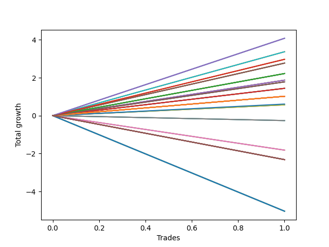

# Short Wallace 004 
- Symbol: NVDA_Unlimited
- Date Range: 02/08/2022 - 07/08/2022
- Trading Period: 7:20-12:30
- Number of Trades: 1



| Name | Win Percent | Profit | Avg Profit / Trade | Avg Time / Trade |      | Name | Win Percent | Profit | Avg Profit / Trade | Avg Time / Trade |
| ---- | ----------- | ------ | ------------------ | ---------------- | ---- | ---- | ----------- | ------ | ------------------ | ---------------- |
| Sorted By <br> Profit | | | | | | Sorted By <br> Win Percentage ||||
| One Hundred Twenty-Nine | 100.00 | 2040.00 | 2040.00 | 287:10 |     | One Hundred Twenty-Nine | 100.00 | 2040.00 | 2040.00 | 287:10 |
| One Hundred Twenty-Four | 100.00 | 2040.00 | 2040.00 | 287:10 |     | One Hundred Twenty-Four | 100.00 | 2040.00 | 2040.00 | 287:10 |
| Eighty-Four | 100.00 | 2040.00 | 2040.00 | 287:10 |     | Eighty-Four | 100.00 | 2040.00 | 2040.00 | 287:10 |
| Seventy-One | 100.00 | 1685.00 | 1685.00 | 280:40 |     | Seventy-One | 100.00 | 1685.00 | 1685.00 | 280:40 |
| Sixty-Three | 100.00 | 1685.00 | 1685.00 | 280:40 |     | Sixty-Three | 100.00 | 1685.00 | 1685.00 | 280:40 |
| Seven | 100.00 | 1685.00 | 1685.00 | 280:40 |     | Seven | 100.00 | 1685.00 | 1685.00 | 280:40 |
| One Hundred Twenty-Eight | 100.00 | 1485.00 | 1485.00 | 266:25 |     | One Hundred Twenty-Eight | 100.00 | 1485.00 | 1485.00 | 266:25 |
| One Hundred Twenty-Three | 100.00 | 1485.00 | 1485.00 | 266:25 |     | One Hundred Twenty-Three | 100.00 | 1485.00 | 1485.00 | 266:25 |
| Eighty-Three | 100.00 | 1485.00 | 1485.00 | 266:25 |     | Eighty-Three | 100.00 | 1485.00 | 1485.00 | 266:25 |
| Sixty-Seven | 100.00 | 1385.00 | 1385.00 | 17:15 |     | Sixty-Seven | 100.00 | 1385.00 | 1385.00 | 17:15 |
| Fifty-Nine | 100.00 | 1385.00 | 1385.00 | 17:15 |     | Fifty-Nine | 100.00 | 1385.00 | 1385.00 | 17:15 |
| Fifty-One | 100.00 | 1385.00 | 1385.00 | 17:15 |     | Fifty-One | 100.00 | 1385.00 | 1385.00 | 17:15 |
| Forty-Three | 100.00 | 1385.00 | 1385.00 | 17:15 |     | Forty-Three | 100.00 | 1385.00 | 1385.00 | 17:15 |
| Three | 100.00 | 1385.00 | 1385.00 | 17:15 |     | Three | 100.00 | 1385.00 | 1385.00 | 17:15 |
| One Hundred Twenty-Seven | 100.00 | 1110.00 | 1110.00 | 15:35 |     | One Hundred Twenty-Seven | 100.00 | 1110.00 | 1110.00 | 15:35 |
| One Hundred Twenty-Two | 100.00 | 1110.00 | 1110.00 | 15:35 |     | One Hundred Twenty-Two | 100.00 | 1110.00 | 1110.00 | 15:35 |
| One Hundred Seventeen | 100.00 | 1110.00 | 1110.00 | 15:35 |     | One Hundred Seventeen | 100.00 | 1110.00 | 1110.00 | 15:35 |
| One Hundred Twelve | 100.00 | 1110.00 | 1110.00 | 15:35 |     | One Hundred Twelve | 100.00 | 1110.00 | 1110.00 | 15:35 |
| Eighty-Two | 100.00 | 1110.00 | 1110.00 | 15:35 |     | Eighty-Two | 100.00 | 1110.00 | 1110.00 | 15:35 |
| Sixty-Six | 100.00 | 935.00 | 935.00 | 15:30 |     | Sixty-Six | 100.00 | 935.00 | 935.00 | 15:30 |
| Fifty-Eight | 100.00 | 935.00 | 935.00 | 15:30 |     | Fifty-Eight | 100.00 | 935.00 | 935.00 | 15:30 |
| Fifty | 100.00 | 935.00 | 935.00 | 15:30 |     | Fifty | 100.00 | 935.00 | 935.00 | 15:30 |
| Forty-Two | 100.00 | 935.00 | 935.00 | 15:30 |     | Forty-Two | 100.00 | 935.00 | 935.00 | 15:30 |
| Two | 100.00 | 935.00 | 935.00 | 15:30 |     | Two | 100.00 | 935.00 | 935.00 | 15:30 |
| One Hundred Thirty | 100.00 | 890.00 | 890.00 | 326:00 |     | One Hundred Thirty | 100.00 | 890.00 | 890.00 | 326:00 |
| One Hundred Twenty-Five | 100.00 | 890.00 | 890.00 | 326:00 |     | One Hundred Twenty-Five | 100.00 | 890.00 | 890.00 | 326:00 |
| Eighty-Five | 100.00 | 890.00 | 890.00 | 326:00 |     | Eighty-Five | 100.00 | 890.00 | 890.00 | 326:00 |
| Sixty-Five | 100.00 | 720.00 | 720.00 | 13:30 |     | Sixty-Five | 100.00 | 720.00 | 720.00 | 13:30 |
| Fifty-Seven | 100.00 | 720.00 | 720.00 | 13:30 |     | Fifty-Seven | 100.00 | 720.00 | 720.00 | 13:30 |
| Forty-Nine | 100.00 | 720.00 | 720.00 | 13:30 |     | Forty-Nine | 100.00 | 720.00 | 720.00 | 13:30 |
| Forty-One | 100.00 | 720.00 | 720.00 | 13:30 |     | Forty-One | 100.00 | 720.00 | 720.00 | 13:30 |
| One | 100.00 | 720.00 | 720.00 | 13:30 |     | One | 100.00 | 720.00 | 720.00 | 13:30 |
| One Hundred Twenty-Six | 100.00 | 510.00 | 510.00 | 09:00 |     | One Hundred Twenty-Six | 100.00 | 510.00 | 510.00 | 09:00 |
| One Hundred Twenty-One | 100.00 | 510.00 | 510.00 | 09:00 |     | One Hundred Twenty-One | 100.00 | 510.00 | 510.00 | 09:00 |
| One Hundred Sixteen | 100.00 | 510.00 | 510.00 | 09:00 |     | One Hundred Sixteen | 100.00 | 510.00 | 510.00 | 09:00 |
| One Hundred Eleven | 100.00 | 510.00 | 510.00 | 09:00 |     | One Hundred Eleven | 100.00 | 510.00 | 510.00 | 09:00 |
| Eighty-One | 100.00 | 510.00 | 510.00 | 09:00 |     | Eighty-One | 100.00 | 510.00 | 510.00 | 09:00 |
| Sixty-Four | 100.00 | 510.00 | 510.00 | 09:00 |     | Sixty-Four | 100.00 | 510.00 | 510.00 | 09:00 |
| Fifty-Six | 100.00 | 510.00 | 510.00 | 09:00 |     | Fifty-Six | 100.00 | 510.00 | 510.00 | 09:00 |
| Forty-Eight | 100.00 | 510.00 | 510.00 | 09:00 |     | Forty-Eight | 100.00 | 510.00 | 510.00 | 09:00 |
| Forty | 100.00 | 510.00 | 510.00 | 09:00 |     | Forty | 100.00 | 510.00 | 510.00 | 09:00 |
| Zero | 100.00 | 510.00 | 510.00 | 09:00 |     | Zero | 100.00 | 510.00 | 510.00 | 09:00 |
| Seventy-Three | 100.00 | 305.00 | 305.00 | 08:05 |     | Seventy-Three | 100.00 | 305.00 | 305.00 | 08:05 |
| Seventy | 100.00 | 285.00 | 285.00 | 87:20 |     | Seventy | 100.00 | 285.00 | 285.00 | 87:20 |
| Sixty-Two | 100.00 | 285.00 | 285.00 | 87:20 |     | Sixty-Two | 100.00 | 285.00 | 285.00 | 87:20 |
| Six | 100.00 | 285.00 | 285.00 | 87:20 |     | Six | 100.00 | 285.00 | 285.00 | 87:20 |
| Sixty-Nine | 0.00 | -130.00 | -130.00 | 78:40 |     | Sixty-Nine | 0.00 | -130.00 | -130.00 | 78:40 |
| Sixty-One | 0.00 | -130.00 | -130.00 | 78:40 |     | Sixty-One | 0.00 | -130.00 | -130.00 | 78:40 |
| Five | 0.00 | -130.00 | -130.00 | 78:40 |     | Five | 0.00 | -130.00 | -130.00 | 78:40 |
| Sixty-Eight | 0.00 | -910.00 | -910.00 | 75:10 |     | Sixty-Eight | 0.00 | -910.00 | -910.00 | 75:10 |
| Sixty | 0.00 | -910.00 | -910.00 | 75:10 |     | Sixty | 0.00 | -910.00 | -910.00 | 75:10 |
| Four | 0.00 | -910.00 | -910.00 | 75:10 |     | Four | 0.00 | -910.00 | -910.00 | 75:10 |
| One Hundred Twenty | 0.00 | -1160.00 | -1160.00 | 25:45 |     | One Hundred Twenty | 0.00 | -1160.00 | -1160.00 | 25:45 |
| One Hundred Ninteen | 0.00 | -1160.00 | -1160.00 | 25:45 |     | One Hundred Ninteen | 0.00 | -1160.00 | -1160.00 | 25:45 |
| One Hundred Eighteen | 0.00 | -1160.00 | -1160.00 | 25:45 |     | One Hundred Eighteen | 0.00 | -1160.00 | -1160.00 | 25:45 |
| Fifty-Five | 0.00 | -1160.00 | -1160.00 | 25:45 |     | Fifty-Five | 0.00 | -1160.00 | -1160.00 | 25:45 |
| Fifty-Four | 0.00 | -1160.00 | -1160.00 | 25:45 |     | Fifty-Four | 0.00 | -1160.00 | -1160.00 | 25:45 |
| Fifty-Three | 0.00 | -1160.00 | -1160.00 | 25:45 |     | Fifty-Three | 0.00 | -1160.00 | -1160.00 | 25:45 |
| Fifty-Two | 0.00 | -1160.00 | -1160.00 | 25:45 |     | Fifty-Two | 0.00 | -1160.00 | -1160.00 | 25:45 |
| One Hundred Fifteen | 0.00 | -2520.00 | -2520.00 | 58:25 |     | One Hundred Fifteen | 0.00 | -2520.00 | -2520.00 | 58:25 |
| One Hundred Fourteen | 0.00 | -2520.00 | -2520.00 | 58:25 |     | One Hundred Fourteen | 0.00 | -2520.00 | -2520.00 | 58:25 |
| One Hundred Thirteen | 0.00 | -2520.00 | -2520.00 | 58:25 |     | One Hundred Thirteen | 0.00 | -2520.00 | -2520.00 | 58:25 |
| Forty-Seven | 0.00 | -2520.00 | -2520.00 | 58:25 |     | Forty-Seven | 0.00 | -2520.00 | -2520.00 | 58:25 |
| Forty-Six | 0.00 | -2520.00 | -2520.00 | 58:25 |     | Forty-Six | 0.00 | -2520.00 | -2520.00 | 58:25 |
| Forty-Five | 0.00 | -2520.00 | -2520.00 | 58:25 |     | Forty-Five | 0.00 | -2520.00 | -2520.00 | 58:25 |
| Forty-Four | 0.00 | -2520.00 | -2520.00 | 58:25 |     | Forty-Four | 0.00 | -2520.00 | -2520.00 | 58:25 |

## NO STOPLOSS

### Test Zero
* Sell when price hits the middle line of the 20p bollinger
* No Stoploss
* Results:
```
Total Trades: 1
Percent Up: 0.00
Percent Down: 100.00
Total Points Moved Down: 1.02
Potential Profit: 510.00
Total Points Ups: 0.00 Count Ups: 0
Total Points Downs: 1.02 Count Downs: 1
```

<details><summary>Trades</summary>

<code>In: 2022-05-06 07:21:00		Out: 2022-05-06 07:30:00		Total Position Time: 09:00		Total Move Down: 1.02		Total to Date: 1.02</code> <br />


</details>

### Test One
* Sell when the price hits the upper line of the 20p 1std bollinger
* No Stoploss
* Results:
```
Total Trades: 1
Percent Up: 0.00
Percent Down: 100.00
Total Points Moved Down: 1.44
Potential Profit: 720.00
Total Points Ups: 0.00 Count Ups: 0
Total Points Downs: 1.44 Count Downs: 1
```

<details><summary>Trades</summary>

<code>In: 2022-05-06 07:21:00		Out: 2022-05-06 07:34:30		Total Position Time: 13:30		Total Move Down: 1.44		Total to Date: 1.44</code> <br />


</details>

### Test Two
* Sell when the price hits the upper line of the 20p 2std bollinger
* No Stoploss
* Results:
```
Total Trades: 1
Percent Up: 0.00
Percent Down: 100.00
Total Points Moved Down: 1.87
Potential Profit: 935.00
Total Points Ups: 0.00 Count Ups: 0
Total Points Downs: 1.87 Count Downs: 1
```

<details><summary>Trades</summary>

<code>In: 2022-05-06 07:21:00		Out: 2022-05-06 07:36:30		Total Position Time: 15:30		Total Move Down: 1.87		Total to Date: 1.87</code> <br />


</details>

### Test Three
* Sell when price hits the middle line of the 50p bollinger
* No Stoploss
* Results:
```
Total Trades: 1
Percent Up: 0.00
Percent Down: 100.00
Total Points Moved Down: 2.77
Potential Profit: 1385.00
Total Points Ups: 0.00 Count Ups: 0
Total Points Downs: 2.77 Count Downs: 1
```

<details><summary>Trades</summary>

<code>In: 2022-05-06 07:21:00		Out: 2022-05-06 07:38:15		Total Position Time: 17:15		Total Move Down: 2.77		Total to Date: 2.77</code> <br />


</details>

### Test Four
* Sell when the price hits the upper line of the 50p 1std bollinger
* No Stoploss
* Results:
```
Total Trades: 1
Percent Up: 100.00
Percent Down: 0.00
Total Points Moved Down: -1.82
Potential Profit: -910.00
Total Points Ups: 1.82 Count Ups: 1
Total Points Downs: 0.00 Count Downs: 0
```

<details><summary>Trades</summary>

<code>In: 2022-05-06 07:21:00		Out: 2022-05-06 08:36:10		Total Position Time: 75:10		Total Move Down: -1.82		Total to Date: -1.82</code> <br />


</details>

### Test Five
* Sell when the price hits the upper line of the 50p 2std bollinger
* No Stoploss
* Results:
```
Total Trades: 1
Percent Up: 100.00
Percent Down: 0.00
Total Points Moved Down: -0.26
Potential Profit: -130.00
Total Points Ups: 0.26 Count Ups: 1
Total Points Downs: 0.00 Count Downs: 0
```

<details><summary>Trades</summary>

<code>In: 2022-05-06 07:21:00		Out: 2022-05-06 08:39:40		Total Position Time: 78:40		Total Move Down: -0.26		Total to Date: -0.26</code> <br />


</details>

### Test Six
* Sell when the price hits the middle line of the 1std VWAP
* No Stoploss
* Results:
```
Total Trades: 1
Percent Up: 0.00
Percent Down: 100.00
Total Points Moved Down: 0.57
Potential Profit: 285.00
Total Points Ups: 0.00 Count Ups: 0
Total Points Downs: 0.57 Count Downs: 1
```

<details><summary>Trades</summary>

<code>In: 2022-05-06 07:21:00		Out: 2022-05-06 08:48:20		Total Position Time: 87:20		Total Move Down: 0.57		Total to Date: 0.57</code> <br />


</details>

### Test Seven
* Sell when the price hits the upper line of the 1std VWAP
* No Stoploss
* Results:
```
Total Trades: 1
Percent Up: 0.00
Percent Down: 100.00
Total Points Moved Down: 3.37
Potential Profit: 1685.00
Total Points Ups: 0.00 Count Ups: 0
Total Points Downs: 3.37 Count Downs: 1
```

<details><summary>Trades</summary>

<code>In: 2022-05-06 07:21:00		Out: 2022-05-06 12:01:40		Total Position Time: 280:40		Total Move Down: 3.37		Total to Date: 3.37</code> <br />


</details>

## STOPLOSS OF 5

### Test Forty
* Sell when price hits the middle line of the 20p bollinger
* Stoploss is -5 points
* Results:
```
Total Trades: 1
Percent Up: 0.00
Percent Down: 100.00
Total Points Moved Down: 1.02
Potential Profit: 510.00
Total Points Ups: 0.00 Count Ups: 0
Total Points Downs: 1.02 Count Downs: 1
```

<details><summary>Trades</summary>

<code>In: 2022-05-06 07:21:00		Out: 2022-05-06 07:30:00		Total Position Time: 09:00		Total Move Down: 1.02		Total to Date: 1.02</code> <br />


</details>

### Test Forty-One
* Sell when the price hits the upper line of the 20p 1std bollinger
* Stoploss is -5 points
* Results:
```
Total Trades: 1
Percent Up: 0.00
Percent Down: 100.00
Total Points Moved Down: 1.44
Potential Profit: 720.00
Total Points Ups: 0.00 Count Ups: 0
Total Points Downs: 1.44 Count Downs: 1
```

<details><summary>Trades</summary>

<code>In: 2022-05-06 07:21:00		Out: 2022-05-06 07:34:30		Total Position Time: 13:30		Total Move Down: 1.44		Total to Date: 1.44</code> <br />


</details>

### Test Forty-Two
* Sell when the price hits the upper line of the 20p 2std bollinger
* Stoploss is -5 points
* Results:
```
Total Trades: 1
Percent Up: 0.00
Percent Down: 100.00
Total Points Moved Down: 1.87
Potential Profit: 935.00
Total Points Ups: 0.00 Count Ups: 0
Total Points Downs: 1.87 Count Downs: 1
```

<details><summary>Trades</summary>

<code>In: 2022-05-06 07:21:00		Out: 2022-05-06 07:36:30		Total Position Time: 15:30		Total Move Down: 1.87		Total to Date: 1.87</code> <br />


</details>

### Test Forty-Three
* Sell when price hits the middle line of the 50p bollinger
* Stoploss is -5 points
* Results:
```
Total Trades: 1
Percent Up: 0.00
Percent Down: 100.00
Total Points Moved Down: 2.77
Potential Profit: 1385.00
Total Points Ups: 0.00 Count Ups: 0
Total Points Downs: 2.77 Count Downs: 1
```

<details><summary>Trades</summary>

<code>In: 2022-05-06 07:21:00		Out: 2022-05-06 07:38:15		Total Position Time: 17:15		Total Move Down: 2.77		Total to Date: 2.77</code> <br />


</details>

### Test Forty-Four
* Sell when the price hits the upper line of the 50p 1std bollinger
* Stoploss is -5 points
* Results:
```
Total Trades: 1
Percent Up: 100.00
Percent Down: 0.00
Total Points Moved Down: -5.04
Potential Profit: -2520.00
Total Points Ups: 5.04 Count Ups: 1
Total Points Downs: 0.00 Count Downs: 0
```

<details><summary>Trades</summary>

<code>In: 2022-05-06 07:21:00		Out: 2022-05-06 08:19:25		Total Position Time: 58:25		Total Move Down: -5.04		Total to Date: -5.04</code> <br />


</details>

### Test Forty-Five
* Sell when the price hits the upper line of the 50p 2std bollinger
* Stoploss is -5 points
* Results:
```
Total Trades: 1
Percent Up: 100.00
Percent Down: 0.00
Total Points Moved Down: -5.04
Potential Profit: -2520.00
Total Points Ups: 5.04 Count Ups: 1
Total Points Downs: 0.00 Count Downs: 0
```

<details><summary>Trades</summary>

<code>In: 2022-05-06 07:21:00		Out: 2022-05-06 08:19:25		Total Position Time: 58:25		Total Move Down: -5.04		Total to Date: -5.04</code> <br />


</details>

### Test Forty-Six
* Sell when the price hits the middle line of the 1std VWAP
* Stoploss is -5 points
* Results:
```
Total Trades: 1
Percent Up: 100.00
Percent Down: 0.00
Total Points Moved Down: -5.04
Potential Profit: -2520.00
Total Points Ups: 5.04 Count Ups: 1
Total Points Downs: 0.00 Count Downs: 0
```

<details><summary>Trades</summary>

<code>In: 2022-05-06 07:21:00		Out: 2022-05-06 08:19:25		Total Position Time: 58:25		Total Move Down: -5.04		Total to Date: -5.04</code> <br />


</details>

### Test Forty-Seven
* Sell when the price hits the upper line of the 1std VWAP
* Stoploss is -5 points
* Results:
```
Total Trades: 1
Percent Up: 100.00
Percent Down: 0.00
Total Points Moved Down: -5.04
Potential Profit: -2520.00
Total Points Ups: 5.04 Count Ups: 1
Total Points Downs: 0.00 Count Downs: 0
```

<details><summary>Trades</summary>

<code>In: 2022-05-06 07:21:00		Out: 2022-05-06 08:19:25		Total Position Time: 58:25		Total Move Down: -5.04		Total to Date: -5.04</code> <br />


</details>

## TRAIL STOP OF 5

### Test Forty-Eight
* Sell when price hits the middle line of the 20p bollinger
* Trailing Stop is -5 points
* Results:
```
Total Trades: 1
Percent Up: 0.00
Percent Down: 100.00
Total Points Moved Down: 1.02
Potential Profit: 510.00
Total Points Ups: 0.00 Count Ups: 0
Total Points Downs: 1.02 Count Downs: 1
```

<details><summary>Trades</summary>

<code>In: 2022-05-06 07:21:00		Out: 2022-05-06 07:30:00		Total Position Time: 09:00		Total Move Down: 1.02		Total to Date: 1.02</code> <br />


</details>

### Test Forty-Nine
* Sell when the price hits the upper line of the 20p 1std bollinger
* Trailing Stop is -5 points
* Results:
```
Total Trades: 1
Percent Up: 0.00
Percent Down: 100.00
Total Points Moved Down: 1.44
Potential Profit: 720.00
Total Points Ups: 0.00 Count Ups: 0
Total Points Downs: 1.44 Count Downs: 1
```

<details><summary>Trades</summary>

<code>In: 2022-05-06 07:21:00		Out: 2022-05-06 07:34:30		Total Position Time: 13:30		Total Move Down: 1.44		Total to Date: 1.44</code> <br />


</details>

### Test Fifty
* Sell when the price hits the upper line of the 20p 2std bollinger
* Trailing Stop is -5 points
* Results:
```
Total Trades: 1
Percent Up: 0.00
Percent Down: 100.00
Total Points Moved Down: 1.87
Potential Profit: 935.00
Total Points Ups: 0.00 Count Ups: 0
Total Points Downs: 1.87 Count Downs: 1
```

<details><summary>Trades</summary>

<code>In: 2022-05-06 07:21:00		Out: 2022-05-06 07:36:30		Total Position Time: 15:30		Total Move Down: 1.87		Total to Date: 1.87</code> <br />


</details>

### Test Fifty-One
* Sell when price hits the middle line of the 50p bollinger
* Trailing Stop is -5 points
* Results:
```
Total Trades: 1
Percent Up: 0.00
Percent Down: 100.00
Total Points Moved Down: 2.77
Potential Profit: 1385.00
Total Points Ups: 0.00 Count Ups: 0
Total Points Downs: 2.77 Count Downs: 1
```

<details><summary>Trades</summary>

<code>In: 2022-05-06 07:21:00		Out: 2022-05-06 07:38:15		Total Position Time: 17:15		Total Move Down: 2.77		Total to Date: 2.77</code> <br />


</details>

### Test Fifty-Two
* Sell when the price hits the upper line of the 50p 1std bollinger
* Trailing Stop is -5 points
* Results:
```
Total Trades: 1
Percent Up: 100.00
Percent Down: 0.00
Total Points Moved Down: -2.32
Potential Profit: -1160.00
Total Points Ups: 2.32 Count Ups: 1
Total Points Downs: 0.00 Count Downs: 0
```

<details><summary>Trades</summary>

<code>In: 2022-05-06 07:21:00		Out: 2022-05-06 07:46:45		Total Position Time: 25:45		Total Move Down: -2.32		Total to Date: -2.32</code> <br />


</details>

### Test Fifty-Three
* Sell when the price hits the upper line of the 50p 2std bollinger
* Trailing Stop is -5 points
* Results:
```
Total Trades: 1
Percent Up: 100.00
Percent Down: 0.00
Total Points Moved Down: -2.32
Potential Profit: -1160.00
Total Points Ups: 2.32 Count Ups: 1
Total Points Downs: 0.00 Count Downs: 0
```

<details><summary>Trades</summary>

<code>In: 2022-05-06 07:21:00		Out: 2022-05-06 07:46:45		Total Position Time: 25:45		Total Move Down: -2.32		Total to Date: -2.32</code> <br />


</details>

### Test Fifty-Four
* Sell when the price hits the middle line of the 1std VWAP
* Trailing Stop is -5 points
* Results:
```
Total Trades: 1
Percent Up: 100.00
Percent Down: 0.00
Total Points Moved Down: -2.32
Potential Profit: -1160.00
Total Points Ups: 2.32 Count Ups: 1
Total Points Downs: 0.00 Count Downs: 0
```

<details><summary>Trades</summary>

<code>In: 2022-05-06 07:21:00		Out: 2022-05-06 07:46:45		Total Position Time: 25:45		Total Move Down: -2.32		Total to Date: -2.32</code> <br />


</details>

### Test Fifty-Five
* Sell when the price hits the upper line of the 1std VWAP
* Trailing Stop is -5 points
* Results:
```
Total Trades: 1
Percent Up: 100.00
Percent Down: 0.00
Total Points Moved Down: -2.32
Potential Profit: -1160.00
Total Points Ups: 2.32 Count Ups: 1
Total Points Downs: 0.00 Count Downs: 0
```

<details><summary>Trades</summary>

<code>In: 2022-05-06 07:21:00		Out: 2022-05-06 07:46:45		Total Position Time: 25:45		Total Move Down: -2.32		Total to Date: -2.32</code> <br />


</details>

## STOPLOSS OF 10

### Test Fifty-Six
* Sell when price hits the middle line of the 20p bollinger
* Stoploss is -10 points
* Results:
```
Total Trades: 1
Percent Up: 0.00
Percent Down: 100.00
Total Points Moved Down: 1.02
Potential Profit: 510.00
Total Points Ups: 0.00 Count Ups: 0
Total Points Downs: 1.02 Count Downs: 1
```

<details><summary>Trades</summary>

<code>In: 2022-05-06 07:21:00		Out: 2022-05-06 07:30:00		Total Position Time: 09:00		Total Move Down: 1.02		Total to Date: 1.02</code> <br />


</details>

### Test Fifty-Seven
* Sell when the price hits the upper line of the 20p 1std bollinger
* Stoploss is -10 points
* Results:
```
Total Trades: 1
Percent Up: 0.00
Percent Down: 100.00
Total Points Moved Down: 1.44
Potential Profit: 720.00
Total Points Ups: 0.00 Count Ups: 0
Total Points Downs: 1.44 Count Downs: 1
```

<details><summary>Trades</summary>

<code>In: 2022-05-06 07:21:00		Out: 2022-05-06 07:34:30		Total Position Time: 13:30		Total Move Down: 1.44		Total to Date: 1.44</code> <br />


</details>

### Test Fifty-Eight
* Sell when the price hits the upper line of the 20p 2std bollinger
* Stoploss is -10 points
* Results:
```
Total Trades: 1
Percent Up: 0.00
Percent Down: 100.00
Total Points Moved Down: 1.87
Potential Profit: 935.00
Total Points Ups: 0.00 Count Ups: 0
Total Points Downs: 1.87 Count Downs: 1
```

<details><summary>Trades</summary>

<code>In: 2022-05-06 07:21:00		Out: 2022-05-06 07:36:30		Total Position Time: 15:30		Total Move Down: 1.87		Total to Date: 1.87</code> <br />


</details>

### Test Fifty-Nine
* Sell when price hits the middle line of the 50p bollinger
* Stoploss is -10 points
* Results:
```
Total Trades: 1
Percent Up: 0.00
Percent Down: 100.00
Total Points Moved Down: 2.77
Potential Profit: 1385.00
Total Points Ups: 0.00 Count Ups: 0
Total Points Downs: 2.77 Count Downs: 1
```

<details><summary>Trades</summary>

<code>In: 2022-05-06 07:21:00		Out: 2022-05-06 07:38:15		Total Position Time: 17:15		Total Move Down: 2.77		Total to Date: 2.77</code> <br />


</details>

### Test Sixty
* Sell when the price hits the upper line of the 50p 1std bollinger
* Stoploss is -10 points
* Results:
```
Total Trades: 1
Percent Up: 100.00
Percent Down: 0.00
Total Points Moved Down: -1.82
Potential Profit: -910.00
Total Points Ups: 1.82 Count Ups: 1
Total Points Downs: 0.00 Count Downs: 0
```

<details><summary>Trades</summary>

<code>In: 2022-05-06 07:21:00		Out: 2022-05-06 08:36:10		Total Position Time: 75:10		Total Move Down: -1.82		Total to Date: -1.82</code> <br />


</details>

### Test Sixty-One
* Sell when the price hits the upper line of the 50p 2std bollinger
* Stoploss is -10 points
* Results:
```
Total Trades: 1
Percent Up: 100.00
Percent Down: 0.00
Total Points Moved Down: -0.26
Potential Profit: -130.00
Total Points Ups: 0.26 Count Ups: 1
Total Points Downs: 0.00 Count Downs: 0
```

<details><summary>Trades</summary>

<code>In: 2022-05-06 07:21:00		Out: 2022-05-06 08:39:40		Total Position Time: 78:40		Total Move Down: -0.26		Total to Date: -0.26</code> <br />


</details>

### Test Sixty-Two
* Sell when the price hits the middle line of the 1std VWAP
* Stoploss is -10 points
* Results:
```
Total Trades: 1
Percent Up: 0.00
Percent Down: 100.00
Total Points Moved Down: 0.57
Potential Profit: 285.00
Total Points Ups: 0.00 Count Ups: 0
Total Points Downs: 0.57 Count Downs: 1
```

<details><summary>Trades</summary>

<code>In: 2022-05-06 07:21:00		Out: 2022-05-06 08:48:20		Total Position Time: 87:20		Total Move Down: 0.57		Total to Date: 0.57</code> <br />


</details>

### Test Sixty-Three
* Sell when the price hits the upper line of the 1std VWAP
* Stoploss is -10 points
* Results:
```
Total Trades: 1
Percent Up: 0.00
Percent Down: 100.00
Total Points Moved Down: 3.37
Potential Profit: 1685.00
Total Points Ups: 0.00 Count Ups: 0
Total Points Downs: 3.37 Count Downs: 1
```

<details><summary>Trades</summary>

<code>In: 2022-05-06 07:21:00		Out: 2022-05-06 12:01:40		Total Position Time: 280:40		Total Move Down: 3.37		Total to Date: 3.37</code> <br />


</details>

## TRAIL STOP OF 10

### Test Sixty-Four
* Sell when price hits the middle line of the 20p bollinger
* Trailing Stop is -10 points
* Results:
```
Total Trades: 1
Percent Up: 0.00
Percent Down: 100.00
Total Points Moved Down: 1.02
Potential Profit: 510.00
Total Points Ups: 0.00 Count Ups: 0
Total Points Downs: 1.02 Count Downs: 1
```

<details><summary>Trades</summary>

<code>In: 2022-05-06 07:21:00		Out: 2022-05-06 07:30:00		Total Position Time: 09:00		Total Move Down: 1.02		Total to Date: 1.02</code> <br />


</details>

### Test Sixty-Five
* Sell when the price hits the upper line of the 20p 1std bollinger
* Trailing Stop is -10 points
* Results:
```
Total Trades: 1
Percent Up: 0.00
Percent Down: 100.00
Total Points Moved Down: 1.44
Potential Profit: 720.00
Total Points Ups: 0.00 Count Ups: 0
Total Points Downs: 1.44 Count Downs: 1
```

<details><summary>Trades</summary>

<code>In: 2022-05-06 07:21:00		Out: 2022-05-06 07:34:30		Total Position Time: 13:30		Total Move Down: 1.44		Total to Date: 1.44</code> <br />


</details>

### Test Sixty-Six
* Sell when the price hits the upper line of the 20p 2std bollinger
* Trailing Stop is -10 points
* Results:
```
Total Trades: 1
Percent Up: 0.00
Percent Down: 100.00
Total Points Moved Down: 1.87
Potential Profit: 935.00
Total Points Ups: 0.00 Count Ups: 0
Total Points Downs: 1.87 Count Downs: 1
```

<details><summary>Trades</summary>

<code>In: 2022-05-06 07:21:00		Out: 2022-05-06 07:36:30		Total Position Time: 15:30		Total Move Down: 1.87		Total to Date: 1.87</code> <br />


</details>

### Test Sixty-Seven
* Sell when price hits the middle line of the 50p bollinger
* Trailing Stop is -10 points
* Results:
```
Total Trades: 1
Percent Up: 0.00
Percent Down: 100.00
Total Points Moved Down: 2.77
Potential Profit: 1385.00
Total Points Ups: 0.00 Count Ups: 0
Total Points Downs: 2.77 Count Downs: 1
```

<details><summary>Trades</summary>

<code>In: 2022-05-06 07:21:00		Out: 2022-05-06 07:38:15		Total Position Time: 17:15		Total Move Down: 2.77		Total to Date: 2.77</code> <br />


</details>

### Test Sixty-Eight
* Sell when the price hits the upper line of the 50p 1std bollinger
* Trailing Stop is -10 points
* Results:
```
Total Trades: 1
Percent Up: 100.00
Percent Down: 0.00
Total Points Moved Down: -1.82
Potential Profit: -910.00
Total Points Ups: 1.82 Count Ups: 1
Total Points Downs: 0.00 Count Downs: 0
```

<details><summary>Trades</summary>

<code>In: 2022-05-06 07:21:00		Out: 2022-05-06 08:36:10		Total Position Time: 75:10		Total Move Down: -1.82		Total to Date: -1.82</code> <br />


</details>

### Test Sixty-Nine
* Sell when the price hits the upper line of the 50p 2std bollinger
* Trailing Stop is -10 points
* Results:
```
Total Trades: 1
Percent Up: 100.00
Percent Down: 0.00
Total Points Moved Down: -0.26
Potential Profit: -130.00
Total Points Ups: 0.26 Count Ups: 1
Total Points Downs: 0.00 Count Downs: 0
```

<details><summary>Trades</summary>

<code>In: 2022-05-06 07:21:00		Out: 2022-05-06 08:39:40		Total Position Time: 78:40		Total Move Down: -0.26		Total to Date: -0.26</code> <br />


</details>

### Test Seventy
* Sell when the price hits the middle line of the 1std VWAP
* Trailing Stop is -10 points
* Results:
```
Total Trades: 1
Percent Up: 0.00
Percent Down: 100.00
Total Points Moved Down: 0.57
Potential Profit: 285.00
Total Points Ups: 0.00 Count Ups: 0
Total Points Downs: 0.57 Count Downs: 1
```

<details><summary>Trades</summary>

<code>In: 2022-05-06 07:21:00		Out: 2022-05-06 08:48:20		Total Position Time: 87:20		Total Move Down: 0.57		Total to Date: 0.57</code> <br />


</details>

### Test Seventy-One
* Sell when the price hits the upper line of the 1std VWAP
* Trailing Stop is -10 points
* Results:
```
Total Trades: 1
Percent Up: 0.00
Percent Down: 100.00
Total Points Moved Down: 3.37
Potential Profit: 1685.00
Total Points Ups: 0.00 Count Ups: 0
Total Points Downs: 3.37 Count Downs: 1
```

<details><summary>Trades</summary>

<code>In: 2022-05-06 07:21:00		Out: 2022-05-06 12:01:40		Total Position Time: 280:40		Total Move Down: 3.37		Total to Date: 3.37</code> <br />


</details>

## SPECIAL EXIT CONDITIONS 

### Test Seventy-Three
* Sell when the linear regression slope changes to negative
* No Stoploss
* Results:
```
Total Trades: 1
Percent Up: 0.00
Percent Down: 100.00
Total Points Moved Down: 0.61
Potential Profit: 305.00
Total Points Ups: 0.00 Count Ups: 0
Total Points Downs: 0.61 Count Downs: 1
```

<details><summary>Trades</summary>

<code>In: 2022-05-06 07:21:00		Out: 2022-05-06 07:29:05		Total Position Time: 08:05		Total Move Down: 0.61		Total to Date: 0.61</code> <br />


</details>

## TAKE PROFIT

### Test Eighty-One
* Take Profit of 1 Point
* No Stoploss
* Results:
```
Total Trades: 1
Percent Up: 0.00
Percent Down: 100.00
Total Points Moved Down: 1.02
Potential Profit: 510.00
Total Points Ups: 0.00 Count Ups: 0
Total Points Downs: 1.02 Count Downs: 1
```

<details><summary>Trades</summary>

<code>In: 2022-05-06 07:21:00		Out: 2022-05-06 07:30:00		Total Position Time: 09:00		Total Move Down: 1.02		Total to Date: 1.02</code> <br />


</details>

### Test Eighty-Two
* Take Profit of 2 Point
* No Stoploss
* Results:
```
Total Trades: 1
Percent Up: 0.00
Percent Down: 100.00
Total Points Moved Down: 2.22
Potential Profit: 1110.00
Total Points Ups: 0.00 Count Ups: 0
Total Points Downs: 2.22 Count Downs: 1
```

<details><summary>Trades</summary>

<code>In: 2022-05-06 07:21:00		Out: 2022-05-06 07:36:35		Total Position Time: 15:35		Total Move Down: 2.22		Total to Date: 2.22</code> <br />


</details>

### Test Eighty-Three
* Take Profit of 3 Point
* No Stoploss
* Results:
```
Total Trades: 1
Percent Up: 0.00
Percent Down: 100.00
Total Points Moved Down: 2.97
Potential Profit: 1485.00
Total Points Ups: 0.00 Count Ups: 0
Total Points Downs: 2.97 Count Downs: 1
```

<details><summary>Trades</summary>

<code>In: 2022-05-06 07:21:00		Out: 2022-05-06 11:47:25		Total Position Time: 266:25		Total Move Down: 2.97		Total to Date: 2.97</code> <br />


</details>

### Test Eighty-Four
* Take Profit of 4 Point
* No Stoploss
* Results:
```
Total Trades: 1
Percent Up: 0.00
Percent Down: 100.00
Total Points Moved Down: 4.08
Potential Profit: 2040.00
Total Points Ups: 0.00 Count Ups: 0
Total Points Downs: 4.08 Count Downs: 1
```

<details><summary>Trades</summary>

<code>In: 2022-05-06 07:21:00		Out: 2022-05-06 12:08:10		Total Position Time: 287:10		Total Move Down: 4.08		Total to Date: 4.08</code> <br />


</details>

### Test Eighty-Five
* Take Profit of 5 Point
* No Stoploss
* Results:
```
Total Trades: 1
Percent Up: 0.00
Percent Down: 100.00
Total Points Moved Down: 1.78
Potential Profit: 890.00
Total Points Ups: 0.00 Count Ups: 0
Total Points Downs: 1.78 Count Downs: 1
```

<details><summary>Trades</summary>

<code>In: 2022-05-06 07:21:00		Out: 2022-05-06 12:47:00		Total Position Time: 326:00		Total Move Down: 1.78		Total to Date: 1.78</code> <br />


</details>

## TAKE PROFIT Stoploss of Five

### Test One Hundred Eleven
* Take Profit of 1 Point
* Stoploss is -5 points
* Results:
```
Total Trades: 1
Percent Up: 0.00
Percent Down: 100.00
Total Points Moved Down: 1.02
Potential Profit: 510.00
Total Points Ups: 0.00 Count Ups: 0
Total Points Downs: 1.02 Count Downs: 1
```

<details><summary>Trades</summary>

<code>In: 2022-05-06 07:21:00		Out: 2022-05-06 07:30:00		Total Position Time: 09:00		Total Move Down: 1.02		Total to Date: 1.02</code> <br />


</details>

### Test One Hundred Twelve
* Take Profit of 2 Point
* Stoploss is -5 points
* Results:
```
Total Trades: 1
Percent Up: 0.00
Percent Down: 100.00
Total Points Moved Down: 2.22
Potential Profit: 1110.00
Total Points Ups: 0.00 Count Ups: 0
Total Points Downs: 2.22 Count Downs: 1
```

<details><summary>Trades</summary>

<code>In: 2022-05-06 07:21:00		Out: 2022-05-06 07:36:35		Total Position Time: 15:35		Total Move Down: 2.22		Total to Date: 2.22</code> <br />


</details>

### Test One Hundred Thirteen
* Take Profit of 3 Point
* Stoploss is -5 points
* Results:
```
Total Trades: 1
Percent Up: 100.00
Percent Down: 0.00
Total Points Moved Down: -5.04
Potential Profit: -2520.00
Total Points Ups: 5.04 Count Ups: 1
Total Points Downs: 0.00 Count Downs: 0
```

<details><summary>Trades</summary>

<code>In: 2022-05-06 07:21:00		Out: 2022-05-06 08:19:25		Total Position Time: 58:25		Total Move Down: -5.04		Total to Date: -5.04</code> <br />


</details>

### Test One Hundred Fourteen
* Take Profit of 4 Point
* Stoploss is -5 points
* Results:
```
Total Trades: 1
Percent Up: 100.00
Percent Down: 0.00
Total Points Moved Down: -5.04
Potential Profit: -2520.00
Total Points Ups: 5.04 Count Ups: 1
Total Points Downs: 0.00 Count Downs: 0
```

<details><summary>Trades</summary>

<code>In: 2022-05-06 07:21:00		Out: 2022-05-06 08:19:25		Total Position Time: 58:25		Total Move Down: -5.04		Total to Date: -5.04</code> <br />


</details>

### Test One Hundred Fifteen
* Take Profit of 5 Point
* Stoploss is -5 points
* Results:
```
Total Trades: 1
Percent Up: 100.00
Percent Down: 0.00
Total Points Moved Down: -5.04
Potential Profit: -2520.00
Total Points Ups: 5.04 Count Ups: 1
Total Points Downs: 0.00 Count Downs: 0
```

<details><summary>Trades</summary>

<code>In: 2022-05-06 07:21:00		Out: 2022-05-06 08:19:25		Total Position Time: 58:25		Total Move Down: -5.04		Total to Date: -5.04</code> <br />


</details>

## TAKE PROFIT Trailstop of Five

### Test One Hundred Sixteen
* Take Profit of 1 Point
* Trailing stop is -5 points
* Results:
```
Total Trades: 1
Percent Up: 0.00
Percent Down: 100.00
Total Points Moved Down: 1.02
Potential Profit: 510.00
Total Points Ups: 0.00 Count Ups: 0
Total Points Downs: 1.02 Count Downs: 1
```

<details><summary>Trades</summary>

<code>In: 2022-05-06 07:21:00		Out: 2022-05-06 07:30:00		Total Position Time: 09:00		Total Move Down: 1.02		Total to Date: 1.02</code> <br />


</details>

### Test One Hundred Seventeen
* Take Profit of 2 Point
* Trailing stop is -5 points
* Results:
```
Total Trades: 1
Percent Up: 0.00
Percent Down: 100.00
Total Points Moved Down: 2.22
Potential Profit: 1110.00
Total Points Ups: 0.00 Count Ups: 0
Total Points Downs: 2.22 Count Downs: 1
```

<details><summary>Trades</summary>

<code>In: 2022-05-06 07:21:00		Out: 2022-05-06 07:36:35		Total Position Time: 15:35		Total Move Down: 2.22		Total to Date: 2.22</code> <br />


</details>

### Test One Hundred Eighteen
* Take Profit of 3 Point
* Trailing stop is -5 points
* Results:
```
Total Trades: 1
Percent Up: 100.00
Percent Down: 0.00
Total Points Moved Down: -2.32
Potential Profit: -1160.00
Total Points Ups: 2.32 Count Ups: 1
Total Points Downs: 0.00 Count Downs: 0
```

<details><summary>Trades</summary>

<code>In: 2022-05-06 07:21:00		Out: 2022-05-06 07:46:45		Total Position Time: 25:45		Total Move Down: -2.32		Total to Date: -2.32</code> <br />


</details>

### Test One Hundred Ninteen
* Take Profit of 4 Point
* Trailing stop is -5 points
* Results:
```
Total Trades: 1
Percent Up: 100.00
Percent Down: 0.00
Total Points Moved Down: -2.32
Potential Profit: -1160.00
Total Points Ups: 2.32 Count Ups: 1
Total Points Downs: 0.00 Count Downs: 0
```

<details><summary>Trades</summary>

<code>In: 2022-05-06 07:21:00		Out: 2022-05-06 07:46:45		Total Position Time: 25:45		Total Move Down: -2.32		Total to Date: -2.32</code> <br />


</details>

### Test One Hundred Twenty
* Take Profit of 5 Point
* Trailing stop is -5 points
* Results:
```
Total Trades: 1
Percent Up: 100.00
Percent Down: 0.00
Total Points Moved Down: -2.32
Potential Profit: -1160.00
Total Points Ups: 2.32 Count Ups: 1
Total Points Downs: 0.00 Count Downs: 0
```

<details><summary>Trades</summary>

<code>In: 2022-05-06 07:21:00		Out: 2022-05-06 07:46:45		Total Position Time: 25:45		Total Move Down: -2.32		Total to Date: -2.32</code> <br />


</details>

## TAKE PROFIT Stoploss of Ten

### Test One Hundred Twenty-One
* Take Profit of 1 Point
* Stoploss is -10 points
* Results:
```
Total Trades: 1
Percent Up: 0.00
Percent Down: 100.00
Total Points Moved Down: 1.02
Potential Profit: 510.00
Total Points Ups: 0.00 Count Ups: 0
Total Points Downs: 1.02 Count Downs: 1
```

<details><summary>Trades</summary>

<code>In: 2022-05-06 07:21:00		Out: 2022-05-06 07:30:00		Total Position Time: 09:00		Total Move Down: 1.02		Total to Date: 1.02</code> <br />


</details>

### Test One Hundred Twenty-Two
* Take Profit of 2 Point
* Stoploss is -10 points
* Results:
```
Total Trades: 1
Percent Up: 0.00
Percent Down: 100.00
Total Points Moved Down: 2.22
Potential Profit: 1110.00
Total Points Ups: 0.00 Count Ups: 0
Total Points Downs: 2.22 Count Downs: 1
```

<details><summary>Trades</summary>

<code>In: 2022-05-06 07:21:00		Out: 2022-05-06 07:36:35		Total Position Time: 15:35		Total Move Down: 2.22		Total to Date: 2.22</code> <br />


</details>

### Test One Hundred Twenty-Three
* Take Profit of 3 Point
* Stoploss is -10 points
* Results:
```
Total Trades: 1
Percent Up: 0.00
Percent Down: 100.00
Total Points Moved Down: 2.97
Potential Profit: 1485.00
Total Points Ups: 0.00 Count Ups: 0
Total Points Downs: 2.97 Count Downs: 1
```

<details><summary>Trades</summary>

<code>In: 2022-05-06 07:21:00		Out: 2022-05-06 11:47:25		Total Position Time: 266:25		Total Move Down: 2.97		Total to Date: 2.97</code> <br />


</details>

### Test One Hundred Twenty-Four
* Take Profit of 4 Point
* Stoploss is -10 points
* Results:
```
Total Trades: 1
Percent Up: 0.00
Percent Down: 100.00
Total Points Moved Down: 4.08
Potential Profit: 2040.00
Total Points Ups: 0.00 Count Ups: 0
Total Points Downs: 4.08 Count Downs: 1
```

<details><summary>Trades</summary>

<code>In: 2022-05-06 07:21:00		Out: 2022-05-06 12:08:10		Total Position Time: 287:10		Total Move Down: 4.08		Total to Date: 4.08</code> <br />


</details>

### Test One Hundred Twenty-Five
* Take Profit of 5 Point
* Stoploss is -10 points
* Results:
```
Total Trades: 1
Percent Up: 0.00
Percent Down: 100.00
Total Points Moved Down: 1.78
Potential Profit: 890.00
Total Points Ups: 0.00 Count Ups: 0
Total Points Downs: 1.78 Count Downs: 1
```

<details><summary>Trades</summary>

<code>In: 2022-05-06 07:21:00		Out: 2022-05-06 12:47:00		Total Position Time: 326:00		Total Move Down: 1.78		Total to Date: 1.78</code> <br />


</details>

## TAKE PROFIT Trailstop of Ten

### Test One Hundred Twenty-Six
* Take Profit of 1 Point
* Trailing stop is -10 points
* Results:
```
Total Trades: 1
Percent Up: 0.00
Percent Down: 100.00
Total Points Moved Down: 1.02
Potential Profit: 510.00
Total Points Ups: 0.00 Count Ups: 0
Total Points Downs: 1.02 Count Downs: 1
```

<details><summary>Trades</summary>

<code>In: 2022-05-06 07:21:00		Out: 2022-05-06 07:30:00		Total Position Time: 09:00		Total Move Down: 1.02		Total to Date: 1.02</code> <br />


</details>

### Test One Hundred Twenty-Seven
* Take Profit of 2 Point
* Trailing stop is -10 points
* Results:
```
Total Trades: 1
Percent Up: 0.00
Percent Down: 100.00
Total Points Moved Down: 2.22
Potential Profit: 1110.00
Total Points Ups: 0.00 Count Ups: 0
Total Points Downs: 2.22 Count Downs: 1
```

<details><summary>Trades</summary>

<code>In: 2022-05-06 07:21:00		Out: 2022-05-06 07:36:35		Total Position Time: 15:35		Total Move Down: 2.22		Total to Date: 2.22</code> <br />


</details>

### Test One Hundred Twenty-Eight
* Take Profit of 3 Point
* Trailing stop is -10 points
* Results:
```
Total Trades: 1
Percent Up: 0.00
Percent Down: 100.00
Total Points Moved Down: 2.97
Potential Profit: 1485.00
Total Points Ups: 0.00 Count Ups: 0
Total Points Downs: 2.97 Count Downs: 1
```

<details><summary>Trades</summary>

<code>In: 2022-05-06 07:21:00		Out: 2022-05-06 11:47:25		Total Position Time: 266:25		Total Move Down: 2.97		Total to Date: 2.97</code> <br />


</details>

### Test One Hundred Twenty-Nine
* Take Profit of 4 Point
* Trailing stop is -10 points
* Results:
```
Total Trades: 1
Percent Up: 0.00
Percent Down: 100.00
Total Points Moved Down: 4.08
Potential Profit: 2040.00
Total Points Ups: 0.00 Count Ups: 0
Total Points Downs: 4.08 Count Downs: 1
```

<details><summary>Trades</summary>

<code>In: 2022-05-06 07:21:00		Out: 2022-05-06 12:08:10		Total Position Time: 287:10		Total Move Down: 4.08		Total to Date: 4.08</code> <br />


</details>

### Test One Hundred Thirty
* Take Profit of 5 Point
* Trailing stop is -10 points
* Results:
```
Total Trades: 1
Percent Up: 0.00
Percent Down: 100.00
Total Points Moved Down: 1.78
Potential Profit: 890.00
Total Points Ups: 0.00 Count Ups: 0
Total Points Downs: 1.78 Count Downs: 1
```

<details><summary>Trades</summary>

<code>In: 2022-05-06 07:21:00		Out: 2022-05-06 12:47:00		Total Position Time: 326:00		Total Move Down: 1.78		Total to Date: 1.78</code> <br />


</details>