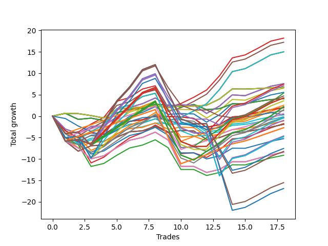

# Short Wallace 009 
- Symbol: NVDA_Unlimited
- Date Range: 02/08/2022 - 07/08/2022
- Trading Period: 7:20-12:30
- Number of Trades: 18



| Name | Win Percent | Profit | Avg Profit / Trade | Avg Time / Trade |      | Name | Win Percent | Profit | Avg Profit / Trade | Avg Time / Trade |
| ---- | ----------- | ------ | ------------------ | ---------------- | ---- | ---- | ----------- | ------ | ------------------ | ---------------- |
| Sorted By <br> Profit | | | | | | Sorted By <br> Win Percentage ||||
| Fifty-Five | 88.89 | 9090.00 | 505.00 | 59:30 |     | Fifty-Five | 88.89 | 9090.00 | 505.00 | 59:30 |
| Forty-Seven | 88.89 | 8605.00 | 478.06 | 59:39 |     | Forty-Seven | 88.89 | 8605.00 | 478.06 | 59:39 |
| Seventy-One | 88.89 | 7490.00 | 416.11 | 65:48 |     | Seventy-One | 88.89 | 7490.00 | 416.11 | 65:48 |
| Sixty-Three | 88.89 | 7490.00 | 416.11 | 65:48 |     | Sixty-Three | 88.89 | 7490.00 | 416.11 | 65:48 |
| Seven | 88.89 | 7490.00 | 416.11 | 65:48 |     | Seven | 88.89 | 7490.00 | 416.11 | 65:48 |
| Sixty-Six | 66.67 | 3775.00 | 209.72 | 25:26 |     | One Hundred Sixteen | 83.33 | 1260.00 | 70.00 | 45:33 |
| Fifty-Eight | 66.67 | 3775.00 | 209.72 | 25:26 |     | One Hundred Eleven | 83.33 | 295.00 | 16.39 | 45:48 |
| Two | 66.67 | 3775.00 | 209.72 | 25:26 |     | One Hundred Twenty-Six | 83.33 | -1360.00 | -75.56 | 54:30 |
| One Hundred Eighteen | 72.22 | 3710.00 | 206.11 | 96:25 |     | One Hundred Twenty-One | 83.33 | -1360.00 | -75.56 | 54:30 |
| One Hundred Ninteen | 66.67 | 3535.00 | 196.39 | 102:22 |     | Eighty-One | 83.33 | -1360.00 | -75.56 | 54:30 |
| Seventy | 66.67 | 3370.00 | 187.22 | 10:33 |     | One Hundred Eighteen | 72.22 | 3710.00 | 206.11 | 96:25 |
| Sixty-Two | 66.67 | 3370.00 | 187.22 | 10:33 |     | One Hundred Seventeen | 72.22 | 2685.00 | 149.17 | 64:26 |
| Fifty-Four | 66.67 | 3370.00 | 187.22 | 10:33 |     | One Hundred Twenty-Eight | 72.22 | 2115.00 | 117.50 | 108:20 |
| Forty-Six | 66.67 | 3370.00 | 187.22 | 10:33 |     | One Hundred Twenty-Three | 72.22 | 2115.00 | 117.50 | 108:20 |
| Six | 66.67 | 3370.00 | 187.22 | 10:33 |     | Eighty-Three | 72.22 | 2115.00 | 117.50 | 108:20 |
| Fifty | 66.67 | 3245.00 | 180.28 | 24:26 |     | Sixty-Four | 72.22 | 2015.00 | 111.94 | 08:32 |
| Forty-Two | 66.67 | 2760.00 | 153.33 | 24:35 |     | Fifty-Six | 72.22 | 2015.00 | 111.94 | 08:32 |
| One Hundred Seventeen | 72.22 | 2685.00 | 149.17 | 64:26 |     | Forty-Eight | 72.22 | 2015.00 | 111.94 | 08:32 |
| One Hundred Twenty | 61.11 | 2345.00 | 130.28 | 104:05 |     | Forty | 72.22 | 2015.00 | 111.94 | 08:32 |
| One Hundred Twenty-Eight | 72.22 | 2115.00 | 117.50 | 108:20 |     | Zero | 72.22 | 2015.00 | 111.94 | 08:32 |
| One Hundred Twenty-Three | 72.22 | 2115.00 | 117.50 | 108:20 |     | One Hundred Thirteen | 72.22 | 1775.00 | 98.61 | 97:11 |
| Eighty-Three | 72.22 | 2115.00 | 117.50 | 108:20 |     | One Hundred Twenty-Seven | 72.22 | 1090.00 | 60.56 | 76:21 |
| Sixty-Four | 72.22 | 2015.00 | 111.94 | 08:32 |     | One Hundred Twenty-Two | 72.22 | 1090.00 | 60.56 | 76:21 |
| Fifty-Six | 72.22 | 2015.00 | 111.94 | 08:32 |     | Eighty-Two | 72.22 | 1090.00 | 60.56 | 76:21 |
| Forty-Eight | 72.22 | 2015.00 | 111.94 | 08:32 |     | One Hundred Twelve | 72.22 | 750.00 | 41.67 | 65:12 |
| Forty | 72.22 | 2015.00 | 111.94 | 08:32 |     | Fifty-One | 72.22 | -85.00 | -4.72 | 20:21 |
| Zero | 72.22 | 2015.00 | 111.94 | 08:32 |     | Forty-Three | 72.22 | -570.00 | -31.67 | 20:30 |
| One Hundred Thirteen | 72.22 | 1775.00 | 98.61 | 97:11 |     | Sixty-Seven | 72.22 | -960.00 | -53.33 | 24:37 |
| One Hundred Sixteen | 83.33 | 1260.00 | 70.00 | 45:33 |     | Fifty-Nine | 72.22 | -960.00 | -53.33 | 24:37 |
| One Hundred Twenty-Seven | 72.22 | 1090.00 | 60.56 | 76:21 |     | Three | 72.22 | -960.00 | -53.33 | 24:37 |
| One Hundred Twenty-Two | 72.22 | 1090.00 | 60.56 | 76:21 |     | Sixty-Six | 66.67 | 3775.00 | 209.72 | 25:26 |
| Eighty-Two | 72.22 | 1090.00 | 60.56 | 76:21 |     | Fifty-Eight | 66.67 | 3775.00 | 209.72 | 25:26 |
| Fifty-Three | 66.67 | 1060.00 | 58.89 | 42:27 |     | Two | 66.67 | 3775.00 | 209.72 | 25:26 |
| Sixty-Five | 61.11 | 975.00 | 54.17 | 17:41 |     | One Hundred Ninteen | 66.67 | 3535.00 | 196.39 | 102:22 |
| Fifty-Seven | 61.11 | 975.00 | 54.17 | 17:41 |     | Seventy | 66.67 | 3370.00 | 187.22 | 10:33 |
| One | 61.11 | 975.00 | 54.17 | 17:41 |     | Sixty-Two | 66.67 | 3370.00 | 187.22 | 10:33 |
| One Hundred Twelve | 72.22 | 750.00 | 41.67 | 65:12 |     | Fifty-Four | 66.67 | 3370.00 | 187.22 | 10:33 |
| Forty-Nine | 61.11 | 635.00 | 35.28 | 16:44 |     | Forty-Six | 66.67 | 3370.00 | 187.22 | 10:33 |
| One Hundred Eleven | 83.33 | 295.00 | 16.39 | 45:48 |     | Six | 66.67 | 3370.00 | 187.22 | 10:33 |
| Seventy-Three | 50.00 | 155.00 | 8.61 | 13:05 |     | Fifty | 66.67 | 3245.00 | 180.28 | 24:26 |
| Forty-One | 61.11 | 150.00 | 8.33 | 16:53 |     | Forty-Two | 66.67 | 2760.00 | 153.33 | 24:35 |
| Fifty-One | 72.22 | -85.00 | -4.72 | 20:21 |     | Fifty-Three | 66.67 | 1060.00 | 58.89 | 42:27 |
| Sixty-Nine | 66.67 | -180.00 | -10.00 | 52:05 |     | Sixty-Nine | 66.67 | -180.00 | -10.00 | 52:05 |
| Sixty-One | 66.67 | -180.00 | -10.00 | 52:05 |     | Sixty-One | 66.67 | -180.00 | -10.00 | 52:05 |
| Five | 66.67 | -180.00 | -10.00 | 52:05 |     | Five | 66.67 | -180.00 | -10.00 | 52:05 |
| One Hundred Fourteen | 66.67 | -230.00 | -12.78 | 103:21 |     | One Hundred Fourteen | 66.67 | -230.00 | -12.78 | 103:21 |
| One Hundred Twenty-Nine | 66.67 | -495.00 | -27.50 | 114:58 |     | One Hundred Twenty-Nine | 66.67 | -495.00 | -27.50 | 114:58 |
| Forty-Three | 72.22 | -570.00 | -31.67 | 20:30 |     | Forty-Five | 66.67 | -875.00 | -48.61 | 43:13 |
| Forty-Five | 66.67 | -875.00 | -48.61 | 43:13 |     | Eighty-Four | 66.67 | -2315.00 | -128.61 | 117:46 |
| Sixty-Seven | 72.22 | -960.00 | -53.33 | 24:37 |     | One Hundred Twenty-Four | 66.67 | -2420.00 | -134.44 | 116:05 |
| Fifty-Nine | 72.22 | -960.00 | -53.33 | 24:37 |     | One Hundred Twenty | 61.11 | 2345.00 | 130.28 | 104:05 |
| Three | 72.22 | -960.00 | -53.33 | 24:37 |     | Sixty-Five | 61.11 | 975.00 | 54.17 | 17:41 |
| One Hundred Twenty-Six | 83.33 | -1360.00 | -75.56 | 54:30 |     | Fifty-Seven | 61.11 | 975.00 | 54.17 | 17:41 |
| One Hundred Twenty-One | 83.33 | -1360.00 | -75.56 | 54:30 |     | One | 61.11 | 975.00 | 54.17 | 17:41 |
| Eighty-One | 83.33 | -1360.00 | -75.56 | 54:30 |     | Forty-Nine | 61.11 | 635.00 | 35.28 | 16:44 |
| Eighty-Four | 66.67 | -2315.00 | -128.61 | 117:46 |     | Forty-One | 61.11 | 150.00 | 8.33 | 16:53 |
| One Hundred Twenty-Four | 66.67 | -2420.00 | -134.44 | 116:05 |     | One Hundred Fifteen | 61.11 | -3775.00 | -209.72 | 105:45 |
| Fifty-Two | 55.56 | -2635.00 | -146.39 | 35:44 |     | One Hundred Thirty | 61.11 | -4120.00 | -228.89 | 117:23 |
| One Hundred Fifteen | 61.11 | -3775.00 | -209.72 | 105:45 |     | Eighty-Five | 61.11 | -7760.00 | -431.11 | 122:59 |
| One Hundred Thirty | 61.11 | -4120.00 | -228.89 | 117:23 |     | One Hundred Twenty-Five | 61.11 | -8445.00 | -469.17 | 119:40 |
| Sixty-Eight | 55.56 | -4215.00 | -234.17 | 45:16 |     | Fifty-Two | 55.56 | -2635.00 | -146.39 | 35:44 |
| Sixty | 55.56 | -4215.00 | -234.17 | 45:16 |     | Sixty-Eight | 55.56 | -4215.00 | -234.17 | 45:16 |
| Four | 55.56 | -4215.00 | -234.17 | 45:16 |     | Sixty | 55.56 | -4215.00 | -234.17 | 45:16 |
| Forty-Four | 55.56 | -4570.00 | -253.89 | 36:30 |     | Four | 55.56 | -4215.00 | -234.17 | 45:16 |
| Eighty-Five | 61.11 | -7760.00 | -431.11 | 122:59 |     | Forty-Four | 55.56 | -4570.00 | -253.89 | 36:30 |
| One Hundred Twenty-Five | 61.11 | -8445.00 | -469.17 | 119:40 |     | Seventy-Three | 50.00 | 155.00 | 8.61 | 13:05 |

## NO STOPLOSS

### Test Zero
* Sell when price hits the middle line of the 20p bollinger
* No Stoploss
* Results:
```
Total Trades: 18
Percent Up: 27.78
Percent Down: 72.22
Total Points Moved Down: 4.03
Potential Profit: 2015.00
Total Points Ups: 3.81 Count Ups: 5
Total Points Downs: 7.84 Count Downs: 13
```

<details><summary>Trades</summary>

<code>In: 2022-02-16 11:02:00		Out: 2022-02-16 11:03:10		Total Position Time: 01:10		Total Move Down: 0.64		Total to Date: 0.64</code> <br />
<code>In: 2022-02-18 11:21:00		Out: 2022-02-18 11:39:35		Total Position Time: 18:35		Total Move Down: -1.41		Total to Date: -0.77</code> <br />
<code>In: 2022-02-22 11:34:00		Out: 2022-02-22 11:42:40		Total Position Time: 08:40		Total Move Down: 0.29		Total to Date: -0.48</code> <br />
<code>In: 2022-02-23 09:11:00		Out: 2022-02-23 09:30:55		Total Position Time: 19:55		Total Move Down: -0.58		Total to Date: -1.06</code> <br />
<code>In: 2022-03-03 09:38:00		Out: 2022-03-03 09:41:55		Total Position Time: 03:55		Total Move Down: 1.81		Total to Date: 0.75</code> <br />
<code>In: 2022-03-11 09:22:00		Out: 2022-03-11 09:24:10		Total Position Time: 02:10		Total Move Down: 0.81		Total to Date: 1.56</code> <br />
<code>In: 2022-03-11 10:51:00		Out: 2022-03-11 10:52:10		Total Position Time: 01:10		Total Move Down: 0.25		Total to Date: 1.81</code> <br />
<code>In: 2022-03-14 12:04:00		Out: 2022-03-14 12:08:20		Total Position Time: 04:20		Total Move Down: 0.93		Total to Date: 2.74</code> <br />
<code>In: 2022-03-28 09:54:00		Out: 2022-03-28 10:09:55		Total Position Time: 15:55		Total Move Down: -0.17		Total to Date: 2.57</code> <br />
<code>In: 2022-04-07 10:22:00		Out: 2022-04-07 10:39:50		Total Position Time: 17:50		Total Move Down: -0.44		Total to Date: 2.13</code> <br />
<code>In: 2022-04-20 09:55:00		Out: 2022-04-20 09:59:05		Total Position Time: 04:05		Total Move Down: 0.58		Total to Date: 2.71</code> <br />
<code>In: 2022-05-03 10:03:00		Out: 2022-05-03 10:28:05		Total Position Time: 25:05		Total Move Down: -1.21		Total to Date: 1.50</code> <br />
<code>In: 2022-05-04 10:37:00		Out: 2022-05-04 10:38:55		Total Position Time: 01:55		Total Move Down: 0.24		Total to Date: 1.74</code> <br />
<code>In: 2022-05-04 11:03:00		Out: 2022-05-04 11:07:05		Total Position Time: 04:05		Total Move Down: 1.09		Total to Date: 2.83</code> <br />
<code>In: 2022-06-10 10:21:00		Out: 2022-06-10 10:31:15		Total Position Time: 10:15		Total Move Down: 0.05		Total to Date: 2.88</code> <br />
<code>In: 2022-06-10 12:00:00		Out: 2022-06-10 12:03:30		Total Position Time: 03:30		Total Move Down: 0.54		Total to Date: 3.42</code> <br />
<code>In: 2022-06-10 12:29:00		Out: 2022-06-10 12:30:50		Total Position Time: 01:50		Total Move Down: 0.44		Total to Date: 3.86</code> <br />
<code>In: 2022-07-01 08:11:00		Out: 2022-07-01 08:20:15		Total Position Time: 09:15		Total Move Down: 0.17		Total to Date: 4.03</code> <br />


</details>

### Test One
* Sell when the price hits the upper line of the 20p 1std bollinger
* No Stoploss
* Results:
```
Total Trades: 18
Percent Up: 38.89
Percent Down: 61.11
Total Points Moved Down: 1.95
Potential Profit: 975.00
Total Points Ups: 8.05 Count Ups: 7
Total Points Downs: 10.00 Count Downs: 11
```

<details><summary>Trades</summary>

<code>In: 2022-02-16 11:02:00		Out: 2022-02-16 11:47:15		Total Position Time: 45:15		Total Move Down: -3.41		Total to Date: -3.41</code> <br />
<code>In: 2022-02-18 11:21:00		Out: 2022-02-18 11:49:05		Total Position Time: 28:05		Total Move Down: -1.64		Total to Date: -5.05</code> <br />
<code>In: 2022-02-22 11:34:00		Out: 2022-02-22 11:44:25		Total Position Time: 10:25		Total Move Down: 1.16		Total to Date: -3.89</code> <br />
<code>In: 2022-02-23 09:11:00		Out: 2022-02-23 09:32:10		Total Position Time: 21:10		Total Move Down: -0.37		Total to Date: -4.26</code> <br />
<code>In: 2022-03-03 09:38:00		Out: 2022-03-03 09:53:50		Total Position Time: 15:50		Total Move Down: 1.78		Total to Date: -2.48</code> <br />
<code>In: 2022-03-11 09:22:00		Out: 2022-03-11 09:27:05		Total Position Time: 05:05		Total Move Down: 1.24		Total to Date: -1.24</code> <br />
<code>In: 2022-03-11 10:51:00		Out: 2022-03-11 10:52:35		Total Position Time: 01:35		Total Move Down: 0.39		Total to Date: -0.85</code> <br />
<code>In: 2022-03-14 12:04:00		Out: 2022-03-14 12:19:55		Total Position Time: 15:55		Total Move Down: 0.86		Total to Date: 0.01</code> <br />
<code>In: 2022-03-28 09:54:00		Out: 2022-03-28 10:14:15		Total Position Time: 20:15		Total Move Down: -0.10		Total to Date: -0.09</code> <br />
<code>In: 2022-04-07 10:22:00		Out: 2022-04-07 10:45:15		Total Position Time: 23:15		Total Move Down: -0.10		Total to Date: -0.19</code> <br />
<code>In: 2022-04-20 09:55:00		Out: 2022-04-20 10:32:05		Total Position Time: 37:05		Total Move Down: -0.35		Total to Date: -0.54</code> <br />
<code>In: 2022-05-03 10:03:00		Out: 2022-05-03 10:54:05		Total Position Time: 51:05		Total Move Down: -2.08		Total to Date: -2.62</code> <br />
<code>In: 2022-05-04 10:37:00		Out: 2022-05-04 10:41:05		Total Position Time: 04:05		Total Move Down: 0.62		Total to Date: -2.00</code> <br />
<code>In: 2022-05-04 11:03:00		Out: 2022-05-04 11:07:20		Total Position Time: 04:20		Total Move Down: 1.80		Total to Date: -0.20</code> <br />
<code>In: 2022-06-10 10:21:00		Out: 2022-06-10 10:33:25		Total Position Time: 12:25		Total Move Down: 0.26		Total to Date: 0.06</code> <br />
<code>In: 2022-06-10 12:00:00		Out: 2022-06-10 12:05:10		Total Position Time: 05:10		Total Move Down: 0.81		Total to Date: 0.87</code> <br />
<code>In: 2022-06-10 12:29:00		Out: 2022-06-10 12:33:15		Total Position Time: 04:15		Total Move Down: 0.62		Total to Date: 1.49</code> <br />
<code>In: 2022-07-01 08:11:00		Out: 2022-07-01 08:24:05		Total Position Time: 13:05		Total Move Down: 0.46		Total to Date: 1.95</code> <br />


</details>

### Test Two
* Sell when the price hits the upper line of the 20p 2std bollinger
* No Stoploss
* Results:
```
Total Trades: 18
Percent Up: 33.33
Percent Down: 66.67
Total Points Moved Down: 7.55
Potential Profit: 3775.00
Total Points Ups: 8.02 Count Ups: 6
Total Points Downs: 15.57 Count Downs: 12
```

<details><summary>Trades</summary>

<code>In: 2022-02-16 11:02:00		Out: 2022-02-16 11:48:05		Total Position Time: 46:05		Total Move Down: -3.03		Total to Date: -3.03</code> <br />
<code>In: 2022-02-18 11:21:00		Out: 2022-02-18 11:49:30		Total Position Time: 28:30		Total Move Down: -1.03		Total to Date: -4.06</code> <br />
<code>In: 2022-02-22 11:34:00		Out: 2022-02-22 11:46:15		Total Position Time: 12:15		Total Move Down: 1.63		Total to Date: -2.43</code> <br />
<code>In: 2022-02-23 09:11:00		Out: 2022-02-23 09:34:50		Total Position Time: 23:50		Total Move Down: 0.19		Total to Date: -2.24</code> <br />
<code>In: 2022-03-03 09:38:00		Out: 2022-03-03 10:00:10		Total Position Time: 22:10		Total Move Down: 2.00		Total to Date: -0.24</code> <br />
<code>In: 2022-03-11 09:22:00		Out: 2022-03-11 09:36:10		Total Position Time: 14:10		Total Move Down: 2.24		Total to Date: 2.00</code> <br />
<code>In: 2022-03-11 10:51:00		Out: 2022-03-11 10:53:20		Total Position Time: 02:20		Total Move Down: 0.89		Total to Date: 2.89</code> <br />
<code>In: 2022-03-14 12:04:00		Out: 2022-03-14 12:20:10		Total Position Time: 16:10		Total Move Down: 1.33		Total to Date: 4.22</code> <br />
<code>In: 2022-03-28 09:54:00		Out: 2022-03-28 10:53:30		Total Position Time: 59:30		Total Move Down: -1.78		Total to Date: 2.44</code> <br />
<code>In: 2022-04-07 10:22:00		Out: 2022-04-07 10:47:20		Total Position Time: 25:20		Total Move Down: 0.17		Total to Date: 2.61</code> <br />
<code>In: 2022-04-20 09:55:00		Out: 2022-04-20 10:33:25		Total Position Time: 38:25		Total Move Down: -0.08		Total to Date: 2.53</code> <br />
<code>In: 2022-05-03 10:03:00		Out: 2022-05-03 10:57:15		Total Position Time: 54:15		Total Move Down: -1.91		Total to Date: 0.62</code> <br />
<code>In: 2022-05-04 10:37:00		Out: 2022-05-04 11:07:30		Total Position Time: 30:30		Total Move Down: 1.72		Total to Date: 2.34</code> <br />
<code>In: 2022-05-04 11:03:00		Out: 2022-05-04 11:07:30		Total Position Time: 04:30		Total Move Down: 2.61		Total to Date: 4.95</code> <br />
<code>In: 2022-06-10 10:21:00		Out: 2022-06-10 11:03:05		Total Position Time: 42:05		Total Move Down: -0.19		Total to Date: 4.76</code> <br />
<code>In: 2022-06-10 12:00:00		Out: 2022-06-10 12:09:00		Total Position Time: 09:00		Total Move Down: 1.14		Total to Date: 5.90</code> <br />
<code>In: 2022-06-10 12:29:00		Out: 2022-06-10 12:42:40		Total Position Time: 13:40		Total Move Down: 1.06		Total to Date: 6.96</code> <br />
<code>In: 2022-07-01 08:11:00		Out: 2022-07-01 08:26:10		Total Position Time: 15:10		Total Move Down: 0.59		Total to Date: 7.55</code> <br />


</details>

### Test Three
* Sell when price hits the middle line of the 50p bollinger
* No Stoploss
* Results:
```
Total Trades: 18
Percent Up: 27.78
Percent Down: 72.22
Total Points Moved Down: -1.92
Potential Profit: -960.00
Total Points Ups: 11.76 Count Ups: 5
Total Points Downs: 9.84 Count Downs: 13
```

<details><summary>Trades</summary>

<code>In: 2022-02-16 11:02:00		Out: 2022-02-16 12:47:00		Total Position Time: 105:00		Total Move Down: -5.84		Total to Date: -5.84</code> <br />
<code>In: 2022-02-18 11:21:00		Out: 2022-02-18 12:17:20		Total Position Time: 56:20		Total Move Down: -2.35		Total to Date: -8.19</code> <br />
<code>In: 2022-02-22 11:34:00		Out: 2022-02-22 11:44:30		Total Position Time: 10:30		Total Move Down: 1.27		Total to Date: -6.92</code> <br />
<code>In: 2022-02-23 09:11:00		Out: 2022-02-23 09:34:55		Total Position Time: 23:55		Total Move Down: 0.16		Total to Date: -6.76</code> <br />
<code>In: 2022-03-03 09:38:00		Out: 2022-03-03 09:41:50		Total Position Time: 03:50		Total Move Down: 1.84		Total to Date: -4.92</code> <br />
<code>In: 2022-03-11 09:22:00		Out: 2022-03-11 09:27:05		Total Position Time: 05:05		Total Move Down: 1.24		Total to Date: -3.68</code> <br />
<code>In: 2022-03-11 10:51:00		Out: 2022-03-11 10:52:10		Total Position Time: 01:10		Total Move Down: 0.25		Total to Date: -3.43</code> <br />
<code>In: 2022-03-14 12:04:00		Out: 2022-03-14 12:20:05		Total Position Time: 16:05		Total Move Down: 1.06		Total to Date: -2.37</code> <br />
<code>In: 2022-03-28 09:54:00		Out: 2022-03-28 10:54:55		Total Position Time: 60:55		Total Move Down: -1.48		Total to Date: -3.85</code> <br />
<code>In: 2022-04-07 10:22:00		Out: 2022-04-07 10:47:55		Total Position Time: 25:55		Total Move Down: 0.50		Total to Date: -3.35</code> <br />
<code>In: 2022-04-20 09:55:00		Out: 2022-04-20 10:33:05		Total Position Time: 38:05		Total Move Down: -0.12		Total to Date: -3.47</code> <br />
<code>In: 2022-05-03 10:03:00		Out: 2022-05-03 11:01:00		Total Position Time: 58:00		Total Move Down: -1.97		Total to Date: -5.44</code> <br />
<code>In: 2022-05-04 10:37:00		Out: 2022-05-04 10:39:05		Total Position Time: 02:05		Total Move Down: 0.42		Total to Date: -5.02</code> <br />
<code>In: 2022-05-04 11:03:00		Out: 2022-05-04 11:07:05		Total Position Time: 04:05		Total Move Down: 1.09		Total to Date: -3.93</code> <br />
<code>In: 2022-06-10 10:21:00		Out: 2022-06-10 10:32:15		Total Position Time: 11:15		Total Move Down: 0.24		Total to Date: -3.69</code> <br />
<code>In: 2022-06-10 12:00:00		Out: 2022-06-10 12:03:30		Total Position Time: 03:30		Total Move Down: 0.54		Total to Date: -3.15</code> <br />
<code>In: 2022-06-10 12:29:00		Out: 2022-06-10 12:33:10		Total Position Time: 04:10		Total Move Down: 0.58		Total to Date: -2.57</code> <br />
<code>In: 2022-07-01 08:11:00		Out: 2022-07-01 08:24:20		Total Position Time: 13:20		Total Move Down: 0.65		Total to Date: -1.92</code> <br />


</details>

### Test Four
* Sell when the price hits the upper line of the 50p 1std bollinger
* No Stoploss
* Results:
```
Total Trades: 18
Percent Up: 44.44
Percent Down: 55.56
Total Points Moved Down: -8.43
Potential Profit: -4215.00
Total Points Ups: 19.39 Count Ups: 8
Total Points Downs: 10.96 Count Downs: 10
```

<details><summary>Trades</summary>

<code>In: 2022-02-16 11:02:00		Out: 2022-02-16 12:47:00		Total Position Time: 105:00		Total Move Down: -5.84		Total to Date: -5.84</code> <br />
<code>In: 2022-02-18 11:21:00		Out: 2022-02-18 12:19:05		Total Position Time: 58:05		Total Move Down: -1.61		Total to Date: -7.45</code> <br />
<code>In: 2022-02-22 11:34:00		Out: 2022-02-22 12:40:55		Total Position Time: 66:55		Total Move Down: -2.51		Total to Date: -9.96</code> <br />
<code>In: 2022-02-23 09:11:00		Out: 2022-02-23 09:48:10		Total Position Time: 37:10		Total Move Down: 0.71		Total to Date: -9.25</code> <br />
<code>In: 2022-03-03 09:38:00		Out: 2022-03-03 10:34:35		Total Position Time: 56:35		Total Move Down: 1.89		Total to Date: -7.36</code> <br />
<code>In: 2022-03-11 09:22:00		Out: 2022-03-11 09:29:50		Total Position Time: 07:50		Total Move Down: 1.71		Total to Date: -5.65</code> <br />
<code>In: 2022-03-11 10:51:00		Out: 2022-03-11 10:53:05		Total Position Time: 02:05		Total Move Down: 0.67		Total to Date: -4.98</code> <br />
<code>In: 2022-03-14 12:04:00		Out: 2022-03-14 12:30:55		Total Position Time: 26:55		Total Move Down: 1.24		Total to Date: -3.74</code> <br />
<code>In: 2022-03-28 09:54:00		Out: 2022-03-28 11:15:05		Total Position Time: 81:05		Total Move Down: -1.84		Total to Date: -5.58</code> <br />
<code>In: 2022-04-07 10:22:00		Out: 2022-04-07 12:47:00		Total Position Time: 145:00		Total Move Down: -6.16		Total to Date: -11.74</code> <br />
<code>In: 2022-04-20 09:55:00		Out: 2022-04-20 10:51:05		Total Position Time: 56:05		Total Move Down: -0.00		Total to Date: -11.74</code> <br />
<code>In: 2022-05-03 10:03:00		Out: 2022-05-03 11:01:15		Total Position Time: 58:15		Total Move Down: -1.41		Total to Date: -13.15</code> <br />
<code>In: 2022-05-04 10:37:00		Out: 2022-05-04 10:41:55		Total Position Time: 04:55		Total Move Down: 0.70		Total to Date: -12.45</code> <br />
<code>In: 2022-05-04 11:03:00		Out: 2022-05-04 11:07:20		Total Position Time: 04:20		Total Move Down: 1.80		Total to Date: -10.65</code> <br />
<code>In: 2022-06-10 10:21:00		Out: 2022-06-10 11:13:30		Total Position Time: 52:30		Total Move Down: -0.02		Total to Date: -10.67</code> <br />
<code>In: 2022-06-10 12:00:00		Out: 2022-06-10 12:05:10		Total Position Time: 05:10		Total Move Down: 0.81		Total to Date: -9.86</code> <br />
<code>In: 2022-06-10 12:29:00		Out: 2022-06-10 12:42:10		Total Position Time: 13:10		Total Move Down: 0.81		Total to Date: -9.05</code> <br />
<code>In: 2022-07-01 08:11:00		Out: 2022-07-01 08:45:00		Total Position Time: 34:00		Total Move Down: 0.62		Total to Date: -8.43</code> <br />


</details>

### Test Five
* Sell when the price hits the upper line of the 50p 2std bollinger
* No Stoploss
* Results:
```
Total Trades: 18
Percent Up: 33.33
Percent Down: 66.67
Total Points Moved Down: -0.36
Potential Profit: -180.00
Total Points Ups: 17.26 Count Ups: 6
Total Points Downs: 16.90 Count Downs: 12
```

<details><summary>Trades</summary>

<code>In: 2022-02-16 11:02:00		Out: 2022-02-16 12:47:00		Total Position Time: 105:00		Total Move Down: -5.84		Total to Date: -5.84</code> <br />
<code>In: 2022-02-18 11:21:00		Out: 2022-02-18 12:19:45		Total Position Time: 58:45		Total Move Down: -0.78		Total to Date: -6.62</code> <br />
<code>In: 2022-02-22 11:34:00		Out: 2022-02-22 12:42:30		Total Position Time: 68:30		Total Move Down: -1.83		Total to Date: -8.45</code> <br />
<code>In: 2022-02-23 09:11:00		Out: 2022-02-23 09:50:45		Total Position Time: 39:45		Total Move Down: 1.34		Total to Date: -7.11</code> <br />
<code>In: 2022-03-03 09:38:00		Out: 2022-03-03 10:41:35		Total Position Time: 63:35		Total Move Down: 2.39		Total to Date: -4.72</code> <br />
<code>In: 2022-03-11 09:22:00		Out: 2022-03-11 09:36:05		Total Position Time: 14:05		Total Move Down: 2.09		Total to Date: -2.63</code> <br />
<code>In: 2022-03-11 10:51:00		Out: 2022-03-11 10:58:25		Total Position Time: 07:25		Total Move Down: 1.21		Total to Date: -1.42</code> <br />
<code>In: 2022-03-14 12:04:00		Out: 2022-03-14 12:33:20		Total Position Time: 29:20		Total Move Down: 1.79		Total to Date: 0.37</code> <br />
<code>In: 2022-03-28 09:54:00		Out: 2022-03-28 11:22:20		Total Position Time: 88:20		Total Move Down: -1.57		Total to Date: -1.20</code> <br />
<code>In: 2022-04-07 10:22:00		Out: 2022-04-07 12:47:00		Total Position Time: 145:00		Total Move Down: -6.16		Total to Date: -7.36</code> <br />
<code>In: 2022-04-20 09:55:00		Out: 2022-04-20 11:13:55		Total Position Time: 78:55		Total Move Down: 0.19		Total to Date: -7.17</code> <br />
<code>In: 2022-05-03 10:03:00		Out: 2022-05-03 11:03:45		Total Position Time: 60:45		Total Move Down: -1.08		Total to Date: -8.25</code> <br />
<code>In: 2022-05-04 10:37:00		Out: 2022-05-04 11:07:30		Total Position Time: 30:30		Total Move Down: 1.72		Total to Date: -6.53</code> <br />
<code>In: 2022-05-04 11:03:00		Out: 2022-05-04 11:07:30		Total Position Time: 04:30		Total Move Down: 2.61		Total to Date: -3.92</code> <br />
<code>In: 2022-06-10 10:21:00		Out: 2022-06-10 11:41:40		Total Position Time: 80:40		Total Move Down: 0.23		Total to Date: -3.69</code> <br />
<code>In: 2022-06-10 12:00:00		Out: 2022-06-10 12:09:00		Total Position Time: 09:00		Total Move Down: 1.14		Total to Date: -2.55</code> <br />
<code>In: 2022-06-10 12:29:00		Out: 2022-06-10 12:43:20		Total Position Time: 14:20		Total Move Down: 1.19		Total to Date: -1.36</code> <br />
<code>In: 2022-07-01 08:11:00		Out: 2022-07-01 08:50:15		Total Position Time: 39:15		Total Move Down: 1.00		Total to Date: -0.36</code> <br />


</details>

### Test Six
* Sell when the price hits the middle line of the 1std VWAP
* No Stoploss
* Results:
```
Total Trades: 18
Percent Up: 33.33
Percent Down: 66.67
Total Points Moved Down: 6.74
Potential Profit: 3370.00
Total Points Ups: 1.52 Count Ups: 6
Total Points Downs: 8.26 Count Downs: 12
```

<details><summary>Trades</summary>

<code>In: 2022-02-16 11:02:00		Out: 2022-02-16 11:03:10		Total Position Time: 01:10		Total Move Down: 0.64		Total to Date: 0.64</code> <br />
<code>In: 2022-02-18 11:21:00		Out: 2022-02-18 12:22:10		Total Position Time: 61:10		Total Move Down: -0.07		Total to Date: 0.57</code> <br />
<code>In: 2022-02-22 11:34:00		Out: 2022-02-22 11:35:10		Total Position Time: 01:10		Total Move Down: -0.45		Total to Date: 0.12</code> <br />
<code>In: 2022-02-23 09:11:00		Out: 2022-02-23 09:12:10		Total Position Time: 01:10		Total Move Down: -0.57		Total to Date: -0.45</code> <br />
<code>In: 2022-03-03 09:38:00		Out: 2022-03-03 09:43:05		Total Position Time: 05:05		Total Move Down: 2.03		Total to Date: 1.58</code> <br />
<code>In: 2022-03-11 09:22:00		Out: 2022-03-11 09:23:10		Total Position Time: 01:10		Total Move Down: 0.30		Total to Date: 1.88</code> <br />
<code>In: 2022-03-11 10:51:00		Out: 2022-03-11 10:52:10		Total Position Time: 01:10		Total Move Down: 0.25		Total to Date: 2.13</code> <br />
<code>In: 2022-03-14 12:04:00		Out: 2022-03-14 12:05:10		Total Position Time: 01:10		Total Move Down: 0.25		Total to Date: 2.38</code> <br />
<code>In: 2022-03-28 09:54:00		Out: 2022-03-28 09:55:10		Total Position Time: 01:10		Total Move Down: -0.41		Total to Date: 1.97</code> <br />
<code>In: 2022-04-07 10:22:00		Out: 2022-04-07 10:23:10		Total Position Time: 01:10		Total Move Down: 0.35		Total to Date: 2.32</code> <br />
<code>In: 2022-04-20 09:55:00		Out: 2022-04-20 09:56:10		Total Position Time: 01:10		Total Move Down: -0.00		Total to Date: 2.32</code> <br />
<code>In: 2022-05-03 10:03:00		Out: 2022-05-03 11:15:30		Total Position Time: 72:30		Total Move Down: 0.21		Total to Date: 2.53</code> <br />
<code>In: 2022-05-04 10:37:00		Out: 2022-05-04 11:07:25		Total Position Time: 30:25		Total Move Down: 1.45		Total to Date: 3.98</code> <br />
<code>In: 2022-05-04 11:03:00		Out: 2022-05-04 11:07:25		Total Position Time: 04:25		Total Move Down: 2.34		Total to Date: 6.32</code> <br />
<code>In: 2022-06-10 10:21:00		Out: 2022-06-10 10:22:10		Total Position Time: 01:10		Total Move Down: -0.02		Total to Date: 6.30</code> <br />
<code>In: 2022-06-10 12:00:00		Out: 2022-06-10 12:02:15		Total Position Time: 02:15		Total Move Down: 0.12		Total to Date: 6.42</code> <br />
<code>In: 2022-06-10 12:29:00		Out: 2022-06-10 12:30:20		Total Position Time: 01:20		Total Move Down: 0.19		Total to Date: 6.61</code> <br />
<code>In: 2022-07-01 08:11:00		Out: 2022-07-01 08:12:10		Total Position Time: 01:10		Total Move Down: 0.13		Total to Date: 6.74</code> <br />


</details>

### Test Seven
* Sell when the price hits the upper line of the 1std VWAP
* No Stoploss
* Results:
```
Total Trades: 18
Percent Up: 11.11
Percent Down: 88.89
Total Points Moved Down: 14.98
Potential Profit: 7490.00
Total Points Ups: 12.32 Count Ups: 2
Total Points Downs: 27.30 Count Downs: 16
```

<details><summary>Trades</summary>

<code>In: 2022-02-16 11:02:00		Out: 2022-02-16 12:47:00		Total Position Time: 105:00		Total Move Down: -5.84		Total to Date: -5.84</code> <br />
<code>In: 2022-02-18 11:21:00		Out: 2022-02-18 12:47:00		Total Position Time: 86:00		Total Move Down: 0.38		Total to Date: -5.46</code> <br />
<code>In: 2022-02-22 11:34:00		Out: 2022-02-22 11:46:30		Total Position Time: 12:30		Total Move Down: 1.85		Total to Date: -3.61</code> <br />
<code>In: 2022-02-23 09:11:00		Out: 2022-02-23 09:51:00		Total Position Time: 40:00		Total Move Down: 1.58		Total to Date: -2.03</code> <br />
<code>In: 2022-03-03 09:38:00		Out: 2022-03-03 11:44:05		Total Position Time: 126:05		Total Move Down: 3.73		Total to Date: 1.70</code> <br />
<code>In: 2022-03-11 09:22:00		Out: 2022-03-11 09:25:25		Total Position Time: 03:25		Total Move Down: 0.88		Total to Date: 2.58</code> <br />
<code>In: 2022-03-11 10:51:00		Out: 2022-03-11 12:06:55		Total Position Time: 75:55		Total Move Down: 1.97		Total to Date: 4.55</code> <br />
<code>In: 2022-03-14 12:04:00		Out: 2022-03-14 12:08:15		Total Position Time: 04:15		Total Move Down: 0.77		Total to Date: 5.32</code> <br />
<code>In: 2022-03-28 09:54:00		Out: 2022-03-28 12:47:00		Total Position Time: 173:00		Total Move Down: -6.48		Total to Date: -1.16</code> <br />
<code>In: 2022-04-07 10:22:00		Out: 2022-04-07 10:48:15		Total Position Time: 26:15		Total Move Down: 0.88		Total to Date: -0.28</code> <br />
<code>In: 2022-04-20 09:55:00		Out: 2022-04-20 11:54:35		Total Position Time: 119:35		Total Move Down: 1.47		Total to Date: 1.19</code> <br />
<code>In: 2022-05-03 10:03:00		Out: 2022-05-03 11:40:30		Total Position Time: 97:30		Total Move Down: 1.69		Total to Date: 2.88</code> <br />
<code>In: 2022-05-04 10:37:00		Out: 2022-05-04 11:34:15		Total Position Time: 57:15		Total Move Down: 3.30		Total to Date: 6.18</code> <br />
<code>In: 2022-05-04 11:03:00		Out: 2022-05-04 11:34:15		Total Position Time: 31:15		Total Move Down: 4.19		Total to Date: 10.37</code> <br />
<code>In: 2022-06-10 10:21:00		Out: 2022-06-10 12:47:00		Total Position Time: 146:00		Total Move Down: 0.69		Total to Date: 11.06</code> <br />
<code>In: 2022-06-10 12:00:00		Out: 2022-06-10 12:47:00		Total Position Time: 47:00		Total Move Down: 1.57		Total to Date: 12.63</code> <br />
<code>In: 2022-06-10 12:29:00		Out: 2022-06-10 12:47:00		Total Position Time: 18:00		Total Move Down: 1.65		Total to Date: 14.28</code> <br />
<code>In: 2022-07-01 08:11:00		Out: 2022-07-01 08:26:30		Total Position Time: 15:30		Total Move Down: 0.70		Total to Date: 14.98</code> <br />


</details>

## STOPLOSS OF 5

### Test Forty
* Sell when price hits the middle line of the 20p bollinger
* Stoploss is -5 points
* Results:
```
Total Trades: 18
Percent Up: 27.78
Percent Down: 72.22
Total Points Moved Down: 4.03
Potential Profit: 2015.00
Total Points Ups: 3.81 Count Ups: 5
Total Points Downs: 7.84 Count Downs: 13
```

<details><summary>Trades</summary>

<code>In: 2022-02-16 11:02:00		Out: 2022-02-16 11:03:10		Total Position Time: 01:10		Total Move Down: 0.64		Total to Date: 0.64</code> <br />
<code>In: 2022-02-18 11:21:00		Out: 2022-02-18 11:39:35		Total Position Time: 18:35		Total Move Down: -1.41		Total to Date: -0.77</code> <br />
<code>In: 2022-02-22 11:34:00		Out: 2022-02-22 11:42:40		Total Position Time: 08:40		Total Move Down: 0.29		Total to Date: -0.48</code> <br />
<code>In: 2022-02-23 09:11:00		Out: 2022-02-23 09:30:55		Total Position Time: 19:55		Total Move Down: -0.58		Total to Date: -1.06</code> <br />
<code>In: 2022-03-03 09:38:00		Out: 2022-03-03 09:41:55		Total Position Time: 03:55		Total Move Down: 1.81		Total to Date: 0.75</code> <br />
<code>In: 2022-03-11 09:22:00		Out: 2022-03-11 09:24:10		Total Position Time: 02:10		Total Move Down: 0.81		Total to Date: 1.56</code> <br />
<code>In: 2022-03-11 10:51:00		Out: 2022-03-11 10:52:10		Total Position Time: 01:10		Total Move Down: 0.25		Total to Date: 1.81</code> <br />
<code>In: 2022-03-14 12:04:00		Out: 2022-03-14 12:08:20		Total Position Time: 04:20		Total Move Down: 0.93		Total to Date: 2.74</code> <br />
<code>In: 2022-03-28 09:54:00		Out: 2022-03-28 10:09:55		Total Position Time: 15:55		Total Move Down: -0.17		Total to Date: 2.57</code> <br />
<code>In: 2022-04-07 10:22:00		Out: 2022-04-07 10:39:50		Total Position Time: 17:50		Total Move Down: -0.44		Total to Date: 2.13</code> <br />
<code>In: 2022-04-20 09:55:00		Out: 2022-04-20 09:59:05		Total Position Time: 04:05		Total Move Down: 0.58		Total to Date: 2.71</code> <br />
<code>In: 2022-05-03 10:03:00		Out: 2022-05-03 10:28:05		Total Position Time: 25:05		Total Move Down: -1.21		Total to Date: 1.50</code> <br />
<code>In: 2022-05-04 10:37:00		Out: 2022-05-04 10:38:55		Total Position Time: 01:55		Total Move Down: 0.24		Total to Date: 1.74</code> <br />
<code>In: 2022-05-04 11:03:00		Out: 2022-05-04 11:07:05		Total Position Time: 04:05		Total Move Down: 1.09		Total to Date: 2.83</code> <br />
<code>In: 2022-06-10 10:21:00		Out: 2022-06-10 10:31:15		Total Position Time: 10:15		Total Move Down: 0.05		Total to Date: 2.88</code> <br />
<code>In: 2022-06-10 12:00:00		Out: 2022-06-10 12:03:30		Total Position Time: 03:30		Total Move Down: 0.54		Total to Date: 3.42</code> <br />
<code>In: 2022-06-10 12:29:00		Out: 2022-06-10 12:30:50		Total Position Time: 01:50		Total Move Down: 0.44		Total to Date: 3.86</code> <br />
<code>In: 2022-07-01 08:11:00		Out: 2022-07-01 08:20:15		Total Position Time: 09:15		Total Move Down: 0.17		Total to Date: 4.03</code> <br />


</details>

### Test Forty-One
* Sell when the price hits the upper line of the 20p 1std bollinger
* Stoploss is -5 points
* Results:
```
Total Trades: 18
Percent Up: 38.89
Percent Down: 61.11
Total Points Moved Down: 0.30
Potential Profit: 150.00
Total Points Ups: 9.70 Count Ups: 7
Total Points Downs: 10.00 Count Downs: 11
```

<details><summary>Trades</summary>

<code>In: 2022-02-16 11:02:00		Out: 2022-02-16 11:32:50		Total Position Time: 30:50		Total Move Down: -5.06		Total to Date: -5.06</code> <br />
<code>In: 2022-02-18 11:21:00		Out: 2022-02-18 11:49:05		Total Position Time: 28:05		Total Move Down: -1.64		Total to Date: -6.70</code> <br />
<code>In: 2022-02-22 11:34:00		Out: 2022-02-22 11:44:25		Total Position Time: 10:25		Total Move Down: 1.16		Total to Date: -5.54</code> <br />
<code>In: 2022-02-23 09:11:00		Out: 2022-02-23 09:32:10		Total Position Time: 21:10		Total Move Down: -0.37		Total to Date: -5.91</code> <br />
<code>In: 2022-03-03 09:38:00		Out: 2022-03-03 09:53:50		Total Position Time: 15:50		Total Move Down: 1.78		Total to Date: -4.13</code> <br />
<code>In: 2022-03-11 09:22:00		Out: 2022-03-11 09:27:05		Total Position Time: 05:05		Total Move Down: 1.24		Total to Date: -2.89</code> <br />
<code>In: 2022-03-11 10:51:00		Out: 2022-03-11 10:52:35		Total Position Time: 01:35		Total Move Down: 0.39		Total to Date: -2.50</code> <br />
<code>In: 2022-03-14 12:04:00		Out: 2022-03-14 12:19:55		Total Position Time: 15:55		Total Move Down: 0.86		Total to Date: -1.64</code> <br />
<code>In: 2022-03-28 09:54:00		Out: 2022-03-28 10:14:15		Total Position Time: 20:15		Total Move Down: -0.10		Total to Date: -1.74</code> <br />
<code>In: 2022-04-07 10:22:00		Out: 2022-04-07 10:45:15		Total Position Time: 23:15		Total Move Down: -0.10		Total to Date: -1.84</code> <br />
<code>In: 2022-04-20 09:55:00		Out: 2022-04-20 10:32:05		Total Position Time: 37:05		Total Move Down: -0.35		Total to Date: -2.19</code> <br />
<code>In: 2022-05-03 10:03:00		Out: 2022-05-03 10:54:05		Total Position Time: 51:05		Total Move Down: -2.08		Total to Date: -4.27</code> <br />
<code>In: 2022-05-04 10:37:00		Out: 2022-05-04 10:41:05		Total Position Time: 04:05		Total Move Down: 0.62		Total to Date: -3.65</code> <br />
<code>In: 2022-05-04 11:03:00		Out: 2022-05-04 11:07:20		Total Position Time: 04:20		Total Move Down: 1.80		Total to Date: -1.85</code> <br />
<code>In: 2022-06-10 10:21:00		Out: 2022-06-10 10:33:25		Total Position Time: 12:25		Total Move Down: 0.26		Total to Date: -1.59</code> <br />
<code>In: 2022-06-10 12:00:00		Out: 2022-06-10 12:05:10		Total Position Time: 05:10		Total Move Down: 0.81		Total to Date: -0.78</code> <br />
<code>In: 2022-06-10 12:29:00		Out: 2022-06-10 12:33:15		Total Position Time: 04:15		Total Move Down: 0.62		Total to Date: -0.16</code> <br />
<code>In: 2022-07-01 08:11:00		Out: 2022-07-01 08:24:05		Total Position Time: 13:05		Total Move Down: 0.46		Total to Date: 0.30</code> <br />


</details>

### Test Forty-Two
* Sell when the price hits the upper line of the 20p 2std bollinger
* Stoploss is -5 points
* Results:
```
Total Trades: 18
Percent Up: 33.33
Percent Down: 66.67
Total Points Moved Down: 5.52
Potential Profit: 2760.00
Total Points Ups: 10.05 Count Ups: 6
Total Points Downs: 15.57 Count Downs: 12
```

<details><summary>Trades</summary>

<code>In: 2022-02-16 11:02:00		Out: 2022-02-16 11:32:50		Total Position Time: 30:50		Total Move Down: -5.06		Total to Date: -5.06</code> <br />
<code>In: 2022-02-18 11:21:00		Out: 2022-02-18 11:49:30		Total Position Time: 28:30		Total Move Down: -1.03		Total to Date: -6.09</code> <br />
<code>In: 2022-02-22 11:34:00		Out: 2022-02-22 11:46:15		Total Position Time: 12:15		Total Move Down: 1.63		Total to Date: -4.46</code> <br />
<code>In: 2022-02-23 09:11:00		Out: 2022-02-23 09:34:50		Total Position Time: 23:50		Total Move Down: 0.19		Total to Date: -4.27</code> <br />
<code>In: 2022-03-03 09:38:00		Out: 2022-03-03 10:00:10		Total Position Time: 22:10		Total Move Down: 2.00		Total to Date: -2.27</code> <br />
<code>In: 2022-03-11 09:22:00		Out: 2022-03-11 09:36:10		Total Position Time: 14:10		Total Move Down: 2.24		Total to Date: -0.03</code> <br />
<code>In: 2022-03-11 10:51:00		Out: 2022-03-11 10:53:20		Total Position Time: 02:20		Total Move Down: 0.89		Total to Date: 0.86</code> <br />
<code>In: 2022-03-14 12:04:00		Out: 2022-03-14 12:20:10		Total Position Time: 16:10		Total Move Down: 1.33		Total to Date: 2.19</code> <br />
<code>In: 2022-03-28 09:54:00		Out: 2022-03-28 10:53:30		Total Position Time: 59:30		Total Move Down: -1.78		Total to Date: 0.41</code> <br />
<code>In: 2022-04-07 10:22:00		Out: 2022-04-07 10:47:20		Total Position Time: 25:20		Total Move Down: 0.17		Total to Date: 0.58</code> <br />
<code>In: 2022-04-20 09:55:00		Out: 2022-04-20 10:33:25		Total Position Time: 38:25		Total Move Down: -0.08		Total to Date: 0.50</code> <br />
<code>In: 2022-05-03 10:03:00		Out: 2022-05-03 10:57:15		Total Position Time: 54:15		Total Move Down: -1.91		Total to Date: -1.41</code> <br />
<code>In: 2022-05-04 10:37:00		Out: 2022-05-04 11:07:30		Total Position Time: 30:30		Total Move Down: 1.72		Total to Date: 0.31</code> <br />
<code>In: 2022-05-04 11:03:00		Out: 2022-05-04 11:07:30		Total Position Time: 04:30		Total Move Down: 2.61		Total to Date: 2.92</code> <br />
<code>In: 2022-06-10 10:21:00		Out: 2022-06-10 11:03:05		Total Position Time: 42:05		Total Move Down: -0.19		Total to Date: 2.73</code> <br />
<code>In: 2022-06-10 12:00:00		Out: 2022-06-10 12:09:00		Total Position Time: 09:00		Total Move Down: 1.14		Total to Date: 3.87</code> <br />
<code>In: 2022-06-10 12:29:00		Out: 2022-06-10 12:42:40		Total Position Time: 13:40		Total Move Down: 1.06		Total to Date: 4.93</code> <br />
<code>In: 2022-07-01 08:11:00		Out: 2022-07-01 08:26:10		Total Position Time: 15:10		Total Move Down: 0.59		Total to Date: 5.52</code> <br />


</details>

### Test Forty-Three
* Sell when price hits the middle line of the 50p bollinger
* Stoploss is -5 points
* Results:
```
Total Trades: 18
Percent Up: 27.78
Percent Down: 72.22
Total Points Moved Down: -1.14
Potential Profit: -570.00
Total Points Ups: 10.98 Count Ups: 5
Total Points Downs: 9.84 Count Downs: 13
```

<details><summary>Trades</summary>

<code>In: 2022-02-16 11:02:00		Out: 2022-02-16 11:32:50		Total Position Time: 30:50		Total Move Down: -5.06		Total to Date: -5.06</code> <br />
<code>In: 2022-02-18 11:21:00		Out: 2022-02-18 12:17:20		Total Position Time: 56:20		Total Move Down: -2.35		Total to Date: -7.41</code> <br />
<code>In: 2022-02-22 11:34:00		Out: 2022-02-22 11:44:30		Total Position Time: 10:30		Total Move Down: 1.27		Total to Date: -6.14</code> <br />
<code>In: 2022-02-23 09:11:00		Out: 2022-02-23 09:34:55		Total Position Time: 23:55		Total Move Down: 0.16		Total to Date: -5.98</code> <br />
<code>In: 2022-03-03 09:38:00		Out: 2022-03-03 09:41:50		Total Position Time: 03:50		Total Move Down: 1.84		Total to Date: -4.14</code> <br />
<code>In: 2022-03-11 09:22:00		Out: 2022-03-11 09:27:05		Total Position Time: 05:05		Total Move Down: 1.24		Total to Date: -2.90</code> <br />
<code>In: 2022-03-11 10:51:00		Out: 2022-03-11 10:52:10		Total Position Time: 01:10		Total Move Down: 0.25		Total to Date: -2.65</code> <br />
<code>In: 2022-03-14 12:04:00		Out: 2022-03-14 12:20:05		Total Position Time: 16:05		Total Move Down: 1.06		Total to Date: -1.59</code> <br />
<code>In: 2022-03-28 09:54:00		Out: 2022-03-28 10:54:55		Total Position Time: 60:55		Total Move Down: -1.48		Total to Date: -3.07</code> <br />
<code>In: 2022-04-07 10:22:00		Out: 2022-04-07 10:47:55		Total Position Time: 25:55		Total Move Down: 0.50		Total to Date: -2.57</code> <br />
<code>In: 2022-04-20 09:55:00		Out: 2022-04-20 10:33:05		Total Position Time: 38:05		Total Move Down: -0.12		Total to Date: -2.69</code> <br />
<code>In: 2022-05-03 10:03:00		Out: 2022-05-03 11:01:00		Total Position Time: 58:00		Total Move Down: -1.97		Total to Date: -4.66</code> <br />
<code>In: 2022-05-04 10:37:00		Out: 2022-05-04 10:39:05		Total Position Time: 02:05		Total Move Down: 0.42		Total to Date: -4.24</code> <br />
<code>In: 2022-05-04 11:03:00		Out: 2022-05-04 11:07:05		Total Position Time: 04:05		Total Move Down: 1.09		Total to Date: -3.15</code> <br />
<code>In: 2022-06-10 10:21:00		Out: 2022-06-10 10:32:15		Total Position Time: 11:15		Total Move Down: 0.24		Total to Date: -2.91</code> <br />
<code>In: 2022-06-10 12:00:00		Out: 2022-06-10 12:03:30		Total Position Time: 03:30		Total Move Down: 0.54		Total to Date: -2.37</code> <br />
<code>In: 2022-06-10 12:29:00		Out: 2022-06-10 12:33:10		Total Position Time: 04:10		Total Move Down: 0.58		Total to Date: -1.79</code> <br />
<code>In: 2022-07-01 08:11:00		Out: 2022-07-01 08:24:20		Total Position Time: 13:20		Total Move Down: 0.65		Total to Date: -1.14</code> <br />


</details>

### Test Forty-Four
* Sell when the price hits the upper line of the 50p 1std bollinger
* Stoploss is -5 points
* Results:
```
Total Trades: 18
Percent Up: 44.44
Percent Down: 55.56
Total Points Moved Down: -9.14
Potential Profit: -4570.00
Total Points Ups: 20.10 Count Ups: 8
Total Points Downs: 10.96 Count Downs: 10
```

<details><summary>Trades</summary>

<code>In: 2022-02-16 11:02:00		Out: 2022-02-16 11:32:50		Total Position Time: 30:50		Total Move Down: -5.06		Total to Date: -5.06</code> <br />
<code>In: 2022-02-18 11:21:00		Out: 2022-02-18 12:19:05		Total Position Time: 58:05		Total Move Down: -1.61		Total to Date: -6.67</code> <br />
<code>In: 2022-02-22 11:34:00		Out: 2022-02-22 12:02:50		Total Position Time: 28:50		Total Move Down: -5.08		Total to Date: -11.75</code> <br />
<code>In: 2022-02-23 09:11:00		Out: 2022-02-23 09:48:10		Total Position Time: 37:10		Total Move Down: 0.71		Total to Date: -11.04</code> <br />
<code>In: 2022-03-03 09:38:00		Out: 2022-03-03 10:34:35		Total Position Time: 56:35		Total Move Down: 1.89		Total to Date: -9.15</code> <br />
<code>In: 2022-03-11 09:22:00		Out: 2022-03-11 09:29:50		Total Position Time: 07:50		Total Move Down: 1.71		Total to Date: -7.44</code> <br />
<code>In: 2022-03-11 10:51:00		Out: 2022-03-11 10:53:05		Total Position Time: 02:05		Total Move Down: 0.67		Total to Date: -6.77</code> <br />
<code>In: 2022-03-14 12:04:00		Out: 2022-03-14 12:30:55		Total Position Time: 26:55		Total Move Down: 1.24		Total to Date: -5.53</code> <br />
<code>In: 2022-03-28 09:54:00		Out: 2022-03-28 11:15:05		Total Position Time: 81:05		Total Move Down: -1.84		Total to Date: -7.37</code> <br />
<code>In: 2022-04-07 10:22:00		Out: 2022-04-07 12:01:15		Total Position Time: 99:15		Total Move Down: -5.08		Total to Date: -12.45</code> <br />
<code>In: 2022-04-20 09:55:00		Out: 2022-04-20 10:51:05		Total Position Time: 56:05		Total Move Down: -0.00		Total to Date: -12.45</code> <br />
<code>In: 2022-05-03 10:03:00		Out: 2022-05-03 11:01:15		Total Position Time: 58:15		Total Move Down: -1.41		Total to Date: -13.86</code> <br />
<code>In: 2022-05-04 10:37:00		Out: 2022-05-04 10:41:55		Total Position Time: 04:55		Total Move Down: 0.70		Total to Date: -13.16</code> <br />
<code>In: 2022-05-04 11:03:00		Out: 2022-05-04 11:07:20		Total Position Time: 04:20		Total Move Down: 1.80		Total to Date: -11.36</code> <br />
<code>In: 2022-06-10 10:21:00		Out: 2022-06-10 11:13:30		Total Position Time: 52:30		Total Move Down: -0.02		Total to Date: -11.38</code> <br />
<code>In: 2022-06-10 12:00:00		Out: 2022-06-10 12:05:10		Total Position Time: 05:10		Total Move Down: 0.81		Total to Date: -10.57</code> <br />
<code>In: 2022-06-10 12:29:00		Out: 2022-06-10 12:42:10		Total Position Time: 13:10		Total Move Down: 0.81		Total to Date: -9.76</code> <br />
<code>In: 2022-07-01 08:11:00		Out: 2022-07-01 08:45:00		Total Position Time: 34:00		Total Move Down: 0.62		Total to Date: -9.14</code> <br />


</details>

### Test Forty-Five
* Sell when the price hits the upper line of the 50p 2std bollinger
* Stoploss is -5 points
* Results:
```
Total Trades: 18
Percent Up: 33.33
Percent Down: 66.67
Total Points Moved Down: -1.75
Potential Profit: -875.00
Total Points Ups: 18.65 Count Ups: 6
Total Points Downs: 16.90 Count Downs: 12
```

<details><summary>Trades</summary>

<code>In: 2022-02-16 11:02:00		Out: 2022-02-16 11:32:50		Total Position Time: 30:50		Total Move Down: -5.06		Total to Date: -5.06</code> <br />
<code>In: 2022-02-18 11:21:00		Out: 2022-02-18 12:19:45		Total Position Time: 58:45		Total Move Down: -0.78		Total to Date: -5.84</code> <br />
<code>In: 2022-02-22 11:34:00		Out: 2022-02-22 12:02:50		Total Position Time: 28:50		Total Move Down: -5.08		Total to Date: -10.92</code> <br />
<code>In: 2022-02-23 09:11:00		Out: 2022-02-23 09:50:45		Total Position Time: 39:45		Total Move Down: 1.34		Total to Date: -9.58</code> <br />
<code>In: 2022-03-03 09:38:00		Out: 2022-03-03 10:41:35		Total Position Time: 63:35		Total Move Down: 2.39		Total to Date: -7.19</code> <br />
<code>In: 2022-03-11 09:22:00		Out: 2022-03-11 09:36:05		Total Position Time: 14:05		Total Move Down: 2.09		Total to Date: -5.10</code> <br />
<code>In: 2022-03-11 10:51:00		Out: 2022-03-11 10:58:25		Total Position Time: 07:25		Total Move Down: 1.21		Total to Date: -3.89</code> <br />
<code>In: 2022-03-14 12:04:00		Out: 2022-03-14 12:33:20		Total Position Time: 29:20		Total Move Down: 1.79		Total to Date: -2.10</code> <br />
<code>In: 2022-03-28 09:54:00		Out: 2022-03-28 11:22:20		Total Position Time: 88:20		Total Move Down: -1.57		Total to Date: -3.67</code> <br />
<code>In: 2022-04-07 10:22:00		Out: 2022-04-07 12:01:15		Total Position Time: 99:15		Total Move Down: -5.08		Total to Date: -8.75</code> <br />
<code>In: 2022-04-20 09:55:00		Out: 2022-04-20 11:13:55		Total Position Time: 78:55		Total Move Down: 0.19		Total to Date: -8.56</code> <br />
<code>In: 2022-05-03 10:03:00		Out: 2022-05-03 11:03:45		Total Position Time: 60:45		Total Move Down: -1.08		Total to Date: -9.64</code> <br />
<code>In: 2022-05-04 10:37:00		Out: 2022-05-04 11:07:30		Total Position Time: 30:30		Total Move Down: 1.72		Total to Date: -7.92</code> <br />
<code>In: 2022-05-04 11:03:00		Out: 2022-05-04 11:07:30		Total Position Time: 04:30		Total Move Down: 2.61		Total to Date: -5.31</code> <br />
<code>In: 2022-06-10 10:21:00		Out: 2022-06-10 11:41:40		Total Position Time: 80:40		Total Move Down: 0.23		Total to Date: -5.08</code> <br />
<code>In: 2022-06-10 12:00:00		Out: 2022-06-10 12:09:00		Total Position Time: 09:00		Total Move Down: 1.14		Total to Date: -3.94</code> <br />
<code>In: 2022-06-10 12:29:00		Out: 2022-06-10 12:43:20		Total Position Time: 14:20		Total Move Down: 1.19		Total to Date: -2.75</code> <br />
<code>In: 2022-07-01 08:11:00		Out: 2022-07-01 08:50:15		Total Position Time: 39:15		Total Move Down: 1.00		Total to Date: -1.75</code> <br />


</details>

### Test Forty-Six
* Sell when the price hits the middle line of the 1std VWAP
* Stoploss is -5 points
* Results:
```
Total Trades: 18
Percent Up: 33.33
Percent Down: 66.67
Total Points Moved Down: 6.74
Potential Profit: 3370.00
Total Points Ups: 1.52 Count Ups: 6
Total Points Downs: 8.26 Count Downs: 12
```

<details><summary>Trades</summary>

<code>In: 2022-02-16 11:02:00		Out: 2022-02-16 11:03:10		Total Position Time: 01:10		Total Move Down: 0.64		Total to Date: 0.64</code> <br />
<code>In: 2022-02-18 11:21:00		Out: 2022-02-18 12:22:10		Total Position Time: 61:10		Total Move Down: -0.07		Total to Date: 0.57</code> <br />
<code>In: 2022-02-22 11:34:00		Out: 2022-02-22 11:35:10		Total Position Time: 01:10		Total Move Down: -0.45		Total to Date: 0.12</code> <br />
<code>In: 2022-02-23 09:11:00		Out: 2022-02-23 09:12:10		Total Position Time: 01:10		Total Move Down: -0.57		Total to Date: -0.45</code> <br />
<code>In: 2022-03-03 09:38:00		Out: 2022-03-03 09:43:05		Total Position Time: 05:05		Total Move Down: 2.03		Total to Date: 1.58</code> <br />
<code>In: 2022-03-11 09:22:00		Out: 2022-03-11 09:23:10		Total Position Time: 01:10		Total Move Down: 0.30		Total to Date: 1.88</code> <br />
<code>In: 2022-03-11 10:51:00		Out: 2022-03-11 10:52:10		Total Position Time: 01:10		Total Move Down: 0.25		Total to Date: 2.13</code> <br />
<code>In: 2022-03-14 12:04:00		Out: 2022-03-14 12:05:10		Total Position Time: 01:10		Total Move Down: 0.25		Total to Date: 2.38</code> <br />
<code>In: 2022-03-28 09:54:00		Out: 2022-03-28 09:55:10		Total Position Time: 01:10		Total Move Down: -0.41		Total to Date: 1.97</code> <br />
<code>In: 2022-04-07 10:22:00		Out: 2022-04-07 10:23:10		Total Position Time: 01:10		Total Move Down: 0.35		Total to Date: 2.32</code> <br />
<code>In: 2022-04-20 09:55:00		Out: 2022-04-20 09:56:10		Total Position Time: 01:10		Total Move Down: -0.00		Total to Date: 2.32</code> <br />
<code>In: 2022-05-03 10:03:00		Out: 2022-05-03 11:15:30		Total Position Time: 72:30		Total Move Down: 0.21		Total to Date: 2.53</code> <br />
<code>In: 2022-05-04 10:37:00		Out: 2022-05-04 11:07:25		Total Position Time: 30:25		Total Move Down: 1.45		Total to Date: 3.98</code> <br />
<code>In: 2022-05-04 11:03:00		Out: 2022-05-04 11:07:25		Total Position Time: 04:25		Total Move Down: 2.34		Total to Date: 6.32</code> <br />
<code>In: 2022-06-10 10:21:00		Out: 2022-06-10 10:22:10		Total Position Time: 01:10		Total Move Down: -0.02		Total to Date: 6.30</code> <br />
<code>In: 2022-06-10 12:00:00		Out: 2022-06-10 12:02:15		Total Position Time: 02:15		Total Move Down: 0.12		Total to Date: 6.42</code> <br />
<code>In: 2022-06-10 12:29:00		Out: 2022-06-10 12:30:20		Total Position Time: 01:20		Total Move Down: 0.19		Total to Date: 6.61</code> <br />
<code>In: 2022-07-01 08:11:00		Out: 2022-07-01 08:12:10		Total Position Time: 01:10		Total Move Down: 0.13		Total to Date: 6.74</code> <br />


</details>

### Test Forty-Seven
* Sell when the price hits the upper line of the 1std VWAP
* Stoploss is -5 points
* Results:
```
Total Trades: 18
Percent Up: 11.11
Percent Down: 88.89
Total Points Moved Down: 17.21
Potential Profit: 8605.00
Total Points Ups: 10.09 Count Ups: 2
Total Points Downs: 27.30 Count Downs: 16
```

<details><summary>Trades</summary>

<code>In: 2022-02-16 11:02:00		Out: 2022-02-16 11:32:50		Total Position Time: 30:50		Total Move Down: -5.06		Total to Date: -5.06</code> <br />
<code>In: 2022-02-18 11:21:00		Out: 2022-02-18 12:47:00		Total Position Time: 86:00		Total Move Down: 0.38		Total to Date: -4.68</code> <br />
<code>In: 2022-02-22 11:34:00		Out: 2022-02-22 11:46:30		Total Position Time: 12:30		Total Move Down: 1.85		Total to Date: -2.83</code> <br />
<code>In: 2022-02-23 09:11:00		Out: 2022-02-23 09:51:00		Total Position Time: 40:00		Total Move Down: 1.58		Total to Date: -1.25</code> <br />
<code>In: 2022-03-03 09:38:00		Out: 2022-03-03 11:44:05		Total Position Time: 126:05		Total Move Down: 3.73		Total to Date: 2.48</code> <br />
<code>In: 2022-03-11 09:22:00		Out: 2022-03-11 09:25:25		Total Position Time: 03:25		Total Move Down: 0.88		Total to Date: 3.36</code> <br />
<code>In: 2022-03-11 10:51:00		Out: 2022-03-11 12:06:55		Total Position Time: 75:55		Total Move Down: 1.97		Total to Date: 5.33</code> <br />
<code>In: 2022-03-14 12:04:00		Out: 2022-03-14 12:08:15		Total Position Time: 04:15		Total Move Down: 0.77		Total to Date: 6.10</code> <br />
<code>In: 2022-03-28 09:54:00		Out: 2022-03-28 12:10:25		Total Position Time: 136:25		Total Move Down: -5.03		Total to Date: 1.07</code> <br />
<code>In: 2022-04-07 10:22:00		Out: 2022-04-07 10:48:15		Total Position Time: 26:15		Total Move Down: 0.88		Total to Date: 1.95</code> <br />
<code>In: 2022-04-20 09:55:00		Out: 2022-04-20 11:54:35		Total Position Time: 119:35		Total Move Down: 1.47		Total to Date: 3.42</code> <br />
<code>In: 2022-05-03 10:03:00		Out: 2022-05-03 11:40:30		Total Position Time: 97:30		Total Move Down: 1.69		Total to Date: 5.11</code> <br />
<code>In: 2022-05-04 10:37:00		Out: 2022-05-04 11:34:15		Total Position Time: 57:15		Total Move Down: 3.30		Total to Date: 8.41</code> <br />
<code>In: 2022-05-04 11:03:00		Out: 2022-05-04 11:34:15		Total Position Time: 31:15		Total Move Down: 4.19		Total to Date: 12.60</code> <br />
<code>In: 2022-06-10 10:21:00		Out: 2022-06-10 12:47:00		Total Position Time: 146:00		Total Move Down: 0.69		Total to Date: 13.29</code> <br />
<code>In: 2022-06-10 12:00:00		Out: 2022-06-10 12:47:00		Total Position Time: 47:00		Total Move Down: 1.57		Total to Date: 14.86</code> <br />
<code>In: 2022-06-10 12:29:00		Out: 2022-06-10 12:47:00		Total Position Time: 18:00		Total Move Down: 1.65		Total to Date: 16.51</code> <br />
<code>In: 2022-07-01 08:11:00		Out: 2022-07-01 08:26:30		Total Position Time: 15:30		Total Move Down: 0.70		Total to Date: 17.21</code> <br />


</details>

## TRAIL STOP OF 5

### Test Forty-Eight
* Sell when price hits the middle line of the 20p bollinger
* Trailing Stop is -5 points
* Results:
```
Total Trades: 18
Percent Up: 27.78
Percent Down: 72.22
Total Points Moved Down: 4.03
Potential Profit: 2015.00
Total Points Ups: 3.81 Count Ups: 5
Total Points Downs: 7.84 Count Downs: 13
```

<details><summary>Trades</summary>

<code>In: 2022-02-16 11:02:00		Out: 2022-02-16 11:03:10		Total Position Time: 01:10		Total Move Down: 0.64		Total to Date: 0.64</code> <br />
<code>In: 2022-02-18 11:21:00		Out: 2022-02-18 11:39:35		Total Position Time: 18:35		Total Move Down: -1.41		Total to Date: -0.77</code> <br />
<code>In: 2022-02-22 11:34:00		Out: 2022-02-22 11:42:40		Total Position Time: 08:40		Total Move Down: 0.29		Total to Date: -0.48</code> <br />
<code>In: 2022-02-23 09:11:00		Out: 2022-02-23 09:30:55		Total Position Time: 19:55		Total Move Down: -0.58		Total to Date: -1.06</code> <br />
<code>In: 2022-03-03 09:38:00		Out: 2022-03-03 09:41:55		Total Position Time: 03:55		Total Move Down: 1.81		Total to Date: 0.75</code> <br />
<code>In: 2022-03-11 09:22:00		Out: 2022-03-11 09:24:10		Total Position Time: 02:10		Total Move Down: 0.81		Total to Date: 1.56</code> <br />
<code>In: 2022-03-11 10:51:00		Out: 2022-03-11 10:52:10		Total Position Time: 01:10		Total Move Down: 0.25		Total to Date: 1.81</code> <br />
<code>In: 2022-03-14 12:04:00		Out: 2022-03-14 12:08:20		Total Position Time: 04:20		Total Move Down: 0.93		Total to Date: 2.74</code> <br />
<code>In: 2022-03-28 09:54:00		Out: 2022-03-28 10:09:55		Total Position Time: 15:55		Total Move Down: -0.17		Total to Date: 2.57</code> <br />
<code>In: 2022-04-07 10:22:00		Out: 2022-04-07 10:39:50		Total Position Time: 17:50		Total Move Down: -0.44		Total to Date: 2.13</code> <br />
<code>In: 2022-04-20 09:55:00		Out: 2022-04-20 09:59:05		Total Position Time: 04:05		Total Move Down: 0.58		Total to Date: 2.71</code> <br />
<code>In: 2022-05-03 10:03:00		Out: 2022-05-03 10:28:05		Total Position Time: 25:05		Total Move Down: -1.21		Total to Date: 1.50</code> <br />
<code>In: 2022-05-04 10:37:00		Out: 2022-05-04 10:38:55		Total Position Time: 01:55		Total Move Down: 0.24		Total to Date: 1.74</code> <br />
<code>In: 2022-05-04 11:03:00		Out: 2022-05-04 11:07:05		Total Position Time: 04:05		Total Move Down: 1.09		Total to Date: 2.83</code> <br />
<code>In: 2022-06-10 10:21:00		Out: 2022-06-10 10:31:15		Total Position Time: 10:15		Total Move Down: 0.05		Total to Date: 2.88</code> <br />
<code>In: 2022-06-10 12:00:00		Out: 2022-06-10 12:03:30		Total Position Time: 03:30		Total Move Down: 0.54		Total to Date: 3.42</code> <br />
<code>In: 2022-06-10 12:29:00		Out: 2022-06-10 12:30:50		Total Position Time: 01:50		Total Move Down: 0.44		Total to Date: 3.86</code> <br />
<code>In: 2022-07-01 08:11:00		Out: 2022-07-01 08:20:15		Total Position Time: 09:15		Total Move Down: 0.17		Total to Date: 4.03</code> <br />


</details>

### Test Forty-Nine
* Sell when the price hits the upper line of the 20p 1std bollinger
* Trailing Stop is -5 points
* Results:
```
Total Trades: 18
Percent Up: 38.89
Percent Down: 61.11
Total Points Moved Down: 1.27
Potential Profit: 635.00
Total Points Ups: 8.73 Count Ups: 7
Total Points Downs: 10.00 Count Downs: 11
```

<details><summary>Trades</summary>

<code>In: 2022-02-16 11:02:00		Out: 2022-02-16 11:30:10		Total Position Time: 28:10		Total Move Down: -4.09		Total to Date: -4.09</code> <br />
<code>In: 2022-02-18 11:21:00		Out: 2022-02-18 11:49:05		Total Position Time: 28:05		Total Move Down: -1.64		Total to Date: -5.73</code> <br />
<code>In: 2022-02-22 11:34:00		Out: 2022-02-22 11:44:25		Total Position Time: 10:25		Total Move Down: 1.16		Total to Date: -4.57</code> <br />
<code>In: 2022-02-23 09:11:00		Out: 2022-02-23 09:32:10		Total Position Time: 21:10		Total Move Down: -0.37		Total to Date: -4.94</code> <br />
<code>In: 2022-03-03 09:38:00		Out: 2022-03-03 09:53:50		Total Position Time: 15:50		Total Move Down: 1.78		Total to Date: -3.16</code> <br />
<code>In: 2022-03-11 09:22:00		Out: 2022-03-11 09:27:05		Total Position Time: 05:05		Total Move Down: 1.24		Total to Date: -1.92</code> <br />
<code>In: 2022-03-11 10:51:00		Out: 2022-03-11 10:52:35		Total Position Time: 01:35		Total Move Down: 0.39		Total to Date: -1.53</code> <br />
<code>In: 2022-03-14 12:04:00		Out: 2022-03-14 12:19:55		Total Position Time: 15:55		Total Move Down: 0.86		Total to Date: -0.67</code> <br />
<code>In: 2022-03-28 09:54:00		Out: 2022-03-28 10:14:15		Total Position Time: 20:15		Total Move Down: -0.10		Total to Date: -0.77</code> <br />
<code>In: 2022-04-07 10:22:00		Out: 2022-04-07 10:45:15		Total Position Time: 23:15		Total Move Down: -0.10		Total to Date: -0.87</code> <br />
<code>In: 2022-04-20 09:55:00		Out: 2022-04-20 10:32:05		Total Position Time: 37:05		Total Move Down: -0.35		Total to Date: -1.22</code> <br />
<code>In: 2022-05-03 10:03:00		Out: 2022-05-03 10:54:05		Total Position Time: 51:05		Total Move Down: -2.08		Total to Date: -3.30</code> <br />
<code>In: 2022-05-04 10:37:00		Out: 2022-05-04 10:41:05		Total Position Time: 04:05		Total Move Down: 0.62		Total to Date: -2.68</code> <br />
<code>In: 2022-05-04 11:03:00		Out: 2022-05-04 11:07:20		Total Position Time: 04:20		Total Move Down: 1.80		Total to Date: -0.88</code> <br />
<code>In: 2022-06-10 10:21:00		Out: 2022-06-10 10:33:25		Total Position Time: 12:25		Total Move Down: 0.26		Total to Date: -0.62</code> <br />
<code>In: 2022-06-10 12:00:00		Out: 2022-06-10 12:05:10		Total Position Time: 05:10		Total Move Down: 0.81		Total to Date: 0.19</code> <br />
<code>In: 2022-06-10 12:29:00		Out: 2022-06-10 12:33:15		Total Position Time: 04:15		Total Move Down: 0.62		Total to Date: 0.81</code> <br />
<code>In: 2022-07-01 08:11:00		Out: 2022-07-01 08:24:05		Total Position Time: 13:05		Total Move Down: 0.46		Total to Date: 1.27</code> <br />


</details>

### Test Fifty
* Sell when the price hits the upper line of the 20p 2std bollinger
* Trailing Stop is -5 points
* Results:
```
Total Trades: 18
Percent Up: 33.33
Percent Down: 66.67
Total Points Moved Down: 6.49
Potential Profit: 3245.00
Total Points Ups: 9.08 Count Ups: 6
Total Points Downs: 15.57 Count Downs: 12
```

<details><summary>Trades</summary>

<code>In: 2022-02-16 11:02:00		Out: 2022-02-16 11:30:10		Total Position Time: 28:10		Total Move Down: -4.09		Total to Date: -4.09</code> <br />
<code>In: 2022-02-18 11:21:00		Out: 2022-02-18 11:49:30		Total Position Time: 28:30		Total Move Down: -1.03		Total to Date: -5.12</code> <br />
<code>In: 2022-02-22 11:34:00		Out: 2022-02-22 11:46:15		Total Position Time: 12:15		Total Move Down: 1.63		Total to Date: -3.49</code> <br />
<code>In: 2022-02-23 09:11:00		Out: 2022-02-23 09:34:50		Total Position Time: 23:50		Total Move Down: 0.19		Total to Date: -3.30</code> <br />
<code>In: 2022-03-03 09:38:00		Out: 2022-03-03 10:00:10		Total Position Time: 22:10		Total Move Down: 2.00		Total to Date: -1.30</code> <br />
<code>In: 2022-03-11 09:22:00		Out: 2022-03-11 09:36:10		Total Position Time: 14:10		Total Move Down: 2.24		Total to Date: 0.94</code> <br />
<code>In: 2022-03-11 10:51:00		Out: 2022-03-11 10:53:20		Total Position Time: 02:20		Total Move Down: 0.89		Total to Date: 1.83</code> <br />
<code>In: 2022-03-14 12:04:00		Out: 2022-03-14 12:20:10		Total Position Time: 16:10		Total Move Down: 1.33		Total to Date: 3.16</code> <br />
<code>In: 2022-03-28 09:54:00		Out: 2022-03-28 10:53:30		Total Position Time: 59:30		Total Move Down: -1.78		Total to Date: 1.38</code> <br />
<code>In: 2022-04-07 10:22:00		Out: 2022-04-07 10:47:20		Total Position Time: 25:20		Total Move Down: 0.17		Total to Date: 1.55</code> <br />
<code>In: 2022-04-20 09:55:00		Out: 2022-04-20 10:33:25		Total Position Time: 38:25		Total Move Down: -0.08		Total to Date: 1.47</code> <br />
<code>In: 2022-05-03 10:03:00		Out: 2022-05-03 10:57:15		Total Position Time: 54:15		Total Move Down: -1.91		Total to Date: -0.44</code> <br />
<code>In: 2022-05-04 10:37:00		Out: 2022-05-04 11:07:30		Total Position Time: 30:30		Total Move Down: 1.72		Total to Date: 1.28</code> <br />
<code>In: 2022-05-04 11:03:00		Out: 2022-05-04 11:07:30		Total Position Time: 04:30		Total Move Down: 2.61		Total to Date: 3.89</code> <br />
<code>In: 2022-06-10 10:21:00		Out: 2022-06-10 11:03:05		Total Position Time: 42:05		Total Move Down: -0.19		Total to Date: 3.70</code> <br />
<code>In: 2022-06-10 12:00:00		Out: 2022-06-10 12:09:00		Total Position Time: 09:00		Total Move Down: 1.14		Total to Date: 4.84</code> <br />
<code>In: 2022-06-10 12:29:00		Out: 2022-06-10 12:42:40		Total Position Time: 13:40		Total Move Down: 1.06		Total to Date: 5.90</code> <br />
<code>In: 2022-07-01 08:11:00		Out: 2022-07-01 08:26:10		Total Position Time: 15:10		Total Move Down: 0.59		Total to Date: 6.49</code> <br />


</details>

### Test Fifty-One
* Sell when price hits the middle line of the 50p bollinger
* Trailing Stop is -5 points
* Results:
```
Total Trades: 18
Percent Up: 27.78
Percent Down: 72.22
Total Points Moved Down: -0.17
Potential Profit: -85.00
Total Points Ups: 10.01 Count Ups: 5
Total Points Downs: 9.84 Count Downs: 13
```

<details><summary>Trades</summary>

<code>In: 2022-02-16 11:02:00		Out: 2022-02-16 11:30:10		Total Position Time: 28:10		Total Move Down: -4.09		Total to Date: -4.09</code> <br />
<code>In: 2022-02-18 11:21:00		Out: 2022-02-18 12:17:20		Total Position Time: 56:20		Total Move Down: -2.35		Total to Date: -6.44</code> <br />
<code>In: 2022-02-22 11:34:00		Out: 2022-02-22 11:44:30		Total Position Time: 10:30		Total Move Down: 1.27		Total to Date: -5.17</code> <br />
<code>In: 2022-02-23 09:11:00		Out: 2022-02-23 09:34:55		Total Position Time: 23:55		Total Move Down: 0.16		Total to Date: -5.01</code> <br />
<code>In: 2022-03-03 09:38:00		Out: 2022-03-03 09:41:50		Total Position Time: 03:50		Total Move Down: 1.84		Total to Date: -3.17</code> <br />
<code>In: 2022-03-11 09:22:00		Out: 2022-03-11 09:27:05		Total Position Time: 05:05		Total Move Down: 1.24		Total to Date: -1.93</code> <br />
<code>In: 2022-03-11 10:51:00		Out: 2022-03-11 10:52:10		Total Position Time: 01:10		Total Move Down: 0.25		Total to Date: -1.68</code> <br />
<code>In: 2022-03-14 12:04:00		Out: 2022-03-14 12:20:05		Total Position Time: 16:05		Total Move Down: 1.06		Total to Date: -0.62</code> <br />
<code>In: 2022-03-28 09:54:00		Out: 2022-03-28 10:54:55		Total Position Time: 60:55		Total Move Down: -1.48		Total to Date: -2.10</code> <br />
<code>In: 2022-04-07 10:22:00		Out: 2022-04-07 10:47:55		Total Position Time: 25:55		Total Move Down: 0.50		Total to Date: -1.60</code> <br />
<code>In: 2022-04-20 09:55:00		Out: 2022-04-20 10:33:05		Total Position Time: 38:05		Total Move Down: -0.12		Total to Date: -1.72</code> <br />
<code>In: 2022-05-03 10:03:00		Out: 2022-05-03 11:01:00		Total Position Time: 58:00		Total Move Down: -1.97		Total to Date: -3.69</code> <br />
<code>In: 2022-05-04 10:37:00		Out: 2022-05-04 10:39:05		Total Position Time: 02:05		Total Move Down: 0.42		Total to Date: -3.27</code> <br />
<code>In: 2022-05-04 11:03:00		Out: 2022-05-04 11:07:05		Total Position Time: 04:05		Total Move Down: 1.09		Total to Date: -2.18</code> <br />
<code>In: 2022-06-10 10:21:00		Out: 2022-06-10 10:32:15		Total Position Time: 11:15		Total Move Down: 0.24		Total to Date: -1.94</code> <br />
<code>In: 2022-06-10 12:00:00		Out: 2022-06-10 12:03:30		Total Position Time: 03:30		Total Move Down: 0.54		Total to Date: -1.40</code> <br />
<code>In: 2022-06-10 12:29:00		Out: 2022-06-10 12:33:10		Total Position Time: 04:10		Total Move Down: 0.58		Total to Date: -0.82</code> <br />
<code>In: 2022-07-01 08:11:00		Out: 2022-07-01 08:24:20		Total Position Time: 13:20		Total Move Down: 0.65		Total to Date: -0.17</code> <br />


</details>

### Test Fifty-Two
* Sell when the price hits the upper line of the 50p 1std bollinger
* Trailing Stop is -5 points
* Results:
```
Total Trades: 18
Percent Up: 44.44
Percent Down: 55.56
Total Points Moved Down: -5.27
Potential Profit: -2635.00
Total Points Ups: 16.23 Count Ups: 8
Total Points Downs: 10.96 Count Downs: 10
```

<details><summary>Trades</summary>

<code>In: 2022-02-16 11:02:00		Out: 2022-02-16 11:30:10		Total Position Time: 28:10		Total Move Down: -4.09		Total to Date: -4.09</code> <br />
<code>In: 2022-02-18 11:21:00		Out: 2022-02-18 12:19:05		Total Position Time: 58:05		Total Move Down: -1.61		Total to Date: -5.70</code> <br />
<code>In: 2022-02-22 11:34:00		Out: 2022-02-22 11:53:40		Total Position Time: 19:40		Total Move Down: -3.14		Total to Date: -8.84</code> <br />
<code>In: 2022-02-23 09:11:00		Out: 2022-02-23 09:48:10		Total Position Time: 37:10		Total Move Down: 0.71		Total to Date: -8.13</code> <br />
<code>In: 2022-03-03 09:38:00		Out: 2022-03-03 10:34:35		Total Position Time: 56:35		Total Move Down: 1.89		Total to Date: -6.24</code> <br />
<code>In: 2022-03-11 09:22:00		Out: 2022-03-11 09:29:50		Total Position Time: 07:50		Total Move Down: 1.71		Total to Date: -4.53</code> <br />
<code>In: 2022-03-11 10:51:00		Out: 2022-03-11 10:53:05		Total Position Time: 02:05		Total Move Down: 0.67		Total to Date: -3.86</code> <br />
<code>In: 2022-03-14 12:04:00		Out: 2022-03-14 12:30:55		Total Position Time: 26:55		Total Move Down: 1.24		Total to Date: -2.62</code> <br />
<code>In: 2022-03-28 09:54:00		Out: 2022-03-28 11:15:05		Total Position Time: 81:05		Total Move Down: -1.84		Total to Date: -4.46</code> <br />
<code>In: 2022-04-07 10:22:00		Out: 2022-04-07 11:59:15		Total Position Time: 97:15		Total Move Down: -4.12		Total to Date: -8.58</code> <br />
<code>In: 2022-04-20 09:55:00		Out: 2022-04-20 10:51:05		Total Position Time: 56:05		Total Move Down: -0.00		Total to Date: -8.58</code> <br />
<code>In: 2022-05-03 10:03:00		Out: 2022-05-03 11:01:15		Total Position Time: 58:15		Total Move Down: -1.41		Total to Date: -9.99</code> <br />
<code>In: 2022-05-04 10:37:00		Out: 2022-05-04 10:41:55		Total Position Time: 04:55		Total Move Down: 0.70		Total to Date: -9.29</code> <br />
<code>In: 2022-05-04 11:03:00		Out: 2022-05-04 11:07:20		Total Position Time: 04:20		Total Move Down: 1.80		Total to Date: -7.49</code> <br />
<code>In: 2022-06-10 10:21:00		Out: 2022-06-10 11:13:30		Total Position Time: 52:30		Total Move Down: -0.02		Total to Date: -7.51</code> <br />
<code>In: 2022-06-10 12:00:00		Out: 2022-06-10 12:05:10		Total Position Time: 05:10		Total Move Down: 0.81		Total to Date: -6.70</code> <br />
<code>In: 2022-06-10 12:29:00		Out: 2022-06-10 12:42:10		Total Position Time: 13:10		Total Move Down: 0.81		Total to Date: -5.89</code> <br />
<code>In: 2022-07-01 08:11:00		Out: 2022-07-01 08:45:00		Total Position Time: 34:00		Total Move Down: 0.62		Total to Date: -5.27</code> <br />


</details>

### Test Fifty-Three
* Sell when the price hits the upper line of the 50p 2std bollinger
* Trailing Stop is -5 points
* Results:
```
Total Trades: 18
Percent Up: 33.33
Percent Down: 66.67
Total Points Moved Down: 2.12
Potential Profit: 1060.00
Total Points Ups: 14.78 Count Ups: 6
Total Points Downs: 16.90 Count Downs: 12
```

<details><summary>Trades</summary>

<code>In: 2022-02-16 11:02:00		Out: 2022-02-16 11:30:10		Total Position Time: 28:10		Total Move Down: -4.09		Total to Date: -4.09</code> <br />
<code>In: 2022-02-18 11:21:00		Out: 2022-02-18 12:19:45		Total Position Time: 58:45		Total Move Down: -0.78		Total to Date: -4.87</code> <br />
<code>In: 2022-02-22 11:34:00		Out: 2022-02-22 11:53:40		Total Position Time: 19:40		Total Move Down: -3.14		Total to Date: -8.01</code> <br />
<code>In: 2022-02-23 09:11:00		Out: 2022-02-23 09:50:45		Total Position Time: 39:45		Total Move Down: 1.34		Total to Date: -6.67</code> <br />
<code>In: 2022-03-03 09:38:00		Out: 2022-03-03 10:41:35		Total Position Time: 63:35		Total Move Down: 2.39		Total to Date: -4.28</code> <br />
<code>In: 2022-03-11 09:22:00		Out: 2022-03-11 09:36:05		Total Position Time: 14:05		Total Move Down: 2.09		Total to Date: -2.19</code> <br />
<code>In: 2022-03-11 10:51:00		Out: 2022-03-11 10:58:25		Total Position Time: 07:25		Total Move Down: 1.21		Total to Date: -0.98</code> <br />
<code>In: 2022-03-14 12:04:00		Out: 2022-03-14 12:33:20		Total Position Time: 29:20		Total Move Down: 1.79		Total to Date: 0.81</code> <br />
<code>In: 2022-03-28 09:54:00		Out: 2022-03-28 11:22:20		Total Position Time: 88:20		Total Move Down: -1.57		Total to Date: -0.76</code> <br />
<code>In: 2022-04-07 10:22:00		Out: 2022-04-07 11:59:15		Total Position Time: 97:15		Total Move Down: -4.12		Total to Date: -4.88</code> <br />
<code>In: 2022-04-20 09:55:00		Out: 2022-04-20 11:13:55		Total Position Time: 78:55		Total Move Down: 0.19		Total to Date: -4.69</code> <br />
<code>In: 2022-05-03 10:03:00		Out: 2022-05-03 11:03:45		Total Position Time: 60:45		Total Move Down: -1.08		Total to Date: -5.77</code> <br />
<code>In: 2022-05-04 10:37:00		Out: 2022-05-04 11:07:30		Total Position Time: 30:30		Total Move Down: 1.72		Total to Date: -4.05</code> <br />
<code>In: 2022-05-04 11:03:00		Out: 2022-05-04 11:07:30		Total Position Time: 04:30		Total Move Down: 2.61		Total to Date: -1.44</code> <br />
<code>In: 2022-06-10 10:21:00		Out: 2022-06-10 11:41:40		Total Position Time: 80:40		Total Move Down: 0.23		Total to Date: -1.21</code> <br />
<code>In: 2022-06-10 12:00:00		Out: 2022-06-10 12:09:00		Total Position Time: 09:00		Total Move Down: 1.14		Total to Date: -0.07</code> <br />
<code>In: 2022-06-10 12:29:00		Out: 2022-06-10 12:43:20		Total Position Time: 14:20		Total Move Down: 1.19		Total to Date: 1.12</code> <br />
<code>In: 2022-07-01 08:11:00		Out: 2022-07-01 08:50:15		Total Position Time: 39:15		Total Move Down: 1.00		Total to Date: 2.12</code> <br />


</details>

### Test Fifty-Four
* Sell when the price hits the middle line of the 1std VWAP
* Trailing Stop is -5 points
* Results:
```
Total Trades: 18
Percent Up: 33.33
Percent Down: 66.67
Total Points Moved Down: 6.74
Potential Profit: 3370.00
Total Points Ups: 1.52 Count Ups: 6
Total Points Downs: 8.26 Count Downs: 12
```

<details><summary>Trades</summary>

<code>In: 2022-02-16 11:02:00		Out: 2022-02-16 11:03:10		Total Position Time: 01:10		Total Move Down: 0.64		Total to Date: 0.64</code> <br />
<code>In: 2022-02-18 11:21:00		Out: 2022-02-18 12:22:10		Total Position Time: 61:10		Total Move Down: -0.07		Total to Date: 0.57</code> <br />
<code>In: 2022-02-22 11:34:00		Out: 2022-02-22 11:35:10		Total Position Time: 01:10		Total Move Down: -0.45		Total to Date: 0.12</code> <br />
<code>In: 2022-02-23 09:11:00		Out: 2022-02-23 09:12:10		Total Position Time: 01:10		Total Move Down: -0.57		Total to Date: -0.45</code> <br />
<code>In: 2022-03-03 09:38:00		Out: 2022-03-03 09:43:05		Total Position Time: 05:05		Total Move Down: 2.03		Total to Date: 1.58</code> <br />
<code>In: 2022-03-11 09:22:00		Out: 2022-03-11 09:23:10		Total Position Time: 01:10		Total Move Down: 0.30		Total to Date: 1.88</code> <br />
<code>In: 2022-03-11 10:51:00		Out: 2022-03-11 10:52:10		Total Position Time: 01:10		Total Move Down: 0.25		Total to Date: 2.13</code> <br />
<code>In: 2022-03-14 12:04:00		Out: 2022-03-14 12:05:10		Total Position Time: 01:10		Total Move Down: 0.25		Total to Date: 2.38</code> <br />
<code>In: 2022-03-28 09:54:00		Out: 2022-03-28 09:55:10		Total Position Time: 01:10		Total Move Down: -0.41		Total to Date: 1.97</code> <br />
<code>In: 2022-04-07 10:22:00		Out: 2022-04-07 10:23:10		Total Position Time: 01:10		Total Move Down: 0.35		Total to Date: 2.32</code> <br />
<code>In: 2022-04-20 09:55:00		Out: 2022-04-20 09:56:10		Total Position Time: 01:10		Total Move Down: -0.00		Total to Date: 2.32</code> <br />
<code>In: 2022-05-03 10:03:00		Out: 2022-05-03 11:15:30		Total Position Time: 72:30		Total Move Down: 0.21		Total to Date: 2.53</code> <br />
<code>In: 2022-05-04 10:37:00		Out: 2022-05-04 11:07:25		Total Position Time: 30:25		Total Move Down: 1.45		Total to Date: 3.98</code> <br />
<code>In: 2022-05-04 11:03:00		Out: 2022-05-04 11:07:25		Total Position Time: 04:25		Total Move Down: 2.34		Total to Date: 6.32</code> <br />
<code>In: 2022-06-10 10:21:00		Out: 2022-06-10 10:22:10		Total Position Time: 01:10		Total Move Down: -0.02		Total to Date: 6.30</code> <br />
<code>In: 2022-06-10 12:00:00		Out: 2022-06-10 12:02:15		Total Position Time: 02:15		Total Move Down: 0.12		Total to Date: 6.42</code> <br />
<code>In: 2022-06-10 12:29:00		Out: 2022-06-10 12:30:20		Total Position Time: 01:20		Total Move Down: 0.19		Total to Date: 6.61</code> <br />
<code>In: 2022-07-01 08:11:00		Out: 2022-07-01 08:12:10		Total Position Time: 01:10		Total Move Down: 0.13		Total to Date: 6.74</code> <br />


</details>

### Test Fifty-Five
* Sell when the price hits the upper line of the 1std VWAP
* Trailing Stop is -5 points
* Results:
```
Total Trades: 18
Percent Up: 11.11
Percent Down: 88.89
Total Points Moved Down: 18.18
Potential Profit: 9090.00
Total Points Ups: 9.12 Count Ups: 2
Total Points Downs: 27.30 Count Downs: 16
```

<details><summary>Trades</summary>

<code>In: 2022-02-16 11:02:00		Out: 2022-02-16 11:30:10		Total Position Time: 28:10		Total Move Down: -4.09		Total to Date: -4.09</code> <br />
<code>In: 2022-02-18 11:21:00		Out: 2022-02-18 12:47:00		Total Position Time: 86:00		Total Move Down: 0.38		Total to Date: -3.71</code> <br />
<code>In: 2022-02-22 11:34:00		Out: 2022-02-22 11:46:30		Total Position Time: 12:30		Total Move Down: 1.85		Total to Date: -1.86</code> <br />
<code>In: 2022-02-23 09:11:00		Out: 2022-02-23 09:51:00		Total Position Time: 40:00		Total Move Down: 1.58		Total to Date: -0.28</code> <br />
<code>In: 2022-03-03 09:38:00		Out: 2022-03-03 11:44:05		Total Position Time: 126:05		Total Move Down: 3.73		Total to Date: 3.45</code> <br />
<code>In: 2022-03-11 09:22:00		Out: 2022-03-11 09:25:25		Total Position Time: 03:25		Total Move Down: 0.88		Total to Date: 4.33</code> <br />
<code>In: 2022-03-11 10:51:00		Out: 2022-03-11 12:06:55		Total Position Time: 75:55		Total Move Down: 1.97		Total to Date: 6.30</code> <br />
<code>In: 2022-03-14 12:04:00		Out: 2022-03-14 12:08:15		Total Position Time: 04:15		Total Move Down: 0.77		Total to Date: 7.07</code> <br />
<code>In: 2022-03-28 09:54:00		Out: 2022-03-28 12:10:25		Total Position Time: 136:25		Total Move Down: -5.03		Total to Date: 2.04</code> <br />
<code>In: 2022-04-07 10:22:00		Out: 2022-04-07 10:48:15		Total Position Time: 26:15		Total Move Down: 0.88		Total to Date: 2.92</code> <br />
<code>In: 2022-04-20 09:55:00		Out: 2022-04-20 11:54:35		Total Position Time: 119:35		Total Move Down: 1.47		Total to Date: 4.39</code> <br />
<code>In: 2022-05-03 10:03:00		Out: 2022-05-03 11:40:30		Total Position Time: 97:30		Total Move Down: 1.69		Total to Date: 6.08</code> <br />
<code>In: 2022-05-04 10:37:00		Out: 2022-05-04 11:34:15		Total Position Time: 57:15		Total Move Down: 3.30		Total to Date: 9.38</code> <br />
<code>In: 2022-05-04 11:03:00		Out: 2022-05-04 11:34:15		Total Position Time: 31:15		Total Move Down: 4.19		Total to Date: 13.57</code> <br />
<code>In: 2022-06-10 10:21:00		Out: 2022-06-10 12:47:00		Total Position Time: 146:00		Total Move Down: 0.69		Total to Date: 14.26</code> <br />
<code>In: 2022-06-10 12:00:00		Out: 2022-06-10 12:47:00		Total Position Time: 47:00		Total Move Down: 1.57		Total to Date: 15.83</code> <br />
<code>In: 2022-06-10 12:29:00		Out: 2022-06-10 12:47:00		Total Position Time: 18:00		Total Move Down: 1.65		Total to Date: 17.48</code> <br />
<code>In: 2022-07-01 08:11:00		Out: 2022-07-01 08:26:30		Total Position Time: 15:30		Total Move Down: 0.70		Total to Date: 18.18</code> <br />


</details>

## STOPLOSS OF 10

### Test Fifty-Six
* Sell when price hits the middle line of the 20p bollinger
* Stoploss is -10 points
* Results:
```
Total Trades: 18
Percent Up: 27.78
Percent Down: 72.22
Total Points Moved Down: 4.03
Potential Profit: 2015.00
Total Points Ups: 3.81 Count Ups: 5
Total Points Downs: 7.84 Count Downs: 13
```

<details><summary>Trades</summary>

<code>In: 2022-02-16 11:02:00		Out: 2022-02-16 11:03:10		Total Position Time: 01:10		Total Move Down: 0.64		Total to Date: 0.64</code> <br />
<code>In: 2022-02-18 11:21:00		Out: 2022-02-18 11:39:35		Total Position Time: 18:35		Total Move Down: -1.41		Total to Date: -0.77</code> <br />
<code>In: 2022-02-22 11:34:00		Out: 2022-02-22 11:42:40		Total Position Time: 08:40		Total Move Down: 0.29		Total to Date: -0.48</code> <br />
<code>In: 2022-02-23 09:11:00		Out: 2022-02-23 09:30:55		Total Position Time: 19:55		Total Move Down: -0.58		Total to Date: -1.06</code> <br />
<code>In: 2022-03-03 09:38:00		Out: 2022-03-03 09:41:55		Total Position Time: 03:55		Total Move Down: 1.81		Total to Date: 0.75</code> <br />
<code>In: 2022-03-11 09:22:00		Out: 2022-03-11 09:24:10		Total Position Time: 02:10		Total Move Down: 0.81		Total to Date: 1.56</code> <br />
<code>In: 2022-03-11 10:51:00		Out: 2022-03-11 10:52:10		Total Position Time: 01:10		Total Move Down: 0.25		Total to Date: 1.81</code> <br />
<code>In: 2022-03-14 12:04:00		Out: 2022-03-14 12:08:20		Total Position Time: 04:20		Total Move Down: 0.93		Total to Date: 2.74</code> <br />
<code>In: 2022-03-28 09:54:00		Out: 2022-03-28 10:09:55		Total Position Time: 15:55		Total Move Down: -0.17		Total to Date: 2.57</code> <br />
<code>In: 2022-04-07 10:22:00		Out: 2022-04-07 10:39:50		Total Position Time: 17:50		Total Move Down: -0.44		Total to Date: 2.13</code> <br />
<code>In: 2022-04-20 09:55:00		Out: 2022-04-20 09:59:05		Total Position Time: 04:05		Total Move Down: 0.58		Total to Date: 2.71</code> <br />
<code>In: 2022-05-03 10:03:00		Out: 2022-05-03 10:28:05		Total Position Time: 25:05		Total Move Down: -1.21		Total to Date: 1.50</code> <br />
<code>In: 2022-05-04 10:37:00		Out: 2022-05-04 10:38:55		Total Position Time: 01:55		Total Move Down: 0.24		Total to Date: 1.74</code> <br />
<code>In: 2022-05-04 11:03:00		Out: 2022-05-04 11:07:05		Total Position Time: 04:05		Total Move Down: 1.09		Total to Date: 2.83</code> <br />
<code>In: 2022-06-10 10:21:00		Out: 2022-06-10 10:31:15		Total Position Time: 10:15		Total Move Down: 0.05		Total to Date: 2.88</code> <br />
<code>In: 2022-06-10 12:00:00		Out: 2022-06-10 12:03:30		Total Position Time: 03:30		Total Move Down: 0.54		Total to Date: 3.42</code> <br />
<code>In: 2022-06-10 12:29:00		Out: 2022-06-10 12:30:50		Total Position Time: 01:50		Total Move Down: 0.44		Total to Date: 3.86</code> <br />
<code>In: 2022-07-01 08:11:00		Out: 2022-07-01 08:20:15		Total Position Time: 09:15		Total Move Down: 0.17		Total to Date: 4.03</code> <br />


</details>

### Test Fifty-Seven
* Sell when the price hits the upper line of the 20p 1std bollinger
* Stoploss is -10 points
* Results:
```
Total Trades: 18
Percent Up: 38.89
Percent Down: 61.11
Total Points Moved Down: 1.95
Potential Profit: 975.00
Total Points Ups: 8.05 Count Ups: 7
Total Points Downs: 10.00 Count Downs: 11
```

<details><summary>Trades</summary>

<code>In: 2022-02-16 11:02:00		Out: 2022-02-16 11:47:15		Total Position Time: 45:15		Total Move Down: -3.41		Total to Date: -3.41</code> <br />
<code>In: 2022-02-18 11:21:00		Out: 2022-02-18 11:49:05		Total Position Time: 28:05		Total Move Down: -1.64		Total to Date: -5.05</code> <br />
<code>In: 2022-02-22 11:34:00		Out: 2022-02-22 11:44:25		Total Position Time: 10:25		Total Move Down: 1.16		Total to Date: -3.89</code> <br />
<code>In: 2022-02-23 09:11:00		Out: 2022-02-23 09:32:10		Total Position Time: 21:10		Total Move Down: -0.37		Total to Date: -4.26</code> <br />
<code>In: 2022-03-03 09:38:00		Out: 2022-03-03 09:53:50		Total Position Time: 15:50		Total Move Down: 1.78		Total to Date: -2.48</code> <br />
<code>In: 2022-03-11 09:22:00		Out: 2022-03-11 09:27:05		Total Position Time: 05:05		Total Move Down: 1.24		Total to Date: -1.24</code> <br />
<code>In: 2022-03-11 10:51:00		Out: 2022-03-11 10:52:35		Total Position Time: 01:35		Total Move Down: 0.39		Total to Date: -0.85</code> <br />
<code>In: 2022-03-14 12:04:00		Out: 2022-03-14 12:19:55		Total Position Time: 15:55		Total Move Down: 0.86		Total to Date: 0.01</code> <br />
<code>In: 2022-03-28 09:54:00		Out: 2022-03-28 10:14:15		Total Position Time: 20:15		Total Move Down: -0.10		Total to Date: -0.09</code> <br />
<code>In: 2022-04-07 10:22:00		Out: 2022-04-07 10:45:15		Total Position Time: 23:15		Total Move Down: -0.10		Total to Date: -0.19</code> <br />
<code>In: 2022-04-20 09:55:00		Out: 2022-04-20 10:32:05		Total Position Time: 37:05		Total Move Down: -0.35		Total to Date: -0.54</code> <br />
<code>In: 2022-05-03 10:03:00		Out: 2022-05-03 10:54:05		Total Position Time: 51:05		Total Move Down: -2.08		Total to Date: -2.62</code> <br />
<code>In: 2022-05-04 10:37:00		Out: 2022-05-04 10:41:05		Total Position Time: 04:05		Total Move Down: 0.62		Total to Date: -2.00</code> <br />
<code>In: 2022-05-04 11:03:00		Out: 2022-05-04 11:07:20		Total Position Time: 04:20		Total Move Down: 1.80		Total to Date: -0.20</code> <br />
<code>In: 2022-06-10 10:21:00		Out: 2022-06-10 10:33:25		Total Position Time: 12:25		Total Move Down: 0.26		Total to Date: 0.06</code> <br />
<code>In: 2022-06-10 12:00:00		Out: 2022-06-10 12:05:10		Total Position Time: 05:10		Total Move Down: 0.81		Total to Date: 0.87</code> <br />
<code>In: 2022-06-10 12:29:00		Out: 2022-06-10 12:33:15		Total Position Time: 04:15		Total Move Down: 0.62		Total to Date: 1.49</code> <br />
<code>In: 2022-07-01 08:11:00		Out: 2022-07-01 08:24:05		Total Position Time: 13:05		Total Move Down: 0.46		Total to Date: 1.95</code> <br />


</details>

### Test Fifty-Eight
* Sell when the price hits the upper line of the 20p 2std bollinger
* Stoploss is -10 points
* Results:
```
Total Trades: 18
Percent Up: 33.33
Percent Down: 66.67
Total Points Moved Down: 7.55
Potential Profit: 3775.00
Total Points Ups: 8.02 Count Ups: 6
Total Points Downs: 15.57 Count Downs: 12
```

<details><summary>Trades</summary>

<code>In: 2022-02-16 11:02:00		Out: 2022-02-16 11:48:05		Total Position Time: 46:05		Total Move Down: -3.03		Total to Date: -3.03</code> <br />
<code>In: 2022-02-18 11:21:00		Out: 2022-02-18 11:49:30		Total Position Time: 28:30		Total Move Down: -1.03		Total to Date: -4.06</code> <br />
<code>In: 2022-02-22 11:34:00		Out: 2022-02-22 11:46:15		Total Position Time: 12:15		Total Move Down: 1.63		Total to Date: -2.43</code> <br />
<code>In: 2022-02-23 09:11:00		Out: 2022-02-23 09:34:50		Total Position Time: 23:50		Total Move Down: 0.19		Total to Date: -2.24</code> <br />
<code>In: 2022-03-03 09:38:00		Out: 2022-03-03 10:00:10		Total Position Time: 22:10		Total Move Down: 2.00		Total to Date: -0.24</code> <br />
<code>In: 2022-03-11 09:22:00		Out: 2022-03-11 09:36:10		Total Position Time: 14:10		Total Move Down: 2.24		Total to Date: 2.00</code> <br />
<code>In: 2022-03-11 10:51:00		Out: 2022-03-11 10:53:20		Total Position Time: 02:20		Total Move Down: 0.89		Total to Date: 2.89</code> <br />
<code>In: 2022-03-14 12:04:00		Out: 2022-03-14 12:20:10		Total Position Time: 16:10		Total Move Down: 1.33		Total to Date: 4.22</code> <br />
<code>In: 2022-03-28 09:54:00		Out: 2022-03-28 10:53:30		Total Position Time: 59:30		Total Move Down: -1.78		Total to Date: 2.44</code> <br />
<code>In: 2022-04-07 10:22:00		Out: 2022-04-07 10:47:20		Total Position Time: 25:20		Total Move Down: 0.17		Total to Date: 2.61</code> <br />
<code>In: 2022-04-20 09:55:00		Out: 2022-04-20 10:33:25		Total Position Time: 38:25		Total Move Down: -0.08		Total to Date: 2.53</code> <br />
<code>In: 2022-05-03 10:03:00		Out: 2022-05-03 10:57:15		Total Position Time: 54:15		Total Move Down: -1.91		Total to Date: 0.62</code> <br />
<code>In: 2022-05-04 10:37:00		Out: 2022-05-04 11:07:30		Total Position Time: 30:30		Total Move Down: 1.72		Total to Date: 2.34</code> <br />
<code>In: 2022-05-04 11:03:00		Out: 2022-05-04 11:07:30		Total Position Time: 04:30		Total Move Down: 2.61		Total to Date: 4.95</code> <br />
<code>In: 2022-06-10 10:21:00		Out: 2022-06-10 11:03:05		Total Position Time: 42:05		Total Move Down: -0.19		Total to Date: 4.76</code> <br />
<code>In: 2022-06-10 12:00:00		Out: 2022-06-10 12:09:00		Total Position Time: 09:00		Total Move Down: 1.14		Total to Date: 5.90</code> <br />
<code>In: 2022-06-10 12:29:00		Out: 2022-06-10 12:42:40		Total Position Time: 13:40		Total Move Down: 1.06		Total to Date: 6.96</code> <br />
<code>In: 2022-07-01 08:11:00		Out: 2022-07-01 08:26:10		Total Position Time: 15:10		Total Move Down: 0.59		Total to Date: 7.55</code> <br />


</details>

### Test Fifty-Nine
* Sell when price hits the middle line of the 50p bollinger
* Stoploss is -10 points
* Results:
```
Total Trades: 18
Percent Up: 27.78
Percent Down: 72.22
Total Points Moved Down: -1.92
Potential Profit: -960.00
Total Points Ups: 11.76 Count Ups: 5
Total Points Downs: 9.84 Count Downs: 13
```

<details><summary>Trades</summary>

<code>In: 2022-02-16 11:02:00		Out: 2022-02-16 12:47:00		Total Position Time: 105:00		Total Move Down: -5.84		Total to Date: -5.84</code> <br />
<code>In: 2022-02-18 11:21:00		Out: 2022-02-18 12:17:20		Total Position Time: 56:20		Total Move Down: -2.35		Total to Date: -8.19</code> <br />
<code>In: 2022-02-22 11:34:00		Out: 2022-02-22 11:44:30		Total Position Time: 10:30		Total Move Down: 1.27		Total to Date: -6.92</code> <br />
<code>In: 2022-02-23 09:11:00		Out: 2022-02-23 09:34:55		Total Position Time: 23:55		Total Move Down: 0.16		Total to Date: -6.76</code> <br />
<code>In: 2022-03-03 09:38:00		Out: 2022-03-03 09:41:50		Total Position Time: 03:50		Total Move Down: 1.84		Total to Date: -4.92</code> <br />
<code>In: 2022-03-11 09:22:00		Out: 2022-03-11 09:27:05		Total Position Time: 05:05		Total Move Down: 1.24		Total to Date: -3.68</code> <br />
<code>In: 2022-03-11 10:51:00		Out: 2022-03-11 10:52:10		Total Position Time: 01:10		Total Move Down: 0.25		Total to Date: -3.43</code> <br />
<code>In: 2022-03-14 12:04:00		Out: 2022-03-14 12:20:05		Total Position Time: 16:05		Total Move Down: 1.06		Total to Date: -2.37</code> <br />
<code>In: 2022-03-28 09:54:00		Out: 2022-03-28 10:54:55		Total Position Time: 60:55		Total Move Down: -1.48		Total to Date: -3.85</code> <br />
<code>In: 2022-04-07 10:22:00		Out: 2022-04-07 10:47:55		Total Position Time: 25:55		Total Move Down: 0.50		Total to Date: -3.35</code> <br />
<code>In: 2022-04-20 09:55:00		Out: 2022-04-20 10:33:05		Total Position Time: 38:05		Total Move Down: -0.12		Total to Date: -3.47</code> <br />
<code>In: 2022-05-03 10:03:00		Out: 2022-05-03 11:01:00		Total Position Time: 58:00		Total Move Down: -1.97		Total to Date: -5.44</code> <br />
<code>In: 2022-05-04 10:37:00		Out: 2022-05-04 10:39:05		Total Position Time: 02:05		Total Move Down: 0.42		Total to Date: -5.02</code> <br />
<code>In: 2022-05-04 11:03:00		Out: 2022-05-04 11:07:05		Total Position Time: 04:05		Total Move Down: 1.09		Total to Date: -3.93</code> <br />
<code>In: 2022-06-10 10:21:00		Out: 2022-06-10 10:32:15		Total Position Time: 11:15		Total Move Down: 0.24		Total to Date: -3.69</code> <br />
<code>In: 2022-06-10 12:00:00		Out: 2022-06-10 12:03:30		Total Position Time: 03:30		Total Move Down: 0.54		Total to Date: -3.15</code> <br />
<code>In: 2022-06-10 12:29:00		Out: 2022-06-10 12:33:10		Total Position Time: 04:10		Total Move Down: 0.58		Total to Date: -2.57</code> <br />
<code>In: 2022-07-01 08:11:00		Out: 2022-07-01 08:24:20		Total Position Time: 13:20		Total Move Down: 0.65		Total to Date: -1.92</code> <br />


</details>

### Test Sixty
* Sell when the price hits the upper line of the 50p 1std bollinger
* Stoploss is -10 points
* Results:
```
Total Trades: 18
Percent Up: 44.44
Percent Down: 55.56
Total Points Moved Down: -8.43
Potential Profit: -4215.00
Total Points Ups: 19.39 Count Ups: 8
Total Points Downs: 10.96 Count Downs: 10
```

<details><summary>Trades</summary>

<code>In: 2022-02-16 11:02:00		Out: 2022-02-16 12:47:00		Total Position Time: 105:00		Total Move Down: -5.84		Total to Date: -5.84</code> <br />
<code>In: 2022-02-18 11:21:00		Out: 2022-02-18 12:19:05		Total Position Time: 58:05		Total Move Down: -1.61		Total to Date: -7.45</code> <br />
<code>In: 2022-02-22 11:34:00		Out: 2022-02-22 12:40:55		Total Position Time: 66:55		Total Move Down: -2.51		Total to Date: -9.96</code> <br />
<code>In: 2022-02-23 09:11:00		Out: 2022-02-23 09:48:10		Total Position Time: 37:10		Total Move Down: 0.71		Total to Date: -9.25</code> <br />
<code>In: 2022-03-03 09:38:00		Out: 2022-03-03 10:34:35		Total Position Time: 56:35		Total Move Down: 1.89		Total to Date: -7.36</code> <br />
<code>In: 2022-03-11 09:22:00		Out: 2022-03-11 09:29:50		Total Position Time: 07:50		Total Move Down: 1.71		Total to Date: -5.65</code> <br />
<code>In: 2022-03-11 10:51:00		Out: 2022-03-11 10:53:05		Total Position Time: 02:05		Total Move Down: 0.67		Total to Date: -4.98</code> <br />
<code>In: 2022-03-14 12:04:00		Out: 2022-03-14 12:30:55		Total Position Time: 26:55		Total Move Down: 1.24		Total to Date: -3.74</code> <br />
<code>In: 2022-03-28 09:54:00		Out: 2022-03-28 11:15:05		Total Position Time: 81:05		Total Move Down: -1.84		Total to Date: -5.58</code> <br />
<code>In: 2022-04-07 10:22:00		Out: 2022-04-07 12:47:00		Total Position Time: 145:00		Total Move Down: -6.16		Total to Date: -11.74</code> <br />
<code>In: 2022-04-20 09:55:00		Out: 2022-04-20 10:51:05		Total Position Time: 56:05		Total Move Down: -0.00		Total to Date: -11.74</code> <br />
<code>In: 2022-05-03 10:03:00		Out: 2022-05-03 11:01:15		Total Position Time: 58:15		Total Move Down: -1.41		Total to Date: -13.15</code> <br />
<code>In: 2022-05-04 10:37:00		Out: 2022-05-04 10:41:55		Total Position Time: 04:55		Total Move Down: 0.70		Total to Date: -12.45</code> <br />
<code>In: 2022-05-04 11:03:00		Out: 2022-05-04 11:07:20		Total Position Time: 04:20		Total Move Down: 1.80		Total to Date: -10.65</code> <br />
<code>In: 2022-06-10 10:21:00		Out: 2022-06-10 11:13:30		Total Position Time: 52:30		Total Move Down: -0.02		Total to Date: -10.67</code> <br />
<code>In: 2022-06-10 12:00:00		Out: 2022-06-10 12:05:10		Total Position Time: 05:10		Total Move Down: 0.81		Total to Date: -9.86</code> <br />
<code>In: 2022-06-10 12:29:00		Out: 2022-06-10 12:42:10		Total Position Time: 13:10		Total Move Down: 0.81		Total to Date: -9.05</code> <br />
<code>In: 2022-07-01 08:11:00		Out: 2022-07-01 08:45:00		Total Position Time: 34:00		Total Move Down: 0.62		Total to Date: -8.43</code> <br />


</details>

### Test Sixty-One
* Sell when the price hits the upper line of the 50p 2std bollinger
* Stoploss is -10 points
* Results:
```
Total Trades: 18
Percent Up: 33.33
Percent Down: 66.67
Total Points Moved Down: -0.36
Potential Profit: -180.00
Total Points Ups: 17.26 Count Ups: 6
Total Points Downs: 16.90 Count Downs: 12
```

<details><summary>Trades</summary>

<code>In: 2022-02-16 11:02:00		Out: 2022-02-16 12:47:00		Total Position Time: 105:00		Total Move Down: -5.84		Total to Date: -5.84</code> <br />
<code>In: 2022-02-18 11:21:00		Out: 2022-02-18 12:19:45		Total Position Time: 58:45		Total Move Down: -0.78		Total to Date: -6.62</code> <br />
<code>In: 2022-02-22 11:34:00		Out: 2022-02-22 12:42:30		Total Position Time: 68:30		Total Move Down: -1.83		Total to Date: -8.45</code> <br />
<code>In: 2022-02-23 09:11:00		Out: 2022-02-23 09:50:45		Total Position Time: 39:45		Total Move Down: 1.34		Total to Date: -7.11</code> <br />
<code>In: 2022-03-03 09:38:00		Out: 2022-03-03 10:41:35		Total Position Time: 63:35		Total Move Down: 2.39		Total to Date: -4.72</code> <br />
<code>In: 2022-03-11 09:22:00		Out: 2022-03-11 09:36:05		Total Position Time: 14:05		Total Move Down: 2.09		Total to Date: -2.63</code> <br />
<code>In: 2022-03-11 10:51:00		Out: 2022-03-11 10:58:25		Total Position Time: 07:25		Total Move Down: 1.21		Total to Date: -1.42</code> <br />
<code>In: 2022-03-14 12:04:00		Out: 2022-03-14 12:33:20		Total Position Time: 29:20		Total Move Down: 1.79		Total to Date: 0.37</code> <br />
<code>In: 2022-03-28 09:54:00		Out: 2022-03-28 11:22:20		Total Position Time: 88:20		Total Move Down: -1.57		Total to Date: -1.20</code> <br />
<code>In: 2022-04-07 10:22:00		Out: 2022-04-07 12:47:00		Total Position Time: 145:00		Total Move Down: -6.16		Total to Date: -7.36</code> <br />
<code>In: 2022-04-20 09:55:00		Out: 2022-04-20 11:13:55		Total Position Time: 78:55		Total Move Down: 0.19		Total to Date: -7.17</code> <br />
<code>In: 2022-05-03 10:03:00		Out: 2022-05-03 11:03:45		Total Position Time: 60:45		Total Move Down: -1.08		Total to Date: -8.25</code> <br />
<code>In: 2022-05-04 10:37:00		Out: 2022-05-04 11:07:30		Total Position Time: 30:30		Total Move Down: 1.72		Total to Date: -6.53</code> <br />
<code>In: 2022-05-04 11:03:00		Out: 2022-05-04 11:07:30		Total Position Time: 04:30		Total Move Down: 2.61		Total to Date: -3.92</code> <br />
<code>In: 2022-06-10 10:21:00		Out: 2022-06-10 11:41:40		Total Position Time: 80:40		Total Move Down: 0.23		Total to Date: -3.69</code> <br />
<code>In: 2022-06-10 12:00:00		Out: 2022-06-10 12:09:00		Total Position Time: 09:00		Total Move Down: 1.14		Total to Date: -2.55</code> <br />
<code>In: 2022-06-10 12:29:00		Out: 2022-06-10 12:43:20		Total Position Time: 14:20		Total Move Down: 1.19		Total to Date: -1.36</code> <br />
<code>In: 2022-07-01 08:11:00		Out: 2022-07-01 08:50:15		Total Position Time: 39:15		Total Move Down: 1.00		Total to Date: -0.36</code> <br />


</details>

### Test Sixty-Two
* Sell when the price hits the middle line of the 1std VWAP
* Stoploss is -10 points
* Results:
```
Total Trades: 18
Percent Up: 33.33
Percent Down: 66.67
Total Points Moved Down: 6.74
Potential Profit: 3370.00
Total Points Ups: 1.52 Count Ups: 6
Total Points Downs: 8.26 Count Downs: 12
```

<details><summary>Trades</summary>

<code>In: 2022-02-16 11:02:00		Out: 2022-02-16 11:03:10		Total Position Time: 01:10		Total Move Down: 0.64		Total to Date: 0.64</code> <br />
<code>In: 2022-02-18 11:21:00		Out: 2022-02-18 12:22:10		Total Position Time: 61:10		Total Move Down: -0.07		Total to Date: 0.57</code> <br />
<code>In: 2022-02-22 11:34:00		Out: 2022-02-22 11:35:10		Total Position Time: 01:10		Total Move Down: -0.45		Total to Date: 0.12</code> <br />
<code>In: 2022-02-23 09:11:00		Out: 2022-02-23 09:12:10		Total Position Time: 01:10		Total Move Down: -0.57		Total to Date: -0.45</code> <br />
<code>In: 2022-03-03 09:38:00		Out: 2022-03-03 09:43:05		Total Position Time: 05:05		Total Move Down: 2.03		Total to Date: 1.58</code> <br />
<code>In: 2022-03-11 09:22:00		Out: 2022-03-11 09:23:10		Total Position Time: 01:10		Total Move Down: 0.30		Total to Date: 1.88</code> <br />
<code>In: 2022-03-11 10:51:00		Out: 2022-03-11 10:52:10		Total Position Time: 01:10		Total Move Down: 0.25		Total to Date: 2.13</code> <br />
<code>In: 2022-03-14 12:04:00		Out: 2022-03-14 12:05:10		Total Position Time: 01:10		Total Move Down: 0.25		Total to Date: 2.38</code> <br />
<code>In: 2022-03-28 09:54:00		Out: 2022-03-28 09:55:10		Total Position Time: 01:10		Total Move Down: -0.41		Total to Date: 1.97</code> <br />
<code>In: 2022-04-07 10:22:00		Out: 2022-04-07 10:23:10		Total Position Time: 01:10		Total Move Down: 0.35		Total to Date: 2.32</code> <br />
<code>In: 2022-04-20 09:55:00		Out: 2022-04-20 09:56:10		Total Position Time: 01:10		Total Move Down: -0.00		Total to Date: 2.32</code> <br />
<code>In: 2022-05-03 10:03:00		Out: 2022-05-03 11:15:30		Total Position Time: 72:30		Total Move Down: 0.21		Total to Date: 2.53</code> <br />
<code>In: 2022-05-04 10:37:00		Out: 2022-05-04 11:07:25		Total Position Time: 30:25		Total Move Down: 1.45		Total to Date: 3.98</code> <br />
<code>In: 2022-05-04 11:03:00		Out: 2022-05-04 11:07:25		Total Position Time: 04:25		Total Move Down: 2.34		Total to Date: 6.32</code> <br />
<code>In: 2022-06-10 10:21:00		Out: 2022-06-10 10:22:10		Total Position Time: 01:10		Total Move Down: -0.02		Total to Date: 6.30</code> <br />
<code>In: 2022-06-10 12:00:00		Out: 2022-06-10 12:02:15		Total Position Time: 02:15		Total Move Down: 0.12		Total to Date: 6.42</code> <br />
<code>In: 2022-06-10 12:29:00		Out: 2022-06-10 12:30:20		Total Position Time: 01:20		Total Move Down: 0.19		Total to Date: 6.61</code> <br />
<code>In: 2022-07-01 08:11:00		Out: 2022-07-01 08:12:10		Total Position Time: 01:10		Total Move Down: 0.13		Total to Date: 6.74</code> <br />


</details>

### Test Sixty-Three
* Sell when the price hits the upper line of the 1std VWAP
* Stoploss is -10 points
* Results:
```
Total Trades: 18
Percent Up: 11.11
Percent Down: 88.89
Total Points Moved Down: 14.98
Potential Profit: 7490.00
Total Points Ups: 12.32 Count Ups: 2
Total Points Downs: 27.30 Count Downs: 16
```

<details><summary>Trades</summary>

<code>In: 2022-02-16 11:02:00		Out: 2022-02-16 12:47:00		Total Position Time: 105:00		Total Move Down: -5.84		Total to Date: -5.84</code> <br />
<code>In: 2022-02-18 11:21:00		Out: 2022-02-18 12:47:00		Total Position Time: 86:00		Total Move Down: 0.38		Total to Date: -5.46</code> <br />
<code>In: 2022-02-22 11:34:00		Out: 2022-02-22 11:46:30		Total Position Time: 12:30		Total Move Down: 1.85		Total to Date: -3.61</code> <br />
<code>In: 2022-02-23 09:11:00		Out: 2022-02-23 09:51:00		Total Position Time: 40:00		Total Move Down: 1.58		Total to Date: -2.03</code> <br />
<code>In: 2022-03-03 09:38:00		Out: 2022-03-03 11:44:05		Total Position Time: 126:05		Total Move Down: 3.73		Total to Date: 1.70</code> <br />
<code>In: 2022-03-11 09:22:00		Out: 2022-03-11 09:25:25		Total Position Time: 03:25		Total Move Down: 0.88		Total to Date: 2.58</code> <br />
<code>In: 2022-03-11 10:51:00		Out: 2022-03-11 12:06:55		Total Position Time: 75:55		Total Move Down: 1.97		Total to Date: 4.55</code> <br />
<code>In: 2022-03-14 12:04:00		Out: 2022-03-14 12:08:15		Total Position Time: 04:15		Total Move Down: 0.77		Total to Date: 5.32</code> <br />
<code>In: 2022-03-28 09:54:00		Out: 2022-03-28 12:47:00		Total Position Time: 173:00		Total Move Down: -6.48		Total to Date: -1.16</code> <br />
<code>In: 2022-04-07 10:22:00		Out: 2022-04-07 10:48:15		Total Position Time: 26:15		Total Move Down: 0.88		Total to Date: -0.28</code> <br />
<code>In: 2022-04-20 09:55:00		Out: 2022-04-20 11:54:35		Total Position Time: 119:35		Total Move Down: 1.47		Total to Date: 1.19</code> <br />
<code>In: 2022-05-03 10:03:00		Out: 2022-05-03 11:40:30		Total Position Time: 97:30		Total Move Down: 1.69		Total to Date: 2.88</code> <br />
<code>In: 2022-05-04 10:37:00		Out: 2022-05-04 11:34:15		Total Position Time: 57:15		Total Move Down: 3.30		Total to Date: 6.18</code> <br />
<code>In: 2022-05-04 11:03:00		Out: 2022-05-04 11:34:15		Total Position Time: 31:15		Total Move Down: 4.19		Total to Date: 10.37</code> <br />
<code>In: 2022-06-10 10:21:00		Out: 2022-06-10 12:47:00		Total Position Time: 146:00		Total Move Down: 0.69		Total to Date: 11.06</code> <br />
<code>In: 2022-06-10 12:00:00		Out: 2022-06-10 12:47:00		Total Position Time: 47:00		Total Move Down: 1.57		Total to Date: 12.63</code> <br />
<code>In: 2022-06-10 12:29:00		Out: 2022-06-10 12:47:00		Total Position Time: 18:00		Total Move Down: 1.65		Total to Date: 14.28</code> <br />
<code>In: 2022-07-01 08:11:00		Out: 2022-07-01 08:26:30		Total Position Time: 15:30		Total Move Down: 0.70		Total to Date: 14.98</code> <br />


</details>

## TRAIL STOP OF 10

### Test Sixty-Four
* Sell when price hits the middle line of the 20p bollinger
* Trailing Stop is -10 points
* Results:
```
Total Trades: 18
Percent Up: 27.78
Percent Down: 72.22
Total Points Moved Down: 4.03
Potential Profit: 2015.00
Total Points Ups: 3.81 Count Ups: 5
Total Points Downs: 7.84 Count Downs: 13
```

<details><summary>Trades</summary>

<code>In: 2022-02-16 11:02:00		Out: 2022-02-16 11:03:10		Total Position Time: 01:10		Total Move Down: 0.64		Total to Date: 0.64</code> <br />
<code>In: 2022-02-18 11:21:00		Out: 2022-02-18 11:39:35		Total Position Time: 18:35		Total Move Down: -1.41		Total to Date: -0.77</code> <br />
<code>In: 2022-02-22 11:34:00		Out: 2022-02-22 11:42:40		Total Position Time: 08:40		Total Move Down: 0.29		Total to Date: -0.48</code> <br />
<code>In: 2022-02-23 09:11:00		Out: 2022-02-23 09:30:55		Total Position Time: 19:55		Total Move Down: -0.58		Total to Date: -1.06</code> <br />
<code>In: 2022-03-03 09:38:00		Out: 2022-03-03 09:41:55		Total Position Time: 03:55		Total Move Down: 1.81		Total to Date: 0.75</code> <br />
<code>In: 2022-03-11 09:22:00		Out: 2022-03-11 09:24:10		Total Position Time: 02:10		Total Move Down: 0.81		Total to Date: 1.56</code> <br />
<code>In: 2022-03-11 10:51:00		Out: 2022-03-11 10:52:10		Total Position Time: 01:10		Total Move Down: 0.25		Total to Date: 1.81</code> <br />
<code>In: 2022-03-14 12:04:00		Out: 2022-03-14 12:08:20		Total Position Time: 04:20		Total Move Down: 0.93		Total to Date: 2.74</code> <br />
<code>In: 2022-03-28 09:54:00		Out: 2022-03-28 10:09:55		Total Position Time: 15:55		Total Move Down: -0.17		Total to Date: 2.57</code> <br />
<code>In: 2022-04-07 10:22:00		Out: 2022-04-07 10:39:50		Total Position Time: 17:50		Total Move Down: -0.44		Total to Date: 2.13</code> <br />
<code>In: 2022-04-20 09:55:00		Out: 2022-04-20 09:59:05		Total Position Time: 04:05		Total Move Down: 0.58		Total to Date: 2.71</code> <br />
<code>In: 2022-05-03 10:03:00		Out: 2022-05-03 10:28:05		Total Position Time: 25:05		Total Move Down: -1.21		Total to Date: 1.50</code> <br />
<code>In: 2022-05-04 10:37:00		Out: 2022-05-04 10:38:55		Total Position Time: 01:55		Total Move Down: 0.24		Total to Date: 1.74</code> <br />
<code>In: 2022-05-04 11:03:00		Out: 2022-05-04 11:07:05		Total Position Time: 04:05		Total Move Down: 1.09		Total to Date: 2.83</code> <br />
<code>In: 2022-06-10 10:21:00		Out: 2022-06-10 10:31:15		Total Position Time: 10:15		Total Move Down: 0.05		Total to Date: 2.88</code> <br />
<code>In: 2022-06-10 12:00:00		Out: 2022-06-10 12:03:30		Total Position Time: 03:30		Total Move Down: 0.54		Total to Date: 3.42</code> <br />
<code>In: 2022-06-10 12:29:00		Out: 2022-06-10 12:30:50		Total Position Time: 01:50		Total Move Down: 0.44		Total to Date: 3.86</code> <br />
<code>In: 2022-07-01 08:11:00		Out: 2022-07-01 08:20:15		Total Position Time: 09:15		Total Move Down: 0.17		Total to Date: 4.03</code> <br />


</details>

### Test Sixty-Five
* Sell when the price hits the upper line of the 20p 1std bollinger
* Trailing Stop is -10 points
* Results:
```
Total Trades: 18
Percent Up: 38.89
Percent Down: 61.11
Total Points Moved Down: 1.95
Potential Profit: 975.00
Total Points Ups: 8.05 Count Ups: 7
Total Points Downs: 10.00 Count Downs: 11
```

<details><summary>Trades</summary>

<code>In: 2022-02-16 11:02:00		Out: 2022-02-16 11:47:15		Total Position Time: 45:15		Total Move Down: -3.41		Total to Date: -3.41</code> <br />
<code>In: 2022-02-18 11:21:00		Out: 2022-02-18 11:49:05		Total Position Time: 28:05		Total Move Down: -1.64		Total to Date: -5.05</code> <br />
<code>In: 2022-02-22 11:34:00		Out: 2022-02-22 11:44:25		Total Position Time: 10:25		Total Move Down: 1.16		Total to Date: -3.89</code> <br />
<code>In: 2022-02-23 09:11:00		Out: 2022-02-23 09:32:10		Total Position Time: 21:10		Total Move Down: -0.37		Total to Date: -4.26</code> <br />
<code>In: 2022-03-03 09:38:00		Out: 2022-03-03 09:53:50		Total Position Time: 15:50		Total Move Down: 1.78		Total to Date: -2.48</code> <br />
<code>In: 2022-03-11 09:22:00		Out: 2022-03-11 09:27:05		Total Position Time: 05:05		Total Move Down: 1.24		Total to Date: -1.24</code> <br />
<code>In: 2022-03-11 10:51:00		Out: 2022-03-11 10:52:35		Total Position Time: 01:35		Total Move Down: 0.39		Total to Date: -0.85</code> <br />
<code>In: 2022-03-14 12:04:00		Out: 2022-03-14 12:19:55		Total Position Time: 15:55		Total Move Down: 0.86		Total to Date: 0.01</code> <br />
<code>In: 2022-03-28 09:54:00		Out: 2022-03-28 10:14:15		Total Position Time: 20:15		Total Move Down: -0.10		Total to Date: -0.09</code> <br />
<code>In: 2022-04-07 10:22:00		Out: 2022-04-07 10:45:15		Total Position Time: 23:15		Total Move Down: -0.10		Total to Date: -0.19</code> <br />
<code>In: 2022-04-20 09:55:00		Out: 2022-04-20 10:32:05		Total Position Time: 37:05		Total Move Down: -0.35		Total to Date: -0.54</code> <br />
<code>In: 2022-05-03 10:03:00		Out: 2022-05-03 10:54:05		Total Position Time: 51:05		Total Move Down: -2.08		Total to Date: -2.62</code> <br />
<code>In: 2022-05-04 10:37:00		Out: 2022-05-04 10:41:05		Total Position Time: 04:05		Total Move Down: 0.62		Total to Date: -2.00</code> <br />
<code>In: 2022-05-04 11:03:00		Out: 2022-05-04 11:07:20		Total Position Time: 04:20		Total Move Down: 1.80		Total to Date: -0.20</code> <br />
<code>In: 2022-06-10 10:21:00		Out: 2022-06-10 10:33:25		Total Position Time: 12:25		Total Move Down: 0.26		Total to Date: 0.06</code> <br />
<code>In: 2022-06-10 12:00:00		Out: 2022-06-10 12:05:10		Total Position Time: 05:10		Total Move Down: 0.81		Total to Date: 0.87</code> <br />
<code>In: 2022-06-10 12:29:00		Out: 2022-06-10 12:33:15		Total Position Time: 04:15		Total Move Down: 0.62		Total to Date: 1.49</code> <br />
<code>In: 2022-07-01 08:11:00		Out: 2022-07-01 08:24:05		Total Position Time: 13:05		Total Move Down: 0.46		Total to Date: 1.95</code> <br />


</details>

### Test Sixty-Six
* Sell when the price hits the upper line of the 20p 2std bollinger
* Trailing Stop is -10 points
* Results:
```
Total Trades: 18
Percent Up: 33.33
Percent Down: 66.67
Total Points Moved Down: 7.55
Potential Profit: 3775.00
Total Points Ups: 8.02 Count Ups: 6
Total Points Downs: 15.57 Count Downs: 12
```

<details><summary>Trades</summary>

<code>In: 2022-02-16 11:02:00		Out: 2022-02-16 11:48:05		Total Position Time: 46:05		Total Move Down: -3.03		Total to Date: -3.03</code> <br />
<code>In: 2022-02-18 11:21:00		Out: 2022-02-18 11:49:30		Total Position Time: 28:30		Total Move Down: -1.03		Total to Date: -4.06</code> <br />
<code>In: 2022-02-22 11:34:00		Out: 2022-02-22 11:46:15		Total Position Time: 12:15		Total Move Down: 1.63		Total to Date: -2.43</code> <br />
<code>In: 2022-02-23 09:11:00		Out: 2022-02-23 09:34:50		Total Position Time: 23:50		Total Move Down: 0.19		Total to Date: -2.24</code> <br />
<code>In: 2022-03-03 09:38:00		Out: 2022-03-03 10:00:10		Total Position Time: 22:10		Total Move Down: 2.00		Total to Date: -0.24</code> <br />
<code>In: 2022-03-11 09:22:00		Out: 2022-03-11 09:36:10		Total Position Time: 14:10		Total Move Down: 2.24		Total to Date: 2.00</code> <br />
<code>In: 2022-03-11 10:51:00		Out: 2022-03-11 10:53:20		Total Position Time: 02:20		Total Move Down: 0.89		Total to Date: 2.89</code> <br />
<code>In: 2022-03-14 12:04:00		Out: 2022-03-14 12:20:10		Total Position Time: 16:10		Total Move Down: 1.33		Total to Date: 4.22</code> <br />
<code>In: 2022-03-28 09:54:00		Out: 2022-03-28 10:53:30		Total Position Time: 59:30		Total Move Down: -1.78		Total to Date: 2.44</code> <br />
<code>In: 2022-04-07 10:22:00		Out: 2022-04-07 10:47:20		Total Position Time: 25:20		Total Move Down: 0.17		Total to Date: 2.61</code> <br />
<code>In: 2022-04-20 09:55:00		Out: 2022-04-20 10:33:25		Total Position Time: 38:25		Total Move Down: -0.08		Total to Date: 2.53</code> <br />
<code>In: 2022-05-03 10:03:00		Out: 2022-05-03 10:57:15		Total Position Time: 54:15		Total Move Down: -1.91		Total to Date: 0.62</code> <br />
<code>In: 2022-05-04 10:37:00		Out: 2022-05-04 11:07:30		Total Position Time: 30:30		Total Move Down: 1.72		Total to Date: 2.34</code> <br />
<code>In: 2022-05-04 11:03:00		Out: 2022-05-04 11:07:30		Total Position Time: 04:30		Total Move Down: 2.61		Total to Date: 4.95</code> <br />
<code>In: 2022-06-10 10:21:00		Out: 2022-06-10 11:03:05		Total Position Time: 42:05		Total Move Down: -0.19		Total to Date: 4.76</code> <br />
<code>In: 2022-06-10 12:00:00		Out: 2022-06-10 12:09:00		Total Position Time: 09:00		Total Move Down: 1.14		Total to Date: 5.90</code> <br />
<code>In: 2022-06-10 12:29:00		Out: 2022-06-10 12:42:40		Total Position Time: 13:40		Total Move Down: 1.06		Total to Date: 6.96</code> <br />
<code>In: 2022-07-01 08:11:00		Out: 2022-07-01 08:26:10		Total Position Time: 15:10		Total Move Down: 0.59		Total to Date: 7.55</code> <br />


</details>

### Test Sixty-Seven
* Sell when price hits the middle line of the 50p bollinger
* Trailing Stop is -10 points
* Results:
```
Total Trades: 18
Percent Up: 27.78
Percent Down: 72.22
Total Points Moved Down: -1.92
Potential Profit: -960.00
Total Points Ups: 11.76 Count Ups: 5
Total Points Downs: 9.84 Count Downs: 13
```

<details><summary>Trades</summary>

<code>In: 2022-02-16 11:02:00		Out: 2022-02-16 12:47:00		Total Position Time: 105:00		Total Move Down: -5.84		Total to Date: -5.84</code> <br />
<code>In: 2022-02-18 11:21:00		Out: 2022-02-18 12:17:20		Total Position Time: 56:20		Total Move Down: -2.35		Total to Date: -8.19</code> <br />
<code>In: 2022-02-22 11:34:00		Out: 2022-02-22 11:44:30		Total Position Time: 10:30		Total Move Down: 1.27		Total to Date: -6.92</code> <br />
<code>In: 2022-02-23 09:11:00		Out: 2022-02-23 09:34:55		Total Position Time: 23:55		Total Move Down: 0.16		Total to Date: -6.76</code> <br />
<code>In: 2022-03-03 09:38:00		Out: 2022-03-03 09:41:50		Total Position Time: 03:50		Total Move Down: 1.84		Total to Date: -4.92</code> <br />
<code>In: 2022-03-11 09:22:00		Out: 2022-03-11 09:27:05		Total Position Time: 05:05		Total Move Down: 1.24		Total to Date: -3.68</code> <br />
<code>In: 2022-03-11 10:51:00		Out: 2022-03-11 10:52:10		Total Position Time: 01:10		Total Move Down: 0.25		Total to Date: -3.43</code> <br />
<code>In: 2022-03-14 12:04:00		Out: 2022-03-14 12:20:05		Total Position Time: 16:05		Total Move Down: 1.06		Total to Date: -2.37</code> <br />
<code>In: 2022-03-28 09:54:00		Out: 2022-03-28 10:54:55		Total Position Time: 60:55		Total Move Down: -1.48		Total to Date: -3.85</code> <br />
<code>In: 2022-04-07 10:22:00		Out: 2022-04-07 10:47:55		Total Position Time: 25:55		Total Move Down: 0.50		Total to Date: -3.35</code> <br />
<code>In: 2022-04-20 09:55:00		Out: 2022-04-20 10:33:05		Total Position Time: 38:05		Total Move Down: -0.12		Total to Date: -3.47</code> <br />
<code>In: 2022-05-03 10:03:00		Out: 2022-05-03 11:01:00		Total Position Time: 58:00		Total Move Down: -1.97		Total to Date: -5.44</code> <br />
<code>In: 2022-05-04 10:37:00		Out: 2022-05-04 10:39:05		Total Position Time: 02:05		Total Move Down: 0.42		Total to Date: -5.02</code> <br />
<code>In: 2022-05-04 11:03:00		Out: 2022-05-04 11:07:05		Total Position Time: 04:05		Total Move Down: 1.09		Total to Date: -3.93</code> <br />
<code>In: 2022-06-10 10:21:00		Out: 2022-06-10 10:32:15		Total Position Time: 11:15		Total Move Down: 0.24		Total to Date: -3.69</code> <br />
<code>In: 2022-06-10 12:00:00		Out: 2022-06-10 12:03:30		Total Position Time: 03:30		Total Move Down: 0.54		Total to Date: -3.15</code> <br />
<code>In: 2022-06-10 12:29:00		Out: 2022-06-10 12:33:10		Total Position Time: 04:10		Total Move Down: 0.58		Total to Date: -2.57</code> <br />
<code>In: 2022-07-01 08:11:00		Out: 2022-07-01 08:24:20		Total Position Time: 13:20		Total Move Down: 0.65		Total to Date: -1.92</code> <br />


</details>

### Test Sixty-Eight
* Sell when the price hits the upper line of the 50p 1std bollinger
* Trailing Stop is -10 points
* Results:
```
Total Trades: 18
Percent Up: 44.44
Percent Down: 55.56
Total Points Moved Down: -8.43
Potential Profit: -4215.00
Total Points Ups: 19.39 Count Ups: 8
Total Points Downs: 10.96 Count Downs: 10
```

<details><summary>Trades</summary>

<code>In: 2022-02-16 11:02:00		Out: 2022-02-16 12:47:00		Total Position Time: 105:00		Total Move Down: -5.84		Total to Date: -5.84</code> <br />
<code>In: 2022-02-18 11:21:00		Out: 2022-02-18 12:19:05		Total Position Time: 58:05		Total Move Down: -1.61		Total to Date: -7.45</code> <br />
<code>In: 2022-02-22 11:34:00		Out: 2022-02-22 12:40:55		Total Position Time: 66:55		Total Move Down: -2.51		Total to Date: -9.96</code> <br />
<code>In: 2022-02-23 09:11:00		Out: 2022-02-23 09:48:10		Total Position Time: 37:10		Total Move Down: 0.71		Total to Date: -9.25</code> <br />
<code>In: 2022-03-03 09:38:00		Out: 2022-03-03 10:34:35		Total Position Time: 56:35		Total Move Down: 1.89		Total to Date: -7.36</code> <br />
<code>In: 2022-03-11 09:22:00		Out: 2022-03-11 09:29:50		Total Position Time: 07:50		Total Move Down: 1.71		Total to Date: -5.65</code> <br />
<code>In: 2022-03-11 10:51:00		Out: 2022-03-11 10:53:05		Total Position Time: 02:05		Total Move Down: 0.67		Total to Date: -4.98</code> <br />
<code>In: 2022-03-14 12:04:00		Out: 2022-03-14 12:30:55		Total Position Time: 26:55		Total Move Down: 1.24		Total to Date: -3.74</code> <br />
<code>In: 2022-03-28 09:54:00		Out: 2022-03-28 11:15:05		Total Position Time: 81:05		Total Move Down: -1.84		Total to Date: -5.58</code> <br />
<code>In: 2022-04-07 10:22:00		Out: 2022-04-07 12:47:00		Total Position Time: 145:00		Total Move Down: -6.16		Total to Date: -11.74</code> <br />
<code>In: 2022-04-20 09:55:00		Out: 2022-04-20 10:51:05		Total Position Time: 56:05		Total Move Down: -0.00		Total to Date: -11.74</code> <br />
<code>In: 2022-05-03 10:03:00		Out: 2022-05-03 11:01:15		Total Position Time: 58:15		Total Move Down: -1.41		Total to Date: -13.15</code> <br />
<code>In: 2022-05-04 10:37:00		Out: 2022-05-04 10:41:55		Total Position Time: 04:55		Total Move Down: 0.70		Total to Date: -12.45</code> <br />
<code>In: 2022-05-04 11:03:00		Out: 2022-05-04 11:07:20		Total Position Time: 04:20		Total Move Down: 1.80		Total to Date: -10.65</code> <br />
<code>In: 2022-06-10 10:21:00		Out: 2022-06-10 11:13:30		Total Position Time: 52:30		Total Move Down: -0.02		Total to Date: -10.67</code> <br />
<code>In: 2022-06-10 12:00:00		Out: 2022-06-10 12:05:10		Total Position Time: 05:10		Total Move Down: 0.81		Total to Date: -9.86</code> <br />
<code>In: 2022-06-10 12:29:00		Out: 2022-06-10 12:42:10		Total Position Time: 13:10		Total Move Down: 0.81		Total to Date: -9.05</code> <br />
<code>In: 2022-07-01 08:11:00		Out: 2022-07-01 08:45:00		Total Position Time: 34:00		Total Move Down: 0.62		Total to Date: -8.43</code> <br />


</details>

### Test Sixty-Nine
* Sell when the price hits the upper line of the 50p 2std bollinger
* Trailing Stop is -10 points
* Results:
```
Total Trades: 18
Percent Up: 33.33
Percent Down: 66.67
Total Points Moved Down: -0.36
Potential Profit: -180.00
Total Points Ups: 17.26 Count Ups: 6
Total Points Downs: 16.90 Count Downs: 12
```

<details><summary>Trades</summary>

<code>In: 2022-02-16 11:02:00		Out: 2022-02-16 12:47:00		Total Position Time: 105:00		Total Move Down: -5.84		Total to Date: -5.84</code> <br />
<code>In: 2022-02-18 11:21:00		Out: 2022-02-18 12:19:45		Total Position Time: 58:45		Total Move Down: -0.78		Total to Date: -6.62</code> <br />
<code>In: 2022-02-22 11:34:00		Out: 2022-02-22 12:42:30		Total Position Time: 68:30		Total Move Down: -1.83		Total to Date: -8.45</code> <br />
<code>In: 2022-02-23 09:11:00		Out: 2022-02-23 09:50:45		Total Position Time: 39:45		Total Move Down: 1.34		Total to Date: -7.11</code> <br />
<code>In: 2022-03-03 09:38:00		Out: 2022-03-03 10:41:35		Total Position Time: 63:35		Total Move Down: 2.39		Total to Date: -4.72</code> <br />
<code>In: 2022-03-11 09:22:00		Out: 2022-03-11 09:36:05		Total Position Time: 14:05		Total Move Down: 2.09		Total to Date: -2.63</code> <br />
<code>In: 2022-03-11 10:51:00		Out: 2022-03-11 10:58:25		Total Position Time: 07:25		Total Move Down: 1.21		Total to Date: -1.42</code> <br />
<code>In: 2022-03-14 12:04:00		Out: 2022-03-14 12:33:20		Total Position Time: 29:20		Total Move Down: 1.79		Total to Date: 0.37</code> <br />
<code>In: 2022-03-28 09:54:00		Out: 2022-03-28 11:22:20		Total Position Time: 88:20		Total Move Down: -1.57		Total to Date: -1.20</code> <br />
<code>In: 2022-04-07 10:22:00		Out: 2022-04-07 12:47:00		Total Position Time: 145:00		Total Move Down: -6.16		Total to Date: -7.36</code> <br />
<code>In: 2022-04-20 09:55:00		Out: 2022-04-20 11:13:55		Total Position Time: 78:55		Total Move Down: 0.19		Total to Date: -7.17</code> <br />
<code>In: 2022-05-03 10:03:00		Out: 2022-05-03 11:03:45		Total Position Time: 60:45		Total Move Down: -1.08		Total to Date: -8.25</code> <br />
<code>In: 2022-05-04 10:37:00		Out: 2022-05-04 11:07:30		Total Position Time: 30:30		Total Move Down: 1.72		Total to Date: -6.53</code> <br />
<code>In: 2022-05-04 11:03:00		Out: 2022-05-04 11:07:30		Total Position Time: 04:30		Total Move Down: 2.61		Total to Date: -3.92</code> <br />
<code>In: 2022-06-10 10:21:00		Out: 2022-06-10 11:41:40		Total Position Time: 80:40		Total Move Down: 0.23		Total to Date: -3.69</code> <br />
<code>In: 2022-06-10 12:00:00		Out: 2022-06-10 12:09:00		Total Position Time: 09:00		Total Move Down: 1.14		Total to Date: -2.55</code> <br />
<code>In: 2022-06-10 12:29:00		Out: 2022-06-10 12:43:20		Total Position Time: 14:20		Total Move Down: 1.19		Total to Date: -1.36</code> <br />
<code>In: 2022-07-01 08:11:00		Out: 2022-07-01 08:50:15		Total Position Time: 39:15		Total Move Down: 1.00		Total to Date: -0.36</code> <br />


</details>

### Test Seventy
* Sell when the price hits the middle line of the 1std VWAP
* Trailing Stop is -10 points
* Results:
```
Total Trades: 18
Percent Up: 33.33
Percent Down: 66.67
Total Points Moved Down: 6.74
Potential Profit: 3370.00
Total Points Ups: 1.52 Count Ups: 6
Total Points Downs: 8.26 Count Downs: 12
```

<details><summary>Trades</summary>

<code>In: 2022-02-16 11:02:00		Out: 2022-02-16 11:03:10		Total Position Time: 01:10		Total Move Down: 0.64		Total to Date: 0.64</code> <br />
<code>In: 2022-02-18 11:21:00		Out: 2022-02-18 12:22:10		Total Position Time: 61:10		Total Move Down: -0.07		Total to Date: 0.57</code> <br />
<code>In: 2022-02-22 11:34:00		Out: 2022-02-22 11:35:10		Total Position Time: 01:10		Total Move Down: -0.45		Total to Date: 0.12</code> <br />
<code>In: 2022-02-23 09:11:00		Out: 2022-02-23 09:12:10		Total Position Time: 01:10		Total Move Down: -0.57		Total to Date: -0.45</code> <br />
<code>In: 2022-03-03 09:38:00		Out: 2022-03-03 09:43:05		Total Position Time: 05:05		Total Move Down: 2.03		Total to Date: 1.58</code> <br />
<code>In: 2022-03-11 09:22:00		Out: 2022-03-11 09:23:10		Total Position Time: 01:10		Total Move Down: 0.30		Total to Date: 1.88</code> <br />
<code>In: 2022-03-11 10:51:00		Out: 2022-03-11 10:52:10		Total Position Time: 01:10		Total Move Down: 0.25		Total to Date: 2.13</code> <br />
<code>In: 2022-03-14 12:04:00		Out: 2022-03-14 12:05:10		Total Position Time: 01:10		Total Move Down: 0.25		Total to Date: 2.38</code> <br />
<code>In: 2022-03-28 09:54:00		Out: 2022-03-28 09:55:10		Total Position Time: 01:10		Total Move Down: -0.41		Total to Date: 1.97</code> <br />
<code>In: 2022-04-07 10:22:00		Out: 2022-04-07 10:23:10		Total Position Time: 01:10		Total Move Down: 0.35		Total to Date: 2.32</code> <br />
<code>In: 2022-04-20 09:55:00		Out: 2022-04-20 09:56:10		Total Position Time: 01:10		Total Move Down: -0.00		Total to Date: 2.32</code> <br />
<code>In: 2022-05-03 10:03:00		Out: 2022-05-03 11:15:30		Total Position Time: 72:30		Total Move Down: 0.21		Total to Date: 2.53</code> <br />
<code>In: 2022-05-04 10:37:00		Out: 2022-05-04 11:07:25		Total Position Time: 30:25		Total Move Down: 1.45		Total to Date: 3.98</code> <br />
<code>In: 2022-05-04 11:03:00		Out: 2022-05-04 11:07:25		Total Position Time: 04:25		Total Move Down: 2.34		Total to Date: 6.32</code> <br />
<code>In: 2022-06-10 10:21:00		Out: 2022-06-10 10:22:10		Total Position Time: 01:10		Total Move Down: -0.02		Total to Date: 6.30</code> <br />
<code>In: 2022-06-10 12:00:00		Out: 2022-06-10 12:02:15		Total Position Time: 02:15		Total Move Down: 0.12		Total to Date: 6.42</code> <br />
<code>In: 2022-06-10 12:29:00		Out: 2022-06-10 12:30:20		Total Position Time: 01:20		Total Move Down: 0.19		Total to Date: 6.61</code> <br />
<code>In: 2022-07-01 08:11:00		Out: 2022-07-01 08:12:10		Total Position Time: 01:10		Total Move Down: 0.13		Total to Date: 6.74</code> <br />


</details>

### Test Seventy-One
* Sell when the price hits the upper line of the 1std VWAP
* Trailing Stop is -10 points
* Results:
```
Total Trades: 18
Percent Up: 11.11
Percent Down: 88.89
Total Points Moved Down: 14.98
Potential Profit: 7490.00
Total Points Ups: 12.32 Count Ups: 2
Total Points Downs: 27.30 Count Downs: 16
```

<details><summary>Trades</summary>

<code>In: 2022-02-16 11:02:00		Out: 2022-02-16 12:47:00		Total Position Time: 105:00		Total Move Down: -5.84		Total to Date: -5.84</code> <br />
<code>In: 2022-02-18 11:21:00		Out: 2022-02-18 12:47:00		Total Position Time: 86:00		Total Move Down: 0.38		Total to Date: -5.46</code> <br />
<code>In: 2022-02-22 11:34:00		Out: 2022-02-22 11:46:30		Total Position Time: 12:30		Total Move Down: 1.85		Total to Date: -3.61</code> <br />
<code>In: 2022-02-23 09:11:00		Out: 2022-02-23 09:51:00		Total Position Time: 40:00		Total Move Down: 1.58		Total to Date: -2.03</code> <br />
<code>In: 2022-03-03 09:38:00		Out: 2022-03-03 11:44:05		Total Position Time: 126:05		Total Move Down: 3.73		Total to Date: 1.70</code> <br />
<code>In: 2022-03-11 09:22:00		Out: 2022-03-11 09:25:25		Total Position Time: 03:25		Total Move Down: 0.88		Total to Date: 2.58</code> <br />
<code>In: 2022-03-11 10:51:00		Out: 2022-03-11 12:06:55		Total Position Time: 75:55		Total Move Down: 1.97		Total to Date: 4.55</code> <br />
<code>In: 2022-03-14 12:04:00		Out: 2022-03-14 12:08:15		Total Position Time: 04:15		Total Move Down: 0.77		Total to Date: 5.32</code> <br />
<code>In: 2022-03-28 09:54:00		Out: 2022-03-28 12:47:00		Total Position Time: 173:00		Total Move Down: -6.48		Total to Date: -1.16</code> <br />
<code>In: 2022-04-07 10:22:00		Out: 2022-04-07 10:48:15		Total Position Time: 26:15		Total Move Down: 0.88		Total to Date: -0.28</code> <br />
<code>In: 2022-04-20 09:55:00		Out: 2022-04-20 11:54:35		Total Position Time: 119:35		Total Move Down: 1.47		Total to Date: 1.19</code> <br />
<code>In: 2022-05-03 10:03:00		Out: 2022-05-03 11:40:30		Total Position Time: 97:30		Total Move Down: 1.69		Total to Date: 2.88</code> <br />
<code>In: 2022-05-04 10:37:00		Out: 2022-05-04 11:34:15		Total Position Time: 57:15		Total Move Down: 3.30		Total to Date: 6.18</code> <br />
<code>In: 2022-05-04 11:03:00		Out: 2022-05-04 11:34:15		Total Position Time: 31:15		Total Move Down: 4.19		Total to Date: 10.37</code> <br />
<code>In: 2022-06-10 10:21:00		Out: 2022-06-10 12:47:00		Total Position Time: 146:00		Total Move Down: 0.69		Total to Date: 11.06</code> <br />
<code>In: 2022-06-10 12:00:00		Out: 2022-06-10 12:47:00		Total Position Time: 47:00		Total Move Down: 1.57		Total to Date: 12.63</code> <br />
<code>In: 2022-06-10 12:29:00		Out: 2022-06-10 12:47:00		Total Position Time: 18:00		Total Move Down: 1.65		Total to Date: 14.28</code> <br />
<code>In: 2022-07-01 08:11:00		Out: 2022-07-01 08:26:30		Total Position Time: 15:30		Total Move Down: 0.70		Total to Date: 14.98</code> <br />


</details>

## SPECIAL EXIT CONDITIONS 

### Test Seventy-Three
* Sell when the linear regression slope changes to negative
* No Stoploss
* Results:
```
Total Trades: 18
Percent Up: 50.00
Percent Down: 50.00
Total Points Moved Down: 0.31
Potential Profit: 155.00
Total Points Ups: 8.26 Count Ups: 9
Total Points Downs: 8.57 Count Downs: 9
```

<details><summary>Trades</summary>

<code>In: 2022-02-16 11:02:00		Out: 2022-02-16 11:06:05		Total Position Time: 04:05		Total Move Down: -0.57		Total to Date: -0.57</code> <br />
<code>In: 2022-02-18 11:21:00		Out: 2022-02-18 11:48:05		Total Position Time: 27:05		Total Move Down: -1.75		Total to Date: -2.32</code> <br />
<code>In: 2022-02-22 11:34:00		Out: 2022-02-22 11:51:05		Total Position Time: 17:05		Total Move Down: -1.25		Total to Date: -3.57</code> <br />
<code>In: 2022-02-23 09:11:00		Out: 2022-02-23 09:29:05		Total Position Time: 18:05		Total Move Down: -1.24		Total to Date: -4.81</code> <br />
<code>In: 2022-03-03 09:38:00		Out: 2022-03-03 09:51:05		Total Position Time: 13:05		Total Move Down: 1.45		Total to Date: -3.36</code> <br />
<code>In: 2022-03-11 09:22:00		Out: 2022-03-11 09:36:05		Total Position Time: 14:05		Total Move Down: 2.09		Total to Date: -1.27</code> <br />
<code>In: 2022-03-11 10:51:00		Out: 2022-03-11 11:05:05		Total Position Time: 14:05		Total Move Down: 0.89		Total to Date: -0.38</code> <br />
<code>In: 2022-03-14 12:04:00		Out: 2022-03-14 12:18:05		Total Position Time: 14:05		Total Move Down: 0.23		Total to Date: -0.15</code> <br />
<code>In: 2022-03-28 09:54:00		Out: 2022-03-28 10:05:05		Total Position Time: 11:05		Total Move Down: -0.84		Total to Date: -0.99</code> <br />
<code>In: 2022-04-07 10:22:00		Out: 2022-04-07 10:29:05		Total Position Time: 07:05		Total Move Down: -0.91		Total to Date: -1.90</code> <br />
<code>In: 2022-04-20 09:55:00		Out: 2022-04-20 10:03:05		Total Position Time: 08:05		Total Move Down: -0.07		Total to Date: -1.97</code> <br />
<code>In: 2022-05-03 10:03:00		Out: 2022-05-03 10:14:05		Total Position Time: 11:05		Total Move Down: -1.13		Total to Date: -3.10</code> <br />
<code>In: 2022-05-04 10:37:00		Out: 2022-05-04 10:52:05		Total Position Time: 15:05		Total Move Down: 0.49		Total to Date: -2.61</code> <br />
<code>In: 2022-05-04 11:03:00		Out: 2022-05-04 11:20:05		Total Position Time: 17:05		Total Move Down: 2.23		Total to Date: -0.38</code> <br />
<code>In: 2022-06-10 10:21:00		Out: 2022-06-10 10:32:05		Total Position Time: 11:05		Total Move Down: 0.21		Total to Date: -0.17</code> <br />
<code>In: 2022-06-10 12:00:00		Out: 2022-06-10 12:14:05		Total Position Time: 14:05		Total Move Down: 0.41		Total to Date: 0.24</code> <br />
<code>In: 2022-06-10 12:29:00		Out: 2022-06-10 12:41:05		Total Position Time: 12:05		Total Move Down: 0.57		Total to Date: 0.81</code> <br />
<code>In: 2022-07-01 08:11:00		Out: 2022-07-01 08:18:05		Total Position Time: 07:05		Total Move Down: -0.50		Total to Date: 0.31</code> <br />


</details>

## TAKE PROFIT

### Test Eighty-One
* Take Profit of 1 Point
* No Stoploss
* Results:
```
Total Trades: 18
Percent Up: 16.67
Percent Down: 83.33
Total Points Moved Down: -2.72
Potential Profit: -1360.00
Total Points Ups: 18.48 Count Ups: 3
Total Points Downs: 15.76 Count Downs: 15
```

<details><summary>Trades</summary>

<code>In: 2022-02-16 11:02:00		Out: 2022-02-16 12:47:00		Total Position Time: 105:00		Total Move Down: -5.84		Total to Date: -5.84</code> <br />
<code>In: 2022-02-18 11:21:00		Out: 2022-02-18 12:31:15		Total Position Time: 70:15		Total Move Down: 1.11		Total to Date: -4.73</code> <br />
<code>In: 2022-02-22 11:34:00		Out: 2022-02-22 11:43:30		Total Position Time: 09:30		Total Move Down: 0.95		Total to Date: -3.78</code> <br />
<code>In: 2022-02-23 09:11:00		Out: 2022-02-23 09:50:20		Total Position Time: 39:20		Total Move Down: 1.07		Total to Date: -2.71</code> <br />
<code>In: 2022-03-03 09:38:00		Out: 2022-03-03 09:39:30		Total Position Time: 01:30		Total Move Down: 1.17		Total to Date: -1.54</code> <br />
<code>In: 2022-03-11 09:22:00		Out: 2022-03-11 09:26:05		Total Position Time: 04:05		Total Move Down: 1.03		Total to Date: -0.51</code> <br />
<code>In: 2022-03-11 10:51:00		Out: 2022-03-11 10:58:15		Total Position Time: 07:15		Total Move Down: 1.00		Total to Date: 0.49</code> <br />
<code>In: 2022-03-14 12:04:00		Out: 2022-03-14 12:08:55		Total Position Time: 04:55		Total Move Down: 1.04		Total to Date: 1.53</code> <br />
<code>In: 2022-03-28 09:54:00		Out: 2022-03-28 12:47:00		Total Position Time: 173:00		Total Move Down: -6.48		Total to Date: -4.95</code> <br />
<code>In: 2022-04-07 10:22:00		Out: 2022-04-07 12:47:00		Total Position Time: 145:00		Total Move Down: -6.16		Total to Date: -11.11</code> <br />
<code>In: 2022-04-20 09:55:00		Out: 2022-04-20 11:39:05		Total Position Time: 104:05		Total Move Down: 1.08		Total to Date: -10.03</code> <br />
<code>In: 2022-05-03 10:03:00		Out: 2022-05-03 11:20:45		Total Position Time: 77:45		Total Move Down: 1.01		Total to Date: -9.02</code> <br />
<code>In: 2022-05-04 10:37:00		Out: 2022-05-04 11:07:25		Total Position Time: 30:25		Total Move Down: 1.45		Total to Date: -7.57</code> <br />
<code>In: 2022-05-04 11:03:00		Out: 2022-05-04 11:07:05		Total Position Time: 04:05		Total Move Down: 1.09		Total to Date: -6.48</code> <br />
<code>In: 2022-06-10 10:21:00		Out: 2022-06-10 12:47:00		Total Position Time: 146:00		Total Move Down: 0.69		Total to Date: -5.79</code> <br />
<code>In: 2022-06-10 12:00:00		Out: 2022-06-10 12:05:55		Total Position Time: 05:55		Total Move Down: 0.99		Total to Date: -4.80</code> <br />
<code>In: 2022-06-10 12:29:00		Out: 2022-06-10 12:42:40		Total Position Time: 13:40		Total Move Down: 1.06		Total to Date: -3.74</code> <br />
<code>In: 2022-07-01 08:11:00		Out: 2022-07-01 08:50:20		Total Position Time: 39:20		Total Move Down: 1.02		Total to Date: -2.72</code> <br />


</details>

### Test Eighty-Two
* Take Profit of 2 Point
* No Stoploss
* Results:
```
Total Trades: 18
Percent Up: 27.78
Percent Down: 72.22
Total Points Moved Down: 2.18
Potential Profit: 1090.00
Total Points Ups: 20.72 Count Ups: 5
Total Points Downs: 22.90 Count Downs: 13
```

<details><summary>Trades</summary>

<code>In: 2022-02-16 11:02:00		Out: 2022-02-16 12:47:00		Total Position Time: 105:00		Total Move Down: -5.84		Total to Date: -5.84</code> <br />
<code>In: 2022-02-18 11:21:00		Out: 2022-02-18 12:47:00		Total Position Time: 86:00		Total Move Down: 0.38		Total to Date: -5.46</code> <br />
<code>In: 2022-02-22 11:34:00		Out: 2022-02-22 12:47:00		Total Position Time: 73:00		Total Move Down: -1.09		Total to Date: -6.55</code> <br />
<code>In: 2022-02-23 09:11:00		Out: 2022-02-23 09:52:45		Total Position Time: 41:45		Total Move Down: 1.97		Total to Date: -4.58</code> <br />
<code>In: 2022-03-03 09:38:00		Out: 2022-03-03 09:43:05		Total Position Time: 05:05		Total Move Down: 2.03		Total to Date: -2.55</code> <br />
<code>In: 2022-03-11 09:22:00		Out: 2022-03-11 09:36:05		Total Position Time: 14:05		Total Move Down: 2.09		Total to Date: -0.46</code> <br />
<code>In: 2022-03-11 10:51:00		Out: 2022-03-11 12:07:00		Total Position Time: 76:00		Total Move Down: 2.00		Total to Date: 1.54</code> <br />
<code>In: 2022-03-14 12:04:00		Out: 2022-03-14 12:34:15		Total Position Time: 30:15		Total Move Down: 2.00		Total to Date: 3.54</code> <br />
<code>In: 2022-03-28 09:54:00		Out: 2022-03-28 12:47:00		Total Position Time: 173:00		Total Move Down: -6.48		Total to Date: -2.94</code> <br />
<code>In: 2022-04-07 10:22:00		Out: 2022-04-07 12:47:00		Total Position Time: 145:00		Total Move Down: -6.16		Total to Date: -9.10</code> <br />
<code>In: 2022-04-20 09:55:00		Out: 2022-04-20 12:47:00		Total Position Time: 172:00		Total Move Down: -1.15		Total to Date: -10.25</code> <br />
<code>In: 2022-05-03 10:03:00		Out: 2022-05-03 11:43:00		Total Position Time: 100:00		Total Move Down: 2.03		Total to Date: -8.22</code> <br />
<code>In: 2022-05-04 10:37:00		Out: 2022-05-04 11:07:40		Total Position Time: 30:40		Total Move Down: 2.01		Total to Date: -6.21</code> <br />
<code>In: 2022-05-04 11:03:00		Out: 2022-05-04 11:07:25		Total Position Time: 04:25		Total Move Down: 2.34		Total to Date: -3.87</code> <br />
<code>In: 2022-06-10 10:21:00		Out: 2022-06-10 12:47:00		Total Position Time: 146:00		Total Move Down: 0.69		Total to Date: -3.18</code> <br />
<code>In: 2022-06-10 12:00:00		Out: 2022-06-10 12:47:00		Total Position Time: 47:00		Total Move Down: 1.57		Total to Date: -1.61</code> <br />
<code>In: 2022-06-10 12:29:00		Out: 2022-06-10 12:47:00		Total Position Time: 18:00		Total Move Down: 1.65		Total to Date: 0.04</code> <br />
<code>In: 2022-07-01 08:11:00		Out: 2022-07-01 09:58:10		Total Position Time: 107:10		Total Move Down: 2.14		Total to Date: 2.18</code> <br />


</details>

### Test Eighty-Three
* Take Profit of 3 Point
* No Stoploss
* Results:
```
Total Trades: 18
Percent Up: 27.78
Percent Down: 72.22
Total Points Moved Down: 4.23
Potential Profit: 2115.00
Total Points Ups: 20.72 Count Ups: 5
Total Points Downs: 24.95 Count Downs: 13
```

<details><summary>Trades</summary>

<code>In: 2022-02-16 11:02:00		Out: 2022-02-16 12:47:00		Total Position Time: 105:00		Total Move Down: -5.84		Total to Date: -5.84</code> <br />
<code>In: 2022-02-18 11:21:00		Out: 2022-02-18 12:47:00		Total Position Time: 86:00		Total Move Down: 0.38		Total to Date: -5.46</code> <br />
<code>In: 2022-02-22 11:34:00		Out: 2022-02-22 12:47:00		Total Position Time: 73:00		Total Move Down: -1.09		Total to Date: -6.55</code> <br />
<code>In: 2022-02-23 09:11:00		Out: 2022-02-23 10:06:55		Total Position Time: 55:55		Total Move Down: 3.02		Total to Date: -3.53</code> <br />
<code>In: 2022-03-03 09:38:00		Out: 2022-03-03 10:58:55		Total Position Time: 80:55		Total Move Down: 3.02		Total to Date: -0.51</code> <br />
<code>In: 2022-03-11 09:22:00		Out: 2022-03-11 12:34:00		Total Position Time: 192:00		Total Move Down: 3.01		Total to Date: 2.50</code> <br />
<code>In: 2022-03-11 10:51:00		Out: 2022-03-11 12:28:50		Total Position Time: 97:50		Total Move Down: 3.02		Total to Date: 5.52</code> <br />
<code>In: 2022-03-14 12:04:00		Out: 2022-03-14 12:47:00		Total Position Time: 43:00		Total Move Down: 1.17		Total to Date: 6.69</code> <br />
<code>In: 2022-03-28 09:54:00		Out: 2022-03-28 12:47:00		Total Position Time: 173:00		Total Move Down: -6.48		Total to Date: 0.21</code> <br />
<code>In: 2022-04-07 10:22:00		Out: 2022-04-07 12:47:00		Total Position Time: 145:00		Total Move Down: -6.16		Total to Date: -5.95</code> <br />
<code>In: 2022-04-20 09:55:00		Out: 2022-04-20 12:47:00		Total Position Time: 172:00		Total Move Down: -1.15		Total to Date: -7.10</code> <br />
<code>In: 2022-05-03 10:03:00		Out: 2022-05-03 12:47:00		Total Position Time: 164:00		Total Move Down: 0.03		Total to Date: -7.07</code> <br />
<code>In: 2022-05-04 10:37:00		Out: 2022-05-04 11:34:10		Total Position Time: 57:10		Total Move Down: 3.15		Total to Date: -3.92</code> <br />
<code>In: 2022-05-04 11:03:00		Out: 2022-05-04 11:21:15		Total Position Time: 18:15		Total Move Down: 3.06		Total to Date: -0.86</code> <br />
<code>In: 2022-06-10 10:21:00		Out: 2022-06-10 12:47:00		Total Position Time: 146:00		Total Move Down: 0.69		Total to Date: -0.17</code> <br />
<code>In: 2022-06-10 12:00:00		Out: 2022-06-10 12:47:00		Total Position Time: 47:00		Total Move Down: 1.57		Total to Date: 1.40</code> <br />
<code>In: 2022-06-10 12:29:00		Out: 2022-06-10 12:47:00		Total Position Time: 18:00		Total Move Down: 1.65		Total to Date: 3.05</code> <br />
<code>In: 2022-07-01 08:11:00		Out: 2022-07-01 12:47:00		Total Position Time: 276:00		Total Move Down: 1.18		Total to Date: 4.23</code> <br />


</details>

### Test Eighty-Four
* Take Profit of 4 Point
* No Stoploss
* Results:
```
Total Trades: 18
Percent Up: 33.33
Percent Down: 66.67
Total Points Moved Down: -4.63
Potential Profit: -2315.00
Total Points Ups: 30.59 Count Ups: 6
Total Points Downs: 25.96 Count Downs: 12
```

<details><summary>Trades</summary>

<code>In: 2022-02-16 11:02:00		Out: 2022-02-16 12:47:00		Total Position Time: 105:00		Total Move Down: -5.84		Total to Date: -5.84</code> <br />
<code>In: 2022-02-18 11:21:00		Out: 2022-02-18 12:47:00		Total Position Time: 86:00		Total Move Down: 0.38		Total to Date: -5.46</code> <br />
<code>In: 2022-02-22 11:34:00		Out: 2022-02-22 12:47:00		Total Position Time: 73:00		Total Move Down: -1.09		Total to Date: -6.55</code> <br />
<code>In: 2022-02-23 09:11:00		Out: 2022-02-23 10:12:15		Total Position Time: 61:15		Total Move Down: 4.03		Total to Date: -2.52</code> <br />
<code>In: 2022-03-03 09:38:00		Out: 2022-03-03 11:47:05		Total Position Time: 129:05		Total Move Down: 3.99		Total to Date: 1.47</code> <br />
<code>In: 2022-03-11 09:22:00		Out: 2022-03-11 12:47:00		Total Position Time: 205:00		Total Move Down: 3.24		Total to Date: 4.71</code> <br />
<code>In: 2022-03-11 10:51:00		Out: 2022-03-11 12:46:30		Total Position Time: 115:30		Total Move Down: 3.99		Total to Date: 8.70</code> <br />
<code>In: 2022-03-14 12:04:00		Out: 2022-03-14 12:47:00		Total Position Time: 43:00		Total Move Down: 1.17		Total to Date: 9.87</code> <br />
<code>In: 2022-03-28 09:54:00		Out: 2022-03-28 12:47:00		Total Position Time: 173:00		Total Move Down: -6.48		Total to Date: 3.39</code> <br />
<code>In: 2022-04-07 10:22:00		Out: 2022-04-07 12:47:00		Total Position Time: 145:00		Total Move Down: -6.16		Total to Date: -2.77</code> <br />
<code>In: 2022-04-20 09:55:00		Out: 2022-04-20 12:47:00		Total Position Time: 172:00		Total Move Down: -1.15		Total to Date: -3.92</code> <br />
<code>In: 2022-05-03 10:03:00		Out: 2022-05-03 12:47:00		Total Position Time: 164:00		Total Move Down: 0.03		Total to Date: -3.89</code> <br />
<code>In: 2022-05-04 10:37:00		Out: 2022-05-04 12:47:00		Total Position Time: 130:00		Total Move Down: -9.87		Total to Date: -13.76</code> <br />
<code>In: 2022-05-04 11:03:00		Out: 2022-05-04 11:34:10		Total Position Time: 31:10		Total Move Down: 4.04		Total to Date: -9.72</code> <br />
<code>In: 2022-06-10 10:21:00		Out: 2022-06-10 12:47:00		Total Position Time: 146:00		Total Move Down: 0.69		Total to Date: -9.03</code> <br />
<code>In: 2022-06-10 12:00:00		Out: 2022-06-10 12:47:00		Total Position Time: 47:00		Total Move Down: 1.57		Total to Date: -7.46</code> <br />
<code>In: 2022-06-10 12:29:00		Out: 2022-06-10 12:47:00		Total Position Time: 18:00		Total Move Down: 1.65		Total to Date: -5.81</code> <br />
<code>In: 2022-07-01 08:11:00		Out: 2022-07-01 12:47:00		Total Position Time: 276:00		Total Move Down: 1.18		Total to Date: -4.63</code> <br />


</details>

### Test Eighty-Five
* Take Profit of 5 Point
* No Stoploss
* Results:
```
Total Trades: 18
Percent Up: 38.89
Percent Down: 61.11
Total Points Moved Down: -15.52
Potential Profit: -7760.00
Total Points Ups: 39.57 Count Ups: 7
Total Points Downs: 24.05 Count Downs: 11
```

<details><summary>Trades</summary>

<code>In: 2022-02-16 11:02:00		Out: 2022-02-16 12:47:00		Total Position Time: 105:00		Total Move Down: -5.84		Total to Date: -5.84</code> <br />
<code>In: 2022-02-18 11:21:00		Out: 2022-02-18 12:47:00		Total Position Time: 86:00		Total Move Down: 0.38		Total to Date: -5.46</code> <br />
<code>In: 2022-02-22 11:34:00		Out: 2022-02-22 12:47:00		Total Position Time: 73:00		Total Move Down: -1.09		Total to Date: -6.55</code> <br />
<code>In: 2022-02-23 09:11:00		Out: 2022-02-23 10:15:25		Total Position Time: 64:25		Total Move Down: 5.09		Total to Date: -1.46</code> <br />
<code>In: 2022-03-03 09:38:00		Out: 2022-03-03 12:04:20		Total Position Time: 146:20		Total Move Down: 5.00		Total to Date: 3.54</code> <br />
<code>In: 2022-03-11 09:22:00		Out: 2022-03-11 12:47:00		Total Position Time: 205:00		Total Move Down: 3.24		Total to Date: 6.78</code> <br />
<code>In: 2022-03-11 10:51:00		Out: 2022-03-11 12:47:00		Total Position Time: 116:00		Total Move Down: 4.05		Total to Date: 10.83</code> <br />
<code>In: 2022-03-14 12:04:00		Out: 2022-03-14 12:47:00		Total Position Time: 43:00		Total Move Down: 1.17		Total to Date: 12.00</code> <br />
<code>In: 2022-03-28 09:54:00		Out: 2022-03-28 12:47:00		Total Position Time: 173:00		Total Move Down: -6.48		Total to Date: 5.52</code> <br />
<code>In: 2022-04-07 10:22:00		Out: 2022-04-07 12:47:00		Total Position Time: 145:00		Total Move Down: -6.16		Total to Date: -0.64</code> <br />
<code>In: 2022-04-20 09:55:00		Out: 2022-04-20 12:47:00		Total Position Time: 172:00		Total Move Down: -1.15		Total to Date: -1.79</code> <br />
<code>In: 2022-05-03 10:03:00		Out: 2022-05-03 12:47:00		Total Position Time: 164:00		Total Move Down: 0.03		Total to Date: -1.76</code> <br />
<code>In: 2022-05-04 10:37:00		Out: 2022-05-04 12:47:00		Total Position Time: 130:00		Total Move Down: -9.87		Total to Date: -11.63</code> <br />
<code>In: 2022-05-04 11:03:00		Out: 2022-05-04 12:47:00		Total Position Time: 104:00		Total Move Down: -8.98		Total to Date: -20.61</code> <br />
<code>In: 2022-06-10 10:21:00		Out: 2022-06-10 12:47:00		Total Position Time: 146:00		Total Move Down: 0.69		Total to Date: -19.92</code> <br />
<code>In: 2022-06-10 12:00:00		Out: 2022-06-10 12:47:00		Total Position Time: 47:00		Total Move Down: 1.57		Total to Date: -18.35</code> <br />
<code>In: 2022-06-10 12:29:00		Out: 2022-06-10 12:47:00		Total Position Time: 18:00		Total Move Down: 1.65		Total to Date: -16.70</code> <br />
<code>In: 2022-07-01 08:11:00		Out: 2022-07-01 12:47:00		Total Position Time: 276:00		Total Move Down: 1.18		Total to Date: -15.52</code> <br />


</details>

## TAKE PROFIT Stoploss of Five

### Test One Hundred Eleven
* Take Profit of 1 Point
* Stoploss is -5 points
* Results:
```
Total Trades: 18
Percent Up: 16.67
Percent Down: 83.33
Total Points Moved Down: 0.59
Potential Profit: 295.00
Total Points Ups: 15.17 Count Ups: 3
Total Points Downs: 15.76 Count Downs: 15
```

<details><summary>Trades</summary>

<code>In: 2022-02-16 11:02:00		Out: 2022-02-16 11:32:50		Total Position Time: 30:50		Total Move Down: -5.06		Total to Date: -5.06</code> <br />
<code>In: 2022-02-18 11:21:00		Out: 2022-02-18 12:31:15		Total Position Time: 70:15		Total Move Down: 1.11		Total to Date: -3.95</code> <br />
<code>In: 2022-02-22 11:34:00		Out: 2022-02-22 11:43:30		Total Position Time: 09:30		Total Move Down: 0.95		Total to Date: -3.00</code> <br />
<code>In: 2022-02-23 09:11:00		Out: 2022-02-23 09:50:20		Total Position Time: 39:20		Total Move Down: 1.07		Total to Date: -1.93</code> <br />
<code>In: 2022-03-03 09:38:00		Out: 2022-03-03 09:39:30		Total Position Time: 01:30		Total Move Down: 1.17		Total to Date: -0.76</code> <br />
<code>In: 2022-03-11 09:22:00		Out: 2022-03-11 09:26:05		Total Position Time: 04:05		Total Move Down: 1.03		Total to Date: 0.27</code> <br />
<code>In: 2022-03-11 10:51:00		Out: 2022-03-11 10:58:15		Total Position Time: 07:15		Total Move Down: 1.00		Total to Date: 1.27</code> <br />
<code>In: 2022-03-14 12:04:00		Out: 2022-03-14 12:08:55		Total Position Time: 04:55		Total Move Down: 1.04		Total to Date: 2.31</code> <br />
<code>In: 2022-03-28 09:54:00		Out: 2022-03-28 12:10:25		Total Position Time: 136:25		Total Move Down: -5.03		Total to Date: -2.72</code> <br />
<code>In: 2022-04-07 10:22:00		Out: 2022-04-07 12:01:15		Total Position Time: 99:15		Total Move Down: -5.08		Total to Date: -7.80</code> <br />
<code>In: 2022-04-20 09:55:00		Out: 2022-04-20 11:39:05		Total Position Time: 104:05		Total Move Down: 1.08		Total to Date: -6.72</code> <br />
<code>In: 2022-05-03 10:03:00		Out: 2022-05-03 11:20:45		Total Position Time: 77:45		Total Move Down: 1.01		Total to Date: -5.71</code> <br />
<code>In: 2022-05-04 10:37:00		Out: 2022-05-04 11:07:25		Total Position Time: 30:25		Total Move Down: 1.45		Total to Date: -4.26</code> <br />
<code>In: 2022-05-04 11:03:00		Out: 2022-05-04 11:07:05		Total Position Time: 04:05		Total Move Down: 1.09		Total to Date: -3.17</code> <br />
<code>In: 2022-06-10 10:21:00		Out: 2022-06-10 12:47:00		Total Position Time: 146:00		Total Move Down: 0.69		Total to Date: -2.48</code> <br />
<code>In: 2022-06-10 12:00:00		Out: 2022-06-10 12:05:55		Total Position Time: 05:55		Total Move Down: 0.99		Total to Date: -1.49</code> <br />
<code>In: 2022-06-10 12:29:00		Out: 2022-06-10 12:42:40		Total Position Time: 13:40		Total Move Down: 1.06		Total to Date: -0.43</code> <br />
<code>In: 2022-07-01 08:11:00		Out: 2022-07-01 08:50:20		Total Position Time: 39:20		Total Move Down: 1.02		Total to Date: 0.59</code> <br />


</details>

### Test One Hundred Twelve
* Take Profit of 2 Point
* Stoploss is -5 points
* Results:
```
Total Trades: 18
Percent Up: 27.78
Percent Down: 72.22
Total Points Moved Down: 1.50
Potential Profit: 750.00
Total Points Ups: 21.40 Count Ups: 5
Total Points Downs: 22.90 Count Downs: 13
```

<details><summary>Trades</summary>

<code>In: 2022-02-16 11:02:00		Out: 2022-02-16 11:32:50		Total Position Time: 30:50		Total Move Down: -5.06		Total to Date: -5.06</code> <br />
<code>In: 2022-02-18 11:21:00		Out: 2022-02-18 12:47:00		Total Position Time: 86:00		Total Move Down: 0.38		Total to Date: -4.68</code> <br />
<code>In: 2022-02-22 11:34:00		Out: 2022-02-22 12:02:50		Total Position Time: 28:50		Total Move Down: -5.08		Total to Date: -9.76</code> <br />
<code>In: 2022-02-23 09:11:00		Out: 2022-02-23 09:52:45		Total Position Time: 41:45		Total Move Down: 1.97		Total to Date: -7.79</code> <br />
<code>In: 2022-03-03 09:38:00		Out: 2022-03-03 09:43:05		Total Position Time: 05:05		Total Move Down: 2.03		Total to Date: -5.76</code> <br />
<code>In: 2022-03-11 09:22:00		Out: 2022-03-11 09:36:05		Total Position Time: 14:05		Total Move Down: 2.09		Total to Date: -3.67</code> <br />
<code>In: 2022-03-11 10:51:00		Out: 2022-03-11 12:07:00		Total Position Time: 76:00		Total Move Down: 2.00		Total to Date: -1.67</code> <br />
<code>In: 2022-03-14 12:04:00		Out: 2022-03-14 12:34:15		Total Position Time: 30:15		Total Move Down: 2.00		Total to Date: 0.33</code> <br />
<code>In: 2022-03-28 09:54:00		Out: 2022-03-28 12:10:25		Total Position Time: 136:25		Total Move Down: -5.03		Total to Date: -4.70</code> <br />
<code>In: 2022-04-07 10:22:00		Out: 2022-04-07 12:01:15		Total Position Time: 99:15		Total Move Down: -5.08		Total to Date: -9.78</code> <br />
<code>In: 2022-04-20 09:55:00		Out: 2022-04-20 12:47:00		Total Position Time: 172:00		Total Move Down: -1.15		Total to Date: -10.93</code> <br />
<code>In: 2022-05-03 10:03:00		Out: 2022-05-03 11:43:00		Total Position Time: 100:00		Total Move Down: 2.03		Total to Date: -8.90</code> <br />
<code>In: 2022-05-04 10:37:00		Out: 2022-05-04 11:07:40		Total Position Time: 30:40		Total Move Down: 2.01		Total to Date: -6.89</code> <br />
<code>In: 2022-05-04 11:03:00		Out: 2022-05-04 11:07:25		Total Position Time: 04:25		Total Move Down: 2.34		Total to Date: -4.55</code> <br />
<code>In: 2022-06-10 10:21:00		Out: 2022-06-10 12:47:00		Total Position Time: 146:00		Total Move Down: 0.69		Total to Date: -3.86</code> <br />
<code>In: 2022-06-10 12:00:00		Out: 2022-06-10 12:47:00		Total Position Time: 47:00		Total Move Down: 1.57		Total to Date: -2.29</code> <br />
<code>In: 2022-06-10 12:29:00		Out: 2022-06-10 12:47:00		Total Position Time: 18:00		Total Move Down: 1.65		Total to Date: -0.64</code> <br />
<code>In: 2022-07-01 08:11:00		Out: 2022-07-01 09:58:10		Total Position Time: 107:10		Total Move Down: 2.14		Total to Date: 1.50</code> <br />


</details>

### Test One Hundred Thirteen
* Take Profit of 3 Point
* Stoploss is -5 points
* Results:
```
Total Trades: 18
Percent Up: 27.78
Percent Down: 72.22
Total Points Moved Down: 3.55
Potential Profit: 1775.00
Total Points Ups: 21.40 Count Ups: 5
Total Points Downs: 24.95 Count Downs: 13
```

<details><summary>Trades</summary>

<code>In: 2022-02-16 11:02:00		Out: 2022-02-16 11:32:50		Total Position Time: 30:50		Total Move Down: -5.06		Total to Date: -5.06</code> <br />
<code>In: 2022-02-18 11:21:00		Out: 2022-02-18 12:47:00		Total Position Time: 86:00		Total Move Down: 0.38		Total to Date: -4.68</code> <br />
<code>In: 2022-02-22 11:34:00		Out: 2022-02-22 12:02:50		Total Position Time: 28:50		Total Move Down: -5.08		Total to Date: -9.76</code> <br />
<code>In: 2022-02-23 09:11:00		Out: 2022-02-23 10:06:55		Total Position Time: 55:55		Total Move Down: 3.02		Total to Date: -6.74</code> <br />
<code>In: 2022-03-03 09:38:00		Out: 2022-03-03 10:58:55		Total Position Time: 80:55		Total Move Down: 3.02		Total to Date: -3.72</code> <br />
<code>In: 2022-03-11 09:22:00		Out: 2022-03-11 12:34:00		Total Position Time: 192:00		Total Move Down: 3.01		Total to Date: -0.71</code> <br />
<code>In: 2022-03-11 10:51:00		Out: 2022-03-11 12:28:50		Total Position Time: 97:50		Total Move Down: 3.02		Total to Date: 2.31</code> <br />
<code>In: 2022-03-14 12:04:00		Out: 2022-03-14 12:47:00		Total Position Time: 43:00		Total Move Down: 1.17		Total to Date: 3.48</code> <br />
<code>In: 2022-03-28 09:54:00		Out: 2022-03-28 12:10:25		Total Position Time: 136:25		Total Move Down: -5.03		Total to Date: -1.55</code> <br />
<code>In: 2022-04-07 10:22:00		Out: 2022-04-07 12:01:15		Total Position Time: 99:15		Total Move Down: -5.08		Total to Date: -6.63</code> <br />
<code>In: 2022-04-20 09:55:00		Out: 2022-04-20 12:47:00		Total Position Time: 172:00		Total Move Down: -1.15		Total to Date: -7.78</code> <br />
<code>In: 2022-05-03 10:03:00		Out: 2022-05-03 12:47:00		Total Position Time: 164:00		Total Move Down: 0.03		Total to Date: -7.75</code> <br />
<code>In: 2022-05-04 10:37:00		Out: 2022-05-04 11:34:10		Total Position Time: 57:10		Total Move Down: 3.15		Total to Date: -4.60</code> <br />
<code>In: 2022-05-04 11:03:00		Out: 2022-05-04 11:21:15		Total Position Time: 18:15		Total Move Down: 3.06		Total to Date: -1.54</code> <br />
<code>In: 2022-06-10 10:21:00		Out: 2022-06-10 12:47:00		Total Position Time: 146:00		Total Move Down: 0.69		Total to Date: -0.85</code> <br />
<code>In: 2022-06-10 12:00:00		Out: 2022-06-10 12:47:00		Total Position Time: 47:00		Total Move Down: 1.57		Total to Date: 0.72</code> <br />
<code>In: 2022-06-10 12:29:00		Out: 2022-06-10 12:47:00		Total Position Time: 18:00		Total Move Down: 1.65		Total to Date: 2.37</code> <br />
<code>In: 2022-07-01 08:11:00		Out: 2022-07-01 12:47:00		Total Position Time: 276:00		Total Move Down: 1.18		Total to Date: 3.55</code> <br />


</details>

### Test One Hundred Fourteen
* Take Profit of 4 Point
* Stoploss is -5 points
* Results:
```
Total Trades: 18
Percent Up: 33.33
Percent Down: 66.67
Total Points Moved Down: -0.46
Potential Profit: -230.00
Total Points Ups: 26.42 Count Ups: 6
Total Points Downs: 25.96 Count Downs: 12
```

<details><summary>Trades</summary>

<code>In: 2022-02-16 11:02:00		Out: 2022-02-16 11:32:50		Total Position Time: 30:50		Total Move Down: -5.06		Total to Date: -5.06</code> <br />
<code>In: 2022-02-18 11:21:00		Out: 2022-02-18 12:47:00		Total Position Time: 86:00		Total Move Down: 0.38		Total to Date: -4.68</code> <br />
<code>In: 2022-02-22 11:34:00		Out: 2022-02-22 12:02:50		Total Position Time: 28:50		Total Move Down: -5.08		Total to Date: -9.76</code> <br />
<code>In: 2022-02-23 09:11:00		Out: 2022-02-23 10:12:15		Total Position Time: 61:15		Total Move Down: 4.03		Total to Date: -5.73</code> <br />
<code>In: 2022-03-03 09:38:00		Out: 2022-03-03 11:47:05		Total Position Time: 129:05		Total Move Down: 3.99		Total to Date: -1.74</code> <br />
<code>In: 2022-03-11 09:22:00		Out: 2022-03-11 12:47:00		Total Position Time: 205:00		Total Move Down: 3.24		Total to Date: 1.50</code> <br />
<code>In: 2022-03-11 10:51:00		Out: 2022-03-11 12:46:30		Total Position Time: 115:30		Total Move Down: 3.99		Total to Date: 5.49</code> <br />
<code>In: 2022-03-14 12:04:00		Out: 2022-03-14 12:47:00		Total Position Time: 43:00		Total Move Down: 1.17		Total to Date: 6.66</code> <br />
<code>In: 2022-03-28 09:54:00		Out: 2022-03-28 12:10:25		Total Position Time: 136:25		Total Move Down: -5.03		Total to Date: 1.63</code> <br />
<code>In: 2022-04-07 10:22:00		Out: 2022-04-07 12:01:15		Total Position Time: 99:15		Total Move Down: -5.08		Total to Date: -3.45</code> <br />
<code>In: 2022-04-20 09:55:00		Out: 2022-04-20 12:47:00		Total Position Time: 172:00		Total Move Down: -1.15		Total to Date: -4.60</code> <br />
<code>In: 2022-05-03 10:03:00		Out: 2022-05-03 12:47:00		Total Position Time: 164:00		Total Move Down: 0.03		Total to Date: -4.57</code> <br />
<code>In: 2022-05-04 10:37:00		Out: 2022-05-04 11:48:00		Total Position Time: 71:00		Total Move Down: -5.02		Total to Date: -9.59</code> <br />
<code>In: 2022-05-04 11:03:00		Out: 2022-05-04 11:34:10		Total Position Time: 31:10		Total Move Down: 4.04		Total to Date: -5.55</code> <br />
<code>In: 2022-06-10 10:21:00		Out: 2022-06-10 12:47:00		Total Position Time: 146:00		Total Move Down: 0.69		Total to Date: -4.86</code> <br />
<code>In: 2022-06-10 12:00:00		Out: 2022-06-10 12:47:00		Total Position Time: 47:00		Total Move Down: 1.57		Total to Date: -3.29</code> <br />
<code>In: 2022-06-10 12:29:00		Out: 2022-06-10 12:47:00		Total Position Time: 18:00		Total Move Down: 1.65		Total to Date: -1.64</code> <br />
<code>In: 2022-07-01 08:11:00		Out: 2022-07-01 12:47:00		Total Position Time: 276:00		Total Move Down: 1.18		Total to Date: -0.46</code> <br />


</details>

### Test One Hundred Fifteen
* Take Profit of 5 Point
* Stoploss is -5 points
* Results:
```
Total Trades: 18
Percent Up: 38.89
Percent Down: 61.11
Total Points Moved Down: -7.55
Potential Profit: -3775.00
Total Points Ups: 31.60 Count Ups: 7
Total Points Downs: 24.05 Count Downs: 11
```

<details><summary>Trades</summary>

<code>In: 2022-02-16 11:02:00		Out: 2022-02-16 11:32:50		Total Position Time: 30:50		Total Move Down: -5.06		Total to Date: -5.06</code> <br />
<code>In: 2022-02-18 11:21:00		Out: 2022-02-18 12:47:00		Total Position Time: 86:00		Total Move Down: 0.38		Total to Date: -4.68</code> <br />
<code>In: 2022-02-22 11:34:00		Out: 2022-02-22 12:02:50		Total Position Time: 28:50		Total Move Down: -5.08		Total to Date: -9.76</code> <br />
<code>In: 2022-02-23 09:11:00		Out: 2022-02-23 10:15:25		Total Position Time: 64:25		Total Move Down: 5.09		Total to Date: -4.67</code> <br />
<code>In: 2022-03-03 09:38:00		Out: 2022-03-03 12:04:20		Total Position Time: 146:20		Total Move Down: 5.00		Total to Date: 0.33</code> <br />
<code>In: 2022-03-11 09:22:00		Out: 2022-03-11 12:47:00		Total Position Time: 205:00		Total Move Down: 3.24		Total to Date: 3.57</code> <br />
<code>In: 2022-03-11 10:51:00		Out: 2022-03-11 12:47:00		Total Position Time: 116:00		Total Move Down: 4.05		Total to Date: 7.62</code> <br />
<code>In: 2022-03-14 12:04:00		Out: 2022-03-14 12:47:00		Total Position Time: 43:00		Total Move Down: 1.17		Total to Date: 8.79</code> <br />
<code>In: 2022-03-28 09:54:00		Out: 2022-03-28 12:10:25		Total Position Time: 136:25		Total Move Down: -5.03		Total to Date: 3.76</code> <br />
<code>In: 2022-04-07 10:22:00		Out: 2022-04-07 12:01:15		Total Position Time: 99:15		Total Move Down: -5.08		Total to Date: -1.32</code> <br />
<code>In: 2022-04-20 09:55:00		Out: 2022-04-20 12:47:00		Total Position Time: 172:00		Total Move Down: -1.15		Total to Date: -2.47</code> <br />
<code>In: 2022-05-03 10:03:00		Out: 2022-05-03 12:47:00		Total Position Time: 164:00		Total Move Down: 0.03		Total to Date: -2.44</code> <br />
<code>In: 2022-05-04 10:37:00		Out: 2022-05-04 11:48:00		Total Position Time: 71:00		Total Move Down: -5.02		Total to Date: -7.46</code> <br />
<code>In: 2022-05-04 11:03:00		Out: 2022-05-04 11:56:30		Total Position Time: 53:30		Total Move Down: -5.18		Total to Date: -12.64</code> <br />
<code>In: 2022-06-10 10:21:00		Out: 2022-06-10 12:47:00		Total Position Time: 146:00		Total Move Down: 0.69		Total to Date: -11.95</code> <br />
<code>In: 2022-06-10 12:00:00		Out: 2022-06-10 12:47:00		Total Position Time: 47:00		Total Move Down: 1.57		Total to Date: -10.38</code> <br />
<code>In: 2022-06-10 12:29:00		Out: 2022-06-10 12:47:00		Total Position Time: 18:00		Total Move Down: 1.65		Total to Date: -8.73</code> <br />
<code>In: 2022-07-01 08:11:00		Out: 2022-07-01 12:47:00		Total Position Time: 276:00		Total Move Down: 1.18		Total to Date: -7.55</code> <br />


</details>

## TAKE PROFIT Trailstop of Five

### Test One Hundred Sixteen
* Take Profit of 1 Point
* Trailing stop is -5 points
* Results:
```
Total Trades: 18
Percent Up: 16.67
Percent Down: 83.33
Total Points Moved Down: 2.52
Potential Profit: 1260.00
Total Points Ups: 13.24 Count Ups: 3
Total Points Downs: 15.76 Count Downs: 15
```

<details><summary>Trades</summary>

<code>In: 2022-02-16 11:02:00		Out: 2022-02-16 11:30:10		Total Position Time: 28:10		Total Move Down: -4.09		Total to Date: -4.09</code> <br />
<code>In: 2022-02-18 11:21:00		Out: 2022-02-18 12:31:15		Total Position Time: 70:15		Total Move Down: 1.11		Total to Date: -2.98</code> <br />
<code>In: 2022-02-22 11:34:00		Out: 2022-02-22 11:43:30		Total Position Time: 09:30		Total Move Down: 0.95		Total to Date: -2.03</code> <br />
<code>In: 2022-02-23 09:11:00		Out: 2022-02-23 09:50:20		Total Position Time: 39:20		Total Move Down: 1.07		Total to Date: -0.96</code> <br />
<code>In: 2022-03-03 09:38:00		Out: 2022-03-03 09:39:30		Total Position Time: 01:30		Total Move Down: 1.17		Total to Date: 0.21</code> <br />
<code>In: 2022-03-11 09:22:00		Out: 2022-03-11 09:26:05		Total Position Time: 04:05		Total Move Down: 1.03		Total to Date: 1.24</code> <br />
<code>In: 2022-03-11 10:51:00		Out: 2022-03-11 10:58:15		Total Position Time: 07:15		Total Move Down: 1.00		Total to Date: 2.24</code> <br />
<code>In: 2022-03-14 12:04:00		Out: 2022-03-14 12:08:55		Total Position Time: 04:55		Total Move Down: 1.04		Total to Date: 3.28</code> <br />
<code>In: 2022-03-28 09:54:00		Out: 2022-03-28 12:10:25		Total Position Time: 136:25		Total Move Down: -5.03		Total to Date: -1.75</code> <br />
<code>In: 2022-04-07 10:22:00		Out: 2022-04-07 11:59:15		Total Position Time: 97:15		Total Move Down: -4.12		Total to Date: -5.87</code> <br />
<code>In: 2022-04-20 09:55:00		Out: 2022-04-20 11:39:05		Total Position Time: 104:05		Total Move Down: 1.08		Total to Date: -4.79</code> <br />
<code>In: 2022-05-03 10:03:00		Out: 2022-05-03 11:20:45		Total Position Time: 77:45		Total Move Down: 1.01		Total to Date: -3.78</code> <br />
<code>In: 2022-05-04 10:37:00		Out: 2022-05-04 11:07:25		Total Position Time: 30:25		Total Move Down: 1.45		Total to Date: -2.33</code> <br />
<code>In: 2022-05-04 11:03:00		Out: 2022-05-04 11:07:05		Total Position Time: 04:05		Total Move Down: 1.09		Total to Date: -1.24</code> <br />
<code>In: 2022-06-10 10:21:00		Out: 2022-06-10 12:47:00		Total Position Time: 146:00		Total Move Down: 0.69		Total to Date: -0.55</code> <br />
<code>In: 2022-06-10 12:00:00		Out: 2022-06-10 12:05:55		Total Position Time: 05:55		Total Move Down: 0.99		Total to Date: 0.44</code> <br />
<code>In: 2022-06-10 12:29:00		Out: 2022-06-10 12:42:40		Total Position Time: 13:40		Total Move Down: 1.06		Total to Date: 1.50</code> <br />
<code>In: 2022-07-01 08:11:00		Out: 2022-07-01 08:50:20		Total Position Time: 39:20		Total Move Down: 1.02		Total to Date: 2.52</code> <br />


</details>

### Test One Hundred Seventeen
* Take Profit of 2 Point
* Trailing stop is -5 points
* Results:
```
Total Trades: 18
Percent Up: 27.78
Percent Down: 72.22
Total Points Moved Down: 5.37
Potential Profit: 2685.00
Total Points Ups: 17.53 Count Ups: 5
Total Points Downs: 22.90 Count Downs: 13
```

<details><summary>Trades</summary>

<code>In: 2022-02-16 11:02:00		Out: 2022-02-16 11:30:10		Total Position Time: 28:10		Total Move Down: -4.09		Total to Date: -4.09</code> <br />
<code>In: 2022-02-18 11:21:00		Out: 2022-02-18 12:47:00		Total Position Time: 86:00		Total Move Down: 0.38		Total to Date: -3.71</code> <br />
<code>In: 2022-02-22 11:34:00		Out: 2022-02-22 11:53:40		Total Position Time: 19:40		Total Move Down: -3.14		Total to Date: -6.85</code> <br />
<code>In: 2022-02-23 09:11:00		Out: 2022-02-23 09:52:45		Total Position Time: 41:45		Total Move Down: 1.97		Total to Date: -4.88</code> <br />
<code>In: 2022-03-03 09:38:00		Out: 2022-03-03 09:43:05		Total Position Time: 05:05		Total Move Down: 2.03		Total to Date: -2.85</code> <br />
<code>In: 2022-03-11 09:22:00		Out: 2022-03-11 09:36:05		Total Position Time: 14:05		Total Move Down: 2.09		Total to Date: -0.76</code> <br />
<code>In: 2022-03-11 10:51:00		Out: 2022-03-11 12:07:00		Total Position Time: 76:00		Total Move Down: 2.00		Total to Date: 1.24</code> <br />
<code>In: 2022-03-14 12:04:00		Out: 2022-03-14 12:34:15		Total Position Time: 30:15		Total Move Down: 2.00		Total to Date: 3.24</code> <br />
<code>In: 2022-03-28 09:54:00		Out: 2022-03-28 12:10:25		Total Position Time: 136:25		Total Move Down: -5.03		Total to Date: -1.79</code> <br />
<code>In: 2022-04-07 10:22:00		Out: 2022-04-07 11:59:15		Total Position Time: 97:15		Total Move Down: -4.12		Total to Date: -5.91</code> <br />
<code>In: 2022-04-20 09:55:00		Out: 2022-04-20 12:47:00		Total Position Time: 172:00		Total Move Down: -1.15		Total to Date: -7.06</code> <br />
<code>In: 2022-05-03 10:03:00		Out: 2022-05-03 11:43:00		Total Position Time: 100:00		Total Move Down: 2.03		Total to Date: -5.03</code> <br />
<code>In: 2022-05-04 10:37:00		Out: 2022-05-04 11:07:40		Total Position Time: 30:40		Total Move Down: 2.01		Total to Date: -3.02</code> <br />
<code>In: 2022-05-04 11:03:00		Out: 2022-05-04 11:07:25		Total Position Time: 04:25		Total Move Down: 2.34		Total to Date: -0.68</code> <br />
<code>In: 2022-06-10 10:21:00		Out: 2022-06-10 12:47:00		Total Position Time: 146:00		Total Move Down: 0.69		Total to Date: 0.01</code> <br />
<code>In: 2022-06-10 12:00:00		Out: 2022-06-10 12:47:00		Total Position Time: 47:00		Total Move Down: 1.57		Total to Date: 1.58</code> <br />
<code>In: 2022-06-10 12:29:00		Out: 2022-06-10 12:47:00		Total Position Time: 18:00		Total Move Down: 1.65		Total to Date: 3.23</code> <br />
<code>In: 2022-07-01 08:11:00		Out: 2022-07-01 09:58:10		Total Position Time: 107:10		Total Move Down: 2.14		Total to Date: 5.37</code> <br />


</details>

### Test One Hundred Eighteen
* Take Profit of 3 Point
* Trailing stop is -5 points
* Results:
```
Total Trades: 18
Percent Up: 27.78
Percent Down: 72.22
Total Points Moved Down: 7.42
Potential Profit: 3710.00
Total Points Ups: 17.53 Count Ups: 5
Total Points Downs: 24.95 Count Downs: 13
```

<details><summary>Trades</summary>

<code>In: 2022-02-16 11:02:00		Out: 2022-02-16 11:30:10		Total Position Time: 28:10		Total Move Down: -4.09		Total to Date: -4.09</code> <br />
<code>In: 2022-02-18 11:21:00		Out: 2022-02-18 12:47:00		Total Position Time: 86:00		Total Move Down: 0.38		Total to Date: -3.71</code> <br />
<code>In: 2022-02-22 11:34:00		Out: 2022-02-22 11:53:40		Total Position Time: 19:40		Total Move Down: -3.14		Total to Date: -6.85</code> <br />
<code>In: 2022-02-23 09:11:00		Out: 2022-02-23 10:06:55		Total Position Time: 55:55		Total Move Down: 3.02		Total to Date: -3.83</code> <br />
<code>In: 2022-03-03 09:38:00		Out: 2022-03-03 10:58:55		Total Position Time: 80:55		Total Move Down: 3.02		Total to Date: -0.81</code> <br />
<code>In: 2022-03-11 09:22:00		Out: 2022-03-11 12:34:00		Total Position Time: 192:00		Total Move Down: 3.01		Total to Date: 2.20</code> <br />
<code>In: 2022-03-11 10:51:00		Out: 2022-03-11 12:28:50		Total Position Time: 97:50		Total Move Down: 3.02		Total to Date: 5.22</code> <br />
<code>In: 2022-03-14 12:04:00		Out: 2022-03-14 12:47:00		Total Position Time: 43:00		Total Move Down: 1.17		Total to Date: 6.39</code> <br />
<code>In: 2022-03-28 09:54:00		Out: 2022-03-28 12:10:25		Total Position Time: 136:25		Total Move Down: -5.03		Total to Date: 1.36</code> <br />
<code>In: 2022-04-07 10:22:00		Out: 2022-04-07 11:59:15		Total Position Time: 97:15		Total Move Down: -4.12		Total to Date: -2.76</code> <br />
<code>In: 2022-04-20 09:55:00		Out: 2022-04-20 12:47:00		Total Position Time: 172:00		Total Move Down: -1.15		Total to Date: -3.91</code> <br />
<code>In: 2022-05-03 10:03:00		Out: 2022-05-03 12:47:00		Total Position Time: 164:00		Total Move Down: 0.03		Total to Date: -3.88</code> <br />
<code>In: 2022-05-04 10:37:00		Out: 2022-05-04 11:34:10		Total Position Time: 57:10		Total Move Down: 3.15		Total to Date: -0.73</code> <br />
<code>In: 2022-05-04 11:03:00		Out: 2022-05-04 11:21:15		Total Position Time: 18:15		Total Move Down: 3.06		Total to Date: 2.33</code> <br />
<code>In: 2022-06-10 10:21:00		Out: 2022-06-10 12:47:00		Total Position Time: 146:00		Total Move Down: 0.69		Total to Date: 3.02</code> <br />
<code>In: 2022-06-10 12:00:00		Out: 2022-06-10 12:47:00		Total Position Time: 47:00		Total Move Down: 1.57		Total to Date: 4.59</code> <br />
<code>In: 2022-06-10 12:29:00		Out: 2022-06-10 12:47:00		Total Position Time: 18:00		Total Move Down: 1.65		Total to Date: 6.24</code> <br />
<code>In: 2022-07-01 08:11:00		Out: 2022-07-01 12:47:00		Total Position Time: 276:00		Total Move Down: 1.18		Total to Date: 7.42</code> <br />


</details>

### Test One Hundred Ninteen
* Take Profit of 4 Point
* Trailing stop is -5 points
* Results:
```
Total Trades: 18
Percent Up: 33.33
Percent Down: 66.67
Total Points Moved Down: 7.07
Potential Profit: 3535.00
Total Points Ups: 18.89 Count Ups: 6
Total Points Downs: 25.96 Count Downs: 12
```

<details><summary>Trades</summary>

<code>In: 2022-02-16 11:02:00		Out: 2022-02-16 11:30:10		Total Position Time: 28:10		Total Move Down: -4.09		Total to Date: -4.09</code> <br />
<code>In: 2022-02-18 11:21:00		Out: 2022-02-18 12:47:00		Total Position Time: 86:00		Total Move Down: 0.38		Total to Date: -3.71</code> <br />
<code>In: 2022-02-22 11:34:00		Out: 2022-02-22 11:53:40		Total Position Time: 19:40		Total Move Down: -3.14		Total to Date: -6.85</code> <br />
<code>In: 2022-02-23 09:11:00		Out: 2022-02-23 10:12:15		Total Position Time: 61:15		Total Move Down: 4.03		Total to Date: -2.82</code> <br />
<code>In: 2022-03-03 09:38:00		Out: 2022-03-03 11:47:05		Total Position Time: 129:05		Total Move Down: 3.99		Total to Date: 1.17</code> <br />
<code>In: 2022-03-11 09:22:00		Out: 2022-03-11 12:47:00		Total Position Time: 205:00		Total Move Down: 3.24		Total to Date: 4.41</code> <br />
<code>In: 2022-03-11 10:51:00		Out: 2022-03-11 12:46:30		Total Position Time: 115:30		Total Move Down: 3.99		Total to Date: 8.40</code> <br />
<code>In: 2022-03-14 12:04:00		Out: 2022-03-14 12:47:00		Total Position Time: 43:00		Total Move Down: 1.17		Total to Date: 9.57</code> <br />
<code>In: 2022-03-28 09:54:00		Out: 2022-03-28 12:10:25		Total Position Time: 136:25		Total Move Down: -5.03		Total to Date: 4.54</code> <br />
<code>In: 2022-04-07 10:22:00		Out: 2022-04-07 11:59:15		Total Position Time: 97:15		Total Move Down: -4.12		Total to Date: 0.42</code> <br />
<code>In: 2022-04-20 09:55:00		Out: 2022-04-20 12:47:00		Total Position Time: 172:00		Total Move Down: -1.15		Total to Date: -0.73</code> <br />
<code>In: 2022-05-03 10:03:00		Out: 2022-05-03 12:47:00		Total Position Time: 164:00		Total Move Down: 0.03		Total to Date: -0.70</code> <br />
<code>In: 2022-05-04 10:37:00		Out: 2022-05-04 11:44:15		Total Position Time: 67:15		Total Move Down: -1.36		Total to Date: -2.06</code> <br />
<code>In: 2022-05-04 11:03:00		Out: 2022-05-04 11:34:10		Total Position Time: 31:10		Total Move Down: 4.04		Total to Date: 1.98</code> <br />
<code>In: 2022-06-10 10:21:00		Out: 2022-06-10 12:47:00		Total Position Time: 146:00		Total Move Down: 0.69		Total to Date: 2.67</code> <br />
<code>In: 2022-06-10 12:00:00		Out: 2022-06-10 12:47:00		Total Position Time: 47:00		Total Move Down: 1.57		Total to Date: 4.24</code> <br />
<code>In: 2022-06-10 12:29:00		Out: 2022-06-10 12:47:00		Total Position Time: 18:00		Total Move Down: 1.65		Total to Date: 5.89</code> <br />
<code>In: 2022-07-01 08:11:00		Out: 2022-07-01 12:47:00		Total Position Time: 276:00		Total Move Down: 1.18		Total to Date: 7.07</code> <br />


</details>

### Test One Hundred Twenty
* Take Profit of 5 Point
* Trailing stop is -5 points
* Results:
```
Total Trades: 18
Percent Up: 38.89
Percent Down: 61.11
Total Points Moved Down: 4.69
Potential Profit: 2345.00
Total Points Ups: 19.36 Count Ups: 7
Total Points Downs: 24.05 Count Downs: 11
```

<details><summary>Trades</summary>

<code>In: 2022-02-16 11:02:00		Out: 2022-02-16 11:30:10		Total Position Time: 28:10		Total Move Down: -4.09		Total to Date: -4.09</code> <br />
<code>In: 2022-02-18 11:21:00		Out: 2022-02-18 12:47:00		Total Position Time: 86:00		Total Move Down: 0.38		Total to Date: -3.71</code> <br />
<code>In: 2022-02-22 11:34:00		Out: 2022-02-22 11:53:40		Total Position Time: 19:40		Total Move Down: -3.14		Total to Date: -6.85</code> <br />
<code>In: 2022-02-23 09:11:00		Out: 2022-02-23 10:15:25		Total Position Time: 64:25		Total Move Down: 5.09		Total to Date: -1.76</code> <br />
<code>In: 2022-03-03 09:38:00		Out: 2022-03-03 12:04:20		Total Position Time: 146:20		Total Move Down: 5.00		Total to Date: 3.24</code> <br />
<code>In: 2022-03-11 09:22:00		Out: 2022-03-11 12:47:00		Total Position Time: 205:00		Total Move Down: 3.24		Total to Date: 6.48</code> <br />
<code>In: 2022-03-11 10:51:00		Out: 2022-03-11 12:47:00		Total Position Time: 116:00		Total Move Down: 4.05		Total to Date: 10.53</code> <br />
<code>In: 2022-03-14 12:04:00		Out: 2022-03-14 12:47:00		Total Position Time: 43:00		Total Move Down: 1.17		Total to Date: 11.70</code> <br />
<code>In: 2022-03-28 09:54:00		Out: 2022-03-28 12:10:25		Total Position Time: 136:25		Total Move Down: -5.03		Total to Date: 6.67</code> <br />
<code>In: 2022-04-07 10:22:00		Out: 2022-04-07 11:59:15		Total Position Time: 97:15		Total Move Down: -4.12		Total to Date: 2.55</code> <br />
<code>In: 2022-04-20 09:55:00		Out: 2022-04-20 12:47:00		Total Position Time: 172:00		Total Move Down: -1.15		Total to Date: 1.40</code> <br />
<code>In: 2022-05-03 10:03:00		Out: 2022-05-03 12:47:00		Total Position Time: 164:00		Total Move Down: 0.03		Total to Date: 1.43</code> <br />
<code>In: 2022-05-04 10:37:00		Out: 2022-05-04 11:44:15		Total Position Time: 67:15		Total Move Down: -1.36		Total to Date: 0.07</code> <br />
<code>In: 2022-05-04 11:03:00		Out: 2022-05-04 11:44:15		Total Position Time: 41:15		Total Move Down: -0.47		Total to Date: -0.40</code> <br />
<code>In: 2022-06-10 10:21:00		Out: 2022-06-10 12:47:00		Total Position Time: 146:00		Total Move Down: 0.69		Total to Date: 0.29</code> <br />
<code>In: 2022-06-10 12:00:00		Out: 2022-06-10 12:47:00		Total Position Time: 47:00		Total Move Down: 1.57		Total to Date: 1.86</code> <br />
<code>In: 2022-06-10 12:29:00		Out: 2022-06-10 12:47:00		Total Position Time: 18:00		Total Move Down: 1.65		Total to Date: 3.51</code> <br />
<code>In: 2022-07-01 08:11:00		Out: 2022-07-01 12:47:00		Total Position Time: 276:00		Total Move Down: 1.18		Total to Date: 4.69</code> <br />


</details>

## TAKE PROFIT Stoploss of Ten

### Test One Hundred Twenty-One
* Take Profit of 1 Point
* Stoploss is -10 points
* Results:
```
Total Trades: 18
Percent Up: 16.67
Percent Down: 83.33
Total Points Moved Down: -2.72
Potential Profit: -1360.00
Total Points Ups: 18.48 Count Ups: 3
Total Points Downs: 15.76 Count Downs: 15
```

<details><summary>Trades</summary>

<code>In: 2022-02-16 11:02:00		Out: 2022-02-16 12:47:00		Total Position Time: 105:00		Total Move Down: -5.84		Total to Date: -5.84</code> <br />
<code>In: 2022-02-18 11:21:00		Out: 2022-02-18 12:31:15		Total Position Time: 70:15		Total Move Down: 1.11		Total to Date: -4.73</code> <br />
<code>In: 2022-02-22 11:34:00		Out: 2022-02-22 11:43:30		Total Position Time: 09:30		Total Move Down: 0.95		Total to Date: -3.78</code> <br />
<code>In: 2022-02-23 09:11:00		Out: 2022-02-23 09:50:20		Total Position Time: 39:20		Total Move Down: 1.07		Total to Date: -2.71</code> <br />
<code>In: 2022-03-03 09:38:00		Out: 2022-03-03 09:39:30		Total Position Time: 01:30		Total Move Down: 1.17		Total to Date: -1.54</code> <br />
<code>In: 2022-03-11 09:22:00		Out: 2022-03-11 09:26:05		Total Position Time: 04:05		Total Move Down: 1.03		Total to Date: -0.51</code> <br />
<code>In: 2022-03-11 10:51:00		Out: 2022-03-11 10:58:15		Total Position Time: 07:15		Total Move Down: 1.00		Total to Date: 0.49</code> <br />
<code>In: 2022-03-14 12:04:00		Out: 2022-03-14 12:08:55		Total Position Time: 04:55		Total Move Down: 1.04		Total to Date: 1.53</code> <br />
<code>In: 2022-03-28 09:54:00		Out: 2022-03-28 12:47:00		Total Position Time: 173:00		Total Move Down: -6.48		Total to Date: -4.95</code> <br />
<code>In: 2022-04-07 10:22:00		Out: 2022-04-07 12:47:00		Total Position Time: 145:00		Total Move Down: -6.16		Total to Date: -11.11</code> <br />
<code>In: 2022-04-20 09:55:00		Out: 2022-04-20 11:39:05		Total Position Time: 104:05		Total Move Down: 1.08		Total to Date: -10.03</code> <br />
<code>In: 2022-05-03 10:03:00		Out: 2022-05-03 11:20:45		Total Position Time: 77:45		Total Move Down: 1.01		Total to Date: -9.02</code> <br />
<code>In: 2022-05-04 10:37:00		Out: 2022-05-04 11:07:25		Total Position Time: 30:25		Total Move Down: 1.45		Total to Date: -7.57</code> <br />
<code>In: 2022-05-04 11:03:00		Out: 2022-05-04 11:07:05		Total Position Time: 04:05		Total Move Down: 1.09		Total to Date: -6.48</code> <br />
<code>In: 2022-06-10 10:21:00		Out: 2022-06-10 12:47:00		Total Position Time: 146:00		Total Move Down: 0.69		Total to Date: -5.79</code> <br />
<code>In: 2022-06-10 12:00:00		Out: 2022-06-10 12:05:55		Total Position Time: 05:55		Total Move Down: 0.99		Total to Date: -4.80</code> <br />
<code>In: 2022-06-10 12:29:00		Out: 2022-06-10 12:42:40		Total Position Time: 13:40		Total Move Down: 1.06		Total to Date: -3.74</code> <br />
<code>In: 2022-07-01 08:11:00		Out: 2022-07-01 08:50:20		Total Position Time: 39:20		Total Move Down: 1.02		Total to Date: -2.72</code> <br />


</details>

### Test One Hundred Twenty-Two
* Take Profit of 2 Point
* Stoploss is -10 points
* Results:
```
Total Trades: 18
Percent Up: 27.78
Percent Down: 72.22
Total Points Moved Down: 2.18
Potential Profit: 1090.00
Total Points Ups: 20.72 Count Ups: 5
Total Points Downs: 22.90 Count Downs: 13
```

<details><summary>Trades</summary>

<code>In: 2022-02-16 11:02:00		Out: 2022-02-16 12:47:00		Total Position Time: 105:00		Total Move Down: -5.84		Total to Date: -5.84</code> <br />
<code>In: 2022-02-18 11:21:00		Out: 2022-02-18 12:47:00		Total Position Time: 86:00		Total Move Down: 0.38		Total to Date: -5.46</code> <br />
<code>In: 2022-02-22 11:34:00		Out: 2022-02-22 12:47:00		Total Position Time: 73:00		Total Move Down: -1.09		Total to Date: -6.55</code> <br />
<code>In: 2022-02-23 09:11:00		Out: 2022-02-23 09:52:45		Total Position Time: 41:45		Total Move Down: 1.97		Total to Date: -4.58</code> <br />
<code>In: 2022-03-03 09:38:00		Out: 2022-03-03 09:43:05		Total Position Time: 05:05		Total Move Down: 2.03		Total to Date: -2.55</code> <br />
<code>In: 2022-03-11 09:22:00		Out: 2022-03-11 09:36:05		Total Position Time: 14:05		Total Move Down: 2.09		Total to Date: -0.46</code> <br />
<code>In: 2022-03-11 10:51:00		Out: 2022-03-11 12:07:00		Total Position Time: 76:00		Total Move Down: 2.00		Total to Date: 1.54</code> <br />
<code>In: 2022-03-14 12:04:00		Out: 2022-03-14 12:34:15		Total Position Time: 30:15		Total Move Down: 2.00		Total to Date: 3.54</code> <br />
<code>In: 2022-03-28 09:54:00		Out: 2022-03-28 12:47:00		Total Position Time: 173:00		Total Move Down: -6.48		Total to Date: -2.94</code> <br />
<code>In: 2022-04-07 10:22:00		Out: 2022-04-07 12:47:00		Total Position Time: 145:00		Total Move Down: -6.16		Total to Date: -9.10</code> <br />
<code>In: 2022-04-20 09:55:00		Out: 2022-04-20 12:47:00		Total Position Time: 172:00		Total Move Down: -1.15		Total to Date: -10.25</code> <br />
<code>In: 2022-05-03 10:03:00		Out: 2022-05-03 11:43:00		Total Position Time: 100:00		Total Move Down: 2.03		Total to Date: -8.22</code> <br />
<code>In: 2022-05-04 10:37:00		Out: 2022-05-04 11:07:40		Total Position Time: 30:40		Total Move Down: 2.01		Total to Date: -6.21</code> <br />
<code>In: 2022-05-04 11:03:00		Out: 2022-05-04 11:07:25		Total Position Time: 04:25		Total Move Down: 2.34		Total to Date: -3.87</code> <br />
<code>In: 2022-06-10 10:21:00		Out: 2022-06-10 12:47:00		Total Position Time: 146:00		Total Move Down: 0.69		Total to Date: -3.18</code> <br />
<code>In: 2022-06-10 12:00:00		Out: 2022-06-10 12:47:00		Total Position Time: 47:00		Total Move Down: 1.57		Total to Date: -1.61</code> <br />
<code>In: 2022-06-10 12:29:00		Out: 2022-06-10 12:47:00		Total Position Time: 18:00		Total Move Down: 1.65		Total to Date: 0.04</code> <br />
<code>In: 2022-07-01 08:11:00		Out: 2022-07-01 09:58:10		Total Position Time: 107:10		Total Move Down: 2.14		Total to Date: 2.18</code> <br />


</details>

### Test One Hundred Twenty-Three
* Take Profit of 3 Point
* Stoploss is -10 points
* Results:
```
Total Trades: 18
Percent Up: 27.78
Percent Down: 72.22
Total Points Moved Down: 4.23
Potential Profit: 2115.00
Total Points Ups: 20.72 Count Ups: 5
Total Points Downs: 24.95 Count Downs: 13
```

<details><summary>Trades</summary>

<code>In: 2022-02-16 11:02:00		Out: 2022-02-16 12:47:00		Total Position Time: 105:00		Total Move Down: -5.84		Total to Date: -5.84</code> <br />
<code>In: 2022-02-18 11:21:00		Out: 2022-02-18 12:47:00		Total Position Time: 86:00		Total Move Down: 0.38		Total to Date: -5.46</code> <br />
<code>In: 2022-02-22 11:34:00		Out: 2022-02-22 12:47:00		Total Position Time: 73:00		Total Move Down: -1.09		Total to Date: -6.55</code> <br />
<code>In: 2022-02-23 09:11:00		Out: 2022-02-23 10:06:55		Total Position Time: 55:55		Total Move Down: 3.02		Total to Date: -3.53</code> <br />
<code>In: 2022-03-03 09:38:00		Out: 2022-03-03 10:58:55		Total Position Time: 80:55		Total Move Down: 3.02		Total to Date: -0.51</code> <br />
<code>In: 2022-03-11 09:22:00		Out: 2022-03-11 12:34:00		Total Position Time: 192:00		Total Move Down: 3.01		Total to Date: 2.50</code> <br />
<code>In: 2022-03-11 10:51:00		Out: 2022-03-11 12:28:50		Total Position Time: 97:50		Total Move Down: 3.02		Total to Date: 5.52</code> <br />
<code>In: 2022-03-14 12:04:00		Out: 2022-03-14 12:47:00		Total Position Time: 43:00		Total Move Down: 1.17		Total to Date: 6.69</code> <br />
<code>In: 2022-03-28 09:54:00		Out: 2022-03-28 12:47:00		Total Position Time: 173:00		Total Move Down: -6.48		Total to Date: 0.21</code> <br />
<code>In: 2022-04-07 10:22:00		Out: 2022-04-07 12:47:00		Total Position Time: 145:00		Total Move Down: -6.16		Total to Date: -5.95</code> <br />
<code>In: 2022-04-20 09:55:00		Out: 2022-04-20 12:47:00		Total Position Time: 172:00		Total Move Down: -1.15		Total to Date: -7.10</code> <br />
<code>In: 2022-05-03 10:03:00		Out: 2022-05-03 12:47:00		Total Position Time: 164:00		Total Move Down: 0.03		Total to Date: -7.07</code> <br />
<code>In: 2022-05-04 10:37:00		Out: 2022-05-04 11:34:10		Total Position Time: 57:10		Total Move Down: 3.15		Total to Date: -3.92</code> <br />
<code>In: 2022-05-04 11:03:00		Out: 2022-05-04 11:21:15		Total Position Time: 18:15		Total Move Down: 3.06		Total to Date: -0.86</code> <br />
<code>In: 2022-06-10 10:21:00		Out: 2022-06-10 12:47:00		Total Position Time: 146:00		Total Move Down: 0.69		Total to Date: -0.17</code> <br />
<code>In: 2022-06-10 12:00:00		Out: 2022-06-10 12:47:00		Total Position Time: 47:00		Total Move Down: 1.57		Total to Date: 1.40</code> <br />
<code>In: 2022-06-10 12:29:00		Out: 2022-06-10 12:47:00		Total Position Time: 18:00		Total Move Down: 1.65		Total to Date: 3.05</code> <br />
<code>In: 2022-07-01 08:11:00		Out: 2022-07-01 12:47:00		Total Position Time: 276:00		Total Move Down: 1.18		Total to Date: 4.23</code> <br />


</details>

### Test One Hundred Twenty-Four
* Take Profit of 4 Point
* Stoploss is -10 points
* Results:
```
Total Trades: 18
Percent Up: 33.33
Percent Down: 66.67
Total Points Moved Down: -4.84
Potential Profit: -2420.00
Total Points Ups: 30.80 Count Ups: 6
Total Points Downs: 25.96 Count Downs: 12
```

<details><summary>Trades</summary>

<code>In: 2022-02-16 11:02:00		Out: 2022-02-16 12:47:00		Total Position Time: 105:00		Total Move Down: -5.84		Total to Date: -5.84</code> <br />
<code>In: 2022-02-18 11:21:00		Out: 2022-02-18 12:47:00		Total Position Time: 86:00		Total Move Down: 0.38		Total to Date: -5.46</code> <br />
<code>In: 2022-02-22 11:34:00		Out: 2022-02-22 12:47:00		Total Position Time: 73:00		Total Move Down: -1.09		Total to Date: -6.55</code> <br />
<code>In: 2022-02-23 09:11:00		Out: 2022-02-23 10:12:15		Total Position Time: 61:15		Total Move Down: 4.03		Total to Date: -2.52</code> <br />
<code>In: 2022-03-03 09:38:00		Out: 2022-03-03 11:47:05		Total Position Time: 129:05		Total Move Down: 3.99		Total to Date: 1.47</code> <br />
<code>In: 2022-03-11 09:22:00		Out: 2022-03-11 12:47:00		Total Position Time: 205:00		Total Move Down: 3.24		Total to Date: 4.71</code> <br />
<code>In: 2022-03-11 10:51:00		Out: 2022-03-11 12:46:30		Total Position Time: 115:30		Total Move Down: 3.99		Total to Date: 8.70</code> <br />
<code>In: 2022-03-14 12:04:00		Out: 2022-03-14 12:47:00		Total Position Time: 43:00		Total Move Down: 1.17		Total to Date: 9.87</code> <br />
<code>In: 2022-03-28 09:54:00		Out: 2022-03-28 12:47:00		Total Position Time: 173:00		Total Move Down: -6.48		Total to Date: 3.39</code> <br />
<code>In: 2022-04-07 10:22:00		Out: 2022-04-07 12:47:00		Total Position Time: 145:00		Total Move Down: -6.16		Total to Date: -2.77</code> <br />
<code>In: 2022-04-20 09:55:00		Out: 2022-04-20 12:47:00		Total Position Time: 172:00		Total Move Down: -1.15		Total to Date: -3.92</code> <br />
<code>In: 2022-05-03 10:03:00		Out: 2022-05-03 12:47:00		Total Position Time: 164:00		Total Move Down: 0.03		Total to Date: -3.89</code> <br />
<code>In: 2022-05-04 10:37:00		Out: 2022-05-04 12:16:30		Total Position Time: 99:30		Total Move Down: -10.08		Total to Date: -13.97</code> <br />
<code>In: 2022-05-04 11:03:00		Out: 2022-05-04 11:34:10		Total Position Time: 31:10		Total Move Down: 4.04		Total to Date: -9.93</code> <br />
<code>In: 2022-06-10 10:21:00		Out: 2022-06-10 12:47:00		Total Position Time: 146:00		Total Move Down: 0.69		Total to Date: -9.24</code> <br />
<code>In: 2022-06-10 12:00:00		Out: 2022-06-10 12:47:00		Total Position Time: 47:00		Total Move Down: 1.57		Total to Date: -7.67</code> <br />
<code>In: 2022-06-10 12:29:00		Out: 2022-06-10 12:47:00		Total Position Time: 18:00		Total Move Down: 1.65		Total to Date: -6.02</code> <br />
<code>In: 2022-07-01 08:11:00		Out: 2022-07-01 12:47:00		Total Position Time: 276:00		Total Move Down: 1.18		Total to Date: -4.84</code> <br />


</details>

### Test One Hundred Twenty-Five
* Take Profit of 5 Point
* Stoploss is -10 points
* Results:
```
Total Trades: 18
Percent Up: 38.89
Percent Down: 61.11
Total Points Moved Down: -16.89
Potential Profit: -8445.00
Total Points Ups: 40.94 Count Ups: 7
Total Points Downs: 24.05 Count Downs: 11
```

<details><summary>Trades</summary>

<code>In: 2022-02-16 11:02:00		Out: 2022-02-16 12:47:00		Total Position Time: 105:00		Total Move Down: -5.84		Total to Date: -5.84</code> <br />
<code>In: 2022-02-18 11:21:00		Out: 2022-02-18 12:47:00		Total Position Time: 86:00		Total Move Down: 0.38		Total to Date: -5.46</code> <br />
<code>In: 2022-02-22 11:34:00		Out: 2022-02-22 12:47:00		Total Position Time: 73:00		Total Move Down: -1.09		Total to Date: -6.55</code> <br />
<code>In: 2022-02-23 09:11:00		Out: 2022-02-23 10:15:25		Total Position Time: 64:25		Total Move Down: 5.09		Total to Date: -1.46</code> <br />
<code>In: 2022-03-03 09:38:00		Out: 2022-03-03 12:04:20		Total Position Time: 146:20		Total Move Down: 5.00		Total to Date: 3.54</code> <br />
<code>In: 2022-03-11 09:22:00		Out: 2022-03-11 12:47:00		Total Position Time: 205:00		Total Move Down: 3.24		Total to Date: 6.78</code> <br />
<code>In: 2022-03-11 10:51:00		Out: 2022-03-11 12:47:00		Total Position Time: 116:00		Total Move Down: 4.05		Total to Date: 10.83</code> <br />
<code>In: 2022-03-14 12:04:00		Out: 2022-03-14 12:47:00		Total Position Time: 43:00		Total Move Down: 1.17		Total to Date: 12.00</code> <br />
<code>In: 2022-03-28 09:54:00		Out: 2022-03-28 12:47:00		Total Position Time: 173:00		Total Move Down: -6.48		Total to Date: 5.52</code> <br />
<code>In: 2022-04-07 10:22:00		Out: 2022-04-07 12:47:00		Total Position Time: 145:00		Total Move Down: -6.16		Total to Date: -0.64</code> <br />
<code>In: 2022-04-20 09:55:00		Out: 2022-04-20 12:47:00		Total Position Time: 172:00		Total Move Down: -1.15		Total to Date: -1.79</code> <br />
<code>In: 2022-05-03 10:03:00		Out: 2022-05-03 12:47:00		Total Position Time: 164:00		Total Move Down: 0.03		Total to Date: -1.76</code> <br />
<code>In: 2022-05-04 10:37:00		Out: 2022-05-04 12:16:30		Total Position Time: 99:30		Total Move Down: -10.08		Total to Date: -11.84</code> <br />
<code>In: 2022-05-04 11:03:00		Out: 2022-05-04 12:17:55		Total Position Time: 74:55		Total Move Down: -10.14		Total to Date: -21.98</code> <br />
<code>In: 2022-06-10 10:21:00		Out: 2022-06-10 12:47:00		Total Position Time: 146:00		Total Move Down: 0.69		Total to Date: -21.29</code> <br />
<code>In: 2022-06-10 12:00:00		Out: 2022-06-10 12:47:00		Total Position Time: 47:00		Total Move Down: 1.57		Total to Date: -19.72</code> <br />
<code>In: 2022-06-10 12:29:00		Out: 2022-06-10 12:47:00		Total Position Time: 18:00		Total Move Down: 1.65		Total to Date: -18.07</code> <br />
<code>In: 2022-07-01 08:11:00		Out: 2022-07-01 12:47:00		Total Position Time: 276:00		Total Move Down: 1.18		Total to Date: -16.89</code> <br />


</details>

## TAKE PROFIT Trailstop of Ten

### Test One Hundred Twenty-Six
* Take Profit of 1 Point
* Trailing stop is -10 points
* Results:
```
Total Trades: 18
Percent Up: 16.67
Percent Down: 83.33
Total Points Moved Down: -2.72
Potential Profit: -1360.00
Total Points Ups: 18.48 Count Ups: 3
Total Points Downs: 15.76 Count Downs: 15
```

<details><summary>Trades</summary>

<code>In: 2022-02-16 11:02:00		Out: 2022-02-16 12:47:00		Total Position Time: 105:00		Total Move Down: -5.84		Total to Date: -5.84</code> <br />
<code>In: 2022-02-18 11:21:00		Out: 2022-02-18 12:31:15		Total Position Time: 70:15		Total Move Down: 1.11		Total to Date: -4.73</code> <br />
<code>In: 2022-02-22 11:34:00		Out: 2022-02-22 11:43:30		Total Position Time: 09:30		Total Move Down: 0.95		Total to Date: -3.78</code> <br />
<code>In: 2022-02-23 09:11:00		Out: 2022-02-23 09:50:20		Total Position Time: 39:20		Total Move Down: 1.07		Total to Date: -2.71</code> <br />
<code>In: 2022-03-03 09:38:00		Out: 2022-03-03 09:39:30		Total Position Time: 01:30		Total Move Down: 1.17		Total to Date: -1.54</code> <br />
<code>In: 2022-03-11 09:22:00		Out: 2022-03-11 09:26:05		Total Position Time: 04:05		Total Move Down: 1.03		Total to Date: -0.51</code> <br />
<code>In: 2022-03-11 10:51:00		Out: 2022-03-11 10:58:15		Total Position Time: 07:15		Total Move Down: 1.00		Total to Date: 0.49</code> <br />
<code>In: 2022-03-14 12:04:00		Out: 2022-03-14 12:08:55		Total Position Time: 04:55		Total Move Down: 1.04		Total to Date: 1.53</code> <br />
<code>In: 2022-03-28 09:54:00		Out: 2022-03-28 12:47:00		Total Position Time: 173:00		Total Move Down: -6.48		Total to Date: -4.95</code> <br />
<code>In: 2022-04-07 10:22:00		Out: 2022-04-07 12:47:00		Total Position Time: 145:00		Total Move Down: -6.16		Total to Date: -11.11</code> <br />
<code>In: 2022-04-20 09:55:00		Out: 2022-04-20 11:39:05		Total Position Time: 104:05		Total Move Down: 1.08		Total to Date: -10.03</code> <br />
<code>In: 2022-05-03 10:03:00		Out: 2022-05-03 11:20:45		Total Position Time: 77:45		Total Move Down: 1.01		Total to Date: -9.02</code> <br />
<code>In: 2022-05-04 10:37:00		Out: 2022-05-04 11:07:25		Total Position Time: 30:25		Total Move Down: 1.45		Total to Date: -7.57</code> <br />
<code>In: 2022-05-04 11:03:00		Out: 2022-05-04 11:07:05		Total Position Time: 04:05		Total Move Down: 1.09		Total to Date: -6.48</code> <br />
<code>In: 2022-06-10 10:21:00		Out: 2022-06-10 12:47:00		Total Position Time: 146:00		Total Move Down: 0.69		Total to Date: -5.79</code> <br />
<code>In: 2022-06-10 12:00:00		Out: 2022-06-10 12:05:55		Total Position Time: 05:55		Total Move Down: 0.99		Total to Date: -4.80</code> <br />
<code>In: 2022-06-10 12:29:00		Out: 2022-06-10 12:42:40		Total Position Time: 13:40		Total Move Down: 1.06		Total to Date: -3.74</code> <br />
<code>In: 2022-07-01 08:11:00		Out: 2022-07-01 08:50:20		Total Position Time: 39:20		Total Move Down: 1.02		Total to Date: -2.72</code> <br />


</details>

### Test One Hundred Twenty-Seven
* Take Profit of 2 Point
* Trailing stop is -10 points
* Results:
```
Total Trades: 18
Percent Up: 27.78
Percent Down: 72.22
Total Points Moved Down: 2.18
Potential Profit: 1090.00
Total Points Ups: 20.72 Count Ups: 5
Total Points Downs: 22.90 Count Downs: 13
```

<details><summary>Trades</summary>

<code>In: 2022-02-16 11:02:00		Out: 2022-02-16 12:47:00		Total Position Time: 105:00		Total Move Down: -5.84		Total to Date: -5.84</code> <br />
<code>In: 2022-02-18 11:21:00		Out: 2022-02-18 12:47:00		Total Position Time: 86:00		Total Move Down: 0.38		Total to Date: -5.46</code> <br />
<code>In: 2022-02-22 11:34:00		Out: 2022-02-22 12:47:00		Total Position Time: 73:00		Total Move Down: -1.09		Total to Date: -6.55</code> <br />
<code>In: 2022-02-23 09:11:00		Out: 2022-02-23 09:52:45		Total Position Time: 41:45		Total Move Down: 1.97		Total to Date: -4.58</code> <br />
<code>In: 2022-03-03 09:38:00		Out: 2022-03-03 09:43:05		Total Position Time: 05:05		Total Move Down: 2.03		Total to Date: -2.55</code> <br />
<code>In: 2022-03-11 09:22:00		Out: 2022-03-11 09:36:05		Total Position Time: 14:05		Total Move Down: 2.09		Total to Date: -0.46</code> <br />
<code>In: 2022-03-11 10:51:00		Out: 2022-03-11 12:07:00		Total Position Time: 76:00		Total Move Down: 2.00		Total to Date: 1.54</code> <br />
<code>In: 2022-03-14 12:04:00		Out: 2022-03-14 12:34:15		Total Position Time: 30:15		Total Move Down: 2.00		Total to Date: 3.54</code> <br />
<code>In: 2022-03-28 09:54:00		Out: 2022-03-28 12:47:00		Total Position Time: 173:00		Total Move Down: -6.48		Total to Date: -2.94</code> <br />
<code>In: 2022-04-07 10:22:00		Out: 2022-04-07 12:47:00		Total Position Time: 145:00		Total Move Down: -6.16		Total to Date: -9.10</code> <br />
<code>In: 2022-04-20 09:55:00		Out: 2022-04-20 12:47:00		Total Position Time: 172:00		Total Move Down: -1.15		Total to Date: -10.25</code> <br />
<code>In: 2022-05-03 10:03:00		Out: 2022-05-03 11:43:00		Total Position Time: 100:00		Total Move Down: 2.03		Total to Date: -8.22</code> <br />
<code>In: 2022-05-04 10:37:00		Out: 2022-05-04 11:07:40		Total Position Time: 30:40		Total Move Down: 2.01		Total to Date: -6.21</code> <br />
<code>In: 2022-05-04 11:03:00		Out: 2022-05-04 11:07:25		Total Position Time: 04:25		Total Move Down: 2.34		Total to Date: -3.87</code> <br />
<code>In: 2022-06-10 10:21:00		Out: 2022-06-10 12:47:00		Total Position Time: 146:00		Total Move Down: 0.69		Total to Date: -3.18</code> <br />
<code>In: 2022-06-10 12:00:00		Out: 2022-06-10 12:47:00		Total Position Time: 47:00		Total Move Down: 1.57		Total to Date: -1.61</code> <br />
<code>In: 2022-06-10 12:29:00		Out: 2022-06-10 12:47:00		Total Position Time: 18:00		Total Move Down: 1.65		Total to Date: 0.04</code> <br />
<code>In: 2022-07-01 08:11:00		Out: 2022-07-01 09:58:10		Total Position Time: 107:10		Total Move Down: 2.14		Total to Date: 2.18</code> <br />


</details>

### Test One Hundred Twenty-Eight
* Take Profit of 3 Point
* Trailing stop is -10 points
* Results:
```
Total Trades: 18
Percent Up: 27.78
Percent Down: 72.22
Total Points Moved Down: 4.23
Potential Profit: 2115.00
Total Points Ups: 20.72 Count Ups: 5
Total Points Downs: 24.95 Count Downs: 13
```

<details><summary>Trades</summary>

<code>In: 2022-02-16 11:02:00		Out: 2022-02-16 12:47:00		Total Position Time: 105:00		Total Move Down: -5.84		Total to Date: -5.84</code> <br />
<code>In: 2022-02-18 11:21:00		Out: 2022-02-18 12:47:00		Total Position Time: 86:00		Total Move Down: 0.38		Total to Date: -5.46</code> <br />
<code>In: 2022-02-22 11:34:00		Out: 2022-02-22 12:47:00		Total Position Time: 73:00		Total Move Down: -1.09		Total to Date: -6.55</code> <br />
<code>In: 2022-02-23 09:11:00		Out: 2022-02-23 10:06:55		Total Position Time: 55:55		Total Move Down: 3.02		Total to Date: -3.53</code> <br />
<code>In: 2022-03-03 09:38:00		Out: 2022-03-03 10:58:55		Total Position Time: 80:55		Total Move Down: 3.02		Total to Date: -0.51</code> <br />
<code>In: 2022-03-11 09:22:00		Out: 2022-03-11 12:34:00		Total Position Time: 192:00		Total Move Down: 3.01		Total to Date: 2.50</code> <br />
<code>In: 2022-03-11 10:51:00		Out: 2022-03-11 12:28:50		Total Position Time: 97:50		Total Move Down: 3.02		Total to Date: 5.52</code> <br />
<code>In: 2022-03-14 12:04:00		Out: 2022-03-14 12:47:00		Total Position Time: 43:00		Total Move Down: 1.17		Total to Date: 6.69</code> <br />
<code>In: 2022-03-28 09:54:00		Out: 2022-03-28 12:47:00		Total Position Time: 173:00		Total Move Down: -6.48		Total to Date: 0.21</code> <br />
<code>In: 2022-04-07 10:22:00		Out: 2022-04-07 12:47:00		Total Position Time: 145:00		Total Move Down: -6.16		Total to Date: -5.95</code> <br />
<code>In: 2022-04-20 09:55:00		Out: 2022-04-20 12:47:00		Total Position Time: 172:00		Total Move Down: -1.15		Total to Date: -7.10</code> <br />
<code>In: 2022-05-03 10:03:00		Out: 2022-05-03 12:47:00		Total Position Time: 164:00		Total Move Down: 0.03		Total to Date: -7.07</code> <br />
<code>In: 2022-05-04 10:37:00		Out: 2022-05-04 11:34:10		Total Position Time: 57:10		Total Move Down: 3.15		Total to Date: -3.92</code> <br />
<code>In: 2022-05-04 11:03:00		Out: 2022-05-04 11:21:15		Total Position Time: 18:15		Total Move Down: 3.06		Total to Date: -0.86</code> <br />
<code>In: 2022-06-10 10:21:00		Out: 2022-06-10 12:47:00		Total Position Time: 146:00		Total Move Down: 0.69		Total to Date: -0.17</code> <br />
<code>In: 2022-06-10 12:00:00		Out: 2022-06-10 12:47:00		Total Position Time: 47:00		Total Move Down: 1.57		Total to Date: 1.40</code> <br />
<code>In: 2022-06-10 12:29:00		Out: 2022-06-10 12:47:00		Total Position Time: 18:00		Total Move Down: 1.65		Total to Date: 3.05</code> <br />
<code>In: 2022-07-01 08:11:00		Out: 2022-07-01 12:47:00		Total Position Time: 276:00		Total Move Down: 1.18		Total to Date: 4.23</code> <br />


</details>

### Test One Hundred Twenty-Nine
* Take Profit of 4 Point
* Trailing stop is -10 points
* Results:
```
Total Trades: 18
Percent Up: 33.33
Percent Down: 66.67
Total Points Moved Down: -0.99
Potential Profit: -495.00
Total Points Ups: 26.95 Count Ups: 6
Total Points Downs: 25.96 Count Downs: 12
```

<details><summary>Trades</summary>

<code>In: 2022-02-16 11:02:00		Out: 2022-02-16 12:47:00		Total Position Time: 105:00		Total Move Down: -5.84		Total to Date: -5.84</code> <br />
<code>In: 2022-02-18 11:21:00		Out: 2022-02-18 12:47:00		Total Position Time: 86:00		Total Move Down: 0.38		Total to Date: -5.46</code> <br />
<code>In: 2022-02-22 11:34:00		Out: 2022-02-22 12:47:00		Total Position Time: 73:00		Total Move Down: -1.09		Total to Date: -6.55</code> <br />
<code>In: 2022-02-23 09:11:00		Out: 2022-02-23 10:12:15		Total Position Time: 61:15		Total Move Down: 4.03		Total to Date: -2.52</code> <br />
<code>In: 2022-03-03 09:38:00		Out: 2022-03-03 11:47:05		Total Position Time: 129:05		Total Move Down: 3.99		Total to Date: 1.47</code> <br />
<code>In: 2022-03-11 09:22:00		Out: 2022-03-11 12:47:00		Total Position Time: 205:00		Total Move Down: 3.24		Total to Date: 4.71</code> <br />
<code>In: 2022-03-11 10:51:00		Out: 2022-03-11 12:46:30		Total Position Time: 115:30		Total Move Down: 3.99		Total to Date: 8.70</code> <br />
<code>In: 2022-03-14 12:04:00		Out: 2022-03-14 12:47:00		Total Position Time: 43:00		Total Move Down: 1.17		Total to Date: 9.87</code> <br />
<code>In: 2022-03-28 09:54:00		Out: 2022-03-28 12:47:00		Total Position Time: 173:00		Total Move Down: -6.48		Total to Date: 3.39</code> <br />
<code>In: 2022-04-07 10:22:00		Out: 2022-04-07 12:47:00		Total Position Time: 145:00		Total Move Down: -6.16		Total to Date: -2.77</code> <br />
<code>In: 2022-04-20 09:55:00		Out: 2022-04-20 12:47:00		Total Position Time: 172:00		Total Move Down: -1.15		Total to Date: -3.92</code> <br />
<code>In: 2022-05-03 10:03:00		Out: 2022-05-03 12:47:00		Total Position Time: 164:00		Total Move Down: 0.03		Total to Date: -3.89</code> <br />
<code>In: 2022-05-04 10:37:00		Out: 2022-05-04 11:56:35		Total Position Time: 79:35		Total Move Down: -6.23		Total to Date: -10.12</code> <br />
<code>In: 2022-05-04 11:03:00		Out: 2022-05-04 11:34:10		Total Position Time: 31:10		Total Move Down: 4.04		Total to Date: -6.08</code> <br />
<code>In: 2022-06-10 10:21:00		Out: 2022-06-10 12:47:00		Total Position Time: 146:00		Total Move Down: 0.69		Total to Date: -5.39</code> <br />
<code>In: 2022-06-10 12:00:00		Out: 2022-06-10 12:47:00		Total Position Time: 47:00		Total Move Down: 1.57		Total to Date: -3.82</code> <br />
<code>In: 2022-06-10 12:29:00		Out: 2022-06-10 12:47:00		Total Position Time: 18:00		Total Move Down: 1.65		Total to Date: -2.17</code> <br />
<code>In: 2022-07-01 08:11:00		Out: 2022-07-01 12:47:00		Total Position Time: 276:00		Total Move Down: 1.18		Total to Date: -0.99</code> <br />


</details>

### Test One Hundred Thirty
* Take Profit of 5 Point
* Trailing stop is -10 points
* Results:
```
Total Trades: 18
Percent Up: 38.89
Percent Down: 61.11
Total Points Moved Down: -8.24
Potential Profit: -4120.00
Total Points Ups: 32.29 Count Ups: 7
Total Points Downs: 24.05 Count Downs: 11
```

<details><summary>Trades</summary>

<code>In: 2022-02-16 11:02:00		Out: 2022-02-16 12:47:00		Total Position Time: 105:00		Total Move Down: -5.84		Total to Date: -5.84</code> <br />
<code>In: 2022-02-18 11:21:00		Out: 2022-02-18 12:47:00		Total Position Time: 86:00		Total Move Down: 0.38		Total to Date: -5.46</code> <br />
<code>In: 2022-02-22 11:34:00		Out: 2022-02-22 12:47:00		Total Position Time: 73:00		Total Move Down: -1.09		Total to Date: -6.55</code> <br />
<code>In: 2022-02-23 09:11:00		Out: 2022-02-23 10:15:25		Total Position Time: 64:25		Total Move Down: 5.09		Total to Date: -1.46</code> <br />
<code>In: 2022-03-03 09:38:00		Out: 2022-03-03 12:04:20		Total Position Time: 146:20		Total Move Down: 5.00		Total to Date: 3.54</code> <br />
<code>In: 2022-03-11 09:22:00		Out: 2022-03-11 12:47:00		Total Position Time: 205:00		Total Move Down: 3.24		Total to Date: 6.78</code> <br />
<code>In: 2022-03-11 10:51:00		Out: 2022-03-11 12:47:00		Total Position Time: 116:00		Total Move Down: 4.05		Total to Date: 10.83</code> <br />
<code>In: 2022-03-14 12:04:00		Out: 2022-03-14 12:47:00		Total Position Time: 43:00		Total Move Down: 1.17		Total to Date: 12.00</code> <br />
<code>In: 2022-03-28 09:54:00		Out: 2022-03-28 12:47:00		Total Position Time: 173:00		Total Move Down: -6.48		Total to Date: 5.52</code> <br />
<code>In: 2022-04-07 10:22:00		Out: 2022-04-07 12:47:00		Total Position Time: 145:00		Total Move Down: -6.16		Total to Date: -0.64</code> <br />
<code>In: 2022-04-20 09:55:00		Out: 2022-04-20 12:47:00		Total Position Time: 172:00		Total Move Down: -1.15		Total to Date: -1.79</code> <br />
<code>In: 2022-05-03 10:03:00		Out: 2022-05-03 12:47:00		Total Position Time: 164:00		Total Move Down: 0.03		Total to Date: -1.76</code> <br />
<code>In: 2022-05-04 10:37:00		Out: 2022-05-04 11:56:35		Total Position Time: 79:35		Total Move Down: -6.23		Total to Date: -7.99</code> <br />
<code>In: 2022-05-04 11:03:00		Out: 2022-05-04 11:56:35		Total Position Time: 53:35		Total Move Down: -5.34		Total to Date: -13.33</code> <br />
<code>In: 2022-06-10 10:21:00		Out: 2022-06-10 12:47:00		Total Position Time: 146:00		Total Move Down: 0.69		Total to Date: -12.64</code> <br />
<code>In: 2022-06-10 12:00:00		Out: 2022-06-10 12:47:00		Total Position Time: 47:00		Total Move Down: 1.57		Total to Date: -11.07</code> <br />
<code>In: 2022-06-10 12:29:00		Out: 2022-06-10 12:47:00		Total Position Time: 18:00		Total Move Down: 1.65		Total to Date: -9.42</code> <br />
<code>In: 2022-07-01 08:11:00		Out: 2022-07-01 12:47:00		Total Position Time: 276:00		Total Move Down: 1.18		Total to Date: -8.24</code> <br />


</details>