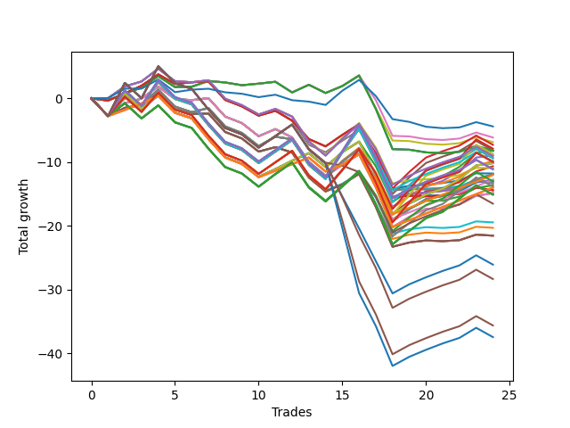

# Short Wallace 011 
- Symbol: NVDA_Unlimited
- Date Range: 02/08/2022 - 07/08/2022
- Trading Period: 7:20-12:30
- Number of Trades: 24



| Name | Win Percent | Profit | Avg Profit / Trade | Avg Time / Trade |      | Name | Win Percent | Profit | Avg Profit / Trade | Avg Time / Trade |
| ---- | ----------- | ------ | ------------------ | ---------------- | ---- | ---- | ----------- | ------ | ------------------ | ---------------- |
| Sorted By <br> Profit | | | | | | Sorted By <br> Win Percentage ||||
| Seventy-Three | 41.67 | -2200.00 | -91.67 | 13:10 |     | One Hundred Sixteen | 58.33 | -6015.00 | -250.63 | 44:08 |
| Forty-Eight | 50.00 | -3070.00 | -127.92 | 14:15 |     | One Hundred Eleven | 58.33 | -6380.00 | -265.83 | 44:16 |
| Forty | 50.00 | -3435.00 | -143.13 | 14:24 |     | One Hundred Twenty-Six | 58.33 | -6995.00 | -291.46 | 46:59 |
| Fifty-Five | 45.83 | -3645.00 | -151.88 | 124:30 |     | One Hundred Twenty-One | 58.33 | -6995.00 | -291.46 | 46:59 |
| One Hundred Eighteen | 45.83 | -3940.00 | -164.17 | 119:47 |     | Eighty-One | 58.33 | -6995.00 | -291.46 | 46:59 |
| Forty-Seven | 45.83 | -4070.00 | -169.58 | 125:20 |     | Fifty-Four | 54.17 | -4105.00 | -171.04 | 73:09 |
| Fifty-Four | 54.17 | -4105.00 | -171.04 | 73:09 |     | Forty-Six | 54.17 | -4470.00 | -186.25 | 73:18 |
| Sixty-Four | 50.00 | -4110.00 | -171.25 | 16:25 |     | Seventy | 54.17 | -5085.00 | -211.87 | 76:00 |
| Fifty-Six | 50.00 | -4110.00 | -171.25 | 16:25 |     | Sixty-Two | 54.17 | -5085.00 | -211.87 | 76:00 |
| Zero | 50.00 | -4110.00 | -171.25 | 16:25 |     | Six | 54.17 | -5085.00 | -211.87 | 76:00 |
| One Hundred Thirteen | 45.83 | -4365.00 | -181.88 | 120:37 |     | Fifty | 54.17 | -5465.00 | -227.71 | 31:02 |
| Forty-Six | 54.17 | -4470.00 | -186.25 | 73:18 |     | Forty-Two | 54.17 | -5890.00 | -245.42 | 31:51 |
| One Hundred Ninteen | 45.83 | -4515.00 | -188.13 | 129:04 |     | Fifty-Two | 54.17 | -6395.00 | -266.46 | 41:40 |
| Seventy-One | 45.83 | -4685.00 | -195.21 | 128:02 |     | Sixty-Six | 54.17 | -6505.00 | -271.04 | 34:33 |
| Sixty-Three | 45.83 | -4685.00 | -195.21 | 128:02 |     | Fifty-Eight | 54.17 | -6505.00 | -271.04 | 34:33 |
| Seven | 45.83 | -4685.00 | -195.21 | 128:02 |     | Two | 54.17 | -6505.00 | -271.04 | 34:33 |
| Fifty-Three | 50.00 | -4900.00 | -204.17 | 52:47 |     | Forty-Four | 54.17 | -6820.00 | -284.17 | 42:29 |
| One Hundred Fourteen | 45.83 | -4940.00 | -205.83 | 129:53 |     | Sixty-Eight | 54.17 | -7435.00 | -309.79 | 45:11 |
| One Hundred Twenty-Eight | 45.83 | -4980.00 | -207.50 | 123:19 |     | Sixty | 54.17 | -7435.00 | -309.79 | 45:11 |
| One Hundred Twenty-Three | 45.83 | -4980.00 | -207.50 | 123:19 |     | Four | 54.17 | -7435.00 | -309.79 | 45:11 |
| Eighty-Three | 45.83 | -4980.00 | -207.50 | 123:19 |     | Forty-Eight | 50.00 | -3070.00 | -127.92 | 14:15 |
| Seventy | 54.17 | -5085.00 | -211.87 | 76:00 |     | Forty | 50.00 | -3435.00 | -143.13 | 14:24 |
| Sixty-Two | 54.17 | -5085.00 | -211.87 | 76:00 |     | Sixty-Four | 50.00 | -4110.00 | -171.25 | 16:25 |
| Six | 54.17 | -5085.00 | -211.87 | 76:00 |     | Fifty-Six | 50.00 | -4110.00 | -171.25 | 16:25 |
| Forty-Five | 50.00 | -5325.00 | -221.87 | 53:37 |     | Zero | 50.00 | -4110.00 | -171.25 | 16:25 |
| Fifty | 54.17 | -5465.00 | -227.71 | 31:02 |     | Fifty-Three | 50.00 | -4900.00 | -204.17 | 52:47 |
| One Hundred Twenty-Nine | 45.83 | -5555.00 | -231.46 | 132:36 |     | Forty-Five | 50.00 | -5325.00 | -221.87 | 53:37 |
| One Hundred Twenty-Four | 45.83 | -5555.00 | -231.46 | 132:36 |     | Sixty-Nine | 50.00 | -5940.00 | -247.50 | 56:19 |
| Eighty-Four | 45.83 | -5555.00 | -231.46 | 132:36 |     | Sixty-One | 50.00 | -5940.00 | -247.50 | 56:19 |
| Forty-Two | 54.17 | -5890.00 | -245.42 | 31:51 |     | Five | 50.00 | -5940.00 | -247.50 | 56:19 |
| Sixty-Nine | 50.00 | -5940.00 | -247.50 | 56:19 |     | Forty-One | 50.00 | -6590.00 | -274.58 | 23:37 |
| Sixty-One | 50.00 | -5940.00 | -247.50 | 56:19 |     | Forty-Nine | 50.00 | -6680.00 | -278.33 | 22:53 |
| Five | 50.00 | -5940.00 | -247.50 | 56:19 |     | Sixty-Five | 50.00 | -7205.00 | -300.21 | 26:16 |
| One Hundred Sixteen | 58.33 | -6015.00 | -250.63 | 44:08 |     | Fifty-Seven | 50.00 | -7205.00 | -300.21 | 26:16 |
| One Hundred Eleven | 58.33 | -6380.00 | -265.83 | 44:16 |     | One | 50.00 | -7205.00 | -300.21 | 26:16 |
| Fifty-Two | 54.17 | -6395.00 | -266.46 | 41:40 |     | Fifty-Five | 45.83 | -3645.00 | -151.88 | 124:30 |
| Sixty-Six | 54.17 | -6505.00 | -271.04 | 34:33 |     | One Hundred Eighteen | 45.83 | -3940.00 | -164.17 | 119:47 |
| Fifty-Eight | 54.17 | -6505.00 | -271.04 | 34:33 |     | Forty-Seven | 45.83 | -4070.00 | -169.58 | 125:20 |
| Two | 54.17 | -6505.00 | -271.04 | 34:33 |     | One Hundred Thirteen | 45.83 | -4365.00 | -181.88 | 120:37 |
| One Hundred Seventeen | 45.83 | -6505.00 | -271.04 | 95:31 |     | One Hundred Ninteen | 45.83 | -4515.00 | -188.13 | 129:04 |
| Forty-One | 50.00 | -6590.00 | -274.58 | 23:37 |     | Seventy-One | 45.83 | -4685.00 | -195.21 | 128:02 |
| Forty-Nine | 50.00 | -6680.00 | -278.33 | 22:53 |     | Sixty-Three | 45.83 | -4685.00 | -195.21 | 128:02 |
| Forty-Four | 54.17 | -6820.00 | -284.17 | 42:29 |     | Seven | 45.83 | -4685.00 | -195.21 | 128:02 |
| One Hundred Twelve | 45.83 | -6930.00 | -288.75 | 96:20 |     | One Hundred Fourteen | 45.83 | -4940.00 | -205.83 | 129:53 |
| One Hundred Twenty-Six | 58.33 | -6995.00 | -291.46 | 46:59 |     | One Hundred Twenty-Eight | 45.83 | -4980.00 | -207.50 | 123:19 |
| One Hundred Twenty-One | 58.33 | -6995.00 | -291.46 | 46:59 |     | One Hundred Twenty-Three | 45.83 | -4980.00 | -207.50 | 123:19 |
| Eighty-One | 58.33 | -6995.00 | -291.46 | 46:59 |     | Eighty-Three | 45.83 | -4980.00 | -207.50 | 123:19 |
| Sixty-Five | 50.00 | -7205.00 | -300.21 | 26:16 |     | One Hundred Twenty-Nine | 45.83 | -5555.00 | -231.46 | 132:36 |
| Fifty-Seven | 50.00 | -7205.00 | -300.21 | 26:16 |     | One Hundred Twenty-Four | 45.83 | -5555.00 | -231.46 | 132:36 |
| One | 50.00 | -7205.00 | -300.21 | 26:16 |     | Eighty-Four | 45.83 | -5555.00 | -231.46 | 132:36 |
| Sixty-Eight | 54.17 | -7435.00 | -309.79 | 45:11 |     | One Hundred Seventeen | 45.83 | -6505.00 | -271.04 | 95:31 |
| Sixty | 54.17 | -7435.00 | -309.79 | 45:11 |     | One Hundred Twelve | 45.83 | -6930.00 | -288.75 | 96:20 |
| Four | 54.17 | -7435.00 | -309.79 | 45:11 |     | One Hundred Twenty-Seven | 45.83 | -7545.00 | -314.38 | 99:02 |
| One Hundred Twenty-Seven | 45.83 | -7545.00 | -314.38 | 99:02 |     | One Hundred Twenty-Two | 45.83 | -7545.00 | -314.38 | 99:02 |
| One Hundred Twenty-Two | 45.83 | -7545.00 | -314.38 | 99:02 |     | Eighty-Two | 45.83 | -7545.00 | -314.38 | 99:02 |
| Eighty-Two | 45.83 | -7545.00 | -314.38 | 99:02 |     | Fifty-One | 45.83 | -9725.00 | -405.21 | 35:03 |
| One Hundred Twenty | 37.50 | -8255.00 | -343.96 | 130:44 |     | Forty-Three | 45.83 | -10150.00 | -422.92 | 35:52 |
| Fifty-One | 45.83 | -9725.00 | -405.21 | 35:03 |     | Sixty-Seven | 45.83 | -10765.00 | -448.54 | 38:35 |
| Forty-Three | 45.83 | -10150.00 | -422.92 | 35:52 |     | Fifty-Nine | 45.83 | -10765.00 | -448.54 | 38:35 |
| Sixty-Seven | 45.83 | -10765.00 | -448.54 | 38:35 |     | Three | 45.83 | -10765.00 | -448.54 | 38:35 |
| Fifty-Nine | 45.83 | -10765.00 | -448.54 | 38:35 |     | Seventy-Three | 41.67 | -2200.00 | -91.67 | 13:10 |
| Three | 45.83 | -10765.00 | -448.54 | 38:35 |     | One Hundred Twenty | 37.50 | -8255.00 | -343.96 | 130:44 |
| One Hundred Fifteen | 37.50 | -13035.00 | -543.12 | 132:15 |     | One Hundred Fifteen | 37.50 | -13035.00 | -543.12 | 132:15 |
| One Hundred Thirty | 37.50 | -14165.00 | -590.21 | 135:17 |     | One Hundred Thirty | 37.50 | -14165.00 | -590.21 | 135:17 |
| Eighty-Five | 37.50 | -17805.00 | -741.87 | 139:29 |     | Eighty-Five | 37.50 | -17805.00 | -741.87 | 139:29 |
| One Hundred Twenty-Five | 37.50 | -18720.00 | -780.00 | 137:01 |     | One Hundred Twenty-Five | 37.50 | -18720.00 | -780.00 | 137:01 |

## NO STOPLOSS

### Test Zero
* Sell when price hits the middle line of the 20p bollinger
* No Stoploss
* Results:
```
Total Trades: 24
Percent Up: 50.00
Percent Down: 50.00
Total Points Moved Down: -8.22
Potential Profit: -4110.00
Total Points Ups: 18.64 Count Ups: 12
Total Points Downs: 10.42 Count Downs: 12
```

<details><summary>Trades</summary>

<code>In: 2022-02-16 11:27:00		Out: 2022-02-16 11:41:40		Total Position Time: 14:40		Total Move Down: -0.32		Total to Date: -0.32</code> <br />
<code>In: 2022-02-18 12:04:00		Out: 2022-02-18 12:08:20		Total Position Time: 04:20		Total Move Down: 1.10		Total to Date: 0.78</code> <br />
<code>In: 2022-03-02 08:10:00		Out: 2022-03-02 08:21:15		Total Position Time: 11:15		Total Move Down: 0.89		Total to Date: 1.67</code> <br />
<code>In: 2022-03-03 09:38:00		Out: 2022-03-03 09:41:55		Total Position Time: 03:55		Total Move Down: 1.81		Total to Date: 3.48</code> <br />
<code>In: 2022-03-10 10:53:00		Out: 2022-03-10 11:22:15		Total Position Time: 29:15		Total Move Down: -1.71		Total to Date: 1.77</code> <br />
<code>In: 2022-03-10 11:07:00		Out: 2022-03-10 11:22:15		Total Position Time: 15:15		Total Move Down: 0.06		Total to Date: 1.83</code> <br />
<code>In: 2022-03-17 10:30:00		Out: 2022-03-17 10:38:35		Total Position Time: 08:35		Total Move Down: 0.90		Total to Date: 2.73</code> <br />
<code>In: 2022-03-28 11:52:00		Out: 2022-03-28 12:07:10		Total Position Time: 15:10		Total Move Down: -0.24		Total to Date: 2.49</code> <br />
<code>In: 2022-03-28 12:16:00		Out: 2022-03-28 12:39:35		Total Position Time: 23:35		Total Move Down: -0.43		Total to Date: 2.06</code> <br />
<code>In: 2022-03-29 11:55:00		Out: 2022-03-29 12:01:15		Total Position Time: 06:15		Total Move Down: 0.25		Total to Date: 2.31</code> <br />
<code>In: 2022-04-11 11:51:00		Out: 2022-04-11 12:04:05		Total Position Time: 13:05		Total Move Down: 0.29		Total to Date: 2.60</code> <br />
<code>In: 2022-04-18 10:37:00		Out: 2022-04-18 11:05:15		Total Position Time: 28:15		Total Move Down: -1.67		Total to Date: 0.93</code> <br />
<code>In: 2022-05-02 11:55:00		Out: 2022-05-02 11:59:00		Total Position Time: 04:00		Total Move Down: 1.20		Total to Date: 2.13</code> <br />
<code>In: 2022-05-02 12:15:00		Out: 2022-05-02 12:40:35		Total Position Time: 25:35		Total Move Down: -1.29		Total to Date: 0.84</code> <br />
<code>In: 2022-05-04 11:03:00		Out: 2022-05-04 11:07:05		Total Position Time: 04:05		Total Move Down: 1.09		Total to Date: 1.93</code> <br />
<code>In: 2022-05-04 11:07:00		Out: 2022-05-04 11:08:10		Total Position Time: 01:10		Total Move Down: 1.66		Total to Date: 3.59</code> <br />
<code>In: 2022-05-04 11:50:00		Out: 2022-05-04 12:38:40		Total Position Time: 48:40		Total Move Down: -5.22		Total to Date: -1.63</code> <br />
<code>In: 2022-05-04 11:51:00		Out: 2022-05-04 12:38:40		Total Position Time: 47:40		Total Move Down: -6.33		Total to Date: -7.96</code> <br />
<code>In: 2022-05-31 07:33:00		Out: 2022-05-31 07:53:45		Total Position Time: 20:45		Total Move Down: -0.09		Total to Date: -8.05</code> <br />
<code>In: 2022-05-31 07:34:00		Out: 2022-05-31 07:53:45		Total Position Time: 19:45		Total Move Down: -0.42		Total to Date: -8.47</code> <br />
<code>In: 2022-06-27 07:53:00		Out: 2022-06-27 08:07:15		Total Position Time: 14:15		Total Move Down: -0.14		Total to Date: -8.61</code> <br />
<code>In: 2022-06-30 08:25:00		Out: 2022-06-30 08:35:40		Total Position Time: 10:40		Total Move Down: 0.23		Total to Date: -8.38</code> <br />
<code>In: 2022-06-30 08:28:00		Out: 2022-06-30 08:35:40		Total Position Time: 07:40		Total Move Down: 0.94		Total to Date: -7.44</code> <br />
<code>In: 2022-07-06 07:50:00		Out: 2022-07-06 08:06:10		Total Position Time: 16:10		Total Move Down: -0.78		Total to Date: -8.22</code> <br />


</details>

### Test One
* Sell when the price hits the upper line of the 20p 1std bollinger
* No Stoploss
* Results:
```
Total Trades: 24
Percent Up: 50.00
Percent Down: 50.00
Total Points Moved Down: -14.41
Potential Profit: -7205.00
Total Points Ups: 24.74 Count Ups: 12
Total Points Downs: 10.33 Count Downs: 12
```

<details><summary>Trades</summary>

<code>In: 2022-02-16 11:27:00		Out: 2022-02-16 11:47:15		Total Position Time: 20:15		Total Move Down: -0.35		Total to Date: -0.35</code> <br />
<code>In: 2022-02-18 12:04:00		Out: 2022-02-18 12:15:05		Total Position Time: 11:05		Total Move Down: 1.12		Total to Date: 0.77</code> <br />
<code>In: 2022-03-02 08:10:00		Out: 2022-03-02 08:23:25		Total Position Time: 13:25		Total Move Down: 1.21		Total to Date: 1.98</code> <br />
<code>In: 2022-03-03 09:38:00		Out: 2022-03-03 09:53:50		Total Position Time: 15:50		Total Move Down: 1.78		Total to Date: 3.76</code> <br />
<code>In: 2022-03-10 10:53:00		Out: 2022-03-10 11:24:35		Total Position Time: 31:35		Total Move Down: -1.50		Total to Date: 2.26</code> <br />
<code>In: 2022-03-10 11:07:00		Out: 2022-03-10 11:24:35		Total Position Time: 17:35		Total Move Down: 0.27		Total to Date: 2.53</code> <br />
<code>In: 2022-03-17 10:30:00		Out: 2022-03-17 11:01:00		Total Position Time: 31:00		Total Move Down: 0.12		Total to Date: 2.65</code> <br />
<code>In: 2022-03-28 11:52:00		Out: 2022-03-28 12:47:00		Total Position Time: 55:00		Total Move Down: -2.89		Total to Date: -0.24</code> <br />
<code>In: 2022-03-28 12:16:00		Out: 2022-03-28 12:47:00		Total Position Time: 31:00		Total Move Down: -1.02		Total to Date: -1.26</code> <br />
<code>In: 2022-03-29 11:55:00		Out: 2022-03-29 12:43:10		Total Position Time: 48:10		Total Move Down: -1.45		Total to Date: -2.71</code> <br />
<code>In: 2022-04-11 11:51:00		Out: 2022-04-11 12:04:20		Total Position Time: 13:20		Total Move Down: 0.76		Total to Date: -1.95</code> <br />
<code>In: 2022-04-18 10:37:00		Out: 2022-04-18 11:10:45		Total Position Time: 33:45		Total Move Down: -1.54		Total to Date: -3.49</code> <br />
<code>In: 2022-05-02 11:55:00		Out: 2022-05-02 12:44:50		Total Position Time: 49:50		Total Move Down: -2.89		Total to Date: -6.38</code> <br />
<code>In: 2022-05-02 12:15:00		Out: 2022-05-02 12:44:50		Total Position Time: 29:50		Total Move Down: -1.15		Total to Date: -7.53</code> <br />
<code>In: 2022-05-04 11:03:00		Out: 2022-05-04 11:07:20		Total Position Time: 04:20		Total Move Down: 1.80		Total to Date: -5.73</code> <br />
<code>In: 2022-05-04 11:07:00		Out: 2022-05-04 11:08:10		Total Position Time: 01:10		Total Move Down: 1.66		Total to Date: -4.07</code> <br />
<code>In: 2022-05-04 11:50:00		Out: 2022-05-04 12:46:15		Total Position Time: 56:15		Total Move Down: -5.16		Total to Date: -9.23</code> <br />
<code>In: 2022-05-04 11:51:00		Out: 2022-05-04 12:46:15		Total Position Time: 55:15		Total Move Down: -6.27		Total to Date: -15.50</code> <br />
<code>In: 2022-05-31 07:33:00		Out: 2022-05-31 07:57:20		Total Position Time: 24:20		Total Move Down: 0.23		Total to Date: -15.27</code> <br />
<code>In: 2022-05-31 07:34:00		Out: 2022-05-31 07:57:20		Total Position Time: 23:20		Total Move Down: -0.10		Total to Date: -15.37</code> <br />
<code>In: 2022-06-27 07:53:00		Out: 2022-06-27 08:09:35		Total Position Time: 16:35		Total Move Down: 0.11		Total to Date: -15.26</code> <br />
<code>In: 2022-06-30 08:25:00		Out: 2022-06-30 08:41:05		Total Position Time: 16:05		Total Move Down: 0.28		Total to Date: -14.98</code> <br />
<code>In: 2022-06-30 08:28:00		Out: 2022-06-30 08:41:05		Total Position Time: 13:05		Total Move Down: 0.99		Total to Date: -13.99</code> <br />
<code>In: 2022-07-06 07:50:00		Out: 2022-07-06 08:08:35		Total Position Time: 18:35		Total Move Down: -0.42		Total to Date: -14.41</code> <br />


</details>

### Test Two
* Sell when the price hits the upper line of the 20p 2std bollinger
* No Stoploss
* Results:
```
Total Trades: 24
Percent Up: 45.83
Percent Down: 54.17
Total Points Moved Down: -13.01
Potential Profit: -6505.00
Total Points Ups: 26.25 Count Ups: 11
Total Points Downs: 13.24 Count Downs: 13
```

<details><summary>Trades</summary>

<code>In: 2022-02-16 11:27:00		Out: 2022-02-16 11:48:05		Total Position Time: 21:05		Total Move Down: 0.03		Total to Date: 0.03</code> <br />
<code>In: 2022-02-18 12:04:00		Out: 2022-02-18 12:18:35		Total Position Time: 14:35		Total Move Down: 1.84		Total to Date: 1.87</code> <br />
<code>In: 2022-03-02 08:10:00		Out: 2022-03-02 08:49:30		Total Position Time: 39:30		Total Move Down: 0.78		Total to Date: 2.65</code> <br />
<code>In: 2022-03-03 09:38:00		Out: 2022-03-03 10:00:10		Total Position Time: 22:10		Total Move Down: 2.00		Total to Date: 4.65</code> <br />
<code>In: 2022-03-10 10:53:00		Out: 2022-03-10 12:07:05		Total Position Time: 74:05		Total Move Down: -1.95		Total to Date: 2.70</code> <br />
<code>In: 2022-03-10 11:07:00		Out: 2022-03-10 12:07:05		Total Position Time: 60:05		Total Move Down: -0.18		Total to Date: 2.52</code> <br />
<code>In: 2022-03-17 10:30:00		Out: 2022-03-17 11:02:45		Total Position Time: 32:45		Total Move Down: 0.31		Total to Date: 2.83</code> <br />
<code>In: 2022-03-28 11:52:00		Out: 2022-03-28 12:47:00		Total Position Time: 55:00		Total Move Down: -2.89		Total to Date: -0.06</code> <br />
<code>In: 2022-03-28 12:16:00		Out: 2022-03-28 12:47:00		Total Position Time: 31:00		Total Move Down: -1.02		Total to Date: -1.08</code> <br />
<code>In: 2022-03-29 11:55:00		Out: 2022-03-29 12:43:10		Total Position Time: 48:10		Total Move Down: -1.45		Total to Date: -2.53</code> <br />
<code>In: 2022-04-11 11:51:00		Out: 2022-04-11 12:05:45		Total Position Time: 14:45		Total Move Down: 0.87		Total to Date: -1.66</code> <br />
<code>In: 2022-04-18 10:37:00		Out: 2022-04-18 11:11:30		Total Position Time: 34:30		Total Move Down: -1.20		Total to Date: -2.86</code> <br />
<code>In: 2022-05-02 11:55:00		Out: 2022-05-02 12:47:00		Total Position Time: 52:00		Total Move Down: -3.92		Total to Date: -6.78</code> <br />
<code>In: 2022-05-02 12:15:00		Out: 2022-05-02 12:47:00		Total Position Time: 32:00		Total Move Down: -2.18		Total to Date: -8.96</code> <br />
<code>In: 2022-05-04 11:03:00		Out: 2022-05-04 11:07:30		Total Position Time: 04:30		Total Move Down: 2.61		Total to Date: -6.35</code> <br />
<code>In: 2022-05-04 11:07:00		Out: 2022-05-04 11:20:50		Total Position Time: 13:50		Total Move Down: 2.37		Total to Date: -3.98</code> <br />
<code>In: 2022-05-04 11:50:00		Out: 2022-05-04 12:47:00		Total Position Time: 57:00		Total Move Down: -5.16		Total to Date: -9.14</code> <br />
<code>In: 2022-05-04 11:51:00		Out: 2022-05-04 12:47:00		Total Position Time: 56:00		Total Move Down: -6.27		Total to Date: -15.41</code> <br />
<code>In: 2022-05-31 07:33:00		Out: 2022-05-31 08:00:05		Total Position Time: 27:05		Total Move Down: 0.48		Total to Date: -14.93</code> <br />
<code>In: 2022-05-31 07:34:00		Out: 2022-05-31 08:00:05		Total Position Time: 26:05		Total Move Down: 0.15		Total to Date: -14.78</code> <br />
<code>In: 2022-06-27 07:53:00		Out: 2022-06-27 08:10:05		Total Position Time: 17:05		Total Move Down: 0.27		Total to Date: -14.51</code> <br />
<code>In: 2022-06-30 08:25:00		Out: 2022-06-30 09:04:30		Total Position Time: 39:30		Total Move Down: 0.41		Total to Date: -14.10</code> <br />
<code>In: 2022-06-30 08:28:00		Out: 2022-06-30 09:04:30		Total Position Time: 36:30		Total Move Down: 1.12		Total to Date: -12.98</code> <br />
<code>In: 2022-07-06 07:50:00		Out: 2022-07-06 08:10:20		Total Position Time: 20:20		Total Move Down: -0.03		Total to Date: -13.01</code> <br />


</details>

### Test Three
* Sell when price hits the middle line of the 50p bollinger
* No Stoploss
* Results:
```
Total Trades: 24
Percent Up: 54.17
Percent Down: 45.83
Total Points Moved Down: -21.53
Potential Profit: -10765.00
Total Points Ups: 30.63 Count Ups: 13
Total Points Downs: 9.10 Count Downs: 11
```

<details><summary>Trades</summary>

<code>In: 2022-02-16 11:27:00		Out: 2022-02-16 12:47:00		Total Position Time: 80:00		Total Move Down: -2.78		Total to Date: -2.78</code> <br />
<code>In: 2022-02-18 12:04:00		Out: 2022-02-18 12:17:20		Total Position Time: 13:20		Total Move Down: 1.29		Total to Date: -1.49</code> <br />
<code>In: 2022-03-02 08:10:00		Out: 2022-03-02 08:49:00		Total Position Time: 39:00		Total Move Down: 0.45		Total to Date: -1.04</code> <br />
<code>In: 2022-03-03 09:38:00		Out: 2022-03-03 09:41:50		Total Position Time: 03:50		Total Move Down: 1.84		Total to Date: 0.80</code> <br />
<code>In: 2022-03-10 10:53:00		Out: 2022-03-10 12:01:25		Total Position Time: 68:25		Total Move Down: -2.50		Total to Date: -1.70</code> <br />
<code>In: 2022-03-10 11:07:00		Out: 2022-03-10 12:01:25		Total Position Time: 54:25		Total Move Down: -0.73		Total to Date: -2.43</code> <br />
<code>In: 2022-03-17 10:30:00		Out: 2022-03-17 11:12:35		Total Position Time: 42:35		Total Move Down: 0.05		Total to Date: -2.38</code> <br />
<code>In: 2022-03-28 11:52:00		Out: 2022-03-28 12:47:00		Total Position Time: 55:00		Total Move Down: -2.89		Total to Date: -5.27</code> <br />
<code>In: 2022-03-28 12:16:00		Out: 2022-03-28 12:47:00		Total Position Time: 31:00		Total Move Down: -1.02		Total to Date: -6.29</code> <br />
<code>In: 2022-03-29 11:55:00		Out: 2022-03-29 12:47:00		Total Position Time: 52:00		Total Move Down: -2.06		Total to Date: -8.35</code> <br />
<code>In: 2022-04-11 11:51:00		Out: 2022-04-11 12:20:25		Total Position Time: 29:25		Total Move Down: 0.70		Total to Date: -7.65</code> <br />
<code>In: 2022-04-18 10:37:00		Out: 2022-04-18 11:17:05		Total Position Time: 40:05		Total Move Down: -0.84		Total to Date: -8.49</code> <br />
<code>In: 2022-05-02 11:55:00		Out: 2022-05-02 12:47:00		Total Position Time: 52:00		Total Move Down: -3.92		Total to Date: -12.41</code> <br />
<code>In: 2022-05-02 12:15:00		Out: 2022-05-02 12:47:00		Total Position Time: 32:00		Total Move Down: -2.18		Total to Date: -14.59</code> <br />
<code>In: 2022-05-04 11:03:00		Out: 2022-05-04 11:07:05		Total Position Time: 04:05		Total Move Down: 1.09		Total to Date: -13.50</code> <br />
<code>In: 2022-05-04 11:07:00		Out: 2022-05-04 11:08:10		Total Position Time: 01:10		Total Move Down: 1.66		Total to Date: -11.84</code> <br />
<code>In: 2022-05-04 11:50:00		Out: 2022-05-04 12:47:00		Total Position Time: 57:00		Total Move Down: -5.16		Total to Date: -17.00</code> <br />
<code>In: 2022-05-04 11:51:00		Out: 2022-05-04 12:47:00		Total Position Time: 56:00		Total Move Down: -6.27		Total to Date: -23.27</code> <br />
<code>In: 2022-05-31 07:33:00		Out: 2022-05-31 08:06:35		Total Position Time: 33:35		Total Move Down: 0.66		Total to Date: -22.61</code> <br />
<code>In: 2022-05-31 07:34:00		Out: 2022-05-31 08:06:35		Total Position Time: 32:35		Total Move Down: 0.33		Total to Date: -22.28</code> <br />
<code>In: 2022-06-27 07:53:00		Out: 2022-06-27 08:36:50		Total Position Time: 43:50		Total Move Down: -0.12		Total to Date: -22.40</code> <br />
<code>In: 2022-06-30 08:25:00		Out: 2022-06-30 09:02:35		Total Position Time: 37:35		Total Move Down: 0.16		Total to Date: -22.24</code> <br />
<code>In: 2022-06-30 08:28:00		Out: 2022-06-30 09:02:35		Total Position Time: 34:35		Total Move Down: 0.87		Total to Date: -21.37</code> <br />
<code>In: 2022-07-06 07:50:00		Out: 2022-07-06 08:22:35		Total Position Time: 32:35		Total Move Down: -0.16		Total to Date: -21.53</code> <br />


</details>

### Test Four
* Sell when the price hits the upper line of the 50p 1std bollinger
* No Stoploss
* Results:
```
Total Trades: 24
Percent Up: 45.83
Percent Down: 54.17
Total Points Moved Down: -14.87
Potential Profit: -7435.00
Total Points Ups: 29.72 Count Ups: 11
Total Points Downs: 14.85 Count Downs: 13
```

<details><summary>Trades</summary>

<code>In: 2022-02-16 11:27:00		Out: 2022-02-16 12:47:00		Total Position Time: 80:00		Total Move Down: -2.78		Total to Date: -2.78</code> <br />
<code>In: 2022-02-18 12:04:00		Out: 2022-02-18 12:19:05		Total Position Time: 15:05		Total Move Down: 2.03		Total to Date: -0.75</code> <br />
<code>In: 2022-03-02 08:10:00		Out: 2022-03-02 08:54:20		Total Position Time: 44:20		Total Move Down: 0.71		Total to Date: -0.04</code> <br />
<code>In: 2022-03-03 09:38:00		Out: 2022-03-03 10:34:35		Total Position Time: 56:35		Total Move Down: 1.89		Total to Date: 1.85</code> <br />
<code>In: 2022-03-10 10:53:00		Out: 2022-03-10 12:07:05		Total Position Time: 74:05		Total Move Down: -1.95		Total to Date: -0.10</code> <br />
<code>In: 2022-03-10 11:07:00		Out: 2022-03-10 12:07:05		Total Position Time: 60:05		Total Move Down: -0.18		Total to Date: -0.28</code> <br />
<code>In: 2022-03-17 10:30:00		Out: 2022-03-17 11:24:10		Total Position Time: 54:10		Total Move Down: 0.31		Total to Date: 0.03</code> <br />
<code>In: 2022-03-28 11:52:00		Out: 2022-03-28 12:47:00		Total Position Time: 55:00		Total Move Down: -2.89		Total to Date: -2.86</code> <br />
<code>In: 2022-03-28 12:16:00		Out: 2022-03-28 12:47:00		Total Position Time: 31:00		Total Move Down: -1.02		Total to Date: -3.88</code> <br />
<code>In: 2022-03-29 11:55:00		Out: 2022-03-29 12:47:00		Total Position Time: 52:00		Total Move Down: -2.06		Total to Date: -5.94</code> <br />
<code>In: 2022-04-11 11:51:00		Out: 2022-04-11 12:28:45		Total Position Time: 37:45		Total Move Down: 1.12		Total to Date: -4.82</code> <br />
<code>In: 2022-04-18 10:37:00		Out: 2022-04-18 11:46:10		Total Position Time: 69:10		Total Move Down: -1.31		Total to Date: -6.13</code> <br />
<code>In: 2022-05-02 11:55:00		Out: 2022-05-02 12:47:00		Total Position Time: 52:00		Total Move Down: -3.92		Total to Date: -10.05</code> <br />
<code>In: 2022-05-02 12:15:00		Out: 2022-05-02 12:47:00		Total Position Time: 32:00		Total Move Down: -2.18		Total to Date: -12.23</code> <br />
<code>In: 2022-05-04 11:03:00		Out: 2022-05-04 11:07:20		Total Position Time: 04:20		Total Move Down: 1.80		Total to Date: -10.43</code> <br />
<code>In: 2022-05-04 11:07:00		Out: 2022-05-04 11:08:10		Total Position Time: 01:10		Total Move Down: 1.66		Total to Date: -8.77</code> <br />
<code>In: 2022-05-04 11:50:00		Out: 2022-05-04 12:47:00		Total Position Time: 57:00		Total Move Down: -5.16		Total to Date: -13.93</code> <br />
<code>In: 2022-05-04 11:51:00		Out: 2022-05-04 12:47:00		Total Position Time: 56:00		Total Move Down: -6.27		Total to Date: -20.20</code> <br />
<code>In: 2022-05-31 07:33:00		Out: 2022-05-31 08:08:45		Total Position Time: 35:45		Total Move Down: 1.61		Total to Date: -18.59</code> <br />
<code>In: 2022-05-31 07:34:00		Out: 2022-05-31 08:08:45		Total Position Time: 34:45		Total Move Down: 1.28		Total to Date: -17.31</code> <br />
<code>In: 2022-06-27 07:53:00		Out: 2022-06-27 08:57:50		Total Position Time: 64:50		Total Move Down: 0.03		Total to Date: -17.28</code> <br />
<code>In: 2022-06-30 08:25:00		Out: 2022-06-30 09:06:05		Total Position Time: 41:05		Total Move Down: 0.65		Total to Date: -16.63</code> <br />
<code>In: 2022-06-30 08:28:00		Out: 2022-06-30 09:06:05		Total Position Time: 38:05		Total Move Down: 1.36		Total to Date: -15.27</code> <br />
<code>In: 2022-07-06 07:50:00		Out: 2022-07-06 08:28:30		Total Position Time: 38:30		Total Move Down: 0.40		Total to Date: -14.87</code> <br />


</details>

### Test Five
* Sell when the price hits the upper line of the 50p 2std bollinger
* No Stoploss
* Results:
```
Total Trades: 24
Percent Up: 50.00
Percent Down: 50.00
Total Points Moved Down: -11.88
Potential Profit: -5940.00
Total Points Ups: 31.31 Count Ups: 12
Total Points Downs: 19.43 Count Downs: 12
```

<details><summary>Trades</summary>

<code>In: 2022-02-16 11:27:00		Out: 2022-02-16 12:47:00		Total Position Time: 80:00		Total Move Down: -2.78		Total to Date: -2.78</code> <br />
<code>In: 2022-02-18 12:04:00		Out: 2022-02-18 12:19:45		Total Position Time: 15:45		Total Move Down: 2.86		Total to Date: 0.08</code> <br />
<code>In: 2022-03-02 08:10:00		Out: 2022-03-02 10:49:40		Total Position Time: 159:40		Total Move Down: -1.11		Total to Date: -1.03</code> <br />
<code>In: 2022-03-03 09:38:00		Out: 2022-03-03 10:41:35		Total Position Time: 63:35		Total Move Down: 2.39		Total to Date: 1.36</code> <br />
<code>In: 2022-03-10 10:53:00		Out: 2022-03-10 12:47:00		Total Position Time: 114:00		Total Move Down: -2.65		Total to Date: -1.29</code> <br />
<code>In: 2022-03-10 11:07:00		Out: 2022-03-10 12:47:00		Total Position Time: 100:00		Total Move Down: -0.88		Total to Date: -2.17</code> <br />
<code>In: 2022-03-17 10:30:00		Out: 2022-03-17 11:27:20		Total Position Time: 57:20		Total Move Down: 0.65		Total to Date: -1.52</code> <br />
<code>In: 2022-03-28 11:52:00		Out: 2022-03-28 12:47:00		Total Position Time: 55:00		Total Move Down: -2.89		Total to Date: -4.41</code> <br />
<code>In: 2022-03-28 12:16:00		Out: 2022-03-28 12:47:00		Total Position Time: 31:00		Total Move Down: -1.02		Total to Date: -5.43</code> <br />
<code>In: 2022-03-29 11:55:00		Out: 2022-03-29 12:47:00		Total Position Time: 52:00		Total Move Down: -2.06		Total to Date: -7.49</code> <br />
<code>In: 2022-04-11 11:51:00		Out: 2022-04-11 12:32:05		Total Position Time: 41:05		Total Move Down: 1.47		Total to Date: -6.02</code> <br />
<code>In: 2022-04-18 10:37:00		Out: 2022-04-18 12:03:20		Total Position Time: 86:20		Total Move Down: -0.39		Total to Date: -6.41</code> <br />
<code>In: 2022-05-02 11:55:00		Out: 2022-05-02 12:47:00		Total Position Time: 52:00		Total Move Down: -3.92		Total to Date: -10.33</code> <br />
<code>In: 2022-05-02 12:15:00		Out: 2022-05-02 12:47:00		Total Position Time: 32:00		Total Move Down: -2.18		Total to Date: -12.51</code> <br />
<code>In: 2022-05-04 11:03:00		Out: 2022-05-04 11:07:30		Total Position Time: 04:30		Total Move Down: 2.61		Total to Date: -9.90</code> <br />
<code>In: 2022-05-04 11:07:00		Out: 2022-05-04 11:20:40		Total Position Time: 13:40		Total Move Down: 2.04		Total to Date: -7.86</code> <br />
<code>In: 2022-05-04 11:50:00		Out: 2022-05-04 12:47:00		Total Position Time: 57:00		Total Move Down: -5.16		Total to Date: -13.02</code> <br />
<code>In: 2022-05-04 11:51:00		Out: 2022-05-04 12:47:00		Total Position Time: 56:00		Total Move Down: -6.27		Total to Date: -19.29</code> <br />
<code>In: 2022-05-31 07:33:00		Out: 2022-05-31 08:15:00		Total Position Time: 42:00		Total Move Down: 1.91		Total to Date: -17.38</code> <br />
<code>In: 2022-05-31 07:34:00		Out: 2022-05-31 08:15:00		Total Position Time: 41:00		Total Move Down: 1.58		Total to Date: -15.80</code> <br />
<code>In: 2022-06-27 07:53:00		Out: 2022-06-27 09:02:00		Total Position Time: 69:00		Total Move Down: 0.48		Total to Date: -15.32</code> <br />
<code>In: 2022-06-30 08:25:00		Out: 2022-06-30 09:09:40		Total Position Time: 44:40		Total Move Down: 0.96		Total to Date: -14.36</code> <br />
<code>In: 2022-06-30 08:28:00		Out: 2022-06-30 09:09:40		Total Position Time: 41:40		Total Move Down: 1.67		Total to Date: -12.69</code> <br />
<code>In: 2022-07-06 07:50:00		Out: 2022-07-06 08:32:35		Total Position Time: 42:35		Total Move Down: 0.81		Total to Date: -11.88</code> <br />


</details>

### Test Six
* Sell when the price hits the middle line of the 1std VWAP
* No Stoploss
* Results:
```
Total Trades: 24
Percent Up: 45.83
Percent Down: 54.17
Total Points Moved Down: -10.17
Potential Profit: -5085.00
Total Points Ups: 31.52 Count Ups: 11
Total Points Downs: 21.35 Count Downs: 13
```

<details><summary>Trades</summary>

<code>In: 2022-02-16 11:27:00		Out: 2022-02-16 12:47:00		Total Position Time: 80:00		Total Move Down: -2.78		Total to Date: -2.78</code> <br />
<code>In: 2022-02-18 12:04:00		Out: 2022-02-18 12:22:10		Total Position Time: 18:10		Total Move Down: 3.57		Total to Date: 0.79</code> <br />
<code>In: 2022-03-02 08:10:00		Out: 2022-03-02 12:47:00		Total Position Time: 277:00		Total Move Down: -2.39		Total to Date: -1.60</code> <br />
<code>In: 2022-03-03 09:38:00		Out: 2022-03-03 09:43:05		Total Position Time: 05:05		Total Move Down: 2.03		Total to Date: 0.43</code> <br />
<code>In: 2022-03-10 10:53:00		Out: 2022-03-10 12:47:00		Total Position Time: 114:00		Total Move Down: -2.65		Total to Date: -2.22</code> <br />
<code>In: 2022-03-10 11:07:00		Out: 2022-03-10 12:47:00		Total Position Time: 100:00		Total Move Down: -0.88		Total to Date: -3.10</code> <br />
<code>In: 2022-03-17 10:30:00		Out: 2022-03-17 12:47:00		Total Position Time: 137:00		Total Move Down: -3.24		Total to Date: -6.34</code> <br />
<code>In: 2022-03-28 11:52:00		Out: 2022-03-28 12:47:00		Total Position Time: 55:00		Total Move Down: -2.89		Total to Date: -9.23</code> <br />
<code>In: 2022-03-28 12:16:00		Out: 2022-03-28 12:47:00		Total Position Time: 31:00		Total Move Down: -1.02		Total to Date: -10.25</code> <br />
<code>In: 2022-03-29 11:55:00		Out: 2022-03-29 12:47:00		Total Position Time: 52:00		Total Move Down: -2.06		Total to Date: -12.31</code> <br />
<code>In: 2022-04-11 11:51:00		Out: 2022-04-11 12:28:50		Total Position Time: 37:50		Total Move Down: 1.21		Total to Date: -11.10</code> <br />
<code>In: 2022-04-18 10:37:00		Out: 2022-04-18 12:40:05		Total Position Time: 123:05		Total Move Down: 1.32		Total to Date: -9.78</code> <br />
<code>In: 2022-05-02 11:55:00		Out: 2022-05-02 11:58:55		Total Position Time: 03:55		Total Move Down: 1.18		Total to Date: -8.60</code> <br />
<code>In: 2022-05-02 12:15:00		Out: 2022-05-02 12:47:00		Total Position Time: 32:00		Total Move Down: -2.18		Total to Date: -10.78</code> <br />
<code>In: 2022-05-04 11:03:00		Out: 2022-05-04 11:07:25		Total Position Time: 04:25		Total Move Down: 2.34		Total to Date: -8.44</code> <br />
<code>In: 2022-05-04 11:07:00		Out: 2022-05-04 11:08:10		Total Position Time: 01:10		Total Move Down: 1.66		Total to Date: -6.78</code> <br />
<code>In: 2022-05-04 11:50:00		Out: 2022-05-04 12:47:00		Total Position Time: 57:00		Total Move Down: -5.16		Total to Date: -11.94</code> <br />
<code>In: 2022-05-04 11:51:00		Out: 2022-05-04 12:47:00		Total Position Time: 56:00		Total Move Down: -6.27		Total to Date: -18.21</code> <br />
<code>In: 2022-05-31 07:33:00		Out: 2022-05-31 08:14:40		Total Position Time: 41:40		Total Move Down: 1.73		Total to Date: -16.48</code> <br />
<code>In: 2022-05-31 07:34:00		Out: 2022-05-31 08:14:40		Total Position Time: 40:40		Total Move Down: 1.40		Total to Date: -15.08</code> <br />
<code>In: 2022-06-27 07:53:00		Out: 2022-06-27 09:25:25		Total Position Time: 92:25		Total Move Down: 0.92		Total to Date: -14.16</code> <br />
<code>In: 2022-06-30 08:25:00		Out: 2022-06-30 12:00:15		Total Position Time: 215:15		Total Move Down: 1.47		Total to Date: -12.69</code> <br />
<code>In: 2022-06-30 08:28:00		Out: 2022-06-30 12:00:15		Total Position Time: 212:15		Total Move Down: 2.18		Total to Date: -10.51</code> <br />
<code>In: 2022-07-06 07:50:00		Out: 2022-07-06 08:27:20		Total Position Time: 37:20		Total Move Down: 0.34		Total to Date: -10.17</code> <br />


</details>

### Test Seven
* Sell when the price hits the upper line of the 1std VWAP
* No Stoploss
* Results:
```
Total Trades: 24
Percent Up: 54.17
Percent Down: 45.83
Total Points Moved Down: -9.37
Potential Profit: -4685.00
Total Points Ups: 36.90 Count Ups: 13
Total Points Downs: 27.53 Count Downs: 11
```

<details><summary>Trades</summary>

<code>In: 2022-02-16 11:27:00		Out: 2022-02-16 12:47:00		Total Position Time: 80:00		Total Move Down: -2.78		Total to Date: -2.78</code> <br />
<code>In: 2022-02-18 12:04:00		Out: 2022-02-18 12:47:00		Total Position Time: 43:00		Total Move Down: 4.02		Total to Date: 1.24</code> <br />
<code>In: 2022-03-02 08:10:00		Out: 2022-03-02 12:47:00		Total Position Time: 277:00		Total Move Down: -2.39		Total to Date: -1.15</code> <br />
<code>In: 2022-03-03 09:38:00		Out: 2022-03-03 11:44:05		Total Position Time: 126:05		Total Move Down: 3.73		Total to Date: 2.58</code> <br />
<code>In: 2022-03-10 10:53:00		Out: 2022-03-10 12:47:00		Total Position Time: 114:00		Total Move Down: -2.65		Total to Date: -0.07</code> <br />
<code>In: 2022-03-10 11:07:00		Out: 2022-03-10 12:47:00		Total Position Time: 100:00		Total Move Down: -0.88		Total to Date: -0.95</code> <br />
<code>In: 2022-03-17 10:30:00		Out: 2022-03-17 12:47:00		Total Position Time: 137:00		Total Move Down: -3.24		Total to Date: -4.19</code> <br />
<code>In: 2022-03-28 11:52:00		Out: 2022-03-28 12:47:00		Total Position Time: 55:00		Total Move Down: -2.89		Total to Date: -7.08</code> <br />
<code>In: 2022-03-28 12:16:00		Out: 2022-03-28 12:47:00		Total Position Time: 31:00		Total Move Down: -1.02		Total to Date: -8.10</code> <br />
<code>In: 2022-03-29 11:55:00		Out: 2022-03-29 12:47:00		Total Position Time: 52:00		Total Move Down: -2.06		Total to Date: -10.16</code> <br />
<code>In: 2022-04-11 11:51:00		Out: 2022-04-11 12:47:00		Total Position Time: 56:00		Total Move Down: 1.81		Total to Date: -8.35</code> <br />
<code>In: 2022-04-18 10:37:00		Out: 2022-04-18 12:47:00		Total Position Time: 130:00		Total Move Down: 1.81		Total to Date: -6.54</code> <br />
<code>In: 2022-05-02 11:55:00		Out: 2022-05-02 12:47:00		Total Position Time: 52:00		Total Move Down: -3.92		Total to Date: -10.46</code> <br />
<code>In: 2022-05-02 12:15:00		Out: 2022-05-02 12:47:00		Total Position Time: 32:00		Total Move Down: -2.18		Total to Date: -12.64</code> <br />
<code>In: 2022-05-04 11:03:00		Out: 2022-05-04 11:34:15		Total Position Time: 31:15		Total Move Down: 4.19		Total to Date: -8.45</code> <br />
<code>In: 2022-05-04 11:07:00		Out: 2022-05-04 11:34:15		Total Position Time: 27:15		Total Move Down: 3.65		Total to Date: -4.80</code> <br />
<code>In: 2022-05-04 11:50:00		Out: 2022-05-04 12:47:00		Total Position Time: 57:00		Total Move Down: -5.16		Total to Date: -9.96</code> <br />
<code>In: 2022-05-04 11:51:00		Out: 2022-05-04 12:47:00		Total Position Time: 56:00		Total Move Down: -6.27		Total to Date: -16.23</code> <br />
<code>In: 2022-05-31 07:33:00		Out: 2022-05-31 11:45:45		Total Position Time: 252:45		Total Move Down: 2.60		Total to Date: -13.63</code> <br />
<code>In: 2022-05-31 07:34:00		Out: 2022-05-31 11:45:45		Total Position Time: 251:45		Total Move Down: 2.27		Total to Date: -11.36</code> <br />
<code>In: 2022-06-27 07:53:00		Out: 2022-06-27 12:47:00		Total Position Time: 294:00		Total Move Down: 1.00		Total to Date: -10.36</code> <br />
<code>In: 2022-06-30 08:25:00		Out: 2022-06-30 12:47:00		Total Position Time: 262:00		Total Move Down: 0.87		Total to Date: -9.49</code> <br />
<code>In: 2022-06-30 08:28:00		Out: 2022-06-30 12:47:00		Total Position Time: 259:00		Total Move Down: 1.58		Total to Date: -7.91</code> <br />
<code>In: 2022-07-06 07:50:00		Out: 2022-07-06 12:47:00		Total Position Time: 297:00		Total Move Down: -1.46		Total to Date: -9.37</code> <br />


</details>

## STOPLOSS OF 5

### Test Forty
* Sell when price hits the middle line of the 20p bollinger
* Stoploss is -5 points
* Results:
```
Total Trades: 24
Percent Up: 50.00
Percent Down: 50.00
Total Points Moved Down: -6.87
Potential Profit: -3435.00
Total Points Ups: 17.29 Count Ups: 12
Total Points Downs: 10.42 Count Downs: 12
```

<details><summary>Trades</summary>

<code>In: 2022-02-16 11:27:00		Out: 2022-02-16 11:41:40		Total Position Time: 14:40		Total Move Down: -0.32		Total to Date: -0.32</code> <br />
<code>In: 2022-02-18 12:04:00		Out: 2022-02-18 12:08:20		Total Position Time: 04:20		Total Move Down: 1.10		Total to Date: 0.78</code> <br />
<code>In: 2022-03-02 08:10:00		Out: 2022-03-02 08:21:15		Total Position Time: 11:15		Total Move Down: 0.89		Total to Date: 1.67</code> <br />
<code>In: 2022-03-03 09:38:00		Out: 2022-03-03 09:41:55		Total Position Time: 03:55		Total Move Down: 1.81		Total to Date: 3.48</code> <br />
<code>In: 2022-03-10 10:53:00		Out: 2022-03-10 11:22:15		Total Position Time: 29:15		Total Move Down: -1.71		Total to Date: 1.77</code> <br />
<code>In: 2022-03-10 11:07:00		Out: 2022-03-10 11:22:15		Total Position Time: 15:15		Total Move Down: 0.06		Total to Date: 1.83</code> <br />
<code>In: 2022-03-17 10:30:00		Out: 2022-03-17 10:38:35		Total Position Time: 08:35		Total Move Down: 0.90		Total to Date: 2.73</code> <br />
<code>In: 2022-03-28 11:52:00		Out: 2022-03-28 12:07:10		Total Position Time: 15:10		Total Move Down: -0.24		Total to Date: 2.49</code> <br />
<code>In: 2022-03-28 12:16:00		Out: 2022-03-28 12:39:35		Total Position Time: 23:35		Total Move Down: -0.43		Total to Date: 2.06</code> <br />
<code>In: 2022-03-29 11:55:00		Out: 2022-03-29 12:01:15		Total Position Time: 06:15		Total Move Down: 0.25		Total to Date: 2.31</code> <br />
<code>In: 2022-04-11 11:51:00		Out: 2022-04-11 12:04:05		Total Position Time: 13:05		Total Move Down: 0.29		Total to Date: 2.60</code> <br />
<code>In: 2022-04-18 10:37:00		Out: 2022-04-18 11:05:15		Total Position Time: 28:15		Total Move Down: -1.67		Total to Date: 0.93</code> <br />
<code>In: 2022-05-02 11:55:00		Out: 2022-05-02 11:59:00		Total Position Time: 04:00		Total Move Down: 1.20		Total to Date: 2.13</code> <br />
<code>In: 2022-05-02 12:15:00		Out: 2022-05-02 12:40:35		Total Position Time: 25:35		Total Move Down: -1.29		Total to Date: 0.84</code> <br />
<code>In: 2022-05-04 11:03:00		Out: 2022-05-04 11:07:05		Total Position Time: 04:05		Total Move Down: 1.09		Total to Date: 1.93</code> <br />
<code>In: 2022-05-04 11:07:00		Out: 2022-05-04 11:08:10		Total Position Time: 01:10		Total Move Down: 1.66		Total to Date: 3.59</code> <br />
<code>In: 2022-05-04 11:50:00		Out: 2022-05-04 12:16:20		Total Position Time: 26:20		Total Move Down: -5.12		Total to Date: -1.53</code> <br />
<code>In: 2022-05-04 11:51:00		Out: 2022-05-04 12:12:40		Total Position Time: 21:40		Total Move Down: -5.08		Total to Date: -6.61</code> <br />
<code>In: 2022-05-31 07:33:00		Out: 2022-05-31 07:53:45		Total Position Time: 20:45		Total Move Down: -0.09		Total to Date: -6.70</code> <br />
<code>In: 2022-05-31 07:34:00		Out: 2022-05-31 07:53:45		Total Position Time: 19:45		Total Move Down: -0.42		Total to Date: -7.12</code> <br />
<code>In: 2022-06-27 07:53:00		Out: 2022-06-27 08:07:15		Total Position Time: 14:15		Total Move Down: -0.14		Total to Date: -7.26</code> <br />
<code>In: 2022-06-30 08:25:00		Out: 2022-06-30 08:35:40		Total Position Time: 10:40		Total Move Down: 0.23		Total to Date: -7.03</code> <br />
<code>In: 2022-06-30 08:28:00		Out: 2022-06-30 08:35:40		Total Position Time: 07:40		Total Move Down: 0.94		Total to Date: -6.09</code> <br />
<code>In: 2022-07-06 07:50:00		Out: 2022-07-06 08:06:10		Total Position Time: 16:10		Total Move Down: -0.78		Total to Date: -6.87</code> <br />


</details>

### Test Forty-One
* Sell when the price hits the upper line of the 20p 1std bollinger
* Stoploss is -5 points
* Results:
```
Total Trades: 24
Percent Up: 50.00
Percent Down: 50.00
Total Points Moved Down: -13.18
Potential Profit: -6590.00
Total Points Ups: 23.51 Count Ups: 12
Total Points Downs: 10.33 Count Downs: 12
```

<details><summary>Trades</summary>

<code>In: 2022-02-16 11:27:00		Out: 2022-02-16 11:47:15		Total Position Time: 20:15		Total Move Down: -0.35		Total to Date: -0.35</code> <br />
<code>In: 2022-02-18 12:04:00		Out: 2022-02-18 12:15:05		Total Position Time: 11:05		Total Move Down: 1.12		Total to Date: 0.77</code> <br />
<code>In: 2022-03-02 08:10:00		Out: 2022-03-02 08:23:25		Total Position Time: 13:25		Total Move Down: 1.21		Total to Date: 1.98</code> <br />
<code>In: 2022-03-03 09:38:00		Out: 2022-03-03 09:53:50		Total Position Time: 15:50		Total Move Down: 1.78		Total to Date: 3.76</code> <br />
<code>In: 2022-03-10 10:53:00		Out: 2022-03-10 11:24:35		Total Position Time: 31:35		Total Move Down: -1.50		Total to Date: 2.26</code> <br />
<code>In: 2022-03-10 11:07:00		Out: 2022-03-10 11:24:35		Total Position Time: 17:35		Total Move Down: 0.27		Total to Date: 2.53</code> <br />
<code>In: 2022-03-17 10:30:00		Out: 2022-03-17 11:01:00		Total Position Time: 31:00		Total Move Down: 0.12		Total to Date: 2.65</code> <br />
<code>In: 2022-03-28 11:52:00		Out: 2022-03-28 12:47:00		Total Position Time: 55:00		Total Move Down: -2.89		Total to Date: -0.24</code> <br />
<code>In: 2022-03-28 12:16:00		Out: 2022-03-28 12:47:00		Total Position Time: 31:00		Total Move Down: -1.02		Total to Date: -1.26</code> <br />
<code>In: 2022-03-29 11:55:00		Out: 2022-03-29 12:43:10		Total Position Time: 48:10		Total Move Down: -1.45		Total to Date: -2.71</code> <br />
<code>In: 2022-04-11 11:51:00		Out: 2022-04-11 12:04:20		Total Position Time: 13:20		Total Move Down: 0.76		Total to Date: -1.95</code> <br />
<code>In: 2022-04-18 10:37:00		Out: 2022-04-18 11:10:45		Total Position Time: 33:45		Total Move Down: -1.54		Total to Date: -3.49</code> <br />
<code>In: 2022-05-02 11:55:00		Out: 2022-05-02 12:44:50		Total Position Time: 49:50		Total Move Down: -2.89		Total to Date: -6.38</code> <br />
<code>In: 2022-05-02 12:15:00		Out: 2022-05-02 12:44:50		Total Position Time: 29:50		Total Move Down: -1.15		Total to Date: -7.53</code> <br />
<code>In: 2022-05-04 11:03:00		Out: 2022-05-04 11:07:20		Total Position Time: 04:20		Total Move Down: 1.80		Total to Date: -5.73</code> <br />
<code>In: 2022-05-04 11:07:00		Out: 2022-05-04 11:08:10		Total Position Time: 01:10		Total Move Down: 1.66		Total to Date: -4.07</code> <br />
<code>In: 2022-05-04 11:50:00		Out: 2022-05-04 12:16:20		Total Position Time: 26:20		Total Move Down: -5.12		Total to Date: -9.19</code> <br />
<code>In: 2022-05-04 11:51:00		Out: 2022-05-04 12:12:40		Total Position Time: 21:40		Total Move Down: -5.08		Total to Date: -14.27</code> <br />
<code>In: 2022-05-31 07:33:00		Out: 2022-05-31 07:57:20		Total Position Time: 24:20		Total Move Down: 0.23		Total to Date: -14.04</code> <br />
<code>In: 2022-05-31 07:34:00		Out: 2022-05-31 07:57:20		Total Position Time: 23:20		Total Move Down: -0.10		Total to Date: -14.14</code> <br />
<code>In: 2022-06-27 07:53:00		Out: 2022-06-27 08:09:35		Total Position Time: 16:35		Total Move Down: 0.11		Total to Date: -14.03</code> <br />
<code>In: 2022-06-30 08:25:00		Out: 2022-06-30 08:41:05		Total Position Time: 16:05		Total Move Down: 0.28		Total to Date: -13.75</code> <br />
<code>In: 2022-06-30 08:28:00		Out: 2022-06-30 08:41:05		Total Position Time: 13:05		Total Move Down: 0.99		Total to Date: -12.76</code> <br />
<code>In: 2022-07-06 07:50:00		Out: 2022-07-06 08:08:35		Total Position Time: 18:35		Total Move Down: -0.42		Total to Date: -13.18</code> <br />


</details>

### Test Forty-Two
* Sell when the price hits the upper line of the 20p 2std bollinger
* Stoploss is -5 points
* Results:
```
Total Trades: 24
Percent Up: 45.83
Percent Down: 54.17
Total Points Moved Down: -11.78
Potential Profit: -5890.00
Total Points Ups: 25.02 Count Ups: 11
Total Points Downs: 13.24 Count Downs: 13
```

<details><summary>Trades</summary>

<code>In: 2022-02-16 11:27:00		Out: 2022-02-16 11:48:05		Total Position Time: 21:05		Total Move Down: 0.03		Total to Date: 0.03</code> <br />
<code>In: 2022-02-18 12:04:00		Out: 2022-02-18 12:18:35		Total Position Time: 14:35		Total Move Down: 1.84		Total to Date: 1.87</code> <br />
<code>In: 2022-03-02 08:10:00		Out: 2022-03-02 08:49:30		Total Position Time: 39:30		Total Move Down: 0.78		Total to Date: 2.65</code> <br />
<code>In: 2022-03-03 09:38:00		Out: 2022-03-03 10:00:10		Total Position Time: 22:10		Total Move Down: 2.00		Total to Date: 4.65</code> <br />
<code>In: 2022-03-10 10:53:00		Out: 2022-03-10 12:07:05		Total Position Time: 74:05		Total Move Down: -1.95		Total to Date: 2.70</code> <br />
<code>In: 2022-03-10 11:07:00		Out: 2022-03-10 12:07:05		Total Position Time: 60:05		Total Move Down: -0.18		Total to Date: 2.52</code> <br />
<code>In: 2022-03-17 10:30:00		Out: 2022-03-17 11:02:45		Total Position Time: 32:45		Total Move Down: 0.31		Total to Date: 2.83</code> <br />
<code>In: 2022-03-28 11:52:00		Out: 2022-03-28 12:47:00		Total Position Time: 55:00		Total Move Down: -2.89		Total to Date: -0.06</code> <br />
<code>In: 2022-03-28 12:16:00		Out: 2022-03-28 12:47:00		Total Position Time: 31:00		Total Move Down: -1.02		Total to Date: -1.08</code> <br />
<code>In: 2022-03-29 11:55:00		Out: 2022-03-29 12:43:10		Total Position Time: 48:10		Total Move Down: -1.45		Total to Date: -2.53</code> <br />
<code>In: 2022-04-11 11:51:00		Out: 2022-04-11 12:05:45		Total Position Time: 14:45		Total Move Down: 0.87		Total to Date: -1.66</code> <br />
<code>In: 2022-04-18 10:37:00		Out: 2022-04-18 11:11:30		Total Position Time: 34:30		Total Move Down: -1.20		Total to Date: -2.86</code> <br />
<code>In: 2022-05-02 11:55:00		Out: 2022-05-02 12:47:00		Total Position Time: 52:00		Total Move Down: -3.92		Total to Date: -6.78</code> <br />
<code>In: 2022-05-02 12:15:00		Out: 2022-05-02 12:47:00		Total Position Time: 32:00		Total Move Down: -2.18		Total to Date: -8.96</code> <br />
<code>In: 2022-05-04 11:03:00		Out: 2022-05-04 11:07:30		Total Position Time: 04:30		Total Move Down: 2.61		Total to Date: -6.35</code> <br />
<code>In: 2022-05-04 11:07:00		Out: 2022-05-04 11:20:50		Total Position Time: 13:50		Total Move Down: 2.37		Total to Date: -3.98</code> <br />
<code>In: 2022-05-04 11:50:00		Out: 2022-05-04 12:16:20		Total Position Time: 26:20		Total Move Down: -5.12		Total to Date: -9.10</code> <br />
<code>In: 2022-05-04 11:51:00		Out: 2022-05-04 12:12:40		Total Position Time: 21:40		Total Move Down: -5.08		Total to Date: -14.18</code> <br />
<code>In: 2022-05-31 07:33:00		Out: 2022-05-31 08:00:05		Total Position Time: 27:05		Total Move Down: 0.48		Total to Date: -13.70</code> <br />
<code>In: 2022-05-31 07:34:00		Out: 2022-05-31 08:00:05		Total Position Time: 26:05		Total Move Down: 0.15		Total to Date: -13.55</code> <br />
<code>In: 2022-06-27 07:53:00		Out: 2022-06-27 08:10:05		Total Position Time: 17:05		Total Move Down: 0.27		Total to Date: -13.28</code> <br />
<code>In: 2022-06-30 08:25:00		Out: 2022-06-30 09:04:30		Total Position Time: 39:30		Total Move Down: 0.41		Total to Date: -12.87</code> <br />
<code>In: 2022-06-30 08:28:00		Out: 2022-06-30 09:04:30		Total Position Time: 36:30		Total Move Down: 1.12		Total to Date: -11.75</code> <br />
<code>In: 2022-07-06 07:50:00		Out: 2022-07-06 08:10:20		Total Position Time: 20:20		Total Move Down: -0.03		Total to Date: -11.78</code> <br />


</details>

### Test Forty-Three
* Sell when price hits the middle line of the 50p bollinger
* Stoploss is -5 points
* Results:
```
Total Trades: 24
Percent Up: 54.17
Percent Down: 45.83
Total Points Moved Down: -20.30
Potential Profit: -10150.00
Total Points Ups: 29.40 Count Ups: 13
Total Points Downs: 9.10 Count Downs: 11
```

<details><summary>Trades</summary>

<code>In: 2022-02-16 11:27:00		Out: 2022-02-16 12:47:00		Total Position Time: 80:00		Total Move Down: -2.78		Total to Date: -2.78</code> <br />
<code>In: 2022-02-18 12:04:00		Out: 2022-02-18 12:17:20		Total Position Time: 13:20		Total Move Down: 1.29		Total to Date: -1.49</code> <br />
<code>In: 2022-03-02 08:10:00		Out: 2022-03-02 08:49:00		Total Position Time: 39:00		Total Move Down: 0.45		Total to Date: -1.04</code> <br />
<code>In: 2022-03-03 09:38:00		Out: 2022-03-03 09:41:50		Total Position Time: 03:50		Total Move Down: 1.84		Total to Date: 0.80</code> <br />
<code>In: 2022-03-10 10:53:00		Out: 2022-03-10 12:01:25		Total Position Time: 68:25		Total Move Down: -2.50		Total to Date: -1.70</code> <br />
<code>In: 2022-03-10 11:07:00		Out: 2022-03-10 12:01:25		Total Position Time: 54:25		Total Move Down: -0.73		Total to Date: -2.43</code> <br />
<code>In: 2022-03-17 10:30:00		Out: 2022-03-17 11:12:35		Total Position Time: 42:35		Total Move Down: 0.05		Total to Date: -2.38</code> <br />
<code>In: 2022-03-28 11:52:00		Out: 2022-03-28 12:47:00		Total Position Time: 55:00		Total Move Down: -2.89		Total to Date: -5.27</code> <br />
<code>In: 2022-03-28 12:16:00		Out: 2022-03-28 12:47:00		Total Position Time: 31:00		Total Move Down: -1.02		Total to Date: -6.29</code> <br />
<code>In: 2022-03-29 11:55:00		Out: 2022-03-29 12:47:00		Total Position Time: 52:00		Total Move Down: -2.06		Total to Date: -8.35</code> <br />
<code>In: 2022-04-11 11:51:00		Out: 2022-04-11 12:20:25		Total Position Time: 29:25		Total Move Down: 0.70		Total to Date: -7.65</code> <br />
<code>In: 2022-04-18 10:37:00		Out: 2022-04-18 11:17:05		Total Position Time: 40:05		Total Move Down: -0.84		Total to Date: -8.49</code> <br />
<code>In: 2022-05-02 11:55:00		Out: 2022-05-02 12:47:00		Total Position Time: 52:00		Total Move Down: -3.92		Total to Date: -12.41</code> <br />
<code>In: 2022-05-02 12:15:00		Out: 2022-05-02 12:47:00		Total Position Time: 32:00		Total Move Down: -2.18		Total to Date: -14.59</code> <br />
<code>In: 2022-05-04 11:03:00		Out: 2022-05-04 11:07:05		Total Position Time: 04:05		Total Move Down: 1.09		Total to Date: -13.50</code> <br />
<code>In: 2022-05-04 11:07:00		Out: 2022-05-04 11:08:10		Total Position Time: 01:10		Total Move Down: 1.66		Total to Date: -11.84</code> <br />
<code>In: 2022-05-04 11:50:00		Out: 2022-05-04 12:16:20		Total Position Time: 26:20		Total Move Down: -5.12		Total to Date: -16.96</code> <br />
<code>In: 2022-05-04 11:51:00		Out: 2022-05-04 12:12:40		Total Position Time: 21:40		Total Move Down: -5.08		Total to Date: -22.04</code> <br />
<code>In: 2022-05-31 07:33:00		Out: 2022-05-31 08:06:35		Total Position Time: 33:35		Total Move Down: 0.66		Total to Date: -21.38</code> <br />
<code>In: 2022-05-31 07:34:00		Out: 2022-05-31 08:06:35		Total Position Time: 32:35		Total Move Down: 0.33		Total to Date: -21.05</code> <br />
<code>In: 2022-06-27 07:53:00		Out: 2022-06-27 08:36:50		Total Position Time: 43:50		Total Move Down: -0.12		Total to Date: -21.17</code> <br />
<code>In: 2022-06-30 08:25:00		Out: 2022-06-30 09:02:35		Total Position Time: 37:35		Total Move Down: 0.16		Total to Date: -21.01</code> <br />
<code>In: 2022-06-30 08:28:00		Out: 2022-06-30 09:02:35		Total Position Time: 34:35		Total Move Down: 0.87		Total to Date: -20.14</code> <br />
<code>In: 2022-07-06 07:50:00		Out: 2022-07-06 08:22:35		Total Position Time: 32:35		Total Move Down: -0.16		Total to Date: -20.30</code> <br />


</details>

### Test Forty-Four
* Sell when the price hits the upper line of the 50p 1std bollinger
* Stoploss is -5 points
* Results:
```
Total Trades: 24
Percent Up: 45.83
Percent Down: 54.17
Total Points Moved Down: -13.64
Potential Profit: -6820.00
Total Points Ups: 28.49 Count Ups: 11
Total Points Downs: 14.85 Count Downs: 13
```

<details><summary>Trades</summary>

<code>In: 2022-02-16 11:27:00		Out: 2022-02-16 12:47:00		Total Position Time: 80:00		Total Move Down: -2.78		Total to Date: -2.78</code> <br />
<code>In: 2022-02-18 12:04:00		Out: 2022-02-18 12:19:05		Total Position Time: 15:05		Total Move Down: 2.03		Total to Date: -0.75</code> <br />
<code>In: 2022-03-02 08:10:00		Out: 2022-03-02 08:54:20		Total Position Time: 44:20		Total Move Down: 0.71		Total to Date: -0.04</code> <br />
<code>In: 2022-03-03 09:38:00		Out: 2022-03-03 10:34:35		Total Position Time: 56:35		Total Move Down: 1.89		Total to Date: 1.85</code> <br />
<code>In: 2022-03-10 10:53:00		Out: 2022-03-10 12:07:05		Total Position Time: 74:05		Total Move Down: -1.95		Total to Date: -0.10</code> <br />
<code>In: 2022-03-10 11:07:00		Out: 2022-03-10 12:07:05		Total Position Time: 60:05		Total Move Down: -0.18		Total to Date: -0.28</code> <br />
<code>In: 2022-03-17 10:30:00		Out: 2022-03-17 11:24:10		Total Position Time: 54:10		Total Move Down: 0.31		Total to Date: 0.03</code> <br />
<code>In: 2022-03-28 11:52:00		Out: 2022-03-28 12:47:00		Total Position Time: 55:00		Total Move Down: -2.89		Total to Date: -2.86</code> <br />
<code>In: 2022-03-28 12:16:00		Out: 2022-03-28 12:47:00		Total Position Time: 31:00		Total Move Down: -1.02		Total to Date: -3.88</code> <br />
<code>In: 2022-03-29 11:55:00		Out: 2022-03-29 12:47:00		Total Position Time: 52:00		Total Move Down: -2.06		Total to Date: -5.94</code> <br />
<code>In: 2022-04-11 11:51:00		Out: 2022-04-11 12:28:45		Total Position Time: 37:45		Total Move Down: 1.12		Total to Date: -4.82</code> <br />
<code>In: 2022-04-18 10:37:00		Out: 2022-04-18 11:46:10		Total Position Time: 69:10		Total Move Down: -1.31		Total to Date: -6.13</code> <br />
<code>In: 2022-05-02 11:55:00		Out: 2022-05-02 12:47:00		Total Position Time: 52:00		Total Move Down: -3.92		Total to Date: -10.05</code> <br />
<code>In: 2022-05-02 12:15:00		Out: 2022-05-02 12:47:00		Total Position Time: 32:00		Total Move Down: -2.18		Total to Date: -12.23</code> <br />
<code>In: 2022-05-04 11:03:00		Out: 2022-05-04 11:07:20		Total Position Time: 04:20		Total Move Down: 1.80		Total to Date: -10.43</code> <br />
<code>In: 2022-05-04 11:07:00		Out: 2022-05-04 11:08:10		Total Position Time: 01:10		Total Move Down: 1.66		Total to Date: -8.77</code> <br />
<code>In: 2022-05-04 11:50:00		Out: 2022-05-04 12:16:20		Total Position Time: 26:20		Total Move Down: -5.12		Total to Date: -13.89</code> <br />
<code>In: 2022-05-04 11:51:00		Out: 2022-05-04 12:12:40		Total Position Time: 21:40		Total Move Down: -5.08		Total to Date: -18.97</code> <br />
<code>In: 2022-05-31 07:33:00		Out: 2022-05-31 08:08:45		Total Position Time: 35:45		Total Move Down: 1.61		Total to Date: -17.36</code> <br />
<code>In: 2022-05-31 07:34:00		Out: 2022-05-31 08:08:45		Total Position Time: 34:45		Total Move Down: 1.28		Total to Date: -16.08</code> <br />
<code>In: 2022-06-27 07:53:00		Out: 2022-06-27 08:57:50		Total Position Time: 64:50		Total Move Down: 0.03		Total to Date: -16.05</code> <br />
<code>In: 2022-06-30 08:25:00		Out: 2022-06-30 09:06:05		Total Position Time: 41:05		Total Move Down: 0.65		Total to Date: -15.40</code> <br />
<code>In: 2022-06-30 08:28:00		Out: 2022-06-30 09:06:05		Total Position Time: 38:05		Total Move Down: 1.36		Total to Date: -14.04</code> <br />
<code>In: 2022-07-06 07:50:00		Out: 2022-07-06 08:28:30		Total Position Time: 38:30		Total Move Down: 0.40		Total to Date: -13.64</code> <br />


</details>

### Test Forty-Five
* Sell when the price hits the upper line of the 50p 2std bollinger
* Stoploss is -5 points
* Results:
```
Total Trades: 24
Percent Up: 50.00
Percent Down: 50.00
Total Points Moved Down: -10.65
Potential Profit: -5325.00
Total Points Ups: 30.08 Count Ups: 12
Total Points Downs: 19.43 Count Downs: 12
```

<details><summary>Trades</summary>

<code>In: 2022-02-16 11:27:00		Out: 2022-02-16 12:47:00		Total Position Time: 80:00		Total Move Down: -2.78		Total to Date: -2.78</code> <br />
<code>In: 2022-02-18 12:04:00		Out: 2022-02-18 12:19:45		Total Position Time: 15:45		Total Move Down: 2.86		Total to Date: 0.08</code> <br />
<code>In: 2022-03-02 08:10:00		Out: 2022-03-02 10:49:40		Total Position Time: 159:40		Total Move Down: -1.11		Total to Date: -1.03</code> <br />
<code>In: 2022-03-03 09:38:00		Out: 2022-03-03 10:41:35		Total Position Time: 63:35		Total Move Down: 2.39		Total to Date: 1.36</code> <br />
<code>In: 2022-03-10 10:53:00		Out: 2022-03-10 12:47:00		Total Position Time: 114:00		Total Move Down: -2.65		Total to Date: -1.29</code> <br />
<code>In: 2022-03-10 11:07:00		Out: 2022-03-10 12:47:00		Total Position Time: 100:00		Total Move Down: -0.88		Total to Date: -2.17</code> <br />
<code>In: 2022-03-17 10:30:00		Out: 2022-03-17 11:27:20		Total Position Time: 57:20		Total Move Down: 0.65		Total to Date: -1.52</code> <br />
<code>In: 2022-03-28 11:52:00		Out: 2022-03-28 12:47:00		Total Position Time: 55:00		Total Move Down: -2.89		Total to Date: -4.41</code> <br />
<code>In: 2022-03-28 12:16:00		Out: 2022-03-28 12:47:00		Total Position Time: 31:00		Total Move Down: -1.02		Total to Date: -5.43</code> <br />
<code>In: 2022-03-29 11:55:00		Out: 2022-03-29 12:47:00		Total Position Time: 52:00		Total Move Down: -2.06		Total to Date: -7.49</code> <br />
<code>In: 2022-04-11 11:51:00		Out: 2022-04-11 12:32:05		Total Position Time: 41:05		Total Move Down: 1.47		Total to Date: -6.02</code> <br />
<code>In: 2022-04-18 10:37:00		Out: 2022-04-18 12:03:20		Total Position Time: 86:20		Total Move Down: -0.39		Total to Date: -6.41</code> <br />
<code>In: 2022-05-02 11:55:00		Out: 2022-05-02 12:47:00		Total Position Time: 52:00		Total Move Down: -3.92		Total to Date: -10.33</code> <br />
<code>In: 2022-05-02 12:15:00		Out: 2022-05-02 12:47:00		Total Position Time: 32:00		Total Move Down: -2.18		Total to Date: -12.51</code> <br />
<code>In: 2022-05-04 11:03:00		Out: 2022-05-04 11:07:30		Total Position Time: 04:30		Total Move Down: 2.61		Total to Date: -9.90</code> <br />
<code>In: 2022-05-04 11:07:00		Out: 2022-05-04 11:20:40		Total Position Time: 13:40		Total Move Down: 2.04		Total to Date: -7.86</code> <br />
<code>In: 2022-05-04 11:50:00		Out: 2022-05-04 12:16:20		Total Position Time: 26:20		Total Move Down: -5.12		Total to Date: -12.98</code> <br />
<code>In: 2022-05-04 11:51:00		Out: 2022-05-04 12:12:40		Total Position Time: 21:40		Total Move Down: -5.08		Total to Date: -18.06</code> <br />
<code>In: 2022-05-31 07:33:00		Out: 2022-05-31 08:15:00		Total Position Time: 42:00		Total Move Down: 1.91		Total to Date: -16.15</code> <br />
<code>In: 2022-05-31 07:34:00		Out: 2022-05-31 08:15:00		Total Position Time: 41:00		Total Move Down: 1.58		Total to Date: -14.57</code> <br />
<code>In: 2022-06-27 07:53:00		Out: 2022-06-27 09:02:00		Total Position Time: 69:00		Total Move Down: 0.48		Total to Date: -14.09</code> <br />
<code>In: 2022-06-30 08:25:00		Out: 2022-06-30 09:09:40		Total Position Time: 44:40		Total Move Down: 0.96		Total to Date: -13.13</code> <br />
<code>In: 2022-06-30 08:28:00		Out: 2022-06-30 09:09:40		Total Position Time: 41:40		Total Move Down: 1.67		Total to Date: -11.46</code> <br />
<code>In: 2022-07-06 07:50:00		Out: 2022-07-06 08:32:35		Total Position Time: 42:35		Total Move Down: 0.81		Total to Date: -10.65</code> <br />


</details>

### Test Forty-Six
* Sell when the price hits the middle line of the 1std VWAP
* Stoploss is -5 points
* Results:
```
Total Trades: 24
Percent Up: 45.83
Percent Down: 54.17
Total Points Moved Down: -8.94
Potential Profit: -4470.00
Total Points Ups: 30.29 Count Ups: 11
Total Points Downs: 21.35 Count Downs: 13
```

<details><summary>Trades</summary>

<code>In: 2022-02-16 11:27:00		Out: 2022-02-16 12:47:00		Total Position Time: 80:00		Total Move Down: -2.78		Total to Date: -2.78</code> <br />
<code>In: 2022-02-18 12:04:00		Out: 2022-02-18 12:22:10		Total Position Time: 18:10		Total Move Down: 3.57		Total to Date: 0.79</code> <br />
<code>In: 2022-03-02 08:10:00		Out: 2022-03-02 12:47:00		Total Position Time: 277:00		Total Move Down: -2.39		Total to Date: -1.60</code> <br />
<code>In: 2022-03-03 09:38:00		Out: 2022-03-03 09:43:05		Total Position Time: 05:05		Total Move Down: 2.03		Total to Date: 0.43</code> <br />
<code>In: 2022-03-10 10:53:00		Out: 2022-03-10 12:47:00		Total Position Time: 114:00		Total Move Down: -2.65		Total to Date: -2.22</code> <br />
<code>In: 2022-03-10 11:07:00		Out: 2022-03-10 12:47:00		Total Position Time: 100:00		Total Move Down: -0.88		Total to Date: -3.10</code> <br />
<code>In: 2022-03-17 10:30:00		Out: 2022-03-17 12:47:00		Total Position Time: 137:00		Total Move Down: -3.24		Total to Date: -6.34</code> <br />
<code>In: 2022-03-28 11:52:00		Out: 2022-03-28 12:47:00		Total Position Time: 55:00		Total Move Down: -2.89		Total to Date: -9.23</code> <br />
<code>In: 2022-03-28 12:16:00		Out: 2022-03-28 12:47:00		Total Position Time: 31:00		Total Move Down: -1.02		Total to Date: -10.25</code> <br />
<code>In: 2022-03-29 11:55:00		Out: 2022-03-29 12:47:00		Total Position Time: 52:00		Total Move Down: -2.06		Total to Date: -12.31</code> <br />
<code>In: 2022-04-11 11:51:00		Out: 2022-04-11 12:28:50		Total Position Time: 37:50		Total Move Down: 1.21		Total to Date: -11.10</code> <br />
<code>In: 2022-04-18 10:37:00		Out: 2022-04-18 12:40:05		Total Position Time: 123:05		Total Move Down: 1.32		Total to Date: -9.78</code> <br />
<code>In: 2022-05-02 11:55:00		Out: 2022-05-02 11:58:55		Total Position Time: 03:55		Total Move Down: 1.18		Total to Date: -8.60</code> <br />
<code>In: 2022-05-02 12:15:00		Out: 2022-05-02 12:47:00		Total Position Time: 32:00		Total Move Down: -2.18		Total to Date: -10.78</code> <br />
<code>In: 2022-05-04 11:03:00		Out: 2022-05-04 11:07:25		Total Position Time: 04:25		Total Move Down: 2.34		Total to Date: -8.44</code> <br />
<code>In: 2022-05-04 11:07:00		Out: 2022-05-04 11:08:10		Total Position Time: 01:10		Total Move Down: 1.66		Total to Date: -6.78</code> <br />
<code>In: 2022-05-04 11:50:00		Out: 2022-05-04 12:16:20		Total Position Time: 26:20		Total Move Down: -5.12		Total to Date: -11.90</code> <br />
<code>In: 2022-05-04 11:51:00		Out: 2022-05-04 12:12:40		Total Position Time: 21:40		Total Move Down: -5.08		Total to Date: -16.98</code> <br />
<code>In: 2022-05-31 07:33:00		Out: 2022-05-31 08:14:40		Total Position Time: 41:40		Total Move Down: 1.73		Total to Date: -15.25</code> <br />
<code>In: 2022-05-31 07:34:00		Out: 2022-05-31 08:14:40		Total Position Time: 40:40		Total Move Down: 1.40		Total to Date: -13.85</code> <br />
<code>In: 2022-06-27 07:53:00		Out: 2022-06-27 09:25:25		Total Position Time: 92:25		Total Move Down: 0.92		Total to Date: -12.93</code> <br />
<code>In: 2022-06-30 08:25:00		Out: 2022-06-30 12:00:15		Total Position Time: 215:15		Total Move Down: 1.47		Total to Date: -11.46</code> <br />
<code>In: 2022-06-30 08:28:00		Out: 2022-06-30 12:00:15		Total Position Time: 212:15		Total Move Down: 2.18		Total to Date: -9.28</code> <br />
<code>In: 2022-07-06 07:50:00		Out: 2022-07-06 08:27:20		Total Position Time: 37:20		Total Move Down: 0.34		Total to Date: -8.94</code> <br />


</details>

### Test Forty-Seven
* Sell when the price hits the upper line of the 1std VWAP
* Stoploss is -5 points
* Results:
```
Total Trades: 24
Percent Up: 54.17
Percent Down: 45.83
Total Points Moved Down: -8.14
Potential Profit: -4070.00
Total Points Ups: 35.67 Count Ups: 13
Total Points Downs: 27.53 Count Downs: 11
```

<details><summary>Trades</summary>

<code>In: 2022-02-16 11:27:00		Out: 2022-02-16 12:47:00		Total Position Time: 80:00		Total Move Down: -2.78		Total to Date: -2.78</code> <br />
<code>In: 2022-02-18 12:04:00		Out: 2022-02-18 12:47:00		Total Position Time: 43:00		Total Move Down: 4.02		Total to Date: 1.24</code> <br />
<code>In: 2022-03-02 08:10:00		Out: 2022-03-02 12:47:00		Total Position Time: 277:00		Total Move Down: -2.39		Total to Date: -1.15</code> <br />
<code>In: 2022-03-03 09:38:00		Out: 2022-03-03 11:44:05		Total Position Time: 126:05		Total Move Down: 3.73		Total to Date: 2.58</code> <br />
<code>In: 2022-03-10 10:53:00		Out: 2022-03-10 12:47:00		Total Position Time: 114:00		Total Move Down: -2.65		Total to Date: -0.07</code> <br />
<code>In: 2022-03-10 11:07:00		Out: 2022-03-10 12:47:00		Total Position Time: 100:00		Total Move Down: -0.88		Total to Date: -0.95</code> <br />
<code>In: 2022-03-17 10:30:00		Out: 2022-03-17 12:47:00		Total Position Time: 137:00		Total Move Down: -3.24		Total to Date: -4.19</code> <br />
<code>In: 2022-03-28 11:52:00		Out: 2022-03-28 12:47:00		Total Position Time: 55:00		Total Move Down: -2.89		Total to Date: -7.08</code> <br />
<code>In: 2022-03-28 12:16:00		Out: 2022-03-28 12:47:00		Total Position Time: 31:00		Total Move Down: -1.02		Total to Date: -8.10</code> <br />
<code>In: 2022-03-29 11:55:00		Out: 2022-03-29 12:47:00		Total Position Time: 52:00		Total Move Down: -2.06		Total to Date: -10.16</code> <br />
<code>In: 2022-04-11 11:51:00		Out: 2022-04-11 12:47:00		Total Position Time: 56:00		Total Move Down: 1.81		Total to Date: -8.35</code> <br />
<code>In: 2022-04-18 10:37:00		Out: 2022-04-18 12:47:00		Total Position Time: 130:00		Total Move Down: 1.81		Total to Date: -6.54</code> <br />
<code>In: 2022-05-02 11:55:00		Out: 2022-05-02 12:47:00		Total Position Time: 52:00		Total Move Down: -3.92		Total to Date: -10.46</code> <br />
<code>In: 2022-05-02 12:15:00		Out: 2022-05-02 12:47:00		Total Position Time: 32:00		Total Move Down: -2.18		Total to Date: -12.64</code> <br />
<code>In: 2022-05-04 11:03:00		Out: 2022-05-04 11:34:15		Total Position Time: 31:15		Total Move Down: 4.19		Total to Date: -8.45</code> <br />
<code>In: 2022-05-04 11:07:00		Out: 2022-05-04 11:34:15		Total Position Time: 27:15		Total Move Down: 3.65		Total to Date: -4.80</code> <br />
<code>In: 2022-05-04 11:50:00		Out: 2022-05-04 12:16:20		Total Position Time: 26:20		Total Move Down: -5.12		Total to Date: -9.92</code> <br />
<code>In: 2022-05-04 11:51:00		Out: 2022-05-04 12:12:40		Total Position Time: 21:40		Total Move Down: -5.08		Total to Date: -15.00</code> <br />
<code>In: 2022-05-31 07:33:00		Out: 2022-05-31 11:45:45		Total Position Time: 252:45		Total Move Down: 2.60		Total to Date: -12.40</code> <br />
<code>In: 2022-05-31 07:34:00		Out: 2022-05-31 11:45:45		Total Position Time: 251:45		Total Move Down: 2.27		Total to Date: -10.13</code> <br />
<code>In: 2022-06-27 07:53:00		Out: 2022-06-27 12:47:00		Total Position Time: 294:00		Total Move Down: 1.00		Total to Date: -9.13</code> <br />
<code>In: 2022-06-30 08:25:00		Out: 2022-06-30 12:47:00		Total Position Time: 262:00		Total Move Down: 0.87		Total to Date: -8.26</code> <br />
<code>In: 2022-06-30 08:28:00		Out: 2022-06-30 12:47:00		Total Position Time: 259:00		Total Move Down: 1.58		Total to Date: -6.68</code> <br />
<code>In: 2022-07-06 07:50:00		Out: 2022-07-06 12:47:00		Total Position Time: 297:00		Total Move Down: -1.46		Total to Date: -8.14</code> <br />


</details>

## TRAIL STOP OF 5

### Test Forty-Eight
* Sell when price hits the middle line of the 20p bollinger
* Trailing Stop is -5 points
* Results:
```
Total Trades: 24
Percent Up: 50.00
Percent Down: 50.00
Total Points Moved Down: -6.14
Potential Profit: -3070.00
Total Points Ups: 16.56 Count Ups: 12
Total Points Downs: 10.42 Count Downs: 12
```

<details><summary>Trades</summary>

<code>In: 2022-02-16 11:27:00		Out: 2022-02-16 11:41:40		Total Position Time: 14:40		Total Move Down: -0.32		Total to Date: -0.32</code> <br />
<code>In: 2022-02-18 12:04:00		Out: 2022-02-18 12:08:20		Total Position Time: 04:20		Total Move Down: 1.10		Total to Date: 0.78</code> <br />
<code>In: 2022-03-02 08:10:00		Out: 2022-03-02 08:21:15		Total Position Time: 11:15		Total Move Down: 0.89		Total to Date: 1.67</code> <br />
<code>In: 2022-03-03 09:38:00		Out: 2022-03-03 09:41:55		Total Position Time: 03:55		Total Move Down: 1.81		Total to Date: 3.48</code> <br />
<code>In: 2022-03-10 10:53:00		Out: 2022-03-10 11:22:15		Total Position Time: 29:15		Total Move Down: -1.71		Total to Date: 1.77</code> <br />
<code>In: 2022-03-10 11:07:00		Out: 2022-03-10 11:22:15		Total Position Time: 15:15		Total Move Down: 0.06		Total to Date: 1.83</code> <br />
<code>In: 2022-03-17 10:30:00		Out: 2022-03-17 10:38:35		Total Position Time: 08:35		Total Move Down: 0.90		Total to Date: 2.73</code> <br />
<code>In: 2022-03-28 11:52:00		Out: 2022-03-28 12:07:10		Total Position Time: 15:10		Total Move Down: -0.24		Total to Date: 2.49</code> <br />
<code>In: 2022-03-28 12:16:00		Out: 2022-03-28 12:39:35		Total Position Time: 23:35		Total Move Down: -0.43		Total to Date: 2.06</code> <br />
<code>In: 2022-03-29 11:55:00		Out: 2022-03-29 12:01:15		Total Position Time: 06:15		Total Move Down: 0.25		Total to Date: 2.31</code> <br />
<code>In: 2022-04-11 11:51:00		Out: 2022-04-11 12:04:05		Total Position Time: 13:05		Total Move Down: 0.29		Total to Date: 2.60</code> <br />
<code>In: 2022-04-18 10:37:00		Out: 2022-04-18 11:05:15		Total Position Time: 28:15		Total Move Down: -1.67		Total to Date: 0.93</code> <br />
<code>In: 2022-05-02 11:55:00		Out: 2022-05-02 11:59:00		Total Position Time: 04:00		Total Move Down: 1.20		Total to Date: 2.13</code> <br />
<code>In: 2022-05-02 12:15:00		Out: 2022-05-02 12:40:35		Total Position Time: 25:35		Total Move Down: -1.29		Total to Date: 0.84</code> <br />
<code>In: 2022-05-04 11:03:00		Out: 2022-05-04 11:07:05		Total Position Time: 04:05		Total Move Down: 1.09		Total to Date: 1.93</code> <br />
<code>In: 2022-05-04 11:07:00		Out: 2022-05-04 11:08:10		Total Position Time: 01:10		Total Move Down: 1.66		Total to Date: 3.59</code> <br />
<code>In: 2022-05-04 11:50:00		Out: 2022-05-04 12:12:25		Total Position Time: 22:25		Total Move Down: -3.86		Total to Date: -0.27</code> <br />
<code>In: 2022-05-04 11:51:00		Out: 2022-05-04 12:13:15		Total Position Time: 22:15		Total Move Down: -5.61		Total to Date: -5.88</code> <br />
<code>In: 2022-05-31 07:33:00		Out: 2022-05-31 07:53:45		Total Position Time: 20:45		Total Move Down: -0.09		Total to Date: -5.97</code> <br />
<code>In: 2022-05-31 07:34:00		Out: 2022-05-31 07:53:45		Total Position Time: 19:45		Total Move Down: -0.42		Total to Date: -6.39</code> <br />
<code>In: 2022-06-27 07:53:00		Out: 2022-06-27 08:07:15		Total Position Time: 14:15		Total Move Down: -0.14		Total to Date: -6.53</code> <br />
<code>In: 2022-06-30 08:25:00		Out: 2022-06-30 08:35:40		Total Position Time: 10:40		Total Move Down: 0.23		Total to Date: -6.30</code> <br />
<code>In: 2022-06-30 08:28:00		Out: 2022-06-30 08:35:40		Total Position Time: 07:40		Total Move Down: 0.94		Total to Date: -5.36</code> <br />
<code>In: 2022-07-06 07:50:00		Out: 2022-07-06 08:06:10		Total Position Time: 16:10		Total Move Down: -0.78		Total to Date: -6.14</code> <br />


</details>

### Test Forty-Nine
* Sell when the price hits the upper line of the 20p 1std bollinger
* Trailing Stop is -5 points
* Results:
```
Total Trades: 24
Percent Up: 50.00
Percent Down: 50.00
Total Points Moved Down: -13.36
Potential Profit: -6680.00
Total Points Ups: 23.69 Count Ups: 12
Total Points Downs: 10.33 Count Downs: 12
```

<details><summary>Trades</summary>

<code>In: 2022-02-16 11:27:00		Out: 2022-02-16 11:47:15		Total Position Time: 20:15		Total Move Down: -0.35		Total to Date: -0.35</code> <br />
<code>In: 2022-02-18 12:04:00		Out: 2022-02-18 12:15:05		Total Position Time: 11:05		Total Move Down: 1.12		Total to Date: 0.77</code> <br />
<code>In: 2022-03-02 08:10:00		Out: 2022-03-02 08:23:25		Total Position Time: 13:25		Total Move Down: 1.21		Total to Date: 1.98</code> <br />
<code>In: 2022-03-03 09:38:00		Out: 2022-03-03 09:53:50		Total Position Time: 15:50		Total Move Down: 1.78		Total to Date: 3.76</code> <br />
<code>In: 2022-03-10 10:53:00		Out: 2022-03-10 11:24:35		Total Position Time: 31:35		Total Move Down: -1.50		Total to Date: 2.26</code> <br />
<code>In: 2022-03-10 11:07:00		Out: 2022-03-10 11:24:35		Total Position Time: 17:35		Total Move Down: 0.27		Total to Date: 2.53</code> <br />
<code>In: 2022-03-17 10:30:00		Out: 2022-03-17 11:01:00		Total Position Time: 31:00		Total Move Down: 0.12		Total to Date: 2.65</code> <br />
<code>In: 2022-03-28 11:52:00		Out: 2022-03-28 12:47:00		Total Position Time: 55:00		Total Move Down: -2.89		Total to Date: -0.24</code> <br />
<code>In: 2022-03-28 12:16:00		Out: 2022-03-28 12:47:00		Total Position Time: 31:00		Total Move Down: -1.02		Total to Date: -1.26</code> <br />
<code>In: 2022-03-29 11:55:00		Out: 2022-03-29 12:43:10		Total Position Time: 48:10		Total Move Down: -1.45		Total to Date: -2.71</code> <br />
<code>In: 2022-04-11 11:51:00		Out: 2022-04-11 12:04:20		Total Position Time: 13:20		Total Move Down: 0.76		Total to Date: -1.95</code> <br />
<code>In: 2022-04-18 10:37:00		Out: 2022-04-18 11:10:45		Total Position Time: 33:45		Total Move Down: -1.54		Total to Date: -3.49</code> <br />
<code>In: 2022-05-02 11:55:00		Out: 2022-05-02 12:30:35		Total Position Time: 35:35		Total Move Down: -3.80		Total to Date: -7.29</code> <br />
<code>In: 2022-05-02 12:15:00		Out: 2022-05-02 12:44:50		Total Position Time: 29:50		Total Move Down: -1.15		Total to Date: -8.44</code> <br />
<code>In: 2022-05-04 11:03:00		Out: 2022-05-04 11:07:20		Total Position Time: 04:20		Total Move Down: 1.80		Total to Date: -6.64</code> <br />
<code>In: 2022-05-04 11:07:00		Out: 2022-05-04 11:08:10		Total Position Time: 01:10		Total Move Down: 1.66		Total to Date: -4.98</code> <br />
<code>In: 2022-05-04 11:50:00		Out: 2022-05-04 12:12:25		Total Position Time: 22:25		Total Move Down: -3.86		Total to Date: -8.84</code> <br />
<code>In: 2022-05-04 11:51:00		Out: 2022-05-04 12:13:15		Total Position Time: 22:15		Total Move Down: -5.61		Total to Date: -14.45</code> <br />
<code>In: 2022-05-31 07:33:00		Out: 2022-05-31 07:57:20		Total Position Time: 24:20		Total Move Down: 0.23		Total to Date: -14.22</code> <br />
<code>In: 2022-05-31 07:34:00		Out: 2022-05-31 07:57:20		Total Position Time: 23:20		Total Move Down: -0.10		Total to Date: -14.32</code> <br />
<code>In: 2022-06-27 07:53:00		Out: 2022-06-27 08:09:35		Total Position Time: 16:35		Total Move Down: 0.11		Total to Date: -14.21</code> <br />
<code>In: 2022-06-30 08:25:00		Out: 2022-06-30 08:41:05		Total Position Time: 16:05		Total Move Down: 0.28		Total to Date: -13.93</code> <br />
<code>In: 2022-06-30 08:28:00		Out: 2022-06-30 08:41:05		Total Position Time: 13:05		Total Move Down: 0.99		Total to Date: -12.94</code> <br />
<code>In: 2022-07-06 07:50:00		Out: 2022-07-06 08:08:35		Total Position Time: 18:35		Total Move Down: -0.42		Total to Date: -13.36</code> <br />


</details>

### Test Fifty
* Sell when the price hits the upper line of the 20p 2std bollinger
* Trailing Stop is -5 points
* Results:
```
Total Trades: 24
Percent Up: 45.83
Percent Down: 54.17
Total Points Moved Down: -10.93
Potential Profit: -5465.00
Total Points Ups: 24.17 Count Ups: 11
Total Points Downs: 13.24 Count Downs: 13
```

<details><summary>Trades</summary>

<code>In: 2022-02-16 11:27:00		Out: 2022-02-16 11:48:05		Total Position Time: 21:05		Total Move Down: 0.03		Total to Date: 0.03</code> <br />
<code>In: 2022-02-18 12:04:00		Out: 2022-02-18 12:18:35		Total Position Time: 14:35		Total Move Down: 1.84		Total to Date: 1.87</code> <br />
<code>In: 2022-03-02 08:10:00		Out: 2022-03-02 08:49:30		Total Position Time: 39:30		Total Move Down: 0.78		Total to Date: 2.65</code> <br />
<code>In: 2022-03-03 09:38:00		Out: 2022-03-03 10:00:10		Total Position Time: 22:10		Total Move Down: 2.00		Total to Date: 4.65</code> <br />
<code>In: 2022-03-10 10:53:00		Out: 2022-03-10 12:07:05		Total Position Time: 74:05		Total Move Down: -1.95		Total to Date: 2.70</code> <br />
<code>In: 2022-03-10 11:07:00		Out: 2022-03-10 12:07:05		Total Position Time: 60:05		Total Move Down: -0.18		Total to Date: 2.52</code> <br />
<code>In: 2022-03-17 10:30:00		Out: 2022-03-17 11:02:45		Total Position Time: 32:45		Total Move Down: 0.31		Total to Date: 2.83</code> <br />
<code>In: 2022-03-28 11:52:00		Out: 2022-03-28 12:47:00		Total Position Time: 55:00		Total Move Down: -2.89		Total to Date: -0.06</code> <br />
<code>In: 2022-03-28 12:16:00		Out: 2022-03-28 12:47:00		Total Position Time: 31:00		Total Move Down: -1.02		Total to Date: -1.08</code> <br />
<code>In: 2022-03-29 11:55:00		Out: 2022-03-29 12:43:10		Total Position Time: 48:10		Total Move Down: -1.45		Total to Date: -2.53</code> <br />
<code>In: 2022-04-11 11:51:00		Out: 2022-04-11 12:05:45		Total Position Time: 14:45		Total Move Down: 0.87		Total to Date: -1.66</code> <br />
<code>In: 2022-04-18 10:37:00		Out: 2022-04-18 11:11:30		Total Position Time: 34:30		Total Move Down: -1.20		Total to Date: -2.86</code> <br />
<code>In: 2022-05-02 11:55:00		Out: 2022-05-02 12:30:35		Total Position Time: 35:35		Total Move Down: -3.80		Total to Date: -6.66</code> <br />
<code>In: 2022-05-02 12:15:00		Out: 2022-05-02 12:47:00		Total Position Time: 32:00		Total Move Down: -2.18		Total to Date: -8.84</code> <br />
<code>In: 2022-05-04 11:03:00		Out: 2022-05-04 11:07:30		Total Position Time: 04:30		Total Move Down: 2.61		Total to Date: -6.23</code> <br />
<code>In: 2022-05-04 11:07:00		Out: 2022-05-04 11:20:50		Total Position Time: 13:50		Total Move Down: 2.37		Total to Date: -3.86</code> <br />
<code>In: 2022-05-04 11:50:00		Out: 2022-05-04 12:12:25		Total Position Time: 22:25		Total Move Down: -3.86		Total to Date: -7.72</code> <br />
<code>In: 2022-05-04 11:51:00		Out: 2022-05-04 12:13:15		Total Position Time: 22:15		Total Move Down: -5.61		Total to Date: -13.33</code> <br />
<code>In: 2022-05-31 07:33:00		Out: 2022-05-31 08:00:05		Total Position Time: 27:05		Total Move Down: 0.48		Total to Date: -12.85</code> <br />
<code>In: 2022-05-31 07:34:00		Out: 2022-05-31 08:00:05		Total Position Time: 26:05		Total Move Down: 0.15		Total to Date: -12.70</code> <br />
<code>In: 2022-06-27 07:53:00		Out: 2022-06-27 08:10:05		Total Position Time: 17:05		Total Move Down: 0.27		Total to Date: -12.43</code> <br />
<code>In: 2022-06-30 08:25:00		Out: 2022-06-30 09:04:30		Total Position Time: 39:30		Total Move Down: 0.41		Total to Date: -12.02</code> <br />
<code>In: 2022-06-30 08:28:00		Out: 2022-06-30 09:04:30		Total Position Time: 36:30		Total Move Down: 1.12		Total to Date: -10.90</code> <br />
<code>In: 2022-07-06 07:50:00		Out: 2022-07-06 08:10:20		Total Position Time: 20:20		Total Move Down: -0.03		Total to Date: -10.93</code> <br />


</details>

### Test Fifty-One
* Sell when price hits the middle line of the 50p bollinger
* Trailing Stop is -5 points
* Results:
```
Total Trades: 24
Percent Up: 54.17
Percent Down: 45.83
Total Points Moved Down: -19.45
Potential Profit: -9725.00
Total Points Ups: 28.55 Count Ups: 13
Total Points Downs: 9.10 Count Downs: 11
```

<details><summary>Trades</summary>

<code>In: 2022-02-16 11:27:00		Out: 2022-02-16 12:47:00		Total Position Time: 80:00		Total Move Down: -2.78		Total to Date: -2.78</code> <br />
<code>In: 2022-02-18 12:04:00		Out: 2022-02-18 12:17:20		Total Position Time: 13:20		Total Move Down: 1.29		Total to Date: -1.49</code> <br />
<code>In: 2022-03-02 08:10:00		Out: 2022-03-02 08:49:00		Total Position Time: 39:00		Total Move Down: 0.45		Total to Date: -1.04</code> <br />
<code>In: 2022-03-03 09:38:00		Out: 2022-03-03 09:41:50		Total Position Time: 03:50		Total Move Down: 1.84		Total to Date: 0.80</code> <br />
<code>In: 2022-03-10 10:53:00		Out: 2022-03-10 12:01:25		Total Position Time: 68:25		Total Move Down: -2.50		Total to Date: -1.70</code> <br />
<code>In: 2022-03-10 11:07:00		Out: 2022-03-10 12:01:25		Total Position Time: 54:25		Total Move Down: -0.73		Total to Date: -2.43</code> <br />
<code>In: 2022-03-17 10:30:00		Out: 2022-03-17 11:12:35		Total Position Time: 42:35		Total Move Down: 0.05		Total to Date: -2.38</code> <br />
<code>In: 2022-03-28 11:52:00		Out: 2022-03-28 12:47:00		Total Position Time: 55:00		Total Move Down: -2.89		Total to Date: -5.27</code> <br />
<code>In: 2022-03-28 12:16:00		Out: 2022-03-28 12:47:00		Total Position Time: 31:00		Total Move Down: -1.02		Total to Date: -6.29</code> <br />
<code>In: 2022-03-29 11:55:00		Out: 2022-03-29 12:47:00		Total Position Time: 52:00		Total Move Down: -2.06		Total to Date: -8.35</code> <br />
<code>In: 2022-04-11 11:51:00		Out: 2022-04-11 12:20:25		Total Position Time: 29:25		Total Move Down: 0.70		Total to Date: -7.65</code> <br />
<code>In: 2022-04-18 10:37:00		Out: 2022-04-18 11:17:05		Total Position Time: 40:05		Total Move Down: -0.84		Total to Date: -8.49</code> <br />
<code>In: 2022-05-02 11:55:00		Out: 2022-05-02 12:30:35		Total Position Time: 35:35		Total Move Down: -3.80		Total to Date: -12.29</code> <br />
<code>In: 2022-05-02 12:15:00		Out: 2022-05-02 12:47:00		Total Position Time: 32:00		Total Move Down: -2.18		Total to Date: -14.47</code> <br />
<code>In: 2022-05-04 11:03:00		Out: 2022-05-04 11:07:05		Total Position Time: 04:05		Total Move Down: 1.09		Total to Date: -13.38</code> <br />
<code>In: 2022-05-04 11:07:00		Out: 2022-05-04 11:08:10		Total Position Time: 01:10		Total Move Down: 1.66		Total to Date: -11.72</code> <br />
<code>In: 2022-05-04 11:50:00		Out: 2022-05-04 12:12:25		Total Position Time: 22:25		Total Move Down: -3.86		Total to Date: -15.58</code> <br />
<code>In: 2022-05-04 11:51:00		Out: 2022-05-04 12:13:15		Total Position Time: 22:15		Total Move Down: -5.61		Total to Date: -21.19</code> <br />
<code>In: 2022-05-31 07:33:00		Out: 2022-05-31 08:06:35		Total Position Time: 33:35		Total Move Down: 0.66		Total to Date: -20.53</code> <br />
<code>In: 2022-05-31 07:34:00		Out: 2022-05-31 08:06:35		Total Position Time: 32:35		Total Move Down: 0.33		Total to Date: -20.20</code> <br />
<code>In: 2022-06-27 07:53:00		Out: 2022-06-27 08:36:50		Total Position Time: 43:50		Total Move Down: -0.12		Total to Date: -20.32</code> <br />
<code>In: 2022-06-30 08:25:00		Out: 2022-06-30 09:02:35		Total Position Time: 37:35		Total Move Down: 0.16		Total to Date: -20.16</code> <br />
<code>In: 2022-06-30 08:28:00		Out: 2022-06-30 09:02:35		Total Position Time: 34:35		Total Move Down: 0.87		Total to Date: -19.29</code> <br />
<code>In: 2022-07-06 07:50:00		Out: 2022-07-06 08:22:35		Total Position Time: 32:35		Total Move Down: -0.16		Total to Date: -19.45</code> <br />


</details>

### Test Fifty-Two
* Sell when the price hits the upper line of the 50p 1std bollinger
* Trailing Stop is -5 points
* Results:
```
Total Trades: 24
Percent Up: 45.83
Percent Down: 54.17
Total Points Moved Down: -12.79
Potential Profit: -6395.00
Total Points Ups: 27.64 Count Ups: 11
Total Points Downs: 14.85 Count Downs: 13
```

<details><summary>Trades</summary>

<code>In: 2022-02-16 11:27:00		Out: 2022-02-16 12:47:00		Total Position Time: 80:00		Total Move Down: -2.78		Total to Date: -2.78</code> <br />
<code>In: 2022-02-18 12:04:00		Out: 2022-02-18 12:19:05		Total Position Time: 15:05		Total Move Down: 2.03		Total to Date: -0.75</code> <br />
<code>In: 2022-03-02 08:10:00		Out: 2022-03-02 08:54:20		Total Position Time: 44:20		Total Move Down: 0.71		Total to Date: -0.04</code> <br />
<code>In: 2022-03-03 09:38:00		Out: 2022-03-03 10:34:35		Total Position Time: 56:35		Total Move Down: 1.89		Total to Date: 1.85</code> <br />
<code>In: 2022-03-10 10:53:00		Out: 2022-03-10 12:07:05		Total Position Time: 74:05		Total Move Down: -1.95		Total to Date: -0.10</code> <br />
<code>In: 2022-03-10 11:07:00		Out: 2022-03-10 12:07:05		Total Position Time: 60:05		Total Move Down: -0.18		Total to Date: -0.28</code> <br />
<code>In: 2022-03-17 10:30:00		Out: 2022-03-17 11:24:10		Total Position Time: 54:10		Total Move Down: 0.31		Total to Date: 0.03</code> <br />
<code>In: 2022-03-28 11:52:00		Out: 2022-03-28 12:47:00		Total Position Time: 55:00		Total Move Down: -2.89		Total to Date: -2.86</code> <br />
<code>In: 2022-03-28 12:16:00		Out: 2022-03-28 12:47:00		Total Position Time: 31:00		Total Move Down: -1.02		Total to Date: -3.88</code> <br />
<code>In: 2022-03-29 11:55:00		Out: 2022-03-29 12:47:00		Total Position Time: 52:00		Total Move Down: -2.06		Total to Date: -5.94</code> <br />
<code>In: 2022-04-11 11:51:00		Out: 2022-04-11 12:28:45		Total Position Time: 37:45		Total Move Down: 1.12		Total to Date: -4.82</code> <br />
<code>In: 2022-04-18 10:37:00		Out: 2022-04-18 11:46:10		Total Position Time: 69:10		Total Move Down: -1.31		Total to Date: -6.13</code> <br />
<code>In: 2022-05-02 11:55:00		Out: 2022-05-02 12:30:35		Total Position Time: 35:35		Total Move Down: -3.80		Total to Date: -9.93</code> <br />
<code>In: 2022-05-02 12:15:00		Out: 2022-05-02 12:47:00		Total Position Time: 32:00		Total Move Down: -2.18		Total to Date: -12.11</code> <br />
<code>In: 2022-05-04 11:03:00		Out: 2022-05-04 11:07:20		Total Position Time: 04:20		Total Move Down: 1.80		Total to Date: -10.31</code> <br />
<code>In: 2022-05-04 11:07:00		Out: 2022-05-04 11:08:10		Total Position Time: 01:10		Total Move Down: 1.66		Total to Date: -8.65</code> <br />
<code>In: 2022-05-04 11:50:00		Out: 2022-05-04 12:12:25		Total Position Time: 22:25		Total Move Down: -3.86		Total to Date: -12.51</code> <br />
<code>In: 2022-05-04 11:51:00		Out: 2022-05-04 12:13:15		Total Position Time: 22:15		Total Move Down: -5.61		Total to Date: -18.12</code> <br />
<code>In: 2022-05-31 07:33:00		Out: 2022-05-31 08:08:45		Total Position Time: 35:45		Total Move Down: 1.61		Total to Date: -16.51</code> <br />
<code>In: 2022-05-31 07:34:00		Out: 2022-05-31 08:08:45		Total Position Time: 34:45		Total Move Down: 1.28		Total to Date: -15.23</code> <br />
<code>In: 2022-06-27 07:53:00		Out: 2022-06-27 08:57:50		Total Position Time: 64:50		Total Move Down: 0.03		Total to Date: -15.20</code> <br />
<code>In: 2022-06-30 08:25:00		Out: 2022-06-30 09:06:05		Total Position Time: 41:05		Total Move Down: 0.65		Total to Date: -14.55</code> <br />
<code>In: 2022-06-30 08:28:00		Out: 2022-06-30 09:06:05		Total Position Time: 38:05		Total Move Down: 1.36		Total to Date: -13.19</code> <br />
<code>In: 2022-07-06 07:50:00		Out: 2022-07-06 08:28:30		Total Position Time: 38:30		Total Move Down: 0.40		Total to Date: -12.79</code> <br />


</details>

### Test Fifty-Three
* Sell when the price hits the upper line of the 50p 2std bollinger
* Trailing Stop is -5 points
* Results:
```
Total Trades: 24
Percent Up: 50.00
Percent Down: 50.00
Total Points Moved Down: -9.80
Potential Profit: -4900.00
Total Points Ups: 29.23 Count Ups: 12
Total Points Downs: 19.43 Count Downs: 12
```

<details><summary>Trades</summary>

<code>In: 2022-02-16 11:27:00		Out: 2022-02-16 12:47:00		Total Position Time: 80:00		Total Move Down: -2.78		Total to Date: -2.78</code> <br />
<code>In: 2022-02-18 12:04:00		Out: 2022-02-18 12:19:45		Total Position Time: 15:45		Total Move Down: 2.86		Total to Date: 0.08</code> <br />
<code>In: 2022-03-02 08:10:00		Out: 2022-03-02 10:49:40		Total Position Time: 159:40		Total Move Down: -1.11		Total to Date: -1.03</code> <br />
<code>In: 2022-03-03 09:38:00		Out: 2022-03-03 10:41:35		Total Position Time: 63:35		Total Move Down: 2.39		Total to Date: 1.36</code> <br />
<code>In: 2022-03-10 10:53:00		Out: 2022-03-10 12:47:00		Total Position Time: 114:00		Total Move Down: -2.65		Total to Date: -1.29</code> <br />
<code>In: 2022-03-10 11:07:00		Out: 2022-03-10 12:47:00		Total Position Time: 100:00		Total Move Down: -0.88		Total to Date: -2.17</code> <br />
<code>In: 2022-03-17 10:30:00		Out: 2022-03-17 11:27:20		Total Position Time: 57:20		Total Move Down: 0.65		Total to Date: -1.52</code> <br />
<code>In: 2022-03-28 11:52:00		Out: 2022-03-28 12:47:00		Total Position Time: 55:00		Total Move Down: -2.89		Total to Date: -4.41</code> <br />
<code>In: 2022-03-28 12:16:00		Out: 2022-03-28 12:47:00		Total Position Time: 31:00		Total Move Down: -1.02		Total to Date: -5.43</code> <br />
<code>In: 2022-03-29 11:55:00		Out: 2022-03-29 12:47:00		Total Position Time: 52:00		Total Move Down: -2.06		Total to Date: -7.49</code> <br />
<code>In: 2022-04-11 11:51:00		Out: 2022-04-11 12:32:05		Total Position Time: 41:05		Total Move Down: 1.47		Total to Date: -6.02</code> <br />
<code>In: 2022-04-18 10:37:00		Out: 2022-04-18 12:03:20		Total Position Time: 86:20		Total Move Down: -0.39		Total to Date: -6.41</code> <br />
<code>In: 2022-05-02 11:55:00		Out: 2022-05-02 12:30:35		Total Position Time: 35:35		Total Move Down: -3.80		Total to Date: -10.21</code> <br />
<code>In: 2022-05-02 12:15:00		Out: 2022-05-02 12:47:00		Total Position Time: 32:00		Total Move Down: -2.18		Total to Date: -12.39</code> <br />
<code>In: 2022-05-04 11:03:00		Out: 2022-05-04 11:07:30		Total Position Time: 04:30		Total Move Down: 2.61		Total to Date: -9.78</code> <br />
<code>In: 2022-05-04 11:07:00		Out: 2022-05-04 11:20:40		Total Position Time: 13:40		Total Move Down: 2.04		Total to Date: -7.74</code> <br />
<code>In: 2022-05-04 11:50:00		Out: 2022-05-04 12:12:25		Total Position Time: 22:25		Total Move Down: -3.86		Total to Date: -11.60</code> <br />
<code>In: 2022-05-04 11:51:00		Out: 2022-05-04 12:13:15		Total Position Time: 22:15		Total Move Down: -5.61		Total to Date: -17.21</code> <br />
<code>In: 2022-05-31 07:33:00		Out: 2022-05-31 08:15:00		Total Position Time: 42:00		Total Move Down: 1.91		Total to Date: -15.30</code> <br />
<code>In: 2022-05-31 07:34:00		Out: 2022-05-31 08:15:00		Total Position Time: 41:00		Total Move Down: 1.58		Total to Date: -13.72</code> <br />
<code>In: 2022-06-27 07:53:00		Out: 2022-06-27 09:02:00		Total Position Time: 69:00		Total Move Down: 0.48		Total to Date: -13.24</code> <br />
<code>In: 2022-06-30 08:25:00		Out: 2022-06-30 09:09:40		Total Position Time: 44:40		Total Move Down: 0.96		Total to Date: -12.28</code> <br />
<code>In: 2022-06-30 08:28:00		Out: 2022-06-30 09:09:40		Total Position Time: 41:40		Total Move Down: 1.67		Total to Date: -10.61</code> <br />
<code>In: 2022-07-06 07:50:00		Out: 2022-07-06 08:32:35		Total Position Time: 42:35		Total Move Down: 0.81		Total to Date: -9.80</code> <br />


</details>

### Test Fifty-Four
* Sell when the price hits the middle line of the 1std VWAP
* Trailing Stop is -5 points
* Results:
```
Total Trades: 24
Percent Up: 45.83
Percent Down: 54.17
Total Points Moved Down: -8.21
Potential Profit: -4105.00
Total Points Ups: 29.56 Count Ups: 11
Total Points Downs: 21.35 Count Downs: 13
```

<details><summary>Trades</summary>

<code>In: 2022-02-16 11:27:00		Out: 2022-02-16 12:47:00		Total Position Time: 80:00		Total Move Down: -2.78		Total to Date: -2.78</code> <br />
<code>In: 2022-02-18 12:04:00		Out: 2022-02-18 12:22:10		Total Position Time: 18:10		Total Move Down: 3.57		Total to Date: 0.79</code> <br />
<code>In: 2022-03-02 08:10:00		Out: 2022-03-02 12:47:00		Total Position Time: 277:00		Total Move Down: -2.39		Total to Date: -1.60</code> <br />
<code>In: 2022-03-03 09:38:00		Out: 2022-03-03 09:43:05		Total Position Time: 05:05		Total Move Down: 2.03		Total to Date: 0.43</code> <br />
<code>In: 2022-03-10 10:53:00		Out: 2022-03-10 12:47:00		Total Position Time: 114:00		Total Move Down: -2.65		Total to Date: -2.22</code> <br />
<code>In: 2022-03-10 11:07:00		Out: 2022-03-10 12:47:00		Total Position Time: 100:00		Total Move Down: -0.88		Total to Date: -3.10</code> <br />
<code>In: 2022-03-17 10:30:00		Out: 2022-03-17 12:47:00		Total Position Time: 137:00		Total Move Down: -3.24		Total to Date: -6.34</code> <br />
<code>In: 2022-03-28 11:52:00		Out: 2022-03-28 12:47:00		Total Position Time: 55:00		Total Move Down: -2.89		Total to Date: -9.23</code> <br />
<code>In: 2022-03-28 12:16:00		Out: 2022-03-28 12:47:00		Total Position Time: 31:00		Total Move Down: -1.02		Total to Date: -10.25</code> <br />
<code>In: 2022-03-29 11:55:00		Out: 2022-03-29 12:47:00		Total Position Time: 52:00		Total Move Down: -2.06		Total to Date: -12.31</code> <br />
<code>In: 2022-04-11 11:51:00		Out: 2022-04-11 12:28:50		Total Position Time: 37:50		Total Move Down: 1.21		Total to Date: -11.10</code> <br />
<code>In: 2022-04-18 10:37:00		Out: 2022-04-18 12:40:05		Total Position Time: 123:05		Total Move Down: 1.32		Total to Date: -9.78</code> <br />
<code>In: 2022-05-02 11:55:00		Out: 2022-05-02 11:58:55		Total Position Time: 03:55		Total Move Down: 1.18		Total to Date: -8.60</code> <br />
<code>In: 2022-05-02 12:15:00		Out: 2022-05-02 12:47:00		Total Position Time: 32:00		Total Move Down: -2.18		Total to Date: -10.78</code> <br />
<code>In: 2022-05-04 11:03:00		Out: 2022-05-04 11:07:25		Total Position Time: 04:25		Total Move Down: 2.34		Total to Date: -8.44</code> <br />
<code>In: 2022-05-04 11:07:00		Out: 2022-05-04 11:08:10		Total Position Time: 01:10		Total Move Down: 1.66		Total to Date: -6.78</code> <br />
<code>In: 2022-05-04 11:50:00		Out: 2022-05-04 12:12:25		Total Position Time: 22:25		Total Move Down: -3.86		Total to Date: -10.64</code> <br />
<code>In: 2022-05-04 11:51:00		Out: 2022-05-04 12:13:15		Total Position Time: 22:15		Total Move Down: -5.61		Total to Date: -16.25</code> <br />
<code>In: 2022-05-31 07:33:00		Out: 2022-05-31 08:14:40		Total Position Time: 41:40		Total Move Down: 1.73		Total to Date: -14.52</code> <br />
<code>In: 2022-05-31 07:34:00		Out: 2022-05-31 08:14:40		Total Position Time: 40:40		Total Move Down: 1.40		Total to Date: -13.12</code> <br />
<code>In: 2022-06-27 07:53:00		Out: 2022-06-27 09:25:25		Total Position Time: 92:25		Total Move Down: 0.92		Total to Date: -12.20</code> <br />
<code>In: 2022-06-30 08:25:00		Out: 2022-06-30 12:00:15		Total Position Time: 215:15		Total Move Down: 1.47		Total to Date: -10.73</code> <br />
<code>In: 2022-06-30 08:28:00		Out: 2022-06-30 12:00:15		Total Position Time: 212:15		Total Move Down: 2.18		Total to Date: -8.55</code> <br />
<code>In: 2022-07-06 07:50:00		Out: 2022-07-06 08:27:20		Total Position Time: 37:20		Total Move Down: 0.34		Total to Date: -8.21</code> <br />


</details>

### Test Fifty-Five
* Sell when the price hits the upper line of the 1std VWAP
* Trailing Stop is -5 points
* Results:
```
Total Trades: 24
Percent Up: 54.17
Percent Down: 45.83
Total Points Moved Down: -7.29
Potential Profit: -3645.00
Total Points Ups: 34.82 Count Ups: 13
Total Points Downs: 27.53 Count Downs: 11
```

<details><summary>Trades</summary>

<code>In: 2022-02-16 11:27:00		Out: 2022-02-16 12:47:00		Total Position Time: 80:00		Total Move Down: -2.78		Total to Date: -2.78</code> <br />
<code>In: 2022-02-18 12:04:00		Out: 2022-02-18 12:47:00		Total Position Time: 43:00		Total Move Down: 4.02		Total to Date: 1.24</code> <br />
<code>In: 2022-03-02 08:10:00		Out: 2022-03-02 12:47:00		Total Position Time: 277:00		Total Move Down: -2.39		Total to Date: -1.15</code> <br />
<code>In: 2022-03-03 09:38:00		Out: 2022-03-03 11:44:05		Total Position Time: 126:05		Total Move Down: 3.73		Total to Date: 2.58</code> <br />
<code>In: 2022-03-10 10:53:00		Out: 2022-03-10 12:47:00		Total Position Time: 114:00		Total Move Down: -2.65		Total to Date: -0.07</code> <br />
<code>In: 2022-03-10 11:07:00		Out: 2022-03-10 12:47:00		Total Position Time: 100:00		Total Move Down: -0.88		Total to Date: -0.95</code> <br />
<code>In: 2022-03-17 10:30:00		Out: 2022-03-17 12:47:00		Total Position Time: 137:00		Total Move Down: -3.24		Total to Date: -4.19</code> <br />
<code>In: 2022-03-28 11:52:00		Out: 2022-03-28 12:47:00		Total Position Time: 55:00		Total Move Down: -2.89		Total to Date: -7.08</code> <br />
<code>In: 2022-03-28 12:16:00		Out: 2022-03-28 12:47:00		Total Position Time: 31:00		Total Move Down: -1.02		Total to Date: -8.10</code> <br />
<code>In: 2022-03-29 11:55:00		Out: 2022-03-29 12:47:00		Total Position Time: 52:00		Total Move Down: -2.06		Total to Date: -10.16</code> <br />
<code>In: 2022-04-11 11:51:00		Out: 2022-04-11 12:47:00		Total Position Time: 56:00		Total Move Down: 1.81		Total to Date: -8.35</code> <br />
<code>In: 2022-04-18 10:37:00		Out: 2022-04-18 12:47:00		Total Position Time: 130:00		Total Move Down: 1.81		Total to Date: -6.54</code> <br />
<code>In: 2022-05-02 11:55:00		Out: 2022-05-02 12:30:35		Total Position Time: 35:35		Total Move Down: -3.80		Total to Date: -10.34</code> <br />
<code>In: 2022-05-02 12:15:00		Out: 2022-05-02 12:47:00		Total Position Time: 32:00		Total Move Down: -2.18		Total to Date: -12.52</code> <br />
<code>In: 2022-05-04 11:03:00		Out: 2022-05-04 11:34:15		Total Position Time: 31:15		Total Move Down: 4.19		Total to Date: -8.33</code> <br />
<code>In: 2022-05-04 11:07:00		Out: 2022-05-04 11:34:15		Total Position Time: 27:15		Total Move Down: 3.65		Total to Date: -4.68</code> <br />
<code>In: 2022-05-04 11:50:00		Out: 2022-05-04 12:12:25		Total Position Time: 22:25		Total Move Down: -3.86		Total to Date: -8.54</code> <br />
<code>In: 2022-05-04 11:51:00		Out: 2022-05-04 12:13:15		Total Position Time: 22:15		Total Move Down: -5.61		Total to Date: -14.15</code> <br />
<code>In: 2022-05-31 07:33:00		Out: 2022-05-31 11:45:45		Total Position Time: 252:45		Total Move Down: 2.60		Total to Date: -11.55</code> <br />
<code>In: 2022-05-31 07:34:00		Out: 2022-05-31 11:45:45		Total Position Time: 251:45		Total Move Down: 2.27		Total to Date: -9.28</code> <br />
<code>In: 2022-06-27 07:53:00		Out: 2022-06-27 12:47:00		Total Position Time: 294:00		Total Move Down: 1.00		Total to Date: -8.28</code> <br />
<code>In: 2022-06-30 08:25:00		Out: 2022-06-30 12:47:00		Total Position Time: 262:00		Total Move Down: 0.87		Total to Date: -7.41</code> <br />
<code>In: 2022-06-30 08:28:00		Out: 2022-06-30 12:47:00		Total Position Time: 259:00		Total Move Down: 1.58		Total to Date: -5.83</code> <br />
<code>In: 2022-07-06 07:50:00		Out: 2022-07-06 12:47:00		Total Position Time: 297:00		Total Move Down: -1.46		Total to Date: -7.29</code> <br />


</details>

## STOPLOSS OF 10

### Test Fifty-Six
* Sell when price hits the middle line of the 20p bollinger
* Stoploss is -10 points
* Results:
```
Total Trades: 24
Percent Up: 50.00
Percent Down: 50.00
Total Points Moved Down: -8.22
Potential Profit: -4110.00
Total Points Ups: 18.64 Count Ups: 12
Total Points Downs: 10.42 Count Downs: 12
```

<details><summary>Trades</summary>

<code>In: 2022-02-16 11:27:00		Out: 2022-02-16 11:41:40		Total Position Time: 14:40		Total Move Down: -0.32		Total to Date: -0.32</code> <br />
<code>In: 2022-02-18 12:04:00		Out: 2022-02-18 12:08:20		Total Position Time: 04:20		Total Move Down: 1.10		Total to Date: 0.78</code> <br />
<code>In: 2022-03-02 08:10:00		Out: 2022-03-02 08:21:15		Total Position Time: 11:15		Total Move Down: 0.89		Total to Date: 1.67</code> <br />
<code>In: 2022-03-03 09:38:00		Out: 2022-03-03 09:41:55		Total Position Time: 03:55		Total Move Down: 1.81		Total to Date: 3.48</code> <br />
<code>In: 2022-03-10 10:53:00		Out: 2022-03-10 11:22:15		Total Position Time: 29:15		Total Move Down: -1.71		Total to Date: 1.77</code> <br />
<code>In: 2022-03-10 11:07:00		Out: 2022-03-10 11:22:15		Total Position Time: 15:15		Total Move Down: 0.06		Total to Date: 1.83</code> <br />
<code>In: 2022-03-17 10:30:00		Out: 2022-03-17 10:38:35		Total Position Time: 08:35		Total Move Down: 0.90		Total to Date: 2.73</code> <br />
<code>In: 2022-03-28 11:52:00		Out: 2022-03-28 12:07:10		Total Position Time: 15:10		Total Move Down: -0.24		Total to Date: 2.49</code> <br />
<code>In: 2022-03-28 12:16:00		Out: 2022-03-28 12:39:35		Total Position Time: 23:35		Total Move Down: -0.43		Total to Date: 2.06</code> <br />
<code>In: 2022-03-29 11:55:00		Out: 2022-03-29 12:01:15		Total Position Time: 06:15		Total Move Down: 0.25		Total to Date: 2.31</code> <br />
<code>In: 2022-04-11 11:51:00		Out: 2022-04-11 12:04:05		Total Position Time: 13:05		Total Move Down: 0.29		Total to Date: 2.60</code> <br />
<code>In: 2022-04-18 10:37:00		Out: 2022-04-18 11:05:15		Total Position Time: 28:15		Total Move Down: -1.67		Total to Date: 0.93</code> <br />
<code>In: 2022-05-02 11:55:00		Out: 2022-05-02 11:59:00		Total Position Time: 04:00		Total Move Down: 1.20		Total to Date: 2.13</code> <br />
<code>In: 2022-05-02 12:15:00		Out: 2022-05-02 12:40:35		Total Position Time: 25:35		Total Move Down: -1.29		Total to Date: 0.84</code> <br />
<code>In: 2022-05-04 11:03:00		Out: 2022-05-04 11:07:05		Total Position Time: 04:05		Total Move Down: 1.09		Total to Date: 1.93</code> <br />
<code>In: 2022-05-04 11:07:00		Out: 2022-05-04 11:08:10		Total Position Time: 01:10		Total Move Down: 1.66		Total to Date: 3.59</code> <br />
<code>In: 2022-05-04 11:50:00		Out: 2022-05-04 12:38:40		Total Position Time: 48:40		Total Move Down: -5.22		Total to Date: -1.63</code> <br />
<code>In: 2022-05-04 11:51:00		Out: 2022-05-04 12:38:40		Total Position Time: 47:40		Total Move Down: -6.33		Total to Date: -7.96</code> <br />
<code>In: 2022-05-31 07:33:00		Out: 2022-05-31 07:53:45		Total Position Time: 20:45		Total Move Down: -0.09		Total to Date: -8.05</code> <br />
<code>In: 2022-05-31 07:34:00		Out: 2022-05-31 07:53:45		Total Position Time: 19:45		Total Move Down: -0.42		Total to Date: -8.47</code> <br />
<code>In: 2022-06-27 07:53:00		Out: 2022-06-27 08:07:15		Total Position Time: 14:15		Total Move Down: -0.14		Total to Date: -8.61</code> <br />
<code>In: 2022-06-30 08:25:00		Out: 2022-06-30 08:35:40		Total Position Time: 10:40		Total Move Down: 0.23		Total to Date: -8.38</code> <br />
<code>In: 2022-06-30 08:28:00		Out: 2022-06-30 08:35:40		Total Position Time: 07:40		Total Move Down: 0.94		Total to Date: -7.44</code> <br />
<code>In: 2022-07-06 07:50:00		Out: 2022-07-06 08:06:10		Total Position Time: 16:10		Total Move Down: -0.78		Total to Date: -8.22</code> <br />


</details>

### Test Fifty-Seven
* Sell when the price hits the upper line of the 20p 1std bollinger
* Stoploss is -10 points
* Results:
```
Total Trades: 24
Percent Up: 50.00
Percent Down: 50.00
Total Points Moved Down: -14.41
Potential Profit: -7205.00
Total Points Ups: 24.74 Count Ups: 12
Total Points Downs: 10.33 Count Downs: 12
```

<details><summary>Trades</summary>

<code>In: 2022-02-16 11:27:00		Out: 2022-02-16 11:47:15		Total Position Time: 20:15		Total Move Down: -0.35		Total to Date: -0.35</code> <br />
<code>In: 2022-02-18 12:04:00		Out: 2022-02-18 12:15:05		Total Position Time: 11:05		Total Move Down: 1.12		Total to Date: 0.77</code> <br />
<code>In: 2022-03-02 08:10:00		Out: 2022-03-02 08:23:25		Total Position Time: 13:25		Total Move Down: 1.21		Total to Date: 1.98</code> <br />
<code>In: 2022-03-03 09:38:00		Out: 2022-03-03 09:53:50		Total Position Time: 15:50		Total Move Down: 1.78		Total to Date: 3.76</code> <br />
<code>In: 2022-03-10 10:53:00		Out: 2022-03-10 11:24:35		Total Position Time: 31:35		Total Move Down: -1.50		Total to Date: 2.26</code> <br />
<code>In: 2022-03-10 11:07:00		Out: 2022-03-10 11:24:35		Total Position Time: 17:35		Total Move Down: 0.27		Total to Date: 2.53</code> <br />
<code>In: 2022-03-17 10:30:00		Out: 2022-03-17 11:01:00		Total Position Time: 31:00		Total Move Down: 0.12		Total to Date: 2.65</code> <br />
<code>In: 2022-03-28 11:52:00		Out: 2022-03-28 12:47:00		Total Position Time: 55:00		Total Move Down: -2.89		Total to Date: -0.24</code> <br />
<code>In: 2022-03-28 12:16:00		Out: 2022-03-28 12:47:00		Total Position Time: 31:00		Total Move Down: -1.02		Total to Date: -1.26</code> <br />
<code>In: 2022-03-29 11:55:00		Out: 2022-03-29 12:43:10		Total Position Time: 48:10		Total Move Down: -1.45		Total to Date: -2.71</code> <br />
<code>In: 2022-04-11 11:51:00		Out: 2022-04-11 12:04:20		Total Position Time: 13:20		Total Move Down: 0.76		Total to Date: -1.95</code> <br />
<code>In: 2022-04-18 10:37:00		Out: 2022-04-18 11:10:45		Total Position Time: 33:45		Total Move Down: -1.54		Total to Date: -3.49</code> <br />
<code>In: 2022-05-02 11:55:00		Out: 2022-05-02 12:44:50		Total Position Time: 49:50		Total Move Down: -2.89		Total to Date: -6.38</code> <br />
<code>In: 2022-05-02 12:15:00		Out: 2022-05-02 12:44:50		Total Position Time: 29:50		Total Move Down: -1.15		Total to Date: -7.53</code> <br />
<code>In: 2022-05-04 11:03:00		Out: 2022-05-04 11:07:20		Total Position Time: 04:20		Total Move Down: 1.80		Total to Date: -5.73</code> <br />
<code>In: 2022-05-04 11:07:00		Out: 2022-05-04 11:08:10		Total Position Time: 01:10		Total Move Down: 1.66		Total to Date: -4.07</code> <br />
<code>In: 2022-05-04 11:50:00		Out: 2022-05-04 12:46:15		Total Position Time: 56:15		Total Move Down: -5.16		Total to Date: -9.23</code> <br />
<code>In: 2022-05-04 11:51:00		Out: 2022-05-04 12:46:15		Total Position Time: 55:15		Total Move Down: -6.27		Total to Date: -15.50</code> <br />
<code>In: 2022-05-31 07:33:00		Out: 2022-05-31 07:57:20		Total Position Time: 24:20		Total Move Down: 0.23		Total to Date: -15.27</code> <br />
<code>In: 2022-05-31 07:34:00		Out: 2022-05-31 07:57:20		Total Position Time: 23:20		Total Move Down: -0.10		Total to Date: -15.37</code> <br />
<code>In: 2022-06-27 07:53:00		Out: 2022-06-27 08:09:35		Total Position Time: 16:35		Total Move Down: 0.11		Total to Date: -15.26</code> <br />
<code>In: 2022-06-30 08:25:00		Out: 2022-06-30 08:41:05		Total Position Time: 16:05		Total Move Down: 0.28		Total to Date: -14.98</code> <br />
<code>In: 2022-06-30 08:28:00		Out: 2022-06-30 08:41:05		Total Position Time: 13:05		Total Move Down: 0.99		Total to Date: -13.99</code> <br />
<code>In: 2022-07-06 07:50:00		Out: 2022-07-06 08:08:35		Total Position Time: 18:35		Total Move Down: -0.42		Total to Date: -14.41</code> <br />


</details>

### Test Fifty-Eight
* Sell when the price hits the upper line of the 20p 2std bollinger
* Stoploss is -10 points
* Results:
```
Total Trades: 24
Percent Up: 45.83
Percent Down: 54.17
Total Points Moved Down: -13.01
Potential Profit: -6505.00
Total Points Ups: 26.25 Count Ups: 11
Total Points Downs: 13.24 Count Downs: 13
```

<details><summary>Trades</summary>

<code>In: 2022-02-16 11:27:00		Out: 2022-02-16 11:48:05		Total Position Time: 21:05		Total Move Down: 0.03		Total to Date: 0.03</code> <br />
<code>In: 2022-02-18 12:04:00		Out: 2022-02-18 12:18:35		Total Position Time: 14:35		Total Move Down: 1.84		Total to Date: 1.87</code> <br />
<code>In: 2022-03-02 08:10:00		Out: 2022-03-02 08:49:30		Total Position Time: 39:30		Total Move Down: 0.78		Total to Date: 2.65</code> <br />
<code>In: 2022-03-03 09:38:00		Out: 2022-03-03 10:00:10		Total Position Time: 22:10		Total Move Down: 2.00		Total to Date: 4.65</code> <br />
<code>In: 2022-03-10 10:53:00		Out: 2022-03-10 12:07:05		Total Position Time: 74:05		Total Move Down: -1.95		Total to Date: 2.70</code> <br />
<code>In: 2022-03-10 11:07:00		Out: 2022-03-10 12:07:05		Total Position Time: 60:05		Total Move Down: -0.18		Total to Date: 2.52</code> <br />
<code>In: 2022-03-17 10:30:00		Out: 2022-03-17 11:02:45		Total Position Time: 32:45		Total Move Down: 0.31		Total to Date: 2.83</code> <br />
<code>In: 2022-03-28 11:52:00		Out: 2022-03-28 12:47:00		Total Position Time: 55:00		Total Move Down: -2.89		Total to Date: -0.06</code> <br />
<code>In: 2022-03-28 12:16:00		Out: 2022-03-28 12:47:00		Total Position Time: 31:00		Total Move Down: -1.02		Total to Date: -1.08</code> <br />
<code>In: 2022-03-29 11:55:00		Out: 2022-03-29 12:43:10		Total Position Time: 48:10		Total Move Down: -1.45		Total to Date: -2.53</code> <br />
<code>In: 2022-04-11 11:51:00		Out: 2022-04-11 12:05:45		Total Position Time: 14:45		Total Move Down: 0.87		Total to Date: -1.66</code> <br />
<code>In: 2022-04-18 10:37:00		Out: 2022-04-18 11:11:30		Total Position Time: 34:30		Total Move Down: -1.20		Total to Date: -2.86</code> <br />
<code>In: 2022-05-02 11:55:00		Out: 2022-05-02 12:47:00		Total Position Time: 52:00		Total Move Down: -3.92		Total to Date: -6.78</code> <br />
<code>In: 2022-05-02 12:15:00		Out: 2022-05-02 12:47:00		Total Position Time: 32:00		Total Move Down: -2.18		Total to Date: -8.96</code> <br />
<code>In: 2022-05-04 11:03:00		Out: 2022-05-04 11:07:30		Total Position Time: 04:30		Total Move Down: 2.61		Total to Date: -6.35</code> <br />
<code>In: 2022-05-04 11:07:00		Out: 2022-05-04 11:20:50		Total Position Time: 13:50		Total Move Down: 2.37		Total to Date: -3.98</code> <br />
<code>In: 2022-05-04 11:50:00		Out: 2022-05-04 12:47:00		Total Position Time: 57:00		Total Move Down: -5.16		Total to Date: -9.14</code> <br />
<code>In: 2022-05-04 11:51:00		Out: 2022-05-04 12:47:00		Total Position Time: 56:00		Total Move Down: -6.27		Total to Date: -15.41</code> <br />
<code>In: 2022-05-31 07:33:00		Out: 2022-05-31 08:00:05		Total Position Time: 27:05		Total Move Down: 0.48		Total to Date: -14.93</code> <br />
<code>In: 2022-05-31 07:34:00		Out: 2022-05-31 08:00:05		Total Position Time: 26:05		Total Move Down: 0.15		Total to Date: -14.78</code> <br />
<code>In: 2022-06-27 07:53:00		Out: 2022-06-27 08:10:05		Total Position Time: 17:05		Total Move Down: 0.27		Total to Date: -14.51</code> <br />
<code>In: 2022-06-30 08:25:00		Out: 2022-06-30 09:04:30		Total Position Time: 39:30		Total Move Down: 0.41		Total to Date: -14.10</code> <br />
<code>In: 2022-06-30 08:28:00		Out: 2022-06-30 09:04:30		Total Position Time: 36:30		Total Move Down: 1.12		Total to Date: -12.98</code> <br />
<code>In: 2022-07-06 07:50:00		Out: 2022-07-06 08:10:20		Total Position Time: 20:20		Total Move Down: -0.03		Total to Date: -13.01</code> <br />


</details>

### Test Fifty-Nine
* Sell when price hits the middle line of the 50p bollinger
* Stoploss is -10 points
* Results:
```
Total Trades: 24
Percent Up: 54.17
Percent Down: 45.83
Total Points Moved Down: -21.53
Potential Profit: -10765.00
Total Points Ups: 30.63 Count Ups: 13
Total Points Downs: 9.10 Count Downs: 11
```

<details><summary>Trades</summary>

<code>In: 2022-02-16 11:27:00		Out: 2022-02-16 12:47:00		Total Position Time: 80:00		Total Move Down: -2.78		Total to Date: -2.78</code> <br />
<code>In: 2022-02-18 12:04:00		Out: 2022-02-18 12:17:20		Total Position Time: 13:20		Total Move Down: 1.29		Total to Date: -1.49</code> <br />
<code>In: 2022-03-02 08:10:00		Out: 2022-03-02 08:49:00		Total Position Time: 39:00		Total Move Down: 0.45		Total to Date: -1.04</code> <br />
<code>In: 2022-03-03 09:38:00		Out: 2022-03-03 09:41:50		Total Position Time: 03:50		Total Move Down: 1.84		Total to Date: 0.80</code> <br />
<code>In: 2022-03-10 10:53:00		Out: 2022-03-10 12:01:25		Total Position Time: 68:25		Total Move Down: -2.50		Total to Date: -1.70</code> <br />
<code>In: 2022-03-10 11:07:00		Out: 2022-03-10 12:01:25		Total Position Time: 54:25		Total Move Down: -0.73		Total to Date: -2.43</code> <br />
<code>In: 2022-03-17 10:30:00		Out: 2022-03-17 11:12:35		Total Position Time: 42:35		Total Move Down: 0.05		Total to Date: -2.38</code> <br />
<code>In: 2022-03-28 11:52:00		Out: 2022-03-28 12:47:00		Total Position Time: 55:00		Total Move Down: -2.89		Total to Date: -5.27</code> <br />
<code>In: 2022-03-28 12:16:00		Out: 2022-03-28 12:47:00		Total Position Time: 31:00		Total Move Down: -1.02		Total to Date: -6.29</code> <br />
<code>In: 2022-03-29 11:55:00		Out: 2022-03-29 12:47:00		Total Position Time: 52:00		Total Move Down: -2.06		Total to Date: -8.35</code> <br />
<code>In: 2022-04-11 11:51:00		Out: 2022-04-11 12:20:25		Total Position Time: 29:25		Total Move Down: 0.70		Total to Date: -7.65</code> <br />
<code>In: 2022-04-18 10:37:00		Out: 2022-04-18 11:17:05		Total Position Time: 40:05		Total Move Down: -0.84		Total to Date: -8.49</code> <br />
<code>In: 2022-05-02 11:55:00		Out: 2022-05-02 12:47:00		Total Position Time: 52:00		Total Move Down: -3.92		Total to Date: -12.41</code> <br />
<code>In: 2022-05-02 12:15:00		Out: 2022-05-02 12:47:00		Total Position Time: 32:00		Total Move Down: -2.18		Total to Date: -14.59</code> <br />
<code>In: 2022-05-04 11:03:00		Out: 2022-05-04 11:07:05		Total Position Time: 04:05		Total Move Down: 1.09		Total to Date: -13.50</code> <br />
<code>In: 2022-05-04 11:07:00		Out: 2022-05-04 11:08:10		Total Position Time: 01:10		Total Move Down: 1.66		Total to Date: -11.84</code> <br />
<code>In: 2022-05-04 11:50:00		Out: 2022-05-04 12:47:00		Total Position Time: 57:00		Total Move Down: -5.16		Total to Date: -17.00</code> <br />
<code>In: 2022-05-04 11:51:00		Out: 2022-05-04 12:47:00		Total Position Time: 56:00		Total Move Down: -6.27		Total to Date: -23.27</code> <br />
<code>In: 2022-05-31 07:33:00		Out: 2022-05-31 08:06:35		Total Position Time: 33:35		Total Move Down: 0.66		Total to Date: -22.61</code> <br />
<code>In: 2022-05-31 07:34:00		Out: 2022-05-31 08:06:35		Total Position Time: 32:35		Total Move Down: 0.33		Total to Date: -22.28</code> <br />
<code>In: 2022-06-27 07:53:00		Out: 2022-06-27 08:36:50		Total Position Time: 43:50		Total Move Down: -0.12		Total to Date: -22.40</code> <br />
<code>In: 2022-06-30 08:25:00		Out: 2022-06-30 09:02:35		Total Position Time: 37:35		Total Move Down: 0.16		Total to Date: -22.24</code> <br />
<code>In: 2022-06-30 08:28:00		Out: 2022-06-30 09:02:35		Total Position Time: 34:35		Total Move Down: 0.87		Total to Date: -21.37</code> <br />
<code>In: 2022-07-06 07:50:00		Out: 2022-07-06 08:22:35		Total Position Time: 32:35		Total Move Down: -0.16		Total to Date: -21.53</code> <br />


</details>

### Test Sixty
* Sell when the price hits the upper line of the 50p 1std bollinger
* Stoploss is -10 points
* Results:
```
Total Trades: 24
Percent Up: 45.83
Percent Down: 54.17
Total Points Moved Down: -14.87
Potential Profit: -7435.00
Total Points Ups: 29.72 Count Ups: 11
Total Points Downs: 14.85 Count Downs: 13
```

<details><summary>Trades</summary>

<code>In: 2022-02-16 11:27:00		Out: 2022-02-16 12:47:00		Total Position Time: 80:00		Total Move Down: -2.78		Total to Date: -2.78</code> <br />
<code>In: 2022-02-18 12:04:00		Out: 2022-02-18 12:19:05		Total Position Time: 15:05		Total Move Down: 2.03		Total to Date: -0.75</code> <br />
<code>In: 2022-03-02 08:10:00		Out: 2022-03-02 08:54:20		Total Position Time: 44:20		Total Move Down: 0.71		Total to Date: -0.04</code> <br />
<code>In: 2022-03-03 09:38:00		Out: 2022-03-03 10:34:35		Total Position Time: 56:35		Total Move Down: 1.89		Total to Date: 1.85</code> <br />
<code>In: 2022-03-10 10:53:00		Out: 2022-03-10 12:07:05		Total Position Time: 74:05		Total Move Down: -1.95		Total to Date: -0.10</code> <br />
<code>In: 2022-03-10 11:07:00		Out: 2022-03-10 12:07:05		Total Position Time: 60:05		Total Move Down: -0.18		Total to Date: -0.28</code> <br />
<code>In: 2022-03-17 10:30:00		Out: 2022-03-17 11:24:10		Total Position Time: 54:10		Total Move Down: 0.31		Total to Date: 0.03</code> <br />
<code>In: 2022-03-28 11:52:00		Out: 2022-03-28 12:47:00		Total Position Time: 55:00		Total Move Down: -2.89		Total to Date: -2.86</code> <br />
<code>In: 2022-03-28 12:16:00		Out: 2022-03-28 12:47:00		Total Position Time: 31:00		Total Move Down: -1.02		Total to Date: -3.88</code> <br />
<code>In: 2022-03-29 11:55:00		Out: 2022-03-29 12:47:00		Total Position Time: 52:00		Total Move Down: -2.06		Total to Date: -5.94</code> <br />
<code>In: 2022-04-11 11:51:00		Out: 2022-04-11 12:28:45		Total Position Time: 37:45		Total Move Down: 1.12		Total to Date: -4.82</code> <br />
<code>In: 2022-04-18 10:37:00		Out: 2022-04-18 11:46:10		Total Position Time: 69:10		Total Move Down: -1.31		Total to Date: -6.13</code> <br />
<code>In: 2022-05-02 11:55:00		Out: 2022-05-02 12:47:00		Total Position Time: 52:00		Total Move Down: -3.92		Total to Date: -10.05</code> <br />
<code>In: 2022-05-02 12:15:00		Out: 2022-05-02 12:47:00		Total Position Time: 32:00		Total Move Down: -2.18		Total to Date: -12.23</code> <br />
<code>In: 2022-05-04 11:03:00		Out: 2022-05-04 11:07:20		Total Position Time: 04:20		Total Move Down: 1.80		Total to Date: -10.43</code> <br />
<code>In: 2022-05-04 11:07:00		Out: 2022-05-04 11:08:10		Total Position Time: 01:10		Total Move Down: 1.66		Total to Date: -8.77</code> <br />
<code>In: 2022-05-04 11:50:00		Out: 2022-05-04 12:47:00		Total Position Time: 57:00		Total Move Down: -5.16		Total to Date: -13.93</code> <br />
<code>In: 2022-05-04 11:51:00		Out: 2022-05-04 12:47:00		Total Position Time: 56:00		Total Move Down: -6.27		Total to Date: -20.20</code> <br />
<code>In: 2022-05-31 07:33:00		Out: 2022-05-31 08:08:45		Total Position Time: 35:45		Total Move Down: 1.61		Total to Date: -18.59</code> <br />
<code>In: 2022-05-31 07:34:00		Out: 2022-05-31 08:08:45		Total Position Time: 34:45		Total Move Down: 1.28		Total to Date: -17.31</code> <br />
<code>In: 2022-06-27 07:53:00		Out: 2022-06-27 08:57:50		Total Position Time: 64:50		Total Move Down: 0.03		Total to Date: -17.28</code> <br />
<code>In: 2022-06-30 08:25:00		Out: 2022-06-30 09:06:05		Total Position Time: 41:05		Total Move Down: 0.65		Total to Date: -16.63</code> <br />
<code>In: 2022-06-30 08:28:00		Out: 2022-06-30 09:06:05		Total Position Time: 38:05		Total Move Down: 1.36		Total to Date: -15.27</code> <br />
<code>In: 2022-07-06 07:50:00		Out: 2022-07-06 08:28:30		Total Position Time: 38:30		Total Move Down: 0.40		Total to Date: -14.87</code> <br />


</details>

### Test Sixty-One
* Sell when the price hits the upper line of the 50p 2std bollinger
* Stoploss is -10 points
* Results:
```
Total Trades: 24
Percent Up: 50.00
Percent Down: 50.00
Total Points Moved Down: -11.88
Potential Profit: -5940.00
Total Points Ups: 31.31 Count Ups: 12
Total Points Downs: 19.43 Count Downs: 12
```

<details><summary>Trades</summary>

<code>In: 2022-02-16 11:27:00		Out: 2022-02-16 12:47:00		Total Position Time: 80:00		Total Move Down: -2.78		Total to Date: -2.78</code> <br />
<code>In: 2022-02-18 12:04:00		Out: 2022-02-18 12:19:45		Total Position Time: 15:45		Total Move Down: 2.86		Total to Date: 0.08</code> <br />
<code>In: 2022-03-02 08:10:00		Out: 2022-03-02 10:49:40		Total Position Time: 159:40		Total Move Down: -1.11		Total to Date: -1.03</code> <br />
<code>In: 2022-03-03 09:38:00		Out: 2022-03-03 10:41:35		Total Position Time: 63:35		Total Move Down: 2.39		Total to Date: 1.36</code> <br />
<code>In: 2022-03-10 10:53:00		Out: 2022-03-10 12:47:00		Total Position Time: 114:00		Total Move Down: -2.65		Total to Date: -1.29</code> <br />
<code>In: 2022-03-10 11:07:00		Out: 2022-03-10 12:47:00		Total Position Time: 100:00		Total Move Down: -0.88		Total to Date: -2.17</code> <br />
<code>In: 2022-03-17 10:30:00		Out: 2022-03-17 11:27:20		Total Position Time: 57:20		Total Move Down: 0.65		Total to Date: -1.52</code> <br />
<code>In: 2022-03-28 11:52:00		Out: 2022-03-28 12:47:00		Total Position Time: 55:00		Total Move Down: -2.89		Total to Date: -4.41</code> <br />
<code>In: 2022-03-28 12:16:00		Out: 2022-03-28 12:47:00		Total Position Time: 31:00		Total Move Down: -1.02		Total to Date: -5.43</code> <br />
<code>In: 2022-03-29 11:55:00		Out: 2022-03-29 12:47:00		Total Position Time: 52:00		Total Move Down: -2.06		Total to Date: -7.49</code> <br />
<code>In: 2022-04-11 11:51:00		Out: 2022-04-11 12:32:05		Total Position Time: 41:05		Total Move Down: 1.47		Total to Date: -6.02</code> <br />
<code>In: 2022-04-18 10:37:00		Out: 2022-04-18 12:03:20		Total Position Time: 86:20		Total Move Down: -0.39		Total to Date: -6.41</code> <br />
<code>In: 2022-05-02 11:55:00		Out: 2022-05-02 12:47:00		Total Position Time: 52:00		Total Move Down: -3.92		Total to Date: -10.33</code> <br />
<code>In: 2022-05-02 12:15:00		Out: 2022-05-02 12:47:00		Total Position Time: 32:00		Total Move Down: -2.18		Total to Date: -12.51</code> <br />
<code>In: 2022-05-04 11:03:00		Out: 2022-05-04 11:07:30		Total Position Time: 04:30		Total Move Down: 2.61		Total to Date: -9.90</code> <br />
<code>In: 2022-05-04 11:07:00		Out: 2022-05-04 11:20:40		Total Position Time: 13:40		Total Move Down: 2.04		Total to Date: -7.86</code> <br />
<code>In: 2022-05-04 11:50:00		Out: 2022-05-04 12:47:00		Total Position Time: 57:00		Total Move Down: -5.16		Total to Date: -13.02</code> <br />
<code>In: 2022-05-04 11:51:00		Out: 2022-05-04 12:47:00		Total Position Time: 56:00		Total Move Down: -6.27		Total to Date: -19.29</code> <br />
<code>In: 2022-05-31 07:33:00		Out: 2022-05-31 08:15:00		Total Position Time: 42:00		Total Move Down: 1.91		Total to Date: -17.38</code> <br />
<code>In: 2022-05-31 07:34:00		Out: 2022-05-31 08:15:00		Total Position Time: 41:00		Total Move Down: 1.58		Total to Date: -15.80</code> <br />
<code>In: 2022-06-27 07:53:00		Out: 2022-06-27 09:02:00		Total Position Time: 69:00		Total Move Down: 0.48		Total to Date: -15.32</code> <br />
<code>In: 2022-06-30 08:25:00		Out: 2022-06-30 09:09:40		Total Position Time: 44:40		Total Move Down: 0.96		Total to Date: -14.36</code> <br />
<code>In: 2022-06-30 08:28:00		Out: 2022-06-30 09:09:40		Total Position Time: 41:40		Total Move Down: 1.67		Total to Date: -12.69</code> <br />
<code>In: 2022-07-06 07:50:00		Out: 2022-07-06 08:32:35		Total Position Time: 42:35		Total Move Down: 0.81		Total to Date: -11.88</code> <br />


</details>

### Test Sixty-Two
* Sell when the price hits the middle line of the 1std VWAP
* Stoploss is -10 points
* Results:
```
Total Trades: 24
Percent Up: 45.83
Percent Down: 54.17
Total Points Moved Down: -10.17
Potential Profit: -5085.00
Total Points Ups: 31.52 Count Ups: 11
Total Points Downs: 21.35 Count Downs: 13
```

<details><summary>Trades</summary>

<code>In: 2022-02-16 11:27:00		Out: 2022-02-16 12:47:00		Total Position Time: 80:00		Total Move Down: -2.78		Total to Date: -2.78</code> <br />
<code>In: 2022-02-18 12:04:00		Out: 2022-02-18 12:22:10		Total Position Time: 18:10		Total Move Down: 3.57		Total to Date: 0.79</code> <br />
<code>In: 2022-03-02 08:10:00		Out: 2022-03-02 12:47:00		Total Position Time: 277:00		Total Move Down: -2.39		Total to Date: -1.60</code> <br />
<code>In: 2022-03-03 09:38:00		Out: 2022-03-03 09:43:05		Total Position Time: 05:05		Total Move Down: 2.03		Total to Date: 0.43</code> <br />
<code>In: 2022-03-10 10:53:00		Out: 2022-03-10 12:47:00		Total Position Time: 114:00		Total Move Down: -2.65		Total to Date: -2.22</code> <br />
<code>In: 2022-03-10 11:07:00		Out: 2022-03-10 12:47:00		Total Position Time: 100:00		Total Move Down: -0.88		Total to Date: -3.10</code> <br />
<code>In: 2022-03-17 10:30:00		Out: 2022-03-17 12:47:00		Total Position Time: 137:00		Total Move Down: -3.24		Total to Date: -6.34</code> <br />
<code>In: 2022-03-28 11:52:00		Out: 2022-03-28 12:47:00		Total Position Time: 55:00		Total Move Down: -2.89		Total to Date: -9.23</code> <br />
<code>In: 2022-03-28 12:16:00		Out: 2022-03-28 12:47:00		Total Position Time: 31:00		Total Move Down: -1.02		Total to Date: -10.25</code> <br />
<code>In: 2022-03-29 11:55:00		Out: 2022-03-29 12:47:00		Total Position Time: 52:00		Total Move Down: -2.06		Total to Date: -12.31</code> <br />
<code>In: 2022-04-11 11:51:00		Out: 2022-04-11 12:28:50		Total Position Time: 37:50		Total Move Down: 1.21		Total to Date: -11.10</code> <br />
<code>In: 2022-04-18 10:37:00		Out: 2022-04-18 12:40:05		Total Position Time: 123:05		Total Move Down: 1.32		Total to Date: -9.78</code> <br />
<code>In: 2022-05-02 11:55:00		Out: 2022-05-02 11:58:55		Total Position Time: 03:55		Total Move Down: 1.18		Total to Date: -8.60</code> <br />
<code>In: 2022-05-02 12:15:00		Out: 2022-05-02 12:47:00		Total Position Time: 32:00		Total Move Down: -2.18		Total to Date: -10.78</code> <br />
<code>In: 2022-05-04 11:03:00		Out: 2022-05-04 11:07:25		Total Position Time: 04:25		Total Move Down: 2.34		Total to Date: -8.44</code> <br />
<code>In: 2022-05-04 11:07:00		Out: 2022-05-04 11:08:10		Total Position Time: 01:10		Total Move Down: 1.66		Total to Date: -6.78</code> <br />
<code>In: 2022-05-04 11:50:00		Out: 2022-05-04 12:47:00		Total Position Time: 57:00		Total Move Down: -5.16		Total to Date: -11.94</code> <br />
<code>In: 2022-05-04 11:51:00		Out: 2022-05-04 12:47:00		Total Position Time: 56:00		Total Move Down: -6.27		Total to Date: -18.21</code> <br />
<code>In: 2022-05-31 07:33:00		Out: 2022-05-31 08:14:40		Total Position Time: 41:40		Total Move Down: 1.73		Total to Date: -16.48</code> <br />
<code>In: 2022-05-31 07:34:00		Out: 2022-05-31 08:14:40		Total Position Time: 40:40		Total Move Down: 1.40		Total to Date: -15.08</code> <br />
<code>In: 2022-06-27 07:53:00		Out: 2022-06-27 09:25:25		Total Position Time: 92:25		Total Move Down: 0.92		Total to Date: -14.16</code> <br />
<code>In: 2022-06-30 08:25:00		Out: 2022-06-30 12:00:15		Total Position Time: 215:15		Total Move Down: 1.47		Total to Date: -12.69</code> <br />
<code>In: 2022-06-30 08:28:00		Out: 2022-06-30 12:00:15		Total Position Time: 212:15		Total Move Down: 2.18		Total to Date: -10.51</code> <br />
<code>In: 2022-07-06 07:50:00		Out: 2022-07-06 08:27:20		Total Position Time: 37:20		Total Move Down: 0.34		Total to Date: -10.17</code> <br />


</details>

### Test Sixty-Three
* Sell when the price hits the upper line of the 1std VWAP
* Stoploss is -10 points
* Results:
```
Total Trades: 24
Percent Up: 54.17
Percent Down: 45.83
Total Points Moved Down: -9.37
Potential Profit: -4685.00
Total Points Ups: 36.90 Count Ups: 13
Total Points Downs: 27.53 Count Downs: 11
```

<details><summary>Trades</summary>

<code>In: 2022-02-16 11:27:00		Out: 2022-02-16 12:47:00		Total Position Time: 80:00		Total Move Down: -2.78		Total to Date: -2.78</code> <br />
<code>In: 2022-02-18 12:04:00		Out: 2022-02-18 12:47:00		Total Position Time: 43:00		Total Move Down: 4.02		Total to Date: 1.24</code> <br />
<code>In: 2022-03-02 08:10:00		Out: 2022-03-02 12:47:00		Total Position Time: 277:00		Total Move Down: -2.39		Total to Date: -1.15</code> <br />
<code>In: 2022-03-03 09:38:00		Out: 2022-03-03 11:44:05		Total Position Time: 126:05		Total Move Down: 3.73		Total to Date: 2.58</code> <br />
<code>In: 2022-03-10 10:53:00		Out: 2022-03-10 12:47:00		Total Position Time: 114:00		Total Move Down: -2.65		Total to Date: -0.07</code> <br />
<code>In: 2022-03-10 11:07:00		Out: 2022-03-10 12:47:00		Total Position Time: 100:00		Total Move Down: -0.88		Total to Date: -0.95</code> <br />
<code>In: 2022-03-17 10:30:00		Out: 2022-03-17 12:47:00		Total Position Time: 137:00		Total Move Down: -3.24		Total to Date: -4.19</code> <br />
<code>In: 2022-03-28 11:52:00		Out: 2022-03-28 12:47:00		Total Position Time: 55:00		Total Move Down: -2.89		Total to Date: -7.08</code> <br />
<code>In: 2022-03-28 12:16:00		Out: 2022-03-28 12:47:00		Total Position Time: 31:00		Total Move Down: -1.02		Total to Date: -8.10</code> <br />
<code>In: 2022-03-29 11:55:00		Out: 2022-03-29 12:47:00		Total Position Time: 52:00		Total Move Down: -2.06		Total to Date: -10.16</code> <br />
<code>In: 2022-04-11 11:51:00		Out: 2022-04-11 12:47:00		Total Position Time: 56:00		Total Move Down: 1.81		Total to Date: -8.35</code> <br />
<code>In: 2022-04-18 10:37:00		Out: 2022-04-18 12:47:00		Total Position Time: 130:00		Total Move Down: 1.81		Total to Date: -6.54</code> <br />
<code>In: 2022-05-02 11:55:00		Out: 2022-05-02 12:47:00		Total Position Time: 52:00		Total Move Down: -3.92		Total to Date: -10.46</code> <br />
<code>In: 2022-05-02 12:15:00		Out: 2022-05-02 12:47:00		Total Position Time: 32:00		Total Move Down: -2.18		Total to Date: -12.64</code> <br />
<code>In: 2022-05-04 11:03:00		Out: 2022-05-04 11:34:15		Total Position Time: 31:15		Total Move Down: 4.19		Total to Date: -8.45</code> <br />
<code>In: 2022-05-04 11:07:00		Out: 2022-05-04 11:34:15		Total Position Time: 27:15		Total Move Down: 3.65		Total to Date: -4.80</code> <br />
<code>In: 2022-05-04 11:50:00		Out: 2022-05-04 12:47:00		Total Position Time: 57:00		Total Move Down: -5.16		Total to Date: -9.96</code> <br />
<code>In: 2022-05-04 11:51:00		Out: 2022-05-04 12:47:00		Total Position Time: 56:00		Total Move Down: -6.27		Total to Date: -16.23</code> <br />
<code>In: 2022-05-31 07:33:00		Out: 2022-05-31 11:45:45		Total Position Time: 252:45		Total Move Down: 2.60		Total to Date: -13.63</code> <br />
<code>In: 2022-05-31 07:34:00		Out: 2022-05-31 11:45:45		Total Position Time: 251:45		Total Move Down: 2.27		Total to Date: -11.36</code> <br />
<code>In: 2022-06-27 07:53:00		Out: 2022-06-27 12:47:00		Total Position Time: 294:00		Total Move Down: 1.00		Total to Date: -10.36</code> <br />
<code>In: 2022-06-30 08:25:00		Out: 2022-06-30 12:47:00		Total Position Time: 262:00		Total Move Down: 0.87		Total to Date: -9.49</code> <br />
<code>In: 2022-06-30 08:28:00		Out: 2022-06-30 12:47:00		Total Position Time: 259:00		Total Move Down: 1.58		Total to Date: -7.91</code> <br />
<code>In: 2022-07-06 07:50:00		Out: 2022-07-06 12:47:00		Total Position Time: 297:00		Total Move Down: -1.46		Total to Date: -9.37</code> <br />


</details>

## TRAIL STOP OF 10

### Test Sixty-Four
* Sell when price hits the middle line of the 20p bollinger
* Trailing Stop is -10 points
* Results:
```
Total Trades: 24
Percent Up: 50.00
Percent Down: 50.00
Total Points Moved Down: -8.22
Potential Profit: -4110.00
Total Points Ups: 18.64 Count Ups: 12
Total Points Downs: 10.42 Count Downs: 12
```

<details><summary>Trades</summary>

<code>In: 2022-02-16 11:27:00		Out: 2022-02-16 11:41:40		Total Position Time: 14:40		Total Move Down: -0.32		Total to Date: -0.32</code> <br />
<code>In: 2022-02-18 12:04:00		Out: 2022-02-18 12:08:20		Total Position Time: 04:20		Total Move Down: 1.10		Total to Date: 0.78</code> <br />
<code>In: 2022-03-02 08:10:00		Out: 2022-03-02 08:21:15		Total Position Time: 11:15		Total Move Down: 0.89		Total to Date: 1.67</code> <br />
<code>In: 2022-03-03 09:38:00		Out: 2022-03-03 09:41:55		Total Position Time: 03:55		Total Move Down: 1.81		Total to Date: 3.48</code> <br />
<code>In: 2022-03-10 10:53:00		Out: 2022-03-10 11:22:15		Total Position Time: 29:15		Total Move Down: -1.71		Total to Date: 1.77</code> <br />
<code>In: 2022-03-10 11:07:00		Out: 2022-03-10 11:22:15		Total Position Time: 15:15		Total Move Down: 0.06		Total to Date: 1.83</code> <br />
<code>In: 2022-03-17 10:30:00		Out: 2022-03-17 10:38:35		Total Position Time: 08:35		Total Move Down: 0.90		Total to Date: 2.73</code> <br />
<code>In: 2022-03-28 11:52:00		Out: 2022-03-28 12:07:10		Total Position Time: 15:10		Total Move Down: -0.24		Total to Date: 2.49</code> <br />
<code>In: 2022-03-28 12:16:00		Out: 2022-03-28 12:39:35		Total Position Time: 23:35		Total Move Down: -0.43		Total to Date: 2.06</code> <br />
<code>In: 2022-03-29 11:55:00		Out: 2022-03-29 12:01:15		Total Position Time: 06:15		Total Move Down: 0.25		Total to Date: 2.31</code> <br />
<code>In: 2022-04-11 11:51:00		Out: 2022-04-11 12:04:05		Total Position Time: 13:05		Total Move Down: 0.29		Total to Date: 2.60</code> <br />
<code>In: 2022-04-18 10:37:00		Out: 2022-04-18 11:05:15		Total Position Time: 28:15		Total Move Down: -1.67		Total to Date: 0.93</code> <br />
<code>In: 2022-05-02 11:55:00		Out: 2022-05-02 11:59:00		Total Position Time: 04:00		Total Move Down: 1.20		Total to Date: 2.13</code> <br />
<code>In: 2022-05-02 12:15:00		Out: 2022-05-02 12:40:35		Total Position Time: 25:35		Total Move Down: -1.29		Total to Date: 0.84</code> <br />
<code>In: 2022-05-04 11:03:00		Out: 2022-05-04 11:07:05		Total Position Time: 04:05		Total Move Down: 1.09		Total to Date: 1.93</code> <br />
<code>In: 2022-05-04 11:07:00		Out: 2022-05-04 11:08:10		Total Position Time: 01:10		Total Move Down: 1.66		Total to Date: 3.59</code> <br />
<code>In: 2022-05-04 11:50:00		Out: 2022-05-04 12:38:40		Total Position Time: 48:40		Total Move Down: -5.22		Total to Date: -1.63</code> <br />
<code>In: 2022-05-04 11:51:00		Out: 2022-05-04 12:38:40		Total Position Time: 47:40		Total Move Down: -6.33		Total to Date: -7.96</code> <br />
<code>In: 2022-05-31 07:33:00		Out: 2022-05-31 07:53:45		Total Position Time: 20:45		Total Move Down: -0.09		Total to Date: -8.05</code> <br />
<code>In: 2022-05-31 07:34:00		Out: 2022-05-31 07:53:45		Total Position Time: 19:45		Total Move Down: -0.42		Total to Date: -8.47</code> <br />
<code>In: 2022-06-27 07:53:00		Out: 2022-06-27 08:07:15		Total Position Time: 14:15		Total Move Down: -0.14		Total to Date: -8.61</code> <br />
<code>In: 2022-06-30 08:25:00		Out: 2022-06-30 08:35:40		Total Position Time: 10:40		Total Move Down: 0.23		Total to Date: -8.38</code> <br />
<code>In: 2022-06-30 08:28:00		Out: 2022-06-30 08:35:40		Total Position Time: 07:40		Total Move Down: 0.94		Total to Date: -7.44</code> <br />
<code>In: 2022-07-06 07:50:00		Out: 2022-07-06 08:06:10		Total Position Time: 16:10		Total Move Down: -0.78		Total to Date: -8.22</code> <br />


</details>

### Test Sixty-Five
* Sell when the price hits the upper line of the 20p 1std bollinger
* Trailing Stop is -10 points
* Results:
```
Total Trades: 24
Percent Up: 50.00
Percent Down: 50.00
Total Points Moved Down: -14.41
Potential Profit: -7205.00
Total Points Ups: 24.74 Count Ups: 12
Total Points Downs: 10.33 Count Downs: 12
```

<details><summary>Trades</summary>

<code>In: 2022-02-16 11:27:00		Out: 2022-02-16 11:47:15		Total Position Time: 20:15		Total Move Down: -0.35		Total to Date: -0.35</code> <br />
<code>In: 2022-02-18 12:04:00		Out: 2022-02-18 12:15:05		Total Position Time: 11:05		Total Move Down: 1.12		Total to Date: 0.77</code> <br />
<code>In: 2022-03-02 08:10:00		Out: 2022-03-02 08:23:25		Total Position Time: 13:25		Total Move Down: 1.21		Total to Date: 1.98</code> <br />
<code>In: 2022-03-03 09:38:00		Out: 2022-03-03 09:53:50		Total Position Time: 15:50		Total Move Down: 1.78		Total to Date: 3.76</code> <br />
<code>In: 2022-03-10 10:53:00		Out: 2022-03-10 11:24:35		Total Position Time: 31:35		Total Move Down: -1.50		Total to Date: 2.26</code> <br />
<code>In: 2022-03-10 11:07:00		Out: 2022-03-10 11:24:35		Total Position Time: 17:35		Total Move Down: 0.27		Total to Date: 2.53</code> <br />
<code>In: 2022-03-17 10:30:00		Out: 2022-03-17 11:01:00		Total Position Time: 31:00		Total Move Down: 0.12		Total to Date: 2.65</code> <br />
<code>In: 2022-03-28 11:52:00		Out: 2022-03-28 12:47:00		Total Position Time: 55:00		Total Move Down: -2.89		Total to Date: -0.24</code> <br />
<code>In: 2022-03-28 12:16:00		Out: 2022-03-28 12:47:00		Total Position Time: 31:00		Total Move Down: -1.02		Total to Date: -1.26</code> <br />
<code>In: 2022-03-29 11:55:00		Out: 2022-03-29 12:43:10		Total Position Time: 48:10		Total Move Down: -1.45		Total to Date: -2.71</code> <br />
<code>In: 2022-04-11 11:51:00		Out: 2022-04-11 12:04:20		Total Position Time: 13:20		Total Move Down: 0.76		Total to Date: -1.95</code> <br />
<code>In: 2022-04-18 10:37:00		Out: 2022-04-18 11:10:45		Total Position Time: 33:45		Total Move Down: -1.54		Total to Date: -3.49</code> <br />
<code>In: 2022-05-02 11:55:00		Out: 2022-05-02 12:44:50		Total Position Time: 49:50		Total Move Down: -2.89		Total to Date: -6.38</code> <br />
<code>In: 2022-05-02 12:15:00		Out: 2022-05-02 12:44:50		Total Position Time: 29:50		Total Move Down: -1.15		Total to Date: -7.53</code> <br />
<code>In: 2022-05-04 11:03:00		Out: 2022-05-04 11:07:20		Total Position Time: 04:20		Total Move Down: 1.80		Total to Date: -5.73</code> <br />
<code>In: 2022-05-04 11:07:00		Out: 2022-05-04 11:08:10		Total Position Time: 01:10		Total Move Down: 1.66		Total to Date: -4.07</code> <br />
<code>In: 2022-05-04 11:50:00		Out: 2022-05-04 12:46:15		Total Position Time: 56:15		Total Move Down: -5.16		Total to Date: -9.23</code> <br />
<code>In: 2022-05-04 11:51:00		Out: 2022-05-04 12:46:15		Total Position Time: 55:15		Total Move Down: -6.27		Total to Date: -15.50</code> <br />
<code>In: 2022-05-31 07:33:00		Out: 2022-05-31 07:57:20		Total Position Time: 24:20		Total Move Down: 0.23		Total to Date: -15.27</code> <br />
<code>In: 2022-05-31 07:34:00		Out: 2022-05-31 07:57:20		Total Position Time: 23:20		Total Move Down: -0.10		Total to Date: -15.37</code> <br />
<code>In: 2022-06-27 07:53:00		Out: 2022-06-27 08:09:35		Total Position Time: 16:35		Total Move Down: 0.11		Total to Date: -15.26</code> <br />
<code>In: 2022-06-30 08:25:00		Out: 2022-06-30 08:41:05		Total Position Time: 16:05		Total Move Down: 0.28		Total to Date: -14.98</code> <br />
<code>In: 2022-06-30 08:28:00		Out: 2022-06-30 08:41:05		Total Position Time: 13:05		Total Move Down: 0.99		Total to Date: -13.99</code> <br />
<code>In: 2022-07-06 07:50:00		Out: 2022-07-06 08:08:35		Total Position Time: 18:35		Total Move Down: -0.42		Total to Date: -14.41</code> <br />


</details>

### Test Sixty-Six
* Sell when the price hits the upper line of the 20p 2std bollinger
* Trailing Stop is -10 points
* Results:
```
Total Trades: 24
Percent Up: 45.83
Percent Down: 54.17
Total Points Moved Down: -13.01
Potential Profit: -6505.00
Total Points Ups: 26.25 Count Ups: 11
Total Points Downs: 13.24 Count Downs: 13
```

<details><summary>Trades</summary>

<code>In: 2022-02-16 11:27:00		Out: 2022-02-16 11:48:05		Total Position Time: 21:05		Total Move Down: 0.03		Total to Date: 0.03</code> <br />
<code>In: 2022-02-18 12:04:00		Out: 2022-02-18 12:18:35		Total Position Time: 14:35		Total Move Down: 1.84		Total to Date: 1.87</code> <br />
<code>In: 2022-03-02 08:10:00		Out: 2022-03-02 08:49:30		Total Position Time: 39:30		Total Move Down: 0.78		Total to Date: 2.65</code> <br />
<code>In: 2022-03-03 09:38:00		Out: 2022-03-03 10:00:10		Total Position Time: 22:10		Total Move Down: 2.00		Total to Date: 4.65</code> <br />
<code>In: 2022-03-10 10:53:00		Out: 2022-03-10 12:07:05		Total Position Time: 74:05		Total Move Down: -1.95		Total to Date: 2.70</code> <br />
<code>In: 2022-03-10 11:07:00		Out: 2022-03-10 12:07:05		Total Position Time: 60:05		Total Move Down: -0.18		Total to Date: 2.52</code> <br />
<code>In: 2022-03-17 10:30:00		Out: 2022-03-17 11:02:45		Total Position Time: 32:45		Total Move Down: 0.31		Total to Date: 2.83</code> <br />
<code>In: 2022-03-28 11:52:00		Out: 2022-03-28 12:47:00		Total Position Time: 55:00		Total Move Down: -2.89		Total to Date: -0.06</code> <br />
<code>In: 2022-03-28 12:16:00		Out: 2022-03-28 12:47:00		Total Position Time: 31:00		Total Move Down: -1.02		Total to Date: -1.08</code> <br />
<code>In: 2022-03-29 11:55:00		Out: 2022-03-29 12:43:10		Total Position Time: 48:10		Total Move Down: -1.45		Total to Date: -2.53</code> <br />
<code>In: 2022-04-11 11:51:00		Out: 2022-04-11 12:05:45		Total Position Time: 14:45		Total Move Down: 0.87		Total to Date: -1.66</code> <br />
<code>In: 2022-04-18 10:37:00		Out: 2022-04-18 11:11:30		Total Position Time: 34:30		Total Move Down: -1.20		Total to Date: -2.86</code> <br />
<code>In: 2022-05-02 11:55:00		Out: 2022-05-02 12:47:00		Total Position Time: 52:00		Total Move Down: -3.92		Total to Date: -6.78</code> <br />
<code>In: 2022-05-02 12:15:00		Out: 2022-05-02 12:47:00		Total Position Time: 32:00		Total Move Down: -2.18		Total to Date: -8.96</code> <br />
<code>In: 2022-05-04 11:03:00		Out: 2022-05-04 11:07:30		Total Position Time: 04:30		Total Move Down: 2.61		Total to Date: -6.35</code> <br />
<code>In: 2022-05-04 11:07:00		Out: 2022-05-04 11:20:50		Total Position Time: 13:50		Total Move Down: 2.37		Total to Date: -3.98</code> <br />
<code>In: 2022-05-04 11:50:00		Out: 2022-05-04 12:47:00		Total Position Time: 57:00		Total Move Down: -5.16		Total to Date: -9.14</code> <br />
<code>In: 2022-05-04 11:51:00		Out: 2022-05-04 12:47:00		Total Position Time: 56:00		Total Move Down: -6.27		Total to Date: -15.41</code> <br />
<code>In: 2022-05-31 07:33:00		Out: 2022-05-31 08:00:05		Total Position Time: 27:05		Total Move Down: 0.48		Total to Date: -14.93</code> <br />
<code>In: 2022-05-31 07:34:00		Out: 2022-05-31 08:00:05		Total Position Time: 26:05		Total Move Down: 0.15		Total to Date: -14.78</code> <br />
<code>In: 2022-06-27 07:53:00		Out: 2022-06-27 08:10:05		Total Position Time: 17:05		Total Move Down: 0.27		Total to Date: -14.51</code> <br />
<code>In: 2022-06-30 08:25:00		Out: 2022-06-30 09:04:30		Total Position Time: 39:30		Total Move Down: 0.41		Total to Date: -14.10</code> <br />
<code>In: 2022-06-30 08:28:00		Out: 2022-06-30 09:04:30		Total Position Time: 36:30		Total Move Down: 1.12		Total to Date: -12.98</code> <br />
<code>In: 2022-07-06 07:50:00		Out: 2022-07-06 08:10:20		Total Position Time: 20:20		Total Move Down: -0.03		Total to Date: -13.01</code> <br />


</details>

### Test Sixty-Seven
* Sell when price hits the middle line of the 50p bollinger
* Trailing Stop is -10 points
* Results:
```
Total Trades: 24
Percent Up: 54.17
Percent Down: 45.83
Total Points Moved Down: -21.53
Potential Profit: -10765.00
Total Points Ups: 30.63 Count Ups: 13
Total Points Downs: 9.10 Count Downs: 11
```

<details><summary>Trades</summary>

<code>In: 2022-02-16 11:27:00		Out: 2022-02-16 12:47:00		Total Position Time: 80:00		Total Move Down: -2.78		Total to Date: -2.78</code> <br />
<code>In: 2022-02-18 12:04:00		Out: 2022-02-18 12:17:20		Total Position Time: 13:20		Total Move Down: 1.29		Total to Date: -1.49</code> <br />
<code>In: 2022-03-02 08:10:00		Out: 2022-03-02 08:49:00		Total Position Time: 39:00		Total Move Down: 0.45		Total to Date: -1.04</code> <br />
<code>In: 2022-03-03 09:38:00		Out: 2022-03-03 09:41:50		Total Position Time: 03:50		Total Move Down: 1.84		Total to Date: 0.80</code> <br />
<code>In: 2022-03-10 10:53:00		Out: 2022-03-10 12:01:25		Total Position Time: 68:25		Total Move Down: -2.50		Total to Date: -1.70</code> <br />
<code>In: 2022-03-10 11:07:00		Out: 2022-03-10 12:01:25		Total Position Time: 54:25		Total Move Down: -0.73		Total to Date: -2.43</code> <br />
<code>In: 2022-03-17 10:30:00		Out: 2022-03-17 11:12:35		Total Position Time: 42:35		Total Move Down: 0.05		Total to Date: -2.38</code> <br />
<code>In: 2022-03-28 11:52:00		Out: 2022-03-28 12:47:00		Total Position Time: 55:00		Total Move Down: -2.89		Total to Date: -5.27</code> <br />
<code>In: 2022-03-28 12:16:00		Out: 2022-03-28 12:47:00		Total Position Time: 31:00		Total Move Down: -1.02		Total to Date: -6.29</code> <br />
<code>In: 2022-03-29 11:55:00		Out: 2022-03-29 12:47:00		Total Position Time: 52:00		Total Move Down: -2.06		Total to Date: -8.35</code> <br />
<code>In: 2022-04-11 11:51:00		Out: 2022-04-11 12:20:25		Total Position Time: 29:25		Total Move Down: 0.70		Total to Date: -7.65</code> <br />
<code>In: 2022-04-18 10:37:00		Out: 2022-04-18 11:17:05		Total Position Time: 40:05		Total Move Down: -0.84		Total to Date: -8.49</code> <br />
<code>In: 2022-05-02 11:55:00		Out: 2022-05-02 12:47:00		Total Position Time: 52:00		Total Move Down: -3.92		Total to Date: -12.41</code> <br />
<code>In: 2022-05-02 12:15:00		Out: 2022-05-02 12:47:00		Total Position Time: 32:00		Total Move Down: -2.18		Total to Date: -14.59</code> <br />
<code>In: 2022-05-04 11:03:00		Out: 2022-05-04 11:07:05		Total Position Time: 04:05		Total Move Down: 1.09		Total to Date: -13.50</code> <br />
<code>In: 2022-05-04 11:07:00		Out: 2022-05-04 11:08:10		Total Position Time: 01:10		Total Move Down: 1.66		Total to Date: -11.84</code> <br />
<code>In: 2022-05-04 11:50:00		Out: 2022-05-04 12:47:00		Total Position Time: 57:00		Total Move Down: -5.16		Total to Date: -17.00</code> <br />
<code>In: 2022-05-04 11:51:00		Out: 2022-05-04 12:47:00		Total Position Time: 56:00		Total Move Down: -6.27		Total to Date: -23.27</code> <br />
<code>In: 2022-05-31 07:33:00		Out: 2022-05-31 08:06:35		Total Position Time: 33:35		Total Move Down: 0.66		Total to Date: -22.61</code> <br />
<code>In: 2022-05-31 07:34:00		Out: 2022-05-31 08:06:35		Total Position Time: 32:35		Total Move Down: 0.33		Total to Date: -22.28</code> <br />
<code>In: 2022-06-27 07:53:00		Out: 2022-06-27 08:36:50		Total Position Time: 43:50		Total Move Down: -0.12		Total to Date: -22.40</code> <br />
<code>In: 2022-06-30 08:25:00		Out: 2022-06-30 09:02:35		Total Position Time: 37:35		Total Move Down: 0.16		Total to Date: -22.24</code> <br />
<code>In: 2022-06-30 08:28:00		Out: 2022-06-30 09:02:35		Total Position Time: 34:35		Total Move Down: 0.87		Total to Date: -21.37</code> <br />
<code>In: 2022-07-06 07:50:00		Out: 2022-07-06 08:22:35		Total Position Time: 32:35		Total Move Down: -0.16		Total to Date: -21.53</code> <br />


</details>

### Test Sixty-Eight
* Sell when the price hits the upper line of the 50p 1std bollinger
* Trailing Stop is -10 points
* Results:
```
Total Trades: 24
Percent Up: 45.83
Percent Down: 54.17
Total Points Moved Down: -14.87
Potential Profit: -7435.00
Total Points Ups: 29.72 Count Ups: 11
Total Points Downs: 14.85 Count Downs: 13
```

<details><summary>Trades</summary>

<code>In: 2022-02-16 11:27:00		Out: 2022-02-16 12:47:00		Total Position Time: 80:00		Total Move Down: -2.78		Total to Date: -2.78</code> <br />
<code>In: 2022-02-18 12:04:00		Out: 2022-02-18 12:19:05		Total Position Time: 15:05		Total Move Down: 2.03		Total to Date: -0.75</code> <br />
<code>In: 2022-03-02 08:10:00		Out: 2022-03-02 08:54:20		Total Position Time: 44:20		Total Move Down: 0.71		Total to Date: -0.04</code> <br />
<code>In: 2022-03-03 09:38:00		Out: 2022-03-03 10:34:35		Total Position Time: 56:35		Total Move Down: 1.89		Total to Date: 1.85</code> <br />
<code>In: 2022-03-10 10:53:00		Out: 2022-03-10 12:07:05		Total Position Time: 74:05		Total Move Down: -1.95		Total to Date: -0.10</code> <br />
<code>In: 2022-03-10 11:07:00		Out: 2022-03-10 12:07:05		Total Position Time: 60:05		Total Move Down: -0.18		Total to Date: -0.28</code> <br />
<code>In: 2022-03-17 10:30:00		Out: 2022-03-17 11:24:10		Total Position Time: 54:10		Total Move Down: 0.31		Total to Date: 0.03</code> <br />
<code>In: 2022-03-28 11:52:00		Out: 2022-03-28 12:47:00		Total Position Time: 55:00		Total Move Down: -2.89		Total to Date: -2.86</code> <br />
<code>In: 2022-03-28 12:16:00		Out: 2022-03-28 12:47:00		Total Position Time: 31:00		Total Move Down: -1.02		Total to Date: -3.88</code> <br />
<code>In: 2022-03-29 11:55:00		Out: 2022-03-29 12:47:00		Total Position Time: 52:00		Total Move Down: -2.06		Total to Date: -5.94</code> <br />
<code>In: 2022-04-11 11:51:00		Out: 2022-04-11 12:28:45		Total Position Time: 37:45		Total Move Down: 1.12		Total to Date: -4.82</code> <br />
<code>In: 2022-04-18 10:37:00		Out: 2022-04-18 11:46:10		Total Position Time: 69:10		Total Move Down: -1.31		Total to Date: -6.13</code> <br />
<code>In: 2022-05-02 11:55:00		Out: 2022-05-02 12:47:00		Total Position Time: 52:00		Total Move Down: -3.92		Total to Date: -10.05</code> <br />
<code>In: 2022-05-02 12:15:00		Out: 2022-05-02 12:47:00		Total Position Time: 32:00		Total Move Down: -2.18		Total to Date: -12.23</code> <br />
<code>In: 2022-05-04 11:03:00		Out: 2022-05-04 11:07:20		Total Position Time: 04:20		Total Move Down: 1.80		Total to Date: -10.43</code> <br />
<code>In: 2022-05-04 11:07:00		Out: 2022-05-04 11:08:10		Total Position Time: 01:10		Total Move Down: 1.66		Total to Date: -8.77</code> <br />
<code>In: 2022-05-04 11:50:00		Out: 2022-05-04 12:47:00		Total Position Time: 57:00		Total Move Down: -5.16		Total to Date: -13.93</code> <br />
<code>In: 2022-05-04 11:51:00		Out: 2022-05-04 12:47:00		Total Position Time: 56:00		Total Move Down: -6.27		Total to Date: -20.20</code> <br />
<code>In: 2022-05-31 07:33:00		Out: 2022-05-31 08:08:45		Total Position Time: 35:45		Total Move Down: 1.61		Total to Date: -18.59</code> <br />
<code>In: 2022-05-31 07:34:00		Out: 2022-05-31 08:08:45		Total Position Time: 34:45		Total Move Down: 1.28		Total to Date: -17.31</code> <br />
<code>In: 2022-06-27 07:53:00		Out: 2022-06-27 08:57:50		Total Position Time: 64:50		Total Move Down: 0.03		Total to Date: -17.28</code> <br />
<code>In: 2022-06-30 08:25:00		Out: 2022-06-30 09:06:05		Total Position Time: 41:05		Total Move Down: 0.65		Total to Date: -16.63</code> <br />
<code>In: 2022-06-30 08:28:00		Out: 2022-06-30 09:06:05		Total Position Time: 38:05		Total Move Down: 1.36		Total to Date: -15.27</code> <br />
<code>In: 2022-07-06 07:50:00		Out: 2022-07-06 08:28:30		Total Position Time: 38:30		Total Move Down: 0.40		Total to Date: -14.87</code> <br />


</details>

### Test Sixty-Nine
* Sell when the price hits the upper line of the 50p 2std bollinger
* Trailing Stop is -10 points
* Results:
```
Total Trades: 24
Percent Up: 50.00
Percent Down: 50.00
Total Points Moved Down: -11.88
Potential Profit: -5940.00
Total Points Ups: 31.31 Count Ups: 12
Total Points Downs: 19.43 Count Downs: 12
```

<details><summary>Trades</summary>

<code>In: 2022-02-16 11:27:00		Out: 2022-02-16 12:47:00		Total Position Time: 80:00		Total Move Down: -2.78		Total to Date: -2.78</code> <br />
<code>In: 2022-02-18 12:04:00		Out: 2022-02-18 12:19:45		Total Position Time: 15:45		Total Move Down: 2.86		Total to Date: 0.08</code> <br />
<code>In: 2022-03-02 08:10:00		Out: 2022-03-02 10:49:40		Total Position Time: 159:40		Total Move Down: -1.11		Total to Date: -1.03</code> <br />
<code>In: 2022-03-03 09:38:00		Out: 2022-03-03 10:41:35		Total Position Time: 63:35		Total Move Down: 2.39		Total to Date: 1.36</code> <br />
<code>In: 2022-03-10 10:53:00		Out: 2022-03-10 12:47:00		Total Position Time: 114:00		Total Move Down: -2.65		Total to Date: -1.29</code> <br />
<code>In: 2022-03-10 11:07:00		Out: 2022-03-10 12:47:00		Total Position Time: 100:00		Total Move Down: -0.88		Total to Date: -2.17</code> <br />
<code>In: 2022-03-17 10:30:00		Out: 2022-03-17 11:27:20		Total Position Time: 57:20		Total Move Down: 0.65		Total to Date: -1.52</code> <br />
<code>In: 2022-03-28 11:52:00		Out: 2022-03-28 12:47:00		Total Position Time: 55:00		Total Move Down: -2.89		Total to Date: -4.41</code> <br />
<code>In: 2022-03-28 12:16:00		Out: 2022-03-28 12:47:00		Total Position Time: 31:00		Total Move Down: -1.02		Total to Date: -5.43</code> <br />
<code>In: 2022-03-29 11:55:00		Out: 2022-03-29 12:47:00		Total Position Time: 52:00		Total Move Down: -2.06		Total to Date: -7.49</code> <br />
<code>In: 2022-04-11 11:51:00		Out: 2022-04-11 12:32:05		Total Position Time: 41:05		Total Move Down: 1.47		Total to Date: -6.02</code> <br />
<code>In: 2022-04-18 10:37:00		Out: 2022-04-18 12:03:20		Total Position Time: 86:20		Total Move Down: -0.39		Total to Date: -6.41</code> <br />
<code>In: 2022-05-02 11:55:00		Out: 2022-05-02 12:47:00		Total Position Time: 52:00		Total Move Down: -3.92		Total to Date: -10.33</code> <br />
<code>In: 2022-05-02 12:15:00		Out: 2022-05-02 12:47:00		Total Position Time: 32:00		Total Move Down: -2.18		Total to Date: -12.51</code> <br />
<code>In: 2022-05-04 11:03:00		Out: 2022-05-04 11:07:30		Total Position Time: 04:30		Total Move Down: 2.61		Total to Date: -9.90</code> <br />
<code>In: 2022-05-04 11:07:00		Out: 2022-05-04 11:20:40		Total Position Time: 13:40		Total Move Down: 2.04		Total to Date: -7.86</code> <br />
<code>In: 2022-05-04 11:50:00		Out: 2022-05-04 12:47:00		Total Position Time: 57:00		Total Move Down: -5.16		Total to Date: -13.02</code> <br />
<code>In: 2022-05-04 11:51:00		Out: 2022-05-04 12:47:00		Total Position Time: 56:00		Total Move Down: -6.27		Total to Date: -19.29</code> <br />
<code>In: 2022-05-31 07:33:00		Out: 2022-05-31 08:15:00		Total Position Time: 42:00		Total Move Down: 1.91		Total to Date: -17.38</code> <br />
<code>In: 2022-05-31 07:34:00		Out: 2022-05-31 08:15:00		Total Position Time: 41:00		Total Move Down: 1.58		Total to Date: -15.80</code> <br />
<code>In: 2022-06-27 07:53:00		Out: 2022-06-27 09:02:00		Total Position Time: 69:00		Total Move Down: 0.48		Total to Date: -15.32</code> <br />
<code>In: 2022-06-30 08:25:00		Out: 2022-06-30 09:09:40		Total Position Time: 44:40		Total Move Down: 0.96		Total to Date: -14.36</code> <br />
<code>In: 2022-06-30 08:28:00		Out: 2022-06-30 09:09:40		Total Position Time: 41:40		Total Move Down: 1.67		Total to Date: -12.69</code> <br />
<code>In: 2022-07-06 07:50:00		Out: 2022-07-06 08:32:35		Total Position Time: 42:35		Total Move Down: 0.81		Total to Date: -11.88</code> <br />


</details>

### Test Seventy
* Sell when the price hits the middle line of the 1std VWAP
* Trailing Stop is -10 points
* Results:
```
Total Trades: 24
Percent Up: 45.83
Percent Down: 54.17
Total Points Moved Down: -10.17
Potential Profit: -5085.00
Total Points Ups: 31.52 Count Ups: 11
Total Points Downs: 21.35 Count Downs: 13
```

<details><summary>Trades</summary>

<code>In: 2022-02-16 11:27:00		Out: 2022-02-16 12:47:00		Total Position Time: 80:00		Total Move Down: -2.78		Total to Date: -2.78</code> <br />
<code>In: 2022-02-18 12:04:00		Out: 2022-02-18 12:22:10		Total Position Time: 18:10		Total Move Down: 3.57		Total to Date: 0.79</code> <br />
<code>In: 2022-03-02 08:10:00		Out: 2022-03-02 12:47:00		Total Position Time: 277:00		Total Move Down: -2.39		Total to Date: -1.60</code> <br />
<code>In: 2022-03-03 09:38:00		Out: 2022-03-03 09:43:05		Total Position Time: 05:05		Total Move Down: 2.03		Total to Date: 0.43</code> <br />
<code>In: 2022-03-10 10:53:00		Out: 2022-03-10 12:47:00		Total Position Time: 114:00		Total Move Down: -2.65		Total to Date: -2.22</code> <br />
<code>In: 2022-03-10 11:07:00		Out: 2022-03-10 12:47:00		Total Position Time: 100:00		Total Move Down: -0.88		Total to Date: -3.10</code> <br />
<code>In: 2022-03-17 10:30:00		Out: 2022-03-17 12:47:00		Total Position Time: 137:00		Total Move Down: -3.24		Total to Date: -6.34</code> <br />
<code>In: 2022-03-28 11:52:00		Out: 2022-03-28 12:47:00		Total Position Time: 55:00		Total Move Down: -2.89		Total to Date: -9.23</code> <br />
<code>In: 2022-03-28 12:16:00		Out: 2022-03-28 12:47:00		Total Position Time: 31:00		Total Move Down: -1.02		Total to Date: -10.25</code> <br />
<code>In: 2022-03-29 11:55:00		Out: 2022-03-29 12:47:00		Total Position Time: 52:00		Total Move Down: -2.06		Total to Date: -12.31</code> <br />
<code>In: 2022-04-11 11:51:00		Out: 2022-04-11 12:28:50		Total Position Time: 37:50		Total Move Down: 1.21		Total to Date: -11.10</code> <br />
<code>In: 2022-04-18 10:37:00		Out: 2022-04-18 12:40:05		Total Position Time: 123:05		Total Move Down: 1.32		Total to Date: -9.78</code> <br />
<code>In: 2022-05-02 11:55:00		Out: 2022-05-02 11:58:55		Total Position Time: 03:55		Total Move Down: 1.18		Total to Date: -8.60</code> <br />
<code>In: 2022-05-02 12:15:00		Out: 2022-05-02 12:47:00		Total Position Time: 32:00		Total Move Down: -2.18		Total to Date: -10.78</code> <br />
<code>In: 2022-05-04 11:03:00		Out: 2022-05-04 11:07:25		Total Position Time: 04:25		Total Move Down: 2.34		Total to Date: -8.44</code> <br />
<code>In: 2022-05-04 11:07:00		Out: 2022-05-04 11:08:10		Total Position Time: 01:10		Total Move Down: 1.66		Total to Date: -6.78</code> <br />
<code>In: 2022-05-04 11:50:00		Out: 2022-05-04 12:47:00		Total Position Time: 57:00		Total Move Down: -5.16		Total to Date: -11.94</code> <br />
<code>In: 2022-05-04 11:51:00		Out: 2022-05-04 12:47:00		Total Position Time: 56:00		Total Move Down: -6.27		Total to Date: -18.21</code> <br />
<code>In: 2022-05-31 07:33:00		Out: 2022-05-31 08:14:40		Total Position Time: 41:40		Total Move Down: 1.73		Total to Date: -16.48</code> <br />
<code>In: 2022-05-31 07:34:00		Out: 2022-05-31 08:14:40		Total Position Time: 40:40		Total Move Down: 1.40		Total to Date: -15.08</code> <br />
<code>In: 2022-06-27 07:53:00		Out: 2022-06-27 09:25:25		Total Position Time: 92:25		Total Move Down: 0.92		Total to Date: -14.16</code> <br />
<code>In: 2022-06-30 08:25:00		Out: 2022-06-30 12:00:15		Total Position Time: 215:15		Total Move Down: 1.47		Total to Date: -12.69</code> <br />
<code>In: 2022-06-30 08:28:00		Out: 2022-06-30 12:00:15		Total Position Time: 212:15		Total Move Down: 2.18		Total to Date: -10.51</code> <br />
<code>In: 2022-07-06 07:50:00		Out: 2022-07-06 08:27:20		Total Position Time: 37:20		Total Move Down: 0.34		Total to Date: -10.17</code> <br />


</details>

### Test Seventy-One
* Sell when the price hits the upper line of the 1std VWAP
* Trailing Stop is -10 points
* Results:
```
Total Trades: 24
Percent Up: 54.17
Percent Down: 45.83
Total Points Moved Down: -9.37
Potential Profit: -4685.00
Total Points Ups: 36.90 Count Ups: 13
Total Points Downs: 27.53 Count Downs: 11
```

<details><summary>Trades</summary>

<code>In: 2022-02-16 11:27:00		Out: 2022-02-16 12:47:00		Total Position Time: 80:00		Total Move Down: -2.78		Total to Date: -2.78</code> <br />
<code>In: 2022-02-18 12:04:00		Out: 2022-02-18 12:47:00		Total Position Time: 43:00		Total Move Down: 4.02		Total to Date: 1.24</code> <br />
<code>In: 2022-03-02 08:10:00		Out: 2022-03-02 12:47:00		Total Position Time: 277:00		Total Move Down: -2.39		Total to Date: -1.15</code> <br />
<code>In: 2022-03-03 09:38:00		Out: 2022-03-03 11:44:05		Total Position Time: 126:05		Total Move Down: 3.73		Total to Date: 2.58</code> <br />
<code>In: 2022-03-10 10:53:00		Out: 2022-03-10 12:47:00		Total Position Time: 114:00		Total Move Down: -2.65		Total to Date: -0.07</code> <br />
<code>In: 2022-03-10 11:07:00		Out: 2022-03-10 12:47:00		Total Position Time: 100:00		Total Move Down: -0.88		Total to Date: -0.95</code> <br />
<code>In: 2022-03-17 10:30:00		Out: 2022-03-17 12:47:00		Total Position Time: 137:00		Total Move Down: -3.24		Total to Date: -4.19</code> <br />
<code>In: 2022-03-28 11:52:00		Out: 2022-03-28 12:47:00		Total Position Time: 55:00		Total Move Down: -2.89		Total to Date: -7.08</code> <br />
<code>In: 2022-03-28 12:16:00		Out: 2022-03-28 12:47:00		Total Position Time: 31:00		Total Move Down: -1.02		Total to Date: -8.10</code> <br />
<code>In: 2022-03-29 11:55:00		Out: 2022-03-29 12:47:00		Total Position Time: 52:00		Total Move Down: -2.06		Total to Date: -10.16</code> <br />
<code>In: 2022-04-11 11:51:00		Out: 2022-04-11 12:47:00		Total Position Time: 56:00		Total Move Down: 1.81		Total to Date: -8.35</code> <br />
<code>In: 2022-04-18 10:37:00		Out: 2022-04-18 12:47:00		Total Position Time: 130:00		Total Move Down: 1.81		Total to Date: -6.54</code> <br />
<code>In: 2022-05-02 11:55:00		Out: 2022-05-02 12:47:00		Total Position Time: 52:00		Total Move Down: -3.92		Total to Date: -10.46</code> <br />
<code>In: 2022-05-02 12:15:00		Out: 2022-05-02 12:47:00		Total Position Time: 32:00		Total Move Down: -2.18		Total to Date: -12.64</code> <br />
<code>In: 2022-05-04 11:03:00		Out: 2022-05-04 11:34:15		Total Position Time: 31:15		Total Move Down: 4.19		Total to Date: -8.45</code> <br />
<code>In: 2022-05-04 11:07:00		Out: 2022-05-04 11:34:15		Total Position Time: 27:15		Total Move Down: 3.65		Total to Date: -4.80</code> <br />
<code>In: 2022-05-04 11:50:00		Out: 2022-05-04 12:47:00		Total Position Time: 57:00		Total Move Down: -5.16		Total to Date: -9.96</code> <br />
<code>In: 2022-05-04 11:51:00		Out: 2022-05-04 12:47:00		Total Position Time: 56:00		Total Move Down: -6.27		Total to Date: -16.23</code> <br />
<code>In: 2022-05-31 07:33:00		Out: 2022-05-31 11:45:45		Total Position Time: 252:45		Total Move Down: 2.60		Total to Date: -13.63</code> <br />
<code>In: 2022-05-31 07:34:00		Out: 2022-05-31 11:45:45		Total Position Time: 251:45		Total Move Down: 2.27		Total to Date: -11.36</code> <br />
<code>In: 2022-06-27 07:53:00		Out: 2022-06-27 12:47:00		Total Position Time: 294:00		Total Move Down: 1.00		Total to Date: -10.36</code> <br />
<code>In: 2022-06-30 08:25:00		Out: 2022-06-30 12:47:00		Total Position Time: 262:00		Total Move Down: 0.87		Total to Date: -9.49</code> <br />
<code>In: 2022-06-30 08:28:00		Out: 2022-06-30 12:47:00		Total Position Time: 259:00		Total Move Down: 1.58		Total to Date: -7.91</code> <br />
<code>In: 2022-07-06 07:50:00		Out: 2022-07-06 12:47:00		Total Position Time: 297:00		Total Move Down: -1.46		Total to Date: -9.37</code> <br />


</details>

## SPECIAL EXIT CONDITIONS 

### Test Seventy-Three
* Sell when the linear regression slope changes to negative
* No Stoploss
* Results:
```
Total Trades: 24
Percent Up: 58.33
Percent Down: 41.67
Total Points Moved Down: -4.40
Potential Profit: -2200.00
Total Points Ups: 13.17 Count Ups: 14
Total Points Downs: 8.77 Count Downs: 10
```

<details><summary>Trades</summary>

<code>In: 2022-02-16 11:27:00		Out: 2022-02-16 11:48:05		Total Position Time: 21:05		Total Move Down: 0.03		Total to Date: 0.03</code> <br />
<code>In: 2022-02-18 12:04:00		Out: 2022-02-18 12:18:05		Total Position Time: 14:05		Total Move Down: 1.50		Total to Date: 1.53</code> <br />
<code>In: 2022-03-02 08:10:00		Out: 2022-03-02 08:28:05		Total Position Time: 18:05		Total Move Down: -0.01		Total to Date: 1.52</code> <br />
<code>In: 2022-03-03 09:38:00		Out: 2022-03-03 09:51:05		Total Position Time: 13:05		Total Move Down: 1.45		Total to Date: 2.97</code> <br />
<code>In: 2022-03-10 10:53:00		Out: 2022-03-10 11:06:05		Total Position Time: 13:05		Total Move Down: -2.00		Total to Date: 0.97</code> <br />
<code>In: 2022-03-10 11:07:00		Out: 2022-03-10 11:15:05		Total Position Time: 08:05		Total Move Down: 0.39		Total to Date: 1.36</code> <br />
<code>In: 2022-03-17 10:30:00		Out: 2022-03-17 10:44:05		Total Position Time: 14:05		Total Move Down: 0.15		Total to Date: 1.51</code> <br />
<code>In: 2022-03-28 11:52:00		Out: 2022-03-28 11:58:05		Total Position Time: 06:05		Total Move Down: -0.56		Total to Date: 0.95</code> <br />
<code>In: 2022-03-28 12:16:00		Out: 2022-03-28 12:28:05		Total Position Time: 12:05		Total Move Down: -0.23		Total to Date: 0.72</code> <br />
<code>In: 2022-03-29 11:55:00		Out: 2022-03-29 12:08:05		Total Position Time: 13:05		Total Move Down: -0.53		Total to Date: 0.19</code> <br />
<code>In: 2022-04-11 11:51:00		Out: 2022-04-11 11:58:05		Total Position Time: 07:05		Total Move Down: 0.38		Total to Date: 0.57</code> <br />
<code>In: 2022-04-18 10:37:00		Out: 2022-04-18 10:47:05		Total Position Time: 10:05		Total Move Down: -0.86		Total to Date: -0.29</code> <br />
<code>In: 2022-05-02 11:55:00		Out: 2022-05-02 12:06:05		Total Position Time: 11:05		Total Move Down: -0.22		Total to Date: -0.51</code> <br />
<code>In: 2022-05-02 12:15:00		Out: 2022-05-02 12:21:05		Total Position Time: 06:05		Total Move Down: -0.52		Total to Date: -1.03</code> <br />
<code>In: 2022-05-04 11:03:00		Out: 2022-05-04 11:20:05		Total Position Time: 17:05		Total Move Down: 2.23		Total to Date: 1.20</code> <br />
<code>In: 2022-05-04 11:07:00		Out: 2022-05-04 11:20:05		Total Position Time: 13:05		Total Move Down: 1.69		Total to Date: 2.89</code> <br />
<code>In: 2022-05-04 11:50:00		Out: 2022-05-04 12:03:05		Total Position Time: 13:05		Total Move Down: -2.52		Total to Date: 0.37</code> <br />
<code>In: 2022-05-04 11:51:00		Out: 2022-05-04 12:03:05		Total Position Time: 12:05		Total Move Down: -3.63		Total to Date: -3.26</code> <br />
<code>In: 2022-05-31 07:33:00		Out: 2022-05-31 07:41:05		Total Position Time: 08:05		Total Move Down: -0.43		Total to Date: -3.69</code> <br />
<code>In: 2022-05-31 07:34:00		Out: 2022-05-31 07:41:05		Total Position Time: 07:05		Total Move Down: -0.76		Total to Date: -4.45</code> <br />
<code>In: 2022-06-27 07:53:00		Out: 2022-06-27 08:07:05		Total Position Time: 14:05		Total Move Down: -0.23		Total to Date: -4.68</code> <br />
<code>In: 2022-06-30 08:25:00		Out: 2022-06-30 08:45:05		Total Position Time: 20:05		Total Move Down: 0.12		Total to Date: -4.56</code> <br />
<code>In: 2022-06-30 08:28:00		Out: 2022-06-30 08:45:05		Total Position Time: 17:05		Total Move Down: 0.83		Total to Date: -3.73</code> <br />
<code>In: 2022-07-06 07:50:00		Out: 2022-07-06 08:17:05		Total Position Time: 27:05		Total Move Down: -0.67		Total to Date: -4.40</code> <br />


</details>

## TAKE PROFIT

### Test Eighty-One
* Take Profit of 1 Point
* No Stoploss
* Results:
```
Total Trades: 24
Percent Up: 41.67
Percent Down: 58.33
Total Points Moved Down: -13.99
Potential Profit: -6995.00
Total Points Ups: 29.13 Count Ups: 10
Total Points Downs: 15.14 Count Downs: 14
```

<details><summary>Trades</summary>

<code>In: 2022-02-16 11:27:00		Out: 2022-02-16 12:47:00		Total Position Time: 80:00		Total Move Down: -2.78		Total to Date: -2.78</code> <br />
<code>In: 2022-02-18 12:04:00		Out: 2022-02-18 12:08:10		Total Position Time: 04:10		Total Move Down: 0.96		Total to Date: -1.82</code> <br />
<code>In: 2022-03-02 08:10:00		Out: 2022-03-02 08:21:35		Total Position Time: 11:35		Total Move Down: 1.03		Total to Date: -0.79</code> <br />
<code>In: 2022-03-03 09:38:00		Out: 2022-03-03 09:39:30		Total Position Time: 01:30		Total Move Down: 1.17		Total to Date: 0.38</code> <br />
<code>In: 2022-03-10 10:53:00		Out: 2022-03-10 12:47:00		Total Position Time: 114:00		Total Move Down: -2.65		Total to Date: -2.27</code> <br />
<code>In: 2022-03-10 11:07:00		Out: 2022-03-10 12:47:00		Total Position Time: 100:00		Total Move Down: -0.88		Total to Date: -3.15</code> <br />
<code>In: 2022-03-17 10:30:00		Out: 2022-03-17 12:47:00		Total Position Time: 137:00		Total Move Down: -3.24		Total to Date: -6.39</code> <br />
<code>In: 2022-03-28 11:52:00		Out: 2022-03-28 12:47:00		Total Position Time: 55:00		Total Move Down: -2.89		Total to Date: -9.28</code> <br />
<code>In: 2022-03-28 12:16:00		Out: 2022-03-28 12:47:00		Total Position Time: 31:00		Total Move Down: -1.02		Total to Date: -10.30</code> <br />
<code>In: 2022-03-29 11:55:00		Out: 2022-03-29 12:47:00		Total Position Time: 52:00		Total Move Down: -2.06		Total to Date: -12.36</code> <br />
<code>In: 2022-04-11 11:51:00		Out: 2022-04-11 12:06:10		Total Position Time: 15:10		Total Move Down: 1.01		Total to Date: -11.35</code> <br />
<code>In: 2022-04-18 10:37:00		Out: 2022-04-18 12:36:20		Total Position Time: 119:20		Total Move Down: 1.03		Total to Date: -10.32</code> <br />
<code>In: 2022-05-02 11:55:00		Out: 2022-05-02 11:58:00		Total Position Time: 03:00		Total Move Down: 1.03		Total to Date: -9.29</code> <br />
<code>In: 2022-05-02 12:15:00		Out: 2022-05-02 12:47:00		Total Position Time: 32:00		Total Move Down: -2.18		Total to Date: -11.47</code> <br />
<code>In: 2022-05-04 11:03:00		Out: 2022-05-04 11:07:05		Total Position Time: 04:05		Total Move Down: 1.09		Total to Date: -10.38</code> <br />
<code>In: 2022-05-04 11:07:00		Out: 2022-05-04 11:08:10		Total Position Time: 01:10		Total Move Down: 1.66		Total to Date: -8.72</code> <br />
<code>In: 2022-05-04 11:50:00		Out: 2022-05-04 12:47:00		Total Position Time: 57:00		Total Move Down: -5.16		Total to Date: -13.88</code> <br />
<code>In: 2022-05-04 11:51:00		Out: 2022-05-04 12:47:00		Total Position Time: 56:00		Total Move Down: -6.27		Total to Date: -20.15</code> <br />
<code>In: 2022-05-31 07:33:00		Out: 2022-05-31 08:07:20		Total Position Time: 34:20		Total Move Down: 1.04		Total to Date: -19.11</code> <br />
<code>In: 2022-05-31 07:34:00		Out: 2022-05-31 08:08:30		Total Position Time: 34:30		Total Move Down: 1.05		Total to Date: -18.06</code> <br />
<code>In: 2022-06-27 07:53:00		Out: 2022-06-27 09:25:35		Total Position Time: 92:35		Total Move Down: 1.03		Total to Date: -17.03</code> <br />
<code>In: 2022-06-30 08:25:00		Out: 2022-06-30 09:06:35		Total Position Time: 41:35		Total Move Down: 1.00		Total to Date: -16.03</code> <br />
<code>In: 2022-06-30 08:28:00		Out: 2022-06-30 08:35:50		Total Position Time: 07:50		Total Move Down: 1.01		Total to Date: -15.02</code> <br />
<code>In: 2022-07-06 07:50:00		Out: 2022-07-06 08:32:50		Total Position Time: 42:50		Total Move Down: 1.03		Total to Date: -13.99</code> <br />


</details>

### Test Eighty-Two
* Take Profit of 2 Point
* No Stoploss
* Results:
```
Total Trades: 24
Percent Up: 54.17
Percent Down: 45.83
Total Points Moved Down: -15.09
Potential Profit: -7545.00
Total Points Ups: 36.90 Count Ups: 13
Total Points Downs: 21.81 Count Downs: 11
```

<details><summary>Trades</summary>

<code>In: 2022-02-16 11:27:00		Out: 2022-02-16 12:47:00		Total Position Time: 80:00		Total Move Down: -2.78		Total to Date: -2.78</code> <br />
<code>In: 2022-02-18 12:04:00		Out: 2022-02-18 12:19:05		Total Position Time: 15:05		Total Move Down: 2.03		Total to Date: -0.75</code> <br />
<code>In: 2022-03-02 08:10:00		Out: 2022-03-02 12:47:00		Total Position Time: 277:00		Total Move Down: -2.39		Total to Date: -3.14</code> <br />
<code>In: 2022-03-03 09:38:00		Out: 2022-03-03 09:43:05		Total Position Time: 05:05		Total Move Down: 2.03		Total to Date: -1.11</code> <br />
<code>In: 2022-03-10 10:53:00		Out: 2022-03-10 12:47:00		Total Position Time: 114:00		Total Move Down: -2.65		Total to Date: -3.76</code> <br />
<code>In: 2022-03-10 11:07:00		Out: 2022-03-10 12:47:00		Total Position Time: 100:00		Total Move Down: -0.88		Total to Date: -4.64</code> <br />
<code>In: 2022-03-17 10:30:00		Out: 2022-03-17 12:47:00		Total Position Time: 137:00		Total Move Down: -3.24		Total to Date: -7.88</code> <br />
<code>In: 2022-03-28 11:52:00		Out: 2022-03-28 12:47:00		Total Position Time: 55:00		Total Move Down: -2.89		Total to Date: -10.77</code> <br />
<code>In: 2022-03-28 12:16:00		Out: 2022-03-28 12:47:00		Total Position Time: 31:00		Total Move Down: -1.02		Total to Date: -11.79</code> <br />
<code>In: 2022-03-29 11:55:00		Out: 2022-03-29 12:47:00		Total Position Time: 52:00		Total Move Down: -2.06		Total to Date: -13.85</code> <br />
<code>In: 2022-04-11 11:51:00		Out: 2022-04-11 12:37:00		Total Position Time: 46:00		Total Move Down: 1.98		Total to Date: -11.87</code> <br />
<code>In: 2022-04-18 10:37:00		Out: 2022-04-18 12:47:00		Total Position Time: 130:00		Total Move Down: 1.81		Total to Date: -10.06</code> <br />
<code>In: 2022-05-02 11:55:00		Out: 2022-05-02 12:47:00		Total Position Time: 52:00		Total Move Down: -3.92		Total to Date: -13.98</code> <br />
<code>In: 2022-05-02 12:15:00		Out: 2022-05-02 12:47:00		Total Position Time: 32:00		Total Move Down: -2.18		Total to Date: -16.16</code> <br />
<code>In: 2022-05-04 11:03:00		Out: 2022-05-04 11:07:25		Total Position Time: 04:25		Total Move Down: 2.34		Total to Date: -13.82</code> <br />
<code>In: 2022-05-04 11:07:00		Out: 2022-05-04 11:20:50		Total Position Time: 13:50		Total Move Down: 2.37		Total to Date: -11.45</code> <br />
<code>In: 2022-05-04 11:50:00		Out: 2022-05-04 12:47:00		Total Position Time: 57:00		Total Move Down: -5.16		Total to Date: -16.61</code> <br />
<code>In: 2022-05-04 11:51:00		Out: 2022-05-04 12:47:00		Total Position Time: 56:00		Total Move Down: -6.27		Total to Date: -22.88</code> <br />
<code>In: 2022-05-31 07:33:00		Out: 2022-05-31 08:18:50		Total Position Time: 45:50		Total Move Down: 2.09		Total to Date: -20.79</code> <br />
<code>In: 2022-05-31 07:34:00		Out: 2022-05-31 08:31:10		Total Position Time: 57:10		Total Move Down: 2.00		Total to Date: -18.79</code> <br />
<code>In: 2022-06-27 07:53:00		Out: 2022-06-27 12:47:00		Total Position Time: 294:00		Total Move Down: 1.00		Total to Date: -17.79</code> <br />
<code>In: 2022-06-30 08:25:00		Out: 2022-06-30 12:06:20		Total Position Time: 221:20		Total Move Down: 2.07		Total to Date: -15.72</code> <br />
<code>In: 2022-06-30 08:28:00		Out: 2022-06-30 11:52:25		Total Position Time: 204:25		Total Move Down: 2.09		Total to Date: -13.63</code> <br />
<code>In: 2022-07-06 07:50:00		Out: 2022-07-06 12:47:00		Total Position Time: 297:00		Total Move Down: -1.46		Total to Date: -15.09</code> <br />


</details>

### Test Eighty-Three
* Take Profit of 3 Point
* No Stoploss
* Results:
```
Total Trades: 24
Percent Up: 54.17
Percent Down: 45.83
Total Points Moved Down: -9.96
Potential Profit: -4980.00
Total Points Ups: 36.90 Count Ups: 13
Total Points Downs: 26.94 Count Downs: 11
```

<details><summary>Trades</summary>

<code>In: 2022-02-16 11:27:00		Out: 2022-02-16 12:47:00		Total Position Time: 80:00		Total Move Down: -2.78		Total to Date: -2.78</code> <br />
<code>In: 2022-02-18 12:04:00		Out: 2022-02-18 12:21:50		Total Position Time: 17:50		Total Move Down: 3.05		Total to Date: 0.27</code> <br />
<code>In: 2022-03-02 08:10:00		Out: 2022-03-02 12:47:00		Total Position Time: 277:00		Total Move Down: -2.39		Total to Date: -2.12</code> <br />
<code>In: 2022-03-03 09:38:00		Out: 2022-03-03 10:58:55		Total Position Time: 80:55		Total Move Down: 3.02		Total to Date: 0.90</code> <br />
<code>In: 2022-03-10 10:53:00		Out: 2022-03-10 12:47:00		Total Position Time: 114:00		Total Move Down: -2.65		Total to Date: -1.75</code> <br />
<code>In: 2022-03-10 11:07:00		Out: 2022-03-10 12:47:00		Total Position Time: 100:00		Total Move Down: -0.88		Total to Date: -2.63</code> <br />
<code>In: 2022-03-17 10:30:00		Out: 2022-03-17 12:47:00		Total Position Time: 137:00		Total Move Down: -3.24		Total to Date: -5.87</code> <br />
<code>In: 2022-03-28 11:52:00		Out: 2022-03-28 12:47:00		Total Position Time: 55:00		Total Move Down: -2.89		Total to Date: -8.76</code> <br />
<code>In: 2022-03-28 12:16:00		Out: 2022-03-28 12:47:00		Total Position Time: 31:00		Total Move Down: -1.02		Total to Date: -9.78</code> <br />
<code>In: 2022-03-29 11:55:00		Out: 2022-03-29 12:47:00		Total Position Time: 52:00		Total Move Down: -2.06		Total to Date: -11.84</code> <br />
<code>In: 2022-04-11 11:51:00		Out: 2022-04-11 12:47:00		Total Position Time: 56:00		Total Move Down: 1.81		Total to Date: -10.03</code> <br />
<code>In: 2022-04-18 10:37:00		Out: 2022-04-18 12:47:00		Total Position Time: 130:00		Total Move Down: 1.81		Total to Date: -8.22</code> <br />
<code>In: 2022-05-02 11:55:00		Out: 2022-05-02 12:47:00		Total Position Time: 52:00		Total Move Down: -3.92		Total to Date: -12.14</code> <br />
<code>In: 2022-05-02 12:15:00		Out: 2022-05-02 12:47:00		Total Position Time: 32:00		Total Move Down: -2.18		Total to Date: -14.32</code> <br />
<code>In: 2022-05-04 11:03:00		Out: 2022-05-04 11:21:15		Total Position Time: 18:15		Total Move Down: 3.06		Total to Date: -11.26</code> <br />
<code>In: 2022-05-04 11:07:00		Out: 2022-05-04 11:34:05		Total Position Time: 27:05		Total Move Down: 3.25		Total to Date: -8.01</code> <br />
<code>In: 2022-05-04 11:50:00		Out: 2022-05-04 12:47:00		Total Position Time: 57:00		Total Move Down: -5.16		Total to Date: -13.17</code> <br />
<code>In: 2022-05-04 11:51:00		Out: 2022-05-04 12:47:00		Total Position Time: 56:00		Total Move Down: -6.27		Total to Date: -19.44</code> <br />
<code>In: 2022-05-31 07:33:00		Out: 2022-05-31 11:48:40		Total Position Time: 255:40		Total Move Down: 3.08		Total to Date: -16.36</code> <br />
<code>In: 2022-05-31 07:34:00		Out: 2022-05-31 11:53:20		Total Position Time: 259:20		Total Move Down: 2.98		Total to Date: -13.38</code> <br />
<code>In: 2022-06-27 07:53:00		Out: 2022-06-27 12:47:00		Total Position Time: 294:00		Total Move Down: 1.00		Total to Date: -12.38</code> <br />
<code>In: 2022-06-30 08:25:00		Out: 2022-06-30 12:47:00		Total Position Time: 262:00		Total Move Down: 0.87		Total to Date: -11.51</code> <br />
<code>In: 2022-06-30 08:28:00		Out: 2022-06-30 12:06:45		Total Position Time: 218:45		Total Move Down: 3.01		Total to Date: -8.50</code> <br />
<code>In: 2022-07-06 07:50:00		Out: 2022-07-06 12:47:00		Total Position Time: 297:00		Total Move Down: -1.46		Total to Date: -9.96</code> <br />


</details>

### Test Eighty-Four
* Take Profit of 4 Point
* No Stoploss
* Results:
```
Total Trades: 24
Percent Up: 54.17
Percent Down: 45.83
Total Points Moved Down: -11.11
Potential Profit: -5555.00
Total Points Ups: 36.90 Count Ups: 13
Total Points Downs: 25.79 Count Downs: 11
```

<details><summary>Trades</summary>

<code>In: 2022-02-16 11:27:00		Out: 2022-02-16 12:47:00		Total Position Time: 80:00		Total Move Down: -2.78		Total to Date: -2.78</code> <br />
<code>In: 2022-02-18 12:04:00		Out: 2022-02-18 12:30:05		Total Position Time: 26:05		Total Move Down: 4.01		Total to Date: 1.23</code> <br />
<code>In: 2022-03-02 08:10:00		Out: 2022-03-02 12:47:00		Total Position Time: 277:00		Total Move Down: -2.39		Total to Date: -1.16</code> <br />
<code>In: 2022-03-03 09:38:00		Out: 2022-03-03 11:47:05		Total Position Time: 129:05		Total Move Down: 3.99		Total to Date: 2.83</code> <br />
<code>In: 2022-03-10 10:53:00		Out: 2022-03-10 12:47:00		Total Position Time: 114:00		Total Move Down: -2.65		Total to Date: 0.18</code> <br />
<code>In: 2022-03-10 11:07:00		Out: 2022-03-10 12:47:00		Total Position Time: 100:00		Total Move Down: -0.88		Total to Date: -0.70</code> <br />
<code>In: 2022-03-17 10:30:00		Out: 2022-03-17 12:47:00		Total Position Time: 137:00		Total Move Down: -3.24		Total to Date: -3.94</code> <br />
<code>In: 2022-03-28 11:52:00		Out: 2022-03-28 12:47:00		Total Position Time: 55:00		Total Move Down: -2.89		Total to Date: -6.83</code> <br />
<code>In: 2022-03-28 12:16:00		Out: 2022-03-28 12:47:00		Total Position Time: 31:00		Total Move Down: -1.02		Total to Date: -7.85</code> <br />
<code>In: 2022-03-29 11:55:00		Out: 2022-03-29 12:47:00		Total Position Time: 52:00		Total Move Down: -2.06		Total to Date: -9.91</code> <br />
<code>In: 2022-04-11 11:51:00		Out: 2022-04-11 12:47:00		Total Position Time: 56:00		Total Move Down: 1.81		Total to Date: -8.10</code> <br />
<code>In: 2022-04-18 10:37:00		Out: 2022-04-18 12:47:00		Total Position Time: 130:00		Total Move Down: 1.81		Total to Date: -6.29</code> <br />
<code>In: 2022-05-02 11:55:00		Out: 2022-05-02 12:47:00		Total Position Time: 52:00		Total Move Down: -3.92		Total to Date: -10.21</code> <br />
<code>In: 2022-05-02 12:15:00		Out: 2022-05-02 12:47:00		Total Position Time: 32:00		Total Move Down: -2.18		Total to Date: -12.39</code> <br />
<code>In: 2022-05-04 11:03:00		Out: 2022-05-04 11:34:10		Total Position Time: 31:10		Total Move Down: 4.04		Total to Date: -8.35</code> <br />
<code>In: 2022-05-04 11:07:00		Out: 2022-05-04 11:35:05		Total Position Time: 28:05		Total Move Down: 4.15		Total to Date: -4.20</code> <br />
<code>In: 2022-05-04 11:50:00		Out: 2022-05-04 12:47:00		Total Position Time: 57:00		Total Move Down: -5.16		Total to Date: -9.36</code> <br />
<code>In: 2022-05-04 11:51:00		Out: 2022-05-04 12:47:00		Total Position Time: 56:00		Total Move Down: -6.27		Total to Date: -15.63</code> <br />
<code>In: 2022-05-31 07:33:00		Out: 2022-05-31 12:47:00		Total Position Time: 314:00		Total Move Down: 1.43		Total to Date: -14.20</code> <br />
<code>In: 2022-05-31 07:34:00		Out: 2022-05-31 12:47:00		Total Position Time: 313:00		Total Move Down: 1.10		Total to Date: -13.10</code> <br />
<code>In: 2022-06-27 07:53:00		Out: 2022-06-27 12:47:00		Total Position Time: 294:00		Total Move Down: 1.00		Total to Date: -12.10</code> <br />
<code>In: 2022-06-30 08:25:00		Out: 2022-06-30 12:47:00		Total Position Time: 262:00		Total Move Down: 0.87		Total to Date: -11.23</code> <br />
<code>In: 2022-06-30 08:28:00		Out: 2022-06-30 12:47:00		Total Position Time: 259:00		Total Move Down: 1.58		Total to Date: -9.65</code> <br />
<code>In: 2022-07-06 07:50:00		Out: 2022-07-06 12:47:00		Total Position Time: 297:00		Total Move Down: -1.46		Total to Date: -11.11</code> <br />


</details>

### Test Eighty-Five
* Take Profit of 5 Point
* No Stoploss
* Results:
```
Total Trades: 24
Percent Up: 62.50
Percent Down: 37.50
Total Points Moved Down: -35.61
Potential Profit: -17805.00
Total Points Ups: 55.40 Count Ups: 15
Total Points Downs: 19.79 Count Downs: 9
```

<details><summary>Trades</summary>

<code>In: 2022-02-16 11:27:00		Out: 2022-02-16 12:47:00		Total Position Time: 80:00		Total Move Down: -2.78		Total to Date: -2.78</code> <br />
<code>In: 2022-02-18 12:04:00		Out: 2022-02-18 12:33:35		Total Position Time: 29:35		Total Move Down: 5.19		Total to Date: 2.41</code> <br />
<code>In: 2022-03-02 08:10:00		Out: 2022-03-02 12:47:00		Total Position Time: 277:00		Total Move Down: -2.39		Total to Date: 0.02</code> <br />
<code>In: 2022-03-03 09:38:00		Out: 2022-03-03 12:04:20		Total Position Time: 146:20		Total Move Down: 5.00		Total to Date: 5.02</code> <br />
<code>In: 2022-03-10 10:53:00		Out: 2022-03-10 12:47:00		Total Position Time: 114:00		Total Move Down: -2.65		Total to Date: 2.37</code> <br />
<code>In: 2022-03-10 11:07:00		Out: 2022-03-10 12:47:00		Total Position Time: 100:00		Total Move Down: -0.88		Total to Date: 1.49</code> <br />
<code>In: 2022-03-17 10:30:00		Out: 2022-03-17 12:47:00		Total Position Time: 137:00		Total Move Down: -3.24		Total to Date: -1.75</code> <br />
<code>In: 2022-03-28 11:52:00		Out: 2022-03-28 12:47:00		Total Position Time: 55:00		Total Move Down: -2.89		Total to Date: -4.64</code> <br />
<code>In: 2022-03-28 12:16:00		Out: 2022-03-28 12:47:00		Total Position Time: 31:00		Total Move Down: -1.02		Total to Date: -5.66</code> <br />
<code>In: 2022-03-29 11:55:00		Out: 2022-03-29 12:47:00		Total Position Time: 52:00		Total Move Down: -2.06		Total to Date: -7.72</code> <br />
<code>In: 2022-04-11 11:51:00		Out: 2022-04-11 12:47:00		Total Position Time: 56:00		Total Move Down: 1.81		Total to Date: -5.91</code> <br />
<code>In: 2022-04-18 10:37:00		Out: 2022-04-18 12:47:00		Total Position Time: 130:00		Total Move Down: 1.81		Total to Date: -4.10</code> <br />
<code>In: 2022-05-02 11:55:00		Out: 2022-05-02 12:47:00		Total Position Time: 52:00		Total Move Down: -3.92		Total to Date: -8.02</code> <br />
<code>In: 2022-05-02 12:15:00		Out: 2022-05-02 12:47:00		Total Position Time: 32:00		Total Move Down: -2.18		Total to Date: -10.20</code> <br />
<code>In: 2022-05-04 11:03:00		Out: 2022-05-04 12:47:00		Total Position Time: 104:00		Total Move Down: -8.98		Total to Date: -19.18</code> <br />
<code>In: 2022-05-04 11:07:00		Out: 2022-05-04 12:47:00		Total Position Time: 100:00		Total Move Down: -9.52		Total to Date: -28.70</code> <br />
<code>In: 2022-05-04 11:50:00		Out: 2022-05-04 12:47:00		Total Position Time: 57:00		Total Move Down: -5.16		Total to Date: -33.86</code> <br />
<code>In: 2022-05-04 11:51:00		Out: 2022-05-04 12:47:00		Total Position Time: 56:00		Total Move Down: -6.27		Total to Date: -40.13</code> <br />
<code>In: 2022-05-31 07:33:00		Out: 2022-05-31 12:47:00		Total Position Time: 314:00		Total Move Down: 1.43		Total to Date: -38.70</code> <br />
<code>In: 2022-05-31 07:34:00		Out: 2022-05-31 12:47:00		Total Position Time: 313:00		Total Move Down: 1.10		Total to Date: -37.60</code> <br />
<code>In: 2022-06-27 07:53:00		Out: 2022-06-27 12:47:00		Total Position Time: 294:00		Total Move Down: 1.00		Total to Date: -36.60</code> <br />
<code>In: 2022-06-30 08:25:00		Out: 2022-06-30 12:47:00		Total Position Time: 262:00		Total Move Down: 0.87		Total to Date: -35.73</code> <br />
<code>In: 2022-06-30 08:28:00		Out: 2022-06-30 12:47:00		Total Position Time: 259:00		Total Move Down: 1.58		Total to Date: -34.15</code> <br />
<code>In: 2022-07-06 07:50:00		Out: 2022-07-06 12:47:00		Total Position Time: 297:00		Total Move Down: -1.46		Total to Date: -35.61</code> <br />


</details>

## TAKE PROFIT Stoploss of Five

### Test One Hundred Eleven
* Take Profit of 1 Point
* Stoploss is -5 points
* Results:
```
Total Trades: 24
Percent Up: 41.67
Percent Down: 58.33
Total Points Moved Down: -12.76
Potential Profit: -6380.00
Total Points Ups: 27.90 Count Ups: 10
Total Points Downs: 15.14 Count Downs: 14
```

<details><summary>Trades</summary>

<code>In: 2022-02-16 11:27:00		Out: 2022-02-16 12:47:00		Total Position Time: 80:00		Total Move Down: -2.78		Total to Date: -2.78</code> <br />
<code>In: 2022-02-18 12:04:00		Out: 2022-02-18 12:08:10		Total Position Time: 04:10		Total Move Down: 0.96		Total to Date: -1.82</code> <br />
<code>In: 2022-03-02 08:10:00		Out: 2022-03-02 08:21:35		Total Position Time: 11:35		Total Move Down: 1.03		Total to Date: -0.79</code> <br />
<code>In: 2022-03-03 09:38:00		Out: 2022-03-03 09:39:30		Total Position Time: 01:30		Total Move Down: 1.17		Total to Date: 0.38</code> <br />
<code>In: 2022-03-10 10:53:00		Out: 2022-03-10 12:47:00		Total Position Time: 114:00		Total Move Down: -2.65		Total to Date: -2.27</code> <br />
<code>In: 2022-03-10 11:07:00		Out: 2022-03-10 12:47:00		Total Position Time: 100:00		Total Move Down: -0.88		Total to Date: -3.15</code> <br />
<code>In: 2022-03-17 10:30:00		Out: 2022-03-17 12:47:00		Total Position Time: 137:00		Total Move Down: -3.24		Total to Date: -6.39</code> <br />
<code>In: 2022-03-28 11:52:00		Out: 2022-03-28 12:47:00		Total Position Time: 55:00		Total Move Down: -2.89		Total to Date: -9.28</code> <br />
<code>In: 2022-03-28 12:16:00		Out: 2022-03-28 12:47:00		Total Position Time: 31:00		Total Move Down: -1.02		Total to Date: -10.30</code> <br />
<code>In: 2022-03-29 11:55:00		Out: 2022-03-29 12:47:00		Total Position Time: 52:00		Total Move Down: -2.06		Total to Date: -12.36</code> <br />
<code>In: 2022-04-11 11:51:00		Out: 2022-04-11 12:06:10		Total Position Time: 15:10		Total Move Down: 1.01		Total to Date: -11.35</code> <br />
<code>In: 2022-04-18 10:37:00		Out: 2022-04-18 12:36:20		Total Position Time: 119:20		Total Move Down: 1.03		Total to Date: -10.32</code> <br />
<code>In: 2022-05-02 11:55:00		Out: 2022-05-02 11:58:00		Total Position Time: 03:00		Total Move Down: 1.03		Total to Date: -9.29</code> <br />
<code>In: 2022-05-02 12:15:00		Out: 2022-05-02 12:47:00		Total Position Time: 32:00		Total Move Down: -2.18		Total to Date: -11.47</code> <br />
<code>In: 2022-05-04 11:03:00		Out: 2022-05-04 11:07:05		Total Position Time: 04:05		Total Move Down: 1.09		Total to Date: -10.38</code> <br />
<code>In: 2022-05-04 11:07:00		Out: 2022-05-04 11:08:10		Total Position Time: 01:10		Total Move Down: 1.66		Total to Date: -8.72</code> <br />
<code>In: 2022-05-04 11:50:00		Out: 2022-05-04 12:16:20		Total Position Time: 26:20		Total Move Down: -5.12		Total to Date: -13.84</code> <br />
<code>In: 2022-05-04 11:51:00		Out: 2022-05-04 12:12:40		Total Position Time: 21:40		Total Move Down: -5.08		Total to Date: -18.92</code> <br />
<code>In: 2022-05-31 07:33:00		Out: 2022-05-31 08:07:20		Total Position Time: 34:20		Total Move Down: 1.04		Total to Date: -17.88</code> <br />
<code>In: 2022-05-31 07:34:00		Out: 2022-05-31 08:08:30		Total Position Time: 34:30		Total Move Down: 1.05		Total to Date: -16.83</code> <br />
<code>In: 2022-06-27 07:53:00		Out: 2022-06-27 09:25:35		Total Position Time: 92:35		Total Move Down: 1.03		Total to Date: -15.80</code> <br />
<code>In: 2022-06-30 08:25:00		Out: 2022-06-30 09:06:35		Total Position Time: 41:35		Total Move Down: 1.00		Total to Date: -14.80</code> <br />
<code>In: 2022-06-30 08:28:00		Out: 2022-06-30 08:35:50		Total Position Time: 07:50		Total Move Down: 1.01		Total to Date: -13.79</code> <br />
<code>In: 2022-07-06 07:50:00		Out: 2022-07-06 08:32:50		Total Position Time: 42:50		Total Move Down: 1.03		Total to Date: -12.76</code> <br />


</details>

### Test One Hundred Twelve
* Take Profit of 2 Point
* Stoploss is -5 points
* Results:
```
Total Trades: 24
Percent Up: 54.17
Percent Down: 45.83
Total Points Moved Down: -13.86
Potential Profit: -6930.00
Total Points Ups: 35.67 Count Ups: 13
Total Points Downs: 21.81 Count Downs: 11
```

<details><summary>Trades</summary>

<code>In: 2022-02-16 11:27:00		Out: 2022-02-16 12:47:00		Total Position Time: 80:00		Total Move Down: -2.78		Total to Date: -2.78</code> <br />
<code>In: 2022-02-18 12:04:00		Out: 2022-02-18 12:19:05		Total Position Time: 15:05		Total Move Down: 2.03		Total to Date: -0.75</code> <br />
<code>In: 2022-03-02 08:10:00		Out: 2022-03-02 12:47:00		Total Position Time: 277:00		Total Move Down: -2.39		Total to Date: -3.14</code> <br />
<code>In: 2022-03-03 09:38:00		Out: 2022-03-03 09:43:05		Total Position Time: 05:05		Total Move Down: 2.03		Total to Date: -1.11</code> <br />
<code>In: 2022-03-10 10:53:00		Out: 2022-03-10 12:47:00		Total Position Time: 114:00		Total Move Down: -2.65		Total to Date: -3.76</code> <br />
<code>In: 2022-03-10 11:07:00		Out: 2022-03-10 12:47:00		Total Position Time: 100:00		Total Move Down: -0.88		Total to Date: -4.64</code> <br />
<code>In: 2022-03-17 10:30:00		Out: 2022-03-17 12:47:00		Total Position Time: 137:00		Total Move Down: -3.24		Total to Date: -7.88</code> <br />
<code>In: 2022-03-28 11:52:00		Out: 2022-03-28 12:47:00		Total Position Time: 55:00		Total Move Down: -2.89		Total to Date: -10.77</code> <br />
<code>In: 2022-03-28 12:16:00		Out: 2022-03-28 12:47:00		Total Position Time: 31:00		Total Move Down: -1.02		Total to Date: -11.79</code> <br />
<code>In: 2022-03-29 11:55:00		Out: 2022-03-29 12:47:00		Total Position Time: 52:00		Total Move Down: -2.06		Total to Date: -13.85</code> <br />
<code>In: 2022-04-11 11:51:00		Out: 2022-04-11 12:37:00		Total Position Time: 46:00		Total Move Down: 1.98		Total to Date: -11.87</code> <br />
<code>In: 2022-04-18 10:37:00		Out: 2022-04-18 12:47:00		Total Position Time: 130:00		Total Move Down: 1.81		Total to Date: -10.06</code> <br />
<code>In: 2022-05-02 11:55:00		Out: 2022-05-02 12:47:00		Total Position Time: 52:00		Total Move Down: -3.92		Total to Date: -13.98</code> <br />
<code>In: 2022-05-02 12:15:00		Out: 2022-05-02 12:47:00		Total Position Time: 32:00		Total Move Down: -2.18		Total to Date: -16.16</code> <br />
<code>In: 2022-05-04 11:03:00		Out: 2022-05-04 11:07:25		Total Position Time: 04:25		Total Move Down: 2.34		Total to Date: -13.82</code> <br />
<code>In: 2022-05-04 11:07:00		Out: 2022-05-04 11:20:50		Total Position Time: 13:50		Total Move Down: 2.37		Total to Date: -11.45</code> <br />
<code>In: 2022-05-04 11:50:00		Out: 2022-05-04 12:16:20		Total Position Time: 26:20		Total Move Down: -5.12		Total to Date: -16.57</code> <br />
<code>In: 2022-05-04 11:51:00		Out: 2022-05-04 12:12:40		Total Position Time: 21:40		Total Move Down: -5.08		Total to Date: -21.65</code> <br />
<code>In: 2022-05-31 07:33:00		Out: 2022-05-31 08:18:50		Total Position Time: 45:50		Total Move Down: 2.09		Total to Date: -19.56</code> <br />
<code>In: 2022-05-31 07:34:00		Out: 2022-05-31 08:31:10		Total Position Time: 57:10		Total Move Down: 2.00		Total to Date: -17.56</code> <br />
<code>In: 2022-06-27 07:53:00		Out: 2022-06-27 12:47:00		Total Position Time: 294:00		Total Move Down: 1.00		Total to Date: -16.56</code> <br />
<code>In: 2022-06-30 08:25:00		Out: 2022-06-30 12:06:20		Total Position Time: 221:20		Total Move Down: 2.07		Total to Date: -14.49</code> <br />
<code>In: 2022-06-30 08:28:00		Out: 2022-06-30 11:52:25		Total Position Time: 204:25		Total Move Down: 2.09		Total to Date: -12.40</code> <br />
<code>In: 2022-07-06 07:50:00		Out: 2022-07-06 12:47:00		Total Position Time: 297:00		Total Move Down: -1.46		Total to Date: -13.86</code> <br />


</details>

### Test One Hundred Thirteen
* Take Profit of 3 Point
* Stoploss is -5 points
* Results:
```
Total Trades: 24
Percent Up: 54.17
Percent Down: 45.83
Total Points Moved Down: -8.73
Potential Profit: -4365.00
Total Points Ups: 35.67 Count Ups: 13
Total Points Downs: 26.94 Count Downs: 11
```

<details><summary>Trades</summary>

<code>In: 2022-02-16 11:27:00		Out: 2022-02-16 12:47:00		Total Position Time: 80:00		Total Move Down: -2.78		Total to Date: -2.78</code> <br />
<code>In: 2022-02-18 12:04:00		Out: 2022-02-18 12:21:50		Total Position Time: 17:50		Total Move Down: 3.05		Total to Date: 0.27</code> <br />
<code>In: 2022-03-02 08:10:00		Out: 2022-03-02 12:47:00		Total Position Time: 277:00		Total Move Down: -2.39		Total to Date: -2.12</code> <br />
<code>In: 2022-03-03 09:38:00		Out: 2022-03-03 10:58:55		Total Position Time: 80:55		Total Move Down: 3.02		Total to Date: 0.90</code> <br />
<code>In: 2022-03-10 10:53:00		Out: 2022-03-10 12:47:00		Total Position Time: 114:00		Total Move Down: -2.65		Total to Date: -1.75</code> <br />
<code>In: 2022-03-10 11:07:00		Out: 2022-03-10 12:47:00		Total Position Time: 100:00		Total Move Down: -0.88		Total to Date: -2.63</code> <br />
<code>In: 2022-03-17 10:30:00		Out: 2022-03-17 12:47:00		Total Position Time: 137:00		Total Move Down: -3.24		Total to Date: -5.87</code> <br />
<code>In: 2022-03-28 11:52:00		Out: 2022-03-28 12:47:00		Total Position Time: 55:00		Total Move Down: -2.89		Total to Date: -8.76</code> <br />
<code>In: 2022-03-28 12:16:00		Out: 2022-03-28 12:47:00		Total Position Time: 31:00		Total Move Down: -1.02		Total to Date: -9.78</code> <br />
<code>In: 2022-03-29 11:55:00		Out: 2022-03-29 12:47:00		Total Position Time: 52:00		Total Move Down: -2.06		Total to Date: -11.84</code> <br />
<code>In: 2022-04-11 11:51:00		Out: 2022-04-11 12:47:00		Total Position Time: 56:00		Total Move Down: 1.81		Total to Date: -10.03</code> <br />
<code>In: 2022-04-18 10:37:00		Out: 2022-04-18 12:47:00		Total Position Time: 130:00		Total Move Down: 1.81		Total to Date: -8.22</code> <br />
<code>In: 2022-05-02 11:55:00		Out: 2022-05-02 12:47:00		Total Position Time: 52:00		Total Move Down: -3.92		Total to Date: -12.14</code> <br />
<code>In: 2022-05-02 12:15:00		Out: 2022-05-02 12:47:00		Total Position Time: 32:00		Total Move Down: -2.18		Total to Date: -14.32</code> <br />
<code>In: 2022-05-04 11:03:00		Out: 2022-05-04 11:21:15		Total Position Time: 18:15		Total Move Down: 3.06		Total to Date: -11.26</code> <br />
<code>In: 2022-05-04 11:07:00		Out: 2022-05-04 11:34:05		Total Position Time: 27:05		Total Move Down: 3.25		Total to Date: -8.01</code> <br />
<code>In: 2022-05-04 11:50:00		Out: 2022-05-04 12:16:20		Total Position Time: 26:20		Total Move Down: -5.12		Total to Date: -13.13</code> <br />
<code>In: 2022-05-04 11:51:00		Out: 2022-05-04 12:12:40		Total Position Time: 21:40		Total Move Down: -5.08		Total to Date: -18.21</code> <br />
<code>In: 2022-05-31 07:33:00		Out: 2022-05-31 11:48:40		Total Position Time: 255:40		Total Move Down: 3.08		Total to Date: -15.13</code> <br />
<code>In: 2022-05-31 07:34:00		Out: 2022-05-31 11:53:20		Total Position Time: 259:20		Total Move Down: 2.98		Total to Date: -12.15</code> <br />
<code>In: 2022-06-27 07:53:00		Out: 2022-06-27 12:47:00		Total Position Time: 294:00		Total Move Down: 1.00		Total to Date: -11.15</code> <br />
<code>In: 2022-06-30 08:25:00		Out: 2022-06-30 12:47:00		Total Position Time: 262:00		Total Move Down: 0.87		Total to Date: -10.28</code> <br />
<code>In: 2022-06-30 08:28:00		Out: 2022-06-30 12:06:45		Total Position Time: 218:45		Total Move Down: 3.01		Total to Date: -7.27</code> <br />
<code>In: 2022-07-06 07:50:00		Out: 2022-07-06 12:47:00		Total Position Time: 297:00		Total Move Down: -1.46		Total to Date: -8.73</code> <br />


</details>

### Test One Hundred Fourteen
* Take Profit of 4 Point
* Stoploss is -5 points
* Results:
```
Total Trades: 24
Percent Up: 54.17
Percent Down: 45.83
Total Points Moved Down: -9.88
Potential Profit: -4940.00
Total Points Ups: 35.67 Count Ups: 13
Total Points Downs: 25.79 Count Downs: 11
```

<details><summary>Trades</summary>

<code>In: 2022-02-16 11:27:00		Out: 2022-02-16 12:47:00		Total Position Time: 80:00		Total Move Down: -2.78		Total to Date: -2.78</code> <br />
<code>In: 2022-02-18 12:04:00		Out: 2022-02-18 12:30:05		Total Position Time: 26:05		Total Move Down: 4.01		Total to Date: 1.23</code> <br />
<code>In: 2022-03-02 08:10:00		Out: 2022-03-02 12:47:00		Total Position Time: 277:00		Total Move Down: -2.39		Total to Date: -1.16</code> <br />
<code>In: 2022-03-03 09:38:00		Out: 2022-03-03 11:47:05		Total Position Time: 129:05		Total Move Down: 3.99		Total to Date: 2.83</code> <br />
<code>In: 2022-03-10 10:53:00		Out: 2022-03-10 12:47:00		Total Position Time: 114:00		Total Move Down: -2.65		Total to Date: 0.18</code> <br />
<code>In: 2022-03-10 11:07:00		Out: 2022-03-10 12:47:00		Total Position Time: 100:00		Total Move Down: -0.88		Total to Date: -0.70</code> <br />
<code>In: 2022-03-17 10:30:00		Out: 2022-03-17 12:47:00		Total Position Time: 137:00		Total Move Down: -3.24		Total to Date: -3.94</code> <br />
<code>In: 2022-03-28 11:52:00		Out: 2022-03-28 12:47:00		Total Position Time: 55:00		Total Move Down: -2.89		Total to Date: -6.83</code> <br />
<code>In: 2022-03-28 12:16:00		Out: 2022-03-28 12:47:00		Total Position Time: 31:00		Total Move Down: -1.02		Total to Date: -7.85</code> <br />
<code>In: 2022-03-29 11:55:00		Out: 2022-03-29 12:47:00		Total Position Time: 52:00		Total Move Down: -2.06		Total to Date: -9.91</code> <br />
<code>In: 2022-04-11 11:51:00		Out: 2022-04-11 12:47:00		Total Position Time: 56:00		Total Move Down: 1.81		Total to Date: -8.10</code> <br />
<code>In: 2022-04-18 10:37:00		Out: 2022-04-18 12:47:00		Total Position Time: 130:00		Total Move Down: 1.81		Total to Date: -6.29</code> <br />
<code>In: 2022-05-02 11:55:00		Out: 2022-05-02 12:47:00		Total Position Time: 52:00		Total Move Down: -3.92		Total to Date: -10.21</code> <br />
<code>In: 2022-05-02 12:15:00		Out: 2022-05-02 12:47:00		Total Position Time: 32:00		Total Move Down: -2.18		Total to Date: -12.39</code> <br />
<code>In: 2022-05-04 11:03:00		Out: 2022-05-04 11:34:10		Total Position Time: 31:10		Total Move Down: 4.04		Total to Date: -8.35</code> <br />
<code>In: 2022-05-04 11:07:00		Out: 2022-05-04 11:35:05		Total Position Time: 28:05		Total Move Down: 4.15		Total to Date: -4.20</code> <br />
<code>In: 2022-05-04 11:50:00		Out: 2022-05-04 12:16:20		Total Position Time: 26:20		Total Move Down: -5.12		Total to Date: -9.32</code> <br />
<code>In: 2022-05-04 11:51:00		Out: 2022-05-04 12:12:40		Total Position Time: 21:40		Total Move Down: -5.08		Total to Date: -14.40</code> <br />
<code>In: 2022-05-31 07:33:00		Out: 2022-05-31 12:47:00		Total Position Time: 314:00		Total Move Down: 1.43		Total to Date: -12.97</code> <br />
<code>In: 2022-05-31 07:34:00		Out: 2022-05-31 12:47:00		Total Position Time: 313:00		Total Move Down: 1.10		Total to Date: -11.87</code> <br />
<code>In: 2022-06-27 07:53:00		Out: 2022-06-27 12:47:00		Total Position Time: 294:00		Total Move Down: 1.00		Total to Date: -10.87</code> <br />
<code>In: 2022-06-30 08:25:00		Out: 2022-06-30 12:47:00		Total Position Time: 262:00		Total Move Down: 0.87		Total to Date: -10.00</code> <br />
<code>In: 2022-06-30 08:28:00		Out: 2022-06-30 12:47:00		Total Position Time: 259:00		Total Move Down: 1.58		Total to Date: -8.42</code> <br />
<code>In: 2022-07-06 07:50:00		Out: 2022-07-06 12:47:00		Total Position Time: 297:00		Total Move Down: -1.46		Total to Date: -9.88</code> <br />


</details>

### Test One Hundred Fifteen
* Take Profit of 5 Point
* Stoploss is -5 points
* Results:
```
Total Trades: 24
Percent Up: 62.50
Percent Down: 37.50
Total Points Moved Down: -26.07
Potential Profit: -13035.00
Total Points Ups: 45.86 Count Ups: 15
Total Points Downs: 19.79 Count Downs: 9
```

<details><summary>Trades</summary>

<code>In: 2022-02-16 11:27:00		Out: 2022-02-16 12:47:00		Total Position Time: 80:00		Total Move Down: -2.78		Total to Date: -2.78</code> <br />
<code>In: 2022-02-18 12:04:00		Out: 2022-02-18 12:33:35		Total Position Time: 29:35		Total Move Down: 5.19		Total to Date: 2.41</code> <br />
<code>In: 2022-03-02 08:10:00		Out: 2022-03-02 12:47:00		Total Position Time: 277:00		Total Move Down: -2.39		Total to Date: 0.02</code> <br />
<code>In: 2022-03-03 09:38:00		Out: 2022-03-03 12:04:20		Total Position Time: 146:20		Total Move Down: 5.00		Total to Date: 5.02</code> <br />
<code>In: 2022-03-10 10:53:00		Out: 2022-03-10 12:47:00		Total Position Time: 114:00		Total Move Down: -2.65		Total to Date: 2.37</code> <br />
<code>In: 2022-03-10 11:07:00		Out: 2022-03-10 12:47:00		Total Position Time: 100:00		Total Move Down: -0.88		Total to Date: 1.49</code> <br />
<code>In: 2022-03-17 10:30:00		Out: 2022-03-17 12:47:00		Total Position Time: 137:00		Total Move Down: -3.24		Total to Date: -1.75</code> <br />
<code>In: 2022-03-28 11:52:00		Out: 2022-03-28 12:47:00		Total Position Time: 55:00		Total Move Down: -2.89		Total to Date: -4.64</code> <br />
<code>In: 2022-03-28 12:16:00		Out: 2022-03-28 12:47:00		Total Position Time: 31:00		Total Move Down: -1.02		Total to Date: -5.66</code> <br />
<code>In: 2022-03-29 11:55:00		Out: 2022-03-29 12:47:00		Total Position Time: 52:00		Total Move Down: -2.06		Total to Date: -7.72</code> <br />
<code>In: 2022-04-11 11:51:00		Out: 2022-04-11 12:47:00		Total Position Time: 56:00		Total Move Down: 1.81		Total to Date: -5.91</code> <br />
<code>In: 2022-04-18 10:37:00		Out: 2022-04-18 12:47:00		Total Position Time: 130:00		Total Move Down: 1.81		Total to Date: -4.10</code> <br />
<code>In: 2022-05-02 11:55:00		Out: 2022-05-02 12:47:00		Total Position Time: 52:00		Total Move Down: -3.92		Total to Date: -8.02</code> <br />
<code>In: 2022-05-02 12:15:00		Out: 2022-05-02 12:47:00		Total Position Time: 32:00		Total Move Down: -2.18		Total to Date: -10.20</code> <br />
<code>In: 2022-05-04 11:03:00		Out: 2022-05-04 11:56:30		Total Position Time: 53:30		Total Move Down: -5.18		Total to Date: -15.38</code> <br />
<code>In: 2022-05-04 11:07:00		Out: 2022-05-04 11:48:45		Total Position Time: 41:45		Total Move Down: -5.01		Total to Date: -20.39</code> <br />
<code>In: 2022-05-04 11:50:00		Out: 2022-05-04 12:16:20		Total Position Time: 26:20		Total Move Down: -5.12		Total to Date: -25.51</code> <br />
<code>In: 2022-05-04 11:51:00		Out: 2022-05-04 12:12:40		Total Position Time: 21:40		Total Move Down: -5.08		Total to Date: -30.59</code> <br />
<code>In: 2022-05-31 07:33:00		Out: 2022-05-31 12:47:00		Total Position Time: 314:00		Total Move Down: 1.43		Total to Date: -29.16</code> <br />
<code>In: 2022-05-31 07:34:00		Out: 2022-05-31 12:47:00		Total Position Time: 313:00		Total Move Down: 1.10		Total to Date: -28.06</code> <br />
<code>In: 2022-06-27 07:53:00		Out: 2022-06-27 12:47:00		Total Position Time: 294:00		Total Move Down: 1.00		Total to Date: -27.06</code> <br />
<code>In: 2022-06-30 08:25:00		Out: 2022-06-30 12:47:00		Total Position Time: 262:00		Total Move Down: 0.87		Total to Date: -26.19</code> <br />
<code>In: 2022-06-30 08:28:00		Out: 2022-06-30 12:47:00		Total Position Time: 259:00		Total Move Down: 1.58		Total to Date: -24.61</code> <br />
<code>In: 2022-07-06 07:50:00		Out: 2022-07-06 12:47:00		Total Position Time: 297:00		Total Move Down: -1.46		Total to Date: -26.07</code> <br />


</details>

## TAKE PROFIT Trailstop of Five

### Test One Hundred Sixteen
* Take Profit of 1 Point
* Trailing stop is -5 points
* Results:
```
Total Trades: 24
Percent Up: 41.67
Percent Down: 58.33
Total Points Moved Down: -12.03
Potential Profit: -6015.00
Total Points Ups: 27.17 Count Ups: 10
Total Points Downs: 15.14 Count Downs: 14
```

<details><summary>Trades</summary>

<code>In: 2022-02-16 11:27:00		Out: 2022-02-16 12:47:00		Total Position Time: 80:00		Total Move Down: -2.78		Total to Date: -2.78</code> <br />
<code>In: 2022-02-18 12:04:00		Out: 2022-02-18 12:08:10		Total Position Time: 04:10		Total Move Down: 0.96		Total to Date: -1.82</code> <br />
<code>In: 2022-03-02 08:10:00		Out: 2022-03-02 08:21:35		Total Position Time: 11:35		Total Move Down: 1.03		Total to Date: -0.79</code> <br />
<code>In: 2022-03-03 09:38:00		Out: 2022-03-03 09:39:30		Total Position Time: 01:30		Total Move Down: 1.17		Total to Date: 0.38</code> <br />
<code>In: 2022-03-10 10:53:00		Out: 2022-03-10 12:47:00		Total Position Time: 114:00		Total Move Down: -2.65		Total to Date: -2.27</code> <br />
<code>In: 2022-03-10 11:07:00		Out: 2022-03-10 12:47:00		Total Position Time: 100:00		Total Move Down: -0.88		Total to Date: -3.15</code> <br />
<code>In: 2022-03-17 10:30:00		Out: 2022-03-17 12:47:00		Total Position Time: 137:00		Total Move Down: -3.24		Total to Date: -6.39</code> <br />
<code>In: 2022-03-28 11:52:00		Out: 2022-03-28 12:47:00		Total Position Time: 55:00		Total Move Down: -2.89		Total to Date: -9.28</code> <br />
<code>In: 2022-03-28 12:16:00		Out: 2022-03-28 12:47:00		Total Position Time: 31:00		Total Move Down: -1.02		Total to Date: -10.30</code> <br />
<code>In: 2022-03-29 11:55:00		Out: 2022-03-29 12:47:00		Total Position Time: 52:00		Total Move Down: -2.06		Total to Date: -12.36</code> <br />
<code>In: 2022-04-11 11:51:00		Out: 2022-04-11 12:06:10		Total Position Time: 15:10		Total Move Down: 1.01		Total to Date: -11.35</code> <br />
<code>In: 2022-04-18 10:37:00		Out: 2022-04-18 12:36:20		Total Position Time: 119:20		Total Move Down: 1.03		Total to Date: -10.32</code> <br />
<code>In: 2022-05-02 11:55:00		Out: 2022-05-02 11:58:00		Total Position Time: 03:00		Total Move Down: 1.03		Total to Date: -9.29</code> <br />
<code>In: 2022-05-02 12:15:00		Out: 2022-05-02 12:47:00		Total Position Time: 32:00		Total Move Down: -2.18		Total to Date: -11.47</code> <br />
<code>In: 2022-05-04 11:03:00		Out: 2022-05-04 11:07:05		Total Position Time: 04:05		Total Move Down: 1.09		Total to Date: -10.38</code> <br />
<code>In: 2022-05-04 11:07:00		Out: 2022-05-04 11:08:10		Total Position Time: 01:10		Total Move Down: 1.66		Total to Date: -8.72</code> <br />
<code>In: 2022-05-04 11:50:00		Out: 2022-05-04 12:12:25		Total Position Time: 22:25		Total Move Down: -3.86		Total to Date: -12.58</code> <br />
<code>In: 2022-05-04 11:51:00		Out: 2022-05-04 12:13:15		Total Position Time: 22:15		Total Move Down: -5.61		Total to Date: -18.19</code> <br />
<code>In: 2022-05-31 07:33:00		Out: 2022-05-31 08:07:20		Total Position Time: 34:20		Total Move Down: 1.04		Total to Date: -17.15</code> <br />
<code>In: 2022-05-31 07:34:00		Out: 2022-05-31 08:08:30		Total Position Time: 34:30		Total Move Down: 1.05		Total to Date: -16.10</code> <br />
<code>In: 2022-06-27 07:53:00		Out: 2022-06-27 09:25:35		Total Position Time: 92:35		Total Move Down: 1.03		Total to Date: -15.07</code> <br />
<code>In: 2022-06-30 08:25:00		Out: 2022-06-30 09:06:35		Total Position Time: 41:35		Total Move Down: 1.00		Total to Date: -14.07</code> <br />
<code>In: 2022-06-30 08:28:00		Out: 2022-06-30 08:35:50		Total Position Time: 07:50		Total Move Down: 1.01		Total to Date: -13.06</code> <br />
<code>In: 2022-07-06 07:50:00		Out: 2022-07-06 08:32:50		Total Position Time: 42:50		Total Move Down: 1.03		Total to Date: -12.03</code> <br />


</details>

### Test One Hundred Seventeen
* Take Profit of 2 Point
* Trailing stop is -5 points
* Results:
```
Total Trades: 24
Percent Up: 54.17
Percent Down: 45.83
Total Points Moved Down: -13.01
Potential Profit: -6505.00
Total Points Ups: 34.82 Count Ups: 13
Total Points Downs: 21.81 Count Downs: 11
```

<details><summary>Trades</summary>

<code>In: 2022-02-16 11:27:00		Out: 2022-02-16 12:47:00		Total Position Time: 80:00		Total Move Down: -2.78		Total to Date: -2.78</code> <br />
<code>In: 2022-02-18 12:04:00		Out: 2022-02-18 12:19:05		Total Position Time: 15:05		Total Move Down: 2.03		Total to Date: -0.75</code> <br />
<code>In: 2022-03-02 08:10:00		Out: 2022-03-02 12:47:00		Total Position Time: 277:00		Total Move Down: -2.39		Total to Date: -3.14</code> <br />
<code>In: 2022-03-03 09:38:00		Out: 2022-03-03 09:43:05		Total Position Time: 05:05		Total Move Down: 2.03		Total to Date: -1.11</code> <br />
<code>In: 2022-03-10 10:53:00		Out: 2022-03-10 12:47:00		Total Position Time: 114:00		Total Move Down: -2.65		Total to Date: -3.76</code> <br />
<code>In: 2022-03-10 11:07:00		Out: 2022-03-10 12:47:00		Total Position Time: 100:00		Total Move Down: -0.88		Total to Date: -4.64</code> <br />
<code>In: 2022-03-17 10:30:00		Out: 2022-03-17 12:47:00		Total Position Time: 137:00		Total Move Down: -3.24		Total to Date: -7.88</code> <br />
<code>In: 2022-03-28 11:52:00		Out: 2022-03-28 12:47:00		Total Position Time: 55:00		Total Move Down: -2.89		Total to Date: -10.77</code> <br />
<code>In: 2022-03-28 12:16:00		Out: 2022-03-28 12:47:00		Total Position Time: 31:00		Total Move Down: -1.02		Total to Date: -11.79</code> <br />
<code>In: 2022-03-29 11:55:00		Out: 2022-03-29 12:47:00		Total Position Time: 52:00		Total Move Down: -2.06		Total to Date: -13.85</code> <br />
<code>In: 2022-04-11 11:51:00		Out: 2022-04-11 12:37:00		Total Position Time: 46:00		Total Move Down: 1.98		Total to Date: -11.87</code> <br />
<code>In: 2022-04-18 10:37:00		Out: 2022-04-18 12:47:00		Total Position Time: 130:00		Total Move Down: 1.81		Total to Date: -10.06</code> <br />
<code>In: 2022-05-02 11:55:00		Out: 2022-05-02 12:30:35		Total Position Time: 35:35		Total Move Down: -3.80		Total to Date: -13.86</code> <br />
<code>In: 2022-05-02 12:15:00		Out: 2022-05-02 12:47:00		Total Position Time: 32:00		Total Move Down: -2.18		Total to Date: -16.04</code> <br />
<code>In: 2022-05-04 11:03:00		Out: 2022-05-04 11:07:25		Total Position Time: 04:25		Total Move Down: 2.34		Total to Date: -13.70</code> <br />
<code>In: 2022-05-04 11:07:00		Out: 2022-05-04 11:20:50		Total Position Time: 13:50		Total Move Down: 2.37		Total to Date: -11.33</code> <br />
<code>In: 2022-05-04 11:50:00		Out: 2022-05-04 12:12:25		Total Position Time: 22:25		Total Move Down: -3.86		Total to Date: -15.19</code> <br />
<code>In: 2022-05-04 11:51:00		Out: 2022-05-04 12:13:15		Total Position Time: 22:15		Total Move Down: -5.61		Total to Date: -20.80</code> <br />
<code>In: 2022-05-31 07:33:00		Out: 2022-05-31 08:18:50		Total Position Time: 45:50		Total Move Down: 2.09		Total to Date: -18.71</code> <br />
<code>In: 2022-05-31 07:34:00		Out: 2022-05-31 08:31:10		Total Position Time: 57:10		Total Move Down: 2.00		Total to Date: -16.71</code> <br />
<code>In: 2022-06-27 07:53:00		Out: 2022-06-27 12:47:00		Total Position Time: 294:00		Total Move Down: 1.00		Total to Date: -15.71</code> <br />
<code>In: 2022-06-30 08:25:00		Out: 2022-06-30 12:06:20		Total Position Time: 221:20		Total Move Down: 2.07		Total to Date: -13.64</code> <br />
<code>In: 2022-06-30 08:28:00		Out: 2022-06-30 11:52:25		Total Position Time: 204:25		Total Move Down: 2.09		Total to Date: -11.55</code> <br />
<code>In: 2022-07-06 07:50:00		Out: 2022-07-06 12:47:00		Total Position Time: 297:00		Total Move Down: -1.46		Total to Date: -13.01</code> <br />


</details>

### Test One Hundred Eighteen
* Take Profit of 3 Point
* Trailing stop is -5 points
* Results:
```
Total Trades: 24
Percent Up: 54.17
Percent Down: 45.83
Total Points Moved Down: -7.88
Potential Profit: -3940.00
Total Points Ups: 34.82 Count Ups: 13
Total Points Downs: 26.94 Count Downs: 11
```

<details><summary>Trades</summary>

<code>In: 2022-02-16 11:27:00		Out: 2022-02-16 12:47:00		Total Position Time: 80:00		Total Move Down: -2.78		Total to Date: -2.78</code> <br />
<code>In: 2022-02-18 12:04:00		Out: 2022-02-18 12:21:50		Total Position Time: 17:50		Total Move Down: 3.05		Total to Date: 0.27</code> <br />
<code>In: 2022-03-02 08:10:00		Out: 2022-03-02 12:47:00		Total Position Time: 277:00		Total Move Down: -2.39		Total to Date: -2.12</code> <br />
<code>In: 2022-03-03 09:38:00		Out: 2022-03-03 10:58:55		Total Position Time: 80:55		Total Move Down: 3.02		Total to Date: 0.90</code> <br />
<code>In: 2022-03-10 10:53:00		Out: 2022-03-10 12:47:00		Total Position Time: 114:00		Total Move Down: -2.65		Total to Date: -1.75</code> <br />
<code>In: 2022-03-10 11:07:00		Out: 2022-03-10 12:47:00		Total Position Time: 100:00		Total Move Down: -0.88		Total to Date: -2.63</code> <br />
<code>In: 2022-03-17 10:30:00		Out: 2022-03-17 12:47:00		Total Position Time: 137:00		Total Move Down: -3.24		Total to Date: -5.87</code> <br />
<code>In: 2022-03-28 11:52:00		Out: 2022-03-28 12:47:00		Total Position Time: 55:00		Total Move Down: -2.89		Total to Date: -8.76</code> <br />
<code>In: 2022-03-28 12:16:00		Out: 2022-03-28 12:47:00		Total Position Time: 31:00		Total Move Down: -1.02		Total to Date: -9.78</code> <br />
<code>In: 2022-03-29 11:55:00		Out: 2022-03-29 12:47:00		Total Position Time: 52:00		Total Move Down: -2.06		Total to Date: -11.84</code> <br />
<code>In: 2022-04-11 11:51:00		Out: 2022-04-11 12:47:00		Total Position Time: 56:00		Total Move Down: 1.81		Total to Date: -10.03</code> <br />
<code>In: 2022-04-18 10:37:00		Out: 2022-04-18 12:47:00		Total Position Time: 130:00		Total Move Down: 1.81		Total to Date: -8.22</code> <br />
<code>In: 2022-05-02 11:55:00		Out: 2022-05-02 12:30:35		Total Position Time: 35:35		Total Move Down: -3.80		Total to Date: -12.02</code> <br />
<code>In: 2022-05-02 12:15:00		Out: 2022-05-02 12:47:00		Total Position Time: 32:00		Total Move Down: -2.18		Total to Date: -14.20</code> <br />
<code>In: 2022-05-04 11:03:00		Out: 2022-05-04 11:21:15		Total Position Time: 18:15		Total Move Down: 3.06		Total to Date: -11.14</code> <br />
<code>In: 2022-05-04 11:07:00		Out: 2022-05-04 11:34:05		Total Position Time: 27:05		Total Move Down: 3.25		Total to Date: -7.89</code> <br />
<code>In: 2022-05-04 11:50:00		Out: 2022-05-04 12:12:25		Total Position Time: 22:25		Total Move Down: -3.86		Total to Date: -11.75</code> <br />
<code>In: 2022-05-04 11:51:00		Out: 2022-05-04 12:13:15		Total Position Time: 22:15		Total Move Down: -5.61		Total to Date: -17.36</code> <br />
<code>In: 2022-05-31 07:33:00		Out: 2022-05-31 11:48:40		Total Position Time: 255:40		Total Move Down: 3.08		Total to Date: -14.28</code> <br />
<code>In: 2022-05-31 07:34:00		Out: 2022-05-31 11:53:20		Total Position Time: 259:20		Total Move Down: 2.98		Total to Date: -11.30</code> <br />
<code>In: 2022-06-27 07:53:00		Out: 2022-06-27 12:47:00		Total Position Time: 294:00		Total Move Down: 1.00		Total to Date: -10.30</code> <br />
<code>In: 2022-06-30 08:25:00		Out: 2022-06-30 12:47:00		Total Position Time: 262:00		Total Move Down: 0.87		Total to Date: -9.43</code> <br />
<code>In: 2022-06-30 08:28:00		Out: 2022-06-30 12:06:45		Total Position Time: 218:45		Total Move Down: 3.01		Total to Date: -6.42</code> <br />
<code>In: 2022-07-06 07:50:00		Out: 2022-07-06 12:47:00		Total Position Time: 297:00		Total Move Down: -1.46		Total to Date: -7.88</code> <br />


</details>

### Test One Hundred Ninteen
* Take Profit of 4 Point
* Trailing stop is -5 points
* Results:
```
Total Trades: 24
Percent Up: 54.17
Percent Down: 45.83
Total Points Moved Down: -9.03
Potential Profit: -4515.00
Total Points Ups: 34.82 Count Ups: 13
Total Points Downs: 25.79 Count Downs: 11
```

<details><summary>Trades</summary>

<code>In: 2022-02-16 11:27:00		Out: 2022-02-16 12:47:00		Total Position Time: 80:00		Total Move Down: -2.78		Total to Date: -2.78</code> <br />
<code>In: 2022-02-18 12:04:00		Out: 2022-02-18 12:30:05		Total Position Time: 26:05		Total Move Down: 4.01		Total to Date: 1.23</code> <br />
<code>In: 2022-03-02 08:10:00		Out: 2022-03-02 12:47:00		Total Position Time: 277:00		Total Move Down: -2.39		Total to Date: -1.16</code> <br />
<code>In: 2022-03-03 09:38:00		Out: 2022-03-03 11:47:05		Total Position Time: 129:05		Total Move Down: 3.99		Total to Date: 2.83</code> <br />
<code>In: 2022-03-10 10:53:00		Out: 2022-03-10 12:47:00		Total Position Time: 114:00		Total Move Down: -2.65		Total to Date: 0.18</code> <br />
<code>In: 2022-03-10 11:07:00		Out: 2022-03-10 12:47:00		Total Position Time: 100:00		Total Move Down: -0.88		Total to Date: -0.70</code> <br />
<code>In: 2022-03-17 10:30:00		Out: 2022-03-17 12:47:00		Total Position Time: 137:00		Total Move Down: -3.24		Total to Date: -3.94</code> <br />
<code>In: 2022-03-28 11:52:00		Out: 2022-03-28 12:47:00		Total Position Time: 55:00		Total Move Down: -2.89		Total to Date: -6.83</code> <br />
<code>In: 2022-03-28 12:16:00		Out: 2022-03-28 12:47:00		Total Position Time: 31:00		Total Move Down: -1.02		Total to Date: -7.85</code> <br />
<code>In: 2022-03-29 11:55:00		Out: 2022-03-29 12:47:00		Total Position Time: 52:00		Total Move Down: -2.06		Total to Date: -9.91</code> <br />
<code>In: 2022-04-11 11:51:00		Out: 2022-04-11 12:47:00		Total Position Time: 56:00		Total Move Down: 1.81		Total to Date: -8.10</code> <br />
<code>In: 2022-04-18 10:37:00		Out: 2022-04-18 12:47:00		Total Position Time: 130:00		Total Move Down: 1.81		Total to Date: -6.29</code> <br />
<code>In: 2022-05-02 11:55:00		Out: 2022-05-02 12:30:35		Total Position Time: 35:35		Total Move Down: -3.80		Total to Date: -10.09</code> <br />
<code>In: 2022-05-02 12:15:00		Out: 2022-05-02 12:47:00		Total Position Time: 32:00		Total Move Down: -2.18		Total to Date: -12.27</code> <br />
<code>In: 2022-05-04 11:03:00		Out: 2022-05-04 11:34:10		Total Position Time: 31:10		Total Move Down: 4.04		Total to Date: -8.23</code> <br />
<code>In: 2022-05-04 11:07:00		Out: 2022-05-04 11:35:05		Total Position Time: 28:05		Total Move Down: 4.15		Total to Date: -4.08</code> <br />
<code>In: 2022-05-04 11:50:00		Out: 2022-05-04 12:12:25		Total Position Time: 22:25		Total Move Down: -3.86		Total to Date: -7.94</code> <br />
<code>In: 2022-05-04 11:51:00		Out: 2022-05-04 12:13:15		Total Position Time: 22:15		Total Move Down: -5.61		Total to Date: -13.55</code> <br />
<code>In: 2022-05-31 07:33:00		Out: 2022-05-31 12:47:00		Total Position Time: 314:00		Total Move Down: 1.43		Total to Date: -12.12</code> <br />
<code>In: 2022-05-31 07:34:00		Out: 2022-05-31 12:47:00		Total Position Time: 313:00		Total Move Down: 1.10		Total to Date: -11.02</code> <br />
<code>In: 2022-06-27 07:53:00		Out: 2022-06-27 12:47:00		Total Position Time: 294:00		Total Move Down: 1.00		Total to Date: -10.02</code> <br />
<code>In: 2022-06-30 08:25:00		Out: 2022-06-30 12:47:00		Total Position Time: 262:00		Total Move Down: 0.87		Total to Date: -9.15</code> <br />
<code>In: 2022-06-30 08:28:00		Out: 2022-06-30 12:47:00		Total Position Time: 259:00		Total Move Down: 1.58		Total to Date: -7.57</code> <br />
<code>In: 2022-07-06 07:50:00		Out: 2022-07-06 12:47:00		Total Position Time: 297:00		Total Move Down: -1.46		Total to Date: -9.03</code> <br />


</details>

### Test One Hundred Twenty
* Take Profit of 5 Point
* Trailing stop is -5 points
* Results:
```
Total Trades: 24
Percent Up: 62.50
Percent Down: 37.50
Total Points Moved Down: -16.51
Potential Profit: -8255.00
Total Points Ups: 36.30 Count Ups: 15
Total Points Downs: 19.79 Count Downs: 9
```

<details><summary>Trades</summary>

<code>In: 2022-02-16 11:27:00		Out: 2022-02-16 12:47:00		Total Position Time: 80:00		Total Move Down: -2.78		Total to Date: -2.78</code> <br />
<code>In: 2022-02-18 12:04:00		Out: 2022-02-18 12:33:35		Total Position Time: 29:35		Total Move Down: 5.19		Total to Date: 2.41</code> <br />
<code>In: 2022-03-02 08:10:00		Out: 2022-03-02 12:47:00		Total Position Time: 277:00		Total Move Down: -2.39		Total to Date: 0.02</code> <br />
<code>In: 2022-03-03 09:38:00		Out: 2022-03-03 12:04:20		Total Position Time: 146:20		Total Move Down: 5.00		Total to Date: 5.02</code> <br />
<code>In: 2022-03-10 10:53:00		Out: 2022-03-10 12:47:00		Total Position Time: 114:00		Total Move Down: -2.65		Total to Date: 2.37</code> <br />
<code>In: 2022-03-10 11:07:00		Out: 2022-03-10 12:47:00		Total Position Time: 100:00		Total Move Down: -0.88		Total to Date: 1.49</code> <br />
<code>In: 2022-03-17 10:30:00		Out: 2022-03-17 12:47:00		Total Position Time: 137:00		Total Move Down: -3.24		Total to Date: -1.75</code> <br />
<code>In: 2022-03-28 11:52:00		Out: 2022-03-28 12:47:00		Total Position Time: 55:00		Total Move Down: -2.89		Total to Date: -4.64</code> <br />
<code>In: 2022-03-28 12:16:00		Out: 2022-03-28 12:47:00		Total Position Time: 31:00		Total Move Down: -1.02		Total to Date: -5.66</code> <br />
<code>In: 2022-03-29 11:55:00		Out: 2022-03-29 12:47:00		Total Position Time: 52:00		Total Move Down: -2.06		Total to Date: -7.72</code> <br />
<code>In: 2022-04-11 11:51:00		Out: 2022-04-11 12:47:00		Total Position Time: 56:00		Total Move Down: 1.81		Total to Date: -5.91</code> <br />
<code>In: 2022-04-18 10:37:00		Out: 2022-04-18 12:47:00		Total Position Time: 130:00		Total Move Down: 1.81		Total to Date: -4.10</code> <br />
<code>In: 2022-05-02 11:55:00		Out: 2022-05-02 12:30:35		Total Position Time: 35:35		Total Move Down: -3.80		Total to Date: -7.90</code> <br />
<code>In: 2022-05-02 12:15:00		Out: 2022-05-02 12:47:00		Total Position Time: 32:00		Total Move Down: -2.18		Total to Date: -10.08</code> <br />
<code>In: 2022-05-04 11:03:00		Out: 2022-05-04 11:44:15		Total Position Time: 41:15		Total Move Down: -0.47		Total to Date: -10.55</code> <br />
<code>In: 2022-05-04 11:07:00		Out: 2022-05-04 11:44:15		Total Position Time: 37:15		Total Move Down: -1.01		Total to Date: -11.56</code> <br />
<code>In: 2022-05-04 11:50:00		Out: 2022-05-04 12:12:25		Total Position Time: 22:25		Total Move Down: -3.86		Total to Date: -15.42</code> <br />
<code>In: 2022-05-04 11:51:00		Out: 2022-05-04 12:13:15		Total Position Time: 22:15		Total Move Down: -5.61		Total to Date: -21.03</code> <br />
<code>In: 2022-05-31 07:33:00		Out: 2022-05-31 12:47:00		Total Position Time: 314:00		Total Move Down: 1.43		Total to Date: -19.60</code> <br />
<code>In: 2022-05-31 07:34:00		Out: 2022-05-31 12:47:00		Total Position Time: 313:00		Total Move Down: 1.10		Total to Date: -18.50</code> <br />
<code>In: 2022-06-27 07:53:00		Out: 2022-06-27 12:47:00		Total Position Time: 294:00		Total Move Down: 1.00		Total to Date: -17.50</code> <br />
<code>In: 2022-06-30 08:25:00		Out: 2022-06-30 12:47:00		Total Position Time: 262:00		Total Move Down: 0.87		Total to Date: -16.63</code> <br />
<code>In: 2022-06-30 08:28:00		Out: 2022-06-30 12:47:00		Total Position Time: 259:00		Total Move Down: 1.58		Total to Date: -15.05</code> <br />
<code>In: 2022-07-06 07:50:00		Out: 2022-07-06 12:47:00		Total Position Time: 297:00		Total Move Down: -1.46		Total to Date: -16.51</code> <br />


</details>

## TAKE PROFIT Stoploss of Ten

### Test One Hundred Twenty-One
* Take Profit of 1 Point
* Stoploss is -10 points
* Results:
```
Total Trades: 24
Percent Up: 41.67
Percent Down: 58.33
Total Points Moved Down: -13.99
Potential Profit: -6995.00
Total Points Ups: 29.13 Count Ups: 10
Total Points Downs: 15.14 Count Downs: 14
```

<details><summary>Trades</summary>

<code>In: 2022-02-16 11:27:00		Out: 2022-02-16 12:47:00		Total Position Time: 80:00		Total Move Down: -2.78		Total to Date: -2.78</code> <br />
<code>In: 2022-02-18 12:04:00		Out: 2022-02-18 12:08:10		Total Position Time: 04:10		Total Move Down: 0.96		Total to Date: -1.82</code> <br />
<code>In: 2022-03-02 08:10:00		Out: 2022-03-02 08:21:35		Total Position Time: 11:35		Total Move Down: 1.03		Total to Date: -0.79</code> <br />
<code>In: 2022-03-03 09:38:00		Out: 2022-03-03 09:39:30		Total Position Time: 01:30		Total Move Down: 1.17		Total to Date: 0.38</code> <br />
<code>In: 2022-03-10 10:53:00		Out: 2022-03-10 12:47:00		Total Position Time: 114:00		Total Move Down: -2.65		Total to Date: -2.27</code> <br />
<code>In: 2022-03-10 11:07:00		Out: 2022-03-10 12:47:00		Total Position Time: 100:00		Total Move Down: -0.88		Total to Date: -3.15</code> <br />
<code>In: 2022-03-17 10:30:00		Out: 2022-03-17 12:47:00		Total Position Time: 137:00		Total Move Down: -3.24		Total to Date: -6.39</code> <br />
<code>In: 2022-03-28 11:52:00		Out: 2022-03-28 12:47:00		Total Position Time: 55:00		Total Move Down: -2.89		Total to Date: -9.28</code> <br />
<code>In: 2022-03-28 12:16:00		Out: 2022-03-28 12:47:00		Total Position Time: 31:00		Total Move Down: -1.02		Total to Date: -10.30</code> <br />
<code>In: 2022-03-29 11:55:00		Out: 2022-03-29 12:47:00		Total Position Time: 52:00		Total Move Down: -2.06		Total to Date: -12.36</code> <br />
<code>In: 2022-04-11 11:51:00		Out: 2022-04-11 12:06:10		Total Position Time: 15:10		Total Move Down: 1.01		Total to Date: -11.35</code> <br />
<code>In: 2022-04-18 10:37:00		Out: 2022-04-18 12:36:20		Total Position Time: 119:20		Total Move Down: 1.03		Total to Date: -10.32</code> <br />
<code>In: 2022-05-02 11:55:00		Out: 2022-05-02 11:58:00		Total Position Time: 03:00		Total Move Down: 1.03		Total to Date: -9.29</code> <br />
<code>In: 2022-05-02 12:15:00		Out: 2022-05-02 12:47:00		Total Position Time: 32:00		Total Move Down: -2.18		Total to Date: -11.47</code> <br />
<code>In: 2022-05-04 11:03:00		Out: 2022-05-04 11:07:05		Total Position Time: 04:05		Total Move Down: 1.09		Total to Date: -10.38</code> <br />
<code>In: 2022-05-04 11:07:00		Out: 2022-05-04 11:08:10		Total Position Time: 01:10		Total Move Down: 1.66		Total to Date: -8.72</code> <br />
<code>In: 2022-05-04 11:50:00		Out: 2022-05-04 12:47:00		Total Position Time: 57:00		Total Move Down: -5.16		Total to Date: -13.88</code> <br />
<code>In: 2022-05-04 11:51:00		Out: 2022-05-04 12:47:00		Total Position Time: 56:00		Total Move Down: -6.27		Total to Date: -20.15</code> <br />
<code>In: 2022-05-31 07:33:00		Out: 2022-05-31 08:07:20		Total Position Time: 34:20		Total Move Down: 1.04		Total to Date: -19.11</code> <br />
<code>In: 2022-05-31 07:34:00		Out: 2022-05-31 08:08:30		Total Position Time: 34:30		Total Move Down: 1.05		Total to Date: -18.06</code> <br />
<code>In: 2022-06-27 07:53:00		Out: 2022-06-27 09:25:35		Total Position Time: 92:35		Total Move Down: 1.03		Total to Date: -17.03</code> <br />
<code>In: 2022-06-30 08:25:00		Out: 2022-06-30 09:06:35		Total Position Time: 41:35		Total Move Down: 1.00		Total to Date: -16.03</code> <br />
<code>In: 2022-06-30 08:28:00		Out: 2022-06-30 08:35:50		Total Position Time: 07:50		Total Move Down: 1.01		Total to Date: -15.02</code> <br />
<code>In: 2022-07-06 07:50:00		Out: 2022-07-06 08:32:50		Total Position Time: 42:50		Total Move Down: 1.03		Total to Date: -13.99</code> <br />


</details>

### Test One Hundred Twenty-Two
* Take Profit of 2 Point
* Stoploss is -10 points
* Results:
```
Total Trades: 24
Percent Up: 54.17
Percent Down: 45.83
Total Points Moved Down: -15.09
Potential Profit: -7545.00
Total Points Ups: 36.90 Count Ups: 13
Total Points Downs: 21.81 Count Downs: 11
```

<details><summary>Trades</summary>

<code>In: 2022-02-16 11:27:00		Out: 2022-02-16 12:47:00		Total Position Time: 80:00		Total Move Down: -2.78		Total to Date: -2.78</code> <br />
<code>In: 2022-02-18 12:04:00		Out: 2022-02-18 12:19:05		Total Position Time: 15:05		Total Move Down: 2.03		Total to Date: -0.75</code> <br />
<code>In: 2022-03-02 08:10:00		Out: 2022-03-02 12:47:00		Total Position Time: 277:00		Total Move Down: -2.39		Total to Date: -3.14</code> <br />
<code>In: 2022-03-03 09:38:00		Out: 2022-03-03 09:43:05		Total Position Time: 05:05		Total Move Down: 2.03		Total to Date: -1.11</code> <br />
<code>In: 2022-03-10 10:53:00		Out: 2022-03-10 12:47:00		Total Position Time: 114:00		Total Move Down: -2.65		Total to Date: -3.76</code> <br />
<code>In: 2022-03-10 11:07:00		Out: 2022-03-10 12:47:00		Total Position Time: 100:00		Total Move Down: -0.88		Total to Date: -4.64</code> <br />
<code>In: 2022-03-17 10:30:00		Out: 2022-03-17 12:47:00		Total Position Time: 137:00		Total Move Down: -3.24		Total to Date: -7.88</code> <br />
<code>In: 2022-03-28 11:52:00		Out: 2022-03-28 12:47:00		Total Position Time: 55:00		Total Move Down: -2.89		Total to Date: -10.77</code> <br />
<code>In: 2022-03-28 12:16:00		Out: 2022-03-28 12:47:00		Total Position Time: 31:00		Total Move Down: -1.02		Total to Date: -11.79</code> <br />
<code>In: 2022-03-29 11:55:00		Out: 2022-03-29 12:47:00		Total Position Time: 52:00		Total Move Down: -2.06		Total to Date: -13.85</code> <br />
<code>In: 2022-04-11 11:51:00		Out: 2022-04-11 12:37:00		Total Position Time: 46:00		Total Move Down: 1.98		Total to Date: -11.87</code> <br />
<code>In: 2022-04-18 10:37:00		Out: 2022-04-18 12:47:00		Total Position Time: 130:00		Total Move Down: 1.81		Total to Date: -10.06</code> <br />
<code>In: 2022-05-02 11:55:00		Out: 2022-05-02 12:47:00		Total Position Time: 52:00		Total Move Down: -3.92		Total to Date: -13.98</code> <br />
<code>In: 2022-05-02 12:15:00		Out: 2022-05-02 12:47:00		Total Position Time: 32:00		Total Move Down: -2.18		Total to Date: -16.16</code> <br />
<code>In: 2022-05-04 11:03:00		Out: 2022-05-04 11:07:25		Total Position Time: 04:25		Total Move Down: 2.34		Total to Date: -13.82</code> <br />
<code>In: 2022-05-04 11:07:00		Out: 2022-05-04 11:20:50		Total Position Time: 13:50		Total Move Down: 2.37		Total to Date: -11.45</code> <br />
<code>In: 2022-05-04 11:50:00		Out: 2022-05-04 12:47:00		Total Position Time: 57:00		Total Move Down: -5.16		Total to Date: -16.61</code> <br />
<code>In: 2022-05-04 11:51:00		Out: 2022-05-04 12:47:00		Total Position Time: 56:00		Total Move Down: -6.27		Total to Date: -22.88</code> <br />
<code>In: 2022-05-31 07:33:00		Out: 2022-05-31 08:18:50		Total Position Time: 45:50		Total Move Down: 2.09		Total to Date: -20.79</code> <br />
<code>In: 2022-05-31 07:34:00		Out: 2022-05-31 08:31:10		Total Position Time: 57:10		Total Move Down: 2.00		Total to Date: -18.79</code> <br />
<code>In: 2022-06-27 07:53:00		Out: 2022-06-27 12:47:00		Total Position Time: 294:00		Total Move Down: 1.00		Total to Date: -17.79</code> <br />
<code>In: 2022-06-30 08:25:00		Out: 2022-06-30 12:06:20		Total Position Time: 221:20		Total Move Down: 2.07		Total to Date: -15.72</code> <br />
<code>In: 2022-06-30 08:28:00		Out: 2022-06-30 11:52:25		Total Position Time: 204:25		Total Move Down: 2.09		Total to Date: -13.63</code> <br />
<code>In: 2022-07-06 07:50:00		Out: 2022-07-06 12:47:00		Total Position Time: 297:00		Total Move Down: -1.46		Total to Date: -15.09</code> <br />


</details>

### Test One Hundred Twenty-Three
* Take Profit of 3 Point
* Stoploss is -10 points
* Results:
```
Total Trades: 24
Percent Up: 54.17
Percent Down: 45.83
Total Points Moved Down: -9.96
Potential Profit: -4980.00
Total Points Ups: 36.90 Count Ups: 13
Total Points Downs: 26.94 Count Downs: 11
```

<details><summary>Trades</summary>

<code>In: 2022-02-16 11:27:00		Out: 2022-02-16 12:47:00		Total Position Time: 80:00		Total Move Down: -2.78		Total to Date: -2.78</code> <br />
<code>In: 2022-02-18 12:04:00		Out: 2022-02-18 12:21:50		Total Position Time: 17:50		Total Move Down: 3.05		Total to Date: 0.27</code> <br />
<code>In: 2022-03-02 08:10:00		Out: 2022-03-02 12:47:00		Total Position Time: 277:00		Total Move Down: -2.39		Total to Date: -2.12</code> <br />
<code>In: 2022-03-03 09:38:00		Out: 2022-03-03 10:58:55		Total Position Time: 80:55		Total Move Down: 3.02		Total to Date: 0.90</code> <br />
<code>In: 2022-03-10 10:53:00		Out: 2022-03-10 12:47:00		Total Position Time: 114:00		Total Move Down: -2.65		Total to Date: -1.75</code> <br />
<code>In: 2022-03-10 11:07:00		Out: 2022-03-10 12:47:00		Total Position Time: 100:00		Total Move Down: -0.88		Total to Date: -2.63</code> <br />
<code>In: 2022-03-17 10:30:00		Out: 2022-03-17 12:47:00		Total Position Time: 137:00		Total Move Down: -3.24		Total to Date: -5.87</code> <br />
<code>In: 2022-03-28 11:52:00		Out: 2022-03-28 12:47:00		Total Position Time: 55:00		Total Move Down: -2.89		Total to Date: -8.76</code> <br />
<code>In: 2022-03-28 12:16:00		Out: 2022-03-28 12:47:00		Total Position Time: 31:00		Total Move Down: -1.02		Total to Date: -9.78</code> <br />
<code>In: 2022-03-29 11:55:00		Out: 2022-03-29 12:47:00		Total Position Time: 52:00		Total Move Down: -2.06		Total to Date: -11.84</code> <br />
<code>In: 2022-04-11 11:51:00		Out: 2022-04-11 12:47:00		Total Position Time: 56:00		Total Move Down: 1.81		Total to Date: -10.03</code> <br />
<code>In: 2022-04-18 10:37:00		Out: 2022-04-18 12:47:00		Total Position Time: 130:00		Total Move Down: 1.81		Total to Date: -8.22</code> <br />
<code>In: 2022-05-02 11:55:00		Out: 2022-05-02 12:47:00		Total Position Time: 52:00		Total Move Down: -3.92		Total to Date: -12.14</code> <br />
<code>In: 2022-05-02 12:15:00		Out: 2022-05-02 12:47:00		Total Position Time: 32:00		Total Move Down: -2.18		Total to Date: -14.32</code> <br />
<code>In: 2022-05-04 11:03:00		Out: 2022-05-04 11:21:15		Total Position Time: 18:15		Total Move Down: 3.06		Total to Date: -11.26</code> <br />
<code>In: 2022-05-04 11:07:00		Out: 2022-05-04 11:34:05		Total Position Time: 27:05		Total Move Down: 3.25		Total to Date: -8.01</code> <br />
<code>In: 2022-05-04 11:50:00		Out: 2022-05-04 12:47:00		Total Position Time: 57:00		Total Move Down: -5.16		Total to Date: -13.17</code> <br />
<code>In: 2022-05-04 11:51:00		Out: 2022-05-04 12:47:00		Total Position Time: 56:00		Total Move Down: -6.27		Total to Date: -19.44</code> <br />
<code>In: 2022-05-31 07:33:00		Out: 2022-05-31 11:48:40		Total Position Time: 255:40		Total Move Down: 3.08		Total to Date: -16.36</code> <br />
<code>In: 2022-05-31 07:34:00		Out: 2022-05-31 11:53:20		Total Position Time: 259:20		Total Move Down: 2.98		Total to Date: -13.38</code> <br />
<code>In: 2022-06-27 07:53:00		Out: 2022-06-27 12:47:00		Total Position Time: 294:00		Total Move Down: 1.00		Total to Date: -12.38</code> <br />
<code>In: 2022-06-30 08:25:00		Out: 2022-06-30 12:47:00		Total Position Time: 262:00		Total Move Down: 0.87		Total to Date: -11.51</code> <br />
<code>In: 2022-06-30 08:28:00		Out: 2022-06-30 12:06:45		Total Position Time: 218:45		Total Move Down: 3.01		Total to Date: -8.50</code> <br />
<code>In: 2022-07-06 07:50:00		Out: 2022-07-06 12:47:00		Total Position Time: 297:00		Total Move Down: -1.46		Total to Date: -9.96</code> <br />


</details>

### Test One Hundred Twenty-Four
* Take Profit of 4 Point
* Stoploss is -10 points
* Results:
```
Total Trades: 24
Percent Up: 54.17
Percent Down: 45.83
Total Points Moved Down: -11.11
Potential Profit: -5555.00
Total Points Ups: 36.90 Count Ups: 13
Total Points Downs: 25.79 Count Downs: 11
```

<details><summary>Trades</summary>

<code>In: 2022-02-16 11:27:00		Out: 2022-02-16 12:47:00		Total Position Time: 80:00		Total Move Down: -2.78		Total to Date: -2.78</code> <br />
<code>In: 2022-02-18 12:04:00		Out: 2022-02-18 12:30:05		Total Position Time: 26:05		Total Move Down: 4.01		Total to Date: 1.23</code> <br />
<code>In: 2022-03-02 08:10:00		Out: 2022-03-02 12:47:00		Total Position Time: 277:00		Total Move Down: -2.39		Total to Date: -1.16</code> <br />
<code>In: 2022-03-03 09:38:00		Out: 2022-03-03 11:47:05		Total Position Time: 129:05		Total Move Down: 3.99		Total to Date: 2.83</code> <br />
<code>In: 2022-03-10 10:53:00		Out: 2022-03-10 12:47:00		Total Position Time: 114:00		Total Move Down: -2.65		Total to Date: 0.18</code> <br />
<code>In: 2022-03-10 11:07:00		Out: 2022-03-10 12:47:00		Total Position Time: 100:00		Total Move Down: -0.88		Total to Date: -0.70</code> <br />
<code>In: 2022-03-17 10:30:00		Out: 2022-03-17 12:47:00		Total Position Time: 137:00		Total Move Down: -3.24		Total to Date: -3.94</code> <br />
<code>In: 2022-03-28 11:52:00		Out: 2022-03-28 12:47:00		Total Position Time: 55:00		Total Move Down: -2.89		Total to Date: -6.83</code> <br />
<code>In: 2022-03-28 12:16:00		Out: 2022-03-28 12:47:00		Total Position Time: 31:00		Total Move Down: -1.02		Total to Date: -7.85</code> <br />
<code>In: 2022-03-29 11:55:00		Out: 2022-03-29 12:47:00		Total Position Time: 52:00		Total Move Down: -2.06		Total to Date: -9.91</code> <br />
<code>In: 2022-04-11 11:51:00		Out: 2022-04-11 12:47:00		Total Position Time: 56:00		Total Move Down: 1.81		Total to Date: -8.10</code> <br />
<code>In: 2022-04-18 10:37:00		Out: 2022-04-18 12:47:00		Total Position Time: 130:00		Total Move Down: 1.81		Total to Date: -6.29</code> <br />
<code>In: 2022-05-02 11:55:00		Out: 2022-05-02 12:47:00		Total Position Time: 52:00		Total Move Down: -3.92		Total to Date: -10.21</code> <br />
<code>In: 2022-05-02 12:15:00		Out: 2022-05-02 12:47:00		Total Position Time: 32:00		Total Move Down: -2.18		Total to Date: -12.39</code> <br />
<code>In: 2022-05-04 11:03:00		Out: 2022-05-04 11:34:10		Total Position Time: 31:10		Total Move Down: 4.04		Total to Date: -8.35</code> <br />
<code>In: 2022-05-04 11:07:00		Out: 2022-05-04 11:35:05		Total Position Time: 28:05		Total Move Down: 4.15		Total to Date: -4.20</code> <br />
<code>In: 2022-05-04 11:50:00		Out: 2022-05-04 12:47:00		Total Position Time: 57:00		Total Move Down: -5.16		Total to Date: -9.36</code> <br />
<code>In: 2022-05-04 11:51:00		Out: 2022-05-04 12:47:00		Total Position Time: 56:00		Total Move Down: -6.27		Total to Date: -15.63</code> <br />
<code>In: 2022-05-31 07:33:00		Out: 2022-05-31 12:47:00		Total Position Time: 314:00		Total Move Down: 1.43		Total to Date: -14.20</code> <br />
<code>In: 2022-05-31 07:34:00		Out: 2022-05-31 12:47:00		Total Position Time: 313:00		Total Move Down: 1.10		Total to Date: -13.10</code> <br />
<code>In: 2022-06-27 07:53:00		Out: 2022-06-27 12:47:00		Total Position Time: 294:00		Total Move Down: 1.00		Total to Date: -12.10</code> <br />
<code>In: 2022-06-30 08:25:00		Out: 2022-06-30 12:47:00		Total Position Time: 262:00		Total Move Down: 0.87		Total to Date: -11.23</code> <br />
<code>In: 2022-06-30 08:28:00		Out: 2022-06-30 12:47:00		Total Position Time: 259:00		Total Move Down: 1.58		Total to Date: -9.65</code> <br />
<code>In: 2022-07-06 07:50:00		Out: 2022-07-06 12:47:00		Total Position Time: 297:00		Total Move Down: -1.46		Total to Date: -11.11</code> <br />


</details>

### Test One Hundred Twenty-Five
* Take Profit of 5 Point
* Stoploss is -10 points
* Results:
```
Total Trades: 24
Percent Up: 62.50
Percent Down: 37.50
Total Points Moved Down: -37.44
Potential Profit: -18720.00
Total Points Ups: 57.23 Count Ups: 15
Total Points Downs: 19.79 Count Downs: 9
```

<details><summary>Trades</summary>

<code>In: 2022-02-16 11:27:00		Out: 2022-02-16 12:47:00		Total Position Time: 80:00		Total Move Down: -2.78		Total to Date: -2.78</code> <br />
<code>In: 2022-02-18 12:04:00		Out: 2022-02-18 12:33:35		Total Position Time: 29:35		Total Move Down: 5.19		Total to Date: 2.41</code> <br />
<code>In: 2022-03-02 08:10:00		Out: 2022-03-02 12:47:00		Total Position Time: 277:00		Total Move Down: -2.39		Total to Date: 0.02</code> <br />
<code>In: 2022-03-03 09:38:00		Out: 2022-03-03 12:04:20		Total Position Time: 146:20		Total Move Down: 5.00		Total to Date: 5.02</code> <br />
<code>In: 2022-03-10 10:53:00		Out: 2022-03-10 12:47:00		Total Position Time: 114:00		Total Move Down: -2.65		Total to Date: 2.37</code> <br />
<code>In: 2022-03-10 11:07:00		Out: 2022-03-10 12:47:00		Total Position Time: 100:00		Total Move Down: -0.88		Total to Date: 1.49</code> <br />
<code>In: 2022-03-17 10:30:00		Out: 2022-03-17 12:47:00		Total Position Time: 137:00		Total Move Down: -3.24		Total to Date: -1.75</code> <br />
<code>In: 2022-03-28 11:52:00		Out: 2022-03-28 12:47:00		Total Position Time: 55:00		Total Move Down: -2.89		Total to Date: -4.64</code> <br />
<code>In: 2022-03-28 12:16:00		Out: 2022-03-28 12:47:00		Total Position Time: 31:00		Total Move Down: -1.02		Total to Date: -5.66</code> <br />
<code>In: 2022-03-29 11:55:00		Out: 2022-03-29 12:47:00		Total Position Time: 52:00		Total Move Down: -2.06		Total to Date: -7.72</code> <br />
<code>In: 2022-04-11 11:51:00		Out: 2022-04-11 12:47:00		Total Position Time: 56:00		Total Move Down: 1.81		Total to Date: -5.91</code> <br />
<code>In: 2022-04-18 10:37:00		Out: 2022-04-18 12:47:00		Total Position Time: 130:00		Total Move Down: 1.81		Total to Date: -4.10</code> <br />
<code>In: 2022-05-02 11:55:00		Out: 2022-05-02 12:47:00		Total Position Time: 52:00		Total Move Down: -3.92		Total to Date: -8.02</code> <br />
<code>In: 2022-05-02 12:15:00		Out: 2022-05-02 12:47:00		Total Position Time: 32:00		Total Move Down: -2.18		Total to Date: -10.20</code> <br />
<code>In: 2022-05-04 11:03:00		Out: 2022-05-04 12:17:55		Total Position Time: 74:55		Total Move Down: -10.14		Total to Date: -20.34</code> <br />
<code>In: 2022-05-04 11:07:00		Out: 2022-05-04 12:16:50		Total Position Time: 69:50		Total Move Down: -10.19		Total to Date: -30.53</code> <br />
<code>In: 2022-05-04 11:50:00		Out: 2022-05-04 12:47:00		Total Position Time: 57:00		Total Move Down: -5.16		Total to Date: -35.69</code> <br />
<code>In: 2022-05-04 11:51:00		Out: 2022-05-04 12:47:00		Total Position Time: 56:00		Total Move Down: -6.27		Total to Date: -41.96</code> <br />
<code>In: 2022-05-31 07:33:00		Out: 2022-05-31 12:47:00		Total Position Time: 314:00		Total Move Down: 1.43		Total to Date: -40.53</code> <br />
<code>In: 2022-05-31 07:34:00		Out: 2022-05-31 12:47:00		Total Position Time: 313:00		Total Move Down: 1.10		Total to Date: -39.43</code> <br />
<code>In: 2022-06-27 07:53:00		Out: 2022-06-27 12:47:00		Total Position Time: 294:00		Total Move Down: 1.00		Total to Date: -38.43</code> <br />
<code>In: 2022-06-30 08:25:00		Out: 2022-06-30 12:47:00		Total Position Time: 262:00		Total Move Down: 0.87		Total to Date: -37.56</code> <br />
<code>In: 2022-06-30 08:28:00		Out: 2022-06-30 12:47:00		Total Position Time: 259:00		Total Move Down: 1.58		Total to Date: -35.98</code> <br />
<code>In: 2022-07-06 07:50:00		Out: 2022-07-06 12:47:00		Total Position Time: 297:00		Total Move Down: -1.46		Total to Date: -37.44</code> <br />


</details>

## TAKE PROFIT Trailstop of Ten

### Test One Hundred Twenty-Six
* Take Profit of 1 Point
* Trailing stop is -10 points
* Results:
```
Total Trades: 24
Percent Up: 41.67
Percent Down: 58.33
Total Points Moved Down: -13.99
Potential Profit: -6995.00
Total Points Ups: 29.13 Count Ups: 10
Total Points Downs: 15.14 Count Downs: 14
```

<details><summary>Trades</summary>

<code>In: 2022-02-16 11:27:00		Out: 2022-02-16 12:47:00		Total Position Time: 80:00		Total Move Down: -2.78		Total to Date: -2.78</code> <br />
<code>In: 2022-02-18 12:04:00		Out: 2022-02-18 12:08:10		Total Position Time: 04:10		Total Move Down: 0.96		Total to Date: -1.82</code> <br />
<code>In: 2022-03-02 08:10:00		Out: 2022-03-02 08:21:35		Total Position Time: 11:35		Total Move Down: 1.03		Total to Date: -0.79</code> <br />
<code>In: 2022-03-03 09:38:00		Out: 2022-03-03 09:39:30		Total Position Time: 01:30		Total Move Down: 1.17		Total to Date: 0.38</code> <br />
<code>In: 2022-03-10 10:53:00		Out: 2022-03-10 12:47:00		Total Position Time: 114:00		Total Move Down: -2.65		Total to Date: -2.27</code> <br />
<code>In: 2022-03-10 11:07:00		Out: 2022-03-10 12:47:00		Total Position Time: 100:00		Total Move Down: -0.88		Total to Date: -3.15</code> <br />
<code>In: 2022-03-17 10:30:00		Out: 2022-03-17 12:47:00		Total Position Time: 137:00		Total Move Down: -3.24		Total to Date: -6.39</code> <br />
<code>In: 2022-03-28 11:52:00		Out: 2022-03-28 12:47:00		Total Position Time: 55:00		Total Move Down: -2.89		Total to Date: -9.28</code> <br />
<code>In: 2022-03-28 12:16:00		Out: 2022-03-28 12:47:00		Total Position Time: 31:00		Total Move Down: -1.02		Total to Date: -10.30</code> <br />
<code>In: 2022-03-29 11:55:00		Out: 2022-03-29 12:47:00		Total Position Time: 52:00		Total Move Down: -2.06		Total to Date: -12.36</code> <br />
<code>In: 2022-04-11 11:51:00		Out: 2022-04-11 12:06:10		Total Position Time: 15:10		Total Move Down: 1.01		Total to Date: -11.35</code> <br />
<code>In: 2022-04-18 10:37:00		Out: 2022-04-18 12:36:20		Total Position Time: 119:20		Total Move Down: 1.03		Total to Date: -10.32</code> <br />
<code>In: 2022-05-02 11:55:00		Out: 2022-05-02 11:58:00		Total Position Time: 03:00		Total Move Down: 1.03		Total to Date: -9.29</code> <br />
<code>In: 2022-05-02 12:15:00		Out: 2022-05-02 12:47:00		Total Position Time: 32:00		Total Move Down: -2.18		Total to Date: -11.47</code> <br />
<code>In: 2022-05-04 11:03:00		Out: 2022-05-04 11:07:05		Total Position Time: 04:05		Total Move Down: 1.09		Total to Date: -10.38</code> <br />
<code>In: 2022-05-04 11:07:00		Out: 2022-05-04 11:08:10		Total Position Time: 01:10		Total Move Down: 1.66		Total to Date: -8.72</code> <br />
<code>In: 2022-05-04 11:50:00		Out: 2022-05-04 12:47:00		Total Position Time: 57:00		Total Move Down: -5.16		Total to Date: -13.88</code> <br />
<code>In: 2022-05-04 11:51:00		Out: 2022-05-04 12:47:00		Total Position Time: 56:00		Total Move Down: -6.27		Total to Date: -20.15</code> <br />
<code>In: 2022-05-31 07:33:00		Out: 2022-05-31 08:07:20		Total Position Time: 34:20		Total Move Down: 1.04		Total to Date: -19.11</code> <br />
<code>In: 2022-05-31 07:34:00		Out: 2022-05-31 08:08:30		Total Position Time: 34:30		Total Move Down: 1.05		Total to Date: -18.06</code> <br />
<code>In: 2022-06-27 07:53:00		Out: 2022-06-27 09:25:35		Total Position Time: 92:35		Total Move Down: 1.03		Total to Date: -17.03</code> <br />
<code>In: 2022-06-30 08:25:00		Out: 2022-06-30 09:06:35		Total Position Time: 41:35		Total Move Down: 1.00		Total to Date: -16.03</code> <br />
<code>In: 2022-06-30 08:28:00		Out: 2022-06-30 08:35:50		Total Position Time: 07:50		Total Move Down: 1.01		Total to Date: -15.02</code> <br />
<code>In: 2022-07-06 07:50:00		Out: 2022-07-06 08:32:50		Total Position Time: 42:50		Total Move Down: 1.03		Total to Date: -13.99</code> <br />


</details>

### Test One Hundred Twenty-Seven
* Take Profit of 2 Point
* Trailing stop is -10 points
* Results:
```
Total Trades: 24
Percent Up: 54.17
Percent Down: 45.83
Total Points Moved Down: -15.09
Potential Profit: -7545.00
Total Points Ups: 36.90 Count Ups: 13
Total Points Downs: 21.81 Count Downs: 11
```

<details><summary>Trades</summary>

<code>In: 2022-02-16 11:27:00		Out: 2022-02-16 12:47:00		Total Position Time: 80:00		Total Move Down: -2.78		Total to Date: -2.78</code> <br />
<code>In: 2022-02-18 12:04:00		Out: 2022-02-18 12:19:05		Total Position Time: 15:05		Total Move Down: 2.03		Total to Date: -0.75</code> <br />
<code>In: 2022-03-02 08:10:00		Out: 2022-03-02 12:47:00		Total Position Time: 277:00		Total Move Down: -2.39		Total to Date: -3.14</code> <br />
<code>In: 2022-03-03 09:38:00		Out: 2022-03-03 09:43:05		Total Position Time: 05:05		Total Move Down: 2.03		Total to Date: -1.11</code> <br />
<code>In: 2022-03-10 10:53:00		Out: 2022-03-10 12:47:00		Total Position Time: 114:00		Total Move Down: -2.65		Total to Date: -3.76</code> <br />
<code>In: 2022-03-10 11:07:00		Out: 2022-03-10 12:47:00		Total Position Time: 100:00		Total Move Down: -0.88		Total to Date: -4.64</code> <br />
<code>In: 2022-03-17 10:30:00		Out: 2022-03-17 12:47:00		Total Position Time: 137:00		Total Move Down: -3.24		Total to Date: -7.88</code> <br />
<code>In: 2022-03-28 11:52:00		Out: 2022-03-28 12:47:00		Total Position Time: 55:00		Total Move Down: -2.89		Total to Date: -10.77</code> <br />
<code>In: 2022-03-28 12:16:00		Out: 2022-03-28 12:47:00		Total Position Time: 31:00		Total Move Down: -1.02		Total to Date: -11.79</code> <br />
<code>In: 2022-03-29 11:55:00		Out: 2022-03-29 12:47:00		Total Position Time: 52:00		Total Move Down: -2.06		Total to Date: -13.85</code> <br />
<code>In: 2022-04-11 11:51:00		Out: 2022-04-11 12:37:00		Total Position Time: 46:00		Total Move Down: 1.98		Total to Date: -11.87</code> <br />
<code>In: 2022-04-18 10:37:00		Out: 2022-04-18 12:47:00		Total Position Time: 130:00		Total Move Down: 1.81		Total to Date: -10.06</code> <br />
<code>In: 2022-05-02 11:55:00		Out: 2022-05-02 12:47:00		Total Position Time: 52:00		Total Move Down: -3.92		Total to Date: -13.98</code> <br />
<code>In: 2022-05-02 12:15:00		Out: 2022-05-02 12:47:00		Total Position Time: 32:00		Total Move Down: -2.18		Total to Date: -16.16</code> <br />
<code>In: 2022-05-04 11:03:00		Out: 2022-05-04 11:07:25		Total Position Time: 04:25		Total Move Down: 2.34		Total to Date: -13.82</code> <br />
<code>In: 2022-05-04 11:07:00		Out: 2022-05-04 11:20:50		Total Position Time: 13:50		Total Move Down: 2.37		Total to Date: -11.45</code> <br />
<code>In: 2022-05-04 11:50:00		Out: 2022-05-04 12:47:00		Total Position Time: 57:00		Total Move Down: -5.16		Total to Date: -16.61</code> <br />
<code>In: 2022-05-04 11:51:00		Out: 2022-05-04 12:47:00		Total Position Time: 56:00		Total Move Down: -6.27		Total to Date: -22.88</code> <br />
<code>In: 2022-05-31 07:33:00		Out: 2022-05-31 08:18:50		Total Position Time: 45:50		Total Move Down: 2.09		Total to Date: -20.79</code> <br />
<code>In: 2022-05-31 07:34:00		Out: 2022-05-31 08:31:10		Total Position Time: 57:10		Total Move Down: 2.00		Total to Date: -18.79</code> <br />
<code>In: 2022-06-27 07:53:00		Out: 2022-06-27 12:47:00		Total Position Time: 294:00		Total Move Down: 1.00		Total to Date: -17.79</code> <br />
<code>In: 2022-06-30 08:25:00		Out: 2022-06-30 12:06:20		Total Position Time: 221:20		Total Move Down: 2.07		Total to Date: -15.72</code> <br />
<code>In: 2022-06-30 08:28:00		Out: 2022-06-30 11:52:25		Total Position Time: 204:25		Total Move Down: 2.09		Total to Date: -13.63</code> <br />
<code>In: 2022-07-06 07:50:00		Out: 2022-07-06 12:47:00		Total Position Time: 297:00		Total Move Down: -1.46		Total to Date: -15.09</code> <br />


</details>

### Test One Hundred Twenty-Eight
* Take Profit of 3 Point
* Trailing stop is -10 points
* Results:
```
Total Trades: 24
Percent Up: 54.17
Percent Down: 45.83
Total Points Moved Down: -9.96
Potential Profit: -4980.00
Total Points Ups: 36.90 Count Ups: 13
Total Points Downs: 26.94 Count Downs: 11
```

<details><summary>Trades</summary>

<code>In: 2022-02-16 11:27:00		Out: 2022-02-16 12:47:00		Total Position Time: 80:00		Total Move Down: -2.78		Total to Date: -2.78</code> <br />
<code>In: 2022-02-18 12:04:00		Out: 2022-02-18 12:21:50		Total Position Time: 17:50		Total Move Down: 3.05		Total to Date: 0.27</code> <br />
<code>In: 2022-03-02 08:10:00		Out: 2022-03-02 12:47:00		Total Position Time: 277:00		Total Move Down: -2.39		Total to Date: -2.12</code> <br />
<code>In: 2022-03-03 09:38:00		Out: 2022-03-03 10:58:55		Total Position Time: 80:55		Total Move Down: 3.02		Total to Date: 0.90</code> <br />
<code>In: 2022-03-10 10:53:00		Out: 2022-03-10 12:47:00		Total Position Time: 114:00		Total Move Down: -2.65		Total to Date: -1.75</code> <br />
<code>In: 2022-03-10 11:07:00		Out: 2022-03-10 12:47:00		Total Position Time: 100:00		Total Move Down: -0.88		Total to Date: -2.63</code> <br />
<code>In: 2022-03-17 10:30:00		Out: 2022-03-17 12:47:00		Total Position Time: 137:00		Total Move Down: -3.24		Total to Date: -5.87</code> <br />
<code>In: 2022-03-28 11:52:00		Out: 2022-03-28 12:47:00		Total Position Time: 55:00		Total Move Down: -2.89		Total to Date: -8.76</code> <br />
<code>In: 2022-03-28 12:16:00		Out: 2022-03-28 12:47:00		Total Position Time: 31:00		Total Move Down: -1.02		Total to Date: -9.78</code> <br />
<code>In: 2022-03-29 11:55:00		Out: 2022-03-29 12:47:00		Total Position Time: 52:00		Total Move Down: -2.06		Total to Date: -11.84</code> <br />
<code>In: 2022-04-11 11:51:00		Out: 2022-04-11 12:47:00		Total Position Time: 56:00		Total Move Down: 1.81		Total to Date: -10.03</code> <br />
<code>In: 2022-04-18 10:37:00		Out: 2022-04-18 12:47:00		Total Position Time: 130:00		Total Move Down: 1.81		Total to Date: -8.22</code> <br />
<code>In: 2022-05-02 11:55:00		Out: 2022-05-02 12:47:00		Total Position Time: 52:00		Total Move Down: -3.92		Total to Date: -12.14</code> <br />
<code>In: 2022-05-02 12:15:00		Out: 2022-05-02 12:47:00		Total Position Time: 32:00		Total Move Down: -2.18		Total to Date: -14.32</code> <br />
<code>In: 2022-05-04 11:03:00		Out: 2022-05-04 11:21:15		Total Position Time: 18:15		Total Move Down: 3.06		Total to Date: -11.26</code> <br />
<code>In: 2022-05-04 11:07:00		Out: 2022-05-04 11:34:05		Total Position Time: 27:05		Total Move Down: 3.25		Total to Date: -8.01</code> <br />
<code>In: 2022-05-04 11:50:00		Out: 2022-05-04 12:47:00		Total Position Time: 57:00		Total Move Down: -5.16		Total to Date: -13.17</code> <br />
<code>In: 2022-05-04 11:51:00		Out: 2022-05-04 12:47:00		Total Position Time: 56:00		Total Move Down: -6.27		Total to Date: -19.44</code> <br />
<code>In: 2022-05-31 07:33:00		Out: 2022-05-31 11:48:40		Total Position Time: 255:40		Total Move Down: 3.08		Total to Date: -16.36</code> <br />
<code>In: 2022-05-31 07:34:00		Out: 2022-05-31 11:53:20		Total Position Time: 259:20		Total Move Down: 2.98		Total to Date: -13.38</code> <br />
<code>In: 2022-06-27 07:53:00		Out: 2022-06-27 12:47:00		Total Position Time: 294:00		Total Move Down: 1.00		Total to Date: -12.38</code> <br />
<code>In: 2022-06-30 08:25:00		Out: 2022-06-30 12:47:00		Total Position Time: 262:00		Total Move Down: 0.87		Total to Date: -11.51</code> <br />
<code>In: 2022-06-30 08:28:00		Out: 2022-06-30 12:06:45		Total Position Time: 218:45		Total Move Down: 3.01		Total to Date: -8.50</code> <br />
<code>In: 2022-07-06 07:50:00		Out: 2022-07-06 12:47:00		Total Position Time: 297:00		Total Move Down: -1.46		Total to Date: -9.96</code> <br />


</details>

### Test One Hundred Twenty-Nine
* Take Profit of 4 Point
* Trailing stop is -10 points
* Results:
```
Total Trades: 24
Percent Up: 54.17
Percent Down: 45.83
Total Points Moved Down: -11.11
Potential Profit: -5555.00
Total Points Ups: 36.90 Count Ups: 13
Total Points Downs: 25.79 Count Downs: 11
```

<details><summary>Trades</summary>

<code>In: 2022-02-16 11:27:00		Out: 2022-02-16 12:47:00		Total Position Time: 80:00		Total Move Down: -2.78		Total to Date: -2.78</code> <br />
<code>In: 2022-02-18 12:04:00		Out: 2022-02-18 12:30:05		Total Position Time: 26:05		Total Move Down: 4.01		Total to Date: 1.23</code> <br />
<code>In: 2022-03-02 08:10:00		Out: 2022-03-02 12:47:00		Total Position Time: 277:00		Total Move Down: -2.39		Total to Date: -1.16</code> <br />
<code>In: 2022-03-03 09:38:00		Out: 2022-03-03 11:47:05		Total Position Time: 129:05		Total Move Down: 3.99		Total to Date: 2.83</code> <br />
<code>In: 2022-03-10 10:53:00		Out: 2022-03-10 12:47:00		Total Position Time: 114:00		Total Move Down: -2.65		Total to Date: 0.18</code> <br />
<code>In: 2022-03-10 11:07:00		Out: 2022-03-10 12:47:00		Total Position Time: 100:00		Total Move Down: -0.88		Total to Date: -0.70</code> <br />
<code>In: 2022-03-17 10:30:00		Out: 2022-03-17 12:47:00		Total Position Time: 137:00		Total Move Down: -3.24		Total to Date: -3.94</code> <br />
<code>In: 2022-03-28 11:52:00		Out: 2022-03-28 12:47:00		Total Position Time: 55:00		Total Move Down: -2.89		Total to Date: -6.83</code> <br />
<code>In: 2022-03-28 12:16:00		Out: 2022-03-28 12:47:00		Total Position Time: 31:00		Total Move Down: -1.02		Total to Date: -7.85</code> <br />
<code>In: 2022-03-29 11:55:00		Out: 2022-03-29 12:47:00		Total Position Time: 52:00		Total Move Down: -2.06		Total to Date: -9.91</code> <br />
<code>In: 2022-04-11 11:51:00		Out: 2022-04-11 12:47:00		Total Position Time: 56:00		Total Move Down: 1.81		Total to Date: -8.10</code> <br />
<code>In: 2022-04-18 10:37:00		Out: 2022-04-18 12:47:00		Total Position Time: 130:00		Total Move Down: 1.81		Total to Date: -6.29</code> <br />
<code>In: 2022-05-02 11:55:00		Out: 2022-05-02 12:47:00		Total Position Time: 52:00		Total Move Down: -3.92		Total to Date: -10.21</code> <br />
<code>In: 2022-05-02 12:15:00		Out: 2022-05-02 12:47:00		Total Position Time: 32:00		Total Move Down: -2.18		Total to Date: -12.39</code> <br />
<code>In: 2022-05-04 11:03:00		Out: 2022-05-04 11:34:10		Total Position Time: 31:10		Total Move Down: 4.04		Total to Date: -8.35</code> <br />
<code>In: 2022-05-04 11:07:00		Out: 2022-05-04 11:35:05		Total Position Time: 28:05		Total Move Down: 4.15		Total to Date: -4.20</code> <br />
<code>In: 2022-05-04 11:50:00		Out: 2022-05-04 12:47:00		Total Position Time: 57:00		Total Move Down: -5.16		Total to Date: -9.36</code> <br />
<code>In: 2022-05-04 11:51:00		Out: 2022-05-04 12:47:00		Total Position Time: 56:00		Total Move Down: -6.27		Total to Date: -15.63</code> <br />
<code>In: 2022-05-31 07:33:00		Out: 2022-05-31 12:47:00		Total Position Time: 314:00		Total Move Down: 1.43		Total to Date: -14.20</code> <br />
<code>In: 2022-05-31 07:34:00		Out: 2022-05-31 12:47:00		Total Position Time: 313:00		Total Move Down: 1.10		Total to Date: -13.10</code> <br />
<code>In: 2022-06-27 07:53:00		Out: 2022-06-27 12:47:00		Total Position Time: 294:00		Total Move Down: 1.00		Total to Date: -12.10</code> <br />
<code>In: 2022-06-30 08:25:00		Out: 2022-06-30 12:47:00		Total Position Time: 262:00		Total Move Down: 0.87		Total to Date: -11.23</code> <br />
<code>In: 2022-06-30 08:28:00		Out: 2022-06-30 12:47:00		Total Position Time: 259:00		Total Move Down: 1.58		Total to Date: -9.65</code> <br />
<code>In: 2022-07-06 07:50:00		Out: 2022-07-06 12:47:00		Total Position Time: 297:00		Total Move Down: -1.46		Total to Date: -11.11</code> <br />


</details>

### Test One Hundred Thirty
* Take Profit of 5 Point
* Trailing stop is -10 points
* Results:
```
Total Trades: 24
Percent Up: 62.50
Percent Down: 37.50
Total Points Moved Down: -28.33
Potential Profit: -14165.00
Total Points Ups: 48.12 Count Ups: 15
Total Points Downs: 19.79 Count Downs: 9
```

<details><summary>Trades</summary>

<code>In: 2022-02-16 11:27:00		Out: 2022-02-16 12:47:00		Total Position Time: 80:00		Total Move Down: -2.78		Total to Date: -2.78</code> <br />
<code>In: 2022-02-18 12:04:00		Out: 2022-02-18 12:33:35		Total Position Time: 29:35		Total Move Down: 5.19		Total to Date: 2.41</code> <br />
<code>In: 2022-03-02 08:10:00		Out: 2022-03-02 12:47:00		Total Position Time: 277:00		Total Move Down: -2.39		Total to Date: 0.02</code> <br />
<code>In: 2022-03-03 09:38:00		Out: 2022-03-03 12:04:20		Total Position Time: 146:20		Total Move Down: 5.00		Total to Date: 5.02</code> <br />
<code>In: 2022-03-10 10:53:00		Out: 2022-03-10 12:47:00		Total Position Time: 114:00		Total Move Down: -2.65		Total to Date: 2.37</code> <br />
<code>In: 2022-03-10 11:07:00		Out: 2022-03-10 12:47:00		Total Position Time: 100:00		Total Move Down: -0.88		Total to Date: 1.49</code> <br />
<code>In: 2022-03-17 10:30:00		Out: 2022-03-17 12:47:00		Total Position Time: 137:00		Total Move Down: -3.24		Total to Date: -1.75</code> <br />
<code>In: 2022-03-28 11:52:00		Out: 2022-03-28 12:47:00		Total Position Time: 55:00		Total Move Down: -2.89		Total to Date: -4.64</code> <br />
<code>In: 2022-03-28 12:16:00		Out: 2022-03-28 12:47:00		Total Position Time: 31:00		Total Move Down: -1.02		Total to Date: -5.66</code> <br />
<code>In: 2022-03-29 11:55:00		Out: 2022-03-29 12:47:00		Total Position Time: 52:00		Total Move Down: -2.06		Total to Date: -7.72</code> <br />
<code>In: 2022-04-11 11:51:00		Out: 2022-04-11 12:47:00		Total Position Time: 56:00		Total Move Down: 1.81		Total to Date: -5.91</code> <br />
<code>In: 2022-04-18 10:37:00		Out: 2022-04-18 12:47:00		Total Position Time: 130:00		Total Move Down: 1.81		Total to Date: -4.10</code> <br />
<code>In: 2022-05-02 11:55:00		Out: 2022-05-02 12:47:00		Total Position Time: 52:00		Total Move Down: -3.92		Total to Date: -8.02</code> <br />
<code>In: 2022-05-02 12:15:00		Out: 2022-05-02 12:47:00		Total Position Time: 32:00		Total Move Down: -2.18		Total to Date: -10.20</code> <br />
<code>In: 2022-05-04 11:03:00		Out: 2022-05-04 11:56:35		Total Position Time: 53:35		Total Move Down: -5.34		Total to Date: -15.54</code> <br />
<code>In: 2022-05-04 11:07:00		Out: 2022-05-04 11:56:35		Total Position Time: 49:35		Total Move Down: -5.88		Total to Date: -21.42</code> <br />
<code>In: 2022-05-04 11:50:00		Out: 2022-05-04 12:47:00		Total Position Time: 57:00		Total Move Down: -5.16		Total to Date: -26.58</code> <br />
<code>In: 2022-05-04 11:51:00		Out: 2022-05-04 12:47:00		Total Position Time: 56:00		Total Move Down: -6.27		Total to Date: -32.85</code> <br />
<code>In: 2022-05-31 07:33:00		Out: 2022-05-31 12:47:00		Total Position Time: 314:00		Total Move Down: 1.43		Total to Date: -31.42</code> <br />
<code>In: 2022-05-31 07:34:00		Out: 2022-05-31 12:47:00		Total Position Time: 313:00		Total Move Down: 1.10		Total to Date: -30.32</code> <br />
<code>In: 2022-06-27 07:53:00		Out: 2022-06-27 12:47:00		Total Position Time: 294:00		Total Move Down: 1.00		Total to Date: -29.32</code> <br />
<code>In: 2022-06-30 08:25:00		Out: 2022-06-30 12:47:00		Total Position Time: 262:00		Total Move Down: 0.87		Total to Date: -28.45</code> <br />
<code>In: 2022-06-30 08:28:00		Out: 2022-06-30 12:47:00		Total Position Time: 259:00		Total Move Down: 1.58		Total to Date: -26.87</code> <br />
<code>In: 2022-07-06 07:50:00		Out: 2022-07-06 12:47:00		Total Position Time: 297:00		Total Move Down: -1.46		Total to Date: -28.33</code> <br />


</details>