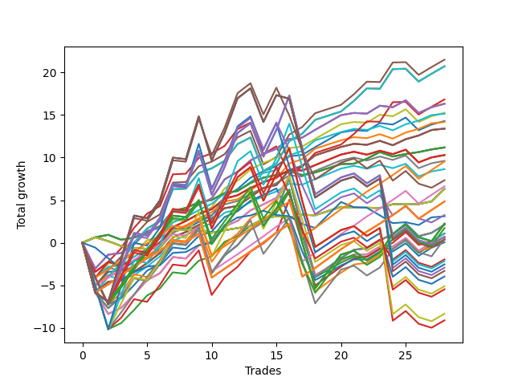

# Short Wallace 012 
- Symbol: NVDA_Unlimited
- Date Range: 02/08/2022 - 07/08/2022
- Trading Period: 7:20-12:30
- Number of Trades: 28



| Name | Win Percent | Profit | Avg Profit / Trade | Avg Time / Trade |      | Name | Win Percent | Profit | Avg Profit / Trade | Avg Time / Trade |
| ---- | ----------- | ------ | ------------------ | ---------------- | ---- | ---- | ----------- | ------ | ------------------ | ---------------- |
| Sorted By <br> Profit | | | | | | Sorted By <br> Win Percentage ||||
| Forty-Seven | 85.71 | 10740.00 | 383.57 | 43:23 |     | Fifty-One | 89.29 | 7570.00 | 270.36 | 16:10 |
| Seventy-One | 85.71 | 10350.00 | 369.64 | 46:02 |     | Forty-Three | 89.29 | 7085.00 | 253.04 | 16:16 |
| Sixty-Three | 85.71 | 10350.00 | 369.64 | 46:02 |     | Sixty-Seven | 89.29 | 6695.00 | 239.11 | 18:55 |
| Seven | 85.71 | 10350.00 | 369.64 | 46:02 |     | Fifty-Nine | 89.29 | 6695.00 | 239.11 | 18:55 |
| Fifty-Five | 82.14 | 8410.00 | 300.36 | 42:25 |     | Three | 89.29 | 6695.00 | 239.11 | 18:55 |
| Sixty-Six | 82.14 | 8155.00 | 291.25 | 19:34 |     | Sixty-Four | 89.29 | 5590.00 | 199.64 | 07:04 |
| Fifty-Eight | 82.14 | 8155.00 | 291.25 | 19:34 |     | Fifty-Six | 89.29 | 5590.00 | 199.64 | 07:04 |
| Two | 82.14 | 8155.00 | 291.25 | 19:34 |     | Forty-Eight | 89.29 | 5590.00 | 199.64 | 07:04 |
| Fifty | 82.14 | 7625.00 | 272.32 | 18:56 |     | Forty | 89.29 | 5590.00 | 199.64 | 07:04 |
| Fifty-One | 89.29 | 7570.00 | 270.36 | 16:10 |     | Zero | 89.29 | 5590.00 | 199.64 | 07:04 |
| Forty-Two | 82.14 | 7140.00 | 255.00 | 19:01 |     | Forty-Seven | 85.71 | 10740.00 | 383.57 | 43:23 |
| Forty-Three | 89.29 | 7085.00 | 253.04 | 16:16 |     | Seventy-One | 85.71 | 10350.00 | 369.64 | 46:02 |
| Sixty-Seven | 89.29 | 6695.00 | 239.11 | 18:55 |     | Sixty-Three | 85.71 | 10350.00 | 369.64 | 46:02 |
| Fifty-Nine | 89.29 | 6695.00 | 239.11 | 18:55 |     | Seven | 85.71 | 10350.00 | 369.64 | 46:02 |
| Three | 89.29 | 6695.00 | 239.11 | 18:55 |     | Fifty-Five | 82.14 | 8410.00 | 300.36 | 42:25 |
| Sixty-Four | 89.29 | 5590.00 | 199.64 | 07:04 |     | Sixty-Six | 82.14 | 8155.00 | 291.25 | 19:34 |
| Fifty-Six | 89.29 | 5590.00 | 199.64 | 07:04 |     | Fifty-Eight | 82.14 | 8155.00 | 291.25 | 19:34 |
| Forty-Eight | 89.29 | 5590.00 | 199.64 | 07:04 |     | Two | 82.14 | 8155.00 | 291.25 | 19:34 |
| Forty | 89.29 | 5590.00 | 199.64 | 07:04 |     | Fifty | 82.14 | 7625.00 | 272.32 | 18:56 |
| Zero | 89.29 | 5590.00 | 199.64 | 07:04 |     | Forty-Two | 82.14 | 7140.00 | 255.00 | 19:01 |
| Sixty-Five | 78.57 | 5145.00 | 183.75 | 14:18 |     | One Hundred Sixteen | 82.14 | 4765.00 | 170.18 | 30:31 |
| Fifty-Seven | 78.57 | 5145.00 | 183.75 | 14:18 |     | One Hundred Eleven | 82.14 | 3310.00 | 118.21 | 30:43 |
| One | 78.57 | 5145.00 | 183.75 | 14:18 |     | One Hundred Twenty-Six | 82.14 | 2420.00 | 86.43 | 38:38 |
| Forty-Nine | 78.57 | 4805.00 | 171.61 | 13:41 |     | One Hundred Twenty-One | 82.14 | 2420.00 | 86.43 | 38:38 |
| One Hundred Sixteen | 82.14 | 4765.00 | 170.18 | 30:31 |     | Eighty-One | 82.14 | 2420.00 | 86.43 | 38:38 |
| Forty-One | 78.57 | 4320.00 | 154.29 | 13:47 |     | Sixty-Five | 78.57 | 5145.00 | 183.75 | 14:18 |
| One Hundred Twenty | 53.57 | 3665.00 | 130.89 | 96:33 |     | Fifty-Seven | 78.57 | 5145.00 | 183.75 | 14:18 |
| One Hundred Eleven | 82.14 | 3310.00 | 118.21 | 30:43 |     | One | 78.57 | 5145.00 | 183.75 | 14:18 |
| Seventy | 60.71 | 3160.00 | 112.86 | 13:03 |     | Forty-Nine | 78.57 | 4805.00 | 171.61 | 13:41 |
| Sixty-Two | 60.71 | 3160.00 | 112.86 | 13:03 |     | Forty-One | 78.57 | 4320.00 | 154.29 | 13:47 |
| Fifty-Four | 60.71 | 3160.00 | 112.86 | 13:03 |     | Sixty-Nine | 71.43 | 1060.00 | 37.86 | 55:04 |
| Forty-Six | 60.71 | 3160.00 | 112.86 | 13:03 |     | Sixty-One | 71.43 | 1060.00 | 37.86 | 55:04 |
| Six | 60.71 | 3160.00 | 112.86 | 13:03 |     | Five | 71.43 | 1060.00 | 37.86 | 55:04 |
| One Hundred Twenty-Six | 82.14 | 2420.00 | 86.43 | 38:38 |     | Forty-Five | 71.43 | 550.00 | 19.64 | 44:28 |
| One Hundred Twenty-One | 82.14 | 2420.00 | 86.43 | 38:38 |     | Sixty-Eight | 71.43 | 325.00 | 11.61 | 40:00 |
| Eighty-One | 82.14 | 2420.00 | 86.43 | 38:38 |     | Sixty | 71.43 | 325.00 | 11.61 | 40:00 |
| One Hundred Ninteen | 53.57 | 1625.00 | 58.04 | 95:06 |     | Four | 71.43 | 325.00 | 11.61 | 40:00 |
| Seventy-Three | 53.57 | 1550.00 | 55.36 | 12:09 |     | Forty-Four | 71.43 | 195.00 | 6.96 | 33:06 |
| One Hundred Twenty-Seven | 64.29 | 1120.00 | 40.00 | 82:41 |     | Fifty-Three | 67.86 | 200.00 | 7.14 | 43:04 |
| One Hundred Twenty-Two | 64.29 | 1120.00 | 40.00 | 82:41 |     | Fifty-Two | 67.86 | 30.00 | 1.07 | 31:50 |
| Eighty-Two | 64.29 | 1120.00 | 40.00 | 82:41 |     | One Hundred Twenty-Seven | 64.29 | 1120.00 | 40.00 | 82:41 |
| Sixty-Nine | 71.43 | 1060.00 | 37.86 | 55:04 |     | One Hundred Twenty-Two | 64.29 | 1120.00 | 40.00 | 82:41 |
| Sixty-One | 71.43 | 1060.00 | 37.86 | 55:04 |     | Eighty-Two | 64.29 | 1120.00 | 40.00 | 82:41 |
| Five | 71.43 | 1060.00 | 37.86 | 55:04 |     | One Hundred Twelve | 64.29 | 240.00 | 8.57 | 71:55 |
| One Hundred Seventeen | 60.71 | 860.00 | 30.71 | 70:07 |     | Seventy | 60.71 | 3160.00 | 112.86 | 13:03 |
| Forty-Five | 71.43 | 550.00 | 19.64 | 44:28 |     | Sixty-Two | 60.71 | 3160.00 | 112.86 | 13:03 |
| One Hundred Fourteen | 57.14 | 540.00 | 19.29 | 97:11 |     | Fifty-Four | 60.71 | 3160.00 | 112.86 | 13:03 |
| One Hundred Twenty-Nine | 57.14 | 360.00 | 12.86 | 108:16 |     | Forty-Six | 60.71 | 3160.00 | 112.86 | 13:03 |
| Sixty-Eight | 71.43 | 325.00 | 11.61 | 40:00 |     | Six | 60.71 | 3160.00 | 112.86 | 13:03 |
| Sixty | 71.43 | 325.00 | 11.61 | 40:00 |     | One Hundred Seventeen | 60.71 | 860.00 | 30.71 | 70:07 |
| Four | 71.43 | 325.00 | 11.61 | 40:00 |     | One Hundred Fourteen | 57.14 | 540.00 | 19.29 | 97:11 |
| One Hundred Twelve | 64.29 | 240.00 | 8.57 | 71:55 |     | One Hundred Twenty-Nine | 57.14 | 360.00 | 12.86 | 108:16 |
| Fifty-Three | 67.86 | 200.00 | 7.14 | 43:04 |     | One Hundred Twenty-Four | 57.14 | -1075.00 | -38.39 | 108:52 |
| Forty-Four | 71.43 | 195.00 | 6.96 | 33:06 |     | Eighty-Four | 57.14 | -1460.00 | -52.14 | 110:05 |
| One Hundred Thirty | 53.57 | 170.00 | 6.07 | 113:00 |     | One Hundred Thirteen | 57.14 | -2550.00 | -91.07 | 92:35 |
| Fifty-Two | 67.86 | 30.00 | 1.07 | 31:50 |     | One Hundred Twenty-Eight | 57.14 | -2730.00 | -97.50 | 103:41 |
| One Hundred Eighteen | 53.57 | -975.00 | -34.82 | 90:35 |     | One Hundred Twenty-Three | 57.14 | -4165.00 | -148.75 | 104:16 |
| One Hundred Twenty-Four | 57.14 | -1075.00 | -38.39 | 108:52 |     | Eighty-Three | 57.14 | -4550.00 | -162.50 | 105:29 |
| One Hundred Twenty-Five | 53.57 | -1265.00 | -45.18 | 113:36 |     | One Hundred Twenty | 53.57 | 3665.00 | 130.89 | 96:33 |
| Eighty-Four | 57.14 | -1460.00 | -52.14 | 110:05 |     | One Hundred Ninteen | 53.57 | 1625.00 | 58.04 | 95:06 |
| Eighty-Five | 53.57 | -1650.00 | -58.93 | 114:48 |     | Seventy-Three | 53.57 | 1550.00 | 55.36 | 12:09 |
| One Hundred Fifteen | 53.57 | -1975.00 | -70.54 | 100:23 |     | One Hundred Thirty | 53.57 | 170.00 | 6.07 | 113:00 |
| One Hundred Thirteen | 57.14 | -2550.00 | -91.07 | 92:35 |     | One Hundred Eighteen | 53.57 | -975.00 | -34.82 | 90:35 |
| One Hundred Twenty-Eight | 57.14 | -2730.00 | -97.50 | 103:41 |     | One Hundred Twenty-Five | 53.57 | -1265.00 | -45.18 | 113:36 |
| One Hundred Twenty-Three | 57.14 | -4165.00 | -148.75 | 104:16 |     | Eighty-Five | 53.57 | -1650.00 | -58.93 | 114:48 |
| Eighty-Three | 57.14 | -4550.00 | -162.50 | 105:29 |     | One Hundred Fifteen | 53.57 | -1975.00 | -70.54 | 100:23 |

## NO STOPLOSS

### Test Zero
* Sell when price hits the middle line of the 20p bollinger
* No Stoploss
* Results:
```
Total Trades: 28
Percent Up: 10.71
Percent Down: 89.29
Total Points Moved Down: 11.18
Potential Profit: 5590.00
Total Points Ups: 1.54 Count Ups: 3
Total Points Downs: 12.72 Count Downs: 25
```

<details><summary>Trades</summary>

<code>In: 2022-02-16 11:02:00		Out: 2022-02-16 11:03:10		Total Position Time: 01:10		Total Move Down: 0.64		Total to Date: 0.64</code> <br />
<code>In: 2022-02-22 11:34:00		Out: 2022-02-22 11:42:40		Total Position Time: 08:40		Total Move Down: 0.29		Total to Date: 0.93</code> <br />
<code>In: 2022-02-23 09:11:00		Out: 2022-02-23 09:30:55		Total Position Time: 19:55		Total Move Down: -0.58		Total to Date: 0.35</code> <br />
<code>In: 2022-02-23 09:19:00		Out: 2022-02-23 09:30:55		Total Position Time: 11:55		Total Move Down: 0.26		Total to Date: 0.61</code> <br />
<code>In: 2022-02-28 12:24:00		Out: 2022-02-28 12:30:35		Total Position Time: 06:35		Total Move Down: 0.56		Total to Date: 1.17</code> <br />
<code>In: 2022-03-01 11:44:00		Out: 2022-03-01 11:51:05		Total Position Time: 07:05		Total Move Down: 0.77		Total to Date: 1.94</code> <br />
<code>In: 2022-03-03 09:38:00		Out: 2022-03-03 09:41:55		Total Position Time: 03:55		Total Move Down: 1.81		Total to Date: 3.75</code> <br />
<code>In: 2022-03-04 12:30:00		Out: 2022-03-04 12:36:45		Total Position Time: 06:45		Total Move Down: 0.33		Total to Date: 4.08</code> <br />
<code>In: 2022-03-07 09:52:00		Out: 2022-03-07 09:55:15		Total Position Time: 03:15		Total Move Down: 0.66		Total to Date: 4.74</code> <br />
<code>In: 2022-03-10 09:01:00		Out: 2022-03-10 09:07:20		Total Position Time: 06:20		Total Move Down: 0.28		Total to Date: 5.02</code> <br />
<code>In: 2022-03-11 09:22:00		Out: 2022-03-11 09:24:10		Total Position Time: 02:10		Total Move Down: 0.81		Total to Date: 5.83</code> <br />
<code>In: 2022-03-11 10:51:00		Out: 2022-03-11 10:52:10		Total Position Time: 01:10		Total Move Down: 0.25		Total to Date: 6.08</code> <br />
<code>In: 2022-03-14 12:04:00		Out: 2022-03-14 12:08:20		Total Position Time: 04:20		Total Move Down: 0.93		Total to Date: 7.01</code> <br />
<code>In: 2022-03-28 10:29:00		Out: 2022-03-28 10:38:35		Total Position Time: 09:35		Total Move Down: 0.63		Total to Date: 7.64</code> <br />
<code>In: 2022-04-05 11:38:00		Out: 2022-04-05 11:39:10		Total Position Time: 01:10		Total Move Down: 0.30		Total to Date: 7.94</code> <br />
<code>In: 2022-04-06 10:43:00		Out: 2022-04-06 10:55:45		Total Position Time: 12:45		Total Move Down: 0.45		Total to Date: 8.39</code> <br />
<code>In: 2022-04-07 10:22:00		Out: 2022-04-07 10:39:50		Total Position Time: 17:50		Total Move Down: -0.44		Total to Date: 7.95</code> <br />
<code>In: 2022-04-07 10:33:00		Out: 2022-04-07 10:39:50		Total Position Time: 06:50		Total Move Down: 0.30		Total to Date: 8.25</code> <br />
<code>In: 2022-04-08 11:23:00		Out: 2022-04-08 11:24:10		Total Position Time: 01:10		Total Move Down: 0.49		Total to Date: 8.74</code> <br />
<code>In: 2022-04-08 11:23:00		Out: 2022-04-08 11:24:10		Total Position Time: 01:10		Total Move Down: 0.49		Total to Date: 9.23</code> <br />
<code>In: 2022-04-11 10:03:00		Out: 2022-04-11 10:16:15		Total Position Time: 13:15		Total Move Down: 0.05		Total to Date: 9.28</code> <br />
<code>In: 2022-04-20 09:55:00		Out: 2022-04-20 09:59:05		Total Position Time: 04:05		Total Move Down: 0.58		Total to Date: 9.86</code> <br />
<code>In: 2022-04-22 12:18:00		Out: 2022-04-22 12:24:15		Total Position Time: 06:15		Total Move Down: 0.78		Total to Date: 10.64</code> <br />
<code>In: 2022-05-04 09:25:00		Out: 2022-05-04 09:42:30		Total Position Time: 17:30		Total Move Down: -0.52		Total to Date: 10.12</code> <br />
<code>In: 2022-06-08 10:23:00		Out: 2022-06-08 10:30:10		Total Position Time: 07:10		Total Move Down: 0.29		Total to Date: 10.41</code> <br />
<code>In: 2022-06-23 12:14:00		Out: 2022-06-23 12:18:10		Total Position Time: 04:10		Total Move Down: 0.23		Total to Date: 10.64</code> <br />
<code>In: 2022-06-29 10:12:00		Out: 2022-06-29 10:13:10		Total Position Time: 01:10		Total Move Down: 0.31		Total to Date: 10.95</code> <br />
<code>In: 2022-06-30 08:25:00		Out: 2022-06-30 08:35:40		Total Position Time: 10:40		Total Move Down: 0.23		Total to Date: 11.18</code> <br />


</details>

### Test One
* Sell when the price hits the upper line of the 20p 1std bollinger
* No Stoploss
* Results:
```
Total Trades: 28
Percent Up: 21.43
Percent Down: 78.57
Total Points Moved Down: 10.29
Potential Profit: 5145.00
Total Points Ups: 6.12 Count Ups: 6
Total Points Downs: 16.41 Count Downs: 22
```

<details><summary>Trades</summary>

<code>In: 2022-02-16 11:02:00		Out: 2022-02-16 11:47:15		Total Position Time: 45:15		Total Move Down: -3.41		Total to Date: -3.41</code> <br />
<code>In: 2022-02-22 11:34:00		Out: 2022-02-22 11:44:25		Total Position Time: 10:25		Total Move Down: 1.16		Total to Date: -2.25</code> <br />
<code>In: 2022-02-23 09:11:00		Out: 2022-02-23 09:32:10		Total Position Time: 21:10		Total Move Down: -0.37		Total to Date: -2.62</code> <br />
<code>In: 2022-02-23 09:19:00		Out: 2022-02-23 09:32:10		Total Position Time: 13:10		Total Move Down: 0.47		Total to Date: -2.15</code> <br />
<code>In: 2022-02-28 12:24:00		Out: 2022-02-28 12:34:10		Total Position Time: 10:10		Total Move Down: 1.01		Total to Date: -1.14</code> <br />
<code>In: 2022-03-01 11:44:00		Out: 2022-03-01 11:55:05		Total Position Time: 11:05		Total Move Down: 1.19		Total to Date: 0.05</code> <br />
<code>In: 2022-03-03 09:38:00		Out: 2022-03-03 09:53:50		Total Position Time: 15:50		Total Move Down: 1.78		Total to Date: 1.83</code> <br />
<code>In: 2022-03-04 12:30:00		Out: 2022-03-04 12:37:55		Total Position Time: 07:55		Total Move Down: 0.72		Total to Date: 2.55</code> <br />
<code>In: 2022-03-07 09:52:00		Out: 2022-03-07 09:58:05		Total Position Time: 06:05		Total Move Down: 0.82		Total to Date: 3.37</code> <br />
<code>In: 2022-03-10 09:01:00		Out: 2022-03-10 09:08:15		Total Position Time: 07:15		Total Move Down: 0.57		Total to Date: 3.94</code> <br />
<code>In: 2022-03-11 09:22:00		Out: 2022-03-11 09:27:05		Total Position Time: 05:05		Total Move Down: 1.24		Total to Date: 5.18</code> <br />
<code>In: 2022-03-11 10:51:00		Out: 2022-03-11 10:52:35		Total Position Time: 01:35		Total Move Down: 0.39		Total to Date: 5.57</code> <br />
<code>In: 2022-03-14 12:04:00		Out: 2022-03-14 12:19:55		Total Position Time: 15:55		Total Move Down: 0.86		Total to Date: 6.43</code> <br />
<code>In: 2022-03-28 10:29:00		Out: 2022-03-28 10:42:05		Total Position Time: 13:05		Total Move Down: 0.66		Total to Date: 7.09</code> <br />
<code>In: 2022-04-05 11:38:00		Out: 2022-04-05 11:39:50		Total Position Time: 01:50		Total Move Down: 0.58		Total to Date: 7.67</code> <br />
<code>In: 2022-04-06 10:43:00		Out: 2022-04-06 10:57:20		Total Position Time: 14:20		Total Move Down: 0.90		Total to Date: 8.57</code> <br />
<code>In: 2022-04-07 10:22:00		Out: 2022-04-07 10:45:15		Total Position Time: 23:15		Total Move Down: -0.10		Total to Date: 8.47</code> <br />
<code>In: 2022-04-07 10:33:00		Out: 2022-04-07 10:45:15		Total Position Time: 12:15		Total Move Down: 0.64		Total to Date: 9.11</code> <br />
<code>In: 2022-04-08 11:23:00		Out: 2022-04-08 11:24:35		Total Position Time: 01:35		Total Move Down: 0.62		Total to Date: 9.73</code> <br />
<code>In: 2022-04-08 11:23:00		Out: 2022-04-08 11:24:35		Total Position Time: 01:35		Total Move Down: 0.62		Total to Date: 10.35</code> <br />
<code>In: 2022-04-11 10:03:00		Out: 2022-04-11 10:19:05		Total Position Time: 16:05		Total Move Down: 0.33		Total to Date: 10.68</code> <br />
<code>In: 2022-04-20 09:55:00		Out: 2022-04-20 10:32:05		Total Position Time: 37:05		Total Move Down: -0.35		Total to Date: 10.33</code> <br />
<code>In: 2022-04-22 12:18:00		Out: 2022-04-22 12:46:05		Total Position Time: 28:05		Total Move Down: 0.47		Total to Date: 10.80</code> <br />
<code>In: 2022-05-04 09:25:00		Out: 2022-05-04 09:46:15		Total Position Time: 21:15		Total Move Down: -0.40		Total to Date: 10.40</code> <br />
<code>In: 2022-06-08 10:23:00		Out: 2022-06-08 10:31:00		Total Position Time: 08:00		Total Move Down: 0.52		Total to Date: 10.92</code> <br />
<code>In: 2022-06-23 12:14:00		Out: 2022-06-23 12:47:00		Total Position Time: 33:00		Total Move Down: -1.49		Total to Date: 9.43</code> <br />
<code>In: 2022-06-29 10:12:00		Out: 2022-06-29 10:14:05		Total Position Time: 02:05		Total Move Down: 0.58		Total to Date: 10.01</code> <br />
<code>In: 2022-06-30 08:25:00		Out: 2022-06-30 08:41:05		Total Position Time: 16:05		Total Move Down: 0.28		Total to Date: 10.29</code> <br />


</details>

### Test Two
* Sell when the price hits the upper line of the 20p 2std bollinger
* No Stoploss
* Results:
```
Total Trades: 28
Percent Up: 17.86
Percent Down: 82.14
Total Points Moved Down: 16.31
Potential Profit: 8155.00
Total Points Ups: 4.95 Count Ups: 5
Total Points Downs: 21.26 Count Downs: 23
```

<details><summary>Trades</summary>

<code>In: 2022-02-16 11:02:00		Out: 2022-02-16 11:48:05		Total Position Time: 46:05		Total Move Down: -3.03		Total to Date: -3.03</code> <br />
<code>In: 2022-02-22 11:34:00		Out: 2022-02-22 11:46:15		Total Position Time: 12:15		Total Move Down: 1.63		Total to Date: -1.40</code> <br />
<code>In: 2022-02-23 09:11:00		Out: 2022-02-23 09:34:50		Total Position Time: 23:50		Total Move Down: 0.19		Total to Date: -1.21</code> <br />
<code>In: 2022-02-23 09:19:00		Out: 2022-02-23 09:34:50		Total Position Time: 15:50		Total Move Down: 1.03		Total to Date: -0.18</code> <br />
<code>In: 2022-02-28 12:24:00		Out: 2022-02-28 12:35:35		Total Position Time: 11:35		Total Move Down: 1.54		Total to Date: 1.36</code> <br />
<code>In: 2022-03-01 11:44:00		Out: 2022-03-01 12:23:05		Total Position Time: 39:05		Total Move Down: 0.40		Total to Date: 1.76</code> <br />
<code>In: 2022-03-03 09:38:00		Out: 2022-03-03 10:00:10		Total Position Time: 22:10		Total Move Down: 2.00		Total to Date: 3.76</code> <br />
<code>In: 2022-03-04 12:30:00		Out: 2022-03-04 12:47:00		Total Position Time: 17:00		Total Move Down: -0.17		Total to Date: 3.59</code> <br />
<code>In: 2022-03-07 09:52:00		Out: 2022-03-07 10:11:00		Total Position Time: 19:00		Total Move Down: 0.89		Total to Date: 4.48</code> <br />
<code>In: 2022-03-10 09:01:00		Out: 2022-03-10 09:12:00		Total Position Time: 11:00		Total Move Down: 0.72		Total to Date: 5.20</code> <br />
<code>In: 2022-03-11 09:22:00		Out: 2022-03-11 09:36:10		Total Position Time: 14:10		Total Move Down: 2.24		Total to Date: 7.44</code> <br />
<code>In: 2022-03-11 10:51:00		Out: 2022-03-11 10:53:20		Total Position Time: 02:20		Total Move Down: 0.89		Total to Date: 8.33</code> <br />
<code>In: 2022-03-14 12:04:00		Out: 2022-03-14 12:20:10		Total Position Time: 16:10		Total Move Down: 1.33		Total to Date: 9.66</code> <br />
<code>In: 2022-03-28 10:29:00		Out: 2022-03-28 10:53:30		Total Position Time: 24:30		Total Move Down: 0.76		Total to Date: 10.42</code> <br />
<code>In: 2022-04-05 11:38:00		Out: 2022-04-05 11:57:35		Total Position Time: 19:35		Total Move Down: 0.60		Total to Date: 11.02</code> <br />
<code>In: 2022-04-06 10:43:00		Out: 2022-04-06 11:00:00		Total Position Time: 17:00		Total Move Down: 1.15		Total to Date: 12.17</code> <br />
<code>In: 2022-04-07 10:22:00		Out: 2022-04-07 10:47:20		Total Position Time: 25:20		Total Move Down: 0.17		Total to Date: 12.34</code> <br />
<code>In: 2022-04-07 10:33:00		Out: 2022-04-07 10:47:20		Total Position Time: 14:20		Total Move Down: 0.91		Total to Date: 13.25</code> <br />
<code>In: 2022-04-08 11:23:00		Out: 2022-04-08 11:25:05		Total Position Time: 02:05		Total Move Down: 0.86		Total to Date: 14.11</code> <br />
<code>In: 2022-04-08 11:23:00		Out: 2022-04-08 11:25:05		Total Position Time: 02:05		Total Move Down: 0.86		Total to Date: 14.97</code> <br />
<code>In: 2022-04-11 10:03:00		Out: 2022-04-11 10:21:25		Total Position Time: 18:25		Total Move Down: 0.26		Total to Date: 15.23</code> <br />
<code>In: 2022-04-20 09:55:00		Out: 2022-04-20 10:33:25		Total Position Time: 38:25		Total Move Down: -0.08		Total to Date: 15.15</code> <br />
<code>In: 2022-04-22 12:18:00		Out: 2022-04-22 12:47:00		Total Position Time: 29:00		Total Move Down: 0.93		Total to Date: 16.08</code> <br />
<code>In: 2022-05-04 09:25:00		Out: 2022-05-04 09:48:00		Total Position Time: 23:00		Total Move Down: -0.18		Total to Date: 15.90</code> <br />
<code>In: 2022-06-08 10:23:00		Out: 2022-06-08 10:31:20		Total Position Time: 08:20		Total Move Down: 0.82		Total to Date: 16.72</code> <br />
<code>In: 2022-06-23 12:14:00		Out: 2022-06-23 12:47:00		Total Position Time: 33:00		Total Move Down: -1.49		Total to Date: 15.23</code> <br />
<code>In: 2022-06-29 10:12:00		Out: 2022-06-29 10:15:05		Total Position Time: 03:05		Total Move Down: 0.67		Total to Date: 15.90</code> <br />
<code>In: 2022-06-30 08:25:00		Out: 2022-06-30 09:04:30		Total Position Time: 39:30		Total Move Down: 0.41		Total to Date: 16.31</code> <br />


</details>

### Test Three
* Sell when price hits the middle line of the 50p bollinger
* No Stoploss
* Results:
```
Total Trades: 28
Percent Up: 10.71
Percent Down: 89.29
Total Points Moved Down: 13.39
Potential Profit: 6695.00
Total Points Ups: 6.48 Count Ups: 3
Total Points Downs: 19.87 Count Downs: 25
```

<details><summary>Trades</summary>

<code>In: 2022-02-16 11:02:00		Out: 2022-02-16 12:47:00		Total Position Time: 105:00		Total Move Down: -5.84		Total to Date: -5.84</code> <br />
<code>In: 2022-02-22 11:34:00		Out: 2022-02-22 11:44:30		Total Position Time: 10:30		Total Move Down: 1.27		Total to Date: -4.57</code> <br />
<code>In: 2022-02-23 09:11:00		Out: 2022-02-23 09:34:55		Total Position Time: 23:55		Total Move Down: 0.16		Total to Date: -4.41</code> <br />
<code>In: 2022-02-23 09:19:00		Out: 2022-02-23 09:34:55		Total Position Time: 15:55		Total Move Down: 1.00		Total to Date: -3.41</code> <br />
<code>In: 2022-02-28 12:24:00		Out: 2022-02-28 12:34:10		Total Position Time: 10:10		Total Move Down: 1.01		Total to Date: -2.40</code> <br />
<code>In: 2022-03-01 11:44:00		Out: 2022-03-01 11:55:05		Total Position Time: 11:05		Total Move Down: 1.19		Total to Date: -1.21</code> <br />
<code>In: 2022-03-03 09:38:00		Out: 2022-03-03 09:41:50		Total Position Time: 03:50		Total Move Down: 1.84		Total to Date: 0.63</code> <br />
<code>In: 2022-03-04 12:30:00		Out: 2022-03-04 12:37:45		Total Position Time: 07:45		Total Move Down: 0.63		Total to Date: 1.26</code> <br />
<code>In: 2022-03-07 09:52:00		Out: 2022-03-07 09:58:05		Total Position Time: 06:05		Total Move Down: 0.82		Total to Date: 2.08</code> <br />
<code>In: 2022-03-10 09:01:00		Out: 2022-03-10 09:08:55		Total Position Time: 07:55		Total Move Down: 0.74		Total to Date: 2.82</code> <br />
<code>In: 2022-03-11 09:22:00		Out: 2022-03-11 09:27:05		Total Position Time: 05:05		Total Move Down: 1.24		Total to Date: 4.06</code> <br />
<code>In: 2022-03-11 10:51:00		Out: 2022-03-11 10:52:10		Total Position Time: 01:10		Total Move Down: 0.25		Total to Date: 4.31</code> <br />
<code>In: 2022-03-14 12:04:00		Out: 2022-03-14 12:20:05		Total Position Time: 16:05		Total Move Down: 1.06		Total to Date: 5.37</code> <br />
<code>In: 2022-03-28 10:29:00		Out: 2022-03-28 10:54:55		Total Position Time: 25:55		Total Move Down: 1.06		Total to Date: 6.43</code> <br />
<code>In: 2022-04-05 11:38:00		Out: 2022-04-05 11:57:20		Total Position Time: 19:20		Total Move Down: 0.34		Total to Date: 6.77</code> <br />
<code>In: 2022-04-06 10:43:00		Out: 2022-04-06 11:00:10		Total Position Time: 17:10		Total Move Down: 1.75		Total to Date: 8.52</code> <br />
<code>In: 2022-04-07 10:22:00		Out: 2022-04-07 10:47:55		Total Position Time: 25:55		Total Move Down: 0.50		Total to Date: 9.02</code> <br />
<code>In: 2022-04-07 10:33:00		Out: 2022-04-07 10:47:55		Total Position Time: 14:55		Total Move Down: 1.24		Total to Date: 10.26</code> <br />
<code>In: 2022-04-08 11:23:00		Out: 2022-04-08 11:24:10		Total Position Time: 01:10		Total Move Down: 0.49		Total to Date: 10.75</code> <br />
<code>In: 2022-04-08 11:23:00		Out: 2022-04-08 11:24:10		Total Position Time: 01:10		Total Move Down: 0.49		Total to Date: 11.24</code> <br />
<code>In: 2022-04-11 10:03:00		Out: 2022-04-11 10:37:00		Total Position Time: 34:00		Total Move Down: 0.37		Total to Date: 11.61</code> <br />
<code>In: 2022-04-20 09:55:00		Out: 2022-04-20 10:33:05		Total Position Time: 38:05		Total Move Down: -0.12		Total to Date: 11.49</code> <br />
<code>In: 2022-04-22 12:18:00		Out: 2022-04-22 12:46:05		Total Position Time: 28:05		Total Move Down: 0.47		Total to Date: 11.96</code> <br />
<code>In: 2022-05-04 09:25:00		Out: 2022-05-04 10:11:05		Total Position Time: 46:05		Total Move Down: -0.52		Total to Date: 11.44</code> <br />
<code>In: 2022-06-08 10:23:00		Out: 2022-06-08 10:31:10		Total Position Time: 08:10		Total Move Down: 0.71		Total to Date: 12.15</code> <br />
<code>In: 2022-06-23 12:14:00		Out: 2022-06-23 12:18:35		Total Position Time: 04:35		Total Move Down: 0.43		Total to Date: 12.58</code> <br />
<code>In: 2022-06-29 10:12:00		Out: 2022-06-29 10:15:00		Total Position Time: 03:00		Total Move Down: 0.65		Total to Date: 13.23</code> <br />
<code>In: 2022-06-30 08:25:00		Out: 2022-06-30 09:02:35		Total Position Time: 37:35		Total Move Down: 0.16		Total to Date: 13.39</code> <br />


</details>

### Test Four
* Sell when the price hits the upper line of the 50p 1std bollinger
* No Stoploss
* Results:
```
Total Trades: 28
Percent Up: 28.57
Percent Down: 71.43
Total Points Moved Down: 0.65
Potential Profit: 325.00
Total Points Ups: 21.59 Count Ups: 8
Total Points Downs: 22.24 Count Downs: 20
```

<details><summary>Trades</summary>

<code>In: 2022-02-16 11:02:00		Out: 2022-02-16 12:47:00		Total Position Time: 105:00		Total Move Down: -5.84		Total to Date: -5.84</code> <br />
<code>In: 2022-02-22 11:34:00		Out: 2022-02-22 12:40:55		Total Position Time: 66:55		Total Move Down: -2.51		Total to Date: -8.35</code> <br />
<code>In: 2022-02-23 09:11:00		Out: 2022-02-23 09:48:10		Total Position Time: 37:10		Total Move Down: 0.71		Total to Date: -7.64</code> <br />
<code>In: 2022-02-23 09:19:00		Out: 2022-02-23 09:48:10		Total Position Time: 29:10		Total Move Down: 1.55		Total to Date: -6.09</code> <br />
<code>In: 2022-02-28 12:24:00		Out: 2022-02-28 12:36:45		Total Position Time: 12:45		Total Move Down: 1.69		Total to Date: -4.40</code> <br />
<code>In: 2022-03-01 11:44:00		Out: 2022-03-01 12:29:05		Total Position Time: 45:05		Total Move Down: 0.83		Total to Date: -3.57</code> <br />
<code>In: 2022-03-03 09:38:00		Out: 2022-03-03 10:34:35		Total Position Time: 56:35		Total Move Down: 1.89		Total to Date: -1.68</code> <br />
<code>In: 2022-03-04 12:30:00		Out: 2022-03-04 12:47:00		Total Position Time: 17:00		Total Move Down: -0.17		Total to Date: -1.85</code> <br />
<code>In: 2022-03-07 09:52:00		Out: 2022-03-07 10:11:45		Total Position Time: 19:45		Total Move Down: 1.53		Total to Date: -0.32</code> <br />
<code>In: 2022-03-10 09:01:00		Out: 2022-03-10 09:42:15		Total Position Time: 41:15		Total Move Down: 0.51		Total to Date: 0.19</code> <br />
<code>In: 2022-03-11 09:22:00		Out: 2022-03-11 09:29:50		Total Position Time: 07:50		Total Move Down: 1.71		Total to Date: 1.90</code> <br />
<code>In: 2022-03-11 10:51:00		Out: 2022-03-11 10:53:05		Total Position Time: 02:05		Total Move Down: 0.67		Total to Date: 2.57</code> <br />
<code>In: 2022-03-14 12:04:00		Out: 2022-03-14 12:30:55		Total Position Time: 26:55		Total Move Down: 1.24		Total to Date: 3.81</code> <br />
<code>In: 2022-03-28 10:29:00		Out: 2022-03-28 11:15:05		Total Position Time: 46:05		Total Move Down: 0.70		Total to Date: 4.51</code> <br />
<code>In: 2022-04-05 11:38:00		Out: 2022-04-05 12:02:05		Total Position Time: 24:05		Total Move Down: 0.75		Total to Date: 5.26</code> <br />
<code>In: 2022-04-06 10:43:00		Out: 2022-04-06 11:11:20		Total Position Time: 28:20		Total Move Down: 2.52		Total to Date: 7.78</code> <br />
<code>In: 2022-04-07 10:22:00		Out: 2022-04-07 12:47:00		Total Position Time: 145:00		Total Move Down: -6.16		Total to Date: 1.62</code> <br />
<code>In: 2022-04-07 10:33:00		Out: 2022-04-07 12:47:00		Total Position Time: 134:00		Total Move Down: -5.42		Total to Date: -3.80</code> <br />
<code>In: 2022-04-08 11:23:00		Out: 2022-04-08 11:25:05		Total Position Time: 02:05		Total Move Down: 0.86		Total to Date: -2.94</code> <br />
<code>In: 2022-04-08 11:23:00		Out: 2022-04-08 11:25:05		Total Position Time: 02:05		Total Move Down: 0.86		Total to Date: -2.08</code> <br />
<code>In: 2022-04-11 10:03:00		Out: 2022-04-11 10:44:10		Total Position Time: 41:10		Total Move Down: 0.71		Total to Date: -1.37</code> <br />
<code>In: 2022-04-20 09:55:00		Out: 2022-04-20 10:51:05		Total Position Time: 56:05		Total Move Down: -0.00		Total to Date: -1.37</code> <br />
<code>In: 2022-04-22 12:18:00		Out: 2022-04-22 12:47:00		Total Position Time: 29:00		Total Move Down: 0.93		Total to Date: -0.44</code> <br />
<code>In: 2022-05-04 09:25:00		Out: 2022-05-04 10:12:10		Total Position Time: 47:10		Total Move Down: -0.00		Total to Date: -0.44</code> <br />
<code>In: 2022-06-08 10:23:00		Out: 2022-06-08 10:37:25		Total Position Time: 14:25		Total Move Down: 0.98		Total to Date: 0.54</code> <br />
<code>In: 2022-06-23 12:14:00		Out: 2022-06-23 12:47:00		Total Position Time: 33:00		Total Move Down: -1.49		Total to Date: -0.95</code> <br />
<code>In: 2022-06-29 10:12:00		Out: 2022-06-29 10:21:05		Total Position Time: 09:05		Total Move Down: 0.95		Total to Date: -0.00</code> <br />
<code>In: 2022-06-30 08:25:00		Out: 2022-06-30 09:06:05		Total Position Time: 41:05		Total Move Down: 0.65		Total to Date: 0.65</code> <br />


</details>

### Test Five
* Sell when the price hits the upper line of the 50p 2std bollinger
* No Stoploss
* Results:
```
Total Trades: 28
Percent Up: 28.57
Percent Down: 71.43
Total Points Moved Down: 2.12
Potential Profit: 1060.00
Total Points Ups: 26.38 Count Ups: 8
Total Points Downs: 28.50 Count Downs: 20
```

<details><summary>Trades</summary>

<code>In: 2022-02-16 11:02:00		Out: 2022-02-16 12:47:00		Total Position Time: 105:00		Total Move Down: -5.84		Total to Date: -5.84</code> <br />
<code>In: 2022-02-22 11:34:00		Out: 2022-02-22 12:42:30		Total Position Time: 68:30		Total Move Down: -1.83		Total to Date: -7.67</code> <br />
<code>In: 2022-02-23 09:11:00		Out: 2022-02-23 09:50:45		Total Position Time: 39:45		Total Move Down: 1.34		Total to Date: -6.33</code> <br />
<code>In: 2022-02-23 09:19:00		Out: 2022-02-23 09:50:45		Total Position Time: 31:45		Total Move Down: 2.18		Total to Date: -4.15</code> <br />
<code>In: 2022-02-28 12:24:00		Out: 2022-02-28 12:47:00		Total Position Time: 23:00		Total Move Down: -0.31		Total to Date: -4.46</code> <br />
<code>In: 2022-03-01 11:44:00		Out: 2022-03-01 12:45:35		Total Position Time: 61:35		Total Move Down: 1.98		Total to Date: -2.48</code> <br />
<code>In: 2022-03-03 09:38:00		Out: 2022-03-03 10:41:35		Total Position Time: 63:35		Total Move Down: 2.39		Total to Date: -0.09</code> <br />
<code>In: 2022-03-04 12:30:00		Out: 2022-03-04 12:47:00		Total Position Time: 17:00		Total Move Down: -0.17		Total to Date: -0.26</code> <br />
<code>In: 2022-03-07 09:52:00		Out: 2022-03-07 10:22:10		Total Position Time: 30:10		Total Move Down: 1.84		Total to Date: 1.58</code> <br />
<code>In: 2022-03-10 09:01:00		Out: 2022-03-10 12:47:00		Total Position Time: 226:00		Total Move Down: -5.16		Total to Date: -3.58</code> <br />
<code>In: 2022-03-11 09:22:00		Out: 2022-03-11 09:36:05		Total Position Time: 14:05		Total Move Down: 2.09		Total to Date: -1.49</code> <br />
<code>In: 2022-03-11 10:51:00		Out: 2022-03-11 10:58:25		Total Position Time: 07:25		Total Move Down: 1.21		Total to Date: -0.28</code> <br />
<code>In: 2022-03-14 12:04:00		Out: 2022-03-14 12:33:20		Total Position Time: 29:20		Total Move Down: 1.79		Total to Date: 1.51</code> <br />
<code>In: 2022-03-28 10:29:00		Out: 2022-03-28 11:22:20		Total Position Time: 53:20		Total Move Down: 0.97		Total to Date: 2.48</code> <br />
<code>In: 2022-04-05 11:38:00		Out: 2022-04-05 12:04:05		Total Position Time: 26:05		Total Move Down: 1.24		Total to Date: 3.72</code> <br />
<code>In: 2022-04-06 10:43:00		Out: 2022-04-06 11:14:55		Total Position Time: 31:55		Total Move Down: 3.87		Total to Date: 7.59</code> <br />
<code>In: 2022-04-07 10:22:00		Out: 2022-04-07 12:47:00		Total Position Time: 145:00		Total Move Down: -6.16		Total to Date: 1.43</code> <br />
<code>In: 2022-04-07 10:33:00		Out: 2022-04-07 12:47:00		Total Position Time: 134:00		Total Move Down: -5.42		Total to Date: -3.99</code> <br />
<code>In: 2022-04-08 11:23:00		Out: 2022-04-08 11:25:25		Total Position Time: 02:25		Total Move Down: 1.10		Total to Date: -2.89</code> <br />
<code>In: 2022-04-08 11:23:00		Out: 2022-04-08 11:25:25		Total Position Time: 02:25		Total Move Down: 1.10		Total to Date: -1.79</code> <br />
<code>In: 2022-04-11 10:03:00		Out: 2022-04-11 10:47:55		Total Position Time: 44:55		Total Move Down: 0.96		Total to Date: -0.83</code> <br />
<code>In: 2022-04-20 09:55:00		Out: 2022-04-20 11:13:55		Total Position Time: 78:55		Total Move Down: 0.19		Total to Date: -0.64</code> <br />
<code>In: 2022-04-22 12:18:00		Out: 2022-04-22 12:47:00		Total Position Time: 29:00		Total Move Down: 0.93		Total to Date: 0.29</code> <br />
<code>In: 2022-05-04 09:25:00		Out: 2022-05-04 11:07:30		Total Position Time: 102:30		Total Move Down: 0.72		Total to Date: 1.01</code> <br />
<code>In: 2022-06-08 10:23:00		Out: 2022-06-08 10:38:45		Total Position Time: 15:45		Total Move Down: 1.25		Total to Date: 2.26</code> <br />
<code>In: 2022-06-23 12:14:00		Out: 2022-06-23 12:47:00		Total Position Time: 33:00		Total Move Down: -1.49		Total to Date: 0.77</code> <br />
<code>In: 2022-06-29 10:12:00		Out: 2022-06-29 11:33:05		Total Position Time: 81:05		Total Move Down: 0.39		Total to Date: 1.16</code> <br />
<code>In: 2022-06-30 08:25:00		Out: 2022-06-30 09:09:40		Total Position Time: 44:40		Total Move Down: 0.96		Total to Date: 2.12</code> <br />


</details>

### Test Six
* Sell when the price hits the middle line of the 1std VWAP
* No Stoploss
* Results:
```
Total Trades: 28
Percent Up: 39.29
Percent Down: 60.71
Total Points Moved Down: 6.32
Potential Profit: 3160.00
Total Points Ups: 2.12 Count Ups: 11
Total Points Downs: 8.44 Count Downs: 17
```

<details><summary>Trades</summary>

<code>In: 2022-02-16 11:02:00		Out: 2022-02-16 11:03:10		Total Position Time: 01:10		Total Move Down: 0.64		Total to Date: 0.64</code> <br />
<code>In: 2022-02-22 11:34:00		Out: 2022-02-22 11:35:10		Total Position Time: 01:10		Total Move Down: -0.45		Total to Date: 0.19</code> <br />
<code>In: 2022-02-23 09:11:00		Out: 2022-02-23 09:12:10		Total Position Time: 01:10		Total Move Down: -0.57		Total to Date: -0.38</code> <br />
<code>In: 2022-02-23 09:19:00		Out: 2022-02-23 09:20:10		Total Position Time: 01:10		Total Move Down: -0.23		Total to Date: -0.61</code> <br />
<code>In: 2022-02-28 12:24:00		Out: 2022-02-28 12:25:10		Total Position Time: 01:10		Total Move Down: -0.10		Total to Date: -0.71</code> <br />
<code>In: 2022-03-01 11:44:00		Out: 2022-03-01 11:45:10		Total Position Time: 01:10		Total Move Down: 0.12		Total to Date: -0.59</code> <br />
<code>In: 2022-03-03 09:38:00		Out: 2022-03-03 09:43:05		Total Position Time: 05:05		Total Move Down: 2.03		Total to Date: 1.44</code> <br />
<code>In: 2022-03-04 12:30:00		Out: 2022-03-04 12:31:10		Total Position Time: 01:10		Total Move Down: 0.07		Total to Date: 1.51</code> <br />
<code>In: 2022-03-07 09:52:00		Out: 2022-03-07 09:53:10		Total Position Time: 01:10		Total Move Down: 0.02		Total to Date: 1.53</code> <br />
<code>In: 2022-03-10 09:01:00		Out: 2022-03-10 09:02:10		Total Position Time: 01:10		Total Move Down: -0.36		Total to Date: 1.17</code> <br />
<code>In: 2022-03-11 09:22:00		Out: 2022-03-11 09:23:10		Total Position Time: 01:10		Total Move Down: 0.30		Total to Date: 1.47</code> <br />
<code>In: 2022-03-11 10:51:00		Out: 2022-03-11 10:52:10		Total Position Time: 01:10		Total Move Down: 0.25		Total to Date: 1.72</code> <br />
<code>In: 2022-03-14 12:04:00		Out: 2022-03-14 12:05:10		Total Position Time: 01:10		Total Move Down: 0.25		Total to Date: 1.97</code> <br />
<code>In: 2022-03-28 10:29:00		Out: 2022-03-28 10:44:05		Total Position Time: 15:05		Total Move Down: 0.86		Total to Date: 2.83</code> <br />
<code>In: 2022-04-05 11:38:00		Out: 2022-04-05 11:39:10		Total Position Time: 01:10		Total Move Down: 0.30		Total to Date: 3.13</code> <br />
<code>In: 2022-04-06 10:43:00		Out: 2022-04-06 10:44:10		Total Position Time: 01:10		Total Move Down: -0.19		Total to Date: 2.94</code> <br />
<code>In: 2022-04-07 10:22:00		Out: 2022-04-07 10:23:10		Total Position Time: 01:10		Total Move Down: 0.35		Total to Date: 3.29</code> <br />
<code>In: 2022-04-07 10:33:00		Out: 2022-04-07 10:34:10		Total Position Time: 01:10		Total Move Down: -0.06		Total to Date: 3.23</code> <br />
<code>In: 2022-04-08 11:23:00		Out: 2022-04-08 11:24:10		Total Position Time: 01:10		Total Move Down: 0.49		Total to Date: 3.72</code> <br />
<code>In: 2022-04-08 11:23:00		Out: 2022-04-08 11:24:10		Total Position Time: 01:10		Total Move Down: 0.49		Total to Date: 4.21</code> <br />
<code>In: 2022-04-11 10:03:00		Out: 2022-04-11 10:04:10		Total Position Time: 01:10		Total Move Down: -0.09		Total to Date: 4.12</code> <br />
<code>In: 2022-04-20 09:55:00		Out: 2022-04-20 09:56:10		Total Position Time: 01:10		Total Move Down: -0.00		Total to Date: 4.12</code> <br />
<code>In: 2022-04-22 12:18:00		Out: 2022-04-22 12:19:10		Total Position Time: 01:10		Total Move Down: -0.05		Total to Date: 4.07</code> <br />
<code>In: 2022-05-04 09:25:00		Out: 2022-05-04 11:07:25		Total Position Time: 102:25		Total Move Down: 0.45		Total to Date: 4.52</code> <br />
<code>In: 2022-06-08 10:23:00		Out: 2022-06-08 10:24:10		Total Position Time: 01:10		Total Move Down: 0.04		Total to Date: 4.56</code> <br />
<code>In: 2022-06-23 12:14:00		Out: 2022-06-23 12:15:10		Total Position Time: 01:10		Total Move Down: -0.02		Total to Date: 4.54</code> <br />
<code>In: 2022-06-29 10:12:00		Out: 2022-06-29 10:13:10		Total Position Time: 01:10		Total Move Down: 0.31		Total to Date: 4.85</code> <br />
<code>In: 2022-06-30 08:25:00		Out: 2022-06-30 12:00:15		Total Position Time: 215:15		Total Move Down: 1.47		Total to Date: 6.32</code> <br />


</details>

### Test Seven
* Sell when the price hits the upper line of the 1std VWAP
* No Stoploss
* Results:
```
Total Trades: 28
Percent Up: 14.29
Percent Down: 85.71
Total Points Moved Down: 20.70
Potential Profit: 10350.00
Total Points Ups: 11.32 Count Ups: 4
Total Points Downs: 32.02 Count Downs: 24
```

<details><summary>Trades</summary>

<code>In: 2022-02-16 11:02:00		Out: 2022-02-16 12:47:00		Total Position Time: 105:00		Total Move Down: -5.84		Total to Date: -5.84</code> <br />
<code>In: 2022-02-22 11:34:00		Out: 2022-02-22 11:46:30		Total Position Time: 12:30		Total Move Down: 1.85		Total to Date: -3.99</code> <br />
<code>In: 2022-02-23 09:11:00		Out: 2022-02-23 09:51:00		Total Position Time: 40:00		Total Move Down: 1.58		Total to Date: -2.41</code> <br />
<code>In: 2022-02-23 09:19:00		Out: 2022-02-23 09:51:00		Total Position Time: 32:00		Total Move Down: 2.42		Total to Date: 0.01</code> <br />
<code>In: 2022-02-28 12:24:00		Out: 2022-02-28 12:35:45		Total Position Time: 11:45		Total Move Down: 1.65		Total to Date: 1.66</code> <br />
<code>In: 2022-03-01 11:44:00		Out: 2022-03-01 11:51:25		Total Position Time: 07:25		Total Move Down: 0.89		Total to Date: 2.55</code> <br />
<code>In: 2022-03-03 09:38:00		Out: 2022-03-03 11:44:05		Total Position Time: 126:05		Total Move Down: 3.73		Total to Date: 6.28</code> <br />
<code>In: 2022-03-04 12:30:00		Out: 2022-03-04 12:31:10		Total Position Time: 01:10		Total Move Down: 0.07		Total to Date: 6.35</code> <br />
<code>In: 2022-03-07 09:52:00		Out: 2022-03-07 10:22:10		Total Position Time: 30:10		Total Move Down: 1.84		Total to Date: 8.19</code> <br />
<code>In: 2022-03-10 09:01:00		Out: 2022-03-10 09:08:25		Total Position Time: 07:25		Total Move Down: 0.54		Total to Date: 8.73</code> <br />
<code>In: 2022-03-11 09:22:00		Out: 2022-03-11 09:25:25		Total Position Time: 03:25		Total Move Down: 0.88		Total to Date: 9.61</code> <br />
<code>In: 2022-03-11 10:51:00		Out: 2022-03-11 12:06:55		Total Position Time: 75:55		Total Move Down: 1.97		Total to Date: 11.58</code> <br />
<code>In: 2022-03-14 12:04:00		Out: 2022-03-14 12:08:15		Total Position Time: 04:15		Total Move Down: 0.77		Total to Date: 12.35</code> <br />
<code>In: 2022-03-28 10:29:00		Out: 2022-03-28 12:47:00		Total Position Time: 138:00		Total Move Down: -3.94		Total to Date: 8.41</code> <br />
<code>In: 2022-04-05 11:38:00		Out: 2022-04-05 11:58:15		Total Position Time: 20:15		Total Move Down: 0.87		Total to Date: 9.28</code> <br />
<code>In: 2022-04-06 10:43:00		Out: 2022-04-06 11:11:25		Total Position Time: 28:25		Total Move Down: 2.64		Total to Date: 11.92</code> <br />
<code>In: 2022-04-07 10:22:00		Out: 2022-04-07 10:48:15		Total Position Time: 26:15		Total Move Down: 0.88		Total to Date: 12.80</code> <br />
<code>In: 2022-04-07 10:33:00		Out: 2022-04-07 10:48:15		Total Position Time: 15:15		Total Move Down: 1.62		Total to Date: 14.42</code> <br />
<code>In: 2022-04-08 11:23:00		Out: 2022-04-08 11:24:10		Total Position Time: 01:10		Total Move Down: 0.49		Total to Date: 14.91</code> <br />
<code>In: 2022-04-08 11:23:00		Out: 2022-04-08 11:24:10		Total Position Time: 01:10		Total Move Down: 0.49		Total to Date: 15.40</code> <br />
<code>In: 2022-04-11 10:03:00		Out: 2022-04-11 10:49:30		Total Position Time: 46:30		Total Move Down: 1.25		Total to Date: 16.65</code> <br />
<code>In: 2022-04-20 09:55:00		Out: 2022-04-20 11:54:35		Total Position Time: 119:35		Total Move Down: 1.47		Total to Date: 18.12</code> <br />
<code>In: 2022-04-22 12:18:00		Out: 2022-04-22 12:19:10		Total Position Time: 01:10		Total Move Down: -0.05		Total to Date: 18.07</code> <br />
<code>In: 2022-05-04 09:25:00		Out: 2022-05-04 11:34:15		Total Position Time: 129:15		Total Move Down: 2.30		Total to Date: 20.37</code> <br />
<code>In: 2022-06-08 10:23:00		Out: 2022-06-08 10:24:10		Total Position Time: 01:10		Total Move Down: 0.04		Total to Date: 20.41</code> <br />
<code>In: 2022-06-23 12:14:00		Out: 2022-06-23 12:47:00		Total Position Time: 33:00		Total Move Down: -1.49		Total to Date: 18.92</code> <br />
<code>In: 2022-06-29 10:12:00		Out: 2022-06-29 10:21:00		Total Position Time: 09:00		Total Move Down: 0.91		Total to Date: 19.83</code> <br />
<code>In: 2022-06-30 08:25:00		Out: 2022-06-30 12:47:00		Total Position Time: 262:00		Total Move Down: 0.87		Total to Date: 20.70</code> <br />


</details>

## STOPLOSS OF 5

### Test Forty
* Sell when price hits the middle line of the 20p bollinger
* Stoploss is -5 points
* Results:
```
Total Trades: 28
Percent Up: 10.71
Percent Down: 89.29
Total Points Moved Down: 11.18
Potential Profit: 5590.00
Total Points Ups: 1.54 Count Ups: 3
Total Points Downs: 12.72 Count Downs: 25
```

<details><summary>Trades</summary>

<code>In: 2022-02-16 11:02:00		Out: 2022-02-16 11:03:10		Total Position Time: 01:10		Total Move Down: 0.64		Total to Date: 0.64</code> <br />
<code>In: 2022-02-22 11:34:00		Out: 2022-02-22 11:42:40		Total Position Time: 08:40		Total Move Down: 0.29		Total to Date: 0.93</code> <br />
<code>In: 2022-02-23 09:11:00		Out: 2022-02-23 09:30:55		Total Position Time: 19:55		Total Move Down: -0.58		Total to Date: 0.35</code> <br />
<code>In: 2022-02-23 09:19:00		Out: 2022-02-23 09:30:55		Total Position Time: 11:55		Total Move Down: 0.26		Total to Date: 0.61</code> <br />
<code>In: 2022-02-28 12:24:00		Out: 2022-02-28 12:30:35		Total Position Time: 06:35		Total Move Down: 0.56		Total to Date: 1.17</code> <br />
<code>In: 2022-03-01 11:44:00		Out: 2022-03-01 11:51:05		Total Position Time: 07:05		Total Move Down: 0.77		Total to Date: 1.94</code> <br />
<code>In: 2022-03-03 09:38:00		Out: 2022-03-03 09:41:55		Total Position Time: 03:55		Total Move Down: 1.81		Total to Date: 3.75</code> <br />
<code>In: 2022-03-04 12:30:00		Out: 2022-03-04 12:36:45		Total Position Time: 06:45		Total Move Down: 0.33		Total to Date: 4.08</code> <br />
<code>In: 2022-03-07 09:52:00		Out: 2022-03-07 09:55:15		Total Position Time: 03:15		Total Move Down: 0.66		Total to Date: 4.74</code> <br />
<code>In: 2022-03-10 09:01:00		Out: 2022-03-10 09:07:20		Total Position Time: 06:20		Total Move Down: 0.28		Total to Date: 5.02</code> <br />
<code>In: 2022-03-11 09:22:00		Out: 2022-03-11 09:24:10		Total Position Time: 02:10		Total Move Down: 0.81		Total to Date: 5.83</code> <br />
<code>In: 2022-03-11 10:51:00		Out: 2022-03-11 10:52:10		Total Position Time: 01:10		Total Move Down: 0.25		Total to Date: 6.08</code> <br />
<code>In: 2022-03-14 12:04:00		Out: 2022-03-14 12:08:20		Total Position Time: 04:20		Total Move Down: 0.93		Total to Date: 7.01</code> <br />
<code>In: 2022-03-28 10:29:00		Out: 2022-03-28 10:38:35		Total Position Time: 09:35		Total Move Down: 0.63		Total to Date: 7.64</code> <br />
<code>In: 2022-04-05 11:38:00		Out: 2022-04-05 11:39:10		Total Position Time: 01:10		Total Move Down: 0.30		Total to Date: 7.94</code> <br />
<code>In: 2022-04-06 10:43:00		Out: 2022-04-06 10:55:45		Total Position Time: 12:45		Total Move Down: 0.45		Total to Date: 8.39</code> <br />
<code>In: 2022-04-07 10:22:00		Out: 2022-04-07 10:39:50		Total Position Time: 17:50		Total Move Down: -0.44		Total to Date: 7.95</code> <br />
<code>In: 2022-04-07 10:33:00		Out: 2022-04-07 10:39:50		Total Position Time: 06:50		Total Move Down: 0.30		Total to Date: 8.25</code> <br />
<code>In: 2022-04-08 11:23:00		Out: 2022-04-08 11:24:10		Total Position Time: 01:10		Total Move Down: 0.49		Total to Date: 8.74</code> <br />
<code>In: 2022-04-08 11:23:00		Out: 2022-04-08 11:24:10		Total Position Time: 01:10		Total Move Down: 0.49		Total to Date: 9.23</code> <br />
<code>In: 2022-04-11 10:03:00		Out: 2022-04-11 10:16:15		Total Position Time: 13:15		Total Move Down: 0.05		Total to Date: 9.28</code> <br />
<code>In: 2022-04-20 09:55:00		Out: 2022-04-20 09:59:05		Total Position Time: 04:05		Total Move Down: 0.58		Total to Date: 9.86</code> <br />
<code>In: 2022-04-22 12:18:00		Out: 2022-04-22 12:24:15		Total Position Time: 06:15		Total Move Down: 0.78		Total to Date: 10.64</code> <br />
<code>In: 2022-05-04 09:25:00		Out: 2022-05-04 09:42:30		Total Position Time: 17:30		Total Move Down: -0.52		Total to Date: 10.12</code> <br />
<code>In: 2022-06-08 10:23:00		Out: 2022-06-08 10:30:10		Total Position Time: 07:10		Total Move Down: 0.29		Total to Date: 10.41</code> <br />
<code>In: 2022-06-23 12:14:00		Out: 2022-06-23 12:18:10		Total Position Time: 04:10		Total Move Down: 0.23		Total to Date: 10.64</code> <br />
<code>In: 2022-06-29 10:12:00		Out: 2022-06-29 10:13:10		Total Position Time: 01:10		Total Move Down: 0.31		Total to Date: 10.95</code> <br />
<code>In: 2022-06-30 08:25:00		Out: 2022-06-30 08:35:40		Total Position Time: 10:40		Total Move Down: 0.23		Total to Date: 11.18</code> <br />


</details>

### Test Forty-One
* Sell when the price hits the upper line of the 20p 1std bollinger
* Stoploss is -5 points
* Results:
```
Total Trades: 28
Percent Up: 21.43
Percent Down: 78.57
Total Points Moved Down: 8.64
Potential Profit: 4320.00
Total Points Ups: 7.77 Count Ups: 6
Total Points Downs: 16.41 Count Downs: 22
```

<details><summary>Trades</summary>

<code>In: 2022-02-16 11:02:00		Out: 2022-02-16 11:32:50		Total Position Time: 30:50		Total Move Down: -5.06		Total to Date: -5.06</code> <br />
<code>In: 2022-02-22 11:34:00		Out: 2022-02-22 11:44:25		Total Position Time: 10:25		Total Move Down: 1.16		Total to Date: -3.90</code> <br />
<code>In: 2022-02-23 09:11:00		Out: 2022-02-23 09:32:10		Total Position Time: 21:10		Total Move Down: -0.37		Total to Date: -4.27</code> <br />
<code>In: 2022-02-23 09:19:00		Out: 2022-02-23 09:32:10		Total Position Time: 13:10		Total Move Down: 0.47		Total to Date: -3.80</code> <br />
<code>In: 2022-02-28 12:24:00		Out: 2022-02-28 12:34:10		Total Position Time: 10:10		Total Move Down: 1.01		Total to Date: -2.79</code> <br />
<code>In: 2022-03-01 11:44:00		Out: 2022-03-01 11:55:05		Total Position Time: 11:05		Total Move Down: 1.19		Total to Date: -1.60</code> <br />
<code>In: 2022-03-03 09:38:00		Out: 2022-03-03 09:53:50		Total Position Time: 15:50		Total Move Down: 1.78		Total to Date: 0.18</code> <br />
<code>In: 2022-03-04 12:30:00		Out: 2022-03-04 12:37:55		Total Position Time: 07:55		Total Move Down: 0.72		Total to Date: 0.90</code> <br />
<code>In: 2022-03-07 09:52:00		Out: 2022-03-07 09:58:05		Total Position Time: 06:05		Total Move Down: 0.82		Total to Date: 1.72</code> <br />
<code>In: 2022-03-10 09:01:00		Out: 2022-03-10 09:08:15		Total Position Time: 07:15		Total Move Down: 0.57		Total to Date: 2.29</code> <br />
<code>In: 2022-03-11 09:22:00		Out: 2022-03-11 09:27:05		Total Position Time: 05:05		Total Move Down: 1.24		Total to Date: 3.53</code> <br />
<code>In: 2022-03-11 10:51:00		Out: 2022-03-11 10:52:35		Total Position Time: 01:35		Total Move Down: 0.39		Total to Date: 3.92</code> <br />
<code>In: 2022-03-14 12:04:00		Out: 2022-03-14 12:19:55		Total Position Time: 15:55		Total Move Down: 0.86		Total to Date: 4.78</code> <br />
<code>In: 2022-03-28 10:29:00		Out: 2022-03-28 10:42:05		Total Position Time: 13:05		Total Move Down: 0.66		Total to Date: 5.44</code> <br />
<code>In: 2022-04-05 11:38:00		Out: 2022-04-05 11:39:50		Total Position Time: 01:50		Total Move Down: 0.58		Total to Date: 6.02</code> <br />
<code>In: 2022-04-06 10:43:00		Out: 2022-04-06 10:57:20		Total Position Time: 14:20		Total Move Down: 0.90		Total to Date: 6.92</code> <br />
<code>In: 2022-04-07 10:22:00		Out: 2022-04-07 10:45:15		Total Position Time: 23:15		Total Move Down: -0.10		Total to Date: 6.82</code> <br />
<code>In: 2022-04-07 10:33:00		Out: 2022-04-07 10:45:15		Total Position Time: 12:15		Total Move Down: 0.64		Total to Date: 7.46</code> <br />
<code>In: 2022-04-08 11:23:00		Out: 2022-04-08 11:24:35		Total Position Time: 01:35		Total Move Down: 0.62		Total to Date: 8.08</code> <br />
<code>In: 2022-04-08 11:23:00		Out: 2022-04-08 11:24:35		Total Position Time: 01:35		Total Move Down: 0.62		Total to Date: 8.70</code> <br />
<code>In: 2022-04-11 10:03:00		Out: 2022-04-11 10:19:05		Total Position Time: 16:05		Total Move Down: 0.33		Total to Date: 9.03</code> <br />
<code>In: 2022-04-20 09:55:00		Out: 2022-04-20 10:32:05		Total Position Time: 37:05		Total Move Down: -0.35		Total to Date: 8.68</code> <br />
<code>In: 2022-04-22 12:18:00		Out: 2022-04-22 12:46:05		Total Position Time: 28:05		Total Move Down: 0.47		Total to Date: 9.15</code> <br />
<code>In: 2022-05-04 09:25:00		Out: 2022-05-04 09:46:15		Total Position Time: 21:15		Total Move Down: -0.40		Total to Date: 8.75</code> <br />
<code>In: 2022-06-08 10:23:00		Out: 2022-06-08 10:31:00		Total Position Time: 08:00		Total Move Down: 0.52		Total to Date: 9.27</code> <br />
<code>In: 2022-06-23 12:14:00		Out: 2022-06-23 12:47:00		Total Position Time: 33:00		Total Move Down: -1.49		Total to Date: 7.78</code> <br />
<code>In: 2022-06-29 10:12:00		Out: 2022-06-29 10:14:05		Total Position Time: 02:05		Total Move Down: 0.58		Total to Date: 8.36</code> <br />
<code>In: 2022-06-30 08:25:00		Out: 2022-06-30 08:41:05		Total Position Time: 16:05		Total Move Down: 0.28		Total to Date: 8.64</code> <br />


</details>

### Test Forty-Two
* Sell when the price hits the upper line of the 20p 2std bollinger
* Stoploss is -5 points
* Results:
```
Total Trades: 28
Percent Up: 17.86
Percent Down: 82.14
Total Points Moved Down: 14.28
Potential Profit: 7140.00
Total Points Ups: 6.98 Count Ups: 5
Total Points Downs: 21.26 Count Downs: 23
```

<details><summary>Trades</summary>

<code>In: 2022-02-16 11:02:00		Out: 2022-02-16 11:32:50		Total Position Time: 30:50		Total Move Down: -5.06		Total to Date: -5.06</code> <br />
<code>In: 2022-02-22 11:34:00		Out: 2022-02-22 11:46:15		Total Position Time: 12:15		Total Move Down: 1.63		Total to Date: -3.43</code> <br />
<code>In: 2022-02-23 09:11:00		Out: 2022-02-23 09:34:50		Total Position Time: 23:50		Total Move Down: 0.19		Total to Date: -3.24</code> <br />
<code>In: 2022-02-23 09:19:00		Out: 2022-02-23 09:34:50		Total Position Time: 15:50		Total Move Down: 1.03		Total to Date: -2.21</code> <br />
<code>In: 2022-02-28 12:24:00		Out: 2022-02-28 12:35:35		Total Position Time: 11:35		Total Move Down: 1.54		Total to Date: -0.67</code> <br />
<code>In: 2022-03-01 11:44:00		Out: 2022-03-01 12:23:05		Total Position Time: 39:05		Total Move Down: 0.40		Total to Date: -0.27</code> <br />
<code>In: 2022-03-03 09:38:00		Out: 2022-03-03 10:00:10		Total Position Time: 22:10		Total Move Down: 2.00		Total to Date: 1.73</code> <br />
<code>In: 2022-03-04 12:30:00		Out: 2022-03-04 12:47:00		Total Position Time: 17:00		Total Move Down: -0.17		Total to Date: 1.56</code> <br />
<code>In: 2022-03-07 09:52:00		Out: 2022-03-07 10:11:00		Total Position Time: 19:00		Total Move Down: 0.89		Total to Date: 2.45</code> <br />
<code>In: 2022-03-10 09:01:00		Out: 2022-03-10 09:12:00		Total Position Time: 11:00		Total Move Down: 0.72		Total to Date: 3.17</code> <br />
<code>In: 2022-03-11 09:22:00		Out: 2022-03-11 09:36:10		Total Position Time: 14:10		Total Move Down: 2.24		Total to Date: 5.41</code> <br />
<code>In: 2022-03-11 10:51:00		Out: 2022-03-11 10:53:20		Total Position Time: 02:20		Total Move Down: 0.89		Total to Date: 6.30</code> <br />
<code>In: 2022-03-14 12:04:00		Out: 2022-03-14 12:20:10		Total Position Time: 16:10		Total Move Down: 1.33		Total to Date: 7.63</code> <br />
<code>In: 2022-03-28 10:29:00		Out: 2022-03-28 10:53:30		Total Position Time: 24:30		Total Move Down: 0.76		Total to Date: 8.39</code> <br />
<code>In: 2022-04-05 11:38:00		Out: 2022-04-05 11:57:35		Total Position Time: 19:35		Total Move Down: 0.60		Total to Date: 8.99</code> <br />
<code>In: 2022-04-06 10:43:00		Out: 2022-04-06 11:00:00		Total Position Time: 17:00		Total Move Down: 1.15		Total to Date: 10.14</code> <br />
<code>In: 2022-04-07 10:22:00		Out: 2022-04-07 10:47:20		Total Position Time: 25:20		Total Move Down: 0.17		Total to Date: 10.31</code> <br />
<code>In: 2022-04-07 10:33:00		Out: 2022-04-07 10:47:20		Total Position Time: 14:20		Total Move Down: 0.91		Total to Date: 11.22</code> <br />
<code>In: 2022-04-08 11:23:00		Out: 2022-04-08 11:25:05		Total Position Time: 02:05		Total Move Down: 0.86		Total to Date: 12.08</code> <br />
<code>In: 2022-04-08 11:23:00		Out: 2022-04-08 11:25:05		Total Position Time: 02:05		Total Move Down: 0.86		Total to Date: 12.94</code> <br />
<code>In: 2022-04-11 10:03:00		Out: 2022-04-11 10:21:25		Total Position Time: 18:25		Total Move Down: 0.26		Total to Date: 13.20</code> <br />
<code>In: 2022-04-20 09:55:00		Out: 2022-04-20 10:33:25		Total Position Time: 38:25		Total Move Down: -0.08		Total to Date: 13.12</code> <br />
<code>In: 2022-04-22 12:18:00		Out: 2022-04-22 12:47:00		Total Position Time: 29:00		Total Move Down: 0.93		Total to Date: 14.05</code> <br />
<code>In: 2022-05-04 09:25:00		Out: 2022-05-04 09:48:00		Total Position Time: 23:00		Total Move Down: -0.18		Total to Date: 13.87</code> <br />
<code>In: 2022-06-08 10:23:00		Out: 2022-06-08 10:31:20		Total Position Time: 08:20		Total Move Down: 0.82		Total to Date: 14.69</code> <br />
<code>In: 2022-06-23 12:14:00		Out: 2022-06-23 12:47:00		Total Position Time: 33:00		Total Move Down: -1.49		Total to Date: 13.20</code> <br />
<code>In: 2022-06-29 10:12:00		Out: 2022-06-29 10:15:05		Total Position Time: 03:05		Total Move Down: 0.67		Total to Date: 13.87</code> <br />
<code>In: 2022-06-30 08:25:00		Out: 2022-06-30 09:04:30		Total Position Time: 39:30		Total Move Down: 0.41		Total to Date: 14.28</code> <br />


</details>

### Test Forty-Three
* Sell when price hits the middle line of the 50p bollinger
* Stoploss is -5 points
* Results:
```
Total Trades: 28
Percent Up: 10.71
Percent Down: 89.29
Total Points Moved Down: 14.17
Potential Profit: 7085.00
Total Points Ups: 5.70 Count Ups: 3
Total Points Downs: 19.87 Count Downs: 25
```

<details><summary>Trades</summary>

<code>In: 2022-02-16 11:02:00		Out: 2022-02-16 11:32:50		Total Position Time: 30:50		Total Move Down: -5.06		Total to Date: -5.06</code> <br />
<code>In: 2022-02-22 11:34:00		Out: 2022-02-22 11:44:30		Total Position Time: 10:30		Total Move Down: 1.27		Total to Date: -3.79</code> <br />
<code>In: 2022-02-23 09:11:00		Out: 2022-02-23 09:34:55		Total Position Time: 23:55		Total Move Down: 0.16		Total to Date: -3.63</code> <br />
<code>In: 2022-02-23 09:19:00		Out: 2022-02-23 09:34:55		Total Position Time: 15:55		Total Move Down: 1.00		Total to Date: -2.63</code> <br />
<code>In: 2022-02-28 12:24:00		Out: 2022-02-28 12:34:10		Total Position Time: 10:10		Total Move Down: 1.01		Total to Date: -1.62</code> <br />
<code>In: 2022-03-01 11:44:00		Out: 2022-03-01 11:55:05		Total Position Time: 11:05		Total Move Down: 1.19		Total to Date: -0.43</code> <br />
<code>In: 2022-03-03 09:38:00		Out: 2022-03-03 09:41:50		Total Position Time: 03:50		Total Move Down: 1.84		Total to Date: 1.41</code> <br />
<code>In: 2022-03-04 12:30:00		Out: 2022-03-04 12:37:45		Total Position Time: 07:45		Total Move Down: 0.63		Total to Date: 2.04</code> <br />
<code>In: 2022-03-07 09:52:00		Out: 2022-03-07 09:58:05		Total Position Time: 06:05		Total Move Down: 0.82		Total to Date: 2.86</code> <br />
<code>In: 2022-03-10 09:01:00		Out: 2022-03-10 09:08:55		Total Position Time: 07:55		Total Move Down: 0.74		Total to Date: 3.60</code> <br />
<code>In: 2022-03-11 09:22:00		Out: 2022-03-11 09:27:05		Total Position Time: 05:05		Total Move Down: 1.24		Total to Date: 4.84</code> <br />
<code>In: 2022-03-11 10:51:00		Out: 2022-03-11 10:52:10		Total Position Time: 01:10		Total Move Down: 0.25		Total to Date: 5.09</code> <br />
<code>In: 2022-03-14 12:04:00		Out: 2022-03-14 12:20:05		Total Position Time: 16:05		Total Move Down: 1.06		Total to Date: 6.15</code> <br />
<code>In: 2022-03-28 10:29:00		Out: 2022-03-28 10:54:55		Total Position Time: 25:55		Total Move Down: 1.06		Total to Date: 7.21</code> <br />
<code>In: 2022-04-05 11:38:00		Out: 2022-04-05 11:57:20		Total Position Time: 19:20		Total Move Down: 0.34		Total to Date: 7.55</code> <br />
<code>In: 2022-04-06 10:43:00		Out: 2022-04-06 11:00:10		Total Position Time: 17:10		Total Move Down: 1.75		Total to Date: 9.30</code> <br />
<code>In: 2022-04-07 10:22:00		Out: 2022-04-07 10:47:55		Total Position Time: 25:55		Total Move Down: 0.50		Total to Date: 9.80</code> <br />
<code>In: 2022-04-07 10:33:00		Out: 2022-04-07 10:47:55		Total Position Time: 14:55		Total Move Down: 1.24		Total to Date: 11.04</code> <br />
<code>In: 2022-04-08 11:23:00		Out: 2022-04-08 11:24:10		Total Position Time: 01:10		Total Move Down: 0.49		Total to Date: 11.53</code> <br />
<code>In: 2022-04-08 11:23:00		Out: 2022-04-08 11:24:10		Total Position Time: 01:10		Total Move Down: 0.49		Total to Date: 12.02</code> <br />
<code>In: 2022-04-11 10:03:00		Out: 2022-04-11 10:37:00		Total Position Time: 34:00		Total Move Down: 0.37		Total to Date: 12.39</code> <br />
<code>In: 2022-04-20 09:55:00		Out: 2022-04-20 10:33:05		Total Position Time: 38:05		Total Move Down: -0.12		Total to Date: 12.27</code> <br />
<code>In: 2022-04-22 12:18:00		Out: 2022-04-22 12:46:05		Total Position Time: 28:05		Total Move Down: 0.47		Total to Date: 12.74</code> <br />
<code>In: 2022-05-04 09:25:00		Out: 2022-05-04 10:11:05		Total Position Time: 46:05		Total Move Down: -0.52		Total to Date: 12.22</code> <br />
<code>In: 2022-06-08 10:23:00		Out: 2022-06-08 10:31:10		Total Position Time: 08:10		Total Move Down: 0.71		Total to Date: 12.93</code> <br />
<code>In: 2022-06-23 12:14:00		Out: 2022-06-23 12:18:35		Total Position Time: 04:35		Total Move Down: 0.43		Total to Date: 13.36</code> <br />
<code>In: 2022-06-29 10:12:00		Out: 2022-06-29 10:15:00		Total Position Time: 03:00		Total Move Down: 0.65		Total to Date: 14.01</code> <br />
<code>In: 2022-06-30 08:25:00		Out: 2022-06-30 09:02:35		Total Position Time: 37:35		Total Move Down: 0.16		Total to Date: 14.17</code> <br />


</details>

### Test Forty-Four
* Sell when the price hits the upper line of the 50p 1std bollinger
* Stoploss is -5 points
* Results:
```
Total Trades: 28
Percent Up: 28.57
Percent Down: 71.43
Total Points Moved Down: 0.39
Potential Profit: 195.00
Total Points Ups: 21.85 Count Ups: 8
Total Points Downs: 22.24 Count Downs: 20
```

<details><summary>Trades</summary>

<code>In: 2022-02-16 11:02:00		Out: 2022-02-16 11:32:50		Total Position Time: 30:50		Total Move Down: -5.06		Total to Date: -5.06</code> <br />
<code>In: 2022-02-22 11:34:00		Out: 2022-02-22 12:02:50		Total Position Time: 28:50		Total Move Down: -5.08		Total to Date: -10.14</code> <br />
<code>In: 2022-02-23 09:11:00		Out: 2022-02-23 09:48:10		Total Position Time: 37:10		Total Move Down: 0.71		Total to Date: -9.43</code> <br />
<code>In: 2022-02-23 09:19:00		Out: 2022-02-23 09:48:10		Total Position Time: 29:10		Total Move Down: 1.55		Total to Date: -7.88</code> <br />
<code>In: 2022-02-28 12:24:00		Out: 2022-02-28 12:36:45		Total Position Time: 12:45		Total Move Down: 1.69		Total to Date: -6.19</code> <br />
<code>In: 2022-03-01 11:44:00		Out: 2022-03-01 12:29:05		Total Position Time: 45:05		Total Move Down: 0.83		Total to Date: -5.36</code> <br />
<code>In: 2022-03-03 09:38:00		Out: 2022-03-03 10:34:35		Total Position Time: 56:35		Total Move Down: 1.89		Total to Date: -3.47</code> <br />
<code>In: 2022-03-04 12:30:00		Out: 2022-03-04 12:47:00		Total Position Time: 17:00		Total Move Down: -0.17		Total to Date: -3.64</code> <br />
<code>In: 2022-03-07 09:52:00		Out: 2022-03-07 10:11:45		Total Position Time: 19:45		Total Move Down: 1.53		Total to Date: -2.11</code> <br />
<code>In: 2022-03-10 09:01:00		Out: 2022-03-10 09:42:15		Total Position Time: 41:15		Total Move Down: 0.51		Total to Date: -1.60</code> <br />
<code>In: 2022-03-11 09:22:00		Out: 2022-03-11 09:29:50		Total Position Time: 07:50		Total Move Down: 1.71		Total to Date: 0.11</code> <br />
<code>In: 2022-03-11 10:51:00		Out: 2022-03-11 10:53:05		Total Position Time: 02:05		Total Move Down: 0.67		Total to Date: 0.78</code> <br />
<code>In: 2022-03-14 12:04:00		Out: 2022-03-14 12:30:55		Total Position Time: 26:55		Total Move Down: 1.24		Total to Date: 2.02</code> <br />
<code>In: 2022-03-28 10:29:00		Out: 2022-03-28 11:15:05		Total Position Time: 46:05		Total Move Down: 0.70		Total to Date: 2.72</code> <br />
<code>In: 2022-04-05 11:38:00		Out: 2022-04-05 12:02:05		Total Position Time: 24:05		Total Move Down: 0.75		Total to Date: 3.47</code> <br />
<code>In: 2022-04-06 10:43:00		Out: 2022-04-06 11:11:20		Total Position Time: 28:20		Total Move Down: 2.52		Total to Date: 5.99</code> <br />
<code>In: 2022-04-07 10:22:00		Out: 2022-04-07 12:01:15		Total Position Time: 99:15		Total Move Down: -5.08		Total to Date: 0.91</code> <br />
<code>In: 2022-04-07 10:33:00		Out: 2022-04-07 12:11:40		Total Position Time: 98:40		Total Move Down: -4.97		Total to Date: -4.06</code> <br />
<code>In: 2022-04-08 11:23:00		Out: 2022-04-08 11:25:05		Total Position Time: 02:05		Total Move Down: 0.86		Total to Date: -3.20</code> <br />
<code>In: 2022-04-08 11:23:00		Out: 2022-04-08 11:25:05		Total Position Time: 02:05		Total Move Down: 0.86		Total to Date: -2.34</code> <br />
<code>In: 2022-04-11 10:03:00		Out: 2022-04-11 10:44:10		Total Position Time: 41:10		Total Move Down: 0.71		Total to Date: -1.63</code> <br />
<code>In: 2022-04-20 09:55:00		Out: 2022-04-20 10:51:05		Total Position Time: 56:05		Total Move Down: -0.00		Total to Date: -1.63</code> <br />
<code>In: 2022-04-22 12:18:00		Out: 2022-04-22 12:47:00		Total Position Time: 29:00		Total Move Down: 0.93		Total to Date: -0.70</code> <br />
<code>In: 2022-05-04 09:25:00		Out: 2022-05-04 10:12:10		Total Position Time: 47:10		Total Move Down: -0.00		Total to Date: -0.70</code> <br />
<code>In: 2022-06-08 10:23:00		Out: 2022-06-08 10:37:25		Total Position Time: 14:25		Total Move Down: 0.98		Total to Date: 0.28</code> <br />
<code>In: 2022-06-23 12:14:00		Out: 2022-06-23 12:47:00		Total Position Time: 33:00		Total Move Down: -1.49		Total to Date: -1.21</code> <br />
<code>In: 2022-06-29 10:12:00		Out: 2022-06-29 10:21:05		Total Position Time: 09:05		Total Move Down: 0.95		Total to Date: -0.26</code> <br />
<code>In: 2022-06-30 08:25:00		Out: 2022-06-30 09:06:05		Total Position Time: 41:05		Total Move Down: 0.65		Total to Date: 0.39</code> <br />


</details>

### Test Forty-Five
* Sell when the price hits the upper line of the 50p 2std bollinger
* Stoploss is -5 points
* Results:
```
Total Trades: 28
Percent Up: 28.57
Percent Down: 71.43
Total Points Moved Down: 1.10
Potential Profit: 550.00
Total Points Ups: 27.40 Count Ups: 8
Total Points Downs: 28.50 Count Downs: 20
```

<details><summary>Trades</summary>

<code>In: 2022-02-16 11:02:00		Out: 2022-02-16 11:32:50		Total Position Time: 30:50		Total Move Down: -5.06		Total to Date: -5.06</code> <br />
<code>In: 2022-02-22 11:34:00		Out: 2022-02-22 12:02:50		Total Position Time: 28:50		Total Move Down: -5.08		Total to Date: -10.14</code> <br />
<code>In: 2022-02-23 09:11:00		Out: 2022-02-23 09:50:45		Total Position Time: 39:45		Total Move Down: 1.34		Total to Date: -8.80</code> <br />
<code>In: 2022-02-23 09:19:00		Out: 2022-02-23 09:50:45		Total Position Time: 31:45		Total Move Down: 2.18		Total to Date: -6.62</code> <br />
<code>In: 2022-02-28 12:24:00		Out: 2022-02-28 12:47:00		Total Position Time: 23:00		Total Move Down: -0.31		Total to Date: -6.93</code> <br />
<code>In: 2022-03-01 11:44:00		Out: 2022-03-01 12:45:35		Total Position Time: 61:35		Total Move Down: 1.98		Total to Date: -4.95</code> <br />
<code>In: 2022-03-03 09:38:00		Out: 2022-03-03 10:41:35		Total Position Time: 63:35		Total Move Down: 2.39		Total to Date: -2.56</code> <br />
<code>In: 2022-03-04 12:30:00		Out: 2022-03-04 12:47:00		Total Position Time: 17:00		Total Move Down: -0.17		Total to Date: -2.73</code> <br />
<code>In: 2022-03-07 09:52:00		Out: 2022-03-07 10:22:10		Total Position Time: 30:10		Total Move Down: 1.84		Total to Date: -0.89</code> <br />
<code>In: 2022-03-10 09:01:00		Out: 2022-03-10 11:05:05		Total Position Time: 124:05		Total Move Down: -5.24		Total to Date: -6.13</code> <br />
<code>In: 2022-03-11 09:22:00		Out: 2022-03-11 09:36:05		Total Position Time: 14:05		Total Move Down: 2.09		Total to Date: -4.04</code> <br />
<code>In: 2022-03-11 10:51:00		Out: 2022-03-11 10:58:25		Total Position Time: 07:25		Total Move Down: 1.21		Total to Date: -2.83</code> <br />
<code>In: 2022-03-14 12:04:00		Out: 2022-03-14 12:33:20		Total Position Time: 29:20		Total Move Down: 1.79		Total to Date: -1.04</code> <br />
<code>In: 2022-03-28 10:29:00		Out: 2022-03-28 11:22:20		Total Position Time: 53:20		Total Move Down: 0.97		Total to Date: -0.07</code> <br />
<code>In: 2022-04-05 11:38:00		Out: 2022-04-05 12:04:05		Total Position Time: 26:05		Total Move Down: 1.24		Total to Date: 1.17</code> <br />
<code>In: 2022-04-06 10:43:00		Out: 2022-04-06 11:14:55		Total Position Time: 31:55		Total Move Down: 3.87		Total to Date: 5.04</code> <br />
<code>In: 2022-04-07 10:22:00		Out: 2022-04-07 12:01:15		Total Position Time: 99:15		Total Move Down: -5.08		Total to Date: -0.04</code> <br />
<code>In: 2022-04-07 10:33:00		Out: 2022-04-07 12:11:40		Total Position Time: 98:40		Total Move Down: -4.97		Total to Date: -5.01</code> <br />
<code>In: 2022-04-08 11:23:00		Out: 2022-04-08 11:25:25		Total Position Time: 02:25		Total Move Down: 1.10		Total to Date: -3.91</code> <br />
<code>In: 2022-04-08 11:23:00		Out: 2022-04-08 11:25:25		Total Position Time: 02:25		Total Move Down: 1.10		Total to Date: -2.81</code> <br />
<code>In: 2022-04-11 10:03:00		Out: 2022-04-11 10:47:55		Total Position Time: 44:55		Total Move Down: 0.96		Total to Date: -1.85</code> <br />
<code>In: 2022-04-20 09:55:00		Out: 2022-04-20 11:13:55		Total Position Time: 78:55		Total Move Down: 0.19		Total to Date: -1.66</code> <br />
<code>In: 2022-04-22 12:18:00		Out: 2022-04-22 12:47:00		Total Position Time: 29:00		Total Move Down: 0.93		Total to Date: -0.73</code> <br />
<code>In: 2022-05-04 09:25:00		Out: 2022-05-04 11:07:30		Total Position Time: 102:30		Total Move Down: 0.72		Total to Date: -0.01</code> <br />
<code>In: 2022-06-08 10:23:00		Out: 2022-06-08 10:38:45		Total Position Time: 15:45		Total Move Down: 1.25		Total to Date: 1.24</code> <br />
<code>In: 2022-06-23 12:14:00		Out: 2022-06-23 12:47:00		Total Position Time: 33:00		Total Move Down: -1.49		Total to Date: -0.25</code> <br />
<code>In: 2022-06-29 10:12:00		Out: 2022-06-29 11:33:05		Total Position Time: 81:05		Total Move Down: 0.39		Total to Date: 0.14</code> <br />
<code>In: 2022-06-30 08:25:00		Out: 2022-06-30 09:09:40		Total Position Time: 44:40		Total Move Down: 0.96		Total to Date: 1.10</code> <br />


</details>

### Test Forty-Six
* Sell when the price hits the middle line of the 1std VWAP
* Stoploss is -5 points
* Results:
```
Total Trades: 28
Percent Up: 39.29
Percent Down: 60.71
Total Points Moved Down: 6.32
Potential Profit: 3160.00
Total Points Ups: 2.12 Count Ups: 11
Total Points Downs: 8.44 Count Downs: 17
```

<details><summary>Trades</summary>

<code>In: 2022-02-16 11:02:00		Out: 2022-02-16 11:03:10		Total Position Time: 01:10		Total Move Down: 0.64		Total to Date: 0.64</code> <br />
<code>In: 2022-02-22 11:34:00		Out: 2022-02-22 11:35:10		Total Position Time: 01:10		Total Move Down: -0.45		Total to Date: 0.19</code> <br />
<code>In: 2022-02-23 09:11:00		Out: 2022-02-23 09:12:10		Total Position Time: 01:10		Total Move Down: -0.57		Total to Date: -0.38</code> <br />
<code>In: 2022-02-23 09:19:00		Out: 2022-02-23 09:20:10		Total Position Time: 01:10		Total Move Down: -0.23		Total to Date: -0.61</code> <br />
<code>In: 2022-02-28 12:24:00		Out: 2022-02-28 12:25:10		Total Position Time: 01:10		Total Move Down: -0.10		Total to Date: -0.71</code> <br />
<code>In: 2022-03-01 11:44:00		Out: 2022-03-01 11:45:10		Total Position Time: 01:10		Total Move Down: 0.12		Total to Date: -0.59</code> <br />
<code>In: 2022-03-03 09:38:00		Out: 2022-03-03 09:43:05		Total Position Time: 05:05		Total Move Down: 2.03		Total to Date: 1.44</code> <br />
<code>In: 2022-03-04 12:30:00		Out: 2022-03-04 12:31:10		Total Position Time: 01:10		Total Move Down: 0.07		Total to Date: 1.51</code> <br />
<code>In: 2022-03-07 09:52:00		Out: 2022-03-07 09:53:10		Total Position Time: 01:10		Total Move Down: 0.02		Total to Date: 1.53</code> <br />
<code>In: 2022-03-10 09:01:00		Out: 2022-03-10 09:02:10		Total Position Time: 01:10		Total Move Down: -0.36		Total to Date: 1.17</code> <br />
<code>In: 2022-03-11 09:22:00		Out: 2022-03-11 09:23:10		Total Position Time: 01:10		Total Move Down: 0.30		Total to Date: 1.47</code> <br />
<code>In: 2022-03-11 10:51:00		Out: 2022-03-11 10:52:10		Total Position Time: 01:10		Total Move Down: 0.25		Total to Date: 1.72</code> <br />
<code>In: 2022-03-14 12:04:00		Out: 2022-03-14 12:05:10		Total Position Time: 01:10		Total Move Down: 0.25		Total to Date: 1.97</code> <br />
<code>In: 2022-03-28 10:29:00		Out: 2022-03-28 10:44:05		Total Position Time: 15:05		Total Move Down: 0.86		Total to Date: 2.83</code> <br />
<code>In: 2022-04-05 11:38:00		Out: 2022-04-05 11:39:10		Total Position Time: 01:10		Total Move Down: 0.30		Total to Date: 3.13</code> <br />
<code>In: 2022-04-06 10:43:00		Out: 2022-04-06 10:44:10		Total Position Time: 01:10		Total Move Down: -0.19		Total to Date: 2.94</code> <br />
<code>In: 2022-04-07 10:22:00		Out: 2022-04-07 10:23:10		Total Position Time: 01:10		Total Move Down: 0.35		Total to Date: 3.29</code> <br />
<code>In: 2022-04-07 10:33:00		Out: 2022-04-07 10:34:10		Total Position Time: 01:10		Total Move Down: -0.06		Total to Date: 3.23</code> <br />
<code>In: 2022-04-08 11:23:00		Out: 2022-04-08 11:24:10		Total Position Time: 01:10		Total Move Down: 0.49		Total to Date: 3.72</code> <br />
<code>In: 2022-04-08 11:23:00		Out: 2022-04-08 11:24:10		Total Position Time: 01:10		Total Move Down: 0.49		Total to Date: 4.21</code> <br />
<code>In: 2022-04-11 10:03:00		Out: 2022-04-11 10:04:10		Total Position Time: 01:10		Total Move Down: -0.09		Total to Date: 4.12</code> <br />
<code>In: 2022-04-20 09:55:00		Out: 2022-04-20 09:56:10		Total Position Time: 01:10		Total Move Down: -0.00		Total to Date: 4.12</code> <br />
<code>In: 2022-04-22 12:18:00		Out: 2022-04-22 12:19:10		Total Position Time: 01:10		Total Move Down: -0.05		Total to Date: 4.07</code> <br />
<code>In: 2022-05-04 09:25:00		Out: 2022-05-04 11:07:25		Total Position Time: 102:25		Total Move Down: 0.45		Total to Date: 4.52</code> <br />
<code>In: 2022-06-08 10:23:00		Out: 2022-06-08 10:24:10		Total Position Time: 01:10		Total Move Down: 0.04		Total to Date: 4.56</code> <br />
<code>In: 2022-06-23 12:14:00		Out: 2022-06-23 12:15:10		Total Position Time: 01:10		Total Move Down: -0.02		Total to Date: 4.54</code> <br />
<code>In: 2022-06-29 10:12:00		Out: 2022-06-29 10:13:10		Total Position Time: 01:10		Total Move Down: 0.31		Total to Date: 4.85</code> <br />
<code>In: 2022-06-30 08:25:00		Out: 2022-06-30 12:00:15		Total Position Time: 215:15		Total Move Down: 1.47		Total to Date: 6.32</code> <br />


</details>

### Test Forty-Seven
* Sell when the price hits the upper line of the 1std VWAP
* Stoploss is -5 points
* Results:
```
Total Trades: 28
Percent Up: 14.29
Percent Down: 85.71
Total Points Moved Down: 21.48
Potential Profit: 10740.00
Total Points Ups: 10.54 Count Ups: 4
Total Points Downs: 32.02 Count Downs: 24
```

<details><summary>Trades</summary>

<code>In: 2022-02-16 11:02:00		Out: 2022-02-16 11:32:50		Total Position Time: 30:50		Total Move Down: -5.06		Total to Date: -5.06</code> <br />
<code>In: 2022-02-22 11:34:00		Out: 2022-02-22 11:46:30		Total Position Time: 12:30		Total Move Down: 1.85		Total to Date: -3.21</code> <br />
<code>In: 2022-02-23 09:11:00		Out: 2022-02-23 09:51:00		Total Position Time: 40:00		Total Move Down: 1.58		Total to Date: -1.63</code> <br />
<code>In: 2022-02-23 09:19:00		Out: 2022-02-23 09:51:00		Total Position Time: 32:00		Total Move Down: 2.42		Total to Date: 0.79</code> <br />
<code>In: 2022-02-28 12:24:00		Out: 2022-02-28 12:35:45		Total Position Time: 11:45		Total Move Down: 1.65		Total to Date: 2.44</code> <br />
<code>In: 2022-03-01 11:44:00		Out: 2022-03-01 11:51:25		Total Position Time: 07:25		Total Move Down: 0.89		Total to Date: 3.33</code> <br />
<code>In: 2022-03-03 09:38:00		Out: 2022-03-03 11:44:05		Total Position Time: 126:05		Total Move Down: 3.73		Total to Date: 7.06</code> <br />
<code>In: 2022-03-04 12:30:00		Out: 2022-03-04 12:31:10		Total Position Time: 01:10		Total Move Down: 0.07		Total to Date: 7.13</code> <br />
<code>In: 2022-03-07 09:52:00		Out: 2022-03-07 10:22:10		Total Position Time: 30:10		Total Move Down: 1.84		Total to Date: 8.97</code> <br />
<code>In: 2022-03-10 09:01:00		Out: 2022-03-10 09:08:25		Total Position Time: 07:25		Total Move Down: 0.54		Total to Date: 9.51</code> <br />
<code>In: 2022-03-11 09:22:00		Out: 2022-03-11 09:25:25		Total Position Time: 03:25		Total Move Down: 0.88		Total to Date: 10.39</code> <br />
<code>In: 2022-03-11 10:51:00		Out: 2022-03-11 12:06:55		Total Position Time: 75:55		Total Move Down: 1.97		Total to Date: 12.36</code> <br />
<code>In: 2022-03-14 12:04:00		Out: 2022-03-14 12:08:15		Total Position Time: 04:15		Total Move Down: 0.77		Total to Date: 13.13</code> <br />
<code>In: 2022-03-28 10:29:00		Out: 2022-03-28 12:47:00		Total Position Time: 138:00		Total Move Down: -3.94		Total to Date: 9.19</code> <br />
<code>In: 2022-04-05 11:38:00		Out: 2022-04-05 11:58:15		Total Position Time: 20:15		Total Move Down: 0.87		Total to Date: 10.06</code> <br />
<code>In: 2022-04-06 10:43:00		Out: 2022-04-06 11:11:25		Total Position Time: 28:25		Total Move Down: 2.64		Total to Date: 12.70</code> <br />
<code>In: 2022-04-07 10:22:00		Out: 2022-04-07 10:48:15		Total Position Time: 26:15		Total Move Down: 0.88		Total to Date: 13.58</code> <br />
<code>In: 2022-04-07 10:33:00		Out: 2022-04-07 10:48:15		Total Position Time: 15:15		Total Move Down: 1.62		Total to Date: 15.20</code> <br />
<code>In: 2022-04-08 11:23:00		Out: 2022-04-08 11:24:10		Total Position Time: 01:10		Total Move Down: 0.49		Total to Date: 15.69</code> <br />
<code>In: 2022-04-08 11:23:00		Out: 2022-04-08 11:24:10		Total Position Time: 01:10		Total Move Down: 0.49		Total to Date: 16.18</code> <br />
<code>In: 2022-04-11 10:03:00		Out: 2022-04-11 10:49:30		Total Position Time: 46:30		Total Move Down: 1.25		Total to Date: 17.43</code> <br />
<code>In: 2022-04-20 09:55:00		Out: 2022-04-20 11:54:35		Total Position Time: 119:35		Total Move Down: 1.47		Total to Date: 18.90</code> <br />
<code>In: 2022-04-22 12:18:00		Out: 2022-04-22 12:19:10		Total Position Time: 01:10		Total Move Down: -0.05		Total to Date: 18.85</code> <br />
<code>In: 2022-05-04 09:25:00		Out: 2022-05-04 11:34:15		Total Position Time: 129:15		Total Move Down: 2.30		Total to Date: 21.15</code> <br />
<code>In: 2022-06-08 10:23:00		Out: 2022-06-08 10:24:10		Total Position Time: 01:10		Total Move Down: 0.04		Total to Date: 21.19</code> <br />
<code>In: 2022-06-23 12:14:00		Out: 2022-06-23 12:47:00		Total Position Time: 33:00		Total Move Down: -1.49		Total to Date: 19.70</code> <br />
<code>In: 2022-06-29 10:12:00		Out: 2022-06-29 10:21:00		Total Position Time: 09:00		Total Move Down: 0.91		Total to Date: 20.61</code> <br />
<code>In: 2022-06-30 08:25:00		Out: 2022-06-30 12:47:00		Total Position Time: 262:00		Total Move Down: 0.87		Total to Date: 21.48</code> <br />


</details>

## TRAIL STOP OF 5

### Test Forty-Eight
* Sell when price hits the middle line of the 20p bollinger
* Trailing Stop is -5 points
* Results:
```
Total Trades: 28
Percent Up: 10.71
Percent Down: 89.29
Total Points Moved Down: 11.18
Potential Profit: 5590.00
Total Points Ups: 1.54 Count Ups: 3
Total Points Downs: 12.72 Count Downs: 25
```

<details><summary>Trades</summary>

<code>In: 2022-02-16 11:02:00		Out: 2022-02-16 11:03:10		Total Position Time: 01:10		Total Move Down: 0.64		Total to Date: 0.64</code> <br />
<code>In: 2022-02-22 11:34:00		Out: 2022-02-22 11:42:40		Total Position Time: 08:40		Total Move Down: 0.29		Total to Date: 0.93</code> <br />
<code>In: 2022-02-23 09:11:00		Out: 2022-02-23 09:30:55		Total Position Time: 19:55		Total Move Down: -0.58		Total to Date: 0.35</code> <br />
<code>In: 2022-02-23 09:19:00		Out: 2022-02-23 09:30:55		Total Position Time: 11:55		Total Move Down: 0.26		Total to Date: 0.61</code> <br />
<code>In: 2022-02-28 12:24:00		Out: 2022-02-28 12:30:35		Total Position Time: 06:35		Total Move Down: 0.56		Total to Date: 1.17</code> <br />
<code>In: 2022-03-01 11:44:00		Out: 2022-03-01 11:51:05		Total Position Time: 07:05		Total Move Down: 0.77		Total to Date: 1.94</code> <br />
<code>In: 2022-03-03 09:38:00		Out: 2022-03-03 09:41:55		Total Position Time: 03:55		Total Move Down: 1.81		Total to Date: 3.75</code> <br />
<code>In: 2022-03-04 12:30:00		Out: 2022-03-04 12:36:45		Total Position Time: 06:45		Total Move Down: 0.33		Total to Date: 4.08</code> <br />
<code>In: 2022-03-07 09:52:00		Out: 2022-03-07 09:55:15		Total Position Time: 03:15		Total Move Down: 0.66		Total to Date: 4.74</code> <br />
<code>In: 2022-03-10 09:01:00		Out: 2022-03-10 09:07:20		Total Position Time: 06:20		Total Move Down: 0.28		Total to Date: 5.02</code> <br />
<code>In: 2022-03-11 09:22:00		Out: 2022-03-11 09:24:10		Total Position Time: 02:10		Total Move Down: 0.81		Total to Date: 5.83</code> <br />
<code>In: 2022-03-11 10:51:00		Out: 2022-03-11 10:52:10		Total Position Time: 01:10		Total Move Down: 0.25		Total to Date: 6.08</code> <br />
<code>In: 2022-03-14 12:04:00		Out: 2022-03-14 12:08:20		Total Position Time: 04:20		Total Move Down: 0.93		Total to Date: 7.01</code> <br />
<code>In: 2022-03-28 10:29:00		Out: 2022-03-28 10:38:35		Total Position Time: 09:35		Total Move Down: 0.63		Total to Date: 7.64</code> <br />
<code>In: 2022-04-05 11:38:00		Out: 2022-04-05 11:39:10		Total Position Time: 01:10		Total Move Down: 0.30		Total to Date: 7.94</code> <br />
<code>In: 2022-04-06 10:43:00		Out: 2022-04-06 10:55:45		Total Position Time: 12:45		Total Move Down: 0.45		Total to Date: 8.39</code> <br />
<code>In: 2022-04-07 10:22:00		Out: 2022-04-07 10:39:50		Total Position Time: 17:50		Total Move Down: -0.44		Total to Date: 7.95</code> <br />
<code>In: 2022-04-07 10:33:00		Out: 2022-04-07 10:39:50		Total Position Time: 06:50		Total Move Down: 0.30		Total to Date: 8.25</code> <br />
<code>In: 2022-04-08 11:23:00		Out: 2022-04-08 11:24:10		Total Position Time: 01:10		Total Move Down: 0.49		Total to Date: 8.74</code> <br />
<code>In: 2022-04-08 11:23:00		Out: 2022-04-08 11:24:10		Total Position Time: 01:10		Total Move Down: 0.49		Total to Date: 9.23</code> <br />
<code>In: 2022-04-11 10:03:00		Out: 2022-04-11 10:16:15		Total Position Time: 13:15		Total Move Down: 0.05		Total to Date: 9.28</code> <br />
<code>In: 2022-04-20 09:55:00		Out: 2022-04-20 09:59:05		Total Position Time: 04:05		Total Move Down: 0.58		Total to Date: 9.86</code> <br />
<code>In: 2022-04-22 12:18:00		Out: 2022-04-22 12:24:15		Total Position Time: 06:15		Total Move Down: 0.78		Total to Date: 10.64</code> <br />
<code>In: 2022-05-04 09:25:00		Out: 2022-05-04 09:42:30		Total Position Time: 17:30		Total Move Down: -0.52		Total to Date: 10.12</code> <br />
<code>In: 2022-06-08 10:23:00		Out: 2022-06-08 10:30:10		Total Position Time: 07:10		Total Move Down: 0.29		Total to Date: 10.41</code> <br />
<code>In: 2022-06-23 12:14:00		Out: 2022-06-23 12:18:10		Total Position Time: 04:10		Total Move Down: 0.23		Total to Date: 10.64</code> <br />
<code>In: 2022-06-29 10:12:00		Out: 2022-06-29 10:13:10		Total Position Time: 01:10		Total Move Down: 0.31		Total to Date: 10.95</code> <br />
<code>In: 2022-06-30 08:25:00		Out: 2022-06-30 08:35:40		Total Position Time: 10:40		Total Move Down: 0.23		Total to Date: 11.18</code> <br />


</details>

### Test Forty-Nine
* Sell when the price hits the upper line of the 20p 1std bollinger
* Trailing Stop is -5 points
* Results:
```
Total Trades: 28
Percent Up: 21.43
Percent Down: 78.57
Total Points Moved Down: 9.61
Potential Profit: 4805.00
Total Points Ups: 6.80 Count Ups: 6
Total Points Downs: 16.41 Count Downs: 22
```

<details><summary>Trades</summary>

<code>In: 2022-02-16 11:02:00		Out: 2022-02-16 11:30:10		Total Position Time: 28:10		Total Move Down: -4.09		Total to Date: -4.09</code> <br />
<code>In: 2022-02-22 11:34:00		Out: 2022-02-22 11:44:25		Total Position Time: 10:25		Total Move Down: 1.16		Total to Date: -2.93</code> <br />
<code>In: 2022-02-23 09:11:00		Out: 2022-02-23 09:32:10		Total Position Time: 21:10		Total Move Down: -0.37		Total to Date: -3.30</code> <br />
<code>In: 2022-02-23 09:19:00		Out: 2022-02-23 09:32:10		Total Position Time: 13:10		Total Move Down: 0.47		Total to Date: -2.83</code> <br />
<code>In: 2022-02-28 12:24:00		Out: 2022-02-28 12:34:10		Total Position Time: 10:10		Total Move Down: 1.01		Total to Date: -1.82</code> <br />
<code>In: 2022-03-01 11:44:00		Out: 2022-03-01 11:55:05		Total Position Time: 11:05		Total Move Down: 1.19		Total to Date: -0.63</code> <br />
<code>In: 2022-03-03 09:38:00		Out: 2022-03-03 09:53:50		Total Position Time: 15:50		Total Move Down: 1.78		Total to Date: 1.15</code> <br />
<code>In: 2022-03-04 12:30:00		Out: 2022-03-04 12:37:55		Total Position Time: 07:55		Total Move Down: 0.72		Total to Date: 1.87</code> <br />
<code>In: 2022-03-07 09:52:00		Out: 2022-03-07 09:58:05		Total Position Time: 06:05		Total Move Down: 0.82		Total to Date: 2.69</code> <br />
<code>In: 2022-03-10 09:01:00		Out: 2022-03-10 09:08:15		Total Position Time: 07:15		Total Move Down: 0.57		Total to Date: 3.26</code> <br />
<code>In: 2022-03-11 09:22:00		Out: 2022-03-11 09:27:05		Total Position Time: 05:05		Total Move Down: 1.24		Total to Date: 4.50</code> <br />
<code>In: 2022-03-11 10:51:00		Out: 2022-03-11 10:52:35		Total Position Time: 01:35		Total Move Down: 0.39		Total to Date: 4.89</code> <br />
<code>In: 2022-03-14 12:04:00		Out: 2022-03-14 12:19:55		Total Position Time: 15:55		Total Move Down: 0.86		Total to Date: 5.75</code> <br />
<code>In: 2022-03-28 10:29:00		Out: 2022-03-28 10:42:05		Total Position Time: 13:05		Total Move Down: 0.66		Total to Date: 6.41</code> <br />
<code>In: 2022-04-05 11:38:00		Out: 2022-04-05 11:39:50		Total Position Time: 01:50		Total Move Down: 0.58		Total to Date: 6.99</code> <br />
<code>In: 2022-04-06 10:43:00		Out: 2022-04-06 10:57:20		Total Position Time: 14:20		Total Move Down: 0.90		Total to Date: 7.89</code> <br />
<code>In: 2022-04-07 10:22:00		Out: 2022-04-07 10:45:15		Total Position Time: 23:15		Total Move Down: -0.10		Total to Date: 7.79</code> <br />
<code>In: 2022-04-07 10:33:00		Out: 2022-04-07 10:45:15		Total Position Time: 12:15		Total Move Down: 0.64		Total to Date: 8.43</code> <br />
<code>In: 2022-04-08 11:23:00		Out: 2022-04-08 11:24:35		Total Position Time: 01:35		Total Move Down: 0.62		Total to Date: 9.05</code> <br />
<code>In: 2022-04-08 11:23:00		Out: 2022-04-08 11:24:35		Total Position Time: 01:35		Total Move Down: 0.62		Total to Date: 9.67</code> <br />
<code>In: 2022-04-11 10:03:00		Out: 2022-04-11 10:19:05		Total Position Time: 16:05		Total Move Down: 0.33		Total to Date: 10.00</code> <br />
<code>In: 2022-04-20 09:55:00		Out: 2022-04-20 10:32:05		Total Position Time: 37:05		Total Move Down: -0.35		Total to Date: 9.65</code> <br />
<code>In: 2022-04-22 12:18:00		Out: 2022-04-22 12:46:05		Total Position Time: 28:05		Total Move Down: 0.47		Total to Date: 10.12</code> <br />
<code>In: 2022-05-04 09:25:00		Out: 2022-05-04 09:46:15		Total Position Time: 21:15		Total Move Down: -0.40		Total to Date: 9.72</code> <br />
<code>In: 2022-06-08 10:23:00		Out: 2022-06-08 10:31:00		Total Position Time: 08:00		Total Move Down: 0.52		Total to Date: 10.24</code> <br />
<code>In: 2022-06-23 12:14:00		Out: 2022-06-23 12:47:00		Total Position Time: 33:00		Total Move Down: -1.49		Total to Date: 8.75</code> <br />
<code>In: 2022-06-29 10:12:00		Out: 2022-06-29 10:14:05		Total Position Time: 02:05		Total Move Down: 0.58		Total to Date: 9.33</code> <br />
<code>In: 2022-06-30 08:25:00		Out: 2022-06-30 08:41:05		Total Position Time: 16:05		Total Move Down: 0.28		Total to Date: 9.61</code> <br />


</details>

### Test Fifty
* Sell when the price hits the upper line of the 20p 2std bollinger
* Trailing Stop is -5 points
* Results:
```
Total Trades: 28
Percent Up: 17.86
Percent Down: 82.14
Total Points Moved Down: 15.25
Potential Profit: 7625.00
Total Points Ups: 6.01 Count Ups: 5
Total Points Downs: 21.26 Count Downs: 23
```

<details><summary>Trades</summary>

<code>In: 2022-02-16 11:02:00		Out: 2022-02-16 11:30:10		Total Position Time: 28:10		Total Move Down: -4.09		Total to Date: -4.09</code> <br />
<code>In: 2022-02-22 11:34:00		Out: 2022-02-22 11:46:15		Total Position Time: 12:15		Total Move Down: 1.63		Total to Date: -2.46</code> <br />
<code>In: 2022-02-23 09:11:00		Out: 2022-02-23 09:34:50		Total Position Time: 23:50		Total Move Down: 0.19		Total to Date: -2.27</code> <br />
<code>In: 2022-02-23 09:19:00		Out: 2022-02-23 09:34:50		Total Position Time: 15:50		Total Move Down: 1.03		Total to Date: -1.24</code> <br />
<code>In: 2022-02-28 12:24:00		Out: 2022-02-28 12:35:35		Total Position Time: 11:35		Total Move Down: 1.54		Total to Date: 0.30</code> <br />
<code>In: 2022-03-01 11:44:00		Out: 2022-03-01 12:23:05		Total Position Time: 39:05		Total Move Down: 0.40		Total to Date: 0.70</code> <br />
<code>In: 2022-03-03 09:38:00		Out: 2022-03-03 10:00:10		Total Position Time: 22:10		Total Move Down: 2.00		Total to Date: 2.70</code> <br />
<code>In: 2022-03-04 12:30:00		Out: 2022-03-04 12:47:00		Total Position Time: 17:00		Total Move Down: -0.17		Total to Date: 2.53</code> <br />
<code>In: 2022-03-07 09:52:00		Out: 2022-03-07 10:11:00		Total Position Time: 19:00		Total Move Down: 0.89		Total to Date: 3.42</code> <br />
<code>In: 2022-03-10 09:01:00		Out: 2022-03-10 09:12:00		Total Position Time: 11:00		Total Move Down: 0.72		Total to Date: 4.14</code> <br />
<code>In: 2022-03-11 09:22:00		Out: 2022-03-11 09:36:10		Total Position Time: 14:10		Total Move Down: 2.24		Total to Date: 6.38</code> <br />
<code>In: 2022-03-11 10:51:00		Out: 2022-03-11 10:53:20		Total Position Time: 02:20		Total Move Down: 0.89		Total to Date: 7.27</code> <br />
<code>In: 2022-03-14 12:04:00		Out: 2022-03-14 12:20:10		Total Position Time: 16:10		Total Move Down: 1.33		Total to Date: 8.60</code> <br />
<code>In: 2022-03-28 10:29:00		Out: 2022-03-28 10:53:30		Total Position Time: 24:30		Total Move Down: 0.76		Total to Date: 9.36</code> <br />
<code>In: 2022-04-05 11:38:00		Out: 2022-04-05 11:57:35		Total Position Time: 19:35		Total Move Down: 0.60		Total to Date: 9.96</code> <br />
<code>In: 2022-04-06 10:43:00		Out: 2022-04-06 11:00:00		Total Position Time: 17:00		Total Move Down: 1.15		Total to Date: 11.11</code> <br />
<code>In: 2022-04-07 10:22:00		Out: 2022-04-07 10:47:20		Total Position Time: 25:20		Total Move Down: 0.17		Total to Date: 11.28</code> <br />
<code>In: 2022-04-07 10:33:00		Out: 2022-04-07 10:47:20		Total Position Time: 14:20		Total Move Down: 0.91		Total to Date: 12.19</code> <br />
<code>In: 2022-04-08 11:23:00		Out: 2022-04-08 11:25:05		Total Position Time: 02:05		Total Move Down: 0.86		Total to Date: 13.05</code> <br />
<code>In: 2022-04-08 11:23:00		Out: 2022-04-08 11:25:05		Total Position Time: 02:05		Total Move Down: 0.86		Total to Date: 13.91</code> <br />
<code>In: 2022-04-11 10:03:00		Out: 2022-04-11 10:21:25		Total Position Time: 18:25		Total Move Down: 0.26		Total to Date: 14.17</code> <br />
<code>In: 2022-04-20 09:55:00		Out: 2022-04-20 10:33:25		Total Position Time: 38:25		Total Move Down: -0.08		Total to Date: 14.09</code> <br />
<code>In: 2022-04-22 12:18:00		Out: 2022-04-22 12:47:00		Total Position Time: 29:00		Total Move Down: 0.93		Total to Date: 15.02</code> <br />
<code>In: 2022-05-04 09:25:00		Out: 2022-05-04 09:48:00		Total Position Time: 23:00		Total Move Down: -0.18		Total to Date: 14.84</code> <br />
<code>In: 2022-06-08 10:23:00		Out: 2022-06-08 10:31:20		Total Position Time: 08:20		Total Move Down: 0.82		Total to Date: 15.66</code> <br />
<code>In: 2022-06-23 12:14:00		Out: 2022-06-23 12:47:00		Total Position Time: 33:00		Total Move Down: -1.49		Total to Date: 14.17</code> <br />
<code>In: 2022-06-29 10:12:00		Out: 2022-06-29 10:15:05		Total Position Time: 03:05		Total Move Down: 0.67		Total to Date: 14.84</code> <br />
<code>In: 2022-06-30 08:25:00		Out: 2022-06-30 09:04:30		Total Position Time: 39:30		Total Move Down: 0.41		Total to Date: 15.25</code> <br />


</details>

### Test Fifty-One
* Sell when price hits the middle line of the 50p bollinger
* Trailing Stop is -5 points
* Results:
```
Total Trades: 28
Percent Up: 10.71
Percent Down: 89.29
Total Points Moved Down: 15.14
Potential Profit: 7570.00
Total Points Ups: 4.73 Count Ups: 3
Total Points Downs: 19.87 Count Downs: 25
```

<details><summary>Trades</summary>

<code>In: 2022-02-16 11:02:00		Out: 2022-02-16 11:30:10		Total Position Time: 28:10		Total Move Down: -4.09		Total to Date: -4.09</code> <br />
<code>In: 2022-02-22 11:34:00		Out: 2022-02-22 11:44:30		Total Position Time: 10:30		Total Move Down: 1.27		Total to Date: -2.82</code> <br />
<code>In: 2022-02-23 09:11:00		Out: 2022-02-23 09:34:55		Total Position Time: 23:55		Total Move Down: 0.16		Total to Date: -2.66</code> <br />
<code>In: 2022-02-23 09:19:00		Out: 2022-02-23 09:34:55		Total Position Time: 15:55		Total Move Down: 1.00		Total to Date: -1.66</code> <br />
<code>In: 2022-02-28 12:24:00		Out: 2022-02-28 12:34:10		Total Position Time: 10:10		Total Move Down: 1.01		Total to Date: -0.65</code> <br />
<code>In: 2022-03-01 11:44:00		Out: 2022-03-01 11:55:05		Total Position Time: 11:05		Total Move Down: 1.19		Total to Date: 0.54</code> <br />
<code>In: 2022-03-03 09:38:00		Out: 2022-03-03 09:41:50		Total Position Time: 03:50		Total Move Down: 1.84		Total to Date: 2.38</code> <br />
<code>In: 2022-03-04 12:30:00		Out: 2022-03-04 12:37:45		Total Position Time: 07:45		Total Move Down: 0.63		Total to Date: 3.01</code> <br />
<code>In: 2022-03-07 09:52:00		Out: 2022-03-07 09:58:05		Total Position Time: 06:05		Total Move Down: 0.82		Total to Date: 3.83</code> <br />
<code>In: 2022-03-10 09:01:00		Out: 2022-03-10 09:08:55		Total Position Time: 07:55		Total Move Down: 0.74		Total to Date: 4.57</code> <br />
<code>In: 2022-03-11 09:22:00		Out: 2022-03-11 09:27:05		Total Position Time: 05:05		Total Move Down: 1.24		Total to Date: 5.81</code> <br />
<code>In: 2022-03-11 10:51:00		Out: 2022-03-11 10:52:10		Total Position Time: 01:10		Total Move Down: 0.25		Total to Date: 6.06</code> <br />
<code>In: 2022-03-14 12:04:00		Out: 2022-03-14 12:20:05		Total Position Time: 16:05		Total Move Down: 1.06		Total to Date: 7.12</code> <br />
<code>In: 2022-03-28 10:29:00		Out: 2022-03-28 10:54:55		Total Position Time: 25:55		Total Move Down: 1.06		Total to Date: 8.18</code> <br />
<code>In: 2022-04-05 11:38:00		Out: 2022-04-05 11:57:20		Total Position Time: 19:20		Total Move Down: 0.34		Total to Date: 8.52</code> <br />
<code>In: 2022-04-06 10:43:00		Out: 2022-04-06 11:00:10		Total Position Time: 17:10		Total Move Down: 1.75		Total to Date: 10.27</code> <br />
<code>In: 2022-04-07 10:22:00		Out: 2022-04-07 10:47:55		Total Position Time: 25:55		Total Move Down: 0.50		Total to Date: 10.77</code> <br />
<code>In: 2022-04-07 10:33:00		Out: 2022-04-07 10:47:55		Total Position Time: 14:55		Total Move Down: 1.24		Total to Date: 12.01</code> <br />
<code>In: 2022-04-08 11:23:00		Out: 2022-04-08 11:24:10		Total Position Time: 01:10		Total Move Down: 0.49		Total to Date: 12.50</code> <br />
<code>In: 2022-04-08 11:23:00		Out: 2022-04-08 11:24:10		Total Position Time: 01:10		Total Move Down: 0.49		Total to Date: 12.99</code> <br />
<code>In: 2022-04-11 10:03:00		Out: 2022-04-11 10:37:00		Total Position Time: 34:00		Total Move Down: 0.37		Total to Date: 13.36</code> <br />
<code>In: 2022-04-20 09:55:00		Out: 2022-04-20 10:33:05		Total Position Time: 38:05		Total Move Down: -0.12		Total to Date: 13.24</code> <br />
<code>In: 2022-04-22 12:18:00		Out: 2022-04-22 12:46:05		Total Position Time: 28:05		Total Move Down: 0.47		Total to Date: 13.71</code> <br />
<code>In: 2022-05-04 09:25:00		Out: 2022-05-04 10:11:05		Total Position Time: 46:05		Total Move Down: -0.52		Total to Date: 13.19</code> <br />
<code>In: 2022-06-08 10:23:00		Out: 2022-06-08 10:31:10		Total Position Time: 08:10		Total Move Down: 0.71		Total to Date: 13.90</code> <br />
<code>In: 2022-06-23 12:14:00		Out: 2022-06-23 12:18:35		Total Position Time: 04:35		Total Move Down: 0.43		Total to Date: 14.33</code> <br />
<code>In: 2022-06-29 10:12:00		Out: 2022-06-29 10:15:00		Total Position Time: 03:00		Total Move Down: 0.65		Total to Date: 14.98</code> <br />
<code>In: 2022-06-30 08:25:00		Out: 2022-06-30 09:02:35		Total Position Time: 37:35		Total Move Down: 0.16		Total to Date: 15.14</code> <br />


</details>

### Test Fifty-Two
* Sell when the price hits the upper line of the 50p 1std bollinger
* Trailing Stop is -5 points
* Results:
```
Total Trades: 28
Percent Up: 32.14
Percent Down: 67.86
Total Points Moved Down: 0.06
Potential Profit: 30.00
Total Points Ups: 19.66 Count Ups: 9
Total Points Downs: 19.72 Count Downs: 19
```

<details><summary>Trades</summary>

<code>In: 2022-02-16 11:02:00		Out: 2022-02-16 11:30:10		Total Position Time: 28:10		Total Move Down: -4.09		Total to Date: -4.09</code> <br />
<code>In: 2022-02-22 11:34:00		Out: 2022-02-22 11:53:40		Total Position Time: 19:40		Total Move Down: -3.14		Total to Date: -7.23</code> <br />
<code>In: 2022-02-23 09:11:00		Out: 2022-02-23 09:48:10		Total Position Time: 37:10		Total Move Down: 0.71		Total to Date: -6.52</code> <br />
<code>In: 2022-02-23 09:19:00		Out: 2022-02-23 09:48:10		Total Position Time: 29:10		Total Move Down: 1.55		Total to Date: -4.97</code> <br />
<code>In: 2022-02-28 12:24:00		Out: 2022-02-28 12:36:45		Total Position Time: 12:45		Total Move Down: 1.69		Total to Date: -3.28</code> <br />
<code>In: 2022-03-01 11:44:00		Out: 2022-03-01 12:29:05		Total Position Time: 45:05		Total Move Down: 0.83		Total to Date: -2.45</code> <br />
<code>In: 2022-03-03 09:38:00		Out: 2022-03-03 10:34:35		Total Position Time: 56:35		Total Move Down: 1.89		Total to Date: -0.56</code> <br />
<code>In: 2022-03-04 12:30:00		Out: 2022-03-04 12:47:00		Total Position Time: 17:00		Total Move Down: -0.17		Total to Date: -0.73</code> <br />
<code>In: 2022-03-07 09:52:00		Out: 2022-03-07 10:11:45		Total Position Time: 19:45		Total Move Down: 1.53		Total to Date: 0.80</code> <br />
<code>In: 2022-03-10 09:01:00		Out: 2022-03-10 09:42:15		Total Position Time: 41:15		Total Move Down: 0.51		Total to Date: 1.31</code> <br />
<code>In: 2022-03-11 09:22:00		Out: 2022-03-11 09:29:50		Total Position Time: 07:50		Total Move Down: 1.71		Total to Date: 3.02</code> <br />
<code>In: 2022-03-11 10:51:00		Out: 2022-03-11 10:53:05		Total Position Time: 02:05		Total Move Down: 0.67		Total to Date: 3.69</code> <br />
<code>In: 2022-03-14 12:04:00		Out: 2022-03-14 12:30:55		Total Position Time: 26:55		Total Move Down: 1.24		Total to Date: 4.93</code> <br />
<code>In: 2022-03-28 10:29:00		Out: 2022-03-28 11:15:05		Total Position Time: 46:05		Total Move Down: 0.70		Total to Date: 5.63</code> <br />
<code>In: 2022-04-05 11:38:00		Out: 2022-04-05 12:02:05		Total Position Time: 24:05		Total Move Down: 0.75		Total to Date: 6.38</code> <br />
<code>In: 2022-04-06 10:43:00		Out: 2022-04-06 11:02:30		Total Position Time: 19:30		Total Move Down: -3.27		Total to Date: 3.11</code> <br />
<code>In: 2022-04-07 10:22:00		Out: 2022-04-07 11:59:15		Total Position Time: 97:15		Total Move Down: -4.12		Total to Date: -1.01</code> <br />
<code>In: 2022-04-07 10:33:00		Out: 2022-04-07 11:59:15		Total Position Time: 86:15		Total Move Down: -3.38		Total to Date: -4.39</code> <br />
<code>In: 2022-04-08 11:23:00		Out: 2022-04-08 11:25:05		Total Position Time: 02:05		Total Move Down: 0.86		Total to Date: -3.53</code> <br />
<code>In: 2022-04-08 11:23:00		Out: 2022-04-08 11:25:05		Total Position Time: 02:05		Total Move Down: 0.86		Total to Date: -2.67</code> <br />
<code>In: 2022-04-11 10:03:00		Out: 2022-04-11 10:44:10		Total Position Time: 41:10		Total Move Down: 0.71		Total to Date: -1.96</code> <br />
<code>In: 2022-04-20 09:55:00		Out: 2022-04-20 10:51:05		Total Position Time: 56:05		Total Move Down: -0.00		Total to Date: -1.96</code> <br />
<code>In: 2022-04-22 12:18:00		Out: 2022-04-22 12:47:00		Total Position Time: 29:00		Total Move Down: 0.93		Total to Date: -1.03</code> <br />
<code>In: 2022-05-04 09:25:00		Out: 2022-05-04 10:12:10		Total Position Time: 47:10		Total Move Down: -0.00		Total to Date: -1.03</code> <br />
<code>In: 2022-06-08 10:23:00		Out: 2022-06-08 10:37:25		Total Position Time: 14:25		Total Move Down: 0.98		Total to Date: -0.05</code> <br />
<code>In: 2022-06-23 12:14:00		Out: 2022-06-23 12:47:00		Total Position Time: 33:00		Total Move Down: -1.49		Total to Date: -1.54</code> <br />
<code>In: 2022-06-29 10:12:00		Out: 2022-06-29 10:21:05		Total Position Time: 09:05		Total Move Down: 0.95		Total to Date: -0.59</code> <br />
<code>In: 2022-06-30 08:25:00		Out: 2022-06-30 09:06:05		Total Position Time: 41:05		Total Move Down: 0.65		Total to Date: 0.06</code> <br />


</details>

### Test Fifty-Three
* Sell when the price hits the upper line of the 50p 2std bollinger
* Trailing Stop is -5 points
* Results:
```
Total Trades: 28
Percent Up: 32.14
Percent Down: 67.86
Total Points Moved Down: 0.40
Potential Profit: 200.00
Total Points Ups: 24.23 Count Ups: 9
Total Points Downs: 24.63 Count Downs: 19
```

<details><summary>Trades</summary>

<code>In: 2022-02-16 11:02:00		Out: 2022-02-16 11:30:10		Total Position Time: 28:10		Total Move Down: -4.09		Total to Date: -4.09</code> <br />
<code>In: 2022-02-22 11:34:00		Out: 2022-02-22 11:53:40		Total Position Time: 19:40		Total Move Down: -3.14		Total to Date: -7.23</code> <br />
<code>In: 2022-02-23 09:11:00		Out: 2022-02-23 09:50:45		Total Position Time: 39:45		Total Move Down: 1.34		Total to Date: -5.89</code> <br />
<code>In: 2022-02-23 09:19:00		Out: 2022-02-23 09:50:45		Total Position Time: 31:45		Total Move Down: 2.18		Total to Date: -3.71</code> <br />
<code>In: 2022-02-28 12:24:00		Out: 2022-02-28 12:47:00		Total Position Time: 23:00		Total Move Down: -0.31		Total to Date: -4.02</code> <br />
<code>In: 2022-03-01 11:44:00		Out: 2022-03-01 12:45:35		Total Position Time: 61:35		Total Move Down: 1.98		Total to Date: -2.04</code> <br />
<code>In: 2022-03-03 09:38:00		Out: 2022-03-03 10:41:35		Total Position Time: 63:35		Total Move Down: 2.39		Total to Date: 0.35</code> <br />
<code>In: 2022-03-04 12:30:00		Out: 2022-03-04 12:47:00		Total Position Time: 17:00		Total Move Down: -0.17		Total to Date: 0.18</code> <br />
<code>In: 2022-03-07 09:52:00		Out: 2022-03-07 10:22:10		Total Position Time: 30:10		Total Move Down: 1.84		Total to Date: 2.02</code> <br />
<code>In: 2022-03-10 09:01:00		Out: 2022-03-10 11:04:25		Total Position Time: 123:25		Total Move Down: -4.26		Total to Date: -2.24</code> <br />
<code>In: 2022-03-11 09:22:00		Out: 2022-03-11 09:36:05		Total Position Time: 14:05		Total Move Down: 2.09		Total to Date: -0.15</code> <br />
<code>In: 2022-03-11 10:51:00		Out: 2022-03-11 10:58:25		Total Position Time: 07:25		Total Move Down: 1.21		Total to Date: 1.06</code> <br />
<code>In: 2022-03-14 12:04:00		Out: 2022-03-14 12:33:20		Total Position Time: 29:20		Total Move Down: 1.79		Total to Date: 2.85</code> <br />
<code>In: 2022-03-28 10:29:00		Out: 2022-03-28 11:22:20		Total Position Time: 53:20		Total Move Down: 0.97		Total to Date: 3.82</code> <br />
<code>In: 2022-04-05 11:38:00		Out: 2022-04-05 12:04:05		Total Position Time: 26:05		Total Move Down: 1.24		Total to Date: 5.06</code> <br />
<code>In: 2022-04-06 10:43:00		Out: 2022-04-06 11:02:30		Total Position Time: 19:30		Total Move Down: -3.27		Total to Date: 1.79</code> <br />
<code>In: 2022-04-07 10:22:00		Out: 2022-04-07 11:59:15		Total Position Time: 97:15		Total Move Down: -4.12		Total to Date: -2.33</code> <br />
<code>In: 2022-04-07 10:33:00		Out: 2022-04-07 11:59:15		Total Position Time: 86:15		Total Move Down: -3.38		Total to Date: -5.71</code> <br />
<code>In: 2022-04-08 11:23:00		Out: 2022-04-08 11:25:25		Total Position Time: 02:25		Total Move Down: 1.10		Total to Date: -4.61</code> <br />
<code>In: 2022-04-08 11:23:00		Out: 2022-04-08 11:25:25		Total Position Time: 02:25		Total Move Down: 1.10		Total to Date: -3.51</code> <br />
<code>In: 2022-04-11 10:03:00		Out: 2022-04-11 10:47:55		Total Position Time: 44:55		Total Move Down: 0.96		Total to Date: -2.55</code> <br />
<code>In: 2022-04-20 09:55:00		Out: 2022-04-20 11:13:55		Total Position Time: 78:55		Total Move Down: 0.19		Total to Date: -2.36</code> <br />
<code>In: 2022-04-22 12:18:00		Out: 2022-04-22 12:47:00		Total Position Time: 29:00		Total Move Down: 0.93		Total to Date: -1.43</code> <br />
<code>In: 2022-05-04 09:25:00		Out: 2022-05-04 11:07:30		Total Position Time: 102:30		Total Move Down: 0.72		Total to Date: -0.71</code> <br />
<code>In: 2022-06-08 10:23:00		Out: 2022-06-08 10:38:45		Total Position Time: 15:45		Total Move Down: 1.25		Total to Date: 0.54</code> <br />
<code>In: 2022-06-23 12:14:00		Out: 2022-06-23 12:47:00		Total Position Time: 33:00		Total Move Down: -1.49		Total to Date: -0.95</code> <br />
<code>In: 2022-06-29 10:12:00		Out: 2022-06-29 11:33:05		Total Position Time: 81:05		Total Move Down: 0.39		Total to Date: -0.56</code> <br />
<code>In: 2022-06-30 08:25:00		Out: 2022-06-30 09:09:40		Total Position Time: 44:40		Total Move Down: 0.96		Total to Date: 0.40</code> <br />


</details>

### Test Fifty-Four
* Sell when the price hits the middle line of the 1std VWAP
* Trailing Stop is -5 points
* Results:
```
Total Trades: 28
Percent Up: 39.29
Percent Down: 60.71
Total Points Moved Down: 6.32
Potential Profit: 3160.00
Total Points Ups: 2.12 Count Ups: 11
Total Points Downs: 8.44 Count Downs: 17
```

<details><summary>Trades</summary>

<code>In: 2022-02-16 11:02:00		Out: 2022-02-16 11:03:10		Total Position Time: 01:10		Total Move Down: 0.64		Total to Date: 0.64</code> <br />
<code>In: 2022-02-22 11:34:00		Out: 2022-02-22 11:35:10		Total Position Time: 01:10		Total Move Down: -0.45		Total to Date: 0.19</code> <br />
<code>In: 2022-02-23 09:11:00		Out: 2022-02-23 09:12:10		Total Position Time: 01:10		Total Move Down: -0.57		Total to Date: -0.38</code> <br />
<code>In: 2022-02-23 09:19:00		Out: 2022-02-23 09:20:10		Total Position Time: 01:10		Total Move Down: -0.23		Total to Date: -0.61</code> <br />
<code>In: 2022-02-28 12:24:00		Out: 2022-02-28 12:25:10		Total Position Time: 01:10		Total Move Down: -0.10		Total to Date: -0.71</code> <br />
<code>In: 2022-03-01 11:44:00		Out: 2022-03-01 11:45:10		Total Position Time: 01:10		Total Move Down: 0.12		Total to Date: -0.59</code> <br />
<code>In: 2022-03-03 09:38:00		Out: 2022-03-03 09:43:05		Total Position Time: 05:05		Total Move Down: 2.03		Total to Date: 1.44</code> <br />
<code>In: 2022-03-04 12:30:00		Out: 2022-03-04 12:31:10		Total Position Time: 01:10		Total Move Down: 0.07		Total to Date: 1.51</code> <br />
<code>In: 2022-03-07 09:52:00		Out: 2022-03-07 09:53:10		Total Position Time: 01:10		Total Move Down: 0.02		Total to Date: 1.53</code> <br />
<code>In: 2022-03-10 09:01:00		Out: 2022-03-10 09:02:10		Total Position Time: 01:10		Total Move Down: -0.36		Total to Date: 1.17</code> <br />
<code>In: 2022-03-11 09:22:00		Out: 2022-03-11 09:23:10		Total Position Time: 01:10		Total Move Down: 0.30		Total to Date: 1.47</code> <br />
<code>In: 2022-03-11 10:51:00		Out: 2022-03-11 10:52:10		Total Position Time: 01:10		Total Move Down: 0.25		Total to Date: 1.72</code> <br />
<code>In: 2022-03-14 12:04:00		Out: 2022-03-14 12:05:10		Total Position Time: 01:10		Total Move Down: 0.25		Total to Date: 1.97</code> <br />
<code>In: 2022-03-28 10:29:00		Out: 2022-03-28 10:44:05		Total Position Time: 15:05		Total Move Down: 0.86		Total to Date: 2.83</code> <br />
<code>In: 2022-04-05 11:38:00		Out: 2022-04-05 11:39:10		Total Position Time: 01:10		Total Move Down: 0.30		Total to Date: 3.13</code> <br />
<code>In: 2022-04-06 10:43:00		Out: 2022-04-06 10:44:10		Total Position Time: 01:10		Total Move Down: -0.19		Total to Date: 2.94</code> <br />
<code>In: 2022-04-07 10:22:00		Out: 2022-04-07 10:23:10		Total Position Time: 01:10		Total Move Down: 0.35		Total to Date: 3.29</code> <br />
<code>In: 2022-04-07 10:33:00		Out: 2022-04-07 10:34:10		Total Position Time: 01:10		Total Move Down: -0.06		Total to Date: 3.23</code> <br />
<code>In: 2022-04-08 11:23:00		Out: 2022-04-08 11:24:10		Total Position Time: 01:10		Total Move Down: 0.49		Total to Date: 3.72</code> <br />
<code>In: 2022-04-08 11:23:00		Out: 2022-04-08 11:24:10		Total Position Time: 01:10		Total Move Down: 0.49		Total to Date: 4.21</code> <br />
<code>In: 2022-04-11 10:03:00		Out: 2022-04-11 10:04:10		Total Position Time: 01:10		Total Move Down: -0.09		Total to Date: 4.12</code> <br />
<code>In: 2022-04-20 09:55:00		Out: 2022-04-20 09:56:10		Total Position Time: 01:10		Total Move Down: -0.00		Total to Date: 4.12</code> <br />
<code>In: 2022-04-22 12:18:00		Out: 2022-04-22 12:19:10		Total Position Time: 01:10		Total Move Down: -0.05		Total to Date: 4.07</code> <br />
<code>In: 2022-05-04 09:25:00		Out: 2022-05-04 11:07:25		Total Position Time: 102:25		Total Move Down: 0.45		Total to Date: 4.52</code> <br />
<code>In: 2022-06-08 10:23:00		Out: 2022-06-08 10:24:10		Total Position Time: 01:10		Total Move Down: 0.04		Total to Date: 4.56</code> <br />
<code>In: 2022-06-23 12:14:00		Out: 2022-06-23 12:15:10		Total Position Time: 01:10		Total Move Down: -0.02		Total to Date: 4.54</code> <br />
<code>In: 2022-06-29 10:12:00		Out: 2022-06-29 10:13:10		Total Position Time: 01:10		Total Move Down: 0.31		Total to Date: 4.85</code> <br />
<code>In: 2022-06-30 08:25:00		Out: 2022-06-30 12:00:15		Total Position Time: 215:15		Total Move Down: 1.47		Total to Date: 6.32</code> <br />


</details>

### Test Fifty-Five
* Sell when the price hits the upper line of the 1std VWAP
* Trailing Stop is -5 points
* Results:
```
Total Trades: 28
Percent Up: 17.86
Percent Down: 82.14
Total Points Moved Down: 16.82
Potential Profit: 8410.00
Total Points Ups: 12.56 Count Ups: 5
Total Points Downs: 29.38 Count Downs: 23
```

<details><summary>Trades</summary>

<code>In: 2022-02-16 11:02:00		Out: 2022-02-16 11:30:10		Total Position Time: 28:10		Total Move Down: -4.09		Total to Date: -4.09</code> <br />
<code>In: 2022-02-22 11:34:00		Out: 2022-02-22 11:46:30		Total Position Time: 12:30		Total Move Down: 1.85		Total to Date: -2.24</code> <br />
<code>In: 2022-02-23 09:11:00		Out: 2022-02-23 09:51:00		Total Position Time: 40:00		Total Move Down: 1.58		Total to Date: -0.66</code> <br />
<code>In: 2022-02-23 09:19:00		Out: 2022-02-23 09:51:00		Total Position Time: 32:00		Total Move Down: 2.42		Total to Date: 1.76</code> <br />
<code>In: 2022-02-28 12:24:00		Out: 2022-02-28 12:35:45		Total Position Time: 11:45		Total Move Down: 1.65		Total to Date: 3.41</code> <br />
<code>In: 2022-03-01 11:44:00		Out: 2022-03-01 11:51:25		Total Position Time: 07:25		Total Move Down: 0.89		Total to Date: 4.30</code> <br />
<code>In: 2022-03-03 09:38:00		Out: 2022-03-03 11:44:05		Total Position Time: 126:05		Total Move Down: 3.73		Total to Date: 8.03</code> <br />
<code>In: 2022-03-04 12:30:00		Out: 2022-03-04 12:31:10		Total Position Time: 01:10		Total Move Down: 0.07		Total to Date: 8.10</code> <br />
<code>In: 2022-03-07 09:52:00		Out: 2022-03-07 10:22:10		Total Position Time: 30:10		Total Move Down: 1.84		Total to Date: 9.94</code> <br />
<code>In: 2022-03-10 09:01:00		Out: 2022-03-10 09:08:25		Total Position Time: 07:25		Total Move Down: 0.54		Total to Date: 10.48</code> <br />
<code>In: 2022-03-11 09:22:00		Out: 2022-03-11 09:25:25		Total Position Time: 03:25		Total Move Down: 0.88		Total to Date: 11.36</code> <br />
<code>In: 2022-03-11 10:51:00		Out: 2022-03-11 12:06:55		Total Position Time: 75:55		Total Move Down: 1.97		Total to Date: 13.33</code> <br />
<code>In: 2022-03-14 12:04:00		Out: 2022-03-14 12:08:15		Total Position Time: 04:15		Total Move Down: 0.77		Total to Date: 14.10</code> <br />
<code>In: 2022-03-28 10:29:00		Out: 2022-03-28 12:31:25		Total Position Time: 122:25		Total Move Down: -3.66		Total to Date: 10.44</code> <br />
<code>In: 2022-04-05 11:38:00		Out: 2022-04-05 11:58:15		Total Position Time: 20:15		Total Move Down: 0.87		Total to Date: 11.31</code> <br />
<code>In: 2022-04-06 10:43:00		Out: 2022-04-06 11:02:30		Total Position Time: 19:30		Total Move Down: -3.27		Total to Date: 8.04</code> <br />
<code>In: 2022-04-07 10:22:00		Out: 2022-04-07 10:48:15		Total Position Time: 26:15		Total Move Down: 0.88		Total to Date: 8.92</code> <br />
<code>In: 2022-04-07 10:33:00		Out: 2022-04-07 10:48:15		Total Position Time: 15:15		Total Move Down: 1.62		Total to Date: 10.54</code> <br />
<code>In: 2022-04-08 11:23:00		Out: 2022-04-08 11:24:10		Total Position Time: 01:10		Total Move Down: 0.49		Total to Date: 11.03</code> <br />
<code>In: 2022-04-08 11:23:00		Out: 2022-04-08 11:24:10		Total Position Time: 01:10		Total Move Down: 0.49		Total to Date: 11.52</code> <br />
<code>In: 2022-04-11 10:03:00		Out: 2022-04-11 10:49:30		Total Position Time: 46:30		Total Move Down: 1.25		Total to Date: 12.77</code> <br />
<code>In: 2022-04-20 09:55:00		Out: 2022-04-20 11:54:35		Total Position Time: 119:35		Total Move Down: 1.47		Total to Date: 14.24</code> <br />
<code>In: 2022-04-22 12:18:00		Out: 2022-04-22 12:19:10		Total Position Time: 01:10		Total Move Down: -0.05		Total to Date: 14.19</code> <br />
<code>In: 2022-05-04 09:25:00		Out: 2022-05-04 11:34:15		Total Position Time: 129:15		Total Move Down: 2.30		Total to Date: 16.49</code> <br />
<code>In: 2022-06-08 10:23:00		Out: 2022-06-08 10:24:10		Total Position Time: 01:10		Total Move Down: 0.04		Total to Date: 16.53</code> <br />
<code>In: 2022-06-23 12:14:00		Out: 2022-06-23 12:47:00		Total Position Time: 33:00		Total Move Down: -1.49		Total to Date: 15.04</code> <br />
<code>In: 2022-06-29 10:12:00		Out: 2022-06-29 10:21:00		Total Position Time: 09:00		Total Move Down: 0.91		Total to Date: 15.95</code> <br />
<code>In: 2022-06-30 08:25:00		Out: 2022-06-30 12:47:00		Total Position Time: 262:00		Total Move Down: 0.87		Total to Date: 16.82</code> <br />


</details>

## STOPLOSS OF 10

### Test Fifty-Six
* Sell when price hits the middle line of the 20p bollinger
* Stoploss is -10 points
* Results:
```
Total Trades: 28
Percent Up: 10.71
Percent Down: 89.29
Total Points Moved Down: 11.18
Potential Profit: 5590.00
Total Points Ups: 1.54 Count Ups: 3
Total Points Downs: 12.72 Count Downs: 25
```

<details><summary>Trades</summary>

<code>In: 2022-02-16 11:02:00		Out: 2022-02-16 11:03:10		Total Position Time: 01:10		Total Move Down: 0.64		Total to Date: 0.64</code> <br />
<code>In: 2022-02-22 11:34:00		Out: 2022-02-22 11:42:40		Total Position Time: 08:40		Total Move Down: 0.29		Total to Date: 0.93</code> <br />
<code>In: 2022-02-23 09:11:00		Out: 2022-02-23 09:30:55		Total Position Time: 19:55		Total Move Down: -0.58		Total to Date: 0.35</code> <br />
<code>In: 2022-02-23 09:19:00		Out: 2022-02-23 09:30:55		Total Position Time: 11:55		Total Move Down: 0.26		Total to Date: 0.61</code> <br />
<code>In: 2022-02-28 12:24:00		Out: 2022-02-28 12:30:35		Total Position Time: 06:35		Total Move Down: 0.56		Total to Date: 1.17</code> <br />
<code>In: 2022-03-01 11:44:00		Out: 2022-03-01 11:51:05		Total Position Time: 07:05		Total Move Down: 0.77		Total to Date: 1.94</code> <br />
<code>In: 2022-03-03 09:38:00		Out: 2022-03-03 09:41:55		Total Position Time: 03:55		Total Move Down: 1.81		Total to Date: 3.75</code> <br />
<code>In: 2022-03-04 12:30:00		Out: 2022-03-04 12:36:45		Total Position Time: 06:45		Total Move Down: 0.33		Total to Date: 4.08</code> <br />
<code>In: 2022-03-07 09:52:00		Out: 2022-03-07 09:55:15		Total Position Time: 03:15		Total Move Down: 0.66		Total to Date: 4.74</code> <br />
<code>In: 2022-03-10 09:01:00		Out: 2022-03-10 09:07:20		Total Position Time: 06:20		Total Move Down: 0.28		Total to Date: 5.02</code> <br />
<code>In: 2022-03-11 09:22:00		Out: 2022-03-11 09:24:10		Total Position Time: 02:10		Total Move Down: 0.81		Total to Date: 5.83</code> <br />
<code>In: 2022-03-11 10:51:00		Out: 2022-03-11 10:52:10		Total Position Time: 01:10		Total Move Down: 0.25		Total to Date: 6.08</code> <br />
<code>In: 2022-03-14 12:04:00		Out: 2022-03-14 12:08:20		Total Position Time: 04:20		Total Move Down: 0.93		Total to Date: 7.01</code> <br />
<code>In: 2022-03-28 10:29:00		Out: 2022-03-28 10:38:35		Total Position Time: 09:35		Total Move Down: 0.63		Total to Date: 7.64</code> <br />
<code>In: 2022-04-05 11:38:00		Out: 2022-04-05 11:39:10		Total Position Time: 01:10		Total Move Down: 0.30		Total to Date: 7.94</code> <br />
<code>In: 2022-04-06 10:43:00		Out: 2022-04-06 10:55:45		Total Position Time: 12:45		Total Move Down: 0.45		Total to Date: 8.39</code> <br />
<code>In: 2022-04-07 10:22:00		Out: 2022-04-07 10:39:50		Total Position Time: 17:50		Total Move Down: -0.44		Total to Date: 7.95</code> <br />
<code>In: 2022-04-07 10:33:00		Out: 2022-04-07 10:39:50		Total Position Time: 06:50		Total Move Down: 0.30		Total to Date: 8.25</code> <br />
<code>In: 2022-04-08 11:23:00		Out: 2022-04-08 11:24:10		Total Position Time: 01:10		Total Move Down: 0.49		Total to Date: 8.74</code> <br />
<code>In: 2022-04-08 11:23:00		Out: 2022-04-08 11:24:10		Total Position Time: 01:10		Total Move Down: 0.49		Total to Date: 9.23</code> <br />
<code>In: 2022-04-11 10:03:00		Out: 2022-04-11 10:16:15		Total Position Time: 13:15		Total Move Down: 0.05		Total to Date: 9.28</code> <br />
<code>In: 2022-04-20 09:55:00		Out: 2022-04-20 09:59:05		Total Position Time: 04:05		Total Move Down: 0.58		Total to Date: 9.86</code> <br />
<code>In: 2022-04-22 12:18:00		Out: 2022-04-22 12:24:15		Total Position Time: 06:15		Total Move Down: 0.78		Total to Date: 10.64</code> <br />
<code>In: 2022-05-04 09:25:00		Out: 2022-05-04 09:42:30		Total Position Time: 17:30		Total Move Down: -0.52		Total to Date: 10.12</code> <br />
<code>In: 2022-06-08 10:23:00		Out: 2022-06-08 10:30:10		Total Position Time: 07:10		Total Move Down: 0.29		Total to Date: 10.41</code> <br />
<code>In: 2022-06-23 12:14:00		Out: 2022-06-23 12:18:10		Total Position Time: 04:10		Total Move Down: 0.23		Total to Date: 10.64</code> <br />
<code>In: 2022-06-29 10:12:00		Out: 2022-06-29 10:13:10		Total Position Time: 01:10		Total Move Down: 0.31		Total to Date: 10.95</code> <br />
<code>In: 2022-06-30 08:25:00		Out: 2022-06-30 08:35:40		Total Position Time: 10:40		Total Move Down: 0.23		Total to Date: 11.18</code> <br />


</details>

### Test Fifty-Seven
* Sell when the price hits the upper line of the 20p 1std bollinger
* Stoploss is -10 points
* Results:
```
Total Trades: 28
Percent Up: 21.43
Percent Down: 78.57
Total Points Moved Down: 10.29
Potential Profit: 5145.00
Total Points Ups: 6.12 Count Ups: 6
Total Points Downs: 16.41 Count Downs: 22
```

<details><summary>Trades</summary>

<code>In: 2022-02-16 11:02:00		Out: 2022-02-16 11:47:15		Total Position Time: 45:15		Total Move Down: -3.41		Total to Date: -3.41</code> <br />
<code>In: 2022-02-22 11:34:00		Out: 2022-02-22 11:44:25		Total Position Time: 10:25		Total Move Down: 1.16		Total to Date: -2.25</code> <br />
<code>In: 2022-02-23 09:11:00		Out: 2022-02-23 09:32:10		Total Position Time: 21:10		Total Move Down: -0.37		Total to Date: -2.62</code> <br />
<code>In: 2022-02-23 09:19:00		Out: 2022-02-23 09:32:10		Total Position Time: 13:10		Total Move Down: 0.47		Total to Date: -2.15</code> <br />
<code>In: 2022-02-28 12:24:00		Out: 2022-02-28 12:34:10		Total Position Time: 10:10		Total Move Down: 1.01		Total to Date: -1.14</code> <br />
<code>In: 2022-03-01 11:44:00		Out: 2022-03-01 11:55:05		Total Position Time: 11:05		Total Move Down: 1.19		Total to Date: 0.05</code> <br />
<code>In: 2022-03-03 09:38:00		Out: 2022-03-03 09:53:50		Total Position Time: 15:50		Total Move Down: 1.78		Total to Date: 1.83</code> <br />
<code>In: 2022-03-04 12:30:00		Out: 2022-03-04 12:37:55		Total Position Time: 07:55		Total Move Down: 0.72		Total to Date: 2.55</code> <br />
<code>In: 2022-03-07 09:52:00		Out: 2022-03-07 09:58:05		Total Position Time: 06:05		Total Move Down: 0.82		Total to Date: 3.37</code> <br />
<code>In: 2022-03-10 09:01:00		Out: 2022-03-10 09:08:15		Total Position Time: 07:15		Total Move Down: 0.57		Total to Date: 3.94</code> <br />
<code>In: 2022-03-11 09:22:00		Out: 2022-03-11 09:27:05		Total Position Time: 05:05		Total Move Down: 1.24		Total to Date: 5.18</code> <br />
<code>In: 2022-03-11 10:51:00		Out: 2022-03-11 10:52:35		Total Position Time: 01:35		Total Move Down: 0.39		Total to Date: 5.57</code> <br />
<code>In: 2022-03-14 12:04:00		Out: 2022-03-14 12:19:55		Total Position Time: 15:55		Total Move Down: 0.86		Total to Date: 6.43</code> <br />
<code>In: 2022-03-28 10:29:00		Out: 2022-03-28 10:42:05		Total Position Time: 13:05		Total Move Down: 0.66		Total to Date: 7.09</code> <br />
<code>In: 2022-04-05 11:38:00		Out: 2022-04-05 11:39:50		Total Position Time: 01:50		Total Move Down: 0.58		Total to Date: 7.67</code> <br />
<code>In: 2022-04-06 10:43:00		Out: 2022-04-06 10:57:20		Total Position Time: 14:20		Total Move Down: 0.90		Total to Date: 8.57</code> <br />
<code>In: 2022-04-07 10:22:00		Out: 2022-04-07 10:45:15		Total Position Time: 23:15		Total Move Down: -0.10		Total to Date: 8.47</code> <br />
<code>In: 2022-04-07 10:33:00		Out: 2022-04-07 10:45:15		Total Position Time: 12:15		Total Move Down: 0.64		Total to Date: 9.11</code> <br />
<code>In: 2022-04-08 11:23:00		Out: 2022-04-08 11:24:35		Total Position Time: 01:35		Total Move Down: 0.62		Total to Date: 9.73</code> <br />
<code>In: 2022-04-08 11:23:00		Out: 2022-04-08 11:24:35		Total Position Time: 01:35		Total Move Down: 0.62		Total to Date: 10.35</code> <br />
<code>In: 2022-04-11 10:03:00		Out: 2022-04-11 10:19:05		Total Position Time: 16:05		Total Move Down: 0.33		Total to Date: 10.68</code> <br />
<code>In: 2022-04-20 09:55:00		Out: 2022-04-20 10:32:05		Total Position Time: 37:05		Total Move Down: -0.35		Total to Date: 10.33</code> <br />
<code>In: 2022-04-22 12:18:00		Out: 2022-04-22 12:46:05		Total Position Time: 28:05		Total Move Down: 0.47		Total to Date: 10.80</code> <br />
<code>In: 2022-05-04 09:25:00		Out: 2022-05-04 09:46:15		Total Position Time: 21:15		Total Move Down: -0.40		Total to Date: 10.40</code> <br />
<code>In: 2022-06-08 10:23:00		Out: 2022-06-08 10:31:00		Total Position Time: 08:00		Total Move Down: 0.52		Total to Date: 10.92</code> <br />
<code>In: 2022-06-23 12:14:00		Out: 2022-06-23 12:47:00		Total Position Time: 33:00		Total Move Down: -1.49		Total to Date: 9.43</code> <br />
<code>In: 2022-06-29 10:12:00		Out: 2022-06-29 10:14:05		Total Position Time: 02:05		Total Move Down: 0.58		Total to Date: 10.01</code> <br />
<code>In: 2022-06-30 08:25:00		Out: 2022-06-30 08:41:05		Total Position Time: 16:05		Total Move Down: 0.28		Total to Date: 10.29</code> <br />


</details>

### Test Fifty-Eight
* Sell when the price hits the upper line of the 20p 2std bollinger
* Stoploss is -10 points
* Results:
```
Total Trades: 28
Percent Up: 17.86
Percent Down: 82.14
Total Points Moved Down: 16.31
Potential Profit: 8155.00
Total Points Ups: 4.95 Count Ups: 5
Total Points Downs: 21.26 Count Downs: 23
```

<details><summary>Trades</summary>

<code>In: 2022-02-16 11:02:00		Out: 2022-02-16 11:48:05		Total Position Time: 46:05		Total Move Down: -3.03		Total to Date: -3.03</code> <br />
<code>In: 2022-02-22 11:34:00		Out: 2022-02-22 11:46:15		Total Position Time: 12:15		Total Move Down: 1.63		Total to Date: -1.40</code> <br />
<code>In: 2022-02-23 09:11:00		Out: 2022-02-23 09:34:50		Total Position Time: 23:50		Total Move Down: 0.19		Total to Date: -1.21</code> <br />
<code>In: 2022-02-23 09:19:00		Out: 2022-02-23 09:34:50		Total Position Time: 15:50		Total Move Down: 1.03		Total to Date: -0.18</code> <br />
<code>In: 2022-02-28 12:24:00		Out: 2022-02-28 12:35:35		Total Position Time: 11:35		Total Move Down: 1.54		Total to Date: 1.36</code> <br />
<code>In: 2022-03-01 11:44:00		Out: 2022-03-01 12:23:05		Total Position Time: 39:05		Total Move Down: 0.40		Total to Date: 1.76</code> <br />
<code>In: 2022-03-03 09:38:00		Out: 2022-03-03 10:00:10		Total Position Time: 22:10		Total Move Down: 2.00		Total to Date: 3.76</code> <br />
<code>In: 2022-03-04 12:30:00		Out: 2022-03-04 12:47:00		Total Position Time: 17:00		Total Move Down: -0.17		Total to Date: 3.59</code> <br />
<code>In: 2022-03-07 09:52:00		Out: 2022-03-07 10:11:00		Total Position Time: 19:00		Total Move Down: 0.89		Total to Date: 4.48</code> <br />
<code>In: 2022-03-10 09:01:00		Out: 2022-03-10 09:12:00		Total Position Time: 11:00		Total Move Down: 0.72		Total to Date: 5.20</code> <br />
<code>In: 2022-03-11 09:22:00		Out: 2022-03-11 09:36:10		Total Position Time: 14:10		Total Move Down: 2.24		Total to Date: 7.44</code> <br />
<code>In: 2022-03-11 10:51:00		Out: 2022-03-11 10:53:20		Total Position Time: 02:20		Total Move Down: 0.89		Total to Date: 8.33</code> <br />
<code>In: 2022-03-14 12:04:00		Out: 2022-03-14 12:20:10		Total Position Time: 16:10		Total Move Down: 1.33		Total to Date: 9.66</code> <br />
<code>In: 2022-03-28 10:29:00		Out: 2022-03-28 10:53:30		Total Position Time: 24:30		Total Move Down: 0.76		Total to Date: 10.42</code> <br />
<code>In: 2022-04-05 11:38:00		Out: 2022-04-05 11:57:35		Total Position Time: 19:35		Total Move Down: 0.60		Total to Date: 11.02</code> <br />
<code>In: 2022-04-06 10:43:00		Out: 2022-04-06 11:00:00		Total Position Time: 17:00		Total Move Down: 1.15		Total to Date: 12.17</code> <br />
<code>In: 2022-04-07 10:22:00		Out: 2022-04-07 10:47:20		Total Position Time: 25:20		Total Move Down: 0.17		Total to Date: 12.34</code> <br />
<code>In: 2022-04-07 10:33:00		Out: 2022-04-07 10:47:20		Total Position Time: 14:20		Total Move Down: 0.91		Total to Date: 13.25</code> <br />
<code>In: 2022-04-08 11:23:00		Out: 2022-04-08 11:25:05		Total Position Time: 02:05		Total Move Down: 0.86		Total to Date: 14.11</code> <br />
<code>In: 2022-04-08 11:23:00		Out: 2022-04-08 11:25:05		Total Position Time: 02:05		Total Move Down: 0.86		Total to Date: 14.97</code> <br />
<code>In: 2022-04-11 10:03:00		Out: 2022-04-11 10:21:25		Total Position Time: 18:25		Total Move Down: 0.26		Total to Date: 15.23</code> <br />
<code>In: 2022-04-20 09:55:00		Out: 2022-04-20 10:33:25		Total Position Time: 38:25		Total Move Down: -0.08		Total to Date: 15.15</code> <br />
<code>In: 2022-04-22 12:18:00		Out: 2022-04-22 12:47:00		Total Position Time: 29:00		Total Move Down: 0.93		Total to Date: 16.08</code> <br />
<code>In: 2022-05-04 09:25:00		Out: 2022-05-04 09:48:00		Total Position Time: 23:00		Total Move Down: -0.18		Total to Date: 15.90</code> <br />
<code>In: 2022-06-08 10:23:00		Out: 2022-06-08 10:31:20		Total Position Time: 08:20		Total Move Down: 0.82		Total to Date: 16.72</code> <br />
<code>In: 2022-06-23 12:14:00		Out: 2022-06-23 12:47:00		Total Position Time: 33:00		Total Move Down: -1.49		Total to Date: 15.23</code> <br />
<code>In: 2022-06-29 10:12:00		Out: 2022-06-29 10:15:05		Total Position Time: 03:05		Total Move Down: 0.67		Total to Date: 15.90</code> <br />
<code>In: 2022-06-30 08:25:00		Out: 2022-06-30 09:04:30		Total Position Time: 39:30		Total Move Down: 0.41		Total to Date: 16.31</code> <br />


</details>

### Test Fifty-Nine
* Sell when price hits the middle line of the 50p bollinger
* Stoploss is -10 points
* Results:
```
Total Trades: 28
Percent Up: 10.71
Percent Down: 89.29
Total Points Moved Down: 13.39
Potential Profit: 6695.00
Total Points Ups: 6.48 Count Ups: 3
Total Points Downs: 19.87 Count Downs: 25
```

<details><summary>Trades</summary>

<code>In: 2022-02-16 11:02:00		Out: 2022-02-16 12:47:00		Total Position Time: 105:00		Total Move Down: -5.84		Total to Date: -5.84</code> <br />
<code>In: 2022-02-22 11:34:00		Out: 2022-02-22 11:44:30		Total Position Time: 10:30		Total Move Down: 1.27		Total to Date: -4.57</code> <br />
<code>In: 2022-02-23 09:11:00		Out: 2022-02-23 09:34:55		Total Position Time: 23:55		Total Move Down: 0.16		Total to Date: -4.41</code> <br />
<code>In: 2022-02-23 09:19:00		Out: 2022-02-23 09:34:55		Total Position Time: 15:55		Total Move Down: 1.00		Total to Date: -3.41</code> <br />
<code>In: 2022-02-28 12:24:00		Out: 2022-02-28 12:34:10		Total Position Time: 10:10		Total Move Down: 1.01		Total to Date: -2.40</code> <br />
<code>In: 2022-03-01 11:44:00		Out: 2022-03-01 11:55:05		Total Position Time: 11:05		Total Move Down: 1.19		Total to Date: -1.21</code> <br />
<code>In: 2022-03-03 09:38:00		Out: 2022-03-03 09:41:50		Total Position Time: 03:50		Total Move Down: 1.84		Total to Date: 0.63</code> <br />
<code>In: 2022-03-04 12:30:00		Out: 2022-03-04 12:37:45		Total Position Time: 07:45		Total Move Down: 0.63		Total to Date: 1.26</code> <br />
<code>In: 2022-03-07 09:52:00		Out: 2022-03-07 09:58:05		Total Position Time: 06:05		Total Move Down: 0.82		Total to Date: 2.08</code> <br />
<code>In: 2022-03-10 09:01:00		Out: 2022-03-10 09:08:55		Total Position Time: 07:55		Total Move Down: 0.74		Total to Date: 2.82</code> <br />
<code>In: 2022-03-11 09:22:00		Out: 2022-03-11 09:27:05		Total Position Time: 05:05		Total Move Down: 1.24		Total to Date: 4.06</code> <br />
<code>In: 2022-03-11 10:51:00		Out: 2022-03-11 10:52:10		Total Position Time: 01:10		Total Move Down: 0.25		Total to Date: 4.31</code> <br />
<code>In: 2022-03-14 12:04:00		Out: 2022-03-14 12:20:05		Total Position Time: 16:05		Total Move Down: 1.06		Total to Date: 5.37</code> <br />
<code>In: 2022-03-28 10:29:00		Out: 2022-03-28 10:54:55		Total Position Time: 25:55		Total Move Down: 1.06		Total to Date: 6.43</code> <br />
<code>In: 2022-04-05 11:38:00		Out: 2022-04-05 11:57:20		Total Position Time: 19:20		Total Move Down: 0.34		Total to Date: 6.77</code> <br />
<code>In: 2022-04-06 10:43:00		Out: 2022-04-06 11:00:10		Total Position Time: 17:10		Total Move Down: 1.75		Total to Date: 8.52</code> <br />
<code>In: 2022-04-07 10:22:00		Out: 2022-04-07 10:47:55		Total Position Time: 25:55		Total Move Down: 0.50		Total to Date: 9.02</code> <br />
<code>In: 2022-04-07 10:33:00		Out: 2022-04-07 10:47:55		Total Position Time: 14:55		Total Move Down: 1.24		Total to Date: 10.26</code> <br />
<code>In: 2022-04-08 11:23:00		Out: 2022-04-08 11:24:10		Total Position Time: 01:10		Total Move Down: 0.49		Total to Date: 10.75</code> <br />
<code>In: 2022-04-08 11:23:00		Out: 2022-04-08 11:24:10		Total Position Time: 01:10		Total Move Down: 0.49		Total to Date: 11.24</code> <br />
<code>In: 2022-04-11 10:03:00		Out: 2022-04-11 10:37:00		Total Position Time: 34:00		Total Move Down: 0.37		Total to Date: 11.61</code> <br />
<code>In: 2022-04-20 09:55:00		Out: 2022-04-20 10:33:05		Total Position Time: 38:05		Total Move Down: -0.12		Total to Date: 11.49</code> <br />
<code>In: 2022-04-22 12:18:00		Out: 2022-04-22 12:46:05		Total Position Time: 28:05		Total Move Down: 0.47		Total to Date: 11.96</code> <br />
<code>In: 2022-05-04 09:25:00		Out: 2022-05-04 10:11:05		Total Position Time: 46:05		Total Move Down: -0.52		Total to Date: 11.44</code> <br />
<code>In: 2022-06-08 10:23:00		Out: 2022-06-08 10:31:10		Total Position Time: 08:10		Total Move Down: 0.71		Total to Date: 12.15</code> <br />
<code>In: 2022-06-23 12:14:00		Out: 2022-06-23 12:18:35		Total Position Time: 04:35		Total Move Down: 0.43		Total to Date: 12.58</code> <br />
<code>In: 2022-06-29 10:12:00		Out: 2022-06-29 10:15:00		Total Position Time: 03:00		Total Move Down: 0.65		Total to Date: 13.23</code> <br />
<code>In: 2022-06-30 08:25:00		Out: 2022-06-30 09:02:35		Total Position Time: 37:35		Total Move Down: 0.16		Total to Date: 13.39</code> <br />


</details>

### Test Sixty
* Sell when the price hits the upper line of the 50p 1std bollinger
* Stoploss is -10 points
* Results:
```
Total Trades: 28
Percent Up: 28.57
Percent Down: 71.43
Total Points Moved Down: 0.65
Potential Profit: 325.00
Total Points Ups: 21.59 Count Ups: 8
Total Points Downs: 22.24 Count Downs: 20
```

<details><summary>Trades</summary>

<code>In: 2022-02-16 11:02:00		Out: 2022-02-16 12:47:00		Total Position Time: 105:00		Total Move Down: -5.84		Total to Date: -5.84</code> <br />
<code>In: 2022-02-22 11:34:00		Out: 2022-02-22 12:40:55		Total Position Time: 66:55		Total Move Down: -2.51		Total to Date: -8.35</code> <br />
<code>In: 2022-02-23 09:11:00		Out: 2022-02-23 09:48:10		Total Position Time: 37:10		Total Move Down: 0.71		Total to Date: -7.64</code> <br />
<code>In: 2022-02-23 09:19:00		Out: 2022-02-23 09:48:10		Total Position Time: 29:10		Total Move Down: 1.55		Total to Date: -6.09</code> <br />
<code>In: 2022-02-28 12:24:00		Out: 2022-02-28 12:36:45		Total Position Time: 12:45		Total Move Down: 1.69		Total to Date: -4.40</code> <br />
<code>In: 2022-03-01 11:44:00		Out: 2022-03-01 12:29:05		Total Position Time: 45:05		Total Move Down: 0.83		Total to Date: -3.57</code> <br />
<code>In: 2022-03-03 09:38:00		Out: 2022-03-03 10:34:35		Total Position Time: 56:35		Total Move Down: 1.89		Total to Date: -1.68</code> <br />
<code>In: 2022-03-04 12:30:00		Out: 2022-03-04 12:47:00		Total Position Time: 17:00		Total Move Down: -0.17		Total to Date: -1.85</code> <br />
<code>In: 2022-03-07 09:52:00		Out: 2022-03-07 10:11:45		Total Position Time: 19:45		Total Move Down: 1.53		Total to Date: -0.32</code> <br />
<code>In: 2022-03-10 09:01:00		Out: 2022-03-10 09:42:15		Total Position Time: 41:15		Total Move Down: 0.51		Total to Date: 0.19</code> <br />
<code>In: 2022-03-11 09:22:00		Out: 2022-03-11 09:29:50		Total Position Time: 07:50		Total Move Down: 1.71		Total to Date: 1.90</code> <br />
<code>In: 2022-03-11 10:51:00		Out: 2022-03-11 10:53:05		Total Position Time: 02:05		Total Move Down: 0.67		Total to Date: 2.57</code> <br />
<code>In: 2022-03-14 12:04:00		Out: 2022-03-14 12:30:55		Total Position Time: 26:55		Total Move Down: 1.24		Total to Date: 3.81</code> <br />
<code>In: 2022-03-28 10:29:00		Out: 2022-03-28 11:15:05		Total Position Time: 46:05		Total Move Down: 0.70		Total to Date: 4.51</code> <br />
<code>In: 2022-04-05 11:38:00		Out: 2022-04-05 12:02:05		Total Position Time: 24:05		Total Move Down: 0.75		Total to Date: 5.26</code> <br />
<code>In: 2022-04-06 10:43:00		Out: 2022-04-06 11:11:20		Total Position Time: 28:20		Total Move Down: 2.52		Total to Date: 7.78</code> <br />
<code>In: 2022-04-07 10:22:00		Out: 2022-04-07 12:47:00		Total Position Time: 145:00		Total Move Down: -6.16		Total to Date: 1.62</code> <br />
<code>In: 2022-04-07 10:33:00		Out: 2022-04-07 12:47:00		Total Position Time: 134:00		Total Move Down: -5.42		Total to Date: -3.80</code> <br />
<code>In: 2022-04-08 11:23:00		Out: 2022-04-08 11:25:05		Total Position Time: 02:05		Total Move Down: 0.86		Total to Date: -2.94</code> <br />
<code>In: 2022-04-08 11:23:00		Out: 2022-04-08 11:25:05		Total Position Time: 02:05		Total Move Down: 0.86		Total to Date: -2.08</code> <br />
<code>In: 2022-04-11 10:03:00		Out: 2022-04-11 10:44:10		Total Position Time: 41:10		Total Move Down: 0.71		Total to Date: -1.37</code> <br />
<code>In: 2022-04-20 09:55:00		Out: 2022-04-20 10:51:05		Total Position Time: 56:05		Total Move Down: -0.00		Total to Date: -1.37</code> <br />
<code>In: 2022-04-22 12:18:00		Out: 2022-04-22 12:47:00		Total Position Time: 29:00		Total Move Down: 0.93		Total to Date: -0.44</code> <br />
<code>In: 2022-05-04 09:25:00		Out: 2022-05-04 10:12:10		Total Position Time: 47:10		Total Move Down: -0.00		Total to Date: -0.44</code> <br />
<code>In: 2022-06-08 10:23:00		Out: 2022-06-08 10:37:25		Total Position Time: 14:25		Total Move Down: 0.98		Total to Date: 0.54</code> <br />
<code>In: 2022-06-23 12:14:00		Out: 2022-06-23 12:47:00		Total Position Time: 33:00		Total Move Down: -1.49		Total to Date: -0.95</code> <br />
<code>In: 2022-06-29 10:12:00		Out: 2022-06-29 10:21:05		Total Position Time: 09:05		Total Move Down: 0.95		Total to Date: -0.00</code> <br />
<code>In: 2022-06-30 08:25:00		Out: 2022-06-30 09:06:05		Total Position Time: 41:05		Total Move Down: 0.65		Total to Date: 0.65</code> <br />


</details>

### Test Sixty-One
* Sell when the price hits the upper line of the 50p 2std bollinger
* Stoploss is -10 points
* Results:
```
Total Trades: 28
Percent Up: 28.57
Percent Down: 71.43
Total Points Moved Down: 2.12
Potential Profit: 1060.00
Total Points Ups: 26.38 Count Ups: 8
Total Points Downs: 28.50 Count Downs: 20
```

<details><summary>Trades</summary>

<code>In: 2022-02-16 11:02:00		Out: 2022-02-16 12:47:00		Total Position Time: 105:00		Total Move Down: -5.84		Total to Date: -5.84</code> <br />
<code>In: 2022-02-22 11:34:00		Out: 2022-02-22 12:42:30		Total Position Time: 68:30		Total Move Down: -1.83		Total to Date: -7.67</code> <br />
<code>In: 2022-02-23 09:11:00		Out: 2022-02-23 09:50:45		Total Position Time: 39:45		Total Move Down: 1.34		Total to Date: -6.33</code> <br />
<code>In: 2022-02-23 09:19:00		Out: 2022-02-23 09:50:45		Total Position Time: 31:45		Total Move Down: 2.18		Total to Date: -4.15</code> <br />
<code>In: 2022-02-28 12:24:00		Out: 2022-02-28 12:47:00		Total Position Time: 23:00		Total Move Down: -0.31		Total to Date: -4.46</code> <br />
<code>In: 2022-03-01 11:44:00		Out: 2022-03-01 12:45:35		Total Position Time: 61:35		Total Move Down: 1.98		Total to Date: -2.48</code> <br />
<code>In: 2022-03-03 09:38:00		Out: 2022-03-03 10:41:35		Total Position Time: 63:35		Total Move Down: 2.39		Total to Date: -0.09</code> <br />
<code>In: 2022-03-04 12:30:00		Out: 2022-03-04 12:47:00		Total Position Time: 17:00		Total Move Down: -0.17		Total to Date: -0.26</code> <br />
<code>In: 2022-03-07 09:52:00		Out: 2022-03-07 10:22:10		Total Position Time: 30:10		Total Move Down: 1.84		Total to Date: 1.58</code> <br />
<code>In: 2022-03-10 09:01:00		Out: 2022-03-10 12:47:00		Total Position Time: 226:00		Total Move Down: -5.16		Total to Date: -3.58</code> <br />
<code>In: 2022-03-11 09:22:00		Out: 2022-03-11 09:36:05		Total Position Time: 14:05		Total Move Down: 2.09		Total to Date: -1.49</code> <br />
<code>In: 2022-03-11 10:51:00		Out: 2022-03-11 10:58:25		Total Position Time: 07:25		Total Move Down: 1.21		Total to Date: -0.28</code> <br />
<code>In: 2022-03-14 12:04:00		Out: 2022-03-14 12:33:20		Total Position Time: 29:20		Total Move Down: 1.79		Total to Date: 1.51</code> <br />
<code>In: 2022-03-28 10:29:00		Out: 2022-03-28 11:22:20		Total Position Time: 53:20		Total Move Down: 0.97		Total to Date: 2.48</code> <br />
<code>In: 2022-04-05 11:38:00		Out: 2022-04-05 12:04:05		Total Position Time: 26:05		Total Move Down: 1.24		Total to Date: 3.72</code> <br />
<code>In: 2022-04-06 10:43:00		Out: 2022-04-06 11:14:55		Total Position Time: 31:55		Total Move Down: 3.87		Total to Date: 7.59</code> <br />
<code>In: 2022-04-07 10:22:00		Out: 2022-04-07 12:47:00		Total Position Time: 145:00		Total Move Down: -6.16		Total to Date: 1.43</code> <br />
<code>In: 2022-04-07 10:33:00		Out: 2022-04-07 12:47:00		Total Position Time: 134:00		Total Move Down: -5.42		Total to Date: -3.99</code> <br />
<code>In: 2022-04-08 11:23:00		Out: 2022-04-08 11:25:25		Total Position Time: 02:25		Total Move Down: 1.10		Total to Date: -2.89</code> <br />
<code>In: 2022-04-08 11:23:00		Out: 2022-04-08 11:25:25		Total Position Time: 02:25		Total Move Down: 1.10		Total to Date: -1.79</code> <br />
<code>In: 2022-04-11 10:03:00		Out: 2022-04-11 10:47:55		Total Position Time: 44:55		Total Move Down: 0.96		Total to Date: -0.83</code> <br />
<code>In: 2022-04-20 09:55:00		Out: 2022-04-20 11:13:55		Total Position Time: 78:55		Total Move Down: 0.19		Total to Date: -0.64</code> <br />
<code>In: 2022-04-22 12:18:00		Out: 2022-04-22 12:47:00		Total Position Time: 29:00		Total Move Down: 0.93		Total to Date: 0.29</code> <br />
<code>In: 2022-05-04 09:25:00		Out: 2022-05-04 11:07:30		Total Position Time: 102:30		Total Move Down: 0.72		Total to Date: 1.01</code> <br />
<code>In: 2022-06-08 10:23:00		Out: 2022-06-08 10:38:45		Total Position Time: 15:45		Total Move Down: 1.25		Total to Date: 2.26</code> <br />
<code>In: 2022-06-23 12:14:00		Out: 2022-06-23 12:47:00		Total Position Time: 33:00		Total Move Down: -1.49		Total to Date: 0.77</code> <br />
<code>In: 2022-06-29 10:12:00		Out: 2022-06-29 11:33:05		Total Position Time: 81:05		Total Move Down: 0.39		Total to Date: 1.16</code> <br />
<code>In: 2022-06-30 08:25:00		Out: 2022-06-30 09:09:40		Total Position Time: 44:40		Total Move Down: 0.96		Total to Date: 2.12</code> <br />


</details>

### Test Sixty-Two
* Sell when the price hits the middle line of the 1std VWAP
* Stoploss is -10 points
* Results:
```
Total Trades: 28
Percent Up: 39.29
Percent Down: 60.71
Total Points Moved Down: 6.32
Potential Profit: 3160.00
Total Points Ups: 2.12 Count Ups: 11
Total Points Downs: 8.44 Count Downs: 17
```

<details><summary>Trades</summary>

<code>In: 2022-02-16 11:02:00		Out: 2022-02-16 11:03:10		Total Position Time: 01:10		Total Move Down: 0.64		Total to Date: 0.64</code> <br />
<code>In: 2022-02-22 11:34:00		Out: 2022-02-22 11:35:10		Total Position Time: 01:10		Total Move Down: -0.45		Total to Date: 0.19</code> <br />
<code>In: 2022-02-23 09:11:00		Out: 2022-02-23 09:12:10		Total Position Time: 01:10		Total Move Down: -0.57		Total to Date: -0.38</code> <br />
<code>In: 2022-02-23 09:19:00		Out: 2022-02-23 09:20:10		Total Position Time: 01:10		Total Move Down: -0.23		Total to Date: -0.61</code> <br />
<code>In: 2022-02-28 12:24:00		Out: 2022-02-28 12:25:10		Total Position Time: 01:10		Total Move Down: -0.10		Total to Date: -0.71</code> <br />
<code>In: 2022-03-01 11:44:00		Out: 2022-03-01 11:45:10		Total Position Time: 01:10		Total Move Down: 0.12		Total to Date: -0.59</code> <br />
<code>In: 2022-03-03 09:38:00		Out: 2022-03-03 09:43:05		Total Position Time: 05:05		Total Move Down: 2.03		Total to Date: 1.44</code> <br />
<code>In: 2022-03-04 12:30:00		Out: 2022-03-04 12:31:10		Total Position Time: 01:10		Total Move Down: 0.07		Total to Date: 1.51</code> <br />
<code>In: 2022-03-07 09:52:00		Out: 2022-03-07 09:53:10		Total Position Time: 01:10		Total Move Down: 0.02		Total to Date: 1.53</code> <br />
<code>In: 2022-03-10 09:01:00		Out: 2022-03-10 09:02:10		Total Position Time: 01:10		Total Move Down: -0.36		Total to Date: 1.17</code> <br />
<code>In: 2022-03-11 09:22:00		Out: 2022-03-11 09:23:10		Total Position Time: 01:10		Total Move Down: 0.30		Total to Date: 1.47</code> <br />
<code>In: 2022-03-11 10:51:00		Out: 2022-03-11 10:52:10		Total Position Time: 01:10		Total Move Down: 0.25		Total to Date: 1.72</code> <br />
<code>In: 2022-03-14 12:04:00		Out: 2022-03-14 12:05:10		Total Position Time: 01:10		Total Move Down: 0.25		Total to Date: 1.97</code> <br />
<code>In: 2022-03-28 10:29:00		Out: 2022-03-28 10:44:05		Total Position Time: 15:05		Total Move Down: 0.86		Total to Date: 2.83</code> <br />
<code>In: 2022-04-05 11:38:00		Out: 2022-04-05 11:39:10		Total Position Time: 01:10		Total Move Down: 0.30		Total to Date: 3.13</code> <br />
<code>In: 2022-04-06 10:43:00		Out: 2022-04-06 10:44:10		Total Position Time: 01:10		Total Move Down: -0.19		Total to Date: 2.94</code> <br />
<code>In: 2022-04-07 10:22:00		Out: 2022-04-07 10:23:10		Total Position Time: 01:10		Total Move Down: 0.35		Total to Date: 3.29</code> <br />
<code>In: 2022-04-07 10:33:00		Out: 2022-04-07 10:34:10		Total Position Time: 01:10		Total Move Down: -0.06		Total to Date: 3.23</code> <br />
<code>In: 2022-04-08 11:23:00		Out: 2022-04-08 11:24:10		Total Position Time: 01:10		Total Move Down: 0.49		Total to Date: 3.72</code> <br />
<code>In: 2022-04-08 11:23:00		Out: 2022-04-08 11:24:10		Total Position Time: 01:10		Total Move Down: 0.49		Total to Date: 4.21</code> <br />
<code>In: 2022-04-11 10:03:00		Out: 2022-04-11 10:04:10		Total Position Time: 01:10		Total Move Down: -0.09		Total to Date: 4.12</code> <br />
<code>In: 2022-04-20 09:55:00		Out: 2022-04-20 09:56:10		Total Position Time: 01:10		Total Move Down: -0.00		Total to Date: 4.12</code> <br />
<code>In: 2022-04-22 12:18:00		Out: 2022-04-22 12:19:10		Total Position Time: 01:10		Total Move Down: -0.05		Total to Date: 4.07</code> <br />
<code>In: 2022-05-04 09:25:00		Out: 2022-05-04 11:07:25		Total Position Time: 102:25		Total Move Down: 0.45		Total to Date: 4.52</code> <br />
<code>In: 2022-06-08 10:23:00		Out: 2022-06-08 10:24:10		Total Position Time: 01:10		Total Move Down: 0.04		Total to Date: 4.56</code> <br />
<code>In: 2022-06-23 12:14:00		Out: 2022-06-23 12:15:10		Total Position Time: 01:10		Total Move Down: -0.02		Total to Date: 4.54</code> <br />
<code>In: 2022-06-29 10:12:00		Out: 2022-06-29 10:13:10		Total Position Time: 01:10		Total Move Down: 0.31		Total to Date: 4.85</code> <br />
<code>In: 2022-06-30 08:25:00		Out: 2022-06-30 12:00:15		Total Position Time: 215:15		Total Move Down: 1.47		Total to Date: 6.32</code> <br />


</details>

### Test Sixty-Three
* Sell when the price hits the upper line of the 1std VWAP
* Stoploss is -10 points
* Results:
```
Total Trades: 28
Percent Up: 14.29
Percent Down: 85.71
Total Points Moved Down: 20.70
Potential Profit: 10350.00
Total Points Ups: 11.32 Count Ups: 4
Total Points Downs: 32.02 Count Downs: 24
```

<details><summary>Trades</summary>

<code>In: 2022-02-16 11:02:00		Out: 2022-02-16 12:47:00		Total Position Time: 105:00		Total Move Down: -5.84		Total to Date: -5.84</code> <br />
<code>In: 2022-02-22 11:34:00		Out: 2022-02-22 11:46:30		Total Position Time: 12:30		Total Move Down: 1.85		Total to Date: -3.99</code> <br />
<code>In: 2022-02-23 09:11:00		Out: 2022-02-23 09:51:00		Total Position Time: 40:00		Total Move Down: 1.58		Total to Date: -2.41</code> <br />
<code>In: 2022-02-23 09:19:00		Out: 2022-02-23 09:51:00		Total Position Time: 32:00		Total Move Down: 2.42		Total to Date: 0.01</code> <br />
<code>In: 2022-02-28 12:24:00		Out: 2022-02-28 12:35:45		Total Position Time: 11:45		Total Move Down: 1.65		Total to Date: 1.66</code> <br />
<code>In: 2022-03-01 11:44:00		Out: 2022-03-01 11:51:25		Total Position Time: 07:25		Total Move Down: 0.89		Total to Date: 2.55</code> <br />
<code>In: 2022-03-03 09:38:00		Out: 2022-03-03 11:44:05		Total Position Time: 126:05		Total Move Down: 3.73		Total to Date: 6.28</code> <br />
<code>In: 2022-03-04 12:30:00		Out: 2022-03-04 12:31:10		Total Position Time: 01:10		Total Move Down: 0.07		Total to Date: 6.35</code> <br />
<code>In: 2022-03-07 09:52:00		Out: 2022-03-07 10:22:10		Total Position Time: 30:10		Total Move Down: 1.84		Total to Date: 8.19</code> <br />
<code>In: 2022-03-10 09:01:00		Out: 2022-03-10 09:08:25		Total Position Time: 07:25		Total Move Down: 0.54		Total to Date: 8.73</code> <br />
<code>In: 2022-03-11 09:22:00		Out: 2022-03-11 09:25:25		Total Position Time: 03:25		Total Move Down: 0.88		Total to Date: 9.61</code> <br />
<code>In: 2022-03-11 10:51:00		Out: 2022-03-11 12:06:55		Total Position Time: 75:55		Total Move Down: 1.97		Total to Date: 11.58</code> <br />
<code>In: 2022-03-14 12:04:00		Out: 2022-03-14 12:08:15		Total Position Time: 04:15		Total Move Down: 0.77		Total to Date: 12.35</code> <br />
<code>In: 2022-03-28 10:29:00		Out: 2022-03-28 12:47:00		Total Position Time: 138:00		Total Move Down: -3.94		Total to Date: 8.41</code> <br />
<code>In: 2022-04-05 11:38:00		Out: 2022-04-05 11:58:15		Total Position Time: 20:15		Total Move Down: 0.87		Total to Date: 9.28</code> <br />
<code>In: 2022-04-06 10:43:00		Out: 2022-04-06 11:11:25		Total Position Time: 28:25		Total Move Down: 2.64		Total to Date: 11.92</code> <br />
<code>In: 2022-04-07 10:22:00		Out: 2022-04-07 10:48:15		Total Position Time: 26:15		Total Move Down: 0.88		Total to Date: 12.80</code> <br />
<code>In: 2022-04-07 10:33:00		Out: 2022-04-07 10:48:15		Total Position Time: 15:15		Total Move Down: 1.62		Total to Date: 14.42</code> <br />
<code>In: 2022-04-08 11:23:00		Out: 2022-04-08 11:24:10		Total Position Time: 01:10		Total Move Down: 0.49		Total to Date: 14.91</code> <br />
<code>In: 2022-04-08 11:23:00		Out: 2022-04-08 11:24:10		Total Position Time: 01:10		Total Move Down: 0.49		Total to Date: 15.40</code> <br />
<code>In: 2022-04-11 10:03:00		Out: 2022-04-11 10:49:30		Total Position Time: 46:30		Total Move Down: 1.25		Total to Date: 16.65</code> <br />
<code>In: 2022-04-20 09:55:00		Out: 2022-04-20 11:54:35		Total Position Time: 119:35		Total Move Down: 1.47		Total to Date: 18.12</code> <br />
<code>In: 2022-04-22 12:18:00		Out: 2022-04-22 12:19:10		Total Position Time: 01:10		Total Move Down: -0.05		Total to Date: 18.07</code> <br />
<code>In: 2022-05-04 09:25:00		Out: 2022-05-04 11:34:15		Total Position Time: 129:15		Total Move Down: 2.30		Total to Date: 20.37</code> <br />
<code>In: 2022-06-08 10:23:00		Out: 2022-06-08 10:24:10		Total Position Time: 01:10		Total Move Down: 0.04		Total to Date: 20.41</code> <br />
<code>In: 2022-06-23 12:14:00		Out: 2022-06-23 12:47:00		Total Position Time: 33:00		Total Move Down: -1.49		Total to Date: 18.92</code> <br />
<code>In: 2022-06-29 10:12:00		Out: 2022-06-29 10:21:00		Total Position Time: 09:00		Total Move Down: 0.91		Total to Date: 19.83</code> <br />
<code>In: 2022-06-30 08:25:00		Out: 2022-06-30 12:47:00		Total Position Time: 262:00		Total Move Down: 0.87		Total to Date: 20.70</code> <br />


</details>

## TRAIL STOP OF 10

### Test Sixty-Four
* Sell when price hits the middle line of the 20p bollinger
* Trailing Stop is -10 points
* Results:
```
Total Trades: 28
Percent Up: 10.71
Percent Down: 89.29
Total Points Moved Down: 11.18
Potential Profit: 5590.00
Total Points Ups: 1.54 Count Ups: 3
Total Points Downs: 12.72 Count Downs: 25
```

<details><summary>Trades</summary>

<code>In: 2022-02-16 11:02:00		Out: 2022-02-16 11:03:10		Total Position Time: 01:10		Total Move Down: 0.64		Total to Date: 0.64</code> <br />
<code>In: 2022-02-22 11:34:00		Out: 2022-02-22 11:42:40		Total Position Time: 08:40		Total Move Down: 0.29		Total to Date: 0.93</code> <br />
<code>In: 2022-02-23 09:11:00		Out: 2022-02-23 09:30:55		Total Position Time: 19:55		Total Move Down: -0.58		Total to Date: 0.35</code> <br />
<code>In: 2022-02-23 09:19:00		Out: 2022-02-23 09:30:55		Total Position Time: 11:55		Total Move Down: 0.26		Total to Date: 0.61</code> <br />
<code>In: 2022-02-28 12:24:00		Out: 2022-02-28 12:30:35		Total Position Time: 06:35		Total Move Down: 0.56		Total to Date: 1.17</code> <br />
<code>In: 2022-03-01 11:44:00		Out: 2022-03-01 11:51:05		Total Position Time: 07:05		Total Move Down: 0.77		Total to Date: 1.94</code> <br />
<code>In: 2022-03-03 09:38:00		Out: 2022-03-03 09:41:55		Total Position Time: 03:55		Total Move Down: 1.81		Total to Date: 3.75</code> <br />
<code>In: 2022-03-04 12:30:00		Out: 2022-03-04 12:36:45		Total Position Time: 06:45		Total Move Down: 0.33		Total to Date: 4.08</code> <br />
<code>In: 2022-03-07 09:52:00		Out: 2022-03-07 09:55:15		Total Position Time: 03:15		Total Move Down: 0.66		Total to Date: 4.74</code> <br />
<code>In: 2022-03-10 09:01:00		Out: 2022-03-10 09:07:20		Total Position Time: 06:20		Total Move Down: 0.28		Total to Date: 5.02</code> <br />
<code>In: 2022-03-11 09:22:00		Out: 2022-03-11 09:24:10		Total Position Time: 02:10		Total Move Down: 0.81		Total to Date: 5.83</code> <br />
<code>In: 2022-03-11 10:51:00		Out: 2022-03-11 10:52:10		Total Position Time: 01:10		Total Move Down: 0.25		Total to Date: 6.08</code> <br />
<code>In: 2022-03-14 12:04:00		Out: 2022-03-14 12:08:20		Total Position Time: 04:20		Total Move Down: 0.93		Total to Date: 7.01</code> <br />
<code>In: 2022-03-28 10:29:00		Out: 2022-03-28 10:38:35		Total Position Time: 09:35		Total Move Down: 0.63		Total to Date: 7.64</code> <br />
<code>In: 2022-04-05 11:38:00		Out: 2022-04-05 11:39:10		Total Position Time: 01:10		Total Move Down: 0.30		Total to Date: 7.94</code> <br />
<code>In: 2022-04-06 10:43:00		Out: 2022-04-06 10:55:45		Total Position Time: 12:45		Total Move Down: 0.45		Total to Date: 8.39</code> <br />
<code>In: 2022-04-07 10:22:00		Out: 2022-04-07 10:39:50		Total Position Time: 17:50		Total Move Down: -0.44		Total to Date: 7.95</code> <br />
<code>In: 2022-04-07 10:33:00		Out: 2022-04-07 10:39:50		Total Position Time: 06:50		Total Move Down: 0.30		Total to Date: 8.25</code> <br />
<code>In: 2022-04-08 11:23:00		Out: 2022-04-08 11:24:10		Total Position Time: 01:10		Total Move Down: 0.49		Total to Date: 8.74</code> <br />
<code>In: 2022-04-08 11:23:00		Out: 2022-04-08 11:24:10		Total Position Time: 01:10		Total Move Down: 0.49		Total to Date: 9.23</code> <br />
<code>In: 2022-04-11 10:03:00		Out: 2022-04-11 10:16:15		Total Position Time: 13:15		Total Move Down: 0.05		Total to Date: 9.28</code> <br />
<code>In: 2022-04-20 09:55:00		Out: 2022-04-20 09:59:05		Total Position Time: 04:05		Total Move Down: 0.58		Total to Date: 9.86</code> <br />
<code>In: 2022-04-22 12:18:00		Out: 2022-04-22 12:24:15		Total Position Time: 06:15		Total Move Down: 0.78		Total to Date: 10.64</code> <br />
<code>In: 2022-05-04 09:25:00		Out: 2022-05-04 09:42:30		Total Position Time: 17:30		Total Move Down: -0.52		Total to Date: 10.12</code> <br />
<code>In: 2022-06-08 10:23:00		Out: 2022-06-08 10:30:10		Total Position Time: 07:10		Total Move Down: 0.29		Total to Date: 10.41</code> <br />
<code>In: 2022-06-23 12:14:00		Out: 2022-06-23 12:18:10		Total Position Time: 04:10		Total Move Down: 0.23		Total to Date: 10.64</code> <br />
<code>In: 2022-06-29 10:12:00		Out: 2022-06-29 10:13:10		Total Position Time: 01:10		Total Move Down: 0.31		Total to Date: 10.95</code> <br />
<code>In: 2022-06-30 08:25:00		Out: 2022-06-30 08:35:40		Total Position Time: 10:40		Total Move Down: 0.23		Total to Date: 11.18</code> <br />


</details>

### Test Sixty-Five
* Sell when the price hits the upper line of the 20p 1std bollinger
* Trailing Stop is -10 points
* Results:
```
Total Trades: 28
Percent Up: 21.43
Percent Down: 78.57
Total Points Moved Down: 10.29
Potential Profit: 5145.00
Total Points Ups: 6.12 Count Ups: 6
Total Points Downs: 16.41 Count Downs: 22
```

<details><summary>Trades</summary>

<code>In: 2022-02-16 11:02:00		Out: 2022-02-16 11:47:15		Total Position Time: 45:15		Total Move Down: -3.41		Total to Date: -3.41</code> <br />
<code>In: 2022-02-22 11:34:00		Out: 2022-02-22 11:44:25		Total Position Time: 10:25		Total Move Down: 1.16		Total to Date: -2.25</code> <br />
<code>In: 2022-02-23 09:11:00		Out: 2022-02-23 09:32:10		Total Position Time: 21:10		Total Move Down: -0.37		Total to Date: -2.62</code> <br />
<code>In: 2022-02-23 09:19:00		Out: 2022-02-23 09:32:10		Total Position Time: 13:10		Total Move Down: 0.47		Total to Date: -2.15</code> <br />
<code>In: 2022-02-28 12:24:00		Out: 2022-02-28 12:34:10		Total Position Time: 10:10		Total Move Down: 1.01		Total to Date: -1.14</code> <br />
<code>In: 2022-03-01 11:44:00		Out: 2022-03-01 11:55:05		Total Position Time: 11:05		Total Move Down: 1.19		Total to Date: 0.05</code> <br />
<code>In: 2022-03-03 09:38:00		Out: 2022-03-03 09:53:50		Total Position Time: 15:50		Total Move Down: 1.78		Total to Date: 1.83</code> <br />
<code>In: 2022-03-04 12:30:00		Out: 2022-03-04 12:37:55		Total Position Time: 07:55		Total Move Down: 0.72		Total to Date: 2.55</code> <br />
<code>In: 2022-03-07 09:52:00		Out: 2022-03-07 09:58:05		Total Position Time: 06:05		Total Move Down: 0.82		Total to Date: 3.37</code> <br />
<code>In: 2022-03-10 09:01:00		Out: 2022-03-10 09:08:15		Total Position Time: 07:15		Total Move Down: 0.57		Total to Date: 3.94</code> <br />
<code>In: 2022-03-11 09:22:00		Out: 2022-03-11 09:27:05		Total Position Time: 05:05		Total Move Down: 1.24		Total to Date: 5.18</code> <br />
<code>In: 2022-03-11 10:51:00		Out: 2022-03-11 10:52:35		Total Position Time: 01:35		Total Move Down: 0.39		Total to Date: 5.57</code> <br />
<code>In: 2022-03-14 12:04:00		Out: 2022-03-14 12:19:55		Total Position Time: 15:55		Total Move Down: 0.86		Total to Date: 6.43</code> <br />
<code>In: 2022-03-28 10:29:00		Out: 2022-03-28 10:42:05		Total Position Time: 13:05		Total Move Down: 0.66		Total to Date: 7.09</code> <br />
<code>In: 2022-04-05 11:38:00		Out: 2022-04-05 11:39:50		Total Position Time: 01:50		Total Move Down: 0.58		Total to Date: 7.67</code> <br />
<code>In: 2022-04-06 10:43:00		Out: 2022-04-06 10:57:20		Total Position Time: 14:20		Total Move Down: 0.90		Total to Date: 8.57</code> <br />
<code>In: 2022-04-07 10:22:00		Out: 2022-04-07 10:45:15		Total Position Time: 23:15		Total Move Down: -0.10		Total to Date: 8.47</code> <br />
<code>In: 2022-04-07 10:33:00		Out: 2022-04-07 10:45:15		Total Position Time: 12:15		Total Move Down: 0.64		Total to Date: 9.11</code> <br />
<code>In: 2022-04-08 11:23:00		Out: 2022-04-08 11:24:35		Total Position Time: 01:35		Total Move Down: 0.62		Total to Date: 9.73</code> <br />
<code>In: 2022-04-08 11:23:00		Out: 2022-04-08 11:24:35		Total Position Time: 01:35		Total Move Down: 0.62		Total to Date: 10.35</code> <br />
<code>In: 2022-04-11 10:03:00		Out: 2022-04-11 10:19:05		Total Position Time: 16:05		Total Move Down: 0.33		Total to Date: 10.68</code> <br />
<code>In: 2022-04-20 09:55:00		Out: 2022-04-20 10:32:05		Total Position Time: 37:05		Total Move Down: -0.35		Total to Date: 10.33</code> <br />
<code>In: 2022-04-22 12:18:00		Out: 2022-04-22 12:46:05		Total Position Time: 28:05		Total Move Down: 0.47		Total to Date: 10.80</code> <br />
<code>In: 2022-05-04 09:25:00		Out: 2022-05-04 09:46:15		Total Position Time: 21:15		Total Move Down: -0.40		Total to Date: 10.40</code> <br />
<code>In: 2022-06-08 10:23:00		Out: 2022-06-08 10:31:00		Total Position Time: 08:00		Total Move Down: 0.52		Total to Date: 10.92</code> <br />
<code>In: 2022-06-23 12:14:00		Out: 2022-06-23 12:47:00		Total Position Time: 33:00		Total Move Down: -1.49		Total to Date: 9.43</code> <br />
<code>In: 2022-06-29 10:12:00		Out: 2022-06-29 10:14:05		Total Position Time: 02:05		Total Move Down: 0.58		Total to Date: 10.01</code> <br />
<code>In: 2022-06-30 08:25:00		Out: 2022-06-30 08:41:05		Total Position Time: 16:05		Total Move Down: 0.28		Total to Date: 10.29</code> <br />


</details>

### Test Sixty-Six
* Sell when the price hits the upper line of the 20p 2std bollinger
* Trailing Stop is -10 points
* Results:
```
Total Trades: 28
Percent Up: 17.86
Percent Down: 82.14
Total Points Moved Down: 16.31
Potential Profit: 8155.00
Total Points Ups: 4.95 Count Ups: 5
Total Points Downs: 21.26 Count Downs: 23
```

<details><summary>Trades</summary>

<code>In: 2022-02-16 11:02:00		Out: 2022-02-16 11:48:05		Total Position Time: 46:05		Total Move Down: -3.03		Total to Date: -3.03</code> <br />
<code>In: 2022-02-22 11:34:00		Out: 2022-02-22 11:46:15		Total Position Time: 12:15		Total Move Down: 1.63		Total to Date: -1.40</code> <br />
<code>In: 2022-02-23 09:11:00		Out: 2022-02-23 09:34:50		Total Position Time: 23:50		Total Move Down: 0.19		Total to Date: -1.21</code> <br />
<code>In: 2022-02-23 09:19:00		Out: 2022-02-23 09:34:50		Total Position Time: 15:50		Total Move Down: 1.03		Total to Date: -0.18</code> <br />
<code>In: 2022-02-28 12:24:00		Out: 2022-02-28 12:35:35		Total Position Time: 11:35		Total Move Down: 1.54		Total to Date: 1.36</code> <br />
<code>In: 2022-03-01 11:44:00		Out: 2022-03-01 12:23:05		Total Position Time: 39:05		Total Move Down: 0.40		Total to Date: 1.76</code> <br />
<code>In: 2022-03-03 09:38:00		Out: 2022-03-03 10:00:10		Total Position Time: 22:10		Total Move Down: 2.00		Total to Date: 3.76</code> <br />
<code>In: 2022-03-04 12:30:00		Out: 2022-03-04 12:47:00		Total Position Time: 17:00		Total Move Down: -0.17		Total to Date: 3.59</code> <br />
<code>In: 2022-03-07 09:52:00		Out: 2022-03-07 10:11:00		Total Position Time: 19:00		Total Move Down: 0.89		Total to Date: 4.48</code> <br />
<code>In: 2022-03-10 09:01:00		Out: 2022-03-10 09:12:00		Total Position Time: 11:00		Total Move Down: 0.72		Total to Date: 5.20</code> <br />
<code>In: 2022-03-11 09:22:00		Out: 2022-03-11 09:36:10		Total Position Time: 14:10		Total Move Down: 2.24		Total to Date: 7.44</code> <br />
<code>In: 2022-03-11 10:51:00		Out: 2022-03-11 10:53:20		Total Position Time: 02:20		Total Move Down: 0.89		Total to Date: 8.33</code> <br />
<code>In: 2022-03-14 12:04:00		Out: 2022-03-14 12:20:10		Total Position Time: 16:10		Total Move Down: 1.33		Total to Date: 9.66</code> <br />
<code>In: 2022-03-28 10:29:00		Out: 2022-03-28 10:53:30		Total Position Time: 24:30		Total Move Down: 0.76		Total to Date: 10.42</code> <br />
<code>In: 2022-04-05 11:38:00		Out: 2022-04-05 11:57:35		Total Position Time: 19:35		Total Move Down: 0.60		Total to Date: 11.02</code> <br />
<code>In: 2022-04-06 10:43:00		Out: 2022-04-06 11:00:00		Total Position Time: 17:00		Total Move Down: 1.15		Total to Date: 12.17</code> <br />
<code>In: 2022-04-07 10:22:00		Out: 2022-04-07 10:47:20		Total Position Time: 25:20		Total Move Down: 0.17		Total to Date: 12.34</code> <br />
<code>In: 2022-04-07 10:33:00		Out: 2022-04-07 10:47:20		Total Position Time: 14:20		Total Move Down: 0.91		Total to Date: 13.25</code> <br />
<code>In: 2022-04-08 11:23:00		Out: 2022-04-08 11:25:05		Total Position Time: 02:05		Total Move Down: 0.86		Total to Date: 14.11</code> <br />
<code>In: 2022-04-08 11:23:00		Out: 2022-04-08 11:25:05		Total Position Time: 02:05		Total Move Down: 0.86		Total to Date: 14.97</code> <br />
<code>In: 2022-04-11 10:03:00		Out: 2022-04-11 10:21:25		Total Position Time: 18:25		Total Move Down: 0.26		Total to Date: 15.23</code> <br />
<code>In: 2022-04-20 09:55:00		Out: 2022-04-20 10:33:25		Total Position Time: 38:25		Total Move Down: -0.08		Total to Date: 15.15</code> <br />
<code>In: 2022-04-22 12:18:00		Out: 2022-04-22 12:47:00		Total Position Time: 29:00		Total Move Down: 0.93		Total to Date: 16.08</code> <br />
<code>In: 2022-05-04 09:25:00		Out: 2022-05-04 09:48:00		Total Position Time: 23:00		Total Move Down: -0.18		Total to Date: 15.90</code> <br />
<code>In: 2022-06-08 10:23:00		Out: 2022-06-08 10:31:20		Total Position Time: 08:20		Total Move Down: 0.82		Total to Date: 16.72</code> <br />
<code>In: 2022-06-23 12:14:00		Out: 2022-06-23 12:47:00		Total Position Time: 33:00		Total Move Down: -1.49		Total to Date: 15.23</code> <br />
<code>In: 2022-06-29 10:12:00		Out: 2022-06-29 10:15:05		Total Position Time: 03:05		Total Move Down: 0.67		Total to Date: 15.90</code> <br />
<code>In: 2022-06-30 08:25:00		Out: 2022-06-30 09:04:30		Total Position Time: 39:30		Total Move Down: 0.41		Total to Date: 16.31</code> <br />


</details>

### Test Sixty-Seven
* Sell when price hits the middle line of the 50p bollinger
* Trailing Stop is -10 points
* Results:
```
Total Trades: 28
Percent Up: 10.71
Percent Down: 89.29
Total Points Moved Down: 13.39
Potential Profit: 6695.00
Total Points Ups: 6.48 Count Ups: 3
Total Points Downs: 19.87 Count Downs: 25
```

<details><summary>Trades</summary>

<code>In: 2022-02-16 11:02:00		Out: 2022-02-16 12:47:00		Total Position Time: 105:00		Total Move Down: -5.84		Total to Date: -5.84</code> <br />
<code>In: 2022-02-22 11:34:00		Out: 2022-02-22 11:44:30		Total Position Time: 10:30		Total Move Down: 1.27		Total to Date: -4.57</code> <br />
<code>In: 2022-02-23 09:11:00		Out: 2022-02-23 09:34:55		Total Position Time: 23:55		Total Move Down: 0.16		Total to Date: -4.41</code> <br />
<code>In: 2022-02-23 09:19:00		Out: 2022-02-23 09:34:55		Total Position Time: 15:55		Total Move Down: 1.00		Total to Date: -3.41</code> <br />
<code>In: 2022-02-28 12:24:00		Out: 2022-02-28 12:34:10		Total Position Time: 10:10		Total Move Down: 1.01		Total to Date: -2.40</code> <br />
<code>In: 2022-03-01 11:44:00		Out: 2022-03-01 11:55:05		Total Position Time: 11:05		Total Move Down: 1.19		Total to Date: -1.21</code> <br />
<code>In: 2022-03-03 09:38:00		Out: 2022-03-03 09:41:50		Total Position Time: 03:50		Total Move Down: 1.84		Total to Date: 0.63</code> <br />
<code>In: 2022-03-04 12:30:00		Out: 2022-03-04 12:37:45		Total Position Time: 07:45		Total Move Down: 0.63		Total to Date: 1.26</code> <br />
<code>In: 2022-03-07 09:52:00		Out: 2022-03-07 09:58:05		Total Position Time: 06:05		Total Move Down: 0.82		Total to Date: 2.08</code> <br />
<code>In: 2022-03-10 09:01:00		Out: 2022-03-10 09:08:55		Total Position Time: 07:55		Total Move Down: 0.74		Total to Date: 2.82</code> <br />
<code>In: 2022-03-11 09:22:00		Out: 2022-03-11 09:27:05		Total Position Time: 05:05		Total Move Down: 1.24		Total to Date: 4.06</code> <br />
<code>In: 2022-03-11 10:51:00		Out: 2022-03-11 10:52:10		Total Position Time: 01:10		Total Move Down: 0.25		Total to Date: 4.31</code> <br />
<code>In: 2022-03-14 12:04:00		Out: 2022-03-14 12:20:05		Total Position Time: 16:05		Total Move Down: 1.06		Total to Date: 5.37</code> <br />
<code>In: 2022-03-28 10:29:00		Out: 2022-03-28 10:54:55		Total Position Time: 25:55		Total Move Down: 1.06		Total to Date: 6.43</code> <br />
<code>In: 2022-04-05 11:38:00		Out: 2022-04-05 11:57:20		Total Position Time: 19:20		Total Move Down: 0.34		Total to Date: 6.77</code> <br />
<code>In: 2022-04-06 10:43:00		Out: 2022-04-06 11:00:10		Total Position Time: 17:10		Total Move Down: 1.75		Total to Date: 8.52</code> <br />
<code>In: 2022-04-07 10:22:00		Out: 2022-04-07 10:47:55		Total Position Time: 25:55		Total Move Down: 0.50		Total to Date: 9.02</code> <br />
<code>In: 2022-04-07 10:33:00		Out: 2022-04-07 10:47:55		Total Position Time: 14:55		Total Move Down: 1.24		Total to Date: 10.26</code> <br />
<code>In: 2022-04-08 11:23:00		Out: 2022-04-08 11:24:10		Total Position Time: 01:10		Total Move Down: 0.49		Total to Date: 10.75</code> <br />
<code>In: 2022-04-08 11:23:00		Out: 2022-04-08 11:24:10		Total Position Time: 01:10		Total Move Down: 0.49		Total to Date: 11.24</code> <br />
<code>In: 2022-04-11 10:03:00		Out: 2022-04-11 10:37:00		Total Position Time: 34:00		Total Move Down: 0.37		Total to Date: 11.61</code> <br />
<code>In: 2022-04-20 09:55:00		Out: 2022-04-20 10:33:05		Total Position Time: 38:05		Total Move Down: -0.12		Total to Date: 11.49</code> <br />
<code>In: 2022-04-22 12:18:00		Out: 2022-04-22 12:46:05		Total Position Time: 28:05		Total Move Down: 0.47		Total to Date: 11.96</code> <br />
<code>In: 2022-05-04 09:25:00		Out: 2022-05-04 10:11:05		Total Position Time: 46:05		Total Move Down: -0.52		Total to Date: 11.44</code> <br />
<code>In: 2022-06-08 10:23:00		Out: 2022-06-08 10:31:10		Total Position Time: 08:10		Total Move Down: 0.71		Total to Date: 12.15</code> <br />
<code>In: 2022-06-23 12:14:00		Out: 2022-06-23 12:18:35		Total Position Time: 04:35		Total Move Down: 0.43		Total to Date: 12.58</code> <br />
<code>In: 2022-06-29 10:12:00		Out: 2022-06-29 10:15:00		Total Position Time: 03:00		Total Move Down: 0.65		Total to Date: 13.23</code> <br />
<code>In: 2022-06-30 08:25:00		Out: 2022-06-30 09:02:35		Total Position Time: 37:35		Total Move Down: 0.16		Total to Date: 13.39</code> <br />


</details>

### Test Sixty-Eight
* Sell when the price hits the upper line of the 50p 1std bollinger
* Trailing Stop is -10 points
* Results:
```
Total Trades: 28
Percent Up: 28.57
Percent Down: 71.43
Total Points Moved Down: 0.65
Potential Profit: 325.00
Total Points Ups: 21.59 Count Ups: 8
Total Points Downs: 22.24 Count Downs: 20
```

<details><summary>Trades</summary>

<code>In: 2022-02-16 11:02:00		Out: 2022-02-16 12:47:00		Total Position Time: 105:00		Total Move Down: -5.84		Total to Date: -5.84</code> <br />
<code>In: 2022-02-22 11:34:00		Out: 2022-02-22 12:40:55		Total Position Time: 66:55		Total Move Down: -2.51		Total to Date: -8.35</code> <br />
<code>In: 2022-02-23 09:11:00		Out: 2022-02-23 09:48:10		Total Position Time: 37:10		Total Move Down: 0.71		Total to Date: -7.64</code> <br />
<code>In: 2022-02-23 09:19:00		Out: 2022-02-23 09:48:10		Total Position Time: 29:10		Total Move Down: 1.55		Total to Date: -6.09</code> <br />
<code>In: 2022-02-28 12:24:00		Out: 2022-02-28 12:36:45		Total Position Time: 12:45		Total Move Down: 1.69		Total to Date: -4.40</code> <br />
<code>In: 2022-03-01 11:44:00		Out: 2022-03-01 12:29:05		Total Position Time: 45:05		Total Move Down: 0.83		Total to Date: -3.57</code> <br />
<code>In: 2022-03-03 09:38:00		Out: 2022-03-03 10:34:35		Total Position Time: 56:35		Total Move Down: 1.89		Total to Date: -1.68</code> <br />
<code>In: 2022-03-04 12:30:00		Out: 2022-03-04 12:47:00		Total Position Time: 17:00		Total Move Down: -0.17		Total to Date: -1.85</code> <br />
<code>In: 2022-03-07 09:52:00		Out: 2022-03-07 10:11:45		Total Position Time: 19:45		Total Move Down: 1.53		Total to Date: -0.32</code> <br />
<code>In: 2022-03-10 09:01:00		Out: 2022-03-10 09:42:15		Total Position Time: 41:15		Total Move Down: 0.51		Total to Date: 0.19</code> <br />
<code>In: 2022-03-11 09:22:00		Out: 2022-03-11 09:29:50		Total Position Time: 07:50		Total Move Down: 1.71		Total to Date: 1.90</code> <br />
<code>In: 2022-03-11 10:51:00		Out: 2022-03-11 10:53:05		Total Position Time: 02:05		Total Move Down: 0.67		Total to Date: 2.57</code> <br />
<code>In: 2022-03-14 12:04:00		Out: 2022-03-14 12:30:55		Total Position Time: 26:55		Total Move Down: 1.24		Total to Date: 3.81</code> <br />
<code>In: 2022-03-28 10:29:00		Out: 2022-03-28 11:15:05		Total Position Time: 46:05		Total Move Down: 0.70		Total to Date: 4.51</code> <br />
<code>In: 2022-04-05 11:38:00		Out: 2022-04-05 12:02:05		Total Position Time: 24:05		Total Move Down: 0.75		Total to Date: 5.26</code> <br />
<code>In: 2022-04-06 10:43:00		Out: 2022-04-06 11:11:20		Total Position Time: 28:20		Total Move Down: 2.52		Total to Date: 7.78</code> <br />
<code>In: 2022-04-07 10:22:00		Out: 2022-04-07 12:47:00		Total Position Time: 145:00		Total Move Down: -6.16		Total to Date: 1.62</code> <br />
<code>In: 2022-04-07 10:33:00		Out: 2022-04-07 12:47:00		Total Position Time: 134:00		Total Move Down: -5.42		Total to Date: -3.80</code> <br />
<code>In: 2022-04-08 11:23:00		Out: 2022-04-08 11:25:05		Total Position Time: 02:05		Total Move Down: 0.86		Total to Date: -2.94</code> <br />
<code>In: 2022-04-08 11:23:00		Out: 2022-04-08 11:25:05		Total Position Time: 02:05		Total Move Down: 0.86		Total to Date: -2.08</code> <br />
<code>In: 2022-04-11 10:03:00		Out: 2022-04-11 10:44:10		Total Position Time: 41:10		Total Move Down: 0.71		Total to Date: -1.37</code> <br />
<code>In: 2022-04-20 09:55:00		Out: 2022-04-20 10:51:05		Total Position Time: 56:05		Total Move Down: -0.00		Total to Date: -1.37</code> <br />
<code>In: 2022-04-22 12:18:00		Out: 2022-04-22 12:47:00		Total Position Time: 29:00		Total Move Down: 0.93		Total to Date: -0.44</code> <br />
<code>In: 2022-05-04 09:25:00		Out: 2022-05-04 10:12:10		Total Position Time: 47:10		Total Move Down: -0.00		Total to Date: -0.44</code> <br />
<code>In: 2022-06-08 10:23:00		Out: 2022-06-08 10:37:25		Total Position Time: 14:25		Total Move Down: 0.98		Total to Date: 0.54</code> <br />
<code>In: 2022-06-23 12:14:00		Out: 2022-06-23 12:47:00		Total Position Time: 33:00		Total Move Down: -1.49		Total to Date: -0.95</code> <br />
<code>In: 2022-06-29 10:12:00		Out: 2022-06-29 10:21:05		Total Position Time: 09:05		Total Move Down: 0.95		Total to Date: -0.00</code> <br />
<code>In: 2022-06-30 08:25:00		Out: 2022-06-30 09:06:05		Total Position Time: 41:05		Total Move Down: 0.65		Total to Date: 0.65</code> <br />


</details>

### Test Sixty-Nine
* Sell when the price hits the upper line of the 50p 2std bollinger
* Trailing Stop is -10 points
* Results:
```
Total Trades: 28
Percent Up: 28.57
Percent Down: 71.43
Total Points Moved Down: 2.12
Potential Profit: 1060.00
Total Points Ups: 26.38 Count Ups: 8
Total Points Downs: 28.50 Count Downs: 20
```

<details><summary>Trades</summary>

<code>In: 2022-02-16 11:02:00		Out: 2022-02-16 12:47:00		Total Position Time: 105:00		Total Move Down: -5.84		Total to Date: -5.84</code> <br />
<code>In: 2022-02-22 11:34:00		Out: 2022-02-22 12:42:30		Total Position Time: 68:30		Total Move Down: -1.83		Total to Date: -7.67</code> <br />
<code>In: 2022-02-23 09:11:00		Out: 2022-02-23 09:50:45		Total Position Time: 39:45		Total Move Down: 1.34		Total to Date: -6.33</code> <br />
<code>In: 2022-02-23 09:19:00		Out: 2022-02-23 09:50:45		Total Position Time: 31:45		Total Move Down: 2.18		Total to Date: -4.15</code> <br />
<code>In: 2022-02-28 12:24:00		Out: 2022-02-28 12:47:00		Total Position Time: 23:00		Total Move Down: -0.31		Total to Date: -4.46</code> <br />
<code>In: 2022-03-01 11:44:00		Out: 2022-03-01 12:45:35		Total Position Time: 61:35		Total Move Down: 1.98		Total to Date: -2.48</code> <br />
<code>In: 2022-03-03 09:38:00		Out: 2022-03-03 10:41:35		Total Position Time: 63:35		Total Move Down: 2.39		Total to Date: -0.09</code> <br />
<code>In: 2022-03-04 12:30:00		Out: 2022-03-04 12:47:00		Total Position Time: 17:00		Total Move Down: -0.17		Total to Date: -0.26</code> <br />
<code>In: 2022-03-07 09:52:00		Out: 2022-03-07 10:22:10		Total Position Time: 30:10		Total Move Down: 1.84		Total to Date: 1.58</code> <br />
<code>In: 2022-03-10 09:01:00		Out: 2022-03-10 12:47:00		Total Position Time: 226:00		Total Move Down: -5.16		Total to Date: -3.58</code> <br />
<code>In: 2022-03-11 09:22:00		Out: 2022-03-11 09:36:05		Total Position Time: 14:05		Total Move Down: 2.09		Total to Date: -1.49</code> <br />
<code>In: 2022-03-11 10:51:00		Out: 2022-03-11 10:58:25		Total Position Time: 07:25		Total Move Down: 1.21		Total to Date: -0.28</code> <br />
<code>In: 2022-03-14 12:04:00		Out: 2022-03-14 12:33:20		Total Position Time: 29:20		Total Move Down: 1.79		Total to Date: 1.51</code> <br />
<code>In: 2022-03-28 10:29:00		Out: 2022-03-28 11:22:20		Total Position Time: 53:20		Total Move Down: 0.97		Total to Date: 2.48</code> <br />
<code>In: 2022-04-05 11:38:00		Out: 2022-04-05 12:04:05		Total Position Time: 26:05		Total Move Down: 1.24		Total to Date: 3.72</code> <br />
<code>In: 2022-04-06 10:43:00		Out: 2022-04-06 11:14:55		Total Position Time: 31:55		Total Move Down: 3.87		Total to Date: 7.59</code> <br />
<code>In: 2022-04-07 10:22:00		Out: 2022-04-07 12:47:00		Total Position Time: 145:00		Total Move Down: -6.16		Total to Date: 1.43</code> <br />
<code>In: 2022-04-07 10:33:00		Out: 2022-04-07 12:47:00		Total Position Time: 134:00		Total Move Down: -5.42		Total to Date: -3.99</code> <br />
<code>In: 2022-04-08 11:23:00		Out: 2022-04-08 11:25:25		Total Position Time: 02:25		Total Move Down: 1.10		Total to Date: -2.89</code> <br />
<code>In: 2022-04-08 11:23:00		Out: 2022-04-08 11:25:25		Total Position Time: 02:25		Total Move Down: 1.10		Total to Date: -1.79</code> <br />
<code>In: 2022-04-11 10:03:00		Out: 2022-04-11 10:47:55		Total Position Time: 44:55		Total Move Down: 0.96		Total to Date: -0.83</code> <br />
<code>In: 2022-04-20 09:55:00		Out: 2022-04-20 11:13:55		Total Position Time: 78:55		Total Move Down: 0.19		Total to Date: -0.64</code> <br />
<code>In: 2022-04-22 12:18:00		Out: 2022-04-22 12:47:00		Total Position Time: 29:00		Total Move Down: 0.93		Total to Date: 0.29</code> <br />
<code>In: 2022-05-04 09:25:00		Out: 2022-05-04 11:07:30		Total Position Time: 102:30		Total Move Down: 0.72		Total to Date: 1.01</code> <br />
<code>In: 2022-06-08 10:23:00		Out: 2022-06-08 10:38:45		Total Position Time: 15:45		Total Move Down: 1.25		Total to Date: 2.26</code> <br />
<code>In: 2022-06-23 12:14:00		Out: 2022-06-23 12:47:00		Total Position Time: 33:00		Total Move Down: -1.49		Total to Date: 0.77</code> <br />
<code>In: 2022-06-29 10:12:00		Out: 2022-06-29 11:33:05		Total Position Time: 81:05		Total Move Down: 0.39		Total to Date: 1.16</code> <br />
<code>In: 2022-06-30 08:25:00		Out: 2022-06-30 09:09:40		Total Position Time: 44:40		Total Move Down: 0.96		Total to Date: 2.12</code> <br />


</details>

### Test Seventy
* Sell when the price hits the middle line of the 1std VWAP
* Trailing Stop is -10 points
* Results:
```
Total Trades: 28
Percent Up: 39.29
Percent Down: 60.71
Total Points Moved Down: 6.32
Potential Profit: 3160.00
Total Points Ups: 2.12 Count Ups: 11
Total Points Downs: 8.44 Count Downs: 17
```

<details><summary>Trades</summary>

<code>In: 2022-02-16 11:02:00		Out: 2022-02-16 11:03:10		Total Position Time: 01:10		Total Move Down: 0.64		Total to Date: 0.64</code> <br />
<code>In: 2022-02-22 11:34:00		Out: 2022-02-22 11:35:10		Total Position Time: 01:10		Total Move Down: -0.45		Total to Date: 0.19</code> <br />
<code>In: 2022-02-23 09:11:00		Out: 2022-02-23 09:12:10		Total Position Time: 01:10		Total Move Down: -0.57		Total to Date: -0.38</code> <br />
<code>In: 2022-02-23 09:19:00		Out: 2022-02-23 09:20:10		Total Position Time: 01:10		Total Move Down: -0.23		Total to Date: -0.61</code> <br />
<code>In: 2022-02-28 12:24:00		Out: 2022-02-28 12:25:10		Total Position Time: 01:10		Total Move Down: -0.10		Total to Date: -0.71</code> <br />
<code>In: 2022-03-01 11:44:00		Out: 2022-03-01 11:45:10		Total Position Time: 01:10		Total Move Down: 0.12		Total to Date: -0.59</code> <br />
<code>In: 2022-03-03 09:38:00		Out: 2022-03-03 09:43:05		Total Position Time: 05:05		Total Move Down: 2.03		Total to Date: 1.44</code> <br />
<code>In: 2022-03-04 12:30:00		Out: 2022-03-04 12:31:10		Total Position Time: 01:10		Total Move Down: 0.07		Total to Date: 1.51</code> <br />
<code>In: 2022-03-07 09:52:00		Out: 2022-03-07 09:53:10		Total Position Time: 01:10		Total Move Down: 0.02		Total to Date: 1.53</code> <br />
<code>In: 2022-03-10 09:01:00		Out: 2022-03-10 09:02:10		Total Position Time: 01:10		Total Move Down: -0.36		Total to Date: 1.17</code> <br />
<code>In: 2022-03-11 09:22:00		Out: 2022-03-11 09:23:10		Total Position Time: 01:10		Total Move Down: 0.30		Total to Date: 1.47</code> <br />
<code>In: 2022-03-11 10:51:00		Out: 2022-03-11 10:52:10		Total Position Time: 01:10		Total Move Down: 0.25		Total to Date: 1.72</code> <br />
<code>In: 2022-03-14 12:04:00		Out: 2022-03-14 12:05:10		Total Position Time: 01:10		Total Move Down: 0.25		Total to Date: 1.97</code> <br />
<code>In: 2022-03-28 10:29:00		Out: 2022-03-28 10:44:05		Total Position Time: 15:05		Total Move Down: 0.86		Total to Date: 2.83</code> <br />
<code>In: 2022-04-05 11:38:00		Out: 2022-04-05 11:39:10		Total Position Time: 01:10		Total Move Down: 0.30		Total to Date: 3.13</code> <br />
<code>In: 2022-04-06 10:43:00		Out: 2022-04-06 10:44:10		Total Position Time: 01:10		Total Move Down: -0.19		Total to Date: 2.94</code> <br />
<code>In: 2022-04-07 10:22:00		Out: 2022-04-07 10:23:10		Total Position Time: 01:10		Total Move Down: 0.35		Total to Date: 3.29</code> <br />
<code>In: 2022-04-07 10:33:00		Out: 2022-04-07 10:34:10		Total Position Time: 01:10		Total Move Down: -0.06		Total to Date: 3.23</code> <br />
<code>In: 2022-04-08 11:23:00		Out: 2022-04-08 11:24:10		Total Position Time: 01:10		Total Move Down: 0.49		Total to Date: 3.72</code> <br />
<code>In: 2022-04-08 11:23:00		Out: 2022-04-08 11:24:10		Total Position Time: 01:10		Total Move Down: 0.49		Total to Date: 4.21</code> <br />
<code>In: 2022-04-11 10:03:00		Out: 2022-04-11 10:04:10		Total Position Time: 01:10		Total Move Down: -0.09		Total to Date: 4.12</code> <br />
<code>In: 2022-04-20 09:55:00		Out: 2022-04-20 09:56:10		Total Position Time: 01:10		Total Move Down: -0.00		Total to Date: 4.12</code> <br />
<code>In: 2022-04-22 12:18:00		Out: 2022-04-22 12:19:10		Total Position Time: 01:10		Total Move Down: -0.05		Total to Date: 4.07</code> <br />
<code>In: 2022-05-04 09:25:00		Out: 2022-05-04 11:07:25		Total Position Time: 102:25		Total Move Down: 0.45		Total to Date: 4.52</code> <br />
<code>In: 2022-06-08 10:23:00		Out: 2022-06-08 10:24:10		Total Position Time: 01:10		Total Move Down: 0.04		Total to Date: 4.56</code> <br />
<code>In: 2022-06-23 12:14:00		Out: 2022-06-23 12:15:10		Total Position Time: 01:10		Total Move Down: -0.02		Total to Date: 4.54</code> <br />
<code>In: 2022-06-29 10:12:00		Out: 2022-06-29 10:13:10		Total Position Time: 01:10		Total Move Down: 0.31		Total to Date: 4.85</code> <br />
<code>In: 2022-06-30 08:25:00		Out: 2022-06-30 12:00:15		Total Position Time: 215:15		Total Move Down: 1.47		Total to Date: 6.32</code> <br />


</details>

### Test Seventy-One
* Sell when the price hits the upper line of the 1std VWAP
* Trailing Stop is -10 points
* Results:
```
Total Trades: 28
Percent Up: 14.29
Percent Down: 85.71
Total Points Moved Down: 20.70
Potential Profit: 10350.00
Total Points Ups: 11.32 Count Ups: 4
Total Points Downs: 32.02 Count Downs: 24
```

<details><summary>Trades</summary>

<code>In: 2022-02-16 11:02:00		Out: 2022-02-16 12:47:00		Total Position Time: 105:00		Total Move Down: -5.84		Total to Date: -5.84</code> <br />
<code>In: 2022-02-22 11:34:00		Out: 2022-02-22 11:46:30		Total Position Time: 12:30		Total Move Down: 1.85		Total to Date: -3.99</code> <br />
<code>In: 2022-02-23 09:11:00		Out: 2022-02-23 09:51:00		Total Position Time: 40:00		Total Move Down: 1.58		Total to Date: -2.41</code> <br />
<code>In: 2022-02-23 09:19:00		Out: 2022-02-23 09:51:00		Total Position Time: 32:00		Total Move Down: 2.42		Total to Date: 0.01</code> <br />
<code>In: 2022-02-28 12:24:00		Out: 2022-02-28 12:35:45		Total Position Time: 11:45		Total Move Down: 1.65		Total to Date: 1.66</code> <br />
<code>In: 2022-03-01 11:44:00		Out: 2022-03-01 11:51:25		Total Position Time: 07:25		Total Move Down: 0.89		Total to Date: 2.55</code> <br />
<code>In: 2022-03-03 09:38:00		Out: 2022-03-03 11:44:05		Total Position Time: 126:05		Total Move Down: 3.73		Total to Date: 6.28</code> <br />
<code>In: 2022-03-04 12:30:00		Out: 2022-03-04 12:31:10		Total Position Time: 01:10		Total Move Down: 0.07		Total to Date: 6.35</code> <br />
<code>In: 2022-03-07 09:52:00		Out: 2022-03-07 10:22:10		Total Position Time: 30:10		Total Move Down: 1.84		Total to Date: 8.19</code> <br />
<code>In: 2022-03-10 09:01:00		Out: 2022-03-10 09:08:25		Total Position Time: 07:25		Total Move Down: 0.54		Total to Date: 8.73</code> <br />
<code>In: 2022-03-11 09:22:00		Out: 2022-03-11 09:25:25		Total Position Time: 03:25		Total Move Down: 0.88		Total to Date: 9.61</code> <br />
<code>In: 2022-03-11 10:51:00		Out: 2022-03-11 12:06:55		Total Position Time: 75:55		Total Move Down: 1.97		Total to Date: 11.58</code> <br />
<code>In: 2022-03-14 12:04:00		Out: 2022-03-14 12:08:15		Total Position Time: 04:15		Total Move Down: 0.77		Total to Date: 12.35</code> <br />
<code>In: 2022-03-28 10:29:00		Out: 2022-03-28 12:47:00		Total Position Time: 138:00		Total Move Down: -3.94		Total to Date: 8.41</code> <br />
<code>In: 2022-04-05 11:38:00		Out: 2022-04-05 11:58:15		Total Position Time: 20:15		Total Move Down: 0.87		Total to Date: 9.28</code> <br />
<code>In: 2022-04-06 10:43:00		Out: 2022-04-06 11:11:25		Total Position Time: 28:25		Total Move Down: 2.64		Total to Date: 11.92</code> <br />
<code>In: 2022-04-07 10:22:00		Out: 2022-04-07 10:48:15		Total Position Time: 26:15		Total Move Down: 0.88		Total to Date: 12.80</code> <br />
<code>In: 2022-04-07 10:33:00		Out: 2022-04-07 10:48:15		Total Position Time: 15:15		Total Move Down: 1.62		Total to Date: 14.42</code> <br />
<code>In: 2022-04-08 11:23:00		Out: 2022-04-08 11:24:10		Total Position Time: 01:10		Total Move Down: 0.49		Total to Date: 14.91</code> <br />
<code>In: 2022-04-08 11:23:00		Out: 2022-04-08 11:24:10		Total Position Time: 01:10		Total Move Down: 0.49		Total to Date: 15.40</code> <br />
<code>In: 2022-04-11 10:03:00		Out: 2022-04-11 10:49:30		Total Position Time: 46:30		Total Move Down: 1.25		Total to Date: 16.65</code> <br />
<code>In: 2022-04-20 09:55:00		Out: 2022-04-20 11:54:35		Total Position Time: 119:35		Total Move Down: 1.47		Total to Date: 18.12</code> <br />
<code>In: 2022-04-22 12:18:00		Out: 2022-04-22 12:19:10		Total Position Time: 01:10		Total Move Down: -0.05		Total to Date: 18.07</code> <br />
<code>In: 2022-05-04 09:25:00		Out: 2022-05-04 11:34:15		Total Position Time: 129:15		Total Move Down: 2.30		Total to Date: 20.37</code> <br />
<code>In: 2022-06-08 10:23:00		Out: 2022-06-08 10:24:10		Total Position Time: 01:10		Total Move Down: 0.04		Total to Date: 20.41</code> <br />
<code>In: 2022-06-23 12:14:00		Out: 2022-06-23 12:47:00		Total Position Time: 33:00		Total Move Down: -1.49		Total to Date: 18.92</code> <br />
<code>In: 2022-06-29 10:12:00		Out: 2022-06-29 10:21:00		Total Position Time: 09:00		Total Move Down: 0.91		Total to Date: 19.83</code> <br />
<code>In: 2022-06-30 08:25:00		Out: 2022-06-30 12:47:00		Total Position Time: 262:00		Total Move Down: 0.87		Total to Date: 20.70</code> <br />


</details>

## SPECIAL EXIT CONDITIONS 

### Test Seventy-Three
* Sell when the linear regression slope changes to negative
* No Stoploss
* Results:
```
Total Trades: 28
Percent Up: 46.43
Percent Down: 53.57
Total Points Moved Down: 3.10
Potential Profit: 1550.00
Total Points Ups: 8.28 Count Ups: 13
Total Points Downs: 11.38 Count Downs: 15
```

<details><summary>Trades</summary>

<code>In: 2022-02-16 11:02:00		Out: 2022-02-16 11:06:05		Total Position Time: 04:05		Total Move Down: -0.57		Total to Date: -0.57</code> <br />
<code>In: 2022-02-22 11:34:00		Out: 2022-02-22 11:51:05		Total Position Time: 17:05		Total Move Down: -1.25		Total to Date: -1.82</code> <br />
<code>In: 2022-02-23 09:11:00		Out: 2022-02-23 09:29:05		Total Position Time: 18:05		Total Move Down: -1.24		Total to Date: -3.06</code> <br />
<code>In: 2022-02-23 09:19:00		Out: 2022-02-23 09:29:05		Total Position Time: 10:05		Total Move Down: -0.40		Total to Date: -3.46</code> <br />
<code>In: 2022-02-28 12:24:00		Out: 2022-02-28 12:31:05		Total Position Time: 07:05		Total Move Down: 0.67		Total to Date: -2.79</code> <br />
<code>In: 2022-03-01 11:44:00		Out: 2022-03-01 12:03:05		Total Position Time: 19:05		Total Move Down: 0.15		Total to Date: -2.64</code> <br />
<code>In: 2022-03-03 09:38:00		Out: 2022-03-03 09:51:05		Total Position Time: 13:05		Total Move Down: 1.45		Total to Date: -1.19</code> <br />
<code>In: 2022-03-04 12:30:00		Out: 2022-03-04 12:44:05		Total Position Time: 14:05		Total Move Down: 0.10		Total to Date: -1.09</code> <br />
<code>In: 2022-03-07 09:52:00		Out: 2022-03-07 09:58:05		Total Position Time: 06:05		Total Move Down: 0.82		Total to Date: -0.27</code> <br />
<code>In: 2022-03-10 09:01:00		Out: 2022-03-10 09:08:05		Total Position Time: 07:05		Total Move Down: 0.26		Total to Date: -0.01</code> <br />
<code>In: 2022-03-11 09:22:00		Out: 2022-03-11 09:36:05		Total Position Time: 14:05		Total Move Down: 2.09		Total to Date: 2.08</code> <br />
<code>In: 2022-03-11 10:51:00		Out: 2022-03-11 11:05:05		Total Position Time: 14:05		Total Move Down: 0.89		Total to Date: 2.97</code> <br />
<code>In: 2022-03-14 12:04:00		Out: 2022-03-14 12:18:05		Total Position Time: 14:05		Total Move Down: 0.23		Total to Date: 3.20</code> <br />
<code>In: 2022-03-28 10:29:00		Out: 2022-03-28 10:48:05		Total Position Time: 19:05		Total Move Down: 0.55		Total to Date: 3.75</code> <br />
<code>In: 2022-04-05 11:38:00		Out: 2022-04-05 11:44:05		Total Position Time: 06:05		Total Move Down: -0.49		Total to Date: 3.26</code> <br />
<code>In: 2022-04-06 10:43:00		Out: 2022-04-06 10:55:05		Total Position Time: 12:05		Total Move Down: -0.15		Total to Date: 3.11</code> <br />
<code>In: 2022-04-07 10:22:00		Out: 2022-04-07 10:29:05		Total Position Time: 07:05		Total Move Down: -0.91		Total to Date: 2.20</code> <br />
<code>In: 2022-04-07 10:33:00		Out: 2022-04-07 10:37:05		Total Position Time: 04:05		Total Move Down: -0.46		Total to Date: 1.74</code> <br />
<code>In: 2022-04-08 11:23:00		Out: 2022-04-08 11:38:05		Total Position Time: 15:05		Total Move Down: 1.52		Total to Date: 3.26</code> <br />
<code>In: 2022-04-08 11:23:00		Out: 2022-04-08 11:38:05		Total Position Time: 15:05		Total Move Down: 1.52		Total to Date: 4.78</code> <br />
<code>In: 2022-04-11 10:03:00		Out: 2022-04-11 10:14:05		Total Position Time: 11:05		Total Move Down: -0.61		Total to Date: 4.17</code> <br />
<code>In: 2022-04-20 09:55:00		Out: 2022-04-20 10:03:05		Total Position Time: 08:05		Total Move Down: -0.07		Total to Date: 4.10</code> <br />
<code>In: 2022-04-22 12:18:00		Out: 2022-04-22 12:33:05		Total Position Time: 15:05		Total Move Down: -0.88		Total to Date: 3.22</code> <br />
<code>In: 2022-05-04 09:25:00		Out: 2022-05-04 09:39:05		Total Position Time: 14:05		Total Move Down: -0.92		Total to Date: 2.30</code> <br />
<code>In: 2022-06-08 10:23:00		Out: 2022-06-08 10:29:05		Total Position Time: 06:05		Total Move Down: 0.11		Total to Date: 2.41</code> <br />
<code>In: 2022-06-23 12:14:00		Out: 2022-06-23 12:28:05		Total Position Time: 14:05		Total Move Down: -0.33		Total to Date: 2.08</code> <br />
<code>In: 2022-06-29 10:12:00		Out: 2022-06-29 10:27:05		Total Position Time: 15:05		Total Move Down: 0.90		Total to Date: 2.98</code> <br />
<code>In: 2022-06-30 08:25:00		Out: 2022-06-30 08:45:05		Total Position Time: 20:05		Total Move Down: 0.12		Total to Date: 3.10</code> <br />


</details>

## TAKE PROFIT

### Test Eighty-One
* Take Profit of 1 Point
* No Stoploss
* Results:
```
Total Trades: 28
Percent Up: 17.86
Percent Down: 82.14
Total Points Moved Down: 4.84
Potential Profit: 2420.00
Total Points Ups: 18.82 Count Ups: 5
Total Points Downs: 23.66 Count Downs: 23
```

<details><summary>Trades</summary>

<code>In: 2022-02-16 11:02:00		Out: 2022-02-16 12:47:00		Total Position Time: 105:00		Total Move Down: -5.84		Total to Date: -5.84</code> <br />
<code>In: 2022-02-22 11:34:00		Out: 2022-02-22 11:43:30		Total Position Time: 09:30		Total Move Down: 0.95		Total to Date: -4.89</code> <br />
<code>In: 2022-02-23 09:11:00		Out: 2022-02-23 09:50:20		Total Position Time: 39:20		Total Move Down: 1.07		Total to Date: -3.82</code> <br />
<code>In: 2022-02-23 09:19:00		Out: 2022-02-23 09:34:50		Total Position Time: 15:50		Total Move Down: 1.03		Total to Date: -2.79</code> <br />
<code>In: 2022-02-28 12:24:00		Out: 2022-02-28 12:33:25		Total Position Time: 09:25		Total Move Down: 0.97		Total to Date: -1.82</code> <br />
<code>In: 2022-03-01 11:44:00		Out: 2022-03-01 11:51:35		Total Position Time: 07:35		Total Move Down: 0.88		Total to Date: -0.94</code> <br />
<code>In: 2022-03-03 09:38:00		Out: 2022-03-03 09:39:30		Total Position Time: 01:30		Total Move Down: 1.17		Total to Date: 0.23</code> <br />
<code>In: 2022-03-04 12:30:00		Out: 2022-03-04 12:47:00		Total Position Time: 17:00		Total Move Down: -0.17		Total to Date: 0.06</code> <br />
<code>In: 2022-03-07 09:52:00		Out: 2022-03-07 10:11:30		Total Position Time: 19:30		Total Move Down: 1.02		Total to Date: 1.08</code> <br />
<code>In: 2022-03-10 09:01:00		Out: 2022-03-10 12:47:00		Total Position Time: 226:00		Total Move Down: -5.16		Total to Date: -4.08</code> <br />
<code>In: 2022-03-11 09:22:00		Out: 2022-03-11 09:26:05		Total Position Time: 04:05		Total Move Down: 1.03		Total to Date: -3.05</code> <br />
<code>In: 2022-03-11 10:51:00		Out: 2022-03-11 10:58:15		Total Position Time: 07:15		Total Move Down: 1.00		Total to Date: -2.05</code> <br />
<code>In: 2022-03-14 12:04:00		Out: 2022-03-14 12:08:55		Total Position Time: 04:55		Total Move Down: 1.04		Total to Date: -1.01</code> <br />
<code>In: 2022-03-28 10:29:00		Out: 2022-03-28 10:54:55		Total Position Time: 25:55		Total Move Down: 1.06		Total to Date: 0.05</code> <br />
<code>In: 2022-04-05 11:38:00		Out: 2022-04-05 12:03:55		Total Position Time: 25:55		Total Move Down: 1.14		Total to Date: 1.19</code> <br />
<code>In: 2022-04-06 10:43:00		Out: 2022-04-06 10:58:10		Total Position Time: 15:10		Total Move Down: 1.00		Total to Date: 2.19</code> <br />
<code>In: 2022-04-07 10:22:00		Out: 2022-04-07 12:47:00		Total Position Time: 145:00		Total Move Down: -6.16		Total to Date: -3.97</code> <br />
<code>In: 2022-04-07 10:33:00		Out: 2022-04-07 10:47:50		Total Position Time: 14:50		Total Move Down: 1.01		Total to Date: -2.96</code> <br />
<code>In: 2022-04-08 11:23:00		Out: 2022-04-08 11:25:25		Total Position Time: 02:25		Total Move Down: 1.10		Total to Date: -1.86</code> <br />
<code>In: 2022-04-08 11:23:00		Out: 2022-04-08 11:25:25		Total Position Time: 02:25		Total Move Down: 1.10		Total to Date: -0.76</code> <br />
<code>In: 2022-04-11 10:03:00		Out: 2022-04-11 10:49:15		Total Position Time: 46:15		Total Move Down: 0.99		Total to Date: 0.23</code> <br />
<code>In: 2022-04-20 09:55:00		Out: 2022-04-20 11:39:05		Total Position Time: 104:05		Total Move Down: 1.08		Total to Date: 1.31</code> <br />
<code>In: 2022-04-22 12:18:00		Out: 2022-04-22 12:47:00		Total Position Time: 29:00		Total Move Down: 0.93		Total to Date: 2.24</code> <br />
<code>In: 2022-05-04 09:25:00		Out: 2022-05-04 11:07:40		Total Position Time: 102:40		Total Move Down: 1.01		Total to Date: 3.25</code> <br />
<code>In: 2022-06-08 10:23:00		Out: 2022-06-08 10:37:35		Total Position Time: 14:35		Total Move Down: 1.06		Total to Date: 4.31</code> <br />
<code>In: 2022-06-23 12:14:00		Out: 2022-06-23 12:47:00		Total Position Time: 33:00		Total Move Down: -1.49		Total to Date: 2.82</code> <br />
<code>In: 2022-06-29 10:12:00		Out: 2022-06-29 10:24:20		Total Position Time: 12:20		Total Move Down: 1.02		Total to Date: 3.84</code> <br />
<code>In: 2022-06-30 08:25:00		Out: 2022-06-30 09:06:35		Total Position Time: 41:35		Total Move Down: 1.00		Total to Date: 4.84</code> <br />


</details>

### Test Eighty-Two
* Take Profit of 2 Point
* No Stoploss
* Results:
```
Total Trades: 28
Percent Up: 35.71
Percent Down: 64.29
Total Points Moved Down: 2.24
Potential Profit: 1120.00
Total Points Ups: 30.89 Count Ups: 10
Total Points Downs: 33.13 Count Downs: 18
```

<details><summary>Trades</summary>

<code>In: 2022-02-16 11:02:00		Out: 2022-02-16 12:47:00		Total Position Time: 105:00		Total Move Down: -5.84		Total to Date: -5.84</code> <br />
<code>In: 2022-02-22 11:34:00		Out: 2022-02-22 12:47:00		Total Position Time: 73:00		Total Move Down: -1.09		Total to Date: -6.93</code> <br />
<code>In: 2022-02-23 09:11:00		Out: 2022-02-23 09:52:45		Total Position Time: 41:45		Total Move Down: 1.97		Total to Date: -4.96</code> <br />
<code>In: 2022-02-23 09:19:00		Out: 2022-02-23 09:50:35		Total Position Time: 31:35		Total Move Down: 2.10		Total to Date: -2.86</code> <br />
<code>In: 2022-02-28 12:24:00		Out: 2022-02-28 12:39:05		Total Position Time: 15:05		Total Move Down: 2.03		Total to Date: -0.83</code> <br />
<code>In: 2022-03-01 11:44:00		Out: 2022-03-01 12:45:35		Total Position Time: 61:35		Total Move Down: 1.98		Total to Date: 1.15</code> <br />
<code>In: 2022-03-03 09:38:00		Out: 2022-03-03 09:43:05		Total Position Time: 05:05		Total Move Down: 2.03		Total to Date: 3.18</code> <br />
<code>In: 2022-03-04 12:30:00		Out: 2022-03-04 12:47:00		Total Position Time: 17:00		Total Move Down: -0.17		Total to Date: 3.01</code> <br />
<code>In: 2022-03-07 09:52:00		Out: 2022-03-07 11:05:30		Total Position Time: 73:30		Total Move Down: 1.99		Total to Date: 5.00</code> <br />
<code>In: 2022-03-10 09:01:00		Out: 2022-03-10 12:47:00		Total Position Time: 226:00		Total Move Down: -5.16		Total to Date: -0.16</code> <br />
<code>In: 2022-03-11 09:22:00		Out: 2022-03-11 09:36:05		Total Position Time: 14:05		Total Move Down: 2.09		Total to Date: 1.93</code> <br />
<code>In: 2022-03-11 10:51:00		Out: 2022-03-11 12:07:00		Total Position Time: 76:00		Total Move Down: 2.00		Total to Date: 3.93</code> <br />
<code>In: 2022-03-14 12:04:00		Out: 2022-03-14 12:34:15		Total Position Time: 30:15		Total Move Down: 2.00		Total to Date: 5.93</code> <br />
<code>In: 2022-03-28 10:29:00		Out: 2022-03-28 12:47:00		Total Position Time: 138:00		Total Move Down: -3.94		Total to Date: 1.99</code> <br />
<code>In: 2022-04-05 11:38:00		Out: 2022-04-05 12:12:30		Total Position Time: 34:30		Total Move Down: 2.03		Total to Date: 4.02</code> <br />
<code>In: 2022-04-06 10:43:00		Out: 2022-04-06 11:10:15		Total Position Time: 27:15		Total Move Down: 2.21		Total to Date: 6.23</code> <br />
<code>In: 2022-04-07 10:22:00		Out: 2022-04-07 12:47:00		Total Position Time: 145:00		Total Move Down: -6.16		Total to Date: 0.07</code> <br />
<code>In: 2022-04-07 10:33:00		Out: 2022-04-07 12:47:00		Total Position Time: 134:00		Total Move Down: -5.42		Total to Date: -5.35</code> <br />
<code>In: 2022-04-08 11:23:00		Out: 2022-04-08 11:32:30		Total Position Time: 09:30		Total Move Down: 1.98		Total to Date: -3.37</code> <br />
<code>In: 2022-04-08 11:23:00		Out: 2022-04-08 11:32:30		Total Position Time: 09:30		Total Move Down: 1.98		Total to Date: -1.39</code> <br />
<code>In: 2022-04-11 10:03:00		Out: 2022-04-11 12:47:00		Total Position Time: 164:00		Total Move Down: 0.46		Total to Date: -0.93</code> <br />
<code>In: 2022-04-20 09:55:00		Out: 2022-04-20 12:47:00		Total Position Time: 172:00		Total Move Down: -1.15		Total to Date: -2.08</code> <br />
<code>In: 2022-04-22 12:18:00		Out: 2022-04-22 12:47:00		Total Position Time: 29:00		Total Move Down: 0.93		Total to Date: -1.15</code> <br />
<code>In: 2022-05-04 09:25:00		Out: 2022-05-04 11:34:10		Total Position Time: 129:10		Total Move Down: 2.15		Total to Date: 1.00</code> <br />
<code>In: 2022-06-08 10:23:00		Out: 2022-06-08 12:47:00		Total Position Time: 144:00		Total Move Down: 1.13		Total to Date: 2.13</code> <br />
<code>In: 2022-06-23 12:14:00		Out: 2022-06-23 12:47:00		Total Position Time: 33:00		Total Move Down: -1.49		Total to Date: 0.64</code> <br />
<code>In: 2022-06-29 10:12:00		Out: 2022-06-29 12:47:00		Total Position Time: 155:00		Total Move Down: -0.47		Total to Date: 0.17</code> <br />
<code>In: 2022-06-30 08:25:00		Out: 2022-06-30 12:06:20		Total Position Time: 221:20		Total Move Down: 2.07		Total to Date: 2.24</code> <br />


</details>

### Test Eighty-Three
* Take Profit of 3 Point
* No Stoploss
* Results:
```
Total Trades: 28
Percent Up: 42.86
Percent Down: 57.14
Total Points Moved Down: -9.10
Potential Profit: -4550.00
Total Points Ups: 42.07 Count Ups: 12
Total Points Downs: 32.97 Count Downs: 16
```

<details><summary>Trades</summary>

<code>In: 2022-02-16 11:02:00		Out: 2022-02-16 12:47:00		Total Position Time: 105:00		Total Move Down: -5.84		Total to Date: -5.84</code> <br />
<code>In: 2022-02-22 11:34:00		Out: 2022-02-22 12:47:00		Total Position Time: 73:00		Total Move Down: -1.09		Total to Date: -6.93</code> <br />
<code>In: 2022-02-23 09:11:00		Out: 2022-02-23 10:06:55		Total Position Time: 55:55		Total Move Down: 3.02		Total to Date: -3.91</code> <br />
<code>In: 2022-02-23 09:19:00		Out: 2022-02-23 09:55:05		Total Position Time: 36:05		Total Move Down: 3.05		Total to Date: -0.86</code> <br />
<code>In: 2022-02-28 12:24:00		Out: 2022-02-28 12:47:00		Total Position Time: 23:00		Total Move Down: -0.31		Total to Date: -1.17</code> <br />
<code>In: 2022-03-01 11:44:00		Out: 2022-03-01 12:47:00		Total Position Time: 63:00		Total Move Down: 2.10		Total to Date: 0.93</code> <br />
<code>In: 2022-03-03 09:38:00		Out: 2022-03-03 10:58:55		Total Position Time: 80:55		Total Move Down: 3.02		Total to Date: 3.95</code> <br />
<code>In: 2022-03-04 12:30:00		Out: 2022-03-04 12:47:00		Total Position Time: 17:00		Total Move Down: -0.17		Total to Date: 3.78</code> <br />
<code>In: 2022-03-07 09:52:00		Out: 2022-03-07 11:43:15		Total Position Time: 111:15		Total Move Down: 3.05		Total to Date: 6.83</code> <br />
<code>In: 2022-03-10 09:01:00		Out: 2022-03-10 12:47:00		Total Position Time: 226:00		Total Move Down: -5.16		Total to Date: 1.67</code> <br />
<code>In: 2022-03-11 09:22:00		Out: 2022-03-11 12:34:00		Total Position Time: 192:00		Total Move Down: 3.01		Total to Date: 4.68</code> <br />
<code>In: 2022-03-11 10:51:00		Out: 2022-03-11 12:28:50		Total Position Time: 97:50		Total Move Down: 3.02		Total to Date: 7.70</code> <br />
<code>In: 2022-03-14 12:04:00		Out: 2022-03-14 12:47:00		Total Position Time: 43:00		Total Move Down: 1.17		Total to Date: 8.87</code> <br />
<code>In: 2022-03-28 10:29:00		Out: 2022-03-28 12:47:00		Total Position Time: 138:00		Total Move Down: -3.94		Total to Date: 4.93</code> <br />
<code>In: 2022-04-05 11:38:00		Out: 2022-04-05 12:31:45		Total Position Time: 53:45		Total Move Down: 3.11		Total to Date: 8.04</code> <br />
<code>In: 2022-04-06 10:43:00		Out: 2022-04-06 11:12:50		Total Position Time: 29:50		Total Move Down: 3.05		Total to Date: 11.09</code> <br />
<code>In: 2022-04-07 10:22:00		Out: 2022-04-07 12:47:00		Total Position Time: 145:00		Total Move Down: -6.16		Total to Date: 4.93</code> <br />
<code>In: 2022-04-07 10:33:00		Out: 2022-04-07 12:47:00		Total Position Time: 134:00		Total Move Down: -5.42		Total to Date: -0.49</code> <br />
<code>In: 2022-04-08 11:23:00		Out: 2022-04-08 12:47:00		Total Position Time: 84:00		Total Move Down: 0.99		Total to Date: 0.50</code> <br />
<code>In: 2022-04-08 11:23:00		Out: 2022-04-08 12:47:00		Total Position Time: 84:00		Total Move Down: 0.99		Total to Date: 1.49</code> <br />
<code>In: 2022-04-11 10:03:00		Out: 2022-04-11 12:47:00		Total Position Time: 164:00		Total Move Down: 0.46		Total to Date: 1.95</code> <br />
<code>In: 2022-04-20 09:55:00		Out: 2022-04-20 12:47:00		Total Position Time: 172:00		Total Move Down: -1.15		Total to Date: 0.80</code> <br />
<code>In: 2022-04-22 12:18:00		Out: 2022-04-22 12:47:00		Total Position Time: 29:00		Total Move Down: 0.93		Total to Date: 1.73</code> <br />
<code>In: 2022-05-04 09:25:00		Out: 2022-05-04 12:47:00		Total Position Time: 202:00		Total Move Down: -10.87		Total to Date: -9.14</code> <br />
<code>In: 2022-06-08 10:23:00		Out: 2022-06-08 12:47:00		Total Position Time: 144:00		Total Move Down: 1.13		Total to Date: -8.01</code> <br />
<code>In: 2022-06-23 12:14:00		Out: 2022-06-23 12:47:00		Total Position Time: 33:00		Total Move Down: -1.49		Total to Date: -9.50</code> <br />
<code>In: 2022-06-29 10:12:00		Out: 2022-06-29 12:47:00		Total Position Time: 155:00		Total Move Down: -0.47		Total to Date: -9.97</code> <br />
<code>In: 2022-06-30 08:25:00		Out: 2022-06-30 12:47:00		Total Position Time: 262:00		Total Move Down: 0.87		Total to Date: -9.10</code> <br />


</details>

### Test Eighty-Four
* Take Profit of 4 Point
* No Stoploss
* Results:
```
Total Trades: 28
Percent Up: 42.86
Percent Down: 57.14
Total Points Moved Down: -2.92
Potential Profit: -1460.00
Total Points Ups: 42.07 Count Ups: 12
Total Points Downs: 39.15 Count Downs: 16
```

<details><summary>Trades</summary>

<code>In: 2022-02-16 11:02:00		Out: 2022-02-16 12:47:00		Total Position Time: 105:00		Total Move Down: -5.84		Total to Date: -5.84</code> <br />
<code>In: 2022-02-22 11:34:00		Out: 2022-02-22 12:47:00		Total Position Time: 73:00		Total Move Down: -1.09		Total to Date: -6.93</code> <br />
<code>In: 2022-02-23 09:11:00		Out: 2022-02-23 10:12:15		Total Position Time: 61:15		Total Move Down: 4.03		Total to Date: -2.90</code> <br />
<code>In: 2022-02-23 09:19:00		Out: 2022-02-23 10:11:25		Total Position Time: 52:25		Total Move Down: 4.05		Total to Date: 1.15</code> <br />
<code>In: 2022-02-28 12:24:00		Out: 2022-02-28 12:47:00		Total Position Time: 23:00		Total Move Down: -0.31		Total to Date: 0.84</code> <br />
<code>In: 2022-03-01 11:44:00		Out: 2022-03-01 12:47:00		Total Position Time: 63:00		Total Move Down: 2.10		Total to Date: 2.94</code> <br />
<code>In: 2022-03-03 09:38:00		Out: 2022-03-03 11:47:05		Total Position Time: 129:05		Total Move Down: 3.99		Total to Date: 6.93</code> <br />
<code>In: 2022-03-04 12:30:00		Out: 2022-03-04 12:47:00		Total Position Time: 17:00		Total Move Down: -0.17		Total to Date: 6.76</code> <br />
<code>In: 2022-03-07 09:52:00		Out: 2022-03-07 11:54:00		Total Position Time: 122:00		Total Move Down: 4.04		Total to Date: 10.80</code> <br />
<code>In: 2022-03-10 09:01:00		Out: 2022-03-10 12:47:00		Total Position Time: 226:00		Total Move Down: -5.16		Total to Date: 5.64</code> <br />
<code>In: 2022-03-11 09:22:00		Out: 2022-03-11 12:47:00		Total Position Time: 205:00		Total Move Down: 3.24		Total to Date: 8.88</code> <br />
<code>In: 2022-03-11 10:51:00		Out: 2022-03-11 12:46:30		Total Position Time: 115:30		Total Move Down: 3.99		Total to Date: 12.87</code> <br />
<code>In: 2022-03-14 12:04:00		Out: 2022-03-14 12:47:00		Total Position Time: 43:00		Total Move Down: 1.17		Total to Date: 14.04</code> <br />
<code>In: 2022-03-28 10:29:00		Out: 2022-03-28 12:47:00		Total Position Time: 138:00		Total Move Down: -3.94		Total to Date: 10.10</code> <br />
<code>In: 2022-04-05 11:38:00		Out: 2022-04-05 12:47:00		Total Position Time: 69:00		Total Move Down: 3.14		Total to Date: 13.24</code> <br />
<code>In: 2022-04-06 10:43:00		Out: 2022-04-06 11:15:05		Total Position Time: 32:05		Total Move Down: 4.03		Total to Date: 17.27</code> <br />
<code>In: 2022-04-07 10:22:00		Out: 2022-04-07 12:47:00		Total Position Time: 145:00		Total Move Down: -6.16		Total to Date: 11.11</code> <br />
<code>In: 2022-04-07 10:33:00		Out: 2022-04-07 12:47:00		Total Position Time: 134:00		Total Move Down: -5.42		Total to Date: 5.69</code> <br />
<code>In: 2022-04-08 11:23:00		Out: 2022-04-08 12:47:00		Total Position Time: 84:00		Total Move Down: 0.99		Total to Date: 6.68</code> <br />
<code>In: 2022-04-08 11:23:00		Out: 2022-04-08 12:47:00		Total Position Time: 84:00		Total Move Down: 0.99		Total to Date: 7.67</code> <br />
<code>In: 2022-04-11 10:03:00		Out: 2022-04-11 12:47:00		Total Position Time: 164:00		Total Move Down: 0.46		Total to Date: 8.13</code> <br />
<code>In: 2022-04-20 09:55:00		Out: 2022-04-20 12:47:00		Total Position Time: 172:00		Total Move Down: -1.15		Total to Date: 6.98</code> <br />
<code>In: 2022-04-22 12:18:00		Out: 2022-04-22 12:47:00		Total Position Time: 29:00		Total Move Down: 0.93		Total to Date: 7.91</code> <br />
<code>In: 2022-05-04 09:25:00		Out: 2022-05-04 12:47:00		Total Position Time: 202:00		Total Move Down: -10.87		Total to Date: -2.96</code> <br />
<code>In: 2022-06-08 10:23:00		Out: 2022-06-08 12:47:00		Total Position Time: 144:00		Total Move Down: 1.13		Total to Date: -1.83</code> <br />
<code>In: 2022-06-23 12:14:00		Out: 2022-06-23 12:47:00		Total Position Time: 33:00		Total Move Down: -1.49		Total to Date: -3.32</code> <br />
<code>In: 2022-06-29 10:12:00		Out: 2022-06-29 12:47:00		Total Position Time: 155:00		Total Move Down: -0.47		Total to Date: -3.79</code> <br />
<code>In: 2022-06-30 08:25:00		Out: 2022-06-30 12:47:00		Total Position Time: 262:00		Total Move Down: 0.87		Total to Date: -2.92</code> <br />


</details>

### Test Eighty-Five
* Take Profit of 5 Point
* No Stoploss
* Results:
```
Total Trades: 28
Percent Up: 46.43
Percent Down: 53.57
Total Points Moved Down: -3.30
Potential Profit: -1650.00
Total Points Ups: 42.50 Count Ups: 13
Total Points Downs: 39.20 Count Downs: 15
```

<details><summary>Trades</summary>

<code>In: 2022-02-16 11:02:00		Out: 2022-02-16 12:47:00		Total Position Time: 105:00		Total Move Down: -5.84		Total to Date: -5.84</code> <br />
<code>In: 2022-02-22 11:34:00		Out: 2022-02-22 12:47:00		Total Position Time: 73:00		Total Move Down: -1.09		Total to Date: -6.93</code> <br />
<code>In: 2022-02-23 09:11:00		Out: 2022-02-23 10:15:25		Total Position Time: 64:25		Total Move Down: 5.09		Total to Date: -1.84</code> <br />
<code>In: 2022-02-23 09:19:00		Out: 2022-02-23 10:12:25		Total Position Time: 53:25		Total Move Down: 5.03		Total to Date: 3.19</code> <br />
<code>In: 2022-02-28 12:24:00		Out: 2022-02-28 12:47:00		Total Position Time: 23:00		Total Move Down: -0.31		Total to Date: 2.88</code> <br />
<code>In: 2022-03-01 11:44:00		Out: 2022-03-01 12:47:00		Total Position Time: 63:00		Total Move Down: 2.10		Total to Date: 4.98</code> <br />
<code>In: 2022-03-03 09:38:00		Out: 2022-03-03 12:04:20		Total Position Time: 146:20		Total Move Down: 5.00		Total to Date: 9.98</code> <br />
<code>In: 2022-03-04 12:30:00		Out: 2022-03-04 12:47:00		Total Position Time: 17:00		Total Move Down: -0.17		Total to Date: 9.81</code> <br />
<code>In: 2022-03-07 09:52:00		Out: 2022-03-07 12:12:35		Total Position Time: 140:35		Total Move Down: 5.01		Total to Date: 14.82</code> <br />
<code>In: 2022-03-10 09:01:00		Out: 2022-03-10 12:47:00		Total Position Time: 226:00		Total Move Down: -5.16		Total to Date: 9.66</code> <br />
<code>In: 2022-03-11 09:22:00		Out: 2022-03-11 12:47:00		Total Position Time: 205:00		Total Move Down: 3.24		Total to Date: 12.90</code> <br />
<code>In: 2022-03-11 10:51:00		Out: 2022-03-11 12:47:00		Total Position Time: 116:00		Total Move Down: 4.05		Total to Date: 16.95</code> <br />
<code>In: 2022-03-14 12:04:00		Out: 2022-03-14 12:47:00		Total Position Time: 43:00		Total Move Down: 1.17		Total to Date: 18.12</code> <br />
<code>In: 2022-03-28 10:29:00		Out: 2022-03-28 12:47:00		Total Position Time: 138:00		Total Move Down: -3.94		Total to Date: 14.18</code> <br />
<code>In: 2022-04-05 11:38:00		Out: 2022-04-05 12:47:00		Total Position Time: 69:00		Total Move Down: 3.14		Total to Date: 17.32</code> <br />
<code>In: 2022-04-06 10:43:00		Out: 2022-04-06 12:47:00		Total Position Time: 124:00		Total Move Down: -0.43		Total to Date: 16.89</code> <br />
<code>In: 2022-04-07 10:22:00		Out: 2022-04-07 12:47:00		Total Position Time: 145:00		Total Move Down: -6.16		Total to Date: 10.73</code> <br />
<code>In: 2022-04-07 10:33:00		Out: 2022-04-07 12:47:00		Total Position Time: 134:00		Total Move Down: -5.42		Total to Date: 5.31</code> <br />
<code>In: 2022-04-08 11:23:00		Out: 2022-04-08 12:47:00		Total Position Time: 84:00		Total Move Down: 0.99		Total to Date: 6.30</code> <br />
<code>In: 2022-04-08 11:23:00		Out: 2022-04-08 12:47:00		Total Position Time: 84:00		Total Move Down: 0.99		Total to Date: 7.29</code> <br />
<code>In: 2022-04-11 10:03:00		Out: 2022-04-11 12:47:00		Total Position Time: 164:00		Total Move Down: 0.46		Total to Date: 7.75</code> <br />
<code>In: 2022-04-20 09:55:00		Out: 2022-04-20 12:47:00		Total Position Time: 172:00		Total Move Down: -1.15		Total to Date: 6.60</code> <br />
<code>In: 2022-04-22 12:18:00		Out: 2022-04-22 12:47:00		Total Position Time: 29:00		Total Move Down: 0.93		Total to Date: 7.53</code> <br />
<code>In: 2022-05-04 09:25:00		Out: 2022-05-04 12:47:00		Total Position Time: 202:00		Total Move Down: -10.87		Total to Date: -3.34</code> <br />
<code>In: 2022-06-08 10:23:00		Out: 2022-06-08 12:47:00		Total Position Time: 144:00		Total Move Down: 1.13		Total to Date: -2.21</code> <br />
<code>In: 2022-06-23 12:14:00		Out: 2022-06-23 12:47:00		Total Position Time: 33:00		Total Move Down: -1.49		Total to Date: -3.70</code> <br />
<code>In: 2022-06-29 10:12:00		Out: 2022-06-29 12:47:00		Total Position Time: 155:00		Total Move Down: -0.47		Total to Date: -4.17</code> <br />
<code>In: 2022-06-30 08:25:00		Out: 2022-06-30 12:47:00		Total Position Time: 262:00		Total Move Down: 0.87		Total to Date: -3.30</code> <br />


</details>

## TAKE PROFIT Stoploss of Five

### Test One Hundred Eleven
* Take Profit of 1 Point
* Stoploss is -5 points
* Results:
```
Total Trades: 28
Percent Up: 17.86
Percent Down: 82.14
Total Points Moved Down: 6.62
Potential Profit: 3310.00
Total Points Ups: 17.04 Count Ups: 5
Total Points Downs: 23.66 Count Downs: 23
```

<details><summary>Trades</summary>

<code>In: 2022-02-16 11:02:00		Out: 2022-02-16 11:32:50		Total Position Time: 30:50		Total Move Down: -5.06		Total to Date: -5.06</code> <br />
<code>In: 2022-02-22 11:34:00		Out: 2022-02-22 11:43:30		Total Position Time: 09:30		Total Move Down: 0.95		Total to Date: -4.11</code> <br />
<code>In: 2022-02-23 09:11:00		Out: 2022-02-23 09:50:20		Total Position Time: 39:20		Total Move Down: 1.07		Total to Date: -3.04</code> <br />
<code>In: 2022-02-23 09:19:00		Out: 2022-02-23 09:34:50		Total Position Time: 15:50		Total Move Down: 1.03		Total to Date: -2.01</code> <br />
<code>In: 2022-02-28 12:24:00		Out: 2022-02-28 12:33:25		Total Position Time: 09:25		Total Move Down: 0.97		Total to Date: -1.04</code> <br />
<code>In: 2022-03-01 11:44:00		Out: 2022-03-01 11:51:35		Total Position Time: 07:35		Total Move Down: 0.88		Total to Date: -0.16</code> <br />
<code>In: 2022-03-03 09:38:00		Out: 2022-03-03 09:39:30		Total Position Time: 01:30		Total Move Down: 1.17		Total to Date: 1.01</code> <br />
<code>In: 2022-03-04 12:30:00		Out: 2022-03-04 12:47:00		Total Position Time: 17:00		Total Move Down: -0.17		Total to Date: 0.84</code> <br />
<code>In: 2022-03-07 09:52:00		Out: 2022-03-07 10:11:30		Total Position Time: 19:30		Total Move Down: 1.02		Total to Date: 1.86</code> <br />
<code>In: 2022-03-10 09:01:00		Out: 2022-03-10 11:05:05		Total Position Time: 124:05		Total Move Down: -5.24		Total to Date: -3.38</code> <br />
<code>In: 2022-03-11 09:22:00		Out: 2022-03-11 09:26:05		Total Position Time: 04:05		Total Move Down: 1.03		Total to Date: -2.35</code> <br />
<code>In: 2022-03-11 10:51:00		Out: 2022-03-11 10:58:15		Total Position Time: 07:15		Total Move Down: 1.00		Total to Date: -1.35</code> <br />
<code>In: 2022-03-14 12:04:00		Out: 2022-03-14 12:08:55		Total Position Time: 04:55		Total Move Down: 1.04		Total to Date: -0.31</code> <br />
<code>In: 2022-03-28 10:29:00		Out: 2022-03-28 10:54:55		Total Position Time: 25:55		Total Move Down: 1.06		Total to Date: 0.75</code> <br />
<code>In: 2022-04-05 11:38:00		Out: 2022-04-05 12:03:55		Total Position Time: 25:55		Total Move Down: 1.14		Total to Date: 1.89</code> <br />
<code>In: 2022-04-06 10:43:00		Out: 2022-04-06 10:58:10		Total Position Time: 15:10		Total Move Down: 1.00		Total to Date: 2.89</code> <br />
<code>In: 2022-04-07 10:22:00		Out: 2022-04-07 12:01:15		Total Position Time: 99:15		Total Move Down: -5.08		Total to Date: -2.19</code> <br />
<code>In: 2022-04-07 10:33:00		Out: 2022-04-07 10:47:50		Total Position Time: 14:50		Total Move Down: 1.01		Total to Date: -1.18</code> <br />
<code>In: 2022-04-08 11:23:00		Out: 2022-04-08 11:25:25		Total Position Time: 02:25		Total Move Down: 1.10		Total to Date: -0.08</code> <br />
<code>In: 2022-04-08 11:23:00		Out: 2022-04-08 11:25:25		Total Position Time: 02:25		Total Move Down: 1.10		Total to Date: 1.02</code> <br />
<code>In: 2022-04-11 10:03:00		Out: 2022-04-11 10:49:15		Total Position Time: 46:15		Total Move Down: 0.99		Total to Date: 2.01</code> <br />
<code>In: 2022-04-20 09:55:00		Out: 2022-04-20 11:39:05		Total Position Time: 104:05		Total Move Down: 1.08		Total to Date: 3.09</code> <br />
<code>In: 2022-04-22 12:18:00		Out: 2022-04-22 12:47:00		Total Position Time: 29:00		Total Move Down: 0.93		Total to Date: 4.02</code> <br />
<code>In: 2022-05-04 09:25:00		Out: 2022-05-04 11:07:40		Total Position Time: 102:40		Total Move Down: 1.01		Total to Date: 5.03</code> <br />
<code>In: 2022-06-08 10:23:00		Out: 2022-06-08 10:37:35		Total Position Time: 14:35		Total Move Down: 1.06		Total to Date: 6.09</code> <br />
<code>In: 2022-06-23 12:14:00		Out: 2022-06-23 12:47:00		Total Position Time: 33:00		Total Move Down: -1.49		Total to Date: 4.60</code> <br />
<code>In: 2022-06-29 10:12:00		Out: 2022-06-29 10:24:20		Total Position Time: 12:20		Total Move Down: 1.02		Total to Date: 5.62</code> <br />
<code>In: 2022-06-30 08:25:00		Out: 2022-06-30 09:06:35		Total Position Time: 41:35		Total Move Down: 1.00		Total to Date: 6.62</code> <br />


</details>

### Test One Hundred Twelve
* Take Profit of 2 Point
* Stoploss is -5 points
* Results:
```
Total Trades: 28
Percent Up: 35.71
Percent Down: 64.29
Total Points Moved Down: 0.48
Potential Profit: 240.00
Total Points Ups: 32.65 Count Ups: 10
Total Points Downs: 33.13 Count Downs: 18
```

<details><summary>Trades</summary>

<code>In: 2022-02-16 11:02:00		Out: 2022-02-16 11:32:50		Total Position Time: 30:50		Total Move Down: -5.06		Total to Date: -5.06</code> <br />
<code>In: 2022-02-22 11:34:00		Out: 2022-02-22 12:02:50		Total Position Time: 28:50		Total Move Down: -5.08		Total to Date: -10.14</code> <br />
<code>In: 2022-02-23 09:11:00		Out: 2022-02-23 09:52:45		Total Position Time: 41:45		Total Move Down: 1.97		Total to Date: -8.17</code> <br />
<code>In: 2022-02-23 09:19:00		Out: 2022-02-23 09:50:35		Total Position Time: 31:35		Total Move Down: 2.10		Total to Date: -6.07</code> <br />
<code>In: 2022-02-28 12:24:00		Out: 2022-02-28 12:39:05		Total Position Time: 15:05		Total Move Down: 2.03		Total to Date: -4.04</code> <br />
<code>In: 2022-03-01 11:44:00		Out: 2022-03-01 12:45:35		Total Position Time: 61:35		Total Move Down: 1.98		Total to Date: -2.06</code> <br />
<code>In: 2022-03-03 09:38:00		Out: 2022-03-03 09:43:05		Total Position Time: 05:05		Total Move Down: 2.03		Total to Date: -0.03</code> <br />
<code>In: 2022-03-04 12:30:00		Out: 2022-03-04 12:47:00		Total Position Time: 17:00		Total Move Down: -0.17		Total to Date: -0.20</code> <br />
<code>In: 2022-03-07 09:52:00		Out: 2022-03-07 11:05:30		Total Position Time: 73:30		Total Move Down: 1.99		Total to Date: 1.79</code> <br />
<code>In: 2022-03-10 09:01:00		Out: 2022-03-10 11:05:05		Total Position Time: 124:05		Total Move Down: -5.24		Total to Date: -3.45</code> <br />
<code>In: 2022-03-11 09:22:00		Out: 2022-03-11 09:36:05		Total Position Time: 14:05		Total Move Down: 2.09		Total to Date: -1.36</code> <br />
<code>In: 2022-03-11 10:51:00		Out: 2022-03-11 12:07:00		Total Position Time: 76:00		Total Move Down: 2.00		Total to Date: 0.64</code> <br />
<code>In: 2022-03-14 12:04:00		Out: 2022-03-14 12:34:15		Total Position Time: 30:15		Total Move Down: 2.00		Total to Date: 2.64</code> <br />
<code>In: 2022-03-28 10:29:00		Out: 2022-03-28 12:47:00		Total Position Time: 138:00		Total Move Down: -3.94		Total to Date: -1.30</code> <br />
<code>In: 2022-04-05 11:38:00		Out: 2022-04-05 12:12:30		Total Position Time: 34:30		Total Move Down: 2.03		Total to Date: 0.73</code> <br />
<code>In: 2022-04-06 10:43:00		Out: 2022-04-06 11:10:15		Total Position Time: 27:15		Total Move Down: 2.21		Total to Date: 2.94</code> <br />
<code>In: 2022-04-07 10:22:00		Out: 2022-04-07 12:01:15		Total Position Time: 99:15		Total Move Down: -5.08		Total to Date: -2.14</code> <br />
<code>In: 2022-04-07 10:33:00		Out: 2022-04-07 12:11:40		Total Position Time: 98:40		Total Move Down: -4.97		Total to Date: -7.11</code> <br />
<code>In: 2022-04-08 11:23:00		Out: 2022-04-08 11:32:30		Total Position Time: 09:30		Total Move Down: 1.98		Total to Date: -5.13</code> <br />
<code>In: 2022-04-08 11:23:00		Out: 2022-04-08 11:32:30		Total Position Time: 09:30		Total Move Down: 1.98		Total to Date: -3.15</code> <br />
<code>In: 2022-04-11 10:03:00		Out: 2022-04-11 12:47:00		Total Position Time: 164:00		Total Move Down: 0.46		Total to Date: -2.69</code> <br />
<code>In: 2022-04-20 09:55:00		Out: 2022-04-20 12:47:00		Total Position Time: 172:00		Total Move Down: -1.15		Total to Date: -3.84</code> <br />
<code>In: 2022-04-22 12:18:00		Out: 2022-04-22 12:47:00		Total Position Time: 29:00		Total Move Down: 0.93		Total to Date: -2.91</code> <br />
<code>In: 2022-05-04 09:25:00		Out: 2022-05-04 11:34:10		Total Position Time: 129:10		Total Move Down: 2.15		Total to Date: -0.76</code> <br />
<code>In: 2022-06-08 10:23:00		Out: 2022-06-08 12:47:00		Total Position Time: 144:00		Total Move Down: 1.13		Total to Date: 0.37</code> <br />
<code>In: 2022-06-23 12:14:00		Out: 2022-06-23 12:47:00		Total Position Time: 33:00		Total Move Down: -1.49		Total to Date: -1.12</code> <br />
<code>In: 2022-06-29 10:12:00		Out: 2022-06-29 12:47:00		Total Position Time: 155:00		Total Move Down: -0.47		Total to Date: -1.59</code> <br />
<code>In: 2022-06-30 08:25:00		Out: 2022-06-30 12:06:20		Total Position Time: 221:20		Total Move Down: 2.07		Total to Date: 0.48</code> <br />


</details>

### Test One Hundred Thirteen
* Take Profit of 3 Point
* Stoploss is -5 points
* Results:
```
Total Trades: 28
Percent Up: 42.86
Percent Down: 57.14
Total Points Moved Down: -5.10
Potential Profit: -2550.00
Total Points Ups: 38.07 Count Ups: 12
Total Points Downs: 32.97 Count Downs: 16
```

<details><summary>Trades</summary>

<code>In: 2022-02-16 11:02:00		Out: 2022-02-16 11:32:50		Total Position Time: 30:50		Total Move Down: -5.06		Total to Date: -5.06</code> <br />
<code>In: 2022-02-22 11:34:00		Out: 2022-02-22 12:02:50		Total Position Time: 28:50		Total Move Down: -5.08		Total to Date: -10.14</code> <br />
<code>In: 2022-02-23 09:11:00		Out: 2022-02-23 10:06:55		Total Position Time: 55:55		Total Move Down: 3.02		Total to Date: -7.12</code> <br />
<code>In: 2022-02-23 09:19:00		Out: 2022-02-23 09:55:05		Total Position Time: 36:05		Total Move Down: 3.05		Total to Date: -4.07</code> <br />
<code>In: 2022-02-28 12:24:00		Out: 2022-02-28 12:47:00		Total Position Time: 23:00		Total Move Down: -0.31		Total to Date: -4.38</code> <br />
<code>In: 2022-03-01 11:44:00		Out: 2022-03-01 12:47:00		Total Position Time: 63:00		Total Move Down: 2.10		Total to Date: -2.28</code> <br />
<code>In: 2022-03-03 09:38:00		Out: 2022-03-03 10:58:55		Total Position Time: 80:55		Total Move Down: 3.02		Total to Date: 0.74</code> <br />
<code>In: 2022-03-04 12:30:00		Out: 2022-03-04 12:47:00		Total Position Time: 17:00		Total Move Down: -0.17		Total to Date: 0.57</code> <br />
<code>In: 2022-03-07 09:52:00		Out: 2022-03-07 11:43:15		Total Position Time: 111:15		Total Move Down: 3.05		Total to Date: 3.62</code> <br />
<code>In: 2022-03-10 09:01:00		Out: 2022-03-10 11:05:05		Total Position Time: 124:05		Total Move Down: -5.24		Total to Date: -1.62</code> <br />
<code>In: 2022-03-11 09:22:00		Out: 2022-03-11 12:34:00		Total Position Time: 192:00		Total Move Down: 3.01		Total to Date: 1.39</code> <br />
<code>In: 2022-03-11 10:51:00		Out: 2022-03-11 12:28:50		Total Position Time: 97:50		Total Move Down: 3.02		Total to Date: 4.41</code> <br />
<code>In: 2022-03-14 12:04:00		Out: 2022-03-14 12:47:00		Total Position Time: 43:00		Total Move Down: 1.17		Total to Date: 5.58</code> <br />
<code>In: 2022-03-28 10:29:00		Out: 2022-03-28 12:47:00		Total Position Time: 138:00		Total Move Down: -3.94		Total to Date: 1.64</code> <br />
<code>In: 2022-04-05 11:38:00		Out: 2022-04-05 12:31:45		Total Position Time: 53:45		Total Move Down: 3.11		Total to Date: 4.75</code> <br />
<code>In: 2022-04-06 10:43:00		Out: 2022-04-06 11:12:50		Total Position Time: 29:50		Total Move Down: 3.05		Total to Date: 7.80</code> <br />
<code>In: 2022-04-07 10:22:00		Out: 2022-04-07 12:01:15		Total Position Time: 99:15		Total Move Down: -5.08		Total to Date: 2.72</code> <br />
<code>In: 2022-04-07 10:33:00		Out: 2022-04-07 12:11:40		Total Position Time: 98:40		Total Move Down: -4.97		Total to Date: -2.25</code> <br />
<code>In: 2022-04-08 11:23:00		Out: 2022-04-08 12:47:00		Total Position Time: 84:00		Total Move Down: 0.99		Total to Date: -1.26</code> <br />
<code>In: 2022-04-08 11:23:00		Out: 2022-04-08 12:47:00		Total Position Time: 84:00		Total Move Down: 0.99		Total to Date: -0.27</code> <br />
<code>In: 2022-04-11 10:03:00		Out: 2022-04-11 12:47:00		Total Position Time: 164:00		Total Move Down: 0.46		Total to Date: 0.19</code> <br />
<code>In: 2022-04-20 09:55:00		Out: 2022-04-20 12:47:00		Total Position Time: 172:00		Total Move Down: -1.15		Total to Date: -0.96</code> <br />
<code>In: 2022-04-22 12:18:00		Out: 2022-04-22 12:47:00		Total Position Time: 29:00		Total Move Down: 0.93		Total to Date: -0.03</code> <br />
<code>In: 2022-05-04 09:25:00		Out: 2022-05-04 11:47:10		Total Position Time: 142:10		Total Move Down: -5.11		Total to Date: -5.14</code> <br />
<code>In: 2022-06-08 10:23:00		Out: 2022-06-08 12:47:00		Total Position Time: 144:00		Total Move Down: 1.13		Total to Date: -4.01</code> <br />
<code>In: 2022-06-23 12:14:00		Out: 2022-06-23 12:47:00		Total Position Time: 33:00		Total Move Down: -1.49		Total to Date: -5.50</code> <br />
<code>In: 2022-06-29 10:12:00		Out: 2022-06-29 12:47:00		Total Position Time: 155:00		Total Move Down: -0.47		Total to Date: -5.97</code> <br />
<code>In: 2022-06-30 08:25:00		Out: 2022-06-30 12:47:00		Total Position Time: 262:00		Total Move Down: 0.87		Total to Date: -5.10</code> <br />


</details>

### Test One Hundred Fourteen
* Take Profit of 4 Point
* Stoploss is -5 points
* Results:
```
Total Trades: 28
Percent Up: 42.86
Percent Down: 57.14
Total Points Moved Down: 1.08
Potential Profit: 540.00
Total Points Ups: 38.07 Count Ups: 12
Total Points Downs: 39.15 Count Downs: 16
```

<details><summary>Trades</summary>

<code>In: 2022-02-16 11:02:00		Out: 2022-02-16 11:32:50		Total Position Time: 30:50		Total Move Down: -5.06		Total to Date: -5.06</code> <br />
<code>In: 2022-02-22 11:34:00		Out: 2022-02-22 12:02:50		Total Position Time: 28:50		Total Move Down: -5.08		Total to Date: -10.14</code> <br />
<code>In: 2022-02-23 09:11:00		Out: 2022-02-23 10:12:15		Total Position Time: 61:15		Total Move Down: 4.03		Total to Date: -6.11</code> <br />
<code>In: 2022-02-23 09:19:00		Out: 2022-02-23 10:11:25		Total Position Time: 52:25		Total Move Down: 4.05		Total to Date: -2.06</code> <br />
<code>In: 2022-02-28 12:24:00		Out: 2022-02-28 12:47:00		Total Position Time: 23:00		Total Move Down: -0.31		Total to Date: -2.37</code> <br />
<code>In: 2022-03-01 11:44:00		Out: 2022-03-01 12:47:00		Total Position Time: 63:00		Total Move Down: 2.10		Total to Date: -0.27</code> <br />
<code>In: 2022-03-03 09:38:00		Out: 2022-03-03 11:47:05		Total Position Time: 129:05		Total Move Down: 3.99		Total to Date: 3.72</code> <br />
<code>In: 2022-03-04 12:30:00		Out: 2022-03-04 12:47:00		Total Position Time: 17:00		Total Move Down: -0.17		Total to Date: 3.55</code> <br />
<code>In: 2022-03-07 09:52:00		Out: 2022-03-07 11:54:00		Total Position Time: 122:00		Total Move Down: 4.04		Total to Date: 7.59</code> <br />
<code>In: 2022-03-10 09:01:00		Out: 2022-03-10 11:05:05		Total Position Time: 124:05		Total Move Down: -5.24		Total to Date: 2.35</code> <br />
<code>In: 2022-03-11 09:22:00		Out: 2022-03-11 12:47:00		Total Position Time: 205:00		Total Move Down: 3.24		Total to Date: 5.59</code> <br />
<code>In: 2022-03-11 10:51:00		Out: 2022-03-11 12:46:30		Total Position Time: 115:30		Total Move Down: 3.99		Total to Date: 9.58</code> <br />
<code>In: 2022-03-14 12:04:00		Out: 2022-03-14 12:47:00		Total Position Time: 43:00		Total Move Down: 1.17		Total to Date: 10.75</code> <br />
<code>In: 2022-03-28 10:29:00		Out: 2022-03-28 12:47:00		Total Position Time: 138:00		Total Move Down: -3.94		Total to Date: 6.81</code> <br />
<code>In: 2022-04-05 11:38:00		Out: 2022-04-05 12:47:00		Total Position Time: 69:00		Total Move Down: 3.14		Total to Date: 9.95</code> <br />
<code>In: 2022-04-06 10:43:00		Out: 2022-04-06 11:15:05		Total Position Time: 32:05		Total Move Down: 4.03		Total to Date: 13.98</code> <br />
<code>In: 2022-04-07 10:22:00		Out: 2022-04-07 12:01:15		Total Position Time: 99:15		Total Move Down: -5.08		Total to Date: 8.90</code> <br />
<code>In: 2022-04-07 10:33:00		Out: 2022-04-07 12:11:40		Total Position Time: 98:40		Total Move Down: -4.97		Total to Date: 3.93</code> <br />
<code>In: 2022-04-08 11:23:00		Out: 2022-04-08 12:47:00		Total Position Time: 84:00		Total Move Down: 0.99		Total to Date: 4.92</code> <br />
<code>In: 2022-04-08 11:23:00		Out: 2022-04-08 12:47:00		Total Position Time: 84:00		Total Move Down: 0.99		Total to Date: 5.91</code> <br />
<code>In: 2022-04-11 10:03:00		Out: 2022-04-11 12:47:00		Total Position Time: 164:00		Total Move Down: 0.46		Total to Date: 6.37</code> <br />
<code>In: 2022-04-20 09:55:00		Out: 2022-04-20 12:47:00		Total Position Time: 172:00		Total Move Down: -1.15		Total to Date: 5.22</code> <br />
<code>In: 2022-04-22 12:18:00		Out: 2022-04-22 12:47:00		Total Position Time: 29:00		Total Move Down: 0.93		Total to Date: 6.15</code> <br />
<code>In: 2022-05-04 09:25:00		Out: 2022-05-04 11:47:10		Total Position Time: 142:10		Total Move Down: -5.11		Total to Date: 1.04</code> <br />
<code>In: 2022-06-08 10:23:00		Out: 2022-06-08 12:47:00		Total Position Time: 144:00		Total Move Down: 1.13		Total to Date: 2.17</code> <br />
<code>In: 2022-06-23 12:14:00		Out: 2022-06-23 12:47:00		Total Position Time: 33:00		Total Move Down: -1.49		Total to Date: 0.68</code> <br />
<code>In: 2022-06-29 10:12:00		Out: 2022-06-29 12:47:00		Total Position Time: 155:00		Total Move Down: -0.47		Total to Date: 0.21</code> <br />
<code>In: 2022-06-30 08:25:00		Out: 2022-06-30 12:47:00		Total Position Time: 262:00		Total Move Down: 0.87		Total to Date: 1.08</code> <br />


</details>

### Test One Hundred Fifteen
* Take Profit of 5 Point
* Stoploss is -5 points
* Results:
```
Total Trades: 28
Percent Up: 46.43
Percent Down: 53.57
Total Points Moved Down: -3.95
Potential Profit: -1975.00
Total Points Ups: 43.15 Count Ups: 13
Total Points Downs: 39.20 Count Downs: 15
```

<details><summary>Trades</summary>

<code>In: 2022-02-16 11:02:00		Out: 2022-02-16 11:32:50		Total Position Time: 30:50		Total Move Down: -5.06		Total to Date: -5.06</code> <br />
<code>In: 2022-02-22 11:34:00		Out: 2022-02-22 12:02:50		Total Position Time: 28:50		Total Move Down: -5.08		Total to Date: -10.14</code> <br />
<code>In: 2022-02-23 09:11:00		Out: 2022-02-23 10:15:25		Total Position Time: 64:25		Total Move Down: 5.09		Total to Date: -5.05</code> <br />
<code>In: 2022-02-23 09:19:00		Out: 2022-02-23 10:12:25		Total Position Time: 53:25		Total Move Down: 5.03		Total to Date: -0.02</code> <br />
<code>In: 2022-02-28 12:24:00		Out: 2022-02-28 12:47:00		Total Position Time: 23:00		Total Move Down: -0.31		Total to Date: -0.33</code> <br />
<code>In: 2022-03-01 11:44:00		Out: 2022-03-01 12:47:00		Total Position Time: 63:00		Total Move Down: 2.10		Total to Date: 1.77</code> <br />
<code>In: 2022-03-03 09:38:00		Out: 2022-03-03 12:04:20		Total Position Time: 146:20		Total Move Down: 5.00		Total to Date: 6.77</code> <br />
<code>In: 2022-03-04 12:30:00		Out: 2022-03-04 12:47:00		Total Position Time: 17:00		Total Move Down: -0.17		Total to Date: 6.60</code> <br />
<code>In: 2022-03-07 09:52:00		Out: 2022-03-07 12:12:35		Total Position Time: 140:35		Total Move Down: 5.01		Total to Date: 11.61</code> <br />
<code>In: 2022-03-10 09:01:00		Out: 2022-03-10 11:05:05		Total Position Time: 124:05		Total Move Down: -5.24		Total to Date: 6.37</code> <br />
<code>In: 2022-03-11 09:22:00		Out: 2022-03-11 12:47:00		Total Position Time: 205:00		Total Move Down: 3.24		Total to Date: 9.61</code> <br />
<code>In: 2022-03-11 10:51:00		Out: 2022-03-11 12:47:00		Total Position Time: 116:00		Total Move Down: 4.05		Total to Date: 13.66</code> <br />
<code>In: 2022-03-14 12:04:00		Out: 2022-03-14 12:47:00		Total Position Time: 43:00		Total Move Down: 1.17		Total to Date: 14.83</code> <br />
<code>In: 2022-03-28 10:29:00		Out: 2022-03-28 12:47:00		Total Position Time: 138:00		Total Move Down: -3.94		Total to Date: 10.89</code> <br />
<code>In: 2022-04-05 11:38:00		Out: 2022-04-05 12:47:00		Total Position Time: 69:00		Total Move Down: 3.14		Total to Date: 14.03</code> <br />
<code>In: 2022-04-06 10:43:00		Out: 2022-04-06 12:04:10		Total Position Time: 81:10		Total Move Down: -5.08		Total to Date: 8.95</code> <br />
<code>In: 2022-04-07 10:22:00		Out: 2022-04-07 12:01:15		Total Position Time: 99:15		Total Move Down: -5.08		Total to Date: 3.87</code> <br />
<code>In: 2022-04-07 10:33:00		Out: 2022-04-07 12:11:40		Total Position Time: 98:40		Total Move Down: -4.97		Total to Date: -1.10</code> <br />
<code>In: 2022-04-08 11:23:00		Out: 2022-04-08 12:47:00		Total Position Time: 84:00		Total Move Down: 0.99		Total to Date: -0.11</code> <br />
<code>In: 2022-04-08 11:23:00		Out: 2022-04-08 12:47:00		Total Position Time: 84:00		Total Move Down: 0.99		Total to Date: 0.88</code> <br />
<code>In: 2022-04-11 10:03:00		Out: 2022-04-11 12:47:00		Total Position Time: 164:00		Total Move Down: 0.46		Total to Date: 1.34</code> <br />
<code>In: 2022-04-20 09:55:00		Out: 2022-04-20 12:47:00		Total Position Time: 172:00		Total Move Down: -1.15		Total to Date: 0.19</code> <br />
<code>In: 2022-04-22 12:18:00		Out: 2022-04-22 12:47:00		Total Position Time: 29:00		Total Move Down: 0.93		Total to Date: 1.12</code> <br />
<code>In: 2022-05-04 09:25:00		Out: 2022-05-04 11:47:10		Total Position Time: 142:10		Total Move Down: -5.11		Total to Date: -3.99</code> <br />
<code>In: 2022-06-08 10:23:00		Out: 2022-06-08 12:47:00		Total Position Time: 144:00		Total Move Down: 1.13		Total to Date: -2.86</code> <br />
<code>In: 2022-06-23 12:14:00		Out: 2022-06-23 12:47:00		Total Position Time: 33:00		Total Move Down: -1.49		Total to Date: -4.35</code> <br />
<code>In: 2022-06-29 10:12:00		Out: 2022-06-29 12:47:00		Total Position Time: 155:00		Total Move Down: -0.47		Total to Date: -4.82</code> <br />
<code>In: 2022-06-30 08:25:00		Out: 2022-06-30 12:47:00		Total Position Time: 262:00		Total Move Down: 0.87		Total to Date: -3.95</code> <br />


</details>

## TAKE PROFIT Trailstop of Five

### Test One Hundred Sixteen
* Take Profit of 1 Point
* Trailing stop is -5 points
* Results:
```
Total Trades: 28
Percent Up: 17.86
Percent Down: 82.14
Total Points Moved Down: 9.53
Potential Profit: 4765.00
Total Points Ups: 14.13 Count Ups: 5
Total Points Downs: 23.66 Count Downs: 23
```

<details><summary>Trades</summary>

<code>In: 2022-02-16 11:02:00		Out: 2022-02-16 11:30:10		Total Position Time: 28:10		Total Move Down: -4.09		Total to Date: -4.09</code> <br />
<code>In: 2022-02-22 11:34:00		Out: 2022-02-22 11:43:30		Total Position Time: 09:30		Total Move Down: 0.95		Total to Date: -3.14</code> <br />
<code>In: 2022-02-23 09:11:00		Out: 2022-02-23 09:50:20		Total Position Time: 39:20		Total Move Down: 1.07		Total to Date: -2.07</code> <br />
<code>In: 2022-02-23 09:19:00		Out: 2022-02-23 09:34:50		Total Position Time: 15:50		Total Move Down: 1.03		Total to Date: -1.04</code> <br />
<code>In: 2022-02-28 12:24:00		Out: 2022-02-28 12:33:25		Total Position Time: 09:25		Total Move Down: 0.97		Total to Date: -0.07</code> <br />
<code>In: 2022-03-01 11:44:00		Out: 2022-03-01 11:51:35		Total Position Time: 07:35		Total Move Down: 0.88		Total to Date: 0.81</code> <br />
<code>In: 2022-03-03 09:38:00		Out: 2022-03-03 09:39:30		Total Position Time: 01:30		Total Move Down: 1.17		Total to Date: 1.98</code> <br />
<code>In: 2022-03-04 12:30:00		Out: 2022-03-04 12:47:00		Total Position Time: 17:00		Total Move Down: -0.17		Total to Date: 1.81</code> <br />
<code>In: 2022-03-07 09:52:00		Out: 2022-03-07 10:11:30		Total Position Time: 19:30		Total Move Down: 1.02		Total to Date: 2.83</code> <br />
<code>In: 2022-03-10 09:01:00		Out: 2022-03-10 11:04:25		Total Position Time: 123:25		Total Move Down: -4.26		Total to Date: -1.43</code> <br />
<code>In: 2022-03-11 09:22:00		Out: 2022-03-11 09:26:05		Total Position Time: 04:05		Total Move Down: 1.03		Total to Date: -0.40</code> <br />
<code>In: 2022-03-11 10:51:00		Out: 2022-03-11 10:58:15		Total Position Time: 07:15		Total Move Down: 1.00		Total to Date: 0.60</code> <br />
<code>In: 2022-03-14 12:04:00		Out: 2022-03-14 12:08:55		Total Position Time: 04:55		Total Move Down: 1.04		Total to Date: 1.64</code> <br />
<code>In: 2022-03-28 10:29:00		Out: 2022-03-28 10:54:55		Total Position Time: 25:55		Total Move Down: 1.06		Total to Date: 2.70</code> <br />
<code>In: 2022-04-05 11:38:00		Out: 2022-04-05 12:03:55		Total Position Time: 25:55		Total Move Down: 1.14		Total to Date: 3.84</code> <br />
<code>In: 2022-04-06 10:43:00		Out: 2022-04-06 10:58:10		Total Position Time: 15:10		Total Move Down: 1.00		Total to Date: 4.84</code> <br />
<code>In: 2022-04-07 10:22:00		Out: 2022-04-07 11:59:15		Total Position Time: 97:15		Total Move Down: -4.12		Total to Date: 0.72</code> <br />
<code>In: 2022-04-07 10:33:00		Out: 2022-04-07 10:47:50		Total Position Time: 14:50		Total Move Down: 1.01		Total to Date: 1.73</code> <br />
<code>In: 2022-04-08 11:23:00		Out: 2022-04-08 11:25:25		Total Position Time: 02:25		Total Move Down: 1.10		Total to Date: 2.83</code> <br />
<code>In: 2022-04-08 11:23:00		Out: 2022-04-08 11:25:25		Total Position Time: 02:25		Total Move Down: 1.10		Total to Date: 3.93</code> <br />
<code>In: 2022-04-11 10:03:00		Out: 2022-04-11 10:49:15		Total Position Time: 46:15		Total Move Down: 0.99		Total to Date: 4.92</code> <br />
<code>In: 2022-04-20 09:55:00		Out: 2022-04-20 11:39:05		Total Position Time: 104:05		Total Move Down: 1.08		Total to Date: 6.00</code> <br />
<code>In: 2022-04-22 12:18:00		Out: 2022-04-22 12:47:00		Total Position Time: 29:00		Total Move Down: 0.93		Total to Date: 6.93</code> <br />
<code>In: 2022-05-04 09:25:00		Out: 2022-05-04 11:07:40		Total Position Time: 102:40		Total Move Down: 1.01		Total to Date: 7.94</code> <br />
<code>In: 2022-06-08 10:23:00		Out: 2022-06-08 10:37:35		Total Position Time: 14:35		Total Move Down: 1.06		Total to Date: 9.00</code> <br />
<code>In: 2022-06-23 12:14:00		Out: 2022-06-23 12:47:00		Total Position Time: 33:00		Total Move Down: -1.49		Total to Date: 7.51</code> <br />
<code>In: 2022-06-29 10:12:00		Out: 2022-06-29 10:24:20		Total Position Time: 12:20		Total Move Down: 1.02		Total to Date: 8.53</code> <br />
<code>In: 2022-06-30 08:25:00		Out: 2022-06-30 09:06:35		Total Position Time: 41:35		Total Move Down: 1.00		Total to Date: 9.53</code> <br />


</details>

### Test One Hundred Seventeen
* Take Profit of 2 Point
* Trailing stop is -5 points
* Results:
```
Total Trades: 28
Percent Up: 39.29
Percent Down: 60.71
Total Points Moved Down: 1.72
Potential Profit: 860.00
Total Points Ups: 29.20 Count Ups: 11
Total Points Downs: 30.92 Count Downs: 17
```

<details><summary>Trades</summary>

<code>In: 2022-02-16 11:02:00		Out: 2022-02-16 11:30:10		Total Position Time: 28:10		Total Move Down: -4.09		Total to Date: -4.09</code> <br />
<code>In: 2022-02-22 11:34:00		Out: 2022-02-22 11:53:40		Total Position Time: 19:40		Total Move Down: -3.14		Total to Date: -7.23</code> <br />
<code>In: 2022-02-23 09:11:00		Out: 2022-02-23 09:52:45		Total Position Time: 41:45		Total Move Down: 1.97		Total to Date: -5.26</code> <br />
<code>In: 2022-02-23 09:19:00		Out: 2022-02-23 09:50:35		Total Position Time: 31:35		Total Move Down: 2.10		Total to Date: -3.16</code> <br />
<code>In: 2022-02-28 12:24:00		Out: 2022-02-28 12:39:05		Total Position Time: 15:05		Total Move Down: 2.03		Total to Date: -1.13</code> <br />
<code>In: 2022-03-01 11:44:00		Out: 2022-03-01 12:45:35		Total Position Time: 61:35		Total Move Down: 1.98		Total to Date: 0.85</code> <br />
<code>In: 2022-03-03 09:38:00		Out: 2022-03-03 09:43:05		Total Position Time: 05:05		Total Move Down: 2.03		Total to Date: 2.88</code> <br />
<code>In: 2022-03-04 12:30:00		Out: 2022-03-04 12:47:00		Total Position Time: 17:00		Total Move Down: -0.17		Total to Date: 2.71</code> <br />
<code>In: 2022-03-07 09:52:00		Out: 2022-03-07 11:05:30		Total Position Time: 73:30		Total Move Down: 1.99		Total to Date: 4.70</code> <br />
<code>In: 2022-03-10 09:01:00		Out: 2022-03-10 11:04:25		Total Position Time: 123:25		Total Move Down: -4.26		Total to Date: 0.44</code> <br />
<code>In: 2022-03-11 09:22:00		Out: 2022-03-11 09:36:05		Total Position Time: 14:05		Total Move Down: 2.09		Total to Date: 2.53</code> <br />
<code>In: 2022-03-11 10:51:00		Out: 2022-03-11 12:07:00		Total Position Time: 76:00		Total Move Down: 2.00		Total to Date: 4.53</code> <br />
<code>In: 2022-03-14 12:04:00		Out: 2022-03-14 12:34:15		Total Position Time: 30:15		Total Move Down: 2.00		Total to Date: 6.53</code> <br />
<code>In: 2022-03-28 10:29:00		Out: 2022-03-28 12:31:25		Total Position Time: 122:25		Total Move Down: -3.66		Total to Date: 2.87</code> <br />
<code>In: 2022-04-05 11:38:00		Out: 2022-04-05 12:12:30		Total Position Time: 34:30		Total Move Down: 2.03		Total to Date: 4.90</code> <br />
<code>In: 2022-04-06 10:43:00		Out: 2022-04-06 11:02:30		Total Position Time: 19:30		Total Move Down: -3.27		Total to Date: 1.63</code> <br />
<code>In: 2022-04-07 10:22:00		Out: 2022-04-07 11:59:15		Total Position Time: 97:15		Total Move Down: -4.12		Total to Date: -2.49</code> <br />
<code>In: 2022-04-07 10:33:00		Out: 2022-04-07 11:59:15		Total Position Time: 86:15		Total Move Down: -3.38		Total to Date: -5.87</code> <br />
<code>In: 2022-04-08 11:23:00		Out: 2022-04-08 11:32:30		Total Position Time: 09:30		Total Move Down: 1.98		Total to Date: -3.89</code> <br />
<code>In: 2022-04-08 11:23:00		Out: 2022-04-08 11:32:30		Total Position Time: 09:30		Total Move Down: 1.98		Total to Date: -1.91</code> <br />
<code>In: 2022-04-11 10:03:00		Out: 2022-04-11 12:47:00		Total Position Time: 164:00		Total Move Down: 0.46		Total to Date: -1.45</code> <br />
<code>In: 2022-04-20 09:55:00		Out: 2022-04-20 12:47:00		Total Position Time: 172:00		Total Move Down: -1.15		Total to Date: -2.60</code> <br />
<code>In: 2022-04-22 12:18:00		Out: 2022-04-22 12:47:00		Total Position Time: 29:00		Total Move Down: 0.93		Total to Date: -1.67</code> <br />
<code>In: 2022-05-04 09:25:00		Out: 2022-05-04 11:34:10		Total Position Time: 129:10		Total Move Down: 2.15		Total to Date: 0.48</code> <br />
<code>In: 2022-06-08 10:23:00		Out: 2022-06-08 12:47:00		Total Position Time: 144:00		Total Move Down: 1.13		Total to Date: 1.61</code> <br />
<code>In: 2022-06-23 12:14:00		Out: 2022-06-23 12:47:00		Total Position Time: 33:00		Total Move Down: -1.49		Total to Date: 0.12</code> <br />
<code>In: 2022-06-29 10:12:00		Out: 2022-06-29 12:47:00		Total Position Time: 155:00		Total Move Down: -0.47		Total to Date: -0.35</code> <br />
<code>In: 2022-06-30 08:25:00		Out: 2022-06-30 12:06:20		Total Position Time: 221:20		Total Move Down: 2.07		Total to Date: 1.72</code> <br />


</details>

### Test One Hundred Eighteen
* Take Profit of 3 Point
* Trailing stop is -5 points
* Results:
```
Total Trades: 28
Percent Up: 46.43
Percent Down: 53.57
Total Points Moved Down: -1.95
Potential Profit: -975.00
Total Points Ups: 31.87 Count Ups: 13
Total Points Downs: 29.92 Count Downs: 15
```

<details><summary>Trades</summary>

<code>In: 2022-02-16 11:02:00		Out: 2022-02-16 11:30:10		Total Position Time: 28:10		Total Move Down: -4.09		Total to Date: -4.09</code> <br />
<code>In: 2022-02-22 11:34:00		Out: 2022-02-22 11:53:40		Total Position Time: 19:40		Total Move Down: -3.14		Total to Date: -7.23</code> <br />
<code>In: 2022-02-23 09:11:00		Out: 2022-02-23 10:06:55		Total Position Time: 55:55		Total Move Down: 3.02		Total to Date: -4.21</code> <br />
<code>In: 2022-02-23 09:19:00		Out: 2022-02-23 09:55:05		Total Position Time: 36:05		Total Move Down: 3.05		Total to Date: -1.16</code> <br />
<code>In: 2022-02-28 12:24:00		Out: 2022-02-28 12:47:00		Total Position Time: 23:00		Total Move Down: -0.31		Total to Date: -1.47</code> <br />
<code>In: 2022-03-01 11:44:00		Out: 2022-03-01 12:47:00		Total Position Time: 63:00		Total Move Down: 2.10		Total to Date: 0.63</code> <br />
<code>In: 2022-03-03 09:38:00		Out: 2022-03-03 10:58:55		Total Position Time: 80:55		Total Move Down: 3.02		Total to Date: 3.65</code> <br />
<code>In: 2022-03-04 12:30:00		Out: 2022-03-04 12:47:00		Total Position Time: 17:00		Total Move Down: -0.17		Total to Date: 3.48</code> <br />
<code>In: 2022-03-07 09:52:00		Out: 2022-03-07 11:43:15		Total Position Time: 111:15		Total Move Down: 3.05		Total to Date: 6.53</code> <br />
<code>In: 2022-03-10 09:01:00		Out: 2022-03-10 11:04:25		Total Position Time: 123:25		Total Move Down: -4.26		Total to Date: 2.27</code> <br />
<code>In: 2022-03-11 09:22:00		Out: 2022-03-11 12:34:00		Total Position Time: 192:00		Total Move Down: 3.01		Total to Date: 5.28</code> <br />
<code>In: 2022-03-11 10:51:00		Out: 2022-03-11 12:28:50		Total Position Time: 97:50		Total Move Down: 3.02		Total to Date: 8.30</code> <br />
<code>In: 2022-03-14 12:04:00		Out: 2022-03-14 12:47:00		Total Position Time: 43:00		Total Move Down: 1.17		Total to Date: 9.47</code> <br />
<code>In: 2022-03-28 10:29:00		Out: 2022-03-28 12:31:25		Total Position Time: 122:25		Total Move Down: -3.66		Total to Date: 5.81</code> <br />
<code>In: 2022-04-05 11:38:00		Out: 2022-04-05 12:31:45		Total Position Time: 53:45		Total Move Down: 3.11		Total to Date: 8.92</code> <br />
<code>In: 2022-04-06 10:43:00		Out: 2022-04-06 11:02:30		Total Position Time: 19:30		Total Move Down: -3.27		Total to Date: 5.65</code> <br />
<code>In: 2022-04-07 10:22:00		Out: 2022-04-07 11:59:15		Total Position Time: 97:15		Total Move Down: -4.12		Total to Date: 1.53</code> <br />
<code>In: 2022-04-07 10:33:00		Out: 2022-04-07 11:59:15		Total Position Time: 86:15		Total Move Down: -3.38		Total to Date: -1.85</code> <br />
<code>In: 2022-04-08 11:23:00		Out: 2022-04-08 12:47:00		Total Position Time: 84:00		Total Move Down: 0.99		Total to Date: -0.86</code> <br />
<code>In: 2022-04-08 11:23:00		Out: 2022-04-08 12:47:00		Total Position Time: 84:00		Total Move Down: 0.99		Total to Date: 0.13</code> <br />
<code>In: 2022-04-11 10:03:00		Out: 2022-04-11 12:47:00		Total Position Time: 164:00		Total Move Down: 0.46		Total to Date: 0.59</code> <br />
<code>In: 2022-04-20 09:55:00		Out: 2022-04-20 12:47:00		Total Position Time: 172:00		Total Move Down: -1.15		Total to Date: -0.56</code> <br />
<code>In: 2022-04-22 12:18:00		Out: 2022-04-22 12:47:00		Total Position Time: 29:00		Total Move Down: 0.93		Total to Date: 0.37</code> <br />
<code>In: 2022-05-04 09:25:00		Out: 2022-05-04 11:44:15		Total Position Time: 139:15		Total Move Down: -2.36		Total to Date: -1.99</code> <br />
<code>In: 2022-06-08 10:23:00		Out: 2022-06-08 12:47:00		Total Position Time: 144:00		Total Move Down: 1.13		Total to Date: -0.86</code> <br />
<code>In: 2022-06-23 12:14:00		Out: 2022-06-23 12:47:00		Total Position Time: 33:00		Total Move Down: -1.49		Total to Date: -2.35</code> <br />
<code>In: 2022-06-29 10:12:00		Out: 2022-06-29 12:47:00		Total Position Time: 155:00		Total Move Down: -0.47		Total to Date: -2.82</code> <br />
<code>In: 2022-06-30 08:25:00		Out: 2022-06-30 12:47:00		Total Position Time: 262:00		Total Move Down: 0.87		Total to Date: -1.95</code> <br />


</details>

### Test One Hundred Ninteen
* Take Profit of 4 Point
* Trailing stop is -5 points
* Results:
```
Total Trades: 28
Percent Up: 46.43
Percent Down: 53.57
Total Points Moved Down: 3.25
Potential Profit: 1625.00
Total Points Ups: 31.87 Count Ups: 13
Total Points Downs: 35.12 Count Downs: 15
```

<details><summary>Trades</summary>

<code>In: 2022-02-16 11:02:00		Out: 2022-02-16 11:30:10		Total Position Time: 28:10		Total Move Down: -4.09		Total to Date: -4.09</code> <br />
<code>In: 2022-02-22 11:34:00		Out: 2022-02-22 11:53:40		Total Position Time: 19:40		Total Move Down: -3.14		Total to Date: -7.23</code> <br />
<code>In: 2022-02-23 09:11:00		Out: 2022-02-23 10:12:15		Total Position Time: 61:15		Total Move Down: 4.03		Total to Date: -3.20</code> <br />
<code>In: 2022-02-23 09:19:00		Out: 2022-02-23 10:11:25		Total Position Time: 52:25		Total Move Down: 4.05		Total to Date: 0.85</code> <br />
<code>In: 2022-02-28 12:24:00		Out: 2022-02-28 12:47:00		Total Position Time: 23:00		Total Move Down: -0.31		Total to Date: 0.54</code> <br />
<code>In: 2022-03-01 11:44:00		Out: 2022-03-01 12:47:00		Total Position Time: 63:00		Total Move Down: 2.10		Total to Date: 2.64</code> <br />
<code>In: 2022-03-03 09:38:00		Out: 2022-03-03 11:47:05		Total Position Time: 129:05		Total Move Down: 3.99		Total to Date: 6.63</code> <br />
<code>In: 2022-03-04 12:30:00		Out: 2022-03-04 12:47:00		Total Position Time: 17:00		Total Move Down: -0.17		Total to Date: 6.46</code> <br />
<code>In: 2022-03-07 09:52:00		Out: 2022-03-07 11:54:00		Total Position Time: 122:00		Total Move Down: 4.04		Total to Date: 10.50</code> <br />
<code>In: 2022-03-10 09:01:00		Out: 2022-03-10 11:04:25		Total Position Time: 123:25		Total Move Down: -4.26		Total to Date: 6.24</code> <br />
<code>In: 2022-03-11 09:22:00		Out: 2022-03-11 12:47:00		Total Position Time: 205:00		Total Move Down: 3.24		Total to Date: 9.48</code> <br />
<code>In: 2022-03-11 10:51:00		Out: 2022-03-11 12:46:30		Total Position Time: 115:30		Total Move Down: 3.99		Total to Date: 13.47</code> <br />
<code>In: 2022-03-14 12:04:00		Out: 2022-03-14 12:47:00		Total Position Time: 43:00		Total Move Down: 1.17		Total to Date: 14.64</code> <br />
<code>In: 2022-03-28 10:29:00		Out: 2022-03-28 12:31:25		Total Position Time: 122:25		Total Move Down: -3.66		Total to Date: 10.98</code> <br />
<code>In: 2022-04-05 11:38:00		Out: 2022-04-05 12:47:00		Total Position Time: 69:00		Total Move Down: 3.14		Total to Date: 14.12</code> <br />
<code>In: 2022-04-06 10:43:00		Out: 2022-04-06 11:02:30		Total Position Time: 19:30		Total Move Down: -3.27		Total to Date: 10.85</code> <br />
<code>In: 2022-04-07 10:22:00		Out: 2022-04-07 11:59:15		Total Position Time: 97:15		Total Move Down: -4.12		Total to Date: 6.73</code> <br />
<code>In: 2022-04-07 10:33:00		Out: 2022-04-07 11:59:15		Total Position Time: 86:15		Total Move Down: -3.38		Total to Date: 3.35</code> <br />
<code>In: 2022-04-08 11:23:00		Out: 2022-04-08 12:47:00		Total Position Time: 84:00		Total Move Down: 0.99		Total to Date: 4.34</code> <br />
<code>In: 2022-04-08 11:23:00		Out: 2022-04-08 12:47:00		Total Position Time: 84:00		Total Move Down: 0.99		Total to Date: 5.33</code> <br />
<code>In: 2022-04-11 10:03:00		Out: 2022-04-11 12:47:00		Total Position Time: 164:00		Total Move Down: 0.46		Total to Date: 5.79</code> <br />
<code>In: 2022-04-20 09:55:00		Out: 2022-04-20 12:47:00		Total Position Time: 172:00		Total Move Down: -1.15		Total to Date: 4.64</code> <br />
<code>In: 2022-04-22 12:18:00		Out: 2022-04-22 12:47:00		Total Position Time: 29:00		Total Move Down: 0.93		Total to Date: 5.57</code> <br />
<code>In: 2022-05-04 09:25:00		Out: 2022-05-04 11:44:15		Total Position Time: 139:15		Total Move Down: -2.36		Total to Date: 3.21</code> <br />
<code>In: 2022-06-08 10:23:00		Out: 2022-06-08 12:47:00		Total Position Time: 144:00		Total Move Down: 1.13		Total to Date: 4.34</code> <br />
<code>In: 2022-06-23 12:14:00		Out: 2022-06-23 12:47:00		Total Position Time: 33:00		Total Move Down: -1.49		Total to Date: 2.85</code> <br />
<code>In: 2022-06-29 10:12:00		Out: 2022-06-29 12:47:00		Total Position Time: 155:00		Total Move Down: -0.47		Total to Date: 2.38</code> <br />
<code>In: 2022-06-30 08:25:00		Out: 2022-06-30 12:47:00		Total Position Time: 262:00		Total Move Down: 0.87		Total to Date: 3.25</code> <br />


</details>

### Test One Hundred Twenty
* Take Profit of 5 Point
* Trailing stop is -5 points
* Results:
```
Total Trades: 28
Percent Up: 46.43
Percent Down: 53.57
Total Points Moved Down: 7.33
Potential Profit: 3665.00
Total Points Ups: 31.87 Count Ups: 13
Total Points Downs: 39.20 Count Downs: 15
```

<details><summary>Trades</summary>

<code>In: 2022-02-16 11:02:00		Out: 2022-02-16 11:30:10		Total Position Time: 28:10		Total Move Down: -4.09		Total to Date: -4.09</code> <br />
<code>In: 2022-02-22 11:34:00		Out: 2022-02-22 11:53:40		Total Position Time: 19:40		Total Move Down: -3.14		Total to Date: -7.23</code> <br />
<code>In: 2022-02-23 09:11:00		Out: 2022-02-23 10:15:25		Total Position Time: 64:25		Total Move Down: 5.09		Total to Date: -2.14</code> <br />
<code>In: 2022-02-23 09:19:00		Out: 2022-02-23 10:12:25		Total Position Time: 53:25		Total Move Down: 5.03		Total to Date: 2.89</code> <br />
<code>In: 2022-02-28 12:24:00		Out: 2022-02-28 12:47:00		Total Position Time: 23:00		Total Move Down: -0.31		Total to Date: 2.58</code> <br />
<code>In: 2022-03-01 11:44:00		Out: 2022-03-01 12:47:00		Total Position Time: 63:00		Total Move Down: 2.10		Total to Date: 4.68</code> <br />
<code>In: 2022-03-03 09:38:00		Out: 2022-03-03 12:04:20		Total Position Time: 146:20		Total Move Down: 5.00		Total to Date: 9.68</code> <br />
<code>In: 2022-03-04 12:30:00		Out: 2022-03-04 12:47:00		Total Position Time: 17:00		Total Move Down: -0.17		Total to Date: 9.51</code> <br />
<code>In: 2022-03-07 09:52:00		Out: 2022-03-07 12:12:35		Total Position Time: 140:35		Total Move Down: 5.01		Total to Date: 14.52</code> <br />
<code>In: 2022-03-10 09:01:00		Out: 2022-03-10 11:04:25		Total Position Time: 123:25		Total Move Down: -4.26		Total to Date: 10.26</code> <br />
<code>In: 2022-03-11 09:22:00		Out: 2022-03-11 12:47:00		Total Position Time: 205:00		Total Move Down: 3.24		Total to Date: 13.50</code> <br />
<code>In: 2022-03-11 10:51:00		Out: 2022-03-11 12:47:00		Total Position Time: 116:00		Total Move Down: 4.05		Total to Date: 17.55</code> <br />
<code>In: 2022-03-14 12:04:00		Out: 2022-03-14 12:47:00		Total Position Time: 43:00		Total Move Down: 1.17		Total to Date: 18.72</code> <br />
<code>In: 2022-03-28 10:29:00		Out: 2022-03-28 12:31:25		Total Position Time: 122:25		Total Move Down: -3.66		Total to Date: 15.06</code> <br />
<code>In: 2022-04-05 11:38:00		Out: 2022-04-05 12:47:00		Total Position Time: 69:00		Total Move Down: 3.14		Total to Date: 18.20</code> <br />
<code>In: 2022-04-06 10:43:00		Out: 2022-04-06 11:02:30		Total Position Time: 19:30		Total Move Down: -3.27		Total to Date: 14.93</code> <br />
<code>In: 2022-04-07 10:22:00		Out: 2022-04-07 11:59:15		Total Position Time: 97:15		Total Move Down: -4.12		Total to Date: 10.81</code> <br />
<code>In: 2022-04-07 10:33:00		Out: 2022-04-07 11:59:15		Total Position Time: 86:15		Total Move Down: -3.38		Total to Date: 7.43</code> <br />
<code>In: 2022-04-08 11:23:00		Out: 2022-04-08 12:47:00		Total Position Time: 84:00		Total Move Down: 0.99		Total to Date: 8.42</code> <br />
<code>In: 2022-04-08 11:23:00		Out: 2022-04-08 12:47:00		Total Position Time: 84:00		Total Move Down: 0.99		Total to Date: 9.41</code> <br />
<code>In: 2022-04-11 10:03:00		Out: 2022-04-11 12:47:00		Total Position Time: 164:00		Total Move Down: 0.46		Total to Date: 9.87</code> <br />
<code>In: 2022-04-20 09:55:00		Out: 2022-04-20 12:47:00		Total Position Time: 172:00		Total Move Down: -1.15		Total to Date: 8.72</code> <br />
<code>In: 2022-04-22 12:18:00		Out: 2022-04-22 12:47:00		Total Position Time: 29:00		Total Move Down: 0.93		Total to Date: 9.65</code> <br />
<code>In: 2022-05-04 09:25:00		Out: 2022-05-04 11:44:15		Total Position Time: 139:15		Total Move Down: -2.36		Total to Date: 7.29</code> <br />
<code>In: 2022-06-08 10:23:00		Out: 2022-06-08 12:47:00		Total Position Time: 144:00		Total Move Down: 1.13		Total to Date: 8.42</code> <br />
<code>In: 2022-06-23 12:14:00		Out: 2022-06-23 12:47:00		Total Position Time: 33:00		Total Move Down: -1.49		Total to Date: 6.93</code> <br />
<code>In: 2022-06-29 10:12:00		Out: 2022-06-29 12:47:00		Total Position Time: 155:00		Total Move Down: -0.47		Total to Date: 6.46</code> <br />
<code>In: 2022-06-30 08:25:00		Out: 2022-06-30 12:47:00		Total Position Time: 262:00		Total Move Down: 0.87		Total to Date: 7.33</code> <br />


</details>

## TAKE PROFIT Stoploss of Ten

### Test One Hundred Twenty-One
* Take Profit of 1 Point
* Stoploss is -10 points
* Results:
```
Total Trades: 28
Percent Up: 17.86
Percent Down: 82.14
Total Points Moved Down: 4.84
Potential Profit: 2420.00
Total Points Ups: 18.82 Count Ups: 5
Total Points Downs: 23.66 Count Downs: 23
```

<details><summary>Trades</summary>

<code>In: 2022-02-16 11:02:00		Out: 2022-02-16 12:47:00		Total Position Time: 105:00		Total Move Down: -5.84		Total to Date: -5.84</code> <br />
<code>In: 2022-02-22 11:34:00		Out: 2022-02-22 11:43:30		Total Position Time: 09:30		Total Move Down: 0.95		Total to Date: -4.89</code> <br />
<code>In: 2022-02-23 09:11:00		Out: 2022-02-23 09:50:20		Total Position Time: 39:20		Total Move Down: 1.07		Total to Date: -3.82</code> <br />
<code>In: 2022-02-23 09:19:00		Out: 2022-02-23 09:34:50		Total Position Time: 15:50		Total Move Down: 1.03		Total to Date: -2.79</code> <br />
<code>In: 2022-02-28 12:24:00		Out: 2022-02-28 12:33:25		Total Position Time: 09:25		Total Move Down: 0.97		Total to Date: -1.82</code> <br />
<code>In: 2022-03-01 11:44:00		Out: 2022-03-01 11:51:35		Total Position Time: 07:35		Total Move Down: 0.88		Total to Date: -0.94</code> <br />
<code>In: 2022-03-03 09:38:00		Out: 2022-03-03 09:39:30		Total Position Time: 01:30		Total Move Down: 1.17		Total to Date: 0.23</code> <br />
<code>In: 2022-03-04 12:30:00		Out: 2022-03-04 12:47:00		Total Position Time: 17:00		Total Move Down: -0.17		Total to Date: 0.06</code> <br />
<code>In: 2022-03-07 09:52:00		Out: 2022-03-07 10:11:30		Total Position Time: 19:30		Total Move Down: 1.02		Total to Date: 1.08</code> <br />
<code>In: 2022-03-10 09:01:00		Out: 2022-03-10 12:47:00		Total Position Time: 226:00		Total Move Down: -5.16		Total to Date: -4.08</code> <br />
<code>In: 2022-03-11 09:22:00		Out: 2022-03-11 09:26:05		Total Position Time: 04:05		Total Move Down: 1.03		Total to Date: -3.05</code> <br />
<code>In: 2022-03-11 10:51:00		Out: 2022-03-11 10:58:15		Total Position Time: 07:15		Total Move Down: 1.00		Total to Date: -2.05</code> <br />
<code>In: 2022-03-14 12:04:00		Out: 2022-03-14 12:08:55		Total Position Time: 04:55		Total Move Down: 1.04		Total to Date: -1.01</code> <br />
<code>In: 2022-03-28 10:29:00		Out: 2022-03-28 10:54:55		Total Position Time: 25:55		Total Move Down: 1.06		Total to Date: 0.05</code> <br />
<code>In: 2022-04-05 11:38:00		Out: 2022-04-05 12:03:55		Total Position Time: 25:55		Total Move Down: 1.14		Total to Date: 1.19</code> <br />
<code>In: 2022-04-06 10:43:00		Out: 2022-04-06 10:58:10		Total Position Time: 15:10		Total Move Down: 1.00		Total to Date: 2.19</code> <br />
<code>In: 2022-04-07 10:22:00		Out: 2022-04-07 12:47:00		Total Position Time: 145:00		Total Move Down: -6.16		Total to Date: -3.97</code> <br />
<code>In: 2022-04-07 10:33:00		Out: 2022-04-07 10:47:50		Total Position Time: 14:50		Total Move Down: 1.01		Total to Date: -2.96</code> <br />
<code>In: 2022-04-08 11:23:00		Out: 2022-04-08 11:25:25		Total Position Time: 02:25		Total Move Down: 1.10		Total to Date: -1.86</code> <br />
<code>In: 2022-04-08 11:23:00		Out: 2022-04-08 11:25:25		Total Position Time: 02:25		Total Move Down: 1.10		Total to Date: -0.76</code> <br />
<code>In: 2022-04-11 10:03:00		Out: 2022-04-11 10:49:15		Total Position Time: 46:15		Total Move Down: 0.99		Total to Date: 0.23</code> <br />
<code>In: 2022-04-20 09:55:00		Out: 2022-04-20 11:39:05		Total Position Time: 104:05		Total Move Down: 1.08		Total to Date: 1.31</code> <br />
<code>In: 2022-04-22 12:18:00		Out: 2022-04-22 12:47:00		Total Position Time: 29:00		Total Move Down: 0.93		Total to Date: 2.24</code> <br />
<code>In: 2022-05-04 09:25:00		Out: 2022-05-04 11:07:40		Total Position Time: 102:40		Total Move Down: 1.01		Total to Date: 3.25</code> <br />
<code>In: 2022-06-08 10:23:00		Out: 2022-06-08 10:37:35		Total Position Time: 14:35		Total Move Down: 1.06		Total to Date: 4.31</code> <br />
<code>In: 2022-06-23 12:14:00		Out: 2022-06-23 12:47:00		Total Position Time: 33:00		Total Move Down: -1.49		Total to Date: 2.82</code> <br />
<code>In: 2022-06-29 10:12:00		Out: 2022-06-29 10:24:20		Total Position Time: 12:20		Total Move Down: 1.02		Total to Date: 3.84</code> <br />
<code>In: 2022-06-30 08:25:00		Out: 2022-06-30 09:06:35		Total Position Time: 41:35		Total Move Down: 1.00		Total to Date: 4.84</code> <br />


</details>

### Test One Hundred Twenty-Two
* Take Profit of 2 Point
* Stoploss is -10 points
* Results:
```
Total Trades: 28
Percent Up: 35.71
Percent Down: 64.29
Total Points Moved Down: 2.24
Potential Profit: 1120.00
Total Points Ups: 30.89 Count Ups: 10
Total Points Downs: 33.13 Count Downs: 18
```

<details><summary>Trades</summary>

<code>In: 2022-02-16 11:02:00		Out: 2022-02-16 12:47:00		Total Position Time: 105:00		Total Move Down: -5.84		Total to Date: -5.84</code> <br />
<code>In: 2022-02-22 11:34:00		Out: 2022-02-22 12:47:00		Total Position Time: 73:00		Total Move Down: -1.09		Total to Date: -6.93</code> <br />
<code>In: 2022-02-23 09:11:00		Out: 2022-02-23 09:52:45		Total Position Time: 41:45		Total Move Down: 1.97		Total to Date: -4.96</code> <br />
<code>In: 2022-02-23 09:19:00		Out: 2022-02-23 09:50:35		Total Position Time: 31:35		Total Move Down: 2.10		Total to Date: -2.86</code> <br />
<code>In: 2022-02-28 12:24:00		Out: 2022-02-28 12:39:05		Total Position Time: 15:05		Total Move Down: 2.03		Total to Date: -0.83</code> <br />
<code>In: 2022-03-01 11:44:00		Out: 2022-03-01 12:45:35		Total Position Time: 61:35		Total Move Down: 1.98		Total to Date: 1.15</code> <br />
<code>In: 2022-03-03 09:38:00		Out: 2022-03-03 09:43:05		Total Position Time: 05:05		Total Move Down: 2.03		Total to Date: 3.18</code> <br />
<code>In: 2022-03-04 12:30:00		Out: 2022-03-04 12:47:00		Total Position Time: 17:00		Total Move Down: -0.17		Total to Date: 3.01</code> <br />
<code>In: 2022-03-07 09:52:00		Out: 2022-03-07 11:05:30		Total Position Time: 73:30		Total Move Down: 1.99		Total to Date: 5.00</code> <br />
<code>In: 2022-03-10 09:01:00		Out: 2022-03-10 12:47:00		Total Position Time: 226:00		Total Move Down: -5.16		Total to Date: -0.16</code> <br />
<code>In: 2022-03-11 09:22:00		Out: 2022-03-11 09:36:05		Total Position Time: 14:05		Total Move Down: 2.09		Total to Date: 1.93</code> <br />
<code>In: 2022-03-11 10:51:00		Out: 2022-03-11 12:07:00		Total Position Time: 76:00		Total Move Down: 2.00		Total to Date: 3.93</code> <br />
<code>In: 2022-03-14 12:04:00		Out: 2022-03-14 12:34:15		Total Position Time: 30:15		Total Move Down: 2.00		Total to Date: 5.93</code> <br />
<code>In: 2022-03-28 10:29:00		Out: 2022-03-28 12:47:00		Total Position Time: 138:00		Total Move Down: -3.94		Total to Date: 1.99</code> <br />
<code>In: 2022-04-05 11:38:00		Out: 2022-04-05 12:12:30		Total Position Time: 34:30		Total Move Down: 2.03		Total to Date: 4.02</code> <br />
<code>In: 2022-04-06 10:43:00		Out: 2022-04-06 11:10:15		Total Position Time: 27:15		Total Move Down: 2.21		Total to Date: 6.23</code> <br />
<code>In: 2022-04-07 10:22:00		Out: 2022-04-07 12:47:00		Total Position Time: 145:00		Total Move Down: -6.16		Total to Date: 0.07</code> <br />
<code>In: 2022-04-07 10:33:00		Out: 2022-04-07 12:47:00		Total Position Time: 134:00		Total Move Down: -5.42		Total to Date: -5.35</code> <br />
<code>In: 2022-04-08 11:23:00		Out: 2022-04-08 11:32:30		Total Position Time: 09:30		Total Move Down: 1.98		Total to Date: -3.37</code> <br />
<code>In: 2022-04-08 11:23:00		Out: 2022-04-08 11:32:30		Total Position Time: 09:30		Total Move Down: 1.98		Total to Date: -1.39</code> <br />
<code>In: 2022-04-11 10:03:00		Out: 2022-04-11 12:47:00		Total Position Time: 164:00		Total Move Down: 0.46		Total to Date: -0.93</code> <br />
<code>In: 2022-04-20 09:55:00		Out: 2022-04-20 12:47:00		Total Position Time: 172:00		Total Move Down: -1.15		Total to Date: -2.08</code> <br />
<code>In: 2022-04-22 12:18:00		Out: 2022-04-22 12:47:00		Total Position Time: 29:00		Total Move Down: 0.93		Total to Date: -1.15</code> <br />
<code>In: 2022-05-04 09:25:00		Out: 2022-05-04 11:34:10		Total Position Time: 129:10		Total Move Down: 2.15		Total to Date: 1.00</code> <br />
<code>In: 2022-06-08 10:23:00		Out: 2022-06-08 12:47:00		Total Position Time: 144:00		Total Move Down: 1.13		Total to Date: 2.13</code> <br />
<code>In: 2022-06-23 12:14:00		Out: 2022-06-23 12:47:00		Total Position Time: 33:00		Total Move Down: -1.49		Total to Date: 0.64</code> <br />
<code>In: 2022-06-29 10:12:00		Out: 2022-06-29 12:47:00		Total Position Time: 155:00		Total Move Down: -0.47		Total to Date: 0.17</code> <br />
<code>In: 2022-06-30 08:25:00		Out: 2022-06-30 12:06:20		Total Position Time: 221:20		Total Move Down: 2.07		Total to Date: 2.24</code> <br />


</details>

### Test One Hundred Twenty-Three
* Take Profit of 3 Point
* Stoploss is -10 points
* Results:
```
Total Trades: 28
Percent Up: 42.86
Percent Down: 57.14
Total Points Moved Down: -8.33
Potential Profit: -4165.00
Total Points Ups: 41.30 Count Ups: 12
Total Points Downs: 32.97 Count Downs: 16
```

<details><summary>Trades</summary>

<code>In: 2022-02-16 11:02:00		Out: 2022-02-16 12:47:00		Total Position Time: 105:00		Total Move Down: -5.84		Total to Date: -5.84</code> <br />
<code>In: 2022-02-22 11:34:00		Out: 2022-02-22 12:47:00		Total Position Time: 73:00		Total Move Down: -1.09		Total to Date: -6.93</code> <br />
<code>In: 2022-02-23 09:11:00		Out: 2022-02-23 10:06:55		Total Position Time: 55:55		Total Move Down: 3.02		Total to Date: -3.91</code> <br />
<code>In: 2022-02-23 09:19:00		Out: 2022-02-23 09:55:05		Total Position Time: 36:05		Total Move Down: 3.05		Total to Date: -0.86</code> <br />
<code>In: 2022-02-28 12:24:00		Out: 2022-02-28 12:47:00		Total Position Time: 23:00		Total Move Down: -0.31		Total to Date: -1.17</code> <br />
<code>In: 2022-03-01 11:44:00		Out: 2022-03-01 12:47:00		Total Position Time: 63:00		Total Move Down: 2.10		Total to Date: 0.93</code> <br />
<code>In: 2022-03-03 09:38:00		Out: 2022-03-03 10:58:55		Total Position Time: 80:55		Total Move Down: 3.02		Total to Date: 3.95</code> <br />
<code>In: 2022-03-04 12:30:00		Out: 2022-03-04 12:47:00		Total Position Time: 17:00		Total Move Down: -0.17		Total to Date: 3.78</code> <br />
<code>In: 2022-03-07 09:52:00		Out: 2022-03-07 11:43:15		Total Position Time: 111:15		Total Move Down: 3.05		Total to Date: 6.83</code> <br />
<code>In: 2022-03-10 09:01:00		Out: 2022-03-10 12:47:00		Total Position Time: 226:00		Total Move Down: -5.16		Total to Date: 1.67</code> <br />
<code>In: 2022-03-11 09:22:00		Out: 2022-03-11 12:34:00		Total Position Time: 192:00		Total Move Down: 3.01		Total to Date: 4.68</code> <br />
<code>In: 2022-03-11 10:51:00		Out: 2022-03-11 12:28:50		Total Position Time: 97:50		Total Move Down: 3.02		Total to Date: 7.70</code> <br />
<code>In: 2022-03-14 12:04:00		Out: 2022-03-14 12:47:00		Total Position Time: 43:00		Total Move Down: 1.17		Total to Date: 8.87</code> <br />
<code>In: 2022-03-28 10:29:00		Out: 2022-03-28 12:47:00		Total Position Time: 138:00		Total Move Down: -3.94		Total to Date: 4.93</code> <br />
<code>In: 2022-04-05 11:38:00		Out: 2022-04-05 12:31:45		Total Position Time: 53:45		Total Move Down: 3.11		Total to Date: 8.04</code> <br />
<code>In: 2022-04-06 10:43:00		Out: 2022-04-06 11:12:50		Total Position Time: 29:50		Total Move Down: 3.05		Total to Date: 11.09</code> <br />
<code>In: 2022-04-07 10:22:00		Out: 2022-04-07 12:47:00		Total Position Time: 145:00		Total Move Down: -6.16		Total to Date: 4.93</code> <br />
<code>In: 2022-04-07 10:33:00		Out: 2022-04-07 12:47:00		Total Position Time: 134:00		Total Move Down: -5.42		Total to Date: -0.49</code> <br />
<code>In: 2022-04-08 11:23:00		Out: 2022-04-08 12:47:00		Total Position Time: 84:00		Total Move Down: 0.99		Total to Date: 0.50</code> <br />
<code>In: 2022-04-08 11:23:00		Out: 2022-04-08 12:47:00		Total Position Time: 84:00		Total Move Down: 0.99		Total to Date: 1.49</code> <br />
<code>In: 2022-04-11 10:03:00		Out: 2022-04-11 12:47:00		Total Position Time: 164:00		Total Move Down: 0.46		Total to Date: 1.95</code> <br />
<code>In: 2022-04-20 09:55:00		Out: 2022-04-20 12:47:00		Total Position Time: 172:00		Total Move Down: -1.15		Total to Date: 0.80</code> <br />
<code>In: 2022-04-22 12:18:00		Out: 2022-04-22 12:47:00		Total Position Time: 29:00		Total Move Down: 0.93		Total to Date: 1.73</code> <br />
<code>In: 2022-05-04 09:25:00		Out: 2022-05-04 12:13:05		Total Position Time: 168:05		Total Move Down: -10.10		Total to Date: -8.37</code> <br />
<code>In: 2022-06-08 10:23:00		Out: 2022-06-08 12:47:00		Total Position Time: 144:00		Total Move Down: 1.13		Total to Date: -7.24</code> <br />
<code>In: 2022-06-23 12:14:00		Out: 2022-06-23 12:47:00		Total Position Time: 33:00		Total Move Down: -1.49		Total to Date: -8.73</code> <br />
<code>In: 2022-06-29 10:12:00		Out: 2022-06-29 12:47:00		Total Position Time: 155:00		Total Move Down: -0.47		Total to Date: -9.20</code> <br />
<code>In: 2022-06-30 08:25:00		Out: 2022-06-30 12:47:00		Total Position Time: 262:00		Total Move Down: 0.87		Total to Date: -8.33</code> <br />


</details>

### Test One Hundred Twenty-Four
* Take Profit of 4 Point
* Stoploss is -10 points
* Results:
```
Total Trades: 28
Percent Up: 42.86
Percent Down: 57.14
Total Points Moved Down: -2.15
Potential Profit: -1075.00
Total Points Ups: 41.30 Count Ups: 12
Total Points Downs: 39.15 Count Downs: 16
```

<details><summary>Trades</summary>

<code>In: 2022-02-16 11:02:00		Out: 2022-02-16 12:47:00		Total Position Time: 105:00		Total Move Down: -5.84		Total to Date: -5.84</code> <br />
<code>In: 2022-02-22 11:34:00		Out: 2022-02-22 12:47:00		Total Position Time: 73:00		Total Move Down: -1.09		Total to Date: -6.93</code> <br />
<code>In: 2022-02-23 09:11:00		Out: 2022-02-23 10:12:15		Total Position Time: 61:15		Total Move Down: 4.03		Total to Date: -2.90</code> <br />
<code>In: 2022-02-23 09:19:00		Out: 2022-02-23 10:11:25		Total Position Time: 52:25		Total Move Down: 4.05		Total to Date: 1.15</code> <br />
<code>In: 2022-02-28 12:24:00		Out: 2022-02-28 12:47:00		Total Position Time: 23:00		Total Move Down: -0.31		Total to Date: 0.84</code> <br />
<code>In: 2022-03-01 11:44:00		Out: 2022-03-01 12:47:00		Total Position Time: 63:00		Total Move Down: 2.10		Total to Date: 2.94</code> <br />
<code>In: 2022-03-03 09:38:00		Out: 2022-03-03 11:47:05		Total Position Time: 129:05		Total Move Down: 3.99		Total to Date: 6.93</code> <br />
<code>In: 2022-03-04 12:30:00		Out: 2022-03-04 12:47:00		Total Position Time: 17:00		Total Move Down: -0.17		Total to Date: 6.76</code> <br />
<code>In: 2022-03-07 09:52:00		Out: 2022-03-07 11:54:00		Total Position Time: 122:00		Total Move Down: 4.04		Total to Date: 10.80</code> <br />
<code>In: 2022-03-10 09:01:00		Out: 2022-03-10 12:47:00		Total Position Time: 226:00		Total Move Down: -5.16		Total to Date: 5.64</code> <br />
<code>In: 2022-03-11 09:22:00		Out: 2022-03-11 12:47:00		Total Position Time: 205:00		Total Move Down: 3.24		Total to Date: 8.88</code> <br />
<code>In: 2022-03-11 10:51:00		Out: 2022-03-11 12:46:30		Total Position Time: 115:30		Total Move Down: 3.99		Total to Date: 12.87</code> <br />
<code>In: 2022-03-14 12:04:00		Out: 2022-03-14 12:47:00		Total Position Time: 43:00		Total Move Down: 1.17		Total to Date: 14.04</code> <br />
<code>In: 2022-03-28 10:29:00		Out: 2022-03-28 12:47:00		Total Position Time: 138:00		Total Move Down: -3.94		Total to Date: 10.10</code> <br />
<code>In: 2022-04-05 11:38:00		Out: 2022-04-05 12:47:00		Total Position Time: 69:00		Total Move Down: 3.14		Total to Date: 13.24</code> <br />
<code>In: 2022-04-06 10:43:00		Out: 2022-04-06 11:15:05		Total Position Time: 32:05		Total Move Down: 4.03		Total to Date: 17.27</code> <br />
<code>In: 2022-04-07 10:22:00		Out: 2022-04-07 12:47:00		Total Position Time: 145:00		Total Move Down: -6.16		Total to Date: 11.11</code> <br />
<code>In: 2022-04-07 10:33:00		Out: 2022-04-07 12:47:00		Total Position Time: 134:00		Total Move Down: -5.42		Total to Date: 5.69</code> <br />
<code>In: 2022-04-08 11:23:00		Out: 2022-04-08 12:47:00		Total Position Time: 84:00		Total Move Down: 0.99		Total to Date: 6.68</code> <br />
<code>In: 2022-04-08 11:23:00		Out: 2022-04-08 12:47:00		Total Position Time: 84:00		Total Move Down: 0.99		Total to Date: 7.67</code> <br />
<code>In: 2022-04-11 10:03:00		Out: 2022-04-11 12:47:00		Total Position Time: 164:00		Total Move Down: 0.46		Total to Date: 8.13</code> <br />
<code>In: 2022-04-20 09:55:00		Out: 2022-04-20 12:47:00		Total Position Time: 172:00		Total Move Down: -1.15		Total to Date: 6.98</code> <br />
<code>In: 2022-04-22 12:18:00		Out: 2022-04-22 12:47:00		Total Position Time: 29:00		Total Move Down: 0.93		Total to Date: 7.91</code> <br />
<code>In: 2022-05-04 09:25:00		Out: 2022-05-04 12:13:05		Total Position Time: 168:05		Total Move Down: -10.10		Total to Date: -2.19</code> <br />
<code>In: 2022-06-08 10:23:00		Out: 2022-06-08 12:47:00		Total Position Time: 144:00		Total Move Down: 1.13		Total to Date: -1.06</code> <br />
<code>In: 2022-06-23 12:14:00		Out: 2022-06-23 12:47:00		Total Position Time: 33:00		Total Move Down: -1.49		Total to Date: -2.55</code> <br />
<code>In: 2022-06-29 10:12:00		Out: 2022-06-29 12:47:00		Total Position Time: 155:00		Total Move Down: -0.47		Total to Date: -3.02</code> <br />
<code>In: 2022-06-30 08:25:00		Out: 2022-06-30 12:47:00		Total Position Time: 262:00		Total Move Down: 0.87		Total to Date: -2.15</code> <br />


</details>

### Test One Hundred Twenty-Five
* Take Profit of 5 Point
* Stoploss is -10 points
* Results:
```
Total Trades: 28
Percent Up: 46.43
Percent Down: 53.57
Total Points Moved Down: -2.53
Potential Profit: -1265.00
Total Points Ups: 41.73 Count Ups: 13
Total Points Downs: 39.20 Count Downs: 15
```

<details><summary>Trades</summary>

<code>In: 2022-02-16 11:02:00		Out: 2022-02-16 12:47:00		Total Position Time: 105:00		Total Move Down: -5.84		Total to Date: -5.84</code> <br />
<code>In: 2022-02-22 11:34:00		Out: 2022-02-22 12:47:00		Total Position Time: 73:00		Total Move Down: -1.09		Total to Date: -6.93</code> <br />
<code>In: 2022-02-23 09:11:00		Out: 2022-02-23 10:15:25		Total Position Time: 64:25		Total Move Down: 5.09		Total to Date: -1.84</code> <br />
<code>In: 2022-02-23 09:19:00		Out: 2022-02-23 10:12:25		Total Position Time: 53:25		Total Move Down: 5.03		Total to Date: 3.19</code> <br />
<code>In: 2022-02-28 12:24:00		Out: 2022-02-28 12:47:00		Total Position Time: 23:00		Total Move Down: -0.31		Total to Date: 2.88</code> <br />
<code>In: 2022-03-01 11:44:00		Out: 2022-03-01 12:47:00		Total Position Time: 63:00		Total Move Down: 2.10		Total to Date: 4.98</code> <br />
<code>In: 2022-03-03 09:38:00		Out: 2022-03-03 12:04:20		Total Position Time: 146:20		Total Move Down: 5.00		Total to Date: 9.98</code> <br />
<code>In: 2022-03-04 12:30:00		Out: 2022-03-04 12:47:00		Total Position Time: 17:00		Total Move Down: -0.17		Total to Date: 9.81</code> <br />
<code>In: 2022-03-07 09:52:00		Out: 2022-03-07 12:12:35		Total Position Time: 140:35		Total Move Down: 5.01		Total to Date: 14.82</code> <br />
<code>In: 2022-03-10 09:01:00		Out: 2022-03-10 12:47:00		Total Position Time: 226:00		Total Move Down: -5.16		Total to Date: 9.66</code> <br />
<code>In: 2022-03-11 09:22:00		Out: 2022-03-11 12:47:00		Total Position Time: 205:00		Total Move Down: 3.24		Total to Date: 12.90</code> <br />
<code>In: 2022-03-11 10:51:00		Out: 2022-03-11 12:47:00		Total Position Time: 116:00		Total Move Down: 4.05		Total to Date: 16.95</code> <br />
<code>In: 2022-03-14 12:04:00		Out: 2022-03-14 12:47:00		Total Position Time: 43:00		Total Move Down: 1.17		Total to Date: 18.12</code> <br />
<code>In: 2022-03-28 10:29:00		Out: 2022-03-28 12:47:00		Total Position Time: 138:00		Total Move Down: -3.94		Total to Date: 14.18</code> <br />
<code>In: 2022-04-05 11:38:00		Out: 2022-04-05 12:47:00		Total Position Time: 69:00		Total Move Down: 3.14		Total to Date: 17.32</code> <br />
<code>In: 2022-04-06 10:43:00		Out: 2022-04-06 12:47:00		Total Position Time: 124:00		Total Move Down: -0.43		Total to Date: 16.89</code> <br />
<code>In: 2022-04-07 10:22:00		Out: 2022-04-07 12:47:00		Total Position Time: 145:00		Total Move Down: -6.16		Total to Date: 10.73</code> <br />
<code>In: 2022-04-07 10:33:00		Out: 2022-04-07 12:47:00		Total Position Time: 134:00		Total Move Down: -5.42		Total to Date: 5.31</code> <br />
<code>In: 2022-04-08 11:23:00		Out: 2022-04-08 12:47:00		Total Position Time: 84:00		Total Move Down: 0.99		Total to Date: 6.30</code> <br />
<code>In: 2022-04-08 11:23:00		Out: 2022-04-08 12:47:00		Total Position Time: 84:00		Total Move Down: 0.99		Total to Date: 7.29</code> <br />
<code>In: 2022-04-11 10:03:00		Out: 2022-04-11 12:47:00		Total Position Time: 164:00		Total Move Down: 0.46		Total to Date: 7.75</code> <br />
<code>In: 2022-04-20 09:55:00		Out: 2022-04-20 12:47:00		Total Position Time: 172:00		Total Move Down: -1.15		Total to Date: 6.60</code> <br />
<code>In: 2022-04-22 12:18:00		Out: 2022-04-22 12:47:00		Total Position Time: 29:00		Total Move Down: 0.93		Total to Date: 7.53</code> <br />
<code>In: 2022-05-04 09:25:00		Out: 2022-05-04 12:13:05		Total Position Time: 168:05		Total Move Down: -10.10		Total to Date: -2.57</code> <br />
<code>In: 2022-06-08 10:23:00		Out: 2022-06-08 12:47:00		Total Position Time: 144:00		Total Move Down: 1.13		Total to Date: -1.44</code> <br />
<code>In: 2022-06-23 12:14:00		Out: 2022-06-23 12:47:00		Total Position Time: 33:00		Total Move Down: -1.49		Total to Date: -2.93</code> <br />
<code>In: 2022-06-29 10:12:00		Out: 2022-06-29 12:47:00		Total Position Time: 155:00		Total Move Down: -0.47		Total to Date: -3.40</code> <br />
<code>In: 2022-06-30 08:25:00		Out: 2022-06-30 12:47:00		Total Position Time: 262:00		Total Move Down: 0.87		Total to Date: -2.53</code> <br />


</details>

## TAKE PROFIT Trailstop of Ten

### Test One Hundred Twenty-Six
* Take Profit of 1 Point
* Trailing stop is -10 points
* Results:
```
Total Trades: 28
Percent Up: 17.86
Percent Down: 82.14
Total Points Moved Down: 4.84
Potential Profit: 2420.00
Total Points Ups: 18.82 Count Ups: 5
Total Points Downs: 23.66 Count Downs: 23
```

<details><summary>Trades</summary>

<code>In: 2022-02-16 11:02:00		Out: 2022-02-16 12:47:00		Total Position Time: 105:00		Total Move Down: -5.84		Total to Date: -5.84</code> <br />
<code>In: 2022-02-22 11:34:00		Out: 2022-02-22 11:43:30		Total Position Time: 09:30		Total Move Down: 0.95		Total to Date: -4.89</code> <br />
<code>In: 2022-02-23 09:11:00		Out: 2022-02-23 09:50:20		Total Position Time: 39:20		Total Move Down: 1.07		Total to Date: -3.82</code> <br />
<code>In: 2022-02-23 09:19:00		Out: 2022-02-23 09:34:50		Total Position Time: 15:50		Total Move Down: 1.03		Total to Date: -2.79</code> <br />
<code>In: 2022-02-28 12:24:00		Out: 2022-02-28 12:33:25		Total Position Time: 09:25		Total Move Down: 0.97		Total to Date: -1.82</code> <br />
<code>In: 2022-03-01 11:44:00		Out: 2022-03-01 11:51:35		Total Position Time: 07:35		Total Move Down: 0.88		Total to Date: -0.94</code> <br />
<code>In: 2022-03-03 09:38:00		Out: 2022-03-03 09:39:30		Total Position Time: 01:30		Total Move Down: 1.17		Total to Date: 0.23</code> <br />
<code>In: 2022-03-04 12:30:00		Out: 2022-03-04 12:47:00		Total Position Time: 17:00		Total Move Down: -0.17		Total to Date: 0.06</code> <br />
<code>In: 2022-03-07 09:52:00		Out: 2022-03-07 10:11:30		Total Position Time: 19:30		Total Move Down: 1.02		Total to Date: 1.08</code> <br />
<code>In: 2022-03-10 09:01:00		Out: 2022-03-10 12:47:00		Total Position Time: 226:00		Total Move Down: -5.16		Total to Date: -4.08</code> <br />
<code>In: 2022-03-11 09:22:00		Out: 2022-03-11 09:26:05		Total Position Time: 04:05		Total Move Down: 1.03		Total to Date: -3.05</code> <br />
<code>In: 2022-03-11 10:51:00		Out: 2022-03-11 10:58:15		Total Position Time: 07:15		Total Move Down: 1.00		Total to Date: -2.05</code> <br />
<code>In: 2022-03-14 12:04:00		Out: 2022-03-14 12:08:55		Total Position Time: 04:55		Total Move Down: 1.04		Total to Date: -1.01</code> <br />
<code>In: 2022-03-28 10:29:00		Out: 2022-03-28 10:54:55		Total Position Time: 25:55		Total Move Down: 1.06		Total to Date: 0.05</code> <br />
<code>In: 2022-04-05 11:38:00		Out: 2022-04-05 12:03:55		Total Position Time: 25:55		Total Move Down: 1.14		Total to Date: 1.19</code> <br />
<code>In: 2022-04-06 10:43:00		Out: 2022-04-06 10:58:10		Total Position Time: 15:10		Total Move Down: 1.00		Total to Date: 2.19</code> <br />
<code>In: 2022-04-07 10:22:00		Out: 2022-04-07 12:47:00		Total Position Time: 145:00		Total Move Down: -6.16		Total to Date: -3.97</code> <br />
<code>In: 2022-04-07 10:33:00		Out: 2022-04-07 10:47:50		Total Position Time: 14:50		Total Move Down: 1.01		Total to Date: -2.96</code> <br />
<code>In: 2022-04-08 11:23:00		Out: 2022-04-08 11:25:25		Total Position Time: 02:25		Total Move Down: 1.10		Total to Date: -1.86</code> <br />
<code>In: 2022-04-08 11:23:00		Out: 2022-04-08 11:25:25		Total Position Time: 02:25		Total Move Down: 1.10		Total to Date: -0.76</code> <br />
<code>In: 2022-04-11 10:03:00		Out: 2022-04-11 10:49:15		Total Position Time: 46:15		Total Move Down: 0.99		Total to Date: 0.23</code> <br />
<code>In: 2022-04-20 09:55:00		Out: 2022-04-20 11:39:05		Total Position Time: 104:05		Total Move Down: 1.08		Total to Date: 1.31</code> <br />
<code>In: 2022-04-22 12:18:00		Out: 2022-04-22 12:47:00		Total Position Time: 29:00		Total Move Down: 0.93		Total to Date: 2.24</code> <br />
<code>In: 2022-05-04 09:25:00		Out: 2022-05-04 11:07:40		Total Position Time: 102:40		Total Move Down: 1.01		Total to Date: 3.25</code> <br />
<code>In: 2022-06-08 10:23:00		Out: 2022-06-08 10:37:35		Total Position Time: 14:35		Total Move Down: 1.06		Total to Date: 4.31</code> <br />
<code>In: 2022-06-23 12:14:00		Out: 2022-06-23 12:47:00		Total Position Time: 33:00		Total Move Down: -1.49		Total to Date: 2.82</code> <br />
<code>In: 2022-06-29 10:12:00		Out: 2022-06-29 10:24:20		Total Position Time: 12:20		Total Move Down: 1.02		Total to Date: 3.84</code> <br />
<code>In: 2022-06-30 08:25:00		Out: 2022-06-30 09:06:35		Total Position Time: 41:35		Total Move Down: 1.00		Total to Date: 4.84</code> <br />


</details>

### Test One Hundred Twenty-Seven
* Take Profit of 2 Point
* Trailing stop is -10 points
* Results:
```
Total Trades: 28
Percent Up: 35.71
Percent Down: 64.29
Total Points Moved Down: 2.24
Potential Profit: 1120.00
Total Points Ups: 30.89 Count Ups: 10
Total Points Downs: 33.13 Count Downs: 18
```

<details><summary>Trades</summary>

<code>In: 2022-02-16 11:02:00		Out: 2022-02-16 12:47:00		Total Position Time: 105:00		Total Move Down: -5.84		Total to Date: -5.84</code> <br />
<code>In: 2022-02-22 11:34:00		Out: 2022-02-22 12:47:00		Total Position Time: 73:00		Total Move Down: -1.09		Total to Date: -6.93</code> <br />
<code>In: 2022-02-23 09:11:00		Out: 2022-02-23 09:52:45		Total Position Time: 41:45		Total Move Down: 1.97		Total to Date: -4.96</code> <br />
<code>In: 2022-02-23 09:19:00		Out: 2022-02-23 09:50:35		Total Position Time: 31:35		Total Move Down: 2.10		Total to Date: -2.86</code> <br />
<code>In: 2022-02-28 12:24:00		Out: 2022-02-28 12:39:05		Total Position Time: 15:05		Total Move Down: 2.03		Total to Date: -0.83</code> <br />
<code>In: 2022-03-01 11:44:00		Out: 2022-03-01 12:45:35		Total Position Time: 61:35		Total Move Down: 1.98		Total to Date: 1.15</code> <br />
<code>In: 2022-03-03 09:38:00		Out: 2022-03-03 09:43:05		Total Position Time: 05:05		Total Move Down: 2.03		Total to Date: 3.18</code> <br />
<code>In: 2022-03-04 12:30:00		Out: 2022-03-04 12:47:00		Total Position Time: 17:00		Total Move Down: -0.17		Total to Date: 3.01</code> <br />
<code>In: 2022-03-07 09:52:00		Out: 2022-03-07 11:05:30		Total Position Time: 73:30		Total Move Down: 1.99		Total to Date: 5.00</code> <br />
<code>In: 2022-03-10 09:01:00		Out: 2022-03-10 12:47:00		Total Position Time: 226:00		Total Move Down: -5.16		Total to Date: -0.16</code> <br />
<code>In: 2022-03-11 09:22:00		Out: 2022-03-11 09:36:05		Total Position Time: 14:05		Total Move Down: 2.09		Total to Date: 1.93</code> <br />
<code>In: 2022-03-11 10:51:00		Out: 2022-03-11 12:07:00		Total Position Time: 76:00		Total Move Down: 2.00		Total to Date: 3.93</code> <br />
<code>In: 2022-03-14 12:04:00		Out: 2022-03-14 12:34:15		Total Position Time: 30:15		Total Move Down: 2.00		Total to Date: 5.93</code> <br />
<code>In: 2022-03-28 10:29:00		Out: 2022-03-28 12:47:00		Total Position Time: 138:00		Total Move Down: -3.94		Total to Date: 1.99</code> <br />
<code>In: 2022-04-05 11:38:00		Out: 2022-04-05 12:12:30		Total Position Time: 34:30		Total Move Down: 2.03		Total to Date: 4.02</code> <br />
<code>In: 2022-04-06 10:43:00		Out: 2022-04-06 11:10:15		Total Position Time: 27:15		Total Move Down: 2.21		Total to Date: 6.23</code> <br />
<code>In: 2022-04-07 10:22:00		Out: 2022-04-07 12:47:00		Total Position Time: 145:00		Total Move Down: -6.16		Total to Date: 0.07</code> <br />
<code>In: 2022-04-07 10:33:00		Out: 2022-04-07 12:47:00		Total Position Time: 134:00		Total Move Down: -5.42		Total to Date: -5.35</code> <br />
<code>In: 2022-04-08 11:23:00		Out: 2022-04-08 11:32:30		Total Position Time: 09:30		Total Move Down: 1.98		Total to Date: -3.37</code> <br />
<code>In: 2022-04-08 11:23:00		Out: 2022-04-08 11:32:30		Total Position Time: 09:30		Total Move Down: 1.98		Total to Date: -1.39</code> <br />
<code>In: 2022-04-11 10:03:00		Out: 2022-04-11 12:47:00		Total Position Time: 164:00		Total Move Down: 0.46		Total to Date: -0.93</code> <br />
<code>In: 2022-04-20 09:55:00		Out: 2022-04-20 12:47:00		Total Position Time: 172:00		Total Move Down: -1.15		Total to Date: -2.08</code> <br />
<code>In: 2022-04-22 12:18:00		Out: 2022-04-22 12:47:00		Total Position Time: 29:00		Total Move Down: 0.93		Total to Date: -1.15</code> <br />
<code>In: 2022-05-04 09:25:00		Out: 2022-05-04 11:34:10		Total Position Time: 129:10		Total Move Down: 2.15		Total to Date: 1.00</code> <br />
<code>In: 2022-06-08 10:23:00		Out: 2022-06-08 12:47:00		Total Position Time: 144:00		Total Move Down: 1.13		Total to Date: 2.13</code> <br />
<code>In: 2022-06-23 12:14:00		Out: 2022-06-23 12:47:00		Total Position Time: 33:00		Total Move Down: -1.49		Total to Date: 0.64</code> <br />
<code>In: 2022-06-29 10:12:00		Out: 2022-06-29 12:47:00		Total Position Time: 155:00		Total Move Down: -0.47		Total to Date: 0.17</code> <br />
<code>In: 2022-06-30 08:25:00		Out: 2022-06-30 12:06:20		Total Position Time: 221:20		Total Move Down: 2.07		Total to Date: 2.24</code> <br />


</details>

### Test One Hundred Twenty-Eight
* Take Profit of 3 Point
* Trailing stop is -10 points
* Results:
```
Total Trades: 28
Percent Up: 42.86
Percent Down: 57.14
Total Points Moved Down: -5.46
Potential Profit: -2730.00
Total Points Ups: 38.43 Count Ups: 12
Total Points Downs: 32.97 Count Downs: 16
```

<details><summary>Trades</summary>

<code>In: 2022-02-16 11:02:00		Out: 2022-02-16 12:47:00		Total Position Time: 105:00		Total Move Down: -5.84		Total to Date: -5.84</code> <br />
<code>In: 2022-02-22 11:34:00		Out: 2022-02-22 12:47:00		Total Position Time: 73:00		Total Move Down: -1.09		Total to Date: -6.93</code> <br />
<code>In: 2022-02-23 09:11:00		Out: 2022-02-23 10:06:55		Total Position Time: 55:55		Total Move Down: 3.02		Total to Date: -3.91</code> <br />
<code>In: 2022-02-23 09:19:00		Out: 2022-02-23 09:55:05		Total Position Time: 36:05		Total Move Down: 3.05		Total to Date: -0.86</code> <br />
<code>In: 2022-02-28 12:24:00		Out: 2022-02-28 12:47:00		Total Position Time: 23:00		Total Move Down: -0.31		Total to Date: -1.17</code> <br />
<code>In: 2022-03-01 11:44:00		Out: 2022-03-01 12:47:00		Total Position Time: 63:00		Total Move Down: 2.10		Total to Date: 0.93</code> <br />
<code>In: 2022-03-03 09:38:00		Out: 2022-03-03 10:58:55		Total Position Time: 80:55		Total Move Down: 3.02		Total to Date: 3.95</code> <br />
<code>In: 2022-03-04 12:30:00		Out: 2022-03-04 12:47:00		Total Position Time: 17:00		Total Move Down: -0.17		Total to Date: 3.78</code> <br />
<code>In: 2022-03-07 09:52:00		Out: 2022-03-07 11:43:15		Total Position Time: 111:15		Total Move Down: 3.05		Total to Date: 6.83</code> <br />
<code>In: 2022-03-10 09:01:00		Out: 2022-03-10 12:47:00		Total Position Time: 226:00		Total Move Down: -5.16		Total to Date: 1.67</code> <br />
<code>In: 2022-03-11 09:22:00		Out: 2022-03-11 12:34:00		Total Position Time: 192:00		Total Move Down: 3.01		Total to Date: 4.68</code> <br />
<code>In: 2022-03-11 10:51:00		Out: 2022-03-11 12:28:50		Total Position Time: 97:50		Total Move Down: 3.02		Total to Date: 7.70</code> <br />
<code>In: 2022-03-14 12:04:00		Out: 2022-03-14 12:47:00		Total Position Time: 43:00		Total Move Down: 1.17		Total to Date: 8.87</code> <br />
<code>In: 2022-03-28 10:29:00		Out: 2022-03-28 12:47:00		Total Position Time: 138:00		Total Move Down: -3.94		Total to Date: 4.93</code> <br />
<code>In: 2022-04-05 11:38:00		Out: 2022-04-05 12:31:45		Total Position Time: 53:45		Total Move Down: 3.11		Total to Date: 8.04</code> <br />
<code>In: 2022-04-06 10:43:00		Out: 2022-04-06 11:12:50		Total Position Time: 29:50		Total Move Down: 3.05		Total to Date: 11.09</code> <br />
<code>In: 2022-04-07 10:22:00		Out: 2022-04-07 12:47:00		Total Position Time: 145:00		Total Move Down: -6.16		Total to Date: 4.93</code> <br />
<code>In: 2022-04-07 10:33:00		Out: 2022-04-07 12:47:00		Total Position Time: 134:00		Total Move Down: -5.42		Total to Date: -0.49</code> <br />
<code>In: 2022-04-08 11:23:00		Out: 2022-04-08 12:47:00		Total Position Time: 84:00		Total Move Down: 0.99		Total to Date: 0.50</code> <br />
<code>In: 2022-04-08 11:23:00		Out: 2022-04-08 12:47:00		Total Position Time: 84:00		Total Move Down: 0.99		Total to Date: 1.49</code> <br />
<code>In: 2022-04-11 10:03:00		Out: 2022-04-11 12:47:00		Total Position Time: 164:00		Total Move Down: 0.46		Total to Date: 1.95</code> <br />
<code>In: 2022-04-20 09:55:00		Out: 2022-04-20 12:47:00		Total Position Time: 172:00		Total Move Down: -1.15		Total to Date: 0.80</code> <br />
<code>In: 2022-04-22 12:18:00		Out: 2022-04-22 12:47:00		Total Position Time: 29:00		Total Move Down: 0.93		Total to Date: 1.73</code> <br />
<code>In: 2022-05-04 09:25:00		Out: 2022-05-04 11:56:35		Total Position Time: 151:35		Total Move Down: -7.23		Total to Date: -5.50</code> <br />
<code>In: 2022-06-08 10:23:00		Out: 2022-06-08 12:47:00		Total Position Time: 144:00		Total Move Down: 1.13		Total to Date: -4.37</code> <br />
<code>In: 2022-06-23 12:14:00		Out: 2022-06-23 12:47:00		Total Position Time: 33:00		Total Move Down: -1.49		Total to Date: -5.86</code> <br />
<code>In: 2022-06-29 10:12:00		Out: 2022-06-29 12:47:00		Total Position Time: 155:00		Total Move Down: -0.47		Total to Date: -6.33</code> <br />
<code>In: 2022-06-30 08:25:00		Out: 2022-06-30 12:47:00		Total Position Time: 262:00		Total Move Down: 0.87		Total to Date: -5.46</code> <br />


</details>

### Test One Hundred Twenty-Nine
* Take Profit of 4 Point
* Trailing stop is -10 points
* Results:
```
Total Trades: 28
Percent Up: 42.86
Percent Down: 57.14
Total Points Moved Down: 0.72
Potential Profit: 360.00
Total Points Ups: 38.43 Count Ups: 12
Total Points Downs: 39.15 Count Downs: 16
```

<details><summary>Trades</summary>

<code>In: 2022-02-16 11:02:00		Out: 2022-02-16 12:47:00		Total Position Time: 105:00		Total Move Down: -5.84		Total to Date: -5.84</code> <br />
<code>In: 2022-02-22 11:34:00		Out: 2022-02-22 12:47:00		Total Position Time: 73:00		Total Move Down: -1.09		Total to Date: -6.93</code> <br />
<code>In: 2022-02-23 09:11:00		Out: 2022-02-23 10:12:15		Total Position Time: 61:15		Total Move Down: 4.03		Total to Date: -2.90</code> <br />
<code>In: 2022-02-23 09:19:00		Out: 2022-02-23 10:11:25		Total Position Time: 52:25		Total Move Down: 4.05		Total to Date: 1.15</code> <br />
<code>In: 2022-02-28 12:24:00		Out: 2022-02-28 12:47:00		Total Position Time: 23:00		Total Move Down: -0.31		Total to Date: 0.84</code> <br />
<code>In: 2022-03-01 11:44:00		Out: 2022-03-01 12:47:00		Total Position Time: 63:00		Total Move Down: 2.10		Total to Date: 2.94</code> <br />
<code>In: 2022-03-03 09:38:00		Out: 2022-03-03 11:47:05		Total Position Time: 129:05		Total Move Down: 3.99		Total to Date: 6.93</code> <br />
<code>In: 2022-03-04 12:30:00		Out: 2022-03-04 12:47:00		Total Position Time: 17:00		Total Move Down: -0.17		Total to Date: 6.76</code> <br />
<code>In: 2022-03-07 09:52:00		Out: 2022-03-07 11:54:00		Total Position Time: 122:00		Total Move Down: 4.04		Total to Date: 10.80</code> <br />
<code>In: 2022-03-10 09:01:00		Out: 2022-03-10 12:47:00		Total Position Time: 226:00		Total Move Down: -5.16		Total to Date: 5.64</code> <br />
<code>In: 2022-03-11 09:22:00		Out: 2022-03-11 12:47:00		Total Position Time: 205:00		Total Move Down: 3.24		Total to Date: 8.88</code> <br />
<code>In: 2022-03-11 10:51:00		Out: 2022-03-11 12:46:30		Total Position Time: 115:30		Total Move Down: 3.99		Total to Date: 12.87</code> <br />
<code>In: 2022-03-14 12:04:00		Out: 2022-03-14 12:47:00		Total Position Time: 43:00		Total Move Down: 1.17		Total to Date: 14.04</code> <br />
<code>In: 2022-03-28 10:29:00		Out: 2022-03-28 12:47:00		Total Position Time: 138:00		Total Move Down: -3.94		Total to Date: 10.10</code> <br />
<code>In: 2022-04-05 11:38:00		Out: 2022-04-05 12:47:00		Total Position Time: 69:00		Total Move Down: 3.14		Total to Date: 13.24</code> <br />
<code>In: 2022-04-06 10:43:00		Out: 2022-04-06 11:15:05		Total Position Time: 32:05		Total Move Down: 4.03		Total to Date: 17.27</code> <br />
<code>In: 2022-04-07 10:22:00		Out: 2022-04-07 12:47:00		Total Position Time: 145:00		Total Move Down: -6.16		Total to Date: 11.11</code> <br />
<code>In: 2022-04-07 10:33:00		Out: 2022-04-07 12:47:00		Total Position Time: 134:00		Total Move Down: -5.42		Total to Date: 5.69</code> <br />
<code>In: 2022-04-08 11:23:00		Out: 2022-04-08 12:47:00		Total Position Time: 84:00		Total Move Down: 0.99		Total to Date: 6.68</code> <br />
<code>In: 2022-04-08 11:23:00		Out: 2022-04-08 12:47:00		Total Position Time: 84:00		Total Move Down: 0.99		Total to Date: 7.67</code> <br />
<code>In: 2022-04-11 10:03:00		Out: 2022-04-11 12:47:00		Total Position Time: 164:00		Total Move Down: 0.46		Total to Date: 8.13</code> <br />
<code>In: 2022-04-20 09:55:00		Out: 2022-04-20 12:47:00		Total Position Time: 172:00		Total Move Down: -1.15		Total to Date: 6.98</code> <br />
<code>In: 2022-04-22 12:18:00		Out: 2022-04-22 12:47:00		Total Position Time: 29:00		Total Move Down: 0.93		Total to Date: 7.91</code> <br />
<code>In: 2022-05-04 09:25:00		Out: 2022-05-04 11:56:35		Total Position Time: 151:35		Total Move Down: -7.23		Total to Date: 0.68</code> <br />
<code>In: 2022-06-08 10:23:00		Out: 2022-06-08 12:47:00		Total Position Time: 144:00		Total Move Down: 1.13		Total to Date: 1.81</code> <br />
<code>In: 2022-06-23 12:14:00		Out: 2022-06-23 12:47:00		Total Position Time: 33:00		Total Move Down: -1.49		Total to Date: 0.32</code> <br />
<code>In: 2022-06-29 10:12:00		Out: 2022-06-29 12:47:00		Total Position Time: 155:00		Total Move Down: -0.47		Total to Date: -0.15</code> <br />
<code>In: 2022-06-30 08:25:00		Out: 2022-06-30 12:47:00		Total Position Time: 262:00		Total Move Down: 0.87		Total to Date: 0.72</code> <br />


</details>

### Test One Hundred Thirty
* Take Profit of 5 Point
* Trailing stop is -10 points
* Results:
```
Total Trades: 28
Percent Up: 46.43
Percent Down: 53.57
Total Points Moved Down: 0.34
Potential Profit: 170.00
Total Points Ups: 38.86 Count Ups: 13
Total Points Downs: 39.20 Count Downs: 15
```

<details><summary>Trades</summary>

<code>In: 2022-02-16 11:02:00		Out: 2022-02-16 12:47:00		Total Position Time: 105:00		Total Move Down: -5.84		Total to Date: -5.84</code> <br />
<code>In: 2022-02-22 11:34:00		Out: 2022-02-22 12:47:00		Total Position Time: 73:00		Total Move Down: -1.09		Total to Date: -6.93</code> <br />
<code>In: 2022-02-23 09:11:00		Out: 2022-02-23 10:15:25		Total Position Time: 64:25		Total Move Down: 5.09		Total to Date: -1.84</code> <br />
<code>In: 2022-02-23 09:19:00		Out: 2022-02-23 10:12:25		Total Position Time: 53:25		Total Move Down: 5.03		Total to Date: 3.19</code> <br />
<code>In: 2022-02-28 12:24:00		Out: 2022-02-28 12:47:00		Total Position Time: 23:00		Total Move Down: -0.31		Total to Date: 2.88</code> <br />
<code>In: 2022-03-01 11:44:00		Out: 2022-03-01 12:47:00		Total Position Time: 63:00		Total Move Down: 2.10		Total to Date: 4.98</code> <br />
<code>In: 2022-03-03 09:38:00		Out: 2022-03-03 12:04:20		Total Position Time: 146:20		Total Move Down: 5.00		Total to Date: 9.98</code> <br />
<code>In: 2022-03-04 12:30:00		Out: 2022-03-04 12:47:00		Total Position Time: 17:00		Total Move Down: -0.17		Total to Date: 9.81</code> <br />
<code>In: 2022-03-07 09:52:00		Out: 2022-03-07 12:12:35		Total Position Time: 140:35		Total Move Down: 5.01		Total to Date: 14.82</code> <br />
<code>In: 2022-03-10 09:01:00		Out: 2022-03-10 12:47:00		Total Position Time: 226:00		Total Move Down: -5.16		Total to Date: 9.66</code> <br />
<code>In: 2022-03-11 09:22:00		Out: 2022-03-11 12:47:00		Total Position Time: 205:00		Total Move Down: 3.24		Total to Date: 12.90</code> <br />
<code>In: 2022-03-11 10:51:00		Out: 2022-03-11 12:47:00		Total Position Time: 116:00		Total Move Down: 4.05		Total to Date: 16.95</code> <br />
<code>In: 2022-03-14 12:04:00		Out: 2022-03-14 12:47:00		Total Position Time: 43:00		Total Move Down: 1.17		Total to Date: 18.12</code> <br />
<code>In: 2022-03-28 10:29:00		Out: 2022-03-28 12:47:00		Total Position Time: 138:00		Total Move Down: -3.94		Total to Date: 14.18</code> <br />
<code>In: 2022-04-05 11:38:00		Out: 2022-04-05 12:47:00		Total Position Time: 69:00		Total Move Down: 3.14		Total to Date: 17.32</code> <br />
<code>In: 2022-04-06 10:43:00		Out: 2022-04-06 12:47:00		Total Position Time: 124:00		Total Move Down: -0.43		Total to Date: 16.89</code> <br />
<code>In: 2022-04-07 10:22:00		Out: 2022-04-07 12:47:00		Total Position Time: 145:00		Total Move Down: -6.16		Total to Date: 10.73</code> <br />
<code>In: 2022-04-07 10:33:00		Out: 2022-04-07 12:47:00		Total Position Time: 134:00		Total Move Down: -5.42		Total to Date: 5.31</code> <br />
<code>In: 2022-04-08 11:23:00		Out: 2022-04-08 12:47:00		Total Position Time: 84:00		Total Move Down: 0.99		Total to Date: 6.30</code> <br />
<code>In: 2022-04-08 11:23:00		Out: 2022-04-08 12:47:00		Total Position Time: 84:00		Total Move Down: 0.99		Total to Date: 7.29</code> <br />
<code>In: 2022-04-11 10:03:00		Out: 2022-04-11 12:47:00		Total Position Time: 164:00		Total Move Down: 0.46		Total to Date: 7.75</code> <br />
<code>In: 2022-04-20 09:55:00		Out: 2022-04-20 12:47:00		Total Position Time: 172:00		Total Move Down: -1.15		Total to Date: 6.60</code> <br />
<code>In: 2022-04-22 12:18:00		Out: 2022-04-22 12:47:00		Total Position Time: 29:00		Total Move Down: 0.93		Total to Date: 7.53</code> <br />
<code>In: 2022-05-04 09:25:00		Out: 2022-05-04 11:56:35		Total Position Time: 151:35		Total Move Down: -7.23		Total to Date: 0.30</code> <br />
<code>In: 2022-06-08 10:23:00		Out: 2022-06-08 12:47:00		Total Position Time: 144:00		Total Move Down: 1.13		Total to Date: 1.43</code> <br />
<code>In: 2022-06-23 12:14:00		Out: 2022-06-23 12:47:00		Total Position Time: 33:00		Total Move Down: -1.49		Total to Date: -0.06</code> <br />
<code>In: 2022-06-29 10:12:00		Out: 2022-06-29 12:47:00		Total Position Time: 155:00		Total Move Down: -0.47		Total to Date: -0.53</code> <br />
<code>In: 2022-06-30 08:25:00		Out: 2022-06-30 12:47:00		Total Position Time: 262:00		Total Move Down: 0.87		Total to Date: 0.34</code> <br />


</details>