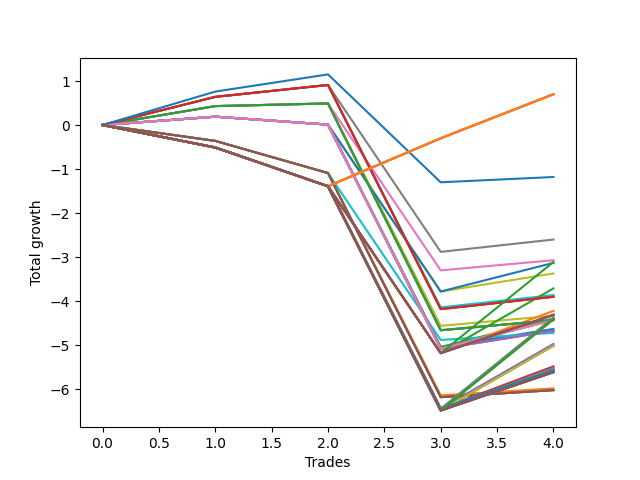

# Short Wallace 013 
- Symbol: NVDA_Unlimited
- Date Range: 02/08/2022 - 07/08/2022
- Trading Period: 7:20-12:30
- Number of Trades: 4



| Name | Win Percent | Profit | Avg Profit / Trade | Avg Time / Trade |      | Name | Win Percent | Profit | Avg Profit / Trade | Avg Time / Trade |
| ---- | ----------- | ------ | ------------------ | ---------------- | ---- | ---- | ----------- | ------ | ------------------ | ---------------- |
| Sorted By <br> Profit | | | | | | Sorted By <br> Win Percentage ||||
| One Hundred Twenty-Six | 50.00 | 350.00 | 87.50 | 61:07 |     | Seventy-Three | 75.00 | -590.00 | -147.50 | 12:50 |
| One Hundred Twenty-One | 50.00 | 350.00 | 87.50 | 61:07 |     | Forty-Nine | 75.00 | -1300.00 | -325.00 | 18:55 |
| One Hundred Sixteen | 50.00 | 350.00 | 87.50 | 61:07 |     | Forty-Eight | 75.00 | -1535.00 | -383.75 | 16:23 |
| One Hundred Eleven | 50.00 | 350.00 | 87.50 | 61:07 |     | Forty-One | 75.00 | -1930.00 | -482.50 | 19:53 |
| Eighty-One | 50.00 | 350.00 | 87.50 | 61:07 |     | Sixty-Five | 75.00 | -1950.00 | -487.50 | 27:22 |
| Seventy-Three | 75.00 | -590.00 | -147.50 | 12:50 |     | Fifty-Seven | 75.00 | -1950.00 | -487.50 | 27:22 |
| Forty-Nine | 75.00 | -1300.00 | -325.00 | 18:55 |     | One | 75.00 | -1950.00 | -487.50 | 27:22 |
| Forty-Eight | 75.00 | -1535.00 | -383.75 | 16:23 |     | Forty | 75.00 | -2165.00 | -541.25 | 17:22 |
| One Hundred Seventeen | 25.00 | -1555.00 | -388.75 | 111:26 |     | Sixty-Four | 75.00 | -2215.00 | -553.75 | 22:57 |
| Fifty-Two | 50.00 | -1565.00 | -391.25 | 46:25 |     | Fifty-Six | 75.00 | -2215.00 | -553.75 | 22:57 |
| Fifty | 50.00 | -1685.00 | -421.25 | 46:01 |     | Zero | 75.00 | -2215.00 | -553.75 | 22:57 |
| Fifty-Four | 25.00 | -1855.00 | -463.75 | 109:55 |     | One Hundred Twenty-Six | 50.00 | 350.00 | 87.50 | 61:07 |
| Forty-One | 75.00 | -1930.00 | -482.50 | 19:53 |     | One Hundred Twenty-One | 50.00 | 350.00 | 87.50 | 61:07 |
| Sixty-Five | 75.00 | -1950.00 | -487.50 | 27:22 |     | One Hundred Sixteen | 50.00 | 350.00 | 87.50 | 61:07 |
| Fifty-Seven | 75.00 | -1950.00 | -487.50 | 27:22 |     | One Hundred Eleven | 50.00 | 350.00 | 87.50 | 61:07 |
| One | 75.00 | -1950.00 | -487.50 | 27:22 |     | Eighty-One | 50.00 | 350.00 | 87.50 | 61:07 |
| Fifty-Three | 25.00 | -2110.00 | -527.50 | 67:16 |     | Fifty-Two | 50.00 | -1565.00 | -391.25 | 46:25 |
| One Hundred Twenty | 25.00 | -2155.00 | -538.75 | 121:36 |     | Fifty | 50.00 | -1685.00 | -421.25 | 46:01 |
| One Hundred Ninteen | 25.00 | -2155.00 | -538.75 | 121:36 |     | Forty-Four | 50.00 | -2195.00 | -548.75 | 47:23 |
| One Hundred Eighteen | 25.00 | -2155.00 | -538.75 | 121:36 |     | Sixty-Eight | 50.00 | -2215.00 | -553.75 | 55:03 |
| Fifty-Five | 25.00 | -2155.00 | -538.75 | 121:36 |     | Sixty | 50.00 | -2215.00 | -553.75 | 55:03 |
| Forty | 75.00 | -2165.00 | -541.25 | 17:22 |     | Four | 50.00 | -2215.00 | -553.75 | 55:03 |
| One Hundred Twelve | 25.00 | -2185.00 | -546.25 | 112:25 |     | Forty-Two | 50.00 | -2315.00 | -578.75 | 47:00 |
| Forty-Four | 50.00 | -2195.00 | -548.75 | 47:23 |     | Sixty-Six | 50.00 | -2335.00 | -583.75 | 54:40 |
| One Hundred Twenty-Seven | 25.00 | -2205.00 | -551.25 | 120:05 |     | Fifty-Eight | 50.00 | -2335.00 | -583.75 | 54:40 |
| One Hundred Twenty-Two | 25.00 | -2205.00 | -551.25 | 120:05 |     | Two | 50.00 | -2335.00 | -583.75 | 54:40 |
| Eighty-Two | 25.00 | -2205.00 | -551.25 | 120:05 |     | One Hundred Seventeen | 25.00 | -1555.00 | -388.75 | 111:26 |
| Sixty-Four | 75.00 | -2215.00 | -553.75 | 22:57 |     | Fifty-Four | 25.00 | -1855.00 | -463.75 | 109:55 |
| Fifty-Six | 75.00 | -2215.00 | -553.75 | 22:57 |     | Fifty-Three | 25.00 | -2110.00 | -527.50 | 67:16 |
| Zero | 75.00 | -2215.00 | -553.75 | 22:57 |     | One Hundred Twenty | 25.00 | -2155.00 | -538.75 | 121:36 |
| Sixty-Eight | 50.00 | -2215.00 | -553.75 | 55:03 |     | One Hundred Ninteen | 25.00 | -2155.00 | -538.75 | 121:36 |
| Sixty | 50.00 | -2215.00 | -553.75 | 55:03 |     | One Hundred Eighteen | 25.00 | -2155.00 | -538.75 | 121:36 |
| Four | 50.00 | -2215.00 | -553.75 | 55:03 |     | Fifty-Five | 25.00 | -2155.00 | -538.75 | 121:36 |
| Forty-Two | 50.00 | -2315.00 | -578.75 | 47:00 |     | One Hundred Twelve | 25.00 | -2185.00 | -546.25 | 112:25 |
| Sixty-Six | 50.00 | -2335.00 | -583.75 | 54:40 |     | One Hundred Twenty-Seven | 25.00 | -2205.00 | -551.25 | 120:05 |
| Fifty-Eight | 50.00 | -2335.00 | -583.75 | 54:40 |     | One Hundred Twenty-Two | 25.00 | -2205.00 | -551.25 | 120:05 |
| Two | 50.00 | -2335.00 | -583.75 | 54:40 |     | Eighty-Two | 25.00 | -2205.00 | -551.25 | 120:05 |
| Fifty-One | 25.00 | -2360.00 | -590.00 | 42:42 |     | Fifty-One | 25.00 | -2360.00 | -590.00 | 42:42 |
| Forty-Six | 25.00 | -2485.00 | -621.25 | 110:53 |     | Forty-Six | 25.00 | -2485.00 | -621.25 | 110:53 |
| Seventy | 25.00 | -2505.00 | -626.25 | 118:33 |     | Seventy | 25.00 | -2505.00 | -626.25 | 118:33 |
| Sixty-Two | 25.00 | -2505.00 | -626.25 | 118:33 |     | Sixty-Two | 25.00 | -2505.00 | -626.25 | 118:33 |
| Six | 25.00 | -2505.00 | -626.25 | 118:33 |     | Six | 25.00 | -2505.00 | -626.25 | 118:33 |
| Forty-Five | 25.00 | -2740.00 | -685.00 | 68:15 |     | Forty-Five | 25.00 | -2740.00 | -685.00 | 68:15 |
| Sixty-Nine | 25.00 | -2760.00 | -690.00 | 75:55 |     | Sixty-Nine | 25.00 | -2760.00 | -690.00 | 75:55 |
| Sixty-One | 25.00 | -2760.00 | -690.00 | 75:55 |     | Sixty-One | 25.00 | -2760.00 | -690.00 | 75:55 |
| Five | 25.00 | -2760.00 | -690.00 | 75:55 |     | Five | 25.00 | -2760.00 | -690.00 | 75:55 |
| One Hundred Fifteen | 25.00 | -2785.00 | -696.25 | 122:35 |     | One Hundred Fifteen | 25.00 | -2785.00 | -696.25 | 122:35 |
| One Hundred Fourteen | 25.00 | -2785.00 | -696.25 | 122:35 |     | One Hundred Fourteen | 25.00 | -2785.00 | -696.25 | 122:35 |
| One Hundred Thirteen | 25.00 | -2785.00 | -696.25 | 122:35 |     | One Hundred Thirteen | 25.00 | -2785.00 | -696.25 | 122:35 |
| Forty-Seven | 25.00 | -2785.00 | -696.25 | 122:35 |     | Forty-Seven | 25.00 | -2785.00 | -696.25 | 122:35 |
| One Hundred Thirty | 25.00 | -2805.00 | -701.25 | 130:15 |     | One Hundred Thirty | 25.00 | -2805.00 | -701.25 | 130:15 |
| One Hundred Twenty-Nine | 25.00 | -2805.00 | -701.25 | 130:15 |     | One Hundred Twenty-Nine | 25.00 | -2805.00 | -701.25 | 130:15 |
| One Hundred Twenty-Eight | 25.00 | -2805.00 | -701.25 | 130:15 |     | One Hundred Twenty-Eight | 25.00 | -2805.00 | -701.25 | 130:15 |
| One Hundred Twenty-Five | 25.00 | -2805.00 | -701.25 | 130:15 |     | One Hundred Twenty-Five | 25.00 | -2805.00 | -701.25 | 130:15 |
| One Hundred Twenty-Four | 25.00 | -2805.00 | -701.25 | 130:15 |     | One Hundred Twenty-Four | 25.00 | -2805.00 | -701.25 | 130:15 |
| One Hundred Twenty-Three | 25.00 | -2805.00 | -701.25 | 130:15 |     | One Hundred Twenty-Three | 25.00 | -2805.00 | -701.25 | 130:15 |
| Eighty-Five | 25.00 | -2805.00 | -701.25 | 130:15 |     | Eighty-Five | 25.00 | -2805.00 | -701.25 | 130:15 |
| Eighty-Four | 25.00 | -2805.00 | -701.25 | 130:15 |     | Eighty-Four | 25.00 | -2805.00 | -701.25 | 130:15 |
| Eighty-Three | 25.00 | -2805.00 | -701.25 | 130:15 |     | Eighty-Three | 25.00 | -2805.00 | -701.25 | 130:15 |
| Seventy-One | 25.00 | -2805.00 | -701.25 | 130:15 |     | Seventy-One | 25.00 | -2805.00 | -701.25 | 130:15 |
| Sixty-Three | 25.00 | -2805.00 | -701.25 | 130:15 |     | Sixty-Three | 25.00 | -2805.00 | -701.25 | 130:15 |
| Seven | 25.00 | -2805.00 | -701.25 | 130:15 |     | Seven | 25.00 | -2805.00 | -701.25 | 130:15 |
| Forty-Three | 25.00 | -2990.00 | -747.50 | 43:41 |     | Forty-Three | 25.00 | -2990.00 | -747.50 | 43:41 |
| Sixty-Seven | 25.00 | -3010.00 | -752.50 | 51:21 |     | Sixty-Seven | 25.00 | -3010.00 | -752.50 | 51:21 |
| Fifty-Nine | 25.00 | -3010.00 | -752.50 | 51:21 |     | Fifty-Nine | 25.00 | -3010.00 | -752.50 | 51:21 |
| Three | 25.00 | -3010.00 | -752.50 | 51:21 |     | Three | 25.00 | -3010.00 | -752.50 | 51:21 |

## NO STOPLOSS

### Test Zero
* Sell when price hits the middle line of the 20p bollinger
* No Stoploss
* Results:
```
Total Trades: 4
Percent Up: 25.00
Percent Down: 75.00
Total Points Moved Down: -4.43
Potential Profit: -2215.00
Total Points Ups: 5.15 Count Ups: 1
Total Points Downs: 0.72 Count Downs: 3
```

<details><summary>Trades</summary>

<code>In: 2022-03-10 11:06:00		Out: 2022-03-10 11:22:15		Total Position Time: 16:15		Total Move Down: 0.43		Total to Date: 0.43</code> <br />
<code>In: 2022-03-10 11:07:00		Out: 2022-03-10 11:22:15		Total Position Time: 15:15		Total Move Down: 0.06		Total to Date: 0.49</code> <br />
<code>In: 2022-05-04 11:49:00		Out: 2022-05-04 12:38:40		Total Position Time: 49:40		Total Move Down: -5.15		Total to Date: -4.66</code> <br />
<code>In: 2022-06-30 08:25:00		Out: 2022-06-30 08:35:40		Total Position Time: 10:40		Total Move Down: 0.23		Total to Date: -4.43</code> <br />


</details>

### Test One
* Sell when the price hits the upper line of the 20p 1std bollinger
* No Stoploss
* Results:
```
Total Trades: 4
Percent Up: 25.00
Percent Down: 75.00
Total Points Moved Down: -3.90
Potential Profit: -1950.00
Total Points Ups: 5.09 Count Ups: 1
Total Points Downs: 1.19 Count Downs: 3
```

<details><summary>Trades</summary>

<code>In: 2022-03-10 11:06:00		Out: 2022-03-10 11:24:35		Total Position Time: 18:35		Total Move Down: 0.64		Total to Date: 0.64</code> <br />
<code>In: 2022-03-10 11:07:00		Out: 2022-03-10 11:24:35		Total Position Time: 17:35		Total Move Down: 0.27		Total to Date: 0.91</code> <br />
<code>In: 2022-05-04 11:49:00		Out: 2022-05-04 12:46:15		Total Position Time: 57:15		Total Move Down: -5.09		Total to Date: -4.18</code> <br />
<code>In: 2022-06-30 08:25:00		Out: 2022-06-30 08:41:05		Total Position Time: 16:05		Total Move Down: 0.28		Total to Date: -3.90</code> <br />


</details>

### Test Two
* Sell when the price hits the upper line of the 20p 2std bollinger
* No Stoploss
* Results:
```
Total Trades: 4
Percent Up: 50.00
Percent Down: 50.00
Total Points Moved Down: -4.67
Potential Profit: -2335.00
Total Points Ups: 5.27 Count Ups: 2
Total Points Downs: 0.60 Count Downs: 2
```

<details><summary>Trades</summary>

<code>In: 2022-03-10 11:06:00		Out: 2022-03-10 12:07:05		Total Position Time: 61:05		Total Move Down: 0.19		Total to Date: 0.19</code> <br />
<code>In: 2022-03-10 11:07:00		Out: 2022-03-10 12:07:05		Total Position Time: 60:05		Total Move Down: -0.18		Total to Date: 0.01</code> <br />
<code>In: 2022-05-04 11:49:00		Out: 2022-05-04 12:47:00		Total Position Time: 58:00		Total Move Down: -5.09		Total to Date: -5.08</code> <br />
<code>In: 2022-06-30 08:25:00		Out: 2022-06-30 09:04:30		Total Position Time: 39:30		Total Move Down: 0.41		Total to Date: -4.67</code> <br />


</details>

### Test Three
* Sell when price hits the middle line of the 50p bollinger
* No Stoploss
* Results:
```
Total Trades: 4
Percent Up: 75.00
Percent Down: 25.00
Total Points Moved Down: -6.02
Potential Profit: -3010.00
Total Points Ups: 6.18 Count Ups: 3
Total Points Downs: 0.16 Count Downs: 1
```

<details><summary>Trades</summary>

<code>In: 2022-03-10 11:06:00		Out: 2022-03-10 12:01:25		Total Position Time: 55:25		Total Move Down: -0.36		Total to Date: -0.36</code> <br />
<code>In: 2022-03-10 11:07:00		Out: 2022-03-10 12:01:25		Total Position Time: 54:25		Total Move Down: -0.73		Total to Date: -1.09</code> <br />
<code>In: 2022-05-04 11:49:00		Out: 2022-05-04 12:47:00		Total Position Time: 58:00		Total Move Down: -5.09		Total to Date: -6.18</code> <br />
<code>In: 2022-06-30 08:25:00		Out: 2022-06-30 09:02:35		Total Position Time: 37:35		Total Move Down: 0.16		Total to Date: -6.02</code> <br />


</details>

### Test Four
* Sell when the price hits the upper line of the 50p 1std bollinger
* No Stoploss
* Results:
```
Total Trades: 4
Percent Up: 50.00
Percent Down: 50.00
Total Points Moved Down: -4.43
Potential Profit: -2215.00
Total Points Ups: 5.27 Count Ups: 2
Total Points Downs: 0.84 Count Downs: 2
```

<details><summary>Trades</summary>

<code>In: 2022-03-10 11:06:00		Out: 2022-03-10 12:07:05		Total Position Time: 61:05		Total Move Down: 0.19		Total to Date: 0.19</code> <br />
<code>In: 2022-03-10 11:07:00		Out: 2022-03-10 12:07:05		Total Position Time: 60:05		Total Move Down: -0.18		Total to Date: 0.01</code> <br />
<code>In: 2022-05-04 11:49:00		Out: 2022-05-04 12:47:00		Total Position Time: 58:00		Total Move Down: -5.09		Total to Date: -5.08</code> <br />
<code>In: 2022-06-30 08:25:00		Out: 2022-06-30 09:06:05		Total Position Time: 41:05		Total Move Down: 0.65		Total to Date: -4.43</code> <br />


</details>

### Test Five
* Sell when the price hits the upper line of the 50p 2std bollinger
* No Stoploss
* Results:
```
Total Trades: 4
Percent Up: 75.00
Percent Down: 25.00
Total Points Moved Down: -5.52
Potential Profit: -2760.00
Total Points Ups: 6.48 Count Ups: 3
Total Points Downs: 0.96 Count Downs: 1
```

<details><summary>Trades</summary>

<code>In: 2022-03-10 11:06:00		Out: 2022-03-10 12:47:00		Total Position Time: 101:00		Total Move Down: -0.51		Total to Date: -0.51</code> <br />
<code>In: 2022-03-10 11:07:00		Out: 2022-03-10 12:47:00		Total Position Time: 100:00		Total Move Down: -0.88		Total to Date: -1.39</code> <br />
<code>In: 2022-05-04 11:49:00		Out: 2022-05-04 12:47:00		Total Position Time: 58:00		Total Move Down: -5.09		Total to Date: -6.48</code> <br />
<code>In: 2022-06-30 08:25:00		Out: 2022-06-30 09:09:40		Total Position Time: 44:40		Total Move Down: 0.96		Total to Date: -5.52</code> <br />


</details>

### Test Six
* Sell when the price hits the middle line of the 1std VWAP
* No Stoploss
* Results:
```
Total Trades: 4
Percent Up: 75.00
Percent Down: 25.00
Total Points Moved Down: -5.01
Potential Profit: -2505.00
Total Points Ups: 6.48 Count Ups: 3
Total Points Downs: 1.47 Count Downs: 1
```

<details><summary>Trades</summary>

<code>In: 2022-03-10 11:06:00		Out: 2022-03-10 12:47:00		Total Position Time: 101:00		Total Move Down: -0.51		Total to Date: -0.51</code> <br />
<code>In: 2022-03-10 11:07:00		Out: 2022-03-10 12:47:00		Total Position Time: 100:00		Total Move Down: -0.88		Total to Date: -1.39</code> <br />
<code>In: 2022-05-04 11:49:00		Out: 2022-05-04 12:47:00		Total Position Time: 58:00		Total Move Down: -5.09		Total to Date: -6.48</code> <br />
<code>In: 2022-06-30 08:25:00		Out: 2022-06-30 12:00:15		Total Position Time: 215:15		Total Move Down: 1.47		Total to Date: -5.01</code> <br />


</details>

### Test Seven
* Sell when the price hits the upper line of the 1std VWAP
* No Stoploss
* Results:
```
Total Trades: 4
Percent Up: 75.00
Percent Down: 25.00
Total Points Moved Down: -5.61
Potential Profit: -2805.00
Total Points Ups: 6.48 Count Ups: 3
Total Points Downs: 0.87 Count Downs: 1
```

<details><summary>Trades</summary>

<code>In: 2022-03-10 11:06:00		Out: 2022-03-10 12:47:00		Total Position Time: 101:00		Total Move Down: -0.51		Total to Date: -0.51</code> <br />
<code>In: 2022-03-10 11:07:00		Out: 2022-03-10 12:47:00		Total Position Time: 100:00		Total Move Down: -0.88		Total to Date: -1.39</code> <br />
<code>In: 2022-05-04 11:49:00		Out: 2022-05-04 12:47:00		Total Position Time: 58:00		Total Move Down: -5.09		Total to Date: -6.48</code> <br />
<code>In: 2022-06-30 08:25:00		Out: 2022-06-30 12:47:00		Total Position Time: 262:00		Total Move Down: 0.87		Total to Date: -5.61</code> <br />


</details>

## STOPLOSS OF 5

### Test Forty
* Sell when price hits the middle line of the 20p bollinger
* Stoploss is -5 points
* Results:
```
Total Trades: 4
Percent Up: 25.00
Percent Down: 75.00
Total Points Moved Down: -4.33
Potential Profit: -2165.00
Total Points Ups: 5.05 Count Ups: 1
Total Points Downs: 0.72 Count Downs: 3
```

<details><summary>Trades</summary>

<code>In: 2022-03-10 11:06:00		Out: 2022-03-10 11:22:15		Total Position Time: 16:15		Total Move Down: 0.43		Total to Date: 0.43</code> <br />
<code>In: 2022-03-10 11:07:00		Out: 2022-03-10 11:22:15		Total Position Time: 15:15		Total Move Down: 0.06		Total to Date: 0.49</code> <br />
<code>In: 2022-05-04 11:49:00		Out: 2022-05-04 12:16:20		Total Position Time: 27:20		Total Move Down: -5.05		Total to Date: -4.56</code> <br />
<code>In: 2022-06-30 08:25:00		Out: 2022-06-30 08:35:40		Total Position Time: 10:40		Total Move Down: 0.23		Total to Date: -4.33</code> <br />


</details>

### Test Forty-One
* Sell when the price hits the upper line of the 20p 1std bollinger
* Stoploss is -5 points
* Results:
```
Total Trades: 4
Percent Up: 25.00
Percent Down: 75.00
Total Points Moved Down: -3.86
Potential Profit: -1930.00
Total Points Ups: 5.05 Count Ups: 1
Total Points Downs: 1.19 Count Downs: 3
```

<details><summary>Trades</summary>

<code>In: 2022-03-10 11:06:00		Out: 2022-03-10 11:24:35		Total Position Time: 18:35		Total Move Down: 0.64		Total to Date: 0.64</code> <br />
<code>In: 2022-03-10 11:07:00		Out: 2022-03-10 11:24:35		Total Position Time: 17:35		Total Move Down: 0.27		Total to Date: 0.91</code> <br />
<code>In: 2022-05-04 11:49:00		Out: 2022-05-04 12:16:20		Total Position Time: 27:20		Total Move Down: -5.05		Total to Date: -4.14</code> <br />
<code>In: 2022-06-30 08:25:00		Out: 2022-06-30 08:41:05		Total Position Time: 16:05		Total Move Down: 0.28		Total to Date: -3.86</code> <br />


</details>

### Test Forty-Two
* Sell when the price hits the upper line of the 20p 2std bollinger
* Stoploss is -5 points
* Results:
```
Total Trades: 4
Percent Up: 50.00
Percent Down: 50.00
Total Points Moved Down: -4.63
Potential Profit: -2315.00
Total Points Ups: 5.23 Count Ups: 2
Total Points Downs: 0.60 Count Downs: 2
```

<details><summary>Trades</summary>

<code>In: 2022-03-10 11:06:00		Out: 2022-03-10 12:07:05		Total Position Time: 61:05		Total Move Down: 0.19		Total to Date: 0.19</code> <br />
<code>In: 2022-03-10 11:07:00		Out: 2022-03-10 12:07:05		Total Position Time: 60:05		Total Move Down: -0.18		Total to Date: 0.01</code> <br />
<code>In: 2022-05-04 11:49:00		Out: 2022-05-04 12:16:20		Total Position Time: 27:20		Total Move Down: -5.05		Total to Date: -5.04</code> <br />
<code>In: 2022-06-30 08:25:00		Out: 2022-06-30 09:04:30		Total Position Time: 39:30		Total Move Down: 0.41		Total to Date: -4.63</code> <br />


</details>

### Test Forty-Three
* Sell when price hits the middle line of the 50p bollinger
* Stoploss is -5 points
* Results:
```
Total Trades: 4
Percent Up: 75.00
Percent Down: 25.00
Total Points Moved Down: -5.98
Potential Profit: -2990.00
Total Points Ups: 6.14 Count Ups: 3
Total Points Downs: 0.16 Count Downs: 1
```

<details><summary>Trades</summary>

<code>In: 2022-03-10 11:06:00		Out: 2022-03-10 12:01:25		Total Position Time: 55:25		Total Move Down: -0.36		Total to Date: -0.36</code> <br />
<code>In: 2022-03-10 11:07:00		Out: 2022-03-10 12:01:25		Total Position Time: 54:25		Total Move Down: -0.73		Total to Date: -1.09</code> <br />
<code>In: 2022-05-04 11:49:00		Out: 2022-05-04 12:16:20		Total Position Time: 27:20		Total Move Down: -5.05		Total to Date: -6.14</code> <br />
<code>In: 2022-06-30 08:25:00		Out: 2022-06-30 09:02:35		Total Position Time: 37:35		Total Move Down: 0.16		Total to Date: -5.98</code> <br />


</details>

### Test Forty-Four
* Sell when the price hits the upper line of the 50p 1std bollinger
* Stoploss is -5 points
* Results:
```
Total Trades: 4
Percent Up: 50.00
Percent Down: 50.00
Total Points Moved Down: -4.39
Potential Profit: -2195.00
Total Points Ups: 5.23 Count Ups: 2
Total Points Downs: 0.84 Count Downs: 2
```

<details><summary>Trades</summary>

<code>In: 2022-03-10 11:06:00		Out: 2022-03-10 12:07:05		Total Position Time: 61:05		Total Move Down: 0.19		Total to Date: 0.19</code> <br />
<code>In: 2022-03-10 11:07:00		Out: 2022-03-10 12:07:05		Total Position Time: 60:05		Total Move Down: -0.18		Total to Date: 0.01</code> <br />
<code>In: 2022-05-04 11:49:00		Out: 2022-05-04 12:16:20		Total Position Time: 27:20		Total Move Down: -5.05		Total to Date: -5.04</code> <br />
<code>In: 2022-06-30 08:25:00		Out: 2022-06-30 09:06:05		Total Position Time: 41:05		Total Move Down: 0.65		Total to Date: -4.39</code> <br />


</details>

### Test Forty-Five
* Sell when the price hits the upper line of the 50p 2std bollinger
* Stoploss is -5 points
* Results:
```
Total Trades: 4
Percent Up: 75.00
Percent Down: 25.00
Total Points Moved Down: -5.48
Potential Profit: -2740.00
Total Points Ups: 6.44 Count Ups: 3
Total Points Downs: 0.96 Count Downs: 1
```

<details><summary>Trades</summary>

<code>In: 2022-03-10 11:06:00		Out: 2022-03-10 12:47:00		Total Position Time: 101:00		Total Move Down: -0.51		Total to Date: -0.51</code> <br />
<code>In: 2022-03-10 11:07:00		Out: 2022-03-10 12:47:00		Total Position Time: 100:00		Total Move Down: -0.88		Total to Date: -1.39</code> <br />
<code>In: 2022-05-04 11:49:00		Out: 2022-05-04 12:16:20		Total Position Time: 27:20		Total Move Down: -5.05		Total to Date: -6.44</code> <br />
<code>In: 2022-06-30 08:25:00		Out: 2022-06-30 09:09:40		Total Position Time: 44:40		Total Move Down: 0.96		Total to Date: -5.48</code> <br />


</details>

### Test Forty-Six
* Sell when the price hits the middle line of the 1std VWAP
* Stoploss is -5 points
* Results:
```
Total Trades: 4
Percent Up: 75.00
Percent Down: 25.00
Total Points Moved Down: -4.97
Potential Profit: -2485.00
Total Points Ups: 6.44 Count Ups: 3
Total Points Downs: 1.47 Count Downs: 1
```

<details><summary>Trades</summary>

<code>In: 2022-03-10 11:06:00		Out: 2022-03-10 12:47:00		Total Position Time: 101:00		Total Move Down: -0.51		Total to Date: -0.51</code> <br />
<code>In: 2022-03-10 11:07:00		Out: 2022-03-10 12:47:00		Total Position Time: 100:00		Total Move Down: -0.88		Total to Date: -1.39</code> <br />
<code>In: 2022-05-04 11:49:00		Out: 2022-05-04 12:16:20		Total Position Time: 27:20		Total Move Down: -5.05		Total to Date: -6.44</code> <br />
<code>In: 2022-06-30 08:25:00		Out: 2022-06-30 12:00:15		Total Position Time: 215:15		Total Move Down: 1.47		Total to Date: -4.97</code> <br />


</details>

### Test Forty-Seven
* Sell when the price hits the upper line of the 1std VWAP
* Stoploss is -5 points
* Results:
```
Total Trades: 4
Percent Up: 75.00
Percent Down: 25.00
Total Points Moved Down: -5.57
Potential Profit: -2785.00
Total Points Ups: 6.44 Count Ups: 3
Total Points Downs: 0.87 Count Downs: 1
```

<details><summary>Trades</summary>

<code>In: 2022-03-10 11:06:00		Out: 2022-03-10 12:47:00		Total Position Time: 101:00		Total Move Down: -0.51		Total to Date: -0.51</code> <br />
<code>In: 2022-03-10 11:07:00		Out: 2022-03-10 12:47:00		Total Position Time: 100:00		Total Move Down: -0.88		Total to Date: -1.39</code> <br />
<code>In: 2022-05-04 11:49:00		Out: 2022-05-04 12:16:20		Total Position Time: 27:20		Total Move Down: -5.05		Total to Date: -6.44</code> <br />
<code>In: 2022-06-30 08:25:00		Out: 2022-06-30 12:47:00		Total Position Time: 262:00		Total Move Down: 0.87		Total to Date: -5.57</code> <br />


</details>

## TRAIL STOP OF 5

### Test Forty-Eight
* Sell when price hits the middle line of the 20p bollinger
* Trailing Stop is -5 points
* Results:
```
Total Trades: 4
Percent Up: 25.00
Percent Down: 75.00
Total Points Moved Down: -3.07
Potential Profit: -1535.00
Total Points Ups: 3.79 Count Ups: 1
Total Points Downs: 0.72 Count Downs: 3
```

<details><summary>Trades</summary>

<code>In: 2022-03-10 11:06:00		Out: 2022-03-10 11:22:15		Total Position Time: 16:15		Total Move Down: 0.43		Total to Date: 0.43</code> <br />
<code>In: 2022-03-10 11:07:00		Out: 2022-03-10 11:22:15		Total Position Time: 15:15		Total Move Down: 0.06		Total to Date: 0.49</code> <br />
<code>In: 2022-05-04 11:49:00		Out: 2022-05-04 12:12:25		Total Position Time: 23:25		Total Move Down: -3.79		Total to Date: -3.30</code> <br />
<code>In: 2022-06-30 08:25:00		Out: 2022-06-30 08:35:40		Total Position Time: 10:40		Total Move Down: 0.23		Total to Date: -3.07</code> <br />


</details>

### Test Forty-Nine
* Sell when the price hits the upper line of the 20p 1std bollinger
* Trailing Stop is -5 points
* Results:
```
Total Trades: 4
Percent Up: 25.00
Percent Down: 75.00
Total Points Moved Down: -2.60
Potential Profit: -1300.00
Total Points Ups: 3.79 Count Ups: 1
Total Points Downs: 1.19 Count Downs: 3
```

<details><summary>Trades</summary>

<code>In: 2022-03-10 11:06:00		Out: 2022-03-10 11:24:35		Total Position Time: 18:35		Total Move Down: 0.64		Total to Date: 0.64</code> <br />
<code>In: 2022-03-10 11:07:00		Out: 2022-03-10 11:24:35		Total Position Time: 17:35		Total Move Down: 0.27		Total to Date: 0.91</code> <br />
<code>In: 2022-05-04 11:49:00		Out: 2022-05-04 12:12:25		Total Position Time: 23:25		Total Move Down: -3.79		Total to Date: -2.88</code> <br />
<code>In: 2022-06-30 08:25:00		Out: 2022-06-30 08:41:05		Total Position Time: 16:05		Total Move Down: 0.28		Total to Date: -2.60</code> <br />


</details>

### Test Fifty
* Sell when the price hits the upper line of the 20p 2std bollinger
* Trailing Stop is -5 points
* Results:
```
Total Trades: 4
Percent Up: 50.00
Percent Down: 50.00
Total Points Moved Down: -3.37
Potential Profit: -1685.00
Total Points Ups: 3.97 Count Ups: 2
Total Points Downs: 0.60 Count Downs: 2
```

<details><summary>Trades</summary>

<code>In: 2022-03-10 11:06:00		Out: 2022-03-10 12:07:05		Total Position Time: 61:05		Total Move Down: 0.19		Total to Date: 0.19</code> <br />
<code>In: 2022-03-10 11:07:00		Out: 2022-03-10 12:07:05		Total Position Time: 60:05		Total Move Down: -0.18		Total to Date: 0.01</code> <br />
<code>In: 2022-05-04 11:49:00		Out: 2022-05-04 12:12:25		Total Position Time: 23:25		Total Move Down: -3.79		Total to Date: -3.78</code> <br />
<code>In: 2022-06-30 08:25:00		Out: 2022-06-30 09:04:30		Total Position Time: 39:30		Total Move Down: 0.41		Total to Date: -3.37</code> <br />


</details>

### Test Fifty-One
* Sell when price hits the middle line of the 50p bollinger
* Trailing Stop is -5 points
* Results:
```
Total Trades: 4
Percent Up: 75.00
Percent Down: 25.00
Total Points Moved Down: -4.72
Potential Profit: -2360.00
Total Points Ups: 4.88 Count Ups: 3
Total Points Downs: 0.16 Count Downs: 1
```

<details><summary>Trades</summary>

<code>In: 2022-03-10 11:06:00		Out: 2022-03-10 12:01:25		Total Position Time: 55:25		Total Move Down: -0.36		Total to Date: -0.36</code> <br />
<code>In: 2022-03-10 11:07:00		Out: 2022-03-10 12:01:25		Total Position Time: 54:25		Total Move Down: -0.73		Total to Date: -1.09</code> <br />
<code>In: 2022-05-04 11:49:00		Out: 2022-05-04 12:12:25		Total Position Time: 23:25		Total Move Down: -3.79		Total to Date: -4.88</code> <br />
<code>In: 2022-06-30 08:25:00		Out: 2022-06-30 09:02:35		Total Position Time: 37:35		Total Move Down: 0.16		Total to Date: -4.72</code> <br />


</details>

### Test Fifty-Two
* Sell when the price hits the upper line of the 50p 1std bollinger
* Trailing Stop is -5 points
* Results:
```
Total Trades: 4
Percent Up: 50.00
Percent Down: 50.00
Total Points Moved Down: -3.13
Potential Profit: -1565.00
Total Points Ups: 3.97 Count Ups: 2
Total Points Downs: 0.84 Count Downs: 2
```

<details><summary>Trades</summary>

<code>In: 2022-03-10 11:06:00		Out: 2022-03-10 12:07:05		Total Position Time: 61:05		Total Move Down: 0.19		Total to Date: 0.19</code> <br />
<code>In: 2022-03-10 11:07:00		Out: 2022-03-10 12:07:05		Total Position Time: 60:05		Total Move Down: -0.18		Total to Date: 0.01</code> <br />
<code>In: 2022-05-04 11:49:00		Out: 2022-05-04 12:12:25		Total Position Time: 23:25		Total Move Down: -3.79		Total to Date: -3.78</code> <br />
<code>In: 2022-06-30 08:25:00		Out: 2022-06-30 09:06:05		Total Position Time: 41:05		Total Move Down: 0.65		Total to Date: -3.13</code> <br />


</details>

### Test Fifty-Three
* Sell when the price hits the upper line of the 50p 2std bollinger
* Trailing Stop is -5 points
* Results:
```
Total Trades: 4
Percent Up: 75.00
Percent Down: 25.00
Total Points Moved Down: -4.22
Potential Profit: -2110.00
Total Points Ups: 5.18 Count Ups: 3
Total Points Downs: 0.96 Count Downs: 1
```

<details><summary>Trades</summary>

<code>In: 2022-03-10 11:06:00		Out: 2022-03-10 12:47:00		Total Position Time: 101:00		Total Move Down: -0.51		Total to Date: -0.51</code> <br />
<code>In: 2022-03-10 11:07:00		Out: 2022-03-10 12:47:00		Total Position Time: 100:00		Total Move Down: -0.88		Total to Date: -1.39</code> <br />
<code>In: 2022-05-04 11:49:00		Out: 2022-05-04 12:12:25		Total Position Time: 23:25		Total Move Down: -3.79		Total to Date: -5.18</code> <br />
<code>In: 2022-06-30 08:25:00		Out: 2022-06-30 09:09:40		Total Position Time: 44:40		Total Move Down: 0.96		Total to Date: -4.22</code> <br />


</details>

### Test Fifty-Four
* Sell when the price hits the middle line of the 1std VWAP
* Trailing Stop is -5 points
* Results:
```
Total Trades: 4
Percent Up: 75.00
Percent Down: 25.00
Total Points Moved Down: -3.71
Potential Profit: -1855.00
Total Points Ups: 5.18 Count Ups: 3
Total Points Downs: 1.47 Count Downs: 1
```

<details><summary>Trades</summary>

<code>In: 2022-03-10 11:06:00		Out: 2022-03-10 12:47:00		Total Position Time: 101:00		Total Move Down: -0.51		Total to Date: -0.51</code> <br />
<code>In: 2022-03-10 11:07:00		Out: 2022-03-10 12:47:00		Total Position Time: 100:00		Total Move Down: -0.88		Total to Date: -1.39</code> <br />
<code>In: 2022-05-04 11:49:00		Out: 2022-05-04 12:12:25		Total Position Time: 23:25		Total Move Down: -3.79		Total to Date: -5.18</code> <br />
<code>In: 2022-06-30 08:25:00		Out: 2022-06-30 12:00:15		Total Position Time: 215:15		Total Move Down: 1.47		Total to Date: -3.71</code> <br />


</details>

### Test Fifty-Five
* Sell when the price hits the upper line of the 1std VWAP
* Trailing Stop is -5 points
* Results:
```
Total Trades: 4
Percent Up: 75.00
Percent Down: 25.00
Total Points Moved Down: -4.31
Potential Profit: -2155.00
Total Points Ups: 5.18 Count Ups: 3
Total Points Downs: 0.87 Count Downs: 1
```

<details><summary>Trades</summary>

<code>In: 2022-03-10 11:06:00		Out: 2022-03-10 12:47:00		Total Position Time: 101:00		Total Move Down: -0.51		Total to Date: -0.51</code> <br />
<code>In: 2022-03-10 11:07:00		Out: 2022-03-10 12:47:00		Total Position Time: 100:00		Total Move Down: -0.88		Total to Date: -1.39</code> <br />
<code>In: 2022-05-04 11:49:00		Out: 2022-05-04 12:12:25		Total Position Time: 23:25		Total Move Down: -3.79		Total to Date: -5.18</code> <br />
<code>In: 2022-06-30 08:25:00		Out: 2022-06-30 12:47:00		Total Position Time: 262:00		Total Move Down: 0.87		Total to Date: -4.31</code> <br />


</details>

## STOPLOSS OF 10

### Test Fifty-Six
* Sell when price hits the middle line of the 20p bollinger
* Stoploss is -10 points
* Results:
```
Total Trades: 4
Percent Up: 25.00
Percent Down: 75.00
Total Points Moved Down: -4.43
Potential Profit: -2215.00
Total Points Ups: 5.15 Count Ups: 1
Total Points Downs: 0.72 Count Downs: 3
```

<details><summary>Trades</summary>

<code>In: 2022-03-10 11:06:00		Out: 2022-03-10 11:22:15		Total Position Time: 16:15		Total Move Down: 0.43		Total to Date: 0.43</code> <br />
<code>In: 2022-03-10 11:07:00		Out: 2022-03-10 11:22:15		Total Position Time: 15:15		Total Move Down: 0.06		Total to Date: 0.49</code> <br />
<code>In: 2022-05-04 11:49:00		Out: 2022-05-04 12:38:40		Total Position Time: 49:40		Total Move Down: -5.15		Total to Date: -4.66</code> <br />
<code>In: 2022-06-30 08:25:00		Out: 2022-06-30 08:35:40		Total Position Time: 10:40		Total Move Down: 0.23		Total to Date: -4.43</code> <br />


</details>

### Test Fifty-Seven
* Sell when the price hits the upper line of the 20p 1std bollinger
* Stoploss is -10 points
* Results:
```
Total Trades: 4
Percent Up: 25.00
Percent Down: 75.00
Total Points Moved Down: -3.90
Potential Profit: -1950.00
Total Points Ups: 5.09 Count Ups: 1
Total Points Downs: 1.19 Count Downs: 3
```

<details><summary>Trades</summary>

<code>In: 2022-03-10 11:06:00		Out: 2022-03-10 11:24:35		Total Position Time: 18:35		Total Move Down: 0.64		Total to Date: 0.64</code> <br />
<code>In: 2022-03-10 11:07:00		Out: 2022-03-10 11:24:35		Total Position Time: 17:35		Total Move Down: 0.27		Total to Date: 0.91</code> <br />
<code>In: 2022-05-04 11:49:00		Out: 2022-05-04 12:46:15		Total Position Time: 57:15		Total Move Down: -5.09		Total to Date: -4.18</code> <br />
<code>In: 2022-06-30 08:25:00		Out: 2022-06-30 08:41:05		Total Position Time: 16:05		Total Move Down: 0.28		Total to Date: -3.90</code> <br />


</details>

### Test Fifty-Eight
* Sell when the price hits the upper line of the 20p 2std bollinger
* Stoploss is -10 points
* Results:
```
Total Trades: 4
Percent Up: 50.00
Percent Down: 50.00
Total Points Moved Down: -4.67
Potential Profit: -2335.00
Total Points Ups: 5.27 Count Ups: 2
Total Points Downs: 0.60 Count Downs: 2
```

<details><summary>Trades</summary>

<code>In: 2022-03-10 11:06:00		Out: 2022-03-10 12:07:05		Total Position Time: 61:05		Total Move Down: 0.19		Total to Date: 0.19</code> <br />
<code>In: 2022-03-10 11:07:00		Out: 2022-03-10 12:07:05		Total Position Time: 60:05		Total Move Down: -0.18		Total to Date: 0.01</code> <br />
<code>In: 2022-05-04 11:49:00		Out: 2022-05-04 12:47:00		Total Position Time: 58:00		Total Move Down: -5.09		Total to Date: -5.08</code> <br />
<code>In: 2022-06-30 08:25:00		Out: 2022-06-30 09:04:30		Total Position Time: 39:30		Total Move Down: 0.41		Total to Date: -4.67</code> <br />


</details>

### Test Fifty-Nine
* Sell when price hits the middle line of the 50p bollinger
* Stoploss is -10 points
* Results:
```
Total Trades: 4
Percent Up: 75.00
Percent Down: 25.00
Total Points Moved Down: -6.02
Potential Profit: -3010.00
Total Points Ups: 6.18 Count Ups: 3
Total Points Downs: 0.16 Count Downs: 1
```

<details><summary>Trades</summary>

<code>In: 2022-03-10 11:06:00		Out: 2022-03-10 12:01:25		Total Position Time: 55:25		Total Move Down: -0.36		Total to Date: -0.36</code> <br />
<code>In: 2022-03-10 11:07:00		Out: 2022-03-10 12:01:25		Total Position Time: 54:25		Total Move Down: -0.73		Total to Date: -1.09</code> <br />
<code>In: 2022-05-04 11:49:00		Out: 2022-05-04 12:47:00		Total Position Time: 58:00		Total Move Down: -5.09		Total to Date: -6.18</code> <br />
<code>In: 2022-06-30 08:25:00		Out: 2022-06-30 09:02:35		Total Position Time: 37:35		Total Move Down: 0.16		Total to Date: -6.02</code> <br />


</details>

### Test Sixty
* Sell when the price hits the upper line of the 50p 1std bollinger
* Stoploss is -10 points
* Results:
```
Total Trades: 4
Percent Up: 50.00
Percent Down: 50.00
Total Points Moved Down: -4.43
Potential Profit: -2215.00
Total Points Ups: 5.27 Count Ups: 2
Total Points Downs: 0.84 Count Downs: 2
```

<details><summary>Trades</summary>

<code>In: 2022-03-10 11:06:00		Out: 2022-03-10 12:07:05		Total Position Time: 61:05		Total Move Down: 0.19		Total to Date: 0.19</code> <br />
<code>In: 2022-03-10 11:07:00		Out: 2022-03-10 12:07:05		Total Position Time: 60:05		Total Move Down: -0.18		Total to Date: 0.01</code> <br />
<code>In: 2022-05-04 11:49:00		Out: 2022-05-04 12:47:00		Total Position Time: 58:00		Total Move Down: -5.09		Total to Date: -5.08</code> <br />
<code>In: 2022-06-30 08:25:00		Out: 2022-06-30 09:06:05		Total Position Time: 41:05		Total Move Down: 0.65		Total to Date: -4.43</code> <br />


</details>

### Test Sixty-One
* Sell when the price hits the upper line of the 50p 2std bollinger
* Stoploss is -10 points
* Results:
```
Total Trades: 4
Percent Up: 75.00
Percent Down: 25.00
Total Points Moved Down: -5.52
Potential Profit: -2760.00
Total Points Ups: 6.48 Count Ups: 3
Total Points Downs: 0.96 Count Downs: 1
```

<details><summary>Trades</summary>

<code>In: 2022-03-10 11:06:00		Out: 2022-03-10 12:47:00		Total Position Time: 101:00		Total Move Down: -0.51		Total to Date: -0.51</code> <br />
<code>In: 2022-03-10 11:07:00		Out: 2022-03-10 12:47:00		Total Position Time: 100:00		Total Move Down: -0.88		Total to Date: -1.39</code> <br />
<code>In: 2022-05-04 11:49:00		Out: 2022-05-04 12:47:00		Total Position Time: 58:00		Total Move Down: -5.09		Total to Date: -6.48</code> <br />
<code>In: 2022-06-30 08:25:00		Out: 2022-06-30 09:09:40		Total Position Time: 44:40		Total Move Down: 0.96		Total to Date: -5.52</code> <br />


</details>

### Test Sixty-Two
* Sell when the price hits the middle line of the 1std VWAP
* Stoploss is -10 points
* Results:
```
Total Trades: 4
Percent Up: 75.00
Percent Down: 25.00
Total Points Moved Down: -5.01
Potential Profit: -2505.00
Total Points Ups: 6.48 Count Ups: 3
Total Points Downs: 1.47 Count Downs: 1
```

<details><summary>Trades</summary>

<code>In: 2022-03-10 11:06:00		Out: 2022-03-10 12:47:00		Total Position Time: 101:00		Total Move Down: -0.51		Total to Date: -0.51</code> <br />
<code>In: 2022-03-10 11:07:00		Out: 2022-03-10 12:47:00		Total Position Time: 100:00		Total Move Down: -0.88		Total to Date: -1.39</code> <br />
<code>In: 2022-05-04 11:49:00		Out: 2022-05-04 12:47:00		Total Position Time: 58:00		Total Move Down: -5.09		Total to Date: -6.48</code> <br />
<code>In: 2022-06-30 08:25:00		Out: 2022-06-30 12:00:15		Total Position Time: 215:15		Total Move Down: 1.47		Total to Date: -5.01</code> <br />


</details>

### Test Sixty-Three
* Sell when the price hits the upper line of the 1std VWAP
* Stoploss is -10 points
* Results:
```
Total Trades: 4
Percent Up: 75.00
Percent Down: 25.00
Total Points Moved Down: -5.61
Potential Profit: -2805.00
Total Points Ups: 6.48 Count Ups: 3
Total Points Downs: 0.87 Count Downs: 1
```

<details><summary>Trades</summary>

<code>In: 2022-03-10 11:06:00		Out: 2022-03-10 12:47:00		Total Position Time: 101:00		Total Move Down: -0.51		Total to Date: -0.51</code> <br />
<code>In: 2022-03-10 11:07:00		Out: 2022-03-10 12:47:00		Total Position Time: 100:00		Total Move Down: -0.88		Total to Date: -1.39</code> <br />
<code>In: 2022-05-04 11:49:00		Out: 2022-05-04 12:47:00		Total Position Time: 58:00		Total Move Down: -5.09		Total to Date: -6.48</code> <br />
<code>In: 2022-06-30 08:25:00		Out: 2022-06-30 12:47:00		Total Position Time: 262:00		Total Move Down: 0.87		Total to Date: -5.61</code> <br />


</details>

## TRAIL STOP OF 10

### Test Sixty-Four
* Sell when price hits the middle line of the 20p bollinger
* Trailing Stop is -10 points
* Results:
```
Total Trades: 4
Percent Up: 25.00
Percent Down: 75.00
Total Points Moved Down: -4.43
Potential Profit: -2215.00
Total Points Ups: 5.15 Count Ups: 1
Total Points Downs: 0.72 Count Downs: 3
```

<details><summary>Trades</summary>

<code>In: 2022-03-10 11:06:00		Out: 2022-03-10 11:22:15		Total Position Time: 16:15		Total Move Down: 0.43		Total to Date: 0.43</code> <br />
<code>In: 2022-03-10 11:07:00		Out: 2022-03-10 11:22:15		Total Position Time: 15:15		Total Move Down: 0.06		Total to Date: 0.49</code> <br />
<code>In: 2022-05-04 11:49:00		Out: 2022-05-04 12:38:40		Total Position Time: 49:40		Total Move Down: -5.15		Total to Date: -4.66</code> <br />
<code>In: 2022-06-30 08:25:00		Out: 2022-06-30 08:35:40		Total Position Time: 10:40		Total Move Down: 0.23		Total to Date: -4.43</code> <br />


</details>

### Test Sixty-Five
* Sell when the price hits the upper line of the 20p 1std bollinger
* Trailing Stop is -10 points
* Results:
```
Total Trades: 4
Percent Up: 25.00
Percent Down: 75.00
Total Points Moved Down: -3.90
Potential Profit: -1950.00
Total Points Ups: 5.09 Count Ups: 1
Total Points Downs: 1.19 Count Downs: 3
```

<details><summary>Trades</summary>

<code>In: 2022-03-10 11:06:00		Out: 2022-03-10 11:24:35		Total Position Time: 18:35		Total Move Down: 0.64		Total to Date: 0.64</code> <br />
<code>In: 2022-03-10 11:07:00		Out: 2022-03-10 11:24:35		Total Position Time: 17:35		Total Move Down: 0.27		Total to Date: 0.91</code> <br />
<code>In: 2022-05-04 11:49:00		Out: 2022-05-04 12:46:15		Total Position Time: 57:15		Total Move Down: -5.09		Total to Date: -4.18</code> <br />
<code>In: 2022-06-30 08:25:00		Out: 2022-06-30 08:41:05		Total Position Time: 16:05		Total Move Down: 0.28		Total to Date: -3.90</code> <br />


</details>

### Test Sixty-Six
* Sell when the price hits the upper line of the 20p 2std bollinger
* Trailing Stop is -10 points
* Results:
```
Total Trades: 4
Percent Up: 50.00
Percent Down: 50.00
Total Points Moved Down: -4.67
Potential Profit: -2335.00
Total Points Ups: 5.27 Count Ups: 2
Total Points Downs: 0.60 Count Downs: 2
```

<details><summary>Trades</summary>

<code>In: 2022-03-10 11:06:00		Out: 2022-03-10 12:07:05		Total Position Time: 61:05		Total Move Down: 0.19		Total to Date: 0.19</code> <br />
<code>In: 2022-03-10 11:07:00		Out: 2022-03-10 12:07:05		Total Position Time: 60:05		Total Move Down: -0.18		Total to Date: 0.01</code> <br />
<code>In: 2022-05-04 11:49:00		Out: 2022-05-04 12:47:00		Total Position Time: 58:00		Total Move Down: -5.09		Total to Date: -5.08</code> <br />
<code>In: 2022-06-30 08:25:00		Out: 2022-06-30 09:04:30		Total Position Time: 39:30		Total Move Down: 0.41		Total to Date: -4.67</code> <br />


</details>

### Test Sixty-Seven
* Sell when price hits the middle line of the 50p bollinger
* Trailing Stop is -10 points
* Results:
```
Total Trades: 4
Percent Up: 75.00
Percent Down: 25.00
Total Points Moved Down: -6.02
Potential Profit: -3010.00
Total Points Ups: 6.18 Count Ups: 3
Total Points Downs: 0.16 Count Downs: 1
```

<details><summary>Trades</summary>

<code>In: 2022-03-10 11:06:00		Out: 2022-03-10 12:01:25		Total Position Time: 55:25		Total Move Down: -0.36		Total to Date: -0.36</code> <br />
<code>In: 2022-03-10 11:07:00		Out: 2022-03-10 12:01:25		Total Position Time: 54:25		Total Move Down: -0.73		Total to Date: -1.09</code> <br />
<code>In: 2022-05-04 11:49:00		Out: 2022-05-04 12:47:00		Total Position Time: 58:00		Total Move Down: -5.09		Total to Date: -6.18</code> <br />
<code>In: 2022-06-30 08:25:00		Out: 2022-06-30 09:02:35		Total Position Time: 37:35		Total Move Down: 0.16		Total to Date: -6.02</code> <br />


</details>

### Test Sixty-Eight
* Sell when the price hits the upper line of the 50p 1std bollinger
* Trailing Stop is -10 points
* Results:
```
Total Trades: 4
Percent Up: 50.00
Percent Down: 50.00
Total Points Moved Down: -4.43
Potential Profit: -2215.00
Total Points Ups: 5.27 Count Ups: 2
Total Points Downs: 0.84 Count Downs: 2
```

<details><summary>Trades</summary>

<code>In: 2022-03-10 11:06:00		Out: 2022-03-10 12:07:05		Total Position Time: 61:05		Total Move Down: 0.19		Total to Date: 0.19</code> <br />
<code>In: 2022-03-10 11:07:00		Out: 2022-03-10 12:07:05		Total Position Time: 60:05		Total Move Down: -0.18		Total to Date: 0.01</code> <br />
<code>In: 2022-05-04 11:49:00		Out: 2022-05-04 12:47:00		Total Position Time: 58:00		Total Move Down: -5.09		Total to Date: -5.08</code> <br />
<code>In: 2022-06-30 08:25:00		Out: 2022-06-30 09:06:05		Total Position Time: 41:05		Total Move Down: 0.65		Total to Date: -4.43</code> <br />


</details>

### Test Sixty-Nine
* Sell when the price hits the upper line of the 50p 2std bollinger
* Trailing Stop is -10 points
* Results:
```
Total Trades: 4
Percent Up: 75.00
Percent Down: 25.00
Total Points Moved Down: -5.52
Potential Profit: -2760.00
Total Points Ups: 6.48 Count Ups: 3
Total Points Downs: 0.96 Count Downs: 1
```

<details><summary>Trades</summary>

<code>In: 2022-03-10 11:06:00		Out: 2022-03-10 12:47:00		Total Position Time: 101:00		Total Move Down: -0.51		Total to Date: -0.51</code> <br />
<code>In: 2022-03-10 11:07:00		Out: 2022-03-10 12:47:00		Total Position Time: 100:00		Total Move Down: -0.88		Total to Date: -1.39</code> <br />
<code>In: 2022-05-04 11:49:00		Out: 2022-05-04 12:47:00		Total Position Time: 58:00		Total Move Down: -5.09		Total to Date: -6.48</code> <br />
<code>In: 2022-06-30 08:25:00		Out: 2022-06-30 09:09:40		Total Position Time: 44:40		Total Move Down: 0.96		Total to Date: -5.52</code> <br />


</details>

### Test Seventy
* Sell when the price hits the middle line of the 1std VWAP
* Trailing Stop is -10 points
* Results:
```
Total Trades: 4
Percent Up: 75.00
Percent Down: 25.00
Total Points Moved Down: -5.01
Potential Profit: -2505.00
Total Points Ups: 6.48 Count Ups: 3
Total Points Downs: 1.47 Count Downs: 1
```

<details><summary>Trades</summary>

<code>In: 2022-03-10 11:06:00		Out: 2022-03-10 12:47:00		Total Position Time: 101:00		Total Move Down: -0.51		Total to Date: -0.51</code> <br />
<code>In: 2022-03-10 11:07:00		Out: 2022-03-10 12:47:00		Total Position Time: 100:00		Total Move Down: -0.88		Total to Date: -1.39</code> <br />
<code>In: 2022-05-04 11:49:00		Out: 2022-05-04 12:47:00		Total Position Time: 58:00		Total Move Down: -5.09		Total to Date: -6.48</code> <br />
<code>In: 2022-06-30 08:25:00		Out: 2022-06-30 12:00:15		Total Position Time: 215:15		Total Move Down: 1.47		Total to Date: -5.01</code> <br />


</details>

### Test Seventy-One
* Sell when the price hits the upper line of the 1std VWAP
* Trailing Stop is -10 points
* Results:
```
Total Trades: 4
Percent Up: 75.00
Percent Down: 25.00
Total Points Moved Down: -5.61
Potential Profit: -2805.00
Total Points Ups: 6.48 Count Ups: 3
Total Points Downs: 0.87 Count Downs: 1
```

<details><summary>Trades</summary>

<code>In: 2022-03-10 11:06:00		Out: 2022-03-10 12:47:00		Total Position Time: 101:00		Total Move Down: -0.51		Total to Date: -0.51</code> <br />
<code>In: 2022-03-10 11:07:00		Out: 2022-03-10 12:47:00		Total Position Time: 100:00		Total Move Down: -0.88		Total to Date: -1.39</code> <br />
<code>In: 2022-05-04 11:49:00		Out: 2022-05-04 12:47:00		Total Position Time: 58:00		Total Move Down: -5.09		Total to Date: -6.48</code> <br />
<code>In: 2022-06-30 08:25:00		Out: 2022-06-30 12:47:00		Total Position Time: 262:00		Total Move Down: 0.87		Total to Date: -5.61</code> <br />


</details>

## SPECIAL EXIT CONDITIONS 

### Test Seventy-Three
* Sell when the linear regression slope changes to negative
* No Stoploss
* Results:
```
Total Trades: 4
Percent Up: 25.00
Percent Down: 75.00
Total Points Moved Down: -1.18
Potential Profit: -590.00
Total Points Ups: 2.45 Count Ups: 1
Total Points Downs: 1.27 Count Downs: 3
```

<details><summary>Trades</summary>

<code>In: 2022-03-10 11:06:00		Out: 2022-03-10 11:15:05		Total Position Time: 09:05		Total Move Down: 0.76		Total to Date: 0.76</code> <br />
<code>In: 2022-03-10 11:07:00		Out: 2022-03-10 11:15:05		Total Position Time: 08:05		Total Move Down: 0.39		Total to Date: 1.15</code> <br />
<code>In: 2022-05-04 11:49:00		Out: 2022-05-04 12:03:05		Total Position Time: 14:05		Total Move Down: -2.45		Total to Date: -1.30</code> <br />
<code>In: 2022-06-30 08:25:00		Out: 2022-06-30 08:45:05		Total Position Time: 20:05		Total Move Down: 0.12		Total to Date: -1.18</code> <br />


</details>

## TAKE PROFIT

### Test Eighty-One
* Take Profit of 1 Point
* No Stoploss
* Results:
```
Total Trades: 4
Percent Up: 50.00
Percent Down: 50.00
Total Points Moved Down: 0.70
Potential Profit: 350.00
Total Points Ups: 1.39 Count Ups: 2
Total Points Downs: 2.09 Count Downs: 2
```

<details><summary>Trades</summary>

<code>In: 2022-03-10 11:06:00		Out: 2022-03-10 12:47:00		Total Position Time: 101:00		Total Move Down: -0.51		Total to Date: -0.51</code> <br />
<code>In: 2022-03-10 11:07:00		Out: 2022-03-10 12:47:00		Total Position Time: 100:00		Total Move Down: -0.88		Total to Date: -1.39</code> <br />
<code>In: 2022-05-04 11:49:00		Out: 2022-05-04 11:50:55		Total Position Time: 01:55		Total Move Down: 1.09		Total to Date: -0.30</code> <br />
<code>In: 2022-06-30 08:25:00		Out: 2022-06-30 09:06:35		Total Position Time: 41:35		Total Move Down: 1.00		Total to Date: 0.70</code> <br />


</details>

### Test Eighty-Two
* Take Profit of 2 Point
* No Stoploss
* Results:
```
Total Trades: 4
Percent Up: 75.00
Percent Down: 25.00
Total Points Moved Down: -4.41
Potential Profit: -2205.00
Total Points Ups: 6.48 Count Ups: 3
Total Points Downs: 2.07 Count Downs: 1
```

<details><summary>Trades</summary>

<code>In: 2022-03-10 11:06:00		Out: 2022-03-10 12:47:00		Total Position Time: 101:00		Total Move Down: -0.51		Total to Date: -0.51</code> <br />
<code>In: 2022-03-10 11:07:00		Out: 2022-03-10 12:47:00		Total Position Time: 100:00		Total Move Down: -0.88		Total to Date: -1.39</code> <br />
<code>In: 2022-05-04 11:49:00		Out: 2022-05-04 12:47:00		Total Position Time: 58:00		Total Move Down: -5.09		Total to Date: -6.48</code> <br />
<code>In: 2022-06-30 08:25:00		Out: 2022-06-30 12:06:20		Total Position Time: 221:20		Total Move Down: 2.07		Total to Date: -4.41</code> <br />


</details>

### Test Eighty-Three
* Take Profit of 3 Point
* No Stoploss
* Results:
```
Total Trades: 4
Percent Up: 75.00
Percent Down: 25.00
Total Points Moved Down: -5.61
Potential Profit: -2805.00
Total Points Ups: 6.48 Count Ups: 3
Total Points Downs: 0.87 Count Downs: 1
```

<details><summary>Trades</summary>

<code>In: 2022-03-10 11:06:00		Out: 2022-03-10 12:47:00		Total Position Time: 101:00		Total Move Down: -0.51		Total to Date: -0.51</code> <br />
<code>In: 2022-03-10 11:07:00		Out: 2022-03-10 12:47:00		Total Position Time: 100:00		Total Move Down: -0.88		Total to Date: -1.39</code> <br />
<code>In: 2022-05-04 11:49:00		Out: 2022-05-04 12:47:00		Total Position Time: 58:00		Total Move Down: -5.09		Total to Date: -6.48</code> <br />
<code>In: 2022-06-30 08:25:00		Out: 2022-06-30 12:47:00		Total Position Time: 262:00		Total Move Down: 0.87		Total to Date: -5.61</code> <br />


</details>

### Test Eighty-Four
* Take Profit of 4 Point
* No Stoploss
* Results:
```
Total Trades: 4
Percent Up: 75.00
Percent Down: 25.00
Total Points Moved Down: -5.61
Potential Profit: -2805.00
Total Points Ups: 6.48 Count Ups: 3
Total Points Downs: 0.87 Count Downs: 1
```

<details><summary>Trades</summary>

<code>In: 2022-03-10 11:06:00		Out: 2022-03-10 12:47:00		Total Position Time: 101:00		Total Move Down: -0.51		Total to Date: -0.51</code> <br />
<code>In: 2022-03-10 11:07:00		Out: 2022-03-10 12:47:00		Total Position Time: 100:00		Total Move Down: -0.88		Total to Date: -1.39</code> <br />
<code>In: 2022-05-04 11:49:00		Out: 2022-05-04 12:47:00		Total Position Time: 58:00		Total Move Down: -5.09		Total to Date: -6.48</code> <br />
<code>In: 2022-06-30 08:25:00		Out: 2022-06-30 12:47:00		Total Position Time: 262:00		Total Move Down: 0.87		Total to Date: -5.61</code> <br />


</details>

### Test Eighty-Five
* Take Profit of 5 Point
* No Stoploss
* Results:
```
Total Trades: 4
Percent Up: 75.00
Percent Down: 25.00
Total Points Moved Down: -5.61
Potential Profit: -2805.00
Total Points Ups: 6.48 Count Ups: 3
Total Points Downs: 0.87 Count Downs: 1
```

<details><summary>Trades</summary>

<code>In: 2022-03-10 11:06:00		Out: 2022-03-10 12:47:00		Total Position Time: 101:00		Total Move Down: -0.51		Total to Date: -0.51</code> <br />
<code>In: 2022-03-10 11:07:00		Out: 2022-03-10 12:47:00		Total Position Time: 100:00		Total Move Down: -0.88		Total to Date: -1.39</code> <br />
<code>In: 2022-05-04 11:49:00		Out: 2022-05-04 12:47:00		Total Position Time: 58:00		Total Move Down: -5.09		Total to Date: -6.48</code> <br />
<code>In: 2022-06-30 08:25:00		Out: 2022-06-30 12:47:00		Total Position Time: 262:00		Total Move Down: 0.87		Total to Date: -5.61</code> <br />


</details>

## TAKE PROFIT Stoploss of Five

### Test One Hundred Eleven
* Take Profit of 1 Point
* Stoploss is -5 points
* Results:
```
Total Trades: 4
Percent Up: 50.00
Percent Down: 50.00
Total Points Moved Down: 0.70
Potential Profit: 350.00
Total Points Ups: 1.39 Count Ups: 2
Total Points Downs: 2.09 Count Downs: 2
```

<details><summary>Trades</summary>

<code>In: 2022-03-10 11:06:00		Out: 2022-03-10 12:47:00		Total Position Time: 101:00		Total Move Down: -0.51		Total to Date: -0.51</code> <br />
<code>In: 2022-03-10 11:07:00		Out: 2022-03-10 12:47:00		Total Position Time: 100:00		Total Move Down: -0.88		Total to Date: -1.39</code> <br />
<code>In: 2022-05-04 11:49:00		Out: 2022-05-04 11:50:55		Total Position Time: 01:55		Total Move Down: 1.09		Total to Date: -0.30</code> <br />
<code>In: 2022-06-30 08:25:00		Out: 2022-06-30 09:06:35		Total Position Time: 41:35		Total Move Down: 1.00		Total to Date: 0.70</code> <br />


</details>

### Test One Hundred Twelve
* Take Profit of 2 Point
* Stoploss is -5 points
* Results:
```
Total Trades: 4
Percent Up: 75.00
Percent Down: 25.00
Total Points Moved Down: -4.37
Potential Profit: -2185.00
Total Points Ups: 6.44 Count Ups: 3
Total Points Downs: 2.07 Count Downs: 1
```

<details><summary>Trades</summary>

<code>In: 2022-03-10 11:06:00		Out: 2022-03-10 12:47:00		Total Position Time: 101:00		Total Move Down: -0.51		Total to Date: -0.51</code> <br />
<code>In: 2022-03-10 11:07:00		Out: 2022-03-10 12:47:00		Total Position Time: 100:00		Total Move Down: -0.88		Total to Date: -1.39</code> <br />
<code>In: 2022-05-04 11:49:00		Out: 2022-05-04 12:16:20		Total Position Time: 27:20		Total Move Down: -5.05		Total to Date: -6.44</code> <br />
<code>In: 2022-06-30 08:25:00		Out: 2022-06-30 12:06:20		Total Position Time: 221:20		Total Move Down: 2.07		Total to Date: -4.37</code> <br />


</details>

### Test One Hundred Thirteen
* Take Profit of 3 Point
* Stoploss is -5 points
* Results:
```
Total Trades: 4
Percent Up: 75.00
Percent Down: 25.00
Total Points Moved Down: -5.57
Potential Profit: -2785.00
Total Points Ups: 6.44 Count Ups: 3
Total Points Downs: 0.87 Count Downs: 1
```

<details><summary>Trades</summary>

<code>In: 2022-03-10 11:06:00		Out: 2022-03-10 12:47:00		Total Position Time: 101:00		Total Move Down: -0.51		Total to Date: -0.51</code> <br />
<code>In: 2022-03-10 11:07:00		Out: 2022-03-10 12:47:00		Total Position Time: 100:00		Total Move Down: -0.88		Total to Date: -1.39</code> <br />
<code>In: 2022-05-04 11:49:00		Out: 2022-05-04 12:16:20		Total Position Time: 27:20		Total Move Down: -5.05		Total to Date: -6.44</code> <br />
<code>In: 2022-06-30 08:25:00		Out: 2022-06-30 12:47:00		Total Position Time: 262:00		Total Move Down: 0.87		Total to Date: -5.57</code> <br />


</details>

### Test One Hundred Fourteen
* Take Profit of 4 Point
* Stoploss is -5 points
* Results:
```
Total Trades: 4
Percent Up: 75.00
Percent Down: 25.00
Total Points Moved Down: -5.57
Potential Profit: -2785.00
Total Points Ups: 6.44 Count Ups: 3
Total Points Downs: 0.87 Count Downs: 1
```

<details><summary>Trades</summary>

<code>In: 2022-03-10 11:06:00		Out: 2022-03-10 12:47:00		Total Position Time: 101:00		Total Move Down: -0.51		Total to Date: -0.51</code> <br />
<code>In: 2022-03-10 11:07:00		Out: 2022-03-10 12:47:00		Total Position Time: 100:00		Total Move Down: -0.88		Total to Date: -1.39</code> <br />
<code>In: 2022-05-04 11:49:00		Out: 2022-05-04 12:16:20		Total Position Time: 27:20		Total Move Down: -5.05		Total to Date: -6.44</code> <br />
<code>In: 2022-06-30 08:25:00		Out: 2022-06-30 12:47:00		Total Position Time: 262:00		Total Move Down: 0.87		Total to Date: -5.57</code> <br />


</details>

### Test One Hundred Fifteen
* Take Profit of 5 Point
* Stoploss is -5 points
* Results:
```
Total Trades: 4
Percent Up: 75.00
Percent Down: 25.00
Total Points Moved Down: -5.57
Potential Profit: -2785.00
Total Points Ups: 6.44 Count Ups: 3
Total Points Downs: 0.87 Count Downs: 1
```

<details><summary>Trades</summary>

<code>In: 2022-03-10 11:06:00		Out: 2022-03-10 12:47:00		Total Position Time: 101:00		Total Move Down: -0.51		Total to Date: -0.51</code> <br />
<code>In: 2022-03-10 11:07:00		Out: 2022-03-10 12:47:00		Total Position Time: 100:00		Total Move Down: -0.88		Total to Date: -1.39</code> <br />
<code>In: 2022-05-04 11:49:00		Out: 2022-05-04 12:16:20		Total Position Time: 27:20		Total Move Down: -5.05		Total to Date: -6.44</code> <br />
<code>In: 2022-06-30 08:25:00		Out: 2022-06-30 12:47:00		Total Position Time: 262:00		Total Move Down: 0.87		Total to Date: -5.57</code> <br />


</details>

## TAKE PROFIT Trailstop of Five

### Test One Hundred Sixteen
* Take Profit of 1 Point
* Trailing stop is -5 points
* Results:
```
Total Trades: 4
Percent Up: 50.00
Percent Down: 50.00
Total Points Moved Down: 0.70
Potential Profit: 350.00
Total Points Ups: 1.39 Count Ups: 2
Total Points Downs: 2.09 Count Downs: 2
```

<details><summary>Trades</summary>

<code>In: 2022-03-10 11:06:00		Out: 2022-03-10 12:47:00		Total Position Time: 101:00		Total Move Down: -0.51		Total to Date: -0.51</code> <br />
<code>In: 2022-03-10 11:07:00		Out: 2022-03-10 12:47:00		Total Position Time: 100:00		Total Move Down: -0.88		Total to Date: -1.39</code> <br />
<code>In: 2022-05-04 11:49:00		Out: 2022-05-04 11:50:55		Total Position Time: 01:55		Total Move Down: 1.09		Total to Date: -0.30</code> <br />
<code>In: 2022-06-30 08:25:00		Out: 2022-06-30 09:06:35		Total Position Time: 41:35		Total Move Down: 1.00		Total to Date: 0.70</code> <br />


</details>

### Test One Hundred Seventeen
* Take Profit of 2 Point
* Trailing stop is -5 points
* Results:
```
Total Trades: 4
Percent Up: 75.00
Percent Down: 25.00
Total Points Moved Down: -3.11
Potential Profit: -1555.00
Total Points Ups: 5.18 Count Ups: 3
Total Points Downs: 2.07 Count Downs: 1
```

<details><summary>Trades</summary>

<code>In: 2022-03-10 11:06:00		Out: 2022-03-10 12:47:00		Total Position Time: 101:00		Total Move Down: -0.51		Total to Date: -0.51</code> <br />
<code>In: 2022-03-10 11:07:00		Out: 2022-03-10 12:47:00		Total Position Time: 100:00		Total Move Down: -0.88		Total to Date: -1.39</code> <br />
<code>In: 2022-05-04 11:49:00		Out: 2022-05-04 12:12:25		Total Position Time: 23:25		Total Move Down: -3.79		Total to Date: -5.18</code> <br />
<code>In: 2022-06-30 08:25:00		Out: 2022-06-30 12:06:20		Total Position Time: 221:20		Total Move Down: 2.07		Total to Date: -3.11</code> <br />


</details>

### Test One Hundred Eighteen
* Take Profit of 3 Point
* Trailing stop is -5 points
* Results:
```
Total Trades: 4
Percent Up: 75.00
Percent Down: 25.00
Total Points Moved Down: -4.31
Potential Profit: -2155.00
Total Points Ups: 5.18 Count Ups: 3
Total Points Downs: 0.87 Count Downs: 1
```

<details><summary>Trades</summary>

<code>In: 2022-03-10 11:06:00		Out: 2022-03-10 12:47:00		Total Position Time: 101:00		Total Move Down: -0.51		Total to Date: -0.51</code> <br />
<code>In: 2022-03-10 11:07:00		Out: 2022-03-10 12:47:00		Total Position Time: 100:00		Total Move Down: -0.88		Total to Date: -1.39</code> <br />
<code>In: 2022-05-04 11:49:00		Out: 2022-05-04 12:12:25		Total Position Time: 23:25		Total Move Down: -3.79		Total to Date: -5.18</code> <br />
<code>In: 2022-06-30 08:25:00		Out: 2022-06-30 12:47:00		Total Position Time: 262:00		Total Move Down: 0.87		Total to Date: -4.31</code> <br />


</details>

### Test One Hundred Ninteen
* Take Profit of 4 Point
* Trailing stop is -5 points
* Results:
```
Total Trades: 4
Percent Up: 75.00
Percent Down: 25.00
Total Points Moved Down: -4.31
Potential Profit: -2155.00
Total Points Ups: 5.18 Count Ups: 3
Total Points Downs: 0.87 Count Downs: 1
```

<details><summary>Trades</summary>

<code>In: 2022-03-10 11:06:00		Out: 2022-03-10 12:47:00		Total Position Time: 101:00		Total Move Down: -0.51		Total to Date: -0.51</code> <br />
<code>In: 2022-03-10 11:07:00		Out: 2022-03-10 12:47:00		Total Position Time: 100:00		Total Move Down: -0.88		Total to Date: -1.39</code> <br />
<code>In: 2022-05-04 11:49:00		Out: 2022-05-04 12:12:25		Total Position Time: 23:25		Total Move Down: -3.79		Total to Date: -5.18</code> <br />
<code>In: 2022-06-30 08:25:00		Out: 2022-06-30 12:47:00		Total Position Time: 262:00		Total Move Down: 0.87		Total to Date: -4.31</code> <br />


</details>

### Test One Hundred Twenty
* Take Profit of 5 Point
* Trailing stop is -5 points
* Results:
```
Total Trades: 4
Percent Up: 75.00
Percent Down: 25.00
Total Points Moved Down: -4.31
Potential Profit: -2155.00
Total Points Ups: 5.18 Count Ups: 3
Total Points Downs: 0.87 Count Downs: 1
```

<details><summary>Trades</summary>

<code>In: 2022-03-10 11:06:00		Out: 2022-03-10 12:47:00		Total Position Time: 101:00		Total Move Down: -0.51		Total to Date: -0.51</code> <br />
<code>In: 2022-03-10 11:07:00		Out: 2022-03-10 12:47:00		Total Position Time: 100:00		Total Move Down: -0.88		Total to Date: -1.39</code> <br />
<code>In: 2022-05-04 11:49:00		Out: 2022-05-04 12:12:25		Total Position Time: 23:25		Total Move Down: -3.79		Total to Date: -5.18</code> <br />
<code>In: 2022-06-30 08:25:00		Out: 2022-06-30 12:47:00		Total Position Time: 262:00		Total Move Down: 0.87		Total to Date: -4.31</code> <br />


</details>

## TAKE PROFIT Stoploss of Ten

### Test One Hundred Twenty-One
* Take Profit of 1 Point
* Stoploss is -10 points
* Results:
```
Total Trades: 4
Percent Up: 50.00
Percent Down: 50.00
Total Points Moved Down: 0.70
Potential Profit: 350.00
Total Points Ups: 1.39 Count Ups: 2
Total Points Downs: 2.09 Count Downs: 2
```

<details><summary>Trades</summary>

<code>In: 2022-03-10 11:06:00		Out: 2022-03-10 12:47:00		Total Position Time: 101:00		Total Move Down: -0.51		Total to Date: -0.51</code> <br />
<code>In: 2022-03-10 11:07:00		Out: 2022-03-10 12:47:00		Total Position Time: 100:00		Total Move Down: -0.88		Total to Date: -1.39</code> <br />
<code>In: 2022-05-04 11:49:00		Out: 2022-05-04 11:50:55		Total Position Time: 01:55		Total Move Down: 1.09		Total to Date: -0.30</code> <br />
<code>In: 2022-06-30 08:25:00		Out: 2022-06-30 09:06:35		Total Position Time: 41:35		Total Move Down: 1.00		Total to Date: 0.70</code> <br />


</details>

### Test One Hundred Twenty-Two
* Take Profit of 2 Point
* Stoploss is -10 points
* Results:
```
Total Trades: 4
Percent Up: 75.00
Percent Down: 25.00
Total Points Moved Down: -4.41
Potential Profit: -2205.00
Total Points Ups: 6.48 Count Ups: 3
Total Points Downs: 2.07 Count Downs: 1
```

<details><summary>Trades</summary>

<code>In: 2022-03-10 11:06:00		Out: 2022-03-10 12:47:00		Total Position Time: 101:00		Total Move Down: -0.51		Total to Date: -0.51</code> <br />
<code>In: 2022-03-10 11:07:00		Out: 2022-03-10 12:47:00		Total Position Time: 100:00		Total Move Down: -0.88		Total to Date: -1.39</code> <br />
<code>In: 2022-05-04 11:49:00		Out: 2022-05-04 12:47:00		Total Position Time: 58:00		Total Move Down: -5.09		Total to Date: -6.48</code> <br />
<code>In: 2022-06-30 08:25:00		Out: 2022-06-30 12:06:20		Total Position Time: 221:20		Total Move Down: 2.07		Total to Date: -4.41</code> <br />


</details>

### Test One Hundred Twenty-Three
* Take Profit of 3 Point
* Stoploss is -10 points
* Results:
```
Total Trades: 4
Percent Up: 75.00
Percent Down: 25.00
Total Points Moved Down: -5.61
Potential Profit: -2805.00
Total Points Ups: 6.48 Count Ups: 3
Total Points Downs: 0.87 Count Downs: 1
```

<details><summary>Trades</summary>

<code>In: 2022-03-10 11:06:00		Out: 2022-03-10 12:47:00		Total Position Time: 101:00		Total Move Down: -0.51		Total to Date: -0.51</code> <br />
<code>In: 2022-03-10 11:07:00		Out: 2022-03-10 12:47:00		Total Position Time: 100:00		Total Move Down: -0.88		Total to Date: -1.39</code> <br />
<code>In: 2022-05-04 11:49:00		Out: 2022-05-04 12:47:00		Total Position Time: 58:00		Total Move Down: -5.09		Total to Date: -6.48</code> <br />
<code>In: 2022-06-30 08:25:00		Out: 2022-06-30 12:47:00		Total Position Time: 262:00		Total Move Down: 0.87		Total to Date: -5.61</code> <br />


</details>

### Test One Hundred Twenty-Four
* Take Profit of 4 Point
* Stoploss is -10 points
* Results:
```
Total Trades: 4
Percent Up: 75.00
Percent Down: 25.00
Total Points Moved Down: -5.61
Potential Profit: -2805.00
Total Points Ups: 6.48 Count Ups: 3
Total Points Downs: 0.87 Count Downs: 1
```

<details><summary>Trades</summary>

<code>In: 2022-03-10 11:06:00		Out: 2022-03-10 12:47:00		Total Position Time: 101:00		Total Move Down: -0.51		Total to Date: -0.51</code> <br />
<code>In: 2022-03-10 11:07:00		Out: 2022-03-10 12:47:00		Total Position Time: 100:00		Total Move Down: -0.88		Total to Date: -1.39</code> <br />
<code>In: 2022-05-04 11:49:00		Out: 2022-05-04 12:47:00		Total Position Time: 58:00		Total Move Down: -5.09		Total to Date: -6.48</code> <br />
<code>In: 2022-06-30 08:25:00		Out: 2022-06-30 12:47:00		Total Position Time: 262:00		Total Move Down: 0.87		Total to Date: -5.61</code> <br />


</details>

### Test One Hundred Twenty-Five
* Take Profit of 5 Point
* Stoploss is -10 points
* Results:
```
Total Trades: 4
Percent Up: 75.00
Percent Down: 25.00
Total Points Moved Down: -5.61
Potential Profit: -2805.00
Total Points Ups: 6.48 Count Ups: 3
Total Points Downs: 0.87 Count Downs: 1
```

<details><summary>Trades</summary>

<code>In: 2022-03-10 11:06:00		Out: 2022-03-10 12:47:00		Total Position Time: 101:00		Total Move Down: -0.51		Total to Date: -0.51</code> <br />
<code>In: 2022-03-10 11:07:00		Out: 2022-03-10 12:47:00		Total Position Time: 100:00		Total Move Down: -0.88		Total to Date: -1.39</code> <br />
<code>In: 2022-05-04 11:49:00		Out: 2022-05-04 12:47:00		Total Position Time: 58:00		Total Move Down: -5.09		Total to Date: -6.48</code> <br />
<code>In: 2022-06-30 08:25:00		Out: 2022-06-30 12:47:00		Total Position Time: 262:00		Total Move Down: 0.87		Total to Date: -5.61</code> <br />


</details>

## TAKE PROFIT Trailstop of Ten

### Test One Hundred Twenty-Six
* Take Profit of 1 Point
* Trailing stop is -10 points
* Results:
```
Total Trades: 4
Percent Up: 50.00
Percent Down: 50.00
Total Points Moved Down: 0.70
Potential Profit: 350.00
Total Points Ups: 1.39 Count Ups: 2
Total Points Downs: 2.09 Count Downs: 2
```

<details><summary>Trades</summary>

<code>In: 2022-03-10 11:06:00		Out: 2022-03-10 12:47:00		Total Position Time: 101:00		Total Move Down: -0.51		Total to Date: -0.51</code> <br />
<code>In: 2022-03-10 11:07:00		Out: 2022-03-10 12:47:00		Total Position Time: 100:00		Total Move Down: -0.88		Total to Date: -1.39</code> <br />
<code>In: 2022-05-04 11:49:00		Out: 2022-05-04 11:50:55		Total Position Time: 01:55		Total Move Down: 1.09		Total to Date: -0.30</code> <br />
<code>In: 2022-06-30 08:25:00		Out: 2022-06-30 09:06:35		Total Position Time: 41:35		Total Move Down: 1.00		Total to Date: 0.70</code> <br />


</details>

### Test One Hundred Twenty-Seven
* Take Profit of 2 Point
* Trailing stop is -10 points
* Results:
```
Total Trades: 4
Percent Up: 75.00
Percent Down: 25.00
Total Points Moved Down: -4.41
Potential Profit: -2205.00
Total Points Ups: 6.48 Count Ups: 3
Total Points Downs: 2.07 Count Downs: 1
```

<details><summary>Trades</summary>

<code>In: 2022-03-10 11:06:00		Out: 2022-03-10 12:47:00		Total Position Time: 101:00		Total Move Down: -0.51		Total to Date: -0.51</code> <br />
<code>In: 2022-03-10 11:07:00		Out: 2022-03-10 12:47:00		Total Position Time: 100:00		Total Move Down: -0.88		Total to Date: -1.39</code> <br />
<code>In: 2022-05-04 11:49:00		Out: 2022-05-04 12:47:00		Total Position Time: 58:00		Total Move Down: -5.09		Total to Date: -6.48</code> <br />
<code>In: 2022-06-30 08:25:00		Out: 2022-06-30 12:06:20		Total Position Time: 221:20		Total Move Down: 2.07		Total to Date: -4.41</code> <br />


</details>

### Test One Hundred Twenty-Eight
* Take Profit of 3 Point
* Trailing stop is -10 points
* Results:
```
Total Trades: 4
Percent Up: 75.00
Percent Down: 25.00
Total Points Moved Down: -5.61
Potential Profit: -2805.00
Total Points Ups: 6.48 Count Ups: 3
Total Points Downs: 0.87 Count Downs: 1
```

<details><summary>Trades</summary>

<code>In: 2022-03-10 11:06:00		Out: 2022-03-10 12:47:00		Total Position Time: 101:00		Total Move Down: -0.51		Total to Date: -0.51</code> <br />
<code>In: 2022-03-10 11:07:00		Out: 2022-03-10 12:47:00		Total Position Time: 100:00		Total Move Down: -0.88		Total to Date: -1.39</code> <br />
<code>In: 2022-05-04 11:49:00		Out: 2022-05-04 12:47:00		Total Position Time: 58:00		Total Move Down: -5.09		Total to Date: -6.48</code> <br />
<code>In: 2022-06-30 08:25:00		Out: 2022-06-30 12:47:00		Total Position Time: 262:00		Total Move Down: 0.87		Total to Date: -5.61</code> <br />


</details>

### Test One Hundred Twenty-Nine
* Take Profit of 4 Point
* Trailing stop is -10 points
* Results:
```
Total Trades: 4
Percent Up: 75.00
Percent Down: 25.00
Total Points Moved Down: -5.61
Potential Profit: -2805.00
Total Points Ups: 6.48 Count Ups: 3
Total Points Downs: 0.87 Count Downs: 1
```

<details><summary>Trades</summary>

<code>In: 2022-03-10 11:06:00		Out: 2022-03-10 12:47:00		Total Position Time: 101:00		Total Move Down: -0.51		Total to Date: -0.51</code> <br />
<code>In: 2022-03-10 11:07:00		Out: 2022-03-10 12:47:00		Total Position Time: 100:00		Total Move Down: -0.88		Total to Date: -1.39</code> <br />
<code>In: 2022-05-04 11:49:00		Out: 2022-05-04 12:47:00		Total Position Time: 58:00		Total Move Down: -5.09		Total to Date: -6.48</code> <br />
<code>In: 2022-06-30 08:25:00		Out: 2022-06-30 12:47:00		Total Position Time: 262:00		Total Move Down: 0.87		Total to Date: -5.61</code> <br />


</details>

### Test One Hundred Thirty
* Take Profit of 5 Point
* Trailing stop is -10 points
* Results:
```
Total Trades: 4
Percent Up: 75.00
Percent Down: 25.00
Total Points Moved Down: -5.61
Potential Profit: -2805.00
Total Points Ups: 6.48 Count Ups: 3
Total Points Downs: 0.87 Count Downs: 1
```

<details><summary>Trades</summary>

<code>In: 2022-03-10 11:06:00		Out: 2022-03-10 12:47:00		Total Position Time: 101:00		Total Move Down: -0.51		Total to Date: -0.51</code> <br />
<code>In: 2022-03-10 11:07:00		Out: 2022-03-10 12:47:00		Total Position Time: 100:00		Total Move Down: -0.88		Total to Date: -1.39</code> <br />
<code>In: 2022-05-04 11:49:00		Out: 2022-05-04 12:47:00		Total Position Time: 58:00		Total Move Down: -5.09		Total to Date: -6.48</code> <br />
<code>In: 2022-06-30 08:25:00		Out: 2022-06-30 12:47:00		Total Position Time: 262:00		Total Move Down: 0.87		Total to Date: -5.61</code> <br />


</details>