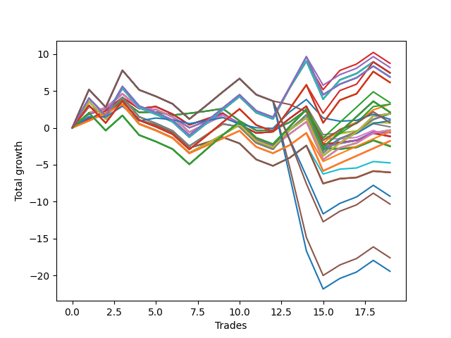

# Short Wallace 014 
- Symbol: NVDA_Unlimited
- Date Range: 02/08/2022 - 07/08/2022
- Trading Period: 7:20-12:30
- Number of Trades: 19



| Name | Win Percent | Profit | Avg Profit / Trade | Avg Time / Trade |      | Name | Win Percent | Profit | Avg Profit / Trade | Avg Time / Trade |
| ---- | ----------- | ------ | ------------------ | ---------------- | ---- | ---- | ----------- | ------ | ------------------ | ---------------- |
| Sorted By <br> Profit | | | | | | Sorted By <br> Win Percentage ||||
| Fifty-Five | 52.63 | 4375.00 | 230.26 | 115:08 |     | Forty-Nine | 63.16 | 65.00 | 3.42 | 19:46 |
| One Hundred Ninteen | 52.63 | 4090.00 | 215.26 | 117:40 |     | One Hundred Sixteen | 63.16 | -245.00 | -12.89 | 35:12 |
| Forty-Seven | 52.63 | 3745.00 | 197.11 | 115:21 |     | Forty-One | 63.16 | -565.00 | -29.74 | 19:58 |
| One Hundred Eighteen | 52.63 | 3725.00 | 196.05 | 108:47 |     | Forty-Eight | 63.16 | -575.00 | -30.26 | 14:10 |
| Seventy-One | 52.63 | 3725.00 | 196.05 | 116:57 |     | Sixty-Five | 63.16 | -585.00 | -30.79 | 21:33 |
| Sixty-Three | 52.63 | 3725.00 | 196.05 | 116:57 |     | Fifty-Seven | 63.16 | -585.00 | -30.79 | 21:33 |
| Seven | 52.63 | 3725.00 | 196.05 | 116:57 |     | One | 63.16 | -585.00 | -30.79 | 21:33 |
| One Hundred Fourteen | 52.63 | 3460.00 | 182.11 | 117:52 |     | One Hundred Eleven | 63.16 | -875.00 | -46.05 | 35:25 |
| One Hundred Twenty-Nine | 52.63 | 3440.00 | 181.05 | 119:29 |     | One Hundred Twenty-Six | 63.16 | -895.00 | -47.11 | 37:02 |
| One Hundred Twenty-Four | 52.63 | 3440.00 | 181.05 | 119:29 |     | One Hundred Twenty-One | 63.16 | -895.00 | -47.11 | 37:02 |
| Eighty-Four | 52.63 | 3440.00 | 181.05 | 119:29 |     | Eighty-One | 63.16 | -895.00 | -47.11 | 37:02 |
| One Hundred Thirteen | 52.63 | 3095.00 | 162.89 | 108:59 |     | Forty | 63.16 | -1205.00 | -63.42 | 14:22 |
| One Hundred Twenty-Eight | 52.63 | 3075.00 | 161.84 | 110:36 |     | Sixty-Four | 63.16 | -1255.00 | -66.05 | 15:33 |
| One Hundred Twenty-Three | 52.63 | 3075.00 | 161.84 | 110:36 |     | Fifty-Six | 63.16 | -1255.00 | -66.05 | 15:33 |
| Eighty-Three | 52.63 | 3075.00 | 161.84 | 110:36 |     | Zero | 63.16 | -1255.00 | -66.05 | 15:33 |
| One Hundred Seventeen | 52.63 | 1705.00 | 89.74 | 88:07 |     | Fifty-Four | 57.89 | 1600.00 | 84.21 | 72:42 |
| Fifty-Three | 52.63 | 1610.00 | 84.74 | 50:53 |     | Forty-Six | 57.89 | 970.00 | 51.05 | 72:55 |
| Fifty-Four | 57.89 | 1600.00 | 84.21 | 72:42 |     | Seventy | 57.89 | 950.00 | 50.00 | 74:31 |
| One Hundred Twelve | 52.63 | 1075.00 | 56.58 | 88:20 |     | Sixty-Two | 57.89 | 950.00 | 50.00 | 74:31 |
| One Hundred Twenty-Seven | 52.63 | 1055.00 | 55.53 | 89:56 |     | Six | 57.89 | 950.00 | 50.00 | 74:31 |
| One Hundred Twenty-Two | 52.63 | 1055.00 | 55.53 | 89:56 |     | Fifty-Two | 57.89 | 485.00 | 25.53 | 37:22 |
| Eighty-Two | 52.63 | 1055.00 | 55.53 | 89:56 |     | Forty-Four | 57.89 | -145.00 | -7.63 | 37:35 |
| Forty-Five | 52.63 | 980.00 | 51.58 | 51:06 |     | Sixty-Eight | 57.89 | -165.00 | -8.68 | 39:11 |
| Forty-Six | 57.89 | 970.00 | 51.05 | 72:55 |     | Sixty | 57.89 | -165.00 | -8.68 | 39:11 |
| Sixty-Nine | 52.63 | 960.00 | 50.53 | 52:42 |     | Four | 57.89 | -165.00 | -8.68 | 39:11 |
| Sixty-One | 52.63 | 960.00 | 50.53 | 52:42 |     | Fifty-Five | 52.63 | 4375.00 | 230.26 | 115:08 |
| Five | 52.63 | 960.00 | 50.53 | 52:42 |     | One Hundred Ninteen | 52.63 | 4090.00 | 215.26 | 117:40 |
| Seventy | 57.89 | 950.00 | 50.00 | 74:31 |     | Forty-Seven | 52.63 | 3745.00 | 197.11 | 115:21 |
| Sixty-Two | 57.89 | 950.00 | 50.00 | 74:31 |     | One Hundred Eighteen | 52.63 | 3725.00 | 196.05 | 108:47 |
| Six | 57.89 | 950.00 | 50.00 | 74:31 |     | Seventy-One | 52.63 | 3725.00 | 196.05 | 116:57 |
| Seventy-Three | 47.37 | 580.00 | 30.53 | 13:20 |     | Sixty-Three | 52.63 | 3725.00 | 196.05 | 116:57 |
| Fifty-Two | 57.89 | 485.00 | 25.53 | 37:22 |     | Seven | 52.63 | 3725.00 | 196.05 | 116:57 |
| One Hundred Twenty | 42.11 | 350.00 | 18.42 | 119:46 |     | One Hundred Fourteen | 52.63 | 3460.00 | 182.11 | 117:52 |
| Fifty | 52.63 | 330.00 | 17.37 | 29:56 |     | One Hundred Twenty-Nine | 52.63 | 3440.00 | 181.05 | 119:29 |
| Forty-Nine | 63.16 | 65.00 | 3.42 | 19:46 |     | One Hundred Twenty-Four | 52.63 | 3440.00 | 181.05 | 119:29 |
| Forty-Four | 57.89 | -145.00 | -7.63 | 37:35 |     | Eighty-Four | 52.63 | 3440.00 | 181.05 | 119:29 |
| Sixty-Eight | 57.89 | -165.00 | -8.68 | 39:11 |     | One Hundred Thirteen | 52.63 | 3095.00 | 162.89 | 108:59 |
| Sixty | 57.89 | -165.00 | -8.68 | 39:11 |     | One Hundred Twenty-Eight | 52.63 | 3075.00 | 161.84 | 110:36 |
| Four | 57.89 | -165.00 | -8.68 | 39:11 |     | One Hundred Twenty-Three | 52.63 | 3075.00 | 161.84 | 110:36 |
| One Hundred Sixteen | 63.16 | -245.00 | -12.89 | 35:12 |     | Eighty-Three | 52.63 | 3075.00 | 161.84 | 110:36 |
| Forty-Two | 52.63 | -300.00 | -15.79 | 30:08 |     | One Hundred Seventeen | 52.63 | 1705.00 | 89.74 | 88:07 |
| Sixty-Six | 52.63 | -320.00 | -16.84 | 31:45 |     | Fifty-Three | 52.63 | 1610.00 | 84.74 | 50:53 |
| Fifty-Eight | 52.63 | -320.00 | -16.84 | 31:45 |     | One Hundred Twelve | 52.63 | 1075.00 | 56.58 | 88:20 |
| Two | 52.63 | -320.00 | -16.84 | 31:45 |     | One Hundred Twenty-Seven | 52.63 | 1055.00 | 55.53 | 89:56 |
| Forty-One | 63.16 | -565.00 | -29.74 | 19:58 |     | One Hundred Twenty-Two | 52.63 | 1055.00 | 55.53 | 89:56 |
| Forty-Eight | 63.16 | -575.00 | -30.26 | 14:10 |     | Eighty-Two | 52.63 | 1055.00 | 55.53 | 89:56 |
| Sixty-Five | 63.16 | -585.00 | -30.79 | 21:33 |     | Forty-Five | 52.63 | 980.00 | 51.58 | 51:06 |
| Fifty-Seven | 63.16 | -585.00 | -30.79 | 21:33 |     | Sixty-Nine | 52.63 | 960.00 | 50.53 | 52:42 |
| One | 63.16 | -585.00 | -30.79 | 21:33 |     | Sixty-One | 52.63 | 960.00 | 50.53 | 52:42 |
| One Hundred Eleven | 63.16 | -875.00 | -46.05 | 35:25 |     | Five | 52.63 | 960.00 | 50.53 | 52:42 |
| One Hundred Twenty-Six | 63.16 | -895.00 | -47.11 | 37:02 |     | Fifty | 52.63 | 330.00 | 17.37 | 29:56 |
| One Hundred Twenty-One | 63.16 | -895.00 | -47.11 | 37:02 |     | Forty-Two | 52.63 | -300.00 | -15.79 | 30:08 |
| Eighty-One | 63.16 | -895.00 | -47.11 | 37:02 |     | Sixty-Six | 52.63 | -320.00 | -16.84 | 31:45 |
| Forty | 63.16 | -1205.00 | -63.42 | 14:22 |     | Fifty-Eight | 52.63 | -320.00 | -16.84 | 31:45 |
| Sixty-Four | 63.16 | -1255.00 | -66.05 | 15:33 |     | Two | 52.63 | -320.00 | -16.84 | 31:45 |
| Fifty-Six | 63.16 | -1255.00 | -66.05 | 15:33 |     | Fifty-One | 52.63 | -2375.00 | -125.00 | 30:25 |
| Zero | 63.16 | -1255.00 | -66.05 | 15:33 |     | Forty-Three | 52.63 | -3005.00 | -158.16 | 30:37 |
| Fifty-One | 52.63 | -2375.00 | -125.00 | 30:25 |     | Sixty-Seven | 52.63 | -3025.00 | -159.21 | 32:14 |
| Forty-Three | 52.63 | -3005.00 | -158.16 | 30:37 |     | Fifty-Nine | 52.63 | -3025.00 | -159.21 | 32:14 |
| Sixty-Seven | 52.63 | -3025.00 | -159.21 | 32:14 |     | Three | 52.63 | -3025.00 | -159.21 | 32:14 |
| Fifty-Nine | 52.63 | -3025.00 | -159.21 | 32:14 |     | Seventy-Three | 47.37 | 580.00 | 30.53 | 13:20 |
| Three | 52.63 | -3025.00 | -159.21 | 32:14 |     | One Hundred Twenty | 42.11 | 350.00 | 18.42 | 119:46 |
| One Hundred Fifteen | 42.11 | -4635.00 | -243.95 | 120:52 |     | One Hundred Fifteen | 42.11 | -4635.00 | -243.95 | 120:52 |
| One Hundred Thirty | 42.11 | -5170.00 | -272.11 | 122:53 |     | One Hundred Thirty | 42.11 | -5170.00 | -272.11 | 122:53 |
| Eighty-Five | 42.11 | -8810.00 | -463.68 | 128:12 |     | Eighty-Five | 42.11 | -8810.00 | -463.68 | 128:12 |
| One Hundred Twenty-Five | 42.11 | -9725.00 | -511.84 | 125:05 |     | One Hundred Twenty-Five | 42.11 | -9725.00 | -511.84 | 125:05 |

## NO STOPLOSS

### Test Zero
* Sell when price hits the middle line of the 20p bollinger
* No Stoploss
* Results:
```
Total Trades: 19
Percent Up: 36.84
Percent Down: 63.16
Total Points Moved Down: -2.51
Potential Profit: -1255.00
Total Points Ups: 11.21 Count Ups: 7
Total Points Downs: 8.70 Count Downs: 12
```

<details><summary>Trades</summary>

<code>In: 2022-02-18 12:04:00		Out: 2022-02-18 12:08:20		Total Position Time: 04:20		Total Move Down: 1.10		Total to Date: 1.10</code> <br />
<code>In: 2022-03-02 08:10:00		Out: 2022-03-02 08:21:15		Total Position Time: 11:15		Total Move Down: 0.89		Total to Date: 1.99</code> <br />
<code>In: 2022-03-03 09:38:00		Out: 2022-03-03 09:41:55		Total Position Time: 03:55		Total Move Down: 1.81		Total to Date: 3.80</code> <br />
<code>In: 2022-03-10 10:53:00		Out: 2022-03-10 11:22:15		Total Position Time: 29:15		Total Move Down: -1.71		Total to Date: 2.09</code> <br />
<code>In: 2022-03-10 11:07:00		Out: 2022-03-10 11:22:15		Total Position Time: 15:15		Total Move Down: 0.06		Total to Date: 2.15</code> <br />
<code>In: 2022-03-28 12:16:00		Out: 2022-03-28 12:39:35		Total Position Time: 23:35		Total Move Down: -0.43		Total to Date: 1.72</code> <br />
<code>In: 2022-03-29 11:55:00		Out: 2022-03-29 12:01:15		Total Position Time: 06:15		Total Move Down: 0.25		Total to Date: 1.97</code> <br />
<code>In: 2022-04-11 11:51:00		Out: 2022-04-11 12:04:05		Total Position Time: 13:05		Total Move Down: 0.29		Total to Date: 2.26</code> <br />
<code>In: 2022-04-11 11:53:00		Out: 2022-04-11 12:04:05		Total Position Time: 11:05		Total Move Down: 0.35		Total to Date: 2.61</code> <br />
<code>In: 2022-04-18 10:37:00		Out: 2022-04-18 11:05:15		Total Position Time: 28:15		Total Move Down: -1.67		Total to Date: 0.94</code> <br />
<code>In: 2022-05-02 12:15:00		Out: 2022-05-02 12:40:35		Total Position Time: 25:35		Total Move Down: -1.29		Total to Date: -0.35</code> <br />
<code>In: 2022-05-02 12:29:00		Out: 2022-05-02 12:40:35		Total Position Time: 11:35		Total Move Down: 0.03		Total to Date: -0.32</code> <br />
<code>In: 2022-05-04 11:03:00		Out: 2022-05-04 11:07:05		Total Position Time: 04:05		Total Move Down: 1.09		Total to Date: 0.77</code> <br />
<code>In: 2022-05-04 11:07:00		Out: 2022-05-04 11:08:10		Total Position Time: 01:10		Total Move Down: 1.66		Total to Date: 2.43</code> <br />
<code>In: 2022-05-04 11:50:00		Out: 2022-05-04 12:38:40		Total Position Time: 48:40		Total Move Down: -5.22		Total to Date: -2.79</code> <br />
<code>In: 2022-05-31 07:33:00		Out: 2022-05-31 07:53:45		Total Position Time: 20:45		Total Move Down: -0.09		Total to Date: -2.88</code> <br />
<code>In: 2022-06-30 08:25:00		Out: 2022-06-30 08:35:40		Total Position Time: 10:40		Total Move Down: 0.23		Total to Date: -2.65</code> <br />
<code>In: 2022-06-30 08:28:00		Out: 2022-06-30 08:35:40		Total Position Time: 07:40		Total Move Down: 0.94		Total to Date: -1.71</code> <br />
<code>In: 2022-07-06 07:47:00		Out: 2022-07-06 08:06:10		Total Position Time: 19:10		Total Move Down: -0.80		Total to Date: -2.51</code> <br />


</details>

### Test One
* Sell when the price hits the upper line of the 20p 1std bollinger
* No Stoploss
* Results:
```
Total Trades: 19
Percent Up: 36.84
Percent Down: 63.16
Total Points Moved Down: -1.17
Potential Profit: -585.00
Total Points Ups: 12.26 Count Ups: 7
Total Points Downs: 11.09 Count Downs: 12
```

<details><summary>Trades</summary>

<code>In: 2022-02-18 12:04:00		Out: 2022-02-18 12:15:05		Total Position Time: 11:05		Total Move Down: 1.12		Total to Date: 1.12</code> <br />
<code>In: 2022-03-02 08:10:00		Out: 2022-03-02 08:23:25		Total Position Time: 13:25		Total Move Down: 1.21		Total to Date: 2.33</code> <br />
<code>In: 2022-03-03 09:38:00		Out: 2022-03-03 09:53:50		Total Position Time: 15:50		Total Move Down: 1.78		Total to Date: 4.11</code> <br />
<code>In: 2022-03-10 10:53:00		Out: 2022-03-10 11:24:35		Total Position Time: 31:35		Total Move Down: -1.50		Total to Date: 2.61</code> <br />
<code>In: 2022-03-10 11:07:00		Out: 2022-03-10 11:24:35		Total Position Time: 17:35		Total Move Down: 0.27		Total to Date: 2.88</code> <br />
<code>In: 2022-03-28 12:16:00		Out: 2022-03-28 12:47:00		Total Position Time: 31:00		Total Move Down: -1.02		Total to Date: 1.86</code> <br />
<code>In: 2022-03-29 11:55:00		Out: 2022-03-29 12:43:10		Total Position Time: 48:10		Total Move Down: -1.45		Total to Date: 0.41</code> <br />
<code>In: 2022-04-11 11:51:00		Out: 2022-04-11 12:04:20		Total Position Time: 13:20		Total Move Down: 0.76		Total to Date: 1.17</code> <br />
<code>In: 2022-04-11 11:53:00		Out: 2022-04-11 12:04:20		Total Position Time: 11:20		Total Move Down: 0.82		Total to Date: 1.99</code> <br />
<code>In: 2022-04-18 10:37:00		Out: 2022-04-18 11:10:45		Total Position Time: 33:45		Total Move Down: -1.54		Total to Date: 0.45</code> <br />
<code>In: 2022-05-02 12:15:00		Out: 2022-05-02 12:44:50		Total Position Time: 29:50		Total Move Down: -1.15		Total to Date: -0.70</code> <br />
<code>In: 2022-05-02 12:29:00		Out: 2022-05-02 12:44:50		Total Position Time: 15:50		Total Move Down: 0.17		Total to Date: -0.53</code> <br />
<code>In: 2022-05-04 11:03:00		Out: 2022-05-04 11:07:20		Total Position Time: 04:20		Total Move Down: 1.80		Total to Date: 1.27</code> <br />
<code>In: 2022-05-04 11:07:00		Out: 2022-05-04 11:08:10		Total Position Time: 01:10		Total Move Down: 1.66		Total to Date: 2.93</code> <br />
<code>In: 2022-05-04 11:50:00		Out: 2022-05-04 12:46:15		Total Position Time: 56:15		Total Move Down: -5.16		Total to Date: -2.23</code> <br />
<code>In: 2022-05-31 07:33:00		Out: 2022-05-31 07:57:20		Total Position Time: 24:20		Total Move Down: 0.23		Total to Date: -2.00</code> <br />
<code>In: 2022-06-30 08:25:00		Out: 2022-06-30 08:41:05		Total Position Time: 16:05		Total Move Down: 0.28		Total to Date: -1.72</code> <br />
<code>In: 2022-06-30 08:28:00		Out: 2022-06-30 08:41:05		Total Position Time: 13:05		Total Move Down: 0.99		Total to Date: -0.73</code> <br />
<code>In: 2022-07-06 07:47:00		Out: 2022-07-06 08:08:35		Total Position Time: 21:35		Total Move Down: -0.44		Total to Date: -1.17</code> <br />


</details>

### Test Two
* Sell when the price hits the upper line of the 20p 2std bollinger
* No Stoploss
* Results:
```
Total Trades: 19
Percent Up: 47.37
Percent Down: 52.63
Total Points Moved Down: -0.64
Potential Profit: -320.00
Total Points Ups: 14.05 Count Ups: 9
Total Points Downs: 13.41 Count Downs: 10
```

<details><summary>Trades</summary>

<code>In: 2022-02-18 12:04:00		Out: 2022-02-18 12:18:35		Total Position Time: 14:35		Total Move Down: 1.84		Total to Date: 1.84</code> <br />
<code>In: 2022-03-02 08:10:00		Out: 2022-03-02 08:49:30		Total Position Time: 39:30		Total Move Down: 0.78		Total to Date: 2.62</code> <br />
<code>In: 2022-03-03 09:38:00		Out: 2022-03-03 10:00:10		Total Position Time: 22:10		Total Move Down: 2.00		Total to Date: 4.62</code> <br />
<code>In: 2022-03-10 10:53:00		Out: 2022-03-10 12:07:05		Total Position Time: 74:05		Total Move Down: -1.95		Total to Date: 2.67</code> <br />
<code>In: 2022-03-10 11:07:00		Out: 2022-03-10 12:07:05		Total Position Time: 60:05		Total Move Down: -0.18		Total to Date: 2.49</code> <br />
<code>In: 2022-03-28 12:16:00		Out: 2022-03-28 12:47:00		Total Position Time: 31:00		Total Move Down: -1.02		Total to Date: 1.47</code> <br />
<code>In: 2022-03-29 11:55:00		Out: 2022-03-29 12:43:10		Total Position Time: 48:10		Total Move Down: -1.45		Total to Date: 0.02</code> <br />
<code>In: 2022-04-11 11:51:00		Out: 2022-04-11 12:05:45		Total Position Time: 14:45		Total Move Down: 0.87		Total to Date: 0.89</code> <br />
<code>In: 2022-04-11 11:53:00		Out: 2022-04-11 12:05:45		Total Position Time: 12:45		Total Move Down: 0.93		Total to Date: 1.82</code> <br />
<code>In: 2022-04-18 10:37:00		Out: 2022-04-18 11:11:30		Total Position Time: 34:30		Total Move Down: -1.20		Total to Date: 0.62</code> <br />
<code>In: 2022-05-02 12:15:00		Out: 2022-05-02 12:47:00		Total Position Time: 32:00		Total Move Down: -2.18		Total to Date: -1.56</code> <br />
<code>In: 2022-05-02 12:29:00		Out: 2022-05-02 12:47:00		Total Position Time: 18:00		Total Move Down: -0.86		Total to Date: -2.42</code> <br />
<code>In: 2022-05-04 11:03:00		Out: 2022-05-04 11:07:30		Total Position Time: 04:30		Total Move Down: 2.61		Total to Date: 0.19</code> <br />
<code>In: 2022-05-04 11:07:00		Out: 2022-05-04 11:20:50		Total Position Time: 13:50		Total Move Down: 2.37		Total to Date: 2.56</code> <br />
<code>In: 2022-05-04 11:50:00		Out: 2022-05-04 12:47:00		Total Position Time: 57:00		Total Move Down: -5.16		Total to Date: -2.60</code> <br />
<code>In: 2022-05-31 07:33:00		Out: 2022-05-31 08:00:05		Total Position Time: 27:05		Total Move Down: 0.48		Total to Date: -2.12</code> <br />
<code>In: 2022-06-30 08:25:00		Out: 2022-06-30 09:04:30		Total Position Time: 39:30		Total Move Down: 0.41		Total to Date: -1.71</code> <br />
<code>In: 2022-06-30 08:28:00		Out: 2022-06-30 09:04:30		Total Position Time: 36:30		Total Move Down: 1.12		Total to Date: -0.59</code> <br />
<code>In: 2022-07-06 07:47:00		Out: 2022-07-06 08:10:20		Total Position Time: 23:20		Total Move Down: -0.05		Total to Date: -0.64</code> <br />


</details>

### Test Three
* Sell when price hits the middle line of the 50p bollinger
* No Stoploss
* Results:
```
Total Trades: 19
Percent Up: 47.37
Percent Down: 52.63
Total Points Moved Down: -6.05
Potential Profit: -3025.00
Total Points Ups: 15.53 Count Ups: 9
Total Points Downs: 9.48 Count Downs: 10
```

<details><summary>Trades</summary>

<code>In: 2022-02-18 12:04:00		Out: 2022-02-18 12:17:20		Total Position Time: 13:20		Total Move Down: 1.29		Total to Date: 1.29</code> <br />
<code>In: 2022-03-02 08:10:00		Out: 2022-03-02 08:49:00		Total Position Time: 39:00		Total Move Down: 0.45		Total to Date: 1.74</code> <br />
<code>In: 2022-03-03 09:38:00		Out: 2022-03-03 09:41:50		Total Position Time: 03:50		Total Move Down: 1.84		Total to Date: 3.58</code> <br />
<code>In: 2022-03-10 10:53:00		Out: 2022-03-10 12:01:25		Total Position Time: 68:25		Total Move Down: -2.50		Total to Date: 1.08</code> <br />
<code>In: 2022-03-10 11:07:00		Out: 2022-03-10 12:01:25		Total Position Time: 54:25		Total Move Down: -0.73		Total to Date: 0.35</code> <br />
<code>In: 2022-03-28 12:16:00		Out: 2022-03-28 12:47:00		Total Position Time: 31:00		Total Move Down: -1.02		Total to Date: -0.67</code> <br />
<code>In: 2022-03-29 11:55:00		Out: 2022-03-29 12:47:00		Total Position Time: 52:00		Total Move Down: -2.06		Total to Date: -2.73</code> <br />
<code>In: 2022-04-11 11:51:00		Out: 2022-04-11 12:20:25		Total Position Time: 29:25		Total Move Down: 0.70		Total to Date: -2.03</code> <br />
<code>In: 2022-04-11 11:53:00		Out: 2022-04-11 12:20:25		Total Position Time: 27:25		Total Move Down: 0.76		Total to Date: -1.27</code> <br />
<code>In: 2022-04-18 10:37:00		Out: 2022-04-18 11:17:05		Total Position Time: 40:05		Total Move Down: -0.84		Total to Date: -2.11</code> <br />
<code>In: 2022-05-02 12:15:00		Out: 2022-05-02 12:47:00		Total Position Time: 32:00		Total Move Down: -2.18		Total to Date: -4.29</code> <br />
<code>In: 2022-05-02 12:29:00		Out: 2022-05-02 12:47:00		Total Position Time: 18:00		Total Move Down: -0.86		Total to Date: -5.15</code> <br />
<code>In: 2022-05-04 11:03:00		Out: 2022-05-04 11:07:05		Total Position Time: 04:05		Total Move Down: 1.09		Total to Date: -4.06</code> <br />
<code>In: 2022-05-04 11:07:00		Out: 2022-05-04 11:08:10		Total Position Time: 01:10		Total Move Down: 1.66		Total to Date: -2.40</code> <br />
<code>In: 2022-05-04 11:50:00		Out: 2022-05-04 12:47:00		Total Position Time: 57:00		Total Move Down: -5.16		Total to Date: -7.56</code> <br />
<code>In: 2022-05-31 07:33:00		Out: 2022-05-31 08:06:35		Total Position Time: 33:35		Total Move Down: 0.66		Total to Date: -6.90</code> <br />
<code>In: 2022-06-30 08:25:00		Out: 2022-06-30 09:02:35		Total Position Time: 37:35		Total Move Down: 0.16		Total to Date: -6.74</code> <br />
<code>In: 2022-06-30 08:28:00		Out: 2022-06-30 09:02:35		Total Position Time: 34:35		Total Move Down: 0.87		Total to Date: -5.87</code> <br />
<code>In: 2022-07-06 07:47:00		Out: 2022-07-06 08:22:35		Total Position Time: 35:35		Total Move Down: -0.18		Total to Date: -6.05</code> <br />


</details>

### Test Four
* Sell when the price hits the upper line of the 50p 1std bollinger
* No Stoploss
* Results:
```
Total Trades: 19
Percent Up: 42.11
Percent Down: 57.89
Total Points Moved Down: -0.33
Potential Profit: -165.00
Total Points Ups: 14.72 Count Ups: 8
Total Points Downs: 14.39 Count Downs: 11
```

<details><summary>Trades</summary>

<code>In: 2022-02-18 12:04:00		Out: 2022-02-18 12:19:05		Total Position Time: 15:05		Total Move Down: 2.03		Total to Date: 2.03</code> <br />
<code>In: 2022-03-02 08:10:00		Out: 2022-03-02 08:54:20		Total Position Time: 44:20		Total Move Down: 0.71		Total to Date: 2.74</code> <br />
<code>In: 2022-03-03 09:38:00		Out: 2022-03-03 10:34:35		Total Position Time: 56:35		Total Move Down: 1.89		Total to Date: 4.63</code> <br />
<code>In: 2022-03-10 10:53:00		Out: 2022-03-10 12:07:05		Total Position Time: 74:05		Total Move Down: -1.95		Total to Date: 2.68</code> <br />
<code>In: 2022-03-10 11:07:00		Out: 2022-03-10 12:07:05		Total Position Time: 60:05		Total Move Down: -0.18		Total to Date: 2.50</code> <br />
<code>In: 2022-03-28 12:16:00		Out: 2022-03-28 12:47:00		Total Position Time: 31:00		Total Move Down: -1.02		Total to Date: 1.48</code> <br />
<code>In: 2022-03-29 11:55:00		Out: 2022-03-29 12:47:00		Total Position Time: 52:00		Total Move Down: -2.06		Total to Date: -0.58</code> <br />
<code>In: 2022-04-11 11:51:00		Out: 2022-04-11 12:28:45		Total Position Time: 37:45		Total Move Down: 1.12		Total to Date: 0.54</code> <br />
<code>In: 2022-04-11 11:53:00		Out: 2022-04-11 12:28:45		Total Position Time: 35:45		Total Move Down: 1.18		Total to Date: 1.72</code> <br />
<code>In: 2022-04-18 10:37:00		Out: 2022-04-18 11:46:10		Total Position Time: 69:10		Total Move Down: -1.31		Total to Date: 0.41</code> <br />
<code>In: 2022-05-02 12:15:00		Out: 2022-05-02 12:47:00		Total Position Time: 32:00		Total Move Down: -2.18		Total to Date: -1.77</code> <br />
<code>In: 2022-05-02 12:29:00		Out: 2022-05-02 12:47:00		Total Position Time: 18:00		Total Move Down: -0.86		Total to Date: -2.63</code> <br />
<code>In: 2022-05-04 11:03:00		Out: 2022-05-04 11:07:20		Total Position Time: 04:20		Total Move Down: 1.80		Total to Date: -0.83</code> <br />
<code>In: 2022-05-04 11:07:00		Out: 2022-05-04 11:08:10		Total Position Time: 01:10		Total Move Down: 1.66		Total to Date: 0.83</code> <br />
<code>In: 2022-05-04 11:50:00		Out: 2022-05-04 12:47:00		Total Position Time: 57:00		Total Move Down: -5.16		Total to Date: -4.33</code> <br />
<code>In: 2022-05-31 07:33:00		Out: 2022-05-31 08:08:45		Total Position Time: 35:45		Total Move Down: 1.61		Total to Date: -2.72</code> <br />
<code>In: 2022-06-30 08:25:00		Out: 2022-06-30 09:06:05		Total Position Time: 41:05		Total Move Down: 0.65		Total to Date: -2.07</code> <br />
<code>In: 2022-06-30 08:28:00		Out: 2022-06-30 09:06:05		Total Position Time: 38:05		Total Move Down: 1.36		Total to Date: -0.71</code> <br />
<code>In: 2022-07-06 07:47:00		Out: 2022-07-06 08:28:30		Total Position Time: 41:30		Total Move Down: 0.38		Total to Date: -0.33</code> <br />


</details>

### Test Five
* Sell when the price hits the upper line of the 50p 2std bollinger
* No Stoploss
* Results:
```
Total Trades: 19
Percent Up: 47.37
Percent Down: 52.63
Total Points Moved Down: 1.92
Potential Profit: 960.00
Total Points Ups: 16.31 Count Ups: 9
Total Points Downs: 18.23 Count Downs: 10
```

<details><summary>Trades</summary>

<code>In: 2022-02-18 12:04:00		Out: 2022-02-18 12:19:45		Total Position Time: 15:45		Total Move Down: 2.86		Total to Date: 2.86</code> <br />
<code>In: 2022-03-02 08:10:00		Out: 2022-03-02 10:49:40		Total Position Time: 159:40		Total Move Down: -1.11		Total to Date: 1.75</code> <br />
<code>In: 2022-03-03 09:38:00		Out: 2022-03-03 10:41:35		Total Position Time: 63:35		Total Move Down: 2.39		Total to Date: 4.14</code> <br />
<code>In: 2022-03-10 10:53:00		Out: 2022-03-10 12:47:00		Total Position Time: 114:00		Total Move Down: -2.65		Total to Date: 1.49</code> <br />
<code>In: 2022-03-10 11:07:00		Out: 2022-03-10 12:47:00		Total Position Time: 100:00		Total Move Down: -0.88		Total to Date: 0.61</code> <br />
<code>In: 2022-03-28 12:16:00		Out: 2022-03-28 12:47:00		Total Position Time: 31:00		Total Move Down: -1.02		Total to Date: -0.41</code> <br />
<code>In: 2022-03-29 11:55:00		Out: 2022-03-29 12:47:00		Total Position Time: 52:00		Total Move Down: -2.06		Total to Date: -2.47</code> <br />
<code>In: 2022-04-11 11:51:00		Out: 2022-04-11 12:32:05		Total Position Time: 41:05		Total Move Down: 1.47		Total to Date: -1.00</code> <br />
<code>In: 2022-04-11 11:53:00		Out: 2022-04-11 12:32:05		Total Position Time: 39:05		Total Move Down: 1.53		Total to Date: 0.53</code> <br />
<code>In: 2022-04-18 10:37:00		Out: 2022-04-18 12:03:20		Total Position Time: 86:20		Total Move Down: -0.39		Total to Date: 0.14</code> <br />
<code>In: 2022-05-02 12:15:00		Out: 2022-05-02 12:47:00		Total Position Time: 32:00		Total Move Down: -2.18		Total to Date: -2.04</code> <br />
<code>In: 2022-05-02 12:29:00		Out: 2022-05-02 12:47:00		Total Position Time: 18:00		Total Move Down: -0.86		Total to Date: -2.90</code> <br />
<code>In: 2022-05-04 11:03:00		Out: 2022-05-04 11:07:30		Total Position Time: 04:30		Total Move Down: 2.61		Total to Date: -0.29</code> <br />
<code>In: 2022-05-04 11:07:00		Out: 2022-05-04 11:20:40		Total Position Time: 13:40		Total Move Down: 2.04		Total to Date: 1.75</code> <br />
<code>In: 2022-05-04 11:50:00		Out: 2022-05-04 12:47:00		Total Position Time: 57:00		Total Move Down: -5.16		Total to Date: -3.41</code> <br />
<code>In: 2022-05-31 07:33:00		Out: 2022-05-31 08:15:00		Total Position Time: 42:00		Total Move Down: 1.91		Total to Date: -1.50</code> <br />
<code>In: 2022-06-30 08:25:00		Out: 2022-06-30 09:09:40		Total Position Time: 44:40		Total Move Down: 0.96		Total to Date: -0.54</code> <br />
<code>In: 2022-06-30 08:28:00		Out: 2022-06-30 09:09:40		Total Position Time: 41:40		Total Move Down: 1.67		Total to Date: 1.13</code> <br />
<code>In: 2022-07-06 07:47:00		Out: 2022-07-06 08:32:35		Total Position Time: 45:35		Total Move Down: 0.79		Total to Date: 1.92</code> <br />


</details>

### Test Six
* Sell when the price hits the middle line of the 1std VWAP
* No Stoploss
* Results:
```
Total Trades: 19
Percent Up: 42.11
Percent Down: 57.89
Total Points Moved Down: 1.90
Potential Profit: 950.00
Total Points Ups: 17.20 Count Ups: 8
Total Points Downs: 19.10 Count Downs: 11
```

<details><summary>Trades</summary>

<code>In: 2022-02-18 12:04:00		Out: 2022-02-18 12:22:10		Total Position Time: 18:10		Total Move Down: 3.57		Total to Date: 3.57</code> <br />
<code>In: 2022-03-02 08:10:00		Out: 2022-03-02 12:47:00		Total Position Time: 277:00		Total Move Down: -2.39		Total to Date: 1.18</code> <br />
<code>In: 2022-03-03 09:38:00		Out: 2022-03-03 09:43:05		Total Position Time: 05:05		Total Move Down: 2.03		Total to Date: 3.21</code> <br />
<code>In: 2022-03-10 10:53:00		Out: 2022-03-10 12:47:00		Total Position Time: 114:00		Total Move Down: -2.65		Total to Date: 0.56</code> <br />
<code>In: 2022-03-10 11:07:00		Out: 2022-03-10 12:47:00		Total Position Time: 100:00		Total Move Down: -0.88		Total to Date: -0.32</code> <br />
<code>In: 2022-03-28 12:16:00		Out: 2022-03-28 12:47:00		Total Position Time: 31:00		Total Move Down: -1.02		Total to Date: -1.34</code> <br />
<code>In: 2022-03-29 11:55:00		Out: 2022-03-29 12:47:00		Total Position Time: 52:00		Total Move Down: -2.06		Total to Date: -3.40</code> <br />
<code>In: 2022-04-11 11:51:00		Out: 2022-04-11 12:28:50		Total Position Time: 37:50		Total Move Down: 1.21		Total to Date: -2.19</code> <br />
<code>In: 2022-04-11 11:53:00		Out: 2022-04-11 12:28:50		Total Position Time: 35:50		Total Move Down: 1.27		Total to Date: -0.92</code> <br />
<code>In: 2022-04-18 10:37:00		Out: 2022-04-18 12:40:05		Total Position Time: 123:05		Total Move Down: 1.32		Total to Date: 0.40</code> <br />
<code>In: 2022-05-02 12:15:00		Out: 2022-05-02 12:47:00		Total Position Time: 32:00		Total Move Down: -2.18		Total to Date: -1.78</code> <br />
<code>In: 2022-05-02 12:29:00		Out: 2022-05-02 12:47:00		Total Position Time: 18:00		Total Move Down: -0.86		Total to Date: -2.64</code> <br />
<code>In: 2022-05-04 11:03:00		Out: 2022-05-04 11:07:25		Total Position Time: 04:25		Total Move Down: 2.34		Total to Date: -0.30</code> <br />
<code>In: 2022-05-04 11:07:00		Out: 2022-05-04 11:08:10		Total Position Time: 01:10		Total Move Down: 1.66		Total to Date: 1.36</code> <br />
<code>In: 2022-05-04 11:50:00		Out: 2022-05-04 12:47:00		Total Position Time: 57:00		Total Move Down: -5.16		Total to Date: -3.80</code> <br />
<code>In: 2022-05-31 07:33:00		Out: 2022-05-31 08:14:40		Total Position Time: 41:40		Total Move Down: 1.73		Total to Date: -2.07</code> <br />
<code>In: 2022-06-30 08:25:00		Out: 2022-06-30 12:00:15		Total Position Time: 215:15		Total Move Down: 1.47		Total to Date: -0.60</code> <br />
<code>In: 2022-06-30 08:28:00		Out: 2022-06-30 12:00:15		Total Position Time: 212:15		Total Move Down: 2.18		Total to Date: 1.58</code> <br />
<code>In: 2022-07-06 07:47:00		Out: 2022-07-06 08:27:20		Total Position Time: 40:20		Total Move Down: 0.32		Total to Date: 1.90</code> <br />


</details>

### Test Seven
* Sell when the price hits the upper line of the 1std VWAP
* No Stoploss
* Results:
```
Total Trades: 19
Percent Up: 47.37
Percent Down: 52.63
Total Points Moved Down: 7.45
Potential Profit: 3725.00
Total Points Ups: 18.68 Count Ups: 9
Total Points Downs: 26.13 Count Downs: 10
```

<details><summary>Trades</summary>

<code>In: 2022-02-18 12:04:00		Out: 2022-02-18 12:47:00		Total Position Time: 43:00		Total Move Down: 4.02		Total to Date: 4.02</code> <br />
<code>In: 2022-03-02 08:10:00		Out: 2022-03-02 12:47:00		Total Position Time: 277:00		Total Move Down: -2.39		Total to Date: 1.63</code> <br />
<code>In: 2022-03-03 09:38:00		Out: 2022-03-03 11:44:05		Total Position Time: 126:05		Total Move Down: 3.73		Total to Date: 5.36</code> <br />
<code>In: 2022-03-10 10:53:00		Out: 2022-03-10 12:47:00		Total Position Time: 114:00		Total Move Down: -2.65		Total to Date: 2.71</code> <br />
<code>In: 2022-03-10 11:07:00		Out: 2022-03-10 12:47:00		Total Position Time: 100:00		Total Move Down: -0.88		Total to Date: 1.83</code> <br />
<code>In: 2022-03-28 12:16:00		Out: 2022-03-28 12:47:00		Total Position Time: 31:00		Total Move Down: -1.02		Total to Date: 0.81</code> <br />
<code>In: 2022-03-29 11:55:00		Out: 2022-03-29 12:47:00		Total Position Time: 52:00		Total Move Down: -2.06		Total to Date: -1.25</code> <br />
<code>In: 2022-04-11 11:51:00		Out: 2022-04-11 12:47:00		Total Position Time: 56:00		Total Move Down: 1.81		Total to Date: 0.56</code> <br />
<code>In: 2022-04-11 11:53:00		Out: 2022-04-11 12:47:00		Total Position Time: 54:00		Total Move Down: 1.87		Total to Date: 2.43</code> <br />
<code>In: 2022-04-18 10:37:00		Out: 2022-04-18 12:47:00		Total Position Time: 130:00		Total Move Down: 1.81		Total to Date: 4.24</code> <br />
<code>In: 2022-05-02 12:15:00		Out: 2022-05-02 12:47:00		Total Position Time: 32:00		Total Move Down: -2.18		Total to Date: 2.06</code> <br />
<code>In: 2022-05-02 12:29:00		Out: 2022-05-02 12:47:00		Total Position Time: 18:00		Total Move Down: -0.86		Total to Date: 1.20</code> <br />
<code>In: 2022-05-04 11:03:00		Out: 2022-05-04 11:34:15		Total Position Time: 31:15		Total Move Down: 4.19		Total to Date: 5.39</code> <br />
<code>In: 2022-05-04 11:07:00		Out: 2022-05-04 11:34:15		Total Position Time: 27:15		Total Move Down: 3.65		Total to Date: 9.04</code> <br />
<code>In: 2022-05-04 11:50:00		Out: 2022-05-04 12:47:00		Total Position Time: 57:00		Total Move Down: -5.16		Total to Date: 3.88</code> <br />
<code>In: 2022-05-31 07:33:00		Out: 2022-05-31 11:45:45		Total Position Time: 252:45		Total Move Down: 2.60		Total to Date: 6.48</code> <br />
<code>In: 2022-06-30 08:25:00		Out: 2022-06-30 12:47:00		Total Position Time: 262:00		Total Move Down: 0.87		Total to Date: 7.35</code> <br />
<code>In: 2022-06-30 08:28:00		Out: 2022-06-30 12:47:00		Total Position Time: 259:00		Total Move Down: 1.58		Total to Date: 8.93</code> <br />
<code>In: 2022-07-06 07:47:00		Out: 2022-07-06 12:47:00		Total Position Time: 300:00		Total Move Down: -1.48		Total to Date: 7.45</code> <br />


</details>

## STOPLOSS OF 5

### Test Forty
* Sell when price hits the middle line of the 20p bollinger
* Stoploss is -5 points
* Results:
```
Total Trades: 19
Percent Up: 36.84
Percent Down: 63.16
Total Points Moved Down: -2.41
Potential Profit: -1205.00
Total Points Ups: 11.11 Count Ups: 7
Total Points Downs: 8.70 Count Downs: 12
```

<details><summary>Trades</summary>

<code>In: 2022-02-18 12:04:00		Out: 2022-02-18 12:08:20		Total Position Time: 04:20		Total Move Down: 1.10		Total to Date: 1.10</code> <br />
<code>In: 2022-03-02 08:10:00		Out: 2022-03-02 08:21:15		Total Position Time: 11:15		Total Move Down: 0.89		Total to Date: 1.99</code> <br />
<code>In: 2022-03-03 09:38:00		Out: 2022-03-03 09:41:55		Total Position Time: 03:55		Total Move Down: 1.81		Total to Date: 3.80</code> <br />
<code>In: 2022-03-10 10:53:00		Out: 2022-03-10 11:22:15		Total Position Time: 29:15		Total Move Down: -1.71		Total to Date: 2.09</code> <br />
<code>In: 2022-03-10 11:07:00		Out: 2022-03-10 11:22:15		Total Position Time: 15:15		Total Move Down: 0.06		Total to Date: 2.15</code> <br />
<code>In: 2022-03-28 12:16:00		Out: 2022-03-28 12:39:35		Total Position Time: 23:35		Total Move Down: -0.43		Total to Date: 1.72</code> <br />
<code>In: 2022-03-29 11:55:00		Out: 2022-03-29 12:01:15		Total Position Time: 06:15		Total Move Down: 0.25		Total to Date: 1.97</code> <br />
<code>In: 2022-04-11 11:51:00		Out: 2022-04-11 12:04:05		Total Position Time: 13:05		Total Move Down: 0.29		Total to Date: 2.26</code> <br />
<code>In: 2022-04-11 11:53:00		Out: 2022-04-11 12:04:05		Total Position Time: 11:05		Total Move Down: 0.35		Total to Date: 2.61</code> <br />
<code>In: 2022-04-18 10:37:00		Out: 2022-04-18 11:05:15		Total Position Time: 28:15		Total Move Down: -1.67		Total to Date: 0.94</code> <br />
<code>In: 2022-05-02 12:15:00		Out: 2022-05-02 12:40:35		Total Position Time: 25:35		Total Move Down: -1.29		Total to Date: -0.35</code> <br />
<code>In: 2022-05-02 12:29:00		Out: 2022-05-02 12:40:35		Total Position Time: 11:35		Total Move Down: 0.03		Total to Date: -0.32</code> <br />
<code>In: 2022-05-04 11:03:00		Out: 2022-05-04 11:07:05		Total Position Time: 04:05		Total Move Down: 1.09		Total to Date: 0.77</code> <br />
<code>In: 2022-05-04 11:07:00		Out: 2022-05-04 11:08:10		Total Position Time: 01:10		Total Move Down: 1.66		Total to Date: 2.43</code> <br />
<code>In: 2022-05-04 11:50:00		Out: 2022-05-04 12:16:20		Total Position Time: 26:20		Total Move Down: -5.12		Total to Date: -2.69</code> <br />
<code>In: 2022-05-31 07:33:00		Out: 2022-05-31 07:53:45		Total Position Time: 20:45		Total Move Down: -0.09		Total to Date: -2.78</code> <br />
<code>In: 2022-06-30 08:25:00		Out: 2022-06-30 08:35:40		Total Position Time: 10:40		Total Move Down: 0.23		Total to Date: -2.55</code> <br />
<code>In: 2022-06-30 08:28:00		Out: 2022-06-30 08:35:40		Total Position Time: 07:40		Total Move Down: 0.94		Total to Date: -1.61</code> <br />
<code>In: 2022-07-06 07:47:00		Out: 2022-07-06 08:06:10		Total Position Time: 19:10		Total Move Down: -0.80		Total to Date: -2.41</code> <br />


</details>

### Test Forty-One
* Sell when the price hits the upper line of the 20p 1std bollinger
* Stoploss is -5 points
* Results:
```
Total Trades: 19
Percent Up: 36.84
Percent Down: 63.16
Total Points Moved Down: -1.13
Potential Profit: -565.00
Total Points Ups: 12.22 Count Ups: 7
Total Points Downs: 11.09 Count Downs: 12
```

<details><summary>Trades</summary>

<code>In: 2022-02-18 12:04:00		Out: 2022-02-18 12:15:05		Total Position Time: 11:05		Total Move Down: 1.12		Total to Date: 1.12</code> <br />
<code>In: 2022-03-02 08:10:00		Out: 2022-03-02 08:23:25		Total Position Time: 13:25		Total Move Down: 1.21		Total to Date: 2.33</code> <br />
<code>In: 2022-03-03 09:38:00		Out: 2022-03-03 09:53:50		Total Position Time: 15:50		Total Move Down: 1.78		Total to Date: 4.11</code> <br />
<code>In: 2022-03-10 10:53:00		Out: 2022-03-10 11:24:35		Total Position Time: 31:35		Total Move Down: -1.50		Total to Date: 2.61</code> <br />
<code>In: 2022-03-10 11:07:00		Out: 2022-03-10 11:24:35		Total Position Time: 17:35		Total Move Down: 0.27		Total to Date: 2.88</code> <br />
<code>In: 2022-03-28 12:16:00		Out: 2022-03-28 12:47:00		Total Position Time: 31:00		Total Move Down: -1.02		Total to Date: 1.86</code> <br />
<code>In: 2022-03-29 11:55:00		Out: 2022-03-29 12:43:10		Total Position Time: 48:10		Total Move Down: -1.45		Total to Date: 0.41</code> <br />
<code>In: 2022-04-11 11:51:00		Out: 2022-04-11 12:04:20		Total Position Time: 13:20		Total Move Down: 0.76		Total to Date: 1.17</code> <br />
<code>In: 2022-04-11 11:53:00		Out: 2022-04-11 12:04:20		Total Position Time: 11:20		Total Move Down: 0.82		Total to Date: 1.99</code> <br />
<code>In: 2022-04-18 10:37:00		Out: 2022-04-18 11:10:45		Total Position Time: 33:45		Total Move Down: -1.54		Total to Date: 0.45</code> <br />
<code>In: 2022-05-02 12:15:00		Out: 2022-05-02 12:44:50		Total Position Time: 29:50		Total Move Down: -1.15		Total to Date: -0.70</code> <br />
<code>In: 2022-05-02 12:29:00		Out: 2022-05-02 12:44:50		Total Position Time: 15:50		Total Move Down: 0.17		Total to Date: -0.53</code> <br />
<code>In: 2022-05-04 11:03:00		Out: 2022-05-04 11:07:20		Total Position Time: 04:20		Total Move Down: 1.80		Total to Date: 1.27</code> <br />
<code>In: 2022-05-04 11:07:00		Out: 2022-05-04 11:08:10		Total Position Time: 01:10		Total Move Down: 1.66		Total to Date: 2.93</code> <br />
<code>In: 2022-05-04 11:50:00		Out: 2022-05-04 12:16:20		Total Position Time: 26:20		Total Move Down: -5.12		Total to Date: -2.19</code> <br />
<code>In: 2022-05-31 07:33:00		Out: 2022-05-31 07:57:20		Total Position Time: 24:20		Total Move Down: 0.23		Total to Date: -1.96</code> <br />
<code>In: 2022-06-30 08:25:00		Out: 2022-06-30 08:41:05		Total Position Time: 16:05		Total Move Down: 0.28		Total to Date: -1.68</code> <br />
<code>In: 2022-06-30 08:28:00		Out: 2022-06-30 08:41:05		Total Position Time: 13:05		Total Move Down: 0.99		Total to Date: -0.69</code> <br />
<code>In: 2022-07-06 07:47:00		Out: 2022-07-06 08:08:35		Total Position Time: 21:35		Total Move Down: -0.44		Total to Date: -1.13</code> <br />


</details>

### Test Forty-Two
* Sell when the price hits the upper line of the 20p 2std bollinger
* Stoploss is -5 points
* Results:
```
Total Trades: 19
Percent Up: 47.37
Percent Down: 52.63
Total Points Moved Down: -0.60
Potential Profit: -300.00
Total Points Ups: 14.01 Count Ups: 9
Total Points Downs: 13.41 Count Downs: 10
```

<details><summary>Trades</summary>

<code>In: 2022-02-18 12:04:00		Out: 2022-02-18 12:18:35		Total Position Time: 14:35		Total Move Down: 1.84		Total to Date: 1.84</code> <br />
<code>In: 2022-03-02 08:10:00		Out: 2022-03-02 08:49:30		Total Position Time: 39:30		Total Move Down: 0.78		Total to Date: 2.62</code> <br />
<code>In: 2022-03-03 09:38:00		Out: 2022-03-03 10:00:10		Total Position Time: 22:10		Total Move Down: 2.00		Total to Date: 4.62</code> <br />
<code>In: 2022-03-10 10:53:00		Out: 2022-03-10 12:07:05		Total Position Time: 74:05		Total Move Down: -1.95		Total to Date: 2.67</code> <br />
<code>In: 2022-03-10 11:07:00		Out: 2022-03-10 12:07:05		Total Position Time: 60:05		Total Move Down: -0.18		Total to Date: 2.49</code> <br />
<code>In: 2022-03-28 12:16:00		Out: 2022-03-28 12:47:00		Total Position Time: 31:00		Total Move Down: -1.02		Total to Date: 1.47</code> <br />
<code>In: 2022-03-29 11:55:00		Out: 2022-03-29 12:43:10		Total Position Time: 48:10		Total Move Down: -1.45		Total to Date: 0.02</code> <br />
<code>In: 2022-04-11 11:51:00		Out: 2022-04-11 12:05:45		Total Position Time: 14:45		Total Move Down: 0.87		Total to Date: 0.89</code> <br />
<code>In: 2022-04-11 11:53:00		Out: 2022-04-11 12:05:45		Total Position Time: 12:45		Total Move Down: 0.93		Total to Date: 1.82</code> <br />
<code>In: 2022-04-18 10:37:00		Out: 2022-04-18 11:11:30		Total Position Time: 34:30		Total Move Down: -1.20		Total to Date: 0.62</code> <br />
<code>In: 2022-05-02 12:15:00		Out: 2022-05-02 12:47:00		Total Position Time: 32:00		Total Move Down: -2.18		Total to Date: -1.56</code> <br />
<code>In: 2022-05-02 12:29:00		Out: 2022-05-02 12:47:00		Total Position Time: 18:00		Total Move Down: -0.86		Total to Date: -2.42</code> <br />
<code>In: 2022-05-04 11:03:00		Out: 2022-05-04 11:07:30		Total Position Time: 04:30		Total Move Down: 2.61		Total to Date: 0.19</code> <br />
<code>In: 2022-05-04 11:07:00		Out: 2022-05-04 11:20:50		Total Position Time: 13:50		Total Move Down: 2.37		Total to Date: 2.56</code> <br />
<code>In: 2022-05-04 11:50:00		Out: 2022-05-04 12:16:20		Total Position Time: 26:20		Total Move Down: -5.12		Total to Date: -2.56</code> <br />
<code>In: 2022-05-31 07:33:00		Out: 2022-05-31 08:00:05		Total Position Time: 27:05		Total Move Down: 0.48		Total to Date: -2.08</code> <br />
<code>In: 2022-06-30 08:25:00		Out: 2022-06-30 09:04:30		Total Position Time: 39:30		Total Move Down: 0.41		Total to Date: -1.67</code> <br />
<code>In: 2022-06-30 08:28:00		Out: 2022-06-30 09:04:30		Total Position Time: 36:30		Total Move Down: 1.12		Total to Date: -0.55</code> <br />
<code>In: 2022-07-06 07:47:00		Out: 2022-07-06 08:10:20		Total Position Time: 23:20		Total Move Down: -0.05		Total to Date: -0.60</code> <br />


</details>

### Test Forty-Three
* Sell when price hits the middle line of the 50p bollinger
* Stoploss is -5 points
* Results:
```
Total Trades: 19
Percent Up: 47.37
Percent Down: 52.63
Total Points Moved Down: -6.01
Potential Profit: -3005.00
Total Points Ups: 15.49 Count Ups: 9
Total Points Downs: 9.48 Count Downs: 10
```

<details><summary>Trades</summary>

<code>In: 2022-02-18 12:04:00		Out: 2022-02-18 12:17:20		Total Position Time: 13:20		Total Move Down: 1.29		Total to Date: 1.29</code> <br />
<code>In: 2022-03-02 08:10:00		Out: 2022-03-02 08:49:00		Total Position Time: 39:00		Total Move Down: 0.45		Total to Date: 1.74</code> <br />
<code>In: 2022-03-03 09:38:00		Out: 2022-03-03 09:41:50		Total Position Time: 03:50		Total Move Down: 1.84		Total to Date: 3.58</code> <br />
<code>In: 2022-03-10 10:53:00		Out: 2022-03-10 12:01:25		Total Position Time: 68:25		Total Move Down: -2.50		Total to Date: 1.08</code> <br />
<code>In: 2022-03-10 11:07:00		Out: 2022-03-10 12:01:25		Total Position Time: 54:25		Total Move Down: -0.73		Total to Date: 0.35</code> <br />
<code>In: 2022-03-28 12:16:00		Out: 2022-03-28 12:47:00		Total Position Time: 31:00		Total Move Down: -1.02		Total to Date: -0.67</code> <br />
<code>In: 2022-03-29 11:55:00		Out: 2022-03-29 12:47:00		Total Position Time: 52:00		Total Move Down: -2.06		Total to Date: -2.73</code> <br />
<code>In: 2022-04-11 11:51:00		Out: 2022-04-11 12:20:25		Total Position Time: 29:25		Total Move Down: 0.70		Total to Date: -2.03</code> <br />
<code>In: 2022-04-11 11:53:00		Out: 2022-04-11 12:20:25		Total Position Time: 27:25		Total Move Down: 0.76		Total to Date: -1.27</code> <br />
<code>In: 2022-04-18 10:37:00		Out: 2022-04-18 11:17:05		Total Position Time: 40:05		Total Move Down: -0.84		Total to Date: -2.11</code> <br />
<code>In: 2022-05-02 12:15:00		Out: 2022-05-02 12:47:00		Total Position Time: 32:00		Total Move Down: -2.18		Total to Date: -4.29</code> <br />
<code>In: 2022-05-02 12:29:00		Out: 2022-05-02 12:47:00		Total Position Time: 18:00		Total Move Down: -0.86		Total to Date: -5.15</code> <br />
<code>In: 2022-05-04 11:03:00		Out: 2022-05-04 11:07:05		Total Position Time: 04:05		Total Move Down: 1.09		Total to Date: -4.06</code> <br />
<code>In: 2022-05-04 11:07:00		Out: 2022-05-04 11:08:10		Total Position Time: 01:10		Total Move Down: 1.66		Total to Date: -2.40</code> <br />
<code>In: 2022-05-04 11:50:00		Out: 2022-05-04 12:16:20		Total Position Time: 26:20		Total Move Down: -5.12		Total to Date: -7.52</code> <br />
<code>In: 2022-05-31 07:33:00		Out: 2022-05-31 08:06:35		Total Position Time: 33:35		Total Move Down: 0.66		Total to Date: -6.86</code> <br />
<code>In: 2022-06-30 08:25:00		Out: 2022-06-30 09:02:35		Total Position Time: 37:35		Total Move Down: 0.16		Total to Date: -6.70</code> <br />
<code>In: 2022-06-30 08:28:00		Out: 2022-06-30 09:02:35		Total Position Time: 34:35		Total Move Down: 0.87		Total to Date: -5.83</code> <br />
<code>In: 2022-07-06 07:47:00		Out: 2022-07-06 08:22:35		Total Position Time: 35:35		Total Move Down: -0.18		Total to Date: -6.01</code> <br />


</details>

### Test Forty-Four
* Sell when the price hits the upper line of the 50p 1std bollinger
* Stoploss is -5 points
* Results:
```
Total Trades: 19
Percent Up: 42.11
Percent Down: 57.89
Total Points Moved Down: -0.29
Potential Profit: -145.00
Total Points Ups: 14.68 Count Ups: 8
Total Points Downs: 14.39 Count Downs: 11
```

<details><summary>Trades</summary>

<code>In: 2022-02-18 12:04:00		Out: 2022-02-18 12:19:05		Total Position Time: 15:05		Total Move Down: 2.03		Total to Date: 2.03</code> <br />
<code>In: 2022-03-02 08:10:00		Out: 2022-03-02 08:54:20		Total Position Time: 44:20		Total Move Down: 0.71		Total to Date: 2.74</code> <br />
<code>In: 2022-03-03 09:38:00		Out: 2022-03-03 10:34:35		Total Position Time: 56:35		Total Move Down: 1.89		Total to Date: 4.63</code> <br />
<code>In: 2022-03-10 10:53:00		Out: 2022-03-10 12:07:05		Total Position Time: 74:05		Total Move Down: -1.95		Total to Date: 2.68</code> <br />
<code>In: 2022-03-10 11:07:00		Out: 2022-03-10 12:07:05		Total Position Time: 60:05		Total Move Down: -0.18		Total to Date: 2.50</code> <br />
<code>In: 2022-03-28 12:16:00		Out: 2022-03-28 12:47:00		Total Position Time: 31:00		Total Move Down: -1.02		Total to Date: 1.48</code> <br />
<code>In: 2022-03-29 11:55:00		Out: 2022-03-29 12:47:00		Total Position Time: 52:00		Total Move Down: -2.06		Total to Date: -0.58</code> <br />
<code>In: 2022-04-11 11:51:00		Out: 2022-04-11 12:28:45		Total Position Time: 37:45		Total Move Down: 1.12		Total to Date: 0.54</code> <br />
<code>In: 2022-04-11 11:53:00		Out: 2022-04-11 12:28:45		Total Position Time: 35:45		Total Move Down: 1.18		Total to Date: 1.72</code> <br />
<code>In: 2022-04-18 10:37:00		Out: 2022-04-18 11:46:10		Total Position Time: 69:10		Total Move Down: -1.31		Total to Date: 0.41</code> <br />
<code>In: 2022-05-02 12:15:00		Out: 2022-05-02 12:47:00		Total Position Time: 32:00		Total Move Down: -2.18		Total to Date: -1.77</code> <br />
<code>In: 2022-05-02 12:29:00		Out: 2022-05-02 12:47:00		Total Position Time: 18:00		Total Move Down: -0.86		Total to Date: -2.63</code> <br />
<code>In: 2022-05-04 11:03:00		Out: 2022-05-04 11:07:20		Total Position Time: 04:20		Total Move Down: 1.80		Total to Date: -0.83</code> <br />
<code>In: 2022-05-04 11:07:00		Out: 2022-05-04 11:08:10		Total Position Time: 01:10		Total Move Down: 1.66		Total to Date: 0.83</code> <br />
<code>In: 2022-05-04 11:50:00		Out: 2022-05-04 12:16:20		Total Position Time: 26:20		Total Move Down: -5.12		Total to Date: -4.29</code> <br />
<code>In: 2022-05-31 07:33:00		Out: 2022-05-31 08:08:45		Total Position Time: 35:45		Total Move Down: 1.61		Total to Date: -2.68</code> <br />
<code>In: 2022-06-30 08:25:00		Out: 2022-06-30 09:06:05		Total Position Time: 41:05		Total Move Down: 0.65		Total to Date: -2.03</code> <br />
<code>In: 2022-06-30 08:28:00		Out: 2022-06-30 09:06:05		Total Position Time: 38:05		Total Move Down: 1.36		Total to Date: -0.67</code> <br />
<code>In: 2022-07-06 07:47:00		Out: 2022-07-06 08:28:30		Total Position Time: 41:30		Total Move Down: 0.38		Total to Date: -0.29</code> <br />


</details>

### Test Forty-Five
* Sell when the price hits the upper line of the 50p 2std bollinger
* Stoploss is -5 points
* Results:
```
Total Trades: 19
Percent Up: 47.37
Percent Down: 52.63
Total Points Moved Down: 1.96
Potential Profit: 980.00
Total Points Ups: 16.27 Count Ups: 9
Total Points Downs: 18.23 Count Downs: 10
```

<details><summary>Trades</summary>

<code>In: 2022-02-18 12:04:00		Out: 2022-02-18 12:19:45		Total Position Time: 15:45		Total Move Down: 2.86		Total to Date: 2.86</code> <br />
<code>In: 2022-03-02 08:10:00		Out: 2022-03-02 10:49:40		Total Position Time: 159:40		Total Move Down: -1.11		Total to Date: 1.75</code> <br />
<code>In: 2022-03-03 09:38:00		Out: 2022-03-03 10:41:35		Total Position Time: 63:35		Total Move Down: 2.39		Total to Date: 4.14</code> <br />
<code>In: 2022-03-10 10:53:00		Out: 2022-03-10 12:47:00		Total Position Time: 114:00		Total Move Down: -2.65		Total to Date: 1.49</code> <br />
<code>In: 2022-03-10 11:07:00		Out: 2022-03-10 12:47:00		Total Position Time: 100:00		Total Move Down: -0.88		Total to Date: 0.61</code> <br />
<code>In: 2022-03-28 12:16:00		Out: 2022-03-28 12:47:00		Total Position Time: 31:00		Total Move Down: -1.02		Total to Date: -0.41</code> <br />
<code>In: 2022-03-29 11:55:00		Out: 2022-03-29 12:47:00		Total Position Time: 52:00		Total Move Down: -2.06		Total to Date: -2.47</code> <br />
<code>In: 2022-04-11 11:51:00		Out: 2022-04-11 12:32:05		Total Position Time: 41:05		Total Move Down: 1.47		Total to Date: -1.00</code> <br />
<code>In: 2022-04-11 11:53:00		Out: 2022-04-11 12:32:05		Total Position Time: 39:05		Total Move Down: 1.53		Total to Date: 0.53</code> <br />
<code>In: 2022-04-18 10:37:00		Out: 2022-04-18 12:03:20		Total Position Time: 86:20		Total Move Down: -0.39		Total to Date: 0.14</code> <br />
<code>In: 2022-05-02 12:15:00		Out: 2022-05-02 12:47:00		Total Position Time: 32:00		Total Move Down: -2.18		Total to Date: -2.04</code> <br />
<code>In: 2022-05-02 12:29:00		Out: 2022-05-02 12:47:00		Total Position Time: 18:00		Total Move Down: -0.86		Total to Date: -2.90</code> <br />
<code>In: 2022-05-04 11:03:00		Out: 2022-05-04 11:07:30		Total Position Time: 04:30		Total Move Down: 2.61		Total to Date: -0.29</code> <br />
<code>In: 2022-05-04 11:07:00		Out: 2022-05-04 11:20:40		Total Position Time: 13:40		Total Move Down: 2.04		Total to Date: 1.75</code> <br />
<code>In: 2022-05-04 11:50:00		Out: 2022-05-04 12:16:20		Total Position Time: 26:20		Total Move Down: -5.12		Total to Date: -3.37</code> <br />
<code>In: 2022-05-31 07:33:00		Out: 2022-05-31 08:15:00		Total Position Time: 42:00		Total Move Down: 1.91		Total to Date: -1.46</code> <br />
<code>In: 2022-06-30 08:25:00		Out: 2022-06-30 09:09:40		Total Position Time: 44:40		Total Move Down: 0.96		Total to Date: -0.50</code> <br />
<code>In: 2022-06-30 08:28:00		Out: 2022-06-30 09:09:40		Total Position Time: 41:40		Total Move Down: 1.67		Total to Date: 1.17</code> <br />
<code>In: 2022-07-06 07:47:00		Out: 2022-07-06 08:32:35		Total Position Time: 45:35		Total Move Down: 0.79		Total to Date: 1.96</code> <br />


</details>

### Test Forty-Six
* Sell when the price hits the middle line of the 1std VWAP
* Stoploss is -5 points
* Results:
```
Total Trades: 19
Percent Up: 42.11
Percent Down: 57.89
Total Points Moved Down: 1.94
Potential Profit: 970.00
Total Points Ups: 17.16 Count Ups: 8
Total Points Downs: 19.10 Count Downs: 11
```

<details><summary>Trades</summary>

<code>In: 2022-02-18 12:04:00		Out: 2022-02-18 12:22:10		Total Position Time: 18:10		Total Move Down: 3.57		Total to Date: 3.57</code> <br />
<code>In: 2022-03-02 08:10:00		Out: 2022-03-02 12:47:00		Total Position Time: 277:00		Total Move Down: -2.39		Total to Date: 1.18</code> <br />
<code>In: 2022-03-03 09:38:00		Out: 2022-03-03 09:43:05		Total Position Time: 05:05		Total Move Down: 2.03		Total to Date: 3.21</code> <br />
<code>In: 2022-03-10 10:53:00		Out: 2022-03-10 12:47:00		Total Position Time: 114:00		Total Move Down: -2.65		Total to Date: 0.56</code> <br />
<code>In: 2022-03-10 11:07:00		Out: 2022-03-10 12:47:00		Total Position Time: 100:00		Total Move Down: -0.88		Total to Date: -0.32</code> <br />
<code>In: 2022-03-28 12:16:00		Out: 2022-03-28 12:47:00		Total Position Time: 31:00		Total Move Down: -1.02		Total to Date: -1.34</code> <br />
<code>In: 2022-03-29 11:55:00		Out: 2022-03-29 12:47:00		Total Position Time: 52:00		Total Move Down: -2.06		Total to Date: -3.40</code> <br />
<code>In: 2022-04-11 11:51:00		Out: 2022-04-11 12:28:50		Total Position Time: 37:50		Total Move Down: 1.21		Total to Date: -2.19</code> <br />
<code>In: 2022-04-11 11:53:00		Out: 2022-04-11 12:28:50		Total Position Time: 35:50		Total Move Down: 1.27		Total to Date: -0.92</code> <br />
<code>In: 2022-04-18 10:37:00		Out: 2022-04-18 12:40:05		Total Position Time: 123:05		Total Move Down: 1.32		Total to Date: 0.40</code> <br />
<code>In: 2022-05-02 12:15:00		Out: 2022-05-02 12:47:00		Total Position Time: 32:00		Total Move Down: -2.18		Total to Date: -1.78</code> <br />
<code>In: 2022-05-02 12:29:00		Out: 2022-05-02 12:47:00		Total Position Time: 18:00		Total Move Down: -0.86		Total to Date: -2.64</code> <br />
<code>In: 2022-05-04 11:03:00		Out: 2022-05-04 11:07:25		Total Position Time: 04:25		Total Move Down: 2.34		Total to Date: -0.30</code> <br />
<code>In: 2022-05-04 11:07:00		Out: 2022-05-04 11:08:10		Total Position Time: 01:10		Total Move Down: 1.66		Total to Date: 1.36</code> <br />
<code>In: 2022-05-04 11:50:00		Out: 2022-05-04 12:16:20		Total Position Time: 26:20		Total Move Down: -5.12		Total to Date: -3.76</code> <br />
<code>In: 2022-05-31 07:33:00		Out: 2022-05-31 08:14:40		Total Position Time: 41:40		Total Move Down: 1.73		Total to Date: -2.03</code> <br />
<code>In: 2022-06-30 08:25:00		Out: 2022-06-30 12:00:15		Total Position Time: 215:15		Total Move Down: 1.47		Total to Date: -0.56</code> <br />
<code>In: 2022-06-30 08:28:00		Out: 2022-06-30 12:00:15		Total Position Time: 212:15		Total Move Down: 2.18		Total to Date: 1.62</code> <br />
<code>In: 2022-07-06 07:47:00		Out: 2022-07-06 08:27:20		Total Position Time: 40:20		Total Move Down: 0.32		Total to Date: 1.94</code> <br />


</details>

### Test Forty-Seven
* Sell when the price hits the upper line of the 1std VWAP
* Stoploss is -5 points
* Results:
```
Total Trades: 19
Percent Up: 47.37
Percent Down: 52.63
Total Points Moved Down: 7.49
Potential Profit: 3745.00
Total Points Ups: 18.64 Count Ups: 9
Total Points Downs: 26.13 Count Downs: 10
```

<details><summary>Trades</summary>

<code>In: 2022-02-18 12:04:00		Out: 2022-02-18 12:47:00		Total Position Time: 43:00		Total Move Down: 4.02		Total to Date: 4.02</code> <br />
<code>In: 2022-03-02 08:10:00		Out: 2022-03-02 12:47:00		Total Position Time: 277:00		Total Move Down: -2.39		Total to Date: 1.63</code> <br />
<code>In: 2022-03-03 09:38:00		Out: 2022-03-03 11:44:05		Total Position Time: 126:05		Total Move Down: 3.73		Total to Date: 5.36</code> <br />
<code>In: 2022-03-10 10:53:00		Out: 2022-03-10 12:47:00		Total Position Time: 114:00		Total Move Down: -2.65		Total to Date: 2.71</code> <br />
<code>In: 2022-03-10 11:07:00		Out: 2022-03-10 12:47:00		Total Position Time: 100:00		Total Move Down: -0.88		Total to Date: 1.83</code> <br />
<code>In: 2022-03-28 12:16:00		Out: 2022-03-28 12:47:00		Total Position Time: 31:00		Total Move Down: -1.02		Total to Date: 0.81</code> <br />
<code>In: 2022-03-29 11:55:00		Out: 2022-03-29 12:47:00		Total Position Time: 52:00		Total Move Down: -2.06		Total to Date: -1.25</code> <br />
<code>In: 2022-04-11 11:51:00		Out: 2022-04-11 12:47:00		Total Position Time: 56:00		Total Move Down: 1.81		Total to Date: 0.56</code> <br />
<code>In: 2022-04-11 11:53:00		Out: 2022-04-11 12:47:00		Total Position Time: 54:00		Total Move Down: 1.87		Total to Date: 2.43</code> <br />
<code>In: 2022-04-18 10:37:00		Out: 2022-04-18 12:47:00		Total Position Time: 130:00		Total Move Down: 1.81		Total to Date: 4.24</code> <br />
<code>In: 2022-05-02 12:15:00		Out: 2022-05-02 12:47:00		Total Position Time: 32:00		Total Move Down: -2.18		Total to Date: 2.06</code> <br />
<code>In: 2022-05-02 12:29:00		Out: 2022-05-02 12:47:00		Total Position Time: 18:00		Total Move Down: -0.86		Total to Date: 1.20</code> <br />
<code>In: 2022-05-04 11:03:00		Out: 2022-05-04 11:34:15		Total Position Time: 31:15		Total Move Down: 4.19		Total to Date: 5.39</code> <br />
<code>In: 2022-05-04 11:07:00		Out: 2022-05-04 11:34:15		Total Position Time: 27:15		Total Move Down: 3.65		Total to Date: 9.04</code> <br />
<code>In: 2022-05-04 11:50:00		Out: 2022-05-04 12:16:20		Total Position Time: 26:20		Total Move Down: -5.12		Total to Date: 3.92</code> <br />
<code>In: 2022-05-31 07:33:00		Out: 2022-05-31 11:45:45		Total Position Time: 252:45		Total Move Down: 2.60		Total to Date: 6.52</code> <br />
<code>In: 2022-06-30 08:25:00		Out: 2022-06-30 12:47:00		Total Position Time: 262:00		Total Move Down: 0.87		Total to Date: 7.39</code> <br />
<code>In: 2022-06-30 08:28:00		Out: 2022-06-30 12:47:00		Total Position Time: 259:00		Total Move Down: 1.58		Total to Date: 8.97</code> <br />
<code>In: 2022-07-06 07:47:00		Out: 2022-07-06 12:47:00		Total Position Time: 300:00		Total Move Down: -1.48		Total to Date: 7.49</code> <br />


</details>

## TRAIL STOP OF 5

### Test Forty-Eight
* Sell when price hits the middle line of the 20p bollinger
* Trailing Stop is -5 points
* Results:
```
Total Trades: 19
Percent Up: 36.84
Percent Down: 63.16
Total Points Moved Down: -1.15
Potential Profit: -575.00
Total Points Ups: 9.85 Count Ups: 7
Total Points Downs: 8.70 Count Downs: 12
```

<details><summary>Trades</summary>

<code>In: 2022-02-18 12:04:00		Out: 2022-02-18 12:08:20		Total Position Time: 04:20		Total Move Down: 1.10		Total to Date: 1.10</code> <br />
<code>In: 2022-03-02 08:10:00		Out: 2022-03-02 08:21:15		Total Position Time: 11:15		Total Move Down: 0.89		Total to Date: 1.99</code> <br />
<code>In: 2022-03-03 09:38:00		Out: 2022-03-03 09:41:55		Total Position Time: 03:55		Total Move Down: 1.81		Total to Date: 3.80</code> <br />
<code>In: 2022-03-10 10:53:00		Out: 2022-03-10 11:22:15		Total Position Time: 29:15		Total Move Down: -1.71		Total to Date: 2.09</code> <br />
<code>In: 2022-03-10 11:07:00		Out: 2022-03-10 11:22:15		Total Position Time: 15:15		Total Move Down: 0.06		Total to Date: 2.15</code> <br />
<code>In: 2022-03-28 12:16:00		Out: 2022-03-28 12:39:35		Total Position Time: 23:35		Total Move Down: -0.43		Total to Date: 1.72</code> <br />
<code>In: 2022-03-29 11:55:00		Out: 2022-03-29 12:01:15		Total Position Time: 06:15		Total Move Down: 0.25		Total to Date: 1.97</code> <br />
<code>In: 2022-04-11 11:51:00		Out: 2022-04-11 12:04:05		Total Position Time: 13:05		Total Move Down: 0.29		Total to Date: 2.26</code> <br />
<code>In: 2022-04-11 11:53:00		Out: 2022-04-11 12:04:05		Total Position Time: 11:05		Total Move Down: 0.35		Total to Date: 2.61</code> <br />
<code>In: 2022-04-18 10:37:00		Out: 2022-04-18 11:05:15		Total Position Time: 28:15		Total Move Down: -1.67		Total to Date: 0.94</code> <br />
<code>In: 2022-05-02 12:15:00		Out: 2022-05-02 12:40:35		Total Position Time: 25:35		Total Move Down: -1.29		Total to Date: -0.35</code> <br />
<code>In: 2022-05-02 12:29:00		Out: 2022-05-02 12:40:35		Total Position Time: 11:35		Total Move Down: 0.03		Total to Date: -0.32</code> <br />
<code>In: 2022-05-04 11:03:00		Out: 2022-05-04 11:07:05		Total Position Time: 04:05		Total Move Down: 1.09		Total to Date: 0.77</code> <br />
<code>In: 2022-05-04 11:07:00		Out: 2022-05-04 11:08:10		Total Position Time: 01:10		Total Move Down: 1.66		Total to Date: 2.43</code> <br />
<code>In: 2022-05-04 11:50:00		Out: 2022-05-04 12:12:25		Total Position Time: 22:25		Total Move Down: -3.86		Total to Date: -1.43</code> <br />
<code>In: 2022-05-31 07:33:00		Out: 2022-05-31 07:53:45		Total Position Time: 20:45		Total Move Down: -0.09		Total to Date: -1.52</code> <br />
<code>In: 2022-06-30 08:25:00		Out: 2022-06-30 08:35:40		Total Position Time: 10:40		Total Move Down: 0.23		Total to Date: -1.29</code> <br />
<code>In: 2022-06-30 08:28:00		Out: 2022-06-30 08:35:40		Total Position Time: 07:40		Total Move Down: 0.94		Total to Date: -0.35</code> <br />
<code>In: 2022-07-06 07:47:00		Out: 2022-07-06 08:06:10		Total Position Time: 19:10		Total Move Down: -0.80		Total to Date: -1.15</code> <br />


</details>

### Test Forty-Nine
* Sell when the price hits the upper line of the 20p 1std bollinger
* Trailing Stop is -5 points
* Results:
```
Total Trades: 19
Percent Up: 36.84
Percent Down: 63.16
Total Points Moved Down: 0.13
Potential Profit: 65.00
Total Points Ups: 10.96 Count Ups: 7
Total Points Downs: 11.09 Count Downs: 12
```

<details><summary>Trades</summary>

<code>In: 2022-02-18 12:04:00		Out: 2022-02-18 12:15:05		Total Position Time: 11:05		Total Move Down: 1.12		Total to Date: 1.12</code> <br />
<code>In: 2022-03-02 08:10:00		Out: 2022-03-02 08:23:25		Total Position Time: 13:25		Total Move Down: 1.21		Total to Date: 2.33</code> <br />
<code>In: 2022-03-03 09:38:00		Out: 2022-03-03 09:53:50		Total Position Time: 15:50		Total Move Down: 1.78		Total to Date: 4.11</code> <br />
<code>In: 2022-03-10 10:53:00		Out: 2022-03-10 11:24:35		Total Position Time: 31:35		Total Move Down: -1.50		Total to Date: 2.61</code> <br />
<code>In: 2022-03-10 11:07:00		Out: 2022-03-10 11:24:35		Total Position Time: 17:35		Total Move Down: 0.27		Total to Date: 2.88</code> <br />
<code>In: 2022-03-28 12:16:00		Out: 2022-03-28 12:47:00		Total Position Time: 31:00		Total Move Down: -1.02		Total to Date: 1.86</code> <br />
<code>In: 2022-03-29 11:55:00		Out: 2022-03-29 12:43:10		Total Position Time: 48:10		Total Move Down: -1.45		Total to Date: 0.41</code> <br />
<code>In: 2022-04-11 11:51:00		Out: 2022-04-11 12:04:20		Total Position Time: 13:20		Total Move Down: 0.76		Total to Date: 1.17</code> <br />
<code>In: 2022-04-11 11:53:00		Out: 2022-04-11 12:04:20		Total Position Time: 11:20		Total Move Down: 0.82		Total to Date: 1.99</code> <br />
<code>In: 2022-04-18 10:37:00		Out: 2022-04-18 11:10:45		Total Position Time: 33:45		Total Move Down: -1.54		Total to Date: 0.45</code> <br />
<code>In: 2022-05-02 12:15:00		Out: 2022-05-02 12:44:50		Total Position Time: 29:50		Total Move Down: -1.15		Total to Date: -0.70</code> <br />
<code>In: 2022-05-02 12:29:00		Out: 2022-05-02 12:44:50		Total Position Time: 15:50		Total Move Down: 0.17		Total to Date: -0.53</code> <br />
<code>In: 2022-05-04 11:03:00		Out: 2022-05-04 11:07:20		Total Position Time: 04:20		Total Move Down: 1.80		Total to Date: 1.27</code> <br />
<code>In: 2022-05-04 11:07:00		Out: 2022-05-04 11:08:10		Total Position Time: 01:10		Total Move Down: 1.66		Total to Date: 2.93</code> <br />
<code>In: 2022-05-04 11:50:00		Out: 2022-05-04 12:12:25		Total Position Time: 22:25		Total Move Down: -3.86		Total to Date: -0.93</code> <br />
<code>In: 2022-05-31 07:33:00		Out: 2022-05-31 07:57:20		Total Position Time: 24:20		Total Move Down: 0.23		Total to Date: -0.70</code> <br />
<code>In: 2022-06-30 08:25:00		Out: 2022-06-30 08:41:05		Total Position Time: 16:05		Total Move Down: 0.28		Total to Date: -0.42</code> <br />
<code>In: 2022-06-30 08:28:00		Out: 2022-06-30 08:41:05		Total Position Time: 13:05		Total Move Down: 0.99		Total to Date: 0.57</code> <br />
<code>In: 2022-07-06 07:47:00		Out: 2022-07-06 08:08:35		Total Position Time: 21:35		Total Move Down: -0.44		Total to Date: 0.13</code> <br />


</details>

### Test Fifty
* Sell when the price hits the upper line of the 20p 2std bollinger
* Trailing Stop is -5 points
* Results:
```
Total Trades: 19
Percent Up: 47.37
Percent Down: 52.63
Total Points Moved Down: 0.66
Potential Profit: 330.00
Total Points Ups: 12.75 Count Ups: 9
Total Points Downs: 13.41 Count Downs: 10
```

<details><summary>Trades</summary>

<code>In: 2022-02-18 12:04:00		Out: 2022-02-18 12:18:35		Total Position Time: 14:35		Total Move Down: 1.84		Total to Date: 1.84</code> <br />
<code>In: 2022-03-02 08:10:00		Out: 2022-03-02 08:49:30		Total Position Time: 39:30		Total Move Down: 0.78		Total to Date: 2.62</code> <br />
<code>In: 2022-03-03 09:38:00		Out: 2022-03-03 10:00:10		Total Position Time: 22:10		Total Move Down: 2.00		Total to Date: 4.62</code> <br />
<code>In: 2022-03-10 10:53:00		Out: 2022-03-10 12:07:05		Total Position Time: 74:05		Total Move Down: -1.95		Total to Date: 2.67</code> <br />
<code>In: 2022-03-10 11:07:00		Out: 2022-03-10 12:07:05		Total Position Time: 60:05		Total Move Down: -0.18		Total to Date: 2.49</code> <br />
<code>In: 2022-03-28 12:16:00		Out: 2022-03-28 12:47:00		Total Position Time: 31:00		Total Move Down: -1.02		Total to Date: 1.47</code> <br />
<code>In: 2022-03-29 11:55:00		Out: 2022-03-29 12:43:10		Total Position Time: 48:10		Total Move Down: -1.45		Total to Date: 0.02</code> <br />
<code>In: 2022-04-11 11:51:00		Out: 2022-04-11 12:05:45		Total Position Time: 14:45		Total Move Down: 0.87		Total to Date: 0.89</code> <br />
<code>In: 2022-04-11 11:53:00		Out: 2022-04-11 12:05:45		Total Position Time: 12:45		Total Move Down: 0.93		Total to Date: 1.82</code> <br />
<code>In: 2022-04-18 10:37:00		Out: 2022-04-18 11:11:30		Total Position Time: 34:30		Total Move Down: -1.20		Total to Date: 0.62</code> <br />
<code>In: 2022-05-02 12:15:00		Out: 2022-05-02 12:47:00		Total Position Time: 32:00		Total Move Down: -2.18		Total to Date: -1.56</code> <br />
<code>In: 2022-05-02 12:29:00		Out: 2022-05-02 12:47:00		Total Position Time: 18:00		Total Move Down: -0.86		Total to Date: -2.42</code> <br />
<code>In: 2022-05-04 11:03:00		Out: 2022-05-04 11:07:30		Total Position Time: 04:30		Total Move Down: 2.61		Total to Date: 0.19</code> <br />
<code>In: 2022-05-04 11:07:00		Out: 2022-05-04 11:20:50		Total Position Time: 13:50		Total Move Down: 2.37		Total to Date: 2.56</code> <br />
<code>In: 2022-05-04 11:50:00		Out: 2022-05-04 12:12:25		Total Position Time: 22:25		Total Move Down: -3.86		Total to Date: -1.30</code> <br />
<code>In: 2022-05-31 07:33:00		Out: 2022-05-31 08:00:05		Total Position Time: 27:05		Total Move Down: 0.48		Total to Date: -0.82</code> <br />
<code>In: 2022-06-30 08:25:00		Out: 2022-06-30 09:04:30		Total Position Time: 39:30		Total Move Down: 0.41		Total to Date: -0.41</code> <br />
<code>In: 2022-06-30 08:28:00		Out: 2022-06-30 09:04:30		Total Position Time: 36:30		Total Move Down: 1.12		Total to Date: 0.71</code> <br />
<code>In: 2022-07-06 07:47:00		Out: 2022-07-06 08:10:20		Total Position Time: 23:20		Total Move Down: -0.05		Total to Date: 0.66</code> <br />


</details>

### Test Fifty-One
* Sell when price hits the middle line of the 50p bollinger
* Trailing Stop is -5 points
* Results:
```
Total Trades: 19
Percent Up: 47.37
Percent Down: 52.63
Total Points Moved Down: -4.75
Potential Profit: -2375.00
Total Points Ups: 14.23 Count Ups: 9
Total Points Downs: 9.48 Count Downs: 10
```

<details><summary>Trades</summary>

<code>In: 2022-02-18 12:04:00		Out: 2022-02-18 12:17:20		Total Position Time: 13:20		Total Move Down: 1.29		Total to Date: 1.29</code> <br />
<code>In: 2022-03-02 08:10:00		Out: 2022-03-02 08:49:00		Total Position Time: 39:00		Total Move Down: 0.45		Total to Date: 1.74</code> <br />
<code>In: 2022-03-03 09:38:00		Out: 2022-03-03 09:41:50		Total Position Time: 03:50		Total Move Down: 1.84		Total to Date: 3.58</code> <br />
<code>In: 2022-03-10 10:53:00		Out: 2022-03-10 12:01:25		Total Position Time: 68:25		Total Move Down: -2.50		Total to Date: 1.08</code> <br />
<code>In: 2022-03-10 11:07:00		Out: 2022-03-10 12:01:25		Total Position Time: 54:25		Total Move Down: -0.73		Total to Date: 0.35</code> <br />
<code>In: 2022-03-28 12:16:00		Out: 2022-03-28 12:47:00		Total Position Time: 31:00		Total Move Down: -1.02		Total to Date: -0.67</code> <br />
<code>In: 2022-03-29 11:55:00		Out: 2022-03-29 12:47:00		Total Position Time: 52:00		Total Move Down: -2.06		Total to Date: -2.73</code> <br />
<code>In: 2022-04-11 11:51:00		Out: 2022-04-11 12:20:25		Total Position Time: 29:25		Total Move Down: 0.70		Total to Date: -2.03</code> <br />
<code>In: 2022-04-11 11:53:00		Out: 2022-04-11 12:20:25		Total Position Time: 27:25		Total Move Down: 0.76		Total to Date: -1.27</code> <br />
<code>In: 2022-04-18 10:37:00		Out: 2022-04-18 11:17:05		Total Position Time: 40:05		Total Move Down: -0.84		Total to Date: -2.11</code> <br />
<code>In: 2022-05-02 12:15:00		Out: 2022-05-02 12:47:00		Total Position Time: 32:00		Total Move Down: -2.18		Total to Date: -4.29</code> <br />
<code>In: 2022-05-02 12:29:00		Out: 2022-05-02 12:47:00		Total Position Time: 18:00		Total Move Down: -0.86		Total to Date: -5.15</code> <br />
<code>In: 2022-05-04 11:03:00		Out: 2022-05-04 11:07:05		Total Position Time: 04:05		Total Move Down: 1.09		Total to Date: -4.06</code> <br />
<code>In: 2022-05-04 11:07:00		Out: 2022-05-04 11:08:10		Total Position Time: 01:10		Total Move Down: 1.66		Total to Date: -2.40</code> <br />
<code>In: 2022-05-04 11:50:00		Out: 2022-05-04 12:12:25		Total Position Time: 22:25		Total Move Down: -3.86		Total to Date: -6.26</code> <br />
<code>In: 2022-05-31 07:33:00		Out: 2022-05-31 08:06:35		Total Position Time: 33:35		Total Move Down: 0.66		Total to Date: -5.60</code> <br />
<code>In: 2022-06-30 08:25:00		Out: 2022-06-30 09:02:35		Total Position Time: 37:35		Total Move Down: 0.16		Total to Date: -5.44</code> <br />
<code>In: 2022-06-30 08:28:00		Out: 2022-06-30 09:02:35		Total Position Time: 34:35		Total Move Down: 0.87		Total to Date: -4.57</code> <br />
<code>In: 2022-07-06 07:47:00		Out: 2022-07-06 08:22:35		Total Position Time: 35:35		Total Move Down: -0.18		Total to Date: -4.75</code> <br />


</details>

### Test Fifty-Two
* Sell when the price hits the upper line of the 50p 1std bollinger
* Trailing Stop is -5 points
* Results:
```
Total Trades: 19
Percent Up: 42.11
Percent Down: 57.89
Total Points Moved Down: 0.97
Potential Profit: 485.00
Total Points Ups: 13.42 Count Ups: 8
Total Points Downs: 14.39 Count Downs: 11
```

<details><summary>Trades</summary>

<code>In: 2022-02-18 12:04:00		Out: 2022-02-18 12:19:05		Total Position Time: 15:05		Total Move Down: 2.03		Total to Date: 2.03</code> <br />
<code>In: 2022-03-02 08:10:00		Out: 2022-03-02 08:54:20		Total Position Time: 44:20		Total Move Down: 0.71		Total to Date: 2.74</code> <br />
<code>In: 2022-03-03 09:38:00		Out: 2022-03-03 10:34:35		Total Position Time: 56:35		Total Move Down: 1.89		Total to Date: 4.63</code> <br />
<code>In: 2022-03-10 10:53:00		Out: 2022-03-10 12:07:05		Total Position Time: 74:05		Total Move Down: -1.95		Total to Date: 2.68</code> <br />
<code>In: 2022-03-10 11:07:00		Out: 2022-03-10 12:07:05		Total Position Time: 60:05		Total Move Down: -0.18		Total to Date: 2.50</code> <br />
<code>In: 2022-03-28 12:16:00		Out: 2022-03-28 12:47:00		Total Position Time: 31:00		Total Move Down: -1.02		Total to Date: 1.48</code> <br />
<code>In: 2022-03-29 11:55:00		Out: 2022-03-29 12:47:00		Total Position Time: 52:00		Total Move Down: -2.06		Total to Date: -0.58</code> <br />
<code>In: 2022-04-11 11:51:00		Out: 2022-04-11 12:28:45		Total Position Time: 37:45		Total Move Down: 1.12		Total to Date: 0.54</code> <br />
<code>In: 2022-04-11 11:53:00		Out: 2022-04-11 12:28:45		Total Position Time: 35:45		Total Move Down: 1.18		Total to Date: 1.72</code> <br />
<code>In: 2022-04-18 10:37:00		Out: 2022-04-18 11:46:10		Total Position Time: 69:10		Total Move Down: -1.31		Total to Date: 0.41</code> <br />
<code>In: 2022-05-02 12:15:00		Out: 2022-05-02 12:47:00		Total Position Time: 32:00		Total Move Down: -2.18		Total to Date: -1.77</code> <br />
<code>In: 2022-05-02 12:29:00		Out: 2022-05-02 12:47:00		Total Position Time: 18:00		Total Move Down: -0.86		Total to Date: -2.63</code> <br />
<code>In: 2022-05-04 11:03:00		Out: 2022-05-04 11:07:20		Total Position Time: 04:20		Total Move Down: 1.80		Total to Date: -0.83</code> <br />
<code>In: 2022-05-04 11:07:00		Out: 2022-05-04 11:08:10		Total Position Time: 01:10		Total Move Down: 1.66		Total to Date: 0.83</code> <br />
<code>In: 2022-05-04 11:50:00		Out: 2022-05-04 12:12:25		Total Position Time: 22:25		Total Move Down: -3.86		Total to Date: -3.03</code> <br />
<code>In: 2022-05-31 07:33:00		Out: 2022-05-31 08:08:45		Total Position Time: 35:45		Total Move Down: 1.61		Total to Date: -1.42</code> <br />
<code>In: 2022-06-30 08:25:00		Out: 2022-06-30 09:06:05		Total Position Time: 41:05		Total Move Down: 0.65		Total to Date: -0.77</code> <br />
<code>In: 2022-06-30 08:28:00		Out: 2022-06-30 09:06:05		Total Position Time: 38:05		Total Move Down: 1.36		Total to Date: 0.59</code> <br />
<code>In: 2022-07-06 07:47:00		Out: 2022-07-06 08:28:30		Total Position Time: 41:30		Total Move Down: 0.38		Total to Date: 0.97</code> <br />


</details>

### Test Fifty-Three
* Sell when the price hits the upper line of the 50p 2std bollinger
* Trailing Stop is -5 points
* Results:
```
Total Trades: 19
Percent Up: 47.37
Percent Down: 52.63
Total Points Moved Down: 3.22
Potential Profit: 1610.00
Total Points Ups: 15.01 Count Ups: 9
Total Points Downs: 18.23 Count Downs: 10
```

<details><summary>Trades</summary>

<code>In: 2022-02-18 12:04:00		Out: 2022-02-18 12:19:45		Total Position Time: 15:45		Total Move Down: 2.86		Total to Date: 2.86</code> <br />
<code>In: 2022-03-02 08:10:00		Out: 2022-03-02 10:49:40		Total Position Time: 159:40		Total Move Down: -1.11		Total to Date: 1.75</code> <br />
<code>In: 2022-03-03 09:38:00		Out: 2022-03-03 10:41:35		Total Position Time: 63:35		Total Move Down: 2.39		Total to Date: 4.14</code> <br />
<code>In: 2022-03-10 10:53:00		Out: 2022-03-10 12:47:00		Total Position Time: 114:00		Total Move Down: -2.65		Total to Date: 1.49</code> <br />
<code>In: 2022-03-10 11:07:00		Out: 2022-03-10 12:47:00		Total Position Time: 100:00		Total Move Down: -0.88		Total to Date: 0.61</code> <br />
<code>In: 2022-03-28 12:16:00		Out: 2022-03-28 12:47:00		Total Position Time: 31:00		Total Move Down: -1.02		Total to Date: -0.41</code> <br />
<code>In: 2022-03-29 11:55:00		Out: 2022-03-29 12:47:00		Total Position Time: 52:00		Total Move Down: -2.06		Total to Date: -2.47</code> <br />
<code>In: 2022-04-11 11:51:00		Out: 2022-04-11 12:32:05		Total Position Time: 41:05		Total Move Down: 1.47		Total to Date: -1.00</code> <br />
<code>In: 2022-04-11 11:53:00		Out: 2022-04-11 12:32:05		Total Position Time: 39:05		Total Move Down: 1.53		Total to Date: 0.53</code> <br />
<code>In: 2022-04-18 10:37:00		Out: 2022-04-18 12:03:20		Total Position Time: 86:20		Total Move Down: -0.39		Total to Date: 0.14</code> <br />
<code>In: 2022-05-02 12:15:00		Out: 2022-05-02 12:47:00		Total Position Time: 32:00		Total Move Down: -2.18		Total to Date: -2.04</code> <br />
<code>In: 2022-05-02 12:29:00		Out: 2022-05-02 12:47:00		Total Position Time: 18:00		Total Move Down: -0.86		Total to Date: -2.90</code> <br />
<code>In: 2022-05-04 11:03:00		Out: 2022-05-04 11:07:30		Total Position Time: 04:30		Total Move Down: 2.61		Total to Date: -0.29</code> <br />
<code>In: 2022-05-04 11:07:00		Out: 2022-05-04 11:20:40		Total Position Time: 13:40		Total Move Down: 2.04		Total to Date: 1.75</code> <br />
<code>In: 2022-05-04 11:50:00		Out: 2022-05-04 12:12:25		Total Position Time: 22:25		Total Move Down: -3.86		Total to Date: -2.11</code> <br />
<code>In: 2022-05-31 07:33:00		Out: 2022-05-31 08:15:00		Total Position Time: 42:00		Total Move Down: 1.91		Total to Date: -0.20</code> <br />
<code>In: 2022-06-30 08:25:00		Out: 2022-06-30 09:09:40		Total Position Time: 44:40		Total Move Down: 0.96		Total to Date: 0.76</code> <br />
<code>In: 2022-06-30 08:28:00		Out: 2022-06-30 09:09:40		Total Position Time: 41:40		Total Move Down: 1.67		Total to Date: 2.43</code> <br />
<code>In: 2022-07-06 07:47:00		Out: 2022-07-06 08:32:35		Total Position Time: 45:35		Total Move Down: 0.79		Total to Date: 3.22</code> <br />


</details>

### Test Fifty-Four
* Sell when the price hits the middle line of the 1std VWAP
* Trailing Stop is -5 points
* Results:
```
Total Trades: 19
Percent Up: 42.11
Percent Down: 57.89
Total Points Moved Down: 3.20
Potential Profit: 1600.00
Total Points Ups: 15.90 Count Ups: 8
Total Points Downs: 19.10 Count Downs: 11
```

<details><summary>Trades</summary>

<code>In: 2022-02-18 12:04:00		Out: 2022-02-18 12:22:10		Total Position Time: 18:10		Total Move Down: 3.57		Total to Date: 3.57</code> <br />
<code>In: 2022-03-02 08:10:00		Out: 2022-03-02 12:47:00		Total Position Time: 277:00		Total Move Down: -2.39		Total to Date: 1.18</code> <br />
<code>In: 2022-03-03 09:38:00		Out: 2022-03-03 09:43:05		Total Position Time: 05:05		Total Move Down: 2.03		Total to Date: 3.21</code> <br />
<code>In: 2022-03-10 10:53:00		Out: 2022-03-10 12:47:00		Total Position Time: 114:00		Total Move Down: -2.65		Total to Date: 0.56</code> <br />
<code>In: 2022-03-10 11:07:00		Out: 2022-03-10 12:47:00		Total Position Time: 100:00		Total Move Down: -0.88		Total to Date: -0.32</code> <br />
<code>In: 2022-03-28 12:16:00		Out: 2022-03-28 12:47:00		Total Position Time: 31:00		Total Move Down: -1.02		Total to Date: -1.34</code> <br />
<code>In: 2022-03-29 11:55:00		Out: 2022-03-29 12:47:00		Total Position Time: 52:00		Total Move Down: -2.06		Total to Date: -3.40</code> <br />
<code>In: 2022-04-11 11:51:00		Out: 2022-04-11 12:28:50		Total Position Time: 37:50		Total Move Down: 1.21		Total to Date: -2.19</code> <br />
<code>In: 2022-04-11 11:53:00		Out: 2022-04-11 12:28:50		Total Position Time: 35:50		Total Move Down: 1.27		Total to Date: -0.92</code> <br />
<code>In: 2022-04-18 10:37:00		Out: 2022-04-18 12:40:05		Total Position Time: 123:05		Total Move Down: 1.32		Total to Date: 0.40</code> <br />
<code>In: 2022-05-02 12:15:00		Out: 2022-05-02 12:47:00		Total Position Time: 32:00		Total Move Down: -2.18		Total to Date: -1.78</code> <br />
<code>In: 2022-05-02 12:29:00		Out: 2022-05-02 12:47:00		Total Position Time: 18:00		Total Move Down: -0.86		Total to Date: -2.64</code> <br />
<code>In: 2022-05-04 11:03:00		Out: 2022-05-04 11:07:25		Total Position Time: 04:25		Total Move Down: 2.34		Total to Date: -0.30</code> <br />
<code>In: 2022-05-04 11:07:00		Out: 2022-05-04 11:08:10		Total Position Time: 01:10		Total Move Down: 1.66		Total to Date: 1.36</code> <br />
<code>In: 2022-05-04 11:50:00		Out: 2022-05-04 12:12:25		Total Position Time: 22:25		Total Move Down: -3.86		Total to Date: -2.50</code> <br />
<code>In: 2022-05-31 07:33:00		Out: 2022-05-31 08:14:40		Total Position Time: 41:40		Total Move Down: 1.73		Total to Date: -0.77</code> <br />
<code>In: 2022-06-30 08:25:00		Out: 2022-06-30 12:00:15		Total Position Time: 215:15		Total Move Down: 1.47		Total to Date: 0.70</code> <br />
<code>In: 2022-06-30 08:28:00		Out: 2022-06-30 12:00:15		Total Position Time: 212:15		Total Move Down: 2.18		Total to Date: 2.88</code> <br />
<code>In: 2022-07-06 07:47:00		Out: 2022-07-06 08:27:20		Total Position Time: 40:20		Total Move Down: 0.32		Total to Date: 3.20</code> <br />


</details>

### Test Fifty-Five
* Sell when the price hits the upper line of the 1std VWAP
* Trailing Stop is -5 points
* Results:
```
Total Trades: 19
Percent Up: 47.37
Percent Down: 52.63
Total Points Moved Down: 8.75
Potential Profit: 4375.00
Total Points Ups: 17.38 Count Ups: 9
Total Points Downs: 26.13 Count Downs: 10
```

<details><summary>Trades</summary>

<code>In: 2022-02-18 12:04:00		Out: 2022-02-18 12:47:00		Total Position Time: 43:00		Total Move Down: 4.02		Total to Date: 4.02</code> <br />
<code>In: 2022-03-02 08:10:00		Out: 2022-03-02 12:47:00		Total Position Time: 277:00		Total Move Down: -2.39		Total to Date: 1.63</code> <br />
<code>In: 2022-03-03 09:38:00		Out: 2022-03-03 11:44:05		Total Position Time: 126:05		Total Move Down: 3.73		Total to Date: 5.36</code> <br />
<code>In: 2022-03-10 10:53:00		Out: 2022-03-10 12:47:00		Total Position Time: 114:00		Total Move Down: -2.65		Total to Date: 2.71</code> <br />
<code>In: 2022-03-10 11:07:00		Out: 2022-03-10 12:47:00		Total Position Time: 100:00		Total Move Down: -0.88		Total to Date: 1.83</code> <br />
<code>In: 2022-03-28 12:16:00		Out: 2022-03-28 12:47:00		Total Position Time: 31:00		Total Move Down: -1.02		Total to Date: 0.81</code> <br />
<code>In: 2022-03-29 11:55:00		Out: 2022-03-29 12:47:00		Total Position Time: 52:00		Total Move Down: -2.06		Total to Date: -1.25</code> <br />
<code>In: 2022-04-11 11:51:00		Out: 2022-04-11 12:47:00		Total Position Time: 56:00		Total Move Down: 1.81		Total to Date: 0.56</code> <br />
<code>In: 2022-04-11 11:53:00		Out: 2022-04-11 12:47:00		Total Position Time: 54:00		Total Move Down: 1.87		Total to Date: 2.43</code> <br />
<code>In: 2022-04-18 10:37:00		Out: 2022-04-18 12:47:00		Total Position Time: 130:00		Total Move Down: 1.81		Total to Date: 4.24</code> <br />
<code>In: 2022-05-02 12:15:00		Out: 2022-05-02 12:47:00		Total Position Time: 32:00		Total Move Down: -2.18		Total to Date: 2.06</code> <br />
<code>In: 2022-05-02 12:29:00		Out: 2022-05-02 12:47:00		Total Position Time: 18:00		Total Move Down: -0.86		Total to Date: 1.20</code> <br />
<code>In: 2022-05-04 11:03:00		Out: 2022-05-04 11:34:15		Total Position Time: 31:15		Total Move Down: 4.19		Total to Date: 5.39</code> <br />
<code>In: 2022-05-04 11:07:00		Out: 2022-05-04 11:34:15		Total Position Time: 27:15		Total Move Down: 3.65		Total to Date: 9.04</code> <br />
<code>In: 2022-05-04 11:50:00		Out: 2022-05-04 12:12:25		Total Position Time: 22:25		Total Move Down: -3.86		Total to Date: 5.18</code> <br />
<code>In: 2022-05-31 07:33:00		Out: 2022-05-31 11:45:45		Total Position Time: 252:45		Total Move Down: 2.60		Total to Date: 7.78</code> <br />
<code>In: 2022-06-30 08:25:00		Out: 2022-06-30 12:47:00		Total Position Time: 262:00		Total Move Down: 0.87		Total to Date: 8.65</code> <br />
<code>In: 2022-06-30 08:28:00		Out: 2022-06-30 12:47:00		Total Position Time: 259:00		Total Move Down: 1.58		Total to Date: 10.23</code> <br />
<code>In: 2022-07-06 07:47:00		Out: 2022-07-06 12:47:00		Total Position Time: 300:00		Total Move Down: -1.48		Total to Date: 8.75</code> <br />


</details>

## STOPLOSS OF 10

### Test Fifty-Six
* Sell when price hits the middle line of the 20p bollinger
* Stoploss is -10 points
* Results:
```
Total Trades: 19
Percent Up: 36.84
Percent Down: 63.16
Total Points Moved Down: -2.51
Potential Profit: -1255.00
Total Points Ups: 11.21 Count Ups: 7
Total Points Downs: 8.70 Count Downs: 12
```

<details><summary>Trades</summary>

<code>In: 2022-02-18 12:04:00		Out: 2022-02-18 12:08:20		Total Position Time: 04:20		Total Move Down: 1.10		Total to Date: 1.10</code> <br />
<code>In: 2022-03-02 08:10:00		Out: 2022-03-02 08:21:15		Total Position Time: 11:15		Total Move Down: 0.89		Total to Date: 1.99</code> <br />
<code>In: 2022-03-03 09:38:00		Out: 2022-03-03 09:41:55		Total Position Time: 03:55		Total Move Down: 1.81		Total to Date: 3.80</code> <br />
<code>In: 2022-03-10 10:53:00		Out: 2022-03-10 11:22:15		Total Position Time: 29:15		Total Move Down: -1.71		Total to Date: 2.09</code> <br />
<code>In: 2022-03-10 11:07:00		Out: 2022-03-10 11:22:15		Total Position Time: 15:15		Total Move Down: 0.06		Total to Date: 2.15</code> <br />
<code>In: 2022-03-28 12:16:00		Out: 2022-03-28 12:39:35		Total Position Time: 23:35		Total Move Down: -0.43		Total to Date: 1.72</code> <br />
<code>In: 2022-03-29 11:55:00		Out: 2022-03-29 12:01:15		Total Position Time: 06:15		Total Move Down: 0.25		Total to Date: 1.97</code> <br />
<code>In: 2022-04-11 11:51:00		Out: 2022-04-11 12:04:05		Total Position Time: 13:05		Total Move Down: 0.29		Total to Date: 2.26</code> <br />
<code>In: 2022-04-11 11:53:00		Out: 2022-04-11 12:04:05		Total Position Time: 11:05		Total Move Down: 0.35		Total to Date: 2.61</code> <br />
<code>In: 2022-04-18 10:37:00		Out: 2022-04-18 11:05:15		Total Position Time: 28:15		Total Move Down: -1.67		Total to Date: 0.94</code> <br />
<code>In: 2022-05-02 12:15:00		Out: 2022-05-02 12:40:35		Total Position Time: 25:35		Total Move Down: -1.29		Total to Date: -0.35</code> <br />
<code>In: 2022-05-02 12:29:00		Out: 2022-05-02 12:40:35		Total Position Time: 11:35		Total Move Down: 0.03		Total to Date: -0.32</code> <br />
<code>In: 2022-05-04 11:03:00		Out: 2022-05-04 11:07:05		Total Position Time: 04:05		Total Move Down: 1.09		Total to Date: 0.77</code> <br />
<code>In: 2022-05-04 11:07:00		Out: 2022-05-04 11:08:10		Total Position Time: 01:10		Total Move Down: 1.66		Total to Date: 2.43</code> <br />
<code>In: 2022-05-04 11:50:00		Out: 2022-05-04 12:38:40		Total Position Time: 48:40		Total Move Down: -5.22		Total to Date: -2.79</code> <br />
<code>In: 2022-05-31 07:33:00		Out: 2022-05-31 07:53:45		Total Position Time: 20:45		Total Move Down: -0.09		Total to Date: -2.88</code> <br />
<code>In: 2022-06-30 08:25:00		Out: 2022-06-30 08:35:40		Total Position Time: 10:40		Total Move Down: 0.23		Total to Date: -2.65</code> <br />
<code>In: 2022-06-30 08:28:00		Out: 2022-06-30 08:35:40		Total Position Time: 07:40		Total Move Down: 0.94		Total to Date: -1.71</code> <br />
<code>In: 2022-07-06 07:47:00		Out: 2022-07-06 08:06:10		Total Position Time: 19:10		Total Move Down: -0.80		Total to Date: -2.51</code> <br />


</details>

### Test Fifty-Seven
* Sell when the price hits the upper line of the 20p 1std bollinger
* Stoploss is -10 points
* Results:
```
Total Trades: 19
Percent Up: 36.84
Percent Down: 63.16
Total Points Moved Down: -1.17
Potential Profit: -585.00
Total Points Ups: 12.26 Count Ups: 7
Total Points Downs: 11.09 Count Downs: 12
```

<details><summary>Trades</summary>

<code>In: 2022-02-18 12:04:00		Out: 2022-02-18 12:15:05		Total Position Time: 11:05		Total Move Down: 1.12		Total to Date: 1.12</code> <br />
<code>In: 2022-03-02 08:10:00		Out: 2022-03-02 08:23:25		Total Position Time: 13:25		Total Move Down: 1.21		Total to Date: 2.33</code> <br />
<code>In: 2022-03-03 09:38:00		Out: 2022-03-03 09:53:50		Total Position Time: 15:50		Total Move Down: 1.78		Total to Date: 4.11</code> <br />
<code>In: 2022-03-10 10:53:00		Out: 2022-03-10 11:24:35		Total Position Time: 31:35		Total Move Down: -1.50		Total to Date: 2.61</code> <br />
<code>In: 2022-03-10 11:07:00		Out: 2022-03-10 11:24:35		Total Position Time: 17:35		Total Move Down: 0.27		Total to Date: 2.88</code> <br />
<code>In: 2022-03-28 12:16:00		Out: 2022-03-28 12:47:00		Total Position Time: 31:00		Total Move Down: -1.02		Total to Date: 1.86</code> <br />
<code>In: 2022-03-29 11:55:00		Out: 2022-03-29 12:43:10		Total Position Time: 48:10		Total Move Down: -1.45		Total to Date: 0.41</code> <br />
<code>In: 2022-04-11 11:51:00		Out: 2022-04-11 12:04:20		Total Position Time: 13:20		Total Move Down: 0.76		Total to Date: 1.17</code> <br />
<code>In: 2022-04-11 11:53:00		Out: 2022-04-11 12:04:20		Total Position Time: 11:20		Total Move Down: 0.82		Total to Date: 1.99</code> <br />
<code>In: 2022-04-18 10:37:00		Out: 2022-04-18 11:10:45		Total Position Time: 33:45		Total Move Down: -1.54		Total to Date: 0.45</code> <br />
<code>In: 2022-05-02 12:15:00		Out: 2022-05-02 12:44:50		Total Position Time: 29:50		Total Move Down: -1.15		Total to Date: -0.70</code> <br />
<code>In: 2022-05-02 12:29:00		Out: 2022-05-02 12:44:50		Total Position Time: 15:50		Total Move Down: 0.17		Total to Date: -0.53</code> <br />
<code>In: 2022-05-04 11:03:00		Out: 2022-05-04 11:07:20		Total Position Time: 04:20		Total Move Down: 1.80		Total to Date: 1.27</code> <br />
<code>In: 2022-05-04 11:07:00		Out: 2022-05-04 11:08:10		Total Position Time: 01:10		Total Move Down: 1.66		Total to Date: 2.93</code> <br />
<code>In: 2022-05-04 11:50:00		Out: 2022-05-04 12:46:15		Total Position Time: 56:15		Total Move Down: -5.16		Total to Date: -2.23</code> <br />
<code>In: 2022-05-31 07:33:00		Out: 2022-05-31 07:57:20		Total Position Time: 24:20		Total Move Down: 0.23		Total to Date: -2.00</code> <br />
<code>In: 2022-06-30 08:25:00		Out: 2022-06-30 08:41:05		Total Position Time: 16:05		Total Move Down: 0.28		Total to Date: -1.72</code> <br />
<code>In: 2022-06-30 08:28:00		Out: 2022-06-30 08:41:05		Total Position Time: 13:05		Total Move Down: 0.99		Total to Date: -0.73</code> <br />
<code>In: 2022-07-06 07:47:00		Out: 2022-07-06 08:08:35		Total Position Time: 21:35		Total Move Down: -0.44		Total to Date: -1.17</code> <br />


</details>

### Test Fifty-Eight
* Sell when the price hits the upper line of the 20p 2std bollinger
* Stoploss is -10 points
* Results:
```
Total Trades: 19
Percent Up: 47.37
Percent Down: 52.63
Total Points Moved Down: -0.64
Potential Profit: -320.00
Total Points Ups: 14.05 Count Ups: 9
Total Points Downs: 13.41 Count Downs: 10
```

<details><summary>Trades</summary>

<code>In: 2022-02-18 12:04:00		Out: 2022-02-18 12:18:35		Total Position Time: 14:35		Total Move Down: 1.84		Total to Date: 1.84</code> <br />
<code>In: 2022-03-02 08:10:00		Out: 2022-03-02 08:49:30		Total Position Time: 39:30		Total Move Down: 0.78		Total to Date: 2.62</code> <br />
<code>In: 2022-03-03 09:38:00		Out: 2022-03-03 10:00:10		Total Position Time: 22:10		Total Move Down: 2.00		Total to Date: 4.62</code> <br />
<code>In: 2022-03-10 10:53:00		Out: 2022-03-10 12:07:05		Total Position Time: 74:05		Total Move Down: -1.95		Total to Date: 2.67</code> <br />
<code>In: 2022-03-10 11:07:00		Out: 2022-03-10 12:07:05		Total Position Time: 60:05		Total Move Down: -0.18		Total to Date: 2.49</code> <br />
<code>In: 2022-03-28 12:16:00		Out: 2022-03-28 12:47:00		Total Position Time: 31:00		Total Move Down: -1.02		Total to Date: 1.47</code> <br />
<code>In: 2022-03-29 11:55:00		Out: 2022-03-29 12:43:10		Total Position Time: 48:10		Total Move Down: -1.45		Total to Date: 0.02</code> <br />
<code>In: 2022-04-11 11:51:00		Out: 2022-04-11 12:05:45		Total Position Time: 14:45		Total Move Down: 0.87		Total to Date: 0.89</code> <br />
<code>In: 2022-04-11 11:53:00		Out: 2022-04-11 12:05:45		Total Position Time: 12:45		Total Move Down: 0.93		Total to Date: 1.82</code> <br />
<code>In: 2022-04-18 10:37:00		Out: 2022-04-18 11:11:30		Total Position Time: 34:30		Total Move Down: -1.20		Total to Date: 0.62</code> <br />
<code>In: 2022-05-02 12:15:00		Out: 2022-05-02 12:47:00		Total Position Time: 32:00		Total Move Down: -2.18		Total to Date: -1.56</code> <br />
<code>In: 2022-05-02 12:29:00		Out: 2022-05-02 12:47:00		Total Position Time: 18:00		Total Move Down: -0.86		Total to Date: -2.42</code> <br />
<code>In: 2022-05-04 11:03:00		Out: 2022-05-04 11:07:30		Total Position Time: 04:30		Total Move Down: 2.61		Total to Date: 0.19</code> <br />
<code>In: 2022-05-04 11:07:00		Out: 2022-05-04 11:20:50		Total Position Time: 13:50		Total Move Down: 2.37		Total to Date: 2.56</code> <br />
<code>In: 2022-05-04 11:50:00		Out: 2022-05-04 12:47:00		Total Position Time: 57:00		Total Move Down: -5.16		Total to Date: -2.60</code> <br />
<code>In: 2022-05-31 07:33:00		Out: 2022-05-31 08:00:05		Total Position Time: 27:05		Total Move Down: 0.48		Total to Date: -2.12</code> <br />
<code>In: 2022-06-30 08:25:00		Out: 2022-06-30 09:04:30		Total Position Time: 39:30		Total Move Down: 0.41		Total to Date: -1.71</code> <br />
<code>In: 2022-06-30 08:28:00		Out: 2022-06-30 09:04:30		Total Position Time: 36:30		Total Move Down: 1.12		Total to Date: -0.59</code> <br />
<code>In: 2022-07-06 07:47:00		Out: 2022-07-06 08:10:20		Total Position Time: 23:20		Total Move Down: -0.05		Total to Date: -0.64</code> <br />


</details>

### Test Fifty-Nine
* Sell when price hits the middle line of the 50p bollinger
* Stoploss is -10 points
* Results:
```
Total Trades: 19
Percent Up: 47.37
Percent Down: 52.63
Total Points Moved Down: -6.05
Potential Profit: -3025.00
Total Points Ups: 15.53 Count Ups: 9
Total Points Downs: 9.48 Count Downs: 10
```

<details><summary>Trades</summary>

<code>In: 2022-02-18 12:04:00		Out: 2022-02-18 12:17:20		Total Position Time: 13:20		Total Move Down: 1.29		Total to Date: 1.29</code> <br />
<code>In: 2022-03-02 08:10:00		Out: 2022-03-02 08:49:00		Total Position Time: 39:00		Total Move Down: 0.45		Total to Date: 1.74</code> <br />
<code>In: 2022-03-03 09:38:00		Out: 2022-03-03 09:41:50		Total Position Time: 03:50		Total Move Down: 1.84		Total to Date: 3.58</code> <br />
<code>In: 2022-03-10 10:53:00		Out: 2022-03-10 12:01:25		Total Position Time: 68:25		Total Move Down: -2.50		Total to Date: 1.08</code> <br />
<code>In: 2022-03-10 11:07:00		Out: 2022-03-10 12:01:25		Total Position Time: 54:25		Total Move Down: -0.73		Total to Date: 0.35</code> <br />
<code>In: 2022-03-28 12:16:00		Out: 2022-03-28 12:47:00		Total Position Time: 31:00		Total Move Down: -1.02		Total to Date: -0.67</code> <br />
<code>In: 2022-03-29 11:55:00		Out: 2022-03-29 12:47:00		Total Position Time: 52:00		Total Move Down: -2.06		Total to Date: -2.73</code> <br />
<code>In: 2022-04-11 11:51:00		Out: 2022-04-11 12:20:25		Total Position Time: 29:25		Total Move Down: 0.70		Total to Date: -2.03</code> <br />
<code>In: 2022-04-11 11:53:00		Out: 2022-04-11 12:20:25		Total Position Time: 27:25		Total Move Down: 0.76		Total to Date: -1.27</code> <br />
<code>In: 2022-04-18 10:37:00		Out: 2022-04-18 11:17:05		Total Position Time: 40:05		Total Move Down: -0.84		Total to Date: -2.11</code> <br />
<code>In: 2022-05-02 12:15:00		Out: 2022-05-02 12:47:00		Total Position Time: 32:00		Total Move Down: -2.18		Total to Date: -4.29</code> <br />
<code>In: 2022-05-02 12:29:00		Out: 2022-05-02 12:47:00		Total Position Time: 18:00		Total Move Down: -0.86		Total to Date: -5.15</code> <br />
<code>In: 2022-05-04 11:03:00		Out: 2022-05-04 11:07:05		Total Position Time: 04:05		Total Move Down: 1.09		Total to Date: -4.06</code> <br />
<code>In: 2022-05-04 11:07:00		Out: 2022-05-04 11:08:10		Total Position Time: 01:10		Total Move Down: 1.66		Total to Date: -2.40</code> <br />
<code>In: 2022-05-04 11:50:00		Out: 2022-05-04 12:47:00		Total Position Time: 57:00		Total Move Down: -5.16		Total to Date: -7.56</code> <br />
<code>In: 2022-05-31 07:33:00		Out: 2022-05-31 08:06:35		Total Position Time: 33:35		Total Move Down: 0.66		Total to Date: -6.90</code> <br />
<code>In: 2022-06-30 08:25:00		Out: 2022-06-30 09:02:35		Total Position Time: 37:35		Total Move Down: 0.16		Total to Date: -6.74</code> <br />
<code>In: 2022-06-30 08:28:00		Out: 2022-06-30 09:02:35		Total Position Time: 34:35		Total Move Down: 0.87		Total to Date: -5.87</code> <br />
<code>In: 2022-07-06 07:47:00		Out: 2022-07-06 08:22:35		Total Position Time: 35:35		Total Move Down: -0.18		Total to Date: -6.05</code> <br />


</details>

### Test Sixty
* Sell when the price hits the upper line of the 50p 1std bollinger
* Stoploss is -10 points
* Results:
```
Total Trades: 19
Percent Up: 42.11
Percent Down: 57.89
Total Points Moved Down: -0.33
Potential Profit: -165.00
Total Points Ups: 14.72 Count Ups: 8
Total Points Downs: 14.39 Count Downs: 11
```

<details><summary>Trades</summary>

<code>In: 2022-02-18 12:04:00		Out: 2022-02-18 12:19:05		Total Position Time: 15:05		Total Move Down: 2.03		Total to Date: 2.03</code> <br />
<code>In: 2022-03-02 08:10:00		Out: 2022-03-02 08:54:20		Total Position Time: 44:20		Total Move Down: 0.71		Total to Date: 2.74</code> <br />
<code>In: 2022-03-03 09:38:00		Out: 2022-03-03 10:34:35		Total Position Time: 56:35		Total Move Down: 1.89		Total to Date: 4.63</code> <br />
<code>In: 2022-03-10 10:53:00		Out: 2022-03-10 12:07:05		Total Position Time: 74:05		Total Move Down: -1.95		Total to Date: 2.68</code> <br />
<code>In: 2022-03-10 11:07:00		Out: 2022-03-10 12:07:05		Total Position Time: 60:05		Total Move Down: -0.18		Total to Date: 2.50</code> <br />
<code>In: 2022-03-28 12:16:00		Out: 2022-03-28 12:47:00		Total Position Time: 31:00		Total Move Down: -1.02		Total to Date: 1.48</code> <br />
<code>In: 2022-03-29 11:55:00		Out: 2022-03-29 12:47:00		Total Position Time: 52:00		Total Move Down: -2.06		Total to Date: -0.58</code> <br />
<code>In: 2022-04-11 11:51:00		Out: 2022-04-11 12:28:45		Total Position Time: 37:45		Total Move Down: 1.12		Total to Date: 0.54</code> <br />
<code>In: 2022-04-11 11:53:00		Out: 2022-04-11 12:28:45		Total Position Time: 35:45		Total Move Down: 1.18		Total to Date: 1.72</code> <br />
<code>In: 2022-04-18 10:37:00		Out: 2022-04-18 11:46:10		Total Position Time: 69:10		Total Move Down: -1.31		Total to Date: 0.41</code> <br />
<code>In: 2022-05-02 12:15:00		Out: 2022-05-02 12:47:00		Total Position Time: 32:00		Total Move Down: -2.18		Total to Date: -1.77</code> <br />
<code>In: 2022-05-02 12:29:00		Out: 2022-05-02 12:47:00		Total Position Time: 18:00		Total Move Down: -0.86		Total to Date: -2.63</code> <br />
<code>In: 2022-05-04 11:03:00		Out: 2022-05-04 11:07:20		Total Position Time: 04:20		Total Move Down: 1.80		Total to Date: -0.83</code> <br />
<code>In: 2022-05-04 11:07:00		Out: 2022-05-04 11:08:10		Total Position Time: 01:10		Total Move Down: 1.66		Total to Date: 0.83</code> <br />
<code>In: 2022-05-04 11:50:00		Out: 2022-05-04 12:47:00		Total Position Time: 57:00		Total Move Down: -5.16		Total to Date: -4.33</code> <br />
<code>In: 2022-05-31 07:33:00		Out: 2022-05-31 08:08:45		Total Position Time: 35:45		Total Move Down: 1.61		Total to Date: -2.72</code> <br />
<code>In: 2022-06-30 08:25:00		Out: 2022-06-30 09:06:05		Total Position Time: 41:05		Total Move Down: 0.65		Total to Date: -2.07</code> <br />
<code>In: 2022-06-30 08:28:00		Out: 2022-06-30 09:06:05		Total Position Time: 38:05		Total Move Down: 1.36		Total to Date: -0.71</code> <br />
<code>In: 2022-07-06 07:47:00		Out: 2022-07-06 08:28:30		Total Position Time: 41:30		Total Move Down: 0.38		Total to Date: -0.33</code> <br />


</details>

### Test Sixty-One
* Sell when the price hits the upper line of the 50p 2std bollinger
* Stoploss is -10 points
* Results:
```
Total Trades: 19
Percent Up: 47.37
Percent Down: 52.63
Total Points Moved Down: 1.92
Potential Profit: 960.00
Total Points Ups: 16.31 Count Ups: 9
Total Points Downs: 18.23 Count Downs: 10
```

<details><summary>Trades</summary>

<code>In: 2022-02-18 12:04:00		Out: 2022-02-18 12:19:45		Total Position Time: 15:45		Total Move Down: 2.86		Total to Date: 2.86</code> <br />
<code>In: 2022-03-02 08:10:00		Out: 2022-03-02 10:49:40		Total Position Time: 159:40		Total Move Down: -1.11		Total to Date: 1.75</code> <br />
<code>In: 2022-03-03 09:38:00		Out: 2022-03-03 10:41:35		Total Position Time: 63:35		Total Move Down: 2.39		Total to Date: 4.14</code> <br />
<code>In: 2022-03-10 10:53:00		Out: 2022-03-10 12:47:00		Total Position Time: 114:00		Total Move Down: -2.65		Total to Date: 1.49</code> <br />
<code>In: 2022-03-10 11:07:00		Out: 2022-03-10 12:47:00		Total Position Time: 100:00		Total Move Down: -0.88		Total to Date: 0.61</code> <br />
<code>In: 2022-03-28 12:16:00		Out: 2022-03-28 12:47:00		Total Position Time: 31:00		Total Move Down: -1.02		Total to Date: -0.41</code> <br />
<code>In: 2022-03-29 11:55:00		Out: 2022-03-29 12:47:00		Total Position Time: 52:00		Total Move Down: -2.06		Total to Date: -2.47</code> <br />
<code>In: 2022-04-11 11:51:00		Out: 2022-04-11 12:32:05		Total Position Time: 41:05		Total Move Down: 1.47		Total to Date: -1.00</code> <br />
<code>In: 2022-04-11 11:53:00		Out: 2022-04-11 12:32:05		Total Position Time: 39:05		Total Move Down: 1.53		Total to Date: 0.53</code> <br />
<code>In: 2022-04-18 10:37:00		Out: 2022-04-18 12:03:20		Total Position Time: 86:20		Total Move Down: -0.39		Total to Date: 0.14</code> <br />
<code>In: 2022-05-02 12:15:00		Out: 2022-05-02 12:47:00		Total Position Time: 32:00		Total Move Down: -2.18		Total to Date: -2.04</code> <br />
<code>In: 2022-05-02 12:29:00		Out: 2022-05-02 12:47:00		Total Position Time: 18:00		Total Move Down: -0.86		Total to Date: -2.90</code> <br />
<code>In: 2022-05-04 11:03:00		Out: 2022-05-04 11:07:30		Total Position Time: 04:30		Total Move Down: 2.61		Total to Date: -0.29</code> <br />
<code>In: 2022-05-04 11:07:00		Out: 2022-05-04 11:20:40		Total Position Time: 13:40		Total Move Down: 2.04		Total to Date: 1.75</code> <br />
<code>In: 2022-05-04 11:50:00		Out: 2022-05-04 12:47:00		Total Position Time: 57:00		Total Move Down: -5.16		Total to Date: -3.41</code> <br />
<code>In: 2022-05-31 07:33:00		Out: 2022-05-31 08:15:00		Total Position Time: 42:00		Total Move Down: 1.91		Total to Date: -1.50</code> <br />
<code>In: 2022-06-30 08:25:00		Out: 2022-06-30 09:09:40		Total Position Time: 44:40		Total Move Down: 0.96		Total to Date: -0.54</code> <br />
<code>In: 2022-06-30 08:28:00		Out: 2022-06-30 09:09:40		Total Position Time: 41:40		Total Move Down: 1.67		Total to Date: 1.13</code> <br />
<code>In: 2022-07-06 07:47:00		Out: 2022-07-06 08:32:35		Total Position Time: 45:35		Total Move Down: 0.79		Total to Date: 1.92</code> <br />


</details>

### Test Sixty-Two
* Sell when the price hits the middle line of the 1std VWAP
* Stoploss is -10 points
* Results:
```
Total Trades: 19
Percent Up: 42.11
Percent Down: 57.89
Total Points Moved Down: 1.90
Potential Profit: 950.00
Total Points Ups: 17.20 Count Ups: 8
Total Points Downs: 19.10 Count Downs: 11
```

<details><summary>Trades</summary>

<code>In: 2022-02-18 12:04:00		Out: 2022-02-18 12:22:10		Total Position Time: 18:10		Total Move Down: 3.57		Total to Date: 3.57</code> <br />
<code>In: 2022-03-02 08:10:00		Out: 2022-03-02 12:47:00		Total Position Time: 277:00		Total Move Down: -2.39		Total to Date: 1.18</code> <br />
<code>In: 2022-03-03 09:38:00		Out: 2022-03-03 09:43:05		Total Position Time: 05:05		Total Move Down: 2.03		Total to Date: 3.21</code> <br />
<code>In: 2022-03-10 10:53:00		Out: 2022-03-10 12:47:00		Total Position Time: 114:00		Total Move Down: -2.65		Total to Date: 0.56</code> <br />
<code>In: 2022-03-10 11:07:00		Out: 2022-03-10 12:47:00		Total Position Time: 100:00		Total Move Down: -0.88		Total to Date: -0.32</code> <br />
<code>In: 2022-03-28 12:16:00		Out: 2022-03-28 12:47:00		Total Position Time: 31:00		Total Move Down: -1.02		Total to Date: -1.34</code> <br />
<code>In: 2022-03-29 11:55:00		Out: 2022-03-29 12:47:00		Total Position Time: 52:00		Total Move Down: -2.06		Total to Date: -3.40</code> <br />
<code>In: 2022-04-11 11:51:00		Out: 2022-04-11 12:28:50		Total Position Time: 37:50		Total Move Down: 1.21		Total to Date: -2.19</code> <br />
<code>In: 2022-04-11 11:53:00		Out: 2022-04-11 12:28:50		Total Position Time: 35:50		Total Move Down: 1.27		Total to Date: -0.92</code> <br />
<code>In: 2022-04-18 10:37:00		Out: 2022-04-18 12:40:05		Total Position Time: 123:05		Total Move Down: 1.32		Total to Date: 0.40</code> <br />
<code>In: 2022-05-02 12:15:00		Out: 2022-05-02 12:47:00		Total Position Time: 32:00		Total Move Down: -2.18		Total to Date: -1.78</code> <br />
<code>In: 2022-05-02 12:29:00		Out: 2022-05-02 12:47:00		Total Position Time: 18:00		Total Move Down: -0.86		Total to Date: -2.64</code> <br />
<code>In: 2022-05-04 11:03:00		Out: 2022-05-04 11:07:25		Total Position Time: 04:25		Total Move Down: 2.34		Total to Date: -0.30</code> <br />
<code>In: 2022-05-04 11:07:00		Out: 2022-05-04 11:08:10		Total Position Time: 01:10		Total Move Down: 1.66		Total to Date: 1.36</code> <br />
<code>In: 2022-05-04 11:50:00		Out: 2022-05-04 12:47:00		Total Position Time: 57:00		Total Move Down: -5.16		Total to Date: -3.80</code> <br />
<code>In: 2022-05-31 07:33:00		Out: 2022-05-31 08:14:40		Total Position Time: 41:40		Total Move Down: 1.73		Total to Date: -2.07</code> <br />
<code>In: 2022-06-30 08:25:00		Out: 2022-06-30 12:00:15		Total Position Time: 215:15		Total Move Down: 1.47		Total to Date: -0.60</code> <br />
<code>In: 2022-06-30 08:28:00		Out: 2022-06-30 12:00:15		Total Position Time: 212:15		Total Move Down: 2.18		Total to Date: 1.58</code> <br />
<code>In: 2022-07-06 07:47:00		Out: 2022-07-06 08:27:20		Total Position Time: 40:20		Total Move Down: 0.32		Total to Date: 1.90</code> <br />


</details>

### Test Sixty-Three
* Sell when the price hits the upper line of the 1std VWAP
* Stoploss is -10 points
* Results:
```
Total Trades: 19
Percent Up: 47.37
Percent Down: 52.63
Total Points Moved Down: 7.45
Potential Profit: 3725.00
Total Points Ups: 18.68 Count Ups: 9
Total Points Downs: 26.13 Count Downs: 10
```

<details><summary>Trades</summary>

<code>In: 2022-02-18 12:04:00		Out: 2022-02-18 12:47:00		Total Position Time: 43:00		Total Move Down: 4.02		Total to Date: 4.02</code> <br />
<code>In: 2022-03-02 08:10:00		Out: 2022-03-02 12:47:00		Total Position Time: 277:00		Total Move Down: -2.39		Total to Date: 1.63</code> <br />
<code>In: 2022-03-03 09:38:00		Out: 2022-03-03 11:44:05		Total Position Time: 126:05		Total Move Down: 3.73		Total to Date: 5.36</code> <br />
<code>In: 2022-03-10 10:53:00		Out: 2022-03-10 12:47:00		Total Position Time: 114:00		Total Move Down: -2.65		Total to Date: 2.71</code> <br />
<code>In: 2022-03-10 11:07:00		Out: 2022-03-10 12:47:00		Total Position Time: 100:00		Total Move Down: -0.88		Total to Date: 1.83</code> <br />
<code>In: 2022-03-28 12:16:00		Out: 2022-03-28 12:47:00		Total Position Time: 31:00		Total Move Down: -1.02		Total to Date: 0.81</code> <br />
<code>In: 2022-03-29 11:55:00		Out: 2022-03-29 12:47:00		Total Position Time: 52:00		Total Move Down: -2.06		Total to Date: -1.25</code> <br />
<code>In: 2022-04-11 11:51:00		Out: 2022-04-11 12:47:00		Total Position Time: 56:00		Total Move Down: 1.81		Total to Date: 0.56</code> <br />
<code>In: 2022-04-11 11:53:00		Out: 2022-04-11 12:47:00		Total Position Time: 54:00		Total Move Down: 1.87		Total to Date: 2.43</code> <br />
<code>In: 2022-04-18 10:37:00		Out: 2022-04-18 12:47:00		Total Position Time: 130:00		Total Move Down: 1.81		Total to Date: 4.24</code> <br />
<code>In: 2022-05-02 12:15:00		Out: 2022-05-02 12:47:00		Total Position Time: 32:00		Total Move Down: -2.18		Total to Date: 2.06</code> <br />
<code>In: 2022-05-02 12:29:00		Out: 2022-05-02 12:47:00		Total Position Time: 18:00		Total Move Down: -0.86		Total to Date: 1.20</code> <br />
<code>In: 2022-05-04 11:03:00		Out: 2022-05-04 11:34:15		Total Position Time: 31:15		Total Move Down: 4.19		Total to Date: 5.39</code> <br />
<code>In: 2022-05-04 11:07:00		Out: 2022-05-04 11:34:15		Total Position Time: 27:15		Total Move Down: 3.65		Total to Date: 9.04</code> <br />
<code>In: 2022-05-04 11:50:00		Out: 2022-05-04 12:47:00		Total Position Time: 57:00		Total Move Down: -5.16		Total to Date: 3.88</code> <br />
<code>In: 2022-05-31 07:33:00		Out: 2022-05-31 11:45:45		Total Position Time: 252:45		Total Move Down: 2.60		Total to Date: 6.48</code> <br />
<code>In: 2022-06-30 08:25:00		Out: 2022-06-30 12:47:00		Total Position Time: 262:00		Total Move Down: 0.87		Total to Date: 7.35</code> <br />
<code>In: 2022-06-30 08:28:00		Out: 2022-06-30 12:47:00		Total Position Time: 259:00		Total Move Down: 1.58		Total to Date: 8.93</code> <br />
<code>In: 2022-07-06 07:47:00		Out: 2022-07-06 12:47:00		Total Position Time: 300:00		Total Move Down: -1.48		Total to Date: 7.45</code> <br />


</details>

## TRAIL STOP OF 10

### Test Sixty-Four
* Sell when price hits the middle line of the 20p bollinger
* Trailing Stop is -10 points
* Results:
```
Total Trades: 19
Percent Up: 36.84
Percent Down: 63.16
Total Points Moved Down: -2.51
Potential Profit: -1255.00
Total Points Ups: 11.21 Count Ups: 7
Total Points Downs: 8.70 Count Downs: 12
```

<details><summary>Trades</summary>

<code>In: 2022-02-18 12:04:00		Out: 2022-02-18 12:08:20		Total Position Time: 04:20		Total Move Down: 1.10		Total to Date: 1.10</code> <br />
<code>In: 2022-03-02 08:10:00		Out: 2022-03-02 08:21:15		Total Position Time: 11:15		Total Move Down: 0.89		Total to Date: 1.99</code> <br />
<code>In: 2022-03-03 09:38:00		Out: 2022-03-03 09:41:55		Total Position Time: 03:55		Total Move Down: 1.81		Total to Date: 3.80</code> <br />
<code>In: 2022-03-10 10:53:00		Out: 2022-03-10 11:22:15		Total Position Time: 29:15		Total Move Down: -1.71		Total to Date: 2.09</code> <br />
<code>In: 2022-03-10 11:07:00		Out: 2022-03-10 11:22:15		Total Position Time: 15:15		Total Move Down: 0.06		Total to Date: 2.15</code> <br />
<code>In: 2022-03-28 12:16:00		Out: 2022-03-28 12:39:35		Total Position Time: 23:35		Total Move Down: -0.43		Total to Date: 1.72</code> <br />
<code>In: 2022-03-29 11:55:00		Out: 2022-03-29 12:01:15		Total Position Time: 06:15		Total Move Down: 0.25		Total to Date: 1.97</code> <br />
<code>In: 2022-04-11 11:51:00		Out: 2022-04-11 12:04:05		Total Position Time: 13:05		Total Move Down: 0.29		Total to Date: 2.26</code> <br />
<code>In: 2022-04-11 11:53:00		Out: 2022-04-11 12:04:05		Total Position Time: 11:05		Total Move Down: 0.35		Total to Date: 2.61</code> <br />
<code>In: 2022-04-18 10:37:00		Out: 2022-04-18 11:05:15		Total Position Time: 28:15		Total Move Down: -1.67		Total to Date: 0.94</code> <br />
<code>In: 2022-05-02 12:15:00		Out: 2022-05-02 12:40:35		Total Position Time: 25:35		Total Move Down: -1.29		Total to Date: -0.35</code> <br />
<code>In: 2022-05-02 12:29:00		Out: 2022-05-02 12:40:35		Total Position Time: 11:35		Total Move Down: 0.03		Total to Date: -0.32</code> <br />
<code>In: 2022-05-04 11:03:00		Out: 2022-05-04 11:07:05		Total Position Time: 04:05		Total Move Down: 1.09		Total to Date: 0.77</code> <br />
<code>In: 2022-05-04 11:07:00		Out: 2022-05-04 11:08:10		Total Position Time: 01:10		Total Move Down: 1.66		Total to Date: 2.43</code> <br />
<code>In: 2022-05-04 11:50:00		Out: 2022-05-04 12:38:40		Total Position Time: 48:40		Total Move Down: -5.22		Total to Date: -2.79</code> <br />
<code>In: 2022-05-31 07:33:00		Out: 2022-05-31 07:53:45		Total Position Time: 20:45		Total Move Down: -0.09		Total to Date: -2.88</code> <br />
<code>In: 2022-06-30 08:25:00		Out: 2022-06-30 08:35:40		Total Position Time: 10:40		Total Move Down: 0.23		Total to Date: -2.65</code> <br />
<code>In: 2022-06-30 08:28:00		Out: 2022-06-30 08:35:40		Total Position Time: 07:40		Total Move Down: 0.94		Total to Date: -1.71</code> <br />
<code>In: 2022-07-06 07:47:00		Out: 2022-07-06 08:06:10		Total Position Time: 19:10		Total Move Down: -0.80		Total to Date: -2.51</code> <br />


</details>

### Test Sixty-Five
* Sell when the price hits the upper line of the 20p 1std bollinger
* Trailing Stop is -10 points
* Results:
```
Total Trades: 19
Percent Up: 36.84
Percent Down: 63.16
Total Points Moved Down: -1.17
Potential Profit: -585.00
Total Points Ups: 12.26 Count Ups: 7
Total Points Downs: 11.09 Count Downs: 12
```

<details><summary>Trades</summary>

<code>In: 2022-02-18 12:04:00		Out: 2022-02-18 12:15:05		Total Position Time: 11:05		Total Move Down: 1.12		Total to Date: 1.12</code> <br />
<code>In: 2022-03-02 08:10:00		Out: 2022-03-02 08:23:25		Total Position Time: 13:25		Total Move Down: 1.21		Total to Date: 2.33</code> <br />
<code>In: 2022-03-03 09:38:00		Out: 2022-03-03 09:53:50		Total Position Time: 15:50		Total Move Down: 1.78		Total to Date: 4.11</code> <br />
<code>In: 2022-03-10 10:53:00		Out: 2022-03-10 11:24:35		Total Position Time: 31:35		Total Move Down: -1.50		Total to Date: 2.61</code> <br />
<code>In: 2022-03-10 11:07:00		Out: 2022-03-10 11:24:35		Total Position Time: 17:35		Total Move Down: 0.27		Total to Date: 2.88</code> <br />
<code>In: 2022-03-28 12:16:00		Out: 2022-03-28 12:47:00		Total Position Time: 31:00		Total Move Down: -1.02		Total to Date: 1.86</code> <br />
<code>In: 2022-03-29 11:55:00		Out: 2022-03-29 12:43:10		Total Position Time: 48:10		Total Move Down: -1.45		Total to Date: 0.41</code> <br />
<code>In: 2022-04-11 11:51:00		Out: 2022-04-11 12:04:20		Total Position Time: 13:20		Total Move Down: 0.76		Total to Date: 1.17</code> <br />
<code>In: 2022-04-11 11:53:00		Out: 2022-04-11 12:04:20		Total Position Time: 11:20		Total Move Down: 0.82		Total to Date: 1.99</code> <br />
<code>In: 2022-04-18 10:37:00		Out: 2022-04-18 11:10:45		Total Position Time: 33:45		Total Move Down: -1.54		Total to Date: 0.45</code> <br />
<code>In: 2022-05-02 12:15:00		Out: 2022-05-02 12:44:50		Total Position Time: 29:50		Total Move Down: -1.15		Total to Date: -0.70</code> <br />
<code>In: 2022-05-02 12:29:00		Out: 2022-05-02 12:44:50		Total Position Time: 15:50		Total Move Down: 0.17		Total to Date: -0.53</code> <br />
<code>In: 2022-05-04 11:03:00		Out: 2022-05-04 11:07:20		Total Position Time: 04:20		Total Move Down: 1.80		Total to Date: 1.27</code> <br />
<code>In: 2022-05-04 11:07:00		Out: 2022-05-04 11:08:10		Total Position Time: 01:10		Total Move Down: 1.66		Total to Date: 2.93</code> <br />
<code>In: 2022-05-04 11:50:00		Out: 2022-05-04 12:46:15		Total Position Time: 56:15		Total Move Down: -5.16		Total to Date: -2.23</code> <br />
<code>In: 2022-05-31 07:33:00		Out: 2022-05-31 07:57:20		Total Position Time: 24:20		Total Move Down: 0.23		Total to Date: -2.00</code> <br />
<code>In: 2022-06-30 08:25:00		Out: 2022-06-30 08:41:05		Total Position Time: 16:05		Total Move Down: 0.28		Total to Date: -1.72</code> <br />
<code>In: 2022-06-30 08:28:00		Out: 2022-06-30 08:41:05		Total Position Time: 13:05		Total Move Down: 0.99		Total to Date: -0.73</code> <br />
<code>In: 2022-07-06 07:47:00		Out: 2022-07-06 08:08:35		Total Position Time: 21:35		Total Move Down: -0.44		Total to Date: -1.17</code> <br />


</details>

### Test Sixty-Six
* Sell when the price hits the upper line of the 20p 2std bollinger
* Trailing Stop is -10 points
* Results:
```
Total Trades: 19
Percent Up: 47.37
Percent Down: 52.63
Total Points Moved Down: -0.64
Potential Profit: -320.00
Total Points Ups: 14.05 Count Ups: 9
Total Points Downs: 13.41 Count Downs: 10
```

<details><summary>Trades</summary>

<code>In: 2022-02-18 12:04:00		Out: 2022-02-18 12:18:35		Total Position Time: 14:35		Total Move Down: 1.84		Total to Date: 1.84</code> <br />
<code>In: 2022-03-02 08:10:00		Out: 2022-03-02 08:49:30		Total Position Time: 39:30		Total Move Down: 0.78		Total to Date: 2.62</code> <br />
<code>In: 2022-03-03 09:38:00		Out: 2022-03-03 10:00:10		Total Position Time: 22:10		Total Move Down: 2.00		Total to Date: 4.62</code> <br />
<code>In: 2022-03-10 10:53:00		Out: 2022-03-10 12:07:05		Total Position Time: 74:05		Total Move Down: -1.95		Total to Date: 2.67</code> <br />
<code>In: 2022-03-10 11:07:00		Out: 2022-03-10 12:07:05		Total Position Time: 60:05		Total Move Down: -0.18		Total to Date: 2.49</code> <br />
<code>In: 2022-03-28 12:16:00		Out: 2022-03-28 12:47:00		Total Position Time: 31:00		Total Move Down: -1.02		Total to Date: 1.47</code> <br />
<code>In: 2022-03-29 11:55:00		Out: 2022-03-29 12:43:10		Total Position Time: 48:10		Total Move Down: -1.45		Total to Date: 0.02</code> <br />
<code>In: 2022-04-11 11:51:00		Out: 2022-04-11 12:05:45		Total Position Time: 14:45		Total Move Down: 0.87		Total to Date: 0.89</code> <br />
<code>In: 2022-04-11 11:53:00		Out: 2022-04-11 12:05:45		Total Position Time: 12:45		Total Move Down: 0.93		Total to Date: 1.82</code> <br />
<code>In: 2022-04-18 10:37:00		Out: 2022-04-18 11:11:30		Total Position Time: 34:30		Total Move Down: -1.20		Total to Date: 0.62</code> <br />
<code>In: 2022-05-02 12:15:00		Out: 2022-05-02 12:47:00		Total Position Time: 32:00		Total Move Down: -2.18		Total to Date: -1.56</code> <br />
<code>In: 2022-05-02 12:29:00		Out: 2022-05-02 12:47:00		Total Position Time: 18:00		Total Move Down: -0.86		Total to Date: -2.42</code> <br />
<code>In: 2022-05-04 11:03:00		Out: 2022-05-04 11:07:30		Total Position Time: 04:30		Total Move Down: 2.61		Total to Date: 0.19</code> <br />
<code>In: 2022-05-04 11:07:00		Out: 2022-05-04 11:20:50		Total Position Time: 13:50		Total Move Down: 2.37		Total to Date: 2.56</code> <br />
<code>In: 2022-05-04 11:50:00		Out: 2022-05-04 12:47:00		Total Position Time: 57:00		Total Move Down: -5.16		Total to Date: -2.60</code> <br />
<code>In: 2022-05-31 07:33:00		Out: 2022-05-31 08:00:05		Total Position Time: 27:05		Total Move Down: 0.48		Total to Date: -2.12</code> <br />
<code>In: 2022-06-30 08:25:00		Out: 2022-06-30 09:04:30		Total Position Time: 39:30		Total Move Down: 0.41		Total to Date: -1.71</code> <br />
<code>In: 2022-06-30 08:28:00		Out: 2022-06-30 09:04:30		Total Position Time: 36:30		Total Move Down: 1.12		Total to Date: -0.59</code> <br />
<code>In: 2022-07-06 07:47:00		Out: 2022-07-06 08:10:20		Total Position Time: 23:20		Total Move Down: -0.05		Total to Date: -0.64</code> <br />


</details>

### Test Sixty-Seven
* Sell when price hits the middle line of the 50p bollinger
* Trailing Stop is -10 points
* Results:
```
Total Trades: 19
Percent Up: 47.37
Percent Down: 52.63
Total Points Moved Down: -6.05
Potential Profit: -3025.00
Total Points Ups: 15.53 Count Ups: 9
Total Points Downs: 9.48 Count Downs: 10
```

<details><summary>Trades</summary>

<code>In: 2022-02-18 12:04:00		Out: 2022-02-18 12:17:20		Total Position Time: 13:20		Total Move Down: 1.29		Total to Date: 1.29</code> <br />
<code>In: 2022-03-02 08:10:00		Out: 2022-03-02 08:49:00		Total Position Time: 39:00		Total Move Down: 0.45		Total to Date: 1.74</code> <br />
<code>In: 2022-03-03 09:38:00		Out: 2022-03-03 09:41:50		Total Position Time: 03:50		Total Move Down: 1.84		Total to Date: 3.58</code> <br />
<code>In: 2022-03-10 10:53:00		Out: 2022-03-10 12:01:25		Total Position Time: 68:25		Total Move Down: -2.50		Total to Date: 1.08</code> <br />
<code>In: 2022-03-10 11:07:00		Out: 2022-03-10 12:01:25		Total Position Time: 54:25		Total Move Down: -0.73		Total to Date: 0.35</code> <br />
<code>In: 2022-03-28 12:16:00		Out: 2022-03-28 12:47:00		Total Position Time: 31:00		Total Move Down: -1.02		Total to Date: -0.67</code> <br />
<code>In: 2022-03-29 11:55:00		Out: 2022-03-29 12:47:00		Total Position Time: 52:00		Total Move Down: -2.06		Total to Date: -2.73</code> <br />
<code>In: 2022-04-11 11:51:00		Out: 2022-04-11 12:20:25		Total Position Time: 29:25		Total Move Down: 0.70		Total to Date: -2.03</code> <br />
<code>In: 2022-04-11 11:53:00		Out: 2022-04-11 12:20:25		Total Position Time: 27:25		Total Move Down: 0.76		Total to Date: -1.27</code> <br />
<code>In: 2022-04-18 10:37:00		Out: 2022-04-18 11:17:05		Total Position Time: 40:05		Total Move Down: -0.84		Total to Date: -2.11</code> <br />
<code>In: 2022-05-02 12:15:00		Out: 2022-05-02 12:47:00		Total Position Time: 32:00		Total Move Down: -2.18		Total to Date: -4.29</code> <br />
<code>In: 2022-05-02 12:29:00		Out: 2022-05-02 12:47:00		Total Position Time: 18:00		Total Move Down: -0.86		Total to Date: -5.15</code> <br />
<code>In: 2022-05-04 11:03:00		Out: 2022-05-04 11:07:05		Total Position Time: 04:05		Total Move Down: 1.09		Total to Date: -4.06</code> <br />
<code>In: 2022-05-04 11:07:00		Out: 2022-05-04 11:08:10		Total Position Time: 01:10		Total Move Down: 1.66		Total to Date: -2.40</code> <br />
<code>In: 2022-05-04 11:50:00		Out: 2022-05-04 12:47:00		Total Position Time: 57:00		Total Move Down: -5.16		Total to Date: -7.56</code> <br />
<code>In: 2022-05-31 07:33:00		Out: 2022-05-31 08:06:35		Total Position Time: 33:35		Total Move Down: 0.66		Total to Date: -6.90</code> <br />
<code>In: 2022-06-30 08:25:00		Out: 2022-06-30 09:02:35		Total Position Time: 37:35		Total Move Down: 0.16		Total to Date: -6.74</code> <br />
<code>In: 2022-06-30 08:28:00		Out: 2022-06-30 09:02:35		Total Position Time: 34:35		Total Move Down: 0.87		Total to Date: -5.87</code> <br />
<code>In: 2022-07-06 07:47:00		Out: 2022-07-06 08:22:35		Total Position Time: 35:35		Total Move Down: -0.18		Total to Date: -6.05</code> <br />


</details>

### Test Sixty-Eight
* Sell when the price hits the upper line of the 50p 1std bollinger
* Trailing Stop is -10 points
* Results:
```
Total Trades: 19
Percent Up: 42.11
Percent Down: 57.89
Total Points Moved Down: -0.33
Potential Profit: -165.00
Total Points Ups: 14.72 Count Ups: 8
Total Points Downs: 14.39 Count Downs: 11
```

<details><summary>Trades</summary>

<code>In: 2022-02-18 12:04:00		Out: 2022-02-18 12:19:05		Total Position Time: 15:05		Total Move Down: 2.03		Total to Date: 2.03</code> <br />
<code>In: 2022-03-02 08:10:00		Out: 2022-03-02 08:54:20		Total Position Time: 44:20		Total Move Down: 0.71		Total to Date: 2.74</code> <br />
<code>In: 2022-03-03 09:38:00		Out: 2022-03-03 10:34:35		Total Position Time: 56:35		Total Move Down: 1.89		Total to Date: 4.63</code> <br />
<code>In: 2022-03-10 10:53:00		Out: 2022-03-10 12:07:05		Total Position Time: 74:05		Total Move Down: -1.95		Total to Date: 2.68</code> <br />
<code>In: 2022-03-10 11:07:00		Out: 2022-03-10 12:07:05		Total Position Time: 60:05		Total Move Down: -0.18		Total to Date: 2.50</code> <br />
<code>In: 2022-03-28 12:16:00		Out: 2022-03-28 12:47:00		Total Position Time: 31:00		Total Move Down: -1.02		Total to Date: 1.48</code> <br />
<code>In: 2022-03-29 11:55:00		Out: 2022-03-29 12:47:00		Total Position Time: 52:00		Total Move Down: -2.06		Total to Date: -0.58</code> <br />
<code>In: 2022-04-11 11:51:00		Out: 2022-04-11 12:28:45		Total Position Time: 37:45		Total Move Down: 1.12		Total to Date: 0.54</code> <br />
<code>In: 2022-04-11 11:53:00		Out: 2022-04-11 12:28:45		Total Position Time: 35:45		Total Move Down: 1.18		Total to Date: 1.72</code> <br />
<code>In: 2022-04-18 10:37:00		Out: 2022-04-18 11:46:10		Total Position Time: 69:10		Total Move Down: -1.31		Total to Date: 0.41</code> <br />
<code>In: 2022-05-02 12:15:00		Out: 2022-05-02 12:47:00		Total Position Time: 32:00		Total Move Down: -2.18		Total to Date: -1.77</code> <br />
<code>In: 2022-05-02 12:29:00		Out: 2022-05-02 12:47:00		Total Position Time: 18:00		Total Move Down: -0.86		Total to Date: -2.63</code> <br />
<code>In: 2022-05-04 11:03:00		Out: 2022-05-04 11:07:20		Total Position Time: 04:20		Total Move Down: 1.80		Total to Date: -0.83</code> <br />
<code>In: 2022-05-04 11:07:00		Out: 2022-05-04 11:08:10		Total Position Time: 01:10		Total Move Down: 1.66		Total to Date: 0.83</code> <br />
<code>In: 2022-05-04 11:50:00		Out: 2022-05-04 12:47:00		Total Position Time: 57:00		Total Move Down: -5.16		Total to Date: -4.33</code> <br />
<code>In: 2022-05-31 07:33:00		Out: 2022-05-31 08:08:45		Total Position Time: 35:45		Total Move Down: 1.61		Total to Date: -2.72</code> <br />
<code>In: 2022-06-30 08:25:00		Out: 2022-06-30 09:06:05		Total Position Time: 41:05		Total Move Down: 0.65		Total to Date: -2.07</code> <br />
<code>In: 2022-06-30 08:28:00		Out: 2022-06-30 09:06:05		Total Position Time: 38:05		Total Move Down: 1.36		Total to Date: -0.71</code> <br />
<code>In: 2022-07-06 07:47:00		Out: 2022-07-06 08:28:30		Total Position Time: 41:30		Total Move Down: 0.38		Total to Date: -0.33</code> <br />


</details>

### Test Sixty-Nine
* Sell when the price hits the upper line of the 50p 2std bollinger
* Trailing Stop is -10 points
* Results:
```
Total Trades: 19
Percent Up: 47.37
Percent Down: 52.63
Total Points Moved Down: 1.92
Potential Profit: 960.00
Total Points Ups: 16.31 Count Ups: 9
Total Points Downs: 18.23 Count Downs: 10
```

<details><summary>Trades</summary>

<code>In: 2022-02-18 12:04:00		Out: 2022-02-18 12:19:45		Total Position Time: 15:45		Total Move Down: 2.86		Total to Date: 2.86</code> <br />
<code>In: 2022-03-02 08:10:00		Out: 2022-03-02 10:49:40		Total Position Time: 159:40		Total Move Down: -1.11		Total to Date: 1.75</code> <br />
<code>In: 2022-03-03 09:38:00		Out: 2022-03-03 10:41:35		Total Position Time: 63:35		Total Move Down: 2.39		Total to Date: 4.14</code> <br />
<code>In: 2022-03-10 10:53:00		Out: 2022-03-10 12:47:00		Total Position Time: 114:00		Total Move Down: -2.65		Total to Date: 1.49</code> <br />
<code>In: 2022-03-10 11:07:00		Out: 2022-03-10 12:47:00		Total Position Time: 100:00		Total Move Down: -0.88		Total to Date: 0.61</code> <br />
<code>In: 2022-03-28 12:16:00		Out: 2022-03-28 12:47:00		Total Position Time: 31:00		Total Move Down: -1.02		Total to Date: -0.41</code> <br />
<code>In: 2022-03-29 11:55:00		Out: 2022-03-29 12:47:00		Total Position Time: 52:00		Total Move Down: -2.06		Total to Date: -2.47</code> <br />
<code>In: 2022-04-11 11:51:00		Out: 2022-04-11 12:32:05		Total Position Time: 41:05		Total Move Down: 1.47		Total to Date: -1.00</code> <br />
<code>In: 2022-04-11 11:53:00		Out: 2022-04-11 12:32:05		Total Position Time: 39:05		Total Move Down: 1.53		Total to Date: 0.53</code> <br />
<code>In: 2022-04-18 10:37:00		Out: 2022-04-18 12:03:20		Total Position Time: 86:20		Total Move Down: -0.39		Total to Date: 0.14</code> <br />
<code>In: 2022-05-02 12:15:00		Out: 2022-05-02 12:47:00		Total Position Time: 32:00		Total Move Down: -2.18		Total to Date: -2.04</code> <br />
<code>In: 2022-05-02 12:29:00		Out: 2022-05-02 12:47:00		Total Position Time: 18:00		Total Move Down: -0.86		Total to Date: -2.90</code> <br />
<code>In: 2022-05-04 11:03:00		Out: 2022-05-04 11:07:30		Total Position Time: 04:30		Total Move Down: 2.61		Total to Date: -0.29</code> <br />
<code>In: 2022-05-04 11:07:00		Out: 2022-05-04 11:20:40		Total Position Time: 13:40		Total Move Down: 2.04		Total to Date: 1.75</code> <br />
<code>In: 2022-05-04 11:50:00		Out: 2022-05-04 12:47:00		Total Position Time: 57:00		Total Move Down: -5.16		Total to Date: -3.41</code> <br />
<code>In: 2022-05-31 07:33:00		Out: 2022-05-31 08:15:00		Total Position Time: 42:00		Total Move Down: 1.91		Total to Date: -1.50</code> <br />
<code>In: 2022-06-30 08:25:00		Out: 2022-06-30 09:09:40		Total Position Time: 44:40		Total Move Down: 0.96		Total to Date: -0.54</code> <br />
<code>In: 2022-06-30 08:28:00		Out: 2022-06-30 09:09:40		Total Position Time: 41:40		Total Move Down: 1.67		Total to Date: 1.13</code> <br />
<code>In: 2022-07-06 07:47:00		Out: 2022-07-06 08:32:35		Total Position Time: 45:35		Total Move Down: 0.79		Total to Date: 1.92</code> <br />


</details>

### Test Seventy
* Sell when the price hits the middle line of the 1std VWAP
* Trailing Stop is -10 points
* Results:
```
Total Trades: 19
Percent Up: 42.11
Percent Down: 57.89
Total Points Moved Down: 1.90
Potential Profit: 950.00
Total Points Ups: 17.20 Count Ups: 8
Total Points Downs: 19.10 Count Downs: 11
```

<details><summary>Trades</summary>

<code>In: 2022-02-18 12:04:00		Out: 2022-02-18 12:22:10		Total Position Time: 18:10		Total Move Down: 3.57		Total to Date: 3.57</code> <br />
<code>In: 2022-03-02 08:10:00		Out: 2022-03-02 12:47:00		Total Position Time: 277:00		Total Move Down: -2.39		Total to Date: 1.18</code> <br />
<code>In: 2022-03-03 09:38:00		Out: 2022-03-03 09:43:05		Total Position Time: 05:05		Total Move Down: 2.03		Total to Date: 3.21</code> <br />
<code>In: 2022-03-10 10:53:00		Out: 2022-03-10 12:47:00		Total Position Time: 114:00		Total Move Down: -2.65		Total to Date: 0.56</code> <br />
<code>In: 2022-03-10 11:07:00		Out: 2022-03-10 12:47:00		Total Position Time: 100:00		Total Move Down: -0.88		Total to Date: -0.32</code> <br />
<code>In: 2022-03-28 12:16:00		Out: 2022-03-28 12:47:00		Total Position Time: 31:00		Total Move Down: -1.02		Total to Date: -1.34</code> <br />
<code>In: 2022-03-29 11:55:00		Out: 2022-03-29 12:47:00		Total Position Time: 52:00		Total Move Down: -2.06		Total to Date: -3.40</code> <br />
<code>In: 2022-04-11 11:51:00		Out: 2022-04-11 12:28:50		Total Position Time: 37:50		Total Move Down: 1.21		Total to Date: -2.19</code> <br />
<code>In: 2022-04-11 11:53:00		Out: 2022-04-11 12:28:50		Total Position Time: 35:50		Total Move Down: 1.27		Total to Date: -0.92</code> <br />
<code>In: 2022-04-18 10:37:00		Out: 2022-04-18 12:40:05		Total Position Time: 123:05		Total Move Down: 1.32		Total to Date: 0.40</code> <br />
<code>In: 2022-05-02 12:15:00		Out: 2022-05-02 12:47:00		Total Position Time: 32:00		Total Move Down: -2.18		Total to Date: -1.78</code> <br />
<code>In: 2022-05-02 12:29:00		Out: 2022-05-02 12:47:00		Total Position Time: 18:00		Total Move Down: -0.86		Total to Date: -2.64</code> <br />
<code>In: 2022-05-04 11:03:00		Out: 2022-05-04 11:07:25		Total Position Time: 04:25		Total Move Down: 2.34		Total to Date: -0.30</code> <br />
<code>In: 2022-05-04 11:07:00		Out: 2022-05-04 11:08:10		Total Position Time: 01:10		Total Move Down: 1.66		Total to Date: 1.36</code> <br />
<code>In: 2022-05-04 11:50:00		Out: 2022-05-04 12:47:00		Total Position Time: 57:00		Total Move Down: -5.16		Total to Date: -3.80</code> <br />
<code>In: 2022-05-31 07:33:00		Out: 2022-05-31 08:14:40		Total Position Time: 41:40		Total Move Down: 1.73		Total to Date: -2.07</code> <br />
<code>In: 2022-06-30 08:25:00		Out: 2022-06-30 12:00:15		Total Position Time: 215:15		Total Move Down: 1.47		Total to Date: -0.60</code> <br />
<code>In: 2022-06-30 08:28:00		Out: 2022-06-30 12:00:15		Total Position Time: 212:15		Total Move Down: 2.18		Total to Date: 1.58</code> <br />
<code>In: 2022-07-06 07:47:00		Out: 2022-07-06 08:27:20		Total Position Time: 40:20		Total Move Down: 0.32		Total to Date: 1.90</code> <br />


</details>

### Test Seventy-One
* Sell when the price hits the upper line of the 1std VWAP
* Trailing Stop is -10 points
* Results:
```
Total Trades: 19
Percent Up: 47.37
Percent Down: 52.63
Total Points Moved Down: 7.45
Potential Profit: 3725.00
Total Points Ups: 18.68 Count Ups: 9
Total Points Downs: 26.13 Count Downs: 10
```

<details><summary>Trades</summary>

<code>In: 2022-02-18 12:04:00		Out: 2022-02-18 12:47:00		Total Position Time: 43:00		Total Move Down: 4.02		Total to Date: 4.02</code> <br />
<code>In: 2022-03-02 08:10:00		Out: 2022-03-02 12:47:00		Total Position Time: 277:00		Total Move Down: -2.39		Total to Date: 1.63</code> <br />
<code>In: 2022-03-03 09:38:00		Out: 2022-03-03 11:44:05		Total Position Time: 126:05		Total Move Down: 3.73		Total to Date: 5.36</code> <br />
<code>In: 2022-03-10 10:53:00		Out: 2022-03-10 12:47:00		Total Position Time: 114:00		Total Move Down: -2.65		Total to Date: 2.71</code> <br />
<code>In: 2022-03-10 11:07:00		Out: 2022-03-10 12:47:00		Total Position Time: 100:00		Total Move Down: -0.88		Total to Date: 1.83</code> <br />
<code>In: 2022-03-28 12:16:00		Out: 2022-03-28 12:47:00		Total Position Time: 31:00		Total Move Down: -1.02		Total to Date: 0.81</code> <br />
<code>In: 2022-03-29 11:55:00		Out: 2022-03-29 12:47:00		Total Position Time: 52:00		Total Move Down: -2.06		Total to Date: -1.25</code> <br />
<code>In: 2022-04-11 11:51:00		Out: 2022-04-11 12:47:00		Total Position Time: 56:00		Total Move Down: 1.81		Total to Date: 0.56</code> <br />
<code>In: 2022-04-11 11:53:00		Out: 2022-04-11 12:47:00		Total Position Time: 54:00		Total Move Down: 1.87		Total to Date: 2.43</code> <br />
<code>In: 2022-04-18 10:37:00		Out: 2022-04-18 12:47:00		Total Position Time: 130:00		Total Move Down: 1.81		Total to Date: 4.24</code> <br />
<code>In: 2022-05-02 12:15:00		Out: 2022-05-02 12:47:00		Total Position Time: 32:00		Total Move Down: -2.18		Total to Date: 2.06</code> <br />
<code>In: 2022-05-02 12:29:00		Out: 2022-05-02 12:47:00		Total Position Time: 18:00		Total Move Down: -0.86		Total to Date: 1.20</code> <br />
<code>In: 2022-05-04 11:03:00		Out: 2022-05-04 11:34:15		Total Position Time: 31:15		Total Move Down: 4.19		Total to Date: 5.39</code> <br />
<code>In: 2022-05-04 11:07:00		Out: 2022-05-04 11:34:15		Total Position Time: 27:15		Total Move Down: 3.65		Total to Date: 9.04</code> <br />
<code>In: 2022-05-04 11:50:00		Out: 2022-05-04 12:47:00		Total Position Time: 57:00		Total Move Down: -5.16		Total to Date: 3.88</code> <br />
<code>In: 2022-05-31 07:33:00		Out: 2022-05-31 11:45:45		Total Position Time: 252:45		Total Move Down: 2.60		Total to Date: 6.48</code> <br />
<code>In: 2022-06-30 08:25:00		Out: 2022-06-30 12:47:00		Total Position Time: 262:00		Total Move Down: 0.87		Total to Date: 7.35</code> <br />
<code>In: 2022-06-30 08:28:00		Out: 2022-06-30 12:47:00		Total Position Time: 259:00		Total Move Down: 1.58		Total to Date: 8.93</code> <br />
<code>In: 2022-07-06 07:47:00		Out: 2022-07-06 12:47:00		Total Position Time: 300:00		Total Move Down: -1.48		Total to Date: 7.45</code> <br />


</details>

## SPECIAL EXIT CONDITIONS 

### Test Seventy-Three
* Sell when the linear regression slope changes to negative
* No Stoploss
* Results:
```
Total Trades: 19
Percent Up: 52.63
Percent Down: 47.37
Total Points Moved Down: 1.16
Potential Profit: 580.00
Total Points Ups: 7.87 Count Ups: 10
Total Points Downs: 9.03 Count Downs: 9
```

<details><summary>Trades</summary>

<code>In: 2022-02-18 12:04:00		Out: 2022-02-18 12:18:05		Total Position Time: 14:05		Total Move Down: 1.50		Total to Date: 1.50</code> <br />
<code>In: 2022-03-02 08:10:00		Out: 2022-03-02 08:28:05		Total Position Time: 18:05		Total Move Down: -0.01		Total to Date: 1.49</code> <br />
<code>In: 2022-03-03 09:38:00		Out: 2022-03-03 09:51:05		Total Position Time: 13:05		Total Move Down: 1.45		Total to Date: 2.94</code> <br />
<code>In: 2022-03-10 10:53:00		Out: 2022-03-10 11:06:05		Total Position Time: 13:05		Total Move Down: -2.00		Total to Date: 0.94</code> <br />
<code>In: 2022-03-10 11:07:00		Out: 2022-03-10 11:15:05		Total Position Time: 08:05		Total Move Down: 0.39		Total to Date: 1.33</code> <br />
<code>In: 2022-03-28 12:16:00		Out: 2022-03-28 12:28:05		Total Position Time: 12:05		Total Move Down: -0.23		Total to Date: 1.10</code> <br />
<code>In: 2022-03-29 11:55:00		Out: 2022-03-29 12:08:05		Total Position Time: 13:05		Total Move Down: -0.53		Total to Date: 0.57</code> <br />
<code>In: 2022-04-11 11:51:00		Out: 2022-04-11 11:58:05		Total Position Time: 07:05		Total Move Down: 0.38		Total to Date: 0.95</code> <br />
<code>In: 2022-04-11 11:53:00		Out: 2022-04-11 11:58:05		Total Position Time: 05:05		Total Move Down: 0.44		Total to Date: 1.39</code> <br />
<code>In: 2022-04-18 10:37:00		Out: 2022-04-18 10:47:05		Total Position Time: 10:05		Total Move Down: -0.86		Total to Date: 0.53</code> <br />
<code>In: 2022-05-02 12:15:00		Out: 2022-05-02 12:21:05		Total Position Time: 06:05		Total Move Down: -0.52		Total to Date: 0.01</code> <br />
<code>In: 2022-05-02 12:29:00		Out: 2022-05-02 12:44:05		Total Position Time: 15:05		Total Move Down: -0.08		Total to Date: -0.07</code> <br />
<code>In: 2022-05-04 11:03:00		Out: 2022-05-04 11:20:05		Total Position Time: 17:05		Total Move Down: 2.23		Total to Date: 2.16</code> <br />
<code>In: 2022-05-04 11:07:00		Out: 2022-05-04 11:20:05		Total Position Time: 13:05		Total Move Down: 1.69		Total to Date: 3.85</code> <br />
<code>In: 2022-05-04 11:50:00		Out: 2022-05-04 12:03:05		Total Position Time: 13:05		Total Move Down: -2.52		Total to Date: 1.33</code> <br />
<code>In: 2022-05-31 07:33:00		Out: 2022-05-31 07:41:05		Total Position Time: 08:05		Total Move Down: -0.43		Total to Date: 0.90</code> <br />
<code>In: 2022-06-30 08:25:00		Out: 2022-06-30 08:45:05		Total Position Time: 20:05		Total Move Down: 0.12		Total to Date: 1.02</code> <br />
<code>In: 2022-06-30 08:28:00		Out: 2022-06-30 08:45:05		Total Position Time: 17:05		Total Move Down: 0.83		Total to Date: 1.85</code> <br />
<code>In: 2022-07-06 07:47:00		Out: 2022-07-06 08:17:05		Total Position Time: 30:05		Total Move Down: -0.69		Total to Date: 1.16</code> <br />


</details>

## TAKE PROFIT

### Test Eighty-One
* Take Profit of 1 Point
* No Stoploss
* Results:
```
Total Trades: 19
Percent Up: 36.84
Percent Down: 63.16
Total Points Moved Down: -1.79
Potential Profit: -895.00
Total Points Ups: 14.81 Count Ups: 7
Total Points Downs: 13.02 Count Downs: 12
```

<details><summary>Trades</summary>

<code>In: 2022-02-18 12:04:00		Out: 2022-02-18 12:08:10		Total Position Time: 04:10		Total Move Down: 0.96		Total to Date: 0.96</code> <br />
<code>In: 2022-03-02 08:10:00		Out: 2022-03-02 08:21:35		Total Position Time: 11:35		Total Move Down: 1.03		Total to Date: 1.99</code> <br />
<code>In: 2022-03-03 09:38:00		Out: 2022-03-03 09:39:30		Total Position Time: 01:30		Total Move Down: 1.17		Total to Date: 3.16</code> <br />
<code>In: 2022-03-10 10:53:00		Out: 2022-03-10 12:47:00		Total Position Time: 114:00		Total Move Down: -2.65		Total to Date: 0.51</code> <br />
<code>In: 2022-03-10 11:07:00		Out: 2022-03-10 12:47:00		Total Position Time: 100:00		Total Move Down: -0.88		Total to Date: -0.37</code> <br />
<code>In: 2022-03-28 12:16:00		Out: 2022-03-28 12:47:00		Total Position Time: 31:00		Total Move Down: -1.02		Total to Date: -1.39</code> <br />
<code>In: 2022-03-29 11:55:00		Out: 2022-03-29 12:47:00		Total Position Time: 52:00		Total Move Down: -2.06		Total to Date: -3.45</code> <br />
<code>In: 2022-04-11 11:51:00		Out: 2022-04-11 12:06:10		Total Position Time: 15:10		Total Move Down: 1.01		Total to Date: -2.44</code> <br />
<code>In: 2022-04-11 11:53:00		Out: 2022-04-11 12:06:05		Total Position Time: 13:05		Total Move Down: 1.01		Total to Date: -1.43</code> <br />
<code>In: 2022-04-18 10:37:00		Out: 2022-04-18 12:36:20		Total Position Time: 119:20		Total Move Down: 1.03		Total to Date: -0.40</code> <br />
<code>In: 2022-05-02 12:15:00		Out: 2022-05-02 12:47:00		Total Position Time: 32:00		Total Move Down: -2.18		Total to Date: -2.58</code> <br />
<code>In: 2022-05-02 12:29:00		Out: 2022-05-02 12:47:00		Total Position Time: 18:00		Total Move Down: -0.86		Total to Date: -3.44</code> <br />
<code>In: 2022-05-04 11:03:00		Out: 2022-05-04 11:07:05		Total Position Time: 04:05		Total Move Down: 1.09		Total to Date: -2.35</code> <br />
<code>In: 2022-05-04 11:07:00		Out: 2022-05-04 11:08:10		Total Position Time: 01:10		Total Move Down: 1.66		Total to Date: -0.69</code> <br />
<code>In: 2022-05-04 11:50:00		Out: 2022-05-04 12:47:00		Total Position Time: 57:00		Total Move Down: -5.16		Total to Date: -5.85</code> <br />
<code>In: 2022-05-31 07:33:00		Out: 2022-05-31 08:07:20		Total Position Time: 34:20		Total Move Down: 1.04		Total to Date: -4.81</code> <br />
<code>In: 2022-06-30 08:25:00		Out: 2022-06-30 09:06:35		Total Position Time: 41:35		Total Move Down: 1.00		Total to Date: -3.81</code> <br />
<code>In: 2022-06-30 08:28:00		Out: 2022-06-30 08:35:50		Total Position Time: 07:50		Total Move Down: 1.01		Total to Date: -2.80</code> <br />
<code>In: 2022-07-06 07:47:00		Out: 2022-07-06 08:32:50		Total Position Time: 45:50		Total Move Down: 1.01		Total to Date: -1.79</code> <br />


</details>

### Test Eighty-Two
* Take Profit of 2 Point
* No Stoploss
* Results:
```
Total Trades: 19
Percent Up: 47.37
Percent Down: 52.63
Total Points Moved Down: 2.11
Potential Profit: 1055.00
Total Points Ups: 18.68 Count Ups: 9
Total Points Downs: 20.79 Count Downs: 10
```

<details><summary>Trades</summary>

<code>In: 2022-02-18 12:04:00		Out: 2022-02-18 12:19:05		Total Position Time: 15:05		Total Move Down: 2.03		Total to Date: 2.03</code> <br />
<code>In: 2022-03-02 08:10:00		Out: 2022-03-02 12:47:00		Total Position Time: 277:00		Total Move Down: -2.39		Total to Date: -0.36</code> <br />
<code>In: 2022-03-03 09:38:00		Out: 2022-03-03 09:43:05		Total Position Time: 05:05		Total Move Down: 2.03		Total to Date: 1.67</code> <br />
<code>In: 2022-03-10 10:53:00		Out: 2022-03-10 12:47:00		Total Position Time: 114:00		Total Move Down: -2.65		Total to Date: -0.98</code> <br />
<code>In: 2022-03-10 11:07:00		Out: 2022-03-10 12:47:00		Total Position Time: 100:00		Total Move Down: -0.88		Total to Date: -1.86</code> <br />
<code>In: 2022-03-28 12:16:00		Out: 2022-03-28 12:47:00		Total Position Time: 31:00		Total Move Down: -1.02		Total to Date: -2.88</code> <br />
<code>In: 2022-03-29 11:55:00		Out: 2022-03-29 12:47:00		Total Position Time: 52:00		Total Move Down: -2.06		Total to Date: -4.94</code> <br />
<code>In: 2022-04-11 11:51:00		Out: 2022-04-11 12:37:00		Total Position Time: 46:00		Total Move Down: 1.98		Total to Date: -2.96</code> <br />
<code>In: 2022-04-11 11:53:00		Out: 2022-04-11 12:35:00		Total Position Time: 42:00		Total Move Down: 1.98		Total to Date: -0.98</code> <br />
<code>In: 2022-04-18 10:37:00		Out: 2022-04-18 12:47:00		Total Position Time: 130:00		Total Move Down: 1.81		Total to Date: 0.83</code> <br />
<code>In: 2022-05-02 12:15:00		Out: 2022-05-02 12:47:00		Total Position Time: 32:00		Total Move Down: -2.18		Total to Date: -1.35</code> <br />
<code>In: 2022-05-02 12:29:00		Out: 2022-05-02 12:47:00		Total Position Time: 18:00		Total Move Down: -0.86		Total to Date: -2.21</code> <br />
<code>In: 2022-05-04 11:03:00		Out: 2022-05-04 11:07:25		Total Position Time: 04:25		Total Move Down: 2.34		Total to Date: 0.13</code> <br />
<code>In: 2022-05-04 11:07:00		Out: 2022-05-04 11:20:50		Total Position Time: 13:50		Total Move Down: 2.37		Total to Date: 2.50</code> <br />
<code>In: 2022-05-04 11:50:00		Out: 2022-05-04 12:47:00		Total Position Time: 57:00		Total Move Down: -5.16		Total to Date: -2.66</code> <br />
<code>In: 2022-05-31 07:33:00		Out: 2022-05-31 08:18:50		Total Position Time: 45:50		Total Move Down: 2.09		Total to Date: -0.57</code> <br />
<code>In: 2022-06-30 08:25:00		Out: 2022-06-30 12:06:20		Total Position Time: 221:20		Total Move Down: 2.07		Total to Date: 1.50</code> <br />
<code>In: 2022-06-30 08:28:00		Out: 2022-06-30 11:52:25		Total Position Time: 204:25		Total Move Down: 2.09		Total to Date: 3.59</code> <br />
<code>In: 2022-07-06 07:47:00		Out: 2022-07-06 12:47:00		Total Position Time: 300:00		Total Move Down: -1.48		Total to Date: 2.11</code> <br />


</details>

### Test Eighty-Three
* Take Profit of 3 Point
* No Stoploss
* Results:
```
Total Trades: 19
Percent Up: 47.37
Percent Down: 52.63
Total Points Moved Down: 6.15
Potential Profit: 3075.00
Total Points Ups: 18.68 Count Ups: 9
Total Points Downs: 24.83 Count Downs: 10
```

<details><summary>Trades</summary>

<code>In: 2022-02-18 12:04:00		Out: 2022-02-18 12:21:50		Total Position Time: 17:50		Total Move Down: 3.05		Total to Date: 3.05</code> <br />
<code>In: 2022-03-02 08:10:00		Out: 2022-03-02 12:47:00		Total Position Time: 277:00		Total Move Down: -2.39		Total to Date: 0.66</code> <br />
<code>In: 2022-03-03 09:38:00		Out: 2022-03-03 10:58:55		Total Position Time: 80:55		Total Move Down: 3.02		Total to Date: 3.68</code> <br />
<code>In: 2022-03-10 10:53:00		Out: 2022-03-10 12:47:00		Total Position Time: 114:00		Total Move Down: -2.65		Total to Date: 1.03</code> <br />
<code>In: 2022-03-10 11:07:00		Out: 2022-03-10 12:47:00		Total Position Time: 100:00		Total Move Down: -0.88		Total to Date: 0.15</code> <br />
<code>In: 2022-03-28 12:16:00		Out: 2022-03-28 12:47:00		Total Position Time: 31:00		Total Move Down: -1.02		Total to Date: -0.87</code> <br />
<code>In: 2022-03-29 11:55:00		Out: 2022-03-29 12:47:00		Total Position Time: 52:00		Total Move Down: -2.06		Total to Date: -2.93</code> <br />
<code>In: 2022-04-11 11:51:00		Out: 2022-04-11 12:47:00		Total Position Time: 56:00		Total Move Down: 1.81		Total to Date: -1.12</code> <br />
<code>In: 2022-04-11 11:53:00		Out: 2022-04-11 12:47:00		Total Position Time: 54:00		Total Move Down: 1.87		Total to Date: 0.75</code> <br />
<code>In: 2022-04-18 10:37:00		Out: 2022-04-18 12:47:00		Total Position Time: 130:00		Total Move Down: 1.81		Total to Date: 2.56</code> <br />
<code>In: 2022-05-02 12:15:00		Out: 2022-05-02 12:47:00		Total Position Time: 32:00		Total Move Down: -2.18		Total to Date: 0.38</code> <br />
<code>In: 2022-05-02 12:29:00		Out: 2022-05-02 12:47:00		Total Position Time: 18:00		Total Move Down: -0.86		Total to Date: -0.48</code> <br />
<code>In: 2022-05-04 11:03:00		Out: 2022-05-04 11:21:15		Total Position Time: 18:15		Total Move Down: 3.06		Total to Date: 2.58</code> <br />
<code>In: 2022-05-04 11:07:00		Out: 2022-05-04 11:34:05		Total Position Time: 27:05		Total Move Down: 3.25		Total to Date: 5.83</code> <br />
<code>In: 2022-05-04 11:50:00		Out: 2022-05-04 12:47:00		Total Position Time: 57:00		Total Move Down: -5.16		Total to Date: 0.67</code> <br />
<code>In: 2022-05-31 07:33:00		Out: 2022-05-31 11:48:40		Total Position Time: 255:40		Total Move Down: 3.08		Total to Date: 3.75</code> <br />
<code>In: 2022-06-30 08:25:00		Out: 2022-06-30 12:47:00		Total Position Time: 262:00		Total Move Down: 0.87		Total to Date: 4.62</code> <br />
<code>In: 2022-06-30 08:28:00		Out: 2022-06-30 12:06:45		Total Position Time: 218:45		Total Move Down: 3.01		Total to Date: 7.63</code> <br />
<code>In: 2022-07-06 07:47:00		Out: 2022-07-06 12:47:00		Total Position Time: 300:00		Total Move Down: -1.48		Total to Date: 6.15</code> <br />


</details>

### Test Eighty-Four
* Take Profit of 4 Point
* No Stoploss
* Results:
```
Total Trades: 19
Percent Up: 47.37
Percent Down: 52.63
Total Points Moved Down: 6.88
Potential Profit: 3440.00
Total Points Ups: 18.68 Count Ups: 9
Total Points Downs: 25.56 Count Downs: 10
```

<details><summary>Trades</summary>

<code>In: 2022-02-18 12:04:00		Out: 2022-02-18 12:30:05		Total Position Time: 26:05		Total Move Down: 4.01		Total to Date: 4.01</code> <br />
<code>In: 2022-03-02 08:10:00		Out: 2022-03-02 12:47:00		Total Position Time: 277:00		Total Move Down: -2.39		Total to Date: 1.62</code> <br />
<code>In: 2022-03-03 09:38:00		Out: 2022-03-03 11:47:05		Total Position Time: 129:05		Total Move Down: 3.99		Total to Date: 5.61</code> <br />
<code>In: 2022-03-10 10:53:00		Out: 2022-03-10 12:47:00		Total Position Time: 114:00		Total Move Down: -2.65		Total to Date: 2.96</code> <br />
<code>In: 2022-03-10 11:07:00		Out: 2022-03-10 12:47:00		Total Position Time: 100:00		Total Move Down: -0.88		Total to Date: 2.08</code> <br />
<code>In: 2022-03-28 12:16:00		Out: 2022-03-28 12:47:00		Total Position Time: 31:00		Total Move Down: -1.02		Total to Date: 1.06</code> <br />
<code>In: 2022-03-29 11:55:00		Out: 2022-03-29 12:47:00		Total Position Time: 52:00		Total Move Down: -2.06		Total to Date: -1.00</code> <br />
<code>In: 2022-04-11 11:51:00		Out: 2022-04-11 12:47:00		Total Position Time: 56:00		Total Move Down: 1.81		Total to Date: 0.81</code> <br />
<code>In: 2022-04-11 11:53:00		Out: 2022-04-11 12:47:00		Total Position Time: 54:00		Total Move Down: 1.87		Total to Date: 2.68</code> <br />
<code>In: 2022-04-18 10:37:00		Out: 2022-04-18 12:47:00		Total Position Time: 130:00		Total Move Down: 1.81		Total to Date: 4.49</code> <br />
<code>In: 2022-05-02 12:15:00		Out: 2022-05-02 12:47:00		Total Position Time: 32:00		Total Move Down: -2.18		Total to Date: 2.31</code> <br />
<code>In: 2022-05-02 12:29:00		Out: 2022-05-02 12:47:00		Total Position Time: 18:00		Total Move Down: -0.86		Total to Date: 1.45</code> <br />
<code>In: 2022-05-04 11:03:00		Out: 2022-05-04 11:34:10		Total Position Time: 31:10		Total Move Down: 4.04		Total to Date: 5.49</code> <br />
<code>In: 2022-05-04 11:07:00		Out: 2022-05-04 11:35:05		Total Position Time: 28:05		Total Move Down: 4.15		Total to Date: 9.64</code> <br />
<code>In: 2022-05-04 11:50:00		Out: 2022-05-04 12:47:00		Total Position Time: 57:00		Total Move Down: -5.16		Total to Date: 4.48</code> <br />
<code>In: 2022-05-31 07:33:00		Out: 2022-05-31 12:47:00		Total Position Time: 314:00		Total Move Down: 1.43		Total to Date: 5.91</code> <br />
<code>In: 2022-06-30 08:25:00		Out: 2022-06-30 12:47:00		Total Position Time: 262:00		Total Move Down: 0.87		Total to Date: 6.78</code> <br />
<code>In: 2022-06-30 08:28:00		Out: 2022-06-30 12:47:00		Total Position Time: 259:00		Total Move Down: 1.58		Total to Date: 8.36</code> <br />
<code>In: 2022-07-06 07:47:00		Out: 2022-07-06 12:47:00		Total Position Time: 300:00		Total Move Down: -1.48		Total to Date: 6.88</code> <br />


</details>

### Test Eighty-Five
* Take Profit of 5 Point
* No Stoploss
* Results:
```
Total Trades: 19
Percent Up: 57.89
Percent Down: 42.11
Total Points Moved Down: -17.62
Potential Profit: -8810.00
Total Points Ups: 37.18 Count Ups: 11
Total Points Downs: 19.56 Count Downs: 8
```

<details><summary>Trades</summary>

<code>In: 2022-02-18 12:04:00		Out: 2022-02-18 12:33:35		Total Position Time: 29:35		Total Move Down: 5.19		Total to Date: 5.19</code> <br />
<code>In: 2022-03-02 08:10:00		Out: 2022-03-02 12:47:00		Total Position Time: 277:00		Total Move Down: -2.39		Total to Date: 2.80</code> <br />
<code>In: 2022-03-03 09:38:00		Out: 2022-03-03 12:04:20		Total Position Time: 146:20		Total Move Down: 5.00		Total to Date: 7.80</code> <br />
<code>In: 2022-03-10 10:53:00		Out: 2022-03-10 12:47:00		Total Position Time: 114:00		Total Move Down: -2.65		Total to Date: 5.15</code> <br />
<code>In: 2022-03-10 11:07:00		Out: 2022-03-10 12:47:00		Total Position Time: 100:00		Total Move Down: -0.88		Total to Date: 4.27</code> <br />
<code>In: 2022-03-28 12:16:00		Out: 2022-03-28 12:47:00		Total Position Time: 31:00		Total Move Down: -1.02		Total to Date: 3.25</code> <br />
<code>In: 2022-03-29 11:55:00		Out: 2022-03-29 12:47:00		Total Position Time: 52:00		Total Move Down: -2.06		Total to Date: 1.19</code> <br />
<code>In: 2022-04-11 11:51:00		Out: 2022-04-11 12:47:00		Total Position Time: 56:00		Total Move Down: 1.81		Total to Date: 3.00</code> <br />
<code>In: 2022-04-11 11:53:00		Out: 2022-04-11 12:47:00		Total Position Time: 54:00		Total Move Down: 1.87		Total to Date: 4.87</code> <br />
<code>In: 2022-04-18 10:37:00		Out: 2022-04-18 12:47:00		Total Position Time: 130:00		Total Move Down: 1.81		Total to Date: 6.68</code> <br />
<code>In: 2022-05-02 12:15:00		Out: 2022-05-02 12:47:00		Total Position Time: 32:00		Total Move Down: -2.18		Total to Date: 4.50</code> <br />
<code>In: 2022-05-02 12:29:00		Out: 2022-05-02 12:47:00		Total Position Time: 18:00		Total Move Down: -0.86		Total to Date: 3.64</code> <br />
<code>In: 2022-05-04 11:03:00		Out: 2022-05-04 12:47:00		Total Position Time: 104:00		Total Move Down: -8.98		Total to Date: -5.34</code> <br />
<code>In: 2022-05-04 11:07:00		Out: 2022-05-04 12:47:00		Total Position Time: 100:00		Total Move Down: -9.52		Total to Date: -14.86</code> <br />
<code>In: 2022-05-04 11:50:00		Out: 2022-05-04 12:47:00		Total Position Time: 57:00		Total Move Down: -5.16		Total to Date: -20.02</code> <br />
<code>In: 2022-05-31 07:33:00		Out: 2022-05-31 12:47:00		Total Position Time: 314:00		Total Move Down: 1.43		Total to Date: -18.59</code> <br />
<code>In: 2022-06-30 08:25:00		Out: 2022-06-30 12:47:00		Total Position Time: 262:00		Total Move Down: 0.87		Total to Date: -17.72</code> <br />
<code>In: 2022-06-30 08:28:00		Out: 2022-06-30 12:47:00		Total Position Time: 259:00		Total Move Down: 1.58		Total to Date: -16.14</code> <br />
<code>In: 2022-07-06 07:47:00		Out: 2022-07-06 12:47:00		Total Position Time: 300:00		Total Move Down: -1.48		Total to Date: -17.62</code> <br />


</details>

## TAKE PROFIT Stoploss of Five

### Test One Hundred Eleven
* Take Profit of 1 Point
* Stoploss is -5 points
* Results:
```
Total Trades: 19
Percent Up: 36.84
Percent Down: 63.16
Total Points Moved Down: -1.75
Potential Profit: -875.00
Total Points Ups: 14.77 Count Ups: 7
Total Points Downs: 13.02 Count Downs: 12
```

<details><summary>Trades</summary>

<code>In: 2022-02-18 12:04:00		Out: 2022-02-18 12:08:10		Total Position Time: 04:10		Total Move Down: 0.96		Total to Date: 0.96</code> <br />
<code>In: 2022-03-02 08:10:00		Out: 2022-03-02 08:21:35		Total Position Time: 11:35		Total Move Down: 1.03		Total to Date: 1.99</code> <br />
<code>In: 2022-03-03 09:38:00		Out: 2022-03-03 09:39:30		Total Position Time: 01:30		Total Move Down: 1.17		Total to Date: 3.16</code> <br />
<code>In: 2022-03-10 10:53:00		Out: 2022-03-10 12:47:00		Total Position Time: 114:00		Total Move Down: -2.65		Total to Date: 0.51</code> <br />
<code>In: 2022-03-10 11:07:00		Out: 2022-03-10 12:47:00		Total Position Time: 100:00		Total Move Down: -0.88		Total to Date: -0.37</code> <br />
<code>In: 2022-03-28 12:16:00		Out: 2022-03-28 12:47:00		Total Position Time: 31:00		Total Move Down: -1.02		Total to Date: -1.39</code> <br />
<code>In: 2022-03-29 11:55:00		Out: 2022-03-29 12:47:00		Total Position Time: 52:00		Total Move Down: -2.06		Total to Date: -3.45</code> <br />
<code>In: 2022-04-11 11:51:00		Out: 2022-04-11 12:06:10		Total Position Time: 15:10		Total Move Down: 1.01		Total to Date: -2.44</code> <br />
<code>In: 2022-04-11 11:53:00		Out: 2022-04-11 12:06:05		Total Position Time: 13:05		Total Move Down: 1.01		Total to Date: -1.43</code> <br />
<code>In: 2022-04-18 10:37:00		Out: 2022-04-18 12:36:20		Total Position Time: 119:20		Total Move Down: 1.03		Total to Date: -0.40</code> <br />
<code>In: 2022-05-02 12:15:00		Out: 2022-05-02 12:47:00		Total Position Time: 32:00		Total Move Down: -2.18		Total to Date: -2.58</code> <br />
<code>In: 2022-05-02 12:29:00		Out: 2022-05-02 12:47:00		Total Position Time: 18:00		Total Move Down: -0.86		Total to Date: -3.44</code> <br />
<code>In: 2022-05-04 11:03:00		Out: 2022-05-04 11:07:05		Total Position Time: 04:05		Total Move Down: 1.09		Total to Date: -2.35</code> <br />
<code>In: 2022-05-04 11:07:00		Out: 2022-05-04 11:08:10		Total Position Time: 01:10		Total Move Down: 1.66		Total to Date: -0.69</code> <br />
<code>In: 2022-05-04 11:50:00		Out: 2022-05-04 12:16:20		Total Position Time: 26:20		Total Move Down: -5.12		Total to Date: -5.81</code> <br />
<code>In: 2022-05-31 07:33:00		Out: 2022-05-31 08:07:20		Total Position Time: 34:20		Total Move Down: 1.04		Total to Date: -4.77</code> <br />
<code>In: 2022-06-30 08:25:00		Out: 2022-06-30 09:06:35		Total Position Time: 41:35		Total Move Down: 1.00		Total to Date: -3.77</code> <br />
<code>In: 2022-06-30 08:28:00		Out: 2022-06-30 08:35:50		Total Position Time: 07:50		Total Move Down: 1.01		Total to Date: -2.76</code> <br />
<code>In: 2022-07-06 07:47:00		Out: 2022-07-06 08:32:50		Total Position Time: 45:50		Total Move Down: 1.01		Total to Date: -1.75</code> <br />


</details>

### Test One Hundred Twelve
* Take Profit of 2 Point
* Stoploss is -5 points
* Results:
```
Total Trades: 19
Percent Up: 47.37
Percent Down: 52.63
Total Points Moved Down: 2.15
Potential Profit: 1075.00
Total Points Ups: 18.64 Count Ups: 9
Total Points Downs: 20.79 Count Downs: 10
```

<details><summary>Trades</summary>

<code>In: 2022-02-18 12:04:00		Out: 2022-02-18 12:19:05		Total Position Time: 15:05		Total Move Down: 2.03		Total to Date: 2.03</code> <br />
<code>In: 2022-03-02 08:10:00		Out: 2022-03-02 12:47:00		Total Position Time: 277:00		Total Move Down: -2.39		Total to Date: -0.36</code> <br />
<code>In: 2022-03-03 09:38:00		Out: 2022-03-03 09:43:05		Total Position Time: 05:05		Total Move Down: 2.03		Total to Date: 1.67</code> <br />
<code>In: 2022-03-10 10:53:00		Out: 2022-03-10 12:47:00		Total Position Time: 114:00		Total Move Down: -2.65		Total to Date: -0.98</code> <br />
<code>In: 2022-03-10 11:07:00		Out: 2022-03-10 12:47:00		Total Position Time: 100:00		Total Move Down: -0.88		Total to Date: -1.86</code> <br />
<code>In: 2022-03-28 12:16:00		Out: 2022-03-28 12:47:00		Total Position Time: 31:00		Total Move Down: -1.02		Total to Date: -2.88</code> <br />
<code>In: 2022-03-29 11:55:00		Out: 2022-03-29 12:47:00		Total Position Time: 52:00		Total Move Down: -2.06		Total to Date: -4.94</code> <br />
<code>In: 2022-04-11 11:51:00		Out: 2022-04-11 12:37:00		Total Position Time: 46:00		Total Move Down: 1.98		Total to Date: -2.96</code> <br />
<code>In: 2022-04-11 11:53:00		Out: 2022-04-11 12:35:00		Total Position Time: 42:00		Total Move Down: 1.98		Total to Date: -0.98</code> <br />
<code>In: 2022-04-18 10:37:00		Out: 2022-04-18 12:47:00		Total Position Time: 130:00		Total Move Down: 1.81		Total to Date: 0.83</code> <br />
<code>In: 2022-05-02 12:15:00		Out: 2022-05-02 12:47:00		Total Position Time: 32:00		Total Move Down: -2.18		Total to Date: -1.35</code> <br />
<code>In: 2022-05-02 12:29:00		Out: 2022-05-02 12:47:00		Total Position Time: 18:00		Total Move Down: -0.86		Total to Date: -2.21</code> <br />
<code>In: 2022-05-04 11:03:00		Out: 2022-05-04 11:07:25		Total Position Time: 04:25		Total Move Down: 2.34		Total to Date: 0.13</code> <br />
<code>In: 2022-05-04 11:07:00		Out: 2022-05-04 11:20:50		Total Position Time: 13:50		Total Move Down: 2.37		Total to Date: 2.50</code> <br />
<code>In: 2022-05-04 11:50:00		Out: 2022-05-04 12:16:20		Total Position Time: 26:20		Total Move Down: -5.12		Total to Date: -2.62</code> <br />
<code>In: 2022-05-31 07:33:00		Out: 2022-05-31 08:18:50		Total Position Time: 45:50		Total Move Down: 2.09		Total to Date: -0.53</code> <br />
<code>In: 2022-06-30 08:25:00		Out: 2022-06-30 12:06:20		Total Position Time: 221:20		Total Move Down: 2.07		Total to Date: 1.54</code> <br />
<code>In: 2022-06-30 08:28:00		Out: 2022-06-30 11:52:25		Total Position Time: 204:25		Total Move Down: 2.09		Total to Date: 3.63</code> <br />
<code>In: 2022-07-06 07:47:00		Out: 2022-07-06 12:47:00		Total Position Time: 300:00		Total Move Down: -1.48		Total to Date: 2.15</code> <br />


</details>

### Test One Hundred Thirteen
* Take Profit of 3 Point
* Stoploss is -5 points
* Results:
```
Total Trades: 19
Percent Up: 47.37
Percent Down: 52.63
Total Points Moved Down: 6.19
Potential Profit: 3095.00
Total Points Ups: 18.64 Count Ups: 9
Total Points Downs: 24.83 Count Downs: 10
```

<details><summary>Trades</summary>

<code>In: 2022-02-18 12:04:00		Out: 2022-02-18 12:21:50		Total Position Time: 17:50		Total Move Down: 3.05		Total to Date: 3.05</code> <br />
<code>In: 2022-03-02 08:10:00		Out: 2022-03-02 12:47:00		Total Position Time: 277:00		Total Move Down: -2.39		Total to Date: 0.66</code> <br />
<code>In: 2022-03-03 09:38:00		Out: 2022-03-03 10:58:55		Total Position Time: 80:55		Total Move Down: 3.02		Total to Date: 3.68</code> <br />
<code>In: 2022-03-10 10:53:00		Out: 2022-03-10 12:47:00		Total Position Time: 114:00		Total Move Down: -2.65		Total to Date: 1.03</code> <br />
<code>In: 2022-03-10 11:07:00		Out: 2022-03-10 12:47:00		Total Position Time: 100:00		Total Move Down: -0.88		Total to Date: 0.15</code> <br />
<code>In: 2022-03-28 12:16:00		Out: 2022-03-28 12:47:00		Total Position Time: 31:00		Total Move Down: -1.02		Total to Date: -0.87</code> <br />
<code>In: 2022-03-29 11:55:00		Out: 2022-03-29 12:47:00		Total Position Time: 52:00		Total Move Down: -2.06		Total to Date: -2.93</code> <br />
<code>In: 2022-04-11 11:51:00		Out: 2022-04-11 12:47:00		Total Position Time: 56:00		Total Move Down: 1.81		Total to Date: -1.12</code> <br />
<code>In: 2022-04-11 11:53:00		Out: 2022-04-11 12:47:00		Total Position Time: 54:00		Total Move Down: 1.87		Total to Date: 0.75</code> <br />
<code>In: 2022-04-18 10:37:00		Out: 2022-04-18 12:47:00		Total Position Time: 130:00		Total Move Down: 1.81		Total to Date: 2.56</code> <br />
<code>In: 2022-05-02 12:15:00		Out: 2022-05-02 12:47:00		Total Position Time: 32:00		Total Move Down: -2.18		Total to Date: 0.38</code> <br />
<code>In: 2022-05-02 12:29:00		Out: 2022-05-02 12:47:00		Total Position Time: 18:00		Total Move Down: -0.86		Total to Date: -0.48</code> <br />
<code>In: 2022-05-04 11:03:00		Out: 2022-05-04 11:21:15		Total Position Time: 18:15		Total Move Down: 3.06		Total to Date: 2.58</code> <br />
<code>In: 2022-05-04 11:07:00		Out: 2022-05-04 11:34:05		Total Position Time: 27:05		Total Move Down: 3.25		Total to Date: 5.83</code> <br />
<code>In: 2022-05-04 11:50:00		Out: 2022-05-04 12:16:20		Total Position Time: 26:20		Total Move Down: -5.12		Total to Date: 0.71</code> <br />
<code>In: 2022-05-31 07:33:00		Out: 2022-05-31 11:48:40		Total Position Time: 255:40		Total Move Down: 3.08		Total to Date: 3.79</code> <br />
<code>In: 2022-06-30 08:25:00		Out: 2022-06-30 12:47:00		Total Position Time: 262:00		Total Move Down: 0.87		Total to Date: 4.66</code> <br />
<code>In: 2022-06-30 08:28:00		Out: 2022-06-30 12:06:45		Total Position Time: 218:45		Total Move Down: 3.01		Total to Date: 7.67</code> <br />
<code>In: 2022-07-06 07:47:00		Out: 2022-07-06 12:47:00		Total Position Time: 300:00		Total Move Down: -1.48		Total to Date: 6.19</code> <br />


</details>

### Test One Hundred Fourteen
* Take Profit of 4 Point
* Stoploss is -5 points
* Results:
```
Total Trades: 19
Percent Up: 47.37
Percent Down: 52.63
Total Points Moved Down: 6.92
Potential Profit: 3460.00
Total Points Ups: 18.64 Count Ups: 9
Total Points Downs: 25.56 Count Downs: 10
```

<details><summary>Trades</summary>

<code>In: 2022-02-18 12:04:00		Out: 2022-02-18 12:30:05		Total Position Time: 26:05		Total Move Down: 4.01		Total to Date: 4.01</code> <br />
<code>In: 2022-03-02 08:10:00		Out: 2022-03-02 12:47:00		Total Position Time: 277:00		Total Move Down: -2.39		Total to Date: 1.62</code> <br />
<code>In: 2022-03-03 09:38:00		Out: 2022-03-03 11:47:05		Total Position Time: 129:05		Total Move Down: 3.99		Total to Date: 5.61</code> <br />
<code>In: 2022-03-10 10:53:00		Out: 2022-03-10 12:47:00		Total Position Time: 114:00		Total Move Down: -2.65		Total to Date: 2.96</code> <br />
<code>In: 2022-03-10 11:07:00		Out: 2022-03-10 12:47:00		Total Position Time: 100:00		Total Move Down: -0.88		Total to Date: 2.08</code> <br />
<code>In: 2022-03-28 12:16:00		Out: 2022-03-28 12:47:00		Total Position Time: 31:00		Total Move Down: -1.02		Total to Date: 1.06</code> <br />
<code>In: 2022-03-29 11:55:00		Out: 2022-03-29 12:47:00		Total Position Time: 52:00		Total Move Down: -2.06		Total to Date: -1.00</code> <br />
<code>In: 2022-04-11 11:51:00		Out: 2022-04-11 12:47:00		Total Position Time: 56:00		Total Move Down: 1.81		Total to Date: 0.81</code> <br />
<code>In: 2022-04-11 11:53:00		Out: 2022-04-11 12:47:00		Total Position Time: 54:00		Total Move Down: 1.87		Total to Date: 2.68</code> <br />
<code>In: 2022-04-18 10:37:00		Out: 2022-04-18 12:47:00		Total Position Time: 130:00		Total Move Down: 1.81		Total to Date: 4.49</code> <br />
<code>In: 2022-05-02 12:15:00		Out: 2022-05-02 12:47:00		Total Position Time: 32:00		Total Move Down: -2.18		Total to Date: 2.31</code> <br />
<code>In: 2022-05-02 12:29:00		Out: 2022-05-02 12:47:00		Total Position Time: 18:00		Total Move Down: -0.86		Total to Date: 1.45</code> <br />
<code>In: 2022-05-04 11:03:00		Out: 2022-05-04 11:34:10		Total Position Time: 31:10		Total Move Down: 4.04		Total to Date: 5.49</code> <br />
<code>In: 2022-05-04 11:07:00		Out: 2022-05-04 11:35:05		Total Position Time: 28:05		Total Move Down: 4.15		Total to Date: 9.64</code> <br />
<code>In: 2022-05-04 11:50:00		Out: 2022-05-04 12:16:20		Total Position Time: 26:20		Total Move Down: -5.12		Total to Date: 4.52</code> <br />
<code>In: 2022-05-31 07:33:00		Out: 2022-05-31 12:47:00		Total Position Time: 314:00		Total Move Down: 1.43		Total to Date: 5.95</code> <br />
<code>In: 2022-06-30 08:25:00		Out: 2022-06-30 12:47:00		Total Position Time: 262:00		Total Move Down: 0.87		Total to Date: 6.82</code> <br />
<code>In: 2022-06-30 08:28:00		Out: 2022-06-30 12:47:00		Total Position Time: 259:00		Total Move Down: 1.58		Total to Date: 8.40</code> <br />
<code>In: 2022-07-06 07:47:00		Out: 2022-07-06 12:47:00		Total Position Time: 300:00		Total Move Down: -1.48		Total to Date: 6.92</code> <br />


</details>

### Test One Hundred Fifteen
* Take Profit of 5 Point
* Stoploss is -5 points
* Results:
```
Total Trades: 19
Percent Up: 57.89
Percent Down: 42.11
Total Points Moved Down: -9.27
Potential Profit: -4635.00
Total Points Ups: 28.83 Count Ups: 11
Total Points Downs: 19.56 Count Downs: 8
```

<details><summary>Trades</summary>

<code>In: 2022-02-18 12:04:00		Out: 2022-02-18 12:33:35		Total Position Time: 29:35		Total Move Down: 5.19		Total to Date: 5.19</code> <br />
<code>In: 2022-03-02 08:10:00		Out: 2022-03-02 12:47:00		Total Position Time: 277:00		Total Move Down: -2.39		Total to Date: 2.80</code> <br />
<code>In: 2022-03-03 09:38:00		Out: 2022-03-03 12:04:20		Total Position Time: 146:20		Total Move Down: 5.00		Total to Date: 7.80</code> <br />
<code>In: 2022-03-10 10:53:00		Out: 2022-03-10 12:47:00		Total Position Time: 114:00		Total Move Down: -2.65		Total to Date: 5.15</code> <br />
<code>In: 2022-03-10 11:07:00		Out: 2022-03-10 12:47:00		Total Position Time: 100:00		Total Move Down: -0.88		Total to Date: 4.27</code> <br />
<code>In: 2022-03-28 12:16:00		Out: 2022-03-28 12:47:00		Total Position Time: 31:00		Total Move Down: -1.02		Total to Date: 3.25</code> <br />
<code>In: 2022-03-29 11:55:00		Out: 2022-03-29 12:47:00		Total Position Time: 52:00		Total Move Down: -2.06		Total to Date: 1.19</code> <br />
<code>In: 2022-04-11 11:51:00		Out: 2022-04-11 12:47:00		Total Position Time: 56:00		Total Move Down: 1.81		Total to Date: 3.00</code> <br />
<code>In: 2022-04-11 11:53:00		Out: 2022-04-11 12:47:00		Total Position Time: 54:00		Total Move Down: 1.87		Total to Date: 4.87</code> <br />
<code>In: 2022-04-18 10:37:00		Out: 2022-04-18 12:47:00		Total Position Time: 130:00		Total Move Down: 1.81		Total to Date: 6.68</code> <br />
<code>In: 2022-05-02 12:15:00		Out: 2022-05-02 12:47:00		Total Position Time: 32:00		Total Move Down: -2.18		Total to Date: 4.50</code> <br />
<code>In: 2022-05-02 12:29:00		Out: 2022-05-02 12:47:00		Total Position Time: 18:00		Total Move Down: -0.86		Total to Date: 3.64</code> <br />
<code>In: 2022-05-04 11:03:00		Out: 2022-05-04 11:56:30		Total Position Time: 53:30		Total Move Down: -5.18		Total to Date: -1.54</code> <br />
<code>In: 2022-05-04 11:07:00		Out: 2022-05-04 11:48:45		Total Position Time: 41:45		Total Move Down: -5.01		Total to Date: -6.55</code> <br />
<code>In: 2022-05-04 11:50:00		Out: 2022-05-04 12:16:20		Total Position Time: 26:20		Total Move Down: -5.12		Total to Date: -11.67</code> <br />
<code>In: 2022-05-31 07:33:00		Out: 2022-05-31 12:47:00		Total Position Time: 314:00		Total Move Down: 1.43		Total to Date: -10.24</code> <br />
<code>In: 2022-06-30 08:25:00		Out: 2022-06-30 12:47:00		Total Position Time: 262:00		Total Move Down: 0.87		Total to Date: -9.37</code> <br />
<code>In: 2022-06-30 08:28:00		Out: 2022-06-30 12:47:00		Total Position Time: 259:00		Total Move Down: 1.58		Total to Date: -7.79</code> <br />
<code>In: 2022-07-06 07:47:00		Out: 2022-07-06 12:47:00		Total Position Time: 300:00		Total Move Down: -1.48		Total to Date: -9.27</code> <br />


</details>

## TAKE PROFIT Trailstop of Five

### Test One Hundred Sixteen
* Take Profit of 1 Point
* Trailing stop is -5 points
* Results:
```
Total Trades: 19
Percent Up: 36.84
Percent Down: 63.16
Total Points Moved Down: -0.49
Potential Profit: -245.00
Total Points Ups: 13.51 Count Ups: 7
Total Points Downs: 13.02 Count Downs: 12
```

<details><summary>Trades</summary>

<code>In: 2022-02-18 12:04:00		Out: 2022-02-18 12:08:10		Total Position Time: 04:10		Total Move Down: 0.96		Total to Date: 0.96</code> <br />
<code>In: 2022-03-02 08:10:00		Out: 2022-03-02 08:21:35		Total Position Time: 11:35		Total Move Down: 1.03		Total to Date: 1.99</code> <br />
<code>In: 2022-03-03 09:38:00		Out: 2022-03-03 09:39:30		Total Position Time: 01:30		Total Move Down: 1.17		Total to Date: 3.16</code> <br />
<code>In: 2022-03-10 10:53:00		Out: 2022-03-10 12:47:00		Total Position Time: 114:00		Total Move Down: -2.65		Total to Date: 0.51</code> <br />
<code>In: 2022-03-10 11:07:00		Out: 2022-03-10 12:47:00		Total Position Time: 100:00		Total Move Down: -0.88		Total to Date: -0.37</code> <br />
<code>In: 2022-03-28 12:16:00		Out: 2022-03-28 12:47:00		Total Position Time: 31:00		Total Move Down: -1.02		Total to Date: -1.39</code> <br />
<code>In: 2022-03-29 11:55:00		Out: 2022-03-29 12:47:00		Total Position Time: 52:00		Total Move Down: -2.06		Total to Date: -3.45</code> <br />
<code>In: 2022-04-11 11:51:00		Out: 2022-04-11 12:06:10		Total Position Time: 15:10		Total Move Down: 1.01		Total to Date: -2.44</code> <br />
<code>In: 2022-04-11 11:53:00		Out: 2022-04-11 12:06:05		Total Position Time: 13:05		Total Move Down: 1.01		Total to Date: -1.43</code> <br />
<code>In: 2022-04-18 10:37:00		Out: 2022-04-18 12:36:20		Total Position Time: 119:20		Total Move Down: 1.03		Total to Date: -0.40</code> <br />
<code>In: 2022-05-02 12:15:00		Out: 2022-05-02 12:47:00		Total Position Time: 32:00		Total Move Down: -2.18		Total to Date: -2.58</code> <br />
<code>In: 2022-05-02 12:29:00		Out: 2022-05-02 12:47:00		Total Position Time: 18:00		Total Move Down: -0.86		Total to Date: -3.44</code> <br />
<code>In: 2022-05-04 11:03:00		Out: 2022-05-04 11:07:05		Total Position Time: 04:05		Total Move Down: 1.09		Total to Date: -2.35</code> <br />
<code>In: 2022-05-04 11:07:00		Out: 2022-05-04 11:08:10		Total Position Time: 01:10		Total Move Down: 1.66		Total to Date: -0.69</code> <br />
<code>In: 2022-05-04 11:50:00		Out: 2022-05-04 12:12:25		Total Position Time: 22:25		Total Move Down: -3.86		Total to Date: -4.55</code> <br />
<code>In: 2022-05-31 07:33:00		Out: 2022-05-31 08:07:20		Total Position Time: 34:20		Total Move Down: 1.04		Total to Date: -3.51</code> <br />
<code>In: 2022-06-30 08:25:00		Out: 2022-06-30 09:06:35		Total Position Time: 41:35		Total Move Down: 1.00		Total to Date: -2.51</code> <br />
<code>In: 2022-06-30 08:28:00		Out: 2022-06-30 08:35:50		Total Position Time: 07:50		Total Move Down: 1.01		Total to Date: -1.50</code> <br />
<code>In: 2022-07-06 07:47:00		Out: 2022-07-06 08:32:50		Total Position Time: 45:50		Total Move Down: 1.01		Total to Date: -0.49</code> <br />


</details>

### Test One Hundred Seventeen
* Take Profit of 2 Point
* Trailing stop is -5 points
* Results:
```
Total Trades: 19
Percent Up: 47.37
Percent Down: 52.63
Total Points Moved Down: 3.41
Potential Profit: 1705.00
Total Points Ups: 17.38 Count Ups: 9
Total Points Downs: 20.79 Count Downs: 10
```

<details><summary>Trades</summary>

<code>In: 2022-02-18 12:04:00		Out: 2022-02-18 12:19:05		Total Position Time: 15:05		Total Move Down: 2.03		Total to Date: 2.03</code> <br />
<code>In: 2022-03-02 08:10:00		Out: 2022-03-02 12:47:00		Total Position Time: 277:00		Total Move Down: -2.39		Total to Date: -0.36</code> <br />
<code>In: 2022-03-03 09:38:00		Out: 2022-03-03 09:43:05		Total Position Time: 05:05		Total Move Down: 2.03		Total to Date: 1.67</code> <br />
<code>In: 2022-03-10 10:53:00		Out: 2022-03-10 12:47:00		Total Position Time: 114:00		Total Move Down: -2.65		Total to Date: -0.98</code> <br />
<code>In: 2022-03-10 11:07:00		Out: 2022-03-10 12:47:00		Total Position Time: 100:00		Total Move Down: -0.88		Total to Date: -1.86</code> <br />
<code>In: 2022-03-28 12:16:00		Out: 2022-03-28 12:47:00		Total Position Time: 31:00		Total Move Down: -1.02		Total to Date: -2.88</code> <br />
<code>In: 2022-03-29 11:55:00		Out: 2022-03-29 12:47:00		Total Position Time: 52:00		Total Move Down: -2.06		Total to Date: -4.94</code> <br />
<code>In: 2022-04-11 11:51:00		Out: 2022-04-11 12:37:00		Total Position Time: 46:00		Total Move Down: 1.98		Total to Date: -2.96</code> <br />
<code>In: 2022-04-11 11:53:00		Out: 2022-04-11 12:35:00		Total Position Time: 42:00		Total Move Down: 1.98		Total to Date: -0.98</code> <br />
<code>In: 2022-04-18 10:37:00		Out: 2022-04-18 12:47:00		Total Position Time: 130:00		Total Move Down: 1.81		Total to Date: 0.83</code> <br />
<code>In: 2022-05-02 12:15:00		Out: 2022-05-02 12:47:00		Total Position Time: 32:00		Total Move Down: -2.18		Total to Date: -1.35</code> <br />
<code>In: 2022-05-02 12:29:00		Out: 2022-05-02 12:47:00		Total Position Time: 18:00		Total Move Down: -0.86		Total to Date: -2.21</code> <br />
<code>In: 2022-05-04 11:03:00		Out: 2022-05-04 11:07:25		Total Position Time: 04:25		Total Move Down: 2.34		Total to Date: 0.13</code> <br />
<code>In: 2022-05-04 11:07:00		Out: 2022-05-04 11:20:50		Total Position Time: 13:50		Total Move Down: 2.37		Total to Date: 2.50</code> <br />
<code>In: 2022-05-04 11:50:00		Out: 2022-05-04 12:12:25		Total Position Time: 22:25		Total Move Down: -3.86		Total to Date: -1.36</code> <br />
<code>In: 2022-05-31 07:33:00		Out: 2022-05-31 08:18:50		Total Position Time: 45:50		Total Move Down: 2.09		Total to Date: 0.73</code> <br />
<code>In: 2022-06-30 08:25:00		Out: 2022-06-30 12:06:20		Total Position Time: 221:20		Total Move Down: 2.07		Total to Date: 2.80</code> <br />
<code>In: 2022-06-30 08:28:00		Out: 2022-06-30 11:52:25		Total Position Time: 204:25		Total Move Down: 2.09		Total to Date: 4.89</code> <br />
<code>In: 2022-07-06 07:47:00		Out: 2022-07-06 12:47:00		Total Position Time: 300:00		Total Move Down: -1.48		Total to Date: 3.41</code> <br />


</details>

### Test One Hundred Eighteen
* Take Profit of 3 Point
* Trailing stop is -5 points
* Results:
```
Total Trades: 19
Percent Up: 47.37
Percent Down: 52.63
Total Points Moved Down: 7.45
Potential Profit: 3725.00
Total Points Ups: 17.38 Count Ups: 9
Total Points Downs: 24.83 Count Downs: 10
```

<details><summary>Trades</summary>

<code>In: 2022-02-18 12:04:00		Out: 2022-02-18 12:21:50		Total Position Time: 17:50		Total Move Down: 3.05		Total to Date: 3.05</code> <br />
<code>In: 2022-03-02 08:10:00		Out: 2022-03-02 12:47:00		Total Position Time: 277:00		Total Move Down: -2.39		Total to Date: 0.66</code> <br />
<code>In: 2022-03-03 09:38:00		Out: 2022-03-03 10:58:55		Total Position Time: 80:55		Total Move Down: 3.02		Total to Date: 3.68</code> <br />
<code>In: 2022-03-10 10:53:00		Out: 2022-03-10 12:47:00		Total Position Time: 114:00		Total Move Down: -2.65		Total to Date: 1.03</code> <br />
<code>In: 2022-03-10 11:07:00		Out: 2022-03-10 12:47:00		Total Position Time: 100:00		Total Move Down: -0.88		Total to Date: 0.15</code> <br />
<code>In: 2022-03-28 12:16:00		Out: 2022-03-28 12:47:00		Total Position Time: 31:00		Total Move Down: -1.02		Total to Date: -0.87</code> <br />
<code>In: 2022-03-29 11:55:00		Out: 2022-03-29 12:47:00		Total Position Time: 52:00		Total Move Down: -2.06		Total to Date: -2.93</code> <br />
<code>In: 2022-04-11 11:51:00		Out: 2022-04-11 12:47:00		Total Position Time: 56:00		Total Move Down: 1.81		Total to Date: -1.12</code> <br />
<code>In: 2022-04-11 11:53:00		Out: 2022-04-11 12:47:00		Total Position Time: 54:00		Total Move Down: 1.87		Total to Date: 0.75</code> <br />
<code>In: 2022-04-18 10:37:00		Out: 2022-04-18 12:47:00		Total Position Time: 130:00		Total Move Down: 1.81		Total to Date: 2.56</code> <br />
<code>In: 2022-05-02 12:15:00		Out: 2022-05-02 12:47:00		Total Position Time: 32:00		Total Move Down: -2.18		Total to Date: 0.38</code> <br />
<code>In: 2022-05-02 12:29:00		Out: 2022-05-02 12:47:00		Total Position Time: 18:00		Total Move Down: -0.86		Total to Date: -0.48</code> <br />
<code>In: 2022-05-04 11:03:00		Out: 2022-05-04 11:21:15		Total Position Time: 18:15		Total Move Down: 3.06		Total to Date: 2.58</code> <br />
<code>In: 2022-05-04 11:07:00		Out: 2022-05-04 11:34:05		Total Position Time: 27:05		Total Move Down: 3.25		Total to Date: 5.83</code> <br />
<code>In: 2022-05-04 11:50:00		Out: 2022-05-04 12:12:25		Total Position Time: 22:25		Total Move Down: -3.86		Total to Date: 1.97</code> <br />
<code>In: 2022-05-31 07:33:00		Out: 2022-05-31 11:48:40		Total Position Time: 255:40		Total Move Down: 3.08		Total to Date: 5.05</code> <br />
<code>In: 2022-06-30 08:25:00		Out: 2022-06-30 12:47:00		Total Position Time: 262:00		Total Move Down: 0.87		Total to Date: 5.92</code> <br />
<code>In: 2022-06-30 08:28:00		Out: 2022-06-30 12:06:45		Total Position Time: 218:45		Total Move Down: 3.01		Total to Date: 8.93</code> <br />
<code>In: 2022-07-06 07:47:00		Out: 2022-07-06 12:47:00		Total Position Time: 300:00		Total Move Down: -1.48		Total to Date: 7.45</code> <br />


</details>

### Test One Hundred Ninteen
* Take Profit of 4 Point
* Trailing stop is -5 points
* Results:
```
Total Trades: 19
Percent Up: 47.37
Percent Down: 52.63
Total Points Moved Down: 8.18
Potential Profit: 4090.00
Total Points Ups: 17.38 Count Ups: 9
Total Points Downs: 25.56 Count Downs: 10
```

<details><summary>Trades</summary>

<code>In: 2022-02-18 12:04:00		Out: 2022-02-18 12:30:05		Total Position Time: 26:05		Total Move Down: 4.01		Total to Date: 4.01</code> <br />
<code>In: 2022-03-02 08:10:00		Out: 2022-03-02 12:47:00		Total Position Time: 277:00		Total Move Down: -2.39		Total to Date: 1.62</code> <br />
<code>In: 2022-03-03 09:38:00		Out: 2022-03-03 11:47:05		Total Position Time: 129:05		Total Move Down: 3.99		Total to Date: 5.61</code> <br />
<code>In: 2022-03-10 10:53:00		Out: 2022-03-10 12:47:00		Total Position Time: 114:00		Total Move Down: -2.65		Total to Date: 2.96</code> <br />
<code>In: 2022-03-10 11:07:00		Out: 2022-03-10 12:47:00		Total Position Time: 100:00		Total Move Down: -0.88		Total to Date: 2.08</code> <br />
<code>In: 2022-03-28 12:16:00		Out: 2022-03-28 12:47:00		Total Position Time: 31:00		Total Move Down: -1.02		Total to Date: 1.06</code> <br />
<code>In: 2022-03-29 11:55:00		Out: 2022-03-29 12:47:00		Total Position Time: 52:00		Total Move Down: -2.06		Total to Date: -1.00</code> <br />
<code>In: 2022-04-11 11:51:00		Out: 2022-04-11 12:47:00		Total Position Time: 56:00		Total Move Down: 1.81		Total to Date: 0.81</code> <br />
<code>In: 2022-04-11 11:53:00		Out: 2022-04-11 12:47:00		Total Position Time: 54:00		Total Move Down: 1.87		Total to Date: 2.68</code> <br />
<code>In: 2022-04-18 10:37:00		Out: 2022-04-18 12:47:00		Total Position Time: 130:00		Total Move Down: 1.81		Total to Date: 4.49</code> <br />
<code>In: 2022-05-02 12:15:00		Out: 2022-05-02 12:47:00		Total Position Time: 32:00		Total Move Down: -2.18		Total to Date: 2.31</code> <br />
<code>In: 2022-05-02 12:29:00		Out: 2022-05-02 12:47:00		Total Position Time: 18:00		Total Move Down: -0.86		Total to Date: 1.45</code> <br />
<code>In: 2022-05-04 11:03:00		Out: 2022-05-04 11:34:10		Total Position Time: 31:10		Total Move Down: 4.04		Total to Date: 5.49</code> <br />
<code>In: 2022-05-04 11:07:00		Out: 2022-05-04 11:35:05		Total Position Time: 28:05		Total Move Down: 4.15		Total to Date: 9.64</code> <br />
<code>In: 2022-05-04 11:50:00		Out: 2022-05-04 12:12:25		Total Position Time: 22:25		Total Move Down: -3.86		Total to Date: 5.78</code> <br />
<code>In: 2022-05-31 07:33:00		Out: 2022-05-31 12:47:00		Total Position Time: 314:00		Total Move Down: 1.43		Total to Date: 7.21</code> <br />
<code>In: 2022-06-30 08:25:00		Out: 2022-06-30 12:47:00		Total Position Time: 262:00		Total Move Down: 0.87		Total to Date: 8.08</code> <br />
<code>In: 2022-06-30 08:28:00		Out: 2022-06-30 12:47:00		Total Position Time: 259:00		Total Move Down: 1.58		Total to Date: 9.66</code> <br />
<code>In: 2022-07-06 07:47:00		Out: 2022-07-06 12:47:00		Total Position Time: 300:00		Total Move Down: -1.48		Total to Date: 8.18</code> <br />


</details>

### Test One Hundred Twenty
* Take Profit of 5 Point
* Trailing stop is -5 points
* Results:
```
Total Trades: 19
Percent Up: 57.89
Percent Down: 42.11
Total Points Moved Down: 0.70
Potential Profit: 350.00
Total Points Ups: 18.86 Count Ups: 11
Total Points Downs: 19.56 Count Downs: 8
```

<details><summary>Trades</summary>

<code>In: 2022-02-18 12:04:00		Out: 2022-02-18 12:33:35		Total Position Time: 29:35		Total Move Down: 5.19		Total to Date: 5.19</code> <br />
<code>In: 2022-03-02 08:10:00		Out: 2022-03-02 12:47:00		Total Position Time: 277:00		Total Move Down: -2.39		Total to Date: 2.80</code> <br />
<code>In: 2022-03-03 09:38:00		Out: 2022-03-03 12:04:20		Total Position Time: 146:20		Total Move Down: 5.00		Total to Date: 7.80</code> <br />
<code>In: 2022-03-10 10:53:00		Out: 2022-03-10 12:47:00		Total Position Time: 114:00		Total Move Down: -2.65		Total to Date: 5.15</code> <br />
<code>In: 2022-03-10 11:07:00		Out: 2022-03-10 12:47:00		Total Position Time: 100:00		Total Move Down: -0.88		Total to Date: 4.27</code> <br />
<code>In: 2022-03-28 12:16:00		Out: 2022-03-28 12:47:00		Total Position Time: 31:00		Total Move Down: -1.02		Total to Date: 3.25</code> <br />
<code>In: 2022-03-29 11:55:00		Out: 2022-03-29 12:47:00		Total Position Time: 52:00		Total Move Down: -2.06		Total to Date: 1.19</code> <br />
<code>In: 2022-04-11 11:51:00		Out: 2022-04-11 12:47:00		Total Position Time: 56:00		Total Move Down: 1.81		Total to Date: 3.00</code> <br />
<code>In: 2022-04-11 11:53:00		Out: 2022-04-11 12:47:00		Total Position Time: 54:00		Total Move Down: 1.87		Total to Date: 4.87</code> <br />
<code>In: 2022-04-18 10:37:00		Out: 2022-04-18 12:47:00		Total Position Time: 130:00		Total Move Down: 1.81		Total to Date: 6.68</code> <br />
<code>In: 2022-05-02 12:15:00		Out: 2022-05-02 12:47:00		Total Position Time: 32:00		Total Move Down: -2.18		Total to Date: 4.50</code> <br />
<code>In: 2022-05-02 12:29:00		Out: 2022-05-02 12:47:00		Total Position Time: 18:00		Total Move Down: -0.86		Total to Date: 3.64</code> <br />
<code>In: 2022-05-04 11:03:00		Out: 2022-05-04 11:44:15		Total Position Time: 41:15		Total Move Down: -0.47		Total to Date: 3.17</code> <br />
<code>In: 2022-05-04 11:07:00		Out: 2022-05-04 11:44:15		Total Position Time: 37:15		Total Move Down: -1.01		Total to Date: 2.16</code> <br />
<code>In: 2022-05-04 11:50:00		Out: 2022-05-04 12:12:25		Total Position Time: 22:25		Total Move Down: -3.86		Total to Date: -1.70</code> <br />
<code>In: 2022-05-31 07:33:00		Out: 2022-05-31 12:47:00		Total Position Time: 314:00		Total Move Down: 1.43		Total to Date: -0.27</code> <br />
<code>In: 2022-06-30 08:25:00		Out: 2022-06-30 12:47:00		Total Position Time: 262:00		Total Move Down: 0.87		Total to Date: 0.60</code> <br />
<code>In: 2022-06-30 08:28:00		Out: 2022-06-30 12:47:00		Total Position Time: 259:00		Total Move Down: 1.58		Total to Date: 2.18</code> <br />
<code>In: 2022-07-06 07:47:00		Out: 2022-07-06 12:47:00		Total Position Time: 300:00		Total Move Down: -1.48		Total to Date: 0.70</code> <br />


</details>

## TAKE PROFIT Stoploss of Ten

### Test One Hundred Twenty-One
* Take Profit of 1 Point
* Stoploss is -10 points
* Results:
```
Total Trades: 19
Percent Up: 36.84
Percent Down: 63.16
Total Points Moved Down: -1.79
Potential Profit: -895.00
Total Points Ups: 14.81 Count Ups: 7
Total Points Downs: 13.02 Count Downs: 12
```

<details><summary>Trades</summary>

<code>In: 2022-02-18 12:04:00		Out: 2022-02-18 12:08:10		Total Position Time: 04:10		Total Move Down: 0.96		Total to Date: 0.96</code> <br />
<code>In: 2022-03-02 08:10:00		Out: 2022-03-02 08:21:35		Total Position Time: 11:35		Total Move Down: 1.03		Total to Date: 1.99</code> <br />
<code>In: 2022-03-03 09:38:00		Out: 2022-03-03 09:39:30		Total Position Time: 01:30		Total Move Down: 1.17		Total to Date: 3.16</code> <br />
<code>In: 2022-03-10 10:53:00		Out: 2022-03-10 12:47:00		Total Position Time: 114:00		Total Move Down: -2.65		Total to Date: 0.51</code> <br />
<code>In: 2022-03-10 11:07:00		Out: 2022-03-10 12:47:00		Total Position Time: 100:00		Total Move Down: -0.88		Total to Date: -0.37</code> <br />
<code>In: 2022-03-28 12:16:00		Out: 2022-03-28 12:47:00		Total Position Time: 31:00		Total Move Down: -1.02		Total to Date: -1.39</code> <br />
<code>In: 2022-03-29 11:55:00		Out: 2022-03-29 12:47:00		Total Position Time: 52:00		Total Move Down: -2.06		Total to Date: -3.45</code> <br />
<code>In: 2022-04-11 11:51:00		Out: 2022-04-11 12:06:10		Total Position Time: 15:10		Total Move Down: 1.01		Total to Date: -2.44</code> <br />
<code>In: 2022-04-11 11:53:00		Out: 2022-04-11 12:06:05		Total Position Time: 13:05		Total Move Down: 1.01		Total to Date: -1.43</code> <br />
<code>In: 2022-04-18 10:37:00		Out: 2022-04-18 12:36:20		Total Position Time: 119:20		Total Move Down: 1.03		Total to Date: -0.40</code> <br />
<code>In: 2022-05-02 12:15:00		Out: 2022-05-02 12:47:00		Total Position Time: 32:00		Total Move Down: -2.18		Total to Date: -2.58</code> <br />
<code>In: 2022-05-02 12:29:00		Out: 2022-05-02 12:47:00		Total Position Time: 18:00		Total Move Down: -0.86		Total to Date: -3.44</code> <br />
<code>In: 2022-05-04 11:03:00		Out: 2022-05-04 11:07:05		Total Position Time: 04:05		Total Move Down: 1.09		Total to Date: -2.35</code> <br />
<code>In: 2022-05-04 11:07:00		Out: 2022-05-04 11:08:10		Total Position Time: 01:10		Total Move Down: 1.66		Total to Date: -0.69</code> <br />
<code>In: 2022-05-04 11:50:00		Out: 2022-05-04 12:47:00		Total Position Time: 57:00		Total Move Down: -5.16		Total to Date: -5.85</code> <br />
<code>In: 2022-05-31 07:33:00		Out: 2022-05-31 08:07:20		Total Position Time: 34:20		Total Move Down: 1.04		Total to Date: -4.81</code> <br />
<code>In: 2022-06-30 08:25:00		Out: 2022-06-30 09:06:35		Total Position Time: 41:35		Total Move Down: 1.00		Total to Date: -3.81</code> <br />
<code>In: 2022-06-30 08:28:00		Out: 2022-06-30 08:35:50		Total Position Time: 07:50		Total Move Down: 1.01		Total to Date: -2.80</code> <br />
<code>In: 2022-07-06 07:47:00		Out: 2022-07-06 08:32:50		Total Position Time: 45:50		Total Move Down: 1.01		Total to Date: -1.79</code> <br />


</details>

### Test One Hundred Twenty-Two
* Take Profit of 2 Point
* Stoploss is -10 points
* Results:
```
Total Trades: 19
Percent Up: 47.37
Percent Down: 52.63
Total Points Moved Down: 2.11
Potential Profit: 1055.00
Total Points Ups: 18.68 Count Ups: 9
Total Points Downs: 20.79 Count Downs: 10
```

<details><summary>Trades</summary>

<code>In: 2022-02-18 12:04:00		Out: 2022-02-18 12:19:05		Total Position Time: 15:05		Total Move Down: 2.03		Total to Date: 2.03</code> <br />
<code>In: 2022-03-02 08:10:00		Out: 2022-03-02 12:47:00		Total Position Time: 277:00		Total Move Down: -2.39		Total to Date: -0.36</code> <br />
<code>In: 2022-03-03 09:38:00		Out: 2022-03-03 09:43:05		Total Position Time: 05:05		Total Move Down: 2.03		Total to Date: 1.67</code> <br />
<code>In: 2022-03-10 10:53:00		Out: 2022-03-10 12:47:00		Total Position Time: 114:00		Total Move Down: -2.65		Total to Date: -0.98</code> <br />
<code>In: 2022-03-10 11:07:00		Out: 2022-03-10 12:47:00		Total Position Time: 100:00		Total Move Down: -0.88		Total to Date: -1.86</code> <br />
<code>In: 2022-03-28 12:16:00		Out: 2022-03-28 12:47:00		Total Position Time: 31:00		Total Move Down: -1.02		Total to Date: -2.88</code> <br />
<code>In: 2022-03-29 11:55:00		Out: 2022-03-29 12:47:00		Total Position Time: 52:00		Total Move Down: -2.06		Total to Date: -4.94</code> <br />
<code>In: 2022-04-11 11:51:00		Out: 2022-04-11 12:37:00		Total Position Time: 46:00		Total Move Down: 1.98		Total to Date: -2.96</code> <br />
<code>In: 2022-04-11 11:53:00		Out: 2022-04-11 12:35:00		Total Position Time: 42:00		Total Move Down: 1.98		Total to Date: -0.98</code> <br />
<code>In: 2022-04-18 10:37:00		Out: 2022-04-18 12:47:00		Total Position Time: 130:00		Total Move Down: 1.81		Total to Date: 0.83</code> <br />
<code>In: 2022-05-02 12:15:00		Out: 2022-05-02 12:47:00		Total Position Time: 32:00		Total Move Down: -2.18		Total to Date: -1.35</code> <br />
<code>In: 2022-05-02 12:29:00		Out: 2022-05-02 12:47:00		Total Position Time: 18:00		Total Move Down: -0.86		Total to Date: -2.21</code> <br />
<code>In: 2022-05-04 11:03:00		Out: 2022-05-04 11:07:25		Total Position Time: 04:25		Total Move Down: 2.34		Total to Date: 0.13</code> <br />
<code>In: 2022-05-04 11:07:00		Out: 2022-05-04 11:20:50		Total Position Time: 13:50		Total Move Down: 2.37		Total to Date: 2.50</code> <br />
<code>In: 2022-05-04 11:50:00		Out: 2022-05-04 12:47:00		Total Position Time: 57:00		Total Move Down: -5.16		Total to Date: -2.66</code> <br />
<code>In: 2022-05-31 07:33:00		Out: 2022-05-31 08:18:50		Total Position Time: 45:50		Total Move Down: 2.09		Total to Date: -0.57</code> <br />
<code>In: 2022-06-30 08:25:00		Out: 2022-06-30 12:06:20		Total Position Time: 221:20		Total Move Down: 2.07		Total to Date: 1.50</code> <br />
<code>In: 2022-06-30 08:28:00		Out: 2022-06-30 11:52:25		Total Position Time: 204:25		Total Move Down: 2.09		Total to Date: 3.59</code> <br />
<code>In: 2022-07-06 07:47:00		Out: 2022-07-06 12:47:00		Total Position Time: 300:00		Total Move Down: -1.48		Total to Date: 2.11</code> <br />


</details>

### Test One Hundred Twenty-Three
* Take Profit of 3 Point
* Stoploss is -10 points
* Results:
```
Total Trades: 19
Percent Up: 47.37
Percent Down: 52.63
Total Points Moved Down: 6.15
Potential Profit: 3075.00
Total Points Ups: 18.68 Count Ups: 9
Total Points Downs: 24.83 Count Downs: 10
```

<details><summary>Trades</summary>

<code>In: 2022-02-18 12:04:00		Out: 2022-02-18 12:21:50		Total Position Time: 17:50		Total Move Down: 3.05		Total to Date: 3.05</code> <br />
<code>In: 2022-03-02 08:10:00		Out: 2022-03-02 12:47:00		Total Position Time: 277:00		Total Move Down: -2.39		Total to Date: 0.66</code> <br />
<code>In: 2022-03-03 09:38:00		Out: 2022-03-03 10:58:55		Total Position Time: 80:55		Total Move Down: 3.02		Total to Date: 3.68</code> <br />
<code>In: 2022-03-10 10:53:00		Out: 2022-03-10 12:47:00		Total Position Time: 114:00		Total Move Down: -2.65		Total to Date: 1.03</code> <br />
<code>In: 2022-03-10 11:07:00		Out: 2022-03-10 12:47:00		Total Position Time: 100:00		Total Move Down: -0.88		Total to Date: 0.15</code> <br />
<code>In: 2022-03-28 12:16:00		Out: 2022-03-28 12:47:00		Total Position Time: 31:00		Total Move Down: -1.02		Total to Date: -0.87</code> <br />
<code>In: 2022-03-29 11:55:00		Out: 2022-03-29 12:47:00		Total Position Time: 52:00		Total Move Down: -2.06		Total to Date: -2.93</code> <br />
<code>In: 2022-04-11 11:51:00		Out: 2022-04-11 12:47:00		Total Position Time: 56:00		Total Move Down: 1.81		Total to Date: -1.12</code> <br />
<code>In: 2022-04-11 11:53:00		Out: 2022-04-11 12:47:00		Total Position Time: 54:00		Total Move Down: 1.87		Total to Date: 0.75</code> <br />
<code>In: 2022-04-18 10:37:00		Out: 2022-04-18 12:47:00		Total Position Time: 130:00		Total Move Down: 1.81		Total to Date: 2.56</code> <br />
<code>In: 2022-05-02 12:15:00		Out: 2022-05-02 12:47:00		Total Position Time: 32:00		Total Move Down: -2.18		Total to Date: 0.38</code> <br />
<code>In: 2022-05-02 12:29:00		Out: 2022-05-02 12:47:00		Total Position Time: 18:00		Total Move Down: -0.86		Total to Date: -0.48</code> <br />
<code>In: 2022-05-04 11:03:00		Out: 2022-05-04 11:21:15		Total Position Time: 18:15		Total Move Down: 3.06		Total to Date: 2.58</code> <br />
<code>In: 2022-05-04 11:07:00		Out: 2022-05-04 11:34:05		Total Position Time: 27:05		Total Move Down: 3.25		Total to Date: 5.83</code> <br />
<code>In: 2022-05-04 11:50:00		Out: 2022-05-04 12:47:00		Total Position Time: 57:00		Total Move Down: -5.16		Total to Date: 0.67</code> <br />
<code>In: 2022-05-31 07:33:00		Out: 2022-05-31 11:48:40		Total Position Time: 255:40		Total Move Down: 3.08		Total to Date: 3.75</code> <br />
<code>In: 2022-06-30 08:25:00		Out: 2022-06-30 12:47:00		Total Position Time: 262:00		Total Move Down: 0.87		Total to Date: 4.62</code> <br />
<code>In: 2022-06-30 08:28:00		Out: 2022-06-30 12:06:45		Total Position Time: 218:45		Total Move Down: 3.01		Total to Date: 7.63</code> <br />
<code>In: 2022-07-06 07:47:00		Out: 2022-07-06 12:47:00		Total Position Time: 300:00		Total Move Down: -1.48		Total to Date: 6.15</code> <br />


</details>

### Test One Hundred Twenty-Four
* Take Profit of 4 Point
* Stoploss is -10 points
* Results:
```
Total Trades: 19
Percent Up: 47.37
Percent Down: 52.63
Total Points Moved Down: 6.88
Potential Profit: 3440.00
Total Points Ups: 18.68 Count Ups: 9
Total Points Downs: 25.56 Count Downs: 10
```

<details><summary>Trades</summary>

<code>In: 2022-02-18 12:04:00		Out: 2022-02-18 12:30:05		Total Position Time: 26:05		Total Move Down: 4.01		Total to Date: 4.01</code> <br />
<code>In: 2022-03-02 08:10:00		Out: 2022-03-02 12:47:00		Total Position Time: 277:00		Total Move Down: -2.39		Total to Date: 1.62</code> <br />
<code>In: 2022-03-03 09:38:00		Out: 2022-03-03 11:47:05		Total Position Time: 129:05		Total Move Down: 3.99		Total to Date: 5.61</code> <br />
<code>In: 2022-03-10 10:53:00		Out: 2022-03-10 12:47:00		Total Position Time: 114:00		Total Move Down: -2.65		Total to Date: 2.96</code> <br />
<code>In: 2022-03-10 11:07:00		Out: 2022-03-10 12:47:00		Total Position Time: 100:00		Total Move Down: -0.88		Total to Date: 2.08</code> <br />
<code>In: 2022-03-28 12:16:00		Out: 2022-03-28 12:47:00		Total Position Time: 31:00		Total Move Down: -1.02		Total to Date: 1.06</code> <br />
<code>In: 2022-03-29 11:55:00		Out: 2022-03-29 12:47:00		Total Position Time: 52:00		Total Move Down: -2.06		Total to Date: -1.00</code> <br />
<code>In: 2022-04-11 11:51:00		Out: 2022-04-11 12:47:00		Total Position Time: 56:00		Total Move Down: 1.81		Total to Date: 0.81</code> <br />
<code>In: 2022-04-11 11:53:00		Out: 2022-04-11 12:47:00		Total Position Time: 54:00		Total Move Down: 1.87		Total to Date: 2.68</code> <br />
<code>In: 2022-04-18 10:37:00		Out: 2022-04-18 12:47:00		Total Position Time: 130:00		Total Move Down: 1.81		Total to Date: 4.49</code> <br />
<code>In: 2022-05-02 12:15:00		Out: 2022-05-02 12:47:00		Total Position Time: 32:00		Total Move Down: -2.18		Total to Date: 2.31</code> <br />
<code>In: 2022-05-02 12:29:00		Out: 2022-05-02 12:47:00		Total Position Time: 18:00		Total Move Down: -0.86		Total to Date: 1.45</code> <br />
<code>In: 2022-05-04 11:03:00		Out: 2022-05-04 11:34:10		Total Position Time: 31:10		Total Move Down: 4.04		Total to Date: 5.49</code> <br />
<code>In: 2022-05-04 11:07:00		Out: 2022-05-04 11:35:05		Total Position Time: 28:05		Total Move Down: 4.15		Total to Date: 9.64</code> <br />
<code>In: 2022-05-04 11:50:00		Out: 2022-05-04 12:47:00		Total Position Time: 57:00		Total Move Down: -5.16		Total to Date: 4.48</code> <br />
<code>In: 2022-05-31 07:33:00		Out: 2022-05-31 12:47:00		Total Position Time: 314:00		Total Move Down: 1.43		Total to Date: 5.91</code> <br />
<code>In: 2022-06-30 08:25:00		Out: 2022-06-30 12:47:00		Total Position Time: 262:00		Total Move Down: 0.87		Total to Date: 6.78</code> <br />
<code>In: 2022-06-30 08:28:00		Out: 2022-06-30 12:47:00		Total Position Time: 259:00		Total Move Down: 1.58		Total to Date: 8.36</code> <br />
<code>In: 2022-07-06 07:47:00		Out: 2022-07-06 12:47:00		Total Position Time: 300:00		Total Move Down: -1.48		Total to Date: 6.88</code> <br />


</details>

### Test One Hundred Twenty-Five
* Take Profit of 5 Point
* Stoploss is -10 points
* Results:
```
Total Trades: 19
Percent Up: 57.89
Percent Down: 42.11
Total Points Moved Down: -19.45
Potential Profit: -9725.00
Total Points Ups: 39.01 Count Ups: 11
Total Points Downs: 19.56 Count Downs: 8
```

<details><summary>Trades</summary>

<code>In: 2022-02-18 12:04:00		Out: 2022-02-18 12:33:35		Total Position Time: 29:35		Total Move Down: 5.19		Total to Date: 5.19</code> <br />
<code>In: 2022-03-02 08:10:00		Out: 2022-03-02 12:47:00		Total Position Time: 277:00		Total Move Down: -2.39		Total to Date: 2.80</code> <br />
<code>In: 2022-03-03 09:38:00		Out: 2022-03-03 12:04:20		Total Position Time: 146:20		Total Move Down: 5.00		Total to Date: 7.80</code> <br />
<code>In: 2022-03-10 10:53:00		Out: 2022-03-10 12:47:00		Total Position Time: 114:00		Total Move Down: -2.65		Total to Date: 5.15</code> <br />
<code>In: 2022-03-10 11:07:00		Out: 2022-03-10 12:47:00		Total Position Time: 100:00		Total Move Down: -0.88		Total to Date: 4.27</code> <br />
<code>In: 2022-03-28 12:16:00		Out: 2022-03-28 12:47:00		Total Position Time: 31:00		Total Move Down: -1.02		Total to Date: 3.25</code> <br />
<code>In: 2022-03-29 11:55:00		Out: 2022-03-29 12:47:00		Total Position Time: 52:00		Total Move Down: -2.06		Total to Date: 1.19</code> <br />
<code>In: 2022-04-11 11:51:00		Out: 2022-04-11 12:47:00		Total Position Time: 56:00		Total Move Down: 1.81		Total to Date: 3.00</code> <br />
<code>In: 2022-04-11 11:53:00		Out: 2022-04-11 12:47:00		Total Position Time: 54:00		Total Move Down: 1.87		Total to Date: 4.87</code> <br />
<code>In: 2022-04-18 10:37:00		Out: 2022-04-18 12:47:00		Total Position Time: 130:00		Total Move Down: 1.81		Total to Date: 6.68</code> <br />
<code>In: 2022-05-02 12:15:00		Out: 2022-05-02 12:47:00		Total Position Time: 32:00		Total Move Down: -2.18		Total to Date: 4.50</code> <br />
<code>In: 2022-05-02 12:29:00		Out: 2022-05-02 12:47:00		Total Position Time: 18:00		Total Move Down: -0.86		Total to Date: 3.64</code> <br />
<code>In: 2022-05-04 11:03:00		Out: 2022-05-04 12:17:55		Total Position Time: 74:55		Total Move Down: -10.14		Total to Date: -6.50</code> <br />
<code>In: 2022-05-04 11:07:00		Out: 2022-05-04 12:16:50		Total Position Time: 69:50		Total Move Down: -10.19		Total to Date: -16.69</code> <br />
<code>In: 2022-05-04 11:50:00		Out: 2022-05-04 12:47:00		Total Position Time: 57:00		Total Move Down: -5.16		Total to Date: -21.85</code> <br />
<code>In: 2022-05-31 07:33:00		Out: 2022-05-31 12:47:00		Total Position Time: 314:00		Total Move Down: 1.43		Total to Date: -20.42</code> <br />
<code>In: 2022-06-30 08:25:00		Out: 2022-06-30 12:47:00		Total Position Time: 262:00		Total Move Down: 0.87		Total to Date: -19.55</code> <br />
<code>In: 2022-06-30 08:28:00		Out: 2022-06-30 12:47:00		Total Position Time: 259:00		Total Move Down: 1.58		Total to Date: -17.97</code> <br />
<code>In: 2022-07-06 07:47:00		Out: 2022-07-06 12:47:00		Total Position Time: 300:00		Total Move Down: -1.48		Total to Date: -19.45</code> <br />


</details>

## TAKE PROFIT Trailstop of Ten

### Test One Hundred Twenty-Six
* Take Profit of 1 Point
* Trailing stop is -10 points
* Results:
```
Total Trades: 19
Percent Up: 36.84
Percent Down: 63.16
Total Points Moved Down: -1.79
Potential Profit: -895.00
Total Points Ups: 14.81 Count Ups: 7
Total Points Downs: 13.02 Count Downs: 12
```

<details><summary>Trades</summary>

<code>In: 2022-02-18 12:04:00		Out: 2022-02-18 12:08:10		Total Position Time: 04:10		Total Move Down: 0.96		Total to Date: 0.96</code> <br />
<code>In: 2022-03-02 08:10:00		Out: 2022-03-02 08:21:35		Total Position Time: 11:35		Total Move Down: 1.03		Total to Date: 1.99</code> <br />
<code>In: 2022-03-03 09:38:00		Out: 2022-03-03 09:39:30		Total Position Time: 01:30		Total Move Down: 1.17		Total to Date: 3.16</code> <br />
<code>In: 2022-03-10 10:53:00		Out: 2022-03-10 12:47:00		Total Position Time: 114:00		Total Move Down: -2.65		Total to Date: 0.51</code> <br />
<code>In: 2022-03-10 11:07:00		Out: 2022-03-10 12:47:00		Total Position Time: 100:00		Total Move Down: -0.88		Total to Date: -0.37</code> <br />
<code>In: 2022-03-28 12:16:00		Out: 2022-03-28 12:47:00		Total Position Time: 31:00		Total Move Down: -1.02		Total to Date: -1.39</code> <br />
<code>In: 2022-03-29 11:55:00		Out: 2022-03-29 12:47:00		Total Position Time: 52:00		Total Move Down: -2.06		Total to Date: -3.45</code> <br />
<code>In: 2022-04-11 11:51:00		Out: 2022-04-11 12:06:10		Total Position Time: 15:10		Total Move Down: 1.01		Total to Date: -2.44</code> <br />
<code>In: 2022-04-11 11:53:00		Out: 2022-04-11 12:06:05		Total Position Time: 13:05		Total Move Down: 1.01		Total to Date: -1.43</code> <br />
<code>In: 2022-04-18 10:37:00		Out: 2022-04-18 12:36:20		Total Position Time: 119:20		Total Move Down: 1.03		Total to Date: -0.40</code> <br />
<code>In: 2022-05-02 12:15:00		Out: 2022-05-02 12:47:00		Total Position Time: 32:00		Total Move Down: -2.18		Total to Date: -2.58</code> <br />
<code>In: 2022-05-02 12:29:00		Out: 2022-05-02 12:47:00		Total Position Time: 18:00		Total Move Down: -0.86		Total to Date: -3.44</code> <br />
<code>In: 2022-05-04 11:03:00		Out: 2022-05-04 11:07:05		Total Position Time: 04:05		Total Move Down: 1.09		Total to Date: -2.35</code> <br />
<code>In: 2022-05-04 11:07:00		Out: 2022-05-04 11:08:10		Total Position Time: 01:10		Total Move Down: 1.66		Total to Date: -0.69</code> <br />
<code>In: 2022-05-04 11:50:00		Out: 2022-05-04 12:47:00		Total Position Time: 57:00		Total Move Down: -5.16		Total to Date: -5.85</code> <br />
<code>In: 2022-05-31 07:33:00		Out: 2022-05-31 08:07:20		Total Position Time: 34:20		Total Move Down: 1.04		Total to Date: -4.81</code> <br />
<code>In: 2022-06-30 08:25:00		Out: 2022-06-30 09:06:35		Total Position Time: 41:35		Total Move Down: 1.00		Total to Date: -3.81</code> <br />
<code>In: 2022-06-30 08:28:00		Out: 2022-06-30 08:35:50		Total Position Time: 07:50		Total Move Down: 1.01		Total to Date: -2.80</code> <br />
<code>In: 2022-07-06 07:47:00		Out: 2022-07-06 08:32:50		Total Position Time: 45:50		Total Move Down: 1.01		Total to Date: -1.79</code> <br />


</details>

### Test One Hundred Twenty-Seven
* Take Profit of 2 Point
* Trailing stop is -10 points
* Results:
```
Total Trades: 19
Percent Up: 47.37
Percent Down: 52.63
Total Points Moved Down: 2.11
Potential Profit: 1055.00
Total Points Ups: 18.68 Count Ups: 9
Total Points Downs: 20.79 Count Downs: 10
```

<details><summary>Trades</summary>

<code>In: 2022-02-18 12:04:00		Out: 2022-02-18 12:19:05		Total Position Time: 15:05		Total Move Down: 2.03		Total to Date: 2.03</code> <br />
<code>In: 2022-03-02 08:10:00		Out: 2022-03-02 12:47:00		Total Position Time: 277:00		Total Move Down: -2.39		Total to Date: -0.36</code> <br />
<code>In: 2022-03-03 09:38:00		Out: 2022-03-03 09:43:05		Total Position Time: 05:05		Total Move Down: 2.03		Total to Date: 1.67</code> <br />
<code>In: 2022-03-10 10:53:00		Out: 2022-03-10 12:47:00		Total Position Time: 114:00		Total Move Down: -2.65		Total to Date: -0.98</code> <br />
<code>In: 2022-03-10 11:07:00		Out: 2022-03-10 12:47:00		Total Position Time: 100:00		Total Move Down: -0.88		Total to Date: -1.86</code> <br />
<code>In: 2022-03-28 12:16:00		Out: 2022-03-28 12:47:00		Total Position Time: 31:00		Total Move Down: -1.02		Total to Date: -2.88</code> <br />
<code>In: 2022-03-29 11:55:00		Out: 2022-03-29 12:47:00		Total Position Time: 52:00		Total Move Down: -2.06		Total to Date: -4.94</code> <br />
<code>In: 2022-04-11 11:51:00		Out: 2022-04-11 12:37:00		Total Position Time: 46:00		Total Move Down: 1.98		Total to Date: -2.96</code> <br />
<code>In: 2022-04-11 11:53:00		Out: 2022-04-11 12:35:00		Total Position Time: 42:00		Total Move Down: 1.98		Total to Date: -0.98</code> <br />
<code>In: 2022-04-18 10:37:00		Out: 2022-04-18 12:47:00		Total Position Time: 130:00		Total Move Down: 1.81		Total to Date: 0.83</code> <br />
<code>In: 2022-05-02 12:15:00		Out: 2022-05-02 12:47:00		Total Position Time: 32:00		Total Move Down: -2.18		Total to Date: -1.35</code> <br />
<code>In: 2022-05-02 12:29:00		Out: 2022-05-02 12:47:00		Total Position Time: 18:00		Total Move Down: -0.86		Total to Date: -2.21</code> <br />
<code>In: 2022-05-04 11:03:00		Out: 2022-05-04 11:07:25		Total Position Time: 04:25		Total Move Down: 2.34		Total to Date: 0.13</code> <br />
<code>In: 2022-05-04 11:07:00		Out: 2022-05-04 11:20:50		Total Position Time: 13:50		Total Move Down: 2.37		Total to Date: 2.50</code> <br />
<code>In: 2022-05-04 11:50:00		Out: 2022-05-04 12:47:00		Total Position Time: 57:00		Total Move Down: -5.16		Total to Date: -2.66</code> <br />
<code>In: 2022-05-31 07:33:00		Out: 2022-05-31 08:18:50		Total Position Time: 45:50		Total Move Down: 2.09		Total to Date: -0.57</code> <br />
<code>In: 2022-06-30 08:25:00		Out: 2022-06-30 12:06:20		Total Position Time: 221:20		Total Move Down: 2.07		Total to Date: 1.50</code> <br />
<code>In: 2022-06-30 08:28:00		Out: 2022-06-30 11:52:25		Total Position Time: 204:25		Total Move Down: 2.09		Total to Date: 3.59</code> <br />
<code>In: 2022-07-06 07:47:00		Out: 2022-07-06 12:47:00		Total Position Time: 300:00		Total Move Down: -1.48		Total to Date: 2.11</code> <br />


</details>

### Test One Hundred Twenty-Eight
* Take Profit of 3 Point
* Trailing stop is -10 points
* Results:
```
Total Trades: 19
Percent Up: 47.37
Percent Down: 52.63
Total Points Moved Down: 6.15
Potential Profit: 3075.00
Total Points Ups: 18.68 Count Ups: 9
Total Points Downs: 24.83 Count Downs: 10
```

<details><summary>Trades</summary>

<code>In: 2022-02-18 12:04:00		Out: 2022-02-18 12:21:50		Total Position Time: 17:50		Total Move Down: 3.05		Total to Date: 3.05</code> <br />
<code>In: 2022-03-02 08:10:00		Out: 2022-03-02 12:47:00		Total Position Time: 277:00		Total Move Down: -2.39		Total to Date: 0.66</code> <br />
<code>In: 2022-03-03 09:38:00		Out: 2022-03-03 10:58:55		Total Position Time: 80:55		Total Move Down: 3.02		Total to Date: 3.68</code> <br />
<code>In: 2022-03-10 10:53:00		Out: 2022-03-10 12:47:00		Total Position Time: 114:00		Total Move Down: -2.65		Total to Date: 1.03</code> <br />
<code>In: 2022-03-10 11:07:00		Out: 2022-03-10 12:47:00		Total Position Time: 100:00		Total Move Down: -0.88		Total to Date: 0.15</code> <br />
<code>In: 2022-03-28 12:16:00		Out: 2022-03-28 12:47:00		Total Position Time: 31:00		Total Move Down: -1.02		Total to Date: -0.87</code> <br />
<code>In: 2022-03-29 11:55:00		Out: 2022-03-29 12:47:00		Total Position Time: 52:00		Total Move Down: -2.06		Total to Date: -2.93</code> <br />
<code>In: 2022-04-11 11:51:00		Out: 2022-04-11 12:47:00		Total Position Time: 56:00		Total Move Down: 1.81		Total to Date: -1.12</code> <br />
<code>In: 2022-04-11 11:53:00		Out: 2022-04-11 12:47:00		Total Position Time: 54:00		Total Move Down: 1.87		Total to Date: 0.75</code> <br />
<code>In: 2022-04-18 10:37:00		Out: 2022-04-18 12:47:00		Total Position Time: 130:00		Total Move Down: 1.81		Total to Date: 2.56</code> <br />
<code>In: 2022-05-02 12:15:00		Out: 2022-05-02 12:47:00		Total Position Time: 32:00		Total Move Down: -2.18		Total to Date: 0.38</code> <br />
<code>In: 2022-05-02 12:29:00		Out: 2022-05-02 12:47:00		Total Position Time: 18:00		Total Move Down: -0.86		Total to Date: -0.48</code> <br />
<code>In: 2022-05-04 11:03:00		Out: 2022-05-04 11:21:15		Total Position Time: 18:15		Total Move Down: 3.06		Total to Date: 2.58</code> <br />
<code>In: 2022-05-04 11:07:00		Out: 2022-05-04 11:34:05		Total Position Time: 27:05		Total Move Down: 3.25		Total to Date: 5.83</code> <br />
<code>In: 2022-05-04 11:50:00		Out: 2022-05-04 12:47:00		Total Position Time: 57:00		Total Move Down: -5.16		Total to Date: 0.67</code> <br />
<code>In: 2022-05-31 07:33:00		Out: 2022-05-31 11:48:40		Total Position Time: 255:40		Total Move Down: 3.08		Total to Date: 3.75</code> <br />
<code>In: 2022-06-30 08:25:00		Out: 2022-06-30 12:47:00		Total Position Time: 262:00		Total Move Down: 0.87		Total to Date: 4.62</code> <br />
<code>In: 2022-06-30 08:28:00		Out: 2022-06-30 12:06:45		Total Position Time: 218:45		Total Move Down: 3.01		Total to Date: 7.63</code> <br />
<code>In: 2022-07-06 07:47:00		Out: 2022-07-06 12:47:00		Total Position Time: 300:00		Total Move Down: -1.48		Total to Date: 6.15</code> <br />


</details>

### Test One Hundred Twenty-Nine
* Take Profit of 4 Point
* Trailing stop is -10 points
* Results:
```
Total Trades: 19
Percent Up: 47.37
Percent Down: 52.63
Total Points Moved Down: 6.88
Potential Profit: 3440.00
Total Points Ups: 18.68 Count Ups: 9
Total Points Downs: 25.56 Count Downs: 10
```

<details><summary>Trades</summary>

<code>In: 2022-02-18 12:04:00		Out: 2022-02-18 12:30:05		Total Position Time: 26:05		Total Move Down: 4.01		Total to Date: 4.01</code> <br />
<code>In: 2022-03-02 08:10:00		Out: 2022-03-02 12:47:00		Total Position Time: 277:00		Total Move Down: -2.39		Total to Date: 1.62</code> <br />
<code>In: 2022-03-03 09:38:00		Out: 2022-03-03 11:47:05		Total Position Time: 129:05		Total Move Down: 3.99		Total to Date: 5.61</code> <br />
<code>In: 2022-03-10 10:53:00		Out: 2022-03-10 12:47:00		Total Position Time: 114:00		Total Move Down: -2.65		Total to Date: 2.96</code> <br />
<code>In: 2022-03-10 11:07:00		Out: 2022-03-10 12:47:00		Total Position Time: 100:00		Total Move Down: -0.88		Total to Date: 2.08</code> <br />
<code>In: 2022-03-28 12:16:00		Out: 2022-03-28 12:47:00		Total Position Time: 31:00		Total Move Down: -1.02		Total to Date: 1.06</code> <br />
<code>In: 2022-03-29 11:55:00		Out: 2022-03-29 12:47:00		Total Position Time: 52:00		Total Move Down: -2.06		Total to Date: -1.00</code> <br />
<code>In: 2022-04-11 11:51:00		Out: 2022-04-11 12:47:00		Total Position Time: 56:00		Total Move Down: 1.81		Total to Date: 0.81</code> <br />
<code>In: 2022-04-11 11:53:00		Out: 2022-04-11 12:47:00		Total Position Time: 54:00		Total Move Down: 1.87		Total to Date: 2.68</code> <br />
<code>In: 2022-04-18 10:37:00		Out: 2022-04-18 12:47:00		Total Position Time: 130:00		Total Move Down: 1.81		Total to Date: 4.49</code> <br />
<code>In: 2022-05-02 12:15:00		Out: 2022-05-02 12:47:00		Total Position Time: 32:00		Total Move Down: -2.18		Total to Date: 2.31</code> <br />
<code>In: 2022-05-02 12:29:00		Out: 2022-05-02 12:47:00		Total Position Time: 18:00		Total Move Down: -0.86		Total to Date: 1.45</code> <br />
<code>In: 2022-05-04 11:03:00		Out: 2022-05-04 11:34:10		Total Position Time: 31:10		Total Move Down: 4.04		Total to Date: 5.49</code> <br />
<code>In: 2022-05-04 11:07:00		Out: 2022-05-04 11:35:05		Total Position Time: 28:05		Total Move Down: 4.15		Total to Date: 9.64</code> <br />
<code>In: 2022-05-04 11:50:00		Out: 2022-05-04 12:47:00		Total Position Time: 57:00		Total Move Down: -5.16		Total to Date: 4.48</code> <br />
<code>In: 2022-05-31 07:33:00		Out: 2022-05-31 12:47:00		Total Position Time: 314:00		Total Move Down: 1.43		Total to Date: 5.91</code> <br />
<code>In: 2022-06-30 08:25:00		Out: 2022-06-30 12:47:00		Total Position Time: 262:00		Total Move Down: 0.87		Total to Date: 6.78</code> <br />
<code>In: 2022-06-30 08:28:00		Out: 2022-06-30 12:47:00		Total Position Time: 259:00		Total Move Down: 1.58		Total to Date: 8.36</code> <br />
<code>In: 2022-07-06 07:47:00		Out: 2022-07-06 12:47:00		Total Position Time: 300:00		Total Move Down: -1.48		Total to Date: 6.88</code> <br />


</details>

### Test One Hundred Thirty
* Take Profit of 5 Point
* Trailing stop is -10 points
* Results:
```
Total Trades: 19
Percent Up: 57.89
Percent Down: 42.11
Total Points Moved Down: -10.34
Potential Profit: -5170.00
Total Points Ups: 29.90 Count Ups: 11
Total Points Downs: 19.56 Count Downs: 8
```

<details><summary>Trades</summary>

<code>In: 2022-02-18 12:04:00		Out: 2022-02-18 12:33:35		Total Position Time: 29:35		Total Move Down: 5.19		Total to Date: 5.19</code> <br />
<code>In: 2022-03-02 08:10:00		Out: 2022-03-02 12:47:00		Total Position Time: 277:00		Total Move Down: -2.39		Total to Date: 2.80</code> <br />
<code>In: 2022-03-03 09:38:00		Out: 2022-03-03 12:04:20		Total Position Time: 146:20		Total Move Down: 5.00		Total to Date: 7.80</code> <br />
<code>In: 2022-03-10 10:53:00		Out: 2022-03-10 12:47:00		Total Position Time: 114:00		Total Move Down: -2.65		Total to Date: 5.15</code> <br />
<code>In: 2022-03-10 11:07:00		Out: 2022-03-10 12:47:00		Total Position Time: 100:00		Total Move Down: -0.88		Total to Date: 4.27</code> <br />
<code>In: 2022-03-28 12:16:00		Out: 2022-03-28 12:47:00		Total Position Time: 31:00		Total Move Down: -1.02		Total to Date: 3.25</code> <br />
<code>In: 2022-03-29 11:55:00		Out: 2022-03-29 12:47:00		Total Position Time: 52:00		Total Move Down: -2.06		Total to Date: 1.19</code> <br />
<code>In: 2022-04-11 11:51:00		Out: 2022-04-11 12:47:00		Total Position Time: 56:00		Total Move Down: 1.81		Total to Date: 3.00</code> <br />
<code>In: 2022-04-11 11:53:00		Out: 2022-04-11 12:47:00		Total Position Time: 54:00		Total Move Down: 1.87		Total to Date: 4.87</code> <br />
<code>In: 2022-04-18 10:37:00		Out: 2022-04-18 12:47:00		Total Position Time: 130:00		Total Move Down: 1.81		Total to Date: 6.68</code> <br />
<code>In: 2022-05-02 12:15:00		Out: 2022-05-02 12:47:00		Total Position Time: 32:00		Total Move Down: -2.18		Total to Date: 4.50</code> <br />
<code>In: 2022-05-02 12:29:00		Out: 2022-05-02 12:47:00		Total Position Time: 18:00		Total Move Down: -0.86		Total to Date: 3.64</code> <br />
<code>In: 2022-05-04 11:03:00		Out: 2022-05-04 11:56:35		Total Position Time: 53:35		Total Move Down: -5.34		Total to Date: -1.70</code> <br />
<code>In: 2022-05-04 11:07:00		Out: 2022-05-04 11:56:35		Total Position Time: 49:35		Total Move Down: -5.88		Total to Date: -7.58</code> <br />
<code>In: 2022-05-04 11:50:00		Out: 2022-05-04 12:47:00		Total Position Time: 57:00		Total Move Down: -5.16		Total to Date: -12.74</code> <br />
<code>In: 2022-05-31 07:33:00		Out: 2022-05-31 12:47:00		Total Position Time: 314:00		Total Move Down: 1.43		Total to Date: -11.31</code> <br />
<code>In: 2022-06-30 08:25:00		Out: 2022-06-30 12:47:00		Total Position Time: 262:00		Total Move Down: 0.87		Total to Date: -10.44</code> <br />
<code>In: 2022-06-30 08:28:00		Out: 2022-06-30 12:47:00		Total Position Time: 259:00		Total Move Down: 1.58		Total to Date: -8.86</code> <br />
<code>In: 2022-07-06 07:47:00		Out: 2022-07-06 12:47:00		Total Position Time: 300:00		Total Move Down: -1.48		Total to Date: -10.34</code> <br />


</details>