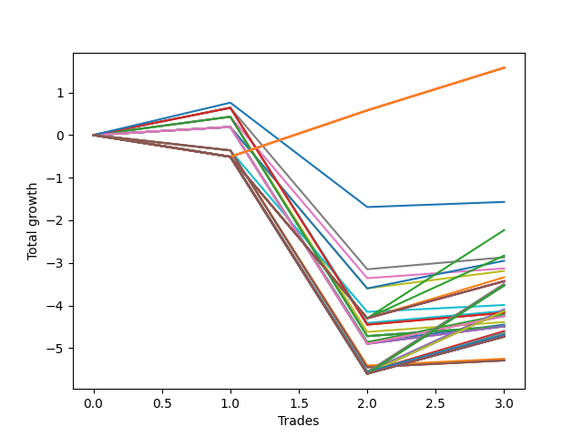

# Short Wallace 015 
- Symbol: NVDA_Unlimited
- Date Range: 02/08/2022 - 07/08/2022
- Trading Period: 7:20-12:30
- Number of Trades: 3



| Name | Win Percent | Profit | Avg Profit / Trade | Avg Time / Trade |      | Name | Win Percent | Profit | Avg Profit / Trade | Avg Time / Trade |
| ---- | ----------- | ------ | ------------------ | ---------------- | ---- | ---- | ----------- | ------ | ------------------ | ---------------- |
| Sorted By <br> Profit | | | | | | Sorted By <br> Win Percentage ||||
| One Hundred Twenty-Six | 66.67 | 790.00 | 263.33 | 48:10 |     | One Hundred Twenty-Six | 66.67 | 790.00 | 263.33 | 48:10 |
| One Hundred Twenty-One | 66.67 | 790.00 | 263.33 | 48:10 |     | One Hundred Twenty-One | 66.67 | 790.00 | 263.33 | 48:10 |
| One Hundred Sixteen | 66.67 | 790.00 | 263.33 | 48:10 |     | One Hundred Sixteen | 66.67 | 790.00 | 263.33 | 48:10 |
| One Hundred Eleven | 66.67 | 790.00 | 263.33 | 48:10 |     | One Hundred Eleven | 66.67 | 790.00 | 263.33 | 48:10 |
| Eighty-One | 66.67 | 790.00 | 263.33 | 48:10 |     | Eighty-One | 66.67 | 790.00 | 263.33 | 48:10 |
| Seventy-Three | 66.67 | -785.00 | -261.67 | 14:25 |     | Seventy-Three | 66.67 | -785.00 | -261.67 | 14:25 |
| One Hundred Seventeen | 33.33 | -1115.00 | -371.67 | 115:15 |     | Forty-Nine | 66.67 | -1435.00 | -478.33 | 19:21 |
| Fifty-Four | 33.33 | -1415.00 | -471.67 | 113:13 |     | Fifty-Two | 66.67 | -1475.00 | -491.67 | 41:51 |
| Forty-Nine | 66.67 | -1435.00 | -478.33 | 19:21 |     | Forty-Eight | 66.67 | -1565.00 | -521.67 | 16:46 |
| Fifty-Two | 66.67 | -1475.00 | -491.67 | 41:51 |     | Fifty | 66.67 | -1595.00 | -531.67 | 41:20 |
| Forty-Eight | 66.67 | -1565.00 | -521.67 | 16:46 |     | Forty-One | 66.67 | -2065.00 | -688.33 | 20:40 |
| Fifty | 66.67 | -1595.00 | -531.67 | 41:20 |     | Sixty-Five | 66.67 | -2085.00 | -695.00 | 30:38 |
| Fifty-Three | 33.33 | -1670.00 | -556.67 | 56:21 |     | Fifty-Seven | 66.67 | -2085.00 | -695.00 | 30:38 |
| One Hundred Twenty | 33.33 | -1715.00 | -571.67 | 128:48 |     | One | 66.67 | -2085.00 | -695.00 | 30:38 |
| One Hundred Ninteen | 33.33 | -1715.00 | -571.67 | 128:48 |     | Forty-Four | 66.67 | -2105.00 | -701.67 | 43:10 |
| One Hundred Eighteen | 33.33 | -1715.00 | -571.67 | 128:48 |     | Sixty-Eight | 66.67 | -2125.00 | -708.33 | 53:23 |
| Fifty-Five | 33.33 | -1715.00 | -571.67 | 128:48 |     | Sixty | 66.67 | -2125.00 | -708.33 | 53:23 |
| One Hundred Twelve | 33.33 | -1745.00 | -581.67 | 116:33 |     | Four | 66.67 | -2125.00 | -708.33 | 53:23 |
| One Hundred Twenty-Seven | 33.33 | -1765.00 | -588.33 | 126:46 |     | Forty | 66.67 | -2195.00 | -731.67 | 18:05 |
| One Hundred Twenty-Two | 33.33 | -1765.00 | -588.33 | 126:46 |     | Forty-Two | 66.67 | -2225.00 | -741.67 | 42:38 |
| Eighty-Two | 33.33 | -1765.00 | -588.33 | 126:46 |     | Sixty-Six | 66.67 | -2245.00 | -748.33 | 52:51 |
| Fifty-One | 33.33 | -1995.00 | -665.00 | 38:48 |     | Sixty-Four | 66.67 | -2245.00 | -748.33 | 25:31 |
| Forty-Six | 33.33 | -2045.00 | -681.67 | 114:31 |     | Fifty-Eight | 66.67 | -2245.00 | -748.33 | 52:51 |
| Forty-One | 66.67 | -2065.00 | -688.33 | 20:40 |     | Fifty-Six | 66.67 | -2245.00 | -748.33 | 25:31 |
| Seventy | 33.33 | -2065.00 | -688.33 | 124:45 |     | Two | 66.67 | -2245.00 | -748.33 | 52:51 |
| Sixty-Two | 33.33 | -2065.00 | -688.33 | 124:45 |     | Zero | 66.67 | -2245.00 | -748.33 | 25:31 |
| Six | 33.33 | -2065.00 | -688.33 | 124:45 |     | One Hundred Seventeen | 33.33 | -1115.00 | -371.67 | 115:15 |
| Sixty-Five | 66.67 | -2085.00 | -695.00 | 30:38 |     | Fifty-Four | 33.33 | -1415.00 | -471.67 | 113:13 |
| Fifty-Seven | 66.67 | -2085.00 | -695.00 | 30:38 |     | Fifty-Three | 33.33 | -1670.00 | -556.67 | 56:21 |
| One | 66.67 | -2085.00 | -695.00 | 30:38 |     | One Hundred Twenty | 33.33 | -1715.00 | -571.67 | 128:48 |
| Forty-Four | 66.67 | -2105.00 | -701.67 | 43:10 |     | One Hundred Ninteen | 33.33 | -1715.00 | -571.67 | 128:48 |
| Sixty-Eight | 66.67 | -2125.00 | -708.33 | 53:23 |     | One Hundred Eighteen | 33.33 | -1715.00 | -571.67 | 128:48 |
| Sixty | 66.67 | -2125.00 | -708.33 | 53:23 |     | Fifty-Five | 33.33 | -1715.00 | -571.67 | 128:48 |
| Four | 66.67 | -2125.00 | -708.33 | 53:23 |     | One Hundred Twelve | 33.33 | -1745.00 | -581.67 | 116:33 |
| Forty | 66.67 | -2195.00 | -731.67 | 18:05 |     | One Hundred Twenty-Seven | 33.33 | -1765.00 | -588.33 | 126:46 |
| Forty-Two | 66.67 | -2225.00 | -741.67 | 42:38 |     | One Hundred Twenty-Two | 33.33 | -1765.00 | -588.33 | 126:46 |
| Sixty-Six | 66.67 | -2245.00 | -748.33 | 52:51 |     | Eighty-Two | 33.33 | -1765.00 | -588.33 | 126:46 |
| Sixty-Four | 66.67 | -2245.00 | -748.33 | 25:31 |     | Fifty-One | 33.33 | -1995.00 | -665.00 | 38:48 |
| Fifty-Eight | 66.67 | -2245.00 | -748.33 | 52:51 |     | Forty-Six | 33.33 | -2045.00 | -681.67 | 114:31 |
| Fifty-Six | 66.67 | -2245.00 | -748.33 | 25:31 |     | Seventy | 33.33 | -2065.00 | -688.33 | 124:45 |
| Two | 66.67 | -2245.00 | -748.33 | 52:51 |     | Sixty-Two | 33.33 | -2065.00 | -688.33 | 124:45 |
| Zero | 66.67 | -2245.00 | -748.33 | 25:31 |     | Six | 33.33 | -2065.00 | -688.33 | 124:45 |
| Forty-Five | 33.33 | -2300.00 | -766.67 | 57:40 |     | Forty-Five | 33.33 | -2300.00 | -766.67 | 57:40 |
| Sixty-Nine | 33.33 | -2320.00 | -773.33 | 67:53 |     | Sixty-Nine | 33.33 | -2320.00 | -773.33 | 67:53 |
| Sixty-One | 33.33 | -2320.00 | -773.33 | 67:53 |     | Sixty-One | 33.33 | -2320.00 | -773.33 | 67:53 |
| Five | 33.33 | -2320.00 | -773.33 | 67:53 |     | Five | 33.33 | -2320.00 | -773.33 | 67:53 |
| One Hundred Fifteen | 33.33 | -2345.00 | -781.67 | 130:06 |     | One Hundred Fifteen | 33.33 | -2345.00 | -781.67 | 130:06 |
| One Hundred Fourteen | 33.33 | -2345.00 | -781.67 | 130:06 |     | One Hundred Fourteen | 33.33 | -2345.00 | -781.67 | 130:06 |
| One Hundred Thirteen | 33.33 | -2345.00 | -781.67 | 130:06 |     | One Hundred Thirteen | 33.33 | -2345.00 | -781.67 | 130:06 |
| Forty-Seven | 33.33 | -2345.00 | -781.67 | 130:06 |     | Forty-Seven | 33.33 | -2345.00 | -781.67 | 130:06 |
| One Hundred Thirty | 33.33 | -2365.00 | -788.33 | 140:20 |     | One Hundred Thirty | 33.33 | -2365.00 | -788.33 | 140:20 |
| One Hundred Twenty-Nine | 33.33 | -2365.00 | -788.33 | 140:20 |     | One Hundred Twenty-Nine | 33.33 | -2365.00 | -788.33 | 140:20 |
| One Hundred Twenty-Eight | 33.33 | -2365.00 | -788.33 | 140:20 |     | One Hundred Twenty-Eight | 33.33 | -2365.00 | -788.33 | 140:20 |
| One Hundred Twenty-Five | 33.33 | -2365.00 | -788.33 | 140:20 |     | One Hundred Twenty-Five | 33.33 | -2365.00 | -788.33 | 140:20 |
| One Hundred Twenty-Four | 33.33 | -2365.00 | -788.33 | 140:20 |     | One Hundred Twenty-Four | 33.33 | -2365.00 | -788.33 | 140:20 |
| One Hundred Twenty-Three | 33.33 | -2365.00 | -788.33 | 140:20 |     | One Hundred Twenty-Three | 33.33 | -2365.00 | -788.33 | 140:20 |
| Eighty-Five | 33.33 | -2365.00 | -788.33 | 140:20 |     | Eighty-Five | 33.33 | -2365.00 | -788.33 | 140:20 |
| Eighty-Four | 33.33 | -2365.00 | -788.33 | 140:20 |     | Eighty-Four | 33.33 | -2365.00 | -788.33 | 140:20 |
| Eighty-Three | 33.33 | -2365.00 | -788.33 | 140:20 |     | Eighty-Three | 33.33 | -2365.00 | -788.33 | 140:20 |
| Seventy-One | 33.33 | -2365.00 | -788.33 | 140:20 |     | Seventy-One | 33.33 | -2365.00 | -788.33 | 140:20 |
| Sixty-Three | 33.33 | -2365.00 | -788.33 | 140:20 |     | Sixty-Three | 33.33 | -2365.00 | -788.33 | 140:20 |
| Seven | 33.33 | -2365.00 | -788.33 | 140:20 |     | Seven | 33.33 | -2365.00 | -788.33 | 140:20 |
| Forty-Three | 33.33 | -2625.00 | -875.00 | 40:06 |     | Forty-Three | 33.33 | -2625.00 | -875.00 | 40:06 |
| Sixty-Seven | 33.33 | -2645.00 | -881.67 | 50:20 |     | Sixty-Seven | 33.33 | -2645.00 | -881.67 | 50:20 |
| Fifty-Nine | 33.33 | -2645.00 | -881.67 | 50:20 |     | Fifty-Nine | 33.33 | -2645.00 | -881.67 | 50:20 |
| Three | 33.33 | -2645.00 | -881.67 | 50:20 |     | Three | 33.33 | -2645.00 | -881.67 | 50:20 |

## NO STOPLOSS

### Test Zero
* Sell when price hits the middle line of the 20p bollinger
* No Stoploss
* Results:
```
Total Trades: 3
Percent Up: 33.33
Percent Down: 66.67
Total Points Moved Down: -4.49
Potential Profit: -2245.00
Total Points Ups: 5.15 Count Ups: 1
Total Points Downs: 0.66 Count Downs: 2
```

<details><summary>Trades</summary>

<code>In: 2022-03-10 11:06:00		Out: 2022-03-10 11:22:15		Total Position Time: 16:15		Total Move Down: 0.43		Total to Date: 0.43</code> <br />
<code>In: 2022-05-04 11:49:00		Out: 2022-05-04 12:38:40		Total Position Time: 49:40		Total Move Down: -5.15		Total to Date: -4.72</code> <br />
<code>In: 2022-06-30 08:25:00		Out: 2022-06-30 08:35:40		Total Position Time: 10:40		Total Move Down: 0.23		Total to Date: -4.49</code> <br />


</details>

### Test One
* Sell when the price hits the upper line of the 20p 1std bollinger
* No Stoploss
* Results:
```
Total Trades: 3
Percent Up: 33.33
Percent Down: 66.67
Total Points Moved Down: -4.17
Potential Profit: -2085.00
Total Points Ups: 5.09 Count Ups: 1
Total Points Downs: 0.92 Count Downs: 2
```

<details><summary>Trades</summary>

<code>In: 2022-03-10 11:06:00		Out: 2022-03-10 11:24:35		Total Position Time: 18:35		Total Move Down: 0.64		Total to Date: 0.64</code> <br />
<code>In: 2022-05-04 11:49:00		Out: 2022-05-04 12:46:15		Total Position Time: 57:15		Total Move Down: -5.09		Total to Date: -4.45</code> <br />
<code>In: 2022-06-30 08:25:00		Out: 2022-06-30 08:41:05		Total Position Time: 16:05		Total Move Down: 0.28		Total to Date: -4.17</code> <br />


</details>

### Test Two
* Sell when the price hits the upper line of the 20p 2std bollinger
* No Stoploss
* Results:
```
Total Trades: 3
Percent Up: 33.33
Percent Down: 66.67
Total Points Moved Down: -4.49
Potential Profit: -2245.00
Total Points Ups: 5.09 Count Ups: 1
Total Points Downs: 0.60 Count Downs: 2
```

<details><summary>Trades</summary>

<code>In: 2022-03-10 11:06:00		Out: 2022-03-10 12:07:05		Total Position Time: 61:05		Total Move Down: 0.19		Total to Date: 0.19</code> <br />
<code>In: 2022-05-04 11:49:00		Out: 2022-05-04 12:47:00		Total Position Time: 58:00		Total Move Down: -5.09		Total to Date: -4.90</code> <br />
<code>In: 2022-06-30 08:25:00		Out: 2022-06-30 09:04:30		Total Position Time: 39:30		Total Move Down: 0.41		Total to Date: -4.49</code> <br />


</details>

### Test Three
* Sell when price hits the middle line of the 50p bollinger
* No Stoploss
* Results:
```
Total Trades: 3
Percent Up: 66.67
Percent Down: 33.33
Total Points Moved Down: -5.29
Potential Profit: -2645.00
Total Points Ups: 5.45 Count Ups: 2
Total Points Downs: 0.16 Count Downs: 1
```

<details><summary>Trades</summary>

<code>In: 2022-03-10 11:06:00		Out: 2022-03-10 12:01:25		Total Position Time: 55:25		Total Move Down: -0.36		Total to Date: -0.36</code> <br />
<code>In: 2022-05-04 11:49:00		Out: 2022-05-04 12:47:00		Total Position Time: 58:00		Total Move Down: -5.09		Total to Date: -5.45</code> <br />
<code>In: 2022-06-30 08:25:00		Out: 2022-06-30 09:02:35		Total Position Time: 37:35		Total Move Down: 0.16		Total to Date: -5.29</code> <br />


</details>

### Test Four
* Sell when the price hits the upper line of the 50p 1std bollinger
* No Stoploss
* Results:
```
Total Trades: 3
Percent Up: 33.33
Percent Down: 66.67
Total Points Moved Down: -4.25
Potential Profit: -2125.00
Total Points Ups: 5.09 Count Ups: 1
Total Points Downs: 0.84 Count Downs: 2
```

<details><summary>Trades</summary>

<code>In: 2022-03-10 11:06:00		Out: 2022-03-10 12:07:05		Total Position Time: 61:05		Total Move Down: 0.19		Total to Date: 0.19</code> <br />
<code>In: 2022-05-04 11:49:00		Out: 2022-05-04 12:47:00		Total Position Time: 58:00		Total Move Down: -5.09		Total to Date: -4.90</code> <br />
<code>In: 2022-06-30 08:25:00		Out: 2022-06-30 09:06:05		Total Position Time: 41:05		Total Move Down: 0.65		Total to Date: -4.25</code> <br />


</details>

### Test Five
* Sell when the price hits the upper line of the 50p 2std bollinger
* No Stoploss
* Results:
```
Total Trades: 3
Percent Up: 66.67
Percent Down: 33.33
Total Points Moved Down: -4.64
Potential Profit: -2320.00
Total Points Ups: 5.60 Count Ups: 2
Total Points Downs: 0.96 Count Downs: 1
```

<details><summary>Trades</summary>

<code>In: 2022-03-10 11:06:00		Out: 2022-03-10 12:47:00		Total Position Time: 101:00		Total Move Down: -0.51		Total to Date: -0.51</code> <br />
<code>In: 2022-05-04 11:49:00		Out: 2022-05-04 12:47:00		Total Position Time: 58:00		Total Move Down: -5.09		Total to Date: -5.60</code> <br />
<code>In: 2022-06-30 08:25:00		Out: 2022-06-30 09:09:40		Total Position Time: 44:40		Total Move Down: 0.96		Total to Date: -4.64</code> <br />


</details>

### Test Six
* Sell when the price hits the middle line of the 1std VWAP
* No Stoploss
* Results:
```
Total Trades: 3
Percent Up: 66.67
Percent Down: 33.33
Total Points Moved Down: -4.13
Potential Profit: -2065.00
Total Points Ups: 5.60 Count Ups: 2
Total Points Downs: 1.47 Count Downs: 1
```

<details><summary>Trades</summary>

<code>In: 2022-03-10 11:06:00		Out: 2022-03-10 12:47:00		Total Position Time: 101:00		Total Move Down: -0.51		Total to Date: -0.51</code> <br />
<code>In: 2022-05-04 11:49:00		Out: 2022-05-04 12:47:00		Total Position Time: 58:00		Total Move Down: -5.09		Total to Date: -5.60</code> <br />
<code>In: 2022-06-30 08:25:00		Out: 2022-06-30 12:00:15		Total Position Time: 215:15		Total Move Down: 1.47		Total to Date: -4.13</code> <br />


</details>

### Test Seven
* Sell when the price hits the upper line of the 1std VWAP
* No Stoploss
* Results:
```
Total Trades: 3
Percent Up: 66.67
Percent Down: 33.33
Total Points Moved Down: -4.73
Potential Profit: -2365.00
Total Points Ups: 5.60 Count Ups: 2
Total Points Downs: 0.87 Count Downs: 1
```

<details><summary>Trades</summary>

<code>In: 2022-03-10 11:06:00		Out: 2022-03-10 12:47:00		Total Position Time: 101:00		Total Move Down: -0.51		Total to Date: -0.51</code> <br />
<code>In: 2022-05-04 11:49:00		Out: 2022-05-04 12:47:00		Total Position Time: 58:00		Total Move Down: -5.09		Total to Date: -5.60</code> <br />
<code>In: 2022-06-30 08:25:00		Out: 2022-06-30 12:47:00		Total Position Time: 262:00		Total Move Down: 0.87		Total to Date: -4.73</code> <br />


</details>

## STOPLOSS OF 5

### Test Forty
* Sell when price hits the middle line of the 20p bollinger
* Stoploss is -5 points
* Results:
```
Total Trades: 3
Percent Up: 33.33
Percent Down: 66.67
Total Points Moved Down: -4.39
Potential Profit: -2195.00
Total Points Ups: 5.05 Count Ups: 1
Total Points Downs: 0.66 Count Downs: 2
```

<details><summary>Trades</summary>

<code>In: 2022-03-10 11:06:00		Out: 2022-03-10 11:22:15		Total Position Time: 16:15		Total Move Down: 0.43		Total to Date: 0.43</code> <br />
<code>In: 2022-05-04 11:49:00		Out: 2022-05-04 12:16:20		Total Position Time: 27:20		Total Move Down: -5.05		Total to Date: -4.62</code> <br />
<code>In: 2022-06-30 08:25:00		Out: 2022-06-30 08:35:40		Total Position Time: 10:40		Total Move Down: 0.23		Total to Date: -4.39</code> <br />


</details>

### Test Forty-One
* Sell when the price hits the upper line of the 20p 1std bollinger
* Stoploss is -5 points
* Results:
```
Total Trades: 3
Percent Up: 33.33
Percent Down: 66.67
Total Points Moved Down: -4.13
Potential Profit: -2065.00
Total Points Ups: 5.05 Count Ups: 1
Total Points Downs: 0.92 Count Downs: 2
```

<details><summary>Trades</summary>

<code>In: 2022-03-10 11:06:00		Out: 2022-03-10 11:24:35		Total Position Time: 18:35		Total Move Down: 0.64		Total to Date: 0.64</code> <br />
<code>In: 2022-05-04 11:49:00		Out: 2022-05-04 12:16:20		Total Position Time: 27:20		Total Move Down: -5.05		Total to Date: -4.41</code> <br />
<code>In: 2022-06-30 08:25:00		Out: 2022-06-30 08:41:05		Total Position Time: 16:05		Total Move Down: 0.28		Total to Date: -4.13</code> <br />


</details>

### Test Forty-Two
* Sell when the price hits the upper line of the 20p 2std bollinger
* Stoploss is -5 points
* Results:
```
Total Trades: 3
Percent Up: 33.33
Percent Down: 66.67
Total Points Moved Down: -4.45
Potential Profit: -2225.00
Total Points Ups: 5.05 Count Ups: 1
Total Points Downs: 0.60 Count Downs: 2
```

<details><summary>Trades</summary>

<code>In: 2022-03-10 11:06:00		Out: 2022-03-10 12:07:05		Total Position Time: 61:05		Total Move Down: 0.19		Total to Date: 0.19</code> <br />
<code>In: 2022-05-04 11:49:00		Out: 2022-05-04 12:16:20		Total Position Time: 27:20		Total Move Down: -5.05		Total to Date: -4.86</code> <br />
<code>In: 2022-06-30 08:25:00		Out: 2022-06-30 09:04:30		Total Position Time: 39:30		Total Move Down: 0.41		Total to Date: -4.45</code> <br />


</details>

### Test Forty-Three
* Sell when price hits the middle line of the 50p bollinger
* Stoploss is -5 points
* Results:
```
Total Trades: 3
Percent Up: 66.67
Percent Down: 33.33
Total Points Moved Down: -5.25
Potential Profit: -2625.00
Total Points Ups: 5.41 Count Ups: 2
Total Points Downs: 0.16 Count Downs: 1
```

<details><summary>Trades</summary>

<code>In: 2022-03-10 11:06:00		Out: 2022-03-10 12:01:25		Total Position Time: 55:25		Total Move Down: -0.36		Total to Date: -0.36</code> <br />
<code>In: 2022-05-04 11:49:00		Out: 2022-05-04 12:16:20		Total Position Time: 27:20		Total Move Down: -5.05		Total to Date: -5.41</code> <br />
<code>In: 2022-06-30 08:25:00		Out: 2022-06-30 09:02:35		Total Position Time: 37:35		Total Move Down: 0.16		Total to Date: -5.25</code> <br />


</details>

### Test Forty-Four
* Sell when the price hits the upper line of the 50p 1std bollinger
* Stoploss is -5 points
* Results:
```
Total Trades: 3
Percent Up: 33.33
Percent Down: 66.67
Total Points Moved Down: -4.21
Potential Profit: -2105.00
Total Points Ups: 5.05 Count Ups: 1
Total Points Downs: 0.84 Count Downs: 2
```

<details><summary>Trades</summary>

<code>In: 2022-03-10 11:06:00		Out: 2022-03-10 12:07:05		Total Position Time: 61:05		Total Move Down: 0.19		Total to Date: 0.19</code> <br />
<code>In: 2022-05-04 11:49:00		Out: 2022-05-04 12:16:20		Total Position Time: 27:20		Total Move Down: -5.05		Total to Date: -4.86</code> <br />
<code>In: 2022-06-30 08:25:00		Out: 2022-06-30 09:06:05		Total Position Time: 41:05		Total Move Down: 0.65		Total to Date: -4.21</code> <br />


</details>

### Test Forty-Five
* Sell when the price hits the upper line of the 50p 2std bollinger
* Stoploss is -5 points
* Results:
```
Total Trades: 3
Percent Up: 66.67
Percent Down: 33.33
Total Points Moved Down: -4.60
Potential Profit: -2300.00
Total Points Ups: 5.56 Count Ups: 2
Total Points Downs: 0.96 Count Downs: 1
```

<details><summary>Trades</summary>

<code>In: 2022-03-10 11:06:00		Out: 2022-03-10 12:47:00		Total Position Time: 101:00		Total Move Down: -0.51		Total to Date: -0.51</code> <br />
<code>In: 2022-05-04 11:49:00		Out: 2022-05-04 12:16:20		Total Position Time: 27:20		Total Move Down: -5.05		Total to Date: -5.56</code> <br />
<code>In: 2022-06-30 08:25:00		Out: 2022-06-30 09:09:40		Total Position Time: 44:40		Total Move Down: 0.96		Total to Date: -4.60</code> <br />


</details>

### Test Forty-Six
* Sell when the price hits the middle line of the 1std VWAP
* Stoploss is -5 points
* Results:
```
Total Trades: 3
Percent Up: 66.67
Percent Down: 33.33
Total Points Moved Down: -4.09
Potential Profit: -2045.00
Total Points Ups: 5.56 Count Ups: 2
Total Points Downs: 1.47 Count Downs: 1
```

<details><summary>Trades</summary>

<code>In: 2022-03-10 11:06:00		Out: 2022-03-10 12:47:00		Total Position Time: 101:00		Total Move Down: -0.51		Total to Date: -0.51</code> <br />
<code>In: 2022-05-04 11:49:00		Out: 2022-05-04 12:16:20		Total Position Time: 27:20		Total Move Down: -5.05		Total to Date: -5.56</code> <br />
<code>In: 2022-06-30 08:25:00		Out: 2022-06-30 12:00:15		Total Position Time: 215:15		Total Move Down: 1.47		Total to Date: -4.09</code> <br />


</details>

### Test Forty-Seven
* Sell when the price hits the upper line of the 1std VWAP
* Stoploss is -5 points
* Results:
```
Total Trades: 3
Percent Up: 66.67
Percent Down: 33.33
Total Points Moved Down: -4.69
Potential Profit: -2345.00
Total Points Ups: 5.56 Count Ups: 2
Total Points Downs: 0.87 Count Downs: 1
```

<details><summary>Trades</summary>

<code>In: 2022-03-10 11:06:00		Out: 2022-03-10 12:47:00		Total Position Time: 101:00		Total Move Down: -0.51		Total to Date: -0.51</code> <br />
<code>In: 2022-05-04 11:49:00		Out: 2022-05-04 12:16:20		Total Position Time: 27:20		Total Move Down: -5.05		Total to Date: -5.56</code> <br />
<code>In: 2022-06-30 08:25:00		Out: 2022-06-30 12:47:00		Total Position Time: 262:00		Total Move Down: 0.87		Total to Date: -4.69</code> <br />


</details>

## TRAIL STOP OF 5

### Test Forty-Eight
* Sell when price hits the middle line of the 20p bollinger
* Trailing Stop is -5 points
* Results:
```
Total Trades: 3
Percent Up: 33.33
Percent Down: 66.67
Total Points Moved Down: -3.13
Potential Profit: -1565.00
Total Points Ups: 3.79 Count Ups: 1
Total Points Downs: 0.66 Count Downs: 2
```

<details><summary>Trades</summary>

<code>In: 2022-03-10 11:06:00		Out: 2022-03-10 11:22:15		Total Position Time: 16:15		Total Move Down: 0.43		Total to Date: 0.43</code> <br />
<code>In: 2022-05-04 11:49:00		Out: 2022-05-04 12:12:25		Total Position Time: 23:25		Total Move Down: -3.79		Total to Date: -3.36</code> <br />
<code>In: 2022-06-30 08:25:00		Out: 2022-06-30 08:35:40		Total Position Time: 10:40		Total Move Down: 0.23		Total to Date: -3.13</code> <br />


</details>

### Test Forty-Nine
* Sell when the price hits the upper line of the 20p 1std bollinger
* Trailing Stop is -5 points
* Results:
```
Total Trades: 3
Percent Up: 33.33
Percent Down: 66.67
Total Points Moved Down: -2.87
Potential Profit: -1435.00
Total Points Ups: 3.79 Count Ups: 1
Total Points Downs: 0.92 Count Downs: 2
```

<details><summary>Trades</summary>

<code>In: 2022-03-10 11:06:00		Out: 2022-03-10 11:24:35		Total Position Time: 18:35		Total Move Down: 0.64		Total to Date: 0.64</code> <br />
<code>In: 2022-05-04 11:49:00		Out: 2022-05-04 12:12:25		Total Position Time: 23:25		Total Move Down: -3.79		Total to Date: -3.15</code> <br />
<code>In: 2022-06-30 08:25:00		Out: 2022-06-30 08:41:05		Total Position Time: 16:05		Total Move Down: 0.28		Total to Date: -2.87</code> <br />


</details>

### Test Fifty
* Sell when the price hits the upper line of the 20p 2std bollinger
* Trailing Stop is -5 points
* Results:
```
Total Trades: 3
Percent Up: 33.33
Percent Down: 66.67
Total Points Moved Down: -3.19
Potential Profit: -1595.00
Total Points Ups: 3.79 Count Ups: 1
Total Points Downs: 0.60 Count Downs: 2
```

<details><summary>Trades</summary>

<code>In: 2022-03-10 11:06:00		Out: 2022-03-10 12:07:05		Total Position Time: 61:05		Total Move Down: 0.19		Total to Date: 0.19</code> <br />
<code>In: 2022-05-04 11:49:00		Out: 2022-05-04 12:12:25		Total Position Time: 23:25		Total Move Down: -3.79		Total to Date: -3.60</code> <br />
<code>In: 2022-06-30 08:25:00		Out: 2022-06-30 09:04:30		Total Position Time: 39:30		Total Move Down: 0.41		Total to Date: -3.19</code> <br />


</details>

### Test Fifty-One
* Sell when price hits the middle line of the 50p bollinger
* Trailing Stop is -5 points
* Results:
```
Total Trades: 3
Percent Up: 66.67
Percent Down: 33.33
Total Points Moved Down: -3.99
Potential Profit: -1995.00
Total Points Ups: 4.15 Count Ups: 2
Total Points Downs: 0.16 Count Downs: 1
```

<details><summary>Trades</summary>

<code>In: 2022-03-10 11:06:00		Out: 2022-03-10 12:01:25		Total Position Time: 55:25		Total Move Down: -0.36		Total to Date: -0.36</code> <br />
<code>In: 2022-05-04 11:49:00		Out: 2022-05-04 12:12:25		Total Position Time: 23:25		Total Move Down: -3.79		Total to Date: -4.15</code> <br />
<code>In: 2022-06-30 08:25:00		Out: 2022-06-30 09:02:35		Total Position Time: 37:35		Total Move Down: 0.16		Total to Date: -3.99</code> <br />


</details>

### Test Fifty-Two
* Sell when the price hits the upper line of the 50p 1std bollinger
* Trailing Stop is -5 points
* Results:
```
Total Trades: 3
Percent Up: 33.33
Percent Down: 66.67
Total Points Moved Down: -2.95
Potential Profit: -1475.00
Total Points Ups: 3.79 Count Ups: 1
Total Points Downs: 0.84 Count Downs: 2
```

<details><summary>Trades</summary>

<code>In: 2022-03-10 11:06:00		Out: 2022-03-10 12:07:05		Total Position Time: 61:05		Total Move Down: 0.19		Total to Date: 0.19</code> <br />
<code>In: 2022-05-04 11:49:00		Out: 2022-05-04 12:12:25		Total Position Time: 23:25		Total Move Down: -3.79		Total to Date: -3.60</code> <br />
<code>In: 2022-06-30 08:25:00		Out: 2022-06-30 09:06:05		Total Position Time: 41:05		Total Move Down: 0.65		Total to Date: -2.95</code> <br />


</details>

### Test Fifty-Three
* Sell when the price hits the upper line of the 50p 2std bollinger
* Trailing Stop is -5 points
* Results:
```
Total Trades: 3
Percent Up: 66.67
Percent Down: 33.33
Total Points Moved Down: -3.34
Potential Profit: -1670.00
Total Points Ups: 4.30 Count Ups: 2
Total Points Downs: 0.96 Count Downs: 1
```

<details><summary>Trades</summary>

<code>In: 2022-03-10 11:06:00		Out: 2022-03-10 12:47:00		Total Position Time: 101:00		Total Move Down: -0.51		Total to Date: -0.51</code> <br />
<code>In: 2022-05-04 11:49:00		Out: 2022-05-04 12:12:25		Total Position Time: 23:25		Total Move Down: -3.79		Total to Date: -4.30</code> <br />
<code>In: 2022-06-30 08:25:00		Out: 2022-06-30 09:09:40		Total Position Time: 44:40		Total Move Down: 0.96		Total to Date: -3.34</code> <br />


</details>

### Test Fifty-Four
* Sell when the price hits the middle line of the 1std VWAP
* Trailing Stop is -5 points
* Results:
```
Total Trades: 3
Percent Up: 66.67
Percent Down: 33.33
Total Points Moved Down: -2.83
Potential Profit: -1415.00
Total Points Ups: 4.30 Count Ups: 2
Total Points Downs: 1.47 Count Downs: 1
```

<details><summary>Trades</summary>

<code>In: 2022-03-10 11:06:00		Out: 2022-03-10 12:47:00		Total Position Time: 101:00		Total Move Down: -0.51		Total to Date: -0.51</code> <br />
<code>In: 2022-05-04 11:49:00		Out: 2022-05-04 12:12:25		Total Position Time: 23:25		Total Move Down: -3.79		Total to Date: -4.30</code> <br />
<code>In: 2022-06-30 08:25:00		Out: 2022-06-30 12:00:15		Total Position Time: 215:15		Total Move Down: 1.47		Total to Date: -2.83</code> <br />


</details>

### Test Fifty-Five
* Sell when the price hits the upper line of the 1std VWAP
* Trailing Stop is -5 points
* Results:
```
Total Trades: 3
Percent Up: 66.67
Percent Down: 33.33
Total Points Moved Down: -3.43
Potential Profit: -1715.00
Total Points Ups: 4.30 Count Ups: 2
Total Points Downs: 0.87 Count Downs: 1
```

<details><summary>Trades</summary>

<code>In: 2022-03-10 11:06:00		Out: 2022-03-10 12:47:00		Total Position Time: 101:00		Total Move Down: -0.51		Total to Date: -0.51</code> <br />
<code>In: 2022-05-04 11:49:00		Out: 2022-05-04 12:12:25		Total Position Time: 23:25		Total Move Down: -3.79		Total to Date: -4.30</code> <br />
<code>In: 2022-06-30 08:25:00		Out: 2022-06-30 12:47:00		Total Position Time: 262:00		Total Move Down: 0.87		Total to Date: -3.43</code> <br />


</details>

## STOPLOSS OF 10

### Test Fifty-Six
* Sell when price hits the middle line of the 20p bollinger
* Stoploss is -10 points
* Results:
```
Total Trades: 3
Percent Up: 33.33
Percent Down: 66.67
Total Points Moved Down: -4.49
Potential Profit: -2245.00
Total Points Ups: 5.15 Count Ups: 1
Total Points Downs: 0.66 Count Downs: 2
```

<details><summary>Trades</summary>

<code>In: 2022-03-10 11:06:00		Out: 2022-03-10 11:22:15		Total Position Time: 16:15		Total Move Down: 0.43		Total to Date: 0.43</code> <br />
<code>In: 2022-05-04 11:49:00		Out: 2022-05-04 12:38:40		Total Position Time: 49:40		Total Move Down: -5.15		Total to Date: -4.72</code> <br />
<code>In: 2022-06-30 08:25:00		Out: 2022-06-30 08:35:40		Total Position Time: 10:40		Total Move Down: 0.23		Total to Date: -4.49</code> <br />


</details>

### Test Fifty-Seven
* Sell when the price hits the upper line of the 20p 1std bollinger
* Stoploss is -10 points
* Results:
```
Total Trades: 3
Percent Up: 33.33
Percent Down: 66.67
Total Points Moved Down: -4.17
Potential Profit: -2085.00
Total Points Ups: 5.09 Count Ups: 1
Total Points Downs: 0.92 Count Downs: 2
```

<details><summary>Trades</summary>

<code>In: 2022-03-10 11:06:00		Out: 2022-03-10 11:24:35		Total Position Time: 18:35		Total Move Down: 0.64		Total to Date: 0.64</code> <br />
<code>In: 2022-05-04 11:49:00		Out: 2022-05-04 12:46:15		Total Position Time: 57:15		Total Move Down: -5.09		Total to Date: -4.45</code> <br />
<code>In: 2022-06-30 08:25:00		Out: 2022-06-30 08:41:05		Total Position Time: 16:05		Total Move Down: 0.28		Total to Date: -4.17</code> <br />


</details>

### Test Fifty-Eight
* Sell when the price hits the upper line of the 20p 2std bollinger
* Stoploss is -10 points
* Results:
```
Total Trades: 3
Percent Up: 33.33
Percent Down: 66.67
Total Points Moved Down: -4.49
Potential Profit: -2245.00
Total Points Ups: 5.09 Count Ups: 1
Total Points Downs: 0.60 Count Downs: 2
```

<details><summary>Trades</summary>

<code>In: 2022-03-10 11:06:00		Out: 2022-03-10 12:07:05		Total Position Time: 61:05		Total Move Down: 0.19		Total to Date: 0.19</code> <br />
<code>In: 2022-05-04 11:49:00		Out: 2022-05-04 12:47:00		Total Position Time: 58:00		Total Move Down: -5.09		Total to Date: -4.90</code> <br />
<code>In: 2022-06-30 08:25:00		Out: 2022-06-30 09:04:30		Total Position Time: 39:30		Total Move Down: 0.41		Total to Date: -4.49</code> <br />


</details>

### Test Fifty-Nine
* Sell when price hits the middle line of the 50p bollinger
* Stoploss is -10 points
* Results:
```
Total Trades: 3
Percent Up: 66.67
Percent Down: 33.33
Total Points Moved Down: -5.29
Potential Profit: -2645.00
Total Points Ups: 5.45 Count Ups: 2
Total Points Downs: 0.16 Count Downs: 1
```

<details><summary>Trades</summary>

<code>In: 2022-03-10 11:06:00		Out: 2022-03-10 12:01:25		Total Position Time: 55:25		Total Move Down: -0.36		Total to Date: -0.36</code> <br />
<code>In: 2022-05-04 11:49:00		Out: 2022-05-04 12:47:00		Total Position Time: 58:00		Total Move Down: -5.09		Total to Date: -5.45</code> <br />
<code>In: 2022-06-30 08:25:00		Out: 2022-06-30 09:02:35		Total Position Time: 37:35		Total Move Down: 0.16		Total to Date: -5.29</code> <br />


</details>

### Test Sixty
* Sell when the price hits the upper line of the 50p 1std bollinger
* Stoploss is -10 points
* Results:
```
Total Trades: 3
Percent Up: 33.33
Percent Down: 66.67
Total Points Moved Down: -4.25
Potential Profit: -2125.00
Total Points Ups: 5.09 Count Ups: 1
Total Points Downs: 0.84 Count Downs: 2
```

<details><summary>Trades</summary>

<code>In: 2022-03-10 11:06:00		Out: 2022-03-10 12:07:05		Total Position Time: 61:05		Total Move Down: 0.19		Total to Date: 0.19</code> <br />
<code>In: 2022-05-04 11:49:00		Out: 2022-05-04 12:47:00		Total Position Time: 58:00		Total Move Down: -5.09		Total to Date: -4.90</code> <br />
<code>In: 2022-06-30 08:25:00		Out: 2022-06-30 09:06:05		Total Position Time: 41:05		Total Move Down: 0.65		Total to Date: -4.25</code> <br />


</details>

### Test Sixty-One
* Sell when the price hits the upper line of the 50p 2std bollinger
* Stoploss is -10 points
* Results:
```
Total Trades: 3
Percent Up: 66.67
Percent Down: 33.33
Total Points Moved Down: -4.64
Potential Profit: -2320.00
Total Points Ups: 5.60 Count Ups: 2
Total Points Downs: 0.96 Count Downs: 1
```

<details><summary>Trades</summary>

<code>In: 2022-03-10 11:06:00		Out: 2022-03-10 12:47:00		Total Position Time: 101:00		Total Move Down: -0.51		Total to Date: -0.51</code> <br />
<code>In: 2022-05-04 11:49:00		Out: 2022-05-04 12:47:00		Total Position Time: 58:00		Total Move Down: -5.09		Total to Date: -5.60</code> <br />
<code>In: 2022-06-30 08:25:00		Out: 2022-06-30 09:09:40		Total Position Time: 44:40		Total Move Down: 0.96		Total to Date: -4.64</code> <br />


</details>

### Test Sixty-Two
* Sell when the price hits the middle line of the 1std VWAP
* Stoploss is -10 points
* Results:
```
Total Trades: 3
Percent Up: 66.67
Percent Down: 33.33
Total Points Moved Down: -4.13
Potential Profit: -2065.00
Total Points Ups: 5.60 Count Ups: 2
Total Points Downs: 1.47 Count Downs: 1
```

<details><summary>Trades</summary>

<code>In: 2022-03-10 11:06:00		Out: 2022-03-10 12:47:00		Total Position Time: 101:00		Total Move Down: -0.51		Total to Date: -0.51</code> <br />
<code>In: 2022-05-04 11:49:00		Out: 2022-05-04 12:47:00		Total Position Time: 58:00		Total Move Down: -5.09		Total to Date: -5.60</code> <br />
<code>In: 2022-06-30 08:25:00		Out: 2022-06-30 12:00:15		Total Position Time: 215:15		Total Move Down: 1.47		Total to Date: -4.13</code> <br />


</details>

### Test Sixty-Three
* Sell when the price hits the upper line of the 1std VWAP
* Stoploss is -10 points
* Results:
```
Total Trades: 3
Percent Up: 66.67
Percent Down: 33.33
Total Points Moved Down: -4.73
Potential Profit: -2365.00
Total Points Ups: 5.60 Count Ups: 2
Total Points Downs: 0.87 Count Downs: 1
```

<details><summary>Trades</summary>

<code>In: 2022-03-10 11:06:00		Out: 2022-03-10 12:47:00		Total Position Time: 101:00		Total Move Down: -0.51		Total to Date: -0.51</code> <br />
<code>In: 2022-05-04 11:49:00		Out: 2022-05-04 12:47:00		Total Position Time: 58:00		Total Move Down: -5.09		Total to Date: -5.60</code> <br />
<code>In: 2022-06-30 08:25:00		Out: 2022-06-30 12:47:00		Total Position Time: 262:00		Total Move Down: 0.87		Total to Date: -4.73</code> <br />


</details>

## TRAIL STOP OF 10

### Test Sixty-Four
* Sell when price hits the middle line of the 20p bollinger
* Trailing Stop is -10 points
* Results:
```
Total Trades: 3
Percent Up: 33.33
Percent Down: 66.67
Total Points Moved Down: -4.49
Potential Profit: -2245.00
Total Points Ups: 5.15 Count Ups: 1
Total Points Downs: 0.66 Count Downs: 2
```

<details><summary>Trades</summary>

<code>In: 2022-03-10 11:06:00		Out: 2022-03-10 11:22:15		Total Position Time: 16:15		Total Move Down: 0.43		Total to Date: 0.43</code> <br />
<code>In: 2022-05-04 11:49:00		Out: 2022-05-04 12:38:40		Total Position Time: 49:40		Total Move Down: -5.15		Total to Date: -4.72</code> <br />
<code>In: 2022-06-30 08:25:00		Out: 2022-06-30 08:35:40		Total Position Time: 10:40		Total Move Down: 0.23		Total to Date: -4.49</code> <br />


</details>

### Test Sixty-Five
* Sell when the price hits the upper line of the 20p 1std bollinger
* Trailing Stop is -10 points
* Results:
```
Total Trades: 3
Percent Up: 33.33
Percent Down: 66.67
Total Points Moved Down: -4.17
Potential Profit: -2085.00
Total Points Ups: 5.09 Count Ups: 1
Total Points Downs: 0.92 Count Downs: 2
```

<details><summary>Trades</summary>

<code>In: 2022-03-10 11:06:00		Out: 2022-03-10 11:24:35		Total Position Time: 18:35		Total Move Down: 0.64		Total to Date: 0.64</code> <br />
<code>In: 2022-05-04 11:49:00		Out: 2022-05-04 12:46:15		Total Position Time: 57:15		Total Move Down: -5.09		Total to Date: -4.45</code> <br />
<code>In: 2022-06-30 08:25:00		Out: 2022-06-30 08:41:05		Total Position Time: 16:05		Total Move Down: 0.28		Total to Date: -4.17</code> <br />


</details>

### Test Sixty-Six
* Sell when the price hits the upper line of the 20p 2std bollinger
* Trailing Stop is -10 points
* Results:
```
Total Trades: 3
Percent Up: 33.33
Percent Down: 66.67
Total Points Moved Down: -4.49
Potential Profit: -2245.00
Total Points Ups: 5.09 Count Ups: 1
Total Points Downs: 0.60 Count Downs: 2
```

<details><summary>Trades</summary>

<code>In: 2022-03-10 11:06:00		Out: 2022-03-10 12:07:05		Total Position Time: 61:05		Total Move Down: 0.19		Total to Date: 0.19</code> <br />
<code>In: 2022-05-04 11:49:00		Out: 2022-05-04 12:47:00		Total Position Time: 58:00		Total Move Down: -5.09		Total to Date: -4.90</code> <br />
<code>In: 2022-06-30 08:25:00		Out: 2022-06-30 09:04:30		Total Position Time: 39:30		Total Move Down: 0.41		Total to Date: -4.49</code> <br />


</details>

### Test Sixty-Seven
* Sell when price hits the middle line of the 50p bollinger
* Trailing Stop is -10 points
* Results:
```
Total Trades: 3
Percent Up: 66.67
Percent Down: 33.33
Total Points Moved Down: -5.29
Potential Profit: -2645.00
Total Points Ups: 5.45 Count Ups: 2
Total Points Downs: 0.16 Count Downs: 1
```

<details><summary>Trades</summary>

<code>In: 2022-03-10 11:06:00		Out: 2022-03-10 12:01:25		Total Position Time: 55:25		Total Move Down: -0.36		Total to Date: -0.36</code> <br />
<code>In: 2022-05-04 11:49:00		Out: 2022-05-04 12:47:00		Total Position Time: 58:00		Total Move Down: -5.09		Total to Date: -5.45</code> <br />
<code>In: 2022-06-30 08:25:00		Out: 2022-06-30 09:02:35		Total Position Time: 37:35		Total Move Down: 0.16		Total to Date: -5.29</code> <br />


</details>

### Test Sixty-Eight
* Sell when the price hits the upper line of the 50p 1std bollinger
* Trailing Stop is -10 points
* Results:
```
Total Trades: 3
Percent Up: 33.33
Percent Down: 66.67
Total Points Moved Down: -4.25
Potential Profit: -2125.00
Total Points Ups: 5.09 Count Ups: 1
Total Points Downs: 0.84 Count Downs: 2
```

<details><summary>Trades</summary>

<code>In: 2022-03-10 11:06:00		Out: 2022-03-10 12:07:05		Total Position Time: 61:05		Total Move Down: 0.19		Total to Date: 0.19</code> <br />
<code>In: 2022-05-04 11:49:00		Out: 2022-05-04 12:47:00		Total Position Time: 58:00		Total Move Down: -5.09		Total to Date: -4.90</code> <br />
<code>In: 2022-06-30 08:25:00		Out: 2022-06-30 09:06:05		Total Position Time: 41:05		Total Move Down: 0.65		Total to Date: -4.25</code> <br />


</details>

### Test Sixty-Nine
* Sell when the price hits the upper line of the 50p 2std bollinger
* Trailing Stop is -10 points
* Results:
```
Total Trades: 3
Percent Up: 66.67
Percent Down: 33.33
Total Points Moved Down: -4.64
Potential Profit: -2320.00
Total Points Ups: 5.60 Count Ups: 2
Total Points Downs: 0.96 Count Downs: 1
```

<details><summary>Trades</summary>

<code>In: 2022-03-10 11:06:00		Out: 2022-03-10 12:47:00		Total Position Time: 101:00		Total Move Down: -0.51		Total to Date: -0.51</code> <br />
<code>In: 2022-05-04 11:49:00		Out: 2022-05-04 12:47:00		Total Position Time: 58:00		Total Move Down: -5.09		Total to Date: -5.60</code> <br />
<code>In: 2022-06-30 08:25:00		Out: 2022-06-30 09:09:40		Total Position Time: 44:40		Total Move Down: 0.96		Total to Date: -4.64</code> <br />


</details>

### Test Seventy
* Sell when the price hits the middle line of the 1std VWAP
* Trailing Stop is -10 points
* Results:
```
Total Trades: 3
Percent Up: 66.67
Percent Down: 33.33
Total Points Moved Down: -4.13
Potential Profit: -2065.00
Total Points Ups: 5.60 Count Ups: 2
Total Points Downs: 1.47 Count Downs: 1
```

<details><summary>Trades</summary>

<code>In: 2022-03-10 11:06:00		Out: 2022-03-10 12:47:00		Total Position Time: 101:00		Total Move Down: -0.51		Total to Date: -0.51</code> <br />
<code>In: 2022-05-04 11:49:00		Out: 2022-05-04 12:47:00		Total Position Time: 58:00		Total Move Down: -5.09		Total to Date: -5.60</code> <br />
<code>In: 2022-06-30 08:25:00		Out: 2022-06-30 12:00:15		Total Position Time: 215:15		Total Move Down: 1.47		Total to Date: -4.13</code> <br />


</details>

### Test Seventy-One
* Sell when the price hits the upper line of the 1std VWAP
* Trailing Stop is -10 points
* Results:
```
Total Trades: 3
Percent Up: 66.67
Percent Down: 33.33
Total Points Moved Down: -4.73
Potential Profit: -2365.00
Total Points Ups: 5.60 Count Ups: 2
Total Points Downs: 0.87 Count Downs: 1
```

<details><summary>Trades</summary>

<code>In: 2022-03-10 11:06:00		Out: 2022-03-10 12:47:00		Total Position Time: 101:00		Total Move Down: -0.51		Total to Date: -0.51</code> <br />
<code>In: 2022-05-04 11:49:00		Out: 2022-05-04 12:47:00		Total Position Time: 58:00		Total Move Down: -5.09		Total to Date: -5.60</code> <br />
<code>In: 2022-06-30 08:25:00		Out: 2022-06-30 12:47:00		Total Position Time: 262:00		Total Move Down: 0.87		Total to Date: -4.73</code> <br />


</details>

## SPECIAL EXIT CONDITIONS 

### Test Seventy-Three
* Sell when the linear regression slope changes to negative
* No Stoploss
* Results:
```
Total Trades: 3
Percent Up: 33.33
Percent Down: 66.67
Total Points Moved Down: -1.57
Potential Profit: -785.00
Total Points Ups: 2.45 Count Ups: 1
Total Points Downs: 0.88 Count Downs: 2
```

<details><summary>Trades</summary>

<code>In: 2022-03-10 11:06:00		Out: 2022-03-10 11:15:05		Total Position Time: 09:05		Total Move Down: 0.76		Total to Date: 0.76</code> <br />
<code>In: 2022-05-04 11:49:00		Out: 2022-05-04 12:03:05		Total Position Time: 14:05		Total Move Down: -2.45		Total to Date: -1.69</code> <br />
<code>In: 2022-06-30 08:25:00		Out: 2022-06-30 08:45:05		Total Position Time: 20:05		Total Move Down: 0.12		Total to Date: -1.57</code> <br />


</details>

## TAKE PROFIT

### Test Eighty-One
* Take Profit of 1 Point
* No Stoploss
* Results:
```
Total Trades: 3
Percent Up: 33.33
Percent Down: 66.67
Total Points Moved Down: 1.58
Potential Profit: 790.00
Total Points Ups: 0.51 Count Ups: 1
Total Points Downs: 2.09 Count Downs: 2
```

<details><summary>Trades</summary>

<code>In: 2022-03-10 11:06:00		Out: 2022-03-10 12:47:00		Total Position Time: 101:00		Total Move Down: -0.51		Total to Date: -0.51</code> <br />
<code>In: 2022-05-04 11:49:00		Out: 2022-05-04 11:50:55		Total Position Time: 01:55		Total Move Down: 1.09		Total to Date: 0.58</code> <br />
<code>In: 2022-06-30 08:25:00		Out: 2022-06-30 09:06:35		Total Position Time: 41:35		Total Move Down: 1.00		Total to Date: 1.58</code> <br />


</details>

### Test Eighty-Two
* Take Profit of 2 Point
* No Stoploss
* Results:
```
Total Trades: 3
Percent Up: 66.67
Percent Down: 33.33
Total Points Moved Down: -3.53
Potential Profit: -1765.00
Total Points Ups: 5.60 Count Ups: 2
Total Points Downs: 2.07 Count Downs: 1
```

<details><summary>Trades</summary>

<code>In: 2022-03-10 11:06:00		Out: 2022-03-10 12:47:00		Total Position Time: 101:00		Total Move Down: -0.51		Total to Date: -0.51</code> <br />
<code>In: 2022-05-04 11:49:00		Out: 2022-05-04 12:47:00		Total Position Time: 58:00		Total Move Down: -5.09		Total to Date: -5.60</code> <br />
<code>In: 2022-06-30 08:25:00		Out: 2022-06-30 12:06:20		Total Position Time: 221:20		Total Move Down: 2.07		Total to Date: -3.53</code> <br />


</details>

### Test Eighty-Three
* Take Profit of 3 Point
* No Stoploss
* Results:
```
Total Trades: 3
Percent Up: 66.67
Percent Down: 33.33
Total Points Moved Down: -4.73
Potential Profit: -2365.00
Total Points Ups: 5.60 Count Ups: 2
Total Points Downs: 0.87 Count Downs: 1
```

<details><summary>Trades</summary>

<code>In: 2022-03-10 11:06:00		Out: 2022-03-10 12:47:00		Total Position Time: 101:00		Total Move Down: -0.51		Total to Date: -0.51</code> <br />
<code>In: 2022-05-04 11:49:00		Out: 2022-05-04 12:47:00		Total Position Time: 58:00		Total Move Down: -5.09		Total to Date: -5.60</code> <br />
<code>In: 2022-06-30 08:25:00		Out: 2022-06-30 12:47:00		Total Position Time: 262:00		Total Move Down: 0.87		Total to Date: -4.73</code> <br />


</details>

### Test Eighty-Four
* Take Profit of 4 Point
* No Stoploss
* Results:
```
Total Trades: 3
Percent Up: 66.67
Percent Down: 33.33
Total Points Moved Down: -4.73
Potential Profit: -2365.00
Total Points Ups: 5.60 Count Ups: 2
Total Points Downs: 0.87 Count Downs: 1
```

<details><summary>Trades</summary>

<code>In: 2022-03-10 11:06:00		Out: 2022-03-10 12:47:00		Total Position Time: 101:00		Total Move Down: -0.51		Total to Date: -0.51</code> <br />
<code>In: 2022-05-04 11:49:00		Out: 2022-05-04 12:47:00		Total Position Time: 58:00		Total Move Down: -5.09		Total to Date: -5.60</code> <br />
<code>In: 2022-06-30 08:25:00		Out: 2022-06-30 12:47:00		Total Position Time: 262:00		Total Move Down: 0.87		Total to Date: -4.73</code> <br />


</details>

### Test Eighty-Five
* Take Profit of 5 Point
* No Stoploss
* Results:
```
Total Trades: 3
Percent Up: 66.67
Percent Down: 33.33
Total Points Moved Down: -4.73
Potential Profit: -2365.00
Total Points Ups: 5.60 Count Ups: 2
Total Points Downs: 0.87 Count Downs: 1
```

<details><summary>Trades</summary>

<code>In: 2022-03-10 11:06:00		Out: 2022-03-10 12:47:00		Total Position Time: 101:00		Total Move Down: -0.51		Total to Date: -0.51</code> <br />
<code>In: 2022-05-04 11:49:00		Out: 2022-05-04 12:47:00		Total Position Time: 58:00		Total Move Down: -5.09		Total to Date: -5.60</code> <br />
<code>In: 2022-06-30 08:25:00		Out: 2022-06-30 12:47:00		Total Position Time: 262:00		Total Move Down: 0.87		Total to Date: -4.73</code> <br />


</details>

## TAKE PROFIT Stoploss of Five

### Test One Hundred Eleven
* Take Profit of 1 Point
* Stoploss is -5 points
* Results:
```
Total Trades: 3
Percent Up: 33.33
Percent Down: 66.67
Total Points Moved Down: 1.58
Potential Profit: 790.00
Total Points Ups: 0.51 Count Ups: 1
Total Points Downs: 2.09 Count Downs: 2
```

<details><summary>Trades</summary>

<code>In: 2022-03-10 11:06:00		Out: 2022-03-10 12:47:00		Total Position Time: 101:00		Total Move Down: -0.51		Total to Date: -0.51</code> <br />
<code>In: 2022-05-04 11:49:00		Out: 2022-05-04 11:50:55		Total Position Time: 01:55		Total Move Down: 1.09		Total to Date: 0.58</code> <br />
<code>In: 2022-06-30 08:25:00		Out: 2022-06-30 09:06:35		Total Position Time: 41:35		Total Move Down: 1.00		Total to Date: 1.58</code> <br />


</details>

### Test One Hundred Twelve
* Take Profit of 2 Point
* Stoploss is -5 points
* Results:
```
Total Trades: 3
Percent Up: 66.67
Percent Down: 33.33
Total Points Moved Down: -3.49
Potential Profit: -1745.00
Total Points Ups: 5.56 Count Ups: 2
Total Points Downs: 2.07 Count Downs: 1
```

<details><summary>Trades</summary>

<code>In: 2022-03-10 11:06:00		Out: 2022-03-10 12:47:00		Total Position Time: 101:00		Total Move Down: -0.51		Total to Date: -0.51</code> <br />
<code>In: 2022-05-04 11:49:00		Out: 2022-05-04 12:16:20		Total Position Time: 27:20		Total Move Down: -5.05		Total to Date: -5.56</code> <br />
<code>In: 2022-06-30 08:25:00		Out: 2022-06-30 12:06:20		Total Position Time: 221:20		Total Move Down: 2.07		Total to Date: -3.49</code> <br />


</details>

### Test One Hundred Thirteen
* Take Profit of 3 Point
* Stoploss is -5 points
* Results:
```
Total Trades: 3
Percent Up: 66.67
Percent Down: 33.33
Total Points Moved Down: -4.69
Potential Profit: -2345.00
Total Points Ups: 5.56 Count Ups: 2
Total Points Downs: 0.87 Count Downs: 1
```

<details><summary>Trades</summary>

<code>In: 2022-03-10 11:06:00		Out: 2022-03-10 12:47:00		Total Position Time: 101:00		Total Move Down: -0.51		Total to Date: -0.51</code> <br />
<code>In: 2022-05-04 11:49:00		Out: 2022-05-04 12:16:20		Total Position Time: 27:20		Total Move Down: -5.05		Total to Date: -5.56</code> <br />
<code>In: 2022-06-30 08:25:00		Out: 2022-06-30 12:47:00		Total Position Time: 262:00		Total Move Down: 0.87		Total to Date: -4.69</code> <br />


</details>

### Test One Hundred Fourteen
* Take Profit of 4 Point
* Stoploss is -5 points
* Results:
```
Total Trades: 3
Percent Up: 66.67
Percent Down: 33.33
Total Points Moved Down: -4.69
Potential Profit: -2345.00
Total Points Ups: 5.56 Count Ups: 2
Total Points Downs: 0.87 Count Downs: 1
```

<details><summary>Trades</summary>

<code>In: 2022-03-10 11:06:00		Out: 2022-03-10 12:47:00		Total Position Time: 101:00		Total Move Down: -0.51		Total to Date: -0.51</code> <br />
<code>In: 2022-05-04 11:49:00		Out: 2022-05-04 12:16:20		Total Position Time: 27:20		Total Move Down: -5.05		Total to Date: -5.56</code> <br />
<code>In: 2022-06-30 08:25:00		Out: 2022-06-30 12:47:00		Total Position Time: 262:00		Total Move Down: 0.87		Total to Date: -4.69</code> <br />


</details>

### Test One Hundred Fifteen
* Take Profit of 5 Point
* Stoploss is -5 points
* Results:
```
Total Trades: 3
Percent Up: 66.67
Percent Down: 33.33
Total Points Moved Down: -4.69
Potential Profit: -2345.00
Total Points Ups: 5.56 Count Ups: 2
Total Points Downs: 0.87 Count Downs: 1
```

<details><summary>Trades</summary>

<code>In: 2022-03-10 11:06:00		Out: 2022-03-10 12:47:00		Total Position Time: 101:00		Total Move Down: -0.51		Total to Date: -0.51</code> <br />
<code>In: 2022-05-04 11:49:00		Out: 2022-05-04 12:16:20		Total Position Time: 27:20		Total Move Down: -5.05		Total to Date: -5.56</code> <br />
<code>In: 2022-06-30 08:25:00		Out: 2022-06-30 12:47:00		Total Position Time: 262:00		Total Move Down: 0.87		Total to Date: -4.69</code> <br />


</details>

## TAKE PROFIT Trailstop of Five

### Test One Hundred Sixteen
* Take Profit of 1 Point
* Trailing stop is -5 points
* Results:
```
Total Trades: 3
Percent Up: 33.33
Percent Down: 66.67
Total Points Moved Down: 1.58
Potential Profit: 790.00
Total Points Ups: 0.51 Count Ups: 1
Total Points Downs: 2.09 Count Downs: 2
```

<details><summary>Trades</summary>

<code>In: 2022-03-10 11:06:00		Out: 2022-03-10 12:47:00		Total Position Time: 101:00		Total Move Down: -0.51		Total to Date: -0.51</code> <br />
<code>In: 2022-05-04 11:49:00		Out: 2022-05-04 11:50:55		Total Position Time: 01:55		Total Move Down: 1.09		Total to Date: 0.58</code> <br />
<code>In: 2022-06-30 08:25:00		Out: 2022-06-30 09:06:35		Total Position Time: 41:35		Total Move Down: 1.00		Total to Date: 1.58</code> <br />


</details>

### Test One Hundred Seventeen
* Take Profit of 2 Point
* Trailing stop is -5 points
* Results:
```
Total Trades: 3
Percent Up: 66.67
Percent Down: 33.33
Total Points Moved Down: -2.23
Potential Profit: -1115.00
Total Points Ups: 4.30 Count Ups: 2
Total Points Downs: 2.07 Count Downs: 1
```

<details><summary>Trades</summary>

<code>In: 2022-03-10 11:06:00		Out: 2022-03-10 12:47:00		Total Position Time: 101:00		Total Move Down: -0.51		Total to Date: -0.51</code> <br />
<code>In: 2022-05-04 11:49:00		Out: 2022-05-04 12:12:25		Total Position Time: 23:25		Total Move Down: -3.79		Total to Date: -4.30</code> <br />
<code>In: 2022-06-30 08:25:00		Out: 2022-06-30 12:06:20		Total Position Time: 221:20		Total Move Down: 2.07		Total to Date: -2.23</code> <br />


</details>

### Test One Hundred Eighteen
* Take Profit of 3 Point
* Trailing stop is -5 points
* Results:
```
Total Trades: 3
Percent Up: 66.67
Percent Down: 33.33
Total Points Moved Down: -3.43
Potential Profit: -1715.00
Total Points Ups: 4.30 Count Ups: 2
Total Points Downs: 0.87 Count Downs: 1
```

<details><summary>Trades</summary>

<code>In: 2022-03-10 11:06:00		Out: 2022-03-10 12:47:00		Total Position Time: 101:00		Total Move Down: -0.51		Total to Date: -0.51</code> <br />
<code>In: 2022-05-04 11:49:00		Out: 2022-05-04 12:12:25		Total Position Time: 23:25		Total Move Down: -3.79		Total to Date: -4.30</code> <br />
<code>In: 2022-06-30 08:25:00		Out: 2022-06-30 12:47:00		Total Position Time: 262:00		Total Move Down: 0.87		Total to Date: -3.43</code> <br />


</details>

### Test One Hundred Ninteen
* Take Profit of 4 Point
* Trailing stop is -5 points
* Results:
```
Total Trades: 3
Percent Up: 66.67
Percent Down: 33.33
Total Points Moved Down: -3.43
Potential Profit: -1715.00
Total Points Ups: 4.30 Count Ups: 2
Total Points Downs: 0.87 Count Downs: 1
```

<details><summary>Trades</summary>

<code>In: 2022-03-10 11:06:00		Out: 2022-03-10 12:47:00		Total Position Time: 101:00		Total Move Down: -0.51		Total to Date: -0.51</code> <br />
<code>In: 2022-05-04 11:49:00		Out: 2022-05-04 12:12:25		Total Position Time: 23:25		Total Move Down: -3.79		Total to Date: -4.30</code> <br />
<code>In: 2022-06-30 08:25:00		Out: 2022-06-30 12:47:00		Total Position Time: 262:00		Total Move Down: 0.87		Total to Date: -3.43</code> <br />


</details>

### Test One Hundred Twenty
* Take Profit of 5 Point
* Trailing stop is -5 points
* Results:
```
Total Trades: 3
Percent Up: 66.67
Percent Down: 33.33
Total Points Moved Down: -3.43
Potential Profit: -1715.00
Total Points Ups: 4.30 Count Ups: 2
Total Points Downs: 0.87 Count Downs: 1
```

<details><summary>Trades</summary>

<code>In: 2022-03-10 11:06:00		Out: 2022-03-10 12:47:00		Total Position Time: 101:00		Total Move Down: -0.51		Total to Date: -0.51</code> <br />
<code>In: 2022-05-04 11:49:00		Out: 2022-05-04 12:12:25		Total Position Time: 23:25		Total Move Down: -3.79		Total to Date: -4.30</code> <br />
<code>In: 2022-06-30 08:25:00		Out: 2022-06-30 12:47:00		Total Position Time: 262:00		Total Move Down: 0.87		Total to Date: -3.43</code> <br />


</details>

## TAKE PROFIT Stoploss of Ten

### Test One Hundred Twenty-One
* Take Profit of 1 Point
* Stoploss is -10 points
* Results:
```
Total Trades: 3
Percent Up: 33.33
Percent Down: 66.67
Total Points Moved Down: 1.58
Potential Profit: 790.00
Total Points Ups: 0.51 Count Ups: 1
Total Points Downs: 2.09 Count Downs: 2
```

<details><summary>Trades</summary>

<code>In: 2022-03-10 11:06:00		Out: 2022-03-10 12:47:00		Total Position Time: 101:00		Total Move Down: -0.51		Total to Date: -0.51</code> <br />
<code>In: 2022-05-04 11:49:00		Out: 2022-05-04 11:50:55		Total Position Time: 01:55		Total Move Down: 1.09		Total to Date: 0.58</code> <br />
<code>In: 2022-06-30 08:25:00		Out: 2022-06-30 09:06:35		Total Position Time: 41:35		Total Move Down: 1.00		Total to Date: 1.58</code> <br />


</details>

### Test One Hundred Twenty-Two
* Take Profit of 2 Point
* Stoploss is -10 points
* Results:
```
Total Trades: 3
Percent Up: 66.67
Percent Down: 33.33
Total Points Moved Down: -3.53
Potential Profit: -1765.00
Total Points Ups: 5.60 Count Ups: 2
Total Points Downs: 2.07 Count Downs: 1
```

<details><summary>Trades</summary>

<code>In: 2022-03-10 11:06:00		Out: 2022-03-10 12:47:00		Total Position Time: 101:00		Total Move Down: -0.51		Total to Date: -0.51</code> <br />
<code>In: 2022-05-04 11:49:00		Out: 2022-05-04 12:47:00		Total Position Time: 58:00		Total Move Down: -5.09		Total to Date: -5.60</code> <br />
<code>In: 2022-06-30 08:25:00		Out: 2022-06-30 12:06:20		Total Position Time: 221:20		Total Move Down: 2.07		Total to Date: -3.53</code> <br />


</details>

### Test One Hundred Twenty-Three
* Take Profit of 3 Point
* Stoploss is -10 points
* Results:
```
Total Trades: 3
Percent Up: 66.67
Percent Down: 33.33
Total Points Moved Down: -4.73
Potential Profit: -2365.00
Total Points Ups: 5.60 Count Ups: 2
Total Points Downs: 0.87 Count Downs: 1
```

<details><summary>Trades</summary>

<code>In: 2022-03-10 11:06:00		Out: 2022-03-10 12:47:00		Total Position Time: 101:00		Total Move Down: -0.51		Total to Date: -0.51</code> <br />
<code>In: 2022-05-04 11:49:00		Out: 2022-05-04 12:47:00		Total Position Time: 58:00		Total Move Down: -5.09		Total to Date: -5.60</code> <br />
<code>In: 2022-06-30 08:25:00		Out: 2022-06-30 12:47:00		Total Position Time: 262:00		Total Move Down: 0.87		Total to Date: -4.73</code> <br />


</details>

### Test One Hundred Twenty-Four
* Take Profit of 4 Point
* Stoploss is -10 points
* Results:
```
Total Trades: 3
Percent Up: 66.67
Percent Down: 33.33
Total Points Moved Down: -4.73
Potential Profit: -2365.00
Total Points Ups: 5.60 Count Ups: 2
Total Points Downs: 0.87 Count Downs: 1
```

<details><summary>Trades</summary>

<code>In: 2022-03-10 11:06:00		Out: 2022-03-10 12:47:00		Total Position Time: 101:00		Total Move Down: -0.51		Total to Date: -0.51</code> <br />
<code>In: 2022-05-04 11:49:00		Out: 2022-05-04 12:47:00		Total Position Time: 58:00		Total Move Down: -5.09		Total to Date: -5.60</code> <br />
<code>In: 2022-06-30 08:25:00		Out: 2022-06-30 12:47:00		Total Position Time: 262:00		Total Move Down: 0.87		Total to Date: -4.73</code> <br />


</details>

### Test One Hundred Twenty-Five
* Take Profit of 5 Point
* Stoploss is -10 points
* Results:
```
Total Trades: 3
Percent Up: 66.67
Percent Down: 33.33
Total Points Moved Down: -4.73
Potential Profit: -2365.00
Total Points Ups: 5.60 Count Ups: 2
Total Points Downs: 0.87 Count Downs: 1
```

<details><summary>Trades</summary>

<code>In: 2022-03-10 11:06:00		Out: 2022-03-10 12:47:00		Total Position Time: 101:00		Total Move Down: -0.51		Total to Date: -0.51</code> <br />
<code>In: 2022-05-04 11:49:00		Out: 2022-05-04 12:47:00		Total Position Time: 58:00		Total Move Down: -5.09		Total to Date: -5.60</code> <br />
<code>In: 2022-06-30 08:25:00		Out: 2022-06-30 12:47:00		Total Position Time: 262:00		Total Move Down: 0.87		Total to Date: -4.73</code> <br />


</details>

## TAKE PROFIT Trailstop of Ten

### Test One Hundred Twenty-Six
* Take Profit of 1 Point
* Trailing stop is -10 points
* Results:
```
Total Trades: 3
Percent Up: 33.33
Percent Down: 66.67
Total Points Moved Down: 1.58
Potential Profit: 790.00
Total Points Ups: 0.51 Count Ups: 1
Total Points Downs: 2.09 Count Downs: 2
```

<details><summary>Trades</summary>

<code>In: 2022-03-10 11:06:00		Out: 2022-03-10 12:47:00		Total Position Time: 101:00		Total Move Down: -0.51		Total to Date: -0.51</code> <br />
<code>In: 2022-05-04 11:49:00		Out: 2022-05-04 11:50:55		Total Position Time: 01:55		Total Move Down: 1.09		Total to Date: 0.58</code> <br />
<code>In: 2022-06-30 08:25:00		Out: 2022-06-30 09:06:35		Total Position Time: 41:35		Total Move Down: 1.00		Total to Date: 1.58</code> <br />


</details>

### Test One Hundred Twenty-Seven
* Take Profit of 2 Point
* Trailing stop is -10 points
* Results:
```
Total Trades: 3
Percent Up: 66.67
Percent Down: 33.33
Total Points Moved Down: -3.53
Potential Profit: -1765.00
Total Points Ups: 5.60 Count Ups: 2
Total Points Downs: 2.07 Count Downs: 1
```

<details><summary>Trades</summary>

<code>In: 2022-03-10 11:06:00		Out: 2022-03-10 12:47:00		Total Position Time: 101:00		Total Move Down: -0.51		Total to Date: -0.51</code> <br />
<code>In: 2022-05-04 11:49:00		Out: 2022-05-04 12:47:00		Total Position Time: 58:00		Total Move Down: -5.09		Total to Date: -5.60</code> <br />
<code>In: 2022-06-30 08:25:00		Out: 2022-06-30 12:06:20		Total Position Time: 221:20		Total Move Down: 2.07		Total to Date: -3.53</code> <br />


</details>

### Test One Hundred Twenty-Eight
* Take Profit of 3 Point
* Trailing stop is -10 points
* Results:
```
Total Trades: 3
Percent Up: 66.67
Percent Down: 33.33
Total Points Moved Down: -4.73
Potential Profit: -2365.00
Total Points Ups: 5.60 Count Ups: 2
Total Points Downs: 0.87 Count Downs: 1
```

<details><summary>Trades</summary>

<code>In: 2022-03-10 11:06:00		Out: 2022-03-10 12:47:00		Total Position Time: 101:00		Total Move Down: -0.51		Total to Date: -0.51</code> <br />
<code>In: 2022-05-04 11:49:00		Out: 2022-05-04 12:47:00		Total Position Time: 58:00		Total Move Down: -5.09		Total to Date: -5.60</code> <br />
<code>In: 2022-06-30 08:25:00		Out: 2022-06-30 12:47:00		Total Position Time: 262:00		Total Move Down: 0.87		Total to Date: -4.73</code> <br />


</details>

### Test One Hundred Twenty-Nine
* Take Profit of 4 Point
* Trailing stop is -10 points
* Results:
```
Total Trades: 3
Percent Up: 66.67
Percent Down: 33.33
Total Points Moved Down: -4.73
Potential Profit: -2365.00
Total Points Ups: 5.60 Count Ups: 2
Total Points Downs: 0.87 Count Downs: 1
```

<details><summary>Trades</summary>

<code>In: 2022-03-10 11:06:00		Out: 2022-03-10 12:47:00		Total Position Time: 101:00		Total Move Down: -0.51		Total to Date: -0.51</code> <br />
<code>In: 2022-05-04 11:49:00		Out: 2022-05-04 12:47:00		Total Position Time: 58:00		Total Move Down: -5.09		Total to Date: -5.60</code> <br />
<code>In: 2022-06-30 08:25:00		Out: 2022-06-30 12:47:00		Total Position Time: 262:00		Total Move Down: 0.87		Total to Date: -4.73</code> <br />


</details>

### Test One Hundred Thirty
* Take Profit of 5 Point
* Trailing stop is -10 points
* Results:
```
Total Trades: 3
Percent Up: 66.67
Percent Down: 33.33
Total Points Moved Down: -4.73
Potential Profit: -2365.00
Total Points Ups: 5.60 Count Ups: 2
Total Points Downs: 0.87 Count Downs: 1
```

<details><summary>Trades</summary>

<code>In: 2022-03-10 11:06:00		Out: 2022-03-10 12:47:00		Total Position Time: 101:00		Total Move Down: -0.51		Total to Date: -0.51</code> <br />
<code>In: 2022-05-04 11:49:00		Out: 2022-05-04 12:47:00		Total Position Time: 58:00		Total Move Down: -5.09		Total to Date: -5.60</code> <br />
<code>In: 2022-06-30 08:25:00		Out: 2022-06-30 12:47:00		Total Position Time: 262:00		Total Move Down: 0.87		Total to Date: -4.73</code> <br />


</details>