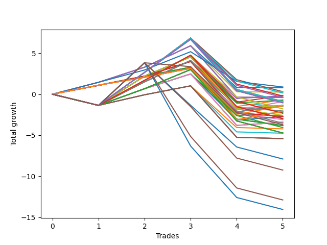

# Short Wallace 016 
- Symbol: NVDA_Unlimited
- Date Range: 02/08/2022 - 07/08/2022
- Trading Period: 7:20-12:30
- Number of Trades: 5



| Name | Win Percent | Profit | Avg Profit / Trade | Avg Time / Trade |      | Name | Win Percent | Profit | Avg Profit / Trade | Avg Time / Trade |
| ---- | ----------- | ------ | ------------------ | ---------------- | ---- | ---- | ----------- | ------ | ------------------ | ---------------- |
| Sorted By <br> Profit | | | | | | Sorted By <br> Win Percentage ||||
| Seventy-Three | 60.00 | 440.00 | 88.00 | 16:53 |     | One Hundred Eleven | 80.00 | -450.00 | -90.00 | 16:05 |
| Forty-Two | 60.00 | 395.00 | 79.00 | 15:02 |     | One Hundred Sixteen | 80.00 | -715.00 | -143.00 | 16:12 |
| Forty-Seven | 40.00 | 155.00 | 31.00 | 93:11 |     | One Hundred Twenty-Six | 80.00 | -1045.00 | -209.00 | 22:57 |
| Fifty | 60.00 | 130.00 | 26.00 | 15:09 |     | One Hundred Twenty-One | 80.00 | -1045.00 | -209.00 | 22:57 |
| One Hundred Fourteen | 40.00 | 75.00 | 15.00 | 89:47 |     | Eighty-One | 80.00 | -1045.00 | -209.00 | 22:57 |
| Forty-Five | 60.00 | -80.00 | -16.00 | 31:30 |     | Seventy-Three | 60.00 | 440.00 | 88.00 | 16:53 |
| Forty-Six | 60.00 | -95.00 | -19.00 | 30:55 |     | Forty-Two | 60.00 | 395.00 | 79.00 | 15:02 |
| Fifty-Five | 40.00 | -110.00 | -22.00 | 93:18 |     | Fifty | 60.00 | 130.00 | 26.00 | 15:09 |
| One Hundred Ninteen | 40.00 | -190.00 | -38.00 | 89:54 |     | Forty-Five | 60.00 | -80.00 | -16.00 | 31:30 |
| Sixty-Six | 60.00 | -200.00 | -40.00 | 21:54 |     | Forty-Six | 60.00 | -95.00 | -19.00 | 30:55 |
| Fifty-Eight | 60.00 | -200.00 | -40.00 | 21:54 |     | Sixty-Six | 60.00 | -200.00 | -40.00 | 21:54 |
| Two | 60.00 | -200.00 | -40.00 | 21:54 |     | Fifty-Eight | 60.00 | -200.00 | -40.00 | 21:54 |
| Fifty-Three | 60.00 | -345.00 | -69.00 | 31:37 |     | Two | 60.00 | -200.00 | -40.00 | 21:54 |
| Fifty-Four | 60.00 | -360.00 | -72.00 | 31:02 |     | Fifty-Three | 60.00 | -345.00 | -69.00 | 31:37 |
| Seventy-One | 40.00 | -440.00 | -88.00 | 100:03 |     | Fifty-Four | 60.00 | -360.00 | -72.00 | 31:02 |
| Sixty-Three | 40.00 | -440.00 | -88.00 | 100:03 |     | Sixty-Nine | 60.00 | -675.00 | -135.00 | 38:22 |
| Seven | 40.00 | -440.00 | -88.00 | 100:03 |     | Sixty-One | 60.00 | -675.00 | -135.00 | 38:22 |
| One Hundred Eleven | 80.00 | -450.00 | -90.00 | 16:05 |     | Five | 60.00 | -675.00 | -135.00 | 38:22 |
| One Hundred Twenty-Nine | 40.00 | -520.00 | -104.00 | 96:39 |     | Seventy | 60.00 | -690.00 | -138.00 | 37:47 |
| One Hundred Twenty-Four | 40.00 | -520.00 | -104.00 | 96:39 |     | Sixty-Two | 60.00 | -690.00 | -138.00 | 37:47 |
| Eighty-Four | 40.00 | -520.00 | -104.00 | 96:39 |     | Six | 60.00 | -690.00 | -138.00 | 37:47 |
| Sixty-Nine | 60.00 | -675.00 | -135.00 | 38:22 |     | Forty-One | 60.00 | -755.00 | -151.00 | 13:47 |
| Sixty-One | 60.00 | -675.00 | -135.00 | 38:22 |     | Forty-Nine | 60.00 | -1020.00 | -204.00 | 13:54 |
| Five | 60.00 | -675.00 | -135.00 | 38:22 |     | Forty-Four | 60.00 | -1105.00 | -221.00 | 30:31 |
| Seventy | 60.00 | -690.00 | -138.00 | 37:47 |     | Forty | 60.00 | -1285.00 | -257.00 | 10:47 |
| Sixty-Two | 60.00 | -690.00 | -138.00 | 37:47 |     | Sixty-Five | 60.00 | -1350.00 | -270.00 | 20:30 |
| Six | 60.00 | -690.00 | -138.00 | 37:47 |     | Fifty-Seven | 60.00 | -1350.00 | -270.00 | 20:30 |
| One Hundred Sixteen | 80.00 | -715.00 | -143.00 | 16:12 |     | One | 60.00 | -1350.00 | -270.00 | 20:30 |
| Forty-One | 60.00 | -755.00 | -151.00 | 13:47 |     | Fifty-Two | 60.00 | -1370.00 | -274.00 | 30:38 |
| One Hundred Thirteen | 40.00 | -895.00 | -179.00 | 85:33 |     | Forty-Eight | 60.00 | -1550.00 | -310.00 | 10:54 |
| Forty-Nine | 60.00 | -1020.00 | -204.00 | 13:54 |     | Sixty-Eight | 60.00 | -1700.00 | -340.00 | 37:23 |
| One Hundred Twenty-Six | 80.00 | -1045.00 | -209.00 | 22:57 |     | Sixty | 60.00 | -1700.00 | -340.00 | 37:23 |
| One Hundred Twenty-One | 80.00 | -1045.00 | -209.00 | 22:57 |     | Four | 60.00 | -1700.00 | -340.00 | 37:23 |
| Eighty-One | 80.00 | -1045.00 | -209.00 | 22:57 |     | Sixty-Four | 60.00 | -1910.00 | -382.00 | 15:59 |
| Forty-Four | 60.00 | -1105.00 | -221.00 | 30:31 |     | Fifty-Six | 60.00 | -1910.00 | -382.00 | 15:59 |
| One Hundred Eighteen | 40.00 | -1160.00 | -232.00 | 85:40 |     | Zero | 60.00 | -1910.00 | -382.00 | 15:59 |
| Forty | 60.00 | -1285.00 | -257.00 | 10:47 |     | Forty-Seven | 40.00 | 155.00 | 31.00 | 93:11 |
| Sixty-Five | 60.00 | -1350.00 | -270.00 | 20:30 |     | One Hundred Fourteen | 40.00 | 75.00 | 15.00 | 89:47 |
| Fifty-Seven | 60.00 | -1350.00 | -270.00 | 20:30 |     | Fifty-Five | 40.00 | -110.00 | -22.00 | 93:18 |
| One | 60.00 | -1350.00 | -270.00 | 20:30 |     | One Hundred Ninteen | 40.00 | -190.00 | -38.00 | 89:54 |
| Fifty-Two | 60.00 | -1370.00 | -274.00 | 30:38 |     | Seventy-One | 40.00 | -440.00 | -88.00 | 100:03 |
| One Hundred Twenty-Eight | 40.00 | -1490.00 | -298.00 | 92:25 |     | Sixty-Three | 40.00 | -440.00 | -88.00 | 100:03 |
| One Hundred Twenty-Three | 40.00 | -1490.00 | -298.00 | 92:25 |     | Seven | 40.00 | -440.00 | -88.00 | 100:03 |
| Eighty-Three | 40.00 | -1490.00 | -298.00 | 92:25 |     | One Hundred Twenty-Nine | 40.00 | -520.00 | -104.00 | 96:39 |
| Forty-Eight | 60.00 | -1550.00 | -310.00 | 10:54 |     | One Hundred Twenty-Four | 40.00 | -520.00 | -104.00 | 96:39 |
| Sixty-Eight | 60.00 | -1700.00 | -340.00 | 37:23 |     | Eighty-Four | 40.00 | -520.00 | -104.00 | 96:39 |
| Sixty | 60.00 | -1700.00 | -340.00 | 37:23 |     | One Hundred Thirteen | 40.00 | -895.00 | -179.00 | 85:33 |
| Four | 60.00 | -1700.00 | -340.00 | 37:23 |     | One Hundred Eighteen | 40.00 | -1160.00 | -232.00 | 85:40 |
| One Hundred Twelve | 40.00 | -1765.00 | -353.00 | 82:14 |     | One Hundred Twenty-Eight | 40.00 | -1490.00 | -298.00 | 92:25 |
| One Hundred Twenty | 20.00 | -1855.00 | -371.00 | 92:37 |     | One Hundred Twenty-Three | 40.00 | -1490.00 | -298.00 | 92:25 |
| Sixty-Four | 60.00 | -1910.00 | -382.00 | 15:59 |     | Eighty-Three | 40.00 | -1490.00 | -298.00 | 92:25 |
| Fifty-Six | 60.00 | -1910.00 | -382.00 | 15:59 |     | One Hundred Twelve | 40.00 | -1765.00 | -353.00 | 82:14 |
| Zero | 60.00 | -1910.00 | -382.00 | 15:59 |     | One Hundred Seventeen | 40.00 | -2030.00 | -406.00 | 82:21 |
| One Hundred Seventeen | 40.00 | -2030.00 | -406.00 | 82:21 |     | Forty-Three | 40.00 | -2110.00 | -422.00 | 28:56 |
| Forty-Three | 40.00 | -2110.00 | -422.00 | 28:56 |     | One Hundred Twenty-Seven | 40.00 | -2360.00 | -472.00 | 89:06 |
| One Hundred Twenty-Seven | 40.00 | -2360.00 | -472.00 | 89:06 |     | One Hundred Twenty-Two | 40.00 | -2360.00 | -472.00 | 89:06 |
| One Hundred Twenty-Two | 40.00 | -2360.00 | -472.00 | 89:06 |     | Eighty-Two | 40.00 | -2360.00 | -472.00 | 89:06 |
| Eighty-Two | 40.00 | -2360.00 | -472.00 | 89:06 |     | Fifty-One | 40.00 | -2375.00 | -475.00 | 29:03 |
| Fifty-One | 40.00 | -2375.00 | -475.00 | 29:03 |     | Sixty-Seven | 40.00 | -2705.00 | -541.00 | 35:48 |
| Sixty-Seven | 40.00 | -2705.00 | -541.00 | 35:48 |     | Fifty-Nine | 40.00 | -2705.00 | -541.00 | 35:48 |
| Fifty-Nine | 40.00 | -2705.00 | -541.00 | 35:48 |     | Three | 40.00 | -2705.00 | -541.00 | 35:48 |
| Three | 40.00 | -2705.00 | -541.00 | 35:48 |     | One Hundred Twenty | 20.00 | -1855.00 | -371.00 | 92:37 |
| One Hundred Fifteen | 20.00 | -3945.00 | -789.00 | 94:57 |     | One Hundred Fifteen | 20.00 | -3945.00 | -789.00 | 94:57 |
| One Hundred Thirty | 20.00 | -4620.00 | -924.00 | 101:50 |     | One Hundred Thirty | 20.00 | -4620.00 | -924.00 | 101:50 |
| Eighty-Five | 20.00 | -6440.00 | -1288.00 | 111:55 |     | Eighty-Five | 20.00 | -6440.00 | -1288.00 | 111:55 |
| One Hundred Twenty-Five | 20.00 | -7020.00 | -1404.00 | 106:06 |     | One Hundred Twenty-Five | 20.00 | -7020.00 | -1404.00 | 106:06 |

## NO STOPLOSS

### Test Zero
* Sell when price hits the middle line of the 20p bollinger
* No Stoploss
* Results:
```
Total Trades: 5
Percent Up: 40.00
Percent Down: 60.00
Total Points Moved Down: -3.82
Potential Profit: -1910.00
Total Points Ups: 7.11 Count Ups: 2
Total Points Downs: 3.29 Count Downs: 3
```

<details><summary>Trades</summary>

<code>In: 2022-02-16 11:34:00		Out: 2022-02-16 11:41:40		Total Position Time: 07:40		Total Move Down: 1.10		Total to Date: 1.10</code> <br />
<code>In: 2022-02-18 12:04:00		Out: 2022-02-18 12:08:20		Total Position Time: 04:20		Total Move Down: 1.10		Total to Date: 2.20</code> <br />
<code>In: 2022-05-04 11:03:00		Out: 2022-05-04 11:07:05		Total Position Time: 04:05		Total Move Down: 1.09		Total to Date: 3.29</code> <br />
<code>In: 2022-05-04 11:51:00		Out: 2022-05-04 12:38:40		Total Position Time: 47:40		Total Move Down: -6.33		Total to Date: -3.04</code> <br />
<code>In: 2022-07-06 07:50:00		Out: 2022-07-06 08:06:10		Total Position Time: 16:10		Total Move Down: -0.78		Total to Date: -3.82</code> <br />


</details>

### Test One
* Sell when the price hits the upper line of the 20p 1std bollinger
* No Stoploss
* Results:
```
Total Trades: 5
Percent Up: 40.00
Percent Down: 60.00
Total Points Moved Down: -2.70
Potential Profit: -1350.00
Total Points Ups: 6.69 Count Ups: 2
Total Points Downs: 3.99 Count Downs: 3
```

<details><summary>Trades</summary>

<code>In: 2022-02-16 11:34:00		Out: 2022-02-16 11:47:15		Total Position Time: 13:15		Total Move Down: 1.07		Total to Date: 1.07</code> <br />
<code>In: 2022-02-18 12:04:00		Out: 2022-02-18 12:15:05		Total Position Time: 11:05		Total Move Down: 1.12		Total to Date: 2.19</code> <br />
<code>In: 2022-05-04 11:03:00		Out: 2022-05-04 11:07:20		Total Position Time: 04:20		Total Move Down: 1.80		Total to Date: 3.99</code> <br />
<code>In: 2022-05-04 11:51:00		Out: 2022-05-04 12:46:15		Total Position Time: 55:15		Total Move Down: -6.27		Total to Date: -2.28</code> <br />
<code>In: 2022-07-06 07:50:00		Out: 2022-07-06 08:08:35		Total Position Time: 18:35		Total Move Down: -0.42		Total to Date: -2.70</code> <br />


</details>

### Test Two
* Sell when the price hits the upper line of the 20p 2std bollinger
* No Stoploss
* Results:
```
Total Trades: 5
Percent Up: 40.00
Percent Down: 60.00
Total Points Moved Down: -0.40
Potential Profit: -200.00
Total Points Ups: 6.30 Count Ups: 2
Total Points Downs: 5.90 Count Downs: 3
```

<details><summary>Trades</summary>

<code>In: 2022-02-16 11:34:00		Out: 2022-02-16 11:48:05		Total Position Time: 14:05		Total Move Down: 1.45		Total to Date: 1.45</code> <br />
<code>In: 2022-02-18 12:04:00		Out: 2022-02-18 12:18:35		Total Position Time: 14:35		Total Move Down: 1.84		Total to Date: 3.29</code> <br />
<code>In: 2022-05-04 11:03:00		Out: 2022-05-04 11:07:30		Total Position Time: 04:30		Total Move Down: 2.61		Total to Date: 5.90</code> <br />
<code>In: 2022-05-04 11:51:00		Out: 2022-05-04 12:47:00		Total Position Time: 56:00		Total Move Down: -6.27		Total to Date: -0.37</code> <br />
<code>In: 2022-07-06 07:50:00		Out: 2022-07-06 08:10:20		Total Position Time: 20:20		Total Move Down: -0.03		Total to Date: -0.40</code> <br />


</details>

### Test Three
* Sell when price hits the middle line of the 50p bollinger
* No Stoploss
* Results:
```
Total Trades: 5
Percent Up: 60.00
Percent Down: 40.00
Total Points Moved Down: -5.41
Potential Profit: -2705.00
Total Points Ups: 7.79 Count Ups: 3
Total Points Downs: 2.38 Count Downs: 2
```

<details><summary>Trades</summary>

<code>In: 2022-02-16 11:34:00		Out: 2022-02-16 12:47:00		Total Position Time: 73:00		Total Move Down: -1.36		Total to Date: -1.36</code> <br />
<code>In: 2022-02-18 12:04:00		Out: 2022-02-18 12:17:20		Total Position Time: 13:20		Total Move Down: 1.29		Total to Date: -0.07</code> <br />
<code>In: 2022-05-04 11:03:00		Out: 2022-05-04 11:07:05		Total Position Time: 04:05		Total Move Down: 1.09		Total to Date: 1.02</code> <br />
<code>In: 2022-05-04 11:51:00		Out: 2022-05-04 12:47:00		Total Position Time: 56:00		Total Move Down: -6.27		Total to Date: -5.25</code> <br />
<code>In: 2022-07-06 07:50:00		Out: 2022-07-06 08:22:35		Total Position Time: 32:35		Total Move Down: -0.16		Total to Date: -5.41</code> <br />


</details>

### Test Four
* Sell when the price hits the upper line of the 50p 1std bollinger
* No Stoploss
* Results:
```
Total Trades: 5
Percent Up: 40.00
Percent Down: 60.00
Total Points Moved Down: -3.40
Potential Profit: -1700.00
Total Points Ups: 7.63 Count Ups: 2
Total Points Downs: 4.23 Count Downs: 3
```

<details><summary>Trades</summary>

<code>In: 2022-02-16 11:34:00		Out: 2022-02-16 12:47:00		Total Position Time: 73:00		Total Move Down: -1.36		Total to Date: -1.36</code> <br />
<code>In: 2022-02-18 12:04:00		Out: 2022-02-18 12:19:05		Total Position Time: 15:05		Total Move Down: 2.03		Total to Date: 0.67</code> <br />
<code>In: 2022-05-04 11:03:00		Out: 2022-05-04 11:07:20		Total Position Time: 04:20		Total Move Down: 1.80		Total to Date: 2.47</code> <br />
<code>In: 2022-05-04 11:51:00		Out: 2022-05-04 12:47:00		Total Position Time: 56:00		Total Move Down: -6.27		Total to Date: -3.80</code> <br />
<code>In: 2022-07-06 07:50:00		Out: 2022-07-06 08:28:30		Total Position Time: 38:30		Total Move Down: 0.40		Total to Date: -3.40</code> <br />


</details>

### Test Five
* Sell when the price hits the upper line of the 50p 2std bollinger
* No Stoploss
* Results:
```
Total Trades: 5
Percent Up: 40.00
Percent Down: 60.00
Total Points Moved Down: -1.35
Potential Profit: -675.00
Total Points Ups: 7.63 Count Ups: 2
Total Points Downs: 6.28 Count Downs: 3
```

<details><summary>Trades</summary>

<code>In: 2022-02-16 11:34:00		Out: 2022-02-16 12:47:00		Total Position Time: 73:00		Total Move Down: -1.36		Total to Date: -1.36</code> <br />
<code>In: 2022-02-18 12:04:00		Out: 2022-02-18 12:19:45		Total Position Time: 15:45		Total Move Down: 2.86		Total to Date: 1.50</code> <br />
<code>In: 2022-05-04 11:03:00		Out: 2022-05-04 11:07:30		Total Position Time: 04:30		Total Move Down: 2.61		Total to Date: 4.11</code> <br />
<code>In: 2022-05-04 11:51:00		Out: 2022-05-04 12:47:00		Total Position Time: 56:00		Total Move Down: -6.27		Total to Date: -2.16</code> <br />
<code>In: 2022-07-06 07:50:00		Out: 2022-07-06 08:32:35		Total Position Time: 42:35		Total Move Down: 0.81		Total to Date: -1.35</code> <br />


</details>

### Test Six
* Sell when the price hits the middle line of the 1std VWAP
* No Stoploss
* Results:
```
Total Trades: 5
Percent Up: 40.00
Percent Down: 60.00
Total Points Moved Down: -1.38
Potential Profit: -690.00
Total Points Ups: 7.63 Count Ups: 2
Total Points Downs: 6.25 Count Downs: 3
```

<details><summary>Trades</summary>

<code>In: 2022-02-16 11:34:00		Out: 2022-02-16 12:47:00		Total Position Time: 73:00		Total Move Down: -1.36		Total to Date: -1.36</code> <br />
<code>In: 2022-02-18 12:04:00		Out: 2022-02-18 12:22:10		Total Position Time: 18:10		Total Move Down: 3.57		Total to Date: 2.21</code> <br />
<code>In: 2022-05-04 11:03:00		Out: 2022-05-04 11:07:25		Total Position Time: 04:25		Total Move Down: 2.34		Total to Date: 4.55</code> <br />
<code>In: 2022-05-04 11:51:00		Out: 2022-05-04 12:47:00		Total Position Time: 56:00		Total Move Down: -6.27		Total to Date: -1.72</code> <br />
<code>In: 2022-07-06 07:50:00		Out: 2022-07-06 08:27:20		Total Position Time: 37:20		Total Move Down: 0.34		Total to Date: -1.38</code> <br />


</details>

### Test Seven
* Sell when the price hits the upper line of the 1std VWAP
* No Stoploss
* Results:
```
Total Trades: 5
Percent Up: 60.00
Percent Down: 40.00
Total Points Moved Down: -0.88
Potential Profit: -440.00
Total Points Ups: 9.09 Count Ups: 3
Total Points Downs: 8.21 Count Downs: 2
```

<details><summary>Trades</summary>

<code>In: 2022-02-16 11:34:00		Out: 2022-02-16 12:47:00		Total Position Time: 73:00		Total Move Down: -1.36		Total to Date: -1.36</code> <br />
<code>In: 2022-02-18 12:04:00		Out: 2022-02-18 12:47:00		Total Position Time: 43:00		Total Move Down: 4.02		Total to Date: 2.66</code> <br />
<code>In: 2022-05-04 11:03:00		Out: 2022-05-04 11:34:15		Total Position Time: 31:15		Total Move Down: 4.19		Total to Date: 6.85</code> <br />
<code>In: 2022-05-04 11:51:00		Out: 2022-05-04 12:47:00		Total Position Time: 56:00		Total Move Down: -6.27		Total to Date: 0.58</code> <br />
<code>In: 2022-07-06 07:50:00		Out: 2022-07-06 12:47:00		Total Position Time: 297:00		Total Move Down: -1.46		Total to Date: -0.88</code> <br />


</details>

## STOPLOSS OF 5

### Test Forty
* Sell when price hits the middle line of the 20p bollinger
* Stoploss is -5 points
* Results:
```
Total Trades: 5
Percent Up: 40.00
Percent Down: 60.00
Total Points Moved Down: -2.57
Potential Profit: -1285.00
Total Points Ups: 5.86 Count Ups: 2
Total Points Downs: 3.29 Count Downs: 3
```

<details><summary>Trades</summary>

<code>In: 2022-02-16 11:34:00		Out: 2022-02-16 11:41:40		Total Position Time: 07:40		Total Move Down: 1.10		Total to Date: 1.10</code> <br />
<code>In: 2022-02-18 12:04:00		Out: 2022-02-18 12:08:20		Total Position Time: 04:20		Total Move Down: 1.10		Total to Date: 2.20</code> <br />
<code>In: 2022-05-04 11:03:00		Out: 2022-05-04 11:07:05		Total Position Time: 04:05		Total Move Down: 1.09		Total to Date: 3.29</code> <br />
<code>In: 2022-05-04 11:51:00		Out: 2022-05-04 12:12:40		Total Position Time: 21:40		Total Move Down: -5.08		Total to Date: -1.79</code> <br />
<code>In: 2022-07-06 07:50:00		Out: 2022-07-06 08:06:10		Total Position Time: 16:10		Total Move Down: -0.78		Total to Date: -2.57</code> <br />


</details>

### Test Forty-One
* Sell when the price hits the upper line of the 20p 1std bollinger
* Stoploss is -5 points
* Results:
```
Total Trades: 5
Percent Up: 40.00
Percent Down: 60.00
Total Points Moved Down: -1.51
Potential Profit: -755.00
Total Points Ups: 5.50 Count Ups: 2
Total Points Downs: 3.99 Count Downs: 3
```

<details><summary>Trades</summary>

<code>In: 2022-02-16 11:34:00		Out: 2022-02-16 11:47:15		Total Position Time: 13:15		Total Move Down: 1.07		Total to Date: 1.07</code> <br />
<code>In: 2022-02-18 12:04:00		Out: 2022-02-18 12:15:05		Total Position Time: 11:05		Total Move Down: 1.12		Total to Date: 2.19</code> <br />
<code>In: 2022-05-04 11:03:00		Out: 2022-05-04 11:07:20		Total Position Time: 04:20		Total Move Down: 1.80		Total to Date: 3.99</code> <br />
<code>In: 2022-05-04 11:51:00		Out: 2022-05-04 12:12:40		Total Position Time: 21:40		Total Move Down: -5.08		Total to Date: -1.09</code> <br />
<code>In: 2022-07-06 07:50:00		Out: 2022-07-06 08:08:35		Total Position Time: 18:35		Total Move Down: -0.42		Total to Date: -1.51</code> <br />


</details>

### Test Forty-Two
* Sell when the price hits the upper line of the 20p 2std bollinger
* Stoploss is -5 points
* Results:
```
Total Trades: 5
Percent Up: 40.00
Percent Down: 60.00
Total Points Moved Down: 0.79
Potential Profit: 395.00
Total Points Ups: 5.11 Count Ups: 2
Total Points Downs: 5.90 Count Downs: 3
```

<details><summary>Trades</summary>

<code>In: 2022-02-16 11:34:00		Out: 2022-02-16 11:48:05		Total Position Time: 14:05		Total Move Down: 1.45		Total to Date: 1.45</code> <br />
<code>In: 2022-02-18 12:04:00		Out: 2022-02-18 12:18:35		Total Position Time: 14:35		Total Move Down: 1.84		Total to Date: 3.29</code> <br />
<code>In: 2022-05-04 11:03:00		Out: 2022-05-04 11:07:30		Total Position Time: 04:30		Total Move Down: 2.61		Total to Date: 5.90</code> <br />
<code>In: 2022-05-04 11:51:00		Out: 2022-05-04 12:12:40		Total Position Time: 21:40		Total Move Down: -5.08		Total to Date: 0.82</code> <br />
<code>In: 2022-07-06 07:50:00		Out: 2022-07-06 08:10:20		Total Position Time: 20:20		Total Move Down: -0.03		Total to Date: 0.79</code> <br />


</details>

### Test Forty-Three
* Sell when price hits the middle line of the 50p bollinger
* Stoploss is -5 points
* Results:
```
Total Trades: 5
Percent Up: 60.00
Percent Down: 40.00
Total Points Moved Down: -4.22
Potential Profit: -2110.00
Total Points Ups: 6.60 Count Ups: 3
Total Points Downs: 2.38 Count Downs: 2
```

<details><summary>Trades</summary>

<code>In: 2022-02-16 11:34:00		Out: 2022-02-16 12:47:00		Total Position Time: 73:00		Total Move Down: -1.36		Total to Date: -1.36</code> <br />
<code>In: 2022-02-18 12:04:00		Out: 2022-02-18 12:17:20		Total Position Time: 13:20		Total Move Down: 1.29		Total to Date: -0.07</code> <br />
<code>In: 2022-05-04 11:03:00		Out: 2022-05-04 11:07:05		Total Position Time: 04:05		Total Move Down: 1.09		Total to Date: 1.02</code> <br />
<code>In: 2022-05-04 11:51:00		Out: 2022-05-04 12:12:40		Total Position Time: 21:40		Total Move Down: -5.08		Total to Date: -4.06</code> <br />
<code>In: 2022-07-06 07:50:00		Out: 2022-07-06 08:22:35		Total Position Time: 32:35		Total Move Down: -0.16		Total to Date: -4.22</code> <br />


</details>

### Test Forty-Four
* Sell when the price hits the upper line of the 50p 1std bollinger
* Stoploss is -5 points
* Results:
```
Total Trades: 5
Percent Up: 40.00
Percent Down: 60.00
Total Points Moved Down: -2.21
Potential Profit: -1105.00
Total Points Ups: 6.44 Count Ups: 2
Total Points Downs: 4.23 Count Downs: 3
```

<details><summary>Trades</summary>

<code>In: 2022-02-16 11:34:00		Out: 2022-02-16 12:47:00		Total Position Time: 73:00		Total Move Down: -1.36		Total to Date: -1.36</code> <br />
<code>In: 2022-02-18 12:04:00		Out: 2022-02-18 12:19:05		Total Position Time: 15:05		Total Move Down: 2.03		Total to Date: 0.67</code> <br />
<code>In: 2022-05-04 11:03:00		Out: 2022-05-04 11:07:20		Total Position Time: 04:20		Total Move Down: 1.80		Total to Date: 2.47</code> <br />
<code>In: 2022-05-04 11:51:00		Out: 2022-05-04 12:12:40		Total Position Time: 21:40		Total Move Down: -5.08		Total to Date: -2.61</code> <br />
<code>In: 2022-07-06 07:50:00		Out: 2022-07-06 08:28:30		Total Position Time: 38:30		Total Move Down: 0.40		Total to Date: -2.21</code> <br />


</details>

### Test Forty-Five
* Sell when the price hits the upper line of the 50p 2std bollinger
* Stoploss is -5 points
* Results:
```
Total Trades: 5
Percent Up: 40.00
Percent Down: 60.00
Total Points Moved Down: -0.16
Potential Profit: -80.00
Total Points Ups: 6.44 Count Ups: 2
Total Points Downs: 6.28 Count Downs: 3
```

<details><summary>Trades</summary>

<code>In: 2022-02-16 11:34:00		Out: 2022-02-16 12:47:00		Total Position Time: 73:00		Total Move Down: -1.36		Total to Date: -1.36</code> <br />
<code>In: 2022-02-18 12:04:00		Out: 2022-02-18 12:19:45		Total Position Time: 15:45		Total Move Down: 2.86		Total to Date: 1.50</code> <br />
<code>In: 2022-05-04 11:03:00		Out: 2022-05-04 11:07:30		Total Position Time: 04:30		Total Move Down: 2.61		Total to Date: 4.11</code> <br />
<code>In: 2022-05-04 11:51:00		Out: 2022-05-04 12:12:40		Total Position Time: 21:40		Total Move Down: -5.08		Total to Date: -0.97</code> <br />
<code>In: 2022-07-06 07:50:00		Out: 2022-07-06 08:32:35		Total Position Time: 42:35		Total Move Down: 0.81		Total to Date: -0.16</code> <br />


</details>

### Test Forty-Six
* Sell when the price hits the middle line of the 1std VWAP
* Stoploss is -5 points
* Results:
```
Total Trades: 5
Percent Up: 40.00
Percent Down: 60.00
Total Points Moved Down: -0.19
Potential Profit: -95.00
Total Points Ups: 6.44 Count Ups: 2
Total Points Downs: 6.25 Count Downs: 3
```

<details><summary>Trades</summary>

<code>In: 2022-02-16 11:34:00		Out: 2022-02-16 12:47:00		Total Position Time: 73:00		Total Move Down: -1.36		Total to Date: -1.36</code> <br />
<code>In: 2022-02-18 12:04:00		Out: 2022-02-18 12:22:10		Total Position Time: 18:10		Total Move Down: 3.57		Total to Date: 2.21</code> <br />
<code>In: 2022-05-04 11:03:00		Out: 2022-05-04 11:07:25		Total Position Time: 04:25		Total Move Down: 2.34		Total to Date: 4.55</code> <br />
<code>In: 2022-05-04 11:51:00		Out: 2022-05-04 12:12:40		Total Position Time: 21:40		Total Move Down: -5.08		Total to Date: -0.53</code> <br />
<code>In: 2022-07-06 07:50:00		Out: 2022-07-06 08:27:20		Total Position Time: 37:20		Total Move Down: 0.34		Total to Date: -0.19</code> <br />


</details>

### Test Forty-Seven
* Sell when the price hits the upper line of the 1std VWAP
* Stoploss is -5 points
* Results:
```
Total Trades: 5
Percent Up: 60.00
Percent Down: 40.00
Total Points Moved Down: 0.31
Potential Profit: 155.00
Total Points Ups: 7.90 Count Ups: 3
Total Points Downs: 8.21 Count Downs: 2
```

<details><summary>Trades</summary>

<code>In: 2022-02-16 11:34:00		Out: 2022-02-16 12:47:00		Total Position Time: 73:00		Total Move Down: -1.36		Total to Date: -1.36</code> <br />
<code>In: 2022-02-18 12:04:00		Out: 2022-02-18 12:47:00		Total Position Time: 43:00		Total Move Down: 4.02		Total to Date: 2.66</code> <br />
<code>In: 2022-05-04 11:03:00		Out: 2022-05-04 11:34:15		Total Position Time: 31:15		Total Move Down: 4.19		Total to Date: 6.85</code> <br />
<code>In: 2022-05-04 11:51:00		Out: 2022-05-04 12:12:40		Total Position Time: 21:40		Total Move Down: -5.08		Total to Date: 1.77</code> <br />
<code>In: 2022-07-06 07:50:00		Out: 2022-07-06 12:47:00		Total Position Time: 297:00		Total Move Down: -1.46		Total to Date: 0.31</code> <br />


</details>

## TRAIL STOP OF 5

### Test Forty-Eight
* Sell when price hits the middle line of the 20p bollinger
* Trailing Stop is -5 points
* Results:
```
Total Trades: 5
Percent Up: 40.00
Percent Down: 60.00
Total Points Moved Down: -3.10
Potential Profit: -1550.00
Total Points Ups: 6.39 Count Ups: 2
Total Points Downs: 3.29 Count Downs: 3
```

<details><summary>Trades</summary>

<code>In: 2022-02-16 11:34:00		Out: 2022-02-16 11:41:40		Total Position Time: 07:40		Total Move Down: 1.10		Total to Date: 1.10</code> <br />
<code>In: 2022-02-18 12:04:00		Out: 2022-02-18 12:08:20		Total Position Time: 04:20		Total Move Down: 1.10		Total to Date: 2.20</code> <br />
<code>In: 2022-05-04 11:03:00		Out: 2022-05-04 11:07:05		Total Position Time: 04:05		Total Move Down: 1.09		Total to Date: 3.29</code> <br />
<code>In: 2022-05-04 11:51:00		Out: 2022-05-04 12:13:15		Total Position Time: 22:15		Total Move Down: -5.61		Total to Date: -2.32</code> <br />
<code>In: 2022-07-06 07:50:00		Out: 2022-07-06 08:06:10		Total Position Time: 16:10		Total Move Down: -0.78		Total to Date: -3.10</code> <br />


</details>

### Test Forty-Nine
* Sell when the price hits the upper line of the 20p 1std bollinger
* Trailing Stop is -5 points
* Results:
```
Total Trades: 5
Percent Up: 40.00
Percent Down: 60.00
Total Points Moved Down: -2.04
Potential Profit: -1020.00
Total Points Ups: 6.03 Count Ups: 2
Total Points Downs: 3.99 Count Downs: 3
```

<details><summary>Trades</summary>

<code>In: 2022-02-16 11:34:00		Out: 2022-02-16 11:47:15		Total Position Time: 13:15		Total Move Down: 1.07		Total to Date: 1.07</code> <br />
<code>In: 2022-02-18 12:04:00		Out: 2022-02-18 12:15:05		Total Position Time: 11:05		Total Move Down: 1.12		Total to Date: 2.19</code> <br />
<code>In: 2022-05-04 11:03:00		Out: 2022-05-04 11:07:20		Total Position Time: 04:20		Total Move Down: 1.80		Total to Date: 3.99</code> <br />
<code>In: 2022-05-04 11:51:00		Out: 2022-05-04 12:13:15		Total Position Time: 22:15		Total Move Down: -5.61		Total to Date: -1.62</code> <br />
<code>In: 2022-07-06 07:50:00		Out: 2022-07-06 08:08:35		Total Position Time: 18:35		Total Move Down: -0.42		Total to Date: -2.04</code> <br />


</details>

### Test Fifty
* Sell when the price hits the upper line of the 20p 2std bollinger
* Trailing Stop is -5 points
* Results:
```
Total Trades: 5
Percent Up: 40.00
Percent Down: 60.00
Total Points Moved Down: 0.26
Potential Profit: 130.00
Total Points Ups: 5.64 Count Ups: 2
Total Points Downs: 5.90 Count Downs: 3
```

<details><summary>Trades</summary>

<code>In: 2022-02-16 11:34:00		Out: 2022-02-16 11:48:05		Total Position Time: 14:05		Total Move Down: 1.45		Total to Date: 1.45</code> <br />
<code>In: 2022-02-18 12:04:00		Out: 2022-02-18 12:18:35		Total Position Time: 14:35		Total Move Down: 1.84		Total to Date: 3.29</code> <br />
<code>In: 2022-05-04 11:03:00		Out: 2022-05-04 11:07:30		Total Position Time: 04:30		Total Move Down: 2.61		Total to Date: 5.90</code> <br />
<code>In: 2022-05-04 11:51:00		Out: 2022-05-04 12:13:15		Total Position Time: 22:15		Total Move Down: -5.61		Total to Date: 0.29</code> <br />
<code>In: 2022-07-06 07:50:00		Out: 2022-07-06 08:10:20		Total Position Time: 20:20		Total Move Down: -0.03		Total to Date: 0.26</code> <br />


</details>

### Test Fifty-One
* Sell when price hits the middle line of the 50p bollinger
* Trailing Stop is -5 points
* Results:
```
Total Trades: 5
Percent Up: 60.00
Percent Down: 40.00
Total Points Moved Down: -4.75
Potential Profit: -2375.00
Total Points Ups: 7.13 Count Ups: 3
Total Points Downs: 2.38 Count Downs: 2
```

<details><summary>Trades</summary>

<code>In: 2022-02-16 11:34:00		Out: 2022-02-16 12:47:00		Total Position Time: 73:00		Total Move Down: -1.36		Total to Date: -1.36</code> <br />
<code>In: 2022-02-18 12:04:00		Out: 2022-02-18 12:17:20		Total Position Time: 13:20		Total Move Down: 1.29		Total to Date: -0.07</code> <br />
<code>In: 2022-05-04 11:03:00		Out: 2022-05-04 11:07:05		Total Position Time: 04:05		Total Move Down: 1.09		Total to Date: 1.02</code> <br />
<code>In: 2022-05-04 11:51:00		Out: 2022-05-04 12:13:15		Total Position Time: 22:15		Total Move Down: -5.61		Total to Date: -4.59</code> <br />
<code>In: 2022-07-06 07:50:00		Out: 2022-07-06 08:22:35		Total Position Time: 32:35		Total Move Down: -0.16		Total to Date: -4.75</code> <br />


</details>

### Test Fifty-Two
* Sell when the price hits the upper line of the 50p 1std bollinger
* Trailing Stop is -5 points
* Results:
```
Total Trades: 5
Percent Up: 40.00
Percent Down: 60.00
Total Points Moved Down: -2.74
Potential Profit: -1370.00
Total Points Ups: 6.97 Count Ups: 2
Total Points Downs: 4.23 Count Downs: 3
```

<details><summary>Trades</summary>

<code>In: 2022-02-16 11:34:00		Out: 2022-02-16 12:47:00		Total Position Time: 73:00		Total Move Down: -1.36		Total to Date: -1.36</code> <br />
<code>In: 2022-02-18 12:04:00		Out: 2022-02-18 12:19:05		Total Position Time: 15:05		Total Move Down: 2.03		Total to Date: 0.67</code> <br />
<code>In: 2022-05-04 11:03:00		Out: 2022-05-04 11:07:20		Total Position Time: 04:20		Total Move Down: 1.80		Total to Date: 2.47</code> <br />
<code>In: 2022-05-04 11:51:00		Out: 2022-05-04 12:13:15		Total Position Time: 22:15		Total Move Down: -5.61		Total to Date: -3.14</code> <br />
<code>In: 2022-07-06 07:50:00		Out: 2022-07-06 08:28:30		Total Position Time: 38:30		Total Move Down: 0.40		Total to Date: -2.74</code> <br />


</details>

### Test Fifty-Three
* Sell when the price hits the upper line of the 50p 2std bollinger
* Trailing Stop is -5 points
* Results:
```
Total Trades: 5
Percent Up: 40.00
Percent Down: 60.00
Total Points Moved Down: -0.69
Potential Profit: -345.00
Total Points Ups: 6.97 Count Ups: 2
Total Points Downs: 6.28 Count Downs: 3
```

<details><summary>Trades</summary>

<code>In: 2022-02-16 11:34:00		Out: 2022-02-16 12:47:00		Total Position Time: 73:00		Total Move Down: -1.36		Total to Date: -1.36</code> <br />
<code>In: 2022-02-18 12:04:00		Out: 2022-02-18 12:19:45		Total Position Time: 15:45		Total Move Down: 2.86		Total to Date: 1.50</code> <br />
<code>In: 2022-05-04 11:03:00		Out: 2022-05-04 11:07:30		Total Position Time: 04:30		Total Move Down: 2.61		Total to Date: 4.11</code> <br />
<code>In: 2022-05-04 11:51:00		Out: 2022-05-04 12:13:15		Total Position Time: 22:15		Total Move Down: -5.61		Total to Date: -1.50</code> <br />
<code>In: 2022-07-06 07:50:00		Out: 2022-07-06 08:32:35		Total Position Time: 42:35		Total Move Down: 0.81		Total to Date: -0.69</code> <br />


</details>

### Test Fifty-Four
* Sell when the price hits the middle line of the 1std VWAP
* Trailing Stop is -5 points
* Results:
```
Total Trades: 5
Percent Up: 40.00
Percent Down: 60.00
Total Points Moved Down: -0.72
Potential Profit: -360.00
Total Points Ups: 6.97 Count Ups: 2
Total Points Downs: 6.25 Count Downs: 3
```

<details><summary>Trades</summary>

<code>In: 2022-02-16 11:34:00		Out: 2022-02-16 12:47:00		Total Position Time: 73:00		Total Move Down: -1.36		Total to Date: -1.36</code> <br />
<code>In: 2022-02-18 12:04:00		Out: 2022-02-18 12:22:10		Total Position Time: 18:10		Total Move Down: 3.57		Total to Date: 2.21</code> <br />
<code>In: 2022-05-04 11:03:00		Out: 2022-05-04 11:07:25		Total Position Time: 04:25		Total Move Down: 2.34		Total to Date: 4.55</code> <br />
<code>In: 2022-05-04 11:51:00		Out: 2022-05-04 12:13:15		Total Position Time: 22:15		Total Move Down: -5.61		Total to Date: -1.06</code> <br />
<code>In: 2022-07-06 07:50:00		Out: 2022-07-06 08:27:20		Total Position Time: 37:20		Total Move Down: 0.34		Total to Date: -0.72</code> <br />


</details>

### Test Fifty-Five
* Sell when the price hits the upper line of the 1std VWAP
* Trailing Stop is -5 points
* Results:
```
Total Trades: 5
Percent Up: 60.00
Percent Down: 40.00
Total Points Moved Down: -0.22
Potential Profit: -110.00
Total Points Ups: 8.43 Count Ups: 3
Total Points Downs: 8.21 Count Downs: 2
```

<details><summary>Trades</summary>

<code>In: 2022-02-16 11:34:00		Out: 2022-02-16 12:47:00		Total Position Time: 73:00		Total Move Down: -1.36		Total to Date: -1.36</code> <br />
<code>In: 2022-02-18 12:04:00		Out: 2022-02-18 12:47:00		Total Position Time: 43:00		Total Move Down: 4.02		Total to Date: 2.66</code> <br />
<code>In: 2022-05-04 11:03:00		Out: 2022-05-04 11:34:15		Total Position Time: 31:15		Total Move Down: 4.19		Total to Date: 6.85</code> <br />
<code>In: 2022-05-04 11:51:00		Out: 2022-05-04 12:13:15		Total Position Time: 22:15		Total Move Down: -5.61		Total to Date: 1.24</code> <br />
<code>In: 2022-07-06 07:50:00		Out: 2022-07-06 12:47:00		Total Position Time: 297:00		Total Move Down: -1.46		Total to Date: -0.22</code> <br />


</details>

## STOPLOSS OF 10

### Test Fifty-Six
* Sell when price hits the middle line of the 20p bollinger
* Stoploss is -10 points
* Results:
```
Total Trades: 5
Percent Up: 40.00
Percent Down: 60.00
Total Points Moved Down: -3.82
Potential Profit: -1910.00
Total Points Ups: 7.11 Count Ups: 2
Total Points Downs: 3.29 Count Downs: 3
```

<details><summary>Trades</summary>

<code>In: 2022-02-16 11:34:00		Out: 2022-02-16 11:41:40		Total Position Time: 07:40		Total Move Down: 1.10		Total to Date: 1.10</code> <br />
<code>In: 2022-02-18 12:04:00		Out: 2022-02-18 12:08:20		Total Position Time: 04:20		Total Move Down: 1.10		Total to Date: 2.20</code> <br />
<code>In: 2022-05-04 11:03:00		Out: 2022-05-04 11:07:05		Total Position Time: 04:05		Total Move Down: 1.09		Total to Date: 3.29</code> <br />
<code>In: 2022-05-04 11:51:00		Out: 2022-05-04 12:38:40		Total Position Time: 47:40		Total Move Down: -6.33		Total to Date: -3.04</code> <br />
<code>In: 2022-07-06 07:50:00		Out: 2022-07-06 08:06:10		Total Position Time: 16:10		Total Move Down: -0.78		Total to Date: -3.82</code> <br />


</details>

### Test Fifty-Seven
* Sell when the price hits the upper line of the 20p 1std bollinger
* Stoploss is -10 points
* Results:
```
Total Trades: 5
Percent Up: 40.00
Percent Down: 60.00
Total Points Moved Down: -2.70
Potential Profit: -1350.00
Total Points Ups: 6.69 Count Ups: 2
Total Points Downs: 3.99 Count Downs: 3
```

<details><summary>Trades</summary>

<code>In: 2022-02-16 11:34:00		Out: 2022-02-16 11:47:15		Total Position Time: 13:15		Total Move Down: 1.07		Total to Date: 1.07</code> <br />
<code>In: 2022-02-18 12:04:00		Out: 2022-02-18 12:15:05		Total Position Time: 11:05		Total Move Down: 1.12		Total to Date: 2.19</code> <br />
<code>In: 2022-05-04 11:03:00		Out: 2022-05-04 11:07:20		Total Position Time: 04:20		Total Move Down: 1.80		Total to Date: 3.99</code> <br />
<code>In: 2022-05-04 11:51:00		Out: 2022-05-04 12:46:15		Total Position Time: 55:15		Total Move Down: -6.27		Total to Date: -2.28</code> <br />
<code>In: 2022-07-06 07:50:00		Out: 2022-07-06 08:08:35		Total Position Time: 18:35		Total Move Down: -0.42		Total to Date: -2.70</code> <br />


</details>

### Test Fifty-Eight
* Sell when the price hits the upper line of the 20p 2std bollinger
* Stoploss is -10 points
* Results:
```
Total Trades: 5
Percent Up: 40.00
Percent Down: 60.00
Total Points Moved Down: -0.40
Potential Profit: -200.00
Total Points Ups: 6.30 Count Ups: 2
Total Points Downs: 5.90 Count Downs: 3
```

<details><summary>Trades</summary>

<code>In: 2022-02-16 11:34:00		Out: 2022-02-16 11:48:05		Total Position Time: 14:05		Total Move Down: 1.45		Total to Date: 1.45</code> <br />
<code>In: 2022-02-18 12:04:00		Out: 2022-02-18 12:18:35		Total Position Time: 14:35		Total Move Down: 1.84		Total to Date: 3.29</code> <br />
<code>In: 2022-05-04 11:03:00		Out: 2022-05-04 11:07:30		Total Position Time: 04:30		Total Move Down: 2.61		Total to Date: 5.90</code> <br />
<code>In: 2022-05-04 11:51:00		Out: 2022-05-04 12:47:00		Total Position Time: 56:00		Total Move Down: -6.27		Total to Date: -0.37</code> <br />
<code>In: 2022-07-06 07:50:00		Out: 2022-07-06 08:10:20		Total Position Time: 20:20		Total Move Down: -0.03		Total to Date: -0.40</code> <br />


</details>

### Test Fifty-Nine
* Sell when price hits the middle line of the 50p bollinger
* Stoploss is -10 points
* Results:
```
Total Trades: 5
Percent Up: 60.00
Percent Down: 40.00
Total Points Moved Down: -5.41
Potential Profit: -2705.00
Total Points Ups: 7.79 Count Ups: 3
Total Points Downs: 2.38 Count Downs: 2
```

<details><summary>Trades</summary>

<code>In: 2022-02-16 11:34:00		Out: 2022-02-16 12:47:00		Total Position Time: 73:00		Total Move Down: -1.36		Total to Date: -1.36</code> <br />
<code>In: 2022-02-18 12:04:00		Out: 2022-02-18 12:17:20		Total Position Time: 13:20		Total Move Down: 1.29		Total to Date: -0.07</code> <br />
<code>In: 2022-05-04 11:03:00		Out: 2022-05-04 11:07:05		Total Position Time: 04:05		Total Move Down: 1.09		Total to Date: 1.02</code> <br />
<code>In: 2022-05-04 11:51:00		Out: 2022-05-04 12:47:00		Total Position Time: 56:00		Total Move Down: -6.27		Total to Date: -5.25</code> <br />
<code>In: 2022-07-06 07:50:00		Out: 2022-07-06 08:22:35		Total Position Time: 32:35		Total Move Down: -0.16		Total to Date: -5.41</code> <br />


</details>

### Test Sixty
* Sell when the price hits the upper line of the 50p 1std bollinger
* Stoploss is -10 points
* Results:
```
Total Trades: 5
Percent Up: 40.00
Percent Down: 60.00
Total Points Moved Down: -3.40
Potential Profit: -1700.00
Total Points Ups: 7.63 Count Ups: 2
Total Points Downs: 4.23 Count Downs: 3
```

<details><summary>Trades</summary>

<code>In: 2022-02-16 11:34:00		Out: 2022-02-16 12:47:00		Total Position Time: 73:00		Total Move Down: -1.36		Total to Date: -1.36</code> <br />
<code>In: 2022-02-18 12:04:00		Out: 2022-02-18 12:19:05		Total Position Time: 15:05		Total Move Down: 2.03		Total to Date: 0.67</code> <br />
<code>In: 2022-05-04 11:03:00		Out: 2022-05-04 11:07:20		Total Position Time: 04:20		Total Move Down: 1.80		Total to Date: 2.47</code> <br />
<code>In: 2022-05-04 11:51:00		Out: 2022-05-04 12:47:00		Total Position Time: 56:00		Total Move Down: -6.27		Total to Date: -3.80</code> <br />
<code>In: 2022-07-06 07:50:00		Out: 2022-07-06 08:28:30		Total Position Time: 38:30		Total Move Down: 0.40		Total to Date: -3.40</code> <br />


</details>

### Test Sixty-One
* Sell when the price hits the upper line of the 50p 2std bollinger
* Stoploss is -10 points
* Results:
```
Total Trades: 5
Percent Up: 40.00
Percent Down: 60.00
Total Points Moved Down: -1.35
Potential Profit: -675.00
Total Points Ups: 7.63 Count Ups: 2
Total Points Downs: 6.28 Count Downs: 3
```

<details><summary>Trades</summary>

<code>In: 2022-02-16 11:34:00		Out: 2022-02-16 12:47:00		Total Position Time: 73:00		Total Move Down: -1.36		Total to Date: -1.36</code> <br />
<code>In: 2022-02-18 12:04:00		Out: 2022-02-18 12:19:45		Total Position Time: 15:45		Total Move Down: 2.86		Total to Date: 1.50</code> <br />
<code>In: 2022-05-04 11:03:00		Out: 2022-05-04 11:07:30		Total Position Time: 04:30		Total Move Down: 2.61		Total to Date: 4.11</code> <br />
<code>In: 2022-05-04 11:51:00		Out: 2022-05-04 12:47:00		Total Position Time: 56:00		Total Move Down: -6.27		Total to Date: -2.16</code> <br />
<code>In: 2022-07-06 07:50:00		Out: 2022-07-06 08:32:35		Total Position Time: 42:35		Total Move Down: 0.81		Total to Date: -1.35</code> <br />


</details>

### Test Sixty-Two
* Sell when the price hits the middle line of the 1std VWAP
* Stoploss is -10 points
* Results:
```
Total Trades: 5
Percent Up: 40.00
Percent Down: 60.00
Total Points Moved Down: -1.38
Potential Profit: -690.00
Total Points Ups: 7.63 Count Ups: 2
Total Points Downs: 6.25 Count Downs: 3
```

<details><summary>Trades</summary>

<code>In: 2022-02-16 11:34:00		Out: 2022-02-16 12:47:00		Total Position Time: 73:00		Total Move Down: -1.36		Total to Date: -1.36</code> <br />
<code>In: 2022-02-18 12:04:00		Out: 2022-02-18 12:22:10		Total Position Time: 18:10		Total Move Down: 3.57		Total to Date: 2.21</code> <br />
<code>In: 2022-05-04 11:03:00		Out: 2022-05-04 11:07:25		Total Position Time: 04:25		Total Move Down: 2.34		Total to Date: 4.55</code> <br />
<code>In: 2022-05-04 11:51:00		Out: 2022-05-04 12:47:00		Total Position Time: 56:00		Total Move Down: -6.27		Total to Date: -1.72</code> <br />
<code>In: 2022-07-06 07:50:00		Out: 2022-07-06 08:27:20		Total Position Time: 37:20		Total Move Down: 0.34		Total to Date: -1.38</code> <br />


</details>

### Test Sixty-Three
* Sell when the price hits the upper line of the 1std VWAP
* Stoploss is -10 points
* Results:
```
Total Trades: 5
Percent Up: 60.00
Percent Down: 40.00
Total Points Moved Down: -0.88
Potential Profit: -440.00
Total Points Ups: 9.09 Count Ups: 3
Total Points Downs: 8.21 Count Downs: 2
```

<details><summary>Trades</summary>

<code>In: 2022-02-16 11:34:00		Out: 2022-02-16 12:47:00		Total Position Time: 73:00		Total Move Down: -1.36		Total to Date: -1.36</code> <br />
<code>In: 2022-02-18 12:04:00		Out: 2022-02-18 12:47:00		Total Position Time: 43:00		Total Move Down: 4.02		Total to Date: 2.66</code> <br />
<code>In: 2022-05-04 11:03:00		Out: 2022-05-04 11:34:15		Total Position Time: 31:15		Total Move Down: 4.19		Total to Date: 6.85</code> <br />
<code>In: 2022-05-04 11:51:00		Out: 2022-05-04 12:47:00		Total Position Time: 56:00		Total Move Down: -6.27		Total to Date: 0.58</code> <br />
<code>In: 2022-07-06 07:50:00		Out: 2022-07-06 12:47:00		Total Position Time: 297:00		Total Move Down: -1.46		Total to Date: -0.88</code> <br />


</details>

## TRAIL STOP OF 10

### Test Sixty-Four
* Sell when price hits the middle line of the 20p bollinger
* Trailing Stop is -10 points
* Results:
```
Total Trades: 5
Percent Up: 40.00
Percent Down: 60.00
Total Points Moved Down: -3.82
Potential Profit: -1910.00
Total Points Ups: 7.11 Count Ups: 2
Total Points Downs: 3.29 Count Downs: 3
```

<details><summary>Trades</summary>

<code>In: 2022-02-16 11:34:00		Out: 2022-02-16 11:41:40		Total Position Time: 07:40		Total Move Down: 1.10		Total to Date: 1.10</code> <br />
<code>In: 2022-02-18 12:04:00		Out: 2022-02-18 12:08:20		Total Position Time: 04:20		Total Move Down: 1.10		Total to Date: 2.20</code> <br />
<code>In: 2022-05-04 11:03:00		Out: 2022-05-04 11:07:05		Total Position Time: 04:05		Total Move Down: 1.09		Total to Date: 3.29</code> <br />
<code>In: 2022-05-04 11:51:00		Out: 2022-05-04 12:38:40		Total Position Time: 47:40		Total Move Down: -6.33		Total to Date: -3.04</code> <br />
<code>In: 2022-07-06 07:50:00		Out: 2022-07-06 08:06:10		Total Position Time: 16:10		Total Move Down: -0.78		Total to Date: -3.82</code> <br />


</details>

### Test Sixty-Five
* Sell when the price hits the upper line of the 20p 1std bollinger
* Trailing Stop is -10 points
* Results:
```
Total Trades: 5
Percent Up: 40.00
Percent Down: 60.00
Total Points Moved Down: -2.70
Potential Profit: -1350.00
Total Points Ups: 6.69 Count Ups: 2
Total Points Downs: 3.99 Count Downs: 3
```

<details><summary>Trades</summary>

<code>In: 2022-02-16 11:34:00		Out: 2022-02-16 11:47:15		Total Position Time: 13:15		Total Move Down: 1.07		Total to Date: 1.07</code> <br />
<code>In: 2022-02-18 12:04:00		Out: 2022-02-18 12:15:05		Total Position Time: 11:05		Total Move Down: 1.12		Total to Date: 2.19</code> <br />
<code>In: 2022-05-04 11:03:00		Out: 2022-05-04 11:07:20		Total Position Time: 04:20		Total Move Down: 1.80		Total to Date: 3.99</code> <br />
<code>In: 2022-05-04 11:51:00		Out: 2022-05-04 12:46:15		Total Position Time: 55:15		Total Move Down: -6.27		Total to Date: -2.28</code> <br />
<code>In: 2022-07-06 07:50:00		Out: 2022-07-06 08:08:35		Total Position Time: 18:35		Total Move Down: -0.42		Total to Date: -2.70</code> <br />


</details>

### Test Sixty-Six
* Sell when the price hits the upper line of the 20p 2std bollinger
* Trailing Stop is -10 points
* Results:
```
Total Trades: 5
Percent Up: 40.00
Percent Down: 60.00
Total Points Moved Down: -0.40
Potential Profit: -200.00
Total Points Ups: 6.30 Count Ups: 2
Total Points Downs: 5.90 Count Downs: 3
```

<details><summary>Trades</summary>

<code>In: 2022-02-16 11:34:00		Out: 2022-02-16 11:48:05		Total Position Time: 14:05		Total Move Down: 1.45		Total to Date: 1.45</code> <br />
<code>In: 2022-02-18 12:04:00		Out: 2022-02-18 12:18:35		Total Position Time: 14:35		Total Move Down: 1.84		Total to Date: 3.29</code> <br />
<code>In: 2022-05-04 11:03:00		Out: 2022-05-04 11:07:30		Total Position Time: 04:30		Total Move Down: 2.61		Total to Date: 5.90</code> <br />
<code>In: 2022-05-04 11:51:00		Out: 2022-05-04 12:47:00		Total Position Time: 56:00		Total Move Down: -6.27		Total to Date: -0.37</code> <br />
<code>In: 2022-07-06 07:50:00		Out: 2022-07-06 08:10:20		Total Position Time: 20:20		Total Move Down: -0.03		Total to Date: -0.40</code> <br />


</details>

### Test Sixty-Seven
* Sell when price hits the middle line of the 50p bollinger
* Trailing Stop is -10 points
* Results:
```
Total Trades: 5
Percent Up: 60.00
Percent Down: 40.00
Total Points Moved Down: -5.41
Potential Profit: -2705.00
Total Points Ups: 7.79 Count Ups: 3
Total Points Downs: 2.38 Count Downs: 2
```

<details><summary>Trades</summary>

<code>In: 2022-02-16 11:34:00		Out: 2022-02-16 12:47:00		Total Position Time: 73:00		Total Move Down: -1.36		Total to Date: -1.36</code> <br />
<code>In: 2022-02-18 12:04:00		Out: 2022-02-18 12:17:20		Total Position Time: 13:20		Total Move Down: 1.29		Total to Date: -0.07</code> <br />
<code>In: 2022-05-04 11:03:00		Out: 2022-05-04 11:07:05		Total Position Time: 04:05		Total Move Down: 1.09		Total to Date: 1.02</code> <br />
<code>In: 2022-05-04 11:51:00		Out: 2022-05-04 12:47:00		Total Position Time: 56:00		Total Move Down: -6.27		Total to Date: -5.25</code> <br />
<code>In: 2022-07-06 07:50:00		Out: 2022-07-06 08:22:35		Total Position Time: 32:35		Total Move Down: -0.16		Total to Date: -5.41</code> <br />


</details>

### Test Sixty-Eight
* Sell when the price hits the upper line of the 50p 1std bollinger
* Trailing Stop is -10 points
* Results:
```
Total Trades: 5
Percent Up: 40.00
Percent Down: 60.00
Total Points Moved Down: -3.40
Potential Profit: -1700.00
Total Points Ups: 7.63 Count Ups: 2
Total Points Downs: 4.23 Count Downs: 3
```

<details><summary>Trades</summary>

<code>In: 2022-02-16 11:34:00		Out: 2022-02-16 12:47:00		Total Position Time: 73:00		Total Move Down: -1.36		Total to Date: -1.36</code> <br />
<code>In: 2022-02-18 12:04:00		Out: 2022-02-18 12:19:05		Total Position Time: 15:05		Total Move Down: 2.03		Total to Date: 0.67</code> <br />
<code>In: 2022-05-04 11:03:00		Out: 2022-05-04 11:07:20		Total Position Time: 04:20		Total Move Down: 1.80		Total to Date: 2.47</code> <br />
<code>In: 2022-05-04 11:51:00		Out: 2022-05-04 12:47:00		Total Position Time: 56:00		Total Move Down: -6.27		Total to Date: -3.80</code> <br />
<code>In: 2022-07-06 07:50:00		Out: 2022-07-06 08:28:30		Total Position Time: 38:30		Total Move Down: 0.40		Total to Date: -3.40</code> <br />


</details>

### Test Sixty-Nine
* Sell when the price hits the upper line of the 50p 2std bollinger
* Trailing Stop is -10 points
* Results:
```
Total Trades: 5
Percent Up: 40.00
Percent Down: 60.00
Total Points Moved Down: -1.35
Potential Profit: -675.00
Total Points Ups: 7.63 Count Ups: 2
Total Points Downs: 6.28 Count Downs: 3
```

<details><summary>Trades</summary>

<code>In: 2022-02-16 11:34:00		Out: 2022-02-16 12:47:00		Total Position Time: 73:00		Total Move Down: -1.36		Total to Date: -1.36</code> <br />
<code>In: 2022-02-18 12:04:00		Out: 2022-02-18 12:19:45		Total Position Time: 15:45		Total Move Down: 2.86		Total to Date: 1.50</code> <br />
<code>In: 2022-05-04 11:03:00		Out: 2022-05-04 11:07:30		Total Position Time: 04:30		Total Move Down: 2.61		Total to Date: 4.11</code> <br />
<code>In: 2022-05-04 11:51:00		Out: 2022-05-04 12:47:00		Total Position Time: 56:00		Total Move Down: -6.27		Total to Date: -2.16</code> <br />
<code>In: 2022-07-06 07:50:00		Out: 2022-07-06 08:32:35		Total Position Time: 42:35		Total Move Down: 0.81		Total to Date: -1.35</code> <br />


</details>

### Test Seventy
* Sell when the price hits the middle line of the 1std VWAP
* Trailing Stop is -10 points
* Results:
```
Total Trades: 5
Percent Up: 40.00
Percent Down: 60.00
Total Points Moved Down: -1.38
Potential Profit: -690.00
Total Points Ups: 7.63 Count Ups: 2
Total Points Downs: 6.25 Count Downs: 3
```

<details><summary>Trades</summary>

<code>In: 2022-02-16 11:34:00		Out: 2022-02-16 12:47:00		Total Position Time: 73:00		Total Move Down: -1.36		Total to Date: -1.36</code> <br />
<code>In: 2022-02-18 12:04:00		Out: 2022-02-18 12:22:10		Total Position Time: 18:10		Total Move Down: 3.57		Total to Date: 2.21</code> <br />
<code>In: 2022-05-04 11:03:00		Out: 2022-05-04 11:07:25		Total Position Time: 04:25		Total Move Down: 2.34		Total to Date: 4.55</code> <br />
<code>In: 2022-05-04 11:51:00		Out: 2022-05-04 12:47:00		Total Position Time: 56:00		Total Move Down: -6.27		Total to Date: -1.72</code> <br />
<code>In: 2022-07-06 07:50:00		Out: 2022-07-06 08:27:20		Total Position Time: 37:20		Total Move Down: 0.34		Total to Date: -1.38</code> <br />


</details>

### Test Seventy-One
* Sell when the price hits the upper line of the 1std VWAP
* Trailing Stop is -10 points
* Results:
```
Total Trades: 5
Percent Up: 60.00
Percent Down: 40.00
Total Points Moved Down: -0.88
Potential Profit: -440.00
Total Points Ups: 9.09 Count Ups: 3
Total Points Downs: 8.21 Count Downs: 2
```

<details><summary>Trades</summary>

<code>In: 2022-02-16 11:34:00		Out: 2022-02-16 12:47:00		Total Position Time: 73:00		Total Move Down: -1.36		Total to Date: -1.36</code> <br />
<code>In: 2022-02-18 12:04:00		Out: 2022-02-18 12:47:00		Total Position Time: 43:00		Total Move Down: 4.02		Total to Date: 2.66</code> <br />
<code>In: 2022-05-04 11:03:00		Out: 2022-05-04 11:34:15		Total Position Time: 31:15		Total Move Down: 4.19		Total to Date: 6.85</code> <br />
<code>In: 2022-05-04 11:51:00		Out: 2022-05-04 12:47:00		Total Position Time: 56:00		Total Move Down: -6.27		Total to Date: 0.58</code> <br />
<code>In: 2022-07-06 07:50:00		Out: 2022-07-06 12:47:00		Total Position Time: 297:00		Total Move Down: -1.46		Total to Date: -0.88</code> <br />


</details>

## SPECIAL EXIT CONDITIONS 

### Test Seventy-Three
* Sell when the linear regression slope changes to negative
* No Stoploss
* Results:
```
Total Trades: 5
Percent Up: 40.00
Percent Down: 60.00
Total Points Moved Down: 0.88
Potential Profit: 440.00
Total Points Ups: 4.30 Count Ups: 2
Total Points Downs: 5.18 Count Downs: 3
```

<details><summary>Trades</summary>

<code>In: 2022-02-16 11:34:00		Out: 2022-02-16 11:48:05		Total Position Time: 14:05		Total Move Down: 1.45		Total to Date: 1.45</code> <br />
<code>In: 2022-02-18 12:04:00		Out: 2022-02-18 12:18:05		Total Position Time: 14:05		Total Move Down: 1.50		Total to Date: 2.95</code> <br />
<code>In: 2022-05-04 11:03:00		Out: 2022-05-04 11:20:05		Total Position Time: 17:05		Total Move Down: 2.23		Total to Date: 5.18</code> <br />
<code>In: 2022-05-04 11:51:00		Out: 2022-05-04 12:03:05		Total Position Time: 12:05		Total Move Down: -3.63		Total to Date: 1.55</code> <br />
<code>In: 2022-07-06 07:50:00		Out: 2022-07-06 08:17:05		Total Position Time: 27:05		Total Move Down: -0.67		Total to Date: 0.88</code> <br />


</details>

## TAKE PROFIT

### Test Eighty-One
* Take Profit of 1 Point
* No Stoploss
* Results:
```
Total Trades: 5
Percent Up: 20.00
Percent Down: 80.00
Total Points Moved Down: -2.09
Potential Profit: -1045.00
Total Points Ups: 6.27 Count Ups: 1
Total Points Downs: 4.18 Count Downs: 4
```

<details><summary>Trades</summary>

<code>In: 2022-02-16 11:34:00		Out: 2022-02-16 11:41:40		Total Position Time: 07:40		Total Move Down: 1.10		Total to Date: 1.10</code> <br />
<code>In: 2022-02-18 12:04:00		Out: 2022-02-18 12:08:10		Total Position Time: 04:10		Total Move Down: 0.96		Total to Date: 2.06</code> <br />
<code>In: 2022-05-04 11:03:00		Out: 2022-05-04 11:07:05		Total Position Time: 04:05		Total Move Down: 1.09		Total to Date: 3.15</code> <br />
<code>In: 2022-05-04 11:51:00		Out: 2022-05-04 12:47:00		Total Position Time: 56:00		Total Move Down: -6.27		Total to Date: -3.12</code> <br />
<code>In: 2022-07-06 07:50:00		Out: 2022-07-06 08:32:50		Total Position Time: 42:50		Total Move Down: 1.03		Total to Date: -2.09</code> <br />


</details>

### Test Eighty-Two
* Take Profit of 2 Point
* No Stoploss
* Results:
```
Total Trades: 5
Percent Up: 60.00
Percent Down: 40.00
Total Points Moved Down: -4.72
Potential Profit: -2360.00
Total Points Ups: 9.09 Count Ups: 3
Total Points Downs: 4.37 Count Downs: 2
```

<details><summary>Trades</summary>

<code>In: 2022-02-16 11:34:00		Out: 2022-02-16 12:47:00		Total Position Time: 73:00		Total Move Down: -1.36		Total to Date: -1.36</code> <br />
<code>In: 2022-02-18 12:04:00		Out: 2022-02-18 12:19:05		Total Position Time: 15:05		Total Move Down: 2.03		Total to Date: 0.67</code> <br />
<code>In: 2022-05-04 11:03:00		Out: 2022-05-04 11:07:25		Total Position Time: 04:25		Total Move Down: 2.34		Total to Date: 3.01</code> <br />
<code>In: 2022-05-04 11:51:00		Out: 2022-05-04 12:47:00		Total Position Time: 56:00		Total Move Down: -6.27		Total to Date: -3.26</code> <br />
<code>In: 2022-07-06 07:50:00		Out: 2022-07-06 12:47:00		Total Position Time: 297:00		Total Move Down: -1.46		Total to Date: -4.72</code> <br />


</details>

### Test Eighty-Three
* Take Profit of 3 Point
* No Stoploss
* Results:
```
Total Trades: 5
Percent Up: 60.00
Percent Down: 40.00
Total Points Moved Down: -2.98
Potential Profit: -1490.00
Total Points Ups: 9.09 Count Ups: 3
Total Points Downs: 6.11 Count Downs: 2
```

<details><summary>Trades</summary>

<code>In: 2022-02-16 11:34:00		Out: 2022-02-16 12:47:00		Total Position Time: 73:00		Total Move Down: -1.36		Total to Date: -1.36</code> <br />
<code>In: 2022-02-18 12:04:00		Out: 2022-02-18 12:21:50		Total Position Time: 17:50		Total Move Down: 3.05		Total to Date: 1.69</code> <br />
<code>In: 2022-05-04 11:03:00		Out: 2022-05-04 11:21:15		Total Position Time: 18:15		Total Move Down: 3.06		Total to Date: 4.75</code> <br />
<code>In: 2022-05-04 11:51:00		Out: 2022-05-04 12:47:00		Total Position Time: 56:00		Total Move Down: -6.27		Total to Date: -1.52</code> <br />
<code>In: 2022-07-06 07:50:00		Out: 2022-07-06 12:47:00		Total Position Time: 297:00		Total Move Down: -1.46		Total to Date: -2.98</code> <br />


</details>

### Test Eighty-Four
* Take Profit of 4 Point
* No Stoploss
* Results:
```
Total Trades: 5
Percent Up: 60.00
Percent Down: 40.00
Total Points Moved Down: -1.04
Potential Profit: -520.00
Total Points Ups: 9.09 Count Ups: 3
Total Points Downs: 8.05 Count Downs: 2
```

<details><summary>Trades</summary>

<code>In: 2022-02-16 11:34:00		Out: 2022-02-16 12:47:00		Total Position Time: 73:00		Total Move Down: -1.36		Total to Date: -1.36</code> <br />
<code>In: 2022-02-18 12:04:00		Out: 2022-02-18 12:30:05		Total Position Time: 26:05		Total Move Down: 4.01		Total to Date: 2.65</code> <br />
<code>In: 2022-05-04 11:03:00		Out: 2022-05-04 11:34:10		Total Position Time: 31:10		Total Move Down: 4.04		Total to Date: 6.69</code> <br />
<code>In: 2022-05-04 11:51:00		Out: 2022-05-04 12:47:00		Total Position Time: 56:00		Total Move Down: -6.27		Total to Date: 0.42</code> <br />
<code>In: 2022-07-06 07:50:00		Out: 2022-07-06 12:47:00		Total Position Time: 297:00		Total Move Down: -1.46		Total to Date: -1.04</code> <br />


</details>

### Test Eighty-Five
* Take Profit of 5 Point
* No Stoploss
* Results:
```
Total Trades: 5
Percent Up: 80.00
Percent Down: 20.00
Total Points Moved Down: -12.88
Potential Profit: -6440.00
Total Points Ups: 18.07 Count Ups: 4
Total Points Downs: 5.19 Count Downs: 1
```

<details><summary>Trades</summary>

<code>In: 2022-02-16 11:34:00		Out: 2022-02-16 12:47:00		Total Position Time: 73:00		Total Move Down: -1.36		Total to Date: -1.36</code> <br />
<code>In: 2022-02-18 12:04:00		Out: 2022-02-18 12:33:35		Total Position Time: 29:35		Total Move Down: 5.19		Total to Date: 3.83</code> <br />
<code>In: 2022-05-04 11:03:00		Out: 2022-05-04 12:47:00		Total Position Time: 104:00		Total Move Down: -8.98		Total to Date: -5.15</code> <br />
<code>In: 2022-05-04 11:51:00		Out: 2022-05-04 12:47:00		Total Position Time: 56:00		Total Move Down: -6.27		Total to Date: -11.42</code> <br />
<code>In: 2022-07-06 07:50:00		Out: 2022-07-06 12:47:00		Total Position Time: 297:00		Total Move Down: -1.46		Total to Date: -12.88</code> <br />


</details>

## TAKE PROFIT Stoploss of Five

### Test One Hundred Eleven
* Take Profit of 1 Point
* Stoploss is -5 points
* Results:
```
Total Trades: 5
Percent Up: 20.00
Percent Down: 80.00
Total Points Moved Down: -0.90
Potential Profit: -450.00
Total Points Ups: 5.08 Count Ups: 1
Total Points Downs: 4.18 Count Downs: 4
```

<details><summary>Trades</summary>

<code>In: 2022-02-16 11:34:00		Out: 2022-02-16 11:41:40		Total Position Time: 07:40		Total Move Down: 1.10		Total to Date: 1.10</code> <br />
<code>In: 2022-02-18 12:04:00		Out: 2022-02-18 12:08:10		Total Position Time: 04:10		Total Move Down: 0.96		Total to Date: 2.06</code> <br />
<code>In: 2022-05-04 11:03:00		Out: 2022-05-04 11:07:05		Total Position Time: 04:05		Total Move Down: 1.09		Total to Date: 3.15</code> <br />
<code>In: 2022-05-04 11:51:00		Out: 2022-05-04 12:12:40		Total Position Time: 21:40		Total Move Down: -5.08		Total to Date: -1.93</code> <br />
<code>In: 2022-07-06 07:50:00		Out: 2022-07-06 08:32:50		Total Position Time: 42:50		Total Move Down: 1.03		Total to Date: -0.90</code> <br />


</details>

### Test One Hundred Twelve
* Take Profit of 2 Point
* Stoploss is -5 points
* Results:
```
Total Trades: 5
Percent Up: 60.00
Percent Down: 40.00
Total Points Moved Down: -3.53
Potential Profit: -1765.00
Total Points Ups: 7.90 Count Ups: 3
Total Points Downs: 4.37 Count Downs: 2
```

<details><summary>Trades</summary>

<code>In: 2022-02-16 11:34:00		Out: 2022-02-16 12:47:00		Total Position Time: 73:00		Total Move Down: -1.36		Total to Date: -1.36</code> <br />
<code>In: 2022-02-18 12:04:00		Out: 2022-02-18 12:19:05		Total Position Time: 15:05		Total Move Down: 2.03		Total to Date: 0.67</code> <br />
<code>In: 2022-05-04 11:03:00		Out: 2022-05-04 11:07:25		Total Position Time: 04:25		Total Move Down: 2.34		Total to Date: 3.01</code> <br />
<code>In: 2022-05-04 11:51:00		Out: 2022-05-04 12:12:40		Total Position Time: 21:40		Total Move Down: -5.08		Total to Date: -2.07</code> <br />
<code>In: 2022-07-06 07:50:00		Out: 2022-07-06 12:47:00		Total Position Time: 297:00		Total Move Down: -1.46		Total to Date: -3.53</code> <br />


</details>

### Test One Hundred Thirteen
* Take Profit of 3 Point
* Stoploss is -5 points
* Results:
```
Total Trades: 5
Percent Up: 60.00
Percent Down: 40.00
Total Points Moved Down: -1.79
Potential Profit: -895.00
Total Points Ups: 7.90 Count Ups: 3
Total Points Downs: 6.11 Count Downs: 2
```

<details><summary>Trades</summary>

<code>In: 2022-02-16 11:34:00		Out: 2022-02-16 12:47:00		Total Position Time: 73:00		Total Move Down: -1.36		Total to Date: -1.36</code> <br />
<code>In: 2022-02-18 12:04:00		Out: 2022-02-18 12:21:50		Total Position Time: 17:50		Total Move Down: 3.05		Total to Date: 1.69</code> <br />
<code>In: 2022-05-04 11:03:00		Out: 2022-05-04 11:21:15		Total Position Time: 18:15		Total Move Down: 3.06		Total to Date: 4.75</code> <br />
<code>In: 2022-05-04 11:51:00		Out: 2022-05-04 12:12:40		Total Position Time: 21:40		Total Move Down: -5.08		Total to Date: -0.33</code> <br />
<code>In: 2022-07-06 07:50:00		Out: 2022-07-06 12:47:00		Total Position Time: 297:00		Total Move Down: -1.46		Total to Date: -1.79</code> <br />


</details>

### Test One Hundred Fourteen
* Take Profit of 4 Point
* Stoploss is -5 points
* Results:
```
Total Trades: 5
Percent Up: 60.00
Percent Down: 40.00
Total Points Moved Down: 0.15
Potential Profit: 75.00
Total Points Ups: 7.90 Count Ups: 3
Total Points Downs: 8.05 Count Downs: 2
```

<details><summary>Trades</summary>

<code>In: 2022-02-16 11:34:00		Out: 2022-02-16 12:47:00		Total Position Time: 73:00		Total Move Down: -1.36		Total to Date: -1.36</code> <br />
<code>In: 2022-02-18 12:04:00		Out: 2022-02-18 12:30:05		Total Position Time: 26:05		Total Move Down: 4.01		Total to Date: 2.65</code> <br />
<code>In: 2022-05-04 11:03:00		Out: 2022-05-04 11:34:10		Total Position Time: 31:10		Total Move Down: 4.04		Total to Date: 6.69</code> <br />
<code>In: 2022-05-04 11:51:00		Out: 2022-05-04 12:12:40		Total Position Time: 21:40		Total Move Down: -5.08		Total to Date: 1.61</code> <br />
<code>In: 2022-07-06 07:50:00		Out: 2022-07-06 12:47:00		Total Position Time: 297:00		Total Move Down: -1.46		Total to Date: 0.15</code> <br />


</details>

### Test One Hundred Fifteen
* Take Profit of 5 Point
* Stoploss is -5 points
* Results:
```
Total Trades: 5
Percent Up: 80.00
Percent Down: 20.00
Total Points Moved Down: -7.89
Potential Profit: -3945.00
Total Points Ups: 13.08 Count Ups: 4
Total Points Downs: 5.19 Count Downs: 1
```

<details><summary>Trades</summary>

<code>In: 2022-02-16 11:34:00		Out: 2022-02-16 12:47:00		Total Position Time: 73:00		Total Move Down: -1.36		Total to Date: -1.36</code> <br />
<code>In: 2022-02-18 12:04:00		Out: 2022-02-18 12:33:35		Total Position Time: 29:35		Total Move Down: 5.19		Total to Date: 3.83</code> <br />
<code>In: 2022-05-04 11:03:00		Out: 2022-05-04 11:56:30		Total Position Time: 53:30		Total Move Down: -5.18		Total to Date: -1.35</code> <br />
<code>In: 2022-05-04 11:51:00		Out: 2022-05-04 12:12:40		Total Position Time: 21:40		Total Move Down: -5.08		Total to Date: -6.43</code> <br />
<code>In: 2022-07-06 07:50:00		Out: 2022-07-06 12:47:00		Total Position Time: 297:00		Total Move Down: -1.46		Total to Date: -7.89</code> <br />


</details>

## TAKE PROFIT Trailstop of Five

### Test One Hundred Sixteen
* Take Profit of 1 Point
* Trailing stop is -5 points
* Results:
```
Total Trades: 5
Percent Up: 20.00
Percent Down: 80.00
Total Points Moved Down: -1.43
Potential Profit: -715.00
Total Points Ups: 5.61 Count Ups: 1
Total Points Downs: 4.18 Count Downs: 4
```

<details><summary>Trades</summary>

<code>In: 2022-02-16 11:34:00		Out: 2022-02-16 11:41:40		Total Position Time: 07:40		Total Move Down: 1.10		Total to Date: 1.10</code> <br />
<code>In: 2022-02-18 12:04:00		Out: 2022-02-18 12:08:10		Total Position Time: 04:10		Total Move Down: 0.96		Total to Date: 2.06</code> <br />
<code>In: 2022-05-04 11:03:00		Out: 2022-05-04 11:07:05		Total Position Time: 04:05		Total Move Down: 1.09		Total to Date: 3.15</code> <br />
<code>In: 2022-05-04 11:51:00		Out: 2022-05-04 12:13:15		Total Position Time: 22:15		Total Move Down: -5.61		Total to Date: -2.46</code> <br />
<code>In: 2022-07-06 07:50:00		Out: 2022-07-06 08:32:50		Total Position Time: 42:50		Total Move Down: 1.03		Total to Date: -1.43</code> <br />


</details>

### Test One Hundred Seventeen
* Take Profit of 2 Point
* Trailing stop is -5 points
* Results:
```
Total Trades: 5
Percent Up: 60.00
Percent Down: 40.00
Total Points Moved Down: -4.06
Potential Profit: -2030.00
Total Points Ups: 8.43 Count Ups: 3
Total Points Downs: 4.37 Count Downs: 2
```

<details><summary>Trades</summary>

<code>In: 2022-02-16 11:34:00		Out: 2022-02-16 12:47:00		Total Position Time: 73:00		Total Move Down: -1.36		Total to Date: -1.36</code> <br />
<code>In: 2022-02-18 12:04:00		Out: 2022-02-18 12:19:05		Total Position Time: 15:05		Total Move Down: 2.03		Total to Date: 0.67</code> <br />
<code>In: 2022-05-04 11:03:00		Out: 2022-05-04 11:07:25		Total Position Time: 04:25		Total Move Down: 2.34		Total to Date: 3.01</code> <br />
<code>In: 2022-05-04 11:51:00		Out: 2022-05-04 12:13:15		Total Position Time: 22:15		Total Move Down: -5.61		Total to Date: -2.60</code> <br />
<code>In: 2022-07-06 07:50:00		Out: 2022-07-06 12:47:00		Total Position Time: 297:00		Total Move Down: -1.46		Total to Date: -4.06</code> <br />


</details>

### Test One Hundred Eighteen
* Take Profit of 3 Point
* Trailing stop is -5 points
* Results:
```
Total Trades: 5
Percent Up: 60.00
Percent Down: 40.00
Total Points Moved Down: -2.32
Potential Profit: -1160.00
Total Points Ups: 8.43 Count Ups: 3
Total Points Downs: 6.11 Count Downs: 2
```

<details><summary>Trades</summary>

<code>In: 2022-02-16 11:34:00		Out: 2022-02-16 12:47:00		Total Position Time: 73:00		Total Move Down: -1.36		Total to Date: -1.36</code> <br />
<code>In: 2022-02-18 12:04:00		Out: 2022-02-18 12:21:50		Total Position Time: 17:50		Total Move Down: 3.05		Total to Date: 1.69</code> <br />
<code>In: 2022-05-04 11:03:00		Out: 2022-05-04 11:21:15		Total Position Time: 18:15		Total Move Down: 3.06		Total to Date: 4.75</code> <br />
<code>In: 2022-05-04 11:51:00		Out: 2022-05-04 12:13:15		Total Position Time: 22:15		Total Move Down: -5.61		Total to Date: -0.86</code> <br />
<code>In: 2022-07-06 07:50:00		Out: 2022-07-06 12:47:00		Total Position Time: 297:00		Total Move Down: -1.46		Total to Date: -2.32</code> <br />


</details>

### Test One Hundred Ninteen
* Take Profit of 4 Point
* Trailing stop is -5 points
* Results:
```
Total Trades: 5
Percent Up: 60.00
Percent Down: 40.00
Total Points Moved Down: -0.38
Potential Profit: -190.00
Total Points Ups: 8.43 Count Ups: 3
Total Points Downs: 8.05 Count Downs: 2
```

<details><summary>Trades</summary>

<code>In: 2022-02-16 11:34:00		Out: 2022-02-16 12:47:00		Total Position Time: 73:00		Total Move Down: -1.36		Total to Date: -1.36</code> <br />
<code>In: 2022-02-18 12:04:00		Out: 2022-02-18 12:30:05		Total Position Time: 26:05		Total Move Down: 4.01		Total to Date: 2.65</code> <br />
<code>In: 2022-05-04 11:03:00		Out: 2022-05-04 11:34:10		Total Position Time: 31:10		Total Move Down: 4.04		Total to Date: 6.69</code> <br />
<code>In: 2022-05-04 11:51:00		Out: 2022-05-04 12:13:15		Total Position Time: 22:15		Total Move Down: -5.61		Total to Date: 1.08</code> <br />
<code>In: 2022-07-06 07:50:00		Out: 2022-07-06 12:47:00		Total Position Time: 297:00		Total Move Down: -1.46		Total to Date: -0.38</code> <br />


</details>

### Test One Hundred Twenty
* Take Profit of 5 Point
* Trailing stop is -5 points
* Results:
```
Total Trades: 5
Percent Up: 80.00
Percent Down: 20.00
Total Points Moved Down: -3.71
Potential Profit: -1855.00
Total Points Ups: 8.90 Count Ups: 4
Total Points Downs: 5.19 Count Downs: 1
```

<details><summary>Trades</summary>

<code>In: 2022-02-16 11:34:00		Out: 2022-02-16 12:47:00		Total Position Time: 73:00		Total Move Down: -1.36		Total to Date: -1.36</code> <br />
<code>In: 2022-02-18 12:04:00		Out: 2022-02-18 12:33:35		Total Position Time: 29:35		Total Move Down: 5.19		Total to Date: 3.83</code> <br />
<code>In: 2022-05-04 11:03:00		Out: 2022-05-04 11:44:15		Total Position Time: 41:15		Total Move Down: -0.47		Total to Date: 3.36</code> <br />
<code>In: 2022-05-04 11:51:00		Out: 2022-05-04 12:13:15		Total Position Time: 22:15		Total Move Down: -5.61		Total to Date: -2.25</code> <br />
<code>In: 2022-07-06 07:50:00		Out: 2022-07-06 12:47:00		Total Position Time: 297:00		Total Move Down: -1.46		Total to Date: -3.71</code> <br />


</details>

## TAKE PROFIT Stoploss of Ten

### Test One Hundred Twenty-One
* Take Profit of 1 Point
* Stoploss is -10 points
* Results:
```
Total Trades: 5
Percent Up: 20.00
Percent Down: 80.00
Total Points Moved Down: -2.09
Potential Profit: -1045.00
Total Points Ups: 6.27 Count Ups: 1
Total Points Downs: 4.18 Count Downs: 4
```

<details><summary>Trades</summary>

<code>In: 2022-02-16 11:34:00		Out: 2022-02-16 11:41:40		Total Position Time: 07:40		Total Move Down: 1.10		Total to Date: 1.10</code> <br />
<code>In: 2022-02-18 12:04:00		Out: 2022-02-18 12:08:10		Total Position Time: 04:10		Total Move Down: 0.96		Total to Date: 2.06</code> <br />
<code>In: 2022-05-04 11:03:00		Out: 2022-05-04 11:07:05		Total Position Time: 04:05		Total Move Down: 1.09		Total to Date: 3.15</code> <br />
<code>In: 2022-05-04 11:51:00		Out: 2022-05-04 12:47:00		Total Position Time: 56:00		Total Move Down: -6.27		Total to Date: -3.12</code> <br />
<code>In: 2022-07-06 07:50:00		Out: 2022-07-06 08:32:50		Total Position Time: 42:50		Total Move Down: 1.03		Total to Date: -2.09</code> <br />


</details>

### Test One Hundred Twenty-Two
* Take Profit of 2 Point
* Stoploss is -10 points
* Results:
```
Total Trades: 5
Percent Up: 60.00
Percent Down: 40.00
Total Points Moved Down: -4.72
Potential Profit: -2360.00
Total Points Ups: 9.09 Count Ups: 3
Total Points Downs: 4.37 Count Downs: 2
```

<details><summary>Trades</summary>

<code>In: 2022-02-16 11:34:00		Out: 2022-02-16 12:47:00		Total Position Time: 73:00		Total Move Down: -1.36		Total to Date: -1.36</code> <br />
<code>In: 2022-02-18 12:04:00		Out: 2022-02-18 12:19:05		Total Position Time: 15:05		Total Move Down: 2.03		Total to Date: 0.67</code> <br />
<code>In: 2022-05-04 11:03:00		Out: 2022-05-04 11:07:25		Total Position Time: 04:25		Total Move Down: 2.34		Total to Date: 3.01</code> <br />
<code>In: 2022-05-04 11:51:00		Out: 2022-05-04 12:47:00		Total Position Time: 56:00		Total Move Down: -6.27		Total to Date: -3.26</code> <br />
<code>In: 2022-07-06 07:50:00		Out: 2022-07-06 12:47:00		Total Position Time: 297:00		Total Move Down: -1.46		Total to Date: -4.72</code> <br />


</details>

### Test One Hundred Twenty-Three
* Take Profit of 3 Point
* Stoploss is -10 points
* Results:
```
Total Trades: 5
Percent Up: 60.00
Percent Down: 40.00
Total Points Moved Down: -2.98
Potential Profit: -1490.00
Total Points Ups: 9.09 Count Ups: 3
Total Points Downs: 6.11 Count Downs: 2
```

<details><summary>Trades</summary>

<code>In: 2022-02-16 11:34:00		Out: 2022-02-16 12:47:00		Total Position Time: 73:00		Total Move Down: -1.36		Total to Date: -1.36</code> <br />
<code>In: 2022-02-18 12:04:00		Out: 2022-02-18 12:21:50		Total Position Time: 17:50		Total Move Down: 3.05		Total to Date: 1.69</code> <br />
<code>In: 2022-05-04 11:03:00		Out: 2022-05-04 11:21:15		Total Position Time: 18:15		Total Move Down: 3.06		Total to Date: 4.75</code> <br />
<code>In: 2022-05-04 11:51:00		Out: 2022-05-04 12:47:00		Total Position Time: 56:00		Total Move Down: -6.27		Total to Date: -1.52</code> <br />
<code>In: 2022-07-06 07:50:00		Out: 2022-07-06 12:47:00		Total Position Time: 297:00		Total Move Down: -1.46		Total to Date: -2.98</code> <br />


</details>

### Test One Hundred Twenty-Four
* Take Profit of 4 Point
* Stoploss is -10 points
* Results:
```
Total Trades: 5
Percent Up: 60.00
Percent Down: 40.00
Total Points Moved Down: -1.04
Potential Profit: -520.00
Total Points Ups: 9.09 Count Ups: 3
Total Points Downs: 8.05 Count Downs: 2
```

<details><summary>Trades</summary>

<code>In: 2022-02-16 11:34:00		Out: 2022-02-16 12:47:00		Total Position Time: 73:00		Total Move Down: -1.36		Total to Date: -1.36</code> <br />
<code>In: 2022-02-18 12:04:00		Out: 2022-02-18 12:30:05		Total Position Time: 26:05		Total Move Down: 4.01		Total to Date: 2.65</code> <br />
<code>In: 2022-05-04 11:03:00		Out: 2022-05-04 11:34:10		Total Position Time: 31:10		Total Move Down: 4.04		Total to Date: 6.69</code> <br />
<code>In: 2022-05-04 11:51:00		Out: 2022-05-04 12:47:00		Total Position Time: 56:00		Total Move Down: -6.27		Total to Date: 0.42</code> <br />
<code>In: 2022-07-06 07:50:00		Out: 2022-07-06 12:47:00		Total Position Time: 297:00		Total Move Down: -1.46		Total to Date: -1.04</code> <br />


</details>

### Test One Hundred Twenty-Five
* Take Profit of 5 Point
* Stoploss is -10 points
* Results:
```
Total Trades: 5
Percent Up: 80.00
Percent Down: 20.00
Total Points Moved Down: -14.04
Potential Profit: -7020.00
Total Points Ups: 19.23 Count Ups: 4
Total Points Downs: 5.19 Count Downs: 1
```

<details><summary>Trades</summary>

<code>In: 2022-02-16 11:34:00		Out: 2022-02-16 12:47:00		Total Position Time: 73:00		Total Move Down: -1.36		Total to Date: -1.36</code> <br />
<code>In: 2022-02-18 12:04:00		Out: 2022-02-18 12:33:35		Total Position Time: 29:35		Total Move Down: 5.19		Total to Date: 3.83</code> <br />
<code>In: 2022-05-04 11:03:00		Out: 2022-05-04 12:17:55		Total Position Time: 74:55		Total Move Down: -10.14		Total to Date: -6.31</code> <br />
<code>In: 2022-05-04 11:51:00		Out: 2022-05-04 12:47:00		Total Position Time: 56:00		Total Move Down: -6.27		Total to Date: -12.58</code> <br />
<code>In: 2022-07-06 07:50:00		Out: 2022-07-06 12:47:00		Total Position Time: 297:00		Total Move Down: -1.46		Total to Date: -14.04</code> <br />


</details>

## TAKE PROFIT Trailstop of Ten

### Test One Hundred Twenty-Six
* Take Profit of 1 Point
* Trailing stop is -10 points
* Results:
```
Total Trades: 5
Percent Up: 20.00
Percent Down: 80.00
Total Points Moved Down: -2.09
Potential Profit: -1045.00
Total Points Ups: 6.27 Count Ups: 1
Total Points Downs: 4.18 Count Downs: 4
```

<details><summary>Trades</summary>

<code>In: 2022-02-16 11:34:00		Out: 2022-02-16 11:41:40		Total Position Time: 07:40		Total Move Down: 1.10		Total to Date: 1.10</code> <br />
<code>In: 2022-02-18 12:04:00		Out: 2022-02-18 12:08:10		Total Position Time: 04:10		Total Move Down: 0.96		Total to Date: 2.06</code> <br />
<code>In: 2022-05-04 11:03:00		Out: 2022-05-04 11:07:05		Total Position Time: 04:05		Total Move Down: 1.09		Total to Date: 3.15</code> <br />
<code>In: 2022-05-04 11:51:00		Out: 2022-05-04 12:47:00		Total Position Time: 56:00		Total Move Down: -6.27		Total to Date: -3.12</code> <br />
<code>In: 2022-07-06 07:50:00		Out: 2022-07-06 08:32:50		Total Position Time: 42:50		Total Move Down: 1.03		Total to Date: -2.09</code> <br />


</details>

### Test One Hundred Twenty-Seven
* Take Profit of 2 Point
* Trailing stop is -10 points
* Results:
```
Total Trades: 5
Percent Up: 60.00
Percent Down: 40.00
Total Points Moved Down: -4.72
Potential Profit: -2360.00
Total Points Ups: 9.09 Count Ups: 3
Total Points Downs: 4.37 Count Downs: 2
```

<details><summary>Trades</summary>

<code>In: 2022-02-16 11:34:00		Out: 2022-02-16 12:47:00		Total Position Time: 73:00		Total Move Down: -1.36		Total to Date: -1.36</code> <br />
<code>In: 2022-02-18 12:04:00		Out: 2022-02-18 12:19:05		Total Position Time: 15:05		Total Move Down: 2.03		Total to Date: 0.67</code> <br />
<code>In: 2022-05-04 11:03:00		Out: 2022-05-04 11:07:25		Total Position Time: 04:25		Total Move Down: 2.34		Total to Date: 3.01</code> <br />
<code>In: 2022-05-04 11:51:00		Out: 2022-05-04 12:47:00		Total Position Time: 56:00		Total Move Down: -6.27		Total to Date: -3.26</code> <br />
<code>In: 2022-07-06 07:50:00		Out: 2022-07-06 12:47:00		Total Position Time: 297:00		Total Move Down: -1.46		Total to Date: -4.72</code> <br />


</details>

### Test One Hundred Twenty-Eight
* Take Profit of 3 Point
* Trailing stop is -10 points
* Results:
```
Total Trades: 5
Percent Up: 60.00
Percent Down: 40.00
Total Points Moved Down: -2.98
Potential Profit: -1490.00
Total Points Ups: 9.09 Count Ups: 3
Total Points Downs: 6.11 Count Downs: 2
```

<details><summary>Trades</summary>

<code>In: 2022-02-16 11:34:00		Out: 2022-02-16 12:47:00		Total Position Time: 73:00		Total Move Down: -1.36		Total to Date: -1.36</code> <br />
<code>In: 2022-02-18 12:04:00		Out: 2022-02-18 12:21:50		Total Position Time: 17:50		Total Move Down: 3.05		Total to Date: 1.69</code> <br />
<code>In: 2022-05-04 11:03:00		Out: 2022-05-04 11:21:15		Total Position Time: 18:15		Total Move Down: 3.06		Total to Date: 4.75</code> <br />
<code>In: 2022-05-04 11:51:00		Out: 2022-05-04 12:47:00		Total Position Time: 56:00		Total Move Down: -6.27		Total to Date: -1.52</code> <br />
<code>In: 2022-07-06 07:50:00		Out: 2022-07-06 12:47:00		Total Position Time: 297:00		Total Move Down: -1.46		Total to Date: -2.98</code> <br />


</details>

### Test One Hundred Twenty-Nine
* Take Profit of 4 Point
* Trailing stop is -10 points
* Results:
```
Total Trades: 5
Percent Up: 60.00
Percent Down: 40.00
Total Points Moved Down: -1.04
Potential Profit: -520.00
Total Points Ups: 9.09 Count Ups: 3
Total Points Downs: 8.05 Count Downs: 2
```

<details><summary>Trades</summary>

<code>In: 2022-02-16 11:34:00		Out: 2022-02-16 12:47:00		Total Position Time: 73:00		Total Move Down: -1.36		Total to Date: -1.36</code> <br />
<code>In: 2022-02-18 12:04:00		Out: 2022-02-18 12:30:05		Total Position Time: 26:05		Total Move Down: 4.01		Total to Date: 2.65</code> <br />
<code>In: 2022-05-04 11:03:00		Out: 2022-05-04 11:34:10		Total Position Time: 31:10		Total Move Down: 4.04		Total to Date: 6.69</code> <br />
<code>In: 2022-05-04 11:51:00		Out: 2022-05-04 12:47:00		Total Position Time: 56:00		Total Move Down: -6.27		Total to Date: 0.42</code> <br />
<code>In: 2022-07-06 07:50:00		Out: 2022-07-06 12:47:00		Total Position Time: 297:00		Total Move Down: -1.46		Total to Date: -1.04</code> <br />


</details>

### Test One Hundred Thirty
* Take Profit of 5 Point
* Trailing stop is -10 points
* Results:
```
Total Trades: 5
Percent Up: 80.00
Percent Down: 20.00
Total Points Moved Down: -9.24
Potential Profit: -4620.00
Total Points Ups: 14.43 Count Ups: 4
Total Points Downs: 5.19 Count Downs: 1
```

<details><summary>Trades</summary>

<code>In: 2022-02-16 11:34:00		Out: 2022-02-16 12:47:00		Total Position Time: 73:00		Total Move Down: -1.36		Total to Date: -1.36</code> <br />
<code>In: 2022-02-18 12:04:00		Out: 2022-02-18 12:33:35		Total Position Time: 29:35		Total Move Down: 5.19		Total to Date: 3.83</code> <br />
<code>In: 2022-05-04 11:03:00		Out: 2022-05-04 11:56:35		Total Position Time: 53:35		Total Move Down: -5.34		Total to Date: -1.51</code> <br />
<code>In: 2022-05-04 11:51:00		Out: 2022-05-04 12:47:00		Total Position Time: 56:00		Total Move Down: -6.27		Total to Date: -7.78</code> <br />
<code>In: 2022-07-06 07:50:00		Out: 2022-07-06 12:47:00		Total Position Time: 297:00		Total Move Down: -1.46		Total to Date: -9.24</code> <br />


</details>