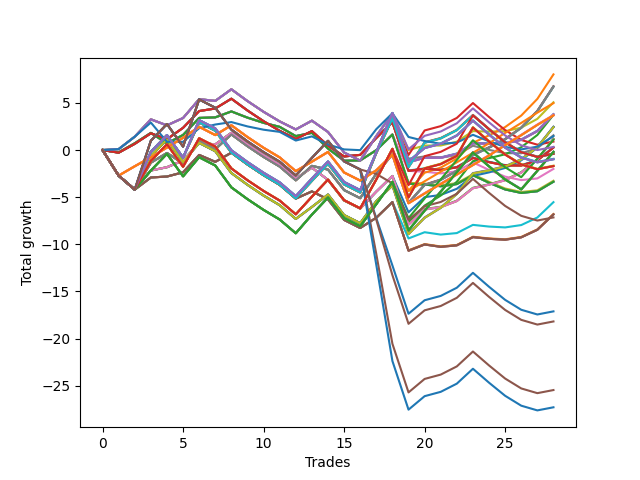

# Short Wallace 019 
- Symbol: NVDA_Unlimited
- Date Range: 02/08/2022 - 07/08/2022
- Trading Period: 7:20-12:30
- Number of Trades: 28



| Name | Win Percent | Profit | Avg Profit / Trade | Avg Time / Trade |      | Name | Win Percent | Profit | Avg Profit / Trade | Avg Time / Trade |
| ---- | ----------- | ------ | ------------------ | ---------------- | ---- | ---- | ----------- | ------ | ------------------ | ---------------- |
| Sorted By <br> Profit | | | | | | Sorted By <br> Win Percentage ||||
| Fifty-Three | 57.14 | 4015.00 | 143.39 | 46:53 |     | One Hundred Sixteen | 67.86 | 2490.00 | 88.93 | 38:29 |
| Forty-Five | 57.14 | 3385.00 | 120.89 | 47:01 |     | One Hundred Eleven | 67.86 | 1860.00 | 66.43 | 38:37 |
| Sixty-Nine | 57.14 | 3365.00 | 120.18 | 48:07 |     | One Hundred Twenty-Six | 67.86 | 1840.00 | 65.71 | 39:43 |
| Sixty-One | 57.14 | 3365.00 | 120.18 | 48:07 |     | One Hundred Twenty-One | 67.86 | 1840.00 | 65.71 | 39:43 |
| Five | 57.14 | 3365.00 | 120.18 | 48:07 |     | Eighty-One | 67.86 | 1840.00 | 65.71 | 39:43 |
| Fifty | 57.14 | 2535.00 | 90.54 | 25:50 |     | Fifty-Two | 60.71 | 1230.00 | 43.93 | 38:22 |
| One Hundred Sixteen | 67.86 | 2490.00 | 88.93 | 38:29 |     | Forty-Four | 60.71 | 600.00 | 21.43 | 38:30 |
| Forty-Two | 57.14 | 1905.00 | 68.04 | 25:59 |     | Sixty-Eight | 60.71 | 580.00 | 20.71 | 39:36 |
| Sixty-Six | 57.14 | 1885.00 | 67.32 | 27:05 |     | Sixty | 60.71 | 580.00 | 20.71 | 39:36 |
| Fifty-Eight | 57.14 | 1885.00 | 67.32 | 27:05 |     | Four | 60.71 | 580.00 | 20.71 | 39:36 |
| Two | 57.14 | 1885.00 | 67.32 | 27:05 |     | Fifty-Three | 57.14 | 4015.00 | 143.39 | 46:53 |
| Fifty-Four | 57.14 | 1865.00 | 66.61 | 70:08 |     | Forty-Five | 57.14 | 3385.00 | 120.89 | 47:01 |
| One Hundred Eleven | 67.86 | 1860.00 | 66.43 | 38:37 |     | Sixty-Nine | 57.14 | 3365.00 | 120.18 | 48:07 |
| One Hundred Twenty-Six | 67.86 | 1840.00 | 65.71 | 39:43 |     | Sixty-One | 57.14 | 3365.00 | 120.18 | 48:07 |
| One Hundred Twenty-One | 67.86 | 1840.00 | 65.71 | 39:43 |     | Five | 57.14 | 3365.00 | 120.18 | 48:07 |
| Eighty-One | 67.86 | 1840.00 | 65.71 | 39:43 |     | Fifty | 57.14 | 2535.00 | 90.54 | 25:50 |
| Forty-Six | 57.14 | 1235.00 | 44.11 | 70:16 |     | Forty-Two | 57.14 | 1905.00 | 68.04 | 25:59 |
| Fifty-Two | 60.71 | 1230.00 | 43.93 | 38:22 |     | Sixty-Six | 57.14 | 1885.00 | 67.32 | 27:05 |
| Seventy | 57.14 | 1215.00 | 43.39 | 71:22 |     | Fifty-Eight | 57.14 | 1885.00 | 67.32 | 27:05 |
| Sixty-Two | 57.14 | 1215.00 | 43.39 | 71:22 |     | Two | 57.14 | 1885.00 | 67.32 | 27:05 |
| Six | 57.14 | 1215.00 | 43.39 | 71:22 |     | Fifty-Four | 57.14 | 1865.00 | 66.61 | 70:08 |
| Forty-Nine | 53.57 | 785.00 | 28.04 | 19:13 |     | Forty-Six | 57.14 | 1235.00 | 44.11 | 70:16 |
| Seventy-Three | 46.43 | 740.00 | 26.43 | 15:43 |     | Seventy | 57.14 | 1215.00 | 43.39 | 71:22 |
| Forty-Four | 60.71 | 600.00 | 21.43 | 38:30 |     | Sixty-Two | 57.14 | 1215.00 | 43.39 | 71:22 |
| Sixty-Eight | 60.71 | 580.00 | 20.71 | 39:36 |     | Six | 57.14 | 1215.00 | 43.39 | 71:22 |
| Sixty | 60.71 | 580.00 | 20.71 | 39:36 |     | Forty-Nine | 53.57 | 785.00 | 28.04 | 19:13 |
| Four | 60.71 | 580.00 | 20.71 | 39:36 |     | Forty-One | 53.57 | 155.00 | 5.54 | 19:22 |
| One Hundred Seventeen | 46.43 | 550.00 | 19.64 | 99:18 |     | Sixty-Five | 53.57 | 135.00 | 4.82 | 20:26 |
| Fifty-Five | 42.86 | 450.00 | 16.07 | 137:03 |     | Fifty-Seven | 53.57 | 135.00 | 4.82 | 20:26 |
| One Hundred Ninteen | 42.86 | 165.00 | 5.89 | 138:46 |     | One | 53.57 | 135.00 | 4.82 | 20:26 |
| Forty-One | 53.57 | 155.00 | 5.54 | 19:22 |     | Forty-Eight | 50.00 | -1000.00 | -35.71 | 15:11 |
| Sixty-Five | 53.57 | 135.00 | 4.82 | 20:26 |     | Forty | 50.00 | -1630.00 | -58.21 | 15:19 |
| Fifty-Seven | 53.57 | 135.00 | 4.82 | 20:26 |     | Sixty-Four | 50.00 | -1680.00 | -60.00 | 16:07 |
| One | 53.57 | 135.00 | 4.82 | 20:26 |     | Fifty-Six | 50.00 | -1680.00 | -60.00 | 16:07 |
| One Hundred Twelve | 46.43 | -80.00 | -2.86 | 99:26 |     | Zero | 50.00 | -1680.00 | -60.00 | 16:07 |
| One Hundred Twenty-Seven | 46.43 | -100.00 | -3.57 | 100:32 |     | Fifty-One | 50.00 | -2765.00 | -98.75 | 32:23 |
| One Hundred Twenty-Two | 46.43 | -100.00 | -3.57 | 100:32 |     | Forty-Three | 50.00 | -3395.00 | -121.25 | 32:32 |
| Eighty-Two | 46.43 | -100.00 | -3.57 | 100:32 |     | Sixty-Seven | 50.00 | -3415.00 | -121.96 | 33:37 |
| Forty-Seven | 42.86 | -180.00 | -6.43 | 137:12 |     | Fifty-Nine | 50.00 | -3415.00 | -121.96 | 33:37 |
| One Hundred Eighteen | 42.86 | -200.00 | -7.14 | 132:44 |     | Three | 50.00 | -3415.00 | -121.96 | 33:37 |
| Seventy-One | 42.86 | -200.00 | -7.14 | 138:17 |     | Seventy-Three | 46.43 | 740.00 | 26.43 | 15:43 |
| Sixty-Three | 42.86 | -200.00 | -7.14 | 138:17 |     | One Hundred Seventeen | 46.43 | 550.00 | 19.64 | 99:18 |
| Seven | 42.86 | -200.00 | -7.14 | 138:17 |     | One Hundred Twelve | 46.43 | -80.00 | -2.86 | 99:26 |
| One Hundred Fourteen | 42.86 | -465.00 | -16.61 | 138:55 |     | One Hundred Twenty-Seven | 46.43 | -100.00 | -3.57 | 100:32 |
| One Hundred Twenty-Nine | 42.86 | -485.00 | -17.32 | 140:00 |     | One Hundred Twenty-Two | 46.43 | -100.00 | -3.57 | 100:32 |
| One Hundred Twenty-Four | 42.86 | -485.00 | -17.32 | 140:00 |     | Eighty-Two | 46.43 | -100.00 | -3.57 | 100:32 |
| Eighty-Four | 42.86 | -485.00 | -17.32 | 140:00 |     | Fifty-Five | 42.86 | 450.00 | 16.07 | 137:03 |
| One Hundred Thirteen | 42.86 | -830.00 | -29.64 | 132:53 |     | One Hundred Ninteen | 42.86 | 165.00 | 5.89 | 138:46 |
| One Hundred Twenty-Eight | 42.86 | -850.00 | -30.36 | 133:58 |     | Forty-Seven | 42.86 | -180.00 | -6.43 | 137:12 |
| One Hundred Twenty-Three | 42.86 | -850.00 | -30.36 | 133:58 |     | One Hundred Eighteen | 42.86 | -200.00 | -7.14 | 132:44 |
| Eighty-Three | 42.86 | -850.00 | -30.36 | 133:58 |     | Seventy-One | 42.86 | -200.00 | -7.14 | 138:17 |
| Forty-Eight | 50.00 | -1000.00 | -35.71 | 15:11 |     | Sixty-Three | 42.86 | -200.00 | -7.14 | 138:17 |
| Forty | 50.00 | -1630.00 | -58.21 | 15:19 |     | Seven | 42.86 | -200.00 | -7.14 | 138:17 |
| Sixty-Four | 50.00 | -1680.00 | -60.00 | 16:07 |     | One Hundred Fourteen | 42.86 | -465.00 | -16.61 | 138:55 |
| Fifty-Six | 50.00 | -1680.00 | -60.00 | 16:07 |     | One Hundred Twenty-Nine | 42.86 | -485.00 | -17.32 | 140:00 |
| Zero | 50.00 | -1680.00 | -60.00 | 16:07 |     | One Hundred Twenty-Four | 42.86 | -485.00 | -17.32 | 140:00 |
| Fifty-One | 50.00 | -2765.00 | -98.75 | 32:23 |     | Eighty-Four | 42.86 | -485.00 | -17.32 | 140:00 |
| Forty-Three | 50.00 | -3395.00 | -121.25 | 32:32 |     | One Hundred Thirteen | 42.86 | -830.00 | -29.64 | 132:53 |
| Sixty-Seven | 50.00 | -3415.00 | -121.96 | 33:37 |     | One Hundred Twenty-Eight | 42.86 | -850.00 | -30.36 | 133:58 |
| Fifty-Nine | 50.00 | -3415.00 | -121.96 | 33:37 |     | One Hundred Twenty-Three | 42.86 | -850.00 | -30.36 | 133:58 |
| Three | 50.00 | -3415.00 | -121.96 | 33:37 |     | Eighty-Three | 42.86 | -850.00 | -30.36 | 133:58 |
| One Hundred Twenty | 35.71 | -3575.00 | -127.68 | 140:12 |     | One Hundred Twenty | 35.71 | -3575.00 | -127.68 | 140:12 |
| One Hundred Fifteen | 35.71 | -8560.00 | -305.71 | 140:56 |     | One Hundred Fifteen | 35.71 | -8560.00 | -305.71 | 140:56 |
| One Hundred Thirty | 35.71 | -9095.00 | -324.82 | 142:19 |     | One Hundred Thirty | 35.71 | -9095.00 | -324.82 | 142:19 |
| Eighty-Five | 35.71 | -12735.00 | -454.82 | 145:55 |     | Eighty-Five | 35.71 | -12735.00 | -454.82 | 145:55 |
| One Hundred Twenty-Five | 35.71 | -13650.00 | -487.50 | 143:48 |     | One Hundred Twenty-Five | 35.71 | -13650.00 | -487.50 | 143:48 |

## NO STOPLOSS

### Test Zero
* Sell when price hits the middle line of the 20p bollinger
* No Stoploss
* Results:
```
Total Trades: 28
Percent Up: 50.00
Percent Down: 50.00
Total Points Moved Down: -3.36
Potential Profit: -1680.00
Total Points Ups: 14.31 Count Ups: 14
Total Points Downs: 10.95 Count Downs: 14
```

<details><summary>Trades</summary>

<code>In: 2022-02-16 11:26:00		Out: 2022-02-16 11:41:40		Total Position Time: 15:40		Total Move Down: -0.25		Total to Date: -0.25</code> <br />
<code>In: 2022-02-16 11:31:00		Out: 2022-02-16 11:41:40		Total Position Time: 10:40		Total Move Down: 0.97		Total to Date: 0.72</code> <br />
<code>In: 2022-02-18 12:04:00		Out: 2022-02-18 12:08:20		Total Position Time: 04:20		Total Move Down: 1.10		Total to Date: 1.82</code> <br />
<code>In: 2022-02-22 11:55:00		Out: 2022-02-22 12:14:45		Total Position Time: 19:45		Total Move Down: -1.11		Total to Date: 0.71</code> <br />
<code>In: 2022-03-02 08:10:00		Out: 2022-03-02 08:21:15		Total Position Time: 11:15		Total Move Down: 0.89		Total to Date: 1.60</code> <br />
<code>In: 2022-03-03 09:38:00		Out: 2022-03-03 09:41:55		Total Position Time: 03:55		Total Move Down: 1.81		Total to Date: 3.41</code> <br />
<code>In: 2022-03-10 11:07:00		Out: 2022-03-10 11:22:15		Total Position Time: 15:15		Total Move Down: 0.06		Total to Date: 3.47</code> <br />
<code>In: 2022-03-17 10:53:00		Out: 2022-03-17 11:00:05		Total Position Time: 07:05		Total Move Down: 0.63		Total to Date: 4.10</code> <br />
<code>In: 2022-03-28 12:13:00		Out: 2022-03-28 12:39:35		Total Position Time: 26:35		Total Move Down: -0.66		Total to Date: 3.44</code> <br />
<code>In: 2022-03-28 12:14:00		Out: 2022-03-28 12:39:35		Total Position Time: 25:35		Total Move Down: -0.55		Total to Date: 2.89</code> <br />
<code>In: 2022-03-28 12:16:00		Out: 2022-03-28 12:39:35		Total Position Time: 23:35		Total Move Down: -0.43		Total to Date: 2.46</code> <br />
<code>In: 2022-03-29 12:08:00		Out: 2022-03-29 12:38:45		Total Position Time: 30:45		Total Move Down: -0.98		Total to Date: 1.48</code> <br />
<code>In: 2022-04-11 11:53:00		Out: 2022-04-11 12:04:05		Total Position Time: 11:05		Total Move Down: 0.35		Total to Date: 1.83</code> <br />
<code>In: 2022-04-18 10:37:00		Out: 2022-04-18 11:05:15		Total Position Time: 28:15		Total Move Down: -1.67		Total to Date: 0.16</code> <br />
<code>In: 2022-05-02 12:15:00		Out: 2022-05-02 12:40:35		Total Position Time: 25:35		Total Move Down: -1.29		Total to Date: -1.13</code> <br />
<code>In: 2022-05-02 12:29:00		Out: 2022-05-02 12:40:35		Total Position Time: 11:35		Total Move Down: 0.03		Total to Date: -1.10</code> <br />
<code>In: 2022-05-04 11:03:00		Out: 2022-05-04 11:07:05		Total Position Time: 04:05		Total Move Down: 1.09		Total to Date: -0.01</code> <br />
<code>In: 2022-05-04 11:07:00		Out: 2022-05-04 11:08:10		Total Position Time: 01:10		Total Move Down: 1.66		Total to Date: 1.65</code> <br />
<code>In: 2022-05-04 11:50:00		Out: 2022-05-04 12:38:40		Total Position Time: 48:40		Total Move Down: -5.22		Total to Date: -3.57</code> <br />
<code>In: 2022-05-31 07:33:00		Out: 2022-05-31 07:53:45		Total Position Time: 20:45		Total Move Down: -0.09		Total to Date: -3.66</code> <br />
<code>In: 2022-06-30 08:22:00		Out: 2022-06-30 08:35:40		Total Position Time: 13:40		Total Move Down: -0.18		Total to Date: -3.84</code> <br />
<code>In: 2022-06-30 08:25:00		Out: 2022-06-30 08:35:40		Total Position Time: 10:40		Total Move Down: 0.23		Total to Date: -3.61</code> <br />
<code>In: 2022-06-30 08:28:00		Out: 2022-06-30 08:35:40		Total Position Time: 07:40		Total Move Down: 0.94		Total to Date: -2.67</code> <br />
<code>In: 2022-07-06 07:47:00		Out: 2022-07-06 08:06:10		Total Position Time: 19:10		Total Move Down: -0.80		Total to Date: -3.47</code> <br />
<code>In: 2022-07-06 07:48:00		Out: 2022-07-06 08:06:10		Total Position Time: 18:10		Total Move Down: -0.71		Total to Date: -4.18</code> <br />
<code>In: 2022-07-06 07:49:00		Out: 2022-07-06 08:06:10		Total Position Time: 17:10		Total Move Down: -0.37		Total to Date: -4.55</code> <br />
<code>In: 2022-07-06 07:53:00		Out: 2022-07-06 08:06:10		Total Position Time: 13:10		Total Move Down: 0.18		Total to Date: -4.37</code> <br />
<code>In: 2022-07-06 08:00:00		Out: 2022-07-06 08:06:10		Total Position Time: 06:10		Total Move Down: 1.01		Total to Date: -3.36</code> <br />


</details>

### Test One
* Sell when the price hits the upper line of the 20p 1std bollinger
* No Stoploss
* Results:
```
Total Trades: 28
Percent Up: 46.43
Percent Down: 53.57
Total Points Moved Down: 0.27
Potential Profit: 135.00
Total Points Ups: 13.95 Count Ups: 13
Total Points Downs: 14.22 Count Downs: 15
```

<details><summary>Trades</summary>

<code>In: 2022-02-16 11:26:00		Out: 2022-02-16 11:47:15		Total Position Time: 21:15		Total Move Down: -0.28		Total to Date: -0.28</code> <br />
<code>In: 2022-02-16 11:31:00		Out: 2022-02-16 11:47:15		Total Position Time: 16:15		Total Move Down: 0.94		Total to Date: 0.66</code> <br />
<code>In: 2022-02-18 12:04:00		Out: 2022-02-18 12:15:05		Total Position Time: 11:05		Total Move Down: 1.12		Total to Date: 1.78</code> <br />
<code>In: 2022-02-22 11:55:00		Out: 2022-02-22 12:19:45		Total Position Time: 24:45		Total Move Down: -0.63		Total to Date: 1.15</code> <br />
<code>In: 2022-03-02 08:10:00		Out: 2022-03-02 08:23:25		Total Position Time: 13:25		Total Move Down: 1.21		Total to Date: 2.36</code> <br />
<code>In: 2022-03-03 09:38:00		Out: 2022-03-03 09:53:50		Total Position Time: 15:50		Total Move Down: 1.78		Total to Date: 4.14</code> <br />
<code>In: 2022-03-10 11:07:00		Out: 2022-03-10 11:24:35		Total Position Time: 17:35		Total Move Down: 0.27		Total to Date: 4.41</code> <br />
<code>In: 2022-03-17 10:53:00		Out: 2022-03-17 11:01:00		Total Position Time: 08:00		Total Move Down: 1.04		Total to Date: 5.45</code> <br />
<code>In: 2022-03-28 12:13:00		Out: 2022-03-28 12:47:00		Total Position Time: 34:00		Total Move Down: -1.25		Total to Date: 4.20</code> <br />
<code>In: 2022-03-28 12:14:00		Out: 2022-03-28 12:47:00		Total Position Time: 33:00		Total Move Down: -1.14		Total to Date: 3.06</code> <br />
<code>In: 2022-03-28 12:16:00		Out: 2022-03-28 12:47:00		Total Position Time: 31:00		Total Move Down: -1.02		Total to Date: 2.04</code> <br />
<code>In: 2022-03-29 12:08:00		Out: 2022-03-29 12:43:10		Total Position Time: 35:10		Total Move Down: -0.85		Total to Date: 1.19</code> <br />
<code>In: 2022-04-11 11:53:00		Out: 2022-04-11 12:04:20		Total Position Time: 11:20		Total Move Down: 0.82		Total to Date: 2.01</code> <br />
<code>In: 2022-04-18 10:37:00		Out: 2022-04-18 11:10:45		Total Position Time: 33:45		Total Move Down: -1.54		Total to Date: 0.47</code> <br />
<code>In: 2022-05-02 12:15:00		Out: 2022-05-02 12:44:50		Total Position Time: 29:50		Total Move Down: -1.15		Total to Date: -0.68</code> <br />
<code>In: 2022-05-02 12:29:00		Out: 2022-05-02 12:44:50		Total Position Time: 15:50		Total Move Down: 0.17		Total to Date: -0.51</code> <br />
<code>In: 2022-05-04 11:03:00		Out: 2022-05-04 11:07:20		Total Position Time: 04:20		Total Move Down: 1.80		Total to Date: 1.29</code> <br />
<code>In: 2022-05-04 11:07:00		Out: 2022-05-04 11:08:10		Total Position Time: 01:10		Total Move Down: 1.66		Total to Date: 2.95</code> <br />
<code>In: 2022-05-04 11:50:00		Out: 2022-05-04 12:46:15		Total Position Time: 56:15		Total Move Down: -5.16		Total to Date: -2.21</code> <br />
<code>In: 2022-05-31 07:33:00		Out: 2022-05-31 07:57:20		Total Position Time: 24:20		Total Move Down: 0.23		Total to Date: -1.98</code> <br />
<code>In: 2022-06-30 08:22:00		Out: 2022-06-30 08:41:05		Total Position Time: 19:05		Total Move Down: -0.13		Total to Date: -2.11</code> <br />
<code>In: 2022-06-30 08:25:00		Out: 2022-06-30 08:41:05		Total Position Time: 16:05		Total Move Down: 0.28		Total to Date: -1.83</code> <br />
<code>In: 2022-06-30 08:28:00		Out: 2022-06-30 08:41:05		Total Position Time: 13:05		Total Move Down: 0.99		Total to Date: -0.84</code> <br />
<code>In: 2022-07-06 07:47:00		Out: 2022-07-06 08:08:35		Total Position Time: 21:35		Total Move Down: -0.44		Total to Date: -1.28</code> <br />
<code>In: 2022-07-06 07:48:00		Out: 2022-07-06 08:08:35		Total Position Time: 20:35		Total Move Down: -0.35		Total to Date: -1.63</code> <br />
<code>In: 2022-07-06 07:49:00		Out: 2022-07-06 08:08:35		Total Position Time: 19:35		Total Move Down: -0.01		Total to Date: -1.64</code> <br />
<code>In: 2022-07-06 07:53:00		Out: 2022-07-06 08:08:35		Total Position Time: 15:35		Total Move Down: 0.54		Total to Date: -1.10</code> <br />
<code>In: 2022-07-06 08:00:00		Out: 2022-07-06 08:08:35		Total Position Time: 08:35		Total Move Down: 1.37		Total to Date: 0.27</code> <br />


</details>

### Test Two
* Sell when the price hits the upper line of the 20p 2std bollinger
* No Stoploss
* Results:
```
Total Trades: 28
Percent Up: 42.86
Percent Down: 57.14
Total Points Moved Down: 3.77
Potential Profit: 1885.00
Total Points Ups: 14.53 Count Ups: 12
Total Points Downs: 18.30 Count Downs: 16
```

<details><summary>Trades</summary>

<code>In: 2022-02-16 11:26:00		Out: 2022-02-16 11:48:05		Total Position Time: 22:05		Total Move Down: 0.10		Total to Date: 0.10</code> <br />
<code>In: 2022-02-16 11:31:00		Out: 2022-02-16 11:48:05		Total Position Time: 17:05		Total Move Down: 1.32		Total to Date: 1.42</code> <br />
<code>In: 2022-02-18 12:04:00		Out: 2022-02-18 12:18:35		Total Position Time: 14:35		Total Move Down: 1.84		Total to Date: 3.26</code> <br />
<code>In: 2022-02-22 11:55:00		Out: 2022-02-22 12:22:05		Total Position Time: 27:05		Total Move Down: -0.64		Total to Date: 2.62</code> <br />
<code>In: 2022-03-02 08:10:00		Out: 2022-03-02 08:49:30		Total Position Time: 39:30		Total Move Down: 0.78		Total to Date: 3.40</code> <br />
<code>In: 2022-03-03 09:38:00		Out: 2022-03-03 10:00:10		Total Position Time: 22:10		Total Move Down: 2.00		Total to Date: 5.40</code> <br />
<code>In: 2022-03-10 11:07:00		Out: 2022-03-10 12:07:05		Total Position Time: 60:05		Total Move Down: -0.18		Total to Date: 5.22</code> <br />
<code>In: 2022-03-17 10:53:00		Out: 2022-03-17 11:02:45		Total Position Time: 09:45		Total Move Down: 1.23		Total to Date: 6.45</code> <br />
<code>In: 2022-03-28 12:13:00		Out: 2022-03-28 12:47:00		Total Position Time: 34:00		Total Move Down: -1.25		Total to Date: 5.20</code> <br />
<code>In: 2022-03-28 12:14:00		Out: 2022-03-28 12:47:00		Total Position Time: 33:00		Total Move Down: -1.14		Total to Date: 4.06</code> <br />
<code>In: 2022-03-28 12:16:00		Out: 2022-03-28 12:47:00		Total Position Time: 31:00		Total Move Down: -1.02		Total to Date: 3.04</code> <br />
<code>In: 2022-03-29 12:08:00		Out: 2022-03-29 12:43:10		Total Position Time: 35:10		Total Move Down: -0.85		Total to Date: 2.19</code> <br />
<code>In: 2022-04-11 11:53:00		Out: 2022-04-11 12:05:45		Total Position Time: 12:45		Total Move Down: 0.93		Total to Date: 3.12</code> <br />
<code>In: 2022-04-18 10:37:00		Out: 2022-04-18 11:11:30		Total Position Time: 34:30		Total Move Down: -1.20		Total to Date: 1.92</code> <br />
<code>In: 2022-05-02 12:15:00		Out: 2022-05-02 12:47:00		Total Position Time: 32:00		Total Move Down: -2.18		Total to Date: -0.26</code> <br />
<code>In: 2022-05-02 12:29:00		Out: 2022-05-02 12:47:00		Total Position Time: 18:00		Total Move Down: -0.86		Total to Date: -1.12</code> <br />
<code>In: 2022-05-04 11:03:00		Out: 2022-05-04 11:07:30		Total Position Time: 04:30		Total Move Down: 2.61		Total to Date: 1.49</code> <br />
<code>In: 2022-05-04 11:07:00		Out: 2022-05-04 11:20:50		Total Position Time: 13:50		Total Move Down: 2.37		Total to Date: 3.86</code> <br />
<code>In: 2022-05-04 11:50:00		Out: 2022-05-04 12:47:00		Total Position Time: 57:00		Total Move Down: -5.16		Total to Date: -1.30</code> <br />
<code>In: 2022-05-31 07:33:00		Out: 2022-05-31 08:00:05		Total Position Time: 27:05		Total Move Down: 0.48		Total to Date: -0.82</code> <br />
<code>In: 2022-06-30 08:22:00		Out: 2022-06-30 09:04:30		Total Position Time: 42:30		Total Move Down: -0.00		Total to Date: -0.82</code> <br />
<code>In: 2022-06-30 08:25:00		Out: 2022-06-30 09:04:30		Total Position Time: 39:30		Total Move Down: 0.41		Total to Date: -0.41</code> <br />
<code>In: 2022-06-30 08:28:00		Out: 2022-06-30 09:04:30		Total Position Time: 36:30		Total Move Down: 1.12		Total to Date: 0.71</code> <br />
<code>In: 2022-07-06 07:47:00		Out: 2022-07-06 08:10:20		Total Position Time: 23:20		Total Move Down: -0.05		Total to Date: 0.66</code> <br />
<code>In: 2022-07-06 07:48:00		Out: 2022-07-06 08:10:20		Total Position Time: 22:20		Total Move Down: 0.04		Total to Date: 0.70</code> <br />
<code>In: 2022-07-06 07:49:00		Out: 2022-07-06 08:10:20		Total Position Time: 21:20		Total Move Down: 0.38		Total to Date: 1.08</code> <br />
<code>In: 2022-07-06 07:53:00		Out: 2022-07-06 08:10:20		Total Position Time: 17:20		Total Move Down: 0.93		Total to Date: 2.01</code> <br />
<code>In: 2022-07-06 08:00:00		Out: 2022-07-06 08:10:20		Total Position Time: 10:20		Total Move Down: 1.76		Total to Date: 3.77</code> <br />


</details>

### Test Three
* Sell when price hits the middle line of the 50p bollinger
* No Stoploss
* Results:
```
Total Trades: 28
Percent Up: 50.00
Percent Down: 50.00
Total Points Moved Down: -6.83
Potential Profit: -3415.00
Total Points Ups: 19.36 Count Ups: 14
Total Points Downs: 12.53 Count Downs: 14
```

<details><summary>Trades</summary>

<code>In: 2022-02-16 11:26:00		Out: 2022-02-16 12:47:00		Total Position Time: 81:00		Total Move Down: -2.71		Total to Date: -2.71</code> <br />
<code>In: 2022-02-16 11:31:00		Out: 2022-02-16 12:47:00		Total Position Time: 76:00		Total Move Down: -1.49		Total to Date: -4.20</code> <br />
<code>In: 2022-02-18 12:04:00		Out: 2022-02-18 12:17:20		Total Position Time: 13:20		Total Move Down: 1.29		Total to Date: -2.91</code> <br />
<code>In: 2022-02-22 11:55:00		Out: 2022-02-22 12:30:30		Total Position Time: 35:30		Total Move Down: 0.10		Total to Date: -2.81</code> <br />
<code>In: 2022-03-02 08:10:00		Out: 2022-03-02 08:49:00		Total Position Time: 39:00		Total Move Down: 0.45		Total to Date: -2.36</code> <br />
<code>In: 2022-03-03 09:38:00		Out: 2022-03-03 09:41:50		Total Position Time: 03:50		Total Move Down: 1.84		Total to Date: -0.52</code> <br />
<code>In: 2022-03-10 11:07:00		Out: 2022-03-10 12:01:25		Total Position Time: 54:25		Total Move Down: -0.73		Total to Date: -1.25</code> <br />
<code>In: 2022-03-17 10:53:00		Out: 2022-03-17 11:12:35		Total Position Time: 19:35		Total Move Down: 0.97		Total to Date: -0.28</code> <br />
<code>In: 2022-03-28 12:13:00		Out: 2022-03-28 12:47:00		Total Position Time: 34:00		Total Move Down: -1.25		Total to Date: -1.53</code> <br />
<code>In: 2022-03-28 12:14:00		Out: 2022-03-28 12:47:00		Total Position Time: 33:00		Total Move Down: -1.14		Total to Date: -2.67</code> <br />
<code>In: 2022-03-28 12:16:00		Out: 2022-03-28 12:47:00		Total Position Time: 31:00		Total Move Down: -1.02		Total to Date: -3.69</code> <br />
<code>In: 2022-03-29 12:08:00		Out: 2022-03-29 12:47:00		Total Position Time: 39:00		Total Move Down: -1.46		Total to Date: -5.15</code> <br />
<code>In: 2022-04-11 11:53:00		Out: 2022-04-11 12:20:25		Total Position Time: 27:25		Total Move Down: 0.76		Total to Date: -4.39</code> <br />
<code>In: 2022-04-18 10:37:00		Out: 2022-04-18 11:17:05		Total Position Time: 40:05		Total Move Down: -0.84		Total to Date: -5.23</code> <br />
<code>In: 2022-05-02 12:15:00		Out: 2022-05-02 12:47:00		Total Position Time: 32:00		Total Move Down: -2.18		Total to Date: -7.41</code> <br />
<code>In: 2022-05-02 12:29:00		Out: 2022-05-02 12:47:00		Total Position Time: 18:00		Total Move Down: -0.86		Total to Date: -8.27</code> <br />
<code>In: 2022-05-04 11:03:00		Out: 2022-05-04 11:07:05		Total Position Time: 04:05		Total Move Down: 1.09		Total to Date: -7.18</code> <br />
<code>In: 2022-05-04 11:07:00		Out: 2022-05-04 11:08:10		Total Position Time: 01:10		Total Move Down: 1.66		Total to Date: -5.52</code> <br />
<code>In: 2022-05-04 11:50:00		Out: 2022-05-04 12:47:00		Total Position Time: 57:00		Total Move Down: -5.16		Total to Date: -10.68</code> <br />
<code>In: 2022-05-31 07:33:00		Out: 2022-05-31 08:06:35		Total Position Time: 33:35		Total Move Down: 0.66		Total to Date: -10.02</code> <br />
<code>In: 2022-06-30 08:22:00		Out: 2022-06-30 09:02:35		Total Position Time: 40:35		Total Move Down: -0.25		Total to Date: -10.27</code> <br />
<code>In: 2022-06-30 08:25:00		Out: 2022-06-30 09:02:35		Total Position Time: 37:35		Total Move Down: 0.16		Total to Date: -10.11</code> <br />
<code>In: 2022-06-30 08:28:00		Out: 2022-06-30 09:02:35		Total Position Time: 34:35		Total Move Down: 0.87		Total to Date: -9.24</code> <br />
<code>In: 2022-07-06 07:47:00		Out: 2022-07-06 08:22:35		Total Position Time: 35:35		Total Move Down: -0.18		Total to Date: -9.42</code> <br />
<code>In: 2022-07-06 07:48:00		Out: 2022-07-06 08:22:35		Total Position Time: 34:35		Total Move Down: -0.09		Total to Date: -9.51</code> <br />
<code>In: 2022-07-06 07:49:00		Out: 2022-07-06 08:22:35		Total Position Time: 33:35		Total Move Down: 0.25		Total to Date: -9.26</code> <br />
<code>In: 2022-07-06 07:53:00		Out: 2022-07-06 08:22:35		Total Position Time: 29:35		Total Move Down: 0.80		Total to Date: -8.46</code> <br />
<code>In: 2022-07-06 08:00:00		Out: 2022-07-06 08:22:35		Total Position Time: 22:35		Total Move Down: 1.63		Total to Date: -6.83</code> <br />


</details>

### Test Four
* Sell when the price hits the upper line of the 50p 1std bollinger
* No Stoploss
* Results:
```
Total Trades: 28
Percent Up: 39.29
Percent Down: 60.71
Total Points Moved Down: 1.16
Potential Profit: 580.00
Total Points Ups: 18.76 Count Ups: 11
Total Points Downs: 19.92 Count Downs: 17
```

<details><summary>Trades</summary>

<code>In: 2022-02-16 11:26:00		Out: 2022-02-16 12:47:00		Total Position Time: 81:00		Total Move Down: -2.71		Total to Date: -2.71</code> <br />
<code>In: 2022-02-16 11:31:00		Out: 2022-02-16 12:47:00		Total Position Time: 76:00		Total Move Down: -1.49		Total to Date: -4.20</code> <br />
<code>In: 2022-02-18 12:04:00		Out: 2022-02-18 12:19:05		Total Position Time: 15:05		Total Move Down: 2.03		Total to Date: -2.17</code> <br />
<code>In: 2022-02-22 11:55:00		Out: 2022-02-22 12:40:55		Total Position Time: 45:55		Total Move Down: 0.35		Total to Date: -1.82</code> <br />
<code>In: 2022-03-02 08:10:00		Out: 2022-03-02 08:54:20		Total Position Time: 44:20		Total Move Down: 0.71		Total to Date: -1.11</code> <br />
<code>In: 2022-03-03 09:38:00		Out: 2022-03-03 10:34:35		Total Position Time: 56:35		Total Move Down: 1.89		Total to Date: 0.78</code> <br />
<code>In: 2022-03-10 11:07:00		Out: 2022-03-10 12:07:05		Total Position Time: 60:05		Total Move Down: -0.18		Total to Date: 0.60</code> <br />
<code>In: 2022-03-17 10:53:00		Out: 2022-03-17 11:24:10		Total Position Time: 31:10		Total Move Down: 1.23		Total to Date: 1.83</code> <br />
<code>In: 2022-03-28 12:13:00		Out: 2022-03-28 12:47:00		Total Position Time: 34:00		Total Move Down: -1.25		Total to Date: 0.58</code> <br />
<code>In: 2022-03-28 12:14:00		Out: 2022-03-28 12:47:00		Total Position Time: 33:00		Total Move Down: -1.14		Total to Date: -0.56</code> <br />
<code>In: 2022-03-28 12:16:00		Out: 2022-03-28 12:47:00		Total Position Time: 31:00		Total Move Down: -1.02		Total to Date: -1.58</code> <br />
<code>In: 2022-03-29 12:08:00		Out: 2022-03-29 12:47:00		Total Position Time: 39:00		Total Move Down: -1.46		Total to Date: -3.04</code> <br />
<code>In: 2022-04-11 11:53:00		Out: 2022-04-11 12:28:45		Total Position Time: 35:45		Total Move Down: 1.18		Total to Date: -1.86</code> <br />
<code>In: 2022-04-18 10:37:00		Out: 2022-04-18 11:46:10		Total Position Time: 69:10		Total Move Down: -1.31		Total to Date: -3.17</code> <br />
<code>In: 2022-05-02 12:15:00		Out: 2022-05-02 12:47:00		Total Position Time: 32:00		Total Move Down: -2.18		Total to Date: -5.35</code> <br />
<code>In: 2022-05-02 12:29:00		Out: 2022-05-02 12:47:00		Total Position Time: 18:00		Total Move Down: -0.86		Total to Date: -6.21</code> <br />
<code>In: 2022-05-04 11:03:00		Out: 2022-05-04 11:07:20		Total Position Time: 04:20		Total Move Down: 1.80		Total to Date: -4.41</code> <br />
<code>In: 2022-05-04 11:07:00		Out: 2022-05-04 11:08:10		Total Position Time: 01:10		Total Move Down: 1.66		Total to Date: -2.75</code> <br />
<code>In: 2022-05-04 11:50:00		Out: 2022-05-04 12:47:00		Total Position Time: 57:00		Total Move Down: -5.16		Total to Date: -7.91</code> <br />
<code>In: 2022-05-31 07:33:00		Out: 2022-05-31 08:08:45		Total Position Time: 35:45		Total Move Down: 1.61		Total to Date: -6.30</code> <br />
<code>In: 2022-06-30 08:22:00		Out: 2022-06-30 09:06:05		Total Position Time: 44:05		Total Move Down: 0.24		Total to Date: -6.06</code> <br />
<code>In: 2022-06-30 08:25:00		Out: 2022-06-30 09:06:05		Total Position Time: 41:05		Total Move Down: 0.65		Total to Date: -5.41</code> <br />
<code>In: 2022-06-30 08:28:00		Out: 2022-06-30 09:06:05		Total Position Time: 38:05		Total Move Down: 1.36		Total to Date: -4.05</code> <br />
<code>In: 2022-07-06 07:47:00		Out: 2022-07-06 08:28:30		Total Position Time: 41:30		Total Move Down: 0.38		Total to Date: -3.67</code> <br />
<code>In: 2022-07-06 07:48:00		Out: 2022-07-06 08:28:30		Total Position Time: 40:30		Total Move Down: 0.47		Total to Date: -3.20</code> <br />
<code>In: 2022-07-06 07:49:00		Out: 2022-07-06 08:28:30		Total Position Time: 39:30		Total Move Down: 0.81		Total to Date: -2.39</code> <br />
<code>In: 2022-07-06 07:53:00		Out: 2022-07-06 08:28:30		Total Position Time: 35:30		Total Move Down: 1.36		Total to Date: -1.03</code> <br />
<code>In: 2022-07-06 08:00:00		Out: 2022-07-06 08:28:30		Total Position Time: 28:30		Total Move Down: 2.19		Total to Date: 1.16</code> <br />


</details>

### Test Five
* Sell when the price hits the upper line of the 50p 2std bollinger
* No Stoploss
* Results:
```
Total Trades: 28
Percent Up: 42.86
Percent Down: 57.14
Total Points Moved Down: 6.73
Potential Profit: 3365.00
Total Points Ups: 19.65 Count Ups: 12
Total Points Downs: 26.38 Count Downs: 16
```

<details><summary>Trades</summary>

<code>In: 2022-02-16 11:26:00		Out: 2022-02-16 12:47:00		Total Position Time: 81:00		Total Move Down: -2.71		Total to Date: -2.71</code> <br />
<code>In: 2022-02-16 11:31:00		Out: 2022-02-16 12:47:00		Total Position Time: 76:00		Total Move Down: -1.49		Total to Date: -4.20</code> <br />
<code>In: 2022-02-18 12:04:00		Out: 2022-02-18 12:19:45		Total Position Time: 15:45		Total Move Down: 2.86		Total to Date: -1.34</code> <br />
<code>In: 2022-02-22 11:55:00		Out: 2022-02-22 12:42:30		Total Position Time: 47:30		Total Move Down: 1.03		Total to Date: -0.31</code> <br />
<code>In: 2022-03-02 08:10:00		Out: 2022-03-02 10:49:40		Total Position Time: 159:40		Total Move Down: -1.11		Total to Date: -1.42</code> <br />
<code>In: 2022-03-03 09:38:00		Out: 2022-03-03 10:41:35		Total Position Time: 63:35		Total Move Down: 2.39		Total to Date: 0.97</code> <br />
<code>In: 2022-03-10 11:07:00		Out: 2022-03-10 12:47:00		Total Position Time: 100:00		Total Move Down: -0.88		Total to Date: 0.09</code> <br />
<code>In: 2022-03-17 10:53:00		Out: 2022-03-17 11:27:20		Total Position Time: 34:20		Total Move Down: 1.57		Total to Date: 1.66</code> <br />
<code>In: 2022-03-28 12:13:00		Out: 2022-03-28 12:47:00		Total Position Time: 34:00		Total Move Down: -1.25		Total to Date: 0.41</code> <br />
<code>In: 2022-03-28 12:14:00		Out: 2022-03-28 12:47:00		Total Position Time: 33:00		Total Move Down: -1.14		Total to Date: -0.73</code> <br />
<code>In: 2022-03-28 12:16:00		Out: 2022-03-28 12:47:00		Total Position Time: 31:00		Total Move Down: -1.02		Total to Date: -1.75</code> <br />
<code>In: 2022-03-29 12:08:00		Out: 2022-03-29 12:47:00		Total Position Time: 39:00		Total Move Down: -1.46		Total to Date: -3.21</code> <br />
<code>In: 2022-04-11 11:53:00		Out: 2022-04-11 12:32:05		Total Position Time: 39:05		Total Move Down: 1.53		Total to Date: -1.68</code> <br />
<code>In: 2022-04-18 10:37:00		Out: 2022-04-18 12:03:20		Total Position Time: 86:20		Total Move Down: -0.39		Total to Date: -2.07</code> <br />
<code>In: 2022-05-02 12:15:00		Out: 2022-05-02 12:47:00		Total Position Time: 32:00		Total Move Down: -2.18		Total to Date: -4.25</code> <br />
<code>In: 2022-05-02 12:29:00		Out: 2022-05-02 12:47:00		Total Position Time: 18:00		Total Move Down: -0.86		Total to Date: -5.11</code> <br />
<code>In: 2022-05-04 11:03:00		Out: 2022-05-04 11:07:30		Total Position Time: 04:30		Total Move Down: 2.61		Total to Date: -2.50</code> <br />
<code>In: 2022-05-04 11:07:00		Out: 2022-05-04 11:20:40		Total Position Time: 13:40		Total Move Down: 2.04		Total to Date: -0.46</code> <br />
<code>In: 2022-05-04 11:50:00		Out: 2022-05-04 12:47:00		Total Position Time: 57:00		Total Move Down: -5.16		Total to Date: -5.62</code> <br />
<code>In: 2022-05-31 07:33:00		Out: 2022-05-31 08:15:00		Total Position Time: 42:00		Total Move Down: 1.91		Total to Date: -3.71</code> <br />
<code>In: 2022-06-30 08:22:00		Out: 2022-06-30 09:09:40		Total Position Time: 47:40		Total Move Down: 0.55		Total to Date: -3.16</code> <br />
<code>In: 2022-06-30 08:25:00		Out: 2022-06-30 09:09:40		Total Position Time: 44:40		Total Move Down: 0.96		Total to Date: -2.20</code> <br />
<code>In: 2022-06-30 08:28:00		Out: 2022-06-30 09:09:40		Total Position Time: 41:40		Total Move Down: 1.67		Total to Date: -0.53</code> <br />
<code>In: 2022-07-06 07:47:00		Out: 2022-07-06 08:32:35		Total Position Time: 45:35		Total Move Down: 0.79		Total to Date: 0.26</code> <br />
<code>In: 2022-07-06 07:48:00		Out: 2022-07-06 08:32:35		Total Position Time: 44:35		Total Move Down: 0.88		Total to Date: 1.14</code> <br />
<code>In: 2022-07-06 07:49:00		Out: 2022-07-06 08:32:35		Total Position Time: 43:35		Total Move Down: 1.22		Total to Date: 2.36</code> <br />
<code>In: 2022-07-06 07:53:00		Out: 2022-07-06 08:32:35		Total Position Time: 39:35		Total Move Down: 1.77		Total to Date: 4.13</code> <br />
<code>In: 2022-07-06 08:00:00		Out: 2022-07-06 08:32:35		Total Position Time: 32:35		Total Move Down: 2.60		Total to Date: 6.73</code> <br />


</details>

### Test Six
* Sell when the price hits the middle line of the 1std VWAP
* No Stoploss
* Results:
```
Total Trades: 28
Percent Up: 42.86
Percent Down: 57.14
Total Points Moved Down: 2.43
Potential Profit: 1215.00
Total Points Ups: 22.86 Count Ups: 12
Total Points Downs: 25.29 Count Downs: 16
```

<details><summary>Trades</summary>

<code>In: 2022-02-16 11:26:00		Out: 2022-02-16 12:47:00		Total Position Time: 81:00		Total Move Down: -2.71		Total to Date: -2.71</code> <br />
<code>In: 2022-02-16 11:31:00		Out: 2022-02-16 12:47:00		Total Position Time: 76:00		Total Move Down: -1.49		Total to Date: -4.20</code> <br />
<code>In: 2022-02-18 12:04:00		Out: 2022-02-18 12:22:10		Total Position Time: 18:10		Total Move Down: 3.57		Total to Date: -0.63</code> <br />
<code>In: 2022-02-22 11:55:00		Out: 2022-02-22 12:46:35		Total Position Time: 51:35		Total Move Down: 1.75		Total to Date: 1.12</code> <br />
<code>In: 2022-03-02 08:10:00		Out: 2022-03-02 12:47:00		Total Position Time: 277:00		Total Move Down: -2.39		Total to Date: -1.27</code> <br />
<code>In: 2022-03-03 09:38:00		Out: 2022-03-03 09:43:05		Total Position Time: 05:05		Total Move Down: 2.03		Total to Date: 0.76</code> <br />
<code>In: 2022-03-10 11:07:00		Out: 2022-03-10 12:47:00		Total Position Time: 100:00		Total Move Down: -0.88		Total to Date: -0.12</code> <br />
<code>In: 2022-03-17 10:53:00		Out: 2022-03-17 12:47:00		Total Position Time: 114:00		Total Move Down: -2.32		Total to Date: -2.44</code> <br />
<code>In: 2022-03-28 12:13:00		Out: 2022-03-28 12:47:00		Total Position Time: 34:00		Total Move Down: -1.25		Total to Date: -3.69</code> <br />
<code>In: 2022-03-28 12:14:00		Out: 2022-03-28 12:47:00		Total Position Time: 33:00		Total Move Down: -1.14		Total to Date: -4.83</code> <br />
<code>In: 2022-03-28 12:16:00		Out: 2022-03-28 12:47:00		Total Position Time: 31:00		Total Move Down: -1.02		Total to Date: -5.85</code> <br />
<code>In: 2022-03-29 12:08:00		Out: 2022-03-29 12:47:00		Total Position Time: 39:00		Total Move Down: -1.46		Total to Date: -7.31</code> <br />
<code>In: 2022-04-11 11:53:00		Out: 2022-04-11 12:28:50		Total Position Time: 35:50		Total Move Down: 1.27		Total to Date: -6.04</code> <br />
<code>In: 2022-04-18 10:37:00		Out: 2022-04-18 12:40:05		Total Position Time: 123:05		Total Move Down: 1.32		Total to Date: -4.72</code> <br />
<code>In: 2022-05-02 12:15:00		Out: 2022-05-02 12:47:00		Total Position Time: 32:00		Total Move Down: -2.18		Total to Date: -6.90</code> <br />
<code>In: 2022-05-02 12:29:00		Out: 2022-05-02 12:47:00		Total Position Time: 18:00		Total Move Down: -0.86		Total to Date: -7.76</code> <br />
<code>In: 2022-05-04 11:03:00		Out: 2022-05-04 11:07:25		Total Position Time: 04:25		Total Move Down: 2.34		Total to Date: -5.42</code> <br />
<code>In: 2022-05-04 11:07:00		Out: 2022-05-04 11:08:10		Total Position Time: 01:10		Total Move Down: 1.66		Total to Date: -3.76</code> <br />
<code>In: 2022-05-04 11:50:00		Out: 2022-05-04 12:47:00		Total Position Time: 57:00		Total Move Down: -5.16		Total to Date: -8.92</code> <br />
<code>In: 2022-05-31 07:33:00		Out: 2022-05-31 08:14:40		Total Position Time: 41:40		Total Move Down: 1.73		Total to Date: -7.19</code> <br />
<code>In: 2022-06-30 08:22:00		Out: 2022-06-30 12:00:15		Total Position Time: 218:15		Total Move Down: 1.06		Total to Date: -6.13</code> <br />
<code>In: 2022-06-30 08:25:00		Out: 2022-06-30 12:00:15		Total Position Time: 215:15		Total Move Down: 1.47		Total to Date: -4.66</code> <br />
<code>In: 2022-06-30 08:28:00		Out: 2022-06-30 12:00:15		Total Position Time: 212:15		Total Move Down: 2.18		Total to Date: -2.48</code> <br />
<code>In: 2022-07-06 07:47:00		Out: 2022-07-06 08:27:20		Total Position Time: 40:20		Total Move Down: 0.32		Total to Date: -2.16</code> <br />
<code>In: 2022-07-06 07:48:00		Out: 2022-07-06 08:27:20		Total Position Time: 39:20		Total Move Down: 0.41		Total to Date: -1.75</code> <br />
<code>In: 2022-07-06 07:49:00		Out: 2022-07-06 08:27:20		Total Position Time: 38:20		Total Move Down: 0.75		Total to Date: -1.00</code> <br />
<code>In: 2022-07-06 07:53:00		Out: 2022-07-06 08:27:20		Total Position Time: 34:20		Total Move Down: 1.30		Total to Date: 0.30</code> <br />
<code>In: 2022-07-06 08:00:00		Out: 2022-07-06 08:27:20		Total Position Time: 27:20		Total Move Down: 2.13		Total to Date: 2.43</code> <br />


</details>

### Test Seven
* Sell when the price hits the upper line of the 1std VWAP
* No Stoploss
* Results:
```
Total Trades: 28
Percent Up: 57.14
Percent Down: 42.86
Total Points Moved Down: -0.40
Potential Profit: -200.00
Total Points Ups: 27.28 Count Ups: 16
Total Points Downs: 26.88 Count Downs: 12
```

<details><summary>Trades</summary>

<code>In: 2022-02-16 11:26:00		Out: 2022-02-16 12:47:00		Total Position Time: 81:00		Total Move Down: -2.71		Total to Date: -2.71</code> <br />
<code>In: 2022-02-16 11:31:00		Out: 2022-02-16 12:47:00		Total Position Time: 76:00		Total Move Down: -1.49		Total to Date: -4.20</code> <br />
<code>In: 2022-02-18 12:04:00		Out: 2022-02-18 12:47:00		Total Position Time: 43:00		Total Move Down: 4.02		Total to Date: -0.18</code> <br />
<code>In: 2022-02-22 11:55:00		Out: 2022-02-22 12:47:00		Total Position Time: 52:00		Total Move Down: 1.77		Total to Date: 1.59</code> <br />
<code>In: 2022-03-02 08:10:00		Out: 2022-03-02 12:47:00		Total Position Time: 277:00		Total Move Down: -2.39		Total to Date: -0.80</code> <br />
<code>In: 2022-03-03 09:38:00		Out: 2022-03-03 11:44:05		Total Position Time: 126:05		Total Move Down: 3.73		Total to Date: 2.93</code> <br />
<code>In: 2022-03-10 11:07:00		Out: 2022-03-10 12:47:00		Total Position Time: 100:00		Total Move Down: -0.88		Total to Date: 2.05</code> <br />
<code>In: 2022-03-17 10:53:00		Out: 2022-03-17 12:47:00		Total Position Time: 114:00		Total Move Down: -2.32		Total to Date: -0.27</code> <br />
<code>In: 2022-03-28 12:13:00		Out: 2022-03-28 12:47:00		Total Position Time: 34:00		Total Move Down: -1.25		Total to Date: -1.52</code> <br />
<code>In: 2022-03-28 12:14:00		Out: 2022-03-28 12:47:00		Total Position Time: 33:00		Total Move Down: -1.14		Total to Date: -2.66</code> <br />
<code>In: 2022-03-28 12:16:00		Out: 2022-03-28 12:47:00		Total Position Time: 31:00		Total Move Down: -1.02		Total to Date: -3.68</code> <br />
<code>In: 2022-03-29 12:08:00		Out: 2022-03-29 12:47:00		Total Position Time: 39:00		Total Move Down: -1.46		Total to Date: -5.14</code> <br />
<code>In: 2022-04-11 11:53:00		Out: 2022-04-11 12:47:00		Total Position Time: 54:00		Total Move Down: 1.87		Total to Date: -3.27</code> <br />
<code>In: 2022-04-18 10:37:00		Out: 2022-04-18 12:47:00		Total Position Time: 130:00		Total Move Down: 1.81		Total to Date: -1.46</code> <br />
<code>In: 2022-05-02 12:15:00		Out: 2022-05-02 12:47:00		Total Position Time: 32:00		Total Move Down: -2.18		Total to Date: -3.64</code> <br />
<code>In: 2022-05-02 12:29:00		Out: 2022-05-02 12:47:00		Total Position Time: 18:00		Total Move Down: -0.86		Total to Date: -4.50</code> <br />
<code>In: 2022-05-04 11:03:00		Out: 2022-05-04 11:34:15		Total Position Time: 31:15		Total Move Down: 4.19		Total to Date: -0.31</code> <br />
<code>In: 2022-05-04 11:07:00		Out: 2022-05-04 11:34:15		Total Position Time: 27:15		Total Move Down: 3.65		Total to Date: 3.34</code> <br />
<code>In: 2022-05-04 11:50:00		Out: 2022-05-04 12:47:00		Total Position Time: 57:00		Total Move Down: -5.16		Total to Date: -1.82</code> <br />
<code>In: 2022-05-31 07:33:00		Out: 2022-05-31 11:45:45		Total Position Time: 252:45		Total Move Down: 2.60		Total to Date: 0.78</code> <br />
<code>In: 2022-06-30 08:22:00		Out: 2022-06-30 12:47:00		Total Position Time: 265:00		Total Move Down: 0.46		Total to Date: 1.24</code> <br />
<code>In: 2022-06-30 08:25:00		Out: 2022-06-30 12:47:00		Total Position Time: 262:00		Total Move Down: 0.87		Total to Date: 2.11</code> <br />
<code>In: 2022-06-30 08:28:00		Out: 2022-06-30 12:47:00		Total Position Time: 259:00		Total Move Down: 1.58		Total to Date: 3.69</code> <br />
<code>In: 2022-07-06 07:47:00		Out: 2022-07-06 12:47:00		Total Position Time: 300:00		Total Move Down: -1.48		Total to Date: 2.21</code> <br />
<code>In: 2022-07-06 07:48:00		Out: 2022-07-06 12:47:00		Total Position Time: 299:00		Total Move Down: -1.39		Total to Date: 0.82</code> <br />
<code>In: 2022-07-06 07:49:00		Out: 2022-07-06 12:47:00		Total Position Time: 298:00		Total Move Down: -1.05		Total to Date: -0.23</code> <br />
<code>In: 2022-07-06 07:53:00		Out: 2022-07-06 12:47:00		Total Position Time: 294:00		Total Move Down: -0.50		Total to Date: -0.73</code> <br />
<code>In: 2022-07-06 08:00:00		Out: 2022-07-06 12:47:00		Total Position Time: 287:00		Total Move Down: 0.33		Total to Date: -0.40</code> <br />


</details>

## STOPLOSS OF 5

### Test Forty
* Sell when price hits the middle line of the 20p bollinger
* Stoploss is -5 points
* Results:
```
Total Trades: 28
Percent Up: 50.00
Percent Down: 50.00
Total Points Moved Down: -3.26
Potential Profit: -1630.00
Total Points Ups: 14.21 Count Ups: 14
Total Points Downs: 10.95 Count Downs: 14
```

<details><summary>Trades</summary>

<code>In: 2022-02-16 11:26:00		Out: 2022-02-16 11:41:40		Total Position Time: 15:40		Total Move Down: -0.25		Total to Date: -0.25</code> <br />
<code>In: 2022-02-16 11:31:00		Out: 2022-02-16 11:41:40		Total Position Time: 10:40		Total Move Down: 0.97		Total to Date: 0.72</code> <br />
<code>In: 2022-02-18 12:04:00		Out: 2022-02-18 12:08:20		Total Position Time: 04:20		Total Move Down: 1.10		Total to Date: 1.82</code> <br />
<code>In: 2022-02-22 11:55:00		Out: 2022-02-22 12:14:45		Total Position Time: 19:45		Total Move Down: -1.11		Total to Date: 0.71</code> <br />
<code>In: 2022-03-02 08:10:00		Out: 2022-03-02 08:21:15		Total Position Time: 11:15		Total Move Down: 0.89		Total to Date: 1.60</code> <br />
<code>In: 2022-03-03 09:38:00		Out: 2022-03-03 09:41:55		Total Position Time: 03:55		Total Move Down: 1.81		Total to Date: 3.41</code> <br />
<code>In: 2022-03-10 11:07:00		Out: 2022-03-10 11:22:15		Total Position Time: 15:15		Total Move Down: 0.06		Total to Date: 3.47</code> <br />
<code>In: 2022-03-17 10:53:00		Out: 2022-03-17 11:00:05		Total Position Time: 07:05		Total Move Down: 0.63		Total to Date: 4.10</code> <br />
<code>In: 2022-03-28 12:13:00		Out: 2022-03-28 12:39:35		Total Position Time: 26:35		Total Move Down: -0.66		Total to Date: 3.44</code> <br />
<code>In: 2022-03-28 12:14:00		Out: 2022-03-28 12:39:35		Total Position Time: 25:35		Total Move Down: -0.55		Total to Date: 2.89</code> <br />
<code>In: 2022-03-28 12:16:00		Out: 2022-03-28 12:39:35		Total Position Time: 23:35		Total Move Down: -0.43		Total to Date: 2.46</code> <br />
<code>In: 2022-03-29 12:08:00		Out: 2022-03-29 12:38:45		Total Position Time: 30:45		Total Move Down: -0.98		Total to Date: 1.48</code> <br />
<code>In: 2022-04-11 11:53:00		Out: 2022-04-11 12:04:05		Total Position Time: 11:05		Total Move Down: 0.35		Total to Date: 1.83</code> <br />
<code>In: 2022-04-18 10:37:00		Out: 2022-04-18 11:05:15		Total Position Time: 28:15		Total Move Down: -1.67		Total to Date: 0.16</code> <br />
<code>In: 2022-05-02 12:15:00		Out: 2022-05-02 12:40:35		Total Position Time: 25:35		Total Move Down: -1.29		Total to Date: -1.13</code> <br />
<code>In: 2022-05-02 12:29:00		Out: 2022-05-02 12:40:35		Total Position Time: 11:35		Total Move Down: 0.03		Total to Date: -1.10</code> <br />
<code>In: 2022-05-04 11:03:00		Out: 2022-05-04 11:07:05		Total Position Time: 04:05		Total Move Down: 1.09		Total to Date: -0.01</code> <br />
<code>In: 2022-05-04 11:07:00		Out: 2022-05-04 11:08:10		Total Position Time: 01:10		Total Move Down: 1.66		Total to Date: 1.65</code> <br />
<code>In: 2022-05-04 11:50:00		Out: 2022-05-04 12:16:20		Total Position Time: 26:20		Total Move Down: -5.12		Total to Date: -3.47</code> <br />
<code>In: 2022-05-31 07:33:00		Out: 2022-05-31 07:53:45		Total Position Time: 20:45		Total Move Down: -0.09		Total to Date: -3.56</code> <br />
<code>In: 2022-06-30 08:22:00		Out: 2022-06-30 08:35:40		Total Position Time: 13:40		Total Move Down: -0.18		Total to Date: -3.74</code> <br />
<code>In: 2022-06-30 08:25:00		Out: 2022-06-30 08:35:40		Total Position Time: 10:40		Total Move Down: 0.23		Total to Date: -3.51</code> <br />
<code>In: 2022-06-30 08:28:00		Out: 2022-06-30 08:35:40		Total Position Time: 07:40		Total Move Down: 0.94		Total to Date: -2.57</code> <br />
<code>In: 2022-07-06 07:47:00		Out: 2022-07-06 08:06:10		Total Position Time: 19:10		Total Move Down: -0.80		Total to Date: -3.37</code> <br />
<code>In: 2022-07-06 07:48:00		Out: 2022-07-06 08:06:10		Total Position Time: 18:10		Total Move Down: -0.71		Total to Date: -4.08</code> <br />
<code>In: 2022-07-06 07:49:00		Out: 2022-07-06 08:06:10		Total Position Time: 17:10		Total Move Down: -0.37		Total to Date: -4.45</code> <br />
<code>In: 2022-07-06 07:53:00		Out: 2022-07-06 08:06:10		Total Position Time: 13:10		Total Move Down: 0.18		Total to Date: -4.27</code> <br />
<code>In: 2022-07-06 08:00:00		Out: 2022-07-06 08:06:10		Total Position Time: 06:10		Total Move Down: 1.01		Total to Date: -3.26</code> <br />


</details>

### Test Forty-One
* Sell when the price hits the upper line of the 20p 1std bollinger
* Stoploss is -5 points
* Results:
```
Total Trades: 28
Percent Up: 46.43
Percent Down: 53.57
Total Points Moved Down: 0.31
Potential Profit: 155.00
Total Points Ups: 13.91 Count Ups: 13
Total Points Downs: 14.22 Count Downs: 15
```

<details><summary>Trades</summary>

<code>In: 2022-02-16 11:26:00		Out: 2022-02-16 11:47:15		Total Position Time: 21:15		Total Move Down: -0.28		Total to Date: -0.28</code> <br />
<code>In: 2022-02-16 11:31:00		Out: 2022-02-16 11:47:15		Total Position Time: 16:15		Total Move Down: 0.94		Total to Date: 0.66</code> <br />
<code>In: 2022-02-18 12:04:00		Out: 2022-02-18 12:15:05		Total Position Time: 11:05		Total Move Down: 1.12		Total to Date: 1.78</code> <br />
<code>In: 2022-02-22 11:55:00		Out: 2022-02-22 12:19:45		Total Position Time: 24:45		Total Move Down: -0.63		Total to Date: 1.15</code> <br />
<code>In: 2022-03-02 08:10:00		Out: 2022-03-02 08:23:25		Total Position Time: 13:25		Total Move Down: 1.21		Total to Date: 2.36</code> <br />
<code>In: 2022-03-03 09:38:00		Out: 2022-03-03 09:53:50		Total Position Time: 15:50		Total Move Down: 1.78		Total to Date: 4.14</code> <br />
<code>In: 2022-03-10 11:07:00		Out: 2022-03-10 11:24:35		Total Position Time: 17:35		Total Move Down: 0.27		Total to Date: 4.41</code> <br />
<code>In: 2022-03-17 10:53:00		Out: 2022-03-17 11:01:00		Total Position Time: 08:00		Total Move Down: 1.04		Total to Date: 5.45</code> <br />
<code>In: 2022-03-28 12:13:00		Out: 2022-03-28 12:47:00		Total Position Time: 34:00		Total Move Down: -1.25		Total to Date: 4.20</code> <br />
<code>In: 2022-03-28 12:14:00		Out: 2022-03-28 12:47:00		Total Position Time: 33:00		Total Move Down: -1.14		Total to Date: 3.06</code> <br />
<code>In: 2022-03-28 12:16:00		Out: 2022-03-28 12:47:00		Total Position Time: 31:00		Total Move Down: -1.02		Total to Date: 2.04</code> <br />
<code>In: 2022-03-29 12:08:00		Out: 2022-03-29 12:43:10		Total Position Time: 35:10		Total Move Down: -0.85		Total to Date: 1.19</code> <br />
<code>In: 2022-04-11 11:53:00		Out: 2022-04-11 12:04:20		Total Position Time: 11:20		Total Move Down: 0.82		Total to Date: 2.01</code> <br />
<code>In: 2022-04-18 10:37:00		Out: 2022-04-18 11:10:45		Total Position Time: 33:45		Total Move Down: -1.54		Total to Date: 0.47</code> <br />
<code>In: 2022-05-02 12:15:00		Out: 2022-05-02 12:44:50		Total Position Time: 29:50		Total Move Down: -1.15		Total to Date: -0.68</code> <br />
<code>In: 2022-05-02 12:29:00		Out: 2022-05-02 12:44:50		Total Position Time: 15:50		Total Move Down: 0.17		Total to Date: -0.51</code> <br />
<code>In: 2022-05-04 11:03:00		Out: 2022-05-04 11:07:20		Total Position Time: 04:20		Total Move Down: 1.80		Total to Date: 1.29</code> <br />
<code>In: 2022-05-04 11:07:00		Out: 2022-05-04 11:08:10		Total Position Time: 01:10		Total Move Down: 1.66		Total to Date: 2.95</code> <br />
<code>In: 2022-05-04 11:50:00		Out: 2022-05-04 12:16:20		Total Position Time: 26:20		Total Move Down: -5.12		Total to Date: -2.17</code> <br />
<code>In: 2022-05-31 07:33:00		Out: 2022-05-31 07:57:20		Total Position Time: 24:20		Total Move Down: 0.23		Total to Date: -1.94</code> <br />
<code>In: 2022-06-30 08:22:00		Out: 2022-06-30 08:41:05		Total Position Time: 19:05		Total Move Down: -0.13		Total to Date: -2.07</code> <br />
<code>In: 2022-06-30 08:25:00		Out: 2022-06-30 08:41:05		Total Position Time: 16:05		Total Move Down: 0.28		Total to Date: -1.79</code> <br />
<code>In: 2022-06-30 08:28:00		Out: 2022-06-30 08:41:05		Total Position Time: 13:05		Total Move Down: 0.99		Total to Date: -0.80</code> <br />
<code>In: 2022-07-06 07:47:00		Out: 2022-07-06 08:08:35		Total Position Time: 21:35		Total Move Down: -0.44		Total to Date: -1.24</code> <br />
<code>In: 2022-07-06 07:48:00		Out: 2022-07-06 08:08:35		Total Position Time: 20:35		Total Move Down: -0.35		Total to Date: -1.59</code> <br />
<code>In: 2022-07-06 07:49:00		Out: 2022-07-06 08:08:35		Total Position Time: 19:35		Total Move Down: -0.01		Total to Date: -1.60</code> <br />
<code>In: 2022-07-06 07:53:00		Out: 2022-07-06 08:08:35		Total Position Time: 15:35		Total Move Down: 0.54		Total to Date: -1.06</code> <br />
<code>In: 2022-07-06 08:00:00		Out: 2022-07-06 08:08:35		Total Position Time: 08:35		Total Move Down: 1.37		Total to Date: 0.31</code> <br />


</details>

### Test Forty-Two
* Sell when the price hits the upper line of the 20p 2std bollinger
* Stoploss is -5 points
* Results:
```
Total Trades: 28
Percent Up: 42.86
Percent Down: 57.14
Total Points Moved Down: 3.81
Potential Profit: 1905.00
Total Points Ups: 14.49 Count Ups: 12
Total Points Downs: 18.30 Count Downs: 16
```

<details><summary>Trades</summary>

<code>In: 2022-02-16 11:26:00		Out: 2022-02-16 11:48:05		Total Position Time: 22:05		Total Move Down: 0.10		Total to Date: 0.10</code> <br />
<code>In: 2022-02-16 11:31:00		Out: 2022-02-16 11:48:05		Total Position Time: 17:05		Total Move Down: 1.32		Total to Date: 1.42</code> <br />
<code>In: 2022-02-18 12:04:00		Out: 2022-02-18 12:18:35		Total Position Time: 14:35		Total Move Down: 1.84		Total to Date: 3.26</code> <br />
<code>In: 2022-02-22 11:55:00		Out: 2022-02-22 12:22:05		Total Position Time: 27:05		Total Move Down: -0.64		Total to Date: 2.62</code> <br />
<code>In: 2022-03-02 08:10:00		Out: 2022-03-02 08:49:30		Total Position Time: 39:30		Total Move Down: 0.78		Total to Date: 3.40</code> <br />
<code>In: 2022-03-03 09:38:00		Out: 2022-03-03 10:00:10		Total Position Time: 22:10		Total Move Down: 2.00		Total to Date: 5.40</code> <br />
<code>In: 2022-03-10 11:07:00		Out: 2022-03-10 12:07:05		Total Position Time: 60:05		Total Move Down: -0.18		Total to Date: 5.22</code> <br />
<code>In: 2022-03-17 10:53:00		Out: 2022-03-17 11:02:45		Total Position Time: 09:45		Total Move Down: 1.23		Total to Date: 6.45</code> <br />
<code>In: 2022-03-28 12:13:00		Out: 2022-03-28 12:47:00		Total Position Time: 34:00		Total Move Down: -1.25		Total to Date: 5.20</code> <br />
<code>In: 2022-03-28 12:14:00		Out: 2022-03-28 12:47:00		Total Position Time: 33:00		Total Move Down: -1.14		Total to Date: 4.06</code> <br />
<code>In: 2022-03-28 12:16:00		Out: 2022-03-28 12:47:00		Total Position Time: 31:00		Total Move Down: -1.02		Total to Date: 3.04</code> <br />
<code>In: 2022-03-29 12:08:00		Out: 2022-03-29 12:43:10		Total Position Time: 35:10		Total Move Down: -0.85		Total to Date: 2.19</code> <br />
<code>In: 2022-04-11 11:53:00		Out: 2022-04-11 12:05:45		Total Position Time: 12:45		Total Move Down: 0.93		Total to Date: 3.12</code> <br />
<code>In: 2022-04-18 10:37:00		Out: 2022-04-18 11:11:30		Total Position Time: 34:30		Total Move Down: -1.20		Total to Date: 1.92</code> <br />
<code>In: 2022-05-02 12:15:00		Out: 2022-05-02 12:47:00		Total Position Time: 32:00		Total Move Down: -2.18		Total to Date: -0.26</code> <br />
<code>In: 2022-05-02 12:29:00		Out: 2022-05-02 12:47:00		Total Position Time: 18:00		Total Move Down: -0.86		Total to Date: -1.12</code> <br />
<code>In: 2022-05-04 11:03:00		Out: 2022-05-04 11:07:30		Total Position Time: 04:30		Total Move Down: 2.61		Total to Date: 1.49</code> <br />
<code>In: 2022-05-04 11:07:00		Out: 2022-05-04 11:20:50		Total Position Time: 13:50		Total Move Down: 2.37		Total to Date: 3.86</code> <br />
<code>In: 2022-05-04 11:50:00		Out: 2022-05-04 12:16:20		Total Position Time: 26:20		Total Move Down: -5.12		Total to Date: -1.26</code> <br />
<code>In: 2022-05-31 07:33:00		Out: 2022-05-31 08:00:05		Total Position Time: 27:05		Total Move Down: 0.48		Total to Date: -0.78</code> <br />
<code>In: 2022-06-30 08:22:00		Out: 2022-06-30 09:04:30		Total Position Time: 42:30		Total Move Down: -0.00		Total to Date: -0.78</code> <br />
<code>In: 2022-06-30 08:25:00		Out: 2022-06-30 09:04:30		Total Position Time: 39:30		Total Move Down: 0.41		Total to Date: -0.37</code> <br />
<code>In: 2022-06-30 08:28:00		Out: 2022-06-30 09:04:30		Total Position Time: 36:30		Total Move Down: 1.12		Total to Date: 0.75</code> <br />
<code>In: 2022-07-06 07:47:00		Out: 2022-07-06 08:10:20		Total Position Time: 23:20		Total Move Down: -0.05		Total to Date: 0.70</code> <br />
<code>In: 2022-07-06 07:48:00		Out: 2022-07-06 08:10:20		Total Position Time: 22:20		Total Move Down: 0.04		Total to Date: 0.74</code> <br />
<code>In: 2022-07-06 07:49:00		Out: 2022-07-06 08:10:20		Total Position Time: 21:20		Total Move Down: 0.38		Total to Date: 1.12</code> <br />
<code>In: 2022-07-06 07:53:00		Out: 2022-07-06 08:10:20		Total Position Time: 17:20		Total Move Down: 0.93		Total to Date: 2.05</code> <br />
<code>In: 2022-07-06 08:00:00		Out: 2022-07-06 08:10:20		Total Position Time: 10:20		Total Move Down: 1.76		Total to Date: 3.81</code> <br />


</details>

### Test Forty-Three
* Sell when price hits the middle line of the 50p bollinger
* Stoploss is -5 points
* Results:
```
Total Trades: 28
Percent Up: 50.00
Percent Down: 50.00
Total Points Moved Down: -6.79
Potential Profit: -3395.00
Total Points Ups: 19.32 Count Ups: 14
Total Points Downs: 12.53 Count Downs: 14
```

<details><summary>Trades</summary>

<code>In: 2022-02-16 11:26:00		Out: 2022-02-16 12:47:00		Total Position Time: 81:00		Total Move Down: -2.71		Total to Date: -2.71</code> <br />
<code>In: 2022-02-16 11:31:00		Out: 2022-02-16 12:47:00		Total Position Time: 76:00		Total Move Down: -1.49		Total to Date: -4.20</code> <br />
<code>In: 2022-02-18 12:04:00		Out: 2022-02-18 12:17:20		Total Position Time: 13:20		Total Move Down: 1.29		Total to Date: -2.91</code> <br />
<code>In: 2022-02-22 11:55:00		Out: 2022-02-22 12:30:30		Total Position Time: 35:30		Total Move Down: 0.10		Total to Date: -2.81</code> <br />
<code>In: 2022-03-02 08:10:00		Out: 2022-03-02 08:49:00		Total Position Time: 39:00		Total Move Down: 0.45		Total to Date: -2.36</code> <br />
<code>In: 2022-03-03 09:38:00		Out: 2022-03-03 09:41:50		Total Position Time: 03:50		Total Move Down: 1.84		Total to Date: -0.52</code> <br />
<code>In: 2022-03-10 11:07:00		Out: 2022-03-10 12:01:25		Total Position Time: 54:25		Total Move Down: -0.73		Total to Date: -1.25</code> <br />
<code>In: 2022-03-17 10:53:00		Out: 2022-03-17 11:12:35		Total Position Time: 19:35		Total Move Down: 0.97		Total to Date: -0.28</code> <br />
<code>In: 2022-03-28 12:13:00		Out: 2022-03-28 12:47:00		Total Position Time: 34:00		Total Move Down: -1.25		Total to Date: -1.53</code> <br />
<code>In: 2022-03-28 12:14:00		Out: 2022-03-28 12:47:00		Total Position Time: 33:00		Total Move Down: -1.14		Total to Date: -2.67</code> <br />
<code>In: 2022-03-28 12:16:00		Out: 2022-03-28 12:47:00		Total Position Time: 31:00		Total Move Down: -1.02		Total to Date: -3.69</code> <br />
<code>In: 2022-03-29 12:08:00		Out: 2022-03-29 12:47:00		Total Position Time: 39:00		Total Move Down: -1.46		Total to Date: -5.15</code> <br />
<code>In: 2022-04-11 11:53:00		Out: 2022-04-11 12:20:25		Total Position Time: 27:25		Total Move Down: 0.76		Total to Date: -4.39</code> <br />
<code>In: 2022-04-18 10:37:00		Out: 2022-04-18 11:17:05		Total Position Time: 40:05		Total Move Down: -0.84		Total to Date: -5.23</code> <br />
<code>In: 2022-05-02 12:15:00		Out: 2022-05-02 12:47:00		Total Position Time: 32:00		Total Move Down: -2.18		Total to Date: -7.41</code> <br />
<code>In: 2022-05-02 12:29:00		Out: 2022-05-02 12:47:00		Total Position Time: 18:00		Total Move Down: -0.86		Total to Date: -8.27</code> <br />
<code>In: 2022-05-04 11:03:00		Out: 2022-05-04 11:07:05		Total Position Time: 04:05		Total Move Down: 1.09		Total to Date: -7.18</code> <br />
<code>In: 2022-05-04 11:07:00		Out: 2022-05-04 11:08:10		Total Position Time: 01:10		Total Move Down: 1.66		Total to Date: -5.52</code> <br />
<code>In: 2022-05-04 11:50:00		Out: 2022-05-04 12:16:20		Total Position Time: 26:20		Total Move Down: -5.12		Total to Date: -10.64</code> <br />
<code>In: 2022-05-31 07:33:00		Out: 2022-05-31 08:06:35		Total Position Time: 33:35		Total Move Down: 0.66		Total to Date: -9.98</code> <br />
<code>In: 2022-06-30 08:22:00		Out: 2022-06-30 09:02:35		Total Position Time: 40:35		Total Move Down: -0.25		Total to Date: -10.23</code> <br />
<code>In: 2022-06-30 08:25:00		Out: 2022-06-30 09:02:35		Total Position Time: 37:35		Total Move Down: 0.16		Total to Date: -10.07</code> <br />
<code>In: 2022-06-30 08:28:00		Out: 2022-06-30 09:02:35		Total Position Time: 34:35		Total Move Down: 0.87		Total to Date: -9.20</code> <br />
<code>In: 2022-07-06 07:47:00		Out: 2022-07-06 08:22:35		Total Position Time: 35:35		Total Move Down: -0.18		Total to Date: -9.38</code> <br />
<code>In: 2022-07-06 07:48:00		Out: 2022-07-06 08:22:35		Total Position Time: 34:35		Total Move Down: -0.09		Total to Date: -9.47</code> <br />
<code>In: 2022-07-06 07:49:00		Out: 2022-07-06 08:22:35		Total Position Time: 33:35		Total Move Down: 0.25		Total to Date: -9.22</code> <br />
<code>In: 2022-07-06 07:53:00		Out: 2022-07-06 08:22:35		Total Position Time: 29:35		Total Move Down: 0.80		Total to Date: -8.42</code> <br />
<code>In: 2022-07-06 08:00:00		Out: 2022-07-06 08:22:35		Total Position Time: 22:35		Total Move Down: 1.63		Total to Date: -6.79</code> <br />


</details>

### Test Forty-Four
* Sell when the price hits the upper line of the 50p 1std bollinger
* Stoploss is -5 points
* Results:
```
Total Trades: 28
Percent Up: 39.29
Percent Down: 60.71
Total Points Moved Down: 1.20
Potential Profit: 600.00
Total Points Ups: 18.72 Count Ups: 11
Total Points Downs: 19.92 Count Downs: 17
```

<details><summary>Trades</summary>

<code>In: 2022-02-16 11:26:00		Out: 2022-02-16 12:47:00		Total Position Time: 81:00		Total Move Down: -2.71		Total to Date: -2.71</code> <br />
<code>In: 2022-02-16 11:31:00		Out: 2022-02-16 12:47:00		Total Position Time: 76:00		Total Move Down: -1.49		Total to Date: -4.20</code> <br />
<code>In: 2022-02-18 12:04:00		Out: 2022-02-18 12:19:05		Total Position Time: 15:05		Total Move Down: 2.03		Total to Date: -2.17</code> <br />
<code>In: 2022-02-22 11:55:00		Out: 2022-02-22 12:40:55		Total Position Time: 45:55		Total Move Down: 0.35		Total to Date: -1.82</code> <br />
<code>In: 2022-03-02 08:10:00		Out: 2022-03-02 08:54:20		Total Position Time: 44:20		Total Move Down: 0.71		Total to Date: -1.11</code> <br />
<code>In: 2022-03-03 09:38:00		Out: 2022-03-03 10:34:35		Total Position Time: 56:35		Total Move Down: 1.89		Total to Date: 0.78</code> <br />
<code>In: 2022-03-10 11:07:00		Out: 2022-03-10 12:07:05		Total Position Time: 60:05		Total Move Down: -0.18		Total to Date: 0.60</code> <br />
<code>In: 2022-03-17 10:53:00		Out: 2022-03-17 11:24:10		Total Position Time: 31:10		Total Move Down: 1.23		Total to Date: 1.83</code> <br />
<code>In: 2022-03-28 12:13:00		Out: 2022-03-28 12:47:00		Total Position Time: 34:00		Total Move Down: -1.25		Total to Date: 0.58</code> <br />
<code>In: 2022-03-28 12:14:00		Out: 2022-03-28 12:47:00		Total Position Time: 33:00		Total Move Down: -1.14		Total to Date: -0.56</code> <br />
<code>In: 2022-03-28 12:16:00		Out: 2022-03-28 12:47:00		Total Position Time: 31:00		Total Move Down: -1.02		Total to Date: -1.58</code> <br />
<code>In: 2022-03-29 12:08:00		Out: 2022-03-29 12:47:00		Total Position Time: 39:00		Total Move Down: -1.46		Total to Date: -3.04</code> <br />
<code>In: 2022-04-11 11:53:00		Out: 2022-04-11 12:28:45		Total Position Time: 35:45		Total Move Down: 1.18		Total to Date: -1.86</code> <br />
<code>In: 2022-04-18 10:37:00		Out: 2022-04-18 11:46:10		Total Position Time: 69:10		Total Move Down: -1.31		Total to Date: -3.17</code> <br />
<code>In: 2022-05-02 12:15:00		Out: 2022-05-02 12:47:00		Total Position Time: 32:00		Total Move Down: -2.18		Total to Date: -5.35</code> <br />
<code>In: 2022-05-02 12:29:00		Out: 2022-05-02 12:47:00		Total Position Time: 18:00		Total Move Down: -0.86		Total to Date: -6.21</code> <br />
<code>In: 2022-05-04 11:03:00		Out: 2022-05-04 11:07:20		Total Position Time: 04:20		Total Move Down: 1.80		Total to Date: -4.41</code> <br />
<code>In: 2022-05-04 11:07:00		Out: 2022-05-04 11:08:10		Total Position Time: 01:10		Total Move Down: 1.66		Total to Date: -2.75</code> <br />
<code>In: 2022-05-04 11:50:00		Out: 2022-05-04 12:16:20		Total Position Time: 26:20		Total Move Down: -5.12		Total to Date: -7.87</code> <br />
<code>In: 2022-05-31 07:33:00		Out: 2022-05-31 08:08:45		Total Position Time: 35:45		Total Move Down: 1.61		Total to Date: -6.26</code> <br />
<code>In: 2022-06-30 08:22:00		Out: 2022-06-30 09:06:05		Total Position Time: 44:05		Total Move Down: 0.24		Total to Date: -6.02</code> <br />
<code>In: 2022-06-30 08:25:00		Out: 2022-06-30 09:06:05		Total Position Time: 41:05		Total Move Down: 0.65		Total to Date: -5.37</code> <br />
<code>In: 2022-06-30 08:28:00		Out: 2022-06-30 09:06:05		Total Position Time: 38:05		Total Move Down: 1.36		Total to Date: -4.01</code> <br />
<code>In: 2022-07-06 07:47:00		Out: 2022-07-06 08:28:30		Total Position Time: 41:30		Total Move Down: 0.38		Total to Date: -3.63</code> <br />
<code>In: 2022-07-06 07:48:00		Out: 2022-07-06 08:28:30		Total Position Time: 40:30		Total Move Down: 0.47		Total to Date: -3.16</code> <br />
<code>In: 2022-07-06 07:49:00		Out: 2022-07-06 08:28:30		Total Position Time: 39:30		Total Move Down: 0.81		Total to Date: -2.35</code> <br />
<code>In: 2022-07-06 07:53:00		Out: 2022-07-06 08:28:30		Total Position Time: 35:30		Total Move Down: 1.36		Total to Date: -0.99</code> <br />
<code>In: 2022-07-06 08:00:00		Out: 2022-07-06 08:28:30		Total Position Time: 28:30		Total Move Down: 2.19		Total to Date: 1.20</code> <br />


</details>

### Test Forty-Five
* Sell when the price hits the upper line of the 50p 2std bollinger
* Stoploss is -5 points
* Results:
```
Total Trades: 28
Percent Up: 42.86
Percent Down: 57.14
Total Points Moved Down: 6.77
Potential Profit: 3385.00
Total Points Ups: 19.61 Count Ups: 12
Total Points Downs: 26.38 Count Downs: 16
```

<details><summary>Trades</summary>

<code>In: 2022-02-16 11:26:00		Out: 2022-02-16 12:47:00		Total Position Time: 81:00		Total Move Down: -2.71		Total to Date: -2.71</code> <br />
<code>In: 2022-02-16 11:31:00		Out: 2022-02-16 12:47:00		Total Position Time: 76:00		Total Move Down: -1.49		Total to Date: -4.20</code> <br />
<code>In: 2022-02-18 12:04:00		Out: 2022-02-18 12:19:45		Total Position Time: 15:45		Total Move Down: 2.86		Total to Date: -1.34</code> <br />
<code>In: 2022-02-22 11:55:00		Out: 2022-02-22 12:42:30		Total Position Time: 47:30		Total Move Down: 1.03		Total to Date: -0.31</code> <br />
<code>In: 2022-03-02 08:10:00		Out: 2022-03-02 10:49:40		Total Position Time: 159:40		Total Move Down: -1.11		Total to Date: -1.42</code> <br />
<code>In: 2022-03-03 09:38:00		Out: 2022-03-03 10:41:35		Total Position Time: 63:35		Total Move Down: 2.39		Total to Date: 0.97</code> <br />
<code>In: 2022-03-10 11:07:00		Out: 2022-03-10 12:47:00		Total Position Time: 100:00		Total Move Down: -0.88		Total to Date: 0.09</code> <br />
<code>In: 2022-03-17 10:53:00		Out: 2022-03-17 11:27:20		Total Position Time: 34:20		Total Move Down: 1.57		Total to Date: 1.66</code> <br />
<code>In: 2022-03-28 12:13:00		Out: 2022-03-28 12:47:00		Total Position Time: 34:00		Total Move Down: -1.25		Total to Date: 0.41</code> <br />
<code>In: 2022-03-28 12:14:00		Out: 2022-03-28 12:47:00		Total Position Time: 33:00		Total Move Down: -1.14		Total to Date: -0.73</code> <br />
<code>In: 2022-03-28 12:16:00		Out: 2022-03-28 12:47:00		Total Position Time: 31:00		Total Move Down: -1.02		Total to Date: -1.75</code> <br />
<code>In: 2022-03-29 12:08:00		Out: 2022-03-29 12:47:00		Total Position Time: 39:00		Total Move Down: -1.46		Total to Date: -3.21</code> <br />
<code>In: 2022-04-11 11:53:00		Out: 2022-04-11 12:32:05		Total Position Time: 39:05		Total Move Down: 1.53		Total to Date: -1.68</code> <br />
<code>In: 2022-04-18 10:37:00		Out: 2022-04-18 12:03:20		Total Position Time: 86:20		Total Move Down: -0.39		Total to Date: -2.07</code> <br />
<code>In: 2022-05-02 12:15:00		Out: 2022-05-02 12:47:00		Total Position Time: 32:00		Total Move Down: -2.18		Total to Date: -4.25</code> <br />
<code>In: 2022-05-02 12:29:00		Out: 2022-05-02 12:47:00		Total Position Time: 18:00		Total Move Down: -0.86		Total to Date: -5.11</code> <br />
<code>In: 2022-05-04 11:03:00		Out: 2022-05-04 11:07:30		Total Position Time: 04:30		Total Move Down: 2.61		Total to Date: -2.50</code> <br />
<code>In: 2022-05-04 11:07:00		Out: 2022-05-04 11:20:40		Total Position Time: 13:40		Total Move Down: 2.04		Total to Date: -0.46</code> <br />
<code>In: 2022-05-04 11:50:00		Out: 2022-05-04 12:16:20		Total Position Time: 26:20		Total Move Down: -5.12		Total to Date: -5.58</code> <br />
<code>In: 2022-05-31 07:33:00		Out: 2022-05-31 08:15:00		Total Position Time: 42:00		Total Move Down: 1.91		Total to Date: -3.67</code> <br />
<code>In: 2022-06-30 08:22:00		Out: 2022-06-30 09:09:40		Total Position Time: 47:40		Total Move Down: 0.55		Total to Date: -3.12</code> <br />
<code>In: 2022-06-30 08:25:00		Out: 2022-06-30 09:09:40		Total Position Time: 44:40		Total Move Down: 0.96		Total to Date: -2.16</code> <br />
<code>In: 2022-06-30 08:28:00		Out: 2022-06-30 09:09:40		Total Position Time: 41:40		Total Move Down: 1.67		Total to Date: -0.49</code> <br />
<code>In: 2022-07-06 07:47:00		Out: 2022-07-06 08:32:35		Total Position Time: 45:35		Total Move Down: 0.79		Total to Date: 0.30</code> <br />
<code>In: 2022-07-06 07:48:00		Out: 2022-07-06 08:32:35		Total Position Time: 44:35		Total Move Down: 0.88		Total to Date: 1.18</code> <br />
<code>In: 2022-07-06 07:49:00		Out: 2022-07-06 08:32:35		Total Position Time: 43:35		Total Move Down: 1.22		Total to Date: 2.40</code> <br />
<code>In: 2022-07-06 07:53:00		Out: 2022-07-06 08:32:35		Total Position Time: 39:35		Total Move Down: 1.77		Total to Date: 4.17</code> <br />
<code>In: 2022-07-06 08:00:00		Out: 2022-07-06 08:32:35		Total Position Time: 32:35		Total Move Down: 2.60		Total to Date: 6.77</code> <br />


</details>

### Test Forty-Six
* Sell when the price hits the middle line of the 1std VWAP
* Stoploss is -5 points
* Results:
```
Total Trades: 28
Percent Up: 42.86
Percent Down: 57.14
Total Points Moved Down: 2.47
Potential Profit: 1235.00
Total Points Ups: 22.82 Count Ups: 12
Total Points Downs: 25.29 Count Downs: 16
```

<details><summary>Trades</summary>

<code>In: 2022-02-16 11:26:00		Out: 2022-02-16 12:47:00		Total Position Time: 81:00		Total Move Down: -2.71		Total to Date: -2.71</code> <br />
<code>In: 2022-02-16 11:31:00		Out: 2022-02-16 12:47:00		Total Position Time: 76:00		Total Move Down: -1.49		Total to Date: -4.20</code> <br />
<code>In: 2022-02-18 12:04:00		Out: 2022-02-18 12:22:10		Total Position Time: 18:10		Total Move Down: 3.57		Total to Date: -0.63</code> <br />
<code>In: 2022-02-22 11:55:00		Out: 2022-02-22 12:46:35		Total Position Time: 51:35		Total Move Down: 1.75		Total to Date: 1.12</code> <br />
<code>In: 2022-03-02 08:10:00		Out: 2022-03-02 12:47:00		Total Position Time: 277:00		Total Move Down: -2.39		Total to Date: -1.27</code> <br />
<code>In: 2022-03-03 09:38:00		Out: 2022-03-03 09:43:05		Total Position Time: 05:05		Total Move Down: 2.03		Total to Date: 0.76</code> <br />
<code>In: 2022-03-10 11:07:00		Out: 2022-03-10 12:47:00		Total Position Time: 100:00		Total Move Down: -0.88		Total to Date: -0.12</code> <br />
<code>In: 2022-03-17 10:53:00		Out: 2022-03-17 12:47:00		Total Position Time: 114:00		Total Move Down: -2.32		Total to Date: -2.44</code> <br />
<code>In: 2022-03-28 12:13:00		Out: 2022-03-28 12:47:00		Total Position Time: 34:00		Total Move Down: -1.25		Total to Date: -3.69</code> <br />
<code>In: 2022-03-28 12:14:00		Out: 2022-03-28 12:47:00		Total Position Time: 33:00		Total Move Down: -1.14		Total to Date: -4.83</code> <br />
<code>In: 2022-03-28 12:16:00		Out: 2022-03-28 12:47:00		Total Position Time: 31:00		Total Move Down: -1.02		Total to Date: -5.85</code> <br />
<code>In: 2022-03-29 12:08:00		Out: 2022-03-29 12:47:00		Total Position Time: 39:00		Total Move Down: -1.46		Total to Date: -7.31</code> <br />
<code>In: 2022-04-11 11:53:00		Out: 2022-04-11 12:28:50		Total Position Time: 35:50		Total Move Down: 1.27		Total to Date: -6.04</code> <br />
<code>In: 2022-04-18 10:37:00		Out: 2022-04-18 12:40:05		Total Position Time: 123:05		Total Move Down: 1.32		Total to Date: -4.72</code> <br />
<code>In: 2022-05-02 12:15:00		Out: 2022-05-02 12:47:00		Total Position Time: 32:00		Total Move Down: -2.18		Total to Date: -6.90</code> <br />
<code>In: 2022-05-02 12:29:00		Out: 2022-05-02 12:47:00		Total Position Time: 18:00		Total Move Down: -0.86		Total to Date: -7.76</code> <br />
<code>In: 2022-05-04 11:03:00		Out: 2022-05-04 11:07:25		Total Position Time: 04:25		Total Move Down: 2.34		Total to Date: -5.42</code> <br />
<code>In: 2022-05-04 11:07:00		Out: 2022-05-04 11:08:10		Total Position Time: 01:10		Total Move Down: 1.66		Total to Date: -3.76</code> <br />
<code>In: 2022-05-04 11:50:00		Out: 2022-05-04 12:16:20		Total Position Time: 26:20		Total Move Down: -5.12		Total to Date: -8.88</code> <br />
<code>In: 2022-05-31 07:33:00		Out: 2022-05-31 08:14:40		Total Position Time: 41:40		Total Move Down: 1.73		Total to Date: -7.15</code> <br />
<code>In: 2022-06-30 08:22:00		Out: 2022-06-30 12:00:15		Total Position Time: 218:15		Total Move Down: 1.06		Total to Date: -6.09</code> <br />
<code>In: 2022-06-30 08:25:00		Out: 2022-06-30 12:00:15		Total Position Time: 215:15		Total Move Down: 1.47		Total to Date: -4.62</code> <br />
<code>In: 2022-06-30 08:28:00		Out: 2022-06-30 12:00:15		Total Position Time: 212:15		Total Move Down: 2.18		Total to Date: -2.44</code> <br />
<code>In: 2022-07-06 07:47:00		Out: 2022-07-06 08:27:20		Total Position Time: 40:20		Total Move Down: 0.32		Total to Date: -2.12</code> <br />
<code>In: 2022-07-06 07:48:00		Out: 2022-07-06 08:27:20		Total Position Time: 39:20		Total Move Down: 0.41		Total to Date: -1.71</code> <br />
<code>In: 2022-07-06 07:49:00		Out: 2022-07-06 08:27:20		Total Position Time: 38:20		Total Move Down: 0.75		Total to Date: -0.96</code> <br />
<code>In: 2022-07-06 07:53:00		Out: 2022-07-06 08:27:20		Total Position Time: 34:20		Total Move Down: 1.30		Total to Date: 0.34</code> <br />
<code>In: 2022-07-06 08:00:00		Out: 2022-07-06 08:27:20		Total Position Time: 27:20		Total Move Down: 2.13		Total to Date: 2.47</code> <br />


</details>

### Test Forty-Seven
* Sell when the price hits the upper line of the 1std VWAP
* Stoploss is -5 points
* Results:
```
Total Trades: 28
Percent Up: 57.14
Percent Down: 42.86
Total Points Moved Down: -0.36
Potential Profit: -180.00
Total Points Ups: 27.24 Count Ups: 16
Total Points Downs: 26.88 Count Downs: 12
```

<details><summary>Trades</summary>

<code>In: 2022-02-16 11:26:00		Out: 2022-02-16 12:47:00		Total Position Time: 81:00		Total Move Down: -2.71		Total to Date: -2.71</code> <br />
<code>In: 2022-02-16 11:31:00		Out: 2022-02-16 12:47:00		Total Position Time: 76:00		Total Move Down: -1.49		Total to Date: -4.20</code> <br />
<code>In: 2022-02-18 12:04:00		Out: 2022-02-18 12:47:00		Total Position Time: 43:00		Total Move Down: 4.02		Total to Date: -0.18</code> <br />
<code>In: 2022-02-22 11:55:00		Out: 2022-02-22 12:47:00		Total Position Time: 52:00		Total Move Down: 1.77		Total to Date: 1.59</code> <br />
<code>In: 2022-03-02 08:10:00		Out: 2022-03-02 12:47:00		Total Position Time: 277:00		Total Move Down: -2.39		Total to Date: -0.80</code> <br />
<code>In: 2022-03-03 09:38:00		Out: 2022-03-03 11:44:05		Total Position Time: 126:05		Total Move Down: 3.73		Total to Date: 2.93</code> <br />
<code>In: 2022-03-10 11:07:00		Out: 2022-03-10 12:47:00		Total Position Time: 100:00		Total Move Down: -0.88		Total to Date: 2.05</code> <br />
<code>In: 2022-03-17 10:53:00		Out: 2022-03-17 12:47:00		Total Position Time: 114:00		Total Move Down: -2.32		Total to Date: -0.27</code> <br />
<code>In: 2022-03-28 12:13:00		Out: 2022-03-28 12:47:00		Total Position Time: 34:00		Total Move Down: -1.25		Total to Date: -1.52</code> <br />
<code>In: 2022-03-28 12:14:00		Out: 2022-03-28 12:47:00		Total Position Time: 33:00		Total Move Down: -1.14		Total to Date: -2.66</code> <br />
<code>In: 2022-03-28 12:16:00		Out: 2022-03-28 12:47:00		Total Position Time: 31:00		Total Move Down: -1.02		Total to Date: -3.68</code> <br />
<code>In: 2022-03-29 12:08:00		Out: 2022-03-29 12:47:00		Total Position Time: 39:00		Total Move Down: -1.46		Total to Date: -5.14</code> <br />
<code>In: 2022-04-11 11:53:00		Out: 2022-04-11 12:47:00		Total Position Time: 54:00		Total Move Down: 1.87		Total to Date: -3.27</code> <br />
<code>In: 2022-04-18 10:37:00		Out: 2022-04-18 12:47:00		Total Position Time: 130:00		Total Move Down: 1.81		Total to Date: -1.46</code> <br />
<code>In: 2022-05-02 12:15:00		Out: 2022-05-02 12:47:00		Total Position Time: 32:00		Total Move Down: -2.18		Total to Date: -3.64</code> <br />
<code>In: 2022-05-02 12:29:00		Out: 2022-05-02 12:47:00		Total Position Time: 18:00		Total Move Down: -0.86		Total to Date: -4.50</code> <br />
<code>In: 2022-05-04 11:03:00		Out: 2022-05-04 11:34:15		Total Position Time: 31:15		Total Move Down: 4.19		Total to Date: -0.31</code> <br />
<code>In: 2022-05-04 11:07:00		Out: 2022-05-04 11:34:15		Total Position Time: 27:15		Total Move Down: 3.65		Total to Date: 3.34</code> <br />
<code>In: 2022-05-04 11:50:00		Out: 2022-05-04 12:16:20		Total Position Time: 26:20		Total Move Down: -5.12		Total to Date: -1.78</code> <br />
<code>In: 2022-05-31 07:33:00		Out: 2022-05-31 11:45:45		Total Position Time: 252:45		Total Move Down: 2.60		Total to Date: 0.82</code> <br />
<code>In: 2022-06-30 08:22:00		Out: 2022-06-30 12:47:00		Total Position Time: 265:00		Total Move Down: 0.46		Total to Date: 1.28</code> <br />
<code>In: 2022-06-30 08:25:00		Out: 2022-06-30 12:47:00		Total Position Time: 262:00		Total Move Down: 0.87		Total to Date: 2.15</code> <br />
<code>In: 2022-06-30 08:28:00		Out: 2022-06-30 12:47:00		Total Position Time: 259:00		Total Move Down: 1.58		Total to Date: 3.73</code> <br />
<code>In: 2022-07-06 07:47:00		Out: 2022-07-06 12:47:00		Total Position Time: 300:00		Total Move Down: -1.48		Total to Date: 2.25</code> <br />
<code>In: 2022-07-06 07:48:00		Out: 2022-07-06 12:47:00		Total Position Time: 299:00		Total Move Down: -1.39		Total to Date: 0.86</code> <br />
<code>In: 2022-07-06 07:49:00		Out: 2022-07-06 12:47:00		Total Position Time: 298:00		Total Move Down: -1.05		Total to Date: -0.19</code> <br />
<code>In: 2022-07-06 07:53:00		Out: 2022-07-06 12:47:00		Total Position Time: 294:00		Total Move Down: -0.50		Total to Date: -0.69</code> <br />
<code>In: 2022-07-06 08:00:00		Out: 2022-07-06 12:47:00		Total Position Time: 287:00		Total Move Down: 0.33		Total to Date: -0.36</code> <br />


</details>

## TRAIL STOP OF 5

### Test Forty-Eight
* Sell when price hits the middle line of the 20p bollinger
* Trailing Stop is -5 points
* Results:
```
Total Trades: 28
Percent Up: 50.00
Percent Down: 50.00
Total Points Moved Down: -2.00
Potential Profit: -1000.00
Total Points Ups: 12.95 Count Ups: 14
Total Points Downs: 10.95 Count Downs: 14
```

<details><summary>Trades</summary>

<code>In: 2022-02-16 11:26:00		Out: 2022-02-16 11:41:40		Total Position Time: 15:40		Total Move Down: -0.25		Total to Date: -0.25</code> <br />
<code>In: 2022-02-16 11:31:00		Out: 2022-02-16 11:41:40		Total Position Time: 10:40		Total Move Down: 0.97		Total to Date: 0.72</code> <br />
<code>In: 2022-02-18 12:04:00		Out: 2022-02-18 12:08:20		Total Position Time: 04:20		Total Move Down: 1.10		Total to Date: 1.82</code> <br />
<code>In: 2022-02-22 11:55:00		Out: 2022-02-22 12:14:45		Total Position Time: 19:45		Total Move Down: -1.11		Total to Date: 0.71</code> <br />
<code>In: 2022-03-02 08:10:00		Out: 2022-03-02 08:21:15		Total Position Time: 11:15		Total Move Down: 0.89		Total to Date: 1.60</code> <br />
<code>In: 2022-03-03 09:38:00		Out: 2022-03-03 09:41:55		Total Position Time: 03:55		Total Move Down: 1.81		Total to Date: 3.41</code> <br />
<code>In: 2022-03-10 11:07:00		Out: 2022-03-10 11:22:15		Total Position Time: 15:15		Total Move Down: 0.06		Total to Date: 3.47</code> <br />
<code>In: 2022-03-17 10:53:00		Out: 2022-03-17 11:00:05		Total Position Time: 07:05		Total Move Down: 0.63		Total to Date: 4.10</code> <br />
<code>In: 2022-03-28 12:13:00		Out: 2022-03-28 12:39:35		Total Position Time: 26:35		Total Move Down: -0.66		Total to Date: 3.44</code> <br />
<code>In: 2022-03-28 12:14:00		Out: 2022-03-28 12:39:35		Total Position Time: 25:35		Total Move Down: -0.55		Total to Date: 2.89</code> <br />
<code>In: 2022-03-28 12:16:00		Out: 2022-03-28 12:39:35		Total Position Time: 23:35		Total Move Down: -0.43		Total to Date: 2.46</code> <br />
<code>In: 2022-03-29 12:08:00		Out: 2022-03-29 12:38:45		Total Position Time: 30:45		Total Move Down: -0.98		Total to Date: 1.48</code> <br />
<code>In: 2022-04-11 11:53:00		Out: 2022-04-11 12:04:05		Total Position Time: 11:05		Total Move Down: 0.35		Total to Date: 1.83</code> <br />
<code>In: 2022-04-18 10:37:00		Out: 2022-04-18 11:05:15		Total Position Time: 28:15		Total Move Down: -1.67		Total to Date: 0.16</code> <br />
<code>In: 2022-05-02 12:15:00		Out: 2022-05-02 12:40:35		Total Position Time: 25:35		Total Move Down: -1.29		Total to Date: -1.13</code> <br />
<code>In: 2022-05-02 12:29:00		Out: 2022-05-02 12:40:35		Total Position Time: 11:35		Total Move Down: 0.03		Total to Date: -1.10</code> <br />
<code>In: 2022-05-04 11:03:00		Out: 2022-05-04 11:07:05		Total Position Time: 04:05		Total Move Down: 1.09		Total to Date: -0.01</code> <br />
<code>In: 2022-05-04 11:07:00		Out: 2022-05-04 11:08:10		Total Position Time: 01:10		Total Move Down: 1.66		Total to Date: 1.65</code> <br />
<code>In: 2022-05-04 11:50:00		Out: 2022-05-04 12:12:25		Total Position Time: 22:25		Total Move Down: -3.86		Total to Date: -2.21</code> <br />
<code>In: 2022-05-31 07:33:00		Out: 2022-05-31 07:53:45		Total Position Time: 20:45		Total Move Down: -0.09		Total to Date: -2.30</code> <br />
<code>In: 2022-06-30 08:22:00		Out: 2022-06-30 08:35:40		Total Position Time: 13:40		Total Move Down: -0.18		Total to Date: -2.48</code> <br />
<code>In: 2022-06-30 08:25:00		Out: 2022-06-30 08:35:40		Total Position Time: 10:40		Total Move Down: 0.23		Total to Date: -2.25</code> <br />
<code>In: 2022-06-30 08:28:00		Out: 2022-06-30 08:35:40		Total Position Time: 07:40		Total Move Down: 0.94		Total to Date: -1.31</code> <br />
<code>In: 2022-07-06 07:47:00		Out: 2022-07-06 08:06:10		Total Position Time: 19:10		Total Move Down: -0.80		Total to Date: -2.11</code> <br />
<code>In: 2022-07-06 07:48:00		Out: 2022-07-06 08:06:10		Total Position Time: 18:10		Total Move Down: -0.71		Total to Date: -2.82</code> <br />
<code>In: 2022-07-06 07:49:00		Out: 2022-07-06 08:06:10		Total Position Time: 17:10		Total Move Down: -0.37		Total to Date: -3.19</code> <br />
<code>In: 2022-07-06 07:53:00		Out: 2022-07-06 08:06:10		Total Position Time: 13:10		Total Move Down: 0.18		Total to Date: -3.01</code> <br />
<code>In: 2022-07-06 08:00:00		Out: 2022-07-06 08:06:10		Total Position Time: 06:10		Total Move Down: 1.01		Total to Date: -2.00</code> <br />


</details>

### Test Forty-Nine
* Sell when the price hits the upper line of the 20p 1std bollinger
* Trailing Stop is -5 points
* Results:
```
Total Trades: 28
Percent Up: 46.43
Percent Down: 53.57
Total Points Moved Down: 1.57
Potential Profit: 785.00
Total Points Ups: 12.65 Count Ups: 13
Total Points Downs: 14.22 Count Downs: 15
```

<details><summary>Trades</summary>

<code>In: 2022-02-16 11:26:00		Out: 2022-02-16 11:47:15		Total Position Time: 21:15		Total Move Down: -0.28		Total to Date: -0.28</code> <br />
<code>In: 2022-02-16 11:31:00		Out: 2022-02-16 11:47:15		Total Position Time: 16:15		Total Move Down: 0.94		Total to Date: 0.66</code> <br />
<code>In: 2022-02-18 12:04:00		Out: 2022-02-18 12:15:05		Total Position Time: 11:05		Total Move Down: 1.12		Total to Date: 1.78</code> <br />
<code>In: 2022-02-22 11:55:00		Out: 2022-02-22 12:19:45		Total Position Time: 24:45		Total Move Down: -0.63		Total to Date: 1.15</code> <br />
<code>In: 2022-03-02 08:10:00		Out: 2022-03-02 08:23:25		Total Position Time: 13:25		Total Move Down: 1.21		Total to Date: 2.36</code> <br />
<code>In: 2022-03-03 09:38:00		Out: 2022-03-03 09:53:50		Total Position Time: 15:50		Total Move Down: 1.78		Total to Date: 4.14</code> <br />
<code>In: 2022-03-10 11:07:00		Out: 2022-03-10 11:24:35		Total Position Time: 17:35		Total Move Down: 0.27		Total to Date: 4.41</code> <br />
<code>In: 2022-03-17 10:53:00		Out: 2022-03-17 11:01:00		Total Position Time: 08:00		Total Move Down: 1.04		Total to Date: 5.45</code> <br />
<code>In: 2022-03-28 12:13:00		Out: 2022-03-28 12:47:00		Total Position Time: 34:00		Total Move Down: -1.25		Total to Date: 4.20</code> <br />
<code>In: 2022-03-28 12:14:00		Out: 2022-03-28 12:47:00		Total Position Time: 33:00		Total Move Down: -1.14		Total to Date: 3.06</code> <br />
<code>In: 2022-03-28 12:16:00		Out: 2022-03-28 12:47:00		Total Position Time: 31:00		Total Move Down: -1.02		Total to Date: 2.04</code> <br />
<code>In: 2022-03-29 12:08:00		Out: 2022-03-29 12:43:10		Total Position Time: 35:10		Total Move Down: -0.85		Total to Date: 1.19</code> <br />
<code>In: 2022-04-11 11:53:00		Out: 2022-04-11 12:04:20		Total Position Time: 11:20		Total Move Down: 0.82		Total to Date: 2.01</code> <br />
<code>In: 2022-04-18 10:37:00		Out: 2022-04-18 11:10:45		Total Position Time: 33:45		Total Move Down: -1.54		Total to Date: 0.47</code> <br />
<code>In: 2022-05-02 12:15:00		Out: 2022-05-02 12:44:50		Total Position Time: 29:50		Total Move Down: -1.15		Total to Date: -0.68</code> <br />
<code>In: 2022-05-02 12:29:00		Out: 2022-05-02 12:44:50		Total Position Time: 15:50		Total Move Down: 0.17		Total to Date: -0.51</code> <br />
<code>In: 2022-05-04 11:03:00		Out: 2022-05-04 11:07:20		Total Position Time: 04:20		Total Move Down: 1.80		Total to Date: 1.29</code> <br />
<code>In: 2022-05-04 11:07:00		Out: 2022-05-04 11:08:10		Total Position Time: 01:10		Total Move Down: 1.66		Total to Date: 2.95</code> <br />
<code>In: 2022-05-04 11:50:00		Out: 2022-05-04 12:12:25		Total Position Time: 22:25		Total Move Down: -3.86		Total to Date: -0.91</code> <br />
<code>In: 2022-05-31 07:33:00		Out: 2022-05-31 07:57:20		Total Position Time: 24:20		Total Move Down: 0.23		Total to Date: -0.68</code> <br />
<code>In: 2022-06-30 08:22:00		Out: 2022-06-30 08:41:05		Total Position Time: 19:05		Total Move Down: -0.13		Total to Date: -0.81</code> <br />
<code>In: 2022-06-30 08:25:00		Out: 2022-06-30 08:41:05		Total Position Time: 16:05		Total Move Down: 0.28		Total to Date: -0.53</code> <br />
<code>In: 2022-06-30 08:28:00		Out: 2022-06-30 08:41:05		Total Position Time: 13:05		Total Move Down: 0.99		Total to Date: 0.46</code> <br />
<code>In: 2022-07-06 07:47:00		Out: 2022-07-06 08:08:35		Total Position Time: 21:35		Total Move Down: -0.44		Total to Date: 0.02</code> <br />
<code>In: 2022-07-06 07:48:00		Out: 2022-07-06 08:08:35		Total Position Time: 20:35		Total Move Down: -0.35		Total to Date: -0.33</code> <br />
<code>In: 2022-07-06 07:49:00		Out: 2022-07-06 08:08:35		Total Position Time: 19:35		Total Move Down: -0.01		Total to Date: -0.34</code> <br />
<code>In: 2022-07-06 07:53:00		Out: 2022-07-06 08:08:35		Total Position Time: 15:35		Total Move Down: 0.54		Total to Date: 0.20</code> <br />
<code>In: 2022-07-06 08:00:00		Out: 2022-07-06 08:08:35		Total Position Time: 08:35		Total Move Down: 1.37		Total to Date: 1.57</code> <br />


</details>

### Test Fifty
* Sell when the price hits the upper line of the 20p 2std bollinger
* Trailing Stop is -5 points
* Results:
```
Total Trades: 28
Percent Up: 42.86
Percent Down: 57.14
Total Points Moved Down: 5.07
Potential Profit: 2535.00
Total Points Ups: 13.23 Count Ups: 12
Total Points Downs: 18.30 Count Downs: 16
```

<details><summary>Trades</summary>

<code>In: 2022-02-16 11:26:00		Out: 2022-02-16 11:48:05		Total Position Time: 22:05		Total Move Down: 0.10		Total to Date: 0.10</code> <br />
<code>In: 2022-02-16 11:31:00		Out: 2022-02-16 11:48:05		Total Position Time: 17:05		Total Move Down: 1.32		Total to Date: 1.42</code> <br />
<code>In: 2022-02-18 12:04:00		Out: 2022-02-18 12:18:35		Total Position Time: 14:35		Total Move Down: 1.84		Total to Date: 3.26</code> <br />
<code>In: 2022-02-22 11:55:00		Out: 2022-02-22 12:22:05		Total Position Time: 27:05		Total Move Down: -0.64		Total to Date: 2.62</code> <br />
<code>In: 2022-03-02 08:10:00		Out: 2022-03-02 08:49:30		Total Position Time: 39:30		Total Move Down: 0.78		Total to Date: 3.40</code> <br />
<code>In: 2022-03-03 09:38:00		Out: 2022-03-03 10:00:10		Total Position Time: 22:10		Total Move Down: 2.00		Total to Date: 5.40</code> <br />
<code>In: 2022-03-10 11:07:00		Out: 2022-03-10 12:07:05		Total Position Time: 60:05		Total Move Down: -0.18		Total to Date: 5.22</code> <br />
<code>In: 2022-03-17 10:53:00		Out: 2022-03-17 11:02:45		Total Position Time: 09:45		Total Move Down: 1.23		Total to Date: 6.45</code> <br />
<code>In: 2022-03-28 12:13:00		Out: 2022-03-28 12:47:00		Total Position Time: 34:00		Total Move Down: -1.25		Total to Date: 5.20</code> <br />
<code>In: 2022-03-28 12:14:00		Out: 2022-03-28 12:47:00		Total Position Time: 33:00		Total Move Down: -1.14		Total to Date: 4.06</code> <br />
<code>In: 2022-03-28 12:16:00		Out: 2022-03-28 12:47:00		Total Position Time: 31:00		Total Move Down: -1.02		Total to Date: 3.04</code> <br />
<code>In: 2022-03-29 12:08:00		Out: 2022-03-29 12:43:10		Total Position Time: 35:10		Total Move Down: -0.85		Total to Date: 2.19</code> <br />
<code>In: 2022-04-11 11:53:00		Out: 2022-04-11 12:05:45		Total Position Time: 12:45		Total Move Down: 0.93		Total to Date: 3.12</code> <br />
<code>In: 2022-04-18 10:37:00		Out: 2022-04-18 11:11:30		Total Position Time: 34:30		Total Move Down: -1.20		Total to Date: 1.92</code> <br />
<code>In: 2022-05-02 12:15:00		Out: 2022-05-02 12:47:00		Total Position Time: 32:00		Total Move Down: -2.18		Total to Date: -0.26</code> <br />
<code>In: 2022-05-02 12:29:00		Out: 2022-05-02 12:47:00		Total Position Time: 18:00		Total Move Down: -0.86		Total to Date: -1.12</code> <br />
<code>In: 2022-05-04 11:03:00		Out: 2022-05-04 11:07:30		Total Position Time: 04:30		Total Move Down: 2.61		Total to Date: 1.49</code> <br />
<code>In: 2022-05-04 11:07:00		Out: 2022-05-04 11:20:50		Total Position Time: 13:50		Total Move Down: 2.37		Total to Date: 3.86</code> <br />
<code>In: 2022-05-04 11:50:00		Out: 2022-05-04 12:12:25		Total Position Time: 22:25		Total Move Down: -3.86		Total to Date: 0.00</code> <br />
<code>In: 2022-05-31 07:33:00		Out: 2022-05-31 08:00:05		Total Position Time: 27:05		Total Move Down: 0.48		Total to Date: 0.48</code> <br />
<code>In: 2022-06-30 08:22:00		Out: 2022-06-30 09:04:30		Total Position Time: 42:30		Total Move Down: -0.00		Total to Date: 0.48</code> <br />
<code>In: 2022-06-30 08:25:00		Out: 2022-06-30 09:04:30		Total Position Time: 39:30		Total Move Down: 0.41		Total to Date: 0.89</code> <br />
<code>In: 2022-06-30 08:28:00		Out: 2022-06-30 09:04:30		Total Position Time: 36:30		Total Move Down: 1.12		Total to Date: 2.01</code> <br />
<code>In: 2022-07-06 07:47:00		Out: 2022-07-06 08:10:20		Total Position Time: 23:20		Total Move Down: -0.05		Total to Date: 1.96</code> <br />
<code>In: 2022-07-06 07:48:00		Out: 2022-07-06 08:10:20		Total Position Time: 22:20		Total Move Down: 0.04		Total to Date: 2.00</code> <br />
<code>In: 2022-07-06 07:49:00		Out: 2022-07-06 08:10:20		Total Position Time: 21:20		Total Move Down: 0.38		Total to Date: 2.38</code> <br />
<code>In: 2022-07-06 07:53:00		Out: 2022-07-06 08:10:20		Total Position Time: 17:20		Total Move Down: 0.93		Total to Date: 3.31</code> <br />
<code>In: 2022-07-06 08:00:00		Out: 2022-07-06 08:10:20		Total Position Time: 10:20		Total Move Down: 1.76		Total to Date: 5.07</code> <br />


</details>

### Test Fifty-One
* Sell when price hits the middle line of the 50p bollinger
* Trailing Stop is -5 points
* Results:
```
Total Trades: 28
Percent Up: 50.00
Percent Down: 50.00
Total Points Moved Down: -5.53
Potential Profit: -2765.00
Total Points Ups: 18.06 Count Ups: 14
Total Points Downs: 12.53 Count Downs: 14
```

<details><summary>Trades</summary>

<code>In: 2022-02-16 11:26:00		Out: 2022-02-16 12:47:00		Total Position Time: 81:00		Total Move Down: -2.71		Total to Date: -2.71</code> <br />
<code>In: 2022-02-16 11:31:00		Out: 2022-02-16 12:47:00		Total Position Time: 76:00		Total Move Down: -1.49		Total to Date: -4.20</code> <br />
<code>In: 2022-02-18 12:04:00		Out: 2022-02-18 12:17:20		Total Position Time: 13:20		Total Move Down: 1.29		Total to Date: -2.91</code> <br />
<code>In: 2022-02-22 11:55:00		Out: 2022-02-22 12:30:30		Total Position Time: 35:30		Total Move Down: 0.10		Total to Date: -2.81</code> <br />
<code>In: 2022-03-02 08:10:00		Out: 2022-03-02 08:49:00		Total Position Time: 39:00		Total Move Down: 0.45		Total to Date: -2.36</code> <br />
<code>In: 2022-03-03 09:38:00		Out: 2022-03-03 09:41:50		Total Position Time: 03:50		Total Move Down: 1.84		Total to Date: -0.52</code> <br />
<code>In: 2022-03-10 11:07:00		Out: 2022-03-10 12:01:25		Total Position Time: 54:25		Total Move Down: -0.73		Total to Date: -1.25</code> <br />
<code>In: 2022-03-17 10:53:00		Out: 2022-03-17 11:12:35		Total Position Time: 19:35		Total Move Down: 0.97		Total to Date: -0.28</code> <br />
<code>In: 2022-03-28 12:13:00		Out: 2022-03-28 12:47:00		Total Position Time: 34:00		Total Move Down: -1.25		Total to Date: -1.53</code> <br />
<code>In: 2022-03-28 12:14:00		Out: 2022-03-28 12:47:00		Total Position Time: 33:00		Total Move Down: -1.14		Total to Date: -2.67</code> <br />
<code>In: 2022-03-28 12:16:00		Out: 2022-03-28 12:47:00		Total Position Time: 31:00		Total Move Down: -1.02		Total to Date: -3.69</code> <br />
<code>In: 2022-03-29 12:08:00		Out: 2022-03-29 12:47:00		Total Position Time: 39:00		Total Move Down: -1.46		Total to Date: -5.15</code> <br />
<code>In: 2022-04-11 11:53:00		Out: 2022-04-11 12:20:25		Total Position Time: 27:25		Total Move Down: 0.76		Total to Date: -4.39</code> <br />
<code>In: 2022-04-18 10:37:00		Out: 2022-04-18 11:17:05		Total Position Time: 40:05		Total Move Down: -0.84		Total to Date: -5.23</code> <br />
<code>In: 2022-05-02 12:15:00		Out: 2022-05-02 12:47:00		Total Position Time: 32:00		Total Move Down: -2.18		Total to Date: -7.41</code> <br />
<code>In: 2022-05-02 12:29:00		Out: 2022-05-02 12:47:00		Total Position Time: 18:00		Total Move Down: -0.86		Total to Date: -8.27</code> <br />
<code>In: 2022-05-04 11:03:00		Out: 2022-05-04 11:07:05		Total Position Time: 04:05		Total Move Down: 1.09		Total to Date: -7.18</code> <br />
<code>In: 2022-05-04 11:07:00		Out: 2022-05-04 11:08:10		Total Position Time: 01:10		Total Move Down: 1.66		Total to Date: -5.52</code> <br />
<code>In: 2022-05-04 11:50:00		Out: 2022-05-04 12:12:25		Total Position Time: 22:25		Total Move Down: -3.86		Total to Date: -9.38</code> <br />
<code>In: 2022-05-31 07:33:00		Out: 2022-05-31 08:06:35		Total Position Time: 33:35		Total Move Down: 0.66		Total to Date: -8.72</code> <br />
<code>In: 2022-06-30 08:22:00		Out: 2022-06-30 09:02:35		Total Position Time: 40:35		Total Move Down: -0.25		Total to Date: -8.97</code> <br />
<code>In: 2022-06-30 08:25:00		Out: 2022-06-30 09:02:35		Total Position Time: 37:35		Total Move Down: 0.16		Total to Date: -8.81</code> <br />
<code>In: 2022-06-30 08:28:00		Out: 2022-06-30 09:02:35		Total Position Time: 34:35		Total Move Down: 0.87		Total to Date: -7.94</code> <br />
<code>In: 2022-07-06 07:47:00		Out: 2022-07-06 08:22:35		Total Position Time: 35:35		Total Move Down: -0.18		Total to Date: -8.12</code> <br />
<code>In: 2022-07-06 07:48:00		Out: 2022-07-06 08:22:35		Total Position Time: 34:35		Total Move Down: -0.09		Total to Date: -8.21</code> <br />
<code>In: 2022-07-06 07:49:00		Out: 2022-07-06 08:22:35		Total Position Time: 33:35		Total Move Down: 0.25		Total to Date: -7.96</code> <br />
<code>In: 2022-07-06 07:53:00		Out: 2022-07-06 08:22:35		Total Position Time: 29:35		Total Move Down: 0.80		Total to Date: -7.16</code> <br />
<code>In: 2022-07-06 08:00:00		Out: 2022-07-06 08:22:35		Total Position Time: 22:35		Total Move Down: 1.63		Total to Date: -5.53</code> <br />


</details>

### Test Fifty-Two
* Sell when the price hits the upper line of the 50p 1std bollinger
* Trailing Stop is -5 points
* Results:
```
Total Trades: 28
Percent Up: 39.29
Percent Down: 60.71
Total Points Moved Down: 2.46
Potential Profit: 1230.00
Total Points Ups: 17.46 Count Ups: 11
Total Points Downs: 19.92 Count Downs: 17
```

<details><summary>Trades</summary>

<code>In: 2022-02-16 11:26:00		Out: 2022-02-16 12:47:00		Total Position Time: 81:00		Total Move Down: -2.71		Total to Date: -2.71</code> <br />
<code>In: 2022-02-16 11:31:00		Out: 2022-02-16 12:47:00		Total Position Time: 76:00		Total Move Down: -1.49		Total to Date: -4.20</code> <br />
<code>In: 2022-02-18 12:04:00		Out: 2022-02-18 12:19:05		Total Position Time: 15:05		Total Move Down: 2.03		Total to Date: -2.17</code> <br />
<code>In: 2022-02-22 11:55:00		Out: 2022-02-22 12:40:55		Total Position Time: 45:55		Total Move Down: 0.35		Total to Date: -1.82</code> <br />
<code>In: 2022-03-02 08:10:00		Out: 2022-03-02 08:54:20		Total Position Time: 44:20		Total Move Down: 0.71		Total to Date: -1.11</code> <br />
<code>In: 2022-03-03 09:38:00		Out: 2022-03-03 10:34:35		Total Position Time: 56:35		Total Move Down: 1.89		Total to Date: 0.78</code> <br />
<code>In: 2022-03-10 11:07:00		Out: 2022-03-10 12:07:05		Total Position Time: 60:05		Total Move Down: -0.18		Total to Date: 0.60</code> <br />
<code>In: 2022-03-17 10:53:00		Out: 2022-03-17 11:24:10		Total Position Time: 31:10		Total Move Down: 1.23		Total to Date: 1.83</code> <br />
<code>In: 2022-03-28 12:13:00		Out: 2022-03-28 12:47:00		Total Position Time: 34:00		Total Move Down: -1.25		Total to Date: 0.58</code> <br />
<code>In: 2022-03-28 12:14:00		Out: 2022-03-28 12:47:00		Total Position Time: 33:00		Total Move Down: -1.14		Total to Date: -0.56</code> <br />
<code>In: 2022-03-28 12:16:00		Out: 2022-03-28 12:47:00		Total Position Time: 31:00		Total Move Down: -1.02		Total to Date: -1.58</code> <br />
<code>In: 2022-03-29 12:08:00		Out: 2022-03-29 12:47:00		Total Position Time: 39:00		Total Move Down: -1.46		Total to Date: -3.04</code> <br />
<code>In: 2022-04-11 11:53:00		Out: 2022-04-11 12:28:45		Total Position Time: 35:45		Total Move Down: 1.18		Total to Date: -1.86</code> <br />
<code>In: 2022-04-18 10:37:00		Out: 2022-04-18 11:46:10		Total Position Time: 69:10		Total Move Down: -1.31		Total to Date: -3.17</code> <br />
<code>In: 2022-05-02 12:15:00		Out: 2022-05-02 12:47:00		Total Position Time: 32:00		Total Move Down: -2.18		Total to Date: -5.35</code> <br />
<code>In: 2022-05-02 12:29:00		Out: 2022-05-02 12:47:00		Total Position Time: 18:00		Total Move Down: -0.86		Total to Date: -6.21</code> <br />
<code>In: 2022-05-04 11:03:00		Out: 2022-05-04 11:07:20		Total Position Time: 04:20		Total Move Down: 1.80		Total to Date: -4.41</code> <br />
<code>In: 2022-05-04 11:07:00		Out: 2022-05-04 11:08:10		Total Position Time: 01:10		Total Move Down: 1.66		Total to Date: -2.75</code> <br />
<code>In: 2022-05-04 11:50:00		Out: 2022-05-04 12:12:25		Total Position Time: 22:25		Total Move Down: -3.86		Total to Date: -6.61</code> <br />
<code>In: 2022-05-31 07:33:00		Out: 2022-05-31 08:08:45		Total Position Time: 35:45		Total Move Down: 1.61		Total to Date: -5.00</code> <br />
<code>In: 2022-06-30 08:22:00		Out: 2022-06-30 09:06:05		Total Position Time: 44:05		Total Move Down: 0.24		Total to Date: -4.76</code> <br />
<code>In: 2022-06-30 08:25:00		Out: 2022-06-30 09:06:05		Total Position Time: 41:05		Total Move Down: 0.65		Total to Date: -4.11</code> <br />
<code>In: 2022-06-30 08:28:00		Out: 2022-06-30 09:06:05		Total Position Time: 38:05		Total Move Down: 1.36		Total to Date: -2.75</code> <br />
<code>In: 2022-07-06 07:47:00		Out: 2022-07-06 08:28:30		Total Position Time: 41:30		Total Move Down: 0.38		Total to Date: -2.37</code> <br />
<code>In: 2022-07-06 07:48:00		Out: 2022-07-06 08:28:30		Total Position Time: 40:30		Total Move Down: 0.47		Total to Date: -1.90</code> <br />
<code>In: 2022-07-06 07:49:00		Out: 2022-07-06 08:28:30		Total Position Time: 39:30		Total Move Down: 0.81		Total to Date: -1.09</code> <br />
<code>In: 2022-07-06 07:53:00		Out: 2022-07-06 08:28:30		Total Position Time: 35:30		Total Move Down: 1.36		Total to Date: 0.27</code> <br />
<code>In: 2022-07-06 08:00:00		Out: 2022-07-06 08:28:30		Total Position Time: 28:30		Total Move Down: 2.19		Total to Date: 2.46</code> <br />


</details>

### Test Fifty-Three
* Sell when the price hits the upper line of the 50p 2std bollinger
* Trailing Stop is -5 points
* Results:
```
Total Trades: 28
Percent Up: 42.86
Percent Down: 57.14
Total Points Moved Down: 8.03
Potential Profit: 4015.00
Total Points Ups: 18.35 Count Ups: 12
Total Points Downs: 26.38 Count Downs: 16
```

<details><summary>Trades</summary>

<code>In: 2022-02-16 11:26:00		Out: 2022-02-16 12:47:00		Total Position Time: 81:00		Total Move Down: -2.71		Total to Date: -2.71</code> <br />
<code>In: 2022-02-16 11:31:00		Out: 2022-02-16 12:47:00		Total Position Time: 76:00		Total Move Down: -1.49		Total to Date: -4.20</code> <br />
<code>In: 2022-02-18 12:04:00		Out: 2022-02-18 12:19:45		Total Position Time: 15:45		Total Move Down: 2.86		Total to Date: -1.34</code> <br />
<code>In: 2022-02-22 11:55:00		Out: 2022-02-22 12:42:30		Total Position Time: 47:30		Total Move Down: 1.03		Total to Date: -0.31</code> <br />
<code>In: 2022-03-02 08:10:00		Out: 2022-03-02 10:49:40		Total Position Time: 159:40		Total Move Down: -1.11		Total to Date: -1.42</code> <br />
<code>In: 2022-03-03 09:38:00		Out: 2022-03-03 10:41:35		Total Position Time: 63:35		Total Move Down: 2.39		Total to Date: 0.97</code> <br />
<code>In: 2022-03-10 11:07:00		Out: 2022-03-10 12:47:00		Total Position Time: 100:00		Total Move Down: -0.88		Total to Date: 0.09</code> <br />
<code>In: 2022-03-17 10:53:00		Out: 2022-03-17 11:27:20		Total Position Time: 34:20		Total Move Down: 1.57		Total to Date: 1.66</code> <br />
<code>In: 2022-03-28 12:13:00		Out: 2022-03-28 12:47:00		Total Position Time: 34:00		Total Move Down: -1.25		Total to Date: 0.41</code> <br />
<code>In: 2022-03-28 12:14:00		Out: 2022-03-28 12:47:00		Total Position Time: 33:00		Total Move Down: -1.14		Total to Date: -0.73</code> <br />
<code>In: 2022-03-28 12:16:00		Out: 2022-03-28 12:47:00		Total Position Time: 31:00		Total Move Down: -1.02		Total to Date: -1.75</code> <br />
<code>In: 2022-03-29 12:08:00		Out: 2022-03-29 12:47:00		Total Position Time: 39:00		Total Move Down: -1.46		Total to Date: -3.21</code> <br />
<code>In: 2022-04-11 11:53:00		Out: 2022-04-11 12:32:05		Total Position Time: 39:05		Total Move Down: 1.53		Total to Date: -1.68</code> <br />
<code>In: 2022-04-18 10:37:00		Out: 2022-04-18 12:03:20		Total Position Time: 86:20		Total Move Down: -0.39		Total to Date: -2.07</code> <br />
<code>In: 2022-05-02 12:15:00		Out: 2022-05-02 12:47:00		Total Position Time: 32:00		Total Move Down: -2.18		Total to Date: -4.25</code> <br />
<code>In: 2022-05-02 12:29:00		Out: 2022-05-02 12:47:00		Total Position Time: 18:00		Total Move Down: -0.86		Total to Date: -5.11</code> <br />
<code>In: 2022-05-04 11:03:00		Out: 2022-05-04 11:07:30		Total Position Time: 04:30		Total Move Down: 2.61		Total to Date: -2.50</code> <br />
<code>In: 2022-05-04 11:07:00		Out: 2022-05-04 11:20:40		Total Position Time: 13:40		Total Move Down: 2.04		Total to Date: -0.46</code> <br />
<code>In: 2022-05-04 11:50:00		Out: 2022-05-04 12:12:25		Total Position Time: 22:25		Total Move Down: -3.86		Total to Date: -4.32</code> <br />
<code>In: 2022-05-31 07:33:00		Out: 2022-05-31 08:15:00		Total Position Time: 42:00		Total Move Down: 1.91		Total to Date: -2.41</code> <br />
<code>In: 2022-06-30 08:22:00		Out: 2022-06-30 09:09:40		Total Position Time: 47:40		Total Move Down: 0.55		Total to Date: -1.86</code> <br />
<code>In: 2022-06-30 08:25:00		Out: 2022-06-30 09:09:40		Total Position Time: 44:40		Total Move Down: 0.96		Total to Date: -0.90</code> <br />
<code>In: 2022-06-30 08:28:00		Out: 2022-06-30 09:09:40		Total Position Time: 41:40		Total Move Down: 1.67		Total to Date: 0.77</code> <br />
<code>In: 2022-07-06 07:47:00		Out: 2022-07-06 08:32:35		Total Position Time: 45:35		Total Move Down: 0.79		Total to Date: 1.56</code> <br />
<code>In: 2022-07-06 07:48:00		Out: 2022-07-06 08:32:35		Total Position Time: 44:35		Total Move Down: 0.88		Total to Date: 2.44</code> <br />
<code>In: 2022-07-06 07:49:00		Out: 2022-07-06 08:32:35		Total Position Time: 43:35		Total Move Down: 1.22		Total to Date: 3.66</code> <br />
<code>In: 2022-07-06 07:53:00		Out: 2022-07-06 08:32:35		Total Position Time: 39:35		Total Move Down: 1.77		Total to Date: 5.43</code> <br />
<code>In: 2022-07-06 08:00:00		Out: 2022-07-06 08:32:35		Total Position Time: 32:35		Total Move Down: 2.60		Total to Date: 8.03</code> <br />


</details>

### Test Fifty-Four
* Sell when the price hits the middle line of the 1std VWAP
* Trailing Stop is -5 points
* Results:
```
Total Trades: 28
Percent Up: 42.86
Percent Down: 57.14
Total Points Moved Down: 3.73
Potential Profit: 1865.00
Total Points Ups: 21.56 Count Ups: 12
Total Points Downs: 25.29 Count Downs: 16
```

<details><summary>Trades</summary>

<code>In: 2022-02-16 11:26:00		Out: 2022-02-16 12:47:00		Total Position Time: 81:00		Total Move Down: -2.71		Total to Date: -2.71</code> <br />
<code>In: 2022-02-16 11:31:00		Out: 2022-02-16 12:47:00		Total Position Time: 76:00		Total Move Down: -1.49		Total to Date: -4.20</code> <br />
<code>In: 2022-02-18 12:04:00		Out: 2022-02-18 12:22:10		Total Position Time: 18:10		Total Move Down: 3.57		Total to Date: -0.63</code> <br />
<code>In: 2022-02-22 11:55:00		Out: 2022-02-22 12:46:35		Total Position Time: 51:35		Total Move Down: 1.75		Total to Date: 1.12</code> <br />
<code>In: 2022-03-02 08:10:00		Out: 2022-03-02 12:47:00		Total Position Time: 277:00		Total Move Down: -2.39		Total to Date: -1.27</code> <br />
<code>In: 2022-03-03 09:38:00		Out: 2022-03-03 09:43:05		Total Position Time: 05:05		Total Move Down: 2.03		Total to Date: 0.76</code> <br />
<code>In: 2022-03-10 11:07:00		Out: 2022-03-10 12:47:00		Total Position Time: 100:00		Total Move Down: -0.88		Total to Date: -0.12</code> <br />
<code>In: 2022-03-17 10:53:00		Out: 2022-03-17 12:47:00		Total Position Time: 114:00		Total Move Down: -2.32		Total to Date: -2.44</code> <br />
<code>In: 2022-03-28 12:13:00		Out: 2022-03-28 12:47:00		Total Position Time: 34:00		Total Move Down: -1.25		Total to Date: -3.69</code> <br />
<code>In: 2022-03-28 12:14:00		Out: 2022-03-28 12:47:00		Total Position Time: 33:00		Total Move Down: -1.14		Total to Date: -4.83</code> <br />
<code>In: 2022-03-28 12:16:00		Out: 2022-03-28 12:47:00		Total Position Time: 31:00		Total Move Down: -1.02		Total to Date: -5.85</code> <br />
<code>In: 2022-03-29 12:08:00		Out: 2022-03-29 12:47:00		Total Position Time: 39:00		Total Move Down: -1.46		Total to Date: -7.31</code> <br />
<code>In: 2022-04-11 11:53:00		Out: 2022-04-11 12:28:50		Total Position Time: 35:50		Total Move Down: 1.27		Total to Date: -6.04</code> <br />
<code>In: 2022-04-18 10:37:00		Out: 2022-04-18 12:40:05		Total Position Time: 123:05		Total Move Down: 1.32		Total to Date: -4.72</code> <br />
<code>In: 2022-05-02 12:15:00		Out: 2022-05-02 12:47:00		Total Position Time: 32:00		Total Move Down: -2.18		Total to Date: -6.90</code> <br />
<code>In: 2022-05-02 12:29:00		Out: 2022-05-02 12:47:00		Total Position Time: 18:00		Total Move Down: -0.86		Total to Date: -7.76</code> <br />
<code>In: 2022-05-04 11:03:00		Out: 2022-05-04 11:07:25		Total Position Time: 04:25		Total Move Down: 2.34		Total to Date: -5.42</code> <br />
<code>In: 2022-05-04 11:07:00		Out: 2022-05-04 11:08:10		Total Position Time: 01:10		Total Move Down: 1.66		Total to Date: -3.76</code> <br />
<code>In: 2022-05-04 11:50:00		Out: 2022-05-04 12:12:25		Total Position Time: 22:25		Total Move Down: -3.86		Total to Date: -7.62</code> <br />
<code>In: 2022-05-31 07:33:00		Out: 2022-05-31 08:14:40		Total Position Time: 41:40		Total Move Down: 1.73		Total to Date: -5.89</code> <br />
<code>In: 2022-06-30 08:22:00		Out: 2022-06-30 12:00:15		Total Position Time: 218:15		Total Move Down: 1.06		Total to Date: -4.83</code> <br />
<code>In: 2022-06-30 08:25:00		Out: 2022-06-30 12:00:15		Total Position Time: 215:15		Total Move Down: 1.47		Total to Date: -3.36</code> <br />
<code>In: 2022-06-30 08:28:00		Out: 2022-06-30 12:00:15		Total Position Time: 212:15		Total Move Down: 2.18		Total to Date: -1.18</code> <br />
<code>In: 2022-07-06 07:47:00		Out: 2022-07-06 08:27:20		Total Position Time: 40:20		Total Move Down: 0.32		Total to Date: -0.86</code> <br />
<code>In: 2022-07-06 07:48:00		Out: 2022-07-06 08:27:20		Total Position Time: 39:20		Total Move Down: 0.41		Total to Date: -0.45</code> <br />
<code>In: 2022-07-06 07:49:00		Out: 2022-07-06 08:27:20		Total Position Time: 38:20		Total Move Down: 0.75		Total to Date: 0.30</code> <br />
<code>In: 2022-07-06 07:53:00		Out: 2022-07-06 08:27:20		Total Position Time: 34:20		Total Move Down: 1.30		Total to Date: 1.60</code> <br />
<code>In: 2022-07-06 08:00:00		Out: 2022-07-06 08:27:20		Total Position Time: 27:20		Total Move Down: 2.13		Total to Date: 3.73</code> <br />


</details>

### Test Fifty-Five
* Sell when the price hits the upper line of the 1std VWAP
* Trailing Stop is -5 points
* Results:
```
Total Trades: 28
Percent Up: 57.14
Percent Down: 42.86
Total Points Moved Down: 0.90
Potential Profit: 450.00
Total Points Ups: 25.98 Count Ups: 16
Total Points Downs: 26.88 Count Downs: 12
```

<details><summary>Trades</summary>

<code>In: 2022-02-16 11:26:00		Out: 2022-02-16 12:47:00		Total Position Time: 81:00		Total Move Down: -2.71		Total to Date: -2.71</code> <br />
<code>In: 2022-02-16 11:31:00		Out: 2022-02-16 12:47:00		Total Position Time: 76:00		Total Move Down: -1.49		Total to Date: -4.20</code> <br />
<code>In: 2022-02-18 12:04:00		Out: 2022-02-18 12:47:00		Total Position Time: 43:00		Total Move Down: 4.02		Total to Date: -0.18</code> <br />
<code>In: 2022-02-22 11:55:00		Out: 2022-02-22 12:47:00		Total Position Time: 52:00		Total Move Down: 1.77		Total to Date: 1.59</code> <br />
<code>In: 2022-03-02 08:10:00		Out: 2022-03-02 12:47:00		Total Position Time: 277:00		Total Move Down: -2.39		Total to Date: -0.80</code> <br />
<code>In: 2022-03-03 09:38:00		Out: 2022-03-03 11:44:05		Total Position Time: 126:05		Total Move Down: 3.73		Total to Date: 2.93</code> <br />
<code>In: 2022-03-10 11:07:00		Out: 2022-03-10 12:47:00		Total Position Time: 100:00		Total Move Down: -0.88		Total to Date: 2.05</code> <br />
<code>In: 2022-03-17 10:53:00		Out: 2022-03-17 12:47:00		Total Position Time: 114:00		Total Move Down: -2.32		Total to Date: -0.27</code> <br />
<code>In: 2022-03-28 12:13:00		Out: 2022-03-28 12:47:00		Total Position Time: 34:00		Total Move Down: -1.25		Total to Date: -1.52</code> <br />
<code>In: 2022-03-28 12:14:00		Out: 2022-03-28 12:47:00		Total Position Time: 33:00		Total Move Down: -1.14		Total to Date: -2.66</code> <br />
<code>In: 2022-03-28 12:16:00		Out: 2022-03-28 12:47:00		Total Position Time: 31:00		Total Move Down: -1.02		Total to Date: -3.68</code> <br />
<code>In: 2022-03-29 12:08:00		Out: 2022-03-29 12:47:00		Total Position Time: 39:00		Total Move Down: -1.46		Total to Date: -5.14</code> <br />
<code>In: 2022-04-11 11:53:00		Out: 2022-04-11 12:47:00		Total Position Time: 54:00		Total Move Down: 1.87		Total to Date: -3.27</code> <br />
<code>In: 2022-04-18 10:37:00		Out: 2022-04-18 12:47:00		Total Position Time: 130:00		Total Move Down: 1.81		Total to Date: -1.46</code> <br />
<code>In: 2022-05-02 12:15:00		Out: 2022-05-02 12:47:00		Total Position Time: 32:00		Total Move Down: -2.18		Total to Date: -3.64</code> <br />
<code>In: 2022-05-02 12:29:00		Out: 2022-05-02 12:47:00		Total Position Time: 18:00		Total Move Down: -0.86		Total to Date: -4.50</code> <br />
<code>In: 2022-05-04 11:03:00		Out: 2022-05-04 11:34:15		Total Position Time: 31:15		Total Move Down: 4.19		Total to Date: -0.31</code> <br />
<code>In: 2022-05-04 11:07:00		Out: 2022-05-04 11:34:15		Total Position Time: 27:15		Total Move Down: 3.65		Total to Date: 3.34</code> <br />
<code>In: 2022-05-04 11:50:00		Out: 2022-05-04 12:12:25		Total Position Time: 22:25		Total Move Down: -3.86		Total to Date: -0.52</code> <br />
<code>In: 2022-05-31 07:33:00		Out: 2022-05-31 11:45:45		Total Position Time: 252:45		Total Move Down: 2.60		Total to Date: 2.08</code> <br />
<code>In: 2022-06-30 08:22:00		Out: 2022-06-30 12:47:00		Total Position Time: 265:00		Total Move Down: 0.46		Total to Date: 2.54</code> <br />
<code>In: 2022-06-30 08:25:00		Out: 2022-06-30 12:47:00		Total Position Time: 262:00		Total Move Down: 0.87		Total to Date: 3.41</code> <br />
<code>In: 2022-06-30 08:28:00		Out: 2022-06-30 12:47:00		Total Position Time: 259:00		Total Move Down: 1.58		Total to Date: 4.99</code> <br />
<code>In: 2022-07-06 07:47:00		Out: 2022-07-06 12:47:00		Total Position Time: 300:00		Total Move Down: -1.48		Total to Date: 3.51</code> <br />
<code>In: 2022-07-06 07:48:00		Out: 2022-07-06 12:47:00		Total Position Time: 299:00		Total Move Down: -1.39		Total to Date: 2.12</code> <br />
<code>In: 2022-07-06 07:49:00		Out: 2022-07-06 12:47:00		Total Position Time: 298:00		Total Move Down: -1.05		Total to Date: 1.07</code> <br />
<code>In: 2022-07-06 07:53:00		Out: 2022-07-06 12:47:00		Total Position Time: 294:00		Total Move Down: -0.50		Total to Date: 0.57</code> <br />
<code>In: 2022-07-06 08:00:00		Out: 2022-07-06 12:47:00		Total Position Time: 287:00		Total Move Down: 0.33		Total to Date: 0.90</code> <br />


</details>

## STOPLOSS OF 10

### Test Fifty-Six
* Sell when price hits the middle line of the 20p bollinger
* Stoploss is -10 points
* Results:
```
Total Trades: 28
Percent Up: 50.00
Percent Down: 50.00
Total Points Moved Down: -3.36
Potential Profit: -1680.00
Total Points Ups: 14.31 Count Ups: 14
Total Points Downs: 10.95 Count Downs: 14
```

<details><summary>Trades</summary>

<code>In: 2022-02-16 11:26:00		Out: 2022-02-16 11:41:40		Total Position Time: 15:40		Total Move Down: -0.25		Total to Date: -0.25</code> <br />
<code>In: 2022-02-16 11:31:00		Out: 2022-02-16 11:41:40		Total Position Time: 10:40		Total Move Down: 0.97		Total to Date: 0.72</code> <br />
<code>In: 2022-02-18 12:04:00		Out: 2022-02-18 12:08:20		Total Position Time: 04:20		Total Move Down: 1.10		Total to Date: 1.82</code> <br />
<code>In: 2022-02-22 11:55:00		Out: 2022-02-22 12:14:45		Total Position Time: 19:45		Total Move Down: -1.11		Total to Date: 0.71</code> <br />
<code>In: 2022-03-02 08:10:00		Out: 2022-03-02 08:21:15		Total Position Time: 11:15		Total Move Down: 0.89		Total to Date: 1.60</code> <br />
<code>In: 2022-03-03 09:38:00		Out: 2022-03-03 09:41:55		Total Position Time: 03:55		Total Move Down: 1.81		Total to Date: 3.41</code> <br />
<code>In: 2022-03-10 11:07:00		Out: 2022-03-10 11:22:15		Total Position Time: 15:15		Total Move Down: 0.06		Total to Date: 3.47</code> <br />
<code>In: 2022-03-17 10:53:00		Out: 2022-03-17 11:00:05		Total Position Time: 07:05		Total Move Down: 0.63		Total to Date: 4.10</code> <br />
<code>In: 2022-03-28 12:13:00		Out: 2022-03-28 12:39:35		Total Position Time: 26:35		Total Move Down: -0.66		Total to Date: 3.44</code> <br />
<code>In: 2022-03-28 12:14:00		Out: 2022-03-28 12:39:35		Total Position Time: 25:35		Total Move Down: -0.55		Total to Date: 2.89</code> <br />
<code>In: 2022-03-28 12:16:00		Out: 2022-03-28 12:39:35		Total Position Time: 23:35		Total Move Down: -0.43		Total to Date: 2.46</code> <br />
<code>In: 2022-03-29 12:08:00		Out: 2022-03-29 12:38:45		Total Position Time: 30:45		Total Move Down: -0.98		Total to Date: 1.48</code> <br />
<code>In: 2022-04-11 11:53:00		Out: 2022-04-11 12:04:05		Total Position Time: 11:05		Total Move Down: 0.35		Total to Date: 1.83</code> <br />
<code>In: 2022-04-18 10:37:00		Out: 2022-04-18 11:05:15		Total Position Time: 28:15		Total Move Down: -1.67		Total to Date: 0.16</code> <br />
<code>In: 2022-05-02 12:15:00		Out: 2022-05-02 12:40:35		Total Position Time: 25:35		Total Move Down: -1.29		Total to Date: -1.13</code> <br />
<code>In: 2022-05-02 12:29:00		Out: 2022-05-02 12:40:35		Total Position Time: 11:35		Total Move Down: 0.03		Total to Date: -1.10</code> <br />
<code>In: 2022-05-04 11:03:00		Out: 2022-05-04 11:07:05		Total Position Time: 04:05		Total Move Down: 1.09		Total to Date: -0.01</code> <br />
<code>In: 2022-05-04 11:07:00		Out: 2022-05-04 11:08:10		Total Position Time: 01:10		Total Move Down: 1.66		Total to Date: 1.65</code> <br />
<code>In: 2022-05-04 11:50:00		Out: 2022-05-04 12:38:40		Total Position Time: 48:40		Total Move Down: -5.22		Total to Date: -3.57</code> <br />
<code>In: 2022-05-31 07:33:00		Out: 2022-05-31 07:53:45		Total Position Time: 20:45		Total Move Down: -0.09		Total to Date: -3.66</code> <br />
<code>In: 2022-06-30 08:22:00		Out: 2022-06-30 08:35:40		Total Position Time: 13:40		Total Move Down: -0.18		Total to Date: -3.84</code> <br />
<code>In: 2022-06-30 08:25:00		Out: 2022-06-30 08:35:40		Total Position Time: 10:40		Total Move Down: 0.23		Total to Date: -3.61</code> <br />
<code>In: 2022-06-30 08:28:00		Out: 2022-06-30 08:35:40		Total Position Time: 07:40		Total Move Down: 0.94		Total to Date: -2.67</code> <br />
<code>In: 2022-07-06 07:47:00		Out: 2022-07-06 08:06:10		Total Position Time: 19:10		Total Move Down: -0.80		Total to Date: -3.47</code> <br />
<code>In: 2022-07-06 07:48:00		Out: 2022-07-06 08:06:10		Total Position Time: 18:10		Total Move Down: -0.71		Total to Date: -4.18</code> <br />
<code>In: 2022-07-06 07:49:00		Out: 2022-07-06 08:06:10		Total Position Time: 17:10		Total Move Down: -0.37		Total to Date: -4.55</code> <br />
<code>In: 2022-07-06 07:53:00		Out: 2022-07-06 08:06:10		Total Position Time: 13:10		Total Move Down: 0.18		Total to Date: -4.37</code> <br />
<code>In: 2022-07-06 08:00:00		Out: 2022-07-06 08:06:10		Total Position Time: 06:10		Total Move Down: 1.01		Total to Date: -3.36</code> <br />


</details>

### Test Fifty-Seven
* Sell when the price hits the upper line of the 20p 1std bollinger
* Stoploss is -10 points
* Results:
```
Total Trades: 28
Percent Up: 46.43
Percent Down: 53.57
Total Points Moved Down: 0.27
Potential Profit: 135.00
Total Points Ups: 13.95 Count Ups: 13
Total Points Downs: 14.22 Count Downs: 15
```

<details><summary>Trades</summary>

<code>In: 2022-02-16 11:26:00		Out: 2022-02-16 11:47:15		Total Position Time: 21:15		Total Move Down: -0.28		Total to Date: -0.28</code> <br />
<code>In: 2022-02-16 11:31:00		Out: 2022-02-16 11:47:15		Total Position Time: 16:15		Total Move Down: 0.94		Total to Date: 0.66</code> <br />
<code>In: 2022-02-18 12:04:00		Out: 2022-02-18 12:15:05		Total Position Time: 11:05		Total Move Down: 1.12		Total to Date: 1.78</code> <br />
<code>In: 2022-02-22 11:55:00		Out: 2022-02-22 12:19:45		Total Position Time: 24:45		Total Move Down: -0.63		Total to Date: 1.15</code> <br />
<code>In: 2022-03-02 08:10:00		Out: 2022-03-02 08:23:25		Total Position Time: 13:25		Total Move Down: 1.21		Total to Date: 2.36</code> <br />
<code>In: 2022-03-03 09:38:00		Out: 2022-03-03 09:53:50		Total Position Time: 15:50		Total Move Down: 1.78		Total to Date: 4.14</code> <br />
<code>In: 2022-03-10 11:07:00		Out: 2022-03-10 11:24:35		Total Position Time: 17:35		Total Move Down: 0.27		Total to Date: 4.41</code> <br />
<code>In: 2022-03-17 10:53:00		Out: 2022-03-17 11:01:00		Total Position Time: 08:00		Total Move Down: 1.04		Total to Date: 5.45</code> <br />
<code>In: 2022-03-28 12:13:00		Out: 2022-03-28 12:47:00		Total Position Time: 34:00		Total Move Down: -1.25		Total to Date: 4.20</code> <br />
<code>In: 2022-03-28 12:14:00		Out: 2022-03-28 12:47:00		Total Position Time: 33:00		Total Move Down: -1.14		Total to Date: 3.06</code> <br />
<code>In: 2022-03-28 12:16:00		Out: 2022-03-28 12:47:00		Total Position Time: 31:00		Total Move Down: -1.02		Total to Date: 2.04</code> <br />
<code>In: 2022-03-29 12:08:00		Out: 2022-03-29 12:43:10		Total Position Time: 35:10		Total Move Down: -0.85		Total to Date: 1.19</code> <br />
<code>In: 2022-04-11 11:53:00		Out: 2022-04-11 12:04:20		Total Position Time: 11:20		Total Move Down: 0.82		Total to Date: 2.01</code> <br />
<code>In: 2022-04-18 10:37:00		Out: 2022-04-18 11:10:45		Total Position Time: 33:45		Total Move Down: -1.54		Total to Date: 0.47</code> <br />
<code>In: 2022-05-02 12:15:00		Out: 2022-05-02 12:44:50		Total Position Time: 29:50		Total Move Down: -1.15		Total to Date: -0.68</code> <br />
<code>In: 2022-05-02 12:29:00		Out: 2022-05-02 12:44:50		Total Position Time: 15:50		Total Move Down: 0.17		Total to Date: -0.51</code> <br />
<code>In: 2022-05-04 11:03:00		Out: 2022-05-04 11:07:20		Total Position Time: 04:20		Total Move Down: 1.80		Total to Date: 1.29</code> <br />
<code>In: 2022-05-04 11:07:00		Out: 2022-05-04 11:08:10		Total Position Time: 01:10		Total Move Down: 1.66		Total to Date: 2.95</code> <br />
<code>In: 2022-05-04 11:50:00		Out: 2022-05-04 12:46:15		Total Position Time: 56:15		Total Move Down: -5.16		Total to Date: -2.21</code> <br />
<code>In: 2022-05-31 07:33:00		Out: 2022-05-31 07:57:20		Total Position Time: 24:20		Total Move Down: 0.23		Total to Date: -1.98</code> <br />
<code>In: 2022-06-30 08:22:00		Out: 2022-06-30 08:41:05		Total Position Time: 19:05		Total Move Down: -0.13		Total to Date: -2.11</code> <br />
<code>In: 2022-06-30 08:25:00		Out: 2022-06-30 08:41:05		Total Position Time: 16:05		Total Move Down: 0.28		Total to Date: -1.83</code> <br />
<code>In: 2022-06-30 08:28:00		Out: 2022-06-30 08:41:05		Total Position Time: 13:05		Total Move Down: 0.99		Total to Date: -0.84</code> <br />
<code>In: 2022-07-06 07:47:00		Out: 2022-07-06 08:08:35		Total Position Time: 21:35		Total Move Down: -0.44		Total to Date: -1.28</code> <br />
<code>In: 2022-07-06 07:48:00		Out: 2022-07-06 08:08:35		Total Position Time: 20:35		Total Move Down: -0.35		Total to Date: -1.63</code> <br />
<code>In: 2022-07-06 07:49:00		Out: 2022-07-06 08:08:35		Total Position Time: 19:35		Total Move Down: -0.01		Total to Date: -1.64</code> <br />
<code>In: 2022-07-06 07:53:00		Out: 2022-07-06 08:08:35		Total Position Time: 15:35		Total Move Down: 0.54		Total to Date: -1.10</code> <br />
<code>In: 2022-07-06 08:00:00		Out: 2022-07-06 08:08:35		Total Position Time: 08:35		Total Move Down: 1.37		Total to Date: 0.27</code> <br />


</details>

### Test Fifty-Eight
* Sell when the price hits the upper line of the 20p 2std bollinger
* Stoploss is -10 points
* Results:
```
Total Trades: 28
Percent Up: 42.86
Percent Down: 57.14
Total Points Moved Down: 3.77
Potential Profit: 1885.00
Total Points Ups: 14.53 Count Ups: 12
Total Points Downs: 18.30 Count Downs: 16
```

<details><summary>Trades</summary>

<code>In: 2022-02-16 11:26:00		Out: 2022-02-16 11:48:05		Total Position Time: 22:05		Total Move Down: 0.10		Total to Date: 0.10</code> <br />
<code>In: 2022-02-16 11:31:00		Out: 2022-02-16 11:48:05		Total Position Time: 17:05		Total Move Down: 1.32		Total to Date: 1.42</code> <br />
<code>In: 2022-02-18 12:04:00		Out: 2022-02-18 12:18:35		Total Position Time: 14:35		Total Move Down: 1.84		Total to Date: 3.26</code> <br />
<code>In: 2022-02-22 11:55:00		Out: 2022-02-22 12:22:05		Total Position Time: 27:05		Total Move Down: -0.64		Total to Date: 2.62</code> <br />
<code>In: 2022-03-02 08:10:00		Out: 2022-03-02 08:49:30		Total Position Time: 39:30		Total Move Down: 0.78		Total to Date: 3.40</code> <br />
<code>In: 2022-03-03 09:38:00		Out: 2022-03-03 10:00:10		Total Position Time: 22:10		Total Move Down: 2.00		Total to Date: 5.40</code> <br />
<code>In: 2022-03-10 11:07:00		Out: 2022-03-10 12:07:05		Total Position Time: 60:05		Total Move Down: -0.18		Total to Date: 5.22</code> <br />
<code>In: 2022-03-17 10:53:00		Out: 2022-03-17 11:02:45		Total Position Time: 09:45		Total Move Down: 1.23		Total to Date: 6.45</code> <br />
<code>In: 2022-03-28 12:13:00		Out: 2022-03-28 12:47:00		Total Position Time: 34:00		Total Move Down: -1.25		Total to Date: 5.20</code> <br />
<code>In: 2022-03-28 12:14:00		Out: 2022-03-28 12:47:00		Total Position Time: 33:00		Total Move Down: -1.14		Total to Date: 4.06</code> <br />
<code>In: 2022-03-28 12:16:00		Out: 2022-03-28 12:47:00		Total Position Time: 31:00		Total Move Down: -1.02		Total to Date: 3.04</code> <br />
<code>In: 2022-03-29 12:08:00		Out: 2022-03-29 12:43:10		Total Position Time: 35:10		Total Move Down: -0.85		Total to Date: 2.19</code> <br />
<code>In: 2022-04-11 11:53:00		Out: 2022-04-11 12:05:45		Total Position Time: 12:45		Total Move Down: 0.93		Total to Date: 3.12</code> <br />
<code>In: 2022-04-18 10:37:00		Out: 2022-04-18 11:11:30		Total Position Time: 34:30		Total Move Down: -1.20		Total to Date: 1.92</code> <br />
<code>In: 2022-05-02 12:15:00		Out: 2022-05-02 12:47:00		Total Position Time: 32:00		Total Move Down: -2.18		Total to Date: -0.26</code> <br />
<code>In: 2022-05-02 12:29:00		Out: 2022-05-02 12:47:00		Total Position Time: 18:00		Total Move Down: -0.86		Total to Date: -1.12</code> <br />
<code>In: 2022-05-04 11:03:00		Out: 2022-05-04 11:07:30		Total Position Time: 04:30		Total Move Down: 2.61		Total to Date: 1.49</code> <br />
<code>In: 2022-05-04 11:07:00		Out: 2022-05-04 11:20:50		Total Position Time: 13:50		Total Move Down: 2.37		Total to Date: 3.86</code> <br />
<code>In: 2022-05-04 11:50:00		Out: 2022-05-04 12:47:00		Total Position Time: 57:00		Total Move Down: -5.16		Total to Date: -1.30</code> <br />
<code>In: 2022-05-31 07:33:00		Out: 2022-05-31 08:00:05		Total Position Time: 27:05		Total Move Down: 0.48		Total to Date: -0.82</code> <br />
<code>In: 2022-06-30 08:22:00		Out: 2022-06-30 09:04:30		Total Position Time: 42:30		Total Move Down: -0.00		Total to Date: -0.82</code> <br />
<code>In: 2022-06-30 08:25:00		Out: 2022-06-30 09:04:30		Total Position Time: 39:30		Total Move Down: 0.41		Total to Date: -0.41</code> <br />
<code>In: 2022-06-30 08:28:00		Out: 2022-06-30 09:04:30		Total Position Time: 36:30		Total Move Down: 1.12		Total to Date: 0.71</code> <br />
<code>In: 2022-07-06 07:47:00		Out: 2022-07-06 08:10:20		Total Position Time: 23:20		Total Move Down: -0.05		Total to Date: 0.66</code> <br />
<code>In: 2022-07-06 07:48:00		Out: 2022-07-06 08:10:20		Total Position Time: 22:20		Total Move Down: 0.04		Total to Date: 0.70</code> <br />
<code>In: 2022-07-06 07:49:00		Out: 2022-07-06 08:10:20		Total Position Time: 21:20		Total Move Down: 0.38		Total to Date: 1.08</code> <br />
<code>In: 2022-07-06 07:53:00		Out: 2022-07-06 08:10:20		Total Position Time: 17:20		Total Move Down: 0.93		Total to Date: 2.01</code> <br />
<code>In: 2022-07-06 08:00:00		Out: 2022-07-06 08:10:20		Total Position Time: 10:20		Total Move Down: 1.76		Total to Date: 3.77</code> <br />


</details>

### Test Fifty-Nine
* Sell when price hits the middle line of the 50p bollinger
* Stoploss is -10 points
* Results:
```
Total Trades: 28
Percent Up: 50.00
Percent Down: 50.00
Total Points Moved Down: -6.83
Potential Profit: -3415.00
Total Points Ups: 19.36 Count Ups: 14
Total Points Downs: 12.53 Count Downs: 14
```

<details><summary>Trades</summary>

<code>In: 2022-02-16 11:26:00		Out: 2022-02-16 12:47:00		Total Position Time: 81:00		Total Move Down: -2.71		Total to Date: -2.71</code> <br />
<code>In: 2022-02-16 11:31:00		Out: 2022-02-16 12:47:00		Total Position Time: 76:00		Total Move Down: -1.49		Total to Date: -4.20</code> <br />
<code>In: 2022-02-18 12:04:00		Out: 2022-02-18 12:17:20		Total Position Time: 13:20		Total Move Down: 1.29		Total to Date: -2.91</code> <br />
<code>In: 2022-02-22 11:55:00		Out: 2022-02-22 12:30:30		Total Position Time: 35:30		Total Move Down: 0.10		Total to Date: -2.81</code> <br />
<code>In: 2022-03-02 08:10:00		Out: 2022-03-02 08:49:00		Total Position Time: 39:00		Total Move Down: 0.45		Total to Date: -2.36</code> <br />
<code>In: 2022-03-03 09:38:00		Out: 2022-03-03 09:41:50		Total Position Time: 03:50		Total Move Down: 1.84		Total to Date: -0.52</code> <br />
<code>In: 2022-03-10 11:07:00		Out: 2022-03-10 12:01:25		Total Position Time: 54:25		Total Move Down: -0.73		Total to Date: -1.25</code> <br />
<code>In: 2022-03-17 10:53:00		Out: 2022-03-17 11:12:35		Total Position Time: 19:35		Total Move Down: 0.97		Total to Date: -0.28</code> <br />
<code>In: 2022-03-28 12:13:00		Out: 2022-03-28 12:47:00		Total Position Time: 34:00		Total Move Down: -1.25		Total to Date: -1.53</code> <br />
<code>In: 2022-03-28 12:14:00		Out: 2022-03-28 12:47:00		Total Position Time: 33:00		Total Move Down: -1.14		Total to Date: -2.67</code> <br />
<code>In: 2022-03-28 12:16:00		Out: 2022-03-28 12:47:00		Total Position Time: 31:00		Total Move Down: -1.02		Total to Date: -3.69</code> <br />
<code>In: 2022-03-29 12:08:00		Out: 2022-03-29 12:47:00		Total Position Time: 39:00		Total Move Down: -1.46		Total to Date: -5.15</code> <br />
<code>In: 2022-04-11 11:53:00		Out: 2022-04-11 12:20:25		Total Position Time: 27:25		Total Move Down: 0.76		Total to Date: -4.39</code> <br />
<code>In: 2022-04-18 10:37:00		Out: 2022-04-18 11:17:05		Total Position Time: 40:05		Total Move Down: -0.84		Total to Date: -5.23</code> <br />
<code>In: 2022-05-02 12:15:00		Out: 2022-05-02 12:47:00		Total Position Time: 32:00		Total Move Down: -2.18		Total to Date: -7.41</code> <br />
<code>In: 2022-05-02 12:29:00		Out: 2022-05-02 12:47:00		Total Position Time: 18:00		Total Move Down: -0.86		Total to Date: -8.27</code> <br />
<code>In: 2022-05-04 11:03:00		Out: 2022-05-04 11:07:05		Total Position Time: 04:05		Total Move Down: 1.09		Total to Date: -7.18</code> <br />
<code>In: 2022-05-04 11:07:00		Out: 2022-05-04 11:08:10		Total Position Time: 01:10		Total Move Down: 1.66		Total to Date: -5.52</code> <br />
<code>In: 2022-05-04 11:50:00		Out: 2022-05-04 12:47:00		Total Position Time: 57:00		Total Move Down: -5.16		Total to Date: -10.68</code> <br />
<code>In: 2022-05-31 07:33:00		Out: 2022-05-31 08:06:35		Total Position Time: 33:35		Total Move Down: 0.66		Total to Date: -10.02</code> <br />
<code>In: 2022-06-30 08:22:00		Out: 2022-06-30 09:02:35		Total Position Time: 40:35		Total Move Down: -0.25		Total to Date: -10.27</code> <br />
<code>In: 2022-06-30 08:25:00		Out: 2022-06-30 09:02:35		Total Position Time: 37:35		Total Move Down: 0.16		Total to Date: -10.11</code> <br />
<code>In: 2022-06-30 08:28:00		Out: 2022-06-30 09:02:35		Total Position Time: 34:35		Total Move Down: 0.87		Total to Date: -9.24</code> <br />
<code>In: 2022-07-06 07:47:00		Out: 2022-07-06 08:22:35		Total Position Time: 35:35		Total Move Down: -0.18		Total to Date: -9.42</code> <br />
<code>In: 2022-07-06 07:48:00		Out: 2022-07-06 08:22:35		Total Position Time: 34:35		Total Move Down: -0.09		Total to Date: -9.51</code> <br />
<code>In: 2022-07-06 07:49:00		Out: 2022-07-06 08:22:35		Total Position Time: 33:35		Total Move Down: 0.25		Total to Date: -9.26</code> <br />
<code>In: 2022-07-06 07:53:00		Out: 2022-07-06 08:22:35		Total Position Time: 29:35		Total Move Down: 0.80		Total to Date: -8.46</code> <br />
<code>In: 2022-07-06 08:00:00		Out: 2022-07-06 08:22:35		Total Position Time: 22:35		Total Move Down: 1.63		Total to Date: -6.83</code> <br />


</details>

### Test Sixty
* Sell when the price hits the upper line of the 50p 1std bollinger
* Stoploss is -10 points
* Results:
```
Total Trades: 28
Percent Up: 39.29
Percent Down: 60.71
Total Points Moved Down: 1.16
Potential Profit: 580.00
Total Points Ups: 18.76 Count Ups: 11
Total Points Downs: 19.92 Count Downs: 17
```

<details><summary>Trades</summary>

<code>In: 2022-02-16 11:26:00		Out: 2022-02-16 12:47:00		Total Position Time: 81:00		Total Move Down: -2.71		Total to Date: -2.71</code> <br />
<code>In: 2022-02-16 11:31:00		Out: 2022-02-16 12:47:00		Total Position Time: 76:00		Total Move Down: -1.49		Total to Date: -4.20</code> <br />
<code>In: 2022-02-18 12:04:00		Out: 2022-02-18 12:19:05		Total Position Time: 15:05		Total Move Down: 2.03		Total to Date: -2.17</code> <br />
<code>In: 2022-02-22 11:55:00		Out: 2022-02-22 12:40:55		Total Position Time: 45:55		Total Move Down: 0.35		Total to Date: -1.82</code> <br />
<code>In: 2022-03-02 08:10:00		Out: 2022-03-02 08:54:20		Total Position Time: 44:20		Total Move Down: 0.71		Total to Date: -1.11</code> <br />
<code>In: 2022-03-03 09:38:00		Out: 2022-03-03 10:34:35		Total Position Time: 56:35		Total Move Down: 1.89		Total to Date: 0.78</code> <br />
<code>In: 2022-03-10 11:07:00		Out: 2022-03-10 12:07:05		Total Position Time: 60:05		Total Move Down: -0.18		Total to Date: 0.60</code> <br />
<code>In: 2022-03-17 10:53:00		Out: 2022-03-17 11:24:10		Total Position Time: 31:10		Total Move Down: 1.23		Total to Date: 1.83</code> <br />
<code>In: 2022-03-28 12:13:00		Out: 2022-03-28 12:47:00		Total Position Time: 34:00		Total Move Down: -1.25		Total to Date: 0.58</code> <br />
<code>In: 2022-03-28 12:14:00		Out: 2022-03-28 12:47:00		Total Position Time: 33:00		Total Move Down: -1.14		Total to Date: -0.56</code> <br />
<code>In: 2022-03-28 12:16:00		Out: 2022-03-28 12:47:00		Total Position Time: 31:00		Total Move Down: -1.02		Total to Date: -1.58</code> <br />
<code>In: 2022-03-29 12:08:00		Out: 2022-03-29 12:47:00		Total Position Time: 39:00		Total Move Down: -1.46		Total to Date: -3.04</code> <br />
<code>In: 2022-04-11 11:53:00		Out: 2022-04-11 12:28:45		Total Position Time: 35:45		Total Move Down: 1.18		Total to Date: -1.86</code> <br />
<code>In: 2022-04-18 10:37:00		Out: 2022-04-18 11:46:10		Total Position Time: 69:10		Total Move Down: -1.31		Total to Date: -3.17</code> <br />
<code>In: 2022-05-02 12:15:00		Out: 2022-05-02 12:47:00		Total Position Time: 32:00		Total Move Down: -2.18		Total to Date: -5.35</code> <br />
<code>In: 2022-05-02 12:29:00		Out: 2022-05-02 12:47:00		Total Position Time: 18:00		Total Move Down: -0.86		Total to Date: -6.21</code> <br />
<code>In: 2022-05-04 11:03:00		Out: 2022-05-04 11:07:20		Total Position Time: 04:20		Total Move Down: 1.80		Total to Date: -4.41</code> <br />
<code>In: 2022-05-04 11:07:00		Out: 2022-05-04 11:08:10		Total Position Time: 01:10		Total Move Down: 1.66		Total to Date: -2.75</code> <br />
<code>In: 2022-05-04 11:50:00		Out: 2022-05-04 12:47:00		Total Position Time: 57:00		Total Move Down: -5.16		Total to Date: -7.91</code> <br />
<code>In: 2022-05-31 07:33:00		Out: 2022-05-31 08:08:45		Total Position Time: 35:45		Total Move Down: 1.61		Total to Date: -6.30</code> <br />
<code>In: 2022-06-30 08:22:00		Out: 2022-06-30 09:06:05		Total Position Time: 44:05		Total Move Down: 0.24		Total to Date: -6.06</code> <br />
<code>In: 2022-06-30 08:25:00		Out: 2022-06-30 09:06:05		Total Position Time: 41:05		Total Move Down: 0.65		Total to Date: -5.41</code> <br />
<code>In: 2022-06-30 08:28:00		Out: 2022-06-30 09:06:05		Total Position Time: 38:05		Total Move Down: 1.36		Total to Date: -4.05</code> <br />
<code>In: 2022-07-06 07:47:00		Out: 2022-07-06 08:28:30		Total Position Time: 41:30		Total Move Down: 0.38		Total to Date: -3.67</code> <br />
<code>In: 2022-07-06 07:48:00		Out: 2022-07-06 08:28:30		Total Position Time: 40:30		Total Move Down: 0.47		Total to Date: -3.20</code> <br />
<code>In: 2022-07-06 07:49:00		Out: 2022-07-06 08:28:30		Total Position Time: 39:30		Total Move Down: 0.81		Total to Date: -2.39</code> <br />
<code>In: 2022-07-06 07:53:00		Out: 2022-07-06 08:28:30		Total Position Time: 35:30		Total Move Down: 1.36		Total to Date: -1.03</code> <br />
<code>In: 2022-07-06 08:00:00		Out: 2022-07-06 08:28:30		Total Position Time: 28:30		Total Move Down: 2.19		Total to Date: 1.16</code> <br />


</details>

### Test Sixty-One
* Sell when the price hits the upper line of the 50p 2std bollinger
* Stoploss is -10 points
* Results:
```
Total Trades: 28
Percent Up: 42.86
Percent Down: 57.14
Total Points Moved Down: 6.73
Potential Profit: 3365.00
Total Points Ups: 19.65 Count Ups: 12
Total Points Downs: 26.38 Count Downs: 16
```

<details><summary>Trades</summary>

<code>In: 2022-02-16 11:26:00		Out: 2022-02-16 12:47:00		Total Position Time: 81:00		Total Move Down: -2.71		Total to Date: -2.71</code> <br />
<code>In: 2022-02-16 11:31:00		Out: 2022-02-16 12:47:00		Total Position Time: 76:00		Total Move Down: -1.49		Total to Date: -4.20</code> <br />
<code>In: 2022-02-18 12:04:00		Out: 2022-02-18 12:19:45		Total Position Time: 15:45		Total Move Down: 2.86		Total to Date: -1.34</code> <br />
<code>In: 2022-02-22 11:55:00		Out: 2022-02-22 12:42:30		Total Position Time: 47:30		Total Move Down: 1.03		Total to Date: -0.31</code> <br />
<code>In: 2022-03-02 08:10:00		Out: 2022-03-02 10:49:40		Total Position Time: 159:40		Total Move Down: -1.11		Total to Date: -1.42</code> <br />
<code>In: 2022-03-03 09:38:00		Out: 2022-03-03 10:41:35		Total Position Time: 63:35		Total Move Down: 2.39		Total to Date: 0.97</code> <br />
<code>In: 2022-03-10 11:07:00		Out: 2022-03-10 12:47:00		Total Position Time: 100:00		Total Move Down: -0.88		Total to Date: 0.09</code> <br />
<code>In: 2022-03-17 10:53:00		Out: 2022-03-17 11:27:20		Total Position Time: 34:20		Total Move Down: 1.57		Total to Date: 1.66</code> <br />
<code>In: 2022-03-28 12:13:00		Out: 2022-03-28 12:47:00		Total Position Time: 34:00		Total Move Down: -1.25		Total to Date: 0.41</code> <br />
<code>In: 2022-03-28 12:14:00		Out: 2022-03-28 12:47:00		Total Position Time: 33:00		Total Move Down: -1.14		Total to Date: -0.73</code> <br />
<code>In: 2022-03-28 12:16:00		Out: 2022-03-28 12:47:00		Total Position Time: 31:00		Total Move Down: -1.02		Total to Date: -1.75</code> <br />
<code>In: 2022-03-29 12:08:00		Out: 2022-03-29 12:47:00		Total Position Time: 39:00		Total Move Down: -1.46		Total to Date: -3.21</code> <br />
<code>In: 2022-04-11 11:53:00		Out: 2022-04-11 12:32:05		Total Position Time: 39:05		Total Move Down: 1.53		Total to Date: -1.68</code> <br />
<code>In: 2022-04-18 10:37:00		Out: 2022-04-18 12:03:20		Total Position Time: 86:20		Total Move Down: -0.39		Total to Date: -2.07</code> <br />
<code>In: 2022-05-02 12:15:00		Out: 2022-05-02 12:47:00		Total Position Time: 32:00		Total Move Down: -2.18		Total to Date: -4.25</code> <br />
<code>In: 2022-05-02 12:29:00		Out: 2022-05-02 12:47:00		Total Position Time: 18:00		Total Move Down: -0.86		Total to Date: -5.11</code> <br />
<code>In: 2022-05-04 11:03:00		Out: 2022-05-04 11:07:30		Total Position Time: 04:30		Total Move Down: 2.61		Total to Date: -2.50</code> <br />
<code>In: 2022-05-04 11:07:00		Out: 2022-05-04 11:20:40		Total Position Time: 13:40		Total Move Down: 2.04		Total to Date: -0.46</code> <br />
<code>In: 2022-05-04 11:50:00		Out: 2022-05-04 12:47:00		Total Position Time: 57:00		Total Move Down: -5.16		Total to Date: -5.62</code> <br />
<code>In: 2022-05-31 07:33:00		Out: 2022-05-31 08:15:00		Total Position Time: 42:00		Total Move Down: 1.91		Total to Date: -3.71</code> <br />
<code>In: 2022-06-30 08:22:00		Out: 2022-06-30 09:09:40		Total Position Time: 47:40		Total Move Down: 0.55		Total to Date: -3.16</code> <br />
<code>In: 2022-06-30 08:25:00		Out: 2022-06-30 09:09:40		Total Position Time: 44:40		Total Move Down: 0.96		Total to Date: -2.20</code> <br />
<code>In: 2022-06-30 08:28:00		Out: 2022-06-30 09:09:40		Total Position Time: 41:40		Total Move Down: 1.67		Total to Date: -0.53</code> <br />
<code>In: 2022-07-06 07:47:00		Out: 2022-07-06 08:32:35		Total Position Time: 45:35		Total Move Down: 0.79		Total to Date: 0.26</code> <br />
<code>In: 2022-07-06 07:48:00		Out: 2022-07-06 08:32:35		Total Position Time: 44:35		Total Move Down: 0.88		Total to Date: 1.14</code> <br />
<code>In: 2022-07-06 07:49:00		Out: 2022-07-06 08:32:35		Total Position Time: 43:35		Total Move Down: 1.22		Total to Date: 2.36</code> <br />
<code>In: 2022-07-06 07:53:00		Out: 2022-07-06 08:32:35		Total Position Time: 39:35		Total Move Down: 1.77		Total to Date: 4.13</code> <br />
<code>In: 2022-07-06 08:00:00		Out: 2022-07-06 08:32:35		Total Position Time: 32:35		Total Move Down: 2.60		Total to Date: 6.73</code> <br />


</details>

### Test Sixty-Two
* Sell when the price hits the middle line of the 1std VWAP
* Stoploss is -10 points
* Results:
```
Total Trades: 28
Percent Up: 42.86
Percent Down: 57.14
Total Points Moved Down: 2.43
Potential Profit: 1215.00
Total Points Ups: 22.86 Count Ups: 12
Total Points Downs: 25.29 Count Downs: 16
```

<details><summary>Trades</summary>

<code>In: 2022-02-16 11:26:00		Out: 2022-02-16 12:47:00		Total Position Time: 81:00		Total Move Down: -2.71		Total to Date: -2.71</code> <br />
<code>In: 2022-02-16 11:31:00		Out: 2022-02-16 12:47:00		Total Position Time: 76:00		Total Move Down: -1.49		Total to Date: -4.20</code> <br />
<code>In: 2022-02-18 12:04:00		Out: 2022-02-18 12:22:10		Total Position Time: 18:10		Total Move Down: 3.57		Total to Date: -0.63</code> <br />
<code>In: 2022-02-22 11:55:00		Out: 2022-02-22 12:46:35		Total Position Time: 51:35		Total Move Down: 1.75		Total to Date: 1.12</code> <br />
<code>In: 2022-03-02 08:10:00		Out: 2022-03-02 12:47:00		Total Position Time: 277:00		Total Move Down: -2.39		Total to Date: -1.27</code> <br />
<code>In: 2022-03-03 09:38:00		Out: 2022-03-03 09:43:05		Total Position Time: 05:05		Total Move Down: 2.03		Total to Date: 0.76</code> <br />
<code>In: 2022-03-10 11:07:00		Out: 2022-03-10 12:47:00		Total Position Time: 100:00		Total Move Down: -0.88		Total to Date: -0.12</code> <br />
<code>In: 2022-03-17 10:53:00		Out: 2022-03-17 12:47:00		Total Position Time: 114:00		Total Move Down: -2.32		Total to Date: -2.44</code> <br />
<code>In: 2022-03-28 12:13:00		Out: 2022-03-28 12:47:00		Total Position Time: 34:00		Total Move Down: -1.25		Total to Date: -3.69</code> <br />
<code>In: 2022-03-28 12:14:00		Out: 2022-03-28 12:47:00		Total Position Time: 33:00		Total Move Down: -1.14		Total to Date: -4.83</code> <br />
<code>In: 2022-03-28 12:16:00		Out: 2022-03-28 12:47:00		Total Position Time: 31:00		Total Move Down: -1.02		Total to Date: -5.85</code> <br />
<code>In: 2022-03-29 12:08:00		Out: 2022-03-29 12:47:00		Total Position Time: 39:00		Total Move Down: -1.46		Total to Date: -7.31</code> <br />
<code>In: 2022-04-11 11:53:00		Out: 2022-04-11 12:28:50		Total Position Time: 35:50		Total Move Down: 1.27		Total to Date: -6.04</code> <br />
<code>In: 2022-04-18 10:37:00		Out: 2022-04-18 12:40:05		Total Position Time: 123:05		Total Move Down: 1.32		Total to Date: -4.72</code> <br />
<code>In: 2022-05-02 12:15:00		Out: 2022-05-02 12:47:00		Total Position Time: 32:00		Total Move Down: -2.18		Total to Date: -6.90</code> <br />
<code>In: 2022-05-02 12:29:00		Out: 2022-05-02 12:47:00		Total Position Time: 18:00		Total Move Down: -0.86		Total to Date: -7.76</code> <br />
<code>In: 2022-05-04 11:03:00		Out: 2022-05-04 11:07:25		Total Position Time: 04:25		Total Move Down: 2.34		Total to Date: -5.42</code> <br />
<code>In: 2022-05-04 11:07:00		Out: 2022-05-04 11:08:10		Total Position Time: 01:10		Total Move Down: 1.66		Total to Date: -3.76</code> <br />
<code>In: 2022-05-04 11:50:00		Out: 2022-05-04 12:47:00		Total Position Time: 57:00		Total Move Down: -5.16		Total to Date: -8.92</code> <br />
<code>In: 2022-05-31 07:33:00		Out: 2022-05-31 08:14:40		Total Position Time: 41:40		Total Move Down: 1.73		Total to Date: -7.19</code> <br />
<code>In: 2022-06-30 08:22:00		Out: 2022-06-30 12:00:15		Total Position Time: 218:15		Total Move Down: 1.06		Total to Date: -6.13</code> <br />
<code>In: 2022-06-30 08:25:00		Out: 2022-06-30 12:00:15		Total Position Time: 215:15		Total Move Down: 1.47		Total to Date: -4.66</code> <br />
<code>In: 2022-06-30 08:28:00		Out: 2022-06-30 12:00:15		Total Position Time: 212:15		Total Move Down: 2.18		Total to Date: -2.48</code> <br />
<code>In: 2022-07-06 07:47:00		Out: 2022-07-06 08:27:20		Total Position Time: 40:20		Total Move Down: 0.32		Total to Date: -2.16</code> <br />
<code>In: 2022-07-06 07:48:00		Out: 2022-07-06 08:27:20		Total Position Time: 39:20		Total Move Down: 0.41		Total to Date: -1.75</code> <br />
<code>In: 2022-07-06 07:49:00		Out: 2022-07-06 08:27:20		Total Position Time: 38:20		Total Move Down: 0.75		Total to Date: -1.00</code> <br />
<code>In: 2022-07-06 07:53:00		Out: 2022-07-06 08:27:20		Total Position Time: 34:20		Total Move Down: 1.30		Total to Date: 0.30</code> <br />
<code>In: 2022-07-06 08:00:00		Out: 2022-07-06 08:27:20		Total Position Time: 27:20		Total Move Down: 2.13		Total to Date: 2.43</code> <br />


</details>

### Test Sixty-Three
* Sell when the price hits the upper line of the 1std VWAP
* Stoploss is -10 points
* Results:
```
Total Trades: 28
Percent Up: 57.14
Percent Down: 42.86
Total Points Moved Down: -0.40
Potential Profit: -200.00
Total Points Ups: 27.28 Count Ups: 16
Total Points Downs: 26.88 Count Downs: 12
```

<details><summary>Trades</summary>

<code>In: 2022-02-16 11:26:00		Out: 2022-02-16 12:47:00		Total Position Time: 81:00		Total Move Down: -2.71		Total to Date: -2.71</code> <br />
<code>In: 2022-02-16 11:31:00		Out: 2022-02-16 12:47:00		Total Position Time: 76:00		Total Move Down: -1.49		Total to Date: -4.20</code> <br />
<code>In: 2022-02-18 12:04:00		Out: 2022-02-18 12:47:00		Total Position Time: 43:00		Total Move Down: 4.02		Total to Date: -0.18</code> <br />
<code>In: 2022-02-22 11:55:00		Out: 2022-02-22 12:47:00		Total Position Time: 52:00		Total Move Down: 1.77		Total to Date: 1.59</code> <br />
<code>In: 2022-03-02 08:10:00		Out: 2022-03-02 12:47:00		Total Position Time: 277:00		Total Move Down: -2.39		Total to Date: -0.80</code> <br />
<code>In: 2022-03-03 09:38:00		Out: 2022-03-03 11:44:05		Total Position Time: 126:05		Total Move Down: 3.73		Total to Date: 2.93</code> <br />
<code>In: 2022-03-10 11:07:00		Out: 2022-03-10 12:47:00		Total Position Time: 100:00		Total Move Down: -0.88		Total to Date: 2.05</code> <br />
<code>In: 2022-03-17 10:53:00		Out: 2022-03-17 12:47:00		Total Position Time: 114:00		Total Move Down: -2.32		Total to Date: -0.27</code> <br />
<code>In: 2022-03-28 12:13:00		Out: 2022-03-28 12:47:00		Total Position Time: 34:00		Total Move Down: -1.25		Total to Date: -1.52</code> <br />
<code>In: 2022-03-28 12:14:00		Out: 2022-03-28 12:47:00		Total Position Time: 33:00		Total Move Down: -1.14		Total to Date: -2.66</code> <br />
<code>In: 2022-03-28 12:16:00		Out: 2022-03-28 12:47:00		Total Position Time: 31:00		Total Move Down: -1.02		Total to Date: -3.68</code> <br />
<code>In: 2022-03-29 12:08:00		Out: 2022-03-29 12:47:00		Total Position Time: 39:00		Total Move Down: -1.46		Total to Date: -5.14</code> <br />
<code>In: 2022-04-11 11:53:00		Out: 2022-04-11 12:47:00		Total Position Time: 54:00		Total Move Down: 1.87		Total to Date: -3.27</code> <br />
<code>In: 2022-04-18 10:37:00		Out: 2022-04-18 12:47:00		Total Position Time: 130:00		Total Move Down: 1.81		Total to Date: -1.46</code> <br />
<code>In: 2022-05-02 12:15:00		Out: 2022-05-02 12:47:00		Total Position Time: 32:00		Total Move Down: -2.18		Total to Date: -3.64</code> <br />
<code>In: 2022-05-02 12:29:00		Out: 2022-05-02 12:47:00		Total Position Time: 18:00		Total Move Down: -0.86		Total to Date: -4.50</code> <br />
<code>In: 2022-05-04 11:03:00		Out: 2022-05-04 11:34:15		Total Position Time: 31:15		Total Move Down: 4.19		Total to Date: -0.31</code> <br />
<code>In: 2022-05-04 11:07:00		Out: 2022-05-04 11:34:15		Total Position Time: 27:15		Total Move Down: 3.65		Total to Date: 3.34</code> <br />
<code>In: 2022-05-04 11:50:00		Out: 2022-05-04 12:47:00		Total Position Time: 57:00		Total Move Down: -5.16		Total to Date: -1.82</code> <br />
<code>In: 2022-05-31 07:33:00		Out: 2022-05-31 11:45:45		Total Position Time: 252:45		Total Move Down: 2.60		Total to Date: 0.78</code> <br />
<code>In: 2022-06-30 08:22:00		Out: 2022-06-30 12:47:00		Total Position Time: 265:00		Total Move Down: 0.46		Total to Date: 1.24</code> <br />
<code>In: 2022-06-30 08:25:00		Out: 2022-06-30 12:47:00		Total Position Time: 262:00		Total Move Down: 0.87		Total to Date: 2.11</code> <br />
<code>In: 2022-06-30 08:28:00		Out: 2022-06-30 12:47:00		Total Position Time: 259:00		Total Move Down: 1.58		Total to Date: 3.69</code> <br />
<code>In: 2022-07-06 07:47:00		Out: 2022-07-06 12:47:00		Total Position Time: 300:00		Total Move Down: -1.48		Total to Date: 2.21</code> <br />
<code>In: 2022-07-06 07:48:00		Out: 2022-07-06 12:47:00		Total Position Time: 299:00		Total Move Down: -1.39		Total to Date: 0.82</code> <br />
<code>In: 2022-07-06 07:49:00		Out: 2022-07-06 12:47:00		Total Position Time: 298:00		Total Move Down: -1.05		Total to Date: -0.23</code> <br />
<code>In: 2022-07-06 07:53:00		Out: 2022-07-06 12:47:00		Total Position Time: 294:00		Total Move Down: -0.50		Total to Date: -0.73</code> <br />
<code>In: 2022-07-06 08:00:00		Out: 2022-07-06 12:47:00		Total Position Time: 287:00		Total Move Down: 0.33		Total to Date: -0.40</code> <br />


</details>

## TRAIL STOP OF 10

### Test Sixty-Four
* Sell when price hits the middle line of the 20p bollinger
* Trailing Stop is -10 points
* Results:
```
Total Trades: 28
Percent Up: 50.00
Percent Down: 50.00
Total Points Moved Down: -3.36
Potential Profit: -1680.00
Total Points Ups: 14.31 Count Ups: 14
Total Points Downs: 10.95 Count Downs: 14
```

<details><summary>Trades</summary>

<code>In: 2022-02-16 11:26:00		Out: 2022-02-16 11:41:40		Total Position Time: 15:40		Total Move Down: -0.25		Total to Date: -0.25</code> <br />
<code>In: 2022-02-16 11:31:00		Out: 2022-02-16 11:41:40		Total Position Time: 10:40		Total Move Down: 0.97		Total to Date: 0.72</code> <br />
<code>In: 2022-02-18 12:04:00		Out: 2022-02-18 12:08:20		Total Position Time: 04:20		Total Move Down: 1.10		Total to Date: 1.82</code> <br />
<code>In: 2022-02-22 11:55:00		Out: 2022-02-22 12:14:45		Total Position Time: 19:45		Total Move Down: -1.11		Total to Date: 0.71</code> <br />
<code>In: 2022-03-02 08:10:00		Out: 2022-03-02 08:21:15		Total Position Time: 11:15		Total Move Down: 0.89		Total to Date: 1.60</code> <br />
<code>In: 2022-03-03 09:38:00		Out: 2022-03-03 09:41:55		Total Position Time: 03:55		Total Move Down: 1.81		Total to Date: 3.41</code> <br />
<code>In: 2022-03-10 11:07:00		Out: 2022-03-10 11:22:15		Total Position Time: 15:15		Total Move Down: 0.06		Total to Date: 3.47</code> <br />
<code>In: 2022-03-17 10:53:00		Out: 2022-03-17 11:00:05		Total Position Time: 07:05		Total Move Down: 0.63		Total to Date: 4.10</code> <br />
<code>In: 2022-03-28 12:13:00		Out: 2022-03-28 12:39:35		Total Position Time: 26:35		Total Move Down: -0.66		Total to Date: 3.44</code> <br />
<code>In: 2022-03-28 12:14:00		Out: 2022-03-28 12:39:35		Total Position Time: 25:35		Total Move Down: -0.55		Total to Date: 2.89</code> <br />
<code>In: 2022-03-28 12:16:00		Out: 2022-03-28 12:39:35		Total Position Time: 23:35		Total Move Down: -0.43		Total to Date: 2.46</code> <br />
<code>In: 2022-03-29 12:08:00		Out: 2022-03-29 12:38:45		Total Position Time: 30:45		Total Move Down: -0.98		Total to Date: 1.48</code> <br />
<code>In: 2022-04-11 11:53:00		Out: 2022-04-11 12:04:05		Total Position Time: 11:05		Total Move Down: 0.35		Total to Date: 1.83</code> <br />
<code>In: 2022-04-18 10:37:00		Out: 2022-04-18 11:05:15		Total Position Time: 28:15		Total Move Down: -1.67		Total to Date: 0.16</code> <br />
<code>In: 2022-05-02 12:15:00		Out: 2022-05-02 12:40:35		Total Position Time: 25:35		Total Move Down: -1.29		Total to Date: -1.13</code> <br />
<code>In: 2022-05-02 12:29:00		Out: 2022-05-02 12:40:35		Total Position Time: 11:35		Total Move Down: 0.03		Total to Date: -1.10</code> <br />
<code>In: 2022-05-04 11:03:00		Out: 2022-05-04 11:07:05		Total Position Time: 04:05		Total Move Down: 1.09		Total to Date: -0.01</code> <br />
<code>In: 2022-05-04 11:07:00		Out: 2022-05-04 11:08:10		Total Position Time: 01:10		Total Move Down: 1.66		Total to Date: 1.65</code> <br />
<code>In: 2022-05-04 11:50:00		Out: 2022-05-04 12:38:40		Total Position Time: 48:40		Total Move Down: -5.22		Total to Date: -3.57</code> <br />
<code>In: 2022-05-31 07:33:00		Out: 2022-05-31 07:53:45		Total Position Time: 20:45		Total Move Down: -0.09		Total to Date: -3.66</code> <br />
<code>In: 2022-06-30 08:22:00		Out: 2022-06-30 08:35:40		Total Position Time: 13:40		Total Move Down: -0.18		Total to Date: -3.84</code> <br />
<code>In: 2022-06-30 08:25:00		Out: 2022-06-30 08:35:40		Total Position Time: 10:40		Total Move Down: 0.23		Total to Date: -3.61</code> <br />
<code>In: 2022-06-30 08:28:00		Out: 2022-06-30 08:35:40		Total Position Time: 07:40		Total Move Down: 0.94		Total to Date: -2.67</code> <br />
<code>In: 2022-07-06 07:47:00		Out: 2022-07-06 08:06:10		Total Position Time: 19:10		Total Move Down: -0.80		Total to Date: -3.47</code> <br />
<code>In: 2022-07-06 07:48:00		Out: 2022-07-06 08:06:10		Total Position Time: 18:10		Total Move Down: -0.71		Total to Date: -4.18</code> <br />
<code>In: 2022-07-06 07:49:00		Out: 2022-07-06 08:06:10		Total Position Time: 17:10		Total Move Down: -0.37		Total to Date: -4.55</code> <br />
<code>In: 2022-07-06 07:53:00		Out: 2022-07-06 08:06:10		Total Position Time: 13:10		Total Move Down: 0.18		Total to Date: -4.37</code> <br />
<code>In: 2022-07-06 08:00:00		Out: 2022-07-06 08:06:10		Total Position Time: 06:10		Total Move Down: 1.01		Total to Date: -3.36</code> <br />


</details>

### Test Sixty-Five
* Sell when the price hits the upper line of the 20p 1std bollinger
* Trailing Stop is -10 points
* Results:
```
Total Trades: 28
Percent Up: 46.43
Percent Down: 53.57
Total Points Moved Down: 0.27
Potential Profit: 135.00
Total Points Ups: 13.95 Count Ups: 13
Total Points Downs: 14.22 Count Downs: 15
```

<details><summary>Trades</summary>

<code>In: 2022-02-16 11:26:00		Out: 2022-02-16 11:47:15		Total Position Time: 21:15		Total Move Down: -0.28		Total to Date: -0.28</code> <br />
<code>In: 2022-02-16 11:31:00		Out: 2022-02-16 11:47:15		Total Position Time: 16:15		Total Move Down: 0.94		Total to Date: 0.66</code> <br />
<code>In: 2022-02-18 12:04:00		Out: 2022-02-18 12:15:05		Total Position Time: 11:05		Total Move Down: 1.12		Total to Date: 1.78</code> <br />
<code>In: 2022-02-22 11:55:00		Out: 2022-02-22 12:19:45		Total Position Time: 24:45		Total Move Down: -0.63		Total to Date: 1.15</code> <br />
<code>In: 2022-03-02 08:10:00		Out: 2022-03-02 08:23:25		Total Position Time: 13:25		Total Move Down: 1.21		Total to Date: 2.36</code> <br />
<code>In: 2022-03-03 09:38:00		Out: 2022-03-03 09:53:50		Total Position Time: 15:50		Total Move Down: 1.78		Total to Date: 4.14</code> <br />
<code>In: 2022-03-10 11:07:00		Out: 2022-03-10 11:24:35		Total Position Time: 17:35		Total Move Down: 0.27		Total to Date: 4.41</code> <br />
<code>In: 2022-03-17 10:53:00		Out: 2022-03-17 11:01:00		Total Position Time: 08:00		Total Move Down: 1.04		Total to Date: 5.45</code> <br />
<code>In: 2022-03-28 12:13:00		Out: 2022-03-28 12:47:00		Total Position Time: 34:00		Total Move Down: -1.25		Total to Date: 4.20</code> <br />
<code>In: 2022-03-28 12:14:00		Out: 2022-03-28 12:47:00		Total Position Time: 33:00		Total Move Down: -1.14		Total to Date: 3.06</code> <br />
<code>In: 2022-03-28 12:16:00		Out: 2022-03-28 12:47:00		Total Position Time: 31:00		Total Move Down: -1.02		Total to Date: 2.04</code> <br />
<code>In: 2022-03-29 12:08:00		Out: 2022-03-29 12:43:10		Total Position Time: 35:10		Total Move Down: -0.85		Total to Date: 1.19</code> <br />
<code>In: 2022-04-11 11:53:00		Out: 2022-04-11 12:04:20		Total Position Time: 11:20		Total Move Down: 0.82		Total to Date: 2.01</code> <br />
<code>In: 2022-04-18 10:37:00		Out: 2022-04-18 11:10:45		Total Position Time: 33:45		Total Move Down: -1.54		Total to Date: 0.47</code> <br />
<code>In: 2022-05-02 12:15:00		Out: 2022-05-02 12:44:50		Total Position Time: 29:50		Total Move Down: -1.15		Total to Date: -0.68</code> <br />
<code>In: 2022-05-02 12:29:00		Out: 2022-05-02 12:44:50		Total Position Time: 15:50		Total Move Down: 0.17		Total to Date: -0.51</code> <br />
<code>In: 2022-05-04 11:03:00		Out: 2022-05-04 11:07:20		Total Position Time: 04:20		Total Move Down: 1.80		Total to Date: 1.29</code> <br />
<code>In: 2022-05-04 11:07:00		Out: 2022-05-04 11:08:10		Total Position Time: 01:10		Total Move Down: 1.66		Total to Date: 2.95</code> <br />
<code>In: 2022-05-04 11:50:00		Out: 2022-05-04 12:46:15		Total Position Time: 56:15		Total Move Down: -5.16		Total to Date: -2.21</code> <br />
<code>In: 2022-05-31 07:33:00		Out: 2022-05-31 07:57:20		Total Position Time: 24:20		Total Move Down: 0.23		Total to Date: -1.98</code> <br />
<code>In: 2022-06-30 08:22:00		Out: 2022-06-30 08:41:05		Total Position Time: 19:05		Total Move Down: -0.13		Total to Date: -2.11</code> <br />
<code>In: 2022-06-30 08:25:00		Out: 2022-06-30 08:41:05		Total Position Time: 16:05		Total Move Down: 0.28		Total to Date: -1.83</code> <br />
<code>In: 2022-06-30 08:28:00		Out: 2022-06-30 08:41:05		Total Position Time: 13:05		Total Move Down: 0.99		Total to Date: -0.84</code> <br />
<code>In: 2022-07-06 07:47:00		Out: 2022-07-06 08:08:35		Total Position Time: 21:35		Total Move Down: -0.44		Total to Date: -1.28</code> <br />
<code>In: 2022-07-06 07:48:00		Out: 2022-07-06 08:08:35		Total Position Time: 20:35		Total Move Down: -0.35		Total to Date: -1.63</code> <br />
<code>In: 2022-07-06 07:49:00		Out: 2022-07-06 08:08:35		Total Position Time: 19:35		Total Move Down: -0.01		Total to Date: -1.64</code> <br />
<code>In: 2022-07-06 07:53:00		Out: 2022-07-06 08:08:35		Total Position Time: 15:35		Total Move Down: 0.54		Total to Date: -1.10</code> <br />
<code>In: 2022-07-06 08:00:00		Out: 2022-07-06 08:08:35		Total Position Time: 08:35		Total Move Down: 1.37		Total to Date: 0.27</code> <br />


</details>

### Test Sixty-Six
* Sell when the price hits the upper line of the 20p 2std bollinger
* Trailing Stop is -10 points
* Results:
```
Total Trades: 28
Percent Up: 42.86
Percent Down: 57.14
Total Points Moved Down: 3.77
Potential Profit: 1885.00
Total Points Ups: 14.53 Count Ups: 12
Total Points Downs: 18.30 Count Downs: 16
```

<details><summary>Trades</summary>

<code>In: 2022-02-16 11:26:00		Out: 2022-02-16 11:48:05		Total Position Time: 22:05		Total Move Down: 0.10		Total to Date: 0.10</code> <br />
<code>In: 2022-02-16 11:31:00		Out: 2022-02-16 11:48:05		Total Position Time: 17:05		Total Move Down: 1.32		Total to Date: 1.42</code> <br />
<code>In: 2022-02-18 12:04:00		Out: 2022-02-18 12:18:35		Total Position Time: 14:35		Total Move Down: 1.84		Total to Date: 3.26</code> <br />
<code>In: 2022-02-22 11:55:00		Out: 2022-02-22 12:22:05		Total Position Time: 27:05		Total Move Down: -0.64		Total to Date: 2.62</code> <br />
<code>In: 2022-03-02 08:10:00		Out: 2022-03-02 08:49:30		Total Position Time: 39:30		Total Move Down: 0.78		Total to Date: 3.40</code> <br />
<code>In: 2022-03-03 09:38:00		Out: 2022-03-03 10:00:10		Total Position Time: 22:10		Total Move Down: 2.00		Total to Date: 5.40</code> <br />
<code>In: 2022-03-10 11:07:00		Out: 2022-03-10 12:07:05		Total Position Time: 60:05		Total Move Down: -0.18		Total to Date: 5.22</code> <br />
<code>In: 2022-03-17 10:53:00		Out: 2022-03-17 11:02:45		Total Position Time: 09:45		Total Move Down: 1.23		Total to Date: 6.45</code> <br />
<code>In: 2022-03-28 12:13:00		Out: 2022-03-28 12:47:00		Total Position Time: 34:00		Total Move Down: -1.25		Total to Date: 5.20</code> <br />
<code>In: 2022-03-28 12:14:00		Out: 2022-03-28 12:47:00		Total Position Time: 33:00		Total Move Down: -1.14		Total to Date: 4.06</code> <br />
<code>In: 2022-03-28 12:16:00		Out: 2022-03-28 12:47:00		Total Position Time: 31:00		Total Move Down: -1.02		Total to Date: 3.04</code> <br />
<code>In: 2022-03-29 12:08:00		Out: 2022-03-29 12:43:10		Total Position Time: 35:10		Total Move Down: -0.85		Total to Date: 2.19</code> <br />
<code>In: 2022-04-11 11:53:00		Out: 2022-04-11 12:05:45		Total Position Time: 12:45		Total Move Down: 0.93		Total to Date: 3.12</code> <br />
<code>In: 2022-04-18 10:37:00		Out: 2022-04-18 11:11:30		Total Position Time: 34:30		Total Move Down: -1.20		Total to Date: 1.92</code> <br />
<code>In: 2022-05-02 12:15:00		Out: 2022-05-02 12:47:00		Total Position Time: 32:00		Total Move Down: -2.18		Total to Date: -0.26</code> <br />
<code>In: 2022-05-02 12:29:00		Out: 2022-05-02 12:47:00		Total Position Time: 18:00		Total Move Down: -0.86		Total to Date: -1.12</code> <br />
<code>In: 2022-05-04 11:03:00		Out: 2022-05-04 11:07:30		Total Position Time: 04:30		Total Move Down: 2.61		Total to Date: 1.49</code> <br />
<code>In: 2022-05-04 11:07:00		Out: 2022-05-04 11:20:50		Total Position Time: 13:50		Total Move Down: 2.37		Total to Date: 3.86</code> <br />
<code>In: 2022-05-04 11:50:00		Out: 2022-05-04 12:47:00		Total Position Time: 57:00		Total Move Down: -5.16		Total to Date: -1.30</code> <br />
<code>In: 2022-05-31 07:33:00		Out: 2022-05-31 08:00:05		Total Position Time: 27:05		Total Move Down: 0.48		Total to Date: -0.82</code> <br />
<code>In: 2022-06-30 08:22:00		Out: 2022-06-30 09:04:30		Total Position Time: 42:30		Total Move Down: -0.00		Total to Date: -0.82</code> <br />
<code>In: 2022-06-30 08:25:00		Out: 2022-06-30 09:04:30		Total Position Time: 39:30		Total Move Down: 0.41		Total to Date: -0.41</code> <br />
<code>In: 2022-06-30 08:28:00		Out: 2022-06-30 09:04:30		Total Position Time: 36:30		Total Move Down: 1.12		Total to Date: 0.71</code> <br />
<code>In: 2022-07-06 07:47:00		Out: 2022-07-06 08:10:20		Total Position Time: 23:20		Total Move Down: -0.05		Total to Date: 0.66</code> <br />
<code>In: 2022-07-06 07:48:00		Out: 2022-07-06 08:10:20		Total Position Time: 22:20		Total Move Down: 0.04		Total to Date: 0.70</code> <br />
<code>In: 2022-07-06 07:49:00		Out: 2022-07-06 08:10:20		Total Position Time: 21:20		Total Move Down: 0.38		Total to Date: 1.08</code> <br />
<code>In: 2022-07-06 07:53:00		Out: 2022-07-06 08:10:20		Total Position Time: 17:20		Total Move Down: 0.93		Total to Date: 2.01</code> <br />
<code>In: 2022-07-06 08:00:00		Out: 2022-07-06 08:10:20		Total Position Time: 10:20		Total Move Down: 1.76		Total to Date: 3.77</code> <br />


</details>

### Test Sixty-Seven
* Sell when price hits the middle line of the 50p bollinger
* Trailing Stop is -10 points
* Results:
```
Total Trades: 28
Percent Up: 50.00
Percent Down: 50.00
Total Points Moved Down: -6.83
Potential Profit: -3415.00
Total Points Ups: 19.36 Count Ups: 14
Total Points Downs: 12.53 Count Downs: 14
```

<details><summary>Trades</summary>

<code>In: 2022-02-16 11:26:00		Out: 2022-02-16 12:47:00		Total Position Time: 81:00		Total Move Down: -2.71		Total to Date: -2.71</code> <br />
<code>In: 2022-02-16 11:31:00		Out: 2022-02-16 12:47:00		Total Position Time: 76:00		Total Move Down: -1.49		Total to Date: -4.20</code> <br />
<code>In: 2022-02-18 12:04:00		Out: 2022-02-18 12:17:20		Total Position Time: 13:20		Total Move Down: 1.29		Total to Date: -2.91</code> <br />
<code>In: 2022-02-22 11:55:00		Out: 2022-02-22 12:30:30		Total Position Time: 35:30		Total Move Down: 0.10		Total to Date: -2.81</code> <br />
<code>In: 2022-03-02 08:10:00		Out: 2022-03-02 08:49:00		Total Position Time: 39:00		Total Move Down: 0.45		Total to Date: -2.36</code> <br />
<code>In: 2022-03-03 09:38:00		Out: 2022-03-03 09:41:50		Total Position Time: 03:50		Total Move Down: 1.84		Total to Date: -0.52</code> <br />
<code>In: 2022-03-10 11:07:00		Out: 2022-03-10 12:01:25		Total Position Time: 54:25		Total Move Down: -0.73		Total to Date: -1.25</code> <br />
<code>In: 2022-03-17 10:53:00		Out: 2022-03-17 11:12:35		Total Position Time: 19:35		Total Move Down: 0.97		Total to Date: -0.28</code> <br />
<code>In: 2022-03-28 12:13:00		Out: 2022-03-28 12:47:00		Total Position Time: 34:00		Total Move Down: -1.25		Total to Date: -1.53</code> <br />
<code>In: 2022-03-28 12:14:00		Out: 2022-03-28 12:47:00		Total Position Time: 33:00		Total Move Down: -1.14		Total to Date: -2.67</code> <br />
<code>In: 2022-03-28 12:16:00		Out: 2022-03-28 12:47:00		Total Position Time: 31:00		Total Move Down: -1.02		Total to Date: -3.69</code> <br />
<code>In: 2022-03-29 12:08:00		Out: 2022-03-29 12:47:00		Total Position Time: 39:00		Total Move Down: -1.46		Total to Date: -5.15</code> <br />
<code>In: 2022-04-11 11:53:00		Out: 2022-04-11 12:20:25		Total Position Time: 27:25		Total Move Down: 0.76		Total to Date: -4.39</code> <br />
<code>In: 2022-04-18 10:37:00		Out: 2022-04-18 11:17:05		Total Position Time: 40:05		Total Move Down: -0.84		Total to Date: -5.23</code> <br />
<code>In: 2022-05-02 12:15:00		Out: 2022-05-02 12:47:00		Total Position Time: 32:00		Total Move Down: -2.18		Total to Date: -7.41</code> <br />
<code>In: 2022-05-02 12:29:00		Out: 2022-05-02 12:47:00		Total Position Time: 18:00		Total Move Down: -0.86		Total to Date: -8.27</code> <br />
<code>In: 2022-05-04 11:03:00		Out: 2022-05-04 11:07:05		Total Position Time: 04:05		Total Move Down: 1.09		Total to Date: -7.18</code> <br />
<code>In: 2022-05-04 11:07:00		Out: 2022-05-04 11:08:10		Total Position Time: 01:10		Total Move Down: 1.66		Total to Date: -5.52</code> <br />
<code>In: 2022-05-04 11:50:00		Out: 2022-05-04 12:47:00		Total Position Time: 57:00		Total Move Down: -5.16		Total to Date: -10.68</code> <br />
<code>In: 2022-05-31 07:33:00		Out: 2022-05-31 08:06:35		Total Position Time: 33:35		Total Move Down: 0.66		Total to Date: -10.02</code> <br />
<code>In: 2022-06-30 08:22:00		Out: 2022-06-30 09:02:35		Total Position Time: 40:35		Total Move Down: -0.25		Total to Date: -10.27</code> <br />
<code>In: 2022-06-30 08:25:00		Out: 2022-06-30 09:02:35		Total Position Time: 37:35		Total Move Down: 0.16		Total to Date: -10.11</code> <br />
<code>In: 2022-06-30 08:28:00		Out: 2022-06-30 09:02:35		Total Position Time: 34:35		Total Move Down: 0.87		Total to Date: -9.24</code> <br />
<code>In: 2022-07-06 07:47:00		Out: 2022-07-06 08:22:35		Total Position Time: 35:35		Total Move Down: -0.18		Total to Date: -9.42</code> <br />
<code>In: 2022-07-06 07:48:00		Out: 2022-07-06 08:22:35		Total Position Time: 34:35		Total Move Down: -0.09		Total to Date: -9.51</code> <br />
<code>In: 2022-07-06 07:49:00		Out: 2022-07-06 08:22:35		Total Position Time: 33:35		Total Move Down: 0.25		Total to Date: -9.26</code> <br />
<code>In: 2022-07-06 07:53:00		Out: 2022-07-06 08:22:35		Total Position Time: 29:35		Total Move Down: 0.80		Total to Date: -8.46</code> <br />
<code>In: 2022-07-06 08:00:00		Out: 2022-07-06 08:22:35		Total Position Time: 22:35		Total Move Down: 1.63		Total to Date: -6.83</code> <br />


</details>

### Test Sixty-Eight
* Sell when the price hits the upper line of the 50p 1std bollinger
* Trailing Stop is -10 points
* Results:
```
Total Trades: 28
Percent Up: 39.29
Percent Down: 60.71
Total Points Moved Down: 1.16
Potential Profit: 580.00
Total Points Ups: 18.76 Count Ups: 11
Total Points Downs: 19.92 Count Downs: 17
```

<details><summary>Trades</summary>

<code>In: 2022-02-16 11:26:00		Out: 2022-02-16 12:47:00		Total Position Time: 81:00		Total Move Down: -2.71		Total to Date: -2.71</code> <br />
<code>In: 2022-02-16 11:31:00		Out: 2022-02-16 12:47:00		Total Position Time: 76:00		Total Move Down: -1.49		Total to Date: -4.20</code> <br />
<code>In: 2022-02-18 12:04:00		Out: 2022-02-18 12:19:05		Total Position Time: 15:05		Total Move Down: 2.03		Total to Date: -2.17</code> <br />
<code>In: 2022-02-22 11:55:00		Out: 2022-02-22 12:40:55		Total Position Time: 45:55		Total Move Down: 0.35		Total to Date: -1.82</code> <br />
<code>In: 2022-03-02 08:10:00		Out: 2022-03-02 08:54:20		Total Position Time: 44:20		Total Move Down: 0.71		Total to Date: -1.11</code> <br />
<code>In: 2022-03-03 09:38:00		Out: 2022-03-03 10:34:35		Total Position Time: 56:35		Total Move Down: 1.89		Total to Date: 0.78</code> <br />
<code>In: 2022-03-10 11:07:00		Out: 2022-03-10 12:07:05		Total Position Time: 60:05		Total Move Down: -0.18		Total to Date: 0.60</code> <br />
<code>In: 2022-03-17 10:53:00		Out: 2022-03-17 11:24:10		Total Position Time: 31:10		Total Move Down: 1.23		Total to Date: 1.83</code> <br />
<code>In: 2022-03-28 12:13:00		Out: 2022-03-28 12:47:00		Total Position Time: 34:00		Total Move Down: -1.25		Total to Date: 0.58</code> <br />
<code>In: 2022-03-28 12:14:00		Out: 2022-03-28 12:47:00		Total Position Time: 33:00		Total Move Down: -1.14		Total to Date: -0.56</code> <br />
<code>In: 2022-03-28 12:16:00		Out: 2022-03-28 12:47:00		Total Position Time: 31:00		Total Move Down: -1.02		Total to Date: -1.58</code> <br />
<code>In: 2022-03-29 12:08:00		Out: 2022-03-29 12:47:00		Total Position Time: 39:00		Total Move Down: -1.46		Total to Date: -3.04</code> <br />
<code>In: 2022-04-11 11:53:00		Out: 2022-04-11 12:28:45		Total Position Time: 35:45		Total Move Down: 1.18		Total to Date: -1.86</code> <br />
<code>In: 2022-04-18 10:37:00		Out: 2022-04-18 11:46:10		Total Position Time: 69:10		Total Move Down: -1.31		Total to Date: -3.17</code> <br />
<code>In: 2022-05-02 12:15:00		Out: 2022-05-02 12:47:00		Total Position Time: 32:00		Total Move Down: -2.18		Total to Date: -5.35</code> <br />
<code>In: 2022-05-02 12:29:00		Out: 2022-05-02 12:47:00		Total Position Time: 18:00		Total Move Down: -0.86		Total to Date: -6.21</code> <br />
<code>In: 2022-05-04 11:03:00		Out: 2022-05-04 11:07:20		Total Position Time: 04:20		Total Move Down: 1.80		Total to Date: -4.41</code> <br />
<code>In: 2022-05-04 11:07:00		Out: 2022-05-04 11:08:10		Total Position Time: 01:10		Total Move Down: 1.66		Total to Date: -2.75</code> <br />
<code>In: 2022-05-04 11:50:00		Out: 2022-05-04 12:47:00		Total Position Time: 57:00		Total Move Down: -5.16		Total to Date: -7.91</code> <br />
<code>In: 2022-05-31 07:33:00		Out: 2022-05-31 08:08:45		Total Position Time: 35:45		Total Move Down: 1.61		Total to Date: -6.30</code> <br />
<code>In: 2022-06-30 08:22:00		Out: 2022-06-30 09:06:05		Total Position Time: 44:05		Total Move Down: 0.24		Total to Date: -6.06</code> <br />
<code>In: 2022-06-30 08:25:00		Out: 2022-06-30 09:06:05		Total Position Time: 41:05		Total Move Down: 0.65		Total to Date: -5.41</code> <br />
<code>In: 2022-06-30 08:28:00		Out: 2022-06-30 09:06:05		Total Position Time: 38:05		Total Move Down: 1.36		Total to Date: -4.05</code> <br />
<code>In: 2022-07-06 07:47:00		Out: 2022-07-06 08:28:30		Total Position Time: 41:30		Total Move Down: 0.38		Total to Date: -3.67</code> <br />
<code>In: 2022-07-06 07:48:00		Out: 2022-07-06 08:28:30		Total Position Time: 40:30		Total Move Down: 0.47		Total to Date: -3.20</code> <br />
<code>In: 2022-07-06 07:49:00		Out: 2022-07-06 08:28:30		Total Position Time: 39:30		Total Move Down: 0.81		Total to Date: -2.39</code> <br />
<code>In: 2022-07-06 07:53:00		Out: 2022-07-06 08:28:30		Total Position Time: 35:30		Total Move Down: 1.36		Total to Date: -1.03</code> <br />
<code>In: 2022-07-06 08:00:00		Out: 2022-07-06 08:28:30		Total Position Time: 28:30		Total Move Down: 2.19		Total to Date: 1.16</code> <br />


</details>

### Test Sixty-Nine
* Sell when the price hits the upper line of the 50p 2std bollinger
* Trailing Stop is -10 points
* Results:
```
Total Trades: 28
Percent Up: 42.86
Percent Down: 57.14
Total Points Moved Down: 6.73
Potential Profit: 3365.00
Total Points Ups: 19.65 Count Ups: 12
Total Points Downs: 26.38 Count Downs: 16
```

<details><summary>Trades</summary>

<code>In: 2022-02-16 11:26:00		Out: 2022-02-16 12:47:00		Total Position Time: 81:00		Total Move Down: -2.71		Total to Date: -2.71</code> <br />
<code>In: 2022-02-16 11:31:00		Out: 2022-02-16 12:47:00		Total Position Time: 76:00		Total Move Down: -1.49		Total to Date: -4.20</code> <br />
<code>In: 2022-02-18 12:04:00		Out: 2022-02-18 12:19:45		Total Position Time: 15:45		Total Move Down: 2.86		Total to Date: -1.34</code> <br />
<code>In: 2022-02-22 11:55:00		Out: 2022-02-22 12:42:30		Total Position Time: 47:30		Total Move Down: 1.03		Total to Date: -0.31</code> <br />
<code>In: 2022-03-02 08:10:00		Out: 2022-03-02 10:49:40		Total Position Time: 159:40		Total Move Down: -1.11		Total to Date: -1.42</code> <br />
<code>In: 2022-03-03 09:38:00		Out: 2022-03-03 10:41:35		Total Position Time: 63:35		Total Move Down: 2.39		Total to Date: 0.97</code> <br />
<code>In: 2022-03-10 11:07:00		Out: 2022-03-10 12:47:00		Total Position Time: 100:00		Total Move Down: -0.88		Total to Date: 0.09</code> <br />
<code>In: 2022-03-17 10:53:00		Out: 2022-03-17 11:27:20		Total Position Time: 34:20		Total Move Down: 1.57		Total to Date: 1.66</code> <br />
<code>In: 2022-03-28 12:13:00		Out: 2022-03-28 12:47:00		Total Position Time: 34:00		Total Move Down: -1.25		Total to Date: 0.41</code> <br />
<code>In: 2022-03-28 12:14:00		Out: 2022-03-28 12:47:00		Total Position Time: 33:00		Total Move Down: -1.14		Total to Date: -0.73</code> <br />
<code>In: 2022-03-28 12:16:00		Out: 2022-03-28 12:47:00		Total Position Time: 31:00		Total Move Down: -1.02		Total to Date: -1.75</code> <br />
<code>In: 2022-03-29 12:08:00		Out: 2022-03-29 12:47:00		Total Position Time: 39:00		Total Move Down: -1.46		Total to Date: -3.21</code> <br />
<code>In: 2022-04-11 11:53:00		Out: 2022-04-11 12:32:05		Total Position Time: 39:05		Total Move Down: 1.53		Total to Date: -1.68</code> <br />
<code>In: 2022-04-18 10:37:00		Out: 2022-04-18 12:03:20		Total Position Time: 86:20		Total Move Down: -0.39		Total to Date: -2.07</code> <br />
<code>In: 2022-05-02 12:15:00		Out: 2022-05-02 12:47:00		Total Position Time: 32:00		Total Move Down: -2.18		Total to Date: -4.25</code> <br />
<code>In: 2022-05-02 12:29:00		Out: 2022-05-02 12:47:00		Total Position Time: 18:00		Total Move Down: -0.86		Total to Date: -5.11</code> <br />
<code>In: 2022-05-04 11:03:00		Out: 2022-05-04 11:07:30		Total Position Time: 04:30		Total Move Down: 2.61		Total to Date: -2.50</code> <br />
<code>In: 2022-05-04 11:07:00		Out: 2022-05-04 11:20:40		Total Position Time: 13:40		Total Move Down: 2.04		Total to Date: -0.46</code> <br />
<code>In: 2022-05-04 11:50:00		Out: 2022-05-04 12:47:00		Total Position Time: 57:00		Total Move Down: -5.16		Total to Date: -5.62</code> <br />
<code>In: 2022-05-31 07:33:00		Out: 2022-05-31 08:15:00		Total Position Time: 42:00		Total Move Down: 1.91		Total to Date: -3.71</code> <br />
<code>In: 2022-06-30 08:22:00		Out: 2022-06-30 09:09:40		Total Position Time: 47:40		Total Move Down: 0.55		Total to Date: -3.16</code> <br />
<code>In: 2022-06-30 08:25:00		Out: 2022-06-30 09:09:40		Total Position Time: 44:40		Total Move Down: 0.96		Total to Date: -2.20</code> <br />
<code>In: 2022-06-30 08:28:00		Out: 2022-06-30 09:09:40		Total Position Time: 41:40		Total Move Down: 1.67		Total to Date: -0.53</code> <br />
<code>In: 2022-07-06 07:47:00		Out: 2022-07-06 08:32:35		Total Position Time: 45:35		Total Move Down: 0.79		Total to Date: 0.26</code> <br />
<code>In: 2022-07-06 07:48:00		Out: 2022-07-06 08:32:35		Total Position Time: 44:35		Total Move Down: 0.88		Total to Date: 1.14</code> <br />
<code>In: 2022-07-06 07:49:00		Out: 2022-07-06 08:32:35		Total Position Time: 43:35		Total Move Down: 1.22		Total to Date: 2.36</code> <br />
<code>In: 2022-07-06 07:53:00		Out: 2022-07-06 08:32:35		Total Position Time: 39:35		Total Move Down: 1.77		Total to Date: 4.13</code> <br />
<code>In: 2022-07-06 08:00:00		Out: 2022-07-06 08:32:35		Total Position Time: 32:35		Total Move Down: 2.60		Total to Date: 6.73</code> <br />


</details>

### Test Seventy
* Sell when the price hits the middle line of the 1std VWAP
* Trailing Stop is -10 points
* Results:
```
Total Trades: 28
Percent Up: 42.86
Percent Down: 57.14
Total Points Moved Down: 2.43
Potential Profit: 1215.00
Total Points Ups: 22.86 Count Ups: 12
Total Points Downs: 25.29 Count Downs: 16
```

<details><summary>Trades</summary>

<code>In: 2022-02-16 11:26:00		Out: 2022-02-16 12:47:00		Total Position Time: 81:00		Total Move Down: -2.71		Total to Date: -2.71</code> <br />
<code>In: 2022-02-16 11:31:00		Out: 2022-02-16 12:47:00		Total Position Time: 76:00		Total Move Down: -1.49		Total to Date: -4.20</code> <br />
<code>In: 2022-02-18 12:04:00		Out: 2022-02-18 12:22:10		Total Position Time: 18:10		Total Move Down: 3.57		Total to Date: -0.63</code> <br />
<code>In: 2022-02-22 11:55:00		Out: 2022-02-22 12:46:35		Total Position Time: 51:35		Total Move Down: 1.75		Total to Date: 1.12</code> <br />
<code>In: 2022-03-02 08:10:00		Out: 2022-03-02 12:47:00		Total Position Time: 277:00		Total Move Down: -2.39		Total to Date: -1.27</code> <br />
<code>In: 2022-03-03 09:38:00		Out: 2022-03-03 09:43:05		Total Position Time: 05:05		Total Move Down: 2.03		Total to Date: 0.76</code> <br />
<code>In: 2022-03-10 11:07:00		Out: 2022-03-10 12:47:00		Total Position Time: 100:00		Total Move Down: -0.88		Total to Date: -0.12</code> <br />
<code>In: 2022-03-17 10:53:00		Out: 2022-03-17 12:47:00		Total Position Time: 114:00		Total Move Down: -2.32		Total to Date: -2.44</code> <br />
<code>In: 2022-03-28 12:13:00		Out: 2022-03-28 12:47:00		Total Position Time: 34:00		Total Move Down: -1.25		Total to Date: -3.69</code> <br />
<code>In: 2022-03-28 12:14:00		Out: 2022-03-28 12:47:00		Total Position Time: 33:00		Total Move Down: -1.14		Total to Date: -4.83</code> <br />
<code>In: 2022-03-28 12:16:00		Out: 2022-03-28 12:47:00		Total Position Time: 31:00		Total Move Down: -1.02		Total to Date: -5.85</code> <br />
<code>In: 2022-03-29 12:08:00		Out: 2022-03-29 12:47:00		Total Position Time: 39:00		Total Move Down: -1.46		Total to Date: -7.31</code> <br />
<code>In: 2022-04-11 11:53:00		Out: 2022-04-11 12:28:50		Total Position Time: 35:50		Total Move Down: 1.27		Total to Date: -6.04</code> <br />
<code>In: 2022-04-18 10:37:00		Out: 2022-04-18 12:40:05		Total Position Time: 123:05		Total Move Down: 1.32		Total to Date: -4.72</code> <br />
<code>In: 2022-05-02 12:15:00		Out: 2022-05-02 12:47:00		Total Position Time: 32:00		Total Move Down: -2.18		Total to Date: -6.90</code> <br />
<code>In: 2022-05-02 12:29:00		Out: 2022-05-02 12:47:00		Total Position Time: 18:00		Total Move Down: -0.86		Total to Date: -7.76</code> <br />
<code>In: 2022-05-04 11:03:00		Out: 2022-05-04 11:07:25		Total Position Time: 04:25		Total Move Down: 2.34		Total to Date: -5.42</code> <br />
<code>In: 2022-05-04 11:07:00		Out: 2022-05-04 11:08:10		Total Position Time: 01:10		Total Move Down: 1.66		Total to Date: -3.76</code> <br />
<code>In: 2022-05-04 11:50:00		Out: 2022-05-04 12:47:00		Total Position Time: 57:00		Total Move Down: -5.16		Total to Date: -8.92</code> <br />
<code>In: 2022-05-31 07:33:00		Out: 2022-05-31 08:14:40		Total Position Time: 41:40		Total Move Down: 1.73		Total to Date: -7.19</code> <br />
<code>In: 2022-06-30 08:22:00		Out: 2022-06-30 12:00:15		Total Position Time: 218:15		Total Move Down: 1.06		Total to Date: -6.13</code> <br />
<code>In: 2022-06-30 08:25:00		Out: 2022-06-30 12:00:15		Total Position Time: 215:15		Total Move Down: 1.47		Total to Date: -4.66</code> <br />
<code>In: 2022-06-30 08:28:00		Out: 2022-06-30 12:00:15		Total Position Time: 212:15		Total Move Down: 2.18		Total to Date: -2.48</code> <br />
<code>In: 2022-07-06 07:47:00		Out: 2022-07-06 08:27:20		Total Position Time: 40:20		Total Move Down: 0.32		Total to Date: -2.16</code> <br />
<code>In: 2022-07-06 07:48:00		Out: 2022-07-06 08:27:20		Total Position Time: 39:20		Total Move Down: 0.41		Total to Date: -1.75</code> <br />
<code>In: 2022-07-06 07:49:00		Out: 2022-07-06 08:27:20		Total Position Time: 38:20		Total Move Down: 0.75		Total to Date: -1.00</code> <br />
<code>In: 2022-07-06 07:53:00		Out: 2022-07-06 08:27:20		Total Position Time: 34:20		Total Move Down: 1.30		Total to Date: 0.30</code> <br />
<code>In: 2022-07-06 08:00:00		Out: 2022-07-06 08:27:20		Total Position Time: 27:20		Total Move Down: 2.13		Total to Date: 2.43</code> <br />


</details>

### Test Seventy-One
* Sell when the price hits the upper line of the 1std VWAP
* Trailing Stop is -10 points
* Results:
```
Total Trades: 28
Percent Up: 57.14
Percent Down: 42.86
Total Points Moved Down: -0.40
Potential Profit: -200.00
Total Points Ups: 27.28 Count Ups: 16
Total Points Downs: 26.88 Count Downs: 12
```

<details><summary>Trades</summary>

<code>In: 2022-02-16 11:26:00		Out: 2022-02-16 12:47:00		Total Position Time: 81:00		Total Move Down: -2.71		Total to Date: -2.71</code> <br />
<code>In: 2022-02-16 11:31:00		Out: 2022-02-16 12:47:00		Total Position Time: 76:00		Total Move Down: -1.49		Total to Date: -4.20</code> <br />
<code>In: 2022-02-18 12:04:00		Out: 2022-02-18 12:47:00		Total Position Time: 43:00		Total Move Down: 4.02		Total to Date: -0.18</code> <br />
<code>In: 2022-02-22 11:55:00		Out: 2022-02-22 12:47:00		Total Position Time: 52:00		Total Move Down: 1.77		Total to Date: 1.59</code> <br />
<code>In: 2022-03-02 08:10:00		Out: 2022-03-02 12:47:00		Total Position Time: 277:00		Total Move Down: -2.39		Total to Date: -0.80</code> <br />
<code>In: 2022-03-03 09:38:00		Out: 2022-03-03 11:44:05		Total Position Time: 126:05		Total Move Down: 3.73		Total to Date: 2.93</code> <br />
<code>In: 2022-03-10 11:07:00		Out: 2022-03-10 12:47:00		Total Position Time: 100:00		Total Move Down: -0.88		Total to Date: 2.05</code> <br />
<code>In: 2022-03-17 10:53:00		Out: 2022-03-17 12:47:00		Total Position Time: 114:00		Total Move Down: -2.32		Total to Date: -0.27</code> <br />
<code>In: 2022-03-28 12:13:00		Out: 2022-03-28 12:47:00		Total Position Time: 34:00		Total Move Down: -1.25		Total to Date: -1.52</code> <br />
<code>In: 2022-03-28 12:14:00		Out: 2022-03-28 12:47:00		Total Position Time: 33:00		Total Move Down: -1.14		Total to Date: -2.66</code> <br />
<code>In: 2022-03-28 12:16:00		Out: 2022-03-28 12:47:00		Total Position Time: 31:00		Total Move Down: -1.02		Total to Date: -3.68</code> <br />
<code>In: 2022-03-29 12:08:00		Out: 2022-03-29 12:47:00		Total Position Time: 39:00		Total Move Down: -1.46		Total to Date: -5.14</code> <br />
<code>In: 2022-04-11 11:53:00		Out: 2022-04-11 12:47:00		Total Position Time: 54:00		Total Move Down: 1.87		Total to Date: -3.27</code> <br />
<code>In: 2022-04-18 10:37:00		Out: 2022-04-18 12:47:00		Total Position Time: 130:00		Total Move Down: 1.81		Total to Date: -1.46</code> <br />
<code>In: 2022-05-02 12:15:00		Out: 2022-05-02 12:47:00		Total Position Time: 32:00		Total Move Down: -2.18		Total to Date: -3.64</code> <br />
<code>In: 2022-05-02 12:29:00		Out: 2022-05-02 12:47:00		Total Position Time: 18:00		Total Move Down: -0.86		Total to Date: -4.50</code> <br />
<code>In: 2022-05-04 11:03:00		Out: 2022-05-04 11:34:15		Total Position Time: 31:15		Total Move Down: 4.19		Total to Date: -0.31</code> <br />
<code>In: 2022-05-04 11:07:00		Out: 2022-05-04 11:34:15		Total Position Time: 27:15		Total Move Down: 3.65		Total to Date: 3.34</code> <br />
<code>In: 2022-05-04 11:50:00		Out: 2022-05-04 12:47:00		Total Position Time: 57:00		Total Move Down: -5.16		Total to Date: -1.82</code> <br />
<code>In: 2022-05-31 07:33:00		Out: 2022-05-31 11:45:45		Total Position Time: 252:45		Total Move Down: 2.60		Total to Date: 0.78</code> <br />
<code>In: 2022-06-30 08:22:00		Out: 2022-06-30 12:47:00		Total Position Time: 265:00		Total Move Down: 0.46		Total to Date: 1.24</code> <br />
<code>In: 2022-06-30 08:25:00		Out: 2022-06-30 12:47:00		Total Position Time: 262:00		Total Move Down: 0.87		Total to Date: 2.11</code> <br />
<code>In: 2022-06-30 08:28:00		Out: 2022-06-30 12:47:00		Total Position Time: 259:00		Total Move Down: 1.58		Total to Date: 3.69</code> <br />
<code>In: 2022-07-06 07:47:00		Out: 2022-07-06 12:47:00		Total Position Time: 300:00		Total Move Down: -1.48		Total to Date: 2.21</code> <br />
<code>In: 2022-07-06 07:48:00		Out: 2022-07-06 12:47:00		Total Position Time: 299:00		Total Move Down: -1.39		Total to Date: 0.82</code> <br />
<code>In: 2022-07-06 07:49:00		Out: 2022-07-06 12:47:00		Total Position Time: 298:00		Total Move Down: -1.05		Total to Date: -0.23</code> <br />
<code>In: 2022-07-06 07:53:00		Out: 2022-07-06 12:47:00		Total Position Time: 294:00		Total Move Down: -0.50		Total to Date: -0.73</code> <br />
<code>In: 2022-07-06 08:00:00		Out: 2022-07-06 12:47:00		Total Position Time: 287:00		Total Move Down: 0.33		Total to Date: -0.40</code> <br />


</details>

## SPECIAL EXIT CONDITIONS 

### Test Seventy-Three
* Sell when the linear regression slope changes to negative
* No Stoploss
* Results:
```
Total Trades: 28
Percent Up: 53.57
Percent Down: 46.43
Total Points Moved Down: 1.48
Potential Profit: 740.00
Total Points Ups: 10.26 Count Ups: 15
Total Points Downs: 11.74 Count Downs: 13
```

<details><summary>Trades</summary>

<code>In: 2022-02-16 11:26:00		Out: 2022-02-16 11:48:05		Total Position Time: 22:05		Total Move Down: 0.10		Total to Date: 0.10</code> <br />
<code>In: 2022-02-16 11:31:00		Out: 2022-02-16 11:48:05		Total Position Time: 17:05		Total Move Down: 1.32		Total to Date: 1.42</code> <br />
<code>In: 2022-02-18 12:04:00		Out: 2022-02-18 12:18:05		Total Position Time: 14:05		Total Move Down: 1.50		Total to Date: 2.92</code> <br />
<code>In: 2022-02-22 11:55:00		Out: 2022-02-22 12:04:05		Total Position Time: 09:05		Total Move Down: -2.04		Total to Date: 0.88</code> <br />
<code>In: 2022-03-02 08:10:00		Out: 2022-03-02 08:28:05		Total Position Time: 18:05		Total Move Down: -0.01		Total to Date: 0.87</code> <br />
<code>In: 2022-03-03 09:38:00		Out: 2022-03-03 09:51:05		Total Position Time: 13:05		Total Move Down: 1.45		Total to Date: 2.32</code> <br />
<code>In: 2022-03-10 11:07:00		Out: 2022-03-10 11:15:05		Total Position Time: 08:05		Total Move Down: 0.39		Total to Date: 2.71</code> <br />
<code>In: 2022-03-17 10:53:00		Out: 2022-03-17 10:59:05		Total Position Time: 06:05		Total Move Down: 0.26		Total to Date: 2.97</code> <br />
<code>In: 2022-03-28 12:13:00		Out: 2022-03-28 12:28:05		Total Position Time: 15:05		Total Move Down: -0.46		Total to Date: 2.51</code> <br />
<code>In: 2022-03-28 12:14:00		Out: 2022-03-28 12:28:05		Total Position Time: 14:05		Total Move Down: -0.35		Total to Date: 2.16</code> <br />
<code>In: 2022-03-28 12:16:00		Out: 2022-03-28 12:28:05		Total Position Time: 12:05		Total Move Down: -0.23		Total to Date: 1.93</code> <br />
<code>In: 2022-03-29 12:08:00		Out: 2022-03-29 12:23:05		Total Position Time: 15:05		Total Move Down: -0.92		Total to Date: 1.01</code> <br />
<code>In: 2022-04-11 11:53:00		Out: 2022-04-11 11:58:05		Total Position Time: 05:05		Total Move Down: 0.44		Total to Date: 1.45</code> <br />
<code>In: 2022-04-18 10:37:00		Out: 2022-04-18 10:47:05		Total Position Time: 10:05		Total Move Down: -0.86		Total to Date: 0.59</code> <br />
<code>In: 2022-05-02 12:15:00		Out: 2022-05-02 12:21:05		Total Position Time: 06:05		Total Move Down: -0.52		Total to Date: 0.07</code> <br />
<code>In: 2022-05-02 12:29:00		Out: 2022-05-02 12:44:05		Total Position Time: 15:05		Total Move Down: -0.08		Total to Date: -0.01</code> <br />
<code>In: 2022-05-04 11:03:00		Out: 2022-05-04 11:20:05		Total Position Time: 17:05		Total Move Down: 2.23		Total to Date: 2.22</code> <br />
<code>In: 2022-05-04 11:07:00		Out: 2022-05-04 11:20:05		Total Position Time: 13:05		Total Move Down: 1.69		Total to Date: 3.91</code> <br />
<code>In: 2022-05-04 11:50:00		Out: 2022-05-04 12:03:05		Total Position Time: 13:05		Total Move Down: -2.52		Total to Date: 1.39</code> <br />
<code>In: 2022-05-31 07:33:00		Out: 2022-05-31 07:41:05		Total Position Time: 08:05		Total Move Down: -0.43		Total to Date: 0.96</code> <br />
<code>In: 2022-06-30 08:22:00		Out: 2022-06-30 08:45:05		Total Position Time: 23:05		Total Move Down: -0.29		Total to Date: 0.67</code> <br />
<code>In: 2022-06-30 08:25:00		Out: 2022-06-30 08:45:05		Total Position Time: 20:05		Total Move Down: 0.12		Total to Date: 0.79</code> <br />
<code>In: 2022-06-30 08:28:00		Out: 2022-06-30 08:45:05		Total Position Time: 17:05		Total Move Down: 0.83		Total to Date: 1.62</code> <br />
<code>In: 2022-07-06 07:47:00		Out: 2022-07-06 08:17:05		Total Position Time: 30:05		Total Move Down: -0.69		Total to Date: 0.93</code> <br />
<code>In: 2022-07-06 07:48:00		Out: 2022-07-06 08:17:05		Total Position Time: 29:05		Total Move Down: -0.60		Total to Date: 0.33</code> <br />
<code>In: 2022-07-06 07:49:00		Out: 2022-07-06 08:17:05		Total Position Time: 28:05		Total Move Down: -0.26		Total to Date: 0.07</code> <br />
<code>In: 2022-07-06 07:53:00		Out: 2022-07-06 08:17:05		Total Position Time: 24:05		Total Move Down: 0.29		Total to Date: 0.36</code> <br />
<code>In: 2022-07-06 08:00:00		Out: 2022-07-06 08:17:05		Total Position Time: 17:05		Total Move Down: 1.12		Total to Date: 1.48</code> <br />


</details>

## TAKE PROFIT

### Test Eighty-One
* Take Profit of 1 Point
* No Stoploss
* Results:
```
Total Trades: 28
Percent Up: 32.14
Percent Down: 67.86
Total Points Moved Down: 3.68
Potential Profit: 1840.00
Total Points Ups: 16.66 Count Ups: 9
Total Points Downs: 20.34 Count Downs: 19
```

<details><summary>Trades</summary>

<code>In: 2022-02-16 11:26:00		Out: 2022-02-16 12:47:00		Total Position Time: 81:00		Total Move Down: -2.71		Total to Date: -2.71</code> <br />
<code>In: 2022-02-16 11:31:00		Out: 2022-02-16 11:41:45		Total Position Time: 10:45		Total Move Down: 0.99		Total to Date: -1.72</code> <br />
<code>In: 2022-02-18 12:04:00		Out: 2022-02-18 12:08:10		Total Position Time: 04:10		Total Move Down: 0.96		Total to Date: -0.76</code> <br />
<code>In: 2022-02-22 11:55:00		Out: 2022-02-22 12:42:30		Total Position Time: 47:30		Total Move Down: 1.03		Total to Date: 0.27</code> <br />
<code>In: 2022-03-02 08:10:00		Out: 2022-03-02 08:21:35		Total Position Time: 11:35		Total Move Down: 1.03		Total to Date: 1.30</code> <br />
<code>In: 2022-03-03 09:38:00		Out: 2022-03-03 09:39:30		Total Position Time: 01:30		Total Move Down: 1.17		Total to Date: 2.47</code> <br />
<code>In: 2022-03-10 11:07:00		Out: 2022-03-10 12:47:00		Total Position Time: 100:00		Total Move Down: -0.88		Total to Date: 1.59</code> <br />
<code>In: 2022-03-17 10:53:00		Out: 2022-03-17 11:01:25		Total Position Time: 08:25		Total Move Down: 1.04		Total to Date: 2.63</code> <br />
<code>In: 2022-03-28 12:13:00		Out: 2022-03-28 12:47:00		Total Position Time: 34:00		Total Move Down: -1.25		Total to Date: 1.38</code> <br />
<code>In: 2022-03-28 12:14:00		Out: 2022-03-28 12:47:00		Total Position Time: 33:00		Total Move Down: -1.14		Total to Date: 0.24</code> <br />
<code>In: 2022-03-28 12:16:00		Out: 2022-03-28 12:47:00		Total Position Time: 31:00		Total Move Down: -1.02		Total to Date: -0.78</code> <br />
<code>In: 2022-03-29 12:08:00		Out: 2022-03-29 12:47:00		Total Position Time: 39:00		Total Move Down: -1.46		Total to Date: -2.24</code> <br />
<code>In: 2022-04-11 11:53:00		Out: 2022-04-11 12:06:05		Total Position Time: 13:05		Total Move Down: 1.01		Total to Date: -1.23</code> <br />
<code>In: 2022-04-18 10:37:00		Out: 2022-04-18 12:36:20		Total Position Time: 119:20		Total Move Down: 1.03		Total to Date: -0.20</code> <br />
<code>In: 2022-05-02 12:15:00		Out: 2022-05-02 12:47:00		Total Position Time: 32:00		Total Move Down: -2.18		Total to Date: -2.38</code> <br />
<code>In: 2022-05-02 12:29:00		Out: 2022-05-02 12:47:00		Total Position Time: 18:00		Total Move Down: -0.86		Total to Date: -3.24</code> <br />
<code>In: 2022-05-04 11:03:00		Out: 2022-05-04 11:07:05		Total Position Time: 04:05		Total Move Down: 1.09		Total to Date: -2.15</code> <br />
<code>In: 2022-05-04 11:07:00		Out: 2022-05-04 11:08:10		Total Position Time: 01:10		Total Move Down: 1.66		Total to Date: -0.49</code> <br />
<code>In: 2022-05-04 11:50:00		Out: 2022-05-04 12:47:00		Total Position Time: 57:00		Total Move Down: -5.16		Total to Date: -5.65</code> <br />
<code>In: 2022-05-31 07:33:00		Out: 2022-05-31 08:07:20		Total Position Time: 34:20		Total Move Down: 1.04		Total to Date: -4.61</code> <br />
<code>In: 2022-06-30 08:22:00		Out: 2022-06-30 11:53:35		Total Position Time: 211:35		Total Move Down: 1.01		Total to Date: -3.60</code> <br />
<code>In: 2022-06-30 08:25:00		Out: 2022-06-30 09:06:35		Total Position Time: 41:35		Total Move Down: 1.00		Total to Date: -2.60</code> <br />
<code>In: 2022-06-30 08:28:00		Out: 2022-06-30 08:35:50		Total Position Time: 07:50		Total Move Down: 1.01		Total to Date: -1.59</code> <br />
<code>In: 2022-07-06 07:47:00		Out: 2022-07-06 08:32:50		Total Position Time: 45:50		Total Move Down: 1.01		Total to Date: -0.58</code> <br />
<code>In: 2022-07-06 07:48:00		Out: 2022-07-06 08:32:50		Total Position Time: 44:50		Total Move Down: 1.10		Total to Date: 0.52</code> <br />
<code>In: 2022-07-06 07:49:00		Out: 2022-07-06 08:30:55		Total Position Time: 41:55		Total Move Down: 1.06		Total to Date: 1.58</code> <br />
<code>In: 2022-07-06 07:53:00		Out: 2022-07-06 08:26:30		Total Position Time: 33:30		Total Move Down: 1.09		Total to Date: 2.67</code> <br />
<code>In: 2022-07-06 08:00:00		Out: 2022-07-06 08:04:20		Total Position Time: 04:20		Total Move Down: 1.01		Total to Date: 3.68</code> <br />


</details>

### Test Eighty-Two
* Take Profit of 2 Point
* No Stoploss
* Results:
```
Total Trades: 28
Percent Up: 53.57
Percent Down: 46.43
Total Points Moved Down: -0.20
Potential Profit: -100.00
Total Points Ups: 26.78 Count Ups: 15
Total Points Downs: 26.58 Count Downs: 13
```

<details><summary>Trades</summary>

<code>In: 2022-02-16 11:26:00		Out: 2022-02-16 12:47:00		Total Position Time: 81:00		Total Move Down: -2.71		Total to Date: -2.71</code> <br />
<code>In: 2022-02-16 11:31:00		Out: 2022-02-16 12:47:00		Total Position Time: 76:00		Total Move Down: -1.49		Total to Date: -4.20</code> <br />
<code>In: 2022-02-18 12:04:00		Out: 2022-02-18 12:19:05		Total Position Time: 15:05		Total Move Down: 2.03		Total to Date: -2.17</code> <br />
<code>In: 2022-02-22 11:55:00		Out: 2022-02-22 12:47:00		Total Position Time: 52:00		Total Move Down: 1.77		Total to Date: -0.40</code> <br />
<code>In: 2022-03-02 08:10:00		Out: 2022-03-02 12:47:00		Total Position Time: 277:00		Total Move Down: -2.39		Total to Date: -2.79</code> <br />
<code>In: 2022-03-03 09:38:00		Out: 2022-03-03 09:43:05		Total Position Time: 05:05		Total Move Down: 2.03		Total to Date: -0.76</code> <br />
<code>In: 2022-03-10 11:07:00		Out: 2022-03-10 12:47:00		Total Position Time: 100:00		Total Move Down: -0.88		Total to Date: -1.64</code> <br />
<code>In: 2022-03-17 10:53:00		Out: 2022-03-17 12:47:00		Total Position Time: 114:00		Total Move Down: -2.32		Total to Date: -3.96</code> <br />
<code>In: 2022-03-28 12:13:00		Out: 2022-03-28 12:47:00		Total Position Time: 34:00		Total Move Down: -1.25		Total to Date: -5.21</code> <br />
<code>In: 2022-03-28 12:14:00		Out: 2022-03-28 12:47:00		Total Position Time: 33:00		Total Move Down: -1.14		Total to Date: -6.35</code> <br />
<code>In: 2022-03-28 12:16:00		Out: 2022-03-28 12:47:00		Total Position Time: 31:00		Total Move Down: -1.02		Total to Date: -7.37</code> <br />
<code>In: 2022-03-29 12:08:00		Out: 2022-03-29 12:47:00		Total Position Time: 39:00		Total Move Down: -1.46		Total to Date: -8.83</code> <br />
<code>In: 2022-04-11 11:53:00		Out: 2022-04-11 12:35:00		Total Position Time: 42:00		Total Move Down: 1.98		Total to Date: -6.85</code> <br />
<code>In: 2022-04-18 10:37:00		Out: 2022-04-18 12:47:00		Total Position Time: 130:00		Total Move Down: 1.81		Total to Date: -5.04</code> <br />
<code>In: 2022-05-02 12:15:00		Out: 2022-05-02 12:47:00		Total Position Time: 32:00		Total Move Down: -2.18		Total to Date: -7.22</code> <br />
<code>In: 2022-05-02 12:29:00		Out: 2022-05-02 12:47:00		Total Position Time: 18:00		Total Move Down: -0.86		Total to Date: -8.08</code> <br />
<code>In: 2022-05-04 11:03:00		Out: 2022-05-04 11:07:25		Total Position Time: 04:25		Total Move Down: 2.34		Total to Date: -5.74</code> <br />
<code>In: 2022-05-04 11:07:00		Out: 2022-05-04 11:20:50		Total Position Time: 13:50		Total Move Down: 2.37		Total to Date: -3.37</code> <br />
<code>In: 2022-05-04 11:50:00		Out: 2022-05-04 12:47:00		Total Position Time: 57:00		Total Move Down: -5.16		Total to Date: -8.53</code> <br />
<code>In: 2022-05-31 07:33:00		Out: 2022-05-31 08:18:50		Total Position Time: 45:50		Total Move Down: 2.09		Total to Date: -6.44</code> <br />
<code>In: 2022-06-30 08:22:00		Out: 2022-06-30 12:07:20		Total Position Time: 225:20		Total Move Down: 2.02		Total to Date: -4.42</code> <br />
<code>In: 2022-06-30 08:25:00		Out: 2022-06-30 12:06:20		Total Position Time: 221:20		Total Move Down: 2.07		Total to Date: -2.35</code> <br />
<code>In: 2022-06-30 08:28:00		Out: 2022-06-30 11:52:25		Total Position Time: 204:25		Total Move Down: 2.09		Total to Date: -0.26</code> <br />
<code>In: 2022-07-06 07:47:00		Out: 2022-07-06 12:47:00		Total Position Time: 300:00		Total Move Down: -1.48		Total to Date: -1.74</code> <br />
<code>In: 2022-07-06 07:48:00		Out: 2022-07-06 12:47:00		Total Position Time: 299:00		Total Move Down: -1.39		Total to Date: -3.13</code> <br />
<code>In: 2022-07-06 07:49:00		Out: 2022-07-06 12:47:00		Total Position Time: 298:00		Total Move Down: -1.05		Total to Date: -4.18</code> <br />
<code>In: 2022-07-06 07:53:00		Out: 2022-07-06 08:32:55		Total Position Time: 39:55		Total Move Down: 1.97		Total to Date: -2.21</code> <br />
<code>In: 2022-07-06 08:00:00		Out: 2022-07-06 08:26:55		Total Position Time: 26:55		Total Move Down: 2.01		Total to Date: -0.20</code> <br />


</details>

### Test Eighty-Three
* Take Profit of 3 Point
* No Stoploss
* Results:
```
Total Trades: 28
Percent Up: 57.14
Percent Down: 42.86
Total Points Moved Down: -1.70
Potential Profit: -850.00
Total Points Ups: 27.28 Count Ups: 16
Total Points Downs: 25.58 Count Downs: 12
```

<details><summary>Trades</summary>

<code>In: 2022-02-16 11:26:00		Out: 2022-02-16 12:47:00		Total Position Time: 81:00		Total Move Down: -2.71		Total to Date: -2.71</code> <br />
<code>In: 2022-02-16 11:31:00		Out: 2022-02-16 12:47:00		Total Position Time: 76:00		Total Move Down: -1.49		Total to Date: -4.20</code> <br />
<code>In: 2022-02-18 12:04:00		Out: 2022-02-18 12:21:50		Total Position Time: 17:50		Total Move Down: 3.05		Total to Date: -1.15</code> <br />
<code>In: 2022-02-22 11:55:00		Out: 2022-02-22 12:47:00		Total Position Time: 52:00		Total Move Down: 1.77		Total to Date: 0.62</code> <br />
<code>In: 2022-03-02 08:10:00		Out: 2022-03-02 12:47:00		Total Position Time: 277:00		Total Move Down: -2.39		Total to Date: -1.77</code> <br />
<code>In: 2022-03-03 09:38:00		Out: 2022-03-03 10:58:55		Total Position Time: 80:55		Total Move Down: 3.02		Total to Date: 1.25</code> <br />
<code>In: 2022-03-10 11:07:00		Out: 2022-03-10 12:47:00		Total Position Time: 100:00		Total Move Down: -0.88		Total to Date: 0.37</code> <br />
<code>In: 2022-03-17 10:53:00		Out: 2022-03-17 12:47:00		Total Position Time: 114:00		Total Move Down: -2.32		Total to Date: -1.95</code> <br />
<code>In: 2022-03-28 12:13:00		Out: 2022-03-28 12:47:00		Total Position Time: 34:00		Total Move Down: -1.25		Total to Date: -3.20</code> <br />
<code>In: 2022-03-28 12:14:00		Out: 2022-03-28 12:47:00		Total Position Time: 33:00		Total Move Down: -1.14		Total to Date: -4.34</code> <br />
<code>In: 2022-03-28 12:16:00		Out: 2022-03-28 12:47:00		Total Position Time: 31:00		Total Move Down: -1.02		Total to Date: -5.36</code> <br />
<code>In: 2022-03-29 12:08:00		Out: 2022-03-29 12:47:00		Total Position Time: 39:00		Total Move Down: -1.46		Total to Date: -6.82</code> <br />
<code>In: 2022-04-11 11:53:00		Out: 2022-04-11 12:47:00		Total Position Time: 54:00		Total Move Down: 1.87		Total to Date: -4.95</code> <br />
<code>In: 2022-04-18 10:37:00		Out: 2022-04-18 12:47:00		Total Position Time: 130:00		Total Move Down: 1.81		Total to Date: -3.14</code> <br />
<code>In: 2022-05-02 12:15:00		Out: 2022-05-02 12:47:00		Total Position Time: 32:00		Total Move Down: -2.18		Total to Date: -5.32</code> <br />
<code>In: 2022-05-02 12:29:00		Out: 2022-05-02 12:47:00		Total Position Time: 18:00		Total Move Down: -0.86		Total to Date: -6.18</code> <br />
<code>In: 2022-05-04 11:03:00		Out: 2022-05-04 11:21:15		Total Position Time: 18:15		Total Move Down: 3.06		Total to Date: -3.12</code> <br />
<code>In: 2022-05-04 11:07:00		Out: 2022-05-04 11:34:05		Total Position Time: 27:05		Total Move Down: 3.25		Total to Date: 0.13</code> <br />
<code>In: 2022-05-04 11:50:00		Out: 2022-05-04 12:47:00		Total Position Time: 57:00		Total Move Down: -5.16		Total to Date: -5.03</code> <br />
<code>In: 2022-05-31 07:33:00		Out: 2022-05-31 11:48:40		Total Position Time: 255:40		Total Move Down: 3.08		Total to Date: -1.95</code> <br />
<code>In: 2022-06-30 08:22:00		Out: 2022-06-30 12:47:00		Total Position Time: 265:00		Total Move Down: 0.46		Total to Date: -1.49</code> <br />
<code>In: 2022-06-30 08:25:00		Out: 2022-06-30 12:47:00		Total Position Time: 262:00		Total Move Down: 0.87		Total to Date: -0.62</code> <br />
<code>In: 2022-06-30 08:28:00		Out: 2022-06-30 12:06:45		Total Position Time: 218:45		Total Move Down: 3.01		Total to Date: 2.39</code> <br />
<code>In: 2022-07-06 07:47:00		Out: 2022-07-06 12:47:00		Total Position Time: 300:00		Total Move Down: -1.48		Total to Date: 0.91</code> <br />
<code>In: 2022-07-06 07:48:00		Out: 2022-07-06 12:47:00		Total Position Time: 299:00		Total Move Down: -1.39		Total to Date: -0.48</code> <br />
<code>In: 2022-07-06 07:49:00		Out: 2022-07-06 12:47:00		Total Position Time: 298:00		Total Move Down: -1.05		Total to Date: -1.53</code> <br />
<code>In: 2022-07-06 07:53:00		Out: 2022-07-06 12:47:00		Total Position Time: 294:00		Total Move Down: -0.50		Total to Date: -2.03</code> <br />
<code>In: 2022-07-06 08:00:00		Out: 2022-07-06 12:47:00		Total Position Time: 287:00		Total Move Down: 0.33		Total to Date: -1.70</code> <br />


</details>

### Test Eighty-Four
* Take Profit of 4 Point
* No Stoploss
* Results:
```
Total Trades: 28
Percent Up: 57.14
Percent Down: 42.86
Total Points Moved Down: -0.97
Potential Profit: -485.00
Total Points Ups: 27.28 Count Ups: 16
Total Points Downs: 26.31 Count Downs: 12
```

<details><summary>Trades</summary>

<code>In: 2022-02-16 11:26:00		Out: 2022-02-16 12:47:00		Total Position Time: 81:00		Total Move Down: -2.71		Total to Date: -2.71</code> <br />
<code>In: 2022-02-16 11:31:00		Out: 2022-02-16 12:47:00		Total Position Time: 76:00		Total Move Down: -1.49		Total to Date: -4.20</code> <br />
<code>In: 2022-02-18 12:04:00		Out: 2022-02-18 12:30:05		Total Position Time: 26:05		Total Move Down: 4.01		Total to Date: -0.19</code> <br />
<code>In: 2022-02-22 11:55:00		Out: 2022-02-22 12:47:00		Total Position Time: 52:00		Total Move Down: 1.77		Total to Date: 1.58</code> <br />
<code>In: 2022-03-02 08:10:00		Out: 2022-03-02 12:47:00		Total Position Time: 277:00		Total Move Down: -2.39		Total to Date: -0.81</code> <br />
<code>In: 2022-03-03 09:38:00		Out: 2022-03-03 11:47:05		Total Position Time: 129:05		Total Move Down: 3.99		Total to Date: 3.18</code> <br />
<code>In: 2022-03-10 11:07:00		Out: 2022-03-10 12:47:00		Total Position Time: 100:00		Total Move Down: -0.88		Total to Date: 2.30</code> <br />
<code>In: 2022-03-17 10:53:00		Out: 2022-03-17 12:47:00		Total Position Time: 114:00		Total Move Down: -2.32		Total to Date: -0.02</code> <br />
<code>In: 2022-03-28 12:13:00		Out: 2022-03-28 12:47:00		Total Position Time: 34:00		Total Move Down: -1.25		Total to Date: -1.27</code> <br />
<code>In: 2022-03-28 12:14:00		Out: 2022-03-28 12:47:00		Total Position Time: 33:00		Total Move Down: -1.14		Total to Date: -2.41</code> <br />
<code>In: 2022-03-28 12:16:00		Out: 2022-03-28 12:47:00		Total Position Time: 31:00		Total Move Down: -1.02		Total to Date: -3.43</code> <br />
<code>In: 2022-03-29 12:08:00		Out: 2022-03-29 12:47:00		Total Position Time: 39:00		Total Move Down: -1.46		Total to Date: -4.89</code> <br />
<code>In: 2022-04-11 11:53:00		Out: 2022-04-11 12:47:00		Total Position Time: 54:00		Total Move Down: 1.87		Total to Date: -3.02</code> <br />
<code>In: 2022-04-18 10:37:00		Out: 2022-04-18 12:47:00		Total Position Time: 130:00		Total Move Down: 1.81		Total to Date: -1.21</code> <br />
<code>In: 2022-05-02 12:15:00		Out: 2022-05-02 12:47:00		Total Position Time: 32:00		Total Move Down: -2.18		Total to Date: -3.39</code> <br />
<code>In: 2022-05-02 12:29:00		Out: 2022-05-02 12:47:00		Total Position Time: 18:00		Total Move Down: -0.86		Total to Date: -4.25</code> <br />
<code>In: 2022-05-04 11:03:00		Out: 2022-05-04 11:34:10		Total Position Time: 31:10		Total Move Down: 4.04		Total to Date: -0.21</code> <br />
<code>In: 2022-05-04 11:07:00		Out: 2022-05-04 11:35:05		Total Position Time: 28:05		Total Move Down: 4.15		Total to Date: 3.94</code> <br />
<code>In: 2022-05-04 11:50:00		Out: 2022-05-04 12:47:00		Total Position Time: 57:00		Total Move Down: -5.16		Total to Date: -1.22</code> <br />
<code>In: 2022-05-31 07:33:00		Out: 2022-05-31 12:47:00		Total Position Time: 314:00		Total Move Down: 1.43		Total to Date: 0.21</code> <br />
<code>In: 2022-06-30 08:22:00		Out: 2022-06-30 12:47:00		Total Position Time: 265:00		Total Move Down: 0.46		Total to Date: 0.67</code> <br />
<code>In: 2022-06-30 08:25:00		Out: 2022-06-30 12:47:00		Total Position Time: 262:00		Total Move Down: 0.87		Total to Date: 1.54</code> <br />
<code>In: 2022-06-30 08:28:00		Out: 2022-06-30 12:47:00		Total Position Time: 259:00		Total Move Down: 1.58		Total to Date: 3.12</code> <br />
<code>In: 2022-07-06 07:47:00		Out: 2022-07-06 12:47:00		Total Position Time: 300:00		Total Move Down: -1.48		Total to Date: 1.64</code> <br />
<code>In: 2022-07-06 07:48:00		Out: 2022-07-06 12:47:00		Total Position Time: 299:00		Total Move Down: -1.39		Total to Date: 0.25</code> <br />
<code>In: 2022-07-06 07:49:00		Out: 2022-07-06 12:47:00		Total Position Time: 298:00		Total Move Down: -1.05		Total to Date: -0.80</code> <br />
<code>In: 2022-07-06 07:53:00		Out: 2022-07-06 12:47:00		Total Position Time: 294:00		Total Move Down: -0.50		Total to Date: -1.30</code> <br />
<code>In: 2022-07-06 08:00:00		Out: 2022-07-06 12:47:00		Total Position Time: 287:00		Total Move Down: 0.33		Total to Date: -0.97</code> <br />


</details>

### Test Eighty-Five
* Take Profit of 5 Point
* No Stoploss
* Results:
```
Total Trades: 28
Percent Up: 64.29
Percent Down: 35.71
Total Points Moved Down: -25.47
Potential Profit: -12735.00
Total Points Ups: 45.78 Count Ups: 18
Total Points Downs: 20.31 Count Downs: 10
```

<details><summary>Trades</summary>

<code>In: 2022-02-16 11:26:00		Out: 2022-02-16 12:47:00		Total Position Time: 81:00		Total Move Down: -2.71		Total to Date: -2.71</code> <br />
<code>In: 2022-02-16 11:31:00		Out: 2022-02-16 12:47:00		Total Position Time: 76:00		Total Move Down: -1.49		Total to Date: -4.20</code> <br />
<code>In: 2022-02-18 12:04:00		Out: 2022-02-18 12:33:35		Total Position Time: 29:35		Total Move Down: 5.19		Total to Date: 0.99</code> <br />
<code>In: 2022-02-22 11:55:00		Out: 2022-02-22 12:47:00		Total Position Time: 52:00		Total Move Down: 1.77		Total to Date: 2.76</code> <br />
<code>In: 2022-03-02 08:10:00		Out: 2022-03-02 12:47:00		Total Position Time: 277:00		Total Move Down: -2.39		Total to Date: 0.37</code> <br />
<code>In: 2022-03-03 09:38:00		Out: 2022-03-03 12:04:20		Total Position Time: 146:20		Total Move Down: 5.00		Total to Date: 5.37</code> <br />
<code>In: 2022-03-10 11:07:00		Out: 2022-03-10 12:47:00		Total Position Time: 100:00		Total Move Down: -0.88		Total to Date: 4.49</code> <br />
<code>In: 2022-03-17 10:53:00		Out: 2022-03-17 12:47:00		Total Position Time: 114:00		Total Move Down: -2.32		Total to Date: 2.17</code> <br />
<code>In: 2022-03-28 12:13:00		Out: 2022-03-28 12:47:00		Total Position Time: 34:00		Total Move Down: -1.25		Total to Date: 0.92</code> <br />
<code>In: 2022-03-28 12:14:00		Out: 2022-03-28 12:47:00		Total Position Time: 33:00		Total Move Down: -1.14		Total to Date: -0.22</code> <br />
<code>In: 2022-03-28 12:16:00		Out: 2022-03-28 12:47:00		Total Position Time: 31:00		Total Move Down: -1.02		Total to Date: -1.24</code> <br />
<code>In: 2022-03-29 12:08:00		Out: 2022-03-29 12:47:00		Total Position Time: 39:00		Total Move Down: -1.46		Total to Date: -2.70</code> <br />
<code>In: 2022-04-11 11:53:00		Out: 2022-04-11 12:47:00		Total Position Time: 54:00		Total Move Down: 1.87		Total to Date: -0.83</code> <br />
<code>In: 2022-04-18 10:37:00		Out: 2022-04-18 12:47:00		Total Position Time: 130:00		Total Move Down: 1.81		Total to Date: 0.98</code> <br />
<code>In: 2022-05-02 12:15:00		Out: 2022-05-02 12:47:00		Total Position Time: 32:00		Total Move Down: -2.18		Total to Date: -1.20</code> <br />
<code>In: 2022-05-02 12:29:00		Out: 2022-05-02 12:47:00		Total Position Time: 18:00		Total Move Down: -0.86		Total to Date: -2.06</code> <br />
<code>In: 2022-05-04 11:03:00		Out: 2022-05-04 12:47:00		Total Position Time: 104:00		Total Move Down: -8.98		Total to Date: -11.04</code> <br />
<code>In: 2022-05-04 11:07:00		Out: 2022-05-04 12:47:00		Total Position Time: 100:00		Total Move Down: -9.52		Total to Date: -20.56</code> <br />
<code>In: 2022-05-04 11:50:00		Out: 2022-05-04 12:47:00		Total Position Time: 57:00		Total Move Down: -5.16		Total to Date: -25.72</code> <br />
<code>In: 2022-05-31 07:33:00		Out: 2022-05-31 12:47:00		Total Position Time: 314:00		Total Move Down: 1.43		Total to Date: -24.29</code> <br />
<code>In: 2022-06-30 08:22:00		Out: 2022-06-30 12:47:00		Total Position Time: 265:00		Total Move Down: 0.46		Total to Date: -23.83</code> <br />
<code>In: 2022-06-30 08:25:00		Out: 2022-06-30 12:47:00		Total Position Time: 262:00		Total Move Down: 0.87		Total to Date: -22.96</code> <br />
<code>In: 2022-06-30 08:28:00		Out: 2022-06-30 12:47:00		Total Position Time: 259:00		Total Move Down: 1.58		Total to Date: -21.38</code> <br />
<code>In: 2022-07-06 07:47:00		Out: 2022-07-06 12:47:00		Total Position Time: 300:00		Total Move Down: -1.48		Total to Date: -22.86</code> <br />
<code>In: 2022-07-06 07:48:00		Out: 2022-07-06 12:47:00		Total Position Time: 299:00		Total Move Down: -1.39		Total to Date: -24.25</code> <br />
<code>In: 2022-07-06 07:49:00		Out: 2022-07-06 12:47:00		Total Position Time: 298:00		Total Move Down: -1.05		Total to Date: -25.30</code> <br />
<code>In: 2022-07-06 07:53:00		Out: 2022-07-06 12:47:00		Total Position Time: 294:00		Total Move Down: -0.50		Total to Date: -25.80</code> <br />
<code>In: 2022-07-06 08:00:00		Out: 2022-07-06 12:47:00		Total Position Time: 287:00		Total Move Down: 0.33		Total to Date: -25.47</code> <br />


</details>

## TAKE PROFIT Stoploss of Five

### Test One Hundred Eleven
* Take Profit of 1 Point
* Stoploss is -5 points
* Results:
```
Total Trades: 28
Percent Up: 32.14
Percent Down: 67.86
Total Points Moved Down: 3.72
Potential Profit: 1860.00
Total Points Ups: 16.62 Count Ups: 9
Total Points Downs: 20.34 Count Downs: 19
```

<details><summary>Trades</summary>

<code>In: 2022-02-16 11:26:00		Out: 2022-02-16 12:47:00		Total Position Time: 81:00		Total Move Down: -2.71		Total to Date: -2.71</code> <br />
<code>In: 2022-02-16 11:31:00		Out: 2022-02-16 11:41:45		Total Position Time: 10:45		Total Move Down: 0.99		Total to Date: -1.72</code> <br />
<code>In: 2022-02-18 12:04:00		Out: 2022-02-18 12:08:10		Total Position Time: 04:10		Total Move Down: 0.96		Total to Date: -0.76</code> <br />
<code>In: 2022-02-22 11:55:00		Out: 2022-02-22 12:42:30		Total Position Time: 47:30		Total Move Down: 1.03		Total to Date: 0.27</code> <br />
<code>In: 2022-03-02 08:10:00		Out: 2022-03-02 08:21:35		Total Position Time: 11:35		Total Move Down: 1.03		Total to Date: 1.30</code> <br />
<code>In: 2022-03-03 09:38:00		Out: 2022-03-03 09:39:30		Total Position Time: 01:30		Total Move Down: 1.17		Total to Date: 2.47</code> <br />
<code>In: 2022-03-10 11:07:00		Out: 2022-03-10 12:47:00		Total Position Time: 100:00		Total Move Down: -0.88		Total to Date: 1.59</code> <br />
<code>In: 2022-03-17 10:53:00		Out: 2022-03-17 11:01:25		Total Position Time: 08:25		Total Move Down: 1.04		Total to Date: 2.63</code> <br />
<code>In: 2022-03-28 12:13:00		Out: 2022-03-28 12:47:00		Total Position Time: 34:00		Total Move Down: -1.25		Total to Date: 1.38</code> <br />
<code>In: 2022-03-28 12:14:00		Out: 2022-03-28 12:47:00		Total Position Time: 33:00		Total Move Down: -1.14		Total to Date: 0.24</code> <br />
<code>In: 2022-03-28 12:16:00		Out: 2022-03-28 12:47:00		Total Position Time: 31:00		Total Move Down: -1.02		Total to Date: -0.78</code> <br />
<code>In: 2022-03-29 12:08:00		Out: 2022-03-29 12:47:00		Total Position Time: 39:00		Total Move Down: -1.46		Total to Date: -2.24</code> <br />
<code>In: 2022-04-11 11:53:00		Out: 2022-04-11 12:06:05		Total Position Time: 13:05		Total Move Down: 1.01		Total to Date: -1.23</code> <br />
<code>In: 2022-04-18 10:37:00		Out: 2022-04-18 12:36:20		Total Position Time: 119:20		Total Move Down: 1.03		Total to Date: -0.20</code> <br />
<code>In: 2022-05-02 12:15:00		Out: 2022-05-02 12:47:00		Total Position Time: 32:00		Total Move Down: -2.18		Total to Date: -2.38</code> <br />
<code>In: 2022-05-02 12:29:00		Out: 2022-05-02 12:47:00		Total Position Time: 18:00		Total Move Down: -0.86		Total to Date: -3.24</code> <br />
<code>In: 2022-05-04 11:03:00		Out: 2022-05-04 11:07:05		Total Position Time: 04:05		Total Move Down: 1.09		Total to Date: -2.15</code> <br />
<code>In: 2022-05-04 11:07:00		Out: 2022-05-04 11:08:10		Total Position Time: 01:10		Total Move Down: 1.66		Total to Date: -0.49</code> <br />
<code>In: 2022-05-04 11:50:00		Out: 2022-05-04 12:16:20		Total Position Time: 26:20		Total Move Down: -5.12		Total to Date: -5.61</code> <br />
<code>In: 2022-05-31 07:33:00		Out: 2022-05-31 08:07:20		Total Position Time: 34:20		Total Move Down: 1.04		Total to Date: -4.57</code> <br />
<code>In: 2022-06-30 08:22:00		Out: 2022-06-30 11:53:35		Total Position Time: 211:35		Total Move Down: 1.01		Total to Date: -3.56</code> <br />
<code>In: 2022-06-30 08:25:00		Out: 2022-06-30 09:06:35		Total Position Time: 41:35		Total Move Down: 1.00		Total to Date: -2.56</code> <br />
<code>In: 2022-06-30 08:28:00		Out: 2022-06-30 08:35:50		Total Position Time: 07:50		Total Move Down: 1.01		Total to Date: -1.55</code> <br />
<code>In: 2022-07-06 07:47:00		Out: 2022-07-06 08:32:50		Total Position Time: 45:50		Total Move Down: 1.01		Total to Date: -0.54</code> <br />
<code>In: 2022-07-06 07:48:00		Out: 2022-07-06 08:32:50		Total Position Time: 44:50		Total Move Down: 1.10		Total to Date: 0.56</code> <br />
<code>In: 2022-07-06 07:49:00		Out: 2022-07-06 08:30:55		Total Position Time: 41:55		Total Move Down: 1.06		Total to Date: 1.62</code> <br />
<code>In: 2022-07-06 07:53:00		Out: 2022-07-06 08:26:30		Total Position Time: 33:30		Total Move Down: 1.09		Total to Date: 2.71</code> <br />
<code>In: 2022-07-06 08:00:00		Out: 2022-07-06 08:04:20		Total Position Time: 04:20		Total Move Down: 1.01		Total to Date: 3.72</code> <br />


</details>

### Test One Hundred Twelve
* Take Profit of 2 Point
* Stoploss is -5 points
* Results:
```
Total Trades: 28
Percent Up: 53.57
Percent Down: 46.43
Total Points Moved Down: -0.16
Potential Profit: -80.00
Total Points Ups: 26.74 Count Ups: 15
Total Points Downs: 26.58 Count Downs: 13
```

<details><summary>Trades</summary>

<code>In: 2022-02-16 11:26:00		Out: 2022-02-16 12:47:00		Total Position Time: 81:00		Total Move Down: -2.71		Total to Date: -2.71</code> <br />
<code>In: 2022-02-16 11:31:00		Out: 2022-02-16 12:47:00		Total Position Time: 76:00		Total Move Down: -1.49		Total to Date: -4.20</code> <br />
<code>In: 2022-02-18 12:04:00		Out: 2022-02-18 12:19:05		Total Position Time: 15:05		Total Move Down: 2.03		Total to Date: -2.17</code> <br />
<code>In: 2022-02-22 11:55:00		Out: 2022-02-22 12:47:00		Total Position Time: 52:00		Total Move Down: 1.77		Total to Date: -0.40</code> <br />
<code>In: 2022-03-02 08:10:00		Out: 2022-03-02 12:47:00		Total Position Time: 277:00		Total Move Down: -2.39		Total to Date: -2.79</code> <br />
<code>In: 2022-03-03 09:38:00		Out: 2022-03-03 09:43:05		Total Position Time: 05:05		Total Move Down: 2.03		Total to Date: -0.76</code> <br />
<code>In: 2022-03-10 11:07:00		Out: 2022-03-10 12:47:00		Total Position Time: 100:00		Total Move Down: -0.88		Total to Date: -1.64</code> <br />
<code>In: 2022-03-17 10:53:00		Out: 2022-03-17 12:47:00		Total Position Time: 114:00		Total Move Down: -2.32		Total to Date: -3.96</code> <br />
<code>In: 2022-03-28 12:13:00		Out: 2022-03-28 12:47:00		Total Position Time: 34:00		Total Move Down: -1.25		Total to Date: -5.21</code> <br />
<code>In: 2022-03-28 12:14:00		Out: 2022-03-28 12:47:00		Total Position Time: 33:00		Total Move Down: -1.14		Total to Date: -6.35</code> <br />
<code>In: 2022-03-28 12:16:00		Out: 2022-03-28 12:47:00		Total Position Time: 31:00		Total Move Down: -1.02		Total to Date: -7.37</code> <br />
<code>In: 2022-03-29 12:08:00		Out: 2022-03-29 12:47:00		Total Position Time: 39:00		Total Move Down: -1.46		Total to Date: -8.83</code> <br />
<code>In: 2022-04-11 11:53:00		Out: 2022-04-11 12:35:00		Total Position Time: 42:00		Total Move Down: 1.98		Total to Date: -6.85</code> <br />
<code>In: 2022-04-18 10:37:00		Out: 2022-04-18 12:47:00		Total Position Time: 130:00		Total Move Down: 1.81		Total to Date: -5.04</code> <br />
<code>In: 2022-05-02 12:15:00		Out: 2022-05-02 12:47:00		Total Position Time: 32:00		Total Move Down: -2.18		Total to Date: -7.22</code> <br />
<code>In: 2022-05-02 12:29:00		Out: 2022-05-02 12:47:00		Total Position Time: 18:00		Total Move Down: -0.86		Total to Date: -8.08</code> <br />
<code>In: 2022-05-04 11:03:00		Out: 2022-05-04 11:07:25		Total Position Time: 04:25		Total Move Down: 2.34		Total to Date: -5.74</code> <br />
<code>In: 2022-05-04 11:07:00		Out: 2022-05-04 11:20:50		Total Position Time: 13:50		Total Move Down: 2.37		Total to Date: -3.37</code> <br />
<code>In: 2022-05-04 11:50:00		Out: 2022-05-04 12:16:20		Total Position Time: 26:20		Total Move Down: -5.12		Total to Date: -8.49</code> <br />
<code>In: 2022-05-31 07:33:00		Out: 2022-05-31 08:18:50		Total Position Time: 45:50		Total Move Down: 2.09		Total to Date: -6.40</code> <br />
<code>In: 2022-06-30 08:22:00		Out: 2022-06-30 12:07:20		Total Position Time: 225:20		Total Move Down: 2.02		Total to Date: -4.38</code> <br />
<code>In: 2022-06-30 08:25:00		Out: 2022-06-30 12:06:20		Total Position Time: 221:20		Total Move Down: 2.07		Total to Date: -2.31</code> <br />
<code>In: 2022-06-30 08:28:00		Out: 2022-06-30 11:52:25		Total Position Time: 204:25		Total Move Down: 2.09		Total to Date: -0.22</code> <br />
<code>In: 2022-07-06 07:47:00		Out: 2022-07-06 12:47:00		Total Position Time: 300:00		Total Move Down: -1.48		Total to Date: -1.70</code> <br />
<code>In: 2022-07-06 07:48:00		Out: 2022-07-06 12:47:00		Total Position Time: 299:00		Total Move Down: -1.39		Total to Date: -3.09</code> <br />
<code>In: 2022-07-06 07:49:00		Out: 2022-07-06 12:47:00		Total Position Time: 298:00		Total Move Down: -1.05		Total to Date: -4.14</code> <br />
<code>In: 2022-07-06 07:53:00		Out: 2022-07-06 08:32:55		Total Position Time: 39:55		Total Move Down: 1.97		Total to Date: -2.17</code> <br />
<code>In: 2022-07-06 08:00:00		Out: 2022-07-06 08:26:55		Total Position Time: 26:55		Total Move Down: 2.01		Total to Date: -0.16</code> <br />


</details>

### Test One Hundred Thirteen
* Take Profit of 3 Point
* Stoploss is -5 points
* Results:
```
Total Trades: 28
Percent Up: 57.14
Percent Down: 42.86
Total Points Moved Down: -1.66
Potential Profit: -830.00
Total Points Ups: 27.24 Count Ups: 16
Total Points Downs: 25.58 Count Downs: 12
```

<details><summary>Trades</summary>

<code>In: 2022-02-16 11:26:00		Out: 2022-02-16 12:47:00		Total Position Time: 81:00		Total Move Down: -2.71		Total to Date: -2.71</code> <br />
<code>In: 2022-02-16 11:31:00		Out: 2022-02-16 12:47:00		Total Position Time: 76:00		Total Move Down: -1.49		Total to Date: -4.20</code> <br />
<code>In: 2022-02-18 12:04:00		Out: 2022-02-18 12:21:50		Total Position Time: 17:50		Total Move Down: 3.05		Total to Date: -1.15</code> <br />
<code>In: 2022-02-22 11:55:00		Out: 2022-02-22 12:47:00		Total Position Time: 52:00		Total Move Down: 1.77		Total to Date: 0.62</code> <br />
<code>In: 2022-03-02 08:10:00		Out: 2022-03-02 12:47:00		Total Position Time: 277:00		Total Move Down: -2.39		Total to Date: -1.77</code> <br />
<code>In: 2022-03-03 09:38:00		Out: 2022-03-03 10:58:55		Total Position Time: 80:55		Total Move Down: 3.02		Total to Date: 1.25</code> <br />
<code>In: 2022-03-10 11:07:00		Out: 2022-03-10 12:47:00		Total Position Time: 100:00		Total Move Down: -0.88		Total to Date: 0.37</code> <br />
<code>In: 2022-03-17 10:53:00		Out: 2022-03-17 12:47:00		Total Position Time: 114:00		Total Move Down: -2.32		Total to Date: -1.95</code> <br />
<code>In: 2022-03-28 12:13:00		Out: 2022-03-28 12:47:00		Total Position Time: 34:00		Total Move Down: -1.25		Total to Date: -3.20</code> <br />
<code>In: 2022-03-28 12:14:00		Out: 2022-03-28 12:47:00		Total Position Time: 33:00		Total Move Down: -1.14		Total to Date: -4.34</code> <br />
<code>In: 2022-03-28 12:16:00		Out: 2022-03-28 12:47:00		Total Position Time: 31:00		Total Move Down: -1.02		Total to Date: -5.36</code> <br />
<code>In: 2022-03-29 12:08:00		Out: 2022-03-29 12:47:00		Total Position Time: 39:00		Total Move Down: -1.46		Total to Date: -6.82</code> <br />
<code>In: 2022-04-11 11:53:00		Out: 2022-04-11 12:47:00		Total Position Time: 54:00		Total Move Down: 1.87		Total to Date: -4.95</code> <br />
<code>In: 2022-04-18 10:37:00		Out: 2022-04-18 12:47:00		Total Position Time: 130:00		Total Move Down: 1.81		Total to Date: -3.14</code> <br />
<code>In: 2022-05-02 12:15:00		Out: 2022-05-02 12:47:00		Total Position Time: 32:00		Total Move Down: -2.18		Total to Date: -5.32</code> <br />
<code>In: 2022-05-02 12:29:00		Out: 2022-05-02 12:47:00		Total Position Time: 18:00		Total Move Down: -0.86		Total to Date: -6.18</code> <br />
<code>In: 2022-05-04 11:03:00		Out: 2022-05-04 11:21:15		Total Position Time: 18:15		Total Move Down: 3.06		Total to Date: -3.12</code> <br />
<code>In: 2022-05-04 11:07:00		Out: 2022-05-04 11:34:05		Total Position Time: 27:05		Total Move Down: 3.25		Total to Date: 0.13</code> <br />
<code>In: 2022-05-04 11:50:00		Out: 2022-05-04 12:16:20		Total Position Time: 26:20		Total Move Down: -5.12		Total to Date: -4.99</code> <br />
<code>In: 2022-05-31 07:33:00		Out: 2022-05-31 11:48:40		Total Position Time: 255:40		Total Move Down: 3.08		Total to Date: -1.91</code> <br />
<code>In: 2022-06-30 08:22:00		Out: 2022-06-30 12:47:00		Total Position Time: 265:00		Total Move Down: 0.46		Total to Date: -1.45</code> <br />
<code>In: 2022-06-30 08:25:00		Out: 2022-06-30 12:47:00		Total Position Time: 262:00		Total Move Down: 0.87		Total to Date: -0.58</code> <br />
<code>In: 2022-06-30 08:28:00		Out: 2022-06-30 12:06:45		Total Position Time: 218:45		Total Move Down: 3.01		Total to Date: 2.43</code> <br />
<code>In: 2022-07-06 07:47:00		Out: 2022-07-06 12:47:00		Total Position Time: 300:00		Total Move Down: -1.48		Total to Date: 0.95</code> <br />
<code>In: 2022-07-06 07:48:00		Out: 2022-07-06 12:47:00		Total Position Time: 299:00		Total Move Down: -1.39		Total to Date: -0.44</code> <br />
<code>In: 2022-07-06 07:49:00		Out: 2022-07-06 12:47:00		Total Position Time: 298:00		Total Move Down: -1.05		Total to Date: -1.49</code> <br />
<code>In: 2022-07-06 07:53:00		Out: 2022-07-06 12:47:00		Total Position Time: 294:00		Total Move Down: -0.50		Total to Date: -1.99</code> <br />
<code>In: 2022-07-06 08:00:00		Out: 2022-07-06 12:47:00		Total Position Time: 287:00		Total Move Down: 0.33		Total to Date: -1.66</code> <br />


</details>

### Test One Hundred Fourteen
* Take Profit of 4 Point
* Stoploss is -5 points
* Results:
```
Total Trades: 28
Percent Up: 57.14
Percent Down: 42.86
Total Points Moved Down: -0.93
Potential Profit: -465.00
Total Points Ups: 27.24 Count Ups: 16
Total Points Downs: 26.31 Count Downs: 12
```

<details><summary>Trades</summary>

<code>In: 2022-02-16 11:26:00		Out: 2022-02-16 12:47:00		Total Position Time: 81:00		Total Move Down: -2.71		Total to Date: -2.71</code> <br />
<code>In: 2022-02-16 11:31:00		Out: 2022-02-16 12:47:00		Total Position Time: 76:00		Total Move Down: -1.49		Total to Date: -4.20</code> <br />
<code>In: 2022-02-18 12:04:00		Out: 2022-02-18 12:30:05		Total Position Time: 26:05		Total Move Down: 4.01		Total to Date: -0.19</code> <br />
<code>In: 2022-02-22 11:55:00		Out: 2022-02-22 12:47:00		Total Position Time: 52:00		Total Move Down: 1.77		Total to Date: 1.58</code> <br />
<code>In: 2022-03-02 08:10:00		Out: 2022-03-02 12:47:00		Total Position Time: 277:00		Total Move Down: -2.39		Total to Date: -0.81</code> <br />
<code>In: 2022-03-03 09:38:00		Out: 2022-03-03 11:47:05		Total Position Time: 129:05		Total Move Down: 3.99		Total to Date: 3.18</code> <br />
<code>In: 2022-03-10 11:07:00		Out: 2022-03-10 12:47:00		Total Position Time: 100:00		Total Move Down: -0.88		Total to Date: 2.30</code> <br />
<code>In: 2022-03-17 10:53:00		Out: 2022-03-17 12:47:00		Total Position Time: 114:00		Total Move Down: -2.32		Total to Date: -0.02</code> <br />
<code>In: 2022-03-28 12:13:00		Out: 2022-03-28 12:47:00		Total Position Time: 34:00		Total Move Down: -1.25		Total to Date: -1.27</code> <br />
<code>In: 2022-03-28 12:14:00		Out: 2022-03-28 12:47:00		Total Position Time: 33:00		Total Move Down: -1.14		Total to Date: -2.41</code> <br />
<code>In: 2022-03-28 12:16:00		Out: 2022-03-28 12:47:00		Total Position Time: 31:00		Total Move Down: -1.02		Total to Date: -3.43</code> <br />
<code>In: 2022-03-29 12:08:00		Out: 2022-03-29 12:47:00		Total Position Time: 39:00		Total Move Down: -1.46		Total to Date: -4.89</code> <br />
<code>In: 2022-04-11 11:53:00		Out: 2022-04-11 12:47:00		Total Position Time: 54:00		Total Move Down: 1.87		Total to Date: -3.02</code> <br />
<code>In: 2022-04-18 10:37:00		Out: 2022-04-18 12:47:00		Total Position Time: 130:00		Total Move Down: 1.81		Total to Date: -1.21</code> <br />
<code>In: 2022-05-02 12:15:00		Out: 2022-05-02 12:47:00		Total Position Time: 32:00		Total Move Down: -2.18		Total to Date: -3.39</code> <br />
<code>In: 2022-05-02 12:29:00		Out: 2022-05-02 12:47:00		Total Position Time: 18:00		Total Move Down: -0.86		Total to Date: -4.25</code> <br />
<code>In: 2022-05-04 11:03:00		Out: 2022-05-04 11:34:10		Total Position Time: 31:10		Total Move Down: 4.04		Total to Date: -0.21</code> <br />
<code>In: 2022-05-04 11:07:00		Out: 2022-05-04 11:35:05		Total Position Time: 28:05		Total Move Down: 4.15		Total to Date: 3.94</code> <br />
<code>In: 2022-05-04 11:50:00		Out: 2022-05-04 12:16:20		Total Position Time: 26:20		Total Move Down: -5.12		Total to Date: -1.18</code> <br />
<code>In: 2022-05-31 07:33:00		Out: 2022-05-31 12:47:00		Total Position Time: 314:00		Total Move Down: 1.43		Total to Date: 0.25</code> <br />
<code>In: 2022-06-30 08:22:00		Out: 2022-06-30 12:47:00		Total Position Time: 265:00		Total Move Down: 0.46		Total to Date: 0.71</code> <br />
<code>In: 2022-06-30 08:25:00		Out: 2022-06-30 12:47:00		Total Position Time: 262:00		Total Move Down: 0.87		Total to Date: 1.58</code> <br />
<code>In: 2022-06-30 08:28:00		Out: 2022-06-30 12:47:00		Total Position Time: 259:00		Total Move Down: 1.58		Total to Date: 3.16</code> <br />
<code>In: 2022-07-06 07:47:00		Out: 2022-07-06 12:47:00		Total Position Time: 300:00		Total Move Down: -1.48		Total to Date: 1.68</code> <br />
<code>In: 2022-07-06 07:48:00		Out: 2022-07-06 12:47:00		Total Position Time: 299:00		Total Move Down: -1.39		Total to Date: 0.29</code> <br />
<code>In: 2022-07-06 07:49:00		Out: 2022-07-06 12:47:00		Total Position Time: 298:00		Total Move Down: -1.05		Total to Date: -0.76</code> <br />
<code>In: 2022-07-06 07:53:00		Out: 2022-07-06 12:47:00		Total Position Time: 294:00		Total Move Down: -0.50		Total to Date: -1.26</code> <br />
<code>In: 2022-07-06 08:00:00		Out: 2022-07-06 12:47:00		Total Position Time: 287:00		Total Move Down: 0.33		Total to Date: -0.93</code> <br />


</details>

### Test One Hundred Fifteen
* Take Profit of 5 Point
* Stoploss is -5 points
* Results:
```
Total Trades: 28
Percent Up: 64.29
Percent Down: 35.71
Total Points Moved Down: -17.12
Potential Profit: -8560.00
Total Points Ups: 37.43 Count Ups: 18
Total Points Downs: 20.31 Count Downs: 10
```

<details><summary>Trades</summary>

<code>In: 2022-02-16 11:26:00		Out: 2022-02-16 12:47:00		Total Position Time: 81:00		Total Move Down: -2.71		Total to Date: -2.71</code> <br />
<code>In: 2022-02-16 11:31:00		Out: 2022-02-16 12:47:00		Total Position Time: 76:00		Total Move Down: -1.49		Total to Date: -4.20</code> <br />
<code>In: 2022-02-18 12:04:00		Out: 2022-02-18 12:33:35		Total Position Time: 29:35		Total Move Down: 5.19		Total to Date: 0.99</code> <br />
<code>In: 2022-02-22 11:55:00		Out: 2022-02-22 12:47:00		Total Position Time: 52:00		Total Move Down: 1.77		Total to Date: 2.76</code> <br />
<code>In: 2022-03-02 08:10:00		Out: 2022-03-02 12:47:00		Total Position Time: 277:00		Total Move Down: -2.39		Total to Date: 0.37</code> <br />
<code>In: 2022-03-03 09:38:00		Out: 2022-03-03 12:04:20		Total Position Time: 146:20		Total Move Down: 5.00		Total to Date: 5.37</code> <br />
<code>In: 2022-03-10 11:07:00		Out: 2022-03-10 12:47:00		Total Position Time: 100:00		Total Move Down: -0.88		Total to Date: 4.49</code> <br />
<code>In: 2022-03-17 10:53:00		Out: 2022-03-17 12:47:00		Total Position Time: 114:00		Total Move Down: -2.32		Total to Date: 2.17</code> <br />
<code>In: 2022-03-28 12:13:00		Out: 2022-03-28 12:47:00		Total Position Time: 34:00		Total Move Down: -1.25		Total to Date: 0.92</code> <br />
<code>In: 2022-03-28 12:14:00		Out: 2022-03-28 12:47:00		Total Position Time: 33:00		Total Move Down: -1.14		Total to Date: -0.22</code> <br />
<code>In: 2022-03-28 12:16:00		Out: 2022-03-28 12:47:00		Total Position Time: 31:00		Total Move Down: -1.02		Total to Date: -1.24</code> <br />
<code>In: 2022-03-29 12:08:00		Out: 2022-03-29 12:47:00		Total Position Time: 39:00		Total Move Down: -1.46		Total to Date: -2.70</code> <br />
<code>In: 2022-04-11 11:53:00		Out: 2022-04-11 12:47:00		Total Position Time: 54:00		Total Move Down: 1.87		Total to Date: -0.83</code> <br />
<code>In: 2022-04-18 10:37:00		Out: 2022-04-18 12:47:00		Total Position Time: 130:00		Total Move Down: 1.81		Total to Date: 0.98</code> <br />
<code>In: 2022-05-02 12:15:00		Out: 2022-05-02 12:47:00		Total Position Time: 32:00		Total Move Down: -2.18		Total to Date: -1.20</code> <br />
<code>In: 2022-05-02 12:29:00		Out: 2022-05-02 12:47:00		Total Position Time: 18:00		Total Move Down: -0.86		Total to Date: -2.06</code> <br />
<code>In: 2022-05-04 11:03:00		Out: 2022-05-04 11:56:30		Total Position Time: 53:30		Total Move Down: -5.18		Total to Date: -7.24</code> <br />
<code>In: 2022-05-04 11:07:00		Out: 2022-05-04 11:48:45		Total Position Time: 41:45		Total Move Down: -5.01		Total to Date: -12.25</code> <br />
<code>In: 2022-05-04 11:50:00		Out: 2022-05-04 12:16:20		Total Position Time: 26:20		Total Move Down: -5.12		Total to Date: -17.37</code> <br />
<code>In: 2022-05-31 07:33:00		Out: 2022-05-31 12:47:00		Total Position Time: 314:00		Total Move Down: 1.43		Total to Date: -15.94</code> <br />
<code>In: 2022-06-30 08:22:00		Out: 2022-06-30 12:47:00		Total Position Time: 265:00		Total Move Down: 0.46		Total to Date: -15.48</code> <br />
<code>In: 2022-06-30 08:25:00		Out: 2022-06-30 12:47:00		Total Position Time: 262:00		Total Move Down: 0.87		Total to Date: -14.61</code> <br />
<code>In: 2022-06-30 08:28:00		Out: 2022-06-30 12:47:00		Total Position Time: 259:00		Total Move Down: 1.58		Total to Date: -13.03</code> <br />
<code>In: 2022-07-06 07:47:00		Out: 2022-07-06 12:47:00		Total Position Time: 300:00		Total Move Down: -1.48		Total to Date: -14.51</code> <br />
<code>In: 2022-07-06 07:48:00		Out: 2022-07-06 12:47:00		Total Position Time: 299:00		Total Move Down: -1.39		Total to Date: -15.90</code> <br />
<code>In: 2022-07-06 07:49:00		Out: 2022-07-06 12:47:00		Total Position Time: 298:00		Total Move Down: -1.05		Total to Date: -16.95</code> <br />
<code>In: 2022-07-06 07:53:00		Out: 2022-07-06 12:47:00		Total Position Time: 294:00		Total Move Down: -0.50		Total to Date: -17.45</code> <br />
<code>In: 2022-07-06 08:00:00		Out: 2022-07-06 12:47:00		Total Position Time: 287:00		Total Move Down: 0.33		Total to Date: -17.12</code> <br />


</details>

## TAKE PROFIT Trailstop of Five

### Test One Hundred Sixteen
* Take Profit of 1 Point
* Trailing stop is -5 points
* Results:
```
Total Trades: 28
Percent Up: 32.14
Percent Down: 67.86
Total Points Moved Down: 4.98
Potential Profit: 2490.00
Total Points Ups: 15.36 Count Ups: 9
Total Points Downs: 20.34 Count Downs: 19
```

<details><summary>Trades</summary>

<code>In: 2022-02-16 11:26:00		Out: 2022-02-16 12:47:00		Total Position Time: 81:00		Total Move Down: -2.71		Total to Date: -2.71</code> <br />
<code>In: 2022-02-16 11:31:00		Out: 2022-02-16 11:41:45		Total Position Time: 10:45		Total Move Down: 0.99		Total to Date: -1.72</code> <br />
<code>In: 2022-02-18 12:04:00		Out: 2022-02-18 12:08:10		Total Position Time: 04:10		Total Move Down: 0.96		Total to Date: -0.76</code> <br />
<code>In: 2022-02-22 11:55:00		Out: 2022-02-22 12:42:30		Total Position Time: 47:30		Total Move Down: 1.03		Total to Date: 0.27</code> <br />
<code>In: 2022-03-02 08:10:00		Out: 2022-03-02 08:21:35		Total Position Time: 11:35		Total Move Down: 1.03		Total to Date: 1.30</code> <br />
<code>In: 2022-03-03 09:38:00		Out: 2022-03-03 09:39:30		Total Position Time: 01:30		Total Move Down: 1.17		Total to Date: 2.47</code> <br />
<code>In: 2022-03-10 11:07:00		Out: 2022-03-10 12:47:00		Total Position Time: 100:00		Total Move Down: -0.88		Total to Date: 1.59</code> <br />
<code>In: 2022-03-17 10:53:00		Out: 2022-03-17 11:01:25		Total Position Time: 08:25		Total Move Down: 1.04		Total to Date: 2.63</code> <br />
<code>In: 2022-03-28 12:13:00		Out: 2022-03-28 12:47:00		Total Position Time: 34:00		Total Move Down: -1.25		Total to Date: 1.38</code> <br />
<code>In: 2022-03-28 12:14:00		Out: 2022-03-28 12:47:00		Total Position Time: 33:00		Total Move Down: -1.14		Total to Date: 0.24</code> <br />
<code>In: 2022-03-28 12:16:00		Out: 2022-03-28 12:47:00		Total Position Time: 31:00		Total Move Down: -1.02		Total to Date: -0.78</code> <br />
<code>In: 2022-03-29 12:08:00		Out: 2022-03-29 12:47:00		Total Position Time: 39:00		Total Move Down: -1.46		Total to Date: -2.24</code> <br />
<code>In: 2022-04-11 11:53:00		Out: 2022-04-11 12:06:05		Total Position Time: 13:05		Total Move Down: 1.01		Total to Date: -1.23</code> <br />
<code>In: 2022-04-18 10:37:00		Out: 2022-04-18 12:36:20		Total Position Time: 119:20		Total Move Down: 1.03		Total to Date: -0.20</code> <br />
<code>In: 2022-05-02 12:15:00		Out: 2022-05-02 12:47:00		Total Position Time: 32:00		Total Move Down: -2.18		Total to Date: -2.38</code> <br />
<code>In: 2022-05-02 12:29:00		Out: 2022-05-02 12:47:00		Total Position Time: 18:00		Total Move Down: -0.86		Total to Date: -3.24</code> <br />
<code>In: 2022-05-04 11:03:00		Out: 2022-05-04 11:07:05		Total Position Time: 04:05		Total Move Down: 1.09		Total to Date: -2.15</code> <br />
<code>In: 2022-05-04 11:07:00		Out: 2022-05-04 11:08:10		Total Position Time: 01:10		Total Move Down: 1.66		Total to Date: -0.49</code> <br />
<code>In: 2022-05-04 11:50:00		Out: 2022-05-04 12:12:25		Total Position Time: 22:25		Total Move Down: -3.86		Total to Date: -4.35</code> <br />
<code>In: 2022-05-31 07:33:00		Out: 2022-05-31 08:07:20		Total Position Time: 34:20		Total Move Down: 1.04		Total to Date: -3.31</code> <br />
<code>In: 2022-06-30 08:22:00		Out: 2022-06-30 11:53:35		Total Position Time: 211:35		Total Move Down: 1.01		Total to Date: -2.30</code> <br />
<code>In: 2022-06-30 08:25:00		Out: 2022-06-30 09:06:35		Total Position Time: 41:35		Total Move Down: 1.00		Total to Date: -1.30</code> <br />
<code>In: 2022-06-30 08:28:00		Out: 2022-06-30 08:35:50		Total Position Time: 07:50		Total Move Down: 1.01		Total to Date: -0.29</code> <br />
<code>In: 2022-07-06 07:47:00		Out: 2022-07-06 08:32:50		Total Position Time: 45:50		Total Move Down: 1.01		Total to Date: 0.72</code> <br />
<code>In: 2022-07-06 07:48:00		Out: 2022-07-06 08:32:50		Total Position Time: 44:50		Total Move Down: 1.10		Total to Date: 1.82</code> <br />
<code>In: 2022-07-06 07:49:00		Out: 2022-07-06 08:30:55		Total Position Time: 41:55		Total Move Down: 1.06		Total to Date: 2.88</code> <br />
<code>In: 2022-07-06 07:53:00		Out: 2022-07-06 08:26:30		Total Position Time: 33:30		Total Move Down: 1.09		Total to Date: 3.97</code> <br />
<code>In: 2022-07-06 08:00:00		Out: 2022-07-06 08:04:20		Total Position Time: 04:20		Total Move Down: 1.01		Total to Date: 4.98</code> <br />


</details>

### Test One Hundred Seventeen
* Take Profit of 2 Point
* Trailing stop is -5 points
* Results:
```
Total Trades: 28
Percent Up: 53.57
Percent Down: 46.43
Total Points Moved Down: 1.10
Potential Profit: 550.00
Total Points Ups: 25.48 Count Ups: 15
Total Points Downs: 26.58 Count Downs: 13
```

<details><summary>Trades</summary>

<code>In: 2022-02-16 11:26:00		Out: 2022-02-16 12:47:00		Total Position Time: 81:00		Total Move Down: -2.71		Total to Date: -2.71</code> <br />
<code>In: 2022-02-16 11:31:00		Out: 2022-02-16 12:47:00		Total Position Time: 76:00		Total Move Down: -1.49		Total to Date: -4.20</code> <br />
<code>In: 2022-02-18 12:04:00		Out: 2022-02-18 12:19:05		Total Position Time: 15:05		Total Move Down: 2.03		Total to Date: -2.17</code> <br />
<code>In: 2022-02-22 11:55:00		Out: 2022-02-22 12:47:00		Total Position Time: 52:00		Total Move Down: 1.77		Total to Date: -0.40</code> <br />
<code>In: 2022-03-02 08:10:00		Out: 2022-03-02 12:47:00		Total Position Time: 277:00		Total Move Down: -2.39		Total to Date: -2.79</code> <br />
<code>In: 2022-03-03 09:38:00		Out: 2022-03-03 09:43:05		Total Position Time: 05:05		Total Move Down: 2.03		Total to Date: -0.76</code> <br />
<code>In: 2022-03-10 11:07:00		Out: 2022-03-10 12:47:00		Total Position Time: 100:00		Total Move Down: -0.88		Total to Date: -1.64</code> <br />
<code>In: 2022-03-17 10:53:00		Out: 2022-03-17 12:47:00		Total Position Time: 114:00		Total Move Down: -2.32		Total to Date: -3.96</code> <br />
<code>In: 2022-03-28 12:13:00		Out: 2022-03-28 12:47:00		Total Position Time: 34:00		Total Move Down: -1.25		Total to Date: -5.21</code> <br />
<code>In: 2022-03-28 12:14:00		Out: 2022-03-28 12:47:00		Total Position Time: 33:00		Total Move Down: -1.14		Total to Date: -6.35</code> <br />
<code>In: 2022-03-28 12:16:00		Out: 2022-03-28 12:47:00		Total Position Time: 31:00		Total Move Down: -1.02		Total to Date: -7.37</code> <br />
<code>In: 2022-03-29 12:08:00		Out: 2022-03-29 12:47:00		Total Position Time: 39:00		Total Move Down: -1.46		Total to Date: -8.83</code> <br />
<code>In: 2022-04-11 11:53:00		Out: 2022-04-11 12:35:00		Total Position Time: 42:00		Total Move Down: 1.98		Total to Date: -6.85</code> <br />
<code>In: 2022-04-18 10:37:00		Out: 2022-04-18 12:47:00		Total Position Time: 130:00		Total Move Down: 1.81		Total to Date: -5.04</code> <br />
<code>In: 2022-05-02 12:15:00		Out: 2022-05-02 12:47:00		Total Position Time: 32:00		Total Move Down: -2.18		Total to Date: -7.22</code> <br />
<code>In: 2022-05-02 12:29:00		Out: 2022-05-02 12:47:00		Total Position Time: 18:00		Total Move Down: -0.86		Total to Date: -8.08</code> <br />
<code>In: 2022-05-04 11:03:00		Out: 2022-05-04 11:07:25		Total Position Time: 04:25		Total Move Down: 2.34		Total to Date: -5.74</code> <br />
<code>In: 2022-05-04 11:07:00		Out: 2022-05-04 11:20:50		Total Position Time: 13:50		Total Move Down: 2.37		Total to Date: -3.37</code> <br />
<code>In: 2022-05-04 11:50:00		Out: 2022-05-04 12:12:25		Total Position Time: 22:25		Total Move Down: -3.86		Total to Date: -7.23</code> <br />
<code>In: 2022-05-31 07:33:00		Out: 2022-05-31 08:18:50		Total Position Time: 45:50		Total Move Down: 2.09		Total to Date: -5.14</code> <br />
<code>In: 2022-06-30 08:22:00		Out: 2022-06-30 12:07:20		Total Position Time: 225:20		Total Move Down: 2.02		Total to Date: -3.12</code> <br />
<code>In: 2022-06-30 08:25:00		Out: 2022-06-30 12:06:20		Total Position Time: 221:20		Total Move Down: 2.07		Total to Date: -1.05</code> <br />
<code>In: 2022-06-30 08:28:00		Out: 2022-06-30 11:52:25		Total Position Time: 204:25		Total Move Down: 2.09		Total to Date: 1.04</code> <br />
<code>In: 2022-07-06 07:47:00		Out: 2022-07-06 12:47:00		Total Position Time: 300:00		Total Move Down: -1.48		Total to Date: -0.44</code> <br />
<code>In: 2022-07-06 07:48:00		Out: 2022-07-06 12:47:00		Total Position Time: 299:00		Total Move Down: -1.39		Total to Date: -1.83</code> <br />
<code>In: 2022-07-06 07:49:00		Out: 2022-07-06 12:47:00		Total Position Time: 298:00		Total Move Down: -1.05		Total to Date: -2.88</code> <br />
<code>In: 2022-07-06 07:53:00		Out: 2022-07-06 08:32:55		Total Position Time: 39:55		Total Move Down: 1.97		Total to Date: -0.91</code> <br />
<code>In: 2022-07-06 08:00:00		Out: 2022-07-06 08:26:55		Total Position Time: 26:55		Total Move Down: 2.01		Total to Date: 1.10</code> <br />


</details>

### Test One Hundred Eighteen
* Take Profit of 3 Point
* Trailing stop is -5 points
* Results:
```
Total Trades: 28
Percent Up: 57.14
Percent Down: 42.86
Total Points Moved Down: -0.40
Potential Profit: -200.00
Total Points Ups: 25.98 Count Ups: 16
Total Points Downs: 25.58 Count Downs: 12
```

<details><summary>Trades</summary>

<code>In: 2022-02-16 11:26:00		Out: 2022-02-16 12:47:00		Total Position Time: 81:00		Total Move Down: -2.71		Total to Date: -2.71</code> <br />
<code>In: 2022-02-16 11:31:00		Out: 2022-02-16 12:47:00		Total Position Time: 76:00		Total Move Down: -1.49		Total to Date: -4.20</code> <br />
<code>In: 2022-02-18 12:04:00		Out: 2022-02-18 12:21:50		Total Position Time: 17:50		Total Move Down: 3.05		Total to Date: -1.15</code> <br />
<code>In: 2022-02-22 11:55:00		Out: 2022-02-22 12:47:00		Total Position Time: 52:00		Total Move Down: 1.77		Total to Date: 0.62</code> <br />
<code>In: 2022-03-02 08:10:00		Out: 2022-03-02 12:47:00		Total Position Time: 277:00		Total Move Down: -2.39		Total to Date: -1.77</code> <br />
<code>In: 2022-03-03 09:38:00		Out: 2022-03-03 10:58:55		Total Position Time: 80:55		Total Move Down: 3.02		Total to Date: 1.25</code> <br />
<code>In: 2022-03-10 11:07:00		Out: 2022-03-10 12:47:00		Total Position Time: 100:00		Total Move Down: -0.88		Total to Date: 0.37</code> <br />
<code>In: 2022-03-17 10:53:00		Out: 2022-03-17 12:47:00		Total Position Time: 114:00		Total Move Down: -2.32		Total to Date: -1.95</code> <br />
<code>In: 2022-03-28 12:13:00		Out: 2022-03-28 12:47:00		Total Position Time: 34:00		Total Move Down: -1.25		Total to Date: -3.20</code> <br />
<code>In: 2022-03-28 12:14:00		Out: 2022-03-28 12:47:00		Total Position Time: 33:00		Total Move Down: -1.14		Total to Date: -4.34</code> <br />
<code>In: 2022-03-28 12:16:00		Out: 2022-03-28 12:47:00		Total Position Time: 31:00		Total Move Down: -1.02		Total to Date: -5.36</code> <br />
<code>In: 2022-03-29 12:08:00		Out: 2022-03-29 12:47:00		Total Position Time: 39:00		Total Move Down: -1.46		Total to Date: -6.82</code> <br />
<code>In: 2022-04-11 11:53:00		Out: 2022-04-11 12:47:00		Total Position Time: 54:00		Total Move Down: 1.87		Total to Date: -4.95</code> <br />
<code>In: 2022-04-18 10:37:00		Out: 2022-04-18 12:47:00		Total Position Time: 130:00		Total Move Down: 1.81		Total to Date: -3.14</code> <br />
<code>In: 2022-05-02 12:15:00		Out: 2022-05-02 12:47:00		Total Position Time: 32:00		Total Move Down: -2.18		Total to Date: -5.32</code> <br />
<code>In: 2022-05-02 12:29:00		Out: 2022-05-02 12:47:00		Total Position Time: 18:00		Total Move Down: -0.86		Total to Date: -6.18</code> <br />
<code>In: 2022-05-04 11:03:00		Out: 2022-05-04 11:21:15		Total Position Time: 18:15		Total Move Down: 3.06		Total to Date: -3.12</code> <br />
<code>In: 2022-05-04 11:07:00		Out: 2022-05-04 11:34:05		Total Position Time: 27:05		Total Move Down: 3.25		Total to Date: 0.13</code> <br />
<code>In: 2022-05-04 11:50:00		Out: 2022-05-04 12:12:25		Total Position Time: 22:25		Total Move Down: -3.86		Total to Date: -3.73</code> <br />
<code>In: 2022-05-31 07:33:00		Out: 2022-05-31 11:48:40		Total Position Time: 255:40		Total Move Down: 3.08		Total to Date: -0.65</code> <br />
<code>In: 2022-06-30 08:22:00		Out: 2022-06-30 12:47:00		Total Position Time: 265:00		Total Move Down: 0.46		Total to Date: -0.19</code> <br />
<code>In: 2022-06-30 08:25:00		Out: 2022-06-30 12:47:00		Total Position Time: 262:00		Total Move Down: 0.87		Total to Date: 0.68</code> <br />
<code>In: 2022-06-30 08:28:00		Out: 2022-06-30 12:06:45		Total Position Time: 218:45		Total Move Down: 3.01		Total to Date: 3.69</code> <br />
<code>In: 2022-07-06 07:47:00		Out: 2022-07-06 12:47:00		Total Position Time: 300:00		Total Move Down: -1.48		Total to Date: 2.21</code> <br />
<code>In: 2022-07-06 07:48:00		Out: 2022-07-06 12:47:00		Total Position Time: 299:00		Total Move Down: -1.39		Total to Date: 0.82</code> <br />
<code>In: 2022-07-06 07:49:00		Out: 2022-07-06 12:47:00		Total Position Time: 298:00		Total Move Down: -1.05		Total to Date: -0.23</code> <br />
<code>In: 2022-07-06 07:53:00		Out: 2022-07-06 12:47:00		Total Position Time: 294:00		Total Move Down: -0.50		Total to Date: -0.73</code> <br />
<code>In: 2022-07-06 08:00:00		Out: 2022-07-06 12:47:00		Total Position Time: 287:00		Total Move Down: 0.33		Total to Date: -0.40</code> <br />


</details>

### Test One Hundred Ninteen
* Take Profit of 4 Point
* Trailing stop is -5 points
* Results:
```
Total Trades: 28
Percent Up: 57.14
Percent Down: 42.86
Total Points Moved Down: 0.33
Potential Profit: 165.00
Total Points Ups: 25.98 Count Ups: 16
Total Points Downs: 26.31 Count Downs: 12
```

<details><summary>Trades</summary>

<code>In: 2022-02-16 11:26:00		Out: 2022-02-16 12:47:00		Total Position Time: 81:00		Total Move Down: -2.71		Total to Date: -2.71</code> <br />
<code>In: 2022-02-16 11:31:00		Out: 2022-02-16 12:47:00		Total Position Time: 76:00		Total Move Down: -1.49		Total to Date: -4.20</code> <br />
<code>In: 2022-02-18 12:04:00		Out: 2022-02-18 12:30:05		Total Position Time: 26:05		Total Move Down: 4.01		Total to Date: -0.19</code> <br />
<code>In: 2022-02-22 11:55:00		Out: 2022-02-22 12:47:00		Total Position Time: 52:00		Total Move Down: 1.77		Total to Date: 1.58</code> <br />
<code>In: 2022-03-02 08:10:00		Out: 2022-03-02 12:47:00		Total Position Time: 277:00		Total Move Down: -2.39		Total to Date: -0.81</code> <br />
<code>In: 2022-03-03 09:38:00		Out: 2022-03-03 11:47:05		Total Position Time: 129:05		Total Move Down: 3.99		Total to Date: 3.18</code> <br />
<code>In: 2022-03-10 11:07:00		Out: 2022-03-10 12:47:00		Total Position Time: 100:00		Total Move Down: -0.88		Total to Date: 2.30</code> <br />
<code>In: 2022-03-17 10:53:00		Out: 2022-03-17 12:47:00		Total Position Time: 114:00		Total Move Down: -2.32		Total to Date: -0.02</code> <br />
<code>In: 2022-03-28 12:13:00		Out: 2022-03-28 12:47:00		Total Position Time: 34:00		Total Move Down: -1.25		Total to Date: -1.27</code> <br />
<code>In: 2022-03-28 12:14:00		Out: 2022-03-28 12:47:00		Total Position Time: 33:00		Total Move Down: -1.14		Total to Date: -2.41</code> <br />
<code>In: 2022-03-28 12:16:00		Out: 2022-03-28 12:47:00		Total Position Time: 31:00		Total Move Down: -1.02		Total to Date: -3.43</code> <br />
<code>In: 2022-03-29 12:08:00		Out: 2022-03-29 12:47:00		Total Position Time: 39:00		Total Move Down: -1.46		Total to Date: -4.89</code> <br />
<code>In: 2022-04-11 11:53:00		Out: 2022-04-11 12:47:00		Total Position Time: 54:00		Total Move Down: 1.87		Total to Date: -3.02</code> <br />
<code>In: 2022-04-18 10:37:00		Out: 2022-04-18 12:47:00		Total Position Time: 130:00		Total Move Down: 1.81		Total to Date: -1.21</code> <br />
<code>In: 2022-05-02 12:15:00		Out: 2022-05-02 12:47:00		Total Position Time: 32:00		Total Move Down: -2.18		Total to Date: -3.39</code> <br />
<code>In: 2022-05-02 12:29:00		Out: 2022-05-02 12:47:00		Total Position Time: 18:00		Total Move Down: -0.86		Total to Date: -4.25</code> <br />
<code>In: 2022-05-04 11:03:00		Out: 2022-05-04 11:34:10		Total Position Time: 31:10		Total Move Down: 4.04		Total to Date: -0.21</code> <br />
<code>In: 2022-05-04 11:07:00		Out: 2022-05-04 11:35:05		Total Position Time: 28:05		Total Move Down: 4.15		Total to Date: 3.94</code> <br />
<code>In: 2022-05-04 11:50:00		Out: 2022-05-04 12:12:25		Total Position Time: 22:25		Total Move Down: -3.86		Total to Date: 0.08</code> <br />
<code>In: 2022-05-31 07:33:00		Out: 2022-05-31 12:47:00		Total Position Time: 314:00		Total Move Down: 1.43		Total to Date: 1.51</code> <br />
<code>In: 2022-06-30 08:22:00		Out: 2022-06-30 12:47:00		Total Position Time: 265:00		Total Move Down: 0.46		Total to Date: 1.97</code> <br />
<code>In: 2022-06-30 08:25:00		Out: 2022-06-30 12:47:00		Total Position Time: 262:00		Total Move Down: 0.87		Total to Date: 2.84</code> <br />
<code>In: 2022-06-30 08:28:00		Out: 2022-06-30 12:47:00		Total Position Time: 259:00		Total Move Down: 1.58		Total to Date: 4.42</code> <br />
<code>In: 2022-07-06 07:47:00		Out: 2022-07-06 12:47:00		Total Position Time: 300:00		Total Move Down: -1.48		Total to Date: 2.94</code> <br />
<code>In: 2022-07-06 07:48:00		Out: 2022-07-06 12:47:00		Total Position Time: 299:00		Total Move Down: -1.39		Total to Date: 1.55</code> <br />
<code>In: 2022-07-06 07:49:00		Out: 2022-07-06 12:47:00		Total Position Time: 298:00		Total Move Down: -1.05		Total to Date: 0.50</code> <br />
<code>In: 2022-07-06 07:53:00		Out: 2022-07-06 12:47:00		Total Position Time: 294:00		Total Move Down: -0.50		Total to Date: -0.00</code> <br />
<code>In: 2022-07-06 08:00:00		Out: 2022-07-06 12:47:00		Total Position Time: 287:00		Total Move Down: 0.33		Total to Date: 0.33</code> <br />


</details>

### Test One Hundred Twenty
* Take Profit of 5 Point
* Trailing stop is -5 points
* Results:
```
Total Trades: 28
Percent Up: 64.29
Percent Down: 35.71
Total Points Moved Down: -7.15
Potential Profit: -3575.00
Total Points Ups: 27.46 Count Ups: 18
Total Points Downs: 20.31 Count Downs: 10
```

<details><summary>Trades</summary>

<code>In: 2022-02-16 11:26:00		Out: 2022-02-16 12:47:00		Total Position Time: 81:00		Total Move Down: -2.71		Total to Date: -2.71</code> <br />
<code>In: 2022-02-16 11:31:00		Out: 2022-02-16 12:47:00		Total Position Time: 76:00		Total Move Down: -1.49		Total to Date: -4.20</code> <br />
<code>In: 2022-02-18 12:04:00		Out: 2022-02-18 12:33:35		Total Position Time: 29:35		Total Move Down: 5.19		Total to Date: 0.99</code> <br />
<code>In: 2022-02-22 11:55:00		Out: 2022-02-22 12:47:00		Total Position Time: 52:00		Total Move Down: 1.77		Total to Date: 2.76</code> <br />
<code>In: 2022-03-02 08:10:00		Out: 2022-03-02 12:47:00		Total Position Time: 277:00		Total Move Down: -2.39		Total to Date: 0.37</code> <br />
<code>In: 2022-03-03 09:38:00		Out: 2022-03-03 12:04:20		Total Position Time: 146:20		Total Move Down: 5.00		Total to Date: 5.37</code> <br />
<code>In: 2022-03-10 11:07:00		Out: 2022-03-10 12:47:00		Total Position Time: 100:00		Total Move Down: -0.88		Total to Date: 4.49</code> <br />
<code>In: 2022-03-17 10:53:00		Out: 2022-03-17 12:47:00		Total Position Time: 114:00		Total Move Down: -2.32		Total to Date: 2.17</code> <br />
<code>In: 2022-03-28 12:13:00		Out: 2022-03-28 12:47:00		Total Position Time: 34:00		Total Move Down: -1.25		Total to Date: 0.92</code> <br />
<code>In: 2022-03-28 12:14:00		Out: 2022-03-28 12:47:00		Total Position Time: 33:00		Total Move Down: -1.14		Total to Date: -0.22</code> <br />
<code>In: 2022-03-28 12:16:00		Out: 2022-03-28 12:47:00		Total Position Time: 31:00		Total Move Down: -1.02		Total to Date: -1.24</code> <br />
<code>In: 2022-03-29 12:08:00		Out: 2022-03-29 12:47:00		Total Position Time: 39:00		Total Move Down: -1.46		Total to Date: -2.70</code> <br />
<code>In: 2022-04-11 11:53:00		Out: 2022-04-11 12:47:00		Total Position Time: 54:00		Total Move Down: 1.87		Total to Date: -0.83</code> <br />
<code>In: 2022-04-18 10:37:00		Out: 2022-04-18 12:47:00		Total Position Time: 130:00		Total Move Down: 1.81		Total to Date: 0.98</code> <br />
<code>In: 2022-05-02 12:15:00		Out: 2022-05-02 12:47:00		Total Position Time: 32:00		Total Move Down: -2.18		Total to Date: -1.20</code> <br />
<code>In: 2022-05-02 12:29:00		Out: 2022-05-02 12:47:00		Total Position Time: 18:00		Total Move Down: -0.86		Total to Date: -2.06</code> <br />
<code>In: 2022-05-04 11:03:00		Out: 2022-05-04 11:44:15		Total Position Time: 41:15		Total Move Down: -0.47		Total to Date: -2.53</code> <br />
<code>In: 2022-05-04 11:07:00		Out: 2022-05-04 11:44:15		Total Position Time: 37:15		Total Move Down: -1.01		Total to Date: -3.54</code> <br />
<code>In: 2022-05-04 11:50:00		Out: 2022-05-04 12:12:25		Total Position Time: 22:25		Total Move Down: -3.86		Total to Date: -7.40</code> <br />
<code>In: 2022-05-31 07:33:00		Out: 2022-05-31 12:47:00		Total Position Time: 314:00		Total Move Down: 1.43		Total to Date: -5.97</code> <br />
<code>In: 2022-06-30 08:22:00		Out: 2022-06-30 12:47:00		Total Position Time: 265:00		Total Move Down: 0.46		Total to Date: -5.51</code> <br />
<code>In: 2022-06-30 08:25:00		Out: 2022-06-30 12:47:00		Total Position Time: 262:00		Total Move Down: 0.87		Total to Date: -4.64</code> <br />
<code>In: 2022-06-30 08:28:00		Out: 2022-06-30 12:47:00		Total Position Time: 259:00		Total Move Down: 1.58		Total to Date: -3.06</code> <br />
<code>In: 2022-07-06 07:47:00		Out: 2022-07-06 12:47:00		Total Position Time: 300:00		Total Move Down: -1.48		Total to Date: -4.54</code> <br />
<code>In: 2022-07-06 07:48:00		Out: 2022-07-06 12:47:00		Total Position Time: 299:00		Total Move Down: -1.39		Total to Date: -5.93</code> <br />
<code>In: 2022-07-06 07:49:00		Out: 2022-07-06 12:47:00		Total Position Time: 298:00		Total Move Down: -1.05		Total to Date: -6.98</code> <br />
<code>In: 2022-07-06 07:53:00		Out: 2022-07-06 12:47:00		Total Position Time: 294:00		Total Move Down: -0.50		Total to Date: -7.48</code> <br />
<code>In: 2022-07-06 08:00:00		Out: 2022-07-06 12:47:00		Total Position Time: 287:00		Total Move Down: 0.33		Total to Date: -7.15</code> <br />


</details>

## TAKE PROFIT Stoploss of Ten

### Test One Hundred Twenty-One
* Take Profit of 1 Point
* Stoploss is -10 points
* Results:
```
Total Trades: 28
Percent Up: 32.14
Percent Down: 67.86
Total Points Moved Down: 3.68
Potential Profit: 1840.00
Total Points Ups: 16.66 Count Ups: 9
Total Points Downs: 20.34 Count Downs: 19
```

<details><summary>Trades</summary>

<code>In: 2022-02-16 11:26:00		Out: 2022-02-16 12:47:00		Total Position Time: 81:00		Total Move Down: -2.71		Total to Date: -2.71</code> <br />
<code>In: 2022-02-16 11:31:00		Out: 2022-02-16 11:41:45		Total Position Time: 10:45		Total Move Down: 0.99		Total to Date: -1.72</code> <br />
<code>In: 2022-02-18 12:04:00		Out: 2022-02-18 12:08:10		Total Position Time: 04:10		Total Move Down: 0.96		Total to Date: -0.76</code> <br />
<code>In: 2022-02-22 11:55:00		Out: 2022-02-22 12:42:30		Total Position Time: 47:30		Total Move Down: 1.03		Total to Date: 0.27</code> <br />
<code>In: 2022-03-02 08:10:00		Out: 2022-03-02 08:21:35		Total Position Time: 11:35		Total Move Down: 1.03		Total to Date: 1.30</code> <br />
<code>In: 2022-03-03 09:38:00		Out: 2022-03-03 09:39:30		Total Position Time: 01:30		Total Move Down: 1.17		Total to Date: 2.47</code> <br />
<code>In: 2022-03-10 11:07:00		Out: 2022-03-10 12:47:00		Total Position Time: 100:00		Total Move Down: -0.88		Total to Date: 1.59</code> <br />
<code>In: 2022-03-17 10:53:00		Out: 2022-03-17 11:01:25		Total Position Time: 08:25		Total Move Down: 1.04		Total to Date: 2.63</code> <br />
<code>In: 2022-03-28 12:13:00		Out: 2022-03-28 12:47:00		Total Position Time: 34:00		Total Move Down: -1.25		Total to Date: 1.38</code> <br />
<code>In: 2022-03-28 12:14:00		Out: 2022-03-28 12:47:00		Total Position Time: 33:00		Total Move Down: -1.14		Total to Date: 0.24</code> <br />
<code>In: 2022-03-28 12:16:00		Out: 2022-03-28 12:47:00		Total Position Time: 31:00		Total Move Down: -1.02		Total to Date: -0.78</code> <br />
<code>In: 2022-03-29 12:08:00		Out: 2022-03-29 12:47:00		Total Position Time: 39:00		Total Move Down: -1.46		Total to Date: -2.24</code> <br />
<code>In: 2022-04-11 11:53:00		Out: 2022-04-11 12:06:05		Total Position Time: 13:05		Total Move Down: 1.01		Total to Date: -1.23</code> <br />
<code>In: 2022-04-18 10:37:00		Out: 2022-04-18 12:36:20		Total Position Time: 119:20		Total Move Down: 1.03		Total to Date: -0.20</code> <br />
<code>In: 2022-05-02 12:15:00		Out: 2022-05-02 12:47:00		Total Position Time: 32:00		Total Move Down: -2.18		Total to Date: -2.38</code> <br />
<code>In: 2022-05-02 12:29:00		Out: 2022-05-02 12:47:00		Total Position Time: 18:00		Total Move Down: -0.86		Total to Date: -3.24</code> <br />
<code>In: 2022-05-04 11:03:00		Out: 2022-05-04 11:07:05		Total Position Time: 04:05		Total Move Down: 1.09		Total to Date: -2.15</code> <br />
<code>In: 2022-05-04 11:07:00		Out: 2022-05-04 11:08:10		Total Position Time: 01:10		Total Move Down: 1.66		Total to Date: -0.49</code> <br />
<code>In: 2022-05-04 11:50:00		Out: 2022-05-04 12:47:00		Total Position Time: 57:00		Total Move Down: -5.16		Total to Date: -5.65</code> <br />
<code>In: 2022-05-31 07:33:00		Out: 2022-05-31 08:07:20		Total Position Time: 34:20		Total Move Down: 1.04		Total to Date: -4.61</code> <br />
<code>In: 2022-06-30 08:22:00		Out: 2022-06-30 11:53:35		Total Position Time: 211:35		Total Move Down: 1.01		Total to Date: -3.60</code> <br />
<code>In: 2022-06-30 08:25:00		Out: 2022-06-30 09:06:35		Total Position Time: 41:35		Total Move Down: 1.00		Total to Date: -2.60</code> <br />
<code>In: 2022-06-30 08:28:00		Out: 2022-06-30 08:35:50		Total Position Time: 07:50		Total Move Down: 1.01		Total to Date: -1.59</code> <br />
<code>In: 2022-07-06 07:47:00		Out: 2022-07-06 08:32:50		Total Position Time: 45:50		Total Move Down: 1.01		Total to Date: -0.58</code> <br />
<code>In: 2022-07-06 07:48:00		Out: 2022-07-06 08:32:50		Total Position Time: 44:50		Total Move Down: 1.10		Total to Date: 0.52</code> <br />
<code>In: 2022-07-06 07:49:00		Out: 2022-07-06 08:30:55		Total Position Time: 41:55		Total Move Down: 1.06		Total to Date: 1.58</code> <br />
<code>In: 2022-07-06 07:53:00		Out: 2022-07-06 08:26:30		Total Position Time: 33:30		Total Move Down: 1.09		Total to Date: 2.67</code> <br />
<code>In: 2022-07-06 08:00:00		Out: 2022-07-06 08:04:20		Total Position Time: 04:20		Total Move Down: 1.01		Total to Date: 3.68</code> <br />


</details>

### Test One Hundred Twenty-Two
* Take Profit of 2 Point
* Stoploss is -10 points
* Results:
```
Total Trades: 28
Percent Up: 53.57
Percent Down: 46.43
Total Points Moved Down: -0.20
Potential Profit: -100.00
Total Points Ups: 26.78 Count Ups: 15
Total Points Downs: 26.58 Count Downs: 13
```

<details><summary>Trades</summary>

<code>In: 2022-02-16 11:26:00		Out: 2022-02-16 12:47:00		Total Position Time: 81:00		Total Move Down: -2.71		Total to Date: -2.71</code> <br />
<code>In: 2022-02-16 11:31:00		Out: 2022-02-16 12:47:00		Total Position Time: 76:00		Total Move Down: -1.49		Total to Date: -4.20</code> <br />
<code>In: 2022-02-18 12:04:00		Out: 2022-02-18 12:19:05		Total Position Time: 15:05		Total Move Down: 2.03		Total to Date: -2.17</code> <br />
<code>In: 2022-02-22 11:55:00		Out: 2022-02-22 12:47:00		Total Position Time: 52:00		Total Move Down: 1.77		Total to Date: -0.40</code> <br />
<code>In: 2022-03-02 08:10:00		Out: 2022-03-02 12:47:00		Total Position Time: 277:00		Total Move Down: -2.39		Total to Date: -2.79</code> <br />
<code>In: 2022-03-03 09:38:00		Out: 2022-03-03 09:43:05		Total Position Time: 05:05		Total Move Down: 2.03		Total to Date: -0.76</code> <br />
<code>In: 2022-03-10 11:07:00		Out: 2022-03-10 12:47:00		Total Position Time: 100:00		Total Move Down: -0.88		Total to Date: -1.64</code> <br />
<code>In: 2022-03-17 10:53:00		Out: 2022-03-17 12:47:00		Total Position Time: 114:00		Total Move Down: -2.32		Total to Date: -3.96</code> <br />
<code>In: 2022-03-28 12:13:00		Out: 2022-03-28 12:47:00		Total Position Time: 34:00		Total Move Down: -1.25		Total to Date: -5.21</code> <br />
<code>In: 2022-03-28 12:14:00		Out: 2022-03-28 12:47:00		Total Position Time: 33:00		Total Move Down: -1.14		Total to Date: -6.35</code> <br />
<code>In: 2022-03-28 12:16:00		Out: 2022-03-28 12:47:00		Total Position Time: 31:00		Total Move Down: -1.02		Total to Date: -7.37</code> <br />
<code>In: 2022-03-29 12:08:00		Out: 2022-03-29 12:47:00		Total Position Time: 39:00		Total Move Down: -1.46		Total to Date: -8.83</code> <br />
<code>In: 2022-04-11 11:53:00		Out: 2022-04-11 12:35:00		Total Position Time: 42:00		Total Move Down: 1.98		Total to Date: -6.85</code> <br />
<code>In: 2022-04-18 10:37:00		Out: 2022-04-18 12:47:00		Total Position Time: 130:00		Total Move Down: 1.81		Total to Date: -5.04</code> <br />
<code>In: 2022-05-02 12:15:00		Out: 2022-05-02 12:47:00		Total Position Time: 32:00		Total Move Down: -2.18		Total to Date: -7.22</code> <br />
<code>In: 2022-05-02 12:29:00		Out: 2022-05-02 12:47:00		Total Position Time: 18:00		Total Move Down: -0.86		Total to Date: -8.08</code> <br />
<code>In: 2022-05-04 11:03:00		Out: 2022-05-04 11:07:25		Total Position Time: 04:25		Total Move Down: 2.34		Total to Date: -5.74</code> <br />
<code>In: 2022-05-04 11:07:00		Out: 2022-05-04 11:20:50		Total Position Time: 13:50		Total Move Down: 2.37		Total to Date: -3.37</code> <br />
<code>In: 2022-05-04 11:50:00		Out: 2022-05-04 12:47:00		Total Position Time: 57:00		Total Move Down: -5.16		Total to Date: -8.53</code> <br />
<code>In: 2022-05-31 07:33:00		Out: 2022-05-31 08:18:50		Total Position Time: 45:50		Total Move Down: 2.09		Total to Date: -6.44</code> <br />
<code>In: 2022-06-30 08:22:00		Out: 2022-06-30 12:07:20		Total Position Time: 225:20		Total Move Down: 2.02		Total to Date: -4.42</code> <br />
<code>In: 2022-06-30 08:25:00		Out: 2022-06-30 12:06:20		Total Position Time: 221:20		Total Move Down: 2.07		Total to Date: -2.35</code> <br />
<code>In: 2022-06-30 08:28:00		Out: 2022-06-30 11:52:25		Total Position Time: 204:25		Total Move Down: 2.09		Total to Date: -0.26</code> <br />
<code>In: 2022-07-06 07:47:00		Out: 2022-07-06 12:47:00		Total Position Time: 300:00		Total Move Down: -1.48		Total to Date: -1.74</code> <br />
<code>In: 2022-07-06 07:48:00		Out: 2022-07-06 12:47:00		Total Position Time: 299:00		Total Move Down: -1.39		Total to Date: -3.13</code> <br />
<code>In: 2022-07-06 07:49:00		Out: 2022-07-06 12:47:00		Total Position Time: 298:00		Total Move Down: -1.05		Total to Date: -4.18</code> <br />
<code>In: 2022-07-06 07:53:00		Out: 2022-07-06 08:32:55		Total Position Time: 39:55		Total Move Down: 1.97		Total to Date: -2.21</code> <br />
<code>In: 2022-07-06 08:00:00		Out: 2022-07-06 08:26:55		Total Position Time: 26:55		Total Move Down: 2.01		Total to Date: -0.20</code> <br />


</details>

### Test One Hundred Twenty-Three
* Take Profit of 3 Point
* Stoploss is -10 points
* Results:
```
Total Trades: 28
Percent Up: 57.14
Percent Down: 42.86
Total Points Moved Down: -1.70
Potential Profit: -850.00
Total Points Ups: 27.28 Count Ups: 16
Total Points Downs: 25.58 Count Downs: 12
```

<details><summary>Trades</summary>

<code>In: 2022-02-16 11:26:00		Out: 2022-02-16 12:47:00		Total Position Time: 81:00		Total Move Down: -2.71		Total to Date: -2.71</code> <br />
<code>In: 2022-02-16 11:31:00		Out: 2022-02-16 12:47:00		Total Position Time: 76:00		Total Move Down: -1.49		Total to Date: -4.20</code> <br />
<code>In: 2022-02-18 12:04:00		Out: 2022-02-18 12:21:50		Total Position Time: 17:50		Total Move Down: 3.05		Total to Date: -1.15</code> <br />
<code>In: 2022-02-22 11:55:00		Out: 2022-02-22 12:47:00		Total Position Time: 52:00		Total Move Down: 1.77		Total to Date: 0.62</code> <br />
<code>In: 2022-03-02 08:10:00		Out: 2022-03-02 12:47:00		Total Position Time: 277:00		Total Move Down: -2.39		Total to Date: -1.77</code> <br />
<code>In: 2022-03-03 09:38:00		Out: 2022-03-03 10:58:55		Total Position Time: 80:55		Total Move Down: 3.02		Total to Date: 1.25</code> <br />
<code>In: 2022-03-10 11:07:00		Out: 2022-03-10 12:47:00		Total Position Time: 100:00		Total Move Down: -0.88		Total to Date: 0.37</code> <br />
<code>In: 2022-03-17 10:53:00		Out: 2022-03-17 12:47:00		Total Position Time: 114:00		Total Move Down: -2.32		Total to Date: -1.95</code> <br />
<code>In: 2022-03-28 12:13:00		Out: 2022-03-28 12:47:00		Total Position Time: 34:00		Total Move Down: -1.25		Total to Date: -3.20</code> <br />
<code>In: 2022-03-28 12:14:00		Out: 2022-03-28 12:47:00		Total Position Time: 33:00		Total Move Down: -1.14		Total to Date: -4.34</code> <br />
<code>In: 2022-03-28 12:16:00		Out: 2022-03-28 12:47:00		Total Position Time: 31:00		Total Move Down: -1.02		Total to Date: -5.36</code> <br />
<code>In: 2022-03-29 12:08:00		Out: 2022-03-29 12:47:00		Total Position Time: 39:00		Total Move Down: -1.46		Total to Date: -6.82</code> <br />
<code>In: 2022-04-11 11:53:00		Out: 2022-04-11 12:47:00		Total Position Time: 54:00		Total Move Down: 1.87		Total to Date: -4.95</code> <br />
<code>In: 2022-04-18 10:37:00		Out: 2022-04-18 12:47:00		Total Position Time: 130:00		Total Move Down: 1.81		Total to Date: -3.14</code> <br />
<code>In: 2022-05-02 12:15:00		Out: 2022-05-02 12:47:00		Total Position Time: 32:00		Total Move Down: -2.18		Total to Date: -5.32</code> <br />
<code>In: 2022-05-02 12:29:00		Out: 2022-05-02 12:47:00		Total Position Time: 18:00		Total Move Down: -0.86		Total to Date: -6.18</code> <br />
<code>In: 2022-05-04 11:03:00		Out: 2022-05-04 11:21:15		Total Position Time: 18:15		Total Move Down: 3.06		Total to Date: -3.12</code> <br />
<code>In: 2022-05-04 11:07:00		Out: 2022-05-04 11:34:05		Total Position Time: 27:05		Total Move Down: 3.25		Total to Date: 0.13</code> <br />
<code>In: 2022-05-04 11:50:00		Out: 2022-05-04 12:47:00		Total Position Time: 57:00		Total Move Down: -5.16		Total to Date: -5.03</code> <br />
<code>In: 2022-05-31 07:33:00		Out: 2022-05-31 11:48:40		Total Position Time: 255:40		Total Move Down: 3.08		Total to Date: -1.95</code> <br />
<code>In: 2022-06-30 08:22:00		Out: 2022-06-30 12:47:00		Total Position Time: 265:00		Total Move Down: 0.46		Total to Date: -1.49</code> <br />
<code>In: 2022-06-30 08:25:00		Out: 2022-06-30 12:47:00		Total Position Time: 262:00		Total Move Down: 0.87		Total to Date: -0.62</code> <br />
<code>In: 2022-06-30 08:28:00		Out: 2022-06-30 12:06:45		Total Position Time: 218:45		Total Move Down: 3.01		Total to Date: 2.39</code> <br />
<code>In: 2022-07-06 07:47:00		Out: 2022-07-06 12:47:00		Total Position Time: 300:00		Total Move Down: -1.48		Total to Date: 0.91</code> <br />
<code>In: 2022-07-06 07:48:00		Out: 2022-07-06 12:47:00		Total Position Time: 299:00		Total Move Down: -1.39		Total to Date: -0.48</code> <br />
<code>In: 2022-07-06 07:49:00		Out: 2022-07-06 12:47:00		Total Position Time: 298:00		Total Move Down: -1.05		Total to Date: -1.53</code> <br />
<code>In: 2022-07-06 07:53:00		Out: 2022-07-06 12:47:00		Total Position Time: 294:00		Total Move Down: -0.50		Total to Date: -2.03</code> <br />
<code>In: 2022-07-06 08:00:00		Out: 2022-07-06 12:47:00		Total Position Time: 287:00		Total Move Down: 0.33		Total to Date: -1.70</code> <br />


</details>

### Test One Hundred Twenty-Four
* Take Profit of 4 Point
* Stoploss is -10 points
* Results:
```
Total Trades: 28
Percent Up: 57.14
Percent Down: 42.86
Total Points Moved Down: -0.97
Potential Profit: -485.00
Total Points Ups: 27.28 Count Ups: 16
Total Points Downs: 26.31 Count Downs: 12
```

<details><summary>Trades</summary>

<code>In: 2022-02-16 11:26:00		Out: 2022-02-16 12:47:00		Total Position Time: 81:00		Total Move Down: -2.71		Total to Date: -2.71</code> <br />
<code>In: 2022-02-16 11:31:00		Out: 2022-02-16 12:47:00		Total Position Time: 76:00		Total Move Down: -1.49		Total to Date: -4.20</code> <br />
<code>In: 2022-02-18 12:04:00		Out: 2022-02-18 12:30:05		Total Position Time: 26:05		Total Move Down: 4.01		Total to Date: -0.19</code> <br />
<code>In: 2022-02-22 11:55:00		Out: 2022-02-22 12:47:00		Total Position Time: 52:00		Total Move Down: 1.77		Total to Date: 1.58</code> <br />
<code>In: 2022-03-02 08:10:00		Out: 2022-03-02 12:47:00		Total Position Time: 277:00		Total Move Down: -2.39		Total to Date: -0.81</code> <br />
<code>In: 2022-03-03 09:38:00		Out: 2022-03-03 11:47:05		Total Position Time: 129:05		Total Move Down: 3.99		Total to Date: 3.18</code> <br />
<code>In: 2022-03-10 11:07:00		Out: 2022-03-10 12:47:00		Total Position Time: 100:00		Total Move Down: -0.88		Total to Date: 2.30</code> <br />
<code>In: 2022-03-17 10:53:00		Out: 2022-03-17 12:47:00		Total Position Time: 114:00		Total Move Down: -2.32		Total to Date: -0.02</code> <br />
<code>In: 2022-03-28 12:13:00		Out: 2022-03-28 12:47:00		Total Position Time: 34:00		Total Move Down: -1.25		Total to Date: -1.27</code> <br />
<code>In: 2022-03-28 12:14:00		Out: 2022-03-28 12:47:00		Total Position Time: 33:00		Total Move Down: -1.14		Total to Date: -2.41</code> <br />
<code>In: 2022-03-28 12:16:00		Out: 2022-03-28 12:47:00		Total Position Time: 31:00		Total Move Down: -1.02		Total to Date: -3.43</code> <br />
<code>In: 2022-03-29 12:08:00		Out: 2022-03-29 12:47:00		Total Position Time: 39:00		Total Move Down: -1.46		Total to Date: -4.89</code> <br />
<code>In: 2022-04-11 11:53:00		Out: 2022-04-11 12:47:00		Total Position Time: 54:00		Total Move Down: 1.87		Total to Date: -3.02</code> <br />
<code>In: 2022-04-18 10:37:00		Out: 2022-04-18 12:47:00		Total Position Time: 130:00		Total Move Down: 1.81		Total to Date: -1.21</code> <br />
<code>In: 2022-05-02 12:15:00		Out: 2022-05-02 12:47:00		Total Position Time: 32:00		Total Move Down: -2.18		Total to Date: -3.39</code> <br />
<code>In: 2022-05-02 12:29:00		Out: 2022-05-02 12:47:00		Total Position Time: 18:00		Total Move Down: -0.86		Total to Date: -4.25</code> <br />
<code>In: 2022-05-04 11:03:00		Out: 2022-05-04 11:34:10		Total Position Time: 31:10		Total Move Down: 4.04		Total to Date: -0.21</code> <br />
<code>In: 2022-05-04 11:07:00		Out: 2022-05-04 11:35:05		Total Position Time: 28:05		Total Move Down: 4.15		Total to Date: 3.94</code> <br />
<code>In: 2022-05-04 11:50:00		Out: 2022-05-04 12:47:00		Total Position Time: 57:00		Total Move Down: -5.16		Total to Date: -1.22</code> <br />
<code>In: 2022-05-31 07:33:00		Out: 2022-05-31 12:47:00		Total Position Time: 314:00		Total Move Down: 1.43		Total to Date: 0.21</code> <br />
<code>In: 2022-06-30 08:22:00		Out: 2022-06-30 12:47:00		Total Position Time: 265:00		Total Move Down: 0.46		Total to Date: 0.67</code> <br />
<code>In: 2022-06-30 08:25:00		Out: 2022-06-30 12:47:00		Total Position Time: 262:00		Total Move Down: 0.87		Total to Date: 1.54</code> <br />
<code>In: 2022-06-30 08:28:00		Out: 2022-06-30 12:47:00		Total Position Time: 259:00		Total Move Down: 1.58		Total to Date: 3.12</code> <br />
<code>In: 2022-07-06 07:47:00		Out: 2022-07-06 12:47:00		Total Position Time: 300:00		Total Move Down: -1.48		Total to Date: 1.64</code> <br />
<code>In: 2022-07-06 07:48:00		Out: 2022-07-06 12:47:00		Total Position Time: 299:00		Total Move Down: -1.39		Total to Date: 0.25</code> <br />
<code>In: 2022-07-06 07:49:00		Out: 2022-07-06 12:47:00		Total Position Time: 298:00		Total Move Down: -1.05		Total to Date: -0.80</code> <br />
<code>In: 2022-07-06 07:53:00		Out: 2022-07-06 12:47:00		Total Position Time: 294:00		Total Move Down: -0.50		Total to Date: -1.30</code> <br />
<code>In: 2022-07-06 08:00:00		Out: 2022-07-06 12:47:00		Total Position Time: 287:00		Total Move Down: 0.33		Total to Date: -0.97</code> <br />


</details>

### Test One Hundred Twenty-Five
* Take Profit of 5 Point
* Stoploss is -10 points
* Results:
```
Total Trades: 28
Percent Up: 64.29
Percent Down: 35.71
Total Points Moved Down: -27.30
Potential Profit: -13650.00
Total Points Ups: 47.61 Count Ups: 18
Total Points Downs: 20.31 Count Downs: 10
```

<details><summary>Trades</summary>

<code>In: 2022-02-16 11:26:00		Out: 2022-02-16 12:47:00		Total Position Time: 81:00		Total Move Down: -2.71		Total to Date: -2.71</code> <br />
<code>In: 2022-02-16 11:31:00		Out: 2022-02-16 12:47:00		Total Position Time: 76:00		Total Move Down: -1.49		Total to Date: -4.20</code> <br />
<code>In: 2022-02-18 12:04:00		Out: 2022-02-18 12:33:35		Total Position Time: 29:35		Total Move Down: 5.19		Total to Date: 0.99</code> <br />
<code>In: 2022-02-22 11:55:00		Out: 2022-02-22 12:47:00		Total Position Time: 52:00		Total Move Down: 1.77		Total to Date: 2.76</code> <br />
<code>In: 2022-03-02 08:10:00		Out: 2022-03-02 12:47:00		Total Position Time: 277:00		Total Move Down: -2.39		Total to Date: 0.37</code> <br />
<code>In: 2022-03-03 09:38:00		Out: 2022-03-03 12:04:20		Total Position Time: 146:20		Total Move Down: 5.00		Total to Date: 5.37</code> <br />
<code>In: 2022-03-10 11:07:00		Out: 2022-03-10 12:47:00		Total Position Time: 100:00		Total Move Down: -0.88		Total to Date: 4.49</code> <br />
<code>In: 2022-03-17 10:53:00		Out: 2022-03-17 12:47:00		Total Position Time: 114:00		Total Move Down: -2.32		Total to Date: 2.17</code> <br />
<code>In: 2022-03-28 12:13:00		Out: 2022-03-28 12:47:00		Total Position Time: 34:00		Total Move Down: -1.25		Total to Date: 0.92</code> <br />
<code>In: 2022-03-28 12:14:00		Out: 2022-03-28 12:47:00		Total Position Time: 33:00		Total Move Down: -1.14		Total to Date: -0.22</code> <br />
<code>In: 2022-03-28 12:16:00		Out: 2022-03-28 12:47:00		Total Position Time: 31:00		Total Move Down: -1.02		Total to Date: -1.24</code> <br />
<code>In: 2022-03-29 12:08:00		Out: 2022-03-29 12:47:00		Total Position Time: 39:00		Total Move Down: -1.46		Total to Date: -2.70</code> <br />
<code>In: 2022-04-11 11:53:00		Out: 2022-04-11 12:47:00		Total Position Time: 54:00		Total Move Down: 1.87		Total to Date: -0.83</code> <br />
<code>In: 2022-04-18 10:37:00		Out: 2022-04-18 12:47:00		Total Position Time: 130:00		Total Move Down: 1.81		Total to Date: 0.98</code> <br />
<code>In: 2022-05-02 12:15:00		Out: 2022-05-02 12:47:00		Total Position Time: 32:00		Total Move Down: -2.18		Total to Date: -1.20</code> <br />
<code>In: 2022-05-02 12:29:00		Out: 2022-05-02 12:47:00		Total Position Time: 18:00		Total Move Down: -0.86		Total to Date: -2.06</code> <br />
<code>In: 2022-05-04 11:03:00		Out: 2022-05-04 12:17:55		Total Position Time: 74:55		Total Move Down: -10.14		Total to Date: -12.20</code> <br />
<code>In: 2022-05-04 11:07:00		Out: 2022-05-04 12:16:50		Total Position Time: 69:50		Total Move Down: -10.19		Total to Date: -22.39</code> <br />
<code>In: 2022-05-04 11:50:00		Out: 2022-05-04 12:47:00		Total Position Time: 57:00		Total Move Down: -5.16		Total to Date: -27.55</code> <br />
<code>In: 2022-05-31 07:33:00		Out: 2022-05-31 12:47:00		Total Position Time: 314:00		Total Move Down: 1.43		Total to Date: -26.12</code> <br />
<code>In: 2022-06-30 08:22:00		Out: 2022-06-30 12:47:00		Total Position Time: 265:00		Total Move Down: 0.46		Total to Date: -25.66</code> <br />
<code>In: 2022-06-30 08:25:00		Out: 2022-06-30 12:47:00		Total Position Time: 262:00		Total Move Down: 0.87		Total to Date: -24.79</code> <br />
<code>In: 2022-06-30 08:28:00		Out: 2022-06-30 12:47:00		Total Position Time: 259:00		Total Move Down: 1.58		Total to Date: -23.21</code> <br />
<code>In: 2022-07-06 07:47:00		Out: 2022-07-06 12:47:00		Total Position Time: 300:00		Total Move Down: -1.48		Total to Date: -24.69</code> <br />
<code>In: 2022-07-06 07:48:00		Out: 2022-07-06 12:47:00		Total Position Time: 299:00		Total Move Down: -1.39		Total to Date: -26.08</code> <br />
<code>In: 2022-07-06 07:49:00		Out: 2022-07-06 12:47:00		Total Position Time: 298:00		Total Move Down: -1.05		Total to Date: -27.13</code> <br />
<code>In: 2022-07-06 07:53:00		Out: 2022-07-06 12:47:00		Total Position Time: 294:00		Total Move Down: -0.50		Total to Date: -27.63</code> <br />
<code>In: 2022-07-06 08:00:00		Out: 2022-07-06 12:47:00		Total Position Time: 287:00		Total Move Down: 0.33		Total to Date: -27.30</code> <br />


</details>

## TAKE PROFIT Trailstop of Ten

### Test One Hundred Twenty-Six
* Take Profit of 1 Point
* Trailing stop is -10 points
* Results:
```
Total Trades: 28
Percent Up: 32.14
Percent Down: 67.86
Total Points Moved Down: 3.68
Potential Profit: 1840.00
Total Points Ups: 16.66 Count Ups: 9
Total Points Downs: 20.34 Count Downs: 19
```

<details><summary>Trades</summary>

<code>In: 2022-02-16 11:26:00		Out: 2022-02-16 12:47:00		Total Position Time: 81:00		Total Move Down: -2.71		Total to Date: -2.71</code> <br />
<code>In: 2022-02-16 11:31:00		Out: 2022-02-16 11:41:45		Total Position Time: 10:45		Total Move Down: 0.99		Total to Date: -1.72</code> <br />
<code>In: 2022-02-18 12:04:00		Out: 2022-02-18 12:08:10		Total Position Time: 04:10		Total Move Down: 0.96		Total to Date: -0.76</code> <br />
<code>In: 2022-02-22 11:55:00		Out: 2022-02-22 12:42:30		Total Position Time: 47:30		Total Move Down: 1.03		Total to Date: 0.27</code> <br />
<code>In: 2022-03-02 08:10:00		Out: 2022-03-02 08:21:35		Total Position Time: 11:35		Total Move Down: 1.03		Total to Date: 1.30</code> <br />
<code>In: 2022-03-03 09:38:00		Out: 2022-03-03 09:39:30		Total Position Time: 01:30		Total Move Down: 1.17		Total to Date: 2.47</code> <br />
<code>In: 2022-03-10 11:07:00		Out: 2022-03-10 12:47:00		Total Position Time: 100:00		Total Move Down: -0.88		Total to Date: 1.59</code> <br />
<code>In: 2022-03-17 10:53:00		Out: 2022-03-17 11:01:25		Total Position Time: 08:25		Total Move Down: 1.04		Total to Date: 2.63</code> <br />
<code>In: 2022-03-28 12:13:00		Out: 2022-03-28 12:47:00		Total Position Time: 34:00		Total Move Down: -1.25		Total to Date: 1.38</code> <br />
<code>In: 2022-03-28 12:14:00		Out: 2022-03-28 12:47:00		Total Position Time: 33:00		Total Move Down: -1.14		Total to Date: 0.24</code> <br />
<code>In: 2022-03-28 12:16:00		Out: 2022-03-28 12:47:00		Total Position Time: 31:00		Total Move Down: -1.02		Total to Date: -0.78</code> <br />
<code>In: 2022-03-29 12:08:00		Out: 2022-03-29 12:47:00		Total Position Time: 39:00		Total Move Down: -1.46		Total to Date: -2.24</code> <br />
<code>In: 2022-04-11 11:53:00		Out: 2022-04-11 12:06:05		Total Position Time: 13:05		Total Move Down: 1.01		Total to Date: -1.23</code> <br />
<code>In: 2022-04-18 10:37:00		Out: 2022-04-18 12:36:20		Total Position Time: 119:20		Total Move Down: 1.03		Total to Date: -0.20</code> <br />
<code>In: 2022-05-02 12:15:00		Out: 2022-05-02 12:47:00		Total Position Time: 32:00		Total Move Down: -2.18		Total to Date: -2.38</code> <br />
<code>In: 2022-05-02 12:29:00		Out: 2022-05-02 12:47:00		Total Position Time: 18:00		Total Move Down: -0.86		Total to Date: -3.24</code> <br />
<code>In: 2022-05-04 11:03:00		Out: 2022-05-04 11:07:05		Total Position Time: 04:05		Total Move Down: 1.09		Total to Date: -2.15</code> <br />
<code>In: 2022-05-04 11:07:00		Out: 2022-05-04 11:08:10		Total Position Time: 01:10		Total Move Down: 1.66		Total to Date: -0.49</code> <br />
<code>In: 2022-05-04 11:50:00		Out: 2022-05-04 12:47:00		Total Position Time: 57:00		Total Move Down: -5.16		Total to Date: -5.65</code> <br />
<code>In: 2022-05-31 07:33:00		Out: 2022-05-31 08:07:20		Total Position Time: 34:20		Total Move Down: 1.04		Total to Date: -4.61</code> <br />
<code>In: 2022-06-30 08:22:00		Out: 2022-06-30 11:53:35		Total Position Time: 211:35		Total Move Down: 1.01		Total to Date: -3.60</code> <br />
<code>In: 2022-06-30 08:25:00		Out: 2022-06-30 09:06:35		Total Position Time: 41:35		Total Move Down: 1.00		Total to Date: -2.60</code> <br />
<code>In: 2022-06-30 08:28:00		Out: 2022-06-30 08:35:50		Total Position Time: 07:50		Total Move Down: 1.01		Total to Date: -1.59</code> <br />
<code>In: 2022-07-06 07:47:00		Out: 2022-07-06 08:32:50		Total Position Time: 45:50		Total Move Down: 1.01		Total to Date: -0.58</code> <br />
<code>In: 2022-07-06 07:48:00		Out: 2022-07-06 08:32:50		Total Position Time: 44:50		Total Move Down: 1.10		Total to Date: 0.52</code> <br />
<code>In: 2022-07-06 07:49:00		Out: 2022-07-06 08:30:55		Total Position Time: 41:55		Total Move Down: 1.06		Total to Date: 1.58</code> <br />
<code>In: 2022-07-06 07:53:00		Out: 2022-07-06 08:26:30		Total Position Time: 33:30		Total Move Down: 1.09		Total to Date: 2.67</code> <br />
<code>In: 2022-07-06 08:00:00		Out: 2022-07-06 08:04:20		Total Position Time: 04:20		Total Move Down: 1.01		Total to Date: 3.68</code> <br />


</details>

### Test One Hundred Twenty-Seven
* Take Profit of 2 Point
* Trailing stop is -10 points
* Results:
```
Total Trades: 28
Percent Up: 53.57
Percent Down: 46.43
Total Points Moved Down: -0.20
Potential Profit: -100.00
Total Points Ups: 26.78 Count Ups: 15
Total Points Downs: 26.58 Count Downs: 13
```

<details><summary>Trades</summary>

<code>In: 2022-02-16 11:26:00		Out: 2022-02-16 12:47:00		Total Position Time: 81:00		Total Move Down: -2.71		Total to Date: -2.71</code> <br />
<code>In: 2022-02-16 11:31:00		Out: 2022-02-16 12:47:00		Total Position Time: 76:00		Total Move Down: -1.49		Total to Date: -4.20</code> <br />
<code>In: 2022-02-18 12:04:00		Out: 2022-02-18 12:19:05		Total Position Time: 15:05		Total Move Down: 2.03		Total to Date: -2.17</code> <br />
<code>In: 2022-02-22 11:55:00		Out: 2022-02-22 12:47:00		Total Position Time: 52:00		Total Move Down: 1.77		Total to Date: -0.40</code> <br />
<code>In: 2022-03-02 08:10:00		Out: 2022-03-02 12:47:00		Total Position Time: 277:00		Total Move Down: -2.39		Total to Date: -2.79</code> <br />
<code>In: 2022-03-03 09:38:00		Out: 2022-03-03 09:43:05		Total Position Time: 05:05		Total Move Down: 2.03		Total to Date: -0.76</code> <br />
<code>In: 2022-03-10 11:07:00		Out: 2022-03-10 12:47:00		Total Position Time: 100:00		Total Move Down: -0.88		Total to Date: -1.64</code> <br />
<code>In: 2022-03-17 10:53:00		Out: 2022-03-17 12:47:00		Total Position Time: 114:00		Total Move Down: -2.32		Total to Date: -3.96</code> <br />
<code>In: 2022-03-28 12:13:00		Out: 2022-03-28 12:47:00		Total Position Time: 34:00		Total Move Down: -1.25		Total to Date: -5.21</code> <br />
<code>In: 2022-03-28 12:14:00		Out: 2022-03-28 12:47:00		Total Position Time: 33:00		Total Move Down: -1.14		Total to Date: -6.35</code> <br />
<code>In: 2022-03-28 12:16:00		Out: 2022-03-28 12:47:00		Total Position Time: 31:00		Total Move Down: -1.02		Total to Date: -7.37</code> <br />
<code>In: 2022-03-29 12:08:00		Out: 2022-03-29 12:47:00		Total Position Time: 39:00		Total Move Down: -1.46		Total to Date: -8.83</code> <br />
<code>In: 2022-04-11 11:53:00		Out: 2022-04-11 12:35:00		Total Position Time: 42:00		Total Move Down: 1.98		Total to Date: -6.85</code> <br />
<code>In: 2022-04-18 10:37:00		Out: 2022-04-18 12:47:00		Total Position Time: 130:00		Total Move Down: 1.81		Total to Date: -5.04</code> <br />
<code>In: 2022-05-02 12:15:00		Out: 2022-05-02 12:47:00		Total Position Time: 32:00		Total Move Down: -2.18		Total to Date: -7.22</code> <br />
<code>In: 2022-05-02 12:29:00		Out: 2022-05-02 12:47:00		Total Position Time: 18:00		Total Move Down: -0.86		Total to Date: -8.08</code> <br />
<code>In: 2022-05-04 11:03:00		Out: 2022-05-04 11:07:25		Total Position Time: 04:25		Total Move Down: 2.34		Total to Date: -5.74</code> <br />
<code>In: 2022-05-04 11:07:00		Out: 2022-05-04 11:20:50		Total Position Time: 13:50		Total Move Down: 2.37		Total to Date: -3.37</code> <br />
<code>In: 2022-05-04 11:50:00		Out: 2022-05-04 12:47:00		Total Position Time: 57:00		Total Move Down: -5.16		Total to Date: -8.53</code> <br />
<code>In: 2022-05-31 07:33:00		Out: 2022-05-31 08:18:50		Total Position Time: 45:50		Total Move Down: 2.09		Total to Date: -6.44</code> <br />
<code>In: 2022-06-30 08:22:00		Out: 2022-06-30 12:07:20		Total Position Time: 225:20		Total Move Down: 2.02		Total to Date: -4.42</code> <br />
<code>In: 2022-06-30 08:25:00		Out: 2022-06-30 12:06:20		Total Position Time: 221:20		Total Move Down: 2.07		Total to Date: -2.35</code> <br />
<code>In: 2022-06-30 08:28:00		Out: 2022-06-30 11:52:25		Total Position Time: 204:25		Total Move Down: 2.09		Total to Date: -0.26</code> <br />
<code>In: 2022-07-06 07:47:00		Out: 2022-07-06 12:47:00		Total Position Time: 300:00		Total Move Down: -1.48		Total to Date: -1.74</code> <br />
<code>In: 2022-07-06 07:48:00		Out: 2022-07-06 12:47:00		Total Position Time: 299:00		Total Move Down: -1.39		Total to Date: -3.13</code> <br />
<code>In: 2022-07-06 07:49:00		Out: 2022-07-06 12:47:00		Total Position Time: 298:00		Total Move Down: -1.05		Total to Date: -4.18</code> <br />
<code>In: 2022-07-06 07:53:00		Out: 2022-07-06 08:32:55		Total Position Time: 39:55		Total Move Down: 1.97		Total to Date: -2.21</code> <br />
<code>In: 2022-07-06 08:00:00		Out: 2022-07-06 08:26:55		Total Position Time: 26:55		Total Move Down: 2.01		Total to Date: -0.20</code> <br />


</details>

### Test One Hundred Twenty-Eight
* Take Profit of 3 Point
* Trailing stop is -10 points
* Results:
```
Total Trades: 28
Percent Up: 57.14
Percent Down: 42.86
Total Points Moved Down: -1.70
Potential Profit: -850.00
Total Points Ups: 27.28 Count Ups: 16
Total Points Downs: 25.58 Count Downs: 12
```

<details><summary>Trades</summary>

<code>In: 2022-02-16 11:26:00		Out: 2022-02-16 12:47:00		Total Position Time: 81:00		Total Move Down: -2.71		Total to Date: -2.71</code> <br />
<code>In: 2022-02-16 11:31:00		Out: 2022-02-16 12:47:00		Total Position Time: 76:00		Total Move Down: -1.49		Total to Date: -4.20</code> <br />
<code>In: 2022-02-18 12:04:00		Out: 2022-02-18 12:21:50		Total Position Time: 17:50		Total Move Down: 3.05		Total to Date: -1.15</code> <br />
<code>In: 2022-02-22 11:55:00		Out: 2022-02-22 12:47:00		Total Position Time: 52:00		Total Move Down: 1.77		Total to Date: 0.62</code> <br />
<code>In: 2022-03-02 08:10:00		Out: 2022-03-02 12:47:00		Total Position Time: 277:00		Total Move Down: -2.39		Total to Date: -1.77</code> <br />
<code>In: 2022-03-03 09:38:00		Out: 2022-03-03 10:58:55		Total Position Time: 80:55		Total Move Down: 3.02		Total to Date: 1.25</code> <br />
<code>In: 2022-03-10 11:07:00		Out: 2022-03-10 12:47:00		Total Position Time: 100:00		Total Move Down: -0.88		Total to Date: 0.37</code> <br />
<code>In: 2022-03-17 10:53:00		Out: 2022-03-17 12:47:00		Total Position Time: 114:00		Total Move Down: -2.32		Total to Date: -1.95</code> <br />
<code>In: 2022-03-28 12:13:00		Out: 2022-03-28 12:47:00		Total Position Time: 34:00		Total Move Down: -1.25		Total to Date: -3.20</code> <br />
<code>In: 2022-03-28 12:14:00		Out: 2022-03-28 12:47:00		Total Position Time: 33:00		Total Move Down: -1.14		Total to Date: -4.34</code> <br />
<code>In: 2022-03-28 12:16:00		Out: 2022-03-28 12:47:00		Total Position Time: 31:00		Total Move Down: -1.02		Total to Date: -5.36</code> <br />
<code>In: 2022-03-29 12:08:00		Out: 2022-03-29 12:47:00		Total Position Time: 39:00		Total Move Down: -1.46		Total to Date: -6.82</code> <br />
<code>In: 2022-04-11 11:53:00		Out: 2022-04-11 12:47:00		Total Position Time: 54:00		Total Move Down: 1.87		Total to Date: -4.95</code> <br />
<code>In: 2022-04-18 10:37:00		Out: 2022-04-18 12:47:00		Total Position Time: 130:00		Total Move Down: 1.81		Total to Date: -3.14</code> <br />
<code>In: 2022-05-02 12:15:00		Out: 2022-05-02 12:47:00		Total Position Time: 32:00		Total Move Down: -2.18		Total to Date: -5.32</code> <br />
<code>In: 2022-05-02 12:29:00		Out: 2022-05-02 12:47:00		Total Position Time: 18:00		Total Move Down: -0.86		Total to Date: -6.18</code> <br />
<code>In: 2022-05-04 11:03:00		Out: 2022-05-04 11:21:15		Total Position Time: 18:15		Total Move Down: 3.06		Total to Date: -3.12</code> <br />
<code>In: 2022-05-04 11:07:00		Out: 2022-05-04 11:34:05		Total Position Time: 27:05		Total Move Down: 3.25		Total to Date: 0.13</code> <br />
<code>In: 2022-05-04 11:50:00		Out: 2022-05-04 12:47:00		Total Position Time: 57:00		Total Move Down: -5.16		Total to Date: -5.03</code> <br />
<code>In: 2022-05-31 07:33:00		Out: 2022-05-31 11:48:40		Total Position Time: 255:40		Total Move Down: 3.08		Total to Date: -1.95</code> <br />
<code>In: 2022-06-30 08:22:00		Out: 2022-06-30 12:47:00		Total Position Time: 265:00		Total Move Down: 0.46		Total to Date: -1.49</code> <br />
<code>In: 2022-06-30 08:25:00		Out: 2022-06-30 12:47:00		Total Position Time: 262:00		Total Move Down: 0.87		Total to Date: -0.62</code> <br />
<code>In: 2022-06-30 08:28:00		Out: 2022-06-30 12:06:45		Total Position Time: 218:45		Total Move Down: 3.01		Total to Date: 2.39</code> <br />
<code>In: 2022-07-06 07:47:00		Out: 2022-07-06 12:47:00		Total Position Time: 300:00		Total Move Down: -1.48		Total to Date: 0.91</code> <br />
<code>In: 2022-07-06 07:48:00		Out: 2022-07-06 12:47:00		Total Position Time: 299:00		Total Move Down: -1.39		Total to Date: -0.48</code> <br />
<code>In: 2022-07-06 07:49:00		Out: 2022-07-06 12:47:00		Total Position Time: 298:00		Total Move Down: -1.05		Total to Date: -1.53</code> <br />
<code>In: 2022-07-06 07:53:00		Out: 2022-07-06 12:47:00		Total Position Time: 294:00		Total Move Down: -0.50		Total to Date: -2.03</code> <br />
<code>In: 2022-07-06 08:00:00		Out: 2022-07-06 12:47:00		Total Position Time: 287:00		Total Move Down: 0.33		Total to Date: -1.70</code> <br />


</details>

### Test One Hundred Twenty-Nine
* Take Profit of 4 Point
* Trailing stop is -10 points
* Results:
```
Total Trades: 28
Percent Up: 57.14
Percent Down: 42.86
Total Points Moved Down: -0.97
Potential Profit: -485.00
Total Points Ups: 27.28 Count Ups: 16
Total Points Downs: 26.31 Count Downs: 12
```

<details><summary>Trades</summary>

<code>In: 2022-02-16 11:26:00		Out: 2022-02-16 12:47:00		Total Position Time: 81:00		Total Move Down: -2.71		Total to Date: -2.71</code> <br />
<code>In: 2022-02-16 11:31:00		Out: 2022-02-16 12:47:00		Total Position Time: 76:00		Total Move Down: -1.49		Total to Date: -4.20</code> <br />
<code>In: 2022-02-18 12:04:00		Out: 2022-02-18 12:30:05		Total Position Time: 26:05		Total Move Down: 4.01		Total to Date: -0.19</code> <br />
<code>In: 2022-02-22 11:55:00		Out: 2022-02-22 12:47:00		Total Position Time: 52:00		Total Move Down: 1.77		Total to Date: 1.58</code> <br />
<code>In: 2022-03-02 08:10:00		Out: 2022-03-02 12:47:00		Total Position Time: 277:00		Total Move Down: -2.39		Total to Date: -0.81</code> <br />
<code>In: 2022-03-03 09:38:00		Out: 2022-03-03 11:47:05		Total Position Time: 129:05		Total Move Down: 3.99		Total to Date: 3.18</code> <br />
<code>In: 2022-03-10 11:07:00		Out: 2022-03-10 12:47:00		Total Position Time: 100:00		Total Move Down: -0.88		Total to Date: 2.30</code> <br />
<code>In: 2022-03-17 10:53:00		Out: 2022-03-17 12:47:00		Total Position Time: 114:00		Total Move Down: -2.32		Total to Date: -0.02</code> <br />
<code>In: 2022-03-28 12:13:00		Out: 2022-03-28 12:47:00		Total Position Time: 34:00		Total Move Down: -1.25		Total to Date: -1.27</code> <br />
<code>In: 2022-03-28 12:14:00		Out: 2022-03-28 12:47:00		Total Position Time: 33:00		Total Move Down: -1.14		Total to Date: -2.41</code> <br />
<code>In: 2022-03-28 12:16:00		Out: 2022-03-28 12:47:00		Total Position Time: 31:00		Total Move Down: -1.02		Total to Date: -3.43</code> <br />
<code>In: 2022-03-29 12:08:00		Out: 2022-03-29 12:47:00		Total Position Time: 39:00		Total Move Down: -1.46		Total to Date: -4.89</code> <br />
<code>In: 2022-04-11 11:53:00		Out: 2022-04-11 12:47:00		Total Position Time: 54:00		Total Move Down: 1.87		Total to Date: -3.02</code> <br />
<code>In: 2022-04-18 10:37:00		Out: 2022-04-18 12:47:00		Total Position Time: 130:00		Total Move Down: 1.81		Total to Date: -1.21</code> <br />
<code>In: 2022-05-02 12:15:00		Out: 2022-05-02 12:47:00		Total Position Time: 32:00		Total Move Down: -2.18		Total to Date: -3.39</code> <br />
<code>In: 2022-05-02 12:29:00		Out: 2022-05-02 12:47:00		Total Position Time: 18:00		Total Move Down: -0.86		Total to Date: -4.25</code> <br />
<code>In: 2022-05-04 11:03:00		Out: 2022-05-04 11:34:10		Total Position Time: 31:10		Total Move Down: 4.04		Total to Date: -0.21</code> <br />
<code>In: 2022-05-04 11:07:00		Out: 2022-05-04 11:35:05		Total Position Time: 28:05		Total Move Down: 4.15		Total to Date: 3.94</code> <br />
<code>In: 2022-05-04 11:50:00		Out: 2022-05-04 12:47:00		Total Position Time: 57:00		Total Move Down: -5.16		Total to Date: -1.22</code> <br />
<code>In: 2022-05-31 07:33:00		Out: 2022-05-31 12:47:00		Total Position Time: 314:00		Total Move Down: 1.43		Total to Date: 0.21</code> <br />
<code>In: 2022-06-30 08:22:00		Out: 2022-06-30 12:47:00		Total Position Time: 265:00		Total Move Down: 0.46		Total to Date: 0.67</code> <br />
<code>In: 2022-06-30 08:25:00		Out: 2022-06-30 12:47:00		Total Position Time: 262:00		Total Move Down: 0.87		Total to Date: 1.54</code> <br />
<code>In: 2022-06-30 08:28:00		Out: 2022-06-30 12:47:00		Total Position Time: 259:00		Total Move Down: 1.58		Total to Date: 3.12</code> <br />
<code>In: 2022-07-06 07:47:00		Out: 2022-07-06 12:47:00		Total Position Time: 300:00		Total Move Down: -1.48		Total to Date: 1.64</code> <br />
<code>In: 2022-07-06 07:48:00		Out: 2022-07-06 12:47:00		Total Position Time: 299:00		Total Move Down: -1.39		Total to Date: 0.25</code> <br />
<code>In: 2022-07-06 07:49:00		Out: 2022-07-06 12:47:00		Total Position Time: 298:00		Total Move Down: -1.05		Total to Date: -0.80</code> <br />
<code>In: 2022-07-06 07:53:00		Out: 2022-07-06 12:47:00		Total Position Time: 294:00		Total Move Down: -0.50		Total to Date: -1.30</code> <br />
<code>In: 2022-07-06 08:00:00		Out: 2022-07-06 12:47:00		Total Position Time: 287:00		Total Move Down: 0.33		Total to Date: -0.97</code> <br />


</details>

### Test One Hundred Thirty
* Take Profit of 5 Point
* Trailing stop is -10 points
* Results:
```
Total Trades: 28
Percent Up: 64.29
Percent Down: 35.71
Total Points Moved Down: -18.19
Potential Profit: -9095.00
Total Points Ups: 38.50 Count Ups: 18
Total Points Downs: 20.31 Count Downs: 10
```

<details><summary>Trades</summary>

<code>In: 2022-02-16 11:26:00		Out: 2022-02-16 12:47:00		Total Position Time: 81:00		Total Move Down: -2.71		Total to Date: -2.71</code> <br />
<code>In: 2022-02-16 11:31:00		Out: 2022-02-16 12:47:00		Total Position Time: 76:00		Total Move Down: -1.49		Total to Date: -4.20</code> <br />
<code>In: 2022-02-18 12:04:00		Out: 2022-02-18 12:33:35		Total Position Time: 29:35		Total Move Down: 5.19		Total to Date: 0.99</code> <br />
<code>In: 2022-02-22 11:55:00		Out: 2022-02-22 12:47:00		Total Position Time: 52:00		Total Move Down: 1.77		Total to Date: 2.76</code> <br />
<code>In: 2022-03-02 08:10:00		Out: 2022-03-02 12:47:00		Total Position Time: 277:00		Total Move Down: -2.39		Total to Date: 0.37</code> <br />
<code>In: 2022-03-03 09:38:00		Out: 2022-03-03 12:04:20		Total Position Time: 146:20		Total Move Down: 5.00		Total to Date: 5.37</code> <br />
<code>In: 2022-03-10 11:07:00		Out: 2022-03-10 12:47:00		Total Position Time: 100:00		Total Move Down: -0.88		Total to Date: 4.49</code> <br />
<code>In: 2022-03-17 10:53:00		Out: 2022-03-17 12:47:00		Total Position Time: 114:00		Total Move Down: -2.32		Total to Date: 2.17</code> <br />
<code>In: 2022-03-28 12:13:00		Out: 2022-03-28 12:47:00		Total Position Time: 34:00		Total Move Down: -1.25		Total to Date: 0.92</code> <br />
<code>In: 2022-03-28 12:14:00		Out: 2022-03-28 12:47:00		Total Position Time: 33:00		Total Move Down: -1.14		Total to Date: -0.22</code> <br />
<code>In: 2022-03-28 12:16:00		Out: 2022-03-28 12:47:00		Total Position Time: 31:00		Total Move Down: -1.02		Total to Date: -1.24</code> <br />
<code>In: 2022-03-29 12:08:00		Out: 2022-03-29 12:47:00		Total Position Time: 39:00		Total Move Down: -1.46		Total to Date: -2.70</code> <br />
<code>In: 2022-04-11 11:53:00		Out: 2022-04-11 12:47:00		Total Position Time: 54:00		Total Move Down: 1.87		Total to Date: -0.83</code> <br />
<code>In: 2022-04-18 10:37:00		Out: 2022-04-18 12:47:00		Total Position Time: 130:00		Total Move Down: 1.81		Total to Date: 0.98</code> <br />
<code>In: 2022-05-02 12:15:00		Out: 2022-05-02 12:47:00		Total Position Time: 32:00		Total Move Down: -2.18		Total to Date: -1.20</code> <br />
<code>In: 2022-05-02 12:29:00		Out: 2022-05-02 12:47:00		Total Position Time: 18:00		Total Move Down: -0.86		Total to Date: -2.06</code> <br />
<code>In: 2022-05-04 11:03:00		Out: 2022-05-04 11:56:35		Total Position Time: 53:35		Total Move Down: -5.34		Total to Date: -7.40</code> <br />
<code>In: 2022-05-04 11:07:00		Out: 2022-05-04 11:56:35		Total Position Time: 49:35		Total Move Down: -5.88		Total to Date: -13.28</code> <br />
<code>In: 2022-05-04 11:50:00		Out: 2022-05-04 12:47:00		Total Position Time: 57:00		Total Move Down: -5.16		Total to Date: -18.44</code> <br />
<code>In: 2022-05-31 07:33:00		Out: 2022-05-31 12:47:00		Total Position Time: 314:00		Total Move Down: 1.43		Total to Date: -17.01</code> <br />
<code>In: 2022-06-30 08:22:00		Out: 2022-06-30 12:47:00		Total Position Time: 265:00		Total Move Down: 0.46		Total to Date: -16.55</code> <br />
<code>In: 2022-06-30 08:25:00		Out: 2022-06-30 12:47:00		Total Position Time: 262:00		Total Move Down: 0.87		Total to Date: -15.68</code> <br />
<code>In: 2022-06-30 08:28:00		Out: 2022-06-30 12:47:00		Total Position Time: 259:00		Total Move Down: 1.58		Total to Date: -14.10</code> <br />
<code>In: 2022-07-06 07:47:00		Out: 2022-07-06 12:47:00		Total Position Time: 300:00		Total Move Down: -1.48		Total to Date: -15.58</code> <br />
<code>In: 2022-07-06 07:48:00		Out: 2022-07-06 12:47:00		Total Position Time: 299:00		Total Move Down: -1.39		Total to Date: -16.97</code> <br />
<code>In: 2022-07-06 07:49:00		Out: 2022-07-06 12:47:00		Total Position Time: 298:00		Total Move Down: -1.05		Total to Date: -18.02</code> <br />
<code>In: 2022-07-06 07:53:00		Out: 2022-07-06 12:47:00		Total Position Time: 294:00		Total Move Down: -0.50		Total to Date: -18.52</code> <br />
<code>In: 2022-07-06 08:00:00		Out: 2022-07-06 12:47:00		Total Position Time: 287:00		Total Move Down: 0.33		Total to Date: -18.19</code> <br />


</details>