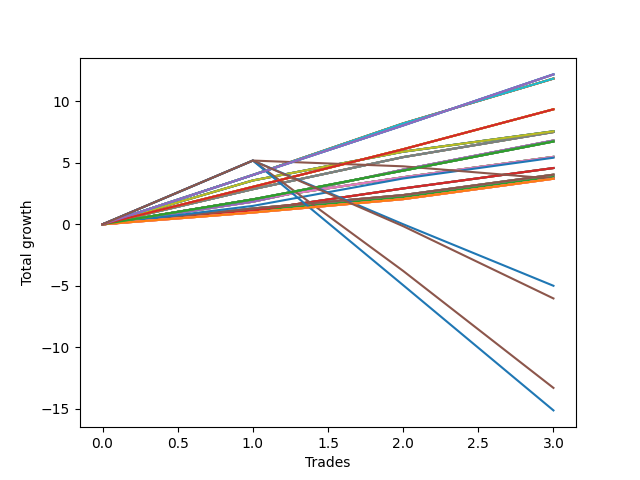

# Short Wallace 020 
- Symbol: NVDA_Unlimited
- Date Range: 02/08/2022 - 07/08/2022
- Trading Period: 7:20-12:30
- Number of Trades: 3



| Name | Win Percent | Profit | Avg Profit / Trade | Avg Time / Trade |      | Name | Win Percent | Profit | Avg Profit / Trade | Avg Time / Trade |
| ---- | ----------- | ------ | ------------------ | ---------------- | ---- | ---- | ----------- | ------ | ------------------ | ---------------- |
| Sorted By <br> Profit | | | | | | Sorted By <br> Win Percentage ||||
| One Hundred Twenty-Nine | 100.00 | 6100.00 | 2033.33 | 28:26 |     | One Hundred Twenty-Nine | 100.00 | 6100.00 | 2033.33 | 28:26 |
| One Hundred Twenty-Four | 100.00 | 6100.00 | 2033.33 | 28:26 |     | One Hundred Twenty-Four | 100.00 | 6100.00 | 2033.33 | 28:26 |
| One Hundred Ninteen | 100.00 | 6100.00 | 2033.33 | 28:26 |     | One Hundred Ninteen | 100.00 | 6100.00 | 2033.33 | 28:26 |
| One Hundred Fourteen | 100.00 | 6100.00 | 2033.33 | 28:26 |     | One Hundred Fourteen | 100.00 | 6100.00 | 2033.33 | 28:26 |
| Eighty-Four | 100.00 | 6100.00 | 2033.33 | 28:26 |     | Eighty-Four | 100.00 | 6100.00 | 2033.33 | 28:26 |
| Seventy-One | 100.00 | 5930.00 | 1976.67 | 33:50 |     | Seventy-One | 100.00 | 5930.00 | 1976.67 | 33:50 |
| Sixty-Three | 100.00 | 5930.00 | 1976.67 | 33:50 |     | Sixty-Three | 100.00 | 5930.00 | 1976.67 | 33:50 |
| Fifty-Five | 100.00 | 5930.00 | 1976.67 | 33:50 |     | Fifty-Five | 100.00 | 5930.00 | 1976.67 | 33:50 |
| Forty-Seven | 100.00 | 5930.00 | 1976.67 | 33:50 |     | Forty-Seven | 100.00 | 5930.00 | 1976.67 | 33:50 |
| Seven | 100.00 | 5930.00 | 1976.67 | 33:50 |     | Seven | 100.00 | 5930.00 | 1976.67 | 33:50 |
| One Hundred Twenty-Eight | 100.00 | 4680.00 | 1560.00 | 21:03 |     | One Hundred Twenty-Eight | 100.00 | 4680.00 | 1560.00 | 21:03 |
| One Hundred Twenty-Three | 100.00 | 4680.00 | 1560.00 | 21:03 |     | One Hundred Twenty-Three | 100.00 | 4680.00 | 1560.00 | 21:03 |
| One Hundred Eighteen | 100.00 | 4680.00 | 1560.00 | 21:03 |     | One Hundred Eighteen | 100.00 | 4680.00 | 1560.00 | 21:03 |
| One Hundred Thirteen | 100.00 | 4680.00 | 1560.00 | 21:03 |     | One Hundred Thirteen | 100.00 | 4680.00 | 1560.00 | 21:03 |
| Eighty-Three | 100.00 | 4680.00 | 1560.00 | 21:03 |     | Eighty-Three | 100.00 | 4680.00 | 1560.00 | 21:03 |
| Seventy | 100.00 | 3785.00 | 1261.67 | 07:55 |     | Seventy | 100.00 | 3785.00 | 1261.67 | 07:55 |
| Sixty-Two | 100.00 | 3785.00 | 1261.67 | 07:55 |     | Sixty-Two | 100.00 | 3785.00 | 1261.67 | 07:55 |
| Fifty-Four | 100.00 | 3785.00 | 1261.67 | 07:55 |     | Fifty-Four | 100.00 | 3785.00 | 1261.67 | 07:55 |
| Forty-Six | 100.00 | 3785.00 | 1261.67 | 07:55 |     | Forty-Six | 100.00 | 3785.00 | 1261.67 | 07:55 |
| Six | 100.00 | 3785.00 | 1261.67 | 07:55 |     | Six | 100.00 | 3785.00 | 1261.67 | 07:55 |
| Sixty-Nine | 100.00 | 3755.00 | 1251.67 | 11:18 |     | Sixty-Nine | 100.00 | 3755.00 | 1251.67 | 11:18 |
| Sixty-One | 100.00 | 3755.00 | 1251.67 | 11:18 |     | Sixty-One | 100.00 | 3755.00 | 1251.67 | 11:18 |
| Fifty-Three | 100.00 | 3755.00 | 1251.67 | 11:18 |     | Fifty-Three | 100.00 | 3755.00 | 1251.67 | 11:18 |
| Forty-Five | 100.00 | 3755.00 | 1251.67 | 11:18 |     | Forty-Five | 100.00 | 3755.00 | 1251.67 | 11:18 |
| Five | 100.00 | 3755.00 | 1251.67 | 11:18 |     | Five | 100.00 | 3755.00 | 1251.67 | 11:18 |
| Sixty-Six | 100.00 | 3410.00 | 1136.67 | 10:58 |     | Sixty-Six | 100.00 | 3410.00 | 1136.67 | 10:58 |
| Fifty-Eight | 100.00 | 3410.00 | 1136.67 | 10:58 |     | Fifty-Eight | 100.00 | 3410.00 | 1136.67 | 10:58 |
| Fifty | 100.00 | 3410.00 | 1136.67 | 10:58 |     | Fifty | 100.00 | 3410.00 | 1136.67 | 10:58 |
| Forty-Two | 100.00 | 3410.00 | 1136.67 | 10:58 |     | Forty-Two | 100.00 | 3410.00 | 1136.67 | 10:58 |
| Two | 100.00 | 3410.00 | 1136.67 | 10:58 |     | Two | 100.00 | 3410.00 | 1136.67 | 10:58 |
| One Hundred Twenty-Seven | 100.00 | 3370.00 | 1123.33 | 11:06 |     | One Hundred Twenty-Seven | 100.00 | 3370.00 | 1123.33 | 11:06 |
| One Hundred Twenty-Two | 100.00 | 3370.00 | 1123.33 | 11:06 |     | One Hundred Twenty-Two | 100.00 | 3370.00 | 1123.33 | 11:06 |
| One Hundred Seventeen | 100.00 | 3370.00 | 1123.33 | 11:06 |     | One Hundred Seventeen | 100.00 | 3370.00 | 1123.33 | 11:06 |
| One Hundred Twelve | 100.00 | 3370.00 | 1123.33 | 11:06 |     | One Hundred Twelve | 100.00 | 3370.00 | 1123.33 | 11:06 |
| Eighty-Two | 100.00 | 3370.00 | 1123.33 | 11:06 |     | Eighty-Two | 100.00 | 3370.00 | 1123.33 | 11:06 |
| Sixty-Eight | 100.00 | 2745.00 | 915.00 | 06:51 |     | Sixty-Eight | 100.00 | 2745.00 | 915.00 | 06:51 |
| Sixty | 100.00 | 2745.00 | 915.00 | 06:51 |     | Sixty | 100.00 | 2745.00 | 915.00 | 06:51 |
| Fifty-Two | 100.00 | 2745.00 | 915.00 | 06:51 |     | Fifty-Two | 100.00 | 2745.00 | 915.00 | 06:51 |
| Forty-Four | 100.00 | 2745.00 | 915.00 | 06:51 |     | Forty-Four | 100.00 | 2745.00 | 915.00 | 06:51 |
| Four | 100.00 | 2745.00 | 915.00 | 06:51 |     | Four | 100.00 | 2745.00 | 915.00 | 06:51 |
| Seventy-Three | 100.00 | 2710.00 | 903.33 | 14:45 |     | Seventy-Three | 100.00 | 2710.00 | 903.33 | 14:45 |
| Sixty-Five | 100.00 | 2290.00 | 763.33 | 05:31 |     | Sixty-Five | 100.00 | 2290.00 | 763.33 | 05:31 |
| Fifty-Seven | 100.00 | 2290.00 | 763.33 | 05:31 |     | Fifty-Seven | 100.00 | 2290.00 | 763.33 | 05:31 |
| Forty-Nine | 100.00 | 2290.00 | 763.33 | 05:31 |     | Forty-Nine | 100.00 | 2290.00 | 763.33 | 05:31 |
| Forty-One | 100.00 | 2290.00 | 763.33 | 05:31 |     | Forty-One | 100.00 | 2290.00 | 763.33 | 05:31 |
| One | 100.00 | 2290.00 | 763.33 | 05:31 |     | One | 100.00 | 2290.00 | 763.33 | 05:31 |
| Sixty-Seven | 100.00 | 2020.00 | 673.33 | 06:11 |     | Sixty-Seven | 100.00 | 2020.00 | 673.33 | 06:11 |
| Fifty-Nine | 100.00 | 2020.00 | 673.33 | 06:11 |     | Fifty-Nine | 100.00 | 2020.00 | 673.33 | 06:11 |
| Fifty-One | 100.00 | 2020.00 | 673.33 | 06:11 |     | Fifty-One | 100.00 | 2020.00 | 673.33 | 06:11 |
| Forty-Three | 100.00 | 2020.00 | 673.33 | 06:11 |     | Forty-Three | 100.00 | 2020.00 | 673.33 | 06:11 |
| Three | 100.00 | 2020.00 | 673.33 | 06:11 |     | Three | 100.00 | 2020.00 | 673.33 | 06:11 |
| Sixty-Four | 100.00 | 1925.00 | 641.67 | 03:11 |     | Sixty-Four | 100.00 | 1925.00 | 641.67 | 03:11 |
| Fifty-Six | 100.00 | 1925.00 | 641.67 | 03:11 |     | Fifty-Six | 100.00 | 1925.00 | 641.67 | 03:11 |
| Forty-Eight | 100.00 | 1925.00 | 641.67 | 03:11 |     | Forty-Eight | 100.00 | 1925.00 | 641.67 | 03:11 |
| Forty | 100.00 | 1925.00 | 641.67 | 03:11 |     | Forty | 100.00 | 1925.00 | 641.67 | 03:11 |
| Zero | 100.00 | 1925.00 | 641.67 | 03:11 |     | Zero | 100.00 | 1925.00 | 641.67 | 03:11 |
| One Hundred Twenty-Six | 100.00 | 1855.00 | 618.33 | 03:08 |     | One Hundred Twenty-Six | 100.00 | 1855.00 | 618.33 | 03:08 |
| One Hundred Twenty-One | 100.00 | 1855.00 | 618.33 | 03:08 |     | One Hundred Twenty-One | 100.00 | 1855.00 | 618.33 | 03:08 |
| One Hundred Sixteen | 100.00 | 1855.00 | 618.33 | 03:08 |     | One Hundred Sixteen | 100.00 | 1855.00 | 618.33 | 03:08 |
| One Hundred Eleven | 100.00 | 1855.00 | 618.33 | 03:08 |     | One Hundred Eleven | 100.00 | 1855.00 | 618.33 | 03:08 |
| Eighty-One | 100.00 | 1855.00 | 618.33 | 03:08 |     | Eighty-One | 100.00 | 1855.00 | 618.33 | 03:08 |
| One Hundred Twenty | 33.33 | 1855.00 | 618.33 | 36:01 |     | One Hundred Twenty | 33.33 | 1855.00 | 618.33 | 36:01 |
| One Hundred Fifteen | 33.33 | -2500.00 | -833.33 | 41:36 |     | One Hundred Fifteen | 33.33 | -2500.00 | -833.33 | 41:36 |
| One Hundred Thirty | 33.33 | -3015.00 | -1005.00 | 44:15 |     | One Hundred Thirty | 33.33 | -3015.00 | -1005.00 | 44:15 |
| Eighty-Five | 33.33 | -6655.00 | -2218.33 | 77:51 |     | Eighty-Five | 33.33 | -6655.00 | -2218.33 | 77:51 |
| One Hundred Twenty-Five | 33.33 | -7570.00 | -2523.33 | 58:06 |     | One Hundred Twenty-Five | 33.33 | -7570.00 | -2523.33 | 58:06 |

## NO STOPLOSS

### Test Zero
* Sell when price hits the middle line of the 20p bollinger
* No Stoploss
* Results:
```
Total Trades: 3
Percent Up: 0.00
Percent Down: 100.00
Total Points Moved Down: 3.85
Potential Profit: 1925.00
Total Points Ups: 0.00 Count Ups: 0
Total Points Downs: 3.85 Count Downs: 3
```

<details><summary>Trades</summary>

<code>In: 2022-02-18 12:04:00		Out: 2022-02-18 12:08:20		Total Position Time: 04:20		Total Move Down: 1.10		Total to Date: 1.10</code> <br />
<code>In: 2022-05-04 11:03:00		Out: 2022-05-04 11:07:05		Total Position Time: 04:05		Total Move Down: 1.09		Total to Date: 2.19</code> <br />
<code>In: 2022-05-04 11:07:00		Out: 2022-05-04 11:08:10		Total Position Time: 01:10		Total Move Down: 1.66		Total to Date: 3.85</code> <br />


</details>

### Test One
* Sell when the price hits the upper line of the 20p 1std bollinger
* No Stoploss
* Results:
```
Total Trades: 3
Percent Up: 0.00
Percent Down: 100.00
Total Points Moved Down: 4.58
Potential Profit: 2290.00
Total Points Ups: 0.00 Count Ups: 0
Total Points Downs: 4.58 Count Downs: 3
```

<details><summary>Trades</summary>

<code>In: 2022-02-18 12:04:00		Out: 2022-02-18 12:15:05		Total Position Time: 11:05		Total Move Down: 1.12		Total to Date: 1.12</code> <br />
<code>In: 2022-05-04 11:03:00		Out: 2022-05-04 11:07:20		Total Position Time: 04:20		Total Move Down: 1.80		Total to Date: 2.92</code> <br />
<code>In: 2022-05-04 11:07:00		Out: 2022-05-04 11:08:10		Total Position Time: 01:10		Total Move Down: 1.66		Total to Date: 4.58</code> <br />


</details>

### Test Two
* Sell when the price hits the upper line of the 20p 2std bollinger
* No Stoploss
* Results:
```
Total Trades: 3
Percent Up: 0.00
Percent Down: 100.00
Total Points Moved Down: 6.82
Potential Profit: 3410.00
Total Points Ups: 0.00 Count Ups: 0
Total Points Downs: 6.82 Count Downs: 3
```

<details><summary>Trades</summary>

<code>In: 2022-02-18 12:04:00		Out: 2022-02-18 12:18:35		Total Position Time: 14:35		Total Move Down: 1.84		Total to Date: 1.84</code> <br />
<code>In: 2022-05-04 11:03:00		Out: 2022-05-04 11:07:30		Total Position Time: 04:30		Total Move Down: 2.61		Total to Date: 4.45</code> <br />
<code>In: 2022-05-04 11:07:00		Out: 2022-05-04 11:20:50		Total Position Time: 13:50		Total Move Down: 2.37		Total to Date: 6.82</code> <br />


</details>

### Test Three
* Sell when price hits the middle line of the 50p bollinger
* No Stoploss
* Results:
```
Total Trades: 3
Percent Up: 0.00
Percent Down: 100.00
Total Points Moved Down: 4.04
Potential Profit: 2020.00
Total Points Ups: 0.00 Count Ups: 0
Total Points Downs: 4.04 Count Downs: 3
```

<details><summary>Trades</summary>

<code>In: 2022-02-18 12:04:00		Out: 2022-02-18 12:17:20		Total Position Time: 13:20		Total Move Down: 1.29		Total to Date: 1.29</code> <br />
<code>In: 2022-05-04 11:03:00		Out: 2022-05-04 11:07:05		Total Position Time: 04:05		Total Move Down: 1.09		Total to Date: 2.38</code> <br />
<code>In: 2022-05-04 11:07:00		Out: 2022-05-04 11:08:10		Total Position Time: 01:10		Total Move Down: 1.66		Total to Date: 4.04</code> <br />


</details>

### Test Four
* Sell when the price hits the upper line of the 50p 1std bollinger
* No Stoploss
* Results:
```
Total Trades: 3
Percent Up: 0.00
Percent Down: 100.00
Total Points Moved Down: 5.49
Potential Profit: 2745.00
Total Points Ups: 0.00 Count Ups: 0
Total Points Downs: 5.49 Count Downs: 3
```

<details><summary>Trades</summary>

<code>In: 2022-02-18 12:04:00		Out: 2022-02-18 12:19:05		Total Position Time: 15:05		Total Move Down: 2.03		Total to Date: 2.03</code> <br />
<code>In: 2022-05-04 11:03:00		Out: 2022-05-04 11:07:20		Total Position Time: 04:20		Total Move Down: 1.80		Total to Date: 3.83</code> <br />
<code>In: 2022-05-04 11:07:00		Out: 2022-05-04 11:08:10		Total Position Time: 01:10		Total Move Down: 1.66		Total to Date: 5.49</code> <br />


</details>

### Test Five
* Sell when the price hits the upper line of the 50p 2std bollinger
* No Stoploss
* Results:
```
Total Trades: 3
Percent Up: 0.00
Percent Down: 100.00
Total Points Moved Down: 7.51
Potential Profit: 3755.00
Total Points Ups: 0.00 Count Ups: 0
Total Points Downs: 7.51 Count Downs: 3
```

<details><summary>Trades</summary>

<code>In: 2022-02-18 12:04:00		Out: 2022-02-18 12:19:45		Total Position Time: 15:45		Total Move Down: 2.86		Total to Date: 2.86</code> <br />
<code>In: 2022-05-04 11:03:00		Out: 2022-05-04 11:07:30		Total Position Time: 04:30		Total Move Down: 2.61		Total to Date: 5.47</code> <br />
<code>In: 2022-05-04 11:07:00		Out: 2022-05-04 11:20:40		Total Position Time: 13:40		Total Move Down: 2.04		Total to Date: 7.51</code> <br />


</details>

### Test Six
* Sell when the price hits the middle line of the 1std VWAP
* No Stoploss
* Results:
```
Total Trades: 3
Percent Up: 0.00
Percent Down: 100.00
Total Points Moved Down: 7.57
Potential Profit: 3785.00
Total Points Ups: 0.00 Count Ups: 0
Total Points Downs: 7.57 Count Downs: 3
```

<details><summary>Trades</summary>

<code>In: 2022-02-18 12:04:00		Out: 2022-02-18 12:22:10		Total Position Time: 18:10		Total Move Down: 3.57		Total to Date: 3.57</code> <br />
<code>In: 2022-05-04 11:03:00		Out: 2022-05-04 11:07:25		Total Position Time: 04:25		Total Move Down: 2.34		Total to Date: 5.91</code> <br />
<code>In: 2022-05-04 11:07:00		Out: 2022-05-04 11:08:10		Total Position Time: 01:10		Total Move Down: 1.66		Total to Date: 7.57</code> <br />


</details>

### Test Seven
* Sell when the price hits the upper line of the 1std VWAP
* No Stoploss
* Results:
```
Total Trades: 3
Percent Up: 0.00
Percent Down: 100.00
Total Points Moved Down: 11.86
Potential Profit: 5930.00
Total Points Ups: 0.00 Count Ups: 0
Total Points Downs: 11.86 Count Downs: 3
```

<details><summary>Trades</summary>

<code>In: 2022-02-18 12:04:00		Out: 2022-02-18 12:47:00		Total Position Time: 43:00		Total Move Down: 4.02		Total to Date: 4.02</code> <br />
<code>In: 2022-05-04 11:03:00		Out: 2022-05-04 11:34:15		Total Position Time: 31:15		Total Move Down: 4.19		Total to Date: 8.21</code> <br />
<code>In: 2022-05-04 11:07:00		Out: 2022-05-04 11:34:15		Total Position Time: 27:15		Total Move Down: 3.65		Total to Date: 11.86</code> <br />


</details>

## STOPLOSS OF 5

### Test Forty
* Sell when price hits the middle line of the 20p bollinger
* Stoploss is -5 points
* Results:
```
Total Trades: 3
Percent Up: 0.00
Percent Down: 100.00
Total Points Moved Down: 3.85
Potential Profit: 1925.00
Total Points Ups: 0.00 Count Ups: 0
Total Points Downs: 3.85 Count Downs: 3
```

<details><summary>Trades</summary>

<code>In: 2022-02-18 12:04:00		Out: 2022-02-18 12:08:20		Total Position Time: 04:20		Total Move Down: 1.10		Total to Date: 1.10</code> <br />
<code>In: 2022-05-04 11:03:00		Out: 2022-05-04 11:07:05		Total Position Time: 04:05		Total Move Down: 1.09		Total to Date: 2.19</code> <br />
<code>In: 2022-05-04 11:07:00		Out: 2022-05-04 11:08:10		Total Position Time: 01:10		Total Move Down: 1.66		Total to Date: 3.85</code> <br />


</details>

### Test Forty-One
* Sell when the price hits the upper line of the 20p 1std bollinger
* Stoploss is -5 points
* Results:
```
Total Trades: 3
Percent Up: 0.00
Percent Down: 100.00
Total Points Moved Down: 4.58
Potential Profit: 2290.00
Total Points Ups: 0.00 Count Ups: 0
Total Points Downs: 4.58 Count Downs: 3
```

<details><summary>Trades</summary>

<code>In: 2022-02-18 12:04:00		Out: 2022-02-18 12:15:05		Total Position Time: 11:05		Total Move Down: 1.12		Total to Date: 1.12</code> <br />
<code>In: 2022-05-04 11:03:00		Out: 2022-05-04 11:07:20		Total Position Time: 04:20		Total Move Down: 1.80		Total to Date: 2.92</code> <br />
<code>In: 2022-05-04 11:07:00		Out: 2022-05-04 11:08:10		Total Position Time: 01:10		Total Move Down: 1.66		Total to Date: 4.58</code> <br />


</details>

### Test Forty-Two
* Sell when the price hits the upper line of the 20p 2std bollinger
* Stoploss is -5 points
* Results:
```
Total Trades: 3
Percent Up: 0.00
Percent Down: 100.00
Total Points Moved Down: 6.82
Potential Profit: 3410.00
Total Points Ups: 0.00 Count Ups: 0
Total Points Downs: 6.82 Count Downs: 3
```

<details><summary>Trades</summary>

<code>In: 2022-02-18 12:04:00		Out: 2022-02-18 12:18:35		Total Position Time: 14:35		Total Move Down: 1.84		Total to Date: 1.84</code> <br />
<code>In: 2022-05-04 11:03:00		Out: 2022-05-04 11:07:30		Total Position Time: 04:30		Total Move Down: 2.61		Total to Date: 4.45</code> <br />
<code>In: 2022-05-04 11:07:00		Out: 2022-05-04 11:20:50		Total Position Time: 13:50		Total Move Down: 2.37		Total to Date: 6.82</code> <br />


</details>

### Test Forty-Three
* Sell when price hits the middle line of the 50p bollinger
* Stoploss is -5 points
* Results:
```
Total Trades: 3
Percent Up: 0.00
Percent Down: 100.00
Total Points Moved Down: 4.04
Potential Profit: 2020.00
Total Points Ups: 0.00 Count Ups: 0
Total Points Downs: 4.04 Count Downs: 3
```

<details><summary>Trades</summary>

<code>In: 2022-02-18 12:04:00		Out: 2022-02-18 12:17:20		Total Position Time: 13:20		Total Move Down: 1.29		Total to Date: 1.29</code> <br />
<code>In: 2022-05-04 11:03:00		Out: 2022-05-04 11:07:05		Total Position Time: 04:05		Total Move Down: 1.09		Total to Date: 2.38</code> <br />
<code>In: 2022-05-04 11:07:00		Out: 2022-05-04 11:08:10		Total Position Time: 01:10		Total Move Down: 1.66		Total to Date: 4.04</code> <br />


</details>

### Test Forty-Four
* Sell when the price hits the upper line of the 50p 1std bollinger
* Stoploss is -5 points
* Results:
```
Total Trades: 3
Percent Up: 0.00
Percent Down: 100.00
Total Points Moved Down: 5.49
Potential Profit: 2745.00
Total Points Ups: 0.00 Count Ups: 0
Total Points Downs: 5.49 Count Downs: 3
```

<details><summary>Trades</summary>

<code>In: 2022-02-18 12:04:00		Out: 2022-02-18 12:19:05		Total Position Time: 15:05		Total Move Down: 2.03		Total to Date: 2.03</code> <br />
<code>In: 2022-05-04 11:03:00		Out: 2022-05-04 11:07:20		Total Position Time: 04:20		Total Move Down: 1.80		Total to Date: 3.83</code> <br />
<code>In: 2022-05-04 11:07:00		Out: 2022-05-04 11:08:10		Total Position Time: 01:10		Total Move Down: 1.66		Total to Date: 5.49</code> <br />


</details>

### Test Forty-Five
* Sell when the price hits the upper line of the 50p 2std bollinger
* Stoploss is -5 points
* Results:
```
Total Trades: 3
Percent Up: 0.00
Percent Down: 100.00
Total Points Moved Down: 7.51
Potential Profit: 3755.00
Total Points Ups: 0.00 Count Ups: 0
Total Points Downs: 7.51 Count Downs: 3
```

<details><summary>Trades</summary>

<code>In: 2022-02-18 12:04:00		Out: 2022-02-18 12:19:45		Total Position Time: 15:45		Total Move Down: 2.86		Total to Date: 2.86</code> <br />
<code>In: 2022-05-04 11:03:00		Out: 2022-05-04 11:07:30		Total Position Time: 04:30		Total Move Down: 2.61		Total to Date: 5.47</code> <br />
<code>In: 2022-05-04 11:07:00		Out: 2022-05-04 11:20:40		Total Position Time: 13:40		Total Move Down: 2.04		Total to Date: 7.51</code> <br />


</details>

### Test Forty-Six
* Sell when the price hits the middle line of the 1std VWAP
* Stoploss is -5 points
* Results:
```
Total Trades: 3
Percent Up: 0.00
Percent Down: 100.00
Total Points Moved Down: 7.57
Potential Profit: 3785.00
Total Points Ups: 0.00 Count Ups: 0
Total Points Downs: 7.57 Count Downs: 3
```

<details><summary>Trades</summary>

<code>In: 2022-02-18 12:04:00		Out: 2022-02-18 12:22:10		Total Position Time: 18:10		Total Move Down: 3.57		Total to Date: 3.57</code> <br />
<code>In: 2022-05-04 11:03:00		Out: 2022-05-04 11:07:25		Total Position Time: 04:25		Total Move Down: 2.34		Total to Date: 5.91</code> <br />
<code>In: 2022-05-04 11:07:00		Out: 2022-05-04 11:08:10		Total Position Time: 01:10		Total Move Down: 1.66		Total to Date: 7.57</code> <br />


</details>

### Test Forty-Seven
* Sell when the price hits the upper line of the 1std VWAP
* Stoploss is -5 points
* Results:
```
Total Trades: 3
Percent Up: 0.00
Percent Down: 100.00
Total Points Moved Down: 11.86
Potential Profit: 5930.00
Total Points Ups: 0.00 Count Ups: 0
Total Points Downs: 11.86 Count Downs: 3
```

<details><summary>Trades</summary>

<code>In: 2022-02-18 12:04:00		Out: 2022-02-18 12:47:00		Total Position Time: 43:00		Total Move Down: 4.02		Total to Date: 4.02</code> <br />
<code>In: 2022-05-04 11:03:00		Out: 2022-05-04 11:34:15		Total Position Time: 31:15		Total Move Down: 4.19		Total to Date: 8.21</code> <br />
<code>In: 2022-05-04 11:07:00		Out: 2022-05-04 11:34:15		Total Position Time: 27:15		Total Move Down: 3.65		Total to Date: 11.86</code> <br />


</details>

## TRAIL STOP OF 5

### Test Forty-Eight
* Sell when price hits the middle line of the 20p bollinger
* Trailing Stop is -5 points
* Results:
```
Total Trades: 3
Percent Up: 0.00
Percent Down: 100.00
Total Points Moved Down: 3.85
Potential Profit: 1925.00
Total Points Ups: 0.00 Count Ups: 0
Total Points Downs: 3.85 Count Downs: 3
```

<details><summary>Trades</summary>

<code>In: 2022-02-18 12:04:00		Out: 2022-02-18 12:08:20		Total Position Time: 04:20		Total Move Down: 1.10		Total to Date: 1.10</code> <br />
<code>In: 2022-05-04 11:03:00		Out: 2022-05-04 11:07:05		Total Position Time: 04:05		Total Move Down: 1.09		Total to Date: 2.19</code> <br />
<code>In: 2022-05-04 11:07:00		Out: 2022-05-04 11:08:10		Total Position Time: 01:10		Total Move Down: 1.66		Total to Date: 3.85</code> <br />


</details>

### Test Forty-Nine
* Sell when the price hits the upper line of the 20p 1std bollinger
* Trailing Stop is -5 points
* Results:
```
Total Trades: 3
Percent Up: 0.00
Percent Down: 100.00
Total Points Moved Down: 4.58
Potential Profit: 2290.00
Total Points Ups: 0.00 Count Ups: 0
Total Points Downs: 4.58 Count Downs: 3
```

<details><summary>Trades</summary>

<code>In: 2022-02-18 12:04:00		Out: 2022-02-18 12:15:05		Total Position Time: 11:05		Total Move Down: 1.12		Total to Date: 1.12</code> <br />
<code>In: 2022-05-04 11:03:00		Out: 2022-05-04 11:07:20		Total Position Time: 04:20		Total Move Down: 1.80		Total to Date: 2.92</code> <br />
<code>In: 2022-05-04 11:07:00		Out: 2022-05-04 11:08:10		Total Position Time: 01:10		Total Move Down: 1.66		Total to Date: 4.58</code> <br />


</details>

### Test Fifty
* Sell when the price hits the upper line of the 20p 2std bollinger
* Trailing Stop is -5 points
* Results:
```
Total Trades: 3
Percent Up: 0.00
Percent Down: 100.00
Total Points Moved Down: 6.82
Potential Profit: 3410.00
Total Points Ups: 0.00 Count Ups: 0
Total Points Downs: 6.82 Count Downs: 3
```

<details><summary>Trades</summary>

<code>In: 2022-02-18 12:04:00		Out: 2022-02-18 12:18:35		Total Position Time: 14:35		Total Move Down: 1.84		Total to Date: 1.84</code> <br />
<code>In: 2022-05-04 11:03:00		Out: 2022-05-04 11:07:30		Total Position Time: 04:30		Total Move Down: 2.61		Total to Date: 4.45</code> <br />
<code>In: 2022-05-04 11:07:00		Out: 2022-05-04 11:20:50		Total Position Time: 13:50		Total Move Down: 2.37		Total to Date: 6.82</code> <br />


</details>

### Test Fifty-One
* Sell when price hits the middle line of the 50p bollinger
* Trailing Stop is -5 points
* Results:
```
Total Trades: 3
Percent Up: 0.00
Percent Down: 100.00
Total Points Moved Down: 4.04
Potential Profit: 2020.00
Total Points Ups: 0.00 Count Ups: 0
Total Points Downs: 4.04 Count Downs: 3
```

<details><summary>Trades</summary>

<code>In: 2022-02-18 12:04:00		Out: 2022-02-18 12:17:20		Total Position Time: 13:20		Total Move Down: 1.29		Total to Date: 1.29</code> <br />
<code>In: 2022-05-04 11:03:00		Out: 2022-05-04 11:07:05		Total Position Time: 04:05		Total Move Down: 1.09		Total to Date: 2.38</code> <br />
<code>In: 2022-05-04 11:07:00		Out: 2022-05-04 11:08:10		Total Position Time: 01:10		Total Move Down: 1.66		Total to Date: 4.04</code> <br />


</details>

### Test Fifty-Two
* Sell when the price hits the upper line of the 50p 1std bollinger
* Trailing Stop is -5 points
* Results:
```
Total Trades: 3
Percent Up: 0.00
Percent Down: 100.00
Total Points Moved Down: 5.49
Potential Profit: 2745.00
Total Points Ups: 0.00 Count Ups: 0
Total Points Downs: 5.49 Count Downs: 3
```

<details><summary>Trades</summary>

<code>In: 2022-02-18 12:04:00		Out: 2022-02-18 12:19:05		Total Position Time: 15:05		Total Move Down: 2.03		Total to Date: 2.03</code> <br />
<code>In: 2022-05-04 11:03:00		Out: 2022-05-04 11:07:20		Total Position Time: 04:20		Total Move Down: 1.80		Total to Date: 3.83</code> <br />
<code>In: 2022-05-04 11:07:00		Out: 2022-05-04 11:08:10		Total Position Time: 01:10		Total Move Down: 1.66		Total to Date: 5.49</code> <br />


</details>

### Test Fifty-Three
* Sell when the price hits the upper line of the 50p 2std bollinger
* Trailing Stop is -5 points
* Results:
```
Total Trades: 3
Percent Up: 0.00
Percent Down: 100.00
Total Points Moved Down: 7.51
Potential Profit: 3755.00
Total Points Ups: 0.00 Count Ups: 0
Total Points Downs: 7.51 Count Downs: 3
```

<details><summary>Trades</summary>

<code>In: 2022-02-18 12:04:00		Out: 2022-02-18 12:19:45		Total Position Time: 15:45		Total Move Down: 2.86		Total to Date: 2.86</code> <br />
<code>In: 2022-05-04 11:03:00		Out: 2022-05-04 11:07:30		Total Position Time: 04:30		Total Move Down: 2.61		Total to Date: 5.47</code> <br />
<code>In: 2022-05-04 11:07:00		Out: 2022-05-04 11:20:40		Total Position Time: 13:40		Total Move Down: 2.04		Total to Date: 7.51</code> <br />


</details>

### Test Fifty-Four
* Sell when the price hits the middle line of the 1std VWAP
* Trailing Stop is -5 points
* Results:
```
Total Trades: 3
Percent Up: 0.00
Percent Down: 100.00
Total Points Moved Down: 7.57
Potential Profit: 3785.00
Total Points Ups: 0.00 Count Ups: 0
Total Points Downs: 7.57 Count Downs: 3
```

<details><summary>Trades</summary>

<code>In: 2022-02-18 12:04:00		Out: 2022-02-18 12:22:10		Total Position Time: 18:10		Total Move Down: 3.57		Total to Date: 3.57</code> <br />
<code>In: 2022-05-04 11:03:00		Out: 2022-05-04 11:07:25		Total Position Time: 04:25		Total Move Down: 2.34		Total to Date: 5.91</code> <br />
<code>In: 2022-05-04 11:07:00		Out: 2022-05-04 11:08:10		Total Position Time: 01:10		Total Move Down: 1.66		Total to Date: 7.57</code> <br />


</details>

### Test Fifty-Five
* Sell when the price hits the upper line of the 1std VWAP
* Trailing Stop is -5 points
* Results:
```
Total Trades: 3
Percent Up: 0.00
Percent Down: 100.00
Total Points Moved Down: 11.86
Potential Profit: 5930.00
Total Points Ups: 0.00 Count Ups: 0
Total Points Downs: 11.86 Count Downs: 3
```

<details><summary>Trades</summary>

<code>In: 2022-02-18 12:04:00		Out: 2022-02-18 12:47:00		Total Position Time: 43:00		Total Move Down: 4.02		Total to Date: 4.02</code> <br />
<code>In: 2022-05-04 11:03:00		Out: 2022-05-04 11:34:15		Total Position Time: 31:15		Total Move Down: 4.19		Total to Date: 8.21</code> <br />
<code>In: 2022-05-04 11:07:00		Out: 2022-05-04 11:34:15		Total Position Time: 27:15		Total Move Down: 3.65		Total to Date: 11.86</code> <br />


</details>

## STOPLOSS OF 10

### Test Fifty-Six
* Sell when price hits the middle line of the 20p bollinger
* Stoploss is -10 points
* Results:
```
Total Trades: 3
Percent Up: 0.00
Percent Down: 100.00
Total Points Moved Down: 3.85
Potential Profit: 1925.00
Total Points Ups: 0.00 Count Ups: 0
Total Points Downs: 3.85 Count Downs: 3
```

<details><summary>Trades</summary>

<code>In: 2022-02-18 12:04:00		Out: 2022-02-18 12:08:20		Total Position Time: 04:20		Total Move Down: 1.10		Total to Date: 1.10</code> <br />
<code>In: 2022-05-04 11:03:00		Out: 2022-05-04 11:07:05		Total Position Time: 04:05		Total Move Down: 1.09		Total to Date: 2.19</code> <br />
<code>In: 2022-05-04 11:07:00		Out: 2022-05-04 11:08:10		Total Position Time: 01:10		Total Move Down: 1.66		Total to Date: 3.85</code> <br />


</details>

### Test Fifty-Seven
* Sell when the price hits the upper line of the 20p 1std bollinger
* Stoploss is -10 points
* Results:
```
Total Trades: 3
Percent Up: 0.00
Percent Down: 100.00
Total Points Moved Down: 4.58
Potential Profit: 2290.00
Total Points Ups: 0.00 Count Ups: 0
Total Points Downs: 4.58 Count Downs: 3
```

<details><summary>Trades</summary>

<code>In: 2022-02-18 12:04:00		Out: 2022-02-18 12:15:05		Total Position Time: 11:05		Total Move Down: 1.12		Total to Date: 1.12</code> <br />
<code>In: 2022-05-04 11:03:00		Out: 2022-05-04 11:07:20		Total Position Time: 04:20		Total Move Down: 1.80		Total to Date: 2.92</code> <br />
<code>In: 2022-05-04 11:07:00		Out: 2022-05-04 11:08:10		Total Position Time: 01:10		Total Move Down: 1.66		Total to Date: 4.58</code> <br />


</details>

### Test Fifty-Eight
* Sell when the price hits the upper line of the 20p 2std bollinger
* Stoploss is -10 points
* Results:
```
Total Trades: 3
Percent Up: 0.00
Percent Down: 100.00
Total Points Moved Down: 6.82
Potential Profit: 3410.00
Total Points Ups: 0.00 Count Ups: 0
Total Points Downs: 6.82 Count Downs: 3
```

<details><summary>Trades</summary>

<code>In: 2022-02-18 12:04:00		Out: 2022-02-18 12:18:35		Total Position Time: 14:35		Total Move Down: 1.84		Total to Date: 1.84</code> <br />
<code>In: 2022-05-04 11:03:00		Out: 2022-05-04 11:07:30		Total Position Time: 04:30		Total Move Down: 2.61		Total to Date: 4.45</code> <br />
<code>In: 2022-05-04 11:07:00		Out: 2022-05-04 11:20:50		Total Position Time: 13:50		Total Move Down: 2.37		Total to Date: 6.82</code> <br />


</details>

### Test Fifty-Nine
* Sell when price hits the middle line of the 50p bollinger
* Stoploss is -10 points
* Results:
```
Total Trades: 3
Percent Up: 0.00
Percent Down: 100.00
Total Points Moved Down: 4.04
Potential Profit: 2020.00
Total Points Ups: 0.00 Count Ups: 0
Total Points Downs: 4.04 Count Downs: 3
```

<details><summary>Trades</summary>

<code>In: 2022-02-18 12:04:00		Out: 2022-02-18 12:17:20		Total Position Time: 13:20		Total Move Down: 1.29		Total to Date: 1.29</code> <br />
<code>In: 2022-05-04 11:03:00		Out: 2022-05-04 11:07:05		Total Position Time: 04:05		Total Move Down: 1.09		Total to Date: 2.38</code> <br />
<code>In: 2022-05-04 11:07:00		Out: 2022-05-04 11:08:10		Total Position Time: 01:10		Total Move Down: 1.66		Total to Date: 4.04</code> <br />


</details>

### Test Sixty
* Sell when the price hits the upper line of the 50p 1std bollinger
* Stoploss is -10 points
* Results:
```
Total Trades: 3
Percent Up: 0.00
Percent Down: 100.00
Total Points Moved Down: 5.49
Potential Profit: 2745.00
Total Points Ups: 0.00 Count Ups: 0
Total Points Downs: 5.49 Count Downs: 3
```

<details><summary>Trades</summary>

<code>In: 2022-02-18 12:04:00		Out: 2022-02-18 12:19:05		Total Position Time: 15:05		Total Move Down: 2.03		Total to Date: 2.03</code> <br />
<code>In: 2022-05-04 11:03:00		Out: 2022-05-04 11:07:20		Total Position Time: 04:20		Total Move Down: 1.80		Total to Date: 3.83</code> <br />
<code>In: 2022-05-04 11:07:00		Out: 2022-05-04 11:08:10		Total Position Time: 01:10		Total Move Down: 1.66		Total to Date: 5.49</code> <br />


</details>

### Test Sixty-One
* Sell when the price hits the upper line of the 50p 2std bollinger
* Stoploss is -10 points
* Results:
```
Total Trades: 3
Percent Up: 0.00
Percent Down: 100.00
Total Points Moved Down: 7.51
Potential Profit: 3755.00
Total Points Ups: 0.00 Count Ups: 0
Total Points Downs: 7.51 Count Downs: 3
```

<details><summary>Trades</summary>

<code>In: 2022-02-18 12:04:00		Out: 2022-02-18 12:19:45		Total Position Time: 15:45		Total Move Down: 2.86		Total to Date: 2.86</code> <br />
<code>In: 2022-05-04 11:03:00		Out: 2022-05-04 11:07:30		Total Position Time: 04:30		Total Move Down: 2.61		Total to Date: 5.47</code> <br />
<code>In: 2022-05-04 11:07:00		Out: 2022-05-04 11:20:40		Total Position Time: 13:40		Total Move Down: 2.04		Total to Date: 7.51</code> <br />


</details>

### Test Sixty-Two
* Sell when the price hits the middle line of the 1std VWAP
* Stoploss is -10 points
* Results:
```
Total Trades: 3
Percent Up: 0.00
Percent Down: 100.00
Total Points Moved Down: 7.57
Potential Profit: 3785.00
Total Points Ups: 0.00 Count Ups: 0
Total Points Downs: 7.57 Count Downs: 3
```

<details><summary>Trades</summary>

<code>In: 2022-02-18 12:04:00		Out: 2022-02-18 12:22:10		Total Position Time: 18:10		Total Move Down: 3.57		Total to Date: 3.57</code> <br />
<code>In: 2022-05-04 11:03:00		Out: 2022-05-04 11:07:25		Total Position Time: 04:25		Total Move Down: 2.34		Total to Date: 5.91</code> <br />
<code>In: 2022-05-04 11:07:00		Out: 2022-05-04 11:08:10		Total Position Time: 01:10		Total Move Down: 1.66		Total to Date: 7.57</code> <br />


</details>

### Test Sixty-Three
* Sell when the price hits the upper line of the 1std VWAP
* Stoploss is -10 points
* Results:
```
Total Trades: 3
Percent Up: 0.00
Percent Down: 100.00
Total Points Moved Down: 11.86
Potential Profit: 5930.00
Total Points Ups: 0.00 Count Ups: 0
Total Points Downs: 11.86 Count Downs: 3
```

<details><summary>Trades</summary>

<code>In: 2022-02-18 12:04:00		Out: 2022-02-18 12:47:00		Total Position Time: 43:00		Total Move Down: 4.02		Total to Date: 4.02</code> <br />
<code>In: 2022-05-04 11:03:00		Out: 2022-05-04 11:34:15		Total Position Time: 31:15		Total Move Down: 4.19		Total to Date: 8.21</code> <br />
<code>In: 2022-05-04 11:07:00		Out: 2022-05-04 11:34:15		Total Position Time: 27:15		Total Move Down: 3.65		Total to Date: 11.86</code> <br />


</details>

## TRAIL STOP OF 10

### Test Sixty-Four
* Sell when price hits the middle line of the 20p bollinger
* Trailing Stop is -10 points
* Results:
```
Total Trades: 3
Percent Up: 0.00
Percent Down: 100.00
Total Points Moved Down: 3.85
Potential Profit: 1925.00
Total Points Ups: 0.00 Count Ups: 0
Total Points Downs: 3.85 Count Downs: 3
```

<details><summary>Trades</summary>

<code>In: 2022-02-18 12:04:00		Out: 2022-02-18 12:08:20		Total Position Time: 04:20		Total Move Down: 1.10		Total to Date: 1.10</code> <br />
<code>In: 2022-05-04 11:03:00		Out: 2022-05-04 11:07:05		Total Position Time: 04:05		Total Move Down: 1.09		Total to Date: 2.19</code> <br />
<code>In: 2022-05-04 11:07:00		Out: 2022-05-04 11:08:10		Total Position Time: 01:10		Total Move Down: 1.66		Total to Date: 3.85</code> <br />


</details>

### Test Sixty-Five
* Sell when the price hits the upper line of the 20p 1std bollinger
* Trailing Stop is -10 points
* Results:
```
Total Trades: 3
Percent Up: 0.00
Percent Down: 100.00
Total Points Moved Down: 4.58
Potential Profit: 2290.00
Total Points Ups: 0.00 Count Ups: 0
Total Points Downs: 4.58 Count Downs: 3
```

<details><summary>Trades</summary>

<code>In: 2022-02-18 12:04:00		Out: 2022-02-18 12:15:05		Total Position Time: 11:05		Total Move Down: 1.12		Total to Date: 1.12</code> <br />
<code>In: 2022-05-04 11:03:00		Out: 2022-05-04 11:07:20		Total Position Time: 04:20		Total Move Down: 1.80		Total to Date: 2.92</code> <br />
<code>In: 2022-05-04 11:07:00		Out: 2022-05-04 11:08:10		Total Position Time: 01:10		Total Move Down: 1.66		Total to Date: 4.58</code> <br />


</details>

### Test Sixty-Six
* Sell when the price hits the upper line of the 20p 2std bollinger
* Trailing Stop is -10 points
* Results:
```
Total Trades: 3
Percent Up: 0.00
Percent Down: 100.00
Total Points Moved Down: 6.82
Potential Profit: 3410.00
Total Points Ups: 0.00 Count Ups: 0
Total Points Downs: 6.82 Count Downs: 3
```

<details><summary>Trades</summary>

<code>In: 2022-02-18 12:04:00		Out: 2022-02-18 12:18:35		Total Position Time: 14:35		Total Move Down: 1.84		Total to Date: 1.84</code> <br />
<code>In: 2022-05-04 11:03:00		Out: 2022-05-04 11:07:30		Total Position Time: 04:30		Total Move Down: 2.61		Total to Date: 4.45</code> <br />
<code>In: 2022-05-04 11:07:00		Out: 2022-05-04 11:20:50		Total Position Time: 13:50		Total Move Down: 2.37		Total to Date: 6.82</code> <br />


</details>

### Test Sixty-Seven
* Sell when price hits the middle line of the 50p bollinger
* Trailing Stop is -10 points
* Results:
```
Total Trades: 3
Percent Up: 0.00
Percent Down: 100.00
Total Points Moved Down: 4.04
Potential Profit: 2020.00
Total Points Ups: 0.00 Count Ups: 0
Total Points Downs: 4.04 Count Downs: 3
```

<details><summary>Trades</summary>

<code>In: 2022-02-18 12:04:00		Out: 2022-02-18 12:17:20		Total Position Time: 13:20		Total Move Down: 1.29		Total to Date: 1.29</code> <br />
<code>In: 2022-05-04 11:03:00		Out: 2022-05-04 11:07:05		Total Position Time: 04:05		Total Move Down: 1.09		Total to Date: 2.38</code> <br />
<code>In: 2022-05-04 11:07:00		Out: 2022-05-04 11:08:10		Total Position Time: 01:10		Total Move Down: 1.66		Total to Date: 4.04</code> <br />


</details>

### Test Sixty-Eight
* Sell when the price hits the upper line of the 50p 1std bollinger
* Trailing Stop is -10 points
* Results:
```
Total Trades: 3
Percent Up: 0.00
Percent Down: 100.00
Total Points Moved Down: 5.49
Potential Profit: 2745.00
Total Points Ups: 0.00 Count Ups: 0
Total Points Downs: 5.49 Count Downs: 3
```

<details><summary>Trades</summary>

<code>In: 2022-02-18 12:04:00		Out: 2022-02-18 12:19:05		Total Position Time: 15:05		Total Move Down: 2.03		Total to Date: 2.03</code> <br />
<code>In: 2022-05-04 11:03:00		Out: 2022-05-04 11:07:20		Total Position Time: 04:20		Total Move Down: 1.80		Total to Date: 3.83</code> <br />
<code>In: 2022-05-04 11:07:00		Out: 2022-05-04 11:08:10		Total Position Time: 01:10		Total Move Down: 1.66		Total to Date: 5.49</code> <br />


</details>

### Test Sixty-Nine
* Sell when the price hits the upper line of the 50p 2std bollinger
* Trailing Stop is -10 points
* Results:
```
Total Trades: 3
Percent Up: 0.00
Percent Down: 100.00
Total Points Moved Down: 7.51
Potential Profit: 3755.00
Total Points Ups: 0.00 Count Ups: 0
Total Points Downs: 7.51 Count Downs: 3
```

<details><summary>Trades</summary>

<code>In: 2022-02-18 12:04:00		Out: 2022-02-18 12:19:45		Total Position Time: 15:45		Total Move Down: 2.86		Total to Date: 2.86</code> <br />
<code>In: 2022-05-04 11:03:00		Out: 2022-05-04 11:07:30		Total Position Time: 04:30		Total Move Down: 2.61		Total to Date: 5.47</code> <br />
<code>In: 2022-05-04 11:07:00		Out: 2022-05-04 11:20:40		Total Position Time: 13:40		Total Move Down: 2.04		Total to Date: 7.51</code> <br />


</details>

### Test Seventy
* Sell when the price hits the middle line of the 1std VWAP
* Trailing Stop is -10 points
* Results:
```
Total Trades: 3
Percent Up: 0.00
Percent Down: 100.00
Total Points Moved Down: 7.57
Potential Profit: 3785.00
Total Points Ups: 0.00 Count Ups: 0
Total Points Downs: 7.57 Count Downs: 3
```

<details><summary>Trades</summary>

<code>In: 2022-02-18 12:04:00		Out: 2022-02-18 12:22:10		Total Position Time: 18:10		Total Move Down: 3.57		Total to Date: 3.57</code> <br />
<code>In: 2022-05-04 11:03:00		Out: 2022-05-04 11:07:25		Total Position Time: 04:25		Total Move Down: 2.34		Total to Date: 5.91</code> <br />
<code>In: 2022-05-04 11:07:00		Out: 2022-05-04 11:08:10		Total Position Time: 01:10		Total Move Down: 1.66		Total to Date: 7.57</code> <br />


</details>

### Test Seventy-One
* Sell when the price hits the upper line of the 1std VWAP
* Trailing Stop is -10 points
* Results:
```
Total Trades: 3
Percent Up: 0.00
Percent Down: 100.00
Total Points Moved Down: 11.86
Potential Profit: 5930.00
Total Points Ups: 0.00 Count Ups: 0
Total Points Downs: 11.86 Count Downs: 3
```

<details><summary>Trades</summary>

<code>In: 2022-02-18 12:04:00		Out: 2022-02-18 12:47:00		Total Position Time: 43:00		Total Move Down: 4.02		Total to Date: 4.02</code> <br />
<code>In: 2022-05-04 11:03:00		Out: 2022-05-04 11:34:15		Total Position Time: 31:15		Total Move Down: 4.19		Total to Date: 8.21</code> <br />
<code>In: 2022-05-04 11:07:00		Out: 2022-05-04 11:34:15		Total Position Time: 27:15		Total Move Down: 3.65		Total to Date: 11.86</code> <br />


</details>

## SPECIAL EXIT CONDITIONS 

### Test Seventy-Three
* Sell when the linear regression slope changes to negative
* No Stoploss
* Results:
```
Total Trades: 3
Percent Up: 0.00
Percent Down: 100.00
Total Points Moved Down: 5.42
Potential Profit: 2710.00
Total Points Ups: 0.00 Count Ups: 0
Total Points Downs: 5.42 Count Downs: 3
```

<details><summary>Trades</summary>

<code>In: 2022-02-18 12:04:00		Out: 2022-02-18 12:18:05		Total Position Time: 14:05		Total Move Down: 1.50		Total to Date: 1.50</code> <br />
<code>In: 2022-05-04 11:03:00		Out: 2022-05-04 11:20:05		Total Position Time: 17:05		Total Move Down: 2.23		Total to Date: 3.73</code> <br />
<code>In: 2022-05-04 11:07:00		Out: 2022-05-04 11:20:05		Total Position Time: 13:05		Total Move Down: 1.69		Total to Date: 5.42</code> <br />


</details>

## TAKE PROFIT

### Test Eighty-One
* Take Profit of 1 Point
* No Stoploss
* Results:
```
Total Trades: 3
Percent Up: 0.00
Percent Down: 100.00
Total Points Moved Down: 3.71
Potential Profit: 1855.00
Total Points Ups: 0.00 Count Ups: 0
Total Points Downs: 3.71 Count Downs: 3
```

<details><summary>Trades</summary>

<code>In: 2022-02-18 12:04:00		Out: 2022-02-18 12:08:10		Total Position Time: 04:10		Total Move Down: 0.96		Total to Date: 0.96</code> <br />
<code>In: 2022-05-04 11:03:00		Out: 2022-05-04 11:07:05		Total Position Time: 04:05		Total Move Down: 1.09		Total to Date: 2.05</code> <br />
<code>In: 2022-05-04 11:07:00		Out: 2022-05-04 11:08:10		Total Position Time: 01:10		Total Move Down: 1.66		Total to Date: 3.71</code> <br />


</details>

### Test Eighty-Two
* Take Profit of 2 Point
* No Stoploss
* Results:
```
Total Trades: 3
Percent Up: 0.00
Percent Down: 100.00
Total Points Moved Down: 6.74
Potential Profit: 3370.00
Total Points Ups: 0.00 Count Ups: 0
Total Points Downs: 6.74 Count Downs: 3
```

<details><summary>Trades</summary>

<code>In: 2022-02-18 12:04:00		Out: 2022-02-18 12:19:05		Total Position Time: 15:05		Total Move Down: 2.03		Total to Date: 2.03</code> <br />
<code>In: 2022-05-04 11:03:00		Out: 2022-05-04 11:07:25		Total Position Time: 04:25		Total Move Down: 2.34		Total to Date: 4.37</code> <br />
<code>In: 2022-05-04 11:07:00		Out: 2022-05-04 11:20:50		Total Position Time: 13:50		Total Move Down: 2.37		Total to Date: 6.74</code> <br />


</details>

### Test Eighty-Three
* Take Profit of 3 Point
* No Stoploss
* Results:
```
Total Trades: 3
Percent Up: 0.00
Percent Down: 100.00
Total Points Moved Down: 9.36
Potential Profit: 4680.00
Total Points Ups: 0.00 Count Ups: 0
Total Points Downs: 9.36 Count Downs: 3
```

<details><summary>Trades</summary>

<code>In: 2022-02-18 12:04:00		Out: 2022-02-18 12:21:50		Total Position Time: 17:50		Total Move Down: 3.05		Total to Date: 3.05</code> <br />
<code>In: 2022-05-04 11:03:00		Out: 2022-05-04 11:21:15		Total Position Time: 18:15		Total Move Down: 3.06		Total to Date: 6.11</code> <br />
<code>In: 2022-05-04 11:07:00		Out: 2022-05-04 11:34:05		Total Position Time: 27:05		Total Move Down: 3.25		Total to Date: 9.36</code> <br />


</details>

### Test Eighty-Four
* Take Profit of 4 Point
* No Stoploss
* Results:
```
Total Trades: 3
Percent Up: 0.00
Percent Down: 100.00
Total Points Moved Down: 12.20
Potential Profit: 6100.00
Total Points Ups: 0.00 Count Ups: 0
Total Points Downs: 12.20 Count Downs: 3
```

<details><summary>Trades</summary>

<code>In: 2022-02-18 12:04:00		Out: 2022-02-18 12:30:05		Total Position Time: 26:05		Total Move Down: 4.01		Total to Date: 4.01</code> <br />
<code>In: 2022-05-04 11:03:00		Out: 2022-05-04 11:34:10		Total Position Time: 31:10		Total Move Down: 4.04		Total to Date: 8.05</code> <br />
<code>In: 2022-05-04 11:07:00		Out: 2022-05-04 11:35:05		Total Position Time: 28:05		Total Move Down: 4.15		Total to Date: 12.20</code> <br />


</details>

### Test Eighty-Five
* Take Profit of 5 Point
* No Stoploss
* Results:
```
Total Trades: 3
Percent Up: 66.67
Percent Down: 33.33
Total Points Moved Down: -13.31
Potential Profit: -6655.00
Total Points Ups: 18.50 Count Ups: 2
Total Points Downs: 5.19 Count Downs: 1
```

<details><summary>Trades</summary>

<code>In: 2022-02-18 12:04:00		Out: 2022-02-18 12:33:35		Total Position Time: 29:35		Total Move Down: 5.19		Total to Date: 5.19</code> <br />
<code>In: 2022-05-04 11:03:00		Out: 2022-05-04 12:47:00		Total Position Time: 104:00		Total Move Down: -8.98		Total to Date: -3.79</code> <br />
<code>In: 2022-05-04 11:07:00		Out: 2022-05-04 12:47:00		Total Position Time: 100:00		Total Move Down: -9.52		Total to Date: -13.31</code> <br />


</details>

## TAKE PROFIT Stoploss of Five

### Test One Hundred Eleven
* Take Profit of 1 Point
* Stoploss is -5 points
* Results:
```
Total Trades: 3
Percent Up: 0.00
Percent Down: 100.00
Total Points Moved Down: 3.71
Potential Profit: 1855.00
Total Points Ups: 0.00 Count Ups: 0
Total Points Downs: 3.71 Count Downs: 3
```

<details><summary>Trades</summary>

<code>In: 2022-02-18 12:04:00		Out: 2022-02-18 12:08:10		Total Position Time: 04:10		Total Move Down: 0.96		Total to Date: 0.96</code> <br />
<code>In: 2022-05-04 11:03:00		Out: 2022-05-04 11:07:05		Total Position Time: 04:05		Total Move Down: 1.09		Total to Date: 2.05</code> <br />
<code>In: 2022-05-04 11:07:00		Out: 2022-05-04 11:08:10		Total Position Time: 01:10		Total Move Down: 1.66		Total to Date: 3.71</code> <br />


</details>

### Test One Hundred Twelve
* Take Profit of 2 Point
* Stoploss is -5 points
* Results:
```
Total Trades: 3
Percent Up: 0.00
Percent Down: 100.00
Total Points Moved Down: 6.74
Potential Profit: 3370.00
Total Points Ups: 0.00 Count Ups: 0
Total Points Downs: 6.74 Count Downs: 3
```

<details><summary>Trades</summary>

<code>In: 2022-02-18 12:04:00		Out: 2022-02-18 12:19:05		Total Position Time: 15:05		Total Move Down: 2.03		Total to Date: 2.03</code> <br />
<code>In: 2022-05-04 11:03:00		Out: 2022-05-04 11:07:25		Total Position Time: 04:25		Total Move Down: 2.34		Total to Date: 4.37</code> <br />
<code>In: 2022-05-04 11:07:00		Out: 2022-05-04 11:20:50		Total Position Time: 13:50		Total Move Down: 2.37		Total to Date: 6.74</code> <br />


</details>

### Test One Hundred Thirteen
* Take Profit of 3 Point
* Stoploss is -5 points
* Results:
```
Total Trades: 3
Percent Up: 0.00
Percent Down: 100.00
Total Points Moved Down: 9.36
Potential Profit: 4680.00
Total Points Ups: 0.00 Count Ups: 0
Total Points Downs: 9.36 Count Downs: 3
```

<details><summary>Trades</summary>

<code>In: 2022-02-18 12:04:00		Out: 2022-02-18 12:21:50		Total Position Time: 17:50		Total Move Down: 3.05		Total to Date: 3.05</code> <br />
<code>In: 2022-05-04 11:03:00		Out: 2022-05-04 11:21:15		Total Position Time: 18:15		Total Move Down: 3.06		Total to Date: 6.11</code> <br />
<code>In: 2022-05-04 11:07:00		Out: 2022-05-04 11:34:05		Total Position Time: 27:05		Total Move Down: 3.25		Total to Date: 9.36</code> <br />


</details>

### Test One Hundred Fourteen
* Take Profit of 4 Point
* Stoploss is -5 points
* Results:
```
Total Trades: 3
Percent Up: 0.00
Percent Down: 100.00
Total Points Moved Down: 12.20
Potential Profit: 6100.00
Total Points Ups: 0.00 Count Ups: 0
Total Points Downs: 12.20 Count Downs: 3
```

<details><summary>Trades</summary>

<code>In: 2022-02-18 12:04:00		Out: 2022-02-18 12:30:05		Total Position Time: 26:05		Total Move Down: 4.01		Total to Date: 4.01</code> <br />
<code>In: 2022-05-04 11:03:00		Out: 2022-05-04 11:34:10		Total Position Time: 31:10		Total Move Down: 4.04		Total to Date: 8.05</code> <br />
<code>In: 2022-05-04 11:07:00		Out: 2022-05-04 11:35:05		Total Position Time: 28:05		Total Move Down: 4.15		Total to Date: 12.20</code> <br />


</details>

### Test One Hundred Fifteen
* Take Profit of 5 Point
* Stoploss is -5 points
* Results:
```
Total Trades: 3
Percent Up: 66.67
Percent Down: 33.33
Total Points Moved Down: -5.00
Potential Profit: -2500.00
Total Points Ups: 10.19 Count Ups: 2
Total Points Downs: 5.19 Count Downs: 1
```

<details><summary>Trades</summary>

<code>In: 2022-02-18 12:04:00		Out: 2022-02-18 12:33:35		Total Position Time: 29:35		Total Move Down: 5.19		Total to Date: 5.19</code> <br />
<code>In: 2022-05-04 11:03:00		Out: 2022-05-04 11:56:30		Total Position Time: 53:30		Total Move Down: -5.18		Total to Date: 0.01</code> <br />
<code>In: 2022-05-04 11:07:00		Out: 2022-05-04 11:48:45		Total Position Time: 41:45		Total Move Down: -5.01		Total to Date: -5.00</code> <br />


</details>

## TAKE PROFIT Trailstop of Five

### Test One Hundred Sixteen
* Take Profit of 1 Point
* Trailing stop is -5 points
* Results:
```
Total Trades: 3
Percent Up: 0.00
Percent Down: 100.00
Total Points Moved Down: 3.71
Potential Profit: 1855.00
Total Points Ups: 0.00 Count Ups: 0
Total Points Downs: 3.71 Count Downs: 3
```

<details><summary>Trades</summary>

<code>In: 2022-02-18 12:04:00		Out: 2022-02-18 12:08:10		Total Position Time: 04:10		Total Move Down: 0.96		Total to Date: 0.96</code> <br />
<code>In: 2022-05-04 11:03:00		Out: 2022-05-04 11:07:05		Total Position Time: 04:05		Total Move Down: 1.09		Total to Date: 2.05</code> <br />
<code>In: 2022-05-04 11:07:00		Out: 2022-05-04 11:08:10		Total Position Time: 01:10		Total Move Down: 1.66		Total to Date: 3.71</code> <br />


</details>

### Test One Hundred Seventeen
* Take Profit of 2 Point
* Trailing stop is -5 points
* Results:
```
Total Trades: 3
Percent Up: 0.00
Percent Down: 100.00
Total Points Moved Down: 6.74
Potential Profit: 3370.00
Total Points Ups: 0.00 Count Ups: 0
Total Points Downs: 6.74 Count Downs: 3
```

<details><summary>Trades</summary>

<code>In: 2022-02-18 12:04:00		Out: 2022-02-18 12:19:05		Total Position Time: 15:05		Total Move Down: 2.03		Total to Date: 2.03</code> <br />
<code>In: 2022-05-04 11:03:00		Out: 2022-05-04 11:07:25		Total Position Time: 04:25		Total Move Down: 2.34		Total to Date: 4.37</code> <br />
<code>In: 2022-05-04 11:07:00		Out: 2022-05-04 11:20:50		Total Position Time: 13:50		Total Move Down: 2.37		Total to Date: 6.74</code> <br />


</details>

### Test One Hundred Eighteen
* Take Profit of 3 Point
* Trailing stop is -5 points
* Results:
```
Total Trades: 3
Percent Up: 0.00
Percent Down: 100.00
Total Points Moved Down: 9.36
Potential Profit: 4680.00
Total Points Ups: 0.00 Count Ups: 0
Total Points Downs: 9.36 Count Downs: 3
```

<details><summary>Trades</summary>

<code>In: 2022-02-18 12:04:00		Out: 2022-02-18 12:21:50		Total Position Time: 17:50		Total Move Down: 3.05		Total to Date: 3.05</code> <br />
<code>In: 2022-05-04 11:03:00		Out: 2022-05-04 11:21:15		Total Position Time: 18:15		Total Move Down: 3.06		Total to Date: 6.11</code> <br />
<code>In: 2022-05-04 11:07:00		Out: 2022-05-04 11:34:05		Total Position Time: 27:05		Total Move Down: 3.25		Total to Date: 9.36</code> <br />


</details>

### Test One Hundred Ninteen
* Take Profit of 4 Point
* Trailing stop is -5 points
* Results:
```
Total Trades: 3
Percent Up: 0.00
Percent Down: 100.00
Total Points Moved Down: 12.20
Potential Profit: 6100.00
Total Points Ups: 0.00 Count Ups: 0
Total Points Downs: 12.20 Count Downs: 3
```

<details><summary>Trades</summary>

<code>In: 2022-02-18 12:04:00		Out: 2022-02-18 12:30:05		Total Position Time: 26:05		Total Move Down: 4.01		Total to Date: 4.01</code> <br />
<code>In: 2022-05-04 11:03:00		Out: 2022-05-04 11:34:10		Total Position Time: 31:10		Total Move Down: 4.04		Total to Date: 8.05</code> <br />
<code>In: 2022-05-04 11:07:00		Out: 2022-05-04 11:35:05		Total Position Time: 28:05		Total Move Down: 4.15		Total to Date: 12.20</code> <br />


</details>

### Test One Hundred Twenty
* Take Profit of 5 Point
* Trailing stop is -5 points
* Results:
```
Total Trades: 3
Percent Up: 66.67
Percent Down: 33.33
Total Points Moved Down: 3.71
Potential Profit: 1855.00
Total Points Ups: 1.48 Count Ups: 2
Total Points Downs: 5.19 Count Downs: 1
```

<details><summary>Trades</summary>

<code>In: 2022-02-18 12:04:00		Out: 2022-02-18 12:33:35		Total Position Time: 29:35		Total Move Down: 5.19		Total to Date: 5.19</code> <br />
<code>In: 2022-05-04 11:03:00		Out: 2022-05-04 11:44:15		Total Position Time: 41:15		Total Move Down: -0.47		Total to Date: 4.72</code> <br />
<code>In: 2022-05-04 11:07:00		Out: 2022-05-04 11:44:15		Total Position Time: 37:15		Total Move Down: -1.01		Total to Date: 3.71</code> <br />


</details>

## TAKE PROFIT Stoploss of Ten

### Test One Hundred Twenty-One
* Take Profit of 1 Point
* Stoploss is -10 points
* Results:
```
Total Trades: 3
Percent Up: 0.00
Percent Down: 100.00
Total Points Moved Down: 3.71
Potential Profit: 1855.00
Total Points Ups: 0.00 Count Ups: 0
Total Points Downs: 3.71 Count Downs: 3
```

<details><summary>Trades</summary>

<code>In: 2022-02-18 12:04:00		Out: 2022-02-18 12:08:10		Total Position Time: 04:10		Total Move Down: 0.96		Total to Date: 0.96</code> <br />
<code>In: 2022-05-04 11:03:00		Out: 2022-05-04 11:07:05		Total Position Time: 04:05		Total Move Down: 1.09		Total to Date: 2.05</code> <br />
<code>In: 2022-05-04 11:07:00		Out: 2022-05-04 11:08:10		Total Position Time: 01:10		Total Move Down: 1.66		Total to Date: 3.71</code> <br />


</details>

### Test One Hundred Twenty-Two
* Take Profit of 2 Point
* Stoploss is -10 points
* Results:
```
Total Trades: 3
Percent Up: 0.00
Percent Down: 100.00
Total Points Moved Down: 6.74
Potential Profit: 3370.00
Total Points Ups: 0.00 Count Ups: 0
Total Points Downs: 6.74 Count Downs: 3
```

<details><summary>Trades</summary>

<code>In: 2022-02-18 12:04:00		Out: 2022-02-18 12:19:05		Total Position Time: 15:05		Total Move Down: 2.03		Total to Date: 2.03</code> <br />
<code>In: 2022-05-04 11:03:00		Out: 2022-05-04 11:07:25		Total Position Time: 04:25		Total Move Down: 2.34		Total to Date: 4.37</code> <br />
<code>In: 2022-05-04 11:07:00		Out: 2022-05-04 11:20:50		Total Position Time: 13:50		Total Move Down: 2.37		Total to Date: 6.74</code> <br />


</details>

### Test One Hundred Twenty-Three
* Take Profit of 3 Point
* Stoploss is -10 points
* Results:
```
Total Trades: 3
Percent Up: 0.00
Percent Down: 100.00
Total Points Moved Down: 9.36
Potential Profit: 4680.00
Total Points Ups: 0.00 Count Ups: 0
Total Points Downs: 9.36 Count Downs: 3
```

<details><summary>Trades</summary>

<code>In: 2022-02-18 12:04:00		Out: 2022-02-18 12:21:50		Total Position Time: 17:50		Total Move Down: 3.05		Total to Date: 3.05</code> <br />
<code>In: 2022-05-04 11:03:00		Out: 2022-05-04 11:21:15		Total Position Time: 18:15		Total Move Down: 3.06		Total to Date: 6.11</code> <br />
<code>In: 2022-05-04 11:07:00		Out: 2022-05-04 11:34:05		Total Position Time: 27:05		Total Move Down: 3.25		Total to Date: 9.36</code> <br />


</details>

### Test One Hundred Twenty-Four
* Take Profit of 4 Point
* Stoploss is -10 points
* Results:
```
Total Trades: 3
Percent Up: 0.00
Percent Down: 100.00
Total Points Moved Down: 12.20
Potential Profit: 6100.00
Total Points Ups: 0.00 Count Ups: 0
Total Points Downs: 12.20 Count Downs: 3
```

<details><summary>Trades</summary>

<code>In: 2022-02-18 12:04:00		Out: 2022-02-18 12:30:05		Total Position Time: 26:05		Total Move Down: 4.01		Total to Date: 4.01</code> <br />
<code>In: 2022-05-04 11:03:00		Out: 2022-05-04 11:34:10		Total Position Time: 31:10		Total Move Down: 4.04		Total to Date: 8.05</code> <br />
<code>In: 2022-05-04 11:07:00		Out: 2022-05-04 11:35:05		Total Position Time: 28:05		Total Move Down: 4.15		Total to Date: 12.20</code> <br />


</details>

### Test One Hundred Twenty-Five
* Take Profit of 5 Point
* Stoploss is -10 points
* Results:
```
Total Trades: 3
Percent Up: 66.67
Percent Down: 33.33
Total Points Moved Down: -15.14
Potential Profit: -7570.00
Total Points Ups: 20.33 Count Ups: 2
Total Points Downs: 5.19 Count Downs: 1
```

<details><summary>Trades</summary>

<code>In: 2022-02-18 12:04:00		Out: 2022-02-18 12:33:35		Total Position Time: 29:35		Total Move Down: 5.19		Total to Date: 5.19</code> <br />
<code>In: 2022-05-04 11:03:00		Out: 2022-05-04 12:17:55		Total Position Time: 74:55		Total Move Down: -10.14		Total to Date: -4.95</code> <br />
<code>In: 2022-05-04 11:07:00		Out: 2022-05-04 12:16:50		Total Position Time: 69:50		Total Move Down: -10.19		Total to Date: -15.14</code> <br />


</details>

## TAKE PROFIT Trailstop of Ten

### Test One Hundred Twenty-Six
* Take Profit of 1 Point
* Trailing stop is -10 points
* Results:
```
Total Trades: 3
Percent Up: 0.00
Percent Down: 100.00
Total Points Moved Down: 3.71
Potential Profit: 1855.00
Total Points Ups: 0.00 Count Ups: 0
Total Points Downs: 3.71 Count Downs: 3
```

<details><summary>Trades</summary>

<code>In: 2022-02-18 12:04:00		Out: 2022-02-18 12:08:10		Total Position Time: 04:10		Total Move Down: 0.96		Total to Date: 0.96</code> <br />
<code>In: 2022-05-04 11:03:00		Out: 2022-05-04 11:07:05		Total Position Time: 04:05		Total Move Down: 1.09		Total to Date: 2.05</code> <br />
<code>In: 2022-05-04 11:07:00		Out: 2022-05-04 11:08:10		Total Position Time: 01:10		Total Move Down: 1.66		Total to Date: 3.71</code> <br />


</details>

### Test One Hundred Twenty-Seven
* Take Profit of 2 Point
* Trailing stop is -10 points
* Results:
```
Total Trades: 3
Percent Up: 0.00
Percent Down: 100.00
Total Points Moved Down: 6.74
Potential Profit: 3370.00
Total Points Ups: 0.00 Count Ups: 0
Total Points Downs: 6.74 Count Downs: 3
```

<details><summary>Trades</summary>

<code>In: 2022-02-18 12:04:00		Out: 2022-02-18 12:19:05		Total Position Time: 15:05		Total Move Down: 2.03		Total to Date: 2.03</code> <br />
<code>In: 2022-05-04 11:03:00		Out: 2022-05-04 11:07:25		Total Position Time: 04:25		Total Move Down: 2.34		Total to Date: 4.37</code> <br />
<code>In: 2022-05-04 11:07:00		Out: 2022-05-04 11:20:50		Total Position Time: 13:50		Total Move Down: 2.37		Total to Date: 6.74</code> <br />


</details>

### Test One Hundred Twenty-Eight
* Take Profit of 3 Point
* Trailing stop is -10 points
* Results:
```
Total Trades: 3
Percent Up: 0.00
Percent Down: 100.00
Total Points Moved Down: 9.36
Potential Profit: 4680.00
Total Points Ups: 0.00 Count Ups: 0
Total Points Downs: 9.36 Count Downs: 3
```

<details><summary>Trades</summary>

<code>In: 2022-02-18 12:04:00		Out: 2022-02-18 12:21:50		Total Position Time: 17:50		Total Move Down: 3.05		Total to Date: 3.05</code> <br />
<code>In: 2022-05-04 11:03:00		Out: 2022-05-04 11:21:15		Total Position Time: 18:15		Total Move Down: 3.06		Total to Date: 6.11</code> <br />
<code>In: 2022-05-04 11:07:00		Out: 2022-05-04 11:34:05		Total Position Time: 27:05		Total Move Down: 3.25		Total to Date: 9.36</code> <br />


</details>

### Test One Hundred Twenty-Nine
* Take Profit of 4 Point
* Trailing stop is -10 points
* Results:
```
Total Trades: 3
Percent Up: 0.00
Percent Down: 100.00
Total Points Moved Down: 12.20
Potential Profit: 6100.00
Total Points Ups: 0.00 Count Ups: 0
Total Points Downs: 12.20 Count Downs: 3
```

<details><summary>Trades</summary>

<code>In: 2022-02-18 12:04:00		Out: 2022-02-18 12:30:05		Total Position Time: 26:05		Total Move Down: 4.01		Total to Date: 4.01</code> <br />
<code>In: 2022-05-04 11:03:00		Out: 2022-05-04 11:34:10		Total Position Time: 31:10		Total Move Down: 4.04		Total to Date: 8.05</code> <br />
<code>In: 2022-05-04 11:07:00		Out: 2022-05-04 11:35:05		Total Position Time: 28:05		Total Move Down: 4.15		Total to Date: 12.20</code> <br />


</details>

### Test One Hundred Thirty
* Take Profit of 5 Point
* Trailing stop is -10 points
* Results:
```
Total Trades: 3
Percent Up: 66.67
Percent Down: 33.33
Total Points Moved Down: -6.03
Potential Profit: -3015.00
Total Points Ups: 11.22 Count Ups: 2
Total Points Downs: 5.19 Count Downs: 1
```

<details><summary>Trades</summary>

<code>In: 2022-02-18 12:04:00		Out: 2022-02-18 12:33:35		Total Position Time: 29:35		Total Move Down: 5.19		Total to Date: 5.19</code> <br />
<code>In: 2022-05-04 11:03:00		Out: 2022-05-04 11:56:35		Total Position Time: 53:35		Total Move Down: -5.34		Total to Date: -0.15</code> <br />
<code>In: 2022-05-04 11:07:00		Out: 2022-05-04 11:56:35		Total Position Time: 49:35		Total Move Down: -5.88		Total to Date: -6.03</code> <br />


</details>