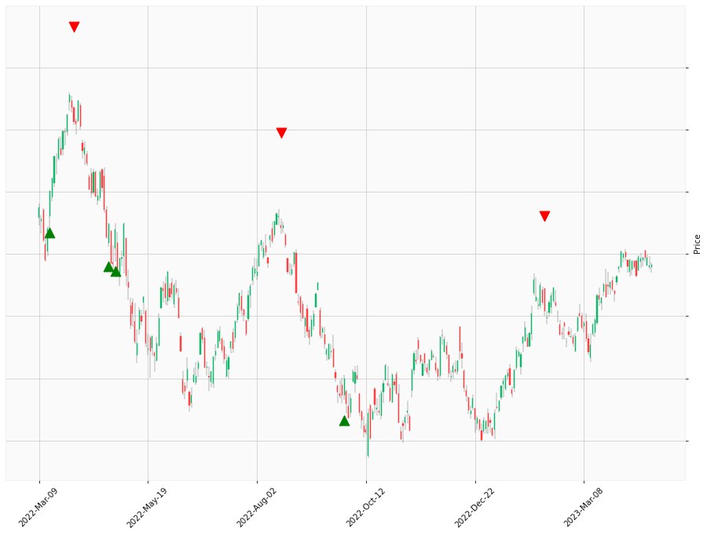

    

<table class="hits">
    <tr>
        <th>Direction</th>
        <th>Date</th>
      </tr>
    <tr>
        <td>Short</td>
        <td>Aug 10 2021 15:00 PST</td>
    </tr>
    <tr>
        <td>Short</td>
        <td>Nov 08 2021 15:00 PST</td>
    </tr>
    <tr>
        <td>Short</td>
        <td>Nov 10 2021 15:00 PST</td>
    </tr>
    <tr>
        <td>Short</td>
        <td>Nov 23 2021 15:00 PST</td>
    </tr>
    <tr>
        <td>Short</td>
        <td>Dec 01 2021 15:00 PST</td>
    </tr>
    <tr>
        <td>Long</td>
        <td>Mar 16 2022 15:00 PST</td>
    </tr>
    <tr>
        <td>Short</td>
        <td>Mar 31 2022 15:00 PST</td>
    </tr>
    <tr>
        <td>Long</td>
        <td>Apr 25 2022 15:00 PST</td>
    </tr>
    <tr>
        <td>Long</td>
        <td>Apr 28 2022 15:00 PST</td>
    </tr>
    <tr>
        <td>Short</td>
        <td>Aug 17 2022 15:00 PST</td>
    </tr>
    <tr>
        <td>Long</td>
        <td>Sep 28 2022 15:00 PST</td>
    </tr>
    <tr>
        <td>Short</td>
        <td>Feb 09 2023 15:00 PST</td>
    </tr>
    
</table>

