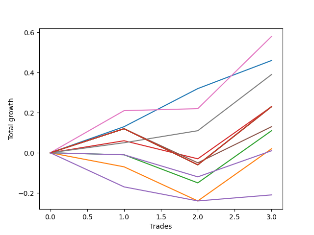

# Long Bernese 001 50 
- Symbol: QQQ
- Date Range: 05/27/2022 - 09/30/2022
- Trading Period: 7:20-12:30
- Number of Trades: 3



| Name | Win Percent | Profit | Avg Profit / Trade | Avg Time / Trade |      | Name | Win Percent | Profit | Avg Profit / Trade | Avg Time / Trade |
| ---- | ----------- | ------ | ------------------ | ---------------- | ---- | ---- | ----------- | ------ | ------------------ | ---------------- |
| Sorted By <br> Profit | | | | | | Sorted By <br> Win Percentage ||||
| Five | 100.00 | 290.00 | 96.67 | 49:30 |     | Five | 100.00 | 290.00 | 96.67 | 49:30 |
| Zero | 100.00 | 230.00 | 76.67 | 02:43 |     | Zero | 100.00 | 230.00 | 76.67 | 02:43 |
| Six | 100.00 | 195.00 | 65.00 | 03:20 |     | Six | 100.00 | 195.00 | 65.00 | 03:20 |
| Eighty-Five | 66.67 | 115.00 | 38.33 | 59:55 |     | Eighty-Five | 66.67 | 115.00 | 38.33 | 59:55 |
| Eighty-Four | 66.67 | 115.00 | 38.33 | 59:55 |     | Eighty-Four | 66.67 | 115.00 | 38.33 | 59:55 |
| Eighty-Three | 66.67 | 115.00 | 38.33 | 59:55 |     | Eighty-Three | 66.67 | 115.00 | 38.33 | 59:55 |
| Eighty-Two | 66.67 | 115.00 | 38.33 | 59:55 |     | Eighty-Two | 66.67 | 115.00 | 38.33 | 59:55 |
| Eighty-One | 66.67 | 115.00 | 38.33 | 59:55 |     | Eighty-One | 66.67 | 115.00 | 38.33 | 59:55 |
| Seven | 66.67 | 115.00 | 38.33 | 59:55 |     | Seven | 66.67 | 115.00 | 38.33 | 59:55 |
| Two_C | 66.67 | 115.00 | 38.33 | 24:15 |     | Two_C | 66.67 | 115.00 | 38.33 | 24:15 |
| Four | 66.67 | 65.00 | 21.67 | 40:40 |     | Four | 66.67 | 65.00 | 21.67 | 40:40 |
| Two | 33.33 | 55.00 | 18.33 | 23:41 |     | Two | 33.33 | 55.00 | 18.33 | 23:41 |
| One | 33.33 | 10.00 | 3.33 | 14:25 |     | One | 33.33 | 10.00 | 3.33 | 14:25 |
| Three | 33.33 | 5.00 | 1.67 | 17:55 |     | Three | 33.33 | 5.00 | 1.67 | 17:55 |
| NEWFI 0000 | 33.33 | -105.00 | -35.00 | 48:05 |     | NEWFI 0000 | 33.33 | -105.00 | -35.00 | 48:05 |

## NO STOPLOSS

### Test Zero
* Sell when price hits the middle line of the 20p bollinger
* No Stoploss
* Results:
```
Total Trades: 3
Percent Up: 100.00
Percent Down: 0.00
Total Points Moved Up: 0.46
Potential Profit: 230.00
Total Points Ups: 0.46 Count Ups: 3
Total Points Downs: 0.00 Count Downs: 0
```

<details><summary>Trades</summary>

<code>In: 2022-06-21 09:02:00		Out: 2022-06-21 09:02:25		Total Position Time: 00:25		Total Move Up: 0.13		Total to Date: 0.13</code> <br />
<code>In: 2022-07-15 09:04:00		Out: 2022-07-15 09:04:40		Total Position Time: 00:40		Total Move Up: 0.19		Total to Date: 0.32</code> <br />
<code>In: 2022-08-25 09:19:00		Out: 2022-08-25 09:26:05		Total Position Time: 07:05		Total Move Up: 0.14		Total to Date: 0.46</code> <br />


</details>

### Test One
* Sell when the price hits the upper line of the 20p 1std bollinger
* No Stoploss
* Results:
```
Total Trades: 3
Percent Up: 33.33
Percent Down: 66.67
Total Points Moved Up: 0.02
Potential Profit: 10.00
Total Points Ups: 0.26 Count Ups: 1
Total Points Downs: -0.24 Count Downs: 2
```

<details><summary>Trades</summary>

<code>In: 2022-06-21 09:02:00		Out: 2022-06-21 09:16:20		Total Position Time: 14:20		Total Move Up: -0.07		Total to Date: -0.07</code> <br />
<code>In: 2022-07-15 09:04:00		Out: 2022-07-15 09:23:30		Total Position Time: 19:30		Total Move Up: -0.17		Total to Date: -0.24</code> <br />
<code>In: 2022-08-25 09:19:00		Out: 2022-08-25 09:28:25		Total Position Time: 09:25		Total Move Up: 0.26		Total to Date: 0.02</code> <br />


</details>

### Test Two
* Sell when the price hits the upper line of the 20p 2std bollinger
* No Stoploss
* Results:
```
Total Trades: 3
Percent Up: 33.33
Percent Down: 66.67
Total Points Moved Up: 0.11
Potential Profit: 55.00
Total Points Ups: 0.26 Count Ups: 1
Total Points Downs: -0.15 Count Downs: 2
```

<details><summary>Trades</summary>

<code>In: 2022-06-21 09:02:00		Out: 2022-06-21 09:36:00		Total Position Time: 34:00		Total Move Up: -0.01		Total to Date: -0.01</code> <br />
<code>In: 2022-07-15 09:04:00		Out: 2022-07-15 09:26:15		Total Position Time: 22:15		Total Move Up: -0.14		Total to Date: -0.15</code> <br />
<code>In: 2022-08-25 09:19:00		Out: 2022-08-25 09:33:50		Total Position Time: 14:50		Total Move Up: 0.26		Total to Date: 0.11</code> <br />


</details>

### Test Two_C
* Sell when the price hits the upper line of the 20p 2std bollinger
* No Stoploss
* Results:
```
Total Trades: 3
Percent Up: 66.67
Percent Down: 33.33
Total Points Moved Up: 0.23
Potential Profit: 115.00
Total Points Ups: 0.32 Count Ups: 2
Total Points Downs: -0.09 Count Downs: 1
```

<details><summary>Trades</summary>

<code>In: 2022-06-21 09:02:00		Out: 2022-06-21 09:37:30		Total Position Time: 35:30		Total Move Up: 0.06		Total to Date: 0.06</code> <br />
<code>In: 2022-07-15 09:04:00		Out: 2022-07-15 09:26:25		Total Position Time: 22:25		Total Move Up: -0.09		Total to Date: -0.03</code> <br />
<code>In: 2022-08-25 09:19:00		Out: 2022-08-25 09:33:50		Total Position Time: 14:50		Total Move Up: 0.26		Total to Date: 0.23</code> <br />


</details>

### Test Three
* Sell when price hits the middle line of the 50p bollinger
* No Stoploss
* Results:
```
Total Trades: 3
Percent Up: 33.33
Percent Down: 66.67
Total Points Moved Up: 0.01
Potential Profit: 5.00
Total Points Ups: 0.13 Count Ups: 1
Total Points Downs: -0.12 Count Downs: 2
```

<details><summary>Trades</summary>

<code>In: 2022-06-21 09:02:00		Out: 2022-06-21 09:20:20		Total Position Time: 18:20		Total Move Up: -0.01		Total to Date: -0.01</code> <br />
<code>In: 2022-07-15 09:04:00		Out: 2022-07-15 09:32:05		Total Position Time: 28:05		Total Move Up: -0.11		Total to Date: -0.12</code> <br />
<code>In: 2022-08-25 09:19:00		Out: 2022-08-25 09:26:20		Total Position Time: 07:20		Total Move Up: 0.13		Total to Date: 0.01</code> <br />


</details>

### Test Four
* Sell when the price hits the upper line of the 50p 1std bollinger
* No Stoploss
* Results:
```
Total Trades: 3
Percent Up: 66.67
Percent Down: 33.33
Total Points Moved Up: 0.13
Potential Profit: 65.00
Total Points Ups: 0.30 Count Ups: 2
Total Points Downs: -0.17 Count Downs: 1
```

<details><summary>Trades</summary>

<code>In: 2022-06-21 09:02:00		Out: 2022-06-21 09:37:35		Total Position Time: 35:35		Total Move Up: 0.12		Total to Date: 0.12</code> <br />
<code>In: 2022-07-15 09:04:00		Out: 2022-07-15 09:47:40		Total Position Time: 43:40		Total Move Up: -0.17		Total to Date: -0.05</code> <br />
<code>In: 2022-08-25 09:19:00		Out: 2022-08-25 10:01:45		Total Position Time: 42:45		Total Move Up: 0.18		Total to Date: 0.13</code> <br />


</details>

### Test Five
* Sell when the price hits the upper line of the 50p 2std bollinger
* No Stoploss
* Results:
```
Total Trades: 3
Percent Up: 100.00
Percent Down: 0.00
Total Points Moved Up: 0.58
Potential Profit: 290.00
Total Points Ups: 0.58 Count Ups: 3
Total Points Downs: 0.00 Count Downs: 0
```

<details><summary>Trades</summary>

<code>In: 2022-06-21 09:02:00		Out: 2022-06-21 09:54:55		Total Position Time: 52:55		Total Move Up: 0.21		Total to Date: 0.21</code> <br />
<code>In: 2022-07-15 09:04:00		Out: 2022-07-15 09:49:40		Total Position Time: 45:40		Total Move Up: 0.01		Total to Date: 0.22</code> <br />
<code>In: 2022-08-25 09:19:00		Out: 2022-08-25 10:08:55		Total Position Time: 49:55		Total Move Up: 0.36		Total to Date: 0.58</code> <br />


</details>

### Test Six
* Sell when the price hits the middle line of the 1std VWAP
* No Stoploss
* Results:
```
Total Trades: 3
Percent Up: 100.00
Percent Down: 0.00
Total Points Moved Up: 0.39
Potential Profit: 195.00
Total Points Ups: 0.39 Count Ups: 3
Total Points Downs: 0.00 Count Downs: 0
```

<details><summary>Trades</summary>

<code>In: 2022-06-21 09:02:00		Out: 2022-06-21 09:02:10		Total Position Time: 00:10		Total Move Up: 0.05		Total to Date: 0.05</code> <br />
<code>In: 2022-07-15 09:04:00		Out: 2022-07-15 09:04:10		Total Position Time: 00:10		Total Move Up: 0.06		Total to Date: 0.11</code> <br />
<code>In: 2022-08-25 09:19:00		Out: 2022-08-25 09:28:40		Total Position Time: 09:40		Total Move Up: 0.28		Total to Date: 0.39</code> <br />


</details>

### Test Seven
* Sell when the price hits the upper line of the 1std VWAP
* No Stoploss
* Results:
```
Total Trades: 3
Percent Up: 66.67
Percent Down: 33.33
Total Points Moved Up: 0.23
Potential Profit: 115.00
Total Points Ups: 0.41 Count Ups: 2
Total Points Downs: -0.18 Count Downs: 1
```

<details><summary>Trades</summary>

<code>In: 2022-06-21 09:02:00		Out: 2022-06-21 10:01:55		Total Position Time: 59:55		Total Move Up: 0.12		Total to Date: 0.12</code> <br />
<code>In: 2022-07-15 09:04:00		Out: 2022-07-15 10:03:55		Total Position Time: 59:55		Total Move Up: -0.18		Total to Date: -0.06</code> <br />
<code>In: 2022-08-25 09:19:00		Out: 2022-08-25 10:18:55		Total Position Time: 59:55		Total Move Up: 0.29		Total to Date: 0.23</code> <br />


</details>

## TAKE PROFIT

### Test Eighty-One
* Take Profit of 1 Point
* No Stoploss
* Results:
```
Total Trades: 3
Percent Up: 66.67
Percent Down: 33.33
Total Points Moved Up: 0.23
Potential Profit: 115.00
Total Points Ups: 0.41 Count Ups: 2
Total Points Downs: -0.18 Count Downs: 1
```

<details><summary>Trades</summary>

<code>In: 2022-06-21 09:02:00		Out: 2022-06-21 10:01:55		Total Position Time: 59:55		Total Move Up: 0.12		Total to Date: 0.12</code> <br />
<code>In: 2022-07-15 09:04:00		Out: 2022-07-15 10:03:55		Total Position Time: 59:55		Total Move Up: -0.18		Total to Date: -0.06</code> <br />
<code>In: 2022-08-25 09:19:00		Out: 2022-08-25 10:18:55		Total Position Time: 59:55		Total Move Up: 0.29		Total to Date: 0.23</code> <br />


</details>

### Test Eighty-Two
* Take Profit of 2 Point
* No Stoploss
* Results:
```
Total Trades: 3
Percent Up: 66.67
Percent Down: 33.33
Total Points Moved Up: 0.23
Potential Profit: 115.00
Total Points Ups: 0.41 Count Ups: 2
Total Points Downs: -0.18 Count Downs: 1
```

<details><summary>Trades</summary>

<code>In: 2022-06-21 09:02:00		Out: 2022-06-21 10:01:55		Total Position Time: 59:55		Total Move Up: 0.12		Total to Date: 0.12</code> <br />
<code>In: 2022-07-15 09:04:00		Out: 2022-07-15 10:03:55		Total Position Time: 59:55		Total Move Up: -0.18		Total to Date: -0.06</code> <br />
<code>In: 2022-08-25 09:19:00		Out: 2022-08-25 10:18:55		Total Position Time: 59:55		Total Move Up: 0.29		Total to Date: 0.23</code> <br />


</details>

### Test Eighty-Three
* Take Profit of 3 Point
* No Stoploss
* Results:
```
Total Trades: 3
Percent Up: 66.67
Percent Down: 33.33
Total Points Moved Up: 0.23
Potential Profit: 115.00
Total Points Ups: 0.41 Count Ups: 2
Total Points Downs: -0.18 Count Downs: 1
```

<details><summary>Trades</summary>

<code>In: 2022-06-21 09:02:00		Out: 2022-06-21 10:01:55		Total Position Time: 59:55		Total Move Up: 0.12		Total to Date: 0.12</code> <br />
<code>In: 2022-07-15 09:04:00		Out: 2022-07-15 10:03:55		Total Position Time: 59:55		Total Move Up: -0.18		Total to Date: -0.06</code> <br />
<code>In: 2022-08-25 09:19:00		Out: 2022-08-25 10:18:55		Total Position Time: 59:55		Total Move Up: 0.29		Total to Date: 0.23</code> <br />


</details>

### Test Eighty-Four
* Take Profit of 4 Point
* No Stoploss
* Results:
```
Total Trades: 3
Percent Up: 66.67
Percent Down: 33.33
Total Points Moved Up: 0.23
Potential Profit: 115.00
Total Points Ups: 0.41 Count Ups: 2
Total Points Downs: -0.18 Count Downs: 1
```

<details><summary>Trades</summary>

<code>In: 2022-06-21 09:02:00		Out: 2022-06-21 10:01:55		Total Position Time: 59:55		Total Move Up: 0.12		Total to Date: 0.12</code> <br />
<code>In: 2022-07-15 09:04:00		Out: 2022-07-15 10:03:55		Total Position Time: 59:55		Total Move Up: -0.18		Total to Date: -0.06</code> <br />
<code>In: 2022-08-25 09:19:00		Out: 2022-08-25 10:18:55		Total Position Time: 59:55		Total Move Up: 0.29		Total to Date: 0.23</code> <br />


</details>

### Test Eighty-Five
* Take Profit of 5 Point
* No Stoploss
* Results:
```
Total Trades: 3
Percent Up: 66.67
Percent Down: 33.33
Total Points Moved Up: 0.23
Potential Profit: 115.00
Total Points Ups: 0.41 Count Ups: 2
Total Points Downs: -0.18 Count Downs: 1
```

<details><summary>Trades</summary>

<code>In: 2022-06-21 09:02:00		Out: 2022-06-21 10:01:55		Total Position Time: 59:55		Total Move Up: 0.12		Total to Date: 0.12</code> <br />
<code>In: 2022-07-15 09:04:00		Out: 2022-07-15 10:03:55		Total Position Time: 59:55		Total Move Up: -0.18		Total to Date: -0.06</code> <br />
<code>In: 2022-08-25 09:19:00		Out: 2022-08-25 10:18:55		Total Position Time: 59:55		Total Move Up: 0.29		Total to Date: 0.23</code> <br />


</details>

## Indicator Exits

### Test NEWFI 0000
* Newfi 0000
* No Stoploss
* Results:
```
Total Trades: 3
Percent Up: 33.33
Percent Down: 66.67
Total Points Moved Up: -0.21
Potential Profit: -105.00
Total Points Ups: 0.03 Count Ups: 1
Total Points Downs: -0.24 Count Downs: 2
```

<details><summary>Trades</summary>

<code>In: 2022-06-21 09:02:00		Out: 2022-06-21 09:48:05		Total Position Time: 46:05		Total Move Up: -0.17		Total to Date: -0.17</code> <br />
<code>In: 2022-07-15 09:04:00		Out: 2022-07-15 09:51:05		Total Position Time: 47:05		Total Move Up: -0.07		Total to Date: -0.24</code> <br />
<code>In: 2022-08-25 09:19:00		Out: 2022-08-25 10:10:05		Total Position Time: 51:05		Total Move Up: 0.03		Total to Date: -0.21</code> <br />


</details>