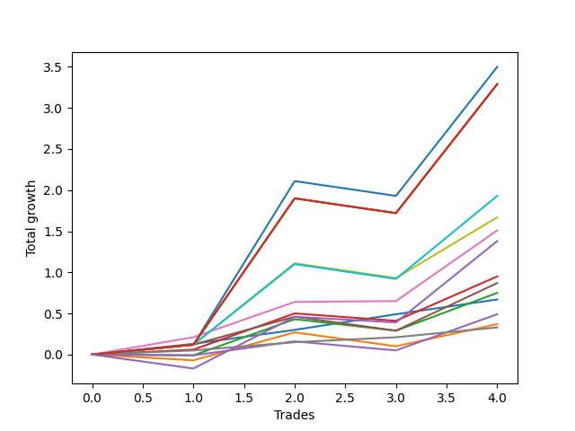

# Long Bernese 002 50 
- Symbol: QQQ
- Date Range: 05/27/2022 - 09/30/2022
- Trading Period: 7:20-12:30
- Number of Trades: 4



| Name | Win Percent | Profit | Avg Profit / Trade | Avg Time / Trade |      | Name | Win Percent | Profit | Avg Profit / Trade | Avg Time / Trade |
| ---- | ----------- | ------ | ------------------ | ---------------- | ---- | ---- | ----------- | ------ | ------------------ | ---------------- |
| Sorted By <br> Profit | | | | | | Sorted By <br> Win Percentage ||||
| Eighty-Two | 75.00 | 1750.00 | 437.50 | 56:15 |     | Five | 100.00 | 755.00 | 188.75 | 31:32 |
| Eighty-Five | 75.00 | 1645.00 | 411.25 | 59:55 |     | Zero | 100.00 | 335.00 | 83.75 | 00:55 |
| Eighty-Four | 75.00 | 1645.00 | 411.25 | 59:55 |     | Six | 100.00 | 165.00 | 41.25 | 00:30 |
| Eighty-Three | 75.00 | 1645.00 | 411.25 | 59:55 |     | Eighty-Two | 75.00 | 1750.00 | 437.50 | 56:15 |
| Eighty-One | 75.00 | 965.00 | 241.25 | 38:35 |     | Eighty-Five | 75.00 | 1645.00 | 411.25 | 59:55 |
| Seven | 75.00 | 835.00 | 208.75 | 36:17 |     | Eighty-Four | 75.00 | 1645.00 | 411.25 | 59:55 |
| Five | 100.00 | 755.00 | 188.75 | 31:32 |     | Eighty-Three | 75.00 | 1645.00 | 411.25 | 59:55 |
| NEWFI 0000 | 50.00 | 690.00 | 172.50 | 32:05 |     | Eighty-One | 75.00 | 965.00 | 241.25 | 38:35 |
| Two_C | 75.00 | 475.00 | 118.75 | 18:12 |     | Seven | 75.00 | 835.00 | 208.75 | 36:17 |
| Four | 75.00 | 435.00 | 108.75 | 22:50 |     | Two_C | 75.00 | 475.00 | 118.75 | 18:12 |
| Two | 50.00 | 375.00 | 93.75 | 17:11 |     | Four | 75.00 | 435.00 | 108.75 | 22:50 |
| Zero | 100.00 | 335.00 | 83.75 | 00:55 |     | NEWFI 0000 | 50.00 | 690.00 | 172.50 | 32:05 |
| Three | 50.00 | 245.00 | 61.25 | 13:31 |     | Two | 50.00 | 375.00 | 93.75 | 17:11 |
| One | 50.00 | 185.00 | 46.25 | 10:26 |     | Three | 50.00 | 245.00 | 61.25 | 13:31 |
| Six | 100.00 | 165.00 | 41.25 | 00:30 |     | One | 50.00 | 185.00 | 46.25 | 10:26 |

## NO STOPLOSS

### Test Zero
* Sell when price hits the middle line of the 20p bollinger
* No Stoploss
* Results:
```
Total Trades: 4
Percent Up: 100.00
Percent Down: 0.00
Total Points Moved Up: 0.67
Potential Profit: 335.00
Total Points Ups: 0.67 Count Ups: 4
Total Points Downs: 0.00 Count Downs: 0
```

<details><summary>Trades</summary>

<code>In: 2022-06-21 09:02:00		Out: 2022-06-21 09:02:25		Total Position Time: 00:25		Total Move Up: 0.13		Total to Date: 0.13</code> <br />
<code>In: 2022-07-11 09:56:00		Out: 2022-07-11 09:58:15		Total Position Time: 02:15		Total Move Up: 0.17		Total to Date: 0.30</code> <br />
<code>In: 2022-07-15 09:04:00		Out: 2022-07-15 09:04:40		Total Position Time: 00:40		Total Move Up: 0.19		Total to Date: 0.49</code> <br />
<code>In: 2022-09-09 09:28:00		Out: 2022-09-09 09:28:20		Total Position Time: 00:20		Total Move Up: 0.18		Total to Date: 0.67</code> <br />


</details>

### Test One
* Sell when the price hits the upper line of the 20p 1std bollinger
* No Stoploss
* Results:
```
Total Trades: 4
Percent Up: 50.00
Percent Down: 50.00
Total Points Moved Up: 0.37
Potential Profit: 185.00
Total Points Ups: 0.61 Count Ups: 2
Total Points Downs: -0.24 Count Downs: 2
```

<details><summary>Trades</summary>

<code>In: 2022-06-21 09:02:00		Out: 2022-06-21 09:16:20		Total Position Time: 14:20		Total Move Up: -0.07		Total to Date: -0.07</code> <br />
<code>In: 2022-07-11 09:56:00		Out: 2022-07-11 09:58:50		Total Position Time: 02:50		Total Move Up: 0.34		Total to Date: 0.27</code> <br />
<code>In: 2022-07-15 09:04:00		Out: 2022-07-15 09:23:30		Total Position Time: 19:30		Total Move Up: -0.17		Total to Date: 0.10</code> <br />
<code>In: 2022-09-09 09:28:00		Out: 2022-09-09 09:33:05		Total Position Time: 05:05		Total Move Up: 0.27		Total to Date: 0.37</code> <br />


</details>

### Test Two
* Sell when the price hits the upper line of the 20p 2std bollinger
* No Stoploss
* Results:
```
Total Trades: 4
Percent Up: 50.00
Percent Down: 50.00
Total Points Moved Up: 0.75
Potential Profit: 375.00
Total Points Ups: 0.90 Count Ups: 2
Total Points Downs: -0.15 Count Downs: 2
```

<details><summary>Trades</summary>

<code>In: 2022-06-21 09:02:00		Out: 2022-06-21 09:36:00		Total Position Time: 34:00		Total Move Up: -0.01		Total to Date: -0.01</code> <br />
<code>In: 2022-07-11 09:56:00		Out: 2022-07-11 10:02:35		Total Position Time: 06:35		Total Move Up: 0.44		Total to Date: 0.43</code> <br />
<code>In: 2022-07-15 09:04:00		Out: 2022-07-15 09:26:15		Total Position Time: 22:15		Total Move Up: -0.14		Total to Date: 0.29</code> <br />
<code>In: 2022-09-09 09:28:00		Out: 2022-09-09 09:33:55		Total Position Time: 05:55		Total Move Up: 0.46		Total to Date: 0.75</code> <br />


</details>

### Test Two_C
* Sell when the price hits the upper line of the 20p 2std bollinger
* No Stoploss
* Results:
```
Total Trades: 4
Percent Up: 75.00
Percent Down: 25.00
Total Points Moved Up: 0.95
Potential Profit: 475.00
Total Points Ups: 1.04 Count Ups: 3
Total Points Downs: -0.09 Count Downs: 1
```

<details><summary>Trades</summary>

<code>In: 2022-06-21 09:02:00		Out: 2022-06-21 09:37:30		Total Position Time: 35:30		Total Move Up: 0.06		Total to Date: 0.06</code> <br />
<code>In: 2022-07-11 09:56:00		Out: 2022-07-11 10:02:35		Total Position Time: 06:35		Total Move Up: 0.44		Total to Date: 0.50</code> <br />
<code>In: 2022-07-15 09:04:00		Out: 2022-07-15 09:26:25		Total Position Time: 22:25		Total Move Up: -0.09		Total to Date: 0.41</code> <br />
<code>In: 2022-09-09 09:28:00		Out: 2022-09-09 09:36:20		Total Position Time: 08:20		Total Move Up: 0.54		Total to Date: 0.95</code> <br />


</details>

### Test Three
* Sell when price hits the middle line of the 50p bollinger
* No Stoploss
* Results:
```
Total Trades: 4
Percent Up: 50.00
Percent Down: 50.00
Total Points Moved Up: 0.49
Potential Profit: 245.00
Total Points Ups: 0.61 Count Ups: 2
Total Points Downs: -0.12 Count Downs: 2
```

<details><summary>Trades</summary>

<code>In: 2022-06-21 09:02:00		Out: 2022-06-21 09:20:20		Total Position Time: 18:20		Total Move Up: -0.01		Total to Date: -0.01</code> <br />
<code>In: 2022-07-11 09:56:00		Out: 2022-07-11 09:58:15		Total Position Time: 02:15		Total Move Up: 0.17		Total to Date: 0.16</code> <br />
<code>In: 2022-07-15 09:04:00		Out: 2022-07-15 09:32:05		Total Position Time: 28:05		Total Move Up: -0.11		Total to Date: 0.05</code> <br />
<code>In: 2022-09-09 09:28:00		Out: 2022-09-09 09:33:25		Total Position Time: 05:25		Total Move Up: 0.44		Total to Date: 0.49</code> <br />


</details>

### Test Four
* Sell when the price hits the upper line of the 50p 1std bollinger
* No Stoploss
* Results:
```
Total Trades: 4
Percent Up: 75.00
Percent Down: 25.00
Total Points Moved Up: 0.87
Potential Profit: 435.00
Total Points Ups: 1.04 Count Ups: 3
Total Points Downs: -0.17 Count Downs: 1
```

<details><summary>Trades</summary>

<code>In: 2022-06-21 09:02:00		Out: 2022-06-21 09:37:35		Total Position Time: 35:35		Total Move Up: 0.12		Total to Date: 0.12</code> <br />
<code>In: 2022-07-11 09:56:00		Out: 2022-07-11 09:58:50		Total Position Time: 02:50		Total Move Up: 0.34		Total to Date: 0.46</code> <br />
<code>In: 2022-07-15 09:04:00		Out: 2022-07-15 09:47:40		Total Position Time: 43:40		Total Move Up: -0.17		Total to Date: 0.29</code> <br />
<code>In: 2022-09-09 09:28:00		Out: 2022-09-09 09:37:15		Total Position Time: 09:15		Total Move Up: 0.58		Total to Date: 0.87</code> <br />


</details>

### Test Five
* Sell when the price hits the upper line of the 50p 2std bollinger
* No Stoploss
* Results:
```
Total Trades: 4
Percent Up: 100.00
Percent Down: 0.00
Total Points Moved Up: 1.51
Potential Profit: 755.00
Total Points Ups: 1.51 Count Ups: 4
Total Points Downs: 0.00 Count Downs: 0
```

<details><summary>Trades</summary>

<code>In: 2022-06-21 09:02:00		Out: 2022-06-21 09:54:55		Total Position Time: 52:55		Total Move Up: 0.21		Total to Date: 0.21</code> <br />
<code>In: 2022-07-11 09:56:00		Out: 2022-07-11 10:02:40		Total Position Time: 06:40		Total Move Up: 0.43		Total to Date: 0.64</code> <br />
<code>In: 2022-07-15 09:04:00		Out: 2022-07-15 09:49:40		Total Position Time: 45:40		Total Move Up: 0.01		Total to Date: 0.65</code> <br />
<code>In: 2022-09-09 09:28:00		Out: 2022-09-09 09:48:55		Total Position Time: 20:55		Total Move Up: 0.86		Total to Date: 1.51</code> <br />


</details>

### Test Six
* Sell when the price hits the middle line of the 1std VWAP
* No Stoploss
* Results:
```
Total Trades: 4
Percent Up: 100.00
Percent Down: 0.00
Total Points Moved Up: 0.33
Potential Profit: 165.00
Total Points Ups: 0.33 Count Ups: 4
Total Points Downs: 0.00 Count Downs: 0
```

<details><summary>Trades</summary>

<code>In: 2022-06-21 09:02:00		Out: 2022-06-21 09:02:10		Total Position Time: 00:10		Total Move Up: 0.05		Total to Date: 0.05</code> <br />
<code>In: 2022-07-11 09:56:00		Out: 2022-07-11 09:57:30		Total Position Time: 01:30		Total Move Up: 0.10		Total to Date: 0.15</code> <br />
<code>In: 2022-07-15 09:04:00		Out: 2022-07-15 09:04:10		Total Position Time: 00:10		Total Move Up: 0.06		Total to Date: 0.21</code> <br />
<code>In: 2022-09-09 09:28:00		Out: 2022-09-09 09:28:10		Total Position Time: 00:10		Total Move Up: 0.12		Total to Date: 0.33</code> <br />


</details>

### Test Seven
* Sell when the price hits the upper line of the 1std VWAP
* No Stoploss
* Results:
```
Total Trades: 4
Percent Up: 75.00
Percent Down: 25.00
Total Points Moved Up: 1.67
Potential Profit: 835.00
Total Points Ups: 1.85 Count Ups: 3
Total Points Downs: -0.18 Count Downs: 1
```

<details><summary>Trades</summary>

<code>In: 2022-06-21 09:02:00		Out: 2022-06-21 10:01:55		Total Position Time: 59:55		Total Move Up: 0.12		Total to Date: 0.12</code> <br />
<code>In: 2022-07-11 09:56:00		Out: 2022-07-11 10:07:30		Total Position Time: 11:30		Total Move Up: 0.99		Total to Date: 1.11</code> <br />
<code>In: 2022-07-15 09:04:00		Out: 2022-07-15 10:03:55		Total Position Time: 59:55		Total Move Up: -0.18		Total to Date: 0.93</code> <br />
<code>In: 2022-09-09 09:28:00		Out: 2022-09-09 09:41:50		Total Position Time: 13:50		Total Move Up: 0.74		Total to Date: 1.67</code> <br />


</details>

## TAKE PROFIT

### Test Eighty-One
* Take Profit of 1 Point
* No Stoploss
* Results:
```
Total Trades: 4
Percent Up: 75.00
Percent Down: 25.00
Total Points Moved Up: 1.93
Potential Profit: 965.00
Total Points Ups: 2.11 Count Ups: 3
Total Points Downs: -0.18 Count Downs: 1
```

<details><summary>Trades</summary>

<code>In: 2022-06-21 09:02:00		Out: 2022-06-21 10:01:55		Total Position Time: 59:55		Total Move Up: 0.12		Total to Date: 0.12</code> <br />
<code>In: 2022-07-11 09:56:00		Out: 2022-07-11 10:07:35		Total Position Time: 11:35		Total Move Up: 0.98		Total to Date: 1.10</code> <br />
<code>In: 2022-07-15 09:04:00		Out: 2022-07-15 10:03:55		Total Position Time: 59:55		Total Move Up: -0.18		Total to Date: 0.92</code> <br />
<code>In: 2022-09-09 09:28:00		Out: 2022-09-09 09:50:55		Total Position Time: 22:55		Total Move Up: 1.01		Total to Date: 1.93</code> <br />


</details>

### Test Eighty-Two
* Take Profit of 2 Point
* No Stoploss
* Results:
```
Total Trades: 4
Percent Up: 75.00
Percent Down: 25.00
Total Points Moved Up: 3.50
Potential Profit: 1750.00
Total Points Ups: 3.68 Count Ups: 3
Total Points Downs: -0.18 Count Downs: 1
```

<details><summary>Trades</summary>

<code>In: 2022-06-21 09:02:00		Out: 2022-06-21 10:01:55		Total Position Time: 59:55		Total Move Up: 0.12		Total to Date: 0.12</code> <br />
<code>In: 2022-07-11 09:56:00		Out: 2022-07-11 10:41:15		Total Position Time: 45:15		Total Move Up: 1.99		Total to Date: 2.11</code> <br />
<code>In: 2022-07-15 09:04:00		Out: 2022-07-15 10:03:55		Total Position Time: 59:55		Total Move Up: -0.18		Total to Date: 1.93</code> <br />
<code>In: 2022-09-09 09:28:00		Out: 2022-09-09 10:27:55		Total Position Time: 59:55		Total Move Up: 1.57		Total to Date: 3.50</code> <br />


</details>

### Test Eighty-Three
* Take Profit of 3 Point
* No Stoploss
* Results:
```
Total Trades: 4
Percent Up: 75.00
Percent Down: 25.00
Total Points Moved Up: 3.29
Potential Profit: 1645.00
Total Points Ups: 3.47 Count Ups: 3
Total Points Downs: -0.18 Count Downs: 1
```

<details><summary>Trades</summary>

<code>In: 2022-06-21 09:02:00		Out: 2022-06-21 10:01:55		Total Position Time: 59:55		Total Move Up: 0.12		Total to Date: 0.12</code> <br />
<code>In: 2022-07-11 09:56:00		Out: 2022-07-11 10:55:55		Total Position Time: 59:55		Total Move Up: 1.78		Total to Date: 1.90</code> <br />
<code>In: 2022-07-15 09:04:00		Out: 2022-07-15 10:03:55		Total Position Time: 59:55		Total Move Up: -0.18		Total to Date: 1.72</code> <br />
<code>In: 2022-09-09 09:28:00		Out: 2022-09-09 10:27:55		Total Position Time: 59:55		Total Move Up: 1.57		Total to Date: 3.29</code> <br />


</details>

### Test Eighty-Four
* Take Profit of 4 Point
* No Stoploss
* Results:
```
Total Trades: 4
Percent Up: 75.00
Percent Down: 25.00
Total Points Moved Up: 3.29
Potential Profit: 1645.00
Total Points Ups: 3.47 Count Ups: 3
Total Points Downs: -0.18 Count Downs: 1
```

<details><summary>Trades</summary>

<code>In: 2022-06-21 09:02:00		Out: 2022-06-21 10:01:55		Total Position Time: 59:55		Total Move Up: 0.12		Total to Date: 0.12</code> <br />
<code>In: 2022-07-11 09:56:00		Out: 2022-07-11 10:55:55		Total Position Time: 59:55		Total Move Up: 1.78		Total to Date: 1.90</code> <br />
<code>In: 2022-07-15 09:04:00		Out: 2022-07-15 10:03:55		Total Position Time: 59:55		Total Move Up: -0.18		Total to Date: 1.72</code> <br />
<code>In: 2022-09-09 09:28:00		Out: 2022-09-09 10:27:55		Total Position Time: 59:55		Total Move Up: 1.57		Total to Date: 3.29</code> <br />


</details>

### Test Eighty-Five
* Take Profit of 5 Point
* No Stoploss
* Results:
```
Total Trades: 4
Percent Up: 75.00
Percent Down: 25.00
Total Points Moved Up: 3.29
Potential Profit: 1645.00
Total Points Ups: 3.47 Count Ups: 3
Total Points Downs: -0.18 Count Downs: 1
```

<details><summary>Trades</summary>

<code>In: 2022-06-21 09:02:00		Out: 2022-06-21 10:01:55		Total Position Time: 59:55		Total Move Up: 0.12		Total to Date: 0.12</code> <br />
<code>In: 2022-07-11 09:56:00		Out: 2022-07-11 10:55:55		Total Position Time: 59:55		Total Move Up: 1.78		Total to Date: 1.90</code> <br />
<code>In: 2022-07-15 09:04:00		Out: 2022-07-15 10:03:55		Total Position Time: 59:55		Total Move Up: -0.18		Total to Date: 1.72</code> <br />
<code>In: 2022-09-09 09:28:00		Out: 2022-09-09 10:27:55		Total Position Time: 59:55		Total Move Up: 1.57		Total to Date: 3.29</code> <br />


</details>

## Indicator Exits

### Test NEWFI 0000
* Newfi 0000
* No Stoploss
* Results:
```
Total Trades: 4
Percent Up: 50.00
Percent Down: 50.00
Total Points Moved Up: 1.38
Potential Profit: 690.00
Total Points Ups: 1.62 Count Ups: 2
Total Points Downs: -0.24 Count Downs: 2
```

<details><summary>Trades</summary>

<code>In: 2022-06-21 09:02:00		Out: 2022-06-21 09:48:05		Total Position Time: 46:05		Total Move Up: -0.17		Total to Date: -0.17</code> <br />
<code>In: 2022-07-11 09:56:00		Out: 2022-07-11 10:06:05		Total Position Time: 10:05		Total Move Up: 0.63		Total to Date: 0.46</code> <br />
<code>In: 2022-07-15 09:04:00		Out: 2022-07-15 09:51:05		Total Position Time: 47:05		Total Move Up: -0.07		Total to Date: 0.39</code> <br />
<code>In: 2022-09-09 09:28:00		Out: 2022-09-09 09:53:05		Total Position Time: 25:05		Total Move Up: 0.99		Total to Date: 1.38</code> <br />


</details>